Fedora 39 - Tested Hardware & Statistics (Notebooks)
----------------------------------------------------

A project to collect tested hardware configurations for Fedora 39.

Anyone can contribute to this report by the [hw-probe](https://github.com/linuxhw/hw-probe) tool:

    sudo -E hw-probe -all -upload

Please contribute! Especially if your hardware is rare.

Contents
--------

* [ Test Cases ](#test-cases)

* [ System ](#system)
  - [ Kernel                   ](#kernel)
  - [ Kernel Family            ](#kernel-family)
  - [ Kernel Major Ver.        ](#kernel-major-ver)
  - [ Arch                     ](#arch)
  - [ DE                       ](#de)
  - [ Display Server           ](#display-server)
  - [ Display Manager          ](#display-manager)
  - [ OS Lang                  ](#os-lang)
  - [ Boot Mode                ](#boot-mode)
  - [ Filesystem               ](#filesystem)
  - [ Part. scheme             ](#part-scheme)
  - [ Dual Boot with Linux/BSD ](#dual-boot-with-linuxbsd)
  - [ Dual Boot (Win)          ](#dual-boot-win)

* [ Board ](#board)
  - [ Vendor                   ](#vendor)
  - [ Model                    ](#model)
  - [ Model Family             ](#model-family)
  - [ MFG Year                 ](#mfg-year)
  - [ Form Factor              ](#form-factor)
  - [ Secure Boot              ](#secure-boot)
  - [ Coreboot                 ](#coreboot)
  - [ RAM Size                 ](#ram-size)
  - [ RAM Used                 ](#ram-used)
  - [ Total Drives             ](#total-drives)
  - [ Has CD-ROM               ](#has-cd-rom)
  - [ Has Ethernet             ](#has-ethernet)
  - [ Has WiFi                 ](#has-wifi)
  - [ Has Bluetooth            ](#has-bluetooth)

* [ Location ](#location)
  - [ Country                  ](#country)
  - [ City                     ](#city)

* [ Drives ](#drives)
  - [ Drive Vendor             ](#drive-vendor)
  - [ Drive Model              ](#drive-model)
  - [ HDD Vendor               ](#hdd-vendor)
  - [ SSD Vendor               ](#ssd-vendor)
  - [ Drive Kind               ](#drive-kind)
  - [ Drive Connector          ](#drive-connector)
  - [ Drive Size               ](#drive-size)
  - [ Space Total              ](#space-total)
  - [ Space Used               ](#space-used)
  - [ Malfunc. Drives          ](#malfunc-drives)
  - [ Malfunc. Drive Vendor    ](#malfunc-drive-vendor)
  - [ Malfunc. HDD Vendor      ](#malfunc-hdd-vendor)
  - [ Malfunc. Drive Kind      ](#malfunc-drive-kind)
  - [ Failed Drives            ](#failed-drives)
  - [ Failed Drive Vendor      ](#failed-drive-vendor)
  - [ Drive Status             ](#drive-status)

* [ Storage controller ](#storage-controller)
  - [ Storage Vendor           ](#storage-vendor)
  - [ Storage Model            ](#storage-model)
  - [ Storage Kind             ](#storage-kind)

* [ Processor ](#processor)
  - [ CPU Vendor               ](#cpu-vendor)
  - [ CPU Model                ](#cpu-model)
  - [ CPU Model Family         ](#cpu-model-family)
  - [ CPU Cores                ](#cpu-cores)
  - [ CPU Sockets              ](#cpu-sockets)
  - [ CPU Threads              ](#cpu-threads)
  - [ CPU Op-Modes             ](#cpu-op-modes)
  - [ CPU Microcode            ](#cpu-microcode)
  - [ CPU Microarch            ](#cpu-microarch)

* [ Graphics ](#graphics)
  - [ GPU Vendor               ](#gpu-vendor)
  - [ GPU Model                ](#gpu-model)
  - [ GPU Combo                ](#gpu-combo)
  - [ GPU Driver               ](#gpu-driver)
  - [ GPU Memory               ](#gpu-memory)

* [ Monitor ](#monitor)
  - [ Monitor Vendor           ](#monitor-vendor)
  - [ Monitor Model            ](#monitor-model)
  - [ Monitor Resolution       ](#monitor-resolution)
  - [ Monitor Diagonal         ](#monitor-diagonal)
  - [ Monitor Width            ](#monitor-width)
  - [ Aspect Ratio             ](#aspect-ratio)
  - [ Monitor Area             ](#monitor-area)
  - [ Pixel Density            ](#pixel-density)
  - [ Multiple Monitors        ](#multiple-monitors)

* [ Network ](#network)
  - [ Net Controller Vendor    ](#net-controller-vendor)
  - [ Net Controller Model     ](#net-controller-model)
  - [ Wireless Vendor          ](#wireless-vendor)
  - [ Wireless Model           ](#wireless-model)
  - [ Ethernet Vendor          ](#ethernet-vendor)
  - [ Ethernet Model           ](#ethernet-model)
  - [ Net Controller Kind      ](#net-controller-kind)
  - [ Used Controller          ](#used-controller)
  - [ NICs                     ](#nics)
  - [ IPv6                     ](#ipv6)

* [ Bluetooth ](#bluetooth)
  - [ Bluetooth Vendor         ](#bluetooth-vendor)
  - [ Bluetooth Model          ](#bluetooth-model)

* [ Sound ](#sound)
  - [ Sound Vendor             ](#sound-vendor)
  - [ Sound Model              ](#sound-model)

* [ Memory ](#memory)
  - [ Memory Vendor            ](#memory-vendor)
  - [ Memory Model             ](#memory-model)
  - [ Memory Kind              ](#memory-kind)
  - [ Memory Form Factor       ](#memory-form-factor)
  - [ Memory Size              ](#memory-size)
  - [ Memory Speed             ](#memory-speed)

* [ Printers & scanners ](#printers--scanners)
  - [ Printer Vendor           ](#printer-vendor)
  - [ Printer Model            ](#printer-model)
  - [ Scanner Vendor           ](#scanner-vendor)
  - [ Scanner Model            ](#scanner-model)

* [ Camera ](#camera)
  - [ Camera Vendor            ](#camera-vendor)
  - [ Camera Model             ](#camera-model)

* [ Security ](#security)
  - [ Fingerprint Vendor       ](#fingerprint-vendor)
  - [ Fingerprint Model        ](#fingerprint-model)
  - [ Chipcard Vendor          ](#chipcard-vendor)
  - [ Chipcard Model           ](#chipcard-model)

* [ Unsupported ](#unsupported)
  - [ Unsupported Devices      ](#unsupported-devices)
  - [ Unsupported Device Types ](#unsupported-device-types)

Test Cases
----------

Total: 1202

| Vendor        | Model                       | Probe                                                      | Date         |
|---------------|-----------------------------|------------------------------------------------------------|--------------|
| Acer          | Nitro AN515-54              | [051e477b5f](https://linux-hardware.org/?probe=051e477b5f) | Feb 02, 2024 |
| HP            | EliteBook 8560w             | [6ff665aaf5](https://linux-hardware.org/?probe=6ff665aaf5) | Feb 02, 2024 |
| ASUSTek       | Zenbook UX3404VA_Q420VA     | [2b3f583bc7](https://linux-hardware.org/?probe=2b3f583bc7) | Feb 02, 2024 |
| Dell          | XPS 15 7590                 | [214b9d35cb](https://linux-hardware.org/?probe=214b9d35cb) | Feb 02, 2024 |
| ASUSTek       | Zenbook UX3404VA_Q420VA     | [a569cab490](https://linux-hardware.org/?probe=a569cab490) | Feb 02, 2024 |
| Dell          | Latitude 3420               | [15de060676](https://linux-hardware.org/?probe=15de060676) | Feb 02, 2024 |
| Framework     | Laptop 13 (AMD Ryzen 704... | [d9a0906eac](https://linux-hardware.org/?probe=d9a0906eac) | Feb 02, 2024 |
| Lenovo        | Z50-70 20354                | [d6023b78a2](https://linux-hardware.org/?probe=d6023b78a2) | Feb 02, 2024 |
| Acer          | Swift SF314-43              | [e87efb031b](https://linux-hardware.org/?probe=e87efb031b) | Feb 02, 2024 |
| HP            | EliteBook Revolve 810 G2    | [788fb13f23](https://linux-hardware.org/?probe=788fb13f23) | Feb 02, 2024 |
| Dell          | Inspiron N5110              | [e7338ad21d](https://linux-hardware.org/?probe=e7338ad21d) | Feb 01, 2024 |
| Lenovo        | IdeaPad 3 15IGL05 81WQ      | [f2003839e0](https://linux-hardware.org/?probe=f2003839e0) | Feb 01, 2024 |
| HONOR         | BRN-HXX                     | [9e92d94ecb](https://linux-hardware.org/?probe=9e92d94ecb) | Feb 01, 2024 |
| Dell          | Precision 5520              | [60d35bb7a2](https://linux-hardware.org/?probe=60d35bb7a2) | Feb 01, 2024 |
| realme        | CloudProXXXX                | [1299621a5e](https://linux-hardware.org/?probe=1299621a5e) | Feb 01, 2024 |
| Apple         | MacBookPro11,3              | [9b4ae891b7](https://linux-hardware.org/?probe=9b4ae891b7) | Feb 01, 2024 |
| Dell          | XPS 15 9530                 | [3aa974d8a0](https://linux-hardware.org/?probe=3aa974d8a0) | Feb 01, 2024 |
| Dell          | Inspiron 5748               | [1eaa79e492](https://linux-hardware.org/?probe=1eaa79e492) | Feb 01, 2024 |
| Dell          | Vostro 3500                 | [1d57e2e0b1](https://linux-hardware.org/?probe=1d57e2e0b1) | Feb 01, 2024 |
| Apple         | MacBookPro11,3              | [3a809ef1d0](https://linux-hardware.org/?probe=3a809ef1d0) | Jan 31, 2024 |
| ASUSTek       | VivoBook_ASUSLaptop M160... | [0414c66c77](https://linux-hardware.org/?probe=0414c66c77) | Jan 31, 2024 |
| Dell          | Inspiron 5748               | [7a50d780ce](https://linux-hardware.org/?probe=7a50d780ce) | Jan 31, 2024 |
| Lenovo        | ThinkPad E16 Gen 1 21JTC... | [e91ff8608c](https://linux-hardware.org/?probe=e91ff8608c) | Jan 31, 2024 |
| HP            | EliteBook 8560w             | [6d3b73b144](https://linux-hardware.org/?probe=6d3b73b144) | Jan 31, 2024 |
| Acer          | Swift SF514-56T             | [320f3db548](https://linux-hardware.org/?probe=320f3db548) | Jan 31, 2024 |
| Lenovo        | G50-30 80G0                 | [16e8c28b87](https://linux-hardware.org/?probe=16e8c28b87) | Jan 31, 2024 |
| Dell          | Latitude 7280               | [0a79c87afb](https://linux-hardware.org/?probe=0a79c87afb) | Jan 31, 2024 |
| ASUSTek       | ZenBook UX425IA_UM425IA     | [4838799f43](https://linux-hardware.org/?probe=4838799f43) | Jan 31, 2024 |
| HP            | Laptop 14-cf2xxx            | [7984b3ffda](https://linux-hardware.org/?probe=7984b3ffda) | Jan 31, 2024 |
| HP            | EliteBook 840 G7 Noteboo... | [e79be04d28](https://linux-hardware.org/?probe=e79be04d28) | Jan 31, 2024 |
| Avell         | B.ON                        | [45a01901e9](https://linux-hardware.org/?probe=45a01901e9) | Jan 31, 2024 |
| Dell          | Inspiron 5537               | [7c7904f383](https://linux-hardware.org/?probe=7c7904f383) | Jan 31, 2024 |
| Dell          | Inspiron 5537               | [7a4e4ac7ba](https://linux-hardware.org/?probe=7a4e4ac7ba) | Jan 31, 2024 |
| HP            | Laptop 15-dy1xxx            | [5a506021d1](https://linux-hardware.org/?probe=5a506021d1) | Jan 31, 2024 |
| HP            | Laptop 15-dy1xxx            | [999c7694d0](https://linux-hardware.org/?probe=999c7694d0) | Jan 31, 2024 |
| Google        | Cyan                        | [15ee2dfc2f](https://linux-hardware.org/?probe=15ee2dfc2f) | Jan 30, 2024 |
| Dell          | Latitude 5590               | [d10e7cf975](https://linux-hardware.org/?probe=d10e7cf975) | Jan 30, 2024 |
| Dell          | XPS 9315                    | [dd96b44e05](https://linux-hardware.org/?probe=dd96b44e05) | Jan 30, 2024 |
| Lenovo        | IdeaPad Slim 3 15IAH8 83... | [76cc91cd14](https://linux-hardware.org/?probe=76cc91cd14) | Jan 30, 2024 |
| MECHREVO      | WUJIE14 PRO                 | [5e58868dbf](https://linux-hardware.org/?probe=5e58868dbf) | Jan 30, 2024 |
| Dell          | G15 5510                    | [9f3691e991](https://linux-hardware.org/?probe=9f3691e991) | Jan 30, 2024 |
| HUAWEI        | BOM-WXX9                    | [93b76b804d](https://linux-hardware.org/?probe=93b76b804d) | Jan 30, 2024 |
| Lenovo        | ThinkPad P15 Gen 2i 20YR... | [b0ebb1ac3b](https://linux-hardware.org/?probe=b0ebb1ac3b) | Jan 30, 2024 |
| Samsung       | 940XFG                      | [5dea9b20b4](https://linux-hardware.org/?probe=5dea9b20b4) | Jan 30, 2024 |
| Fujitsu       | LIFEBOOK E5512A             | [e4d7a0ca3a](https://linux-hardware.org/?probe=e4d7a0ca3a) | Jan 30, 2024 |
| ASUSTek       | VivoBook_ASUSLaptop X512... | [bd5392e681](https://linux-hardware.org/?probe=bd5392e681) | Jan 30, 2024 |
| HP            | EliteBook Folio 9480m       | [648e9e296d](https://linux-hardware.org/?probe=648e9e296d) | Jan 30, 2024 |
| Lenovo        | ThinkPad X1 Carbon Gen 1... | [69f602b6c5](https://linux-hardware.org/?probe=69f602b6c5) | Jan 30, 2024 |
| Lenovo        | ThinkPad X1 Carbon Gen 1... | [89f648ad66](https://linux-hardware.org/?probe=89f648ad66) | Jan 30, 2024 |
| Apple         | MacBookPro14,2              | [c2b9f915d1](https://linux-hardware.org/?probe=c2b9f915d1) | Jan 29, 2024 |
| Dell          | Latitude 5590               | [9ab8c26d03](https://linux-hardware.org/?probe=9ab8c26d03) | Jan 29, 2024 |
| HP            | ENVY Laptop 17-cr0xxx       | [3aa33cea08](https://linux-hardware.org/?probe=3aa33cea08) | Jan 29, 2024 |
| MSI           | Modern 14 C12M              | [39450e20cc](https://linux-hardware.org/?probe=39450e20cc) | Jan 29, 2024 |
| HP            | 255 15.6 inch G9 Noteboo... | [dd92e4a676](https://linux-hardware.org/?probe=dd92e4a676) | Jan 29, 2024 |
| Acer          | TravelMate B113             | [7f86bed0b1](https://linux-hardware.org/?probe=7f86bed0b1) | Jan 29, 2024 |
| HP            | Laptop 15-ef2xxx            | [db29833c5b](https://linux-hardware.org/?probe=db29833c5b) | Jan 29, 2024 |
| Lenovo        | V370 HuronRiver Platform    | [9d6e253461](https://linux-hardware.org/?probe=9d6e253461) | Jan 29, 2024 |
| Lenovo        | V370 HuronRiver Platform    | [77ec188a66](https://linux-hardware.org/?probe=77ec188a66) | Jan 29, 2024 |
| Dell          | Precision M4800             | [54bea54d08](https://linux-hardware.org/?probe=54bea54d08) | Jan 29, 2024 |
| HUAWEI        | NbDE-WXX9                   | [39f2e4dc9e](https://linux-hardware.org/?probe=39f2e4dc9e) | Jan 29, 2024 |
| HUAWEI        | NbDE-WXX9                   | [bf90b37fe4](https://linux-hardware.org/?probe=bf90b37fe4) | Jan 29, 2024 |
| Dell          | Vostro 3558                 | [f2c958ad91](https://linux-hardware.org/?probe=f2c958ad91) | Jan 29, 2024 |
| General Dy... | Tadpole TOPAZ               | [2d773d0793](https://linux-hardware.org/?probe=2d773d0793) | Jan 29, 2024 |
| Lenovo        | ThinkPad T14 Gen 2i 20W0... | [454031382d](https://linux-hardware.org/?probe=454031382d) | Jan 29, 2024 |
| Acer          | Swift SF314-56G             | [a6aac17123](https://linux-hardware.org/?probe=a6aac17123) | Jan 29, 2024 |
| Acer          | Swift SF314-56G             | [b259912831](https://linux-hardware.org/?probe=b259912831) | Jan 29, 2024 |
| Lenovo        | Yoga Pro 9 16IRP8 83BY      | [f46d220d2e](https://linux-hardware.org/?probe=f46d220d2e) | Jan 28, 2024 |
| Dell          | Latitude 5490               | [02270e4c1f](https://linux-hardware.org/?probe=02270e4c1f) | Jan 28, 2024 |
| Acer          | TravelMate P259-MG          | [0192eb7c53](https://linux-hardware.org/?probe=0192eb7c53) | Jan 28, 2024 |
| Dell          | Latitude 5490               | [6e91f2be02](https://linux-hardware.org/?probe=6e91f2be02) | Jan 28, 2024 |
| Apple         | MacBookPro10,1              | [35238c08e4](https://linux-hardware.org/?probe=35238c08e4) | Jan 28, 2024 |
| ASUSTek       | VivoBook_ASUSLaptop M350... | [e78406b431](https://linux-hardware.org/?probe=e78406b431) | Jan 28, 2024 |
| Lenovo        | ThinkPad T410 2522PT3       | [5116ee6ad3](https://linux-hardware.org/?probe=5116ee6ad3) | Jan 28, 2024 |
| Dell          | Inspiron 5415               | [c7bd6068fa](https://linux-hardware.org/?probe=c7bd6068fa) | Jan 28, 2024 |
| HP            | Laptop 14-dq2xxx            | [54cf5ffabf](https://linux-hardware.org/?probe=54cf5ffabf) | Jan 27, 2024 |
| Acer          | Aspire A315-41G             | [e0d994ac23](https://linux-hardware.org/?probe=e0d994ac23) | Jan 27, 2024 |
| Acer          | Aspire A315-41G             | [1b15d869d4](https://linux-hardware.org/?probe=1b15d869d4) | Jan 27, 2024 |
| MSI           | Modern 15 H B13M            | [53eae9905c](https://linux-hardware.org/?probe=53eae9905c) | Jan 27, 2024 |
| Lenovo        | ThinkPad T490s 20NYS1AM0... | [eb0027485d](https://linux-hardware.org/?probe=eb0027485d) | Jan 27, 2024 |
| Apple         | MacBookPro11,3              | [efdf2169af](https://linux-hardware.org/?probe=efdf2169af) | Jan 27, 2024 |
| Dell          | Latitude 5310               | [334e579e92](https://linux-hardware.org/?probe=334e579e92) | Jan 27, 2024 |
| Timi          | Xiaomi Book Pro 16 2022     | [60e1022aef](https://linux-hardware.org/?probe=60e1022aef) | Jan 27, 2024 |
| Lenovo        | ThinkPad E580 20KTS0TF00    | [1f1d3ff8f9](https://linux-hardware.org/?probe=1f1d3ff8f9) | Jan 27, 2024 |
| HP            | ProBook 650 G1              | [26cf710a63](https://linux-hardware.org/?probe=26cf710a63) | Jan 27, 2024 |
| Lenovo        | B590 20206                  | [31fa6a22ea](https://linux-hardware.org/?probe=31fa6a22ea) | Jan 27, 2024 |
| Lenovo        | ThinkPad T490s 20NYS1AM0... | [48a5f801fc](https://linux-hardware.org/?probe=48a5f801fc) | Jan 27, 2024 |
| Unknown       | Unknown                     | [5c676b44c6](https://linux-hardware.org/?probe=5c676b44c6) | Jan 27, 2024 |
| Unknown       | Unknown                     | [52522836b8](https://linux-hardware.org/?probe=52522836b8) | Jan 27, 2024 |
| Lenovo        | ThinkPad E14 Gen 2 20T7S... | [32f526010e](https://linux-hardware.org/?probe=32f526010e) | Jan 27, 2024 |
| ASUSTek       | VivoBook_ASUSLaptop X515... | [2d82723a5a](https://linux-hardware.org/?probe=2d82723a5a) | Jan 27, 2024 |
| ASUSTek       | N551JX                      | [6a0be842aa](https://linux-hardware.org/?probe=6a0be842aa) | Jan 27, 2024 |
| HUAWEI        | WRT-WX9                     | [4fe4c818d5](https://linux-hardware.org/?probe=4fe4c818d5) | Jan 26, 2024 |
| Lenovo        | ThinkPad T14 Gen 4 21K4S... | [275a598957](https://linux-hardware.org/?probe=275a598957) | Jan 26, 2024 |
| mPTech        | Techbite ZIN 3              | [57234bbbc3](https://linux-hardware.org/?probe=57234bbbc3) | Jan 26, 2024 |
| HUAWEI        | MACHC-WAX9                  | [4cfadd11cf](https://linux-hardware.org/?probe=4cfadd11cf) | Jan 26, 2024 |
| HP            | EliteBook 845 14 inch G1... | [c890800eff](https://linux-hardware.org/?probe=c890800eff) | Jan 26, 2024 |
| Notebook      | NS5x_NS7xAU                 | [25b199fd9d](https://linux-hardware.org/?probe=25b199fd9d) | Jan 26, 2024 |
| ASUSTek       | VivoBook_ASUSLaptop X421... | [3932a6e2cf](https://linux-hardware.org/?probe=3932a6e2cf) | Jan 26, 2024 |
| LG Electro... | 16Z90Q-G.AA54C2             | [34806d0240](https://linux-hardware.org/?probe=34806d0240) | Jan 26, 2024 |
| Lenovo        | ThinkPad E15 Gen 2 20TDA... | [6456dc0020](https://linux-hardware.org/?probe=6456dc0020) | Jan 26, 2024 |
| Lenovo        | ThinkPad E420 114155F       | [cdee2fb160](https://linux-hardware.org/?probe=cdee2fb160) | Jan 26, 2024 |
| Framework     | Laptop                      | [002ca05701](https://linux-hardware.org/?probe=002ca05701) | Jan 26, 2024 |
| Dell          | Inspiron 5521               | [e9f2d87f0f](https://linux-hardware.org/?probe=e9f2d87f0f) | Jan 26, 2024 |
| ASUSTek       | VivoBook_ASUSLaptop X415... | [660c45b7e5](https://linux-hardware.org/?probe=660c45b7e5) | Jan 26, 2024 |
| Dell          | Inspiron 5521               | [1c9b6b485d](https://linux-hardware.org/?probe=1c9b6b485d) | Jan 26, 2024 |
| ASUSTek       | VivoBook_ASUSLaptop X515... | [182e75dbe2](https://linux-hardware.org/?probe=182e75dbe2) | Jan 26, 2024 |
| MACHENIKE     | S15C                        | [7429416572](https://linux-hardware.org/?probe=7429416572) | Jan 25, 2024 |
| Lenovo        | V15-ADA 82C7                | [a72a3bb0e5](https://linux-hardware.org/?probe=a72a3bb0e5) | Jan 25, 2024 |
| Lenovo        | IdeaPad Gaming 3 16IAH7 ... | [e7a39e7734](https://linux-hardware.org/?probe=e7a39e7734) | Jan 25, 2024 |
| Apple         | MacBookAir6,2               | [07460c8e19](https://linux-hardware.org/?probe=07460c8e19) | Jan 25, 2024 |
| Lenovo        | ThinkBook 16 G6 ABP 21KK    | [3ed9ff642f](https://linux-hardware.org/?probe=3ed9ff642f) | Jan 25, 2024 |
| Lenovo        | ThinkPad X201 36805B8       | [cf0a1641da](https://linux-hardware.org/?probe=cf0a1641da) | Jan 25, 2024 |
| HP            | EliteBook 865 16 inch G1... | [72f849d40c](https://linux-hardware.org/?probe=72f849d40c) | Jan 25, 2024 |
| ASUSTek       | Zenbook UX3402ZA_Q409ZA     | [49a536ed05](https://linux-hardware.org/?probe=49a536ed05) | Jan 25, 2024 |
| Fujitsu       | LIFEBOOK A555               | [4d1f942627](https://linux-hardware.org/?probe=4d1f942627) | Jan 25, 2024 |
| Lenovo        | IdeaPad Slim 5 14IRL8 82... | [0e4d078f49](https://linux-hardware.org/?probe=0e4d078f49) | Jan 25, 2024 |
| Lenovo        | Unknown                     | [ae59a4d618](https://linux-hardware.org/?probe=ae59a4d618) | Jan 25, 2024 |
| Dell          | Precision M4800             | [a945621369](https://linux-hardware.org/?probe=a945621369) | Jan 25, 2024 |
| HP            | Pavilion dv6                | [073fe44f35](https://linux-hardware.org/?probe=073fe44f35) | Jan 24, 2024 |
| Dell          | Precision 5510              | [e1e543eaa4](https://linux-hardware.org/?probe=e1e543eaa4) | Jan 24, 2024 |
| Apple         | MacBookPro14,1              | [77704a62ca](https://linux-hardware.org/?probe=77704a62ca) | Jan 24, 2024 |
| Lenovo        | ThinkPad X270 20HN0012MX    | [ac867529fa](https://linux-hardware.org/?probe=ac867529fa) | Jan 24, 2024 |
| ASUSTek       | ROG Strix G513IC_G513IC     | [4b9301ae7f](https://linux-hardware.org/?probe=4b9301ae7f) | Jan 24, 2024 |
| ASUSTek       | X507UA                      | [ebf2dc120a](https://linux-hardware.org/?probe=ebf2dc120a) | Jan 24, 2024 |
| Apple         | MacBookPro14,1              | [01d5416f71](https://linux-hardware.org/?probe=01d5416f71) | Jan 24, 2024 |
| LG Electro... | 14Z990-V.AR52A2             | [346844d302](https://linux-hardware.org/?probe=346844d302) | Jan 24, 2024 |
| HP            | Notebook                    | [e862ba4d2b](https://linux-hardware.org/?probe=e862ba4d2b) | Jan 24, 2024 |
| Lenovo        | U41-70 80JV                 | [48ea1ff4a5](https://linux-hardware.org/?probe=48ea1ff4a5) | Jan 24, 2024 |
| Dell          | Inspiron N5040              | [79bca2224b](https://linux-hardware.org/?probe=79bca2224b) | Jan 24, 2024 |
| Lenovo        | ThinkPad T14 Gen 3 21AH0... | [789bbeb50a](https://linux-hardware.org/?probe=789bbeb50a) | Jan 24, 2024 |
| Acer          | Aspire A315-24P             | [ab51a416c0](https://linux-hardware.org/?probe=ab51a416c0) | Jan 23, 2024 |
| Dell          | Inspiron 13-7378            | [f1abc906bc](https://linux-hardware.org/?probe=f1abc906bc) | Jan 23, 2024 |
| Lenovo        | ThinkPad P50 20EQS3B30R     | [27804a7892](https://linux-hardware.org/?probe=27804a7892) | Jan 23, 2024 |
| Dell          | XPS 15 9500                 | [909b4a8f7c](https://linux-hardware.org/?probe=909b4a8f7c) | Jan 23, 2024 |
| ASUSTek       | ROG Zephyrus G15 GA503RM... | [48f8a71c93](https://linux-hardware.org/?probe=48f8a71c93) | Jan 23, 2024 |
| Lenovo        | ThinkPad P53 20QN0011IV     | [a80c29ee33](https://linux-hardware.org/?probe=a80c29ee33) | Jan 23, 2024 |
| ASUSTek       | VivoBook_ASUSLaptop K340... | [59eb577232](https://linux-hardware.org/?probe=59eb577232) | Jan 23, 2024 |
| Dell          | System Inspiron N7110       | [e764df92ee](https://linux-hardware.org/?probe=e764df92ee) | Jan 23, 2024 |
| ASUSTek       | ASUS Zenbook 14 UX3405MA... | [d0cd433ae4](https://linux-hardware.org/?probe=d0cd433ae4) | Jan 23, 2024 |
| ASUSTek       | ASUS Zenbook 14 UX3405MA... | [23edfb46f4](https://linux-hardware.org/?probe=23edfb46f4) | Jan 23, 2024 |
| Lenovo        | ThinkPad L480 20LTS8CY00    | [a18fc04450](https://linux-hardware.org/?probe=a18fc04450) | Jan 23, 2024 |
| Dell          | Precision 5530              | [585fb7de16](https://linux-hardware.org/?probe=585fb7de16) | Jan 22, 2024 |
| Unknown       | Unknown                     | [dd7b17439f](https://linux-hardware.org/?probe=dd7b17439f) | Jan 22, 2024 |
| Acer          | Predator PH315-53           | [74ca3f63e2](https://linux-hardware.org/?probe=74ca3f63e2) | Jan 22, 2024 |
| HP            | Laptop 14-cf2xxx            | [72068173b9](https://linux-hardware.org/?probe=72068173b9) | Jan 22, 2024 |
| Toshiba       | Satellite C850-C5K          | [11b9b2c55a](https://linux-hardware.org/?probe=11b9b2c55a) | Jan 22, 2024 |
| Dell          | Latitude E7440              | [4e05575433](https://linux-hardware.org/?probe=4e05575433) | Jan 22, 2024 |
| Dell          | Inspiron 5770               | [8d01c56fca](https://linux-hardware.org/?probe=8d01c56fca) | Jan 22, 2024 |
| HP            | 240 G7 Notebook PC          | [5225ed2250](https://linux-hardware.org/?probe=5225ed2250) | Jan 22, 2024 |
| Apple         | MacBook5,1                  | [0833d2c5c5](https://linux-hardware.org/?probe=0833d2c5c5) | Jan 22, 2024 |
| Lenovo        | ThinkPad T480 20L6S1AL00    | [f5c1f6e080](https://linux-hardware.org/?probe=f5c1f6e080) | Jan 22, 2024 |
| Lenovo        | ThinkPad X220 42911H8       | [2ab9e19a09](https://linux-hardware.org/?probe=2ab9e19a09) | Jan 22, 2024 |
| Apple         | MacBookPro14,1              | [2be86e592f](https://linux-hardware.org/?probe=2be86e592f) | Jan 22, 2024 |
| Apple         | MacBookPro9,2               | [835a20ab23](https://linux-hardware.org/?probe=835a20ab23) | Jan 21, 2024 |
| ASUSTek       | X550LA                      | [3010861da1](https://linux-hardware.org/?probe=3010861da1) | Jan 21, 2024 |
| HP            | Laptop 15s-gr0xxx           | [320f2c215a](https://linux-hardware.org/?probe=320f2c215a) | Jan 21, 2024 |
| Lenovo        | IdeaPad Slim 5 16IRL8 82... | [ddb59f8c7e](https://linux-hardware.org/?probe=ddb59f8c7e) | Jan 21, 2024 |
| ASUSTek       | ROG Zephyrus G14 GA402RJ... | [97e1f1353f](https://linux-hardware.org/?probe=97e1f1353f) | Jan 21, 2024 |
| Acer          | Aspire R3-471T              | [5cf2f2b404](https://linux-hardware.org/?probe=5cf2f2b404) | Jan 21, 2024 |
| Acer          | Aspire R3-471T              | [3e062ccf04](https://linux-hardware.org/?probe=3e062ccf04) | Jan 21, 2024 |
| ASUSTek       | VivoBook_ASUSLaptop X170... | [4bc0f00e37](https://linux-hardware.org/?probe=4bc0f00e37) | Jan 21, 2024 |
| HP            | EliteBook 830 G6            | [7f5c817c53](https://linux-hardware.org/?probe=7f5c817c53) | Jan 21, 2024 |
| Lenovo        | ThinkPad P1 Gen 3 20THCT... | [ef2b018f0e](https://linux-hardware.org/?probe=ef2b018f0e) | Jan 21, 2024 |
| Toshiba       | Satellite C70-B             | [452f1d82f7](https://linux-hardware.org/?probe=452f1d82f7) | Jan 21, 2024 |
| Apple         | MacBookPro11,5              | [f3fe3777b0](https://linux-hardware.org/?probe=f3fe3777b0) | Jan 21, 2024 |
| Dell          | Inspiron 14 5410            | [018d9742c7](https://linux-hardware.org/?probe=018d9742c7) | Jan 21, 2024 |
| Lenovo        | ThinkPad T480 20L6S3C100    | [ef29c6e451](https://linux-hardware.org/?probe=ef29c6e451) | Jan 20, 2024 |
| Dell          | Precision 5480              | [2ebc089368](https://linux-hardware.org/?probe=2ebc089368) | Jan 20, 2024 |
| Sony          | SVF1521A1EW                 | [034a736927](https://linux-hardware.org/?probe=034a736927) | Jan 20, 2024 |
| Acer          | Aspire A315-35              | [baff1b7c03](https://linux-hardware.org/?probe=baff1b7c03) | Jan 20, 2024 |
| LG Electro... | 16Z90Q-G.AA54C2             | [d847e907f7](https://linux-hardware.org/?probe=d847e907f7) | Jan 20, 2024 |
| HP            | EliteBook 840 G8 Noteboo... | [a6f32a12ea](https://linux-hardware.org/?probe=a6f32a12ea) | Jan 20, 2024 |
| Lenovo        | ThinkPad E16 Gen 1 21JTC... | [9f7b8c991a](https://linux-hardware.org/?probe=9f7b8c991a) | Jan 20, 2024 |
| Lenovo        | Legion 9 16IRX8 83AG        | [4ec76f803c](https://linux-hardware.org/?probe=4ec76f803c) | Jan 20, 2024 |
| Lenovo        | Legion 9 16IRX8 83AG        | [fbcde01158](https://linux-hardware.org/?probe=fbcde01158) | Jan 20, 2024 |
| Lenovo        | ThinkPad X1 Carbon 7th 2... | [8a52bc7ddc](https://linux-hardware.org/?probe=8a52bc7ddc) | Jan 20, 2024 |
| Infinix       | ZERO BOOK 13                | [5f3718642b](https://linux-hardware.org/?probe=5f3718642b) | Jan 20, 2024 |
| Dell          | Inspiron N5040              | [80702016eb](https://linux-hardware.org/?probe=80702016eb) | Jan 20, 2024 |
| Dell          | Latitude 3490               | [367100a9ad](https://linux-hardware.org/?probe=367100a9ad) | Jan 20, 2024 |
| Lenovo        | G580 2189                   | [a46c26bc93](https://linux-hardware.org/?probe=a46c26bc93) | Jan 20, 2024 |
| Samsung       | 960XFH                      | [fa6946bc7b](https://linux-hardware.org/?probe=fa6946bc7b) | Jan 19, 2024 |
| HONOR         | BMH-WCX9                    | [45113bdfbb](https://linux-hardware.org/?probe=45113bdfbb) | Jan 19, 2024 |
| Lenovo        | IdeaPad 3 15IGL05 81WQ      | [aca7a5c7c5](https://linux-hardware.org/?probe=aca7a5c7c5) | Jan 19, 2024 |
| Dell          | Inspiron 3501               | [dcd7920f8c](https://linux-hardware.org/?probe=dcd7920f8c) | Jan 19, 2024 |
| Lenovo        | ThinkPad T450s 20BWS12V0... | [237a06ae54](https://linux-hardware.org/?probe=237a06ae54) | Jan 19, 2024 |
| HP            | Pavilion Laptop 15-cs3xx... | [0ce8f49628](https://linux-hardware.org/?probe=0ce8f49628) | Jan 19, 2024 |
| GPD           | P2 MAX                      | [ec59cadd15](https://linux-hardware.org/?probe=ec59cadd15) | Jan 19, 2024 |
| Apple         | MacBookPro10,1              | [f866974a0b](https://linux-hardware.org/?probe=f866974a0b) | Jan 18, 2024 |
| Dell          | Inspiron 3480               | [0c15974fbb](https://linux-hardware.org/?probe=0c15974fbb) | Jan 18, 2024 |
| Lenovo        | V15 G2 ITL 82KB             | [c765a21a05](https://linux-hardware.org/?probe=c765a21a05) | Jan 18, 2024 |
| ASUSTek       | X550VQ                      | [f20c1955ef](https://linux-hardware.org/?probe=f20c1955ef) | Jan 18, 2024 |
| Lenovo        | ThinkPad P1 Gen 4i 20Y4S... | [3b679561c7](https://linux-hardware.org/?probe=3b679561c7) | Jan 18, 2024 |
| MSI           | GE72 6QD                    | [17fb69aaa6](https://linux-hardware.org/?probe=17fb69aaa6) | Jan 18, 2024 |
| Lenovo        | ThinkPad X260 20F5S3J301    | [90905d3416](https://linux-hardware.org/?probe=90905d3416) | Jan 17, 2024 |
| Acer          | Aspire A315-57G             | [8c8ccb9324](https://linux-hardware.org/?probe=8c8ccb9324) | Jan 17, 2024 |
| Acer          | Aspire A315-57G             | [f7eb7dc2e9](https://linux-hardware.org/?probe=f7eb7dc2e9) | Jan 17, 2024 |
| Lenovo        | IdeaPad Slim 3 16IRU8 82... | [7c0ccbc993](https://linux-hardware.org/?probe=7c0ccbc993) | Jan 17, 2024 |
| Acer          | Swift SF314-43              | [a60906f053](https://linux-hardware.org/?probe=a60906f053) | Jan 17, 2024 |
| Lenovo        | ThinkPad X1 Carbon 7th 2... | [39d3f0ad0b](https://linux-hardware.org/?probe=39d3f0ad0b) | Jan 17, 2024 |
| ASUSTek       | ASUS EXPERTBOOK B1500CEA... | [385ae61d79](https://linux-hardware.org/?probe=385ae61d79) | Jan 17, 2024 |
| Panasonic     | CF-52PFN61PM                | [971bbaea1a](https://linux-hardware.org/?probe=971bbaea1a) | Jan 17, 2024 |
| HUAWEI        | MRGFG-XX                    | [826b284720](https://linux-hardware.org/?probe=826b284720) | Jan 17, 2024 |
| HP            | ENVY Notebook               | [f1289ece27](https://linux-hardware.org/?probe=f1289ece27) | Jan 17, 2024 |
| ASUSTek       | ASUS TUF Gaming F15 FX50... | [02bc66202e](https://linux-hardware.org/?probe=02bc66202e) | Jan 17, 2024 |
| ASUSTek       | Zenbook UM3402YAR_UM3402... | [09c8624b31](https://linux-hardware.org/?probe=09c8624b31) | Jan 16, 2024 |
| ASUSTek       | Zenbook UM3402YAR_UM3402... | [83ccef18c2](https://linux-hardware.org/?probe=83ccef18c2) | Jan 16, 2024 |
| Lenovo        | IdeaPad S145-15AST 81N3     | [78896edb96](https://linux-hardware.org/?probe=78896edb96) | Jan 16, 2024 |
| Unknown       | Unknown                     | [40de727301](https://linux-hardware.org/?probe=40de727301) | Jan 16, 2024 |
| Dell          | Vostro 5502                 | [a134c0eb16](https://linux-hardware.org/?probe=a134c0eb16) | Jan 16, 2024 |
| LG Electro... | P300-U.ABRAG                | [1336576fec](https://linux-hardware.org/?probe=1336576fec) | Jan 16, 2024 |
| Apple         | MacBookAir7,2               | [240262c43c](https://linux-hardware.org/?probe=240262c43c) | Jan 16, 2024 |
| Apple         | MacBookAir7,2               | [43f1d0cbe1](https://linux-hardware.org/?probe=43f1d0cbe1) | Jan 16, 2024 |
| ASUSTek       | ROG Zephyrus G14 GA402RK... | [a28b135223](https://linux-hardware.org/?probe=a28b135223) | Jan 16, 2024 |
| Lenovo        | ThinkPad E490 20N90000BR    | [94ef2c20ba](https://linux-hardware.org/?probe=94ef2c20ba) | Jan 16, 2024 |
| Apple         | MacBookAir7,2               | [11c9a4f149](https://linux-hardware.org/?probe=11c9a4f149) | Jan 15, 2024 |
| Lenovo        | Legion 5 15ACH6A 82NW       | [c2a719d955](https://linux-hardware.org/?probe=c2a719d955) | Jan 15, 2024 |
| Lenovo        | ThinkPad T14s Gen 1 20T1... | [09e866e5e9](https://linux-hardware.org/?probe=09e866e5e9) | Jan 15, 2024 |
| Casper        | EXCALIBUR G900              | [8531ff6e44](https://linux-hardware.org/?probe=8531ff6e44) | Jan 15, 2024 |
| Casper        | EXCALIBUR G900              | [efb49fa361](https://linux-hardware.org/?probe=efb49fa361) | Jan 15, 2024 |
| ASUSTek       | N56VB                       | [3542693793](https://linux-hardware.org/?probe=3542693793) | Jan 15, 2024 |
| HP            | 630                         | [15cea68071](https://linux-hardware.org/?probe=15cea68071) | Jan 15, 2024 |
| Dell          | Inspiron 3501               | [fecc6a63eb](https://linux-hardware.org/?probe=fecc6a63eb) | Jan 15, 2024 |
| HP            | Laptop 15s-fq4xxx           | [4b0eb86898](https://linux-hardware.org/?probe=4b0eb86898) | Jan 15, 2024 |
| ASUSTek       | VivoBook_ASUSLaptop K360... | [4a57c65ec3](https://linux-hardware.org/?probe=4a57c65ec3) | Jan 15, 2024 |
| Unknown       | Unknown                     | [cc6ea90bc9](https://linux-hardware.org/?probe=cc6ea90bc9) | Jan 15, 2024 |
| SPA CONDOR    | WM15-CCLPRO                 | [ad4f96e106](https://linux-hardware.org/?probe=ad4f96e106) | Jan 15, 2024 |
| Apple         | MacBookPro10,1              | [29522391fa](https://linux-hardware.org/?probe=29522391fa) | Jan 15, 2024 |
| Lenovo        | ThinkPad E14 Gen 4 21E3C... | [46074255e9](https://linux-hardware.org/?probe=46074255e9) | Jan 14, 2024 |
| Toshiba       | Satellite C75D-B            | [8716ceb6bd](https://linux-hardware.org/?probe=8716ceb6bd) | Jan 14, 2024 |
| ASUSTek       | G750JS                      | [ce24ff4784](https://linux-hardware.org/?probe=ce24ff4784) | Jan 14, 2024 |
| Dell          | Inspiron 15-3567            | [fe568bbc5d](https://linux-hardware.org/?probe=fe568bbc5d) | Jan 14, 2024 |
| Lenovo        | IdeaPad 330-15IKB 81FE      | [95569b47c5](https://linux-hardware.org/?probe=95569b47c5) | Jan 14, 2024 |
| Lenovo        | ThinkPad X250 20CM004XIX    | [5834e700db](https://linux-hardware.org/?probe=5834e700db) | Jan 14, 2024 |
| Lenovo        | Yoga Slim 6 14IAP8 83C7     | [4e4c095efb](https://linux-hardware.org/?probe=4e4c095efb) | Jan 14, 2024 |
| Gigabyte      | G5 KD                       | [1f4984ff1a](https://linux-hardware.org/?probe=1f4984ff1a) | Jan 14, 2024 |
| ASUSTek       | Zenbook UX3402ZA_UX3402Z... | [3b89bdc1d9](https://linux-hardware.org/?probe=3b89bdc1d9) | Jan 14, 2024 |
| Lenovo        | ThinkPad P16s Gen 1 21CK... | [ea56655c50](https://linux-hardware.org/?probe=ea56655c50) | Jan 14, 2024 |
| HP            | OMEN Laptop 15-en0xxx       | [60e35c48cf](https://linux-hardware.org/?probe=60e35c48cf) | Jan 14, 2024 |
| Lenovo        | ThinkPad A285 20MXS0GT00    | [6fe7454ae4](https://linux-hardware.org/?probe=6fe7454ae4) | Jan 14, 2024 |
| MSI           | GE70 2PE                    | [5f5076a207](https://linux-hardware.org/?probe=5f5076a207) | Jan 14, 2024 |
| Acer          | Predator PH16-71            | [e2d230f52c](https://linux-hardware.org/?probe=e2d230f52c) | Jan 14, 2024 |
| MSI           | GT62VR 7RE                  | [11a6fc29dd](https://linux-hardware.org/?probe=11a6fc29dd) | Jan 14, 2024 |
| Lenovo        | ThinkPad T14 Gen 3 21AH0... | [9ede09f25a](https://linux-hardware.org/?probe=9ede09f25a) | Jan 14, 2024 |
| Dell          | Precision M6500             | [a295e6f19f](https://linux-hardware.org/?probe=a295e6f19f) | Jan 14, 2024 |
| Lenovo        | IdeaPad 320-15IKB 80YH      | [c7e3069d99](https://linux-hardware.org/?probe=c7e3069d99) | Jan 14, 2024 |
| Dell          | Latitude 5491               | [47908d47c4](https://linux-hardware.org/?probe=47908d47c4) | Jan 14, 2024 |
| Google        | Barla                       | [a2dc4bce8c](https://linux-hardware.org/?probe=a2dc4bce8c) | Jan 14, 2024 |
| Positivo B... | VJFE53F11X-XXXXXX           | [ebd0135392](https://linux-hardware.org/?probe=ebd0135392) | Jan 14, 2024 |
| Dell          | Precision M6500             | [8768db9ec2](https://linux-hardware.org/?probe=8768db9ec2) | Jan 13, 2024 |
| Lenovo        | IdeaPad 5 Pro 16ARH7 82S... | [6f915e2f99](https://linux-hardware.org/?probe=6f915e2f99) | Jan 13, 2024 |
| Apple         | MacBookPro11,3              | [e47ef53e7f](https://linux-hardware.org/?probe=e47ef53e7f) | Jan 13, 2024 |
| HP            | EliteBook 745 G5            | [64314a5149](https://linux-hardware.org/?probe=64314a5149) | Jan 13, 2024 |
| ASUSTek       | G750JS                      | [a8eb3fc6f4](https://linux-hardware.org/?probe=a8eb3fc6f4) | Jan 13, 2024 |
| Dell          | Latitude E5450              | [a9275ec728](https://linux-hardware.org/?probe=a9275ec728) | Jan 13, 2024 |
| Lenovo        | IdeaPad 5 Pro 16ARH7 82S... | [f68b62b601](https://linux-hardware.org/?probe=f68b62b601) | Jan 13, 2024 |
| Dell          | Inspiron 15 3520            | [cec67d41f8](https://linux-hardware.org/?probe=cec67d41f8) | Jan 13, 2024 |
| Apple         | MacBookPro10,1              | [dc905da8e7](https://linux-hardware.org/?probe=dc905da8e7) | Jan 12, 2024 |
| Dell          | Latitude 3440               | [b8145337d1](https://linux-hardware.org/?probe=b8145337d1) | Jan 12, 2024 |
| HUAWEI        | BOM-WXX9                    | [77d4403dbe](https://linux-hardware.org/?probe=77d4403dbe) | Jan 12, 2024 |
| TUXEDO        | Pulse 14 Gen3               | [661a86f920](https://linux-hardware.org/?probe=661a86f920) | Jan 12, 2024 |
| ASUSTek       | ROG Zephyrus G14 GA401QC... | [df073dcede](https://linux-hardware.org/?probe=df073dcede) | Jan 12, 2024 |
| Acer          | Predator PH315-53           | [bb3670e4b7](https://linux-hardware.org/?probe=bb3670e4b7) | Jan 12, 2024 |
| HP            | Pavilion Aero Laptop 13-... | [27a04d94e5](https://linux-hardware.org/?probe=27a04d94e5) | Jan 12, 2024 |
| Dell          | Latitude 7300               | [0ad6fa9f50](https://linux-hardware.org/?probe=0ad6fa9f50) | Jan 12, 2024 |
| HP            | ProBook 450 G1              | [aada05f6c2](https://linux-hardware.org/?probe=aada05f6c2) | Jan 12, 2024 |
| Lenovo        | ThinkPad E14 Gen 4 21E3S... | [c9788a2dac](https://linux-hardware.org/?probe=c9788a2dac) | Jan 12, 2024 |
| ASUSTek       | VivoBook_ASUSLaptop X515... | [ee354e10c1](https://linux-hardware.org/?probe=ee354e10c1) | Jan 12, 2024 |
| Dell          | Precision 3581              | [2bf1e4d7f0](https://linux-hardware.org/?probe=2bf1e4d7f0) | Jan 12, 2024 |
| Dell          | Latitude E6430              | [d09873629d](https://linux-hardware.org/?probe=d09873629d) | Jan 12, 2024 |
| Dell          | Latitude E7470              | [c4cb105efd](https://linux-hardware.org/?probe=c4cb105efd) | Jan 12, 2024 |
| ASUSTek       | ZenBook Pro Duo UX582HS_... | [23667dd048](https://linux-hardware.org/?probe=23667dd048) | Jan 12, 2024 |
| Lenovo        | B50-30 20382                | [0ca9774d55](https://linux-hardware.org/?probe=0ca9774d55) | Jan 11, 2024 |
| Lenovo        | B50-30 20382                | [a2ee63de30](https://linux-hardware.org/?probe=a2ee63de30) | Jan 11, 2024 |
| Lenovo        | ThinkPad T470 W10DG 20JN... | [70593d8eb2](https://linux-hardware.org/?probe=70593d8eb2) | Jan 11, 2024 |
| Lenovo        | ThinkPad T470 W10DG 20JN... | [7378080744](https://linux-hardware.org/?probe=7378080744) | Jan 11, 2024 |
| Lenovo        | IdeaPad 5 14IIL05 81YH      | [4d02212cbc](https://linux-hardware.org/?probe=4d02212cbc) | Jan 11, 2024 |
| Dell          | XPS 13 9305                 | [382558433d](https://linux-hardware.org/?probe=382558433d) | Jan 11, 2024 |
| Unknown       | Unknown                     | [f6ae9e1e1d](https://linux-hardware.org/?probe=f6ae9e1e1d) | Jan 11, 2024 |
| Acer          | Predator PH16-71            | [a2cae97378](https://linux-hardware.org/?probe=a2cae97378) | Jan 11, 2024 |
| ASUSTek       | X542UQ                      | [80e9791b86](https://linux-hardware.org/?probe=80e9791b86) | Jan 11, 2024 |
| Acer          | Swift SFG14-42              | [15da646623](https://linux-hardware.org/?probe=15da646623) | Jan 11, 2024 |
| Dell          | Inspiron 16 5620            | [6ee5c8e435](https://linux-hardware.org/?probe=6ee5c8e435) | Jan 11, 2024 |
| ASUSTek       | VivoBook_ASUSLaptop E410... | [be9bd3885e](https://linux-hardware.org/?probe=be9bd3885e) | Jan 11, 2024 |
| General Dy... | Tadpole TOPAZ               | [2fb322cd2e](https://linux-hardware.org/?probe=2fb322cd2e) | Jan 11, 2024 |
| HUAWEI        | MRGFG-XX                    | [93269856b2](https://linux-hardware.org/?probe=93269856b2) | Jan 11, 2024 |
| ASUSTek       | VivoBook_ASUSLaptop X160... | [68a601314f](https://linux-hardware.org/?probe=68a601314f) | Jan 10, 2024 |
| Dell          | Latitude 5580               | [d97f97cf29](https://linux-hardware.org/?probe=d97f97cf29) | Jan 10, 2024 |
| ASUSTek       | ROG Strix G513QM_G513QM     | [d205c03e58](https://linux-hardware.org/?probe=d205c03e58) | Jan 10, 2024 |
| HP            | Victus by Gaming Laptop ... | [fb2aecbc70](https://linux-hardware.org/?probe=fb2aecbc70) | Jan 10, 2024 |
| MSI           | Bravo 15 C7VE               | [6c44184013](https://linux-hardware.org/?probe=6c44184013) | Jan 10, 2024 |
| HP            | Laptop 17-cp0xxx            | [49486d60b3](https://linux-hardware.org/?probe=49486d60b3) | Jan 10, 2024 |
| Lenovo        | ThinkPad T430 2349RN6       | [787844bb19](https://linux-hardware.org/?probe=787844bb19) | Jan 10, 2024 |
| Acer          | Aspire 5733                 | [21d89e2212](https://linux-hardware.org/?probe=21d89e2212) | Jan 10, 2024 |
| Dell          | XPS 9320                    | [86cf8ad410](https://linux-hardware.org/?probe=86cf8ad410) | Jan 10, 2024 |
| Lenovo        | ThinkPad T480 20L6S3C100    | [c54acdce25](https://linux-hardware.org/?probe=c54acdce25) | Jan 10, 2024 |
| HP            | EliteBook 865 16 inch G9... | [ba001a1e95](https://linux-hardware.org/?probe=ba001a1e95) | Jan 10, 2024 |
| Lenovo        | ThinkPad T14 Gen 4 21K4S... | [8d20d6aac5](https://linux-hardware.org/?probe=8d20d6aac5) | Jan 10, 2024 |
| Lenovo        | ThinkPad W530 24474LG       | [7c1349e97d](https://linux-hardware.org/?probe=7c1349e97d) | Jan 10, 2024 |
| Dell          | Latitude 5521               | [8058baf2cb](https://linux-hardware.org/?probe=8058baf2cb) | Jan 10, 2024 |
| MSI           | Stealth GS66 12UGS          | [302723b72f](https://linux-hardware.org/?probe=302723b72f) | Jan 10, 2024 |
| Dell          | Inspiron 16 7610            | [2605684e23](https://linux-hardware.org/?probe=2605684e23) | Jan 09, 2024 |
| HP            | Laptop 15s-eq2xxx           | [376c519812](https://linux-hardware.org/?probe=376c519812) | Jan 09, 2024 |
| HP            | EliteBook 860 16 inch G1... | [efb5e0a5f7](https://linux-hardware.org/?probe=efb5e0a5f7) | Jan 09, 2024 |
| Lenovo        | IdeaPad 3 15ITL6 82H8       | [6c8905667e](https://linux-hardware.org/?probe=6c8905667e) | Jan 09, 2024 |
| Dell          | Latitude 5290 2-in-1        | [b6d519e34c](https://linux-hardware.org/?probe=b6d519e34c) | Jan 09, 2024 |
| MSI           | GS66 Stealth 10SE           | [4af36bad9f](https://linux-hardware.org/?probe=4af36bad9f) | Jan 09, 2024 |
| Dell          | Latitude 7420               | [03a0ad44ae](https://linux-hardware.org/?probe=03a0ad44ae) | Jan 09, 2024 |
| HP            | ZBook 17 G4                 | [5dc1550956](https://linux-hardware.org/?probe=5dc1550956) | Jan 09, 2024 |
| Lenovo        | ThinkPad X220 42911H8       | [65ec7304a9](https://linux-hardware.org/?probe=65ec7304a9) | Jan 09, 2024 |
| HP            | Laptop 14s-dy5xxx           | [f64c72ed00](https://linux-hardware.org/?probe=f64c72ed00) | Jan 09, 2024 |
| Apple         | MacBookPro14,2              | [0d3413c236](https://linux-hardware.org/?probe=0d3413c236) | Jan 09, 2024 |
| Lenovo        | IdeaPad Slim 3 15AMN8 82... | [9a12d1146d](https://linux-hardware.org/?probe=9a12d1146d) | Jan 09, 2024 |
| Razer         | Blade 15 Base Model (Ear... | [a7c594cca5](https://linux-hardware.org/?probe=a7c594cca5) | Jan 08, 2024 |
| Dell          | Latitude 5511               | [6c6f30a5dd](https://linux-hardware.org/?probe=6c6f30a5dd) | Jan 08, 2024 |
| Lenovo        | ThinkPad T440 20B7A1P700    | [825a5ed72b](https://linux-hardware.org/?probe=825a5ed72b) | Jan 08, 2024 |
| Apple         | MacBookAir6,2               | [45ab810378](https://linux-hardware.org/?probe=45ab810378) | Jan 08, 2024 |
| Dell          | Latitude 5511               | [9b5387e81f](https://linux-hardware.org/?probe=9b5387e81f) | Jan 08, 2024 |
| Lenovo        | ThinkPad T14 Gen 3 21CGS... | [c16e85c0b1](https://linux-hardware.org/?probe=c16e85c0b1) | Jan 08, 2024 |
| MSI           | Modern 15 A5M               | [1032489aa7](https://linux-hardware.org/?probe=1032489aa7) | Jan 08, 2024 |
| Acer          | Aspire A315-24P             | [716c2f37dd](https://linux-hardware.org/?probe=716c2f37dd) | Jan 08, 2024 |
| Dell          | Precision 5510              | [521a57df4a](https://linux-hardware.org/?probe=521a57df4a) | Jan 08, 2024 |
| HP            | Stream Laptop 11-ah1XX      | [bb9623d23f](https://linux-hardware.org/?probe=bb9623d23f) | Jan 08, 2024 |
| HP            | Laptop 15-ef1xxx            | [ab9812dca2](https://linux-hardware.org/?probe=ab9812dca2) | Jan 08, 2024 |
| Notebook      | NL5xRU                      | [8e36b92a02](https://linux-hardware.org/?probe=8e36b92a02) | Jan 08, 2024 |
| Lenovo        | ThinkPad P1 Gen 3 20TJS2... | [9ee22790e4](https://linux-hardware.org/?probe=9ee22790e4) | Jan 08, 2024 |
| Acer          | Aspire A315-24P             | [ba75fc0540](https://linux-hardware.org/?probe=ba75fc0540) | Jan 08, 2024 |
| HP            | Laptop                      | [0fce2e2603](https://linux-hardware.org/?probe=0fce2e2603) | Jan 08, 2024 |
| Lenovo        | ThinkPad X1 Carbon 6th 2... | [86ebfc719f](https://linux-hardware.org/?probe=86ebfc719f) | Jan 08, 2024 |
| Lenovo        | ThinkPad P53 20QN0011IV     | [26b15c1102](https://linux-hardware.org/?probe=26b15c1102) | Jan 08, 2024 |
| MSI           | Bravo 15 C7VE               | [0235f555a0](https://linux-hardware.org/?probe=0235f555a0) | Jan 07, 2024 |
| ASUSTek       | ASUS TUF Gaming A15 FA50... | [be56ab0378](https://linux-hardware.org/?probe=be56ab0378) | Jan 07, 2024 |
| HP            | ProBook 6360b               | [e47b503ba6](https://linux-hardware.org/?probe=e47b503ba6) | Jan 07, 2024 |
| Lenovo        | ThinkPad T480s 20L8S0R30... | [9cfe296019](https://linux-hardware.org/?probe=9cfe296019) | Jan 07, 2024 |
| ENTITY        | ENTYG11Q1                   | [b2ca051044](https://linux-hardware.org/?probe=b2ca051044) | Jan 07, 2024 |
| Apple         | MacBookPro13,2              | [c7e8eb2475](https://linux-hardware.org/?probe=c7e8eb2475) | Jan 07, 2024 |
| ENTITY        | ENTYG11Q1                   | [f9b0c03994](https://linux-hardware.org/?probe=f9b0c03994) | Jan 07, 2024 |
| HUAWEI        | WRT-WX9                     | [33092c4e45](https://linux-hardware.org/?probe=33092c4e45) | Jan 07, 2024 |
| Samsung       | 900X3L                      | [d77974be8d](https://linux-hardware.org/?probe=d77974be8d) | Jan 07, 2024 |
| Lenovo        | IdeaPad Gaming 3 15ARH05... | [31daef8900](https://linux-hardware.org/?probe=31daef8900) | Jan 07, 2024 |
| MSI           | Modern 15 B5M               | [edf62d9f68](https://linux-hardware.org/?probe=edf62d9f68) | Jan 07, 2024 |
| Dell          | Inspiron 15 3520            | [c540776adb](https://linux-hardware.org/?probe=c540776adb) | Jan 07, 2024 |
| Lenovo        | IdeaPad 1 14IAU7 82QC       | [5854a4d3e2](https://linux-hardware.org/?probe=5854a4d3e2) | Jan 07, 2024 |
| Lenovo        | IdeaPad 1 14IAU7 82QC       | [a402710280](https://linux-hardware.org/?probe=a402710280) | Jan 07, 2024 |
| Apple         | MacBookAir8,2               | [d9ddd91356](https://linux-hardware.org/?probe=d9ddd91356) | Jan 07, 2024 |
| Samsung       | RV415/RV515                 | [5451d552aa](https://linux-hardware.org/?probe=5451d552aa) | Jan 07, 2024 |
| Lenovo        | G710 20252                  | [0ee32cd03b](https://linux-hardware.org/?probe=0ee32cd03b) | Jan 07, 2024 |
| Gigabyte      | B660M DS3H DDR4             | [3e8e2de847](https://linux-hardware.org/?probe=3e8e2de847) | Jan 06, 2024 |
| Acer          | Aspire E5-574               | [4c6e591812](https://linux-hardware.org/?probe=4c6e591812) | Jan 06, 2024 |
| GPD           | G1621-02                    | [ea062fdae3](https://linux-hardware.org/?probe=ea062fdae3) | Jan 06, 2024 |
| Lenovo        | ThinkPad T460 20FN002JUS    | [c6b6b98947](https://linux-hardware.org/?probe=c6b6b98947) | Jan 06, 2024 |
| Dell          | Latitude E6530              | [a813f516b9](https://linux-hardware.org/?probe=a813f516b9) | Jan 06, 2024 |
| Dell          | Inspiron N5110              | [0f0d661119](https://linux-hardware.org/?probe=0f0d661119) | Jan 06, 2024 |
| Acer          | Aspire E1-522               | [bc948a749d](https://linux-hardware.org/?probe=bc948a749d) | Jan 06, 2024 |
| Apple         | MacBookPro16,2              | [4a4cf1f56b](https://linux-hardware.org/?probe=4a4cf1f56b) | Jan 06, 2024 |
| Acer          | Aspire E5-722               | [f037171af4](https://linux-hardware.org/?probe=f037171af4) | Jan 06, 2024 |
| Fujitsu       | LIFEBOOK U747               | [4e93444c15](https://linux-hardware.org/?probe=4e93444c15) | Jan 06, 2024 |
| MSI           | GL62M 7REX                  | [d3f10df70f](https://linux-hardware.org/?probe=d3f10df70f) | Jan 06, 2024 |
| Fujitsu       | LIFEBOOK U747               | [7bee789f15](https://linux-hardware.org/?probe=7bee789f15) | Jan 06, 2024 |
| Acer          | Aspire A515-51G             | [6b47dd8ec2](https://linux-hardware.org/?probe=6b47dd8ec2) | Jan 06, 2024 |
| MSI           | GF63 Thin 10SC              | [001230dba0](https://linux-hardware.org/?probe=001230dba0) | Jan 06, 2024 |
| Lenovo        | ThinkPad X270 20HMS22H00    | [302c8659c3](https://linux-hardware.org/?probe=302c8659c3) | Jan 06, 2024 |
| ASUSTek       | Unknown                     | [d79d018083](https://linux-hardware.org/?probe=d79d018083) | Jan 06, 2024 |
| Acer          | Aspire A315-53              | [5828fad4a5](https://linux-hardware.org/?probe=5828fad4a5) | Jan 06, 2024 |
| OEM           | Unknown                     | [de6b4bdba5](https://linux-hardware.org/?probe=de6b4bdba5) | Jan 06, 2024 |
| Dell          | Inspiron 5480               | [fb0ac8ac2b](https://linux-hardware.org/?probe=fb0ac8ac2b) | Jan 06, 2024 |
| Lenovo        | IdeaPad 3 15ITL6 82H8       | [cc89127000](https://linux-hardware.org/?probe=cc89127000) | Jan 05, 2024 |
| Toshiba       | Satellite C850-C5K          | [55c4519a60](https://linux-hardware.org/?probe=55c4519a60) | Jan 05, 2024 |
| Toshiba       | Satellite C855-2J5          | [3a219077df](https://linux-hardware.org/?probe=3a219077df) | Jan 05, 2024 |
| Acer          | Nitro AN515-44              | [4116ba8fb4](https://linux-hardware.org/?probe=4116ba8fb4) | Jan 05, 2024 |
| Dell          | Inspiron 3593               | [94cefd3624](https://linux-hardware.org/?probe=94cefd3624) | Jan 05, 2024 |
| Sony          | VPCS12AFJ                   | [b46e630517](https://linux-hardware.org/?probe=b46e630517) | Jan 05, 2024 |
| ASUSTek       | VivoBook_ASUSLaptop X513... | [05eebccb0b](https://linux-hardware.org/?probe=05eebccb0b) | Jan 05, 2024 |
| MSI           | GE63VR 7RF                  | [9dc00ce09b](https://linux-hardware.org/?probe=9dc00ce09b) | Jan 05, 2024 |
| Lenovo        | V15 G3 IAP CTO 83C4         | [050c0c3ac6](https://linux-hardware.org/?probe=050c0c3ac6) | Jan 04, 2024 |
| MSI           | Prestige 15 A11SCS          | [c96226d4ac](https://linux-hardware.org/?probe=c96226d4ac) | Jan 04, 2024 |
| Toshiba       | Satellite C855-2J5          | [1e44b5beda](https://linux-hardware.org/?probe=1e44b5beda) | Jan 04, 2024 |
| ASUSTek       | ROG Zephyrus M16 GU604VI... | [5d5a6bbf4e](https://linux-hardware.org/?probe=5d5a6bbf4e) | Jan 04, 2024 |
| Lenovo        | IdeaPad 1 15ALC7 82R4       | [514f7e46c3](https://linux-hardware.org/?probe=514f7e46c3) | Jan 04, 2024 |
| Dell          | Inspiron 5583               | [1c3475390d](https://linux-hardware.org/?probe=1c3475390d) | Jan 04, 2024 |
| HUAWEI        | WRT-WX9                     | [1c7bfceeec](https://linux-hardware.org/?probe=1c7bfceeec) | Jan 04, 2024 |
| Lenovo        | ThinkPad P16s Gen 2 21K9... | [6fae764b45](https://linux-hardware.org/?probe=6fae764b45) | Jan 04, 2024 |
| Acer          | Aspire A315-21              | [7d4f4c0cbc](https://linux-hardware.org/?probe=7d4f4c0cbc) | Jan 04, 2024 |
| ASUSTek       | K53SV                       | [c5f4f5d73b](https://linux-hardware.org/?probe=c5f4f5d73b) | Jan 04, 2024 |
| ASUSTek       | K53SV                       | [0dd63031cf](https://linux-hardware.org/?probe=0dd63031cf) | Jan 04, 2024 |
| HP            | EliteBook 840 G6            | [7fc5a1c4d0](https://linux-hardware.org/?probe=7fc5a1c4d0) | Jan 04, 2024 |
| HP            | ZBook Studio G3             | [21b560e443](https://linux-hardware.org/?probe=21b560e443) | Jan 04, 2024 |
| HP            | Notebook                    | [34b0db7948](https://linux-hardware.org/?probe=34b0db7948) | Jan 04, 2024 |
| Lenovo        | ThinkPad T410 2518FMG       | [d2e50fca98](https://linux-hardware.org/?probe=d2e50fca98) | Jan 03, 2024 |
| Lenovo        | ThinkPad T410 2518FMG       | [e1d4b75f1c](https://linux-hardware.org/?probe=e1d4b75f1c) | Jan 03, 2024 |
| Lenovo        | IdeaPad 1 15ALC7 82R4       | [88f364d196](https://linux-hardware.org/?probe=88f364d196) | Jan 03, 2024 |
| ASUSTek       | VivoBook_ASUSLaptop K650... | [1b25631ac9](https://linux-hardware.org/?probe=1b25631ac9) | Jan 03, 2024 |
| Dell          | Inspiron 3543               | [d4e58353b1](https://linux-hardware.org/?probe=d4e58353b1) | Jan 03, 2024 |
| Dell          | Latitude E7250              | [0c6c42e76e](https://linux-hardware.org/?probe=0c6c42e76e) | Jan 03, 2024 |
| Dell          | Latitude E6410              | [88d0787a66](https://linux-hardware.org/?probe=88d0787a66) | Jan 03, 2024 |
| Dell          | XPS 15 9570                 | [08ce6196e7](https://linux-hardware.org/?probe=08ce6196e7) | Jan 03, 2024 |
| Acer          | Aspire 5733Z                | [3a3502aceb](https://linux-hardware.org/?probe=3a3502aceb) | Jan 03, 2024 |
| Alienware     | M17x                        | [c699c086bb](https://linux-hardware.org/?probe=c699c086bb) | Jan 03, 2024 |
| Dell          | XPS 13 9360                 | [f115f9696c](https://linux-hardware.org/?probe=f115f9696c) | Jan 02, 2024 |
| Lenovo        | ThinkPad L540 20AUS2J000    | [a39424a752](https://linux-hardware.org/?probe=a39424a752) | Jan 02, 2024 |
| Lenovo        | Legion R9000P ARX8 82WM     | [2903680651](https://linux-hardware.org/?probe=2903680651) | Jan 02, 2024 |
| Google        | Blooglet                    | [e9a02f38b1](https://linux-hardware.org/?probe=e9a02f38b1) | Jan 02, 2024 |
| HP            | ProBook 6570b               | [113503a0a8](https://linux-hardware.org/?probe=113503a0a8) | Jan 02, 2024 |
| Dell          | Latitude 5290 2-in-1        | [30ccf5163b](https://linux-hardware.org/?probe=30ccf5163b) | Jan 02, 2024 |
| ASUSTek       | ROG Strix G533ZM_G533ZM     | [00e99b0067](https://linux-hardware.org/?probe=00e99b0067) | Jan 02, 2024 |
| Lenovo        | G50-70 20351                | [cb1029f101](https://linux-hardware.org/?probe=cb1029f101) | Jan 02, 2024 |
| Lenovo        | ThinkPad L15 Gen 1 20U7C... | [389ae3afc8](https://linux-hardware.org/?probe=389ae3afc8) | Jan 02, 2024 |
| Lenovo        | ThinkPad T410 2522PT3       | [db100cd948](https://linux-hardware.org/?probe=db100cd948) | Jan 02, 2024 |
| Apple         | MacBookPro9,2               | [133a9d6ebc](https://linux-hardware.org/?probe=133a9d6ebc) | Jan 02, 2024 |
| Dell          | Inspiron 15 3530            | [ee21ee0e37](https://linux-hardware.org/?probe=ee21ee0e37) | Jan 01, 2024 |
| ASUSTek       | VivoBook_ASUSLaptop X509... | [d4335b1132](https://linux-hardware.org/?probe=d4335b1132) | Jan 01, 2024 |
| ASUSTek       | VivoBook_ASUSLaptop K650... | [20f988146c](https://linux-hardware.org/?probe=20f988146c) | Jan 01, 2024 |
| Dell          | Latitude 5310               | [87c543db6f](https://linux-hardware.org/?probe=87c543db6f) | Jan 01, 2024 |
| ASUSTek       | VivoBook_ASUSLaptop X571... | [de7126bf06](https://linux-hardware.org/?probe=de7126bf06) | Jan 01, 2024 |
| Lenovo        | IdeaPad 3 15ITL6 82H8       | [4eb26f2685](https://linux-hardware.org/?probe=4eb26f2685) | Jan 01, 2024 |
| Dell          | XPS 15 9530                 | [22ba5950e3](https://linux-hardware.org/?probe=22ba5950e3) | Jan 01, 2024 |
| Dell          | XPS 15 9530                 | [dddd9b59bf](https://linux-hardware.org/?probe=dddd9b59bf) | Jan 01, 2024 |
| Apple         | MacBookAir7,2               | [b25bae6ded](https://linux-hardware.org/?probe=b25bae6ded) | Dec 31, 2023 |
| HUAWEI        | KLVL-WXX9                   | [28ad8513b4](https://linux-hardware.org/?probe=28ad8513b4) | Dec 31, 2023 |
| Lenovo        | ThinkPad T470s 20HGS1R90... | [c0587a6f3f](https://linux-hardware.org/?probe=c0587a6f3f) | Dec 31, 2023 |
| ASUSTek       | VivoBook_ASUSLaptop X571... | [cd2840bccc](https://linux-hardware.org/?probe=cd2840bccc) | Dec 31, 2023 |
| HP            | Laptop 14s-dq1xxx           | [f5f0fa82e5](https://linux-hardware.org/?probe=f5f0fa82e5) | Dec 31, 2023 |
| Apple         | MacBookPro6,2               | [1a25482d3d](https://linux-hardware.org/?probe=1a25482d3d) | Dec 31, 2023 |
| Lenovo        | IdeaPad 3 15ITL6 82H8       | [47e1e3c766](https://linux-hardware.org/?probe=47e1e3c766) | Dec 31, 2023 |
| Thirdwave     | Prime Series                | [dc3d167b01](https://linux-hardware.org/?probe=dc3d167b01) | Dec 31, 2023 |
| HP            | ProBook 11 G2               | [6cf8228f10](https://linux-hardware.org/?probe=6cf8228f10) | Dec 31, 2023 |
| Acer          | Predator PH16-71            | [deae7730f2](https://linux-hardware.org/?probe=deae7730f2) | Dec 31, 2023 |
| Dell          | Inspiron 3505               | [bbcd14000a](https://linux-hardware.org/?probe=bbcd14000a) | Dec 30, 2023 |
| Dell          | Latitude 5540               | [604aab0481](https://linux-hardware.org/?probe=604aab0481) | Dec 30, 2023 |
| Packard Be... | EasyNote TS44HR             | [a06265dd1e](https://linux-hardware.org/?probe=a06265dd1e) | Dec 30, 2023 |
| Lenovo        | Yoga S740-15IRH 81NX        | [aa1bee686a](https://linux-hardware.org/?probe=aa1bee686a) | Dec 30, 2023 |
| Lenovo        | V15 G3 IAP 82TT             | [adf7c97dab](https://linux-hardware.org/?probe=adf7c97dab) | Dec 30, 2023 |
| HP            | EliteBook 840 G3            | [d3bb35f033](https://linux-hardware.org/?probe=d3bb35f033) | Dec 30, 2023 |
| ASUSTek       | VivoBook_ASUSLaptop X421... | [f391231013](https://linux-hardware.org/?probe=f391231013) | Dec 30, 2023 |
| HP            | EliteBook 840 G3            | [52ed3f7e82](https://linux-hardware.org/?probe=52ed3f7e82) | Dec 30, 2023 |
| Lenovo        | IdeaPad 3 15ITL6 82MD       | [33556742c3](https://linux-hardware.org/?probe=33556742c3) | Dec 30, 2023 |
| ASUSTek       | VivoBook_ASUSLaptop M760... | [60da2c756f](https://linux-hardware.org/?probe=60da2c756f) | Dec 30, 2023 |
| ASUSTek       | U52F                        | [acf3ac6f23](https://linux-hardware.org/?probe=acf3ac6f23) | Dec 30, 2023 |
| Lenovo        | ThinkPad P15v Gen 1 20TR... | [017090bd57](https://linux-hardware.org/?probe=017090bd57) | Dec 30, 2023 |
| ASUSTek       | VivoBook_ASUSLaptop M760... | [f805c2c9fc](https://linux-hardware.org/?probe=f805c2c9fc) | Dec 30, 2023 |
| ASUSTek       | N551JW                      | [12339778af](https://linux-hardware.org/?probe=12339778af) | Dec 30, 2023 |
| Lenovo        | ThinkPad P53 20QNCTO1WW     | [76f94ce16a](https://linux-hardware.org/?probe=76f94ce16a) | Dec 29, 2023 |
| Lenovo        | ThinkBook 15 G2 ITL 20VE    | [63af20b791](https://linux-hardware.org/?probe=63af20b791) | Dec 29, 2023 |
| Lenovo        | Legion Slim 5 14APH8 82Y... | [402a1c70b8](https://linux-hardware.org/?probe=402a1c70b8) | Dec 29, 2023 |
| ASUSTek       | VivoBook_ASUSLaptop X515... | [e0fa90555a](https://linux-hardware.org/?probe=e0fa90555a) | Dec 29, 2023 |
| Lenovo        | Legion Slim 5 14APH8 82Y... | [13e876e5cf](https://linux-hardware.org/?probe=13e876e5cf) | Dec 29, 2023 |
| Lenovo        | ThinkPad T410 2537BY8       | [0117a0ab48](https://linux-hardware.org/?probe=0117a0ab48) | Dec 29, 2023 |
| ASUSTek       | VivoBook_ASUSLaptop X515... | [03199adbd4](https://linux-hardware.org/?probe=03199adbd4) | Dec 29, 2023 |
| Apple         | MacBookPro5,2               | [b6269d662d](https://linux-hardware.org/?probe=b6269d662d) | Dec 29, 2023 |
| Razer         | Blade                       | [87f8a27b0a](https://linux-hardware.org/?probe=87f8a27b0a) | Dec 29, 2023 |
| Dell          | Vostro 3405                 | [e527034e74](https://linux-hardware.org/?probe=e527034e74) | Dec 29, 2023 |
| Dell          | Vostro 3405                 | [aee31d728f](https://linux-hardware.org/?probe=aee31d728f) | Dec 29, 2023 |
| HP            | ENVY Laptop 13-ba1xxx       | [99561c9ed3](https://linux-hardware.org/?probe=99561c9ed3) | Dec 29, 2023 |
| HP            | ENVY Laptop 13-ba1xxx       | [13e6674db0](https://linux-hardware.org/?probe=13e6674db0) | Dec 29, 2023 |
| Framework     | Laptop (12th Gen Intel C... | [fb4b958ae6](https://linux-hardware.org/?probe=fb4b958ae6) | Dec 29, 2023 |
| Apple         | MacBookAir4,2               | [ab4628dffe](https://linux-hardware.org/?probe=ab4628dffe) | Dec 29, 2023 |
| HONOR         | NMH-WDX9                    | [a632604865](https://linux-hardware.org/?probe=a632604865) | Dec 29, 2023 |
| Star Labs     | StarBook                    | [930fb359dd](https://linux-hardware.org/?probe=930fb359dd) | Dec 29, 2023 |
| HP            | Laptop 15-da0xxx            | [03ad95c394](https://linux-hardware.org/?probe=03ad95c394) | Dec 29, 2023 |
| Lenovo        | ThinkPad X1 Carbon 7th 2... | [c0a8fdcf6f](https://linux-hardware.org/?probe=c0a8fdcf6f) | Dec 29, 2023 |
| Apple         | MacBookAir4,2               | [9a7ee6f89e](https://linux-hardware.org/?probe=9a7ee6f89e) | Dec 29, 2023 |
| Lenovo        | ThinkPad L14 Gen 2 20X2S... | [09f37233e4](https://linux-hardware.org/?probe=09f37233e4) | Dec 29, 2023 |
| Dell          | Inspiron 3542               | [06e3a35d05](https://linux-hardware.org/?probe=06e3a35d05) | Dec 29, 2023 |
| Lenovo        | ThinkPad T14s Gen 2a 20X... | [92c8c4f42c](https://linux-hardware.org/?probe=92c8c4f42c) | Dec 28, 2023 |
| Lenovo        | G700 20251                  | [3426bbc85d](https://linux-hardware.org/?probe=3426bbc85d) | Dec 28, 2023 |
| Lenovo        | G700 20251                  | [78b29bb9e8](https://linux-hardware.org/?probe=78b29bb9e8) | Dec 28, 2023 |
| MSI           | GS70 2OD                    | [13dab050a1](https://linux-hardware.org/?probe=13dab050a1) | Dec 28, 2023 |
| MSI           | GS70 2OD                    | [7092678d3b](https://linux-hardware.org/?probe=7092678d3b) | Dec 28, 2023 |
| Acer          | Nitro AN515-54              | [b310676172](https://linux-hardware.org/?probe=b310676172) | Dec 28, 2023 |
| Apple         | MacBookPro15,4              | [b3691ac681](https://linux-hardware.org/?probe=b3691ac681) | Dec 28, 2023 |
| BAKED         | P65xRP                      | [4bd66fa9db](https://linux-hardware.org/?probe=4bd66fa9db) | Dec 28, 2023 |
| Unknown       | Unknown                     | [7c86c2f5dc](https://linux-hardware.org/?probe=7c86c2f5dc) | Dec 28, 2023 |
| Lenovo        | ThinkPad T14 Gen 4 21K4S... | [a135119148](https://linux-hardware.org/?probe=a135119148) | Dec 28, 2023 |
| HP            | ENVY Laptop 13-aq1xxx       | [44df1c7cc6](https://linux-hardware.org/?probe=44df1c7cc6) | Dec 28, 2023 |
| Lenovo        | ThinkPad X1 Carbon Gen 1... | [cc024fb567](https://linux-hardware.org/?probe=cc024fb567) | Dec 28, 2023 |
| Lenovo        | ThinkPad T510 43492RU       | [87b76140e0](https://linux-hardware.org/?probe=87b76140e0) | Dec 28, 2023 |
| Apple         | MacBookPro15,4              | [1d368b7c25](https://linux-hardware.org/?probe=1d368b7c25) | Dec 28, 2023 |
| HP            | Notebook                    | [5b3e4ada9c](https://linux-hardware.org/?probe=5b3e4ada9c) | Dec 28, 2023 |
| HP            | ProBook 11 G2               | [3ad144c68e](https://linux-hardware.org/?probe=3ad144c68e) | Dec 28, 2023 |
| Lenovo        | ThinkPad T560 20FH002GUS    | [76926807cc](https://linux-hardware.org/?probe=76926807cc) | Dec 28, 2023 |
| Lenovo        | ThinkPad T560 20FH002GUS    | [cf5b823135](https://linux-hardware.org/?probe=cf5b823135) | Dec 28, 2023 |
| ASUSTek       | ROG Strix G614JZ_G614JZ     | [3ec4d2a40d](https://linux-hardware.org/?probe=3ec4d2a40d) | Dec 27, 2023 |
| Lenovo        | ThinkBook 14 G4+ IAP 21C... | [151f072ac9](https://linux-hardware.org/?probe=151f072ac9) | Dec 27, 2023 |
| Lenovo        | Mullins-LarneML             | [e545ddc079](https://linux-hardware.org/?probe=e545ddc079) | Dec 27, 2023 |
| Apple         | MacBookPro11,1              | [344f1c919a](https://linux-hardware.org/?probe=344f1c919a) | Dec 27, 2023 |
| MSI           | Modern 15 B7M               | [2c7f48c9ad](https://linux-hardware.org/?probe=2c7f48c9ad) | Dec 27, 2023 |
| Lenovo        | Legion 7 16ACHg6 82N6       | [7378a1bdb4](https://linux-hardware.org/?probe=7378a1bdb4) | Dec 27, 2023 |
| ASUSTek       | GL753VD                     | [73bbd42b1f](https://linux-hardware.org/?probe=73bbd42b1f) | Dec 27, 2023 |
| Dell          | XPS 15 9570                 | [25466d5d3b](https://linux-hardware.org/?probe=25466d5d3b) | Dec 27, 2023 |
| Lenovo        | ThinkPad X1 Carbon Gen 1... | [10918ac964](https://linux-hardware.org/?probe=10918ac964) | Dec 27, 2023 |
| HP            | Laptop 14s-dy5xxx           | [de602b4dc6](https://linux-hardware.org/?probe=de602b4dc6) | Dec 27, 2023 |
| Dell          | XPS 17 9720                 | [ff40dc8bad](https://linux-hardware.org/?probe=ff40dc8bad) | Dec 27, 2023 |
| HP            | Stream Laptop 14-ax0XX      | [d304e99c16](https://linux-hardware.org/?probe=d304e99c16) | Dec 27, 2023 |
| Acer          | TravelMate P256-M           | [c4f9e9de5e](https://linux-hardware.org/?probe=c4f9e9de5e) | Dec 27, 2023 |
| Acer          | TravelMate P256-M           | [c129debcae](https://linux-hardware.org/?probe=c129debcae) | Dec 27, 2023 |
| HP            | ZBook Studio G7 Mobile W... | [df9f1cce5b](https://linux-hardware.org/?probe=df9f1cce5b) | Dec 27, 2023 |
| Acer          | Aspire E5-571G              | [a143ecb3c3](https://linux-hardware.org/?probe=a143ecb3c3) | Dec 27, 2023 |
| Lenovo        | ThinkPad T510 43492RU       | [d3f51b650d](https://linux-hardware.org/?probe=d3f51b650d) | Dec 27, 2023 |
| Lenovo        | IdeaPad 5 15ALC05 82LN      | [e832f6b336](https://linux-hardware.org/?probe=e832f6b336) | Dec 26, 2023 |
| HUAWEI        | MRGFG-XX                    | [8ac7316911](https://linux-hardware.org/?probe=8ac7316911) | Dec 26, 2023 |
| Lenovo        | ThinkBook 15 G4 IAP 21DJ    | [a32866554a](https://linux-hardware.org/?probe=a32866554a) | Dec 26, 2023 |
| Lenovo        | ThinkPad W530 24474LG       | [180b4817c4](https://linux-hardware.org/?probe=180b4817c4) | Dec 26, 2023 |
| Apple         | MacBookPro13,1              | [63344458c9](https://linux-hardware.org/?probe=63344458c9) | Dec 26, 2023 |
| Framework     | Laptop 13 (AMD Ryzen 704... | [3fd8513ee7](https://linux-hardware.org/?probe=3fd8513ee7) | Dec 26, 2023 |
| HP            | OMEN by Gaming Laptop 16... | [c436ff8cab](https://linux-hardware.org/?probe=c436ff8cab) | Dec 26, 2023 |
| Dell          | XPS 13 9343                 | [8ba85bdc8c](https://linux-hardware.org/?probe=8ba85bdc8c) | Dec 26, 2023 |
| Lenovo        | ThinkPad T14s Gen 2a 20X... | [ef91ce6df3](https://linux-hardware.org/?probe=ef91ce6df3) | Dec 26, 2023 |
| Acer          | Nitro AN16-41               | [ae0d837def](https://linux-hardware.org/?probe=ae0d837def) | Dec 26, 2023 |
| Chuwi         | GemiBook Pro                | [0fceb23d42](https://linux-hardware.org/?probe=0fceb23d42) | Dec 25, 2023 |
| Apple         | MacBookPro13,1              | [555e444fe5](https://linux-hardware.org/?probe=555e444fe5) | Dec 25, 2023 |
| Dell          | Latitude E5470              | [71121b89c8](https://linux-hardware.org/?probe=71121b89c8) | Dec 25, 2023 |
| ASUSTek       | ASUS TUF Dash F15 FX517Z... | [c38f5ee95e](https://linux-hardware.org/?probe=c38f5ee95e) | Dec 25, 2023 |
| Dell          | Latitude 6430U              | [4c20fee408](https://linux-hardware.org/?probe=4c20fee408) | Dec 25, 2023 |
| Dell          | Latitude E6230              | [618343f74c](https://linux-hardware.org/?probe=618343f74c) | Dec 25, 2023 |
| HP            | Laptop 15s-eq2xxx           | [41f592a596](https://linux-hardware.org/?probe=41f592a596) | Dec 25, 2023 |
| ASUSTek       | VivoBook_ASUSLaptop X150... | [69ec584b3a](https://linux-hardware.org/?probe=69ec584b3a) | Dec 25, 2023 |
| Lenovo        | IdeaPad 3 15ITL6 82H8       | [5b4d3b8b68](https://linux-hardware.org/?probe=5b4d3b8b68) | Dec 25, 2023 |
| Gigabyte      | AORUS 15 XE4                | [4fa06b2483](https://linux-hardware.org/?probe=4fa06b2483) | Dec 25, 2023 |
| Lenovo        | V15 G3 IAP 82TT             | [66915e859e](https://linux-hardware.org/?probe=66915e859e) | Dec 25, 2023 |
| Framework     | Laptop 13 (AMD Ryzen 704... | [d775a90c0e](https://linux-hardware.org/?probe=d775a90c0e) | Dec 25, 2023 |
| Dell          | Inspiron 5520               | [27f944d802](https://linux-hardware.org/?probe=27f944d802) | Dec 25, 2023 |
| Dell          | Inspiron 5520               | [7cc405c94d](https://linux-hardware.org/?probe=7cc405c94d) | Dec 25, 2023 |
| Lenovo        | ThinkPad P14s Gen 3 21J6... | [eb3b2bf56b](https://linux-hardware.org/?probe=eb3b2bf56b) | Dec 24, 2023 |
| Framework     | Laptop 13 (AMD Ryzen 704... | [3dcd1787be](https://linux-hardware.org/?probe=3dcd1787be) | Dec 24, 2023 |
| HP            | Pavilion g7                 | [f6a852d547](https://linux-hardware.org/?probe=f6a852d547) | Dec 24, 2023 |
| Lenovo        | Legion 5 Pro 16ACH6H 82J... | [23f36cddd3](https://linux-hardware.org/?probe=23f36cddd3) | Dec 24, 2023 |
| Lenovo        | Slim Pro 7 14ARP8 83AX      | [65afff0074](https://linux-hardware.org/?probe=65afff0074) | Dec 24, 2023 |
| Lenovo        | Slim Pro 7 14ARP8 83AX      | [496c9bc11f](https://linux-hardware.org/?probe=496c9bc11f) | Dec 24, 2023 |
| Lenovo        | ThinkPad T440 20B7A1P700    | [3bd91ab067](https://linux-hardware.org/?probe=3bd91ab067) | Dec 24, 2023 |
| Lenovo        | IdeaPad L340-15IRH Gamin... | [a5d5ac012b](https://linux-hardware.org/?probe=a5d5ac012b) | Dec 24, 2023 |
| Dell          | Latitude 7390               | [6b0dcd03de](https://linux-hardware.org/?probe=6b0dcd03de) | Dec 24, 2023 |
| Lenovo        | ThinkPad E580 20KTS0TF00    | [9822ecf249](https://linux-hardware.org/?probe=9822ecf249) | Dec 24, 2023 |
| Lenovo        | IdeaPad 3 15ITL6 82H8       | [720ff4cf67](https://linux-hardware.org/?probe=720ff4cf67) | Dec 24, 2023 |
| Lenovo        | ThinkPad E460 20ET0016US    | [96959ec0a3](https://linux-hardware.org/?probe=96959ec0a3) | Dec 24, 2023 |
| Lenovo        | IdeaPad Pro 5 16APH8 83A... | [de6b5ead5b](https://linux-hardware.org/?probe=de6b5ead5b) | Dec 24, 2023 |
| Acer          | Aspire 5742Z                | [ddf1553f4b](https://linux-hardware.org/?probe=ddf1553f4b) | Dec 24, 2023 |
| Samsung       | RV415/RV515                 | [da980644b4](https://linux-hardware.org/?probe=da980644b4) | Dec 24, 2023 |
| ASUSTek       | ROG Zephyrus G14 GA402RJ... | [29b4b5a349](https://linux-hardware.org/?probe=29b4b5a349) | Dec 24, 2023 |
| Dell          | G16 7630                    | [71f36f8ed0](https://linux-hardware.org/?probe=71f36f8ed0) | Dec 24, 2023 |
| ASUSTek       | VivoBook_ASUS Laptop E41... | [c0ff23eba6](https://linux-hardware.org/?probe=c0ff23eba6) | Dec 24, 2023 |
| Lenovo        | ThinkPad T440 20B7A1P700    | [d49a8fe4d4](https://linux-hardware.org/?probe=d49a8fe4d4) | Dec 24, 2023 |
| Lenovo        | ThinkPad T440 20B7A1P700    | [f1c9eab3f4](https://linux-hardware.org/?probe=f1c9eab3f4) | Dec 24, 2023 |
| Acer          | Aspire A515-43              | [922518c025](https://linux-hardware.org/?probe=922518c025) | Dec 23, 2023 |
| Dell          | Inspiron 15 3530            | [0688896e27](https://linux-hardware.org/?probe=0688896e27) | Dec 23, 2023 |
| HP            | Elite x2 1012 G1            | [b093087b3c](https://linux-hardware.org/?probe=b093087b3c) | Dec 23, 2023 |
| Lenovo        | IdeaPad Gaming 3 15IAH7 ... | [a79885417a](https://linux-hardware.org/?probe=a79885417a) | Dec 23, 2023 |
| Dell          | Latitude E6420              | [82c13c188b](https://linux-hardware.org/?probe=82c13c188b) | Dec 23, 2023 |
| Lenovo        | IdeaPad 5 15ALC05 82LN      | [b3e3c041d7](https://linux-hardware.org/?probe=b3e3c041d7) | Dec 23, 2023 |
| HUAWEI        | BOM-WXX9                    | [40ba77bcb8](https://linux-hardware.org/?probe=40ba77bcb8) | Dec 23, 2023 |
| Dell          | XPS 13 9310                 | [78b73643ff](https://linux-hardware.org/?probe=78b73643ff) | Dec 23, 2023 |
| Toshiba       | Satellite P850              | [e16f04d074](https://linux-hardware.org/?probe=e16f04d074) | Dec 23, 2023 |
| Danew         | Dbook 131                   | [a3880bd02c](https://linux-hardware.org/?probe=a3880bd02c) | Dec 23, 2023 |
| Lenovo        | Slim Pro 7 14ARP8 83AX      | [1ace47e8fd](https://linux-hardware.org/?probe=1ace47e8fd) | Dec 23, 2023 |
| Lenovo        | ThinkPad T480 20L6S69B00    | [16b6aaa173](https://linux-hardware.org/?probe=16b6aaa173) | Dec 23, 2023 |
| Lenovo        | Legion Slim 7 16APH8 82Y... | [9a5d0ca94a](https://linux-hardware.org/?probe=9a5d0ca94a) | Dec 23, 2023 |
| Lenovo        | Legion 5 15IAH7H 82RB       | [2ca58f3eb8](https://linux-hardware.org/?probe=2ca58f3eb8) | Dec 23, 2023 |
| Lenovo        | ThinkPad P14s Gen 4 21K6... | [d53640436b](https://linux-hardware.org/?probe=d53640436b) | Dec 22, 2023 |
| Lenovo        | ThinkPad T550 20CK0002MZ    | [dbfd9ef700](https://linux-hardware.org/?probe=dbfd9ef700) | Dec 22, 2023 |
| Dell          | Latitude 7300               | [8792895835](https://linux-hardware.org/?probe=8792895835) | Dec 22, 2023 |
| HP            | OMEN by Gaming Laptop 16... | [d36af9d69e](https://linux-hardware.org/?probe=d36af9d69e) | Dec 22, 2023 |
| Acer          | Nitro AN515-58              | [c7a31a4dab](https://linux-hardware.org/?probe=c7a31a4dab) | Dec 22, 2023 |
| ASUSTek       | Unknown                     | [60e10649cc](https://linux-hardware.org/?probe=60e10649cc) | Dec 22, 2023 |
| Dell          | Latitude 14 Rugged (5404... | [084f663c15](https://linux-hardware.org/?probe=084f663c15) | Dec 22, 2023 |
| Danew         | Dbook 131                   | [0568c9bdbf](https://linux-hardware.org/?probe=0568c9bdbf) | Dec 22, 2023 |
| Lenovo        | ThinkPad T14 Gen 1 20UES... | [283320e72d](https://linux-hardware.org/?probe=283320e72d) | Dec 22, 2023 |
| Lenovo        | ThinkPad T14s Gen 2a 20X... | [6f60c08653](https://linux-hardware.org/?probe=6f60c08653) | Dec 21, 2023 |
| Lenovo        | ThinkPad T14s Gen 2a 20X... | [cf835775a4](https://linux-hardware.org/?probe=cf835775a4) | Dec 21, 2023 |
| Gigabyte      | AORUS 15 XE4                | [5dd281e2dd](https://linux-hardware.org/?probe=5dd281e2dd) | Dec 21, 2023 |
| MSI           | Modern 15 B7M               | [77760018a7](https://linux-hardware.org/?probe=77760018a7) | Dec 21, 2023 |
| Fujitsu       | LIFEBOOK AH530              | [cb7f868a54](https://linux-hardware.org/?probe=cb7f868a54) | Dec 21, 2023 |
| ASUSTek       | X411UA                      | [a4a14550e8](https://linux-hardware.org/?probe=a4a14550e8) | Dec 21, 2023 |
| Lenovo        | IdeaPad Gaming 3 15IAH7 ... | [ef2e756e7b](https://linux-hardware.org/?probe=ef2e756e7b) | Dec 21, 2023 |
| HUAWEI        | MRGFG-XX                    | [747de8fa3c](https://linux-hardware.org/?probe=747de8fa3c) | Dec 21, 2023 |
| Acer          | Aspire M5-581T              | [c99da67d31](https://linux-hardware.org/?probe=c99da67d31) | Dec 21, 2023 |
| Acer          | Predator PH16-71            | [403fcc076f](https://linux-hardware.org/?probe=403fcc076f) | Dec 21, 2023 |
| Lenovo        | ThinkPad T14 Gen 3 21AH0... | [03b86f8fd8](https://linux-hardware.org/?probe=03b86f8fd8) | Dec 21, 2023 |
| Lenovo        | ThinkPad T470s W10DG 20J... | [faabc05597](https://linux-hardware.org/?probe=faabc05597) | Dec 21, 2023 |
| Dell          | Latitude 3410               | [3de48ebce1](https://linux-hardware.org/?probe=3de48ebce1) | Dec 20, 2023 |
| Dell          | XPS 15 9510                 | [107d6edb72](https://linux-hardware.org/?probe=107d6edb72) | Dec 20, 2023 |
| ASUSTek       | X580VD                      | [18f5888ad5](https://linux-hardware.org/?probe=18f5888ad5) | Dec 20, 2023 |
| HP            | Stream Laptop 14-ax0XX      | [398a10f8ce](https://linux-hardware.org/?probe=398a10f8ce) | Dec 20, 2023 |
| MSI           | Prestige 14Evo A12M         | [23e7499358](https://linux-hardware.org/?probe=23e7499358) | Dec 20, 2023 |
| ASUSTek       | ASUS TUF Gaming A15 FA50... | [c2eacfced7](https://linux-hardware.org/?probe=c2eacfced7) | Dec 20, 2023 |
| Dell          | Latitude E5450              | [6d4e378f53](https://linux-hardware.org/?probe=6d4e378f53) | Dec 20, 2023 |
| Lenovo        | ThinkPad E15 Gen 2 20TDS... | [44a01e07bb](https://linux-hardware.org/?probe=44a01e07bb) | Dec 20, 2023 |
| Apple         | MacBookPro14,2              | [e13dae2abd](https://linux-hardware.org/?probe=e13dae2abd) | Dec 20, 2023 |
| HUAWEI        | BOHB-WAX9                   | [7b4cd22d8d](https://linux-hardware.org/?probe=7b4cd22d8d) | Dec 20, 2023 |
| ASUSTek       | X556URK                     | [b4f01c5bd5](https://linux-hardware.org/?probe=b4f01c5bd5) | Dec 19, 2023 |
| Dell          | Latitude 3460               | [c3b4a00583](https://linux-hardware.org/?probe=c3b4a00583) | Dec 19, 2023 |
| Dell          | Latitude 3460               | [3b425238a6](https://linux-hardware.org/?probe=3b425238a6) | Dec 19, 2023 |
| Lenovo        | ThinkPad S430 336457G       | [4acd70fc9f](https://linux-hardware.org/?probe=4acd70fc9f) | Dec 19, 2023 |
| Acer          | Aspire A515-57              | [f6f623f0d8](https://linux-hardware.org/?probe=f6f623f0d8) | Dec 19, 2023 |
| HUAWEI        | MRGFG-XX                    | [6a10eb945c](https://linux-hardware.org/?probe=6a10eb945c) | Dec 19, 2023 |
| Dell          | Latitude E5450              | [627a81b211](https://linux-hardware.org/?probe=627a81b211) | Dec 19, 2023 |
| Lenovo        | ThinkPad T470p 20J6CTO1W... | [a074081eb1](https://linux-hardware.org/?probe=a074081eb1) | Dec 19, 2023 |
| Lenovo        | ThinkPad T14 Gen 4 21K4S... | [85531f6788](https://linux-hardware.org/?probe=85531f6788) | Dec 19, 2023 |
| Acer          | Swift SF314-54              | [4d8fbbd6d0](https://linux-hardware.org/?probe=4d8fbbd6d0) | Dec 19, 2023 |
| Lenovo        | ThinkPad T14 Gen 4 21K4S... | [4715b83a8c](https://linux-hardware.org/?probe=4715b83a8c) | Dec 19, 2023 |
| Lenovo        | ThinkPad T14 Gen 3 21AH0... | [e37edfc830](https://linux-hardware.org/?probe=e37edfc830) | Dec 19, 2023 |
| Dell          | Inspiron 3542               | [7d3f7e97ce](https://linux-hardware.org/?probe=7d3f7e97ce) | Dec 19, 2023 |
| ASUSTek       | VivoBook 15_ASUS Laptop ... | [2d2f0f8de2](https://linux-hardware.org/?probe=2d2f0f8de2) | Dec 19, 2023 |
| Dell          | Inspiron 5520               | [df5cca640e](https://linux-hardware.org/?probe=df5cca640e) | Dec 19, 2023 |
| HP            | Pavilion Gaming Laptop 1... | [9afec278e2](https://linux-hardware.org/?probe=9afec278e2) | Dec 18, 2023 |
| Dell          | Inspiron 5520               | [0d5fb0418b](https://linux-hardware.org/?probe=0d5fb0418b) | Dec 18, 2023 |
| Lenovo        | IdeaPad 3 15ITL6 82H8       | [1d8ddbcb75](https://linux-hardware.org/?probe=1d8ddbcb75) | Dec 18, 2023 |
| Dell          | Latitude 3420               | [59784d2788](https://linux-hardware.org/?probe=59784d2788) | Dec 18, 2023 |
| ASUSTek       | ASUS TUF Gaming A16 FA61... | [147873adce](https://linux-hardware.org/?probe=147873adce) | Dec 18, 2023 |
| Dell          | Latitude E5470              | [9aa1f53217](https://linux-hardware.org/?probe=9aa1f53217) | Dec 18, 2023 |
| ASUSTek       | VivoBook_ASUSLaptop X150... | [1c015093b2](https://linux-hardware.org/?probe=1c015093b2) | Dec 18, 2023 |
| Dell          | Latitude E5550              | [671595a2e5](https://linux-hardware.org/?probe=671595a2e5) | Dec 18, 2023 |
| GPD           | G1619-04                    | [63b517665b](https://linux-hardware.org/?probe=63b517665b) | Dec 18, 2023 |
| Dell          | Latitude E7440              | [c2dce135e4](https://linux-hardware.org/?probe=c2dce135e4) | Dec 18, 2023 |
| ASUSTek       | VivoBook 15_ASUS Laptop ... | [4e18aeb53f](https://linux-hardware.org/?probe=4e18aeb53f) | Dec 18, 2023 |
| Lenovo        | IdeaPad Gaming 3 15IHU6 ... | [7d1b99f3a7](https://linux-hardware.org/?probe=7d1b99f3a7) | Dec 18, 2023 |
| Lenovo        | ThinkPad T14 Gen 3 21AH0... | [1a1a04845b](https://linux-hardware.org/?probe=1a1a04845b) | Dec 18, 2023 |
| HP            | ZBook Studio G7 Mobile W... | [b0526a42f4](https://linux-hardware.org/?probe=b0526a42f4) | Dec 18, 2023 |
| ASUSTek       | K53SD                       | [4b43240ccd](https://linux-hardware.org/?probe=4b43240ccd) | Dec 18, 2023 |
| HP            | 250 15.6 inch G9 Noteboo... | [612482d238](https://linux-hardware.org/?probe=612482d238) | Dec 18, 2023 |
| Compal        | PBL1011                     | [8983f2e331](https://linux-hardware.org/?probe=8983f2e331) | Dec 18, 2023 |
| Acer          | Nitro AN515-55              | [bdecd800b4](https://linux-hardware.org/?probe=bdecd800b4) | Dec 18, 2023 |
| Lenovo        | ThinkPad X270 20HMS0B60H    | [059545a4ad](https://linux-hardware.org/?probe=059545a4ad) | Dec 17, 2023 |
| Lenovo        | IdeaPad MIIX 700-12ISK 8... | [6ac6a904be](https://linux-hardware.org/?probe=6ac6a904be) | Dec 17, 2023 |
| Lenovo        | ThinkPad X1 Carbon 2nd 2... | [7b289201bc](https://linux-hardware.org/?probe=7b289201bc) | Dec 17, 2023 |
| Acer          | Nitro AN517-54              | [80aeddc1b2](https://linux-hardware.org/?probe=80aeddc1b2) | Dec 17, 2023 |
| Acer          | Nitro AN517-54              | [2f2bcf0c97](https://linux-hardware.org/?probe=2f2bcf0c97) | Dec 17, 2023 |
| Dell          | G5 5587                     | [0200ad8ea9](https://linux-hardware.org/?probe=0200ad8ea9) | Dec 17, 2023 |
| Lenovo        | IdeaPad Gaming 3 15IAH7 ... | [26503ce57e](https://linux-hardware.org/?probe=26503ce57e) | Dec 17, 2023 |
| HP            | Victus by Laptop 16-e0xx... | [16902836db](https://linux-hardware.org/?probe=16902836db) | Dec 17, 2023 |
| ASUSTek       | ROG Strix G814JZ_G814JZ     | [b8d81eb2c9](https://linux-hardware.org/?probe=b8d81eb2c9) | Dec 17, 2023 |
| Lenovo        | ThinkPad T480 20L50011US    | [c93d5be9d6](https://linux-hardware.org/?probe=c93d5be9d6) | Dec 17, 2023 |
| VIT           | P3400                       | [0564cdc52e](https://linux-hardware.org/?probe=0564cdc52e) | Dec 17, 2023 |
| Lenovo        | IdeaPad 3 15ITL6 82H8       | [299d6ae362](https://linux-hardware.org/?probe=299d6ae362) | Dec 17, 2023 |
| Fujitsu       | LIFEBOOK U749               | [4ede8e182e](https://linux-hardware.org/?probe=4ede8e182e) | Dec 17, 2023 |
| Lenovo        | ThinkPad E580 20KTS0TF00    | [3a2290dbe0](https://linux-hardware.org/?probe=3a2290dbe0) | Dec 16, 2023 |
| Dell          | Inspiron 15-3567            | [570a822273](https://linux-hardware.org/?probe=570a822273) | Dec 16, 2023 |
| Fujitsu       | LIFEBOOK U728               | [381f2ea08d](https://linux-hardware.org/?probe=381f2ea08d) | Dec 16, 2023 |
| HP            | ENVY Laptop 13-ad1xx        | [a2a4eb520c](https://linux-hardware.org/?probe=a2a4eb520c) | Dec 16, 2023 |
| ASUSTek       | VivoBook_ASUSLaptop X515... | [984c55c6a2](https://linux-hardware.org/?probe=984c55c6a2) | Dec 16, 2023 |
| Lenovo        | B50-80 80LT                 | [ea695bd9c5](https://linux-hardware.org/?probe=ea695bd9c5) | Dec 16, 2023 |
| Lenovo        | B50-80 80LT                 | [40d547e3f5](https://linux-hardware.org/?probe=40d547e3f5) | Dec 16, 2023 |
| HP            | Compaq CQ58                 | [7567b51bda](https://linux-hardware.org/?probe=7567b51bda) | Dec 16, 2023 |
| Lenovo        | ThinkPad T470s 20HGS1R90... | [56e95fc392](https://linux-hardware.org/?probe=56e95fc392) | Dec 16, 2023 |
| Apple         | MacBookPro10,1              | [adc736fc8d](https://linux-hardware.org/?probe=adc736fc8d) | Dec 16, 2023 |
| MSI           | GP62MVR 7RFX                | [fcb56f79d6](https://linux-hardware.org/?probe=fcb56f79d6) | Dec 16, 2023 |
| ASUSTek       | Q524UQ                      | [8466629595](https://linux-hardware.org/?probe=8466629595) | Dec 16, 2023 |
| Dell          | Inspiron 5447               | [0e868b4cba](https://linux-hardware.org/?probe=0e868b4cba) | Dec 15, 2023 |
| Dell          | Inspiron 5447               | [60320e4007](https://linux-hardware.org/?probe=60320e4007) | Dec 15, 2023 |
| Dell          | Inspiron 13-5378            | [d63cdec5eb](https://linux-hardware.org/?probe=d63cdec5eb) | Dec 15, 2023 |
| Lenovo        | IdeaPad 3 15ITL6 82H8       | [cde85f7526](https://linux-hardware.org/?probe=cde85f7526) | Dec 15, 2023 |
| ASUSTek       | X540LJ                      | [281c56510a](https://linux-hardware.org/?probe=281c56510a) | Dec 15, 2023 |
| Apple         | MacBookPro5,3               | [f882c29faa](https://linux-hardware.org/?probe=f882c29faa) | Dec 15, 2023 |
| Dell          | Latitude E5550              | [dc16864fb6](https://linux-hardware.org/?probe=dc16864fb6) | Dec 15, 2023 |
| Apple         | MacBookPro11,3              | [106c5c6ec4](https://linux-hardware.org/?probe=106c5c6ec4) | Dec 15, 2023 |
| ASUSTek       | VivoBook_ASUSLaptop X515... | [e5916c58ec](https://linux-hardware.org/?probe=e5916c58ec) | Dec 15, 2023 |
| ASUSTek       | VivoBook_ASUSLaptop X515... | [37495b67c9](https://linux-hardware.org/?probe=37495b67c9) | Dec 15, 2023 |
| ASUSTek       | ROG Strix G531GU_GL531GU    | [b3b3853325](https://linux-hardware.org/?probe=b3b3853325) | Dec 15, 2023 |
| Apple         | MacBookPro5,3               | [066c7e2b1a](https://linux-hardware.org/?probe=066c7e2b1a) | Dec 15, 2023 |
| Lenovo        | Slim 7 ProX 14ARH7 82V2     | [b342bc9627](https://linux-hardware.org/?probe=b342bc9627) | Dec 14, 2023 |
| Lenovo        | Yoga Slim 6 14IAP8 82WU     | [c2186c6471](https://linux-hardware.org/?probe=c2186c6471) | Dec 14, 2023 |
| HP            | OMEN by Laptop 16-c0xxx     | [a043c13550](https://linux-hardware.org/?probe=a043c13550) | Dec 14, 2023 |
| Dell          | Precision M3800             | [9e8d36821a](https://linux-hardware.org/?probe=9e8d36821a) | Dec 14, 2023 |
| Lenovo        | ThinkPad T400 6475WJE       | [91fd392ea3](https://linux-hardware.org/?probe=91fd392ea3) | Dec 14, 2023 |
| Dell          | Precision 5510              | [ddc02a6165](https://linux-hardware.org/?probe=ddc02a6165) | Dec 14, 2023 |
| HP            | Laptop 15s-fq2xxx           | [0728e617a0](https://linux-hardware.org/?probe=0728e617a0) | Dec 14, 2023 |
| Lenovo        | ThinkBook 13x G2 IAP 21A... | [2b65b49ba3](https://linux-hardware.org/?probe=2b65b49ba3) | Dec 14, 2023 |
| HP            | Stream Laptop 11-ah1XX      | [309aea6480](https://linux-hardware.org/?probe=309aea6480) | Dec 14, 2023 |
| Lenovo        | ThinkPad T480 20L50011US    | [0ece599b11](https://linux-hardware.org/?probe=0ece599b11) | Dec 14, 2023 |
| ASRock        | B560M Pro4/ac               | [0dd2927c25](https://linux-hardware.org/?probe=0dd2927c25) | Dec 14, 2023 |
| Dell          | G15 5520                    | [12b6fa0914](https://linux-hardware.org/?probe=12b6fa0914) | Dec 14, 2023 |
| A-DATA Tec... | XENIA 14                    | [ebbefc4570](https://linux-hardware.org/?probe=ebbefc4570) | Dec 14, 2023 |
| Dell          | G15 5520                    | [d212fe82aa](https://linux-hardware.org/?probe=d212fe82aa) | Dec 14, 2023 |
| Acer          | Nitro AN515-45              | [1ff0d683f4](https://linux-hardware.org/?probe=1ff0d683f4) | Dec 13, 2023 |
| Lenovo        | ThinkPad E560 20EV000SMZ    | [13b8795a4e](https://linux-hardware.org/?probe=13b8795a4e) | Dec 13, 2023 |
| Lenovo        | Z710 20250                  | [0ffc45c096](https://linux-hardware.org/?probe=0ffc45c096) | Dec 13, 2023 |
| HUAWEI        | HKD-WXX                     | [c6a0ea6b45](https://linux-hardware.org/?probe=c6a0ea6b45) | Dec 13, 2023 |
| Dell          | Precision 5510              | [0ce634decf](https://linux-hardware.org/?probe=0ce634decf) | Dec 13, 2023 |
| HP            | Laptop 17-cp0xxx            | [7d584c6a4d](https://linux-hardware.org/?probe=7d584c6a4d) | Dec 13, 2023 |
| HUAWEI        | HKD-WXX                     | [b0c03a26ce](https://linux-hardware.org/?probe=b0c03a26ce) | Dec 13, 2023 |
| Dell          | XPS 13 9350                 | [149a7f254a](https://linux-hardware.org/?probe=149a7f254a) | Dec 13, 2023 |
| Lenovo        | ThinkPad T410 2522PT3       | [625439b5a5](https://linux-hardware.org/?probe=625439b5a5) | Dec 13, 2023 |
| Dell          | Precision 7510              | [863d50a5a5](https://linux-hardware.org/?probe=863d50a5a5) | Dec 13, 2023 |
| Dell          | Precision 7510              | [dddb88520a](https://linux-hardware.org/?probe=dddb88520a) | Dec 13, 2023 |
| HP            | EliteBook 840 G4            | [6440dbccd4](https://linux-hardware.org/?probe=6440dbccd4) | Dec 13, 2023 |
| Dell          | Inspiron 5584               | [525d98e3f0](https://linux-hardware.org/?probe=525d98e3f0) | Dec 13, 2023 |
| Lenovo        | ThinkPad E560 20EV000SMZ    | [1bb8694fda](https://linux-hardware.org/?probe=1bb8694fda) | Dec 12, 2023 |
| Acer          | Aspire A515-45              | [74dc572dd7](https://linux-hardware.org/?probe=74dc572dd7) | Dec 12, 2023 |
| Lenovo        | ThinkPad P1 20MD0001GE      | [e4c9202751](https://linux-hardware.org/?probe=e4c9202751) | Dec 12, 2023 |
| Lenovo        | ThinkPad P1 20MD0001GE      | [5662ef46db](https://linux-hardware.org/?probe=5662ef46db) | Dec 12, 2023 |
| Acer          | Aspire A515-45              | [089a40a6f2](https://linux-hardware.org/?probe=089a40a6f2) | Dec 12, 2023 |
| HP            | 15                          | [9c4fb8f41d](https://linux-hardware.org/?probe=9c4fb8f41d) | Dec 12, 2023 |
| HP            | OMEN by Laptop              | [12c97adbac](https://linux-hardware.org/?probe=12c97adbac) | Dec 12, 2023 |
| Apple         | MacBookPro13,2              | [9200b90a95](https://linux-hardware.org/?probe=9200b90a95) | Dec 12, 2023 |
| Apple         | MacBookPro13,2              | [917471b136](https://linux-hardware.org/?probe=917471b136) | Dec 12, 2023 |
| Apple         | MacBookPro13,2              | [6c3498a025](https://linux-hardware.org/?probe=6c3498a025) | Dec 12, 2023 |
| Apple         | MacBookPro14,1              | [16e9faf4e6](https://linux-hardware.org/?probe=16e9faf4e6) | Dec 12, 2023 |
| Apple         | MacBookPro14,1              | [05ceb8703b](https://linux-hardware.org/?probe=05ceb8703b) | Dec 12, 2023 |
| Timi          | A35R                        | [6133c765d4](https://linux-hardware.org/?probe=6133c765d4) | Dec 12, 2023 |
| Acer          | Extensa 215-55              | [40eaa33887](https://linux-hardware.org/?probe=40eaa33887) | Dec 12, 2023 |
| Lenovo        | ThinkPad P1 Gen 3 20TJS1... | [293fe3fb8e](https://linux-hardware.org/?probe=293fe3fb8e) | Dec 12, 2023 |
| Alienware     | M17x                        | [da64c97fa8](https://linux-hardware.org/?probe=da64c97fa8) | Dec 12, 2023 |
| HP            | Pavilion Sleekbook 14 PC    | [dfe75293a5](https://linux-hardware.org/?probe=dfe75293a5) | Dec 12, 2023 |
| Acer          | Aspire A315-510P            | [e2bdedca29](https://linux-hardware.org/?probe=e2bdedca29) | Dec 12, 2023 |
| HUAWEI        | BOD-WXX9                    | [c12ada5b78](https://linux-hardware.org/?probe=c12ada5b78) | Dec 12, 2023 |
| MSI           | Modern 15 B7M               | [d4c74075be](https://linux-hardware.org/?probe=d4c74075be) | Dec 11, 2023 |
| HP            | ProBook 450 G8 Notebook ... | [9a6a483608](https://linux-hardware.org/?probe=9a6a483608) | Dec 11, 2023 |
| Lenovo        | G50-70 20351                | [d22fb3a791](https://linux-hardware.org/?probe=d22fb3a791) | Dec 11, 2023 |
| ASUSTek       | U52F                        | [5bdf8ec184](https://linux-hardware.org/?probe=5bdf8ec184) | Dec 11, 2023 |
| Dell          | Precision M6500             | [5b287ea21f](https://linux-hardware.org/?probe=5b287ea21f) | Dec 11, 2023 |
| Dell          | XPS 15 9510                 | [b88a7e6159](https://linux-hardware.org/?probe=b88a7e6159) | Dec 10, 2023 |
| Lenovo        | ThinkPad T400 6475WJE       | [2dc1349392](https://linux-hardware.org/?probe=2dc1349392) | Dec 10, 2023 |
| Framework     | Laptop 13 (AMD Ryzen 704... | [ee7a9f7ba7](https://linux-hardware.org/?probe=ee7a9f7ba7) | Dec 10, 2023 |
| HP            | Laptop 17-cn3xxx            | [7a93c4b54c](https://linux-hardware.org/?probe=7a93c4b54c) | Dec 10, 2023 |
| Dell          | Inspiron 1525               | [9eb3de84e4](https://linux-hardware.org/?probe=9eb3de84e4) | Dec 10, 2023 |
| Framework     | Laptop 13 (AMD Ryzen 704... | [2aef9deafb](https://linux-hardware.org/?probe=2aef9deafb) | Dec 10, 2023 |
| HP            | EliteBook 845 G7 Noteboo... | [3cfc2b72b4](https://linux-hardware.org/?probe=3cfc2b72b4) | Dec 10, 2023 |
| Fujitsu       | LIFEBOOK AH530              | [c0797a823b](https://linux-hardware.org/?probe=c0797a823b) | Dec 10, 2023 |
| HP            | Laptop 15-da0xxx            | [2722000dd3](https://linux-hardware.org/?probe=2722000dd3) | Dec 10, 2023 |
| Lenovo        | Legion S7 16ARHA7 82UG      | [d6ec80c299](https://linux-hardware.org/?probe=d6ec80c299) | Dec 10, 2023 |
| Dell          | Latitude 7440               | [2aef8e5157](https://linux-hardware.org/?probe=2aef8e5157) | Dec 09, 2023 |
| Lenovo        | ThinkPad X1 Carbon 4th 2... | [96a56fd534](https://linux-hardware.org/?probe=96a56fd534) | Dec 09, 2023 |
| ASUSTek       | P552LA                      | [cbe77e84b7](https://linux-hardware.org/?probe=cbe77e84b7) | Dec 09, 2023 |
| Lenovo        | ThinkPad E15 Gen 2 20T80... | [a0670e0719](https://linux-hardware.org/?probe=a0670e0719) | Dec 09, 2023 |
| ASUSTek       | ZenBook UX325UA_UM325UA     | [baa82e571f](https://linux-hardware.org/?probe=baa82e571f) | Dec 09, 2023 |
| Dell          | Latitude 3480               | [ee6070cfbe](https://linux-hardware.org/?probe=ee6070cfbe) | Dec 09, 2023 |
| Acer          | Predator PH16-71            | [234562596d](https://linux-hardware.org/?probe=234562596d) | Dec 09, 2023 |
| Gigabyte      | AORUS 15 9KF                | [d6386ee775](https://linux-hardware.org/?probe=d6386ee775) | Dec 09, 2023 |
| ASUSTek       | VivoBook_ASUSLaptop K360... | [587ff35c26](https://linux-hardware.org/?probe=587ff35c26) | Dec 08, 2023 |
| Acer          | Aspire A515-47              | [363153833d](https://linux-hardware.org/?probe=363153833d) | Dec 08, 2023 |
| Dell          | Latitude 5511               | [9f006edcd8](https://linux-hardware.org/?probe=9f006edcd8) | Dec 08, 2023 |
| HP            | 630                         | [b6c4bc59c1](https://linux-hardware.org/?probe=b6c4bc59c1) | Dec 08, 2023 |
| MSI           | Katana GF76 11UD            | [a489e0db56](https://linux-hardware.org/?probe=a489e0db56) | Dec 08, 2023 |
| MSI           | Katana GF76 11UD            | [0f09b2440c](https://linux-hardware.org/?probe=0f09b2440c) | Dec 08, 2023 |
| HUAWEI        | MRGF-XX                     | [ec03f0452e](https://linux-hardware.org/?probe=ec03f0452e) | Dec 08, 2023 |
| HUAWEI        | MRGF-XX                     | [88fc932f99](https://linux-hardware.org/?probe=88fc932f99) | Dec 08, 2023 |
| HP            | 15 Notebook PC              | [35b7f5d288](https://linux-hardware.org/?probe=35b7f5d288) | Dec 08, 2023 |
| Lenovo        | ThinkPad X1 Carbon Gen 1... | [7f76b4716d](https://linux-hardware.org/?probe=7f76b4716d) | Dec 08, 2023 |
| Lenovo        | ThinkPad X1 Carbon Gen 1... | [0a3a227554](https://linux-hardware.org/?probe=0a3a227554) | Dec 08, 2023 |
| TUXEDO        | InfinityBook S 15/17 Gen... | [01f7b97e5d](https://linux-hardware.org/?probe=01f7b97e5d) | Dec 08, 2023 |
| ASUSTek       | VivoBook_ASUSLaptop S540... | [2eb0717bf1](https://linux-hardware.org/?probe=2eb0717bf1) | Dec 07, 2023 |
| Sony          | VPCEB25FX                   | [f2d99590ca](https://linux-hardware.org/?probe=f2d99590ca) | Dec 07, 2023 |
| HUAWEI        | KLVC-WXX9                   | [cd7c131bf1](https://linux-hardware.org/?probe=cd7c131bf1) | Dec 07, 2023 |
| HP            | EliteBook 840 14 inch G1... | [b2fcb75892](https://linux-hardware.org/?probe=b2fcb75892) | Dec 07, 2023 |
| ASUSTek       | VivoBook_ASUSLaptop X150... | [eea00eb64c](https://linux-hardware.org/?probe=eea00eb64c) | Dec 07, 2023 |
| Toshiba       | Satellite C70-B             | [6493c4fcf8](https://linux-hardware.org/?probe=6493c4fcf8) | Dec 07, 2023 |
| Acer          | Aspire A515-45              | [ccc3f6589d](https://linux-hardware.org/?probe=ccc3f6589d) | Dec 07, 2023 |
| Lenovo        | ThinkBook 16 G6 IRL 21KH    | [96ab8b0be8](https://linux-hardware.org/?probe=96ab8b0be8) | Dec 07, 2023 |
| Lenovo        | ThinkPad E16 Gen 1 21JT0... | [8ec5586df3](https://linux-hardware.org/?probe=8ec5586df3) | Dec 07, 2023 |
| HP            | EliteBook 845 14 inch G1... | [aa4dc92984](https://linux-hardware.org/?probe=aa4dc92984) | Dec 07, 2023 |
| Lenovo        | Yoga Pro 7 14APH8 82Y8      | [3ffedf98eb](https://linux-hardware.org/?probe=3ffedf98eb) | Dec 07, 2023 |
| Dell          | XPS 13 9310                 | [1b786f8834](https://linux-hardware.org/?probe=1b786f8834) | Dec 06, 2023 |
| Lenovo        | ThinkPad X1 Carbon 4th 2... | [2d483d736b](https://linux-hardware.org/?probe=2d483d736b) | Dec 06, 2023 |
| Dell          | XPS 13 9310                 | [2e32594a3f](https://linux-hardware.org/?probe=2e32594a3f) | Dec 06, 2023 |
| Lenovo        | ThinkPad T490s 20NYS7K90... | [65ec6660cc](https://linux-hardware.org/?probe=65ec6660cc) | Dec 06, 2023 |
| Packard Be... | EasyNote TSX66HR            | [8ca6149044](https://linux-hardware.org/?probe=8ca6149044) | Dec 06, 2023 |
| Lenovo        | IdeaPad 5 Pro 14ARH7 82S... | [7376c1f4cf](https://linux-hardware.org/?probe=7376c1f4cf) | Dec 06, 2023 |
| Lenovo        | ThinkPad P14s Gen 4 21K5... | [0c0833952d](https://linux-hardware.org/?probe=0c0833952d) | Dec 06, 2023 |
| Lenovo        | ThinkBook 14 G3 ACL 21A2    | [f87c61387d](https://linux-hardware.org/?probe=f87c61387d) | Dec 06, 2023 |
| ASUSTek       | VivoBook_ASUSLaptop X150... | [5940ba1d2c](https://linux-hardware.org/?probe=5940ba1d2c) | Dec 06, 2023 |
| Toshiba       | Satellite C70-B             | [ea76b3e92c](https://linux-hardware.org/?probe=ea76b3e92c) | Dec 06, 2023 |
| Lenovo        | IdeaPad 3 15ALC6 82KU       | [fc51759095](https://linux-hardware.org/?probe=fc51759095) | Dec 06, 2023 |
| HUAWEI        | RLEF-XX                     | [519c5e78fc](https://linux-hardware.org/?probe=519c5e78fc) | Dec 06, 2023 |
| Dell          | Precision 7720              | [da0616987d](https://linux-hardware.org/?probe=da0616987d) | Dec 05, 2023 |
| Lenovo        | ThinkPad T14 Gen 1 20UDS... | [ad7bb46855](https://linux-hardware.org/?probe=ad7bb46855) | Dec 05, 2023 |
| Dell          | Inspiron 3593               | [3a07569e5f](https://linux-hardware.org/?probe=3a07569e5f) | Dec 05, 2023 |
| Acer          | TravelMate P414-51          | [bc31600bfa](https://linux-hardware.org/?probe=bc31600bfa) | Dec 05, 2023 |
| Lenovo        | ThinkBook 15-IML 20RW       | [997c250e85](https://linux-hardware.org/?probe=997c250e85) | Dec 05, 2023 |
| ASUSTek       | GL553VD                     | [578cbbda94](https://linux-hardware.org/?probe=578cbbda94) | Dec 05, 2023 |
| Dell          | Latitude E7440              | [48aff5ace0](https://linux-hardware.org/?probe=48aff5ace0) | Dec 05, 2023 |
| Lenovo        | IdeaPad 3 15ALC6 82KU       | [1cfd81f715](https://linux-hardware.org/?probe=1cfd81f715) | Dec 05, 2023 |
| Apple         | MacBookPro11,5              | [749492541f](https://linux-hardware.org/?probe=749492541f) | Dec 05, 2023 |
| Lenovo        | ThinkPad T15 Gen 1 20S7S... | [6e9230f8ab](https://linux-hardware.org/?probe=6e9230f8ab) | Dec 05, 2023 |
| Dell          | G7 7588                     | [8564f8e395](https://linux-hardware.org/?probe=8564f8e395) | Dec 05, 2023 |
| Lenovo        | ThinkPad T480 20L50011US    | [ac97a3fe1c](https://linux-hardware.org/?probe=ac97a3fe1c) | Dec 05, 2023 |
| HP            | ENVY Laptop 13-ad1xx        | [b8a831d450](https://linux-hardware.org/?probe=b8a831d450) | Dec 04, 2023 |
| HP            | 630                         | [7d372bb7da](https://linux-hardware.org/?probe=7d372bb7da) | Dec 04, 2023 |
| Lenovo        | Legion 5 17IMH05 82B3       | [a8c094f376](https://linux-hardware.org/?probe=a8c094f376) | Dec 04, 2023 |
| Acer          | Swift SF314-58G             | [14862c0964](https://linux-hardware.org/?probe=14862c0964) | Dec 04, 2023 |
| Lenovo        | IdeaPad 5 Pro 14ACN6 82L... | [3965451e6d](https://linux-hardware.org/?probe=3965451e6d) | Dec 04, 2023 |
| Acer          | Swift SFE16-42              | [f61134a2d0](https://linux-hardware.org/?probe=f61134a2d0) | Dec 04, 2023 |
| MSI           | Prestige 15 A12UD           | [b19937fb48](https://linux-hardware.org/?probe=b19937fb48) | Dec 04, 2023 |
| MSI           | Prestige 15 A12UD           | [0c9a3a5cae](https://linux-hardware.org/?probe=0c9a3a5cae) | Dec 04, 2023 |
| Dell          | XPS 15 9530                 | [e6d446fcd3](https://linux-hardware.org/?probe=e6d446fcd3) | Dec 04, 2023 |
| Lenovo        | Yoga Pro 9 14IRP8 83BU      | [ff7bf1a3cc](https://linux-hardware.org/?probe=ff7bf1a3cc) | Dec 04, 2023 |
| Lenovo        | Yoga Pro 9 14IRP8 83BU      | [1e1ea2cc1d](https://linux-hardware.org/?probe=1e1ea2cc1d) | Dec 04, 2023 |
| Valve         | Jupiter                     | [0caac1007d](https://linux-hardware.org/?probe=0caac1007d) | Dec 04, 2023 |
| ASUSTek       | ROG Zephyrus G14 GA402XV... | [ccf7855510](https://linux-hardware.org/?probe=ccf7855510) | Dec 03, 2023 |
| Alienware     | M17x                        | [f1c871bbd9](https://linux-hardware.org/?probe=f1c871bbd9) | Dec 03, 2023 |
| ASUSTek       | VivoBook_ASUSLaptop X421... | [7b5f2ca2f9](https://linux-hardware.org/?probe=7b5f2ca2f9) | Dec 03, 2023 |
| Lenovo        | ThinkPad S3-S440 20AYCTO... | [151a3ceaf0](https://linux-hardware.org/?probe=151a3ceaf0) | Dec 03, 2023 |
| ASUSTek       | ROG Strix G634JZ_G634JZ     | [2ffb70a1ca](https://linux-hardware.org/?probe=2ffb70a1ca) | Dec 03, 2023 |
| ASUSTek       | VivoBook_ASUSLaptop K360... | [f8a528e1d6](https://linux-hardware.org/?probe=f8a528e1d6) | Dec 03, 2023 |
| Lenovo        | ThinkPad P53 20QN0011IV     | [20e77986a2](https://linux-hardware.org/?probe=20e77986a2) | Dec 03, 2023 |
| MSI           | Thin GF63 12HW              | [0612c99f8a](https://linux-hardware.org/?probe=0612c99f8a) | Dec 03, 2023 |
| ASUSTek       | VivoBook_ASUSLaptop X515... | [a7c5eb788c](https://linux-hardware.org/?probe=a7c5eb788c) | Dec 03, 2023 |
| Lenovo        | Legion Y740-17IRHg 81UJ     | [20a5a6a137](https://linux-hardware.org/?probe=20a5a6a137) | Dec 03, 2023 |
| Lenovo        | IdeaPad Slim 5 16ABR8 82... | [5f96e00c00](https://linux-hardware.org/?probe=5f96e00c00) | Dec 03, 2023 |
| Acer          | Swift SF314-58G             | [d2a73d55eb](https://linux-hardware.org/?probe=d2a73d55eb) | Dec 03, 2023 |
| ASUSTek       | VivoBook_ASUSLaptop M150... | [e3255e030f](https://linux-hardware.org/?probe=e3255e030f) | Dec 03, 2023 |
| Lenovo        | IdeaPad 3 15ADA05 81W1      | [fe6c19062f](https://linux-hardware.org/?probe=fe6c19062f) | Dec 02, 2023 |
| Lenovo        | ThinkPad E15 Gen 4 21E60... | [b85f62262a](https://linux-hardware.org/?probe=b85f62262a) | Dec 02, 2023 |
| Lenovo        | Legion Y540-15IRH-PG0 81... | [983698f613](https://linux-hardware.org/?probe=983698f613) | Dec 02, 2023 |
| Lenovo        | ThinkPad T480s 20L7001SM... | [da99e083aa](https://linux-hardware.org/?probe=da99e083aa) | Dec 02, 2023 |
| Lenovo        | ThinkPad E15 20RD0019IX     | [5d53fe03da](https://linux-hardware.org/?probe=5d53fe03da) | Dec 02, 2023 |
| Lenovo        | IdeaPad Gaming 3 15IHU6 ... | [7b5d061328](https://linux-hardware.org/?probe=7b5d061328) | Dec 02, 2023 |
| Lenovo        | IdeaPad Gaming 3 15IHU6 ... | [1729d2c4c1](https://linux-hardware.org/?probe=1729d2c4c1) | Dec 02, 2023 |
| Dell          | Inspiron 15-3565            | [6e0eb386a4](https://linux-hardware.org/?probe=6e0eb386a4) | Dec 02, 2023 |
| Dell          | Latitude 3540               | [64067574ad](https://linux-hardware.org/?probe=64067574ad) | Dec 02, 2023 |
| Acer          | Aspire A515-45              | [9875097d6a](https://linux-hardware.org/?probe=9875097d6a) | Dec 01, 2023 |
| TUXEDO        | InfinityBook Pro 14 Gen6    | [997f545600](https://linux-hardware.org/?probe=997f545600) | Dec 01, 2023 |
| Lenovo        | ThinkPad E15 20RD0011IX     | [bf9f891fe4](https://linux-hardware.org/?probe=bf9f891fe4) | Dec 01, 2023 |
| Lenovo        | Yoga 14sARE 2020 82A8       | [b5086b8a65](https://linux-hardware.org/?probe=b5086b8a65) | Dec 01, 2023 |
| HP            | Pavilion Notebook           | [06fdc9d8e6](https://linux-hardware.org/?probe=06fdc9d8e6) | Dec 01, 2023 |
| ASUSTek       | X555LAB                     | [b60a0a3ed7](https://linux-hardware.org/?probe=b60a0a3ed7) | Dec 01, 2023 |
| ASUSTek       | Zenbook UX3402ZA_UX3402Z... | [100228341f](https://linux-hardware.org/?probe=100228341f) | Dec 01, 2023 |
| HP            | Laptop 15s-eq2xxx           | [deba3c2073](https://linux-hardware.org/?probe=deba3c2073) | Nov 30, 2023 |
| Lenovo        | IdeaPad 305-15IBD 80NJ      | [c7a78a1510](https://linux-hardware.org/?probe=c7a78a1510) | Nov 30, 2023 |
| Apple         | MacBook4,1                  | [72fc73581b](https://linux-hardware.org/?probe=72fc73581b) | Nov 30, 2023 |
| HP            | ProBook 4540s               | [e1e15771c1](https://linux-hardware.org/?probe=e1e15771c1) | Nov 30, 2023 |
| Timi          | A35S                        | [3c967bd86d](https://linux-hardware.org/?probe=3c967bd86d) | Nov 30, 2023 |
| Lenovo        | Z51-70 80K6                 | [e7fab4df3b](https://linux-hardware.org/?probe=e7fab4df3b) | Nov 30, 2023 |
| Dell          | G15 5515                    | [25c732d6aa](https://linux-hardware.org/?probe=25c732d6aa) | Nov 30, 2023 |
| Dell          | G15 5511                    | [f77d3ad016](https://linux-hardware.org/?probe=f77d3ad016) | Nov 30, 2023 |
| Lenovo        | Yoga 14sARE 2020 82A8       | [13d2cf2679](https://linux-hardware.org/?probe=13d2cf2679) | Nov 30, 2023 |
| Lenovo        | ThinkPad T460 20FN002JUS    | [cbe557a601](https://linux-hardware.org/?probe=cbe557a601) | Nov 30, 2023 |
| Dell          | XPS 9320                    | [e4ca1d9f5f](https://linux-hardware.org/?probe=e4ca1d9f5f) | Nov 30, 2023 |
| Dell          | Latitude 3480               | [f83ad2bb01](https://linux-hardware.org/?probe=f83ad2bb01) | Nov 30, 2023 |
| Avell High... | B.ON                        | [22a1430347](https://linux-hardware.org/?probe=22a1430347) | Nov 29, 2023 |
| Lenovo        | ThinkPad X13 Gen 3 21BNC... | [6596326097](https://linux-hardware.org/?probe=6596326097) | Nov 29, 2023 |
| Apple         | MacBook4,1                  | [ea63175ae6](https://linux-hardware.org/?probe=ea63175ae6) | Nov 29, 2023 |
| Lenovo        | ThinkPad W540 20BHS0BE09    | [33b3b8ed10](https://linux-hardware.org/?probe=33b3b8ed10) | Nov 29, 2023 |
| Samsung       | RF511/RF411/RF711           | [4446f12e33](https://linux-hardware.org/?probe=4446f12e33) | Nov 29, 2023 |
| ASUSTek       | ASUS TUF Gaming A16 FA61... | [fa60a82ab5](https://linux-hardware.org/?probe=fa60a82ab5) | Nov 29, 2023 |
| ASUSTek       | VivoBook_ASUSLaptop X421... | [50fb1dbbfb](https://linux-hardware.org/?probe=50fb1dbbfb) | Nov 29, 2023 |
| Lenovo        | ThinkPad Z13 Gen 1 21D20... | [a5caeab77f](https://linux-hardware.org/?probe=a5caeab77f) | Nov 29, 2023 |
| Lenovo        | ThinkPad X1 Carbon 7th 2... | [5e08371b05](https://linux-hardware.org/?probe=5e08371b05) | Nov 29, 2023 |
| HUAWEI        | NBLB-WAX9N                  | [c4bd54d16b](https://linux-hardware.org/?probe=c4bd54d16b) | Nov 29, 2023 |
| HUAWEI        | NBLB-WAX9N                  | [61876cd7a5](https://linux-hardware.org/?probe=61876cd7a5) | Nov 29, 2023 |
| Lenovo        | IdeaPad S340-15IIL 81VW     | [248ac55d99](https://linux-hardware.org/?probe=248ac55d99) | Nov 29, 2023 |
| ASUSTek       | ASUS EXPERTBOOK B3302CEA... | [31b8894b55](https://linux-hardware.org/?probe=31b8894b55) | Nov 29, 2023 |
| Dell          | Inspiron 15 3530            | [410e2cc867](https://linux-hardware.org/?probe=410e2cc867) | Nov 29, 2023 |
| HP            | Elite x2 1012 G1            | [1fda4e1f6d](https://linux-hardware.org/?probe=1fda4e1f6d) | Nov 28, 2023 |
| Lenovo        | ThinkPad X13 Gen 3 21BNC... | [97719198b9](https://linux-hardware.org/?probe=97719198b9) | Nov 28, 2023 |
| ASUSTek       | VivoBook_ASUSLaptop X415... | [9d88b4ad0b](https://linux-hardware.org/?probe=9d88b4ad0b) | Nov 28, 2023 |
| HP            | Laptop 15s-eq2xxx           | [184a3ca616](https://linux-hardware.org/?probe=184a3ca616) | Nov 28, 2023 |
| MSI           | Summit E14Evo A12M          | [32b533e055](https://linux-hardware.org/?probe=32b533e055) | Nov 28, 2023 |
| Apple         | MacBookPro11,1              | [e8fadc04f4](https://linux-hardware.org/?probe=e8fadc04f4) | Nov 28, 2023 |
| HP            | ProBook 445 G7              | [979fcdaea6](https://linux-hardware.org/?probe=979fcdaea6) | Nov 28, 2023 |
| ASUSTek       | ROG Strix G512LV_G512LV     | [7be81f9e9c](https://linux-hardware.org/?probe=7be81f9e9c) | Nov 28, 2023 |
| HP            | ZBook 14 G2                 | [124f1ff011](https://linux-hardware.org/?probe=124f1ff011) | Nov 28, 2023 |
| Lenovo        | ThinkPad T470s W10DG 20J... | [62b0e92532](https://linux-hardware.org/?probe=62b0e92532) | Nov 28, 2023 |
| Lenovo        | ThinkPad T450 20BUS0390B    | [9b37545fa9](https://linux-hardware.org/?probe=9b37545fa9) | Nov 28, 2023 |
| Lenovo        | IdeaPad 520-15IKB 80YL      | [f813230b08](https://linux-hardware.org/?probe=f813230b08) | Nov 27, 2023 |
| HP            | EliteBook 650 15.6 inch ... | [f8cdbfddcd](https://linux-hardware.org/?probe=f8cdbfddcd) | Nov 27, 2023 |
| HP            | Laptop 15s-eq1xxx           | [0769357573](https://linux-hardware.org/?probe=0769357573) | Nov 27, 2023 |
| HONOR         | BMH-WCX9                    | [62d142db95](https://linux-hardware.org/?probe=62d142db95) | Nov 27, 2023 |
| HP            | EliteBook 650 15.6 inch ... | [6418e60f5a](https://linux-hardware.org/?probe=6418e60f5a) | Nov 27, 2023 |
| Lenovo        | ThinkPad T14s Gen 1 20UH... | [5fabcb33c4](https://linux-hardware.org/?probe=5fabcb33c4) | Nov 27, 2023 |
| Dell          | G15 5515                    | [b33a8c3a2e](https://linux-hardware.org/?probe=b33a8c3a2e) | Nov 27, 2023 |
| Dell          | Latitude 7490               | [70a7c438a1](https://linux-hardware.org/?probe=70a7c438a1) | Nov 27, 2023 |
| Lenovo        | 15ARE05 81W4                | [4fa9ab8a76](https://linux-hardware.org/?probe=4fa9ab8a76) | Nov 27, 2023 |
| Dell          | Inspiron 5566               | [df3eed7cc0](https://linux-hardware.org/?probe=df3eed7cc0) | Nov 27, 2023 |
| Teclast       | F6S                         | [d8c3190c92](https://linux-hardware.org/?probe=d8c3190c92) | Nov 27, 2023 |
| Lenovo        | IdeaPad 520-15IKB 80YL      | [23d18fc15e](https://linux-hardware.org/?probe=23d18fc15e) | Nov 27, 2023 |
| HP            | Notebook                    | [be0de1221c](https://linux-hardware.org/?probe=be0de1221c) | Nov 26, 2023 |
| Apple         | MacBook10,1                 | [78c3cc842b](https://linux-hardware.org/?probe=78c3cc842b) | Nov 26, 2023 |
| HP            | Laptop 15-bw0xx             | [542c0ce906](https://linux-hardware.org/?probe=542c0ce906) | Nov 26, 2023 |
| HUAWEI        | HVY-WXX9                    | [e083bf134c](https://linux-hardware.org/?probe=e083bf134c) | Nov 26, 2023 |
| HP            | Laptop 15-dy2xxx            | [858c641fcf](https://linux-hardware.org/?probe=858c641fcf) | Nov 26, 2023 |
| Lenovo        | ThinkPad X270 20HN0015GE    | [68ead98f75](https://linux-hardware.org/?probe=68ead98f75) | Nov 26, 2023 |
| Lenovo        | G510 20238                  | [3f9a7e29e7](https://linux-hardware.org/?probe=3f9a7e29e7) | Nov 26, 2023 |
| HP            | 250 G1                      | [ac68122660](https://linux-hardware.org/?probe=ac68122660) | Nov 26, 2023 |
| HUAWEI        | RLEF-XX                     | [626b08dbe0](https://linux-hardware.org/?probe=626b08dbe0) | Nov 26, 2023 |
| Lenovo        | Unknown                     | [504a4bd033](https://linux-hardware.org/?probe=504a4bd033) | Nov 26, 2023 |
| Unknown       | Unknown                     | [9bebf014dd](https://linux-hardware.org/?probe=9bebf014dd) | Nov 26, 2023 |
| Dell          | XPS 15 9570                 | [8e243668e7](https://linux-hardware.org/?probe=8e243668e7) | Nov 26, 2023 |
| ASUSTek       | ASUS TUF Gaming A15 FA50... | [e18bd022e8](https://linux-hardware.org/?probe=e18bd022e8) | Nov 25, 2023 |
| Lenovo        | IdeaPad 320-15AST 80XV      | [c887e86fe4](https://linux-hardware.org/?probe=c887e86fe4) | Nov 25, 2023 |
| Apple         | MacBookPro9,2               | [ab9cf7394e](https://linux-hardware.org/?probe=ab9cf7394e) | Nov 25, 2023 |
| ASUSTek       | VivoBook_ASUSLaptop X513... | [36e2df7f72](https://linux-hardware.org/?probe=36e2df7f72) | Nov 25, 2023 |
| Lenovo        | IdeaPad S340-15IIL 81VW     | [2188d0c4b8](https://linux-hardware.org/?probe=2188d0c4b8) | Nov 25, 2023 |
| MSI           | Thin GF63 12HW              | [82a4c6642b](https://linux-hardware.org/?probe=82a4c6642b) | Nov 25, 2023 |
| Lenovo        | ThinkPad T470p 20J6CTO1W... | [9e623760a1](https://linux-hardware.org/?probe=9e623760a1) | Nov 25, 2023 |
| Lenovo        | ThinkPad T470p 20J6CTO1W... | [8f6ce26933](https://linux-hardware.org/?probe=8f6ce26933) | Nov 25, 2023 |
| ASUSTek       | Zenbook 15 UM3504DA_UM35... | [6d1874da45](https://linux-hardware.org/?probe=6d1874da45) | Nov 25, 2023 |
| Acer          | Swift SFE16-42              | [6b2a075d5a](https://linux-hardware.org/?probe=6b2a075d5a) | Nov 25, 2023 |
| ASUSTek       | Zenbook UM3402YA_UM3402Y... | [6c397edda9](https://linux-hardware.org/?probe=6c397edda9) | Nov 25, 2023 |
| Apple         | MacBookPro14,1              | [390152e044](https://linux-hardware.org/?probe=390152e044) | Nov 25, 2023 |
| HP            | Compaq CQ58                 | [51198853ca](https://linux-hardware.org/?probe=51198853ca) | Nov 25, 2023 |
| ASUSTek       | Vivobook Go E1504FA_E150... | [cc4ce2ca20](https://linux-hardware.org/?probe=cc4ce2ca20) | Nov 25, 2023 |
| ASUSTek       | VivoBook_ASUSLaptop X515... | [082c36ab01](https://linux-hardware.org/?probe=082c36ab01) | Nov 25, 2023 |
| Acer          | Aspire A315-24P             | [30586cdeb5](https://linux-hardware.org/?probe=30586cdeb5) | Nov 24, 2023 |
| Lenovo        | Legion 9 16IRX8 83AG        | [f511dac11e](https://linux-hardware.org/?probe=f511dac11e) | Nov 24, 2023 |
| ASUSTek       | VivoBook_ASUSLaptop K650... | [3443df47ab](https://linux-hardware.org/?probe=3443df47ab) | Nov 24, 2023 |
| ASUSTek       | VivoBook_ASUSLaptop X412... | [f8eb14af89](https://linux-hardware.org/?probe=f8eb14af89) | Nov 24, 2023 |
| Lenovo        | ThinkPad T14 Gen 3 21AJS... | [5289268737](https://linux-hardware.org/?probe=5289268737) | Nov 24, 2023 |
| Timi          | RedmiBook 15                | [5bcef78473](https://linux-hardware.org/?probe=5bcef78473) | Nov 24, 2023 |
| Timi          | RedmiBook 15                | [3edc0a53ce](https://linux-hardware.org/?probe=3edc0a53ce) | Nov 24, 2023 |
| Gigabyte      | B550M AORUS ELITE AX        | [6ec8b667b0](https://linux-hardware.org/?probe=6ec8b667b0) | Nov 23, 2023 |
| Lenovo        | IdeaPad Slim 3 15IAN8 82... | [8b107cb438](https://linux-hardware.org/?probe=8b107cb438) | Nov 23, 2023 |
| SLIMBOOK      | PROX14-AMD                  | [cbd8cb44fe](https://linux-hardware.org/?probe=cbd8cb44fe) | Nov 23, 2023 |
| MSI           | Stealth GS66 12UGS          | [080042a410](https://linux-hardware.org/?probe=080042a410) | Nov 23, 2023 |
| MSI           | Stealth GS66 12UGS          | [f82ecf4011](https://linux-hardware.org/?probe=f82ecf4011) | Nov 23, 2023 |
| HP            | ProBook 4430s               | [847fb6fb22](https://linux-hardware.org/?probe=847fb6fb22) | Nov 23, 2023 |
| Acer          | Aspire A515-57              | [676da26c54](https://linux-hardware.org/?probe=676da26c54) | Nov 23, 2023 |
| Lenovo        | LOQ 15IRH8 82XV             | [48677cfae1](https://linux-hardware.org/?probe=48677cfae1) | Nov 23, 2023 |
| Dell          | Inspiron 1525               | [a4927b394e](https://linux-hardware.org/?probe=a4927b394e) | Nov 23, 2023 |
| Lenovo        | ThinkPad S1 Yoga 20CDCTO... | [3a3915012e](https://linux-hardware.org/?probe=3a3915012e) | Nov 23, 2023 |
| Lenovo        | Yoga S740-15IRH 81NX        | [8806cbd1e7](https://linux-hardware.org/?probe=8806cbd1e7) | Nov 23, 2023 |
| HUAWEI        | NbDE-WXX9                   | [c5d9332805](https://linux-hardware.org/?probe=c5d9332805) | Nov 23, 2023 |
| Lenovo        | LOQ 15IRH8 82XV             | [a749e7b6c5](https://linux-hardware.org/?probe=a749e7b6c5) | Nov 23, 2023 |
| Apple         | MacBookAir7,2               | [f7e288a635](https://linux-hardware.org/?probe=f7e288a635) | Nov 23, 2023 |
| HP            | ProBook 4430s               | [1b34dd379f](https://linux-hardware.org/?probe=1b34dd379f) | Nov 23, 2023 |
| ASUSTek       | VivoBook_ASUSLaptop M140... | [0cc77ec093](https://linux-hardware.org/?probe=0cc77ec093) | Nov 23, 2023 |
| Apple         | MacBookPro11,3              | [f918e70d3e](https://linux-hardware.org/?probe=f918e70d3e) | Nov 22, 2023 |
| Lenovo        | ThinkPad T14s Gen 3 21CQ... | [97b04abe7f](https://linux-hardware.org/?probe=97b04abe7f) | Nov 22, 2023 |
| Lenovo        | ThinkPad T480 20L5CTO1WW    | [20aa8a380c](https://linux-hardware.org/?probe=20aa8a380c) | Nov 22, 2023 |
| Acer          | Aspire AV15-51              | [6ca712a0bb](https://linux-hardware.org/?probe=6ca712a0bb) | Nov 22, 2023 |
| Acer          | Aspire AV15-51              | [09108a2bc4](https://linux-hardware.org/?probe=09108a2bc4) | Nov 22, 2023 |
| Samsung       | 700Z3A/700Z4A/700Z5A/700... | [91b3ed41e0](https://linux-hardware.org/?probe=91b3ed41e0) | Nov 22, 2023 |
| HP            | OMEN by Laptop 17-ck0xxx    | [7e25b00cb4](https://linux-hardware.org/?probe=7e25b00cb4) | Nov 22, 2023 |
| Dell          | Latitude 7480               | [e6a9139a06](https://linux-hardware.org/?probe=e6a9139a06) | Nov 22, 2023 |
| Dell          | Latitude 7480               | [9cc316e781](https://linux-hardware.org/?probe=9cc316e781) | Nov 22, 2023 |
| Dell          | Latitude 5280               | [c2d1b79aeb](https://linux-hardware.org/?probe=c2d1b79aeb) | Nov 22, 2023 |
| Lenovo        | ThinkPad P15v Gen 1 20TQ... | [8cf21a227b](https://linux-hardware.org/?probe=8cf21a227b) | Nov 22, 2023 |
| Apple         | MacBookPro11,4              | [007d6a928b](https://linux-hardware.org/?probe=007d6a928b) | Nov 21, 2023 |
| Samsung       | 300V3A/300V4A/300V5A        | [5a2df7d067](https://linux-hardware.org/?probe=5a2df7d067) | Nov 21, 2023 |
| HP            | ProBook 4540s               | [59a7759558](https://linux-hardware.org/?probe=59a7759558) | Nov 21, 2023 |
| Dell          | Inspiron 3593               | [3e6c300167](https://linux-hardware.org/?probe=3e6c300167) | Nov 21, 2023 |
| HP            | OMEN by Laptop 17-ck0xxx    | [43be1d8514](https://linux-hardware.org/?probe=43be1d8514) | Nov 21, 2023 |
| Toshiba       | IS 1412                     | [0ed3e8195d](https://linux-hardware.org/?probe=0ed3e8195d) | Nov 21, 2023 |
| Lenovo        | ThinkPad E14 Gen 3 20YDC... | [2474e3d0e7](https://linux-hardware.org/?probe=2474e3d0e7) | Nov 21, 2023 |
| Apple         | MacBookPro15,2              | [eb1dc5dbda](https://linux-hardware.org/?probe=eb1dc5dbda) | Nov 21, 2023 |
| ASUSTek       | ROG Strix G713IM_G713IM     | [bacf466ce6](https://linux-hardware.org/?probe=bacf466ce6) | Nov 21, 2023 |
| HUAWEI        | HVY-WXX9                    | [efba109da8](https://linux-hardware.org/?probe=efba109da8) | Nov 21, 2023 |
| Lenovo        | ThinkPad T490s 20NY000JM... | [a8668f58d9](https://linux-hardware.org/?probe=a8668f58d9) | Nov 21, 2023 |
| eMachines     | E725 V1.03                  | [bd5b32a320](https://linux-hardware.org/?probe=bd5b32a320) | Nov 20, 2023 |
| Apple         | MacBookPro15,2              | [07e0aacd4c](https://linux-hardware.org/?probe=07e0aacd4c) | Nov 20, 2023 |
| ASUSTek       | VivoBook_ASUSLaptop X515... | [69d60bac42](https://linux-hardware.org/?probe=69d60bac42) | Nov 20, 2023 |
| ASUSTek       | Zenbook UX3402ZA_UX3402Z... | [bf2a6c9451](https://linux-hardware.org/?probe=bf2a6c9451) | Nov 20, 2023 |
| ASUSTek       | Zenbook 15 UM3504DA_UM35... | [251174d0cc](https://linux-hardware.org/?probe=251174d0cc) | Nov 20, 2023 |
| Dell          | Vostro 14 5410              | [af794f8249](https://linux-hardware.org/?probe=af794f8249) | Nov 20, 2023 |
| HP            | Laptop 17-ca0xxx            | [f284bf043f](https://linux-hardware.org/?probe=f284bf043f) | Nov 20, 2023 |
| Apple         | MacBookPro11,1              | [5dfd18dfc1](https://linux-hardware.org/?probe=5dfd18dfc1) | Nov 20, 2023 |
| Apple         | MacBookPro11,1              | [b53cd95828](https://linux-hardware.org/?probe=b53cd95828) | Nov 20, 2023 |
| Jumper        | EZbook                      | [f41c8192dc](https://linux-hardware.org/?probe=f41c8192dc) | Nov 20, 2023 |
| HUAWEI        | BOD-WXX9                    | [13e6e37377](https://linux-hardware.org/?probe=13e6e37377) | Nov 20, 2023 |
| HP            | 255 15.6 inch G9 Noteboo... | [3dfe3f0994](https://linux-hardware.org/?probe=3dfe3f0994) | Nov 20, 2023 |
| HP            | 255 15.6 inch G9 Noteboo... | [209008741e](https://linux-hardware.org/?probe=209008741e) | Nov 20, 2023 |
| Apple         | MacBookPro4,1               | [908ca19a6d](https://linux-hardware.org/?probe=908ca19a6d) | Nov 19, 2023 |
| eMachines     | E725 V1.03                  | [bd29f2ff41](https://linux-hardware.org/?probe=bd29f2ff41) | Nov 19, 2023 |
| Acer          | Aspire A515-56              | [f8d242150d](https://linux-hardware.org/?probe=f8d242150d) | Nov 19, 2023 |
| HP            | Laptop 14-df0xxx            | [aaa013c1b1](https://linux-hardware.org/?probe=aaa013c1b1) | Nov 19, 2023 |
| ASUSTek       | VivoBook_ASUSLaptop K340... | [f118e9b0a7](https://linux-hardware.org/?probe=f118e9b0a7) | Nov 19, 2023 |
| HP            | ENVY Laptop 13-ad1xx        | [b528cb2139](https://linux-hardware.org/?probe=b528cb2139) | Nov 19, 2023 |
| Acer          | Aspire A515-44              | [d17022be69](https://linux-hardware.org/?probe=d17022be69) | Nov 19, 2023 |
| Dell          | Inspiron 5548               | [63fec114db](https://linux-hardware.org/?probe=63fec114db) | Nov 19, 2023 |
| Notebook      | NL5xRU                      | [7b5f6c8151](https://linux-hardware.org/?probe=7b5f6c8151) | Nov 19, 2023 |
| Acer          | Nitro AN517-41              | [c5f0fec07b](https://linux-hardware.org/?probe=c5f0fec07b) | Nov 19, 2023 |
| Dell          | XPS 15 9560                 | [be841a1ee6](https://linux-hardware.org/?probe=be841a1ee6) | Nov 19, 2023 |
| ASUSTek       | TP500LB                     | [697dfb4387](https://linux-hardware.org/?probe=697dfb4387) | Nov 19, 2023 |
| Acer          | Aspire 5750G                | [eb5f5d4b24](https://linux-hardware.org/?probe=eb5f5d4b24) | Nov 19, 2023 |
| Lenovo        | ThinkPad T14 Gen 2a 20XK... | [355e11bb80](https://linux-hardware.org/?probe=355e11bb80) | Nov 19, 2023 |
| Lenovo        | IdeaPad 320-15AST 80XV      | [cc9d93b28f](https://linux-hardware.org/?probe=cc9d93b28f) | Nov 19, 2023 |
| ASUSTek       | ASUS TUF Gaming F15 FX50... | [07aecd2eb5](https://linux-hardware.org/?probe=07aecd2eb5) | Nov 19, 2023 |
| HP            | Pavilion Gaming Laptop 1... | [ab4faca57e](https://linux-hardware.org/?probe=ab4faca57e) | Nov 19, 2023 |
| Lenovo        | ThinkPad X1 Carbon Gen 1... | [0f7f8ed2e1](https://linux-hardware.org/?probe=0f7f8ed2e1) | Nov 19, 2023 |
| Gigabyte      | B550M K                     | [989886ee56](https://linux-hardware.org/?probe=989886ee56) | Nov 19, 2023 |
| Dell          | Precision M6500             | [9bd0aab68e](https://linux-hardware.org/?probe=9bd0aab68e) | Nov 19, 2023 |
| Lenovo        | Yoga Pro 9 16IRP8 83BY      | [f5c9812962](https://linux-hardware.org/?probe=f5c9812962) | Nov 19, 2023 |
| Lenovo        | Legion 5 15ARH05 82B5       | [c7d86840e8](https://linux-hardware.org/?probe=c7d86840e8) | Nov 19, 2023 |
| Dell          | XPS 13 9310                 | [ee45badecb](https://linux-hardware.org/?probe=ee45badecb) | Nov 18, 2023 |
| Lenovo        | ThinkPad T530 24297XG       | [2b1944e111](https://linux-hardware.org/?probe=2b1944e111) | Nov 18, 2023 |
| HP            | Pavilion Laptop 14-dv1xx... | [aec2f789cf](https://linux-hardware.org/?probe=aec2f789cf) | Nov 18, 2023 |
| HP            | Pavilion Laptop 14-dv1xx... | [3ad49c55c8](https://linux-hardware.org/?probe=3ad49c55c8) | Nov 18, 2023 |
| Alienware     | Area-51m R2                 | [0ed781b812](https://linux-hardware.org/?probe=0ed781b812) | Nov 18, 2023 |
| Lenovo        | ThinkPad T410 2522PT3       | [80f392bd0d](https://linux-hardware.org/?probe=80f392bd0d) | Nov 18, 2023 |
| Medion        | Akoya E4214 MD99570         | [c194cb14f2](https://linux-hardware.org/?probe=c194cb14f2) | Nov 18, 2023 |
| Acer          | TravelMate 5742Z            | [382f8528fb](https://linux-hardware.org/?probe=382f8528fb) | Nov 18, 2023 |
| Dell          | Inspiron M5010              | [77b9c09532](https://linux-hardware.org/?probe=77b9c09532) | Nov 18, 2023 |
| MSI           | Prestige 14Evo A12M         | [39c61d33cc](https://linux-hardware.org/?probe=39c61d33cc) | Nov 18, 2023 |
| ASUSTek       | ASUS TUF Gaming F15 FX50... | [95624a1d82](https://linux-hardware.org/?probe=95624a1d82) | Nov 18, 2023 |
| XIAOMI        | Redmi Book Pro 15 2023      | [f73e299a89](https://linux-hardware.org/?probe=f73e299a89) | Nov 18, 2023 |
| ASUSTek       | ASUS TUF Gaming F17 FX70... | [cd775f0d29](https://linux-hardware.org/?probe=cd775f0d29) | Nov 18, 2023 |
| Apple         | MacBookPro14,3              | [c8b5a88695](https://linux-hardware.org/?probe=c8b5a88695) | Nov 18, 2023 |
| Dell          | Inspiron 7591               | [edb7712542](https://linux-hardware.org/?probe=edb7712542) | Nov 18, 2023 |
| Lenovo        | IdeaPad Gaming 3 15ARH7 ... | [ee6f116e8a](https://linux-hardware.org/?probe=ee6f116e8a) | Nov 17, 2023 |
| Lenovo        | ThinkPad L14 Gen 2a 20X5... | [0c33961f58](https://linux-hardware.org/?probe=0c33961f58) | Nov 17, 2023 |
| Lenovo        | IdeaPad Gaming 3 15ACH6 ... | [1aa00f4008](https://linux-hardware.org/?probe=1aa00f4008) | Nov 17, 2023 |
| Dell          | Precision 5510              | [a6c623e57a](https://linux-hardware.org/?probe=a6c623e57a) | Nov 17, 2023 |
| Lenovo        | ThinkPad X1 Carbon 6th 2... | [8f0b8a5f62](https://linux-hardware.org/?probe=8f0b8a5f62) | Nov 17, 2023 |
| Dell          | Latitude 5520               | [234733a1e4](https://linux-hardware.org/?probe=234733a1e4) | Nov 17, 2023 |
| Lenovo        | ThinkPad T460s 20F9CTO1W... | [51e880c4fd](https://linux-hardware.org/?probe=51e880c4fd) | Nov 17, 2023 |
| ASUSTek       | N551JW                      | [b05c08e4ab](https://linux-hardware.org/?probe=b05c08e4ab) | Nov 17, 2023 |
| Lenovo        | IdeaPad 5 14ALC05 82LM      | [2af4aec091](https://linux-hardware.org/?probe=2af4aec091) | Nov 17, 2023 |
| Schenker      | VIA 15 Pro                  | [f11c1dcd90](https://linux-hardware.org/?probe=f11c1dcd90) | Nov 17, 2023 |
| Acer          | Nitro AN515-43              | [a9d9ea53da](https://linux-hardware.org/?probe=a9d9ea53da) | Nov 17, 2023 |
| HP            | EliteBook 840 G7 Noteboo... | [5077cde917](https://linux-hardware.org/?probe=5077cde917) | Nov 16, 2023 |
| HP            | 250 G8 Notebook PC          | [731de0aa50](https://linux-hardware.org/?probe=731de0aa50) | Nov 16, 2023 |
| Dell          | Vostro 3300                 | [90986d4cf6](https://linux-hardware.org/?probe=90986d4cf6) | Nov 16, 2023 |
| HUAWEI        | BOD-WXX9                    | [9096161802](https://linux-hardware.org/?probe=9096161802) | Nov 16, 2023 |
| HP            | Laptop 15s-eq2xxx           | [6461e4f7af](https://linux-hardware.org/?probe=6461e4f7af) | Nov 16, 2023 |
| Lenovo        | Legion S7 15ACH6 82K8       | [4c58693314](https://linux-hardware.org/?probe=4c58693314) | Nov 16, 2023 |

...

See full list of test cases in the file [Test_Cases.md](</Dist/Fedora_39/Notebook/Test_Cases.md>).

System
------

Kernel
------

Version of the Linux kernel

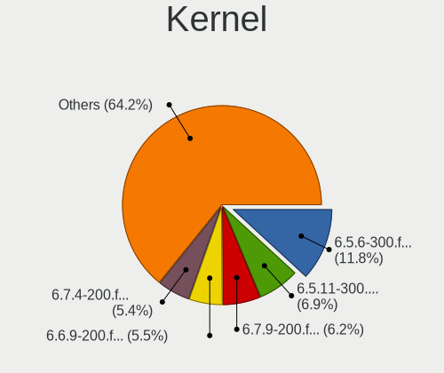

| Version                                                | Notebooks | Percent |
|--------------------------------------------------------|-----------|---------|
| 6.5.11-300.fc39.x86_64                                 | 138       | 14.12%  |
| 6.5.6-300.fc39.x86_64                                  | 111       | 11.36%  |
| 6.6.9-200.fc39.x86_64                                  | 108       | 11.05%  |
| 6.6.8-200.fc39.x86_64                                  | 102       | 10.44%  |
| 6.6.13-200.fc39.x86_64                                 | 61        | 6.24%   |
| 6.5.12-300.fc39.x86_64                                 | 59        | 6.04%   |
| 6.6.4-200.fc39.x86_64                                  | 55        | 5.63%   |
| 6.6.6-200.fc39.x86_64                                  | 54        | 5.53%   |
| 6.6.11-200.fc39.x86_64                                 | 49        | 5.02%   |
| 6.6.7-200.fc39.x86_64                                  | 47        | 4.81%   |
| 6.6.2-201.fc39.x86_64                                  | 41        | 4.2%    |
| 6.6.3-200.fc39.x86_64                                  | 24        | 2.46%   |
| 6.6.12-200.fc39.x86_64                                 | 21        | 2.15%   |
| 6.5.10-300.fc39.x86_64                                 | 19        | 1.94%   |
| 6.5.9-300.fc39.x86_64                                  | 12        | 1.23%   |
| 6.5.5-300.fc39.x86_64                                  | 10        | 1.02%   |
| 6.5.8-300.fc39.x86_64                                  | 4         | 0.41%   |
| 6.5.4-300.fc39.x86_64                                  | 4         | 0.41%   |
| 6.5.2-301.fc39.x86_64                                  | 4         | 0.41%   |
| 6.6.14-200.fc39.x86_64                                 | 3         | 0.31%   |
| 6.5.7-300.fc39.x86_64                                  | 3         | 0.31%   |
| 6.5.3-300.fc39.x86_64                                  | 3         | 0.31%   |
| 6.2.9-300.fc38.x86_64                                  | 3         | 0.31%   |
| 6.7.0-cb1.0.fc39.x86_64                                | 2         | 0.2%    |
| 6.6.8-200.t2.fc39.x86_64                               | 2         | 0.2%    |
| 6.6.7-666.rog.fc39.x86_64                              | 2         | 0.2%    |
| 6.6.4-cb1.0.fc39.x86_64                                | 2         | 0.2%    |
| 6.6.10-200.fc39.x86_64                                 | 2         | 0.2%    |
| 6.6.1-300.fc39.x86_64                                  | 2         | 0.2%    |
| 6.7.2-250.vanilla.fc39.x86_64                          | 1         | 0.1%    |
| 6.7.1-200.fc39.x86_64                                  | 1         | 0.1%    |
| 6.7.1-200.1.ipu6.fc39.x86_64                           | 1         | 0.1%    |
| 6.7.1-0.rc1.250.vanilla.fc39.x86_64                    | 1         | 0.1%    |
| 6.7.0-68.es83xx.fc40.x86_64                            | 1         | 0.1%    |
| 6.7.0-367.vanilla.fc39.x86_64                          | 1         | 0.1%    |
| 6.7.0-0.rc2.321.vanilla.fc39.x86_64                    | 1         | 0.1%    |
| 6.7.0-0.rc1.20231117git7475e51b8796.19.fc39.x86_64     | 1         | 0.1%    |
| 6.7.0-0.rc1.20231114gt9bacdd89.316.vanilla.fc39.x86_64 | 1         | 0.1%    |
| 6.6.8-100.fc38.x86_64                                  | 1         | 0.1%    |
| 6.6.7-203.fsync.fc39.x86_64                            | 1         | 0.1%    |

Kernel Family
-------------

Linux kernel without a distro release

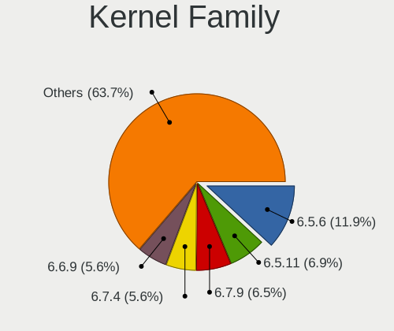

| Version | Notebooks | Percent |
|---------|-----------|---------|
| 6.5.11  | 138       | 14.14%  |
| 6.5.6   | 111       | 11.37%  |
| 6.6.9   | 108       | 11.07%  |
| 6.6.8   | 105       | 10.76%  |
| 6.6.13  | 61        | 6.25%   |
| 6.5.12  | 59        | 6.05%   |
| 6.6.4   | 57        | 5.84%   |
| 6.6.6   | 54        | 5.53%   |
| 6.6.7   | 50        | 5.12%   |
| 6.6.11  | 49        | 5.02%   |
| 6.6.2   | 41        | 4.2%    |
| 6.6.3   | 25        | 2.56%   |
| 6.6.12  | 22        | 2.25%   |
| 6.5.10  | 20        | 2.05%   |
| 6.5.9   | 12        | 1.23%   |
| 6.5.5   | 10        | 1.02%   |
| 6.7.0   | 7         | 0.72%   |
| 6.5.8   | 4         | 0.41%   |
| 6.5.4   | 4         | 0.41%   |
| 6.5.2   | 4         | 0.41%   |
| 6.4.0   | 4         | 0.41%   |
| 6.7.1   | 3         | 0.31%   |
| 6.6.14  | 3         | 0.31%   |
| 6.6.10  | 3         | 0.31%   |
| 6.6.1   | 3         | 0.31%   |
| 6.5.7   | 3         | 0.31%   |
| 6.5.3   | 3         | 0.31%   |
| 6.3.0   | 3         | 0.31%   |
| 6.2.9   | 3         | 0.31%   |
| 6.6.0   | 2         | 0.2%    |
| 6.7.2   | 1         | 0.1%    |
| 6.5.0   | 1         | 0.1%    |
| 6.4.16  | 1         | 0.1%    |
| 6.2.0   | 1         | 0.1%    |
| 6.0.8   | 1         | 0.1%    |

Kernel Major Ver.
-----------------

Linux kernel major version

| Version | Notebooks | Percent |
|---------|-----------|---------|
| 6.6     | 561       | 59.18%  |
| 6.5     | 363       | 38.29%  |
| 6.7     | 11        | 1.16%   |
| 6.4     | 5         | 0.53%   |
| 6.2     | 4         | 0.42%   |
| 6.3     | 3         | 0.32%   |
| 6.0     | 1         | 0.11%   |

Arch
----

OS architecture (x86_64, i586, etc.)

| Name   | Notebooks | Percent |
|--------|-----------|---------|
| x86_64 | 919       | 100%    |

DE
--

Desktop Environment

| Name           | Notebooks | Percent |
|----------------|-----------|---------|
| GNOME          | 730       | 79%     |
| KDE5           | 126       | 13.64%  |
| XFCE           | 13        | 1.41%   |
| MATE           | 10        | 1.08%   |
| Unknown        | 10        | 1.08%   |
| Budgie         | 7         | 0.76%   |
| sway           | 6         | 0.65%   |
| X-Cinnamon     | 5         | 0.54%   |
| Cinnamon       | 5         | 0.54%   |
| GNOME Classic  | 4         | 0.43%   |
| LXQt           | 2         | 0.22%   |
| KDE            | 1         | 0.11%   |
| i3-with-shmlog | 1         | 0.11%   |
| i3             | 1         | 0.11%   |
| Hyprland       | 1         | 0.11%   |
| GNOME-Classic  | 1         | 0.11%   |
| Deepin         | 1         | 0.11%   |

Display Server
--------------

X11 or Wayland

| Name    | Notebooks | Percent |
|---------|-----------|---------|
| Wayland | 789       | 85.21%  |
| X11     | 121       | 13.07%  |
| Tty     | 8         | 0.86%   |
| Unknown | 8         | 0.86%   |

Display Manager
---------------

SDDM, LightDM, etc.

| Name    | Notebooks | Percent |
|---------|-----------|---------|
| Unknown | 597       | 64.75%  |
| GDM     | 218       | 23.64%  |
| SDDM    | 66        | 7.16%   |
| LightDM | 41        | 4.45%   |

OS Lang
-------

Language

| Lang    | Notebooks | Percent |
|---------|-----------|---------|
| en_US   | 439       | 47.67%  |
| en_GB   | 76        | 8.25%   |
| ru_RU   | 61        | 6.62%   |
| de_DE   | 49        | 5.32%   |
| pt_BR   | 39        | 4.23%   |
| it_IT   | 33        | 3.58%   |
| fr_FR   | 27        | 2.93%   |
| en_IN   | 20        | 2.17%   |
| en_CA   | 18        | 1.95%   |
| pl_PL   | 17        | 1.85%   |
| en_AU   | 13        | 1.41%   |
| es_ES   | 12        | 1.3%    |
| tr_TR   | 9         | 0.98%   |
| es_CL   | 7         | 0.76%   |
| zh_CN   | 6         | 0.65%   |
| es_CO   | 6         | 0.65%   |
| pt_PT   | 5         | 0.54%   |
| es_MX   | 5         | 0.54%   |
| de_CH   | 5         | 0.54%   |
| ru_UA   | 4         | 0.43%   |
| nb_NO   | 4         | 0.43%   |
| es_AR   | 4         | 0.43%   |
| en_ZA   | 4         | 0.43%   |
| en_DK   | 4         | 0.43%   |
| hu_HU   | 3         | 0.33%   |
| de_AT   | 3         | 0.33%   |
| cs_CZ   | 3         | 0.33%   |
| Unknown | 3         | 0.33%   |
| sk_SK   | 2         | 0.22%   |
| ro_RO   | 2         | 0.22%   |
| fr_CH   | 2         | 0.22%   |
| fi_FI   | 2         | 0.22%   |
| es_UY   | 2         | 0.22%   |
| es_DO   | 2         | 0.22%   |
| en_SG   | 2         | 0.22%   |
| en_PH   | 2         | 0.22%   |
| en_NZ   | 2         | 0.22%   |
| en_IL   | 2         | 0.22%   |
| en_IE   | 2         | 0.22%   |
| el_GR   | 2         | 0.22%   |

Boot Mode
---------

EFI or BIOS

| Mode | Notebooks | Percent |
|------|-----------|---------|
| EFI  | 792       | 85.99%  |
| BIOS | 129       | 14.01%  |

Filesystem
----------

Type of filesystem

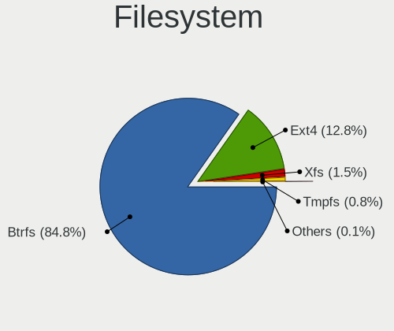

| Type    | Notebooks | Percent |
|---------|-----------|---------|
| Btrfs   | 798       | 86.74%  |
| Ext4    | 108       | 11.74%  |
| Xfs     | 12        | 1.3%    |
| Tmpfs   | 1         | 0.11%   |
| Overlay | 1         | 0.11%   |

Part. scheme
------------

Scheme of partitioning

| Type    | Notebooks | Percent |
|---------|-----------|---------|
| Unknown | 586       | 63.49%  |
| GPT     | 324       | 35.1%   |
| MBR     | 13        | 1.41%   |

Dual Boot with Linux/BSD
------------------------

Hosting more than one Linux/BSD

| Dual boot | Notebooks | Percent |
|-----------|-----------|---------|
| No        | 861       | 93.69%  |
| Yes       | 58        | 6.31%   |

Dual Boot (Win)
---------------

Hosting Linux and Windows

| Dual boot | Notebooks | Percent |
|-----------|-----------|---------|
| No        | 772       | 84%     |
| Yes       | 147       | 16%     |

Board
-----

Vendor
------

Motherboard manufacturer

| Name                  | Notebooks | Percent |
|-----------------------|-----------|---------|
| Lenovo                | 243       | 26.44%  |
| Dell                  | 144       | 15.67%  |
| Hewlett-Packard       | 122       | 13.28%  |
| ASUSTek Computer      | 117       | 12.73%  |
| Acer                  | 65        | 7.07%   |
| Apple                 | 53        | 5.77%   |
| HUAWEI                | 28        | 3.05%   |
| MSI                   | 24        | 2.61%   |
| Samsung Electronics   | 10        | 1.09%   |
| Framework             | 10        | 1.09%   |
| Toshiba               | 7         | 0.76%   |
| Timi                  | 6         | 0.65%   |
| Gigabyte Technology   | 6         | 0.65%   |
| Fujitsu               | 6         | 0.65%   |
| Unknown               | 6         | 0.65%   |
| Google                | 5         | 0.54%   |
| Notebook              | 4         | 0.44%   |
| HONOR                 | 4         | 0.44%   |
| Alienware             | 4         | 0.44%   |
| TUXEDO                | 3         | 0.33%   |
| Sony                  | 3         | 0.33%   |
| LG Electronics        | 3         | 0.33%   |
| GPD                   | 3         | 0.33%   |
| XIAOMI                | 2         | 0.22%   |
| Razer                 | 2         | 0.22%   |
| Packard Bell          | 2         | 0.22%   |
| MACHENIKE             | 2         | 0.22%   |
| Zebra Technologies    | 1         | 0.11%   |
| VIT                   | 1         | 0.11%   |
| Valve                 | 1         | 0.11%   |
| Thirdwave             | 1         | 0.11%   |
| Teclast               | 1         | 0.11%   |
| Star Labs             | 1         | 0.11%   |
| SPA CONDOR            | 1         | 0.11%   |
| SLIMBOOK              | 1         | 0.11%   |
| Semp Toshiba          | 1         | 0.11%   |
| Schenker              | 1         | 0.11%   |
| realme                | 1         | 0.11%   |
| Positivo Bahia - VAIO | 1         | 0.11%   |
| Panasonic             | 1         | 0.11%   |

Model
-----

Motherboard model

| Name                                        | Notebooks | Percent |
|---------------------------------------------|-----------|---------|
| Unknown                                     | 10        | 1.09%   |
| Framework Laptop 13 (AMD Ryzen 7040Series)  | 8         | 0.87%   |
| Apple MacBookPro9,2                         | 5         | 0.54%   |
| Apple MacBookPro14,1                        | 5         | 0.54%   |
| Apple MacBookPro11,3                        | 5         | 0.54%   |
| HP Notebook                                 | 4         | 0.44%   |
| Apple MacBookPro10,1                        | 4         | 0.44%   |
| Apple MacBookAir7,2                         | 4         | 0.44%   |
| Acer Aspire A515-57                         | 4         | 0.44%   |
| Timi A35S                                   | 3         | 0.33%   |
| Lenovo Legion 5 Pro 16ACH6H 82JQ            | 3         | 0.33%   |
| Lenovo IdeaPad 5 15ALC05 82LN               | 3         | 0.33%   |
| HUAWEI RLEF-XX                              | 3         | 0.33%   |
| HP Laptop 15-da0xxx                         | 3         | 0.33%   |
| Dell XPS 15 9570                            | 3         | 0.33%   |
| Dell XPS 15 9530                            | 3         | 0.33%   |
| Dell Precision M6500                        | 3         | 0.33%   |
| Dell Inspiron 3593                          | 3         | 0.33%   |
| ASUS Zenbook UM3402YAR_UM3402YA             | 3         | 0.33%   |
| Apple MacBookPro11,1                        | 3         | 0.33%   |
| Apple MacBookAir6,2                         | 3         | 0.33%   |
| Acer Nitro AN515-54                         | 3         | 0.33%   |
| Acer Aspire A515-45                         | 3         | 0.33%   |
| Acer Aspire A315-24P                        | 3         | 0.33%   |
| XIAOMI Redmi Book Pro 15 2023               | 2         | 0.22%   |
| Notebook NL5xRU                             | 2         | 0.22%   |
| MSI Prestige 14Evo A12M                     | 2         | 0.22%   |
| Lenovo Yoga S740-15IRH 81NX                 | 2         | 0.22%   |
| Lenovo Yoga Pro 9 16IRP8 83BY               | 2         | 0.22%   |
| Lenovo V15 G3 IAP 82TT                      | 2         | 0.22%   |
| Lenovo V15 G2 ITL 82KB                      | 2         | 0.22%   |
| Lenovo ThinkPad X220 42911H8                | 2         | 0.22%   |
| Lenovo ThinkPad X1 Carbon Gen 11 21HMCTO1WW | 2         | 0.22%   |
| Lenovo ThinkPad X1 Carbon Gen 10 21CBCTO1WW | 2         | 0.22%   |
| Lenovo ThinkPad T480 20L50011US             | 2         | 0.22%   |
| Lenovo ThinkPad T460 20FN002JUS             | 2         | 0.22%   |
| Lenovo ThinkPad P16s Gen 2 21K9CTO1WW       | 2         | 0.22%   |
| Lenovo ThinkPad P14s Gen 3 21J6S0K700       | 2         | 0.22%   |
| Lenovo LOQ 15IRH8 82XV                      | 2         | 0.22%   |
| Lenovo IdeaPad Slim 3 15AMN8 82XQ           | 2         | 0.22%   |

Model Family
------------

Motherboard model prefix

| Name               | Notebooks | Percent |
|--------------------|-----------|---------|
| Lenovo ThinkPad    | 133       | 14.47%  |
| Dell Latitude      | 52        | 5.66%   |
| Lenovo IdeaPad     | 43        | 4.68%   |
| ASUS VivoBook      | 41        | 4.46%   |
| Dell Inspiron      | 40        | 4.35%   |
| Acer Aspire        | 33        | 3.59%   |
| HP Laptop          | 29        | 3.16%   |
| HP EliteBook       | 25        | 2.72%   |
| Dell XPS           | 21        | 2.29%   |
| ASUS ROG           | 18        | 1.96%   |
| ASUS ASUS          | 17        | 1.85%   |
| Lenovo Legion      | 16        | 1.74%   |
| HP ProBook         | 14        | 1.52%   |
| HP Pavilion        | 14        | 1.52%   |
| Dell Precision     | 14        | 1.52%   |
| ASUS Zenbook       | 14        | 1.52%   |
| Acer Nitro         | 12        | 1.31%   |
| Apple MacBookPro11 | 11        | 1.2%    |
| Lenovo Yoga        | 10        | 1.09%   |
| Framework Laptop   | 10        | 1.09%   |
| Unknown            | 10        | 1.09%   |
| Lenovo ThinkBook   | 9         | 0.98%   |
| Acer Swift         | 9         | 0.98%   |
| Dell Vostro        | 8         | 0.87%   |
| Toshiba Satellite  | 7         | 0.76%   |
| HP ENVY            | 7         | 0.76%   |
| Apple MacBookPro14 | 7         | 0.76%   |
| Fujitsu LIFEBOOK   | 6         | 0.65%   |
| Acer TravelMate    | 6         | 0.65%   |
| Lenovo V15         | 5         | 0.54%   |
| HP OMEN            | 5         | 0.54%   |
| Apple MacBookPro9  | 5         | 0.54%   |
| MSI Prestige       | 4         | 0.44%   |
| MSI Modern         | 4         | 0.44%   |
| HP ZBook           | 4         | 0.44%   |
| HP Notebook        | 4         | 0.44%   |
| Dell G15           | 4         | 0.44%   |
| Apple MacBookPro10 | 4         | 0.44%   |
| Apple MacBookAir7  | 4         | 0.44%   |
| Apple MacBookAir6  | 4         | 0.44%   |

MFG Year
--------

Motherboard manufacture year

| Year | Notebooks | Percent |
|------|-----------|---------|
| 2021 | 124       | 13.49%  |
| 2023 | 123       | 13.38%  |
| 2022 | 121       | 13.17%  |
| 2020 | 96        | 10.45%  |
| 2019 | 63        | 6.86%   |
| 2018 | 63        | 6.86%   |
| 2017 | 52        | 5.66%   |
| 2013 | 48        | 5.22%   |
| 2014 | 41        | 4.46%   |
| 2016 | 40        | 4.35%   |
| 2012 | 39        | 4.24%   |
| 2015 | 34        | 3.7%    |
| 2011 | 32        | 3.48%   |
| 2010 | 17        | 1.85%   |
| 2009 | 13        | 1.41%   |
| 2008 | 6         | 0.65%   |
| 2007 | 6         | 0.65%   |
| 2024 | 1         | 0.11%   |

Form Factor
-----------

Physical design of the computer

| Name     | Notebooks | Percent |
|----------|-----------|---------|
| Notebook | 919       | 100%    |

Secure Boot
-----------

Enabled or disabled

| State    | Notebooks | Percent |
|----------|-----------|---------|
| Disabled | 672       | 72.73%  |
| Enabled  | 252       | 27.27%  |

Coreboot
--------

Have coreboot on board

| Used | Notebooks | Percent |
|------|-----------|---------|
| No   | 913       | 99.35%  |
| Yes  | 6         | 0.65%   |

RAM Size
--------

Total RAM memory

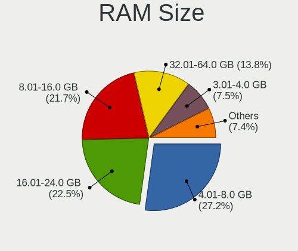

| Size in GB  | Notebooks | Percent |
|-------------|-----------|---------|
| 4.01-8.0    | 258       | 28.04%  |
| 16.01-24.0  | 207       | 22.5%   |
| 8.01-16.0   | 195       | 21.2%   |
| 32.01-64.0  | 130       | 14.13%  |
| 3.01-4.0    | 61        | 6.63%   |
| 24.01-32.0  | 41        | 4.46%   |
| 64.01-256.0 | 20        | 2.17%   |
| 2.01-3.0    | 6         | 0.65%   |
| 1.01-2.0    | 2         | 0.22%   |

RAM Used
--------

Used RAM memory

| Used GB    | Notebooks | Percent |
|------------|-----------|---------|
| 4.01-8.0   | 308       | 32.05%  |
| 3.01-4.0   | 250       | 26.01%  |
| 2.01-3.0   | 250       | 26.01%  |
| 1.01-2.0   | 87        | 9.05%   |
| 8.01-16.0  | 58        | 6.04%   |
| 16.01-24.0 | 5         | 0.52%   |
| 0.51-1.0   | 2         | 0.21%   |
| 32.01-64.0 | 1         | 0.1%    |

Total Drives
------------

Number of drives on board

| Drives | Notebooks | Percent |
|--------|-----------|---------|
| 1      | 713       | 77%     |
| 2      | 185       | 19.98%  |
| 3      | 23        | 2.48%   |
| 4      | 4         | 0.43%   |
| 7      | 1         | 0.11%   |

Has CD-ROM
----------

Has CD-ROM on board

| Presented | Notebooks | Percent |
|-----------|-----------|---------|
| No        | 775       | 84.24%  |
| Yes       | 145       | 15.76%  |

Has Ethernet
------------

Has Ethernet on board

| Presented | Notebooks | Percent |
|-----------|-----------|---------|
| Yes       | 625       | 67.93%  |
| No        | 295       | 32.07%  |

Has WiFi
--------

Has WiFi module

| Presented | Notebooks | Percent |
|-----------|-----------|---------|
| Yes       | 911       | 99.13%  |
| No        | 8         | 0.87%   |

Has Bluetooth
-------------

Has Bluetooth module

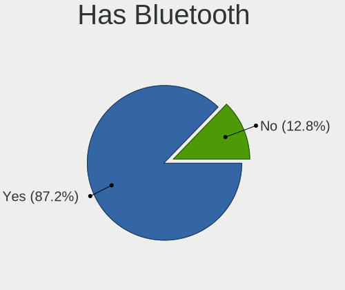

| Presented | Notebooks | Percent |
|-----------|-----------|---------|
| Yes       | 809       | 87.74%  |
| No        | 113       | 12.26%  |

Location
--------

Country
-------

Geographic location (country)

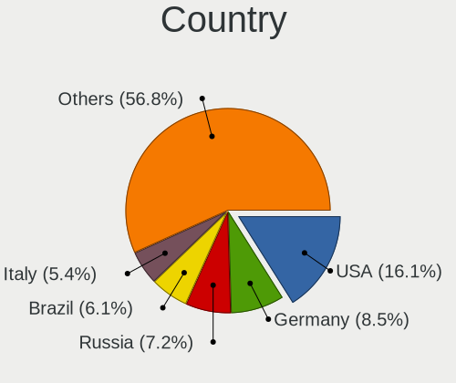

| Country      | Notebooks | Percent |
|--------------|-----------|---------|
| USA          | 134       | 14.58%  |
| Germany      | 73        | 7.94%   |
| Russia       | 63        | 6.86%   |
| Italy        | 56        | 6.09%   |
| Brazil       | 51        | 5.55%   |
| UK           | 38        | 4.13%   |
| Poland       | 36        | 3.92%   |
| India        | 35        | 3.81%   |
| France       | 35        | 3.81%   |
| Canada       | 32        | 3.48%   |
| Spain        | 25        | 2.72%   |
| Netherlands  | 21        | 2.29%   |
| Switzerland  | 17        | 1.85%   |
| Romania      | 17        | 1.85%   |
| Turkey       | 15        | 1.63%   |
| Australia    | 15        | 1.63%   |
| Mexico       | 13        | 1.41%   |
| Austria      | 11        | 1.2%    |
| Portugal     | 10        | 1.09%   |
| Colombia     | 9         | 0.98%   |
| Belgium      | 9         | 0.98%   |
| Philippines  | 8         | 0.87%   |
| Belarus      | 8         | 0.87%   |
| Hungary      | 7         | 0.76%   |
| Finland      | 7         | 0.76%   |
| Czechia      | 7         | 0.76%   |
| Chile        | 7         | 0.76%   |
| Argentina    | 7         | 0.76%   |
| Sweden       | 6         | 0.65%   |
| South Africa | 6         | 0.65%   |
| Norway       | 6         | 0.65%   |
| Denmark      | 6         | 0.65%   |
| China        | 6         | 0.65%   |
| Uzbekistan   | 5         | 0.54%   |
| Slovakia     | 5         | 0.54%   |
| Greece       | 5         | 0.54%   |
| Croatia      | 5         | 0.54%   |
| Bulgaria     | 5         | 0.54%   |
| Singapore    | 4         | 0.44%   |
| Japan        | 4         | 0.44%   |

City
----

Geographic location (city)

| City          | Notebooks | Percent |
|---------------|-----------|---------|
| Moscow        | 14        | 1.5%    |
| St Petersburg | 10        | 1.07%   |
| Paris         | 9         | 0.96%   |
| Warsaw        | 8         | 0.86%   |
| Helsinki      | 7         | 0.75%   |
| Bucharest     | 7         | 0.75%   |
| Zurich        | 6         | 0.64%   |
| Vienna        | 6         | 0.64%   |
| Toronto       | 6         | 0.64%   |
| Sydney        | 6         | 0.64%   |
| Sao Paulo     | 6         | 0.64%   |
| Munich        | 6         | 0.64%   |
| Minsk         | 6         | 0.64%   |
| Milan         | 6         | 0.64%   |
| Istanbul      | 6         | 0.64%   |
| Berlin        | 6         | 0.64%   |
| Yekaterinburg | 5         | 0.54%   |
| Tashkent      | 5         | 0.54%   |
| Stuttgart     | 5         | 0.54%   |
| Santiago      | 5         | 0.54%   |
| Barcelona     | 5         | 0.54%   |
| Amsterdam     | 5         | 0.54%   |
| Singapore     | 4         | 0.43%   |
| Quezon City   | 4         | 0.43%   |
| Poznan        | 4         | 0.43%   |
| Perm          | 4         | 0.43%   |
| Nuremberg     | 4         | 0.43%   |
| Milano        | 4         | 0.43%   |
| Hamburg       | 4         | 0.43%   |
| Chennai       | 4         | 0.43%   |
| Brussels      | 4         | 0.43%   |
| Bengaluru     | 4         | 0.43%   |
| Wroclaw       | 3         | 0.32%   |
| Tokyo         | 3         | 0.32%   |
| Sumar       | 3         | 0.32%   |
| Seattle       | 3         | 0.32%   |
| San Salvador  | 3         | 0.32%   |
| Reading       | 3         | 0.32%   |
| Patna         | 3         | 0.32%   |
| New York      | 3         | 0.32%   |

Drives
------

Drive Vendor
------------

Hard drive vendors

| Vendor                         | Notebooks | Drives | Percent |
|--------------------------------|-----------|--------|---------|
| Samsung Electronics            | 212       | 251    | 19.12%  |
| Sandisk                        | 116       | 124    | 10.46%  |
| SK hynix                       | 73        | 79     | 6.58%   |
| Micron Technology              | 67        | 70     | 6.04%   |
| WDC                            | 57        | 59     | 5.14%   |
| Intel                          | 50        | 64     | 4.51%   |
| Unknown                        | 46        | 58     | 4.15%   |
| Seagate                        | 44        | 45     | 3.97%   |
| Kingston                       | 44        | 46     | 3.97%   |
| Toshiba                        | 40        | 45     | 3.61%   |
| Apple                          | 35        | 46     | 3.16%   |
| Phison Electronics             | 32        | 35     | 2.89%   |
| KIOXIA                         | 31        | 32     | 2.8%    |
| Crucial                        | 27        | 28     | 2.43%   |
| Micron/Crucial Technology      | 22        | 25     | 1.98%   |
| HGST                           | 17        | 17     | 1.53%   |
| Silicon Motion                 | 13        | 14     | 1.17%   |
| A-DATA Technology              | 13        | 13     | 1.17%   |
| Kingston Technology Company    | 12        | 13     | 1.08%   |
| MAXIO Technology (Hangzhou)    | 10        | 12     | 0.9%    |
| ADATA Technology               | 10        | 10     | 0.9%    |
| China                          | 9         | 9      | 0.81%   |
| SPCC                           | 6         | 7      | 0.54%   |
| LITEONIT                       | 6         | 6      | 0.54%   |
| Hitachi                        | 6         | 7      | 0.54%   |
| Union Memory                   | 5         | 5      | 0.45%   |
| PNY                            | 5         | 6      | 0.45%   |
| Lexar                          | 5         | 5      | 0.45%   |
| Netac                          | 4         | 4      | 0.36%   |
| LITEON                         | 4         | 4      | 0.36%   |
| Gigabyte Technology            | 4         | 4      | 0.36%   |
| Union Memory (Shenzhen)        | 3         | 3      | 0.27%   |
| Solid State Storage Technology | 3         | 3      | 0.27%   |
| Shenzhen Longsys Electronics   | 3         | 3      | 0.27%   |
| Plextor                        | 3         | 6      | 0.27%   |
| Phison                         | 3         | 4      | 0.27%   |
| JMicron Technology             | 3         | 4      | 0.27%   |
| HS-SSD-E100                    | 3         | 3      | 0.27%   |
| Hewlett-Packard                | 3         | 3      | 0.27%   |
| USB                            | 2         | 2      | 0.18%   |

Drive Model
-----------

Hard drive models

| Model                                                 | Notebooks | Percent |
|-------------------------------------------------------|-----------|---------|
| Samsung NVMe SSD Controller PM9A1/PM9A3/980PRO 2TB    | 46        | 4.05%   |
| Samsung NVMe SSD Controller SM981/PM981/PM983 1TB     | 41        | 3.61%   |
| Sandisk WD Blue SN550 NVMe SSD 512GB                  | 23        | 2.02%   |
| Intel SSDPEKNU512GZ 512GB                             | 19        | 1.67%   |
| Micron/Crucial P2 NVMe PCIe SSD 1TB                   | 16        | 1.41%   |
| Kingston SA400S37240G 240GB SSD                       | 13        | 1.14%   |
| Unknown MMC Card  32GB                                | 12        | 1.06%   |
| Unknown MMC Card  128GB                               | 12        | 1.06%   |
| Sandisk WD Black SN750 / PC SN730 NVMe SSD 512GB      | 11        | 0.97%   |
| Samsung NVMe SSD Controller SM961/PM961/SM963 256GB   | 11        | 0.97%   |
| Phison PS5013 E13 NVMe Controller 256GB               | 10        | 0.88%   |
| Intel SSD 660P Series 1024GB                          | 10        | 0.88%   |
| SK hynix BC501 NVMe Solid State Drive 512GB           | 9         | 0.79%   |
| HGST HTS721010A9E630 1TB                              | 9         | 0.79%   |
| Seagate ST1000LM035-1RK172 1TB                        | 8         | 0.7%    |
| Phison E12 NVMe Controller 1TB                        | 8         | 0.7%    |
| Unknown MMC Card  64GB                                | 7         | 0.62%   |
| Toshiba XG6 NVMe SSD Controller 256GB                 | 7         | 0.62%   |
| Samsung SSD 860 EVO 500GB                             | 7         | 0.62%   |
| Samsung MZALQ512HBLU-00BL2 512GB                      | 7         | 0.62%   |
| Micron 2400_MTFDKBA512QFM 512GB                       | 7         | 0.62%   |
| MAXIO (Hangzhou) NVMe SSD Controller MAP1202 512GB    | 7         | 0.62%   |
| Sandisk WD_BLACK SN770 1TB                            | 6         | 0.53%   |
| Sandisk WD Blue SN570 1TB                             | 6         | 0.53%   |
| Samsung SSD 870 EVO 1TB                               | 6         | 0.53%   |
| Phison E16 PCIe4 NVMe Controller 2TB                  | 6         | 0.53%   |
| Micron 2450_MTFDKBA512TFK 512GB                       | 6         | 0.53%   |
| Kingston Company OM3PDP3 NVMe SSD 256GB               | 6         | 0.53%   |
| Crucial CT1000MX500SSD1 1TB                           | 6         | 0.53%   |
| Apple S3X NVMe Controller 256GB                       | 6         | 0.53%   |
| Toshiba MQ04ABF100 1TB                                | 5         | 0.44%   |
| SK hynix BC511 256GB                                  | 5         | 0.44%   |
| Silicon Motion SM2263EN/SM2263XT SSD Controller 128GB | 5         | 0.44%   |
| Samsung SSD 980 1TB                                   | 5         | 0.44%   |
| Samsung MZVLQ512HALU-00000 512GB                      | 5         | 0.44%   |
| Micron 3400_MTFDKBA1T0TFH 1TB                         | 5         | 0.44%   |
| Micron 2400_MTFDKBA1T0QFM 1TB                         | 5         | 0.44%   |
| Intel SSD Pro 7600p/760p/E 6100p Series 1024GB        | 5         | 0.44%   |
| SK hynix SKHynix_HFS512GEJ4X112N 512GB                | 4         | 0.35%   |
| SK hynix HFM001TD3JX013N 1024GB                       | 4         | 0.35%   |

HDD Vendor
----------

Hard disk drive vendors

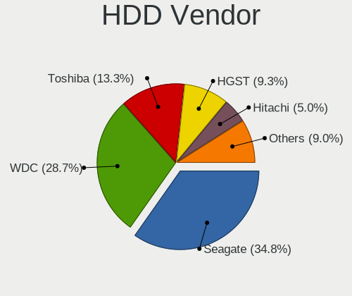

| Vendor             | Notebooks | Drives | Percent |
|--------------------|-----------|--------|---------|
| WDC                | 43        | 43     | 32.09%  |
| Seagate            | 39        | 40     | 29.1%   |
| Toshiba            | 19        | 23     | 14.18%  |
| HGST               | 17        | 17     | 12.69%  |
| Hitachi            | 6         | 7      | 4.48%   |
| JMicron Technology | 3         | 4      | 2.24%   |
| External           | 2         | 3      | 1.49%   |
| Apple              | 2         | 2      | 1.49%   |
| Unknown            | 1         | 1      | 0.75%   |
| HGST HTS           | 1         | 1      | 0.75%   |
| Asm                | 1         | 1      | 0.75%   |

SSD Vendor
----------

Solid state drive vendors

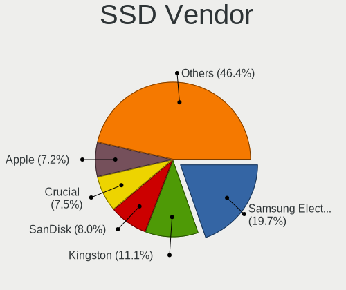

| Vendor              | Notebooks | Drives | Percent |
|---------------------|-----------|--------|---------|
| Samsung Electronics | 57        | 65     | 19.19%  |
| Kingston            | 28        | 29     | 9.43%   |
| Crucial             | 27        | 28     | 9.09%   |
| SanDisk             | 23        | 25     | 7.74%   |
| Apple               | 23        | 24     | 7.74%   |
| WDC                 | 14        | 16     | 4.71%   |
| SK hynix            | 10        | 10     | 3.37%   |
| Micron Technology   | 9         | 9      | 3.03%   |
| China               | 9         | 9      | 3.03%   |
| A-DATA Technology   | 9         | 9      | 3.03%   |
| Intel               | 8         | 10     | 2.69%   |
| SPCC                | 6         | 7      | 2.02%   |
| LITEONIT            | 6         | 6      | 2.02%   |
| Toshiba             | 5         | 5      | 1.68%   |
| PNY                 | 5         | 6      | 1.68%   |
| Lexar               | 5         | 5      | 1.68%   |
| LITEON              | 4         | 4      | 1.35%   |
| Plextor             | 3         | 6      | 1.01%   |
| Netac               | 3         | 3      | 1.01%   |
| Gigabyte Technology | 3         | 3      | 1.01%   |
| Transcend           | 2         | 2      | 0.67%   |
| Patriot             | 2         | 2      | 0.67%   |
| OCZ                 | 2         | 3      | 0.67%   |
| Lenovo              | 2         | 2      | 0.67%   |
| HS-SSD-E100         | 2         | 2      | 0.67%   |
| Hewlett-Packard     | 2         | 2      | 0.67%   |
| GOODRAM             | 2         | 2      | 0.67%   |
| Wdxsky              | 1         | 1      | 0.34%   |
| USB3.0              | 1         | 1      | 0.34%   |
| USB                 | 1         | 1      | 0.34%   |
| Timetec             | 1         | 1      | 0.34%   |
| Teclast             | 1         | 1      | 0.34%   |
| Star                | 1         | 1      | 0.34%   |
| Seagate             | 1         | 1      | 0.34%   |
| SABRENT             | 1         | 1      | 0.34%   |
| Reeinno             | 1         | 1      | 0.34%   |
| LDLC                | 1         | 1      | 0.34%   |
| KLEVV               | 1         | 1      | 0.34%   |
| KingSpec            | 1         | 1      | 0.34%   |
| KingDian            | 1         | 1      | 0.34%   |

Drive Kind
----------

HDD or SSD

| Kind    | Notebooks | Drives | Percent |
|---------|-----------|--------|---------|
| NVMe    | 582       | 707    | 55.48%  |
| SSD     | 283       | 321    | 26.98%  |
| HDD     | 127       | 142    | 12.11%  |
| MMC     | 36        | 45     | 3.43%   |
| Unknown | 21        | 23     | 2%      |

Drive Connector
---------------

SATA, SAS, NVMe, etc.

| Type | Notebooks | Drives | Percent |
|------|-----------|--------|---------|
| NVMe | 582       | 706    | 57.06%  |
| SATA | 362       | 439    | 35.49%  |
| SAS  | 40        | 48     | 3.92%   |
| MMC  | 36        | 45     | 3.53%   |

Drive Size
----------

Size of hard drive

| Size in TB | Notebooks | Drives | Percent |
|------------|-----------|--------|---------|
| 0.01-0.5   | 258       | 303    | 64.82%  |
| 0.51-1.0   | 127       | 146    | 31.91%  |
| 1.01-2.0   | 9         | 9      | 2.26%   |
| 3.01-4.0   | 3         | 4      | 0.75%   |
| 4.01-10.0  | 1         | 1      | 0.25%   |

Space Total
-----------

Amount of disk space available on the file system

| Size in GB     | Notebooks | Percent |
|----------------|-----------|---------|
| 501-1000       | 223       | 24%     |
| 251-500        | 196       | 21.1%   |
| 1001-2000      | 131       | 14.1%   |
| 101-250        | 120       | 12.92%  |
| Unknown        | 92        | 9.9%    |
| 1-20           | 83        | 8.93%   |
| 51-100         | 29        | 3.12%   |
| More than 3000 | 27        | 2.91%   |
| 2001-3000      | 18        | 1.94%   |
| 21-50          | 10        | 1.08%   |

Space Used
----------

Amount of used disk space

| Used GB        | Notebooks | Percent |
|----------------|-----------|---------|
| 1-20           | 304       | 32.34%  |
| 21-50          | 174       | 18.51%  |
| 101-250        | 126       | 13.4%   |
| 51-100         | 95        | 10.11%  |
| Unknown        | 92        | 9.79%   |
| 251-500        | 82        | 8.72%   |
| 501-1000       | 40        | 4.26%   |
| 1001-2000      | 21        | 2.23%   |
| More than 3000 | 3         | 0.32%   |
| 2001-3000      | 3         | 0.32%   |

Malfunc. Drives
---------------

Drive models with a malfunction

| Model                                          | Notebooks | Drives | Percent |
|------------------------------------------------|-----------|--------|---------|
| Crucial CT128MX100SSD1 128GB                   | 2         | 2      | 15.38%  |
| WDC WD40EFRX-68N32N0 4TB                       | 1         | 1      | 7.69%   |
| WDC WD Green 2.5 480GB SSD                     | 1         | 1      | 7.69%   |
| WDC WD Blue SA510 2.5 500GB                    | 1         | 1      | 7.69%   |
| Toshiba MQ01ABF050 500GB                       | 1         | 1      | 7.69%   |
| Toshiba MK5056GSYF 500GB                       | 1         | 1      | 7.69%   |
| Seagate ST9500325AS 500GB                      | 1         | 1      | 7.69%   |
| Seagate ST2000LM003 HN-M201RAD 2TB             | 1         | 1      | 7.69%   |
| Seagate ST1000LX015-1U7172 1TB                 | 1         | 1      | 7.69%   |
| Micron Technology 1100_MTFDDAV512TBN 512GB SSD | 1         | 1      | 7.69%   |
| HGST HTS721010A9E630 1TB                       | 1         | 1      | 7.69%   |
| Crucial CT1000MX500SSD1 1TB                    | 1         | 1      | 7.69%   |

Malfunc. Drive Vendor
---------------------

Vendors of faulty drives

| Vendor            | Notebooks | Drives | Percent |
|-------------------|-----------|--------|---------|
| WDC               | 3         | 3      | 23.08%  |
| Seagate           | 3         | 3      | 23.08%  |
| Crucial           | 3         | 3      | 23.08%  |
| Toshiba           | 2         | 2      | 15.38%  |
| Micron Technology | 1         | 1      | 7.69%   |
| HGST              | 1         | 1      | 7.69%   |

Malfunc. HDD Vendor
-------------------

Vendors of faulty HDD drives

| Vendor  | Notebooks | Drives | Percent |
|---------|-----------|--------|---------|
| Seagate | 3         | 3      | 42.86%  |
| Toshiba | 2         | 2      | 28.57%  |
| WDC     | 1         | 1      | 14.29%  |
| HGST    | 1         | 1      | 14.29%  |

Malfunc. Drive Kind
-------------------

Kinds of faulty drives

| Kind | Notebooks | Drives | Percent |
|------|-----------|--------|---------|
| HDD  | 7         | 7      | 53.85%  |
| SSD  | 6         | 6      | 46.15%  |

Failed Drives
-------------

Failed drive models

Zero info for selected period =(

Failed Drive Vendor
-------------------

Failed drive vendors

Zero info for selected period =(

Drive Status
------------

Number of failed and malfunc. drives

| Status   | Notebooks | Drives | Percent |
|----------|-----------|--------|---------|
| Detected | 627       | 850    | 66.63%  |
| Works    | 301       | 375    | 31.99%  |
| Malfunc  | 13        | 13     | 1.38%   |

Storage controller
------------------

Storage Vendor
--------------

Storage controller vendors

| Vendor                                  | Notebooks | Percent |
|-----------------------------------------|-----------|---------|
| Intel                                   | 506       | 42.74%  |
| Samsung Electronics                     | 173       | 14.61%  |
| SanDisk                                 | 93        | 7.85%   |
| AMD                                     | 71        | 6%      |
| SK hynix                                | 63        | 5.32%   |
| Micron Technology                       | 58        | 4.9%    |
| Phison Electronics                      | 35        | 2.96%   |
| KIOXIA                                  | 31        | 2.62%   |
| Kingston Technology Company             | 28        | 2.36%   |
| Micron/Crucial Technology               | 22        | 1.86%   |
| Toshiba America Info Systems            | 17        | 1.44%   |
| ADATA Technology                        | 14        | 1.18%   |
| Silicon Motion                          | 13        | 1.1%    |
| MAXIO Technology (Hangzhou)             | 11        | 0.93%   |
| Apple                                   | 10        | 0.84%   |
| Union Memory (Shenzhen)                 | 7         | 0.59%   |
| Solidigm                                | 6         | 0.51%   |
| Solid State Storage Technology          | 4         | 0.34%   |
| Nvidia                                  | 4         | 0.34%   |
| Marvell Technology Group                | 4         | 0.34%   |
| Shenzhen Longsys Electronics            | 3         | 0.25%   |
| INNOGRIT                                | 3         | 0.25%   |
| Seagate Technology                      | 2         | 0.17%   |
| Yangtze Memory Technologies             | 1         | 0.08%   |
| Shenzhen Unionmemory Information System | 1         | 0.08%   |
| Realtek Semiconductor                   | 1         | 0.08%   |
| Hosin Global Electronics                | 1         | 0.08%   |
| Biwin Storage Technology                | 1         | 0.08%   |
| ASMedia Technology                      | 1         | 0.08%   |

Storage Model
-------------

Storage controller models

| Model                                                                          | Notebooks | Percent |
|--------------------------------------------------------------------------------|-----------|---------|
| Intel Volume Management Device NVMe RAID Controller                            | 70        | 5.6%    |
| AMD FCH SATA Controller [AHCI mode]                                            | 66        | 5.28%   |
| Intel Sunrise Point-LP SATA Controller [AHCI mode]                             | 59        | 4.72%   |
| Samsung NVMe SSD Controller PM9A1/PM9A3/980PRO                                 | 46        | 3.68%   |
| Intel 82801 Mobile SATA Controller [RAID mode]                                 | 46        | 3.68%   |
| Samsung NVMe SSD Controller 980 (DRAM-less)                                    | 45        | 3.6%    |
| Samsung NVMe SSD Controller SM981/PM981/PM983                                  | 43        | 3.44%   |
| Intel 7 Series Chipset Family 6-port SATA Controller [AHCI mode]               | 36        | 2.88%   |
| Intel 6 Series/C200 Series Chipset Family 6 port Mobile SATA AHCI Controller   | 29        | 2.32%   |
| Intel Wildcat Point-LP SATA Controller [AHCI Mode]                             | 24        | 1.92%   |
| Intel SSD 670p Series [Keystone Harbor]                                        | 24        | 1.92%   |
| SanDisk Ultra 3D / WD Blue SN550 NVMe SSD                                      | 23        | 1.84%   |
| Intel 8 Series/C220 Series Chipset Family 6-port SATA Controller 1 [AHCI mode] | 22        | 1.76%   |
| SK hynix Gold P31/BC711/PC711 NVMe Solid State Drive                           | 21        | 1.68%   |
| Intel Alder Lake-P SATA AHCI Controller                                        | 21        | 1.68%   |
| Intel 8 Series SATA Controller 1 [AHCI mode]                                   | 21        | 1.68%   |
| SanDisk WD Black SN770 / PC SN740 256GB / PC SN560 (DRAM-less) NVMe SSD        | 20        | 1.6%    |
| Intel Volume Management Device NVMe RAID Controller Intel Corporation          | 20        | 1.6%    |
| Intel Tiger Lake-LP SATA Controller                                            | 20        | 1.6%    |
| Micron/Crucial P2 [Nick P2] / P3 / P3 Plus NVMe PCIe SSD (DRAM-less)           | 16        | 1.28%   |
| Micron 2400 NVMe SSD (DRAM-less)                                               | 16        | 1.28%   |
| KIOXIA NVMe SSD Controller BG4 (DRAM-less)                                     | 16        | 1.28%   |
| Intel Cannon Lake Mobile PCH SATA AHCI Controller                              | 15        | 1.2%    |
| SK hynix Platinum P41/PC801 NVMe Solid State Drive                             | 14        | 1.12%   |
| Samsung NVMe SSD Controller PM9B1 (DRAM-less)                                  | 14        | 1.12%   |
| Intel 5 Series/3400 Series Chipset 6 port SATA AHCI Controller                 | 14        | 1.12%   |
| Intel HM170/QM170 Chipset SATA Controller [AHCI Mode]                          | 13        | 1.04%   |
| Intel Comet Lake SATA AHCI Controller                                          | 13        | 1.04%   |
| Micron 2450 NVMe SSD [HendrixV] (DRAM-less)                                    | 12        | 0.96%   |
| SanDisk Extreme Pro / WD Black SN750 / PC SN730 / Red SN700 NVMe SSD           | 11        | 0.88%   |
| Samsung NVMe SSD Controller SM961/PM961/SM963                                  | 11        | 0.88%   |
| Micron 3400 NVMe SSD [Hendrix]                                                 | 11        | 0.88%   |
| Intel Celeron/Pentium Silver Processor SATA Controller                         | 11        | 0.88%   |
| Phison PS5013-E13 PCIe3 NVMe Controller (DRAM-less)                            | 10        | 0.8%    |
| Intel SSD 660P Series                                                          | 10        | 0.8%    |
| SK hynix BC901 NVMe Solid State Drive (DRAM-less)                              | 9         | 0.72%   |
| SK hynix BC501 NVMe Solid State Drive                                          | 9         | 0.72%   |
| KIOXIA NVMe SSD Controller BG5 (DRAM-less)                                     | 9         | 0.72%   |
| Intel 5 Series/3400 Series Chipset 4 port SATA AHCI Controller                 | 9         | 0.72%   |
| Sandisk WD Black SN850X NVMe SSD                                               | 8         | 0.64%   |

Storage Kind
------------

Kind of storage controller (IDE, SATA, NVMe, SAS, ...)

| Kind | Notebooks | Percent |
|------|-----------|---------|
| NVMe | 581       | 48.91%  |
| SATA | 456       | 38.38%  |
| RAID | 138       | 11.62%  |
| IDE  | 13        | 1.09%   |

Processor
---------

CPU Vendor
----------

Processor vendors

| Vendor | Notebooks | Percent |
|--------|-----------|---------|
| Intel  | 707       | 76.93%  |
| AMD    | 212       | 23.07%  |

CPU Model
---------

Processor models

| Model                                         | Notebooks | Percent |
|-----------------------------------------------|-----------|---------|
| Intel 11th Gen Core i5-1135G7 @ 2.40GHz       | 20        | 2.18%   |
| AMD Ryzen 5 5500U with Radeon Graphics        | 15        | 1.63%   |
| AMD Ryzen 7 5700U with Radeon Graphics        | 14        | 1.52%   |
| Intel Core i5-7200U CPU @ 2.50GHz             | 12        | 1.31%   |
| Intel 12th Gen Core i7-12700H                 | 12        | 1.31%   |
| Intel 11th Gen Core i7-1165G7 @ 2.80GHz       | 12        | 1.31%   |
| Intel Core i5-1035G1 CPU @ 1.00GHz            | 11        | 1.2%    |
| Intel 12th Gen Core i5-12450H                 | 11        | 1.2%    |
| AMD Ryzen 7 5800H with Radeon Graphics        | 11        | 1.2%    |
| Intel Core i7-7500U CPU @ 2.70GHz             | 10        | 1.09%   |
| Intel 12th Gen Core i5-1235U                  | 10        | 1.09%   |
| Intel Core i5-8265U CPU @ 1.60GHz             | 9         | 0.98%   |
| Intel Core i5-8250U CPU @ 1.60GHz             | 9         | 0.98%   |
| Intel Core i5-5200U CPU @ 2.20GHz             | 9         | 0.98%   |
| Intel Core i5-10210U CPU @ 1.60GHz            | 9         | 0.98%   |
| Intel 12th Gen Core i7-1255U                  | 9         | 0.98%   |
| AMD Ryzen 7 PRO 7840U w/ Radeon 780M Graphics | 9         | 0.98%   |
| Intel Core i7-8650U CPU @ 1.90GHz             | 8         | 0.87%   |
| Intel Core i7-7700HQ CPU @ 2.80GHz            | 8         | 0.87%   |
| Intel Core i5-6200U CPU @ 2.30GHz             | 8         | 0.87%   |
| Intel 13th Gen Core i7-1355U                  | 8         | 0.87%   |
| Intel 12th Gen Core i7-1260P                  | 8         | 0.87%   |
| AMD Ryzen 7 7840U w/ Radeon 780M Graphics     | 8         | 0.87%   |
| AMD Ryzen 7 7840HS w/ Radeon 780M Graphics    | 8         | 0.87%   |
| Intel Core i7-6500U CPU @ 2.50GHz             | 7         | 0.76%   |
| Intel Core i7-10850H CPU @ 2.70GHz            | 7         | 0.76%   |
| Intel Core i7-10750H CPU @ 2.60GHz            | 7         | 0.76%   |
| Intel Core i3-8130U CPU @ 2.20GHz             | 7         | 0.76%   |
| Intel Celeron N4020 CPU @ 1.10GHz             | 7         | 0.76%   |
| Intel 13th Gen Core i7-13700H                 | 7         | 0.76%   |
| Intel 12th Gen Core i5-12500H                 | 7         | 0.76%   |
| Intel 12th Gen Core i5-1240P                  | 7         | 0.76%   |
| AMD Ryzen 5 4600H with Radeon Graphics        | 7         | 0.76%   |
| Intel Core i7-9750H CPU @ 2.60GHz             | 6         | 0.65%   |
| Intel Core i7-8565U CPU @ 1.80GHz             | 6         | 0.65%   |
| Intel Core i7-8550U CPU @ 1.80GHz             | 6         | 0.65%   |
| Intel Core i5-6300U CPU @ 2.40GHz             | 6         | 0.65%   |
| Intel Core i5 CPU M 520 @ 2.40GHz             | 6         | 0.65%   |
| Intel 11th Gen Core i3-1115G4 @ 3.00GHz       | 6         | 0.65%   |
| AMD Ryzen 7 7730U with Radeon Graphics        | 6         | 0.65%   |

CPU Model Family
----------------

Processor model prefix

| Model                   | Notebooks | Percent |
|-------------------------|-----------|---------|
| Other                   | 225       | 24.48%  |
| Intel Core i5           | 192       | 20.89%  |
| Intel Core i7           | 180       | 19.59%  |
| AMD Ryzen 7             | 85        | 9.25%   |
| AMD Ryzen 5             | 58        | 6.31%   |
| Intel Core i3           | 46        | 5.01%   |
| Intel Celeron           | 24        | 2.61%   |
| AMD Ryzen 7 PRO         | 24        | 2.61%   |
| Intel Pentium           | 11        | 1.2%    |
| Intel Core 2 Duo        | 11        | 1.2%    |
| AMD Ryzen 9             | 10        | 1.09%   |
| AMD Ryzen 3             | 9         | 0.98%   |
| AMD Ryzen 5 PRO         | 5         | 0.54%   |
| AMD A6                  | 5         | 0.54%   |
| Intel Pentium Silver    | 4         | 0.44%   |
| Intel Core i9           | 4         | 0.44%   |
| AMD A8                  | 4         | 0.44%   |
| Intel Core m5           | 3         | 0.33%   |
| Intel Atom              | 3         | 0.33%   |
| Intel Xeon              | 2         | 0.22%   |
| Intel Pentium Dual-Core | 2         | 0.22%   |
| Intel Pentium Dual      | 2         | 0.22%   |
| Intel Core m3           | 2         | 0.22%   |
| AMD Athlon II           | 2         | 0.22%   |
| AMD A4                  | 2         | 0.22%   |
| Intel Core              | 1         | 0.11%   |
| AMD Ryzen 3 PRO         | 1         | 0.11%   |
| AMD E                   | 1         | 0.11%   |
| AMD Athlon              | 1         | 0.11%   |

CPU Cores
---------

Number of processor cores

| Number | Notebooks | Percent |
|--------|-----------|---------|
| 4      | 282       | 30.69%  |
| 2      | 281       | 30.58%  |
| 8      | 145       | 15.78%  |
| 6      | 84        | 9.14%   |
| 10     | 44        | 4.79%   |
| 14     | 42        | 4.57%   |
| 12     | 32        | 3.48%   |
| 24     | 7         | 0.76%   |
| 20     | 1         | 0.11%   |
| 16     | 1         | 0.11%   |

CPU Sockets
-----------

Number of sockets

| Number | Notebooks | Percent |
|--------|-----------|---------|
| 1      | 919       | 100%    |

CPU Threads
-----------

Threads per core (Hyper-Threading)

| Number | Notebooks | Percent |
|--------|-----------|---------|
| 2      | 822       | 89.45%  |
| 1      | 97        | 10.55%  |

CPU Op-Modes
------------

CPU Operation Modes (32-bit, 64-bit)

| Op mode        | Notebooks | Percent |
|----------------|-----------|---------|
| 32-bit, 64-bit | 919       | 100%    |

CPU Microcode
-------------

Microcode number

| Number     | Notebooks | Percent |
|------------|-----------|---------|
| Unknown    | 714       | 77.61%  |
| 0x0a704103 | 24        | 2.61%   |
| 0x0a404102 | 24        | 2.61%   |
| 0x0a50000d | 22        | 2.39%   |
| 0x0a50000c | 19        | 2.07%   |
| 0x08600106 | 18        | 1.96%   |
| 0x08608103 | 17        | 1.85%   |
| 0x08108109 | 11        | 1.2%    |
| 0x08608102 | 6         | 0.65%   |
| 0x08600109 | 6         | 0.65%   |
| 0x08608104 | 5         | 0.54%   |
| 0x0a704104 | 4         | 0.43%   |
| 0x0a704101 | 4         | 0.43%   |
| 0x08a00008 | 4         | 0.43%   |
| 0x08600103 | 4         | 0.43%   |
| 0x06006705 | 4         | 0.43%   |
| 0x0a404101 | 3         | 0.33%   |
| 0x08108102 | 3         | 0.33%   |
| 0x0810100b | 3         | 0.33%   |
| 0x07030105 | 3         | 0.33%   |
| 0x06006704 | 3         | 0.33%   |
| 0x0a20120a | 2         | 0.22%   |
| 0x08a00006 | 2         | 0.22%   |
| 0x08600104 | 2         | 0.22%   |
| 0x08101016 | 2         | 0.22%   |
| 0x0700010f | 2         | 0.22%   |
| 0x010000c8 | 2         | 0.22%   |
| 0x0a601203 | 1         | 0.11%   |
| 0x0a50000f | 1         | 0.11%   |
| 0x0a50000b | 1         | 0.11%   |
| 0x08900201 | 1         | 0.11%   |
| 0x08200103 | 1         | 0.11%   |
| 0x05000119 | 1         | 0.11%   |
| 0x03000027 | 1         | 0.11%   |

CPU Microarch
-------------

Microarchitecture

| Name              | Notebooks | Percent |
|-------------------|-----------|---------|
| KabyLake          | 162       | 17.59%  |
| Alderlake Hybrid  | 137       | 14.88%  |
| Unknown           | 111       | 12.05%  |
| TigerLake         | 62        | 6.73%   |
| Haswell           | 60        | 6.51%   |
| Skylake           | 46        | 4.99%   |
| Zen 3             | 45        | 4.89%   |
| IvyBridge         | 37        | 4.02%   |
| SandyBridge       | 35        | 3.8%    |
| Broadwell         | 32        | 3.47%   |
| IceLake           | 31        | 3.37%   |
| Zen 2             | 30        | 3.26%   |
| CometLake         | 24        | 2.61%   |
| Westmere          | 22        | 2.39%   |
| Goldmont plus     | 15        | 1.63%   |
| Zen+              | 14        | 1.52%   |
| Penryn            | 12        | 1.3%    |
| Silvermont        | 10        | 1.09%   |
| Excavator         | 8         | 0.87%   |
| Zen               | 6         | 0.65%   |
| Puma              | 3         | 0.33%   |
| Nehalem           | 3         | 0.33%   |
| Goldmont          | 3         | 0.33%   |
| Core              | 3         | 0.33%   |
| K10               | 2         | 0.22%   |
| Jaguar            | 2         | 0.22%   |
| Gracemont         | 2         | 0.22%   |
| Tremont           | 1         | 0.11%   |
| Meteorlake Hybrid | 1         | 0.11%   |
| K10 Llano         | 1         | 0.11%   |
| Bobcat            | 1         | 0.11%   |

Graphics
--------

GPU Vendor
----------

Vendors of graphics cards

| Vendor | Notebooks | Percent |
|--------|-----------|---------|
| Intel  | 671       | 56.72%  |
| Nvidia | 271       | 22.91%  |
| AMD    | 241       | 20.37%  |

GPU Model
---------

Graphics card models

| Model                                                                                 | Notebooks | Percent |
|---------------------------------------------------------------------------------------|-----------|---------|
| Intel TigerLake-LP GT2 [Iris Xe Graphics]                                             | 55        | 4.57%   |
| Intel Alder Lake-P GT2 [Iris Xe Graphics]                                             | 41        | 3.41%   |
| Intel Raptor Lake-P [Iris Xe Graphics]                                                | 36        | 2.99%   |
| Intel 3rd Gen Core processor Graphics Controller                                      | 35        | 2.91%   |
| Intel UHD Graphics 620                                                                | 34        | 2.83%   |
| AMD Phoenix1                                                                          | 34        | 2.83%   |
| Intel 2nd Generation Core Processor Family Integrated Graphics Controller             | 33        | 2.74%   |
| Intel HD Graphics 620                                                                 | 32        | 2.66%   |
| AMD Renoir [Radeon RX Vega 6 (Ryzen 4000/5000 Mobile Series)]                         | 30        | 2.49%   |
| AMD Lucienne                                                                          | 30        | 2.49%   |
| Intel Haswell-ULT Integrated Graphics Controller                                      | 29        | 2.41%   |
| AMD Rembrandt [Radeon 680M]                                                           | 28        | 2.33%   |
| Intel Skylake GT2 [HD Graphics 520]                                                   | 27        | 2.24%   |
| AMD Cezanne [Radeon Vega Series / Radeon Vega Mobile Series]                          | 27        | 2.24%   |
| Intel HD Graphics 5500                                                                | 25        | 2.08%   |
| Intel WhiskeyLake-U GT2 [UHD Graphics 620]                                            | 23        | 1.91%   |
| Intel CoffeeLake-H GT2 [UHD Graphics 630]                                             | 23        | 1.91%   |
| Nvidia GA106M [GeForce RTX 3060 Mobile / Max-Q]                                       | 22        | 1.83%   |
| Intel 4th Gen Core Processor Integrated Graphics Controller                           | 22        | 1.83%   |
| Intel CometLake-H GT2 [UHD Graphics]                                                  | 21        | 1.75%   |
| Intel CometLake-U GT2 [UHD Graphics]                                                  | 20        | 1.66%   |
| Intel Core Processor Integrated Graphics Controller                                   | 18        | 1.5%    |
| Intel Alder Lake-UP3 GT2 [Iris Xe Graphics]                                           | 17        | 1.41%   |
| Nvidia GA107M [GeForce RTX 3050 Mobile]                                               | 16        | 1.33%   |
| Nvidia TU117M [GeForce GTX 1650 Mobile / Max-Q]                                       | 15        | 1.25%   |
| Intel Alder Lake-P GT1 [UHD Graphics]                                                 | 15        | 1.25%   |
| AMD Picasso/Raven 2 [Radeon Vega Series / Radeon Vega Mobile Series]                  | 15        | 1.25%   |
| AMD Barcelo                                                                           | 15        | 1.25%   |
| Intel Iris Plus Graphics G1 (Ice Lake)                                                | 14        | 1.16%   |
| Intel TigerLake-H GT1 [UHD Graphics]                                                  | 13        | 1.08%   |
| Intel HD Graphics 630                                                                 | 12        | 1%      |
| Intel GeminiLake [UHD Graphics 600]                                                   | 12        | 1%      |
| Intel HD Graphics 530                                                                 | 11        | 0.91%   |
| Nvidia AD107M [GeForce RTX 4060 Max-Q / Mobile]                                       | 9         | 0.75%   |
| Nvidia AD107M [GeForce RTX 4050 Max-Q / Mobile]                                       | 9         | 0.75%   |
| Intel Raptor Lake-P [UHD Graphics]                                                    | 8         | 0.67%   |
| AMD Topaz XT [Radeon R7 M260/M265 / M340/M360 / M440/M445 / 530/535 / 620/625 Mobile] | 8         | 0.67%   |
| AMD Stoney [Radeon R2/R3/R4/R5 Graphics]                                              | 8         | 0.67%   |
| Nvidia GP107M [GeForce GTX 1050 Ti Mobile]                                            | 7         | 0.58%   |
| Nvidia GM108M [GeForce 940MX]                                                         | 7         | 0.58%   |

GPU Combo
---------

Combinations of graphics cards

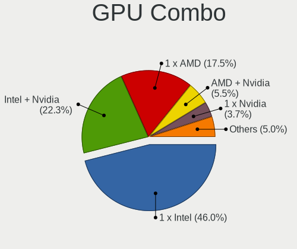

| Name           | Notebooks | Percent |
|----------------|-----------|---------|
| 1 x Intel      | 438       | 47.61%  |
| Intel + Nvidia | 201       | 21.85%  |
| 1 x AMD        | 168       | 18.26%  |
| AMD + Nvidia   | 35        | 3.8%    |
| 1 x Nvidia     | 34        | 3.7%    |
| Intel + AMD    | 26        | 2.83%   |
| 2 x AMD        | 13        | 1.41%   |
| 2 x Intel      | 3         | 0.33%   |
| Other          | 1         | 0.11%   |
| 2 x Nvidia     | 1         | 0.11%   |

GPU Driver
----------

Free vs proprietary

| Driver      | Notebooks | Percent |
|-------------|-----------|---------|
| Free        | 789       | 85.76%  |
| Proprietary | 114       | 12.39%  |
| Unknown     | 17        | 1.85%   |

GPU Memory
----------

Total video memory

| Size in GB | Notebooks | Percent |
|------------|-----------|---------|
| Unknown    | 561       | 60.71%  |
| 0.01-0.5   | 121       | 13.1%   |
| 1.01-2.0   | 92        | 9.96%   |
| 3.01-4.0   | 55        | 5.95%   |
| 0.51-1.0   | 50        | 5.41%   |
| 7.01-8.0   | 20        | 2.16%   |
| 5.01-6.0   | 15        | 1.62%   |
| 8.01-16.0  | 5         | 0.54%   |
| 2.01-3.0   | 4         | 0.43%   |
| 16.01-24.0 | 1         | 0.11%   |

Monitor
-------

Monitor Vendor
--------------

Monitor vendors

| Vendor                  | Notebooks | Percent |
|-------------------------|-----------|---------|
| BOE                     | 177       | 16.51%  |
| AU Optronics            | 177       | 16.51%  |
| Chimei Innolux          | 150       | 13.99%  |
| LG Display              | 117       | 10.91%  |
| Samsung Electronics     | 107       | 9.98%   |
| Apple                   | 49        | 4.57%   |
| Sharp                   | 29        | 2.71%   |
| Goldstar                | 26        | 2.43%   |
| Dell                    | 24        | 2.24%   |
| CSO                     | 24        | 2.24%   |
| Lenovo                  | 20        | 1.87%   |
| Hewlett-Packard         | 18        | 1.68%   |
| PANDA                   | 15        | 1.4%    |
| Philips                 | 14        | 1.31%   |
| Chi Mei Optoelectronics | 14        | 1.31%   |
| InfoVision              | 12        | 1.12%   |
| TMX                     | 10        | 0.93%   |
| AOC                     | 10        | 0.93%   |
| ASUSTek Computer        | 8         | 0.75%   |
| Iiyama                  | 7         | 0.65%   |
| Sony                    | 6         | 0.56%   |
| Acer                    | 6         | 0.56%   |
| ViewSonic               | 5         | 0.47%   |
| Gigabyte Technology     | 5         | 0.47%   |
| HKC                     | 4         | 0.37%   |
| CTO                     | 3         | 0.28%   |
| BenQ                    | 3         | 0.28%   |
| TMA                     | 2         | 0.19%   |
| STA                     | 2         | 0.19%   |
| KDB                     | 2         | 0.19%   |
| JDI                     | 2         | 0.19%   |
| Gateway                 | 2         | 0.19%   |
| Ancor Communications    | 2         | 0.19%   |
| Valve                   | 1         | 0.09%   |
| Sceptre Tech            | 1         | 0.09%   |
| Panasonic               | 1         | 0.09%   |
| OPP                     | 1         | 0.09%   |
| Onkyo                   | 1         | 0.09%   |
| NEC Computers           | 1         | 0.09%   |
| MTD                     | 1         | 0.09%   |

Monitor Model
-------------

Monitor models

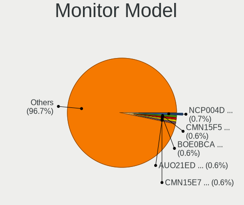

| Model                                                                 | Notebooks | Percent |
|-----------------------------------------------------------------------|-----------|---------|
| Chimei Innolux LCD Monitor CMN14D4 1920x1080 309x173mm 13.9-inch      | 8         | 0.74%   |
| Chimei Innolux LCD Monitor CMN15F5 1920x1080 344x193mm 15.5-inch      | 7         | 0.65%   |
| BOE LCD Monitor BOE0BCA 2256x1504 285x190mm 13.5-inch                 | 7         | 0.65%   |
| BOE LCD Monitor BOE08D5 1920x1080 344x194mm 15.5-inch                 | 7         | 0.65%   |
| Samsung Electronics LCD Monitor SEC5441 1366x768 344x194mm 15.5-inch  | 6         | 0.56%   |
| Samsung Electronics LCD Monitor SDC4171 2880x1800 302x189mm 14.0-inch | 6         | 0.56%   |
| Chimei Innolux LCD Monitor CMN1521 1920x1080 344x193mm 15.5-inch      | 6         | 0.56%   |
| Samsung Electronics LCD Monitor SDC416E 2880x1620 344x194mm 15.5-inch | 5         | 0.46%   |
| LG Display LCD Monitor LGD0521 1920x1080 309x174mm 14.0-inch          | 5         | 0.46%   |
| LG Display LCD Monitor LGD046F 1920x1080 345x194mm 15.6-inch          | 5         | 0.46%   |
| Chimei Innolux LCD Monitor CMN15E7 1920x1080 344x193mm 15.5-inch      | 5         | 0.46%   |
| Chimei Innolux LCD Monitor CMN14C9 1920x1080 309x173mm 13.9-inch      | 5         | 0.46%   |
| BOE LCD Monitor BOE0872 1920x1080 344x194mm 15.5-inch                 | 5         | 0.46%   |
| AU Optronics LCD Monitor AUO26EC 1366x768 344x193mm 15.5-inch         | 5         | 0.46%   |
| AU Optronics LCD Monitor AUO21ED 1920x1080 344x193mm 15.5-inch        | 5         | 0.46%   |
| Apple Color LCD APPA034 2880x1800 286x179mm 13.3-inch                 | 5         | 0.46%   |
| Samsung Electronics LCD Monitor SDC4193 2880x1800 302x189mm 14.0-inch | 4         | 0.37%   |
| Samsung Electronics LCD Monitor SDC4150 3456x2160 336x210mm 15.6-inch | 4         | 0.37%   |
| PANDA LCD Monitor NCP004D 1920x1080 344x194mm 15.5-inch               | 4         | 0.37%   |
| Chimei Innolux LCD Monitor CMN1735 1920x1080 382x215mm 17.3-inch      | 4         | 0.37%   |
| Chimei Innolux LCD Monitor CMN1618 1920x1200 344x215mm 16.0-inch      | 4         | 0.37%   |
| Chimei Innolux LCD Monitor CMN15E8 1920x1080 344x193mm 15.5-inch      | 4         | 0.37%   |
| Chimei Innolux LCD Monitor CMN15C4 1920x1080 344x193mm 15.5-inch      | 4         | 0.37%   |
| BOE LCD Monitor BOE0877 1920x1080 309x173mm 13.9-inch                 | 4         | 0.37%   |
| BOE LCD Monitor BOE07CB 1920x1080 344x193mm 15.5-inch                 | 4         | 0.37%   |
| AU Optronics LCD Monitor AUO403D 1920x1080 309x174mm 14.0-inch        | 4         | 0.37%   |
| AU Optronics LCD Monitor AUO2E8D 1920x1080 344x194mm 15.5-inch        | 4         | 0.37%   |
| AU Optronics LCD Monitor AUO2D3C 1366x768 309x173mm 13.9-inch         | 4         | 0.37%   |
| Apple LCD Monitor APP9CC3 1280x800 286x179mm 13.3-inch                | 4         | 0.37%   |
| Apple Color LCD APPA019 2880x1800 331x207mm 15.4-inch                 | 4         | 0.37%   |
| Apple Color LCD APP9CF0 1440x900 290x180mm 13.4-inch                  | 4         | 0.37%   |
| Apple Color LCD APP9CDF 1440x900 286x179mm 13.3-inch                  | 4         | 0.37%   |
| TMX TL160ADMP03-0 TMX1603 2560x1600 345x215mm 16.0-inch               | 3         | 0.28%   |
| Sharp LCD Monitor SHP149A 1920x1080 344x194mm 15.5-inch               | 3         | 0.28%   |
| Sharp LCD Monitor SHP1453 1920x1080 346x194mm 15.6-inch               | 3         | 0.28%   |
| Samsung Electronics LCD Monitor SDC416D 2880x1800 312x195mm 14.5-inch | 3         | 0.28%   |
| Samsung Electronics C27F390 SAM0D32 1920x1080 598x336mm 27.0-inch     | 3         | 0.28%   |
| LG Display LCD Monitor LGD065A 1920x1080 344x194mm 15.5-inch          | 3         | 0.28%   |
| LG Display LCD Monitor LGD062E 1920x1080 344x194mm 15.5-inch          | 3         | 0.28%   |
| LG Display LCD Monitor LGD05E5 1920x1080 344x194mm 15.5-inch          | 3         | 0.28%   |

Monitor Resolution
------------------

Monitor screen resolution

| Resolution         | Notebooks | Percent |
|--------------------|-----------|---------|
| 1920x1080 (FHD)    | 463       | 45.53%  |
| 1366x768 (WXGA)    | 164       | 16.13%  |
| 1920x1200 (WUXGA)  | 65        | 6.39%   |
| 3840x2160 (4K)     | 51        | 5.01%   |
| 2560x1440 (QHD)    | 48        | 4.72%   |
| 2880x1800          | 43        | 4.23%   |
| 2560x1600          | 37        | 3.64%   |
| 1600x900 (HD+)     | 26        | 2.56%   |
| 1440x900 (WXGA+)   | 17        | 1.67%   |
| 1280x800 (WXGA)    | 13        | 1.28%   |
| 3840x2400          | 10        | 0.98%   |
| 2256x1504          | 10        | 0.98%   |
| 2160x1440          | 7         | 0.69%   |
| 3456x2160          | 6         | 0.59%   |
| 3200x2000          | 6         | 0.59%   |
| 2880x1620          | 6         | 0.59%   |
| 2560x1080          | 5         | 0.49%   |
| 1680x1050 (WSXGA+) | 4         | 0.39%   |
| 3440x1440          | 3         | 0.29%   |
| 3200x1800 (QHD+)   | 3         | 0.29%   |
| 3120x2080          | 3         | 0.29%   |
| 3072x1920          | 3         | 0.29%   |
| 2240x1400          | 3         | 0.29%   |
| 1920x1280          | 3         | 0.29%   |
| 3840x1100          | 2         | 0.2%    |
| 3840x1080          | 2         | 0.2%    |
| 2520x1680          | 2         | 0.2%    |
| 1400x1050          | 2         | 0.2%    |
| 1280x1024 (SXGA)   | 2         | 0.2%    |
| 800x1280           | 1         | 0.1%    |
| 3840x1600          | 1         | 0.1%    |
| 3000x2000          | 1         | 0.1%    |
| 2304x1440          | 1         | 0.1%    |
| 2160x1200          | 1         | 0.1%    |
| 2048x1152          | 1         | 0.1%    |
| 1920x540           | 1         | 0.1%    |
| Unknown            | 1         | 0.1%    |

Monitor Diagonal
----------------

Diagonal size in inches

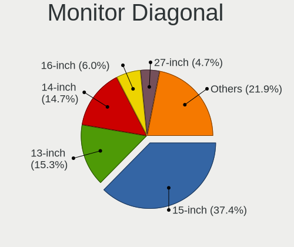

| Inches  | Notebooks | Percent |
|---------|-----------|---------|
| 15      | 400       | 37.35%  |
| 14      | 176       | 16.43%  |
| 13      | 159       | 14.85%  |
| 16      | 63        | 5.88%   |
| 27      | 54        | 5.04%   |
| 17      | 45        | 4.2%    |
| 24      | 30        | 2.8%    |
| 23      | 25        | 2.33%   |
| 12      | 21        | 1.96%   |
| 21      | 16        | 1.49%   |
| 31      | 13        | 1.21%   |
| 11      | 9         | 0.84%   |
| 34      | 7         | 0.65%   |
| 26      | 5         | 0.47%   |
| 19      | 5         | 0.47%   |
| 84      | 4         | 0.37%   |
| 40      | 4         | 0.37%   |
| 22      | 4         | 0.37%   |
| 20      | 4         | 0.37%   |
| 18      | 3         | 0.28%   |
| Unknown | 3         | 0.28%   |
| 72      | 2         | 0.19%   |
| 32      | 2         | 0.19%   |
| 85      | 1         | 0.09%   |
| 64      | 1         | 0.09%   |
| 58      | 1         | 0.09%   |
| 57      | 1         | 0.09%   |
| 54      | 1         | 0.09%   |
| 52      | 1         | 0.09%   |
| 49      | 1         | 0.09%   |
| 48      | 1         | 0.09%   |
| 46      | 1         | 0.09%   |
| 39      | 1         | 0.09%   |
| 38      | 1         | 0.09%   |
| 33      | 1         | 0.09%   |
| 28      | 1         | 0.09%   |
| 25      | 1         | 0.09%   |
| 8       | 1         | 0.09%   |
| 7       | 1         | 0.09%   |
| 5       | 1         | 0.09%   |

Monitor Width
-------------

Physical width

| Width in mm | Notebooks | Percent |
|-------------|-----------|---------|
| 301-350     | 683       | 64.43%  |
| 201-300     | 125       | 11.79%  |
| 501-600     | 101       | 9.53%   |
| 351-400     | 64        | 6.04%   |
| 401-500     | 30        | 2.83%   |
| 601-700     | 20        | 1.89%   |
| 701-800     | 10        | 0.94%   |
| 1001-1500   | 8         | 0.75%   |
| 1501-2000   | 7         | 0.66%   |
| 801-900     | 5         | 0.47%   |
| Unknown     | 3         | 0.28%   |
| 101-200     | 2         | 0.19%   |
| 901-1000    | 1         | 0.09%   |
| 1-100       | 1         | 0.09%   |

Aspect Ratio
------------

Proportional relationship between the width and the height

| Ratio   | Notebooks | Percent |
|---------|-----------|---------|
| 16/9    | 684       | 72.92%  |
| 16/10   | 204       | 21.75%  |
| 3/2     | 28        | 2.99%   |
| 21/9    | 8         | 0.85%   |
| 4/3     | 3         | 0.32%   |
| 32/9    | 3         | 0.32%   |
| 5/4     | 2         | 0.21%   |
| 3.40    | 2         | 0.21%   |
| Unknown | 2         | 0.21%   |
| 0.67    | 1         | 0.11%   |
| 0.62    | 1         | 0.11%   |

Monitor Area
------------

Area in inch

| Area in inch | Notebooks | Percent |
|----------------|-----------|---------|
| 101-110        | 405       | 37.89%  |
| 81-90          | 269       | 25.16%  |
| 201-250        | 67        | 6.27%   |
| 301-350        | 57        | 5.33%   |
| 111-120        | 56        | 5.24%   |
| 71-80          | 53        | 4.96%   |
| 121-130        | 40        | 3.74%   |
| 351-500        | 25        | 2.34%   |
| 61-70          | 19        | 1.78%   |
| 91-100         | 15        | 1.4%    |
| More than 1000 | 11        | 1.03%   |
| 51-60          | 11        | 1.03%   |
| 151-200        | 11        | 1.03%   |
| 501-1000       | 10        | 0.94%   |
| 251-300        | 6         | 0.56%   |
| 131-140        | 6         | 0.56%   |
| 1-40           | 3         | 0.28%   |
| Unknown        | 3         | 0.28%   |
| 141-150        | 2         | 0.19%   |

Pixel Density
-------------

Pixels per inch

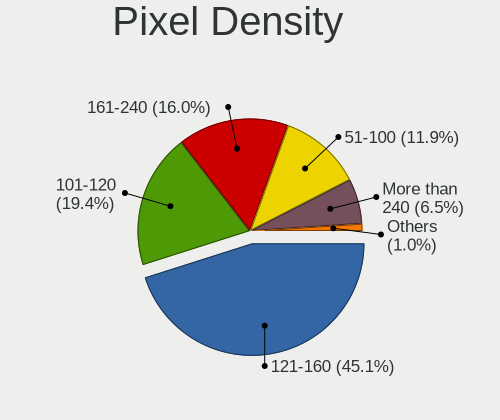

| Density       | Notebooks | Percent |
|---------------|-----------|---------|
| 121-160       | 468       | 44.44%  |
| 101-120       | 193       | 18.33%  |
| 161-240       | 176       | 16.71%  |
| 51-100        | 132       | 12.54%  |
| More than 240 | 74        | 7.03%   |
| 1-50          | 7         | 0.66%   |
| Unknown       | 3         | 0.28%   |

Multiple Monitors
-----------------

Total monitors connected

| Total | Notebooks | Percent |
|-------|-----------|---------|
| 1     | 726       | 78.57%  |
| 2     | 159       | 17.21%  |
| 0     | 22        | 2.38%   |
| 3     | 15        | 1.62%   |
| 4     | 2         | 0.22%   |

Network
-------

Net Controller Vendor
---------------------

Controller vendors

| Vendor                                 | Notebooks | Percent |
|----------------------------------------|-----------|---------|
| Intel                                  | 517       | 37.3%   |
| Realtek Semiconductor                  | 450       | 32.47%  |
| Qualcomm Atheros                       | 95        | 6.85%   |
| Broadcom                               | 87        | 6.28%   |
| MediaTek                               | 84        | 6.06%   |
| Broadcom Limited                       | 23        | 1.66%   |
| Qualcomm                               | 21        | 1.52%   |
| ASIX Electronics                       | 13        | 0.94%   |
| TP-Link                                | 11        | 0.79%   |
| Dell                                   | 9         | 0.65%   |
| Lenovo                                 | 8         | 0.58%   |
| Samsung Electronics                    | 6         | 0.43%   |
| Sierra Wireless                        | 5         | 0.36%   |
| Ralink Technology                      | 5         | 0.36%   |
| Xiaomi                                 | 4         | 0.29%   |
| Ralink                                 | 4         | 0.29%   |
| Nvidia                                 | 4         | 0.29%   |
| Marvell Technology Group               | 4         | 0.29%   |
| DisplayLink                            | 4         | 0.29%   |
| Hewlett-Packard                        | 3         | 0.22%   |
| Fibocom                                | 3         | 0.22%   |
| OPPO Electronics                       | 2         | 0.14%   |
| Motorola PCS                           | 2         | 0.14%   |
| Google                                 | 2         | 0.14%   |
| Ericsson Business Mobile Networks      | 2         | 0.14%   |
| Edimax Technology                      | 2         | 0.14%   |
| D-Link                                 | 2         | 0.14%   |
| Sony Ericsson Mobile Communications AB | 1         | 0.07%   |
| Shenzhen Goodix Technology             | 1         | 0.07%   |
| Qualcomm Technologies                  | 1         | 0.07%   |
| QinHeng Electronics                    | 1         | 0.07%   |
| NetGear                                | 1         | 0.07%   |
| Huawei Technologies                    | 1         | 0.07%   |
| Dresden Elektronik                     | 1         | 0.07%   |
| D-Link System                          | 1         | 0.07%   |
| Cisco Systems                          | 1         | 0.07%   |
| Bose                                   | 1         | 0.07%   |
| Belkin Components                      | 1         | 0.07%   |
| ASUSTek Computer                       | 1         | 0.07%   |
| Arduino SA                             | 1         | 0.07%   |

Net Controller Model
--------------------

Controller models

| Model                                                                  | Notebooks | Percent |
|------------------------------------------------------------------------|-----------|---------|
| Realtek RTL8111/8168/8211/8411 PCI Express Gigabit Ethernet Controller | 249       | 15.21%  |
| Intel Alder Lake-P PCH CNVi WiFi                                       | 70        | 4.28%   |
| Realtek RTL8153 Gigabit Ethernet Adapter                               | 53        | 3.24%   |
| Realtek RTL810xE PCI Express Fast Ethernet controller                  | 48        | 2.93%   |
| Intel Wi-Fi 6 AX201                                                    | 44        | 2.69%   |
| Intel Wireless 8265 / 8275                                             | 43        | 2.63%   |
| Intel Wi-Fi 6 AX200                                                    | 40        | 2.44%   |
| MediaTek MT7921 802.11ax PCI Express Wireless Network Adapter          | 39        | 2.38%   |
| Realtek RTL8822CE 802.11ac PCIe Wireless Network Adapter               | 35        | 2.14%   |
| Intel Raptor Lake PCH CNVi WiFi                                        | 35        | 2.14%   |
| MediaTek MT7922 802.11ax PCI Express Wireless Network Adapter          | 34        | 2.08%   |
| Realtek RTL8821CE 802.11ac PCIe Wireless Network Adapter               | 29        | 1.77%   |
| Intel Wireless 7265                                                    | 26        | 1.59%   |
| Intel Wi-Fi 6E(802.11ax) AX210/AX1675* 2x2 [Typhoon Peak]              | 25        | 1.53%   |
| Intel Wireless 8260                                                    | 22        | 1.34%   |
| Intel Wireless 7260                                                    | 22        | 1.34%   |
| Intel Comet Lake PCH CNVi WiFi                                         | 22        | 1.34%   |
| Intel Ethernet Connection (4) I219-LM                                  | 21        | 1.28%   |
| Qualcomm Atheros QCA6174 802.11ac Wireless Network Adapter             | 20        | 1.22%   |
| Qualcomm QCNFA765 Wireless Network Adapter                             | 19        | 1.16%   |
| Qualcomm Atheros QCA9377 802.11ac Wireless Network Adapter             | 19        | 1.16%   |
| Intel Comet Lake PCH-LP CNVi WiFi                                      | 18        | 1.1%    |
| Realtek RTL8852BE PCIe 802.11ax Wireless Network Controller            | 17        | 1.04%   |
| Intel Cannon Point-LP CNVi [Wireless-AC]                               | 17        | 1.04%   |
| Broadcom BCM43142 802.11b/g/n                                          | 17        | 1.04%   |
| Qualcomm Atheros QCA9565 / AR9565 Wireless Network Adapter             | 14        | 0.86%   |
| Realtek RTL8125 2.5GbE Controller                                      | 12        | 0.73%   |
| Realtek Killer E2600 GbE Controller                                    | 12        | 0.73%   |
| Intel Wireless 3165                                                    | 12        | 0.73%   |
| Intel 82579LM Gigabit Network Connection (Lewisville)                  | 12        | 0.73%   |
| Intel Wireless 3160                                                    | 11        | 0.67%   |
| Intel Tiger Lake PCH CNVi WiFi                                         | 11        | 0.67%   |
| Intel Ethernet Connection (4) I219-V                                   | 11        | 0.67%   |
| Intel Ethernet Connection (3) I218-LM                                  | 11        | 0.67%   |
| Intel Ethernet Connection (16) I219-V                                  | 11        | 0.67%   |
| Broadcom Limited BCM4360 802.11ac Dual Band Wireless Network Adapter   | 11        | 0.67%   |
| ASIX AX88179 Gigabit Ethernet                                          | 11        | 0.67%   |
| Intel Centrino Advanced-N 6205 [Taylor Peak]                           | 10        | 0.61%   |
| Intel Cannon Lake PCH CNVi WiFi                                        | 10        | 0.61%   |
| Intel Raptor Lake-S PCH CNVi WiFi                                      | 9         | 0.55%   |

Wireless Vendor
---------------

Wireless vendors

| Vendor                | Notebooks | Percent |
|-----------------------|-----------|---------|
| Intel                 | 502       | 52.35%  |
| Realtek Semiconductor | 136       | 14.18%  |
| MediaTek              | 84        | 8.76%   |
| Qualcomm Atheros      | 76        | 7.92%   |
| Broadcom              | 73        | 7.61%   |
| Broadcom Limited      | 22        | 2.29%   |
| Qualcomm              | 21        | 2.19%   |
| TP-Link               | 10        | 1.04%   |
| Dell                  | 7         | 0.73%   |
| Sierra Wireless       | 5         | 0.52%   |
| Ralink Technology     | 5         | 0.52%   |
| Ralink                | 4         | 0.42%   |
| Fibocom               | 3         | 0.31%   |
| Edimax Technology     | 2         | 0.21%   |
| D-Link                | 2         | 0.21%   |
| Qualcomm Technologies | 1         | 0.1%    |
| NetGear               | 1         | 0.1%    |
| Hewlett-Packard       | 1         | 0.1%    |
| D-Link System         | 1         | 0.1%    |
| Belkin Components     | 1         | 0.1%    |
| ASUSTek Computer      | 1         | 0.1%    |
| Unknown               | 1         | 0.1%    |

Wireless Model
--------------

Wireless models

| Model                                                                | Notebooks | Percent |
|----------------------------------------------------------------------|-----------|---------|
| Intel Alder Lake-P PCH CNVi WiFi                                     | 70        | 7.26%   |
| Intel Wi-Fi 6 AX201                                                  | 44        | 4.56%   |
| Intel Wireless 8265 / 8275                                           | 43        | 4.46%   |
| Intel Wi-Fi 6 AX200                                                  | 40        | 4.15%   |
| MediaTek MT7921 802.11ax PCI Express Wireless Network Adapter        | 39        | 4.05%   |
| Realtek RTL8822CE 802.11ac PCIe Wireless Network Adapter             | 35        | 3.63%   |
| Intel Raptor Lake PCH CNVi WiFi                                      | 35        | 3.63%   |
| MediaTek MT7922 802.11ax PCI Express Wireless Network Adapter        | 34        | 3.53%   |
| Realtek RTL8821CE 802.11ac PCIe Wireless Network Adapter             | 29        | 3.01%   |
| Intel Wireless 7265                                                  | 26        | 2.7%    |
| Intel Wi-Fi 6E(802.11ax) AX210/AX1675* 2x2 [Typhoon Peak]            | 25        | 2.59%   |
| Intel Wireless 8260                                                  | 22        | 2.28%   |
| Intel Wireless 7260                                                  | 22        | 2.28%   |
| Intel Comet Lake PCH CNVi WiFi                                       | 22        | 2.28%   |
| Qualcomm Atheros QCA6174 802.11ac Wireless Network Adapter           | 20        | 2.07%   |
| Qualcomm QCNFA765 Wireless Network Adapter                           | 19        | 1.97%   |
| Qualcomm Atheros QCA9377 802.11ac Wireless Network Adapter           | 19        | 1.97%   |
| Intel Comet Lake PCH-LP CNVi WiFi                                    | 18        | 1.87%   |
| Realtek RTL8852BE PCIe 802.11ax Wireless Network Controller          | 17        | 1.76%   |
| Intel Cannon Point-LP CNVi [Wireless-AC]                             | 17        | 1.76%   |
| Broadcom BCM43142 802.11b/g/n                                        | 17        | 1.76%   |
| Qualcomm Atheros QCA9565 / AR9565 Wireless Network Adapter           | 14        | 1.45%   |
| Intel Wireless 3165                                                  | 12        | 1.24%   |
| Intel Wireless 3160                                                  | 11        | 1.14%   |
| Intel Tiger Lake PCH CNVi WiFi                                       | 11        | 1.14%   |
| Broadcom Limited BCM4360 802.11ac Dual Band Wireless Network Adapter | 11        | 1.14%   |
| Intel Centrino Advanced-N 6205 [Taylor Peak]                         | 10        | 1.04%   |
| Intel Cannon Lake PCH CNVi WiFi                                      | 10        | 1.04%   |
| Intel Raptor Lake-S PCH CNVi WiFi                                    | 9         | 0.93%   |
| Intel Centrino Advanced-N 6200                                       | 9         | 0.93%   |
| Realtek RTL8852AE 802.11ax PCIe Wireless Network Adapter             | 8         | 0.83%   |
| Realtek RTL8723BE PCIe Wireless Network Adapter                      | 8         | 0.83%   |
| Qualcomm Atheros AR9485 Wireless Network Adapter                     | 7         | 0.73%   |
| Qualcomm Atheros AR9285 Wireless Network Adapter (PCI-Express)       | 7         | 0.73%   |
| MediaTek Wi-Fi 6E MT7902 Wireless Network Adapter                    | 7         | 0.73%   |
| Intel Ice Lake-LP PCH CNVi WiFi                                      | 7         | 0.73%   |
| Broadcom BCM43602 802.11ac Wireless LAN SoC                          | 7         | 0.73%   |
| Broadcom BCM4350 802.11ac Wireless Network Adapter                   | 7         | 0.73%   |
| Broadcom BCM4331 802.11a/b/g/n                                       | 7         | 0.73%   |
| Realtek RTL8822BE 802.11a/b/g/n/ac WiFi adapter                      | 6         | 0.62%   |

Ethernet Vendor
---------------

Ethernet vendors

| Vendor                                 | Notebooks | Percent |
|----------------------------------------|-----------|---------|
| Realtek Semiconductor                  | 380       | 58.28%  |
| Intel                                  | 166       | 25.46%  |
| Qualcomm Atheros                       | 27        | 4.14%   |
| Broadcom                               | 25        | 3.83%   |
| ASIX Electronics                       | 13        | 1.99%   |
| Lenovo                                 | 8         | 1.23%   |
| Samsung Electronics                    | 6         | 0.92%   |
| Xiaomi                                 | 4         | 0.61%   |
| Nvidia                                 | 4         | 0.61%   |
| Marvell Technology Group               | 4         | 0.61%   |
| DisplayLink                            | 4         | 0.61%   |
| OPPO Electronics                       | 2         | 0.31%   |
| Motorola PCS                           | 2         | 0.31%   |
| Google                                 | 2         | 0.31%   |
| TP-Link                                | 1         | 0.15%   |
| Sony Ericsson Mobile Communications AB | 1         | 0.15%   |
| Huawei Technologies                    | 1         | 0.15%   |
| Hewlett-Packard                        | 1         | 0.15%   |
| Broadcom Limited                       | 1         | 0.15%   |

Ethernet Model
--------------

Ethernet models

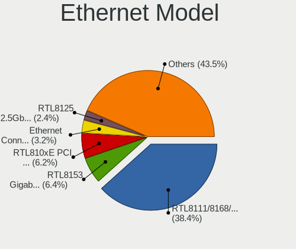

| Model                                                                  | Notebooks | Percent |
|------------------------------------------------------------------------|-----------|---------|
| Realtek RTL8111/8168/8211/8411 PCI Express Gigabit Ethernet Controller | 249       | 37.67%  |
| Realtek RTL8153 Gigabit Ethernet Adapter                               | 53        | 8.02%   |
| Realtek RTL810xE PCI Express Fast Ethernet controller                  | 48        | 7.26%   |
| Intel Ethernet Connection (4) I219-LM                                  | 21        | 3.18%   |
| Realtek RTL8125 2.5GbE Controller                                      | 12        | 1.82%   |
| Realtek Killer E2600 GbE Controller                                    | 12        | 1.82%   |
| Intel 82579LM Gigabit Network Connection (Lewisville)                  | 12        | 1.82%   |
| Intel Ethernet Connection (4) I219-V                                   | 11        | 1.66%   |
| Intel Ethernet Connection (3) I218-LM                                  | 11        | 1.66%   |
| Intel Ethernet Connection (16) I219-V                                  | 11        | 1.66%   |
| ASIX AX88179 Gigabit Ethernet                                          | 11        | 1.66%   |
| Intel Ethernet Connection I219-LM                                      | 8         | 1.21%   |
| Intel Ethernet Connection (13) I219-V                                  | 8         | 1.21%   |
| Intel 82577LM Gigabit Network Connection                               | 8         | 1.21%   |
| Intel Ethernet Connection I219-V                                       | 6         | 0.91%   |
| Intel Ethernet Connection I218-LM                                      | 6         | 0.91%   |
| Intel Ethernet Connection I217-LM                                      | 6         | 0.91%   |
| Intel Ethernet Connection (6) I219-LM                                  | 6         | 0.91%   |
| Intel Ethernet Connection (2) I219-LM                                  | 6         | 0.91%   |
| Broadcom NetXtreme BCM57765 Gigabit Ethernet PCIe                      | 6         | 0.91%   |
| Realtek Killer E3000 2.5GbE Controller                                 | 5         | 0.76%   |
| Qualcomm Atheros Killer E2400 Gigabit Ethernet Controller              | 5         | 0.76%   |
| Lenovo ThinkPad TBT 3 Dock                                             | 5         | 0.76%   |
| Samsung Galaxy series, misc. (tethering mode)                          | 4         | 0.61%   |
| Qualcomm Atheros QCA8172 Fast Ethernet                                 | 4         | 0.61%   |
| Qualcomm Atheros QCA8171 Gigabit Ethernet                              | 4         | 0.61%   |
| Nvidia MCP79 Ethernet                                                  | 4         | 0.61%   |
| Intel Ethernet Connection (6) I219-V                                   | 4         | 0.61%   |
| Intel Ethernet Connection (16) I219-LM                                 | 4         | 0.61%   |
| Broadcom NetXtreme BCM57786 Gigabit Ethernet PCIe                      | 4         | 0.61%   |
| Broadcom NetLink BCM57785 Gigabit Ethernet PCIe                        | 4         | 0.61%   |
| Broadcom NetLink BCM57780 Gigabit Ethernet PCIe                        | 4         | 0.61%   |
| Xiaomi Mi/Redmi series (RNDIS)                                         | 3         | 0.45%   |
| Realtek USB 10/100/1G/2.5G LAN                                         | 3         | 0.45%   |
| Realtek PCIe GbE Family Controller                                     | 3         | 0.45%   |
| Qualcomm Atheros Killer E220x Gigabit Ethernet Controller              | 3         | 0.45%   |
| Qualcomm Atheros AR8151 v2.0 Gigabit Ethernet                          | 3         | 0.45%   |
| Intel Ethernet Connection I217-V                                       | 3         | 0.45%   |
| Intel Ethernet Connection (5) I219-LM                                  | 3         | 0.45%   |
| Intel Ethernet Connection (23) I219-LM                                 | 3         | 0.45%   |

Net Controller Kind
-------------------

Ethernet, WiFi or modem

| Kind     | Notebooks | Percent |
|----------|-----------|---------|
| WiFi     | 912       | 59.07%  |
| Ethernet | 620       | 40.16%  |
| Modem    | 10        | 0.65%   |
| Unknown  | 2         | 0.13%   |

Used Controller
---------------

Currently used network controller

| Kind     | Notebooks | Percent |
|----------|-----------|---------|
| WiFi     | 775       | 81.58%  |
| Ethernet | 175       | 18.42%  |

NICs
----

Total network controllers on board

| Total | Notebooks | Percent |
|-------|-----------|---------|
| 2     | 544       | 59.19%  |
| 1     | 361       | 39.28%  |
| 0     | 8         | 0.87%   |
| 3     | 5         | 0.54%   |
| 4     | 1         | 0.11%   |

IPv6
----

IPv6 vs IPv4

| Used | Notebooks | Percent |
|------|-----------|---------|
| No   | 633       | 68.58%  |
| Yes  | 290       | 31.42%  |

Bluetooth
---------

Bluetooth Vendor
----------------

Controller vendors

| Vendor                          | Notebooks | Percent |
|---------------------------------|-----------|---------|
| Intel                           | 437       | 53.69%  |
| Realtek Semiconductor           | 93        | 11.43%  |
| IMC Networks                    | 48        | 5.9%    |
| Qualcomm Atheros Communications | 40        | 4.91%   |
| Apple                           | 39        | 4.79%   |
| Foxconn / Hon Hai               | 37        | 4.55%   |
| Lite-On Technology              | 31        | 3.81%   |
| Broadcom                        | 31        | 3.81%   |
| MediaTek                        | 14        | 1.72%   |
| USI                             | 13        | 1.6%    |
| Realtek                         | 8         | 0.98%   |
| Foxconn International           | 5         | 0.61%   |
| Toshiba                         | 3         | 0.37%   |
| Cambridge Silicon Radio         | 3         | 0.37%   |
| Ralink                          | 2         | 0.25%   |
| Hewlett-Packard                 | 2         | 0.25%   |
| Dell                            | 2         | 0.25%   |
| Smart Modular Technologies      | 1         | 0.12%   |
| Ralink Technology               | 1         | 0.12%   |
| Fujitsu                         | 1         | 0.12%   |
| ASUSTek Computer                | 1         | 0.12%   |
| Askey Computer                  | 1         | 0.12%   |
| Alps Electric                   | 1         | 0.12%   |

Bluetooth Model
---------------

Controller models

| Model                                               | Notebooks | Percent |
|-----------------------------------------------------|-----------|---------|
| Intel Bluetooth wireless interface                  | 123       | 15.11%  |
| Intel AX201 Bluetooth                               | 110       | 13.51%  |
| Intel Bluetooth Device                              | 85        | 10.44%  |
| Realtek Bluetooth Radio                             | 69        | 8.48%   |
| Intel Bluetooth 9460/9560 Jefferson Peak (JfP)      | 46        | 5.65%   |
| Intel AX200 Bluetooth                               | 38        | 4.67%   |
| IMC Networks Wireless_Device                        | 30        | 3.69%   |
| Foxconn / Hon Hai Wireless_Device                   | 27        | 3.32%   |
| Intel AX210 Bluetooth                               | 25        | 3.07%   |
| Apple Bluetooth Host Controller                     | 21        | 2.58%   |
| Realtek  Bluetooth 4.2 Adapter                      | 18        | 2.21%   |
| Qualcomm Atheros  Bluetooth Device                  | 18        | 2.21%   |
| MediaTek Wireless_Device                            | 14        | 1.72%   |
| Apple Bluetooth USB Host Controller                 | 14        | 1.72%   |
| USI Bluetooth Device                                | 13        | 1.6%    |
| Lite-On Wireless_Device                             | 13        | 1.6%    |
| IMC Networks Bluetooth Radio                        | 11        | 1.35%   |
| Realtek Bluetooth Radio                             | 8         | 0.98%   |
| Qualcomm Atheros QCA61x4 Bluetooth 4.0              | 8         | 0.98%   |
| Lite-On Qualcomm Atheros QCA9377 Bluetooth          | 7         | 0.86%   |
| Broadcom BCM2045B (BDC-2.1)                         | 7         | 0.86%   |
| Qualcomm Atheros AR3012 Bluetooth 4.0               | 6         | 0.74%   |
| Lite-On Bluetooth Device                            | 6         | 0.74%   |
| Foxconn / Hon Hai Bluetooth Device                  | 6         | 0.74%   |
| Intel Centrino Bluetooth Wireless Transceiver       | 5         | 0.61%   |
| Foxconn International BCM43142A0 Bluetooth module   | 5         | 0.61%   |
| Broadcom BCM43142 Bluetooth 4.0                     | 5         | 0.61%   |
| Realtek RTL8723B Bluetooth                          | 4         | 0.49%   |
| Qualcomm Atheros AR3011 Bluetooth                   | 4         | 0.49%   |
| Intel Wireless-AC 3168 Bluetooth                    | 4         | 0.49%   |
| IMC Networks Bluetooth Device                       | 4         | 0.49%   |
| Qualcomm Atheros AR9462 Bluetooth                   | 3         | 0.37%   |
| Cambridge Silicon Radio Bluetooth Dongle (HCI mode) | 3         | 0.37%   |
| Broadcom HP Portable Bumble Bee                     | 3         | 0.37%   |
| Broadcom BCM20702 Bluetooth 4.0 [ThinkPad]          | 3         | 0.37%   |
| Toshiba BCM43142A0                                  | 2         | 0.25%   |
| Realtek RTL8822BE Bluetooth 4.2 Adapter             | 2         | 0.25%   |
| Ralink RT3290 Bluetooth                             | 2         | 0.25%   |
| Lite-On Broadcom BCM43142A0 Bluetooth Device        | 2         | 0.25%   |
| Lite-On Bluetooth Radio                             | 2         | 0.25%   |

Sound
-----

Sound Vendor
------------

Sound card vendors

| Vendor                               | Notebooks | Percent |
|--------------------------------------|-----------|---------|
| Intel                                | 700       | 59.98%  |
| AMD                                  | 220       | 18.85%  |
| Nvidia                               | 161       | 13.8%   |
| Lenovo                               | 10        | 0.86%   |
| C-Media Electronics                  | 9         | 0.77%   |
| GN Netcom                            | 8         | 0.69%   |
| Sony                                 | 5         | 0.43%   |
| Realtek Semiconductor                | 5         | 0.43%   |
| Hewlett-Packard                      | 5         | 0.43%   |
| ASUSTek Computer                     | 5         | 0.43%   |
| JMTek                                | 4         | 0.34%   |
| Apple                                | 4         | 0.34%   |
| Texas Instruments                    | 3         | 0.26%   |
| Generalplus Technology               | 3         | 0.26%   |
| Focusrite-Novation                   | 3         | 0.26%   |
| Logitech                             | 2         | 0.17%   |
| Creative Technology                  | 2         | 0.17%   |
| Yealink Network Technology           | 1         | 0.09%   |
| Thesycon Systemsoftware & Consulting | 1         | 0.09%   |
| Tenx Technology                      | 1         | 0.09%   |
| SteelSeries ApS                      | 1         | 0.09%   |
| Silicon Motion                       | 1         | 0.09%   |
| Samson Technologies                  | 1         | 0.09%   |
| RODE Microphones                     | 1         | 0.09%   |
| RME                                  | 1         | 0.09%   |
| Razer USA                            | 1         | 0.09%   |
| Panasonic (Matsushita)               | 1         | 0.09%   |
| Nordic Semiconductor ASA             | 1         | 0.09%   |
| Microchip Technology                 | 1         | 0.09%   |
| Lotoo                                | 1         | 0.09%   |
| Kingston Technology                  | 1         | 0.09%   |
| Dell                                 | 1         | 0.09%   |
| BR23                                 | 1         | 0.09%   |
| Audeze                               | 1         | 0.09%   |
| AKAI Professional M.I.               | 1         | 0.09%   |

Sound Model
-----------

Sound card models

| Model                                                                      | Notebooks | Percent |
|----------------------------------------------------------------------------|-----------|---------|
| AMD Family 17h/19h HD Audio Controller                                     | 186       | 12.85%  |
| Intel Sunrise Point-LP HD Audio                                            | 109       | 7.53%   |
| AMD Renoir Radeon High Definition Audio Controller                         | 91        | 6.29%   |
| Intel Alder Lake PCH-P High Definition Audio Controller                    | 87        | 6.01%   |
| AMD Rembrandt Radeon High Definition Audio Controller                      | 68        | 4.7%    |
| Intel Tiger Lake-LP Smart Sound Technology Audio Controller                | 62        | 4.28%   |
| Intel 7 Series/C216 Chipset Family High Definition Audio Controller        | 42        | 2.9%    |
| Intel Raptor Lake-P/U/H cAVS                                               | 41        | 2.83%   |
| Nvidia Audio device                                                        | 40        | 2.76%   |
| Intel Wildcat Point-LP High Definition Audio Controller                    | 32        | 2.21%   |
| Intel Broadwell-U Audio Controller                                         | 32        | 2.21%   |
| Intel 8 Series/C220 Series Chipset High Definition Audio Controller        | 31        | 2.14%   |
| Intel 6 Series/C200 Series Chipset Family High Definition Audio Controller | 30        | 2.07%   |
| Intel Haswell-ULT HD Audio Controller                                      | 29        | 2%      |
| Intel 8 Series HD Audio Controller                                         | 28        | 1.94%   |
| Intel Cannon Point-LP High Definition Audio Controller                     | 26        | 1.8%    |
| Intel Cannon Lake PCH cAVS                                                 | 25        | 1.73%   |
| Intel 5 Series/3400 Series Chipset High Definition Audio                   | 25        | 1.73%   |
| Intel Comet Lake PCH cAVS                                                  | 24        | 1.66%   |
| Nvidia GA106 High Definition Audio Controller                              | 23        | 1.59%   |
| Intel Xeon E3-1200 v3/4th Gen Core Processor HD Audio Controller           | 21        | 1.45%   |
| Intel Comet Lake PCH-LP cAVS                                               | 20        | 1.38%   |
| Nvidia TU107 GeForce GTX 1650 High Definition Audio Controller             | 19        | 1.31%   |
| AMD Raven/Raven2/Fenghuang HDMI/DP Audio Controller                        | 19        | 1.31%   |
| Intel Ice Lake-LP Smart Sound Technology Audio Controller                  | 18        | 1.24%   |
| Nvidia GF108 High Definition Audio Controller                              | 15        | 1.04%   |
| Intel Tiger Lake-H HD Audio Controller                                     | 15        | 1.04%   |
| Intel CM238 HD Audio Controller                                            | 15        | 1.04%   |
| Intel Celeron/Pentium Silver Processor High Definition Audio               | 15        | 1.04%   |
| Intel 100 Series/C230 Series Chipset Family HD Audio Controller            | 13        | 0.9%    |
| Nvidia GK107 HDMI Audio Controller                                         | 12        | 0.83%   |
| Intel Raptor Lake High Definition Audio Controller                         | 9         | 0.62%   |
| AMD High Definition Audio Controller                                       | 8         | 0.55%   |
| Nvidia GP107GL High Definition Audio Controller                            | 7         | 0.48%   |
| Nvidia GA104 High Definition Audio Controller                              | 7         | 0.48%   |
| AMD Navi 21/23 HDMI/DP Audio Controller                                    | 7         | 0.48%   |
| AMD Family 15h (Models 60h-6fh) Audio Controller                           | 7         | 0.48%   |
| Nvidia TU106 High Definition Audio Controller                              | 6         | 0.41%   |
| Nvidia GM107 High Definition Audio Controller [GeForce 940MX]              | 6         | 0.41%   |
| Intel 82801H (ICH8 Family) HD Audio Controller                             | 6         | 0.41%   |

Memory
------

Memory Vendor
-------------

Memory module vendors

| Vendor              | Notebooks | Percent |
|---------------------|-----------|---------|
| Samsung Electronics | 120       | 29.41%  |
| SK hynix            | 100       | 24.51%  |
| Micron Technology   | 78        | 19.12%  |
| Kingston            | 34        | 8.33%   |
| Crucial             | 23        | 5.64%   |
| Unknown             | 9         | 2.21%   |
| Ramaxel Technology  | 7         | 1.72%   |
| Nanya Technology    | 5         | 1.23%   |
| A-DATA Technology   | 5         | 1.23%   |
| G.Skill             | 3         | 0.74%   |
| Corsair             | 3         | 0.74%   |
| Unknown             | 3         | 0.74%   |
| Team                | 2         | 0.49%   |
| Patriot             | 2         | 0.49%   |
| Elpida              | 2         | 0.49%   |
| ChangXin Memory     | 2         | 0.49%   |
| Unknown (ABCD)      | 1         | 0.25%   |
| Unknown (8A5D)      | 1         | 0.25%   |
| Teikon              | 1         | 0.25%   |
| PNY                 | 1         | 0.25%   |
| Neo Forza           | 1         | 0.25%   |
| Lexar               | 1         | 0.25%   |
| Kllisre             | 1         | 0.25%   |
| King Tiger          | 1         | 0.25%   |
| ASint Technology    | 1         | 0.25%   |
| Apacer              | 1         | 0.25%   |

Memory Model
------------

Memory module models

| Model                                                            | Notebooks | Percent |
|------------------------------------------------------------------|-----------|---------|
| Samsung RAM M471A1G44BB0-CWE 8GB SODIMM DDR4 3200MT/s            | 11        | 2.55%   |
| Samsung RAM M471A1K43EB1-CWE 8GB SODIMM DDR4 3200MT/s            | 8         | 1.86%   |
| Samsung RAM M471A5244CB0-CWE 4GB SODIMM DDR4 3200MT/s            | 7         | 1.62%   |
| SK hynix RAM HMT41GS6BFR8A-PB 8GB SODIMM DDR3 1600MT/s           | 5         | 1.16%   |
| SK hynix RAM HMAA1GS6CJR6N-XN 8GB SODIMM DDR4 3200MT/s           | 5         | 1.16%   |
| SK hynix RAM HMA81GS6AFR8N-UH 8GB SODIMM DDR4 2667MT/s           | 5         | 1.16%   |
| SK hynix RAM H9JCNNNCP3MLYR-N6E 2GB Row Of Chips LPDDR5 6400MT/s | 5         | 1.16%   |
| SK hynix RAM Module 4GB SODIMM DDR3 1600MT/s                     | 4         | 0.93%   |
| Samsung RAM M471B5273DH0-CH9 4GB SODIMM DDR3 1334MT/s            | 4         | 0.93%   |
| Samsung RAM M471A5244CB0-CWE 4GB Row Of Chips DDR4 3200MT/s      | 4         | 0.93%   |
| Samsung RAM M471A2K43EB1-CWE 16GB SODIMM DDR4 3200MT/s           | 4         | 0.93%   |
| Samsung RAM M471A1K43CB1-CRC 8GB SODIMM DDR4 2667MT/s            | 4         | 0.93%   |
| Samsung RAM M471A1G44AB0-CWE 8GB Row Of Chips DDR4 3200MT/s      | 4         | 0.93%   |
| Micron RAM MT62F2G32D4DS-026 WT 8GB SODIMM LPDDR5 7500MT/s       | 4         | 0.93%   |
| SK hynix RAM HMAA2GS6CJR8N-XN 16GB SODIMM DDR4 3200MT/s          | 3         | 0.7%    |
| SK hynix RAM HMA851S6DJR6N-XN 4GB SODIMM DDR4 3200MT/s           | 3         | 0.7%    |
| SK hynix RAM HMA81GS6DJR8N-XN 8GB SODIMM DDR4 3200MT/s           | 3         | 0.7%    |
| Samsung RAM M471B1G73EB0-YK0 8GB SODIMM DDR3 1600MT/s            | 3         | 0.7%    |
| Samsung RAM M471A5244CB0-CTD 4096MB SODIMM DDR4 3266MT/s         | 3         | 0.7%    |
| Samsung RAM M471A2K43DB1-CWE 16GB SODIMM DDR4 3200MT/s           | 3         | 0.7%    |
| Samsung RAM M471A2K43CB1-CRC 16GB SODIMM DDR4 2667MT/s           | 3         | 0.7%    |
| Samsung RAM M471A2G44AM0-CWE 16GB SODIMM DDR4 3200MT/s           | 3         | 0.7%    |
| Samsung RAM M471A1K43DB1-CWE 8GB SODIMM DDR4 3200MT/s            | 3         | 0.7%    |
| Micron RAM MTC4C10163S1SC48BA1 8GB SODIMM DDR5 4800MT/s          | 3         | 0.7%    |
| Micron RAM MT62F4G32D8DV-026 WT 16GB SODIMM LPDDR5 6400MT/s      | 3         | 0.7%    |
| Micron RAM MT62F1G32D4DR-031 WT 4GB SODIMM LPDDR5 6400MT/s       | 3         | 0.7%    |
| Micron RAM 8KTF51264HZ-1G6E1 4096MB SODIMM DDR3 1600MT/s         | 3         | 0.7%    |
| Micron RAM 8ATF1G64HZ-3G2R1 8GB SODIMM DDR4 3200MT/s             | 3         | 0.7%    |
| Micron RAM 4ATF1G64HZ-3G2F1 8GB SODIMM DDR4 3200MT/s             | 3         | 0.7%    |
| Micron RAM 4ATF1G64HZ-3G2E2 8GB SODIMM DDR4 3200MT/s             | 3         | 0.7%    |
| Unknown                                                          | 3         | 0.7%    |
| Unknown RAM Module 2GB Row Of Chips LPDDR4 4267MT/s              | 2         | 0.46%   |
| SK hynix RAM Module 16GB SODIMM DDR5 5600MT/s                    | 2         | 0.46%   |
| SK hynix RAM HMT451S6BFR8A-PB 4GB SODIMM DDR3 1600MT/s           | 2         | 0.46%   |
| SK hynix RAM HMT451S6AFR8A-PB 4GB SODIMM DDR3 1600MT/s           | 2         | 0.46%   |
| SK hynix RAM HMCG78AGBSA095N 16GB SODIMM DDR5 5600MT/s           | 2         | 0.46%   |
| SK hynix RAM HMCG78AGBSA092N 16GB SODIMM DDR5 5600MT/s           | 2         | 0.46%   |
| SK hynix RAM HMCG66MEBSA095N 8GB SODIMM DDR5 4800MT/s            | 2         | 0.46%   |
| SK hynix RAM HMCG66AGBSA092N 8GB SODIMM DDR5 5600MT/s            | 2         | 0.46%   |
| SK hynix RAM HMAA4GS6AJR8N-XN 32GB SODIMM DDR4 3200MT/s          | 2         | 0.46%   |

Memory Kind
-----------

Memory module kinds

| Kind   | Notebooks | Percent |
|--------|-----------|---------|
| DDR4   | 177       | 51.01%  |
| DDR3   | 63        | 18.16%  |
| LPDDR5 | 46        | 13.26%  |
| DDR5   | 26        | 7.49%   |
| LPDDR4 | 17        | 4.9%    |
| LPDDR3 | 15        | 4.32%   |
| DDR2   | 2         | 0.58%   |
| SDRAM  | 1         | 0.29%   |

Memory Form Factor
------------------

Physical design of the memory module

| Name         | Notebooks | Percent |
|--------------|-----------|---------|
| SODIMM       | 284       | 79.78%  |
| Row Of Chips | 67        | 18.82%  |
| Chip         | 4         | 1.12%   |
| DIMM         | 1         | 0.28%   |

Memory Size
-----------

Memory module size

| Size  | Notebooks | Percent |
|-------|-----------|---------|
| 8192  | 160       | 42.55%  |
| 4096  | 95        | 25.27%  |
| 16384 | 81        | 21.54%  |
| 32768 | 20        | 5.32%   |
| 2048  | 19        | 5.05%   |
| 1024  | 1         | 0.27%   |

Memory Speed
------------

Memory module speed

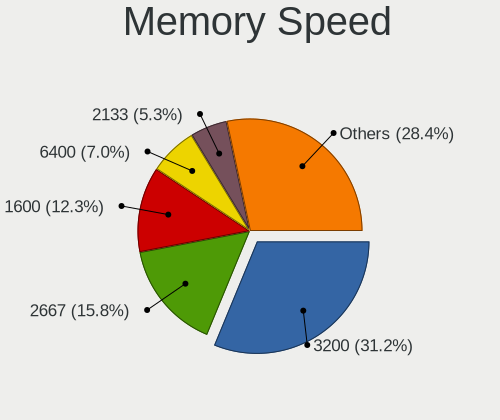

| Speed   | Notebooks | Percent |
|---------|-----------|---------|
| 3200    | 104       | 28.26%  |
| 2667    | 57        | 15.49%  |
| 1600    | 48        | 13.04%  |
| 6400    | 40        | 10.87%  |
| 2400    | 21        | 5.71%   |
| 2133    | 18        | 4.89%   |
| 4800    | 14        | 3.8%    |
| 5600    | 11        | 2.99%   |
| 1334    | 11        | 2.99%   |
| 4266    | 7         | 1.9%    |
| 1333    | 7         | 1.9%    |
| 4267    | 6         | 1.63%   |
| 7500    | 4         | 1.09%   |
| 1867    | 4         | 1.09%   |
| 3733    | 3         | 0.82%   |
| 3266    | 3         | 0.82%   |
| 7467    | 2         | 0.54%   |
| 1066    | 2         | 0.54%   |
| 667     | 2         | 0.54%   |
| 5200    | 1         | 0.27%   |
| 4199    | 1         | 0.27%   |
| 1776    | 1         | 0.27%   |
| Unknown | 1         | 0.27%   |

Printers & scanners
-------------------

Printer Vendor
--------------

Printer device vendors

| Vendor             | Notebooks | Percent |
|--------------------|-----------|---------|
| Minolta            | 1         | 20%     |
| Hewlett-Packard    | 1         | 20%     |
| Dymo-CoStar        | 1         | 20%     |
| Canon              | 1         | 20%     |
| Brother Industries | 1         | 20%     |

Printer Model
-------------

Printer device models

| Model                       | Notebooks | Percent |
|-----------------------------|-----------|---------|
| Minolta PagePro 1300W       | 1         | 20%     |
| HP Smart Tank 510 series    | 1         | 20%     |
| Dymo-CoStar LabelWriter 450 | 1         | 20%     |
| Canon PIXMA MG3500 Series   | 1         | 20%     |
| Brother HL-2240D series     | 1         | 20%     |

Scanner Vendor
--------------

Scanner device vendors

Zero info for selected period =(

Scanner Model
-------------

Scanner device models

Zero info for selected period =(

Camera
------

Camera Vendor
-------------

Camera device vendors

| Vendor                                 | Notebooks | Percent |
|----------------------------------------|-----------|---------|
| Chicony Electronics                    | 164       | 20.2%   |
| IMC Networks                           | 103       | 12.68%  |
| Microdia                               | 75        | 9.24%   |
| Bison Electronics                      | 63        | 7.76%   |
| Realtek Semiconductor                  | 60        | 7.39%   |
| Quanta                                 | 58        | 7.14%   |
| Luxvisions Innotech Limited            | 38        | 4.68%   |
| Sunplus Innovation Technology          | 33        | 4.06%   |
| Sonix Technology                       | 29        | 3.57%   |
| Acer                                   | 27        | 3.33%   |
| Cheng Uei Precision Industry (Foxlink) | 25        | 3.08%   |
| Apple                                  | 24        | 2.96%   |
| Syntek                                 | 22        | 2.71%   |
| Lite-On Technology                     | 14        | 1.72%   |
| Logitech                               | 10        | 1.23%   |
| Silicon Motion                         | 9         | 1.11%   |
| Suyin                                  | 8         | 0.99%   |
| ShineTech                              | 6         | 0.74%   |
| Alcor Micro                            | 6         | 0.74%   |
| SunplusIT                              | 4         | 0.49%   |
| USB Camera                             | 3         | 0.37%   |
| Ricoh                                  | 3         | 0.37%   |
| Unknown (3730304233333731323245)       | 2         | 0.25%   |
| Samsung Electronics                    | 2         | 0.25%   |
| Primax Electronics                     | 2         | 0.25%   |
| Lenovo                                 | 2         | 0.25%   |
| 8SSC21K12273V1SR33X2817                | 2         | 0.25%   |
| 8SSC21D67422V1SR3AV5KW1                | 2         | 0.25%   |
| Tripath Technology                     | 1         | 0.12%   |
| Tobii Technology AB                    | 1         | 0.12%   |
| Sunplus Technology                     | 1         | 0.12%   |
| ShineOptics                            | 1         | 0.12%   |
| Razer USA                              | 1         | 0.12%   |
| Rayprus                                | 1         | 0.12%   |
| OmniVision Technologies                | 1         | 0.12%   |
| Microsoft                              | 1         | 0.12%   |
| Intel                                  | 1         | 0.12%   |
| Importek                               | 1         | 0.12%   |
| Hewlett-Packard                        | 1         | 0.12%   |
| Google                                 | 1         | 0.12%   |

Camera Model
------------

Camera device models

| Model                                               | Notebooks | Percent |
|-----------------------------------------------------|-----------|---------|
| Chicony Integrated Camera                           | 61        | 7.48%   |
| Microdia Integrated_Webcam_HD                       | 38        | 4.66%   |
| IMC Networks USB2.0 HD UVC WebCam                   | 37        | 4.53%   |
| Realtek Integrated_Webcam_HD                        | 32        | 3.92%   |
| IMC Networks Integrated Camera                      | 32        | 3.92%   |
| Sonix USB2.0 HD UVC WebCam                          | 19        | 2.33%   |
| Syntek Integrated Camera                            | 18        | 2.21%   |
| Bison Integrated Camera                             | 17        | 2.08%   |
| Sunplus Integrated_Webcam_HD                        | 15        | 1.84%   |
| Chicony HD WebCam                                   | 14        | 1.72%   |
| Quanta HD User Facing                               | 12        | 1.47%   |
| Acer Integrated Camera                              | 11        | 1.35%   |
| Luxvisions Innotech Limited HP TrueVision HD Camera | 10        | 1.23%   |
| IMC Networks USB2.0 VGA UVC WebCam                  | 10        | 1.23%   |
| Chicony HP TrueVision HD Camera                     | 9         | 1.1%    |
| Sonix USB2.0 FHD UVC WebCam                         | 8         | 0.98%   |
| Quanta ACER HD User Facing                          | 8         | 0.98%   |
| Luxvisions Innotech Limited Integrated Camera       | 8         | 0.98%   |
| Apple iPhone 5/5C/5S/6/SE/7/8/X/XR                  | 8         | 0.98%   |
| Lite-On Integrated Camera                           | 7         | 0.86%   |
| Chicony HD User Facing                              | 7         | 0.86%   |
| Bison HD Webcam                                     | 7         | 0.86%   |
| Apple FaceTime HD Camera                            | 7         | 0.86%   |
| Acer SunplusIT Integrated Camera                    | 7         | 0.86%   |
| Acer Integrated RGB Camera                          | 7         | 0.86%   |
| Quanta ov9734_techfront_camera                      | 6         | 0.74%   |
| Microdia Integrated_Webcam_FHD                      | 6         | 0.74%   |
| Luxvisions Innotech Limited HP HD Camera            | 6         | 0.74%   |
| Microdia Webcam Vitade AF                           | 5         | 0.61%   |
| Microdia Laptop_Integrated_Webcam_HD                | 5         | 0.61%   |
| IMC Networks XiaoMi Webcam                          | 5         | 0.61%   |
| IMC Networks HD Camera                              | 5         | 0.61%   |
| Chicony HP TrueVision HD                            | 5         | 0.61%   |
| Chicony FJ Camera                                   | 5         | 0.61%   |
| Bison Lenovo EasyCamera                             | 5         | 0.61%   |
| Bison HD Camera                                     | 5         | 0.61%   |
| Bison BisonCam,NB Pro                               | 5         | 0.61%   |
| Apple FaceTime HD Camera (Built-in)                 | 5         | 0.61%   |
| Syntek Lenovo EasyCamera                            | 4         | 0.49%   |
| Silicon Motion WebCam SCB-1100N                     | 4         | 0.49%   |

Security
--------

Fingerprint Vendor
------------------

Fingerprint sensor vendors

| Vendor                             | Notebooks | Percent |
|------------------------------------|-----------|---------|
| Synaptics                          | 56        | 36.6%   |
| Validity Sensors                   | 40        | 26.14%  |
| Shenzhen Goodix Technology         | 26        | 16.99%  |
| Elan Microelectronics              | 11        | 7.19%   |
| Upek                               | 8         | 5.23%   |
| LighTuning Technology              | 6         | 3.92%   |
| Realtek USB2.0 Finger Print Bridge | 5         | 3.27%   |
| FocalTech                          | 1         | 0.65%   |

Fingerprint Model
-----------------

Fingerprint sensor models

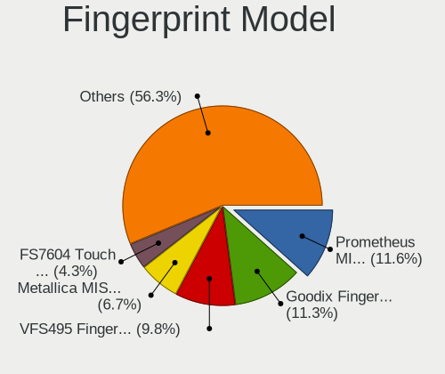

| Model                                                           | Notebooks | Percent |
|-----------------------------------------------------------------|-----------|---------|
| Shenzhen Goodix  Fingerprint Device                             | 18        | 11.76%  |
| Synaptics Prometheus MIS Touch Fingerprint Reader               | 17        | 11.11%  |
| Validity Sensors VFS495 Fingerprint Reader                      | 11        | 7.19%   |
| Synaptics Metallica MIS Touch Fingerprint Reader                | 11        | 7.19%   |
| Validity Sensors VFS 5011 fingerprint sensor                    | 7         | 4.58%   |
| Upek Biometric Touchchip/Touchstrip Fingerprint Sensor          | 7         | 4.58%   |
| Validity Sensors Synaptics WBDI                                 | 6         | 3.92%   |
| Synaptics UWP WBDI Device                                       | 6         | 3.92%   |
| Elan ELAN:Fingerprint                                           | 6         | 3.92%   |
| Synaptics WBDI Fingerprint Reader USB 086                       | 5         | 3.27%   |
| Shenzhen Goodix Fingerprint Reader                              | 5         | 3.27%   |
| Realtek USB2.0 Finger Print Bridge FocalTech Fingerprint Device | 5         | 3.27%   |
| Elan ELAN:ARM-M4                                                | 5         | 3.27%   |
| Synaptics  FS7604 Touch Fingerprint Sensor with PurePrint       | 4         | 2.61%   |
| Validity Sensors VFS5011 Fingerprint Reader                     | 3         | 1.96%   |
| Validity Sensors VFS491                                         | 3         | 1.96%   |
| Validity Sensors VFS471 Fingerprint Reader                      | 3         | 1.96%   |
| Synaptics UWP WBDI                                              | 3         | 1.96%   |
| Synaptics FS7604 Touch Fingerprint Sensor with PurePrint        | 3         | 1.96%   |
| Synaptics Fingerprint reader [HP G6]                            | 3         | 1.96%   |
| Shenzhen Goodix FingerPrint                                     | 3         | 1.96%   |
| LighTuning ES603 Swipe Fingerprint Sensor                       | 3         | 1.96%   |
| LighTuning EgisTec Touch Fingerprint Sensor                     | 3         | 1.96%   |
| Validity Sensors VFS7552 Touch Fingerprint Sensor               | 2         | 1.31%   |
| Validity Sensors VFS7500 Touch Fingerprint Sensor               | 2         | 1.31%   |
| Validity Sensors VFS300 Fingerprint Reader                      | 2         | 1.31%   |
| Synaptics WBDI                                                  | 2         | 1.31%   |
| Synaptics Metallica MOH Touch Fingerprint Reader                | 2         | 1.31%   |
| Validity Sensors Fingerprint scanner                            | 1         | 0.65%   |
| Upek TCS5B Fingerprint sensor                                   | 1         | 0.65%   |
| FocalTech Fingerprint Device                                    | 1         | 0.65%   |

Chipcard Vendor
---------------

Chipcard module vendors

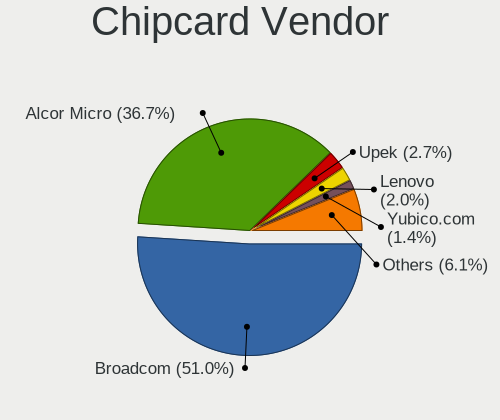

| Vendor                   | Notebooks | Percent |
|--------------------------|-----------|---------|
| Broadcom                 | 35        | 46.05%  |
| Alcor Micro              | 30        | 39.47%  |
| Lenovo                   | 3         | 3.95%   |
| Upek                     | 2         | 2.63%   |
| OmniKey                  | 2         | 2.63%   |
| Yubico.com               | 1         | 1.32%   |
| Reiner SCT Kartensysteme | 1         | 1.32%   |
| Gemalto (was Gemplus)    | 1         | 1.32%   |
| Aktiv                    | 1         | 1.32%   |

Chipcard Model
--------------

Chipcard module models

| Model                                                                        | Notebooks | Percent |
|------------------------------------------------------------------------------|-----------|---------|
| Alcor Micro AU9540 Smartcard Reader                                          | 30        | 39.47%  |
| Broadcom 5880                                                                | 12        | 15.79%  |
| Broadcom 58200                                                               | 11        | 14.47%  |
| Broadcom BCM5880 Secure Applications Processor                               | 8         | 10.53%  |
| Broadcom BCM5880 Secure Applications Processor with fingerprint swipe sensor | 4         | 5.26%   |
| Lenovo Integrated Smart Card Reader                                          | 3         | 3.95%   |
| Upek TouchChip Fingerprint Coprocessor (WBF advanced mode)                   | 2         | 2.63%   |
| Yubico.com Yubikey 4/5 U2F+CCID                                              | 1         | 1.32%   |
| Reiner SCT Kartensysteme cyberJack RFID basis contactless smartcard reader   | 1         | 1.32%   |
| OmniKey CardMan Smart@Link                                                   | 1         | 1.32%   |
| OmniKey CardMan 3021 / 3121                                                  | 1         | 1.32%   |
| Gemalto (was Gemplus) GemPC Twin SmartCard Reader                            | 1         | 1.32%   |
| Aktiv Rutoken lite                                                           | 1         | 1.32%   |

Unsupported
-----------

Unsupported Devices
-------------------

Total unsupported devices on board

| Total | Notebooks | Percent |
|-------|-----------|---------|
| 0     | 554       | 60.09%  |
| 1     | 317       | 34.38%  |
| 2     | 48        | 5.21%   |
| 6     | 1         | 0.11%   |
| 4     | 1         | 0.11%   |
| 3     | 1         | 0.11%   |

Unsupported Device Types
------------------------

Types of unsupported devices

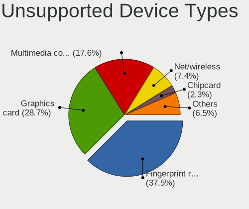

| Type                     | Notebooks | Percent |
|--------------------------|-----------|---------|
| Fingerprint reader       | 150       | 36.5%   |
| Graphics card            | 114       | 27.74%  |
| Multimedia controller    | 74        | 18%     |
| Net/wireless             | 30        | 7.3%    |
| Camera                   | 11        | 2.68%   |
| Chipcard                 | 9         | 2.19%   |
| Sound                    | 5         | 1.22%   |
| Net/ethernet             | 5         | 1.22%   |
| Bluetooth                | 5         | 1.22%   |
| Card reader              | 3         | 0.73%   |
| Network                  | 2         | 0.49%   |
| Storage                  | 1         | 0.24%   |
| Modem                    | 1         | 0.24%   |
| Communication controller | 1         | 0.24%   |

