Fedora 40 - Tested Hardware & Statistics
----------------------------------------

A project to collect tested hardware configurations for Fedora 40.

Anyone can contribute to this report by the [hw-probe](https://github.com/linuxhw/hw-probe) tool:

    sudo -E hw-probe -all -upload

Please contribute! Especially if your hardware is rare.

This is a report for all computer types. See also reports for [desktops](/Dist/Fedora_40/Desktop/README.md) and [notebooks](/Dist/Fedora_40/Notebook/README.md).

Contents
--------

* [ Test Cases ](#test-cases)

* [ System ](#system)
  - [ Kernel                   ](#kernel)
  - [ Kernel Family            ](#kernel-family)
  - [ Kernel Major Ver.        ](#kernel-major-ver)
  - [ Arch                     ](#arch)
  - [ DE                       ](#de)
  - [ Display Server           ](#display-server)
  - [ Display Manager          ](#display-manager)
  - [ OS Lang                  ](#os-lang)
  - [ Boot Mode                ](#boot-mode)
  - [ Filesystem               ](#filesystem)
  - [ Part. scheme             ](#part-scheme)
  - [ Dual Boot with Linux/BSD ](#dual-boot-with-linuxbsd)
  - [ Dual Boot (Win)          ](#dual-boot-win)

* [ Board ](#board)
  - [ Vendor                   ](#vendor)
  - [ Model                    ](#model)
  - [ Model Family             ](#model-family)
  - [ MFG Year                 ](#mfg-year)
  - [ Form Factor              ](#form-factor)
  - [ Secure Boot              ](#secure-boot)
  - [ Coreboot                 ](#coreboot)
  - [ RAM Size                 ](#ram-size)
  - [ RAM Used                 ](#ram-used)
  - [ Total Drives             ](#total-drives)
  - [ Has CD-ROM               ](#has-cd-rom)
  - [ Has Ethernet             ](#has-ethernet)
  - [ Has WiFi                 ](#has-wifi)
  - [ Has Bluetooth            ](#has-bluetooth)

* [ Location ](#location)
  - [ Country                  ](#country)
  - [ City                     ](#city)

* [ Drives ](#drives)
  - [ Drive Vendor             ](#drive-vendor)
  - [ Drive Model              ](#drive-model)
  - [ HDD Vendor               ](#hdd-vendor)
  - [ SSD Vendor               ](#ssd-vendor)
  - [ Drive Kind               ](#drive-kind)
  - [ Drive Connector          ](#drive-connector)
  - [ Drive Size               ](#drive-size)
  - [ Space Total              ](#space-total)
  - [ Space Used               ](#space-used)
  - [ Malfunc. Drives          ](#malfunc-drives)
  - [ Malfunc. Drive Vendor    ](#malfunc-drive-vendor)
  - [ Malfunc. HDD Vendor      ](#malfunc-hdd-vendor)
  - [ Malfunc. Drive Kind      ](#malfunc-drive-kind)
  - [ Failed Drives            ](#failed-drives)
  - [ Failed Drive Vendor      ](#failed-drive-vendor)
  - [ Drive Status             ](#drive-status)

* [ Storage controller ](#storage-controller)
  - [ Storage Vendor           ](#storage-vendor)
  - [ Storage Model            ](#storage-model)
  - [ Storage Kind             ](#storage-kind)

* [ Processor ](#processor)
  - [ CPU Vendor               ](#cpu-vendor)
  - [ CPU Model                ](#cpu-model)
  - [ CPU Model Family         ](#cpu-model-family)
  - [ CPU Cores                ](#cpu-cores)
  - [ CPU Sockets              ](#cpu-sockets)
  - [ CPU Threads              ](#cpu-threads)
  - [ CPU Op-Modes             ](#cpu-op-modes)
  - [ CPU Microcode            ](#cpu-microcode)
  - [ CPU Microarch            ](#cpu-microarch)

* [ Graphics ](#graphics)
  - [ GPU Vendor               ](#gpu-vendor)
  - [ GPU Model                ](#gpu-model)
  - [ GPU Combo                ](#gpu-combo)
  - [ GPU Driver               ](#gpu-driver)
  - [ GPU Memory               ](#gpu-memory)

* [ Monitor ](#monitor)
  - [ Monitor Vendor           ](#monitor-vendor)
  - [ Monitor Model            ](#monitor-model)
  - [ Monitor Resolution       ](#monitor-resolution)
  - [ Monitor Diagonal         ](#monitor-diagonal)
  - [ Monitor Width            ](#monitor-width)
  - [ Aspect Ratio             ](#aspect-ratio)
  - [ Monitor Area             ](#monitor-area)
  - [ Pixel Density            ](#pixel-density)
  - [ Multiple Monitors        ](#multiple-monitors)

* [ Network ](#network)
  - [ Net Controller Vendor    ](#net-controller-vendor)
  - [ Net Controller Model     ](#net-controller-model)
  - [ Wireless Vendor          ](#wireless-vendor)
  - [ Wireless Model           ](#wireless-model)
  - [ Ethernet Vendor          ](#ethernet-vendor)
  - [ Ethernet Model           ](#ethernet-model)
  - [ Net Controller Kind      ](#net-controller-kind)
  - [ Used Controller          ](#used-controller)
  - [ NICs                     ](#nics)
  - [ IPv6                     ](#ipv6)

* [ Bluetooth ](#bluetooth)
  - [ Bluetooth Vendor         ](#bluetooth-vendor)
  - [ Bluetooth Model          ](#bluetooth-model)

* [ Sound ](#sound)
  - [ Sound Vendor             ](#sound-vendor)
  - [ Sound Model              ](#sound-model)

* [ Memory ](#memory)
  - [ Memory Vendor            ](#memory-vendor)
  - [ Memory Model             ](#memory-model)
  - [ Memory Kind              ](#memory-kind)
  - [ Memory Form Factor       ](#memory-form-factor)
  - [ Memory Size              ](#memory-size)
  - [ Memory Speed             ](#memory-speed)

* [ Printers & scanners ](#printers--scanners)
  - [ Printer Vendor           ](#printer-vendor)
  - [ Printer Model            ](#printer-model)
  - [ Scanner Vendor           ](#scanner-vendor)
  - [ Scanner Model            ](#scanner-model)

* [ Camera ](#camera)
  - [ Camera Vendor            ](#camera-vendor)
  - [ Camera Model             ](#camera-model)

* [ Security ](#security)
  - [ Fingerprint Vendor       ](#fingerprint-vendor)
  - [ Fingerprint Model        ](#fingerprint-model)
  - [ Chipcard Vendor          ](#chipcard-vendor)
  - [ Chipcard Model           ](#chipcard-model)

* [ Unsupported ](#unsupported)
  - [ Unsupported Devices      ](#unsupported-devices)
  - [ Unsupported Device Types ](#unsupported-device-types)

Test Cases
----------

Total: 5117

| Vendor        | Model                       | Form-Factor | Probe                                                      | Date         |
|---------------|-----------------------------|-------------|------------------------------------------------------------|--------------|
| Lenovo        | 1064 NOK                    | Desktop     | [edea700c18](https://linux-hardware.org/?probe=edea700c18) | Dec 11, 2025 |
| DEXP          | Atlas M15-I3W300            | Notebook    | [2ae95813de](https://linux-hardware.org/?probe=2ae95813de) | Dec 08, 2025 |
| Dell          | Inspiron 1545               | Notebook    | [b5638a32bb](https://linux-hardware.org/?probe=b5638a32bb) | Nov 23, 2025 |
| ASUSTek       | VivoBook_ASUSLaptop X160... | Notebook    | [ebafd2d928](https://linux-hardware.org/?probe=ebafd2d928) | Nov 14, 2025 |
| ASUSTek       | VivoBook_ASUSLaptop X160... | Notebook    | [a448ab0649](https://linux-hardware.org/?probe=a448ab0649) | Nov 14, 2025 |
| Dell          | Inspiron 1545               | Notebook    | [1e9900453b](https://linux-hardware.org/?probe=1e9900453b) | Nov 11, 2025 |
| Apple         | MacBookAir7,2               | Notebook    | [ce9867b679](https://linux-hardware.org/?probe=ce9867b679) | Oct 29, 2025 |
| Lenovo        | ThinkPad L13 Yoga Gen 2 ... | Convertible | [b01ea14640](https://linux-hardware.org/?probe=b01ea14640) | Oct 18, 2025 |
| Gigabyte      | B360M H                     | Desktop     | [5369c60a61](https://linux-hardware.org/?probe=5369c60a61) | Sep 27, 2025 |
| Lenovo        | IdeaPad 3 15IIL05 U 81WE    | Notebook    | [d21c085a9e](https://linux-hardware.org/?probe=d21c085a9e) | Sep 22, 2025 |
| Acer          | Aspire A115-32              | Notebook    | [3b4ee190cf](https://linux-hardware.org/?probe=3b4ee190cf) | Sep 18, 2025 |
| ASUSTek       | TUF Gaming B550-PLUS WIF... | Desktop     | [a8900a4bb4](https://linux-hardware.org/?probe=a8900a4bb4) | Sep 02, 2025 |
| Intel         | H61                         | Desktop     | [bec37789f8](https://linux-hardware.org/?probe=bec37789f8) | Sep 01, 2025 |
| Framework     | Laptop (12th Gen Intel C... | Notebook    | [203bb730cb](https://linux-hardware.org/?probe=203bb730cb) | Aug 30, 2025 |
| Lenovo        | ThinkPad T14 Gen 4 21HDS... | Notebook    | [d69462d966](https://linux-hardware.org/?probe=d69462d966) | Aug 27, 2025 |
| Apple         | MacBookPro13,2              | Notebook    | [27f49efbdc](https://linux-hardware.org/?probe=27f49efbdc) | Aug 24, 2025 |
| HP            | Presario C700               | Notebook    | [044a6a8cab](https://linux-hardware.org/?probe=044a6a8cab) | Aug 20, 2025 |
| Intel         | G41                         | Desktop     | [659c5f79b1](https://linux-hardware.org/?probe=659c5f79b1) | Aug 17, 2025 |
| ASRock        | Z590 Pro4                   | Desktop     | [44baa950a1](https://linux-hardware.org/?probe=44baa950a1) | Aug 17, 2025 |
| Apple         | MacBookPro5,5               | Notebook    | [70f38c0b74](https://linux-hardware.org/?probe=70f38c0b74) | Aug 12, 2025 |
| Dell          | Inspiron N4020              | Notebook    | [360c68885d](https://linux-hardware.org/?probe=360c68885d) | Aug 08, 2025 |
| OEM           | G41 775 ICH7 8712           | Desktop     | [19f8aae6b9](https://linux-hardware.org/?probe=19f8aae6b9) | Aug 04, 2025 |
| OEM           | G41 775 ICH7 8712           | Desktop     | [bbe671d670](https://linux-hardware.org/?probe=bbe671d670) | Aug 03, 2025 |
| Lenovo        | ThinkPad P1 Gen 7 21KWS0... | Notebook    | [50840ef175](https://linux-hardware.org/?probe=50840ef175) | Jul 31, 2025 |
| Lenovo        | V15 G3 ABA 82TV             | Notebook    | [f85b5a4fe2](https://linux-hardware.org/?probe=f85b5a4fe2) | Jul 31, 2025 |
| Intel         | G41                         | Desktop     | [3f1948295b](https://linux-hardware.org/?probe=3f1948295b) | Jul 23, 2025 |
| HP            | ProBook 450 G2              | Notebook    | [0e7a66c399](https://linux-hardware.org/?probe=0e7a66c399) | Jul 17, 2025 |
| Microsoft     | Surface Pro 4               | Tablet      | [b2b1dd0d92](https://linux-hardware.org/?probe=b2b1dd0d92) | Jul 10, 2025 |
| MSI           | MEG X570 UNIFY              | Desktop     | [041c4cf8e8](https://linux-hardware.org/?probe=041c4cf8e8) | Jul 04, 2025 |
| Intel         | X99                         | Desktop     | [d981550a0c](https://linux-hardware.org/?probe=d981550a0c) | Jun 24, 2025 |
| Lenovo        | ThinkPad P1 Gen 4i 20Y4S... | Notebook    | [89f9b071e1](https://linux-hardware.org/?probe=89f9b071e1) | Jun 23, 2025 |
| Google        | Careena                     | Notebook    | [5ec052164a](https://linux-hardware.org/?probe=5ec052164a) | Jun 14, 2025 |
| Lenovo        | LOQ 15ARP9 83JC             | Notebook    | [6fcede302c](https://linux-hardware.org/?probe=6fcede302c) | Jun 14, 2025 |
| Itautec       | ST 4265                     | Desktop     | [c3f6bd0e19](https://linux-hardware.org/?probe=c3f6bd0e19) | Jun 11, 2025 |
| Lenovo        | ThinkPad S1 Yoga 12 20DK... | Notebook    | [d7d234d702](https://linux-hardware.org/?probe=d7d234d702) | Jun 09, 2025 |
| HUAWEI        | KLVL-WXX9                   | Notebook    | [7981c5a410](https://linux-hardware.org/?probe=7981c5a410) | Jun 07, 2025 |
| HP            | Notebook                    | Notebook    | [367471f041](https://linux-hardware.org/?probe=367471f041) | Jun 05, 2025 |
| Gigabyte      | A320M-S2H-CF                | Desktop     | [5e6b0cf765](https://linux-hardware.org/?probe=5e6b0cf765) | May 30, 2025 |
| Medion        | Deputy P60                  | Notebook    | [de230fe1d6](https://linux-hardware.org/?probe=de230fe1d6) | May 26, 2025 |
| ASRock        | AMD BC-250                  | Desktop     | [a8409e3c53](https://linux-hardware.org/?probe=a8409e3c53) | May 26, 2025 |
| Lenovo        | Yoga 6 13ABR8 83B2          | Convertible | [b663f374bb](https://linux-hardware.org/?probe=b663f374bb) | May 19, 2025 |
| Dell          | XPS 15 7590                 | Notebook    | [e1c61a7c7b](https://linux-hardware.org/?probe=e1c61a7c7b) | May 14, 2025 |
| ASRock        | AMD BC-250                  | Desktop     | [81a5b570fa](https://linux-hardware.org/?probe=81a5b570fa) | May 12, 2025 |
| ASRock        | AMD BC-250                  | Desktop     | [aefd9054be](https://linux-hardware.org/?probe=aefd9054be) | May 12, 2025 |
| Itautec       | ST 4265                     | Desktop     | [92e6d2908a](https://linux-hardware.org/?probe=92e6d2908a) | May 06, 2025 |
| ASUSTek       | PRIME H510M-K               | Desktop     | [637f269507](https://linux-hardware.org/?probe=637f269507) | May 05, 2025 |
| Lenovo        | 3151 NOK                    | Mini pc     | [6f74f7f5e3](https://linux-hardware.org/?probe=6f74f7f5e3) | May 04, 2025 |
| Huanan        | X99-8M-F V1.1               | Desktop     | [6b6565721e](https://linux-hardware.org/?probe=6b6565721e) | May 01, 2025 |
| Dell          | Inspiron 1545               | Notebook    | [71ac3e03aa](https://linux-hardware.org/?probe=71ac3e03aa) | Apr 30, 2025 |
| ASUSTek       | ROG Zephyrus G14 GA401QM... | Notebook    | [e4549abb85](https://linux-hardware.org/?probe=e4549abb85) | Apr 28, 2025 |
| Dell          | Precision 7720              | Notebook    | [9f5f86b613](https://linux-hardware.org/?probe=9f5f86b613) | Apr 28, 2025 |
| ASRock        | Z87 Extreme6                | Desktop     | [80310c53e2](https://linux-hardware.org/?probe=80310c53e2) | Apr 23, 2025 |
| Colorful T... | DJ C.A320M-K PRO V14        | Desktop     | [8923e88ab4](https://linux-hardware.org/?probe=8923e88ab4) | Apr 23, 2025 |
| ASUSTek       | PRIME B550-PLUS             | Desktop     | [066ff67f73](https://linux-hardware.org/?probe=066ff67f73) | Apr 21, 2025 |
| Apple         | Mac-A369DDC4E67F1C45 iMa... | All in one  | [3afa121adb](https://linux-hardware.org/?probe=3afa121adb) | Apr 16, 2025 |
| MSI           | Prestige 16Evo A13M         | Notebook    | [61519e24f5](https://linux-hardware.org/?probe=61519e24f5) | Apr 16, 2025 |
| ASUSTek       | PRIME X670-P WIFI           | Desktop     | [7bf90d17e1](https://linux-hardware.org/?probe=7bf90d17e1) | Apr 13, 2025 |
| Fujitsu       | FMVU28021                   | Notebook    | [987e66d20b](https://linux-hardware.org/?probe=987e66d20b) | Apr 12, 2025 |
| Fujitsu       | FMVU28021                   | Notebook    | [8d352a1e20](https://linux-hardware.org/?probe=8d352a1e20) | Apr 11, 2025 |
| MSI           | MAG B650 TOMAHAWK WIFI      | Desktop     | [676d10d398](https://linux-hardware.org/?probe=676d10d398) | Apr 10, 2025 |
| ASUSTek       | TUF Gaming X570-PLUS        | Desktop     | [6ca9787590](https://linux-hardware.org/?probe=6ca9787590) | Apr 08, 2025 |
| ASUSTek       | P8Q77-M                     | Desktop     | [5ca699fbbe](https://linux-hardware.org/?probe=5ca699fbbe) | Apr 08, 2025 |
| HP            | ProBook 6570b               | Notebook    | [6d623f6102](https://linux-hardware.org/?probe=6d623f6102) | Apr 06, 2025 |
| Dell          | 0X501H A02                  | Desktop     | [81e3a82195](https://linux-hardware.org/?probe=81e3a82195) | Apr 06, 2025 |
| ASUSTek       | SABERTOOTH Z77              | Desktop     | [d4dc0698ec](https://linux-hardware.org/?probe=d4dc0698ec) | Apr 05, 2025 |
| ASUSTek       | M4A89GTD-PRO/USB3           | Desktop     | [f5cc051425](https://linux-hardware.org/?probe=f5cc051425) | Apr 05, 2025 |
| HP            | Notebook                    | Notebook    | [f3aec55dd2](https://linux-hardware.org/?probe=f3aec55dd2) | Apr 05, 2025 |
| Lenovo        | ThinkPad P1 20MES05502      | Notebook    | [b41a0d1484](https://linux-hardware.org/?probe=b41a0d1484) | Apr 04, 2025 |
| Dell          | Precision 7720              | Notebook    | [e5ea230d02](https://linux-hardware.org/?probe=e5ea230d02) | Apr 04, 2025 |
| Lenovo        | Y520-15IKBN 80WK            | Notebook    | [881b1fdf64](https://linux-hardware.org/?probe=881b1fdf64) | Apr 03, 2025 |
| ASUSTek       | TUF Gaming B550-PLUS        | Desktop     | [dd17f53405](https://linux-hardware.org/?probe=dd17f53405) | Apr 03, 2025 |
| Dell          | XPS 13 9343                 | Notebook    | [a8965fbb1c](https://linux-hardware.org/?probe=a8965fbb1c) | Mar 30, 2025 |
| ASRock        | B650E PG-ITX WiFi           | Desktop     | [18d8b267ce](https://linux-hardware.org/?probe=18d8b267ce) | Mar 29, 2025 |
| Apple         | MacBookPro14,1              | Notebook    | [025234280a](https://linux-hardware.org/?probe=025234280a) | Mar 29, 2025 |
| ASUSTek       | PRIME A320M-K               | Desktop     | [2d403367cf](https://linux-hardware.org/?probe=2d403367cf) | Mar 26, 2025 |
| Dell          | Precision M4800             | Notebook    | [ffdd988575](https://linux-hardware.org/?probe=ffdd988575) | Mar 26, 2025 |
| Intel         | SandyBridge Platform        | Notebook    | [35b7673578](https://linux-hardware.org/?probe=35b7673578) | Mar 20, 2025 |
| Dell          | Inspiron 15-7568            | Notebook    | [3c877efc3c](https://linux-hardware.org/?probe=3c877efc3c) | Mar 20, 2025 |
| Lenovo        | ThinkPad L13 Yoga Gen 2 ... | Convertible | [a3553fda6e](https://linux-hardware.org/?probe=a3553fda6e) | Mar 19, 2025 |
| Dell          | Precision 7720              | Notebook    | [03a0e0ad5e](https://linux-hardware.org/?probe=03a0e0ad5e) | Mar 19, 2025 |
| Fujitsu       | FMVU28021                   | Notebook    | [534b846d85](https://linux-hardware.org/?probe=534b846d85) | Mar 18, 2025 |
| Acer          | Aspire A515-57              | Notebook    | [5db038a6d9](https://linux-hardware.org/?probe=5db038a6d9) | Mar 17, 2025 |
| Fujitsu       | FMVU28021                   | Notebook    | [f4a2de4d6f](https://linux-hardware.org/?probe=f4a2de4d6f) | Mar 17, 2025 |
| Acer          | TravelMate 5760             | Notebook    | [c80302200a](https://linux-hardware.org/?probe=c80302200a) | Mar 15, 2025 |
| GEEKOM        | IT13                        | Server      | [7b86d7fb14](https://linux-hardware.org/?probe=7b86d7fb14) | Mar 14, 2025 |
| Lenovo        | IdeaPad Pro 5 14AHP9 83D... | Notebook    | [97faee3e83](https://linux-hardware.org/?probe=97faee3e83) | Mar 12, 2025 |
| ASUSTek       | ROG Strix G713PU_G713PU     | Notebook    | [0dd2fe4800](https://linux-hardware.org/?probe=0dd2fe4800) | Mar 11, 2025 |
| Lenovo        | ThinkBook 14 G6 IRL 21KG    | Notebook    | [39c5b36ece](https://linux-hardware.org/?probe=39c5b36ece) | Mar 10, 2025 |
| ASUSTek       | PRIME Z590-A                | Desktop     | [67f8c402ec](https://linux-hardware.org/?probe=67f8c402ec) | Mar 10, 2025 |
| ASUSTek       | PRIME Z590-A                | Desktop     | [729eb995f4](https://linux-hardware.org/?probe=729eb995f4) | Mar 10, 2025 |
| GMKtec        | NucBox M6                   | Desktop     | [589e930123](https://linux-hardware.org/?probe=589e930123) | Mar 08, 2025 |
| Lenovo        | IdeaPad 3 15ITL6 82H8       | Notebook    | [fbfa14685f](https://linux-hardware.org/?probe=fbfa14685f) | Mar 07, 2025 |
| ASUSTek       | T100TA                      | Notebook    | [34656c0496](https://linux-hardware.org/?probe=34656c0496) | Mar 07, 2025 |
| ASUSTek       | Maximus IV Extreme          | Desktop     | [39d292df01](https://linux-hardware.org/?probe=39d292df01) | Mar 03, 2025 |
| Gigabyte      | P35-DS3P                    | Desktop     | [c4bd97c371](https://linux-hardware.org/?probe=c4bd97c371) | Mar 01, 2025 |
| ASUSTek       | PRIME X670-P WIFI           | Desktop     | [ab0653a5c0](https://linux-hardware.org/?probe=ab0653a5c0) | Feb 25, 2025 |
| ASUSTek       | X510URR                     | Notebook    | [b079fb18d9](https://linux-hardware.org/?probe=b079fb18d9) | Feb 22, 2025 |
| HP            | ENVY Laptop 13-ah0xxx       | Notebook    | [f1436d32a5](https://linux-hardware.org/?probe=f1436d32a5) | Feb 22, 2025 |
| Google        | Grabbiter                   | Notebook    | [2f12debd0c](https://linux-hardware.org/?probe=2f12debd0c) | Feb 22, 2025 |
| ASRock        | Z390 Phantom Gaming 4-CB    | Desktop     | [9b9e6438bb](https://linux-hardware.org/?probe=9b9e6438bb) | Feb 20, 2025 |
| HP            | Presario CQ43               | Notebook    | [996b08ec2c](https://linux-hardware.org/?probe=996b08ec2c) | Feb 19, 2025 |
| Gigabyte      | P85-D3                      | Desktop     | [82b71a3a20](https://linux-hardware.org/?probe=82b71a3a20) | Feb 18, 2025 |
| Itautec       | ST 4265 ST-4265 Padrao 0... | Desktop     | [1e80b51331](https://linux-hardware.org/?probe=1e80b51331) | Feb 17, 2025 |
| HP            | ProBook 430 G5              | Notebook    | [7e9ab299a8](https://linux-hardware.org/?probe=7e9ab299a8) | Feb 17, 2025 |
| ASRock        | B550M Steel Legend          | Desktop     | [99157147de](https://linux-hardware.org/?probe=99157147de) | Feb 17, 2025 |
| Foxconn       | A7GM-S FAB-A                | Desktop     | [4fa90005d3](https://linux-hardware.org/?probe=4fa90005d3) | Feb 17, 2025 |
| Lenovo        | Legion 5 15ACH6H 82JU       | Notebook    | [c7fca945c6](https://linux-hardware.org/?probe=c7fca945c6) | Feb 17, 2025 |
| MSI           | GF63 Thin 10SC              | Notebook    | [11418afff1](https://linux-hardware.org/?probe=11418afff1) | Feb 16, 2025 |
| ASUSTek       | PRIME H610I-PLUS D4         | Desktop     | [fa17fffb96](https://linux-hardware.org/?probe=fa17fffb96) | Feb 16, 2025 |
| HP            | ProBook 430 G5              | Notebook    | [424773932a](https://linux-hardware.org/?probe=424773932a) | Feb 16, 2025 |
| ASUSTek       | M5A78L-M/USB3               | Desktop     | [0dae04f493](https://linux-hardware.org/?probe=0dae04f493) | Feb 16, 2025 |
| MSI           | MPG X570 GAMING EDGE WIF... | Desktop     | [270970c5a2](https://linux-hardware.org/?probe=270970c5a2) | Feb 14, 2025 |
| Gigabyte      | H87-HD3                     | Desktop     | [d0ecac4e5c](https://linux-hardware.org/?probe=d0ecac4e5c) | Feb 08, 2025 |
| Dell          | XPS 15 7590                 | Notebook    | [dffd61d3b7](https://linux-hardware.org/?probe=dffd61d3b7) | Feb 05, 2025 |
| ASUSTek       | PRIME B450M-A               | Desktop     | [49998ad82d](https://linux-hardware.org/?probe=49998ad82d) | Feb 05, 2025 |
| Gigabyte      | B85M-D3H                    | Desktop     | [1fac88ae29](https://linux-hardware.org/?probe=1fac88ae29) | Feb 04, 2025 |
| Lenovo        | ThinkPad T420 4236PRG       | Notebook    | [69c74f6066](https://linux-hardware.org/?probe=69c74f6066) | Feb 03, 2025 |
| Lenovo        | ThinkBook 14 G6 IRL 21KG    | Notebook    | [579b806434](https://linux-hardware.org/?probe=579b806434) | Feb 03, 2025 |
| Intel         | NUC11TNBi3 M11908-403       | Mini pc     | [129835a26a](https://linux-hardware.org/?probe=129835a26a) | Feb 02, 2025 |
| Intel         | NUC11TNBi3 M11908-403       | Mini pc     | [b1b5e47ab0](https://linux-hardware.org/?probe=b1b5e47ab0) | Feb 02, 2025 |
| Lenovo        | IdeaPad Gaming 3 15ACH6 ... | Notebook    | [39355dab25](https://linux-hardware.org/?probe=39355dab25) | Feb 01, 2025 |
| Apple         | MacBookPro8,1               | Notebook    | [07f3872d7f](https://linux-hardware.org/?probe=07f3872d7f) | Feb 01, 2025 |
| Apple         | MacBookPro8,1               | Notebook    | [9374d548fd](https://linux-hardware.org/?probe=9374d548fd) | Feb 01, 2025 |
| Lenovo        | ThinkPad T420 4236PRG       | Notebook    | [57cfd46ba2](https://linux-hardware.org/?probe=57cfd46ba2) | Jan 28, 2025 |
| HP            | EliteBook 865 16 inch G9... | Notebook    | [0524da9e18](https://linux-hardware.org/?probe=0524da9e18) | Jan 28, 2025 |
| HP            | EliteBook 845 14 inch G9... | Notebook    | [880767b966](https://linux-hardware.org/?probe=880767b966) | Jan 27, 2025 |
| Lenovo        | Yoga Slim 7 14ARE05 82A2    | Notebook    | [95c591b26a](https://linux-hardware.org/?probe=95c591b26a) | Jan 27, 2025 |
| Lenovo        | IdeaPadFlex 5 14ARE05 81... | Convertible | [ef0a082558](https://linux-hardware.org/?probe=ef0a082558) | Jan 26, 2025 |
| ASUSTek       | PRIME B650M-A AX II         | Desktop     | [c2d92a1c7c](https://linux-hardware.org/?probe=c2d92a1c7c) | Jan 26, 2025 |
| ASUSTek       | PRIME B650M-A AX II         | Desktop     | [00c9f3280f](https://linux-hardware.org/?probe=00c9f3280f) | Jan 25, 2025 |
| Fujitsu       | LIFEBOOK E5511              | Notebook    | [ed6b9511d2](https://linux-hardware.org/?probe=ed6b9511d2) | Jan 20, 2025 |
| Sony          | SVE1112M1RB                 | Notebook    | [01e7d734e2](https://linux-hardware.org/?probe=01e7d734e2) | Jan 20, 2025 |
| Dell          | Inspiron 1545               | Notebook    | [bbf50be634](https://linux-hardware.org/?probe=bbf50be634) | Jan 19, 2025 |
| HP            | ProBook 430 G5              | Notebook    | [6cdf0308f2](https://linux-hardware.org/?probe=6cdf0308f2) | Jan 18, 2025 |
| ASUSTek       | CM6731_CM6431_CM6331        | Desktop     | [4ab98c5cdf](https://linux-hardware.org/?probe=4ab98c5cdf) | Jan 18, 2025 |
| ASUSTek       | ROG Strix G531GV_G531GV     | Notebook    | [b4588d047f](https://linux-hardware.org/?probe=b4588d047f) | Jan 18, 2025 |
| Lenovo        | Legion Slim 5 14APH8 82Y... | Notebook    | [d3314e6ed9](https://linux-hardware.org/?probe=d3314e6ed9) | Jan 18, 2025 |
| Gigabyte      | B660M DS3H DDR4             | Desktop     | [52ebc117b4](https://linux-hardware.org/?probe=52ebc117b4) | Jan 16, 2025 |
| Apple         | Mac-942B59F58194171B iMa... | All in one  | [bf4c614043](https://linux-hardware.org/?probe=bf4c614043) | Jan 16, 2025 |
| ASUSTek       | Maximus IV Extreme          | Desktop     | [58f68159e5](https://linux-hardware.org/?probe=58f68159e5) | Jan 15, 2025 |
| Unknown       | Unknown                     | Notebook    | [3d54b6dceb](https://linux-hardware.org/?probe=3d54b6dceb) | Jan 13, 2025 |
| HP            | Laptop 14-dq4xxx            | Notebook    | [29d67f3c8c](https://linux-hardware.org/?probe=29d67f3c8c) | Jan 13, 2025 |
| ASUSTek       | VivoBook Flip 14_ASUS Fl... | Convertible | [2189d7ae36](https://linux-hardware.org/?probe=2189d7ae36) | Jan 12, 2025 |
| Gigabyte      | Z370N WIFI-CF               | Desktop     | [32cad85d9c](https://linux-hardware.org/?probe=32cad85d9c) | Jan 11, 2025 |
| Dell          | Inspiron 1545               | Notebook    | [d852e85b23](https://linux-hardware.org/?probe=d852e85b23) | Jan 10, 2025 |
| MSI           | MAG Z690 TOMAHAWK WIFI D... | Desktop     | [ab0a6cc352](https://linux-hardware.org/?probe=ab0a6cc352) | Jan 09, 2025 |
| Lenovo        | ThinkPad L480 20LSS0N800    | Notebook    | [ff409f23cd](https://linux-hardware.org/?probe=ff409f23cd) | Jan 07, 2025 |
| HP            | 1998                        | Desktop     | [93b60e816b](https://linux-hardware.org/?probe=93b60e816b) | Jan 07, 2025 |
| ASUSTek       | PRIME B650M-A AX II         | Desktop     | [dead8f40dd](https://linux-hardware.org/?probe=dead8f40dd) | Jan 07, 2025 |
| ASUSTek       | P5B-VM                      | Desktop     | [3ab840e997](https://linux-hardware.org/?probe=3ab840e997) | Jan 06, 2025 |
| ASUSTek       | PRIME B650M-A AX II         | Desktop     | [7fea0bb2a1](https://linux-hardware.org/?probe=7fea0bb2a1) | Jan 06, 2025 |
| HP            | ZHAN 66 Pro A 14 G4 Note... | Notebook    | [0c0d5510fc](https://linux-hardware.org/?probe=0c0d5510fc) | Jan 05, 2025 |
| HP            | 2B0D A01                    | All in one  | [5aed288755](https://linux-hardware.org/?probe=5aed288755) | Jan 03, 2025 |
| AMI           | Intel                       | Desktop     | [a5d99b38fe](https://linux-hardware.org/?probe=a5d99b38fe) | Jan 03, 2025 |
| ASUSTek       | PRIME H510M-K               | Desktop     | [2a6b25b609](https://linux-hardware.org/?probe=2a6b25b609) | Jan 02, 2025 |
| Lenovo        | IdeaPadFlex 5 14ALC05 82... | Convertible | [25af48ddf7](https://linux-hardware.org/?probe=25af48ddf7) | Jan 01, 2025 |
| HP            | 2B0D A01                    | All in one  | [871b4fe736](https://linux-hardware.org/?probe=871b4fe736) | Jan 01, 2025 |
| ASUSTek       | PRIME B650M-A AX II         | Desktop     | [c619b6152e](https://linux-hardware.org/?probe=c619b6152e) | Jan 01, 2025 |
| HP            | 2B0D A01                    | All in one  | [f2958af04d](https://linux-hardware.org/?probe=f2958af04d) | Dec 31, 2024 |
| HP            | 2B0D A01                    | All in one  | [d28496bed0](https://linux-hardware.org/?probe=d28496bed0) | Dec 31, 2024 |
| ASUSTek       | PRIME B650M-A AX II         | Desktop     | [04eb3b79c5](https://linux-hardware.org/?probe=04eb3b79c5) | Dec 31, 2024 |
| System76      | Thelio Major thelio-majo... | Desktop     | [4519da1309](https://linux-hardware.org/?probe=4519da1309) | Dec 30, 2024 |
| Lenovo        | 312D SDK0J40697 WIN 3305... | Mini pc     | [05de1b24e3](https://linux-hardware.org/?probe=05de1b24e3) | Dec 30, 2024 |
| Gigabyte      | A620I AX                    | Desktop     | [801e27533c](https://linux-hardware.org/?probe=801e27533c) | Dec 30, 2024 |
| ASUSTek       | PRIME H510M-K               | Desktop     | [5f6888e1a9](https://linux-hardware.org/?probe=5f6888e1a9) | Dec 30, 2024 |
| ASUSTek       | H170-PRO                    | Desktop     | [04f9098e0d](https://linux-hardware.org/?probe=04f9098e0d) | Dec 26, 2024 |
| MSI           | 785GT-E63                   | Desktop     | [7bef4fbf53](https://linux-hardware.org/?probe=7bef4fbf53) | Dec 26, 2024 |
| Lenovo        | ThinkPad P14s Gen 5 21G2... | Notebook    | [f1a3b79f94](https://linux-hardware.org/?probe=f1a3b79f94) | Dec 26, 2024 |
| Lenovo        | ThinkPad T14s Gen 3 21CQ... | Notebook    | [a16e1a46ec](https://linux-hardware.org/?probe=a16e1a46ec) | Dec 25, 2024 |
| Lenovo        | ThinkPad T14s Gen 3 21CQ... | Notebook    | [0659ed4270](https://linux-hardware.org/?probe=0659ed4270) | Dec 25, 2024 |
| Lenovo        | SHARKBAY SDK0E50510 WIN     | Desktop     | [002375d8d5](https://linux-hardware.org/?probe=002375d8d5) | Dec 25, 2024 |
| Lenovo        | Yoga 900-13ISK 80MK         | Notebook    | [7852114da0](https://linux-hardware.org/?probe=7852114da0) | Dec 24, 2024 |
| Apple         | MacBookPro14,2              | Notebook    | [fded50dece](https://linux-hardware.org/?probe=fded50dece) | Dec 24, 2024 |
| Gigabyte      | X570 AORUS ELITE WIFI       | Desktop     | [abc685fb60](https://linux-hardware.org/?probe=abc685fb60) | Dec 23, 2024 |
| TUXEDO        | N650DU                      | Notebook    | [00621c75d7](https://linux-hardware.org/?probe=00621c75d7) | Dec 22, 2024 |
| Lenovo        | ThinkPad T14 Gen 1 20UES... | Notebook    | [7bfad25e97](https://linux-hardware.org/?probe=7bfad25e97) | Dec 22, 2024 |
| ASUSTek       | Z170 PRO GAMING             | Desktop     | [7e6e91ee61](https://linux-hardware.org/?probe=7e6e91ee61) | Dec 21, 2024 |
| ASUSTek       | PRIME B350M-A               | Desktop     | [8c74a99311](https://linux-hardware.org/?probe=8c74a99311) | Dec 21, 2024 |
| ASUSTek       | PRIME B350M-A               | Desktop     | [02bf6146b7](https://linux-hardware.org/?probe=02bf6146b7) | Dec 21, 2024 |
| ASUSTek       | TUF Gaming FX505GE_FX505... | Notebook    | [26283d6910](https://linux-hardware.org/?probe=26283d6910) | Dec 20, 2024 |
| Lenovo        | ThinkPad L13 Yoga Gen 2 ... | Convertible | [179a63f113](https://linux-hardware.org/?probe=179a63f113) | Dec 19, 2024 |
| ASUSTek       | H110M-K                     | Desktop     | [a20b5ae9f0](https://linux-hardware.org/?probe=a20b5ae9f0) | Dec 19, 2024 |
| ASUSTek       | ASUS EXPERTBOOK B1402CBA... | Notebook    | [fff8bed544](https://linux-hardware.org/?probe=fff8bed544) | Dec 19, 2024 |
| ASUSTek       | ASUS EXPERTBOOK B1402CBA... | Notebook    | [02f1237767](https://linux-hardware.org/?probe=02f1237767) | Dec 19, 2024 |
| HP            | 15 Notebook PC              | Notebook    | [d4d74d7666](https://linux-hardware.org/?probe=d4d74d7666) | Dec 19, 2024 |
| Lenovo        | ThinkPad T14s Gen 6 21M1... | Notebook    | [9c999b2e96](https://linux-hardware.org/?probe=9c999b2e96) | Dec 18, 2024 |
| Lenovo        | ThinkPad L13 Yoga Gen 2 ... | Convertible | [736b23610e](https://linux-hardware.org/?probe=736b23610e) | Dec 18, 2024 |
| Apple         | Mac-35C5E08120C7EEAF Mac... | Mini pc     | [0316594714](https://linux-hardware.org/?probe=0316594714) | Dec 18, 2024 |
| Apple         | Mac-35C5E08120C7EEAF Mac... | Mini pc     | [d30a56ccc6](https://linux-hardware.org/?probe=d30a56ccc6) | Dec 18, 2024 |
| ASUSTek       | ASUS TUF Gaming A15 FA50... | Notebook    | [c80c3adbe0](https://linux-hardware.org/?probe=c80c3adbe0) | Dec 17, 2024 |
| ASUSTek       | X555LF                      | Notebook    | [7c3dbd59b5](https://linux-hardware.org/?probe=7c3dbd59b5) | Dec 17, 2024 |
| ASUSTek       | TUF Gaming B550M-PLUS WI... | Desktop     | [c9737709d2](https://linux-hardware.org/?probe=c9737709d2) | Dec 17, 2024 |
| ASUSTek       | Rampage II GENE             | Desktop     | [92edcfef77](https://linux-hardware.org/?probe=92edcfef77) | Dec 16, 2024 |
| Dell          | Latitude E5570              | Notebook    | [5eb8637f79](https://linux-hardware.org/?probe=5eb8637f79) | Dec 15, 2024 |
| Dell          | Latitude E5570              | Notebook    | [c1af283f5f](https://linux-hardware.org/?probe=c1af283f5f) | Dec 14, 2024 |
| Intel Clie... | LAPBC510                    | Notebook    | [ad76cb1437](https://linux-hardware.org/?probe=ad76cb1437) | Dec 13, 2024 |
| Dell          | 0GY6Y8 A00                  | Desktop     | [41fd350e84](https://linux-hardware.org/?probe=41fd350e84) | Dec 13, 2024 |
| HP            | Laptop 15-dw3xxx            | Notebook    | [6b8ce5850b](https://linux-hardware.org/?probe=6b8ce5850b) | Dec 12, 2024 |
| Lenovo        | ThinkPad Z13 Gen 1 21D3S... | Notebook    | [b8fc7010b0](https://linux-hardware.org/?probe=b8fc7010b0) | Dec 12, 2024 |
| Gigabyte      | H410M H V2                  | Desktop     | [29d08f5d9c](https://linux-hardware.org/?probe=29d08f5d9c) | Dec 11, 2024 |
| HP            | ENVY x360 Convertible 15... | Convertible | [8eef7e1da7](https://linux-hardware.org/?probe=8eef7e1da7) | Dec 10, 2024 |
| SLIMBOOK      | ONE-AM5                     | Desktop     | [d0bbc8aa6e](https://linux-hardware.org/?probe=d0bbc8aa6e) | Dec 10, 2024 |
| Lenovo        | ThinkPad E525 12003NG       | Notebook    | [ae0a08738a](https://linux-hardware.org/?probe=ae0a08738a) | Dec 09, 2024 |
| ASUSTek       | ASUS Zenbook 14 UX3405MA... | Notebook    | [39eb234a0f](https://linux-hardware.org/?probe=39eb234a0f) | Dec 09, 2024 |
| ASUSTek       | M4A89GTD-PRO/USB3           | Desktop     | [80d9b4596e](https://linux-hardware.org/?probe=80d9b4596e) | Dec 08, 2024 |
| MSI           | B450M MORTAR MAX            | Desktop     | [6dd73b8ba5](https://linux-hardware.org/?probe=6dd73b8ba5) | Dec 08, 2024 |
| HP            | ProBook 430 G5              | Notebook    | [d6fbd54c05](https://linux-hardware.org/?probe=d6fbd54c05) | Dec 07, 2024 |
| ASUSTek       | PRIME Z270-P                | Desktop     | [85d7cd1e9a](https://linux-hardware.org/?probe=85d7cd1e9a) | Dec 06, 2024 |
| Lenovo        | IdeaPad 100-15IBD 80QQ      | Notebook    | [3dafc8c3c6](https://linux-hardware.org/?probe=3dafc8c3c6) | Dec 06, 2024 |
| Acer          | Spin SP513-54N              | Convertible | [3c0060f1b7](https://linux-hardware.org/?probe=3c0060f1b7) | Dec 06, 2024 |
| Lenovo        | IdeaPad 100-15IBD 80QQ      | Notebook    | [34f8b6bc0b](https://linux-hardware.org/?probe=34f8b6bc0b) | Dec 06, 2024 |
| Gigabyte      | EP45-UD3R                   | Desktop     | [988eece545](https://linux-hardware.org/?probe=988eece545) | Dec 06, 2024 |
| Gigabyte      | GA-MA780G-UD3H              | Desktop     | [bc1c756ed9](https://linux-hardware.org/?probe=bc1c756ed9) | Dec 05, 2024 |
| HP            | ProBook 430 G2              | Notebook    | [7d778aaa23](https://linux-hardware.org/?probe=7d778aaa23) | Dec 04, 2024 |
| ASRock        | B450 Gaming K4              | Desktop     | [ce617f14e9](https://linux-hardware.org/?probe=ce617f14e9) | Dec 03, 2024 |
| Dell          | XPS 15 9570                 | Notebook    | [047e3e03f0](https://linux-hardware.org/?probe=047e3e03f0) | Dec 03, 2024 |
| Gigabyte      | H77N-WIFI                   | Desktop     | [fb898274e9](https://linux-hardware.org/?probe=fb898274e9) | Dec 03, 2024 |
| Acer          | Aspire E5-771G              | Notebook    | [46262b8198](https://linux-hardware.org/?probe=46262b8198) | Dec 02, 2024 |
| HONOR         | FRI-FXX                     | Notebook    | [d5c89a650a](https://linux-hardware.org/?probe=d5c89a650a) | Dec 02, 2024 |
| Toshiba       | Satellite L850              | Notebook    | [d7efdeae96](https://linux-hardware.org/?probe=d7efdeae96) | Dec 01, 2024 |
| Toshiba       | Satellite L850              | Notebook    | [510d7773fa](https://linux-hardware.org/?probe=510d7773fa) | Dec 01, 2024 |
| HP            | Pavilion Gaming Laptop 1... | Notebook    | [7af06c00e5](https://linux-hardware.org/?probe=7af06c00e5) | Dec 01, 2024 |
| ASUSTek       | ROG STRIX B650E-I GAMING... | Desktop     | [341c2709d8](https://linux-hardware.org/?probe=341c2709d8) | Nov 29, 2024 |
| Microsoft     | Surface Pro 8               | Tablet      | [0b901fda6f](https://linux-hardware.org/?probe=0b901fda6f) | Nov 26, 2024 |
| Acer          | Aspire ES1-572              | Notebook    | [612f5558b5](https://linux-hardware.org/?probe=612f5558b5) | Nov 26, 2024 |
| Gigabyte      | Z77MX-D3H                   | Desktop     | [3bdd24a725](https://linux-hardware.org/?probe=3bdd24a725) | Nov 26, 2024 |
| ASUSTek       | Z97-PRO                     | Desktop     | [06a9dbf820](https://linux-hardware.org/?probe=06a9dbf820) | Nov 25, 2024 |
| Apple         | MacBookPro9,2               | Notebook    | [5b7f540652](https://linux-hardware.org/?probe=5b7f540652) | Nov 24, 2024 |
| ASUSTek       | PRIME B650M-A AX II         | Desktop     | [146aa6feef](https://linux-hardware.org/?probe=146aa6feef) | Nov 24, 2024 |
| ASUSTek       | ROG Strix G713PU_G713PU     | Notebook    | [9743c11187](https://linux-hardware.org/?probe=9743c11187) | Nov 24, 2024 |
| Lenovo        | ThinkPad T570 W10DG 20JX... | Notebook    | [da194d6897](https://linux-hardware.org/?probe=da194d6897) | Nov 23, 2024 |
| ASUSTek       | ASUS Vivobook S 16 S5606... | Notebook    | [2b9ffeae7c](https://linux-hardware.org/?probe=2b9ffeae7c) | Nov 23, 2024 |
| HUAWEI        | MDF-XX                      | Notebook    | [5345ae504f](https://linux-hardware.org/?probe=5345ae504f) | Nov 23, 2024 |
| ASUSTek       | TP410UR                     | Convertible | [67e9fe630a](https://linux-hardware.org/?probe=67e9fe630a) | Nov 23, 2024 |
| ASUSTek       | PRIME B650M-A AX II         | Desktop     | [bfdfab6c5a](https://linux-hardware.org/?probe=bfdfab6c5a) | Nov 23, 2024 |
| ASUSTek       | SABERTOOTH Z77              | Desktop     | [a0f8d129fd](https://linux-hardware.org/?probe=a0f8d129fd) | Nov 22, 2024 |
| Unknown       | Apple MacBook Pro (13-in... | Notebook    | [40b777045b](https://linux-hardware.org/?probe=40b777045b) | Nov 21, 2024 |
| Lenovo        | ThinkPad X1 Yoga 3rd 20L... | Convertible | [aab56982bc](https://linux-hardware.org/?probe=aab56982bc) | Nov 19, 2024 |
| Samsung       | 960QFG                      | Convertible | [26e99414a4](https://linux-hardware.org/?probe=26e99414a4) | Nov 18, 2024 |
| Lenovo        | ThinkPad P50 20EQS0SM01     | Notebook    | [bd76e1e326](https://linux-hardware.org/?probe=bd76e1e326) | Nov 18, 2024 |
| Samsung       | 550XDA                      | Notebook    | [01ef3193ec](https://linux-hardware.org/?probe=01ef3193ec) | Nov 17, 2024 |
| Lenovo        | ThinkPad X270 W10DG 20K5... | Notebook    | [4ecadd4fa2](https://linux-hardware.org/?probe=4ecadd4fa2) | Nov 17, 2024 |
| ASUSTek       | X550JK                      | Notebook    | [82b0e4d59c](https://linux-hardware.org/?probe=82b0e4d59c) | Nov 17, 2024 |
| ASUSTek       | X550JK                      | Notebook    | [b343c33a78](https://linux-hardware.org/?probe=b343c33a78) | Nov 17, 2024 |
| ASUSTek       | TUF Gaming B550-PRO         | Desktop     | [03e416d02a](https://linux-hardware.org/?probe=03e416d02a) | Nov 17, 2024 |
| Dell          | 0KRC95 A02                  | Desktop     | [d155ecd4d2](https://linux-hardware.org/?probe=d155ecd4d2) | Nov 16, 2024 |
| HP            | 15                          | Notebook    | [79f04083ac](https://linux-hardware.org/?probe=79f04083ac) | Nov 16, 2024 |
| ASUSTek       | Z87-A                       | Desktop     | [e328a6c955](https://linux-hardware.org/?probe=e328a6c955) | Nov 16, 2024 |
| Gigabyte      | H77N-WIFI                   | Desktop     | [43c9e814d8](https://linux-hardware.org/?probe=43c9e814d8) | Nov 16, 2024 |
| HP            | 802F                        | Desktop     | [7ed276e4ea](https://linux-hardware.org/?probe=7ed276e4ea) | Nov 15, 2024 |
| HP            | ProBook 650 G4              | Notebook    | [aa662f23e7](https://linux-hardware.org/?probe=aa662f23e7) | Nov 15, 2024 |
| MSI           | B85-G43 GAMING              | Desktop     | [c99693bf24](https://linux-hardware.org/?probe=c99693bf24) | Nov 15, 2024 |
| Gigabyte      | 990FXA-UD3                  | Desktop     | [cc64e22524](https://linux-hardware.org/?probe=cc64e22524) | Nov 15, 2024 |
| ASUSTek       | PRIME H510M-K               | Desktop     | [6adb8dd712](https://linux-hardware.org/?probe=6adb8dd712) | Nov 14, 2024 |
| Lenovo        | ThinkPad P1 20TJS2F42V      | Notebook    | [6d7dd4ff42](https://linux-hardware.org/?probe=6d7dd4ff42) | Nov 14, 2024 |
| HP            | ENVY x360 2-in-1 Laptop ... | Convertible | [cea2c5d716](https://linux-hardware.org/?probe=cea2c5d716) | Nov 12, 2024 |
| HP            | ENVY x360 2-in-1 Laptop ... | Convertible | [37ff07c55e](https://linux-hardware.org/?probe=37ff07c55e) | Nov 12, 2024 |
| Samsung       | 730QED                      | Convertible | [ed0a340998](https://linux-hardware.org/?probe=ed0a340998) | Nov 12, 2024 |
| Lenovo        | IdeaPad 330-15AST 81D6      | Notebook    | [8ab1c5f89a](https://linux-hardware.org/?probe=8ab1c5f89a) | Nov 12, 2024 |
| HP            | ProBook 650 G4              | Notebook    | [5211ddeeac](https://linux-hardware.org/?probe=5211ddeeac) | Nov 12, 2024 |
| ASUSTek       | TUF Z370-PLUS GAMING        | Desktop     | [23c9b0f6d9](https://linux-hardware.org/?probe=23c9b0f6d9) | Nov 12, 2024 |
| Dell          | Latitude 5540               | Notebook    | [6b66bd70e6](https://linux-hardware.org/?probe=6b66bd70e6) | Nov 12, 2024 |
| HP            | ZBook Firefly 14 inch G8... | Notebook    | [e88d7b46ce](https://linux-hardware.org/?probe=e88d7b46ce) | Nov 12, 2024 |
| Lenovo        | ThinkServer TS140           | Desktop     | [7f64dbb188](https://linux-hardware.org/?probe=7f64dbb188) | Nov 12, 2024 |
| HP            | Laptop 14-dq4xxx            | Notebook    | [0b2580a6fd](https://linux-hardware.org/?probe=0b2580a6fd) | Nov 11, 2024 |
| Gigabyte      | B550 AORUS ELITE AX V2      | Desktop     | [2262fccd67](https://linux-hardware.org/?probe=2262fccd67) | Nov 11, 2024 |
| Gigabyte      | B550 AORUS ELITE AX V2      | Desktop     | [25efb695c6](https://linux-hardware.org/?probe=25efb695c6) | Nov 11, 2024 |
| Silicom       | 80200-0240-G02 R200         | Desktop     | [547701de33](https://linux-hardware.org/?probe=547701de33) | Nov 11, 2024 |
| HP            | ENVY x360 Convertible 15... | Convertible | [7c4be81c18](https://linux-hardware.org/?probe=7c4be81c18) | Nov 11, 2024 |
| Gigabyte      | B550M DS3H                  | Desktop     | [285f82aa26](https://linux-hardware.org/?probe=285f82aa26) | Nov 11, 2024 |
| ASUSTek       | TUF Gaming B550M-PLUS       | Desktop     | [ffd1267bca](https://linux-hardware.org/?probe=ffd1267bca) | Nov 10, 2024 |
| Apple         | MacBookPro11,4              | Notebook    | [4cf83bb804](https://linux-hardware.org/?probe=4cf83bb804) | Nov 10, 2024 |
| Framework     | Laptop 16 (AMD Ryzen 704... | Notebook    | [e16d78d766](https://linux-hardware.org/?probe=e16d78d766) | Nov 10, 2024 |
| Framework     | Laptop 16 (AMD Ryzen 704... | Notebook    | [480d5f0266](https://linux-hardware.org/?probe=480d5f0266) | Nov 10, 2024 |
| Gigabyte      | B460M AORUS PRO             | Desktop     | [0c527ca448](https://linux-hardware.org/?probe=0c527ca448) | Nov 10, 2024 |
| Lenovo        | ThinkPad T480 20L5S05U00    | Notebook    | [cd6f4884f3](https://linux-hardware.org/?probe=cd6f4884f3) | Nov 09, 2024 |
| Juno Compu... | junotab3                    | Notebook    | [f6d2381f9f](https://linux-hardware.org/?probe=f6d2381f9f) | Nov 09, 2024 |
| Lenovo        | ThinkPad X1 Carbon 7th 2... | Notebook    | [f84abc56e9](https://linux-hardware.org/?probe=f84abc56e9) | Nov 08, 2024 |
| AWOW          | HA7                         | Desktop     | [75a3983b2b](https://linux-hardware.org/?probe=75a3983b2b) | Nov 08, 2024 |
| MSI           | Modern 14 B11MO             | Notebook    | [392e7d82ed](https://linux-hardware.org/?probe=392e7d82ed) | Nov 08, 2024 |
| ASRock        | H310CM-HDV/M.2              | Desktop     | [31b44d52d7](https://linux-hardware.org/?probe=31b44d52d7) | Nov 07, 2024 |
| Intel         | NUC6i7KYB H90766-404        | Mini pc     | [55ce99f45f](https://linux-hardware.org/?probe=55ce99f45f) | Nov 07, 2024 |
| Gigabyte      | X470 AORUS ULTRA GAMING-... | Desktop     | [1d52579f6c](https://linux-hardware.org/?probe=1d52579f6c) | Nov 06, 2024 |
| Lenovo        | ThinkPad T15g Gen 2i 20Y... | Notebook    | [f711f4d637](https://linux-hardware.org/?probe=f711f4d637) | Nov 06, 2024 |
| HP            | Pavilion Laptop 15-eg0xx... | Notebook    | [4a06e31cc5](https://linux-hardware.org/?probe=4a06e31cc5) | Nov 06, 2024 |
| Dell          | 0D02VH A01                  | Desktop     | [05f4bb88ff](https://linux-hardware.org/?probe=05f4bb88ff) | Nov 06, 2024 |
| Gigabyte      | Z77MX-D3H                   | Desktop     | [4fbeaa34cb](https://linux-hardware.org/?probe=4fbeaa34cb) | Nov 05, 2024 |
| Dell          | 08HPGT A01                  | Desktop     | [230e7069ea](https://linux-hardware.org/?probe=230e7069ea) | Nov 05, 2024 |
| Lenovo        | ThinkPad P14s Gen 5 AMD ... | Notebook    | [e218882150](https://linux-hardware.org/?probe=e218882150) | Nov 05, 2024 |
| ASUSTek       | PRIME H270-PRO              | Desktop     | [be403477e6](https://linux-hardware.org/?probe=be403477e6) | Nov 04, 2024 |
| Lenovo        | ThinkBook 14s G2 ITL 20V... | Notebook    | [239a991b05](https://linux-hardware.org/?probe=239a991b05) | Nov 04, 2024 |
| Apple         | MacBook8,1                  | Notebook    | [2b932f61ea](https://linux-hardware.org/?probe=2b932f61ea) | Nov 04, 2024 |
| ASUSTek       | PRIME X670-P WIFI           | Desktop     | [5b18d864d6](https://linux-hardware.org/?probe=5b18d864d6) | Nov 02, 2024 |
| Dell          | Latitude E5420              | Notebook    | [9e08b522db](https://linux-hardware.org/?probe=9e08b522db) | Nov 02, 2024 |
| Lenovo        | ThinkPad E14 20RA007TUE     | Notebook    | [ced7393b11](https://linux-hardware.org/?probe=ced7393b11) | Nov 02, 2024 |
| Gigabyte      | EP45-DS3L                   | Desktop     | [133d4cc06b](https://linux-hardware.org/?probe=133d4cc06b) | Nov 02, 2024 |
| ASUSTek       | PRIME X670-P WIFI           | Desktop     | [0585569a17](https://linux-hardware.org/?probe=0585569a17) | Nov 02, 2024 |
| ASUSTek       | M4A89GTD-PRO/USB3           | Desktop     | [48509f2eb3](https://linux-hardware.org/?probe=48509f2eb3) | Nov 01, 2024 |
| Lenovo        | IdeaPad Pro 5 14AHP9 83D... | Notebook    | [e82e4d82e0](https://linux-hardware.org/?probe=e82e4d82e0) | Nov 01, 2024 |
| Lenovo        | ThinkPad T460 20FMS3CV0V    | Notebook    | [9a1a8e0d40](https://linux-hardware.org/?probe=9a1a8e0d40) | Nov 01, 2024 |
| Intel         | Milstead Platform           | Notebook    | [fe0d78d041](https://linux-hardware.org/?probe=fe0d78d041) | Nov 01, 2024 |
| Intel         | Milstead Platform           | Notebook    | [94d678f3f5](https://linux-hardware.org/?probe=94d678f3f5) | Nov 01, 2024 |
| Gigabyte      | H61M-S1                     | Desktop     | [5c9b330685](https://linux-hardware.org/?probe=5c9b330685) | Nov 01, 2024 |
| Gigabyte      | H61M-S1                     | Desktop     | [3d257bfc82](https://linux-hardware.org/?probe=3d257bfc82) | Nov 01, 2024 |
| ASUSTek       | PRIME B350-PLUS             | Desktop     | [fbbd1252dc](https://linux-hardware.org/?probe=fbbd1252dc) | Nov 01, 2024 |
| ASUSTek       | ROG Flow Z13 GZ301ZE_GZ3... | Tablet      | [b48bbd9d54](https://linux-hardware.org/?probe=b48bbd9d54) | Nov 01, 2024 |
| Lenovo        | ThinkPad T460s 20F9001DU... | Notebook    | [02bcf148cc](https://linux-hardware.org/?probe=02bcf148cc) | Oct 31, 2024 |
| ASRock        | X570 Phantom Gaming 4       | Desktop     | [2fd4351d4d](https://linux-hardware.org/?probe=2fd4351d4d) | Oct 31, 2024 |
| Gigabyte      | Z390 AORUS ULTRA-CF         | Desktop     | [d549dd1d0b](https://linux-hardware.org/?probe=d549dd1d0b) | Oct 31, 2024 |
| ASUSTek       | VivoBook_ASUSLaptop X509... | Notebook    | [926da4587b](https://linux-hardware.org/?probe=926da4587b) | Oct 31, 2024 |
| MSI           | MAG B650 TOMAHAWK WIFI      | Desktop     | [03a09e81fb](https://linux-hardware.org/?probe=03a09e81fb) | Oct 31, 2024 |
| HP            | Laptop 15s-eq2xxx           | Notebook    | [a06eab93a5](https://linux-hardware.org/?probe=a06eab93a5) | Oct 30, 2024 |
| Timi          | TM1707                      | Notebook    | [6f1f7e4e34](https://linux-hardware.org/?probe=6f1f7e4e34) | Oct 30, 2024 |
| ASUSTek       | PRIME B450-PLUS             | Desktop     | [2c694b863b](https://linux-hardware.org/?probe=2c694b863b) | Oct 30, 2024 |
| Acer          | Aspire A515-45              | Notebook    | [14cc9b1bd2](https://linux-hardware.org/?probe=14cc9b1bd2) | Oct 30, 2024 |
| ASUSTek       | ASUS EXPERTBOOK B3402FEA... | Convertible | [0829e95509](https://linux-hardware.org/?probe=0829e95509) | Oct 30, 2024 |
| Dell          | XPS 15 9510                 | Notebook    | [30d0451aa4](https://linux-hardware.org/?probe=30d0451aa4) | Oct 30, 2024 |
| ASUSTek       | VivoBook_ASUSLaptop X513... | Notebook    | [eb3134b841](https://linux-hardware.org/?probe=eb3134b841) | Oct 30, 2024 |
| Acer          | Aspire A514-52K             | Notebook    | [102e60dfa8](https://linux-hardware.org/?probe=102e60dfa8) | Oct 30, 2024 |
| Lenovo        | ThinkPad E14 Gen 5 21JK0... | Notebook    | [e6e3c615dc](https://linux-hardware.org/?probe=e6e3c615dc) | Oct 29, 2024 |
| MSI           | H110M PRO-VH PLUS           | Desktop     | [0403c46fc9](https://linux-hardware.org/?probe=0403c46fc9) | Oct 29, 2024 |
| ASUSTek       | TUF Gaming B760-PLUS WIF... | Desktop     | [b337c998c8](https://linux-hardware.org/?probe=b337c998c8) | Oct 29, 2024 |
| Apple         | MacBookPro13,1              | Notebook    | [a4cea0834a](https://linux-hardware.org/?probe=a4cea0834a) | Oct 29, 2024 |
| ASUSTek       | PRIME B550M-A               | Desktop     | [d0f6ac1a5b](https://linux-hardware.org/?probe=d0f6ac1a5b) | Oct 29, 2024 |
| Supersonic    | SC-10XX                     | Tablet      | [30541a7ec0](https://linux-hardware.org/?probe=30541a7ec0) | Oct 29, 2024 |
| MSI           | H110M PRO-VH PLUS           | Desktop     | [29941bb47c](https://linux-hardware.org/?probe=29941bb47c) | Oct 29, 2024 |
| Lenovo        | ThinkPad P15v Gen 1 20TQ... | Notebook    | [c8b803b5be](https://linux-hardware.org/?probe=c8b803b5be) | Oct 29, 2024 |
| ASUSTek       | UX530UX                     | Notebook    | [b11e1b2e90](https://linux-hardware.org/?probe=b11e1b2e90) | Oct 29, 2024 |
| HUAWEI        | BDZ-WXX9                    | Notebook    | [a775cc4234](https://linux-hardware.org/?probe=a775cc4234) | Oct 29, 2024 |
| Lenovo        | IdeaPad 520-15IKB 81BF      | Notebook    | [e738c30646](https://linux-hardware.org/?probe=e738c30646) | Oct 29, 2024 |
| HP            | 8437                        | Desktop     | [245b462c51](https://linux-hardware.org/?probe=245b462c51) | Oct 29, 2024 |
| Gigabyte      | Z690 AORUS ULTRA            | Desktop     | [0718027c91](https://linux-hardware.org/?probe=0718027c91) | Oct 29, 2024 |
| Lenovo        | ThinkPad T495 20NKS02N00    | Notebook    | [ab02b5d5f4](https://linux-hardware.org/?probe=ab02b5d5f4) | Oct 29, 2024 |
| HP            | EliteBook 845 G8 Noteboo... | Notebook    | [4408314643](https://linux-hardware.org/?probe=4408314643) | Oct 29, 2024 |
| Lenovo        | ThinkPad T480s 20L8S4AE0... | Notebook    | [059a8899aa](https://linux-hardware.org/?probe=059a8899aa) | Oct 29, 2024 |
| HP            | EliteBook Folio 9470m       | Notebook    | [75652d2b07](https://linux-hardware.org/?probe=75652d2b07) | Oct 29, 2024 |
| Dell          | 0YJPT1 A00                  | Desktop     | [85c031940f](https://linux-hardware.org/?probe=85c031940f) | Oct 29, 2024 |
| Apple         | Mac-F221BEC8                | Desktop     | [ff321ce619](https://linux-hardware.org/?probe=ff321ce619) | Oct 29, 2024 |
| Dell          | Precision 7510              | Notebook    | [eaa22e1a44](https://linux-hardware.org/?probe=eaa22e1a44) | Oct 29, 2024 |
| ASUSTek       | P8H67-M PRO                 | Desktop     | [a7aeb69157](https://linux-hardware.org/?probe=a7aeb69157) | Oct 28, 2024 |
| ASUSTek       | P8H67-M PRO                 | Desktop     | [87f35bbeb2](https://linux-hardware.org/?probe=87f35bbeb2) | Oct 28, 2024 |
| Lenovo        | IdeaPad 5 Pro 16ACH6 82L... | Notebook    | [f5d019253b](https://linux-hardware.org/?probe=f5d019253b) | Oct 28, 2024 |
| Lenovo        | Legion Slim 5 14APH8 82Y... | Notebook    | [888b01a398](https://linux-hardware.org/?probe=888b01a398) | Oct 28, 2024 |
| Apple         | Mac-942B5BF58194151B        | All in one  | [fd6eebf43f](https://linux-hardware.org/?probe=fd6eebf43f) | Oct 28, 2024 |
| Gigabyte      | B85-HD3                     | Desktop     | [e03059b57f](https://linux-hardware.org/?probe=e03059b57f) | Oct 28, 2024 |
| ASUSTek       | PRIME B360-PLUS             | Desktop     | [70ef57fad3](https://linux-hardware.org/?probe=70ef57fad3) | Oct 28, 2024 |
| Positivo      | N6440                       | Notebook    | [11f3656786](https://linux-hardware.org/?probe=11f3656786) | Oct 28, 2024 |
| GPD           | G1619-04                    | Notebook    | [8d4edea2b8](https://linux-hardware.org/?probe=8d4edea2b8) | Oct 28, 2024 |
| TUXEDO        | Sirius 16 Gen2              | Notebook    | [701fca6089](https://linux-hardware.org/?probe=701fca6089) | Oct 28, 2024 |
| Dell          | Latitude 5300 2-in-1        | Convertible | [f5edf5c6c7](https://linux-hardware.org/?probe=f5edf5c6c7) | Oct 28, 2024 |
| ASRock        | B550M-ITX/ac                | Desktop     | [4acd5178ba](https://linux-hardware.org/?probe=4acd5178ba) | Oct 28, 2024 |
| Lenovo        | ThinkPad E14 Gen 4 21E3S... | Notebook    | [b48d086216](https://linux-hardware.org/?probe=b48d086216) | Oct 28, 2024 |
| HP            | 1825                        | Desktop     | [4c15d371f4](https://linux-hardware.org/?probe=4c15d371f4) | Oct 28, 2024 |
| HP            | ENVY Notebook               | Notebook    | [3570398b68](https://linux-hardware.org/?probe=3570398b68) | Oct 28, 2024 |
| Lenovo        | ThinkPad P1 20MES14G0M      | Notebook    | [518afdbf37](https://linux-hardware.org/?probe=518afdbf37) | Oct 28, 2024 |
| GPU Compan... | GWTC116-2                   | Notebook    | [3f3a6e5d57](https://linux-hardware.org/?probe=3f3a6e5d57) | Oct 28, 2024 |
| Lenovo        | IdeaPad Duet 3 10IGL5 82... | Tablet      | [5dad085952](https://linux-hardware.org/?probe=5dad085952) | Oct 28, 2024 |
| ASUSTek       | P8H61-MX R2.0               | Desktop     | [c61011186f](https://linux-hardware.org/?probe=c61011186f) | Oct 28, 2024 |
| ASUSTek       | PRIME A520M-A II            | Desktop     | [954f4f20de](https://linux-hardware.org/?probe=954f4f20de) | Oct 28, 2024 |
| ASUSTek       | P8H61-MX R2.0               | Desktop     | [99911b0889](https://linux-hardware.org/?probe=99911b0889) | Oct 28, 2024 |
| ASUSTek       | B85M-E                      | Desktop     | [82a2dc3146](https://linux-hardware.org/?probe=82a2dc3146) | Oct 27, 2024 |
| Apple         | Mac-FFE5EF870D7BA81A iMa... | All in one  | [a3f29d92d6](https://linux-hardware.org/?probe=a3f29d92d6) | Oct 27, 2024 |
| Lenovo        | ThinkPad T470s W10DG 20J... | Notebook    | [b36ba56662](https://linux-hardware.org/?probe=b36ba56662) | Oct 27, 2024 |
| Acer          | Aspire F5-573               | Notebook    | [127885eb15](https://linux-hardware.org/?probe=127885eb15) | Oct 27, 2024 |
| ASUSTek       | VivoBook_ASUSLaptop X515... | Notebook    | [2468c65082](https://linux-hardware.org/?probe=2468c65082) | Oct 27, 2024 |
| Gigabyte      | B550M DS3H AC               | Desktop     | [686f542a07](https://linux-hardware.org/?probe=686f542a07) | Oct 27, 2024 |
| Avell High... | Avell G1750 MUV / C65 MU... | Notebook    | [5efedd5ac9](https://linux-hardware.org/?probe=5efedd5ac9) | Oct 27, 2024 |
| Framework     | Laptop (13th Gen Intel C... | Notebook    | [87db71f6fe](https://linux-hardware.org/?probe=87db71f6fe) | Oct 27, 2024 |
| Framework     | Laptop (13th Gen Intel C... | Notebook    | [9521917abe](https://linux-hardware.org/?probe=9521917abe) | Oct 27, 2024 |
| Infinix       | ZERO BOOK 13                | Notebook    | [a2e892c47b](https://linux-hardware.org/?probe=a2e892c47b) | Oct 27, 2024 |
| HUAWEI        | KPL-W0X                     | Notebook    | [c157b5e147](https://linux-hardware.org/?probe=c157b5e147) | Oct 27, 2024 |
| MSI           | MAG X670E TOMAHAWK WIFI     | Desktop     | [1f24cc9f1f](https://linux-hardware.org/?probe=1f24cc9f1f) | Oct 27, 2024 |
| ASUSTek       | PRIME Z690-P D4             | Desktop     | [543cfc7093](https://linux-hardware.org/?probe=543cfc7093) | Oct 27, 2024 |
| Gigabyte      | B450 AORUS ELITE            | Desktop     | [eb34cbfa3a](https://linux-hardware.org/?probe=eb34cbfa3a) | Oct 27, 2024 |
| Gigabyte      | B450 AORUS ELITE            | Desktop     | [ccc9dc22cc](https://linux-hardware.org/?probe=ccc9dc22cc) | Oct 27, 2024 |
| THUNDEROBO... | 911AirD                     | Notebook    | [d14d084c2a](https://linux-hardware.org/?probe=d14d084c2a) | Oct 27, 2024 |
| ASRock        | B550M-HDV                   | Desktop     | [59e9489711](https://linux-hardware.org/?probe=59e9489711) | Oct 27, 2024 |
| Gigabyte      | B650 GAMING X AX            | Desktop     | [d0efe8b27c](https://linux-hardware.org/?probe=d0efe8b27c) | Oct 27, 2024 |
| MSI           | B450 TOMAHAWK               | Desktop     | [7daf128f4f](https://linux-hardware.org/?probe=7daf128f4f) | Oct 27, 2024 |
| Lenovo        | IdeaPad 5 Pro 16ACH6 82L... | Notebook    | [cb5e0b58a1](https://linux-hardware.org/?probe=cb5e0b58a1) | Oct 27, 2024 |
| MSI           | MAG X570 TOMAHAWK WIFI      | Desktop     | [aa0668c510](https://linux-hardware.org/?probe=aa0668c510) | Oct 27, 2024 |
| Lenovo        | IdeaPad 1 14IAU7 82QC       | Notebook    | [72a70468eb](https://linux-hardware.org/?probe=72a70468eb) | Oct 27, 2024 |
| Dell          | 0T0MHW A02                  | Desktop     | [4243a757a6](https://linux-hardware.org/?probe=4243a757a6) | Oct 27, 2024 |
| Dell          | XPS 13 9360                 | Notebook    | [03830ecacb](https://linux-hardware.org/?probe=03830ecacb) | Oct 27, 2024 |
| ASRock        | X570S PG Riptide            | Desktop     | [11404c6734](https://linux-hardware.org/?probe=11404c6734) | Oct 27, 2024 |
| MSI           | B550-A PRO                  | Desktop     | [e7fe32e3ab](https://linux-hardware.org/?probe=e7fe32e3ab) | Oct 27, 2024 |
| ASRock        | X570S PG Riptide            | Desktop     | [e227559e6e](https://linux-hardware.org/?probe=e227559e6e) | Oct 27, 2024 |
| MACHINIST     | X79 Z9-D7 V2.0              | Desktop     | [435cdf99e6](https://linux-hardware.org/?probe=435cdf99e6) | Oct 27, 2024 |
| ASUSTek       | UN42                        | Desktop     | [87a8b82a09](https://linux-hardware.org/?probe=87a8b82a09) | Oct 27, 2024 |
| HONOR         | FRI-FXX                     | Notebook    | [762796bb28](https://linux-hardware.org/?probe=762796bb28) | Oct 27, 2024 |
| ASUSTek       | PRIME X470-PRO              | Desktop     | [6001ee3845](https://linux-hardware.org/?probe=6001ee3845) | Oct 26, 2024 |
| Acer          | Aspire A315-59              | Notebook    | [4dd89f3bf0](https://linux-hardware.org/?probe=4dd89f3bf0) | Oct 26, 2024 |
| Apple         | MacBookPro11,1              | Notebook    | [95fc0bceda](https://linux-hardware.org/?probe=95fc0bceda) | Oct 26, 2024 |
| Apple         | MacBookPro11,1              | Notebook    | [dbd73dea03](https://linux-hardware.org/?probe=dbd73dea03) | Oct 26, 2024 |
| Gigabyte      | Z170X-Gaming 3              | Desktop     | [090cd0be16](https://linux-hardware.org/?probe=090cd0be16) | Oct 26, 2024 |
| ASRock        | Z68 Professional Gen3       | Desktop     | [e67350c095](https://linux-hardware.org/?probe=e67350c095) | Oct 26, 2024 |
| ASRock        | Z68 Professional Gen3       | Desktop     | [9a1f6eb1d2](https://linux-hardware.org/?probe=9a1f6eb1d2) | Oct 26, 2024 |
| Gigabyte      | Z170X-Gaming 3              | Desktop     | [17bfc7765c](https://linux-hardware.org/?probe=17bfc7765c) | Oct 26, 2024 |
| Gigabyte      | B650 GAMING X AX            | Desktop     | [502ef34bb8](https://linux-hardware.org/?probe=502ef34bb8) | Oct 26, 2024 |
| ASUSTek       | PRIME Z790-A WIFI           | Desktop     | [3096ec1041](https://linux-hardware.org/?probe=3096ec1041) | Oct 26, 2024 |
| HP            | Laptop 14-ep0xxx            | Notebook    | [e0c4e36b31](https://linux-hardware.org/?probe=e0c4e36b31) | Oct 26, 2024 |
| Apple         | MacBookPro3,1               | Notebook    | [6dadd636e6](https://linux-hardware.org/?probe=6dadd636e6) | Oct 26, 2024 |
| Samsung       | 550P5C/550P7C               | Notebook    | [68724c7216](https://linux-hardware.org/?probe=68724c7216) | Oct 26, 2024 |
| Gigabyte      | GA-870A-UD3                 | Desktop     | [195e8d177d](https://linux-hardware.org/?probe=195e8d177d) | Oct 26, 2024 |
| Gigabyte      | H77N-WIFI                   | Desktop     | [b1fe176a80](https://linux-hardware.org/?probe=b1fe176a80) | Oct 26, 2024 |
| Dell          | 051FJ8 A02                  | Desktop     | [46e9a47329](https://linux-hardware.org/?probe=46e9a47329) | Oct 26, 2024 |
| HP            | 8594                        | Desktop     | [463ce43e0f](https://linux-hardware.org/?probe=463ce43e0f) | Oct 26, 2024 |
| HP            | 8594                        | Desktop     | [1fa231373e](https://linux-hardware.org/?probe=1fa231373e) | Oct 26, 2024 |
| Lenovo        | ThinkPad P73 20QRCTO1WW     | Notebook    | [c10b72972e](https://linux-hardware.org/?probe=c10b72972e) | Oct 26, 2024 |
| MSI           | MAG B550 TOMAHAWK           | Desktop     | [eb27912dd6](https://linux-hardware.org/?probe=eb27912dd6) | Oct 26, 2024 |
| RuggedPC      | RuggedBookJ61               | Tablet      | [e83e0e4efa](https://linux-hardware.org/?probe=e83e0e4efa) | Oct 26, 2024 |
| HONOR         | FRI-HXX                     | Notebook    | [6aa30c6282](https://linux-hardware.org/?probe=6aa30c6282) | Oct 25, 2024 |
| Google        | Lillipup                    | Notebook    | [bde8c2e9fc](https://linux-hardware.org/?probe=bde8c2e9fc) | Oct 25, 2024 |
| Gigabyte      | Z390 M GAMING-CF            | Desktop     | [f8b163024f](https://linux-hardware.org/?probe=f8b163024f) | Oct 25, 2024 |
| TUXEDO        | Pulse 15 Gen2               | Notebook    | [c3eb35c1d9](https://linux-hardware.org/?probe=c3eb35c1d9) | Oct 25, 2024 |
| Dell          | Latitude E7440              | Notebook    | [59f882ef98](https://linux-hardware.org/?probe=59f882ef98) | Oct 25, 2024 |
| MSI           | GE70 2PE                    | Notebook    | [010126bf70](https://linux-hardware.org/?probe=010126bf70) | Oct 25, 2024 |
| Acer          | Aspire M5-581T              | Notebook    | [be8bfccf68](https://linux-hardware.org/?probe=be8bfccf68) | Oct 25, 2024 |
| Dell          | Latitude E7440              | Notebook    | [48182c2497](https://linux-hardware.org/?probe=48182c2497) | Oct 25, 2024 |
| Acer          | Aspire E5-771G              | Notebook    | [bc9ea310da](https://linux-hardware.org/?probe=bc9ea310da) | Oct 25, 2024 |
| Acer          | Aspire E5-771G              | Notebook    | [54b3dc0aff](https://linux-hardware.org/?probe=54b3dc0aff) | Oct 25, 2024 |
| HP            | EliteBook 840 G8 Noteboo... | Notebook    | [11d0ba0b30](https://linux-hardware.org/?probe=11d0ba0b30) | Oct 25, 2024 |
| MSI           | B450M MORTAR TITANIUM       | Desktop     | [377b923625](https://linux-hardware.org/?probe=377b923625) | Oct 25, 2024 |
| MSI           | Alpha 15 A3DDK              | Notebook    | [43126100f1](https://linux-hardware.org/?probe=43126100f1) | Oct 25, 2024 |
| Dell          | XPS 15 9530                 | Notebook    | [22b47c8319](https://linux-hardware.org/?probe=22b47c8319) | Oct 25, 2024 |
| HP            | EliteBook 8570p             | Notebook    | [58feb4525c](https://linux-hardware.org/?probe=58feb4525c) | Oct 25, 2024 |
| Intel         | X99-D4 V2.0                 | Desktop     | [7275a5dadd](https://linux-hardware.org/?probe=7275a5dadd) | Oct 25, 2024 |
| MSI           | PRO B650M-A WIFI            | Desktop     | [02c64fea57](https://linux-hardware.org/?probe=02c64fea57) | Oct 25, 2024 |
| Gigabyte      | X870 GAMING X WIFI7         | Desktop     | [5d7501e610](https://linux-hardware.org/?probe=5d7501e610) | Oct 25, 2024 |
| ASUSTek       | ROG STRIX X470-I GAMING     | Desktop     | [cb465c5781](https://linux-hardware.org/?probe=cb465c5781) | Oct 25, 2024 |
| ASUSTek       | N501VW                      | Notebook    | [9a9324955b](https://linux-hardware.org/?probe=9a9324955b) | Oct 25, 2024 |
| Dell          | XPS 15 9570                 | Notebook    | [19ab71d343](https://linux-hardware.org/?probe=19ab71d343) | Oct 25, 2024 |
| Dell          | Latitude 5320               | Notebook    | [7302e97437](https://linux-hardware.org/?probe=7302e97437) | Oct 25, 2024 |
| Lenovo        | IdeaPad 1 15IAU7 82QD       | Notebook    | [3facf7a704](https://linux-hardware.org/?probe=3facf7a704) | Oct 25, 2024 |
| Lenovo        | ThinkPad X13 Gen 3 21CM0... | Notebook    | [e63c2ce069](https://linux-hardware.org/?probe=e63c2ce069) | Oct 24, 2024 |
| Lenovo        | IdeaPad 1 14IAU7 82QC       | Notebook    | [57bc043676](https://linux-hardware.org/?probe=57bc043676) | Oct 24, 2024 |
| MSI           | PRO Z690-A DDR4             | Desktop     | [2ebfa3b8c4](https://linux-hardware.org/?probe=2ebfa3b8c4) | Oct 24, 2024 |
| ASUSTek       | ROG Zephyrus G16 GA605WI... | Notebook    | [2bfca1dd72](https://linux-hardware.org/?probe=2bfca1dd72) | Oct 24, 2024 |
| Lenovo        | ThinkPad X380 Yoga 20LJS... | Convertible | [7c20ba304d](https://linux-hardware.org/?probe=7c20ba304d) | Oct 24, 2024 |
| HP            | Laptop 14-dq4xxx            | Notebook    | [65f9d4fa03](https://linux-hardware.org/?probe=65f9d4fa03) | Oct 24, 2024 |
| ASUSTek       | ASUS TUF Gaming A16 FA61... | Notebook    | [0fc1305fc4](https://linux-hardware.org/?probe=0fc1305fc4) | Oct 24, 2024 |
| Apple         | MacBookPro3,1               | Notebook    | [3866b77fbe](https://linux-hardware.org/?probe=3866b77fbe) | Oct 24, 2024 |
| Dell          | 0WWJRX A01                  | Desktop     | [2cd4d15e77](https://linux-hardware.org/?probe=2cd4d15e77) | Oct 24, 2024 |
| Micro Comp... | V3                          | Tablet      | [c2fe898a5e](https://linux-hardware.org/?probe=c2fe898a5e) | Oct 24, 2024 |
| HP            | EliteBook 845 G8 Noteboo... | Notebook    | [82a1bda877](https://linux-hardware.org/?probe=82a1bda877) | Oct 24, 2024 |
| ASUSTek       | ROG Strix G533QS_G533QS     | Notebook    | [eb57d61b77](https://linux-hardware.org/?probe=eb57d61b77) | Oct 24, 2024 |
| Dell          | Inspiron M5010              | Notebook    | [f8441a09c6](https://linux-hardware.org/?probe=f8441a09c6) | Oct 24, 2024 |
| ASUSTek       | ROG Flow X13 GV301QH_GV3... | Notebook    | [f20e803485](https://linux-hardware.org/?probe=f20e803485) | Oct 24, 2024 |
| ASUSTek       | Zenbook UX3402VA_UX3402V... | Notebook    | [6ca982f426](https://linux-hardware.org/?probe=6ca982f426) | Oct 24, 2024 |
| HP            | 0B4Ch D                     | Desktop     | [79c5cfd875](https://linux-hardware.org/?probe=79c5cfd875) | Oct 24, 2024 |
| Dell          | Inspiron 15-3567            | Notebook    | [4379516edc](https://linux-hardware.org/?probe=4379516edc) | Oct 24, 2024 |
| HP            | Laptop 15-fd0xxx            | Notebook    | [2f43fcbe70](https://linux-hardware.org/?probe=2f43fcbe70) | Oct 24, 2024 |
| Pegatron      | Benicia                     | Desktop     | [fcb2ba0f2d](https://linux-hardware.org/?probe=fcb2ba0f2d) | Oct 24, 2024 |
| MSI           | GF63 Thin 10SC              | Notebook    | [264705b101](https://linux-hardware.org/?probe=264705b101) | Oct 24, 2024 |
| ASUSTek       | ROG STRIX Z690-A GAMING ... | Desktop     | [ad78b8bf6e](https://linux-hardware.org/?probe=ad78b8bf6e) | Oct 24, 2024 |
| Dell          | Precision M4500             | Notebook    | [b3d982c517](https://linux-hardware.org/?probe=b3d982c517) | Oct 24, 2024 |
| Acer          | Aspire AL14-31P             | Notebook    | [5dc0afb6b3](https://linux-hardware.org/?probe=5dc0afb6b3) | Oct 24, 2024 |
| Apple         | MacBookPro12,1              | Notebook    | [0d3280fcc2](https://linux-hardware.org/?probe=0d3280fcc2) | Oct 24, 2024 |
| ASUSTek       | ASUS Zenbook S 16 UM5606... | Notebook    | [f697805e66](https://linux-hardware.org/?probe=f697805e66) | Oct 24, 2024 |
| ASUSTek       | PRIME B360M-K               | Desktop     | [ee37abd88c](https://linux-hardware.org/?probe=ee37abd88c) | Oct 23, 2024 |
| Lenovo        | IdeaPadFlex 5 14ALC05 82... | Convertible | [e906edeafc](https://linux-hardware.org/?probe=e906edeafc) | Oct 23, 2024 |
| Acer          | Aspire A15-41M              | Notebook    | [b5a44016cd](https://linux-hardware.org/?probe=b5a44016cd) | Oct 23, 2024 |
| Gigabyte      | H310M M.2                   | Desktop     | [2172d12593](https://linux-hardware.org/?probe=2172d12593) | Oct 23, 2024 |
| MSI           | Z390-A PRO                  | Desktop     | [b57fff773e](https://linux-hardware.org/?probe=b57fff773e) | Oct 23, 2024 |
| Gigabyte      | B450M S2H                   | Desktop     | [e9b1483206](https://linux-hardware.org/?probe=e9b1483206) | Oct 23, 2024 |
| ASUSTek       | ROG STRIX Z690-A GAMING ... | Desktop     | [77ef455f9e](https://linux-hardware.org/?probe=77ef455f9e) | Oct 23, 2024 |
| Lenovo        | ThinkPad X1 Extreme 2nd ... | Notebook    | [d52c99f09c](https://linux-hardware.org/?probe=d52c99f09c) | Oct 23, 2024 |
| Gigabyte      | H310M M.2                   | Desktop     | [10acadc6ea](https://linux-hardware.org/?probe=10acadc6ea) | Oct 23, 2024 |
| Positivo B... | VJFE55F11X-B0211H           | Notebook    | [e018b67f9b](https://linux-hardware.org/?probe=e018b67f9b) | Oct 23, 2024 |
| Acer          | TravelMate 5744Z            | Notebook    | [ef9fc07cd1](https://linux-hardware.org/?probe=ef9fc07cd1) | Oct 23, 2024 |
| Gigabyte      | H410M H V2                  | Desktop     | [c054528eeb](https://linux-hardware.org/?probe=c054528eeb) | Oct 23, 2024 |
| PC Special... | GM6PC0X                     | Notebook    | [1c0fa981a9](https://linux-hardware.org/?probe=1c0fa981a9) | Oct 23, 2024 |
| Positivo      | C464C                       | Convertible | [3c54c0d07a](https://linux-hardware.org/?probe=3c54c0d07a) | Oct 23, 2024 |
| Lenovo        | ThinkPad X270 20HMS2C002    | Notebook    | [3bd05e0ee9](https://linux-hardware.org/?probe=3bd05e0ee9) | Oct 23, 2024 |
| Jumper        | EZbook                      | Notebook    | [5532770efb](https://linux-hardware.org/?probe=5532770efb) | Oct 23, 2024 |
| ASUSTek       | VivoBook_ASUSLaptop X160... | Notebook    | [071f9330d7](https://linux-hardware.org/?probe=071f9330d7) | Oct 23, 2024 |
| ASUSTek       | ROG Maximus Z790 FORMULA    | Desktop     | [325eceb3a6](https://linux-hardware.org/?probe=325eceb3a6) | Oct 23, 2024 |
| MSI           | MAG B550 TOMAHAWK           | Desktop     | [d416e20028](https://linux-hardware.org/?probe=d416e20028) | Oct 23, 2024 |
| HP            | Spectre x360 Convertible... | Convertible | [6d336318c3](https://linux-hardware.org/?probe=6d336318c3) | Oct 23, 2024 |
| Apple         | Mac-942B5BF58194151B        | All in one  | [3fbfc692b5](https://linux-hardware.org/?probe=3fbfc692b5) | Oct 23, 2024 |
| Gigabyte      | Z68MA-D2H-B3                | Desktop     | [edbea4a1b6](https://linux-hardware.org/?probe=edbea4a1b6) | Oct 23, 2024 |
| LG Electro... | 15ZD90S-GX56K               | Notebook    | [e9630cc537](https://linux-hardware.org/?probe=e9630cc537) | Oct 23, 2024 |
| HP            | Notebook                    | Notebook    | [c77d9407e6](https://linux-hardware.org/?probe=c77d9407e6) | Oct 23, 2024 |
| HP            | Laptop 15-db0xxx            | Notebook    | [d009d7f8d5](https://linux-hardware.org/?probe=d009d7f8d5) | Oct 23, 2024 |
| Dell          | Precision M4500             | Notebook    | [655b69cf4e](https://linux-hardware.org/?probe=655b69cf4e) | Oct 23, 2024 |
| Unknown       | Unknown                     | Desktop     | [f39ba553f4](https://linux-hardware.org/?probe=f39ba553f4) | Oct 23, 2024 |
| Dell          | Inspiron 15 3535            | Notebook    | [54b7377997](https://linux-hardware.org/?probe=54b7377997) | Oct 23, 2024 |
| Dell          | Inspiron 15 3535            | Notebook    | [c38ffd4514](https://linux-hardware.org/?probe=c38ffd4514) | Oct 23, 2024 |
| HUAWEI        | KLVL-WXX9                   | Notebook    | [1aba2900e3](https://linux-hardware.org/?probe=1aba2900e3) | Oct 23, 2024 |
| Alienware     | m16 R1                      | Notebook    | [955ee0df4a](https://linux-hardware.org/?probe=955ee0df4a) | Oct 23, 2024 |
| Alienware     | m16 R1                      | Notebook    | [d871f524b4](https://linux-hardware.org/?probe=d871f524b4) | Oct 23, 2024 |
| Alienware     | m16 R1                      | Notebook    | [3a959e0d23](https://linux-hardware.org/?probe=3a959e0d23) | Oct 23, 2024 |
| HP            | ProBook 450 15.6 inch G9... | Notebook    | [1b10590afd](https://linux-hardware.org/?probe=1b10590afd) | Oct 22, 2024 |
| Apple         | Mac-942B5BF58194151B        | All in one  | [0fd44cbc96](https://linux-hardware.org/?probe=0fd44cbc96) | Oct 22, 2024 |
| Lenovo        | ThinkPad X13 Yoga Gen 3 ... | Convertible | [42423b8932](https://linux-hardware.org/?probe=42423b8932) | Oct 22, 2024 |
| Fujitsu       | LIFEBOOK E559               | Notebook    | [96ff5d9648](https://linux-hardware.org/?probe=96ff5d9648) | Oct 22, 2024 |
| ASUSTek       | P8H61-M LX3 R2.0            | Desktop     | [fadc6eb1c5](https://linux-hardware.org/?probe=fadc6eb1c5) | Oct 22, 2024 |
| Lenovo        | IdeaPad 3 15ITL6 82H8       | Notebook    | [9d3eacadee](https://linux-hardware.org/?probe=9d3eacadee) | Oct 22, 2024 |
| Lenovo        | IdeaPad S145-15IIL 81W8     | Notebook    | [79407ce2bb](https://linux-hardware.org/?probe=79407ce2bb) | Oct 22, 2024 |
| Lenovo        | ThinkPad T580 20L9001YGE    | Notebook    | [9710a2a195](https://linux-hardware.org/?probe=9710a2a195) | Oct 22, 2024 |
| Insyde        | KX210                       | Notebook    | [12b2392210](https://linux-hardware.org/?probe=12b2392210) | Oct 22, 2024 |
| ASUSTek       | ROG CROSSHAIR VIII HERO     | Desktop     | [279ec9d49f](https://linux-hardware.org/?probe=279ec9d49f) | Oct 22, 2024 |
| HP            | Pavilion Plus Laptop 14-... | Notebook    | [27c3ff8bf4](https://linux-hardware.org/?probe=27c3ff8bf4) | Oct 22, 2024 |
| Lenovo        | ThinkPad P16s Gen 2 21K9... | Notebook    | [a4417e3060](https://linux-hardware.org/?probe=a4417e3060) | Oct 22, 2024 |
| HP            | ProBook 440 14 inch G9 N... | Notebook    | [2c7b38c7b2](https://linux-hardware.org/?probe=2c7b38c7b2) | Oct 22, 2024 |
| Dell          | Vostro 3550                 | Notebook    | [855f0534c1](https://linux-hardware.org/?probe=855f0534c1) | Oct 22, 2024 |
| GPU Compan... | GWTC116-2                   | Notebook    | [149b7cb745](https://linux-hardware.org/?probe=149b7cb745) | Oct 22, 2024 |
| Lenovo        | ThinkPad X1 Carbon Gen 1... | Notebook    | [f5b00c79d2](https://linux-hardware.org/?probe=f5b00c79d2) | Oct 22, 2024 |
| Acer          | Aspire A315-58              | Notebook    | [9dc1b13a4c](https://linux-hardware.org/?probe=9dc1b13a4c) | Oct 22, 2024 |
| Dell          | Precision M4600             | Notebook    | [93cbb268c2](https://linux-hardware.org/?probe=93cbb268c2) | Oct 22, 2024 |
| Alienware     | m18 R2                      | Notebook    | [e39538339d](https://linux-hardware.org/?probe=e39538339d) | Oct 22, 2024 |
| MSI           | B550M PRO-VDH WIFI          | Desktop     | [324b4b4c13](https://linux-hardware.org/?probe=324b4b4c13) | Oct 22, 2024 |
| ASUSTek       | VivoBook_ASUSLaptop M360... | Notebook    | [5fde0c28f7](https://linux-hardware.org/?probe=5fde0c28f7) | Oct 22, 2024 |
| Lenovo        | ThinkPad X1 Yoga 2nd 20J... | Convertible | [082cb94081](https://linux-hardware.org/?probe=082cb94081) | Oct 22, 2024 |
| ASUSTek       | ROG STRIX Z790-F GAMING ... | Desktop     | [bc62b4a778](https://linux-hardware.org/?probe=bc62b4a778) | Oct 22, 2024 |
| Lenovo        | ThinkPad T460 20FMS03600    | Notebook    | [b73c211fdf](https://linux-hardware.org/?probe=b73c211fdf) | Oct 21, 2024 |
| HP            | 89B5 A                      | Desktop     | [9c683ac116](https://linux-hardware.org/?probe=9c683ac116) | Oct 21, 2024 |
| SLIMBOOK      | PROX-AMD5                   | Notebook    | [cfed3dc7f9](https://linux-hardware.org/?probe=cfed3dc7f9) | Oct 21, 2024 |
| Dell          | Inspiron 5579               | Notebook    | [abd9463583](https://linux-hardware.org/?probe=abd9463583) | Oct 21, 2024 |
| Intel         | NUC8BEB J72692-308          | Mini pc     | [4750986fce](https://linux-hardware.org/?probe=4750986fce) | Oct 21, 2024 |
| Dell          | Latitude 5430               | Notebook    | [3519e7a530](https://linux-hardware.org/?probe=3519e7a530) | Oct 21, 2024 |
| ASRock        | Z690 PG Velocita            | Desktop     | [d6f7b880a7](https://linux-hardware.org/?probe=d6f7b880a7) | Oct 21, 2024 |
| Lenovo        | B50-70 20384                | Notebook    | [09f5eef685](https://linux-hardware.org/?probe=09f5eef685) | Oct 21, 2024 |
| Dell          | Latitude 5510               | Notebook    | [98036add3f](https://linux-hardware.org/?probe=98036add3f) | Oct 21, 2024 |
| HP            | 250 15.6 inch G10 Notebo... | Notebook    | [9e94170315](https://linux-hardware.org/?probe=9e94170315) | Oct 21, 2024 |
| HP            | EliteBook x360 1040 G8 N... | Convertible | [ea1b8dc52a](https://linux-hardware.org/?probe=ea1b8dc52a) | Oct 21, 2024 |
| Dell          | XPS 15 9560                 | Notebook    | [9d3cba48c5](https://linux-hardware.org/?probe=9d3cba48c5) | Oct 21, 2024 |
| Apple         | MacBookAir5,2               | Notebook    | [7b9ad509e7](https://linux-hardware.org/?probe=7b9ad509e7) | Oct 21, 2024 |
| System76      | Pangolin                    | Notebook    | [dfaff4a65b](https://linux-hardware.org/?probe=dfaff4a65b) | Oct 21, 2024 |
| Lenovo        | Legion Y540-15IRH-PG0 81... | Notebook    | [1c61630c00](https://linux-hardware.org/?probe=1c61630c00) | Oct 20, 2024 |
| Acer          | Aspire A315-44P             | Notebook    | [757f809c22](https://linux-hardware.org/?probe=757f809c22) | Oct 20, 2024 |
| ASUSTek       | K73BY                       | Notebook    | [183ebc94a6](https://linux-hardware.org/?probe=183ebc94a6) | Oct 20, 2024 |
| Fujitsu       | LIFEBOOK E559               | Notebook    | [2ec391ffdc](https://linux-hardware.org/?probe=2ec391ffdc) | Oct 20, 2024 |
| Supermicro    | X9DR3-F                     | Desktop     | [5997bb2d87](https://linux-hardware.org/?probe=5997bb2d87) | Oct 20, 2024 |
| MSI           | Alpha 17 C7VG               | Notebook    | [dbcee0fcec](https://linux-hardware.org/?probe=dbcee0fcec) | Oct 20, 2024 |
| Gigabyte      | B450M GAMING                | Desktop     | [c2c4b8de25](https://linux-hardware.org/?probe=c2c4b8de25) | Oct 20, 2024 |
| Dell          | 0D02VH A01                  | Desktop     | [40e0ae26f3](https://linux-hardware.org/?probe=40e0ae26f3) | Oct 20, 2024 |
| Lenovo        | ThinkPad X270 20HN0016GE    | Notebook    | [6d342bda35](https://linux-hardware.org/?probe=6d342bda35) | Oct 20, 2024 |
| HP            | Pavilion Gaming Laptop 1... | Notebook    | [3795fe9a2b](https://linux-hardware.org/?probe=3795fe9a2b) | Oct 20, 2024 |
| HP            | Pavilion Gaming Laptop 1... | Notebook    | [90de471428](https://linux-hardware.org/?probe=90de471428) | Oct 20, 2024 |
| Sony          | SVD11223CXB                 | Notebook    | [6b3e7fa3c6](https://linux-hardware.org/?probe=6b3e7fa3c6) | Oct 20, 2024 |
| Intel         | X99 V1.0                    | Desktop     | [e479bd7415](https://linux-hardware.org/?probe=e479bd7415) | Oct 20, 2024 |
| Lenovo        | ThinkPad T480s 20L8S05A0... | Notebook    | [50c322a885](https://linux-hardware.org/?probe=50c322a885) | Oct 20, 2024 |
| MSI           | GT72S 6QE                   | Notebook    | [0cfe32ce18](https://linux-hardware.org/?probe=0cfe32ce18) | Oct 20, 2024 |
| Dell          | Precision 3570              | Notebook    | [1e848b6e97](https://linux-hardware.org/?probe=1e848b6e97) | Oct 20, 2024 |
| ASUSTek       | ROG STRIX B450-F GAMING     | Desktop     | [34b8e69dcc](https://linux-hardware.org/?probe=34b8e69dcc) | Oct 20, 2024 |
| Dell          | Latitude E6400              | Notebook    | [45684f9885](https://linux-hardware.org/?probe=45684f9885) | Oct 20, 2024 |
| MSI           | MAG B550 TOMAHAWK           | Desktop     | [c9b683dba6](https://linux-hardware.org/?probe=c9b683dba6) | Oct 20, 2024 |
| XIAOMI        | Redmi Book Pro 14 2024      | Notebook    | [8b03dd3ef4](https://linux-hardware.org/?probe=8b03dd3ef4) | Oct 19, 2024 |
| Dell          | 0KV3RP A00                  | Desktop     | [416d9daf78](https://linux-hardware.org/?probe=416d9daf78) | Oct 19, 2024 |
| Lenovo        | IdeaPadFlex 5 14ARE05 81... | Convertible | [503a2f785d](https://linux-hardware.org/?probe=503a2f785d) | Oct 19, 2024 |
| MSI           | MS-B9051                    | All in one  | [edb7c3720d](https://linux-hardware.org/?probe=edb7c3720d) | Oct 19, 2024 |
| Lenovo        | IdeaPad 320S-13IKB 81AK     | Notebook    | [674a976e7b](https://linux-hardware.org/?probe=674a976e7b) | Oct 19, 2024 |
| ASUSTek       | VivoBook_ASUSLaptop M360... | Notebook    | [71f101364f](https://linux-hardware.org/?probe=71f101364f) | Oct 19, 2024 |
| TECNO         | WinPad 2                    | Notebook    | [1cb685a8f9](https://linux-hardware.org/?probe=1cb685a8f9) | Oct 19, 2024 |
| Gigabyte      | AORUS 16X ASG               | Notebook    | [2d585acb5b](https://linux-hardware.org/?probe=2d585acb5b) | Oct 19, 2024 |
| Lenovo        | ThinkPad P14s Gen 2a 21A... | Notebook    | [b25ed1f0fb](https://linux-hardware.org/?probe=b25ed1f0fb) | Oct 19, 2024 |
| MSI           | Z87M GAMING                 | Desktop     | [0b431f4f2e](https://linux-hardware.org/?probe=0b431f4f2e) | Oct 19, 2024 |
| HP            | Elite x2 1013 G3            | Tablet      | [3428068151](https://linux-hardware.org/?probe=3428068151) | Oct 19, 2024 |
| HP            | ZBook 15 G5                 | Notebook    | [60584277b0](https://linux-hardware.org/?probe=60584277b0) | Oct 19, 2024 |
| GPU Compan... | GWTC51427                   | Notebook    | [9a2db06e84](https://linux-hardware.org/?probe=9a2db06e84) | Oct 19, 2024 |
| Dell          | Latitude 5540               | Notebook    | [ba75f2134f](https://linux-hardware.org/?probe=ba75f2134f) | Oct 19, 2024 |
| ASUSTek       | TUF Gaming FX505DV_FX505... | Notebook    | [ba795881fe](https://linux-hardware.org/?probe=ba795881fe) | Oct 19, 2024 |
| Gigabyte      | G41MT-D3                    | Desktop     | [8b50e7ae55](https://linux-hardware.org/?probe=8b50e7ae55) | Oct 19, 2024 |
| ASUSTek       | P8H67-M PRO                 | Desktop     | [606e0317d4](https://linux-hardware.org/?probe=606e0317d4) | Oct 19, 2024 |
| Timi          | Xiaomi Book Pro 14 2022     | Notebook    | [6e59218d2a](https://linux-hardware.org/?probe=6e59218d2a) | Oct 19, 2024 |
| Gigabyte      | H170-D3HP-CF                | Desktop     | [4d27146d89](https://linux-hardware.org/?probe=4d27146d89) | Oct 18, 2024 |
| Gigabyte      | H170-D3HP-CF                | Desktop     | [0f32c90816](https://linux-hardware.org/?probe=0f32c90816) | Oct 18, 2024 |
| Razer         | Blade Stealth               | Notebook    | [30a96f6443](https://linux-hardware.org/?probe=30a96f6443) | Oct 18, 2024 |
| HP            | Laptop 15s-eq2xxx           | Notebook    | [339f546673](https://linux-hardware.org/?probe=339f546673) | Oct 18, 2024 |
| HP            | Laptop 15t-dy200            | Notebook    | [a790abfc93](https://linux-hardware.org/?probe=a790abfc93) | Oct 18, 2024 |
| ASUSTek       | ASUS Vivobook S 16 S5606... | Notebook    | [d137ac3a49](https://linux-hardware.org/?probe=d137ac3a49) | Oct 18, 2024 |
| ASUSTek       | GL503VS                     | Notebook    | [c2b42dfce0](https://linux-hardware.org/?probe=c2b42dfce0) | Oct 18, 2024 |
| Gigabyte      | B450M S2H                   | Desktop     | [876b2c0c0d](https://linux-hardware.org/?probe=876b2c0c0d) | Oct 18, 2024 |
| ASUSTek       | K53SV                       | Notebook    | [4cc4056c72](https://linux-hardware.org/?probe=4cc4056c72) | Oct 18, 2024 |
| HP            | EliteBook x360 1040 G5      | Convertible | [53b1e19267](https://linux-hardware.org/?probe=53b1e19267) | Oct 18, 2024 |
| Lenovo        | ThinkPad T14 Gen 5 21MDS... | Notebook    | [2d00c7ffe3](https://linux-hardware.org/?probe=2d00c7ffe3) | Oct 18, 2024 |
| HUAWEI        | BOD-WXX9                    | Notebook    | [c8ea9da7d2](https://linux-hardware.org/?probe=c8ea9da7d2) | Oct 18, 2024 |
| ASUSTek       | K53SV                       | Notebook    | [2b0f461f62](https://linux-hardware.org/?probe=2b0f461f62) | Oct 18, 2024 |
| Dell          | Latitude E6540              | Notebook    | [6211512b05](https://linux-hardware.org/?probe=6211512b05) | Oct 18, 2024 |
| HP            | 8299                        | Desktop     | [3ccb300bbf](https://linux-hardware.org/?probe=3ccb300bbf) | Oct 18, 2024 |
| Lenovo        | ThinkPad E14 20RA0016PB     | Notebook    | [99c42f786e](https://linux-hardware.org/?probe=99c42f786e) | Oct 18, 2024 |
| Radxa         | ROCK 5B                     | Soc         | [3164eae06e](https://linux-hardware.org/?probe=3164eae06e) | Oct 18, 2024 |
| MSI           | Z370 TOMAHAWK               | Desktop     | [dc1c336787](https://linux-hardware.org/?probe=dc1c336787) | Oct 18, 2024 |
| Gigabyte      | J1900M-D2P                  | Desktop     | [f2ab342fab](https://linux-hardware.org/?probe=f2ab342fab) | Oct 18, 2024 |
| MSI           | A520M-A PRO                 | Desktop     | [1560c4ac35](https://linux-hardware.org/?probe=1560c4ac35) | Oct 18, 2024 |
| ASUSTek       | ASUS Zenbook Duo UX8406M... | Tablet      | [e9c7afd15b](https://linux-hardware.org/?probe=e9c7afd15b) | Oct 18, 2024 |
| LG Electro... | S425-G.BE35P1               | Notebook    | [31259d6063](https://linux-hardware.org/?probe=31259d6063) | Oct 18, 2024 |
| Lenovo        | ThinkPad W540 20BHS09Y07    | Notebook    | [7d9781e63e](https://linux-hardware.org/?probe=7d9781e63e) | Oct 18, 2024 |
| ASUSTek       | ASUS TUF Gaming A14 FA40... | Notebook    | [54f11d9d18](https://linux-hardware.org/?probe=54f11d9d18) | Oct 18, 2024 |
| Dell          | Inspiron N5010              | Notebook    | [7e1677822a](https://linux-hardware.org/?probe=7e1677822a) | Oct 18, 2024 |
| ASUSTek       | GL503VS                     | Notebook    | [59987a96a2](https://linux-hardware.org/?probe=59987a96a2) | Oct 17, 2024 |
| HP            | Stream Laptop 14-cb101np    | Notebook    | [e8bc94e534](https://linux-hardware.org/?probe=e8bc94e534) | Oct 17, 2024 |
| Lenovo        | ThinkPad X230 2324FU0       | Notebook    | [1560655db4](https://linux-hardware.org/?probe=1560655db4) | Oct 17, 2024 |
| Gigabyte      | X570S AERO G                | Desktop     | [b7c7919aeb](https://linux-hardware.org/?probe=b7c7919aeb) | Oct 17, 2024 |
| Acer          | Predator PHN16-71           | Notebook    | [878ae06df8](https://linux-hardware.org/?probe=878ae06df8) | Oct 17, 2024 |
| Dell          | 0KRC95 A02                  | Desktop     | [06364479a4](https://linux-hardware.org/?probe=06364479a4) | Oct 17, 2024 |
| ASUSTek       | VivoBook_ASUSLaptop X512... | Notebook    | [537a4d29f8](https://linux-hardware.org/?probe=537a4d29f8) | Oct 17, 2024 |
| Lenovo        | IdeaPad 1 15IAU7 82QD       | Notebook    | [581e0cc59d](https://linux-hardware.org/?probe=581e0cc59d) | Oct 17, 2024 |
| Insyde        | BayTrail                    | Notebook    | [83fca1d770](https://linux-hardware.org/?probe=83fca1d770) | Oct 17, 2024 |
| Lenovo        | IdeaPad 3 15IML05 81WB      | Notebook    | [fe6cbc762f](https://linux-hardware.org/?probe=fe6cbc762f) | Oct 17, 2024 |
| BAKED         | P65xRP                      | Notebook    | [9d26712e83](https://linux-hardware.org/?probe=9d26712e83) | Oct 17, 2024 |
| BAKED         | P65xRP                      | Notebook    | [b843af1c15](https://linux-hardware.org/?probe=b843af1c15) | Oct 17, 2024 |
| MSI           | Z97 GAMING 7                | Desktop     | [b7458e064e](https://linux-hardware.org/?probe=b7458e064e) | Oct 17, 2024 |
| Apple         | MacBookPro10,1              | Notebook    | [df2b41f937](https://linux-hardware.org/?probe=df2b41f937) | Oct 17, 2024 |
| Lenovo        | Yoga 3 Pro-1370 80HE        | Notebook    | [815aad1371](https://linux-hardware.org/?probe=815aad1371) | Oct 17, 2024 |
| ASUSTek       | ASUS Zenbook S 13 UX5304... | Notebook    | [a15c3e921c](https://linux-hardware.org/?probe=a15c3e921c) | Oct 17, 2024 |
| Samsung       | Galaxy TabPro S             | Tablet      | [f27dfbbbfb](https://linux-hardware.org/?probe=f27dfbbbfb) | Oct 17, 2024 |
| Shenzhen M... | AHBTB                       | Desktop     | [5db3f12db9](https://linux-hardware.org/?probe=5db3f12db9) | Oct 17, 2024 |
| Lenovo        | IdeaPad 3 14ALC6 82KT       | Notebook    | [63a9495ac8](https://linux-hardware.org/?probe=63a9495ac8) | Oct 17, 2024 |
| ASUSTek       | TUF Gaming A520M-PLUS       | Desktop     | [240270535b](https://linux-hardware.org/?probe=240270535b) | Oct 17, 2024 |
| MSI           | B760 GAMING PLUS WIFI       | Desktop     | [de2ae00f42](https://linux-hardware.org/?probe=de2ae00f42) | Oct 17, 2024 |
| HP            | ZBook Firefly 14 inch G8... | Notebook    | [b6c163527d](https://linux-hardware.org/?probe=b6c163527d) | Oct 17, 2024 |
| Gigabyte      | GA-MA780G-UD3H              | Desktop     | [53be6a83c8](https://linux-hardware.org/?probe=53be6a83c8) | Oct 17, 2024 |
| Alienware     | 17                          | Notebook    | [6923888471](https://linux-hardware.org/?probe=6923888471) | Oct 17, 2024 |
| Alienware     | 17                          | Notebook    | [9c5979e59a](https://linux-hardware.org/?probe=9c5979e59a) | Oct 17, 2024 |
| Samsung       | 940XGK                      | Notebook    | [e6b94cea06](https://linux-hardware.org/?probe=e6b94cea06) | Oct 17, 2024 |
| ASUSTek       | ASUS TUF Gaming F17 FX70... | Notebook    | [117d3104ce](https://linux-hardware.org/?probe=117d3104ce) | Oct 17, 2024 |
| AMD           | A520                        | Desktop     | [e10a74a5bc](https://linux-hardware.org/?probe=e10a74a5bc) | Oct 16, 2024 |
| Lenovo        | ThinkPad P1 Gen 7 21KV00... | Notebook    | [3af3fb7243](https://linux-hardware.org/?probe=3af3fb7243) | Oct 16, 2024 |
| Lenovo        | IdeaPad Pro 5 16AHP9 83D... | Notebook    | [818bcae40b](https://linux-hardware.org/?probe=818bcae40b) | Oct 16, 2024 |
| Intel         | NUC11TNBi7 M11895-402       | Mini pc     | [db9625869b](https://linux-hardware.org/?probe=db9625869b) | Oct 16, 2024 |
| Acer          | Aspire AL14-31P             | Notebook    | [6ae8586613](https://linux-hardware.org/?probe=6ae8586613) | Oct 16, 2024 |
| Apple         | MacBookPro14,1              | Notebook    | [13b45a29d3](https://linux-hardware.org/?probe=13b45a29d3) | Oct 16, 2024 |
| Dell          | Latitude 7390 2-in-1        | Notebook    | [ae0ebdeca8](https://linux-hardware.org/?probe=ae0ebdeca8) | Oct 16, 2024 |
| MSI           | PRO Z790-S WIFI             | Desktop     | [067881f9af](https://linux-hardware.org/?probe=067881f9af) | Oct 16, 2024 |
| Intel         | NUC7i7BNB J31145-309        | Mini pc     | [23c459c9f0](https://linux-hardware.org/?probe=23c459c9f0) | Oct 16, 2024 |
| Acer          | Aspire E5-573G              | Notebook    | [47c8fdec6e](https://linux-hardware.org/?probe=47c8fdec6e) | Oct 16, 2024 |
| Lenovo        | ThinkPad X1 Carbon 3460C... | Notebook    | [553cb8fd6e](https://linux-hardware.org/?probe=553cb8fd6e) | Oct 16, 2024 |
| MSI           | MS-7388                     | Desktop     | [422aa52e15](https://linux-hardware.org/?probe=422aa52e15) | Oct 16, 2024 |
| HP            | 339A                        | Desktop     | [f0f9699d37](https://linux-hardware.org/?probe=f0f9699d37) | Oct 16, 2024 |
| Toshiba       | TECRA R950                  | Notebook    | [4c64d6dc1c](https://linux-hardware.org/?probe=4c64d6dc1c) | Oct 16, 2024 |
| Gigabyte      | GA-MA785G-UD3H              | Desktop     | [c110e51329](https://linux-hardware.org/?probe=c110e51329) | Oct 16, 2024 |
| Google        | Kano                        | Notebook    | [81f269cd85](https://linux-hardware.org/?probe=81f269cd85) | Oct 16, 2024 |
| Dell          | G16 7630                    | Notebook    | [e2f9e14b38](https://linux-hardware.org/?probe=e2f9e14b38) | Oct 16, 2024 |
| ASUSTek       | H170-PLUS D3                | Desktop     | [379530fc58](https://linux-hardware.org/?probe=379530fc58) | Oct 16, 2024 |
| ASRock        | B650I Lightning WiFi        | Desktop     | [8444ecbd6e](https://linux-hardware.org/?probe=8444ecbd6e) | Oct 16, 2024 |
| Gigabyte      | Z77MX-D3H                   | Desktop     | [5b988280c5](https://linux-hardware.org/?probe=5b988280c5) | Oct 16, 2024 |
| ASUSTek       | ASUS TUF Gaming A15 FA50... | Notebook    | [91835aeee5](https://linux-hardware.org/?probe=91835aeee5) | Oct 16, 2024 |
| MSI           | MAG B560 TOMAHAWK WIFI      | Desktop     | [754ae30695](https://linux-hardware.org/?probe=754ae30695) | Oct 16, 2024 |
| Lenovo        | Yoga Slim 7 14ARE05 82A2    | Notebook    | [721f67c310](https://linux-hardware.org/?probe=721f67c310) | Oct 15, 2024 |
| Dell          | Latitude 3400               | Notebook    | [52efd2e71e](https://linux-hardware.org/?probe=52efd2e71e) | Oct 15, 2024 |
| Lenovo        | ThinkPad E15 Gen 2 20TDS... | Notebook    | [d2c23ff5c0](https://linux-hardware.org/?probe=d2c23ff5c0) | Oct 15, 2024 |
| Gigabyte      | Z790 AORUS MASTER X         | Desktop     | [a344c71a28](https://linux-hardware.org/?probe=a344c71a28) | Oct 15, 2024 |
| MSI           | MPG B550 GAMING PLUS        | Desktop     | [80de2d9f80](https://linux-hardware.org/?probe=80de2d9f80) | Oct 15, 2024 |
| Dell          | XPS 15 9560                 | Notebook    | [cac6b26403](https://linux-hardware.org/?probe=cac6b26403) | Oct 15, 2024 |
| HP            | 339A                        | Desktop     | [f141003cda](https://linux-hardware.org/?probe=f141003cda) | Oct 15, 2024 |
| Dell          | Precision M6500             | Notebook    | [102728b70f](https://linux-hardware.org/?probe=102728b70f) | Oct 15, 2024 |
| HUAWEI        | KLVL-WXX9                   | Notebook    | [09034dd10d](https://linux-hardware.org/?probe=09034dd10d) | Oct 15, 2024 |
| Lenovo        | ThinkPad X1 Extreme 2nd ... | Notebook    | [a156cbf522](https://linux-hardware.org/?probe=a156cbf522) | Oct 15, 2024 |
| Lenovo        | ThinkBook 16 G6+ IMH 21L... | Notebook    | [209cffc8c6](https://linux-hardware.org/?probe=209cffc8c6) | Oct 15, 2024 |
| ASUSTek       | Strix 15 GL503GE            | Notebook    | [293f156926](https://linux-hardware.org/?probe=293f156926) | Oct 15, 2024 |
| ASUSTek       | ROG Zephyrus G16 GA605WI... | Notebook    | [8159b5a478](https://linux-hardware.org/?probe=8159b5a478) | Oct 15, 2024 |
| ASUSTek       | Z170-PREMIUM                | Desktop     | [4f43db93a3](https://linux-hardware.org/?probe=4f43db93a3) | Oct 15, 2024 |
| Dell          | Precision M6500             | Notebook    | [5f6091daf1](https://linux-hardware.org/?probe=5f6091daf1) | Oct 15, 2024 |
| Lenovo        | IdeaPad S145-15API 81V7     | Notebook    | [9ae59f6ed9](https://linux-hardware.org/?probe=9ae59f6ed9) | Oct 14, 2024 |
| Dell          | Latitude E6410              | Notebook    | [d3476d39f8](https://linux-hardware.org/?probe=d3476d39f8) | Oct 14, 2024 |
| Intel         | NUC12WSBi3 M36953-304       | Mini pc     | [af52008bee](https://linux-hardware.org/?probe=af52008bee) | Oct 14, 2024 |
| Acer          | Aspire V5-471               | Notebook    | [47d623d405](https://linux-hardware.org/?probe=47d623d405) | Oct 14, 2024 |
| HP            | ENVY x360 Convertible 13... | Convertible | [2c3c06a948](https://linux-hardware.org/?probe=2c3c06a948) | Oct 14, 2024 |
| Gigabyte      | H81M-DS2V                   | Desktop     | [752eb6d636](https://linux-hardware.org/?probe=752eb6d636) | Oct 14, 2024 |
| ASUSTek       | VivoBook_ASUSLaptop X571... | Notebook    | [7e6947f44f](https://linux-hardware.org/?probe=7e6947f44f) | Oct 14, 2024 |
| Gigabyte      | Z790 AORUS MASTER X         | Desktop     | [af042b9879](https://linux-hardware.org/?probe=af042b9879) | Oct 14, 2024 |
| Lenovo        | Yoga Pro 7 14APH8 82Y8      | Notebook    | [544aea53d8](https://linux-hardware.org/?probe=544aea53d8) | Oct 14, 2024 |
| Lenovo        | Yoga Slim 7 14ARE05 82A2    | Notebook    | [a9c9a656c3](https://linux-hardware.org/?probe=a9c9a656c3) | Oct 14, 2024 |
| ASUSTek       | ASUS TUF Dash F15 FX517Z... | Notebook    | [4379a607c2](https://linux-hardware.org/?probe=4379a607c2) | Oct 14, 2024 |
| ASUSTek       | ASUS TUF Dash F15 FX517Z... | Notebook    | [ea6a9feccf](https://linux-hardware.org/?probe=ea6a9feccf) | Oct 14, 2024 |
| Acer          | Aspire ES1-521              | Notebook    | [152353aceb](https://linux-hardware.org/?probe=152353aceb) | Oct 14, 2024 |
| ASUSTek       | ROG Zephyrus M16 GU603HE... | Notebook    | [f43ac657a5](https://linux-hardware.org/?probe=f43ac657a5) | Oct 14, 2024 |
| Gigabyte      | Z690 UD DDR4                | Desktop     | [7c2fed3e80](https://linux-hardware.org/?probe=7c2fed3e80) | Oct 14, 2024 |
| Gigabyte      | X58A-UD5                    | Desktop     | [cdab8fc3a6](https://linux-hardware.org/?probe=cdab8fc3a6) | Oct 14, 2024 |
| ASUSTek       | TUF Gaming B650-PLUS WIF... | Desktop     | [8cbc4ad7e7](https://linux-hardware.org/?probe=8cbc4ad7e7) | Oct 14, 2024 |
| ASUSTek       | ROG CROSSHAIR X870E HERO    | Desktop     | [c7983f7064](https://linux-hardware.org/?probe=c7983f7064) | Oct 14, 2024 |
| ASUSTek       | ROG CROSSHAIR X870E HERO    | Desktop     | [b1b2088801](https://linux-hardware.org/?probe=b1b2088801) | Oct 14, 2024 |
| Apple         | MacBookPro9,2               | Notebook    | [2408ee5d67](https://linux-hardware.org/?probe=2408ee5d67) | Oct 14, 2024 |
| ASUSTek       | ROG STRIX B450-F GAMING     | Desktop     | [c868f26f17](https://linux-hardware.org/?probe=c868f26f17) | Oct 13, 2024 |
| Lenovo        | IdeaPadFlex 15 20309        | Notebook    | [64e5571acf](https://linux-hardware.org/?probe=64e5571acf) | Oct 13, 2024 |
| Lenovo        | ThinkPad P15v Gen 1 20TQ... | Notebook    | [2131d0a645](https://linux-hardware.org/?probe=2131d0a645) | Oct 13, 2024 |
| MSI           | Z370 TOMAHAWK               | Desktop     | [636e84ff70](https://linux-hardware.org/?probe=636e84ff70) | Oct 13, 2024 |
| Acer          | Aspire E5-575G              | Notebook    | [12c27f8091](https://linux-hardware.org/?probe=12c27f8091) | Oct 13, 2024 |
| Lenovo        | ThinkCentre M91p 4524W1K    | Desktop     | [8336e2d523](https://linux-hardware.org/?probe=8336e2d523) | Oct 13, 2024 |
| Dell          | 0R1PCR A00                  | Desktop     | [17f0e12923](https://linux-hardware.org/?probe=17f0e12923) | Oct 13, 2024 |
| Supermicro    | C7H170-M                    | Server      | [1cece2a441](https://linux-hardware.org/?probe=1cece2a441) | Oct 13, 2024 |
| Lenovo        | ThinkPad T440p 20AWS1HM0... | Notebook    | [3018939080](https://linux-hardware.org/?probe=3018939080) | Oct 13, 2024 |
| Apple         | MacBookAir5,2               | Notebook    | [f20095e3af](https://linux-hardware.org/?probe=f20095e3af) | Oct 13, 2024 |
| HP            | 0B4Ch D                     | Desktop     | [c848e4ca8f](https://linux-hardware.org/?probe=c848e4ca8f) | Oct 13, 2024 |
| MSI           | GT72S 6QE                   | Notebook    | [dd761bfc6f](https://linux-hardware.org/?probe=dd761bfc6f) | Oct 13, 2024 |
| HP            | EliteBook 830 G7 Noteboo... | Notebook    | [2f02059daf](https://linux-hardware.org/?probe=2f02059daf) | Oct 13, 2024 |
| Dell          | 0CRWCR A01                  | All in one  | [aeaa9dbcfc](https://linux-hardware.org/?probe=aeaa9dbcfc) | Oct 13, 2024 |
| HP            | 1790                        | Desktop     | [4f639e54c8](https://linux-hardware.org/?probe=4f639e54c8) | Oct 13, 2024 |
| ASUSTek       | Z87-PRO                     | Desktop     | [07d27ff3f5](https://linux-hardware.org/?probe=07d27ff3f5) | Oct 13, 2024 |
| ASUSTek       | M5A97 LE R2.0               | Desktop     | [d16d1a85ec](https://linux-hardware.org/?probe=d16d1a85ec) | Oct 13, 2024 |
| Samsung       | 305V4A/305V5A               | Notebook    | [75ad76a7fb](https://linux-hardware.org/?probe=75ad76a7fb) | Oct 13, 2024 |
| AMI           | Intel                       | Desktop     | [b063594127](https://linux-hardware.org/?probe=b063594127) | Oct 13, 2024 |
| HP            | EliteBook 845 G7 Noteboo... | Notebook    | [b4a4852367](https://linux-hardware.org/?probe=b4a4852367) | Oct 13, 2024 |
| Gigabyte      | H81M-DS2V                   | Desktop     | [75ab1b387e](https://linux-hardware.org/?probe=75ab1b387e) | Oct 13, 2024 |
| Lenovo        | Yoga 14sITL 2021 82G2       | Notebook    | [e87b219656](https://linux-hardware.org/?probe=e87b219656) | Oct 13, 2024 |
| MSI           | GF65 Thin 10UE              | Notebook    | [a6c169c33b](https://linux-hardware.org/?probe=a6c169c33b) | Oct 13, 2024 |
| ASUSTek       | PRIME B650M-A AX II         | Desktop     | [f0e04419cd](https://linux-hardware.org/?probe=f0e04419cd) | Oct 13, 2024 |
| Unknown       | Unknown                     | Desktop     | [5f66268b4a](https://linux-hardware.org/?probe=5f66268b4a) | Oct 13, 2024 |
| HP            | ProBook 4540s               | Notebook    | [38d30c1f16](https://linux-hardware.org/?probe=38d30c1f16) | Oct 13, 2024 |
| ASUSTek       | VivoBook_ASUSLaptop X150... | Notebook    | [dddb1827ce](https://linux-hardware.org/?probe=dddb1827ce) | Oct 13, 2024 |
| ASUSTek       | TUF Gaming FX705GM_PX705... | Notebook    | [a66833f881](https://linux-hardware.org/?probe=a66833f881) | Oct 12, 2024 |
| HP            | mt41                        | Notebook    | [56a4716804](https://linux-hardware.org/?probe=56a4716804) | Oct 12, 2024 |
| ASUSTek       | ProArt X670E-CREATOR WIF... | Desktop     | [ccf9ef6105](https://linux-hardware.org/?probe=ccf9ef6105) | Oct 12, 2024 |
| Dell          | 0GY6Y8 A01                  | Desktop     | [d9983b094d](https://linux-hardware.org/?probe=d9983b094d) | Oct 12, 2024 |
| RuggedPC      | RuggedBookJ61               | Tablet      | [459846fbe7](https://linux-hardware.org/?probe=459846fbe7) | Oct 12, 2024 |
| Sony          | VAIO                        | All in one  | [5bb2e62791](https://linux-hardware.org/?probe=5bb2e62791) | Oct 12, 2024 |
| HP            | EliteBook 845 G7 Noteboo... | Notebook    | [c331d0b34d](https://linux-hardware.org/?probe=c331d0b34d) | Oct 12, 2024 |
| HP            | 250 G7 Notebook PC          | Notebook    | [e1c4a5a26f](https://linux-hardware.org/?probe=e1c4a5a26f) | Oct 12, 2024 |
| Samsung       | 270E5G/270E5U               | Notebook    | [5c391c318b](https://linux-hardware.org/?probe=5c391c318b) | Oct 12, 2024 |
| Google        | Lindar                      | Notebook    | [248279b8b2](https://linux-hardware.org/?probe=248279b8b2) | Oct 12, 2024 |
| Lenovo        | ThinkPad X270 20HMS2C002    | Notebook    | [1718617fcc](https://linux-hardware.org/?probe=1718617fcc) | Oct 12, 2024 |
| Acer          | Nitro AN515-52              | Notebook    | [7700aaaef5](https://linux-hardware.org/?probe=7700aaaef5) | Oct 12, 2024 |
| ASUSTek       | K93SV                       | Notebook    | [4b16fe7309](https://linux-hardware.org/?probe=4b16fe7309) | Oct 12, 2024 |
| Lenovo        | Legion 5 Pro 16IAH7H 82R... | Notebook    | [73af5119fe](https://linux-hardware.org/?probe=73af5119fe) | Oct 12, 2024 |
| Gigabyte      | GA-870A-UD3                 | Desktop     | [729c7d3da6](https://linux-hardware.org/?probe=729c7d3da6) | Oct 12, 2024 |
| ASUSTek       | ROG Zephyrus G14 GA401QC... | Notebook    | [0df50eaff2](https://linux-hardware.org/?probe=0df50eaff2) | Oct 12, 2024 |
| Lenovo        | Yoga 7 14ITL5 82BH          | Convertible | [1e827886c1](https://linux-hardware.org/?probe=1e827886c1) | Oct 12, 2024 |
| RuggedPC      | RuggedBookJ61               | Tablet      | [4fdb3d5ad7](https://linux-hardware.org/?probe=4fdb3d5ad7) | Oct 12, 2024 |
| Positivo      | N3240                       | Notebook    | [9c315c6ddb](https://linux-hardware.org/?probe=9c315c6ddb) | Oct 12, 2024 |
| ASUSTek       | PRIME B650M-A AX II         | Desktop     | [f5ef0479ee](https://linux-hardware.org/?probe=f5ef0479ee) | Oct 12, 2024 |
| Apple         | Mac-942B5BF58194151B        | All in one  | [7e989cb766](https://linux-hardware.org/?probe=7e989cb766) | Oct 11, 2024 |
| Apple         | MacBookAir7,2               | Notebook    | [25f5532900](https://linux-hardware.org/?probe=25f5532900) | Oct 11, 2024 |
| ASUSTek       | TUF Gaming B550-PLUS        | Desktop     | [1469fc65e2](https://linux-hardware.org/?probe=1469fc65e2) | Oct 11, 2024 |
| Lenovo        | Yoga Slim 7 14ARE05 82A2    | Notebook    | [5ff6f3f1a8](https://linux-hardware.org/?probe=5ff6f3f1a8) | Oct 11, 2024 |
| Dell          | Precision 7530              | Notebook    | [ca12dbc1be](https://linux-hardware.org/?probe=ca12dbc1be) | Oct 11, 2024 |
| MSI           | MS-7388                     | Desktop     | [99b0ab9f8b](https://linux-hardware.org/?probe=99b0ab9f8b) | Oct 11, 2024 |
| Gigabyte      | X570 AORUS ULTRA            | Desktop     | [25a6d436a9](https://linux-hardware.org/?probe=25a6d436a9) | Oct 11, 2024 |
| Gigabyte      | B85-HD3                     | Desktop     | [e7a4183763](https://linux-hardware.org/?probe=e7a4183763) | Oct 11, 2024 |
| Micro Comp... | HX100G                      | Desktop     | [2e97a25812](https://linux-hardware.org/?probe=2e97a25812) | Oct 11, 2024 |
| Lenovo        | LOQ 15IAX9 83GS             | Notebook    | [cef125c743](https://linux-hardware.org/?probe=cef125c743) | Oct 11, 2024 |
| Gigabyte      | B550 GAMING X               | Desktop     | [689256be03](https://linux-hardware.org/?probe=689256be03) | Oct 11, 2024 |
| Lenovo        | ThinkPad X1 Carbon Gen 1... | Notebook    | [c9a54bde4c](https://linux-hardware.org/?probe=c9a54bde4c) | Oct 11, 2024 |
| Gigabyte      | X570 AORUS ULTRA            | Desktop     | [4a3a5090d1](https://linux-hardware.org/?probe=4a3a5090d1) | Oct 11, 2024 |
| Gigabyte      | B550I AORUS PRO AX          | Desktop     | [9aeb802c66](https://linux-hardware.org/?probe=9aeb802c66) | Oct 11, 2024 |
| Lenovo        | ThinkBook 15p G2 ITH 21B... | Notebook    | [0da47f72b3](https://linux-hardware.org/?probe=0da47f72b3) | Oct 11, 2024 |
| Lenovo        | ThinkBook 16 G6 ABP 21KK    | Notebook    | [f6d8e2dbf5](https://linux-hardware.org/?probe=f6d8e2dbf5) | Oct 11, 2024 |
| HP            | ProLiant MicroServer        | Desktop     | [318bfb0ac5](https://linux-hardware.org/?probe=318bfb0ac5) | Oct 11, 2024 |
| Dell          | XPS 15 9530                 | Notebook    | [61b9e50d90](https://linux-hardware.org/?probe=61b9e50d90) | Oct 11, 2024 |
| MSI           | MPG Z390 GAMING EDGE AC     | Desktop     | [299ca005bc](https://linux-hardware.org/?probe=299ca005bc) | Oct 11, 2024 |
| HP            | Spectre x360 2-in-1 Lapt... | Convertible | [b7637f72cf](https://linux-hardware.org/?probe=b7637f72cf) | Oct 11, 2024 |
| Lenovo        | ThinkPad T560 20FJS3HL00    | Notebook    | [3c122324a9](https://linux-hardware.org/?probe=3c122324a9) | Oct 11, 2024 |
| MSI           | PRO B650-P WIFI             | Desktop     | [0e48e35cb0](https://linux-hardware.org/?probe=0e48e35cb0) | Oct 11, 2024 |
| Dell          | 0YXT71 A03                  | Desktop     | [7db9888f0d](https://linux-hardware.org/?probe=7db9888f0d) | Oct 11, 2024 |
| HP            | Pavilion Laptop 14-dv2xx... | Notebook    | [2a034b4114](https://linux-hardware.org/?probe=2a034b4114) | Oct 11, 2024 |
| HP            | Pavilion Laptop 14-dv2xx... | Notebook    | [b7355dce23](https://linux-hardware.org/?probe=b7355dce23) | Oct 11, 2024 |
| ASUSTek       | PRIME Z370-A                | Desktop     | [daf9be143c](https://linux-hardware.org/?probe=daf9be143c) | Oct 11, 2024 |
| ASUSTek       | PRIME B650M-A AX II         | Desktop     | [61861260ce](https://linux-hardware.org/?probe=61861260ce) | Oct 11, 2024 |
| ASUSTek       | ROG Strix G16 G614JVR_G6... | Notebook    | [78f651233a](https://linux-hardware.org/?probe=78f651233a) | Oct 11, 2024 |
| Dell          | 0PC5F7 A01                  | Desktop     | [2331ed653e](https://linux-hardware.org/?probe=2331ed653e) | Oct 11, 2024 |
| MSI           | MPG Z390 GAMING EDGE AC     | Desktop     | [9565490550](https://linux-hardware.org/?probe=9565490550) | Oct 10, 2024 |
| Acer          | Aspire E5-771G              | Notebook    | [808d8ffd44](https://linux-hardware.org/?probe=808d8ffd44) | Oct 10, 2024 |
| HP            | Laptop 15s-eq2xxx           | Notebook    | [fe4bfb3208](https://linux-hardware.org/?probe=fe4bfb3208) | Oct 10, 2024 |
| Dell          | 0CRWCR A01                  | All in one  | [815bb787d4](https://linux-hardware.org/?probe=815bb787d4) | Oct 10, 2024 |
| Dell          | Inspiron 3583               | Notebook    | [f2fd99c3f0](https://linux-hardware.org/?probe=f2fd99c3f0) | Oct 10, 2024 |
| Lenovo        | ThinkPad S1 Yoga 12 20DK... | Notebook    | [59c4c502f1](https://linux-hardware.org/?probe=59c4c502f1) | Oct 10, 2024 |
| Acer          | Predator PHN16-71           | Notebook    | [36e4ba09ca](https://linux-hardware.org/?probe=36e4ba09ca) | Oct 10, 2024 |
| Irbis         | NB656                       | Notebook    | [2bdb435376](https://linux-hardware.org/?probe=2bdb435376) | Oct 10, 2024 |
| ASUSTek       | TUF Gaming B460-PLUS        | Desktop     | [cce2af49f0](https://linux-hardware.org/?probe=cce2af49f0) | Oct 10, 2024 |
| ASUSTek       | Z790 GAMING WIFI7           | Desktop     | [d76d04b462](https://linux-hardware.org/?probe=d76d04b462) | Oct 10, 2024 |
| Gigabyte      | Z790 AORUS ELITE AX         | Desktop     | [ebe3af12a8](https://linux-hardware.org/?probe=ebe3af12a8) | Oct 10, 2024 |
| Acer          | Nitro ANV15-51              | Notebook    | [7a65e38a37](https://linux-hardware.org/?probe=7a65e38a37) | Oct 10, 2024 |
| Gigabyte      | B650E AORUS PRO X USB4      | Desktop     | [441f16f225](https://linux-hardware.org/?probe=441f16f225) | Oct 10, 2024 |
| Lenovo        | IdeaPad S145-15IIL 81W8     | Notebook    | [b94d479256](https://linux-hardware.org/?probe=b94d479256) | Oct 10, 2024 |
| Positivo      | N3240                       | Notebook    | [ce2105487f](https://linux-hardware.org/?probe=ce2105487f) | Oct 10, 2024 |
| Gigabyte      | J1900M-D2P                  | Desktop     | [5064bb0b8d](https://linux-hardware.org/?probe=5064bb0b8d) | Oct 10, 2024 |
| HP            | 2B12                        | Desktop     | [dc89c52ca5](https://linux-hardware.org/?probe=dc89c52ca5) | Oct 10, 2024 |
| Apple         | MacBookPro11,3              | Notebook    | [46acb8c4d7](https://linux-hardware.org/?probe=46acb8c4d7) | Oct 10, 2024 |
| ASUSTek       | ROG Zephyrus G14 GA403UI... | Notebook    | [95d12e5cce](https://linux-hardware.org/?probe=95d12e5cce) | Oct 10, 2024 |
| MSI           | GF63 Thin 10SC              | Notebook    | [8880f8b55c](https://linux-hardware.org/?probe=8880f8b55c) | Oct 10, 2024 |
| Dell          | Precision 7530              | Notebook    | [c386366ce5](https://linux-hardware.org/?probe=c386366ce5) | Oct 10, 2024 |
| Gigabyte      | GA-MA780G-UD3H              | Desktop     | [e70ba79a1b](https://linux-hardware.org/?probe=e70ba79a1b) | Oct 10, 2024 |
| Acer          | Aspire A515-57              | Notebook    | [1e73b44291](https://linux-hardware.org/?probe=1e73b44291) | Oct 10, 2024 |
| Lenovo        | ThinkPad S5-S540 20B3A01... | Notebook    | [f69f8fa533](https://linux-hardware.org/?probe=f69f8fa533) | Oct 09, 2024 |
| ASRock        | Z68 Pro3                    | Desktop     | [1c593e0248](https://linux-hardware.org/?probe=1c593e0248) | Oct 09, 2024 |
| HP            | EliteBook 840 G6            | Notebook    | [90925b97bb](https://linux-hardware.org/?probe=90925b97bb) | Oct 09, 2024 |
| HP            | 2B12                        | Desktop     | [af8c8f5046](https://linux-hardware.org/?probe=af8c8f5046) | Oct 09, 2024 |
| Gigabyte      | Z490M                       | Desktop     | [90c1b958b7](https://linux-hardware.org/?probe=90c1b958b7) | Oct 09, 2024 |
| Gigabyte      | A320M-S2H-CF                | Desktop     | [810d5929bd](https://linux-hardware.org/?probe=810d5929bd) | Oct 09, 2024 |
| Samsung       | 305V4A/305V5A               | Notebook    | [2b41086555](https://linux-hardware.org/?probe=2b41086555) | Oct 09, 2024 |
| HP            | Laptop 15-dw3xxx            | Notebook    | [5188f7bee3](https://linux-hardware.org/?probe=5188f7bee3) | Oct 09, 2024 |
| MSI           | B450 TOMAHAWK MAX           | Desktop     | [a4b3193826](https://linux-hardware.org/?probe=a4b3193826) | Oct 09, 2024 |
| Lenovo        | Yoga 7 14ARB7 82QF          | Convertible | [977e57020e](https://linux-hardware.org/?probe=977e57020e) | Oct 09, 2024 |
| Intel         | H55                         | Desktop     | [78fc8c6353](https://linux-hardware.org/?probe=78fc8c6353) | Oct 09, 2024 |
| Avell High... | B.ON                        | Notebook    | [6695fdbdac](https://linux-hardware.org/?probe=6695fdbdac) | Oct 09, 2024 |
| Gigabyte      | B660M DS3H DDR4             | Desktop     | [d385217188](https://linux-hardware.org/?probe=d385217188) | Oct 09, 2024 |
| Microsoft     | Surface 3                   | Tablet      | [3ba6f2d39d](https://linux-hardware.org/?probe=3ba6f2d39d) | Oct 09, 2024 |
| Acer          | Nitro AN515-56              | Notebook    | [7d9e391f34](https://linux-hardware.org/?probe=7d9e391f34) | Oct 09, 2024 |
| Lenovo        | ThinkPad T450s 20BWS12V0... | Notebook    | [62e5d7e94f](https://linux-hardware.org/?probe=62e5d7e94f) | Oct 09, 2024 |
| MSI           | MEG X570 UNIFY              | Desktop     | [fd2a9a08ca](https://linux-hardware.org/?probe=fd2a9a08ca) | Oct 09, 2024 |
| Dell          | 0D02VH A01                  | Desktop     | [41a2c212be](https://linux-hardware.org/?probe=41a2c212be) | Oct 08, 2024 |
| MSI           | Modern 14 A10M              | Notebook    | [e17fa96504](https://linux-hardware.org/?probe=e17fa96504) | Oct 08, 2024 |
| Gigabyte      | B550 AORUS ELITE AX V2      | Desktop     | [bd93ac4886](https://linux-hardware.org/?probe=bd93ac4886) | Oct 08, 2024 |
| ASRock        | B450M Steel Legend          | Desktop     | [7dfd17a2f6](https://linux-hardware.org/?probe=7dfd17a2f6) | Oct 08, 2024 |
| Apple         | Mac-00BE6ED71E35EB86 iMa... | All in one  | [fae42cf78a](https://linux-hardware.org/?probe=fae42cf78a) | Oct 08, 2024 |
| Dell          | Latitude E6410              | Notebook    | [67c1dd89e4](https://linux-hardware.org/?probe=67c1dd89e4) | Oct 08, 2024 |
| Lenovo        | Yoga 910-13IKB 80VF         | Convertible | [5de475d8be](https://linux-hardware.org/?probe=5de475d8be) | Oct 08, 2024 |
| HP            | ProBook 450 15.6 inch G9... | Notebook    | [7df1e66c9c](https://linux-hardware.org/?probe=7df1e66c9c) | Oct 08, 2024 |
| HP            | OMEN by Gaming Laptop 16... | Notebook    | [8adc49985c](https://linux-hardware.org/?probe=8adc49985c) | Oct 08, 2024 |
| HP            | EliteBook x360 1040 G5      | Convertible | [9f191c5169](https://linux-hardware.org/?probe=9f191c5169) | Oct 08, 2024 |
| HP            | Unknown                     | Notebook    | [3f098896a0](https://linux-hardware.org/?probe=3f098896a0) | Oct 08, 2024 |
| HP            | ProBook 450 15.6 inch G9... | Notebook    | [6e0d9c2a31](https://linux-hardware.org/?probe=6e0d9c2a31) | Oct 08, 2024 |
| HP            | Unknown                     | Notebook    | [8d8a005650](https://linux-hardware.org/?probe=8d8a005650) | Oct 08, 2024 |
| Samsung       | 940XFG                      | Notebook    | [a30f0716a0](https://linux-hardware.org/?probe=a30f0716a0) | Oct 08, 2024 |
| ASUSTek       | TUF Gaming B550-PLUS WIF... | Desktop     | [cb1915dacc](https://linux-hardware.org/?probe=cb1915dacc) | Oct 08, 2024 |
| HP            | Victus by Gaming Laptop ... | Notebook    | [4618b6e25f](https://linux-hardware.org/?probe=4618b6e25f) | Oct 08, 2024 |
| ASUSTek       | PRIME Z790-A WIFI           | Desktop     | [894858ac5a](https://linux-hardware.org/?probe=894858ac5a) | Oct 08, 2024 |
| Dell          | XPS 15 9500                 | Notebook    | [855ca0cb21](https://linux-hardware.org/?probe=855ca0cb21) | Oct 08, 2024 |
| Microsoft     | Surface Laptop Studio       | Tablet      | [79c895b3a3](https://linux-hardware.org/?probe=79c895b3a3) | Oct 08, 2024 |
| Apple         | MacBookPro9,2               | Notebook    | [5ffe9c3801](https://linux-hardware.org/?probe=5ffe9c3801) | Oct 08, 2024 |
| Dell          | 00CV7F A00                  | Desktop     | [f485c78376](https://linux-hardware.org/?probe=f485c78376) | Oct 08, 2024 |
| Apple         | MacBookPro9,2               | Notebook    | [5124f0d14b](https://linux-hardware.org/?probe=5124f0d14b) | Oct 08, 2024 |
| HP            | Laptop 15t-dy200            | Notebook    | [5629b2f0c2](https://linux-hardware.org/?probe=5629b2f0c2) | Oct 08, 2024 |
| Apple         | Mac-942B5BF58194151B        | All in one  | [6f7b819813](https://linux-hardware.org/?probe=6f7b819813) | Oct 08, 2024 |
| Microsoft     | Surface Laptop Go 3         | Tablet      | [13716b091e](https://linux-hardware.org/?probe=13716b091e) | Oct 07, 2024 |
| Gigabyte      | H510M H                     | Desktop     | [e8397b5e41](https://linux-hardware.org/?probe=e8397b5e41) | Oct 07, 2024 |
| Apple         | MacBookPro14,2              | Notebook    | [eb3a502532](https://linux-hardware.org/?probe=eb3a502532) | Oct 07, 2024 |
| Gigabyte      | B650 EAGLE AX               | Desktop     | [45eecb1b5f](https://linux-hardware.org/?probe=45eecb1b5f) | Oct 07, 2024 |
| ASUSTek       | TUF Gaming B760M-PLUS D4    | Desktop     | [a90624a194](https://linux-hardware.org/?probe=a90624a194) | Oct 07, 2024 |
| HP            | ProBook 450 15.6 inch G9... | Notebook    | [94477eb0ba](https://linux-hardware.org/?probe=94477eb0ba) | Oct 07, 2024 |
| ASUSTek       | TUF Gaming X670E-PLUS WI... | Desktop     | [1b038bd2e2](https://linux-hardware.org/?probe=1b038bd2e2) | Oct 07, 2024 |
| Lenovo        | Legion 5 Pro 16ACH6H 82J... | Notebook    | [a810910a2d](https://linux-hardware.org/?probe=a810910a2d) | Oct 07, 2024 |
| Jumper        | EZbook                      | Notebook    | [7b2e82cd1f](https://linux-hardware.org/?probe=7b2e82cd1f) | Oct 07, 2024 |
| HP            | Pavilion 15                 | Notebook    | [6f84e0d056](https://linux-hardware.org/?probe=6f84e0d056) | Oct 07, 2024 |
| SHIFT         | SHIFT13mi                   | Tablet      | [0bdd83d289](https://linux-hardware.org/?probe=0bdd83d289) | Oct 07, 2024 |
| Gigabyte      | B550M AORUS ELITE           | Desktop     | [a6659ae060](https://linux-hardware.org/?probe=a6659ae060) | Oct 07, 2024 |
| Lenovo        | Yoga 6 13ALC6 82ND          | Convertible | [dd98315fff](https://linux-hardware.org/?probe=dd98315fff) | Oct 07, 2024 |
| ASUSTek       | ROG STRIX X670E-E GAMING... | Desktop     | [c47b6f3b03](https://linux-hardware.org/?probe=c47b6f3b03) | Oct 07, 2024 |
| Lenovo        | ThinkPad 10 20C3S0Q200      | Tablet      | [16806fc7d9](https://linux-hardware.org/?probe=16806fc7d9) | Oct 07, 2024 |
| Acer          | Aspire F5-573               | Notebook    | [dde8514a09](https://linux-hardware.org/?probe=dde8514a09) | Oct 07, 2024 |
| ASUSTek       | ASUS TUF Gaming A16 FA61... | Notebook    | [83788f745f](https://linux-hardware.org/?probe=83788f745f) | Oct 07, 2024 |
| Lenovo        | IdeaPad 1 15IAU7 82QD       | Notebook    | [267a889e66](https://linux-hardware.org/?probe=267a889e66) | Oct 07, 2024 |
| MSI           | Z370 TOMAHAWK               | Desktop     | [b890eaf271](https://linux-hardware.org/?probe=b890eaf271) | Oct 07, 2024 |
| Jumper        | EZbook                      | Notebook    | [58f1d46c13](https://linux-hardware.org/?probe=58f1d46c13) | Oct 07, 2024 |
| Notebook      | NL5xNU                      | Notebook    | [e7e86c089c](https://linux-hardware.org/?probe=e7e86c089c) | Oct 07, 2024 |
| ASUSTek       | ROG STRIX X670E-E GAMING... | Desktop     | [591dc011b4](https://linux-hardware.org/?probe=591dc011b4) | Oct 07, 2024 |
| MSI           | A320M-A PRO MAX             | Desktop     | [b5c390b381](https://linux-hardware.org/?probe=b5c390b381) | Oct 07, 2024 |
| ASUSTek       | Z97-K                       | Desktop     | [9067fbe342](https://linux-hardware.org/?probe=9067fbe342) | Oct 07, 2024 |
| ASUSTek       | P8H77-M LE                  | Desktop     | [ee126ee7ab](https://linux-hardware.org/?probe=ee126ee7ab) | Oct 06, 2024 |
| Gigabyte      | A520M DS3H                  | Desktop     | [e9ef6f096e](https://linux-hardware.org/?probe=e9ef6f096e) | Oct 06, 2024 |
| Infinix       | INBOOK X3 Plus              | Notebook    | [2ea5f65277](https://linux-hardware.org/?probe=2ea5f65277) | Oct 06, 2024 |
| Lenovo        | IdeaPad Slim 3 15IRH8 83... | Notebook    | [94d2e36c7b](https://linux-hardware.org/?probe=94d2e36c7b) | Oct 06, 2024 |
| Lenovo        | T530-28ICB                  | Desktop     | [085ab80ca3](https://linux-hardware.org/?probe=085ab80ca3) | Oct 06, 2024 |
| OEM           | G41 775 ICH7 8712           | Desktop     | [5f37948592](https://linux-hardware.org/?probe=5f37948592) | Oct 06, 2024 |
| Dell          | Precision M4400             | Notebook    | [0d412792d5](https://linux-hardware.org/?probe=0d412792d5) | Oct 06, 2024 |
| Apple         | MacBookPro8,3               | Notebook    | [6d79b159b0](https://linux-hardware.org/?probe=6d79b159b0) | Oct 06, 2024 |
| OEM           | G41 775 ICH7 8712           | Desktop     | [79a8f8be9d](https://linux-hardware.org/?probe=79a8f8be9d) | Oct 06, 2024 |
| ASUSTek       | TUF X470-PLUS GAMING        | Desktop     | [01da3dd8a1](https://linux-hardware.org/?probe=01da3dd8a1) | Oct 06, 2024 |
| HP            | 21F5 0A                     | Desktop     | [3aa5448519](https://linux-hardware.org/?probe=3aa5448519) | Oct 06, 2024 |
| Gigabyte      | A320M-S2H-CF                | Desktop     | [052c9e17f8](https://linux-hardware.org/?probe=052c9e17f8) | Oct 06, 2024 |
| ASUSTek       | ROG Zephyrus G14 GA402RJ... | Notebook    | [71902dd97c](https://linux-hardware.org/?probe=71902dd97c) | Oct 06, 2024 |
| Gigabyte      | Z68MA-D2H-B3                | Desktop     | [493742aa29](https://linux-hardware.org/?probe=493742aa29) | Oct 06, 2024 |
| GEEKOM        | Mini IT13                   | Desktop     | [d0e7bbedde](https://linux-hardware.org/?probe=d0e7bbedde) | Oct 06, 2024 |
| PC Special... | N750HU                      | Notebook    | [e0aecc58af](https://linux-hardware.org/?probe=e0aecc58af) | Oct 06, 2024 |
| Lenovo        | LOQ 15IRH8 83EU             | Notebook    | [a7b0ff3425](https://linux-hardware.org/?probe=a7b0ff3425) | Oct 05, 2024 |
| Lenovo        | LOQ 15IRH8 83EU             | Notebook    | [f16315d3be](https://linux-hardware.org/?probe=f16315d3be) | Oct 05, 2024 |
| HP            | EliteBook Folio 9480m       | Notebook    | [ef64b85ad4](https://linux-hardware.org/?probe=ef64b85ad4) | Oct 05, 2024 |
| HP            | ProBook 440 14 inch G9 N... | Notebook    | [1d982586c7](https://linux-hardware.org/?probe=1d982586c7) | Oct 05, 2024 |
| Dell          | Inspiron 3537               | Notebook    | [9a5d9a5065](https://linux-hardware.org/?probe=9a5d9a5065) | Oct 05, 2024 |
| Dell          | 096JG8 A01                  | Desktop     | [88d6854174](https://linux-hardware.org/?probe=88d6854174) | Oct 05, 2024 |
| HP            | 1790                        | Desktop     | [c367bc1ccd](https://linux-hardware.org/?probe=c367bc1ccd) | Oct 05, 2024 |
| HPE           | ProLiant MicroServer Gen... | Desktop     | [0995faf13e](https://linux-hardware.org/?probe=0995faf13e) | Oct 05, 2024 |
| Lenovo        | ThinkPad L14 Gen 1 20U60... | Notebook    | [1734e91761](https://linux-hardware.org/?probe=1734e91761) | Oct 05, 2024 |
| MSI           | X570-A PRO                  | Desktop     | [af83a15cb9](https://linux-hardware.org/?probe=af83a15cb9) | Oct 05, 2024 |
| ASUSTek       | X550CL                      | Notebook    | [c561d0fe5b](https://linux-hardware.org/?probe=c561d0fe5b) | Oct 05, 2024 |
| MSI           | MAG B650 TOMAHAWK WIFI      | Desktop     | [cecde8755c](https://linux-hardware.org/?probe=cecde8755c) | Oct 05, 2024 |
| Dell          | Precision 7540              | Notebook    | [b7190e112c](https://linux-hardware.org/?probe=b7190e112c) | Oct 05, 2024 |
| Acer          | Aspire AL14-31P             | Notebook    | [b1fff870c3](https://linux-hardware.org/?probe=b1fff870c3) | Oct 05, 2024 |
| Dell          | Latitude 3190 2-in-1        | Convertible | [7a2e256a73](https://linux-hardware.org/?probe=7a2e256a73) | Oct 05, 2024 |
| Apple         | Mac-27ADBB7B4CEE8E61 iMa... | All in one  | [d971e6216e](https://linux-hardware.org/?probe=d971e6216e) | Oct 05, 2024 |
| Lenovo        | Legion Pro 7 16ARX8H 82W... | Notebook    | [33416938d4](https://linux-hardware.org/?probe=33416938d4) | Oct 05, 2024 |
| Lenovo        | ThinkBook 13x G2 IAP 21A... | Notebook    | [54c023b2f6](https://linux-hardware.org/?probe=54c023b2f6) | Oct 05, 2024 |
| Dell          | 03RT16 A00                  | Desktop     | [64aac2f712](https://linux-hardware.org/?probe=64aac2f712) | Oct 05, 2024 |
| Intel         | B75                         | Desktop     | [af5a2821c0](https://linux-hardware.org/?probe=af5a2821c0) | Oct 05, 2024 |
| ASUSTek       | TUF Gaming X570-PLUS        | Desktop     | [b4e2660cc8](https://linux-hardware.org/?probe=b4e2660cc8) | Oct 05, 2024 |
| Gigabyte      | GA-A55M-S2V                 | Desktop     | [7039933c26](https://linux-hardware.org/?probe=7039933c26) | Oct 05, 2024 |
| Acer          | Aspire AG14-31P             | Notebook    | [ba0935bde6](https://linux-hardware.org/?probe=ba0935bde6) | Oct 05, 2024 |
| Acer          | Aspire AG14-31P             | Notebook    | [f3c50b490a](https://linux-hardware.org/?probe=f3c50b490a) | Oct 05, 2024 |
| Gigabyte      | GA-MA785G-UD3H              | Desktop     | [984497e592](https://linux-hardware.org/?probe=984497e592) | Oct 05, 2024 |
| Gigabyte      | H77N-WIFI                   | Desktop     | [1fd638437e](https://linux-hardware.org/?probe=1fd638437e) | Oct 05, 2024 |
| MSI           | MAG B650 TOMAHAWK WIFI      | Desktop     | [25d2e63d80](https://linux-hardware.org/?probe=25d2e63d80) | Oct 05, 2024 |
| Sony          | VGNFW490Y                   | Notebook    | [7341b2c2c6](https://linux-hardware.org/?probe=7341b2c2c6) | Oct 05, 2024 |
| Gigabyte      | G41MT-D3                    | Desktop     | [10bf4a66cb](https://linux-hardware.org/?probe=10bf4a66cb) | Oct 05, 2024 |
| Dell          | Latitude 5430               | Notebook    | [41fd38816a](https://linux-hardware.org/?probe=41fd38816a) | Oct 05, 2024 |
| ASUSTek       | ROG STRIX B650E-E GAMING... | Desktop     | [a3050c25cf](https://linux-hardware.org/?probe=a3050c25cf) | Oct 05, 2024 |
| Gigabyte      | A320M-S2H-CF SE1            | Desktop     | [7308a75756](https://linux-hardware.org/?probe=7308a75756) | Oct 05, 2024 |
| MSI           | GF65 Thin 10UE              | Notebook    | [220a1355fa](https://linux-hardware.org/?probe=220a1355fa) | Oct 04, 2024 |
| Lenovo        | IdeaPad Gaming 3 15IHU6 ... | Notebook    | [f314e87727](https://linux-hardware.org/?probe=f314e87727) | Oct 04, 2024 |
| AMI           | Aptio CRB                   | Mini pc     | [b6eac5ee59](https://linux-hardware.org/?probe=b6eac5ee59) | Oct 04, 2024 |
| Samsung       | 550XED                      | Notebook    | [da76a0e07b](https://linux-hardware.org/?probe=da76a0e07b) | Oct 04, 2024 |
| Apple         | MacBookPro14,1              | Notebook    | [3a685cfdfd](https://linux-hardware.org/?probe=3a685cfdfd) | Oct 04, 2024 |
| Lenovo        | IdeaPad Gaming 3 15IHU6 ... | Notebook    | [884d99dd9f](https://linux-hardware.org/?probe=884d99dd9f) | Oct 04, 2024 |
| Samsung       | 550XED                      | Notebook    | [d8bebe5591](https://linux-hardware.org/?probe=d8bebe5591) | Oct 04, 2024 |
| MSI           | MAG B460M MORTAR            | Desktop     | [3fc82f90a0](https://linux-hardware.org/?probe=3fc82f90a0) | Oct 04, 2024 |
| HP            | Pavilion 15                 | Notebook    | [fdfb5cf338](https://linux-hardware.org/?probe=fdfb5cf338) | Oct 04, 2024 |
| HP            | Dev One Notebook PC         | Notebook    | [b43c3029a6](https://linux-hardware.org/?probe=b43c3029a6) | Oct 04, 2024 |
| HP            | EliteBook Folio 9470m       | Notebook    | [34092d7b69](https://linux-hardware.org/?probe=34092d7b69) | Oct 04, 2024 |
| ASUSTek       | VivoBook_ASUSLaptop X571... | Notebook    | [23f6034531](https://linux-hardware.org/?probe=23f6034531) | Oct 04, 2024 |
| HP            | EliteBook Folio 9470m       | Notebook    | [ce05e67256](https://linux-hardware.org/?probe=ce05e67256) | Oct 04, 2024 |
| Gigabyte      | B365 M AORUS ELITE-CF 20... | Desktop     | [d748225968](https://linux-hardware.org/?probe=d748225968) | Oct 04, 2024 |
| HP            | Victus by Gaming Laptop ... | Notebook    | [f2b5bbd4de](https://linux-hardware.org/?probe=f2b5bbd4de) | Oct 04, 2024 |
| MSI           | A520M-A PRO                 | Desktop     | [6a37860d48](https://linux-hardware.org/?probe=6a37860d48) | Oct 04, 2024 |
| MSI           | B550M PRO-VDH WIFI          | Desktop     | [1206f11457](https://linux-hardware.org/?probe=1206f11457) | Oct 04, 2024 |
| ASUSTek       | Z170-PREMIUM                | Desktop     | [8f7739d0a6](https://linux-hardware.org/?probe=8f7739d0a6) | Oct 04, 2024 |
| ASUSTek       | ROG CROSSHAIR VIII DARK ... | Desktop     | [0883f7cd9a](https://linux-hardware.org/?probe=0883f7cd9a) | Oct 04, 2024 |
| Shenzhen M... | F7BFC                       | Desktop     | [938cbca98c](https://linux-hardware.org/?probe=938cbca98c) | Oct 04, 2024 |
| Lenovo        | ThinkPad X1 Carbon Gen 8... | Notebook    | [95c32b4c50](https://linux-hardware.org/?probe=95c32b4c50) | Oct 04, 2024 |
| Fujitsu       | D3224-A1 S26361-D3224-A1    | Desktop     | [b852c4d06d](https://linux-hardware.org/?probe=b852c4d06d) | Oct 04, 2024 |
| ASUSTek       | Z8NA-D6                     | Desktop     | [93fbaead82](https://linux-hardware.org/?probe=93fbaead82) | Oct 03, 2024 |
| eMachines     | E725 V1.03                  | Notebook    | [4a9590683e](https://linux-hardware.org/?probe=4a9590683e) | Oct 03, 2024 |
| ABIT          | B760ITX PLUS D4 V1.1        | Desktop     | [ded6b54f27](https://linux-hardware.org/?probe=ded6b54f27) | Oct 03, 2024 |
| Lenovo        | IdeaPad 320-15IAP 80XR      | Notebook    | [045cd6bfce](https://linux-hardware.org/?probe=045cd6bfce) | Oct 03, 2024 |
| MSI           | MAG B460M MORTAR            | Desktop     | [62fb810090](https://linux-hardware.org/?probe=62fb810090) | Oct 03, 2024 |
| MSI           | MPG Z690 EDGE WIFI DDR4     | Desktop     | [a389bb8701](https://linux-hardware.org/?probe=a389bb8701) | Oct 03, 2024 |
| Dell          | G15 5511                    | Notebook    | [fdfcb44572](https://linux-hardware.org/?probe=fdfcb44572) | Oct 03, 2024 |
| Framework     | Laptop (12th Gen Intel C... | Notebook    | [dd84c0fff7](https://linux-hardware.org/?probe=dd84c0fff7) | Oct 03, 2024 |
| Lenovo        | Y520-15IKBN 80WK            | Notebook    | [05f7a6ed10](https://linux-hardware.org/?probe=05f7a6ed10) | Oct 03, 2024 |
| Lenovo        | Legion Y530-15ICH 81FV      | Notebook    | [0f527314f8](https://linux-hardware.org/?probe=0f527314f8) | Oct 03, 2024 |
| Acer          | Nitro AN515-55              | Notebook    | [ec74664078](https://linux-hardware.org/?probe=ec74664078) | Oct 03, 2024 |
| Dell          | 0GY6Y8 A01                  | Desktop     | [2b32bd4957](https://linux-hardware.org/?probe=2b32bd4957) | Oct 03, 2024 |
| MSI           | B560M-A PRO                 | Desktop     | [7b9f73dd13](https://linux-hardware.org/?probe=7b9f73dd13) | Oct 03, 2024 |
| MSI           | MPG B550 GAMING EDGE WIF... | Desktop     | [c3f03cbd94](https://linux-hardware.org/?probe=c3f03cbd94) | Oct 03, 2024 |
| Lenovo        | Legion 7 16IAX7 82TD        | Notebook    | [306ac3f0e3](https://linux-hardware.org/?probe=306ac3f0e3) | Oct 03, 2024 |
| ASUSTek       | EX-H110M-V                  | Desktop     | [1c402f09a1](https://linux-hardware.org/?probe=1c402f09a1) | Oct 03, 2024 |
| HP            | Laptop 15-db0xxx            | Notebook    | [66c92534ee](https://linux-hardware.org/?probe=66c92534ee) | Oct 03, 2024 |
| HP            | EliteBook 840 G6            | Notebook    | [384750eca9](https://linux-hardware.org/?probe=384750eca9) | Oct 03, 2024 |
| HP            | EliteBook Folio 9480m       | Notebook    | [074be404b5](https://linux-hardware.org/?probe=074be404b5) | Oct 03, 2024 |
| Lenovo        | Legion Y540-15IRH 81SX      | Notebook    | [395b3fa9c6](https://linux-hardware.org/?probe=395b3fa9c6) | Oct 03, 2024 |
| Gigabyte      | Z590 UD AC                  | Desktop     | [2962fab2e4](https://linux-hardware.org/?probe=2962fab2e4) | Oct 03, 2024 |
| ASUSTek       | N552VX                      | Notebook    | [2ef6bdc43a](https://linux-hardware.org/?probe=2ef6bdc43a) | Oct 03, 2024 |
| HP            | 8876 11                     | Desktop     | [907d0fc9d5](https://linux-hardware.org/?probe=907d0fc9d5) | Oct 02, 2024 |
| HP            | 8876 11                     | Desktop     | [2ff5ebf9cf](https://linux-hardware.org/?probe=2ff5ebf9cf) | Oct 02, 2024 |
| ASUSTek       | PRIME B550M-A               | Desktop     | [552e4cb346](https://linux-hardware.org/?probe=552e4cb346) | Oct 02, 2024 |
| ASUSTek       | ASUS EXPERTBOOK P2451FA_... | Notebook    | [5baaadc069](https://linux-hardware.org/?probe=5baaadc069) | Oct 02, 2024 |
| Dell          | G15 5511                    | Notebook    | [c3f5ed0a06](https://linux-hardware.org/?probe=c3f5ed0a06) | Oct 02, 2024 |
| ASUSTek       | TUF Gaming X570-PLUS        | Desktop     | [846d4940ec](https://linux-hardware.org/?probe=846d4940ec) | Oct 02, 2024 |
| ASUSTek       | TUF Gaming B550-PLUS WIF... | Desktop     | [ed48609437](https://linux-hardware.org/?probe=ed48609437) | Oct 02, 2024 |
| Intel         | JSL MRD                     | Desktop     | [8ccee12f0f](https://linux-hardware.org/?probe=8ccee12f0f) | Oct 02, 2024 |
| Lenovo        | IdeaPad S145-15IIL 81W8     | Notebook    | [a1110f667e](https://linux-hardware.org/?probe=a1110f667e) | Oct 02, 2024 |
| Gigabyte      | B550 AORUS ELITE V2         | Desktop     | [1693b17ecc](https://linux-hardware.org/?probe=1693b17ecc) | Oct 02, 2024 |
| Gigabyte      | AB350M-DS3H-CF              | Desktop     | [0b07f7fd29](https://linux-hardware.org/?probe=0b07f7fd29) | Oct 02, 2024 |
| ASUSTek       | X550CC                      | Notebook    | [8aa7d83ae5](https://linux-hardware.org/?probe=8aa7d83ae5) | Oct 02, 2024 |
| ASUSTek       | X550CC                      | Notebook    | [5e4a8d8e8b](https://linux-hardware.org/?probe=5e4a8d8e8b) | Oct 02, 2024 |
| Lenovo        | 36E7 SDK0J40700 WIN 3258... | Desktop     | [cce8e56788](https://linux-hardware.org/?probe=cce8e56788) | Oct 02, 2024 |
| Fujitsu       | FMVA12001                   | Notebook    | [fda024f87c](https://linux-hardware.org/?probe=fda024f87c) | Oct 02, 2024 |
| HP            | OMEN by Laptop 15-dc1xxx    | Notebook    | [5fca760834](https://linux-hardware.org/?probe=5fca760834) | Oct 02, 2024 |
| Supermicro    | X10SL7-F                    | Server      | [ea13c0439b](https://linux-hardware.org/?probe=ea13c0439b) | Oct 02, 2024 |
| Lenovo        | Legion 5 15IMH05 82AU       | Notebook    | [c263b0d128](https://linux-hardware.org/?probe=c263b0d128) | Oct 02, 2024 |
| Lenovo        | Legion 5 15IMH05 82AU       | Notebook    | [6e28788eb8](https://linux-hardware.org/?probe=6e28788eb8) | Oct 02, 2024 |
| Lenovo        | Slim 7 14IMH9 83D8          | Notebook    | [3f13c711a8](https://linux-hardware.org/?probe=3f13c711a8) | Oct 02, 2024 |
| HP            | ProBook 440 14 inch G9 N... | Notebook    | [9a4f4dafdd](https://linux-hardware.org/?probe=9a4f4dafdd) | Oct 02, 2024 |
| Dell          | XPS 13 7390 2-in-1          | Convertible | [10ce6937b4](https://linux-hardware.org/?probe=10ce6937b4) | Oct 02, 2024 |
| Lenovo        | V130-15IKB 81HN             | Notebook    | [ada6d21b48](https://linux-hardware.org/?probe=ada6d21b48) | Oct 02, 2024 |
| ASUSTek       | TUF Gaming X570-PLUS        | Desktop     | [c0f1f58a1d](https://linux-hardware.org/?probe=c0f1f58a1d) | Oct 02, 2024 |
| Intel         | X79 (INTEL Xeon E5/Corei... | Desktop     | [7f1be258a1](https://linux-hardware.org/?probe=7f1be258a1) | Oct 02, 2024 |
| Intel         | H55                         | Desktop     | [ffc13f79f7](https://linux-hardware.org/?probe=ffc13f79f7) | Oct 02, 2024 |
| Acer          | Nitro AN515-58              | Notebook    | [a4ffdce5bf](https://linux-hardware.org/?probe=a4ffdce5bf) | Oct 01, 2024 |
| Dell          | Latitude E6320              | Notebook    | [14bcade039](https://linux-hardware.org/?probe=14bcade039) | Oct 01, 2024 |
| Lenovo        | V130-15IKB 81HN             | Notebook    | [bfae8f46d4](https://linux-hardware.org/?probe=bfae8f46d4) | Oct 01, 2024 |
| Lenovo        | ThinkPad T14 Gen 1 20UES... | Notebook    | [066c22c11b](https://linux-hardware.org/?probe=066c22c11b) | Oct 01, 2024 |
| Gigabyte      | Z390 GAMING X-CF            | Desktop     | [1172b05111](https://linux-hardware.org/?probe=1172b05111) | Oct 01, 2024 |
| Fujitsu       | D3543-A1 S26361-D3543-A1... | Desktop     | [2980e898be](https://linux-hardware.org/?probe=2980e898be) | Oct 01, 2024 |
| MSI           | MPG B550 GAMING PLUS        | Desktop     | [8887f065db](https://linux-hardware.org/?probe=8887f065db) | Oct 01, 2024 |
| HP            | OMEN by Gaming Laptop 16... | Notebook    | [48137752ca](https://linux-hardware.org/?probe=48137752ca) | Oct 01, 2024 |
| ASRock        | A320M Pro4-F                | Desktop     | [afe4fe8ec5](https://linux-hardware.org/?probe=afe4fe8ec5) | Oct 01, 2024 |
| Lenovo        | ThinkPad T14 Gen 4 21HD0... | Notebook    | [f3c9aa0b81](https://linux-hardware.org/?probe=f3c9aa0b81) | Oct 01, 2024 |
| Apple         | MacBookPro4,1               | Notebook    | [e4dea90fb8](https://linux-hardware.org/?probe=e4dea90fb8) | Oct 01, 2024 |
| Samsung       | 550XCJ/550XCR               | Notebook    | [c68df5226e](https://linux-hardware.org/?probe=c68df5226e) | Oct 01, 2024 |
| AVITA         | NS14A6                      | Notebook    | [360beece3d](https://linux-hardware.org/?probe=360beece3d) | Oct 01, 2024 |
| ASUSTek       | PRIME B450M-A II            | Desktop     | [362eac7c6c](https://linux-hardware.org/?probe=362eac7c6c) | Oct 01, 2024 |
| MSI           | X470 GAMING PLUS MAX        | Desktop     | [5b143a5465](https://linux-hardware.org/?probe=5b143a5465) | Oct 01, 2024 |
| Lenovo        | Legion Y545 81Q6            | Notebook    | [451563b4fb](https://linux-hardware.org/?probe=451563b4fb) | Oct 01, 2024 |
| Dell          | Latitude E5470              | Notebook    | [649f2683b3](https://linux-hardware.org/?probe=649f2683b3) | Oct 01, 2024 |
| HP            | Victus by Gaming Laptop ... | Notebook    | [605995ef0d](https://linux-hardware.org/?probe=605995ef0d) | Oct 01, 2024 |
| HP            | 83EF                        | Desktop     | [3799ba66c9](https://linux-hardware.org/?probe=3799ba66c9) | Oct 01, 2024 |
| MSI           | PRO B650M-A WIFI            | Desktop     | [2b749f43d9](https://linux-hardware.org/?probe=2b749f43d9) | Oct 01, 2024 |
| Dell          | Inspiron 16 5635            | Notebook    | [fa35ff049c](https://linux-hardware.org/?probe=fa35ff049c) | Oct 01, 2024 |
| ASRock        | A320M Pro4-F                | Desktop     | [b1afeb5cb3](https://linux-hardware.org/?probe=b1afeb5cb3) | Oct 01, 2024 |
| Dell          | Inspiron 3521               | Notebook    | [32cd855c59](https://linux-hardware.org/?probe=32cd855c59) | Oct 01, 2024 |
| Dell          | Inspiron 3521               | Notebook    | [0e57e17e13](https://linux-hardware.org/?probe=0e57e17e13) | Oct 01, 2024 |
| ASRock        | A620M-HDV/M.2               | Desktop     | [1f6a1a1295](https://linux-hardware.org/?probe=1f6a1a1295) | Oct 01, 2024 |
| Dell          | 0C2XKD A01                  | Desktop     | [f1458819ca](https://linux-hardware.org/?probe=f1458819ca) | Oct 01, 2024 |
| ASRock        | B550 Phantom Gaming-ITX/... | Desktop     | [5ece32f4de](https://linux-hardware.org/?probe=5ece32f4de) | Sep 30, 2024 |
| Dell          | Latitude 5420               | Notebook    | [1c0a43d055](https://linux-hardware.org/?probe=1c0a43d055) | Sep 30, 2024 |
| MSI           | MAG B550 TOMAHAWK           | Desktop     | [d53e38a726](https://linux-hardware.org/?probe=d53e38a726) | Sep 30, 2024 |
| HP            | Victus by Gaming Laptop ... | Notebook    | [ee4039dadc](https://linux-hardware.org/?probe=ee4039dadc) | Sep 30, 2024 |
| HP            | OMEN by Gaming Laptop 16... | Notebook    | [fb89302a2c](https://linux-hardware.org/?probe=fb89302a2c) | Sep 30, 2024 |
| MSI           | MPG B650 EDGE WIFI          | Desktop     | [f3244d0419](https://linux-hardware.org/?probe=f3244d0419) | Sep 30, 2024 |
| HP            | Pavilion Gaming Laptop 1... | Notebook    | [bd54b4b008](https://linux-hardware.org/?probe=bd54b4b008) | Sep 30, 2024 |
| Dell          | Precision 7780              | Notebook    | [27449211bc](https://linux-hardware.org/?probe=27449211bc) | Sep 30, 2024 |
| Lenovo        | Yoga 6 13ABR8 83B2          | Convertible | [65e2cb6b20](https://linux-hardware.org/?probe=65e2cb6b20) | Sep 30, 2024 |
| Dell          | Precision 7780              | Notebook    | [406157083d](https://linux-hardware.org/?probe=406157083d) | Sep 30, 2024 |
| Lenovo        | IdeaPad Gaming 3 16IAH7 ... | Notebook    | [b78b3c6ea8](https://linux-hardware.org/?probe=b78b3c6ea8) | Sep 30, 2024 |
| AMI           | Intel                       | Desktop     | [69a3119f10](https://linux-hardware.org/?probe=69a3119f10) | Sep 30, 2024 |
| Dell          | 08HPGT A01                  | Desktop     | [54145cf256](https://linux-hardware.org/?probe=54145cf256) | Sep 30, 2024 |
| Lenovo        | Legion Pro 5 16ARX8 82WM    | Notebook    | [b0712ef444](https://linux-hardware.org/?probe=b0712ef444) | Sep 30, 2024 |
| Lenovo        | Legion Pro 5 16ARX8 82WM    | Notebook    | [f01b96e5ac](https://linux-hardware.org/?probe=f01b96e5ac) | Sep 30, 2024 |
| MSI           | Summit E13FlipEvo A13MT     | Notebook    | [105c69a831](https://linux-hardware.org/?probe=105c69a831) | Sep 30, 2024 |
| ASUSTek       | TUF Gaming B650M-PLUS WI... | Desktop     | [88f77a4f65](https://linux-hardware.org/?probe=88f77a4f65) | Sep 30, 2024 |
| HP            | Laptop 15-dy2xxx            | Notebook    | [c940397cc8](https://linux-hardware.org/?probe=c940397cc8) | Sep 30, 2024 |

...

See full list of test cases in the file [Test_Cases.md](</Dist/Fedora_40/All/Test_Cases.md>).

System
------

Kernel
------

Version of the Linux kernel

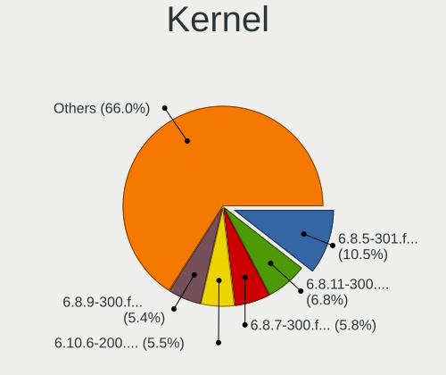

| Version                      | Computers | Percent |
|------------------------------|-----------|---------|
| 6.8.5-301.fc40.x86_64        | 446       | 10.54%  |
| 6.8.11-300.fc40.x86_64       | 286       | 6.76%   |
| 6.8.7-300.fc40.x86_64        | 246       | 5.82%   |
| 6.10.6-200.fc40.x86_64       | 232       | 5.48%   |
| 6.8.9-300.fc40.x86_64        | 230       | 5.44%   |
| 6.8.10-300.fc40.x86_64       | 157       | 3.71%   |
| 6.10.12-200.fc40.x86_64      | 153       | 3.62%   |
| 6.10.11-200.fc40.x86_64      | 148       | 3.5%    |
| 6.9.12-200.fc40.x86_64       | 140       | 3.31%   |
| 6.8.8-300.fc40.x86_64        | 129       | 3.05%   |
| 6.10.3-200.fc40.x86_64       | 128       | 3.03%   |
| 6.11.3-200.fc40.x86_64       | 127       | 3%      |
| 6.9.7-200.fc40.x86_64        | 122       | 2.88%   |
| 6.10.10-200.fc40.x86_64      | 118       | 2.79%   |
| 6.9.9-200.fc40.x86_64        | 100       | 2.36%   |
| 6.11.4-201.fc40.x86_64       | 95        | 2.25%   |
| 6.10.9-200.fc40.x86_64       | 95        | 2.25%   |
| 6.9.5-200.fc40.x86_64        | 92        | 2.17%   |
| 6.9.4-200.fc40.x86_64        | 92        | 2.17%   |
| 6.9.8-200.fc40.x86_64        | 91        | 2.15%   |
| 6.10.4-200.fc40.x86_64       | 88        | 2.08%   |
| 6.10.7-200.fc40.x86_64       | 87        | 2.06%   |
| 6.9.6-200.fc40.x86_64        | 85        | 2.01%   |
| 6.9.11-200.fc40.x86_64       | 71        | 1.68%   |
| 6.10.8-200.fc40.x86_64       | 61        | 1.44%   |
| 6.9.10-200.fc40.x86_64       | 51        | 1.21%   |
| 6.10.5-200.fc40.x86_64       | 45        | 1.06%   |
| 6.8.9-301.fsync.fc40.x86_64  | 30        | 0.71%   |
| 6.8.2-300.fc40.x86_64        | 30        | 0.71%   |
| 6.11.5-200.fc40.x86_64       | 23        | 0.54%   |
| 6.8.10-301.fsync.fc40.x86_64 | 22        | 0.52%   |
| 6.11.6-200.fc40.x86_64       | 20        | 0.47%   |
| 6.9.4-201.fsync.fc40.x86_64  | 19        | 0.45%   |
| 6.14.5-100.fc40.x86_64       | 19        | 0.45%   |
| 6.8.4-300.fc40.x86_64        | 18        | 0.43%   |
| 6.8.0-0.rc6.49.fc40.x86_64   | 18        | 0.43%   |
| 6.8.11-301.fsync.fc40.x86_64 | 16        | 0.38%   |
| 6.11.10-200.fc40.x86_64      | 16        | 0.38%   |
| 6.8.7-303.fsync.fc40.x86_64  | 10        | 0.24%   |
| 6.8.7-302.fsync.fc40.x86_64  | 9         | 0.21%   |

Kernel Family
-------------

Linux kernel without a distro release

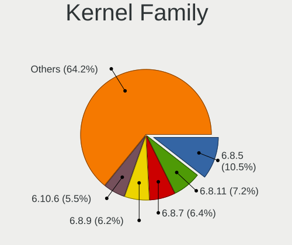

| Version | Computers | Percent |
|---------|-----------|---------|
| 6.8.5   | 446       | 10.55%  |
| 6.8.11  | 303       | 7.16%   |
| 6.8.7   | 272       | 6.43%   |
| 6.8.9   | 263       | 6.22%   |
| 6.10.6  | 232       | 5.49%   |
| 6.8.10  | 180       | 4.26%   |
| 6.10.12 | 153       | 3.62%   |
| 6.10.11 | 149       | 3.52%   |
| 6.9.12  | 142       | 3.36%   |
| 6.8.8   | 130       | 3.07%   |
| 6.10.3  | 130       | 3.07%   |
| 6.11.3  | 127       | 3%      |
| 6.10.10 | 126       | 2.98%   |
| 6.9.7   | 123       | 2.91%   |
| 6.9.4   | 115       | 2.72%   |
| 6.9.9   | 105       | 2.48%   |
| 6.11.4  | 96        | 2.27%   |
| 6.9.6   | 95        | 2.25%   |
| 6.10.9  | 95        | 2.25%   |
| 6.9.5   | 93        | 2.2%    |
| 6.9.8   | 92        | 2.18%   |
| 6.10.4  | 88        | 2.08%   |
| 6.10.7  | 87        | 2.06%   |
| 6.9.11  | 73        | 1.73%   |
| 6.10.8  | 63        | 1.49%   |
| 6.9.10  | 51        | 1.21%   |
| 6.10.5  | 50        | 1.18%   |
| 6.8.2   | 31        | 0.73%   |
| 6.8.0   | 28        | 0.66%   |
| 6.11.5  | 23        | 0.54%   |
| 6.8.4   | 20        | 0.47%   |
| 6.11.6  | 20        | 0.47%   |
| 6.14.5  | 19        | 0.45%   |
| 6.11.10 | 16        | 0.38%   |
| 6.8.12  | 11        | 0.26%   |
| 6.12.11 | 9         | 0.21%   |
| 6.11.8  | 9         | 0.21%   |
| 6.8.1   | 7         | 0.17%   |
| 6.12.8  | 7         | 0.17%   |
| 6.12.5  | 7         | 0.17%   |

Kernel Major Ver.
-----------------

Linux kernel major version

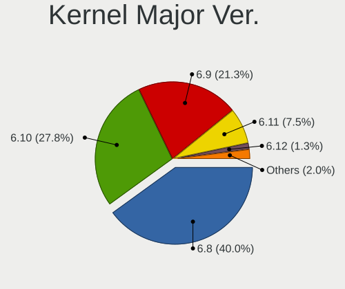

| Version | Computers | Percent |
|---------|-----------|---------|
| 6.8     | 1635      | 40%     |
| 6.10    | 1138      | 27.84%  |
| 6.9     | 870       | 21.29%  |
| 6.11    | 308       | 7.54%   |
| 6.12    | 53        | 1.3%    |
| 6.13    | 29        | 0.71%   |
| 6.14    | 23        | 0.56%   |
| 6.5     | 10        | 0.24%   |
| 6.6     | 9         | 0.22%   |
| 6.7     | 7         | 0.17%   |
| 6.4     | 1         | 0.02%   |
| 6.1     | 1         | 0.02%   |
| 5.4     | 1         | 0.02%   |
| 5.15    | 1         | 0.02%   |
| 5.10    | 1         | 0.02%   |

Arch
----

OS architecture (x86_64, i586, etc.)

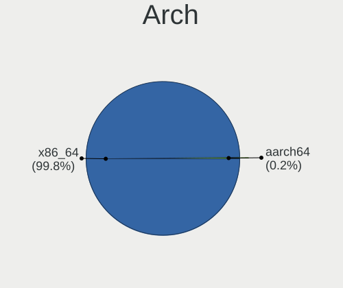

| Name    | Computers | Percent |
|---------|-----------|---------|
| x86_64  | 3826      | 99.82%  |
| aarch64 | 7         | 0.18%   |

DE
--

Desktop Environment

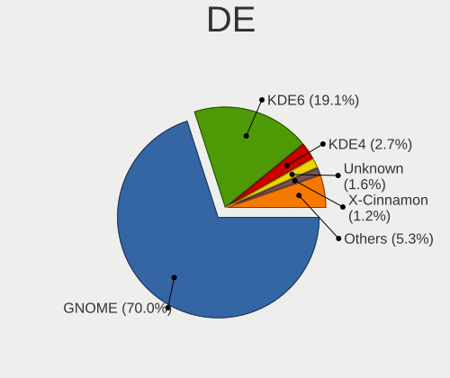

| Name          | Computers | Percent |
|---------------|-----------|---------|
| GNOME         | 2713      | 70.05%  |
| KDE6          | 738       | 19.05%  |
| KDE4          | 106       | 2.74%   |
| Unknown       | 63        | 1.63%   |
| X-Cinnamon    | 48        | 1.24%   |
| XFCE          | 44        | 1.14%   |
| GNOME Classic | 37        | 0.96%   |
| Cinnamon      | 32        | 0.83%   |
| MATE          | 21        | 0.54%   |
| Budgie        | 15        | 0.39%   |
| sway          | 14        | 0.36%   |
| Hyprland      | 14        | 0.36%   |
| i3            | 6         | 0.15%   |
| KDE5          | 5         | 0.13%   |
| Deepin        | 5         | 0.13%   |
| LXQt          | 4         | 0.1%    |
| LXDE          | 3         | 0.08%   |
| bspwm         | 2         | 0.05%   |
| wlroots       | 1         | 0.03%   |
| KDE           | 1         | 0.03%   |
| awesome       | 1         | 0.03%   |

Display Server
--------------

X11 or Wayland

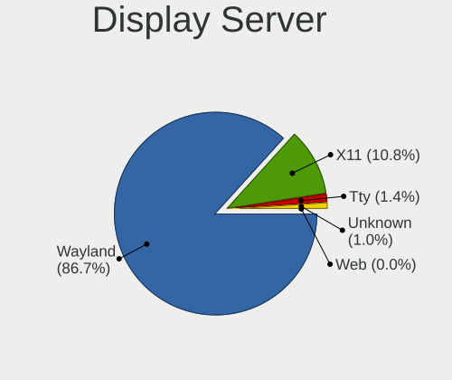

| Name    | Computers | Percent |
|---------|-----------|---------|
| Wayland | 3359      | 86.73%  |
| X11     | 419       | 10.82%  |
| Tty     | 54        | 1.39%   |
| Unknown | 40        | 1.03%   |
| Web     | 1         | 0.03%   |

Display Manager
---------------

SDDM, LightDM, etc.

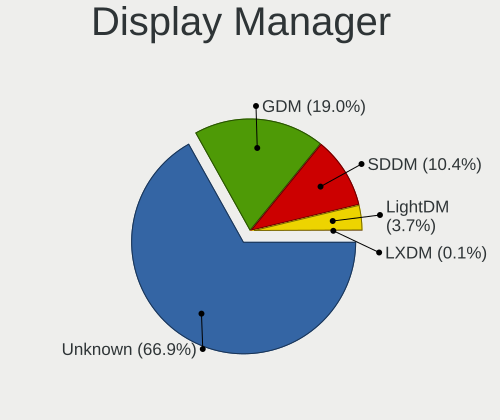

| Name    | Computers | Percent |
|---------|-----------|---------|
| Unknown | 2585      | 66.9%   |
| GDM     | 733       | 18.97%  |
| SDDM    | 401       | 10.38%  |
| LightDM | 142       | 3.67%   |
| LXDM    | 3         | 0.08%   |

OS Lang
-------

Language

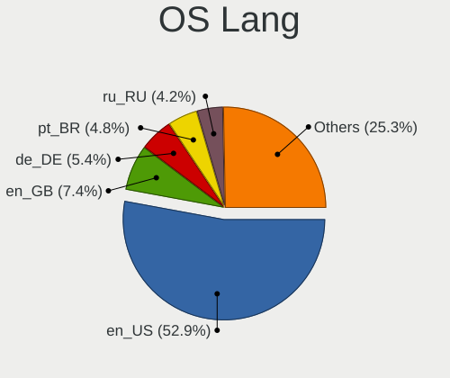

| Lang    | Computers | Percent |
|---------|-----------|---------|
| en_US   | 2036      | 52.9%   |
| en_GB   | 284       | 7.38%   |
| de_DE   | 207       | 5.38%   |
| pt_BR   | 186       | 4.83%   |
| ru_RU   | 162       | 4.21%   |
| fr_FR   | 114       | 2.96%   |
| it_IT   | 102       | 2.65%   |
| en_AU   | 97        | 2.52%   |
| es_ES   | 63        | 1.64%   |
| en_CA   | 55        | 1.43%   |
| pl_PL   | 51        | 1.33%   |
| en_IN   | 42        | 1.09%   |
| es_MX   | 41        | 1.07%   |
| tr_TR   | 25        | 0.65%   |
| es_AR   | 25        | 0.65%   |
| es_CL   | 23        | 0.6%    |
| zh_CN   | 21        | 0.55%   |
| es_CO   | 19        | 0.49%   |
| nl_NL   | 17        | 0.44%   |
| da_DK   | 16        | 0.42%   |
| hu_HU   | 15        | 0.39%   |
| en_IE   | 15        | 0.39%   |
| en_DK   | 15        | 0.39%   |
| de_AT   | 13        | 0.34%   |
| Unknown | 13        | 0.34%   |
| fr_CA   | 12        | 0.31%   |
| sv_SE   | 11        | 0.29%   |
| es_PE   | 11        | 0.29%   |
| cs_CZ   | 11        | 0.29%   |
| en_NZ   | 10        | 0.26%   |
| pt_PT   | 9         | 0.23%   |
| en_ZA   | 9         | 0.23%   |
| fi_FI   | 8         | 0.21%   |
| de_CH   | 8         | 0.21%   |
| uk_UA   | 6         | 0.16%   |
| ro_RO   | 6         | 0.16%   |
| nl_BE   | 6         | 0.16%   |
| ko_KR   | 6         | 0.16%   |
| en_SG   | 6         | 0.16%   |
| en_PH   | 6         | 0.16%   |

Boot Mode
---------

EFI or BIOS

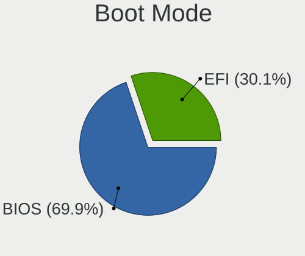

| Mode | Computers | Percent |
|------|-----------|---------|
| BIOS | 2695      | 69.85%  |
| EFI  | 1163      | 30.15%  |

Filesystem
----------

Type of filesystem

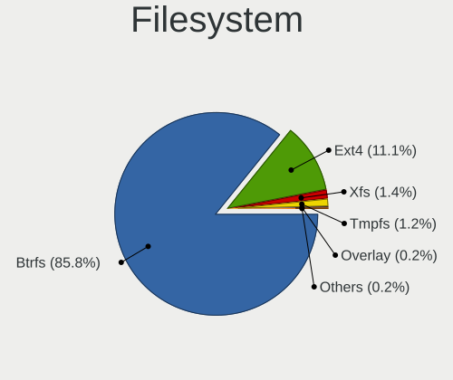

| Type    | Computers | Percent |
|---------|-----------|---------|
| Btrfs   | 3300      | 85.8%   |
| Ext4    | 428       | 11.13%  |
| Xfs     | 55        | 1.43%   |
| Tmpfs   | 47        | 1.22%   |
| Overlay | 8         | 0.21%   |
| Unknown | 4         | 0.1%    |
| F2fs    | 2         | 0.05%   |
| Nfs4    | 1         | 0.03%   |
| Ext3    | 1         | 0.03%   |

Part. scheme
------------

Scheme of partitioning

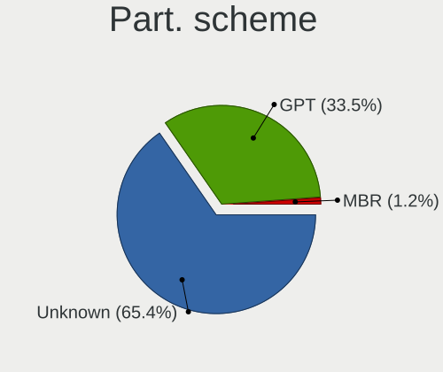

| Type    | Computers | Percent |
|---------|-----------|---------|
| Unknown | 2524      | 65.35%  |
| GPT     | 1293      | 33.48%  |
| MBR     | 45        | 1.17%   |

Dual Boot with Linux/BSD
------------------------

Hosting more than one Linux/BSD

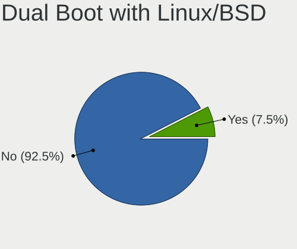

| Dual boot | Computers | Percent |
|-----------|-----------|---------|
| No        | 3560      | 92.47%  |
| Yes       | 290       | 7.53%   |

Dual Boot (Win)
---------------

Hosting Linux and Windows

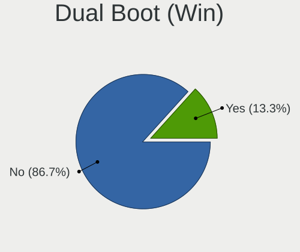

| Dual boot | Computers | Percent |
|-----------|-----------|---------|
| No        | 3337      | 86.7%   |
| Yes       | 512       | 13.3%   |

Board
-----

Vendor
------

Motherboard manufacturer

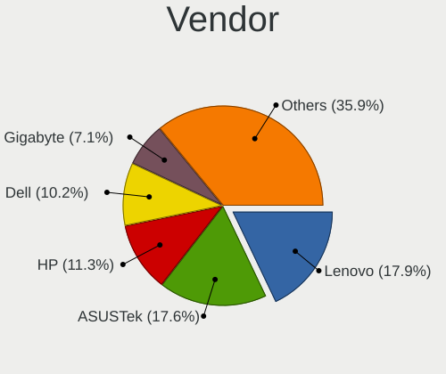

| Name                                 | Computers | Percent |
|--------------------------------------|-----------|---------|
| Lenovo                               | 687       | 17.92%  |
| ASUSTek Computer                     | 673       | 17.56%  |
| Hewlett-Packard                      | 433       | 11.3%   |
| Dell                                 | 392       | 10.23%  |
| Gigabyte Technology                  | 271       | 7.07%   |
| MSI                                  | 266       | 6.94%   |
| Apple                                | 183       | 4.77%   |
| Acer                                 | 161       | 4.2%    |
| ASRock                               | 133       | 3.47%   |
| Intel                                | 66        | 1.72%   |
| HUAWEI                               | 46        | 1.2%    |
| Google                               | 32        | 0.83%   |
| Samsung Electronics                  | 31        | 0.81%   |
| Framework                            | 29        | 0.76%   |
| Unknown                              | 25        | 0.65%   |
| Toshiba                              | 24        | 0.63%   |
| Fujitsu                              | 19        | 0.5%    |
| Microsoft                            | 18        | 0.47%   |
| Timi                                 | 16        | 0.42%   |
| Alienware                            | 16        | 0.42%   |
| AZW                                  | 13        | 0.34%   |
| Micro Computer (HK) Tech Limited     | 12        | 0.31%   |
| Sony                                 | 11        | 0.29%   |
| Shenzhen Meigao Electronic Equipment | 11        | 0.29%   |
| LG Electronics                       | 10        | 0.26%   |
| HONOR                                | 10        | 0.26%   |
| Chuwi                                | 9         | 0.23%   |
| AMI                                  | 9         | 0.23%   |
| XIAOMI                               | 8         | 0.21%   |
| TUXEDO                               | 8         | 0.21%   |
| Medion                               | 8         | 0.21%   |
| Huanan                               | 8         | 0.21%   |
| SLIMBOOK                             | 7         | 0.18%   |
| System76                             | 6         | 0.16%   |
| Supermicro                           | 6         | 0.16%   |
| Positivo                             | 6         | 0.16%   |
| MACHINIST                            | 6         | 0.16%   |
| Itautec                              | 6         | 0.16%   |
| Pegatron                             | 5         | 0.13%   |
| Foxconn                              | 5         | 0.13%   |

Model
-----

Motherboard model

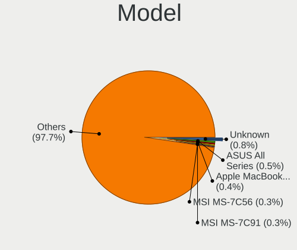

| Name                                              | Computers | Percent |
|---------------------------------------------------|-----------|---------|
| Unknown                                           | 32        | 0.83%   |
| ASUS All Series                                   | 19        | 0.5%    |
| Apple MacBookPro9,2                               | 14        | 0.37%   |
| MSI MS-7C56                                       | 13        | 0.34%   |
| MSI MS-7C91                                       | 12        | 0.31%   |
| HP Notebook                                       | 12        | 0.31%   |
| Apple MacBookPro14,1                              | 12        | 0.31%   |
| MSI MS-7C02                                       | 11        | 0.29%   |
| Micro (HK) Tech Limited V3                        | 11        | 0.29%   |
| ASUS TUF Gaming X570-PLUS                         | 11        | 0.29%   |
| HP EliteBook 840 G5                               | 10        | 0.26%   |
| Framework Laptop 16 (AMD Ryzen 7040 Series)       | 10        | 0.26%   |
| ASUS TUF Gaming B550-PLUS                         | 10        | 0.26%   |
| MSI MS-7B89                                       | 9         | 0.23%   |
| HUAWEI BOM-WXX9                                   | 9         | 0.23%   |
| Framework Laptop 13 (AMD Ryzen 7040Series)        | 9         | 0.23%   |
| AZW SER                                           | 9         | 0.23%   |
| Apple MacBookPro8,1                               | 9         | 0.23%   |
| Apple MacBookPro12,1                              | 9         | 0.23%   |
| Apple MacBookPro11,2                              | 9         | 0.23%   |
| MSI MS-7C52                                       | 8         | 0.21%   |
| Lenovo Yoga Pro 9 16IMH9 83DN                     | 8         | 0.21%   |
| HP EliteBook 840 G6                               | 8         | 0.21%   |
| Apple MacBookPro11,1                              | 8         | 0.21%   |
| Lenovo Legion Go 8APU1 83E1                       | 7         | 0.18%   |
| Lenovo Legion 5 15ACH6H 82JU                      | 7         | 0.18%   |
| Lenovo IdeaPad 3 15ITL6 82H8                      | 7         | 0.18%   |
| Intel X99                                         | 7         | 0.18%   |
| Dell OptiPlex 7050                                | 7         | 0.18%   |
| Dell OptiPlex 7010                                | 7         | 0.18%   |
| ASUS TUF Gaming B550M-PLUS WIFI II                | 7         | 0.18%   |
| ASUS PRIME A320M-K                                | 7         | 0.18%   |
| Apple Macmini7,1                                  | 7         | 0.18%   |
| Acer Nitro ANV15-51                               | 7         | 0.18%   |
| Shenzhen Meigao Electronic Equipment Venus series | 6         | 0.16%   |
| MSI MS-7D25                                       | 6         | 0.16%   |
| MSI MS-7C95                                       | 6         | 0.16%   |
| MSI MS-7C37                                       | 6         | 0.16%   |
| Intel H61                                         | 6         | 0.16%   |
| HP Pavilion Notebook                              | 6         | 0.16%   |

Model Family
------------

Motherboard model prefix

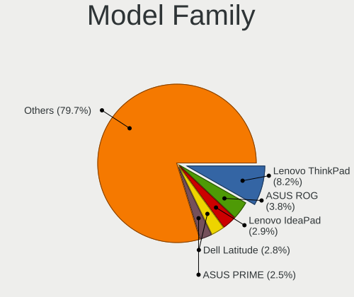

| Name               | Computers | Percent |
|--------------------|-----------|---------|
| Lenovo ThinkPad    | 316       | 8.24%   |
| ASUS ROG           | 145       | 3.78%   |
| Lenovo IdeaPad     | 113       | 2.95%   |
| Dell Latitude      | 108       | 2.82%   |
| ASUS PRIME         | 96        | 2.5%    |
| Acer Aspire        | 87        | 2.27%   |
| ASUS VivoBook      | 85        | 2.22%   |
| ASUS TUF           | 83        | 2.17%   |
| Dell Inspiron      | 76        | 1.98%   |
| HP EliteBook       | 68        | 1.77%   |
| ASUS ASUS          | 64        | 1.67%   |
| HP Pavilion        | 58        | 1.51%   |
| Lenovo Legion      | 57        | 1.49%   |
| Dell Precision     | 57        | 1.49%   |
| Dell OptiPlex      | 57        | 1.49%   |
| Dell XPS           | 55        | 1.43%   |
| Lenovo Yoga        | 54        | 1.41%   |
| HP Laptop          | 50        | 1.3%    |
| HP ProBook         | 42        | 1.1%    |
| Acer Nitro         | 33        | 0.86%   |
| Unknown            | 32        | 0.83%   |
| Framework Laptop   | 29        | 0.76%   |
| Lenovo ThinkBook   | 28        | 0.73%   |
| Apple MacBookPro11 | 28        | 0.73%   |
| HP ENVY            | 27        | 0.7%    |
| Lenovo ThinkCentre | 24        | 0.63%   |
| HP Victus          | 23        | 0.6%    |
| HP OMEN            | 21        | 0.55%   |
| HP EliteDesk       | 21        | 0.55%   |
| HP ZBook           | 20        | 0.52%   |
| ASUS Zenbook       | 20        | 0.52%   |
| ASUS All           | 19        | 0.5%    |
| Microsoft Surface  | 18        | 0.47%   |
| Toshiba Satellite  | 16        | 0.42%   |
| Lenovo IdeaPadFlex | 15        | 0.39%   |
| Dell Vostro        | 15        | 0.39%   |
| Apple MacBookPro9  | 15        | 0.39%   |
| Gigabyte B550M     | 14        | 0.37%   |
| Gigabyte B550      | 14        | 0.37%   |
| Apple MacBookPro14 | 14        | 0.37%   |

MFG Year
--------

Motherboard manufacture year

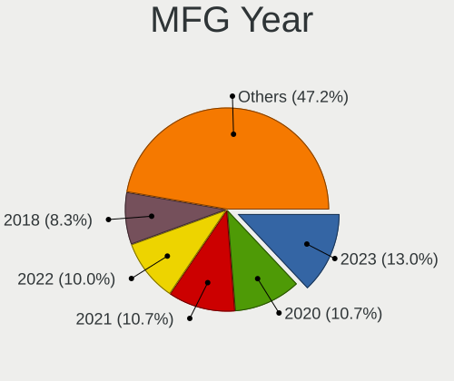

| Year    | Computers | Percent |
|---------|-----------|---------|
| 2023    | 498       | 12.99%  |
| 2020    | 412       | 10.75%  |
| 2021    | 411       | 10.72%  |
| 2022    | 382       | 9.97%   |
| 2018    | 319       | 8.32%   |
| 2019    | 308       | 8.04%   |
| 2017    | 239       | 6.24%   |
| 2024    | 214       | 5.58%   |
| 2012    | 187       | 4.88%   |
| 2013    | 158       | 4.12%   |
| 2015    | 150       | 3.91%   |
| 2016    | 147       | 3.84%   |
| 2014    | 132       | 3.44%   |
| 2011    | 99        | 2.58%   |
| 2010    | 59        | 1.54%   |
| 2009    | 56        | 1.46%   |
| 2008    | 40        | 1.04%   |
| 2007    | 10        | 0.26%   |
| 2006    | 9         | 0.23%   |
| Unknown | 3         | 0.08%   |

Form Factor
-----------

Physical design of the computer

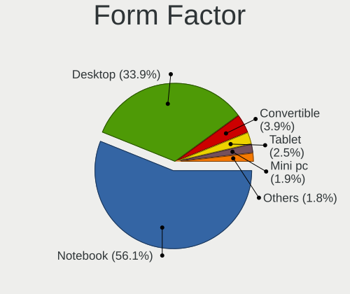

| Name           | Computers | Percent |
|----------------|-----------|---------|
| Notebook       | 2150      | 56.09%  |
| Desktop        | 1299      | 33.89%  |
| Convertible    | 150       | 3.91%   |
| Tablet         | 94        | 2.45%   |
| Mini pc        | 71        | 1.85%   |
| All in one     | 54        | 1.41%   |
| Server         | 13        | 0.34%   |
| System on chip | 2         | 0.05%   |

Secure Boot
-----------

Enabled or disabled

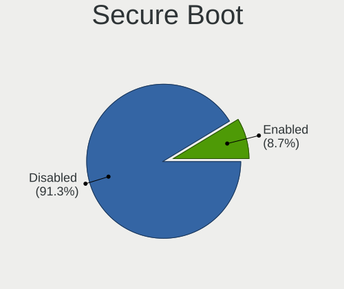

| State    | Computers | Percent |
|----------|-----------|---------|
| Disabled | 3514      | 91.34%  |
| Enabled  | 333       | 8.66%   |

Coreboot
--------

Have coreboot on board

| Used | Computers | Percent |
|------|-----------|---------|
| No   | 3797      | 99.06%  |
| Yes  | 36        | 0.94%   |

RAM Size
--------

Total RAM memory

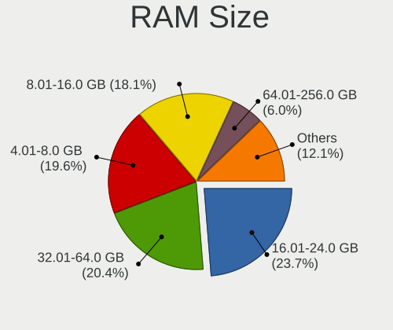

| Size in GB      | Computers | Percent |
|-----------------|-----------|---------|
| 16.01-24.0      | 914       | 23.73%  |
| 32.01-64.0      | 787       | 20.43%  |
| 4.01-8.0        | 756       | 19.63%  |
| 8.01-16.0       | 697       | 18.09%  |
| 64.01-256.0     | 230       | 5.97%   |
| 3.01-4.0        | 210       | 5.45%   |
| 24.01-32.0      | 207       | 5.37%   |
| 1.01-2.0        | 37        | 0.96%   |
| 2.01-3.0        | 10        | 0.26%   |
| More than 256.0 | 4         | 0.1%    |

RAM Used
--------

Used RAM memory

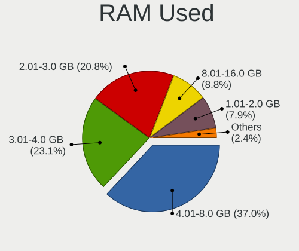

| Used GB     | Computers | Percent |
|-------------|-----------|---------|
| 4.01-8.0    | 1501      | 36.97%  |
| 3.01-4.0    | 938       | 23.1%   |
| 2.01-3.0    | 844       | 20.79%  |
| 8.01-16.0   | 359       | 8.84%   |
| 1.01-2.0    | 320       | 7.88%   |
| 16.01-24.0  | 41        | 1.01%   |
| 0.51-1.0    | 39        | 0.96%   |
| 24.01-32.0  | 12        | 0.3%    |
| 32.01-64.0  | 3         | 0.07%   |
| 64.01-256.0 | 2         | 0.05%   |
| 0.01-0.5    | 1         | 0.02%   |

Total Drives
------------

Number of drives on board

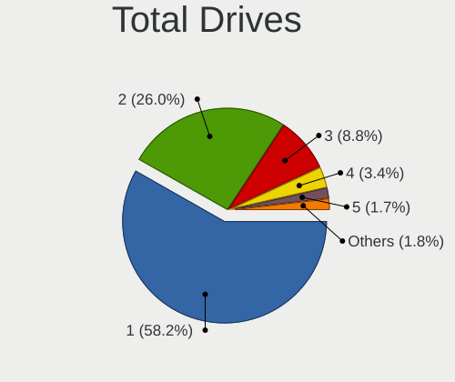

| Drives | Computers | Percent |
|--------|-----------|---------|
| 1      | 2257      | 58.23%  |
| 2      | 1009      | 26.03%  |
| 3      | 342       | 8.82%   |
| 4      | 130       | 3.35%   |
| 5      | 67        | 1.73%   |
| 6      | 28        | 0.72%   |
| 7      | 20        | 0.52%   |
| 0      | 8         | 0.21%   |
| 8      | 6         | 0.15%   |
| 9      | 4         | 0.1%    |
| 12     | 2         | 0.05%   |
| 11     | 2         | 0.05%   |
| 10     | 1         | 0.03%   |

Has CD-ROM
----------

Has CD-ROM on board

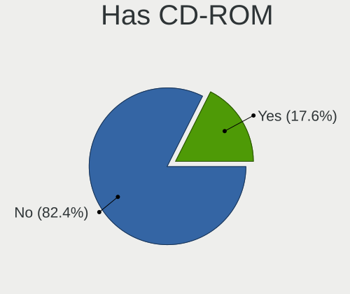

| Presented | Computers | Percent |
|-----------|-----------|---------|
| No        | 3167      | 82.43%  |
| Yes       | 675       | 17.57%  |

Has Ethernet
------------

Has Ethernet on board

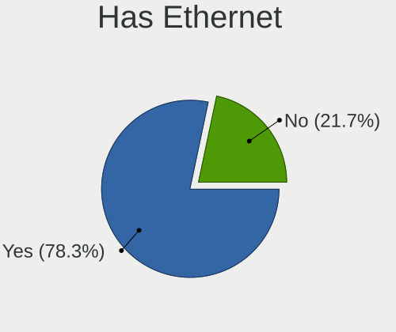

| Presented | Computers | Percent |
|-----------|-----------|---------|
| Yes       | 3010      | 78.3%   |
| No        | 834       | 21.7%   |

Has WiFi
--------

Has WiFi module

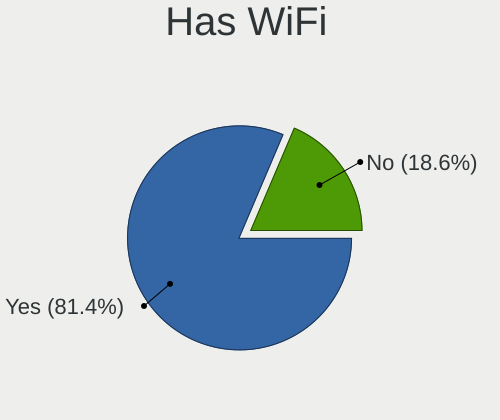

| Presented | Computers | Percent |
|-----------|-----------|---------|
| Yes       | 3130      | 81.4%   |
| No        | 715       | 18.6%   |

Has Bluetooth
-------------

Has Bluetooth module

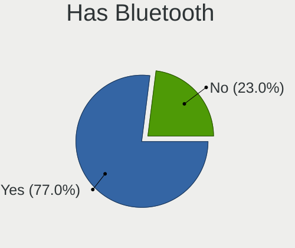

| Presented | Computers | Percent |
|-----------|-----------|---------|
| Yes       | 2961      | 76.99%  |
| No        | 885       | 23.01%  |

Location
--------

Country
-------

Geographic location (country)

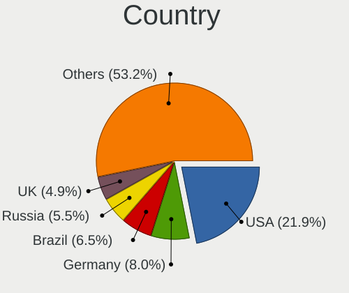

| Country     | Computers | Percent |
|-------------|-----------|---------|
| USA         | 845       | 21.9%   |
| Germany     | 308       | 7.98%   |
| Brazil      | 250       | 6.48%   |
| Russia      | 213       | 5.52%   |
| UK          | 189       | 4.9%    |
| Italy       | 155       | 4.02%   |
| France      | 136       | 3.52%   |
| India       | 133       | 3.45%   |
| Australia   | 109       | 2.82%   |
| Canada      | 104       | 2.69%   |
| Spain       | 91        | 2.36%   |
| Poland      | 87        | 2.25%   |
| Mexico      | 74        | 1.92%   |
| Netherlands | 71        | 1.84%   |
| Turkey      | 50        | 1.3%    |
| Sweden      | 45        | 1.17%   |
| Austria     | 41        | 1.06%   |
| Switzerland | 39        | 1.01%   |
| Chile       | 38        | 0.98%   |
| Denmark     | 36        | 0.93%   |
| Argentina   | 35        | 0.91%   |
| Norway      | 32        | 0.83%   |
| Czechia     | 32        | 0.83%   |
| Romania     | 30        | 0.78%   |
| Belgium     | 29        | 0.75%   |
| Hungary     | 28        | 0.73%   |
| Colombia    | 28        | 0.73%   |
| Portugal    | 26        | 0.67%   |
| Indonesia   | 25        | 0.65%   |
| Philippines | 24        | 0.62%   |
| Egypt       | 21        | 0.54%   |
| Serbia      | 20        | 0.52%   |
| Israel      | 20        | 0.52%   |
| China       | 20        | 0.52%   |
| Bulgaria    | 20        | 0.52%   |
| Greece      | 19        | 0.49%   |
| Finland     | 19        | 0.49%   |
| Ireland     | 18        | 0.47%   |
| Belarus     | 17        | 0.44%   |
| Vietnam     | 16        | 0.41%   |

City
----

Geographic location (city)

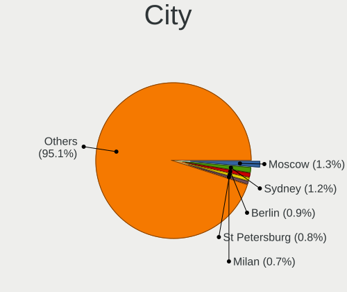

| City             | Computers | Percent |
|------------------|-----------|---------|
| Moscow           | 53        | 1.34%   |
| Sydney           | 47        | 1.19%   |
| Berlin           | 37        | 0.94%   |
| St Petersburg    | 31        | 0.79%   |
| Milan            | 27        | 0.68%   |
| Sao Paulo        | 26        | 0.66%   |
| Paris            | 24        | 0.61%   |
| Melbourne        | 23        | 0.58%   |
| Santiago         | 22        | 0.56%   |
| Munich           | 21        | 0.53%   |
| Mexico City      | 21        | 0.53%   |
| Istanbul         | 21        | 0.53%   |
| Warsaw           | 19        | 0.48%   |
| Delhi            | 19        | 0.48%   |
| Vienna           | 18        | 0.46%   |
| Chicago          | 18        | 0.46%   |
| Bengaluru        | 16        | 0.41%   |
| Amsterdam        | 16        | 0.41%   |
| Rio de Janeiro   | 15        | 0.38%   |
| Madrid           | 15        | 0.38%   |
| Dublin           | 15        | 0.38%   |
| Bogotá          | 15        | 0.38%   |
| Hamburg          | 14        | 0.35%   |
| Belgrade         | 14        | 0.35%   |
| Montreal         | 13        | 0.33%   |
| Lima             | 13        | 0.33%   |
| Brisbane         | 13        | 0.33%   |
| Rome             | 12        | 0.3%    |
| Oslo             | 12        | 0.3%    |
| Hyderabad        | 12        | 0.3%    |
| Ho Chi Minh City | 12        | 0.3%    |
| Helsinki         | 12        | 0.3%    |
| Athens           | 12        | 0.3%    |
| Zurich           | 11        | 0.28%   |
| Sofia            | 11        | 0.28%   |
| New York         | 11        | 0.28%   |
| Los Angeles      | 11        | 0.28%   |
| Lisbon           | 11        | 0.28%   |
| Auckland         | 11        | 0.28%   |
| Stockholm        | 10        | 0.25%   |

Drives
------

Drive Vendor
------------

Hard drive vendors

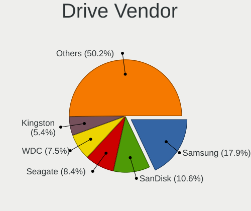

| Vendor                       | Computers | Drives | Percent |
|------------------------------|-----------|--------|---------|
| Samsung Electronics          | 1038      | 1472   | 17.91%  |
| SanDisk                      | 613       | 729    | 10.58%  |
| Seagate                      | 487       | 690    | 8.4%    |
| WDC                          | 437       | 653    | 7.54%   |
| Kingston                     | 313       | 380    | 5.4%    |
| SK hynix                     | 264       | 296    | 4.56%   |
| Toshiba                      | 230       | 282    | 3.97%   |
| Unknown                      | 215       | 255    | 3.71%   |
| Micron Technology            | 209       | 224    | 3.61%   |
| Crucial                      | 180       | 235    | 3.11%   |
| Intel                        | 145       | 183    | 2.5%    |
| Phison Electronics           | 133       | 160    | 2.3%    |
| Micron/Crucial Technology    | 124       | 143    | 2.14%   |
| Apple                        | 100       | 139    | 1.73%   |
| Kingston Technology Company  | 97        | 100    | 1.67%   |
| KIOXIA                       | 90        | 110    | 1.55%   |
| China                        | 73        | 80     | 1.26%   |
| ADATA Technology             | 69        | 79     | 1.19%   |
| HGST                         | 66        | 72     | 1.14%   |
| Hitachi                      | 63        | 81     | 1.09%   |
| A-DATA Technology            | 59        | 72     | 1.02%   |
| Silicon Motion               | 58        | 66     | 1%      |
| MAXIO Technology (Hangzhou)  | 48        | 51     | 0.83%   |
| Shenzhen Longsys Electronics | 45        | 52     | 0.78%   |
| Realtek Semiconductor        | 41        | 45     | 0.71%   |
| SPCC                         | 31        | 35     | 0.53%   |
| Unknown                      | 29        | 34     | 0.5%    |
| Patriot                      | 22        | 38     | 0.38%   |
| PNY                          | 21        | 22     | 0.36%   |
| KingSpec                     | 19        | 25     | 0.33%   |
| JMicron Technology           | 18        | 21     | 0.31%   |
| Union Memory (Shenzhen)      | 16        | 18     | 0.28%   |
| LITEON                       | 15        | 17     | 0.26%   |
| Intenso                      | 14        | 16     | 0.24%   |
| Transcend                    | 13        | 16     | 0.22%   |
| OCZ                          | 13        | 16     | 0.22%   |
| Lexar                        | 12        | 15     | 0.21%   |
| Corsair                      | 12        | 14     | 0.21%   |
| Team                         | 11        | 12     | 0.19%   |
| Apacer                       | 11        | 12     | 0.19%   |

Drive Model
-----------

Hard drive models

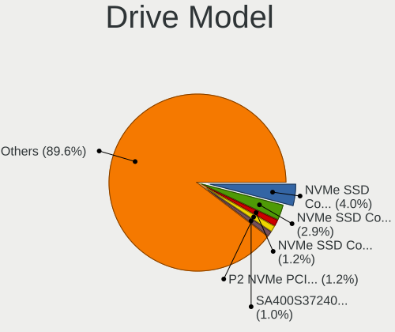

| Model                                                 | Computers | Percent |
|-------------------------------------------------------|-----------|---------|
| Samsung NVMe SSD Controller SM981/PM981/PM983 1TB     | 253       | 4.03%   |
| Samsung NVMe SSD Controller PM9A1/PM9A3/980PRO 1TB    | 182       | 2.9%    |
| Samsung NVMe SSD Controller SM961/PM961/SM963 1024GB  | 77        | 1.23%   |
| Micron/Crucial P2 NVMe PCIe SSD 2TB                   | 75        | 1.19%   |
| Kingston SA400S37240G 240GB SSD                       | 63        | 1%      |
| Sandisk WD Blue SN550 NVMe SSD 1024GB                 | 59        | 0.94%   |
| Kingston SA400S37480G 480GB SSD                       | 56        | 0.89%   |
| Sandisk WD Black SN750 / PC SN730 NVMe SSD 500GB      | 54        | 0.86%   |
| Unknown MMC Card  128GB                               | 47        | 0.75%   |
| Silicon Motion SM2263EN/SM2263XT SSD Controller 512GB | 44        | 0.7%    |
| Unknown MMC Card  32GB                                | 42        | 0.67%   |
| Samsung SSD 860 EVO 500GB                             | 42        | 0.67%   |
| Phison E12 NVMe Controller 1TB                        | 42        | 0.67%   |
| Seagate ST1000LM035-1RK172 1TB                        | 38        | 0.61%   |
| Intel SSD 660P Series 512GB                           | 38        | 0.61%   |
| Unknown MMC Card  64GB                                | 36        | 0.57%   |
| Phison PS5013 E13 NVMe Controller 500GB               | 35        | 0.56%   |
| MAXIO (Hangzhou) NVMe SSD Controller MAP1202 2TB      | 33        | 0.53%   |
| Samsung SSD 860 EVO 1TB                               | 32        | 0.51%   |
| Samsung SSD 850 EVO 250GB                             | 32        | 0.51%   |
| Kingston Company SNV2S1000G 1TB                       | 32        | 0.51%   |
| Samsung SSD 870 EVO 1TB                               | 30        | 0.48%   |
| Toshiba XG6 NVMe SSD Controller 1024GB                | 29        | 0.46%   |
| Sandisk WD Black SN850 1TB                            | 29        | 0.46%   |
| Unknown                                               | 29        | 0.46%   |
| Samsung SSD 990 PRO 2TB                               | 28        | 0.45%   |
| Samsung SSD 980 1TB                                   | 28        | 0.45%   |
| Crucial CT1000MX500SSD1 1TB                           | 27        | 0.43%   |
| Seagate ST2000DM008-2FR102 2TB                        | 26        | 0.41%   |
| Sandisk WD Blue SN500 / PC SN520 NVMe SSD 128GB       | 25        | 0.4%    |
| Crucial CT240BX500SSD1 240GB                          | 25        | 0.4%    |
| Samsung SSD 850 EVO 500GB                             | 24        | 0.38%   |
| Intel SSDPEKNU512GZ 512GB                             | 24        | 0.38%   |
| Seagate ST500DM002-1BD142 500GB                       | 22        | 0.35%   |
| Seagate ST1000DM010-2EP102 1TB                        | 22        | 0.35%   |
| Sandisk WD_BLACK SN850X 1000GB                        | 22        | 0.35%   |
| Crucial CT500MX500SSD1 500GB                          | 22        | 0.35%   |
| Sandisk WD Black 2018/SN750 / PC SN720 NVMe SSD 512GB | 21        | 0.33%   |
| Samsung SSD 990 PRO 1TB                               | 21        | 0.33%   |
| Samsung SSD 870 EVO 500GB                             | 21        | 0.33%   |

HDD Vendor
----------

Hard disk drive vendors

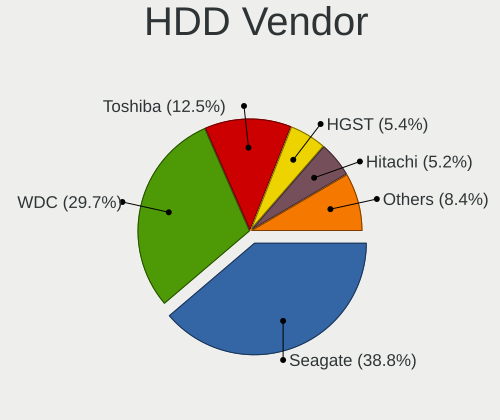

| Vendor              | Computers | Drives | Percent |
|---------------------|-----------|--------|---------|
| Seagate             | 473       | 664    | 38.77%  |
| WDC                 | 362       | 542    | 29.67%  |
| Toshiba             | 153       | 185    | 12.54%  |
| HGST                | 66        | 72     | 5.41%   |
| Hitachi             | 63        | 81     | 5.16%   |
| Samsung Electronics | 26        | 67     | 2.13%   |
| Apple               | 19        | 19     | 1.56%   |
| JMicron Technology  | 13        | 16     | 1.07%   |
| Unknown             | 12        | 12     | 0.98%   |
| USB3.0              | 3         | 4      | 0.25%   |
| SSK                 | 3         | 3      | 0.25%   |
| Intenso             | 3         | 3      | 0.25%   |
| ASMT                | 3         | 15     | 0.25%   |
| TO Exter            | 2         | 2      | 0.16%   |
| T-FORCE             | 2         | 2      | 0.16%   |
| External            | 2         | 3      | 0.16%   |
| USB                 | 1         | 1      | 0.08%   |
| TerraMas            | 1         | 5      | 0.08%   |
| SATAFIRM            | 1         | 1      | 0.08%   |
| SAGE                | 1         | 1      | 0.08%   |
| SABRENT             | 1         | 1      | 0.08%   |
| RSH-319             | 1         | 2      | 0.08%   |
| Maxtor              | 1         | 1      | 0.08%   |
| LaCie               | 1         | 1      | 0.08%   |
| KIOXIA              | 1         | 1      | 0.08%   |
| JetFlash            | 1         | 1      | 0.08%   |
| Initio              | 1         | 1      | 0.08%   |
| Inateck             | 1         | 2      | 0.08%   |
| HCG8e               | 1         | 1      | 0.08%   |
| Fujitsu             | 1         | 1      | 0.08%   |
| ExcelStor           | 1         | 1      | 0.08%   |

SSD Vendor
----------

Solid state drive vendors

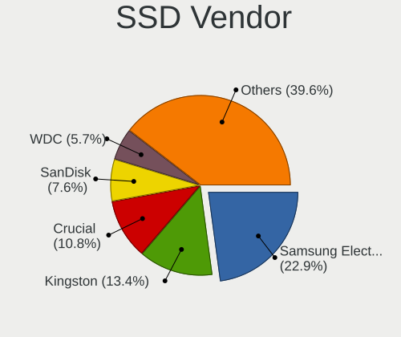

| Vendor              | Computers | Drives | Percent |
|---------------------|-----------|--------|---------|
| Samsung Electronics | 380       | 522    | 22.88%  |
| Kingston            | 223       | 264    | 13.43%  |
| Crucial             | 180       | 235    | 10.84%  |
| SanDisk             | 126       | 149    | 7.59%   |
| WDC                 | 95        | 110    | 5.72%   |
| China               | 72        | 79     | 4.33%   |
| Apple               | 60        | 63     | 3.61%   |
| A-DATA Technology   | 53        | 62     | 3.19%   |
| Intel               | 39        | 55     | 2.35%   |
| SK hynix            | 36        | 44     | 2.17%   |
| SPCC                | 31        | 35     | 1.87%   |
| Micron Technology   | 27        | 28     | 1.63%   |
| PNY                 | 21        | 22     | 1.26%   |
| Patriot             | 21        | 37     | 1.26%   |
| KingSpec            | 19        | 25     | 1.14%   |
| LITEON              | 15        | 17     | 0.9%    |
| Toshiba             | 14        | 23     | 0.84%   |
| Transcend           | 13        | 16     | 0.78%   |
| OCZ                 | 13        | 16     | 0.78%   |
| Corsair             | 12        | 14     | 0.72%   |
| Intenso             | 11        | 13     | 0.66%   |
| Apacer              | 11        | 12     | 0.66%   |
| Team                | 10        | 10     | 0.6%    |
| Lexar               | 10        | 13     | 0.6%    |
| GOODRAM             | 10        | 10     | 0.6%    |
| Fanxiang            | 9         | 9      | 0.54%   |
| Hewlett-Packard     | 7         | 10     | 0.42%   |
| Unknown             | 7         | 7      | 0.42%   |
| Verbatim            | 6         | 7      | 0.36%   |
| Netac               | 6         | 7      | 0.36%   |
| XrayDisk            | 5         | 5      | 0.3%    |
| Gigabyte Technology | 5         | 5      | 0.3%    |
| SABRENT             | 4         | 4      | 0.24%   |
| Plextor             | 4         | 6      | 0.24%   |
| LITEONIT            | 4         | 7      | 0.24%   |
| FORESEE             | 4         | 4      | 0.24%   |
| Emtec               | 4         | 4      | 0.24%   |
| Seagate             | 3         | 3      | 0.18%   |
| Mushkin             | 3         | 3      | 0.18%   |
| HUSKY               | 3         | 3      | 0.18%   |

Drive Kind
----------

HDD or SSD

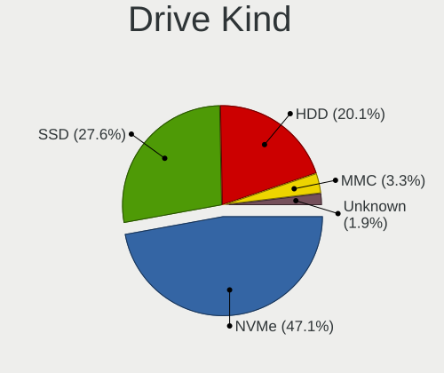

| Kind    | Computers | Drives | Percent |
|---------|-----------|--------|---------|
| NVMe    | 2440      | 3283   | 47.14%  |
| SSD     | 1426      | 2054   | 27.55%  |
| HDD     | 1041      | 1711   | 20.11%  |
| MMC     | 170       | 196    | 3.28%   |
| Unknown | 99        | 121    | 1.91%   |

Drive Connector
---------------

SATA, SAS, NVMe, etc.

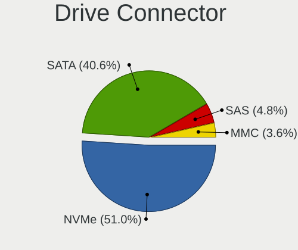

| Type | Computers | Drives | Percent |
|------|-----------|--------|---------|
| NVMe | 2436      | 3248   | 51.02%  |
| SATA | 1938      | 3602   | 40.59%  |
| SAS  | 231       | 319    | 4.84%   |
| MMC  | 170       | 196    | 3.56%   |

Drive Size
----------

Size of hard drive

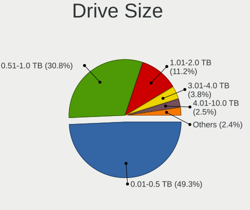

| Size in TB | Computers | Drives | Percent |
|------------|-----------|--------|---------|
| 0.01-0.5   | 1281      | 1905   | 49.31%  |
| 0.51-1.0   | 801       | 1087   | 30.83%  |
| 1.01-2.0   | 292       | 410    | 11.24%  |
| 3.01-4.0   | 98        | 157    | 3.77%   |
| 4.01-10.0  | 64        | 113    | 2.46%   |
| 2.01-3.0   | 46        | 58     | 1.77%   |
| 10.01-20.0 | 15        | 34     | 0.58%   |
| 20.01-50.0 | 1         | 1      | 0.04%   |

Space Total
-----------

Amount of disk space available on the file system

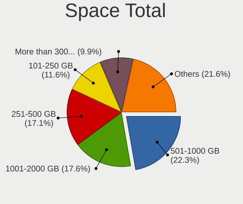

| Size in GB     | Computers | Percent |
|----------------|-----------|---------|
| 501-1000       | 870       | 22.26%  |
| 1001-2000      | 688       | 17.6%   |
| 251-500        | 668       | 17.09%  |
| 101-250        | 454       | 11.61%  |
| More than 3000 | 386       | 9.87%   |
| 1-20           | 273       | 6.98%   |
| Unknown        | 260       | 6.65%   |
| 2001-3000      | 160       | 4.09%   |
| 51-100         | 111       | 2.84%   |
| 21-50          | 39        | 1%      |

Space Used
----------

Amount of used disk space

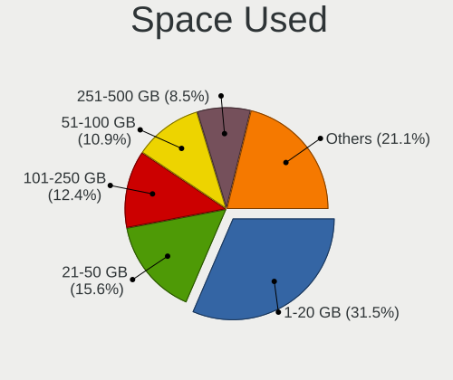

| Used GB        | Computers | Percent |
|----------------|-----------|---------|
| 1-20           | 1260      | 31.46%  |
| 21-50          | 623       | 15.56%  |
| 101-250        | 496       | 12.38%  |
| 51-100         | 437       | 10.91%  |
| 251-500        | 342       | 8.54%   |
| 501-1000       | 274       | 6.84%   |
| Unknown        | 260       | 6.49%   |
| 1001-2000      | 161       | 4.02%   |
| More than 3000 | 89        | 2.22%   |
| 2001-3000      | 61        | 1.52%   |
| 0              | 2         | 0.05%   |

Malfunc. Drives
---------------

Drive models with a malfunction

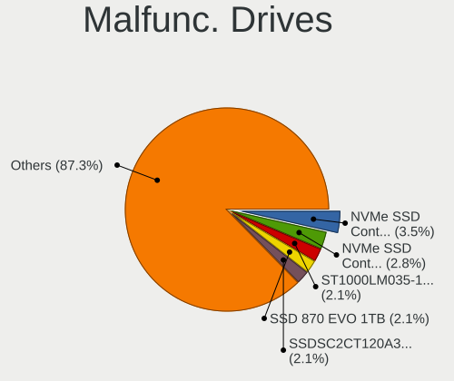

| Model                                                          | Computers | Drives  | Percent |
|----------------------------------------------------------------|-----------|---------|---------|
| Samsung Electronics NVMe SSD Controller SM981/PM981/PM983 1TB  | 5         | 6       | 3.52%   |
| Samsung Electronics NVMe SSD Controller PM9A1/PM9A3/980PRO 1TB | 4         | 4       | 2.82%   |
| Seagate ST1000LM035-1RK172 1TB                                 | 3         | 3       | 2.11%   |
| Samsung Electronics SSD 870 EVO 1TB                            | 3         | 3       | 2.11%   |
| Intel SSDSC2CT120A3 120GB                                      | 3         | 9       | 2.11%   |
| WDC WD40EFRX-68N32N0 4TB                                       | 2         | 6       | 1.41%   |
| Toshiba MQ01ABD100 1TB                                         | 2         | 2       | 1.41%   |
| Toshiba DT01ACA100 1TB                                         | 2         | 2       | 1.41%   |
| Seagate ST3500418AS 500GB                                      | 2         | 5       | 1.41%   |
| Seagate ST31000524AS 1TB                                       | 2         | 6       | 1.41%   |
| Seagate ST1000LM049-2GH172 1TB                                 | 2         | 2       | 1.41%   |
| Seagate ST1000LM024 HN-M101MBB 1TB                             | 2         | 2       | 1.41%   |
| Seagate ST1000DM003-1ER162 1TB                                 | 2         | 2       | 1.41%   |
| Samsung Electronics HD501LJ 500GB                              | 2         | 12      | 1.41%   |
| Samsung Electronics HD103UJ 1TB                                | 2         | 11      | 1.41%   |
| Kingston SUV500240G 240GB SSD                                  | 2         | 2       | 1.41%   |
| Kingston SA400S37480G 480GB SSD                                | 2         | 3       | 1.41%   |
| HGST HTS725050A7E630 500GB                                     | 2         | 2       | 1.41%   |
| HGST HTS721010A9E630 1TB                                       | 2         | 2       | 1.41%   |
| Crucial CT120M500SSD1 120GB                                    | 2         | 2       | 1.41%   |
| XrayDisk SSD 256GB                                             | 1         | 1       | 0.7%    |
| WDC WDS500G2B0A-00SM50 500GB                                   | 1         | 2       | 0.7%    |
| WDC WDS240G2G0B-00EPW0 240GB SSD                               | 1         | 1       | 0.7%    |
| WDC WD6004FZWX-00BKVA0 6TB                                     | 1         | 1       | 0.7%    |
| WDC WD5000AVCS-632DY1 500GB                                    | 1         | 6       | 0.7%    |
| WDC WD5000AAKX-75U6AA0 500GB                                   | 1         | 1       | 0.7%    |
| WDC WD5000AAKX-603CA0 500GB                                    | 1         | 1       | 0.7%    |
| WDC WD5000AAKX-08U6AA0 500GB                                   | 1         | 1       | 0.7%    |
| WDC WD5000AAKX-001CA0 500GB                                    | 1         | 1       | 0.7%    |
| WDC WD5000AADS-00S9B0 500GB                                    | 1         | 1       | 0.7%    |
| WDC WD40EFRX-68WT0N0 4TB                                       | 1         | 1       | 0.7%    |
| WDC WD3200BEKT-60KA9T0 320GB                                   | 1         | 1       | 0.7%    |
| WDC WD30EZRZ-00Z5HB0 3TB                                       | 1         | 1       | 0.7%    |
| WDC WD20EZRX-00D 2TB                                           | 1         | Unknown | 0.7%    |
| WDC WD20EARX-00PASB0 2TB                                       | 1         | 1       | 0.7%    |
| WDC WD10SPZX-60Z10T1 1TB                                       | 1         | 1       | 0.7%    |
| WDC WD10SPZX-24Z10T0 1TB                                       | 1         | 1       | 0.7%    |
| WDC WD10JPCX-24UE4T0 1TB                                       | 1         | 1       | 0.7%    |
| WDC WD10EZEX-60ZF5A0 1TB                                       | 1         | 1       | 0.7%    |
| WDC WD10EZEX-60WN4A2 1TB                                       | 1         | 1       | 0.7%    |

Malfunc. Drive Vendor
---------------------

Vendors of faulty drives

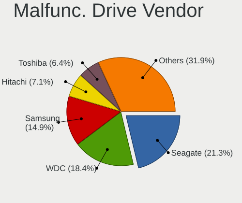

| Vendor                      | Computers | Drives | Percent |
|-----------------------------|-----------|--------|---------|
| Seagate                     | 30        | 50     | 21.28%  |
| WDC                         | 26        | 35     | 18.44%  |
| Samsung Electronics         | 21        | 42     | 14.89%  |
| Hitachi                     | 10        | 10     | 7.09%   |
| Toshiba                     | 9         | 9      | 6.38%   |
| Kingston                    | 8         | 9      | 5.67%   |
| HGST                        | 6         | 6      | 4.26%   |
| Intel                       | 5         | 13     | 3.55%   |
| Crucial                     | 5         | 5      | 3.55%   |
| Transcend                   | 3         | 3      | 2.13%   |
| China                       | 3         | 3      | 2.13%   |
| SK hynix                    | 2         | 2      | 1.42%   |
| SanDisk                     | 2         | 2      | 1.42%   |
| XrayDisk                    | 1         | 1      | 0.71%   |
| Silicon Motion              | 1         | 1      | 0.71%   |
| Neo                         | 1         | 1      | 0.71%   |
| Micron Technology           | 1         | 1      | 0.71%   |
| Maxtor                      | 1         | 1      | 0.71%   |
| MAXIO Technology (Hangzhou) | 1         | 1      | 0.71%   |
| Lite-On Technology          | 1         | 1      | 0.71%   |
| Intenso                     | 1         | 1      | 0.71%   |
| Hewlett-Packard             | 1         | 1      | 0.71%   |
| Corsair                     | 1         | 1      | 0.71%   |
| ADATA Technology            | 1         | 1      | 0.71%   |

Malfunc. HDD Vendor
-------------------

Vendors of faulty HDD drives

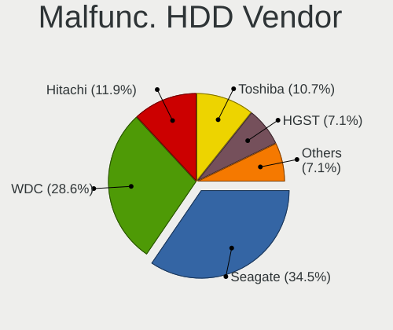

| Vendor              | Computers | Drives | Percent |
|---------------------|-----------|--------|---------|
| Seagate             | 29        | 49     | 34.52%  |
| WDC                 | 24        | 32     | 28.57%  |
| Hitachi             | 10        | 10     | 11.9%   |
| Toshiba             | 9         | 9      | 10.71%  |
| HGST                | 6         | 6      | 7.14%   |
| Samsung Electronics | 5         | 25     | 5.95%   |
| Maxtor              | 1         | 1      | 1.19%   |

Malfunc. Drive Kind
-------------------

Kinds of faulty drives

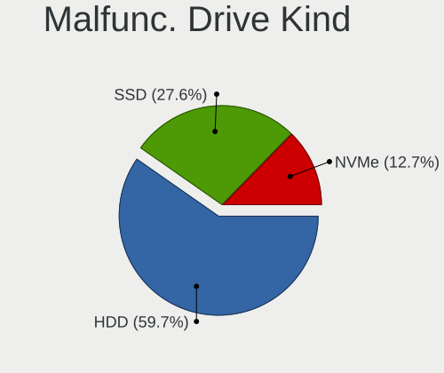

| Kind | Computers | Drives | Percent |
|------|-----------|--------|---------|
| HDD  | 80        | 132    | 59.7%   |
| SSD  | 37        | 50     | 27.61%  |
| NVMe | 17        | 18     | 12.69%  |

Failed Drives
-------------

Failed drive models

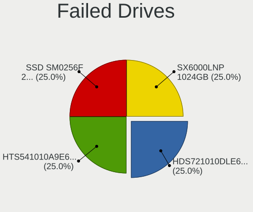

| Model                             | Computers | Drives | Percent |
|-----------------------------------|-----------|--------|---------|
| Hitachi HDS721010DLE630 1TB       | 1         | 2      | 25%     |
| HGST HTS541010A9E680 1TB          | 1         | 1      | 25%     |
| Apple SSD SM0256F 256GB           | 1         | 1      | 25%     |
| ADATA Technology SX6000LNP 1024GB | 1         | 1      | 25%     |

Failed Drive Vendor
-------------------

Failed drive vendors

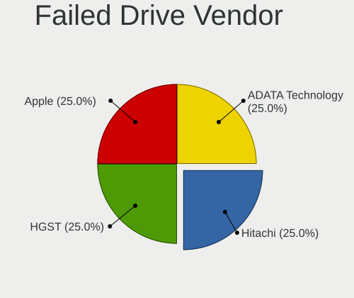

| Vendor           | Computers | Drives | Percent |
|------------------|-----------|--------|---------|
| Hitachi          | 1         | 2      | 25%     |
| HGST             | 1         | 1      | 25%     |
| Apple            | 1         | 1      | 25%     |
| ADATA Technology | 1         | 1      | 25%     |

Drive Status
------------

Number of failed and malfunc. drives

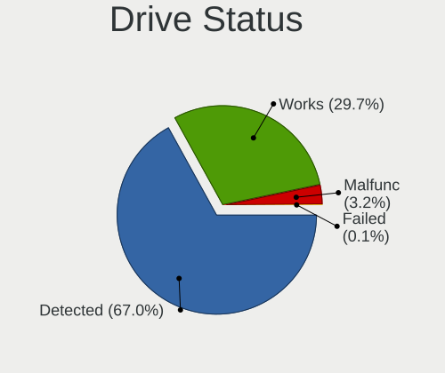

| Status   | Computers | Drives | Percent |
|----------|-----------|--------|---------|
| Detected | 2702      | 5064   | 67%     |
| Works    | 1198      | 2096   | 29.7%   |
| Malfunc  | 129       | 200    | 3.2%    |
| Failed   | 4         | 5      | 0.1%    |

Storage controller
------------------

Storage Vendor
--------------

Storage controller vendors

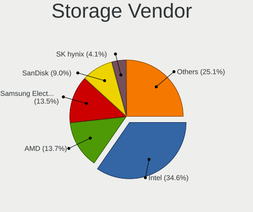

| Vendor                                  | Computers | Percent |
|-----------------------------------------|-----------|---------|
| Intel                                   | 1919      | 34.62%  |
| AMD                                     | 757       | 13.66%  |
| Samsung Electronics                     | 750       | 13.53%  |
| SanDisk                                 | 499       | 9%      |
| SK hynix                                | 228       | 4.11%   |
| Kingston Technology Company             | 189       | 3.41%   |
| Micron Technology                       | 182       | 3.28%   |
| Phison Electronics                      | 141       | 2.54%   |
| Micron/Crucial Technology               | 123       | 2.22%   |
| KIOXIA                                  | 90        | 1.62%   |
| ASMedia Technology                      | 88        | 1.59%   |
| ADATA Technology                        | 75        | 1.35%   |
| Toshiba America Info Systems            | 65        | 1.17%   |
| Silicon Motion                          | 58        | 1.05%   |
| MAXIO Technology (Hangzhou)             | 47        | 0.85%   |
| Shenzhen Longsys Electronics            | 46        | 0.83%   |
| Realtek Semiconductor                   | 41        | 0.74%   |
| Marvell Technology Group                | 28        | 0.51%   |
| Apple                                   | 24        | 0.43%   |
| JMicron Technology                      | 21        | 0.38%   |
| Nvidia                                  | 20        | 0.36%   |
| Solid State Storage Technology          | 18        | 0.32%   |
| Solidigm                                | 17        | 0.31%   |
| Union Memory (Shenzhen)                 | 14        | 0.25%   |
| Shenzhen Unionmemory Information System | 12        | 0.22%   |
| Seagate Technology                      | 12        | 0.22%   |
| INNOGRIT                                | 10        | 0.18%   |
| LSI Logic / Symbios Logic               | 8         | 0.14%   |
| Biwin Storage Technology                | 8         | 0.14%   |
| Yangtze Memory Technologies             | 7         | 0.13%   |
| Lite-On Technology                      | 6         | 0.11%   |
| VIA Technologies                        | 5         | 0.09%   |
| Broadcom / LSI                          | 5         | 0.09%   |
| Unknown                                 | 5         | 0.09%   |
| Shenzhen Shichuangyi Electronics        | 4         | 0.07%   |
| Lenovo                                  | 4         | 0.07%   |
| Adaptec                                 | 4         | 0.07%   |
| Netac Technology                        | 3         | 0.05%   |
| Hosin Global Electronics                | 3         | 0.05%   |
| Transcend                               | 2         | 0.04%   |

Storage Model
-------------

Storage controller models

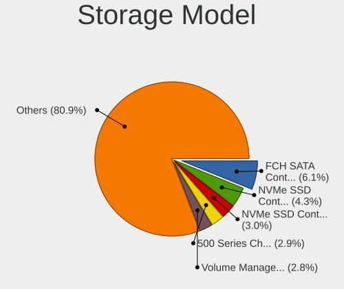

| Model                                                                          | Computers | Percent |
|--------------------------------------------------------------------------------|-----------|---------|
| AMD FCH SATA Controller [AHCI mode]                                            | 370       | 6.14%   |
| Samsung NVMe SSD Controller SM981/PM981/PM983                                  | 258       | 4.28%   |
| Samsung NVMe SSD Controller PM9A1/PM9A3/980PRO                                 | 183       | 3.04%   |
| AMD 500 Series Chipset SATA Controller                                         | 172       | 2.85%   |
| Intel Volume Management Device NVMe RAID Controller                            | 169       | 2.8%    |
| Intel Sunrise Point-LP SATA Controller [AHCI mode]                             | 156       | 2.59%   |
| AMD 400 Series Chipset SATA Controller                                         | 118       | 1.96%   |
| Intel 8 Series/C220 Series Chipset Family 6-port SATA Controller 1 [AHCI mode] | 116       | 1.92%   |
| SanDisk WD SN560/SN740/SN770/SN5000 NVMe SSD                                   | 112       | 1.86%   |
| Intel 7 Series Chipset Family 6-port SATA Controller [AHCI mode]               | 108       | 1.79%   |
| Samsung NVMe SSD Controller 980 (DRAM-less)                                    | 103       | 1.71%   |
| AMD 600 Series Chipset SATA Controller                                         | 103       | 1.71%   |
| Intel 82801 Mobile SATA Controller [RAID mode]                                 | 83        | 1.38%   |
| Samsung NVMe SSD Controller SM961/PM961/SM963                                  | 77        | 1.28%   |
| Intel RST Volume Management Device Controller                                  | 76        | 1.26%   |
| SK hynix Gold P31/BC711/PC711 NVMe Solid State Drive                           | 75        | 1.24%   |
| Micron/Crucial P2 [Nick P2] / P3 / P3 Plus NVMe PCIe SSD (DRAM-less)           | 75        | 1.24%   |
| ASMedia ASM1061/ASM1062 Serial ATA Controller                                  | 75        | 1.24%   |
| Intel Q170/Q150/B150/H170/H110/Z170/CM236 Chipset SATA Controller [AHCI Mode]  | 74        | 1.23%   |
| Intel Alder Lake-S PCH SATA Controller [AHCI Mode]                             | 71        | 1.18%   |
| Intel 200 Series PCH SATA controller [AHCI mode]                               | 65        | 1.08%   |
| Intel SATA Controller [RAID mode]                                              | 61        | 1.01%   |
| Samsung NVMe SSD Controller S4LV008[Pascal]                                    | 60        | 1%      |
| Intel Raptor Lake SATA AHCI Controller                                         | 60        | 1%      |
| SK hynix Platinum P41/PC801 NVMe Solid State Drive                             | 58        | 0.96%   |
| SanDisk Ultra 3D / WD PC SN530, IX SN530, Blue SN550 NVMe SSD (DRAM-less)      | 58        | 0.96%   |
| Intel 6 Series/C200 Series Chipset Family 6 port Mobile SATA AHCI Controller   | 58        | 0.96%   |
| Sandisk WD Black SN850X NVMe SSD                                               | 55        | 0.91%   |
| Intel Cannon Lake Mobile PCH SATA AHCI Controller                              | 55        | 0.91%   |
| SanDisk Extreme Pro / WD Black SN750 / PC SN730 / Red SN700 NVMe SSD           | 54        | 0.9%    |
| Intel Comet Lake SATA AHCI Controller                                          | 52        | 0.86%   |
| Intel 7 Series/C210 Series Chipset Family 6-port SATA Controller [AHCI mode]   | 49        | 0.81%   |
| Intel 8 Series SATA Controller 1 [AHCI mode]                                   | 48        | 0.8%    |
| Intel Cannon Lake PCH SATA AHCI Controller                                     | 47        | 0.78%   |
| Micron 2400 NVMe SSD (DRAM-less)                                               | 46        | 0.76%   |
| Intel Tiger Lake-LP SATA Controller                                            | 46        | 0.76%   |
| Silicon Motion SM2263EN/SM2263XT (DRAM-less) NVMe SSD Controllers              | 44        | 0.73%   |
| Intel Alder Lake-P SATA AHCI Controller                                        | 43        | 0.71%   |
| Intel 6 Series/C200 Series Chipset Family 6 port Desktop SATA AHCI Controller  | 43        | 0.71%   |
| Phison E12 NVMe Controller                                                     | 42        | 0.7%    |

Storage Kind
------------

Kind of storage controller (IDE, SATA, NVMe, SAS, ...)

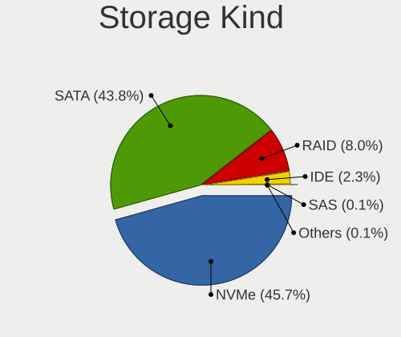

| Kind | Computers | Percent |
|------|-----------|---------|
| NVMe | 2428      | 45.66%  |
| SATA | 2328      | 43.78%  |
| RAID | 427       | 8.03%   |
| IDE  | 123       | 2.31%   |
| SAS  | 7         | 0.13%   |
| SCSI | 4         | 0.08%   |

Processor
---------

CPU Vendor
----------

Processor vendors

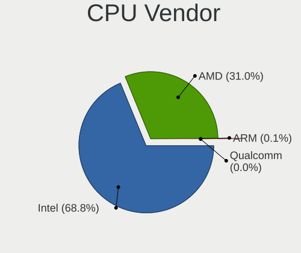

| Vendor   | Computers | Percent |
|----------|-----------|---------|
| Intel    | 2637      | 68.8%   |
| AMD      | 1189      | 31.02%  |
| ARM      | 4         | 0.1%    |
| Unknown  | 2         | 0.05%   |
| Qualcomm | 1         | 0.03%   |

CPU Model
---------

Processor models

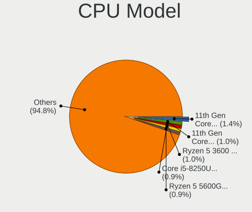

| Model                                      | Computers | Percent |
|--------------------------------------------|-----------|---------|
| Intel 11th Gen Core i5-1135G7 @ 2.40GHz    | 53        | 1.38%   |
| Intel 11th Gen Core i7-1165G7 @ 2.80GHz    | 40        | 1.04%   |
| AMD Ryzen 5 3600 6-Core Processor          | 39        | 1.02%   |
| Intel Core i5-8250U CPU @ 1.60GHz          | 36        | 0.94%   |
| AMD Ryzen 5 5600G with Radeon Graphics     | 33        | 0.86%   |
| Intel Core Ultra 7 155H                    | 32        | 0.83%   |
| AMD Ryzen 7 5700U with Radeon Graphics     | 32        | 0.83%   |
| AMD Ryzen 7 5800H with Radeon Graphics     | 31        | 0.81%   |
| AMD Ryzen 5 5600X 6-Core Processor         | 30        | 0.78%   |
| Intel 12th Gen Core i7-12700H              | 29        | 0.76%   |
| Intel Core i5-7200U CPU @ 2.50GHz          | 28        | 0.73%   |
| AMD Ryzen 9 5900X 12-Core Processor        | 28        | 0.73%   |
| AMD Ryzen 7 5800X 8-Core Processor         | 28        | 0.73%   |
| Intel Core i7-8550U CPU @ 1.80GHz          | 27        | 0.7%    |
| AMD Ryzen 5 5500U with Radeon Graphics     | 27        | 0.7%    |
| Intel Core i5-6300U CPU @ 2.40GHz          | 26        | 0.68%   |
| Intel Core i5-10210U CPU @ 1.60GHz         | 26        | 0.68%   |
| Intel 12th Gen Core i5-1235U               | 26        | 0.68%   |
| Intel Core i5-8350U CPU @ 1.70GHz          | 25        | 0.65%   |
| Intel Core i7-9750H CPU @ 2.60GHz          | 24        | 0.63%   |
| Intel Core i5-3210M CPU @ 2.50GHz          | 24        | 0.63%   |
| Intel 13th Gen Core i7-13700H              | 24        | 0.63%   |
| AMD Ryzen 7 5700G with Radeon Graphics     | 24        | 0.63%   |
| Intel Core i7-3770 CPU @ 3.40GHz           | 23        | 0.6%    |
| Intel Core i5-8265U CPU @ 1.60GHz          | 23        | 0.6%    |
| Intel 11th Gen Core i7-11800H @ 2.30GHz    | 23        | 0.6%    |
| AMD Ryzen 5 5600H with Radeon Graphics     | 23        | 0.6%    |
| Intel Core Ultra 9 185H                    | 22        | 0.57%   |
| Intel Core i7-8750H CPU @ 2.20GHz          | 22        | 0.57%   |
| Intel Core i7-7700HQ CPU @ 2.80GHz         | 21        | 0.55%   |
| Intel 12th Gen Core i5-12450H              | 21        | 0.55%   |
| AMD Ryzen 9 5950X 16-Core Processor        | 21        | 0.55%   |
| AMD Ryzen 7 3700X 8-Core Processor         | 21        | 0.55%   |
| Intel Core i7-8650U CPU @ 1.90GHz          | 20        | 0.52%   |
| Intel 12th Gen Core i7-1255U               | 20        | 0.52%   |
| Intel Core i7-10750H CPU @ 2.60GHz         | 19        | 0.49%   |
| Intel Core i5-8365U CPU @ 1.60GHz          | 19        | 0.49%   |
| AMD Ryzen 7 7840HS w/ Radeon 780M Graphics | 19        | 0.49%   |
| AMD Ryzen 5 5600 6-Core Processor          | 19        | 0.49%   |
| Intel Atom x5-Z8350 CPU @ 1.44GHz          | 18        | 0.47%   |

CPU Model Family
----------------

Processor model prefix

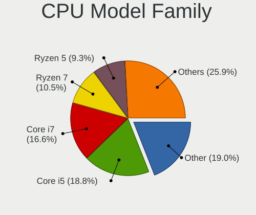

| Model                   | Computers | Percent |
|-------------------------|-----------|---------|
| Other                   | 730       | 19.02%  |
| Intel Core i5           | 720       | 18.76%  |
| Intel Core i7           | 636       | 16.57%  |
| AMD Ryzen 7             | 403       | 10.5%   |
| AMD Ryzen 5             | 356       | 9.28%   |
| AMD Ryzen 9             | 171       | 4.46%   |
| Intel Core i3           | 136       | 3.54%   |
| Intel Xeon              | 80        | 2.08%   |
| Intel Core              | 70        | 1.82%   |
| Intel Celeron           | 68        | 1.77%   |
| Intel Core 2 Duo        | 56        | 1.46%   |
| AMD Ryzen 3             | 54        | 1.41%   |
| Intel Core i9           | 45        | 1.17%   |
| Intel Atom              | 45        | 1.17%   |
| Intel Pentium           | 44        | 1.15%   |
| AMD Ryzen 7 PRO         | 32        | 0.83%   |
| AMD Ryzen 5 PRO         | 28        | 0.73%   |
| AMD FX                  | 19        | 0.5%    |
| AMD A8                  | 11        | 0.29%   |
| AMD A6                  | 11        | 0.29%   |
| AMD A4                  | 11        | 0.29%   |
| Intel Pentium Dual-Core | 10        | 0.26%   |
| AMD Phenom II X4        | 10        | 0.26%   |
| AMD A10                 | 10        | 0.26%   |
| Intel Pentium Silver    | 9         | 0.23%   |
| Intel Core 2 Quad       | 8         | 0.21%   |
| AMD Athlon              | 5         | 0.13%   |
| Intel Core m3           | 4         | 0.1%    |
| AMD Ryzen Threadripper  | 4         | 0.1%    |
| AMD Athlon II X2        | 4         | 0.1%    |
| Intel Pentium Gold      | 3         | 0.08%   |
| Intel Core m5           | 3         | 0.08%   |
| AMD Phenom II X2        | 3         | 0.08%   |
| AMD Opteron             | 3         | 0.08%   |
| AMD GX                  | 3         | 0.08%   |
| AMD E2                  | 3         | 0.08%   |
| Intel Xeon Gold         | 2         | 0.05%   |
| Intel Genuine           | 2         | 0.05%   |
| Intel Core M            | 2         | 0.05%   |
| AMD Ryzen 3 PRO         | 2         | 0.05%   |

CPU Cores
---------

Number of processor cores

| Number  | Computers | Percent |
|---------|-----------|---------|
| 4       | 1205      | 31.4%   |
| 2       | 743       | 19.36%  |
| 8       | 633       | 16.5%   |
| 6       | 597       | 15.56%  |
| 12      | 177       | 4.61%   |
| 16      | 144       | 3.75%   |
| 10      | 141       | 3.67%   |
| 14      | 124       | 3.23%   |
| 24      | 46        | 1.2%    |
| 20      | 8         | 0.21%   |
| 1       | 5         | 0.13%   |
| 28      | 3         | 0.08%   |
| 5       | 3         | 0.08%   |
| 3       | 3         | 0.08%   |
| 32      | 2         | 0.05%   |
| 44      | 1         | 0.03%   |
| 18      | 1         | 0.03%   |
| Unknown | 1         | 0.03%   |

CPU Sockets
-----------

Number of sockets

| Number  | Computers | Percent |
|---------|-----------|---------|
| 1       | 3810      | 99.37%  |
| 2       | 22        | 0.57%   |
| 4       | 1         | 0.03%   |
| Unknown | 1         | 0.03%   |

CPU Threads
-----------

Threads per core (Hyper-Threading)

| Number  | Computers | Percent |
|---------|-----------|---------|
| 2       | 3175      | 82.77%  |
| 1       | 659       | 17.18%  |
| 3       | 1         | 0.03%   |
| Unknown | 1         | 0.03%   |

CPU Op-Modes
------------

CPU Operation Modes (32-bit, 64-bit)

| Op mode        | Computers | Percent |
|----------------|-----------|---------|
| 32-bit, 64-bit | 3828      | 99.87%  |
| 64-bit         | 5         | 0.13%   |

CPU Microcode
-------------

Microcode number

| Number     | Computers | Percent |
|------------|-----------|---------|
| Unknown    | 3827      | 99.74%  |
| 0x206a7    | 2         | 0.05%   |
| 0x0a50000c | 2         | 0.05%   |
| 0x0a601206 | 1         | 0.03%   |
| 0x0a601203 | 1         | 0.03%   |
| 0x08701033 | 1         | 0.03%   |
| 0x08001138 | 1         | 0.03%   |
| 0x06006704 | 1         | 0.03%   |
| 0x010000c8 | 1         | 0.03%   |

CPU Microarch
-------------

Microarchitecture

| Name              | Computers | Percent |
|-------------------|-----------|---------|
| Unknown           | 820       | 21.38%  |
| KabyLake          | 610       | 15.9%   |
| Zen 3             | 353       | 9.2%    |
| Haswell           | 234       | 6.1%    |
| IvyBridge         | 194       | 5.06%   |
| Alderlake Hybrid  | 187       | 4.87%   |
| Skylake           | 182       | 4.74%   |
| Zen 2             | 171       | 4.46%   |
| TigerLake         | 163       | 4.25%   |
| SandyBridge       | 118       | 3.08%   |
| CometLake         | 113       | 2.95%   |
| Zen+              | 95        | 2.48%   |
| Broadwell         | 76        | 1.98%   |
| Silvermont        | 65        | 1.69%   |
| Penryn            | 63        | 1.64%   |
| IceLake           | 60        | 1.56%   |
| Zen               | 52        | 1.36%   |
| Meteorlake Hybrid | 37        | 0.96%   |
| Westmere          | 36        | 0.94%   |
| Goldmont plus     | 32        | 0.83%   |
| Piledriver        | 27        | 0.7%    |
| Excavator         | 26        | 0.68%   |
| K10               | 23        | 0.6%    |
| Nehalem           | 19        | 0.5%    |
| Core              | 17        | 0.44%   |
| Gracemont         | 12        | 0.31%   |
| Puma              | 9         | 0.23%   |
| Tremont           | 6         | 0.16%   |
| Jaguar            | 6         | 0.16%   |
| Bonnell           | 6         | 0.16%   |
| Steamroller       | 5         | 0.13%   |
| Goldmont          | 5         | 0.13%   |
| K10 Llano         | 4         | 0.1%    |
| K8 Hammer         | 3         | 0.08%   |
| Bobcat            | 3         | 0.08%   |
| Bulldozer         | 2         | 0.05%   |
| Sapphire Rapids   | 1         | 0.03%   |
| NetBurst          | 1         | 0.03%   |

Graphics
--------

GPU Vendor
----------

Vendors of graphics cards

| Vendor                     | Computers | Percent |
|----------------------------|-----------|---------|
| Intel                      | 2113      | 44.75%  |
| Nvidia                     | 1399      | 29.63%  |
| AMD                        | 1200      | 25.41%  |
| Matrox Electronics Systems | 6         | 0.13%   |
| ASPEED Technology          | 3         | 0.06%   |
| Silicon Motion             | 1         | 0.02%   |

GPU Model
---------

Graphics card models

| Model                                                                                    | Computers | Percent |
|------------------------------------------------------------------------------------------|-----------|---------|
| Intel TigerLake-LP GT2 [Iris Xe Graphics]                                                | 142       | 2.92%   |
| AMD Cezanne [Radeon Vega Series / Radeon Vega Mobile Series]                             | 133       | 2.74%   |
| Intel Kaby Lake-R GT2 [UHD Graphics 620]                                                 | 113       | 2.33%   |
| Intel 3rd Gen Core processor Graphics Controller                                         | 103       | 2.12%   |
| Intel Raptor Lake-P [Iris Xe Graphics]                                                   | 96        | 1.98%   |
| AMD Phoenix1                                                                             | 86        | 1.77%   |
| Intel 2nd Generation Core Processor Family Integrated Graphics Controller                | 82        | 1.69%   |
| AMD Rembrandt [Radeon 680M]                                                              | 78        | 1.61%   |
| Intel CoffeeLake-H GT2 [UHD Graphics 630]                                                | 73        | 1.5%    |
| Intel Alder Lake-P GT2 [Iris Xe Graphics]                                                | 73        | 1.5%    |
| AMD Raphael                                                                              | 72        | 1.48%   |
| Intel Kaby Lake-U GT2 [HD Graphics 620]                                                  | 70        | 1.44%   |
| Intel WhiskeyLake-U GT2 [UHD Graphics 620]                                               | 69        | 1.42%   |
| AMD Renoir [Radeon Vega Series / Radeon Vega Mobile Series]                              | 69        | 1.42%   |
| AMD Lucienne                                                                             | 67        | 1.38%   |
| Intel Skylake-U GT2 [HD Graphics 520]                                                    | 64        | 1.32%   |
| Intel Meteor Lake-P [Intel Arc Graphics]                                                 | 61        | 1.26%   |
| Intel Haswell-ULT Integrated Graphics Controller                                         | 60        | 1.24%   |
| Intel CometLake-U GT2 [UHD Graphics]                                                     | 58        | 1.19%   |
| AMD Ellesmere [Radeon RX 470/480/570/570X/580/580X/590]                                  | 56        | 1.15%   |
| AMD Picasso/Raven 2 [Radeon Vega Series / Radeon Vega Mobile Series]                     | 55        | 1.13%   |
| Nvidia TU117M [GeForce GTX 1650 Mobile / Max-Q]                                          | 54        | 1.11%   |
| Intel CometLake-H GT2 [UHD Graphics]                                                     | 50        | 1.03%   |
| Nvidia AD107M [GeForce RTX 4060 Max-Q / Mobile]                                          | 46        | 0.95%   |
| AMD Navi 23 [Radeon RX 6600/6600 XT/6600M]                                               | 44        | 0.91%   |
| Nvidia GA106M [GeForce RTX 3060 Mobile / Max-Q]                                          | 43        | 0.89%   |
| Nvidia GA107M [GeForce RTX 3050 Mobile]                                                  | 42        | 0.86%   |
| Intel TigerLake-H GT1 [UHD Graphics]                                                     | 42        | 0.86%   |
| Intel Alder Lake-UP3 GT2 [Iris Xe Graphics]                                              | 42        | 0.86%   |
| Intel Xeon E3-1200 v3/4th Gen Core Processor Integrated Graphics Controller              | 40        | 0.82%   |
| AMD Navi 22 [Radeon RX 6700/6700 XT/6750 XT / 6800M/6850M XT]                            | 39        | 0.8%    |
| Intel CoffeeLake-S GT2 [UHD Graphics 630]                                                | 38        | 0.78%   |
| Intel Broadwell-U GT2 [HD Graphics 5500]                                                 | 38        | 0.78%   |
| AMD HawkPoint1                                                                           | 38        | 0.78%   |
| Intel Atom/Celeron/Pentium Processor x5-E8000/J3xxx/N3xxx Integrated Graphics Controller | 37        | 0.76%   |
| Intel 4th Gen Core Processor Integrated Graphics Controller                              | 35        | 0.72%   |
| AMD Navi 21 [Radeon RX 6800/6800 XT / 6900 XT]                                           | 34        | 0.7%    |
| Intel Raptor Lake-S GT1 [UHD Graphics 770]                                               | 33        | 0.68%   |
| Intel Alder Lake-N [UHD Graphics]                                                        | 33        | 0.68%   |
| Nvidia GA107M [GeForce RTX 3050 Ti Mobile]                                               | 32        | 0.66%   |

GPU Combo
---------

Combinations of graphics cards

| Name                     | Computers | Percent |
|--------------------------|-----------|---------|
| 1 x Intel                | 1391      | 36.21%  |
| 1 x AMD                  | 856       | 22.29%  |
| 1 x Nvidia               | 631       | 16.43%  |
| Intel + Nvidia           | 580       | 15.1%   |
| AMD + Nvidia             | 168       | 4.37%   |
| 2 x AMD                  | 102       | 2.66%   |
| Intel + AMD              | 68        | 1.77%   |
| Other                    | 11        | 0.29%   |
| 2 x Nvidia               | 10        | 0.26%   |
| 2 x Intel                | 9         | 0.23%   |
| 1 x Matrox               | 3         | 0.08%   |
| Intel + AMD + 1 x Nvidia | 3         | 0.08%   |
| 1 x ASPEED               | 3         | 0.08%   |
| AMD + Matrox             | 2         | 0.05%   |
| 1 x Silicon Motion       | 1         | 0.03%   |
| Nvidia + Matrox          | 1         | 0.03%   |
| Intel + 2 x Nvidia       | 1         | 0.03%   |
| AMD + 2 x Nvidia         | 1         | 0.03%   |

GPU Driver
----------

Free vs proprietary

| Driver      | Computers | Percent |
|-------------|-----------|---------|
| Free        | 3066      | 79.39%  |
| Proprietary | 441       | 11.42%  |
| Unknown     | 355       | 9.19%   |

GPU Memory
----------

Total video memory

| Size in GB | Computers | Percent |
|------------|-----------|---------|
| Unknown    | 3163      | 81.92%  |
| 0.01-0.5   | 157       | 4.07%   |
| 7.01-8.0   | 113       | 2.93%   |
| 1.01-2.0   | 109       | 2.82%   |
| 3.01-4.0   | 105       | 2.72%   |
| 8.01-16.0  | 80        | 2.07%   |
| 0.51-1.0   | 60        | 1.55%   |
| 5.01-6.0   | 55        | 1.42%   |
| 16.01-24.0 | 14        | 0.36%   |
| 2.01-3.0   | 4         | 0.1%    |
| 4.01-5.0   | 1         | 0.03%   |

Monitor
-------

Monitor Vendor
--------------

Monitor vendors

| Vendor                  | Computers | Percent |
|-------------------------|-----------|---------|
| Samsung Electronics     | 516       | 11.81%  |
| BOE                     | 492       | 11.26%  |
| AU Optronics            | 458       | 10.48%  |
| Chimei Innolux          | 369       | 8.45%   |
| Goldstar                | 277       | 6.34%   |
| Dell                    | 274       | 6.27%   |
| LG Display              | 272       | 6.23%   |
| Apple                   | 162       | 3.71%   |
| Hewlett-Packard         | 127       | 2.91%   |
| Acer                    | 114       | 2.61%   |
| AOC                     | 105       | 2.4%    |
| Philips                 | 92        | 2.11%   |
| Sharp                   | 91        | 2.08%   |
| Lenovo                  | 79        | 1.81%   |
| ASUSTek Computer        | 75        | 1.72%   |
| BenQ                    | 66        | 1.51%   |
| CSO                     | 59        | 1.35%   |
| Ancor Communications    | 55        | 1.26%   |
| InfoVision              | 48        | 1.1%    |
| MSI                     | 46        | 1.05%   |
| PANDA                   | 41        | 0.94%   |
| Iiyama                  | 40        | 0.92%   |
| ViewSonic               | 38        | 0.87%   |
| Gigabyte Technology     | 31        | 0.71%   |
| Chi Mei Optoelectronics | 22        | 0.5%    |
| TMX                     | 21        | 0.48%   |
| Sony                    | 19        | 0.43%   |
| Unknown                 | 17        | 0.39%   |
| Sceptre Tech            | 16        | 0.37%   |
| CSW                     | 15        | 0.34%   |
| Mi                      | 12        | 0.27%   |
| HKC                     | 12        | 0.27%   |
| Eizo                    | 11        | 0.25%   |
| Vizio                   | 10        | 0.23%   |
| Pixio                   | 8         | 0.18%   |
| Fujitsu Siemens         | 8         | 0.18%   |
| Unknown (XXX)           | 7         | 0.16%   |
| HUAWEI                  | 7         | 0.16%   |
| HannStar                | 7         | 0.16%   |
| Vestel Elektronik       | 6         | 0.14%   |

Monitor Model
-------------

Monitor models

| Model                                                                 | Computers | Percent |
|-----------------------------------------------------------------------|-----------|---------|
| Chimei Innolux LCD Monitor CMN1521 1920x1080 344x193mm 15.5-inch      | 26        | 0.57%   |
| Chimei Innolux LCD Monitor CMN15F5 1920x1080 344x193mm 15.5-inch      | 23        | 0.51%   |
| Chimei Innolux LCD Monitor CMN14D4 1920x1080 309x173mm 13.9-inch      | 18        | 0.4%    |
| AU Optronics LCD Monitor AUO21ED 1920x1080 344x193mm 15.5-inch        | 18        | 0.4%    |
| AOC 24G2W1G3 AOC2402 1920x1080 527x296mm 23.8-inch                    | 18        | 0.4%    |
| PANDA LCD Monitor NCP004D 1920x1080 344x194mm 15.5-inch               | 17        | 0.38%   |
| AU Optronics LCD Monitor AUO61ED 1920x1080 344x194mm 15.5-inch        | 16        | 0.35%   |
| Goldstar FULL HD GSM5B55 1920x1080 480x270mm 21.7-inch                | 15        | 0.33%   |
| BOE LCD Monitor BOE0872 1920x1080 344x194mm 15.5-inch                 | 15        | 0.33%   |
| Unknown LCD Monitor FFFF 2288x1287 2550x2550mm 142.0-inch             | 14        | 0.31%   |
| Samsung Electronics C24F390 SAM0D2C 1920x1080 521x293mm 23.5-inch     | 14        | 0.31%   |
| Apple Color LCD APPA034 2880x1800 286x179mm 13.3-inch                 | 14        | 0.31%   |
| AOC 27G2G4 AOC2702 1920x1080 598x336mm 27.0-inch                      | 14        | 0.31%   |
| Samsung Electronics LCD Monitor SDC4161 1920x1080 344x194mm 15.5-inch | 12        | 0.27%   |
| Dell U2412M DELA07A 1920x1200 518x324mm 24.1-inch                     | 12        | 0.27%   |
| Chimei Innolux LCD Monitor CMN15E7 1920x1080 344x193mm 15.5-inch      | 12        | 0.27%   |
| AU Optronics LCD Monitor AUO403D 1920x1080 309x174mm 14.0-inch        | 12        | 0.27%   |
| Goldstar HDR WFHD GSM7714 2560x1080 798x334mm 34.1-inch               | 11        | 0.24%   |
| AU Optronics LCD Monitor AUOAF90 1920x1080 344x193mm 15.5-inch        | 11        | 0.24%   |
| Apple LCD Monitor APP9CC5 1280x800 286x179mm 13.3-inch                | 11        | 0.24%   |
| Samsung Electronics LCD Monitor SEC5441 1280x800 331x207mm 15.4-inch  | 10        | 0.22%   |
| Samsung Electronics LCD Monitor SDC4193 2880x1800 302x189mm 14.0-inch | 10        | 0.22%   |
| Goldstar 27GL850 GSM5B7F 2560x1440 597x336mm 27.0-inch                | 10        | 0.22%   |
| BOE LCD Monitor BOE0BCA 2256x1504 285x190mm 13.5-inch                 | 10        | 0.22%   |
| BOE LCD Monitor BOE0B7B 2560x1600 302x188mm 14.0-inch                 | 10        | 0.22%   |
| AU Optronics LCD Monitor AUO2E8D 1920x1080 344x194mm 15.5-inch        | 10        | 0.22%   |
| Apple Color LCD APPA022 2880x1800 331x207mm 15.4-inch                 | 10        | 0.22%   |
| Chimei Innolux LCD Monitor CMN1618 1920x1200 344x215mm 16.0-inch      | 9         | 0.2%    |
| Chimei Innolux LCD Monitor CMN15E8 1920x1080 344x193mm 15.5-inch      | 9         | 0.2%    |
| Chimei Innolux LCD Monitor CMN15E6 1366x768 344x193mm 15.5-inch       | 9         | 0.2%    |
| Chimei Innolux LCD Monitor CMN14E5 1920x1080 309x173mm 13.9-inch      | 9         | 0.2%    |
| BOE LCD Monitor BOE0BC9 2560x1600 345x215mm 16.0-inch                 | 9         | 0.2%    |
| BOE LCD Monitor BOE095F 2256x1504 285x190mm 13.5-inch                 | 9         | 0.2%    |
| BOE LCD Monitor BOE0812 1920x1080 344x194mm 15.5-inch                 | 9         | 0.2%    |
| AOC 24B1W1 AOC2401 1920x1080 527x296mm 23.8-inch                      | 9         | 0.2%    |
| Samsung Electronics LC24RG50 SAM0F90 1920x1080 532x304mm 24.1-inch    | 8         | 0.18%   |
| LG Display LCD Monitor LGD0521 1920x1080 309x174mm 14.0-inch          | 8         | 0.18%   |
| LG Display LCD Monitor LGD04A7 1920x1080 344x194mm 15.5-inch          | 8         | 0.18%   |
| Goldstar LG ULTRAWIDE GSM59F1 2560x1080 670x280mm 28.6-inch           | 8         | 0.18%   |
| Goldstar LG TV SSCR2 GSMC0C8 3840x2160                                | 8         | 0.18%   |

Monitor Resolution
------------------

Monitor screen resolution

| Resolution         | Computers | Percent |
|--------------------|-----------|---------|
| 1920x1080 (FHD)    | 1854      | 44.18%  |
| 3840x2160 (4K)     | 400       | 9.53%   |
| 2560x1440 (QHD)    | 353       | 8.41%   |
| 1366x768 (WXGA)    | 348       | 8.29%   |
| 1920x1200 (WUXGA)  | 210       | 5%      |
| 2560x1600          | 146       | 3.48%   |
| 2880x1800          | 133       | 3.17%   |
| 3440x1440          | 113       | 2.69%   |
| 1600x900 (HD+)     | 81        | 1.93%   |
| 1440x900 (WXGA+)   | 57        | 1.36%   |
| 2560x1080          | 53        | 1.26%   |
| 1280x800 (WXGA)    | 48        | 1.14%   |
| 1680x1050 (WSXGA+) | 47        | 1.12%   |
| 1280x1024 (SXGA)   | 40        | 0.95%   |
| 3840x2400          | 32        | 0.76%   |
| 3200x2000          | 27        | 0.64%   |
| 3840x1080          | 21        | 0.5%    |
| 2256x1504          | 19        | 0.45%   |
| Unknown            | 17        | 0.41%   |
| 2160x1440          | 16        | 0.38%   |
| 1360x768           | 16        | 0.38%   |
| 1920x1280          | 15        | 0.36%   |
| 2288x1287          | 14        | 0.33%   |
| 2880x1920          | 12        | 0.29%   |
| 2240x1400          | 11        | 0.26%   |
| 3200x1800 (QHD+)   | 9         | 0.21%   |
| 1920x540           | 9         | 0.21%   |
| 3000x2000          | 8         | 0.19%   |
| 3456x2160          | 7         | 0.17%   |
| 3072x1920          | 7         | 0.17%   |
| 3840x1600          | 6         | 0.14%   |
| 2880x1620          | 6         | 0.14%   |
| 1024x768 (XGA)     | 5         | 0.12%   |
| 800x1280           | 4         | 0.1%    |
| 3840x1100          | 4         | 0.1%    |
| 2400x1600          | 4         | 0.1%    |
| 1800x1200          | 4         | 0.1%    |
| 1600x1200          | 4         | 0.1%    |
| 2560x2880          | 3         | 0.07%   |
| 2304x1440          | 3         | 0.07%   |

Monitor Diagonal
----------------

Diagonal size in inches

| Inches  | Computers | Percent |
|---------|-----------|---------|
| 15      | 972       | 22.18%  |
| 14      | 455       | 10.38%  |
| 27      | 427       | 9.74%   |
| 13      | 409       | 9.33%   |
| 24      | 373       | 8.51%   |
| 16      | 213       | 4.86%   |
| 23      | 212       | 4.84%   |
| 31      | 201       | 4.59%   |
| 21      | 169       | 3.86%   |
| 34      | 136       | 3.1%    |
| 17      | 134       | 3.06%   |
| 12      | 70        | 1.6%    |
| 19      | 56        | 1.28%   |
| Unknown | 47        | 1.07%   |
| 22      | 46        | 1.05%   |
| 18      | 44        | 1%      |
| 20      | 38        | 0.87%   |
| 32      | 37        | 0.84%   |
| 84      | 32        | 0.73%   |
| 11      | 32        | 0.73%   |
| 72      | 24        | 0.55%   |
| 40      | 20        | 0.46%   |
| 63      | 19        | 0.43%   |
| 48      | 19        | 0.43%   |
| 28      | 17        | 0.39%   |
| 26      | 15        | 0.34%   |
| 142     | 14        | 0.32%   |
| 54      | 13        | 0.3%    |
| 42      | 9         | 0.21%   |
| 10      | 9         | 0.21%   |
| 52      | 8         | 0.18%   |
| 39      | 8         | 0.18%   |
| 65      | 7         | 0.16%   |
| 49      | 7         | 0.16%   |
| 43      | 7         | 0.16%   |
| 37      | 7         | 0.16%   |
| 25      | 7         | 0.16%   |
| 8       | 7         | 0.16%   |
| 35      | 6         | 0.14%   |
| 47      | 5         | 0.11%   |

Monitor Width
-------------

Physical width

| Width in mm    | Computers | Percent |
|----------------|-----------|---------|
| 301-350        | 1741      | 40.62%  |
| 501-600        | 915       | 21.35%  |
| 201-300        | 389       | 9.08%   |
| 401-500        | 320       | 7.47%   |
| 601-700        | 262       | 6.11%   |
| 351-400        | 181       | 4.22%   |
| 701-800        | 179       | 4.18%   |
| 1001-1500      | 97        | 2.26%   |
| 1501-2000      | 63        | 1.47%   |
| Unknown        | 47        | 1.1%    |
| 801-900        | 42        | 0.98%   |
| 901-1000       | 20        | 0.47%   |
| More than 2000 | 14        | 0.33%   |
| 101-200        | 12        | 0.28%   |
| 1-100          | 4         | 0.09%   |

Aspect Ratio
------------

Proportional relationship between the width and the height

| Ratio   | Computers | Percent |
|---------|-----------|---------|
| 16/9    | 2790      | 70.92%  |
| 16/10   | 747       | 18.99%  |
| 21/9    | 159       | 4.04%   |
| 3/2     | 91        | 2.31%   |
| 5/4     | 35        | 0.89%   |
| 32/9    | 26        | 0.66%   |
| 4/3     | 21        | 0.53%   |
| 1.00    | 16        | 0.41%   |
| Unknown | 15        | 0.38%   |
| 0.63    | 7         | 0.18%   |
| 6/5     | 6         | 0.15%   |
| 3.40    | 4         | 0.1%    |
| 0.89    | 3         | 0.08%   |
| 0.56    | 3         | 0.08%   |
| 2.12    | 2         | 0.05%   |
| 0.67    | 2         | 0.05%   |
| 0.62    | 2         | 0.05%   |
| 3.20    | 1         | 0.03%   |
| 2.69    | 1         | 0.03%   |
| 2.01    | 1         | 0.03%   |
| 2.00    | 1         | 0.03%   |
| 1.96    | 1         | 0.03%   |

Monitor Area
------------

Area in inch²

| Area in inch² | Computers | Percent |
|----------------|-----------|---------|
| 101-110        | 984       | 22.66%  |
| 81-90          | 673       | 15.5%   |
| 201-250        | 594       | 13.68%  |
| 301-350        | 439       | 10.11%  |
| 351-500        | 391       | 9.01%   |
| 111-120        | 202       | 4.65%   |
| 71-80          | 166       | 3.82%   |
| 251-300        | 149       | 3.43%   |
| 151-200        | 147       | 3.39%   |
| More than 1000 | 138       | 3.18%   |
| 121-130        | 110       | 2.53%   |
| 501-1000       | 94        | 2.16%   |
| 61-70          | 63        | 1.45%   |
| 141-150        | 47        | 1.08%   |
| Unknown        | 47        | 1.08%   |
| 51-60          | 39        | 0.9%    |
| 91-100         | 24        | 0.55%   |
| 1-40           | 15        | 0.35%   |
| 131-140        | 13        | 0.3%    |
| 41-50          | 7         | 0.16%   |

Pixel Density
-------------

Pixels per inch

| Density       | Computers | Percent |
|---------------|-----------|---------|
| 121-160       | 1298      | 30.88%  |
| 51-100        | 1171      | 27.85%  |
| 101-120       | 787       | 18.72%  |
| 161-240       | 573       | 13.63%  |
| More than 240 | 231       | 5.49%   |
| 1-50          | 97        | 2.31%   |
| Unknown       | 47        | 1.12%   |

Multiple Monitors
-----------------

Total monitors connected

| Total | Computers | Percent |
|-------|-----------|---------|
| 1     | 2937      | 75.6%   |
| 2     | 682       | 17.55%  |
| 0     | 151       | 3.89%   |
| 3     | 99        | 2.55%   |
| 4     | 12        | 0.31%   |
| 5     | 3         | 0.08%   |
| 6     | 1         | 0.03%   |

Network
-------

Net Controller Vendor
---------------------

Controller vendors

| Vendor                          | Computers | Percent |
|---------------------------------|-----------|---------|
| Intel                           | 2067      | 35.9%   |
| Realtek Semiconductor           | 2022      | 35.12%  |
| MediaTek                        | 351       | 6.1%    |
| Broadcom                        | 315       | 5.47%   |
| Qualcomm Atheros                | 293       | 5.09%   |
| TP-Link                         | 77        | 1.34%   |
| Broadcom Limited                | 69        | 1.2%    |
| ASIX Electronics                | 50        | 0.87%   |
| Qualcomm                        | 42        | 0.73%   |
| Samsung Electronics             | 37        | 0.64%   |
| Ralink Technology               | 29        | 0.5%    |
| Microsoft                       | 28        | 0.49%   |
| Ralink                          | 26        | 0.45%   |
| DisplayLink                     | 25        | 0.43%   |
| Marvell Technology Group        | 23        | 0.4%    |
| Aquantia                        | 20        | 0.35%   |
| Lenovo                          | 18        | 0.31%   |
| Xiaomi                          | 17        | 0.3%    |
| Sierra Wireless                 | 17        | 0.3%    |
| NetGear                         | 15        | 0.26%   |
| Shenzhen Goodix Technology      | 14        | 0.24%   |
| Nvidia                          | 14        | 0.24%   |
| Qualcomm Technologies           | 12        | 0.21%   |
| Google                          | 12        | 0.21%   |
| OPPO Electronics                | 11        | 0.19%   |
| Dell                            | 11        | 0.19%   |
| D-Link System                   | 9         | 0.16%   |
| Apple                           | 9         | 0.16%   |
| Qualcomm Atheros Communications | 8         | 0.14%   |
| D-Link                          | 8         | 0.14%   |
| ASUSTek Computer                | 8         | 0.14%   |
| Mellanox Technologies           | 6         | 0.1%    |
| Edimax Technology               | 6         | 0.1%    |
| U-Blox                          | 5         | 0.09%   |
| Motorola PCS                    | 5         | 0.09%   |
| Huawei Technologies             | 5         | 0.09%   |
| Hewlett-Packard                 | 5         | 0.09%   |
| Fibocom                         | 5         | 0.09%   |
| QinHeng Electronics             | 4         | 0.07%   |
| ICS Advent                      | 4         | 0.07%   |

Net Controller Model
--------------------

Controller models

| Model                                                                  | Computers | Percent |
|------------------------------------------------------------------------|-----------|---------|
| Realtek RTL8111/8168/8211/8411 PCI Express Gigabit Ethernet Controller | 1231      | 18.19%  |
| Realtek RTL8125 2.5GbE Controller                                      | 244       | 3.61%   |
| Intel Wi-Fi 6 AX200                                                    | 215       | 3.18%   |
| Realtek RTL8153 Gigabit Ethernet Adapter                               | 163       | 2.41%   |
| MediaTek MT7922 802.11ax PCI Express Wireless Network Adapter          | 152       | 2.25%   |
| Intel Wireless 8265 / 8275                                             | 147       | 2.17%   |
| Intel Wi-Fi 6E(802.11ax) AX210/AX1675* 2x2 [Typhoon Peak]              | 144       | 2.13%   |
| Intel Wi-Fi 6 AX201                                                    | 130       | 1.92%   |
| MediaTek MT7921 802.11ax PCIe Wireless Network Adapter [Filogic 330]   | 125       | 1.85%   |
| Intel Alder Lake-P PCH CNVi WiFi                                       | 124       | 1.83%   |
| Realtek RTL810xE PCI Express Fast Ethernet controller                  | 118       | 1.74%   |
| Intel Raptor Lake PCH CNVi WiFi                                        | 96        | 1.42%   |
| Intel Ethernet Controller I225-V                                       | 90        | 1.33%   |
| Realtek RTL8822CE 802.11ac PCIe Wireless Network Adapter               | 84        | 1.24%   |
| Realtek RTL8821CE 802.11ac PCIe Wireless Network Adapter               | 81        | 1.2%    |
| Intel I211 Gigabit Network Connection                                  | 77        | 1.14%   |
| Intel 82579LM Gigabit Network Connection (Lewisville)                  | 75        | 1.11%   |
| Intel Wireless 7265                                                    | 72        | 1.06%   |
| Intel Cannon Lake PCH CNVi WiFi                                        | 64        | 0.95%   |
| Intel 700 Series Chipset CNVi WiFi                                     | 64        | 0.95%   |
| Realtek RTL8852BE PCIe 802.11ax Wireless Network Controller            | 63        | 0.93%   |
| Qualcomm Atheros QCA9377 802.11ac Wireless Network Adapter             | 60        | 0.89%   |
| Intel Wireless 8260                                                    | 59        | 0.87%   |
| Intel Meteor Lake PCH CNVi WiFi                                        | 59        | 0.87%   |
| Qualcomm Atheros QCA6174 802.11ac Wireless Network Adapter             | 56        | 0.83%   |
| Intel Comet Lake PCH-LP CNVi WiFi                                      | 54        | 0.8%    |
| Intel Ethernet Connection (4) I219-LM                                  | 51        | 0.75%   |
| Intel Comet Lake PCH CNVi WiFi                                         | 51        | 0.75%   |
| Intel Cannon Point-LP CNVi [Wireless-AC]                               | 51        | 0.75%   |
| Broadcom BCM4360 802.11ac Dual Band Wireless Network Adapter           | 49        | 0.72%   |
| ASIX AX88179 Gigabit Ethernet                                          | 48        | 0.71%   |
| Intel Ethernet Connection I217-LM                                      | 47        | 0.69%   |
| Intel Ethernet Connection (2) I219-V                                   | 44        | 0.65%   |
| Intel Dual Band Wireless-AC 3168NGW [Stone Peak]                       | 40        | 0.59%   |
| Broadcom NetXtreme BCM57765 Gigabit Ethernet PCIe                      | 39        | 0.58%   |
| Intel Wireless 7260                                                    | 38        | 0.56%   |
| Qualcomm QCNFA765 Wireless Network Adapter                             | 37        | 0.55%   |
| Intel Ethernet Connection (7) I219-LM                                  | 35        | 0.52%   |
| Realtek Killer E2600 GbE Controller                                    | 32        | 0.47%   |
| Intel Centrino Advanced-N 6205 [Taylor Peak]                           | 32        | 0.47%   |

Wireless Vendor
---------------

Wireless vendors

| Vendor                                | Computers | Percent |
|---------------------------------------|-----------|---------|
| Intel                                 | 1643      | 49.79%  |
| Realtek Semiconductor                 | 477       | 14.45%  |
| MediaTek                              | 328       | 9.94%   |
| Broadcom                              | 248       | 7.52%   |
| Qualcomm Atheros                      | 241       | 7.3%    |
| TP-Link                               | 69        | 2.09%   |
| Broadcom Limited                      | 62        | 1.88%   |
| Qualcomm                              | 39        | 1.18%   |
| Ralink Technology                     | 29        | 0.88%   |
| Ralink                                | 26        | 0.79%   |
| Microsoft                             | 23        | 0.7%    |
| Sierra Wireless                       | 17        | 0.52%   |
| NetGear                               | 15        | 0.45%   |
| Qualcomm Atheros Communications       | 8         | 0.24%   |
| Dell                                  | 8         | 0.24%   |
| ASUSTek Computer                      | 8         | 0.24%   |
| Qualcomm Technologies                 | 7         | 0.21%   |
| Marvell Technology Group              | 7         | 0.21%   |
| D-Link System                         | 7         | 0.21%   |
| D-Link                                | 7         | 0.21%   |
| Edimax Technology                     | 6         | 0.18%   |
| Fibocom                               | 5         | 0.15%   |
| Wacom                                 | 2         | 0.06%   |
| Mercucys                              | 2         | 0.06%   |
| Linksys                               | 2         | 0.06%   |
| Belkin Components                     | 2         | 0.06%   |
| Unknown                               | 2         | 0.06%   |
| ZyXEL Communications                  | 1         | 0.03%   |
| Realtek                               | 1         | 0.03%   |
| Quectel Wireless Solutions            | 1         | 0.03%   |
| Hewlett-Packard                       | 1         | 0.03%   |
| Guillemot                             | 1         | 0.03%   |
| Gemtek                                | 1         | 0.03%   |
| Belkin                                | 1         | 0.03%   |
| AVM                                   | 1         | 0.03%   |
| AirTies Wireless Networks             | 1         | 0.03%   |
| 802.11g Adapter [Linksys WUSB54GC v3] | 1         | 0.03%   |

Wireless Model
--------------

Wireless models

| Model                                                                | Computers | Percent |
|----------------------------------------------------------------------|-----------|---------|
| Intel Wi-Fi 6 AX200                                                  | 215       | 6.49%   |
| Intel Wireless 8265 / 8275                                           | 147       | 4.44%   |
| Intel Wi-Fi 6E(802.11ax) AX210/AX1675* 2x2 [Typhoon Peak]            | 144       | 4.35%   |
| MediaTek MT7922 802.11ax PCI Express Wireless Network Adapter        | 136       | 4.11%   |
| Intel Wi-Fi 6 AX201                                                  | 130       | 3.93%   |
| MediaTek MT7921 802.11ax PCIe Wireless Network Adapter [Filogic 330] | 125       | 3.78%   |
| Intel Raptor Lake PCH CNVi WiFi                                      | 94        | 2.84%   |
| Realtek RTL8822CE 802.11ac PCIe Wireless Network Adapter             | 84        | 2.54%   |
| Realtek RTL8821CE 802.11ac PCIe Wireless Network Adapter             | 81        | 2.45%   |
| Intel Alder Lake-P PCH CNVi WiFi                                     | 77        | 2.33%   |
| Intel Wireless 7265                                                  | 72        | 2.17%   |
| Intel Cannon Lake PCH CNVi WiFi                                      | 64        | 1.93%   |
| Intel 700 Series Chipset CNVi WiFi                                   | 64        | 1.93%   |
| Qualcomm Atheros QCA9377 802.11ac Wireless Network Adapter           | 60        | 1.81%   |
| Intel Wireless 8260                                                  | 59        | 1.78%   |
| Intel Meteor Lake PCH CNVi WiFi                                      | 59        | 1.78%   |
| Qualcomm Atheros QCA6174 802.11ac Wireless Network Adapter           | 56        | 1.69%   |
| Realtek RTL8852BE PCIe 802.11ax Wireless Network Controller          | 54        | 1.63%   |
| Intel Comet Lake PCH-LP CNVi WiFi                                    | 54        | 1.63%   |
| Intel Comet Lake PCH CNVi WiFi                                       | 51        | 1.54%   |
| Intel Cannon Point-LP CNVi [Wireless-AC]                             | 51        | 1.54%   |
| Broadcom BCM4360 802.11ac Dual Band Wireless Network Adapter         | 49        | 1.48%   |
| Intel Dual Band Wireless-AC 3168NGW [Stone Peak]                     | 40        | 1.21%   |
| Intel Wireless 7260                                                  | 38        | 1.15%   |
| Qualcomm QCNFA765 Wireless Network Adapter                           | 37        | 1.12%   |
| Intel Centrino Advanced-N 6205 [Taylor Peak]                         | 32        | 0.97%   |
| Intel Tiger Lake PCH CNVi WiFi                                       | 31        | 0.94%   |
| Broadcom BCM4331 802.11a/b/g/n                                       | 31        | 0.94%   |
| Realtek 802.11ac NIC                                                 | 29        | 0.88%   |
| Qualcomm Atheros QCA9565 / AR9565 Wireless Network Adapter           | 29        | 0.88%   |
| Realtek RTL8852AE 802.11ax PCIe Wireless Network Adapter             | 28        | 0.85%   |
| Broadcom Limited BCM4360 802.11ac Dual Band Wireless Network Adapter | 28        | 0.85%   |
| Qualcomm Atheros AR9485 Wireless Network Adapter                     | 27        | 0.82%   |
| MediaTek MT7921K (RZ608) Wi-Fi 6E 80MHz                              | 27        | 0.82%   |
| Intel Wi-Fi 5(802.11ac) Wireless-AC 9x6x [Thunder Peak]              | 27        | 0.82%   |
| MediaTek MT7902 802.11ax PCIe Wireless Network Adapter [Filogic 310] | 25        | 0.76%   |
| Broadcom BCM43602 802.11ac Wireless LAN SoC                          | 24        | 0.72%   |
| Broadcom BCM43142 802.11b/g/n                                        | 24        | 0.72%   |
| Intel Wireless 3165                                                  | 21        | 0.63%   |
| Intel Ice Lake-LP PCH CNVi WiFi                                      | 21        | 0.63%   |

Ethernet Vendor
---------------

Ethernet vendors

| Vendor                                 | Computers | Percent |
|----------------------------------------|-----------|---------|
| Realtek Semiconductor                  | 1819      | 55.47%  |
| Intel                                  | 943       | 28.76%  |
| Broadcom                               | 130       | 3.96%   |
| Qualcomm Atheros                       | 70        | 2.13%   |
| ASIX Electronics                       | 50        | 1.52%   |
| Samsung Electronics                    | 37        | 1.13%   |
| DisplayLink                            | 25        | 0.76%   |
| MediaTek                               | 21        | 0.64%   |
| Aquantia                               | 20        | 0.61%   |
| Lenovo                                 | 18        | 0.55%   |
| Xiaomi                                 | 17        | 0.52%   |
| Marvell Technology Group               | 16        | 0.49%   |
| Nvidia                                 | 14        | 0.43%   |
| Google                                 | 12        | 0.37%   |
| OPPO Electronics                       | 11        | 0.34%   |
| Apple                                  | 9         | 0.27%   |
| TP-Link                                | 8         | 0.24%   |
| Broadcom Limited                       | 8         | 0.24%   |
| Mellanox Technologies                  | 6         | 0.18%   |
| Qualcomm Technologies                  | 5         | 0.15%   |
| Motorola PCS                           | 5         | 0.15%   |
| Huawei Technologies                    | 5         | 0.15%   |
| ICS Advent                             | 4         | 0.12%   |
| Spreadtrum Communications              | 3         | 0.09%   |
| Qualcomm                               | 3         | 0.09%   |
| Microsoft                              | 3         | 0.09%   |
| JMicron Technology                     | 3         | 0.09%   |
| Hewlett-Packard                        | 2         | 0.06%   |
| Dell                                   | 2         | 0.06%   |
| D-Link System                          | 2         | 0.06%   |
| 3Com                                   | 2         | 0.06%   |
| VIA Technologies                       | 1         | 0.03%   |
| Suzhou Motorcomm Electronic Technology | 1         | 0.03%   |
| Netchip Technology                     | 1         | 0.03%   |
| Linksys                                | 1         | 0.03%   |
| D-Link                                 | 1         | 0.03%   |
| AboCom Systems                         | 1         | 0.03%   |

Ethernet Model
--------------

Ethernet models

| Model                                                                  | Computers | Percent |
|------------------------------------------------------------------------|-----------|---------|
| Realtek RTL8111/8168/8211/8411 PCI Express Gigabit Ethernet Controller | 1231      | 36.21%  |
| Realtek RTL8125 2.5GbE Controller                                      | 244       | 7.18%   |
| Realtek RTL8153 Gigabit Ethernet Adapter                               | 163       | 4.79%   |
| Realtek RTL810xE PCI Express Fast Ethernet controller                  | 118       | 3.47%   |
| Intel Ethernet Controller I225-V                                       | 90        | 2.65%   |
| Intel I211 Gigabit Network Connection                                  | 77        | 2.26%   |
| Intel 82579LM Gigabit Network Connection (Lewisville)                  | 75        | 2.21%   |
| Intel Ethernet Connection (4) I219-LM                                  | 51        | 1.5%    |
| ASIX AX88179 Gigabit Ethernet                                          | 48        | 1.41%   |
| Intel Ethernet Connection I217-LM                                      | 47        | 1.38%   |
| Intel Alder Lake-P PCH CNVi WiFi                                       | 47        | 1.38%   |
| Intel Ethernet Connection (2) I219-V                                   | 44        | 1.29%   |
| Broadcom NetXtreme BCM57765 Gigabit Ethernet PCIe                      | 39        | 1.15%   |
| Intel Ethernet Connection (7) I219-LM                                  | 35        | 1.03%   |
| Realtek Killer E2600 GbE Controller                                    | 32        | 0.94%   |
| Intel Ethernet Controller I226-V                                       | 31        | 0.91%   |
| Intel Ethernet Connection I219-LM                                      | 30        | 0.88%   |
| Broadcom NetXtreme BCM57766 Gigabit Ethernet PCIe                      | 30        | 0.88%   |
| Intel Ethernet Connection (2) I219-LM                                  | 27        | 0.79%   |
| Intel Ethernet Connection (7) I219-V                                   | 26        | 0.76%   |
| Intel Ethernet Connection (6) I219-LM                                  | 26        | 0.76%   |
| Samsung Galaxy series, misc. (tethering mode)                          | 25        | 0.74%   |
| Realtek Killer E3000 2.5GbE Controller                                 | 25        | 0.74%   |
| Intel Ethernet Connection (4) I219-V                                   | 22        | 0.65%   |
| Intel Ethernet Connection (5) I219-LM                                  | 20        | 0.59%   |
| Intel 82579V Gigabit Network Connection                                | 18        | 0.53%   |
| Realtek RTL8152 Fast Ethernet Adapter                                  | 17        | 0.5%    |
| Intel Ethernet Connection (13) I219-V                                  | 17        | 0.5%    |
| Intel Ethernet Connection (10) I219-V                                  | 17        | 0.5%    |
| MediaTek MT7922 802.11ax PCI Express Wireless Network Adapter          | 16        | 0.47%   |
| Qualcomm Atheros AR8151 v2.0 Gigabit Ethernet                          | 15        | 0.44%   |
| Intel I210 Gigabit Network Connection                                  | 15        | 0.44%   |
| Intel Ethernet Connection (16) I219-LM                                 | 14        | 0.41%   |
| Intel Ethernet Connection (16) I219-V                                  | 13        | 0.38%   |
| Intel Ethernet Connection (14) I219-V                                  | 13        | 0.38%   |
| Samsung GT-I9070 (network tethering, USB debugging enabled)            | 12        | 0.35%   |
| Realtek USB 10/100/1G/2.5 LAN                                          | 12        | 0.35%   |
| Intel Ethernet Connection (23) I219-V                                  | 12        | 0.35%   |
| Intel Ethernet Connection (13) I219-LM                                 | 12        | 0.35%   |
| Intel 82574L Gigabit Network Connection                                | 12        | 0.35%   |

Net Controller Kind
-------------------

Ethernet, WiFi or modem

| Kind     | Computers | Percent |
|----------|-----------|---------|
| WiFi     | 3131      | 50.59%  |
| Ethernet | 3004      | 48.54%  |
| Modem    | 45        | 0.73%   |
| Unknown  | 9         | 0.15%   |

Used Controller
---------------

Currently used network controller

| Kind     | Computers | Percent |
|----------|-----------|---------|
| WiFi     | 2482      | 62.16%  |
| Ethernet | 1510      | 37.82%  |
| Modem    | 1         | 0.03%   |

NICs
----

Total network controllers on board

| Total | Computers | Percent |
|-------|-----------|---------|
| 2     | 1985      | 51.65%  |
| 1     | 1681      | 43.74%  |
| 3     | 109       | 2.84%   |
| 0     | 44        | 1.14%   |
| 4     | 13        | 0.34%   |
| 5     | 8         | 0.21%   |
| 6     | 2         | 0.05%   |
| 7     | 1         | 0.03%   |

IPv6
----

IPv6 vs IPv4

| Used | Computers | Percent |
|------|-----------|---------|
| No   | 2571      | 66.3%   |
| Yes  | 1307      | 33.7%   |

Bluetooth
---------

Bluetooth Vendor
----------------

Controller vendors

| Vendor                          | Computers | Percent |
|---------------------------------|-----------|---------|
| Intel                           | 1551      | 51.61%  |
| Realtek Semiconductor           | 309       | 10.28%  |
| IMC Networks                    | 188       | 6.26%   |
| Foxconn / Hon Hai               | 161       | 5.36%   |
| Apple                           | 153       | 5.09%   |
| Cambridge Silicon Radio         | 116       | 3.86%   |
| Qualcomm Atheros Communications | 114       | 3.79%   |
| MediaTek                        | 94        | 3.13%   |
| Broadcom                        | 67        | 2.23%   |
| Lite-On Technology              | 62        | 2.06%   |
| TP-Link                         | 37        | 1.23%   |
| ASUSTek Computer                | 37        | 1.23%   |
| USI                             | 23        | 0.77%   |
| Realtek                         | 22        | 0.73%   |
| Dell                            | 12        | 0.4%    |
| Toshiba                         | 8         | 0.27%   |
| Ralink                          | 7         | 0.23%   |
| Actions                         | 7         | 0.23%   |
| Marvell Semiconductor           | 6         | 0.2%    |
| Foxconn International           | 6         | 0.2%    |
| Hewlett-Packard                 | 4         | 0.13%   |
| Unknown                         | 4         | 0.13%   |
| Opticis                         | 3         | 0.1%    |
| Ralink Technology               | 2         | 0.07%   |
| HTC (High Tech Computer)        | 2         | 0.07%   |
| Edimax Technology               | 2         | 0.07%   |
| Dynex                           | 2         | 0.07%   |
| Creative Technology             | 2         | 0.07%   |
| Taiyo Yuden                     | 1         | 0.03%   |
| Sitecom Europe                  | 1         | 0.03%   |
| Primax Electronics              | 1         | 0.03%   |
| Alps Electric                   | 1         | 0.03%   |

Bluetooth Model
---------------

Controller models

| Model                                               | Computers | Percent |
|-----------------------------------------------------|-----------|---------|
| Intel AX201 Bluetooth                               | 333       | 11.07%  |
| Intel Bluetooth wireless interface                  | 328       | 10.91%  |
| Intel Bluetooth Device                              | 284       | 9.44%   |
| Realtek Bluetooth Radio                             | 239       | 7.95%   |
| Intel AX200 Bluetooth                               | 208       | 6.92%   |
| Intel Bluetooth 9460/9560 Jefferson Peak (JfP)      | 176       | 5.85%   |
| Intel AX210 Bluetooth                               | 137       | 4.56%   |
| IMC Networks Wireless_Device                        | 121       | 4.02%   |
| Cambridge Silicon Radio Bluetooth Dongle (HCI mode) | 116       | 3.86%   |
| MediaTek Wireless_Device                            | 93        | 3.09%   |
| Foxconn / Hon Hai Wireless_Device                   | 87        | 2.89%   |
| Apple Bluetooth Host Controller                     | 87        | 2.89%   |
| Qualcomm Atheros  Bluetooth Device                  | 67        | 2.23%   |
| IMC Networks Bluetooth Radio                        | 44        | 1.46%   |
| Realtek  Bluetooth 4.2 Adapter                      | 43        | 1.43%   |
| Apple Bluetooth USB Host Controller                 | 40        | 1.33%   |
| Intel Wireless-AC 3168 Bluetooth                    | 38        | 1.26%   |
| TP-Link TP-T@- UB500 Adapter                        | 37        | 1.23%   |
| Foxconn / Hon Hai Bluetooth Device                  | 32        | 1.06%   |
| Foxconn / Hon Hai MediaTek Bluetooth Adapter        | 26        | 0.86%   |
| Intel Wireless-AC 9260 Bluetooth Adapter            | 24        | 0.8%    |
| USI Bluetooth Device                                | 23        | 0.76%   |
| Intel Centrino Bluetooth Wireless Transceiver       | 23        | 0.76%   |
| Realtek Bluetooth Radio                             | 22        | 0.73%   |
| Qualcomm Atheros QCA61x4 Bluetooth 4.0              | 21        | 0.7%    |
| ASUS ASUS USB-BT500                                 | 20        | 0.67%   |
| Lite-On Wireless_Device                             | 19        | 0.63%   |
| Apple Built-in Bluetooth 2.0+EDR HCI                | 19        | 0.63%   |
| Lite-On Bluetooth Device                            | 16        | 0.53%   |
| Lite-On Qualcomm Atheros QCA9377 Bluetooth          | 14        | 0.47%   |
| Realtek Bluetooth 5.3 Radio                         | 13        | 0.43%   |
| Qualcomm Atheros AR3011 Bluetooth                   | 12        | 0.4%    |
| Broadcom BCM20702A0 Bluetooth 4.0                   | 12        | 0.4%    |
| IMC Networks Bluetooth Device                       | 11        | 0.37%   |
| Broadcom BCM2045B (BDC-2.1)                         | 10        | 0.33%   |
| Broadcom HP Portable Bumble Bee                     | 8         | 0.27%   |
| Broadcom BCM20702 Bluetooth 4.0 [ThinkPad]          | 8         | 0.27%   |
| Ralink RT3290 Bluetooth                             | 7         | 0.23%   |
| Qualcomm Atheros AR3012 Bluetooth 4.0               | 7         | 0.23%   |
| Broadcom HP Portable SoftSailing                    | 7         | 0.23%   |

Sound
-----

Sound Vendor
------------

Sound card vendors

| Vendor                                       | Computers | Percent |
|----------------------------------------------|-----------|---------|
| Intel                                        | 2554      | 43.63%  |
| AMD                                          | 1352      | 23.1%   |
| Nvidia                                       | 1116      | 19.06%  |
| Logitech                                     | 85        | 1.45%   |
| C-Media Electronics                          | 75        | 1.28%   |
| Focusrite-Novation                           | 41        | 0.7%    |
| ASUSTek Computer                             | 36        | 0.61%   |
| GN Netcom                                    | 34        | 0.58%   |
| JMTek                                        | 27        | 0.46%   |
| Kingston Technology                          | 25        | 0.43%   |
| Realtek Semiconductor                        | 22        | 0.38%   |
| Micro Star International                     | 22        | 0.38%   |
| Creative Technology                          | 22        | 0.38%   |
| Razer USA                                    | 21        | 0.36%   |
| Creative Labs                                | 21        | 0.36%   |
| SteelSeries ApS                              | 20        | 0.34%   |
| Lenovo                                       | 19        | 0.32%   |
| Hewlett-Packard                              | 18        | 0.31%   |
| Generalplus Technology                       | 18        | 0.31%   |
| Texas Instruments                            | 17        | 0.29%   |
| Sony                                         | 15        | 0.26%   |
| Corsair                                      | 15        | 0.26%   |
| Plantronics                                  | 14        | 0.24%   |
| Apple                                        | 12        | 0.2%    |
| Jieli Technology                             | 10        | 0.17%   |
| Unknown                                      | 10        | 0.17%   |
| Zoran Co. Personal Media Division (Nogatech) | 9         | 0.15%   |
| Samson Technologies                          | 8         | 0.14%   |
| BEHRINGER International                      | 7         | 0.12%   |
| Thesycon Systemsoftware & Consulting         | 6         | 0.1%    |
| KTMicro                                      | 6         | 0.1%    |
| Blue Microphones                             | 6         | 0.1%    |
| Trust                                        | 5         | 0.09%   |
| M-Audio                                      | 5         | 0.09%   |
| Audio-Technica                               | 5         | 0.09%   |
| Astro Gaming                                 | 5         | 0.09%   |
| XMOS                                         | 4         | 0.07%   |
| Walmart                                      | 4         | 0.07%   |
| VIA Technologies                             | 4         | 0.07%   |
| TC Electronic                                | 4         | 0.07%   |

Sound Model
-----------

Sound card models

| Model                                                                      | Computers | Percent |
|----------------------------------------------------------------------------|-----------|---------|
| AMD Ryzen HD Audio Controller                                              | 709       | 10.02%  |
| AMD Renoir/Cezanne HDMI/DP Audio Controller                                | 304       | 4.3%    |
| AMD Radeon High Definition Audio Controller                                | 302       | 4.27%   |
| Intel Sunrise Point-LP HD Audio                                            | 299       | 4.22%   |
| AMD Starship/Matisse HD Audio Controller                                   | 252       | 3.56%   |
| Intel Alder Lake PCH-P High Definition Audio Controller                    | 178       | 2.52%   |
| Intel 7 Series/C216 Chipset Family High Definition Audio Controller        | 169       | 2.39%   |
| Intel Tiger Lake-LP Smart Sound Technology Audio Controller                | 162       | 2.29%   |
| AMD Navi 21/23 HDMI/DP Audio Controller                                    | 156       | 2.2%    |
| Intel 8 Series/C220 Series Chipset High Definition Audio Controller        | 145       | 2.05%   |
| Intel Cannon Lake PCH cAVS                                                 | 139       | 1.96%   |
| Intel Raptor Lake-P/U/H cAVS                                               | 126       | 1.78%   |
| Intel 6 Series/C200 Series Chipset Family High Definition Audio Controller | 121       | 1.71%   |
| Intel 100 Series/C230 Series Chipset Family HD Audio Controller            | 95        | 1.34%   |
| Intel Raptor Lake High Definition Audio Controller                         | 94        | 1.33%   |
| Nvidia GA106 High Definition Audio Controller                              | 87        | 1.23%   |
| Nvidia GA104 High Definition Audio Controller                              | 85        | 1.2%    |
| AMD Navi 31 HDMI/DP Audio                                                  | 83        | 1.17%   |
| Nvidia AD107 High Definition Audio Controller                              | 82        | 1.16%   |
| Nvidia GP107GL High Definition Audio Controller                            | 79        | 1.12%   |
| Intel Comet Lake PCH cAVS                                                  | 79        | 1.12%   |
| Intel Xeon E3-1200 v3/4th Gen Core Processor HD Audio Controller           | 78        | 1.1%    |
| Nvidia TU107 GeForce GTX 1650 High Definition Audio Controller             | 74        | 1.05%   |
| Intel Cannon Point-LP High Definition Audio Controller                     | 74        | 1.05%   |
| Intel Alder Lake-S HD Audio Controller                                     | 74        | 1.05%   |
| Intel 200 Series PCH HD Audio                                              | 73        | 1.03%   |
| AMD Raven/Raven2/Fenghuang HDMI/DP Audio Controller                        | 73        | 1.03%   |
| Nvidia GA107 High Definition Audio Controller                              | 72        | 1.02%   |
| Intel Meteor Lake-P HD Audio Controller                                    | 70        | 0.99%   |
| Intel Tiger Lake-H HD Audio Controller                                     | 66        | 0.93%   |
| Intel Broadwell-U Audio Controller                                         | 64        | 0.9%    |
| AMD Ellesmere HDMI Audio [Radeon RX 470/480 / 570/580/590]                 | 64        | 0.9%    |
| Intel Wildcat Point-LP High Definition Audio Controller                    | 62        | 0.88%   |
| Intel Comet Lake PCH-LP cAVS                                               | 62        | 0.88%   |
| Intel Haswell-ULT HD Audio Controller                                      | 60        | 0.85%   |
| AMD Family 17h (Models 00h-0fh) HD Audio Controller                        | 60        | 0.85%   |
| Intel 8 Series HD Audio Controller                                         | 59        | 0.83%   |
| Nvidia TU106 High Definition Audio Controller                              | 56        | 0.79%   |
| Nvidia TU116 High Definition Audio Controller                              | 53        | 0.75%   |
| Nvidia GP104 High Definition Audio Controller                              | 45        | 0.64%   |

Memory
------

Memory Vendor
-------------

Memory module vendors

| Vendor              | Computers | Percent |
|---------------------|-----------|---------|
| Samsung Electronics | 364       | 23.71%  |
| SK hynix            | 265       | 17.26%  |
| Micron Technology   | 219       | 14.27%  |
| Kingston            | 129       | 8.4%    |
| Crucial             | 91        | 5.93%   |
| Corsair             | 91        | 5.93%   |
| G.Skill             | 74        | 4.82%   |
| Unknown             | 60        | 3.91%   |
| Unknown             | 38        | 2.48%   |
| A-DATA Technology   | 36        | 2.35%   |
| Team                | 18        | 1.17%   |
| Ramaxel Technology  | 18        | 1.17%   |
| Elpida              | 12        | 0.78%   |
| Smart               | 10        | 0.65%   |
| Nanya Technology    | 10        | 0.65%   |
| Patriot             | 7         | 0.46%   |
| Apacer              | 7         | 0.46%   |
| AMD                 | 7         | 0.46%   |
| Lexar               | 5         | 0.33%   |
| Timetec             | 4         | 0.26%   |
| Unknown (ABCD)      | 3         | 0.2%    |
| Transcend           | 3         | 0.2%    |
| Kllisre             | 3         | 0.2%    |
| Hikvision           | 3         | 0.2%    |
| ChangXin Memory     | 3         | 0.2%    |
| Avant               | 3         | 0.2%    |
| Unknown (0x0B45)    | 2         | 0.13%   |
| Teikon              | 2         | 0.13%   |
| Smart Modular       | 2         | 0.13%   |
| Silicon Power       | 2         | 0.13%   |
| Shenzhen SCY        | 2         | 0.13%   |
| PNY                 | 2         | 0.13%   |
| GOODRAM             | 2         | 0.13%   |
| Goldkey             | 2         | 0.13%   |
| Wilk                | 1         | 0.07%   |
| Unknown (F785)      | 1         | 0.07%   |
| Unknown (89F7)      | 1         | 0.07%   |
| Unknown (0x9801)    | 1         | 0.07%   |
| Unknown (0x8000)    | 1         | 0.07%   |
| Unknown (0x1636)    | 1         | 0.07%   |

Memory Model
------------

Memory module models

| Model                                                            | Computers | Percent |
|------------------------------------------------------------------|-----------|---------|
| Unknown                                                          | 38        | 2.36%   |
| Samsung RAM M471A1K43EB1-CWE 8GB SODIMM DDR4 3200MT/s            | 20        | 1.24%   |
| Samsung RAM M471A1G44AB0-CWE 8GiB SODIMM DDR4 3200MT/s           | 17        | 1.05%   |
| Micron RAM 4ATF1G64HZ-3G2F1 8GB SODIMM DDR4 3200MT/s             | 16        | 0.99%   |
| Samsung RAM M471A1G44BB0-CWE 8GB SODIMM DDR4 3200MT/s            | 15        | 0.93%   |
| Samsung RAM M471A1G44AB0-CWE 8GB Row Of Chips DDR4 3200MT/s      | 11        | 0.68%   |
| Micron RAM 8ATF1G64HZ-3G2J1 8GB SODIMM DDR4 3200MT/s             | 10        | 0.62%   |
| Samsung RAM M471B5173DB0-YK0 4GB SODIMM DDR3 1600MT/s            | 9         | 0.56%   |
| Samsung RAM M471A5244CB0-CTD 4GB SODIMM DDR4 3266MT/s            | 9         | 0.56%   |
| Samsung RAM M471A1K43BB1-CRC 8GB SODIMM DDR4 2667MT/s            | 9         | 0.56%   |
| SK hynix RAM HMAA1GS6CJR6N-XN 8GB SODIMM DDR4 3200MT/s           | 8         | 0.5%    |
| SK hynix RAM HMA81GS6AFR8N-UH 8GB SODIMM DDR4 2667MT/s           | 8         | 0.5%    |
| SK hynix RAM H58G66BK7BX067 16GB Row Of Chips LPDDR5 8533MT/s    | 8         | 0.5%    |
| Samsung RAM M471B5173QH0-YK0 4GB SODIMM DDR3 1600MT/s            | 8         | 0.5%    |
| Samsung RAM M471A1K43DB1-CTD 8GB SODIMM DDR4 2667MT/s            | 8         | 0.5%    |
| Samsung RAM M425R1GB4BB0-CQKOL 8GB SODIMM DDR5 4800MT/s          | 8         | 0.5%    |
| Samsung RAM K3KL8L80CM-MGCT 2GB Row Of Chips LPDDR5 7500MT/s     | 8         | 0.5%    |
| SK hynix RAM H9JCNNNCP3MLYR-N6E 2GB Row Of Chips LPDDR5 6400MT/s | 7         | 0.43%   |
| Samsung RAM M471A1K43CB1-CRC 8GB SODIMM DDR4 8400MT/s            | 7         | 0.43%   |
| Micron RAM MTC4C10163S1SC48BA1 8GB SODIMM DDR5 4800MT/s          | 7         | 0.43%   |
| Corsair RAM CMK16GX4M2B3200C16 8GB DIMM DDR4 3600MT/s            | 7         | 0.43%   |
| SK hynix RAM Module 4GB SODIMM DDR3 1600MT/s                     | 6         | 0.37%   |
| SK hynix RAM HMA81GS6DJR8N-XN 8GB SODIMM DDR4 3200MT/s           | 6         | 0.37%   |
| SK hynix RAM H9JCNNNFA5MLYR-N6E 8GB Row Of Chips LPDDR5 6400MT/s | 6         | 0.37%   |
| Samsung RAM M471B5273DH0-CH9 4GB SODIMM DDR3 1600MT/s            | 6         | 0.37%   |
| Samsung RAM M471A5244CB0-CWE 4GB SODIMM DDR4 3200MT/s            | 6         | 0.37%   |
| Samsung RAM M471A4G43MB1-CTD 32GB SODIMM DDR4 2667MT/s           | 6         | 0.37%   |
| Samsung RAM M471A2K43DB1-CTD 16GB SODIMM DDR4 2667MT/s           | 6         | 0.37%   |
| Micron RAM MT62F2G32D4DS-026 WT 8GiB SODIMM LPDDR5 7500MT/s      | 6         | 0.37%   |
| Micron RAM MT62F1G32D4DR-031 WT 4GB Row Of Chips LPDDR5 6400MT/s | 6         | 0.37%   |
| Kingston RAM KF3200C16D4/8GX 8GiB DIMM DDR4 3600MT/s             | 6         | 0.37%   |
| G.Skill RAM F4-3200C16-16GVK 16GB DIMM DDR4 3600MT/s             | 6         | 0.37%   |
| Crucial RAM CT32G4SFD832A.M16FF 32GB SODIMM DDR4 3200MT/s        | 6         | 0.37%   |
| Smart RAM SH564128FH8N0TNSDR 4GB DIMM DDR3 1600MT/s              | 5         | 0.31%   |
| SK hynix RAM HMT451S6BFR8A-PB 4GB SODIMM DDR3 1600MT/s           | 5         | 0.31%   |
| SK hynix RAM HMAG68EXNSA051N 8GB SODIMM DDR4 3200MT/s            | 5         | 0.31%   |
| SK hynix RAM HMA41GS6AFR8N-TF 8GB SODIMM DDR4 2667MT/s           | 5         | 0.31%   |
| Samsung RAM M471A5244CB0-CRC 4GB SODIMM DDR4 2667MT/s            | 5         | 0.31%   |
| Samsung RAM K3LKBKB0BM-MGCP 2GB Row Of Chips LPDDR5 6400MT/s     | 5         | 0.31%   |
| Samsung RAM K3KL9L90CM-MGCT 8GB SODIMM LPDDR5 7500MT/s           | 5         | 0.31%   |

Memory Kind
-----------

Memory module kinds

| Kind    | Computers | Percent |
|---------|-----------|---------|
| DDR4    | 674       | 49.6%   |
| DDR3    | 229       | 16.85%  |
| DDR5    | 167       | 12.29%  |
| LPDDR5  | 142       | 10.45%  |
| LPDDR4  | 68        | 5%      |
| LPDDR3  | 37        | 2.72%   |
| DDR2    | 17        | 1.25%   |
| Unknown | 16        | 1.18%   |
| SDRAM   | 8         | 0.59%   |
| DDR     | 1         | 0.07%   |

Memory Form Factor
------------------

Physical design of the memory module

| Name            | Computers | Percent |
|-----------------|-----------|---------|
| SODIMM          | 744       | 54.63%  |
| DIMM            | 370       | 27.17%  |
| Row Of Chips    | 228       | 16.74%  |
| Unknown         | 11        | 0.81%   |
| Chip            | 7         | 0.51%   |
| Proprietary Car | 1         | 0.07%   |
| DIP             | 1         | 0.07%   |

Memory Size
-----------

Memory module size

| Size   | Computers | Percent |
|--------|-----------|---------|
| 8192   | 597       | 41.2%   |
| 16384  | 351       | 24.22%  |
| 4096   | 267       | 18.43%  |
| 32768  | 119       | 8.21%   |
| 2048   | 89        | 6.14%   |
| 1024   | 13        | 0.9%    |
| 49152  | 5         | 0.35%   |
| 3072   | 4         | 0.28%   |
| 24576  | 2         | 0.14%   |
| 131072 | 1         | 0.07%   |
| 12288  | 1         | 0.07%   |

Memory Speed
------------

Memory module speed

| Speed | Computers | Percent |
|-------|-----------|---------|
| 3200  | 321       | 22.29%  |
| 1600  | 171       | 11.88%  |
| 2667  | 157       | 10.9%   |
| 6400  | 71        | 4.93%   |
| 5600  | 68        | 4.72%   |
| 2400  | 67        | 4.65%   |
| 3600  | 59        | 4.1%    |
| 4800  | 58        | 4.03%   |
| 2133  | 57        | 3.96%   |
| 7500  | 43        | 2.99%   |
| 1333  | 41        | 2.85%   |
| 4267  | 38        | 2.64%   |
| 3733  | 29        | 2.01%   |
| 6000  | 24        | 1.67%   |
| 1867  | 23        | 1.6%    |
| 4000  | 13        | 0.9%    |
| 3800  | 13        | 0.9%    |
| 7467  | 12        | 0.83%   |
| 8400  | 11        | 0.76%   |
| 8533  | 10        | 0.69%   |
| 3400  | 10        | 0.69%   |
| 3266  | 10        | 0.69%   |
| 800   | 9         | 0.63%   |
| 667   | 9         | 0.63%   |
| 4266  | 8         | 0.56%   |
| 3000  | 8         | 0.56%   |
| 2933  | 8         | 0.56%   |
| 2666  | 7         | 0.49%   |
| 12800 | 6         | 0.42%   |
| 1067  | 5         | 0.35%   |
| 1066  | 5         | 0.35%   |
| 400   | 5         | 0.35%   |
| 6200  | 4         | 0.28%   |
| 5200  | 4         | 0.28%   |
| 3466  | 4         | 0.28%   |
| 1334  | 4         | 0.28%   |
| 8600  | 3         | 0.21%   |
| 5800  | 3         | 0.21%   |
| 5500  | 3         | 0.21%   |
| 4199  | 3         | 0.21%   |

Printers & scanners
-------------------

Printer Vendor
--------------

Printer device vendors

| Vendor                        | Computers | Percent |
|-------------------------------|-----------|---------|
| Hewlett-Packard               | 17        | 33.33%  |
| Brother Industries            | 11        | 21.57%  |
| Seiko Epson                   | 7         | 13.73%  |
| Samsung Electronics           | 3         | 5.88%   |
| Dymo-CoStar                   | 3         | 5.88%   |
| Zhuhai Poskey Technology      | 2         | 3.92%   |
| Canon                         | 2         | 3.92%   |
| Samsung Info. Systems America | 1         | 1.96%   |
| Prolific Technology           | 1         | 1.96%   |
| Printer                       | 1         | 1.96%   |
| Pantum                        | 1         | 1.96%   |
| Kyocera                       | 1         | 1.96%   |
| iDPRT                         | 1         | 1.96%   |

Printer Model
-------------

Printer device models

| Model                                        | Computers | Percent |
|----------------------------------------------|-----------|---------|
| Zhuhai Poskey DT426B                         | 2         | 3.85%   |
| HP Smart Tank 510 series                     | 2         | 3.85%   |
| HP Ink Tank Wireless 410 series              | 2         | 3.85%   |
| Dymo-CoStar LabelWriter 450                  | 2         | 3.85%   |
| Seiko Epson XP-7100 Series                   | 1         | 1.92%   |
| Seiko Epson Printer                          | 1         | 1.92%   |
| Seiko Epson M1120 Series                     | 1         | 1.92%   |
| Seiko Epson L3110 Series                     | 1         | 1.92%   |
| Seiko Epson ET-4800 Series                   | 1         | 1.92%   |
| Seiko Epson ET-2820 Series                   | 1         | 1.92%   |
| Seiko Epson ET-2710 Series                   | 1         | 1.92%   |
| Samsung Info. Systems America Docuprint P8ex | 1         | 1.92%   |
| Samsung SCX-4623 Series                      | 1         | 1.92%   |
| Samsung SCX-3400 Series                      | 1         | 1.92%   |
| Samsung ML-216x Series Laser Printer         | 1         | 1.92%   |
| Prolific PL2305 Parallel Port                | 1         | 1.92%   |
| Printer Printer                              | 1         | 1.92%   |
| Pantum M6500W-series                         | 1         | 1.92%   |
| Kyocera FS-1040                              | 1         | 1.92%   |
| iDPRT SP410                                  | 1         | 1.92%   |
| HP Smart Tank 7600 series                    | 1         | 1.92%   |
| HP OfficeJet Pro 6970                        | 1         | 1.92%   |
| HP LaserJet Professional P 1102w             | 1         | 1.92%   |
| HP LaserJet Pro M148-M149                    | 1         | 1.92%   |
| HP LaserJet P1006                            | 1         | 1.92%   |
| HP LaserJet 3050                             | 1         | 1.92%   |
| HP LaserJet 1020                             | 1         | 1.92%   |
| HP Deskjet F2280 series                      | 1         | 1.92%   |
| HP DeskJet 3630 series                       | 1         | 1.92%   |
| HP DeskJet 2600 series                       | 1         | 1.92%   |
| HP Deskjet 2050 J510                         | 1         | 1.92%   |
| HP Deskjet 1510                              | 1         | 1.92%   |
| HP Deskjet 1000 J110 series                  | 1         | 1.92%   |
| Dymo-CoStar DYMO LabelWriter 450 Turbo       | 1         | 1.92%   |
| Canon TS3300 series                          | 1         | 1.92%   |
| Canon TS300 series                           | 1         | 1.92%   |
| Brother MFC-L2740DW                          | 1         | 1.92%   |
| Brother MFC-L2710DW series                   | 1         | 1.92%   |
| Brother MFC-J5945DW                          | 1         | 1.92%   |
| Brother MFC-J1170DW                          | 1         | 1.92%   |

Scanner Vendor
--------------

Scanner device vendors

| Vendor          | Computers | Percent |
|-----------------|-----------|---------|
| Canon           | 7         | 58.33%  |
| Seiko Epson     | 3         | 25%     |
| Hewlett-Packard | 2         | 16.67%  |

Scanner Model
-------------

Scanner device models

| Model                                         | Computers | Percent |
|-----------------------------------------------|-----------|---------|
| Canon CanoScan LiDE 100                       | 3         | 25%     |
| Canon CanoScan 4200F                          | 2         | 16.67%  |
| Seiko Epson GT-9300UF [Perfection 2400 PHOTO] | 1         | 8.33%   |
| Seiko Epson GT-6600U [Perfection 610]         | 1         | 8.33%   |
| Seiko Epson GT-1500 [GT-D1000]                | 1         | 8.33%   |
| HP ScanJet 82x0C                              | 1         | 8.33%   |
| HP ScanJet 4070 PhotoSmart                    | 1         | 8.33%   |
| Canon CanoScan LiDE 60                        | 1         | 8.33%   |
| Canon CanoScan LiDE 120                       | 1         | 8.33%   |

Camera
------

Camera Vendor
-------------

Camera device vendors

| Vendor                                 | Computers | Percent |
|----------------------------------------|-----------|---------|
| Chicony Electronics                    | 454       | 18.2%   |
| IMC Networks                           | 235       | 9.42%   |
| Realtek Semiconductor                  | 172       | 6.89%   |
| Bison Electronics                      | 170       | 6.81%   |
| Logitech                               | 166       | 6.65%   |
| Microdia                               | 163       | 6.53%   |
| Quanta                                 | 152       | 6.09%   |
| Sunplus Innovation Technology          | 120       | 4.81%   |
| Luxvisions Innotech Limited            | 119       | 4.77%   |
| Apple                                  | 112       | 4.49%   |
| Cheng Uei Precision Industry (Foxlink) | 78        | 3.13%   |
| Syntek                                 | 72        | 2.89%   |
| Sonix Technology                       | 63        | 2.53%   |
| Lite-On Technology                     | 53        | 2.12%   |
| Shinetech                              | 46        | 1.84%   |
| Samsung Electronics                    | 25        | 1%      |
| Suyin                                  | 23        | 0.92%   |
| SunplusIT                              | 23        | 0.92%   |
| Microsoft                              | 18        | 0.72%   |
| Alcor Micro                            | 17        | 0.68%   |
| kingcome                               | 13        | 0.52%   |
| Silicon Motion                         | 11        | 0.44%   |
| Acer                                   | 10        | 0.4%    |
| webcam                                 | 8         | 0.32%   |
| MacroSilicon                           | 8         | 0.32%   |
| Anker PowerConf C200                   | 7         | 0.28%   |
| Razer USA                              | 6         | 0.24%   |
| Generalplus Technology                 | 6         | 0.24%   |
| eMeet                                  | 6         | 0.24%   |
| icSpring                               | 5         | 0.2%    |
| ARC International                      | 5         | 0.2%    |
| Trust                                  | 4         | 0.16%   |
| ShineOptics                            | 4         | 0.16%   |
| Lenovo                                 | 4         | 0.16%   |
| GEMBIRD                                | 4         | 0.16%   |
| AVerMedia Technologies                 | 4         | 0.16%   |
| Unknown                                | 4         | 0.16%   |
| Z-Star Microelectronics                | 3         | 0.12%   |
| webcamvendor                           | 3         | 0.12%   |
| USB CAMERA                             | 3         | 0.12%   |

Camera Model
------------

Camera device models

| Model                                                | Computers | Percent |
|------------------------------------------------------|-----------|---------|
| Chicony Integrated Camera                            | 145       | 5.72%   |
| IMC Networks USB2.0 HD UVC WebCam                    | 94        | 3.71%   |
| Microdia Integrated_Webcam_HD                        | 74        | 2.92%   |
| Realtek Integrated_Webcam_HD                         | 73        | 2.88%   |
| IMC Networks Integrated Camera                       | 71        | 2.8%    |
| Bison Integrated Camera                              | 62        | 2.45%   |
| Syntek Integrated Camera                             | 61        | 2.41%   |
| Apple FaceTime HD Camera (Built-in)                  | 42        | 1.66%   |
| Sonix USB2.0 HD UVC WebCam                           | 39        | 1.54%   |
| Sunplus Integrated_Webcam_HD                         | 33        | 1.3%    |
| Luxvisions Innotech Limited Integrated Camera        | 33        | 1.3%    |
| Chicony HP HD Camera                                 | 30        | 1.18%   |
| Shinetech USB2.0 FHD UVC WebCam                      | 28        | 1.11%   |
| Apple FaceTime HD Camera                             | 28        | 1.11%   |
| Chicony HD WebCam                                    | 27        | 1.07%   |
| Luxvisions Innotech Limited Integrated RGB Camera    | 26        | 1.03%   |
| Lite-On Integrated Camera                            | 25        | 0.99%   |
| Samsung Galaxy series, misc. (MTP mode)              | 24        | 0.95%   |
| Quanta HP HD Camera                                  | 24        | 0.95%   |
| Logitech HD Pro Webcam C920                          | 24        | 0.95%   |
| Logitech Webcam C270                                 | 23        | 0.91%   |
| Apple iPhone 5/5C/5S/6/SE/7/8/X                      | 23        | 0.91%   |
| Sonix USB2.0 FHD UVC WebCam                          | 21        | 0.83%   |
| Apple Built-in iSight                                | 21        | 0.83%   |
| Logitech C920 PRO HD Webcam                          | 20        | 0.79%   |
| Chicony Integrated Camera (1280x720@30)              | 20        | 0.79%   |
| Bison Integrated RGB Camera                          | 19        | 0.75%   |
| Quanta HP Wide Vision HD Camera                      | 18        | 0.71%   |
| Chicony Integrated IR Camera                         | 18        | 0.71%   |
| Logitech C922 Pro Stream Webcam                      | 17        | 0.67%   |
| Bison HD Webcam                                      | 17        | 0.67%   |
| Chicony HD User Facing                               | 16        | 0.63%   |
| Chicony ACER HD User Facing                          | 16        | 0.63%   |
| Quanta HD Webcam                                     | 15        | 0.59%   |
| Quanta ACER HD User Facing                           | 15        | 0.59%   |
| Luxvisions Innotech Limited HP Wide Vision HD Camera | 15        | 0.59%   |
| Quanta HD User Facing                                | 14        | 0.55%   |
| Luxvisions Innotech Limited HP TrueVision HD Camera  | 14        | 0.55%   |
| Chicony HP Wide Vision HD Camera                     | 14        | 0.55%   |
| ShineTech USB2.0 HD UVC WebCam                       | 13        | 0.51%   |

Security
--------

Fingerprint Vendor
------------------

Fingerprint sensor vendors

| Vendor                             | Computers | Percent |
|------------------------------------|-----------|---------|
| Synaptics                          | 178       | 40.73%  |
| Validity Sensors                   | 106       | 24.26%  |
| Shenzhen Goodix Technology         | 77        | 17.62%  |
| Elan Microelectronics              | 29        | 6.64%   |
| Realtek USB2.0 Finger Print Bridge | 14        | 3.2%    |
| Upek                               | 13        | 2.97%   |
| LighTuning Technology              | 6         | 1.37%   |
| AuthenTec                          | 5         | 1.14%   |
| HOLTEK                             | 2         | 0.46%   |
| Focal-systems.Corp                 | 2         | 0.46%   |
| DigitalPersona                     | 2         | 0.46%   |
| Samsung Electronics                | 1         | 0.23%   |
| Next Biometrics                    | 1         | 0.23%   |
| GDMicroelectronics                 | 1         | 0.23%   |

Fingerprint Model
-----------------

Fingerprint sensor models

| Model                                                                      | Computers | Percent |
|----------------------------------------------------------------------------|-----------|---------|
| Synaptics Prometheus MIS Touch Fingerprint Reader                          | 53        | 12.13%  |
| Shenzhen Goodix  Fingerprint Device                                        | 47        | 10.76%  |
| Synaptics Metallica MIS Touch Fingerprint Reader                           | 32        | 7.32%   |
| Synaptics UWP WBDI Device                                                  | 24        | 5.49%   |
| Validity Sensors Synaptics WBDI                                            | 20        | 4.58%   |
| Validity Sensors VFS495 Fingerprint Reader                                 | 18        | 4.12%   |
| Shenzhen Goodix Fingerprint Reader                                         | 18        | 4.12%   |
| Elan ELAN:ARM-M4                                                           | 17        | 3.89%   |
| Synaptics FS7604 Touch Fingerprint Sensor with PurePrint                   | 14        | 3.2%    |
| Realtek USB2.0 Finger Print Bridge FocalTech Fingerprint Device            | 14        | 3.2%    |
| Validity Sensors Synaptics VFS7552 Touch Fingerprint Sensor with PurePrint | 13        | 2.97%   |
| Upek Biometric Touchchip/Touchstrip Fingerprint Sensor                     | 13        | 2.97%   |
| Shenzhen Goodix FingerPrint                                                | 12        | 2.75%   |
| Elan ELAN:Fingerprint                                                      | 12        | 2.75%   |
| Validity Sensors VFS491                                                    | 11        | 2.52%   |
| Synaptics  FS7604 Touch Fingerprint Sensor with PurePrint                  | 11        | 2.52%   |
| Synaptics Prometheus Fingerprint Reader                                    | 10        | 2.29%   |
| Validity Sensors VFS7500 Touch Fingerprint Sensor                          | 9         | 2.06%   |
| Validity Sensors VFS 5011 fingerprint sensor                               | 9         | 2.06%   |
| Synaptics Fingerprint reader [HP G6]                                       | 9         | 2.06%   |
| Validity Sensors VFS5011 Fingerprint Reader                                | 7         | 1.6%    |
| Synaptics WBDI                                                             | 7         | 1.6%    |
| Validity Sensors VFS7552 Touch Fingerprint Sensor                          | 5         | 1.14%   |
| Validity Sensors Swipe Fingerprint Sensor                                  | 5         | 1.14%   |
| Synaptics WBDI Fingerprint Reader USB 086                                  | 5         | 1.14%   |
| Synaptics  WBDI                                                            | 5         | 1.14%   |
| Synaptics UWP WBDI                                                         | 4         | 0.92%   |
| Validity Sensors Synaptics VFS7552 Touch Fingerprint Sensor                | 3         | 0.69%   |
| Validity Sensors VFS451 Fingerprint Reader                                 | 2         | 0.46%   |
| Validity Sensors VFS Fingerprint sensor                                    | 2         | 0.46%   |
| Synaptics TouchPad                                                         | 2         | 0.46%   |
| LighTuning Fingerprint Sensor                                              | 2         | 0.46%   |
| LighTuning ES603 Swipe Fingerprint Sensor                                  | 2         | 0.46%   |
| LighTuning EgisTec Touch Fingerprint Sensor                                | 2         | 0.46%   |
| HOLTEK FocalTech Fingerprint Device                                        | 2         | 0.46%   |
| Focal-systems.Corp FT9201Fingerprint.                                      | 2         | 0.46%   |
| DigitalPersona Fingerprint Reader                                          | 2         | 0.46%   |
| AuthenTec AES2501 Fingerprint Sensor                                       | 2         | 0.46%   |
| Validity Sensors VFS471 Fingerprint Reader                                 | 1         | 0.23%   |
| Validity Sensors VFS101 Fingerprint Reader                                 | 1         | 0.23%   |

Chipcard Vendor
---------------

Chipcard module vendors

| Vendor                    | Computers | Percent |
|---------------------------|-----------|---------|
| Broadcom                  | 93        | 54.39%  |
| Alcor Micro               | 48        | 28.07%  |
| Upek                      | 10        | 5.85%   |
| O2 Micro                  | 3         | 1.75%   |
| Lenovo                    | 3         | 1.75%   |
| Advanced Card Systems     | 3         | 1.75%   |
| Yubico.com                | 2         | 1.17%   |
| SCM Microsystems          | 1         | 0.58%   |
| Reiner SCT Kartensysteme  | 1         | 0.58%   |
| Realtek Semiconductor     | 1         | 0.58%   |
| OmniKey                   | 1         | 0.58%   |
| Gemalto (was Gemplus)     | 1         | 0.58%   |
| Feitian Technologies      | 1         | 0.58%   |
| Clay Logic                | 1         | 0.58%   |
| Aladdin Knowledge Systems | 1         | 0.58%   |
| Aktiv                     | 1         | 0.58%   |

Chipcard Model
--------------

Chipcard module models

| Model                                                                        | Computers | Percent |
|------------------------------------------------------------------------------|-----------|---------|
| Alcor Micro AU9540 Smartcard Reader                                          | 48        | 28.07%  |
| Broadcom BCM58200 ControlVault 3 (FingerPrint sensor + Contacted SmartCard)  | 28        | 16.37%  |
| Broadcom 5880                                                                | 24        | 14.04%  |
| Broadcom 58200                                                               | 17        | 9.94%   |
| Broadcom BCM5880 Secure Applications Processor                               | 15        | 8.77%   |
| Upek TouchChip Fingerprint Coprocessor (WBF advanced mode)                   | 10        | 5.85%   |
| Broadcom BCM5880 Secure Applications Processor with fingerprint swipe sensor | 9         | 5.26%   |
| O2 Micro OZ776 CCID Smartcard Reader                                         | 3         | 1.75%   |
| Lenovo Integrated Smart Card Reader                                          | 3         | 1.75%   |
| Yubico.com Yubikey 4/5 U2F+CCID                                              | 2         | 1.17%   |
| SCM Microsystems SCR331-LC1 / SCR3310 SmartCard Reader                       | 1         | 0.58%   |
| Reiner SCT Kartensysteme cyberJack RFID basis contactless smartcard reader   | 1         | 0.58%   |
| Realtek Semiconductor Smart Card Reader Interface                            | 1         | 0.58%   |
| OmniKey CardMan 3121 (HID Technologies)                                      | 1         | 0.58%   |
| Gemalto (was Gemplus) Compact Smart Card Reader Writer                       | 1         | 0.58%   |
| Feitian Technologies ePass2003                                               | 1         | 0.58%   |
| Clay Logic CanoKey Canary                                                    | 1         | 0.58%   |
| Aladdin Knowledge Systems Token JC                                           | 1         | 0.58%   |
| Aktiv Rutoken lite                                                           | 1         | 0.58%   |
| Advanced Card Systems ACR38 SmartCard Reader                                 | 1         | 0.58%   |
| Advanced Card Systems ACR1252 Dual Reader                                    | 1         | 0.58%   |
| Advanced Card Systems ACR122U                                                | 1         | 0.58%   |

Unsupported
-----------

Unsupported Devices
-------------------

Total unsupported devices on board

| Total | Computers | Percent |
|-------|-----------|---------|
| 0     | 2572      | 66.25%  |
| 1     | 1083      | 27.9%   |
| 2     | 204       | 5.26%   |
| 3     | 20        | 0.52%   |
| 7     | 2         | 0.05%   |
| 4     | 1         | 0.03%   |

Unsupported Device Types
------------------------

Types of unsupported devices

| Type                     | Computers | Percent |
|--------------------------|-----------|---------|
| Graphics card            | 507       | 33.67%  |
| Fingerprint reader       | 433       | 28.75%  |
| Multimedia controller    | 240       | 15.94%  |
| Net/wireless             | 146       | 9.69%   |
| Chipcard                 | 41        | 2.72%   |
| Unassigned class         | 25        | 1.66%   |
| Camera                   | 19        | 1.26%   |
| Sound                    | 17        | 1.13%   |
| Communication controller | 17        | 1.13%   |
| Net/ethernet             | 15        | 1%      |
| Bluetooth                | 14        | 0.93%   |
| Card reader              | 10        | 0.66%   |
| Storage                  | 8         | 0.53%   |
| Network                  | 4         | 0.27%   |
| Modem                    | 4         | 0.27%   |
| Storage/raid             | 3         | 0.2%    |
| Tv card                  | 1         | 0.07%   |
| Storage/ide              | 1         | 0.07%   |
| Firewire controller      | 1         | 0.07%   |

