Fedora 40 - Tested Hardware & Statistics (Desktops)
---------------------------------------------------

A project to collect tested hardware configurations for Fedora 40.

Anyone can contribute to this report by the [hw-probe](https://github.com/linuxhw/hw-probe) tool:

    sudo -E hw-probe -all -upload

Please contribute! Especially if your hardware is rare.

Contents
--------

* [ Test Cases ](#test-cases)

* [ System ](#system)
  - [ Kernel                   ](#kernel)
  - [ Kernel Family            ](#kernel-family)
  - [ Kernel Major Ver.        ](#kernel-major-ver)
  - [ Arch                     ](#arch)
  - [ DE                       ](#de)
  - [ Display Server           ](#display-server)
  - [ Display Manager          ](#display-manager)
  - [ OS Lang                  ](#os-lang)
  - [ Boot Mode                ](#boot-mode)
  - [ Filesystem               ](#filesystem)
  - [ Part. scheme             ](#part-scheme)
  - [ Dual Boot with Linux/BSD ](#dual-boot-with-linuxbsd)
  - [ Dual Boot (Win)          ](#dual-boot-win)

* [ Board ](#board)
  - [ Vendor                   ](#vendor)
  - [ Model                    ](#model)
  - [ Model Family             ](#model-family)
  - [ MFG Year                 ](#mfg-year)
  - [ Form Factor              ](#form-factor)
  - [ Secure Boot              ](#secure-boot)
  - [ Coreboot                 ](#coreboot)
  - [ RAM Size                 ](#ram-size)
  - [ RAM Used                 ](#ram-used)
  - [ Total Drives             ](#total-drives)
  - [ Has CD-ROM               ](#has-cd-rom)
  - [ Has Ethernet             ](#has-ethernet)
  - [ Has WiFi                 ](#has-wifi)
  - [ Has Bluetooth            ](#has-bluetooth)

* [ Location ](#location)
  - [ Country                  ](#country)
  - [ City                     ](#city)

* [ Drives ](#drives)
  - [ Drive Vendor             ](#drive-vendor)
  - [ Drive Model              ](#drive-model)
  - [ HDD Vendor               ](#hdd-vendor)
  - [ SSD Vendor               ](#ssd-vendor)
  - [ Drive Kind               ](#drive-kind)
  - [ Drive Connector          ](#drive-connector)
  - [ Drive Size               ](#drive-size)
  - [ Space Total              ](#space-total)
  - [ Space Used               ](#space-used)
  - [ Malfunc. Drives          ](#malfunc-drives)
  - [ Malfunc. Drive Vendor    ](#malfunc-drive-vendor)
  - [ Malfunc. HDD Vendor      ](#malfunc-hdd-vendor)
  - [ Malfunc. Drive Kind      ](#malfunc-drive-kind)
  - [ Failed Drives            ](#failed-drives)
  - [ Failed Drive Vendor      ](#failed-drive-vendor)
  - [ Drive Status             ](#drive-status)

* [ Storage controller ](#storage-controller)
  - [ Storage Vendor           ](#storage-vendor)
  - [ Storage Model            ](#storage-model)
  - [ Storage Kind             ](#storage-kind)

* [ Processor ](#processor)
  - [ CPU Vendor               ](#cpu-vendor)
  - [ CPU Model                ](#cpu-model)
  - [ CPU Model Family         ](#cpu-model-family)
  - [ CPU Cores                ](#cpu-cores)
  - [ CPU Sockets              ](#cpu-sockets)
  - [ CPU Threads              ](#cpu-threads)
  - [ CPU Op-Modes             ](#cpu-op-modes)
  - [ CPU Microcode            ](#cpu-microcode)
  - [ CPU Microarch            ](#cpu-microarch)

* [ Graphics ](#graphics)
  - [ GPU Vendor               ](#gpu-vendor)
  - [ GPU Model                ](#gpu-model)
  - [ GPU Combo                ](#gpu-combo)
  - [ GPU Driver               ](#gpu-driver)
  - [ GPU Memory               ](#gpu-memory)

* [ Monitor ](#monitor)
  - [ Monitor Vendor           ](#monitor-vendor)
  - [ Monitor Model            ](#monitor-model)
  - [ Monitor Resolution       ](#monitor-resolution)
  - [ Monitor Diagonal         ](#monitor-diagonal)
  - [ Monitor Width            ](#monitor-width)
  - [ Aspect Ratio             ](#aspect-ratio)
  - [ Monitor Area             ](#monitor-area)
  - [ Pixel Density            ](#pixel-density)
  - [ Multiple Monitors        ](#multiple-monitors)

* [ Network ](#network)
  - [ Net Controller Vendor    ](#net-controller-vendor)
  - [ Net Controller Model     ](#net-controller-model)
  - [ Wireless Vendor          ](#wireless-vendor)
  - [ Wireless Model           ](#wireless-model)
  - [ Ethernet Vendor          ](#ethernet-vendor)
  - [ Ethernet Model           ](#ethernet-model)
  - [ Net Controller Kind      ](#net-controller-kind)
  - [ Used Controller          ](#used-controller)
  - [ NICs                     ](#nics)
  - [ IPv6                     ](#ipv6)

* [ Bluetooth ](#bluetooth)
  - [ Bluetooth Vendor         ](#bluetooth-vendor)
  - [ Bluetooth Model          ](#bluetooth-model)

* [ Sound ](#sound)
  - [ Sound Vendor             ](#sound-vendor)
  - [ Sound Model              ](#sound-model)

* [ Memory ](#memory)
  - [ Memory Vendor            ](#memory-vendor)
  - [ Memory Model             ](#memory-model)
  - [ Memory Kind              ](#memory-kind)
  - [ Memory Form Factor       ](#memory-form-factor)
  - [ Memory Size              ](#memory-size)
  - [ Memory Speed             ](#memory-speed)

* [ Printers & scanners ](#printers--scanners)
  - [ Printer Vendor           ](#printer-vendor)
  - [ Printer Model            ](#printer-model)
  - [ Scanner Vendor           ](#scanner-vendor)
  - [ Scanner Model            ](#scanner-model)

* [ Camera ](#camera)
  - [ Camera Vendor            ](#camera-vendor)
  - [ Camera Model             ](#camera-model)

* [ Security ](#security)
  - [ Fingerprint Vendor       ](#fingerprint-vendor)
  - [ Fingerprint Model        ](#fingerprint-model)
  - [ Chipcard Vendor          ](#chipcard-vendor)
  - [ Chipcard Model           ](#chipcard-model)

* [ Unsupported ](#unsupported)
  - [ Unsupported Devices      ](#unsupported-devices)
  - [ Unsupported Device Types ](#unsupported-device-types)

Test Cases
----------

Total: 1794

| Vendor        | Model                       | Probe                                                      | Date         |
|---------------|-----------------------------|------------------------------------------------------------|--------------|
| Lenovo        | 1064 NOK                    | [edea700c18](https://linux-hardware.org/?probe=edea700c18) | Dec 11, 2025 |
| Gigabyte      | B360M H                     | [5369c60a61](https://linux-hardware.org/?probe=5369c60a61) | Sep 27, 2025 |
| ASUSTek       | TUF Gaming B550-PLUS WIF... | [a8900a4bb4](https://linux-hardware.org/?probe=a8900a4bb4) | Sep 02, 2025 |
| Intel         | H61                         | [bec37789f8](https://linux-hardware.org/?probe=bec37789f8) | Sep 01, 2025 |
| Intel         | G41                         | [659c5f79b1](https://linux-hardware.org/?probe=659c5f79b1) | Aug 17, 2025 |
| ASRock        | Z590 Pro4                   | [44baa950a1](https://linux-hardware.org/?probe=44baa950a1) | Aug 17, 2025 |
| OEM           | G41 775 ICH7 8712           | [19f8aae6b9](https://linux-hardware.org/?probe=19f8aae6b9) | Aug 04, 2025 |
| OEM           | G41 775 ICH7 8712           | [bbe671d670](https://linux-hardware.org/?probe=bbe671d670) | Aug 03, 2025 |
| Intel         | G41                         | [3f1948295b](https://linux-hardware.org/?probe=3f1948295b) | Jul 23, 2025 |
| MSI           | MEG X570 UNIFY              | [041c4cf8e8](https://linux-hardware.org/?probe=041c4cf8e8) | Jul 04, 2025 |
| Intel         | X99                         | [d981550a0c](https://linux-hardware.org/?probe=d981550a0c) | Jun 24, 2025 |
| Itautec       | ST 4265                     | [c3f6bd0e19](https://linux-hardware.org/?probe=c3f6bd0e19) | Jun 11, 2025 |
| Gigabyte      | A320M-S2H-CF                | [5e6b0cf765](https://linux-hardware.org/?probe=5e6b0cf765) | May 30, 2025 |
| ASRock        | AMD BC-250                  | [a8409e3c53](https://linux-hardware.org/?probe=a8409e3c53) | May 26, 2025 |
| ASRock        | AMD BC-250                  | [81a5b570fa](https://linux-hardware.org/?probe=81a5b570fa) | May 12, 2025 |
| ASRock        | AMD BC-250                  | [aefd9054be](https://linux-hardware.org/?probe=aefd9054be) | May 12, 2025 |
| Itautec       | ST 4265                     | [92e6d2908a](https://linux-hardware.org/?probe=92e6d2908a) | May 06, 2025 |
| ASUSTek       | PRIME H510M-K               | [637f269507](https://linux-hardware.org/?probe=637f269507) | May 05, 2025 |
| Huanan        | X99-8M-F V1.1               | [6b6565721e](https://linux-hardware.org/?probe=6b6565721e) | May 01, 2025 |
| ASRock        | Z87 Extreme6                | [80310c53e2](https://linux-hardware.org/?probe=80310c53e2) | Apr 23, 2025 |
| Colorful T... | DJ C.A320M-K PRO V14        | [8923e88ab4](https://linux-hardware.org/?probe=8923e88ab4) | Apr 23, 2025 |
| ASUSTek       | PRIME B550-PLUS             | [066ff67f73](https://linux-hardware.org/?probe=066ff67f73) | Apr 21, 2025 |
| ASUSTek       | PRIME X670-P WIFI           | [7bf90d17e1](https://linux-hardware.org/?probe=7bf90d17e1) | Apr 13, 2025 |
| MSI           | MAG B650 TOMAHAWK WIFI      | [676d10d398](https://linux-hardware.org/?probe=676d10d398) | Apr 10, 2025 |
| ASUSTek       | TUF Gaming X570-PLUS        | [6ca9787590](https://linux-hardware.org/?probe=6ca9787590) | Apr 08, 2025 |
| ASUSTek       | P8Q77-M                     | [5ca699fbbe](https://linux-hardware.org/?probe=5ca699fbbe) | Apr 08, 2025 |
| Dell          | 0X501H A02                  | [81e3a82195](https://linux-hardware.org/?probe=81e3a82195) | Apr 06, 2025 |
| ASUSTek       | SABERTOOTH Z77              | [d4dc0698ec](https://linux-hardware.org/?probe=d4dc0698ec) | Apr 05, 2025 |
| ASUSTek       | M4A89GTD-PRO/USB3           | [f5cc051425](https://linux-hardware.org/?probe=f5cc051425) | Apr 05, 2025 |
| ASUSTek       | TUF Gaming B550-PLUS        | [dd17f53405](https://linux-hardware.org/?probe=dd17f53405) | Apr 03, 2025 |
| ASRock        | B650E PG-ITX WiFi           | [18d8b267ce](https://linux-hardware.org/?probe=18d8b267ce) | Mar 29, 2025 |
| ASUSTek       | PRIME A320M-K               | [2d403367cf](https://linux-hardware.org/?probe=2d403367cf) | Mar 26, 2025 |
| ASUSTek       | PRIME Z590-A                | [67f8c402ec](https://linux-hardware.org/?probe=67f8c402ec) | Mar 10, 2025 |
| ASUSTek       | PRIME Z590-A                | [729eb995f4](https://linux-hardware.org/?probe=729eb995f4) | Mar 10, 2025 |
| GMKtec        | NucBox M6                   | [589e930123](https://linux-hardware.org/?probe=589e930123) | Mar 08, 2025 |
| ASUSTek       | Maximus IV Extreme          | [39d292df01](https://linux-hardware.org/?probe=39d292df01) | Mar 03, 2025 |
| Gigabyte      | P35-DS3P                    | [c4bd97c371](https://linux-hardware.org/?probe=c4bd97c371) | Mar 01, 2025 |
| ASUSTek       | PRIME X670-P WIFI           | [ab0653a5c0](https://linux-hardware.org/?probe=ab0653a5c0) | Feb 25, 2025 |
| ASRock        | Z390 Phantom Gaming 4-CB    | [9b9e6438bb](https://linux-hardware.org/?probe=9b9e6438bb) | Feb 20, 2025 |
| Gigabyte      | P85-D3                      | [82b71a3a20](https://linux-hardware.org/?probe=82b71a3a20) | Feb 18, 2025 |
| Itautec       | ST 4265 ST-4265 Padrao 0... | [1e80b51331](https://linux-hardware.org/?probe=1e80b51331) | Feb 17, 2025 |
| ASRock        | B550M Steel Legend          | [99157147de](https://linux-hardware.org/?probe=99157147de) | Feb 17, 2025 |
| Foxconn       | A7GM-S FAB-A                | [4fa90005d3](https://linux-hardware.org/?probe=4fa90005d3) | Feb 17, 2025 |
| ASUSTek       | PRIME H610I-PLUS D4         | [fa17fffb96](https://linux-hardware.org/?probe=fa17fffb96) | Feb 16, 2025 |
| ASUSTek       | M5A78L-M/USB3               | [0dae04f493](https://linux-hardware.org/?probe=0dae04f493) | Feb 16, 2025 |
| MSI           | MPG X570 GAMING EDGE WIF... | [270970c5a2](https://linux-hardware.org/?probe=270970c5a2) | Feb 14, 2025 |
| Gigabyte      | H87-HD3                     | [d0ecac4e5c](https://linux-hardware.org/?probe=d0ecac4e5c) | Feb 08, 2025 |
| ASUSTek       | PRIME B450M-A               | [49998ad82d](https://linux-hardware.org/?probe=49998ad82d) | Feb 05, 2025 |
| Gigabyte      | B85M-D3H                    | [1fac88ae29](https://linux-hardware.org/?probe=1fac88ae29) | Feb 04, 2025 |
| ASUSTek       | PRIME B650M-A AX II         | [c2d92a1c7c](https://linux-hardware.org/?probe=c2d92a1c7c) | Jan 26, 2025 |
| ASUSTek       | PRIME B650M-A AX II         | [00c9f3280f](https://linux-hardware.org/?probe=00c9f3280f) | Jan 25, 2025 |
| ASUSTek       | CM6731_CM6431_CM6331        | [4ab98c5cdf](https://linux-hardware.org/?probe=4ab98c5cdf) | Jan 18, 2025 |
| Gigabyte      | B660M DS3H DDR4             | [52ebc117b4](https://linux-hardware.org/?probe=52ebc117b4) | Jan 16, 2025 |
| ASUSTek       | Maximus IV Extreme          | [58f68159e5](https://linux-hardware.org/?probe=58f68159e5) | Jan 15, 2025 |
| Gigabyte      | Z370N WIFI-CF               | [32cad85d9c](https://linux-hardware.org/?probe=32cad85d9c) | Jan 11, 2025 |
| MSI           | MAG Z690 TOMAHAWK WIFI D... | [ab0a6cc352](https://linux-hardware.org/?probe=ab0a6cc352) | Jan 09, 2025 |
| HP            | 1998                        | [93b60e816b](https://linux-hardware.org/?probe=93b60e816b) | Jan 07, 2025 |
| ASUSTek       | PRIME B650M-A AX II         | [dead8f40dd](https://linux-hardware.org/?probe=dead8f40dd) | Jan 07, 2025 |
| ASUSTek       | P5B-VM                      | [3ab840e997](https://linux-hardware.org/?probe=3ab840e997) | Jan 06, 2025 |
| ASUSTek       | PRIME B650M-A AX II         | [7fea0bb2a1](https://linux-hardware.org/?probe=7fea0bb2a1) | Jan 06, 2025 |
| AMI           | Intel                       | [a5d99b38fe](https://linux-hardware.org/?probe=a5d99b38fe) | Jan 03, 2025 |
| ASUSTek       | PRIME H510M-K               | [2a6b25b609](https://linux-hardware.org/?probe=2a6b25b609) | Jan 02, 2025 |
| ASUSTek       | PRIME B650M-A AX II         | [c619b6152e](https://linux-hardware.org/?probe=c619b6152e) | Jan 01, 2025 |
| ASUSTek       | PRIME B650M-A AX II         | [04eb3b79c5](https://linux-hardware.org/?probe=04eb3b79c5) | Dec 31, 2024 |
| System76      | Thelio Major thelio-majo... | [4519da1309](https://linux-hardware.org/?probe=4519da1309) | Dec 30, 2024 |
| Gigabyte      | A620I AX                    | [801e27533c](https://linux-hardware.org/?probe=801e27533c) | Dec 30, 2024 |
| ASUSTek       | PRIME H510M-K               | [5f6888e1a9](https://linux-hardware.org/?probe=5f6888e1a9) | Dec 30, 2024 |
| ASUSTek       | H170-PRO                    | [04f9098e0d](https://linux-hardware.org/?probe=04f9098e0d) | Dec 26, 2024 |
| MSI           | 785GT-E63                   | [7bef4fbf53](https://linux-hardware.org/?probe=7bef4fbf53) | Dec 26, 2024 |
| Lenovo        | SHARKBAY SDK0E50510 WIN     | [002375d8d5](https://linux-hardware.org/?probe=002375d8d5) | Dec 25, 2024 |
| Gigabyte      | X570 AORUS ELITE WIFI       | [abc685fb60](https://linux-hardware.org/?probe=abc685fb60) | Dec 23, 2024 |
| ASUSTek       | Z170 PRO GAMING             | [7e6e91ee61](https://linux-hardware.org/?probe=7e6e91ee61) | Dec 21, 2024 |
| ASUSTek       | PRIME B350M-A               | [8c74a99311](https://linux-hardware.org/?probe=8c74a99311) | Dec 21, 2024 |
| ASUSTek       | PRIME B350M-A               | [02bf6146b7](https://linux-hardware.org/?probe=02bf6146b7) | Dec 21, 2024 |
| ASUSTek       | H110M-K                     | [a20b5ae9f0](https://linux-hardware.org/?probe=a20b5ae9f0) | Dec 19, 2024 |
| ASUSTek       | TUF Gaming B550M-PLUS WI... | [c9737709d2](https://linux-hardware.org/?probe=c9737709d2) | Dec 17, 2024 |
| ASUSTek       | Rampage II GENE             | [92edcfef77](https://linux-hardware.org/?probe=92edcfef77) | Dec 16, 2024 |
| Dell          | 0GY6Y8 A00                  | [41fd350e84](https://linux-hardware.org/?probe=41fd350e84) | Dec 13, 2024 |
| Gigabyte      | H410M H V2                  | [29d08f5d9c](https://linux-hardware.org/?probe=29d08f5d9c) | Dec 11, 2024 |
| SLIMBOOK      | ONE-AM5                     | [d0bbc8aa6e](https://linux-hardware.org/?probe=d0bbc8aa6e) | Dec 10, 2024 |
| ASUSTek       | M4A89GTD-PRO/USB3           | [80d9b4596e](https://linux-hardware.org/?probe=80d9b4596e) | Dec 08, 2024 |
| MSI           | B450M MORTAR MAX            | [6dd73b8ba5](https://linux-hardware.org/?probe=6dd73b8ba5) | Dec 08, 2024 |
| ASUSTek       | PRIME Z270-P                | [85d7cd1e9a](https://linux-hardware.org/?probe=85d7cd1e9a) | Dec 06, 2024 |
| Gigabyte      | EP45-UD3R                   | [988eece545](https://linux-hardware.org/?probe=988eece545) | Dec 06, 2024 |
| Gigabyte      | GA-MA780G-UD3H              | [bc1c756ed9](https://linux-hardware.org/?probe=bc1c756ed9) | Dec 05, 2024 |
| ASRock        | B450 Gaming K4              | [ce617f14e9](https://linux-hardware.org/?probe=ce617f14e9) | Dec 03, 2024 |
| Gigabyte      | H77N-WIFI                   | [fb898274e9](https://linux-hardware.org/?probe=fb898274e9) | Dec 03, 2024 |
| ASUSTek       | ROG STRIX B650E-I GAMING... | [341c2709d8](https://linux-hardware.org/?probe=341c2709d8) | Nov 29, 2024 |
| Gigabyte      | Z77MX-D3H                   | [3bdd24a725](https://linux-hardware.org/?probe=3bdd24a725) | Nov 26, 2024 |
| ASUSTek       | Z97-PRO                     | [06a9dbf820](https://linux-hardware.org/?probe=06a9dbf820) | Nov 25, 2024 |
| ASUSTek       | PRIME B650M-A AX II         | [146aa6feef](https://linux-hardware.org/?probe=146aa6feef) | Nov 24, 2024 |
| ASUSTek       | PRIME B650M-A AX II         | [bfdfab6c5a](https://linux-hardware.org/?probe=bfdfab6c5a) | Nov 23, 2024 |
| ASUSTek       | SABERTOOTH Z77              | [a0f8d129fd](https://linux-hardware.org/?probe=a0f8d129fd) | Nov 22, 2024 |
| ASUSTek       | TUF Gaming B550-PRO         | [03e416d02a](https://linux-hardware.org/?probe=03e416d02a) | Nov 17, 2024 |
| Dell          | 0KRC95 A02                  | [d155ecd4d2](https://linux-hardware.org/?probe=d155ecd4d2) | Nov 16, 2024 |
| ASUSTek       | Z87-A                       | [e328a6c955](https://linux-hardware.org/?probe=e328a6c955) | Nov 16, 2024 |
| Gigabyte      | H77N-WIFI                   | [43c9e814d8](https://linux-hardware.org/?probe=43c9e814d8) | Nov 16, 2024 |
| HP            | 802F                        | [7ed276e4ea](https://linux-hardware.org/?probe=7ed276e4ea) | Nov 15, 2024 |
| MSI           | B85-G43 GAMING              | [c99693bf24](https://linux-hardware.org/?probe=c99693bf24) | Nov 15, 2024 |
| Gigabyte      | 990FXA-UD3                  | [cc64e22524](https://linux-hardware.org/?probe=cc64e22524) | Nov 15, 2024 |
| ASUSTek       | PRIME H510M-K               | [6adb8dd712](https://linux-hardware.org/?probe=6adb8dd712) | Nov 14, 2024 |
| ASUSTek       | TUF Z370-PLUS GAMING        | [23c9b0f6d9](https://linux-hardware.org/?probe=23c9b0f6d9) | Nov 12, 2024 |
| Lenovo        | ThinkServer TS140           | [7f64dbb188](https://linux-hardware.org/?probe=7f64dbb188) | Nov 12, 2024 |
| Gigabyte      | B550 AORUS ELITE AX V2      | [2262fccd67](https://linux-hardware.org/?probe=2262fccd67) | Nov 11, 2024 |
| Gigabyte      | B550 AORUS ELITE AX V2      | [25efb695c6](https://linux-hardware.org/?probe=25efb695c6) | Nov 11, 2024 |
| Silicom       | 80200-0240-G02 R200         | [547701de33](https://linux-hardware.org/?probe=547701de33) | Nov 11, 2024 |
| Gigabyte      | B550M DS3H                  | [285f82aa26](https://linux-hardware.org/?probe=285f82aa26) | Nov 11, 2024 |
| ASUSTek       | TUF Gaming B550M-PLUS       | [ffd1267bca](https://linux-hardware.org/?probe=ffd1267bca) | Nov 10, 2024 |
| Gigabyte      | B460M AORUS PRO             | [0c527ca448](https://linux-hardware.org/?probe=0c527ca448) | Nov 10, 2024 |
| AWOW          | HA7                         | [75a3983b2b](https://linux-hardware.org/?probe=75a3983b2b) | Nov 08, 2024 |
| ASRock        | H310CM-HDV/M.2              | [31b44d52d7](https://linux-hardware.org/?probe=31b44d52d7) | Nov 07, 2024 |
| Gigabyte      | X470 AORUS ULTRA GAMING-... | [1d52579f6c](https://linux-hardware.org/?probe=1d52579f6c) | Nov 06, 2024 |
| Dell          | 0D02VH A01                  | [05f4bb88ff](https://linux-hardware.org/?probe=05f4bb88ff) | Nov 06, 2024 |
| Gigabyte      | Z77MX-D3H                   | [4fbeaa34cb](https://linux-hardware.org/?probe=4fbeaa34cb) | Nov 05, 2024 |
| Dell          | 08HPGT A01                  | [230e7069ea](https://linux-hardware.org/?probe=230e7069ea) | Nov 05, 2024 |
| ASUSTek       | PRIME H270-PRO              | [be403477e6](https://linux-hardware.org/?probe=be403477e6) | Nov 04, 2024 |
| ASUSTek       | PRIME X670-P WIFI           | [5b18d864d6](https://linux-hardware.org/?probe=5b18d864d6) | Nov 02, 2024 |
| Gigabyte      | EP45-DS3L                   | [133d4cc06b](https://linux-hardware.org/?probe=133d4cc06b) | Nov 02, 2024 |
| ASUSTek       | PRIME X670-P WIFI           | [0585569a17](https://linux-hardware.org/?probe=0585569a17) | Nov 02, 2024 |
| ASUSTek       | M4A89GTD-PRO/USB3           | [48509f2eb3](https://linux-hardware.org/?probe=48509f2eb3) | Nov 01, 2024 |
| Gigabyte      | H61M-S1                     | [5c9b330685](https://linux-hardware.org/?probe=5c9b330685) | Nov 01, 2024 |
| Gigabyte      | H61M-S1                     | [3d257bfc82](https://linux-hardware.org/?probe=3d257bfc82) | Nov 01, 2024 |
| ASUSTek       | PRIME B350-PLUS             | [fbbd1252dc](https://linux-hardware.org/?probe=fbbd1252dc) | Nov 01, 2024 |
| ASRock        | X570 Phantom Gaming 4       | [2fd4351d4d](https://linux-hardware.org/?probe=2fd4351d4d) | Oct 31, 2024 |
| Gigabyte      | Z390 AORUS ULTRA-CF         | [d549dd1d0b](https://linux-hardware.org/?probe=d549dd1d0b) | Oct 31, 2024 |
| MSI           | MAG B650 TOMAHAWK WIFI      | [03a09e81fb](https://linux-hardware.org/?probe=03a09e81fb) | Oct 31, 2024 |
| ASUSTek       | PRIME B450-PLUS             | [2c694b863b](https://linux-hardware.org/?probe=2c694b863b) | Oct 30, 2024 |
| MSI           | H110M PRO-VH PLUS           | [0403c46fc9](https://linux-hardware.org/?probe=0403c46fc9) | Oct 29, 2024 |
| ASUSTek       | TUF Gaming B760-PLUS WIF... | [b337c998c8](https://linux-hardware.org/?probe=b337c998c8) | Oct 29, 2024 |
| ASUSTek       | PRIME B550M-A               | [d0f6ac1a5b](https://linux-hardware.org/?probe=d0f6ac1a5b) | Oct 29, 2024 |
| MSI           | H110M PRO-VH PLUS           | [29941bb47c](https://linux-hardware.org/?probe=29941bb47c) | Oct 29, 2024 |
| HP            | 8437                        | [245b462c51](https://linux-hardware.org/?probe=245b462c51) | Oct 29, 2024 |
| Gigabyte      | Z690 AORUS ULTRA            | [0718027c91](https://linux-hardware.org/?probe=0718027c91) | Oct 29, 2024 |
| Dell          | 0YJPT1 A00                  | [85c031940f](https://linux-hardware.org/?probe=85c031940f) | Oct 29, 2024 |
| Apple         | Mac-F221BEC8                | [ff321ce619](https://linux-hardware.org/?probe=ff321ce619) | Oct 29, 2024 |
| ASUSTek       | P8H67-M PRO                 | [a7aeb69157](https://linux-hardware.org/?probe=a7aeb69157) | Oct 28, 2024 |
| ASUSTek       | P8H67-M PRO                 | [87f35bbeb2](https://linux-hardware.org/?probe=87f35bbeb2) | Oct 28, 2024 |
| Gigabyte      | B85-HD3                     | [e03059b57f](https://linux-hardware.org/?probe=e03059b57f) | Oct 28, 2024 |
| ASUSTek       | PRIME B360-PLUS             | [70ef57fad3](https://linux-hardware.org/?probe=70ef57fad3) | Oct 28, 2024 |
| ASRock        | B550M-ITX/ac                | [4acd5178ba](https://linux-hardware.org/?probe=4acd5178ba) | Oct 28, 2024 |
| HP            | 1825                        | [4c15d371f4](https://linux-hardware.org/?probe=4c15d371f4) | Oct 28, 2024 |
| ASUSTek       | P8H61-MX R2.0               | [c61011186f](https://linux-hardware.org/?probe=c61011186f) | Oct 28, 2024 |
| ASUSTek       | PRIME A520M-A II            | [954f4f20de](https://linux-hardware.org/?probe=954f4f20de) | Oct 28, 2024 |
| ASUSTek       | P8H61-MX R2.0               | [99911b0889](https://linux-hardware.org/?probe=99911b0889) | Oct 28, 2024 |
| ASUSTek       | B85M-E                      | [82a2dc3146](https://linux-hardware.org/?probe=82a2dc3146) | Oct 27, 2024 |
| Gigabyte      | B550M DS3H AC               | [686f542a07](https://linux-hardware.org/?probe=686f542a07) | Oct 27, 2024 |
| MSI           | MAG X670E TOMAHAWK WIFI     | [1f24cc9f1f](https://linux-hardware.org/?probe=1f24cc9f1f) | Oct 27, 2024 |
| ASUSTek       | PRIME Z690-P D4             | [543cfc7093](https://linux-hardware.org/?probe=543cfc7093) | Oct 27, 2024 |
| Gigabyte      | B450 AORUS ELITE            | [eb34cbfa3a](https://linux-hardware.org/?probe=eb34cbfa3a) | Oct 27, 2024 |
| Gigabyte      | B450 AORUS ELITE            | [ccc9dc22cc](https://linux-hardware.org/?probe=ccc9dc22cc) | Oct 27, 2024 |
| ASRock        | B550M-HDV                   | [59e9489711](https://linux-hardware.org/?probe=59e9489711) | Oct 27, 2024 |
| Gigabyte      | B650 GAMING X AX            | [d0efe8b27c](https://linux-hardware.org/?probe=d0efe8b27c) | Oct 27, 2024 |
| MSI           | B450 TOMAHAWK               | [7daf128f4f](https://linux-hardware.org/?probe=7daf128f4f) | Oct 27, 2024 |
| MSI           | MAG X570 TOMAHAWK WIFI      | [aa0668c510](https://linux-hardware.org/?probe=aa0668c510) | Oct 27, 2024 |
| Dell          | 0T0MHW A02                  | [4243a757a6](https://linux-hardware.org/?probe=4243a757a6) | Oct 27, 2024 |
| ASRock        | X570S PG Riptide            | [11404c6734](https://linux-hardware.org/?probe=11404c6734) | Oct 27, 2024 |
| MSI           | B550-A PRO                  | [e7fe32e3ab](https://linux-hardware.org/?probe=e7fe32e3ab) | Oct 27, 2024 |
| ASRock        | X570S PG Riptide            | [e227559e6e](https://linux-hardware.org/?probe=e227559e6e) | Oct 27, 2024 |
| MACHINIST     | X79 Z9-D7 V2.0              | [435cdf99e6](https://linux-hardware.org/?probe=435cdf99e6) | Oct 27, 2024 |
| ASUSTek       | UN42                        | [87a8b82a09](https://linux-hardware.org/?probe=87a8b82a09) | Oct 27, 2024 |
| ASUSTek       | PRIME X470-PRO              | [6001ee3845](https://linux-hardware.org/?probe=6001ee3845) | Oct 26, 2024 |
| Gigabyte      | Z170X-Gaming 3              | [090cd0be16](https://linux-hardware.org/?probe=090cd0be16) | Oct 26, 2024 |
| ASRock        | Z68 Professional Gen3       | [e67350c095](https://linux-hardware.org/?probe=e67350c095) | Oct 26, 2024 |
| ASRock        | Z68 Professional Gen3       | [9a1f6eb1d2](https://linux-hardware.org/?probe=9a1f6eb1d2) | Oct 26, 2024 |
| Gigabyte      | Z170X-Gaming 3              | [17bfc7765c](https://linux-hardware.org/?probe=17bfc7765c) | Oct 26, 2024 |
| Gigabyte      | B650 GAMING X AX            | [502ef34bb8](https://linux-hardware.org/?probe=502ef34bb8) | Oct 26, 2024 |
| ASUSTek       | PRIME Z790-A WIFI           | [3096ec1041](https://linux-hardware.org/?probe=3096ec1041) | Oct 26, 2024 |
| Gigabyte      | GA-870A-UD3                 | [195e8d177d](https://linux-hardware.org/?probe=195e8d177d) | Oct 26, 2024 |
| Gigabyte      | H77N-WIFI                   | [b1fe176a80](https://linux-hardware.org/?probe=b1fe176a80) | Oct 26, 2024 |
| Dell          | 051FJ8 A02                  | [46e9a47329](https://linux-hardware.org/?probe=46e9a47329) | Oct 26, 2024 |
| HP            | 8594                        | [463ce43e0f](https://linux-hardware.org/?probe=463ce43e0f) | Oct 26, 2024 |
| HP            | 8594                        | [1fa231373e](https://linux-hardware.org/?probe=1fa231373e) | Oct 26, 2024 |
| MSI           | MAG B550 TOMAHAWK           | [eb27912dd6](https://linux-hardware.org/?probe=eb27912dd6) | Oct 26, 2024 |
| Gigabyte      | Z390 M GAMING-CF            | [f8b163024f](https://linux-hardware.org/?probe=f8b163024f) | Oct 25, 2024 |
| MSI           | B450M MORTAR TITANIUM       | [377b923625](https://linux-hardware.org/?probe=377b923625) | Oct 25, 2024 |
| Intel         | X99-D4 V2.0                 | [7275a5dadd](https://linux-hardware.org/?probe=7275a5dadd) | Oct 25, 2024 |
| MSI           | PRO B650M-A WIFI            | [02c64fea57](https://linux-hardware.org/?probe=02c64fea57) | Oct 25, 2024 |
| Gigabyte      | X870 GAMING X WIFI7         | [5d7501e610](https://linux-hardware.org/?probe=5d7501e610) | Oct 25, 2024 |
| ASUSTek       | ROG STRIX X470-I GAMING     | [cb465c5781](https://linux-hardware.org/?probe=cb465c5781) | Oct 25, 2024 |
| MSI           | PRO Z690-A DDR4             | [2ebfa3b8c4](https://linux-hardware.org/?probe=2ebfa3b8c4) | Oct 24, 2024 |
| Dell          | 0WWJRX A01                  | [2cd4d15e77](https://linux-hardware.org/?probe=2cd4d15e77) | Oct 24, 2024 |
| HP            | 0B4Ch D                     | [79c5cfd875](https://linux-hardware.org/?probe=79c5cfd875) | Oct 24, 2024 |
| Pegatron      | Benicia                     | [fcb2ba0f2d](https://linux-hardware.org/?probe=fcb2ba0f2d) | Oct 24, 2024 |
| ASUSTek       | ROG STRIX Z690-A GAMING ... | [ad78b8bf6e](https://linux-hardware.org/?probe=ad78b8bf6e) | Oct 24, 2024 |
| ASUSTek       | PRIME B360M-K               | [ee37abd88c](https://linux-hardware.org/?probe=ee37abd88c) | Oct 23, 2024 |
| Gigabyte      | H310M M.2                   | [2172d12593](https://linux-hardware.org/?probe=2172d12593) | Oct 23, 2024 |
| MSI           | Z390-A PRO                  | [b57fff773e](https://linux-hardware.org/?probe=b57fff773e) | Oct 23, 2024 |
| Gigabyte      | B450M S2H                   | [e9b1483206](https://linux-hardware.org/?probe=e9b1483206) | Oct 23, 2024 |
| ASUSTek       | ROG STRIX Z690-A GAMING ... | [77ef455f9e](https://linux-hardware.org/?probe=77ef455f9e) | Oct 23, 2024 |
| Gigabyte      | H310M M.2                   | [10acadc6ea](https://linux-hardware.org/?probe=10acadc6ea) | Oct 23, 2024 |
| Gigabyte      | H410M H V2                  | [c054528eeb](https://linux-hardware.org/?probe=c054528eeb) | Oct 23, 2024 |
| ASUSTek       | ROG Maximus Z790 FORMULA    | [325eceb3a6](https://linux-hardware.org/?probe=325eceb3a6) | Oct 23, 2024 |
| MSI           | MAG B550 TOMAHAWK           | [d416e20028](https://linux-hardware.org/?probe=d416e20028) | Oct 23, 2024 |
| Gigabyte      | Z68MA-D2H-B3                | [edbea4a1b6](https://linux-hardware.org/?probe=edbea4a1b6) | Oct 23, 2024 |
| Unknown       | Unknown                     | [f39ba553f4](https://linux-hardware.org/?probe=f39ba553f4) | Oct 23, 2024 |
| ASUSTek       | P8H61-M LX3 R2.0            | [fadc6eb1c5](https://linux-hardware.org/?probe=fadc6eb1c5) | Oct 22, 2024 |
| ASUSTek       | ROG CROSSHAIR VIII HERO     | [279ec9d49f](https://linux-hardware.org/?probe=279ec9d49f) | Oct 22, 2024 |
| MSI           | B550M PRO-VDH WIFI          | [324b4b4c13](https://linux-hardware.org/?probe=324b4b4c13) | Oct 22, 2024 |
| ASUSTek       | ROG STRIX Z790-F GAMING ... | [bc62b4a778](https://linux-hardware.org/?probe=bc62b4a778) | Oct 22, 2024 |
| HP            | 89B5 A                      | [9c683ac116](https://linux-hardware.org/?probe=9c683ac116) | Oct 21, 2024 |
| ASRock        | Z690 PG Velocita            | [d6f7b880a7](https://linux-hardware.org/?probe=d6f7b880a7) | Oct 21, 2024 |
| Supermicro    | X9DR3-F                     | [5997bb2d87](https://linux-hardware.org/?probe=5997bb2d87) | Oct 20, 2024 |
| Gigabyte      | B450M GAMING                | [c2c4b8de25](https://linux-hardware.org/?probe=c2c4b8de25) | Oct 20, 2024 |
| Dell          | 0D02VH A01                  | [40e0ae26f3](https://linux-hardware.org/?probe=40e0ae26f3) | Oct 20, 2024 |
| Intel         | X99 V1.0                    | [e479bd7415](https://linux-hardware.org/?probe=e479bd7415) | Oct 20, 2024 |
| ASUSTek       | ROG STRIX B450-F GAMING     | [34b8e69dcc](https://linux-hardware.org/?probe=34b8e69dcc) | Oct 20, 2024 |
| MSI           | MAG B550 TOMAHAWK           | [c9b683dba6](https://linux-hardware.org/?probe=c9b683dba6) | Oct 20, 2024 |
| Dell          | 0KV3RP A00                  | [416d9daf78](https://linux-hardware.org/?probe=416d9daf78) | Oct 19, 2024 |
| MSI           | Z87M GAMING                 | [0b431f4f2e](https://linux-hardware.org/?probe=0b431f4f2e) | Oct 19, 2024 |
| Gigabyte      | G41MT-D3                    | [8b50e7ae55](https://linux-hardware.org/?probe=8b50e7ae55) | Oct 19, 2024 |
| ASUSTek       | P8H67-M PRO                 | [606e0317d4](https://linux-hardware.org/?probe=606e0317d4) | Oct 19, 2024 |
| Gigabyte      | H170-D3HP-CF                | [4d27146d89](https://linux-hardware.org/?probe=4d27146d89) | Oct 18, 2024 |
| Gigabyte      | H170-D3HP-CF                | [0f32c90816](https://linux-hardware.org/?probe=0f32c90816) | Oct 18, 2024 |
| Gigabyte      | B450M S2H                   | [876b2c0c0d](https://linux-hardware.org/?probe=876b2c0c0d) | Oct 18, 2024 |
| HP            | 8299                        | [3ccb300bbf](https://linux-hardware.org/?probe=3ccb300bbf) | Oct 18, 2024 |
| MSI           | Z370 TOMAHAWK               | [dc1c336787](https://linux-hardware.org/?probe=dc1c336787) | Oct 18, 2024 |
| Gigabyte      | J1900M-D2P                  | [f2ab342fab](https://linux-hardware.org/?probe=f2ab342fab) | Oct 18, 2024 |
| MSI           | A520M-A PRO                 | [1560c4ac35](https://linux-hardware.org/?probe=1560c4ac35) | Oct 18, 2024 |
| Gigabyte      | X570S AERO G                | [b7c7919aeb](https://linux-hardware.org/?probe=b7c7919aeb) | Oct 17, 2024 |
| Dell          | 0KRC95 A02                  | [06364479a4](https://linux-hardware.org/?probe=06364479a4) | Oct 17, 2024 |
| MSI           | Z97 GAMING 7                | [b7458e064e](https://linux-hardware.org/?probe=b7458e064e) | Oct 17, 2024 |
| Shenzhen M... | AHBTB                       | [5db3f12db9](https://linux-hardware.org/?probe=5db3f12db9) | Oct 17, 2024 |
| ASUSTek       | TUF Gaming A520M-PLUS       | [240270535b](https://linux-hardware.org/?probe=240270535b) | Oct 17, 2024 |
| MSI           | B760 GAMING PLUS WIFI       | [de2ae00f42](https://linux-hardware.org/?probe=de2ae00f42) | Oct 17, 2024 |
| Gigabyte      | GA-MA780G-UD3H              | [53be6a83c8](https://linux-hardware.org/?probe=53be6a83c8) | Oct 17, 2024 |
| AMD           | A520                        | [e10a74a5bc](https://linux-hardware.org/?probe=e10a74a5bc) | Oct 16, 2024 |
| MSI           | PRO Z790-S WIFI             | [067881f9af](https://linux-hardware.org/?probe=067881f9af) | Oct 16, 2024 |
| MSI           | MS-7388                     | [422aa52e15](https://linux-hardware.org/?probe=422aa52e15) | Oct 16, 2024 |
| HP            | 339A                        | [f0f9699d37](https://linux-hardware.org/?probe=f0f9699d37) | Oct 16, 2024 |
| Gigabyte      | GA-MA785G-UD3H              | [c110e51329](https://linux-hardware.org/?probe=c110e51329) | Oct 16, 2024 |
| ASUSTek       | H170-PLUS D3                | [379530fc58](https://linux-hardware.org/?probe=379530fc58) | Oct 16, 2024 |
| ASRock        | B650I Lightning WiFi        | [8444ecbd6e](https://linux-hardware.org/?probe=8444ecbd6e) | Oct 16, 2024 |
| Gigabyte      | Z77MX-D3H                   | [5b988280c5](https://linux-hardware.org/?probe=5b988280c5) | Oct 16, 2024 |
| MSI           | MAG B560 TOMAHAWK WIFI      | [754ae30695](https://linux-hardware.org/?probe=754ae30695) | Oct 16, 2024 |
| Gigabyte      | Z790 AORUS MASTER X         | [a344c71a28](https://linux-hardware.org/?probe=a344c71a28) | Oct 15, 2024 |
| MSI           | MPG B550 GAMING PLUS        | [80de2d9f80](https://linux-hardware.org/?probe=80de2d9f80) | Oct 15, 2024 |
| HP            | 339A                        | [f141003cda](https://linux-hardware.org/?probe=f141003cda) | Oct 15, 2024 |
| ASUSTek       | Z170-PREMIUM                | [4f43db93a3](https://linux-hardware.org/?probe=4f43db93a3) | Oct 15, 2024 |
| Gigabyte      | H81M-DS2V                   | [752eb6d636](https://linux-hardware.org/?probe=752eb6d636) | Oct 14, 2024 |
| Gigabyte      | Z790 AORUS MASTER X         | [af042b9879](https://linux-hardware.org/?probe=af042b9879) | Oct 14, 2024 |
| Gigabyte      | Z690 UD DDR4                | [7c2fed3e80](https://linux-hardware.org/?probe=7c2fed3e80) | Oct 14, 2024 |
| Gigabyte      | X58A-UD5                    | [cdab8fc3a6](https://linux-hardware.org/?probe=cdab8fc3a6) | Oct 14, 2024 |
| ASUSTek       | TUF Gaming B650-PLUS WIF... | [8cbc4ad7e7](https://linux-hardware.org/?probe=8cbc4ad7e7) | Oct 14, 2024 |
| ASUSTek       | ROG CROSSHAIR X870E HERO    | [c7983f7064](https://linux-hardware.org/?probe=c7983f7064) | Oct 14, 2024 |
| ASUSTek       | ROG CROSSHAIR X870E HERO    | [b1b2088801](https://linux-hardware.org/?probe=b1b2088801) | Oct 14, 2024 |
| ASUSTek       | ROG STRIX B450-F GAMING     | [c868f26f17](https://linux-hardware.org/?probe=c868f26f17) | Oct 13, 2024 |
| MSI           | Z370 TOMAHAWK               | [636e84ff70](https://linux-hardware.org/?probe=636e84ff70) | Oct 13, 2024 |
| Lenovo        | ThinkCentre M91p 4524W1K    | [8336e2d523](https://linux-hardware.org/?probe=8336e2d523) | Oct 13, 2024 |
| Dell          | 0R1PCR A00                  | [17f0e12923](https://linux-hardware.org/?probe=17f0e12923) | Oct 13, 2024 |
| HP            | 0B4Ch D                     | [c848e4ca8f](https://linux-hardware.org/?probe=c848e4ca8f) | Oct 13, 2024 |
| HP            | 1790                        | [4f639e54c8](https://linux-hardware.org/?probe=4f639e54c8) | Oct 13, 2024 |
| ASUSTek       | Z87-PRO                     | [07d27ff3f5](https://linux-hardware.org/?probe=07d27ff3f5) | Oct 13, 2024 |
| ASUSTek       | M5A97 LE R2.0               | [d16d1a85ec](https://linux-hardware.org/?probe=d16d1a85ec) | Oct 13, 2024 |
| AMI           | Intel                       | [b063594127](https://linux-hardware.org/?probe=b063594127) | Oct 13, 2024 |
| Gigabyte      | H81M-DS2V                   | [75ab1b387e](https://linux-hardware.org/?probe=75ab1b387e) | Oct 13, 2024 |
| ASUSTek       | PRIME B650M-A AX II         | [f0e04419cd](https://linux-hardware.org/?probe=f0e04419cd) | Oct 13, 2024 |
| Unknown       | Unknown                     | [5f66268b4a](https://linux-hardware.org/?probe=5f66268b4a) | Oct 13, 2024 |
| ASUSTek       | ProArt X670E-CREATOR WIF... | [ccf9ef6105](https://linux-hardware.org/?probe=ccf9ef6105) | Oct 12, 2024 |
| Dell          | 0GY6Y8 A01                  | [d9983b094d](https://linux-hardware.org/?probe=d9983b094d) | Oct 12, 2024 |
| Gigabyte      | GA-870A-UD3                 | [729c7d3da6](https://linux-hardware.org/?probe=729c7d3da6) | Oct 12, 2024 |
| ASUSTek       | PRIME B650M-A AX II         | [f5ef0479ee](https://linux-hardware.org/?probe=f5ef0479ee) | Oct 12, 2024 |
| ASUSTek       | TUF Gaming B550-PLUS        | [1469fc65e2](https://linux-hardware.org/?probe=1469fc65e2) | Oct 11, 2024 |
| MSI           | MS-7388                     | [99b0ab9f8b](https://linux-hardware.org/?probe=99b0ab9f8b) | Oct 11, 2024 |
| Gigabyte      | X570 AORUS ULTRA            | [25a6d436a9](https://linux-hardware.org/?probe=25a6d436a9) | Oct 11, 2024 |
| Gigabyte      | B85-HD3                     | [e7a4183763](https://linux-hardware.org/?probe=e7a4183763) | Oct 11, 2024 |
| Micro Comp... | HX100G                      | [2e97a25812](https://linux-hardware.org/?probe=2e97a25812) | Oct 11, 2024 |
| Gigabyte      | B550 GAMING X               | [689256be03](https://linux-hardware.org/?probe=689256be03) | Oct 11, 2024 |
| Gigabyte      | X570 AORUS ULTRA            | [4a3a5090d1](https://linux-hardware.org/?probe=4a3a5090d1) | Oct 11, 2024 |
| Gigabyte      | B550I AORUS PRO AX          | [9aeb802c66](https://linux-hardware.org/?probe=9aeb802c66) | Oct 11, 2024 |
| HP            | ProLiant MicroServer        | [318bfb0ac5](https://linux-hardware.org/?probe=318bfb0ac5) | Oct 11, 2024 |
| MSI           | MPG Z390 GAMING EDGE AC     | [299ca005bc](https://linux-hardware.org/?probe=299ca005bc) | Oct 11, 2024 |
| MSI           | PRO B650-P WIFI             | [0e48e35cb0](https://linux-hardware.org/?probe=0e48e35cb0) | Oct 11, 2024 |
| Dell          | 0YXT71 A03                  | [7db9888f0d](https://linux-hardware.org/?probe=7db9888f0d) | Oct 11, 2024 |
| ASUSTek       | PRIME Z370-A                | [daf9be143c](https://linux-hardware.org/?probe=daf9be143c) | Oct 11, 2024 |
| ASUSTek       | PRIME B650M-A AX II         | [61861260ce](https://linux-hardware.org/?probe=61861260ce) | Oct 11, 2024 |
| Dell          | 0PC5F7 A01                  | [2331ed653e](https://linux-hardware.org/?probe=2331ed653e) | Oct 11, 2024 |
| MSI           | MPG Z390 GAMING EDGE AC     | [9565490550](https://linux-hardware.org/?probe=9565490550) | Oct 10, 2024 |
| ASUSTek       | TUF Gaming B460-PLUS        | [cce2af49f0](https://linux-hardware.org/?probe=cce2af49f0) | Oct 10, 2024 |
| ASUSTek       | Z790 GAMING WIFI7           | [d76d04b462](https://linux-hardware.org/?probe=d76d04b462) | Oct 10, 2024 |
| Gigabyte      | Z790 AORUS ELITE AX         | [ebe3af12a8](https://linux-hardware.org/?probe=ebe3af12a8) | Oct 10, 2024 |
| Gigabyte      | B650E AORUS PRO X USB4      | [441f16f225](https://linux-hardware.org/?probe=441f16f225) | Oct 10, 2024 |
| Gigabyte      | J1900M-D2P                  | [5064bb0b8d](https://linux-hardware.org/?probe=5064bb0b8d) | Oct 10, 2024 |
| HP            | 2B12                        | [dc89c52ca5](https://linux-hardware.org/?probe=dc89c52ca5) | Oct 10, 2024 |
| Gigabyte      | GA-MA780G-UD3H              | [e70ba79a1b](https://linux-hardware.org/?probe=e70ba79a1b) | Oct 10, 2024 |
| ASRock        | Z68 Pro3                    | [1c593e0248](https://linux-hardware.org/?probe=1c593e0248) | Oct 09, 2024 |
| HP            | 2B12                        | [af8c8f5046](https://linux-hardware.org/?probe=af8c8f5046) | Oct 09, 2024 |
| Gigabyte      | Z490M                       | [90c1b958b7](https://linux-hardware.org/?probe=90c1b958b7) | Oct 09, 2024 |
| Gigabyte      | A320M-S2H-CF                | [810d5929bd](https://linux-hardware.org/?probe=810d5929bd) | Oct 09, 2024 |
| MSI           | B450 TOMAHAWK MAX           | [a4b3193826](https://linux-hardware.org/?probe=a4b3193826) | Oct 09, 2024 |
| Intel         | H55                         | [78fc8c6353](https://linux-hardware.org/?probe=78fc8c6353) | Oct 09, 2024 |
| Gigabyte      | B660M DS3H DDR4             | [d385217188](https://linux-hardware.org/?probe=d385217188) | Oct 09, 2024 |
| MSI           | MEG X570 UNIFY              | [fd2a9a08ca](https://linux-hardware.org/?probe=fd2a9a08ca) | Oct 09, 2024 |
| Dell          | 0D02VH A01                  | [41a2c212be](https://linux-hardware.org/?probe=41a2c212be) | Oct 08, 2024 |
| Gigabyte      | B550 AORUS ELITE AX V2      | [bd93ac4886](https://linux-hardware.org/?probe=bd93ac4886) | Oct 08, 2024 |
| ASRock        | B450M Steel Legend          | [7dfd17a2f6](https://linux-hardware.org/?probe=7dfd17a2f6) | Oct 08, 2024 |
| ASUSTek       | TUF Gaming B550-PLUS WIF... | [cb1915dacc](https://linux-hardware.org/?probe=cb1915dacc) | Oct 08, 2024 |
| ASUSTek       | PRIME Z790-A WIFI           | [894858ac5a](https://linux-hardware.org/?probe=894858ac5a) | Oct 08, 2024 |
| Dell          | 00CV7F A00                  | [f485c78376](https://linux-hardware.org/?probe=f485c78376) | Oct 08, 2024 |
| Gigabyte      | H510M H                     | [e8397b5e41](https://linux-hardware.org/?probe=e8397b5e41) | Oct 07, 2024 |
| Gigabyte      | B650 EAGLE AX               | [45eecb1b5f](https://linux-hardware.org/?probe=45eecb1b5f) | Oct 07, 2024 |
| ASUSTek       | TUF Gaming B760M-PLUS D4    | [a90624a194](https://linux-hardware.org/?probe=a90624a194) | Oct 07, 2024 |
| ASUSTek       | TUF Gaming X670E-PLUS WI... | [1b038bd2e2](https://linux-hardware.org/?probe=1b038bd2e2) | Oct 07, 2024 |
| Gigabyte      | B550M AORUS ELITE           | [a6659ae060](https://linux-hardware.org/?probe=a6659ae060) | Oct 07, 2024 |
| ASUSTek       | ROG STRIX X670E-E GAMING... | [c47b6f3b03](https://linux-hardware.org/?probe=c47b6f3b03) | Oct 07, 2024 |
| MSI           | Z370 TOMAHAWK               | [b890eaf271](https://linux-hardware.org/?probe=b890eaf271) | Oct 07, 2024 |
| ASUSTek       | ROG STRIX X670E-E GAMING... | [591dc011b4](https://linux-hardware.org/?probe=591dc011b4) | Oct 07, 2024 |
| MSI           | A320M-A PRO MAX             | [b5c390b381](https://linux-hardware.org/?probe=b5c390b381) | Oct 07, 2024 |
| ASUSTek       | Z97-K                       | [9067fbe342](https://linux-hardware.org/?probe=9067fbe342) | Oct 07, 2024 |
| ASUSTek       | P8H77-M LE                  | [ee126ee7ab](https://linux-hardware.org/?probe=ee126ee7ab) | Oct 06, 2024 |
| Gigabyte      | A520M DS3H                  | [e9ef6f096e](https://linux-hardware.org/?probe=e9ef6f096e) | Oct 06, 2024 |
| Lenovo        | T530-28ICB                  | [085ab80ca3](https://linux-hardware.org/?probe=085ab80ca3) | Oct 06, 2024 |
| OEM           | G41 775 ICH7 8712           | [5f37948592](https://linux-hardware.org/?probe=5f37948592) | Oct 06, 2024 |
| OEM           | G41 775 ICH7 8712           | [79a8f8be9d](https://linux-hardware.org/?probe=79a8f8be9d) | Oct 06, 2024 |
| ASUSTek       | TUF X470-PLUS GAMING        | [01da3dd8a1](https://linux-hardware.org/?probe=01da3dd8a1) | Oct 06, 2024 |
| HP            | 21F5 0A                     | [3aa5448519](https://linux-hardware.org/?probe=3aa5448519) | Oct 06, 2024 |
| Gigabyte      | A320M-S2H-CF                | [052c9e17f8](https://linux-hardware.org/?probe=052c9e17f8) | Oct 06, 2024 |
| Gigabyte      | Z68MA-D2H-B3                | [493742aa29](https://linux-hardware.org/?probe=493742aa29) | Oct 06, 2024 |
| GEEKOM        | Mini IT13                   | [d0e7bbedde](https://linux-hardware.org/?probe=d0e7bbedde) | Oct 06, 2024 |
| Dell          | 096JG8 A01                  | [88d6854174](https://linux-hardware.org/?probe=88d6854174) | Oct 05, 2024 |
| HP            | 1790                        | [c367bc1ccd](https://linux-hardware.org/?probe=c367bc1ccd) | Oct 05, 2024 |
| HPE           | ProLiant MicroServer Gen... | [0995faf13e](https://linux-hardware.org/?probe=0995faf13e) | Oct 05, 2024 |
| MSI           | X570-A PRO                  | [af83a15cb9](https://linux-hardware.org/?probe=af83a15cb9) | Oct 05, 2024 |
| MSI           | MAG B650 TOMAHAWK WIFI      | [cecde8755c](https://linux-hardware.org/?probe=cecde8755c) | Oct 05, 2024 |
| Dell          | 03RT16 A00                  | [64aac2f712](https://linux-hardware.org/?probe=64aac2f712) | Oct 05, 2024 |
| Intel         | B75                         | [af5a2821c0](https://linux-hardware.org/?probe=af5a2821c0) | Oct 05, 2024 |
| ASUSTek       | TUF Gaming X570-PLUS        | [b4e2660cc8](https://linux-hardware.org/?probe=b4e2660cc8) | Oct 05, 2024 |
| Gigabyte      | GA-A55M-S2V                 | [7039933c26](https://linux-hardware.org/?probe=7039933c26) | Oct 05, 2024 |
| Gigabyte      | GA-MA785G-UD3H              | [984497e592](https://linux-hardware.org/?probe=984497e592) | Oct 05, 2024 |
| Gigabyte      | H77N-WIFI                   | [1fd638437e](https://linux-hardware.org/?probe=1fd638437e) | Oct 05, 2024 |
| MSI           | MAG B650 TOMAHAWK WIFI      | [25d2e63d80](https://linux-hardware.org/?probe=25d2e63d80) | Oct 05, 2024 |
| Gigabyte      | G41MT-D3                    | [10bf4a66cb](https://linux-hardware.org/?probe=10bf4a66cb) | Oct 05, 2024 |
| ASUSTek       | ROG STRIX B650E-E GAMING... | [a3050c25cf](https://linux-hardware.org/?probe=a3050c25cf) | Oct 05, 2024 |
| Gigabyte      | A320M-S2H-CF SE1            | [7308a75756](https://linux-hardware.org/?probe=7308a75756) | Oct 05, 2024 |
| MSI           | MAG B460M MORTAR            | [3fc82f90a0](https://linux-hardware.org/?probe=3fc82f90a0) | Oct 04, 2024 |
| Gigabyte      | B365 M AORUS ELITE-CF 20... | [d748225968](https://linux-hardware.org/?probe=d748225968) | Oct 04, 2024 |
| MSI           | A520M-A PRO                 | [6a37860d48](https://linux-hardware.org/?probe=6a37860d48) | Oct 04, 2024 |
| MSI           | B550M PRO-VDH WIFI          | [1206f11457](https://linux-hardware.org/?probe=1206f11457) | Oct 04, 2024 |
| ASUSTek       | Z170-PREMIUM                | [8f7739d0a6](https://linux-hardware.org/?probe=8f7739d0a6) | Oct 04, 2024 |
| ASUSTek       | ROG CROSSHAIR VIII DARK ... | [0883f7cd9a](https://linux-hardware.org/?probe=0883f7cd9a) | Oct 04, 2024 |
| Shenzhen M... | F7BFC                       | [938cbca98c](https://linux-hardware.org/?probe=938cbca98c) | Oct 04, 2024 |
| Fujitsu       | D3224-A1 S26361-D3224-A1    | [b852c4d06d](https://linux-hardware.org/?probe=b852c4d06d) | Oct 04, 2024 |
| ASUSTek       | Z8NA-D6                     | [93fbaead82](https://linux-hardware.org/?probe=93fbaead82) | Oct 03, 2024 |
| ABIT          | B760ITX PLUS D4 V1.1        | [ded6b54f27](https://linux-hardware.org/?probe=ded6b54f27) | Oct 03, 2024 |
| MSI           | MAG B460M MORTAR            | [62fb810090](https://linux-hardware.org/?probe=62fb810090) | Oct 03, 2024 |
| MSI           | MPG Z690 EDGE WIFI DDR4     | [a389bb8701](https://linux-hardware.org/?probe=a389bb8701) | Oct 03, 2024 |
| Dell          | 0GY6Y8 A01                  | [2b32bd4957](https://linux-hardware.org/?probe=2b32bd4957) | Oct 03, 2024 |
| MSI           | B560M-A PRO                 | [7b9f73dd13](https://linux-hardware.org/?probe=7b9f73dd13) | Oct 03, 2024 |
| MSI           | MPG B550 GAMING EDGE WIF... | [c3f03cbd94](https://linux-hardware.org/?probe=c3f03cbd94) | Oct 03, 2024 |
| ASUSTek       | EX-H110M-V                  | [1c402f09a1](https://linux-hardware.org/?probe=1c402f09a1) | Oct 03, 2024 |
| Gigabyte      | Z590 UD AC                  | [2962fab2e4](https://linux-hardware.org/?probe=2962fab2e4) | Oct 03, 2024 |
| HP            | 8876 11                     | [907d0fc9d5](https://linux-hardware.org/?probe=907d0fc9d5) | Oct 02, 2024 |
| HP            | 8876 11                     | [2ff5ebf9cf](https://linux-hardware.org/?probe=2ff5ebf9cf) | Oct 02, 2024 |
| ASUSTek       | PRIME B550M-A               | [552e4cb346](https://linux-hardware.org/?probe=552e4cb346) | Oct 02, 2024 |
| ASUSTek       | TUF Gaming X570-PLUS        | [846d4940ec](https://linux-hardware.org/?probe=846d4940ec) | Oct 02, 2024 |
| ASUSTek       | TUF Gaming B550-PLUS WIF... | [ed48609437](https://linux-hardware.org/?probe=ed48609437) | Oct 02, 2024 |
| Intel         | JSL MRD                     | [8ccee12f0f](https://linux-hardware.org/?probe=8ccee12f0f) | Oct 02, 2024 |
| Gigabyte      | B550 AORUS ELITE V2         | [1693b17ecc](https://linux-hardware.org/?probe=1693b17ecc) | Oct 02, 2024 |
| Gigabyte      | AB350M-DS3H-CF              | [0b07f7fd29](https://linux-hardware.org/?probe=0b07f7fd29) | Oct 02, 2024 |
| Lenovo        | 36E7 SDK0J40700 WIN 3258... | [cce8e56788](https://linux-hardware.org/?probe=cce8e56788) | Oct 02, 2024 |
| ASUSTek       | TUF Gaming X570-PLUS        | [c0f1f58a1d](https://linux-hardware.org/?probe=c0f1f58a1d) | Oct 02, 2024 |
| Intel         | X79 (INTEL Xeon E5/Corei... | [7f1be258a1](https://linux-hardware.org/?probe=7f1be258a1) | Oct 02, 2024 |
| Intel         | H55                         | [ffc13f79f7](https://linux-hardware.org/?probe=ffc13f79f7) | Oct 02, 2024 |
| Gigabyte      | Z390 GAMING X-CF            | [1172b05111](https://linux-hardware.org/?probe=1172b05111) | Oct 01, 2024 |
| Fujitsu       | D3543-A1 S26361-D3543-A1... | [2980e898be](https://linux-hardware.org/?probe=2980e898be) | Oct 01, 2024 |
| MSI           | MPG B550 GAMING PLUS        | [8887f065db](https://linux-hardware.org/?probe=8887f065db) | Oct 01, 2024 |
| ASRock        | A320M Pro4-F                | [afe4fe8ec5](https://linux-hardware.org/?probe=afe4fe8ec5) | Oct 01, 2024 |
| ASUSTek       | PRIME B450M-A II            | [362eac7c6c](https://linux-hardware.org/?probe=362eac7c6c) | Oct 01, 2024 |
| MSI           | X470 GAMING PLUS MAX        | [5b143a5465](https://linux-hardware.org/?probe=5b143a5465) | Oct 01, 2024 |
| HP            | 83EF                        | [3799ba66c9](https://linux-hardware.org/?probe=3799ba66c9) | Oct 01, 2024 |
| MSI           | PRO B650M-A WIFI            | [2b749f43d9](https://linux-hardware.org/?probe=2b749f43d9) | Oct 01, 2024 |
| ASRock        | A320M Pro4-F                | [b1afeb5cb3](https://linux-hardware.org/?probe=b1afeb5cb3) | Oct 01, 2024 |
| ASRock        | A620M-HDV/M.2               | [1f6a1a1295](https://linux-hardware.org/?probe=1f6a1a1295) | Oct 01, 2024 |
| Dell          | 0C2XKD A01                  | [f1458819ca](https://linux-hardware.org/?probe=f1458819ca) | Oct 01, 2024 |
| ASRock        | B550 Phantom Gaming-ITX/... | [5ece32f4de](https://linux-hardware.org/?probe=5ece32f4de) | Sep 30, 2024 |
| MSI           | MAG B550 TOMAHAWK           | [d53e38a726](https://linux-hardware.org/?probe=d53e38a726) | Sep 30, 2024 |
| MSI           | MPG B650 EDGE WIFI          | [f3244d0419](https://linux-hardware.org/?probe=f3244d0419) | Sep 30, 2024 |
| AMI           | Intel                       | [69a3119f10](https://linux-hardware.org/?probe=69a3119f10) | Sep 30, 2024 |
| Dell          | 08HPGT A01                  | [54145cf256](https://linux-hardware.org/?probe=54145cf256) | Sep 30, 2024 |
| ASUSTek       | TUF Gaming B650M-PLUS WI... | [88f77a4f65](https://linux-hardware.org/?probe=88f77a4f65) | Sep 30, 2024 |
| ASRock        | B650I Lightning WiFi        | [48210e5691](https://linux-hardware.org/?probe=48210e5691) | Sep 29, 2024 |
| MSI           | B450 TOMAHAWK MAX           | [8a6390701a](https://linux-hardware.org/?probe=8a6390701a) | Sep 29, 2024 |
| Gigabyte      | H110M-S2-CF                 | [458b6c459d](https://linux-hardware.org/?probe=458b6c459d) | Sep 29, 2024 |
| Gigabyte      | H110M-S2-CF                 | [a44ff28e8a](https://linux-hardware.org/?probe=a44ff28e8a) | Sep 29, 2024 |
| MSI           | MPG Z690 FORCE WIFI         | [18420e07e6](https://linux-hardware.org/?probe=18420e07e6) | Sep 29, 2024 |
| Dell          | 0T7D40 A00                  | [e6ca601fc3](https://linux-hardware.org/?probe=e6ca601fc3) | Sep 29, 2024 |
| MSI           | B450 TOMAHAWK MAX II        | [dcdad05f0a](https://linux-hardware.org/?probe=dcdad05f0a) | Sep 28, 2024 |
| Gigabyte      | Z790 UD AC                  | [775fa87efb](https://linux-hardware.org/?probe=775fa87efb) | Sep 28, 2024 |
| HP            | 83E2                        | [cd3b2554eb](https://linux-hardware.org/?probe=cd3b2554eb) | Sep 28, 2024 |
| MSI           | MEG X570 UNIFY              | [6a8da6585a](https://linux-hardware.org/?probe=6a8da6585a) | Sep 28, 2024 |
| HP            | 1632                        | [7e34c88f03](https://linux-hardware.org/?probe=7e34c88f03) | Sep 28, 2024 |
| Gigabyte      | X670E AORUS MASTER          | [8cf886ae50](https://linux-hardware.org/?probe=8cf886ae50) | Sep 27, 2024 |
| ASUSTek       | TUF Gaming B550M-PLUS WI... | [4b4ad854bf](https://linux-hardware.org/?probe=4b4ad854bf) | Sep 27, 2024 |
| ASRock        | X670E Taichi                | [38c09012e1](https://linux-hardware.org/?probe=38c09012e1) | Sep 27, 2024 |
| Gigabyte      | H67M-D2-B3                  | [c06d37811f](https://linux-hardware.org/?probe=c06d37811f) | Sep 26, 2024 |
| Gigabyte      | H67M-D2-B3                  | [b026a73cfc](https://linux-hardware.org/?probe=b026a73cfc) | Sep 26, 2024 |
| Gigabyte      | X670E AORUS MASTER          | [85d39272e0](https://linux-hardware.org/?probe=85d39272e0) | Sep 26, 2024 |
| Fujitsu       | D3313-G1 S26361-D3313-G1    | [b058e46a12](https://linux-hardware.org/?probe=b058e46a12) | Sep 26, 2024 |
| MSI           | PRO Z790-A MAX WIFI         | [ed54423315](https://linux-hardware.org/?probe=ed54423315) | Sep 26, 2024 |
| ASUSTek       | PRIME X670E-PRO WIFI        | [dbc88b064e](https://linux-hardware.org/?probe=dbc88b064e) | Sep 26, 2024 |
| Gigabyte      | H310M M.2 x.x               | [ce1fde6f07](https://linux-hardware.org/?probe=ce1fde6f07) | Sep 26, 2024 |
| MSI           | MS-B9321                    | [43c9954bf1](https://linux-hardware.org/?probe=43c9954bf1) | Sep 26, 2024 |
| MSI           | A520M-A PRO                 | [bd364d0579](https://linux-hardware.org/?probe=bd364d0579) | Sep 25, 2024 |
| MSI           | A520M-A PRO                 | [ac56f45474](https://linux-hardware.org/?probe=ac56f45474) | Sep 25, 2024 |
| ASUSTek       | TUF Gaming Z490-PLUS        | [15ea23255b](https://linux-hardware.org/?probe=15ea23255b) | Sep 25, 2024 |
| Huanan        | X99-QD4 V1.0                | [c19c83f1f1](https://linux-hardware.org/?probe=c19c83f1f1) | Sep 25, 2024 |
| ASUSTek       | P7H55-M LX                  | [24389d85fc](https://linux-hardware.org/?probe=24389d85fc) | Sep 25, 2024 |
| HP            | 1998                        | [b9f2ed006d](https://linux-hardware.org/?probe=b9f2ed006d) | Sep 25, 2024 |
| Gigabyte      | Z77MX-D3H                   | [94429e8102](https://linux-hardware.org/?probe=94429e8102) | Sep 25, 2024 |
| Unknown       | Unknown                     | [57257bd2a2](https://linux-hardware.org/?probe=57257bd2a2) | Sep 25, 2024 |
| Dell          | 0H4VK7 A01                  | [5eabbc1d70](https://linux-hardware.org/?probe=5eabbc1d70) | Sep 25, 2024 |
| Dell          | 051FJ8 A00                  | [3750216f3e](https://linux-hardware.org/?probe=3750216f3e) | Sep 25, 2024 |
| Dell          | 051FJ8 A00                  | [60e4b8e20b](https://linux-hardware.org/?probe=60e4b8e20b) | Sep 25, 2024 |
| Gigabyte      | B450M K-CF                  | [5ce8f9d86f](https://linux-hardware.org/?probe=5ce8f9d86f) | Sep 24, 2024 |
| MSI           | X570-A PRO                  | [68dfb88101](https://linux-hardware.org/?probe=68dfb88101) | Sep 24, 2024 |
| ASUSTek       | TUF Gaming B760-PLUS WIF... | [5d73368fcb](https://linux-hardware.org/?probe=5d73368fcb) | Sep 24, 2024 |
| ASUSTek       | PRIME B550-PLUS             | [c468746cd8](https://linux-hardware.org/?probe=c468746cd8) | Sep 24, 2024 |
| ASUSTek       | P8B75-M LX PLUS             | [4d94eb8a1c](https://linux-hardware.org/?probe=4d94eb8a1c) | Sep 24, 2024 |
| ASUSTek       | PRIME B650-PLUS             | [c6ab118e9d](https://linux-hardware.org/?probe=c6ab118e9d) | Sep 24, 2024 |
| MSI           | X570-A PRO                  | [0f00b39900](https://linux-hardware.org/?probe=0f00b39900) | Sep 24, 2024 |
| MSI           | MPG B550 GAMING EDGE WIF... | [3a4ba29240](https://linux-hardware.org/?probe=3a4ba29240) | Sep 24, 2024 |
| Gigabyte      | B550 AORUS PRO AC           | [7c31f00b6d](https://linux-hardware.org/?probe=7c31f00b6d) | Sep 23, 2024 |
| Intel         | H61                         | [065e6bf7f6](https://linux-hardware.org/?probe=065e6bf7f6) | Sep 23, 2024 |
| MSI           | H110M PRO-VH PLUS           | [86ed130e09](https://linux-hardware.org/?probe=86ed130e09) | Sep 23, 2024 |
| MSI           | H110M PRO-VH PLUS           | [76f114be0f](https://linux-hardware.org/?probe=76f114be0f) | Sep 23, 2024 |
| Intel         | H61                         | [8a8a0846bb](https://linux-hardware.org/?probe=8a8a0846bb) | Sep 23, 2024 |
| MSI           | 2AE0                        | [7ccc588275](https://linux-hardware.org/?probe=7ccc588275) | Sep 23, 2024 |
| MSI           | Z97 PC Mate                 | [e9b5f58738](https://linux-hardware.org/?probe=e9b5f58738) | Sep 23, 2024 |
| ASUSTek       | ROG STRIX B650-A GAMING ... | [0859ce1a17](https://linux-hardware.org/?probe=0859ce1a17) | Sep 22, 2024 |
| Dell          | 0D883F A04                  | [1f5f569b30](https://linux-hardware.org/?probe=1f5f569b30) | Sep 22, 2024 |
| MSI           | A520M-A PRO                 | [0a02c29530](https://linux-hardware.org/?probe=0a02c29530) | Sep 22, 2024 |
| ASRock        | AB350 Gaming-ITX/ac         | [bd1e851da7](https://linux-hardware.org/?probe=bd1e851da7) | Sep 22, 2024 |
| ASUSTek       | M4A89GTD-PRO/USB3           | [36312172e2](https://linux-hardware.org/?probe=36312172e2) | Sep 22, 2024 |
| ASUSTek       | TUF Gaming X570-PLUS        | [4a8c1e1932](https://linux-hardware.org/?probe=4a8c1e1932) | Sep 22, 2024 |
| Gigabyte      | H410M H                     | [5cd898fabc](https://linux-hardware.org/?probe=5cd898fabc) | Sep 22, 2024 |
| Gigabyte      | Z68X-UD3H-B3                | [5467b1dd1f](https://linux-hardware.org/?probe=5467b1dd1f) | Sep 21, 2024 |
| HP            | 3397                        | [426bcf8b54](https://linux-hardware.org/?probe=426bcf8b54) | Sep 21, 2024 |
| Dell          | 0D02VH A01                  | [d2be884226](https://linux-hardware.org/?probe=d2be884226) | Sep 21, 2024 |
| ASUSTek       | PRIME Z690M-PLUS D4         | [0908a175f3](https://linux-hardware.org/?probe=0908a175f3) | Sep 21, 2024 |
| ASUSTek       | PRIME H510M-K               | [8aa81f0f7f](https://linux-hardware.org/?probe=8aa81f0f7f) | Sep 21, 2024 |
| Gigabyte      | AB350-Gaming 3-CF           | [7a79c661b8](https://linux-hardware.org/?probe=7a79c661b8) | Sep 21, 2024 |
| ASRock        | B550M-HDV                   | [db36304453](https://linux-hardware.org/?probe=db36304453) | Sep 21, 2024 |
| ASUSTek       | ROG STRIX Z390-F GAMING     | [0c52cbf1a7](https://linux-hardware.org/?probe=0c52cbf1a7) | Sep 21, 2024 |
| Gigabyte      | G41MT-D3                    | [c2816cf003](https://linux-hardware.org/?probe=c2816cf003) | Sep 21, 2024 |
| Dell          | 02N3WF A02                  | [981192c3ae](https://linux-hardware.org/?probe=981192c3ae) | Sep 21, 2024 |
| ASRock        | B450M Pro4                  | [58da11d585](https://linux-hardware.org/?probe=58da11d585) | Sep 20, 2024 |
| Gigabyte      | Z790 GAMING X AX            | [1c5b713eaa](https://linux-hardware.org/?probe=1c5b713eaa) | Sep 20, 2024 |
| Gigabyte      | Z790 GAMING X AX            | [30a17803bc](https://linux-hardware.org/?probe=30a17803bc) | Sep 20, 2024 |
| ASRock        | B550 Phantom Gaming 4       | [72a91bafc0](https://linux-hardware.org/?probe=72a91bafc0) | Sep 20, 2024 |
| ASUSTek       | ROG STRIX Z690-E GAMING ... | [a8f1a38a99](https://linux-hardware.org/?probe=a8f1a38a99) | Sep 20, 2024 |
| Dell          | 0XJ8C4 A00                  | [4438412446](https://linux-hardware.org/?probe=4438412446) | Sep 20, 2024 |
| Dell          | 0XJ8C4 A00                  | [f6853311c1](https://linux-hardware.org/?probe=f6853311c1) | Sep 20, 2024 |
| Gigabyte      | X399 AORUS Gaming 7         | [dba4ccf591](https://linux-hardware.org/?probe=dba4ccf591) | Sep 20, 2024 |
| Gigabyte      | MZGLKAP-00                  | [a7eed5d062](https://linux-hardware.org/?probe=a7eed5d062) | Sep 20, 2024 |
| ASUSTek       | PRIME X370-PRO              | [f7e510c730](https://linux-hardware.org/?probe=f7e510c730) | Sep 19, 2024 |
| Dell          | 09KPNV A00                  | [969f3a9ebb](https://linux-hardware.org/?probe=969f3a9ebb) | Sep 19, 2024 |
| Gigabyte      | B450M DS3H V2               | [568b5fab89](https://linux-hardware.org/?probe=568b5fab89) | Sep 19, 2024 |
| Gigabyte      | H61M-S2-B3                  | [03af8416dd](https://linux-hardware.org/?probe=03af8416dd) | Sep 19, 2024 |
| Shenzhen M... | F7BFC                       | [22d60015bf](https://linux-hardware.org/?probe=22d60015bf) | Sep 19, 2024 |
| Gigabyte      | B550M AORUS ELITE           | [ab95c0a499](https://linux-hardware.org/?probe=ab95c0a499) | Sep 19, 2024 |
| HP            | 89D8 SMVB                   | [7643cfe9b7](https://linux-hardware.org/?probe=7643cfe9b7) | Sep 19, 2024 |
| Lenovo        | NO DPK                      | [ce8e9a2393](https://linux-hardware.org/?probe=ce8e9a2393) | Sep 18, 2024 |
| ASRock        | B650 LiveMixer              | [d93a1235de](https://linux-hardware.org/?probe=d93a1235de) | Sep 18, 2024 |
| Gigabyte      | J1900M-D2P                  | [38e7274df7](https://linux-hardware.org/?probe=38e7274df7) | Sep 18, 2024 |
| Pegatron      | Benicia                     | [ba4d15eb81](https://linux-hardware.org/?probe=ba4d15eb81) | Sep 18, 2024 |
| MSI           | B550-A PRO                  | [5ec247a89c](https://linux-hardware.org/?probe=5ec247a89c) | Sep 18, 2024 |
| Intel         | X99                         | [1a6a44acd5](https://linux-hardware.org/?probe=1a6a44acd5) | Sep 18, 2024 |
| MSI           | B650M GAMING PLUS WIFI      | [34e5a8dcd4](https://linux-hardware.org/?probe=34e5a8dcd4) | Sep 17, 2024 |
| ASUSTek       | PRIME A520M-K               | [0de24f49c8](https://linux-hardware.org/?probe=0de24f49c8) | Sep 17, 2024 |
| Gigabyte      | X570 AORUS PRO              | [0aa85b388a](https://linux-hardware.org/?probe=0aa85b388a) | Sep 17, 2024 |
| Gigabyte      | 990FXA-UD3                  | [1352aef267](https://linux-hardware.org/?probe=1352aef267) | Sep 17, 2024 |
| Apple         | Mac-7BA5B2D9E42DDD94 iMa... | [9f2ade2f11](https://linux-hardware.org/?probe=9f2ade2f11) | Sep 17, 2024 |
| Gigabyte      | GA-A55M-S2V                 | [4a6e4e03fa](https://linux-hardware.org/?probe=4a6e4e03fa) | Sep 17, 2024 |
| Dell          | 0HGFJM A00                  | [6655835438](https://linux-hardware.org/?probe=6655835438) | Sep 17, 2024 |
| ASUSTek       | PRIME B560M-A AC            | [39388eabb2](https://linux-hardware.org/?probe=39388eabb2) | Sep 17, 2024 |
| Gigabyte      | 990FXA-UD3                  | [31343f7cc1](https://linux-hardware.org/?probe=31343f7cc1) | Sep 16, 2024 |
| ASUSTek       | M4A89GTD-PRO/USB3           | [b732c78fa5](https://linux-hardware.org/?probe=b732c78fa5) | Sep 16, 2024 |
| Intel         | LADPNVMO AAE76523-300       | [1063294051](https://linux-hardware.org/?probe=1063294051) | Sep 16, 2024 |
| ASUSTek       | TUF Gaming B550-PLUS        | [78a2f548ce](https://linux-hardware.org/?probe=78a2f548ce) | Sep 16, 2024 |
| MSI           | A320M-A PRO                 | [9615a6c40c](https://linux-hardware.org/?probe=9615a6c40c) | Sep 16, 2024 |
| Gigabyte      | B650 EAGLE                  | [9ad5808619](https://linux-hardware.org/?probe=9ad5808619) | Sep 16, 2024 |
| ASUSTek       | TUF Gaming B760M-PLUS D4    | [c51172004a](https://linux-hardware.org/?probe=c51172004a) | Sep 16, 2024 |
| Gigabyte      | X58A-UD5                    | [ace76981ef](https://linux-hardware.org/?probe=ace76981ef) | Sep 16, 2024 |
| ASUSTek       | PRIME Z790-P WIFI           | [a1bcea31f3](https://linux-hardware.org/?probe=a1bcea31f3) | Sep 15, 2024 |
| Soyo          | SY-YL B550M                 | [1dde5544a8](https://linux-hardware.org/?probe=1dde5544a8) | Sep 15, 2024 |
| Gigabyte      | A620M GAMING X              | [033100419c](https://linux-hardware.org/?probe=033100419c) | Sep 15, 2024 |
| GoWin Solu... | R86S-N                      | [d952b78a22](https://linux-hardware.org/?probe=d952b78a22) | Sep 15, 2024 |
| MSI           | B550M PRO-VDH WIFI          | [3ea094cbe2](https://linux-hardware.org/?probe=3ea094cbe2) | Sep 15, 2024 |
| HP            | 198E                        | [2700570f53](https://linux-hardware.org/?probe=2700570f53) | Sep 14, 2024 |
| MSI           | B550 GAMING GEN3            | [41e1660393](https://linux-hardware.org/?probe=41e1660393) | Sep 14, 2024 |
| Gigabyte      | Z68MA-D2H-B3                | [429adf372d](https://linux-hardware.org/?probe=429adf372d) | Sep 14, 2024 |
| Huanan        | X79 249PC V2.2              | [2287dd3e0d](https://linux-hardware.org/?probe=2287dd3e0d) | Sep 14, 2024 |
| Intel         | B75                         | [c4c54ab12e](https://linux-hardware.org/?probe=c4c54ab12e) | Sep 14, 2024 |
| ASUSTek       | TUF Gaming X570-PLUS        | [efee2ecd76](https://linux-hardware.org/?probe=efee2ecd76) | Sep 14, 2024 |
| ASRock        | H470M-ITX/ac                | [35122a1c9f](https://linux-hardware.org/?probe=35122a1c9f) | Sep 14, 2024 |
| Gigabyte      | GA-870A-UD3                 | [06e4677817](https://linux-hardware.org/?probe=06e4677817) | Sep 14, 2024 |
| ASUSTek       | PRIME H510M-K               | [878fec3180](https://linux-hardware.org/?probe=878fec3180) | Sep 14, 2024 |
| ASUSTek       | TUF Gaming B550M-PLUS WI... | [029c3d1a05](https://linux-hardware.org/?probe=029c3d1a05) | Sep 14, 2024 |
| ASUSTek       | TUF Gaming B550M-PLUS WI... | [871ff58fb2](https://linux-hardware.org/?probe=871ff58fb2) | Sep 14, 2024 |
| Gigabyte      | H77N-WIFI                   | [a4898be57b](https://linux-hardware.org/?probe=a4898be57b) | Sep 14, 2024 |
| Gigabyte      | X58A-UD5                    | [9f151991ff](https://linux-hardware.org/?probe=9f151991ff) | Sep 14, 2024 |
| ASUSTek       | Z170-PREMIUM                | [3b21eb086a](https://linux-hardware.org/?probe=3b21eb086a) | Sep 14, 2024 |
| Huanan        | X79 249PC V2.2              | [e7b4f238fa](https://linux-hardware.org/?probe=e7b4f238fa) | Sep 13, 2024 |
| ASUSTek       | PRIME B450M-GAMING/BR       | [7e7e438d42](https://linux-hardware.org/?probe=7e7e438d42) | Sep 13, 2024 |
| ASUSTek       | ROG STRIX B550-F GAMING     | [1e7ff4bdf1](https://linux-hardware.org/?probe=1e7ff4bdf1) | Sep 13, 2024 |
| MSI           | H55M-E33                    | [632dcce945](https://linux-hardware.org/?probe=632dcce945) | Sep 13, 2024 |
| ASUSTek       | TUF Gaming B550M-PLUS       | [1eee3af164](https://linux-hardware.org/?probe=1eee3af164) | Sep 12, 2024 |
| MSI           | B560M-A PRO                 | [4d37b4e366](https://linux-hardware.org/?probe=4d37b4e366) | Sep 12, 2024 |
| HP            | 802E                        | [42e95933a4](https://linux-hardware.org/?probe=42e95933a4) | Sep 12, 2024 |
| ASUSTek       | P8H61-M LX3                 | [fef809274c](https://linux-hardware.org/?probe=fef809274c) | Sep 12, 2024 |
| Dell          | 08NPPY A00                  | [f19fac329f](https://linux-hardware.org/?probe=f19fac329f) | Sep 12, 2024 |
| Unknown       | Unknown                     | [e933cad02e](https://linux-hardware.org/?probe=e933cad02e) | Sep 12, 2024 |
| MSI           | B450 TOMAHAWK MAX II        | [d6f799b146](https://linux-hardware.org/?probe=d6f799b146) | Sep 12, 2024 |
| ASUSTek       | ROG STRIX B550-A GAMING     | [ea066794d9](https://linux-hardware.org/?probe=ea066794d9) | Sep 11, 2024 |
| MSI           | PRO B760-VC WIFI 7 BULK     | [82e08f4f68](https://linux-hardware.org/?probe=82e08f4f68) | Sep 11, 2024 |
| Gigabyte      | GA-MA780G-UD3H              | [ae85c7dccd](https://linux-hardware.org/?probe=ae85c7dccd) | Sep 11, 2024 |
| ASUSTek       | TUF B360-PRO GAMING         | [c348e5b4e2](https://linux-hardware.org/?probe=c348e5b4e2) | Sep 11, 2024 |
| MACHINIST     | X99 PR8                     | [c8a9ddba26](https://linux-hardware.org/?probe=c8a9ddba26) | Sep 11, 2024 |
| Gigabyte      | GA-MA785G-UD3H              | [447e93d2cf](https://linux-hardware.org/?probe=447e93d2cf) | Sep 10, 2024 |
| Dell          | 0C2XKD A01                  | [fb0e40b384](https://linux-hardware.org/?probe=fb0e40b384) | Sep 10, 2024 |
| ASRock        | B660M Pro RS                | [e76b66c215](https://linux-hardware.org/?probe=e76b66c215) | Sep 10, 2024 |
| Dell          | 0NW73C A00                  | [b9955b6aed](https://linux-hardware.org/?probe=b9955b6aed) | Sep 10, 2024 |
| MSI           | MAG B560 TOMAHAWK WIFI      | [2b594fdd97](https://linux-hardware.org/?probe=2b594fdd97) | Sep 10, 2024 |
| Dell          | 0PRR48 A00                  | [6ee8622eb4](https://linux-hardware.org/?probe=6ee8622eb4) | Sep 10, 2024 |
| MSI           | B250M BAZOOKA               | [b3b3d60ea3](https://linux-hardware.org/?probe=b3b3d60ea3) | Sep 10, 2024 |
| Intel         | H61                         | [162101f547](https://linux-hardware.org/?probe=162101f547) | Sep 09, 2024 |
| Dell          | 02YYK5 A00                  | [d75576c2f8](https://linux-hardware.org/?probe=d75576c2f8) | Sep 09, 2024 |
| MSI           | B360M BAZOOKA               | [487fac53df](https://linux-hardware.org/?probe=487fac53df) | Sep 09, 2024 |
| ASUSTek       | TUF B450-PRO GAMING         | [57da186dc1](https://linux-hardware.org/?probe=57da186dc1) | Sep 09, 2024 |
| Foxconn       | 2AA9h                       | [20e06a61c2](https://linux-hardware.org/?probe=20e06a61c2) | Sep 09, 2024 |
| Intel         | X99                         | [4721a284cc](https://linux-hardware.org/?probe=4721a284cc) | Sep 09, 2024 |
| ASUSTek       | TUF Gaming Z790-PLUS WIF... | [b59dd3f284](https://linux-hardware.org/?probe=b59dd3f284) | Sep 09, 2024 |
| ASUSTek       | H81M-A/BR                   | [da51a41d37](https://linux-hardware.org/?probe=da51a41d37) | Sep 09, 2024 |
| ASUSTek       | PRIME B650-PLUS             | [936da22fda](https://linux-hardware.org/?probe=936da22fda) | Sep 09, 2024 |
| ASUSTek       | TUF Gaming Z790-PLUS WIF... | [1e78d4910c](https://linux-hardware.org/?probe=1e78d4910c) | Sep 09, 2024 |
| MSI           | H310M PRO-VD                | [0b9b93c40f](https://linux-hardware.org/?probe=0b9b93c40f) | Sep 09, 2024 |
| ASRock        | N68-S                       | [0655a7709d](https://linux-hardware.org/?probe=0655a7709d) | Sep 08, 2024 |
| ASRock        | B760 Pro RS                 | [928d30f2b0](https://linux-hardware.org/?probe=928d30f2b0) | Sep 08, 2024 |
| MSI           | H310M PRO-VD                | [41d8287678](https://linux-hardware.org/?probe=41d8287678) | Sep 08, 2024 |
| Gigabyte      | B450 I AORUS PRO WIFI-CF    | [5ac0a5a0cd](https://linux-hardware.org/?probe=5ac0a5a0cd) | Sep 08, 2024 |
| HP            | 802E                        | [e001bc626b](https://linux-hardware.org/?probe=e001bc626b) | Sep 08, 2024 |
| HP            | 225E                        | [daedc61ab7](https://linux-hardware.org/?probe=daedc61ab7) | Sep 08, 2024 |
| ASUSTek       | PRIME B650M-A AX II         | [3400f05f97](https://linux-hardware.org/?probe=3400f05f97) | Sep 08, 2024 |
| Gigabyte      | Z390 AORUS MASTER-CF        | [6bf4023e86](https://linux-hardware.org/?probe=6bf4023e86) | Sep 07, 2024 |
| MSI           | B550 GAMING GEN3            | [daf8fb27fc](https://linux-hardware.org/?probe=daf8fb27fc) | Sep 07, 2024 |
| Dell          | 00V62H A01                  | [82abe49000](https://linux-hardware.org/?probe=82abe49000) | Sep 07, 2024 |
| Gigabyte      | X58A-UD5                    | [6634da131a](https://linux-hardware.org/?probe=6634da131a) | Sep 07, 2024 |
| Gigabyte      | X58A-UD5                    | [f606c929e5](https://linux-hardware.org/?probe=f606c929e5) | Sep 07, 2024 |
| ASUSTek       | P5K-VM                      | [0c3b235b05](https://linux-hardware.org/?probe=0c3b235b05) | Sep 07, 2024 |
| ASUSTek       | PRIME B650M-A AX II         | [f05502ceea](https://linux-hardware.org/?probe=f05502ceea) | Sep 07, 2024 |
| Gigabyte      | G41MT-D3                    | [ffa997d716](https://linux-hardware.org/?probe=ffa997d716) | Sep 07, 2024 |
| Dell          | 0C2XKD A01                  | [c7aa3aec5b](https://linux-hardware.org/?probe=c7aa3aec5b) | Sep 07, 2024 |
| Gigabyte      | B550 AORUS ELITE V2         | [5277ee7156](https://linux-hardware.org/?probe=5277ee7156) | Sep 06, 2024 |
| ASRock        | B550M-ITX/ac                | [4b2a952a91](https://linux-hardware.org/?probe=4b2a952a91) | Sep 06, 2024 |
| Gigabyte      | H410M H V2                  | [9f316fe29c](https://linux-hardware.org/?probe=9f316fe29c) | Sep 06, 2024 |
| MSI           | H510M PRO                   | [9a9b8e8e76](https://linux-hardware.org/?probe=9a9b8e8e76) | Sep 06, 2024 |
| ASUSTek       | TUF Gaming B550-PLUS        | [53226ca173](https://linux-hardware.org/?probe=53226ca173) | Sep 06, 2024 |
| ASRock        | B660M-ITX/ac                | [3eb19db1fd](https://linux-hardware.org/?probe=3eb19db1fd) | Sep 06, 2024 |
| SZQFTX        | MI2-SC                      | [354ecda750](https://linux-hardware.org/?probe=354ecda750) | Sep 06, 2024 |
| ASUSTek       | TUF Gaming A520M-PLUS WI... | [e438db060e](https://linux-hardware.org/?probe=e438db060e) | Sep 06, 2024 |
| Lenovo        | 3106 SDK0J40697 WIN 3305... | [c69cdaba12](https://linux-hardware.org/?probe=c69cdaba12) | Sep 06, 2024 |
| ASUSTek       | PRIME X370-PRO              | [238ec468e1](https://linux-hardware.org/?probe=238ec468e1) | Sep 05, 2024 |
| Dell          | 0KRC95 A02                  | [9d33d173af](https://linux-hardware.org/?probe=9d33d173af) | Sep 05, 2024 |
| ASUSTek       | TUF Gaming X570-PRO         | [4c556bf354](https://linux-hardware.org/?probe=4c556bf354) | Sep 05, 2024 |
| ASUSTek       | M5A97 R2.0                  | [1e5012faa8](https://linux-hardware.org/?probe=1e5012faa8) | Sep 05, 2024 |
| HP            | 802E                        | [57fb4600b5](https://linux-hardware.org/?probe=57fb4600b5) | Sep 05, 2024 |
| Gigabyte      | GA-MA785G-UD3H              | [254f5dac74](https://linux-hardware.org/?probe=254f5dac74) | Sep 05, 2024 |
| MSI           | MAG X670E TOMAHAWK WIFI     | [e4c592de11](https://linux-hardware.org/?probe=e4c592de11) | Sep 05, 2024 |
| MSI           | MAG X670E TOMAHAWK WIFI     | [95f89f6d9b](https://linux-hardware.org/?probe=95f89f6d9b) | Sep 05, 2024 |
| Gigabyte      | H410M H V2                  | [d0b6200ebd](https://linux-hardware.org/?probe=d0b6200ebd) | Sep 05, 2024 |
| Gigabyte      | B550 AORUS ELITE AX V2      | [73a562487c](https://linux-hardware.org/?probe=73a562487c) | Sep 04, 2024 |
| MSI           | PRO Z790-P WIFI             | [6f3f22e2ac](https://linux-hardware.org/?probe=6f3f22e2ac) | Sep 04, 2024 |
| Dell          | 0C2XKD A01                  | [aa94ad1f19](https://linux-hardware.org/?probe=aa94ad1f19) | Sep 04, 2024 |
| Lenovo        | 1064 SDK0T76528 WIN 3556... | [e3a0431dc7](https://linux-hardware.org/?probe=e3a0431dc7) | Sep 04, 2024 |
| Intel         | H61                         | [a19d89aeb1](https://linux-hardware.org/?probe=a19d89aeb1) | Sep 04, 2024 |
| Intel         | Burnside                    | [0dc5ebda35](https://linux-hardware.org/?probe=0dc5ebda35) | Sep 04, 2024 |
| Medion        | H77H2-EM V1.0               | [37e1596201](https://linux-hardware.org/?probe=37e1596201) | Sep 04, 2024 |
| Intel         | Burnside                    | [b38eefe280](https://linux-hardware.org/?probe=b38eefe280) | Sep 04, 2024 |
| ASRock        | X370 Taichi                 | [dc245cb167](https://linux-hardware.org/?probe=dc245cb167) | Sep 04, 2024 |
| ASRock        | B650I Lightning WiFi        | [b166492445](https://linux-hardware.org/?probe=b166492445) | Sep 04, 2024 |
| ASUSTek       | PRIME X570-P                | [3d8a7a6b48](https://linux-hardware.org/?probe=3d8a7a6b48) | Sep 04, 2024 |
| Gigabyte      | Z77MX-D3H                   | [a7a1644414](https://linux-hardware.org/?probe=a7a1644414) | Sep 04, 2024 |
| ASUSTek       | TUF Gaming Z790-PLUS WIF... | [420e7fcabd](https://linux-hardware.org/?probe=420e7fcabd) | Sep 04, 2024 |
| ASRock        | J4105-ITX                   | [9fa4dfceea](https://linux-hardware.org/?probe=9fa4dfceea) | Sep 03, 2024 |
| ASRock        | B450 Gaming-ITX/ac          | [d171604007](https://linux-hardware.org/?probe=d171604007) | Sep 03, 2024 |
| Lenovo        | 3100 SDK0J40700 WIN 3258... | [ed2b107220](https://linux-hardware.org/?probe=ed2b107220) | Sep 03, 2024 |
| MSI           | X299 PRO                    | [7c8af43b57](https://linux-hardware.org/?probe=7c8af43b57) | Sep 03, 2024 |
| ASRock        | B450M/ac R2.0               | [7d347395fa](https://linux-hardware.org/?probe=7d347395fa) | Sep 03, 2024 |
| Dell          | 0K240Y A01                  | [7836a00724](https://linux-hardware.org/?probe=7836a00724) | Sep 03, 2024 |
| Gigabyte      | B550M K                     | [b465342a08](https://linux-hardware.org/?probe=b465342a08) | Sep 02, 2024 |
| Gigabyte      | A520I AC                    | [5506d008bd](https://linux-hardware.org/?probe=5506d008bd) | Sep 02, 2024 |
| ASUSTek       | M5A97 R2.0                  | [03c509b9db](https://linux-hardware.org/?probe=03c509b9db) | Sep 02, 2024 |
| ASUSTek       | PRIME B650M-A WIFI          | [8c28139d23](https://linux-hardware.org/?probe=8c28139d23) | Sep 02, 2024 |
| HP            | 802F                        | [7c43df09f7](https://linux-hardware.org/?probe=7c43df09f7) | Sep 02, 2024 |
| Lenovo        | NO DPK                      | [c4404aaf61](https://linux-hardware.org/?probe=c4404aaf61) | Sep 02, 2024 |
| ASRock        | 970 Extreme4                | [a25c9ccdaf](https://linux-hardware.org/?probe=a25c9ccdaf) | Sep 02, 2024 |
| Gigabyte      | X570 AORUS ELITE WIFI       | [78732aad47](https://linux-hardware.org/?probe=78732aad47) | Sep 02, 2024 |
| ASUSTek       | PRIME H310M-K R2.0          | [117ee11531](https://linux-hardware.org/?probe=117ee11531) | Sep 02, 2024 |
| Gigabyte      | Z370 HD3-CF                 | [261e9b3e63](https://linux-hardware.org/?probe=261e9b3e63) | Sep 02, 2024 |
| ASRock        | B450M/ac R2.0               | [e3b97b5c6d](https://linux-hardware.org/?probe=e3b97b5c6d) | Sep 02, 2024 |
| ASRock        | 970 Extreme4                | [f251a3d3a0](https://linux-hardware.org/?probe=f251a3d3a0) | Sep 02, 2024 |
| Gigabyte      | A520M DS3H V2               | [62736db2f5](https://linux-hardware.org/?probe=62736db2f5) | Sep 02, 2024 |
| Gigabyte      | B550 AORUS ELITE AX V2      | [1a0b6d1e93](https://linux-hardware.org/?probe=1a0b6d1e93) | Sep 02, 2024 |
| Gigabyte      | Z590I VISION D              | [b830b9815c](https://linux-hardware.org/?probe=b830b9815c) | Sep 01, 2024 |
| MSI           | MAG B550 TOMAHAWK MAX WI... | [585a443140](https://linux-hardware.org/?probe=585a443140) | Sep 01, 2024 |
| MSI           | B75MA-P45                   | [177c4ba401](https://linux-hardware.org/?probe=177c4ba401) | Sep 01, 2024 |
| MSI           | PRO Z790-P WIFI             | [f866ca90ab](https://linux-hardware.org/?probe=f866ca90ab) | Sep 01, 2024 |
| HP            | 8598                        | [638124dd74](https://linux-hardware.org/?probe=638124dd74) | Sep 01, 2024 |
| Foxconn       | 2ABF                        | [2940b62c84](https://linux-hardware.org/?probe=2940b62c84) | Sep 01, 2024 |
| MSI           | MAG B550M MORTAR WIFI       | [9995468211](https://linux-hardware.org/?probe=9995468211) | Sep 01, 2024 |
| Acer          | Predator PO3-655            | [4681f849e9](https://linux-hardware.org/?probe=4681f849e9) | Sep 01, 2024 |
| MSI           | B550M PRO-VDH               | [45c360722e](https://linux-hardware.org/?probe=45c360722e) | Sep 01, 2024 |
| ASRock        | Z790 Pro RS                 | [c1c1975995](https://linux-hardware.org/?probe=c1c1975995) | Sep 01, 2024 |
| Gigabyte      | B450 I AORUS PRO WIFI-CF    | [9ee845f060](https://linux-hardware.org/?probe=9ee845f060) | Aug 31, 2024 |
| MSI           | PRO Z790-P WIFI             | [ea725f5d17](https://linux-hardware.org/?probe=ea725f5d17) | Aug 31, 2024 |
| HP            | 3397                        | [41f12d3708](https://linux-hardware.org/?probe=41f12d3708) | Aug 31, 2024 |
| Dell          | 0KRC95 A02                  | [0667ab09cf](https://linux-hardware.org/?probe=0667ab09cf) | Aug 31, 2024 |
| Gigabyte      | G41MT-D3V                   | [e3dacdbfc2](https://linux-hardware.org/?probe=e3dacdbfc2) | Aug 31, 2024 |
| Gigabyte      | G41MT-D3V                   | [474a6ee7fc](https://linux-hardware.org/?probe=474a6ee7fc) | Aug 31, 2024 |
| ASUSTek       | PRIME B450M-A               | [03d654ff82](https://linux-hardware.org/?probe=03d654ff82) | Aug 31, 2024 |
| Pegatron      | 2A73h                       | [b089bc4cec](https://linux-hardware.org/?probe=b089bc4cec) | Aug 31, 2024 |
| Pegatron      | 2A73h                       | [8ba01a7663](https://linux-hardware.org/?probe=8ba01a7663) | Aug 31, 2024 |
| MSI           | MS-7388                     | [54d27d1746](https://linux-hardware.org/?probe=54d27d1746) | Aug 31, 2024 |
| Dell          | 04Y8V0 A02                  | [ffdb47e443](https://linux-hardware.org/?probe=ffdb47e443) | Aug 31, 2024 |
| Alienware     | 026CD3 A00                  | [c2f8dc0365](https://linux-hardware.org/?probe=c2f8dc0365) | Aug 31, 2024 |
| ASUSTek       | TUF Gaming X670E-PLUS WI... | [70ccf740dc](https://linux-hardware.org/?probe=70ccf740dc) | Aug 30, 2024 |
| ASUSTek       | ProArt B550-CREATOR         | [0d7844b084](https://linux-hardware.org/?probe=0d7844b084) | Aug 30, 2024 |
| ASUSTek       | TUF Gaming B650-PLUS        | [b512c6fa4d](https://linux-hardware.org/?probe=b512c6fa4d) | Aug 30, 2024 |
| MSI           | MAG B760 TOMAHAWK WIFI      | [c2aa0b4bee](https://linux-hardware.org/?probe=c2aa0b4bee) | Aug 30, 2024 |
| ASUSTek       | ROG STRIX B550-I GAMING     | [99c7ccfe79](https://linux-hardware.org/?probe=99c7ccfe79) | Aug 29, 2024 |
| Gigabyte      | B85M-D3V-A                  | [2720161298](https://linux-hardware.org/?probe=2720161298) | Aug 29, 2024 |
| Gigabyte      | 970A-DS3P                   | [4ce4efa31e](https://linux-hardware.org/?probe=4ce4efa31e) | Aug 29, 2024 |
| MSI           | Z490-A PRO                  | [5a34458c30](https://linux-hardware.org/?probe=5a34458c30) | Aug 29, 2024 |
| ASUSTek       | ROG CROSSHAIR VIII HERO     | [0196302d4c](https://linux-hardware.org/?probe=0196302d4c) | Aug 29, 2024 |
| Intel         | X99                         | [9af424dc51](https://linux-hardware.org/?probe=9af424dc51) | Aug 28, 2024 |
| ASUSTek       | PRIME B350-PLUS             | [7b1c7f81b7](https://linux-hardware.org/?probe=7b1c7f81b7) | Aug 28, 2024 |
| MSI           | B450M PRO-VDH MAX           | [8fabc33b2a](https://linux-hardware.org/?probe=8fabc33b2a) | Aug 28, 2024 |
| Gigabyte      | J1900M-D2P                  | [fbe5faf064](https://linux-hardware.org/?probe=fbe5faf064) | Aug 28, 2024 |
| ASUSTek       | ROG Maximus Z790 DARK HE... | [9e17bbbc49](https://linux-hardware.org/?probe=9e17bbbc49) | Aug 27, 2024 |
| Lenovo        | 36F7 SDK0J40700 WIN 3258... | [eb23e561c0](https://linux-hardware.org/?probe=eb23e561c0) | Aug 27, 2024 |
| BESSTAR Te... | TH50                        | [c91a8d5dbe](https://linux-hardware.org/?probe=c91a8d5dbe) | Aug 27, 2024 |
| Acer          | Unknown                     | [582d4c92e5](https://linux-hardware.org/?probe=582d4c92e5) | Aug 27, 2024 |
| MSI           | PRO Z690-A DDR4             | [1bcc79fe02](https://linux-hardware.org/?probe=1bcc79fe02) | Aug 27, 2024 |
| ASUSTek       | TUF Gaming B550-PLUS        | [48260f04cb](https://linux-hardware.org/?probe=48260f04cb) | Aug 27, 2024 |
| ASUSTek       | TUF Gaming B460-PLUS        | [b64c63b67f](https://linux-hardware.org/?probe=b64c63b67f) | Aug 26, 2024 |
| ASUSTek       | ROG STRIX B650E-F GAMING... | [1b26291cfa](https://linux-hardware.org/?probe=1b26291cfa) | Aug 26, 2024 |
| Gigabyte      | B650M DS3H                  | [d368ec8e4f](https://linux-hardware.org/?probe=d368ec8e4f) | Aug 26, 2024 |
| ASUSTek       | PRIME B560-PLUS             | [6115995cbf](https://linux-hardware.org/?probe=6115995cbf) | Aug 26, 2024 |
| ASUSTek       | Z170-P                      | [36d7af4cea](https://linux-hardware.org/?probe=36d7af4cea) | Aug 26, 2024 |
| HP            | 83E1                        | [26232e6687](https://linux-hardware.org/?probe=26232e6687) | Aug 26, 2024 |
| Shuttle       | DL30N                       | [ef01c624ef](https://linux-hardware.org/?probe=ef01c624ef) | Aug 26, 2024 |
| Gigabyte      | B450M GAMING                | [ccea3cb439](https://linux-hardware.org/?probe=ccea3cb439) | Aug 26, 2024 |
| Gigabyte      | H81M-DS2                    | [1b9e8ff148](https://linux-hardware.org/?probe=1b9e8ff148) | Aug 26, 2024 |
| ASUSTek       | PRIME H510M-K               | [313fd9a175](https://linux-hardware.org/?probe=313fd9a175) | Aug 26, 2024 |
| MSI           | H310M PRO-VD                | [24e8669ec3](https://linux-hardware.org/?probe=24e8669ec3) | Aug 26, 2024 |
| ASUSTek       | PRIME H510M-K               | [9211ef9b2d](https://linux-hardware.org/?probe=9211ef9b2d) | Aug 26, 2024 |
| Gigabyte      | GA-MA780G-UD3H              | [55b5d417e1](https://linux-hardware.org/?probe=55b5d417e1) | Aug 26, 2024 |
| HP            | 2B4B                        | [f153f669ec](https://linux-hardware.org/?probe=f153f669ec) | Aug 26, 2024 |
| MSI           | B450 TOMAHAWK               | [df383c03f2](https://linux-hardware.org/?probe=df383c03f2) | Aug 26, 2024 |
| ASRock        | B550M Pro4                  | [c402e9dfac](https://linux-hardware.org/?probe=c402e9dfac) | Aug 26, 2024 |
| Tianbei       | GEM12                       | [54f3a3e92b](https://linux-hardware.org/?probe=54f3a3e92b) | Aug 26, 2024 |
| Gigabyte      | B450 AORUS ELITE            | [5f85e558fb](https://linux-hardware.org/?probe=5f85e558fb) | Aug 26, 2024 |
| Acer          | Altos P10 F8                | [609a70d26a](https://linux-hardware.org/?probe=609a70d26a) | Aug 25, 2024 |
| MSI           | B550M PRO-VDH WIFI          | [02855682a3](https://linux-hardware.org/?probe=02855682a3) | Aug 25, 2024 |
| Gigabyte      | X570S AORUS ELITE AX        | [c2a2cb9f9d](https://linux-hardware.org/?probe=c2a2cb9f9d) | Aug 25, 2024 |
| Apple         | Mac-F221BEC8                | [eebff64d1c](https://linux-hardware.org/?probe=eebff64d1c) | Aug 25, 2024 |
| Dell          | 0PC5F7 A01                  | [99b3c1eb6a](https://linux-hardware.org/?probe=99b3c1eb6a) | Aug 25, 2024 |
| Dell          | 0PC5F7 A01                  | [e2f499c0c5](https://linux-hardware.org/?probe=e2f499c0c5) | Aug 25, 2024 |
| Gigabyte      | B550 AORUS ELITE AX V2      | [6f4d8258cf](https://linux-hardware.org/?probe=6f4d8258cf) | Aug 24, 2024 |
| ASUSTek       | PRIME H310M-K R2.0          | [aecaee9214](https://linux-hardware.org/?probe=aecaee9214) | Aug 24, 2024 |
| Intel         | H81                         | [cd1c9ec631](https://linux-hardware.org/?probe=cd1c9ec631) | Aug 24, 2024 |
| MSI           | X370 SLI PLUS               | [051554e0fd](https://linux-hardware.org/?probe=051554e0fd) | Aug 24, 2024 |
| Intel         | H81                         | [e992e65e68](https://linux-hardware.org/?probe=e992e65e68) | Aug 24, 2024 |
| ASUSTek       | Q170M-C                     | [75e3d67cd7](https://linux-hardware.org/?probe=75e3d67cd7) | Aug 24, 2024 |
| ASUSTek       | Maximus VIII GENE           | [1fdfb67c38](https://linux-hardware.org/?probe=1fdfb67c38) | Aug 24, 2024 |
| Gigabyte      | GA-870A-UD3                 | [31e7a3a92e](https://linux-hardware.org/?probe=31e7a3a92e) | Aug 24, 2024 |
| ASRock        | A55M-HVS                    | [faad678d2d](https://linux-hardware.org/?probe=faad678d2d) | Aug 24, 2024 |
| ASUSTek       | STRIX X99 GAMING            | [cac4055fc9](https://linux-hardware.org/?probe=cac4055fc9) | Aug 23, 2024 |
| ASUSTek       | STRIX X99 GAMING            | [5f794cd978](https://linux-hardware.org/?probe=5f794cd978) | Aug 23, 2024 |
| Intel         | DP55WB AAE64798-204         | [04a4ed5152](https://linux-hardware.org/?probe=04a4ed5152) | Aug 23, 2024 |
| ASRock        | AB350 Gaming K4             | [b2570f105f](https://linux-hardware.org/?probe=b2570f105f) | Aug 23, 2024 |
| MSI           | H410M-A PRO                 | [25eeae722f](https://linux-hardware.org/?probe=25eeae722f) | Aug 23, 2024 |
| MSI           | MPG B550 GAMING PLUS        | [78239592c7](https://linux-hardware.org/?probe=78239592c7) | Aug 23, 2024 |
| ASUSTek       | PRIME H610M-D D4            | [01869985af](https://linux-hardware.org/?probe=01869985af) | Aug 23, 2024 |
| MSI           | MPG B550 GAMING EDGE WIF... | [f5576b223e](https://linux-hardware.org/?probe=f5576b223e) | Aug 22, 2024 |
| MSI           | MPG B550 GAMING EDGE WIF... | [70da604081](https://linux-hardware.org/?probe=70da604081) | Aug 22, 2024 |
| Intel         | IPC-ADN2L                   | [ae4b2a34b4](https://linux-hardware.org/?probe=ae4b2a34b4) | Aug 22, 2024 |
| Intel         | IPC-ADN2L                   | [c84a1852b8](https://linux-hardware.org/?probe=c84a1852b8) | Aug 22, 2024 |
| ASRock        | B650 LiveMixer              | [59e07607bc](https://linux-hardware.org/?probe=59e07607bc) | Aug 22, 2024 |
| MSI           | MPG B550 GAMING PLUS        | [a6727158ec](https://linux-hardware.org/?probe=a6727158ec) | Aug 22, 2024 |
| Gigabyte      | H110M-S2H-CF                | [dae2ece111](https://linux-hardware.org/?probe=dae2ece111) | Aug 22, 2024 |
| ASUSTek       | PRIME X470-PRO              | [ab4b7534bb](https://linux-hardware.org/?probe=ab4b7534bb) | Aug 22, 2024 |
| Gigabyte      | GA-MA780G-UD3H              | [29c387515b](https://linux-hardware.org/?probe=29c387515b) | Aug 22, 2024 |
| MSI           | MPG Z790 EDGE WIFI          | [23458c79a7](https://linux-hardware.org/?probe=23458c79a7) | Aug 22, 2024 |
| Gigabyte      | F2A75M-DS2                  | [5cf86b0adf](https://linux-hardware.org/?probe=5cf86b0adf) | Aug 21, 2024 |
| Gigabyte      | GA-MA785G-UD3H              | [15facff2aa](https://linux-hardware.org/?probe=15facff2aa) | Aug 21, 2024 |
| ASUSTek       | PRIME Z490-A                | [553d5d2d6e](https://linux-hardware.org/?probe=553d5d2d6e) | Aug 21, 2024 |
| Gigabyte      | B550M K                     | [b02c5d5e5c](https://linux-hardware.org/?probe=b02c5d5e5c) | Aug 21, 2024 |
| Intel         | X99 V1.0                    | [f23bd60c76](https://linux-hardware.org/?probe=f23bd60c76) | Aug 21, 2024 |
| ASRock        | B550M Pro4                  | [a9c736170f](https://linux-hardware.org/?probe=a9c736170f) | Aug 21, 2024 |
| ASRock        | B550M Pro4                  | [a550a2cf2a](https://linux-hardware.org/?probe=a550a2cf2a) | Aug 21, 2024 |
| Dell          | 0D02VH A01                  | [63715055e5](https://linux-hardware.org/?probe=63715055e5) | Aug 20, 2024 |
| ASUSTek       | H170-PRO                    | [a27d935245](https://linux-hardware.org/?probe=a27d935245) | Aug 20, 2024 |
| ASUSTek       | ProArt B550-CREATOR         | [98155d66f7](https://linux-hardware.org/?probe=98155d66f7) | Aug 20, 2024 |
| ASUSTek       | PRIME B450M-A II            | [73799b5d09](https://linux-hardware.org/?probe=73799b5d09) | Aug 20, 2024 |
| HP            | 158A                        | [ef7238898f](https://linux-hardware.org/?probe=ef7238898f) | Aug 20, 2024 |
| Dell          | 0GY6Y8 A02                  | [c32d2df95d](https://linux-hardware.org/?probe=c32d2df95d) | Aug 20, 2024 |
| ASUSTek       | PRIME A320M-K               | [f85c0e4e7b](https://linux-hardware.org/?probe=f85c0e4e7b) | Aug 20, 2024 |
| ASUSTek       | X99-E WS                    | [a38aa46d3d](https://linux-hardware.org/?probe=a38aa46d3d) | Aug 20, 2024 |
| Gigabyte      | B550M AORUS ELITE           | [c406ffcb93](https://linux-hardware.org/?probe=c406ffcb93) | Aug 20, 2024 |
| AZW           | U59                         | [1029128edf](https://linux-hardware.org/?probe=1029128edf) | Aug 19, 2024 |
| Gigabyte      | X670E AORUS MASTER          | [ae41bd8186](https://linux-hardware.org/?probe=ae41bd8186) | Aug 19, 2024 |
| Gigabyte      | B550M AORUS ELITE           | [4d2fed4242](https://linux-hardware.org/?probe=4d2fed4242) | Aug 19, 2024 |
| MSI           | B450M MORTAR MAX            | [59ad1a7c85](https://linux-hardware.org/?probe=59ad1a7c85) | Aug 19, 2024 |
| Gigabyte      | AX370M-DS3H-CF              | [583151fea7](https://linux-hardware.org/?probe=583151fea7) | Aug 19, 2024 |
| MSI           | MAG B760M MORTAR WIFI II    | [f59c37685c](https://linux-hardware.org/?probe=f59c37685c) | Aug 19, 2024 |
| Gigabyte      | B85M-D3V-A                  | [91a22ac259](https://linux-hardware.org/?probe=91a22ac259) | Aug 19, 2024 |
| Lenovo        | 1048 SDK0T08861 WIN 3305... | [7bbf6e7d54](https://linux-hardware.org/?probe=7bbf6e7d54) | Aug 19, 2024 |
| ASUSTek       | ROG STRIX X570-E GAMING ... | [efcaaa5974](https://linux-hardware.org/?probe=efcaaa5974) | Aug 19, 2024 |
| ASUSTek       | STRIX Z270G GAMING          | [9beda0dac3](https://linux-hardware.org/?probe=9beda0dac3) | Aug 19, 2024 |
| ASUSTek       | ROG STRIX B450-I GAMING     | [df985ad702](https://linux-hardware.org/?probe=df985ad702) | Aug 18, 2024 |
| Intel         | DG31PR AAD97573-302         | [6ab6002bbd](https://linux-hardware.org/?probe=6ab6002bbd) | Aug 18, 2024 |
| Dell          | 0JP3NX A00                  | [6f5ee096cc](https://linux-hardware.org/?probe=6f5ee096cc) | Aug 18, 2024 |
| Lenovo        | 3328 SDK0T76463 WIN 3422... | [b639a83736](https://linux-hardware.org/?probe=b639a83736) | Aug 18, 2024 |
| MSI           | H510M PRO                   | [517ed772ee](https://linux-hardware.org/?probe=517ed772ee) | Aug 18, 2024 |
| ASRock        | H470M-ITX/ac                | [e1564d6119](https://linux-hardware.org/?probe=e1564d6119) | Aug 18, 2024 |
| ASRock        | H470M-ITX/ac                | [ec49c1c106](https://linux-hardware.org/?probe=ec49c1c106) | Aug 18, 2024 |
| ASRock        | H470M-ITX/ac                | [ab9be5a5b6](https://linux-hardware.org/?probe=ab9be5a5b6) | Aug 18, 2024 |
| ASUSTek       | TUF Gaming A520M-PLUS II    | [13b5d4d21a](https://linux-hardware.org/?probe=13b5d4d21a) | Aug 18, 2024 |
| Gigabyte      | B550M DS3H                  | [d57e4ad15c](https://linux-hardware.org/?probe=d57e4ad15c) | Aug 18, 2024 |
| ASUSTek       | ROG CROSSHAIR VIII DARK ... | [45d1fcf0d7](https://linux-hardware.org/?probe=45d1fcf0d7) | Aug 18, 2024 |
| Gigabyte      | B650M AORUS ELITE AX ICE    | [3789ae6cbb](https://linux-hardware.org/?probe=3789ae6cbb) | Aug 18, 2024 |
| Gigabyte      | AB350M-DS3H V2-CF           | [99baa92c4f](https://linux-hardware.org/?probe=99baa92c4f) | Aug 18, 2024 |
| Medion        | B660H7-M20                  | [7197d727bb](https://linux-hardware.org/?probe=7197d727bb) | Aug 18, 2024 |
| MSI           | PRO Z690-A WIFI DDR4        | [accba7b6c9](https://linux-hardware.org/?probe=accba7b6c9) | Aug 18, 2024 |
| MSI           | PRO Z690-A WIFI DDR4        | [dbda8656d2](https://linux-hardware.org/?probe=dbda8656d2) | Aug 18, 2024 |
| ASUSTek       | TUF Gaming X570-PRO WIFI... | [fb333380d7](https://linux-hardware.org/?probe=fb333380d7) | Aug 18, 2024 |
| ASRock        | H61M-VG3                    | [0cb987e993](https://linux-hardware.org/?probe=0cb987e993) | Aug 17, 2024 |
| ASUSTek       | TUF Gaming B550-PLUS        | [205287f7bd](https://linux-hardware.org/?probe=205287f7bd) | Aug 17, 2024 |
| ASUSTek       | PRIME X570-P                | [0e566e03bf](https://linux-hardware.org/?probe=0e566e03bf) | Aug 17, 2024 |
| MSI           | MAG B460M MORTAR WIFI       | [c43d1d6b89](https://linux-hardware.org/?probe=c43d1d6b89) | Aug 17, 2024 |
| Gigabyte      | G41MT-D3                    | [710c4ef6f8](https://linux-hardware.org/?probe=710c4ef6f8) | Aug 17, 2024 |
| OnLogic       | K800-A01-P R1               | [8399529e60](https://linux-hardware.org/?probe=8399529e60) | Aug 17, 2024 |
| ASUSTek       | TUF Gaming B650-PLUS WIF... | [6986451bc6](https://linux-hardware.org/?probe=6986451bc6) | Aug 17, 2024 |
| ASUSTek       | PRIME B550M-A WIFI II       | [74a32bf120](https://linux-hardware.org/?probe=74a32bf120) | Aug 17, 2024 |
| ASUSTek       | ROG STRIX X370-F GAMING     | [3d7125f89e](https://linux-hardware.org/?probe=3d7125f89e) | Aug 17, 2024 |
| Dell          | 0F428D A00                  | [e0791ecfb7](https://linux-hardware.org/?probe=e0791ecfb7) | Aug 17, 2024 |
| Huanan        | X79 V6.11                   | [052cc469e5](https://linux-hardware.org/?probe=052cc469e5) | Aug 17, 2024 |
| ASUSTek       | ROG Maximus Z690 EXTREME... | [5e56291b25](https://linux-hardware.org/?probe=5e56291b25) | Aug 17, 2024 |
| MSI           | B550 GAMING GEN3            | [2b00b70453](https://linux-hardware.org/?probe=2b00b70453) | Aug 16, 2024 |
| Gigabyte      | B660M GAMING X DDR4         | [3e2ecf8789](https://linux-hardware.org/?probe=3e2ecf8789) | Aug 16, 2024 |
| Dell          | 09M8Y8 A01                  | [1833b2f22b](https://linux-hardware.org/?probe=1833b2f22b) | Aug 16, 2024 |
| ASRock        | A320M-HD R4.0               | [8eb98b0302](https://linux-hardware.org/?probe=8eb98b0302) | Aug 16, 2024 |
| Gigabyte      | GA-880GM-UD2H               | [5981144a2c](https://linux-hardware.org/?probe=5981144a2c) | Aug 16, 2024 |
| Gigabyte      | H77N-WIFI                   | [913f0aed2f](https://linux-hardware.org/?probe=913f0aed2f) | Aug 16, 2024 |
| HP            | 83EF                        | [dd1df351e3](https://linux-hardware.org/?probe=dd1df351e3) | Aug 16, 2024 |
| ASUSTek       | PRIME H310M-E R2.0          | [b71c0d2591](https://linux-hardware.org/?probe=b71c0d2591) | Aug 16, 2024 |
| ASUSTek       | PRIME B650M-A AX II         | [f7ebc5bc72](https://linux-hardware.org/?probe=f7ebc5bc72) | Aug 16, 2024 |
| Gigabyte      | B550M K                     | [f0aa282c50](https://linux-hardware.org/?probe=f0aa282c50) | Aug 16, 2024 |
| Intel         | H61                         | [63ab606ca0](https://linux-hardware.org/?probe=63ab606ca0) | Aug 15, 2024 |
| Unknown       | Unknown                     | [1cb311ecb3](https://linux-hardware.org/?probe=1cb311ecb3) | Aug 15, 2024 |
| ASRock        | B450M-HDV R4.0              | [befe3e1358](https://linux-hardware.org/?probe=befe3e1358) | Aug 15, 2024 |
| Gigabyte      | H110M-S2H-CF                | [f79f8756d2](https://linux-hardware.org/?probe=f79f8756d2) | Aug 15, 2024 |
| HP            | 18E5                        | [478b044f93](https://linux-hardware.org/?probe=478b044f93) | Aug 15, 2024 |
| Gigabyte      | Z390 AORUS ULTRA-CF         | [8fbb0e280b](https://linux-hardware.org/?probe=8fbb0e280b) | Aug 15, 2024 |
| Gigabyte      | X470 AORUS ULTRA GAMING-... | [64613f6298](https://linux-hardware.org/?probe=64613f6298) | Aug 15, 2024 |
| ASRock        | B550M Pro4                  | [93ec755bf7](https://linux-hardware.org/?probe=93ec755bf7) | Aug 15, 2024 |
| ASUSTek       | PRIME B650M-A AX II         | [b5ee4cb48d](https://linux-hardware.org/?probe=b5ee4cb48d) | Aug 15, 2024 |
| HP            | 83EF                        | [1896685640](https://linux-hardware.org/?probe=1896685640) | Aug 15, 2024 |
| Unknown       | Unknown                     | [4d3add603b](https://linux-hardware.org/?probe=4d3add603b) | Aug 15, 2024 |
| Gigabyte      | B550 AORUS ELITE V2         | [5b1300f527](https://linux-hardware.org/?probe=5b1300f527) | Aug 15, 2024 |
| ASUSTek       | PRIME H310M-K R2.0          | [fd38acda09](https://linux-hardware.org/?probe=fd38acda09) | Aug 15, 2024 |
| Gigabyte      | B550 AORUS ELITE V2         | [5ec30c0d8e](https://linux-hardware.org/?probe=5ec30c0d8e) | Aug 15, 2024 |
| Dell          | 04PT3G A00                  | [3e8b5b99a7](https://linux-hardware.org/?probe=3e8b5b99a7) | Aug 14, 2024 |
| ASRock        | H97 Pro4                    | [545b152052](https://linux-hardware.org/?probe=545b152052) | Aug 14, 2024 |
| Gigabyte      | A520I AC                    | [b0a10c69d4](https://linux-hardware.org/?probe=b0a10c69d4) | Aug 14, 2024 |
| ASUSTek       | PRIME Z270-P                | [a8913fb5b0](https://linux-hardware.org/?probe=a8913fb5b0) | Aug 14, 2024 |
| ASUSTek       | ROG STRIX B450-F GAMING     | [a711b11bb5](https://linux-hardware.org/?probe=a711b11bb5) | Aug 14, 2024 |
| Fujitsu       | D3430-U1 S26361-D3430-U1    | [073d286abd](https://linux-hardware.org/?probe=073d286abd) | Aug 14, 2024 |
| ASUSTek       | PRIME H310M-K R2.0          | [83367b5081](https://linux-hardware.org/?probe=83367b5081) | Aug 14, 2024 |
| Gigabyte      | GA-880GM-UD2H               | [ad926e6a90](https://linux-hardware.org/?probe=ad926e6a90) | Aug 14, 2024 |
| ASRock        | B550M-HDV                   | [51181a6a08](https://linux-hardware.org/?probe=51181a6a08) | Aug 14, 2024 |
| ASRock        | AB350 Gaming-ITX/ac         | [95633b9a12](https://linux-hardware.org/?probe=95633b9a12) | Aug 14, 2024 |
| ASRock        | B650M-HDV/M.2               | [e5d5c93cb0](https://linux-hardware.org/?probe=e5d5c93cb0) | Aug 14, 2024 |
| ASUSTek       | PRIME B650M-A AX II         | [af442e0a7d](https://linux-hardware.org/?probe=af442e0a7d) | Aug 14, 2024 |
| MAXSUN        | MS-Terminator B550MG        | [caefaec2b4](https://linux-hardware.org/?probe=caefaec2b4) | Aug 14, 2024 |
| Intel         | H81                         | [07e80ac91e](https://linux-hardware.org/?probe=07e80ac91e) | Aug 14, 2024 |
| Gigabyte      | B450 AORUS ELITE V2         | [8d24f1ea69](https://linux-hardware.org/?probe=8d24f1ea69) | Aug 13, 2024 |
| Intel         | DH87RL AAG74240-400         | [66faa6b7d9](https://linux-hardware.org/?probe=66faa6b7d9) | Aug 13, 2024 |
| ASUSTek       | ROG STRIX X570-F GAMING     | [eabbd49dde](https://linux-hardware.org/?probe=eabbd49dde) | Aug 13, 2024 |
| MSI           | MPG B550 GAMING PLUS        | [5d14bc7631](https://linux-hardware.org/?probe=5d14bc7631) | Aug 13, 2024 |
| Gigabyte      | EP45-DS3L                   | [d8da63d7d2](https://linux-hardware.org/?probe=d8da63d7d2) | Aug 13, 2024 |
| Dell          | 0654JC A01                  | [b677a313d1](https://linux-hardware.org/?probe=b677a313d1) | Aug 13, 2024 |
| MSI           | B450M MORTAR                | [e33031f2ec](https://linux-hardware.org/?probe=e33031f2ec) | Aug 13, 2024 |
| MSI           | 970 GAMING                  | [786a046c3d](https://linux-hardware.org/?probe=786a046c3d) | Aug 13, 2024 |
| Gigabyte      | 970A-UD3P                   | [c0fb0be156](https://linux-hardware.org/?probe=c0fb0be156) | Aug 12, 2024 |
| Gigabyte      | H270-Gaming 3               | [890175ad83](https://linux-hardware.org/?probe=890175ad83) | Aug 12, 2024 |
| Gigabyte      | A520M S2H                   | [c7d4dc7b2e](https://linux-hardware.org/?probe=c7d4dc7b2e) | Aug 12, 2024 |
| MSI           | B550M PRO-VDH WIFI          | [91a8e030f8](https://linux-hardware.org/?probe=91a8e030f8) | Aug 12, 2024 |
| Apple         | Mac-F60DEB81FF30ACF6 Mac... | [8ed60426f8](https://linux-hardware.org/?probe=8ed60426f8) | Aug 12, 2024 |
| Gigabyte      | J1900M-D2P                  | [d419c47ca8](https://linux-hardware.org/?probe=d419c47ca8) | Aug 12, 2024 |
| Lenovo        | IdeaCentre K330B            | [8c0dd93c2f](https://linux-hardware.org/?probe=8c0dd93c2f) | Aug 12, 2024 |
| Gigabyte      | B450M GAMING                | [4d54faa5f9](https://linux-hardware.org/?probe=4d54faa5f9) | Aug 11, 2024 |
| MSI           | B550-A PRO                  | [2952c5e085](https://linux-hardware.org/?probe=2952c5e085) | Aug 11, 2024 |
| ASRock        | X570M Pro4                  | [ca1948525f](https://linux-hardware.org/?probe=ca1948525f) | Aug 11, 2024 |
| Gigabyte      | B650M AORUS ELITE AX        | [4fc9916095](https://linux-hardware.org/?probe=4fc9916095) | Aug 10, 2024 |
| ASUSTek       | TUF Z370-PLUS GAMING        | [4d7fe9dbe8](https://linux-hardware.org/?probe=4d7fe9dbe8) | Aug 10, 2024 |
| ASUSTek       | E3M-ET V5 SERIES            | [221d2f10b1](https://linux-hardware.org/?probe=221d2f10b1) | Aug 10, 2024 |
| ASUSTek       | Z170 PRO GAMING             | [5344040cab](https://linux-hardware.org/?probe=5344040cab) | Aug 10, 2024 |
| Gateway       | SX2110GA                    | [5f4f54f7ab](https://linux-hardware.org/?probe=5f4f54f7ab) | Aug 10, 2024 |
| ASRock        | 970 Extreme3                | [2d832e6915](https://linux-hardware.org/?probe=2d832e6915) | Aug 10, 2024 |
| Gateway       | SX2110GA                    | [559becde0c](https://linux-hardware.org/?probe=559becde0c) | Aug 10, 2024 |
| Gigabyte      | GA-870A-UD3                 | [cdd1d38881](https://linux-hardware.org/?probe=cdd1d38881) | Aug 10, 2024 |
| MSI           | B650 GAMING PLUS WIFI       | [148c83cd9c](https://linux-hardware.org/?probe=148c83cd9c) | Aug 10, 2024 |
| ASRock        | B450M Pro4                  | [401f49c266](https://linux-hardware.org/?probe=401f49c266) | Aug 09, 2024 |
| Gigabyte      | GA-MA785G-UD3H              | [69bb0fe998](https://linux-hardware.org/?probe=69bb0fe998) | Aug 09, 2024 |
| ASUSTek       | PRIME A320M-K/BR            | [ccab6427c8](https://linux-hardware.org/?probe=ccab6427c8) | Aug 09, 2024 |
| Intel         | X99                         | [947835c542](https://linux-hardware.org/?probe=947835c542) | Aug 09, 2024 |
| Lenovo        | IdeaCentre K330B            | [112628a352](https://linux-hardware.org/?probe=112628a352) | Aug 09, 2024 |
| MSI           | Z390-A PRO                  | [55d5a4cfd1](https://linux-hardware.org/?probe=55d5a4cfd1) | Aug 09, 2024 |
| MSI           | B760 GAMING PLUS WIFI       | [f124c8a76b](https://linux-hardware.org/?probe=f124c8a76b) | Aug 09, 2024 |
| MSI           | H310M PRO-VD                | [e1801d006d](https://linux-hardware.org/?probe=e1801d006d) | Aug 09, 2024 |
| ASUSTek       | Z170-K                      | [8f9c5101a4](https://linux-hardware.org/?probe=8f9c5101a4) | Aug 09, 2024 |
| ECS           | 945GCT-M3                   | [f778045427](https://linux-hardware.org/?probe=f778045427) | Aug 09, 2024 |
| Intel         | X99                         | [1940dff49a](https://linux-hardware.org/?probe=1940dff49a) | Aug 09, 2024 |
| Shenzhen M... | AHWSA                       | [3cc1d9b34f](https://linux-hardware.org/?probe=3cc1d9b34f) | Aug 09, 2024 |
| ASUSTek       | TUF Gaming B550-PLUS        | [e438ff667e](https://linux-hardware.org/?probe=e438ff667e) | Aug 08, 2024 |
| ASRock        | B365 Pro4                   | [b4d1c67ec8](https://linux-hardware.org/?probe=b4d1c67ec8) | Aug 08, 2024 |
| MSI           | B450 GAMING PLUS MAX        | [9315a2a16c](https://linux-hardware.org/?probe=9315a2a16c) | Aug 08, 2024 |
| MSI           | MPG Z790 CARBON WIFI        | [cd2f6affd1](https://linux-hardware.org/?probe=cd2f6affd1) | Aug 08, 2024 |
| ASUSTek       | M5A99FX PRO R2.0            | [e32ada0f91](https://linux-hardware.org/?probe=e32ada0f91) | Aug 08, 2024 |
| Gigabyte      | H77N-WIFI                   | [6c85e3b0a4](https://linux-hardware.org/?probe=6c85e3b0a4) | Aug 08, 2024 |
| MSI           | MAG B550 TOMAHAWK MAX WI... | [d5de1b5edd](https://linux-hardware.org/?probe=d5de1b5edd) | Aug 08, 2024 |
| ASUSTek       | PRIME B360-PLUS             | [dc1ce2d261](https://linux-hardware.org/?probe=dc1ce2d261) | Aug 07, 2024 |
| Gigabyte      | B85-HD3                     | [fa82e03f89](https://linux-hardware.org/?probe=fa82e03f89) | Aug 07, 2024 |
| ASUSTek       | TUF Gaming B650-PLUS        | [c7157b9ffa](https://linux-hardware.org/?probe=c7157b9ffa) | Aug 07, 2024 |
| MSI           | MS-B9321                    | [fb90d130a0](https://linux-hardware.org/?probe=fb90d130a0) | Aug 07, 2024 |
| MSI           | MS-B9321                    | [1ddfcea398](https://linux-hardware.org/?probe=1ddfcea398) | Aug 07, 2024 |
| Dell          | 0D02VH A01                  | [4c8e0873e0](https://linux-hardware.org/?probe=4c8e0873e0) | Aug 07, 2024 |
| Gigabyte      | J1900M-D2P                  | [c79cc6a233](https://linux-hardware.org/?probe=c79cc6a233) | Aug 07, 2024 |
| ASUSTek       | TUF Gaming B460-PLUS        | [9848d09011](https://linux-hardware.org/?probe=9848d09011) | Aug 07, 2024 |
| Unknown       | Unknown                     | [f99fe4cee7](https://linux-hardware.org/?probe=f99fe4cee7) | Aug 07, 2024 |
| MSI           | A320M-A PRO MAX             | [aebf9a0868](https://linux-hardware.org/?probe=aebf9a0868) | Aug 07, 2024 |
| Gigabyte      | Z790 UD AX                  | [a9786d615f](https://linux-hardware.org/?probe=a9786d615f) | Aug 07, 2024 |
| Huanan        | X79 V6.11                   | [55a39433b4](https://linux-hardware.org/?probe=55a39433b4) | Aug 07, 2024 |
| Gigabyte      | B760M GAMING X AX DDR4      | [39c7157a05](https://linux-hardware.org/?probe=39c7157a05) | Aug 07, 2024 |
| Gigabyte      | B760M GAMING X AX DDR4      | [45feb5e8ff](https://linux-hardware.org/?probe=45feb5e8ff) | Aug 07, 2024 |
| MSI           | B450 GAMING PLUS MAX        | [949d7c1982](https://linux-hardware.org/?probe=949d7c1982) | Aug 07, 2024 |
| Shenzhen M... | RPFXI                       | [1071c11393](https://linux-hardware.org/?probe=1071c11393) | Aug 06, 2024 |
| ASUSTek       | M4A89TD PRO USB3            | [db6269cdcf](https://linux-hardware.org/?probe=db6269cdcf) | Aug 06, 2024 |
| Gigabyte      | H470M K                     | [be377ac713](https://linux-hardware.org/?probe=be377ac713) | Aug 06, 2024 |
| Lenovo        | SDK0F82993 WIN              | [9d25404050](https://linux-hardware.org/?probe=9d25404050) | Aug 06, 2024 |
| Gigabyte      | B550M AORUS ELITE           | [325fef0d45](https://linux-hardware.org/?probe=325fef0d45) | Aug 05, 2024 |
| ASUSTek       | Z97I-PLUS                   | [1af8214de5](https://linux-hardware.org/?probe=1af8214de5) | Aug 05, 2024 |
| System76      | Thelio Mira thelio-mira-... | [aaf7469396](https://linux-hardware.org/?probe=aaf7469396) | Aug 05, 2024 |
| ASUSTek       | PRIME B660M-A D4            | [bd8b4804ea](https://linux-hardware.org/?probe=bd8b4804ea) | Aug 05, 2024 |
| ASUSTek       | ROG STRIX B660-A GAMING ... | [dd39fefca8](https://linux-hardware.org/?probe=dd39fefca8) | Aug 05, 2024 |
| Gigabyte      | B650M DS3H                  | [603b2e2a98](https://linux-hardware.org/?probe=603b2e2a98) | Aug 05, 2024 |
| Gigabyte      | Z68MA-D2H-B3                | [3da8f2baba](https://linux-hardware.org/?probe=3da8f2baba) | Aug 05, 2024 |
| ASUSTek       | P9X79 DELUXE                | [efd3c222e7](https://linux-hardware.org/?probe=efd3c222e7) | Aug 05, 2024 |
| ASRock        | AB350 Gaming K4             | [f37b6fef83](https://linux-hardware.org/?probe=f37b6fef83) | Aug 05, 2024 |
| MSI           | B450M-A PRO MAX II          | [8007445b7e](https://linux-hardware.org/?probe=8007445b7e) | Aug 04, 2024 |
| Intel         | DG31PR AAD97573-302         | [b2d9f45126](https://linux-hardware.org/?probe=b2d9f45126) | Aug 04, 2024 |
| Dell          | 05YDCW A01                  | [6c2b33a984](https://linux-hardware.org/?probe=6c2b33a984) | Aug 04, 2024 |
| Gigabyte      | B550 VISION D-P             | [df36911198](https://linux-hardware.org/?probe=df36911198) | Aug 04, 2024 |
| Dell          | 05YDCW A01                  | [97e0760074](https://linux-hardware.org/?probe=97e0760074) | Aug 04, 2024 |
| MSI           | H310M PRO-VD                | [96287a3827](https://linux-hardware.org/?probe=96287a3827) | Aug 04, 2024 |
| Lenovo        | 315F NO DPK                 | [f2ab02a574](https://linux-hardware.org/?probe=f2ab02a574) | Aug 04, 2024 |
| Lenovo        | 315F NO DPK                 | [f5da233c67](https://linux-hardware.org/?probe=f5da233c67) | Aug 04, 2024 |
| ASRock        | B450M Steel Legend          | [5d4a39ccff](https://linux-hardware.org/?probe=5d4a39ccff) | Aug 04, 2024 |
| ASRock        | B85M-GL                     | [e6eb76eca9](https://linux-hardware.org/?probe=e6eb76eca9) | Aug 04, 2024 |
| ASRock        | B85M-GL                     | [819e374a58](https://linux-hardware.org/?probe=819e374a58) | Aug 04, 2024 |
| Dell          | 040DDP A01                  | [2bfcfd81ea](https://linux-hardware.org/?probe=2bfcfd81ea) | Aug 04, 2024 |
| HP            | 18E8                        | [0d6ec36c00](https://linux-hardware.org/?probe=0d6ec36c00) | Aug 03, 2024 |
| ASUSTek       | ROG STRIX B450-I GAMING     | [2fcf6de769](https://linux-hardware.org/?probe=2fcf6de769) | Aug 03, 2024 |
| ASUSTek       | ROG STRIX B450-I GAMING     | [b372ddd789](https://linux-hardware.org/?probe=b372ddd789) | Aug 03, 2024 |
| ASUSTek       | ProArt Z790-CREATOR WIFI    | [10e887bb5b](https://linux-hardware.org/?probe=10e887bb5b) | Aug 03, 2024 |
| Lenovo        | SDK0E50510 WIN              | [b364c3584c](https://linux-hardware.org/?probe=b364c3584c) | Aug 03, 2024 |
| Gigabyte      | GA-870A-UD3                 | [6a4d9c428c](https://linux-hardware.org/?probe=6a4d9c428c) | Aug 03, 2024 |
| HP            | 82A2                        | [408756d24b](https://linux-hardware.org/?probe=408756d24b) | Aug 03, 2024 |
| Dell          | 0KV62T A00                  | [bcc5c6c1aa](https://linux-hardware.org/?probe=bcc5c6c1aa) | Aug 03, 2024 |
| ABIT          | B760ITX PLUS D4 V1.1        | [17c2e4249a](https://linux-hardware.org/?probe=17c2e4249a) | Aug 03, 2024 |
| Gigabyte      | A520M H                     | [441b66da67](https://linux-hardware.org/?probe=441b66da67) | Aug 02, 2024 |
| Gigabyte      | A520M H                     | [95da2bb780](https://linux-hardware.org/?probe=95da2bb780) | Aug 02, 2024 |
| ASUSTek       | ROG STRIX Z690-A GAMING ... | [1de1f05bfd](https://linux-hardware.org/?probe=1de1f05bfd) | Aug 02, 2024 |
| ASUSTek       | ROG STRIX B760-I GAMING ... | [11bb0131b5](https://linux-hardware.org/?probe=11bb0131b5) | Aug 02, 2024 |
| Gigabyte      | EP45-DS3L                   | [e48819d1c3](https://linux-hardware.org/?probe=e48819d1c3) | Aug 02, 2024 |
| ASRock        | AD525PV3                    | [9d2648dfb7](https://linux-hardware.org/?probe=9d2648dfb7) | Aug 02, 2024 |
| ASUSTek       | ROG STRIX B550-A GAMING     | [d48a6358bc](https://linux-hardware.org/?probe=d48a6358bc) | Aug 02, 2024 |
| ASRock        | Z790M-ITX WiFi              | [68ed230fee](https://linux-hardware.org/?probe=68ed230fee) | Aug 02, 2024 |
| ASUSTek       | PRIME B550M-K               | [abb62d2f1a](https://linux-hardware.org/?probe=abb62d2f1a) | Aug 02, 2024 |
| ASUSTek       | PRIME B550M-K               | [2410ec6540](https://linux-hardware.org/?probe=2410ec6540) | Aug 02, 2024 |
| ASUSTek       | TUF Gaming X570-PLUS        | [2db98ba75c](https://linux-hardware.org/?probe=2db98ba75c) | Aug 01, 2024 |
| ASUSTek       | B85M-G                      | [18cd33f127](https://linux-hardware.org/?probe=18cd33f127) | Aug 01, 2024 |
| Gigabyte      | 970A-DS3P                   | [8329b62e74](https://linux-hardware.org/?probe=8329b62e74) | Aug 01, 2024 |
| MSI           | B650 GAMING PLUS WIFI       | [0208f0ca86](https://linux-hardware.org/?probe=0208f0ca86) | Aug 01, 2024 |
| Gigabyte      | H310M S2H                   | [182d9ddb95](https://linux-hardware.org/?probe=182d9ddb95) | Aug 01, 2024 |
| ASRock        | AD525PV3                    | [b219f82efc](https://linux-hardware.org/?probe=b219f82efc) | Aug 01, 2024 |
| Gigabyte      | GA-MA780G-UD3H              | [0b543fd8a4](https://linux-hardware.org/?probe=0b543fd8a4) | Aug 01, 2024 |
| MACHINIST     | X99-RS9 V2.0                | [de4f783309](https://linux-hardware.org/?probe=de4f783309) | Aug 01, 2024 |
| Gigabyte      | Z790 AORUS ELITE AX ICE     | [c3d8dbd2bd](https://linux-hardware.org/?probe=c3d8dbd2bd) | Jul 31, 2024 |
| ASUSTek       | TUF Gaming B560M-PLUS       | [081e944577](https://linux-hardware.org/?probe=081e944577) | Jul 31, 2024 |
| ASRock        | B450 Gaming-ITX/ac          | [126a424611](https://linux-hardware.org/?probe=126a424611) | Jul 31, 2024 |
| ASUSTek       | PRIME B550-PLUS             | [9b856f2522](https://linux-hardware.org/?probe=9b856f2522) | Jul 30, 2024 |
| ASRock        | H97M Pro4                   | [cd600c9e8f](https://linux-hardware.org/?probe=cd600c9e8f) | Jul 30, 2024 |
| MSI           | X470 GAMING PLUS MAX        | [0267810b9c](https://linux-hardware.org/?probe=0267810b9c) | Jul 30, 2024 |
| ASRock        | B560M Pro4                  | [65925ee8d1](https://linux-hardware.org/?probe=65925ee8d1) | Jul 30, 2024 |
| Dell          | 04Y8V0 A02                  | [4a933ffcd7](https://linux-hardware.org/?probe=4a933ffcd7) | Jul 30, 2024 |
| Lenovo        | SHARKBAY SDK0E50510 PRO     | [474593dd4b](https://linux-hardware.org/?probe=474593dd4b) | Jul 30, 2024 |
| MACHINIST     | X99-RS9 V2.0                | [b56119ba93](https://linux-hardware.org/?probe=b56119ba93) | Jul 30, 2024 |
| Dell          | 05XGC8 A00                  | [3ee39cf10c](https://linux-hardware.org/?probe=3ee39cf10c) | Jul 29, 2024 |
| Dell          | 05XGC8 A00                  | [6e047a60ce](https://linux-hardware.org/?probe=6e047a60ce) | Jul 29, 2024 |
| ASUSTek       | M4A89TD PRO USB3            | [44e79cfc2e](https://linux-hardware.org/?probe=44e79cfc2e) | Jul 29, 2024 |
| BESSTAR Te... | HM80                        | [19be439305](https://linux-hardware.org/?probe=19be439305) | Jul 29, 2024 |
| ASUSTek       | TUF Z370-PLUS GAMING        | [e9f6ba19fc](https://linux-hardware.org/?probe=e9f6ba19fc) | Jul 29, 2024 |
| Medion        | B460H6-EM                   | [b2e239b8e0](https://linux-hardware.org/?probe=b2e239b8e0) | Jul 28, 2024 |
| ABIT          | B760ITX PLUS D4 V1.1        | [f009b5b55f](https://linux-hardware.org/?probe=f009b5b55f) | Jul 28, 2024 |
| Gigabyte      | B650 GAMING X AX V2         | [b44831d863](https://linux-hardware.org/?probe=b44831d863) | Jul 28, 2024 |
| Gigabyte      | B650 GAMING X AX V2         | [25d9d7ec21](https://linux-hardware.org/?probe=25d9d7ec21) | Jul 28, 2024 |
| ASUSTek       | STRIX Z270H GAMING          | [384f46bf1a](https://linux-hardware.org/?probe=384f46bf1a) | Jul 28, 2024 |
| Gigabyte      | X670 AORUS ELITE AX         | [94f0840888](https://linux-hardware.org/?probe=94f0840888) | Jul 28, 2024 |
| MSI           | A320M-A PRO MAX             | [366902cf2b](https://linux-hardware.org/?probe=366902cf2b) | Jul 28, 2024 |
| ASRock        | AB350M Pro4                 | [f587d9d0c8](https://linux-hardware.org/?probe=f587d9d0c8) | Jul 28, 2024 |
| Google        | Panther                     | [3752a2a7dc](https://linux-hardware.org/?probe=3752a2a7dc) | Jul 27, 2024 |
| ASUSTek       | ROG STRIX B450-F GAMING ... | [6347e23b01](https://linux-hardware.org/?probe=6347e23b01) | Jul 27, 2024 |
| Dell          | 04PT3G A00                  | [a8fe2a17ab](https://linux-hardware.org/?probe=a8fe2a17ab) | Jul 27, 2024 |
| ASUSTek       | TUF Gaming B550-PLUS        | [1db191b4d3](https://linux-hardware.org/?probe=1db191b4d3) | Jul 27, 2024 |
| ASUSTek       | PRIME H610M-E D4            | [7bc4f899ac](https://linux-hardware.org/?probe=7bc4f899ac) | Jul 27, 2024 |
| HP            | 83E9                        | [c1d112f379](https://linux-hardware.org/?probe=c1d112f379) | Jul 27, 2024 |
| MSI           | MAG Z790 TOMAHAWK MAX WI... | [22446cd537](https://linux-hardware.org/?probe=22446cd537) | Jul 27, 2024 |
| Gigabyte      | X570 AORUS XTREME           | [8e91d27794](https://linux-hardware.org/?probe=8e91d27794) | Jul 27, 2024 |
| Itautec       | ST 4265 ST-4265 Padrao 0... | [569eb9f5ea](https://linux-hardware.org/?probe=569eb9f5ea) | Jul 26, 2024 |
| Dell          | 04MFRM A01                  | [76ee6bade7](https://linux-hardware.org/?probe=76ee6bade7) | Jul 26, 2024 |
| Gigabyte      | G41MT-D3                    | [722d6dd4fa](https://linux-hardware.org/?probe=722d6dd4fa) | Jul 26, 2024 |
| ASRock        | B550 Phantom Gaming-ITX/... | [973c8fa7ba](https://linux-hardware.org/?probe=973c8fa7ba) | Jul 26, 2024 |
| Dell          | 0KRC95 A02                  | [477e8631a0](https://linux-hardware.org/?probe=477e8631a0) | Jul 26, 2024 |
| Dell          | 0W2F8G A01                  | [3380bc0f8f](https://linux-hardware.org/?probe=3380bc0f8f) | Jul 26, 2024 |
| AMI           | Intel                       | [c6ba860848](https://linux-hardware.org/?probe=c6ba860848) | Jul 25, 2024 |
| ASRock        | B650M Pro RS WiFi           | [4e88120990](https://linux-hardware.org/?probe=4e88120990) | Jul 25, 2024 |
| Unknown       | Unknown                     | [cd550a7d55](https://linux-hardware.org/?probe=cd550a7d55) | Jul 25, 2024 |
| MSI           | MAG X670E TOMAHAWK WIFI     | [1b65067037](https://linux-hardware.org/?probe=1b65067037) | Jul 25, 2024 |
| Dell          | 0D02VH A01                  | [94658a73e5](https://linux-hardware.org/?probe=94658a73e5) | Jul 25, 2024 |
| MSI           | B350M BAZOOKA               | [14f563aefa](https://linux-hardware.org/?probe=14f563aefa) | Jul 25, 2024 |
| MSI           | PRO B650-S WIFI             | [227f2779de](https://linux-hardware.org/?probe=227f2779de) | Jul 25, 2024 |
| Gigabyte      | Z270X-Gaming 5              | [8a92906085](https://linux-hardware.org/?probe=8a92906085) | Jul 25, 2024 |
| MSI           | A320M PRO-VH                | [7aaeb29247](https://linux-hardware.org/?probe=7aaeb29247) | Jul 25, 2024 |
| HP            | 3047h                       | [d714336910](https://linux-hardware.org/?probe=d714336910) | Jul 24, 2024 |
| HP            | 3047h                       | [4382c09d56](https://linux-hardware.org/?probe=4382c09d56) | Jul 24, 2024 |
| Gigabyte      | B550M AORUS ELITE           | [a6a2f141e1](https://linux-hardware.org/?probe=a6a2f141e1) | Jul 24, 2024 |
| ASUSTek       | TUF Gaming B550M-PLUS WI... | [1025fd7892](https://linux-hardware.org/?probe=1025fd7892) | Jul 24, 2024 |
| HP            | 83EF                        | [705a5c32aa](https://linux-hardware.org/?probe=705a5c32aa) | Jul 24, 2024 |
| ASUSTek       | ROG STRIX Z390-F GAMING     | [4caf36bc7f](https://linux-hardware.org/?probe=4caf36bc7f) | Jul 24, 2024 |
| Gigabyte      | GA-880GM-UD2H               | [d8795b7285](https://linux-hardware.org/?probe=d8795b7285) | Jul 24, 2024 |
| Gigabyte      | Z77MX-D3H                   | [ace50cfb7f](https://linux-hardware.org/?probe=ace50cfb7f) | Jul 24, 2024 |
| MSI           | MEG X570 UNIFY              | [6f4508be06](https://linux-hardware.org/?probe=6f4508be06) | Jul 23, 2024 |
| Gigabyte      | X470 AORUS ULTRA GAMING-... | [6cb65aa653](https://linux-hardware.org/?probe=6cb65aa653) | Jul 23, 2024 |
| Foxconn       | 2ADA                        | [d4f1ae645a](https://linux-hardware.org/?probe=d4f1ae645a) | Jul 23, 2024 |
| ASRock        | B650E Taichi Lite           | [d8a05f0419](https://linux-hardware.org/?probe=d8a05f0419) | Jul 23, 2024 |
| HP            | 3048h                       | [0b0cbac609](https://linux-hardware.org/?probe=0b0cbac609) | Jul 22, 2024 |
| ASRock        | B550M Steel Legend          | [322db39fe6](https://linux-hardware.org/?probe=322db39fe6) | Jul 22, 2024 |
| MSI           | B550-A PRO                  | [151ea2ada8](https://linux-hardware.org/?probe=151ea2ada8) | Jul 22, 2024 |
| ASUSTek       | Z170-AR                     | [cf69b90c93](https://linux-hardware.org/?probe=cf69b90c93) | Jul 22, 2024 |
| ASUSTek       | ROG STRIX Z370-H GAMING     | [cfaf08c641](https://linux-hardware.org/?probe=cfaf08c641) | Jul 22, 2024 |
| ASUSTek       | CROSSHAIR VI HERO           | [4aa58c4a47](https://linux-hardware.org/?probe=4aa58c4a47) | Jul 22, 2024 |
| Gigabyte      | B660M GAMING X DDR4         | [3d41b964ef](https://linux-hardware.org/?probe=3d41b964ef) | Jul 22, 2024 |
| Intel         | H61S                        | [e71f6eb2d9](https://linux-hardware.org/?probe=e71f6eb2d9) | Jul 21, 2024 |
| MSI           | B450M-A PRO MAX             | [8ee82f58e9](https://linux-hardware.org/?probe=8ee82f58e9) | Jul 21, 2024 |
| Huanan        | X99-F8D V2.3                | [8c11c2058d](https://linux-hardware.org/?probe=8c11c2058d) | Jul 20, 2024 |
| ASUSTek       | PRIME A520M-K               | [44e148636a](https://linux-hardware.org/?probe=44e148636a) | Jul 20, 2024 |
| HP            | 0AE8h C                     | [ca8b7d1837](https://linux-hardware.org/?probe=ca8b7d1837) | Jul 20, 2024 |
| MSI           | PRO B650-S WIFI             | [adca8296ef](https://linux-hardware.org/?probe=adca8296ef) | Jul 20, 2024 |
| HP            | 8906 SMVB                   | [ae24bcab4a](https://linux-hardware.org/?probe=ae24bcab4a) | Jul 20, 2024 |
| ASUSTek       | ROG STRIX B650E-E GAMING... | [3836aeafa1](https://linux-hardware.org/?probe=3836aeafa1) | Jul 20, 2024 |
| MSI           | Z790 GAMING PLUS WIFI       | [48b2f0fbfe](https://linux-hardware.org/?probe=48b2f0fbfe) | Jul 20, 2024 |
| ASRock        | B550M Steel Legend          | [36333fcee2](https://linux-hardware.org/?probe=36333fcee2) | Jul 20, 2024 |
| ASUSTek       | PRIME X570-P                | [1eac9b075d](https://linux-hardware.org/?probe=1eac9b075d) | Jul 20, 2024 |
| MSI           | B450 TOMAHAWK MAX           | [c330a22757](https://linux-hardware.org/?probe=c330a22757) | Jul 20, 2024 |
| ASUSTek       | ROG STRIX B460-H GAMING     | [eeadcc4d40](https://linux-hardware.org/?probe=eeadcc4d40) | Jul 20, 2024 |
| MSI           | B450 TOMAHAWK MAX           | [a879f10af0](https://linux-hardware.org/?probe=a879f10af0) | Jul 20, 2024 |
| Gigabyte      | H610M H V2 DDR4             | [e6a8564cf0](https://linux-hardware.org/?probe=e6a8564cf0) | Jul 19, 2024 |
| Gigabyte      | Z370 HD3P-CF                | [aa09fbc967](https://linux-hardware.org/?probe=aa09fbc967) | Jul 19, 2024 |
| Intel         | DH77EB AAG39073-305         | [79ea93b90d](https://linux-hardware.org/?probe=79ea93b90d) | Jul 19, 2024 |
| ASUSTek       | TUF Gaming X570-PLUS        | [c9aa47dd0a](https://linux-hardware.org/?probe=c9aa47dd0a) | Jul 19, 2024 |
| ASUSTek       | ROG STRIX X370-F GAMING     | [f5b280f950](https://linux-hardware.org/?probe=f5b280f950) | Jul 18, 2024 |
| MSI           | MEG Z790 GODLIKE MAX        | [e57a5a82e3](https://linux-hardware.org/?probe=e57a5a82e3) | Jul 18, 2024 |
| Intel         | DG31PR AAD97573-302         | [a77090bf5f](https://linux-hardware.org/?probe=a77090bf5f) | Jul 18, 2024 |
| Intel         | DH87RL AAG74240-400         | [537801e734](https://linux-hardware.org/?probe=537801e734) | Jul 18, 2024 |
| ASRock        | B450 Gaming K4              | [e7d2211346](https://linux-hardware.org/?probe=e7d2211346) | Jul 18, 2024 |
| Gigabyte      | GA-MA780G-UD3H              | [f2b9cc0642](https://linux-hardware.org/?probe=f2b9cc0642) | Jul 18, 2024 |
| Pegatron      | 2A9A                        | [db3ddc3002](https://linux-hardware.org/?probe=db3ddc3002) | Jul 17, 2024 |
| ASRock        | B450 Pro4                   | [1f81841b4e](https://linux-hardware.org/?probe=1f81841b4e) | Jul 17, 2024 |
| MSI           | B650M GAMING PLUS WIFI      | [002123358d](https://linux-hardware.org/?probe=002123358d) | Jul 17, 2024 |
| Gigabyte      | H470M H                     | [b76a4fcc5a](https://linux-hardware.org/?probe=b76a4fcc5a) | Jul 17, 2024 |
| Gigabyte      | X570 AORUS ELITE            | [ea7ab46b40](https://linux-hardware.org/?probe=ea7ab46b40) | Jul 17, 2024 |
| ASUSTek       | PRIME H610M-D D4            | [25c7915739](https://linux-hardware.org/?probe=25c7915739) | Jul 17, 2024 |
| Gigabyte      | J1900M-D2P                  | [204ccd6a69](https://linux-hardware.org/?probe=204ccd6a69) | Jul 17, 2024 |
| MSI           | MAG X670E TOMAHAWK WIFI     | [25d369ea1d](https://linux-hardware.org/?probe=25d369ea1d) | Jul 17, 2024 |
| HP            | 83E1                        | [5165a108a5](https://linux-hardware.org/?probe=5165a108a5) | Jul 16, 2024 |
| Gigabyte      | P35-DS3P                    | [d4cfed27a4](https://linux-hardware.org/?probe=d4cfed27a4) | Jul 16, 2024 |
| ASRock        | FM2A88X+ Killer             | [58ed3fd66a](https://linux-hardware.org/?probe=58ed3fd66a) | Jul 16, 2024 |
| ASUSTek       | ROG CROSSHAIR X670E HERO    | [bd82f046f9](https://linux-hardware.org/?probe=bd82f046f9) | Jul 16, 2024 |
| Gigabyte      | H97M-HD3                    | [04560ec9c8](https://linux-hardware.org/?probe=04560ec9c8) | Jul 16, 2024 |

...

See full list of test cases in the file [Test_Cases.md](</Dist/Fedora_40/Desktop/Test_Cases.md>).

System
------

Kernel
------

Version of the Linux kernel

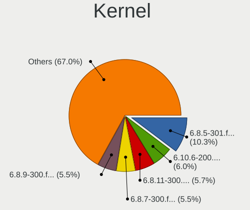

| Version                      | Desktops | Percent |
|------------------------------|----------|---------|
| 6.8.5-301.fc40.x86_64        | 152      | 10.28%  |
| 6.10.6-200.fc40.x86_64       | 89       | 6.02%   |
| 6.8.11-300.fc40.x86_64       | 84       | 5.68%   |
| 6.8.7-300.fc40.x86_64        | 82       | 5.55%   |
| 6.8.9-300.fc40.x86_64        | 81       | 5.48%   |
| 6.10.11-200.fc40.x86_64      | 60       | 4.06%   |
| 6.10.12-200.fc40.x86_64      | 59       | 3.99%   |
| 6.9.12-200.fc40.x86_64       | 49       | 3.32%   |
| 6.10.3-200.fc40.x86_64       | 48       | 3.25%   |
| 6.8.10-300.fc40.x86_64       | 45       | 3.04%   |
| 6.9.7-200.fc40.x86_64        | 43       | 2.91%   |
| 6.10.4-200.fc40.x86_64       | 40       | 2.71%   |
| 6.11.4-201.fc40.x86_64       | 39       | 2.64%   |
| 6.9.5-200.fc40.x86_64        | 37       | 2.5%    |
| 6.8.8-300.fc40.x86_64        | 37       | 2.5%    |
| 6.10.10-200.fc40.x86_64      | 37       | 2.5%    |
| 6.9.9-200.fc40.x86_64        | 35       | 2.37%   |
| 6.9.8-200.fc40.x86_64        | 34       | 2.3%    |
| 6.11.3-200.fc40.x86_64       | 33       | 2.23%   |
| 6.10.9-200.fc40.x86_64       | 32       | 2.17%   |
| 6.9.6-200.fc40.x86_64        | 31       | 2.1%    |
| 6.9.4-200.fc40.x86_64        | 31       | 2.1%    |
| 6.10.7-200.fc40.x86_64       | 29       | 1.96%   |
| 6.9.11-200.fc40.x86_64       | 21       | 1.42%   |
| 6.9.10-200.fc40.x86_64       | 16       | 1.08%   |
| 6.8.2-300.fc40.x86_64        | 16       | 1.08%   |
| 6.8.10-301.fsync.fc40.x86_64 | 14       | 0.95%   |
| 6.10.8-200.fc40.x86_64       | 14       | 0.95%   |
| 6.8.9-301.fsync.fc40.x86_64  | 13       | 0.88%   |
| 6.11.5-200.fc40.x86_64       | 13       | 0.88%   |
| 6.10.5-200.fc40.x86_64       | 12       | 0.81%   |
| 6.8.11-301.fsync.fc40.x86_64 | 9        | 0.61%   |
| 6.9.4-201.fsync.fc40.x86_64  | 7        | 0.47%   |
| 6.8.7-303.fsync.fc40.x86_64  | 6        | 0.41%   |
| 6.12.5-100.fc40.x86_64       | 6        | 0.41%   |
| 6.11.6-200.fc40.x86_64       | 6        | 0.41%   |
| 6.11.10-200.fc40.x86_64      | 6        | 0.41%   |
| 6.9.6-201.fsync.fc40.x86_64  | 5        | 0.34%   |
| 6.8.12-301.fsync.fc40.x86_64 | 5        | 0.34%   |
| 6.8.0-0.rc6.49.fc40.x86_64   | 5        | 0.34%   |

Kernel Family
-------------

Linux kernel without a distro release

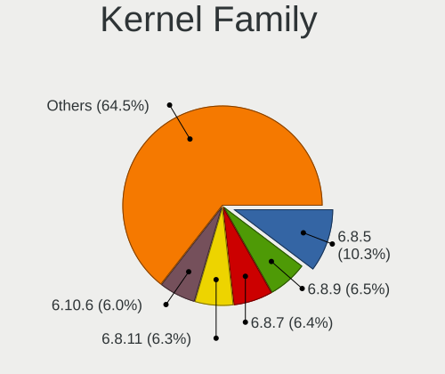

| Version | Desktops | Percent |
|---------|----------|---------|
| 6.8.5   | 152      | 10.29%  |
| 6.8.9   | 96       | 6.5%    |
| 6.8.7   | 95       | 6.43%   |
| 6.8.11  | 93       | 6.3%    |
| 6.10.6  | 89       | 6.03%   |
| 6.10.11 | 60       | 4.06%   |
| 6.8.10  | 59       | 3.99%   |
| 6.10.12 | 59       | 3.99%   |
| 6.9.12  | 49       | 3.32%   |
| 6.10.3  | 48       | 3.25%   |
| 6.9.7   | 43       | 2.91%   |
| 6.10.4  | 40       | 2.71%   |
| 6.9.4   | 39       | 2.64%   |
| 6.11.4  | 39       | 2.64%   |
| 6.10.10 | 39       | 2.64%   |
| 6.9.5   | 37       | 2.51%   |
| 6.8.8   | 37       | 2.51%   |
| 6.9.6   | 36       | 2.44%   |
| 6.9.9   | 35       | 2.37%   |
| 6.9.8   | 34       | 2.3%    |
| 6.11.3  | 33       | 2.23%   |
| 6.10.9  | 32       | 2.17%   |
| 6.10.7  | 29       | 1.96%   |
| 6.9.11  | 21       | 1.42%   |
| 6.9.10  | 16       | 1.08%   |
| 6.8.2   | 16       | 1.08%   |
| 6.10.8  | 14       | 0.95%   |
| 6.11.5  | 13       | 0.88%   |
| 6.10.5  | 13       | 0.88%   |
| 6.8.0   | 10       | 0.68%   |
| 6.8.12  | 6        | 0.41%   |
| 6.12.5  | 6        | 0.41%   |
| 6.11.6  | 6        | 0.41%   |
| 6.11.10 | 6        | 0.41%   |
| 6.14.5  | 5        | 0.34%   |
| 6.12.11 | 4        | 0.27%   |
| 6.10.0  | 4        | 0.27%   |
| 6.8.6   | 3        | 0.2%    |
| 6.8.4   | 3        | 0.2%    |
| 6.6.0   | 3        | 0.2%    |

Kernel Major Ver.
-----------------

Linux kernel major version

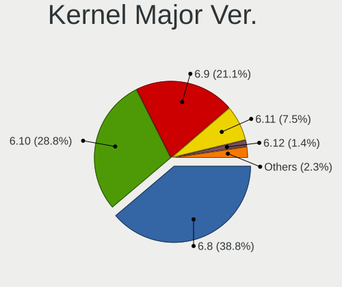

| Version | Desktops | Percent |
|---------|----------|---------|
| 6.8     | 546      | 38.81%  |
| 6.10    | 405      | 28.78%  |
| 6.9     | 297      | 21.11%  |
| 6.11    | 106      | 7.53%   |
| 6.12    | 20       | 1.42%   |
| 6.13    | 15       | 1.07%   |
| 6.6     | 5        | 0.36%   |
| 6.14    | 5        | 0.36%   |
| 6.7     | 3        | 0.21%   |
| 6.5     | 3        | 0.21%   |
| 6.4     | 1        | 0.07%   |
| 5.4     | 1        | 0.07%   |

Arch
----

OS architecture (x86_64, i586, etc.)

| Name   | Desktops | Percent |
|--------|----------|---------|
| x86_64 | 1299     | 100%    |

DE
--

Desktop Environment

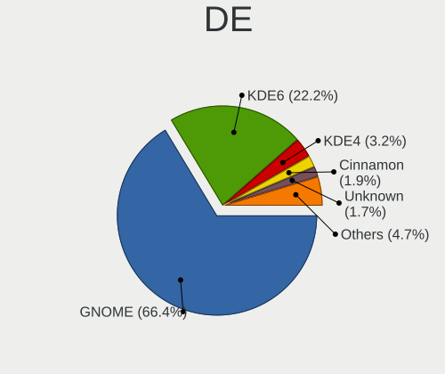

| Name          | Desktops | Percent |
|---------------|----------|---------|
| GNOME         | 874      | 66.36%  |
| KDE6          | 292      | 22.17%  |
| KDE4          | 42       | 3.19%   |
| Cinnamon      | 25       | 1.9%    |
| Unknown       | 22       | 1.67%   |
| X-Cinnamon    | 15       | 1.14%   |
| XFCE          | 14       | 1.06%   |
| GNOME Classic | 14       | 1.06%   |
| MATE          | 4        | 0.3%    |
| sway          | 3        | 0.23%   |
| Hyprland      | 3        | 0.23%   |
| KDE5          | 2        | 0.15%   |
| i3            | 2        | 0.15%   |
| Budgie        | 2        | 0.15%   |
| LXQt          | 1        | 0.08%   |
| LXDE          | 1        | 0.08%   |
| Deepin        | 1        | 0.08%   |

Display Server
--------------

X11 or Wayland

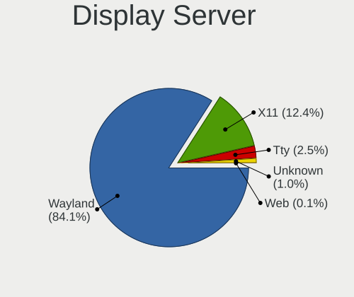

| Name    | Desktops | Percent |
|---------|----------|---------|
| Wayland | 1109     | 84.08%  |
| X11     | 163      | 12.36%  |
| Tty     | 33       | 2.5%    |
| Unknown | 13       | 0.99%   |
| Web     | 1        | 0.08%   |

Display Manager
---------------

SDDM, LightDM, etc.

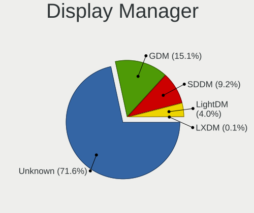

| Name    | Desktops | Percent |
|---------|----------|---------|
| Unknown | 937      | 71.64%  |
| GDM     | 198      | 15.14%  |
| SDDM    | 120      | 9.17%   |
| LightDM | 52       | 3.98%   |
| LXDM    | 1        | 0.08%   |

OS Lang
-------

Language

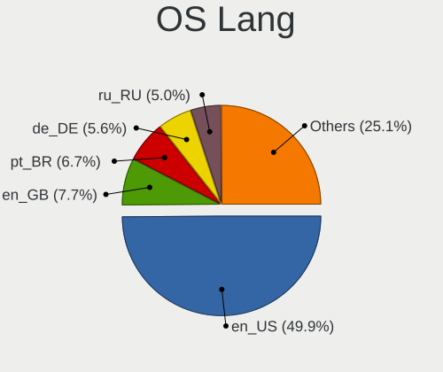

| Lang    | Desktops | Percent |
|---------|----------|---------|
| en_US   | 651      | 49.89%  |
| en_GB   | 101      | 7.74%   |
| pt_BR   | 88       | 6.74%   |
| de_DE   | 73       | 5.59%   |
| ru_RU   | 65       | 4.98%   |
| en_AU   | 55       | 4.21%   |
| fr_FR   | 42       | 3.22%   |
| it_IT   | 25       | 1.92%   |
| pl_PL   | 21       | 1.61%   |
| es_ES   | 21       | 1.61%   |
| en_CA   | 19       | 1.46%   |
| es_AR   | 11       | 0.84%   |
| en_IN   | 10       | 0.77%   |
| hu_HU   | 9        | 0.69%   |
| es_CO   | 8        | 0.61%   |
| tr_TR   | 7        | 0.54%   |
| zh_CN   | 6        | 0.46%   |
| nl_NL   | 6        | 0.46%   |
| sv_SE   | 5        | 0.38%   |
| es_MX   | 5        | 0.38%   |
| en_ZA   | 5        | 0.38%   |
| en_NZ   | 5        | 0.38%   |
| en_IE   | 5        | 0.38%   |
| da_DK   | 5        | 0.38%   |
| pt_PT   | 4        | 0.31%   |
| en_SG   | 4        | 0.31%   |
| de_AT   | 4        | 0.31%   |
| cs_CZ   | 4        | 0.31%   |
| Unknown | 4        | 0.31%   |
| ja_JP   | 3        | 0.23%   |
| fr_CA   | 3        | 0.23%   |
| fi_FI   | 3        | 0.23%   |
| es_PE   | 3        | 0.23%   |
| en_PH   | 3        | 0.23%   |
| en_DK   | 3        | 0.23%   |
| ko_KR   | 2        | 0.15%   |
| es_CL   | 2        | 0.15%   |
| en_IL   | 2        | 0.15%   |
| de_CH   | 2        | 0.15%   |
| sk_SK   | 1        | 0.08%   |

Boot Mode
---------

EFI or BIOS

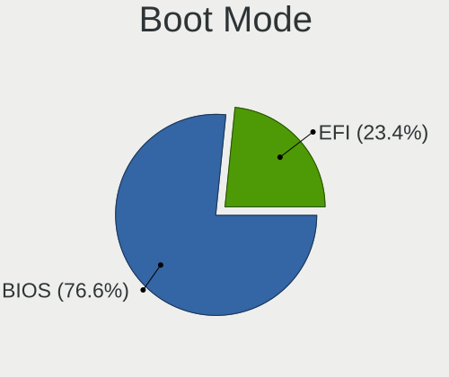

| Mode | Desktops | Percent |
|------|----------|---------|
| BIOS | 1002     | 76.61%  |
| EFI  | 306      | 23.39%  |

Filesystem
----------

Type of filesystem

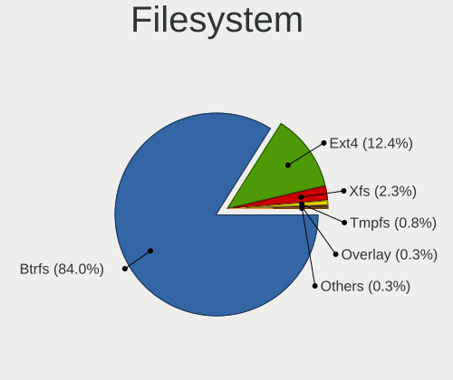

| Type    | Desktops | Percent |
|---------|----------|---------|
| Btrfs   | 1094     | 83.96%  |
| Ext4    | 161      | 12.36%  |
| Xfs     | 30       | 2.3%    |
| Tmpfs   | 10       | 0.77%   |
| Overlay | 4        | 0.31%   |
| Unknown | 2        | 0.15%   |
| Nfs4    | 1        | 0.08%   |
| Ext3    | 1        | 0.08%   |

Part. scheme
------------

Scheme of partitioning

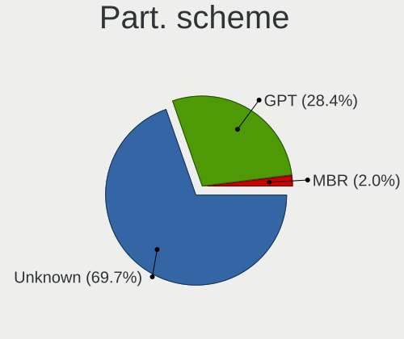

| Type    | Desktops | Percent |
|---------|----------|---------|
| Unknown | 914      | 69.66%  |
| GPT     | 372      | 28.35%  |
| MBR     | 26       | 1.98%   |

Dual Boot with Linux/BSD
------------------------

Hosting more than one Linux/BSD

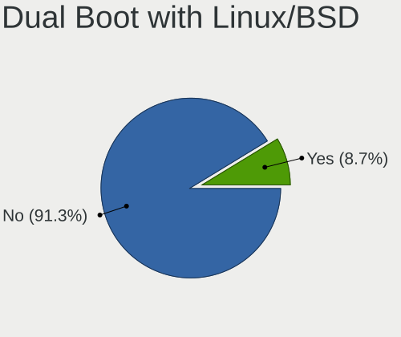

| Dual boot | Desktops | Percent |
|-----------|----------|---------|
| No        | 1195     | 91.29%  |
| Yes       | 114      | 8.71%   |

Dual Boot (Win)
---------------

Hosting Linux and Windows

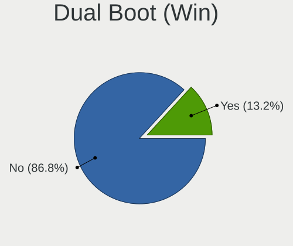

| Dual boot | Desktops | Percent |
|-----------|----------|---------|
| No        | 1134     | 86.83%  |
| Yes       | 172      | 13.17%  |

Board
-----

Vendor
------

Motherboard manufacturer

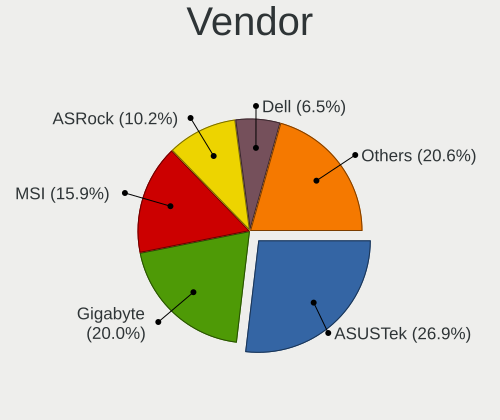

| Name                                 | Desktops | Percent |
|--------------------------------------|----------|---------|
| ASUSTek Computer                     | 349      | 26.87%  |
| Gigabyte Technology                  | 260      | 20.02%  |
| MSI                                  | 206      | 15.86%  |
| ASRock                               | 132      | 10.16%  |
| Dell                                 | 84       | 6.47%   |
| Hewlett-Packard                      | 65       | 5%      |
| Intel                                | 46       | 3.54%   |
| Lenovo                               | 37       | 2.85%   |
| Unknown                              | 12       | 0.92%   |
| Shenzhen Meigao Electronic Equipment | 8        | 0.62%   |
| Huanan                               | 8        | 0.62%   |
| Fujitsu                              | 8        | 0.62%   |
| Acer                                 | 7        | 0.54%   |
| MACHINIST                            | 6        | 0.46%   |
| Itautec                              | 6        | 0.46%   |
| Pegatron                             | 5        | 0.38%   |
| Foxconn                              | 5        | 0.38%   |
| AMI                                  | 5        | 0.38%   |
| Apple                                | 4        | 0.31%   |
| Medion                               | 3        | 0.23%   |
| Alienware                            | 3        | 0.23%   |
| System76                             | 2        | 0.15%   |
| Supermicro                           | 2        | 0.15%   |
| GEEKOM                               | 2        | 0.15%   |
| Gateway                              | 2        | 0.15%   |
| ECS                                  | 2        | 0.15%   |
| Colorful Technology                  | 2        | 0.15%   |
| BESSTAR Tech                         | 2        | 0.15%   |
| AZW                                  | 2        | 0.15%   |
| USI                                  | 1        | 0.08%   |
| UGREEN                               | 1        | 0.08%   |
| Tianbei                              | 1        | 0.08%   |
| SZQFTX                               | 1        | 0.08%   |
| Soyo                                 | 1        | 0.08%   |
| SLIMBOOK                             | 1        | 0.08%   |
| Silicom                              | 1        | 0.08%   |
| Shuttle                              | 1        | 0.08%   |
| PCWare                               | 1        | 0.08%   |
| PCSMART                              | 1        | 0.08%   |
| OnLogic                              | 1        | 0.08%   |

Model
-----

Motherboard model

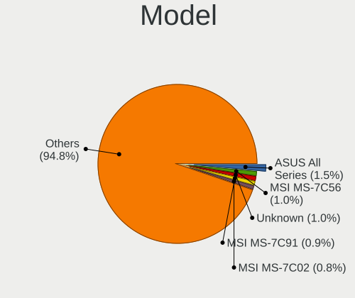

| Name                               | Desktops | Percent |
|------------------------------------|----------|---------|
| ASUS All Series                    | 19       | 1.46%   |
| MSI MS-7C56                        | 13       | 1%      |
| Unknown                            | 13       | 1%      |
| MSI MS-7C91                        | 12       | 0.92%   |
| MSI MS-7C02                        | 11       | 0.85%   |
| ASUS TUF Gaming X570-PLUS          | 11       | 0.85%   |
| ASUS TUF Gaming B550-PLUS          | 10       | 0.77%   |
| MSI MS-7B89                        | 9        | 0.69%   |
| MSI MS-7C52                        | 8        | 0.62%   |
| Intel X99                          | 7        | 0.54%   |
| Dell OptiPlex 7050                 | 7        | 0.54%   |
| Dell OptiPlex 7010                 | 7        | 0.54%   |
| ASUS TUF Gaming B550M-PLUS WIFI II | 7        | 0.54%   |
| ASUS PRIME A320M-K                 | 7        | 0.54%   |
| MSI MS-7D25                        | 6        | 0.46%   |
| MSI MS-7C95                        | 6        | 0.46%   |
| MSI MS-7C37                        | 6        | 0.46%   |
| Intel H61                          | 6        | 0.46%   |
| ASRock B450M Steel Legend          | 6        | 0.46%   |
| MSI MS-7E26                        | 5        | 0.38%   |
| MSI MS-7D75                        | 5        | 0.38%   |
| MSI MS-7B86                        | 5        | 0.38%   |
| Gigabyte B550M DS3H                | 5        | 0.38%   |
| Gigabyte B550 AORUS ELITE AX V2    | 5        | 0.38%   |
| Dell OptiPlex 9020                 | 5        | 0.38%   |
| ASUS TUF Gaming B550M-PLUS         | 5        | 0.38%   |
| ASUS ROG STRIX B650E-E GAMING WIFI | 5        | 0.38%   |
| ASUS ROG STRIX B450-F GAMING       | 5        | 0.38%   |
| ASUS PRIME B350-PLUS               | 5        | 0.38%   |
| ASRock B550M Pro4                  | 5        | 0.38%   |
| MSI MS-7E06                        | 4        | 0.31%   |
| MSI MS-7D22                        | 4        | 0.31%   |
| MSI MS-7C96                        | 4        | 0.31%   |
| MSI MS-7C94                        | 4        | 0.31%   |
| Intel H81                          | 4        | 0.31%   |
| Intel B75                          | 4        | 0.31%   |
| Gigabyte B550M AORUS ELITE         | 4        | 0.31%   |
| Gigabyte B550I AORUS PRO AX        | 4        | 0.31%   |
| Gigabyte B550 AORUS ELITE V2       | 4        | 0.31%   |
| Gigabyte B450 AORUS ELITE          | 4        | 0.31%   |

Model Family
------------

Motherboard model prefix

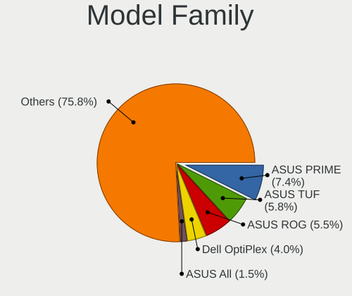

| Name                | Desktops | Percent |
|---------------------|----------|---------|
| ASUS PRIME          | 96       | 7.39%   |
| ASUS TUF            | 75       | 5.77%   |
| ASUS ROG            | 72       | 5.54%   |
| Dell OptiPlex       | 52       | 4%      |
| ASUS All            | 19       | 1.46%   |
| HP EliteDesk        | 18       | 1.39%   |
| Lenovo ThinkCentre  | 16       | 1.23%   |
| Dell Precision      | 15       | 1.15%   |
| Gigabyte B550M      | 14       | 1.08%   |
| Gigabyte B550       | 14       | 1.08%   |
| MSI MS-7C56         | 13       | 1%      |
| ASRock B450M        | 13       | 1%      |
| Unknown             | 13       | 1%      |
| MSI MS-7C91         | 12       | 0.92%   |
| Gigabyte B450M      | 12       | 0.92%   |
| MSI MS-7C02         | 11       | 0.85%   |
| Gigabyte B450       | 11       | 0.85%   |
| Gigabyte X570       | 10       | 0.77%   |
| MSI MS-7B89         | 9        | 0.69%   |
| Intel X99           | 9        | 0.69%   |
| ASRock B450         | 9        | 0.69%   |
| MSI MS-7C52         | 8        | 0.62%   |
| Lenovo ThinkStation | 8        | 0.62%   |
| Intel H61           | 7        | 0.54%   |
| HP Compaq           | 7        | 0.54%   |
| Gigabyte A520M      | 7        | 0.54%   |
| Dell Inspiron       | 7        | 0.54%   |
| ASUS ProArt         | 7        | 0.54%   |
| ASRock B550M        | 7        | 0.54%   |
| ASRock B550         | 7        | 0.54%   |
| MSI MS-7D25         | 6        | 0.46%   |
| MSI MS-7C95         | 6        | 0.46%   |
| MSI MS-7C37         | 6        | 0.46%   |
| HP ProDesk          | 6        | 0.46%   |
| Gigabyte Z790       | 6        | 0.46%   |
| Gigabyte H310M      | 6        | 0.46%   |
| Gigabyte B650       | 6        | 0.46%   |
| Dell XPS            | 6        | 0.46%   |
| MSI MS-7E26         | 5        | 0.38%   |
| MSI MS-7D75         | 5        | 0.38%   |

MFG Year
--------

Motherboard manufacture year

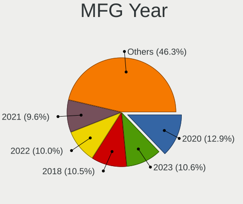

| Year | Desktops | Percent |
|------|----------|---------|
| 2020 | 167      | 12.86%  |
| 2023 | 138      | 10.62%  |
| 2018 | 137      | 10.55%  |
| 2022 | 130      | 10.01%  |
| 2021 | 125      | 9.62%   |
| 2019 | 103      | 7.93%   |
| 2017 | 79       | 6.08%   |
| 2012 | 70       | 5.39%   |
| 2013 | 68       | 5.23%   |
| 2014 | 50       | 3.85%   |
| 2015 | 47       | 3.62%   |
| 2016 | 45       | 3.46%   |
| 2024 | 34       | 2.62%   |
| 2011 | 31       | 2.39%   |
| 2009 | 29       | 2.23%   |
| 2010 | 26       | 2%      |
| 2008 | 13       | 1%      |
| 2007 | 4        | 0.31%   |
| 2006 | 3        | 0.23%   |

Form Factor
-----------

Physical design of the computer

| Name    | Desktops | Percent |
|---------|----------|---------|
| Desktop | 1299     | 100%    |

Secure Boot
-----------

Enabled or disabled

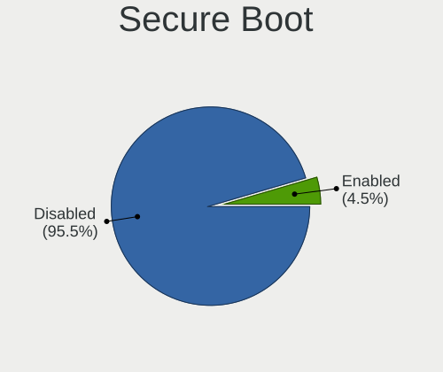

| State    | Desktops | Percent |
|----------|----------|---------|
| Disabled | 1243     | 95.47%  |
| Enabled  | 59       | 4.53%   |

Coreboot
--------

Have coreboot on board

| Used | Desktops | Percent |
|------|----------|---------|
| No   | 1298     | 99.92%  |
| Yes  | 1        | 0.08%   |

RAM Size
--------

Total RAM memory

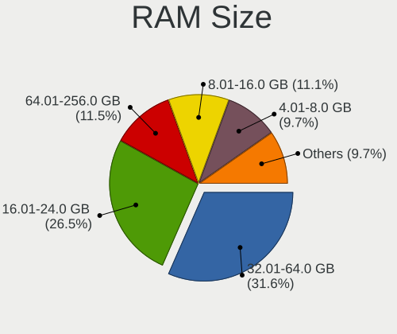

| Size in GB      | Desktops | Percent |
|-----------------|----------|---------|
| 32.01-64.0      | 413      | 31.57%  |
| 16.01-24.0      | 346      | 26.45%  |
| 64.01-256.0     | 150      | 11.47%  |
| 8.01-16.0       | 145      | 11.09%  |
| 4.01-8.0        | 127      | 9.71%   |
| 24.01-32.0      | 87       | 6.65%   |
| 3.01-4.0        | 32       | 2.45%   |
| 1.01-2.0        | 5        | 0.38%   |
| 2.01-3.0        | 2        | 0.15%   |
| More than 256.0 | 1        | 0.08%   |

RAM Used
--------

Used RAM memory

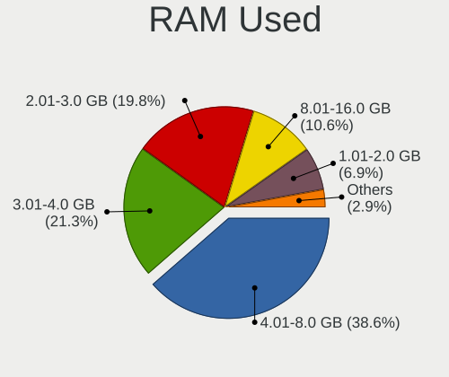

| Used GB     | Desktops | Percent |
|-------------|----------|---------|
| 4.01-8.0    | 537      | 38.58%  |
| 3.01-4.0    | 297      | 21.34%  |
| 2.01-3.0    | 275      | 19.76%  |
| 8.01-16.0   | 147      | 10.56%  |
| 1.01-2.0    | 96       | 6.9%    |
| 0.51-1.0    | 18       | 1.29%   |
| 16.01-24.0  | 15       | 1.08%   |
| 24.01-32.0  | 4        | 0.29%   |
| 32.01-64.0  | 2        | 0.14%   |
| 64.01-256.0 | 1        | 0.07%   |

Total Drives
------------

Number of drives on board

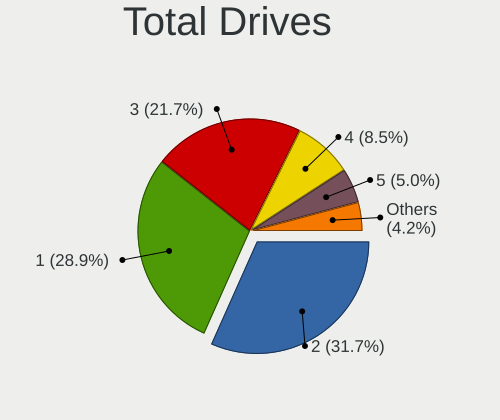

| Drives | Desktops | Percent |
|--------|----------|---------|
| 2      | 419      | 31.67%  |
| 1      | 383      | 28.95%  |
| 3      | 287      | 21.69%  |
| 4      | 113      | 8.54%   |
| 5      | 66       | 4.99%   |
| 6      | 26       | 1.97%   |
| 7      | 16       | 1.21%   |
| 8      | 6        | 0.45%   |
| 9      | 3        | 0.23%   |
| 12     | 2        | 0.15%   |
| 11     | 1        | 0.08%   |
| 0      | 1        | 0.08%   |

Has CD-ROM
----------

Has CD-ROM on board

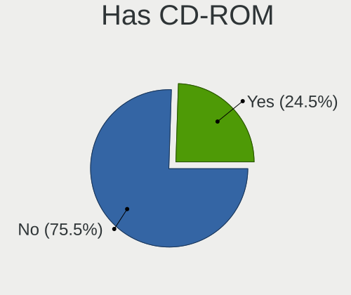

| Presented | Desktops | Percent |
|-----------|----------|---------|
| No        | 987      | 75.52%  |
| Yes       | 320      | 24.48%  |

Has Ethernet
------------

Has Ethernet on board

| Presented | Desktops | Percent |
|-----------|----------|---------|
| Yes       | 1287     | 99.08%  |
| No        | 12       | 0.92%   |

Has WiFi
--------

Has WiFi module

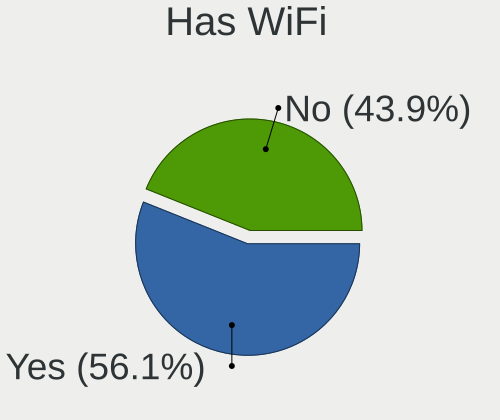

| Presented | Desktops | Percent |
|-----------|----------|---------|
| Yes       | 735      | 56.06%  |
| No        | 576      | 43.94%  |

Has Bluetooth
-------------

Has Bluetooth module

| Presented | Desktops | Percent |
|-----------|----------|---------|
| Yes       | 728      | 55.7%   |
| No        | 579      | 44.3%   |

Location
--------

Country
-------

Geographic location (country)

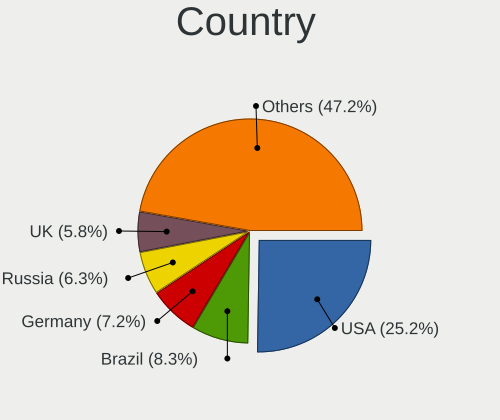

| Country      | Desktops | Percent |
|--------------|----------|---------|
| USA          | 330      | 25.25%  |
| Brazil       | 108      | 8.26%   |
| Germany      | 94       | 7.19%   |
| Russia       | 82       | 6.27%   |
| UK           | 76       | 5.81%   |
| Australia    | 64       | 4.9%    |
| France       | 48       | 3.67%   |
| Canada       | 37       | 2.83%   |
| Spain        | 32       | 2.45%   |
| Italy        | 32       | 2.45%   |
| Poland       | 28       | 2.14%   |
| Netherlands  | 21       | 1.61%   |
| India        | 21       | 1.61%   |
| Austria      | 15       | 1.15%   |
| Hungary      | 14       | 1.07%   |
| Sweden       | 13       | 0.99%   |
| Mexico       | 13       | 0.99%   |
| Argentina    | 12       | 0.92%   |
| Switzerland  | 11       | 0.84%   |
| Romania      | 11       | 0.84%   |
| Greece       | 11       | 0.84%   |
| Denmark      | 11       | 0.84%   |
| Czechia      | 11       | 0.84%   |
| Turkey       | 10       | 0.77%   |
| Philippines  | 10       | 0.77%   |
| Colombia     | 10       | 0.77%   |
| Serbia       | 8        | 0.61%   |
| Norway       | 8        | 0.61%   |
| Finland      | 8        | 0.61%   |
| Bulgaria     | 8        | 0.61%   |
| Belgium      | 8        | 0.61%   |
| South Africa | 7        | 0.54%   |
| Portugal     | 7        | 0.54%   |
| New Zealand  | 7        | 0.54%   |
| Japan        | 7        | 0.54%   |
| China        | 7        | 0.54%   |
| Belarus      | 7        | 0.54%   |
| Vietnam      | 5        | 0.38%   |
| Singapore    | 5        | 0.38%   |
| Ireland      | 5        | 0.38%   |

City
----

Geographic location (city)

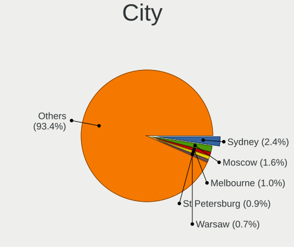

| City             | Desktops | Percent |
|------------------|----------|---------|
| Sydney           | 32       | 2.4%    |
| Moscow           | 21       | 1.57%   |
| Melbourne        | 13       | 0.97%   |
| St Petersburg    | 12       | 0.9%    |
| Warsaw           | 10       | 0.75%   |
| Sao Paulo        | 10       | 0.75%   |
| Paris            | 8        | 0.6%    |
| Belgrade         | 8        | 0.6%    |
| Palmas           | 7        | 0.52%   |
| Brisbane         | 7        | 0.52%   |
| Toronto          | 6        | 0.45%   |
| Seattle          | 6        | 0.45%   |
| Rio de Janeiro   | 6        | 0.45%   |
| London           | 6        | 0.45%   |
| Denver           | 6        | 0.45%   |
| Auckland         | 6        | 0.45%   |
| Vienna           | 5        | 0.37%   |
| Sofia            | 5        | 0.37%   |
| Singapore        | 5        | 0.37%   |
| San Jose         | 5        | 0.37%   |
| Rotterdam        | 5        | 0.37%   |
| Prague           | 5        | 0.37%   |
| Porto Alegre     | 5        | 0.37%   |
| New York         | 5        | 0.37%   |
| Montreal         | 5        | 0.37%   |
| Minsk            | 5        | 0.37%   |
| Las Vegas        | 5        | 0.37%   |
| Ho Chi Minh City | 5        | 0.37%   |
| Helsinki         | 5        | 0.37%   |
| Dhaka            | 5        | 0.37%   |
| Berlin           | 5        | 0.37%   |
| Athens           | 5        | 0.37%   |
| Amsterdam        | 5        | 0.37%   |
| Adelaide         | 5        | 0.37%   |
| Wroclaw          | 4        | 0.3%    |
| Sao Carlos       | 4        | 0.3%    |
| Oslo             | 4        | 0.3%    |
| Minneapolis      | 4        | 0.3%    |
| Milan            | 4        | 0.3%    |
| Miami            | 4        | 0.3%    |

Drives
------

Drive Vendor
------------

Hard drive vendors

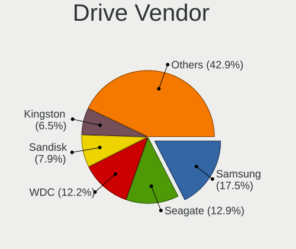

| Vendor                       | Desktops | Drives | Percent |
|------------------------------|----------|--------|---------|
| Samsung Electronics          | 459      | 791    | 17.45%  |
| Seagate                      | 340      | 523    | 12.93%  |
| WDC                          | 321      | 520    | 12.21%  |
| Sandisk                      | 209      | 272    | 7.95%   |
| Kingston                     | 172      | 225    | 6.54%   |
| Crucial                      | 123      | 172    | 4.68%   |
| Toshiba                      | 113      | 140    | 4.3%    |
| Phison Electronics           | 77       | 99     | 2.93%   |
| Micron/Crucial Technology    | 66       | 80     | 2.51%   |
| Kingston Technology Company  | 53       | 56     | 2.02%   |
| Silicon Motion               | 42       | 49     | 1.6%    |
| China                        | 41       | 45     | 1.56%   |
| ADATA Technology             | 40       | 47     | 1.52%   |
| Hitachi                      | 39       | 53     | 1.48%   |
| Intel                        | 37       | 54     | 1.41%   |
| A-DATA Technology            | 33       | 39     | 1.25%   |
| Unknown                      | 28       | 40     | 1.06%   |
| Realtek Semiconductor        | 27       | 28     | 1.03%   |
| SK hynix                     | 26       | 34     | 0.99%   |
| Micron Technology            | 26       | 28     | 0.99%   |
| HGST                         | 24       | 29     | 0.91%   |
| SPCC                         | 22       | 26     | 0.84%   |
| MAXIO Technology (Hangzhou)  | 22       | 24     | 0.84%   |
| Shenzhen Longsys Electronics | 20       | 25     | 0.76%   |
| Patriot                      | 16       | 31     | 0.61%   |
| KingSpec                     | 13       | 19     | 0.49%   |
| OCZ                          | 11       | 13     | 0.42%   |
| JMicron Technology           | 10       | 11     | 0.38%   |
| PNY                          | 9        | 10     | 0.34%   |
| Unknown                      | 9        | 13     | 0.34%   |
| Team                         | 8        | 9      | 0.3%    |
| KIOXIA                       | 8        | 11     | 0.3%    |
| GOODRAM                      | 7        | 7      | 0.27%   |
| Corsair                      | 7        | 8      | 0.27%   |
| Apacer                       | 7        | 8      | 0.27%   |
| T-FORCE                      | 6        | 7      | 0.23%   |
| XrayDisk                     | 5        | 5      | 0.19%   |
| Apple                        | 5        | 5      | 0.19%   |
| USB                          | 4        | 4      | 0.15%   |
| SABRENT                      | 4        | 4      | 0.15%   |

Drive Model
-----------

Hard drive models

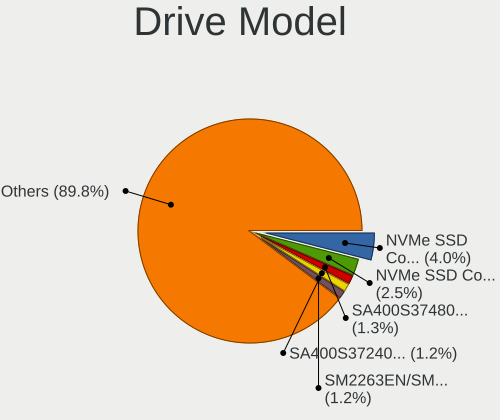

| Model                                                              | Desktops | Percent |
|--------------------------------------------------------------------|----------|---------|
| Samsung NVMe SSD Controller SM981/PM981/PM983 1TB                  | 121      | 4%      |
| Samsung NVMe SSD Controller PM9A1/PM9A3/980PRO 1TB                 | 76       | 2.51%   |
| Kingston SA400S37480G 480GB SSD                                    | 40       | 1.32%   |
| Kingston SA400S37240G 240GB SSD                                    | 37       | 1.22%   |
| Silicon Motion SM2263EN/SM2263XT SSD Controller 512GB              | 35       | 1.16%   |
| Micron/Crucial P2 NVMe PCIe SSD 2TB                                | 33       | 1.09%   |
| Samsung SSD 860 EVO 500GB                                          | 32       | 1.06%   |
| Phison E12 NVMe Controller 1TB                                     | 29       | 0.96%   |
| Samsung SSD 870 EVO 1TB                                            | 27       | 0.89%   |
| Seagate ST2000DM008-2FR102 2TB                                     | 26       | 0.86%   |
| Samsung SSD 850 EVO 250GB                                          | 26       | 0.86%   |
| Sandisk WD Blue SN550 NVMe SSD 1024GB                              | 25       | 0.83%   |
| Samsung SSD 860 EVO 1TB                                            | 25       | 0.83%   |
| Kingston Company SNV2S1000G 1TB                                    | 23       | 0.76%   |
| Seagate ST500DM002-1BD142 500GB                                    | 22       | 0.73%   |
| Seagate ST1000DM010-2EP102 1TB                                     | 22       | 0.73%   |
| Samsung NVMe SSD Controller SM961/PM961/SM963 1024GB               | 21       | 0.69%   |
| Samsung SSD 990 PRO 2TB                                            | 20       | 0.66%   |
| Crucial CT1000MX500SSD1 1TB                                        | 20       | 0.66%   |
| Samsung SSD 980 1TB                                                | 19       | 0.63%   |
| Samsung SSD 850 EVO 500GB                                          | 19       | 0.63%   |
| WDC WD10EZEX-08WN4A0 1TB                                           | 18       | 0.6%    |
| Toshiba DT01ACA100 1TB                                             | 18       | 0.6%    |
| Seagate ST4000DM004-2CV104 4TB                                     | 18       | 0.6%    |
| Sandisk WD Black SN750 / PC SN730 NVMe SSD 500GB                   | 18       | 0.6%    |
| Phison E16 PCIe4 NVMe Controller 1TB                               | 16       | 0.53%   |
| ADATA XPG SX8200 Pro PCIe Gen3x4 M.2 2280 Solid State Drive 1024GB | 16       | 0.53%   |
| Kingston Company A2000 NVMe SSD 250GB                              | 15       | 0.5%    |
| Toshiba HDWD110 1TB                                                | 14       | 0.46%   |
| Samsung SSD 990 PRO 1TB                                            | 14       | 0.46%   |
| Crucial CT500MX500SSD1 500GB                                       | 14       | 0.46%   |
| Crucial CT480BX500SSD1 480GB                                       | 14       | 0.46%   |
| Crucial CT240BX500SSD1 240GB                                       | 14       | 0.46%   |
| Sandisk WD_BLACK SN850X 1000GB                                     | 13       | 0.43%   |
| Sandisk WD Black SN850 1TB                                         | 13       | 0.43%   |
| Samsung SSD 870 QVO 1TB                                            | 13       | 0.43%   |
| Samsung SSD 860 EVO 250GB                                          | 13       | 0.43%   |
| MAXIO (Hangzhou) NVMe SSD Controller MAP1202 2TB                   | 13       | 0.43%   |
| Seagate ST2000DM008-2UB102 2TB                                     | 12       | 0.4%    |
| Seagate ST1000DM003-1ER162 1TB                                     | 12       | 0.4%    |

HDD Vendor
----------

Hard disk drive vendors

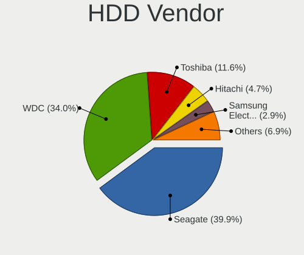

| Vendor              | Desktops | Drives | Percent |
|---------------------|----------|--------|---------|
| Seagate             | 333      | 509    | 39.88%  |
| WDC                 | 284      | 451    | 34.01%  |
| Toshiba             | 97       | 120    | 11.62%  |
| Hitachi             | 39       | 53     | 4.67%   |
| Samsung Electronics | 24       | 64     | 2.87%   |
| HGST                | 24       | 29     | 2.87%   |
| JMicron Technology  | 8        | 9      | 0.96%   |
| Unknown             | 7        | 7      | 0.84%   |
| T-FORCE             | 2        | 2      | 0.24%   |
| Apple               | 2        | 2      | 0.24%   |
| USB3.0              | 1        | 1      | 0.12%   |
| USB                 | 1        | 1      | 0.12%   |
| TO Exter            | 1        | 1      | 0.12%   |
| SSK                 | 1        | 1      | 0.12%   |
| SATAFIRM            | 1        | 1      | 0.12%   |
| SABRENT             | 1        | 1      | 0.12%   |
| RSH-319             | 1        | 2      | 0.12%   |
| Maxtor              | 1        | 1      | 0.12%   |
| Intenso             | 1        | 1      | 0.12%   |
| Initio              | 1        | 1      | 0.12%   |
| Inateck             | 1        | 2      | 0.12%   |
| Fujitsu             | 1        | 1      | 0.12%   |
| External            | 1        | 2      | 0.12%   |
| ExcelStor           | 1        | 1      | 0.12%   |
| ASMT                | 1        | 4      | 0.12%   |

SSD Vendor
----------

Solid state drive vendors

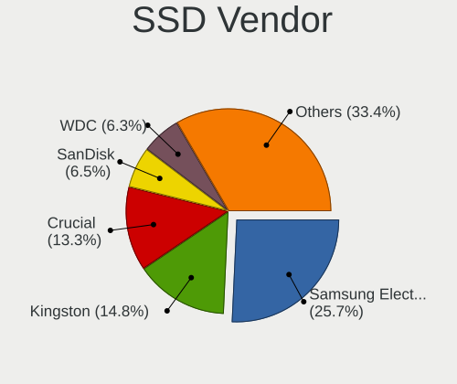

| Vendor              | Desktops | Drives | Percent |
|---------------------|----------|--------|---------|
| Samsung Electronics | 238      | 354    | 25.73%  |
| Kingston            | 137      | 168    | 14.81%  |
| Crucial             | 123      | 172    | 13.3%   |
| SanDisk             | 60       | 75     | 6.49%   |
| WDC                 | 58       | 69     | 6.27%   |
| China               | 41       | 45     | 4.43%   |
| A-DATA Technology   | 31       | 36     | 3.35%   |
| SPCC                | 22       | 26     | 2.38%   |
| Intel               | 21       | 33     | 2.27%   |
| Patriot             | 16       | 31     | 1.73%   |
| KingSpec            | 13       | 19     | 1.41%   |
| OCZ                 | 11       | 13     | 1.19%   |
| PNY                 | 9        | 10     | 0.97%   |
| Micron Technology   | 9        | 9      | 0.97%   |
| SK hynix            | 8        | 12     | 0.86%   |
| Team                | 7        | 7      | 0.76%   |
| GOODRAM             | 7        | 7      | 0.76%   |
| Corsair             | 7        | 8      | 0.76%   |
| Apacer              | 7        | 8      | 0.76%   |
| Toshiba             | 6        | 7      | 0.65%   |
| Unknown             | 5        | 5      | 0.54%   |
| Lexar               | 4        | 5      | 0.43%   |
| Fanxiang            | 4        | 4      | 0.43%   |
| XrayDisk            | 3        | 3      | 0.32%   |
| Seagate             | 3        | 3      | 0.32%   |
| SABRENT             | 3        | 3      | 0.32%   |
| Mushkin             | 3        | 3      | 0.32%   |
| LITEONIT            | 3        | 5      | 0.32%   |
| LITEON              | 3        | 3      | 0.32%   |
| Intenso             | 3        | 5      | 0.32%   |
| Gigabyte Technology | 3        | 3      | 0.32%   |
| Emtec               | 3        | 3      | 0.32%   |
| Transcend           | 2        | 3      | 0.22%   |
| Smartbuy            | 2        | 2      | 0.22%   |
| Leven               | 2        | 2      | 0.22%   |
| Hewlett-Packard     | 2        | 4      | 0.22%   |
| ASMT                | 2        | 2      | 0.22%   |
| Apple               | 2        | 2      | 0.22%   |
| X12                 | 1        | 1      | 0.11%   |
| WDC WDS             | 1        | 1      | 0.11%   |

Drive Kind
----------

HDD or SSD

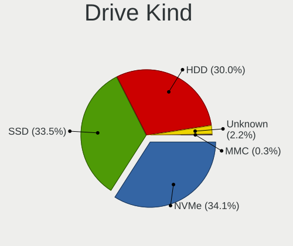

| Kind    | Desktops | Drives | Percent |
|---------|----------|--------|---------|
| NVMe    | 755      | 1177   | 34.06%  |
| SSD     | 742      | 1215   | 33.47%  |
| HDD     | 666      | 1267   | 30.04%  |
| Unknown | 48       | 63     | 2.17%   |
| MMC     | 6        | 6      | 0.27%   |

Drive Connector
---------------

SATA, SAS, NVMe, etc.

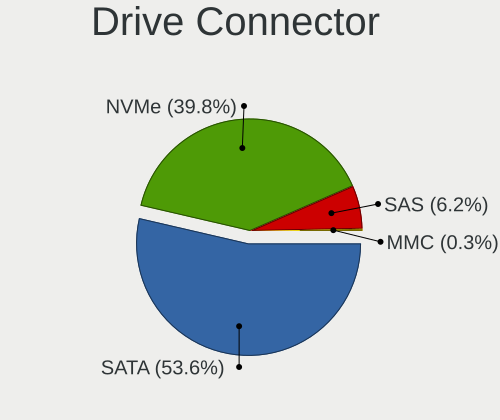

| Type | Desktops | Drives | Percent |
|------|----------|--------|---------|
| SATA | 1014     | 2398   | 53.62%  |
| NVMe | 753      | 1161   | 39.82%  |
| SAS  | 118      | 163    | 6.24%   |
| MMC  | 6        | 6      | 0.32%   |

Drive Size
----------

Size of hard drive

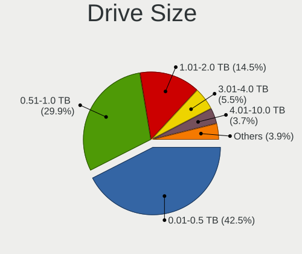

| Size in TB | Desktops | Drives | Percent |
|------------|----------|--------|---------|
| 0.01-0.5   | 659      | 1124   | 42.52%  |
| 0.51-1.0   | 463      | 705    | 29.87%  |
| 1.01-2.0   | 225      | 328    | 14.52%  |
| 3.01-4.0   | 85       | 143    | 5.48%   |
| 4.01-10.0  | 58       | 100    | 3.74%   |
| 2.01-3.0   | 46       | 58     | 2.97%   |
| 10.01-20.0 | 13       | 23     | 0.84%   |
| 20.01-50.0 | 1        | 1      | 0.06%   |

Space Total
-----------

Amount of disk space available on the file system

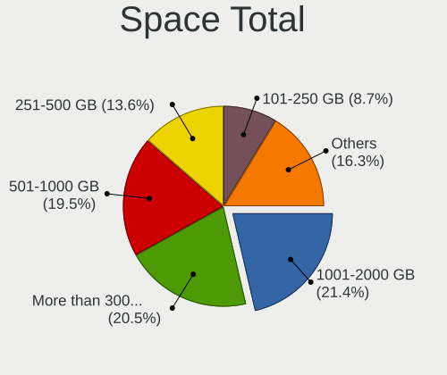

| Size in GB     | Desktops | Percent |
|----------------|----------|---------|
| 1001-2000      | 283      | 21.37%  |
| More than 3000 | 272      | 20.54%  |
| 501-1000       | 258      | 19.49%  |
| 251-500        | 180      | 13.6%   |
| 101-250        | 115      | 8.69%   |
| 2001-3000      | 90       | 6.8%    |
| Unknown        | 54       | 4.08%   |
| 1-20           | 44       | 3.32%   |
| 51-100         | 18       | 1.36%   |
| 21-50          | 10       | 0.76%   |

Space Used
----------

Amount of used disk space

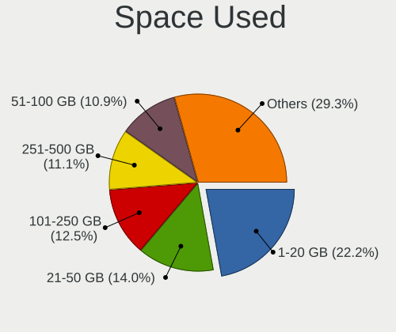

| Used GB        | Desktops | Percent |
|----------------|----------|---------|
| 1-20           | 304      | 22.17%  |
| 21-50          | 192      | 14%     |
| 101-250        | 172      | 12.55%  |
| 251-500        | 152      | 11.09%  |
| 51-100         | 149      | 10.87%  |
| 501-1000       | 132      | 9.63%   |
| 1001-2000      | 99       | 7.22%   |
| More than 3000 | 72       | 5.25%   |
| Unknown        | 54       | 3.94%   |
| 2001-3000      | 44       | 3.21%   |
| 0              | 1        | 0.07%   |

Malfunc. Drives
---------------

Drive models with a malfunction

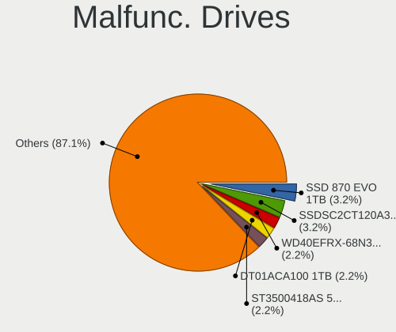

| Model                                                          | Desktops | Drives  | Percent |
|----------------------------------------------------------------|----------|---------|---------|
| Samsung Electronics SSD 870 EVO 1TB                            | 3        | 3       | 3.23%   |
| Intel SSDSC2CT120A3 120GB                                      | 3        | 9       | 3.23%   |
| WDC WD40EFRX-68N32N0 4TB                                       | 2        | 6       | 2.15%   |
| Toshiba DT01ACA100 1TB                                         | 2        | 2       | 2.15%   |
| Seagate ST3500418AS 500GB                                      | 2        | 5       | 2.15%   |
| Seagate ST31000524AS 1TB                                       | 2        | 6       | 2.15%   |
| Seagate ST1000DM003-1ER162 1TB                                 | 2        | 2       | 2.15%   |
| Samsung Electronics NVMe SSD Controller SM981/PM981/PM983 1TB  | 2        | 3       | 2.15%   |
| Samsung Electronics NVMe SSD Controller PM9A1/PM9A3/980PRO 1TB | 2        | 2       | 2.15%   |
| Samsung Electronics HD501LJ 500GB                              | 2        | 12      | 2.15%   |
| Samsung Electronics HD103UJ 1TB                                | 2        | 11      | 2.15%   |
| Kingston SUV500240G 240GB SSD                                  | 2        | 2       | 2.15%   |
| Kingston SA400S37480G 480GB SSD                                | 2        | 3       | 2.15%   |
| Crucial CT120M500SSD1 120GB                                    | 2        | 2       | 2.15%   |
| XrayDisk SSD 256GB                                             | 1        | 1       | 1.08%   |
| WDC WDS500G2B0A-00SM50 500GB                                   | 1        | 2       | 1.08%   |
| WDC WD6004FZWX-00BKVA0 6TB                                     | 1        | 1       | 1.08%   |
| WDC WD5000AVCS-632DY1 500GB                                    | 1        | 6       | 1.08%   |
| WDC WD5000AAKX-75U6AA0 500GB                                   | 1        | 1       | 1.08%   |
| WDC WD5000AAKX-603CA0 500GB                                    | 1        | 1       | 1.08%   |
| WDC WD5000AAKX-08U6AA0 500GB                                   | 1        | 1       | 1.08%   |
| WDC WD5000AAKX-001CA0 500GB                                    | 1        | 1       | 1.08%   |
| WDC WD5000AADS-00S9B0 500GB                                    | 1        | 1       | 1.08%   |
| WDC WD40EFRX-68WT0N0 4TB                                       | 1        | 1       | 1.08%   |
| WDC WD30EZRZ-00Z5HB0 3TB                                       | 1        | 1       | 1.08%   |
| WDC WD20EZRX-00D 2TB                                           | 1        | Unknown | 1.08%   |
| WDC WD20EARX-00PASB0 2TB                                       | 1        | 1       | 1.08%   |
| WDC WD10EZEX-60ZF5A0 1TB                                       | 1        | 1       | 1.08%   |
| WDC WD10EZEX-60WN4A2 1TB                                       | 1        | 1       | 1.08%   |
| WDC WD10EZEX-08WN4A0 1TB                                       | 1        | 1       | 1.08%   |
| WDC WD10EZEX-08RKKA0 1TB                                       | 1        | 1       | 1.08%   |
| WDC WD10EZEX-00BN5A0 1TB                                       | 1        | 1       | 1.08%   |
| WDC WD1002FAEX-00Z3A0 1TB                                      | 1        | 1       | 1.08%   |
| WDC WD1001FALS-00J7B0 1TB                                      | 1        | 1       | 1.08%   |
| Transcend TS240GMTS820S 240GB SSD                              | 1        | 1       | 1.08%   |
| Toshiba MQ01ABD100 1TB                                         | 1        | 1       | 1.08%   |
| Toshiba MQ01ABD050 500GB                                       | 1        | 1       | 1.08%   |
| Toshiba HDWD240 4TB                                            | 1        | 1       | 1.08%   |
| Toshiba HDWD110 1TB                                            | 1        | 1       | 1.08%   |
| SK hynix PC401 NVMe Solid State Drive 256GB                    | 1        | 1       | 1.08%   |

Malfunc. Drive Vendor
---------------------

Vendors of faulty drives

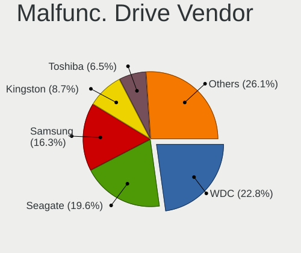

| Vendor                      | Desktops | Drives | Percent |
|-----------------------------|----------|--------|---------|
| WDC                         | 21       | 30     | 22.83%  |
| Seagate                     | 18       | 38     | 19.57%  |
| Samsung Electronics         | 15       | 36     | 16.3%   |
| Kingston                    | 8        | 9      | 8.7%    |
| Toshiba                     | 6        | 6      | 6.52%   |
| Intel                       | 5        | 13     | 5.43%   |
| Hitachi                     | 4        | 4      | 4.35%   |
| Crucial                     | 3        | 3      | 3.26%   |
| XrayDisk                    | 1        | 1      | 1.09%   |
| Transcend                   | 1        | 1      | 1.09%   |
| SK hynix                    | 1        | 1      | 1.09%   |
| Silicon Motion              | 1        | 1      | 1.09%   |
| SanDisk                     | 1        | 1      | 1.09%   |
| Neo                         | 1        | 1      | 1.09%   |
| Maxtor                      | 1        | 1      | 1.09%   |
| MAXIO Technology (Hangzhou) | 1        | 1      | 1.09%   |
| Lite-On Technology          | 1        | 1      | 1.09%   |
| HGST                        | 1        | 1      | 1.09%   |
| Corsair                     | 1        | 1      | 1.09%   |
| ADATA Technology            | 1        | 1      | 1.09%   |

Malfunc. HDD Vendor
-------------------

Vendors of faulty HDD drives

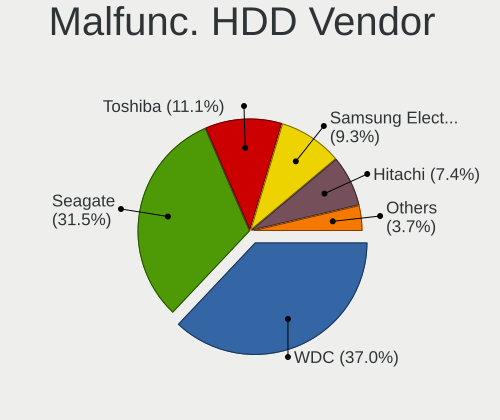

| Vendor              | Desktops | Drives | Percent |
|---------------------|----------|--------|---------|
| WDC                 | 20       | 28     | 37.04%  |
| Seagate             | 17       | 37     | 31.48%  |
| Toshiba             | 6        | 6      | 11.11%  |
| Samsung Electronics | 5        | 25     | 9.26%   |
| Hitachi             | 4        | 4      | 7.41%   |
| Maxtor              | 1        | 1      | 1.85%   |
| HGST                | 1        | 1      | 1.85%   |

Malfunc. Drive Kind
-------------------

Kinds of faulty drives

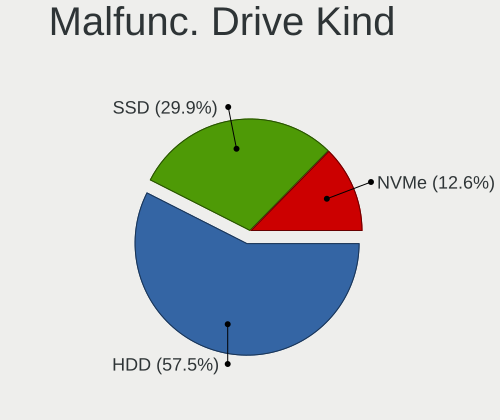

| Kind | Desktops | Drives | Percent |
|------|----------|--------|---------|
| HDD  | 50       | 102    | 57.47%  |
| SSD  | 26       | 37     | 29.89%  |
| NVMe | 11       | 12     | 12.64%  |

Failed Drives
-------------

Failed drive models

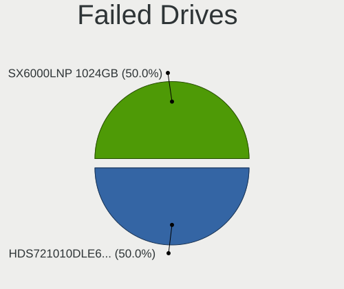

| Model                             | Desktops | Drives | Percent |
|-----------------------------------|----------|--------|---------|
| Hitachi HDS721010DLE630 1TB       | 1        | 2      | 50%     |
| ADATA Technology SX6000LNP 1024GB | 1        | 1      | 50%     |

Failed Drive Vendor
-------------------

Failed drive vendors

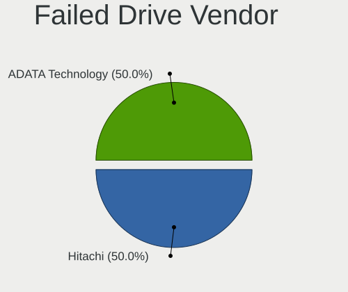

| Vendor           | Desktops | Drives | Percent |
|------------------|----------|--------|---------|
| Hitachi          | 1        | 2      | 50%     |
| ADATA Technology | 1        | 1      | 50%     |

Drive Status
------------

Number of failed and malfunc. drives

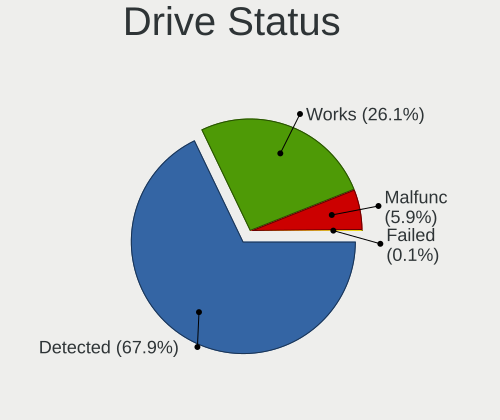

| Status   | Desktops | Drives | Percent |
|----------|----------|--------|---------|
| Detected | 959      | 2567   | 67.87%  |
| Works    | 369      | 1007   | 26.11%  |
| Malfunc  | 83       | 151    | 5.87%   |
| Failed   | 2        | 3      | 0.14%   |

Storage controller
------------------

Storage Vendor
--------------

Storage controller vendors

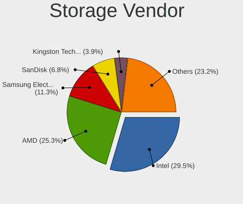

| Vendor                       | Desktops | Percent |
|------------------------------|----------|---------|
| Intel                        | 681      | 29.54%  |
| AMD                          | 583      | 25.29%  |
| Samsung Electronics          | 261      | 11.32%  |
| SanDisk                      | 156      | 6.77%   |
| Kingston Technology Company  | 90       | 3.9%    |
| ASMedia Technology           | 84       | 3.64%   |
| Phison Electronics           | 78       | 3.38%   |
| Micron/Crucial Technology    | 65       | 2.82%   |
| Silicon Motion               | 42       | 1.82%   |
| ADATA Technology             | 42       | 1.82%   |
| Realtek Semiconductor        | 27       | 1.17%   |
| Marvell Technology Group     | 23       | 1%      |
| MAXIO Technology (Hangzhou)  | 21       | 0.91%   |
| JMicron Technology           | 21       | 0.91%   |
| Shenzhen Longsys Electronics | 20       | 0.87%   |
| SK hynix                     | 19       | 0.82%   |
| Micron Technology            | 18       | 0.78%   |
| Toshiba America Info Systems | 10       | 0.43%   |
| KIOXIA                       | 9        | 0.39%   |
| Seagate Technology           | 8        | 0.35%   |
| LSI Logic / Symbios Logic    | 6        | 0.26%   |
| VIA Technologies             | 5        | 0.22%   |
| Nvidia                       | 5        | 0.22%   |
| INNOGRIT                     | 5        | 0.22%   |
| Solidigm                     | 4        | 0.17%   |
| Lite-On Technology           | 4        | 0.17%   |
| Adaptec                      | 4        | 0.17%   |
| Unknown                      | 3        | 0.13%   |
| Netac Technology             | 2        | 0.09%   |
| Hosin Global Electronics     | 2        | 0.09%   |
| ULi Electronics              | 1        | 0.04%   |
| Silicon Image                | 1        | 0.04%   |
| O2 Micro                     | 1        | 0.04%   |
| Innodisk                     | 1        | 0.04%   |
| Broadcom / LSI               | 1        | 0.04%   |
| Biwin Storage Technology     | 1        | 0.04%   |
| Apple                        | 1        | 0.04%   |

Storage Model
-------------

Storage controller models

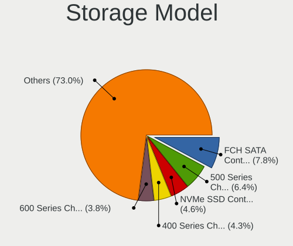

| Model                                                                                   | Desktops | Percent |
|-----------------------------------------------------------------------------------------|----------|---------|
| AMD FCH SATA Controller [AHCI mode]                                                     | 208      | 7.85%   |
| AMD 500 Series Chipset SATA Controller                                                  | 169      | 6.38%   |
| Samsung NVMe SSD Controller SM981/PM981/PM983                                           | 122      | 4.6%    |
| AMD 400 Series Chipset SATA Controller                                                  | 115      | 4.34%   |
| AMD 600 Series Chipset SATA Controller                                                  | 102      | 3.85%   |
| Samsung NVMe SSD Controller PM9A1/PM9A3/980PRO                                          | 76       | 2.87%   |
| ASMedia ASM1061/ASM1062 Serial ATA Controller                                           | 71       | 2.68%   |
| Intel 8 Series/C220 Series Chipset Family 6-port SATA Controller 1 [AHCI mode]          | 69       | 2.6%    |
| Intel Alder Lake-S PCH SATA Controller [AHCI Mode]                                      | 67       | 2.53%   |
| Intel Raptor Lake SATA AHCI Controller                                                  | 60       | 2.26%   |
| Intel 200 Series PCH SATA controller [AHCI mode]                                        | 59       | 2.23%   |
| Intel SATA Controller [RAID mode]                                                       | 50       | 1.89%   |
| Intel Q170/Q150/B150/H170/H110/Z170/CM236 Chipset SATA Controller [AHCI Mode]           | 44       | 1.66%   |
| Intel 7 Series/C210 Series Chipset Family 6-port SATA Controller [AHCI mode]            | 44       | 1.66%   |
| Intel Cannon Lake PCH SATA AHCI Controller                                              | 41       | 1.55%   |
| Samsung NVMe SSD Controller S4LV008[Pascal]                                             | 40       | 1.51%   |
| Silicon Motion SM2263EN/SM2263XT (DRAM-less) NVMe SSD Controllers                       | 35       | 1.32%   |
| Sandisk WD Black SN850X NVMe SSD                                                        | 34       | 1.28%   |
| Intel 6 Series/C200 Series Chipset Family 6 port Desktop SATA AHCI Controller           | 34       | 1.28%   |
| Micron/Crucial P2 [Nick P2] / P3 / P3 Plus NVMe PCIe SSD (DRAM-less)                    | 33       | 1.25%   |
| AMD SB7x0/SB8x0/SB9x0 SATA Controller [AHCI mode]                                       | 32       | 1.21%   |
| Samsung NVMe SSD Controller 980 (DRAM-less)                                             | 31       | 1.17%   |
| Intel 500 Series Chipset Family SATA AHCI Controller                                    | 31       | 1.17%   |
| Phison E12 NVMe Controller                                                              | 29       | 1.09%   |
| Intel Volume Management Device NVMe RAID Controller                                     | 29       | 1.09%   |
| AMD A320 Chipset SATA Controller [AHCI mode]                                            | 29       | 1.09%   |
| Kingston Company NV2 NVMe SSD [SM2267XT] (DRAM-less)                                    | 27       | 1.02%   |
| SanDisk WD SN560/SN740/SN770/SN5000 NVMe SSD                                            | 25       | 0.94%   |
| SanDisk Ultra 3D / WD PC SN530, IX SN530, Blue SN550 NVMe SSD (DRAM-less)               | 24       | 0.91%   |
| Kingston Company KC3000/FURY Renegade NVMe SSD [E18]                                    | 24       | 0.91%   |
| Intel RST Volume Management Device Controller                                           | 23       | 0.87%   |
| Samsung NVMe SSD Controller SM961/PM961/SM963                                           | 21       | 0.79%   |
| AMD SB7x0/SB8x0/SB9x0 IDE Controller                                                    | 20       | 0.75%   |
| Intel Comet Lake SATA AHCI Controller                                                   | 19       | 0.72%   |
| AMD 300 Series Chipset SATA Controller                                                  | 19       | 0.72%   |
| SanDisk Extreme Pro / WD Black SN750 / PC SN730 / Red SN700 NVMe SSD                    | 18       | 0.68%   |
| Phison E16 PCIe4 NVMe Controller                                                        | 16       | 0.6%    |
| ADATA XPG SX8200 Pro PCIe Gen3x4 M.2 2280 Solid State Drive                             | 16       | 0.6%    |
| Kingston Company A2000 NVMe SSD [SM2263EN]                                              | 15       | 0.57%   |
| Intel 6 Series/C200 Series Chipset Family Desktop SATA Controller (IDE mode, ports 4-5) | 15       | 0.57%   |

Storage Kind
------------

Kind of storage controller (IDE, SATA, NVMe, SAS, ...)

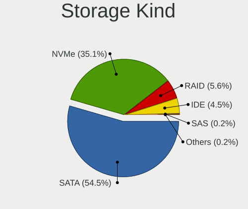

| Kind | Desktops | Percent |
|------|----------|---------|
| SATA | 1165     | 54.46%  |
| NVMe | 750      | 35.06%  |
| RAID | 119      | 5.56%   |
| IDE  | 96       | 4.49%   |
| SAS  | 5        | 0.23%   |
| SCSI | 4        | 0.19%   |

Processor
---------

CPU Vendor
----------

Processor vendors

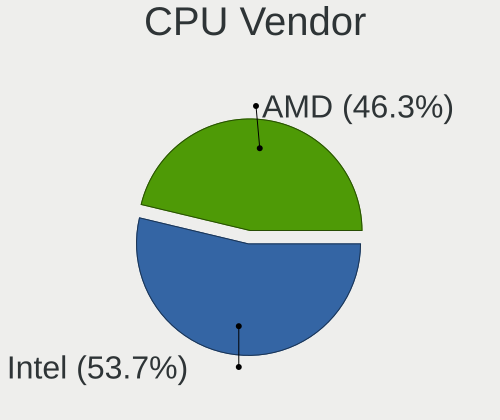

| Vendor | Desktops | Percent |
|--------|----------|---------|
| Intel  | 698      | 53.73%  |
| AMD    | 601      | 46.27%  |

CPU Model
---------

Processor models

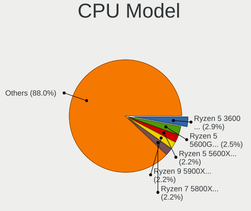

| Model                                       | Desktops | Percent |
|---------------------------------------------|----------|---------|
| AMD Ryzen 5 3600 6-Core Processor           | 38       | 2.92%   |
| AMD Ryzen 5 5600G with Radeon Graphics      | 33       | 2.54%   |
| AMD Ryzen 5 5600X 6-Core Processor          | 29       | 2.23%   |
| AMD Ryzen 9 5900X 12-Core Processor         | 28       | 2.15%   |
| AMD Ryzen 7 5800X 8-Core Processor          | 28       | 2.15%   |
| AMD Ryzen 7 5700G with Radeon Graphics      | 24       | 1.84%   |
| Intel Core i7-3770 CPU @ 3.40GHz            | 23       | 1.77%   |
| AMD Ryzen 9 5950X 16-Core Processor         | 21       | 1.61%   |
| AMD Ryzen 7 3700X 8-Core Processor          | 21       | 1.61%   |
| AMD Ryzen 5 5600 6-Core Processor           | 18       | 1.38%   |
| AMD Ryzen 5 2600 Six-Core Processor         | 18       | 1.38%   |
| AMD Ryzen 7 5700X 8-Core Processor          | 17       | 1.31%   |
| AMD Ryzen 7 5800X3D 8-Core Processor        | 16       | 1.23%   |
| AMD Ryzen 7 7800X3D 8-Core Processor        | 13       | 1%      |
| AMD Ryzen 9 3900X 12-Core Processor         | 12       | 0.92%   |
| AMD Ryzen 5 7600 6-Core Processor           | 12       | 0.92%   |
| Intel Core i5-3470 CPU @ 3.20GHz            | 11       | 0.85%   |
| Intel Core i5-10400F CPU @ 2.90GHz          | 11       | 0.85%   |
| Intel 12th Gen Core i7-12700K               | 11       | 0.85%   |
| AMD Ryzen 9 7950X 16-Core Processor         | 11       | 0.85%   |
| AMD Ryzen 9 7900X 12-Core Processor         | 11       | 0.85%   |
| Intel Core i9-14900K                        | 10       | 0.77%   |
| Intel Core i7-8700 CPU @ 3.20GHz            | 10       | 0.77%   |
| Intel Core i7-6700K CPU @ 4.00GHz           | 10       | 0.77%   |
| Intel Core i7-4790 CPU @ 3.60GHz            | 10       | 0.77%   |
| Intel Core i7-4770 CPU @ 3.40GHz            | 10       | 0.77%   |
| Intel Core i5-6500 CPU @ 3.20GHz            | 10       | 0.77%   |
| Intel 12th Gen Core i5-12400F               | 10       | 0.77%   |
| Intel 12th Gen Core i5-12400                | 10       | 0.77%   |
| AMD Ryzen 9 7950X3D 16-Core Processor       | 10       | 0.77%   |
| Intel Core i7-6700 CPU @ 3.40GHz            | 9        | 0.69%   |
| Intel Core i5-9400F CPU @ 2.90GHz           | 9        | 0.69%   |
| AMD Ryzen 9 7900 12-Core Processor          | 9        | 0.69%   |
| AMD FX-8350 Eight-Core Processor            | 9        | 0.69%   |
| Intel Core i5-8400 CPU @ 2.80GHz            | 8        | 0.61%   |
| Intel 13th Gen Core i5-13600K               | 8        | 0.61%   |
| AMD Ryzen 5 7600X 6-Core Processor          | 8        | 0.61%   |
| AMD Ryzen 5 4600G with Radeon Graphics      | 8        | 0.61%   |
| AMD Ryzen 3 3200G with Radeon Vega Graphics | 8        | 0.61%   |
| Intel N100                                  | 7        | 0.54%   |

CPU Model Family
----------------

Processor model prefix

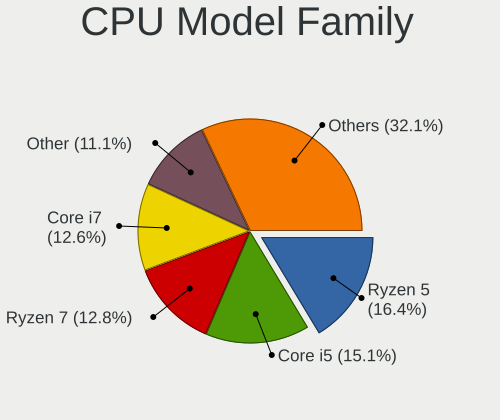

| Model                   | Desktops | Percent |
|-------------------------|----------|---------|
| AMD Ryzen 5             | 213      | 16.37%  |
| Intel Core i5           | 196      | 15.07%  |
| AMD Ryzen 7             | 167      | 12.84%  |
| Intel Core i7           | 164      | 12.61%  |
| Other                   | 144      | 11.07%  |
| AMD Ryzen 9             | 116      | 8.92%   |
| Intel Xeon              | 66       | 5.07%   |
| Intel Core i3           | 42       | 3.23%   |
| Intel Core i9           | 30       | 2.31%   |
| AMD Ryzen 3             | 25       | 1.92%   |
| AMD FX                  | 19       | 1.46%   |
| Intel Celeron           | 15       | 1.15%   |
| Intel Pentium           | 11       | 0.85%   |
| AMD Phenom II X4        | 10       | 0.77%   |
| Intel Core 2 Quad       | 8        | 0.61%   |
| Intel Core 2 Duo        | 7        | 0.54%   |
| Intel Atom              | 7        | 0.54%   |
| AMD A10                 | 6        | 0.46%   |
| Intel Pentium Dual-Core | 4        | 0.31%   |
| AMD Ryzen Threadripper  | 4        | 0.31%   |
| AMD Ryzen 5 PRO         | 4        | 0.31%   |
| AMD Athlon II X2        | 4        | 0.31%   |
| AMD A8                  | 4        | 0.31%   |
| AMD Phenom II X2        | 3        | 0.23%   |
| AMD Athlon              | 3        | 0.23%   |
| AMD A6                  | 3        | 0.23%   |
| Intel Genuine           | 2        | 0.15%   |
| AMD PRO A10             | 2        | 0.15%   |
| AMD Phenom II X6        | 2        | 0.15%   |
| AMD GX                  | 2        | 0.15%   |
| AMD Athlon 64 X2        | 2        | 0.15%   |
| Intel Pentium Silver    | 1        | 0.08%   |
| Intel Pentium Gold      | 1        | 0.08%   |
| Intel Pentium Dual      | 1        | 0.08%   |
| Intel Pentium D         | 1        | 0.08%   |
| Intel Core m3           | 1        | 0.08%   |
| Intel Core 2 Extreme    | 1        | 0.08%   |
| Intel Core 2            | 1        | 0.08%   |
| AMD Turion II Neo       | 1        | 0.08%   |
| AMD Ryzen 7 PRO         | 1        | 0.08%   |

CPU Cores
---------

Number of processor cores

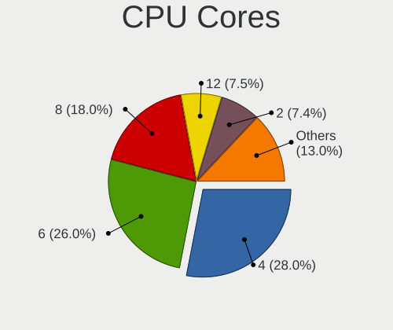

| Number | Desktops | Percent |
|--------|----------|---------|
| 4      | 365      | 28.03%  |
| 6      | 339      | 26.04%  |
| 8      | 235      | 18.05%  |
| 12     | 98       | 7.53%   |
| 2      | 96       | 7.37%   |
| 16     | 68       | 5.22%   |
| 14     | 29       | 2.23%   |
| 24     | 27       | 2.07%   |
| 10     | 26       | 2%      |
| 20     | 6        | 0.46%   |
| 3      | 3        | 0.23%   |
| 1      | 3        | 0.23%   |
| 28     | 2        | 0.15%   |
| 5      | 2        | 0.15%   |
| 44     | 1        | 0.08%   |
| 32     | 1        | 0.08%   |
| 18     | 1        | 0.08%   |

CPU Sockets
-----------

Number of sockets

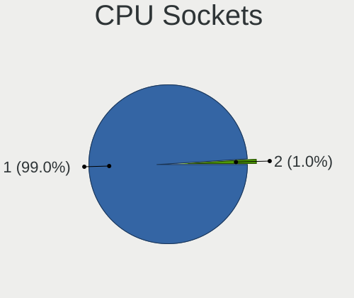

| Number | Desktops | Percent |
|--------|----------|---------|
| 1      | 1286     | 99%     |
| 2      | 13       | 1%      |

CPU Threads
-----------

Threads per core (Hyper-Threading)

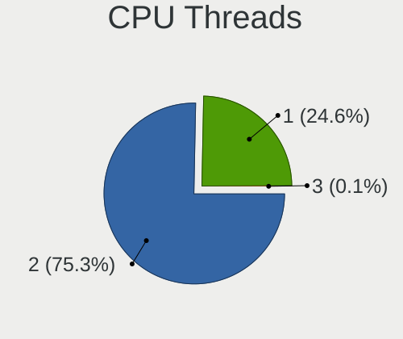

| Number | Desktops | Percent |
|--------|----------|---------|
| 2      | 979      | 75.31%  |
| 1      | 320      | 24.62%  |
| 3      | 1        | 0.08%   |

CPU Op-Modes
------------

CPU Operation Modes (32-bit, 64-bit)

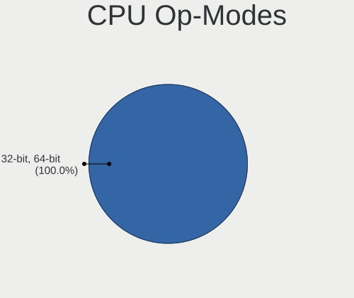

| Op mode        | Desktops | Percent |
|----------------|----------|---------|
| 32-bit, 64-bit | 1299     | 100%    |

CPU Microcode
-------------

Microcode number

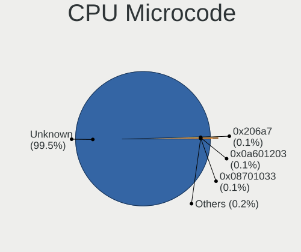

| Number     | Desktops | Percent |
|------------|----------|---------|
| Unknown    | 1296     | 99.54%  |
| 0x206a7    | 1        | 0.08%   |
| 0x0a601206 | 1        | 0.08%   |
| 0x0a601203 | 1        | 0.08%   |
| 0x08701033 | 1        | 0.08%   |
| 0x08001138 | 1        | 0.08%   |
| 0x010000c8 | 1        | 0.08%   |

CPU Microarch
-------------

Microarchitecture

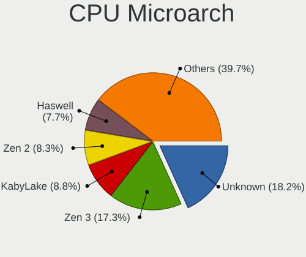

| Name             | Desktops | Percent |
|------------------|----------|---------|
| Unknown          | 237      | 18.22%  |
| Zen 3            | 225      | 17.29%  |
| KabyLake         | 115      | 8.84%   |
| Zen 2            | 108      | 8.3%    |
| Haswell          | 100      | 7.69%   |
| IvyBridge        | 77       | 5.92%   |
| Skylake          | 57       | 4.38%   |
| Zen+             | 54       | 4.15%   |
| CometLake        | 52       | 4%      |
| SandyBridge      | 43       | 3.31%   |
| Alderlake Hybrid | 37       | 2.84%   |
| Zen              | 34       | 2.61%   |
| Piledriver       | 23       | 1.77%   |
| K10              | 22       | 1.69%   |
| Penryn           | 17       | 1.31%   |
| Nehalem          | 14       | 1.08%   |
| Westmere         | 12       | 0.92%   |
| Icelake          | 12       | 0.92%   |
| Broadwell        | 11       | 0.85%   |
| Excavator        | 8        | 0.61%   |
| Core             | 7        | 0.54%   |
| Steamroller      | 5        | 0.38%   |
| Silvermont       | 5        | 0.38%   |
| Goldmont plus    | 5        | 0.38%   |
| Bonnell          | 5        | 0.38%   |
| Gracemont        | 4        | 0.31%   |
| K8 Hammer        | 2        | 0.15%   |
| K10 Llano        | 2        | 0.15%   |
| Bulldozer        | 2        | 0.15%   |
| TigerLake        | 1        | 0.08%   |
| Sapphire Rapids  | 1        | 0.08%   |
| Puma             | 1        | 0.08%   |
| NetBurst         | 1        | 0.08%   |
| Jaguar           | 1        | 0.08%   |
| Bobcat           | 1        | 0.08%   |

Graphics
--------

GPU Vendor
----------

Vendors of graphics cards

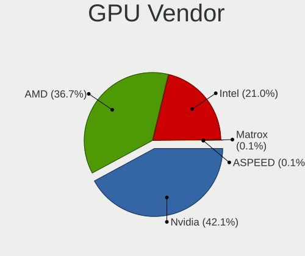

| Vendor                     | Desktops | Percent |
|----------------------------|----------|---------|
| Nvidia                     | 611      | 42.11%  |
| AMD                        | 532      | 36.66%  |
| Intel                      | 305      | 21.02%  |
| Matrox Electronics Systems | 2        | 0.14%   |
| ASPEED Technology          | 1        | 0.07%   |

GPU Model
---------

Graphics card models

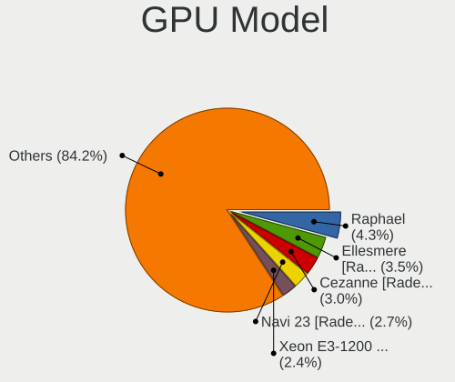

| Model                                                                       | Desktops | Percent |
|-----------------------------------------------------------------------------|----------|---------|
| AMD Raphael                                                                 | 65       | 4.26%   |
| AMD Ellesmere [Radeon RX 470/480/570/570X/580/580X/590]                     | 53       | 3.48%   |
| AMD Cezanne [Radeon Vega Series / Radeon Vega Mobile Series]                | 45       | 2.95%   |
| AMD Navi 23 [Radeon RX 6600/6600 XT/6600M]                                  | 41       | 2.69%   |
| Intel Xeon E3-1200 v3/4th Gen Core Processor Integrated Graphics Controller | 37       | 2.43%   |
| Intel CoffeeLake-S GT2 [UHD Graphics 630]                                   | 34       | 2.23%   |
| AMD Navi 21 [Radeon RX 6800/6800 XT / 6900 XT]                              | 33       | 2.16%   |
| AMD Navi 22 [Radeon RX 6700/6700 XT/6750 XT / 6800M/6850M XT]               | 32       | 2.1%    |
| Nvidia GA106 [GeForce RTX 3060 Lite Hash Rate]                              | 30       | 1.97%   |
| Intel Raptor Lake-S GT1 [UHD Graphics 770]                                  | 30       | 1.97%   |
| AMD Navi 32 [Radeon RX 7700 XT / 7800 XT]                                   | 29       | 1.9%    |
| AMD Navi 31 [Radeon RX 7900 XT/7900 XTX/7900 GRE/7900M]                     | 27       | 1.77%   |
| Nvidia GP107 [GeForce GTX 1050 Ti]                                          | 26       | 1.7%    |
| AMD Navi 10 [Radeon RX 5600 OEM/5600 XT / 5700/5700 XT]                     | 26       | 1.7%    |
| Intel Skylake-S GT2 [HD Graphics 530]                                       | 25       | 1.64%   |
| Nvidia TU116 [GeForce GTX 1660 SUPER]                                       | 19       | 1.25%   |
| Nvidia GK208B [GeForce GT 710]                                              | 19       | 1.25%   |
| Nvidia GP104 [GeForce GTX 1070]                                             | 18       | 1.18%   |
| Nvidia AD107 [GeForce RTX 4060]                                             | 18       | 1.18%   |
| Intel IvyBridge GT2 [HD Graphics 4000]                                      | 18       | 1.18%   |
| Intel CometLake-S GT2 [UHD Graphics 630]                                    | 18       | 1.18%   |
| Nvidia TU117 [GeForce GTX 1650]                                             | 17       | 1.11%   |
| Nvidia GP106 [GeForce GTX 1060 6GB]                                         | 17       | 1.11%   |
| Nvidia GP108 [GeForce GT 1030]                                              | 16       | 1.05%   |
| Nvidia AD102 [GeForce RTX 4090]                                             | 15       | 0.98%   |
| Intel Xeon E3-1200 v2/3rd Gen Core processor Graphics Controller            | 15       | 0.98%   |
| Intel Alder Lake-S GT1 [UHD Graphics 770]                                   | 14       | 0.92%   |
| Intel Alder Lake-N [UHD Graphics]                                           | 14       | 0.92%   |
| Intel 2nd Generation Core Processor Family Integrated Graphics Controller   | 14       | 0.92%   |
| Nvidia GP104 [GeForce GTX 1080]                                             | 13       | 0.85%   |
| Nvidia GA104 [GeForce RTX 3060 Ti Lite Hash Rate]                           | 13       | 0.85%   |
| Intel Kaby Lake-S GT2 [HD Graphics 630]                                     | 13       | 0.85%   |
| Nvidia TU116 [GeForce GTX 1660 Ti]                                          | 12       | 0.79%   |
| Nvidia TU106 [GeForce RTX 2060 Rev. A]                                      | 12       | 0.79%   |
| AMD Navi 24 [Radeon RX 6400/6500 XT/6500M]                                  | 12       | 0.79%   |
| Nvidia GM204 [GeForce GTX 970]                                              | 11       | 0.72%   |
| Nvidia GA104 [GeForce RTX 3070]                                             | 11       | 0.72%   |
| AMD Raven Ridge [Radeon Vega Series / Radeon Vega Mobile Series]            | 11       | 0.72%   |
| AMD Navi 33 [Radeon RX 7600/7600 XT/7600M XT/7600S/7700S / PRO W7600]       | 11       | 0.72%   |
| Nvidia GT218 [GeForce 210]                                                  | 10       | 0.66%   |

GPU Combo
---------

Combinations of graphics cards

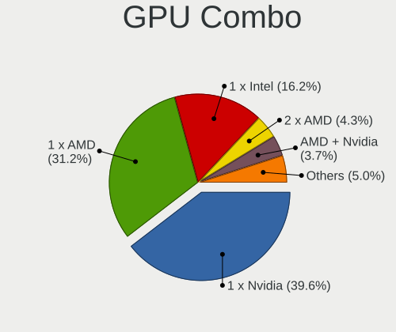

| Name                     | Desktops | Percent |
|--------------------------|----------|---------|
| 1 x Nvidia               | 517      | 39.56%  |
| 1 x AMD                  | 408      | 31.22%  |
| 1 x Intel                | 212      | 16.22%  |
| 2 x AMD                  | 56       | 4.28%   |
| AMD + Nvidia             | 49       | 3.75%   |
| Intel + Nvidia           | 32       | 2.45%   |
| Intel + AMD              | 14       | 1.07%   |
| 2 x Nvidia               | 8        | 0.61%   |
| 2 x Intel                | 4        | 0.31%   |
| Intel + AMD + 1 x Nvidia | 2        | 0.15%   |
| AMD + Matrox             | 2        | 0.15%   |
| Intel + 2 x Nvidia       | 1        | 0.08%   |
| 1 x ASPEED               | 1        | 0.08%   |
| AMD + 2 x Nvidia         | 1        | 0.08%   |

GPU Driver
----------

Free vs proprietary

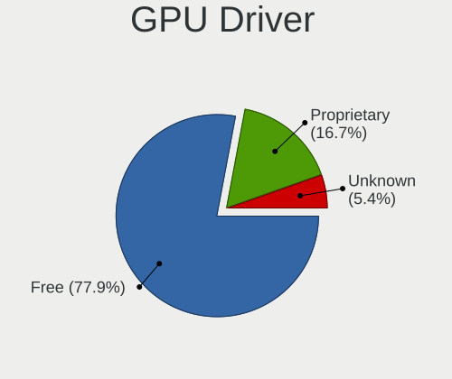

| Driver      | Desktops | Percent |
|-------------|----------|---------|
| Free        | 1025     | 77.95%  |
| Proprietary | 219      | 16.65%  |
| Unknown     | 71       | 5.4%    |

GPU Memory
----------

Total video memory

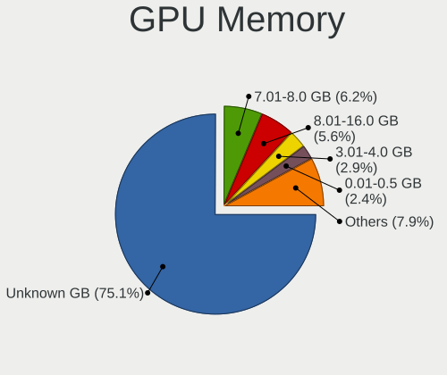

| Size in GB | Desktops | Percent |
|------------|----------|---------|
| Unknown    | 987      | 75.06%  |
| 7.01-8.0   | 82       | 6.24%   |
| 8.01-16.0  | 73       | 5.55%   |
| 3.01-4.0   | 38       | 2.89%   |
| 0.01-0.5   | 31       | 2.36%   |
| 5.01-6.0   | 30       | 2.28%   |
| 1.01-2.0   | 30       | 2.28%   |
| 0.51-1.0   | 27       | 2.05%   |
| 16.01-24.0 | 13       | 0.99%   |
| 2.01-3.0   | 3        | 0.23%   |
| 4.01-5.0   | 1        | 0.08%   |

Monitor
-------

Monitor Vendor
--------------

Monitor vendors

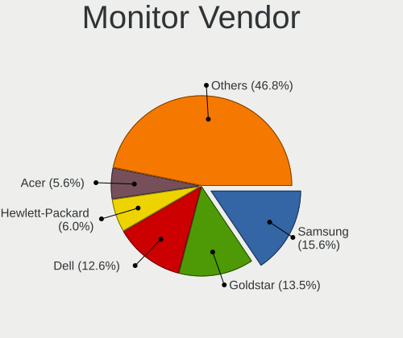

| Vendor               | Desktops | Percent |
|----------------------|----------|---------|
| Samsung Electronics  | 231      | 15.59%  |
| Goldstar             | 200      | 13.5%   |
| Dell                 | 186      | 12.55%  |
| Hewlett-Packard      | 89       | 6.01%   |
| Acer                 | 83       | 5.6%    |
| AOC                  | 81       | 5.47%   |
| ASUSTek Computer     | 56       | 3.78%   |
| BenQ                 | 53       | 3.58%   |
| Philips              | 52       | 3.51%   |
| Ancor Communications | 44       | 2.97%   |
| MSI                  | 41       | 2.77%   |
| ViewSonic            | 31       | 2.09%   |
| Lenovo               | 27       | 1.82%   |
| Gigabyte Technology  | 27       | 1.82%   |
| Iiyama               | 25       | 1.69%   |
| Unknown              | 17       | 1.15%   |
| Sceptre Tech         | 14       | 0.94%   |
| Sony                 | 12       | 0.81%   |
| Vizio                | 9        | 0.61%   |
| Mi                   | 8        | 0.54%   |
| Eizo                 | 8        | 0.54%   |
| Unknown (XXX)        | 6        | 0.4%    |
| SGT                  | 6        | 0.4%    |
| Insignia             | 6        | 0.4%    |
| HKC                  | 6        | 0.4%    |
| Vestel Elektronik    | 5        | 0.34%   |
| HannStar             | 5        | 0.34%   |
| Denver               | 5        | 0.34%   |
| ___                  | 4        | 0.27%   |
| Toshiba              | 4        | 0.27%   |
| SAC                  | 4        | 0.27%   |
| Pixio                | 4        | 0.27%   |
| ONN                  | 4        | 0.27%   |
| Fujitsu Siemens      | 4        | 0.27%   |
| SKG                  | 3        | 0.2%    |
| RTK                  | 3        | 0.2%    |
| NEC Computers        | 3        | 0.2%    |
| HVR                  | 3        | 0.2%    |
| Huion                | 3        | 0.2%    |
| HUAWEI               | 3        | 0.2%    |

Monitor Model
-------------

Monitor models

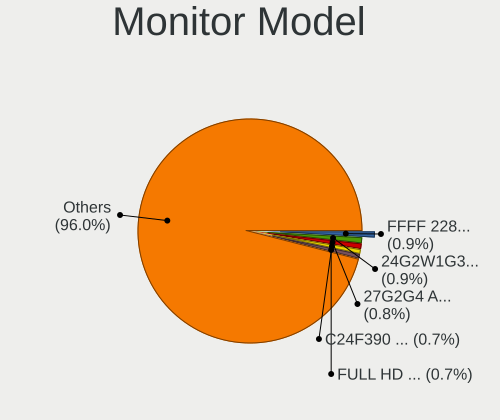

| Model                                                                | Desktops | Percent |
|----------------------------------------------------------------------|----------|---------|
| Unknown LCD Monitor FFFF 2288x1287 2550x2550mm 142.0-inch            | 14       | 0.88%   |
| AOC 24G2W1G3 AOC2402 1920x1080 527x296mm 23.8-inch                   | 14       | 0.88%   |
| AOC 27G2G4 AOC2702 1920x1080 598x336mm 27.0-inch                     | 13       | 0.82%   |
| Samsung Electronics C24F390 SAM0D2C 1920x1080 521x293mm 23.5-inch    | 11       | 0.69%   |
| Goldstar FULL HD GSM5B55 1920x1080 480x270mm 21.7-inch               | 11       | 0.69%   |
| Goldstar 27GL850 GSM5B7F 2560x1440 597x336mm 27.0-inch               | 10       | 0.63%   |
| Dell U2412M DELA07A 1920x1200 518x324mm 24.1-inch                    | 9        | 0.57%   |
| AOC 24B1W1 AOC2401 1920x1080 527x296mm 23.8-inch                     | 9        | 0.57%   |
| Goldstar ULTRAGEAR GSM5BD3 2560x1440 697x392mm 31.5-inch             | 7        | 0.44%   |
| Dell U2412M DELA07B 1920x1200 518x324mm 24.1-inch                    | 7        | 0.44%   |
| Goldstar LG TV SSCR2 GSMC0C8 3840x2160                               | 6        | 0.38%   |
| Goldstar HDR 4K GSM7707 3840x2160 600x340mm 27.2-inch                | 6        | 0.38%   |
| Dell S3220DGF DELD0F4 2560x1440 697x392mm 31.5-inch                  | 6        | 0.38%   |
| Dell S2721DGF DEL41D9 2560x1440 597x336mm 27.0-inch                  | 6        | 0.38%   |
| BenQ GW2480 BNQ78E7 1920x1080 527x296mm 23.8-inch                    | 6        | 0.38%   |
| Vestel Elektronik 40UHD_LCD_TV VES3700 3840x2160 880x500mm 39.8-inch | 5        | 0.32%   |
| Samsung Electronics LF27T35 SAM707F 1920x1080 598x337mm 27.0-inch    | 5        | 0.32%   |
| Gigabyte Technology M27Q GBT270D 2560x1440 597x336mm 27.0-inch       | 5        | 0.32%   |
| Dell AW3423DWF DELA212 3440x1440 800x337mm 34.2-inch                 | 5        | 0.32%   |
| Acer SB220Q ACR06AB 1920x1080 476x268mm 21.5-inch                    | 5        | 0.32%   |
| ___ LCD TV ___9000 1360x768                                          | 4        | 0.25%   |
| Sceptre Tech Sceptre F24 SPT09AB 1920x1080 530x290mm 23.8-inch       | 4        | 0.25%   |
| Samsung Electronics U28E590 SAM0C4D 3840x2160 607x345mm 27.5-inch    | 4        | 0.25%   |
| Samsung Electronics SyncMaster SAM0587 1920x1200 518x324mm 24.1-inch | 4        | 0.25%   |
| Samsung Electronics S24D332 SAM0F5E 1920x1080 531x299mm 24.0-inch    | 4        | 0.25%   |
| Samsung Electronics S24D300 SAM0B43 1920x1080 531x299mm 24.0-inch    | 4        | 0.25%   |
| Samsung Electronics LC24RG50 SAM0F90 1920x1080 532x304mm 24.1-inch   | 4        | 0.25%   |
| Samsung Electronics C49RG9x SAM0F9C 3360x1440 1193x336mm 48.8-inch   | 4        | 0.25%   |
| Philips PHL 273V7 PHLC156 1920x1080 598x336mm 27.0-inch              | 4        | 0.25%   |
| MSI G273Q MSI3CA8 2560x1440 597x336mm 27.0-inch                      | 4        | 0.25%   |
| Goldstar ULTRAWIDE GSM76FA 2560x1080 798x334mm 34.1-inch             | 4        | 0.25%   |
| Goldstar ULTRAWIDE GSM76F9 2560x1080 531x298mm 24.0-inch             | 4        | 0.25%   |
| Goldstar Ultra HD GSM5B09 3840x2160 600x340mm 27.2-inch              | 4        | 0.25%   |
| Goldstar TV SSCR2 GSM81CD 3840x2160                                  | 4        | 0.25%   |
| Goldstar LG ULTRAWIDE GSM59F1 2560x1080 670x280mm 28.6-inch          | 4        | 0.25%   |
| Goldstar LG IPS FULLHD GSM5AB8 1920x1080 480x270mm 21.7-inch         | 4        | 0.25%   |
| Goldstar HDR WFHD GSM7714 2560x1080 798x334mm 34.1-inch              | 4        | 0.25%   |
| Goldstar HDR 4K GSM774F 3840x2160 697x392mm 31.5-inch                | 4        | 0.25%   |
| Goldstar FULL HD GSM5B54 1920x1080 480x270mm 21.7-inch               | 4        | 0.25%   |
| Goldstar E2011 GSM4ED4 1600x900 443x249mm 20.0-inch                  | 4        | 0.25%   |

Monitor Resolution
------------------

Monitor screen resolution

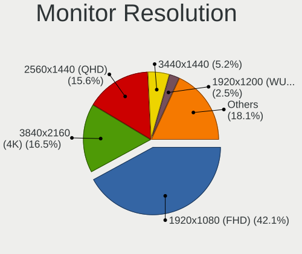

| Resolution         | Desktops | Percent |
|--------------------|----------|---------|
| 1920x1080 (FHD)    | 601      | 42.09%  |
| 3840x2160 (4K)     | 236      | 16.53%  |
| 2560x1440 (QHD)    | 223      | 15.62%  |
| 3440x1440          | 74       | 5.18%   |
| 1920x1200 (WUXGA)  | 35       | 2.45%   |
| 1440x900 (WXGA+)   | 34       | 2.38%   |
| 1280x1024 (SXGA)   | 33       | 2.31%   |
| 1680x1050 (WSXGA+) | 32       | 2.24%   |
| 2560x1080          | 31       | 2.17%   |
| 1600x900 (HD+)     | 26       | 1.82%   |
| 1366x768 (WXGA)    | 22       | 1.54%   |
| 3840x1080          | 14       | 0.98%   |
| 2288x1287          | 14       | 0.98%   |
| 1360x768           | 12       | 0.84%   |
| 1920x540           | 8        | 0.56%   |
| 3840x1600          | 4        | 0.28%   |
| 1024x768 (XGA)     | 4        | 0.28%   |
| 2560x2880          | 3        | 0.21%   |
| 2560x1600          | 3        | 0.21%   |
| 2160x1200          | 3        | 0.21%   |
| 1600x1200          | 3        | 0.21%   |
| 3840x1200          | 2        | 0.14%   |
| 1280x720 (HD)      | 2        | 0.14%   |
| Unknown            | 2        | 0.14%   |
| 3840x2400          | 1        | 0.07%   |
| 3360x1080          | 1        | 0.07%   |
| 2160x1440          | 1        | 0.07%   |
| 1920x720           | 1        | 0.07%   |
| 1400x1050          | 1        | 0.07%   |
| 1280x960           | 1        | 0.07%   |
| 1280x768           | 1        | 0.07%   |

Monitor Diagonal
----------------

Diagonal size in inches

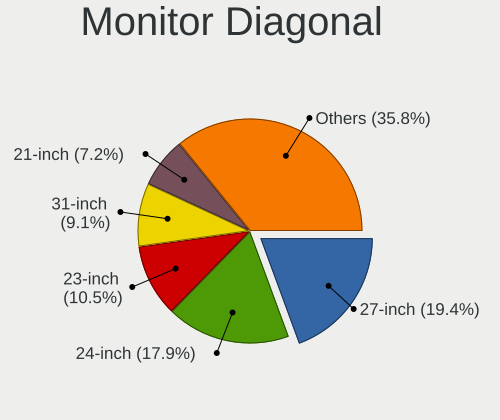

| Inches  | Desktops | Percent |
|---------|----------|---------|
| 27      | 289      | 19.4%   |
| 24      | 267      | 17.92%  |
| 23      | 156      | 10.47%  |
| 31      | 136      | 9.13%   |
| 21      | 108      | 7.25%   |
| 34      | 91       | 6.11%   |
| 19      | 49       | 3.29%   |
| 32      | 31       | 2.08%   |
| 22      | 30       | 2.01%   |
| 20      | 29       | 1.95%   |
| 18      | 29       | 1.95%   |
| 84      | 27       | 1.81%   |
| Unknown | 27       | 1.81%   |
| 72      | 20       | 1.34%   |
| 15      | 18       | 1.21%   |
| 142     | 14       | 0.94%   |
| 48      | 14       | 0.94%   |
| 17      | 13       | 0.87%   |
| 26      | 12       | 0.81%   |
| 54      | 11       | 0.74%   |
| 63      | 10       | 0.67%   |
| 40      | 10       | 0.67%   |
| 28      | 8        | 0.54%   |
| 43      | 6        | 0.4%    |
| 42      | 6        | 0.4%    |
| 14      | 6        | 0.4%    |
| 52      | 5        | 0.34%   |
| 49      | 5        | 0.34%   |
| 37      | 5        | 0.34%   |
| 35      | 5        | 0.34%   |
| 25      | 5        | 0.34%   |
| 65      | 4        | 0.27%   |
| 16      | 4        | 0.27%   |
| 47      | 3        | 0.2%    |
| 39      | 3        | 0.2%    |
| 36      | 3        | 0.2%    |
| 33      | 3        | 0.2%    |
| 29      | 3        | 0.2%    |
| 12      | 3        | 0.2%    |
| 64      | 2        | 0.13%   |

Monitor Width
-------------

Physical width

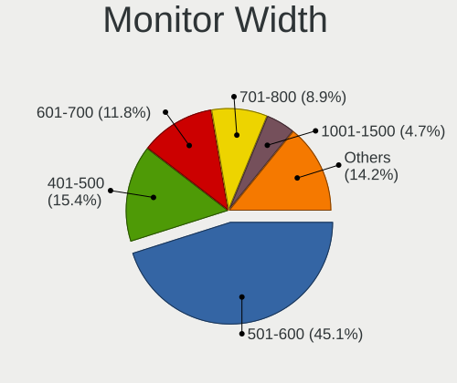

| Width in mm    | Desktops | Percent |
|----------------|----------|---------|
| 501-600        | 640      | 45.1%   |
| 401-500        | 218      | 15.36%  |
| 601-700        | 168      | 11.84%  |
| 701-800        | 126      | 8.88%   |
| 1001-1500      | 66       | 4.65%   |
| 1501-2000      | 51       | 3.59%   |
| 301-350        | 35       | 2.47%   |
| 351-400        | 28       | 1.97%   |
| Unknown        | 27       | 1.9%    |
| 801-900        | 25       | 1.76%   |
| More than 2000 | 14       | 0.99%   |
| 901-1000       | 12       | 0.85%   |
| 201-300        | 7        | 0.49%   |
| 101-200        | 2        | 0.14%   |

Aspect Ratio
------------

Proportional relationship between the width and the height

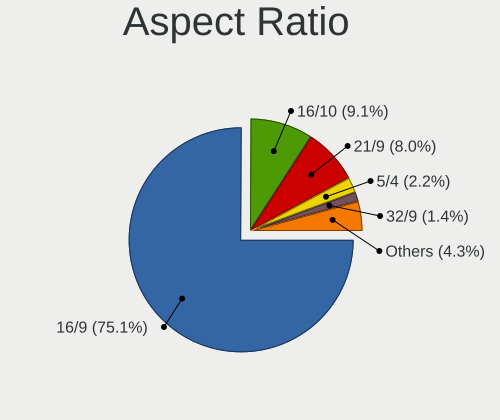

| Ratio   | Desktops | Percent |
|---------|----------|---------|
| 16/9    | 985      | 75.08%  |
| 16/10   | 119      | 9.07%   |
| 21/9    | 105      | 8%      |
| 5/4     | 29       | 2.21%   |
| 32/9    | 18       | 1.37%   |
| 4/3     | 17       | 1.3%    |
| 1.00    | 15       | 1.14%   |
| Unknown | 6        | 0.46%   |
| 6/5     | 5        | 0.38%   |
| 3/2     | 4        | 0.3%    |
| 0.89    | 3        | 0.23%   |
| 3.20    | 1        | 0.08%   |
| 2.69    | 1        | 0.08%   |
| 2.12    | 1        | 0.08%   |
| 2.01    | 1        | 0.08%   |
| 2.00    | 1        | 0.08%   |
| 1.96    | 1        | 0.08%   |

Monitor Area
------------

Area in inch²

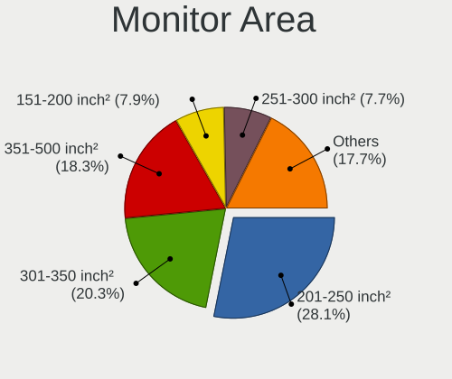

| Area in inch² | Desktops | Percent |
|----------------|----------|---------|
| 201-250        | 411      | 28.13%  |
| 301-350        | 297      | 20.33%  |
| 351-500        | 268      | 18.34%  |
| 151-200        | 115      | 7.87%   |
| 251-300        | 112      | 7.67%   |
| More than 1000 | 105      | 7.19%   |
| 501-1000       | 58       | 3.97%   |
| 141-150        | 30       | 2.05%   |
| Unknown        | 27       | 1.85%   |
| 101-110        | 22       | 1.51%   |
| 81-90          | 3        | 0.21%   |
| 71-80          | 3        | 0.21%   |
| 1-40           | 2        | 0.14%   |
| 131-140        | 2        | 0.14%   |
| 121-130        | 2        | 0.14%   |
| 111-120        | 2        | 0.14%   |
| 51-60          | 1        | 0.07%   |
| 91-100         | 1        | 0.07%   |

Pixel Density
-------------

Pixels per inch

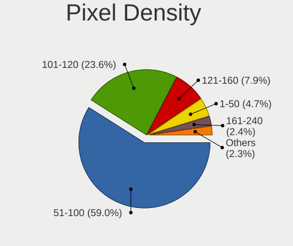

| Density       | Desktops | Percent |
|---------------|----------|---------|
| 51-100        | 811      | 58.98%  |
| 101-120       | 325      | 23.64%  |
| 121-160       | 109      | 7.93%   |
| 1-50          | 65       | 4.73%   |
| 161-240       | 33       | 2.4%    |
| Unknown       | 27       | 1.96%   |
| More than 240 | 5        | 0.36%   |

Multiple Monitors
-----------------

Total monitors connected

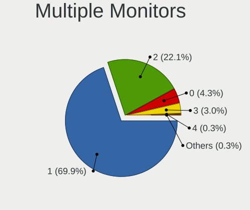

| Total | Desktops | Percent |
|-------|----------|---------|
| 1     | 926      | 69.94%  |
| 2     | 293      | 22.13%  |
| 0     | 57       | 4.31%   |
| 3     | 40       | 3.02%   |
| 4     | 4        | 0.3%    |
| 5     | 3        | 0.23%   |
| 6     | 1        | 0.08%   |

Network
-------

Net Controller Vendor
---------------------

Controller vendors

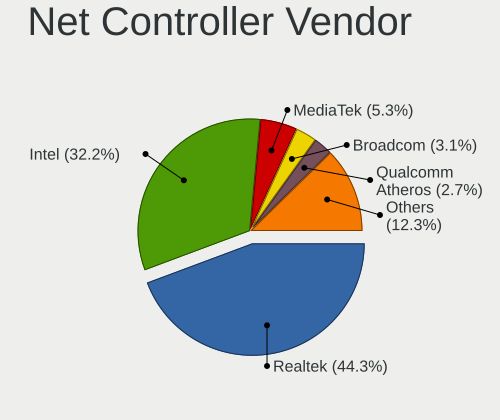

| Vendor                          | Desktops | Percent |
|---------------------------------|----------|---------|
| Realtek Semiconductor           | 873      | 44.31%  |
| Intel                           | 634      | 32.18%  |
| MediaTek                        | 105      | 5.33%   |
| Broadcom                        | 61       | 3.1%    |
| Qualcomm Atheros                | 54       | 2.74%   |
| TP-Link                         | 49       | 2.49%   |
| Ralink Technology               | 22       | 1.12%   |
| Microsoft                       | 21       | 1.07%   |
| Aquantia                        | 18       | 0.91%   |
| Ralink                          | 14       | 0.71%   |
| NetGear                         | 11       | 0.56%   |
| Samsung Electronics             | 10       | 0.51%   |
| DisplayLink                     | 6        | 0.3%    |
| ASUSTek Computer                | 6        | 0.3%    |
| ASIX Electronics                | 6        | 0.3%    |
| Qualcomm Technologies           | 5        | 0.25%   |
| Qualcomm Atheros Communications | 5        | 0.25%   |
| Mellanox Technologies           | 4        | 0.2%    |
| D-Link System                   | 4        | 0.2%    |
| Xiaomi                          | 3        | 0.15%   |
| QinHeng Electronics             | 3        | 0.15%   |
| Nvidia                          | 3        | 0.15%   |
| Marvell Technology Group        | 3        | 0.15%   |
| D-Link                          | 3        | 0.15%   |
| U-Blox                          | 2        | 0.1%    |
| Spreadtrum Communications       | 2        | 0.1%    |
| OPPO Electronics                | 2        | 0.1%    |
| Motorola PCS                    | 2        | 0.1%    |
| Microchip Technology            | 2        | 0.1%    |
| Mercucys                        | 2        | 0.1%    |
| InterBiometrics                 | 2        | 0.1%    |
| Google                          | 2        | 0.1%    |
| Edimax Technology               | 2        | 0.1%    |
| Broadcom Limited                | 2        | 0.1%    |
| Belkin Components               | 2        | 0.1%    |
| 3Com                            | 2        | 0.1%    |
| ZyXEL Communications            | 1        | 0.05%   |
| ZTE WCDMA Technologies MSM      | 1        | 0.05%   |
| Winbond Electronics             | 1        | 0.05%   |
| Wacom                           | 1        | 0.05%   |

Net Controller Model
--------------------

Controller models

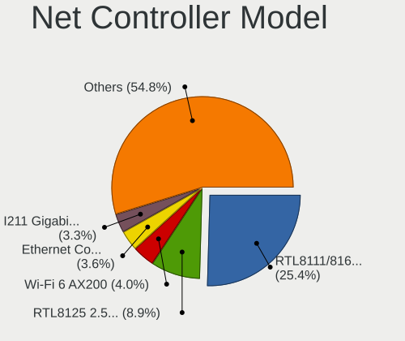

| Model                                                                  | Desktops | Percent |
|------------------------------------------------------------------------|----------|---------|
| Realtek RTL8111/8168/8211/8411 PCI Express Gigabit Ethernet Controller | 585      | 25.45%  |
| Realtek RTL8125 2.5GbE Controller                                      | 204      | 8.87%   |
| Intel Wi-Fi 6 AX200                                                    | 91       | 3.96%   |
| Intel Ethernet Controller I225-V                                       | 83       | 3.61%   |
| Intel I211 Gigabit Network Connection                                  | 77       | 3.35%   |
| Intel Wi-Fi 6E(802.11ax) AX210/AX1675* 2x2 [Typhoon Peak]              | 68       | 2.96%   |
| MediaTek MT7922 802.11ax PCI Express Wireless Network Adapter          | 54       | 2.35%   |
| Intel Ethernet Connection (2) I219-V                                   | 40       | 1.74%   |
| Intel 82579LM Gigabit Network Connection (Lewisville)                  | 35       | 1.52%   |
| Intel 700 Series Chipset CNVi WiFi                                     | 34       | 1.48%   |
| Intel Ethernet Controller I226-V                                       | 30       | 1.3%    |
| Intel Ethernet Connection I217-LM                                      | 27       | 1.17%   |
| Intel Dual Band Wireless-AC 3168NGW [Stone Peak]                       | 25       | 1.09%   |
| Broadcom BCM4360 802.11ac Dual Band Wireless Network Adapter           | 25       | 1.09%   |
| Intel Alder Lake-S PCH CNVi WiFi                                       | 24       | 1.04%   |
| Realtek RTL8821CE 802.11ac PCIe Wireless Network Adapter               | 21       | 0.91%   |
| Intel Ethernet Connection (7) I219-V                                   | 21       | 0.91%   |
| MediaTek MT7921K (RZ608) Wi-Fi 6E 80MHz                                | 19       | 0.83%   |
| Realtek RTL88x2bu [AC1200 Techkey]                                     | 17       | 0.74%   |
| Realtek 802.11ac NIC                                                   | 17       | 0.74%   |
| MediaTek MT7921 802.11ax PCIe Wireless Network Adapter [Filogic 330]   | 17       | 0.74%   |
| Realtek RTL8852BE PCIe 802.11ax Wireless Network Controller            | 16       | 0.7%    |
| Realtek RTL810xE PCI Express Fast Ethernet controller                  | 16       | 0.7%    |
| Intel Wireless 7265                                                    | 16       | 0.7%    |
| Intel Wi-Fi 5(802.11ac) Wireless-AC 9x6x [Thunder Peak]                | 15       | 0.65%   |
| Realtek RTL8153 Gigabit Ethernet Adapter                               | 14       | 0.61%   |
| Intel Ethernet Connection (2) I219-LM                                  | 13       | 0.57%   |
| Intel Cannon Lake PCH CNVi WiFi                                        | 13       | 0.57%   |
| Realtek Killer E3000 2.5GbE Controller                                 | 12       | 0.52%   |
| Intel 82579V Gigabit Network Connection                                | 12       | 0.52%   |
| Microsoft Xbox Wireless Adapter for Windows                            | 11       | 0.48%   |
| Intel Ethernet Connection (7) I219-LM                                  | 11       | 0.48%   |
| Intel Ethernet Connection (17) I219-V                                  | 11       | 0.48%   |
| Realtek RTL8852CE PCIe 802.11ax Wireless Network Controller            | 10       | 0.43%   |
| Realtek RTL8188EUS 802.11n Wireless Network Adapter                    | 10       | 0.43%   |
| Intel Ethernet Connection (2) I218-V                                   | 10       | 0.43%   |
| Intel Ethernet Connection (14) I219-V                                  | 10       | 0.43%   |
| Intel 82574L Gigabit Network Connection                                | 10       | 0.43%   |
| Broadcom BCM4352 802.11ac Dual Band Wireless Network Adapter           | 10       | 0.43%   |
| TP-Link Archer T3U [Realtek RTL8812BU]                                 | 9        | 0.39%   |

Wireless Vendor
---------------

Wireless vendors

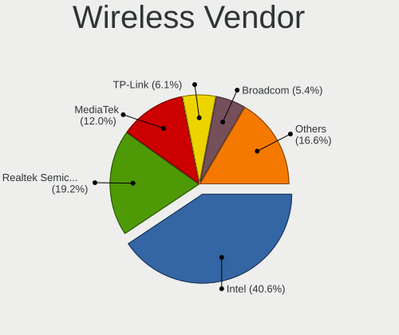

| Vendor                                | Desktops | Percent |
|---------------------------------------|----------|---------|
| Intel                                 | 321      | 40.63%  |
| Realtek Semiconductor                 | 152      | 19.24%  |
| MediaTek                              | 95       | 12.03%  |
| TP-Link                               | 48       | 6.08%   |
| Broadcom                              | 43       | 5.44%   |
| Qualcomm Atheros                      | 32       | 4.05%   |
| Ralink Technology                     | 22       | 2.78%   |
| Microsoft                             | 21       | 2.66%   |
| Ralink                                | 14       | 1.77%   |
| NetGear                               | 11       | 1.39%   |
| ASUSTek Computer                      | 6        | 0.76%   |
| Qualcomm Atheros Communications       | 5        | 0.63%   |
| D-Link System                         | 3        | 0.38%   |
| Mercucys                              | 2        | 0.25%   |
| Edimax Technology                     | 2        | 0.25%   |
| D-Link                                | 2        | 0.25%   |
| Belkin Components                     | 2        | 0.25%   |
| ZyXEL Communications                  | 1        | 0.13%   |
| Wacom                                 | 1        | 0.13%   |
| Realtek                               | 1        | 0.13%   |
| Qualcomm Technologies                 | 1        | 0.13%   |
| Gemtek                                | 1        | 0.13%   |
| Broadcom Limited                      | 1        | 0.13%   |
| Belkin                                | 1        | 0.13%   |
| AVM                                   | 1        | 0.13%   |
| 802.11g Adapter [Linksys WUSB54GC v3] | 1        | 0.13%   |

Wireless Model
--------------

Wireless models

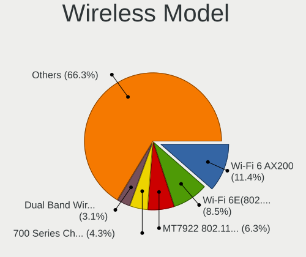

| Model                                                                | Desktops | Percent |
|----------------------------------------------------------------------|----------|---------|
| Intel Wi-Fi 6 AX200                                                  | 91       | 11.43%  |
| Intel Wi-Fi 6E(802.11ax) AX210/AX1675* 2x2 [Typhoon Peak]            | 68       | 8.54%   |
| MediaTek MT7922 802.11ax PCI Express Wireless Network Adapter        | 50       | 6.28%   |
| Intel 700 Series Chipset CNVi WiFi                                   | 34       | 4.27%   |
| Intel Dual Band Wireless-AC 3168NGW [Stone Peak]                     | 25       | 3.14%   |
| Broadcom BCM4360 802.11ac Dual Band Wireless Network Adapter         | 25       | 3.14%   |
| Realtek RTL8821CE 802.11ac PCIe Wireless Network Adapter             | 21       | 2.64%   |
| MediaTek MT7921K (RZ608) Wi-Fi 6E 80MHz                              | 19       | 2.39%   |
| Intel Alder Lake-S PCH CNVi WiFi                                     | 18       | 2.26%   |
| Realtek RTL88x2bu [AC1200 Techkey]                                   | 17       | 2.14%   |
| Realtek 802.11ac NIC                                                 | 17       | 2.14%   |
| MediaTek MT7921 802.11ax PCIe Wireless Network Adapter [Filogic 330] | 17       | 2.14%   |
| Intel Wireless 7265                                                  | 16       | 2.01%   |
| Intel Wi-Fi 5(802.11ac) Wireless-AC 9x6x [Thunder Peak]              | 15       | 1.88%   |
| Intel Cannon Lake PCH CNVi WiFi                                      | 13       | 1.63%   |
| Realtek RTL8852BE PCIe 802.11ax Wireless Network Controller          | 11       | 1.38%   |
| Microsoft Xbox Wireless Adapter for Windows                          | 11       | 1.38%   |
| Realtek RTL8852CE PCIe 802.11ax Wireless Network Controller          | 10       | 1.26%   |
| Realtek RTL8188EUS 802.11n Wireless Network Adapter                  | 10       | 1.26%   |
| Broadcom BCM4352 802.11ac Dual Band Wireless Network Adapter         | 10       | 1.26%   |
| TP-Link Archer T3U [Realtek RTL8812BU]                               | 9        | 1.13%   |
| TP-Link TL-WN823N v2/v3 [Realtek RTL8192EU]                          | 8        | 1.01%   |
| TP-Link 802.11ac NIC                                                 | 8        | 1.01%   |
| Ralink MT7601U Wireless Adapter                                      | 8        | 1.01%   |
| TP-Link TL-WN722N v2/v3 [Realtek RTL8188EUS]                         | 7        | 0.88%   |
| Realtek RTL8192EE PCIe Wireless Network Adapter                      | 7        | 0.88%   |
| Intel Wireless 7260                                                  | 7        | 0.88%   |
| Realtek RTL8812AE 802.11ac PCIe Wireless Network Adapter             | 6        | 0.75%   |
| Qualcomm Atheros QCA6174 802.11ac Wireless Network Adapter           | 6        | 0.75%   |
| Qualcomm Atheros AR9462 Wireless Network Adapter                     | 6        | 0.75%   |
| Microsoft Wireless XBox Controller Dongle                            | 6        | 0.75%   |
| Intel Wireless 8265 / 8275                                           | 6        | 0.75%   |
| Intel Wi-Fi 7(802.11be) AX1775*/AX1790*/BE20*/BE401/BE1750* 2x2      | 6        | 0.75%   |
| Realtek RTL8822CE 802.11ac PCIe Wireless Network Adapter             | 5        | 0.63%   |
| Qualcomm Atheros AR93xx Wireless Network Adapter                     | 5        | 0.63%   |
| Intel Wireless 3165                                                  | 5        | 0.63%   |
| Intel Comet Lake PCH CNVi WiFi                                       | 5        | 0.63%   |
| TP-Link 802.11ac WLAN Adapter                                        | 4        | 0.5%    |
| Realtek RTL8822BE 802.11a/b/g/n/ac WiFi adapter                      | 4        | 0.5%    |
| Realtek RTL8821AE 802.11ac PCIe Wireless Network Adapter             | 4        | 0.5%    |

Ethernet Vendor
---------------

Ethernet vendors

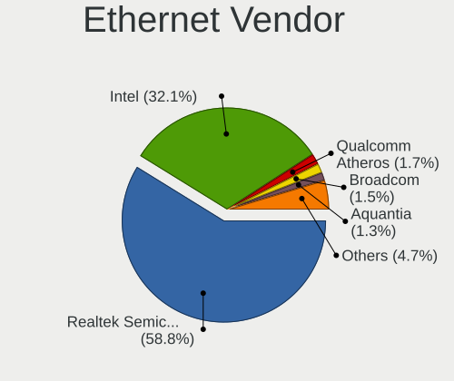

| Vendor                    | Desktops | Percent |
|---------------------------|----------|---------|
| Realtek Semiconductor     | 834      | 58.82%  |
| Intel                     | 455      | 32.09%  |
| Qualcomm Atheros          | 24       | 1.69%   |
| Broadcom                  | 21       | 1.48%   |
| Aquantia                  | 18       | 1.27%   |
| Samsung Electronics       | 10       | 0.71%   |
| MediaTek                  | 8        | 0.56%   |
| DisplayLink               | 6        | 0.42%   |
| ASIX Electronics          | 6        | 0.42%   |
| Qualcomm Technologies     | 4        | 0.28%   |
| Mellanox Technologies     | 4        | 0.28%   |
| Xiaomi                    | 3        | 0.21%   |
| Nvidia                    | 3        | 0.21%   |
| Marvell Technology Group  | 3        | 0.21%   |
| Spreadtrum Communications | 2        | 0.14%   |
| OPPO Electronics          | 2        | 0.14%   |
| Motorola PCS              | 2        | 0.14%   |
| Google                    | 2        | 0.14%   |
| 3Com                      | 2        | 0.14%   |
| VIA Technologies          | 1        | 0.07%   |
| TP-Link                   | 1        | 0.07%   |
| Qualcomm                  | 1        | 0.07%   |
| Netchip Technology        | 1        | 0.07%   |
| Lenovo                    | 1        | 0.07%   |
| Huawei Technologies       | 1        | 0.07%   |
| D-Link System             | 1        | 0.07%   |
| D-Link                    | 1        | 0.07%   |
| Broadcom Limited          | 1        | 0.07%   |

Ethernet Model
--------------

Ethernet models

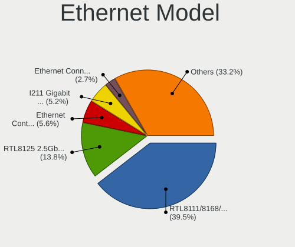

| Model                                                                           | Desktops | Percent |
|---------------------------------------------------------------------------------|----------|---------|
| Realtek RTL8111/8168/8211/8411 PCI Express Gigabit Ethernet Controller          | 585      | 39.5%   |
| Realtek RTL8125 2.5GbE Controller                                               | 204      | 13.77%  |
| Intel Ethernet Controller I225-V                                                | 83       | 5.6%    |
| Intel I211 Gigabit Network Connection                                           | 77       | 5.2%    |
| Intel Ethernet Connection (2) I219-V                                            | 40       | 2.7%    |
| Intel 82579LM Gigabit Network Connection (Lewisville)                           | 35       | 2.36%   |
| Intel Ethernet Controller I226-V                                                | 30       | 2.03%   |
| Intel Ethernet Connection I217-LM                                               | 27       | 1.82%   |
| Intel Ethernet Connection (7) I219-V                                            | 21       | 1.42%   |
| Realtek RTL810xE PCI Express Fast Ethernet controller                           | 16       | 1.08%   |
| Realtek RTL8153 Gigabit Ethernet Adapter                                        | 14       | 0.95%   |
| Intel Ethernet Connection (2) I219-LM                                           | 13       | 0.88%   |
| Realtek Killer E3000 2.5GbE Controller                                          | 12       | 0.81%   |
| Intel 82579V Gigabit Network Connection                                         | 12       | 0.81%   |
| Intel Ethernet Connection (7) I219-LM                                           | 11       | 0.74%   |
| Intel Ethernet Connection (17) I219-V                                           | 11       | 0.74%   |
| Intel Ethernet Connection (2) I218-V                                            | 10       | 0.68%   |
| Intel Ethernet Connection (14) I219-V                                           | 10       | 0.68%   |
| Intel 82574L Gigabit Network Connection                                         | 10       | 0.68%   |
| Aquantia AQtion AQC113CS NBase-T/IEEE 802.3an Ethernet Controller [Antigua 10G] | 9        | 0.61%   |
| Intel Ethernet Connection (5) I219-LM                                           | 8        | 0.54%   |
| Intel Ethernet Connection (11) I219-V                                           | 8        | 0.54%   |
| Realtek RTL-8100/8101L/8139 PCI Fast Ethernet Adapter                           | 7        | 0.47%   |
| Qualcomm Atheros AR8151 v2.0 Gigabit Ethernet                                   | 7        | 0.47%   |
| Aquantia AQtion AQC107 NBase-T/IEEE 802.3an Ethernet Controller [Atlantic 10G]  | 7        | 0.47%   |
| Samsung Galaxy series, misc. (tethering mode)                                   | 6        | 0.41%   |
| Qualcomm Atheros Killer E220x Gigabit Ethernet Controller                       | 6        | 0.41%   |
| Intel I210 Gigabit Network Connection                                           | 6        | 0.41%   |
| Intel Ethernet Connection I217-V                                                | 6        | 0.41%   |
| Intel Ethernet Connection (17) I219-LM                                          | 6        | 0.41%   |
| Intel Ethernet Connection (12) I219-V                                           | 6        | 0.41%   |
| Intel Alder Lake-S PCH CNVi WiFi                                                | 6        | 0.41%   |
| Realtek RTL8852BE PCIe 802.11ax Wireless Network Controller                     | 5        | 0.34%   |
| Intel Ethernet Connection (10) I219-V                                           | 5        | 0.34%   |
| Broadcom NetXtreme BCM5761 Gigabit Ethernet PCIe                                | 5        | 0.34%   |
| ASIX AX88179 Gigabit Ethernet                                                   | 5        | 0.34%   |
| Samsung GT-I9070 (network tethering, USB debugging enabled)                     | 4        | 0.27%   |
| Realtek RTL8111/8168/8411 PCI Express Gigabit Ethernet Controller               | 4        | 0.27%   |
| Realtek Killer E2600 GbE Controller                                             | 4        | 0.27%   |
| Qualcomm WCN785x Wi-Fi 7(802.11be) 320MHz 2x2 [FastConnect 7800]                | 4        | 0.27%   |

Net Controller Kind
-------------------

Ethernet, WiFi or modem

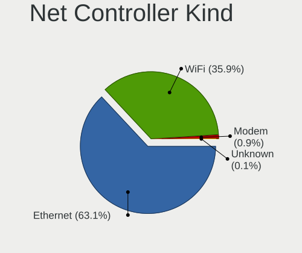

| Kind     | Desktops | Percent |
|----------|----------|---------|
| Ethernet | 1287     | 63.06%  |
| WiFi     | 733      | 35.91%  |
| Modem    | 18       | 0.88%   |
| Unknown  | 3        | 0.15%   |

Used Controller
---------------

Currently used network controller

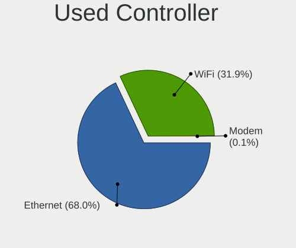

| Kind     | Desktops | Percent |
|----------|----------|---------|
| Ethernet | 932      | 68.03%  |
| WiFi     | 437      | 31.9%   |
| Modem    | 1        | 0.07%   |

NICs
----

Total network controllers on board

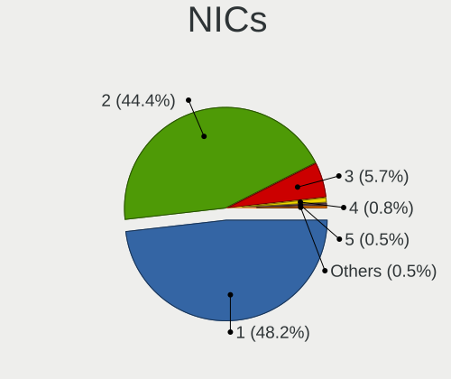

| Total | Desktops | Percent |
|-------|----------|---------|
| 1     | 630      | 48.2%   |
| 2     | 580      | 44.38%  |
| 3     | 74       | 5.66%   |
| 4     | 11       | 0.84%   |
| 5     | 6        | 0.46%   |
| 0     | 3        | 0.23%   |
| 6     | 2        | 0.15%   |
| 7     | 1        | 0.08%   |

IPv6
----

IPv6 vs IPv4

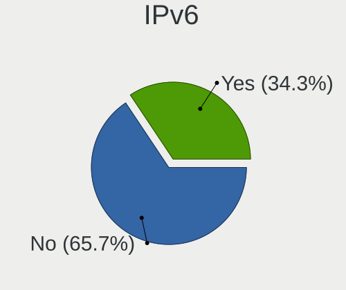

| Used | Desktops | Percent |
|------|----------|---------|
| No   | 864      | 65.65%  |
| Yes  | 452      | 34.35%  |

Bluetooth
---------

Bluetooth Vendor
----------------

Controller vendors

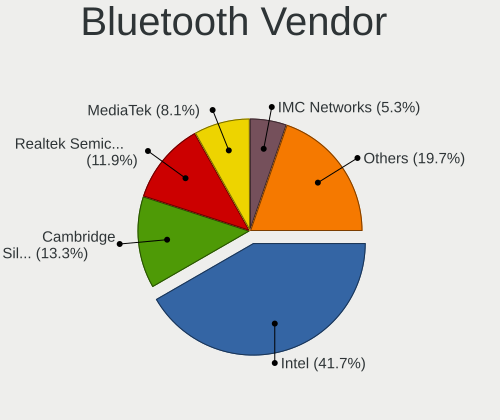

| Vendor                          | Desktops | Percent |
|---------------------------------|----------|---------|
| Intel                           | 313      | 41.68%  |
| Cambridge Silicon Radio         | 100      | 13.32%  |
| Realtek Semiconductor           | 89       | 11.85%  |
| MediaTek                        | 61       | 8.12%   |
| IMC Networks                    | 40       | 5.33%   |
| ASUSTek Computer                | 37       | 4.93%   |
| TP-Link                         | 32       | 4.26%   |
| Foxconn / Hon Hai               | 24       | 3.2%    |
| Broadcom                        | 14       | 1.86%   |
| Qualcomm Atheros Communications | 9        | 1.2%    |
| Realtek                         | 6        | 0.8%    |
| Apple                           | 6        | 0.8%    |
| Actions                         | 6        | 0.8%    |
| Lite-On Technology              | 3        | 0.4%    |
| HTC (High Tech Computer)        | 2        | 0.27%   |
| Dynex                           | 2        | 0.27%   |
| Creative Technology             | 2        | 0.27%   |
| Unknown                         | 2        | 0.27%   |
| Sitecom Europe                  | 1        | 0.13%   |
| Primax Electronics              | 1        | 0.13%   |
| Edimax Technology               | 1        | 0.13%   |

Bluetooth Model
---------------

Controller models

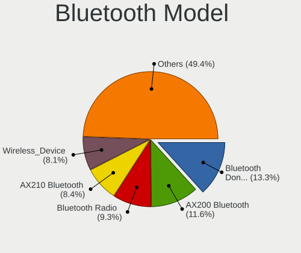

| Model                                                                | Desktops | Percent |
|----------------------------------------------------------------------|----------|---------|
| Cambridge Silicon Radio Bluetooth Dongle (HCI mode)                  | 100      | 13.28%  |
| Intel AX200 Bluetooth                                                | 87       | 11.55%  |
| Realtek Bluetooth Radio                                              | 70       | 9.3%    |
| Intel AX210 Bluetooth                                                | 63       | 8.37%   |
| MediaTek Wireless_Device                                             | 61       | 8.1%    |
| Intel Bluetooth Device                                               | 45       | 5.98%   |
| Intel Bluetooth wireless interface                                   | 38       | 5.05%   |
| TP-Link TP-T@- UB500 Adapter                                         | 32       | 4.25%   |
| Intel AX201 Bluetooth                                                | 24       | 3.19%   |
| Intel Wireless-AC 3168 Bluetooth                                     | 23       | 3.05%   |
| IMC Networks Wireless_Device                                         | 20       | 2.66%   |
| ASUS ASUS USB-BT500                                                  | 20       | 2.66%   |
| IMC Networks Bluetooth Radio                                         | 19       | 2.52%   |
| Foxconn / Hon Hai Wireless_Device                                    | 17       | 2.26%   |
| Intel Bluetooth 9460/9560 Jefferson Peak (JfP)                       | 16       | 2.12%   |
| Intel Wireless-AC 9260 Bluetooth Adapter                             | 14       | 1.86%   |
| Realtek Bluetooth 5.3 Radio                                          | 11       | 1.46%   |
| Qualcomm Atheros  Bluetooth Device                                   | 8        | 1.06%   |
| Broadcom BCM20702A0 Bluetooth 4.0                                    | 8        | 1.06%   |
| Foxconn / Hon Hai Bluetooth Device                                   | 7        | 0.93%   |
| Realtek Bluetooth Radio                                              | 6        | 0.8%    |
| Actions general adapter                                              | 6        | 0.8%    |
| Realtek  Bluetooth 4.2 Adapter                                       | 4        | 0.53%   |
| Intel Centrino Bluetooth Wireless Transceiver                        | 4        | 0.53%   |
| ASUS Qualcomm Bluetooth 4.1                                          | 4        | 0.53%   |
| ASUS Broadcom BCM20702A0 Bluetooth                                   | 4        | 0.53%   |
| Realtek Bluetooth 5.4 Radio                                          | 3        | 0.4%    |
| ASUS Broadcom BCM20702 Single-Chip Bluetooth 4.0 + LE                | 3        | 0.4%    |
| ASUS Bluetooth Radio                                                 | 3        | 0.4%    |
| Apple Bluetooth Host Controller                                      | 3        | 0.4%    |
| Lite-On Bluetooth Device                                             | 2        | 0.27%   |
| HTC (High Tech Computer) Vive Hub Bluetooth 4.1 (Broadcom BCM920703) | 2        | 0.27%   |
| Dynex Bluetooth 4.0 Adapter [Broadcom, 1.12, BCM20702A0]             | 2        | 0.27%   |
| Creative Bluetooth Audio W2                                          | 2        | 0.27%   |
| Broadcom BCM92046DG-CL1ROM Bluetooth 2.1 Adapter                     | 2        | 0.27%   |
| ASUS BCM20702A0                                                      | 2        | 0.27%   |
| Apple Built-in Bluetooth 2.0+EDR HCI                                 | 2        | 0.27%   |
| Unknown                                                              | 2        | 0.27%   |
| Sitecom Europe Bluetooth 2.0 USB adapter 100m                        | 1        | 0.13%   |
| Realtek RTL8822BE Bluetooth 4.2 Adapter                              | 1        | 0.13%   |

Sound
-----

Sound Vendor
------------

Sound card vendors

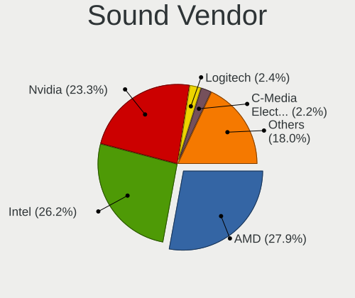

| Vendor                                       | Desktops | Percent |
|----------------------------------------------|----------|---------|
| AMD                                          | 718      | 27.88%  |
| Intel                                        | 675      | 26.21%  |
| Nvidia                                       | 601      | 23.34%  |
| Logitech                                     | 61       | 2.37%   |
| C-Media Electronics                          | 56       | 2.17%   |
| Focusrite-Novation                           | 35       | 1.36%   |
| ASUSTek Computer                             | 29       | 1.13%   |
| Micro Star International                     | 22       | 0.85%   |
| JMTek                                        | 22       | 0.85%   |
| Kingston Technology                          | 21       | 0.82%   |
| Creative Labs                                | 20       | 0.78%   |
| GN Netcom                                    | 18       | 0.7%    |
| SteelSeries ApS                              | 17       | 0.66%   |
| Creative Technology                          | 17       | 0.66%   |
| Razer USA                                    | 15       | 0.58%   |
| Corsair                                      | 15       | 0.58%   |
| Generalplus Technology                       | 11       | 0.43%   |
| Texas Instruments                            | 9        | 0.35%   |
| Hewlett-Packard                              | 9        | 0.35%   |
| Zoran Co. Personal Media Division (Nogatech) | 8        | 0.31%   |
| Realtek Semiconductor                        | 8        | 0.31%   |
| Samson Technologies                          | 7        | 0.27%   |
| Unknown                                      | 7        | 0.27%   |
| Jieli Technology                             | 6        | 0.23%   |
| M-Audio                                      | 5        | 0.19%   |
| Blue Microphones                             | 5        | 0.19%   |
| BEHRINGER International                      | 5        | 0.19%   |
| Astro Gaming                                 | 5        | 0.19%   |
| XMOS                                         | 4        | 0.16%   |
| VIA Technologies                             | 4        | 0.16%   |
| Thesycon Systemsoftware & Consulting         | 4        | 0.16%   |
| TC Electronic                                | 4        | 0.16%   |
| Plantronics                                  | 4        | 0.16%   |
| KTMicro                                      | 4        | 0.16%   |
| Giga-Byte Technology                         | 4        | 0.16%   |
| FiiO Electronics Technology                  | 4        | 0.16%   |
| Audio-Technica                               | 4        | 0.16%   |
| Apple                                        | 4        | 0.16%   |
| Walmart                                      | 3        | 0.12%   |
| Trust                                        | 3        | 0.12%   |

Sound Model
-----------

Sound card models

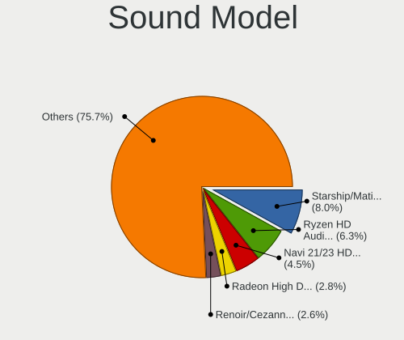

| Model                                                                      | Desktops | Percent |
|----------------------------------------------------------------------------|----------|---------|
| AMD Starship/Matisse HD Audio Controller                                   | 248      | 8.04%   |
| AMD Ryzen HD Audio Controller                                              | 194      | 6.29%   |
| AMD Navi 21/23 HDMI/DP Audio Controller                                    | 138      | 4.48%   |
| AMD Radeon High Definition Audio Controller                                | 87       | 2.82%   |
| AMD Renoir/Cezanne HDMI/DP Audio Controller                                | 81       | 2.63%   |
| Intel 8 Series/C220 Series Chipset High Definition Audio Controller        | 71       | 2.3%    |
| Intel Alder Lake-S HD Audio Controller                                     | 67       | 2.17%   |
| AMD Navi 31 HDMI/DP Audio                                                  | 67       | 2.17%   |
| Intel 200 Series PCH HD Audio                                              | 65       | 2.11%   |
| Intel Raptor Lake High Definition Audio Controller                         | 61       | 1.98%   |
| AMD Ellesmere HDMI Audio [Radeon RX 470/480 / 570/580/590]                 | 61       | 1.98%   |
| AMD Family 17h (Models 00h-0fh) HD Audio Controller                        | 59       | 1.91%   |
| Nvidia GA104 High Definition Audio Controller                              | 53       | 1.72%   |
| Intel 100 Series/C230 Series Chipset Family HD Audio Controller            | 52       | 1.69%   |
| Intel 6 Series/C200 Series Chipset Family High Definition Audio Controller | 51       | 1.65%   |
| Intel 7 Series/C216 Chipset Family High Definition Audio Controller        | 49       | 1.59%   |
| Intel Cannon Lake PCH cAVS                                                 | 47       | 1.52%   |
| Nvidia GA106 High Definition Audio Controller                              | 46       | 1.49%   |
| Intel Xeon E3-1200 v3/4th Gen Core Processor HD Audio Controller           | 42       | 1.36%   |
| Nvidia TU116 High Definition Audio Controller                              | 38       | 1.23%   |
| Nvidia GP104 High Definition Audio Controller                              | 36       | 1.17%   |
| Nvidia GA102 High Definition Audio Controller                              | 36       | 1.17%   |
| AMD SBx00 Azalia (Intel HDA)                                               | 36       | 1.17%   |
| Nvidia TU106 High Definition Audio Controller                              | 35       | 1.14%   |
| Nvidia GP107GL High Definition Audio Controller                            | 34       | 1.1%    |
| AMD Navi 10 HDMI Audio                                                     | 34       | 1.1%    |
| ASUSTek Computer USB Audio                                                 | 28       | 0.91%   |
| Nvidia GP106 High Definition Audio Controller                              | 27       | 0.88%   |
| Nvidia AD104 High Definition Audio Controller                              | 25       | 0.81%   |
| Nvidia GK208 HDMI/DP Audio Controller                                      | 22       | 0.71%   |
| Micro Star International USB Audio                                         | 22       | 0.71%   |
| AMD Oland/Hainan/Cape Verde/Pitcairn HDMI Audio [Radeon HD 7000 Series]    | 22       | 0.71%   |
| Nvidia TU107 GeForce GTX 1650 High Definition Audio Controller             | 21       | 0.68%   |
| Nvidia TU104 HD Audio Controller                                           | 21       | 0.68%   |
| Intel Comet Lake PCH cAVS                                                  | 21       | 0.68%   |
| Intel Tiger Lake-H HD Audio Controller                                     | 20       | 0.65%   |
| AMD Raven/Raven2/Fenghuang HDMI/DP Audio Controller                        | 20       | 0.65%   |
| Intel C610/X99 series chipset HD Audio Controller                          | 19       | 0.62%   |
| Intel 82801JI (ICH10 Family) HD Audio Controller                           | 19       | 0.62%   |
| Nvidia GM107 High Definition Audio Controller [GeForce 940MX]              | 18       | 0.58%   |

Memory
------

Memory Vendor
-------------

Memory module vendors

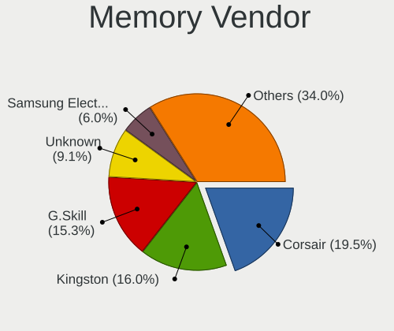

| Vendor                       | Desktops | Percent |
|------------------------------|----------|---------|
| Corsair                      | 84       | 19.53%  |
| Kingston                     | 69       | 16.05%  |
| G.Skill                      | 66       | 15.35%  |
| Unknown                      | 39       | 9.07%   |
| Samsung Electronics          | 26       | 6.05%   |
| Crucial                      | 26       | 6.05%   |
| SK hynix                     | 23       | 5.35%   |
| Team                         | 15       | 3.49%   |
| Unknown                      | 14       | 3.26%   |
| A-DATA Technology            | 11       | 2.56%   |
| Micron Technology            | 9        | 2.09%   |
| Smart                        | 7        | 1.63%   |
| Patriot                      | 4        | 0.93%   |
| Nanya Technology             | 4        | 0.93%   |
| AMD                          | 4        | 0.93%   |
| Ramaxel Technology           | 3        | 0.7%    |
| Silicon Power                | 2        | 0.47%   |
| Lexar                        | 2        | 0.47%   |
| Hikvision                    | 2        | 0.47%   |
| Apacer                       | 2        | 0.47%   |
| Unknown (0x9801)             | 1        | 0.23%   |
| Unknown (0x0DEC)             | 1        | 0.23%   |
| Unknown (0x0B45)             | 1        | 0.23%   |
| Transcend                    | 1        | 0.23%   |
| TEXTORM                      | 1        | 0.23%   |
| Sesame                       | 1        | 0.23%   |
| PNY                          | 1        | 0.23%   |
| Patriot Memory (PDP Systems) | 1        | 0.23%   |
| Patriot Memory               | 1        | 0.23%   |
| Kingmax Semiconductor        | 1        | 0.23%   |
| KingFast                     | 1        | 0.23%   |
| Hoodisk                      | 1        | 0.23%   |
| Goldkey                      | 1        | 0.23%   |
| EXCELERAM                    | 1        | 0.23%   |
| Axiom                        | 1        | 0.23%   |
| Avant                        | 1        | 0.23%   |
| ASint Technology             | 1        | 0.23%   |
| Asgard                       | 1        | 0.23%   |

Memory Model
------------

Memory module models

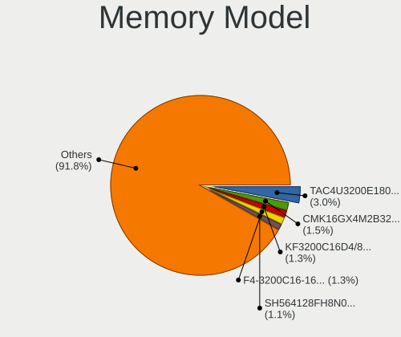

| Model                                                  | Desktops | Percent |
|--------------------------------------------------------|----------|---------|
| Unknown                                                | 14       | 3.02%   |
| Corsair RAM CMK16GX4M2B3200C16 8GB DIMM DDR4 3600MT/s  | 7        | 1.51%   |
| Kingston RAM KF3200C16D4/8GX 8GiB DIMM DDR4 3600MT/s   | 6        | 1.3%    |
| G.Skill RAM F4-3200C16-16GVK 16GB DIMM DDR4 3600MT/s   | 6        | 1.3%    |
| Smart RAM SH564128FH8N0TNSDR 4GB DIMM DDR3 1600MT/s    | 5        | 1.08%   |
| Kingston RAM KF3200C16D4/16GX 16GB DIMM DDR4 3733MT/s  | 5        | 1.08%   |
| G.Skill RAM F4-3200C16-8GVKB 8GB DIMM DDR4 4000MT/s    | 5        | 1.08%   |
| Corsair RAM CMK32GX4M2E3200C16 16GB DIMM DDR4 3600MT/s | 5        | 1.08%   |
| Unknown RAM Module 4GB DIMM DDR3 1333MT/s              | 4        | 0.86%   |
| Unknown RAM Module 4GB DIMM 1333MT/s                   | 4        | 0.86%   |
| Team RAM TEAMGROUP-UD4-3600 16GB DIMM DDR4 3600MT/s    | 4        | 0.86%   |
| Team RAM TEAMGROUP-UD4-3200 8GB DIMM DDR4 3800MT/s     | 4        | 0.86%   |
| Kingston RAM KHX3200C16D4/8GX 8GB DIMM DDR4 3733MT/s   | 4        | 0.86%   |
| G.Skill RAM F5-6000J3038F16G 16GB DIMM DDR5 6000MT/s   | 4        | 0.86%   |
| Team RAM TEAMGROUP-UD4-3200 8GB DIMM DDR4 3733MT/s     | 3        | 0.65%   |
| Kingston RAM KHX2133C14D4/4G 4GB DIMM DDR4 3200MT/s    | 3        | 0.65%   |
| G.Skill RAM F5-6000J3238F16G 16GB DIMM DDR5 12800MT/s  | 3        | 0.65%   |
| G.Skill RAM F5-6000J3040G32G 32GB DIMM DDR5 6200MT/s   | 3        | 0.65%   |
| Corsair RAM CMK64GX4M2E3200C16 32GB DIMM DDR4 3600MT/s | 3        | 0.65%   |
| Corsair RAM CMK32GX5M2B5600C36 16GB DIMM DDR5 5800MT/s | 3        | 0.65%   |
| Corsair RAM CMK32GX4M2D3600C18 16GB DIMM DDR4 3800MT/s | 3        | 0.65%   |
| Corsair RAM CMK16GX4M2D3600C18 8GB DIMM DDR4 4000MT/s  | 3        | 0.65%   |
| Corsair RAM CMK16GX4M2D3000C16 8GB DIMM DDR4 3400MT/s  | 3        | 0.65%   |
| Corsair RAM CMK16GX4M2B3000C15 8GB DIMM DDR4 3600MT/s  | 3        | 0.65%   |
| Corsair RAM CMK16GX4M2A2400C16 8GB DIMM DDR4 2933MT/s  | 3        | 0.65%   |
| Unknown RAM Module 8GB DIMM DDR4 3200MT/s              | 2        | 0.43%   |
| Unknown RAM Module 8GB DIMM DDR4 2667MT/s              | 2        | 0.43%   |
| Unknown RAM Module 8GB DIMM DDR3 1600MT/s              | 2        | 0.43%   |
| Unknown RAM Module 4GB DIMM 400MT/s                    | 2        | 0.43%   |
| Unknown RAM Module 2GB DIMM DDR2 800MT/s               | 2        | 0.43%   |
| Unknown RAM Module 2GB DIMM 800MT/s                    | 2        | 0.43%   |
| Unknown RAM Module 2GB DIMM 667MT/s                    | 2        | 0.43%   |
| Unknown RAM Module 2GB DIMM 400MT/s                    | 2        | 0.43%   |
| Team RAM UD5-6000 16GB DIMM DDR5 6000MT/s              | 2        | 0.43%   |
| Samsung RAM M378A1K43EB2-CWE 8GB DIMM DDR4 3200MT/s    | 2        | 0.43%   |
| Nanya RAM NT4GC64B8HG0NF-DI 4GB DIMM DDR3 1600MT/s     | 2        | 0.43%   |
| Nanya RAM NT4GC64B8HG0NF-CG 4GB DIMM 1333MT/s          | 2        | 0.43%   |
| Lexar RAM LD4AU008G-H3200GST 8GB DIMM DDR4 3200MT/s    | 2        | 0.43%   |
| Kingston RAM KHX3200C16D4/16GX 16GB DIMM DDR4 3600MT/s | 2        | 0.43%   |
| Kingston RAM KHX2666C16/8G 8GiB DIMM DDR4 3466MT/s     | 2        | 0.43%   |

Memory Kind
-----------

Memory module kinds

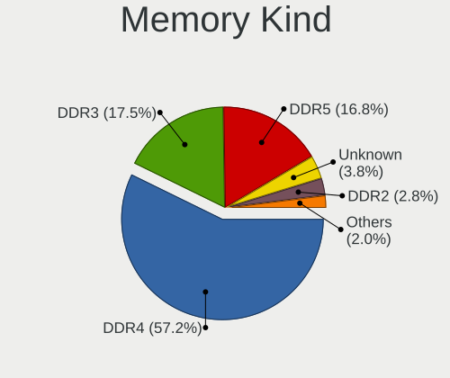

| Kind    | Desktops | Percent |
|---------|----------|---------|
| DDR4    | 229      | 57.25%  |
| DDR3    | 70       | 17.5%   |
| DDR5    | 67       | 16.75%  |
| Unknown | 15       | 3.75%   |
| DDR2    | 11       | 2.75%   |
| SDRAM   | 3        | 0.75%   |
| LPDDR5  | 2        | 0.5%    |
| LPDDR4  | 1        | 0.25%   |
| LPDDR3  | 1        | 0.25%   |
| DDR     | 1        | 0.25%   |

Memory Form Factor
------------------

Physical design of the memory module

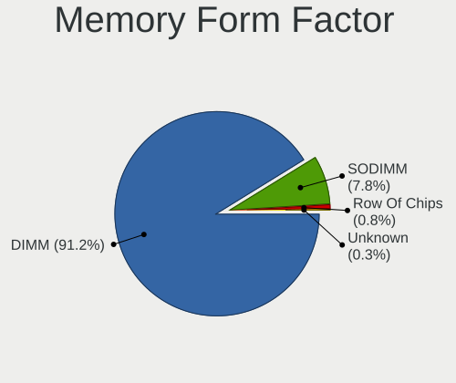

| Name         | Desktops | Percent |
|--------------|----------|---------|
| DIMM         | 363      | 91.21%  |
| SODIMM       | 31       | 7.79%   |
| Row Of Chips | 3        | 0.75%   |
| Unknown      | 1        | 0.25%   |

Memory Size
-----------

Memory module size

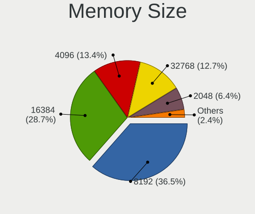

| Size  | Desktops | Percent |
|-------|----------|---------|
| 8192  | 155      | 36.47%  |
| 16384 | 122      | 28.71%  |
| 4096  | 57       | 13.41%  |
| 32768 | 54       | 12.71%  |
| 2048  | 27       | 6.35%   |
| 49152 | 5        | 1.18%   |
| 1024  | 3        | 0.71%   |
| 24576 | 2        | 0.47%   |

Memory Speed
------------

Memory module speed

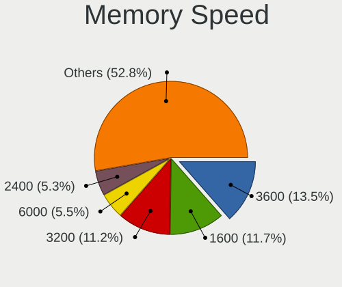

| Speed | Desktops | Percent |
|-------|----------|---------|
| 3600  | 59       | 13.53%  |
| 1600  | 51       | 11.7%   |
| 3200  | 49       | 11.24%  |
| 6000  | 24       | 5.5%    |
| 2400  | 23       | 5.28%   |
| 1333  | 23       | 5.28%   |
| 3733  | 21       | 4.82%   |
| 2667  | 17       | 3.9%    |
| 4800  | 14       | 3.21%   |
| 3800  | 13       | 2.98%   |
| 4000  | 12       | 2.75%   |
| 2133  | 12       | 2.75%   |
| 5600  | 11       | 2.52%   |
| 3400  | 10       | 2.29%   |
| 3000  | 8        | 1.83%   |
| 800   | 8        | 1.83%   |
| 2666  | 7        | 1.61%   |
| 2933  | 6        | 1.38%   |
| 12800 | 5        | 1.15%   |
| 667   | 5        | 1.15%   |
| 400   | 5        | 1.15%   |
| 6200  | 4        | 0.92%   |
| 3466  | 4        | 0.92%   |
| 6400  | 3        | 0.69%   |
| 5800  | 3        | 0.69%   |
| 5200  | 3        | 0.69%   |
| 3866  | 3        | 0.69%   |
| 3333  | 3        | 0.69%   |
| 1867  | 3        | 0.69%   |
| 2800  | 2        | 0.46%   |
| 1639  | 2        | 0.46%   |
| 1334  | 2        | 0.46%   |
| 8400  | 1        | 0.23%   |
| 6800  | 1        | 0.23%   |
| 3933  | 1        | 0.23%   |
| 3666  | 1        | 0.23%   |
| 3533  | 1        | 0.23%   |
| 3266  | 1        | 0.23%   |
| 3100  | 1        | 0.23%   |
| 3066  | 1        | 0.23%   |

Printers & scanners
-------------------

Printer Vendor
--------------

Printer device vendors

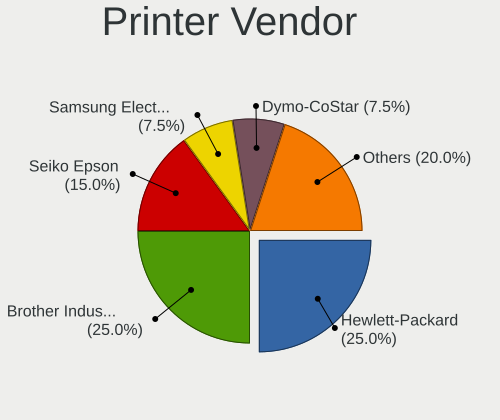

| Vendor                        | Desktops | Percent |
|-------------------------------|----------|---------|
| Hewlett-Packard               | 10       | 25%     |
| Brother Industries            | 10       | 25%     |
| Seiko Epson                   | 6        | 15%     |
| Samsung Electronics           | 3        | 7.5%    |
| Dymo-CoStar                   | 3        | 7.5%    |
| Zhuhai Poskey Technology      | 2        | 5%      |
| Samsung Info. Systems America | 1        | 2.5%    |
| Prolific Technology           | 1        | 2.5%    |
| Printer                       | 1        | 2.5%    |
| Pantum                        | 1        | 2.5%    |
| Kyocera                       | 1        | 2.5%    |
| Canon                         | 1        | 2.5%    |

Printer Model
-------------

Printer device models

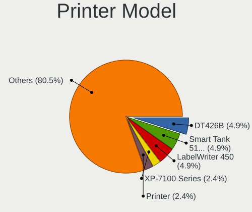

| Model                                        | Desktops | Percent |
|----------------------------------------------|----------|---------|
| Zhuhai Poskey DT426B                         | 2        | 4.88%   |
| HP Smart Tank 510 series                     | 2        | 4.88%   |
| Dymo-CoStar LabelWriter 450                  | 2        | 4.88%   |
| Seiko Epson XP-7100 Series                   | 1        | 2.44%   |
| Seiko Epson Printer                          | 1        | 2.44%   |
| Seiko Epson L3110 Series                     | 1        | 2.44%   |
| Seiko Epson ET-4800 Series                   | 1        | 2.44%   |
| Seiko Epson ET-2820 Series                   | 1        | 2.44%   |
| Seiko Epson ET-2710 Series                   | 1        | 2.44%   |
| Samsung Info. Systems America Docuprint P8ex | 1        | 2.44%   |
| Samsung SCX-4623 Series                      | 1        | 2.44%   |
| Samsung SCX-3400 Series                      | 1        | 2.44%   |
| Samsung ML-216x Series Laser Printer         | 1        | 2.44%   |
| Prolific PL2305 Parallel Port                | 1        | 2.44%   |
| Printer Printer                              | 1        | 2.44%   |
| Pantum M6500W-series                         | 1        | 2.44%   |
| Kyocera FS-1040                              | 1        | 2.44%   |
| HP LaserJet Professional P 1102w             | 1        | 2.44%   |
| HP LaserJet Pro M148-M149                    | 1        | 2.44%   |
| HP LaserJet P1006                            | 1        | 2.44%   |
| HP LaserJet 1020                             | 1        | 2.44%   |
| HP Ink Tank Wireless 410 series              | 1        | 2.44%   |
| HP DeskJet 3630 series                       | 1        | 2.44%   |
| HP DeskJet 2600 series                       | 1        | 2.44%   |
| HP Deskjet 1510                              | 1        | 2.44%   |
| Dymo-CoStar DYMO LabelWriter 450 Turbo       | 1        | 2.44%   |
| Canon TS300 series                           | 1        | 2.44%   |
| Brother MFC-L2740DW                          | 1        | 2.44%   |
| Brother MFC-L2710DW series                   | 1        | 2.44%   |
| Brother MFC-J5945DW                          | 1        | 2.44%   |
| Brother MFC-J1170DW                          | 1        | 2.44%   |
| Brother MFC-9330CDW                          | 1        | 2.44%   |
| Brother HL-L2325DW                           | 1        | 2.44%   |
| Brother HL-L2300D series                     | 1        | 2.44%   |
| Brother HL-2270DW Laser Printer              | 1        | 2.44%   |
| Brother HL-2240 series                       | 1        | 2.44%   |
| Brother HL-1210W series                      | 1        | 2.44%   |
| Brother DCP-L2510D series                    | 1        | 2.44%   |

Scanner Vendor
--------------

Scanner device vendors

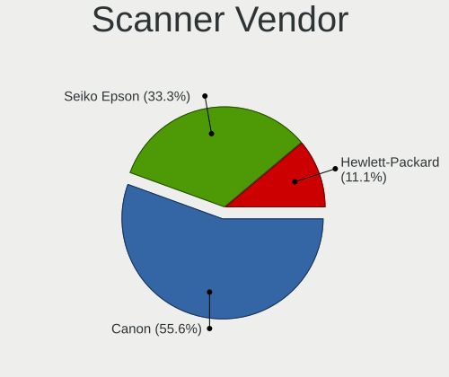

| Vendor          | Desktops | Percent |
|-----------------|----------|---------|
| Canon           | 5        | 55.56%  |
| Seiko Epson     | 3        | 33.33%  |
| Hewlett-Packard | 1        | 11.11%  |

Scanner Model
-------------

Scanner device models

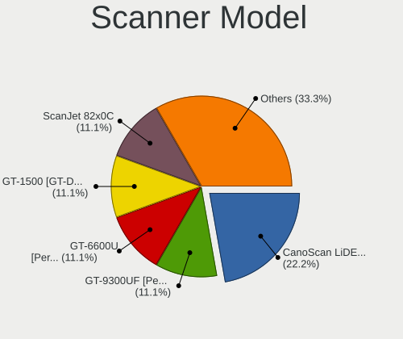

| Model                                         | Desktops | Percent |
|-----------------------------------------------|----------|---------|
| Canon CanoScan LiDE 100                       | 2        | 22.22%  |
| Seiko Epson GT-9300UF [Perfection 2400 PHOTO] | 1        | 11.11%  |
| Seiko Epson GT-6600U [Perfection 610]         | 1        | 11.11%  |
| Seiko Epson GT-1500 [GT-D1000]                | 1        | 11.11%  |
| HP ScanJet 82x0C                              | 1        | 11.11%  |
| Canon CanoScan LiDE 60                        | 1        | 11.11%  |
| Canon CanoScan LiDE 120                       | 1        | 11.11%  |
| Canon CanoScan 4200F                          | 1        | 11.11%  |

Camera
------

Camera Vendor
-------------

Camera device vendors

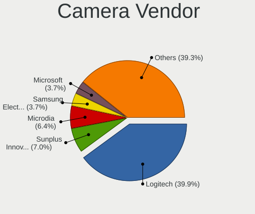

| Vendor                        | Desktops | Percent |
|-------------------------------|----------|---------|
| Logitech                      | 119      | 39.93%  |
| Sunplus Innovation Technology | 21       | 7.05%   |
| Microdia                      | 19       | 6.38%   |
| Samsung Electronics           | 11       | 3.69%   |
| Microsoft                     | 11       | 3.69%   |
| webcam                        | 8        | 2.68%   |
| Realtek Semiconductor         | 7        | 2.35%   |
| MacroSilicon                  | 6        | 2.01%   |
| Generalplus Technology        | 6        | 2.01%   |
| Apple                         | 6        | 2.01%   |
| Anker PowerConf C200          | 6        | 2.01%   |
| Razer USA                     | 5        | 1.68%   |
| eMeet                         | 4        | 1.34%   |
| Chicony Electronics           | 4        | 1.34%   |
| ARC International             | 4        | 1.34%   |
| Z-Star Microelectronics       | 3        | 1.01%   |
| webcamvendor                  | 3        | 1.01%   |
| Trust                         | 3        | 1.01%   |
| GEMBIRD                       | 3        | 1.01%   |
| YGTek                         | 2        | 0.67%   |
| SunplusIT                     | 2        | 0.67%   |
| SHENZHEN EMEET TECHNOLOGY     | 2        | 0.67%   |
| LG Electronics                | 2        | 0.67%   |
| Elgato Systems                | 2        | 0.67%   |
| Bison Electronics             | 2        | 0.67%   |
| AVerMedia Technologies        | 2        | 0.67%   |
| ANYKA                         | 2        | 0.67%   |
| Alcorlink                     | 2        | 0.67%   |
| Xiongmai                      | 1        | 0.34%   |
| USB3.0 HD Audio Capture       | 1        | 0.34%   |
| Tobii Technology AB           | 1        | 0.34%   |
| Sony                          | 1        | 0.34%   |
| SN0002                        | 1        | 0.34%   |
| Ruision                       | 1        | 0.34%   |
| Quanta                        | 1        | 0.34%   |
| Polycom                       | 1        | 0.34%   |
| Pixart Imaging                | 1        | 0.34%   |
| Philips (or NXP)              | 1        | 0.34%   |
| Owon                          | 1        | 0.34%   |
| Nintendo                      | 1        | 0.34%   |

Camera Model
------------

Camera device models

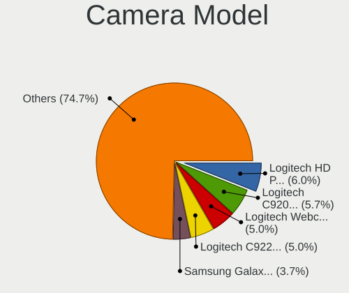

| Model                                          | Desktops | Percent |
|------------------------------------------------|----------|---------|
| Logitech HD Pro Webcam C920                    | 18       | 6%      |
| Logitech C920 PRO HD Webcam                    | 17       | 5.67%   |
| Logitech Webcam C270                           | 15       | 5%      |
| Logitech C922 Pro Stream Webcam                | 15       | 5%      |
| Samsung Galaxy series, misc. (MTP mode)        | 11       | 3.67%   |
| Sunplus Full HD webcam                         | 9        | 3%      |
| webcam webcam                                  | 8        | 2.67%   |
| Microdia Webcam Vitade AF                      | 7        | 2.33%   |
| Logitech BRIO Ultra HD Webcam                  | 7        | 2.33%   |
| Sunplus Integrated Camera                      | 6        | 2%      |
| Microdia USB 2.0 Camera                        | 6        | 2%      |
| MacroSilicon USB Video                         | 6        | 2%      |
| Anker PowerConf C200 Anker PowerConf C200      | 6        | 2%      |
| Logitech Logitech Webcam C925e                 | 5        | 1.67%   |
| Apple iPhone 5/5C/5S/6/SE/7/8/X                | 5        | 1.67%   |
| Logitech Webcam C930e                          | 4        | 1.33%   |
| Logitech HD Webcam C615                        | 4        | 1.33%   |
| ARC International Camera                       | 4        | 1.33%   |
| webcamvendor NexiGo N60 FHD Webcam             | 3        | 1%      |
| Trust USB Camera                               | 3        | 1%      |
| Microsoft LifeCam VX-2000                      | 3        | 1%      |
| Microsoft LifeCam HD-3000                      | 3        | 1%      |
| Microdia Camera                                | 3        | 1%      |
| Logitech StreamCam                             | 3        | 1%      |
| Logitech Logi Webcam C920e                     | 3        | 1%      |
| Logitech HD Webcam C525                        | 3        | 1%      |
| Logitech HD Webcam C510                        | 3        | 1%      |
| Generalplus GENERAL WEBCAM                     | 3        | 1%      |
| eMeet HD Webcam C960                           | 3        | 1%      |
| Z-Star Venus USB2.0 Camera                     | 2        | 0.67%   |
| YGTek Webcam                                   | 2        | 0.67%   |
| Sunplus USB 2.0 Camera                         | 2        | 0.67%   |
| SHENZHEN EMEET TECHNOLOGY HD Webcam eMeet C960 | 2        | 0.67%   |
| Realtek USB Camera                             | 2        | 0.67%   |
| Realtek Thronmax Stream Go Pro Webcam          | 2        | 0.67%   |
| Razer USA Gaming Webcam [Kiyo]                 | 2        | 0.67%   |
| Microsoft Microsoft LifeCam Cinema             | 2        | 0.67%   |
| Microsoft LifeCam Studio                       | 2        | 0.67%   |
| Logitech Webcam C310                           | 2        | 0.67%   |
| Logitech Webcam B500                           | 2        | 0.67%   |

Security
--------

Fingerprint Vendor
------------------

Fingerprint sensor vendors

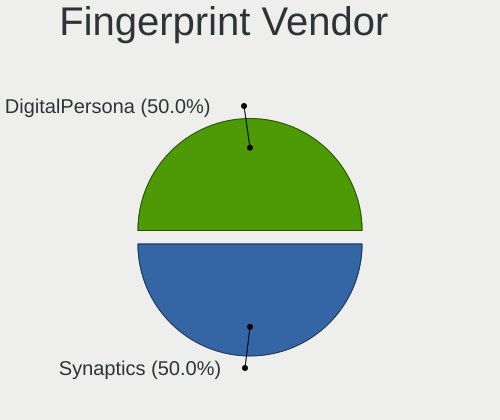

| Vendor         | Desktops | Percent |
|----------------|----------|---------|
| Synaptics      | 1        | 50%     |
| DigitalPersona | 1        | 50%     |

Fingerprint Model
-----------------

Fingerprint sensor models

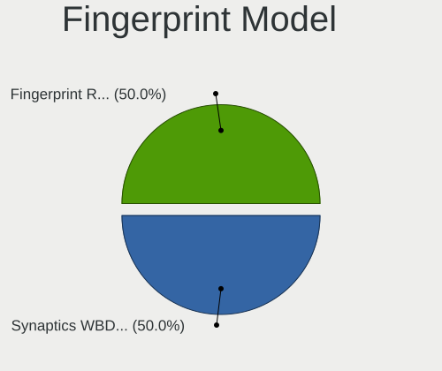

| Model                                        | Desktops | Percent |
|----------------------------------------------|----------|---------|
| Synaptics  WBDI Fingerprint Reader - USB 052 | 1        | 50%     |
| DigitalPersona Fingerprint Reader            | 1        | 50%     |

Chipcard Vendor
---------------

Chipcard module vendors

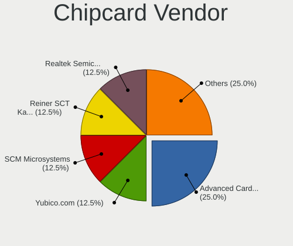

| Vendor                    | Desktops | Percent |
|---------------------------|----------|---------|
| Advanced Card Systems     | 2        | 25%     |
| Yubico.com                | 1        | 12.5%   |
| SCM Microsystems          | 1        | 12.5%   |
| Reiner SCT Kartensysteme  | 1        | 12.5%   |
| Realtek Semiconductor     | 1        | 12.5%   |
| Aladdin Knowledge Systems | 1        | 12.5%   |
| Aktiv                     | 1        | 12.5%   |

Chipcard Model
--------------

Chipcard module models

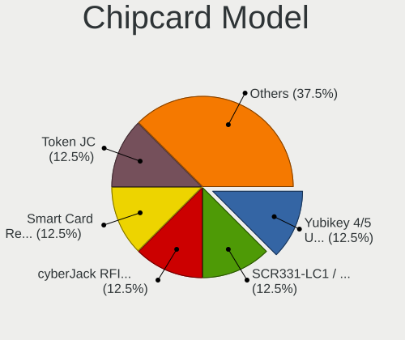

| Model                                                                      | Desktops | Percent |
|----------------------------------------------------------------------------|----------|---------|
| Yubico.com Yubikey 4/5 U2F+CCID                                            | 1        | 12.5%   |
| SCM Microsystems SCR331-LC1 / SCR3310 SmartCard Reader                     | 1        | 12.5%   |
| Reiner SCT Kartensysteme cyberJack RFID basis contactless smartcard reader | 1        | 12.5%   |
| Realtek Semiconductor Smart Card Reader Interface                          | 1        | 12.5%   |
| Aladdin Knowledge Systems Token JC                                         | 1        | 12.5%   |
| Aktiv Rutoken lite                                                         | 1        | 12.5%   |
| Advanced Card Systems ACR38 SmartCard Reader                               | 1        | 12.5%   |
| Advanced Card Systems ACR122U                                              | 1        | 12.5%   |

Unsupported
-----------

Unsupported Devices
-------------------

Total unsupported devices on board

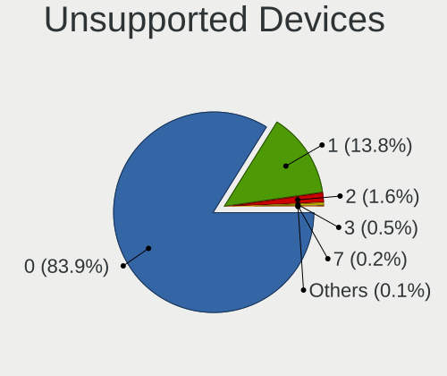

| Total | Desktops | Percent |
|-------|----------|---------|
| 0     | 1104     | 83.89%  |
| 1     | 182      | 13.83%  |
| 2     | 21       | 1.6%    |
| 3     | 6        | 0.46%   |
| 7     | 2        | 0.15%   |
| 4     | 1        | 0.08%   |

Unsupported Device Types
------------------------

Types of unsupported devices

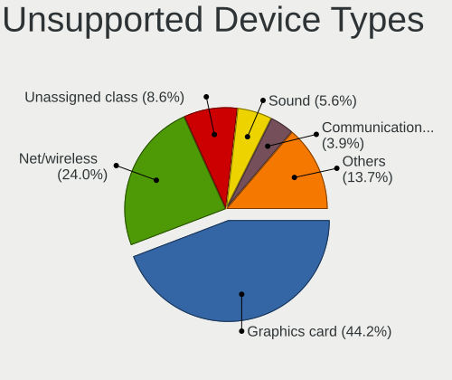

| Type                     | Desktops | Percent |
|--------------------------|----------|---------|
| Graphics card            | 103      | 44.21%  |
| Net/wireless             | 56       | 24.03%  |
| Unassigned class         | 20       | 8.58%   |
| Sound                    | 13       | 5.58%   |
| Communication controller | 9        | 3.86%   |
| Multimedia controller    | 7        | 3%      |
| Net/ethernet             | 6        | 2.58%   |
| Bluetooth                | 5        | 2.15%   |
| Storage/raid             | 3        | 1.29%   |
| Network                  | 3        | 1.29%   |
| Fingerprint reader       | 2        | 0.86%   |
| Card reader              | 2        | 0.86%   |
| Camera                   | 2        | 0.86%   |
| Tv card                  | 1        | 0.43%   |
| Modem                    | 1        | 0.43%   |

