Fedora 40 - Tested Hardware & Statistics (Notebooks)
----------------------------------------------------

A project to collect tested hardware configurations for Fedora 40.

Anyone can contribute to this report by the [hw-probe](https://github.com/linuxhw/hw-probe) tool:

    sudo -E hw-probe -all -upload

Please contribute! Especially if your hardware is rare.

Contents
--------

* [ Test Cases ](#test-cases)

* [ System ](#system)
  - [ Kernel                   ](#kernel)
  - [ Kernel Family            ](#kernel-family)
  - [ Kernel Major Ver.        ](#kernel-major-ver)
  - [ Arch                     ](#arch)
  - [ DE                       ](#de)
  - [ Display Server           ](#display-server)
  - [ Display Manager          ](#display-manager)
  - [ OS Lang                  ](#os-lang)
  - [ Boot Mode                ](#boot-mode)
  - [ Filesystem               ](#filesystem)
  - [ Part. scheme             ](#part-scheme)
  - [ Dual Boot with Linux/BSD ](#dual-boot-with-linuxbsd)
  - [ Dual Boot (Win)          ](#dual-boot-win)

* [ Board ](#board)
  - [ Vendor                   ](#vendor)
  - [ Model                    ](#model)
  - [ Model Family             ](#model-family)
  - [ MFG Year                 ](#mfg-year)
  - [ Form Factor              ](#form-factor)
  - [ Secure Boot              ](#secure-boot)
  - [ Coreboot                 ](#coreboot)
  - [ RAM Size                 ](#ram-size)
  - [ RAM Used                 ](#ram-used)
  - [ Total Drives             ](#total-drives)
  - [ Has CD-ROM               ](#has-cd-rom)
  - [ Has Ethernet             ](#has-ethernet)
  - [ Has WiFi                 ](#has-wifi)
  - [ Has Bluetooth            ](#has-bluetooth)

* [ Location ](#location)
  - [ Country                  ](#country)
  - [ City                     ](#city)

* [ Drives ](#drives)
  - [ Drive Vendor             ](#drive-vendor)
  - [ Drive Model              ](#drive-model)
  - [ HDD Vendor               ](#hdd-vendor)
  - [ SSD Vendor               ](#ssd-vendor)
  - [ Drive Kind               ](#drive-kind)
  - [ Drive Connector          ](#drive-connector)
  - [ Drive Size               ](#drive-size)
  - [ Space Total              ](#space-total)
  - [ Space Used               ](#space-used)
  - [ Malfunc. Drives          ](#malfunc-drives)
  - [ Malfunc. Drive Vendor    ](#malfunc-drive-vendor)
  - [ Malfunc. HDD Vendor      ](#malfunc-hdd-vendor)
  - [ Malfunc. Drive Kind      ](#malfunc-drive-kind)
  - [ Failed Drives            ](#failed-drives)
  - [ Failed Drive Vendor      ](#failed-drive-vendor)
  - [ Drive Status             ](#drive-status)

* [ Storage controller ](#storage-controller)
  - [ Storage Vendor           ](#storage-vendor)
  - [ Storage Model            ](#storage-model)
  - [ Storage Kind             ](#storage-kind)

* [ Processor ](#processor)
  - [ CPU Vendor               ](#cpu-vendor)
  - [ CPU Model                ](#cpu-model)
  - [ CPU Model Family         ](#cpu-model-family)
  - [ CPU Cores                ](#cpu-cores)
  - [ CPU Sockets              ](#cpu-sockets)
  - [ CPU Threads              ](#cpu-threads)
  - [ CPU Op-Modes             ](#cpu-op-modes)
  - [ CPU Microcode            ](#cpu-microcode)
  - [ CPU Microarch            ](#cpu-microarch)

* [ Graphics ](#graphics)
  - [ GPU Vendor               ](#gpu-vendor)
  - [ GPU Model                ](#gpu-model)
  - [ GPU Combo                ](#gpu-combo)
  - [ GPU Driver               ](#gpu-driver)
  - [ GPU Memory               ](#gpu-memory)

* [ Monitor ](#monitor)
  - [ Monitor Vendor           ](#monitor-vendor)
  - [ Monitor Model            ](#monitor-model)
  - [ Monitor Resolution       ](#monitor-resolution)
  - [ Monitor Diagonal         ](#monitor-diagonal)
  - [ Monitor Width            ](#monitor-width)
  - [ Aspect Ratio             ](#aspect-ratio)
  - [ Monitor Area             ](#monitor-area)
  - [ Pixel Density            ](#pixel-density)
  - [ Multiple Monitors        ](#multiple-monitors)

* [ Network ](#network)
  - [ Net Controller Vendor    ](#net-controller-vendor)
  - [ Net Controller Model     ](#net-controller-model)
  - [ Wireless Vendor          ](#wireless-vendor)
  - [ Wireless Model           ](#wireless-model)
  - [ Ethernet Vendor          ](#ethernet-vendor)
  - [ Ethernet Model           ](#ethernet-model)
  - [ Net Controller Kind      ](#net-controller-kind)
  - [ Used Controller          ](#used-controller)
  - [ NICs                     ](#nics)
  - [ IPv6                     ](#ipv6)

* [ Bluetooth ](#bluetooth)
  - [ Bluetooth Vendor         ](#bluetooth-vendor)
  - [ Bluetooth Model          ](#bluetooth-model)

* [ Sound ](#sound)
  - [ Sound Vendor             ](#sound-vendor)
  - [ Sound Model              ](#sound-model)

* [ Memory ](#memory)
  - [ Memory Vendor            ](#memory-vendor)
  - [ Memory Model             ](#memory-model)
  - [ Memory Kind              ](#memory-kind)
  - [ Memory Form Factor       ](#memory-form-factor)
  - [ Memory Size              ](#memory-size)
  - [ Memory Speed             ](#memory-speed)

* [ Printers & scanners ](#printers--scanners)
  - [ Printer Vendor           ](#printer-vendor)
  - [ Printer Model            ](#printer-model)
  - [ Scanner Vendor           ](#scanner-vendor)
  - [ Scanner Model            ](#scanner-model)

* [ Camera ](#camera)
  - [ Camera Vendor            ](#camera-vendor)
  - [ Camera Model             ](#camera-model)

* [ Security ](#security)
  - [ Fingerprint Vendor       ](#fingerprint-vendor)
  - [ Fingerprint Model        ](#fingerprint-model)
  - [ Chipcard Vendor          ](#chipcard-vendor)
  - [ Chipcard Model           ](#chipcard-model)

* [ Unsupported ](#unsupported)
  - [ Unsupported Devices      ](#unsupported-devices)
  - [ Unsupported Device Types ](#unsupported-device-types)

Test Cases
----------

Total: 2822

| Vendor        | Model                       | Probe                                                      | Date         |
|---------------|-----------------------------|------------------------------------------------------------|--------------|
| DEXP          | Atlas M15-I3W300            | [2ae95813de](https://linux-hardware.org/?probe=2ae95813de) | Dec 08, 2025 |
| Dell          | Inspiron 1545               | [b5638a32bb](https://linux-hardware.org/?probe=b5638a32bb) | Nov 23, 2025 |
| ASUSTek       | VivoBook_ASUSLaptop X160... | [ebafd2d928](https://linux-hardware.org/?probe=ebafd2d928) | Nov 14, 2025 |
| ASUSTek       | VivoBook_ASUSLaptop X160... | [a448ab0649](https://linux-hardware.org/?probe=a448ab0649) | Nov 14, 2025 |
| Dell          | Inspiron 1545               | [1e9900453b](https://linux-hardware.org/?probe=1e9900453b) | Nov 11, 2025 |
| Apple         | MacBookAir7,2               | [ce9867b679](https://linux-hardware.org/?probe=ce9867b679) | Oct 29, 2025 |
| Lenovo        | IdeaPad 3 15IIL05 U 81WE    | [d21c085a9e](https://linux-hardware.org/?probe=d21c085a9e) | Sep 22, 2025 |
| Acer          | Aspire A115-32              | [3b4ee190cf](https://linux-hardware.org/?probe=3b4ee190cf) | Sep 18, 2025 |
| Framework     | Laptop (12th Gen Intel C... | [203bb730cb](https://linux-hardware.org/?probe=203bb730cb) | Aug 30, 2025 |
| Lenovo        | ThinkPad T14 Gen 4 21HDS... | [d69462d966](https://linux-hardware.org/?probe=d69462d966) | Aug 27, 2025 |
| Apple         | MacBookPro13,2              | [27f49efbdc](https://linux-hardware.org/?probe=27f49efbdc) | Aug 24, 2025 |
| HP            | Presario C700               | [044a6a8cab](https://linux-hardware.org/?probe=044a6a8cab) | Aug 20, 2025 |
| Apple         | MacBookPro5,5               | [70f38c0b74](https://linux-hardware.org/?probe=70f38c0b74) | Aug 12, 2025 |
| Dell          | Inspiron N4020              | [360c68885d](https://linux-hardware.org/?probe=360c68885d) | Aug 08, 2025 |
| Lenovo        | ThinkPad P1 Gen 7 21KWS0... | [50840ef175](https://linux-hardware.org/?probe=50840ef175) | Jul 31, 2025 |
| Lenovo        | V15 G3 ABA 82TV             | [f85b5a4fe2](https://linux-hardware.org/?probe=f85b5a4fe2) | Jul 31, 2025 |
| HP            | ProBook 450 G2              | [0e7a66c399](https://linux-hardware.org/?probe=0e7a66c399) | Jul 17, 2025 |
| Lenovo        | ThinkPad P1 Gen 4i 20Y4S... | [89f9b071e1](https://linux-hardware.org/?probe=89f9b071e1) | Jun 23, 2025 |
| Google        | Careena                     | [5ec052164a](https://linux-hardware.org/?probe=5ec052164a) | Jun 14, 2025 |
| Lenovo        | LOQ 15ARP9 83JC             | [6fcede302c](https://linux-hardware.org/?probe=6fcede302c) | Jun 14, 2025 |
| Lenovo        | ThinkPad S1 Yoga 12 20DK... | [d7d234d702](https://linux-hardware.org/?probe=d7d234d702) | Jun 09, 2025 |
| HUAWEI        | KLVL-WXX9                   | [7981c5a410](https://linux-hardware.org/?probe=7981c5a410) | Jun 07, 2025 |
| HP            | Notebook                    | [367471f041](https://linux-hardware.org/?probe=367471f041) | Jun 05, 2025 |
| Medion        | Deputy P60                  | [de230fe1d6](https://linux-hardware.org/?probe=de230fe1d6) | May 26, 2025 |
| Dell          | XPS 15 7590                 | [e1c61a7c7b](https://linux-hardware.org/?probe=e1c61a7c7b) | May 14, 2025 |
| Dell          | Inspiron 1545               | [71ac3e03aa](https://linux-hardware.org/?probe=71ac3e03aa) | Apr 30, 2025 |
| ASUSTek       | ROG Zephyrus G14 GA401QM... | [e4549abb85](https://linux-hardware.org/?probe=e4549abb85) | Apr 28, 2025 |
| Dell          | Precision 7720              | [9f5f86b613](https://linux-hardware.org/?probe=9f5f86b613) | Apr 28, 2025 |
| MSI           | Prestige 16Evo A13M         | [61519e24f5](https://linux-hardware.org/?probe=61519e24f5) | Apr 16, 2025 |
| Fujitsu       | FMVU28021                   | [987e66d20b](https://linux-hardware.org/?probe=987e66d20b) | Apr 12, 2025 |
| Fujitsu       | FMVU28021                   | [8d352a1e20](https://linux-hardware.org/?probe=8d352a1e20) | Apr 11, 2025 |
| HP            | ProBook 6570b               | [6d623f6102](https://linux-hardware.org/?probe=6d623f6102) | Apr 06, 2025 |
| HP            | Notebook                    | [f3aec55dd2](https://linux-hardware.org/?probe=f3aec55dd2) | Apr 05, 2025 |
| Lenovo        | ThinkPad P1 20MES05502      | [b41a0d1484](https://linux-hardware.org/?probe=b41a0d1484) | Apr 04, 2025 |
| Dell          | Precision 7720              | [e5ea230d02](https://linux-hardware.org/?probe=e5ea230d02) | Apr 04, 2025 |
| Lenovo        | Y520-15IKBN 80WK            | [881b1fdf64](https://linux-hardware.org/?probe=881b1fdf64) | Apr 03, 2025 |
| Dell          | XPS 13 9343                 | [a8965fbb1c](https://linux-hardware.org/?probe=a8965fbb1c) | Mar 30, 2025 |
| Apple         | MacBookPro14,1              | [025234280a](https://linux-hardware.org/?probe=025234280a) | Mar 29, 2025 |
| Dell          | Precision M4800             | [ffdd988575](https://linux-hardware.org/?probe=ffdd988575) | Mar 26, 2025 |
| Intel         | SandyBridge Platform        | [35b7673578](https://linux-hardware.org/?probe=35b7673578) | Mar 20, 2025 |
| Dell          | Inspiron 15-7568            | [3c877efc3c](https://linux-hardware.org/?probe=3c877efc3c) | Mar 20, 2025 |
| Dell          | Precision 7720              | [03a0e0ad5e](https://linux-hardware.org/?probe=03a0e0ad5e) | Mar 19, 2025 |
| Fujitsu       | FMVU28021                   | [534b846d85](https://linux-hardware.org/?probe=534b846d85) | Mar 18, 2025 |
| Acer          | Aspire A515-57              | [5db038a6d9](https://linux-hardware.org/?probe=5db038a6d9) | Mar 17, 2025 |
| Fujitsu       | FMVU28021                   | [f4a2de4d6f](https://linux-hardware.org/?probe=f4a2de4d6f) | Mar 17, 2025 |
| Acer          | TravelMate 5760             | [c80302200a](https://linux-hardware.org/?probe=c80302200a) | Mar 15, 2025 |
| Lenovo        | IdeaPad Pro 5 14AHP9 83D... | [97faee3e83](https://linux-hardware.org/?probe=97faee3e83) | Mar 12, 2025 |
| ASUSTek       | ROG Strix G713PU_G713PU     | [0dd2fe4800](https://linux-hardware.org/?probe=0dd2fe4800) | Mar 11, 2025 |
| Lenovo        | ThinkBook 14 G6 IRL 21KG    | [39c5b36ece](https://linux-hardware.org/?probe=39c5b36ece) | Mar 10, 2025 |
| Lenovo        | IdeaPad 3 15ITL6 82H8       | [fbfa14685f](https://linux-hardware.org/?probe=fbfa14685f) | Mar 07, 2025 |
| ASUSTek       | T100TA                      | [34656c0496](https://linux-hardware.org/?probe=34656c0496) | Mar 07, 2025 |
| ASUSTek       | X510URR                     | [b079fb18d9](https://linux-hardware.org/?probe=b079fb18d9) | Feb 22, 2025 |
| HP            | ENVY Laptop 13-ah0xxx       | [f1436d32a5](https://linux-hardware.org/?probe=f1436d32a5) | Feb 22, 2025 |
| Google        | Grabbiter                   | [2f12debd0c](https://linux-hardware.org/?probe=2f12debd0c) | Feb 22, 2025 |
| HP            | Presario CQ43               | [996b08ec2c](https://linux-hardware.org/?probe=996b08ec2c) | Feb 19, 2025 |
| HP            | ProBook 430 G5              | [7e9ab299a8](https://linux-hardware.org/?probe=7e9ab299a8) | Feb 17, 2025 |
| Lenovo        | Legion 5 15ACH6H 82JU       | [c7fca945c6](https://linux-hardware.org/?probe=c7fca945c6) | Feb 17, 2025 |
| MSI           | GF63 Thin 10SC              | [11418afff1](https://linux-hardware.org/?probe=11418afff1) | Feb 16, 2025 |
| HP            | ProBook 430 G5              | [424773932a](https://linux-hardware.org/?probe=424773932a) | Feb 16, 2025 |
| Dell          | XPS 15 7590                 | [dffd61d3b7](https://linux-hardware.org/?probe=dffd61d3b7) | Feb 05, 2025 |
| Lenovo        | ThinkPad T420 4236PRG       | [69c74f6066](https://linux-hardware.org/?probe=69c74f6066) | Feb 03, 2025 |
| Lenovo        | ThinkBook 14 G6 IRL 21KG    | [579b806434](https://linux-hardware.org/?probe=579b806434) | Feb 03, 2025 |
| Lenovo        | IdeaPad Gaming 3 15ACH6 ... | [39355dab25](https://linux-hardware.org/?probe=39355dab25) | Feb 01, 2025 |
| Apple         | MacBookPro8,1               | [07f3872d7f](https://linux-hardware.org/?probe=07f3872d7f) | Feb 01, 2025 |
| Apple         | MacBookPro8,1               | [9374d548fd](https://linux-hardware.org/?probe=9374d548fd) | Feb 01, 2025 |
| Lenovo        | ThinkPad T420 4236PRG       | [57cfd46ba2](https://linux-hardware.org/?probe=57cfd46ba2) | Jan 28, 2025 |
| HP            | EliteBook 865 16 inch G9... | [0524da9e18](https://linux-hardware.org/?probe=0524da9e18) | Jan 28, 2025 |
| HP            | EliteBook 845 14 inch G9... | [880767b966](https://linux-hardware.org/?probe=880767b966) | Jan 27, 2025 |
| Lenovo        | Yoga Slim 7 14ARE05 82A2    | [95c591b26a](https://linux-hardware.org/?probe=95c591b26a) | Jan 27, 2025 |
| Fujitsu       | LIFEBOOK E5511              | [ed6b9511d2](https://linux-hardware.org/?probe=ed6b9511d2) | Jan 20, 2025 |
| Sony          | SVE1112M1RB                 | [01e7d734e2](https://linux-hardware.org/?probe=01e7d734e2) | Jan 20, 2025 |
| Dell          | Inspiron 1545               | [bbf50be634](https://linux-hardware.org/?probe=bbf50be634) | Jan 19, 2025 |
| HP            | ProBook 430 G5              | [6cdf0308f2](https://linux-hardware.org/?probe=6cdf0308f2) | Jan 18, 2025 |
| ASUSTek       | ROG Strix G531GV_G531GV     | [b4588d047f](https://linux-hardware.org/?probe=b4588d047f) | Jan 18, 2025 |
| Lenovo        | Legion Slim 5 14APH8 82Y... | [d3314e6ed9](https://linux-hardware.org/?probe=d3314e6ed9) | Jan 18, 2025 |
| Unknown       | Unknown                     | [3d54b6dceb](https://linux-hardware.org/?probe=3d54b6dceb) | Jan 13, 2025 |
| HP            | Laptop 14-dq4xxx            | [29d67f3c8c](https://linux-hardware.org/?probe=29d67f3c8c) | Jan 13, 2025 |
| Dell          | Inspiron 1545               | [d852e85b23](https://linux-hardware.org/?probe=d852e85b23) | Jan 10, 2025 |
| Lenovo        | ThinkPad L480 20LSS0N800    | [ff409f23cd](https://linux-hardware.org/?probe=ff409f23cd) | Jan 07, 2025 |
| HP            | ZHAN 66 Pro A 14 G4 Note... | [0c0d5510fc](https://linux-hardware.org/?probe=0c0d5510fc) | Jan 05, 2025 |
| Lenovo        | ThinkPad P14s Gen 5 21G2... | [f1a3b79f94](https://linux-hardware.org/?probe=f1a3b79f94) | Dec 26, 2024 |
| Lenovo        | ThinkPad T14s Gen 3 21CQ... | [a16e1a46ec](https://linux-hardware.org/?probe=a16e1a46ec) | Dec 25, 2024 |
| Lenovo        | ThinkPad T14s Gen 3 21CQ... | [0659ed4270](https://linux-hardware.org/?probe=0659ed4270) | Dec 25, 2024 |
| Lenovo        | Yoga 900-13ISK 80MK         | [7852114da0](https://linux-hardware.org/?probe=7852114da0) | Dec 24, 2024 |
| Apple         | MacBookPro14,2              | [fded50dece](https://linux-hardware.org/?probe=fded50dece) | Dec 24, 2024 |
| TUXEDO        | N650DU                      | [00621c75d7](https://linux-hardware.org/?probe=00621c75d7) | Dec 22, 2024 |
| Lenovo        | ThinkPad T14 Gen 1 20UES... | [7bfad25e97](https://linux-hardware.org/?probe=7bfad25e97) | Dec 22, 2024 |
| ASUSTek       | TUF Gaming FX505GE_FX505... | [26283d6910](https://linux-hardware.org/?probe=26283d6910) | Dec 20, 2024 |
| ASUSTek       | ASUS EXPERTBOOK B1402CBA... | [fff8bed544](https://linux-hardware.org/?probe=fff8bed544) | Dec 19, 2024 |
| ASUSTek       | ASUS EXPERTBOOK B1402CBA... | [02f1237767](https://linux-hardware.org/?probe=02f1237767) | Dec 19, 2024 |
| HP            | 15 Notebook PC              | [d4d74d7666](https://linux-hardware.org/?probe=d4d74d7666) | Dec 19, 2024 |
| Lenovo        | ThinkPad T14s Gen 6 21M1... | [9c999b2e96](https://linux-hardware.org/?probe=9c999b2e96) | Dec 18, 2024 |
| ASUSTek       | ASUS TUF Gaming A15 FA50... | [c80c3adbe0](https://linux-hardware.org/?probe=c80c3adbe0) | Dec 17, 2024 |
| ASUSTek       | X555LF                      | [7c3dbd59b5](https://linux-hardware.org/?probe=7c3dbd59b5) | Dec 17, 2024 |
| Dell          | Latitude E5570              | [5eb8637f79](https://linux-hardware.org/?probe=5eb8637f79) | Dec 15, 2024 |
| Dell          | Latitude E5570              | [c1af283f5f](https://linux-hardware.org/?probe=c1af283f5f) | Dec 14, 2024 |
| Intel Clie... | LAPBC510                    | [ad76cb1437](https://linux-hardware.org/?probe=ad76cb1437) | Dec 13, 2024 |
| HP            | Laptop 15-dw3xxx            | [6b8ce5850b](https://linux-hardware.org/?probe=6b8ce5850b) | Dec 12, 2024 |
| Lenovo        | ThinkPad Z13 Gen 1 21D3S... | [b8fc7010b0](https://linux-hardware.org/?probe=b8fc7010b0) | Dec 12, 2024 |
| Lenovo        | ThinkPad E525 12003NG       | [ae0a08738a](https://linux-hardware.org/?probe=ae0a08738a) | Dec 09, 2024 |
| ASUSTek       | ASUS Zenbook 14 UX3405MA... | [39eb234a0f](https://linux-hardware.org/?probe=39eb234a0f) | Dec 09, 2024 |
| HP            | ProBook 430 G5              | [d6fbd54c05](https://linux-hardware.org/?probe=d6fbd54c05) | Dec 07, 2024 |
| Lenovo        | IdeaPad 100-15IBD 80QQ      | [3dafc8c3c6](https://linux-hardware.org/?probe=3dafc8c3c6) | Dec 06, 2024 |
| Lenovo        | IdeaPad 100-15IBD 80QQ      | [34f8b6bc0b](https://linux-hardware.org/?probe=34f8b6bc0b) | Dec 06, 2024 |
| HP            | ProBook 430 G2              | [7d778aaa23](https://linux-hardware.org/?probe=7d778aaa23) | Dec 04, 2024 |
| Dell          | XPS 15 9570                 | [047e3e03f0](https://linux-hardware.org/?probe=047e3e03f0) | Dec 03, 2024 |
| Acer          | Aspire E5-771G              | [46262b8198](https://linux-hardware.org/?probe=46262b8198) | Dec 02, 2024 |
| HONOR         | FRI-FXX                     | [d5c89a650a](https://linux-hardware.org/?probe=d5c89a650a) | Dec 02, 2024 |
| Toshiba       | Satellite L850              | [d7efdeae96](https://linux-hardware.org/?probe=d7efdeae96) | Dec 01, 2024 |
| Toshiba       | Satellite L850              | [510d7773fa](https://linux-hardware.org/?probe=510d7773fa) | Dec 01, 2024 |
| HP            | Pavilion Gaming Laptop 1... | [7af06c00e5](https://linux-hardware.org/?probe=7af06c00e5) | Dec 01, 2024 |
| Acer          | Aspire ES1-572              | [612f5558b5](https://linux-hardware.org/?probe=612f5558b5) | Nov 26, 2024 |
| Apple         | MacBookPro9,2               | [5b7f540652](https://linux-hardware.org/?probe=5b7f540652) | Nov 24, 2024 |
| ASUSTek       | ROG Strix G713PU_G713PU     | [9743c11187](https://linux-hardware.org/?probe=9743c11187) | Nov 24, 2024 |
| Lenovo        | ThinkPad T570 W10DG 20JX... | [da194d6897](https://linux-hardware.org/?probe=da194d6897) | Nov 23, 2024 |
| ASUSTek       | ASUS Vivobook S 16 S5606... | [2b9ffeae7c](https://linux-hardware.org/?probe=2b9ffeae7c) | Nov 23, 2024 |
| HUAWEI        | MDF-XX                      | [5345ae504f](https://linux-hardware.org/?probe=5345ae504f) | Nov 23, 2024 |
| Unknown       | Apple MacBook Pro (13-in... | [40b777045b](https://linux-hardware.org/?probe=40b777045b) | Nov 21, 2024 |
| Lenovo        | ThinkPad P50 20EQS0SM01     | [bd76e1e326](https://linux-hardware.org/?probe=bd76e1e326) | Nov 18, 2024 |
| Samsung       | 550XDA                      | [01ef3193ec](https://linux-hardware.org/?probe=01ef3193ec) | Nov 17, 2024 |
| Lenovo        | ThinkPad X270 W10DG 20K5... | [4ecadd4fa2](https://linux-hardware.org/?probe=4ecadd4fa2) | Nov 17, 2024 |
| ASUSTek       | X550JK                      | [82b0e4d59c](https://linux-hardware.org/?probe=82b0e4d59c) | Nov 17, 2024 |
| ASUSTek       | X550JK                      | [b343c33a78](https://linux-hardware.org/?probe=b343c33a78) | Nov 17, 2024 |
| HP            | 15                          | [79f04083ac](https://linux-hardware.org/?probe=79f04083ac) | Nov 16, 2024 |
| HP            | ProBook 650 G4              | [aa662f23e7](https://linux-hardware.org/?probe=aa662f23e7) | Nov 15, 2024 |
| Lenovo        | ThinkPad P1 20TJS2F42V      | [6d7dd4ff42](https://linux-hardware.org/?probe=6d7dd4ff42) | Nov 14, 2024 |
| Lenovo        | IdeaPad 330-15AST 81D6      | [8ab1c5f89a](https://linux-hardware.org/?probe=8ab1c5f89a) | Nov 12, 2024 |
| HP            | ProBook 650 G4              | [5211ddeeac](https://linux-hardware.org/?probe=5211ddeeac) | Nov 12, 2024 |
| Dell          | Latitude 5540               | [6b66bd70e6](https://linux-hardware.org/?probe=6b66bd70e6) | Nov 12, 2024 |
| HP            | ZBook Firefly 14 inch G8... | [e88d7b46ce](https://linux-hardware.org/?probe=e88d7b46ce) | Nov 12, 2024 |
| HP            | Laptop 14-dq4xxx            | [0b2580a6fd](https://linux-hardware.org/?probe=0b2580a6fd) | Nov 11, 2024 |
| Apple         | MacBookPro11,4              | [4cf83bb804](https://linux-hardware.org/?probe=4cf83bb804) | Nov 10, 2024 |
| Framework     | Laptop 16 (AMD Ryzen 704... | [e16d78d766](https://linux-hardware.org/?probe=e16d78d766) | Nov 10, 2024 |
| Framework     | Laptop 16 (AMD Ryzen 704... | [480d5f0266](https://linux-hardware.org/?probe=480d5f0266) | Nov 10, 2024 |
| Lenovo        | ThinkPad T480 20L5S05U00    | [cd6f4884f3](https://linux-hardware.org/?probe=cd6f4884f3) | Nov 09, 2024 |
| Juno Compu... | junotab3                    | [f6d2381f9f](https://linux-hardware.org/?probe=f6d2381f9f) | Nov 09, 2024 |
| Lenovo        | ThinkPad X1 Carbon 7th 2... | [f84abc56e9](https://linux-hardware.org/?probe=f84abc56e9) | Nov 08, 2024 |
| MSI           | Modern 14 B11MO             | [392e7d82ed](https://linux-hardware.org/?probe=392e7d82ed) | Nov 08, 2024 |
| Lenovo        | ThinkPad T15g Gen 2i 20Y... | [f711f4d637](https://linux-hardware.org/?probe=f711f4d637) | Nov 06, 2024 |
| HP            | Pavilion Laptop 15-eg0xx... | [4a06e31cc5](https://linux-hardware.org/?probe=4a06e31cc5) | Nov 06, 2024 |
| Lenovo        | ThinkPad P14s Gen 5 AMD ... | [e218882150](https://linux-hardware.org/?probe=e218882150) | Nov 05, 2024 |
| Lenovo        | ThinkBook 14s G2 ITL 20V... | [239a991b05](https://linux-hardware.org/?probe=239a991b05) | Nov 04, 2024 |
| Apple         | MacBook8,1                  | [2b932f61ea](https://linux-hardware.org/?probe=2b932f61ea) | Nov 04, 2024 |
| Dell          | Latitude E5420              | [9e08b522db](https://linux-hardware.org/?probe=9e08b522db) | Nov 02, 2024 |
| Lenovo        | ThinkPad E14 20RA007TUE     | [ced7393b11](https://linux-hardware.org/?probe=ced7393b11) | Nov 02, 2024 |
| Lenovo        | IdeaPad Pro 5 14AHP9 83D... | [e82e4d82e0](https://linux-hardware.org/?probe=e82e4d82e0) | Nov 01, 2024 |
| Lenovo        | ThinkPad T460 20FMS3CV0V    | [9a1a8e0d40](https://linux-hardware.org/?probe=9a1a8e0d40) | Nov 01, 2024 |
| Intel         | Milstead Platform           | [fe0d78d041](https://linux-hardware.org/?probe=fe0d78d041) | Nov 01, 2024 |
| Intel         | Milstead Platform           | [94d678f3f5](https://linux-hardware.org/?probe=94d678f3f5) | Nov 01, 2024 |
| Lenovo        | ThinkPad T460s 20F9001DU... | [02bcf148cc](https://linux-hardware.org/?probe=02bcf148cc) | Oct 31, 2024 |
| ASUSTek       | VivoBook_ASUSLaptop X509... | [926da4587b](https://linux-hardware.org/?probe=926da4587b) | Oct 31, 2024 |
| HP            | Laptop 15s-eq2xxx           | [a06eab93a5](https://linux-hardware.org/?probe=a06eab93a5) | Oct 30, 2024 |
| Timi          | TM1707                      | [6f1f7e4e34](https://linux-hardware.org/?probe=6f1f7e4e34) | Oct 30, 2024 |
| Acer          | Aspire A515-45              | [14cc9b1bd2](https://linux-hardware.org/?probe=14cc9b1bd2) | Oct 30, 2024 |
| Dell          | XPS 15 9510                 | [30d0451aa4](https://linux-hardware.org/?probe=30d0451aa4) | Oct 30, 2024 |
| ASUSTek       | VivoBook_ASUSLaptop X513... | [eb3134b841](https://linux-hardware.org/?probe=eb3134b841) | Oct 30, 2024 |
| Acer          | Aspire A514-52K             | [102e60dfa8](https://linux-hardware.org/?probe=102e60dfa8) | Oct 30, 2024 |
| Lenovo        | ThinkPad E14 Gen 5 21JK0... | [e6e3c615dc](https://linux-hardware.org/?probe=e6e3c615dc) | Oct 29, 2024 |
| Apple         | MacBookPro13,1              | [a4cea0834a](https://linux-hardware.org/?probe=a4cea0834a) | Oct 29, 2024 |
| Lenovo        | ThinkPad P15v Gen 1 20TQ... | [c8b803b5be](https://linux-hardware.org/?probe=c8b803b5be) | Oct 29, 2024 |
| ASUSTek       | UX530UX                     | [b11e1b2e90](https://linux-hardware.org/?probe=b11e1b2e90) | Oct 29, 2024 |
| HUAWEI        | BDZ-WXX9                    | [a775cc4234](https://linux-hardware.org/?probe=a775cc4234) | Oct 29, 2024 |
| Lenovo        | IdeaPad 520-15IKB 81BF      | [e738c30646](https://linux-hardware.org/?probe=e738c30646) | Oct 29, 2024 |
| Lenovo        | ThinkPad T495 20NKS02N00    | [ab02b5d5f4](https://linux-hardware.org/?probe=ab02b5d5f4) | Oct 29, 2024 |
| HP            | EliteBook 845 G8 Noteboo... | [4408314643](https://linux-hardware.org/?probe=4408314643) | Oct 29, 2024 |
| Lenovo        | ThinkPad T480s 20L8S4AE0... | [059a8899aa](https://linux-hardware.org/?probe=059a8899aa) | Oct 29, 2024 |
| HP            | EliteBook Folio 9470m       | [75652d2b07](https://linux-hardware.org/?probe=75652d2b07) | Oct 29, 2024 |
| Dell          | Precision 7510              | [eaa22e1a44](https://linux-hardware.org/?probe=eaa22e1a44) | Oct 29, 2024 |
| Lenovo        | IdeaPad 5 Pro 16ACH6 82L... | [f5d019253b](https://linux-hardware.org/?probe=f5d019253b) | Oct 28, 2024 |
| Lenovo        | Legion Slim 5 14APH8 82Y... | [888b01a398](https://linux-hardware.org/?probe=888b01a398) | Oct 28, 2024 |
| Positivo      | N6440                       | [11f3656786](https://linux-hardware.org/?probe=11f3656786) | Oct 28, 2024 |
| GPD           | G1619-04                    | [8d4edea2b8](https://linux-hardware.org/?probe=8d4edea2b8) | Oct 28, 2024 |
| TUXEDO        | Sirius 16 Gen2              | [701fca6089](https://linux-hardware.org/?probe=701fca6089) | Oct 28, 2024 |
| Lenovo        | ThinkPad E14 Gen 4 21E3S... | [b48d086216](https://linux-hardware.org/?probe=b48d086216) | Oct 28, 2024 |
| HP            | ENVY Notebook               | [3570398b68](https://linux-hardware.org/?probe=3570398b68) | Oct 28, 2024 |
| Lenovo        | ThinkPad P1 20MES14G0M      | [518afdbf37](https://linux-hardware.org/?probe=518afdbf37) | Oct 28, 2024 |
| GPU Compan... | GWTC116-2                   | [3f3a6e5d57](https://linux-hardware.org/?probe=3f3a6e5d57) | Oct 28, 2024 |
| Lenovo        | ThinkPad T470s W10DG 20J... | [b36ba56662](https://linux-hardware.org/?probe=b36ba56662) | Oct 27, 2024 |
| Acer          | Aspire F5-573               | [127885eb15](https://linux-hardware.org/?probe=127885eb15) | Oct 27, 2024 |
| ASUSTek       | VivoBook_ASUSLaptop X515... | [2468c65082](https://linux-hardware.org/?probe=2468c65082) | Oct 27, 2024 |
| Avell High... | Avell G1750 MUV / C65 MU... | [5efedd5ac9](https://linux-hardware.org/?probe=5efedd5ac9) | Oct 27, 2024 |
| Framework     | Laptop (13th Gen Intel C... | [87db71f6fe](https://linux-hardware.org/?probe=87db71f6fe) | Oct 27, 2024 |
| Framework     | Laptop (13th Gen Intel C... | [9521917abe](https://linux-hardware.org/?probe=9521917abe) | Oct 27, 2024 |
| Infinix       | ZERO BOOK 13                | [a2e892c47b](https://linux-hardware.org/?probe=a2e892c47b) | Oct 27, 2024 |
| HUAWEI        | KPL-W0X                     | [c157b5e147](https://linux-hardware.org/?probe=c157b5e147) | Oct 27, 2024 |
| THUNDEROBO... | 911AirD                     | [d14d084c2a](https://linux-hardware.org/?probe=d14d084c2a) | Oct 27, 2024 |
| Lenovo        | IdeaPad 5 Pro 16ACH6 82L... | [cb5e0b58a1](https://linux-hardware.org/?probe=cb5e0b58a1) | Oct 27, 2024 |
| Lenovo        | IdeaPad 1 14IAU7 82QC       | [72a70468eb](https://linux-hardware.org/?probe=72a70468eb) | Oct 27, 2024 |
| Dell          | XPS 13 9360                 | [03830ecacb](https://linux-hardware.org/?probe=03830ecacb) | Oct 27, 2024 |
| HONOR         | FRI-FXX                     | [762796bb28](https://linux-hardware.org/?probe=762796bb28) | Oct 27, 2024 |
| Acer          | Aspire A315-59              | [4dd89f3bf0](https://linux-hardware.org/?probe=4dd89f3bf0) | Oct 26, 2024 |
| Apple         | MacBookPro11,1              | [95fc0bceda](https://linux-hardware.org/?probe=95fc0bceda) | Oct 26, 2024 |
| Apple         | MacBookPro11,1              | [dbd73dea03](https://linux-hardware.org/?probe=dbd73dea03) | Oct 26, 2024 |
| HP            | Laptop 14-ep0xxx            | [e0c4e36b31](https://linux-hardware.org/?probe=e0c4e36b31) | Oct 26, 2024 |
| Apple         | MacBookPro3,1               | [6dadd636e6](https://linux-hardware.org/?probe=6dadd636e6) | Oct 26, 2024 |
| Samsung       | 550P5C/550P7C               | [68724c7216](https://linux-hardware.org/?probe=68724c7216) | Oct 26, 2024 |
| Lenovo        | ThinkPad P73 20QRCTO1WW     | [c10b72972e](https://linux-hardware.org/?probe=c10b72972e) | Oct 26, 2024 |
| HONOR         | FRI-HXX                     | [6aa30c6282](https://linux-hardware.org/?probe=6aa30c6282) | Oct 25, 2024 |
| Google        | Lillipup                    | [bde8c2e9fc](https://linux-hardware.org/?probe=bde8c2e9fc) | Oct 25, 2024 |
| TUXEDO        | Pulse 15 Gen2               | [c3eb35c1d9](https://linux-hardware.org/?probe=c3eb35c1d9) | Oct 25, 2024 |
| Dell          | Latitude E7440              | [59f882ef98](https://linux-hardware.org/?probe=59f882ef98) | Oct 25, 2024 |
| MSI           | GE70 2PE                    | [010126bf70](https://linux-hardware.org/?probe=010126bf70) | Oct 25, 2024 |
| Acer          | Aspire M5-581T              | [be8bfccf68](https://linux-hardware.org/?probe=be8bfccf68) | Oct 25, 2024 |
| Dell          | Latitude E7440              | [48182c2497](https://linux-hardware.org/?probe=48182c2497) | Oct 25, 2024 |
| Acer          | Aspire E5-771G              | [bc9ea310da](https://linux-hardware.org/?probe=bc9ea310da) | Oct 25, 2024 |
| Acer          | Aspire E5-771G              | [54b3dc0aff](https://linux-hardware.org/?probe=54b3dc0aff) | Oct 25, 2024 |
| HP            | EliteBook 840 G8 Noteboo... | [11d0ba0b30](https://linux-hardware.org/?probe=11d0ba0b30) | Oct 25, 2024 |
| MSI           | Alpha 15 A3DDK              | [43126100f1](https://linux-hardware.org/?probe=43126100f1) | Oct 25, 2024 |
| Dell          | XPS 15 9530                 | [22b47c8319](https://linux-hardware.org/?probe=22b47c8319) | Oct 25, 2024 |
| HP            | EliteBook 8570p             | [58feb4525c](https://linux-hardware.org/?probe=58feb4525c) | Oct 25, 2024 |
| ASUSTek       | N501VW                      | [9a9324955b](https://linux-hardware.org/?probe=9a9324955b) | Oct 25, 2024 |
| Dell          | XPS 15 9570                 | [19ab71d343](https://linux-hardware.org/?probe=19ab71d343) | Oct 25, 2024 |
| Dell          | Latitude 5320               | [7302e97437](https://linux-hardware.org/?probe=7302e97437) | Oct 25, 2024 |
| Lenovo        | IdeaPad 1 15IAU7 82QD       | [3facf7a704](https://linux-hardware.org/?probe=3facf7a704) | Oct 25, 2024 |
| Lenovo        | ThinkPad X13 Gen 3 21CM0... | [e63c2ce069](https://linux-hardware.org/?probe=e63c2ce069) | Oct 24, 2024 |
| Lenovo        | IdeaPad 1 14IAU7 82QC       | [57bc043676](https://linux-hardware.org/?probe=57bc043676) | Oct 24, 2024 |
| ASUSTek       | ROG Zephyrus G16 GA605WI... | [2bfca1dd72](https://linux-hardware.org/?probe=2bfca1dd72) | Oct 24, 2024 |
| HP            | Laptop 14-dq4xxx            | [65f9d4fa03](https://linux-hardware.org/?probe=65f9d4fa03) | Oct 24, 2024 |
| ASUSTek       | ASUS TUF Gaming A16 FA61... | [0fc1305fc4](https://linux-hardware.org/?probe=0fc1305fc4) | Oct 24, 2024 |
| Apple         | MacBookPro3,1               | [3866b77fbe](https://linux-hardware.org/?probe=3866b77fbe) | Oct 24, 2024 |
| HP            | EliteBook 845 G8 Noteboo... | [82a1bda877](https://linux-hardware.org/?probe=82a1bda877) | Oct 24, 2024 |
| ASUSTek       | ROG Strix G533QS_G533QS     | [eb57d61b77](https://linux-hardware.org/?probe=eb57d61b77) | Oct 24, 2024 |
| Dell          | Inspiron M5010              | [f8441a09c6](https://linux-hardware.org/?probe=f8441a09c6) | Oct 24, 2024 |
| ASUSTek       | ROG Flow X13 GV301QH_GV3... | [f20e803485](https://linux-hardware.org/?probe=f20e803485) | Oct 24, 2024 |
| ASUSTek       | Zenbook UX3402VA_UX3402V... | [6ca982f426](https://linux-hardware.org/?probe=6ca982f426) | Oct 24, 2024 |
| Dell          | Inspiron 15-3567            | [4379516edc](https://linux-hardware.org/?probe=4379516edc) | Oct 24, 2024 |
| HP            | Laptop 15-fd0xxx            | [2f43fcbe70](https://linux-hardware.org/?probe=2f43fcbe70) | Oct 24, 2024 |
| MSI           | GF63 Thin 10SC              | [264705b101](https://linux-hardware.org/?probe=264705b101) | Oct 24, 2024 |
| Dell          | Precision M4500             | [b3d982c517](https://linux-hardware.org/?probe=b3d982c517) | Oct 24, 2024 |
| Acer          | Aspire AL14-31P             | [5dc0afb6b3](https://linux-hardware.org/?probe=5dc0afb6b3) | Oct 24, 2024 |
| Apple         | MacBookPro12,1              | [0d3280fcc2](https://linux-hardware.org/?probe=0d3280fcc2) | Oct 24, 2024 |
| ASUSTek       | ASUS Zenbook S 16 UM5606... | [f697805e66](https://linux-hardware.org/?probe=f697805e66) | Oct 24, 2024 |
| Acer          | Aspire A15-41M              | [b5a44016cd](https://linux-hardware.org/?probe=b5a44016cd) | Oct 23, 2024 |
| Lenovo        | ThinkPad X1 Extreme 2nd ... | [d52c99f09c](https://linux-hardware.org/?probe=d52c99f09c) | Oct 23, 2024 |
| Positivo B... | VJFE55F11X-B0211H           | [e018b67f9b](https://linux-hardware.org/?probe=e018b67f9b) | Oct 23, 2024 |
| Acer          | TravelMate 5744Z            | [ef9fc07cd1](https://linux-hardware.org/?probe=ef9fc07cd1) | Oct 23, 2024 |
| PC Special... | GM6PC0X                     | [1c0fa981a9](https://linux-hardware.org/?probe=1c0fa981a9) | Oct 23, 2024 |
| Lenovo        | ThinkPad X270 20HMS2C002    | [3bd05e0ee9](https://linux-hardware.org/?probe=3bd05e0ee9) | Oct 23, 2024 |
| Jumper        | EZbook                      | [5532770efb](https://linux-hardware.org/?probe=5532770efb) | Oct 23, 2024 |
| ASUSTek       | VivoBook_ASUSLaptop X160... | [071f9330d7](https://linux-hardware.org/?probe=071f9330d7) | Oct 23, 2024 |
| LG Electro... | 15ZD90S-GX56K               | [e9630cc537](https://linux-hardware.org/?probe=e9630cc537) | Oct 23, 2024 |
| HP            | Notebook                    | [c77d9407e6](https://linux-hardware.org/?probe=c77d9407e6) | Oct 23, 2024 |
| HP            | Laptop 15-db0xxx            | [d009d7f8d5](https://linux-hardware.org/?probe=d009d7f8d5) | Oct 23, 2024 |
| Dell          | Precision M4500             | [655b69cf4e](https://linux-hardware.org/?probe=655b69cf4e) | Oct 23, 2024 |
| Dell          | Inspiron 15 3535            | [54b7377997](https://linux-hardware.org/?probe=54b7377997) | Oct 23, 2024 |
| Dell          | Inspiron 15 3535            | [c38ffd4514](https://linux-hardware.org/?probe=c38ffd4514) | Oct 23, 2024 |
| HUAWEI        | KLVL-WXX9                   | [1aba2900e3](https://linux-hardware.org/?probe=1aba2900e3) | Oct 23, 2024 |
| Alienware     | m16 R1                      | [955ee0df4a](https://linux-hardware.org/?probe=955ee0df4a) | Oct 23, 2024 |
| Alienware     | m16 R1                      | [d871f524b4](https://linux-hardware.org/?probe=d871f524b4) | Oct 23, 2024 |
| Alienware     | m16 R1                      | [3a959e0d23](https://linux-hardware.org/?probe=3a959e0d23) | Oct 23, 2024 |
| HP            | ProBook 450 15.6 inch G9... | [1b10590afd](https://linux-hardware.org/?probe=1b10590afd) | Oct 22, 2024 |
| Fujitsu       | LIFEBOOK E559               | [96ff5d9648](https://linux-hardware.org/?probe=96ff5d9648) | Oct 22, 2024 |
| Lenovo        | IdeaPad 3 15ITL6 82H8       | [9d3eacadee](https://linux-hardware.org/?probe=9d3eacadee) | Oct 22, 2024 |
| Lenovo        | IdeaPad S145-15IIL 81W8     | [79407ce2bb](https://linux-hardware.org/?probe=79407ce2bb) | Oct 22, 2024 |
| Lenovo        | ThinkPad T580 20L9001YGE    | [9710a2a195](https://linux-hardware.org/?probe=9710a2a195) | Oct 22, 2024 |
| Insyde        | KX210                       | [12b2392210](https://linux-hardware.org/?probe=12b2392210) | Oct 22, 2024 |
| HP            | Pavilion Plus Laptop 14-... | [27c3ff8bf4](https://linux-hardware.org/?probe=27c3ff8bf4) | Oct 22, 2024 |
| Lenovo        | ThinkPad P16s Gen 2 21K9... | [a4417e3060](https://linux-hardware.org/?probe=a4417e3060) | Oct 22, 2024 |
| HP            | ProBook 440 14 inch G9 N... | [2c7b38c7b2](https://linux-hardware.org/?probe=2c7b38c7b2) | Oct 22, 2024 |
| Dell          | Vostro 3550                 | [855f0534c1](https://linux-hardware.org/?probe=855f0534c1) | Oct 22, 2024 |
| GPU Compan... | GWTC116-2                   | [149b7cb745](https://linux-hardware.org/?probe=149b7cb745) | Oct 22, 2024 |
| Lenovo        | ThinkPad X1 Carbon Gen 1... | [f5b00c79d2](https://linux-hardware.org/?probe=f5b00c79d2) | Oct 22, 2024 |
| Acer          | Aspire A315-58              | [9dc1b13a4c](https://linux-hardware.org/?probe=9dc1b13a4c) | Oct 22, 2024 |
| Dell          | Precision M4600             | [93cbb268c2](https://linux-hardware.org/?probe=93cbb268c2) | Oct 22, 2024 |
| Alienware     | m18 R2                      | [e39538339d](https://linux-hardware.org/?probe=e39538339d) | Oct 22, 2024 |
| ASUSTek       | VivoBook_ASUSLaptop M360... | [5fde0c28f7](https://linux-hardware.org/?probe=5fde0c28f7) | Oct 22, 2024 |
| Lenovo        | ThinkPad T460 20FMS03600    | [b73c211fdf](https://linux-hardware.org/?probe=b73c211fdf) | Oct 21, 2024 |
| SLIMBOOK      | PROX-AMD5                   | [cfed3dc7f9](https://linux-hardware.org/?probe=cfed3dc7f9) | Oct 21, 2024 |
| Dell          | Inspiron 5579               | [abd9463583](https://linux-hardware.org/?probe=abd9463583) | Oct 21, 2024 |
| Dell          | Latitude 5430               | [3519e7a530](https://linux-hardware.org/?probe=3519e7a530) | Oct 21, 2024 |
| Lenovo        | B50-70 20384                | [09f5eef685](https://linux-hardware.org/?probe=09f5eef685) | Oct 21, 2024 |
| Dell          | Latitude 5510               | [98036add3f](https://linux-hardware.org/?probe=98036add3f) | Oct 21, 2024 |
| HP            | 250 15.6 inch G10 Notebo... | [9e94170315](https://linux-hardware.org/?probe=9e94170315) | Oct 21, 2024 |
| Dell          | XPS 15 9560                 | [9d3cba48c5](https://linux-hardware.org/?probe=9d3cba48c5) | Oct 21, 2024 |
| Apple         | MacBookAir5,2               | [7b9ad509e7](https://linux-hardware.org/?probe=7b9ad509e7) | Oct 21, 2024 |
| System76      | Pangolin                    | [dfaff4a65b](https://linux-hardware.org/?probe=dfaff4a65b) | Oct 21, 2024 |
| Lenovo        | Legion Y540-15IRH-PG0 81... | [1c61630c00](https://linux-hardware.org/?probe=1c61630c00) | Oct 20, 2024 |
| Acer          | Aspire A315-44P             | [757f809c22](https://linux-hardware.org/?probe=757f809c22) | Oct 20, 2024 |
| ASUSTek       | K73BY                       | [183ebc94a6](https://linux-hardware.org/?probe=183ebc94a6) | Oct 20, 2024 |
| Fujitsu       | LIFEBOOK E559               | [2ec391ffdc](https://linux-hardware.org/?probe=2ec391ffdc) | Oct 20, 2024 |
| MSI           | Alpha 17 C7VG               | [dbcee0fcec](https://linux-hardware.org/?probe=dbcee0fcec) | Oct 20, 2024 |
| Lenovo        | ThinkPad X270 20HN0016GE    | [6d342bda35](https://linux-hardware.org/?probe=6d342bda35) | Oct 20, 2024 |
| HP            | Pavilion Gaming Laptop 1... | [3795fe9a2b](https://linux-hardware.org/?probe=3795fe9a2b) | Oct 20, 2024 |
| HP            | Pavilion Gaming Laptop 1... | [90de471428](https://linux-hardware.org/?probe=90de471428) | Oct 20, 2024 |
| Sony          | SVD11223CXB                 | [6b3e7fa3c6](https://linux-hardware.org/?probe=6b3e7fa3c6) | Oct 20, 2024 |
| Lenovo        | ThinkPad T480s 20L8S05A0... | [50c322a885](https://linux-hardware.org/?probe=50c322a885) | Oct 20, 2024 |
| MSI           | GT72S 6QE                   | [0cfe32ce18](https://linux-hardware.org/?probe=0cfe32ce18) | Oct 20, 2024 |
| Dell          | Precision 3570              | [1e848b6e97](https://linux-hardware.org/?probe=1e848b6e97) | Oct 20, 2024 |
| Dell          | Latitude E6400              | [45684f9885](https://linux-hardware.org/?probe=45684f9885) | Oct 20, 2024 |
| XIAOMI        | Redmi Book Pro 14 2024      | [8b03dd3ef4](https://linux-hardware.org/?probe=8b03dd3ef4) | Oct 19, 2024 |
| Lenovo        | IdeaPad 320S-13IKB 81AK     | [674a976e7b](https://linux-hardware.org/?probe=674a976e7b) | Oct 19, 2024 |
| ASUSTek       | VivoBook_ASUSLaptop M360... | [71f101364f](https://linux-hardware.org/?probe=71f101364f) | Oct 19, 2024 |
| TECNO         | WinPad 2                    | [1cb685a8f9](https://linux-hardware.org/?probe=1cb685a8f9) | Oct 19, 2024 |
| Gigabyte      | AORUS 16X ASG               | [2d585acb5b](https://linux-hardware.org/?probe=2d585acb5b) | Oct 19, 2024 |
| Lenovo        | ThinkPad P14s Gen 2a 21A... | [b25ed1f0fb](https://linux-hardware.org/?probe=b25ed1f0fb) | Oct 19, 2024 |
| HP            | ZBook 15 G5                 | [60584277b0](https://linux-hardware.org/?probe=60584277b0) | Oct 19, 2024 |
| GPU Compan... | GWTC51427                   | [9a2db06e84](https://linux-hardware.org/?probe=9a2db06e84) | Oct 19, 2024 |
| Dell          | Latitude 5540               | [ba75f2134f](https://linux-hardware.org/?probe=ba75f2134f) | Oct 19, 2024 |
| ASUSTek       | TUF Gaming FX505DV_FX505... | [ba795881fe](https://linux-hardware.org/?probe=ba795881fe) | Oct 19, 2024 |
| Timi          | Xiaomi Book Pro 14 2022     | [6e59218d2a](https://linux-hardware.org/?probe=6e59218d2a) | Oct 19, 2024 |
| Razer         | Blade Stealth               | [30a96f6443](https://linux-hardware.org/?probe=30a96f6443) | Oct 18, 2024 |
| HP            | Laptop 15s-eq2xxx           | [339f546673](https://linux-hardware.org/?probe=339f546673) | Oct 18, 2024 |
| HP            | Laptop 15t-dy200            | [a790abfc93](https://linux-hardware.org/?probe=a790abfc93) | Oct 18, 2024 |
| ASUSTek       | ASUS Vivobook S 16 S5606... | [d137ac3a49](https://linux-hardware.org/?probe=d137ac3a49) | Oct 18, 2024 |
| ASUSTek       | GL503VS                     | [c2b42dfce0](https://linux-hardware.org/?probe=c2b42dfce0) | Oct 18, 2024 |
| ASUSTek       | K53SV                       | [4cc4056c72](https://linux-hardware.org/?probe=4cc4056c72) | Oct 18, 2024 |
| Lenovo        | ThinkPad T14 Gen 5 21MDS... | [2d00c7ffe3](https://linux-hardware.org/?probe=2d00c7ffe3) | Oct 18, 2024 |
| HUAWEI        | BOD-WXX9                    | [c8ea9da7d2](https://linux-hardware.org/?probe=c8ea9da7d2) | Oct 18, 2024 |
| ASUSTek       | K53SV                       | [2b0f461f62](https://linux-hardware.org/?probe=2b0f461f62) | Oct 18, 2024 |
| Dell          | Latitude E6540              | [6211512b05](https://linux-hardware.org/?probe=6211512b05) | Oct 18, 2024 |
| Lenovo        | ThinkPad E14 20RA0016PB     | [99c42f786e](https://linux-hardware.org/?probe=99c42f786e) | Oct 18, 2024 |
| LG Electro... | S425-G.BE35P1               | [31259d6063](https://linux-hardware.org/?probe=31259d6063) | Oct 18, 2024 |
| Lenovo        | ThinkPad W540 20BHS09Y07    | [7d9781e63e](https://linux-hardware.org/?probe=7d9781e63e) | Oct 18, 2024 |
| ASUSTek       | ASUS TUF Gaming A14 FA40... | [54f11d9d18](https://linux-hardware.org/?probe=54f11d9d18) | Oct 18, 2024 |
| Dell          | Inspiron N5010              | [7e1677822a](https://linux-hardware.org/?probe=7e1677822a) | Oct 18, 2024 |
| ASUSTek       | GL503VS                     | [59987a96a2](https://linux-hardware.org/?probe=59987a96a2) | Oct 17, 2024 |
| HP            | Stream Laptop 14-cb101np    | [e8bc94e534](https://linux-hardware.org/?probe=e8bc94e534) | Oct 17, 2024 |
| Lenovo        | ThinkPad X230 2324FU0       | [1560655db4](https://linux-hardware.org/?probe=1560655db4) | Oct 17, 2024 |
| Acer          | Predator PHN16-71           | [878ae06df8](https://linux-hardware.org/?probe=878ae06df8) | Oct 17, 2024 |
| ASUSTek       | VivoBook_ASUSLaptop X512... | [537a4d29f8](https://linux-hardware.org/?probe=537a4d29f8) | Oct 17, 2024 |
| Lenovo        | IdeaPad 1 15IAU7 82QD       | [581e0cc59d](https://linux-hardware.org/?probe=581e0cc59d) | Oct 17, 2024 |
| Insyde        | BayTrail                    | [83fca1d770](https://linux-hardware.org/?probe=83fca1d770) | Oct 17, 2024 |
| Lenovo        | IdeaPad 3 15IML05 81WB      | [fe6cbc762f](https://linux-hardware.org/?probe=fe6cbc762f) | Oct 17, 2024 |
| BAKED         | P65xRP                      | [9d26712e83](https://linux-hardware.org/?probe=9d26712e83) | Oct 17, 2024 |
| BAKED         | P65xRP                      | [b843af1c15](https://linux-hardware.org/?probe=b843af1c15) | Oct 17, 2024 |
| Apple         | MacBookPro10,1              | [df2b41f937](https://linux-hardware.org/?probe=df2b41f937) | Oct 17, 2024 |
| Lenovo        | Yoga 3 Pro-1370 80HE        | [815aad1371](https://linux-hardware.org/?probe=815aad1371) | Oct 17, 2024 |
| ASUSTek       | ASUS Zenbook S 13 UX5304... | [a15c3e921c](https://linux-hardware.org/?probe=a15c3e921c) | Oct 17, 2024 |
| Lenovo        | IdeaPad 3 14ALC6 82KT       | [63a9495ac8](https://linux-hardware.org/?probe=63a9495ac8) | Oct 17, 2024 |
| HP            | ZBook Firefly 14 inch G8... | [b6c163527d](https://linux-hardware.org/?probe=b6c163527d) | Oct 17, 2024 |
| Alienware     | 17                          | [6923888471](https://linux-hardware.org/?probe=6923888471) | Oct 17, 2024 |
| Alienware     | 17                          | [9c5979e59a](https://linux-hardware.org/?probe=9c5979e59a) | Oct 17, 2024 |
| Samsung       | 940XGK                      | [e6b94cea06](https://linux-hardware.org/?probe=e6b94cea06) | Oct 17, 2024 |
| ASUSTek       | ASUS TUF Gaming F17 FX70... | [117d3104ce](https://linux-hardware.org/?probe=117d3104ce) | Oct 17, 2024 |
| Lenovo        | ThinkPad P1 Gen 7 21KV00... | [3af3fb7243](https://linux-hardware.org/?probe=3af3fb7243) | Oct 16, 2024 |
| Lenovo        | IdeaPad Pro 5 16AHP9 83D... | [818bcae40b](https://linux-hardware.org/?probe=818bcae40b) | Oct 16, 2024 |
| Acer          | Aspire AL14-31P             | [6ae8586613](https://linux-hardware.org/?probe=6ae8586613) | Oct 16, 2024 |
| Apple         | MacBookPro14,1              | [13b45a29d3](https://linux-hardware.org/?probe=13b45a29d3) | Oct 16, 2024 |
| Dell          | Latitude 7390 2-in-1        | [ae0ebdeca8](https://linux-hardware.org/?probe=ae0ebdeca8) | Oct 16, 2024 |
| Acer          | Aspire E5-573G              | [47c8fdec6e](https://linux-hardware.org/?probe=47c8fdec6e) | Oct 16, 2024 |
| Lenovo        | ThinkPad X1 Carbon 3460C... | [553cb8fd6e](https://linux-hardware.org/?probe=553cb8fd6e) | Oct 16, 2024 |
| Toshiba       | TECRA R950                  | [4c64d6dc1c](https://linux-hardware.org/?probe=4c64d6dc1c) | Oct 16, 2024 |
| Google        | Kano                        | [81f269cd85](https://linux-hardware.org/?probe=81f269cd85) | Oct 16, 2024 |
| Dell          | G16 7630                    | [e2f9e14b38](https://linux-hardware.org/?probe=e2f9e14b38) | Oct 16, 2024 |
| ASUSTek       | ASUS TUF Gaming A15 FA50... | [91835aeee5](https://linux-hardware.org/?probe=91835aeee5) | Oct 16, 2024 |
| Lenovo        | Yoga Slim 7 14ARE05 82A2    | [721f67c310](https://linux-hardware.org/?probe=721f67c310) | Oct 15, 2024 |
| Dell          | Latitude 3400               | [52efd2e71e](https://linux-hardware.org/?probe=52efd2e71e) | Oct 15, 2024 |
| Lenovo        | ThinkPad E15 Gen 2 20TDS... | [d2c23ff5c0](https://linux-hardware.org/?probe=d2c23ff5c0) | Oct 15, 2024 |
| Dell          | XPS 15 9560                 | [cac6b26403](https://linux-hardware.org/?probe=cac6b26403) | Oct 15, 2024 |
| Dell          | Precision M6500             | [102728b70f](https://linux-hardware.org/?probe=102728b70f) | Oct 15, 2024 |
| HUAWEI        | KLVL-WXX9                   | [09034dd10d](https://linux-hardware.org/?probe=09034dd10d) | Oct 15, 2024 |
| Lenovo        | ThinkPad X1 Extreme 2nd ... | [a156cbf522](https://linux-hardware.org/?probe=a156cbf522) | Oct 15, 2024 |
| Lenovo        | ThinkBook 16 G6+ IMH 21L... | [209cffc8c6](https://linux-hardware.org/?probe=209cffc8c6) | Oct 15, 2024 |
| ASUSTek       | Strix 15 GL503GE            | [293f156926](https://linux-hardware.org/?probe=293f156926) | Oct 15, 2024 |
| ASUSTek       | ROG Zephyrus G16 GA605WI... | [8159b5a478](https://linux-hardware.org/?probe=8159b5a478) | Oct 15, 2024 |
| Dell          | Precision M6500             | [5f6091daf1](https://linux-hardware.org/?probe=5f6091daf1) | Oct 15, 2024 |
| Lenovo        | IdeaPad S145-15API 81V7     | [9ae59f6ed9](https://linux-hardware.org/?probe=9ae59f6ed9) | Oct 14, 2024 |
| Dell          | Latitude E6410              | [d3476d39f8](https://linux-hardware.org/?probe=d3476d39f8) | Oct 14, 2024 |
| Acer          | Aspire V5-471               | [47d623d405](https://linux-hardware.org/?probe=47d623d405) | Oct 14, 2024 |
| ASUSTek       | VivoBook_ASUSLaptop X571... | [7e6947f44f](https://linux-hardware.org/?probe=7e6947f44f) | Oct 14, 2024 |
| Lenovo        | Yoga Pro 7 14APH8 82Y8      | [544aea53d8](https://linux-hardware.org/?probe=544aea53d8) | Oct 14, 2024 |
| Lenovo        | Yoga Slim 7 14ARE05 82A2    | [a9c9a656c3](https://linux-hardware.org/?probe=a9c9a656c3) | Oct 14, 2024 |
| ASUSTek       | ASUS TUF Dash F15 FX517Z... | [4379a607c2](https://linux-hardware.org/?probe=4379a607c2) | Oct 14, 2024 |
| ASUSTek       | ASUS TUF Dash F15 FX517Z... | [ea6a9feccf](https://linux-hardware.org/?probe=ea6a9feccf) | Oct 14, 2024 |
| Acer          | Aspire ES1-521              | [152353aceb](https://linux-hardware.org/?probe=152353aceb) | Oct 14, 2024 |
| ASUSTek       | ROG Zephyrus M16 GU603HE... | [f43ac657a5](https://linux-hardware.org/?probe=f43ac657a5) | Oct 14, 2024 |
| Apple         | MacBookPro9,2               | [2408ee5d67](https://linux-hardware.org/?probe=2408ee5d67) | Oct 14, 2024 |
| Lenovo        | IdeaPadFlex 15 20309        | [64e5571acf](https://linux-hardware.org/?probe=64e5571acf) | Oct 13, 2024 |
| Lenovo        | ThinkPad P15v Gen 1 20TQ... | [2131d0a645](https://linux-hardware.org/?probe=2131d0a645) | Oct 13, 2024 |
| Acer          | Aspire E5-575G              | [12c27f8091](https://linux-hardware.org/?probe=12c27f8091) | Oct 13, 2024 |
| Lenovo        | ThinkPad T440p 20AWS1HM0... | [3018939080](https://linux-hardware.org/?probe=3018939080) | Oct 13, 2024 |
| Apple         | MacBookAir5,2               | [f20095e3af](https://linux-hardware.org/?probe=f20095e3af) | Oct 13, 2024 |
| MSI           | GT72S 6QE                   | [dd761bfc6f](https://linux-hardware.org/?probe=dd761bfc6f) | Oct 13, 2024 |
| HP            | EliteBook 830 G7 Noteboo... | [2f02059daf](https://linux-hardware.org/?probe=2f02059daf) | Oct 13, 2024 |
| Samsung       | 305V4A/305V5A               | [75ad76a7fb](https://linux-hardware.org/?probe=75ad76a7fb) | Oct 13, 2024 |
| HP            | EliteBook 845 G7 Noteboo... | [b4a4852367](https://linux-hardware.org/?probe=b4a4852367) | Oct 13, 2024 |
| Lenovo        | Yoga 14sITL 2021 82G2       | [e87b219656](https://linux-hardware.org/?probe=e87b219656) | Oct 13, 2024 |
| MSI           | GF65 Thin 10UE              | [a6c169c33b](https://linux-hardware.org/?probe=a6c169c33b) | Oct 13, 2024 |
| HP            | ProBook 4540s               | [38d30c1f16](https://linux-hardware.org/?probe=38d30c1f16) | Oct 13, 2024 |
| ASUSTek       | VivoBook_ASUSLaptop X150... | [dddb1827ce](https://linux-hardware.org/?probe=dddb1827ce) | Oct 13, 2024 |
| ASUSTek       | TUF Gaming FX705GM_PX705... | [a66833f881](https://linux-hardware.org/?probe=a66833f881) | Oct 12, 2024 |
| HP            | mt41                        | [56a4716804](https://linux-hardware.org/?probe=56a4716804) | Oct 12, 2024 |
| HP            | EliteBook 845 G7 Noteboo... | [c331d0b34d](https://linux-hardware.org/?probe=c331d0b34d) | Oct 12, 2024 |
| HP            | 250 G7 Notebook PC          | [e1c4a5a26f](https://linux-hardware.org/?probe=e1c4a5a26f) | Oct 12, 2024 |
| Samsung       | 270E5G/270E5U               | [5c391c318b](https://linux-hardware.org/?probe=5c391c318b) | Oct 12, 2024 |
| Google        | Lindar                      | [248279b8b2](https://linux-hardware.org/?probe=248279b8b2) | Oct 12, 2024 |
| Lenovo        | ThinkPad X270 20HMS2C002    | [1718617fcc](https://linux-hardware.org/?probe=1718617fcc) | Oct 12, 2024 |
| Acer          | Nitro AN515-52              | [7700aaaef5](https://linux-hardware.org/?probe=7700aaaef5) | Oct 12, 2024 |
| ASUSTek       | K93SV                       | [4b16fe7309](https://linux-hardware.org/?probe=4b16fe7309) | Oct 12, 2024 |
| Lenovo        | Legion 5 Pro 16IAH7H 82R... | [73af5119fe](https://linux-hardware.org/?probe=73af5119fe) | Oct 12, 2024 |
| ASUSTek       | ROG Zephyrus G14 GA401QC... | [0df50eaff2](https://linux-hardware.org/?probe=0df50eaff2) | Oct 12, 2024 |
| Positivo      | N3240                       | [9c315c6ddb](https://linux-hardware.org/?probe=9c315c6ddb) | Oct 12, 2024 |
| Apple         | MacBookAir7,2               | [25f5532900](https://linux-hardware.org/?probe=25f5532900) | Oct 11, 2024 |
| Lenovo        | Yoga Slim 7 14ARE05 82A2    | [5ff6f3f1a8](https://linux-hardware.org/?probe=5ff6f3f1a8) | Oct 11, 2024 |
| Dell          | Precision 7530              | [ca12dbc1be](https://linux-hardware.org/?probe=ca12dbc1be) | Oct 11, 2024 |
| Lenovo        | LOQ 15IAX9 83GS             | [cef125c743](https://linux-hardware.org/?probe=cef125c743) | Oct 11, 2024 |
| Lenovo        | ThinkPad X1 Carbon Gen 1... | [c9a54bde4c](https://linux-hardware.org/?probe=c9a54bde4c) | Oct 11, 2024 |
| Lenovo        | ThinkBook 15p G2 ITH 21B... | [0da47f72b3](https://linux-hardware.org/?probe=0da47f72b3) | Oct 11, 2024 |
| Lenovo        | ThinkBook 16 G6 ABP 21KK    | [f6d8e2dbf5](https://linux-hardware.org/?probe=f6d8e2dbf5) | Oct 11, 2024 |
| Dell          | XPS 15 9530                 | [61b9e50d90](https://linux-hardware.org/?probe=61b9e50d90) | Oct 11, 2024 |
| Lenovo        | ThinkPad T560 20FJS3HL00    | [3c122324a9](https://linux-hardware.org/?probe=3c122324a9) | Oct 11, 2024 |
| HP            | Pavilion Laptop 14-dv2xx... | [2a034b4114](https://linux-hardware.org/?probe=2a034b4114) | Oct 11, 2024 |
| HP            | Pavilion Laptop 14-dv2xx... | [b7355dce23](https://linux-hardware.org/?probe=b7355dce23) | Oct 11, 2024 |
| ASUSTek       | ROG Strix G16 G614JVR_G6... | [78f651233a](https://linux-hardware.org/?probe=78f651233a) | Oct 11, 2024 |
| Acer          | Aspire E5-771G              | [808d8ffd44](https://linux-hardware.org/?probe=808d8ffd44) | Oct 10, 2024 |
| HP            | Laptop 15s-eq2xxx           | [fe4bfb3208](https://linux-hardware.org/?probe=fe4bfb3208) | Oct 10, 2024 |
| Dell          | Inspiron 3583               | [f2fd99c3f0](https://linux-hardware.org/?probe=f2fd99c3f0) | Oct 10, 2024 |
| Lenovo        | ThinkPad S1 Yoga 12 20DK... | [59c4c502f1](https://linux-hardware.org/?probe=59c4c502f1) | Oct 10, 2024 |
| Acer          | Predator PHN16-71           | [36e4ba09ca](https://linux-hardware.org/?probe=36e4ba09ca) | Oct 10, 2024 |
| Irbis         | NB656                       | [2bdb435376](https://linux-hardware.org/?probe=2bdb435376) | Oct 10, 2024 |
| Acer          | Nitro ANV15-51              | [7a65e38a37](https://linux-hardware.org/?probe=7a65e38a37) | Oct 10, 2024 |
| Lenovo        | IdeaPad S145-15IIL 81W8     | [b94d479256](https://linux-hardware.org/?probe=b94d479256) | Oct 10, 2024 |
| Positivo      | N3240                       | [ce2105487f](https://linux-hardware.org/?probe=ce2105487f) | Oct 10, 2024 |
| Apple         | MacBookPro11,3              | [46acb8c4d7](https://linux-hardware.org/?probe=46acb8c4d7) | Oct 10, 2024 |
| ASUSTek       | ROG Zephyrus G14 GA403UI... | [95d12e5cce](https://linux-hardware.org/?probe=95d12e5cce) | Oct 10, 2024 |
| MSI           | GF63 Thin 10SC              | [8880f8b55c](https://linux-hardware.org/?probe=8880f8b55c) | Oct 10, 2024 |
| Dell          | Precision 7530              | [c386366ce5](https://linux-hardware.org/?probe=c386366ce5) | Oct 10, 2024 |
| Acer          | Aspire A515-57              | [1e73b44291](https://linux-hardware.org/?probe=1e73b44291) | Oct 10, 2024 |
| Lenovo        | ThinkPad S5-S540 20B3A01... | [f69f8fa533](https://linux-hardware.org/?probe=f69f8fa533) | Oct 09, 2024 |
| HP            | EliteBook 840 G6            | [90925b97bb](https://linux-hardware.org/?probe=90925b97bb) | Oct 09, 2024 |
| Samsung       | 305V4A/305V5A               | [2b41086555](https://linux-hardware.org/?probe=2b41086555) | Oct 09, 2024 |
| HP            | Laptop 15-dw3xxx            | [5188f7bee3](https://linux-hardware.org/?probe=5188f7bee3) | Oct 09, 2024 |
| Avell High... | B.ON                        | [6695fdbdac](https://linux-hardware.org/?probe=6695fdbdac) | Oct 09, 2024 |
| Acer          | Nitro AN515-56              | [7d9e391f34](https://linux-hardware.org/?probe=7d9e391f34) | Oct 09, 2024 |
| Lenovo        | ThinkPad T450s 20BWS12V0... | [62e5d7e94f](https://linux-hardware.org/?probe=62e5d7e94f) | Oct 09, 2024 |
| MSI           | Modern 14 A10M              | [e17fa96504](https://linux-hardware.org/?probe=e17fa96504) | Oct 08, 2024 |
| Dell          | Latitude E6410              | [67c1dd89e4](https://linux-hardware.org/?probe=67c1dd89e4) | Oct 08, 2024 |
| HP            | ProBook 450 15.6 inch G9... | [7df1e66c9c](https://linux-hardware.org/?probe=7df1e66c9c) | Oct 08, 2024 |
| HP            | OMEN by Gaming Laptop 16... | [8adc49985c](https://linux-hardware.org/?probe=8adc49985c) | Oct 08, 2024 |
| HP            | Unknown                     | [3f098896a0](https://linux-hardware.org/?probe=3f098896a0) | Oct 08, 2024 |
| HP            | ProBook 450 15.6 inch G9... | [6e0d9c2a31](https://linux-hardware.org/?probe=6e0d9c2a31) | Oct 08, 2024 |
| HP            | Unknown                     | [8d8a005650](https://linux-hardware.org/?probe=8d8a005650) | Oct 08, 2024 |
| Samsung       | 940XFG                      | [a30f0716a0](https://linux-hardware.org/?probe=a30f0716a0) | Oct 08, 2024 |
| HP            | Victus by Gaming Laptop ... | [4618b6e25f](https://linux-hardware.org/?probe=4618b6e25f) | Oct 08, 2024 |
| Dell          | XPS 15 9500                 | [855ca0cb21](https://linux-hardware.org/?probe=855ca0cb21) | Oct 08, 2024 |
| Apple         | MacBookPro9,2               | [5ffe9c3801](https://linux-hardware.org/?probe=5ffe9c3801) | Oct 08, 2024 |
| Apple         | MacBookPro9,2               | [5124f0d14b](https://linux-hardware.org/?probe=5124f0d14b) | Oct 08, 2024 |
| HP            | Laptop 15t-dy200            | [5629b2f0c2](https://linux-hardware.org/?probe=5629b2f0c2) | Oct 08, 2024 |
| Apple         | MacBookPro14,2              | [eb3a502532](https://linux-hardware.org/?probe=eb3a502532) | Oct 07, 2024 |
| HP            | ProBook 450 15.6 inch G9... | [94477eb0ba](https://linux-hardware.org/?probe=94477eb0ba) | Oct 07, 2024 |
| Lenovo        | Legion 5 Pro 16ACH6H 82J... | [a810910a2d](https://linux-hardware.org/?probe=a810910a2d) | Oct 07, 2024 |
| Jumper        | EZbook                      | [7b2e82cd1f](https://linux-hardware.org/?probe=7b2e82cd1f) | Oct 07, 2024 |
| HP            | Pavilion 15                 | [6f84e0d056](https://linux-hardware.org/?probe=6f84e0d056) | Oct 07, 2024 |
| Acer          | Aspire F5-573               | [dde8514a09](https://linux-hardware.org/?probe=dde8514a09) | Oct 07, 2024 |
| ASUSTek       | ASUS TUF Gaming A16 FA61... | [83788f745f](https://linux-hardware.org/?probe=83788f745f) | Oct 07, 2024 |
| Lenovo        | IdeaPad 1 15IAU7 82QD       | [267a889e66](https://linux-hardware.org/?probe=267a889e66) | Oct 07, 2024 |
| Jumper        | EZbook                      | [58f1d46c13](https://linux-hardware.org/?probe=58f1d46c13) | Oct 07, 2024 |
| Notebook      | NL5xNU                      | [e7e86c089c](https://linux-hardware.org/?probe=e7e86c089c) | Oct 07, 2024 |
| Infinix       | INBOOK X3 Plus              | [2ea5f65277](https://linux-hardware.org/?probe=2ea5f65277) | Oct 06, 2024 |
| Lenovo        | IdeaPad Slim 3 15IRH8 83... | [94d2e36c7b](https://linux-hardware.org/?probe=94d2e36c7b) | Oct 06, 2024 |
| Dell          | Precision M4400             | [0d412792d5](https://linux-hardware.org/?probe=0d412792d5) | Oct 06, 2024 |
| Apple         | MacBookPro8,3               | [6d79b159b0](https://linux-hardware.org/?probe=6d79b159b0) | Oct 06, 2024 |
| ASUSTek       | ROG Zephyrus G14 GA402RJ... | [71902dd97c](https://linux-hardware.org/?probe=71902dd97c) | Oct 06, 2024 |
| PC Special... | N750HU                      | [e0aecc58af](https://linux-hardware.org/?probe=e0aecc58af) | Oct 06, 2024 |
| Lenovo        | LOQ 15IRH8 83EU             | [a7b0ff3425](https://linux-hardware.org/?probe=a7b0ff3425) | Oct 05, 2024 |
| Lenovo        | LOQ 15IRH8 83EU             | [f16315d3be](https://linux-hardware.org/?probe=f16315d3be) | Oct 05, 2024 |
| HP            | EliteBook Folio 9480m       | [ef64b85ad4](https://linux-hardware.org/?probe=ef64b85ad4) | Oct 05, 2024 |
| HP            | ProBook 440 14 inch G9 N... | [1d982586c7](https://linux-hardware.org/?probe=1d982586c7) | Oct 05, 2024 |
| Dell          | Inspiron 3537               | [9a5d9a5065](https://linux-hardware.org/?probe=9a5d9a5065) | Oct 05, 2024 |
| Lenovo        | ThinkPad L14 Gen 1 20U60... | [1734e91761](https://linux-hardware.org/?probe=1734e91761) | Oct 05, 2024 |
| ASUSTek       | X550CL                      | [c561d0fe5b](https://linux-hardware.org/?probe=c561d0fe5b) | Oct 05, 2024 |
| Dell          | Precision 7540              | [b7190e112c](https://linux-hardware.org/?probe=b7190e112c) | Oct 05, 2024 |
| Acer          | Aspire AL14-31P             | [b1fff870c3](https://linux-hardware.org/?probe=b1fff870c3) | Oct 05, 2024 |
| Lenovo        | Legion Pro 7 16ARX8H 82W... | [33416938d4](https://linux-hardware.org/?probe=33416938d4) | Oct 05, 2024 |
| Lenovo        | ThinkBook 13x G2 IAP 21A... | [54c023b2f6](https://linux-hardware.org/?probe=54c023b2f6) | Oct 05, 2024 |
| Acer          | Aspire AG14-31P             | [ba0935bde6](https://linux-hardware.org/?probe=ba0935bde6) | Oct 05, 2024 |
| Acer          | Aspire AG14-31P             | [f3c50b490a](https://linux-hardware.org/?probe=f3c50b490a) | Oct 05, 2024 |
| Sony          | VGNFW490Y                   | [7341b2c2c6](https://linux-hardware.org/?probe=7341b2c2c6) | Oct 05, 2024 |
| Dell          | Latitude 5430               | [41fd38816a](https://linux-hardware.org/?probe=41fd38816a) | Oct 05, 2024 |
| MSI           | GF65 Thin 10UE              | [220a1355fa](https://linux-hardware.org/?probe=220a1355fa) | Oct 04, 2024 |
| Lenovo        | IdeaPad Gaming 3 15IHU6 ... | [f314e87727](https://linux-hardware.org/?probe=f314e87727) | Oct 04, 2024 |
| Samsung       | 550XED                      | [da76a0e07b](https://linux-hardware.org/?probe=da76a0e07b) | Oct 04, 2024 |
| Apple         | MacBookPro14,1              | [3a685cfdfd](https://linux-hardware.org/?probe=3a685cfdfd) | Oct 04, 2024 |
| Lenovo        | IdeaPad Gaming 3 15IHU6 ... | [884d99dd9f](https://linux-hardware.org/?probe=884d99dd9f) | Oct 04, 2024 |
| Samsung       | 550XED                      | [d8bebe5591](https://linux-hardware.org/?probe=d8bebe5591) | Oct 04, 2024 |
| HP            | Pavilion 15                 | [fdfb5cf338](https://linux-hardware.org/?probe=fdfb5cf338) | Oct 04, 2024 |
| HP            | Dev One Notebook PC         | [b43c3029a6](https://linux-hardware.org/?probe=b43c3029a6) | Oct 04, 2024 |
| HP            | EliteBook Folio 9470m       | [34092d7b69](https://linux-hardware.org/?probe=34092d7b69) | Oct 04, 2024 |
| ASUSTek       | VivoBook_ASUSLaptop X571... | [23f6034531](https://linux-hardware.org/?probe=23f6034531) | Oct 04, 2024 |
| HP            | EliteBook Folio 9470m       | [ce05e67256](https://linux-hardware.org/?probe=ce05e67256) | Oct 04, 2024 |
| HP            | Victus by Gaming Laptop ... | [f2b5bbd4de](https://linux-hardware.org/?probe=f2b5bbd4de) | Oct 04, 2024 |
| Lenovo        | ThinkPad X1 Carbon Gen 8... | [95c32b4c50](https://linux-hardware.org/?probe=95c32b4c50) | Oct 04, 2024 |
| eMachines     | E725 V1.03                  | [4a9590683e](https://linux-hardware.org/?probe=4a9590683e) | Oct 03, 2024 |
| Lenovo        | IdeaPad 320-15IAP 80XR      | [045cd6bfce](https://linux-hardware.org/?probe=045cd6bfce) | Oct 03, 2024 |
| Dell          | G15 5511                    | [fdfcb44572](https://linux-hardware.org/?probe=fdfcb44572) | Oct 03, 2024 |
| Framework     | Laptop (12th Gen Intel C... | [dd84c0fff7](https://linux-hardware.org/?probe=dd84c0fff7) | Oct 03, 2024 |
| Lenovo        | Y520-15IKBN 80WK            | [05f7a6ed10](https://linux-hardware.org/?probe=05f7a6ed10) | Oct 03, 2024 |
| Lenovo        | Legion Y530-15ICH 81FV      | [0f527314f8](https://linux-hardware.org/?probe=0f527314f8) | Oct 03, 2024 |
| Acer          | Nitro AN515-55              | [ec74664078](https://linux-hardware.org/?probe=ec74664078) | Oct 03, 2024 |
| Lenovo        | Legion 7 16IAX7 82TD        | [306ac3f0e3](https://linux-hardware.org/?probe=306ac3f0e3) | Oct 03, 2024 |
| HP            | Laptop 15-db0xxx            | [66c92534ee](https://linux-hardware.org/?probe=66c92534ee) | Oct 03, 2024 |
| HP            | EliteBook 840 G6            | [384750eca9](https://linux-hardware.org/?probe=384750eca9) | Oct 03, 2024 |
| HP            | EliteBook Folio 9480m       | [074be404b5](https://linux-hardware.org/?probe=074be404b5) | Oct 03, 2024 |
| Lenovo        | Legion Y540-15IRH 81SX      | [395b3fa9c6](https://linux-hardware.org/?probe=395b3fa9c6) | Oct 03, 2024 |
| ASUSTek       | N552VX                      | [2ef6bdc43a](https://linux-hardware.org/?probe=2ef6bdc43a) | Oct 03, 2024 |
| ASUSTek       | ASUS EXPERTBOOK P2451FA_... | [5baaadc069](https://linux-hardware.org/?probe=5baaadc069) | Oct 02, 2024 |
| Dell          | G15 5511                    | [c3f5ed0a06](https://linux-hardware.org/?probe=c3f5ed0a06) | Oct 02, 2024 |
| Lenovo        | IdeaPad S145-15IIL 81W8     | [a1110f667e](https://linux-hardware.org/?probe=a1110f667e) | Oct 02, 2024 |
| ASUSTek       | X550CC                      | [8aa7d83ae5](https://linux-hardware.org/?probe=8aa7d83ae5) | Oct 02, 2024 |
| ASUSTek       | X550CC                      | [5e4a8d8e8b](https://linux-hardware.org/?probe=5e4a8d8e8b) | Oct 02, 2024 |
| Fujitsu       | FMVA12001                   | [fda024f87c](https://linux-hardware.org/?probe=fda024f87c) | Oct 02, 2024 |
| HP            | OMEN by Laptop 15-dc1xxx    | [5fca760834](https://linux-hardware.org/?probe=5fca760834) | Oct 02, 2024 |
| Lenovo        | Legion 5 15IMH05 82AU       | [c263b0d128](https://linux-hardware.org/?probe=c263b0d128) | Oct 02, 2024 |
| Lenovo        | Legion 5 15IMH05 82AU       | [6e28788eb8](https://linux-hardware.org/?probe=6e28788eb8) | Oct 02, 2024 |
| Lenovo        | Slim 7 14IMH9 83D8          | [3f13c711a8](https://linux-hardware.org/?probe=3f13c711a8) | Oct 02, 2024 |
| HP            | ProBook 440 14 inch G9 N... | [9a4f4dafdd](https://linux-hardware.org/?probe=9a4f4dafdd) | Oct 02, 2024 |
| Lenovo        | V130-15IKB 81HN             | [ada6d21b48](https://linux-hardware.org/?probe=ada6d21b48) | Oct 02, 2024 |
| Acer          | Nitro AN515-58              | [a4ffdce5bf](https://linux-hardware.org/?probe=a4ffdce5bf) | Oct 01, 2024 |
| Dell          | Latitude E6320              | [14bcade039](https://linux-hardware.org/?probe=14bcade039) | Oct 01, 2024 |
| Lenovo        | V130-15IKB 81HN             | [bfae8f46d4](https://linux-hardware.org/?probe=bfae8f46d4) | Oct 01, 2024 |
| Lenovo        | ThinkPad T14 Gen 1 20UES... | [066c22c11b](https://linux-hardware.org/?probe=066c22c11b) | Oct 01, 2024 |
| HP            | OMEN by Gaming Laptop 16... | [48137752ca](https://linux-hardware.org/?probe=48137752ca) | Oct 01, 2024 |
| Lenovo        | ThinkPad T14 Gen 4 21HD0... | [f3c9aa0b81](https://linux-hardware.org/?probe=f3c9aa0b81) | Oct 01, 2024 |
| Apple         | MacBookPro4,1               | [e4dea90fb8](https://linux-hardware.org/?probe=e4dea90fb8) | Oct 01, 2024 |
| Samsung       | 550XCJ/550XCR               | [c68df5226e](https://linux-hardware.org/?probe=c68df5226e) | Oct 01, 2024 |
| AVITA         | NS14A6                      | [360beece3d](https://linux-hardware.org/?probe=360beece3d) | Oct 01, 2024 |
| Lenovo        | Legion Y545 81Q6            | [451563b4fb](https://linux-hardware.org/?probe=451563b4fb) | Oct 01, 2024 |
| Dell          | Latitude E5470              | [649f2683b3](https://linux-hardware.org/?probe=649f2683b3) | Oct 01, 2024 |
| HP            | Victus by Gaming Laptop ... | [605995ef0d](https://linux-hardware.org/?probe=605995ef0d) | Oct 01, 2024 |
| Dell          | Inspiron 16 5635            | [fa35ff049c](https://linux-hardware.org/?probe=fa35ff049c) | Oct 01, 2024 |
| Dell          | Inspiron 3521               | [32cd855c59](https://linux-hardware.org/?probe=32cd855c59) | Oct 01, 2024 |
| Dell          | Inspiron 3521               | [0e57e17e13](https://linux-hardware.org/?probe=0e57e17e13) | Oct 01, 2024 |
| Dell          | Latitude 5420               | [1c0a43d055](https://linux-hardware.org/?probe=1c0a43d055) | Sep 30, 2024 |
| HP            | Victus by Gaming Laptop ... | [ee4039dadc](https://linux-hardware.org/?probe=ee4039dadc) | Sep 30, 2024 |
| HP            | OMEN by Gaming Laptop 16... | [fb89302a2c](https://linux-hardware.org/?probe=fb89302a2c) | Sep 30, 2024 |
| HP            | Pavilion Gaming Laptop 1... | [bd54b4b008](https://linux-hardware.org/?probe=bd54b4b008) | Sep 30, 2024 |
| Dell          | Precision 7780              | [27449211bc](https://linux-hardware.org/?probe=27449211bc) | Sep 30, 2024 |
| Dell          | Precision 7780              | [406157083d](https://linux-hardware.org/?probe=406157083d) | Sep 30, 2024 |
| Lenovo        | IdeaPad Gaming 3 16IAH7 ... | [b78b3c6ea8](https://linux-hardware.org/?probe=b78b3c6ea8) | Sep 30, 2024 |
| Lenovo        | Legion Pro 5 16ARX8 82WM    | [b0712ef444](https://linux-hardware.org/?probe=b0712ef444) | Sep 30, 2024 |
| Lenovo        | Legion Pro 5 16ARX8 82WM    | [f01b96e5ac](https://linux-hardware.org/?probe=f01b96e5ac) | Sep 30, 2024 |
| MSI           | Summit E13FlipEvo A13MT     | [105c69a831](https://linux-hardware.org/?probe=105c69a831) | Sep 30, 2024 |
| HP            | Laptop 15-dy2xxx            | [c940397cc8](https://linux-hardware.org/?probe=c940397cc8) | Sep 30, 2024 |
| Lenovo        | IdeaPad S145-15IWL 81S9     | [5cdf246355](https://linux-hardware.org/?probe=5cdf246355) | Sep 30, 2024 |
| ASUSTek       | ASUS Vivobook S 14 M5406... | [2c916dede8](https://linux-hardware.org/?probe=2c916dede8) | Sep 30, 2024 |
| Schenker      | XMG NEO (TGL/M21)           | [1237ae4821](https://linux-hardware.org/?probe=1237ae4821) | Sep 30, 2024 |
| Lenovo        | ThinkPad P16s Gen 2 21K9... | [4f4ec89b3a](https://linux-hardware.org/?probe=4f4ec89b3a) | Sep 29, 2024 |
| ASUSTek       | G750JHA                     | [c78859f5ae](https://linux-hardware.org/?probe=c78859f5ae) | Sep 29, 2024 |
| HP            | ProBook 440 G8 Notebook ... | [ba8072bee4](https://linux-hardware.org/?probe=ba8072bee4) | Sep 29, 2024 |
| HP            | EliteBook 840 G3            | [4d52b9b4ac](https://linux-hardware.org/?probe=4d52b9b4ac) | Sep 29, 2024 |
| Lenovo        | G510 20238                  | [df4e3d53be](https://linux-hardware.org/?probe=df4e3d53be) | Sep 29, 2024 |
| Toshiba       | Satellite C870-1GD          | [515b2dadd3](https://linux-hardware.org/?probe=515b2dadd3) | Sep 29, 2024 |
| HP            | Laptop 15-dw2xxx            | [43f4d4163d](https://linux-hardware.org/?probe=43f4d4163d) | Sep 29, 2024 |
| Toshiba       | QOSMIO X775                 | [d082c62bb9](https://linux-hardware.org/?probe=d082c62bb9) | Sep 29, 2024 |
| Fujitsu       | LIFEBOOK E548               | [6e0f5e1ba9](https://linux-hardware.org/?probe=6e0f5e1ba9) | Sep 29, 2024 |
| Lenovo        | IdeaPad 3 15ALC6 82MF       | [d1718d14ab](https://linux-hardware.org/?probe=d1718d14ab) | Sep 29, 2024 |
| Lenovo        | ThinkPad W520 42844DG       | [34267b7e13](https://linux-hardware.org/?probe=34267b7e13) | Sep 29, 2024 |
| HP            | OMEN by Gaming Laptop 16... | [b2b12658a9](https://linux-hardware.org/?probe=b2b12658a9) | Sep 29, 2024 |
| Timi          | TM1701                      | [cfe083e967](https://linux-hardware.org/?probe=cfe083e967) | Sep 29, 2024 |
| Unknown       | Unknown                     | [cdc226d94d](https://linux-hardware.org/?probe=cdc226d94d) | Sep 29, 2024 |
| Unknown       | Unknown                     | [8a4172464a](https://linux-hardware.org/?probe=8a4172464a) | Sep 29, 2024 |
| MSI           | GS76 Stealth 11UG           | [dd4516ba37](https://linux-hardware.org/?probe=dd4516ba37) | Sep 29, 2024 |
| Dell          | XPS 15 9500                 | [6e01b29e3b](https://linux-hardware.org/?probe=6e01b29e3b) | Sep 29, 2024 |
| Dell          | XPS 15 9500                 | [ee50af1163](https://linux-hardware.org/?probe=ee50af1163) | Sep 29, 2024 |
| HP            | Grunt                       | [2264efe866](https://linux-hardware.org/?probe=2264efe866) | Sep 29, 2024 |
| ASUSTek       | VivoBook_ASUSLaptop X140... | [767a70e7fe](https://linux-hardware.org/?probe=767a70e7fe) | Sep 29, 2024 |
| Apple         | MacBookPro11,5              | [4e7e3890bb](https://linux-hardware.org/?probe=4e7e3890bb) | Sep 29, 2024 |
| Lenovo        | ThinkPad T495 20NJCTO1WW    | [f4697c886f](https://linux-hardware.org/?probe=f4697c886f) | Sep 28, 2024 |
| Samsung       | 305V4A/305V5A               | [1da0c18a13](https://linux-hardware.org/?probe=1da0c18a13) | Sep 28, 2024 |
| HP            | Victus by Gaming Laptop ... | [b27c7324e8](https://linux-hardware.org/?probe=b27c7324e8) | Sep 28, 2024 |
| Schenker      | VISION 14                   | [2d8dc470e9](https://linux-hardware.org/?probe=2d8dc470e9) | Sep 28, 2024 |
| Acer          | Okinawa                     | [dd1134eda8](https://linux-hardware.org/?probe=dd1134eda8) | Sep 28, 2024 |
| HP            | EliteBook Folio 9480m       | [55eb1cb193](https://linux-hardware.org/?probe=55eb1cb193) | Sep 28, 2024 |
| Dell          | Latitude 7480               | [36028e7ce7](https://linux-hardware.org/?probe=36028e7ce7) | Sep 28, 2024 |
| HP            | Pavilion dv6700             | [707360a70f](https://linux-hardware.org/?probe=707360a70f) | Sep 28, 2024 |
| Dell          | Latitude 7490               | [bb2ef7aeaa](https://linux-hardware.org/?probe=bb2ef7aeaa) | Sep 28, 2024 |
| Lenovo        | Z50-70 20354                | [f17e1584e0](https://linux-hardware.org/?probe=f17e1584e0) | Sep 27, 2024 |
| HP            | Laptop 15-fc0xxx            | [b06ebcfa91](https://linux-hardware.org/?probe=b06ebcfa91) | Sep 27, 2024 |
| HP            | Pavilion Laptop 14-ec1xx... | [0a0cbfcc0c](https://linux-hardware.org/?probe=0a0cbfcc0c) | Sep 27, 2024 |
| ASUSTek       | ASUS TUF Gaming A15 FA50... | [3bd8900d6d](https://linux-hardware.org/?probe=3bd8900d6d) | Sep 27, 2024 |
| Lenovo        | G580 20150                  | [a5db1c0652](https://linux-hardware.org/?probe=a5db1c0652) | Sep 27, 2024 |
| Lenovo        | G580 20150                  | [9f8c1e9038](https://linux-hardware.org/?probe=9f8c1e9038) | Sep 27, 2024 |
| Lenovo        | ThinkPad E16 Gen 1 21JN0... | [2d0c60bf4e](https://linux-hardware.org/?probe=2d0c60bf4e) | Sep 27, 2024 |
| HP            | EliteBook Folio 9480m       | [915bab9e91](https://linux-hardware.org/?probe=915bab9e91) | Sep 27, 2024 |
| HP            | Notebook                    | [cfe81118c3](https://linux-hardware.org/?probe=cfe81118c3) | Sep 27, 2024 |
| Dell          | Vostro 5391                 | [bf2cd1b3a1](https://linux-hardware.org/?probe=bf2cd1b3a1) | Sep 27, 2024 |
| HP            | Notebook                    | [0695d61a4c](https://linux-hardware.org/?probe=0695d61a4c) | Sep 27, 2024 |
| HP            | ENVY 15                     | [cec3ec4958](https://linux-hardware.org/?probe=cec3ec4958) | Sep 26, 2024 |
| ASUSTek       | VivoBook_ASUSLaptop K660... | [617d6c24ec](https://linux-hardware.org/?probe=617d6c24ec) | Sep 26, 2024 |
| ASUSTek       | VivoBook_ASUSLaptop K660... | [914d0011a1](https://linux-hardware.org/?probe=914d0011a1) | Sep 26, 2024 |
| Xiaomi        | Pad 5                       | [10df1d4339](https://linux-hardware.org/?probe=10df1d4339) | Sep 26, 2024 |
| Dell          | G7 7790                     | [b118f9066c](https://linux-hardware.org/?probe=b118f9066c) | Sep 26, 2024 |
| Dell          | G7 7790                     | [b9b8f409cf](https://linux-hardware.org/?probe=b9b8f409cf) | Sep 26, 2024 |
| Dell          | Latitude 7400               | [a8fc62b85e](https://linux-hardware.org/?probe=a8fc62b85e) | Sep 26, 2024 |
| Lenovo        | ThinkPad E14 Gen 6 21M70... | [d328b51ed5](https://linux-hardware.org/?probe=d328b51ed5) | Sep 26, 2024 |
| ASUSTek       | ASUS ExpertBook P2451FA     | [76efe6a713](https://linux-hardware.org/?probe=76efe6a713) | Sep 26, 2024 |
| HP            | Laptop 15-bs0xx             | [739b6f2f9e](https://linux-hardware.org/?probe=739b6f2f9e) | Sep 26, 2024 |
| ASUSTek       | ROG Strix G731GT_G731GT     | [fd7f6af786](https://linux-hardware.org/?probe=fd7f6af786) | Sep 26, 2024 |
| Packard Be... | EasyNote TJ65               | [a49aa6c0b8](https://linux-hardware.org/?probe=a49aa6c0b8) | Sep 25, 2024 |
| Lenovo        | IdeaPad 330-15IKB 81FE      | [7f07e86f5c](https://linux-hardware.org/?probe=7f07e86f5c) | Sep 25, 2024 |
| MSI           | Bravo 17 A4DDR              | [994fcd21ee](https://linux-hardware.org/?probe=994fcd21ee) | Sep 25, 2024 |
| Apple         | MacBookAir6,2               | [4a145a2850](https://linux-hardware.org/?probe=4a145a2850) | Sep 25, 2024 |
| Acer          | Nitro AN515-57              | [4cd5e49a76](https://linux-hardware.org/?probe=4cd5e49a76) | Sep 25, 2024 |
| MSI           | GF63 Thin 9SC               | [1803b90b56](https://linux-hardware.org/?probe=1803b90b56) | Sep 25, 2024 |
| Toshiba       | PORTEGE Z30t-C              | [06807aa903](https://linux-hardware.org/?probe=06807aa903) | Sep 25, 2024 |
| HP            | ProBook 650 G8 Notebook ... | [413217c3d1](https://linux-hardware.org/?probe=413217c3d1) | Sep 25, 2024 |
| TUXEDO        | InfinityBook Pro Gen7 (M... | [86c41c5c5b](https://linux-hardware.org/?probe=86c41c5c5b) | Sep 25, 2024 |
| Lenovo        | IdeaPad Gaming 3 16IAH7 ... | [13e5463ee0](https://linux-hardware.org/?probe=13e5463ee0) | Sep 25, 2024 |
| Alienware     | 15 R3                       | [6c47406fd9](https://linux-hardware.org/?probe=6c47406fd9) | Sep 25, 2024 |
| Dell          | Inspiron 5565               | [665b2cc68c](https://linux-hardware.org/?probe=665b2cc68c) | Sep 25, 2024 |
| Dell          | Inspiron 5565               | [3763aeacb5](https://linux-hardware.org/?probe=3763aeacb5) | Sep 25, 2024 |
| Lenovo        | Yoga S730-13IML 81U4        | [b411da6d9e](https://linux-hardware.org/?probe=b411da6d9e) | Sep 25, 2024 |
| HP            | Victus by Gaming Laptop ... | [adf809b073](https://linux-hardware.org/?probe=adf809b073) | Sep 25, 2024 |
| Apple         | MacBookPro9,2               | [e41bee6ced](https://linux-hardware.org/?probe=e41bee6ced) | Sep 25, 2024 |
| Dell          | Inspiron 5770               | [9ea257bf1a](https://linux-hardware.org/?probe=9ea257bf1a) | Sep 24, 2024 |
| Dell          | Latitude E5470              | [b33fe80d61](https://linux-hardware.org/?probe=b33fe80d61) | Sep 24, 2024 |
| HONOR         | FRI-FXX                     | [1ed83fb238](https://linux-hardware.org/?probe=1ed83fb238) | Sep 24, 2024 |
| ASUSTek       | ASUS Zenbook 14 UX3405MA... | [845ef2198e](https://linux-hardware.org/?probe=845ef2198e) | Sep 24, 2024 |
| Acer          | Aspire A315-55G             | [3f77776e4c](https://linux-hardware.org/?probe=3f77776e4c) | Sep 24, 2024 |
| Lenovo        | ThinkPad E550 20DF002MAU    | [311e26a0a8](https://linux-hardware.org/?probe=311e26a0a8) | Sep 24, 2024 |
| ASUSTek       | ROG Strix G731GT_G731GT     | [6eb428f2a4](https://linux-hardware.org/?probe=6eb428f2a4) | Sep 24, 2024 |
| Lenovo        | ThinkPad P15s Gen 2i 20W... | [43ca7f9dab](https://linux-hardware.org/?probe=43ca7f9dab) | Sep 24, 2024 |
| Dell          | Inspiron M5010              | [f3866be309](https://linux-hardware.org/?probe=f3866be309) | Sep 24, 2024 |
| Lenovo        | ThinkPad L440 20AT002KUS    | [a25beb7d30](https://linux-hardware.org/?probe=a25beb7d30) | Sep 24, 2024 |
| Dell          | Inspiron 3480               | [427d801a8c](https://linux-hardware.org/?probe=427d801a8c) | Sep 24, 2024 |
| HP            | 255 G7 Notebook PC          | [afadf0990e](https://linux-hardware.org/?probe=afadf0990e) | Sep 24, 2024 |
| Lenovo        | Slim Pro 7 14ARP8 83AX      | [8be8636936](https://linux-hardware.org/?probe=8be8636936) | Sep 24, 2024 |
| Acer          | Aspire A315-21              | [6d1d288b78](https://linux-hardware.org/?probe=6d1d288b78) | Sep 23, 2024 |
| Apple         | MacBookPro11,2              | [f82874c7bf](https://linux-hardware.org/?probe=f82874c7bf) | Sep 23, 2024 |
| Apple         | MacBook9,1                  | [99bbe2dde8](https://linux-hardware.org/?probe=99bbe2dde8) | Sep 23, 2024 |
| HP            | EliteBook 840 G5            | [a6c2ea003a](https://linux-hardware.org/?probe=a6c2ea003a) | Sep 23, 2024 |
| Acer          | Nitro ANV15-51              | [cb05db35d0](https://linux-hardware.org/?probe=cb05db35d0) | Sep 23, 2024 |
| Dell          | Precision 5750              | [9fe4ca4c16](https://linux-hardware.org/?probe=9fe4ca4c16) | Sep 23, 2024 |
| Acer          | Aspire 5741G                | [0ec5e1b286](https://linux-hardware.org/?probe=0ec5e1b286) | Sep 23, 2024 |
| Lenovo        | IdeaPad Z570 HuronRiver ... | [2761cb9d0a](https://linux-hardware.org/?probe=2761cb9d0a) | Sep 23, 2024 |
| Dell          | Precision 5750              | [34ccb39f7e](https://linux-hardware.org/?probe=34ccb39f7e) | Sep 23, 2024 |
| Dell          | Precision 7720              | [a4383ff70c](https://linux-hardware.org/?probe=a4383ff70c) | Sep 23, 2024 |
| Dell          | Precision 7720              | [20fa60176f](https://linux-hardware.org/?probe=20fa60176f) | Sep 23, 2024 |
| Lenovo        | IdeaPad Z570 HuronRiver ... | [5872050527](https://linux-hardware.org/?probe=5872050527) | Sep 23, 2024 |
| Framework     | Laptop 13 (AMD Ryzen 704... | [9ef6e2eb2e](https://linux-hardware.org/?probe=9ef6e2eb2e) | Sep 23, 2024 |
| MSI           | H110M PRO-VH PLUS           | [9ad9765626](https://linux-hardware.org/?probe=9ad9765626) | Sep 23, 2024 |
| ASUSTek       | TUF Gaming B550M-PLUS       | [b2ee829194](https://linux-hardware.org/?probe=b2ee829194) | Sep 22, 2024 |
| Lenovo        | ThinkPad T16 Gen 1 21BVC... | [753000c68b](https://linux-hardware.org/?probe=753000c68b) | Sep 22, 2024 |
| ASUSTek       | ASUS Zenbook 14 UX3405MA... | [12453cb09e](https://linux-hardware.org/?probe=12453cb09e) | Sep 22, 2024 |
| Framework     | Laptop 16 (AMD Ryzen 704... | [dc3efeacb0](https://linux-hardware.org/?probe=dc3efeacb0) | Sep 22, 2024 |
| Dell          | G5 5590                     | [b6a29e38bc](https://linux-hardware.org/?probe=b6a29e38bc) | Sep 22, 2024 |
| Dell          | G5 5590                     | [3fecd0e8ed](https://linux-hardware.org/?probe=3fecd0e8ed) | Sep 22, 2024 |
| ASUSTek       | X550CL                      | [81e41b1e3a](https://linux-hardware.org/?probe=81e41b1e3a) | Sep 22, 2024 |
| Dell          | Latitude 5290 2-in-1        | [c6a31952c8](https://linux-hardware.org/?probe=c6a31952c8) | Sep 22, 2024 |
| HP            | mt41                        | [43ec5adfbb](https://linux-hardware.org/?probe=43ec5adfbb) | Sep 22, 2024 |
| Lenovo        | ThinkPad X1 Nano Gen 1 2... | [1daf0e051a](https://linux-hardware.org/?probe=1daf0e051a) | Sep 22, 2024 |
| Lenovo        | ThinkPad X100e 2876CTO      | [7282bf9e1e](https://linux-hardware.org/?probe=7282bf9e1e) | Sep 22, 2024 |
| Avell High... | B.ON                        | [e0a58907d4](https://linux-hardware.org/?probe=e0a58907d4) | Sep 22, 2024 |
| HP            | ProBook 650 G3              | [bcf5899b61](https://linux-hardware.org/?probe=bcf5899b61) | Sep 22, 2024 |
| HP            | mt41                        | [e73acf9786](https://linux-hardware.org/?probe=e73acf9786) | Sep 22, 2024 |
| Acer          | Predator PH16-71            | [4a96095a65](https://linux-hardware.org/?probe=4a96095a65) | Sep 21, 2024 |
| ASUSTek       | VivoBook_ASUSLaptop X515... | [18f4f034a3](https://linux-hardware.org/?probe=18f4f034a3) | Sep 21, 2024 |
| HP            | ProBook 450 G3              | [ceef2c6eb0](https://linux-hardware.org/?probe=ceef2c6eb0) | Sep 21, 2024 |
| Lenovo        | ThinkBook 16 G6 IRL 21KH    | [f79e932a7a](https://linux-hardware.org/?probe=f79e932a7a) | Sep 21, 2024 |
| Lenovo        | IdeaPad Gaming 3 15IHU6 ... | [9185553180](https://linux-hardware.org/?probe=9185553180) | Sep 21, 2024 |
| Lenovo        | ThinkBook 16 G6 ABP 21KK    | [16e05d44a4](https://linux-hardware.org/?probe=16e05d44a4) | Sep 21, 2024 |
| Dell          | Inspiron 5567               | [2ffb704d95](https://linux-hardware.org/?probe=2ffb704d95) | Sep 21, 2024 |
| HP            | Notebook                    | [9c2e3e0589](https://linux-hardware.org/?probe=9c2e3e0589) | Sep 21, 2024 |
| Acer          | Aspire A315-42              | [2a4a97599e](https://linux-hardware.org/?probe=2a4a97599e) | Sep 21, 2024 |
| Acer          | Nitro AN515-54              | [7fb7c1c4aa](https://linux-hardware.org/?probe=7fb7c1c4aa) | Sep 21, 2024 |
| Lenovo        | ThinkPad X1 Extreme 2nd ... | [d573658a58](https://linux-hardware.org/?probe=d573658a58) | Sep 20, 2024 |
| Acer          | Nitro AN515-54              | [a365378bd0](https://linux-hardware.org/?probe=a365378bd0) | Sep 20, 2024 |
| HP            | Notebook                    | [880bf3d95a](https://linux-hardware.org/?probe=880bf3d95a) | Sep 20, 2024 |
| ASUSTek       | ROG Zephyrus G16 GU603VV... | [1659219206](https://linux-hardware.org/?probe=1659219206) | Sep 20, 2024 |
| ASUSTek       | X411UN                      | [d4bc8d6e18](https://linux-hardware.org/?probe=d4bc8d6e18) | Sep 20, 2024 |
| MSI           | Prestige 14 A10RB           | [f8b0fb37bc](https://linux-hardware.org/?probe=f8b0fb37bc) | Sep 20, 2024 |
| HP            | EliteBook 830 G5            | [d35be3d520](https://linux-hardware.org/?probe=d35be3d520) | Sep 20, 2024 |
| ASUSTek       | X411UN                      | [58db6ddb64](https://linux-hardware.org/?probe=58db6ddb64) | Sep 20, 2024 |
| HP            | Laptop 15-bs0xx             | [c22b23aa7e](https://linux-hardware.org/?probe=c22b23aa7e) | Sep 20, 2024 |
| ASUSTek       | ROG Zephyrus G16 GU605MZ... | [b8990e6727](https://linux-hardware.org/?probe=b8990e6727) | Sep 20, 2024 |
| HP            | Victus by Gaming Laptop ... | [e647d35e74](https://linux-hardware.org/?probe=e647d35e74) | Sep 20, 2024 |
| Samsung       | 520U4C/520U4X               | [7d59f26919](https://linux-hardware.org/?probe=7d59f26919) | Sep 20, 2024 |
| HP            | Victus by Gaming Laptop ... | [59adb2dd76](https://linux-hardware.org/?probe=59adb2dd76) | Sep 20, 2024 |
| Dell          | Precision 3591              | [563dbb0f5a](https://linux-hardware.org/?probe=563dbb0f5a) | Sep 20, 2024 |
| MSI           | GP66 Leopard 11UH           | [1400dccdf2](https://linux-hardware.org/?probe=1400dccdf2) | Sep 20, 2024 |
| Lenovo        | IdeaPad S145-15API 81V7     | [96d0c8fdb6](https://linux-hardware.org/?probe=96d0c8fdb6) | Sep 20, 2024 |
| HP            | ZBook 15                    | [0c69053683](https://linux-hardware.org/?probe=0c69053683) | Sep 19, 2024 |
| realme        | RMNBXXXX                    | [40ebd6d2d1](https://linux-hardware.org/?probe=40ebd6d2d1) | Sep 19, 2024 |
| VIT           | M2420                       | [0ab836dd8d](https://linux-hardware.org/?probe=0ab836dd8d) | Sep 19, 2024 |
| HP            | ProBook 650 G8 Notebook ... | [9d05a2b904](https://linux-hardware.org/?probe=9d05a2b904) | Sep 19, 2024 |
| Lenovo        | ThinkPad T14 Gen 3 21CFC... | [dfca2e65f8](https://linux-hardware.org/?probe=dfca2e65f8) | Sep 19, 2024 |
| Dell          | Latitude 5500               | [501082c1fa](https://linux-hardware.org/?probe=501082c1fa) | Sep 19, 2024 |
| ASUSTek       | ASUS TUF Gaming A15 FA50... | [1f55c8205c](https://linux-hardware.org/?probe=1f55c8205c) | Sep 19, 2024 |
| Packard Be... | EasyNote TN65               | [08791fd1e4](https://linux-hardware.org/?probe=08791fd1e4) | Sep 19, 2024 |
| Lenovo        | ThinkPad T490 20N3S8T22A    | [32ec38ff8c](https://linux-hardware.org/?probe=32ec38ff8c) | Sep 19, 2024 |
| Dell          | Inspiron 5593               | [f0cb4e0c5d](https://linux-hardware.org/?probe=f0cb4e0c5d) | Sep 19, 2024 |
| ASUSTek       | GL503VM                     | [e902c6f46a](https://linux-hardware.org/?probe=e902c6f46a) | Sep 19, 2024 |
| HUAWEI        | FLMH-XX                     | [c451e8d47c](https://linux-hardware.org/?probe=c451e8d47c) | Sep 18, 2024 |
| Dell          | Latitude 5580               | [84da47bab6](https://linux-hardware.org/?probe=84da47bab6) | Sep 18, 2024 |
| ASUSTek       | ZenBook Pro Duo UX581GV     | [f66f374e96](https://linux-hardware.org/?probe=f66f374e96) | Sep 18, 2024 |
| ASUSTek       | ZenBook Pro Duo UX581GV     | [f99ef4e656](https://linux-hardware.org/?probe=f99ef4e656) | Sep 18, 2024 |
| ASUSTek       | ASUSLaptop_Q530VJ           | [41dc349281](https://linux-hardware.org/?probe=41dc349281) | Sep 18, 2024 |
| ASUSTek       | ASUSLaptop_Q530VJ           | [c8569b8aa7](https://linux-hardware.org/?probe=c8569b8aa7) | Sep 18, 2024 |
| HP            | Victus by Laptop 16-e1xx... | [2b87bb3b60](https://linux-hardware.org/?probe=2b87bb3b60) | Sep 18, 2024 |
| Apple         | MacBookPro14,1              | [004786a4d3](https://linux-hardware.org/?probe=004786a4d3) | Sep 18, 2024 |
| LG Electro... | 16Z90R-G.AD7CG              | [6f3ae7e9dd](https://linux-hardware.org/?probe=6f3ae7e9dd) | Sep 18, 2024 |
| Lenovo        | IdeaPad Gaming 3 15IAH7 ... | [6d272a054d](https://linux-hardware.org/?probe=6d272a054d) | Sep 18, 2024 |
| Lenovo        | ThinkPad E16 Gen 2 21M5C... | [c52e98c803](https://linux-hardware.org/?probe=c52e98c803) | Sep 18, 2024 |
| Lenovo        | ThinkPad T480s 20L8S8640... | [f6d7aba39d](https://linux-hardware.org/?probe=f6d7aba39d) | Sep 18, 2024 |
| Lenovo        | Legion 9 16IRX9 83G0        | [12e9df64e7](https://linux-hardware.org/?probe=12e9df64e7) | Sep 18, 2024 |
| Dell          | Latitude E7470              | [03e3962b06](https://linux-hardware.org/?probe=03e3962b06) | Sep 18, 2024 |
| HP            | OMEN by Gaming Laptop 16... | [d80c5e46a5](https://linux-hardware.org/?probe=d80c5e46a5) | Sep 18, 2024 |
| ASUSTek       | VivoBook_ASUS Laptop E40... | [afd60ed1d2](https://linux-hardware.org/?probe=afd60ed1d2) | Sep 18, 2024 |
| Dell          | Inspiron 5402               | [3f4d1f2f6f](https://linux-hardware.org/?probe=3f4d1f2f6f) | Sep 18, 2024 |
| ASUSTek       | G751JL                      | [52a8615d4c](https://linux-hardware.org/?probe=52a8615d4c) | Sep 18, 2024 |
| HP            | EliteBook 850 G6            | [b17e3e3f74](https://linux-hardware.org/?probe=b17e3e3f74) | Sep 17, 2024 |
| HP            | ZBook 15 G6                 | [edda518320](https://linux-hardware.org/?probe=edda518320) | Sep 17, 2024 |
| Dell          | Inspiron 3505               | [cfc5cce54a](https://linux-hardware.org/?probe=cfc5cce54a) | Sep 17, 2024 |
| Lenovo        | ThinkPad E14 Gen 6 21M70... | [048b958f3f](https://linux-hardware.org/?probe=048b958f3f) | Sep 17, 2024 |
| Insyde        | I86                         | [e9c8a3bdcc](https://linux-hardware.org/?probe=e9c8a3bdcc) | Sep 17, 2024 |
| MSI           | Modern 14 B11MOU            | [71b193b765](https://linux-hardware.org/?probe=71b193b765) | Sep 17, 2024 |
| Lenovo        | ThinkPad P51 20HH000TUS     | [3b55f65cd8](https://linux-hardware.org/?probe=3b55f65cd8) | Sep 17, 2024 |
| Lenovo        | ThinkPad E550 20DF004HKD    | [3f884bbbaa](https://linux-hardware.org/?probe=3f884bbbaa) | Sep 17, 2024 |
| ASUSTek       | N552VW                      | [d6e3386113](https://linux-hardware.org/?probe=d6e3386113) | Sep 17, 2024 |
| Acer          | Aspire E5-571P              | [237600bfd8](https://linux-hardware.org/?probe=237600bfd8) | Sep 17, 2024 |
| Apple         | MacBookAir6,1               | [f280566505](https://linux-hardware.org/?probe=f280566505) | Sep 17, 2024 |
| Apple         | MacBookAir6,1               | [3bc4e39ea8](https://linux-hardware.org/?probe=3bc4e39ea8) | Sep 17, 2024 |
| ASUSTek       | X550JX                      | [6d52e722d2](https://linux-hardware.org/?probe=6d52e722d2) | Sep 17, 2024 |
| Lenovo        | ThinkPad L380 20M6S4E000    | [696670c392](https://linux-hardware.org/?probe=696670c392) | Sep 16, 2024 |
| Apple         | MacBookAir8,2               | [fe96fbd2cd](https://linux-hardware.org/?probe=fe96fbd2cd) | Sep 16, 2024 |
| Lenovo        | LOQ 15IRH8 82XV             | [42d5c7a71e](https://linux-hardware.org/?probe=42d5c7a71e) | Sep 16, 2024 |
| Insyde        | I86                         | [ad18628c42](https://linux-hardware.org/?probe=ad18628c42) | Sep 16, 2024 |
| Google        | Bluebird                    | [37715d6b1e](https://linux-hardware.org/?probe=37715d6b1e) | Sep 16, 2024 |
| Acer          | Aspire F5-573G              | [c140c4229e](https://linux-hardware.org/?probe=c140c4229e) | Sep 16, 2024 |
| ASUSTek       | X555LAB                     | [89b2177889](https://linux-hardware.org/?probe=89b2177889) | Sep 16, 2024 |
| Lenovo        | V15 G2 ALC 82KD             | [b7d362f58d](https://linux-hardware.org/?probe=b7d362f58d) | Sep 16, 2024 |
| Dell          | Inspiron 7537               | [52f4b56ba1](https://linux-hardware.org/?probe=52f4b56ba1) | Sep 16, 2024 |
| Lenovo        | ThinkPad E14 Gen 6 21M7C... | [e5b6891ce8](https://linux-hardware.org/?probe=e5b6891ce8) | Sep 16, 2024 |
| ASUSTek       | GL503VM                     | [2453276424](https://linux-hardware.org/?probe=2453276424) | Sep 16, 2024 |
| ASUSTek       | Zenbook UM3402YAR_UM3402... | [8bc9d0de32](https://linux-hardware.org/?probe=8bc9d0de32) | Sep 16, 2024 |
| Framework     | Laptop 13 (AMD Ryzen 704... | [7a23f7cc90](https://linux-hardware.org/?probe=7a23f7cc90) | Sep 16, 2024 |
| Acer          | Extensa 215-23              | [4eb675a392](https://linux-hardware.org/?probe=4eb675a392) | Sep 16, 2024 |
| Dell          | Inspiron 7560               | [6e9451de3a](https://linux-hardware.org/?probe=6e9451de3a) | Sep 15, 2024 |
| Dell          | Inspiron 7560               | [fed6c12a5e](https://linux-hardware.org/?probe=fed6c12a5e) | Sep 15, 2024 |
| ASUSTek       | VivoBook_ASUSLaptop M650... | [d41454dadb](https://linux-hardware.org/?probe=d41454dadb) | Sep 15, 2024 |
| ASUSTek       | VivoBook_ASUSLaptop M650... | [7f8844716d](https://linux-hardware.org/?probe=7f8844716d) | Sep 15, 2024 |
| Apple         | MacBookPro5,2               | [8ff2aff753](https://linux-hardware.org/?probe=8ff2aff753) | Sep 15, 2024 |
| HP            | ZBook 17 G2                 | [15c61e5e5d](https://linux-hardware.org/?probe=15c61e5e5d) | Sep 15, 2024 |
| Lenovo        | ThinkPad W520 42844DG       | [6ae32aef27](https://linux-hardware.org/?probe=6ae32aef27) | Sep 15, 2024 |
| ASUSTek       | Vivobook Go E1404FA_E140... | [61cbf2c77f](https://linux-hardware.org/?probe=61cbf2c77f) | Sep 15, 2024 |
| Apple         | MacBookPro10,1              | [1fec1d3db3](https://linux-hardware.org/?probe=1fec1d3db3) | Sep 15, 2024 |
| Timi          | Mi NoteBook Pro             | [5cc0f3b8dc](https://linux-hardware.org/?probe=5cc0f3b8dc) | Sep 15, 2024 |
| ASUSTek       | ZenBook Pro Duo UX582LR_... | [070de054b5](https://linux-hardware.org/?probe=070de054b5) | Sep 15, 2024 |
| ASUSTek       | ROG STRIX X670E-E GAMING... | [5783d8f5b8](https://linux-hardware.org/?probe=5783d8f5b8) | Sep 15, 2024 |
| MSI           | Modern 14 B4MW              | [1e32af6401](https://linux-hardware.org/?probe=1e32af6401) | Sep 15, 2024 |
| HP            | ProBook 450 15.6 inch G9... | [06a9408594](https://linux-hardware.org/?probe=06a9408594) | Sep 15, 2024 |
| HP            | Laptop 15-fc0xxx            | [be1922c0f5](https://linux-hardware.org/?probe=be1922c0f5) | Sep 15, 2024 |
| Apple         | MacBookPro5,2               | [78021d7a6b](https://linux-hardware.org/?probe=78021d7a6b) | Sep 15, 2024 |
| Lenovo        | ThinkPad X1 Carbon 7th 2... | [2d1f00b430](https://linux-hardware.org/?probe=2d1f00b430) | Sep 14, 2024 |
| Lenovo        | ThinkPad E16 Gen 1 21JNS... | [9154b6e130](https://linux-hardware.org/?probe=9154b6e130) | Sep 14, 2024 |
| HP            | Pavilion Aero Laptop        | [378a1e1ce9](https://linux-hardware.org/?probe=378a1e1ce9) | Sep 14, 2024 |
| Lenovo        | ThinkPad T14s Gen 5 21LS... | [0d443adfb0](https://linux-hardware.org/?probe=0d443adfb0) | Sep 14, 2024 |
| Lenovo        | IdeaPad Slim 5 14IAH8 83... | [45e681b236](https://linux-hardware.org/?probe=45e681b236) | Sep 14, 2024 |
| Dell          | Precision M4800             | [16e3018467](https://linux-hardware.org/?probe=16e3018467) | Sep 14, 2024 |
| Sony          | VPCEH2E0E                   | [0db705664d](https://linux-hardware.org/?probe=0db705664d) | Sep 14, 2024 |
| HONOR         | HYM-WXX                     | [86b75136f1](https://linux-hardware.org/?probe=86b75136f1) | Sep 14, 2024 |
| HP            | EliteBook 855 G8 Noteboo... | [a350f83b22](https://linux-hardware.org/?probe=a350f83b22) | Sep 14, 2024 |
| Dell          | Inspiron 1440               | [7371036197](https://linux-hardware.org/?probe=7371036197) | Sep 14, 2024 |
| LG Electro... | 16Z90R-K.AA78A1             | [20fac5cdd4](https://linux-hardware.org/?probe=20fac5cdd4) | Sep 14, 2024 |
| LG Electro... | 16Z90R-K.AA78A1             | [be5dd35fc2](https://linux-hardware.org/?probe=be5dd35fc2) | Sep 14, 2024 |
| Timi          | Mi NoteBook Pro             | [dd2c9cdb6a](https://linux-hardware.org/?probe=dd2c9cdb6a) | Sep 14, 2024 |
| Fujitsu       | FARQ06006                   | [c52b3facb2](https://linux-hardware.org/?probe=c52b3facb2) | Sep 14, 2024 |
| ASUSTek       | ROG Strix G513QY_G513QY     | [df016642ea](https://linux-hardware.org/?probe=df016642ea) | Sep 14, 2024 |
| Apple         | MacBookPro12,1              | [e264945c26](https://linux-hardware.org/?probe=e264945c26) | Sep 14, 2024 |
| Apple         | MacBookPro12,1              | [e73d847f61](https://linux-hardware.org/?probe=e73d847f61) | Sep 14, 2024 |
| HP            | Laptop 15s-eq2xxx           | [0b51bb9bd2](https://linux-hardware.org/?probe=0b51bb9bd2) | Sep 14, 2024 |
| Lenovo        | ThinkPad X1 Carbon 7th 2... | [b0637fc9c7](https://linux-hardware.org/?probe=b0637fc9c7) | Sep 14, 2024 |
| Unknown       | Unknown                     | [c508820725](https://linux-hardware.org/?probe=c508820725) | Sep 14, 2024 |
| Acer          | Swift SF514-56T             | [9810b40a09](https://linux-hardware.org/?probe=9810b40a09) | Sep 14, 2024 |
| Lenovo        | ThinkPad X1 Carbon Gen 1... | [a20b0a103d](https://linux-hardware.org/?probe=a20b0a103d) | Sep 13, 2024 |
| Dell          | Latitude 5420               | [a921e02f6a](https://linux-hardware.org/?probe=a921e02f6a) | Sep 13, 2024 |
| Dell          | XPS 17 9730                 | [dbec469ebd](https://linux-hardware.org/?probe=dbec469ebd) | Sep 13, 2024 |
| Unknown       | Unknown                     | [f5cc9ae2cb](https://linux-hardware.org/?probe=f5cc9ae2cb) | Sep 13, 2024 |
| Lenovo        | ThinkPad E14 20RA001BUK     | [8cc1cfd629](https://linux-hardware.org/?probe=8cc1cfd629) | Sep 13, 2024 |
| Lenovo        | ThinkPad E14 20RA001BUK     | [ce710ab20c](https://linux-hardware.org/?probe=ce710ab20c) | Sep 13, 2024 |
| HP            | Dragonfly Pro ONE           | [ea5a903bc7](https://linux-hardware.org/?probe=ea5a903bc7) | Sep 13, 2024 |
| Acer          | Predator PHN16-71           | [0129ae7436](https://linux-hardware.org/?probe=0129ae7436) | Sep 13, 2024 |
| Lenovo        | Legion Slim 5 14APH8 82Y... | [94b9b06e69](https://linux-hardware.org/?probe=94b9b06e69) | Sep 13, 2024 |
| Lenovo        | Legion Slim 5 14APH8 82Y... | [9bcdf43c85](https://linux-hardware.org/?probe=9bcdf43c85) | Sep 13, 2024 |
| Lenovo        | ThinkPad E14 Gen 6 21M70... | [a85edece16](https://linux-hardware.org/?probe=a85edece16) | Sep 12, 2024 |
| Apple         | MacBookPro14,1              | [34e2b18eed](https://linux-hardware.org/?probe=34e2b18eed) | Sep 12, 2024 |
| Apple         | MacBookPro9,2               | [1e0c78765a](https://linux-hardware.org/?probe=1e0c78765a) | Sep 12, 2024 |
| Acer          | Aspire A517-53              | [e65dd5192b](https://linux-hardware.org/?probe=e65dd5192b) | Sep 12, 2024 |
| ASUSTek       | ROG Strix G732LWS           | [235b3c37c1](https://linux-hardware.org/?probe=235b3c37c1) | Sep 12, 2024 |
| Lenovo        | ThinkPad T410 2522PT3       | [e6fc0b663c](https://linux-hardware.org/?probe=e6fc0b663c) | Sep 12, 2024 |
| Lenovo        | IdeaPad S340-15IWL 81N8     | [e54db6ea20](https://linux-hardware.org/?probe=e54db6ea20) | Sep 12, 2024 |
| Framework     | Laptop 13 (Intel Core Ul... | [b5b2f25d38](https://linux-hardware.org/?probe=b5b2f25d38) | Sep 12, 2024 |
| Acer          | Aspire M3-581PT             | [a8d7660e94](https://linux-hardware.org/?probe=a8d7660e94) | Sep 12, 2024 |
| HP            | ZBook 17 G2                 | [b484f7d804](https://linux-hardware.org/?probe=b484f7d804) | Sep 12, 2024 |
| Lenovo        | ThinkPad T480s 20L8S8640... | [b31a0e8b1d](https://linux-hardware.org/?probe=b31a0e8b1d) | Sep 12, 2024 |
| HUAWEI        | NBM-WXX9                    | [c1712b4ef5](https://linux-hardware.org/?probe=c1712b4ef5) | Sep 12, 2024 |
| Lenovo        | IdeaPad 330-14AST 81D5      | [71465e244f](https://linux-hardware.org/?probe=71465e244f) | Sep 12, 2024 |
| ASUSTek       | VivoBook_ASUSLaptop X160... | [a65cafef3a](https://linux-hardware.org/?probe=a65cafef3a) | Sep 12, 2024 |
| Dell          | Latitude 5540               | [fb34d8c85e](https://linux-hardware.org/?probe=fb34d8c85e) | Sep 11, 2024 |
| Lenovo        | ThinkPad T480 20L6SFB100    | [03d2f82def](https://linux-hardware.org/?probe=03d2f82def) | Sep 11, 2024 |
| HP            | Laptop 15s-eq2xxx           | [1d019808fa](https://linux-hardware.org/?probe=1d019808fa) | Sep 11, 2024 |
| HP            | Laptop 15-fc0xxx            | [7b0abd1147](https://linux-hardware.org/?probe=7b0abd1147) | Sep 11, 2024 |
| Lenovo        | IdeaPad Gaming 3 15ACH6 ... | [0a84c9af97](https://linux-hardware.org/?probe=0a84c9af97) | Sep 11, 2024 |
| Lenovo        | Yoga Pro 7 14IRH8 82Y7      | [a7abab3361](https://linux-hardware.org/?probe=a7abab3361) | Sep 11, 2024 |
| Google        | Bluebird                    | [2721bc7aaa](https://linux-hardware.org/?probe=2721bc7aaa) | Sep 11, 2024 |
| Dell          | Latitude 5520               | [48e02de343](https://linux-hardware.org/?probe=48e02de343) | Sep 11, 2024 |
| Dell          | XPS 15 9500                 | [58404164b9](https://linux-hardware.org/?probe=58404164b9) | Sep 11, 2024 |
| HP            | Laptop 15-bs0xx             | [0a7952610f](https://linux-hardware.org/?probe=0a7952610f) | Sep 11, 2024 |
| Lenovo        | ThinkPad T460s 20F9001DU... | [cbd5c6f4d1](https://linux-hardware.org/?probe=cbd5c6f4d1) | Sep 11, 2024 |
| ASUSTek       | X550JX                      | [a19d7dbbc7](https://linux-hardware.org/?probe=a19d7dbbc7) | Sep 11, 2024 |
| HP            | Pavilion Plus Laptop 14z... | [b2d6a23382](https://linux-hardware.org/?probe=b2d6a23382) | Sep 11, 2024 |
| ASUSTek       | ASUS Vivobook S 16 S5606... | [a690f1cdb6](https://linux-hardware.org/?probe=a690f1cdb6) | Sep 11, 2024 |
| HONOR         | FRI-FXX                     | [10da812ef6](https://linux-hardware.org/?probe=10da812ef6) | Sep 10, 2024 |
| HUAWEI        | KLVL-WXX9                   | [ce88062d16](https://linux-hardware.org/?probe=ce88062d16) | Sep 10, 2024 |
| Apple         | MacBookPro14,1              | [03dfadf1e7](https://linux-hardware.org/?probe=03dfadf1e7) | Sep 10, 2024 |
| HP            | Dragonfly Pro ONE           | [816005b8fa](https://linux-hardware.org/?probe=816005b8fa) | Sep 10, 2024 |
| ASUSTek       | VivoBook_ASUSLaptop K360... | [a89fe7cf2e](https://linux-hardware.org/?probe=a89fe7cf2e) | Sep 10, 2024 |
| MSI           | Bravo 17 A4DDR              | [1dfeb24a87](https://linux-hardware.org/?probe=1dfeb24a87) | Sep 10, 2024 |
| Apple         | MacBookPro8,1               | [fdb4c24263](https://linux-hardware.org/?probe=fdb4c24263) | Sep 10, 2024 |
| Lenovo        | IdeaPad 130-15IKB 81H7      | [afe420697f](https://linux-hardware.org/?probe=afe420697f) | Sep 10, 2024 |
| HP            | EliteBook 850 G2            | [564d24fc5f](https://linux-hardware.org/?probe=564d24fc5f) | Sep 10, 2024 |
| HP            | EliteBook 840 G6            | [9fe4170603](https://linux-hardware.org/?probe=9fe4170603) | Sep 10, 2024 |
| Dell          | Inspiron 15 3520            | [91ef18ff7f](https://linux-hardware.org/?probe=91ef18ff7f) | Sep 10, 2024 |
| HP            | EliteBook 835 G8 Noteboo... | [7b97957b7a](https://linux-hardware.org/?probe=7b97957b7a) | Sep 10, 2024 |
| ASUSTek       | ASUS Vivobook S 15 M5506... | [405394d8a0](https://linux-hardware.org/?probe=405394d8a0) | Sep 10, 2024 |
| Lenovo        | IdeaPad 1 15ALC7 82R4       | [8f7ee39306](https://linux-hardware.org/?probe=8f7ee39306) | Sep 09, 2024 |
| Lenovo        | ThinkPad T580 20LAS6TM00    | [6b50046e25](https://linux-hardware.org/?probe=6b50046e25) | Sep 09, 2024 |
| HUAWEI        | HVY-WXX9                    | [44f0f1aac2](https://linux-hardware.org/?probe=44f0f1aac2) | Sep 09, 2024 |
| Dell          | G15 5530                    | [44c02e89a4](https://linux-hardware.org/?probe=44c02e89a4) | Sep 09, 2024 |
| Lenovo        | ThinkPad T480s 20L70025U... | [6906134330](https://linux-hardware.org/?probe=6906134330) | Sep 09, 2024 |
| ASUSTek       | VivoBook_ASUSLaptop X140... | [8cb22dd22a](https://linux-hardware.org/?probe=8cb22dd22a) | Sep 09, 2024 |
| HUAWEI        | HVY-WXX9                    | [c53d292f57](https://linux-hardware.org/?probe=c53d292f57) | Sep 09, 2024 |
| Apple         | MacBookPro11,2              | [c329793ba2](https://linux-hardware.org/?probe=c329793ba2) | Sep 09, 2024 |
| Dell          | Latitude E5270              | [75e63f90f7](https://linux-hardware.org/?probe=75e63f90f7) | Sep 09, 2024 |
| Dell          | XPS 15 9510                 | [1798e2816b](https://linux-hardware.org/?probe=1798e2816b) | Sep 09, 2024 |
| Dell          | XPS 13 9340                 | [1277dadaa4](https://linux-hardware.org/?probe=1277dadaa4) | Sep 09, 2024 |
| Dell          | XPS 13 9310                 | [38f0a1d2cc](https://linux-hardware.org/?probe=38f0a1d2cc) | Sep 09, 2024 |
| Gigabyte      | AERO 17 KC                  | [ef6af38948](https://linux-hardware.org/?probe=ef6af38948) | Sep 09, 2024 |
| MSI           | Summit E16Flip A12UDT       | [d839fcca1e](https://linux-hardware.org/?probe=d839fcca1e) | Sep 09, 2024 |
| HP            | ZBook Firefly 14 inch G8... | [b2bda3297a](https://linux-hardware.org/?probe=b2bda3297a) | Sep 09, 2024 |
| HP            | ZBook Firefly 14 inch G8... | [97578fa017](https://linux-hardware.org/?probe=97578fa017) | Sep 09, 2024 |
| HP            | Laptop 14s-fq1xxx           | [afd4f003e2](https://linux-hardware.org/?probe=afd4f003e2) | Sep 09, 2024 |
| Lenovo        | Flex 3-1580 80R4            | [3e658a0090](https://linux-hardware.org/?probe=3e658a0090) | Sep 09, 2024 |
| ASUSTek       | ASUS Vivobook S 15 M5506... | [fa5f58a7f1](https://linux-hardware.org/?probe=fa5f58a7f1) | Sep 09, 2024 |
| Lenovo        | ThinkPad X220 42911H8       | [5b6c362951](https://linux-hardware.org/?probe=5b6c362951) | Sep 09, 2024 |
| HP            | EliteBook 820 G2            | [0ea31e9a91](https://linux-hardware.org/?probe=0ea31e9a91) | Sep 09, 2024 |
| Samsung       | 940XFG                      | [4afba7e537](https://linux-hardware.org/?probe=4afba7e537) | Sep 09, 2024 |
| ASUSTek       | ROG Zephyrus G14 GA401QH... | [21a97d52c8](https://linux-hardware.org/?probe=21a97d52c8) | Sep 08, 2024 |
| ASUSTek       | ROG Zephyrus G14 GA401QH... | [88cc82dc97](https://linux-hardware.org/?probe=88cc82dc97) | Sep 08, 2024 |
| Timi          | Mi NoteBook Ultra           | [65b3524b81](https://linux-hardware.org/?probe=65b3524b81) | Sep 08, 2024 |
| HP            | EliteBook 8460p             | [d28a7d92f7](https://linux-hardware.org/?probe=d28a7d92f7) | Sep 08, 2024 |
| HP            | EliteBook 8460p             | [375da72314](https://linux-hardware.org/?probe=375da72314) | Sep 08, 2024 |
| MSI           | GS72 6QE                    | [f727148d69](https://linux-hardware.org/?probe=f727148d69) | Sep 08, 2024 |
| Lenovo        | Legion 5 Pro 16IAH7H 82R... | [83fffbe211](https://linux-hardware.org/?probe=83fffbe211) | Sep 08, 2024 |
| ASUSTek       | TUF Gaming FX705GD_FX705... | [7ab4f22e0a](https://linux-hardware.org/?probe=7ab4f22e0a) | Sep 08, 2024 |
| HP            | Laptop 15s-eq2xxx           | [099a44d5c4](https://linux-hardware.org/?probe=099a44d5c4) | Sep 08, 2024 |
| ASUSTek       | TUF Gaming FX705GD_FX705... | [b200161c65](https://linux-hardware.org/?probe=b200161c65) | Sep 08, 2024 |
| Dell          | Latitude E5570              | [2e9045765c](https://linux-hardware.org/?probe=2e9045765c) | Sep 08, 2024 |
| HP            | Pavilion Gaming Laptop 1... | [d46b86a77f](https://linux-hardware.org/?probe=d46b86a77f) | Sep 08, 2024 |
| ASUSTek       | ROG Zephyrus G14 GA401QC... | [2a1feab9bf](https://linux-hardware.org/?probe=2a1feab9bf) | Sep 08, 2024 |
| Apple         | MacBookPro8,1               | [6488d13a49](https://linux-hardware.org/?probe=6488d13a49) | Sep 08, 2024 |
| ASUSTek       | X510URR                     | [27ad81edd7](https://linux-hardware.org/?probe=27ad81edd7) | Sep 07, 2024 |
| Lenovo        | ThinkPad X280 20KF001GGE    | [41b3f178e6](https://linux-hardware.org/?probe=41b3f178e6) | Sep 07, 2024 |
| Dell          | Latitude 7480               | [50c9089652](https://linux-hardware.org/?probe=50c9089652) | Sep 07, 2024 |
| ASUSTek       | ASUS TUF Gaming F15 FX50... | [3dc2a0c586](https://linux-hardware.org/?probe=3dc2a0c586) | Sep 07, 2024 |
| HP            | Laptop 15-dy5xxx            | [5c809a6628](https://linux-hardware.org/?probe=5c809a6628) | Sep 07, 2024 |
| HP            | Laptop 15-dy5xxx            | [62f690418d](https://linux-hardware.org/?probe=62f690418d) | Sep 07, 2024 |
| Apple         | MacBookPro11,2              | [277183655d](https://linux-hardware.org/?probe=277183655d) | Sep 07, 2024 |
| Notebook      | W65KJ1_KK1                  | [54dc17b5cd](https://linux-hardware.org/?probe=54dc17b5cd) | Sep 07, 2024 |
| HP            | Pavilion dv6                | [3912214dfe](https://linux-hardware.org/?probe=3912214dfe) | Sep 07, 2024 |
| HP            | Pavilion dv6                | [c76473b98c](https://linux-hardware.org/?probe=c76473b98c) | Sep 07, 2024 |
| Lenovo        | Legion 5 Pro 16IAH7H 82R... | [736cea649b](https://linux-hardware.org/?probe=736cea649b) | Sep 07, 2024 |
| Dell          | Latitude 5420               | [b325ffdd85](https://linux-hardware.org/?probe=b325ffdd85) | Sep 07, 2024 |
| Casper        | EXCALIBUR G770              | [d108785bd9](https://linux-hardware.org/?probe=d108785bd9) | Sep 07, 2024 |
| Casper        | EXCALIBUR G770              | [5751df0967](https://linux-hardware.org/?probe=5751df0967) | Sep 07, 2024 |
| Lenovo        | IdeaPad 130-15IKB 81H7      | [9c44e7602a](https://linux-hardware.org/?probe=9c44e7602a) | Sep 07, 2024 |
| Lenovo        | IdeaPad 130-15IKB 81H7      | [5bcc850dbd](https://linux-hardware.org/?probe=5bcc850dbd) | Sep 07, 2024 |
| Dell          | Latitude 5480               | [5a335696d8](https://linux-hardware.org/?probe=5a335696d8) | Sep 07, 2024 |
| Apple         | MacBookPro5,5               | [93368dde72](https://linux-hardware.org/?probe=93368dde72) | Sep 07, 2024 |
| Lenovo        | ThinkPad T540p 20BECTO1W... | [ebcfa80154](https://linux-hardware.org/?probe=ebcfa80154) | Sep 07, 2024 |
| Dell          | Latitude E5570              | [1734eacb6f](https://linux-hardware.org/?probe=1734eacb6f) | Sep 07, 2024 |
| ASUSTek       | ASUS TUF Gaming F15 FX50... | [558e2441f3](https://linux-hardware.org/?probe=558e2441f3) | Sep 07, 2024 |
| ASUSTek       | VivoBook_ASUSLaptop K360... | [90887c7486](https://linux-hardware.org/?probe=90887c7486) | Sep 06, 2024 |
| Maibenben     | Perfectum Series            | [8e92876c60](https://linux-hardware.org/?probe=8e92876c60) | Sep 06, 2024 |
| MSI           | B450M BAZOOKA V2            | [72dc3e5ddb](https://linux-hardware.org/?probe=72dc3e5ddb) | Sep 06, 2024 |
| HP            | Notebook                    | [f0c02f3bc1](https://linux-hardware.org/?probe=f0c02f3bc1) | Sep 06, 2024 |
| ASUSTek       | VivoBook_ASUSLaptop X150... | [1b5357f8b3](https://linux-hardware.org/?probe=1b5357f8b3) | Sep 06, 2024 |
| HP            | EliteBook 840 G5            | [9a594bf56d](https://linux-hardware.org/?probe=9a594bf56d) | Sep 06, 2024 |
| Timi          | Redmi Book Pro 14 2022      | [9eae2aa3e9](https://linux-hardware.org/?probe=9eae2aa3e9) | Sep 06, 2024 |
| ASUSTek       | Q553UB                      | [deb0858253](https://linux-hardware.org/?probe=deb0858253) | Sep 06, 2024 |
| Avell         | A52 HYB NEW                 | [5781bd393f](https://linux-hardware.org/?probe=5781bd393f) | Sep 06, 2024 |
| Avell         | A52 HYB NEW                 | [15c7a91a65](https://linux-hardware.org/?probe=15c7a91a65) | Sep 06, 2024 |
| Lenovo        | Legion Slim 5 14APH8 82Y... | [ecffd53863](https://linux-hardware.org/?probe=ecffd53863) | Sep 06, 2024 |
| Lenovo        | Legion Slim 5 14APH8 82Y... | [48f64a6eaf](https://linux-hardware.org/?probe=48f64a6eaf) | Sep 06, 2024 |
| HP            | ProBook 650 G4              | [e8edfbf65e](https://linux-hardware.org/?probe=e8edfbf65e) | Sep 05, 2024 |
| Samsung       | 960XGL                      | [92c178c78e](https://linux-hardware.org/?probe=92c178c78e) | Sep 05, 2024 |
| ASUSTek       | VivoBook_ASUSLaptop X412... | [9bba1d7287](https://linux-hardware.org/?probe=9bba1d7287) | Sep 05, 2024 |
| Lenovo        | IdeaPad L340-15IRH Gamin... | [9da4458d4a](https://linux-hardware.org/?probe=9da4458d4a) | Sep 05, 2024 |
| HP            | Laptop 17-cn3xxx            | [fe37e84853](https://linux-hardware.org/?probe=fe37e84853) | Sep 05, 2024 |
| Lenovo        | ThinkPad E14 Gen 6 21M70... | [32b933b3d1](https://linux-hardware.org/?probe=32b933b3d1) | Sep 05, 2024 |
| Lenovo        | ThinkPad E14 Gen 6 21M70... | [815ddf6853](https://linux-hardware.org/?probe=815ddf6853) | Sep 05, 2024 |
| Lenovo        | ThinkPad T430 2344A15       | [ef361a731b](https://linux-hardware.org/?probe=ef361a731b) | Sep 05, 2024 |
| Lenovo        | IdeaPad 3 15ALC6 82KU       | [1a4cbd00f5](https://linux-hardware.org/?probe=1a4cbd00f5) | Sep 05, 2024 |
| Lenovo        | IdeaPad 3 15ALC6 82KU       | [05d8ff52c0](https://linux-hardware.org/?probe=05d8ff52c0) | Sep 05, 2024 |
| K.A.Techno... | TM1                         | [f5a54e3e47](https://linux-hardware.org/?probe=f5a54e3e47) | Sep 05, 2024 |
| HP            | ProBook 440 14 inch G9 N... | [734a4c8056](https://linux-hardware.org/?probe=734a4c8056) | Sep 04, 2024 |
| Dell          | Precision M6500             | [d38f4f3a0d](https://linux-hardware.org/?probe=d38f4f3a0d) | Sep 04, 2024 |
| Lenovo        | Legion Y540-15IRH 81SX      | [e814a945c1](https://linux-hardware.org/?probe=e814a945c1) | Sep 04, 2024 |
| Lenovo        | ThinkPad T560 20FJS1WT00    | [6d577588f9](https://linux-hardware.org/?probe=6d577588f9) | Sep 04, 2024 |
| Dell          | Inspiron 7572               | [48752ba8a1](https://linux-hardware.org/?probe=48752ba8a1) | Sep 04, 2024 |
| Dell          | Precision 5690              | [fe97e83a0c](https://linux-hardware.org/?probe=fe97e83a0c) | Sep 04, 2024 |
| Lenovo        | ThinkPad P52 20M9S0MQ00     | [b1ed83bba1](https://linux-hardware.org/?probe=b1ed83bba1) | Sep 04, 2024 |
| Dell          | Latitude 7440               | [c5f8a12f8b](https://linux-hardware.org/?probe=c5f8a12f8b) | Sep 04, 2024 |
| ASUSTek       | ROG Strix G513QM_G513QM     | [8c9b872c4a](https://linux-hardware.org/?probe=8c9b872c4a) | Sep 03, 2024 |
| XIAOMI        | Redmi Book Pro 14 2024      | [520785e72f](https://linux-hardware.org/?probe=520785e72f) | Sep 03, 2024 |
| Lenovo        | ThinkPad T460s 20F9001DU... | [9fbc883284](https://linux-hardware.org/?probe=9fbc883284) | Sep 03, 2024 |
| ASUSTek       | ROG Zephyrus G14 GA402RK... | [74b60a3b85](https://linux-hardware.org/?probe=74b60a3b85) | Sep 03, 2024 |
| Chuwi         | MiniBook X                  | [d8c4b6d97f](https://linux-hardware.org/?probe=d8c4b6d97f) | Sep 03, 2024 |
| Lenovo        | ThinkPad X260 20F5S04B00    | [c9474f150c](https://linux-hardware.org/?probe=c9474f150c) | Sep 03, 2024 |
| Acer          | Aspire AL14-31P             | [229145b0e7](https://linux-hardware.org/?probe=229145b0e7) | Sep 03, 2024 |
| ASUSTek       | ASUS TUF Gaming F15 FX50... | [118c5274e0](https://linux-hardware.org/?probe=118c5274e0) | Sep 03, 2024 |
| ASUSTek       | ROG Strix G713PU_G713PU     | [0cf32a7c28](https://linux-hardware.org/?probe=0cf32a7c28) | Sep 03, 2024 |
| Acer          | Aspire 5750Z                | [ea1ca628e6](https://linux-hardware.org/?probe=ea1ca628e6) | Sep 03, 2024 |
| HP            | Pavilion Gaming Laptop 1... | [1ac4846a16](https://linux-hardware.org/?probe=1ac4846a16) | Sep 03, 2024 |
| Lenovo        | ThinkBook 16p Gen 4 21J8    | [0501fbf7ac](https://linux-hardware.org/?probe=0501fbf7ac) | Sep 02, 2024 |
| Lenovo        | ThinkBook 16p Gen 4 21J8    | [56bdbb019e](https://linux-hardware.org/?probe=56bdbb019e) | Sep 02, 2024 |
| HONOR         | FRI-FXX                     | [c1cf4ffbab](https://linux-hardware.org/?probe=c1cf4ffbab) | Sep 02, 2024 |
| Samsung       | 940XFG                      | [aa1058489d](https://linux-hardware.org/?probe=aa1058489d) | Sep 02, 2024 |
| Lenovo        | ThinkPad E16 Gen 1 21JN0... | [46b2c8c407](https://linux-hardware.org/?probe=46b2c8c407) | Sep 02, 2024 |
| HP            | Pavilion Gaming Laptop 1... | [75baa3ca2a](https://linux-hardware.org/?probe=75baa3ca2a) | Sep 02, 2024 |
| MSI           | GP62 6QF                    | [5bdc4dc696](https://linux-hardware.org/?probe=5bdc4dc696) | Sep 02, 2024 |
| Acer          | Aspire A315-24P             | [3f3c62d2ba](https://linux-hardware.org/?probe=3f3c62d2ba) | Sep 02, 2024 |
| Lenovo        | ThinkPad X1 Carbon 6th 2... | [682b1cad5b](https://linux-hardware.org/?probe=682b1cad5b) | Sep 02, 2024 |
| Apple         | MacBookPro11,5              | [9670123d59](https://linux-hardware.org/?probe=9670123d59) | Sep 02, 2024 |
| Dell          | Latitude 5511               | [b63a8e1a5a](https://linux-hardware.org/?probe=b63a8e1a5a) | Sep 02, 2024 |
| Lenovo        | ThinkPad P14s Gen 2a 21A... | [133c875de2](https://linux-hardware.org/?probe=133c875de2) | Sep 02, 2024 |
| Dell          | Inspiron 3501               | [384782e9c9](https://linux-hardware.org/?probe=384782e9c9) | Sep 02, 2024 |
| ASUSTek       | K53SV                       | [8a1d41c5fb](https://linux-hardware.org/?probe=8a1d41c5fb) | Sep 02, 2024 |
| Apple         | MacBookPro8,1               | [3de9cb3d60](https://linux-hardware.org/?probe=3de9cb3d60) | Sep 01, 2024 |
| Lenovo        | ThinkPad E15 Gen 2 20T80... | [245966c79e](https://linux-hardware.org/?probe=245966c79e) | Sep 01, 2024 |
| Apple         | MacBookPro7,1               | [a3720d80f0](https://linux-hardware.org/?probe=a3720d80f0) | Sep 01, 2024 |
| HP            | Notebook                    | [347326e919](https://linux-hardware.org/?probe=347326e919) | Sep 01, 2024 |
| Apple         | MacBookPro7,1               | [2000ed4989](https://linux-hardware.org/?probe=2000ed4989) | Sep 01, 2024 |
| ASUSTek       | G750JS                      | [fe330265da](https://linux-hardware.org/?probe=fe330265da) | Sep 01, 2024 |
| Lenovo        | ThinkPad T410 2522PT3       | [0a640526c1](https://linux-hardware.org/?probe=0a640526c1) | Sep 01, 2024 |
| Dell          | XPS 15 9530                 | [3a7f336a2c](https://linux-hardware.org/?probe=3a7f336a2c) | Sep 01, 2024 |
| HP            | G72                         | [3e3c18c84c](https://linux-hardware.org/?probe=3e3c18c84c) | Sep 01, 2024 |
| Dell          | XPS 14 9440                 | [7d09dc6039](https://linux-hardware.org/?probe=7d09dc6039) | Sep 01, 2024 |
| Dell          | Latitude 5401               | [be4f309714](https://linux-hardware.org/?probe=be4f309714) | Sep 01, 2024 |
| HP            | G72                         | [26352c9d5a](https://linux-hardware.org/?probe=26352c9d5a) | Sep 01, 2024 |
| Dell          | Precision 7740              | [49c0dd0ae9](https://linux-hardware.org/?probe=49c0dd0ae9) | Sep 01, 2024 |
| HP            | ProBook 455 15.6 inch G9... | [f1e0a7d241](https://linux-hardware.org/?probe=f1e0a7d241) | Sep 01, 2024 |
| Acer          | Aspire A515-56              | [0b1027a0fd](https://linux-hardware.org/?probe=0b1027a0fd) | Aug 31, 2024 |
| Dell          | Precision 7740              | [5f67818a4c](https://linux-hardware.org/?probe=5f67818a4c) | Aug 31, 2024 |
| Acer          | Predator PT316-51s          | [165b9b21e4](https://linux-hardware.org/?probe=165b9b21e4) | Aug 31, 2024 |
| ASUSTek       | K52F                        | [2f931b5122](https://linux-hardware.org/?probe=2f931b5122) | Aug 31, 2024 |
| Razer         | Blade 15 Advanced Model ... | [d976bc7ac5](https://linux-hardware.org/?probe=d976bc7ac5) | Aug 31, 2024 |
| Dell          | Vostro 16 5635              | [fc6900819a](https://linux-hardware.org/?probe=fc6900819a) | Aug 31, 2024 |
| HP            | ZBook Studio 16 inch G10... | [12c5234bb4](https://linux-hardware.org/?probe=12c5234bb4) | Aug 31, 2024 |
| HP            | Pavilion Laptop 15-eh1xx... | [5f1a20d80b](https://linux-hardware.org/?probe=5f1a20d80b) | Aug 31, 2024 |
| HP            | Pavilion Laptop 15-eh1xx... | [bded4e0703](https://linux-hardware.org/?probe=bded4e0703) | Aug 31, 2024 |
| Lenovo        | Yoga Pro 9 16IMH9 83DN      | [98dd6b1386](https://linux-hardware.org/?probe=98dd6b1386) | Aug 31, 2024 |
| Dell          | Latitude 5420               | [7aae0d42c2](https://linux-hardware.org/?probe=7aae0d42c2) | Aug 31, 2024 |
| Dell          | Vostro 16 5635              | [1eaac7d5c1](https://linux-hardware.org/?probe=1eaac7d5c1) | Aug 31, 2024 |
| Toshiba       | WT8-A                       | [427fe42ea1](https://linux-hardware.org/?probe=427fe42ea1) | Aug 30, 2024 |
| ASUSTek       | ASUS TUF Gaming F15 FX50... | [acc91bcc92](https://linux-hardware.org/?probe=acc91bcc92) | Aug 30, 2024 |
| ASUSTek       | TP500LAB                    | [94b0ddb71b](https://linux-hardware.org/?probe=94b0ddb71b) | Aug 30, 2024 |
| HP            | EliteBook 865 16 inch G9... | [8f52a83d6b](https://linux-hardware.org/?probe=8f52a83d6b) | Aug 30, 2024 |
| Timi          | Mi Notebook Pro             | [b51c55748c](https://linux-hardware.org/?probe=b51c55748c) | Aug 30, 2024 |
| Apple         | MacBookPro7,1               | [82e779af12](https://linux-hardware.org/?probe=82e779af12) | Aug 30, 2024 |
| Lenovo        | ThinkPad T14s Gen 2i 20W... | [381d377e54](https://linux-hardware.org/?probe=381d377e54) | Aug 30, 2024 |
| HP            | Laptop 17-by3xxx            | [53ebedbcd3](https://linux-hardware.org/?probe=53ebedbcd3) | Aug 29, 2024 |
| HP            | Dragonfly Pro ONE           | [24e3709aa5](https://linux-hardware.org/?probe=24e3709aa5) | Aug 29, 2024 |
| HUAWEI        | KLVL-WXXW                   | [3412e900ef](https://linux-hardware.org/?probe=3412e900ef) | Aug 29, 2024 |
| Lenovo        | ThinkPad L14 Gen 5 21L2S... | [2c0e8d6521](https://linux-hardware.org/?probe=2c0e8d6521) | Aug 29, 2024 |
| Lenovo        | ThinkPad L14 Gen 5 21L2S... | [c3d33859e4](https://linux-hardware.org/?probe=c3d33859e4) | Aug 29, 2024 |
| Lenovo        | IdeaPad 320-14ISK 80XG      | [8886ae523e](https://linux-hardware.org/?probe=8886ae523e) | Aug 29, 2024 |
| ASUSTek       | VivoBook_ASUSLaptop X415... | [5502afcee2](https://linux-hardware.org/?probe=5502afcee2) | Aug 29, 2024 |
| ASUSTek       | ROG Zephyrus G15 GA503RS... | [74cc53bc31](https://linux-hardware.org/?probe=74cc53bc31) | Aug 29, 2024 |
| Lenovo        | ThinkPad Z16 Gen 2 21JX0... | [516ac7a1f3](https://linux-hardware.org/?probe=516ac7a1f3) | Aug 29, 2024 |
| Dell          | Inspiron 5579               | [4e6014b422](https://linux-hardware.org/?probe=4e6014b422) | Aug 29, 2024 |
| Lenovo        | ThinkPad P15v Gen 3 21D8... | [3eb74f889c](https://linux-hardware.org/?probe=3eb74f889c) | Aug 29, 2024 |
| Framework     | Laptop 13 (Intel Core Ul... | [633b884968](https://linux-hardware.org/?probe=633b884968) | Aug 29, 2024 |
| HP            | Pavilion Laptop 14-ce3xx... | [064e1eae52](https://linux-hardware.org/?probe=064e1eae52) | Aug 29, 2024 |
| HP            | Pavilion Laptop 14-ce3xx... | [3cfbee40d3](https://linux-hardware.org/?probe=3cfbee40d3) | Aug 29, 2024 |
| Acer          | Aspire A715-51G             | [f631cf58e3](https://linux-hardware.org/?probe=f631cf58e3) | Aug 29, 2024 |
| Toshiba       | Satellite C55D-B            | [25708fcb1c](https://linux-hardware.org/?probe=25708fcb1c) | Aug 29, 2024 |
| HP            | ENVY 15                     | [bb6e6b46f0](https://linux-hardware.org/?probe=bb6e6b46f0) | Aug 29, 2024 |
| Dell          | Inspiron 5579               | [1acc72d360](https://linux-hardware.org/?probe=1acc72d360) | Aug 29, 2024 |
| Apple         | MacBookPro13,2              | [1b0112eb88](https://linux-hardware.org/?probe=1b0112eb88) | Aug 29, 2024 |
| Acer          | Aspire 5738                 | [f11fc75696](https://linux-hardware.org/?probe=f11fc75696) | Aug 29, 2024 |
| Acer          | Aspire 5738                 | [1eeedafcbd](https://linux-hardware.org/?probe=1eeedafcbd) | Aug 29, 2024 |
| Dell          | XPS 16 9640                 | [4978f9a29c](https://linux-hardware.org/?probe=4978f9a29c) | Aug 28, 2024 |
| Notebook      | PCx0Dx                      | [d36d294d4c](https://linux-hardware.org/?probe=d36d294d4c) | Aug 28, 2024 |
| Lenovo        | ThinkPad P1 Gen 4i 20Y4S... | [bf4ca5d368](https://linux-hardware.org/?probe=bf4ca5d368) | Aug 28, 2024 |
| Lenovo        | ThinkBook 14 G6 IRL 21KG    | [1c13d8f468](https://linux-hardware.org/?probe=1c13d8f468) | Aug 28, 2024 |
| Dell          | Inspiron 3501               | [ffc73d2862](https://linux-hardware.org/?probe=ffc73d2862) | Aug 28, 2024 |
| Lenovo        | ThinkPad T490 20N2006NUS    | [604a2fb976](https://linux-hardware.org/?probe=604a2fb976) | Aug 28, 2024 |
| Lenovo        | ThinkPad P14s Gen 5 AMD ... | [244d64bcf6](https://linux-hardware.org/?probe=244d64bcf6) | Aug 28, 2024 |
| Dell          | Latitude 5520               | [f63ab5f58f](https://linux-hardware.org/?probe=f63ab5f58f) | Aug 28, 2024 |
| ASUSTek       | ASUS TUF Gaming A15 FA50... | [0670a48314](https://linux-hardware.org/?probe=0670a48314) | Aug 28, 2024 |
| ASUSTek       | ROG Flow X13 GV301QC_GV3... | [e0a86fbe96](https://linux-hardware.org/?probe=e0a86fbe96) | Aug 28, 2024 |
| HP            | ZBook Fury 15.6 inch G8 ... | [7033add9ee](https://linux-hardware.org/?probe=7033add9ee) | Aug 27, 2024 |
| ASUSTek       | VivoBook_ASUSLaptop X421... | [f4acc2572c](https://linux-hardware.org/?probe=f4acc2572c) | Aug 27, 2024 |
| MSI           | Prestige 15 A11SC           | [13e5ee748a](https://linux-hardware.org/?probe=13e5ee748a) | Aug 27, 2024 |
| Dell          | Inspiron 1545               | [120b7ffea6](https://linux-hardware.org/?probe=120b7ffea6) | Aug 27, 2024 |
| HP            | ZBook Fury 15 G7 Mobile ... | [9c5cfa098e](https://linux-hardware.org/?probe=9c5cfa098e) | Aug 27, 2024 |
| HP            | EliteBook 840 G5            | [a2c78743d3](https://linux-hardware.org/?probe=a2c78743d3) | Aug 27, 2024 |
| XIAOMI        | Redmi Book Pro 16 2024      | [fa9ec8c4bf](https://linux-hardware.org/?probe=fa9ec8c4bf) | Aug 27, 2024 |
| Acer          | Predator PHN16-71           | [337b7305bc](https://linux-hardware.org/?probe=337b7305bc) | Aug 27, 2024 |
| HUAWEI        | BOHB-WAX9                   | [b9f2e9fd0f](https://linux-hardware.org/?probe=b9f2e9fd0f) | Aug 27, 2024 |

...

See full list of test cases in the file [Test_Cases.md](</Dist/Fedora_40/Notebook/Test_Cases.md>).

System
------

Kernel
------

Version of the Linux kernel

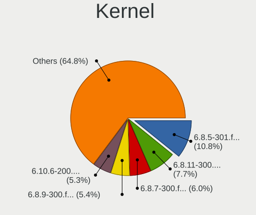

| Version                      | Notebooks | Percent |
|------------------------------|-----------|---------|
| 6.8.5-301.fc40.x86_64        | 253       | 10.82%  |
| 6.8.11-300.fc40.x86_64       | 179       | 7.66%   |
| 6.8.7-300.fc40.x86_64        | 141       | 6.03%   |
| 6.8.9-300.fc40.x86_64        | 126       | 5.39%   |
| 6.10.6-200.fc40.x86_64       | 124       | 5.3%    |
| 6.8.10-300.fc40.x86_64       | 93        | 3.98%   |
| 6.9.12-200.fc40.x86_64       | 81        | 3.46%   |
| 6.11.3-200.fc40.x86_64       | 81        | 3.46%   |
| 6.8.8-300.fc40.x86_64        | 80        | 3.42%   |
| 6.10.11-200.fc40.x86_64      | 79        | 3.38%   |
| 6.10.12-200.fc40.x86_64      | 78        | 3.34%   |
| 6.9.7-200.fc40.x86_64        | 69        | 2.95%   |
| 6.10.10-200.fc40.x86_64      | 67        | 2.87%   |
| 6.10.3-200.fc40.x86_64       | 65        | 2.78%   |
| 6.9.9-200.fc40.x86_64        | 56        | 2.4%    |
| 6.10.9-200.fc40.x86_64       | 55        | 2.35%   |
| 6.9.4-200.fc40.x86_64        | 53        | 2.27%   |
| 6.11.4-201.fc40.x86_64       | 50        | 2.14%   |
| 6.9.6-200.fc40.x86_64        | 49        | 2.1%    |
| 6.9.8-200.fc40.x86_64        | 48        | 2.05%   |
| 6.9.5-200.fc40.x86_64        | 47        | 2.01%   |
| 6.10.7-200.fc40.x86_64       | 47        | 2.01%   |
| 6.10.4-200.fc40.x86_64       | 42        | 1.8%    |
| 6.10.8-200.fc40.x86_64       | 41        | 1.75%   |
| 6.9.11-200.fc40.x86_64       | 38        | 1.63%   |
| 6.10.5-200.fc40.x86_64       | 30        | 1.28%   |
| 6.9.10-200.fc40.x86_64       | 27        | 1.15%   |
| 6.8.4-300.fc40.x86_64        | 13        | 0.56%   |
| 6.14.5-100.fc40.x86_64       | 13        | 0.56%   |
| 6.8.2-300.fc40.x86_64        | 12        | 0.51%   |
| 6.8.9-301.fsync.fc40.x86_64  | 11        | 0.47%   |
| 6.8.0-0.rc6.49.fc40.x86_64   | 11        | 0.47%   |
| 6.11.6-200.fc40.x86_64       | 11        | 0.47%   |
| 6.9.4-201.fsync.fc40.x86_64  | 10        | 0.43%   |
| 6.11.5-200.fc40.x86_64       | 9         | 0.38%   |
| 6.11.10-200.fc40.x86_64      | 9         | 0.38%   |
| 6.8.10-301.fsync.fc40.x86_64 | 6         | 0.26%   |
| 6.8.11-301.fsync.fc40.x86_64 | 5         | 0.21%   |
| 6.8.1-300.fc40.x86_64        | 5         | 0.21%   |
| 6.11.8-200.fc40.x86_64       | 5         | 0.21%   |

Kernel Family
-------------

Linux kernel without a distro release

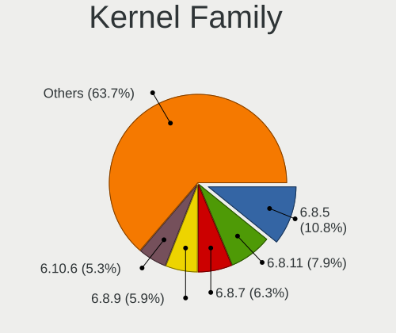

| Version | Notebooks | Percent |
|---------|-----------|---------|
| 6.8.5   | 253       | 10.82%  |
| 6.8.11  | 185       | 7.91%   |
| 6.8.7   | 148       | 6.33%   |
| 6.8.9   | 138       | 5.9%    |
| 6.10.6  | 124       | 5.3%    |
| 6.8.10  | 100       | 4.28%   |
| 6.9.12  | 83        | 3.55%   |
| 6.11.3  | 81        | 3.46%   |
| 6.8.8   | 80        | 3.42%   |
| 6.10.11 | 79        | 3.38%   |
| 6.10.12 | 78        | 3.34%   |
| 6.9.7   | 70        | 2.99%   |
| 6.10.10 | 70        | 2.99%   |
| 6.10.3  | 67        | 2.87%   |
| 6.9.4   | 64        | 2.74%   |
| 6.9.9   | 57        | 2.44%   |
| 6.10.9  | 55        | 2.35%   |
| 6.9.6   | 53        | 2.27%   |
| 6.11.4  | 51        | 2.18%   |
| 6.9.8   | 49        | 2.1%    |
| 6.9.5   | 48        | 2.05%   |
| 6.10.7  | 47        | 2.01%   |
| 6.10.8  | 43        | 1.84%   |
| 6.10.4  | 42        | 1.8%    |
| 6.9.11  | 39        | 1.67%   |
| 6.10.5  | 33        | 1.41%   |
| 6.9.10  | 27        | 1.15%   |
| 6.8.4   | 15        | 0.64%   |
| 6.8.0   | 14        | 0.6%    |
| 6.8.2   | 13        | 0.56%   |
| 6.14.5  | 13        | 0.56%   |
| 6.11.6  | 11        | 0.47%   |
| 6.11.5  | 9         | 0.38%   |
| 6.11.10 | 9         | 0.38%   |
| 6.11.8  | 6         | 0.26%   |
| 6.8.1   | 5         | 0.21%   |
| 6.8.12  | 4         | 0.17%   |
| 6.5.0   | 4         | 0.17%   |
| 6.12.8  | 4         | 0.17%   |
| 6.12.4  | 4         | 0.17%   |

Kernel Major Ver.
-----------------

Linux kernel major version

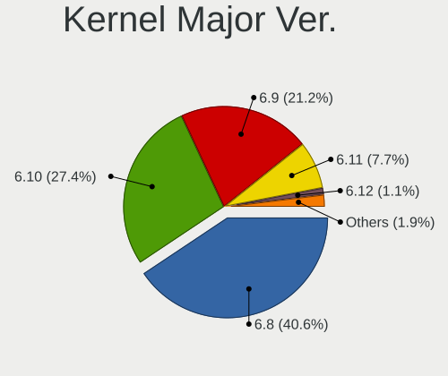

| Version | Notebooks | Percent |
|---------|-----------|---------|
| 6.8     | 924       | 40.63%  |
| 6.10    | 624       | 27.44%  |
| 6.9     | 482       | 21.2%   |
| 6.11    | 175       | 7.7%    |
| 6.12    | 25        | 1.1%    |
| 6.14    | 16        | 0.7%    |
| 6.13    | 12        | 0.53%   |
| 6.5     | 6         | 0.26%   |
| 6.7     | 4         | 0.18%   |
| 6.6     | 4         | 0.18%   |
| 6.1     | 1         | 0.04%   |
| 5.15    | 1         | 0.04%   |

Arch
----

OS architecture (x86_64, i586, etc.)

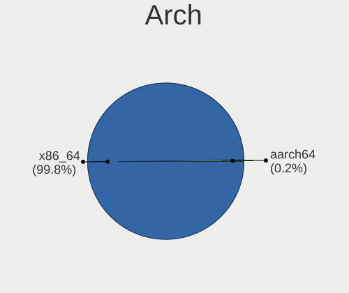

| Name    | Notebooks | Percent |
|---------|-----------|---------|
| x86_64  | 2145      | 99.77%  |
| aarch64 | 5         | 0.23%   |

DE
--

Desktop Environment

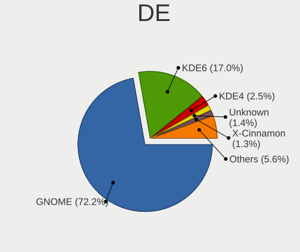

| Name          | Notebooks | Percent |
|---------------|-----------|---------|
| GNOME         | 1567      | 72.21%  |
| KDE6          | 368       | 16.96%  |
| KDE4          | 55        | 2.53%   |
| Unknown       | 30        | 1.38%   |
| X-Cinnamon    | 29        | 1.34%   |
| XFCE          | 28        | 1.29%   |
| GNOME Classic | 21        | 0.97%   |
| MATE          | 16        | 0.74%   |
| Budgie        | 11        | 0.51%   |
| Hyprland      | 10        | 0.46%   |
| sway          | 9         | 0.41%   |
| Cinnamon      | 7         | 0.32%   |
| i3            | 4         | 0.18%   |
| LXQt          | 3         | 0.14%   |
| KDE5          | 3         | 0.14%   |
| Deepin        | 3         | 0.14%   |
| LXDE          | 2         | 0.09%   |
| bspwm         | 2         | 0.09%   |
| KDE           | 1         | 0.05%   |
| awesome       | 1         | 0.05%   |

Display Server
--------------

X11 or Wayland

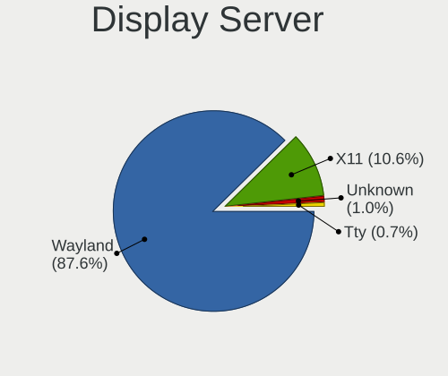

| Name    | Notebooks | Percent |
|---------|-----------|---------|
| Wayland | 1898      | 87.63%  |
| X11     | 230       | 10.62%  |
| Unknown | 22        | 1.02%   |
| Tty     | 16        | 0.74%   |

Display Manager
---------------

SDDM, LightDM, etc.

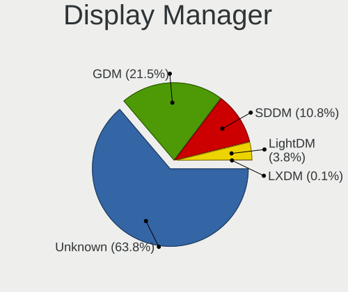

| Name    | Notebooks | Percent |
|---------|-----------|---------|
| Unknown | 1384      | 63.81%  |
| GDM     | 466       | 21.48%  |
| SDDM    | 235       | 10.83%  |
| LightDM | 82        | 3.78%   |
| LXDM    | 2         | 0.09%   |

OS Lang
-------

Language

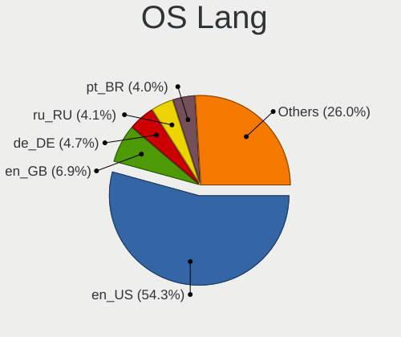

| Lang    | Notebooks | Percent |
|---------|-----------|---------|
| en_US   | 1172      | 54.26%  |
| en_GB   | 150       | 6.94%   |
| de_DE   | 102       | 4.72%   |
| ru_RU   | 88        | 4.07%   |
| pt_BR   | 87        | 4.03%   |
| it_IT   | 66        | 3.06%   |
| fr_FR   | 64        | 2.96%   |
| en_AU   | 37        | 1.71%   |
| es_MX   | 36        | 1.67%   |
| en_CA   | 34        | 1.57%   |
| es_ES   | 33        | 1.53%   |
| en_IN   | 32        | 1.48%   |
| pl_PL   | 26        | 1.2%    |
| es_CL   | 18        | 0.83%   |
| tr_TR   | 17        | 0.79%   |
| es_AR   | 12        | 0.56%   |
| en_DK   | 11        | 0.51%   |
| nl_NL   | 10        | 0.46%   |
| es_CO   | 10        | 0.46%   |
| en_IE   | 10        | 0.46%   |
| zh_CN   | 9         | 0.42%   |
| de_AT   | 8         | 0.37%   |
| da_DK   | 8         | 0.37%   |
| Unknown | 8         | 0.37%   |
| uk_UA   | 6         | 0.28%   |
| sv_SE   | 6         | 0.28%   |
| es_PE   | 6         | 0.28%   |
| cs_CZ   | 6         | 0.28%   |
| zh_TW   | 5         | 0.23%   |
| pt_PT   | 5         | 0.23%   |
| fr_CA   | 5         | 0.23%   |
| de_CH   | 5         | 0.23%   |
| ro_RO   | 4         | 0.19%   |
| nl_BE   | 4         | 0.19%   |
| nb_NO   | 4         | 0.19%   |
| fi_FI   | 4         | 0.19%   |
| ru_UA   | 3         | 0.14%   |
| ko_KR   | 3         | 0.14%   |
| es_UY   | 3         | 0.14%   |
| es_US   | 3         | 0.14%   |

Boot Mode
---------

EFI or BIOS

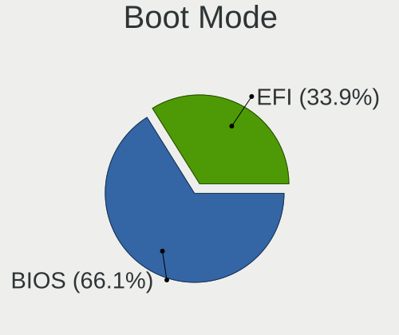

| Mode | Notebooks | Percent |
|------|-----------|---------|
| BIOS | 1430      | 66.11%  |
| EFI  | 733       | 33.89%  |

Filesystem
----------

Type of filesystem

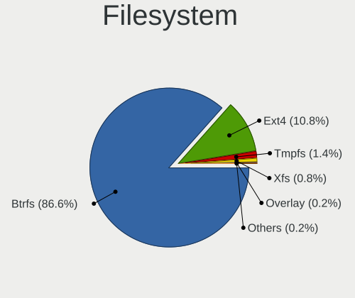

| Type    | Notebooks | Percent |
|---------|-----------|---------|
| Btrfs   | 1869      | 86.57%  |
| Ext4    | 234       | 10.84%  |
| Tmpfs   | 30        | 1.39%   |
| Xfs     | 18        | 0.83%   |
| Overlay | 4         | 0.19%   |
| F2fs    | 2         | 0.09%   |
| Unknown | 2         | 0.09%   |

Part. scheme
------------

Scheme of partitioning

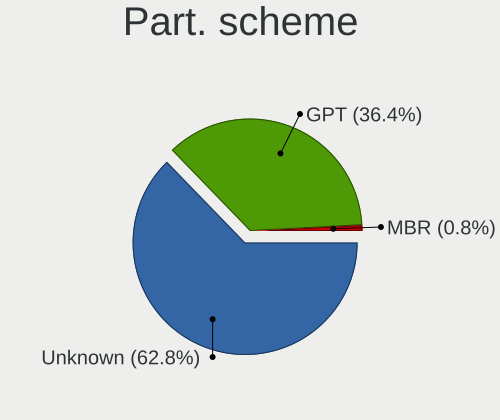

| Type    | Notebooks | Percent |
|---------|-----------|---------|
| Unknown | 1358      | 62.75%  |
| GPT     | 788       | 36.41%  |
| MBR     | 18        | 0.83%   |

Dual Boot with Linux/BSD
------------------------

Hosting more than one Linux/BSD

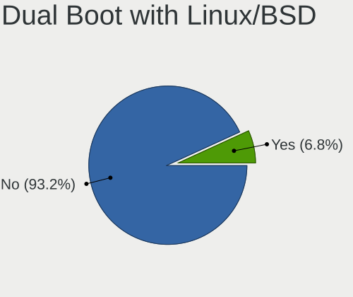

| Dual boot | Notebooks | Percent |
|-----------|-----------|---------|
| No        | 2009      | 93.18%  |
| Yes       | 147       | 6.82%   |

Dual Boot (Win)
---------------

Hosting Linux and Windows

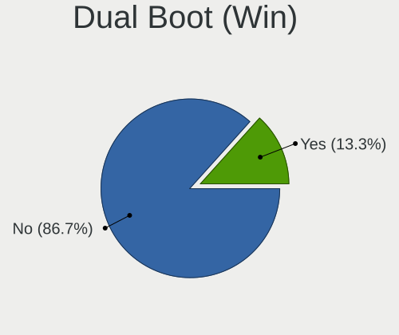

| Dual boot | Notebooks | Percent |
|-----------|-----------|---------|
| No        | 1870      | 86.65%  |
| Yes       | 288       | 13.35%  |

Board
-----

Vendor
------

Motherboard manufacturer

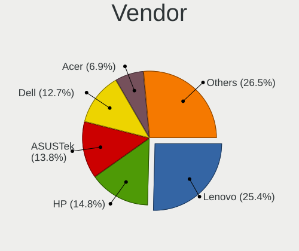

| Name                 | Notebooks | Percent |
|----------------------|-----------|---------|
| Lenovo               | 546       | 25.4%   |
| Hewlett-Packard      | 318       | 14.79%  |
| ASUSTek Computer     | 296       | 13.77%  |
| Dell                 | 273       | 12.7%   |
| Acer                 | 148       | 6.88%   |
| Apple                | 131       | 6.09%   |
| MSI                  | 59        | 2.74%   |
| HUAWEI               | 45        | 2.09%   |
| Framework            | 29        | 1.35%   |
| Google               | 28        | 1.3%    |
| Toshiba              | 24        | 1.12%   |
| Samsung Electronics  | 23        | 1.07%   |
| Timi                 | 16        | 0.74%   |
| Alienware            | 13        | 0.6%    |
| Unknown              | 13        | 0.6%    |
| HONOR                | 10        | 0.47%   |
| Gigabyte Technology  | 10        | 0.47%   |
| Fujitsu              | 10        | 0.47%   |
| Sony                 | 9         | 0.42%   |
| LG Electronics       | 9         | 0.42%   |
| TUXEDO               | 8         | 0.37%   |
| XIAOMI               | 7         | 0.33%   |
| Chuwi                | 7         | 0.33%   |
| SLIMBOOK             | 6         | 0.28%   |
| Positivo             | 5         | 0.23%   |
| System76             | 4         | 0.19%   |
| Schenker             | 4         | 0.19%   |
| Razer                | 4         | 0.19%   |
| Medion               | 4         | 0.19%   |
| GPD                  | 4         | 0.19%   |
| Valve                | 3         | 0.14%   |
| PC Specialist        | 3         | 0.14%   |
| Packard Bell         | 3         | 0.14%   |
| Notebook             | 3         | 0.14%   |
| Monster              | 3         | 0.14%   |
| Intel Client Systems | 3         | 0.14%   |
| Intel                | 3         | 0.14%   |
| Insyde               | 3         | 0.14%   |
| Infinix              | 3         | 0.14%   |
| GPU Company          | 3         | 0.14%   |

Model
-----

Motherboard model

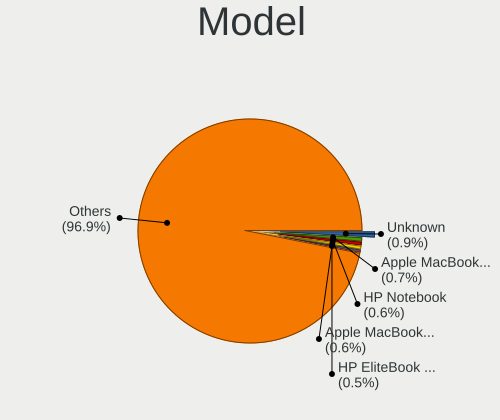

| Name                                        | Notebooks | Percent |
|---------------------------------------------|-----------|---------|
| Unknown                                     | 19        | 0.88%   |
| Apple MacBookPro9,2                         | 14        | 0.65%   |
| HP Notebook                                 | 12        | 0.56%   |
| Apple MacBookPro14,1                        | 12        | 0.56%   |
| HP EliteBook 840 G5                         | 10        | 0.47%   |
| Framework Laptop 16 (AMD Ryzen 7040 Series) | 10        | 0.47%   |
| HUAWEI BOM-WXX9                             | 9         | 0.42%   |
| Framework Laptop 13 (AMD Ryzen 7040Series)  | 9         | 0.42%   |
| Apple MacBookPro8,1                         | 9         | 0.42%   |
| Apple MacBookPro12,1                        | 9         | 0.42%   |
| Apple MacBookPro11,2                        | 9         | 0.42%   |
| Lenovo Yoga Pro 9 16IMH9 83DN               | 8         | 0.37%   |
| HP EliteBook 840 G6                         | 8         | 0.37%   |
| Apple MacBookPro11,1                        | 8         | 0.37%   |
| Lenovo Legion 5 15ACH6H 82JU                | 7         | 0.33%   |
| Lenovo IdeaPad 3 15ITL6 82H8                | 7         | 0.33%   |
| Acer Nitro ANV15-51                         | 7         | 0.33%   |
| HP Pavilion Notebook                        | 6         | 0.28%   |
| Dell XPS 15 9500                            | 6         | 0.28%   |
| Dell Latitude 7400                          | 6         | 0.28%   |
| Dell Latitude 5420                          | 6         | 0.28%   |
| Apple MacBookPro11,3                        | 6         | 0.28%   |
| Apple MacBookAir7,2                         | 6         | 0.28%   |
| Acer Nitro AN515-58                         | 6         | 0.28%   |
| Lenovo Y520-15IKBN 80WK                     | 5         | 0.23%   |
| HP Victus by Gaming Laptop 15-fa1xxx        | 5         | 0.23%   |
| HP Laptop 15-fc0xxx                         | 5         | 0.23%   |
| HP Laptop 15-bs0xx                          | 5         | 0.23%   |
| Dell XPS 15 9560                            | 5         | 0.23%   |
| Dell XPS 15 9530                            | 5         | 0.23%   |
| ASUS ROG Strix G513QY_G513QY                | 5         | 0.23%   |
| ASUS ASUS Zenbook 14 UX3405MA_UX3405MA      | 5         | 0.23%   |
| Apple MacBookPro10,1                        | 5         | 0.23%   |
| MSI Modern 15 A5M                           | 4         | 0.19%   |
| MSI GF63 Thin 10SC                          | 4         | 0.19%   |
| Lenovo ThinkPad P16s Gen 2 21K9CTO1WW       | 4         | 0.19%   |
| Lenovo IdeaPad 3 15ALC6 82MF                | 4         | 0.19%   |
| HUAWEI KLVL-WXX9                            | 4         | 0.19%   |
| HP ProBook 450 15.6 inch G9 Notebook PC     | 4         | 0.19%   |
| HP Pavilion Gaming Laptop 15-cx0xxx         | 4         | 0.19%   |

Model Family
------------

Motherboard model prefix

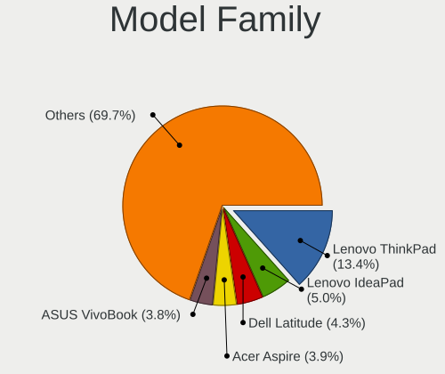

| Name               | Notebooks | Percent |
|--------------------|-----------|---------|
| Lenovo ThinkPad    | 288       | 13.4%   |
| Lenovo IdeaPad     | 107       | 4.98%   |
| Dell Latitude      | 93        | 4.33%   |
| Acer Aspire        | 83        | 3.86%   |
| ASUS VivoBook      | 81        | 3.77%   |
| ASUS ROG           | 67        | 3.12%   |
| Dell Inspiron      | 62        | 2.88%   |
| HP EliteBook       | 59        | 2.74%   |
| ASUS ASUS          | 59        | 2.74%   |
| HP Pavilion        | 50        | 2.33%   |
| HP Laptop          | 50        | 2.33%   |
| Lenovo Legion      | 48        | 2.23%   |
| Dell XPS           | 45        | 2.09%   |
| HP ProBook         | 41        | 1.91%   |
| Dell Precision     | 41        | 1.91%   |
| Acer Nitro         | 33        | 1.53%   |
| Framework Laptop   | 29        | 1.35%   |
| Lenovo Yoga        | 28        | 1.3%    |
| Apple MacBookPro11 | 28        | 1.3%    |
| Lenovo ThinkBook   | 26        | 1.21%   |
| HP ZBook           | 20        | 0.93%   |
| HP Victus          | 19        | 0.88%   |
| Unknown            | 19        | 0.88%   |
| HP OMEN            | 17        | 0.79%   |
| ASUS Zenbook       | 17        | 0.79%   |
| Toshiba Satellite  | 16        | 0.74%   |
| Apple MacBookPro9  | 15        | 0.7%    |
| Dell Vostro        | 14        | 0.65%   |
| Apple MacBookPro14 | 14        | 0.65%   |
| Apple MacBookPro8  | 13        | 0.6%    |
| HP Notebook        | 12        | 0.56%   |
| HP ENVY            | 12        | 0.56%   |
| Acer Predator      | 12        | 0.56%   |
| MSI Modern         | 10        | 0.47%   |
| HUAWEI BOM-WXX9    | 9         | 0.42%   |
| Apple MacBookPro12 | 9         | 0.42%   |
| Apple MacBookAir7  | 9         | 0.42%   |
| Acer Swift         | 9         | 0.42%   |
| Lenovo LOQ         | 8         | 0.37%   |
| ASUS TUF           | 8         | 0.37%   |

MFG Year
--------

Motherboard manufacture year

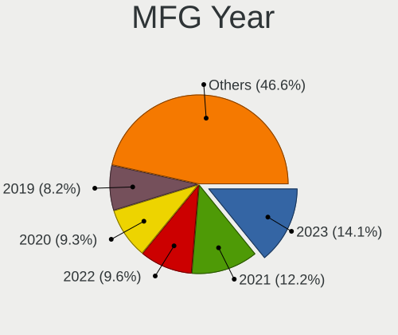

| Year    | Notebooks | Percent |
|---------|-----------|---------|
| 2023    | 304       | 14.14%  |
| 2021    | 262       | 12.19%  |
| 2022    | 207       | 9.63%   |
| 2020    | 200       | 9.3%    |
| 2019    | 176       | 8.19%   |
| 2018    | 154       | 7.16%   |
| 2024    | 144       | 6.7%    |
| 2017    | 129       | 6%      |
| 2012    | 110       | 5.12%   |
| 2013    | 82        | 3.81%   |
| 2015    | 78        | 3.63%   |
| 2016    | 77        | 3.58%   |
| 2014    | 74        | 3.44%   |
| 2011    | 60        | 2.79%   |
| 2010    | 29        | 1.35%   |
| 2008    | 26        | 1.21%   |
| 2009    | 24        | 1.12%   |
| 2006    | 6         | 0.28%   |
| 2007    | 5         | 0.23%   |
| Unknown | 3         | 0.14%   |

Form Factor
-----------

Physical design of the computer

| Name     | Notebooks | Percent |
|----------|-----------|---------|
| Notebook | 2150      | 100%    |

Secure Boot
-----------

Enabled or disabled

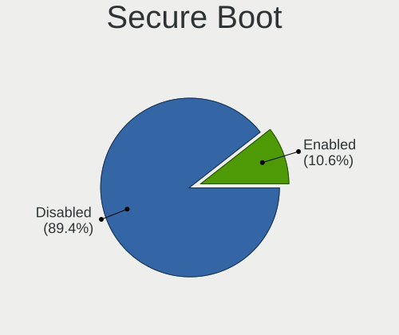

| State    | Notebooks | Percent |
|----------|-----------|---------|
| Disabled | 1929      | 89.43%  |
| Enabled  | 228       | 10.57%  |

Coreboot
--------

Have coreboot on board

| Used | Notebooks | Percent |
|------|-----------|---------|
| No   | 2118      | 98.51%  |
| Yes  | 32        | 1.49%   |

RAM Size
--------

Total RAM memory

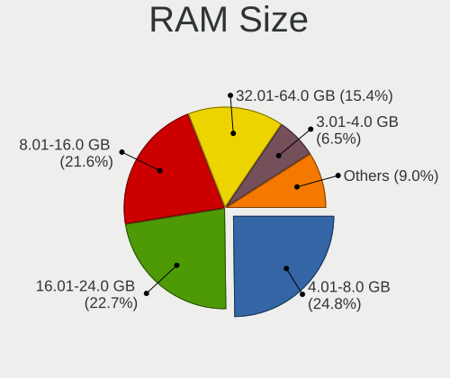

| Size in GB  | Notebooks | Percent |
|-------------|-----------|---------|
| 4.01-8.0    | 535       | 24.79%  |
| 16.01-24.0  | 489       | 22.66%  |
| 8.01-16.0   | 466       | 21.59%  |
| 32.01-64.0  | 333       | 15.43%  |
| 3.01-4.0    | 140       | 6.49%   |
| 24.01-32.0  | 91        | 4.22%   |
| 64.01-256.0 | 73        | 3.38%   |
| 1.01-2.0    | 23        | 1.07%   |
| 2.01-3.0    | 8         | 0.37%   |

RAM Used
--------

Used RAM memory

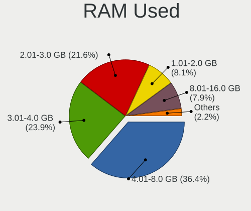

| Used GB    | Notebooks | Percent |
|------------|-----------|---------|
| 4.01-8.0   | 825       | 36.41%  |
| 3.01-4.0   | 542       | 23.92%  |
| 2.01-3.0   | 489       | 21.58%  |
| 1.01-2.0   | 183       | 8.08%   |
| 8.01-16.0  | 178       | 7.86%   |
| 16.01-24.0 | 24        | 1.06%   |
| 0.51-1.0   | 16        | 0.71%   |
| 24.01-32.0 | 8         | 0.35%   |
| 32.01-64.0 | 1         | 0.04%   |

Total Drives
------------

Number of drives on board

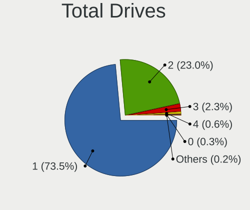

| Drives | Notebooks | Percent |
|--------|-----------|---------|
| 1      | 1592      | 73.53%  |
| 2      | 499       | 23.05%  |
| 3      | 50        | 2.31%   |
| 4      | 14        | 0.65%   |
| 0      | 6         | 0.28%   |
| 7      | 2         | 0.09%   |
| 6      | 1         | 0.05%   |
| 5      | 1         | 0.05%   |

Has CD-ROM
----------

Has CD-ROM on board

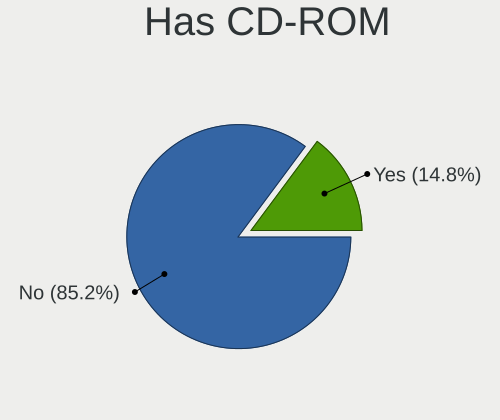

| Presented | Notebooks | Percent |
|-----------|-----------|---------|
| No        | 1832      | 85.17%  |
| Yes       | 319       | 14.83%  |

Has Ethernet
------------

Has Ethernet on board

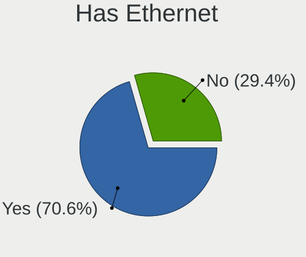

| Presented | Notebooks | Percent |
|-----------|-----------|---------|
| Yes       | 1524      | 70.59%  |
| No        | 635       | 29.41%  |

Has WiFi
--------

Has WiFi module

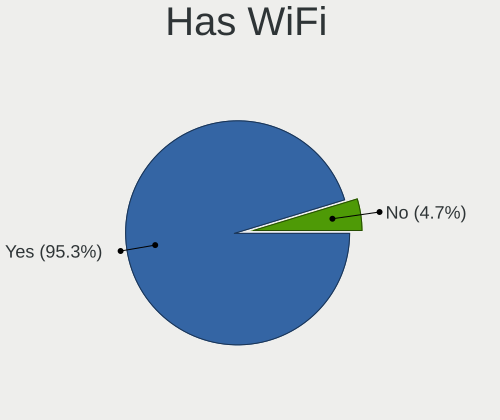

| Presented | Notebooks | Percent |
|-----------|-----------|---------|
| Yes       | 2049      | 95.3%   |
| No        | 101       | 4.7%    |

Has Bluetooth
-------------

Has Bluetooth module

| Presented | Notebooks | Percent |
|-----------|-----------|---------|
| Yes       | 1901      | 88.25%  |
| No        | 253       | 11.75%  |

Location
--------

Country
-------

Geographic location (country)

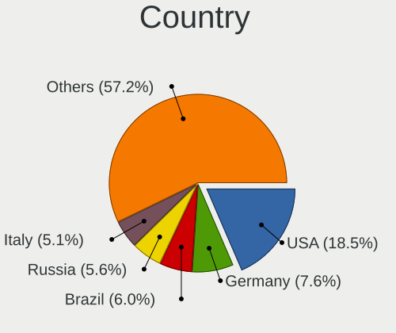

| Country     | Notebooks | Percent |
|-------------|-----------|---------|
| USA         | 401       | 18.51%  |
| Germany     | 164       | 7.57%   |
| Brazil      | 129       | 5.96%   |
| Russia      | 122       | 5.63%   |
| Italy       | 111       | 5.12%   |
| India       | 110       | 5.08%   |
| UK          | 85        | 3.92%   |
| France      | 81        | 3.74%   |
| Mexico      | 58        | 2.68%   |
| Poland      | 54        | 2.49%   |
| Canada      | 54        | 2.49%   |
| Spain       | 47        | 2.17%   |
| Netherlands | 43        | 1.99%   |
| Turkey      | 39        | 1.8%    |
| Australia   | 36        | 1.66%   |
| Sweden      | 31        | 1.43%   |
| Chile       | 31        | 1.43%   |
| Switzerland | 22        | 1.02%   |
| Norway      | 21        | 0.97%   |
| Indonesia   | 21        | 0.97%   |
| Austria     | 21        | 0.97%   |
| Argentina   | 21        | 0.97%   |
| Denmark     | 19        | 0.88%   |
| Romania     | 18        | 0.83%   |
| Egypt       | 18        | 0.83%   |
| Czechia     | 17        | 0.78%   |
| Portugal    | 16        | 0.74%   |
| Colombia    | 16        | 0.74%   |
| Philippines | 14        | 0.65%   |
| Belgium     | 14        | 0.65%   |
| Israel      | 13        | 0.6%    |
| Serbia      | 12        | 0.55%   |
| Vietnam     | 11        | 0.51%   |
| Ireland     | 11        | 0.51%   |
| China       | 11        | 0.51%   |
| Bulgaria    | 11        | 0.51%   |
| Finland     | 10        | 0.46%   |
| Peru        | 9         | 0.42%   |
| Hungary     | 9         | 0.42%   |
| Taiwan      | 8         | 0.37%   |

City
----

Geographic location (city)

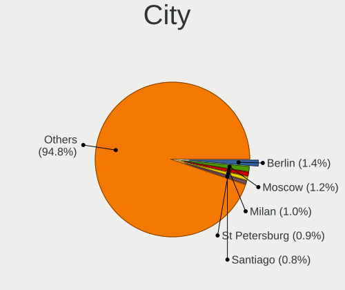

| City             | Notebooks | Percent |
|------------------|-----------|---------|
| Berlin           | 30        | 1.36%   |
| Moscow           | 27        | 1.22%   |
| Milan            | 21        | 0.95%   |
| St Petersburg    | 19        | 0.86%   |
| Santiago         | 18        | 0.82%   |
| Mexico City      | 18        | 0.82%   |
| Istanbul         | 17        | 0.77%   |
| Delhi            | 17        | 0.77%   |
| Sao Paulo        | 15        | 0.68%   |
| Paris            | 14        | 0.63%   |
| Munich           | 13        | 0.59%   |
| Bengaluru        | 13        | 0.59%   |
| Sydney           | 12        | 0.54%   |
| Amsterdam        | 11        | 0.5%    |
| Rome             | 10        | 0.45%   |
| Hyderabad        | 10        | 0.45%   |
| Vienna           | 9         | 0.41%   |
| Dublin           | 9         | 0.41%   |
| Bogotá          | 9         | 0.41%   |
| Warsaw           | 8         | 0.36%   |
| Stockholm        | 8         | 0.36%   |
| Rio de Janeiro   | 8         | 0.36%   |
| Mumbai           | 8         | 0.36%   |
| Montreal         | 8         | 0.36%   |
| Melbourne        | 8         | 0.36%   |
| Madrid           | 8         | 0.36%   |
| Jacksonville     | 8         | 0.36%   |
| Hamburg          | 8         | 0.36%   |
| Cairo            | 8         | 0.36%   |
| Alexandria       | 8         | 0.36%   |
| Oslo             | 7         | 0.32%   |
| Novosibirsk      | 7         | 0.32%   |
| Montevideo       | 7         | 0.32%   |
| Lima             | 7         | 0.32%   |
| Ho Chi Minh City | 7         | 0.32%   |
| Helsinki         | 7         | 0.32%   |
| Ankara           | 7         | 0.32%   |
| Zurich           | 6         | 0.27%   |
| Zagreb           | 6         | 0.27%   |
| New York         | 6         | 0.27%   |

Drives
------

Drive Vendor
------------

Hard drive vendors

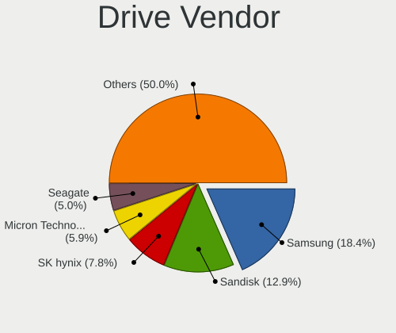

| Vendor                         | Notebooks | Drives | Percent |
|--------------------------------|-----------|--------|---------|
| Samsung Electronics            | 494       | 582    | 18.4%   |
| Sandisk                        | 346       | 390    | 12.89%  |
| SK hynix                       | 209       | 231    | 7.78%   |
| Micron Technology              | 159       | 172    | 5.92%   |
| Seagate                        | 134       | 147    | 4.99%   |
| Unknown                        | 124       | 139    | 4.62%   |
| Kingston                       | 116       | 127    | 4.32%   |
| WDC                            | 98        | 109    | 3.65%   |
| Toshiba                        | 98        | 109    | 3.65%   |
| Intel                          | 95        | 112    | 3.54%   |
| Apple                          | 75        | 108    | 2.79%   |
| KIOXIA                         | 72        | 88     | 2.68%   |
| Micron/Crucial Technology      | 54        | 59     | 2.01%   |
| Phison Electronics             | 48        | 52     | 1.79%   |
| Crucial                        | 46        | 51     | 1.71%   |
| HGST                           | 38        | 39     | 1.42%   |
| Kingston Technology Company    | 36        | 36     | 1.34%   |
| China                          | 32        | 35     | 1.19%   |
| ADATA Technology               | 25        | 27     | 0.93%   |
| Hitachi                        | 24        | 28     | 0.89%   |
| A-DATA Technology              | 23        | 30     | 0.86%   |
| MAXIO Technology (Hangzhou)    | 22        | 23     | 0.82%   |
| Shenzhen Longsys Electronics   | 19        | 21     | 0.71%   |
| Union Memory (Shenzhen)        | 14        | 16     | 0.52%   |
| Silicon Motion                 | 14        | 15     | 0.52%   |
| Unknown                        | 13        | 13     | 0.48%   |
| Realtek Semiconductor          | 12        | 15     | 0.45%   |
| Solid State Storage Technology | 10        | 13     | 0.37%   |
| PNY                            | 10        | 10     | 0.37%   |
| Intenso                        | 10        | 10     | 0.37%   |
| Transcend                      | 9         | 10     | 0.34%   |
| SPCC                           | 9         | 9      | 0.34%   |
| LITEON                         | 9         | 9      | 0.34%   |
| Yangtze Memory Technologies    | 7         | 11     | 0.26%   |
| Solid State Storage            | 7         | 7      | 0.26%   |
| Phison                         | 7         | 9      | 0.26%   |
| Netac                          | 7         | 8      | 0.26%   |
| Union Memory                   | 6         | 6      | 0.22%   |
| Lexar                          | 6         | 8      | 0.22%   |
| KingSpec                       | 6         | 6      | 0.22%   |

Drive Model
-----------

Hard drive models

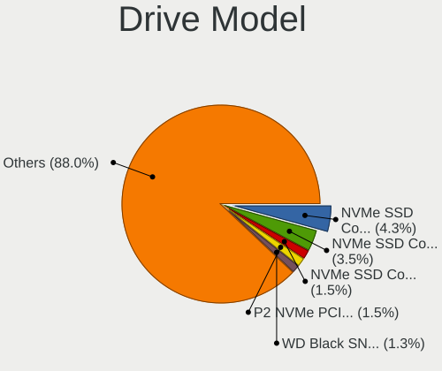

| Model                                                | Notebooks | Percent |
|------------------------------------------------------|-----------|---------|
| Samsung NVMe SSD Controller SM981/PM981/PM983 1TB    | 118       | 4.29%   |
| Samsung NVMe SSD Controller PM9A1/PM9A3/980PRO 1TB   | 96        | 3.49%   |
| Samsung NVMe SSD Controller SM961/PM961/SM963 1024GB | 41        | 1.49%   |
| Micron/Crucial P2 NVMe PCIe SSD 2TB                  | 40        | 1.45%   |
| Sandisk WD Black SN750 / PC SN730 NVMe SSD 500GB     | 36        | 1.31%   |
| Seagate ST1000LM035-1RK172 1TB                       | 35        | 1.27%   |
| Sandisk WD Blue SN550 NVMe SSD 1024GB                | 29        | 1.05%   |
| Intel SSD 660P Series 512GB                          | 28        | 1.02%   |
| Unknown MMC Card  32GB                               | 26        | 0.95%   |
| Unknown MMC Card  64GB                               | 24        | 0.87%   |
| Unknown MMC Card  128GB                              | 24        | 0.87%   |
| Kingston SA400S37240G 240GB SSD                      | 24        | 0.87%   |
| Intel SSDPEKNU512GZ 512GB                            | 23        | 0.84%   |
| Phison PS5013 E13 NVMe Controller 500GB              | 22        | 0.8%    |
| Toshiba XG6 NVMe SSD Controller 1024GB               | 20        | 0.73%   |
| HGST HTS721010A9E630 1TB                             | 18        | 0.65%   |
| Sandisk WD Blue SN500 / PC SN520 NVMe SSD 128GB      | 17        | 0.62%   |
| MAXIO (Hangzhou) NVMe SSD Controller MAP1202 2TB     | 17        | 0.62%   |
| SK hynix SKHynix_HFS001TEJ9X115N 1024GB              | 16        | 0.58%   |
| Kingston SA400S37480G 480GB SSD                      | 16        | 0.58%   |
| Toshiba MQ01ABD100 1TB                               | 15        | 0.55%   |
| Sandisk WD PC SN560 SDDPNQE-1T00-1102 1024GB         | 15        | 0.55%   |
| Sandisk WD Black SN850 1TB                           | 15        | 0.55%   |
| SK hynix BC501 NVMe Solid State Drive 512GB          | 14        | 0.51%   |
| Micron 2450_MTFDKBA512TFK 512GB                      | 14        | 0.51%   |
| SK hynix BC511 512GB                                 | 13        | 0.47%   |
| Apple S3X NVMe Controller 256GB                      | 13        | 0.47%   |
| Unknown                                              | 13        | 0.47%   |
| Seagate ST1000LM024 HN-M101MBB 1TB                   | 12        | 0.44%   |
| Samsung MZAL4512HBLU-00BL2 512GB                     | 12        | 0.44%   |
| Phison E12 NVMe Controller 1TB                       | 12        | 0.44%   |
| Micron CT1000P3PSSD8 1TB                             | 11        | 0.4%    |
| Micron 2400_MTFDKBA512QFM 512GB                      | 11        | 0.4%    |
| Unknown NVMe SSD Drive 512GB                         | 10        | 0.36%   |
| Samsung SSD 860 EVO 500GB                            | 10        | 0.36%   |
| Micron MTFDKBA1T0QFM-1BD1AABGB 1024GB                | 10        | 0.36%   |
| KIOXIA KBG50ZNV512G 512GB                            | 10        | 0.36%   |
| Kingston OM8PCP3512F-AI1 512GB                       | 10        | 0.36%   |
| Crucial CT240BX500SSD1 240GB                         | 10        | 0.36%   |
| Toshiba MQ04ABF100 1TB                               | 9         | 0.33%   |

HDD Vendor
----------

Hard disk drive vendors

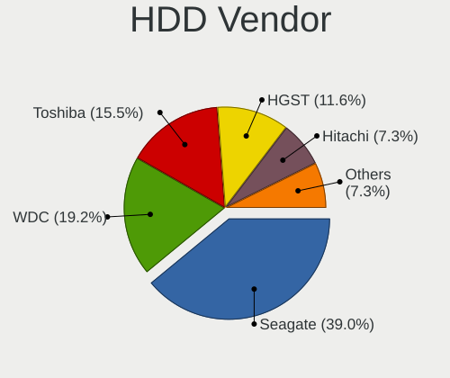

| Vendor              | Notebooks | Drives | Percent |
|---------------------|-----------|--------|---------|
| Seagate             | 128       | 136    | 39.02%  |
| WDC                 | 63        | 70     | 19.21%  |
| Toshiba             | 51        | 57     | 15.55%  |
| HGST                | 38        | 39     | 11.59%  |
| Hitachi             | 24        | 28     | 7.32%   |
| Unknown             | 4         | 4      | 1.22%   |
| JMicron Technology  | 4         | 6      | 1.22%   |
| USB3.0              | 2         | 3      | 0.61%   |
| SSK                 | 2         | 2      | 0.61%   |
| Samsung Electronics | 2         | 3      | 0.61%   |
| Intenso             | 2         | 2      | 0.61%   |
| TO Exter            | 1         | 1      | 0.3%    |
| SAGE                | 1         | 1      | 0.3%    |
| LaCie               | 1         | 1      | 0.3%    |
| KIOXIA              | 1         | 1      | 0.3%    |
| JetFlash            | 1         | 1      | 0.3%    |
| External            | 1         | 1      | 0.3%    |
| ASMT                | 1         | 1      | 0.3%    |
| Apple               | 1         | 1      | 0.3%    |

SSD Vendor
----------

Solid state drive vendors

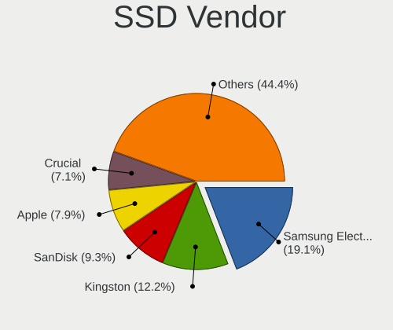

| Vendor              | Notebooks | Drives | Percent |
|---------------------|-----------|--------|---------|
| Samsung Electronics | 124       | 148    | 19.14%  |
| Kingston            | 79        | 89     | 12.19%  |
| SanDisk             | 60        | 67     | 9.26%   |
| Apple               | 51        | 54     | 7.87%   |
| Crucial             | 46        | 51     | 7.1%    |
| WDC                 | 34        | 38     | 5.25%   |
| China               | 31        | 34     | 4.78%   |
| SK hynix            | 21        | 25     | 3.24%   |
| A-DATA Technology   | 20        | 24     | 3.09%   |
| Intel               | 17        | 21     | 2.62%   |
| Micron Technology   | 13        | 14     | 2.01%   |
| PNY                 | 10        | 10     | 1.54%   |
| Transcend           | 9         | 10     | 1.39%   |
| SPCC                | 9         | 9      | 1.39%   |
| LITEON              | 9         | 9      | 1.39%   |
| Intenso             | 8         | 8      | 1.23%   |
| Toshiba             | 6         | 6      | 0.93%   |
| KingSpec            | 6         | 6      | 0.93%   |
| Verbatim            | 5         | 6      | 0.77%   |
| Netac               | 5         | 6      | 0.77%   |
| Lexar               | 5         | 7      | 0.77%   |
| Hewlett-Packard     | 5         | 6      | 0.77%   |
| Fanxiang            | 5         | 5      | 0.77%   |
| Corsair             | 5         | 6      | 0.77%   |
| Plextor             | 4         | 6      | 0.62%   |
| Patriot             | 4         | 5      | 0.62%   |
| Apacer              | 4         | 4      | 0.62%   |
| GOODRAM             | 3         | 3      | 0.46%   |
| FORESEE             | 3         | 3      | 0.46%   |
| XrayDisk            | 2         | 2      | 0.31%   |
| Wibtek              | 2         | 3      | 0.31%   |
| Team                | 2         | 2      | 0.31%   |
| HUSKY               | 2         | 2      | 0.31%   |
| Gigabyte Technology | 2         | 2      | 0.31%   |
| DEXP                | 2         | 5      | 0.31%   |
| BIWIN               | 2         | 2      | 0.31%   |
| Unknown             | 2         | 2      | 0.31%   |
| X12                 | 1         | 1      | 0.15%   |
| Teclast             | 1         | 2      | 0.15%   |
| T-FORCE             | 1         | 1      | 0.15%   |

Drive Kind
----------

HDD or SSD

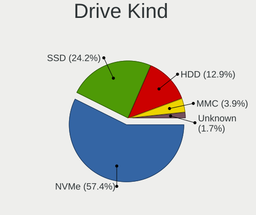

| Kind    | Notebooks | Drives | Percent |
|---------|-----------|--------|---------|
| NVMe    | 1427      | 1802   | 57.36%  |
| SSD     | 601       | 733    | 24.16%  |
| HDD     | 320       | 358    | 12.86%  |
| MMC     | 98        | 111    | 3.94%   |
| Unknown | 42        | 49     | 1.69%   |

Drive Connector
---------------

SATA, SAS, NVMe, etc.

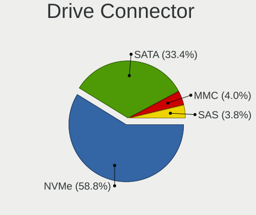

| Type | Notebooks | Drives | Percent |
|------|-----------|--------|---------|
| NVMe | 1425      | 1786   | 58.79%  |
| SATA | 810       | 1044   | 33.42%  |
| MMC  | 98        | 111    | 4.04%   |
| SAS  | 91        | 112    | 3.75%   |

Drive Size
----------

Size of hard drive

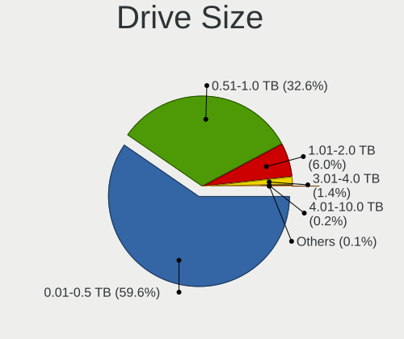

| Size in TB | Notebooks | Drives | Percent |
|------------|-----------|--------|---------|
| 0.01-0.5   | 543       | 682    | 59.6%   |
| 0.51-1.0   | 297       | 330    | 32.6%   |
| 1.01-2.0   | 55        | 62     | 6.04%   |
| 3.01-4.0   | 13        | 14     | 1.43%   |
| 4.01-10.0  | 2         | 2      | 0.22%   |
| 10.01-20.0 | 1         | 1      | 0.11%   |

Space Total
-----------

Amount of disk space available on the file system

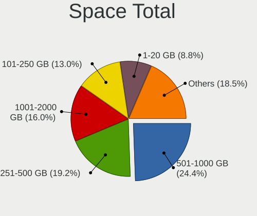

| Size in GB     | Notebooks | Percent |
|----------------|-----------|---------|
| 501-1000       | 536       | 24.44%  |
| 251-500        | 422       | 19.24%  |
| 1001-2000      | 351       | 16.01%  |
| 101-250        | 284       | 12.95%  |
| 1-20           | 194       | 8.85%   |
| Unknown        | 167       | 7.62%   |
| More than 3000 | 87        | 3.97%   |
| 51-100         | 74        | 3.37%   |
| 2001-3000      | 56        | 2.55%   |
| 21-50          | 22        | 1%      |

Space Used
----------

Amount of used disk space

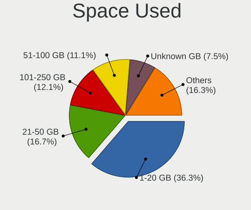

| Used GB        | Notebooks | Percent |
|----------------|-----------|---------|
| 1-20           | 812       | 36.3%   |
| 21-50          | 374       | 16.72%  |
| 101-250        | 271       | 12.11%  |
| 51-100         | 249       | 11.13%  |
| Unknown        | 167       | 7.47%   |
| 251-500        | 166       | 7.42%   |
| 501-1000       | 123       | 5.5%    |
| 1001-2000      | 51        | 2.28%   |
| 2001-3000      | 13        | 0.58%   |
| More than 3000 | 10        | 0.45%   |
| 0              | 1         | 0.04%   |

Malfunc. Drives
---------------

Drive models with a malfunction

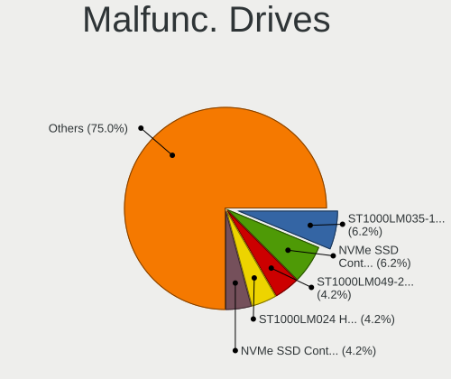

| Model                                                          | Notebooks | Drives | Percent |
|----------------------------------------------------------------|-----------|--------|---------|
| Seagate ST1000LM035-1RK172 1TB                                 | 3         | 3      | 6.25%   |
| Samsung Electronics NVMe SSD Controller SM981/PM981/PM983 1TB  | 3         | 3      | 6.25%   |
| Seagate ST1000LM049-2GH172 1TB                                 | 2         | 2      | 4.17%   |
| Seagate ST1000LM024 HN-M101MBB 1TB                             | 2         | 2      | 4.17%   |
| Samsung Electronics NVMe SSD Controller PM9A1/PM9A3/980PRO 1TB | 2         | 2      | 4.17%   |
| WDC WDS240G2G0B-00EPW0 240GB SSD                               | 1         | 1      | 2.08%   |
| WDC WD3200BEKT-60KA9T0 320GB                                   | 1         | 1      | 2.08%   |
| WDC WD10SPZX-60Z10T1 1TB                                       | 1         | 1      | 2.08%   |
| WDC WD10SPZX-24Z10T0 1TB                                       | 1         | 1      | 2.08%   |
| WDC WD10JPCX-24UE4T0 1TB                                       | 1         | 1      | 2.08%   |
| Transcend TS480GMTS420S 480GB SSD                              | 1         | 1      | 2.08%   |
| Transcend TS240GMTS420S 240GB SSD                              | 1         | 1      | 2.08%   |
| Toshiba MQ01ABD100M 1TB                                        | 1         | 1      | 2.08%   |
| Toshiba MQ01ABD100 1TB                                         | 1         | 1      | 2.08%   |
| Toshiba MQ01ABD075 752GB                                       | 1         | 1      | 2.08%   |
| SK hynix PC300 NVMe Solid State Drive 1TB                      | 1         | 1      | 2.08%   |
| Seagate ST9500325ASG 500GB                                     | 1         | 1      | 2.08%   |
| Seagate ST9320325AS 320GB                                      | 1         | 1      | 2.08%   |
| Seagate ST500VT000-1DK142 500GB                                | 1         | 1      | 2.08%   |
| Seagate ST2000LX001-1RG174 2TB                                 | 1         | 1      | 2.08%   |
| Seagate ST2000LM015-2E8174 2TB                                 | 1         | 1      | 2.08%   |
| SanDisk SSD PLUS 480GB                                         | 1         | 1      | 2.08%   |
| Samsung Electronics SSD 870 QVO 1TB                            | 1         | 1      | 2.08%   |
| Micron Technology 1100 SATA 256GB SSD                          | 1         | 1      | 2.08%   |
| Intenso SSD Sata III 240GB                                     | 1         | 1      | 2.08%   |
| Hitachi HTS725025A9A364 250GB                                  | 1         | 1      | 2.08%   |
| Hitachi HTS723216L9SA60 160GB                                  | 1         | 1      | 2.08%   |
| Hitachi HTS722080K9A300 80GB                                   | 1         | 1      | 2.08%   |
| Hitachi HTS547575A9E384 752GB                                  | 1         | 1      | 2.08%   |
| Hitachi HTS542520K9SA00 200GB                                  | 1         | 1      | 2.08%   |
| Hitachi HTS541616J9SA00 160GB                                  | 1         | 1      | 2.08%   |
| HGST HTS725050A7E630 500GB                                     | 1         | 1      | 2.08%   |
| HGST HTS721010A9E630 1TB                                       | 1         | 1      | 2.08%   |
| HGST HTS541075A9E680 752GB                                     | 1         | 1      | 2.08%   |
| HGST HTS541010A9E680 1TB                                       | 1         | 1      | 2.08%   |
| Hewlett-Packard SSD S700 1TB                                   | 1         | 1      | 2.08%   |
| Crucial CT525MX300SSD1 528GB                                   | 1         | 1      | 2.08%   |
| Crucial CT275MX300SSD1 275GB                                   | 1         | 1      | 2.08%   |
| China SSD 1TB                                                  | 1         | 1      | 2.08%   |
| China SATA SSD 20GB                                            | 1         | 1      | 2.08%   |

Malfunc. Drive Vendor
---------------------

Vendors of faulty drives

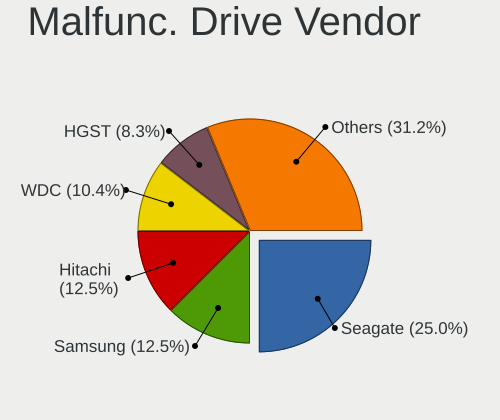

| Vendor              | Notebooks | Drives | Percent |
|---------------------|-----------|--------|---------|
| Seagate             | 12        | 12     | 25%     |
| Samsung Electronics | 6         | 6      | 12.5%   |
| Hitachi             | 6         | 6      | 12.5%   |
| WDC                 | 5         | 5      | 10.42%  |
| HGST                | 4         | 4      | 8.33%   |
| Toshiba             | 3         | 3      | 6.25%   |
| China               | 3         | 3      | 6.25%   |
| Transcend           | 2         | 2      | 4.17%   |
| Crucial             | 2         | 2      | 4.17%   |
| SK hynix            | 1         | 1      | 2.08%   |
| SanDisk             | 1         | 1      | 2.08%   |
| Micron Technology   | 1         | 1      | 2.08%   |
| Intenso             | 1         | 1      | 2.08%   |
| Hewlett-Packard     | 1         | 1      | 2.08%   |

Malfunc. HDD Vendor
-------------------

Vendors of faulty HDD drives

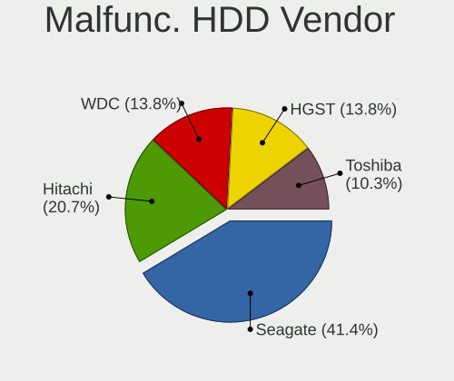

| Vendor  | Notebooks | Drives | Percent |
|---------|-----------|--------|---------|
| Seagate | 12        | 12     | 41.38%  |
| Hitachi | 6         | 6      | 20.69%  |
| WDC     | 4         | 4      | 13.79%  |
| HGST    | 4         | 4      | 13.79%  |
| Toshiba | 3         | 3      | 10.34%  |

Malfunc. Drive Kind
-------------------

Kinds of faulty drives

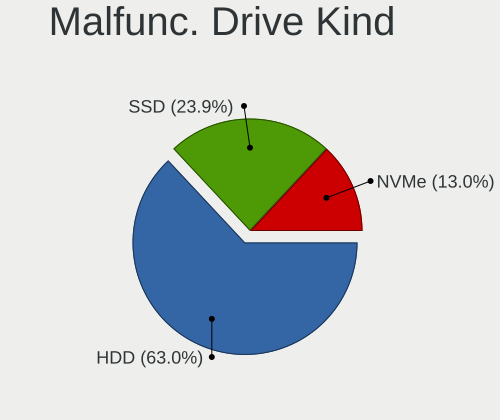

| Kind | Notebooks | Drives | Percent |
|------|-----------|--------|---------|
| HDD  | 29        | 29     | 63.04%  |
| SSD  | 11        | 13     | 23.91%  |
| NVMe | 6         | 6      | 13.04%  |

Failed Drives
-------------

Failed drive models

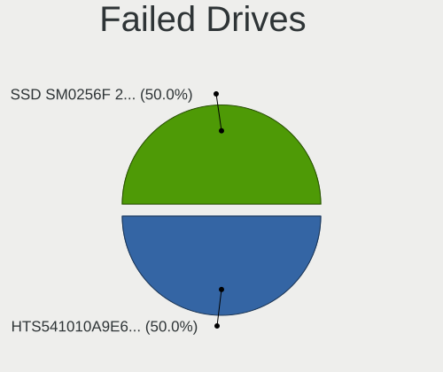

| Model                    | Notebooks | Drives | Percent |
|--------------------------|-----------|--------|---------|
| HGST HTS541010A9E680 1TB | 1         | 1      | 50%     |
| Apple SSD SM0256F 256GB  | 1         | 1      | 50%     |

Failed Drive Vendor
-------------------

Failed drive vendors

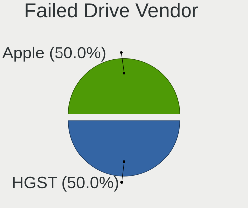

| Vendor | Notebooks | Drives | Percent |
|--------|-----------|--------|---------|
| HGST   | 1         | 1      | 50%     |
| Apple  | 1         | 1      | 50%     |

Drive Status
------------

Number of failed and malfunc. drives

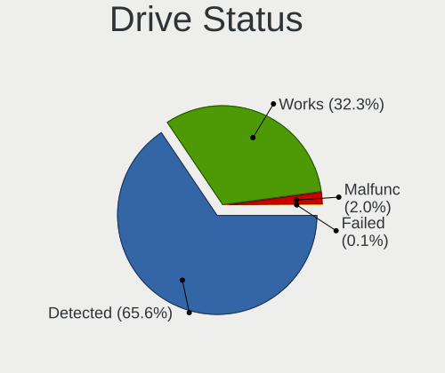

| Status   | Notebooks | Drives | Percent |
|----------|-----------|--------|---------|
| Detected | 1452      | 2061   | 65.58%  |
| Works    | 715       | 942    | 32.29%  |
| Malfunc  | 45        | 48     | 2.03%   |
| Failed   | 2         | 2      | 0.09%   |

Storage controller
------------------

Storage Vendor
--------------

Storage controller vendors

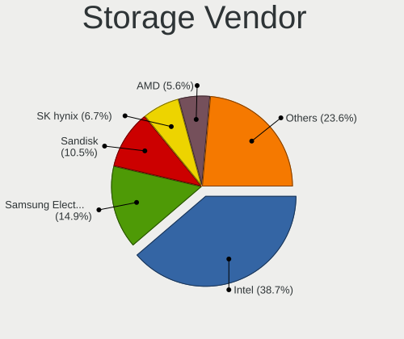

| Vendor                                  | Notebooks | Percent |
|-----------------------------------------|-----------|---------|
| Intel                                   | 1080      | 38.72%  |
| Samsung Electronics                     | 416       | 14.92%  |
| Sandisk                                 | 292       | 10.47%  |
| SK hynix                                | 187       | 6.7%    |
| AMD                                     | 157       | 5.63%   |
| Micron Technology                       | 145       | 5.2%    |
| Kingston Technology Company             | 73        | 2.62%   |
| KIOXIA                                  | 71        | 2.55%   |
| Phison Electronics                      | 55        | 1.97%   |
| Micron/Crucial Technology               | 54        | 1.94%   |
| Toshiba America Info Systems            | 42        | 1.51%   |
| ADATA Technology                        | 28        | 1%      |
| MAXIO Technology (Hangzhou)             | 22        | 0.79%   |
| Apple                                   | 21        | 0.75%   |
| Shenzhen Longsys Electronics            | 20        | 0.72%   |
| Solid State Storage Technology          | 17        | 0.61%   |
| Silicon Motion                          | 14        | 0.5%    |
| Solidigm                                | 12        | 0.43%   |
| Realtek Semiconductor                   | 12        | 0.43%   |
| Nvidia                                  | 11        | 0.39%   |
| Union Memory (Shenzhen)                 | 10        | 0.36%   |
| Shenzhen Unionmemory Information System | 10        | 0.36%   |
| Yangtze Memory Technologies             | 7         | 0.25%   |
| Biwin Storage Technology                | 6         | 0.22%   |
| Shenzhen Shichuangyi Electronics        | 4         | 0.14%   |
| Seagate Technology                      | 3         | 0.11%   |
| Marvell Technology Group                | 3         | 0.11%   |
| Lenovo                                  | 3         | 0.11%   |
| INNOGRIT                                | 3         | 0.11%   |
| Transcend                               | 2         | 0.07%   |
| Lite-On Technology                      | 2         | 0.07%   |
| ASMedia Technology                      | 2         | 0.07%   |
| Unknown                                 | 2         | 0.07%   |
| Ramaxel Technology(Shenzhen) Limited    | 1         | 0.04%   |
| Netac Technology                        | 1         | 0.04%   |
| Hosin Global Electronics                | 1         | 0.04%   |

Storage Model
-------------

Storage controller models

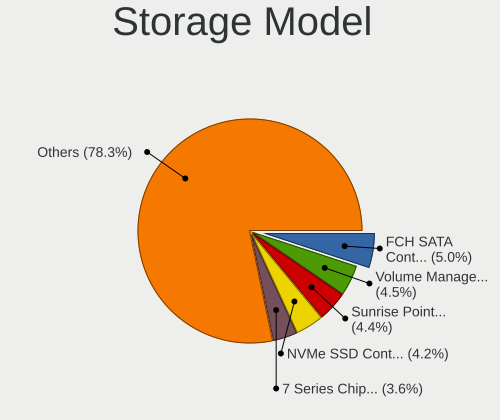

| Model                                                                          | Notebooks | Percent |
|--------------------------------------------------------------------------------|-----------|---------|
| AMD FCH SATA Controller [AHCI mode]                                            | 147       | 5.05%   |
| Intel Volume Management Device NVMe RAID Controller                            | 131       | 4.5%    |
| Intel Sunrise Point-LP SATA Controller [AHCI mode]                             | 129       | 4.43%   |
| Samsung NVMe SSD Controller SM981/PM981/PM983                                  | 121       | 4.16%   |
| Intel 7 Series Chipset Family 6-port SATA Controller [AHCI mode]               | 104       | 3.57%   |
| Samsung NVMe SSD Controller PM9A1/PM9A3/980PRO                                 | 97        | 3.33%   |
| SanDisk WD SN560/SN740/SN770/SN5000 NVMe SSD                                   | 81        | 2.78%   |
| Intel 82801 Mobile SATA Controller [RAID mode]                                 | 78        | 2.68%   |
| SK hynix Gold P31/BC711/PC711 NVMe Solid State Drive                           | 61        | 2.09%   |
| Samsung NVMe SSD Controller 980 (DRAM-less)                                    | 61        | 2.09%   |
| Intel 6 Series/C200 Series Chipset Family 6 port Mobile SATA AHCI Controller   | 56        | 1.92%   |
| Intel Cannon Lake Mobile PCH SATA AHCI Controller                              | 55        | 1.89%   |
| Intel RST Volume Management Device Controller                                  | 51        | 1.75%   |
| SK hynix Platinum P41/PC801 NVMe Solid State Drive                             | 49        | 1.68%   |
| Intel Tiger Lake-LP SATA Controller                                            | 43        | 1.48%   |
| Samsung NVMe SSD Controller SM961/PM961/SM963                                  | 41        | 1.41%   |
| Micron/Crucial P2 [Nick P2] / P3 / P3 Plus NVMe PCIe SSD (DRAM-less)           | 40        | 1.37%   |
| Micron 2400 NVMe SSD (DRAM-less)                                               | 40        | 1.37%   |
| Intel HM170/QM170 Chipset SATA Controller [AHCI Mode]                          | 40        | 1.37%   |
| Intel Wildcat Point-LP SATA Controller [AHCI Mode]                             | 39        | 1.34%   |
| Intel 8 Series SATA Controller 1 [AHCI mode]                                   | 39        | 1.34%   |
| SanDisk Extreme Pro / WD Black SN750 / PC SN730 / Red SN700 NVMe SSD           | 36        | 1.24%   |
| Intel SSD 670p Series [Keystone Harbor]                                        | 36        | 1.24%   |
| Intel Alder Lake-P SATA AHCI Controller                                        | 36        | 1.24%   |
| Intel 8 Series/C220 Series Chipset Family 6-port SATA Controller 1 [AHCI mode] | 34        | 1.17%   |
| KIOXIA NVMe SSD Controller BG4 (DRAM-less)                                     | 32        | 1.1%    |
| Samsung NVMe SSD Controller PM9B1 (DRAM-less)                                  | 31        | 1.06%   |
| Intel Comet Lake SATA AHCI Controller                                          | 30        | 1.03%   |
| SanDisk Ultra 3D / WD PC SN530, IX SN530, Blue SN550 NVMe SSD (DRAM-less)      | 29        | 1%      |
| SK hynix BC901 NVMe Solid State Drive (DRAM-less)                              | 28        | 0.96%   |
| Intel SSD 660P Series                                                          | 28        | 0.96%   |
| Micron 3400 NVMe SSD [Hendrix]                                                 | 25        | 0.86%   |
| Micron 2450 NVMe SSD [HendrixV] (DRAM-less)                                    | 25        | 0.86%   |
| Intel Q170/Q150/B150/H170/H110/Z170/CM236 Chipset SATA Controller [AHCI Mode]  | 23        | 0.79%   |
| Phison PS5013-E13 PCIe3 NVMe Controller (DRAM-less)                            | 22        | 0.76%   |
| Intel Cannon Point-LP SATA Controller [AHCI Mode]                              | 22        | 0.76%   |
| Samsung S4LN053X01 AHCI SSD Controller(Apple slot)                             | 21        | 0.72%   |
| Toshiba America Info Systems XG6 NVMe SSD Controller                           | 20        | 0.69%   |
| Intel 400 Series Chipset Family SATA AHCI Controller                           | 20        | 0.69%   |
| Sandisk WD Black SN850X NVMe SSD                                               | 19        | 0.65%   |

Storage Kind
------------

Kind of storage controller (IDE, SATA, NVMe, SAS, ...)

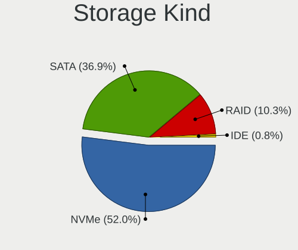

| Kind | Notebooks | Percent |
|------|-----------|---------|
| NVMe | 1422      | 51.99%  |
| SATA | 1009      | 36.89%  |
| RAID | 281       | 10.27%  |
| IDE  | 23        | 0.84%   |

Processor
---------

CPU Vendor
----------

Processor vendors

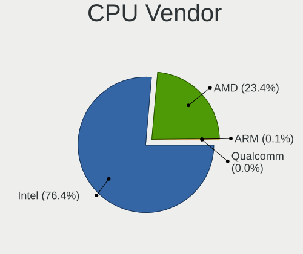

| Vendor   | Notebooks | Percent |
|----------|-----------|---------|
| Intel    | 1642      | 76.37%  |
| AMD      | 503       | 23.4%   |
| ARM      | 2         | 0.09%   |
| Unknown  | 2         | 0.09%   |
| Qualcomm | 1         | 0.05%   |

CPU Model
---------

Processor models

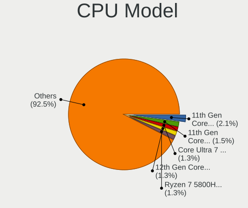

| Model                                      | Notebooks | Percent |
|--------------------------------------------|-----------|---------|
| Intel 11th Gen Core i5-1135G7 @ 2.40GHz    | 45        | 2.09%   |
| Intel 11th Gen Core i7-1165G7 @ 2.80GHz    | 33        | 1.53%   |
| Intel Core Ultra 7 155H                    | 28        | 1.3%    |
| Intel 12th Gen Core i7-12700H              | 28        | 1.3%    |
| AMD Ryzen 7 5800H with Radeon Graphics     | 28        | 1.3%    |
| Intel Core i5-8250U CPU @ 1.60GHz          | 26        | 1.21%   |
| AMD Ryzen 7 5700U with Radeon Graphics     | 26        | 1.21%   |
| AMD Ryzen 5 5500U with Radeon Graphics     | 25        | 1.16%   |
| Intel Core i7-9750H CPU @ 2.60GHz          | 24        | 1.11%   |
| Intel Core i5-7200U CPU @ 2.50GHz          | 24        | 1.11%   |
| Intel Core i5-10210U CPU @ 1.60GHz         | 24        | 1.11%   |
| Intel 12th Gen Core i5-1235U               | 24        | 1.11%   |
| Intel Core i5-3210M CPU @ 2.50GHz          | 23        | 1.07%   |
| Intel 13th Gen Core i7-13700H              | 23        | 1.07%   |
| Intel Core i7-8750H CPU @ 2.20GHz          | 22        | 1.02%   |
| Intel Core i7-8550U CPU @ 1.80GHz          | 22        | 1.02%   |
| Intel 11th Gen Core i7-11800H @ 2.30GHz    | 22        | 1.02%   |
| Intel Core i7-7700HQ CPU @ 2.80GHz         | 21        | 0.97%   |
| Intel Core i5-6300U CPU @ 2.40GHz          | 21        | 0.97%   |
| Intel 12th Gen Core i5-12450H              | 21        | 0.97%   |
| Intel Core Ultra 9 185H                    | 20        | 0.93%   |
| Intel Core i5-8350U CPU @ 1.70GHz          | 20        | 0.93%   |
| AMD Ryzen 5 5600H with Radeon Graphics     | 20        | 0.93%   |
| Intel Core i5-8365U CPU @ 1.60GHz          | 18        | 0.84%   |
| Intel Core i5-8265U CPU @ 1.60GHz          | 18        | 0.84%   |
| Intel Core i7-10750H CPU @ 2.60GHz         | 17        | 0.79%   |
| Intel 13th Gen Core i7-13620H              | 16        | 0.74%   |
| Intel 12th Gen Core i7-1255U               | 16        | 0.74%   |
| Intel Core i7-8665U CPU @ 1.90GHz          | 15        | 0.7%    |
| Intel Core i7-8650U CPU @ 1.90GHz          | 15        | 0.7%    |
| Intel Core i7-6700HQ CPU @ 2.60GHz         | 15        | 0.7%    |
| Intel Core i5-1035G1 CPU @ 1.00GHz         | 15        | 0.7%    |
| Intel Core i7-10510U CPU @ 1.80GHz         | 14        | 0.65%   |
| Intel Core i5-5200U CPU @ 2.20GHz          | 14        | 0.65%   |
| Intel 13th Gen Core i5-1335U               | 14        | 0.65%   |
| Intel 12th Gen Core i5-12500H              | 14        | 0.65%   |
| Intel 12th Gen Core i3-1215U               | 14        | 0.65%   |
| AMD Ryzen 7 7840HS w/ Radeon 780M Graphics | 14        | 0.65%   |
| AMD Ryzen 7 4800H with Radeon Graphics     | 14        | 0.65%   |
| AMD Ryzen 5 7520U with Radeon Graphics     | 14        | 0.65%   |

CPU Model Family
----------------

Processor model prefix

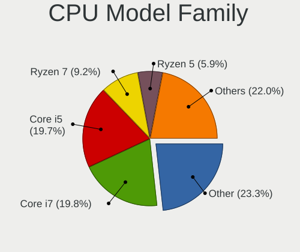

| Model                   | Notebooks | Percent |
|-------------------------|-----------|---------|
| Other                   | 501       | 23.28%  |
| Intel Core i7           | 426       | 19.8%   |
| Intel Core i5           | 425       | 19.75%  |
| AMD Ryzen 7             | 199       | 9.25%   |
| AMD Ryzen 5             | 128       | 5.95%   |
| Intel Core i3           | 82        | 3.81%   |
| Intel Core              | 62        | 2.88%   |
| AMD Ryzen 9             | 44        | 2.04%   |
| Intel Core 2 Duo        | 43        | 2%      |
| Intel Celeron           | 39        | 1.81%   |
| AMD Ryzen 7 PRO         | 31        | 1.44%   |
| Intel Pentium           | 25        | 1.16%   |
| AMD Ryzen 3             | 25        | 1.16%   |
| AMD Ryzen 5 PRO         | 22        | 1.02%   |
| Intel Atom              | 18        | 0.84%   |
| Intel Core i9           | 14        | 0.65%   |
| AMD A4                  | 10        | 0.46%   |
| Intel Xeon              | 9         | 0.42%   |
| AMD A8                  | 7         | 0.33%   |
| AMD A6                  | 7         | 0.33%   |
| Intel Pentium Dual-Core | 6         | 0.28%   |
| Intel Pentium Silver    | 4         | 0.19%   |
| AMD A10                 | 4         | 0.19%   |
| Intel Core m3           | 3         | 0.14%   |
| AMD E2                  | 3         | 0.14%   |
| Intel Pentium Gold      | 2         | 0.09%   |
| Intel Core m5           | 2         | 0.09%   |
| Intel Core M            | 2         | 0.09%   |
| AMD Athlon              | 2         | 0.09%   |
| AMD Ryzen 3 PRO         | 1         | 0.05%   |
| AMD GX                  | 1         | 0.05%   |
| AMD E1                  | 1         | 0.05%   |
| AMD E                   | 1         | 0.05%   |
| AMD Athlon Neo X2       | 1         | 0.05%   |
| AMD Athlon II           | 1         | 0.05%   |
| AMD A12                 | 1         | 0.05%   |

CPU Cores
---------

Number of processor cores

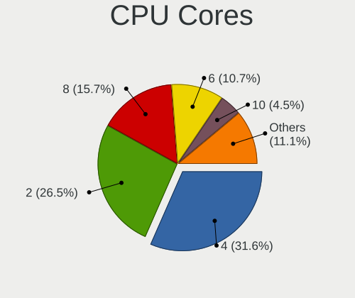

| Number | Notebooks | Percent |
|--------|-----------|---------|
| 4      | 679       | 31.58%  |
| 2      | 569       | 26.47%  |
| 8      | 338       | 15.72%  |
| 6      | 230       | 10.7%   |
| 10     | 96        | 4.47%   |
| 14     | 90        | 4.19%   |
| 16     | 68        | 3.16%   |
| 12     | 60        | 2.79%   |
| 24     | 16        | 0.74%   |
| 1      | 2         | 0.09%   |
| 20     | 1         | 0.05%   |
| 5      | 1         | 0.05%   |

CPU Sockets
-----------

Number of sockets

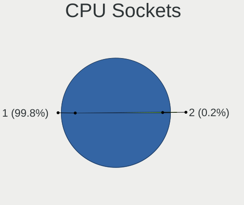

| Number | Notebooks | Percent |
|--------|-----------|---------|
| 1      | 2147      | 99.81%  |
| 2      | 4         | 0.19%   |

CPU Threads
-----------

Threads per core (Hyper-Threading)

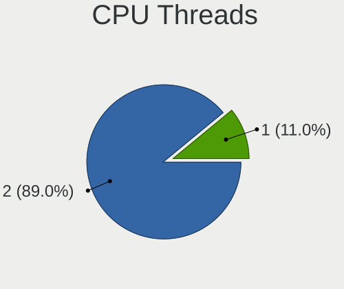

| Number | Notebooks | Percent |
|--------|-----------|---------|
| 2      | 1916      | 89.03%  |
| 1      | 236       | 10.97%  |

CPU Op-Modes
------------

CPU Operation Modes (32-bit, 64-bit)

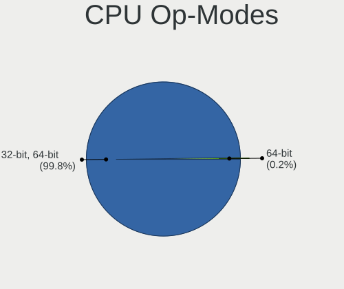

| Op mode        | Notebooks | Percent |
|----------------|-----------|---------|
| 32-bit, 64-bit | 2145      | 99.77%  |
| 64-bit         | 5         | 0.23%   |

CPU Microcode
-------------

Microcode number

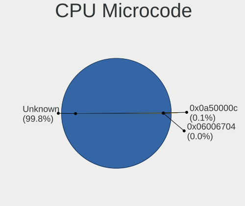

| Number     | Notebooks | Percent |
|------------|-----------|---------|
| Unknown    | 2147      | 99.81%  |
| 0x0a50000c | 2         | 0.09%   |
| 0x206a7    | 1         | 0.05%   |
| 0x06006704 | 1         | 0.05%   |

CPU Microarch
-------------

Microarchitecture

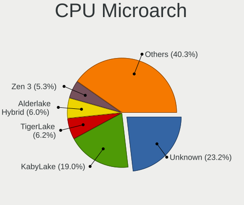

| Name              | Notebooks | Percent |
|-------------------|-----------|---------|
| Unknown           | 498       | 23.15%  |
| KabyLake          | 408       | 18.97%  |
| TigerLake         | 134       | 6.23%   |
| Alderlake Hybrid  | 130       | 6.04%   |
| Zen 3             | 114       | 5.3%    |
| Haswell           | 111       | 5.16%   |
| IvyBridge         | 108       | 5.02%   |
| Skylake           | 100       | 4.65%   |
| SandyBridge       | 65        | 3.02%   |
| Broadwell         | 59        | 2.74%   |
| CometLake         | 57        | 2.65%   |
| Zen 2             | 54        | 2.51%   |
| IceLake           | 44        | 2.05%   |
| Penryn            | 41        | 1.91%   |
| Zen+              | 38        | 1.77%   |
| Silvermont        | 33        | 1.53%   |
| Meteorlake Hybrid | 33        | 1.53%   |
| Westmere          | 22        | 1.02%   |
| Zen               | 17        | 0.79%   |
| Goldmont plus     | 17        | 0.79%   |
| Excavator         | 16        | 0.74%   |
| Core              | 9         | 0.42%   |
| Puma              | 8         | 0.37%   |
| Gracemont         | 7         | 0.33%   |
| Jaguar            | 5         | 0.23%   |
| Goldmont          | 5         | 0.23%   |
| Tremont           | 4         | 0.19%   |
| Nehalem           | 4         | 0.19%   |
| Piledriver        | 3         | 0.14%   |
| K10 Llano         | 2         | 0.09%   |
| Bobcat            | 2         | 0.09%   |
| K8 Hammer         | 1         | 0.05%   |
| K10               | 1         | 0.05%   |
| Bonnell           | 1         | 0.05%   |

Graphics
--------

GPU Vendor
----------

Vendors of graphics cards

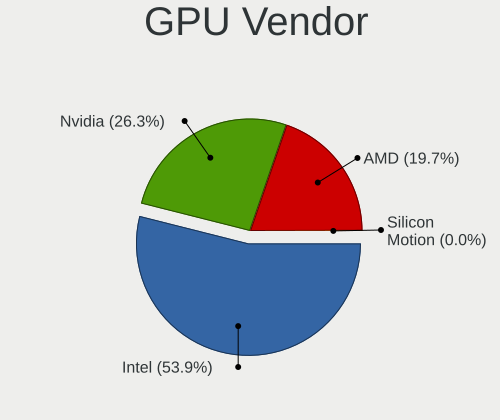

| Vendor         | Notebooks | Percent |
|----------------|-----------|---------|
| Intel          | 1542      | 53.93%  |
| Nvidia         | 753       | 26.34%  |
| AMD            | 563       | 19.69%  |
| Silicon Motion | 1         | 0.03%   |

GPU Model
---------

Graphics card models

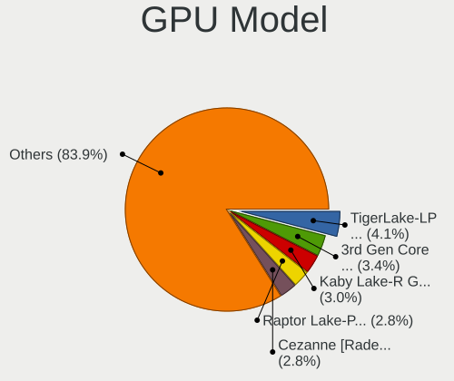

| Model                                                                     | Notebooks | Percent |
|---------------------------------------------------------------------------|-----------|---------|
| Intel TigerLake-LP GT2 [Iris Xe Graphics]                                 | 119       | 4.08%   |
| Intel 3rd Gen Core processor Graphics Controller                          | 100       | 3.43%   |
| Intel Kaby Lake-R GT2 [UHD Graphics 620]                                  | 88        | 3.02%   |
| Intel Raptor Lake-P [Iris Xe Graphics]                                    | 81        | 2.78%   |
| AMD Cezanne [Radeon Vega Series / Radeon Vega Mobile Series]              | 81        | 2.78%   |
| Intel CoffeeLake-H GT2 [UHD Graphics 630]                                 | 71        | 2.43%   |
| AMD Rembrandt [Radeon 680M]                                               | 63        | 2.16%   |
| Intel Alder Lake-P GT2 [Iris Xe Graphics]                                 | 62        | 2.13%   |
| Intel WhiskeyLake-U GT2 [UHD Graphics 620]                                | 61        | 2.09%   |
| AMD Phoenix1                                                              | 60        | 2.06%   |
| Intel 2nd Generation Core Processor Family Integrated Graphics Controller | 58        | 1.99%   |
| AMD Lucienne                                                              | 57        | 1.95%   |
| Intel Skylake-U GT2 [HD Graphics 520]                                     | 55        | 1.89%   |
| Nvidia TU117M [GeForce GTX 1650 Mobile / Max-Q]                           | 54        | 1.85%   |
| Intel Meteor Lake-P [Intel Arc Graphics]                                  | 54        | 1.85%   |
| Intel Kaby Lake-U GT2 [HD Graphics 620]                                   | 54        | 1.85%   |
| Intel Haswell-ULT Integrated Graphics Controller                          | 51        | 1.75%   |
| Intel CometLake-U GT2 [UHD Graphics]                                      | 51        | 1.75%   |
| AMD Renoir [Radeon Vega Series / Radeon Vega Mobile Series]               | 51        | 1.75%   |
| Intel CometLake-H GT2 [UHD Graphics]                                      | 48        | 1.65%   |
| Nvidia AD107M [GeForce RTX 4060 Max-Q / Mobile]                           | 45        | 1.54%   |
| Nvidia GA107M [GeForce RTX 3050 Mobile]                                   | 42        | 1.44%   |
| Nvidia GA106M [GeForce RTX 3060 Mobile / Max-Q]                           | 42        | 1.44%   |
| AMD Picasso/Raven 2 [Radeon Vega Series / Radeon Vega Mobile Series]      | 42        | 1.44%   |
| Intel TigerLake-H GT1 [UHD Graphics]                                      | 41        | 1.41%   |
| Intel Broadwell-U GT2 [HD Graphics 5500]                                  | 37        | 1.27%   |
| Intel Alder Lake-UP3 GT2 [Iris Xe Graphics]                               | 35        | 1.2%    |
| Intel 4th Gen Core Processor Integrated Graphics Controller               | 34        | 1.17%   |
| Intel Kaby Lake-H GT2 [HD Graphics 630]                                   | 32        | 1.1%    |
| Nvidia AD107M [GeForce RTX 4050 Max-Q / Mobile]                           | 30        | 1.03%   |
| Nvidia GA107M [GeForce RTX 3050 Ti Mobile]                                | 29        | 0.99%   |
| Intel Skylake-H GT2 [HD Graphics 530]                                     | 29        | 0.99%   |
| Nvidia GP107M [GeForce GTX 1050 Mobile]                                   | 28        | 0.96%   |
| Nvidia AD106M [GeForce RTX 4070 Max-Q / Mobile]                           | 28        | 0.96%   |
| Intel Raptor Lake-P [UHD Graphics]                                        | 28        | 0.96%   |
| Intel Alder Lake-P GT1 [UHD Graphics]                                     | 25        | 0.86%   |
| AMD Barcelo                                                               | 24        | 0.82%   |
| Intel Iris Plus Graphics G1 (Ice Lake)                                    | 23        | 0.79%   |
| AMD HawkPoint1                                                            | 23        | 0.79%   |
| Intel Raptor Lake-S UHD Graphics                                          | 22        | 0.75%   |

GPU Combo
---------

Combinations of graphics cards

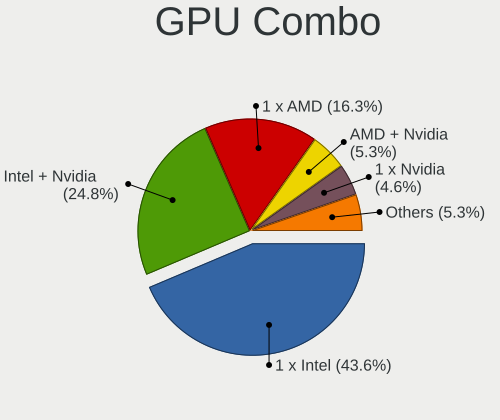

| Name                     | Notebooks | Percent |
|--------------------------|-----------|---------|
| 1 x Intel                | 938       | 43.63%  |
| Intel + Nvidia           | 534       | 24.84%  |
| 1 x AMD                  | 351       | 16.33%  |
| AMD + Nvidia             | 115       | 5.35%   |
| 1 x Nvidia               | 98        | 4.56%   |
| Intel + AMD              | 52        | 2.42%   |
| 2 x AMD                  | 44        | 2.05%   |
| Other                    | 9         | 0.42%   |
| 2 x Intel                | 5         | 0.23%   |
| 2 x Nvidia               | 2         | 0.09%   |
| 1 x Silicon Motion       | 1         | 0.05%   |
| Intel + AMD + 1 x Nvidia | 1         | 0.05%   |

GPU Driver
----------

Free vs proprietary

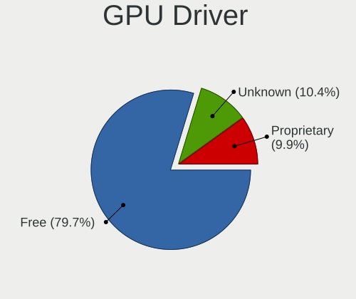

| Driver      | Notebooks | Percent |
|-------------|-----------|---------|
| Free        | 1722      | 79.69%  |
| Unknown     | 224       | 10.37%  |
| Proprietary | 215       | 9.95%   |

GPU Memory
----------

Total video memory

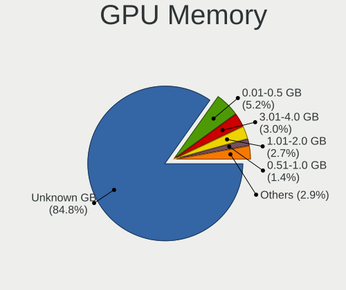

| Size in GB | Notebooks | Percent |
|------------|-----------|---------|
| Unknown    | 1832      | 84.81%  |
| 0.01-0.5   | 112       | 5.19%   |
| 3.01-4.0   | 64        | 2.96%   |
| 1.01-2.0   | 59        | 2.73%   |
| 0.51-1.0   | 31        | 1.44%   |
| 7.01-8.0   | 30        | 1.39%   |
| 5.01-6.0   | 25        | 1.16%   |
| 8.01-16.0  | 6         | 0.28%   |
| 16.01-24.0 | 1         | 0.05%   |

Monitor
-------

Monitor Vendor
--------------

Monitor vendors

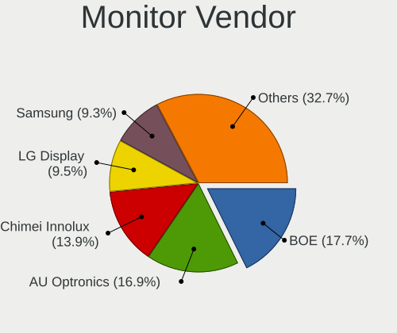

| Vendor                  | Notebooks | Percent |
|-------------------------|-----------|---------|
| BOE                     | 444       | 17.69%  |
| AU Optronics            | 423       | 16.85%  |
| Chimei Innolux          | 349       | 13.9%   |
| LG Display              | 239       | 9.52%   |
| Samsung Electronics     | 233       | 9.28%   |
| Apple                   | 125       | 4.98%   |
| Dell                    | 69        | 2.75%   |
| Sharp                   | 67        | 2.67%   |
| Goldstar                | 60        | 2.39%   |
| CSO                     | 58        | 2.31%   |
| PANDA                   | 41        | 1.63%   |
| Lenovo                  | 39        | 1.55%   |
| Philips                 | 38        | 1.51%   |
| InfoVision              | 37        | 1.47%   |
| Hewlett-Packard         | 31        | 1.24%   |
| Chi Mei Optoelectronics | 22        | 0.88%   |
| Acer                    | 22        | 0.88%   |
| TMX                     | 18        | 0.72%   |
| AOC                     | 18        | 0.72%   |
| ASUSTek Computer        | 16        | 0.64%   |
| CSW                     | 15        | 0.6%    |
| Iiyama                  | 12        | 0.48%   |
| Ancor Communications    | 11        | 0.44%   |
| BenQ                    | 10        | 0.4%    |
| KDB                     | 6         | 0.24%   |
| HKC                     | 6         | 0.24%   |
| ViewSonic               | 5         | 0.2%    |
| MSI                     | 5         | 0.2%    |
| Pixio                   | 4         | 0.16%   |
| Mi                      | 4         | 0.16%   |
| JDI                     | 4         | 0.16%   |
| InnoLux Display         | 4         | 0.16%   |
| HUAWEI                  | 4         | 0.16%   |
| Valve                   | 3         | 0.12%   |
| Sony                    | 3         | 0.12%   |
| Panasonic               | 3         | 0.12%   |
| Gigabyte Technology     | 3         | 0.12%   |
| Eizo                    | 3         | 0.12%   |
| VXN                     | 2         | 0.08%   |
| VIE                     | 2         | 0.08%   |

Monitor Model
-------------

Monitor models

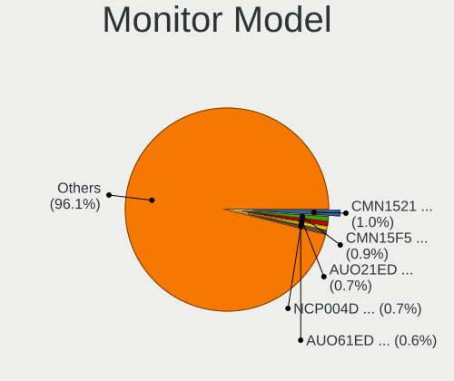

| Model                                                                    | Notebooks | Percent |
|--------------------------------------------------------------------------|-----------|---------|
| Chimei Innolux LCD Monitor CMN1521 1920x1080 344x193mm 15.5-inch         | 26        | 1.02%   |
| Chimei Innolux LCD Monitor CMN15F5 1920x1080 344x193mm 15.5-inch         | 23        | 0.9%    |
| AU Optronics LCD Monitor AUO21ED 1920x1080 344x193mm 15.5-inch           | 18        | 0.7%    |
| PANDA LCD Monitor NCP004D 1920x1080 344x194mm 15.5-inch                  | 17        | 0.67%   |
| AU Optronics LCD Monitor AUO61ED 1920x1080 344x194mm 15.5-inch           | 16        | 0.63%   |
| Chimei Innolux LCD Monitor CMN14D4 1920x1080 309x173mm 13.9-inch         | 15        | 0.59%   |
| BOE LCD Monitor BOE0872 1920x1080 344x194mm 15.5-inch                    | 15        | 0.59%   |
| Apple Color LCD APPA034 2880x1800 286x179mm 13.3-inch                    | 14        | 0.55%   |
| Samsung Electronics LCD Monitor SDC4161 1920x1080 344x194mm 15.5-inch    | 12        | 0.47%   |
| Chimei Innolux LCD Monitor CMN15E7 1920x1080 344x193mm 15.5-inch         | 12        | 0.47%   |
| AU Optronics LCD Monitor AUOAF90 1920x1080 344x193mm 15.5-inch           | 11        | 0.43%   |
| Apple LCD Monitor APP9CC5 1280x800 286x179mm 13.3-inch                   | 11        | 0.43%   |
| Samsung Electronics LCD Monitor SEC5441 1280x800 331x207mm 15.4-inch     | 10        | 0.39%   |
| BOE LCD Monitor BOE0BCA 2256x1504 285x190mm 13.5-inch                    | 10        | 0.39%   |
| AU Optronics LCD Monitor AUO403D 1920x1080 309x174mm 14.0-inch           | 10        | 0.39%   |
| AU Optronics LCD Monitor AUO2E8D 1920x1080 344x194mm 15.5-inch           | 10        | 0.39%   |
| Apple Color LCD APPA022 2880x1800 331x207mm 15.4-inch                    | 10        | 0.39%   |
| Chimei Innolux LCD Monitor CMN1618 1920x1200 344x215mm 16.0-inch         | 9         | 0.35%   |
| Chimei Innolux LCD Monitor CMN15E8 1920x1080 344x193mm 15.5-inch         | 9         | 0.35%   |
| Chimei Innolux LCD Monitor CMN15E6 1366x768 344x193mm 15.5-inch          | 9         | 0.35%   |
| Chimei Innolux LCD Monitor CMN14E5 1920x1080 309x173mm 13.9-inch         | 9         | 0.35%   |
| BOE LCD Monitor BOE0BC9 2560x1600 345x215mm 16.0-inch                    | 9         | 0.35%   |
| BOE LCD Monitor BOE0812 1920x1080 344x194mm 15.5-inch                    | 9         | 0.35%   |
| Samsung Electronics LCD Monitor SDC4193 2880x1800 302x189mm 14.0-inch    | 8         | 0.31%   |
| LG Display LCD Monitor LGD0521 1920x1080 309x174mm 14.0-inch             | 8         | 0.31%   |
| LG Display LCD Monitor LGD04A7 1920x1080 344x194mm 15.5-inch             | 8         | 0.31%   |
| Chimei Innolux LCD Monitor CMN15D2 1920x1080 344x193mm 15.5-inch         | 8         | 0.31%   |
| Chi Mei Optoelectronics LCD Monitor CMO15A7 1366x768 344x193mm 15.5-inch | 8         | 0.31%   |
| BOE LCD Monitor BOE095F 2256x1504 285x190mm 13.5-inch                    | 8         | 0.31%   |
| BOE LCD Monitor BOE08D5 1920x1080 344x194mm 15.5-inch                    | 8         | 0.31%   |
| BOE LCD Monitor BOE06A4 1366x768 344x194mm 15.5-inch                     | 8         | 0.31%   |
| Apple Color LCD APP9CC7 1280x800 286x179mm 13.3-inch                     | 8         | 0.31%   |
| Samsung Electronics LCD Monitor SDC4178 3200x2000 344x215mm 16.0-inch    | 7         | 0.27%   |
| LG Display LCD Monitor LGD02DC 1366x768 344x194mm 15.5-inch              | 7         | 0.27%   |
| Goldstar HDR WFHD GSM7714 2560x1080 798x334mm 34.1-inch                  | 7         | 0.27%   |
| CSW LCD Monitor CSW1640 3200x2000 344x215mm 16.0-inch                    | 7         | 0.27%   |
| Chimei Innolux LCD Monitor CMN15DB 1366x768 344x193mm 15.5-inch          | 7         | 0.27%   |
| Chimei Innolux LCD Monitor CMN1512 1920x1080 344x193mm 15.5-inch         | 7         | 0.27%   |
| AU Optronics LCD Monitor AUO106C 1366x768 276x155mm 12.5-inch            | 7         | 0.27%   |
| Apple LCD Monitor APP9CC3 1280x800 286x179mm 13.3-inch                   | 7         | 0.27%   |

Monitor Resolution
------------------

Monitor screen resolution

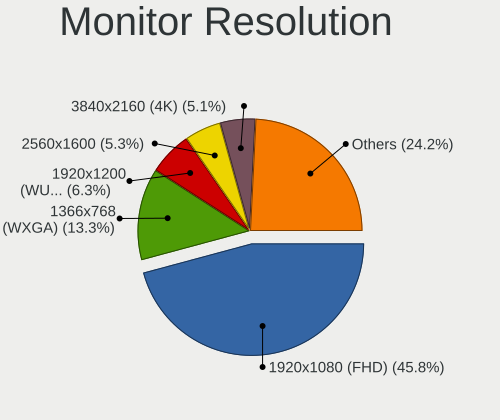

| Resolution         | Notebooks | Percent |
|--------------------|-----------|---------|
| 1920x1080 (FHD)    | 1099      | 45.81%  |
| 1366x768 (WXGA)    | 319       | 13.3%   |
| 1920x1200 (WUXGA)  | 151       | 6.29%   |
| 2560x1600          | 127       | 5.29%   |
| 3840x2160 (4K)     | 122       | 5.09%   |
| 2880x1800          | 114       | 4.75%   |
| 2560x1440 (QHD)    | 103       | 4.29%   |
| 1600x900 (HD+)     | 52        | 2.17%   |
| 1280x800 (WXGA)    | 47        | 1.96%   |
| 3440x1440          | 34        | 1.42%   |
| 3200x2000          | 27        | 1.13%   |
| 3840x2400          | 25        | 1.04%   |
| 1440x900 (WXGA+)   | 22        | 0.92%   |
| 2560x1080          | 21        | 0.88%   |
| 2256x1504          | 18        | 0.75%   |
| 1680x1050 (WSXGA+) | 13        | 0.54%   |
| 2160x1440          | 12        | 0.5%    |
| 2240x1400          | 8         | 0.33%   |
| Unknown            | 8         | 0.33%   |
| 3456x2160          | 7         | 0.29%   |
| 3200x1800 (QHD+)   | 7         | 0.29%   |
| 3840x1080          | 6         | 0.25%   |
| 3072x1920          | 6         | 0.25%   |
| 2880x1620          | 6         | 0.25%   |
| 3840x1100          | 4         | 0.17%   |
| 2880x1920          | 4         | 0.17%   |
| 1920x1280          | 4         | 0.17%   |
| 1280x1024 (SXGA)   | 4         | 0.17%   |
| 800x1280           | 3         | 0.13%   |
| 3000x2000          | 3         | 0.13%   |
| 2304x1440          | 3         | 0.13%   |
| 1360x768           | 3         | 0.13%   |
| 3840x2560          | 2         | 0.08%   |
| 3840x1600          | 2         | 0.08%   |
| 2048x1280          | 2         | 0.08%   |
| 3120x2080          | 1         | 0.04%   |
| 2944x1840          | 1         | 0.04%   |
| 2520x1680          | 1         | 0.04%   |
| 2400x1600          | 1         | 0.04%   |
| 2160x1350          | 1         | 0.04%   |

Monitor Diagonal
----------------

Diagonal size in inches

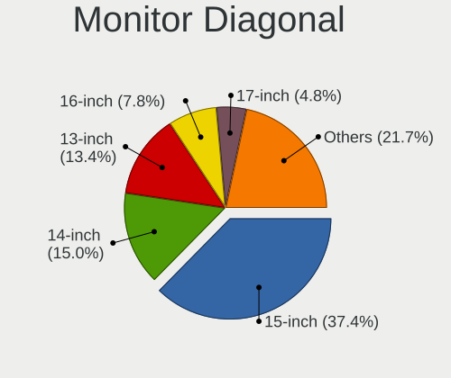

| Inches  | Notebooks | Percent |
|---------|-----------|---------|
| 15      | 938       | 37.36%  |
| 14      | 377       | 15.01%  |
| 13      | 336       | 13.38%  |
| 16      | 196       | 7.81%   |
| 17      | 120       | 4.78%   |
| 27      | 99        | 3.94%   |
| 24      | 83        | 3.31%   |
| 31      | 53        | 2.11%   |
| 12      | 44        | 1.75%   |
| 34      | 40        | 1.59%   |
| 21      | 40        | 1.59%   |
| 23      | 35        | 1.39%   |
| 11      | 26        | 1.04%   |
| Unknown | 15        | 0.6%    |
| 22      | 13        | 0.52%   |
| 18      | 12        | 0.48%   |
| 63      | 8         | 0.32%   |
| 40      | 8         | 0.32%   |
| 28      | 8         | 0.32%   |
| 48      | 5         | 0.2%    |
| 39      | 5         | 0.2%    |
| 20      | 5         | 0.2%    |
| 19      | 5         | 0.2%    |
| 32      | 4         | 0.16%   |
| 65      | 3         | 0.12%   |
| 52      | 3         | 0.12%   |
| 42      | 3         | 0.12%   |
| 7       | 3         | 0.12%   |
| 84      | 2         | 0.08%   |
| 38      | 2         | 0.08%   |
| 37      | 2         | 0.08%   |
| 29      | 2         | 0.08%   |
| 26      | 2         | 0.08%   |
| 25      | 2         | 0.08%   |
| 10      | 2         | 0.08%   |
| 74      | 1         | 0.04%   |
| 58      | 1         | 0.04%   |
| 55      | 1         | 0.04%   |
| 54      | 1         | 0.04%   |
| 49      | 1         | 0.04%   |

Monitor Width
-------------

Physical width

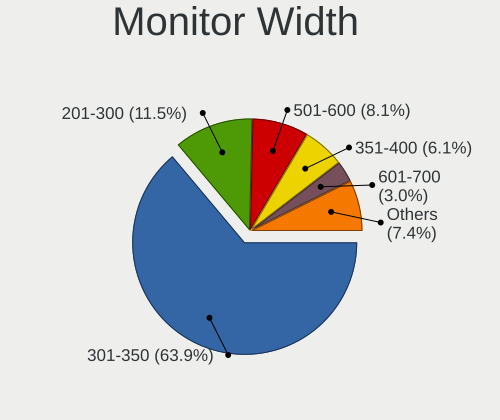

| Width in mm | Notebooks | Percent |
|-------------|-----------|---------|
| 301-350     | 1594      | 63.89%  |
| 201-300     | 286       | 11.46%  |
| 501-600     | 203       | 8.14%   |
| 351-400     | 152       | 6.09%   |
| 601-700     | 76        | 3.05%   |
| 401-500     | 71        | 2.85%   |
| 701-800     | 45        | 1.8%    |
| 1001-1500   | 24        | 0.96%   |
| 801-900     | 15        | 0.6%    |
| Unknown     | 15        | 0.6%    |
| 901-1000    | 6         | 0.24%   |
| 1-100       | 4         | 0.16%   |
| 1501-2000   | 3         | 0.12%   |
| 101-200     | 1         | 0.04%   |

Aspect Ratio
------------

Proportional relationship between the width and the height

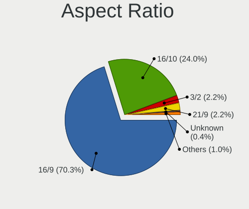

| Ratio   | Notebooks | Percent |
|---------|-----------|---------|
| 16/9    | 1587      | 70.25%  |
| 16/10   | 543       | 24.04%  |
| 3/2     | 49        | 2.17%   |
| 21/9    | 49        | 2.17%   |
| Unknown | 9         | 0.4%    |
| 32/9    | 6         | 0.27%   |
| 5/4     | 4         | 0.18%   |
| 3.40    | 4         | 0.18%   |
| 0.67    | 2         | 0.09%   |
| 0.56    | 2         | 0.09%   |
| 4/3     | 1         | 0.04%   |
| 2.12    | 1         | 0.04%   |
| 1.00    | 1         | 0.04%   |
| 0.62    | 1         | 0.04%   |

Monitor Area
------------

Area in inch²

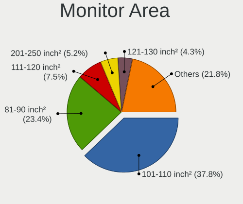

| Area in inch² | Notebooks | Percent |
|----------------|-----------|---------|
| 101-110        | 946       | 37.82%  |
| 81-90          | 585       | 23.39%  |
| 111-120        | 187       | 7.48%   |
| 201-250        | 131       | 5.24%   |
| 121-130        | 108       | 4.32%   |
| 71-80          | 104       | 4.16%   |
| 351-500        | 103       | 4.12%   |
| 301-350        | 102       | 4.08%   |
| 61-70          | 44        | 1.76%   |
| 51-60          | 31        | 1.24%   |
| 501-1000       | 27        | 1.08%   |
| 251-300        | 25        | 1%      |
| 151-200        | 22        | 0.88%   |
| More than 1000 | 21        | 0.84%   |
| 91-100         | 20        | 0.8%    |
| 141-150        | 15        | 0.6%    |
| Unknown        | 15        | 0.6%    |
| 131-140        | 10        | 0.4%    |
| 1-40           | 4         | 0.16%   |
| 41-50          | 1         | 0.04%   |

Pixel Density
-------------

Pixels per inch

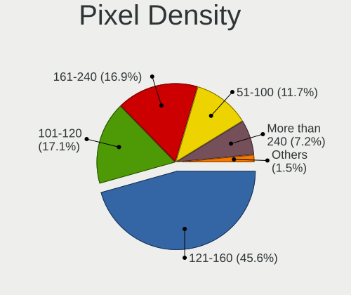

| Density       | Notebooks | Percent |
|---------------|-----------|---------|
| 121-160       | 1121      | 45.64%  |
| 101-120       | 419       | 17.06%  |
| 161-240       | 414       | 16.86%  |
| 51-100        | 287       | 11.69%  |
| More than 240 | 177       | 7.21%   |
| 1-50          | 23        | 0.94%   |
| Unknown       | 15        | 0.61%   |

Multiple Monitors
-----------------

Total monitors connected

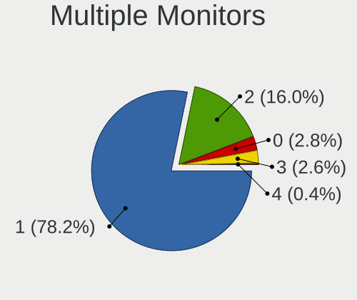

| Total | Notebooks | Percent |
|-------|-----------|---------|
| 1     | 1703      | 78.23%  |
| 2     | 348       | 15.99%  |
| 0     | 61        | 2.8%    |
| 3     | 57        | 2.62%   |
| 4     | 8         | 0.37%   |

Network
-------

Net Controller Vendor
---------------------

Controller vendors

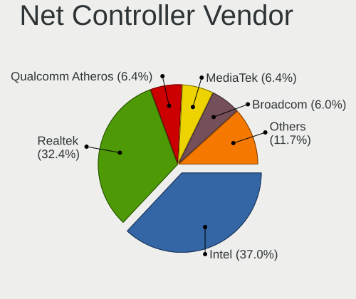

| Vendor                            | Notebooks | Percent |
|-----------------------------------|-----------|---------|
| Intel                             | 1206      | 36.99%  |
| Realtek Semiconductor             | 1056      | 32.39%  |
| Qualcomm Atheros                  | 210       | 6.44%   |
| MediaTek                          | 209       | 6.41%   |
| Broadcom                          | 197       | 6.04%   |
| Broadcom Limited                  | 53        | 1.63%   |
| Qualcomm                          | 41        | 1.26%   |
| ASIX Electronics                  | 34        | 1.04%   |
| Samsung Electronics               | 27        | 0.83%   |
| TP-Link                           | 24        | 0.74%   |
| DisplayLink                       | 17        | 0.52%   |
| Xiaomi                            | 14        | 0.43%   |
| Shenzhen Goodix Technology        | 14        | 0.43%   |
| Lenovo                            | 14        | 0.43%   |
| Ralink                            | 12        | 0.37%   |
| Sierra Wireless                   | 11        | 0.34%   |
| Marvell Technology Group          | 10        | 0.31%   |
| Google                            | 9         | 0.28%   |
| OPPO Electronics                  | 8         | 0.25%   |
| Nvidia                            | 8         | 0.25%   |
| Qualcomm Technologies             | 7         | 0.21%   |
| Apple                             | 7         | 0.21%   |
| Ralink Technology                 | 6         | 0.18%   |
| Dell                              | 6         | 0.18%   |
| Hewlett-Packard                   | 4         | 0.12%   |
| Ericsson Business Mobile Networks | 4         | 0.12%   |
| Edimax Technology                 | 4         | 0.12%   |
| D-Link System                     | 4         | 0.12%   |
| Qualcomm Atheros Communications   | 3         | 0.09%   |
| NetGear                           | 3         | 0.09%   |
| Motorola PCS                      | 3         | 0.09%   |
| Microsoft                         | 3         | 0.09%   |
| JMicron Technology                | 3         | 0.09%   |
| ICS Advent                        | 3         | 0.09%   |
| Huawei Technologies               | 3         | 0.09%   |
| Fibocom                           | 3         | 0.09%   |
| Linksys                           | 2         | 0.06%   |
| D-Link                            | 2         | 0.06%   |
| ASUSTek Computer                  | 2         | 0.06%   |
| Unknown                           | 2         | 0.06%   |

Net Controller Model
--------------------

Controller models

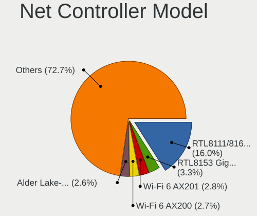

| Model                                                                  | Notebooks | Percent |
|------------------------------------------------------------------------|-----------|---------|
| Realtek RTL8111/8168/8211/8411 PCI Express Gigabit Ethernet Controller | 617       | 15.96%  |
| Realtek RTL8153 Gigabit Ethernet Adapter                               | 126       | 3.26%   |
| Intel Wi-Fi 6 AX201                                                    | 107       | 2.77%   |
| Intel Wi-Fi 6 AX200                                                    | 105       | 2.72%   |
| Intel Alder Lake-P PCH CNVi WiFi                                       | 102       | 2.64%   |
| MediaTek MT7921 802.11ax PCIe Wireless Network Adapter [Filogic 330]   | 101       | 2.61%   |
| Realtek RTL810xE PCI Express Fast Ethernet controller                  | 100       | 2.59%   |
| Intel Wireless 8265 / 8275                                             | 100       | 2.59%   |
| Intel Raptor Lake PCH CNVi WiFi                                        | 85        | 2.2%    |
| MediaTek MT7922 802.11ax PCI Express Wireless Network Adapter          | 74        | 1.91%   |
| Realtek RTL8822CE 802.11ac PCIe Wireless Network Adapter               | 70        | 1.81%   |
| Intel Wi-Fi 6E(802.11ax) AX210/AX1675* 2x2 [Typhoon Peak]              | 58        | 1.5%    |
| Realtek RTL8821CE 802.11ac PCIe Wireless Network Adapter               | 56        | 1.45%   |
| Qualcomm Atheros QCA9377 802.11ac Wireless Network Adapter             | 54        | 1.4%    |
| Intel Meteor Lake PCH CNVi WiFi                                        | 54        | 1.4%    |
| Intel Cannon Lake PCH CNVi WiFi                                        | 50        | 1.29%   |
| Intel Ethernet Connection (4) I219-LM                                  | 48        | 1.24%   |
| Intel Wireless 8260                                                    | 46        | 1.19%   |
| Intel Comet Lake PCH-LP CNVi WiFi                                      | 46        | 1.19%   |
| Intel Cannon Point-LP CNVi [Wireless-AC]                               | 45        | 1.16%   |
| Realtek RTL8852BE PCIe 802.11ax Wireless Network Controller            | 44        | 1.14%   |
| Intel Comet Lake PCH CNVi WiFi                                         | 44        | 1.14%   |
| Intel Wireless 7265                                                    | 43        | 1.11%   |
| Qualcomm Atheros QCA6174 802.11ac Wireless Network Adapter             | 39        | 1.01%   |
| Intel 82579LM Gigabit Network Connection (Lewisville)                  | 39        | 1.01%   |
| Qualcomm QCNFA765 Wireless Network Adapter                             | 37        | 0.96%   |
| ASIX AX88179 Gigabit Ethernet                                          | 34        | 0.88%   |
| Intel Centrino Advanced-N 6205 [Taylor Peak]                           | 31        | 0.8%    |
| Intel 700 Series Chipset CNVi WiFi                                     | 30        | 0.78%   |
| Intel Wireless 7260                                                    | 29        | 0.75%   |
| Broadcom BCM4331 802.11a/b/g/n                                         | 29        | 0.75%   |
| Realtek Killer E2600 GbE Controller                                    | 28        | 0.72%   |
| Intel Tiger Lake PCH CNVi WiFi                                         | 28        | 0.72%   |
| Broadcom NetXtreme BCM57765 Gigabit Ethernet PCIe                      | 28        | 0.72%   |
| Realtek RTL8125 2.5GbE Controller                                      | 27        | 0.7%    |
| Intel Ethernet Connection I219-LM                                      | 27        | 0.7%    |
| Intel Ethernet Connection (6) I219-LM                                  | 26        | 0.67%   |
| Qualcomm Atheros QCA9565 / AR9565 Wireless Network Adapter             | 25        | 0.65%   |
| MediaTek MT7902 802.11ax PCIe Wireless Network Adapter [Filogic 310]   | 24        | 0.62%   |
| Realtek RTL8852AE 802.11ax PCIe Wireless Network Adapter               | 23        | 0.59%   |

Wireless Vendor
---------------

Wireless vendors

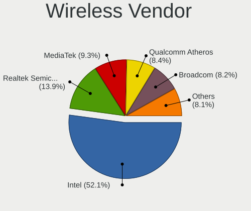

| Vendor                          | Notebooks | Percent |
|---------------------------------|-----------|---------|
| Intel                           | 1118      | 52.15%  |
| Realtek Semiconductor           | 297       | 13.85%  |
| MediaTek                        | 200       | 9.33%   |
| Qualcomm Atheros                | 180       | 8.4%    |
| Broadcom                        | 175       | 8.16%   |
| Broadcom Limited                | 47        | 2.19%   |
| Qualcomm                        | 39        | 1.82%   |
| TP-Link                         | 17        | 0.79%   |
| Ralink                          | 12        | 0.56%   |
| Sierra Wireless                 | 11        | 0.51%   |
| Ralink Technology               | 6         | 0.28%   |
| Qualcomm Technologies           | 6         | 0.28%   |
| Dell                            | 5         | 0.23%   |
| Edimax Technology               | 4         | 0.19%   |
| Qualcomm Atheros Communications | 3         | 0.14%   |
| NetGear                         | 3         | 0.14%   |
| Fibocom                         | 3         | 0.14%   |
| D-Link System                   | 3         | 0.14%   |
| Microsoft                       | 2         | 0.09%   |
| Linksys                         | 2         | 0.09%   |
| D-Link                          | 2         | 0.09%   |
| ASUSTek Computer                | 2         | 0.09%   |
| Unknown                         | 2         | 0.09%   |
| Wacom                           | 1         | 0.05%   |
| Quectel Wireless Solutions      | 1         | 0.05%   |
| Hewlett-Packard                 | 1         | 0.05%   |
| Guillemot                       | 1         | 0.05%   |
| AirTies Wireless Networks       | 1         | 0.05%   |

Wireless Model
--------------

Wireless models

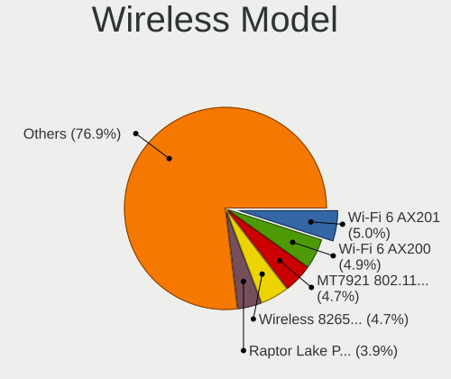

| Model                                                                | Notebooks | Percent |
|----------------------------------------------------------------------|-----------|---------|
| Intel Wi-Fi 6 AX201                                                  | 107       | 4.98%   |
| Intel Wi-Fi 6 AX200                                                  | 105       | 4.89%   |
| MediaTek MT7921 802.11ax PCIe Wireless Network Adapter [Filogic 330] | 101       | 4.7%    |
| Intel Wireless 8265 / 8275                                           | 100       | 4.65%   |
| Intel Raptor Lake PCH CNVi WiFi                                      | 83        | 3.86%   |
| Realtek RTL8822CE 802.11ac PCIe Wireless Network Adapter             | 70        | 3.26%   |
| MediaTek MT7922 802.11ax PCI Express Wireless Network Adapter        | 66        | 3.07%   |
| Intel Wi-Fi 6E(802.11ax) AX210/AX1675* 2x2 [Typhoon Peak]            | 58        | 2.7%    |
| Intel Alder Lake-P PCH CNVi WiFi                                     | 58        | 2.7%    |
| Realtek RTL8821CE 802.11ac PCIe Wireless Network Adapter             | 56        | 2.61%   |
| Qualcomm Atheros QCA9377 802.11ac Wireless Network Adapter           | 54        | 2.51%   |
| Intel Meteor Lake PCH CNVi WiFi                                      | 54        | 2.51%   |
| Intel Cannon Lake PCH CNVi WiFi                                      | 50        | 2.33%   |
| Intel Wireless 8260                                                  | 46        | 2.14%   |
| Intel Comet Lake PCH-LP CNVi WiFi                                    | 46        | 2.14%   |
| Intel Cannon Point-LP CNVi [Wireless-AC]                             | 45        | 2.09%   |
| Intel Comet Lake PCH CNVi WiFi                                       | 44        | 2.05%   |
| Intel Wireless 7265                                                  | 43        | 2%      |
| Realtek RTL8852BE PCIe 802.11ax Wireless Network Controller          | 41        | 1.91%   |
| Qualcomm Atheros QCA6174 802.11ac Wireless Network Adapter           | 39        | 1.81%   |
| Qualcomm QCNFA765 Wireless Network Adapter                           | 37        | 1.72%   |
| Intel Centrino Advanced-N 6205 [Taylor Peak]                         | 31        | 1.44%   |
| Intel 700 Series Chipset CNVi WiFi                                   | 30        | 1.4%    |
| Intel Wireless 7260                                                  | 29        | 1.35%   |
| Broadcom BCM4331 802.11a/b/g/n                                       | 29        | 1.35%   |
| Intel Tiger Lake PCH CNVi WiFi                                       | 28        | 1.3%    |
| Qualcomm Atheros QCA9565 / AR9565 Wireless Network Adapter           | 25        | 1.16%   |
| MediaTek MT7902 802.11ax PCIe Wireless Network Adapter [Filogic 310] | 24        | 1.12%   |
| Realtek RTL8852AE 802.11ax PCIe Wireless Network Adapter             | 23        | 1.07%   |
| Broadcom BCM43142 802.11b/g/n                                        | 23        | 1.07%   |
| Qualcomm Atheros AR9485 Wireless Network Adapter                     | 22        | 1.02%   |
| Broadcom Limited BCM4360 802.11ac Dual Band Wireless Network Adapter | 20        | 0.93%   |
| Broadcom BCM43602 802.11ac Wireless LAN SoC                          | 19        | 0.88%   |
| Qualcomm Atheros AR9285 Wireless Network Adapter (PCI-Express)       | 18        | 0.84%   |
| Realtek RTL8723BE PCIe Wireless Network Adapter                      | 17        | 0.79%   |
| Intel Ice Lake-LP PCH CNVi WiFi                                      | 17        | 0.79%   |
| Broadcom BCM4350 802.11ac Wireless Network Adapter                   | 17        | 0.79%   |
| Intel Dual Band Wireless-AC 3165 Plus Bluetooth                      | 15        | 0.7%    |
| Broadcom BCM4360 802.11ac Dual Band Wireless Network Adapter         | 15        | 0.7%    |
| Intel Wireless 3160                                                  | 14        | 0.65%   |

Ethernet Vendor
---------------

Ethernet vendors

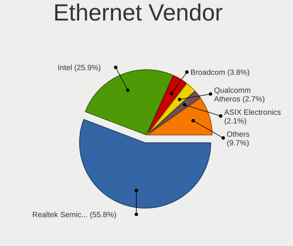

| Vendor                                 | Notebooks | Percent |
|----------------------------------------|-----------|---------|
| Realtek Semiconductor                  | 915       | 55.79%  |
| Intel                                  | 425       | 25.91%  |
| Broadcom                               | 62        | 3.78%   |
| Qualcomm Atheros                       | 45        | 2.74%   |
| ASIX Electronics                       | 34        | 2.07%   |
| Samsung Electronics                    | 27        | 1.65%   |
| DisplayLink                            | 17        | 1.04%   |
| Xiaomi                                 | 14        | 0.85%   |
| Lenovo                                 | 14        | 0.85%   |
| Marvell Technology Group               | 10        | 0.61%   |
| MediaTek                               | 9         | 0.55%   |
| Google                                 | 9         | 0.55%   |
| OPPO Electronics                       | 8         | 0.49%   |
| Nvidia                                 | 8         | 0.49%   |
| TP-Link                                | 7         | 0.43%   |
| Broadcom Limited                       | 7         | 0.43%   |
| Apple                                  | 7         | 0.43%   |
| Motorola PCS                           | 3         | 0.18%   |
| JMicron Technology                     | 3         | 0.18%   |
| ICS Advent                             | 3         | 0.18%   |
| Huawei Technologies                    | 3         | 0.18%   |
| Qualcomm                               | 2         | 0.12%   |
| Suzhou Motorcomm Electronic Technology | 1         | 0.06%   |
| Spreadtrum Communications              | 1         | 0.06%   |
| Qualcomm Technologies                  | 1         | 0.06%   |
| Microsoft                              | 1         | 0.06%   |
| Hewlett-Packard                        | 1         | 0.06%   |
| D-Link System                          | 1         | 0.06%   |
| Aquantia                               | 1         | 0.06%   |
| AboCom Systems                         | 1         | 0.06%   |

Ethernet Model
--------------

Ethernet models

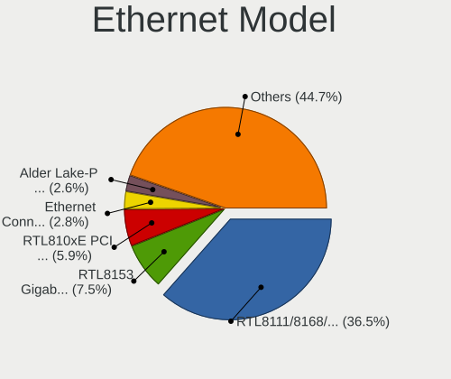

| Model                                                                  | Notebooks | Percent |
|------------------------------------------------------------------------|-----------|---------|
| Realtek RTL8111/8168/8211/8411 PCI Express Gigabit Ethernet Controller | 617       | 36.51%  |
| Realtek RTL8153 Gigabit Ethernet Adapter                               | 126       | 7.46%   |
| Realtek RTL810xE PCI Express Fast Ethernet controller                  | 100       | 5.92%   |
| Intel Ethernet Connection (4) I219-LM                                  | 48        | 2.84%   |
| Intel Alder Lake-P PCH CNVi WiFi                                       | 44        | 2.6%    |
| Intel 82579LM Gigabit Network Connection (Lewisville)                  | 39        | 2.31%   |
| ASIX AX88179 Gigabit Ethernet                                          | 34        | 2.01%   |
| Realtek Killer E2600 GbE Controller                                    | 28        | 1.66%   |
| Broadcom NetXtreme BCM57765 Gigabit Ethernet PCIe                      | 28        | 1.66%   |
| Realtek RTL8125 2.5GbE Controller                                      | 27        | 1.6%    |
| Intel Ethernet Connection I219-LM                                      | 27        | 1.6%    |
| Intel Ethernet Connection (6) I219-LM                                  | 26        | 1.54%   |
| Intel Ethernet Connection (7) I219-LM                                  | 21        | 1.24%   |
| Samsung Galaxy series, misc. (tethering mode)                          | 19        | 1.12%   |
| Intel Ethernet Connection I217-LM                                      | 18        | 1.07%   |
| Intel Ethernet Connection (4) I219-V                                   | 17        | 1.01%   |
| Intel Ethernet Connection (13) I219-V                                  | 15        | 0.89%   |
| Realtek Killer E3000 2.5GbE Controller                                 | 13        | 0.77%   |
| Intel Ethernet Connection (16) I219-LM                                 | 13        | 0.77%   |
| Intel Ethernet Connection (23) I219-V                                  | 12        | 0.71%   |
| Intel Ethernet Connection (16) I219-V                                  | 12        | 0.71%   |
| Intel Ethernet Connection (18) I219-LM                                 | 11        | 0.65%   |
| Intel Ethernet Connection (13) I219-LM                                 | 11        | 0.65%   |
| Realtek RTL8152 Fast Ethernet Adapter                                  | 10        | 0.59%   |
| Intel Ethernet Connection I218-LM                                      | 10        | 0.59%   |
| Intel Ethernet Connection (10) I219-V                                  | 10        | 0.59%   |
| Intel Ethernet Connection (10) I219-LM                                 | 10        | 0.59%   |
| Realtek USB 10/100/1G/2.5 LAN                                          | 9         | 0.53%   |
| Intel Ethernet Connection (5) I219-LM                                  | 9         | 0.53%   |
| Intel Ethernet Connection (2) I219-LM                                  | 9         | 0.53%   |
| Intel 82577LM Gigabit Network Connection                               | 9         | 0.53%   |
| Samsung GT-I9070 (network tethering, USB debugging enabled)            | 8         | 0.47%   |
| Qualcomm Atheros QCA8171 Gigabit Ethernet                              | 8         | 0.47%   |
| Qualcomm Atheros AR8151 v2.0 Gigabit Ethernet                          | 8         | 0.47%   |
| Nvidia MCP79 Ethernet                                                  | 8         | 0.47%   |
| MediaTek MT7922 802.11ax PCI Express Wireless Network Adapter          | 8         | 0.47%   |
| Broadcom NetLink BCM57785 Gigabit Ethernet PCIe                        | 8         | 0.47%   |
| Xiaomi Mi/Redmi series (RNDIS)                                         | 7         | 0.41%   |
| Xiaomi Mi/Redmi series (RNDIS + ADB)                                   | 7         | 0.41%   |
| TP-Link UE300 10/100/1000 LAN (ethernet mode) [Realtek RTL8153]        | 7         | 0.41%   |

Net Controller Kind
-------------------

Ethernet, WiFi or modem

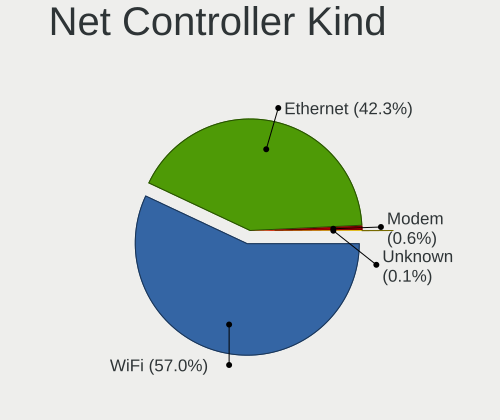

| Kind     | Notebooks | Percent |
|----------|-----------|---------|
| WiFi     | 2050      | 56.99%  |
| Ethernet | 1520      | 42.26%  |
| Modem    | 23        | 0.64%   |
| Unknown  | 4         | 0.11%   |

Used Controller
---------------

Currently used network controller

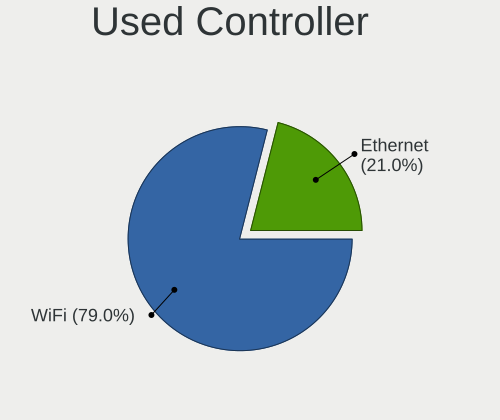

| Kind     | Notebooks | Percent |
|----------|-----------|---------|
| WiFi     | 1764      | 78.96%  |
| Ethernet | 470       | 21.04%  |

NICs
----

Total network controllers on board

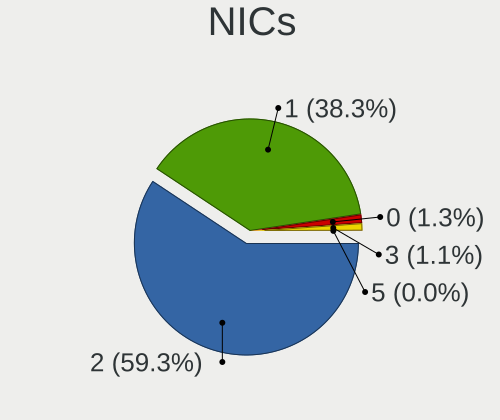

| Total | Notebooks | Percent |
|-------|-----------|---------|
| 2     | 1276      | 59.32%  |
| 1     | 824       | 38.31%  |
| 0     | 27        | 1.26%   |
| 3     | 23        | 1.07%   |
| 5     | 1         | 0.05%   |

IPv6
----

IPv6 vs IPv4

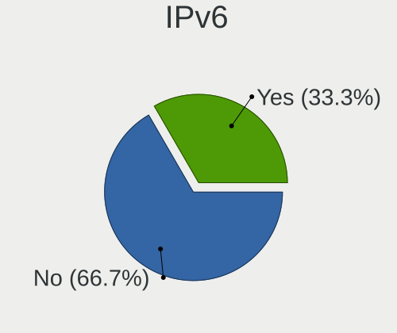

| Used | Notebooks | Percent |
|------|-----------|---------|
| No   | 1447      | 66.65%  |
| Yes  | 724       | 33.35%  |

Bluetooth
---------

Bluetooth Vendor
----------------

Controller vendors

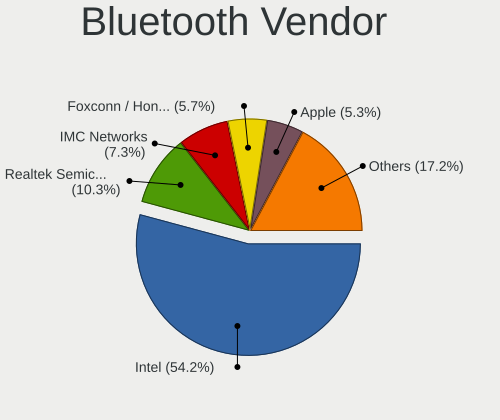

| Vendor                          | Notebooks | Percent |
|---------------------------------|-----------|---------|
| Intel                           | 1041      | 54.19%  |
| Realtek Semiconductor           | 197       | 10.26%  |
| IMC Networks                    | 141       | 7.34%   |
| Foxconn / Hon Hai               | 109       | 5.67%   |
| Apple                           | 102       | 5.31%   |
| Qualcomm Atheros Communications | 94        | 4.89%   |
| Lite-On Technology              | 57        | 2.97%   |
| Broadcom                        | 49        | 2.55%   |
| MediaTek                        | 28        | 1.46%   |
| USI                             | 23        | 1.2%    |
| Realtek                         | 16        | 0.83%   |
| Cambridge Silicon Radio         | 13        | 0.68%   |
| Dell                            | 12        | 0.62%   |
| Toshiba                         | 8         | 0.42%   |
| Ralink                          | 7         | 0.36%   |
| Foxconn International           | 6         | 0.31%   |
| TP-Link                         | 4         | 0.21%   |
| Hewlett-Packard                 | 4         | 0.21%   |
| Opticis                         | 3         | 0.16%   |
| Ralink Technology               | 2         | 0.1%    |
| Taiyo Yuden                     | 1         | 0.05%   |
| Edimax Technology               | 1         | 0.05%   |
| Alps Electric                   | 1         | 0.05%   |
| Actions                         | 1         | 0.05%   |
| Unknown                         | 1         | 0.05%   |

Bluetooth Model
---------------

Controller models

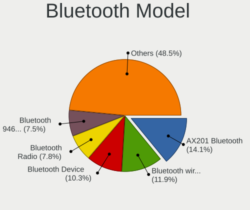

| Model                                               | Notebooks | Percent |
|-----------------------------------------------------|-----------|---------|
| Intel AX201 Bluetooth                               | 270       | 14.06%  |
| Intel Bluetooth wireless interface                  | 229       | 11.92%  |
| Intel Bluetooth Device                              | 198       | 10.31%  |
| Realtek Bluetooth Radio                             | 149       | 7.76%   |
| Intel Bluetooth 9460/9560 Jefferson Peak (JfP)      | 144       | 7.5%    |
| Intel AX200 Bluetooth                               | 102       | 5.31%   |
| IMC Networks Wireless_Device                        | 96        | 5%      |
| Apple Bluetooth Host Controller                     | 65        | 3.38%   |
| Intel AX210 Bluetooth                               | 56        | 2.92%   |
| Qualcomm Atheros  Bluetooth Device                  | 54        | 2.81%   |
| Foxconn / Hon Hai Wireless_Device                   | 49        | 2.55%   |
| Realtek  Bluetooth 4.2 Adapter                      | 37        | 1.93%   |
| Apple Bluetooth USB Host Controller                 | 28        | 1.46%   |
| MediaTek Wireless_Device                            | 27        | 1.41%   |
| IMC Networks Bluetooth Radio                        | 25        | 1.3%    |
| Foxconn / Hon Hai Bluetooth Device                  | 25        | 1.3%    |
| USI Bluetooth Device                                | 23        | 1.2%    |
| Foxconn / Hon Hai MediaTek Bluetooth Adapter        | 20        | 1.04%   |
| Lite-On Wireless_Device                             | 19        | 0.99%   |
| Intel Centrino Bluetooth Wireless Transceiver       | 18        | 0.94%   |
| Realtek Bluetooth Radio                             | 16        | 0.83%   |
| Qualcomm Atheros QCA61x4 Bluetooth 4.0              | 16        | 0.83%   |
| Intel Wireless-AC 3168 Bluetooth                    | 14        | 0.73%   |
| Lite-On Qualcomm Atheros QCA9377 Bluetooth          | 13        | 0.68%   |
| Cambridge Silicon Radio Bluetooth Dongle (HCI mode) | 13        | 0.68%   |
| Qualcomm Atheros AR3011 Bluetooth                   | 12        | 0.62%   |
| Lite-On Bluetooth Device                            | 12        | 0.62%   |
| Broadcom BCM2045B (BDC-2.1)                         | 10        | 0.52%   |
| Intel Wireless-AC 9260 Bluetooth Adapter            | 9         | 0.47%   |
| IMC Networks Bluetooth Device                       | 8         | 0.42%   |
| Broadcom BCM20702 Bluetooth 4.0 [ThinkPad]          | 8         | 0.42%   |
| Ralink RT3290 Bluetooth                             | 7         | 0.36%   |
| Qualcomm Atheros AR3012 Bluetooth 4.0               | 7         | 0.36%   |
| Broadcom HP Portable SoftSailing                    | 7         | 0.36%   |
| Foxconn International BCM43142A0 Bluetooth module   | 6         | 0.31%   |
| Broadcom HP Portable Bumble Bee                     | 6         | 0.31%   |
| Lite-On Bluetooth Radio                             | 5         | 0.26%   |
| Dell BCM20702A0 Bluetooth Module                    | 5         | 0.26%   |
| TP-Link TP-T@- UB500 Adapter                        | 4         | 0.21%   |
| Qualcomm Atheros Bluetooth USB Host Controller      | 4         | 0.21%   |

Sound
-----

Sound Vendor
------------

Sound card vendors

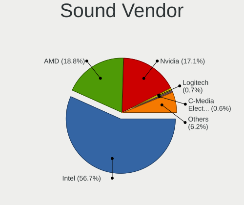

| Vendor                               | Notebooks | Percent |
|--------------------------------------|-----------|---------|
| Intel                                | 1611      | 56.71%  |
| AMD                                  | 533       | 18.76%  |
| Nvidia                               | 485       | 17.07%  |
| Logitech                             | 20        | 0.7%    |
| C-Media Electronics                  | 17        | 0.6%    |
| Lenovo                               | 16        | 0.56%   |
| GN Netcom                            | 15        | 0.53%   |
| Sony                                 | 12        | 0.42%   |
| Realtek Semiconductor                | 12        | 0.42%   |
| Plantronics                          | 10        | 0.35%   |
| Hewlett-Packard                      | 8         | 0.28%   |
| Texas Instruments                    | 7         | 0.25%   |
| Generalplus Technology               | 7         | 0.25%   |
| ASUSTek Computer                     | 7         | 0.25%   |
| Apple                                | 6         | 0.21%   |
| Razer USA                            | 4         | 0.14%   |
| Kingston Technology                  | 4         | 0.14%   |
| JMTek                                | 4         | 0.14%   |
| Focusrite-Novation                   | 4         | 0.14%   |
| SteelSeries ApS                      | 3         | 0.11%   |
| Jieli Technology                     | 3         | 0.11%   |
| DSEA A/S                             | 3         | 0.11%   |
| Creative Technology                  | 3         | 0.11%   |
| Unknown                              | 3         | 0.11%   |
| ZOOM                                 | 2         | 0.07%   |
| TTGK Technology                      | 2         | 0.07%   |
| Trust                                | 2         | 0.07%   |
| Thesycon Systemsoftware & Consulting | 2         | 0.07%   |
| No brand                             | 2         | 0.07%   |
| Framework                            | 2         | 0.07%   |
| Dell                                 | 2         | 0.07%   |
| BEHRINGER International              | 2         | 0.07%   |
| Audeze                               | 2         | 0.07%   |
| Yealink Network Technology           | 1         | 0.04%   |
| Winbond Electronics                  | 1         | 0.04%   |
| Walmart                              | 1         | 0.04%   |
| Tenx Technology                      | 1         | 0.04%   |
| Silicon Motion                       | 1         | 0.04%   |
| Sennheiser electronic                | 1         | 0.04%   |
| Samsung Electronics                  | 1         | 0.04%   |

Sound Model
-----------

Sound card models

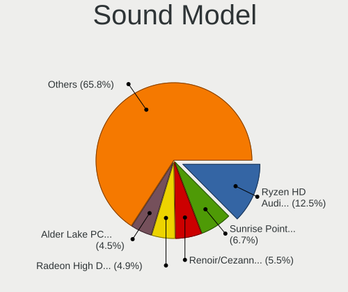

| Model                                                                      | Notebooks | Percent |
|----------------------------------------------------------------------------|-----------|---------|
| AMD Ryzen HD Audio Controller                                              | 433       | 12.55%  |
| Intel Sunrise Point-LP HD Audio                                            | 230       | 6.66%   |
| AMD Renoir/Cezanne HDMI/DP Audio Controller                                | 191       | 5.53%   |
| AMD Radeon High Definition Audio Controller                                | 170       | 4.93%   |
| Intel Alder Lake PCH-P High Definition Audio Controller                    | 155       | 4.49%   |
| Intel Tiger Lake-LP Smart Sound Technology Audio Controller                | 134       | 3.88%   |
| Intel 7 Series/C216 Chipset Family High Definition Audio Controller        | 113       | 3.27%   |
| Intel Raptor Lake-P/U/H cAVS                                               | 110       | 3.19%   |
| Intel Cannon Lake PCH cAVS                                                 | 85        | 2.46%   |
| Nvidia GA107 High Definition Audio Controller                              | 64        | 1.85%   |
| Intel Cannon Point-LP High Definition Audio Controller                     | 64        | 1.85%   |
| Nvidia AD107 High Definition Audio Controller                              | 63        | 1.83%   |
| Intel Meteor Lake-P HD Audio Controller                                    | 62        | 1.8%    |
| Intel 8 Series/C220 Series Chipset High Definition Audio Controller        | 60        | 1.74%   |
| Intel Wildcat Point-LP High Definition Audio Controller                    | 59        | 1.71%   |
| Intel Broadwell-U Audio Controller                                         | 59        | 1.71%   |
| Intel 6 Series/C200 Series Chipset Family High Definition Audio Controller | 59        | 1.71%   |
| Intel Comet Lake PCH cAVS                                                  | 55        | 1.59%   |
| Intel Comet Lake PCH-LP cAVS                                               | 54        | 1.56%   |
| Nvidia TU107 GeForce GTX 1650 High Definition Audio Controller             | 51        | 1.48%   |
| Intel Haswell-ULT HD Audio Controller                                      | 51        | 1.48%   |
| Intel 8 Series HD Audio Controller                                         | 50        | 1.45%   |
| AMD Raven/Raven2/Fenghuang HDMI/DP Audio Controller                        | 49        | 1.42%   |
| Intel Tiger Lake-H HD Audio Controller                                     | 44        | 1.27%   |
| Nvidia GP107GL High Definition Audio Controller                            | 43        | 1.25%   |
| Intel CM238 HD Audio Controller                                            | 41        | 1.19%   |
| Nvidia GA106 High Definition Audio Controller                              | 40        | 1.16%   |
| Intel Raptor Lake High Definition Audio Controller                         | 33        | 0.96%   |
| Intel Ice Lake-LP Smart Sound Technology Audio Controller                  | 33        | 0.96%   |
| Intel 100 Series/C230 Series Chipset Family HD Audio Controller            | 33        | 0.96%   |
| Intel Xeon E3-1200 v3/4th Gen Core Processor HD Audio Controller           | 32        | 0.93%   |
| Nvidia GA104 High Definition Audio Controller                              | 31        | 0.9%    |
| Nvidia GK107 HDMI Audio Controller                                         | 26        | 0.75%   |
| Intel 82801I (ICH9 Family) HD Audio Controller                             | 26        | 0.75%   |
| Intel 5 Series/3400 Series Chipset High Definition Audio                   | 26        | 0.75%   |
| Nvidia AD106M High Definition Audio Controller                             | 24        | 0.7%    |
| Nvidia TU106 High Definition Audio Controller                              | 21        | 0.61%   |
| AMD FCH Azalia Controller                                                  | 19        | 0.55%   |
| Intel Alder Lake-N PCH High Definition Audio Controller                    | 18        | 0.52%   |
| AMD Kabini HDMI/DP Audio                                                   | 18        | 0.52%   |

Memory
------

Memory Vendor
-------------

Memory module vendors

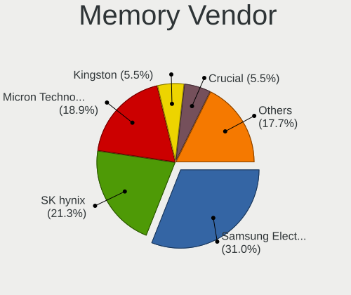

| Vendor                 | Notebooks | Percent |
|------------------------|-----------|---------|
| Samsung Electronics    | 298       | 31.01%  |
| SK hynix               | 205       | 21.33%  |
| Micron Technology      | 182       | 18.94%  |
| Kingston               | 53        | 5.52%   |
| Crucial                | 53        | 5.52%   |
| A-DATA Technology      | 25        | 2.6%    |
| Unknown                | 19        | 1.98%   |
| Unknown                | 18        | 1.87%   |
| Ramaxel Technology     | 13        | 1.35%   |
| Elpida                 | 11        | 1.14%   |
| G.Skill                | 8         | 0.83%   |
| Corsair                | 6         | 0.62%   |
| Nanya Technology       | 5         | 0.52%   |
| Apacer                 | 5         | 0.52%   |
| Timetec                | 4         | 0.42%   |
| Smart                  | 3         | 0.31%   |
| Patriot                | 3         | 0.31%   |
| Kllisre                | 3         | 0.31%   |
| ChangXin Memory        | 3         | 0.31%   |
| AMD                    | 3         | 0.31%   |
| Transcend              | 2         | 0.21%   |
| Teikon                 | 2         | 0.21%   |
| Team                   | 2         | 0.21%   |
| Smart Modular          | 2         | 0.21%   |
| Shenzhen SCY           | 2         | 0.21%   |
| Lexar                  | 2         | 0.21%   |
| GOODRAM                | 2         | 0.21%   |
| Avant                  | 2         | 0.21%   |
| Wilk                   | 1         | 0.1%    |
| Unknown (F785)         | 1         | 0.1%    |
| Unknown (ABCD)         | 1         | 0.1%    |
| Unknown (89F7)         | 1         | 0.1%    |
| Unknown (0x8000)       | 1         | 0.1%    |
| Unknown (0x1636)       | 1         | 0.1%    |
| Unknown (0x0BEC)       | 1         | 0.1%    |
| Unknown (0x0B5E)       | 1         | 0.1%    |
| Unknown (0x0080)       | 1         | 0.1%    |
| Unknown (0000000080CE) | 1         | 0.1%    |
| Smart Brazil           | 1         | 0.1%    |
| PNY                    | 1         | 0.1%    |

Memory Model
------------

Memory module models

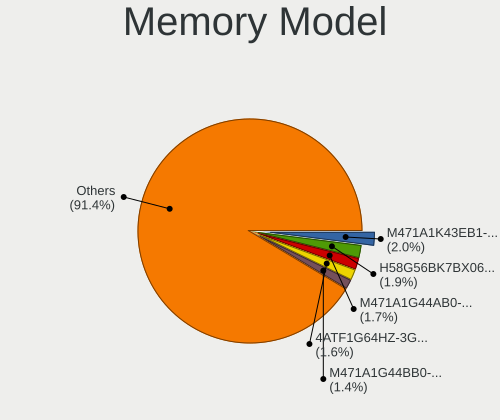

| Model                                                            | Notebooks | Percent |
|------------------------------------------------------------------|-----------|---------|
| Samsung RAM M471A1K43EB1-CWE 8GB SODIMM DDR4 3200MT/s            | 20        | 2%      |
| Unknown                                                          | 19        | 1.9%    |
| Samsung RAM M471A1G44AB0-CWE 8GiB SODIMM DDR4 3200MT/s           | 17        | 1.7%    |
| Micron RAM 4ATF1G64HZ-3G2F1 8GB SODIMM DDR4 3200MT/s             | 16        | 1.6%    |
| Samsung RAM M471A1G44BB0-CWE 8GB SODIMM DDR4 3200MT/s            | 14        | 1.4%    |
| Micron RAM 8ATF1G64HZ-3G2J1 8GB SODIMM DDR4 3200MT/s             | 10        | 1%      |
| Samsung RAM M471B5173DB0-YK0 4GB SODIMM DDR3 1600MT/s            | 9         | 0.9%    |
| SK hynix RAM HMAA1GS6CJR6N-XN 8GB SODIMM DDR4 3200MT/s           | 8         | 0.8%    |
| SK hynix RAM HMA81GS6AFR8N-UH 8GB SODIMM DDR4 2667MT/s           | 8         | 0.8%    |
| Samsung RAM M471A5244CB0-CTD 4GB SODIMM DDR4 3266MT/s            | 8         | 0.8%    |
| Samsung RAM M471A1K43DB1-CTD 8GB SODIMM DDR4 2667MT/s            | 8         | 0.8%    |
| Samsung RAM M471A1K43BB1-CRC 8GB SODIMM DDR4 2667MT/s            | 8         | 0.8%    |
| Samsung RAM M471A1G44AB0-CWE 8GB Row Of Chips DDR4 3200MT/s      | 8         | 0.8%    |
| Samsung RAM M471B5173QH0-YK0 4GB SODIMM DDR3 1600MT/s            | 7         | 0.7%    |
| Samsung RAM M425R1GB4BB0-CQKOL 8GB SODIMM DDR5 4800MT/s          | 7         | 0.7%    |
| Micron RAM MTC4C10163S1SC48BA1 8GB SODIMM DDR5 4800MT/s          | 7         | 0.7%    |
| SK hynix RAM HMA81GS6DJR8N-XN 8GB SODIMM DDR4 3200MT/s           | 6         | 0.6%    |
| Samsung RAM M471B5273DH0-CH9 4GB SODIMM DDR3 1600MT/s            | 6         | 0.6%    |
| Samsung RAM M471A4G43MB1-CTD 32GB SODIMM DDR4 2667MT/s           | 6         | 0.6%    |
| Samsung RAM M471A1K43CB1-CRC 8GB SODIMM DDR4 8400MT/s            | 6         | 0.6%    |
| SK hynix RAM Module 4GB SODIMM DDR3 1600MT/s                     | 5         | 0.5%    |
| SK hynix RAM HMAG68EXNSA051N 8GB SODIMM DDR4 3200MT/s            | 5         | 0.5%    |
| SK hynix RAM H9JCNNNCP3MLYR-N6E 2GB Row Of Chips LPDDR5 6400MT/s | 5         | 0.5%    |
| SK hynix RAM H58G66BK7BX067 16GB Row Of Chips LPDDR5 8533MT/s    | 5         | 0.5%    |
| Samsung RAM M471A5244CB0-CWE 4GB SODIMM DDR4 3200MT/s            | 5         | 0.5%    |
| Samsung RAM M471A5244CB0-CRC 4GB SODIMM DDR4 2667MT/s            | 5         | 0.5%    |
| Samsung RAM M471A2K43DB1-CTD 16GB SODIMM DDR4 2667MT/s           | 5         | 0.5%    |
| Micron RAM MT62F4G32D8DV-026 WT 16GB SODIMM LPDDR5 7500MT/s      | 5         | 0.5%    |
| Micron RAM MT62F2G32D4DS-026 WT 8GiB SODIMM LPDDR5 7500MT/s      | 5         | 0.5%    |
| Micron RAM MT62F1G32D4DR-031 WT 4GB Row Of Chips LPDDR5 6400MT/s | 5         | 0.5%    |
| Micron RAM MT40A1G16TB-062E:F 8GB Row Of Chips DDR4 3200MT/s     | 5         | 0.5%    |
| Micron RAM 4ATF51264HZ-3G2J1 4GB SODIMM DDR4 3200MT/s            | 5         | 0.5%    |
| Elpida RAM Module 4GB SODIMM DDR3 1600MT/s                       | 5         | 0.5%    |
| Crucial RAM CT32G4SFD832A.M16FF 32GB SODIMM DDR4 3200MT/s        | 5         | 0.5%    |
| SK hynix RAM HMT451S6BFR8A-PB 4GB SODIMM DDR3 1600MT/s           | 4         | 0.4%    |
| SK hynix RAM HMCG88AGBSA092N 32GB SODIMM DDR5 5600MT/s           | 4         | 0.4%    |
| SK hynix RAM HMCG78MEBSA095N 16GB SODIMM DDR5 4800MT/s           | 4         | 0.4%    |
| SK hynix RAM HMCG78AGBSA092N 16GB SODIMM DDR5 5600MT/s           | 4         | 0.4%    |
| SK hynix RAM HMCG66AGBSA092N 8GB SODIMM DDR5 5600MT/s            | 4         | 0.4%    |
| SK hynix RAM HMAA1GS6CJR6N-XN 8GB Row Of Chips DDR4 3200MT/s     | 4         | 0.4%    |

Memory Kind
-----------

Memory module kinds

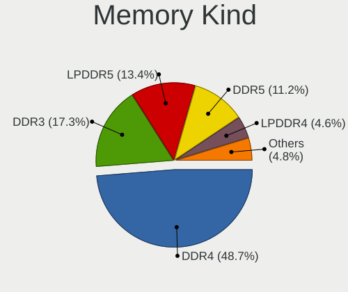

| Kind    | Notebooks | Percent |
|---------|-----------|---------|
| DDR4    | 400       | 48.72%  |
| DDR3    | 142       | 17.3%   |
| LPDDR5  | 110       | 13.4%   |
| DDR5    | 92        | 11.21%  |
| LPDDR4  | 38        | 4.63%   |
| LPDDR3  | 28        | 3.41%   |
| SDRAM   | 5         | 0.61%   |
| DDR2    | 5         | 0.61%   |
| Unknown | 1         | 0.12%   |

Memory Form Factor
------------------

Physical design of the memory module

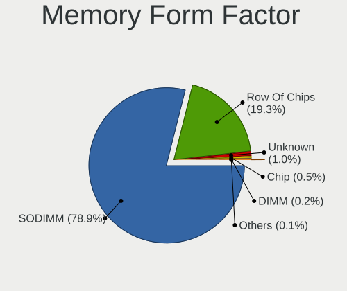

| Name            | Notebooks | Percent |
|-----------------|-----------|---------|
| SODIMM          | 651       | 78.91%  |
| Row Of Chips    | 159       | 19.27%  |
| Unknown         | 8         | 0.97%   |
| Chip            | 4         | 0.48%   |
| DIMM            | 2         | 0.24%   |
| Proprietary Car | 1         | 0.12%   |

Memory Size
-----------

Memory module size

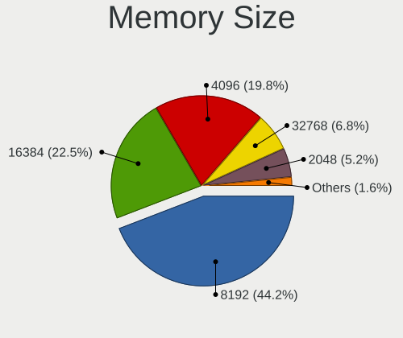

| Size   | Notebooks | Percent |
|--------|-----------|---------|
| 8192   | 389       | 44.15%  |
| 16384  | 198       | 22.47%  |
| 4096   | 174       | 19.75%  |
| 32768  | 60        | 6.81%   |
| 2048   | 46        | 5.22%   |
| 1024   | 8         | 0.91%   |
| 3072   | 4         | 0.45%   |
| 131072 | 1         | 0.11%   |
| 12288  | 1         | 0.11%   |

Memory Speed
------------

Memory module speed

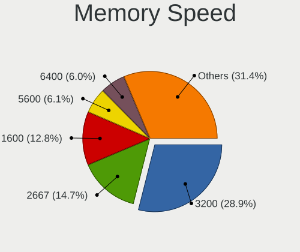

| Speed   | Notebooks | Percent |
|---------|-----------|---------|
| 3200    | 250       | 28.94%  |
| 2667    | 127       | 14.7%   |
| 1600    | 111       | 12.85%  |
| 5600    | 53        | 6.13%   |
| 6400    | 52        | 6.02%   |
| 4800    | 40        | 4.63%   |
| 2400    | 36        | 4.17%   |
| 2133    | 36        | 4.17%   |
| 7500    | 33        | 3.82%   |
| 4267    | 16        | 1.85%   |
| 1333    | 15        | 1.74%   |
| 1867    | 14        | 1.62%   |
| 7467    | 12        | 1.39%   |
| 8400    | 8         | 0.93%   |
| 3266    | 8         | 0.93%   |
| 8533    | 7         | 0.81%   |
| 4266    | 7         | 0.81%   |
| 3733    | 7         | 0.81%   |
| 1067    | 4         | 0.46%   |
| 667     | 4         | 0.46%   |
| 5500    | 3         | 0.35%   |
| 4199    | 3         | 0.35%   |
| 1066    | 3         | 0.35%   |
| 8600    | 2         | 0.23%   |
| 2933    | 2         | 0.23%   |
| 2048    | 2         | 0.23%   |
| 1334    | 2         | 0.23%   |
| Unknown | 2         | 0.23%   |
| 12800   | 1         | 0.12%   |
| 5200    | 1         | 0.12%   |
| 2800    | 1         | 0.12%   |
| 1330    | 1         | 0.12%   |
| 975     | 1         | 0.12%   |

Printers & scanners
-------------------

Printer Vendor
--------------

Printer device vendors

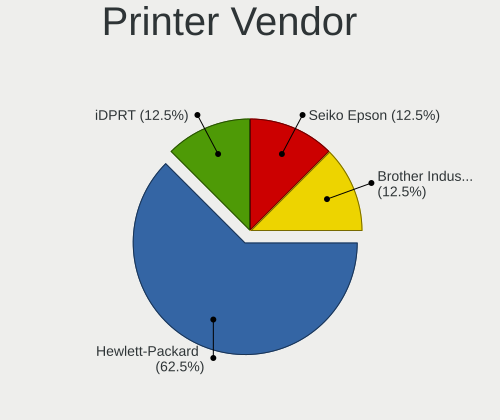

| Vendor             | Notebooks | Percent |
|--------------------|-----------|---------|
| Hewlett-Packard    | 5         | 62.5%   |
| Seiko Epson        | 1         | 12.5%   |
| iDPRT              | 1         | 12.5%   |
| Brother Industries | 1         | 12.5%   |

Printer Model
-------------

Printer device models

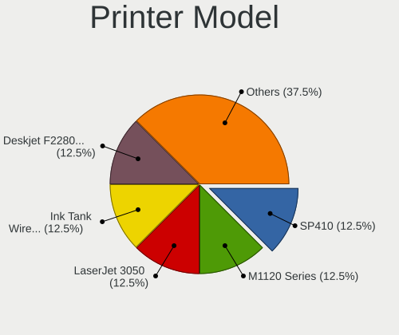

| Model                           | Notebooks | Percent |
|---------------------------------|-----------|---------|
| Seiko Epson M1120 Series        | 1         | 12.5%   |
| iDPRT SP410                     | 1         | 12.5%   |
| HP LaserJet 3050                | 1         | 12.5%   |
| HP Ink Tank Wireless 410 series | 1         | 12.5%   |
| HP Deskjet F2280 series         | 1         | 12.5%   |
| HP Deskjet 2050 J510            | 1         | 12.5%   |
| HP Deskjet 1000 J110 series     | 1         | 12.5%   |
| Brother DCP-7030                | 1         | 12.5%   |

Scanner Vendor
--------------

Scanner device vendors

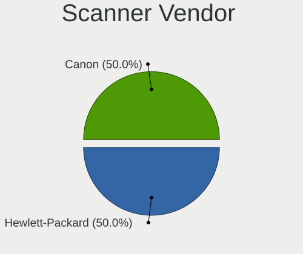

| Vendor          | Notebooks | Percent |
|-----------------|-----------|---------|
| Hewlett-Packard | 1         | 50%     |
| Canon           | 1         | 50%     |

Scanner Model
-------------

Scanner device models

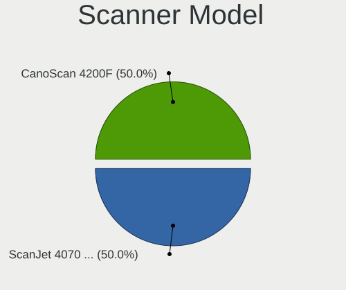

| Model                      | Notebooks | Percent |
|----------------------------|-----------|---------|
| HP ScanJet 4070 PhotoSmart | 1         | 50%     |
| Canon CanoScan 4200F       | 1         | 50%     |

Camera
------

Camera Vendor
-------------

Camera device vendors

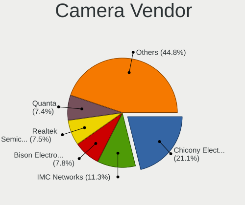

| Vendor                                 | Notebooks | Percent |
|----------------------------------------|-----------|---------|
| Chicony Electronics                    | 410       | 21.13%  |
| IMC Networks                           | 220       | 11.34%  |
| Bison Electronics                      | 151       | 7.78%   |
| Realtek Semiconductor                  | 146       | 7.53%   |
| Quanta                                 | 144       | 7.42%   |
| Microdia                               | 135       | 6.96%   |
| Luxvisions Innotech Limited            | 106       | 5.46%   |
| Sunplus Innovation Technology          | 82        | 4.23%   |
| Cheng Uei Precision Industry (Foxlink) | 71        | 3.66%   |
| Apple                                  | 67        | 3.45%   |
| Syntek                                 | 63        | 3.25%   |
| Sonix Technology                       | 58        | 2.99%   |
| Lite-On Technology                     | 47        | 2.42%   |
| Shinetech                              | 39        | 2.01%   |
| Logitech                               | 35        | 1.8%    |
| Suyin                                  | 20        | 1.03%   |
| SunplusIT                              | 17        | 0.88%   |
| Alcor Micro                            | 15        | 0.77%   |
| Samsung Electronics                    | 12        | 0.62%   |
| Silicon Motion                         | 11        | 0.57%   |
| Acer                                   | 10        | 0.52%   |
| ShineOptics                            | 4         | 0.21%   |
| Microsoft                              | 4         | 0.21%   |
| Lenovo                                 | 4         | 0.21%   |
| icSpring                               | 4         | 0.21%   |
| USB CAMERA                             | 3         | 0.15%   |
| Tripath Technology                     | 3         | 0.15%   |
| Ricoh                                  | 3         | 0.15%   |
| Importek                               | 3         | 0.15%   |
| HYGD-220831-A                          | 3         | 0.15%   |
| Framework                              | 3         | 0.15%   |
| Unknown                                | 3         | 0.15%   |
| Sunwingroup                            | 2         | 0.1%    |
| KYE Systems (Mouse Systems)            | 2         | 0.1%    |
| kingcome                               | 2         | 0.1%    |
| ALi                                    | 2         | 0.1%    |
| Yealink Network Technology             | 1         | 0.05%   |
| Xiaomi                                 | 1         | 0.05%   |
| Trust                                  | 1         | 0.05%   |
| Sunplus Technology                     | 1         | 0.05%   |

Camera Model
------------

Camera device models

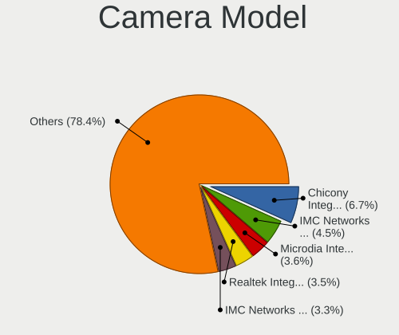

| Model                                                | Notebooks | Percent |
|------------------------------------------------------|-----------|---------|
| Chicony Integrated Camera                            | 132       | 6.73%   |
| IMC Networks USB2.0 HD UVC WebCam                    | 89        | 4.54%   |
| Microdia Integrated_Webcam_HD                        | 70        | 3.57%   |
| Realtek Integrated_Webcam_HD                         | 68        | 3.47%   |
| IMC Networks Integrated Camera                       | 65        | 3.31%   |
| Syntek Integrated Camera                             | 55        | 2.8%    |
| Bison Integrated Camera                              | 47        | 2.4%    |
| Sonix USB2.0 HD UVC WebCam                           | 39        | 1.99%   |
| Luxvisions Innotech Limited Integrated Camera        | 32        | 1.63%   |
| Sunplus Integrated_Webcam_HD                         | 30        | 1.53%   |
| Apple FaceTime HD Camera                             | 28        | 1.43%   |
| Chicony HP HD Camera                                 | 27        | 1.38%   |
| Chicony HD Webcam                                    | 25        | 1.27%   |
| Shinetech USB2.0 FHD UVC WebCam                      | 24        | 1.22%   |
| Quanta HP HD Camera                                  | 22        | 1.12%   |
| Lite-On Integrated Camera                            | 20        | 1.02%   |
| Chicony Integrated Camera (1280x720@30)              | 20        | 1.02%   |
| Sonix USB2.0 FHD UVC WebCam                          | 18        | 0.92%   |
| Luxvisions Innotech Limited Integrated RGB Camera    | 17        | 0.87%   |
| Chicony Integrated IR Camera                         | 17        | 0.87%   |
| Bison Integrated RGB Camera                          | 17        | 0.87%   |
| Quanta HP Wide Vision HD Camera                      | 16        | 0.82%   |
| Chicony ACER HD User Facing                          | 16        | 0.82%   |
| Bison HD Webcam                                      | 16        | 0.82%   |
| Quanta HD Webcam                                     | 15        | 0.76%   |
| Quanta ACER HD User Facing                           | 15        | 0.76%   |
| Luxvisions Innotech Limited HP Wide Vision HD Camera | 15        | 0.76%   |
| Chicony HD User Facing                               | 15        | 0.76%   |
| Quanta HD User Facing                                | 14        | 0.71%   |
| Luxvisions Innotech Limited HP TrueVision HD Camera  | 14        | 0.71%   |
| Apple Built-in iSight                                | 14        | 0.71%   |
| ShineTech USB2.0 HD UVC WebCam                       | 13        | 0.66%   |
| Luxvisions Innotech Limited HP HD Camera             | 13        | 0.66%   |
| Samsung Galaxy series, misc. (MTP mode)              | 12        | 0.61%   |
| Bison SunplusIT Integrated Camera                    | 12        | 0.61%   |
| Apple FaceTime HD Camera (Built-in)                  | 12        | 0.61%   |
| Quanta HP TrueVision HD Camera                       | 11        | 0.56%   |
| Microdia Integrated_Webcam_FHD                       | 11        | 0.56%   |
| IMC Networks HD Camera                               | 11        | 0.56%   |
| Chicony HP Wide Vision HD Camera                     | 11        | 0.56%   |

Security
--------

Fingerprint Vendor
------------------

Fingerprint sensor vendors

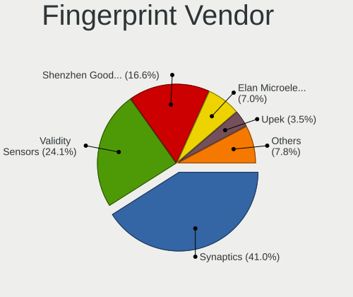

| Vendor                             | Notebooks | Percent |
|------------------------------------|-----------|---------|
| Synaptics                          | 153       | 41.02%  |
| Validity Sensors                   | 90        | 24.13%  |
| Shenzhen Goodix Technology         | 62        | 16.62%  |
| Elan Microelectronics              | 26        | 6.97%   |
| Upek                               | 13        | 3.49%   |
| Realtek USB2.0 Finger Print Bridge | 13        | 3.49%   |
| AuthenTec                          | 5         | 1.34%   |
| LighTuning Technology              | 4         | 1.07%   |
| HOLTEK                             | 2         | 0.54%   |
| Focal-systems.Corp                 | 2         | 0.54%   |
| Next Biometrics                    | 1         | 0.27%   |
| GDMicroelectronics                 | 1         | 0.27%   |
| DigitalPersona                     | 1         | 0.27%   |

Fingerprint Model
-----------------

Fingerprint sensor models

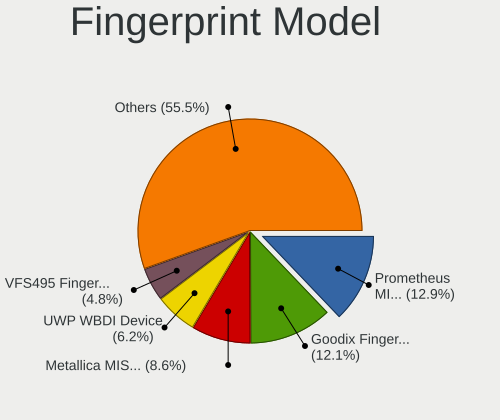

| Model                                                                      | Notebooks | Percent |
|----------------------------------------------------------------------------|-----------|---------|
| Synaptics Prometheus MIS Touch Fingerprint Reader                          | 48        | 12.87%  |
| Shenzhen Goodix  Fingerprint Device                                        | 45        | 12.06%  |
| Synaptics Metallica MIS Touch Fingerprint Reader                           | 32        | 8.58%   |
| Synaptics UWP WBDI Device                                                  | 23        | 6.17%   |
| Validity Sensors VFS495 Fingerprint Reader                                 | 18        | 4.83%   |
| Elan ELAN:ARM-M4                                                           | 15        | 4.02%   |
| Validity Sensors Synaptics WBDI                                            | 14        | 3.75%   |
| Synaptics FS7604 Touch Fingerprint Sensor with PurePrint                   | 14        | 3.75%   |
| Upek Biometric Touchchip/Touchstrip Fingerprint Sensor                     | 13        | 3.49%   |
| Realtek USB2.0 Finger Print Bridge FocalTech Fingerprint Device            | 13        | 3.49%   |
| Shenzhen Goodix FingerPrint                                                | 12        | 3.22%   |
| Validity Sensors VFS491                                                    | 11        | 2.95%   |
| Elan ELAN:Fingerprint                                                      | 11        | 2.95%   |
| Validity Sensors VFS 5011 fingerprint sensor                               | 9         | 2.41%   |
| Validity Sensors Synaptics VFS7552 Touch Fingerprint Sensor with PurePrint | 9         | 2.41%   |
| Synaptics  FS7604 Touch Fingerprint Sensor with PurePrint                  | 9         | 2.41%   |
| Synaptics Prometheus Fingerprint Reader                                    | 8         | 2.14%   |
| Validity Sensors VFS7500 Touch Fingerprint Sensor                          | 7         | 1.88%   |
| Validity Sensors VFS5011 Fingerprint Reader                                | 7         | 1.88%   |
| Synaptics Fingerprint reader [HP G6]                                       | 7         | 1.88%   |
| Validity Sensors Swipe Fingerprint Sensor                                  | 5         | 1.34%   |
| Synaptics WBDI Fingerprint Reader USB 086                                  | 5         | 1.34%   |
| Shenzhen Goodix Fingerprint Reader                                         | 5         | 1.34%   |
| Validity Sensors VFS7552 Touch Fingerprint Sensor                          | 4         | 1.07%   |
| Synaptics  WBDI                                                            | 3         | 0.8%    |
| Validity Sensors VFS451 Fingerprint Reader                                 | 2         | 0.54%   |
| Validity Sensors VFS Fingerprint sensor                                    | 2         | 0.54%   |
| Synaptics TouchPad                                                         | 2         | 0.54%   |
| LighTuning ES603 Swipe Fingerprint Sensor                                  | 2         | 0.54%   |
| LighTuning EgisTec Touch Fingerprint Sensor                                | 2         | 0.54%   |
| HOLTEK FocalTech Fingerprint Device                                        | 2         | 0.54%   |
| Focal-systems.Corp FT9201Fingerprint.                                      | 2         | 0.54%   |
| AuthenTec AES2501 Fingerprint Sensor                                       | 2         | 0.54%   |
| Validity Sensors VFS471 Fingerprint Reader                                 | 1         | 0.27%   |
| Validity Sensors VFS101 Fingerprint Reader                                 | 1         | 0.27%   |
| Synaptics WBDI                                                             | 1         | 0.27%   |
| Synaptics Metallica MOH Touch Fingerprint Reader                           | 1         | 0.27%   |
| Next Biometrics NB-2020-U Fingerprint Reader                               | 1         | 0.27%   |
| GDMicroelectronics Touch Fingerprint Sensor                                | 1         | 0.27%   |
| DigitalPersona Fingerprint Reader                                          | 1         | 0.27%   |

Chipcard Vendor
---------------

Chipcard module vendors

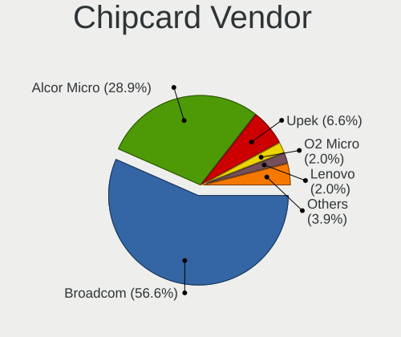

| Vendor                | Notebooks | Percent |
|-----------------------|-----------|---------|
| Broadcom              | 86        | 56.58%  |
| Alcor Micro           | 44        | 28.95%  |
| Upek                  | 10        | 6.58%   |
| O2 Micro              | 3         | 1.97%   |
| Lenovo                | 3         | 1.97%   |
| Yubico.com            | 1         | 0.66%   |
| OmniKey               | 1         | 0.66%   |
| Gemalto (was Gemplus) | 1         | 0.66%   |
| Feitian Technologies  | 1         | 0.66%   |
| Clay Logic            | 1         | 0.66%   |
| Advanced Card Systems | 1         | 0.66%   |

Chipcard Model
--------------

Chipcard module models

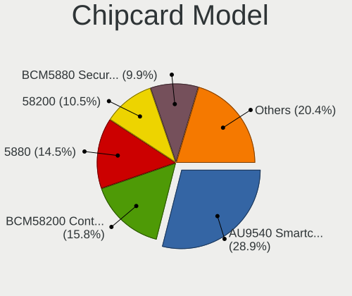

| Model                                                                        | Notebooks | Percent |
|------------------------------------------------------------------------------|-----------|---------|
| Alcor Micro AU9540 Smartcard Reader                                          | 44        | 28.95%  |
| Broadcom BCM58200 ControlVault 3 (FingerPrint sensor + Contacted SmartCard)  | 24        | 15.79%  |
| Broadcom 5880                                                                | 22        | 14.47%  |
| Broadcom 58200                                                               | 16        | 10.53%  |
| Broadcom BCM5880 Secure Applications Processor                               | 15        | 9.87%   |
| Upek TouchChip Fingerprint Coprocessor (WBF advanced mode)                   | 10        | 6.58%   |
| Broadcom BCM5880 Secure Applications Processor with fingerprint swipe sensor | 9         | 5.92%   |
| O2 Micro OZ776 CCID Smartcard Reader                                         | 3         | 1.97%   |
| Lenovo Integrated Smart Card Reader                                          | 3         | 1.97%   |
| Yubico.com Yubikey 4/5 U2F+CCID                                              | 1         | 0.66%   |
| OmniKey CardMan 3121 (HID Technologies)                                      | 1         | 0.66%   |
| Gemalto (was Gemplus) Compact Smart Card Reader Writer                       | 1         | 0.66%   |
| Feitian Technologies ePass2003                                               | 1         | 0.66%   |
| Clay Logic CanoKey Canary                                                    | 1         | 0.66%   |
| Advanced Card Systems ACR1252 Dual Reader                                    | 1         | 0.66%   |

Unsupported
-----------

Unsupported Devices
-------------------

Total unsupported devices on board

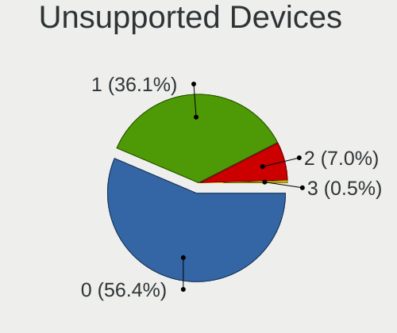

| Total | Notebooks | Percent |
|-------|-----------|---------|
| 0     | 1228      | 56.41%  |
| 1     | 785       | 36.06%  |
| 2     | 153       | 7.03%   |
| 3     | 11        | 0.51%   |

Unsupported Device Types
------------------------

Types of unsupported devices

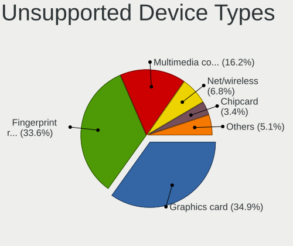

| Type                     | Notebooks | Percent |
|--------------------------|-----------|---------|
| Graphics card            | 383       | 34.88%  |
| Fingerprint reader       | 369       | 33.61%  |
| Multimedia controller    | 178       | 16.21%  |
| Net/wireless             | 75        | 6.83%   |
| Chipcard                 | 37        | 3.37%   |
| Camera                   | 15        | 1.37%   |
| Bluetooth                | 9         | 0.82%   |
| Storage                  | 8         | 0.73%   |
| Net/ethernet             | 8         | 0.73%   |
| Card reader              | 7         | 0.64%   |
| Sound                    | 3         | 0.27%   |
| Modem                    | 3         | 0.27%   |
| Communication controller | 2         | 0.18%   |
| Network                  | 1         | 0.09%   |

