Fedora 41 - Tested Hardware & Statistics (Desktops)
---------------------------------------------------

A project to collect tested hardware configurations for Fedora 41.

Anyone can contribute to this report by the [hw-probe](https://github.com/linuxhw/hw-probe) tool:

    sudo -E hw-probe -all -upload

Please contribute! Especially if your hardware is rare.

Contents
--------

* [ Test Cases ](#test-cases)

* [ System ](#system)
  - [ Kernel                   ](#kernel)
  - [ Kernel Family            ](#kernel-family)
  - [ Kernel Major Ver.        ](#kernel-major-ver)
  - [ Arch                     ](#arch)
  - [ DE                       ](#de)
  - [ Display Server           ](#display-server)
  - [ Display Manager          ](#display-manager)
  - [ OS Lang                  ](#os-lang)
  - [ Boot Mode                ](#boot-mode)
  - [ Filesystem               ](#filesystem)
  - [ Part. scheme             ](#part-scheme)
  - [ Dual Boot with Linux/BSD ](#dual-boot-with-linuxbsd)
  - [ Dual Boot (Win)          ](#dual-boot-win)

* [ Board ](#board)
  - [ Vendor                   ](#vendor)
  - [ Model                    ](#model)
  - [ Model Family             ](#model-family)
  - [ MFG Year                 ](#mfg-year)
  - [ Form Factor              ](#form-factor)
  - [ Secure Boot              ](#secure-boot)
  - [ Coreboot                 ](#coreboot)
  - [ RAM Size                 ](#ram-size)
  - [ RAM Used                 ](#ram-used)
  - [ Total Drives             ](#total-drives)
  - [ Has CD-ROM               ](#has-cd-rom)
  - [ Has Ethernet             ](#has-ethernet)
  - [ Has WiFi                 ](#has-wifi)
  - [ Has Bluetooth            ](#has-bluetooth)

* [ Location ](#location)
  - [ Country                  ](#country)
  - [ City                     ](#city)

* [ Drives ](#drives)
  - [ Drive Vendor             ](#drive-vendor)
  - [ Drive Model              ](#drive-model)
  - [ HDD Vendor               ](#hdd-vendor)
  - [ SSD Vendor               ](#ssd-vendor)
  - [ Drive Kind               ](#drive-kind)
  - [ Drive Connector          ](#drive-connector)
  - [ Drive Size               ](#drive-size)
  - [ Space Total              ](#space-total)
  - [ Space Used               ](#space-used)
  - [ Malfunc. Drives          ](#malfunc-drives)
  - [ Malfunc. Drive Vendor    ](#malfunc-drive-vendor)
  - [ Malfunc. HDD Vendor      ](#malfunc-hdd-vendor)
  - [ Malfunc. Drive Kind      ](#malfunc-drive-kind)
  - [ Failed Drives            ](#failed-drives)
  - [ Failed Drive Vendor      ](#failed-drive-vendor)
  - [ Drive Status             ](#drive-status)

* [ Storage controller ](#storage-controller)
  - [ Storage Vendor           ](#storage-vendor)
  - [ Storage Model            ](#storage-model)
  - [ Storage Kind             ](#storage-kind)

* [ Processor ](#processor)
  - [ CPU Vendor               ](#cpu-vendor)
  - [ CPU Model                ](#cpu-model)
  - [ CPU Model Family         ](#cpu-model-family)
  - [ CPU Cores                ](#cpu-cores)
  - [ CPU Sockets              ](#cpu-sockets)
  - [ CPU Threads              ](#cpu-threads)
  - [ CPU Op-Modes             ](#cpu-op-modes)
  - [ CPU Microcode            ](#cpu-microcode)
  - [ CPU Microarch            ](#cpu-microarch)

* [ Graphics ](#graphics)
  - [ GPU Vendor               ](#gpu-vendor)
  - [ GPU Model                ](#gpu-model)
  - [ GPU Combo                ](#gpu-combo)
  - [ GPU Driver               ](#gpu-driver)
  - [ GPU Memory               ](#gpu-memory)

* [ Monitor ](#monitor)
  - [ Monitor Vendor           ](#monitor-vendor)
  - [ Monitor Model            ](#monitor-model)
  - [ Monitor Resolution       ](#monitor-resolution)
  - [ Monitor Diagonal         ](#monitor-diagonal)
  - [ Monitor Width            ](#monitor-width)
  - [ Aspect Ratio             ](#aspect-ratio)
  - [ Monitor Area             ](#monitor-area)
  - [ Pixel Density            ](#pixel-density)
  - [ Multiple Monitors        ](#multiple-monitors)

* [ Network ](#network)
  - [ Net Controller Vendor    ](#net-controller-vendor)
  - [ Net Controller Model     ](#net-controller-model)
  - [ Wireless Vendor          ](#wireless-vendor)
  - [ Wireless Model           ](#wireless-model)
  - [ Ethernet Vendor          ](#ethernet-vendor)
  - [ Ethernet Model           ](#ethernet-model)
  - [ Net Controller Kind      ](#net-controller-kind)
  - [ Used Controller          ](#used-controller)
  - [ NICs                     ](#nics)
  - [ IPv6                     ](#ipv6)

* [ Bluetooth ](#bluetooth)
  - [ Bluetooth Vendor         ](#bluetooth-vendor)
  - [ Bluetooth Model          ](#bluetooth-model)

* [ Sound ](#sound)
  - [ Sound Vendor             ](#sound-vendor)
  - [ Sound Model              ](#sound-model)

* [ Memory ](#memory)
  - [ Memory Vendor            ](#memory-vendor)
  - [ Memory Model             ](#memory-model)
  - [ Memory Kind              ](#memory-kind)
  - [ Memory Form Factor       ](#memory-form-factor)
  - [ Memory Size              ](#memory-size)
  - [ Memory Speed             ](#memory-speed)

* [ Printers & scanners ](#printers--scanners)
  - [ Printer Vendor           ](#printer-vendor)
  - [ Printer Model            ](#printer-model)
  - [ Scanner Vendor           ](#scanner-vendor)
  - [ Scanner Model            ](#scanner-model)

* [ Camera ](#camera)
  - [ Camera Vendor            ](#camera-vendor)
  - [ Camera Model             ](#camera-model)

* [ Security ](#security)
  - [ Fingerprint Vendor       ](#fingerprint-vendor)
  - [ Fingerprint Model        ](#fingerprint-model)
  - [ Chipcard Vendor          ](#chipcard-vendor)
  - [ Chipcard Model           ](#chipcard-model)

* [ Unsupported ](#unsupported)
  - [ Unsupported Devices      ](#unsupported-devices)
  - [ Unsupported Device Types ](#unsupported-device-types)

Test Cases
----------

Total: 1437

| Vendor        | Model                       | Probe                                                      | Date         |
|---------------|-----------------------------|------------------------------------------------------------|--------------|
| MSI           | PRO Z890-A WIFI             | [f670a8542c](https://linux-hardware.org/?probe=f670a8542c) | Dec 16, 2025 |
| ASUSTek       | ROG CROSSHAIR VIII DARK ... | [4eb6b901b6](https://linux-hardware.org/?probe=4eb6b901b6) | Dec 09, 2025 |
| ASUSTek       | ROG CROSSHAIR X870E HERO    | [29b4ebf81c](https://linux-hardware.org/?probe=29b4ebf81c) | Dec 09, 2025 |
| MSI           | Z390-A PRO                  | [64ba8969eb](https://linux-hardware.org/?probe=64ba8969eb) | Nov 15, 2025 |
| Shenzhen M... | AHBNB OEM                   | [a23d3903c5](https://linux-hardware.org/?probe=a23d3903c5) | Oct 29, 2025 |
| MSI           | MPG B550 GAMING PLUS        | [cc862822dc](https://linux-hardware.org/?probe=cc862822dc) | Oct 27, 2025 |
| ASUSTek       | PRIME H610I-PLUS D4         | [75983175ac](https://linux-hardware.org/?probe=75983175ac) | Oct 25, 2025 |
| Lenovo        | SDK0E50510 WIN              | [9f16f7bb01](https://linux-hardware.org/?probe=9f16f7bb01) | Oct 25, 2025 |
| ASUSTek       | PRIME B650-PLUS WIFI        | [5d449203c3](https://linux-hardware.org/?probe=5d449203c3) | Oct 12, 2025 |
| Intel         | 13th Raptor Lake PCH B76... | [a45abc7d49](https://linux-hardware.org/?probe=a45abc7d49) | Oct 11, 2025 |
| ASRock        | Z370M-ITX/ac                | [7f636defb3](https://linux-hardware.org/?probe=7f636defb3) | Oct 10, 2025 |
| MSI           | Z390-A PRO                  | [0d659fa29d](https://linux-hardware.org/?probe=0d659fa29d) | Oct 10, 2025 |
| Dell          | 08NPPY A00                  | [ac9331f4cd](https://linux-hardware.org/?probe=ac9331f4cd) | Oct 08, 2025 |
| HP            | 339A                        | [9367845801](https://linux-hardware.org/?probe=9367845801) | Oct 08, 2025 |
| ASUSTek       | M5A78L-M/USB3               | [ff1b80fe17](https://linux-hardware.org/?probe=ff1b80fe17) | Oct 04, 2025 |
| Gigabyte      | B850 GAMING WIFI6           | [2a56ec678a](https://linux-hardware.org/?probe=2a56ec678a) | Sep 23, 2025 |
| Unknown       | Unknown                     | [fd0249996b](https://linux-hardware.org/?probe=fd0249996b) | Sep 21, 2025 |
| Lenovo        | 30BC SDK0J40697 WIN 3305... | [6f349e5245](https://linux-hardware.org/?probe=6f349e5245) | Sep 21, 2025 |
| ASUSTek       | PRIME B650M-A AX II         | [fd9484610b](https://linux-hardware.org/?probe=fd9484610b) | Sep 15, 2025 |
| MSI           | Z790 GAMING WIFI            | [35524f8c84](https://linux-hardware.org/?probe=35524f8c84) | Sep 09, 2025 |
| ASUSTek       | PRIME B650M-A AX II         | [09550d2f78](https://linux-hardware.org/?probe=09550d2f78) | Sep 07, 2025 |
| ASUSTek       | PRIME B650M-A AX II         | [50b2ef5447](https://linux-hardware.org/?probe=50b2ef5447) | Sep 06, 2025 |
| Intel         | B75A                        | [45438db095](https://linux-hardware.org/?probe=45438db095) | Sep 02, 2025 |
| ASUSTek       | ProArt X870E-CREATOR WIF... | [d21fdfc52a](https://linux-hardware.org/?probe=d21fdfc52a) | Aug 31, 2025 |
| ASUSTek       | PRIME B350M-A               | [7349980cf3](https://linux-hardware.org/?probe=7349980cf3) | Aug 19, 2025 |
| ASUSTek       | B85M-E                      | [a1e61f99bc](https://linux-hardware.org/?probe=a1e61f99bc) | Aug 09, 2025 |
| HUAWEI        | PUL-WDX9-PCB-B1 M1040       | [de5218c0da](https://linux-hardware.org/?probe=de5218c0da) | Aug 07, 2025 |
| Gigabyte      | B550I AORUS PRO AX          | [b398f5a684](https://linux-hardware.org/?probe=b398f5a684) | Jul 25, 2025 |
| ASUSTek       | PRIME B650M-A AX II         | [ad5820dde6](https://linux-hardware.org/?probe=ad5820dde6) | Jul 15, 2025 |
| MSI           | B550-A PRO                  | [6551611eb6](https://linux-hardware.org/?probe=6551611eb6) | Jul 14, 2025 |
| ASUSTek       | PRIME B650M-A AX II         | [37a35d9bb1](https://linux-hardware.org/?probe=37a35d9bb1) | Jul 14, 2025 |
| ASUSTek       | PRIME B650M-A AX II         | [f48e487339](https://linux-hardware.org/?probe=f48e487339) | Jul 13, 2025 |
| MSI           | MAG B650 TOMAHAWK WIFI      | [11e075c8dc](https://linux-hardware.org/?probe=11e075c8dc) | Jul 09, 2025 |
| MSI           | MAG B650 TOMAHAWK WIFI      | [4850ccb1d9](https://linux-hardware.org/?probe=4850ccb1d9) | Jul 09, 2025 |
| Gigabyte      | B650 EAGLE AX               | [0e8f55aeb0](https://linux-hardware.org/?probe=0e8f55aeb0) | Jul 06, 2025 |
| Gigabyte      | 970A-DS3P                   | [4d0d537bb1](https://linux-hardware.org/?probe=4d0d537bb1) | Jul 03, 2025 |
| ASUSTek       | M4N68T-M-V2                 | [f7bb81c7bb](https://linux-hardware.org/?probe=f7bb81c7bb) | Jul 01, 2025 |
| ASRock        | B650E Steel Legend WiFi     | [451f01147a](https://linux-hardware.org/?probe=451f01147a) | Jun 30, 2025 |
| HP            | 8266                        | [7f3d34e133](https://linux-hardware.org/?probe=7f3d34e133) | Jun 30, 2025 |
| ASUSTek       | P5B                         | [7245c1dd87](https://linux-hardware.org/?probe=7245c1dd87) | Jun 30, 2025 |
| MSI           | B350M GAMING PRO            | [d4b58b3d1c](https://linux-hardware.org/?probe=d4b58b3d1c) | Jun 30, 2025 |
| ASUSTek       | M5A78L-M/USB3               | [505d1f21f5](https://linux-hardware.org/?probe=505d1f21f5) | Jun 27, 2025 |
| Biostar       | X370GTN                     | [f994c03bed](https://linux-hardware.org/?probe=f994c03bed) | Jun 23, 2025 |
| Biostar       | X370GTN                     | [4d9ce9729d](https://linux-hardware.org/?probe=4d9ce9729d) | Jun 23, 2025 |
| MSI           | Z390-A PRO                  | [cf5cda0142](https://linux-hardware.org/?probe=cf5cda0142) | Jun 21, 2025 |
| MSI           | B250I GAMING PRO AC         | [603bd2bcb5](https://linux-hardware.org/?probe=603bd2bcb5) | Jun 20, 2025 |
| ASUSTek       | P5E                         | [6153cd158b](https://linux-hardware.org/?probe=6153cd158b) | Jun 18, 2025 |
| MSI           | B450-A PRO MAX              | [72136aa845](https://linux-hardware.org/?probe=72136aa845) | Jun 18, 2025 |
| MSI           | MAG B550M MORTAR WIFI       | [b26c41f9dc](https://linux-hardware.org/?probe=b26c41f9dc) | Jun 15, 2025 |
| Intel         | DH87RL AAG74240-400         | [db4d58142d](https://linux-hardware.org/?probe=db4d58142d) | Jun 14, 2025 |
| Dell          | 0WR7PY A01                  | [22853276fa](https://linux-hardware.org/?probe=22853276fa) | Jun 14, 2025 |
| Dell          | 0WR7PY A01                  | [6071a82d06](https://linux-hardware.org/?probe=6071a82d06) | Jun 14, 2025 |
| ASRock        | TRX40 Creator               | [086a3167e4](https://linux-hardware.org/?probe=086a3167e4) | Jun 11, 2025 |
| Acer          | Veriton M2630G V:1.0        | [b46528e66b](https://linux-hardware.org/?probe=b46528e66b) | Jun 08, 2025 |
| ASUSTek       | G20AJ                       | [923cb88ebd](https://linux-hardware.org/?probe=923cb88ebd) | Jun 07, 2025 |
| Gigabyte      | X470 AORUS ULTRA GAMING-... | [0f88c24377](https://linux-hardware.org/?probe=0f88c24377) | Jun 04, 2025 |
| ASUSTek       | PRIME B650M-A AX II         | [a6cc825ce1](https://linux-hardware.org/?probe=a6cc825ce1) | Jun 02, 2025 |
| MSI           | PRO H610M-E                 | [3a3fb2252e](https://linux-hardware.org/?probe=3a3fb2252e) | Jun 01, 2025 |
| ASRock        | B660M Pro RS/AX             | [8e137ed184](https://linux-hardware.org/?probe=8e137ed184) | Jun 01, 2025 |
| ASUSTek       | PRIME B650M-A AX II         | [8edd09d658](https://linux-hardware.org/?probe=8edd09d658) | Jun 01, 2025 |
| ASRock        | B650E Steel Legend WiFi     | [dae8abde24](https://linux-hardware.org/?probe=dae8abde24) | May 31, 2025 |
| ASRock        | AMD BC-250                  | [4184746e8a](https://linux-hardware.org/?probe=4184746e8a) | May 29, 2025 |
| Gigabyte      | Z77MX-D3H                   | [c20b379f3e](https://linux-hardware.org/?probe=c20b379f3e) | May 29, 2025 |
| ASRock        | 960GM-VGS3 FX               | [1bfa8786a1](https://linux-hardware.org/?probe=1bfa8786a1) | May 26, 2025 |
| ASRock        | 960GM-VGS3 FX               | [50993c10e6](https://linux-hardware.org/?probe=50993c10e6) | May 25, 2025 |
| ASUSTek       | M5A78L-M/USB3               | [55bdb26850](https://linux-hardware.org/?probe=55bdb26850) | May 25, 2025 |
| Gigabyte      | X870 AORUS ELITE WIFI7      | [a39f910444](https://linux-hardware.org/?probe=a39f910444) | May 25, 2025 |
| Pegatron      | Benicia                     | [7dadc53929](https://linux-hardware.org/?probe=7dadc53929) | May 25, 2025 |
| MSI           | MAG B660M MORTAR DDR4       | [8993926618](https://linux-hardware.org/?probe=8993926618) | May 24, 2025 |
| ASUSTek       | PRIME B350M-A               | [fa7db691e7](https://linux-hardware.org/?probe=fa7db691e7) | May 24, 2025 |
| ASUSTek       | TUF B450M-PRO GAMING        | [f70660d1cf](https://linux-hardware.org/?probe=f70660d1cf) | May 24, 2025 |
| MSI           | TRX40 PRO WIFI              | [4ad4538d68](https://linux-hardware.org/?probe=4ad4538d68) | May 22, 2025 |
| Unknown       | Unknown                     | [54d7e6c7fa](https://linux-hardware.org/?probe=54d7e6c7fa) | May 20, 2025 |
| Gigabyte      | Z68MA-D2H-B3                | [408bd9530d](https://linux-hardware.org/?probe=408bd9530d) | May 20, 2025 |
| Gigabyte      | GA-870A-UD3                 | [bb694388e1](https://linux-hardware.org/?probe=bb694388e1) | May 18, 2025 |
| Gigabyte      | H81M-S2PV                   | [2c9a7a80af](https://linux-hardware.org/?probe=2c9a7a80af) | May 12, 2025 |
| Dell          | 0KRC95 A02                  | [0bc0e63251](https://linux-hardware.org/?probe=0bc0e63251) | May 10, 2025 |
| Gigabyte      | EP45-DS3L                   | [3005266cd4](https://linux-hardware.org/?probe=3005266cd4) | May 10, 2025 |
| ASUSTek       | PRIME B550M-K               | [8337e657d7](https://linux-hardware.org/?probe=8337e657d7) | May 09, 2025 |
| ASUSTek       | TUF Gaming B450M-PLUS II    | [f49744ae0b](https://linux-hardware.org/?probe=f49744ae0b) | May 07, 2025 |
| ASUSTek       | TUF Gaming X570-PLUS_BR     | [355a41646a](https://linux-hardware.org/?probe=355a41646a) | May 06, 2025 |
| MSI           | PRO B660-A DDR4             | [04a97d5ad9](https://linux-hardware.org/?probe=04a97d5ad9) | May 06, 2025 |
| Dell          | 02YYK5 A01                  | [94d5165ffb](https://linux-hardware.org/?probe=94d5165ffb) | May 04, 2025 |
| ASRock        | Z390 Phantom Gaming SLI/... | [a528846666](https://linux-hardware.org/?probe=a528846666) | May 04, 2025 |
| ASUSTek       | H81M-C                      | [357444c21d](https://linux-hardware.org/?probe=357444c21d) | May 04, 2025 |
| ASUSTek       | PRIME B650M-A II            | [73df6711e8](https://linux-hardware.org/?probe=73df6711e8) | May 03, 2025 |
| ASUSTek       | PRIME B650M-A AX II         | [e7cb6912e5](https://linux-hardware.org/?probe=e7cb6912e5) | May 03, 2025 |
| ASUSTek       | TUF Z370-PLUS GAMING        | [bfe48a8f04](https://linux-hardware.org/?probe=bfe48a8f04) | May 02, 2025 |
| ASUSTek       | PRIME B650M-A AX II         | [aec34cf394](https://linux-hardware.org/?probe=aec34cf394) | May 02, 2025 |
| MSI           | MEG X570 ACE                | [f1fb7ca4af](https://linux-hardware.org/?probe=f1fb7ca4af) | May 02, 2025 |
| ASUSTek       | PRIME B650M-A AX II         | [3190416c65](https://linux-hardware.org/?probe=3190416c65) | Apr 30, 2025 |
| Gigabyte      | B450 AORUS ELITE            | [d140d41566](https://linux-hardware.org/?probe=d140d41566) | Apr 29, 2025 |
| Gigabyte      | B85-HD3                     | [ffdf4d02b2](https://linux-hardware.org/?probe=ffdf4d02b2) | Apr 29, 2025 |
| ASUSTek       | PRIME B650M-A AX II         | [24b664af92](https://linux-hardware.org/?probe=24b664af92) | Apr 29, 2025 |
| MSI           | MPG X570 GAMING EDGE WIF... | [e6c91bd27d](https://linux-hardware.org/?probe=e6c91bd27d) | Apr 27, 2025 |
| Gigabyte      | A320M-S2H-CF                | [bc1526a3cb](https://linux-hardware.org/?probe=bc1526a3cb) | Apr 26, 2025 |
| Gigabyte      | EP45-DS3L                   | [cb2a1c77f7](https://linux-hardware.org/?probe=cb2a1c77f7) | Apr 26, 2025 |
| MSI           | Z370 PC PRO                 | [5f526e0951](https://linux-hardware.org/?probe=5f526e0951) | Apr 23, 2025 |
| MSI           | Z370 PC PRO                 | [df503b475e](https://linux-hardware.org/?probe=df503b475e) | Apr 23, 2025 |
| MSI           | MAG B550M BAZOOKA           | [339c81444b](https://linux-hardware.org/?probe=339c81444b) | Apr 23, 2025 |
| JGINYUE       | B650I Night Devil Ver:      | [6ba8e11a07](https://linux-hardware.org/?probe=6ba8e11a07) | Apr 21, 2025 |
| JGINYUE       | B650I Night Devil Ver:      | [fb70244022](https://linux-hardware.org/?probe=fb70244022) | Apr 21, 2025 |
| MSI           | MEG X570 ACE                | [2169b84b68](https://linux-hardware.org/?probe=2169b84b68) | Apr 21, 2025 |
| ASUSTek       | B85M-G                      | [4e056ff3e3](https://linux-hardware.org/?probe=4e056ff3e3) | Apr 20, 2025 |
| ASUSTek       | P5N73-AM                    | [b3c20164c2](https://linux-hardware.org/?probe=b3c20164c2) | Apr 20, 2025 |
| MSI           | MPG Z690 CARBON WIFI        | [1c6533cd01](https://linux-hardware.org/?probe=1c6533cd01) | Apr 20, 2025 |
| HP            | 843B                        | [4772914984](https://linux-hardware.org/?probe=4772914984) | Apr 20, 2025 |
| Alienware     | 07W25T A00                  | [a8bcaf7ea1](https://linux-hardware.org/?probe=a8bcaf7ea1) | Apr 19, 2025 |
| ASUSTek       | P8Z77-V PRO                 | [cda6bb9bab](https://linux-hardware.org/?probe=cda6bb9bab) | Apr 19, 2025 |
| MSI           | B450 GAMING PRO CARBON A... | [c60b009eca](https://linux-hardware.org/?probe=c60b009eca) | Apr 19, 2025 |
| ZR            | H510M-E                     | [64435f0d4c](https://linux-hardware.org/?probe=64435f0d4c) | Apr 19, 2025 |
| ASUSTek       | PRIME B560-PLUS             | [3c23dc4d31](https://linux-hardware.org/?probe=3c23dc4d31) | Apr 19, 2025 |
| Gigabyte      | B450 AORUS PRO-CF           | [415de75acc](https://linux-hardware.org/?probe=415de75acc) | Apr 19, 2025 |
| ASUSTek       | M4A88T-V EVO/USB3           | [b35c7f3e07](https://linux-hardware.org/?probe=b35c7f3e07) | Apr 18, 2025 |
| Gigabyte      | B550M DS3H                  | [320d54b7a5](https://linux-hardware.org/?probe=320d54b7a5) | Apr 18, 2025 |
| Gigabyte      | Z790 AORUS ELITE AX ICE     | [3c41241a9d](https://linux-hardware.org/?probe=3c41241a9d) | Apr 18, 2025 |
| Gigabyte      | A520M DS3H                  | [392b63c3f6](https://linux-hardware.org/?probe=392b63c3f6) | Apr 17, 2025 |
| Dell          | 0HD5W2 A00                  | [daa5b37653](https://linux-hardware.org/?probe=daa5b37653) | Apr 17, 2025 |
| AZW           | L55                         | [849edcc900](https://linux-hardware.org/?probe=849edcc900) | Apr 17, 2025 |
| ASUSTek       | TUF Gaming X570-PLUS        | [2026275022](https://linux-hardware.org/?probe=2026275022) | Apr 17, 2025 |
| ASUSTek       | ROG Maximus Z690 HERO       | [3a46bd9c53](https://linux-hardware.org/?probe=3a46bd9c53) | Apr 16, 2025 |
| Apple         | Mac-27AD2F918AE68F61 Mac... | [97d25995ff](https://linux-hardware.org/?probe=97d25995ff) | Apr 16, 2025 |
| ASRock        | B450 Steel Legend           | [e3fd20c005](https://linux-hardware.org/?probe=e3fd20c005) | Apr 16, 2025 |
| Gigabyte      | B450 AORUS PRO WIFI-CF      | [eb761a0295](https://linux-hardware.org/?probe=eb761a0295) | Apr 16, 2025 |
| MSI           | PRO H610M-G WIFI            | [1fca7d9e31](https://linux-hardware.org/?probe=1fca7d9e31) | Apr 15, 2025 |
| ASUSTek       | B150M-A/M.2                 | [2d225cb8c1](https://linux-hardware.org/?probe=2d225cb8c1) | Apr 15, 2025 |
| Lenovo        | 376A SDK0T76461 WIN 3422... | [60f26300b5](https://linux-hardware.org/?probe=60f26300b5) | Apr 15, 2025 |
| Alienware     | 0RF96M A02                  | [aae28a9e4a](https://linux-hardware.org/?probe=aae28a9e4a) | Apr 15, 2025 |
| ASUSTek       | TUF Gaming B550-PLUS        | [be7fb844ec](https://linux-hardware.org/?probe=be7fb844ec) | Apr 15, 2025 |
| ASUSTek       | TUF Gaming Z490-PLUS        | [0d387baefd](https://linux-hardware.org/?probe=0d387baefd) | Apr 15, 2025 |
| Biostar       | A320MH                      | [129e334b15](https://linux-hardware.org/?probe=129e334b15) | Apr 15, 2025 |
| Lenovo        | SHARKBAY NOK                | [ed508838a7](https://linux-hardware.org/?probe=ed508838a7) | Apr 15, 2025 |
| MSI           | B450M MORTAR                | [58d3b9cebc](https://linux-hardware.org/?probe=58d3b9cebc) | Apr 15, 2025 |
| Lenovo        | 376A SDK0T76461 WIN 3422... | [609dfb53fe](https://linux-hardware.org/?probe=609dfb53fe) | Apr 15, 2025 |
| MSI           | PRO Z790-P WIFI             | [0a735901b2](https://linux-hardware.org/?probe=0a735901b2) | Apr 15, 2025 |
| ASUSTek       | H110M-A                     | [0c13aa88db](https://linux-hardware.org/?probe=0c13aa88db) | Apr 14, 2025 |
| ASUSTek       | H81M-C                      | [f5cd4e3c08](https://linux-hardware.org/?probe=f5cd4e3c08) | Apr 14, 2025 |
| Shenzhen M... | F7BFD                       | [7d2e65c035](https://linux-hardware.org/?probe=7d2e65c035) | Apr 14, 2025 |
| Gigabyte      | B550M AORUS ELITE           | [371791c7c9](https://linux-hardware.org/?probe=371791c7c9) | Apr 14, 2025 |
| Unknown       | Unknown                     | [6244e78cbb](https://linux-hardware.org/?probe=6244e78cbb) | Apr 14, 2025 |
| Unknown       | Unknown                     | [81cd788164](https://linux-hardware.org/?probe=81cd788164) | Apr 14, 2025 |
| AMI           | Intel                       | [ec9281554b](https://linux-hardware.org/?probe=ec9281554b) | Apr 14, 2025 |
| HP            | 8906 SMVB                   | [d58a3ebceb](https://linux-hardware.org/?probe=d58a3ebceb) | Apr 13, 2025 |
| MSI           | MAG X870E TOMAHAWK WIFI     | [dd6f1fda76](https://linux-hardware.org/?probe=dd6f1fda76) | Apr 13, 2025 |
| Gigabyte      | A520M K V2                  | [c9bf92a9b5](https://linux-hardware.org/?probe=c9bf92a9b5) | Apr 13, 2025 |
| ASRock        | H310CM-DVS                  | [6fe2e37666](https://linux-hardware.org/?probe=6fe2e37666) | Apr 13, 2025 |
| MSI           | MAG X870E TOMAHAWK WIFI     | [f65dbff8b4](https://linux-hardware.org/?probe=f65dbff8b4) | Apr 13, 2025 |
| ASRock        | B550 Phantom Gaming 4/ac    | [53bed95c35](https://linux-hardware.org/?probe=53bed95c35) | Apr 13, 2025 |
| ASRock        | B550M PG Riptide            | [09e979f060](https://linux-hardware.org/?probe=09e979f060) | Apr 13, 2025 |
| ASRock        | H510M-HDV/M.2 SE            | [569be7448b](https://linux-hardware.org/?probe=569be7448b) | Apr 13, 2025 |
| C&T Soluti... | RCO10X0 Series 100          | [4063b65d0b](https://linux-hardware.org/?probe=4063b65d0b) | Apr 12, 2025 |
| ASRock        | H310CM-IB                   | [b0af78d02d](https://linux-hardware.org/?probe=b0af78d02d) | Apr 12, 2025 |
| ASRock        | H310CM-IB                   | [23af1f06e2](https://linux-hardware.org/?probe=23af1f06e2) | Apr 12, 2025 |
| Medion        | B660H7-M20                  | [3b5a5720dd](https://linux-hardware.org/?probe=3b5a5720dd) | Apr 12, 2025 |
| ASUSTek       | ProArt X670E-CREATOR WIF... | [09f81a9fe8](https://linux-hardware.org/?probe=09f81a9fe8) | Apr 12, 2025 |
| ASUSTek       | ProArt X670E-CREATOR WIF... | [77c4f14ad1](https://linux-hardware.org/?probe=77c4f14ad1) | Apr 12, 2025 |
| ASUSTek       | ProArt X670E-CREATOR WIF... | [164fad2d68](https://linux-hardware.org/?probe=164fad2d68) | Apr 12, 2025 |
| Dell          | 0H1DC6 A00                  | [f39367ebe4](https://linux-hardware.org/?probe=f39367ebe4) | Apr 12, 2025 |
| ASUSTek       | ROG STRIX Z790-F GAMING ... | [7779494b16](https://linux-hardware.org/?probe=7779494b16) | Apr 12, 2025 |
| Dell          | 0Y2MRG A00                  | [f38e9e7149](https://linux-hardware.org/?probe=f38e9e7149) | Apr 11, 2025 |
| MSI           | MAG B550 TOMAHAWK           | [f7a77b606a](https://linux-hardware.org/?probe=f7a77b606a) | Apr 11, 2025 |
| ASUSTek       | PRIME B450M-A II            | [e59ef2dc40](https://linux-hardware.org/?probe=e59ef2dc40) | Apr 11, 2025 |
| SZQFTX        | MI2-SC                      | [3fae75ac82](https://linux-hardware.org/?probe=3fae75ac82) | Apr 11, 2025 |
| ASUSTek       | PRIME B450M-A II            | [010a9a2362](https://linux-hardware.org/?probe=010a9a2362) | Apr 11, 2025 |
| ASUSTek       | SABERTOOTH Z77              | [7fa74ee631](https://linux-hardware.org/?probe=7fa74ee631) | Apr 11, 2025 |
| Lenovo        | 314F SDK0J40697 WIN 3305... | [5d400ed9d2](https://linux-hardware.org/?probe=5d400ed9d2) | Apr 10, 2025 |
| Gigabyte      | B850M DS3H                  | [ae1ae27b18](https://linux-hardware.org/?probe=ae1ae27b18) | Apr 10, 2025 |
| ASRock        | Z690 Taichi                 | [7b102262b7](https://linux-hardware.org/?probe=7b102262b7) | Apr 10, 2025 |
| ASUSTek       | ROG STRIX X670E-E GAMING... | [9491c44b1b](https://linux-hardware.org/?probe=9491c44b1b) | Apr 10, 2025 |
| ASUSTek       | PRIME A320M-K/BR            | [ad21a903ec](https://linux-hardware.org/?probe=ad21a903ec) | Apr 10, 2025 |
| ASUSTek       | M4A88T-V EVO/USB3           | [527a463cf0](https://linux-hardware.org/?probe=527a463cf0) | Apr 10, 2025 |
| Dell          | 0NC2VH A01                  | [406ed546ca](https://linux-hardware.org/?probe=406ed546ca) | Apr 10, 2025 |
| HP            | 894B 10                     | [6773a62a6f](https://linux-hardware.org/?probe=6773a62a6f) | Apr 10, 2025 |
| MSI           | X370 GAMING PRO CARBON      | [c46dc3dda1](https://linux-hardware.org/?probe=c46dc3dda1) | Apr 09, 2025 |
| MSI           | B550M PRO-VDH WIFI          | [bcf2089a95](https://linux-hardware.org/?probe=bcf2089a95) | Apr 09, 2025 |
| MSI           | H410M-A PRO                 | [7d45a27213](https://linux-hardware.org/?probe=7d45a27213) | Apr 09, 2025 |
| MSI           | H410M-A PRO                 | [f298ba7a98](https://linux-hardware.org/?probe=f298ba7a98) | Apr 09, 2025 |
| AZW           | L55                         | [9b79edcaf8](https://linux-hardware.org/?probe=9b79edcaf8) | Apr 09, 2025 |
| Gigabyte      | B560M DS3H V2               | [f76d60d61c](https://linux-hardware.org/?probe=f76d60d61c) | Apr 09, 2025 |
| ASUSTek       | PRIME B650-PLUS             | [f259f9942e](https://linux-hardware.org/?probe=f259f9942e) | Apr 09, 2025 |
| ASRock        | A320M/ac                    | [270423ce6c](https://linux-hardware.org/?probe=270423ce6c) | Apr 08, 2025 |
| MSI           | B550-A PRO                  | [a403224ff4](https://linux-hardware.org/?probe=a403224ff4) | Apr 08, 2025 |
| MSI           | B550-A PRO                  | [96bb49ba1d](https://linux-hardware.org/?probe=96bb49ba1d) | Apr 08, 2025 |
| ASUSTek       | STRIX H270F GAMING          | [cd22379c12](https://linux-hardware.org/?probe=cd22379c12) | Apr 07, 2025 |
| Gigabyte      | X870 AORUS ELITE WIFI7 I... | [42903ca6b8](https://linux-hardware.org/?probe=42903ca6b8) | Apr 07, 2025 |
| MSI           | B350M GAMING PRO            | [57c0dc7eb7](https://linux-hardware.org/?probe=57c0dc7eb7) | Apr 07, 2025 |
| ASUSTek       | Z97-A                       | [69699d658a](https://linux-hardware.org/?probe=69699d658a) | Apr 07, 2025 |
| ASUSTek       | Z97-A                       | [85d314ed2f](https://linux-hardware.org/?probe=85d314ed2f) | Apr 07, 2025 |
| Gigabyte      | GA-880GM-UD2H               | [8921e27858](https://linux-hardware.org/?probe=8921e27858) | Apr 07, 2025 |
| ASUSTek       | ROG STRIX B650-A GAMING ... | [824b8128e0](https://linux-hardware.org/?probe=824b8128e0) | Apr 07, 2025 |
| MSI           | MAG B550 TOMAHAWK           | [1804aeb405](https://linux-hardware.org/?probe=1804aeb405) | Apr 06, 2025 |
| ASRock        | X870E Taichi Lite           | [cbf80cd7a6](https://linux-hardware.org/?probe=cbf80cd7a6) | Apr 06, 2025 |
| ASRock        | B650M Pro RS                | [a279d583b5](https://linux-hardware.org/?probe=a279d583b5) | Apr 06, 2025 |
| ASRock        | B650M Pro RS                | [8902cd9f81](https://linux-hardware.org/?probe=8902cd9f81) | Apr 06, 2025 |
| Gigabyte      | Z97X-Gaming 3               | [79ff36bf59](https://linux-hardware.org/?probe=79ff36bf59) | Apr 06, 2025 |
| Dell          | 0NW6H5 A00                  | [bed06c4c69](https://linux-hardware.org/?probe=bed06c4c69) | Apr 06, 2025 |
| HC Technol... | HCAR5000-MI                 | [5ba151f4eb](https://linux-hardware.org/?probe=5ba151f4eb) | Apr 06, 2025 |
| Gigabyte      | Z170-D3H-CF                 | [322459cd0d](https://linux-hardware.org/?probe=322459cd0d) | Apr 06, 2025 |
| OEM           | X79-Turbo                   | [10454cd61f](https://linux-hardware.org/?probe=10454cd61f) | Apr 06, 2025 |
| MSI           | PRO Z790-A MAX WIFI         | [601f8f286a](https://linux-hardware.org/?probe=601f8f286a) | Apr 06, 2025 |
| MSI           | MAG B550 TOMAHAWK           | [a167e2353b](https://linux-hardware.org/?probe=a167e2353b) | Apr 06, 2025 |
| MSI           | MAG B650 TOMAHAWK WIFI      | [22cbf6933d](https://linux-hardware.org/?probe=22cbf6933d) | Apr 05, 2025 |
| ASUSTek       | Pro WS TRX50-SAGE WIFI      | [546f81aa95](https://linux-hardware.org/?probe=546f81aa95) | Apr 05, 2025 |
| ASUSTek       | PRIME H410M-R               | [08075ff1f3](https://linux-hardware.org/?probe=08075ff1f3) | Apr 05, 2025 |
| Intel         | DB75EN AAG39650-302         | [f02aa5fbc6](https://linux-hardware.org/?probe=f02aa5fbc6) | Apr 05, 2025 |
| ASRock        | B250 Pro4                   | [dfba19c7ad](https://linux-hardware.org/?probe=dfba19c7ad) | Apr 05, 2025 |
| ASUSTek       | B85M-G                      | [adb1ef2070](https://linux-hardware.org/?probe=adb1ef2070) | Apr 04, 2025 |
| ASUSTek       | A88X-PLUS/USB               | [495016bc32](https://linux-hardware.org/?probe=495016bc32) | Apr 04, 2025 |
| MSI           | PRO B760-VC WIFI 7 BULK     | [49456ec87c](https://linux-hardware.org/?probe=49456ec87c) | Apr 04, 2025 |
| ASUSTek       | ROG ZENITH EXTREME          | [4641a46067](https://linux-hardware.org/?probe=4641a46067) | Apr 04, 2025 |
| MSI           | MAG X870 TOMAHAWK WIFI      | [0e7dae8e0a](https://linux-hardware.org/?probe=0e7dae8e0a) | Apr 04, 2025 |
| MSI           | 970A-G43                    | [b82a0ca79c](https://linux-hardware.org/?probe=b82a0ca79c) | Apr 04, 2025 |
| ASUSTek       | TUF Gaming X570-PLUS        | [24cd47cef4](https://linux-hardware.org/?probe=24cd47cef4) | Apr 04, 2025 |
| Gigabyte      | Z77MX-D3H                   | [798934e15b](https://linux-hardware.org/?probe=798934e15b) | Apr 04, 2025 |
| MSI           | X470 GAMING PRO CARBON      | [65d210a8cc](https://linux-hardware.org/?probe=65d210a8cc) | Apr 03, 2025 |
| HP            | 18E7                        | [a8325f5897](https://linux-hardware.org/?probe=a8325f5897) | Apr 03, 2025 |
| Gigabyte      | EP45-DS3L                   | [0d2501da82](https://linux-hardware.org/?probe=0d2501da82) | Apr 03, 2025 |
| MSI           | B550-A PRO                  | [fccc8229f0](https://linux-hardware.org/?probe=fccc8229f0) | Apr 02, 2025 |
| ASRock        | Z97 Pro3                    | [678723c7db](https://linux-hardware.org/?probe=678723c7db) | Apr 02, 2025 |
| Casper        | C15B                        | [1f9bd5e500](https://linux-hardware.org/?probe=1f9bd5e500) | Apr 02, 2025 |
| ASUSTek       | PRIME X570-PRO              | [10665b1944](https://linux-hardware.org/?probe=10665b1944) | Apr 02, 2025 |
| Gigabyte      | A520M H                     | [4d35d3ef89](https://linux-hardware.org/?probe=4d35d3ef89) | Apr 02, 2025 |
| SZQFTX        | MI2-SC                      | [57758b5089](https://linux-hardware.org/?probe=57758b5089) | Apr 02, 2025 |
| ASUSTek       | PRIME B550M-K               | [19eed49ba8](https://linux-hardware.org/?probe=19eed49ba8) | Apr 02, 2025 |
| Intel         | DB75EN AAG39650-302         | [971fdadcd6](https://linux-hardware.org/?probe=971fdadcd6) | Apr 02, 2025 |
| ASRock        | X670E PG Lightning          | [bcfddc2029](https://linux-hardware.org/?probe=bcfddc2029) | Apr 02, 2025 |
| ASRock        | X670E PG Lightning          | [cf4b3e6489](https://linux-hardware.org/?probe=cf4b3e6489) | Apr 02, 2025 |
| ASUSTek       | TUF Gaming X570-PRO         | [881e682cdd](https://linux-hardware.org/?probe=881e682cdd) | Apr 01, 2025 |
| Unknown       | AB07H                       | [48fc528567](https://linux-hardware.org/?probe=48fc528567) | Apr 01, 2025 |
| ASUSTek       | TUF Gaming X570-PRO         | [50cc729da0](https://linux-hardware.org/?probe=50cc729da0) | Apr 01, 2025 |
| Shenzhen M... | A5WSP                       | [93c4d8f1e6](https://linux-hardware.org/?probe=93c4d8f1e6) | Apr 01, 2025 |
| ASUSTek       | PRIME B550-PLUS AC-HES      | [afaf5c7b6d](https://linux-hardware.org/?probe=afaf5c7b6d) | Apr 01, 2025 |
| Gigabyte      | B550M DS3H                  | [3dd53badd7](https://linux-hardware.org/?probe=3dd53badd7) | Apr 01, 2025 |
| HP            | 2B12                        | [18bd7cffd2](https://linux-hardware.org/?probe=18bd7cffd2) | Apr 01, 2025 |
| HP            | 2B12                        | [d414420da7](https://linux-hardware.org/?probe=d414420da7) | Apr 01, 2025 |
| Dell          | 02TPVG A06                  | [4b50d2ecdc](https://linux-hardware.org/?probe=4b50d2ecdc) | Apr 01, 2025 |
| Gigabyte      | B550M DS3H                  | [9b91d9206b](https://linux-hardware.org/?probe=9b91d9206b) | Apr 01, 2025 |
| MSI           | B450 TOMAHAWK MAX           | [9de7fc99ea](https://linux-hardware.org/?probe=9de7fc99ea) | Mar 31, 2025 |
| MSI           | PRO Z790-A MAX WIFI         | [e9692e9a76](https://linux-hardware.org/?probe=e9692e9a76) | Mar 31, 2025 |
| ASUSTek       | M32CD_A_F_K20CD_K31CD       | [2a620cfe67](https://linux-hardware.org/?probe=2a620cfe67) | Mar 31, 2025 |
| ASUSTek       | PRIME B360-PLUS             | [d52261f20d](https://linux-hardware.org/?probe=d52261f20d) | Mar 31, 2025 |
| ASUSTek       | PRIME B650M-A AX II         | [9692fb6496](https://linux-hardware.org/?probe=9692fb6496) | Mar 31, 2025 |
| ASRock        | B660-ITX                    | [13c53aa25b](https://linux-hardware.org/?probe=13c53aa25b) | Mar 31, 2025 |
| Gigabyte      | H97-HD3                     | [ab15fcf6f1](https://linux-hardware.org/?probe=ab15fcf6f1) | Mar 31, 2025 |
| Gigabyte      | H97-HD3                     | [9ff185347c](https://linux-hardware.org/?probe=9ff185347c) | Mar 30, 2025 |
| MSI           | B450M MORTAR MAX            | [902f81a017](https://linux-hardware.org/?probe=902f81a017) | Mar 30, 2025 |
| ASUSTek       | PRIME B250-PLUS             | [7604787d2e](https://linux-hardware.org/?probe=7604787d2e) | Mar 30, 2025 |
| ASRock        | Z790 PG SONIC               | [6ccde031e6](https://linux-hardware.org/?probe=6ccde031e6) | Mar 30, 2025 |
| ASUSTek       | PRIME B650M-A AX II         | [9337ab7b34](https://linux-hardware.org/?probe=9337ab7b34) | Mar 30, 2025 |
| ASUSTek       | TS10                        | [d33fdabb82](https://linux-hardware.org/?probe=d33fdabb82) | Mar 30, 2025 |
| Gigabyte      | B660M DS3H DDR4             | [232d19f903](https://linux-hardware.org/?probe=232d19f903) | Mar 30, 2025 |
| ASUSTek       | ROG STRIX B550-F GAMING     | [8cd7c6666d](https://linux-hardware.org/?probe=8cd7c6666d) | Mar 30, 2025 |
| ASRock        | X570 Phantom Gaming 4       | [d59fd41d8b](https://linux-hardware.org/?probe=d59fd41d8b) | Mar 29, 2025 |
| Unknown       | X79-P3                      | [ead69e7bb1](https://linux-hardware.org/?probe=ead69e7bb1) | Mar 29, 2025 |
| OEM           | X79-Turbo                   | [20b1c83073](https://linux-hardware.org/?probe=20b1c83073) | Mar 29, 2025 |
| ASRock        | B850M Steel Legend WiFi     | [a39953e46d](https://linux-hardware.org/?probe=a39953e46d) | Mar 29, 2025 |
| Dell          | 0GM819                      | [5c4d1b92b4](https://linux-hardware.org/?probe=5c4d1b92b4) | Mar 29, 2025 |
| Dell          | 0GM819                      | [a3ba838dae](https://linux-hardware.org/?probe=a3ba838dae) | Mar 29, 2025 |
| ASUSTek       | M32CD                       | [bc86ef4c80](https://linux-hardware.org/?probe=bc86ef4c80) | Mar 29, 2025 |
| Alder lake    | Intel RVP                   | [3844a7e1a0](https://linux-hardware.org/?probe=3844a7e1a0) | Mar 29, 2025 |
| MSI           | B350 TOMAHAWK               | [2bd3fef11f](https://linux-hardware.org/?probe=2bd3fef11f) | Mar 28, 2025 |
| MSI           | B250M MORTAR                | [2364890836](https://linux-hardware.org/?probe=2364890836) | Mar 28, 2025 |
| Gigabyte      | H81-D3                      | [1b2144aee9](https://linux-hardware.org/?probe=1b2144aee9) | Mar 28, 2025 |
| ASUSTek       | PRIME B250-PLUS             | [08153ea1de](https://linux-hardware.org/?probe=08153ea1de) | Mar 28, 2025 |
| Gigabyte      | Z370 AORUS ULTRA GAMING-... | [0d11d30a95](https://linux-hardware.org/?probe=0d11d30a95) | Mar 28, 2025 |
| ASUSTek       | TUF Gaming B650M-PLUS       | [24b4aed50c](https://linux-hardware.org/?probe=24b4aed50c) | Mar 28, 2025 |
| MSI           | Z170M MORTAR                | [f2ec829818](https://linux-hardware.org/?probe=f2ec829818) | Mar 28, 2025 |
| ASRock        | B650M-HDV/M.2               | [7ea8af3548](https://linux-hardware.org/?probe=7ea8af3548) | Mar 27, 2025 |
| Gigabyte      | X99P-SLI-CF                 | [c71548b59d](https://linux-hardware.org/?probe=c71548b59d) | Mar 27, 2025 |
| ASUSTek       | PRIME B450M-GAMING/BR       | [b7d711bb25](https://linux-hardware.org/?probe=b7d711bb25) | Mar 27, 2025 |
| MSI           | MPG Z390 GAMING EDGE AC     | [63fa7921db](https://linux-hardware.org/?probe=63fa7921db) | Mar 27, 2025 |
| Intel         | DX58SO2 AAG10925-205        | [e29e9ee9e7](https://linux-hardware.org/?probe=e29e9ee9e7) | Mar 27, 2025 |
| Gigabyte      | Z790 AERO G                 | [9d7554499f](https://linux-hardware.org/?probe=9d7554499f) | Mar 26, 2025 |
| Gigabyte      | B450M DS3H WIFI-CF          | [6d97cdf874](https://linux-hardware.org/?probe=6d97cdf874) | Mar 26, 2025 |
| MSI           | PRO H610M-G DDR4            | [3a589d7903](https://linux-hardware.org/?probe=3a589d7903) | Mar 26, 2025 |
| MSI           | B450 GAMING PLUS            | [26a49590df](https://linux-hardware.org/?probe=26a49590df) | Mar 26, 2025 |
| Lenovo        | 3100 SDK0J40709 WIN 3259... | [b1c837f50d](https://linux-hardware.org/?probe=b1c837f50d) | Mar 26, 2025 |
| Lenovo        | 3100 SDK0J40709 WIN 3259... | [e4ab53c219](https://linux-hardware.org/?probe=e4ab53c219) | Mar 26, 2025 |
| Gigabyte      | EP45-DS3L                   | [8458c1d533](https://linux-hardware.org/?probe=8458c1d533) | Mar 26, 2025 |
| ASRock        | B650 Steel Legend WiFi      | [aed8616ad9](https://linux-hardware.org/?probe=aed8616ad9) | Mar 25, 2025 |
| Gigabyte      | B550M DS3H                  | [2f8bf8cf55](https://linux-hardware.org/?probe=2f8bf8cf55) | Mar 25, 2025 |
| Gigabyte      | P61-USB3-B3                 | [f20ee10dc7](https://linux-hardware.org/?probe=f20ee10dc7) | Mar 25, 2025 |
| GMKtec        | NucBox M3 PLUS              | [91126c21f2](https://linux-hardware.org/?probe=91126c21f2) | Mar 25, 2025 |
| ASUSTek       | ROG STRIX X870-I GAMING ... | [3a5f92be5d](https://linux-hardware.org/?probe=3a5f92be5d) | Mar 25, 2025 |
| HP            | 8768 A                      | [29b234e515](https://linux-hardware.org/?probe=29b234e515) | Mar 25, 2025 |
| HP            | 8768 A                      | [43a89b4954](https://linux-hardware.org/?probe=43a89b4954) | Mar 25, 2025 |
| Lenovo        | 313A NOK                    | [1271b1c4b4](https://linux-hardware.org/?probe=1271b1c4b4) | Mar 25, 2025 |
| ASRock        | B460M Steel Legend          | [3d63781650](https://linux-hardware.org/?probe=3d63781650) | Mar 25, 2025 |
| Lenovo        | 313A NOK                    | [d9f03744bd](https://linux-hardware.org/?probe=d9f03744bd) | Mar 25, 2025 |
| ASRock        | B460M Steel Legend          | [c78ffc6dd0](https://linux-hardware.org/?probe=c78ffc6dd0) | Mar 25, 2025 |
| Gigabyte      | X870 AORUS ELITE WIFI7      | [10701cacb1](https://linux-hardware.org/?probe=10701cacb1) | Mar 25, 2025 |
| Gigabyte      | B850 AORUS ELITE WIFI7 I... | [c4a00100de](https://linux-hardware.org/?probe=c4a00100de) | Mar 25, 2025 |
| Gigabyte      | B850 AORUS ELITE WIFI7 I... | [408a348cfd](https://linux-hardware.org/?probe=408a348cfd) | Mar 24, 2025 |
| ASUSTek       | Pro WS WRX80E-SAGE SE WI... | [cf03034e10](https://linux-hardware.org/?probe=cf03034e10) | Mar 24, 2025 |
| ASUSTek       | A8R32-MVP Deluxe            | [19d61c23a6](https://linux-hardware.org/?probe=19d61c23a6) | Mar 24, 2025 |
| ASUSTek       | PB60                        | [7fc2425510](https://linux-hardware.org/?probe=7fc2425510) | Mar 24, 2025 |
| ASUSTek       | TUF Gaming B550-PLUS        | [e96f70da67](https://linux-hardware.org/?probe=e96f70da67) | Mar 23, 2025 |
| Gigabyte      | B660 GAMING X DDR4          | [e6768e0328](https://linux-hardware.org/?probe=e6768e0328) | Mar 23, 2025 |
| ASUSTek       | TUF Gaming B450-PLUS II     | [1cf7b52aba](https://linux-hardware.org/?probe=1cf7b52aba) | Mar 23, 2025 |
| Casper        | C15B                        | [07249b2f3e](https://linux-hardware.org/?probe=07249b2f3e) | Mar 23, 2025 |
| ASUSTek       | PRIME H410M-R               | [3228a4b59e](https://linux-hardware.org/?probe=3228a4b59e) | Mar 23, 2025 |
| MSI           | X470 GAMING PRO CARBON A... | [9304336fbd](https://linux-hardware.org/?probe=9304336fbd) | Mar 23, 2025 |
| MSI           | Z370 TOMAHAWK               | [524c810348](https://linux-hardware.org/?probe=524c810348) | Mar 23, 2025 |
| ASUSTek       | Z97-P                       | [fec47b283d](https://linux-hardware.org/?probe=fec47b283d) | Mar 23, 2025 |
| ASUSTek       | PRIME B550M-K               | [1721452ada](https://linux-hardware.org/?probe=1721452ada) | Mar 23, 2025 |
| Gigabyte      | EP45-DS3L                   | [b4af1b43c0](https://linux-hardware.org/?probe=b4af1b43c0) | Mar 23, 2025 |
| MSI           | MPG X570 GAMING PLUS        | [eedf84b922](https://linux-hardware.org/?probe=eedf84b922) | Mar 23, 2025 |
| Lenovo        | 1036 SDK0Q40112 WIN 3305... | [8f07aeaee1](https://linux-hardware.org/?probe=8f07aeaee1) | Mar 23, 2025 |
| ASUSTek       | X99-A                       | [a7ffa12a18](https://linux-hardware.org/?probe=a7ffa12a18) | Mar 23, 2025 |
| Inventec      | ZQ Class A02                | [6a6a965f16](https://linux-hardware.org/?probe=6a6a965f16) | Mar 23, 2025 |
| Gigabyte      | B550 AORUS ELITE V2         | [67a80868c5](https://linux-hardware.org/?probe=67a80868c5) | Mar 23, 2025 |
| ASRock        | H570 Steel Legend           | [2c376ca091](https://linux-hardware.org/?probe=2c376ca091) | Mar 23, 2025 |
| MSI           | 760GMA-P34                  | [749c8692bc](https://linux-hardware.org/?probe=749c8692bc) | Mar 22, 2025 |
| MSI           | B550 GAMING GEN3            | [f63e4d3da2](https://linux-hardware.org/?probe=f63e4d3da2) | Mar 22, 2025 |
| ASUSTek       | Z97-K                       | [45d488d457](https://linux-hardware.org/?probe=45d488d457) | Mar 22, 2025 |
| PCWare        | IPMH110G                    | [8db4873e92](https://linux-hardware.org/?probe=8db4873e92) | Mar 22, 2025 |
| Gigabyte      | B550M K                     | [720b09cd8b](https://linux-hardware.org/?probe=720b09cd8b) | Mar 22, 2025 |
| Gigabyte      | B550 GAMING X V2            | [2affa2941d](https://linux-hardware.org/?probe=2affa2941d) | Mar 22, 2025 |
| Gigabyte      | B550 GAMING X V2            | [83a76a0a70](https://linux-hardware.org/?probe=83a76a0a70) | Mar 22, 2025 |
| MSI           | MPG B550 GAMING EDGE WIF... | [439b8138b7](https://linux-hardware.org/?probe=439b8138b7) | Mar 22, 2025 |
| Unknown       | Unknown                     | [2f5d659c8e](https://linux-hardware.org/?probe=2f5d659c8e) | Mar 22, 2025 |
| ASUSTek       | ROG STRIX Z370-H GAMING     | [7f9c7c2d66](https://linux-hardware.org/?probe=7f9c7c2d66) | Mar 22, 2025 |
| MSI           | 760GMA-P34                  | [821cc5b3d8](https://linux-hardware.org/?probe=821cc5b3d8) | Mar 22, 2025 |
| MSI           | Z370-A PRO                  | [fd05f1143e](https://linux-hardware.org/?probe=fd05f1143e) | Mar 21, 2025 |
| Alder lake    | Intel RVP                   | [ae7cd3ffca](https://linux-hardware.org/?probe=ae7cd3ffca) | Mar 21, 2025 |
| ASUSTek       | PRIME Z690-P D4             | [0b2044f73e](https://linux-hardware.org/?probe=0b2044f73e) | Mar 21, 2025 |
| ASRock        | B550 Pro4                   | [bea4d19a4b](https://linux-hardware.org/?probe=bea4d19a4b) | Mar 21, 2025 |
| ASRock        | B850M Steel Legend WiFi     | [7c3a6cb1cb](https://linux-hardware.org/?probe=7c3a6cb1cb) | Mar 21, 2025 |
| ASRock        | B850M Steel Legend WiFi     | [4ad6c35eb4](https://linux-hardware.org/?probe=4ad6c35eb4) | Mar 21, 2025 |
| Intel         | H81                         | [d587fa3f0d](https://linux-hardware.org/?probe=d587fa3f0d) | Mar 21, 2025 |
| Gigabyte      | Z790 AORUS PRO X            | [d783cd8f6a](https://linux-hardware.org/?probe=d783cd8f6a) | Mar 21, 2025 |
| ASUSTek       | ROG STRIX B550-F GAMING     | [b36a48b881](https://linux-hardware.org/?probe=b36a48b881) | Mar 21, 2025 |
| HP            | 802F                        | [9c05efc25e](https://linux-hardware.org/?probe=9c05efc25e) | Mar 20, 2025 |
| Gigabyte      | B550 AORUS ELITE            | [adf589d0dd](https://linux-hardware.org/?probe=adf589d0dd) | Mar 20, 2025 |
| Gigabyte      | J1900M-D2P                  | [0b2c9b6a72](https://linux-hardware.org/?probe=0b2c9b6a72) | Mar 20, 2025 |
| Gigabyte      | Z790 GAMING X AX            | [c0f6a18c56](https://linux-hardware.org/?probe=c0f6a18c56) | Mar 19, 2025 |
| Shenzhen M... | F7BFC                       | [b69117e50a](https://linux-hardware.org/?probe=b69117e50a) | Mar 19, 2025 |
| Intel         | HURONRIVER                  | [469680fdb0](https://linux-hardware.org/?probe=469680fdb0) | Mar 19, 2025 |
| ASRock        | X570 Phantom Gaming-ITX/... | [9ef141b898](https://linux-hardware.org/?probe=9ef141b898) | Mar 19, 2025 |
| Medion        | MS-7728                     | [85aeaa8004](https://linux-hardware.org/?probe=85aeaa8004) | Mar 19, 2025 |
| ASUSTek       | ROG STRIX B650E-F GAMING... | [5a6044bce3](https://linux-hardware.org/?probe=5a6044bce3) | Mar 19, 2025 |
| Gigabyte      | A520M K V2                  | [e878402ab2](https://linux-hardware.org/?probe=e878402ab2) | Mar 19, 2025 |
| ASUSTek       | PRIME A320M-K/BR            | [8710c2a240](https://linux-hardware.org/?probe=8710c2a240) | Mar 19, 2025 |
| Gigabyte      | B550M K                     | [6299549217](https://linux-hardware.org/?probe=6299549217) | Mar 18, 2025 |
| MSI           | MPG B760I EDGE WIFI DDR4    | [ff56122abf](https://linux-hardware.org/?probe=ff56122abf) | Mar 18, 2025 |
| HP            | 82FE 11                     | [7f5fde25fc](https://linux-hardware.org/?probe=7f5fde25fc) | Mar 18, 2025 |
| OE            | B75 Ver:1.51                | [aff97b4167](https://linux-hardware.org/?probe=aff97b4167) | Mar 18, 2025 |
| OE            | B75 Ver:1.51                | [fe9e3970b9](https://linux-hardware.org/?probe=fe9e3970b9) | Mar 18, 2025 |
| Gigabyte      | X870E AORUS MASTER          | [abe1a93b4c](https://linux-hardware.org/?probe=abe1a93b4c) | Mar 18, 2025 |
| ASRock        | X570 Phantom Gaming-ITX/... | [5cf3e57e9f](https://linux-hardware.org/?probe=5cf3e57e9f) | Mar 18, 2025 |
| Gigabyte      | A320M-HD2-CF                | [29318490b2](https://linux-hardware.org/?probe=29318490b2) | Mar 18, 2025 |
| ASRock        | H470 Steel Legend           | [27c4ebd106](https://linux-hardware.org/?probe=27c4ebd106) | Mar 17, 2025 |
| MSI           | MS-B9311                    | [70f1834f58](https://linux-hardware.org/?probe=70f1834f58) | Mar 17, 2025 |
| ASUSTek       | ProArt Z690-CREATOR WIFI    | [64f6eeae8c](https://linux-hardware.org/?probe=64f6eeae8c) | Mar 17, 2025 |
| ASUSTek       | SABERTOOTH 990FX R2.0       | [e41463d012](https://linux-hardware.org/?probe=e41463d012) | Mar 17, 2025 |
| ASUSTek       | SABERTOOTH 990FX R2.0       | [569be2dd5f](https://linux-hardware.org/?probe=569be2dd5f) | Mar 17, 2025 |
| Unknown       | Unknown                     | [d738e9be67](https://linux-hardware.org/?probe=d738e9be67) | Mar 17, 2025 |
| Gigabyte      | B450M H                     | [d197ad27a7](https://linux-hardware.org/?probe=d197ad27a7) | Mar 17, 2025 |
| MSI           | Z97-G43                     | [b69c0008ef](https://linux-hardware.org/?probe=b69c0008ef) | Mar 17, 2025 |
| Unknown       | Unknown                     | [796bda6c2c](https://linux-hardware.org/?probe=796bda6c2c) | Mar 17, 2025 |
| Unknown       | Unknown                     | [942dfb10ce](https://linux-hardware.org/?probe=942dfb10ce) | Mar 17, 2025 |
| Gigabyte      | H81M-H                      | [5de95d974d](https://linux-hardware.org/?probe=5de95d974d) | Mar 17, 2025 |
| OEM           | X79-Turbo                   | [10ed52540f](https://linux-hardware.org/?probe=10ed52540f) | Mar 16, 2025 |
| MSI           | B450M-A PRO MAX             | [71de2797b1](https://linux-hardware.org/?probe=71de2797b1) | Mar 16, 2025 |
| Gigabyte      | AB350M-HD3-CF               | [a584eeb27b](https://linux-hardware.org/?probe=a584eeb27b) | Mar 16, 2025 |
| ASRock        | B650 Steel Legend WiFi      | [e9eedb4ae9](https://linux-hardware.org/?probe=e9eedb4ae9) | Mar 15, 2025 |
| ASRock        | B550M-C                     | [eb595b9032](https://linux-hardware.org/?probe=eb595b9032) | Mar 15, 2025 |
| MSI           | B550-A PRO                  | [7eb5079558](https://linux-hardware.org/?probe=7eb5079558) | Mar 15, 2025 |
| ASRock        | A620M-HDV/M.2+              | [ad4faaf7ad](https://linux-hardware.org/?probe=ad4faaf7ad) | Mar 15, 2025 |
| MSI           | Z270I GAMING PRO CARBON ... | [10375b46e0](https://linux-hardware.org/?probe=10375b46e0) | Mar 15, 2025 |
| Dell          | 04Y8V0 A02                  | [d1ac02636b](https://linux-hardware.org/?probe=d1ac02636b) | Mar 15, 2025 |
| ASUSTek       | PRIME B650M-A AX II         | [e543764ec0](https://linux-hardware.org/?probe=e543764ec0) | Mar 15, 2025 |
| Gigabyte      | X870 GAMING X WIFI7         | [42b4123f31](https://linux-hardware.org/?probe=42b4123f31) | Mar 15, 2025 |
| Intel         | X99-P4 V5.11                | [75c6531501](https://linux-hardware.org/?probe=75c6531501) | Mar 15, 2025 |
| Gigabyte      | F2A88XM-HD3                 | [d5e2860c6e](https://linux-hardware.org/?probe=d5e2860c6e) | Mar 15, 2025 |
| ASUSTek       | PRIME B550-PLUS             | [821a40a861](https://linux-hardware.org/?probe=821a40a861) | Mar 15, 2025 |
| ASUSTek       | TUF Gaming B550M-PLUS WI... | [e34fc06754](https://linux-hardware.org/?probe=e34fc06754) | Mar 14, 2025 |
| Dell          | 0M3F6C A00                  | [4995f7f4e6](https://linux-hardware.org/?probe=4995f7f4e6) | Mar 14, 2025 |
| ASUSTek       | ROG CROSSHAIR VIII HERO     | [e8c6d871b6](https://linux-hardware.org/?probe=e8c6d871b6) | Mar 14, 2025 |
| ASUSTek       | ROG STRIX X870-I GAMING ... | [cb4032a6a2](https://linux-hardware.org/?probe=cb4032a6a2) | Mar 14, 2025 |
| ASUSTek       | Z170-A                      | [729bfabf0b](https://linux-hardware.org/?probe=729bfabf0b) | Mar 14, 2025 |
| MSI           | B550M PRO-VDH WIFI [CEC]    | [5436604eb3](https://linux-hardware.org/?probe=5436604eb3) | Mar 14, 2025 |
| MSI           | B550M PRO-VDH WIFI [CEC]    | [9822f1b192](https://linux-hardware.org/?probe=9822f1b192) | Mar 14, 2025 |
| Dell          | 0YXT71 A03                  | [1d79adfb19](https://linux-hardware.org/?probe=1d79adfb19) | Mar 14, 2025 |
| Gigabyte      | Z77MX-D3H                   | [547e937269](https://linux-hardware.org/?probe=547e937269) | Mar 14, 2025 |
| ASUSTek       | Pro WS TRX50-SAGE WIFI      | [d76df78cf5](https://linux-hardware.org/?probe=d76df78cf5) | Mar 14, 2025 |
| ASUSTek       | PRIME B650M-A AX II         | [e988277868](https://linux-hardware.org/?probe=e988277868) | Mar 14, 2025 |
| MSI           | Z170A GAMING M5             | [54bd6777c8](https://linux-hardware.org/?probe=54bd6777c8) | Mar 14, 2025 |
| Pegatron      | Benicia                     | [a89fd1e247](https://linux-hardware.org/?probe=a89fd1e247) | Mar 14, 2025 |
| Dell          | 0WR7PY A01                  | [0fb9d45e19](https://linux-hardware.org/?probe=0fb9d45e19) | Mar 14, 2025 |
| Gigabyte      | A520M S2H                   | [0db1c8e6f1](https://linux-hardware.org/?probe=0db1c8e6f1) | Mar 13, 2025 |
| Unknown       | Unknown                     | [d7ab7b3d62](https://linux-hardware.org/?probe=d7ab7b3d62) | Mar 13, 2025 |
| MSI           | 2A9C                        | [d38a4b4171](https://linux-hardware.org/?probe=d38a4b4171) | Mar 13, 2025 |
| JINGSHA       | Unknown                     | [b272d4f542](https://linux-hardware.org/?probe=b272d4f542) | Mar 13, 2025 |
| ASUSTek       | ROG STRIX X570-E GAMING     | [23d771bf6b](https://linux-hardware.org/?probe=23d771bf6b) | Mar 13, 2025 |
| MSI           | MPG B550 GAMING CARBON W... | [5c92708b8d](https://linux-hardware.org/?probe=5c92708b8d) | Mar 12, 2025 |
| Gigabyte      | B760M GAMING X AX           | [cb2565d7b5](https://linux-hardware.org/?probe=cb2565d7b5) | Mar 12, 2025 |
| AMI           | Intel                       | [bde33227e8](https://linux-hardware.org/?probe=bde33227e8) | Mar 12, 2025 |
| Lenovo        | ThinkCentre M58 6258A16     | [2ec50e1f27](https://linux-hardware.org/?probe=2ec50e1f27) | Mar 12, 2025 |
| MSI           | PRO Z790-A MAX WIFI         | [959a2b3041](https://linux-hardware.org/?probe=959a2b3041) | Mar 12, 2025 |
| HP            | 8768 A                      | [e5d7894353](https://linux-hardware.org/?probe=e5d7894353) | Mar 12, 2025 |
| MSI           | B450 TOMAHAWK MAX           | [ab3937c4fa](https://linux-hardware.org/?probe=ab3937c4fa) | Mar 12, 2025 |
| MSI           | B450-A PRO MAX              | [d5cee1e3a1](https://linux-hardware.org/?probe=d5cee1e3a1) | Mar 12, 2025 |
| ASUSTek       | PRIME X870-P WIFI           | [99ca021d90](https://linux-hardware.org/?probe=99ca021d90) | Mar 12, 2025 |
| HP            | 2B5A 011                    | [36d1f81375](https://linux-hardware.org/?probe=36d1f81375) | Mar 12, 2025 |
| Dell          | 0WR7PY A01                  | [bc518988ab](https://linux-hardware.org/?probe=bc518988ab) | Mar 12, 2025 |
| ASUSTek       | PRIME H310M-K R2.0          | [c28ecde69b](https://linux-hardware.org/?probe=c28ecde69b) | Mar 11, 2025 |
| MSI           | MPG Z790 CARBON MAX WIFI... | [6c16161c8d](https://linux-hardware.org/?probe=6c16161c8d) | Mar 11, 2025 |
| Gateway       | EQ45M                       | [75c87fb77c](https://linux-hardware.org/?probe=75c87fb77c) | Mar 11, 2025 |
| ASUSTek       | PRIME B360M-A               | [0ec863e5eb](https://linux-hardware.org/?probe=0ec863e5eb) | Mar 11, 2025 |
| Gigabyte      | X870 GAMING X WIFI7         | [ee2825df90](https://linux-hardware.org/?probe=ee2825df90) | Mar 11, 2025 |
| ASUSTek       | PRIME A320I-K               | [b0210a374e](https://linux-hardware.org/?probe=b0210a374e) | Mar 11, 2025 |
| Pegatron      | 2AD5                        | [3e26961027](https://linux-hardware.org/?probe=3e26961027) | Mar 11, 2025 |
| Dell          | 0NC2VH A01                  | [e2cfb9d8ab](https://linux-hardware.org/?probe=e2cfb9d8ab) | Mar 11, 2025 |
| Pegatron      | 2AD5                        | [91737d6d7d](https://linux-hardware.org/?probe=91737d6d7d) | Mar 11, 2025 |
| PCWare        | IPMH61R2                    | [4c9dc8c39a](https://linux-hardware.org/?probe=4c9dc8c39a) | Mar 11, 2025 |
| ASUSTek       | Maximus IV GENE-Z/GEN3      | [66176fb5b0](https://linux-hardware.org/?probe=66176fb5b0) | Mar 10, 2025 |
| ASRock        | A320M-HD                    | [89cb40a37d](https://linux-hardware.org/?probe=89cb40a37d) | Mar 10, 2025 |
| Unknown       | Unknown                     | [5d830a9852](https://linux-hardware.org/?probe=5d830a9852) | Mar 10, 2025 |
| Dell          | 0JP3NX A01                  | [846d09d67d](https://linux-hardware.org/?probe=846d09d67d) | Mar 10, 2025 |
| Gigabyte      | GA-870A-UD3                 | [167b3dd1b5](https://linux-hardware.org/?probe=167b3dd1b5) | Mar 10, 2025 |
| MSI           | MPG Z490 GAMING EDGE WIF... | [4acc65160a](https://linux-hardware.org/?probe=4acc65160a) | Mar 09, 2025 |
| ASRock        | B450 Steel Legend           | [62f16c7458](https://linux-hardware.org/?probe=62f16c7458) | Mar 09, 2025 |
| Gigabyte      | Z690 UD AX                  | [22da34e2e2](https://linux-hardware.org/?probe=22da34e2e2) | Mar 09, 2025 |
| OEM           | X79-Turbo                   | [e38e146134](https://linux-hardware.org/?probe=e38e146134) | Mar 09, 2025 |
| Gigabyte      | B450 AORUS PRO WIFI-CF      | [86be6255cb](https://linux-hardware.org/?probe=86be6255cb) | Mar 09, 2025 |
| MSI           | MAG B650 TOMAHAWK WIFI      | [e96effc8d7](https://linux-hardware.org/?probe=e96effc8d7) | Mar 09, 2025 |
| Dell          | 0V8WGR A02                  | [228991eee3](https://linux-hardware.org/?probe=228991eee3) | Mar 09, 2025 |
| ASUSTek       | E3M-ET V5 SERIES            | [4919ae8bc9](https://linux-hardware.org/?probe=4919ae8bc9) | Mar 09, 2025 |
| ASUSTek       | PRIME B660M-A AC D4         | [1b92a0752b](https://linux-hardware.org/?probe=1b92a0752b) | Mar 08, 2025 |
| Gigabyte      | B450 AORUS PRO-CF           | [865a4db3c3](https://linux-hardware.org/?probe=865a4db3c3) | Mar 08, 2025 |
| Gigabyte      | B450 AORUS PRO-CF           | [8dc6bfb29f](https://linux-hardware.org/?probe=8dc6bfb29f) | Mar 08, 2025 |
| Gigabyte      | B650 EAGLE AX               | [1964357ede](https://linux-hardware.org/?probe=1964357ede) | Mar 08, 2025 |
| Gigabyte      | X570 AORUS ELITE WIFI       | [a51bd128fa](https://linux-hardware.org/?probe=a51bd128fa) | Mar 08, 2025 |
| MSI           | B450 GAMING PRO CARBON A... | [3738738e2e](https://linux-hardware.org/?probe=3738738e2e) | Mar 08, 2025 |
| Gigabyte      | X570 AORUS ELITE WIFI       | [6f79c499a7](https://linux-hardware.org/?probe=6f79c499a7) | Mar 08, 2025 |
| ASUSTek       | G13CH                       | [380129e459](https://linux-hardware.org/?probe=380129e459) | Mar 08, 2025 |
| MSI           | Z370-A PRO                  | [8d96c4ef33](https://linux-hardware.org/?probe=8d96c4ef33) | Mar 08, 2025 |
| Dell          | 0KWVT8 A02                  | [9df5bf2edc](https://linux-hardware.org/?probe=9df5bf2edc) | Mar 07, 2025 |
| ASUSTek       | PRIME H410M-E               | [4dc512160e](https://linux-hardware.org/?probe=4dc512160e) | Mar 07, 2025 |
| Dell          | 0NC2VH A01                  | [623d017998](https://linux-hardware.org/?probe=623d017998) | Mar 07, 2025 |
| ASUSTek       | ROG STRIX B350-F GAMING     | [7942a83336](https://linux-hardware.org/?probe=7942a83336) | Mar 07, 2025 |
| Dell          | 0X75JG A01                  | [d20a94fe8b](https://linux-hardware.org/?probe=d20a94fe8b) | Mar 07, 2025 |
| ASUSTek       | PRIME H310M-K               | [4c5dce9271](https://linux-hardware.org/?probe=4c5dce9271) | Mar 07, 2025 |
| ASUSTek       | ROG STRIX X870-I GAMING ... | [e67839bd90](https://linux-hardware.org/?probe=e67839bd90) | Mar 07, 2025 |
| HP            | 8D0A                        | [050a34f112](https://linux-hardware.org/?probe=050a34f112) | Mar 06, 2025 |
| HP            | 8266                        | [84d77c7cd7](https://linux-hardware.org/?probe=84d77c7cd7) | Mar 06, 2025 |
| Shenzhen M... | DRFXL                       | [b0e9b64f90](https://linux-hardware.org/?probe=b0e9b64f90) | Mar 06, 2025 |
| ASUSTek       | M5A78L-M PLUS/USB3          | [380855c2e6](https://linux-hardware.org/?probe=380855c2e6) | Mar 06, 2025 |
| MSI           | PRO B550M-VC WIFI           | [0378f5be4f](https://linux-hardware.org/?probe=0378f5be4f) | Mar 06, 2025 |
| Dell          | 0YXT71 A02                  | [8ce3aea894](https://linux-hardware.org/?probe=8ce3aea894) | Mar 06, 2025 |
| ASUSTek       | TUF Gaming Z790-PLUS WIF... | [4484f5474b](https://linux-hardware.org/?probe=4484f5474b) | Mar 06, 2025 |
| ASRock        | B550M Pro4                  | [de464f0def](https://linux-hardware.org/?probe=de464f0def) | Mar 05, 2025 |
| Acer          | Aspire GX-783               | [f465cfafd0](https://linux-hardware.org/?probe=f465cfafd0) | Mar 05, 2025 |
| Dell          | 0D24M8 A01                  | [17f4b76e6f](https://linux-hardware.org/?probe=17f4b76e6f) | Mar 05, 2025 |
| Gigabyte      | B460M DS3H                  | [0542478c14](https://linux-hardware.org/?probe=0542478c14) | Mar 05, 2025 |
| MSI           | PRO B650M-A WIFI            | [8493034d4c](https://linux-hardware.org/?probe=8493034d4c) | Mar 05, 2025 |
| ASUSTek       | ProArt B550-CREATOR         | [0b9668b151](https://linux-hardware.org/?probe=0b9668b151) | Mar 05, 2025 |
| ASUSTek       | ProArt B550-CREATOR         | [c13e4e967b](https://linux-hardware.org/?probe=c13e4e967b) | Mar 05, 2025 |
| MSI           | MAG X870 TOMAHAWK WIFI      | [241c71dd4e](https://linux-hardware.org/?probe=241c71dd4e) | Mar 05, 2025 |
| Gigabyte      | H97-D3H-CF                  | [f2b4eaaa2b](https://linux-hardware.org/?probe=f2b4eaaa2b) | Mar 05, 2025 |
| ASUSTek       | ROG STRIX B450-F GAMING     | [ca7c627744](https://linux-hardware.org/?probe=ca7c627744) | Mar 04, 2025 |
| ASRock        | B650M-HDV/M.2               | [32789a551f](https://linux-hardware.org/?probe=32789a551f) | Mar 04, 2025 |
| ASUSTek       | PRIME A320M-R               | [e6b0677475](https://linux-hardware.org/?probe=e6b0677475) | Mar 04, 2025 |
| ASUSTek       | Z170 PRO GAMING             | [ea6d36244c](https://linux-hardware.org/?probe=ea6d36244c) | Mar 04, 2025 |
| Gigabyte      | GA-880GM-UD2H               | [030951058c](https://linux-hardware.org/?probe=030951058c) | Mar 04, 2025 |
| ASUSTek       | P6T SE                      | [0f89c8c560](https://linux-hardware.org/?probe=0f89c8c560) | Mar 04, 2025 |
| ASUSTek       | H110M-E/M.2                 | [cde3381875](https://linux-hardware.org/?probe=cde3381875) | Mar 04, 2025 |
| ASUSTek       | ProArt B650-CREATOR         | [eb9d79a18c](https://linux-hardware.org/?probe=eb9d79a18c) | Mar 04, 2025 |
| Biostar       | B550MX/E PRO                | [3b7f76dd29](https://linux-hardware.org/?probe=3b7f76dd29) | Mar 04, 2025 |
| ASRock        | H170 Pro4S                  | [e08ea25ed9](https://linux-hardware.org/?probe=e08ea25ed9) | Mar 04, 2025 |
| MSI           | X370 GAMING PRO CARBON      | [bd1beff6f9](https://linux-hardware.org/?probe=bd1beff6f9) | Mar 03, 2025 |
| Dell          | 08NPPY A00                  | [b0a933b022](https://linux-hardware.org/?probe=b0a933b022) | Mar 03, 2025 |
| HP            | 843B                        | [a2055080a9](https://linux-hardware.org/?probe=a2055080a9) | Mar 03, 2025 |
| Gigabyte      | Z97M-D3H                    | [55ae28b7c7](https://linux-hardware.org/?probe=55ae28b7c7) | Mar 03, 2025 |
| ASUSTek       | TUF Gaming X570-PRO         | [a4712227c8](https://linux-hardware.org/?probe=a4712227c8) | Mar 03, 2025 |
| ASUSTek       | ROG STRIX Z390-E GAMING     | [a0478d2d4b](https://linux-hardware.org/?probe=a0478d2d4b) | Mar 03, 2025 |
| HP            | 1495                        | [92b661a80c](https://linux-hardware.org/?probe=92b661a80c) | Mar 03, 2025 |
| ASUSTek       | PRIME X370-PRO              | [141e52c2b0](https://linux-hardware.org/?probe=141e52c2b0) | Mar 02, 2025 |
| HP            | 8643 SMVB                   | [9a13c90732](https://linux-hardware.org/?probe=9a13c90732) | Mar 02, 2025 |
| MSI           | MAG B550 TOMAHAWK MAX WI... | [4c2fdbb442](https://linux-hardware.org/?probe=4c2fdbb442) | Mar 02, 2025 |
| HP            | 8105                        | [3bc7d90d8d](https://linux-hardware.org/?probe=3bc7d90d8d) | Mar 02, 2025 |
| ASUSTek       | TUF Gaming B760M-PLUS D4    | [e58ca983be](https://linux-hardware.org/?probe=e58ca983be) | Mar 02, 2025 |
| ASRock        | A520M-HDV                   | [204dec9a77](https://linux-hardware.org/?probe=204dec9a77) | Mar 01, 2025 |
| ASUSTek       | TUF Gaming X870-PLUS WIF... | [b4845fab16](https://linux-hardware.org/?probe=b4845fab16) | Mar 01, 2025 |
| ASRock        | X570 Phantom Gaming 4       | [0a5770d6d8](https://linux-hardware.org/?probe=0a5770d6d8) | Mar 01, 2025 |
| Dell          | 0NW6H5 A00                  | [b1af94bb6f](https://linux-hardware.org/?probe=b1af94bb6f) | Mar 01, 2025 |
| ASUSTek       | ProArt B650-CREATOR         | [61b46c9c8b](https://linux-hardware.org/?probe=61b46c9c8b) | Mar 01, 2025 |
| MSI           | B550-A PRO                  | [85d183affd](https://linux-hardware.org/?probe=85d183affd) | Mar 01, 2025 |
| ASUSTek       | PRIME B760M-A D4            | [eb4f564f31](https://linux-hardware.org/?probe=eb4f564f31) | Mar 01, 2025 |
| ASUSTek       | PRIME B760M-A D4            | [148dfa924b](https://linux-hardware.org/?probe=148dfa924b) | Mar 01, 2025 |
| ASUSTek       | ProArt X870E-CREATOR WIF... | [756f675cb1](https://linux-hardware.org/?probe=756f675cb1) | Mar 01, 2025 |
| ASRock        | FM2A88X Extreme4+           | [447bfbbc41](https://linux-hardware.org/?probe=447bfbbc41) | Mar 01, 2025 |
| MSI           | H370 GAMING PLUS            | [6b94ee9830](https://linux-hardware.org/?probe=6b94ee9830) | Mar 01, 2025 |
| ASRock        | H410M-HVS R2.0              | [24a8d830bb](https://linux-hardware.org/?probe=24a8d830bb) | Mar 01, 2025 |
| Gigabyte      | Z77-DS3H                    | [d6be2ac5d7](https://linux-hardware.org/?probe=d6be2ac5d7) | Mar 01, 2025 |
| ASRock        | H410M-HVS R2.0              | [48a3900cf6](https://linux-hardware.org/?probe=48a3900cf6) | Mar 01, 2025 |
| Gigabyte      | 970A-UD3P                   | [c052511b58](https://linux-hardware.org/?probe=c052511b58) | Mar 01, 2025 |
| ASUSTek       | Pro B550M-C                 | [d5de66dc47](https://linux-hardware.org/?probe=d5de66dc47) | Feb 28, 2025 |
| Gigabyte      | Z77-DS3H                    | [709d90ccc8](https://linux-hardware.org/?probe=709d90ccc8) | Feb 28, 2025 |
| ASUSTek       | PRIME B550M-A               | [fe38c6e610](https://linux-hardware.org/?probe=fe38c6e610) | Feb 28, 2025 |
| Lenovo        | 30D2 SDK0J40705 WIN 3425... | [343fb5bedf](https://linux-hardware.org/?probe=343fb5bedf) | Feb 28, 2025 |
| ASRock        | A520M-HDV                   | [bb9aa489d6](https://linux-hardware.org/?probe=bb9aa489d6) | Feb 27, 2025 |
| Intel         | DH87RL AAG74240-400         | [fbdcd0ca2b](https://linux-hardware.org/?probe=fbdcd0ca2b) | Feb 27, 2025 |
| ASUSTek       | TUF Gaming B850M-PLUS WI... | [bd88c88a18](https://linux-hardware.org/?probe=bd88c88a18) | Feb 27, 2025 |
| ASUSTek       | Z97-PRO                     | [73a61a9147](https://linux-hardware.org/?probe=73a61a9147) | Feb 27, 2025 |
| ASUSTek       | ROG STRIX X570-E GAMING     | [2e3447274a](https://linux-hardware.org/?probe=2e3447274a) | Feb 27, 2025 |
| PELADN        | WO4                         | [bdbe713c92](https://linux-hardware.org/?probe=bdbe713c92) | Feb 27, 2025 |
| ASUSTek       | PRIME H470M-PLUS            | [4060bb0ec4](https://linux-hardware.org/?probe=4060bb0ec4) | Feb 27, 2025 |
| ASUSTek       | ProArt B760-CREATOR         | [a7c79f129d](https://linux-hardware.org/?probe=a7c79f129d) | Feb 27, 2025 |
| ASRock        | AD2700-ITX                  | [8e5824963b](https://linux-hardware.org/?probe=8e5824963b) | Feb 27, 2025 |
| Gigabyte      | J1900M-D2P                  | [6dca82aa6a](https://linux-hardware.org/?probe=6dca82aa6a) | Feb 27, 2025 |
| OEM           | X79-Turbo                   | [7d6daaa489](https://linux-hardware.org/?probe=7d6daaa489) | Feb 26, 2025 |
| ASUSTek       | TUF Gaming B760M-PLUS D4    | [3fefbfe9aa](https://linux-hardware.org/?probe=3fefbfe9aa) | Feb 26, 2025 |
| Gigabyte      | X470 AORUS ULTRA GAMING-... | [5d7684d8d3](https://linux-hardware.org/?probe=5d7684d8d3) | Feb 26, 2025 |
| MSI           | MAG X870E TOMAHAWK WIFI     | [90accdb3a6](https://linux-hardware.org/?probe=90accdb3a6) | Feb 26, 2025 |
| ASRock        | B150M-HDV                   | [3e8e00db06](https://linux-hardware.org/?probe=3e8e00db06) | Feb 26, 2025 |
| HP            | 8299                        | [1383a09522](https://linux-hardware.org/?probe=1383a09522) | Feb 26, 2025 |
| ASUSTek       | TUF Gaming X670E-PLUS WI... | [83e2fd9416](https://linux-hardware.org/?probe=83e2fd9416) | Feb 25, 2025 |
| Unknown       | Unknown                     | [cdb0d678f8](https://linux-hardware.org/?probe=cdb0d678f8) | Feb 25, 2025 |
| ASRock        | B550M Steel Legend          | [7adab063d0](https://linux-hardware.org/?probe=7adab063d0) | Feb 25, 2025 |
| ASRock        | B550M Steel Legend          | [20f2f256fb](https://linux-hardware.org/?probe=20f2f256fb) | Feb 25, 2025 |
| ASUSTek       | TUF Gaming B550M-PLUS WI... | [b6fda2a1f1](https://linux-hardware.org/?probe=b6fda2a1f1) | Feb 25, 2025 |
| ASUSTek       | ROG STRIX B650E-E GAMING... | [6d6b114292](https://linux-hardware.org/?probe=6d6b114292) | Feb 25, 2025 |
| MSI           | B550 GAMING GEN3            | [f7beac19b3](https://linux-hardware.org/?probe=f7beac19b3) | Feb 25, 2025 |
| ASRock        | B450M Steel Legend          | [94b08a80d5](https://linux-hardware.org/?probe=94b08a80d5) | Feb 25, 2025 |
| ASUSTek       | PRIME B650-PLUS             | [7aaa4d05e1](https://linux-hardware.org/?probe=7aaa4d05e1) | Feb 25, 2025 |
| ASUSTek       | PRIME B650-PLUS             | [e498c2cec0](https://linux-hardware.org/?probe=e498c2cec0) | Feb 25, 2025 |
| Gigabyte      | F2A88XM-D3H                 | [ff79c6c622](https://linux-hardware.org/?probe=ff79c6c622) | Feb 24, 2025 |
| ASRock        | B550 Phantom Gaming 4/ac    | [953708b13f](https://linux-hardware.org/?probe=953708b13f) | Feb 24, 2025 |
| HP            | 83E0                        | [c4b1857ee1](https://linux-hardware.org/?probe=c4b1857ee1) | Feb 24, 2025 |
| MSI           | B450-A PRO MAX              | [d6179d75ed](https://linux-hardware.org/?probe=d6179d75ed) | Feb 24, 2025 |
| ASUSTek       | TUF Gaming B760M-PLUS D4    | [21dd2b0a9b](https://linux-hardware.org/?probe=21dd2b0a9b) | Feb 24, 2025 |
| ASRock        | A320M-HDV R4.0              | [fba7f06d5d](https://linux-hardware.org/?probe=fba7f06d5d) | Feb 24, 2025 |
| MACHINIST     | E5-D8-MAX V1.1              | [1ddb1470db](https://linux-hardware.org/?probe=1ddb1470db) | Feb 24, 2025 |
| HP            | 8105                        | [796b3b0881](https://linux-hardware.org/?probe=796b3b0881) | Feb 24, 2025 |
| Lenovo        | MAHOBAY 0B98401 PRO         | [878939a0c9](https://linux-hardware.org/?probe=878939a0c9) | Feb 24, 2025 |
| ASUSTek       | ROG STRIX Z890-F GAMING ... | [a25114139a](https://linux-hardware.org/?probe=a25114139a) | Feb 24, 2025 |
| Gigabyte      | H310M M.2                   | [f6bc11da6c](https://linux-hardware.org/?probe=f6bc11da6c) | Feb 24, 2025 |
| ASUSTek       | PRIME B450M-A               | [d75650ad8e](https://linux-hardware.org/?probe=d75650ad8e) | Feb 24, 2025 |
| ASRock        | B650 Pro RS                 | [aa2774b3a2](https://linux-hardware.org/?probe=aa2774b3a2) | Feb 23, 2025 |
| Gigabyte      | H97-D3H-CF                  | [60fbd09f0f](https://linux-hardware.org/?probe=60fbd09f0f) | Feb 23, 2025 |
| ASUSTek       | ROG STRIX X670E-A GAMING... | [861c74b4a4](https://linux-hardware.org/?probe=861c74b4a4) | Feb 23, 2025 |
| Gigabyte      | B550I AORUS PRO AX          | [253c099acf](https://linux-hardware.org/?probe=253c099acf) | Feb 23, 2025 |
| ASRock        | Z87 Extreme4                | [08280423fd](https://linux-hardware.org/?probe=08280423fd) | Feb 23, 2025 |
| ASRock        | Z87 Extreme4                | [e44884f65f](https://linux-hardware.org/?probe=e44884f65f) | Feb 23, 2025 |
| ASUSTek       | ROG Maximus XII EXTREME     | [60419e629f](https://linux-hardware.org/?probe=60419e629f) | Feb 23, 2025 |
| ASUSTek       | PRIME B450M-A               | [61cb684566](https://linux-hardware.org/?probe=61cb684566) | Feb 23, 2025 |
| Lenovo        | 3168 SDK0J40697 WIN 3305... | [b9c2375807](https://linux-hardware.org/?probe=b9c2375807) | Feb 23, 2025 |
| ASUSTek       | ROG STRIX X870E-E GAMING... | [12ca8e357e](https://linux-hardware.org/?probe=12ca8e357e) | Feb 22, 2025 |
| MSI           | B650 GAMING PLUS WIFI       | [e40e597eef](https://linux-hardware.org/?probe=e40e597eef) | Feb 22, 2025 |
| ASUSTek       | P8Z68-V PRO GEN3            | [33f1e25b13](https://linux-hardware.org/?probe=33f1e25b13) | Feb 22, 2025 |
| MSI           | B550-A PRO                  | [22ec1a7b89](https://linux-hardware.org/?probe=22ec1a7b89) | Feb 22, 2025 |
| MSI           | A520M-A PRO                 | [c120612a6e](https://linux-hardware.org/?probe=c120612a6e) | Feb 22, 2025 |
| ASUSTek       | PRIME X570-PRO              | [b06875a583](https://linux-hardware.org/?probe=b06875a583) | Feb 22, 2025 |
| HP            | 8750                        | [91407332cf](https://linux-hardware.org/?probe=91407332cf) | Feb 21, 2025 |
| ASUSTek       | GL12CP                      | [56a181e237](https://linux-hardware.org/?probe=56a181e237) | Feb 21, 2025 |
| Shenzhen M... | AHBNB OEM                   | [17995dad5f](https://linux-hardware.org/?probe=17995dad5f) | Feb 21, 2025 |
| Dell          | 04Y8V0 A02                  | [56f4f5f2e8](https://linux-hardware.org/?probe=56f4f5f2e8) | Feb 21, 2025 |
| ASUSTek       | ROG STRIX B650E-F GAMING... | [fd1401a2e1](https://linux-hardware.org/?probe=fd1401a2e1) | Feb 21, 2025 |
| ASUSTek       | PRIME B650M-A AX II         | [08e368e434](https://linux-hardware.org/?probe=08e368e434) | Feb 21, 2025 |
| ASUSTek       | TUF Z390M-PRO GAMING        | [0aaea4c2dc](https://linux-hardware.org/?probe=0aaea4c2dc) | Feb 21, 2025 |
| Intel         | LADPNVMO AAE76523-300       | [80c146284f](https://linux-hardware.org/?probe=80c146284f) | Feb 21, 2025 |
| Gigabyte      | B650 GAMING X AX V2         | [74c422a1d1](https://linux-hardware.org/?probe=74c422a1d1) | Feb 21, 2025 |
| ASUSTek       | H87M-PRO                    | [61d206f643](https://linux-hardware.org/?probe=61d206f643) | Feb 20, 2025 |
| MSI           | PRO B550M-VC WIFI           | [069eb3689c](https://linux-hardware.org/?probe=069eb3689c) | Feb 20, 2025 |
| Dell          | 07KY25 A01                  | [f004daa934](https://linux-hardware.org/?probe=f004daa934) | Feb 20, 2025 |
| ASRock        | B550M Pro4                  | [ddd9be3edf](https://linux-hardware.org/?probe=ddd9be3edf) | Feb 20, 2025 |
| ASUSTek       | P8Z68-V PRO GEN3            | [46149f7288](https://linux-hardware.org/?probe=46149f7288) | Feb 20, 2025 |
| ASUSTek       | PRIME B450-PLUS             | [af88ec9314](https://linux-hardware.org/?probe=af88ec9314) | Feb 20, 2025 |
| Gigabyte      | B550 AORUS PRO              | [692b6add19](https://linux-hardware.org/?probe=692b6add19) | Feb 20, 2025 |
| Dell          | 02J54D A02                  | [84326f02e6](https://linux-hardware.org/?probe=84326f02e6) | Feb 20, 2025 |
| ASUSTek       | PRIME B650M-A AX II         | [ecc48ca02a](https://linux-hardware.org/?probe=ecc48ca02a) | Feb 20, 2025 |
| ASUSTek       | H110M-E/M.2                 | [5b5614c8cd](https://linux-hardware.org/?probe=5b5614c8cd) | Feb 20, 2025 |
| Shenzhen M... | AHBNB OEM                   | [e140c584f8](https://linux-hardware.org/?probe=e140c584f8) | Feb 20, 2025 |
| ASUSTek       | ROG STRIX B450-F GAMING ... | [bb7254a451](https://linux-hardware.org/?probe=bb7254a451) | Feb 20, 2025 |
| Huanan        | X99-F8 GAMING V5.0          | [50a2333342](https://linux-hardware.org/?probe=50a2333342) | Feb 19, 2025 |
| Gigabyte      | X870 GAMING WIFI6           | [f004ab0867](https://linux-hardware.org/?probe=f004ab0867) | Feb 19, 2025 |
| ASUSTek       | STRIX Z270E GAMING          | [c2027e541c](https://linux-hardware.org/?probe=c2027e541c) | Feb 19, 2025 |
| ASUSTek       | ProArt Z790-CREATOR WIFI    | [eafa3003dd](https://linux-hardware.org/?probe=eafa3003dd) | Feb 19, 2025 |
| Lenovo        | 3138 SDK0Q40112 WIN 3305... | [b9e06e3c90](https://linux-hardware.org/?probe=b9e06e3c90) | Feb 19, 2025 |
| Lenovo        | 3138 SDK0Q40112 WIN 3305... | [11f6a5ed27](https://linux-hardware.org/?probe=11f6a5ed27) | Feb 19, 2025 |
| ASUSTek       | ROG CROSSHAIR VIII DARK ... | [6be90c7d17](https://linux-hardware.org/?probe=6be90c7d17) | Feb 19, 2025 |
| MSI           | B450M MORTAR MAX            | [673b7dc969](https://linux-hardware.org/?probe=673b7dc969) | Feb 18, 2025 |
| ASUSTek       | ROG STRIX X670E-E GAMING... | [67f47a5aa6](https://linux-hardware.org/?probe=67f47a5aa6) | Feb 18, 2025 |
| MSI           | MAG B560 TOMAHAWK WIFI      | [c92eb43c50](https://linux-hardware.org/?probe=c92eb43c50) | Feb 18, 2025 |
| ASUSTek       | TUF Gaming X670E-PLUS WI... | [cf454f8e9b](https://linux-hardware.org/?probe=cf454f8e9b) | Feb 18, 2025 |
| MSI           | B450M MORTAR MAX            | [4577def586](https://linux-hardware.org/?probe=4577def586) | Feb 18, 2025 |
| ASUSTek       | TUF Gaming A520M-PLUS WI... | [97bcb8c6ef](https://linux-hardware.org/?probe=97bcb8c6ef) | Feb 18, 2025 |
| ASUSTek       | TUF Gaming A520M-PLUS WI... | [9376374984](https://linux-hardware.org/?probe=9376374984) | Feb 18, 2025 |
| ASUSTek       | PRIME Z790-P WIFI           | [f400fba1a3](https://linux-hardware.org/?probe=f400fba1a3) | Feb 17, 2025 |
| Gigabyte      | Z890 AORUS PRO ICE          | [076bac4b4f](https://linux-hardware.org/?probe=076bac4b4f) | Feb 17, 2025 |
| ASUSTek       | M5A78L                      | [d9b836fe75](https://linux-hardware.org/?probe=d9b836fe75) | Feb 17, 2025 |
| Gigabyte      | B550 AORUS ELITE V2         | [665ca96475](https://linux-hardware.org/?probe=665ca96475) | Feb 17, 2025 |
| Gigabyte      | B550 AORUS ELITE V2         | [63d91a3ab9](https://linux-hardware.org/?probe=63d91a3ab9) | Feb 17, 2025 |
| SLIMBOOK      | ONE-AMD8                    | [466763c4ff](https://linux-hardware.org/?probe=466763c4ff) | Feb 17, 2025 |
| Unknown       | Unknown                     | [6f5a0964d8](https://linux-hardware.org/?probe=6f5a0964d8) | Feb 17, 2025 |
| Gigabyte      | X870 GAMING X WIFI7         | [658c714aaf](https://linux-hardware.org/?probe=658c714aaf) | Feb 17, 2025 |
| Gigabyte      | X870 GAMING X WIFI7         | [ba140ec0e7](https://linux-hardware.org/?probe=ba140ec0e7) | Feb 17, 2025 |
| ASUSTek       | H81M-A/BR                   | [442c7fb66f](https://linux-hardware.org/?probe=442c7fb66f) | Feb 17, 2025 |
| ASUSTek       | PRIME Z890-P WIFI           | [0842cc091c](https://linux-hardware.org/?probe=0842cc091c) | Feb 16, 2025 |
| MSI           | G41M-P33 Combo              | [92c5a044d8](https://linux-hardware.org/?probe=92c5a044d8) | Feb 16, 2025 |
| ASRock        | 970A-G                      | [434da8ebf1](https://linux-hardware.org/?probe=434da8ebf1) | Feb 16, 2025 |
| ASUSTek       | PRIME A520M-K               | [b6d8ed00a0](https://linux-hardware.org/?probe=b6d8ed00a0) | Feb 16, 2025 |
| ASRock        | Z890 Pro RS WiFi White      | [4a20abb951](https://linux-hardware.org/?probe=4a20abb951) | Feb 16, 2025 |
| Lenovo        | 3140 SDK0J40700 WIN 3258... | [5c6a88aab4](https://linux-hardware.org/?probe=5c6a88aab4) | Feb 16, 2025 |
| ASUSTek       | ROG STRIX B550-E GAMING     | [a7d7d8e188](https://linux-hardware.org/?probe=a7d7d8e188) | Feb 16, 2025 |
| Lenovo        | 3140 SDK0J40700 WIN 3258... | [39bde368a1](https://linux-hardware.org/?probe=39bde368a1) | Feb 16, 2025 |
| ASUSTek       | PRIME X670E-PRO WIFI        | [b488cbf2eb](https://linux-hardware.org/?probe=b488cbf2eb) | Feb 16, 2025 |
| ASUSTek       | P8H61-M LX                  | [cb6de7afa0](https://linux-hardware.org/?probe=cb6de7afa0) | Feb 16, 2025 |
| Gigabyte      | Z390 GAMING X-CF            | [4a5ed3835f](https://linux-hardware.org/?probe=4a5ed3835f) | Feb 16, 2025 |
| Lenovo        | 0B98401 PRO                 | [a5ce8a9abf](https://linux-hardware.org/?probe=a5ce8a9abf) | Feb 16, 2025 |
| Colorful T... | H410M-T PRO V20             | [a378ad2f0d](https://linux-hardware.org/?probe=a378ad2f0d) | Feb 16, 2025 |
| ASUSTek       | A8R32-MVP Deluxe            | [4d94e41a62](https://linux-hardware.org/?probe=4d94e41a62) | Feb 16, 2025 |
| Danuri        | B550M-PX                    | [d0764b8dd3](https://linux-hardware.org/?probe=d0764b8dd3) | Feb 16, 2025 |
| MSI           | MAG B550M MORTAR            | [750a7a3132](https://linux-hardware.org/?probe=750a7a3132) | Feb 16, 2025 |
| ASUSTek       | PRIME X670E-PRO WIFI        | [1f60bae417](https://linux-hardware.org/?probe=1f60bae417) | Feb 15, 2025 |
| ASUSTek       | PRIME A520M-K               | [f069dadfd7](https://linux-hardware.org/?probe=f069dadfd7) | Feb 15, 2025 |
| ASUSTek       | ProArt X870E-CREATOR WIF... | [e360582c71](https://linux-hardware.org/?probe=e360582c71) | Feb 15, 2025 |
| Intel         | DH61BE AAG14062-211         | [7eecb8b142](https://linux-hardware.org/?probe=7eecb8b142) | Feb 15, 2025 |
| Gigabyte      | X870 AORUS ELITE WIFI7      | [0a16b0c6e4](https://linux-hardware.org/?probe=0a16b0c6e4) | Feb 15, 2025 |
| MSI           | H110M PRO-VD PLUS           | [0a690d29a7](https://linux-hardware.org/?probe=0a690d29a7) | Feb 15, 2025 |
| MSI           | B550-A PRO                  | [a1e19cdf04](https://linux-hardware.org/?probe=a1e19cdf04) | Feb 15, 2025 |
| ASUSTek       | ROG STRIX B450-F GAMING     | [5d3de082b0](https://linux-hardware.org/?probe=5d3de082b0) | Feb 14, 2025 |
| Gigabyte      | Z77-DS3H                    | [562ad02a73](https://linux-hardware.org/?probe=562ad02a73) | Feb 14, 2025 |
| Huanan        | X99-F8D V2.6                | [8e40b26e12](https://linux-hardware.org/?probe=8e40b26e12) | Feb 14, 2025 |
| MSI           | X470 GAMING PLUS MAX        | [e2bdca2148](https://linux-hardware.org/?probe=e2bdca2148) | Feb 14, 2025 |
| ASUSTek       | ROG STRIX B550-F GAMING ... | [ac3d682841](https://linux-hardware.org/?probe=ac3d682841) | Feb 14, 2025 |
| ASUSTek       | ROG STRIX B450-F GAMING     | [a0083b5266](https://linux-hardware.org/?probe=a0083b5266) | Feb 14, 2025 |
| ASUSTek       | ROG STRIX B650-A GAMING ... | [a5d30a8298](https://linux-hardware.org/?probe=a5d30a8298) | Feb 14, 2025 |
| Intel         | H61                         | [a06c9e1d52](https://linux-hardware.org/?probe=a06c9e1d52) | Feb 14, 2025 |
| ASUSTek       | PRIME B350M-E               | [b66bf7452e](https://linux-hardware.org/?probe=b66bf7452e) | Feb 14, 2025 |
| ASUSTek       | ROG STRIX B550-F GAMING     | [0c27e1f679](https://linux-hardware.org/?probe=0c27e1f679) | Feb 13, 2025 |
| ASUSTek       | TUF Gaming B450M-PRO S      | [de4f6bf26c](https://linux-hardware.org/?probe=de4f6bf26c) | Feb 13, 2025 |
| System76      | Thelio Mira thelio-mira-... | [134b7f50a0](https://linux-hardware.org/?probe=134b7f50a0) | Feb 13, 2025 |
| Gigabyte      | B650 GAMING X AX V2         | [1b21208ec1](https://linux-hardware.org/?probe=1b21208ec1) | Feb 13, 2025 |
| Dell          | 0HD5W2 A01                  | [84c7a6647f](https://linux-hardware.org/?probe=84c7a6647f) | Feb 13, 2025 |
| ASUSTek       | ROG STRIX Z390-F GAMING     | [97784db159](https://linux-hardware.org/?probe=97784db159) | Feb 13, 2025 |
| Intel         | DH61BE AAG14062-211         | [2099726270](https://linux-hardware.org/?probe=2099726270) | Feb 13, 2025 |
| Gigabyte      | B550 GAMING X               | [95c9f0222f](https://linux-hardware.org/?probe=95c9f0222f) | Feb 13, 2025 |
| Gigabyte      | B550M K                     | [284e0bcdb5](https://linux-hardware.org/?probe=284e0bcdb5) | Feb 13, 2025 |
| ASUSTek       | ROG STRIX X670E-E GAMING... | [10a51acc4c](https://linux-hardware.org/?probe=10a51acc4c) | Feb 13, 2025 |
| ASUSTek       | ROG STRIX B550-F GAMING     | [444f4b6dea](https://linux-hardware.org/?probe=444f4b6dea) | Feb 12, 2025 |
| Gigabyte      | B650 GAMING X AX V2         | [7cb4a5bee8](https://linux-hardware.org/?probe=7cb4a5bee8) | Feb 12, 2025 |
| Gigabyte      | Z97X-SOC Force              | [3720439d8c](https://linux-hardware.org/?probe=3720439d8c) | Feb 12, 2025 |
| MSI           | MAG B550 TOMAHAWK           | [4bd619ae6f](https://linux-hardware.org/?probe=4bd619ae6f) | Feb 12, 2025 |
| MSI           | MPG Z790 CARBON MAX WIFI... | [2a86b3a85e](https://linux-hardware.org/?probe=2a86b3a85e) | Feb 12, 2025 |
| ASUSTek       | ROG CROSSHAIR VIII DARK ... | [1080a57ec9](https://linux-hardware.org/?probe=1080a57ec9) | Feb 11, 2025 |
| MSI           | MPG X570 GAMING EDGE WIF... | [a978195d98](https://linux-hardware.org/?probe=a978195d98) | Feb 11, 2025 |
| ASUSTek       | TUF Gaming B450-PLUS II     | [2f4903a6fe](https://linux-hardware.org/?probe=2f4903a6fe) | Feb 11, 2025 |
| Gigabyte      | X58A-UD3R                   | [e10ce30c6f](https://linux-hardware.org/?probe=e10ce30c6f) | Feb 11, 2025 |
| Gigabyte      | Z77-D3H                     | [e76b5eda39](https://linux-hardware.org/?probe=e76b5eda39) | Feb 11, 2025 |
| ASRock        | B650M PG Riptide WiFi       | [38d4e2208b](https://linux-hardware.org/?probe=38d4e2208b) | Feb 10, 2025 |
| ASUSTek       | PRIME H510M-E               | [0344c9cd51](https://linux-hardware.org/?probe=0344c9cd51) | Feb 10, 2025 |
| ASUSTek       | P8Z77-V                     | [7f03f8808d](https://linux-hardware.org/?probe=7f03f8808d) | Feb 10, 2025 |
| BESSTAR Te... | HM90                        | [756e952074](https://linux-hardware.org/?probe=756e952074) | Feb 10, 2025 |
| ASUSTek       | ROG STRIX X870-I GAMING ... | [0e75b64e6a](https://linux-hardware.org/?probe=0e75b64e6a) | Feb 10, 2025 |
| ASUSTek       | TUF Gaming X670E-PLUS WI... | [6640a38cf6](https://linux-hardware.org/?probe=6640a38cf6) | Feb 09, 2025 |
| ASUSTek       | PRIME H510M-E               | [97a722b4f6](https://linux-hardware.org/?probe=97a722b4f6) | Feb 09, 2025 |
| Gigabyte      | X870 GAMING X WIFI7         | [88656699f8](https://linux-hardware.org/?probe=88656699f8) | Feb 09, 2025 |
| ASRock        | B450M-HDV R4.0              | [361bd5b469](https://linux-hardware.org/?probe=361bd5b469) | Feb 09, 2025 |
| MSI           | B550-A PRO                  | [9e8a8a9b7f](https://linux-hardware.org/?probe=9e8a8a9b7f) | Feb 09, 2025 |
| Gigabyte      | X570 GAMING X               | [918a0062a6](https://linux-hardware.org/?probe=918a0062a6) | Feb 09, 2025 |
| MSI           | B85M-E45                    | [040d188b84](https://linux-hardware.org/?probe=040d188b84) | Feb 09, 2025 |
| ASUSTek       | ROG STRIX B650E-F GAMING... | [0bba46d43e](https://linux-hardware.org/?probe=0bba46d43e) | Feb 09, 2025 |
| MSI           | B550 GAMING GEN3            | [515eceede5](https://linux-hardware.org/?probe=515eceede5) | Feb 09, 2025 |
| ASUSTek       | ProArt X870E-CREATOR WIF... | [9832933554](https://linux-hardware.org/?probe=9832933554) | Feb 09, 2025 |
| ASRock        | B650E Steel Legend WiFi     | [fe2afa27bc](https://linux-hardware.org/?probe=fe2afa27bc) | Feb 09, 2025 |
| ASUSTek       | PRIME B760-PLUS             | [5e08b3cb82](https://linux-hardware.org/?probe=5e08b3cb82) | Feb 09, 2025 |
| ASRock        | X570 Phantom Gaming 4       | [37d0e251b3](https://linux-hardware.org/?probe=37d0e251b3) | Feb 08, 2025 |
| ASRock        | B450 Gaming K4              | [cf66685e3e](https://linux-hardware.org/?probe=cf66685e3e) | Feb 08, 2025 |
| MSI           | MAG B560 TOMAHAWK WIFI      | [002b332478](https://linux-hardware.org/?probe=002b332478) | Feb 08, 2025 |
| ASRock        | B650 PG Lightning           | [2ef57107ea](https://linux-hardware.org/?probe=2ef57107ea) | Feb 08, 2025 |
| ONDA          | H410D4 IPC                  | [af420d7b7a](https://linux-hardware.org/?probe=af420d7b7a) | Feb 08, 2025 |
| MSI           | MAG B550 TOMAHAWK MAX WI... | [76b9cbd9e7](https://linux-hardware.org/?probe=76b9cbd9e7) | Feb 08, 2025 |
| ASUSTek       | PRIME B550M-K               | [f0d257e1c8](https://linux-hardware.org/?probe=f0d257e1c8) | Feb 07, 2025 |
| Gigabyte      | B450 I AORUS PRO WIFI-CF    | [80d12826e7](https://linux-hardware.org/?probe=80d12826e7) | Feb 07, 2025 |
| ASUSTek       | TUF Gaming B650M-PLUS       | [3b3f345220](https://linux-hardware.org/?probe=3b3f345220) | Feb 07, 2025 |
| Gigabyte      | 970A-DS3P FX                | [29d5f4572d](https://linux-hardware.org/?probe=29d5f4572d) | Feb 07, 2025 |
| ASRock        | H110M-DGS R3.0              | [ad8e0d2af3](https://linux-hardware.org/?probe=ad8e0d2af3) | Feb 06, 2025 |
| ASUSTek       | PRIME B450M-A II            | [68fc935995](https://linux-hardware.org/?probe=68fc935995) | Feb 06, 2025 |
| ASUSTek       | E3M-ET V5 SERIES            | [874627fde8](https://linux-hardware.org/?probe=874627fde8) | Feb 06, 2025 |
| ASUSTek       | PRIME B360-PLUS             | [30b9023113](https://linux-hardware.org/?probe=30b9023113) | Feb 06, 2025 |
| Dell          | 04Y8V0 A02                  | [bb4798a1cd](https://linux-hardware.org/?probe=bb4798a1cd) | Feb 06, 2025 |
| ASUSTek       | PRIME Z790-P WIFI           | [905335efd3](https://linux-hardware.org/?probe=905335efd3) | Feb 05, 2025 |
| Lenovo        | SHARKBAY SDK0E50510 WIN     | [98aabf5228](https://linux-hardware.org/?probe=98aabf5228) | Feb 05, 2025 |
| GEEKOM        | A8                          | [541fccc87f](https://linux-hardware.org/?probe=541fccc87f) | Feb 05, 2025 |
| MSI           | PRO Z690-A                  | [efd26a99bd](https://linux-hardware.org/?probe=efd26a99bd) | Feb 05, 2025 |
| Lenovo        | 1036 SDK0Q40112 WIN 3305... | [5a020512a0](https://linux-hardware.org/?probe=5a020512a0) | Feb 05, 2025 |
| ASUSTek       | TUF Gaming B650-PLUS WIF... | [2556978676](https://linux-hardware.org/?probe=2556978676) | Feb 05, 2025 |
| ASRock        | X870E Nova WiFi             | [a645805e8b](https://linux-hardware.org/?probe=a645805e8b) | Feb 04, 2025 |
| MSI           | Z170A SLI                   | [ebc5d350b3](https://linux-hardware.org/?probe=ebc5d350b3) | Feb 04, 2025 |
| Lenovo        | 1036 SDK0Q40112 WIN 3305... | [1b73bf6a4d](https://linux-hardware.org/?probe=1b73bf6a4d) | Feb 04, 2025 |
| ASUSTek       | PRIME B660M-A WIFI D4       | [f03034cdbb](https://linux-hardware.org/?probe=f03034cdbb) | Feb 04, 2025 |
| ASRock        | B450 Gaming K4              | [25020004d6](https://linux-hardware.org/?probe=25020004d6) | Feb 04, 2025 |
| ASUSTek       | ROG CROSSHAIR VIII HERO     | [fa8d593cc0](https://linux-hardware.org/?probe=fa8d593cc0) | Feb 04, 2025 |
| Gigabyte      | J1900M-D2P                  | [d89baeb7fc](https://linux-hardware.org/?probe=d89baeb7fc) | Feb 04, 2025 |
| MSI           | PRO B550M-VC WIFI           | [8d422a96a7](https://linux-hardware.org/?probe=8d422a96a7) | Feb 04, 2025 |
| ASUSTek       | TUF Gaming A520M-PLUS II    | [8bf11dcf57](https://linux-hardware.org/?probe=8bf11dcf57) | Feb 04, 2025 |
| Dell          | OptiPlex 7050               | [10153b93cf](https://linux-hardware.org/?probe=10153b93cf) | Feb 04, 2025 |
| HP            | 83E9                        | [087a7dab20](https://linux-hardware.org/?probe=087a7dab20) | Feb 03, 2025 |
| Huanan        | X99-F8D PLUS V1.3           | [1ea1458319](https://linux-hardware.org/?probe=1ea1458319) | Feb 03, 2025 |
| ASRock        | J4105-ITX                   | [e765843a2f](https://linux-hardware.org/?probe=e765843a2f) | Feb 03, 2025 |
| Acer          | Extensa M2610 V:1.0         | [492ac0a71c](https://linux-hardware.org/?probe=492ac0a71c) | Feb 03, 2025 |
| MSI           | B450M MORTAR MAX            | [ddbf52ceaf](https://linux-hardware.org/?probe=ddbf52ceaf) | Feb 03, 2025 |
| Gigabyte      | Z790 AORUS ELITE AX         | [4862c80cd5](https://linux-hardware.org/?probe=4862c80cd5) | Feb 02, 2025 |
| MSI           | A520M-A PRO                 | [a75c9f718e](https://linux-hardware.org/?probe=a75c9f718e) | Feb 02, 2025 |
| Gigabyte      | TRX40 AORUS MASTER          | [b836412e06](https://linux-hardware.org/?probe=b836412e06) | Feb 02, 2025 |
| ASUSTek       | AM1M-A                      | [5656890cf9](https://linux-hardware.org/?probe=5656890cf9) | Feb 02, 2025 |
| Gigabyte      | X570S I AORUS PRO AX        | [cb08154bfa](https://linux-hardware.org/?probe=cb08154bfa) | Feb 02, 2025 |
| ASUSTek       | AM1M-A                      | [18899f774f](https://linux-hardware.org/?probe=18899f774f) | Feb 02, 2025 |
| HP            | 1589                        | [9f206550f8](https://linux-hardware.org/?probe=9f206550f8) | Feb 02, 2025 |
| Gigabyte      | B550 AORUS ELITE AX V2      | [53de5ba431](https://linux-hardware.org/?probe=53de5ba431) | Feb 02, 2025 |
| Gigabyte      | X570 AORUS PRO WIFI         | [c8f3d1282f](https://linux-hardware.org/?probe=c8f3d1282f) | Feb 02, 2025 |
| HP            | 8434 11                     | [43b1126ba3](https://linux-hardware.org/?probe=43b1126ba3) | Feb 02, 2025 |
| ASRock        | H110M-ITX                   | [3019e82ce3](https://linux-hardware.org/?probe=3019e82ce3) | Feb 01, 2025 |
| ASUSTek       | H81M-C                      | [a4b912f2c7](https://linux-hardware.org/?probe=a4b912f2c7) | Feb 01, 2025 |
| ASUSTek       | M5A97 R2.0                  | [867292e595](https://linux-hardware.org/?probe=867292e595) | Feb 01, 2025 |
| Intel         | H61                         | [2a94acba71](https://linux-hardware.org/?probe=2a94acba71) | Feb 01, 2025 |
| ASUSTek       | PRIME X870-P WIFI           | [2771908917](https://linux-hardware.org/?probe=2771908917) | Feb 01, 2025 |
| Intel         | H61                         | [bee45b0360](https://linux-hardware.org/?probe=bee45b0360) | Feb 01, 2025 |
| ASRock        | H110M-ITX                   | [c5c56ba9dc](https://linux-hardware.org/?probe=c5c56ba9dc) | Feb 01, 2025 |
| Acer          | Veriton X2631G V:1.0        | [6481ef7e5a](https://linux-hardware.org/?probe=6481ef7e5a) | Feb 01, 2025 |
| ASRock        | Z97M Pro4                   | [2f3c0a3f43](https://linux-hardware.org/?probe=2f3c0a3f43) | Feb 01, 2025 |
| Gigabyte      | Z790I AORUS ULTRA           | [46217d52e3](https://linux-hardware.org/?probe=46217d52e3) | Jan 31, 2025 |
| Dell          | 0T10XW A01                  | [5255032fe6](https://linux-hardware.org/?probe=5255032fe6) | Jan 30, 2025 |
| Gigabyte      | X870E AORUS ELITE WIFI7     | [1f0351fb84](https://linux-hardware.org/?probe=1f0351fb84) | Jan 30, 2025 |
| Gigabyte      | H110M-DS2-CF                | [d746ea1c0c](https://linux-hardware.org/?probe=d746ea1c0c) | Jan 30, 2025 |
| ASRock        | H310CM-HDV/M.2              | [cbddf2f8c6](https://linux-hardware.org/?probe=cbddf2f8c6) | Jan 30, 2025 |
| Gigabyte      | B450M DS3H-CF               | [dc86672f8e](https://linux-hardware.org/?probe=dc86672f8e) | Jan 30, 2025 |
| MSI           | A520M-A PRO                 | [aca2f344cc](https://linux-hardware.org/?probe=aca2f344cc) | Jan 30, 2025 |
| ASUSTek       | TUF Gaming B550M-PLUS WI... | [94678e8b1e](https://linux-hardware.org/?probe=94678e8b1e) | Jan 30, 2025 |
| Dell          | 0HY9JP A01                  | [7fab506612](https://linux-hardware.org/?probe=7fab506612) | Jan 30, 2025 |
| HP            | 1905                        | [d5ae394c2a](https://linux-hardware.org/?probe=d5ae394c2a) | Jan 29, 2025 |
| ASUSTek       | STRIX Z270E GAMING          | [a87aac18a0](https://linux-hardware.org/?probe=a87aac18a0) | Jan 29, 2025 |
| Gigabyte      | Z77MX-D3H                   | [1e22e3662d](https://linux-hardware.org/?probe=1e22e3662d) | Jan 29, 2025 |
| ASUSTek       | PRIME X670-P WIFI           | [531b3935cf](https://linux-hardware.org/?probe=531b3935cf) | Jan 29, 2025 |
| ASRock        | AB350M Pro4                 | [d4573b0380](https://linux-hardware.org/?probe=d4573b0380) | Jan 29, 2025 |
| ASUSTek       | ROG STRIX B450-F GAMING     | [e54504c9ec](https://linux-hardware.org/?probe=e54504c9ec) | Jan 29, 2025 |
| ASRock        | AD2700-ITX                  | [122f4792b1](https://linux-hardware.org/?probe=122f4792b1) | Jan 29, 2025 |
| ASUSTek       | TUF Gaming B550M-PLUS       | [d1f36e5845](https://linux-hardware.org/?probe=d1f36e5845) | Jan 29, 2025 |
| HP            | 2B05                        | [a755fdc1b1](https://linux-hardware.org/?probe=a755fdc1b1) | Jan 28, 2025 |
| ASUSTek       | H61M-A/BR                   | [e8a7725723](https://linux-hardware.org/?probe=e8a7725723) | Jan 28, 2025 |
| HP            | 0B4Ch D                     | [3effeb9d36](https://linux-hardware.org/?probe=3effeb9d36) | Jan 28, 2025 |
| ASUSTek       | Q87M-E                      | [afe8aea67e](https://linux-hardware.org/?probe=afe8aea67e) | Jan 28, 2025 |
| Gigabyte      | Z590 AORUS MASTER           | [e0a56040e9](https://linux-hardware.org/?probe=e0a56040e9) | Jan 28, 2025 |
| ASUSTek       | TUF Gaming B650M-PLUS       | [f2961eae7c](https://linux-hardware.org/?probe=f2961eae7c) | Jan 28, 2025 |
| Gigabyte      | H61M-S2PV                   | [019387fd0c](https://linux-hardware.org/?probe=019387fd0c) | Jan 27, 2025 |
| Gigabyte      | GA-A55M-S2V                 | [3ae6037e95](https://linux-hardware.org/?probe=3ae6037e95) | Jan 27, 2025 |
| Dell          | 0HN7XN A00                  | [65b7f8d850](https://linux-hardware.org/?probe=65b7f8d850) | Jan 27, 2025 |
| ASRock        | B550 Phantom Gaming 4/ac    | [6575d94458](https://linux-hardware.org/?probe=6575d94458) | Jan 27, 2025 |
| ASUSTek       | PRIME B660M-A WIFI D4       | [eb5dbd8eea](https://linux-hardware.org/?probe=eb5dbd8eea) | Jan 27, 2025 |
| ASUSTek       | ROG STRIX B450-F GAMING     | [038c333980](https://linux-hardware.org/?probe=038c333980) | Jan 27, 2025 |
| MSI           | MAG B550M MORTAR WIFI       | [70d2c60e88](https://linux-hardware.org/?probe=70d2c60e88) | Jan 26, 2025 |
| ASUSTek       | PRIME B350-PLUS             | [6bf881c908](https://linux-hardware.org/?probe=6bf881c908) | Jan 26, 2025 |
| ASUSTek       | ROG STRIX B550-F GAMING     | [3ec76caf39](https://linux-hardware.org/?probe=3ec76caf39) | Jan 26, 2025 |
| Dell          | 0VHWTR A02                  | [0bd854ce88](https://linux-hardware.org/?probe=0bd854ce88) | Jan 26, 2025 |
| Dell          | 0VHWTR A02                  | [4dbf4eb61d](https://linux-hardware.org/?probe=4dbf4eb61d) | Jan 26, 2025 |
| ASUSTek       | ROG STRIX X870E-E GAMING... | [91b7fe5261](https://linux-hardware.org/?probe=91b7fe5261) | Jan 26, 2025 |
| Shenzhen M... | AHBTB                       | [2c545cb2e9](https://linux-hardware.org/?probe=2c545cb2e9) | Jan 26, 2025 |
| ASUSTek       | PRIME X570-PRO              | [bf44996651](https://linux-hardware.org/?probe=bf44996651) | Jan 26, 2025 |
| ASRock        | B550M Pro4                  | [f0a5a33f27](https://linux-hardware.org/?probe=f0a5a33f27) | Jan 26, 2025 |
| Gigabyte      | AB350M-D3H-CF               | [b516ddf47b](https://linux-hardware.org/?probe=b516ddf47b) | Jan 26, 2025 |
| ASUSTek       | CROSSBLADE RANGER           | [aa8a18ab04](https://linux-hardware.org/?probe=aa8a18ab04) | Jan 26, 2025 |
| MSI           | B650 GAMING PLUS WIFI       | [0793fe2118](https://linux-hardware.org/?probe=0793fe2118) | Jan 25, 2025 |
| Huanan        | X10X99-16D V1.3             | [ba9adf9a69](https://linux-hardware.org/?probe=ba9adf9a69) | Jan 25, 2025 |
| ASRock        | P5B-DE                      | [ac423b3a51](https://linux-hardware.org/?probe=ac423b3a51) | Jan 25, 2025 |
| ASUSTek       | PRIME B550M-A               | [3fad07a9b8](https://linux-hardware.org/?probe=3fad07a9b8) | Jan 25, 2025 |
| HP            | 2B05                        | [b66298e47a](https://linux-hardware.org/?probe=b66298e47a) | Jan 25, 2025 |
| Dell          | 0NC2VH A01                  | [2886d4ab45](https://linux-hardware.org/?probe=2886d4ab45) | Jan 25, 2025 |
| ASUSTek       | TUF Gaming B550-PLUS        | [8f54224318](https://linux-hardware.org/?probe=8f54224318) | Jan 25, 2025 |
| ASUSTek       | TUF Gaming B550-PLUS        | [9a7f2399e1](https://linux-hardware.org/?probe=9a7f2399e1) | Jan 25, 2025 |
| MSI           | A68HM-E33 V2                | [b486e291d1](https://linux-hardware.org/?probe=b486e291d1) | Jan 25, 2025 |
| ASUSTek       | ROG STRIX X370-F GAMING     | [c3c5c2a1b7](https://linux-hardware.org/?probe=c3c5c2a1b7) | Jan 25, 2025 |
| Dell          | 04Y8V0 A02                  | [89385aa6bc](https://linux-hardware.org/?probe=89385aa6bc) | Jan 25, 2025 |
| ASUSTek       | PRIME A520M-K               | [63eddf8921](https://linux-hardware.org/?probe=63eddf8921) | Jan 25, 2025 |
| ASRock        | B650I Lightning WiFi        | [534d5c45c5](https://linux-hardware.org/?probe=534d5c45c5) | Jan 24, 2025 |
| Gigabyte      | X570 AORUS ELITE            | [1a41c02070](https://linux-hardware.org/?probe=1a41c02070) | Jan 24, 2025 |
| Gigabyte      | X570 AORUS ELITE            | [201b53aebb](https://linux-hardware.org/?probe=201b53aebb) | Jan 24, 2025 |
| ASRock        | A520M-ITX/ac                | [a523300730](https://linux-hardware.org/?probe=a523300730) | Jan 24, 2025 |
| Dell          | 08K0X7 A00                  | [af89f1049a](https://linux-hardware.org/?probe=af89f1049a) | Jan 23, 2025 |
| Dell          | 08NPPY A00                  | [2795f70678](https://linux-hardware.org/?probe=2795f70678) | Jan 23, 2025 |
| MSI           | A520M-A PRO                 | [afb5ad65e6](https://linux-hardware.org/?probe=afb5ad65e6) | Jan 23, 2025 |
| MSI           | B365M PRO-VH                | [028bc64fd2](https://linux-hardware.org/?probe=028bc64fd2) | Jan 23, 2025 |
| Gigabyte      | X870 GAMING WIFI6           | [b231bab290](https://linux-hardware.org/?probe=b231bab290) | Jan 22, 2025 |
| HP            | 0B4Ch D                     | [fc88bf7dd6](https://linux-hardware.org/?probe=fc88bf7dd6) | Jan 22, 2025 |
| ASUSTek       | ROG STRIX X570-I GAMING     | [d15d54935c](https://linux-hardware.org/?probe=d15d54935c) | Jan 22, 2025 |
| HP            | 0B4Ch D                     | [03ede53714](https://linux-hardware.org/?probe=03ede53714) | Jan 22, 2025 |
| Gigabyte      | F2A88XM-D3HP                | [c19063aedd](https://linux-hardware.org/?probe=c19063aedd) | Jan 22, 2025 |
| ASUSTek       | ROG Maximus Z790 HERO       | [5b581dfced](https://linux-hardware.org/?probe=5b581dfced) | Jan 21, 2025 |
| Gigabyte      | B660M DS3H AX DDR4          | [3e152bc0a8](https://linux-hardware.org/?probe=3e152bc0a8) | Jan 21, 2025 |
| ASUSTek       | PRIME Z790-P                | [a00896cd0a](https://linux-hardware.org/?probe=a00896cd0a) | Jan 21, 2025 |
| Gigabyte      | B760 GAMING X AX DDR4       | [611c4154fd](https://linux-hardware.org/?probe=611c4154fd) | Jan 21, 2025 |
| Dell          | 06FW8P A02                  | [951999c02a](https://linux-hardware.org/?probe=951999c02a) | Jan 21, 2025 |
| ASUSTek       | M5A97 R2.0                  | [595872b43e](https://linux-hardware.org/?probe=595872b43e) | Jan 21, 2025 |
| HP            | 18E5                        | [9d18237fe5](https://linux-hardware.org/?probe=9d18237fe5) | Jan 20, 2025 |
| Gigabyte      | B450M DS3H-CF               | [6240db0196](https://linux-hardware.org/?probe=6240db0196) | Jan 20, 2025 |
| ASUSTek       | PRIME B550M-K               | [ab351e5513](https://linux-hardware.org/?probe=ab351e5513) | Jan 20, 2025 |
| MSI           | B650 GAMING PLUS WIFI       | [d22bb2a654](https://linux-hardware.org/?probe=d22bb2a654) | Jan 20, 2025 |
| Google        | Buddy                       | [84936db7a7](https://linux-hardware.org/?probe=84936db7a7) | Jan 20, 2025 |
| MSI           | PRO B650-S WIFI             | [3df64e0e6d](https://linux-hardware.org/?probe=3df64e0e6d) | Jan 19, 2025 |
| Gigabyte      | B450M DS3H-CF               | [00308b3949](https://linux-hardware.org/?probe=00308b3949) | Jan 19, 2025 |
| Intel         | LADPNVMO AAE76523-300       | [1c40cea6a6](https://linux-hardware.org/?probe=1c40cea6a6) | Jan 19, 2025 |
| MSI           | X370 GAMING PRO             | [41c1ed2419](https://linux-hardware.org/?probe=41c1ed2419) | Jan 19, 2025 |
| Acer          | WMCP78M                     | [7e24e12899](https://linux-hardware.org/?probe=7e24e12899) | Jan 19, 2025 |
| ASUSTek       | ROG STRIX B350-F GAMING     | [6111832ee0](https://linux-hardware.org/?probe=6111832ee0) | Jan 19, 2025 |
| Gigabyte      | Z370P D3-CF                 | [01dcd1f7ba](https://linux-hardware.org/?probe=01dcd1f7ba) | Jan 19, 2025 |
| MSI           | B450 TOMAHAWK               | [c85e8a32fd](https://linux-hardware.org/?probe=c85e8a32fd) | Jan 19, 2025 |
| Dell          | 0M6C7G A00                  | [e9468a3de7](https://linux-hardware.org/?probe=e9468a3de7) | Jan 19, 2025 |
| ASRock        | B450M/ac                    | [2ae8742158](https://linux-hardware.org/?probe=2ae8742158) | Jan 19, 2025 |
| MSI           | B365M PRO-VH                | [d334da5c12](https://linux-hardware.org/?probe=d334da5c12) | Jan 19, 2025 |
| Dell          | 0M6C7G A00                  | [2f635dcc9d](https://linux-hardware.org/?probe=2f635dcc9d) | Jan 18, 2025 |
| ASUSTek       | TUF Gaming A620M-PLUS WI... | [65c85a7811](https://linux-hardware.org/?probe=65c85a7811) | Jan 18, 2025 |
| ASUSTek       | TUF Gaming A620M-PLUS WI... | [b99328b855](https://linux-hardware.org/?probe=b99328b855) | Jan 18, 2025 |
| ASRock        | B550 Phantom Gaming 4       | [f2f146609d](https://linux-hardware.org/?probe=f2f146609d) | Jan 18, 2025 |
| ASUSTek       | TUF Gaming B550M-PLUS WI... | [8d77120998](https://linux-hardware.org/?probe=8d77120998) | Jan 18, 2025 |
| GEEKOM        | A5                          | [783872b175](https://linux-hardware.org/?probe=783872b175) | Jan 18, 2025 |
| GEEKOM        | A5                          | [a4cd0e68af](https://linux-hardware.org/?probe=a4cd0e68af) | Jan 18, 2025 |
| ASUSTek       | PRIME B450M-K II            | [f16c29504c](https://linux-hardware.org/?probe=f16c29504c) | Jan 18, 2025 |
| Intel         | H81                         | [a7bedb7625](https://linux-hardware.org/?probe=a7bedb7625) | Jan 18, 2025 |
| MSI           | MPG X670E CARBON WIFI       | [0143964e95](https://linux-hardware.org/?probe=0143964e95) | Jan 18, 2025 |
| Gigabyte      | B760 GAMING X AX DDR4       | [6867e664b9](https://linux-hardware.org/?probe=6867e664b9) | Jan 18, 2025 |
| HP            | 1494                        | [e93e450c01](https://linux-hardware.org/?probe=e93e450c01) | Jan 17, 2025 |
| Gigabyte      | X870 AORUS ELITE WIFI7 I... | [6301a10b52](https://linux-hardware.org/?probe=6301a10b52) | Jan 17, 2025 |
| MSI           | Z270 TOMAHAWK ARCTIC        | [b68d524efd](https://linux-hardware.org/?probe=b68d524efd) | Jan 17, 2025 |
| HP            | 8592                        | [e8333a7df6](https://linux-hardware.org/?probe=e8333a7df6) | Jan 17, 2025 |
| ASRock        | B650M Pro RS WiFi           | [5fa3429f31](https://linux-hardware.org/?probe=5fa3429f31) | Jan 17, 2025 |
| Gigabyte      | B650M D3HP AX               | [a17839066c](https://linux-hardware.org/?probe=a17839066c) | Jan 17, 2025 |
| ASUSTek       | ROG STRIX B650E-F GAMING... | [7a39a78b54](https://linux-hardware.org/?probe=7a39a78b54) | Jan 17, 2025 |
| HP            | 1494                        | [43582b406b](https://linux-hardware.org/?probe=43582b406b) | Jan 16, 2025 |
| MSI           | MAG B550 TOMAHAWK           | [b2f0b2a12e](https://linux-hardware.org/?probe=b2f0b2a12e) | Jan 16, 2025 |
| MSI           | MAG B550 TOMAHAWK           | [2fe7c61d78](https://linux-hardware.org/?probe=2fe7c61d78) | Jan 16, 2025 |
| Dell          | 0VGHXY A01                  | [26d808007f](https://linux-hardware.org/?probe=26d808007f) | Jan 16, 2025 |
| ASUSTek       | ProArt X670E-CREATOR WIF... | [c31cd8d64d](https://linux-hardware.org/?probe=c31cd8d64d) | Jan 16, 2025 |
| MSI           | X470 GAMING PLUS            | [62db5b9c3f](https://linux-hardware.org/?probe=62db5b9c3f) | Jan 16, 2025 |
| ASRock        | Z68 Extreme4                | [4ccb81acb6](https://linux-hardware.org/?probe=4ccb81acb6) | Jan 15, 2025 |
| ASUSTek       | TUF Gaming B660-PLUS WIF... | [22a5d999a4](https://linux-hardware.org/?probe=22a5d999a4) | Jan 15, 2025 |
| MSI           | A520M PRO                   | [818227e1dd](https://linux-hardware.org/?probe=818227e1dd) | Jan 15, 2025 |
| Dell          | 0M5DCD A00                  | [f40b77088e](https://linux-hardware.org/?probe=f40b77088e) | Jan 15, 2025 |
| Gigabyte      | B450M DS3H V2               | [d0cf8627ef](https://linux-hardware.org/?probe=d0cf8627ef) | Jan 15, 2025 |
| HP            | 8643 SMVB                   | [6e9cdabc41](https://linux-hardware.org/?probe=6e9cdabc41) | Jan 15, 2025 |
| Gigabyte      | B450M GAMING                | [9f338d5c92](https://linux-hardware.org/?probe=9f338d5c92) | Jan 14, 2025 |
| MSI           | PRO B650-S WIFI             | [218bae8b2f](https://linux-hardware.org/?probe=218bae8b2f) | Jan 14, 2025 |
| MSI           | PRO B650-S WIFI             | [3a402b81f0](https://linux-hardware.org/?probe=3a402b81f0) | Jan 14, 2025 |
| ASUSTek       | PRIME B350-PLUS             | [0993a7bffe](https://linux-hardware.org/?probe=0993a7bffe) | Jan 14, 2025 |
| ASUSTek       | ROG STRIX B550-F GAMING     | [530cdf46aa](https://linux-hardware.org/?probe=530cdf46aa) | Jan 14, 2025 |
| HP            | 212A                        | [64f3e0e07d](https://linux-hardware.org/?probe=64f3e0e07d) | Jan 14, 2025 |
| ASUSTek       | ROG STRIX B550-I GAMING     | [93ae4774dd](https://linux-hardware.org/?probe=93ae4774dd) | Jan 14, 2025 |
| Gigabyte      | J1900M-D2P                  | [7b6c933b14](https://linux-hardware.org/?probe=7b6c933b14) | Jan 14, 2025 |
| ASUSTek       | ROG STRIX X570-E GAMING ... | [4b97cc6b6c](https://linux-hardware.org/?probe=4b97cc6b6c) | Jan 14, 2025 |
| Gigabyte      | J1900M-D2P                  | [f4c6f09305](https://linux-hardware.org/?probe=f4c6f09305) | Jan 14, 2025 |
| ASUSTek       | P6T DELUXE                  | [cefaa75f82](https://linux-hardware.org/?probe=cefaa75f82) | Jan 14, 2025 |
| MSI           | MEG X570 UNIFY              | [b228b60254](https://linux-hardware.org/?probe=b228b60254) | Jan 14, 2025 |
| Unknown       | Unknown                     | [5326e4222b](https://linux-hardware.org/?probe=5326e4222b) | Jan 14, 2025 |
| Acer          | Predator G5900              | [5e9d88726a](https://linux-hardware.org/?probe=5e9d88726a) | Jan 13, 2025 |
| Acer          | Predator G5900              | [86cd93546c](https://linux-hardware.org/?probe=86cd93546c) | Jan 13, 2025 |
| Lenovo        | 3106 SDK0J40697 WIN 3305... | [72e3b89d41](https://linux-hardware.org/?probe=72e3b89d41) | Jan 13, 2025 |
| Gigabyte      | B550 AORUS ELITE V2         | [20dc5b33c9](https://linux-hardware.org/?probe=20dc5b33c9) | Jan 13, 2025 |
| ASUSTek       | P8P67-M                     | [ac06d9495a](https://linux-hardware.org/?probe=ac06d9495a) | Jan 13, 2025 |
| Gigabyte      | X470 AORUS GAMING 7 WIFI... | [0cdaa604ff](https://linux-hardware.org/?probe=0cdaa604ff) | Jan 13, 2025 |
| Huanan        | X99-F8 GAMING V5.0          | [77aea7343d](https://linux-hardware.org/?probe=77aea7343d) | Jan 13, 2025 |
| Huanan        | X99-F8 GAMING V5.0          | [215a6cecee](https://linux-hardware.org/?probe=215a6cecee) | Jan 12, 2025 |
| Gigabyte      | B365M DS3H                  | [11367f72ec](https://linux-hardware.org/?probe=11367f72ec) | Jan 12, 2025 |
| MSI           | MPG B550 GAMING PLUS        | [6502c3f6b3](https://linux-hardware.org/?probe=6502c3f6b3) | Jan 12, 2025 |
| HP            | 8653 A                      | [20ab8a3470](https://linux-hardware.org/?probe=20ab8a3470) | Jan 12, 2025 |
| MSI           | MAG X870 TOMAHAWK WIFI      | [391bf9e60c](https://linux-hardware.org/?probe=391bf9e60c) | Jan 12, 2025 |
| MSI           | PRO Z690-A                  | [79633b1d46](https://linux-hardware.org/?probe=79633b1d46) | Jan 12, 2025 |
| MSI           | B450-A PRO                  | [8a380e6600](https://linux-hardware.org/?probe=8a380e6600) | Jan 12, 2025 |
| MSI           | MEG X570 ACE                | [e7a74d5320](https://linux-hardware.org/?probe=e7a74d5320) | Jan 12, 2025 |
| ASRock        | Z390 Phantom Gaming-ITX/... | [4509cf5495](https://linux-hardware.org/?probe=4509cf5495) | Jan 12, 2025 |
| ASUSTek       | PRIME B550M-A WIFI II       | [428df53b81](https://linux-hardware.org/?probe=428df53b81) | Jan 11, 2025 |
| MSI           | PRO B650-VC WIFI III        | [33f7aa379b](https://linux-hardware.org/?probe=33f7aa379b) | Jan 11, 2025 |
| HP            | 83E8                        | [f826777524](https://linux-hardware.org/?probe=f826777524) | Jan 11, 2025 |
| Gigabyte      | X870 AORUS ELITE WIFI7 I... | [6694d8316f](https://linux-hardware.org/?probe=6694d8316f) | Jan 11, 2025 |
| ASUSTek       | TUF Gaming B450-PLUS II     | [da0f119bbb](https://linux-hardware.org/?probe=da0f119bbb) | Jan 10, 2025 |
| Pegatron      | 2AD2A                       | [44eb28b081](https://linux-hardware.org/?probe=44eb28b081) | Jan 10, 2025 |
| ASUSTek       | P8P67 PRO                   | [a560f0a118](https://linux-hardware.org/?probe=a560f0a118) | Jan 10, 2025 |
| MSI           | MAG B550M MORTAR            | [bd992e1e94](https://linux-hardware.org/?probe=bd992e1e94) | Jan 10, 2025 |
| ASUSTek       | Pro WS TRX50-SAGE WIFI      | [e423baf54b](https://linux-hardware.org/?probe=e423baf54b) | Jan 10, 2025 |
| HP            | 1905                        | [85e1cdbe23](https://linux-hardware.org/?probe=85e1cdbe23) | Jan 10, 2025 |
| HP            | 87C3                        | [94625fd15c](https://linux-hardware.org/?probe=94625fd15c) | Jan 10, 2025 |
| Medion        | H81H3-EM2 H81EM2W08.309     | [875c4d7d52](https://linux-hardware.org/?probe=875c4d7d52) | Jan 09, 2025 |
| Gigabyte      | X570S AORUS ELITE AX        | [624230c004](https://linux-hardware.org/?probe=624230c004) | Jan 09, 2025 |
| ASUSTek       | TUF Gaming B650M-PLUS       | [8d70764734](https://linux-hardware.org/?probe=8d70764734) | Jan 09, 2025 |
| Gigabyte      | B365M DS3H                  | [faa742cb20](https://linux-hardware.org/?probe=faa742cb20) | Jan 09, 2025 |
| MSI           | MPG Z790 EDGE TI MAX WIF... | [0d817210f7](https://linux-hardware.org/?probe=0d817210f7) | Jan 08, 2025 |
| Gigabyte      | X570 AORUS PRO              | [93ea7b7fb1](https://linux-hardware.org/?probe=93ea7b7fb1) | Jan 08, 2025 |
| Gigabyte      | Z790 AORUS XTREME           | [656dfe53b6](https://linux-hardware.org/?probe=656dfe53b6) | Jan 08, 2025 |
| Medion        | H81H3-EM2 H81EM2W08.309     | [b25e1ab191](https://linux-hardware.org/?probe=b25e1ab191) | Jan 08, 2025 |
| MSI           | PRO Z790-S WIFI             | [411e070e8b](https://linux-hardware.org/?probe=411e070e8b) | Jan 08, 2025 |
| Intel         | LADPNVMO AAE76523-300       | [fc8ca7681c](https://linux-hardware.org/?probe=fc8ca7681c) | Jan 08, 2025 |
| ASUSTek       | ROG STRIX Z590-E GAMING ... | [34b6a667ad](https://linux-hardware.org/?probe=34b6a667ad) | Jan 08, 2025 |
| Gigabyte      | Z77MX-D3H                   | [760551df64](https://linux-hardware.org/?probe=760551df64) | Jan 08, 2025 |
| Gigabyte      | Z390 AORUS ULTRA-CF         | [03fc788304](https://linux-hardware.org/?probe=03fc788304) | Jan 08, 2025 |
| Dell          | 0XCR8D A02                  | [8180ddaa8a](https://linux-hardware.org/?probe=8180ddaa8a) | Jan 07, 2025 |
| Gigabyte      | TRX40 AORUS MASTER          | [99f8bb0efc](https://linux-hardware.org/?probe=99f8bb0efc) | Jan 07, 2025 |
| MSI           | MPG Z490M GAMING EDGE WI... | [e74c756bca](https://linux-hardware.org/?probe=e74c756bca) | Jan 07, 2025 |
| Gigabyte      | X870E AORUS ELITE WIFI7     | [2c880b4f05](https://linux-hardware.org/?probe=2c880b4f05) | Jan 07, 2025 |
| HP            | 8767 A                      | [12fe8c87e8](https://linux-hardware.org/?probe=12fe8c87e8) | Jan 07, 2025 |
| HP            | 8767 A                      | [fdd9f88c46](https://linux-hardware.org/?probe=fdd9f88c46) | Jan 07, 2025 |
| ASUSTek       | PRIME A320M-K               | [e1056792bf](https://linux-hardware.org/?probe=e1056792bf) | Jan 07, 2025 |
| ASUSTek       | ROG STRIX X670E-E GAMING... | [d26bad4266](https://linux-hardware.org/?probe=d26bad4266) | Jan 07, 2025 |
| ASRock        | Z690M-ITX/ax                | [8cf86ccaf2](https://linux-hardware.org/?probe=8cf86ccaf2) | Jan 07, 2025 |
| ASUSTek       | PRIME X399-A                | [aa7ad5fe28](https://linux-hardware.org/?probe=aa7ad5fe28) | Jan 07, 2025 |
| ASUSTek       | ROG STRIX B450-F GAMING     | [c482f8c9fa](https://linux-hardware.org/?probe=c482f8c9fa) | Jan 07, 2025 |
| Gigabyte      | X870E AORUS ELITE WIFI7     | [cf9660995c](https://linux-hardware.org/?probe=cf9660995c) | Jan 07, 2025 |
| Gigabyte      | X870E AORUS ELITE WIFI7     | [74a5a7b86c](https://linux-hardware.org/?probe=74a5a7b86c) | Jan 06, 2025 |
| Gigabyte      | H61MA-D2V                   | [bf96bbf59d](https://linux-hardware.org/?probe=bf96bbf59d) | Jan 06, 2025 |
| ASUSTek       | G20AJ                       | [46e4f85aba](https://linux-hardware.org/?probe=46e4f85aba) | Jan 06, 2025 |
| HP            | 805D                        | [1c8a7491a7](https://linux-hardware.org/?probe=1c8a7491a7) | Jan 06, 2025 |
| Gigabyte      | B650M AORUS ELITE AX        | [3e788f76ac](https://linux-hardware.org/?probe=3e788f76ac) | Jan 06, 2025 |
| ASUSTek       | ROG STRIX B650-A GAMING ... | [04f9ffdab4](https://linux-hardware.org/?probe=04f9ffdab4) | Jan 06, 2025 |
| ASRock        | H110M-ITX                   | [d9985ebe4e](https://linux-hardware.org/?probe=d9985ebe4e) | Jan 06, 2025 |
| MSI           | B450 GAMING PLUS MAX        | [89cd372074](https://linux-hardware.org/?probe=89cd372074) | Jan 06, 2025 |
| ASUSTek       | TUF Z370-PLUS GAMING II     | [10fd8ef9dd](https://linux-hardware.org/?probe=10fd8ef9dd) | Jan 06, 2025 |
| ASRock        | B360M Performance           | [1e63738abb](https://linux-hardware.org/?probe=1e63738abb) | Jan 06, 2025 |
| ASUSTek       | H110M-E/M.2                 | [ff2e84ab02](https://linux-hardware.org/?probe=ff2e84ab02) | Jan 05, 2025 |
| HP            | 2B12                        | [f9594ff416](https://linux-hardware.org/?probe=f9594ff416) | Jan 05, 2025 |
| Gigabyte      | X570 AORUS ELITE WIFI       | [d80a8fd406](https://linux-hardware.org/?probe=d80a8fd406) | Jan 05, 2025 |
| ASUSTek       | TUF Gaming B550M-PLUS       | [a7c3662aec](https://linux-hardware.org/?probe=a7c3662aec) | Jan 05, 2025 |
| ASUSTek       | H110M-E/M.2                 | [3b654f1020](https://linux-hardware.org/?probe=3b654f1020) | Jan 05, 2025 |
| Supermicro    | X10SLM-F                    | [a8188b3af2](https://linux-hardware.org/?probe=a8188b3af2) | Jan 04, 2025 |
| ASUSTek       | ROG STRIX B550-F GAMING ... | [3f75716ffa](https://linux-hardware.org/?probe=3f75716ffa) | Jan 04, 2025 |
| MSI           | B650 GAMING PLUS WIFI       | [3c54d15e6e](https://linux-hardware.org/?probe=3c54d15e6e) | Jan 04, 2025 |
| ASUSTek       | H110M-E/M.2                 | [d36b787d21](https://linux-hardware.org/?probe=d36b787d21) | Jan 04, 2025 |
| Gigabyte      | B760M AORUS ELITE AX        | [0181bfcd89](https://linux-hardware.org/?probe=0181bfcd89) | Jan 04, 2025 |
| MSI           | MAG Z390 TOMAHAWK           | [7e8f8f5c09](https://linux-hardware.org/?probe=7e8f8f5c09) | Jan 04, 2025 |
| AZW           | MINI S                      | [b4b44d49d3](https://linux-hardware.org/?probe=b4b44d49d3) | Jan 04, 2025 |
| ASUSTek       | ROG STRIX X670E-F GAMING... | [053a6288cb](https://linux-hardware.org/?probe=053a6288cb) | Jan 04, 2025 |
| MSI           | B450-A PRO MAX              | [a829ef7128](https://linux-hardware.org/?probe=a829ef7128) | Jan 04, 2025 |
| Acer          | Aspire XC-105               | [997c408078](https://linux-hardware.org/?probe=997c408078) | Jan 03, 2025 |
| Lenovo        | 3168 SDK0J40697 WIN 3305... | [c6915cb84a](https://linux-hardware.org/?probe=c6915cb84a) | Jan 03, 2025 |
| Gigabyte      | X670E AORUS MASTER          | [903f395545](https://linux-hardware.org/?probe=903f395545) | Jan 03, 2025 |
| MSI           | MAG Z390 TOMAHAWK           | [de008cdc23](https://linux-hardware.org/?probe=de008cdc23) | Jan 03, 2025 |
| ASRock        | X870E Taichi                | [416afc1fb4](https://linux-hardware.org/?probe=416afc1fb4) | Jan 03, 2025 |
| Apple         | Mac-F60DEB81FF30ACF6 Mac... | [ecfa27b66d](https://linux-hardware.org/?probe=ecfa27b66d) | Jan 02, 2025 |
| Gigabyte      | B75M-D3H                    | [139b1d261d](https://linux-hardware.org/?probe=139b1d261d) | Jan 02, 2025 |
| MSI           | B550M PRO-VDH WIFI          | [a24d68ca3c](https://linux-hardware.org/?probe=a24d68ca3c) | Jan 02, 2025 |
| ASUSTek       | PRIME B550-PLUS AC-HES      | [b5eaeaee82](https://linux-hardware.org/?probe=b5eaeaee82) | Jan 02, 2025 |
| ASUSTek       | ROG STRIX X670E-E GAMING... | [99fc88c92b](https://linux-hardware.org/?probe=99fc88c92b) | Jan 02, 2025 |
| ASUSTek       | Pro B650M-CT                | [eeb61bea29](https://linux-hardware.org/?probe=eeb61bea29) | Jan 02, 2025 |
| MSI           | 970 GAMING                  | [c77ab27b22](https://linux-hardware.org/?probe=c77ab27b22) | Jan 01, 2025 |
| ASUSTek       | ROG STRIX X570-E GAMING ... | [eb17054181](https://linux-hardware.org/?probe=eb17054181) | Jan 01, 2025 |
| ASUSTek       | ROG STRIX Z790-E GAMING ... | [040cb2efa9](https://linux-hardware.org/?probe=040cb2efa9) | Jan 01, 2025 |
| ASUSTek       | ROG CROSSHAIR VIII HERO     | [f9183ea9f9](https://linux-hardware.org/?probe=f9183ea9f9) | Dec 31, 2024 |
| MSI           | A520M PRO                   | [092cdc906c](https://linux-hardware.org/?probe=092cdc906c) | Dec 31, 2024 |
| ASUSTek       | TUF B450M-PLUS GAMING       | [bfc48412dd](https://linux-hardware.org/?probe=bfc48412dd) | Dec 31, 2024 |
| ASUSTek       | TUF Gaming B550M-PLUS WI... | [66588a9985](https://linux-hardware.org/?probe=66588a9985) | Dec 31, 2024 |
| ASUSTek       | Maximus IX CODE             | [026ee0facd](https://linux-hardware.org/?probe=026ee0facd) | Dec 31, 2024 |
| ASUSTek       | PRIME H510M-K               | [125c5a0ee0](https://linux-hardware.org/?probe=125c5a0ee0) | Dec 31, 2024 |
| Pegatron      | 2AD5                        | [18dc34ec58](https://linux-hardware.org/?probe=18dc34ec58) | Dec 30, 2024 |
| MSI           | MAG Z390 TOMAHAWK           | [f457b3f670](https://linux-hardware.org/?probe=f457b3f670) | Dec 30, 2024 |
| MSI           | MAG Z390 TOMAHAWK           | [c51b4b60fd](https://linux-hardware.org/?probe=c51b4b60fd) | Dec 30, 2024 |
| ASUSTek       | PRIME Z690-P WIFI D4        | [3e9fa7ec25](https://linux-hardware.org/?probe=3e9fa7ec25) | Dec 30, 2024 |
| ASUSTek       | PRIME B650-PLUS             | [5bae41298f](https://linux-hardware.org/?probe=5bae41298f) | Dec 30, 2024 |
| ASRock        | A320M-HDV R4.0              | [b8d923b1af](https://linux-hardware.org/?probe=b8d923b1af) | Dec 30, 2024 |
| MSI           | PRO B660-A DDR4             | [1760e67766](https://linux-hardware.org/?probe=1760e67766) | Dec 30, 2024 |
| Dell          | 0YXT71 A03                  | [a373cef681](https://linux-hardware.org/?probe=a373cef681) | Dec 30, 2024 |
| Lenovo        | 3328 SDK0T76463 WIN 3422... | [4dde6cad5a](https://linux-hardware.org/?probe=4dde6cad5a) | Dec 30, 2024 |
| ASUSTek       | ROG STRIX B550-E GAMING     | [1fc44cea15](https://linux-hardware.org/?probe=1fc44cea15) | Dec 29, 2024 |
| HP            | 8906 SMVB                   | [c7a78e601d](https://linux-hardware.org/?probe=c7a78e601d) | Dec 29, 2024 |
| Gigabyte      | H61M-S2PV                   | [58be9bacfd](https://linux-hardware.org/?probe=58be9bacfd) | Dec 29, 2024 |
| MSI           | B550-A PRO                  | [93afafb17b](https://linux-hardware.org/?probe=93afafb17b) | Dec 29, 2024 |
| HP            | 1589                        | [dd5a66147d](https://linux-hardware.org/?probe=dd5a66147d) | Dec 28, 2024 |
| ASRock        | B550M-C                     | [dec3229b3a](https://linux-hardware.org/?probe=dec3229b3a) | Dec 28, 2024 |
| ASRock        | B550M Phantom Gaming 4      | [1a05752e8c](https://linux-hardware.org/?probe=1a05752e8c) | Dec 28, 2024 |
| MSI           | A520M-A PRO                 | [e3ba91e9a3](https://linux-hardware.org/?probe=e3ba91e9a3) | Dec 28, 2024 |
| ASUSTek       | P8H61-M LX3 PLUS R2.0       | [345c9bffd4](https://linux-hardware.org/?probe=345c9bffd4) | Dec 28, 2024 |
| Huanan        | X99-F8 GAMING V5.0          | [784d69901d](https://linux-hardware.org/?probe=784d69901d) | Dec 28, 2024 |
| AZW           | MINI S                      | [2f997d878f](https://linux-hardware.org/?probe=2f997d878f) | Dec 28, 2024 |
| HP            | 81B3                        | [67462f75bb](https://linux-hardware.org/?probe=67462f75bb) | Dec 27, 2024 |
| Gigabyte      | B650 EAGLE AX               | [e4b9c34646](https://linux-hardware.org/?probe=e4b9c34646) | Dec 27, 2024 |
| MSI           | MEG Z790 ACE                | [6d77957bbb](https://linux-hardware.org/?probe=6d77957bbb) | Dec 27, 2024 |
| Gigabyte      | GA-A55M-S2V                 | [476ca1ca6d](https://linux-hardware.org/?probe=476ca1ca6d) | Dec 27, 2024 |
| MSI           | A320M PRO-VH                | [e16bd64c51](https://linux-hardware.org/?probe=e16bd64c51) | Dec 27, 2024 |
| MSI           | A320M PRO-VH                | [6c30c82884](https://linux-hardware.org/?probe=6c30c82884) | Dec 27, 2024 |
| ASRock        | X670E Steel Legend          | [77dfeca508](https://linux-hardware.org/?probe=77dfeca508) | Dec 26, 2024 |
| Gigabyte      | X570 I AORUS PRO WIFI       | [856acb68a4](https://linux-hardware.org/?probe=856acb68a4) | Dec 26, 2024 |
| MSI           | H110M PRO-D                 | [9ecfd504b7](https://linux-hardware.org/?probe=9ecfd504b7) | Dec 26, 2024 |
| ASUSTek       | H81M-A/BR                   | [37badc0cfd](https://linux-hardware.org/?probe=37badc0cfd) | Dec 26, 2024 |
| Gigabyte      | Z690 UD DDR4                | [fc2486e691](https://linux-hardware.org/?probe=fc2486e691) | Dec 26, 2024 |
| Gigabyte      | B650 GAMING X AX V2         | [c12274a13c](https://linux-hardware.org/?probe=c12274a13c) | Dec 26, 2024 |
| MSI           | Z270I GAMING PRO CARBON ... | [deae2e3249](https://linux-hardware.org/?probe=deae2e3249) | Dec 26, 2024 |
| Dell          | 0K240Y A01                  | [8aca080a7d](https://linux-hardware.org/?probe=8aca080a7d) | Dec 26, 2024 |
| MSI           | Z270I GAMING PRO CARBON ... | [20b0460a24](https://linux-hardware.org/?probe=20b0460a24) | Dec 25, 2024 |
| MSI           | Z790 GAMING PLUS WIFI       | [0d13f70a8e](https://linux-hardware.org/?probe=0d13f70a8e) | Dec 25, 2024 |
| Gigabyte      | B365M GAMING HD             | [c72350ab41](https://linux-hardware.org/?probe=c72350ab41) | Dec 25, 2024 |
| ASUSTek       | PRIME B550-PLUS             | [8c3e2b5020](https://linux-hardware.org/?probe=8c3e2b5020) | Dec 25, 2024 |
| ASRock        | J4105-ITX                   | [760c59fa66](https://linux-hardware.org/?probe=760c59fa66) | Dec 25, 2024 |
| Dell          | 04Y8V0 A02                  | [3cd26b82de](https://linux-hardware.org/?probe=3cd26b82de) | Dec 25, 2024 |
| ASRock        | B760M Pro-A WiFi            | [8323aa21ad](https://linux-hardware.org/?probe=8323aa21ad) | Dec 24, 2024 |
| Gigabyte      | Z790I AORUS ULTRA           | [f36ee00671](https://linux-hardware.org/?probe=f36ee00671) | Dec 23, 2024 |
| ASUSTek       | PRIME Z390M-PLUS            | [da6ad47fac](https://linux-hardware.org/?probe=da6ad47fac) | Dec 23, 2024 |
| ASUSTek       | PRIME Z390M-PLUS            | [0a0b737503](https://linux-hardware.org/?probe=0a0b737503) | Dec 23, 2024 |
| HP            | 8906 SMVB                   | [41496e7796](https://linux-hardware.org/?probe=41496e7796) | Dec 23, 2024 |
| ASUSTek       | ROG STRIX B650E-I GAMING... | [f34d1131ed](https://linux-hardware.org/?probe=f34d1131ed) | Dec 23, 2024 |
| Gigabyte      | J1900M-D2P                  | [6d2e2dedfe](https://linux-hardware.org/?probe=6d2e2dedfe) | Dec 23, 2024 |
| ASRock        | H510M-HDV/M.2               | [66b8b7eae0](https://linux-hardware.org/?probe=66b8b7eae0) | Dec 23, 2024 |
| ASUSTek       | H81M-PLUS                   | [237817752c](https://linux-hardware.org/?probe=237817752c) | Dec 23, 2024 |
| ASRock        | N68-GS4 FX                  | [e21e961747](https://linux-hardware.org/?probe=e21e961747) | Dec 22, 2024 |
| MSI           | B550-A PRO                  | [27c4858497](https://linux-hardware.org/?probe=27c4858497) | Dec 22, 2024 |

...

See full list of test cases in the file [Test_Cases.md](</Dist/Fedora_41/Desktop/Test_Cases.md>).

System
------

Kernel
------

Version of the Linux kernel

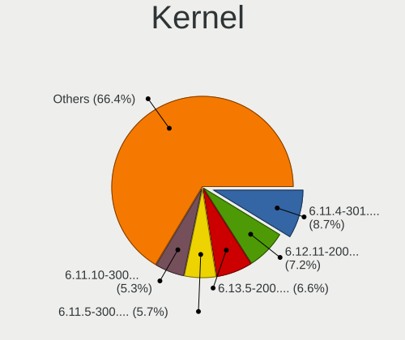

| Version                          | Desktops | Percent |
|----------------------------------|----------|---------|
| 6.11.4-301.fc41.x86_64           | 105      | 8.74%   |
| 6.12.11-200.fc41.x86_64          | 87       | 7.24%   |
| 6.13.5-200.fc41.x86_64           | 79       | 6.57%   |
| 6.11.5-300.fc41.x86_64           | 69       | 5.74%   |
| 6.11.10-300.fc41.x86_64          | 64       | 5.32%   |
| 6.11.8-300.fc41.x86_64           | 59       | 4.91%   |
| 6.13.9-200.fc41.x86_64           | 53       | 4.41%   |
| 6.13.8-200.fc41.x86_64           | 47       | 3.91%   |
| 6.12.9-200.fc41.x86_64           | 45       | 3.74%   |
| 6.12.15-200.fc41.x86_64          | 45       | 3.74%   |
| 6.12.7-200.fc41.x86_64           | 42       | 3.49%   |
| 6.12.10-200.fc41.x86_64          | 42       | 3.49%   |
| 6.11.7-300.fc41.x86_64           | 39       | 3.24%   |
| 6.12.6-200.fc41.x86_64           | 35       | 2.91%   |
| 6.13.6-200.fc41.x86_64           | 34       | 2.83%   |
| 6.12.8-200.fc41.x86_64           | 34       | 2.83%   |
| 6.12.13-200.fc41.x86_64          | 34       | 2.83%   |
| 6.11.6-300.fc41.x86_64           | 28       | 2.33%   |
| 6.12.4-200.fc41.x86_64           | 27       | 2.25%   |
| 6.13.7-200.fc41.x86_64           | 26       | 2.16%   |
| 6.13.10-200.fc41.x86_64          | 25       | 2.08%   |
| 6.11.11-300.fc41.x86_64          | 25       | 2.08%   |
| 6.13.11-200.fc41.x86_64          | 16       | 1.33%   |
| 6.12.5-200.fc41.x86_64           | 16       | 1.33%   |
| 6.13.4-200.fc41.x86_64           | 14       | 1.16%   |
| 6.11.0-63.fc41.x86_64            | 10       | 0.83%   |
| 6.14.6-200.fc41.x86_64           | 9        | 0.75%   |
| 6.14.9-200.fc41.x86_64           | 5        | 0.42%   |
| 6.14.4-200.fc41.x86_64           | 5        | 0.42%   |
| 6.8.5-301.fc40.x86_64            | 4        | 0.33%   |
| 6.14.8-200.fc41.x86_64           | 4        | 0.33%   |
| 6.14.5-200.fc41.x86_64           | 4        | 0.33%   |
| 6.14.11-200.fc41.x86_64          | 4        | 0.33%   |
| 6.17.4-100.fc41.x86_64           | 3        | 0.25%   |
| 6.16.9-100.fc41.x86_64           | 3        | 0.25%   |
| 6.15.4-100.fc41.x86_64           | 3        | 0.25%   |
| 6.11.0-0.rc5.43.fc41.x86_64      | 3        | 0.25%   |
| 6.9.0-0.rc3.31.fc41.x86_64+debug | 2        | 0.17%   |
| 6.8.0-0.rc7.55.fc41.x86_64+debug | 2        | 0.17%   |
| 6.16.10-100.fc41.x86_64          | 2        | 0.17%   |

Kernel Family
-------------

Linux kernel without a distro release

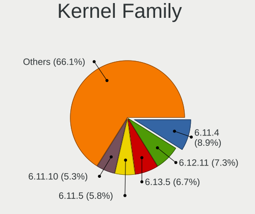

| Version | Desktops | Percent |
|---------|----------|---------|
| 6.11.4  | 107      | 8.92%   |
| 6.12.11 | 87       | 7.26%   |
| 6.13.5  | 80       | 6.67%   |
| 6.11.5  | 69       | 5.75%   |
| 6.11.10 | 64       | 5.34%   |
| 6.11.8  | 59       | 4.92%   |
| 6.13.9  | 53       | 4.42%   |
| 6.13.8  | 48       | 4%      |
| 6.12.9  | 46       | 3.84%   |
| 6.12.15 | 45       | 3.75%   |
| 6.12.7  | 42       | 3.5%    |
| 6.12.10 | 42       | 3.5%    |
| 6.11.7  | 40       | 3.34%   |
| 6.12.6  | 35       | 2.92%   |
| 6.13.6  | 34       | 2.84%   |
| 6.12.8  | 34       | 2.84%   |
| 6.12.13 | 34       | 2.84%   |
| 6.11.6  | 29       | 2.42%   |
| 6.13.7  | 27       | 2.25%   |
| 6.12.4  | 27       | 2.25%   |
| 6.11.11 | 26       | 2.17%   |
| 6.13.10 | 25       | 2.09%   |
| 6.11.0  | 17       | 1.42%   |
| 6.13.11 | 16       | 1.33%   |
| 6.12.5  | 16       | 1.33%   |
| 6.13.4  | 14       | 1.17%   |
| 6.14.6  | 9        | 0.75%   |
| 6.9.0   | 5        | 0.42%   |
| 6.14.9  | 5        | 0.42%   |
| 6.14.4  | 5        | 0.42%   |
| 6.8.5   | 4        | 0.33%   |
| 6.14.8  | 4        | 0.33%   |
| 6.14.5  | 4        | 0.33%   |
| 6.14.11 | 4        | 0.33%   |
| 6.8.0   | 3        | 0.25%   |
| 6.17.4  | 3        | 0.25%   |
| 6.16.9  | 3        | 0.25%   |
| 6.15.4  | 3        | 0.25%   |
| 6.11.3  | 3        | 0.25%   |
| 6.10.0  | 3        | 0.25%   |

Kernel Major Ver.
-----------------

Linux kernel major version

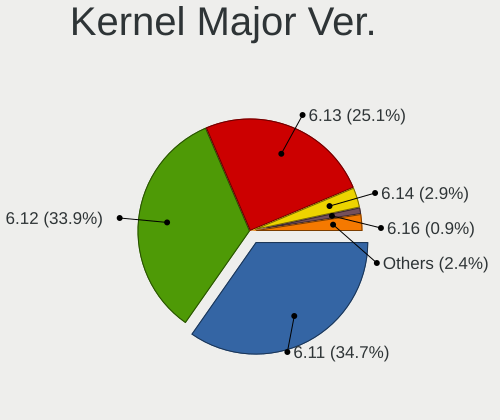

| Version | Desktops | Percent |
|---------|----------|---------|
| 6.11    | 402      | 34.72%  |
| 6.12    | 392      | 33.85%  |
| 6.13    | 291      | 25.13%  |
| 6.14    | 34       | 2.94%   |
| 6.16    | 11       | 0.95%   |
| 6.8     | 8        | 0.69%   |
| 6.15    | 7        | 0.6%    |
| 6.9     | 6        | 0.52%   |
| 6.17    | 4        | 0.35%   |
| 6.10    | 3        | 0.26%   |

Arch
----

OS architecture (x86_64, i586, etc.)

| Name   | Desktops | Percent |
|--------|----------|---------|
| x86_64 | 1087     | 100%    |

DE
--

Desktop Environment

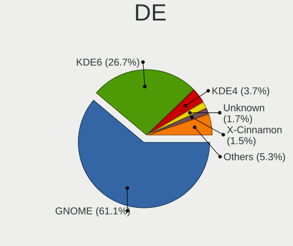

| Name          | Desktops | Percent |
|---------------|----------|---------|
| GNOME         | 671      | 61.11%  |
| KDE6          | 293      | 26.68%  |
| KDE4          | 41       | 3.73%   |
| Unknown       | 19       | 1.73%   |
| X-Cinnamon    | 16       | 1.46%   |
| Cinnamon      | 14       | 1.28%   |
| XFCE          | 11       | 1%      |
| GNOME Classic | 8        | 0.73%   |
| MATE          | 5        | 0.46%   |
| Budgie        | 5        | 0.46%   |
| Hyprland      | 4        | 0.36%   |
| sway          | 3        | 0.27%   |
| COSMIC        | 3        | 0.27%   |
| LXQt          | 2        | 0.18%   |
| niri          | 1        | 0.09%   |
| i3            | 1        | 0.09%   |
| Deepin        | 1        | 0.09%   |

Display Server
--------------

X11 or Wayland

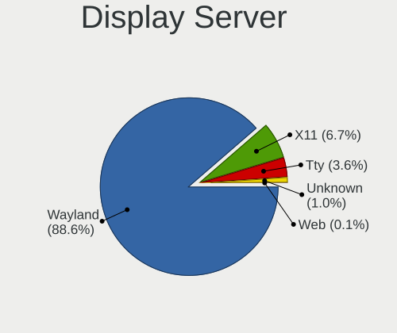

| Name    | Desktops | Percent |
|---------|----------|---------|
| Wayland | 967      | 88.63%  |
| X11     | 73       | 6.69%   |
| Tty     | 39       | 3.57%   |
| Unknown | 11       | 1.01%   |
| Web     | 1        | 0.09%   |

Display Manager
---------------

SDDM, LightDM, etc.

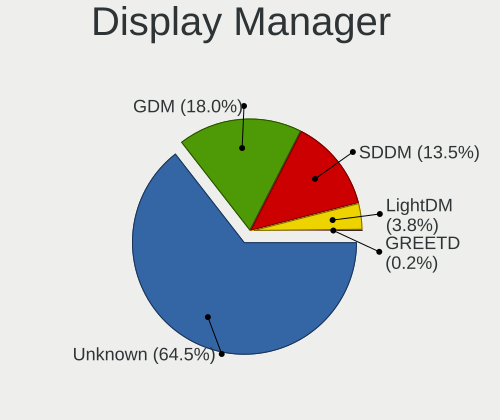

| Name    | Desktops | Percent |
|---------|----------|---------|
| Unknown | 708      | 64.48%  |
| GDM     | 198      | 18.03%  |
| SDDM    | 148      | 13.48%  |
| LightDM | 42       | 3.83%   |
| GREETD  | 2        | 0.18%   |

OS Lang
-------

Language

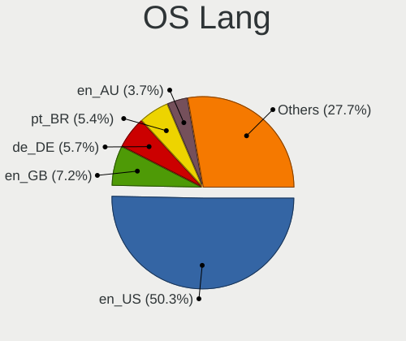

| Lang    | Desktops | Percent |
|---------|----------|---------|
| en_US   | 548      | 50.32%  |
| en_GB   | 78       | 7.16%   |
| de_DE   | 62       | 5.69%   |
| pt_BR   | 59       | 5.42%   |
| en_AU   | 40       | 3.67%   |
| ru_RU   | 38       | 3.49%   |
| fr_FR   | 29       | 2.66%   |
| it_IT   | 25       | 2.3%    |
| en_CA   | 23       | 2.11%   |
| pl_PL   | 17       | 1.56%   |
| es_ES   | 17       | 1.56%   |
| es_MX   | 13       | 1.19%   |
| tr_TR   | 9        | 0.83%   |
| nl_NL   | 9        | 0.83%   |
| es_AR   | 9        | 0.83%   |
| Unknown | 9        | 0.83%   |
| zh_CN   | 8        | 0.73%   |
| sv_SE   | 7        | 0.64%   |
| ko_KR   | 5        | 0.46%   |
| hu_HU   | 5        | 0.46%   |
| en_ZA   | 5        | 0.46%   |
| en_NZ   | 5        | 0.46%   |
| en_IN   | 5        | 0.46%   |
| ru_UA   | 4        | 0.37%   |
| ja_JP   | 4        | 0.37%   |
| es_CO   | 4        | 0.37%   |
| zh_TW   | 3        | 0.28%   |
| nl_BE   | 3        | 0.28%   |
| fr_CH   | 3        | 0.28%   |
| es_VE   | 3        | 0.28%   |
| de_AT   | 3        | 0.28%   |
| pt_PT   | 2        | 0.18%   |
| nb_NO   | 2        | 0.18%   |
| fr_CA   | 2        | 0.18%   |
| es_PE   | 2        | 0.18%   |
| en_SG   | 2        | 0.18%   |
| en_IE   | 2        | 0.18%   |
| en_DK   | 2        | 0.18%   |
| en_BW   | 2        | 0.18%   |
| da_DK   | 2        | 0.18%   |

Boot Mode
---------

EFI or BIOS

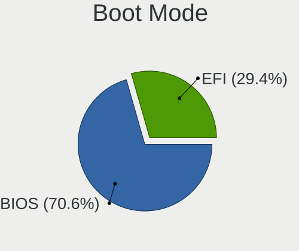

| Mode | Desktops | Percent |
|------|----------|---------|
| BIOS | 772      | 70.57%  |
| EFI  | 322      | 29.43%  |

Filesystem
----------

Type of filesystem

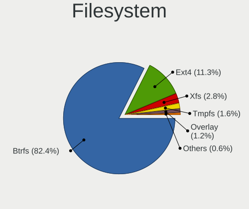

| Type    | Desktops | Percent |
|---------|----------|---------|
| Btrfs   | 901      | 82.43%  |
| Ext4    | 123      | 11.25%  |
| Xfs     | 31       | 2.84%   |
| Tmpfs   | 18       | 1.65%   |
| Overlay | 13       | 1.19%   |
| Unknown | 5        | 0.46%   |
| F2fs    | 1        | 0.09%   |
| Ext3    | 1        | 0.09%   |

Part. scheme
------------

Scheme of partitioning

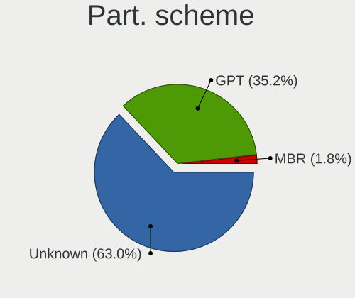

| Type    | Desktops | Percent |
|---------|----------|---------|
| Unknown | 690      | 62.96%  |
| GPT     | 386      | 35.22%  |
| MBR     | 20       | 1.82%   |

Dual Boot with Linux/BSD
------------------------

Hosting more than one Linux/BSD

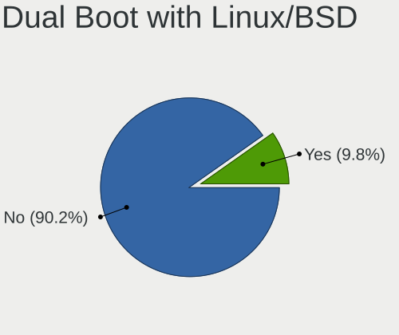

| Dual boot | Desktops | Percent |
|-----------|----------|---------|
| No        | 988      | 90.23%  |
| Yes       | 107      | 9.77%   |

Dual Boot (Win)
---------------

Hosting Linux and Windows

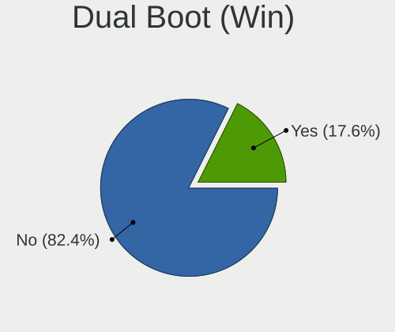

| Dual boot | Desktops | Percent |
|-----------|----------|---------|
| No        | 903      | 82.39%  |
| Yes       | 193      | 17.61%  |

Board
-----

Vendor
------

Motherboard manufacturer

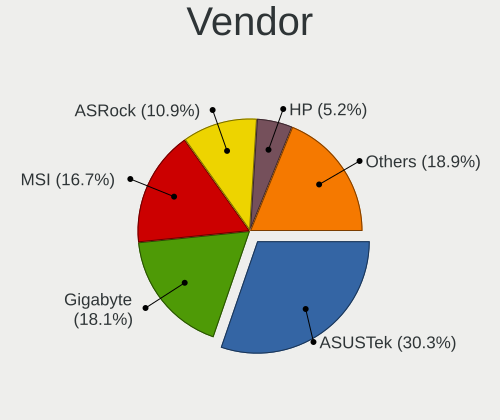

| Name                                 | Desktops | Percent |
|--------------------------------------|----------|---------|
| ASUSTek Computer                     | 329      | 30.27%  |
| Gigabyte Technology                  | 197      | 18.12%  |
| MSI                                  | 182      | 16.74%  |
| ASRock                               | 118      | 10.86%  |
| Hewlett-Packard                      | 56       | 5.15%   |
| Dell                                 | 53       | 4.88%   |
| Lenovo                               | 26       | 2.39%   |
| Intel                                | 20       | 1.84%   |
| Unknown                              | 12       | 1.1%    |
| Shenzhen Meigao Electronic Equipment | 9        | 0.83%   |
| Pegatron                             | 7        | 0.64%   |
| AZW                                  | 7        | 0.64%   |
| Acer                                 | 7        | 0.64%   |
| Biostar                              | 5        | 0.46%   |
| Huanan                               | 4        | 0.37%   |
| Apple                                | 4        | 0.37%   |
| Alienware                            | 4        | 0.37%   |
| Medion                               | 3        | 0.28%   |
| HC Technology.                       | 3        | 0.28%   |
| AMI                                  | 3        | 0.28%   |
| Tianbei                              | 2        | 0.18%   |
| PELADN                               | 2        | 0.18%   |
| PCWare                               | 2        | 0.18%   |
| OEM                                  | 2        | 0.18%   |
| MACHINIST                            | 2        | 0.18%   |
| GEEKOM                               | 2        | 0.18%   |
| BESSTAR Tech                         | 2        | 0.18%   |
| ZR                                   | 1        | 0.09%   |
| SZQFTX                               | 1        | 0.09%   |
| System76                             | 1        | 0.09%   |
| Supermicro                           | 1        | 0.09%   |
| SLIMBOOK                             | 1        | 0.09%   |
| ONDA                                 | 1        | 0.09%   |
| OE                                   | 1        | 0.09%   |
| JINGSHA                              | 1        | 0.09%   |
| JGINYUE                              | 1        | 0.09%   |
| Itautec                              | 1        | 0.09%   |
| Inventec                             | 1        | 0.09%   |
| HUAWEI                               | 1        | 0.09%   |
| Google                               | 1        | 0.09%   |

Model
-----

Motherboard model

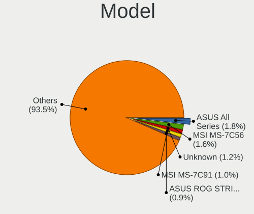

| Name                                              | Desktops | Percent |
|---------------------------------------------------|----------|---------|
| ASUS All Series                                   | 20       | 1.84%   |
| MSI MS-7C56                                       | 17       | 1.56%   |
| Unknown                                           | 13       | 1.2%    |
| MSI MS-7C91                                       | 11       | 1.01%   |
| ASUS ROG STRIX B550-F GAMING                      | 10       | 0.92%   |
| MSI MS-7B86                                       | 9        | 0.83%   |
| Dell OptiPlex 7010                                | 7        | 0.64%   |
| Gigabyte B450M DS3H                               | 6        | 0.55%   |
| Shenzhen Meigao Electronic Equipment Venus Series | 5        | 0.46%   |
| MSI MS-7E26                                       | 5        | 0.46%   |
| MSI MS-7C95                                       | 5        | 0.46%   |
| ASUS TUF Gaming B550M-PLUS WIFI II                | 5        | 0.46%   |
| ASUS TUF Gaming B550-PLUS                         | 5        | 0.46%   |
| ASUS ProArt X870E-CREATOR WIFI                    | 5        | 0.46%   |
| ASUS PRIME B550M-K                                | 5        | 0.46%   |
| MSI MS-7E51                                       | 4        | 0.37%   |
| MSI MS-7C96                                       | 4        | 0.37%   |
| MSI MS-7C37                                       | 4        | 0.37%   |
| MSI MS-7C02                                       | 4        | 0.37%   |
| MSI MS-7B89                                       | 4        | 0.37%   |
| Intel H61                                         | 4        | 0.37%   |
| Gigabyte X870E AORUS ELITE WIFI7                  | 4        | 0.37%   |
| Gigabyte B650 GAMING X AX V2                      | 4        | 0.37%   |
| Gigabyte B550 AORUS ELITE V2                      | 4        | 0.37%   |
| Gigabyte B450 AORUS ELITE                         | 4        | 0.37%   |
| Dell OptiPlex 3050                                | 4        | 0.37%   |
| ASUS TUF Gaming X670E-PLUS WIFI                   | 4        | 0.37%   |
| ASUS TUF Gaming X570-PLUS                         | 4        | 0.37%   |
| ASUS ROG STRIX B650E-I GAMING WIFI                | 4        | 0.37%   |
| ASUS ROG STRIX B650E-F GAMING WIFI                | 4        | 0.37%   |
| ASUS ROG STRIX B450-F GAMING                      | 4        | 0.37%   |
| ASUS H110M-E/M.2                                  | 4        | 0.37%   |
| ASRock B550 Phantom Gaming 4                      | 4        | 0.37%   |
| MSI MS-7E59                                       | 3        | 0.28%   |
| MSI MS-7E25                                       | 3        | 0.28%   |
| MSI MS-7E07                                       | 3        | 0.28%   |
| MSI MS-7D77                                       | 3        | 0.28%   |
| MSI MS-7D75                                       | 3        | 0.28%   |
| MSI MS-7C94                                       | 3        | 0.28%   |
| MSI MS-7C35                                       | 3        | 0.28%   |

Model Family
------------

Motherboard model prefix

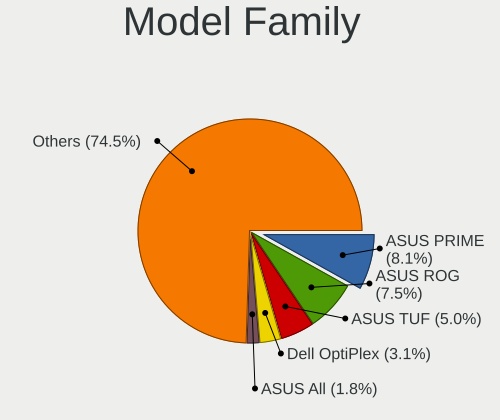

| Name                                       | Desktops | Percent |
|--------------------------------------------|----------|---------|
| ASUS PRIME                                 | 88       | 8.1%    |
| ASUS ROG                                   | 81       | 7.45%   |
| ASUS TUF                                   | 54       | 4.97%   |
| Dell OptiPlex                              | 34       | 3.13%   |
| ASUS All                                   | 20       | 1.84%   |
| MSI MS-7C56                                | 17       | 1.56%   |
| Lenovo ThinkCentre                         | 15       | 1.38%   |
| ASUS ProArt                                | 14       | 1.29%   |
| Unknown                                    | 13       | 1.2%    |
| HP Pavilion                                | 12       | 1.1%    |
| HP EliteDesk                               | 12       | 1.1%    |
| Gigabyte B550                              | 12       | 1.1%    |
| MSI MS-7C91                                | 11       | 1.01%   |
| Gigabyte Z790                              | 11       | 1.01%   |
| Gigabyte B450M                             | 11       | 1.01%   |
| Gigabyte X870                              | 10       | 0.92%   |
| Gigabyte X570                              | 10       | 0.92%   |
| Gigabyte B450                              | 10       | 0.92%   |
| MSI MS-7B86                                | 9        | 0.83%   |
| Gigabyte B550M                             | 9        | 0.83%   |
| Dell Precision                             | 9        | 0.83%   |
| Gigabyte B650                              | 8        | 0.74%   |
| ASRock B550                                | 8        | 0.74%   |
| Gigabyte X870E                             | 7        | 0.64%   |
| HP ProDesk                                 | 6        | 0.55%   |
| ASUS STRIX                                 | 6        | 0.55%   |
| ASUS Pro                                   | 6        | 0.55%   |
| ASRock B450                                | 6        | 0.55%   |
| Shenzhen Meigao Electronic Equipment Venus | 5        | 0.46%   |
| MSI MS-7E26                                | 5        | 0.46%   |
| MSI MS-7C95                                | 5        | 0.46%   |
| Lenovo ThinkStation                        | 5        | 0.46%   |
| Gigabyte A520M                             | 5        | 0.46%   |
| ASRock B550M                               | 5        | 0.46%   |
| MSI MS-7E51                                | 4        | 0.37%   |
| MSI MS-7C96                                | 4        | 0.37%   |
| MSI MS-7C37                                | 4        | 0.37%   |
| MSI MS-7C02                                | 4        | 0.37%   |
| MSI MS-7B89                                | 4        | 0.37%   |
| Intel H61                                  | 4        | 0.37%   |

MFG Year
--------

Motherboard manufacture year

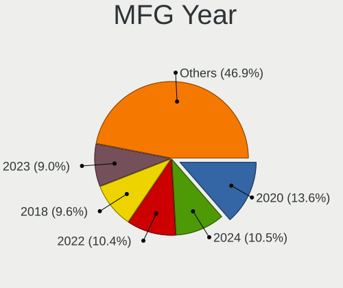

| Year | Desktops | Percent |
|------|----------|---------|
| 2020 | 148      | 13.62%  |
| 2024 | 114      | 10.49%  |
| 2022 | 113      | 10.4%   |
| 2018 | 104      | 9.57%   |
| 2023 | 98       | 9.02%   |
| 2019 | 82       | 7.54%   |
| 2021 | 81       | 7.45%   |
| 2017 | 60       | 5.52%   |
| 2013 | 49       | 4.51%   |
| 2014 | 45       | 4.14%   |
| 2016 | 39       | 3.59%   |
| 2012 | 39       | 3.59%   |
| 2015 | 32       | 2.94%   |
| 2011 | 27       | 2.48%   |
| 2010 | 23       | 2.12%   |
| 2009 | 15       | 1.38%   |
| 2008 | 8        | 0.74%   |
| 2025 | 4        | 0.37%   |
| 2007 | 4        | 0.37%   |
| 2006 | 2        | 0.18%   |

Form Factor
-----------

Physical design of the computer

| Name    | Desktops | Percent |
|---------|----------|---------|
| Desktop | 1087     | 100%    |

Secure Boot
-----------

Enabled or disabled

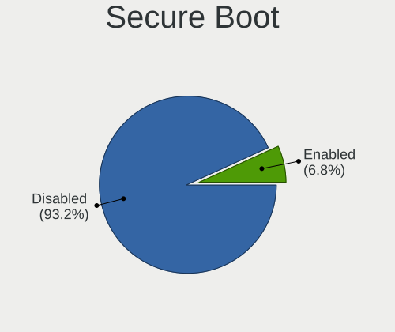

| State    | Desktops | Percent |
|----------|----------|---------|
| Disabled | 1014     | 93.2%   |
| Enabled  | 74       | 6.8%    |

Coreboot
--------

Have coreboot on board

| Used | Desktops | Percent |
|------|----------|---------|
| No   | 1086     | 99.91%  |
| Yes  | 1        | 0.09%   |

RAM Size
--------

Total RAM memory

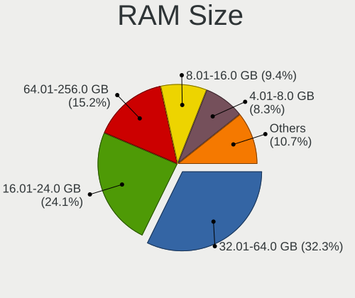

| Size in GB      | Desktops | Percent |
|-----------------|----------|---------|
| 32.01-64.0      | 353      | 32.27%  |
| 16.01-24.0      | 264      | 24.13%  |
| 64.01-256.0     | 166      | 15.17%  |
| 8.01-16.0       | 103      | 9.41%   |
| 4.01-8.0        | 91       | 8.32%   |
| 24.01-32.0      | 86       | 7.86%   |
| 3.01-4.0        | 25       | 2.29%   |
| More than 256.0 | 2        | 0.18%   |
| 2.01-3.0        | 2        | 0.18%   |
| 1.01-2.0        | 2        | 0.18%   |

RAM Used
--------

Used RAM memory

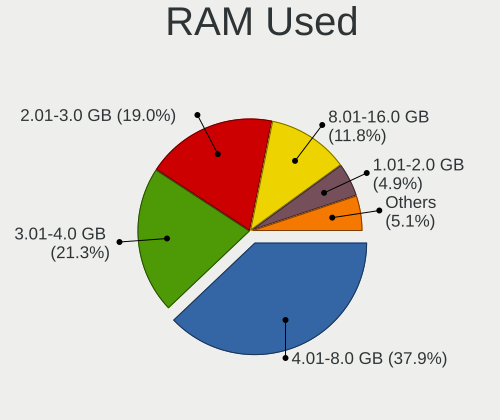

| Used GB     | Desktops | Percent |
|-------------|----------|---------|
| 4.01-8.0    | 436      | 37.91%  |
| 3.01-4.0    | 245      | 21.3%   |
| 2.01-3.0    | 218      | 18.96%  |
| 8.01-16.0   | 136      | 11.83%  |
| 1.01-2.0    | 56       | 4.87%   |
| 16.01-24.0  | 27       | 2.35%   |
| 0.51-1.0    | 16       | 1.39%   |
| 24.01-32.0  | 10       | 0.87%   |
| 32.01-64.0  | 3        | 0.26%   |
| 64.01-256.0 | 3        | 0.26%   |

Total Drives
------------

Number of drives on board

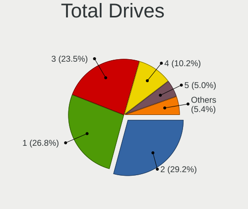

| Drives | Desktops | Percent |
|--------|----------|---------|
| 2      | 324      | 29.19%  |
| 1      | 297      | 26.76%  |
| 3      | 261      | 23.51%  |
| 4      | 113      | 10.18%  |
| 5      | 55       | 4.95%   |
| 6      | 38       | 3.42%   |
| 7      | 9        | 0.81%   |
| 8      | 7        | 0.63%   |
| 9      | 2        | 0.18%   |
| 0      | 2        | 0.18%   |
| 15     | 1        | 0.09%   |
| 10     | 1        | 0.09%   |

Has CD-ROM
----------

Has CD-ROM on board

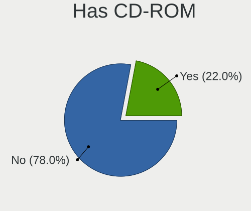

| Presented | Desktops | Percent |
|-----------|----------|---------|
| No        | 849      | 77.96%  |
| Yes       | 240      | 22.04%  |

Has Ethernet
------------

Has Ethernet on board

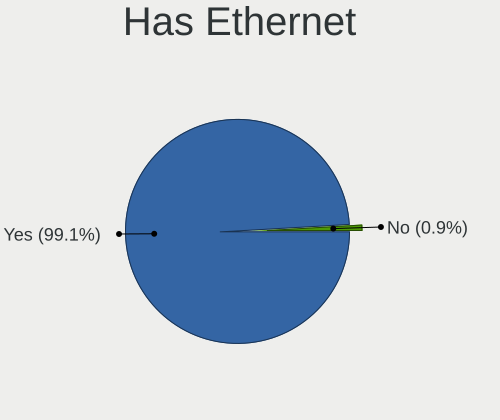

| Presented | Desktops | Percent |
|-----------|----------|---------|
| Yes       | 1077     | 99.08%  |
| No        | 10       | 0.92%   |

Has WiFi
--------

Has WiFi module

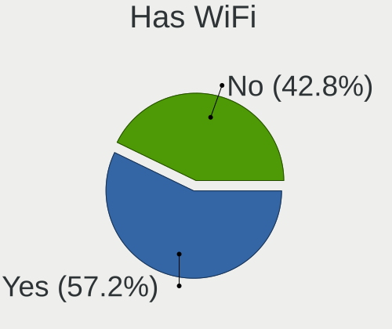

| Presented | Desktops | Percent |
|-----------|----------|---------|
| Yes       | 625      | 57.18%  |
| No        | 468      | 42.82%  |

Has Bluetooth
-------------

Has Bluetooth module

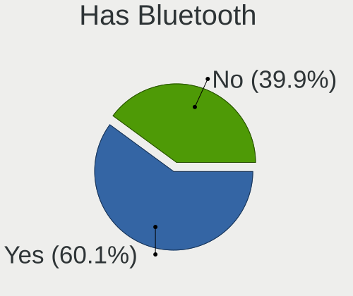

| Presented | Desktops | Percent |
|-----------|----------|---------|
| Yes       | 658      | 60.09%  |
| No        | 437      | 39.91%  |

Location
--------

Country
-------

Geographic location (country)

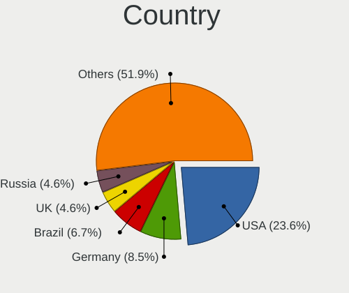

| Country         | Desktops | Percent |
|-----------------|----------|---------|
| USA             | 257      | 23.62%  |
| Germany         | 93       | 8.55%   |
| Brazil          | 73       | 6.71%   |
| UK              | 50       | 4.6%    |
| Russia          | 50       | 4.6%    |
| Canada          | 49       | 4.5%    |
| Italy           | 46       | 4.23%   |
| Australia       | 40       | 3.68%   |
| France          | 33       | 3.03%   |
| Poland          | 28       | 2.57%   |
| Spain           | 20       | 1.84%   |
| Netherlands     | 20       | 1.84%   |
| Romania         | 16       | 1.47%   |
| Mexico          | 16       | 1.47%   |
| Argentina       | 16       | 1.47%   |
| India           | 15       | 1.38%   |
| Sweden          | 14       | 1.29%   |
| Austria         | 12       | 1.1%    |
| Switzerland     | 10       | 0.92%   |
| Serbia          | 10       | 0.92%   |
| Norway          | 10       | 0.92%   |
| Finland         | 10       | 0.92%   |
| Belgium         | 10       | 0.92%   |
| Turkey          | 9        | 0.83%   |
| Singapore       | 8        | 0.74%   |
| Japan           | 8        | 0.74%   |
| Hungary         | 8        | 0.74%   |
| South Africa    | 7        | 0.64%   |
| Portugal        | 7        | 0.64%   |
| Malaysia        | 7        | 0.64%   |
| Czechia         | 7        | 0.64%   |
| Colombia        | 7        | 0.64%   |
| Belarus         | 7        | 0.64%   |
| South Korea     | 6        | 0.55%   |
| New Zealand     | 6        | 0.55%   |
| China           | 6        | 0.55%   |
| Ukraine         | 5        | 0.46%   |
| The Netherlands | 5        | 0.46%   |
| Taiwan          | 5        | 0.46%   |
| Philippines     | 5        | 0.46%   |

City
----

Geographic location (city)

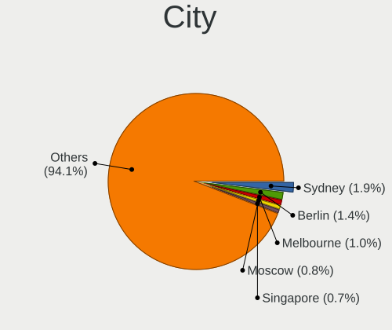

| City              | Desktops | Percent |
|-------------------|----------|---------|
| Sydney            | 21       | 1.9%    |
| Berlin            | 16       | 1.44%   |
| Melbourne         | 11       | 0.99%   |
| Moscow            | 9        | 0.81%   |
| Singapore         | 8        | 0.72%   |
| Toronto           | 6        | 0.54%   |
| Mexico City       | 6        | 0.54%   |
| Helsinki          | 6        | 0.54%   |
| Zurich            | 5        | 0.45%   |
| Warsaw            | 5        | 0.45%   |
| Vienna            | 5        | 0.45%   |
| St Petersburg     | 5        | 0.45%   |
| Rio de Janeiro    | 5        | 0.45%   |
| Paris             | 5        | 0.45%   |
| Frankfurt am Main | 5        | 0.45%   |
| Cluj-Napoca       | 5        | 0.45%   |
| Belgrade          | 5        | 0.45%   |
| Amsterdam         | 5        | 0.45%   |
| Seattle           | 4        | 0.36%   |
| Rome              | 4        | 0.36%   |
| Munich            | 4        | 0.36%   |
| Montreal          | 4        | 0.36%   |
| Minsk             | 4        | 0.36%   |
| Minneapolis       | 4        | 0.36%   |
| Milan             | 4        | 0.36%   |
| Kuala Lumpur      | 4        | 0.36%   |
| Hamburg           | 4        | 0.36%   |
| Chicago           | 4        | 0.36%   |
| Brisbane          | 4        | 0.36%   |
| Belo Horizonte    | 4        | 0.36%   |
| Atlanta           | 4        | 0.36%   |
| Ashburn           | 4        | 0.36%   |
| Tokyo             | 3        | 0.27%   |
| Taipei            | 3        | 0.27%   |
| Starokandry       | 3        | 0.27%   |
| Sao Paulo         | 3        | 0.27%   |
| Rzeszów          | 3        | 0.27%   |
| Rotterdam         | 3        | 0.27%   |
| Recife            | 3        | 0.27%   |
| Prague            | 3        | 0.27%   |

Drives
------

Drive Vendor
------------

Hard drive vendors

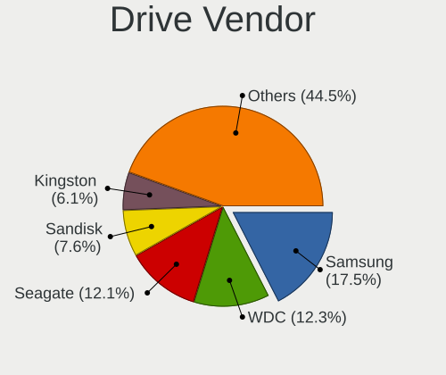

| Vendor                       | Desktops | Drives | Percent |
|------------------------------|----------|--------|---------|
| Samsung Electronics          | 393      | 714    | 17.47%  |
| WDC                          | 276      | 421    | 12.27%  |
| Seagate                      | 272      | 372    | 12.09%  |
| Sandisk                      | 170      | 217    | 7.56%   |
| Kingston                     | 138      | 179    | 6.13%   |
| Crucial                      | 92       | 125    | 4.09%   |
| Toshiba                      | 75       | 98     | 3.33%   |
| Phison Electronics           | 72       | 79     | 3.2%    |
| Micron/Crucial Technology    | 64       | 84     | 2.84%   |
| Kingston Technology Company  | 54       | 66     | 2.4%    |
| Intel                        | 42       | 68     | 1.87%   |
| MAXIO Technology (Hangzhou)  | 37       | 42     | 1.64%   |
| Micron Technology            | 36       | 40     | 1.6%    |
| ADATA Technology             | 30       | 39     | 1.33%   |
| SK hynix                     | 28       | 35     | 1.24%   |
| Silicon Motion               | 26       | 32     | 1.16%   |
| Hitachi                      | 26       | 35     | 1.16%   |
| China                        | 25       | 28     | 1.11%   |
| Realtek Semiconductor        | 23       | 26     | 1.02%   |
| A-DATA Technology            | 23       | 27     | 1.02%   |
| Shenzhen Longsys Electronics | 22       | 25     | 0.98%   |
| PNY                          | 20       | 20     | 0.89%   |
| Unknown                      | 16       | 19     | 0.71%   |
| HGST                         | 16       | 17     | 0.71%   |
| Patriot                      | 13       | 22     | 0.58%   |
| Intenso                      | 11       | 14     | 0.49%   |
| Unknown                      | 11       | 11     | 0.49%   |
| OCZ                          | 10       | 10     | 0.44%   |
| SPCC                         | 9        | 12     | 0.4%    |
| Team                         | 8        | 9      | 0.36%   |
| Gigabyte Technology          | 8        | 8      | 0.36%   |
| KIOXIA                       | 7        | 8      | 0.31%   |
| JMicron Technology           | 7        | 7      | 0.31%   |
| Apacer                       | 7        | 7      | 0.31%   |
| Lexar                        | 6        | 9      | 0.27%   |
| KingSpec                     | 6        | 11     | 0.27%   |
| GOODRAM                      | 6        | 10     | 0.27%   |
| Fanxiang                     | 6        | 7      | 0.27%   |
| Apple                        | 6        | 6      | 0.27%   |
| Verbatim                     | 5        | 7      | 0.22%   |

Drive Model
-----------

Hard drive models

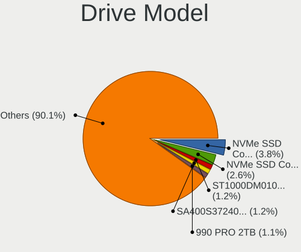

| Model                                                              | Desktops | Percent |
|--------------------------------------------------------------------|----------|---------|
| Samsung NVMe SSD Controller SM981/PM981/PM983 1TB                  | 99       | 3.81%   |
| Samsung NVMe SSD Controller PM9A1/PM9A3/980PRO 1TB                 | 68       | 2.61%   |
| Seagate ST1000DM010-2EP102 1TB                                     | 31       | 1.19%   |
| Kingston SA400S37240G 240GB SSD                                    | 30       | 1.15%   |
| Samsung SSD 990 PRO 2TB                                            | 29       | 1.11%   |
| MAXIO (Hangzhou) NVMe SSD Controller MAP1202 2TB                   | 27       | 1.04%   |
| Kingston Company SNV2S1000G 1TB                                    | 27       | 1.04%   |
| Silicon Motion SM2263EN/SM2263XT SSD Controller 512GB              | 25       | 0.96%   |
| Samsung SSD 860 EVO 1TB                                            | 25       | 0.96%   |
| Samsung SSD 870 EVO 1TB                                            | 22       | 0.85%   |
| Micron/Crucial P2 NVMe PCIe SSD 2TB                                | 22       | 0.85%   |
| Samsung SSD 860 EVO 500GB                                          | 21       | 0.81%   |
| Kingston SA400S37480G 480GB SSD                                    | 21       | 0.81%   |
| Seagate ST4000DM004-2CV104 4TB                                     | 20       | 0.77%   |
| Seagate ST2000DM008-2FR102 2TB                                     | 20       | 0.77%   |
| Samsung SSD 980 1TB                                                | 17       | 0.65%   |
| Samsung SSD 850 EVO 250GB                                          | 17       | 0.65%   |
| Kingston SA400S37960G 960GB SSD                                    | 17       | 0.65%   |
| Kingston SA400S37120G 120GB SSD                                    | 16       | 0.62%   |
| Crucial CT1000MX500SSD1 1TB                                        | 16       | 0.62%   |
| Toshiba DT01ACA100 1TB                                             | 15       | 0.58%   |
| Sandisk WD_BLACK SN770 1TB                                         | 15       | 0.58%   |
| Samsung SSD 980 500GB                                              | 15       | 0.58%   |
| Samsung NVMe SSD Controller SM961/PM961/SM963 1024GB               | 15       | 0.58%   |
| Phison E12 NVMe Controller 1TB                                     | 15       | 0.58%   |
| Sandisk WD Blue SN550 NVMe SSD 1024GB                              | 14       | 0.54%   |
| Samsung SSD 990 PRO 1TB                                            | 14       | 0.54%   |
| Samsung SSD 860 EVO 250GB                                          | 14       | 0.54%   |
| Phison E16 PCIe4 NVMe Controller 1TB                               | 13       | 0.5%    |
| ADATA XPG SX8200 Pro PCIe Gen3x4 M.2 2280 Solid State Drive 1024GB | 13       | 0.5%    |
| Sandisk WD_BLACK SN850X 1000GB                                     | 12       | 0.46%   |
| Sandisk WD Black SN750 / PC SN730 NVMe SSD 500GB                   | 12       | 0.46%   |
| Samsung SSD 990 PRO 4TB                                            | 12       | 0.46%   |
| Crucial CT500MX500SSD1 500GB                                       | 12       | 0.46%   |
| WDC WD20EZRZ-00Z5HB0 2TB                                           | 11       | 0.42%   |
| Seagate ST500DM002-1BD142 500GB                                    | 11       | 0.42%   |
| Samsung SSD 870 QVO 1TB                                            | 11       | 0.42%   |
| Samsung SSD 870 EVO 500GB                                          | 11       | 0.42%   |
| Phison PS5013 E13 NVMe Controller 500GB                            | 11       | 0.42%   |
| Crucial CT240BX500SSD1 240GB                                       | 11       | 0.42%   |

HDD Vendor
----------

Hard disk drive vendors

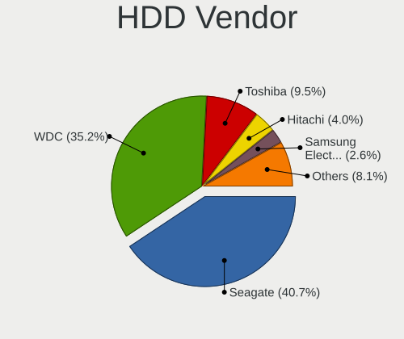

| Vendor              | Desktops | Drives | Percent |
|---------------------|----------|--------|---------|
| Seagate             | 266      | 356    | 40.67%  |
| WDC                 | 230      | 346    | 35.17%  |
| Toshiba             | 62       | 83     | 9.48%   |
| Hitachi             | 26       | 35     | 3.98%   |
| Samsung Electronics | 17       | 23     | 2.6%    |
| HGST                | 16       | 17     | 2.45%   |
| Unknown             | 7        | 7      | 1.07%   |
| Maxtor              | 5        | 6      | 0.76%   |
| External            | 4        | 5      | 0.61%   |
| JMicron Technology  | 3        | 3      | 0.46%   |
| Apple               | 3        | 3      | 0.46%   |
| USB                 | 2        | 2      | 0.31%   |
| ASMT                | 2        | 3      | 0.31%   |
| Verbatim            | 1        | 1      | 0.15%   |
| USB3.0              | 1        | 1      | 0.15%   |
| USB 3.1             | 1        | 1      | 0.15%   |
| StoreJet            | 1        | 1      | 0.15%   |
| Shenzhen            | 1        | 1      | 0.15%   |
| QNAP                | 1        | 5      | 0.15%   |
| MARVELL             | 1        | 1      | 0.15%   |
| LaCie               | 1        | 1      | 0.15%   |
| Intenso             | 1        | 2      | 0.15%   |
| Fujitsu             | 1        | 1      | 0.15%   |
| ASMedia             | 1        | 1      | 0.15%   |

SSD Vendor
----------

Solid state drive vendors

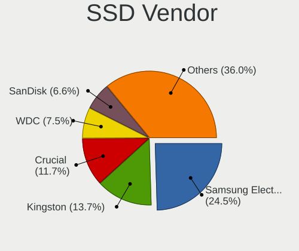

| Vendor              | Desktops | Drives | Percent |
|---------------------|----------|--------|---------|
| Samsung Electronics | 193      | 307    | 24.52%  |
| Kingston            | 108      | 138    | 13.72%  |
| Crucial             | 92       | 125    | 11.69%  |
| WDC                 | 59       | 74     | 7.5%    |
| SanDisk             | 52       | 62     | 6.61%   |
| China               | 25       | 28     | 3.18%   |
| A-DATA Technology   | 22       | 26     | 2.8%    |
| PNY                 | 20       | 20     | 2.54%   |
| Intel               | 19       | 25     | 2.41%   |
| Patriot             | 12       | 20     | 1.52%   |
| Micron Technology   | 11       | 12     | 1.4%    |
| OCZ                 | 10       | 10     | 1.27%   |
| Intenso             | 10       | 12     | 1.27%   |
| SPCC                | 9        | 12     | 1.14%   |
| Toshiba             | 8        | 9      | 1.02%   |
| Team                | 8        | 9      | 1.02%   |
| Gigabyte Technology | 8        | 8      | 1.02%   |
| Apacer              | 7        | 7      | 0.89%   |
| SK hynix            | 6        | 7      | 0.76%   |
| Lexar               | 6        | 9      | 0.76%   |
| KingSpec            | 6        | 11     | 0.76%   |
| GOODRAM             | 6        | 10     | 0.76%   |
| XrayDisk            | 4        | 4      | 0.51%   |
| Verbatim            | 4        | 6      | 0.51%   |
| Transcend           | 4        | 4      | 0.51%   |
| Netac               | 4        | 4      | 0.51%   |
| LITEON              | 4        | 5      | 0.51%   |
| SABRENT             | 3        | 3      | 0.38%   |
| LITEONIT            | 3        | 3      | 0.38%   |
| Corsair             | 3        | 3      | 0.38%   |
| Unknown             | 3        | 3      | 0.38%   |
| Timetec             | 2        | 2      | 0.25%   |
| Rayson              | 2        | 2      | 0.25%   |
| Plextor             | 2        | 2      | 0.25%   |
| LDLC                | 2        | 2      | 0.25%   |
| JMicron Technology  | 2        | 2      | 0.25%   |
| Fanxiang            | 2        | 2      | 0.25%   |
| Dahua               | 2        | 4      | 0.25%   |
| Apple               | 2        | 2      | 0.25%   |
| 2.5                 | 2        | 3      | 0.25%   |

Drive Kind
----------

HDD or SSD

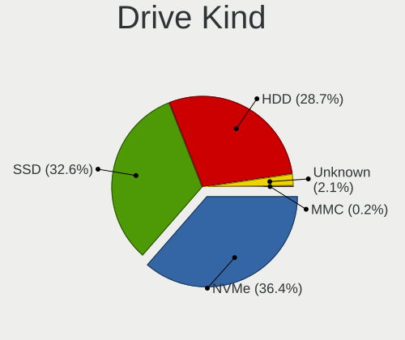

| Kind    | Desktops | Drives | Percent |
|---------|----------|--------|---------|
| NVMe    | 690      | 1146   | 36.41%  |
| SSD     | 618      | 1044   | 32.61%  |
| HDD     | 543      | 905    | 28.65%  |
| Unknown | 40       | 44     | 2.11%   |
| MMC     | 4        | 5      | 0.21%   |

Drive Connector
---------------

SATA, SAS, NVMe, etc.

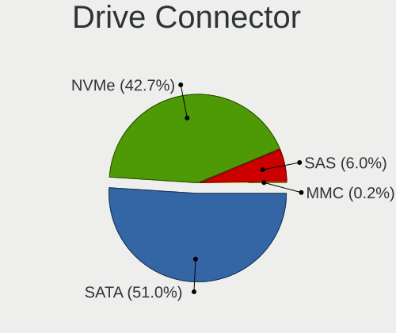

| Type | Desktops | Drives | Percent |
|------|----------|--------|---------|
| SATA | 821      | 1886   | 51.03%  |
| NVMe | 687      | 1131   | 42.7%   |
| SAS  | 97       | 122    | 6.03%   |
| MMC  | 4        | 5      | 0.25%   |

Drive Size
----------

Size of hard drive

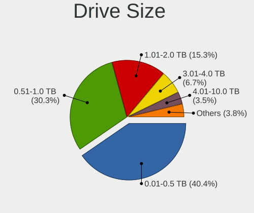

| Size in TB | Desktops | Drives | Percent |
|------------|----------|--------|---------|
| 0.01-0.5   | 514      | 834    | 40.41%  |
| 0.51-1.0   | 386      | 562    | 30.35%  |
| 1.01-2.0   | 195      | 290    | 15.33%  |
| 3.01-4.0   | 85       | 119    | 6.68%   |
| 4.01-10.0  | 44       | 70     | 3.46%   |
| 2.01-3.0   | 26       | 43     | 2.04%   |
| 10.01-20.0 | 19       | 27     | 1.49%   |
| 20.01-50.0 | 3        | 4      | 0.24%   |

Space Total
-----------

Amount of disk space available on the file system

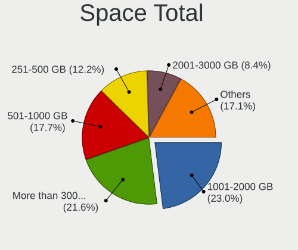

| Size in GB     | Desktops | Percent |
|----------------|----------|---------|
| 1001-2000      | 255      | 23.04%  |
| More than 3000 | 239      | 21.59%  |
| 501-1000       | 196      | 17.71%  |
| 251-500        | 135      | 12.2%   |
| 2001-3000      | 93       | 8.4%    |
| 101-250        | 82       | 7.41%   |
| Unknown        | 55       | 4.97%   |
| 1-20           | 28       | 2.53%   |
| 51-100         | 16       | 1.45%   |
| 21-50          | 8        | 0.72%   |

Space Used
----------

Amount of used disk space

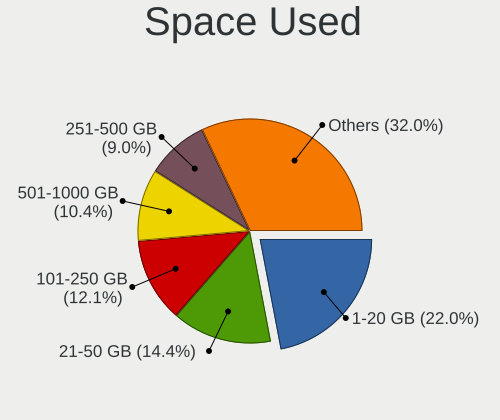

| Used GB        | Desktops | Percent |
|----------------|----------|---------|
| 1-20           | 250      | 22.01%  |
| 21-50          | 164      | 14.44%  |
| 101-250        | 138      | 12.15%  |
| 501-1000       | 118      | 10.39%  |
| 251-500        | 102      | 8.98%   |
| 1001-2000      | 101      | 8.89%   |
| 51-100         | 97       | 8.54%   |
| More than 3000 | 69       | 6.07%   |
| Unknown        | 55       | 4.84%   |
| 2001-3000      | 39       | 3.43%   |
| 0              | 3        | 0.26%   |

Malfunc. Drives
---------------

Drive models with a malfunction

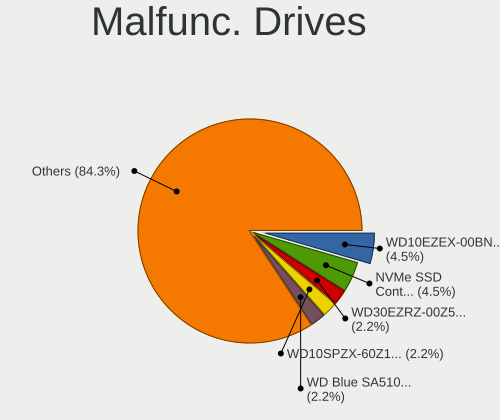

| Model                                                         | Desktops | Drives | Percent |
|---------------------------------------------------------------|----------|--------|---------|
| WDC WD10EZEX-00BN5A0 1TB                                      | 4        | 4      | 4.49%   |
| Samsung Electronics NVMe SSD Controller SM981/PM981/PM983 1TB | 4        | 4      | 4.49%   |
| WDC WD30EZRZ-00Z5HB0 3TB                                      | 2        | 2      | 2.25%   |
| WDC WD10SPZX-60Z10T0 1TB                                      | 2        | 3      | 2.25%   |
| WDC WD Blue SA510 2.5 1000GB SSD                              | 2        | 2      | 2.25%   |
| Samsung Electronics HD501LJ 500GB                             | 2        | 2      | 2.25%   |
| Kingston SV300S37A120G 120GB SSD                              | 2        | 3      | 2.25%   |
| Intel SSDSC2CT120A3 120GB                                     | 2        | 5      | 2.25%   |
| WDC WDS500G2B0A-00SM50 500GB                                  | 1        | 6      | 1.12%   |
| WDC WDS240G2G0A-00JH30 240GB SSD                              | 1        | 1      | 1.12%   |
| WDC WD60EFRX-68L0BN1 6TB                                      | 1        | 1      | 1.12%   |
| WDC WD5000LPVX-22V0TT0 500GB                                  | 1        | 1      | 1.12%   |
| WDC WD5000AZLX-00ZR6A0 500GB                                  | 1        | 2      | 1.12%   |
| WDC WD5000AVCS-632DY1 500GB                                   | 1        | 1      | 1.12%   |
| WDC WD5000AAKX-08ERMA0 500GB                                  | 1        | 1      | 1.12%   |
| WDC WD5000AAKX-001CA0 500GB                                   | 1        | 1      | 1.12%   |
| WDC WD5000AAKS-60Z1A0 500GB                                   | 1        | 1      | 1.12%   |
| WDC WD40PURX-64GVNY0 4TB                                      | 1        | 1      | 1.12%   |
| WDC WD40PURX-64GVNY0 1 4TB                                    | 1        | 1      | 1.12%   |
| WDC WD40EZRZ-00WN9B0 4TB                                      | 1        | 1      | 1.12%   |
| WDC WD40EFRX-68N32N0 4TB                                      | 1        | 1      | 1.12%   |
| WDC WD3200BEVT-22ZCT0 320GB                                   | 1        | 1      | 1.12%   |
| WDC WD2500AAKX-60U6AA0 250GB                                  | 1        | 1      | 1.12%   |
| WDC WD2003FZEX-00Z4SA0 2TB                                    | 1        | 2      | 1.12%   |
| WDC WD1600AVVS-63L2B0 160GB                                   | 1        | 1      | 1.12%   |
| WDC WD15EADS-22P8B0 1TB                                       | 1        | 3      | 1.12%   |
| WDC WD10EZEX-00M2NA0 1TB                                      | 1        | 1      | 1.12%   |
| WDC WD10EURX-63UY4Y0 1TB                                      | 1        | 1      | 1.12%   |
| Toshiba MQ01ABD100 1TB                                        | 1        | 1      | 1.12%   |
| Toshiba HDWD130 3TB                                           | 1        | 9      | 1.12%   |
| Toshiba DT01ACA100 1TB                                        | 1        | 1      | 1.12%   |
| Silicon Motion SM2263EN/SM2263XT SSD Controller 512GB         | 1        | 1      | 1.12%   |
| Seagate ST9750420AS 752GB                                     | 1        | 1      | 1.12%   |
| Seagate ST500DM002-1BD142 500GB                               | 1        | 1      | 1.12%   |
| Seagate ST500DM002-1BC142 500GB                               | 1        | 1      | 1.12%   |
| Seagate ST5000LM000-2AN170 5TB                                | 1        | 1      | 1.12%   |
| Seagate ST3750641NS EIT 752GB                                 | 1        | 1      | 1.12%   |
| Seagate ST3750640NS 752GB                                     | 1        | 1      | 1.12%   |
| Seagate ST32000542AS 2TB                                      | 1        | 1      | 1.12%   |
| Seagate ST31000524AS 1TB                                      | 1        | 2      | 1.12%   |

Malfunc. Drive Vendor
---------------------

Vendors of faulty drives

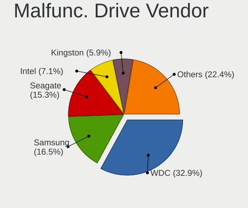

| Vendor                | Desktops | Drives | Percent |
|-----------------------|----------|--------|---------|
| WDC                   | 28       | 40     | 32.94%  |
| Samsung Electronics   | 14       | 19     | 16.47%  |
| Seagate               | 13       | 19     | 15.29%  |
| Intel                 | 6        | 11     | 7.06%   |
| Kingston              | 5        | 7      | 5.88%   |
| Toshiba               | 3        | 11     | 3.53%   |
| Micron Technology     | 2        | 2      | 2.35%   |
| Maxtor                | 2        | 2      | 2.35%   |
| Hitachi               | 2        | 3      | 2.35%   |
| Crucial               | 2        | 4      | 2.35%   |
| Silicon Motion        | 1        | 1      | 1.18%   |
| Realtek Semiconductor | 1        | 1      | 1.18%   |
| Realtek               | 1        | 1      | 1.18%   |
| LDLC                  | 1        | 1      | 1.18%   |
| HGST                  | 1        | 1      | 1.18%   |
| Corsair               | 1        | 1      | 1.18%   |
| China                 | 1        | 2      | 1.18%   |
| A-DATA Technology     | 1        | 1      | 1.18%   |

Malfunc. HDD Vendor
-------------------

Vendors of faulty HDD drives

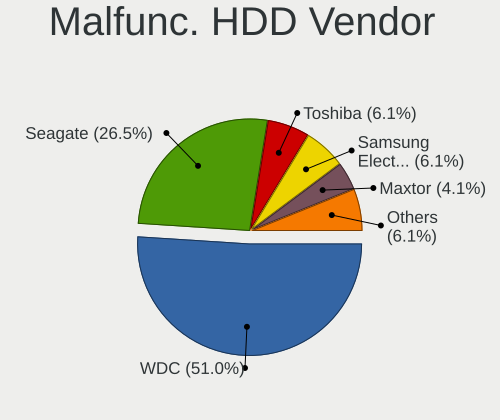

| Vendor              | Desktops | Drives | Percent |
|---------------------|----------|--------|---------|
| WDC                 | 25       | 31     | 51.02%  |
| Seagate             | 13       | 19     | 26.53%  |
| Toshiba             | 3        | 11     | 6.12%   |
| Samsung Electronics | 3        | 4      | 6.12%   |
| Maxtor              | 2        | 2      | 4.08%   |
| Hitachi             | 2        | 3      | 4.08%   |
| HGST                | 1        | 1      | 2.04%   |

Malfunc. Drive Kind
-------------------

Kinds of faulty drives

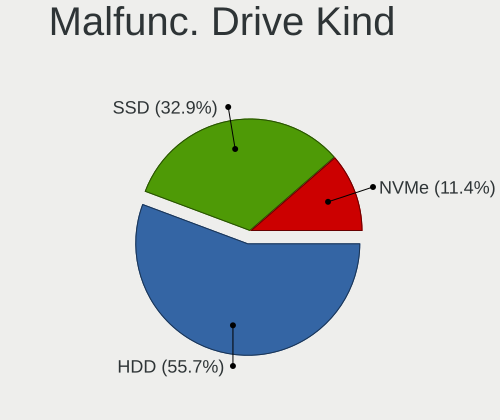

| Kind | Desktops | Drives | Percent |
|------|----------|--------|---------|
| HDD  | 44       | 71     | 55.7%   |
| SSD  | 26       | 43     | 32.91%  |
| NVMe | 9        | 13     | 11.39%  |

Failed Drives
-------------

Failed drive models

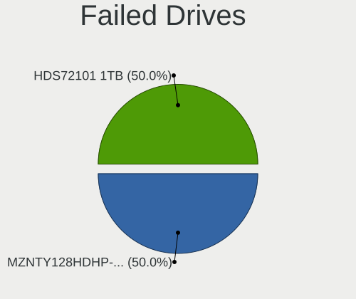

| Model                                            | Desktops | Drives | Percent |
|--------------------------------------------------|----------|--------|---------|
| Samsung Electronics MZNTY128HDHP-000H1 128GB SSD | 1        | 1      | 50%     |
| Hitachi HDS72101 1TB                             | 1        | 1      | 50%     |

Failed Drive Vendor
-------------------

Failed drive vendors

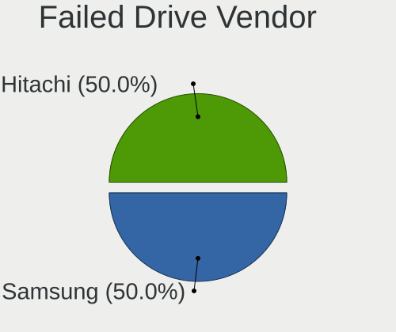

| Vendor              | Desktops | Drives | Percent |
|---------------------|----------|--------|---------|
| Samsung Electronics | 1        | 1      | 50%     |
| Hitachi             | 1        | 1      | 50%     |

Drive Status
------------

Number of failed and malfunc. drives

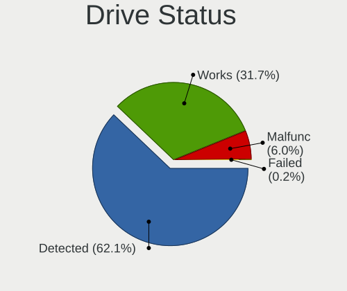

| Status   | Desktops | Drives | Percent |
|----------|----------|--------|---------|
| Detected | 736      | 2012   | 62.11%  |
| Works    | 376      | 1003   | 31.73%  |
| Malfunc  | 71       | 127    | 5.99%   |
| Failed   | 2        | 2      | 0.17%   |

Storage controller
------------------

Storage Vendor
--------------

Storage controller vendors

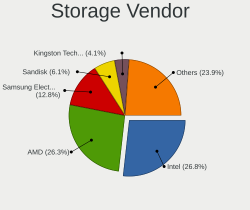

| Vendor                         | Desktops | Percent |
|--------------------------------|----------|---------|
| Intel                          | 542      | 26.77%  |
| AMD                            | 533      | 26.32%  |
| Samsung Electronics            | 260      | 12.84%  |
| Sandisk                        | 123      | 6.07%   |
| Kingston Technology Company    | 84       | 4.15%   |
| Phison Electronics             | 75       | 3.7%    |
| ASMedia Technology             | 67       | 3.31%   |
| Micron/Crucial Technology      | 64       | 3.16%   |
| MAXIO Technology (Hangzhou)    | 37       | 1.83%   |
| ADATA Technology               | 31       | 1.53%   |
| Silicon Motion                 | 26       | 1.28%   |
| Micron Technology              | 25       | 1.23%   |
| SK hynix                       | 24       | 1.19%   |
| Shenzhen Longsys Electronics   | 24       | 1.19%   |
| Realtek Semiconductor          | 23       | 1.14%   |
| JMicron Technology             | 19       | 0.94%   |
| Marvell Technology Group       | 14       | 0.69%   |
| Seagate Technology             | 8        | 0.4%    |
| KIOXIA                         | 8        | 0.4%    |
| Toshiba America Info Systems   | 6        | 0.3%    |
| Solidigm                       | 5        | 0.25%   |
| Nvidia                         | 5        | 0.25%   |
| Broadcom / LSI                 | 3        | 0.15%   |
| VIA Technologies               | 2        | 0.1%    |
| LSI Logic / Symbios Logic      | 2        | 0.1%    |
| Lite-On Technology             | 2        | 0.1%    |
| Hosin Global Electronics       | 2        | 0.1%    |
| Biwin Storage Technology       | 2        | 0.1%    |
| ULi Electronics                | 1        | 0.05%   |
| Transcend                      | 1        | 0.05%   |
| TenaFe                         | 1        | 0.05%   |
| Solid State Storage Technology | 1        | 0.05%   |
| Silicon Image                  | 1        | 0.05%   |
| Lenovo                         | 1        | 0.05%   |
| INNOGRIT                       | 1        | 0.05%   |
| Apple                          | 1        | 0.05%   |
| Unknown                        | 1        | 0.05%   |

Storage Model
-------------

Storage controller models

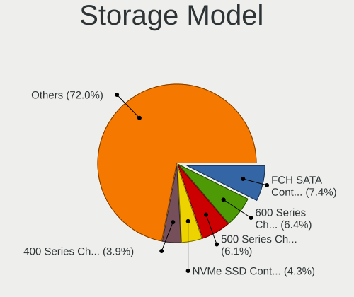

| Model                                                                          | Desktops | Percent |
|--------------------------------------------------------------------------------|----------|---------|
| AMD FCH SATA Controller [AHCI mode]                                            | 171      | 7.36%   |
| AMD 600 Series Chipset SATA Controller                                         | 149      | 6.41%   |
| AMD 500 Series Chipset SATA Controller                                         | 141      | 6.07%   |
| Samsung NVMe SSD Controller SM981/PM981/PM983                                  | 100      | 4.3%    |
| AMD 400 Series Chipset SATA Controller                                         | 90       | 3.87%   |
| Samsung NVMe SSD Controller PM9A1/PM9A3/980PRO                                 | 68       | 2.93%   |
| Samsung NVMe SSD Controller S4LV008[Pascal]                                    | 62       | 2.67%   |
| ASMedia ASM1061/ASM1062 Serial ATA Controller                                  | 55       | 2.37%   |
| Intel Raptor Lake SATA AHCI Controller                                         | 53       | 2.28%   |
| Intel 8 Series/C220 Series Chipset Family 6-port SATA Controller 1 [AHCI mode] | 51       | 2.2%    |
| Intel 200 Series PCH SATA controller [AHCI mode]                               | 48       | 2.07%   |
| Intel Alder Lake-S PCH SATA Controller [AHCI Mode]                             | 43       | 1.85%   |
| Intel Cannon Lake PCH SATA AHCI Controller                                     | 41       | 1.76%   |
| Intel Q170/Q150/B150/H170/H110/Z170/CM236 Chipset SATA Controller [AHCI Mode]  | 39       | 1.68%   |
| Samsung NVMe SSD Controller 980 (DRAM-less)                                    | 35       | 1.51%   |
| Intel SATA Controller [RAID mode]                                              | 34       | 1.46%   |
| Sandisk WD Black SN850X NVMe SSD                                               | 27       | 1.16%   |
| MAXIO (Hangzhou) NVMe SSD Controller MAP1202 (DRAM-less)                       | 27       | 1.16%   |
| SanDisk WD SN560/SN740/SN770/SN5000 NVMe SSD                                   | 26       | 1.12%   |
| Silicon Motion SM2263EN/SM2263XT (DRAM-less) NVMe SSD Controllers              | 25       | 1.08%   |
| Intel 6 Series/C200 Series Chipset Family 6 port Desktop SATA AHCI Controller  | 24       | 1.03%   |
| Intel 7 Series/C210 Series Chipset Family 6-port SATA Controller [AHCI mode]   | 23       | 0.99%   |
| Micron/Crucial P2 [Nick P2] / P3 / P3 Plus NVMe PCIe SSD (DRAM-less)           | 22       | 0.95%   |
| AMD A320 Chipset SATA Controller [AHCI mode]                                   | 20       | 0.86%   |
| Intel Volume Management Device NVMe RAID Controller                            | 19       | 0.82%   |
| AMD SB7x0/SB8x0/SB9x0 SATA Controller [AHCI mode]                              | 19       | 0.82%   |
| Intel Comet Lake SATA AHCI Controller                                          | 18       | 0.77%   |
| Intel 500 Series Chipset Family SATA AHCI Controller                           | 18       | 0.77%   |
| AMD 300 Series Chipset SATA Controller                                         | 17       | 0.73%   |
| Phison E12 NVMe Controller                                                     | 16       | 0.69%   |
| Kingston Company NV2 NVMe SSD [SM2267XT] (DRAM-less)                           | 16       | 0.69%   |
| Shenzhen Longsys Lexar NM790 / Patriot Viper VP4300 Lite NVMe SSD (DRAM-less)  | 15       | 0.65%   |
| SanDisk Ultra 3D / WD PC SN530, IX SN530, Blue SN550 NVMe SSD (DRAM-less)      | 15       | 0.65%   |
| Samsung NVMe SSD Controller SM961/PM961/SM963                                  | 15       | 0.65%   |
| Micron 2550 NVMe SSD (DRAM-less)                                               | 15       | 0.65%   |
| Intel RST Volume Management Device Controller                                  | 15       | 0.65%   |
| Intel 9 Series Chipset Family SATA Controller [AHCI Mode]                      | 15       | 0.65%   |
| AMD SB7x0/SB8x0/SB9x0 IDE Controller                                           | 15       | 0.65%   |
| Sandisk WD Blue SN580 NVMe SSD (DRAM-less)                                     | 14       | 0.6%    |
| Samsung NVMe SSD Controller PM9C1a (DRAM-less)                                 | 14       | 0.6%    |

Storage Kind
------------

Kind of storage controller (IDE, SATA, NVMe, SAS, ...)

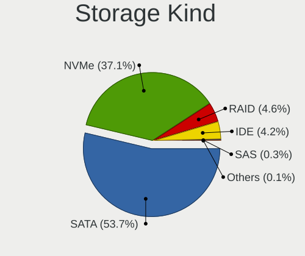

| Kind | Desktops | Percent |
|------|----------|---------|
| SATA | 994      | 53.7%   |
| NVMe | 687      | 37.12%  |
| RAID | 85       | 4.59%   |
| IDE  | 78       | 4.21%   |
| SAS  | 6        | 0.32%   |
| SCSI | 1        | 0.05%   |

Processor
---------

CPU Vendor
----------

Processor vendors

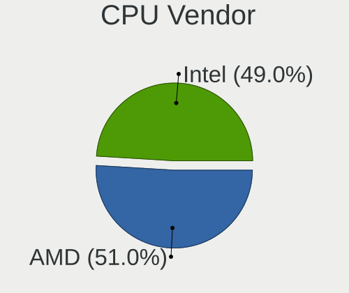

| Vendor | Desktops | Percent |
|--------|----------|---------|
| AMD    | 554      | 50.97%  |
| Intel  | 533      | 49.03%  |

CPU Model
---------

Processor models

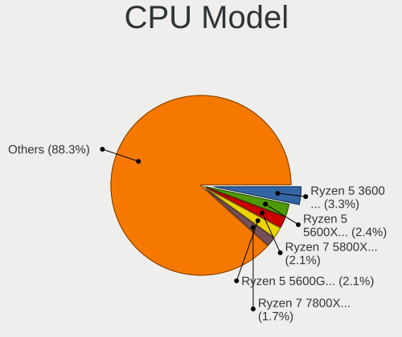

| Model                                  | Desktops | Percent |
|----------------------------------------|----------|---------|
| AMD Ryzen 5 3600 6-Core Processor      | 36       | 3.31%   |
| AMD Ryzen 5 5600X 6-Core Processor     | 26       | 2.39%   |
| AMD Ryzen 7 5800X 8-Core Processor     | 23       | 2.11%   |
| AMD Ryzen 5 5600G with Radeon Graphics | 23       | 2.11%   |
| AMD Ryzen 7 7800X3D 8-Core Processor   | 19       | 1.75%   |
| AMD Ryzen 7 5700G with Radeon Graphics | 19       | 1.75%   |
| AMD Ryzen 7 3700X 8-Core Processor     | 18       | 1.65%   |
| AMD Ryzen 9 7950X 16-Core Processor    | 17       | 1.56%   |
| AMD Ryzen 9 5900X 12-Core Processor    | 17       | 1.56%   |
| AMD Ryzen 7 9800X3D 8-Core Processor   | 17       | 1.56%   |
| Intel Core i7-3770 CPU @ 3.40GHz       | 13       | 1.19%   |
| Intel Core i5-6500 CPU @ 3.20GHz       | 13       | 1.19%   |
| AMD Ryzen 5 5600 6-Core Processor      | 13       | 1.19%   |
| AMD Ryzen 5 5500                       | 13       | 1.19%   |
| Intel Core i5-8400 CPU @ 2.80GHz       | 12       | 1.1%    |
| AMD Ryzen 9 5950X 16-Core Processor    | 11       | 1.01%   |
| AMD Ryzen 5 7600X 6-Core Processor     | 11       | 1.01%   |
| AMD Ryzen 5 2600 Six-Core Processor    | 11       | 1.01%   |
| AMD Ryzen 9 9950X 16-Core Processor    | 10       | 0.92%   |
| AMD Ryzen 9 7950X3D 16-Core Processor  | 10       | 0.92%   |
| AMD Ryzen 9 7900X 12-Core Processor    | 10       | 0.92%   |
| AMD Ryzen 5 7600 6-Core Processor      | 10       | 0.92%   |
| Intel 12th Gen Core i9-12900K          | 9        | 0.83%   |
| AMD Ryzen 7 9700X 8-Core Processor     | 9        | 0.83%   |
| AMD Ryzen 7 5800X3D 8-Core Processor   | 9        | 0.83%   |
| AMD Ryzen 7 5700X3D 8-Core Processor   | 9        | 0.83%   |
| AMD Ryzen 7 5700X 8-Core Processor     | 9        | 0.83%   |
| Intel Core i9-14900K                   | 8        | 0.74%   |
| Intel Core i7-9700K CPU @ 3.60GHz      | 8        | 0.74%   |
| Intel Core i7-8700 CPU @ 3.20GHz       | 8        | 0.74%   |
| Intel Core i7-7700K CPU @ 4.20GHz      | 8        | 0.74%   |
| Intel 12th Gen Core i5-12400F          | 8        | 0.74%   |
| AMD Ryzen 9 9900X 12-Core Processor    | 8        | 0.74%   |
| AMD Ryzen 7 7700 8-Core Processor      | 8        | 0.74%   |
| Intel N100                             | 7        | 0.64%   |
| Intel Core i7-8700K CPU @ 3.70GHz      | 7        | 0.64%   |
| Intel Core i7-4790K CPU @ 4.00GHz      | 7        | 0.64%   |
| Intel Core i5-4590 CPU @ 3.30GHz       | 7        | 0.64%   |
| Intel Core i5-2400 CPU @ 3.10GHz       | 7        | 0.64%   |
| Intel Core i5-10400F CPU @ 2.90GHz     | 7        | 0.64%   |

CPU Model Family
----------------

Processor model prefix

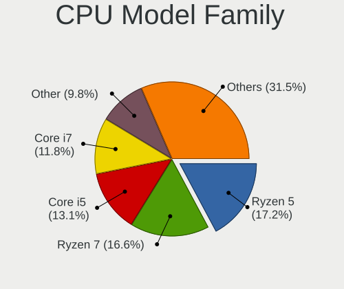

| Model                   | Desktops | Percent |
|-------------------------|----------|---------|
| AMD Ryzen 5             | 187      | 17.19%  |
| AMD Ryzen 7             | 181      | 16.64%  |
| Intel Core i5           | 142      | 13.05%  |
| Intel Core i7           | 128      | 11.76%  |
| Other                   | 107      | 9.83%   |
| AMD Ryzen 9             | 103      | 9.47%   |
| Intel Core i3           | 49       | 4.5%    |
| Intel Xeon              | 42       | 3.86%   |
| Intel Core i9           | 24       | 2.21%   |
| AMD FX                  | 18       | 1.65%   |
| AMD Ryzen 3             | 16       | 1.47%   |
| Intel Core 2 Duo        | 10       | 0.92%   |
| Intel Celeron           | 10       | 0.92%   |
| AMD Ryzen Threadripper  | 10       | 0.92%   |
| Intel Pentium           | 7        | 0.64%   |
| Intel Core              | 6        | 0.55%   |
| Intel Core 2 Quad       | 5        | 0.46%   |
| AMD Phenom II X4        | 5        | 0.46%   |
| AMD A8                  | 3        | 0.28%   |
| AMD A10                 | 3        | 0.28%   |
| Intel Pentium Dual-Core | 2        | 0.18%   |
| Intel Genuine           | 2        | 0.18%   |
| Intel Atom              | 2        | 0.18%   |
| AMD Ryzen 5 PRO         | 2        | 0.18%   |
| AMD Phenom II X2        | 2        | 0.18%   |
| AMD Athlon X4           | 2        | 0.18%   |
| AMD Athlon II X4        | 2        | 0.18%   |
| AMD Athlon II X2        | 2        | 0.18%   |
| AMD Athlon 64 X2        | 2        | 0.18%   |
| AMD Athlon              | 2        | 0.18%   |
| AMD A6                  | 2        | 0.18%   |
| AMD A12                 | 2        | 0.18%   |
| Intel Pentium Gold      | 1        | 0.09%   |
| AMD Ryzen 7 PRO         | 1        | 0.09%   |
| AMD Ryzen 3 PRO         | 1        | 0.09%   |
| AMD PRO A8              | 1        | 0.09%   |
| AMD PRO A10             | 1        | 0.09%   |
| AMD GX                  | 1        | 0.09%   |
| AMD E1                  | 1        | 0.09%   |
| AMD A4                  | 1        | 0.09%   |

CPU Cores
---------

Number of processor cores

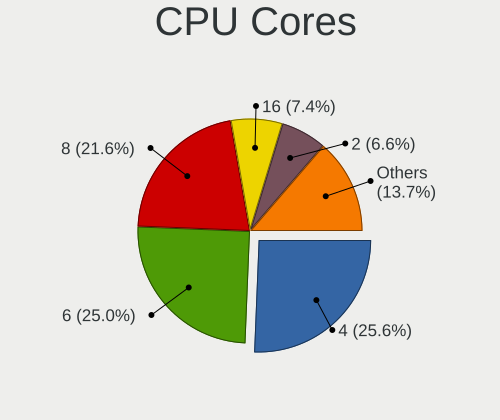

| Number | Desktops | Percent |
|--------|----------|---------|
| 4      | 279      | 25.64%  |
| 6      | 272      | 25%     |
| 8      | 235      | 21.6%   |
| 16     | 81       | 7.44%   |
| 2      | 72       | 6.62%   |
| 12     | 64       | 5.88%   |
| 24     | 23       | 2.11%   |
| 10     | 20       | 1.84%   |
| 14     | 17       | 1.56%   |
| 20     | 13       | 1.19%   |
| 32     | 8        | 0.74%   |
| 1      | 2        | 0.18%   |
| 36     | 1        | 0.09%   |
| 18     | 1        | 0.09%   |

CPU Sockets
-----------

Number of sockets

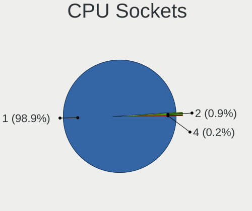

| Number | Desktops | Percent |
|--------|----------|---------|
| 1      | 1075     | 98.9%   |
| 2      | 10       | 0.92%   |
| 4      | 2        | 0.18%   |

CPU Threads
-----------

Threads per core (Hyper-Threading)

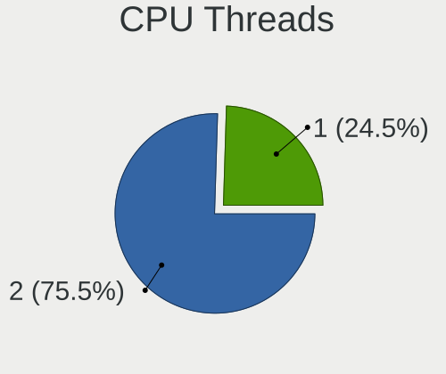

| Number | Desktops | Percent |
|--------|----------|---------|
| 2      | 822      | 75.48%  |
| 1      | 267      | 24.52%  |

CPU Op-Modes
------------

CPU Operation Modes (32-bit, 64-bit)

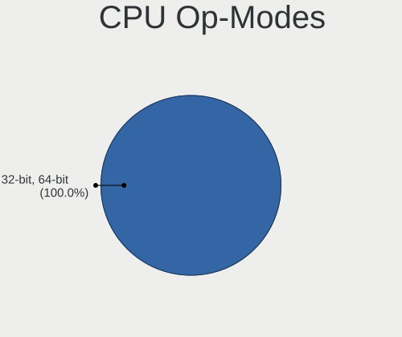

| Op mode        | Desktops | Percent |
|----------------|----------|---------|
| 32-bit, 64-bit | 1087     | 100%    |

CPU Microcode
-------------

Microcode number

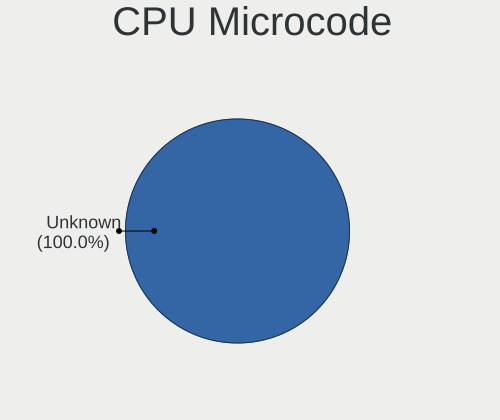

| Number  | Desktops | Percent |
|---------|----------|---------|
| Unknown | 1087     | 100%    |

CPU Microarch
-------------

Microarchitecture

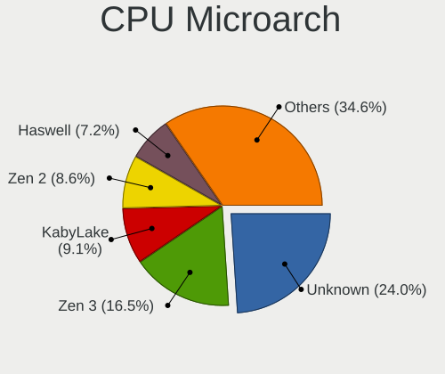

| Name             | Desktops | Percent |
|------------------|----------|---------|
| Unknown          | 261      | 23.97%  |
| Zen 3            | 180      | 16.53%  |
| KabyLake         | 99       | 9.09%   |
| Zen 2            | 94       | 8.63%   |
| Haswell          | 78       | 7.16%   |
| Skylake          | 43       | 3.95%   |
| CometLake        | 43       | 3.95%   |
| IvyBridge        | 42       | 3.86%   |
| Alderlake Hybrid | 40       | 3.67%   |
| Zen+             | 35       | 3.21%   |
| SandyBridge      | 33       | 3.03%   |
| Zen              | 27       | 2.48%   |
| Piledriver       | 20       | 1.84%   |
| Penryn           | 13       | 1.19%   |
| K10              | 11       | 1.01%   |
| Broadwell        | 11       | 1.01%   |
| Westmere         | 8        | 0.73%   |
| Nehalem          | 7        | 0.64%   |
| Excavator        | 6        | 0.55%   |
| Silvermont       | 5        | 0.46%   |
| IceLake          | 5        | 0.46%   |
| Core             | 5        | 0.46%   |
| Steamroller      | 4        | 0.37%   |
| Jaguar           | 4        | 0.37%   |
| Tremont          | 2        | 0.18%   |
| Lunarlake Hybrid | 2        | 0.18%   |
| K8 Hammer        | 2        | 0.18%   |
| Goldmont plus    | 2        | 0.18%   |
| Bonnell          | 2        | 0.18%   |
| Puma             | 1        | 0.09%   |
| K10 Llano        | 1        | 0.09%   |
| Gracemont        | 1        | 0.09%   |
| Goldmont         | 1        | 0.09%   |
| Bulldozer        | 1        | 0.09%   |

Graphics
--------

GPU Vendor
----------

Vendors of graphics cards

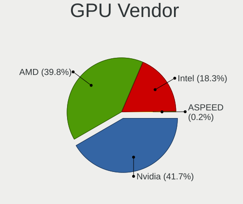

| Vendor            | Desktops | Percent |
|-------------------|----------|---------|
| Nvidia            | 509      | 41.65%  |
| AMD               | 486      | 39.77%  |
| Intel             | 224      | 18.33%  |
| ASPEED Technology | 3        | 0.25%   |

GPU Model
---------

Graphics card models

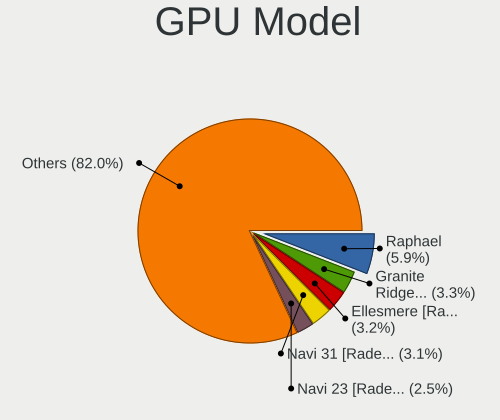

| Model                                                                       | Desktops | Percent |
|-----------------------------------------------------------------------------|----------|---------|
| AMD Raphael                                                                 | 77       | 5.91%   |
| AMD Granite Ridge [Radeon Graphics]                                         | 43       | 3.3%    |
| AMD Ellesmere [Radeon RX 470/480/570/570X/580/580X/590]                     | 42       | 3.23%   |
| AMD Navi 31 [Radeon RX 7900 XT/7900 XTX/7900 GRE/7900M]                     | 40       | 3.07%   |
| AMD Navi 23 [Radeon RX 6600/6600 XT/6600M]                                  | 33       | 2.53%   |
| AMD Navi 22 [Radeon RX 6700/6700 XT/6750 XT / 6800M/6850M XT]               | 31       | 2.38%   |
| Intel Xeon E3-1200 v3/4th Gen Core Processor Integrated Graphics Controller | 29       | 2.23%   |
| AMD Cezanne [Radeon Vega Series / Radeon Vega Mobile Series]                | 29       | 2.23%   |
| Nvidia AD107 [GeForce RTX 4060]                                             | 26       | 2%      |
| AMD Navi 21 [Radeon RX 6800/6800 XT / 6900 XT]                              | 25       | 1.92%   |
| Nvidia GA106 [GeForce RTX 3060 Lite Hash Rate]                              | 23       | 1.77%   |
| Nvidia GP104 [GeForce GTX 1070]                                             | 20       | 1.54%   |
| Intel Skylake-S GT2 [HD Graphics 530]                                       | 19       | 1.46%   |
| AMD Navi 32 [Radeon RX 7700 XT / 7800 XT]                                   | 19       | 1.46%   |
| Intel CoffeeLake-S GT2 [UHD Graphics 630]                                   | 18       | 1.38%   |
| AMD Navi 10 [Radeon RX 5600 OEM/5600 XT / 5700/5700 XT]                     | 18       | 1.38%   |
| AMD Navi 33 [Radeon RX 7600/7600 XT/7600M XT/7600S/7700S / PRO W7600]       | 16       | 1.23%   |
| Nvidia GP107 [GeForce GTX 1050 Ti]                                          | 15       | 1.15%   |
| Intel Raptor Lake-S GT1 [UHD Graphics 770]                                  | 15       | 1.15%   |
| Intel Kaby Lake-S GT2 [HD Graphics 630]                                     | 15       | 1.15%   |
| Nvidia GP106 [GeForce GTX 1060 6GB]                                         | 13       | 1%      |
| Nvidia GK208B [GeForce GT 710]                                              | 12       | 0.92%   |
| Intel CometLake-S GT2 [UHD Graphics 630]                                    | 12       | 0.92%   |
| Intel 2nd Generation Core Processor Family Integrated Graphics Controller   | 12       | 0.92%   |
| AMD Lexa PRO [Radeon 540/540X/550/550X / RX 540X/550/550X]                  | 12       | 0.92%   |
| Nvidia TU117 [GeForce GTX 1650]                                             | 11       | 0.84%   |
| Nvidia GP106 [GeForce GTX 1060 3GB]                                         | 11       | 0.84%   |
| Nvidia GP104 [GeForce GTX 1080]                                             | 11       | 0.84%   |
| Nvidia AD103 [GeForce RTX 4080 SUPER]                                       | 11       | 0.84%   |
| Intel Xeon E3-1200 v2/3rd Gen Core processor Graphics Controller            | 11       | 0.84%   |
| Nvidia GM204 [GeForce GTX 970]                                              | 10       | 0.77%   |
| Nvidia GA102 [GeForce RTX 3090]                                             | 10       | 0.77%   |
| Nvidia AD102 [GeForce RTX 4090]                                             | 10       | 0.77%   |
| Intel Alder Lake-S GT1 [UHD Graphics 770]                                   | 10       | 0.77%   |
| AMD Polaris 20 XL [Radeon RX 580 2048SP]                                    | 10       | 0.77%   |
| AMD Picasso/Raven 2 [Radeon Vega Series / Radeon Vega Mobile Series]        | 10       | 0.77%   |
| Nvidia GM206 [GeForce GTX 960]                                              | 9        | 0.69%   |
| Nvidia GM107 [GeForce GTX 750 Ti]                                           | 9        | 0.69%   |
| Nvidia GA104 [GeForce RTX 3070]                                             | 9        | 0.69%   |
| Nvidia GA102 [GeForce RTX 3080]                                             | 9        | 0.69%   |

GPU Combo
---------

Combinations of graphics cards

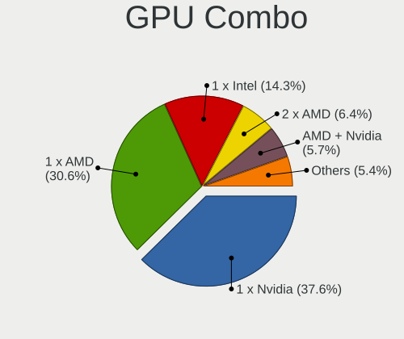

| Name                 | Desktops | Percent |
|----------------------|----------|---------|
| 1 x Nvidia           | 411      | 37.6%   |
| 1 x AMD              | 335      | 30.65%  |
| 1 x Intel            | 156      | 14.27%  |
| 2 x AMD              | 70       | 6.4%    |
| AMD + Nvidia         | 62       | 5.67%   |
| Intel + Nvidia       | 29       | 2.65%   |
| Intel + AMD          | 18       | 1.65%   |
| 2 x Nvidia           | 7        | 0.64%   |
| 1 x ASPEED           | 2        | 0.18%   |
| 2 x Intel            | 1        | 0.09%   |
| Nvidia + ASPEED      | 1        | 0.09%   |
| 1 x AMD + 3 x Nvidia | 1        | 0.09%   |

GPU Driver
----------

Free vs proprietary

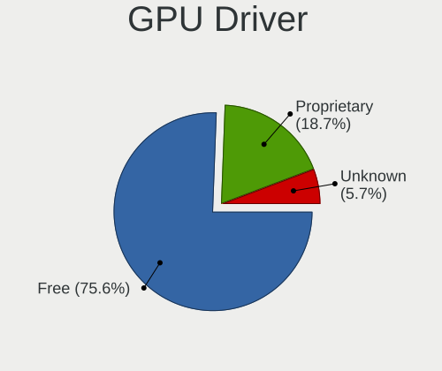

| Driver      | Desktops | Percent |
|-------------|----------|---------|
| Free        | 830      | 75.59%  |
| Proprietary | 205      | 18.67%  |
| Unknown     | 63       | 5.74%   |

GPU Memory
----------

Total video memory

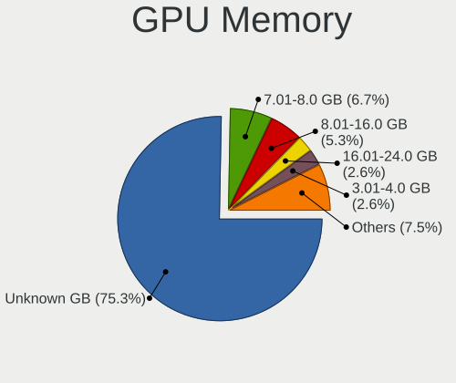

| Size in GB | Desktops | Percent |
|------------|----------|---------|
| Unknown    | 826      | 75.3%   |
| 7.01-8.0   | 74       | 6.75%   |
| 8.01-16.0  | 58       | 5.29%   |
| 16.01-24.0 | 29       | 2.64%   |
| 3.01-4.0   | 28       | 2.55%   |
| 0.01-0.5   | 26       | 2.37%   |
| 1.01-2.0   | 25       | 2.28%   |
| 0.51-1.0   | 18       | 1.64%   |
| 5.01-6.0   | 10       | 0.91%   |
| 2.01-3.0   | 3        | 0.27%   |

Monitor
-------

Monitor Vendor
--------------

Monitor vendors

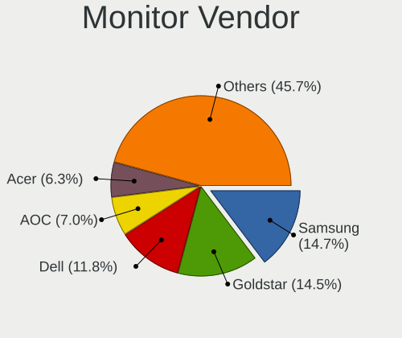

| Vendor               | Desktops | Percent |
|----------------------|----------|---------|
| Samsung Electronics  | 188      | 14.7%   |
| Goldstar             | 185      | 14.46%  |
| Dell                 | 151      | 11.81%  |
| AOC                  | 90       | 7.04%   |
| Acer                 | 80       | 6.25%   |
| Hewlett-Packard      | 69       | 5.39%   |
| ASUSTek Computer     | 53       | 4.14%   |
| BenQ                 | 50       | 3.91%   |
| Philips              | 44       | 3.44%   |
| Lenovo               | 33       | 2.58%   |
| Ancor Communications | 33       | 2.58%   |
| MSI                  | 30       | 2.35%   |
| Gigabyte Technology  | 26       | 2.03%   |
| ViewSonic            | 25       | 1.95%   |
| Iiyama               | 15       | 1.17%   |
| Unknown              | 10       | 0.78%   |
| Denver               | 10       | 0.78%   |
| Sceptre Tech         | 9        | 0.7%    |
| Sony                 | 8        | 0.63%   |
| Mi                   | 8        | 0.63%   |
| Toshiba              | 7        | 0.55%   |
| Unknown (XXX)        | 6        | 0.47%   |
| NEC Computers        | 6        | 0.47%   |
| HKC                  | 6        | 0.47%   |
| Vizio                | 5        | 0.39%   |
| HUAWEI               | 5        | 0.39%   |
| SKG                  | 4        | 0.31%   |
| ONN                  | 4        | 0.31%   |
| Insignia             | 4        | 0.31%   |
| Eizo                 | 4        | 0.31%   |
| Apple                | 4        | 0.31%   |
| ZTL                  | 3        | 0.23%   |
| VIE                  | 3        | 0.23%   |
| Panasonic            | 3        | 0.23%   |
| IPS                  | 3        | 0.23%   |
| INNOCN               | 3        | 0.23%   |
| Hitachi              | 3        | 0.23%   |
| Fujitsu Siemens      | 3        | 0.23%   |
| Cbox                 | 3        | 0.23%   |
| APT                  | 3        | 0.23%   |

Monitor Model
-------------

Monitor models

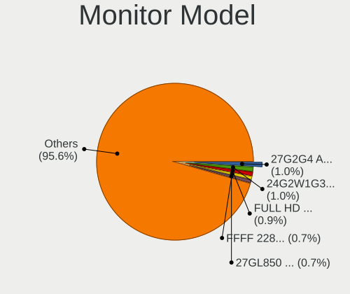

| Model                                                                    | Desktops | Percent |
|--------------------------------------------------------------------------|----------|---------|
| AOC 27G2G4 AOC2702 1920x1080 598x336mm 27.0-inch                         | 14       | 1.03%   |
| AOC 24G2W1G3 AOC2402 1920x1080 527x296mm 23.8-inch                       | 14       | 1.03%   |
| Goldstar FULL HD GSM5B55 1920x1080 480x270mm 21.7-inch                   | 12       | 0.88%   |
| Unknown LCD Monitor FFFF 2288x1287 2550x2550mm 142.0-inch                | 10       | 0.74%   |
| Goldstar 27GL850 GSM5B7F 2560x1440 597x336mm 27.0-inch                   | 10       | 0.74%   |
| Samsung Electronics C27F390 SAM0D32 1920x1080 598x336mm 27.0-inch        | 7        | 0.52%   |
| Samsung Electronics C24F390 SAM0D2C 1920x1080 521x293mm 23.5-inch        | 7        | 0.52%   |
| Goldstar Ultra HD GSM5B09 3840x2160 600x340mm 27.2-inch                  | 7        | 0.52%   |
| Goldstar LG TV SSCR2 GSMC0C8 3840x2160                                   | 7        | 0.52%   |
| Goldstar HDR 4K GSM7707 3840x2160 600x340mm 27.2-inch                    | 7        | 0.52%   |
| Dell U2412M DELA07B 1920x1200 518x324mm 24.1-inch                        | 7        | 0.52%   |
| Dell AW3423DWF DELA212 3440x1440 800x337mm 34.2-inch                     | 7        | 0.52%   |
| Samsung Electronics U28E590 SAM0C4D 3840x2160 607x345mm 27.5-inch        | 6        | 0.44%   |
| Samsung Electronics LF24T35 SAM707D 1920x1080 528x297mm 23.9-inch        | 6        | 0.44%   |
| Goldstar HDR 4K GSM7706 3840x2160 600x340mm 27.2-inch                    | 6        | 0.44%   |
| Gigabyte Technology M32U GBT3204 3840x2160 697x392mm 31.5-inch           | 6        | 0.44%   |
| Denver MO-HHS-32C LHCFFFF 1920x1080 699x393mm 31.6-inch                  | 6        | 0.44%   |
| Samsung Electronics S24F350 SAM0D20 1920x1080 521x293mm 23.5-inch        | 5        | 0.37%   |
| Goldstar ULTRAWIDE GSM76F9 2560x1080 531x298mm 24.0-inch                 | 5        | 0.37%   |
| Goldstar TV SSCR2 GSM81CD 3840x2160                                      | 5        | 0.37%   |
| Unknown (XXX) Beyond TV XXX2851 3840x2160 1209x680mm 54.6-inch           | 4        | 0.29%   |
| Samsung Electronics Odyssey G95SC SAME028 3840x1080 1193x336mm 48.8-inch | 4        | 0.29%   |
| Goldstar ULTRAGEAR GSM7766 2560x1440 697x392mm 31.5-inch                 | 4        | 0.29%   |
| Goldstar LG IPS FULLHD GSM5AB8 1920x1080 480x270mm 21.7-inch             | 4        | 0.29%   |
| Goldstar HDR WFHD GSM7715 2560x1080 798x334mm 34.1-inch                  | 4        | 0.29%   |
| Gigabyte Technology M28U GBT2800 3840x2160 697x392mm 31.5-inch           | 4        | 0.29%   |
| AOC Q3279WG5B AOC3279 2560x1440 725x428mm 33.1-inch                      | 4        | 0.29%   |
| AOC 2590G4 AOC2590 1920x1080 544x303mm 24.5-inch                         | 4        | 0.29%   |
| AOC 24B1W1 AOC2401 1920x1080 527x296mm 23.8-inch                         | 4        | 0.29%   |
| Ancor Communications VG248 ACI24A4 1920x1080 531x299mm 24.0-inch         | 4        | 0.29%   |
| ZTL ZM29W1 ZTL1506 2560x1080 1600x1000mm 74.3-inch                       | 3        | 0.22%   |
| Toshiba TV TSB0206 1920x1080                                             | 3        | 0.22%   |
| Samsung Electronics U32J59x SAM0F35 3840x2160 697x392mm 31.5-inch        | 3        | 0.22%   |
| Samsung Electronics LCD Monitor SAM0A7A 1920x1080 1060x626mm 48.5-inch   | 3        | 0.22%   |
| Samsung Electronics LC27G5xT SAM707A 2560x1440 597x336mm 27.0-inch       | 3        | 0.22%   |
| Samsung Electronics C49RG9x SAM0F9C 3360x1440 1193x336mm 48.8-inch       | 3        | 0.22%   |
| Philips PHL 436M6VBP PHLC179 3840x2160 941x529mm 42.5-inch               | 3        | 0.22%   |
| Philips PHL 242V8 PHLC219 1920x1080 527x296mm 23.8-inch                  | 3        | 0.22%   |
| Philips PHL 223V5 PHLC0CF 1920x1080 477x268mm 21.5-inch                  | 3        | 0.22%   |
| ONN ONA18HO015 ONN0101 1920x1080 698x393mm 31.5-inch                     | 3        | 0.22%   |

Monitor Resolution
------------------

Monitor screen resolution

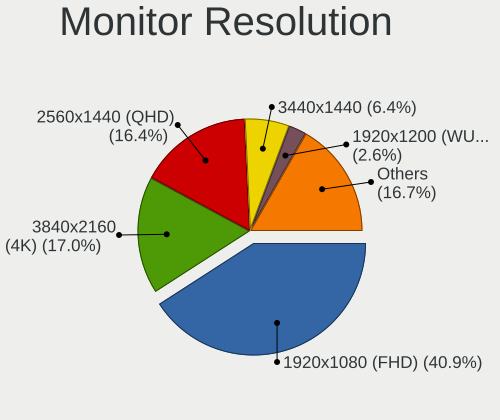

| Resolution         | Desktops | Percent |
|--------------------|----------|---------|
| 1920x1080 (FHD)    | 489      | 40.89%  |
| 3840x2160 (4K)     | 203      | 16.97%  |
| 2560x1440 (QHD)    | 196      | 16.39%  |
| 3440x1440          | 77       | 6.44%   |
| 1920x1200 (WUXGA)  | 31       | 2.59%   |
| 2560x1080          | 29       | 2.42%   |
| 1680x1050 (WSXGA+) | 26       | 2.17%   |
| 1280x1024 (SXGA)   | 26       | 2.17%   |
| 1440x900 (WXGA+)   | 23       | 1.92%   |
| 1366x768 (WXGA)    | 20       | 1.67%   |
| 3840x1080          | 18       | 1.51%   |
| 1600x900 (HD+)     | 18       | 1.51%   |
| 2288x1287          | 11       | 0.92%   |
| 1360x768           | 5        | 0.42%   |
| 2560x1600          | 4        | 0.33%   |
| 1600x1200          | 4        | 0.33%   |
| 1920x540           | 3        | 0.25%   |
| Unknown            | 3        | 0.25%   |
| 3840x2560          | 2        | 0.17%   |
| 3840x1600          | 2        | 0.17%   |
| 2560x2880          | 2        | 0.17%   |
| 2160x1200          | 1        | 0.08%   |
| 2048x1152          | 1        | 0.08%   |
| 1920x1440          | 1        | 0.08%   |
| 1024x768 (XGA)     | 1        | 0.08%   |

Monitor Diagonal
----------------

Diagonal size in inches

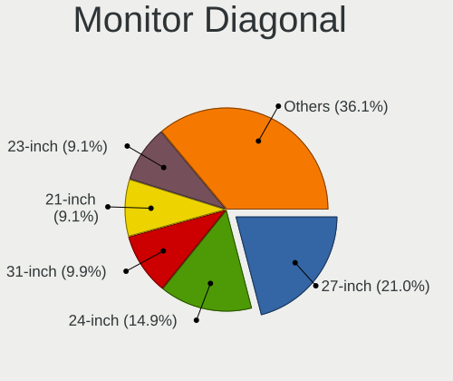

| Inches  | Desktops | Percent |
|---------|----------|---------|
| 27      | 266      | 20.96%  |
| 24      | 189      | 14.89%  |
| 31      | 125      | 9.85%   |
| 21      | 116      | 9.14%   |
| 23      | 115      | 9.06%   |
| 34      | 99       | 7.8%    |
| 19      | 40       | 3.15%   |
| 22      | 24       | 1.89%   |
| 18      | 21       | 1.65%   |
| 48      | 20       | 1.58%   |
| 20      | 18       | 1.42%   |
| Unknown | 18       | 1.42%   |
| 40      | 14       | 1.1%    |
| 32      | 14       | 1.1%    |
| 84      | 13       | 1.02%   |
| 54      | 13       | 1.02%   |
| 49      | 13       | 1.02%   |
| 15      | 13       | 1.02%   |
| 72      | 12       | 0.95%   |
| 26      | 12       | 0.95%   |
| 28      | 11       | 0.87%   |
| 17      | 11       | 0.87%   |
| 142     | 10       | 0.79%   |
| 63      | 10       | 0.79%   |
| 25      | 10       | 0.79%   |
| 42      | 9        | 0.71%   |
| 74      | 6        | 0.47%   |
| 33      | 6        | 0.47%   |
| 52      | 4        | 0.32%   |
| 43      | 4        | 0.32%   |
| 13      | 4        | 0.32%   |
| 39      | 3        | 0.24%   |
| 37      | 3        | 0.24%   |
| 35      | 3        | 0.24%   |
| 29      | 3        | 0.24%   |
| 14      | 3        | 0.24%   |
| 57      | 2        | 0.16%   |
| 36      | 2        | 0.16%   |
| 12      | 2        | 0.16%   |
| 82      | 1        | 0.08%   |

Monitor Width
-------------

Physical width

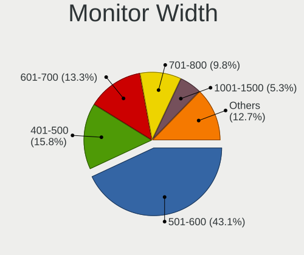

| Width in mm    | Desktops | Percent |
|----------------|----------|---------|
| 501-600        | 521      | 43.06%  |
| 401-500        | 191      | 15.79%  |
| 601-700        | 161      | 13.31%  |
| 701-800        | 119      | 9.83%   |
| 1001-1500      | 64       | 5.29%   |
| 1501-2000      | 32       | 2.64%   |
| 351-400        | 26       | 2.15%   |
| 801-900        | 24       | 1.98%   |
| 301-350        | 22       | 1.82%   |
| Unknown        | 18       | 1.49%   |
| 901-1000       | 16       | 1.32%   |
| More than 2000 | 10       | 0.83%   |
| 201-300        | 6        | 0.5%    |

Aspect Ratio
------------

Proportional relationship between the width and the height

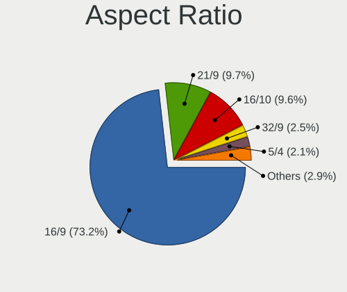

| Ratio   | Desktops | Percent |
|---------|----------|---------|
| 16/9    | 809      | 73.21%  |
| 21/9    | 107      | 9.68%   |
| 16/10   | 106      | 9.59%   |
| 32/9    | 28       | 2.53%   |
| 5/4     | 23       | 2.08%   |
| 1.00    | 10       | 0.9%    |
| 4/3     | 9        | 0.81%   |
| 3/2     | 4        | 0.36%   |
| 6/5     | 3        | 0.27%   |
| Unknown | 3        | 0.27%   |
| 0.89    | 2        | 0.18%   |
| 1.96    | 1        | 0.09%   |

Monitor Area
------------

Area in inch²

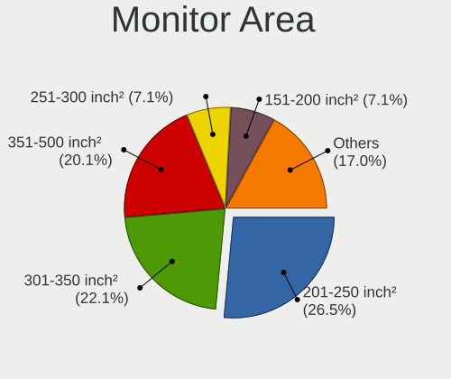

| Area in inch² | Desktops | Percent |
|----------------|----------|---------|
| 201-250        | 328      | 26.49%  |
| 301-350        | 274      | 22.13%  |
| 351-500        | 249      | 20.11%  |
| 251-300        | 88       | 7.11%   |
| 151-200        | 88       | 7.11%   |
| More than 1000 | 76       | 6.14%   |
| 501-1000       | 66       | 5.33%   |
| 141-150        | 23       | 1.86%   |
| Unknown        | 18       | 1.45%   |
| 101-110        | 12       | 0.97%   |
| 131-140        | 5        | 0.4%    |
| 81-90          | 4        | 0.32%   |
| 71-80          | 4        | 0.32%   |
| 61-70          | 1        | 0.08%   |
| 111-120        | 1        | 0.08%   |
| 91-100         | 1        | 0.08%   |

Pixel Density
-------------

Pixels per inch

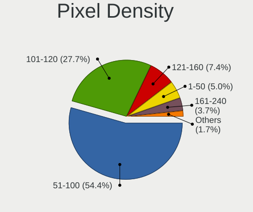

| Density       | Desktops | Percent |
|---------------|----------|---------|
| 51-100        | 636      | 54.41%  |
| 101-120       | 324      | 27.72%  |
| 121-160       | 87       | 7.44%   |
| 1-50          | 59       | 5.05%   |
| 161-240       | 43       | 3.68%   |
| Unknown       | 18       | 1.54%   |
| More than 240 | 2        | 0.17%   |

Multiple Monitors
-----------------

Total monitors connected

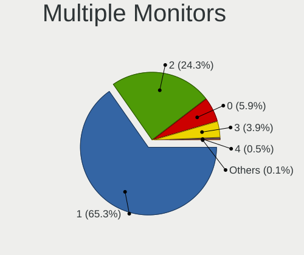

| Total | Desktops | Percent |
|-------|----------|---------|
| 1     | 721      | 65.31%  |
| 2     | 268      | 24.28%  |
| 0     | 65       | 5.89%   |
| 3     | 43       | 3.89%   |
| 4     | 6        | 0.54%   |
| 6     | 1        | 0.09%   |

Network
-------

Net Controller Vendor
---------------------

Controller vendors

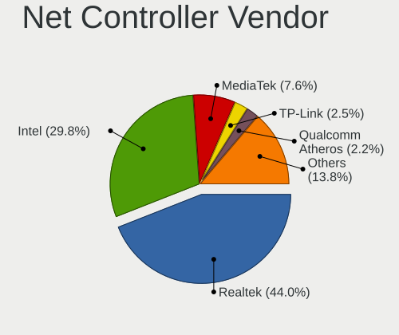

| Vendor                          | Desktops | Percent |
|---------------------------------|----------|---------|
| Realtek Semiconductor           | 745      | 44.03%  |
| Intel                           | 505      | 29.85%  |
| MediaTek                        | 129      | 7.62%   |
| TP-Link                         | 42       | 2.48%   |
| Qualcomm Atheros                | 38       | 2.25%   |
| Broadcom                        | 28       | 1.65%   |
| Aquantia                        | 26       | 1.54%   |
| Ralink Technology               | 18       | 1.06%   |
| Microsoft                       | 17       | 1%      |
| Qualcomm Technologies           | 15       | 0.89%   |
| Samsung Electronics             | 9        | 0.53%   |
| Xiaomi                          | 7        | 0.41%   |
| Ralink                          | 7        | 0.41%   |
| NetGear                         | 7        | 0.41%   |
| Google                          | 7        | 0.41%   |
| ASUSTek Computer                | 6        | 0.35%   |
| Qualcomm Atheros Communications | 5        | 0.3%    |
| Mellanox Technologies           | 5        | 0.3%    |
| Nvidia                          | 4        | 0.24%   |
| Marvell Technology Group        | 4        | 0.24%   |
| Broadcom Limited                | 4        | 0.24%   |
| ASIX Electronics                | 4        | 0.24%   |
| Arduino SA                      | 4        | 0.24%   |
| Edimax Technology               | 3        | 0.18%   |
| DisplayLink                     | 3        | 0.18%   |
| D-Link System                   | 3        | 0.18%   |
| D-Link                          | 3        | 0.18%   |
| U-Blox                          | 2        | 0.12%   |
| Sitecom Europe                  | 2        | 0.12%   |
| Raspberry Pi                    | 2        | 0.12%   |
| Qualcomm                        | 2        | 0.12%   |
| Oculus VR                       | 2        | 0.12%   |
| Mercucys                        | 2        | 0.12%   |
| Apple                           | 2        | 0.12%   |
| ADMtek                          | 2        | 0.12%   |
| Winbond Electronics             | 1        | 0.06%   |
| Wilocity                        | 1        | 0.06%   |
| VIA Technologies                | 1        | 0.06%   |
| Tenda                           | 1        | 0.06%   |
| STMicroelectronics              | 1        | 0.06%   |

Net Controller Model
--------------------

Controller models

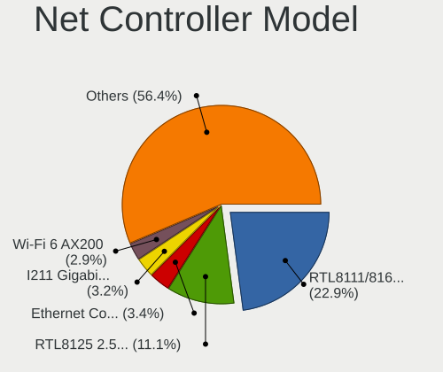

| Model                                                                           | Desktops | Percent |
|---------------------------------------------------------------------------------|----------|---------|
| Realtek RTL8111/8168/8211/8411 PCI Express Gigabit Ethernet Controller          | 459      | 22.93%  |
| Realtek RTL8125 2.5GbE Controller                                               | 222      | 11.09%  |
| Intel Ethernet Controller I225-V                                                | 69       | 3.45%   |
| Intel I211 Gigabit Network Connection                                           | 65       | 3.25%   |
| Intel Wi-Fi 6 AX200                                                             | 58       | 2.9%    |
| Intel Wi-Fi 6E(802.11ax) AX210/AX1675* 2x2 [Typhoon Peak]                       | 55       | 2.75%   |
| MediaTek MT7922 802.11ax PCI Express Wireless Network Adapter                   | 49       | 2.45%   |
| Intel Ethernet Controller I226-V                                                | 38       | 1.9%    |
| Intel Ethernet Connection (2) I219-V                                            | 31       | 1.55%   |
| MediaTek MT7921K (RZ608) Wi-Fi 6E 80MHz                                         | 27       | 1.35%   |
| Realtek RTL8821CE 802.11ac PCIe Wireless Network Adapter                        | 26       | 1.3%    |
| Intel 700 Series Chipset CNVi WiFi                                              | 26       | 1.3%    |
| Intel Dual Band Wireless-AC 3168NGW [Stone Peak]                                | 23       | 1.15%   |
| Realtek RTL8852BE PCIe 802.11ax Wireless Network Controller                     | 22       | 1.1%    |
| Realtek RTL8126 5GbE Controller                                                 | 21       | 1.05%   |
| Intel Ethernet Connection (7) I219-V                                            | 19       | 0.95%   |
| Realtek 802.11ac NIC                                                            | 18       | 0.9%    |
| Intel Alder Lake-S PCH CNVi WiFi                                                | 17       | 0.85%   |
| Realtek RTL8153 Gigabit Ethernet Adapter                                        | 16       | 0.8%    |
| MediaTek MT7925 802.11be 160MHz 2x2 PCIe Wireless Network Adapter [Filogic 360] | 16       | 0.8%    |
| Intel 82579LM Gigabit Network Connection (Lewisville)                           | 16       | 0.8%    |
| Qualcomm WCN785x Wi-Fi 7(802.11be) 320MHz 2x2 [FastConnect 7800]                | 15       | 0.75%   |
| Intel Wi-Fi 5(802.11ac) Wireless-AC 9x6x [Thunder Peak]                         | 15       | 0.75%   |
| Intel Ethernet Connection I217-LM                                               | 15       | 0.75%   |
| Intel 82579V Gigabit Network Connection                                         | 12       | 0.6%    |
| Aquantia AQtion AQC113CS NBase-T/IEEE 802.3an Ethernet Controller [Antigua 10G] | 12       | 0.6%    |
| Microsoft Xbox Wireless Adapter for Windows                                     | 11       | 0.55%   |
| MediaTek MT7927 802.11be 320MHz 2x2 PCIe Wireless Network Adapter [Filogic 380] | 11       | 0.55%   |
| MediaTek MT7921 802.11ax PCIe Wireless Network Adapter [Filogic 330]            | 11       | 0.55%   |
| Intel Ethernet Connection (2) I219-LM                                           | 11       | 0.55%   |
| Broadcom BCM4360 802.11ac Dual Band Wireless Network Adapter                    | 11       | 0.55%   |
| Realtek RTL88x2bu [AC1200 Techkey]                                              | 10       | 0.5%    |
| Realtek RTL8852CE PCIe 802.11ax Wireless Network Controller                     | 10       | 0.5%    |
| Realtek RTL8188EUS 802.11n Wireless Network Adapter                             | 10       | 0.5%    |
| Intel Cannon Lake PCH CNVi WiFi                                                 | 10       | 0.5%    |
| TP-Link 802.11ac WLAN Adapter                                                   | 9        | 0.45%   |
| Intel Wireless 7265                                                             | 9        | 0.45%   |
| Intel Ethernet Connection (7) I219-LM                                           | 9        | 0.45%   |
| Intel Ethernet Connection (2) I218-V                                            | 9        | 0.45%   |
| Intel Comet Lake PCH CNVi WiFi                                                  | 9        | 0.45%   |

Wireless Vendor
---------------

Wireless vendors

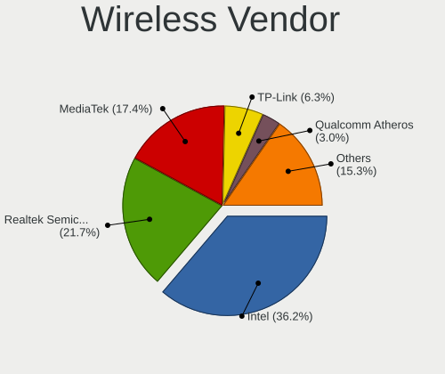

| Vendor                                | Desktops | Percent |
|---------------------------------------|----------|---------|
| Intel                                 | 241      | 36.24%  |
| Realtek Semiconductor                 | 144      | 21.65%  |
| MediaTek                              | 116      | 17.44%  |
| TP-Link                               | 42       | 6.32%   |
| Qualcomm Atheros                      | 20       | 3.01%   |
| Ralink Technology                     | 18       | 2.71%   |
| Microsoft                             | 17       | 2.56%   |
| Broadcom                              | 17       | 2.56%   |
| Ralink                                | 7        | 1.05%   |
| NetGear                               | 7        | 1.05%   |
| ASUSTek Computer                      | 6        | 0.9%    |
| Qualcomm Atheros Communications       | 5        | 0.75%   |
| Qualcomm Technologies                 | 3        | 0.45%   |
| Edimax Technology                     | 3        | 0.45%   |
| Sitecom Europe                        | 2        | 0.3%    |
| Mercucys                              | 2        | 0.3%    |
| D-Link System                         | 2        | 0.3%    |
| D-Link                                | 2        | 0.3%    |
| Broadcom Limited                      | 2        | 0.3%    |
| Wilocity                              | 1        | 0.15%   |
| Tenda                                 | 1        | 0.15%   |
| Realtek                               | 1        | 0.15%   |
| NEC Computers                         | 1        | 0.15%   |
| Micro Star International              | 1        | 0.15%   |
| Linksys                               | 1        | 0.15%   |
| IMC Networks                          | 1        | 0.15%   |
| Belkin Components                     | 1        | 0.15%   |
| 802.11g Adapter [Linksys WUSB54GC v3] | 1        | 0.15%   |

Wireless Model
--------------

Wireless models

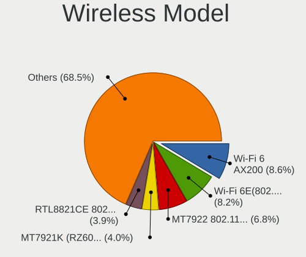

| Model                                                                           | Desktops | Percent |
|---------------------------------------------------------------------------------|----------|---------|
| Intel Wi-Fi 6 AX200                                                             | 58       | 8.62%   |
| Intel Wi-Fi 6E(802.11ax) AX210/AX1675* 2x2 [Typhoon Peak]                       | 55       | 8.17%   |
| MediaTek MT7922 802.11ax PCI Express Wireless Network Adapter                   | 46       | 6.84%   |
| MediaTek MT7921K (RZ608) Wi-Fi 6E 80MHz                                         | 27       | 4.01%   |
| Realtek RTL8821CE 802.11ac PCIe Wireless Network Adapter                        | 26       | 3.86%   |
| Intel 700 Series Chipset CNVi WiFi                                              | 25       | 3.71%   |
| Intel Dual Band Wireless-AC 3168NGW [Stone Peak]                                | 23       | 3.42%   |
| Realtek 802.11ac NIC                                                            | 18       | 2.67%   |
| Intel Wi-Fi 5(802.11ac) Wireless-AC 9x6x [Thunder Peak]                         | 15       | 2.23%   |
| Microsoft Xbox Wireless Adapter for Windows                                     | 11       | 1.63%   |
| MediaTek MT7921 802.11ax PCIe Wireless Network Adapter [Filogic 330]            | 11       | 1.63%   |
| Broadcom BCM4360 802.11ac Dual Band Wireless Network Adapter                    | 11       | 1.63%   |
| Realtek RTL88x2bu [AC1200 Techkey]                                              | 10       | 1.49%   |
| Realtek RTL8852CE PCIe 802.11ax Wireless Network Controller                     | 10       | 1.49%   |
| Realtek RTL8852BE PCIe 802.11ax Wireless Network Controller                     | 10       | 1.49%   |
| Realtek RTL8188EUS 802.11n Wireless Network Adapter                             | 10       | 1.49%   |
| Intel Cannon Lake PCH CNVi WiFi                                                 | 10       | 1.49%   |
| Intel Alder Lake-S PCH CNVi WiFi                                                | 10       | 1.49%   |
| TP-Link 802.11ac WLAN Adapter                                                   | 9        | 1.34%   |
| MediaTek MT7927 802.11be 320MHz 2x2 PCIe Wireless Network Adapter [Filogic 380] | 9        | 1.34%   |
| MediaTek MT7925 802.11be 160MHz 2x2 PCIe Wireless Network Adapter [Filogic 360] | 9        | 1.34%   |
| Intel Wireless 7265                                                             | 9        | 1.34%   |
| Intel Comet Lake PCH CNVi WiFi                                                  | 9        | 1.34%   |
| TP-Link Archer T4U ver.3                                                        | 8        | 1.19%   |
| Intel Wireless 7260                                                             | 8        | 1.19%   |
| TP-Link Archer T3U [Realtek RTL8812BU]                                          | 7        | 1.04%   |
| Ralink RT2870/RT3070 Wireless Adapter                                           | 7        | 1.04%   |
| Intel Wi-Fi 7(802.11be) AX1775*/AX1790*/BE20*/BE401/BE1750* 2x2                 | 7        | 1.04%   |
| Realtek RTL8192EU 802.11b/g/n WLAN Adapter                                      | 6        | 0.89%   |
| Realtek RTL8188FTV 802.11b/g/n 1T1R 2.4G WLAN Adapter                           | 6        | 0.89%   |
| Ralink MT7601U Wireless Adapter                                                 | 6        | 0.89%   |
| MediaTek MT7925 (RZ717) Wi-Fi 7 160MHz                                          | 6        | 0.89%   |
| Realtek RTL8822CE 802.11ac PCIe Wireless Network Adapter                        | 5        | 0.74%   |
| Qualcomm Atheros QCA6174 802.11ac Wireless Network Adapter                      | 5        | 0.74%   |
| MediaTek MT7902 802.11ax PCIe Wireless Network Adapter [Filogic 310]            | 5        | 0.74%   |
| Intel Wireless 8265 / 8275                                                      | 5        | 0.74%   |
| TP-Link TL-WN823N v2/v3 [Realtek RTL8192EU]                                     | 4        | 0.59%   |
| TP-Link 802.11ac NIC                                                            | 4        | 0.59%   |
| Realtek RTL8851BE PCIe 802.11ax Wireless Network Controller                     | 4        | 0.59%   |
| Realtek RTL8821AE 802.11ac PCIe Wireless Network Adapter                        | 4        | 0.59%   |

Ethernet Vendor
---------------

Ethernet vendors

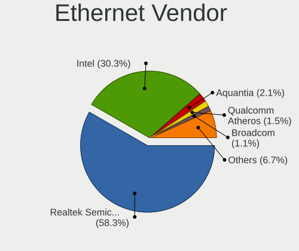

| Vendor                   | Desktops | Percent |
|--------------------------|----------|---------|
| Realtek Semiconductor    | 713      | 58.3%   |
| Intel                    | 370      | 30.25%  |
| Aquantia                 | 26       | 2.13%   |
| Qualcomm Atheros         | 18       | 1.47%   |
| Broadcom                 | 14       | 1.14%   |
| Qualcomm Technologies    | 12       | 0.98%   |
| MediaTek                 | 11       | 0.9%    |
| Xiaomi                   | 7        | 0.57%   |
| Samsung Electronics      | 7        | 0.57%   |
| Google                   | 7        | 0.57%   |
| Mellanox Technologies    | 5        | 0.41%   |
| Nvidia                   | 4        | 0.33%   |
| Marvell Technology Group | 4        | 0.33%   |
| ASIX Electronics         | 4        | 0.33%   |
| DisplayLink              | 3        | 0.25%   |
| Qualcomm                 | 2        | 0.16%   |
| Broadcom Limited         | 2        | 0.16%   |
| ADMtek                   | 2        | 0.16%   |
| VIA Technologies         | 1        | 0.08%   |
| OPPO Electronics         | 1        | 0.08%   |
| Novatel Wireless         | 1        | 0.08%   |
| Netchip Technology       | 1        | 0.08%   |
| Motorola PCS             | 1        | 0.08%   |
| Lenovo                   | 1        | 0.08%   |
| JMicron Technology       | 1        | 0.08%   |
| Huawei Technologies      | 1        | 0.08%   |
| D-Link System            | 1        | 0.08%   |
| D-Link                   | 1        | 0.08%   |
| Chelsio Communications   | 1        | 0.08%   |
| Apple                    | 1        | 0.08%   |

Ethernet Model
--------------

Ethernet models

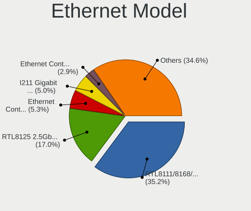

| Model                                                                           | Desktops | Percent |
|---------------------------------------------------------------------------------|----------|---------|
| Realtek RTL8111/8168/8211/8411 PCI Express Gigabit Ethernet Controller          | 459      | 35.2%   |
| Realtek RTL8125 2.5GbE Controller                                               | 222      | 17.02%  |
| Intel Ethernet Controller I225-V                                                | 69       | 5.29%   |
| Intel I211 Gigabit Network Connection                                           | 65       | 4.98%   |
| Intel Ethernet Controller I226-V                                                | 38       | 2.91%   |
| Intel Ethernet Connection (2) I219-V                                            | 31       | 2.38%   |
| Realtek RTL8126 5GbE Controller                                                 | 21       | 1.61%   |
| Intel Ethernet Connection (7) I219-V                                            | 19       | 1.46%   |
| Realtek RTL8153 Gigabit Ethernet Adapter                                        | 16       | 1.23%   |
| Intel 82579LM Gigabit Network Connection (Lewisville)                           | 16       | 1.23%   |
| Intel Ethernet Connection I217-LM                                               | 15       | 1.15%   |
| Realtek RTL8852BE PCIe 802.11ax Wireless Network Controller                     | 12       | 0.92%   |
| Qualcomm WCN785x Wi-Fi 7(802.11be) 320MHz 2x2 [FastConnect 7800]                | 12       | 0.92%   |
| Intel 82579V Gigabit Network Connection                                         | 12       | 0.92%   |
| Aquantia AQtion AQC113CS NBase-T/IEEE 802.3an Ethernet Controller [Antigua 10G] | 12       | 0.92%   |
| Intel Ethernet Connection (2) I219-LM                                           | 11       | 0.84%   |
| Intel Ethernet Connection (7) I219-LM                                           | 9        | 0.69%   |
| Intel Ethernet Connection (2) I218-V                                            | 9        | 0.69%   |
| Aquantia AQtion AQC107 NBase-T/IEEE 802.3an Ethernet Controller [Atlantic 10G]  | 9        | 0.69%   |
| Intel Ethernet Connection (17) I219-V                                           | 8        | 0.61%   |
| Realtek RTL8922AE 802.11be PCIe Wireless Network Adapter                        | 7        | 0.54%   |
| MediaTek MT7925 802.11be 160MHz 2x2 PCIe Wireless Network Adapter [Filogic 360] | 7        | 0.54%   |
| Intel Ethernet Connection (11) I219-V                                           | 7        | 0.54%   |
| Intel Alder Lake-S PCH CNVi WiFi                                                | 7        | 0.54%   |
| Samsung Galaxy series, misc. (tethering mode)                                   | 6        | 0.46%   |
| Realtek Killer E3000 2.5GbE Controller                                          | 6        | 0.46%   |
| Intel Ethernet Connection (5) I219-LM                                           | 6        | 0.46%   |
| Intel Ethernet Connection (14) I219-V                                           | 6        | 0.46%   |
| Intel 82574L Gigabit Network Connection                                         | 6        | 0.46%   |
| Xiaomi Mi/Redmi series (RNDIS)                                                  | 5        | 0.38%   |
| Realtek USB 10/100/1G/2.5 LAN                                                   | 5        | 0.38%   |
| Realtek RTL8111/8168/8411 PCI Express Gigabit Ethernet Controller               | 5        | 0.38%   |
| Realtek RTL810xE PCI Express Fast Ethernet controller                           | 5        | 0.38%   |
| Qualcomm Atheros Killer E220x Gigabit Ethernet Controller                       | 5        | 0.38%   |
| Qualcomm Atheros AR8161 Gigabit Ethernet                                        | 5        | 0.38%   |
| Intel I210 Gigabit Network Connection                                           | 5        | 0.38%   |
| Intel Ethernet Connection (12) I219-V                                           | 5        | 0.38%   |
| Google Pixel 9a                                                                 | 5        | 0.38%   |
| Intel Ethernet Connection I217-V                                                | 4        | 0.31%   |
| Intel 82599ES 10-Gigabit SFI/SFP+ Network Connection                            | 4        | 0.31%   |

Net Controller Kind
-------------------

Ethernet, WiFi or modem

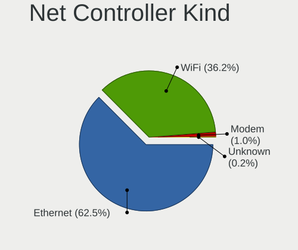

| Kind     | Desktops | Percent |
|----------|----------|---------|
| Ethernet | 1077     | 62.54%  |
| WiFi     | 623      | 36.18%  |
| Modem    | 18       | 1.05%   |
| Unknown  | 4        | 0.23%   |

Used Controller
---------------

Currently used network controller

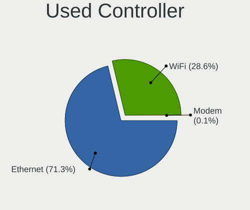

| Kind     | Desktops | Percent |
|----------|----------|---------|
| Ethernet | 801      | 71.26%  |
| WiFi     | 322      | 28.65%  |
| Modem    | 1        | 0.09%   |

NICs
----

Total network controllers on board

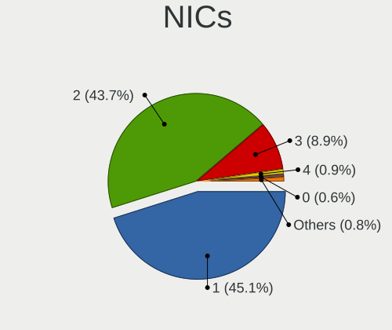

| Total | Desktops | Percent |
|-------|----------|---------|
| 1     | 491      | 45.13%  |
| 2     | 475      | 43.66%  |
| 3     | 97       | 8.92%   |
| 4     | 10       | 0.92%   |
| 0     | 6        | 0.55%   |
| 6     | 4        | 0.37%   |
| 5     | 4        | 0.37%   |
| 7     | 1        | 0.09%   |

IPv6
----

IPv6 vs IPv4

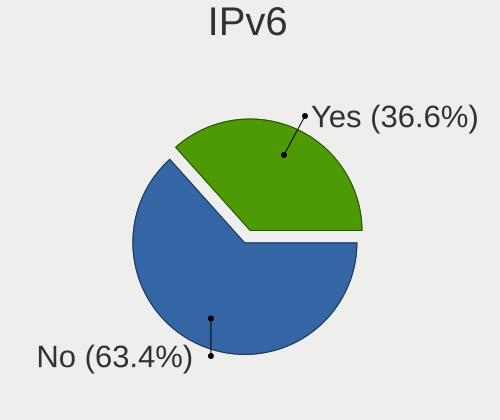

| Used | Desktops | Percent |
|------|----------|---------|
| No   | 692      | 63.37%  |
| Yes  | 400      | 36.63%  |

Bluetooth
---------

Bluetooth Vendor
----------------

Controller vendors

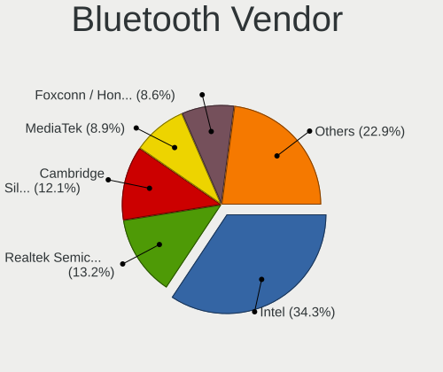

| Vendor                          | Desktops | Percent |
|---------------------------------|----------|---------|
| Intel                           | 232      | 34.32%  |
| Realtek Semiconductor           | 89       | 13.17%  |
| Cambridge Silicon Radio         | 82       | 12.13%  |
| MediaTek                        | 60       | 8.88%   |
| Foxconn / Hon Hai               | 58       | 8.58%   |
| IMC Networks                    | 43       | 6.36%   |
| TP-Link                         | 35       | 5.18%   |
| ASUSTek Computer                | 32       | 4.73%   |
| Broadcom                        | 11       | 1.63%   |
| Realtek                         | 8        | 1.18%   |
| Qualcomm Atheros Communications | 6        | 0.89%   |
| Unknown                         | 6        | 0.89%   |
| Apple                           | 5        | 0.74%   |
| Actions                         | 2        | 0.3%    |
| TRENDnet                        | 1        | 0.15%   |
| SINO WEALTH                     | 1        | 0.15%   |
| Micro Star International        | 1        | 0.15%   |
| Lite-On Technology              | 1        | 0.15%   |
| Integrated System Solution      | 1        | 0.15%   |
| HTC (High Tech Computer)        | 1        | 0.15%   |
| Edimax Technology               | 1        | 0.15%   |

Bluetooth Model
---------------

Controller models

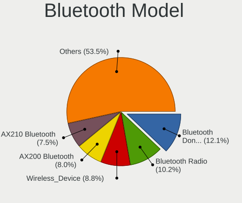

| Model                                                 | Desktops | Percent |
|-------------------------------------------------------|----------|---------|
| Cambridge Silicon Radio Bluetooth Dongle (HCI mode)   | 82       | 12.08%  |
| Realtek Bluetooth Radio                               | 69       | 10.16%  |
| MediaTek Wireless_Device                              | 60       | 8.84%   |
| Intel AX200 Bluetooth                                 | 54       | 7.95%   |
| Intel AX210 Bluetooth                                 | 51       | 7.51%   |
| Intel Bluetooth Device                                | 39       | 5.74%   |
| Foxconn / Hon Hai Wireless_Device                     | 38       | 5.6%    |
| TP-Link TP-T@- UB500 Adapter                          | 35       | 5.15%   |
| Intel Bluetooth wireless interface                    | 22       | 3.24%   |
| Intel Wireless-AC 3168 Bluetooth                      | 21       | 3.09%   |
| IMC Networks Bluetooth Radio                          | 21       | 3.09%   |
| Intel AX201 Bluetooth                                 | 20       | 2.95%   |
| IMC Networks Wireless_Device                          | 19       | 2.8%    |
| Foxconn / Hon Hai Bluetooth Device                    | 18       | 2.65%   |
| Intel Wireless-AC 9260 Bluetooth Adapter              | 14       | 2.06%   |
| Intel Bluetooth 9460/9560 Jefferson Peak (JfP)        | 13       | 1.91%   |
| ASUS Broadcom BCM20702A0 Bluetooth                    | 12       | 1.77%   |
| Realtek  Bluetooth 4.2 Adapter                        | 11       | 1.62%   |
| Broadcom BCM20702A0 Bluetooth 4.0                     | 10       | 1.47%   |
| ASUS ASUS USB-BT500                                   | 9        | 1.33%   |
| Realtek Bluetooth Radio                               | 8        | 1.18%   |
| Unknown                                               | 6        | 0.88%   |
| Realtek Bluetooth 5.4 Radio                           | 5        | 0.74%   |
| ASUS Bluetooth Adapter                                | 5        | 0.74%   |
| Realtek Bluetooth 5.3 Radio                           | 4        | 0.59%   |
| Qualcomm Atheros  Bluetooth Device                    | 3        | 0.44%   |
| ASUS Qualcomm Bluetooth 4.1                           | 3        | 0.44%   |
| Apple Bluetooth Host Controller                       | 3        | 0.44%   |
| Qualcomm Atheros Bluetooth USB Host Controller        | 2        | 0.29%   |
| IMC Networks Bluetooth Device                         | 2        | 0.29%   |
| ASUS Bluetooth Radio                                  | 2        | 0.29%   |
| Actions general adapter                               | 2        | 0.29%   |
| TRENDnet TBW-108UB USB Adapter                        | 1        | 0.15%   |
| SINO WEALTH Bluetooth Keyboard                        | 1        | 0.15%   |
| Realtek RTL8821A Bluetooth                            | 1        | 0.15%   |
| Qualcomm Atheros QCA61x4 Bluetooth 4.0                | 1        | 0.15%   |
| Micro Star International Bluetooth Device             | 1        | 0.15%   |
| Lite-On Bluetooth Device                              | 1        | 0.15%   |
| Integrated System Solution KY-BT100 Bluetooth Adapter | 1        | 0.15%   |
| IMC Networks Bluetooth                                | 1        | 0.15%   |

Sound
-----

Sound Vendor
------------

Sound card vendors

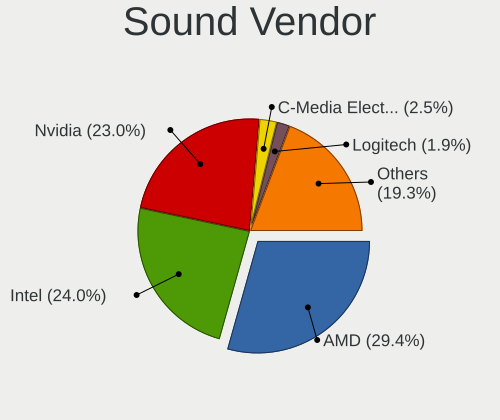

| Vendor                                       | Desktops | Percent |
|----------------------------------------------|----------|---------|
| AMD                                          | 642      | 29.36%  |
| Intel                                        | 524      | 23.96%  |
| Nvidia                                       | 504      | 23.05%  |
| C-Media Electronics                          | 55       | 2.51%   |
| Logitech                                     | 41       | 1.87%   |
| ASUSTek Computer                             | 38       | 1.74%   |
| SteelSeries ApS                              | 29       | 1.33%   |
| Micro Star International                     | 24       | 1.1%    |
| Razer USA                                    | 20       | 0.91%   |
| JMTek                                        | 19       | 0.87%   |
| Focusrite-Novation                           | 18       | 0.82%   |
| Kingston Technology                          | 15       | 0.69%   |
| Generalplus Technology                       | 15       | 0.69%   |
| Hewlett-Packard                              | 14       | 0.64%   |
| Creative Labs                                | 12       | 0.55%   |
| Corsair                                      | 12       | 0.55%   |
| Texas Instruments                            | 11       | 0.5%    |
| Sony                                         | 9        | 0.41%   |
| FiiO Electronics Technology                  | 7        | 0.32%   |
| ASRock                                       | 7        | 0.32%   |
| Zoran Co. Personal Media Division (Nogatech) | 6        | 0.27%   |
| RODE Microphones                             | 6        | 0.27%   |
| XMOS                                         | 5        | 0.23%   |
| Creative Technology                          | 5        | 0.23%   |
| Blue Microphones                             | 5        | 0.23%   |
| Plantronics                                  | 4        | 0.18%   |
| GN Netcom                                    | 4        | 0.18%   |
| Giga-Byte Technology                         | 4        | 0.18%   |
| Elgato Systems                               | 4        | 0.18%   |
| DSEA A/S                                     | 4        | 0.18%   |
| Unknown                                      | 4        | 0.18%   |
| Walmart                                      | 3        | 0.14%   |
| Thesycon Systemsoftware & Consulting         | 3        | 0.14%   |
| Tenx Technology                              | 3        | 0.14%   |
| Samson Technologies                          | 3        | 0.14%   |
| Realtek Semiconductor                        | 3        | 0.14%   |
| M-Audio                                      | 3        | 0.14%   |
| Jieli Technology                             | 3        | 0.14%   |
| JBL                                          | 3        | 0.14%   |
| Harman International                         | 3        | 0.14%   |

Sound Model
-----------

Sound card models

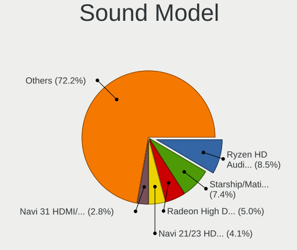

| Model                                                                      | Desktops | Percent |
|----------------------------------------------------------------------------|----------|---------|
| AMD Ryzen HD Audio Controller                                              | 228      | 8.46%   |
| AMD Starship/Matisse HD Audio Controller                                   | 200      | 7.42%   |
| AMD Radeon High Definition Audio Controller                                | 134      | 4.97%   |
| AMD Navi 21/23 HDMI/DP Audio Controller                                    | 111      | 4.12%   |
| AMD Navi 31 HDMI/DP Audio                                                  | 75       | 2.78%   |
| AMD Renoir/Cezanne HDMI/DP Audio Controller                                | 70       | 2.6%    |
| Intel 200 Series PCH HD Audio                                              | 54       | 2%      |
| AMD Ellesmere HDMI Audio [Radeon RX 470/480 / 570/580/590]                 | 52       | 1.93%   |
| Intel Raptor Lake High Definition Audio Controller                         | 51       | 1.89%   |
| Intel 8 Series/C220 Series Chipset High Definition Audio Controller        | 51       | 1.89%   |
| Nvidia GA104 High Definition Audio Controller                              | 43       | 1.6%    |
| Intel 100 Series/C230 Series Chipset Family HD Audio Controller            | 43       | 1.6%    |
| Intel Alder Lake-S HD Audio Controller                                     | 42       | 1.56%   |
| Intel Cannon Lake PCH cAVS                                                 | 41       | 1.52%   |
| Intel 6 Series/C200 Series Chipset Family High Definition Audio Controller | 39       | 1.45%   |
| Nvidia GP104 High Definition Audio Controller                              | 38       | 1.41%   |
| AMD Family 17h (Models 00h-0fh) HD Audio Controller                        | 38       | 1.41%   |
| Nvidia GA106 High Definition Audio Controller                              | 35       | 1.3%    |
| Intel Xeon E3-1200 v3/4th Gen Core Processor HD Audio Controller           | 33       | 1.22%   |
| ASUSTek Computer USB Audio                                                 | 32       | 1.19%   |
| Nvidia GA102 High Definition Audio Controller                              | 30       | 1.11%   |
| Intel 7 Series/C216 Chipset Family High Definition Audio Controller        | 28       | 1.04%   |
| AMD Navi 10 HDMI Audio                                                     | 28       | 1.04%   |
| Nvidia TU116 High Definition Audio Controller                              | 27       | 1%      |
| Nvidia GP106 High Definition Audio Controller                              | 27       | 1%      |
| Nvidia AD107 High Definition Audio Controller                              | 27       | 1%      |
| Nvidia AD103 High Definition Audio Controller                              | 27       | 1%      |
| AMD Baffin HDMI/DP Audio [Radeon RX 550 640SP / RX 560/560X]               | 25       | 0.93%   |
| Micro Star International USB Audio                                         | 24       | 0.89%   |
| AMD SBx00 Azalia (Intel HDA)                                               | 23       | 0.85%   |
| Nvidia GP107GL High Definition Audio Controller                            | 22       | 0.82%   |
| Nvidia TU106 High Definition Audio Controller                              | 21       | 0.78%   |
| Nvidia GK208 HDMI/DP Audio Controller                                      | 20       | 0.74%   |
| Intel Comet Lake PCH cAVS                                                  | 19       | 0.71%   |
| AMD Raven/Raven2/Fenghuang HDMI/DP Audio Controller                        | 18       | 0.67%   |
| Intel Comet Lake PCH-V cAVS                                                | 17       | 0.63%   |
| Intel 9 Series Chipset Family HD Audio Controller                          | 17       | 0.63%   |
| Nvidia TU107 GeForce GTX 1650 High Definition Audio Controller             | 14       | 0.52%   |
| Nvidia TU104 HD Audio Controller                                           | 14       | 0.52%   |
| Nvidia AD104 High Definition Audio Controller                              | 14       | 0.52%   |

Memory
------

Memory Vendor
-------------

Memory module vendors

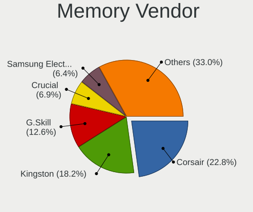

| Vendor                       | Desktops | Percent |
|------------------------------|----------|---------|
| Corsair                      | 103      | 22.84%  |
| Kingston                     | 82       | 18.18%  |
| G.Skill                      | 57       | 12.64%  |
| Crucial                      | 31       | 6.87%   |
| Samsung Electronics          | 29       | 6.43%   |
| Unknown                      | 28       | 6.21%   |
| SK hynix                     | 26       | 5.76%   |
| Unknown                      | 14       | 3.1%    |
| A-DATA Technology            | 11       | 2.44%   |
| Team                         | 9        | 2%      |
| Micron Technology            | 8        | 1.77%   |
| Patriot                      | 6        | 1.33%   |
| Apacer                       | 5        | 1.11%   |
| Ramaxel Technology           | 4        | 0.89%   |
| Nanya Technology             | 3        | 0.67%   |
| GOODRAM                      | 3        | 0.67%   |
| AMD                          | 3        | 0.67%   |
| Unknown (0x0B45)             | 2        | 0.44%   |
| Timetec                      | 2        | 0.44%   |
| PNY                          | 2        | 0.44%   |
| Patriot Memory (PDP Systems) | 2        | 0.44%   |
| Lexar                        | 2        | 0.44%   |
| Hikvision                    | 2        | 0.44%   |
| Golden Empire                | 2        | 0.44%   |
| GeIL                         | 2        | 0.44%   |
| Wodposit                     | 1        | 0.22%   |
| Wilk                         | 1        | 0.22%   |
| Unknown (0x0FC4)             | 1        | 0.22%   |
| Unknown (0x0DD5)             | 1        | 0.22%   |
| Unknown (0x0B49)             | 1        | 0.22%   |
| Unknown (08C8)               | 1        | 0.22%   |
| Toshiba                      | 1        | 0.22%   |
| TEXTORM                      | 1        | 0.22%   |
| Ramsta                       | 1        | 0.22%   |
| Patriot Memory               | 1        | 0.22%   |
| Netac                        | 1        | 0.22%   |
| Mushkin                      | 1        | 0.22%   |
| MTASE                        | 1        | 0.22%   |

Memory Model
------------

Memory module models

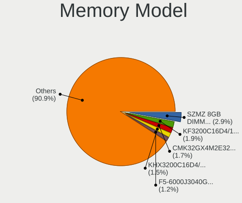

| Model                                                            | Desktops | Percent |
|------------------------------------------------------------------|----------|---------|
| Unknown                                                          | 14       | 2.9%    |
| Kingston RAM KF3200C16D4/16GX 16GB DIMM DDR4 3733MT/s            | 9        | 1.87%   |
| Corsair RAM CMK32GX4M2E3200C16 16GB DIMM DDR4 3600MT/s           | 8        | 1.66%   |
| Kingston RAM KHX3200C16D4/8GX 8GB DIMM DDR4 3733MT/s             | 7        | 1.45%   |
| G.Skill RAM F5-6000J3040G32G 32GB DIMM DDR5 6200MT/s             | 6        | 1.24%   |
| Unknown RAM Module 4GB DIMM 1333MT/s                             | 5        | 1.04%   |
| G.Skill RAM F4-3200C16-16GVK 16GB DIMM DDR4 3600MT/s             | 5        | 1.04%   |
| Corsair RAM CMK16GX4M2B3200C16 8GB DIMM DDR4 3600MT/s            | 5        | 1.04%   |
| Kingston RAM KF556C40-32 32GB DIMM DDR5 6000MT/s                 | 4        | 0.83%   |
| Corsair RAM CMK32GX4M2B3200C16 16GB DIMM DDR4 3800MT/s           | 4        | 0.83%   |
| Samsung RAM M378A2K43CB1-CTD 16GB DIMM DDR4 3200MT/s             | 3        | 0.62%   |
| Kingston RAM KHX1866C10D3/8G 8GB DIMM DDR3 1867MT/s              | 3        | 0.62%   |
| Kingston RAM KF3200C16D4/8GX 8GiB DIMM DDR4 3600MT/s             | 3        | 0.62%   |
| G.Skill RAM F5-6000J3238G32G 32GB DIMM DDR5 6000MT/s             | 3        | 0.62%   |
| G.Skill RAM F5-6000J3238F16G 16GB DIMM DDR5 12800MT/s            | 3        | 0.62%   |
| Crucial RAM BLS8G3D1609DS1S00. 8GB DIMM DDR3 1800MT/s            | 3        | 0.62%   |
| Crucial RAM BL8G32C16U4B.8FE 8GB DIMM DDR4 3666MT/s              | 3        | 0.62%   |
| Corsair RAM CMW16GX4M2C3200C16 8GB DIMM DDR4 3733MT/s            | 3        | 0.62%   |
| Corsair RAM CMK64GX5M2B6000Z30 32GB DIMM DDR5 6000MT/s           | 3        | 0.62%   |
| Corsair RAM CMK32GX5M2B5600C36 16GB DIMM DDR5 5800MT/s           | 3        | 0.62%   |
| Corsair RAM CMK32GX4M2D3600C18 16GB DIMM DDR4 3800MT/s           | 3        | 0.62%   |
| Corsair RAM CMK16GX4M2E3200C16 8GB DIMM DDR4 3466MT/s            | 3        | 0.62%   |
| Corsair RAM CMH64GX5M2B6400C32 32GB DIMM DDR5 6400MT/s           | 3        | 0.62%   |
| Unknown RAM Module 8GB SODIMM DDR3 1600MT/s                      | 2        | 0.41%   |
| Unknown RAM Module 4GB DIMM DDR3 1333MT/s                        | 2        | 0.41%   |
| Unknown (0x0B45) RAM WPBH32D408SWM-16G 16GB SODIMM DDR4 3200MT/s | 2        | 0.41%   |
| Team RAM TEAMGROUP-UD4-3600 16GB DIMM DDR4 4000MT/s              | 2        | 0.41%   |
| Team RAM TEAMGROUP-UD4-3200 8GB DIMM DDR4 3800MT/s               | 2        | 0.41%   |
| Team RAM TEAMGROUP-UD4-3200 8GB DIMM DDR4 3733MT/s               | 2        | 0.41%   |
| SK hynix RAM HMT351U6CFR8C-PB 4GB DIMM DDR3 1800MT/s             | 2        | 0.41%   |
| SK hynix RAM HMA82GU6AFR8N-UH 16GB DIMM DDR4 2400MT/s            | 2        | 0.41%   |
| Samsung RAM M378A1K43CB2-CRC 8GB DIMM DDR4 3500MT/s              | 2        | 0.41%   |
| Kingston RAM KHX2400C15D4/4G 4GB DIMM DDR4 3151MT/s              | 2        | 0.41%   |
| Kingston RAM KHX2133C14D4/8G 8GB DIMM DDR4 3000MT/s              | 2        | 0.41%   |
| Kingston RAM KHX2133C14D4/4G 4GB DIMM DDR4 3200MT/s              | 2        | 0.41%   |
| Kingston RAM KHX1600C9D3/8GX 8GB DIMM DDR3 2133MT/s              | 2        | 0.41%   |
| Kingston RAM KHX1600C10D3/8G 8GB DIMM DDR3 2133MT/s              | 2        | 0.41%   |
| Kingston RAM KF560C40-8 8GB DIMM DDR5 6000MT/s                   | 2        | 0.41%   |
| Kingston RAM KF560C36-32 32GB DIMM DDR5 6200MT/s                 | 2        | 0.41%   |
| Kingston RAM KF3600C17D4/8GX 8GB DIMM DDR4 3600MT/s              | 2        | 0.41%   |

Memory Kind
-----------

Memory module kinds

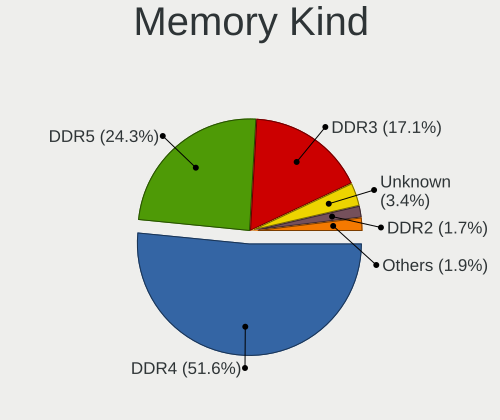

| Kind    | Desktops | Percent |
|---------|----------|---------|
| DDR4    | 214      | 51.57%  |
| DDR5    | 101      | 24.34%  |
| DDR3    | 71       | 17.11%  |
| Unknown | 14       | 3.37%   |
| DDR2    | 7        | 1.69%   |
| SDRAM   | 3        | 0.72%   |
| LPDDR5  | 2        | 0.48%   |
| LPDDR4  | 2        | 0.48%   |
| DDR     | 1        | 0.24%   |

Memory Form Factor
------------------

Physical design of the memory module

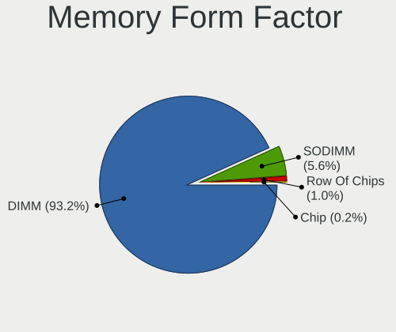

| Name         | Desktops | Percent |
|--------------|----------|---------|
| DIMM         | 385      | 93.22%  |
| SODIMM       | 23       | 5.57%   |
| Row Of Chips | 4        | 0.97%   |
| Chip         | 1        | 0.24%   |

Memory Size
-----------

Memory module size

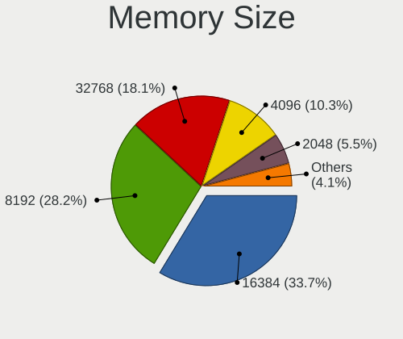

| Size  | Desktops | Percent |
|-------|----------|---------|
| 16384 | 147      | 33.72%  |
| 8192  | 123      | 28.21%  |
| 32768 | 79       | 18.12%  |
| 4096  | 45       | 10.32%  |
| 2048  | 24       | 5.5%    |
| 49152 | 8        | 1.83%   |
| 1024  | 6        | 1.38%   |
| 24576 | 3        | 0.69%   |
| 65536 | 1        | 0.23%   |

Memory Speed
------------

Memory module speed

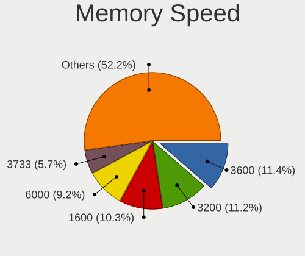

| Speed   | Desktops | Percent |
|---------|----------|---------|
| 3600    | 52       | 11.4%   |
| 3200    | 51       | 11.18%  |
| 1600    | 47       | 10.31%  |
| 6000    | 42       | 9.21%   |
| 3733    | 26       | 5.7%    |
| 1333    | 20       | 4.39%   |
| 2667    | 17       | 3.73%   |
| 2133    | 17       | 3.73%   |
| 4800    | 15       | 3.29%   |
| 6400    | 12       | 2.63%   |
| 5600    | 12       | 2.63%   |
| 2400    | 12       | 2.63%   |
| 3800    | 11       | 2.41%   |
| 2666    | 10       | 2.19%   |
| 3000    | 9        | 1.97%   |
| 1866    | 9        | 1.97%   |
| 6200    | 8        | 1.75%   |
| 4000    | 7        | 1.54%   |
| 3400    | 7        | 1.54%   |
| 1867    | 5        | 1.1%    |
| 1800    | 5        | 1.1%    |
| 800     | 5        | 1.1%    |
| 3866    | 4        | 0.88%   |
| 3466    | 4        | 0.88%   |
| 667     | 4        | 0.88%   |
| 12800   | 3        | 0.66%   |
| 5800    | 3        | 0.66%   |
| 3666    | 3        | 0.66%   |
| 6800    | 2        | 0.44%   |
| 5200    | 2        | 0.44%   |
| 3500    | 2        | 0.44%   |
| 3151    | 2        | 0.44%   |
| 3100    | 2        | 0.44%   |
| 2933    | 2        | 0.44%   |
| Unknown | 2        | 0.44%   |
| 8000    | 1        | 0.22%   |
| 7000    | 1        | 0.22%   |
| 6600    | 1        | 0.22%   |
| 5400    | 1        | 0.22%   |
| 4333    | 1        | 0.22%   |

Printers & scanners
-------------------

Printer Vendor
--------------

Printer device vendors

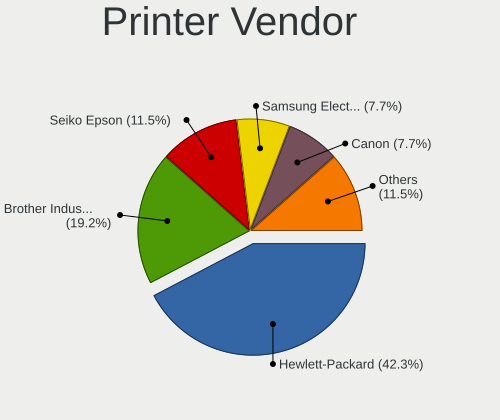

| Vendor              | Desktops | Percent |
|---------------------|----------|---------|
| Hewlett-Packard     | 11       | 42.31%  |
| Brother Industries  | 5        | 19.23%  |
| Seiko Epson         | 3        | 11.54%  |
| Samsung Electronics | 2        | 7.69%   |
| Canon               | 2        | 7.69%   |
| Prolific Technology | 1        | 3.85%   |
| Pantum              | 1        | 3.85%   |
| Lenovo              | 1        | 3.85%   |

Printer Model
-------------

Printer device models

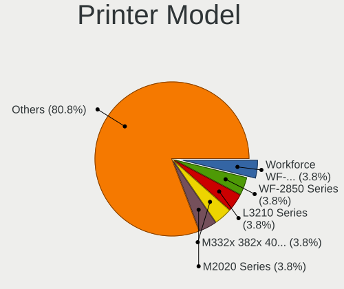

| Model                                     | Desktops | Percent |
|-------------------------------------------|----------|---------|
| Seiko Epson Workforce WF-7820/7840 Series | 1        | 3.85%   |
| Seiko Epson WF-2850 Series                | 1        | 3.85%   |
| Seiko Epson L3210 Series                  | 1        | 3.85%   |
| Samsung M332x 382x 402x Series            | 1        | 3.85%   |
| Samsung M2020 Series                      | 1        | 3.85%   |
| Prolific PL2305 Parallel Port             | 1        | 3.85%   |
| Pantum P2500W series                      | 1        | 3.85%   |
| Lenovo G336DN                             | 1        | 3.85%   |
| HP LaserJet P2014                         | 1        | 3.85%   |
| HP LaserJet P1006                         | 1        | 3.85%   |
| HP LaserJet 1020                          | 1        | 3.85%   |
| HP HP LaserJet Pro M404-M405              | 1        | 3.85%   |
| HP HP ColorLaserJet M255-M256             | 1        | 3.85%   |
| HP ENVY Photo 7800 series                 | 1        | 3.85%   |
| HP ENVY 4520 series                       | 1        | 3.85%   |
| HP DeskJet Plus 4100 series               | 1        | 3.85%   |
| HP DeskJet 4530 series                    | 1        | 3.85%   |
| HP DeskJet 3630 series                    | 1        | 3.85%   |
| HP DeskJet 2300 series                    | 1        | 3.85%   |
| Canon LiDE 300                            | 1        | 3.85%   |
| Canon G2010 series                        | 1        | 3.85%   |
| Brother MFC-J485DW                        | 1        | 3.85%   |
| Brother MFC-J480DW                        | 1        | 3.85%   |
| Brother MFC-J460DW                        | 1        | 3.85%   |
| Brother DCP-L2540DW                       | 1        | 3.85%   |
| Brother DCP-L2500D                        | 1        | 3.85%   |

Scanner Vendor
--------------

Scanner device vendors

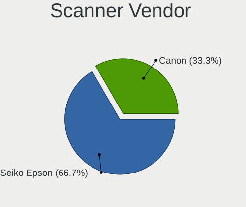

| Vendor      | Desktops | Percent |
|-------------|----------|---------|
| Seiko Epson | 2        | 66.67%  |
| Canon       | 1        | 33.33%  |

Scanner Model
-------------

Scanner device models

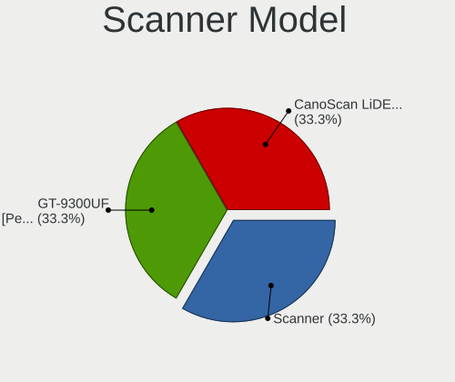

| Model                                         | Desktops | Percent |
|-----------------------------------------------|----------|---------|
| Seiko Epson Scanner                           | 1        | 33.33%  |
| Seiko Epson GT-9300UF [Perfection 2400 PHOTO] | 1        | 33.33%  |
| Canon CanoScan LiDE 220                       | 1        | 33.33%  |

Camera
------

Camera Vendor
-------------

Camera device vendors

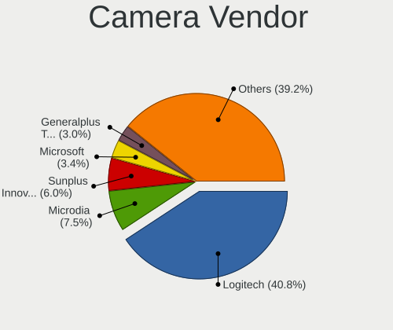

| Vendor                        | Desktops | Percent |
|-------------------------------|----------|---------|
| Logitech                      | 108      | 40.75%  |
| Microdia                      | 20       | 7.55%   |
| Sunplus Innovation Technology | 16       | 6.04%   |
| Microsoft                     | 9        | 3.4%    |
| Generalplus Technology        | 8        | 3.02%   |
| Realtek Semiconductor         | 7        | 2.64%   |
| A4Tech                        | 6        | 2.26%   |
| Samsung Electronics           | 5        | 1.89%   |
| webcam                        | 4        | 1.51%   |
| Razer USA                     | 4        | 1.51%   |
| ARC International             | 4        | 1.51%   |
| Apple                         | 4        | 1.51%   |
| Z-Star Microelectronics       | 3        | 1.13%   |
| Trust                         | 3        | 1.13%   |
| MacroSilicon                  | 3        | 1.13%   |
| KYE Systems (Mouse Systems)   | 3        | 1.13%   |
| Jieli Technology              | 3        | 1.13%   |
| Arkmicro Technologies         | 3        | 1.13%   |
| Anker PowerConf C200          | 3        | 1.13%   |
| YGTek                         | 2        | 0.75%   |
| Tobii Technology AB           | 2        | 0.75%   |
| Linux Foundation              | 2        | 0.75%   |
| Lenovo                        | 2        | 0.75%   |
| eMeet                         | 2        | 0.75%   |
| DJI Technology                | 2        | 0.75%   |
| Creative Technology           | 2        | 0.75%   |
| Chicony Electronics           | 2        | 0.75%   |
| AVerMedia Technologies        | 2        | 0.75%   |
| Alpha Imaging Technology      | 2        | 0.75%   |
| Xiongmai                      | 1        | 0.38%   |
| XHT-220428-ZW                 | 1        | 0.38%   |
| XF                            | 1        | 0.38%   |
| Valve Software                | 1        | 0.38%   |
| Suyin                         | 1        | 0.38%   |
| SunplusIT                     | 1        | 0.38%   |
| Sunplus IT                    | 1        | 0.38%   |
| Sonix Technology              | 1        | 0.38%   |
| SN0002                        | 1        | 0.38%   |
| RODE Microphones              | 1        | 0.38%   |
| Pixart Imaging                | 1        | 0.38%   |

Camera Model
------------

Camera device models

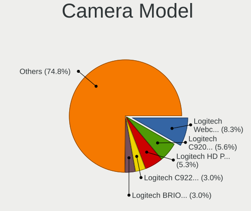

| Model                                     | Desktops | Percent |
|-------------------------------------------|----------|---------|
| Logitech Webcam C270                      | 22       | 8.27%   |
| Logitech C920 PRO HD Webcam               | 15       | 5.64%   |
| Logitech HD Pro Webcam C920               | 14       | 5.26%   |
| Logitech C922 Pro Stream Webcam           | 8        | 3.01%   |
| Logitech BRIO Ultra HD Webcam             | 8        | 3.01%   |
| Sunplus FULL HD webcam                    | 6        | 2.26%   |
| Logitech Webcam C310                      | 6        | 2.26%   |
| Samsung Galaxy series, misc. (MTP mode)   | 5        | 1.88%   |
| Microdia Camera                           | 5        | 1.88%   |
| webcam webcam                             | 4        | 1.5%    |
| Microdia Webcam Vitade AF                 | 4        | 1.5%    |
| Logitech StreamCam                        | 4        | 1.5%    |
| ARC International Camera                  | 4        | 1.5%    |
| Sunplus USB 2.0 Camera                    | 3        | 1.13%   |
| Sunplus Aukey-PC-LM1E Camera              | 3        | 1.13%   |
| Microdia USB 2.0 Camera                   | 3        | 1.13%   |
| Microdia CyberTrack H7                    | 3        | 1.13%   |
| Logitech Logitech Webcam C925e            | 3        | 1.13%   |
| Logitech HD Webcam C525                   | 3        | 1.13%   |
| Logitech BRIO 4K Stream Edition           | 3        | 1.13%   |
| Logitech B525 HD Webcam                   | 3        | 1.13%   |
| Generalplus WEB CAM                       | 3        | 1.13%   |
| Generalplus 808 Camera #9 (web-cam mode)  | 3        | 1.13%   |
| Anker PowerConf C200 Anker PowerConf C200 | 3        | 1.13%   |
| A4Tech PK-635G                            | 3        | 1.13%   |
| YGTek Webcam                              | 2        | 0.75%   |
| Trust USB Camera                          | 2        | 0.75%   |
| Tobii AB EyeChip                          | 2        | 0.75%   |
| Sunplus SPCA2281 Web Camera               | 2        | 0.75%   |
| Realtek Thronmax Stream Go Pro Webcam     | 2        | 0.75%   |
| Razer USA Gaming Webcam [Kiyo]            | 2        | 0.75%   |
| Microsoft LifeCam Studio                  | 2        | 0.75%   |
| Microsoft LifeCam Cinema                  | 2        | 0.75%   |
| Microdia USB Camera                       | 2        | 0.75%   |
| Logitech Webcam C930e                     | 2        | 0.75%   |
| Logitech Webcam B500                      | 2        | 0.75%   |
| Logitech Logi Webcam C920e                | 2        | 0.75%   |
| Logitech HD Webcam C910                   | 2        | 0.75%   |
| Logitech HD Webcam C615                   | 2        | 0.75%   |
| Linux Foundation EEM Gadget               | 2        | 0.75%   |

Security
--------

Fingerprint Vendor
------------------

Fingerprint sensor vendors

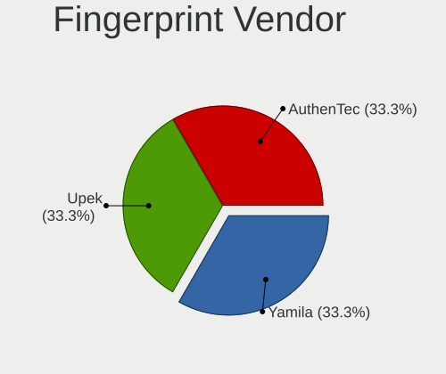

| Vendor    | Desktops | Percent |
|-----------|----------|---------|
| Yamila    | 1        | 33.33%  |
| Upek      | 1        | 33.33%  |
| AuthenTec | 1        | 33.33%  |

Fingerprint Model
-----------------

Fingerprint sensor models

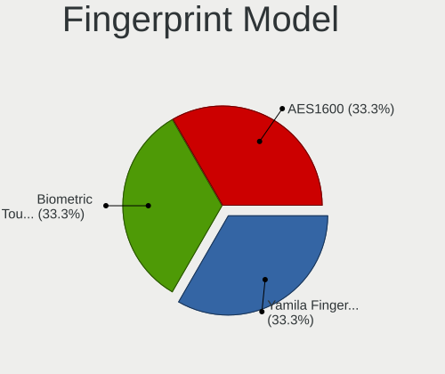

| Model                                                  | Desktops | Percent |
|--------------------------------------------------------|----------|---------|
| Yamila Yamila Fingerprint Device                       | 1        | 33.33%  |
| Upek Biometric Touchchip/Touchstrip Fingerprint Sensor | 1        | 33.33%  |
| AuthenTec AES1600                                      | 1        | 33.33%  |

Chipcard Vendor
---------------

Chipcard module vendors

| Vendor                    | Desktops | Percent |
|---------------------------|----------|---------|
| Aladdin Knowledge Systems | 1        | 100%    |

Chipcard Model
--------------

Chipcard module models

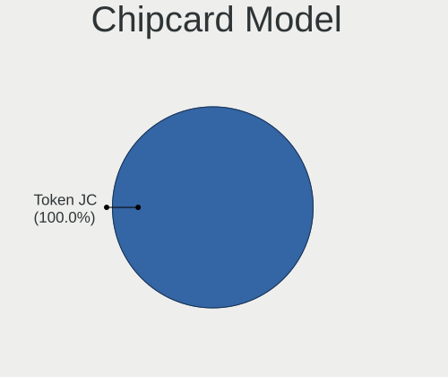

| Model                              | Desktops | Percent |
|------------------------------------|----------|---------|
| Aladdin Knowledge Systems Token JC | 1        | 100%    |

Unsupported
-----------

Unsupported Devices
-------------------

Total unsupported devices on board

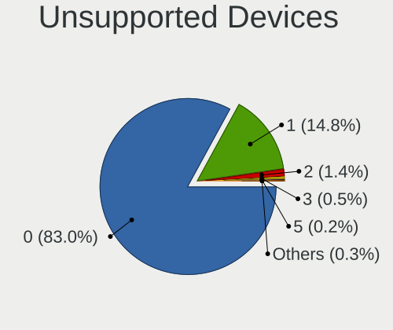

| Total | Desktops | Percent |
|-------|----------|---------|
| 0     | 905      | 82.95%  |
| 1     | 161      | 14.76%  |
| 2     | 15       | 1.37%   |
| 3     | 5        | 0.46%   |
| 5     | 2        | 0.18%   |
| 4     | 2        | 0.18%   |
| 8     | 1        | 0.09%   |

Unsupported Device Types
------------------------

Types of unsupported devices

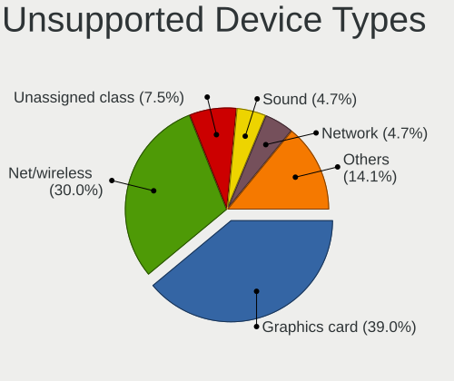

| Type                     | Desktops | Percent |
|--------------------------|----------|---------|
| Graphics card            | 83       | 38.97%  |
| Net/wireless             | 64       | 30.05%  |
| Unassigned class         | 16       | 7.51%   |
| Sound                    | 10       | 4.69%   |
| Network                  | 10       | 4.69%   |
| Net/ethernet             | 6        | 2.82%   |
| Multimedia controller    | 5        | 2.35%   |
| Communication controller | 4        | 1.88%   |
| Camera                   | 4        | 1.88%   |
| Storage/raid             | 3        | 1.41%   |
| Fingerprint reader       | 3        | 1.41%   |
| Bluetooth                | 3        | 1.41%   |
| Dvb card                 | 1        | 0.47%   |
| Card reader              | 1        | 0.47%   |

