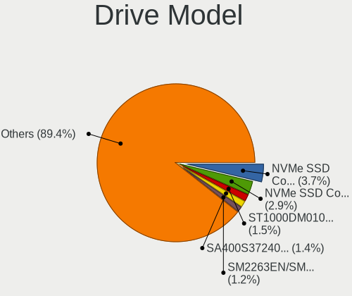
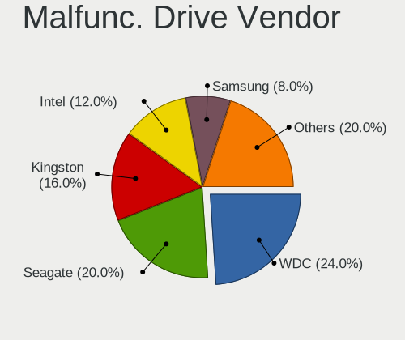
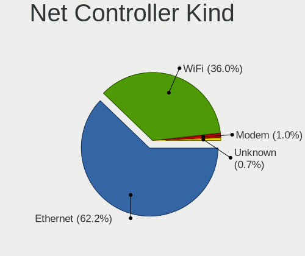
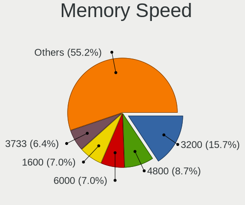

Fedora 41 - Tested Hardware & Statistics (Desktops)
---------------------------------------------------

A project to collect tested hardware configurations for Fedora 41.

Anyone can contribute to this report by the [hw-probe](https://github.com/linuxhw/hw-probe) tool:

    sudo -E hw-probe -all -upload

Please contribute! Especially if your hardware is rare.

Contents
--------

* [ Test Cases ](#test-cases)

* [ System ](#system)
  - [ Kernel                   ](#kernel)
  - [ Kernel Family            ](#kernel-family)
  - [ Kernel Major Ver.        ](#kernel-major-ver)
  - [ Arch                     ](#arch)
  - [ DE                       ](#de)
  - [ Display Server           ](#display-server)
  - [ Display Manager          ](#display-manager)
  - [ OS Lang                  ](#os-lang)
  - [ Boot Mode                ](#boot-mode)
  - [ Filesystem               ](#filesystem)
  - [ Part. scheme             ](#part-scheme)
  - [ Dual Boot with Linux/BSD ](#dual-boot-with-linuxbsd)
  - [ Dual Boot (Win)          ](#dual-boot-win)

* [ Board ](#board)
  - [ Vendor                   ](#vendor)
  - [ Model                    ](#model)
  - [ Model Family             ](#model-family)
  - [ MFG Year                 ](#mfg-year)
  - [ Form Factor              ](#form-factor)
  - [ Secure Boot              ](#secure-boot)
  - [ Coreboot                 ](#coreboot)
  - [ RAM Size                 ](#ram-size)
  - [ RAM Used                 ](#ram-used)
  - [ Total Drives             ](#total-drives)
  - [ Has CD-ROM               ](#has-cd-rom)
  - [ Has Ethernet             ](#has-ethernet)
  - [ Has WiFi                 ](#has-wifi)
  - [ Has Bluetooth            ](#has-bluetooth)

* [ Location ](#location)
  - [ Country                  ](#country)
  - [ City                     ](#city)

* [ Drives ](#drives)
  - [ Drive Vendor             ](#drive-vendor)
  - [ Drive Model              ](#drive-model)
  - [ HDD Vendor               ](#hdd-vendor)
  - [ SSD Vendor               ](#ssd-vendor)
  - [ Drive Kind               ](#drive-kind)
  - [ Drive Connector          ](#drive-connector)
  - [ Drive Size               ](#drive-size)
  - [ Space Total              ](#space-total)
  - [ Space Used               ](#space-used)
  - [ Malfunc. Drives          ](#malfunc-drives)
  - [ Malfunc. Drive Vendor    ](#malfunc-drive-vendor)
  - [ Malfunc. HDD Vendor      ](#malfunc-hdd-vendor)
  - [ Malfunc. Drive Kind      ](#malfunc-drive-kind)
  - [ Failed Drives            ](#failed-drives)
  - [ Failed Drive Vendor      ](#failed-drive-vendor)
  - [ Drive Status             ](#drive-status)

* [ Storage controller ](#storage-controller)
  - [ Storage Vendor           ](#storage-vendor)
  - [ Storage Model            ](#storage-model)
  - [ Storage Kind             ](#storage-kind)

* [ Processor ](#processor)
  - [ CPU Vendor               ](#cpu-vendor)
  - [ CPU Model                ](#cpu-model)
  - [ CPU Model Family         ](#cpu-model-family)
  - [ CPU Cores                ](#cpu-cores)
  - [ CPU Sockets              ](#cpu-sockets)
  - [ CPU Threads              ](#cpu-threads)
  - [ CPU Op-Modes             ](#cpu-op-modes)
  - [ CPU Microcode            ](#cpu-microcode)
  - [ CPU Microarch            ](#cpu-microarch)

* [ Graphics ](#graphics)
  - [ GPU Vendor               ](#gpu-vendor)
  - [ GPU Model                ](#gpu-model)
  - [ GPU Combo                ](#gpu-combo)
  - [ GPU Driver               ](#gpu-driver)
  - [ GPU Memory               ](#gpu-memory)

* [ Monitor ](#monitor)
  - [ Monitor Vendor           ](#monitor-vendor)
  - [ Monitor Model            ](#monitor-model)
  - [ Monitor Resolution       ](#monitor-resolution)
  - [ Monitor Diagonal         ](#monitor-diagonal)
  - [ Monitor Width            ](#monitor-width)
  - [ Aspect Ratio             ](#aspect-ratio)
  - [ Monitor Area             ](#monitor-area)
  - [ Pixel Density            ](#pixel-density)
  - [ Multiple Monitors        ](#multiple-monitors)

* [ Network ](#network)
  - [ Net Controller Vendor    ](#net-controller-vendor)
  - [ Net Controller Model     ](#net-controller-model)
  - [ Wireless Vendor          ](#wireless-vendor)
  - [ Wireless Model           ](#wireless-model)
  - [ Ethernet Vendor          ](#ethernet-vendor)
  - [ Ethernet Model           ](#ethernet-model)
  - [ Net Controller Kind      ](#net-controller-kind)
  - [ Used Controller          ](#used-controller)
  - [ NICs                     ](#nics)
  - [ IPv6                     ](#ipv6)

* [ Bluetooth ](#bluetooth)
  - [ Bluetooth Vendor         ](#bluetooth-vendor)
  - [ Bluetooth Model          ](#bluetooth-model)

* [ Sound ](#sound)
  - [ Sound Vendor             ](#sound-vendor)
  - [ Sound Model              ](#sound-model)

* [ Memory ](#memory)
  - [ Memory Vendor            ](#memory-vendor)
  - [ Memory Model             ](#memory-model)
  - [ Memory Kind              ](#memory-kind)
  - [ Memory Form Factor       ](#memory-form-factor)
  - [ Memory Size              ](#memory-size)
  - [ Memory Speed             ](#memory-speed)

* [ Printers & scanners ](#printers--scanners)
  - [ Printer Vendor           ](#printer-vendor)
  - [ Printer Model            ](#printer-model)
  - [ Scanner Vendor           ](#scanner-vendor)
  - [ Scanner Model            ](#scanner-model)

* [ Camera ](#camera)
  - [ Camera Vendor            ](#camera-vendor)
  - [ Camera Model             ](#camera-model)

* [ Security ](#security)
  - [ Fingerprint Vendor       ](#fingerprint-vendor)
  - [ Fingerprint Model        ](#fingerprint-model)
  - [ Chipcard Vendor          ](#chipcard-vendor)
  - [ Chipcard Model           ](#chipcard-model)

* [ Unsupported ](#unsupported)
  - [ Unsupported Devices      ](#unsupported-devices)
  - [ Unsupported Device Types ](#unsupported-device-types)

Test Cases
----------

Total: 527

| Vendor        | Model                       | Probe                                                      | Date         |
|---------------|-----------------------------|------------------------------------------------------------|--------------|
| ASUSTek       | ROG STRIX B650-A GAMING ... | [04f9ffdab4](https://linux-hardware.org/?probe=04f9ffdab4) | Jan 06, 2025 |
| ASRock        | H110M-ITX                   | [d9985ebe4e](https://linux-hardware.org/?probe=d9985ebe4e) | Jan 06, 2025 |
| MSI           | B450 GAMING PLUS MAX        | [89cd372074](https://linux-hardware.org/?probe=89cd372074) | Jan 06, 2025 |
| ASUSTek       | TUF Z370-PLUS GAMING II     | [10fd8ef9dd](https://linux-hardware.org/?probe=10fd8ef9dd) | Jan 06, 2025 |
| ASRock        | B360M Performance           | [1e63738abb](https://linux-hardware.org/?probe=1e63738abb) | Jan 06, 2025 |
| ASUSTek       | ROG STRIX B550-F GAMING     | [c8c490c383](https://linux-hardware.org/?probe=c8c490c383) | Jan 06, 2025 |
| ASUSTek       | H110M-E/M.2                 | [ff2e84ab02](https://linux-hardware.org/?probe=ff2e84ab02) | Jan 05, 2025 |
| HP            | 2B12                        | [f9594ff416](https://linux-hardware.org/?probe=f9594ff416) | Jan 05, 2025 |
| Gigabyte      | X570 AORUS ELITE WIFI       | [d80a8fd406](https://linux-hardware.org/?probe=d80a8fd406) | Jan 05, 2025 |
| ASUSTek       | TUF Gaming B550M-PLUS       | [a7c3662aec](https://linux-hardware.org/?probe=a7c3662aec) | Jan 05, 2025 |
| ASUSTek       | H110M-E/M.2                 | [3b654f1020](https://linux-hardware.org/?probe=3b654f1020) | Jan 05, 2025 |
| Supermicro    | X10SLM-F                    | [a8188b3af2](https://linux-hardware.org/?probe=a8188b3af2) | Jan 04, 2025 |
| ASUSTek       | ROG STRIX B550-F GAMING ... | [3f75716ffa](https://linux-hardware.org/?probe=3f75716ffa) | Jan 04, 2025 |
| MSI           | B650 GAMING PLUS WIFI       | [3c54d15e6e](https://linux-hardware.org/?probe=3c54d15e6e) | Jan 04, 2025 |
| ASUSTek       | H110M-E/M.2                 | [d36b787d21](https://linux-hardware.org/?probe=d36b787d21) | Jan 04, 2025 |
| Gigabyte      | B760M AORUS ELITE AX        | [0181bfcd89](https://linux-hardware.org/?probe=0181bfcd89) | Jan 04, 2025 |
| MSI           | MAG Z390 TOMAHAWK           | [7e8f8f5c09](https://linux-hardware.org/?probe=7e8f8f5c09) | Jan 04, 2025 |
| AZW           | MINI S                      | [b4b44d49d3](https://linux-hardware.org/?probe=b4b44d49d3) | Jan 04, 2025 |
| ASUSTek       | ROG STRIX X670E-F GAMING... | [053a6288cb](https://linux-hardware.org/?probe=053a6288cb) | Jan 04, 2025 |
| MSI           | B450-A PRO MAX              | [a829ef7128](https://linux-hardware.org/?probe=a829ef7128) | Jan 04, 2025 |
| Acer          | Aspire XC-105               | [997c408078](https://linux-hardware.org/?probe=997c408078) | Jan 03, 2025 |
| Lenovo        | 3168 SDK0J40697 WIN 3305... | [c6915cb84a](https://linux-hardware.org/?probe=c6915cb84a) | Jan 03, 2025 |
| Gigabyte      | X670E AORUS MASTER          | [903f395545](https://linux-hardware.org/?probe=903f395545) | Jan 03, 2025 |
| MSI           | MAG Z390 TOMAHAWK           | [de008cdc23](https://linux-hardware.org/?probe=de008cdc23) | Jan 03, 2025 |
| ASRock        | X870E Taichi                | [416afc1fb4](https://linux-hardware.org/?probe=416afc1fb4) | Jan 03, 2025 |
| Apple         | Mac-F60DEB81FF30ACF6 Mac... | [ecfa27b66d](https://linux-hardware.org/?probe=ecfa27b66d) | Jan 02, 2025 |
| Gigabyte      | B75M-D3H                    | [139b1d261d](https://linux-hardware.org/?probe=139b1d261d) | Jan 02, 2025 |
| MSI           | B550M PRO-VDH WIFI          | [a24d68ca3c](https://linux-hardware.org/?probe=a24d68ca3c) | Jan 02, 2025 |
| ASUSTek       | PRIME B550-PLUS AC-HES      | [b5eaeaee82](https://linux-hardware.org/?probe=b5eaeaee82) | Jan 02, 2025 |
| ASUSTek       | ROG STRIX X670E-E GAMING... | [99fc88c92b](https://linux-hardware.org/?probe=99fc88c92b) | Jan 02, 2025 |
| ASUSTek       | Pro B650M-CT                | [eeb61bea29](https://linux-hardware.org/?probe=eeb61bea29) | Jan 02, 2025 |
| MSI           | 970 GAMING                  | [c77ab27b22](https://linux-hardware.org/?probe=c77ab27b22) | Jan 01, 2025 |
| ASUSTek       | ROG STRIX X570-E GAMING ... | [eb17054181](https://linux-hardware.org/?probe=eb17054181) | Jan 01, 2025 |
| ASUSTek       | ROG STRIX Z790-E GAMING ... | [040cb2efa9](https://linux-hardware.org/?probe=040cb2efa9) | Jan 01, 2025 |
| ASUSTek       | ROG CROSSHAIR VIII HERO     | [f9183ea9f9](https://linux-hardware.org/?probe=f9183ea9f9) | Dec 31, 2024 |
| MSI           | A520M PRO                   | [092cdc906c](https://linux-hardware.org/?probe=092cdc906c) | Dec 31, 2024 |
| ASUSTek       | TUF B450M-PLUS GAMING       | [bfc48412dd](https://linux-hardware.org/?probe=bfc48412dd) | Dec 31, 2024 |
| ASUSTek       | TUF Gaming B550M-PLUS WI... | [66588a9985](https://linux-hardware.org/?probe=66588a9985) | Dec 31, 2024 |
| ASUSTek       | Maximus IX CODE             | [026ee0facd](https://linux-hardware.org/?probe=026ee0facd) | Dec 31, 2024 |
| ASUSTek       | PRIME H510M-K               | [125c5a0ee0](https://linux-hardware.org/?probe=125c5a0ee0) | Dec 31, 2024 |
| Pegatron      | 2AD5                        | [18dc34ec58](https://linux-hardware.org/?probe=18dc34ec58) | Dec 30, 2024 |
| MSI           | MAG Z390 TOMAHAWK           | [f457b3f670](https://linux-hardware.org/?probe=f457b3f670) | Dec 30, 2024 |
| MSI           | MAG Z390 TOMAHAWK           | [c51b4b60fd](https://linux-hardware.org/?probe=c51b4b60fd) | Dec 30, 2024 |
| ASUSTek       | PRIME Z690-P WIFI D4        | [3e9fa7ec25](https://linux-hardware.org/?probe=3e9fa7ec25) | Dec 30, 2024 |
| ASUSTek       | PRIME B650-PLUS             | [5bae41298f](https://linux-hardware.org/?probe=5bae41298f) | Dec 30, 2024 |
| ASRock        | A320M-HDV R4.0              | [b8d923b1af](https://linux-hardware.org/?probe=b8d923b1af) | Dec 30, 2024 |
| MSI           | PRO B660-A DDR4             | [1760e67766](https://linux-hardware.org/?probe=1760e67766) | Dec 30, 2024 |
| Dell          | 0YXT71 A03                  | [a373cef681](https://linux-hardware.org/?probe=a373cef681) | Dec 30, 2024 |
| Lenovo        | 3328 SDK0T76463 WIN 3422... | [4dde6cad5a](https://linux-hardware.org/?probe=4dde6cad5a) | Dec 30, 2024 |
| ASUSTek       | ROG STRIX B550-E GAMING     | [1fc44cea15](https://linux-hardware.org/?probe=1fc44cea15) | Dec 29, 2024 |
| HP            | 8906 SMVB                   | [c7a78e601d](https://linux-hardware.org/?probe=c7a78e601d) | Dec 29, 2024 |
| Gigabyte      | H61M-S2PV                   | [58be9bacfd](https://linux-hardware.org/?probe=58be9bacfd) | Dec 29, 2024 |
| MSI           | B550-A PRO                  | [93afafb17b](https://linux-hardware.org/?probe=93afafb17b) | Dec 29, 2024 |
| HP            | 1589                        | [dd5a66147d](https://linux-hardware.org/?probe=dd5a66147d) | Dec 28, 2024 |
| ASRock        | B550M-C                     | [dec3229b3a](https://linux-hardware.org/?probe=dec3229b3a) | Dec 28, 2024 |
| ASRock        | B550M Phantom Gaming 4      | [1a05752e8c](https://linux-hardware.org/?probe=1a05752e8c) | Dec 28, 2024 |
| MSI           | A520M-A PRO                 | [e3ba91e9a3](https://linux-hardware.org/?probe=e3ba91e9a3) | Dec 28, 2024 |
| ASUSTek       | P8H61-M LX3 PLUS R2.0       | [345c9bffd4](https://linux-hardware.org/?probe=345c9bffd4) | Dec 28, 2024 |
| Huanan        | X99-F8 GAMING V5.0          | [784d69901d](https://linux-hardware.org/?probe=784d69901d) | Dec 28, 2024 |
| AZW           | MINI S                      | [2f997d878f](https://linux-hardware.org/?probe=2f997d878f) | Dec 28, 2024 |
| HP            | 81B3                        | [67462f75bb](https://linux-hardware.org/?probe=67462f75bb) | Dec 27, 2024 |
| Gigabyte      | B650 EAGLE AX               | [e4b9c34646](https://linux-hardware.org/?probe=e4b9c34646) | Dec 27, 2024 |
| MSI           | MEG Z790 ACE                | [6d77957bbb](https://linux-hardware.org/?probe=6d77957bbb) | Dec 27, 2024 |
| Gigabyte      | GA-A55M-S2V                 | [476ca1ca6d](https://linux-hardware.org/?probe=476ca1ca6d) | Dec 27, 2024 |
| MSI           | A320M PRO-VH                | [e16bd64c51](https://linux-hardware.org/?probe=e16bd64c51) | Dec 27, 2024 |
| MSI           | A320M PRO-VH                | [6c30c82884](https://linux-hardware.org/?probe=6c30c82884) | Dec 27, 2024 |
| ASRock        | X670E Steel Legend          | [77dfeca508](https://linux-hardware.org/?probe=77dfeca508) | Dec 26, 2024 |
| Gigabyte      | X570 I AORUS PRO WIFI       | [856acb68a4](https://linux-hardware.org/?probe=856acb68a4) | Dec 26, 2024 |
| MSI           | H110M PRO-D                 | [9ecfd504b7](https://linux-hardware.org/?probe=9ecfd504b7) | Dec 26, 2024 |
| ASUSTek       | H81M-A/BR                   | [37badc0cfd](https://linux-hardware.org/?probe=37badc0cfd) | Dec 26, 2024 |
| Gigabyte      | Z690 UD DDR4                | [fc2486e691](https://linux-hardware.org/?probe=fc2486e691) | Dec 26, 2024 |
| Gigabyte      | B650 GAMING X AX V2         | [c12274a13c](https://linux-hardware.org/?probe=c12274a13c) | Dec 26, 2024 |
| MSI           | Z270I GAMING PRO CARBON ... | [deae2e3249](https://linux-hardware.org/?probe=deae2e3249) | Dec 26, 2024 |
| Dell          | 0K240Y A01                  | [8aca080a7d](https://linux-hardware.org/?probe=8aca080a7d) | Dec 26, 2024 |
| MSI           | Z270I GAMING PRO CARBON ... | [20b0460a24](https://linux-hardware.org/?probe=20b0460a24) | Dec 25, 2024 |
| MSI           | Z790 GAMING PLUS WIFI       | [0d13f70a8e](https://linux-hardware.org/?probe=0d13f70a8e) | Dec 25, 2024 |
| Gigabyte      | B365M GAMING HD             | [c72350ab41](https://linux-hardware.org/?probe=c72350ab41) | Dec 25, 2024 |
| ASUSTek       | PRIME B550-PLUS             | [8c3e2b5020](https://linux-hardware.org/?probe=8c3e2b5020) | Dec 25, 2024 |
| ASRock        | J4105-ITX                   | [760c59fa66](https://linux-hardware.org/?probe=760c59fa66) | Dec 25, 2024 |
| Dell          | 04Y8V0 A02                  | [3cd26b82de](https://linux-hardware.org/?probe=3cd26b82de) | Dec 25, 2024 |
| ASRock        | B760M Pro-A WiFi            | [8323aa21ad](https://linux-hardware.org/?probe=8323aa21ad) | Dec 24, 2024 |
| Gigabyte      | Z790I AORUS ULTRA           | [f36ee00671](https://linux-hardware.org/?probe=f36ee00671) | Dec 23, 2024 |
| ASUSTek       | PRIME Z390M-PLUS            | [da6ad47fac](https://linux-hardware.org/?probe=da6ad47fac) | Dec 23, 2024 |
| ASUSTek       | PRIME Z390M-PLUS            | [0a0b737503](https://linux-hardware.org/?probe=0a0b737503) | Dec 23, 2024 |
| HP            | 8906 SMVB                   | [41496e7796](https://linux-hardware.org/?probe=41496e7796) | Dec 23, 2024 |
| ASUSTek       | ROG STRIX B650E-I GAMING... | [f34d1131ed](https://linux-hardware.org/?probe=f34d1131ed) | Dec 23, 2024 |
| Gigabyte      | J1900M-D2P                  | [6d2e2dedfe](https://linux-hardware.org/?probe=6d2e2dedfe) | Dec 23, 2024 |
| ASRock        | H510M-HDV/M.2               | [66b8b7eae0](https://linux-hardware.org/?probe=66b8b7eae0) | Dec 23, 2024 |
| ASUSTek       | H81M-PLUS                   | [237817752c](https://linux-hardware.org/?probe=237817752c) | Dec 23, 2024 |
| ASRock        | N68-GS4 FX                  | [e21e961747](https://linux-hardware.org/?probe=e21e961747) | Dec 22, 2024 |
| MSI           | B550-A PRO                  | [27c4858497](https://linux-hardware.org/?probe=27c4858497) | Dec 22, 2024 |
| ASRock        | B450 Gaming K4              | [5df1c0becb](https://linux-hardware.org/?probe=5df1c0becb) | Dec 22, 2024 |
| Dell          | 0K240Y A01                  | [d24d7b9494](https://linux-hardware.org/?probe=d24d7b9494) | Dec 22, 2024 |
| ASUSTek       | ROG STRIX X370-F GAMING     | [a1e3da32e8](https://linux-hardware.org/?probe=a1e3da32e8) | Dec 22, 2024 |
| Gigabyte      | 970A-D3P                    | [1374f8f13a](https://linux-hardware.org/?probe=1374f8f13a) | Dec 21, 2024 |
| ASUSTek       | PRIME B450-PLUS             | [26585ec299](https://linux-hardware.org/?probe=26585ec299) | Dec 21, 2024 |
| ASUSTek       | P8Z68-V PRO GEN3            | [adf5dc1d46](https://linux-hardware.org/?probe=adf5dc1d46) | Dec 21, 2024 |
| Gigabyte      | B660M DS3H AX DDR4          | [de1dda444a](https://linux-hardware.org/?probe=de1dda444a) | Dec 21, 2024 |
| ASUSTek       | PRIME A520M-K               | [83995fdfa3](https://linux-hardware.org/?probe=83995fdfa3) | Dec 21, 2024 |
| Gigabyte      | X570 AORUS PRO WIFI         | [9d2496eed1](https://linux-hardware.org/?probe=9d2496eed1) | Dec 21, 2024 |
| ASRock        | B450M Pro4 R2.0             | [10620ef914](https://linux-hardware.org/?probe=10620ef914) | Dec 20, 2024 |
| ASUSTek       | H97-PLUS                    | [a9d05502ce](https://linux-hardware.org/?probe=a9d05502ce) | Dec 20, 2024 |
| Acidanther... | Mac-27AD2F918AE68F61 Mac... | [2e5e5e6242](https://linux-hardware.org/?probe=2e5e5e6242) | Dec 20, 2024 |
| MSI           | PRO H610M-S DDR4            | [9cec96a0b8](https://linux-hardware.org/?probe=9cec96a0b8) | Dec 20, 2024 |
| ASRock        | A520M-ITX/ac                | [7bc977761e](https://linux-hardware.org/?probe=7bc977761e) | Dec 20, 2024 |
| ASRock        | B760M Pro-A WiFi            | [3946d0bb57](https://linux-hardware.org/?probe=3946d0bb57) | Dec 20, 2024 |
| Gigabyte      | X870E AORUS PRO             | [830132d35c](https://linux-hardware.org/?probe=830132d35c) | Dec 20, 2024 |
| ASUSTek       | ROG STRIX Z390-I GAMING     | [b202efa3e6](https://linux-hardware.org/?probe=b202efa3e6) | Dec 20, 2024 |
| ASUSTek       | ROG STRIX X570-F GAMING     | [373f51ec84](https://linux-hardware.org/?probe=373f51ec84) | Dec 19, 2024 |
| ASUSTek       | TUF B450M-PLUS GAMING       | [9f24ad2683](https://linux-hardware.org/?probe=9f24ad2683) | Dec 19, 2024 |
| ASUSTek       | PRIME H510M-A R2.0          | [600869b46a](https://linux-hardware.org/?probe=600869b46a) | Dec 19, 2024 |
| ASUSTek       | PRIME Z370-A                | [78d17c7869](https://linux-hardware.org/?probe=78d17c7869) | Dec 19, 2024 |
| HP            | 8054                        | [ab28ff6e7c](https://linux-hardware.org/?probe=ab28ff6e7c) | Dec 19, 2024 |
| ASRock        | AB350M Pro4                 | [0369c244e9](https://linux-hardware.org/?probe=0369c244e9) | Dec 19, 2024 |
| ASUSTek       | P8P67                       | [fa26a62bc4](https://linux-hardware.org/?probe=fa26a62bc4) | Dec 19, 2024 |
| MSI           | C236A WORKSTATION           | [49ab170cda](https://linux-hardware.org/?probe=49ab170cda) | Dec 18, 2024 |
| MSI           | MAG X870 TOMAHAWK WIFI      | [18273fb5dd](https://linux-hardware.org/?probe=18273fb5dd) | Dec 18, 2024 |
| Gigabyte      | X870 EAGLE WIFI7            | [b80f8d2129](https://linux-hardware.org/?probe=b80f8d2129) | Dec 18, 2024 |
| MSI           | C236A WORKSTATION           | [ddec979f1d](https://linux-hardware.org/?probe=ddec979f1d) | Dec 18, 2024 |
| Gigabyte      | Z77MX-D3H                   | [9b82850a59](https://linux-hardware.org/?probe=9b82850a59) | Dec 18, 2024 |
| MSI           | MPG X570 GAMING PLUS        | [9f1e3acf5c](https://linux-hardware.org/?probe=9f1e3acf5c) | Dec 18, 2024 |
| Dell          | 0MWYPT A02                  | [ee147a7018](https://linux-hardware.org/?probe=ee147a7018) | Dec 18, 2024 |
| ASUSTek       | TUF Gaming X570-PLUS        | [3830383cb9](https://linux-hardware.org/?probe=3830383cb9) | Dec 17, 2024 |
| ASUSTek       | H81M-CS/BR                  | [5f38363403](https://linux-hardware.org/?probe=5f38363403) | Dec 17, 2024 |
| MSI           | PRO H610M-S DDR4            | [5df9fcc399](https://linux-hardware.org/?probe=5df9fcc399) | Dec 17, 2024 |
| AZW           | MINI S                      | [f78e053ac9](https://linux-hardware.org/?probe=f78e053ac9) | Dec 17, 2024 |
| HP            | 8643 SMVB                   | [fde3487f3f](https://linux-hardware.org/?probe=fde3487f3f) | Dec 17, 2024 |
| HP            | 1494                        | [4af4907cff](https://linux-hardware.org/?probe=4af4907cff) | Dec 16, 2024 |
| ASUSTek       | ProArt X870E-CREATOR WIF... | [4828ed9df5](https://linux-hardware.org/?probe=4828ed9df5) | Dec 16, 2024 |
| Dell          | 0M017G A00                  | [0f1c439447](https://linux-hardware.org/?probe=0f1c439447) | Dec 16, 2024 |
| Dell          | 0M017G A00                  | [e306c72db0](https://linux-hardware.org/?probe=e306c72db0) | Dec 16, 2024 |
| HP            | 198E                        | [902931c40d](https://linux-hardware.org/?probe=902931c40d) | Dec 16, 2024 |
| ASRock        | B550 Phantom Gaming 4/ac    | [11dc169e95](https://linux-hardware.org/?probe=11dc169e95) | Dec 15, 2024 |
| Gigabyte      | G41MT-D3                    | [51632357e5](https://linux-hardware.org/?probe=51632357e5) | Dec 14, 2024 |
| Gigabyte      | B550M AORUS ELITE           | [39f30baf2e](https://linux-hardware.org/?probe=39f30baf2e) | Dec 14, 2024 |
| Acidanther... | Mac-27AD2F918AE68F61 Mac... | [f337acfd7a](https://linux-hardware.org/?probe=f337acfd7a) | Dec 14, 2024 |
| Gigabyte      | Z690 UD DDR4                | [42b3bd140f](https://linux-hardware.org/?probe=42b3bd140f) | Dec 13, 2024 |
| Dell          | 02YYK5 A01                  | [ce9189a198](https://linux-hardware.org/?probe=ce9189a198) | Dec 13, 2024 |
| Gigabyte      | X570 AORUS ELITE WIFI       | [c3817fc2bf](https://linux-hardware.org/?probe=c3817fc2bf) | Dec 13, 2024 |
| MSI           | A520M-A PRO                 | [d72d3b5ba5](https://linux-hardware.org/?probe=d72d3b5ba5) | Dec 13, 2024 |
| ASUSTek       | PRIME X570-P                | [05e5753958](https://linux-hardware.org/?probe=05e5753958) | Dec 13, 2024 |
| Gigabyte      | B450M DS3H-CF               | [a6f9793144](https://linux-hardware.org/?probe=a6f9793144) | Dec 13, 2024 |
| Gigabyte      | B450M DS3H-CF               | [6e31ffceab](https://linux-hardware.org/?probe=6e31ffceab) | Dec 13, 2024 |
| MSI           | A520M-A PRO                 | [4035532469](https://linux-hardware.org/?probe=4035532469) | Dec 13, 2024 |
| MSI           | A520M-A PRO                 | [b35d0ef2a9](https://linux-hardware.org/?probe=b35d0ef2a9) | Dec 13, 2024 |
| MSI           | 970A-G46                    | [eeea91c2c7](https://linux-hardware.org/?probe=eeea91c2c7) | Dec 13, 2024 |
| MSI           | Z87-G45 GAMING              | [f86b7a5624](https://linux-hardware.org/?probe=f86b7a5624) | Dec 12, 2024 |
| Dell          | 0HHV7N A00                  | [020475e5fe](https://linux-hardware.org/?probe=020475e5fe) | Dec 12, 2024 |
| MSI           | MAG X870 TOMAHAWK WIFI      | [83c21053dc](https://linux-hardware.org/?probe=83c21053dc) | Dec 12, 2024 |
| ASRock        | B660M-C                     | [1236820692](https://linux-hardware.org/?probe=1236820692) | Dec 12, 2024 |
| Gigabyte      | Z890 EAGLE WIFI7            | [f7233e7156](https://linux-hardware.org/?probe=f7233e7156) | Dec 12, 2024 |
| Gigabyte      | Z390 AORUS PRO WIFI-CF      | [7ae34455fd](https://linux-hardware.org/?probe=7ae34455fd) | Dec 12, 2024 |
| ASUSTek       | TUF Gaming X670E-PLUS WI... | [1d01300877](https://linux-hardware.org/?probe=1d01300877) | Dec 12, 2024 |
| Gigabyte      | B550 AORUS ELITE AX V2      | [b819493263](https://linux-hardware.org/?probe=b819493263) | Dec 12, 2024 |
| ASUSTek       | STRIX Z270H GAMING          | [24c88ab18a](https://linux-hardware.org/?probe=24c88ab18a) | Dec 12, 2024 |
| MSI           | MPG Z790 EDGE TI MAX WIF... | [962e3b7c94](https://linux-hardware.org/?probe=962e3b7c94) | Dec 11, 2024 |
| ASUSTek       | TUF Z390M-PRO GAMING        | [f55cefc4aa](https://linux-hardware.org/?probe=f55cefc4aa) | Dec 11, 2024 |
| ASUSTek       | ROG CROSSHAIR VIII IMPAC... | [1fc3e7965d](https://linux-hardware.org/?probe=1fc3e7965d) | Dec 11, 2024 |
| Gigabyte      | Z790 UD AC                  | [a70d79b557](https://linux-hardware.org/?probe=a70d79b557) | Dec 11, 2024 |
| ASUSTek       | PRIME B660-PLUS D4          | [bea1bb6368](https://linux-hardware.org/?probe=bea1bb6368) | Dec 10, 2024 |
| ASRock        | H97M Pro4                   | [ad4a8c30fa](https://linux-hardware.org/?probe=ad4a8c30fa) | Dec 10, 2024 |
| Fujitsu       | D3164-A1 S26361-D3164-A1    | [49f31af912](https://linux-hardware.org/?probe=49f31af912) | Dec 10, 2024 |
| HP            | 8906 SMVB                   | [4d33ab52fc](https://linux-hardware.org/?probe=4d33ab52fc) | Dec 10, 2024 |
| ASUSTek       | PRIME X670-P WIFI           | [3a7dd0b60b](https://linux-hardware.org/?probe=3a7dd0b60b) | Dec 10, 2024 |
| Pegatron      | 2A86E01                     | [7f912e4b1b](https://linux-hardware.org/?probe=7f912e4b1b) | Dec 10, 2024 |
| Intel         | LADPNVMO AAE76523-300       | [e42ba66dd1](https://linux-hardware.org/?probe=e42ba66dd1) | Dec 09, 2024 |
| ASRock        | B650M PG Riptide            | [ec69fb26c9](https://linux-hardware.org/?probe=ec69fb26c9) | Dec 09, 2024 |
| ASUSTek       | PRIME B460M-A               | [275b70a9b3](https://linux-hardware.org/?probe=275b70a9b3) | Dec 09, 2024 |
| ASUSTek       | TUF Gaming B550M-PLUS WI... | [8d72975c1f](https://linux-hardware.org/?probe=8d72975c1f) | Dec 08, 2024 |
| ASUSTek       | STRIX B250F GAMING          | [aad04cbfa0](https://linux-hardware.org/?probe=aad04cbfa0) | Dec 08, 2024 |
| Intel         | B85                         | [319a350c09](https://linux-hardware.org/?probe=319a350c09) | Dec 08, 2024 |
| MSI           | MAG B550M BAZOOKA           | [ac421a6697](https://linux-hardware.org/?probe=ac421a6697) | Dec 08, 2024 |
| ASUSTek       | ROG STRIX B550-F GAMING ... | [22bfeaf18d](https://linux-hardware.org/?probe=22bfeaf18d) | Dec 08, 2024 |
| Intel         | B85                         | [7cbfefe75c](https://linux-hardware.org/?probe=7cbfefe75c) | Dec 07, 2024 |
| ASUSTek       | ROG Maximus XIII HERO       | [c27ff3f4de](https://linux-hardware.org/?probe=c27ff3f4de) | Dec 07, 2024 |
| ASUSTek       | PRIME A620-PLUS WIFI6       | [8c2e5346f1](https://linux-hardware.org/?probe=8c2e5346f1) | Dec 07, 2024 |
| Gigabyte      | B450 AORUS ELITE            | [4503233bdb](https://linux-hardware.org/?probe=4503233bdb) | Dec 07, 2024 |
| MSI           | Z87-G45 GAMING              | [74ef542001](https://linux-hardware.org/?probe=74ef542001) | Dec 07, 2024 |
| Dell          | 0Y9655                      | [b5f13b6611](https://linux-hardware.org/?probe=b5f13b6611) | Dec 07, 2024 |
| ASUSTek       | PRIME B460M-A               | [422c8408b1](https://linux-hardware.org/?probe=422c8408b1) | Dec 07, 2024 |
| ASRock        | A320M-HD                    | [ac1057440a](https://linux-hardware.org/?probe=ac1057440a) | Dec 07, 2024 |
| ASUSTek       | TUF Gaming A620-PRO WIFI    | [19aa855f4d](https://linux-hardware.org/?probe=19aa855f4d) | Dec 07, 2024 |
| Gigabyte      | X470 AORUS ULTRA GAMING-... | [5313e20734](https://linux-hardware.org/?probe=5313e20734) | Dec 07, 2024 |
| Gigabyte      | X870 EAGLE WIFI7            | [b7f62c7b88](https://linux-hardware.org/?probe=b7f62c7b88) | Dec 06, 2024 |
| Gigabyte      | B250M-DS3H-CF               | [765f860e00](https://linux-hardware.org/?probe=765f860e00) | Dec 06, 2024 |
| Gigabyte      | H61M-USB3H                  | [f6f758c80a](https://linux-hardware.org/?probe=f6f758c80a) | Dec 06, 2024 |
| ASUSTek       | ProArt X870E-CREATOR WIF... | [ea0f32ae89](https://linux-hardware.org/?probe=ea0f32ae89) | Dec 06, 2024 |
| ASUSTek       | H81M-A/BR                   | [5e9219a165](https://linux-hardware.org/?probe=5e9219a165) | Dec 06, 2024 |
| ASUSTek       | ProArt X670E-CREATOR WIF... | [3a5389b84a](https://linux-hardware.org/?probe=3a5389b84a) | Dec 06, 2024 |
| ASUSTek       | ROG STRIX B550-F GAMING     | [a9ec07c3c9](https://linux-hardware.org/?probe=a9ec07c3c9) | Dec 06, 2024 |
| MSI           | X470 GAMING PLUS            | [bcba713eb3](https://linux-hardware.org/?probe=bcba713eb3) | Dec 05, 2024 |
| HP            | 8299                        | [8fb4eb84e5](https://linux-hardware.org/?probe=8fb4eb84e5) | Dec 05, 2024 |
| ASUSTek       | PRIME B450-PLUS             | [3ac8b9ac4d](https://linux-hardware.org/?probe=3ac8b9ac4d) | Dec 05, 2024 |
| MSI           | MAG B550 TOMAHAWK           | [4ec5a1bec9](https://linux-hardware.org/?probe=4ec5a1bec9) | Dec 05, 2024 |
| MSI           | B450M PRO-VDH MAX           | [b866222ea1](https://linux-hardware.org/?probe=b866222ea1) | Dec 05, 2024 |
| ASUSTek       | TUF Gaming X670E-PLUS       | [d5da253b51](https://linux-hardware.org/?probe=d5da253b51) | Dec 05, 2024 |
| ASUSTek       | ROG STRIX Z370-E GAMING     | [3f7324c90a](https://linux-hardware.org/?probe=3f7324c90a) | Dec 05, 2024 |
| ASRock        | AD2700-ITX                  | [5fdaccb9a8](https://linux-hardware.org/?probe=5fdaccb9a8) | Dec 05, 2024 |
| ASUSTek       | PRIME A320M-K               | [03151f3639](https://linux-hardware.org/?probe=03151f3639) | Dec 05, 2024 |
| Gigabyte      | B550I AORUS PRO AX          | [fa4be7b516](https://linux-hardware.org/?probe=fa4be7b516) | Dec 05, 2024 |
| Gigabyte      | B450M DS3H-CF               | [fc67178348](https://linux-hardware.org/?probe=fc67178348) | Dec 04, 2024 |
| Lenovo        | MAHOBAY NO DPK              | [f77678469a](https://linux-hardware.org/?probe=f77678469a) | Dec 04, 2024 |
| ASUSTek       | A8R32-MVP Deluxe            | [2c25863ae9](https://linux-hardware.org/?probe=2c25863ae9) | Dec 04, 2024 |
| Lenovo        | MAHOBAY NO DPK              | [f6767b3b26](https://linux-hardware.org/?probe=f6767b3b26) | Dec 04, 2024 |
| ASRock        | B450 Pro4                   | [55e24b5774](https://linux-hardware.org/?probe=55e24b5774) | Dec 04, 2024 |
| ASUSTek       | ProArt B550-CREATOR         | [074e91d7d5](https://linux-hardware.org/?probe=074e91d7d5) | Dec 03, 2024 |
| Gigabyte      | H410M H V2                  | [1b1f8c13e7](https://linux-hardware.org/?probe=1b1f8c13e7) | Dec 03, 2024 |
| Gigabyte      | Z790 GAMING X               | [0fe982b162](https://linux-hardware.org/?probe=0fe982b162) | Dec 03, 2024 |
| MSI           | B450M PRO-VDH MAX           | [de3399c33d](https://linux-hardware.org/?probe=de3399c33d) | Dec 03, 2024 |
| HP            | 83EF                        | [8ec6753877](https://linux-hardware.org/?probe=8ec6753877) | Dec 03, 2024 |
| Pegatron      | IPM31G                      | [a94a211e70](https://linux-hardware.org/?probe=a94a211e70) | Dec 03, 2024 |
| Gigabyte      | B550M K                     | [6483d852ee](https://linux-hardware.org/?probe=6483d852ee) | Dec 02, 2024 |
| HP            | 8299                        | [5de364edd7](https://linux-hardware.org/?probe=5de364edd7) | Dec 02, 2024 |
| HP            | 1998                        | [924f8aa401](https://linux-hardware.org/?probe=924f8aa401) | Dec 02, 2024 |
| HP            | 1998                        | [96ed13c26f](https://linux-hardware.org/?probe=96ed13c26f) | Dec 02, 2024 |
| ASUSTek       | STRIX H270F GAMING          | [2e9abd7b29](https://linux-hardware.org/?probe=2e9abd7b29) | Dec 02, 2024 |
| ASUSTek       | TUF Gaming B650-PLUS WIF... | [b2b3a3aa1f](https://linux-hardware.org/?probe=b2b3a3aa1f) | Dec 02, 2024 |
| ASUSTek       | ROG STRIX B550-F GAMING     | [f392f0cb5f](https://linux-hardware.org/?probe=f392f0cb5f) | Dec 02, 2024 |
| Gigabyte      | B450M DS3H WIFI-CF          | [a48c737bf4](https://linux-hardware.org/?probe=a48c737bf4) | Dec 02, 2024 |
| Gigabyte      | GA-A55M-S2V                 | [64ef142041](https://linux-hardware.org/?probe=64ef142041) | Dec 02, 2024 |
| Gigabyte      | J1900M-D2P                  | [7997ade01f](https://linux-hardware.org/?probe=7997ade01f) | Dec 02, 2024 |
| ASUSTek       | PRIME X670E-PRO WIFI        | [2612abfcee](https://linux-hardware.org/?probe=2612abfcee) | Dec 02, 2024 |
| Intel         | H61                         | [1202ad97f8](https://linux-hardware.org/?probe=1202ad97f8) | Dec 02, 2024 |
| Gigabyte      | GA-MA785G-UD3H              | [cf6a4a0297](https://linux-hardware.org/?probe=cf6a4a0297) | Dec 01, 2024 |
| ASUSTek       | ROG STRIX Z690-I GAMING ... | [b3a49c1c20](https://linux-hardware.org/?probe=b3a49c1c20) | Dec 01, 2024 |
| MSI           | MAG B550 TOMAHAWK           | [05b0c23f90](https://linux-hardware.org/?probe=05b0c23f90) | Dec 01, 2024 |
| AZW           | MINI S                      | [6b1e7b76ae](https://linux-hardware.org/?probe=6b1e7b76ae) | Dec 01, 2024 |
| HP            | 83E0                        | [e3acb6a03b](https://linux-hardware.org/?probe=e3acb6a03b) | Dec 01, 2024 |
| ASUSTek       | TUF Gaming X570-PRO         | [a7854e08eb](https://linux-hardware.org/?probe=a7854e08eb) | Dec 01, 2024 |
| ASUSTek       | P8H77-M PRO                 | [9655fa6aa4](https://linux-hardware.org/?probe=9655fa6aa4) | Dec 01, 2024 |
| MSI           | Z77A-G45                    | [4ff6c04aeb](https://linux-hardware.org/?probe=4ff6c04aeb) | Nov 30, 2024 |
| ASUSTek       | SABERTOOTH 990FX R2.0       | [32d10cb8bd](https://linux-hardware.org/?probe=32d10cb8bd) | Nov 30, 2024 |
| ASUSTek       | Maximus IV GENE-Z/GEN3      | [df1e7231c1](https://linux-hardware.org/?probe=df1e7231c1) | Nov 30, 2024 |
| AZW           | U59                         | [895bcb5792](https://linux-hardware.org/?probe=895bcb5792) | Nov 30, 2024 |
| ASRock        | X670E Taichi                | [e20725a706](https://linux-hardware.org/?probe=e20725a706) | Nov 30, 2024 |
| Gigabyte      | B450 AORUS ELITE            | [745588252f](https://linux-hardware.org/?probe=745588252f) | Nov 30, 2024 |
| ASRock        | B550 Phantom Gaming 4/ac    | [f305c13791](https://linux-hardware.org/?probe=f305c13791) | Nov 30, 2024 |
| Unknown       | Unknown                     | [e5904a131c](https://linux-hardware.org/?probe=e5904a131c) | Nov 29, 2024 |
| ASUSTek       | PRIME B250-PLUS             | [2e64c84332](https://linux-hardware.org/?probe=2e64c84332) | Nov 29, 2024 |
| MSI           | Z97 PC Mate                 | [2f0201c36b](https://linux-hardware.org/?probe=2f0201c36b) | Nov 29, 2024 |
| Tianbei       | GEM12                       | [a9116936ae](https://linux-hardware.org/?probe=a9116936ae) | Nov 29, 2024 |
| ASUSTek       | ROG STRIX X370-F GAMING     | [95680c9fec](https://linux-hardware.org/?probe=95680c9fec) | Nov 29, 2024 |
| HP            | 2820h                       | [ef90aa8270](https://linux-hardware.org/?probe=ef90aa8270) | Nov 28, 2024 |
| ASRock        | FM2A68M-HD+                 | [abbaade865](https://linux-hardware.org/?probe=abbaade865) | Nov 28, 2024 |
| ASRock        | B450M-HDV R4.0              | [5368752126](https://linux-hardware.org/?probe=5368752126) | Nov 28, 2024 |
| MSI           | B550-A PRO                  | [b8646c3e51](https://linux-hardware.org/?probe=b8646c3e51) | Nov 28, 2024 |
| Gigabyte      | Z790 AORUS ELITE AX         | [97a6701e22](https://linux-hardware.org/?probe=97a6701e22) | Nov 28, 2024 |
| Biostar       | B450MH                      | [ecf1f7fc9e](https://linux-hardware.org/?probe=ecf1f7fc9e) | Nov 28, 2024 |
| Gigabyte      | B550 GAMING X V2            | [85f8cae557](https://linux-hardware.org/?probe=85f8cae557) | Nov 28, 2024 |
| MSI           | Z97 PC Mate                 | [1bda8fbcb4](https://linux-hardware.org/?probe=1bda8fbcb4) | Nov 28, 2024 |
| ASRock        | Z590 Phantom Gaming 4       | [0fa184b969](https://linux-hardware.org/?probe=0fa184b969) | Nov 28, 2024 |
| MSI           | MPG B550 GAMING PLUS        | [7c5dbdf270](https://linux-hardware.org/?probe=7c5dbdf270) | Nov 28, 2024 |
| HP            | 82B4                        | [6d6647f3e4](https://linux-hardware.org/?probe=6d6647f3e4) | Nov 27, 2024 |
| Dell          | 0WMJ54 A01                  | [1dab8af4cf](https://linux-hardware.org/?probe=1dab8af4cf) | Nov 27, 2024 |
| Dell          | 0WMJ54 A01                  | [4dcd36587b](https://linux-hardware.org/?probe=4dcd36587b) | Nov 27, 2024 |
| ASUSTek       | ROG CROSSHAIR X670E HERO    | [49d629a4df](https://linux-hardware.org/?probe=49d629a4df) | Nov 27, 2024 |
| Apple         | Mac-F221BEC8                | [601f8f459f](https://linux-hardware.org/?probe=601f8f459f) | Nov 27, 2024 |
| MSI           | MS-7318                     | [e117ee013a](https://linux-hardware.org/?probe=e117ee013a) | Nov 27, 2024 |
| HP            | 82B4                        | [fbe90d8967](https://linux-hardware.org/?probe=fbe90d8967) | Nov 27, 2024 |
| Gigabyte      | 990FXA-UD3                  | [28b0d5272c](https://linux-hardware.org/?probe=28b0d5272c) | Nov 27, 2024 |
| Gigabyte      | 990FXA-UD3                  | [32e941719a](https://linux-hardware.org/?probe=32e941719a) | Nov 26, 2024 |
| ASUSTek       | ROG STRIX X570-E GAMING     | [6aeed4ada0](https://linux-hardware.org/?probe=6aeed4ada0) | Nov 26, 2024 |
| ASRock        | B450M-HDV R4.0              | [42f36d7dfa](https://linux-hardware.org/?probe=42f36d7dfa) | Nov 26, 2024 |
| Dell          | 04Y8V0 A02                  | [46151592a2](https://linux-hardware.org/?probe=46151592a2) | Nov 26, 2024 |
| MSI           | A520M-A PRO                 | [955e1ca8e6](https://linux-hardware.org/?probe=955e1ca8e6) | Nov 26, 2024 |
| ASUSTek       | PRIME X670E-PRO WIFI        | [5820c49268](https://linux-hardware.org/?probe=5820c49268) | Nov 26, 2024 |
| Gigabyte      | Z370P D3-CF                 | [f690af96e7](https://linux-hardware.org/?probe=f690af96e7) | Nov 26, 2024 |
| Dell          | 0NW73C A01                  | [09b0c9f738](https://linux-hardware.org/?probe=09b0c9f738) | Nov 26, 2024 |
| Biostar       | B450MH                      | [b6de2bc533](https://linux-hardware.org/?probe=b6de2bc533) | Nov 25, 2024 |
| ASUSTek       | B150M-C                     | [aea6bc9c92](https://linux-hardware.org/?probe=aea6bc9c92) | Nov 25, 2024 |
| ASRock        | Z370 Pro4                   | [444d9d7d0b](https://linux-hardware.org/?probe=444d9d7d0b) | Nov 25, 2024 |
| Gigabyte      | B550M AORUS ELITE           | [72541ff724](https://linux-hardware.org/?probe=72541ff724) | Nov 25, 2024 |
| Gigabyte      | B550M AORUS ELITE           | [a372d0e63d](https://linux-hardware.org/?probe=a372d0e63d) | Nov 25, 2024 |
| Gigabyte      | Z68MA-D2H-B3                | [33e54edc5c](https://linux-hardware.org/?probe=33e54edc5c) | Nov 25, 2024 |
| ASUSTek       | TUF Gaming B660M-PLUS WI... | [ab34148bbb](https://linux-hardware.org/?probe=ab34148bbb) | Nov 25, 2024 |
| ASUSTek       | TUF Gaming B660M-PLUS WI... | [556e1e8117](https://linux-hardware.org/?probe=556e1e8117) | Nov 25, 2024 |
| MSI           | MAG B650M MORTAR WIFI       | [20683bbaf5](https://linux-hardware.org/?probe=20683bbaf5) | Nov 24, 2024 |
| ASUSTek       | ROG STRIX B650E-I GAMING... | [e05ac701f9](https://linux-hardware.org/?probe=e05ac701f9) | Nov 24, 2024 |
| ASUSTek       | ROG STRIX B550-F GAMING     | [42ff38d61f](https://linux-hardware.org/?probe=42ff38d61f) | Nov 24, 2024 |
| Gigabyte      | B550M AORUS ELITE           | [ddd400a998](https://linux-hardware.org/?probe=ddd400a998) | Nov 24, 2024 |
| Gigabyte      | J1900M-D2P                  | [02184c6e08](https://linux-hardware.org/?probe=02184c6e08) | Nov 24, 2024 |
| ASRock        | Z590 Pro4                   | [f569229d50](https://linux-hardware.org/?probe=f569229d50) | Nov 24, 2024 |
| MSI           | MAG B650M MORTAR WIFI       | [1fda2a7642](https://linux-hardware.org/?probe=1fda2a7642) | Nov 23, 2024 |
| ASUSTek       | PRIME B250-PLUS             | [b83b69cfbe](https://linux-hardware.org/?probe=b83b69cfbe) | Nov 23, 2024 |
| Gigabyte      | Z890 EAGLE WIFI7            | [38990b4a95](https://linux-hardware.org/?probe=38990b4a95) | Nov 23, 2024 |
| ASUSTek       | H110M-PLUS                  | [0edb7dce3a](https://linux-hardware.org/?probe=0edb7dce3a) | Nov 23, 2024 |
| Gigabyte      | H370 AORUS GAMING 3-CF      | [56651b3fbf](https://linux-hardware.org/?probe=56651b3fbf) | Nov 23, 2024 |
| ASUSTek       | ROG STRIX Z370-E GAMING     | [b6f18ef9c7](https://linux-hardware.org/?probe=b6f18ef9c7) | Nov 23, 2024 |
| PELADN        | HO4                         | [aea6bf6fc7](https://linux-hardware.org/?probe=aea6bf6fc7) | Nov 23, 2024 |
| Gigabyte      | G41MT-D3                    | [d6d09e60c8](https://linux-hardware.org/?probe=d6d09e60c8) | Nov 23, 2024 |
| Gigabyte      | H510M H                     | [19c3074d2a](https://linux-hardware.org/?probe=19c3074d2a) | Nov 23, 2024 |
| Gigabyte      | H510M H                     | [bb61554d7b](https://linux-hardware.org/?probe=bb61554d7b) | Nov 23, 2024 |
| ASUSTek       | ROG STRIX B550-I GAMING     | [400b4c591b](https://linux-hardware.org/?probe=400b4c591b) | Nov 22, 2024 |
| MSI           | B150M PRO-VDH               | [1fbfabce4e](https://linux-hardware.org/?probe=1fbfabce4e) | Nov 22, 2024 |
| Intel         | B760 M-ATX D4               | [adae845d88](https://linux-hardware.org/?probe=adae845d88) | Nov 22, 2024 |
| Itautec       | ST 4271 ST-4271 Padrao 0... | [88f77c55ad](https://linux-hardware.org/?probe=88f77c55ad) | Nov 22, 2024 |
| ASUSTek       | G20AJ                       | [0dbb1f0216](https://linux-hardware.org/?probe=0dbb1f0216) | Nov 21, 2024 |
| Gigabyte      | Z790 UD AC                  | [edbc57f0f9](https://linux-hardware.org/?probe=edbc57f0f9) | Nov 21, 2024 |
| ASUSTek       | TUF Gaming B460-PLUS        | [09833d7cc6](https://linux-hardware.org/?probe=09833d7cc6) | Nov 21, 2024 |
| Gigabyte      | B650 GAMING X AX V2         | [8a0ffdead5](https://linux-hardware.org/?probe=8a0ffdead5) | Nov 21, 2024 |
| Intel         | DH67BL AAG10189-206         | [db9eac8915](https://linux-hardware.org/?probe=db9eac8915) | Nov 21, 2024 |
| ASUSTek       | PRIME B350-PLUS             | [b37562aa88](https://linux-hardware.org/?probe=b37562aa88) | Nov 21, 2024 |
| Dell          | 0NW73C A01                  | [4676fdcb5b](https://linux-hardware.org/?probe=4676fdcb5b) | Nov 21, 2024 |
| Gigabyte      | Z790 AORUS ELITE AX ICE     | [099c277e56](https://linux-hardware.org/?probe=099c277e56) | Nov 21, 2024 |
| ASRock        | Z790 Pro RS WiFi            | [ba5a47319f](https://linux-hardware.org/?probe=ba5a47319f) | Nov 21, 2024 |
| ASUSTek       | TUF Gaming X570-PLUS        | [337a92a014](https://linux-hardware.org/?probe=337a92a014) | Nov 21, 2024 |
| Gigabyte      | H81M-HD3                    | [44a2c7c5a7](https://linux-hardware.org/?probe=44a2c7c5a7) | Nov 21, 2024 |
| ASRock        | B550 Phantom Gaming 4       | [8b731816c0](https://linux-hardware.org/?probe=8b731816c0) | Nov 21, 2024 |
| MSI           | B550-A PRO                  | [c9482feedb](https://linux-hardware.org/?probe=c9482feedb) | Nov 20, 2024 |
| Gigabyte      | X870E AORUS PRO             | [bd8f54a3ab](https://linux-hardware.org/?probe=bd8f54a3ab) | Nov 20, 2024 |
| ASRock        | H81M-VG4 R2.0               | [21abf92497](https://linux-hardware.org/?probe=21abf92497) | Nov 20, 2024 |
| ASUSTek       | ProArt X870E-CREATOR WIF... | [23ea60ff87](https://linux-hardware.org/?probe=23ea60ff87) | Nov 19, 2024 |
| Gigabyte      | Z790 UD AC                  | [7651664c83](https://linux-hardware.org/?probe=7651664c83) | Nov 19, 2024 |
| Gigabyte      | GA-MA785G-UD3H              | [9b9550e9cc](https://linux-hardware.org/?probe=9b9550e9cc) | Nov 19, 2024 |
| Gigabyte      | AB350M-DS3H V2-CF           | [c7a500dd7a](https://linux-hardware.org/?probe=c7a500dd7a) | Nov 19, 2024 |
| Lenovo        | Tilapia CRB                 | [5e47873483](https://linux-hardware.org/?probe=5e47873483) | Nov 19, 2024 |
| Intel         | H110                        | [d246e22138](https://linux-hardware.org/?probe=d246e22138) | Nov 19, 2024 |
| AMI           | Intel                       | [c3bded7d6e](https://linux-hardware.org/?probe=c3bded7d6e) | Nov 19, 2024 |
| HP            | 158B                        | [5af010ad69](https://linux-hardware.org/?probe=5af010ad69) | Nov 19, 2024 |
| Gigabyte      | B365M DS3H WIFI             | [48aeeedae5](https://linux-hardware.org/?probe=48aeeedae5) | Nov 19, 2024 |
| ASUSTek       | PRIME B450M-A II            | [d5d705979c](https://linux-hardware.org/?probe=d5d705979c) | Nov 19, 2024 |
| ASUSTek       | ROG CROSSHAIR X670E HERO    | [8bab1d90d6](https://linux-hardware.org/?probe=8bab1d90d6) | Nov 18, 2024 |
| ASUSTek       | TUF Gaming B760M-PLUS WI... | [1f8a9bf724](https://linux-hardware.org/?probe=1f8a9bf724) | Nov 18, 2024 |
| Gigabyte      | B85M-D3V-A                  | [ef74bd73ca](https://linux-hardware.org/?probe=ef74bd73ca) | Nov 18, 2024 |
| ASRock        | B660-ITX                    | [089ad162fb](https://linux-hardware.org/?probe=089ad162fb) | Nov 18, 2024 |
| HP            | 83E0                        | [2bce6e8484](https://linux-hardware.org/?probe=2bce6e8484) | Nov 18, 2024 |
| Gigabyte      | H61M-DS2                    | [5067d1ba52](https://linux-hardware.org/?probe=5067d1ba52) | Nov 18, 2024 |
| ASUSTek       | TUF Gaming B650M-PLUS       | [2297a3a6f3](https://linux-hardware.org/?probe=2297a3a6f3) | Nov 18, 2024 |
| ASRock        | H310CM-HDV/M.2              | [65268bc04c](https://linux-hardware.org/?probe=65268bc04c) | Nov 17, 2024 |
| Gigabyte      | Z790 A PRO X WIFI7          | [96214f288a](https://linux-hardware.org/?probe=96214f288a) | Nov 17, 2024 |
| HC Technol... | HCAR6000-MI2                | [bc6c7d0dc9](https://linux-hardware.org/?probe=bc6c7d0dc9) | Nov 17, 2024 |
| HP            | 2B38                        | [7e1ed6da46](https://linux-hardware.org/?probe=7e1ed6da46) | Nov 17, 2024 |
| ASRock        | X570 Steel Legend           | [10d4c53800](https://linux-hardware.org/?probe=10d4c53800) | Nov 17, 2024 |
| HP            | 1587h                       | [67bbbca7d3](https://linux-hardware.org/?probe=67bbbca7d3) | Nov 17, 2024 |
| ASUSTek       | PRIME H610M-K D4            | [749193ebff](https://linux-hardware.org/?probe=749193ebff) | Nov 16, 2024 |
| HP            | 1998                        | [9e8ec16073](https://linux-hardware.org/?probe=9e8ec16073) | Nov 16, 2024 |
| HP            | 1998                        | [48a6a2d631](https://linux-hardware.org/?probe=48a6a2d631) | Nov 16, 2024 |
| Gigabyte      | X570S AORUS ELITE AX        | [56b174528a](https://linux-hardware.org/?probe=56b174528a) | Nov 16, 2024 |
| Huanan        | X99-F8 GAMING V5.0          | [ae3c4f6ba3](https://linux-hardware.org/?probe=ae3c4f6ba3) | Nov 16, 2024 |
| Gigabyte      | X670 GAMING X AX            | [fa34e91808](https://linux-hardware.org/?probe=fa34e91808) | Nov 15, 2024 |
| MSI           | B450 TOMAHAWK               | [5cfa0d5e7e](https://linux-hardware.org/?probe=5cfa0d5e7e) | Nov 15, 2024 |
| Gigabyte      | B550 GAMING X V2            | [79ab287168](https://linux-hardware.org/?probe=79ab287168) | Nov 15, 2024 |
| ASUSTek       | PRIME B650M-A               | [7f5a27aa31](https://linux-hardware.org/?probe=7f5a27aa31) | Nov 15, 2024 |
| Dell          | 02W4W1 A00                  | [88e09c6069](https://linux-hardware.org/?probe=88e09c6069) | Nov 15, 2024 |
| MSI           | B450 TOMAHAWK               | [81e0e8472f](https://linux-hardware.org/?probe=81e0e8472f) | Nov 15, 2024 |
| ASRock        | X600-ITX                    | [00b43dd980](https://linux-hardware.org/?probe=00b43dd980) | Nov 15, 2024 |
| Intel         | H61                         | [20c75adfe1](https://linux-hardware.org/?probe=20c75adfe1) | Nov 15, 2024 |
| Gigabyte      | B450 AORUS ELITE            | [46c8f7928b](https://linux-hardware.org/?probe=46c8f7928b) | Nov 15, 2024 |
| Lenovo        | 0B98401 PRO                 | [2f5cd15407](https://linux-hardware.org/?probe=2f5cd15407) | Nov 14, 2024 |
| ASRock        | Z790M-ITX WiFi              | [bf89edbddc](https://linux-hardware.org/?probe=bf89edbddc) | Nov 14, 2024 |
| ASUSTek       | TUF Gaming X570-PLUS        | [60639f7365](https://linux-hardware.org/?probe=60639f7365) | Nov 14, 2024 |
| ASUSTek       | PRIME A320M-K/BR            | [ae7a9190fc](https://linux-hardware.org/?probe=ae7a9190fc) | Nov 14, 2024 |
| Dell          | 0427JK A00                  | [47c143822c](https://linux-hardware.org/?probe=47c143822c) | Nov 13, 2024 |
| Dell          | 01NP3N A00                  | [1ab2ff01e6](https://linux-hardware.org/?probe=1ab2ff01e6) | Nov 13, 2024 |
| ASUSTek       | PRIME B660M-A WIFI D4       | [7b0e24371e](https://linux-hardware.org/?probe=7b0e24371e) | Nov 13, 2024 |
| OEM           | OEM                         | [cc5aef742e](https://linux-hardware.org/?probe=cc5aef742e) | Nov 12, 2024 |
| Gigabyte      | Z370P D3-CF                 | [f278443ad6](https://linux-hardware.org/?probe=f278443ad6) | Nov 12, 2024 |
| Gigabyte      | Z370P D3-CF                 | [05dec34f84](https://linux-hardware.org/?probe=05dec34f84) | Nov 12, 2024 |
| ASRock        | H410M-ITX/ac                | [7b39f3b2df](https://linux-hardware.org/?probe=7b39f3b2df) | Nov 12, 2024 |
| MSI           | PRO B660M-A WIFI DDR4       | [6911103f09](https://linux-hardware.org/?probe=6911103f09) | Nov 12, 2024 |
| ASUSTek       | X99-A                       | [b0deb8b5e6](https://linux-hardware.org/?probe=b0deb8b5e6) | Nov 12, 2024 |
| MSI           | H61M-P31                    | [f2177ab377](https://linux-hardware.org/?probe=f2177ab377) | Nov 12, 2024 |
| ASUSTek       | ROG STRIX B550-F GAMING     | [62a5af0ace](https://linux-hardware.org/?probe=62a5af0ace) | Nov 12, 2024 |
| ASRock        | X870E Taichi Lite           | [a7dabc9805](https://linux-hardware.org/?probe=a7dabc9805) | Nov 12, 2024 |
| MACHINIST     | X99 PR9-H                   | [3f5cc1b3f9](https://linux-hardware.org/?probe=3f5cc1b3f9) | Nov 12, 2024 |
| ASUSTek       | ROG STRIX B550-F GAMING     | [0b1609a35a](https://linux-hardware.org/?probe=0b1609a35a) | Nov 12, 2024 |
| MSI           | MAG B560M MORTAR WIFI       | [6f17b403f8](https://linux-hardware.org/?probe=6f17b403f8) | Nov 11, 2024 |
| MSI           | MPG B550 GAMING PLUS        | [ba4d76b3ca](https://linux-hardware.org/?probe=ba4d76b3ca) | Nov 11, 2024 |
| ASRock        | X570 Phantom Gaming 4       | [2656542e7b](https://linux-hardware.org/?probe=2656542e7b) | Nov 11, 2024 |
| Shenzhen M... | RPBNB                       | [193910bb98](https://linux-hardware.org/?probe=193910bb98) | Nov 11, 2024 |
| HP            | 802F                        | [9f7785c4f0](https://linux-hardware.org/?probe=9f7785c4f0) | Nov 11, 2024 |
| HP            | 8906 SMVB                   | [11c8305077](https://linux-hardware.org/?probe=11c8305077) | Nov 10, 2024 |
| AZW           | EQ                          | [44a13b55be](https://linux-hardware.org/?probe=44a13b55be) | Nov 10, 2024 |
| MSI           | PRO B550-VC                 | [37239247d3](https://linux-hardware.org/?probe=37239247d3) | Nov 10, 2024 |
| ASUSTek       | ROG STRIX B650E-I GAMING... | [98037d8d44](https://linux-hardware.org/?probe=98037d8d44) | Nov 10, 2024 |
| Dell          | 0GXM1W A00                  | [5ee7f2cc70](https://linux-hardware.org/?probe=5ee7f2cc70) | Nov 10, 2024 |
| ASUSTek       | PRIME H310M-K R2.0          | [6901505be7](https://linux-hardware.org/?probe=6901505be7) | Nov 10, 2024 |
| ASUSTek       | ROG STRIX Z690-F GAMING ... | [fa99db20aa](https://linux-hardware.org/?probe=fa99db20aa) | Nov 10, 2024 |
| Apple         | Mac-F60DEB81FF30ACF6 Mac... | [628d0e7ba3](https://linux-hardware.org/?probe=628d0e7ba3) | Nov 09, 2024 |
| Gigabyte      | Z390 DESIGNARE-CF           | [39f1a0ed65](https://linux-hardware.org/?probe=39f1a0ed65) | Nov 09, 2024 |
| Dell          | 06XMFM A02                  | [c0a82d98c4](https://linux-hardware.org/?probe=c0a82d98c4) | Nov 09, 2024 |
| Dell          | 06XMFM A02                  | [cd63b86620](https://linux-hardware.org/?probe=cd63b86620) | Nov 09, 2024 |
| Gigabyte      | Z97X-Gaming 3               | [2cb55cd612](https://linux-hardware.org/?probe=2cb55cd612) | Nov 09, 2024 |
| Gigabyte      | Z97X-Gaming 3               | [6fd033b535](https://linux-hardware.org/?probe=6fd033b535) | Nov 09, 2024 |
| MSI           | Z270 KRAIT GAMING           | [0888231bc3](https://linux-hardware.org/?probe=0888231bc3) | Nov 09, 2024 |
| ASUSTek       | PRIME H410M-K               | [68f6785aa0](https://linux-hardware.org/?probe=68f6785aa0) | Nov 09, 2024 |
| Gigabyte      | B650 AORUS ELITE AX V2      | [7735a8a2e5](https://linux-hardware.org/?probe=7735a8a2e5) | Nov 09, 2024 |
| Gigabyte      | B650 GAMING X AX            | [30c15a1d24](https://linux-hardware.org/?probe=30c15a1d24) | Nov 08, 2024 |
| Alienware     | 01NYPT A00                  | [ca7005c200](https://linux-hardware.org/?probe=ca7005c200) | Nov 08, 2024 |
| Dell          | 0X501H A03                  | [58fd321bea](https://linux-hardware.org/?probe=58fd321bea) | Nov 08, 2024 |
| MSI           | PRO X670-P WIFI             | [489a1bd51a](https://linux-hardware.org/?probe=489a1bd51a) | Nov 08, 2024 |
| MSI           | PRO B650M-A WIFI            | [5edcef988a](https://linux-hardware.org/?probe=5edcef988a) | Nov 08, 2024 |
| BAZAM & PI... | Pichau Alphard B560M-T      | [fe924e8134](https://linux-hardware.org/?probe=fe924e8134) | Nov 08, 2024 |
| ASUSTek       | PRIME H410M-E               | [4c356677c6](https://linux-hardware.org/?probe=4c356677c6) | Nov 08, 2024 |
| Gigabyte      | A320M-S2H-CF                | [78bc0e22a8](https://linux-hardware.org/?probe=78bc0e22a8) | Nov 08, 2024 |
| ASUSTek       | Z170-P                      | [a9f4c3bdab](https://linux-hardware.org/?probe=a9f4c3bdab) | Nov 08, 2024 |
| MSI           | MPG Z690 FORCE WIFI         | [1d54b16b84](https://linux-hardware.org/?probe=1d54b16b84) | Nov 08, 2024 |
| Lenovo        | 0B98401 WIN                 | [e0f904d9db](https://linux-hardware.org/?probe=e0f904d9db) | Nov 07, 2024 |
| Gigabyte      | A320M-S2H-CF                | [1455b780ce](https://linux-hardware.org/?probe=1455b780ce) | Nov 07, 2024 |
| ASRock        | B550 Phantom Gaming 4       | [c8b9b27c31](https://linux-hardware.org/?probe=c8b9b27c31) | Nov 07, 2024 |
| ASUSTek       | PRIME B360-PLUS             | [281b893742](https://linux-hardware.org/?probe=281b893742) | Nov 07, 2024 |
| Gigabyte      | B85-HD3                     | [426da4f80d](https://linux-hardware.org/?probe=426da4f80d) | Nov 07, 2024 |
| Lenovo        | ThinkCentre M58p 7220A72    | [57aba2ee43](https://linux-hardware.org/?probe=57aba2ee43) | Nov 07, 2024 |
| Dell          | 01NP3N A00                  | [ab4fae3999](https://linux-hardware.org/?probe=ab4fae3999) | Nov 07, 2024 |
| ASUSTek       | PRIME H310M-K R2.0          | [f0d29928a8](https://linux-hardware.org/?probe=f0d29928a8) | Nov 07, 2024 |
| ASUSTek       | ROG STRIX X870E-E GAMING... | [7b867cc335](https://linux-hardware.org/?probe=7b867cc335) | Nov 06, 2024 |
| ASUSTek       | ROG STRIX X870E-E GAMING... | [53d2a83ce9](https://linux-hardware.org/?probe=53d2a83ce9) | Nov 06, 2024 |
| ASUSTek       | ROG STRIX Z790-A GAMING ... | [7646d56938](https://linux-hardware.org/?probe=7646d56938) | Nov 06, 2024 |
| ASUSTek       | M2A-VM HDMI                 | [adf5ddf2a2](https://linux-hardware.org/?probe=adf5ddf2a2) | Nov 06, 2024 |
| MSI           | PRO X870-P WIFI             | [d3a4404a9c](https://linux-hardware.org/?probe=d3a4404a9c) | Nov 06, 2024 |
| MSI           | PRO X870-P WIFI             | [7be44bef9b](https://linux-hardware.org/?probe=7be44bef9b) | Nov 06, 2024 |
| ASRock        | B650M-HDV/M.2               | [8825bddeb0](https://linux-hardware.org/?probe=8825bddeb0) | Nov 06, 2024 |
| ASRock        | A520M-ITX/ac                | [d548c3c590](https://linux-hardware.org/?probe=d548c3c590) | Nov 06, 2024 |
| ASUSTek       | TUF Gaming B550M-PLUS WI... | [f8f1963dd3](https://linux-hardware.org/?probe=f8f1963dd3) | Nov 05, 2024 |
| Tianbei       | GEM12                       | [cf3b822d44](https://linux-hardware.org/?probe=cf3b822d44) | Nov 05, 2024 |
| ASRock        | B550 Phantom Gaming 4       | [fb7aa8cee3](https://linux-hardware.org/?probe=fb7aa8cee3) | Nov 05, 2024 |
| AZW           | MINI S                      | [7d27553dea](https://linux-hardware.org/?probe=7d27553dea) | Nov 05, 2024 |
| BESSTAR Te... | UM350                       | [59b3471a89](https://linux-hardware.org/?probe=59b3471a89) | Nov 05, 2024 |
| MSI           | B550-A PRO                  | [7047f5472f](https://linux-hardware.org/?probe=7047f5472f) | Nov 05, 2024 |
| MACHINIST     | E5-D8-MAX V1.1              | [f162306658](https://linux-hardware.org/?probe=f162306658) | Nov 05, 2024 |
| ASRock        | 880GXH/USB3                 | [c6c5db82c8](https://linux-hardware.org/?probe=c6c5db82c8) | Nov 05, 2024 |
| ASUSTek       | PRIME X370-PRO              | [4d517dd28b](https://linux-hardware.org/?probe=4d517dd28b) | Nov 05, 2024 |
| Gigabyte      | B450 I AORUS PRO WIFI-CF    | [d9f0d25d5f](https://linux-hardware.org/?probe=d9f0d25d5f) | Nov 05, 2024 |
| Dell          | 0FR6WH A01                  | [615e98c2e0](https://linux-hardware.org/?probe=615e98c2e0) | Nov 05, 2024 |
| ASRock        | Z370 Pro4                   | [176e8e71c8](https://linux-hardware.org/?probe=176e8e71c8) | Nov 04, 2024 |
| MSI           | MAG Z790 TOMAHAWK MAX WI... | [e76e5d7748](https://linux-hardware.org/?probe=e76e5d7748) | Nov 04, 2024 |
| Foxconn       | 2ABF                        | [2bc5e66879](https://linux-hardware.org/?probe=2bc5e66879) | Nov 04, 2024 |
| Gigabyte      | H310M H x.x                 | [7e072971d7](https://linux-hardware.org/?probe=7e072971d7) | Nov 04, 2024 |
| MSI           | H410M-A PRO                 | [aef6cda20f](https://linux-hardware.org/?probe=aef6cda20f) | Nov 04, 2024 |
| MSI           | H410M-A PRO                 | [bfd3bebc8c](https://linux-hardware.org/?probe=bfd3bebc8c) | Nov 03, 2024 |
| ASUSTek       | P9X79 PRO                   | [c08e489129](https://linux-hardware.org/?probe=c08e489129) | Nov 03, 2024 |
| Gigabyte      | B550 AORUS ELITE V2         | [77c9758288](https://linux-hardware.org/?probe=77c9758288) | Nov 03, 2024 |
| Gigabyte      | X870E AORUS ELITE WIFI7     | [808d65d525](https://linux-hardware.org/?probe=808d65d525) | Nov 03, 2024 |
| ASUSTek       | BM5295                      | [0e8c2a71ad](https://linux-hardware.org/?probe=0e8c2a71ad) | Nov 03, 2024 |
| MSI           | PRO B650M-A WIFI            | [4972061de5](https://linux-hardware.org/?probe=4972061de5) | Nov 03, 2024 |
| MSI           | MEG X570S ACE MAX           | [174f0e425d](https://linux-hardware.org/?probe=174f0e425d) | Nov 03, 2024 |
| Intel         | B75 V1.1                    | [ff18644511](https://linux-hardware.org/?probe=ff18644511) | Nov 03, 2024 |
| Gigabyte      | H510M H                     | [23e16d82e3](https://linux-hardware.org/?probe=23e16d82e3) | Nov 03, 2024 |
| AZW           | SER V1                      | [50bb4520b5](https://linux-hardware.org/?probe=50bb4520b5) | Nov 03, 2024 |
| ASUSTek       | PRIME X470-PRO              | [af11eb75fe](https://linux-hardware.org/?probe=af11eb75fe) | Nov 03, 2024 |
| ASUSTek       | ProArt Z790-CREATOR WIFI    | [ffcb733233](https://linux-hardware.org/?probe=ffcb733233) | Nov 03, 2024 |
| ASUSTek       | M2A-VM HDMI                 | [5ca0b5da95](https://linux-hardware.org/?probe=5ca0b5da95) | Nov 02, 2024 |
| ASUSTek       | H81M-A/BR                   | [12ead7a428](https://linux-hardware.org/?probe=12ead7a428) | Nov 02, 2024 |
| ASUSTek       | TUF Gaming B550M-PLUS WI... | [fe40215b9e](https://linux-hardware.org/?probe=fe40215b9e) | Nov 02, 2024 |
| ASUSTek       | ROG Maximus XII HERO        | [b0875016ac](https://linux-hardware.org/?probe=b0875016ac) | Nov 02, 2024 |
| ASUSTek       | M32CD4-K                    | [108fddf731](https://linux-hardware.org/?probe=108fddf731) | Nov 02, 2024 |
| ASUSTek       | M32CD4-K                    | [63bb988d3a](https://linux-hardware.org/?probe=63bb988d3a) | Nov 02, 2024 |
| Gigabyte      | X870E AORUS ELITE WIFI7     | [27fdbb3c09](https://linux-hardware.org/?probe=27fdbb3c09) | Nov 02, 2024 |
| ASUSTek       | TUF Gaming B550-PLUS        | [093697ee27](https://linux-hardware.org/?probe=093697ee27) | Nov 02, 2024 |
| ASUSTek       | PRIME A320M-K               | [cb259b05e2](https://linux-hardware.org/?probe=cb259b05e2) | Nov 02, 2024 |
| ASUSTek       | PRIME A320M-K               | [5a5d4093a4](https://linux-hardware.org/?probe=5a5d4093a4) | Nov 02, 2024 |
| Gigabyte      | Z170-D3H-CF                 | [aa9d2deca0](https://linux-hardware.org/?probe=aa9d2deca0) | Nov 01, 2024 |
| Gigabyte      | H81M-S2H                    | [84bdf7e626](https://linux-hardware.org/?probe=84bdf7e626) | Nov 01, 2024 |
| Shenzhen M... | AHBTB                       | [3ffb8cd8b9](https://linux-hardware.org/?probe=3ffb8cd8b9) | Nov 01, 2024 |
| MSI           | Z590 PRO WIFI               | [76739cf7da](https://linux-hardware.org/?probe=76739cf7da) | Nov 01, 2024 |
| HP            | 8653 A                      | [5de0a39e39](https://linux-hardware.org/?probe=5de0a39e39) | Nov 01, 2024 |
| ASUSTek       | ROG CROSSHAIR X670E HERO    | [8e4d6535f4](https://linux-hardware.org/?probe=8e4d6535f4) | Oct 31, 2024 |
| Gigabyte      | H410M H V2                  | [d8fc45704f](https://linux-hardware.org/?probe=d8fc45704f) | Oct 31, 2024 |
| ASRock        | AD2700-ITX                  | [6a162c50dd](https://linux-hardware.org/?probe=6a162c50dd) | Oct 31, 2024 |
| MSI           | Z87M GAMING                 | [127a8e1abd](https://linux-hardware.org/?probe=127a8e1abd) | Oct 31, 2024 |
| Gigabyte      | X58A-UD5                    | [5ecd8898e9](https://linux-hardware.org/?probe=5ecd8898e9) | Oct 31, 2024 |
| Gigabyte      | J1900M-D2P                  | [a12900be5b](https://linux-hardware.org/?probe=a12900be5b) | Oct 31, 2024 |
| ASRock        | B450 Gaming K4              | [223ca3cff5](https://linux-hardware.org/?probe=223ca3cff5) | Oct 31, 2024 |
| ASRock        | B450 Gaming K4              | [bfbfd0ec5f](https://linux-hardware.org/?probe=bfbfd0ec5f) | Oct 31, 2024 |
| Dell          | 0KN5W4 A03                  | [a6e1913365](https://linux-hardware.org/?probe=a6e1913365) | Oct 31, 2024 |
| Dell          | 0KN5W4 A03                  | [297650f218](https://linux-hardware.org/?probe=297650f218) | Oct 31, 2024 |
| MSI           | MEG Z390 GODLIKE            | [962c1085a3](https://linux-hardware.org/?probe=962c1085a3) | Oct 30, 2024 |
| Biostar       | A320MH                      | [407ce72b40](https://linux-hardware.org/?probe=407ce72b40) | Oct 30, 2024 |
| Gigabyte      | Z68MA-D2H-B3                | [07e7c599ef](https://linux-hardware.org/?probe=07e7c599ef) | Oct 30, 2024 |
| Gigabyte      | J1900M-D2P                  | [17555d3426](https://linux-hardware.org/?probe=17555d3426) | Oct 30, 2024 |
| Alienware     | 07W25T A01                  | [e2177522c0](https://linux-hardware.org/?probe=e2177522c0) | Oct 30, 2024 |
| Alienware     | 07W25T A01                  | [fb91d35161](https://linux-hardware.org/?probe=fb91d35161) | Oct 30, 2024 |
| Gigabyte      | Z790 AORUS ELITE AX ICE     | [e547a12397](https://linux-hardware.org/?probe=e547a12397) | Oct 30, 2024 |
| ASUSTek       | ROG CROSSHAIR VIII HERO     | [9c4445bffd](https://linux-hardware.org/?probe=9c4445bffd) | Oct 30, 2024 |
| Biostar       | A320MH                      | [11e942817c](https://linux-hardware.org/?probe=11e942817c) | Oct 29, 2024 |
| MSI           | MAG X670E TOMAHAWK WIFI     | [6027aa7a82](https://linux-hardware.org/?probe=6027aa7a82) | Oct 29, 2024 |
| MSI           | MAG X670E TOMAHAWK WIFI     | [0846a29ce4](https://linux-hardware.org/?probe=0846a29ce4) | Oct 29, 2024 |
| ASUSTek       | P8H77-V                     | [d702f4da22](https://linux-hardware.org/?probe=d702f4da22) | Oct 29, 2024 |
| ASRock        | Z590 Phantom Gaming 4       | [989969bf16](https://linux-hardware.org/?probe=989969bf16) | Oct 29, 2024 |
| Dell          | 0HHV7N A00                  | [8b58580a1d](https://linux-hardware.org/?probe=8b58580a1d) | Oct 28, 2024 |
| ASRock        | Z590 Phantom Gaming 4       | [87f3ae0898](https://linux-hardware.org/?probe=87f3ae0898) | Oct 28, 2024 |
| Gigabyte      | X570 I AORUS PRO WIFI       | [2dcbc95ea9](https://linux-hardware.org/?probe=2dcbc95ea9) | Oct 24, 2024 |
| Gigabyte      | B450M DS3H-CF               | [2264fc4808](https://linux-hardware.org/?probe=2264fc4808) | Oct 22, 2024 |
| Gigabyte      | B450M DS3H-CF               | [95aef083a3](https://linux-hardware.org/?probe=95aef083a3) | Oct 21, 2024 |
| ASUSTek       | TUF Gaming B550-PLUS        | [3b4ff15d6d](https://linux-hardware.org/?probe=3b4ff15d6d) | Oct 21, 2024 |
| ASRock        | N68-VS3 FX                  | [4d2774fcb7](https://linux-hardware.org/?probe=4d2774fcb7) | Oct 19, 2024 |
| Dell          | 04Y8V0 A02                  | [b89abab194](https://linux-hardware.org/?probe=b89abab194) | Oct 19, 2024 |
| MSI           | MS-7388                     | [2bd3894bc8](https://linux-hardware.org/?probe=2bd3894bc8) | Oct 19, 2024 |
| ASUSTek       | ROG STRIX B550-F GAMING     | [e7b9c93fa1](https://linux-hardware.org/?probe=e7b9c93fa1) | Oct 14, 2024 |
| ASUSTek       | ROG CROSSHAIR VII HERO      | [801827d6a1](https://linux-hardware.org/?probe=801827d6a1) | Oct 12, 2024 |
| ASUSTek       | TUF Gaming B550-PLUS        | [95398d939f](https://linux-hardware.org/?probe=95398d939f) | Oct 11, 2024 |
| ASUSTek       | E3M-ET V5 SERIES            | [829f56d82a](https://linux-hardware.org/?probe=829f56d82a) | Oct 07, 2024 |
| ASRock        | B650E Steel Legend WiFi     | [5352ac4a44](https://linux-hardware.org/?probe=5352ac4a44) | Oct 04, 2024 |
| Pegatron      | 2AC2                        | [e16cac7b1c](https://linux-hardware.org/?probe=e16cac7b1c) | Oct 03, 2024 |
| Pegatron      | 2AC2                        | [a583b15000](https://linux-hardware.org/?probe=a583b15000) | Oct 03, 2024 |
| Dell          | 0HHV7N A00                  | [a60e13ce22](https://linux-hardware.org/?probe=a60e13ce22) | Oct 02, 2024 |
| MSI           | MAG B550 TOMAHAWK           | [db46a7d985](https://linux-hardware.org/?probe=db46a7d985) | Sep 30, 2024 |
| ASUSTek       | TUF Gaming Z490-PLUS        | [e7aef46117](https://linux-hardware.org/?probe=e7aef46117) | Sep 30, 2024 |
| ASRock        | B660-ITX                    | [9b86935411](https://linux-hardware.org/?probe=9b86935411) | Sep 29, 2024 |
| Gigabyte      | A320M-H-CF                  | [7c192b9025](https://linux-hardware.org/?probe=7c192b9025) | Sep 25, 2024 |
| MSI           | B360M BAZOOKA               | [dfb8592ae3](https://linux-hardware.org/?probe=dfb8592ae3) | Sep 23, 2024 |
| Gigabyte      | B85M-D3V-A                  | [62d6c200d1](https://linux-hardware.org/?probe=62d6c200d1) | Sep 23, 2024 |
| Intel         | X79-1356 V5.32M             | [36f68093ca](https://linux-hardware.org/?probe=36f68093ca) | Sep 22, 2024 |
| ASRock        | B660-ITX                    | [9e2e884431](https://linux-hardware.org/?probe=9e2e884431) | Sep 21, 2024 |
| ASUSTek       | PRIME X570-PRO              | [3fd40f9ad4](https://linux-hardware.org/?probe=3fd40f9ad4) | Sep 21, 2024 |
| Gigabyte      | B85M-D3V-A                  | [b5e40eff86](https://linux-hardware.org/?probe=b5e40eff86) | Sep 16, 2024 |
| Lenovo        | 3098 SDK0J40705 WIN 3425... | [8593e26a94](https://linux-hardware.org/?probe=8593e26a94) | Sep 11, 2024 |
| HC Technol... | HCAR5000-MI                 | [eb1973709b](https://linux-hardware.org/?probe=eb1973709b) | Sep 09, 2024 |
| Lenovo        | 3098 SDK0J40705 WIN 3425... | [508cc6407e](https://linux-hardware.org/?probe=508cc6407e) | Sep 02, 2024 |
| ASUSTek       | ROG STRIX B650E-I GAMING... | [61bd7390a9](https://linux-hardware.org/?probe=61bd7390a9) | Aug 05, 2024 |
| ASUSTek       | PRIME X470-PRO              | [36a7aaf90d](https://linux-hardware.org/?probe=36a7aaf90d) | Jul 30, 2024 |
| ASUSTek       | ROG STRIX B650E-I GAMING... | [f95b7a2fb5](https://linux-hardware.org/?probe=f95b7a2fb5) | Jul 21, 2024 |
| MSI           | MEG Z390 GODLIKE            | [1368152f55](https://linux-hardware.org/?probe=1368152f55) | Jul 19, 2024 |
| ASUSTek       | TUF Gaming B450-PLUS II     | [ee2a1a10d3](https://linux-hardware.org/?probe=ee2a1a10d3) | Jul 01, 2024 |
| ASUSTek       | ROG STRIX B650E-I GAMING... | [78d8c680db](https://linux-hardware.org/?probe=78d8c680db) | Jun 30, 2024 |
| ASRock        | B650I Lightning WiFi        | [67ddc797cf](https://linux-hardware.org/?probe=67ddc797cf) | Jun 20, 2024 |
| ASRock        | B650I Lightning WiFi        | [06fc2ef32e](https://linux-hardware.org/?probe=06fc2ef32e) | May 17, 2024 |
| ASUSTek       | ROG STRIX B650E-I GAMING... | [98ecbf3636](https://linux-hardware.org/?probe=98ecbf3636) | May 16, 2024 |
| ASUSTek       | TUF Gaming B650M-PLUS       | [0e930ac423](https://linux-hardware.org/?probe=0e930ac423) | May 06, 2024 |
| ASUSTek       | Pro WS WRX80E-SAGE SE WI... | [f2d598a8a4](https://linux-hardware.org/?probe=f2d598a8a4) | Apr 19, 2024 |
| ASUSTek       | ROG STRIX B650E-I GAMING... | [f4dfa0c669](https://linux-hardware.org/?probe=f4dfa0c669) | Apr 09, 2024 |
| ASRock        | B650I Lightning WiFi        | [229c518db0](https://linux-hardware.org/?probe=229c518db0) | Apr 09, 2024 |
| ASRock        | B650I Lightning WiFi        | [2ccbc05edc](https://linux-hardware.org/?probe=2ccbc05edc) | Mar 21, 2024 |
| ASUSTek       | PRIME Z690-P WIFI D4        | [10393589ca](https://linux-hardware.org/?probe=10393589ca) | Mar 19, 2024 |
| MSI           | MPG B650I EDGE WIFI         | [24b7696f8a](https://linux-hardware.org/?probe=24b7696f8a) | Mar 18, 2024 |
| MSI           | MPG B650I EDGE WIFI         | [37c62300bb](https://linux-hardware.org/?probe=37c62300bb) | Mar 08, 2024 |
| MSI           | MPG B650I EDGE WIFI         | [9a5a8c0338](https://linux-hardware.org/?probe=9a5a8c0338) | Mar 08, 2024 |

...

See full list of test cases in the file [Test_Cases.md](</Dist/Fedora_41/Desktop/Test_Cases.md>).

System
------

Kernel
------

Version of the Linux kernel

| Version                                                   | Desktops | Percent |
|-----------------------------------------------------------|----------|---------|
| 6.11.5-300.fc41.x86_64                                    | 69       | 15.37%  |
| 6.11.10-300.fc41.x86_64                                   | 63       | 14.03%  |
| 6.11.8-300.fc41.x86_64                                    | 59       | 13.14%  |
| 6.11.7-300.fc41.x86_64                                    | 37       | 8.24%   |
| 6.11.4-301.fc41.x86_64                                    | 37       | 8.24%   |
| 6.12.6-200.fc41.x86_64                                    | 31       | 6.9%    |
| 6.11.6-300.fc41.x86_64                                    | 27       | 6.01%   |
| 6.12.4-200.fc41.x86_64                                    | 25       | 5.57%   |
| 6.11.11-300.fc41.x86_64                                   | 24       | 5.35%   |
| 6.12.7-200.fc41.x86_64                                    | 18       | 4.01%   |
| 6.12.5-200.fc41.x86_64                                    | 15       | 3.34%   |
| 6.11.0-63.fc41.x86_64                                     | 10       | 2.23%   |
| 6.11.0-0.rc5.43.fc41.x86_64                               | 3        | 0.67%   |
| 6.9.0-0.rc3.31.fc41.x86_64+debug                          | 2        | 0.45%   |
| 6.8.5-301.fc40.x86_64                                     | 2        | 0.45%   |
| 6.8.0-0.rc7.55.fc41.x86_64+debug                          | 2        | 0.45%   |
| 6.11.4-300.fc41.x86_64                                    | 2        | 0.45%   |
| 6.11.3-300.fc41.x86_64                                    | 2        | 0.45%   |
| 6.11.2-300.fc41.x86_64                                    | 2        | 0.45%   |
| 6.9.7-exotic.1.fc40.x86_64                                | 1        | 0.22%   |
| 6.9.0-0.rc6.20240503gitf03359bca01b.56.fc41.x86_64        | 1        | 0.22%   |
| 6.9.0-0.rc4.20240416git96fca68c4fbf7.38.fc41.x86_64       | 1        | 0.22%   |
| 6.9.0-0.rc0.20240320gita4145ce1e7bc.11.fc41.x86_64+debug  | 1        | 0.22%   |
| 6.8.0-0.rc7.20240307git67be068d31d4.59.fc41.x86_64        | 1        | 0.22%   |
| 6.12.0-0.rc6.51.fc42.x86_64                               | 1        | 0.22%   |
| 6.11.7-cb1.0.fc41.x86_64                                  | 1        | 0.22%   |
| 6.11.6-200.fc40.x86_64                                    | 1        | 0.22%   |
| 6.11.3-450.vanilla.fc41.x86_64                            | 1        | 0.22%   |
| 6.11.0-0.rc7.56.fc41.x86_64                               | 1        | 0.22%   |
| 6.11.0-0.rc6.49.fc41.x86_64                               | 1        | 0.22%   |
| 6.11.0-0.rc1.20240802gitc0ecd6388360.20.fc41.x86_64+debug | 1        | 0.22%   |
| 6.11.0-0.rc0.20240726git1722389b0d86.14.fc41.x86_64       | 1        | 0.22%   |
| 6.10.0-rc5-11-95977b1d10cfeb12b67a76dc2eefa86300c396d1+   | 1        | 0.22%   |
| 6.10.0-64.fc41.x86_64                                     | 1        | 0.22%   |
| 6.10.0-0.rc5.20240628git5bbd9b249880.47.fc41.x86_64+debug | 1        | 0.22%   |
| 6.10.0-0.rc4.20240618git14d7c92f8df9.41.fc41.x86_64+debug | 1        | 0.22%   |
| 6.10.0-0.rc0.20240516git3c999d1ae3c7.5.fc41.x86_64+debug  | 1        | 0.22%   |
| 6.10.0-0.rc0.20240515git1b294a1f3561.4.fc41.x86_64+debug  | 1        | 0.22%   |

Kernel Family
-------------

Linux kernel without a distro release

| Version | Desktops | Percent |
|---------|----------|---------|
| 6.11.5  | 69       | 15.47%  |
| 6.11.10 | 63       | 14.13%  |
| 6.11.8  | 59       | 13.23%  |
| 6.11.4  | 39       | 8.74%   |
| 6.11.7  | 38       | 8.52%   |
| 6.12.6  | 31       | 6.95%   |
| 6.11.6  | 28       | 6.28%   |
| 6.12.4  | 25       | 5.61%   |
| 6.11.11 | 24       | 5.38%   |
| 6.12.7  | 18       | 4.04%   |
| 6.11.0  | 17       | 3.81%   |
| 6.12.5  | 15       | 3.36%   |
| 6.9.0   | 5        | 1.12%   |
| 6.8.0   | 3        | 0.67%   |
| 6.11.3  | 3        | 0.67%   |
| 6.10.0  | 3        | 0.67%   |
| 6.8.5   | 2        | 0.45%   |
| 6.11.2  | 2        | 0.45%   |
| 6.9.7   | 1        | 0.22%   |
| 6.12.0  | 1        | 0.22%   |

Kernel Major Ver.
-----------------

Linux kernel major version

| Version | Desktops | Percent |
|---------|----------|---------|
| 6.11    | 328      | 76.1%   |
| 6.12    | 89       | 20.65%  |
| 6.9     | 6        | 1.39%   |
| 6.8     | 5        | 1.16%   |
| 6.10    | 3        | 0.7%    |

Arch
----

OS architecture (x86_64, i586, etc.)

| Name   | Desktops | Percent |
|--------|----------|---------|
| x86_64 | 423      | 100%    |

DE
--

Desktop Environment

| Name       | Desktops | Percent |
|------------|----------|---------|
| GNOME      | 270      | 63.38%  |
| KDE6       | 112      | 26.29%  |
| KDE4       | 10       | 2.35%   |
| Cinnamon   | 10       | 2.35%   |
| Unknown    | 6        | 1.41%   |
| X-Cinnamon | 5        | 1.17%   |
| XFCE       | 4        | 0.94%   |
| sway       | 2        | 0.47%   |
| MATE       | 2        | 0.47%   |
| niri       | 1        | 0.23%   |
| LXQt       | 1        | 0.23%   |
| Hyprland   | 1        | 0.23%   |
| Deepin     | 1        | 0.23%   |
| COSMIC     | 1        | 0.23%   |

Display Server
--------------

X11 or Wayland

| Name    | Desktops | Percent |
|---------|----------|---------|
| Wayland | 380      | 89.41%  |
| X11     | 20       | 4.71%   |
| Tty     | 20       | 4.71%   |
| Unknown | 4        | 0.94%   |
| Web     | 1        | 0.24%   |

Display Manager
---------------

SDDM, LightDM, etc.

| Name    | Desktops | Percent |
|---------|----------|---------|
| Unknown | 272      | 64%     |
| GDM     | 85       | 20%     |
| SDDM    | 49       | 11.53%  |
| LightDM | 17       | 4%      |
| GREETD  | 2        | 0.47%   |

OS Lang
-------

Language

| Lang       | Desktops | Percent |
|------------|----------|---------|
| en_US      | 203      | 47.76%  |
| en_GB      | 29       | 6.82%   |
| pt_BR      | 25       | 5.88%   |
| en_AU      | 24       | 5.65%   |
| de_DE      | 24       | 5.65%   |
| fr_FR      | 15       | 3.53%   |
| ru_RU      | 14       | 3.29%   |
| en_CA      | 11       | 2.59%   |
| pl_PL      | 10       | 2.35%   |
| it_IT      | 9        | 2.12%   |
| tr_TR      | 5        | 1.18%   |
| sv_SE      | 4        | 0.94%   |
| es_AR      | 4        | 0.94%   |
| zh_CN      | 3        | 0.71%   |
| ja_JP      | 3        | 0.71%   |
| es_MX      | 3        | 0.71%   |
| en_NZ      | 3        | 0.71%   |
| Unknown    | 3        | 0.71%   |
| hu_HU      | 2        | 0.47%   |
| es_VE      | 2        | 0.47%   |
| es_CO      | 2        | 0.47%   |
| en_IN      | 2        | 0.47%   |
| da_DK      | 2        | 0.47%   |
| zh_TW      | 1        | 0.24%   |
| zh_CN.UTF8 | 1        | 0.24%   |
| uk_UA      | 1        | 0.24%   |
| sl_SI      | 1        | 0.24%   |
| pt_PT      | 1        | 0.24%   |
| nl_NL      | 1        | 0.24%   |
| nl_BE      | 1        | 0.24%   |
| ko_KR      | 1        | 0.24%   |
| fr_CH      | 1        | 0.24%   |
| fr_CA      | 1        | 0.24%   |
| fi_FI      | 1        | 0.24%   |
| es_SV      | 1        | 0.24%   |
| es_PE      | 1        | 0.24%   |
| es_ES      | 1        | 0.24%   |
| en_ZA      | 1        | 0.24%   |
| en_SG      | 1        | 0.24%   |
| en_PH      | 1        | 0.24%   |

Boot Mode
---------

EFI or BIOS

| Mode | Desktops | Percent |
|------|----------|---------|
| BIOS | 296      | 69.65%  |
| EFI  | 129      | 30.35%  |

Filesystem
----------

Type of filesystem

| Type    | Desktops | Percent |
|---------|----------|---------|
| Btrfs   | 344      | 81.13%  |
| Ext4    | 49       | 11.56%  |
| Xfs     | 17       | 4.01%   |
| Tmpfs   | 8        | 1.89%   |
| Overlay | 5        | 1.18%   |
| Unknown | 1        | 0.24%   |

Part. scheme
------------

Scheme of partitioning

| Type    | Desktops | Percent |
|---------|----------|---------|
| Unknown | 265      | 62.35%  |
| GPT     | 151      | 35.53%  |
| MBR     | 9        | 2.12%   |

Dual Boot with Linux/BSD
------------------------

Hosting more than one Linux/BSD

| Dual boot | Desktops | Percent |
|-----------|----------|---------|
| No        | 384      | 90.14%  |
| Yes       | 42       | 9.86%   |

Dual Boot (Win)
---------------

Hosting Linux and Windows

| Dual boot | Desktops | Percent |
|-----------|----------|---------|
| No        | 354      | 83.49%  |
| Yes       | 70       | 16.51%  |

Board
-----

Vendor
------

Motherboard manufacturer

| Name                                 | Desktops | Percent |
|--------------------------------------|----------|---------|
| ASUSTek Computer                     | 134      | 31.68%  |
| Gigabyte Technology                  | 81       | 19.15%  |
| MSI                                  | 64       | 15.13%  |
| ASRock                               | 51       | 12.06%  |
| Hewlett-Packard                      | 23       | 5.44%   |
| Dell                                 | 17       | 4.02%   |
| Intel                                | 9        | 2.13%   |
| Lenovo                               | 7        | 1.65%   |
| AZW                                  | 5        | 1.18%   |
| Pegatron                             | 4        | 0.95%   |
| Apple                                | 3        | 0.71%   |
| Tianbei                              | 2        | 0.47%   |
| Shenzhen Meigao Electronic Equipment | 2        | 0.47%   |
| MACHINIST                            | 2        | 0.47%   |
| HC Technology.                       | 2        | 0.47%   |
| Biostar                              | 2        | 0.47%   |
| Alienware                            | 2        | 0.47%   |
| Supermicro                           | 1        | 0.24%   |
| PELADN                               | 1        | 0.24%   |
| OEM                                  | 1        | 0.24%   |
| Itautec                              | 1        | 0.24%   |
| Huanan                               | 1        | 0.24%   |
| Fujitsu                              | 1        | 0.24%   |
| Foxconn                              | 1        | 0.24%   |
| BESSTAR Tech                         | 1        | 0.24%   |
| BAZAM & PICHAU INFORMATICA           | 1        | 0.24%   |
| AMI                                  | 1        | 0.24%   |
| Acidanthera                          | 1        | 0.24%   |
| Acer                                 | 1        | 0.24%   |
| Unknown                              | 1        | 0.24%   |

Model
-----

Motherboard model

| Name                                              | Desktops | Percent |
|---------------------------------------------------|----------|---------|
| MSI MS-7C56                                       | 8        | 1.89%   |
| ASUS ROG STRIX B550-F GAMING                      | 7        | 1.65%   |
| ASUS All Series                                   | 6        | 1.42%   |
| ASUS ROG STRIX B650E-I GAMING WIFI                | 4        | 0.95%   |
| MSI MS-7C91                                       | 3        | 0.71%   |
| HP Pavilion Desktop TP01-2xxx                     | 3        | 0.71%   |
| Gigabyte B550M AORUS ELITE                        | 3        | 0.71%   |
| Gigabyte B450M DS3H                               | 3        | 0.71%   |
| Gigabyte B450 AORUS ELITE                         | 3        | 0.71%   |
| ASUS TUF Gaming X570-PLUS                         | 3        | 0.71%   |
| ASUS TUF Gaming B550M-PLUS WIFI II                | 3        | 0.71%   |
| ASUS ProArt X870E-CREATOR WIFI                    | 3        | 0.71%   |
| ASRock B550 Phantom Gaming 4                      | 3        | 0.71%   |
| Tianbei GEM12                                     | 2        | 0.47%   |
| Shenzhen Meigao Electronic Equipment Venus Series | 2        | 0.47%   |
| MSI MS-7E51                                       | 2        | 0.47%   |
| MSI MS-7E25                                       | 2        | 0.47%   |
| MSI MS-7D77                                       | 2        | 0.47%   |
| MSI MS-7D76                                       | 2        | 0.47%   |
| MSI MS-7D73                                       | 2        | 0.47%   |
| MSI MS-7C96                                       | 2        | 0.47%   |
| MSI MS-7C95                                       | 2        | 0.47%   |
| MSI MS-7B86                                       | 2        | 0.47%   |
| MSI MS-7693                                       | 2        | 0.47%   |
| Intel H61                                         | 2        | 0.47%   |
| HP EliteDesk 800 G1 SFF                           | 2        | 0.47%   |
| Gigabyte X870E AORUS PRO                          | 2        | 0.47%   |
| Gigabyte X870 EAGLE WIFI7                         | 2        | 0.47%   |
| Gigabyte X570 I AORUS PRO WIFI                    | 2        | 0.47%   |
| Gigabyte X570 AORUS ELITE WIFI                    | 2        | 0.47%   |
| Gigabyte J1900M-D2P                               | 2        | 0.47%   |
| Gigabyte H410M H V2                               | 2        | 0.47%   |
| Gigabyte B650 GAMING X AX V2                      | 2        | 0.47%   |
| Gigabyte B550 GAMING X V2                         | 2        | 0.47%   |
| Dell XPS 8940                                     | 2        | 0.47%   |
| Dell Precision Tower 5810                         | 2        | 0.47%   |
| Dell OptiPlex 7010                                | 2        | 0.47%   |
| AZW MINI S                                        | 2        | 0.47%   |
| ASUS TUF Gaming B550-PLUS                         | 2        | 0.47%   |
| ASUS TUF B450M-PLUS GAMING                        | 2        | 0.47%   |

Model Family
------------

Motherboard model prefix

| Name                                       | Desktops | Percent |
|--------------------------------------------|----------|---------|
| ASUS ROG                                   | 37       | 8.75%   |
| ASUS PRIME                                 | 35       | 8.27%   |
| ASUS TUF                                   | 24       | 5.67%   |
| MSI MS-7C56                                | 8        | 1.89%   |
| Dell OptiPlex                              | 8        | 1.89%   |
| Lenovo ThinkCentre                         | 6        | 1.42%   |
| HP Pavilion                                | 6        | 1.42%   |
| ASUS ProArt                                | 6        | 1.42%   |
| ASUS All                                   | 6        | 1.42%   |
| HP EliteDesk                               | 5        | 1.18%   |
| Gigabyte Z790                              | 5        | 1.18%   |
| Gigabyte X570                              | 5        | 1.18%   |
| Gigabyte B650                              | 5        | 1.18%   |
| ASRock B550                                | 5        | 1.18%   |
| Gigabyte B550M                             | 4        | 0.95%   |
| Gigabyte B550                              | 4        | 0.95%   |
| Gigabyte B450M                             | 4        | 0.95%   |
| Gigabyte B450                              | 4        | 0.95%   |
| Dell Precision                             | 4        | 0.95%   |
| MSI MS-7C91                                | 3        | 0.71%   |
| HP ProDesk                                 | 3        | 0.71%   |
| Gigabyte X870E                             | 3        | 0.71%   |
| Dell XPS                                   | 3        | 0.71%   |
| ASUS STRIX                                 | 3        | 0.71%   |
| ASRock B450                                | 3        | 0.71%   |
| Tianbei GEM12                              | 2        | 0.47%   |
| Shenzhen Meigao Electronic Equipment Venus | 2        | 0.47%   |
| MSI MS-7E51                                | 2        | 0.47%   |
| MSI MS-7E25                                | 2        | 0.47%   |
| MSI MS-7D77                                | 2        | 0.47%   |
| MSI MS-7D76                                | 2        | 0.47%   |
| MSI MS-7D73                                | 2        | 0.47%   |
| MSI MS-7C96                                | 2        | 0.47%   |
| MSI MS-7C95                                | 2        | 0.47%   |
| MSI MS-7B86                                | 2        | 0.47%   |
| MSI MS-7693                                | 2        | 0.47%   |
| Intel H61                                  | 2        | 0.47%   |
| HP Compaq                                  | 2        | 0.47%   |
| Gigabyte Z390                              | 2        | 0.47%   |
| Gigabyte X870                              | 2        | 0.47%   |

MFG Year
--------

Motherboard manufacture year

| Year | Desktops | Percent |
|------|----------|---------|
| 2020 | 60       | 14.18%  |
| 2022 | 47       | 11.11%  |
| 2018 | 43       | 10.17%  |
| 2021 | 39       | 9.22%   |
| 2024 | 38       | 8.98%   |
| 2023 | 34       | 8.04%   |
| 2019 | 27       | 6.38%   |
| 2017 | 21       | 4.96%   |
| 2012 | 21       | 4.96%   |
| 2013 | 20       | 4.73%   |
| 2016 | 17       | 4.02%   |
| 2014 | 17       | 4.02%   |
| 2010 | 11       | 2.6%    |
| 2011 | 10       | 2.36%   |
| 2015 | 8        | 1.89%   |
| 2008 | 4        | 0.95%   |
| 2009 | 3        | 0.71%   |
| 2007 | 2        | 0.47%   |
| 2006 | 1        | 0.24%   |

Form Factor
-----------

Physical design of the computer

| Name    | Desktops | Percent |
|---------|----------|---------|
| Desktop | 423      | 100%    |

Secure Boot
-----------

Enabled or disabled

| State    | Desktops | Percent |
|----------|----------|---------|
| Disabled | 394      | 93.14%  |
| Enabled  | 29       | 6.86%   |

Coreboot
--------

Have coreboot on board

| Used | Desktops | Percent |
|------|----------|---------|
| No   | 423      | 100%    |

RAM Size
--------

Total RAM memory

| Size in GB  | Desktops | Percent |
|-------------|----------|---------|
| 32.01-64.0  | 141      | 33.1%   |
| 16.01-24.0  | 109      | 25.59%  |
| 64.01-256.0 | 65       | 15.26%  |
| 4.01-8.0    | 35       | 8.22%   |
| 8.01-16.0   | 33       | 7.75%   |
| 24.01-32.0  | 30       | 7.04%   |
| 3.01-4.0    | 10       | 2.35%   |
| 2.01-3.0    | 2        | 0.47%   |
| 1.01-2.0    | 1        | 0.23%   |

RAM Used
--------

Used RAM memory

| Used GB    | Desktops | Percent |
|------------|----------|---------|
| 4.01-8.0   | 154      | 35.4%   |
| 3.01-4.0   | 99       | 22.76%  |
| 2.01-3.0   | 98       | 22.53%  |
| 8.01-16.0  | 46       | 10.57%  |
| 1.01-2.0   | 17       | 3.91%   |
| 16.01-24.0 | 10       | 2.3%    |
| 0.51-1.0   | 6        | 1.38%   |
| 24.01-32.0 | 4        | 0.92%   |
| 32.01-64.0 | 1        | 0.23%   |

Total Drives
------------

Number of drives on board

| Drives | Desktops | Percent |
|--------|----------|---------|
| 2      | 129      | 30.21%  |
| 1      | 112      | 26.23%  |
| 3      | 101      | 23.65%  |
| 4      | 43       | 10.07%  |
| 5      | 20       | 4.68%   |
| 6      | 14       | 3.28%   |
| 8      | 3        | 0.7%    |
| 7      | 3        | 0.7%    |
| 9      | 2        | 0.47%   |

Has CD-ROM
----------

Has CD-ROM on board

| Presented | Desktops | Percent |
|-----------|----------|---------|
| No        | 343      | 80.9%   |
| Yes       | 81       | 19.1%   |

Has Ethernet
------------

Has Ethernet on board

| Presented | Desktops | Percent |
|-----------|----------|---------|
| Yes       | 418      | 98.82%  |
| No        | 5        | 1.18%   |

Has WiFi
--------

Has WiFi module

| Presented | Desktops | Percent |
|-----------|----------|---------|
| Yes       | 243      | 57.18%  |
| No        | 182      | 42.82%  |

Has Bluetooth
-------------

Has Bluetooth module

| Presented | Desktops | Percent |
|-----------|----------|---------|
| Yes       | 249      | 58.73%  |
| No        | 175      | 41.27%  |

Location
--------

Country
-------

Geographic location (country)

| Country     | Desktops | Percent |
|-------------|----------|---------|
| USA         | 102      | 24.06%  |
| Germany     | 33       | 7.78%   |
| Brazil      | 29       | 6.84%   |
| Australia   | 25       | 5.9%    |
| Canada      | 20       | 4.72%   |
| UK          | 19       | 4.48%   |
| Russia      | 16       | 3.77%   |
| Italy       | 16       | 3.77%   |
| France      | 14       | 3.3%    |
| Poland      | 12       | 2.83%   |
| Sweden      | 8        | 1.89%   |
| India       | 7        | 1.65%   |
| Argentina   | 7        | 1.65%   |
| Spain       | 5        | 1.18%   |
| Norway      | 5        | 1.18%   |
| Austria     | 5        | 1.18%   |
| Turkey      | 4        | 0.94%   |
| Switzerland | 4        | 0.94%   |
| Singapore   | 4        | 0.94%   |
| Serbia      | 4        | 0.94%   |
| Romania     | 4        | 0.94%   |
| Portugal    | 4        | 0.94%   |
| Netherlands | 4        | 0.94%   |
| Mexico      | 4        | 0.94%   |
| Malaysia    | 4        | 0.94%   |
| Japan       | 4        | 0.94%   |
| Colombia    | 4        | 0.94%   |
| Ukraine     | 3        | 0.71%   |
| Taiwan      | 3        | 0.71%   |
| Philippines | 3        | 0.71%   |
| New Zealand | 3        | 0.71%   |
| Indonesia   | 3        | 0.71%   |
| Hungary     | 3        | 0.71%   |
| Greece      | 3        | 0.71%   |
| Czechia     | 3        | 0.71%   |
| Belarus     | 3        | 0.71%   |
| Venezuela   | 2        | 0.47%   |
| Finland     | 2        | 0.47%   |
| Denmark     | 2        | 0.47%   |
| Belgium     | 2        | 0.47%   |

City
----

Geographic location (city)

| City           | Desktops | Percent |
|----------------|----------|---------|
| Sydney         | 15       | 3.51%   |
| Berlin         | 5        | 1.17%   |
| Singapore      | 4        | 0.94%   |
| Melbourne      | 4        | 0.94%   |
| Vienna         | 3        | 0.7%    |
| Starokandry    | 3        | 0.7%    |
| Seattle        | 3        | 0.7%    |
| Rome           | 3        | 0.7%    |
| Prague         | 3        | 0.7%    |
| Mexico City    | 3        | 0.7%    |
| Kuala Lumpur   | 3        | 0.7%    |
| Karlstad       | 3        | 0.7%    |
| Chicago        | 3        | 0.7%    |
| Brisbane       | 3        | 0.7%    |
| Zurich         | 2        | 0.47%   |
| Warsaw         | 2        | 0.47%   |
| Ufa            | 2        | 0.47%   |
| Toronto        | 2        | 0.47%   |
| Tauranga       | 2        | 0.47%   |
| Sao Paulo      | 2        | 0.47%   |
| Santa Ines     | 2        | 0.47%   |
| Rio de Janeiro | 2        | 0.47%   |
| Recife         | 2        | 0.47%   |
| Pune           | 2        | 0.47%   |
| Paris          | 2        | 0.47%   |
| Oslo           | 2        | 0.47%   |
| Ober-Morlen    | 2        | 0.47%   |
| Naples         | 2        | 0.47%   |
| Nagoya         | 2        | 0.47%   |
| Moreno         | 2        | 0.47%   |
| Montreal       | 2        | 0.47%   |
| Minsk          | 2        | 0.47%   |
| Livonia        | 2        | 0.47%   |
| Las Vegas      | 2        | 0.47%   |
| Karlsruhe      | 2        | 0.47%   |
| Istanbul       | 2        | 0.47%   |
| Iglino         | 2        | 0.47%   |
| Honolulu       | 2        | 0.47%   |
| Herndon        | 2        | 0.47%   |
| Hamburg        | 2        | 0.47%   |

Drives
------

Drive Vendor
------------

Hard drive vendors

| Vendor                       | Desktops | Drives | Percent |
|------------------------------|----------|--------|---------|
| Samsung Electronics          | 158      | 259    | 17.95%  |
| Seagate                      | 108      | 139    | 12.27%  |
| WDC                          | 99       | 129    | 11.25%  |
| Sandisk                      | 69       | 87     | 7.84%   |
| Kingston                     | 44       | 54     | 5%      |
| Crucial                      | 40       | 50     | 4.55%   |
| Toshiba                      | 35       | 38     | 3.98%   |
| Phison Electronics           | 32       | 38     | 3.64%   |
| Micron/Crucial Technology    | 27       | 37     | 3.07%   |
| Kingston Technology Company  | 18       | 19     | 2.05%   |
| Intel                        | 18       | 37     | 2.05%   |
| SK hynix                     | 14       | 15     | 1.59%   |
| MAXIO Technology (Hangzhou)  | 14       | 16     | 1.59%   |
| Hitachi                      | 13       | 14     | 1.48%   |
| ADATA Technology             | 13       | 16     | 1.48%   |
| Silicon Motion               | 12       | 14     | 1.36%   |
| PNY                          | 12       | 12     | 1.36%   |
| Micron Technology            | 9        | 10     | 1.02%   |
| A-DATA Technology            | 9        | 9      | 1.02%   |
| Unknown                      | 8        | 8      | 0.91%   |
| China                        | 8        | 9      | 0.91%   |
| Realtek Semiconductor        | 7        | 8      | 0.8%    |
| HGST                         | 7        | 8      | 0.8%    |
| Shenzhen Longsys Electronics | 6        | 6      | 0.68%   |
| SPCC                         | 5        | 6      | 0.57%   |
| Patriot                      | 4        | 4      | 0.45%   |
| KIOXIA                       | 4        | 5      | 0.45%   |
| Verbatim                     | 3        | 3      | 0.34%   |
| Team                         | 3        | 3      | 0.34%   |
| T-FORCE                      | 3        | 3      | 0.34%   |
| Maxtor                       | 3        | 4      | 0.34%   |
| Lexar                        | 3        | 3      | 0.34%   |
| KingSpec                     | 3        | 4      | 0.34%   |
| Intenso                      | 3        | 3      | 0.34%   |
| GOODRAM                      | 3        | 4      | 0.34%   |
| Fanxiang                     | 3        | 3      | 0.34%   |
| Apple                        | 3        | 3      | 0.34%   |
| Unknown                      | 3        | 3      | 0.34%   |
| XrayDisk                     | 2        | 2      | 0.23%   |
| Transcend                    | 2        | 3      | 0.23%   |

Drive Model
-----------

Hard drive models

| Model                                                             | Desktops | Percent |
|-------------------------------------------------------------------|----------|---------|
| Samsung NVMe SSD Controller SM981/PM981/PM983 512GB               | 38       | 3.74%   |
| Samsung NVMe SSD Controller PM9A1/PM9A3/980PRO 512GB              | 29       | 2.85%   |
| Seagate ST1000DM010-2EP102 1TB                                    | 15       | 1.47%   |
| Kingston SA400S37240G 240GB SSD                                   | 14       | 1.38%   |
| Silicon Motion SM2263EN/SM2263XT SSD Controller 256GB             | 12       | 1.18%   |
| Samsung SSD 870 EVO 1TB                                           | 11       | 1.08%   |
| Samsung SSD 860 EVO 500GB                                         | 11       | 1.08%   |
| Seagate ST4000DM004-2CV104 4TB                                    | 10       | 0.98%   |
| Samsung SSD 990 PRO 2TB                                           | 10       | 0.98%   |
| Samsung SSD 980 1TB                                               | 9        | 0.88%   |
| Samsung SSD 860 EVO 1TB                                           | 9        | 0.88%   |
| MAXIO (Hangzhou) NVMe SSD Controller MAP1202 512GB                | 9        | 0.88%   |
| Kingston Company SNV2S1000G 1TB                                   | 9        | 0.88%   |
| Samsung SSD 870 QVO 1TB                                           | 8        | 0.79%   |
| Micron/Crucial P2 NVMe PCIe SSD 500GB                             | 8        | 0.79%   |
| Crucial CT1000MX500SSD1 1TB                                       | 8        | 0.79%   |
| Sandisk WD_BLACK SN850X 1000GB                                    | 7        | 0.69%   |
| Sandisk WD_BLACK SN770 1TB                                        | 7        | 0.69%   |
| Sandisk WD Blue SN580 1TB                                         | 7        | 0.69%   |
| Samsung SSD 850 EVO 250GB                                         | 7        | 0.69%   |
| Samsung NVMe SSD Controller SM961/PM961/SM963 256GB               | 7        | 0.69%   |
| Crucial CT500MX500SSD1 500GB                                      | 7        | 0.69%   |
| Toshiba HDWD110 1TB                                               | 6        | 0.59%   |
| Toshiba DT01ACA100 1TB                                            | 6        | 0.59%   |
| Seagate ST500DM002-1BD142 500GB                                   | 6        | 0.59%   |
| Samsung SSD 990 PRO 4TB                                           | 6        | 0.59%   |
| Kingston SA400S37480G 480GB SSD                                   | 6        | 0.59%   |
| ADATA XPG SX8200 Pro PCIe Gen3x4 M.2 2280 Solid State Drive 256GB | 6        | 0.59%   |
| WDC WD20EZRZ-00Z5HB0 2TB                                          | 5        | 0.49%   |
| Seagate ST2000DM008-2UB102 2TB                                    | 5        | 0.49%   |
| Seagate ST2000DM008-2FR102 2TB                                    | 5        | 0.49%   |
| Sandisk WD_BLACK SN770 2TB                                        | 5        | 0.49%   |
| Sandisk WD Black SN750 / PC SN730 NVMe SSD 512GB                  | 5        | 0.49%   |
| Samsung SSD 980 500GB                                             | 5        | 0.49%   |
| Samsung SSD 860 EVO 250GB                                         | 5        | 0.49%   |
| Phison PS5013 E13 NVMe Controller 512GB                           | 5        | 0.49%   |
| Phison E16 PCIe4 NVMe Controller 1TB                              | 5        | 0.49%   |
| Phison E12 NVMe Controller 480GB                                  | 5        | 0.49%   |
| Kingston SA400S37960G 960GB SSD                                   | 5        | 0.49%   |
| Kingston SA400S37120G 120GB SSD                                   | 5        | 0.49%   |

HDD Vendor
----------

Hard disk drive vendors

| Vendor              | Desktops | Drives | Percent |
|---------------------|----------|--------|---------|
| Seagate             | 106      | 133    | 40.77%  |
| WDC                 | 84       | 106    | 32.31%  |
| Toshiba             | 30       | 33     | 11.54%  |
| Hitachi             | 13       | 14     | 5%      |
| HGST                | 7        | 8      | 2.69%   |
| Unknown             | 4        | 4      | 1.54%   |
| Samsung Electronics | 4        | 5      | 1.54%   |
| Maxtor              | 3        | 4      | 1.15%   |
| JMicron Technology  | 2        | 2      | 0.77%   |
| ASMT                | 2        | 3      | 0.77%   |
| Verbatim            | 1        | 1      | 0.38%   |
| StoreJet            | 1        | 1      | 0.38%   |
| SABRENT             | 1        | 1      | 0.38%   |
| External            | 1        | 1      | 0.38%   |
| Apple               | 1        | 1      | 0.38%   |

SSD Vendor
----------

Solid state drive vendors

| Vendor              | Desktops | Drives | Percent |
|---------------------|----------|--------|---------|
| Samsung Electronics | 79       | 115    | 26.78%  |
| Crucial             | 40       | 50     | 13.56%  |
| Kingston            | 32       | 39     | 10.85%  |
| WDC                 | 20       | 23     | 6.78%   |
| SanDisk             | 18       | 21     | 6.1%    |
| PNY                 | 12       | 12     | 4.07%   |
| Intel               | 8        | 9      | 2.71%   |
| China               | 8        | 9      | 2.71%   |
| A-DATA Technology   | 8        | 8      | 2.71%   |
| SPCC                | 5        | 6      | 1.69%   |
| SK hynix            | 4        | 4      | 1.36%   |
| Toshiba             | 3        | 3      | 1.02%   |
| Team                | 3        | 3      | 1.02%   |
| Patriot             | 3        | 3      | 1.02%   |
| Lexar               | 3        | 3      | 1.02%   |
| KingSpec            | 3        | 4      | 1.02%   |
| Intenso             | 3        | 3      | 1.02%   |
| GOODRAM             | 3        | 4      | 1.02%   |
| XrayDisk            | 2        | 2      | 0.68%   |
| Verbatim            | 2        | 2      | 0.68%   |
| Timetec             | 2        | 2      | 0.68%   |
| OCZ                 | 2        | 2      | 0.68%   |
| Netac               | 2        | 2      | 0.68%   |
| Micron Technology   | 2        | 3      | 0.68%   |
| LITEON              | 2        | 2      | 0.68%   |
| Apple               | 2        | 2      | 0.68%   |
| Apacer              | 2        | 2      | 0.68%   |
| X12                 | 1        | 2      | 0.34%   |
| Vaseky              | 1        | 1      | 0.34%   |
| USB3.0              | 1        | 1      | 0.34%   |
| Transcend           | 1        | 1      | 0.34%   |
| Thinkplus           | 1        | 1      | 0.34%   |
| TCSUNBOW            | 1        | 1      | 0.34%   |
| T-FORCE             | 1        | 1      | 0.34%   |
| SSK SSD             | 1        | 1      | 0.34%   |
| SD                  | 1        | 2      | 0.34%   |
| Ramsta              | 1        | 1      | 0.34%   |
| Plextor             | 1        | 1      | 0.34%   |
| LITEONIT            | 1        | 1      | 0.34%   |
| LDLC                | 1        | 1      | 0.34%   |

Drive Kind
----------

HDD or SSD

| Kind    | Desktops | Drives | Percent |
|---------|----------|--------|---------|
| NVMe    | 271      | 449    | 36.62%  |
| SSD     | 239      | 364    | 32.3%   |
| HDD     | 213      | 317    | 28.78%  |
| Unknown | 16       | 16     | 2.16%   |
| MMC     | 1        | 1      | 0.14%   |

Drive Connector
---------------

SATA, SAS, NVMe, etc.

| Type | Desktops | Drives | Percent |
|------|----------|--------|---------|
| SATA | 315      | 660    | 50.81%  |
| NVMe | 271      | 447    | 43.71%  |
| SAS  | 33       | 39     | 5.32%   |
| MMC  | 1        | 1      | 0.16%   |

Drive Size
----------

Size of hard drive

| Size in TB | Desktops | Drives | Percent |
|------------|----------|--------|---------|
| 0.01-0.5   | 202      | 306    | 41.74%  |
| 0.51-1.0   | 143      | 200    | 29.55%  |
| 1.01-2.0   | 65       | 84     | 13.43%  |
| 3.01-4.0   | 35       | 44     | 7.23%   |
| 4.01-10.0  | 18       | 23     | 3.72%   |
| 10.01-20.0 | 11       | 13     | 2.27%   |
| 2.01-3.0   | 10       | 11     | 2.07%   |

Space Total
-----------

Amount of disk space available on the file system

| Size in GB     | Desktops | Percent |
|----------------|----------|---------|
| More than 3000 | 104      | 24.47%  |
| 1001-2000      | 94       | 22.12%  |
| 501-1000       | 76       | 17.88%  |
| 251-500        | 52       | 12.24%  |
| 101-250        | 36       | 8.47%   |
| 2001-3000      | 27       | 6.35%   |
| Unknown        | 19       | 4.47%   |
| 1-20           | 8        | 1.88%   |
| 51-100         | 7        | 1.65%   |
| 21-50          | 2        | 0.47%   |

Space Used
----------

Amount of used disk space

| Used GB        | Desktops | Percent |
|----------------|----------|---------|
| 1-20           | 106      | 24.54%  |
| 21-50          | 60       | 13.89%  |
| 101-250        | 54       | 12.5%   |
| 501-1000       | 48       | 11.11%  |
| 251-500        | 38       | 8.8%    |
| More than 3000 | 32       | 7.41%   |
| 51-100         | 32       | 7.41%   |
| 1001-2000      | 31       | 7.18%   |
| Unknown        | 19       | 4.4%    |
| 2001-3000      | 12       | 2.78%   |

Malfunc. Drives
---------------

Drive models with a malfunction

| Model                                                           | Desktops | Drives | Percent |
|-----------------------------------------------------------------|----------|--------|---------|
| Samsung Electronics NVMe SSD Controller SM981/PM981/PM983 512GB | 2        | 2      | 8%      |
| Kingston SV300S37A120G 120GB SSD                                | 2        | 2      | 8%      |
| Intel SSDSC2CT120A3 120GB                                       | 2        | 3      | 8%      |
| WDC WD5000AZLX-00ZR6A0 500GB                                    | 1        | 1      | 4%      |
| WDC WD5000AVCS-632DY1 500GB                                     | 1        | 1      | 4%      |
| WDC WD5000AAKX-001CA0 500GB                                     | 1        | 1      | 4%      |
| WDC WD40EFRX-68N32N0 4TB                                        | 1        | 1      | 4%      |
| WDC WD1600AVVS-63L2B0 160GB                                     | 1        | 1      | 4%      |
| WDC WD10SPZX-60Z10T0 1TB                                        | 1        | 1      | 4%      |
| Seagate ST500DM002-1BD142 500GB                                 | 1        | 1      | 4%      |
| Seagate ST31000524AS 1TB                                        | 1        | 2      | 4%      |
| Seagate ST2000DM006-2DM164 2TB                                  | 1        | 1      | 4%      |
| Seagate ST1000LM024 HN-M101MBB 1TB                              | 1        | 1      | 4%      |
| Seagate ST1000DX002-2DV162 1TB                                  | 1        | 1      | 4%      |
| Realtek Semiconductor RTS5763DL NVMe SSD Controller 256GB       | 1        | 1      | 4%      |
| Kingston SA400S37960G 960GB SSD                                 | 1        | 2      | 4%      |
| Kingston SA400S37240G 240GB SSD                                 | 1        | 1      | 4%      |
| Intel SSDSA2M160G2GC 160GB                                      | 1        | 1      | 4%      |
| Hitachi HTS727550A9E364 500GB                                   | 1        | 1      | 4%      |
| Crucial CT120M500SSD1 120GB                                     | 1        | 1      | 4%      |
| China SATA3 240GB SSD                                           | 1        | 1      | 4%      |
| A-DATA Technology SX900 256GB SSD                               | 1        | 1      | 4%      |

Malfunc. Drive Vendor
---------------------

Vendors of faulty drives

| Vendor                | Desktops | Drives | Percent |
|-----------------------|----------|--------|---------|
| WDC                   | 6        | 6      | 24%     |
| Seagate               | 5        | 6      | 20%     |
| Kingston              | 4        | 5      | 16%     |
| Intel                 | 3        | 4      | 12%     |
| Samsung Electronics   | 2        | 2      | 8%      |
| Realtek Semiconductor | 1        | 1      | 4%      |
| Hitachi               | 1        | 1      | 4%      |
| Crucial               | 1        | 1      | 4%      |
| China                 | 1        | 1      | 4%      |
| A-DATA Technology     | 1        | 1      | 4%      |

Malfunc. HDD Vendor
-------------------

Vendors of faulty HDD drives

| Vendor  | Desktops | Drives | Percent |
|---------|----------|--------|---------|
| WDC     | 6        | 6      | 50%     |
| Seagate | 5        | 6      | 41.67%  |
| Hitachi | 1        | 1      | 8.33%   |

Malfunc. Drive Kind
-------------------

Kinds of faulty drives

| Kind | Desktops | Drives | Percent |
|------|----------|--------|---------|
| HDD  | 11       | 13     | 45.83%  |
| SSD  | 10       | 12     | 41.67%  |
| NVMe | 3        | 3      | 12.5%   |

Failed Drives
-------------

Failed drive models

| Model                | Desktops | Drives | Percent |
|----------------------|----------|--------|---------|
| Hitachi HDS72101 1TB | 1        | 1      | 100%    |

Failed Drive Vendor
-------------------

Failed drive vendors

| Vendor  | Desktops | Drives | Percent |
|---------|----------|--------|---------|
| Hitachi | 1        | 1      | 100%    |

Drive Status
------------

Number of failed and malfunc. drives

| Status   | Desktops | Drives | Percent |
|----------|----------|--------|---------|
| Detected | 284      | 737    | 62.56%  |
| Works    | 148      | 381    | 32.6%   |
| Malfunc  | 21       | 28     | 4.63%   |
| Failed   | 1        | 1      | 0.22%   |

Storage controller
------------------

Storage Vendor
--------------

Storage controller vendors

| Vendor                       | Desktops | Percent |
|------------------------------|----------|---------|
| Intel                        | 215      | 26.88%  |
| AMD                          | 202      | 25.25%  |
| Samsung Electronics          | 109      | 13.63%  |
| SanDisk                      | 52       | 6.5%    |
| Phison Electronics           | 33       | 4.13%   |
| Kingston Technology Company  | 30       | 3.75%   |
| Micron/Crucial Technology    | 27       | 3.38%   |
| ASMedia Technology           | 26       | 3.25%   |
| MAXIO Technology (Hangzhou)  | 14       | 1.75%   |
| ADATA Technology             | 14       | 1.75%   |
| Silicon Motion               | 12       | 1.5%    |
| SK hynix                     | 11       | 1.38%   |
| Shenzhen Longsys Electronics | 7        | 0.88%   |
| Realtek Semiconductor        | 7        | 0.88%   |
| Micron Technology            | 7        | 0.88%   |
| JMicron Technology           | 6        | 0.75%   |
| Marvell Technology Group     | 5        | 0.63%   |
| KIOXIA                       | 4        | 0.5%    |
| Seagate Technology           | 3        | 0.38%   |
| VIA Technologies             | 2        | 0.25%   |
| Toshiba America Info Systems | 2        | 0.25%   |
| Solidigm                     | 2        | 0.25%   |
| Nvidia                       | 2        | 0.25%   |
| ULi Electronics              | 1        | 0.13%   |
| Transcend                    | 1        | 0.13%   |
| Lite-On Technology           | 1        | 0.13%   |
| Lenovo                       | 1        | 0.13%   |
| INNOGRIT                     | 1        | 0.13%   |
| Hosin Global Electronics     | 1        | 0.13%   |
| Broadcom / LSI               | 1        | 0.13%   |
| Biwin Storage Technology     | 1        | 0.13%   |

Storage Model
-------------

Storage controller models

| Model                                                                          | Desktops | Percent |
|--------------------------------------------------------------------------------|----------|---------|
| AMD 600 Series Chipset SATA Controller                                         | 58       | 6.4%    |
| AMD FCH SATA Controller [AHCI mode]                                            | 57       | 6.29%   |
| AMD 500 Series Chipset SATA Controller                                         | 56       | 6.18%   |
| Samsung NVMe SSD Controller SM981/PM981/PM983                                  | 39       | 4.3%    |
| AMD 400 Series Chipset SATA Controller                                         | 34       | 3.75%   |
| Samsung NVMe SSD Controller PM9A1/PM9A3/980PRO                                 | 29       | 3.2%    |
| Samsung NVMe SSD Controller S4LV008[Pascal]                                    | 23       | 2.54%   |
| ASMedia ASM1061/ASM1062 Serial ATA Controller                                  | 22       | 2.43%   |
| Intel 200 Series PCH SATA controller [AHCI mode]                               | 21       | 2.32%   |
| Intel 8 Series/C220 Series Chipset Family 6-port SATA Controller 1 [AHCI mode] | 20       | 2.21%   |
| Intel Raptor Lake SATA AHCI Controller                                         | 19       | 2.1%    |
| Intel Cannon Lake PCH SATA AHCI Controller                                     | 16       | 1.77%   |
| Intel Alder Lake-S PCH SATA Controller [AHCI Mode]                             | 16       | 1.77%   |
| Samsung NVMe SSD Controller 980 (DRAM-less)                                    | 15       | 1.66%   |
| Intel Q170/Q150/B150/H170/H110/Z170/CM236 Chipset SATA Controller [AHCI Mode]  | 15       | 1.66%   |
| Sandisk WD Black SN850X NVMe SSD                                               | 13       | 1.43%   |
| SanDisk WD Black SN770 / PC SN740 256GB / PC SN560 (DRAM-less) NVMe SSD        | 13       | 1.43%   |
| Silicon Motion SM2263EN/SM2263XT (DRAM-less) NVMe SSD Controllers              | 12       | 1.32%   |
| Phison E18 PCIe4 NVMe Controller                                               | 10       | 1.1%    |
| Intel SATA Controller [RAID Mode]                                              | 10       | 1.1%    |
| Intel 6 Series/C200 Series Chipset Family 6 port Desktop SATA AHCI Controller  | 10       | 1.1%    |
| Intel 500 Series Chipset Family SATA AHCI Controller                           | 10       | 1.1%    |
| MAXIO (Hangzhou) NVMe SSD Controller MAP1202 (DRAM-less)                       | 9        | 0.99%   |
| Intel Comet Lake SATA AHCI Controller                                          | 9        | 0.99%   |
| Intel 7 Series/C210 Series Chipset Family 6-port SATA Controller [AHCI mode]   | 9        | 0.99%   |
| AMD A320 Chipset SATA Controller [AHCI mode]                                   | 9        | 0.99%   |
| Micron/Crucial P5 Plus NVMe PCIe SSD                                           | 8        | 0.88%   |
| Micron/Crucial P2 [Nick P2] / P3 / P3 Plus NVMe PCIe SSD (DRAM-less)           | 8        | 0.88%   |
| Sandisk WD Blue SN580 NVMe SSD (DRAM-less)                                     | 7        | 0.77%   |
| Samsung NVMe SSD Controller SM961/PM961/SM963                                  | 7        | 0.77%   |
| Kingston Company NV2 NVMe SSD [SM2267XT] (DRAM-less)                           | 7        | 0.77%   |
| Intel Volume Management Device NVMe RAID Controller                            | 7        | 0.77%   |
| AMD SB7x0/SB8x0/SB9x0 SATA Controller [AHCI mode]                              | 7        | 0.77%   |
| SK hynix Platinum P41/PC801 NVMe Solid State Drive                             | 6        | 0.66%   |
| Kingston Company NV2 NVMe SSD [E21T] (DRAM-less)                               | 6        | 0.66%   |
| ADATA XPG SX8200 Pro PCIe Gen3x4 M.2 2280 Solid State Drive                    | 6        | 0.66%   |
| SanDisk Ultra 3D / WD Blue SN570 NVMe SSD (DRAM-less)                          | 5        | 0.55%   |
| SanDisk Extreme Pro / WD Black SN750 / PC SN730 / Red SN700 NVMe SSD           | 5        | 0.55%   |
| Samsung NVMe SSD Controller PM9C1a (DRAM-less)                                 | 5        | 0.55%   |
| Phison PS5013-E13 PCIe3 NVMe Controller (DRAM-less)                            | 5        | 0.55%   |

Storage Kind
------------

Kind of storage controller (IDE, SATA, NVMe, SAS, ...)

| Kind | Desktops | Percent |
|------|----------|---------|
| SATA | 387      | 53.6%   |
| NVMe | 272      | 37.67%  |
| IDE  | 34       | 4.71%   |
| RAID | 27       | 3.74%   |
| SAS  | 2        | 0.28%   |

Processor
---------

CPU Vendor
----------

Processor vendors

| Vendor | Desktops | Percent |
|--------|----------|---------|
| AMD    | 212      | 50.12%  |
| Intel  | 211      | 49.88%  |

CPU Model
---------

Processor models

| Model                                  | Desktops | Percent |
|----------------------------------------|----------|---------|
| AMD Ryzen 5 3600 6-Core Processor      | 16       | 3.77%   |
| AMD Ryzen 7 5800X 8-Core Processor     | 13       | 3.07%   |
| AMD Ryzen 9 7950X 16-Core Processor    | 10       | 2.36%   |
| AMD Ryzen 5 5600X 6-Core Processor     | 10       | 2.36%   |
| AMD Ryzen 7 5700G with Radeon Graphics | 9        | 2.12%   |
| Intel Core i7-3770 CPU @ 3.40GHz       | 7        | 1.65%   |
| AMD Ryzen 7 7800X3D 8-Core Processor   | 7        | 1.65%   |
| AMD Ryzen 7 5800X3D 8-Core Processor   | 7        | 1.65%   |
| AMD Ryzen 7 3700X 8-Core Processor     | 7        | 1.65%   |
| AMD Ryzen 5 5600G with Radeon Graphics | 7        | 1.65%   |
| AMD Ryzen 9 5900X 12-Core Processor    | 6        | 1.42%   |
| AMD Ryzen 7 9700X 8-Core Processor     | 6        | 1.42%   |
| Intel Core i7-7700K CPU @ 4.20GHz      | 5        | 1.18%   |
| AMD Ryzen 9 9900X 12-Core Processor    | 5        | 1.18%   |
| AMD Ryzen 5 5500                       | 5        | 1.18%   |
| Intel Core i7-4790 CPU @ 3.60GHz       | 4        | 0.94%   |
| Intel Core i5-8400 CPU @ 2.80GHz       | 4        | 0.94%   |
| Intel 12th Gen Core i5-12400F          | 4        | 0.94%   |
| AMD Ryzen 9 7950X3D 16-Core Processor  | 4        | 0.94%   |
| AMD Ryzen 7 9800X3D 8-Core Processor   | 4        | 0.94%   |
| AMD Ryzen 7 7700 8-Core Processor      | 4        | 0.94%   |
| AMD Ryzen 7 5700X3D 8-Core Processor   | 4        | 0.94%   |
| AMD Ryzen 5 7600 6-Core Processor      | 4        | 0.94%   |
| AMD Ryzen 5 5600 6-Core Processor      | 4        | 0.94%   |
| AMD Ryzen 5 2600 Six-Core Processor    | 4        | 0.94%   |
| Intel N100                             | 3        | 0.71%   |
| Intel Core i9-14900KF                  | 3        | 0.71%   |
| Intel Core i7-9700K CPU @ 3.60GHz      | 3        | 0.71%   |
| Intel Core i7-8700 CPU @ 3.20GHz       | 3        | 0.71%   |
| Intel Core i7-6700 CPU @ 3.40GHz       | 3        | 0.71%   |
| Intel Core i7-4790K CPU @ 4.00GHz      | 3        | 0.71%   |
| Intel Core i7-2600 CPU @ 3.40GHz       | 3        | 0.71%   |
| Intel Core i5-9400F CPU @ 2.90GHz      | 3        | 0.71%   |
| Intel Core i5-6500 CPU @ 3.20GHz       | 3        | 0.71%   |
| Intel Core i5-10400F CPU @ 2.90GHz     | 3        | 0.71%   |
| Intel Core i3-10100F CPU @ 3.60GHz     | 3        | 0.71%   |
| Intel 12th Gen Core i9-12900K          | 3        | 0.71%   |
| Intel 12th Gen Core i5-12600K          | 3        | 0.71%   |
| AMD Ryzen 9 9950X 16-Core Processor    | 3        | 0.71%   |
| AMD Ryzen 9 3950X 16-Core Processor    | 3        | 0.71%   |

CPU Model Family
----------------

Processor model prefix

| Model                  | Desktops | Percent |
|------------------------|----------|---------|
| AMD Ryzen 7            | 78       | 18.4%   |
| AMD Ryzen 5            | 69       | 16.27%  |
| Intel Core i7          | 55       | 12.97%  |
| Intel Core i5          | 52       | 12.26%  |
| Other                  | 43       | 10.14%  |
| AMD Ryzen 9            | 41       | 9.67%   |
| Intel Core i3          | 19       | 4.48%   |
| Intel Xeon             | 17       | 4.01%   |
| Intel Core i9          | 6        | 1.42%   |
| AMD FX                 | 6        | 1.42%   |
| Intel Celeron          | 5        | 1.18%   |
| AMD Ryzen 3            | 5        | 1.18%   |
| Intel Core 2 Duo       | 4        | 0.94%   |
| Intel Pentium          | 3        | 0.71%   |
| Intel Core 2 Quad      | 3        | 0.71%   |
| AMD Phenom II X4       | 3        | 0.71%   |
| Intel Genuine          | 2        | 0.47%   |
| AMD Athlon II X2       | 2        | 0.47%   |
| AMD Athlon 64 X2       | 2        | 0.47%   |
| AMD A8                 | 2        | 0.47%   |
| Intel Pentium Gold     | 1        | 0.24%   |
| Intel Core             | 1        | 0.24%   |
| Intel Atom             | 1        | 0.24%   |
| AMD Ryzen Threadripper | 1        | 0.24%   |
| AMD E1                 | 1        | 0.24%   |
| AMD Athlon             | 1        | 0.24%   |
| AMD A6                 | 1        | 0.24%   |

CPU Cores
---------

Number of processor cores

| Number | Desktops | Percent |
|--------|----------|---------|
| 4      | 108      | 25.47%  |
| 6      | 107      | 25.24%  |
| 8      | 98       | 23.11%  |
| 16     | 31       | 7.31%   |
| 12     | 29       | 6.84%   |
| 2      | 28       | 6.6%    |
| 10     | 7        | 1.65%   |
| 24     | 6        | 1.42%   |
| 14     | 5        | 1.18%   |
| 20     | 3        | 0.71%   |
| 32     | 2        | 0.47%   |

CPU Sockets
-----------

Number of sockets

| Number | Desktops | Percent |
|--------|----------|---------|
| 1      | 420      | 99.29%  |
| 2      | 3        | 0.71%   |

CPU Threads
-----------

Threads per core (Hyper-Threading)

| Number | Desktops | Percent |
|--------|----------|---------|
| 2      | 324      | 76.6%   |
| 1      | 99       | 23.4%   |

CPU Op-Modes
------------

CPU Operation Modes (32-bit, 64-bit)

| Op mode        | Desktops | Percent |
|----------------|----------|---------|
| 32-bit, 64-bit | 423      | 100%    |

CPU Microcode
-------------

Microcode number

| Number  | Desktops | Percent |
|---------|----------|---------|
| Unknown | 423      | 100%    |

CPU Microarch
-------------

Microarchitecture

| Name             | Desktops | Percent |
|------------------|----------|---------|
| Unknown          | 105      | 24.82%  |
| Zen 3            | 72       | 17.02%  |
| KabyLake         | 39       | 9.22%   |
| Zen 2            | 37       | 8.75%   |
| Haswell          | 30       | 7.09%   |
| IvyBridge        | 18       | 4.26%   |
| CometLake        | 17       | 4.02%   |
| SandyBridge      | 16       | 3.78%   |
| Skylake          | 15       | 3.55%   |
| Zen+             | 13       | 3.07%   |
| Alderlake Hybrid | 12       | 2.84%   |
| Piledriver       | 7        | 1.65%   |
| Zen              | 6        | 1.42%   |
| Penryn           | 5        | 1.18%   |
| K10              | 5        | 1.18%   |
| Westmere         | 4        | 0.95%   |
| IceLake          | 4        | 0.95%   |
| Tremont          | 2        | 0.47%   |
| Silvermont       | 2        | 0.47%   |
| Nehalem          | 2        | 0.47%   |
| K8 Hammer        | 2        | 0.47%   |
| Core             | 2        | 0.47%   |
| Broadwell        | 2        | 0.47%   |
| Bonnell          | 2        | 0.47%   |
| Puma             | 1        | 0.24%   |
| K10 Llano        | 1        | 0.24%   |
| Jaguar           | 1        | 0.24%   |
| Goldmont plus    | 1        | 0.24%   |

Graphics
--------

GPU Vendor
----------

Vendors of graphics cards

| Vendor            | Desktops | Percent |
|-------------------|----------|---------|
| Nvidia            | 195      | 40.97%  |
| AMD               | 187      | 39.29%  |
| Intel             | 92       | 19.33%  |
| ASPEED Technology | 2        | 0.42%   |

GPU Model
---------

Graphics card models

| Model                                                                       | Desktops | Percent |
|-----------------------------------------------------------------------------|----------|---------|
| AMD Raphael                                                                 | 27       | 5.33%   |
| AMD Navi 31 [Radeon RX 7900 XT/7900 XTX/7900 GRE/7900M]                     | 24       | 4.73%   |
| AMD Navi 21 [Radeon RX 6800/6800 XT / 6900 XT]                              | 17       | 3.35%   |
| AMD Granite Ridge [Radeon Graphics]                                         | 16       | 3.16%   |
| AMD Ellesmere [Radeon RX 470/480/570/570X/580/580X/590]                     | 16       | 3.16%   |
| Nvidia AD107 [GeForce RTX 4060]                                             | 11       | 2.17%   |
| Intel Xeon E3-1200 v3/4th Gen Core Processor Integrated Graphics Controller | 11       | 2.17%   |
| AMD Navi 23 [Radeon RX 6600/6600 XT/6600M]                                  | 11       | 2.17%   |
| AMD Cezanne [Radeon Vega Series / Radeon Vega Mobile Series]                | 11       | 2.17%   |
| Nvidia GA106 [GeForce RTX 3060 Lite Hash Rate]                              | 9        | 1.78%   |
| Intel CoffeeLake-S GT2 [UHD Graphics 630]                                   | 9        | 1.78%   |
| AMD Navi 22 [Radeon RX 6700/6700 XT/6750 XT / 6800M/6850M XT]               | 9        | 1.78%   |
| Nvidia GK208B [GeForce GT 710]                                              | 7        | 1.38%   |
| Intel IvyBridge GT2 [HD Graphics 4000]                                      | 7        | 1.38%   |
| Nvidia GP107 [GeForce GTX 1050 Ti]                                          | 6        | 1.18%   |
| Nvidia GP104 [GeForce GTX 1070]                                             | 6        | 1.18%   |
| Nvidia GA104 [GeForce RTX 3070]                                             | 6        | 1.18%   |
| Nvidia AD102 [GeForce RTX 4090]                                             | 6        | 1.18%   |
| Intel HD Graphics 630                                                       | 6        | 1.18%   |
| Intel 2nd Generation Core Processor Family Integrated Graphics Controller   | 6        | 1.18%   |
| Nvidia GA106 [GeForce RTX 3060]                                             | 5        | 0.99%   |
| Intel Xeon E3-1200 v2/3rd Gen Core processor Graphics Controller            | 5        | 0.99%   |
| Intel Raptor Lake-S GT1 [UHD Graphics 770]                                  | 5        | 0.99%   |
| Intel HD Graphics 530                                                       | 5        | 0.99%   |
| Intel AlderLake-S GT1                                                       | 5        | 0.99%   |
| AMD Polaris 20 XL [Radeon RX 580 2048SP]                                    | 5        | 0.99%   |
| AMD Picasso/Raven 2 [Radeon Vega Series / Radeon Vega Mobile Series]        | 5        | 0.99%   |
| AMD Navi 32 [Radeon RX 7700 XT / 7800 XT]                                   | 5        | 0.99%   |
| AMD Navi 21 [Radeon RX 6950 XT]                                             | 5        | 0.99%   |
| Nvidia TU117 [GeForce GTX 1650]                                             | 4        | 0.79%   |
| Nvidia TU116 [GeForce GTX 1660 Ti]                                          | 4        | 0.79%   |
| Nvidia TU104 [GeForce RTX 2070 SUPER]                                       | 4        | 0.79%   |
| Nvidia GP108 [GeForce GT 1030]                                              | 4        | 0.79%   |
| Nvidia GP106 [GeForce GTX 1060 6GB]                                         | 4        | 0.79%   |
| Nvidia GP104 [GeForce GTX 1080]                                             | 4        | 0.79%   |
| Nvidia GK208B [GeForce GT 730]                                              | 4        | 0.79%   |
| Nvidia GA106 [Geforce RTX 3050]                                             | 4        | 0.79%   |
| Nvidia AD104 [GeForce RTX 4070]                                             | 4        | 0.79%   |
| Nvidia AD103 [GeForce RTX 4080 SUPER]                                       | 4        | 0.79%   |
| AMD Navi 24 [Radeon RX 6400/6500 XT/6500M]                                  | 4        | 0.79%   |

GPU Combo
---------

Combinations of graphics cards

| Name                 | Desktops | Percent |
|----------------------|----------|---------|
| 1 x Nvidia           | 159      | 37.59%  |
| 1 x AMD              | 126      | 29.79%  |
| 1 x Intel            | 61       | 14.42%  |
| 2 x AMD              | 27       | 6.38%   |
| AMD + Nvidia         | 20       | 4.73%   |
| Intel + AMD          | 13       | 3.07%   |
| Intel + Nvidia       | 11       | 2.6%    |
| 2 x Nvidia           | 3        | 0.71%   |
| Nvidia + ASPEED      | 1        | 0.24%   |
| 1 x ASPEED           | 1        | 0.24%   |
| 1 x AMD + 3 x Nvidia | 1        | 0.24%   |

GPU Driver
----------

Free vs proprietary

| Driver      | Desktops | Percent |
|-------------|----------|---------|
| Free        | 313      | 73.47%  |
| Proprietary | 89       | 20.89%  |
| Unknown     | 24       | 5.63%   |

GPU Memory
----------

Total video memory

| Size in GB | Desktops | Percent |
|------------|----------|---------|
| Unknown    | 316      | 74.18%  |
| 8.01-16.0  | 25       | 5.87%   |
| 7.01-8.0   | 20       | 4.69%   |
| 16.01-24.0 | 17       | 3.99%   |
| 1.01-2.0   | 11       | 2.58%   |
| 0.51-1.0   | 11       | 2.58%   |
| 3.01-4.0   | 10       | 2.35%   |
| 5.01-6.0   | 7        | 1.64%   |
| 0.01-0.5   | 7        | 1.64%   |
| 2.01-3.0   | 2        | 0.47%   |

Monitor
-------

Monitor Vendor
--------------

Monitor vendors

| Vendor               | Desktops | Percent |
|----------------------|----------|---------|
| Goldstar             | 94       | 19.46%  |
| Samsung Electronics  | 65       | 13.46%  |
| Dell                 | 50       | 10.35%  |
| Acer                 | 35       | 7.25%   |
| AOC                  | 33       | 6.83%   |
| BenQ                 | 22       | 4.55%   |
| Hewlett-Packard      | 21       | 4.35%   |
| ASUSTek Computer     | 17       | 3.52%   |
| Philips              | 14       | 2.9%    |
| Lenovo               | 13       | 2.69%   |
| ViewSonic            | 11       | 2.28%   |
| MSI                  | 9        | 1.86%   |
| Iiyama               | 8        | 1.66%   |
| Ancor Communications | 8        | 1.66%   |
| Gigabyte Technology  | 7        | 1.45%   |
| Mi                   | 6        | 1.24%   |
| Denver               | 6        | 1.24%   |
| Unknown              | 5        | 1.04%   |
| Sony                 | 3        | 0.62%   |
| Sceptre Tech         | 3        | 0.62%   |
| Vizio                | 2        | 0.41%   |
| Unknown (XXX)        | 2        | 0.41%   |
| S2-Tek               | 2        | 0.41%   |
| Panasonic            | 2        | 0.41%   |
| ONN                  | 2        | 0.41%   |
| Lanix                | 2        | 0.41%   |
| IPS                  | 2        | 0.41%   |
| Hitachi              | 2        | 0.41%   |
| GDH                  | 2        | 0.41%   |
| Eizo                 | 2        | 0.41%   |
| ZTL                  | 1        | 0.21%   |
| Wacom                | 1        | 0.21%   |
| VOXICON              | 1        | 0.21%   |
| Viotek               | 1        | 0.21%   |
| VIE                  | 1        | 0.21%   |
| Toshiba              | 1        | 0.21%   |
| STD                  | 1        | 0.21%   |
| PXO                  | 1        | 0.21%   |
| Planar               | 1        | 0.21%   |
| NEX                  | 1        | 0.21%   |

Monitor Model
-------------

Monitor models

| Model                                                               | Desktops | Percent |
|---------------------------------------------------------------------|----------|---------|
| Goldstar FULL HD GSM5B55 1920x1080 480x270mm 21.7-inch              | 6        | 1.17%   |
| AOC 24G2W1G5 AOC2402 1920x1080 527x296mm 23.8-inch                  | 6        | 1.17%   |
| Unknown LCD Monitor FFFF 2288x1287 2550x2550mm 142.0-inch           | 5        | 0.98%   |
| Goldstar TV SSCR2 GSM81CD 3840x2160                                 | 5        | 0.98%   |
| Goldstar HDR 4K GSM7707 3840x2160 600x340mm 27.2-inch               | 5        | 0.98%   |
| Dell AW3423DWF DELA212 3440x1440 800x337mm 34.2-inch                | 5        | 0.98%   |
| AOC Q27G2WG4 AOC2702 2560x1440 597x336mm 27.0-inch                  | 5        | 0.98%   |
| Goldstar ULTRAGEAR GSM7766 2560x1440 697x392mm 31.5-inch            | 4        | 0.78%   |
| Goldstar ULTRAGEAR GSM5B7F 2560x1440 597x336mm 27.0-inch            | 4        | 0.78%   |
| Goldstar LG TV SSCR2 GSMC0C8 3840x2160                              | 4        | 0.78%   |
| Denver PrimetekH3CQC LHCFFFF 3840x1080 1197x337mm 49.0-inch         | 4        | 0.78%   |
| Philips PHL 436M6VBP PHLC179 3840x2160 941x529mm 42.5-inch          | 3        | 0.59%   |
| Lenovo LEN L1711pC LEN13B7 1280x1024 338x270mm 17.0-inch            | 3        | 0.59%   |
| Goldstar ULTRAWIDE GSM76F9 2560x1080 531x298mm 24.0-inch            | 3        | 0.59%   |
| Goldstar HDR WFHD GSM7715 2560x1080 798x334mm 34.1-inch             | 3        | 0.59%   |
| Dell S2721DGF DEL41D9 2560x1440 597x336mm 27.0-inch                 | 3        | 0.59%   |
| AOC Q3279WG5B AOC3279 2560x1440 725x428mm 33.1-inch                 | 3        | 0.59%   |
| Unknown (XXX) Beyond TV XXX2851 3840x2160 1210x680mm 54.6-inch      | 2        | 0.39%   |
| Samsung Electronics U28E590 SAM0C4D 3840x2160 607x345mm 27.5-inch   | 2        | 0.39%   |
| Samsung Electronics S24F350 SAM0D20 1920x1080 521x293mm 23.5-inch   | 2        | 0.39%   |
| Samsung Electronics LS49AG95 SAM71AC 3840x1080 1193x336mm 48.8-inch | 2        | 0.39%   |
| Samsung Electronics LF24T35 SAM707D 1920x1080 528x297mm 23.9-inch   | 2        | 0.39%   |
| Samsung Electronics C27JG5x SAM0F58 2560x1440 597x336mm 27.0-inch   | 2        | 0.39%   |
| Samsung Electronics C27F390 SAM0D32 1920x1080 600x340mm 27.2-inch   | 2        | 0.39%   |
| Samsung Electronics C24F390 SAM0D2C 1920x1080 521x293mm 23.5-inch   | 2        | 0.39%   |
| S2-Tek TV STK531A 1920x1080 930x530mm 42.1-inch                     | 2        | 0.39%   |
| Mi Monitor XMI23CB 1920x1080 527x296mm 23.8-inch                    | 2        | 0.39%   |
| Iiyama PL3461WQ IVM7615 3440x1440 800x335mm 34.1-inch               | 2        | 0.39%   |
| Goldstar ULTRAGEAR GSM5C1A 1920x1080 527x296mm 23.8-inch            | 2        | 0.39%   |
| Goldstar Ultra HD GSM5B09 3840x2160 600x340mm 27.2-inch             | 2        | 0.39%   |
| Goldstar LG HDR QHD GSM5B96 2560x1440 700x390mm 31.5-inch           | 2        | 0.39%   |
| Goldstar IPS FULLHD GSM5AB8 1920x1080 480x270mm 21.7-inch           | 2        | 0.39%   |
| Goldstar HDR WQHD GSM772B 3440x1440 800x335mm 34.1-inch             | 2        | 0.39%   |
| Goldstar HDR WFHD GSM7714 2560x1080 798x334mm 34.1-inch             | 2        | 0.39%   |
| Goldstar HDR 4K GSM7706 3840x2160 600x340mm 27.2-inch               | 2        | 0.39%   |
| Goldstar FULL HD GSM5AB9 1920x1080 480x270mm 21.7-inch              | 2        | 0.39%   |
| Goldstar 2D HD TV GSM59CA 1366x768 509x286mm 23.0-inch              | 2        | 0.39%   |
| Goldstar 22MP55 GSM5A25 1920x1080 477x268mm 21.5-inch               | 2        | 0.39%   |
| Gigabyte Technology M32U GBT3204 3840x2160 697x392mm 31.5-inch      | 2        | 0.39%   |
| Gigabyte Technology G34WQC A GBT3403 3440x1440 797x334mm 34.0-inch  | 2        | 0.39%   |

Monitor Resolution
------------------

Monitor screen resolution

| Resolution         | Desktops | Percent |
|--------------------|----------|---------|
| 1920x1080 (FHD)    | 182      | 40.81%  |
| 2560x1440 (QHD)    | 77       | 17.26%  |
| 3840x2160 (4K)     | 76       | 17.04%  |
| 3440x1440          | 36       | 8.07%   |
| 2560x1080          | 13       | 2.91%   |
| 1280x1024 (SXGA)   | 10       | 2.24%   |
| 1920x1200 (WUXGA)  | 9        | 2.02%   |
| 1680x1050 (WSXGA+) | 8        | 1.79%   |
| 3840x1080          | 7        | 1.57%   |
| 2288x1287          | 6        | 1.35%   |
| 1440x900 (WXGA+)   | 5        | 1.12%   |
| 1600x900 (HD+)     | 4        | 0.9%    |
| 1366x768 (WXGA)    | 4        | 0.9%    |
| 1360x768           | 3        | 0.67%   |
| 1600x1200          | 2        | 0.45%   |
| 2160x1200          | 1        | 0.22%   |
| 2048x1152          | 1        | 0.22%   |
| 1920x540           | 1        | 0.22%   |
| 1920x1440          | 1        | 0.22%   |

Monitor Diagonal
----------------

Diagonal size in inches

| Inches  | Desktops | Percent |
|---------|----------|---------|
| 27      | 97       | 20.29%  |
| 24      | 68       | 14.23%  |
| 23      | 51       | 10.67%  |
| 31      | 49       | 10.25%  |
| 34      | 48       | 10.04%  |
| 21      | 43       | 9%      |
| 19      | 10       | 2.09%   |
| Unknown | 10       | 2.09%   |
| 48      | 8        | 1.67%   |
| 18      | 8        | 1.67%   |
| 49      | 7        | 1.46%   |
| 26      | 7        | 1.46%   |
| 72      | 6        | 1.26%   |
| 54      | 6        | 1.26%   |
| 42      | 6        | 1.26%   |
| 20      | 6        | 1.26%   |
| 142     | 5        | 1.05%   |
| 84      | 5        | 1.05%   |
| 40      | 5        | 1.05%   |
| 22      | 5        | 1.05%   |
| 33      | 4        | 0.84%   |
| 32      | 4        | 0.84%   |
| 15      | 3        | 0.63%   |
| 43      | 2        | 0.42%   |
| 28      | 2        | 0.42%   |
| 17      | 2        | 0.42%   |
| 13      | 2        | 0.42%   |
| 12      | 2        | 0.42%   |
| 74      | 1        | 0.21%   |
| 58      | 1        | 0.21%   |
| 52      | 1        | 0.21%   |
| 39      | 1        | 0.21%   |
| 36      | 1        | 0.21%   |
| 25      | 1        | 0.21%   |
| 14      | 1        | 0.21%   |

Monitor Width
-------------

Physical width

| Width in mm    | Desktops | Percent |
|----------------|----------|---------|
| 501-600        | 201      | 43.98%  |
| 401-500        | 60       | 13.13%  |
| 601-700        | 57       | 12.47%  |
| 701-800        | 55       | 12.04%  |
| 1001-1500      | 22       | 4.81%   |
| 1501-2000      | 12       | 2.63%   |
| 351-400        | 10       | 2.19%   |
| Unknown        | 10       | 2.19%   |
| 901-1000       | 9        | 1.97%   |
| 801-900        | 7        | 1.53%   |
| More than 2000 | 5        | 1.09%   |
| 301-350        | 5        | 1.09%   |
| 201-300        | 4        | 0.88%   |

Aspect Ratio
------------

Proportional relationship between the width and the height

| Ratio   | Desktops | Percent |
|---------|----------|---------|
| 16/9    | 308      | 73.51%  |
| 21/9    | 49       | 11.69%  |
| 16/10   | 26       | 6.21%   |
| 32/9    | 12       | 2.86%   |
| 5/4     | 7        | 1.67%   |
| 4/3     | 5        | 1.19%   |
| 1.00    | 5        | 1.19%   |
| 6/5     | 3        | 0.72%   |
| 3/2     | 2        | 0.48%   |
| 1.96    | 1        | 0.24%   |
| Unknown | 1        | 0.24%   |

Monitor Area
------------

Area in inch

| Area in inch | Desktops | Percent |
|----------------|----------|---------|
| 201-250        | 129      | 27.8%   |
| 351-500        | 104      | 22.41%  |
| 301-350        | 103      | 22.2%   |
| 501-1000       | 29       | 6.25%   |
| 151-200        | 27       | 5.82%   |
| More than 1000 | 25       | 5.39%   |
| 251-300        | 22       | 4.74%   |
| Unknown        | 10       | 2.16%   |
| 141-150        | 5        | 1.08%   |
| 101-110        | 3        | 0.65%   |
| 81-90          | 2        | 0.43%   |
| 71-80          | 2        | 0.43%   |
| 131-140        | 2        | 0.43%   |
| 61-70          | 1        | 0.22%   |

Pixel Density
-------------

Pixels per inch

| Density | Desktops | Percent |
|---------|----------|---------|
| 51-100  | 244      | 54.59%  |
| 101-120 | 126      | 28.19%  |
| 121-160 | 29       | 6.49%   |
| 1-50    | 21       | 4.7%    |
| 161-240 | 17       | 3.8%    |
| Unknown | 10       | 2.24%   |

Multiple Monitors
-----------------

Total monitors connected

| Total | Desktops | Percent |
|-------|----------|---------|
| 1     | 282      | 66.35%  |
| 2     | 100      | 23.53%  |
| 0     | 27       | 6.35%   |
| 3     | 13       | 3.06%   |
| 4     | 2        | 0.47%   |
| 6     | 1        | 0.24%   |

Network
-------

Net Controller Vendor
---------------------

Controller vendors

| Vendor                          | Desktops | Percent |
|---------------------------------|----------|---------|
| Realtek Semiconductor           | 282      | 41.84%  |
| Intel                           | 210      | 31.16%  |
| MediaTek                        | 52       | 7.72%   |
| Qualcomm Atheros                | 16       | 2.37%   |
| Broadcom                        | 15       | 2.23%   |
| TP-Link                         | 12       | 1.78%   |
| Aquantia                        | 12       | 1.78%   |
| Microsoft                       | 7        | 1.04%   |
| Ralink Technology               | 6        | 0.89%   |
| Qualcomm Technologies           | 5        | 0.74%   |
| Xiaomi                          | 4        | 0.59%   |
| Ralink                          | 4        | 0.59%   |
| Google                          | 4        | 0.59%   |
| Samsung Electronics             | 3        | 0.45%   |
| Qualcomm Atheros Communications | 3        | 0.45%   |
| NetGear                         | 3        | 0.45%   |
| Edimax Technology               | 3        | 0.45%   |
| Mercucys                        | 2        | 0.3%    |
| Mellanox Technologies           | 2        | 0.3%    |
| Marvell Technology Group        | 2        | 0.3%    |
| D-Link                          | 2        | 0.3%    |
| ASIX Electronics                | 2        | 0.3%    |
| Arduino SA                      | 2        | 0.3%    |
| ADMtek                          | 2        | 0.3%    |
| Winbond Electronics             | 1        | 0.15%   |
| VIA Technologies                | 1        | 0.15%   |
| U-Blox                          | 1        | 0.15%   |
| Sitecom Europe                  | 1        | 0.15%   |
| Realtek                         | 1        | 0.15%   |
| Panasonic (Matsushita)          | 1        | 0.15%   |
| Padix (Rockfire)                | 1        | 0.15%   |
| Oculus VR                       | 1        | 0.15%   |
| Nvidia                          | 1        | 0.15%   |
| Novatel Wireless                | 1        | 0.15%   |
| Netchip Technology              | 1        | 0.15%   |
| Motorola PCS                    | 1        | 0.15%   |
| Microchip Technology            | 1        | 0.15%   |
| Linksys                         | 1        | 0.15%   |
| Huawei Technologies             | 1        | 0.15%   |
| DisplayLink                     | 1        | 0.15%   |

Net Controller Model
--------------------

Controller models

| Model                                                                           | Desktops | Percent |
|---------------------------------------------------------------------------------|----------|---------|
| Realtek RTL8111/8168/8211/8411 PCI Express Gigabit Ethernet Controller          | 180      | 22.7%   |
| Realtek RTL8125 2.5GbE Controller                                               | 75       | 9.46%   |
| Intel Ethernet Controller I225-V                                                | 34       | 4.29%   |
| MediaTek MT7922 802.11ax PCI Express Wireless Network Adapter                   | 26       | 3.28%   |
| Intel Wi-Fi 6E(802.11ax) AX210/AX1675* 2x2 [Typhoon Peak]                       | 26       | 3.28%   |
| Intel Wi-Fi 6 AX200                                                             | 23       | 2.9%    |
| Intel I211 Gigabit Network Connection                                           | 23       | 2.9%    |
| Intel Ethernet Controller I226-V                                                | 17       | 2.14%   |
| Intel Ethernet Connection (2) I219-V                                            | 14       | 1.77%   |
| Intel Raptor Lake-S PCH CNVi WiFi                                               | 10       | 1.26%   |
| Broadcom BCM4360 802.11ac Dual Band Wireless Network Adapter                    | 9        | 1.13%   |
| Intel Wi-Fi 5(802.11ac) Wireless-AC 9x6x [Thunder Peak]                         | 8        | 1.01%   |
| Intel Ethernet Connection (7) I219-V                                            | 8        | 1.01%   |
| Intel Dual Band Wireless-AC 3168NGW [Stone Peak]                                | 8        | 1.01%   |
| Intel Alder Lake-S PCH CNVi WiFi                                                | 8        | 1.01%   |
| Realtek RTL8852BE PCIe 802.11ax Wireless Network Controller                     | 7        | 0.88%   |
| Realtek RT8126 PCIe Ethernet Controller                                         | 7        | 0.88%   |
| MediaTek MT7921 802.11ax PCI Express Wireless Network Adapter                   | 7        | 0.88%   |
| Intel 82579LM Gigabit Network Connection (Lewisville)                           | 7        | 0.88%   |
| Realtek RTL88x2bu [AC1200 Techkey]                                              | 6        | 0.76%   |
| Realtek RTL8821CE 802.11ac PCIe Wireless Network Adapter                        | 6        | 0.76%   |
| Realtek RTL8188EUS 802.11n Wireless Network Adapter                             | 6        | 0.76%   |
| Realtek 802.11ac NIC                                                            | 6        | 0.76%   |
| Microsoft Xbox Wireless Adapter for Windows                                     | 6        | 0.76%   |
| MediaTek WLAN controller                                                        | 6        | 0.76%   |
| MediaTek MT7921K (RZ608) Wi-Fi 6E 80MHz                                         | 6        | 0.76%   |
| Intel Ethernet Connection I217-LM                                               | 6        | 0.76%   |
| Aquantia AQtion AQC113CS NBase-T/IEEE 802.3an Ethernet Controller [Antigua 10G] | 6        | 0.76%   |
| Qualcomm WCN785x Wi-Fi 7(802.11be) 320MHz 2x2 [FastConnect 7800]                | 5        | 0.63%   |
| Intel 82579V Gigabit Network Connection                                         | 5        | 0.63%   |
| Aquantia AQtion AQC107 NBase-T/IEEE 802.3an Ethernet Controller [Atlantic 10G]  | 5        | 0.63%   |
| Realtek RTL8153 Gigabit Ethernet Adapter                                        | 4        | 0.5%    |
| Ralink RT2870/RT3070 Wireless Adapter                                           | 4        | 0.5%    |
| Qualcomm Atheros Killer E220x Gigabit Ethernet Controller                       | 4        | 0.5%    |
| MediaTek Network controller                                                     | 4        | 0.5%    |
| Intel Wireless 7265                                                             | 4        | 0.5%    |
| Intel Wi-Fi 7(802.11be) AX1775*/AX1790*/BE20*/BE401/BE1750* 2x2                 | 4        | 0.5%    |
| Intel Ethernet Connection (14) I219-V                                           | 4        | 0.5%    |
| Intel Ethernet Connection (11) I219-V                                           | 4        | 0.5%    |
| Intel Comet Lake PCH CNVi WiFi                                                  | 4        | 0.5%    |

Wireless Vendor
---------------

Wireless vendors

| Vendor                          | Desktops | Percent |
|---------------------------------|----------|---------|
| Intel                           | 99       | 38.67%  |
| Realtek Semiconductor           | 56       | 21.88%  |
| MediaTek                        | 31       | 12.11%  |
| Broadcom                        | 14       | 5.47%   |
| TP-Link                         | 12       | 4.69%   |
| Microsoft                       | 7        | 2.73%   |
| Ralink Technology               | 6        | 2.34%   |
| Qualcomm Atheros                | 6        | 2.34%   |
| Qualcomm Technologies           | 5        | 1.95%   |
| Ralink                          | 4        | 1.56%   |
| Qualcomm Atheros Communications | 3        | 1.17%   |
| NetGear                         | 3        | 1.17%   |
| Edimax Technology               | 3        | 1.17%   |
| Mercucys                        | 2        | 0.78%   |
| Sitecom Europe                  | 1        | 0.39%   |
| Realtek                         | 1        | 0.39%   |
| Linksys                         | 1        | 0.39%   |
| D-Link                          | 1        | 0.39%   |
| Broadcom Limited                | 1        | 0.39%   |

Wireless Model
--------------

Wireless models

| Model                                                            | Desktops | Percent |
|------------------------------------------------------------------|----------|---------|
| Intel Wi-Fi 6E(802.11ax) AX210/AX1675* 2x2 [Typhoon Peak]        | 26       | 10.08%  |
| Intel Wi-Fi 6 AX200                                              | 23       | 8.91%   |
| MediaTek MT7922 802.11ax PCI Express Wireless Network Adapter    | 15       | 5.81%   |
| Intel Raptor Lake-S PCH CNVi WiFi                                | 9        | 3.49%   |
| Broadcom BCM4360 802.11ac Dual Band Wireless Network Adapter     | 9        | 3.49%   |
| Intel Wi-Fi 5(802.11ac) Wireless-AC 9x6x [Thunder Peak]          | 8        | 3.1%    |
| Intel Dual Band Wireless-AC 3168NGW [Stone Peak]                 | 8        | 3.1%    |
| Intel Alder Lake-S PCH CNVi WiFi                                 | 8        | 3.1%    |
| MediaTek MT7921 802.11ax PCI Express Wireless Network Adapter    | 7        | 2.71%   |
| Realtek RTL88x2bu [AC1200 Techkey]                               | 6        | 2.33%   |
| Realtek RTL8852BE PCIe 802.11ax Wireless Network Controller      | 6        | 2.33%   |
| Realtek RTL8821CE 802.11ac PCIe Wireless Network Adapter         | 6        | 2.33%   |
| Realtek RTL8188EUS 802.11n Wireless Network Adapter              | 6        | 2.33%   |
| Realtek 802.11ac NIC                                             | 6        | 2.33%   |
| Microsoft Xbox Wireless Adapter for Windows                      | 6        | 2.33%   |
| MediaTek MT7921K (RZ608) Wi-Fi 6E 80MHz                          | 6        | 2.33%   |
| Qualcomm WCN785x Wi-Fi 7(802.11be) 320MHz 2x2 [FastConnect 7800] | 5        | 1.94%   |
| Ralink RT2870/RT3070 Wireless Adapter                            | 4        | 1.55%   |
| Intel Wireless 7265                                              | 4        | 1.55%   |
| Intel Comet Lake PCH CNVi WiFi                                   | 4        | 1.55%   |
| TP-Link 802.11ac NIC                                             | 3        | 1.16%   |
| Realtek RTL8822CE 802.11ac PCIe Wireless Network Adapter         | 3        | 1.16%   |
| Realtek RTL8192EU 802.11b/g/n WLAN Adapter                       | 3        | 1.16%   |
| Realtek RTL8192EE PCIe Wireless Network Adapter                  | 3        | 1.16%   |
| Realtek RTL8188FTV 802.11b/g/n 1T1R 2.4G WLAN Adapter            | 3        | 1.16%   |
| Intel Cannon Lake PCH CNVi WiFi                                  | 3        | 1.16%   |
| TP-Link Archer T3U [Realtek RTL8812BU]                           | 2        | 0.78%   |
| TP-Link Archer T2U PLUS [RTL8821AU]                              | 2        | 0.78%   |
| TP-Link 802.11n NIC                                              | 2        | 0.78%   |
| Realtek RTL8852CE PCIe 802.11ax Wireless Network Controller      | 2        | 0.78%   |
| Realtek 802.11ax WLAN Adapter                                    | 2        | 0.78%   |
| Ralink RT5392 PCIe Wireless Network Adapter                      | 2        | 0.78%   |
| Mercucys 802.11n NIC                                             | 2        | 0.78%   |
| MediaTek WiFi                                                    | 2        | 0.78%   |
| Intel Wireless 8260                                              | 2        | 0.78%   |
| Intel Wireless 3165                                              | 2        | 0.78%   |
| Broadcom BCM4352 802.11ac Dual Band Wireless Network Adapter     | 2        | 0.78%   |
| TP-Link TL-WN823N v2/v3 [Realtek RTL8192EU]                      | 1        | 0.39%   |
| TP-Link Archer T4U ver.3                                         | 1        | 0.39%   |
| TP-Link 802.11ac WLAN Adapter                                    | 1        | 0.39%   |

Ethernet Vendor
---------------

Ethernet vendors

| Vendor                   | Desktops | Percent |
|--------------------------|----------|---------|
| Realtek Semiconductor    | 266      | 53.63%  |
| Intel                    | 159      | 32.06%  |
| MediaTek                 | 17       | 3.43%   |
| Aquantia                 | 12       | 2.42%   |
| Qualcomm Atheros         | 10       | 2.02%   |
| Xiaomi                   | 4        | 0.81%   |
| Google                   | 4        | 0.81%   |
| Broadcom                 | 4        | 0.81%   |
| Samsung Electronics      | 2        | 0.4%    |
| Mellanox Technologies    | 2        | 0.4%    |
| Marvell Technology Group | 2        | 0.4%    |
| ASIX Electronics         | 2        | 0.4%    |
| ADMtek                   | 2        | 0.4%    |
| VIA Technologies         | 1        | 0.2%    |
| Nvidia                   | 1        | 0.2%    |
| Novatel Wireless         | 1        | 0.2%    |
| Netchip Technology       | 1        | 0.2%    |
| Motorola PCS             | 1        | 0.2%    |
| Huawei Technologies      | 1        | 0.2%    |
| DisplayLink              | 1        | 0.2%    |
| D-Link System            | 1        | 0.2%    |
| D-Link                   | 1        | 0.2%    |
| Apple                    | 1        | 0.2%    |

Ethernet Model
--------------

Ethernet models

| Model                                                                           | Desktops | Percent |
|---------------------------------------------------------------------------------|----------|---------|
| Realtek RTL8111/8168/8211/8411 PCI Express Gigabit Ethernet Controller          | 180      | 34.48%  |
| Realtek RTL8125 2.5GbE Controller                                               | 75       | 14.37%  |
| Intel Ethernet Controller I225-V                                                | 34       | 6.51%   |
| Intel I211 Gigabit Network Connection                                           | 23       | 4.41%   |
| Intel Ethernet Controller I226-V                                                | 17       | 3.26%   |
| Intel Ethernet Connection (2) I219-V                                            | 14       | 2.68%   |
| MediaTek MT7922 802.11ax PCI Express Wireless Network Adapter                   | 11       | 2.11%   |
| Intel Ethernet Connection (7) I219-V                                            | 8        | 1.53%   |
| Realtek RT8126 PCIe Ethernet Controller                                         | 7        | 1.34%   |
| Intel 82579LM Gigabit Network Connection (Lewisville)                           | 7        | 1.34%   |
| MediaTek WLAN controller                                                        | 6        | 1.15%   |
| Intel Ethernet Connection I217-LM                                               | 6        | 1.15%   |
| Aquantia AQtion AQC113CS NBase-T/IEEE 802.3an Ethernet Controller [Antigua 10G] | 6        | 1.15%   |
| Intel 82579V Gigabit Network Connection                                         | 5        | 0.96%   |
| Aquantia AQtion AQC107 NBase-T/IEEE 802.3an Ethernet Controller [Atlantic 10G]  | 5        | 0.96%   |
| Realtek RTL8153 Gigabit Ethernet Adapter                                        | 4        | 0.77%   |
| Qualcomm Atheros Killer E220x Gigabit Ethernet Controller                       | 4        | 0.77%   |
| Intel Wi-Fi 7(802.11be) AX1775*/AX1790*/BE20*/BE401/BE1750* 2x2                 | 4        | 0.77%   |
| Intel Ethernet Connection (14) I219-V                                           | 4        | 0.77%   |
| Intel Ethernet Connection (11) I219-V                                           | 4        | 0.77%   |
| Xiaomi Mi/Redmi series (RNDIS)                                                  | 3        | 0.57%   |
| Intel I210 Gigabit Network Connection                                           | 3        | 0.57%   |
| Intel Ethernet Connection (7) I219-LM                                           | 3        | 0.57%   |
| Intel Ethernet Connection (2) I219-LM                                           | 3        | 0.57%   |
| Intel Ethernet Connection (2) I218-V                                            | 3        | 0.57%   |
| Intel Ethernet Connection (12) I219-V                                           | 3        | 0.57%   |
| Intel 82574L Gigabit Network Connection                                         | 3        | 0.57%   |
| Google Pixel 6a                                                                 | 3        | 0.57%   |
| Samsung Galaxy series, misc. (tethering mode)                                   | 2        | 0.38%   |
| Realtek USB 10/100/1G/2.5G LAN                                                  | 2        | 0.38%   |
| Realtek RTL8111/8168/8411 PCI Express Gigabit Ethernet Controller               | 2        | 0.38%   |
| Realtek Killer E3000 2.5GbE Controller                                          | 2        | 0.38%   |
| Realtek Killer E2600 GbE Controller                                             | 2        | 0.38%   |
| Qualcomm Atheros AR8161 Gigabit Ethernet                                        | 2        | 0.38%   |
| Intel Ethernet Connection (5) I219-LM                                           | 2        | 0.38%   |
| Intel Ethernet Connection (17) I219-V                                           | 2        | 0.38%   |
| Intel CNVi: Wi-Fi                                                               | 2        | 0.38%   |
| Intel 82599ES 10-Gigabit SFI/SFP+ Network Connection                            | 2        | 0.38%   |
| Intel 82578DM Gigabit Network Connection                                        | 2        | 0.38%   |
| Intel 82575EB Gigabit Network Connection                                        | 2        | 0.38%   |

Net Controller Kind
-------------------

Ethernet, WiFi or modem

| Kind     | Desktops | Percent |
|----------|----------|---------|
| Ethernet | 418      | 62.2%   |
| WiFi     | 242      | 36.01%  |
| Modem    | 7        | 1.04%   |
| Unknown  | 5        | 0.74%   |

Used Controller
---------------

Currently used network controller

| Kind     | Desktops | Percent |
|----------|----------|---------|
| Ethernet | 300      | 69.44%  |
| WiFi     | 132      | 30.56%  |

NICs
----

Total network controllers on board

| Total | Desktops | Percent |
|-------|----------|---------|
| 2     | 194      | 45.86%  |
| 1     | 180      | 42.55%  |
| 3     | 38       | 8.98%   |
| 4     | 5        | 1.18%   |
| 5     | 3        | 0.71%   |
| 0     | 2        | 0.47%   |
| 6     | 1        | 0.24%   |

IPv6
----

IPv6 vs IPv4

| Used | Desktops | Percent |
|------|----------|---------|
| No   | 264      | 62.26%  |
| Yes  | 160      | 37.74%  |

Bluetooth
---------

Bluetooth Vendor
----------------

Controller vendors

| Vendor                          | Desktops | Percent |
|---------------------------------|----------|---------|
| Intel                           | 98       | 39.04%  |
| Cambridge Silicon Radio         | 29       | 11.55%  |
| Foxconn / Hon Hai               | 26       | 10.36%  |
| MediaTek                        | 25       | 9.96%   |
| Realtek Semiconductor           | 24       | 9.56%   |
| IMC Networks                    | 13       | 5.18%   |
| ASUSTek Computer                | 13       | 5.18%   |
| TP-Link                         | 9        | 3.59%   |
| Apple                           | 4        | 1.59%   |
| Realtek                         | 2        | 0.8%    |
| Broadcom                        | 2        | 0.8%    |
| Qualcomm Atheros Communications | 1        | 0.4%    |
| Lite-On Technology              | 1        | 0.4%    |
| Integrated System Solution      | 1        | 0.4%    |
| HTC (High Tech Computer)        | 1        | 0.4%    |
| Actions                         | 1        | 0.4%    |
| Unknown                         | 1        | 0.4%    |

Bluetooth Model
---------------

Controller models

| Model                                                                | Desktops | Percent |
|----------------------------------------------------------------------|----------|---------|
| Cambridge Silicon Radio Bluetooth Dongle (HCI mode)                  | 29       | 11.51%  |
| MediaTek Wireless_Device                                             | 25       | 9.92%   |
| Intel AX210 Bluetooth                                                | 24       | 9.52%   |
| Intel AX200 Bluetooth                                                | 22       | 8.73%   |
| Realtek Bluetooth Radio                                              | 21       | 8.33%   |
| Foxconn / Hon Hai Wireless_Device                                    | 18       | 7.14%   |
| Intel AX211 Bluetooth                                                | 11       | 4.37%   |
| Intel AX201 Bluetooth                                                | 11       | 4.37%   |
| TP-Link TP-Link Bluetooth USB Adapter                                | 9        | 3.57%   |
| Intel Wireless-AC 3168 Bluetooth                                     | 8        | 3.17%   |
| Intel Wireless-AC 9260 Bluetooth Adapter                             | 7        | 2.78%   |
| Intel Bluetooth wireless interface                                   | 7        | 2.78%   |
| IMC Networks Wireless_Device                                         | 7        | 2.78%   |
| Foxconn / Hon Hai Bluetooth Device                                   | 6        | 2.38%   |
| Intel Bluetooth 9460/9560 Jefferson Peak (JfP)                       | 5        | 1.98%   |
| IMC Networks Bluetooth Radio                                         | 5        | 1.98%   |
| Intel Bluetooth Device                                               | 4        | 1.59%   |
| ASUS Broadcom BCM20702A0 Bluetooth                                   | 4        | 1.59%   |
| ASUS ASUS USB-BT500                                                  | 4        | 1.59%   |
| ASUS Bluetooth Adapter                                               | 3        | 1.19%   |
| Apple Bluetooth Host Controller                                      | 3        | 1.19%   |
| Realtek  Bluetooth 4.2 Adapter                                       | 2        | 0.79%   |
| Realtek Bluetooth Radio                                              | 2        | 0.79%   |
| Realtek Bluetooth 5.3 Radio                                          | 1        | 0.4%    |
| Qualcomm Atheros Bluetooth USB Host Controller                       | 1        | 0.4%    |
| Lite-On Bluetooth Device                                             | 1        | 0.4%    |
| Integrated System Solution KY-BT100 Bluetooth Adapter                | 1        | 0.4%    |
| IMC Networks Bluetooth Device                                        | 1        | 0.4%    |
| HTC (High Tech Computer) Vive Hub Bluetooth 4.1 (Broadcom BCM920703) | 1        | 0.4%    |
| Foxconn / Hon Hai MediaTek Bluetooth Adapter                         | 1        | 0.4%    |
| Foxconn / Hon Hai Bluetooth Radio                                    | 1        | 0.4%    |
| Broadcom BCM43142A0 Bluetooth 4.0                                    | 1        | 0.4%    |
| Broadcom BCM20702A0 Bluetooth 4.0                                    | 1        | 0.4%    |
| ASUS Qualcomm Bluetooth 4.1                                          | 1        | 0.4%    |
| ASUS Bluetooth Radio                                                 | 1        | 0.4%    |
| Apple Built-in Bluetooth 2.0+EDR HCI                                 | 1        | 0.4%    |
| Actions general adapter                                              | 1        | 0.4%    |
| Unknown                                                              | 1        | 0.4%    |

Sound
-----

Sound Vendor
------------

Sound card vendors

| Vendor                      | Desktops | Percent |
|-----------------------------|----------|---------|
| AMD                         | 249      | 29.82%  |
| Intel                       | 209      | 25.03%  |
| Nvidia                      | 193      | 23.11%  |
| ASUSTek Computer            | 18       | 2.16%   |
| C-Media Electronics         | 16       | 1.92%   |
| SteelSeries ApS             | 15       | 1.8%    |
| Micro Star International    | 9        | 1.08%   |
| Logitech                    | 9        | 1.08%   |
| Kingston Technology         | 9        | 1.08%   |
| Sony                        | 8        | 0.96%   |
| Razer USA                   | 8        | 0.96%   |
| Focusrite-Novation          | 7        | 0.84%   |
| Texas Instruments           | 6        | 0.72%   |
| JMTek                       | 5        | 0.6%    |
| Creative Labs               | 5        | 0.6%    |
| RODE Microphones            | 3        | 0.36%   |
| Generalplus Technology      | 3        | 0.36%   |
| DSEA A/S                    | 3        | 0.36%   |
| Corsair                     | 3        | 0.36%   |
| ASRock                      | 3        | 0.36%   |
| Arturia                     | 3        | 0.36%   |
| XMOS                        | 2        | 0.24%   |
| Walmart                     | 2        | 0.24%   |
| Tenx Technology             | 2        | 0.24%   |
| Samson Technologies         | 2        | 0.24%   |
| Realtek Semiconductor       | 2        | 0.24%   |
| Jieli Technology            | 2        | 0.24%   |
| Hewlett-Packard             | 2        | 0.24%   |
| Harman International        | 2        | 0.24%   |
| GN Netcom                   | 2        | 0.24%   |
| FiiO Electronics Technology | 2        | 0.24%   |
| Creative Technology         | 2        | 0.24%   |
| Yamaha                      | 1        | 0.12%   |
| Weltrend Semiconductor      | 1        | 0.12%   |
| VIA Technologies            | 1        | 0.12%   |
| Valve Software              | 1        | 0.12%   |
| Unknown                     | 1        | 0.12%   |
| Universal Audio             | 1        | 0.12%   |
| Telink                      | 1        | 0.12%   |
| Soundprese                  | 1        | 0.12%   |

Sound Model
-----------

Sound card models

| Model                                                                      | Desktops | Percent |
|----------------------------------------------------------------------------|----------|---------|
| AMD Starship/Matisse HD Audio Controller                                   | 85       | 8.34%   |
| AMD Family 17h/19h/1ah HD Audio Controller                                 | 85       | 8.34%   |
| AMD Rembrandt Radeon High Definition Audio Controller                      | 50       | 4.91%   |
| AMD Navi 21/23 HDMI/DP Audio Controller                                    | 47       | 4.61%   |
| AMD Navi 31 HDMI/DP Audio                                                  | 32       | 3.14%   |
| AMD Renoir Radeon High Definition Audio Controller                         | 23       | 2.26%   |
| AMD Ellesmere HDMI Audio [Radeon RX 470/480 / 570/580/590]                 | 21       | 2.06%   |
| Intel 200 Series PCH HD Audio                                              | 20       | 1.96%   |
| Nvidia GA106 High Definition Audio Controller                              | 19       | 1.86%   |
| Intel 8 Series/C220 Series Chipset High Definition Audio Controller        | 19       | 1.86%   |
| Nvidia GA104 High Definition Audio Controller                              | 18       | 1.77%   |
| Intel Raptor Lake High Definition Audio Controller                         | 18       | 1.77%   |
| Intel 100 Series/C230 Series Chipset Family HD Audio Controller            | 17       | 1.67%   |
| Intel Cannon Lake PCH cAVS                                                 | 16       | 1.57%   |
| Intel Alder Lake-S HD Audio Controller                                     | 16       | 1.57%   |
| Intel 6 Series/C200 Series Chipset Family High Definition Audio Controller | 16       | 1.57%   |
| ASUSTek Computer USB Audio                                                 | 16       | 1.57%   |
| Nvidia TU116 High Definition Audio Controller                              | 13       | 1.28%   |
| Intel 7 Series/C216 Chipset Family High Definition Audio Controller        | 13       | 1.28%   |
| Nvidia GP104 High Definition Audio Controller                              | 11       | 1.08%   |
| Nvidia GK208 HDMI/DP Audio Controller                                      | 11       | 1.08%   |
| Nvidia AD107 High Definition Audio Controller                              | 11       | 1.08%   |
| Intel Xeon E3-1200 v3/4th Gen Core Processor HD Audio Controller           | 10       | 0.98%   |
| Nvidia TU106 High Definition Audio Controller                              | 9        | 0.88%   |
| Nvidia GA102 High Definition Audio Controller                              | 9        | 0.88%   |
| Nvidia Audio device                                                        | 9        | 0.88%   |
| Micro Star International USB Audio                                         | 9        | 0.88%   |
| AMD Family 17h (Models 00h-0fh) HD Audio Controller                        | 9        | 0.88%   |
| Nvidia TU104 HD Audio Controller                                           | 8        | 0.79%   |
| Nvidia GP106 High Definition Audio Controller                              | 8        | 0.79%   |
| AMD SBx00 Azalia (Intel HDA)                                               | 8        | 0.79%   |
| AMD Navi 10 HDMI Audio                                                     | 8        | 0.79%   |
| Nvidia GP107GL High Definition Audio Controller                            | 7        | 0.69%   |
| Nvidia GF108 High Definition Audio Controller                              | 7        | 0.69%   |
| Intel Comet Lake PCH cAVS                                                  | 7        | 0.69%   |
| AMD Raven/Raven2/Fenghuang HDMI/DP Audio Controller                        | 7        | 0.69%   |
| AMD Baffin HDMI/DP Audio [Radeon RX 550 640SP / RX 560/560X]               | 7        | 0.69%   |
| Nvidia AD102 High Definition Audio Controller                              | 6        | 0.59%   |
| Intel Tiger Lake-H HD Audio Controller                                     | 6        | 0.59%   |
| Intel Comet Lake PCH-V cAVS                                                | 6        | 0.59%   |

Memory
------

Memory Vendor
-------------

Memory module vendors

| Vendor              | Desktops | Percent |
|---------------------|----------|---------|
| Corsair             | 39       | 23.08%  |
| Kingston            | 32       | 18.93%  |
| G.Skill             | 25       | 14.79%  |
| Crucial             | 13       | 7.69%   |
| Samsung Electronics | 11       | 6.51%   |
| Unknown             | 10       | 5.92%   |
| SK hynix            | 7        | 4.14%   |
| Team                | 6        | 3.55%   |
| Micron Technology   | 3        | 1.78%   |
| Apacer              | 3        | 1.78%   |
| A-DATA Technology   | 3        | 1.78%   |
| PNY                 | 2        | 1.18%   |
| Patriot             | 2        | 1.18%   |
| Lexar               | 2        | 1.18%   |
| GOODRAM             | 2        | 1.18%   |
| AMD                 | 2        | 1.18%   |
| Unknown             | 2        | 1.18%   |
| Wilk                | 1        | 0.59%   |
| Unknown (0x0DD5)    | 1        | 0.59%   |
| Toshiba             | 1        | 0.59%   |
| Nanya Technology    | 1        | 0.59%   |
| Mushkin             | 1        | 0.59%   |

Memory Model
------------

Memory module models

| Model                                                            | Desktops | Percent |
|------------------------------------------------------------------|----------|---------|
| Kingston RAM KF3200C16D4/16GX 16GB DIMM DDR4 3200MT/s            | 6        | 3.33%   |
| Kingston RAM KHX3200C16D4/8GX 8GB DIMM DDR4 3733MT/s             | 3        | 1.67%   |
| G.Skill RAM F5-6000J3238G32G 32GB DIMM DDR5 4800MT/s             | 3        | 1.67%   |
| G.Skill RAM F5-6000J3238F16G 16GB DIMM DDR5 6000MT/s             | 3        | 1.67%   |
| Corsair RAM CMK32GX4M2E3200C16 16GB DIMM DDR4 3534MT/s           | 3        | 1.67%   |
| Unknown RAM Module 4GB DIMM DDR3 1333MT/s                        | 2        | 1.11%   |
| Unknown RAM Module 4GB DIMM 1333MT/s                             | 2        | 1.11%   |
| Team RAM TEAMGROUP-UD4-3200 8GB DIMM DDR4 3800MT/s               | 2        | 1.11%   |
| G.Skill RAM F4-3200C16-16GVK 16GB DIMM DDR4 3600MT/s             | 2        | 1.11%   |
| Corsair RAM CMW16GX4M2C3200C16 8GB DIMM DDR4 3733MT/s            | 2        | 1.11%   |
| Corsair RAM CMK32GX5M2B5600C36 16GB DIMM DDR5 5800MT/s           | 2        | 1.11%   |
| Corsair RAM CMK32GX4M2B3200C16 16GB DIMM DDR4 3800MT/s           | 2        | 1.11%   |
| Corsair RAM CMH96GX5M2B5600C40 48GB DIMM DDR5 4800MT/s           | 2        | 1.11%   |
| A-DATA RAM AX5U6000C3032G-DCLARBK 32GB DIMM DDR5 4800MT/s        | 2        | 1.11%   |
| Unknown                                                          | 2        | 1.11%   |
| Wilk RAM IRX3000D464L16/16G 16GB DIMM DDR4 3000MT/s              | 1        | 0.56%   |
| Unknown RAM Module 4GB DIMM 400MT/s                              | 1        | 0.56%   |
| Unknown RAM Module 2GB DIMM DDR2 800MT/s                         | 1        | 0.56%   |
| Unknown RAM Module 2GB DIMM DDR2 1067MT/s                        | 1        | 0.56%   |
| Unknown RAM Module 2GB DIMM 667MT/s                              | 1        | 0.56%   |
| Unknown RAM Module 2GB DIMM                                      | 1        | 0.56%   |
| Unknown RAM Module 1GB DIMM DDR 333MT/s                          | 1        | 0.56%   |
| Unknown RAM Module 1GB DIMM                                      | 1        | 0.56%   |
| Unknown (0x0DD5) RAM AZ8G4SW266-8G 8GB SODIMM DDR4 2667MT/s      | 1        | 0.56%   |
| Toshiba RAM KHX2666C15S4/8G 8GB SODIMM DDR4 2400MT/s             | 1        | 0.56%   |
| Team RAM UD5-8000 24GB DIMM DDR5 8000MT/s                        | 1        | 0.56%   |
| Team RAM TEAMGROUP-UD4-3600 8GB DIMM DDR4 3733MT/s               | 1        | 0.56%   |
| Team RAM TEAMGROUP-UD4-3200 8GB DIMM DDR4 3733MT/s               | 1        | 0.56%   |
| Team RAM TEAMGROUP-UD4-3000 8GB DIMM DDR4 3200MT/s               | 1        | 0.56%   |
| SK hynix RAM Module 8GB DIMM DDR4 2133MT/s                       | 1        | 0.56%   |
| SK hynix RAM Module 4GB DIMM DDR3 1866MT/s                       | 1        | 0.56%   |
| SK hynix RAM Module 16GB DIMM DDR3 1866MT/s                      | 1        | 0.56%   |
| SK hynix RAM HMT325U7BFR8C-H9 2GB DIMM DDR3 1333MT/s             | 1        | 0.56%   |
| SK hynix RAM HMT31GR7BFR4A-H9 8GB DIMM DDR3 1333MT/s             | 1        | 0.56%   |
| SK hynix RAM HMA82GU6MFR8N-TF 16GB DIMM DDR4 2133MT/s            | 1        | 0.56%   |
| SK hynix RAM HMA82GU6AFR8N-UH 16GB DIMM DDR4 2400MT/s            | 1        | 0.56%   |
| SK hynix RAM a PU 8GB DIMM DDR3 1333MT/s                         | 1        | 0.56%   |
| Samsung RAM MT53D512M64D4RQ-046 8GB Row Of Chips LPDDR4 3733MT/s | 1        | 0.56%   |
| Samsung RAM M393B1K70DH0-YH9 8GB DIMM DDR3 1333MT/s              | 1        | 0.56%   |
| Samsung RAM M393A1G40DB0-CPB 8GB DIMM DDR4 2133MT/s              | 1        | 0.56%   |

Memory Kind
-----------

Memory module kinds

| Kind    | Desktops | Percent |
|---------|----------|---------|
| DDR4    | 86       | 54.09%  |
| DDR5    | 36       | 22.64%  |
| DDR3    | 25       | 15.72%  |
| Unknown | 5        | 3.14%   |
| DDR2    | 3        | 1.89%   |
| LPDDR4  | 2        | 1.26%   |
| SDRAM   | 1        | 0.63%   |
| DDR     | 1        | 0.63%   |

Memory Form Factor
------------------

Physical design of the memory module

| Name         | Desktops | Percent |
|--------------|----------|---------|
| DIMM         | 150      | 94.94%  |
| SODIMM       | 6        | 3.8%    |
| Row Of Chips | 2        | 1.27%   |

Memory Size
-----------

Memory module size

| Size  | Desktops | Percent |
|-------|----------|---------|
| 16384 | 59       | 35.54%  |
| 8192  | 47       | 28.31%  |
| 32768 | 25       | 15.06%  |
| 4096  | 16       | 9.64%   |
| 2048  | 10       | 6.02%   |
| 49152 | 5        | 3.01%   |
| 1024  | 3        | 1.81%   |
| 24576 | 1        | 0.6%    |

Memory Speed
------------

Memory module speed

| Speed | Desktops | Percent |
|-------|----------|---------|
| 3200  | 27       | 15.7%   |
| 4800  | 15       | 8.72%   |
| 6000  | 12       | 6.98%   |
| 1600  | 12       | 6.98%   |
| 3733  | 11       | 6.4%    |
| 3600  | 11       | 6.4%    |
| 1333  | 11       | 6.4%    |
| 2133  | 9        | 5.23%   |
| 3000  | 5        | 2.91%   |
| 2400  | 5        | 2.91%   |
| 3800  | 4        | 2.33%   |
| 2667  | 4        | 2.33%   |
| 3534  | 3        | 1.74%   |
| 2933  | 3        | 1.74%   |
| 2666  | 3        | 1.74%   |
| 1866  | 3        | 1.74%   |
| 5800  | 2        | 1.16%   |
| 5600  | 2        | 1.16%   |
| 5200  | 2        | 1.16%   |
| 3866  | 2        | 1.16%   |
| 3666  | 2        | 1.16%   |
| 3466  | 2        | 1.16%   |
| 1867  | 2        | 1.16%   |
| 800   | 2        | 1.16%   |
| 667   | 2        | 1.16%   |
| 8000  | 1        | 0.58%   |
| 6400  | 1        | 0.58%   |
| 5808  | 1        | 0.58%   |
| 4267  | 1        | 0.58%   |
| 4000  | 1        | 0.58%   |
| 3500  | 1        | 0.58%   |
| 3400  | 1        | 0.58%   |
| 3151  | 1        | 0.58%   |
| 3100  | 1        | 0.58%   |
| 2800  | 1        | 0.58%   |
| 1400  | 1        | 0.58%   |
| 1334  | 1        | 0.58%   |
| 1067  | 1        | 0.58%   |
| 400   | 1        | 0.58%   |
| 333   | 1        | 0.58%   |

Printers & scanners
-------------------

Printer Vendor
--------------

Printer device vendors

| Vendor              | Desktops | Percent |
|---------------------|----------|---------|
| Hewlett-Packard     | 5        | 41.67%  |
| Brother Industries  | 3        | 25%     |
| Seiko Epson         | 1        | 8.33%   |
| Samsung Electronics | 1        | 8.33%   |
| Prolific Technology | 1        | 8.33%   |
| Canon               | 1        | 8.33%   |

Printer Model
-------------

Printer device models

| Model                          | Desktops | Percent |
|--------------------------------|----------|---------|
| Seiko Epson WF-2830 Series     | 1        | 8.33%   |
| Samsung M332x 382x 402x Series | 1        | 8.33%   |
| Prolific PL2305 Parallel Port  | 1        | 8.33%   |
| HP LaserJet P1006              | 1        | 8.33%   |
| HP LaserJet 1020               | 1        | 8.33%   |
| HP HP LaserJet Pro M404-M405   | 1        | 8.33%   |
| HP HP ColorLaserJet M255-M256  | 1        | 8.33%   |
| HP ENVY Photo 7800 series      | 1        | 8.33%   |
| Canon G2010 series             | 1        | 8.33%   |
| Brother MFC-J480DW             | 1        | 8.33%   |
| Brother DCP-L2540DW            | 1        | 8.33%   |
| Brother DCP-L2500D             | 1        | 8.33%   |

Scanner Vendor
--------------

Scanner device vendors

| Vendor | Desktops | Percent |
|--------|----------|---------|
| Canon  | 1        | 100%    |

Scanner Model
-------------

Scanner device models

| Model                   | Desktops | Percent |
|-------------------------|----------|---------|
| Canon CanoScan LiDE 220 | 1        | 100%    |

Camera
------

Camera Vendor
-------------

Camera device vendors

| Vendor                        | Desktops | Percent |
|-------------------------------|----------|---------|
| Logitech                      | 42       | 41.58%  |
| Sunplus Innovation Technology | 8        | 7.92%   |
| Microdia                      | 8        | 7.92%   |
| Realtek Semiconductor         | 4        | 3.96%   |
| Z-Star Microelectronics       | 3        | 2.97%   |
| Samsung Electronics           | 3        | 2.97%   |
| MacroSilicon                  | 2        | 1.98%   |
| Jieli Technology              | 2        | 1.98%   |
| DJI Technology                | 2        | 1.98%   |
| 2M UVC CAMERA                 | 2        | 1.98%   |
| Xiongmai                      | 1        | 0.99%   |
| XHT-220428-ZW                 | 1        | 0.99%   |
| Valve Software                | 1        | 0.99%   |
| Trust                         | 1        | 0.99%   |
| SunplusIT                     | 1        | 0.99%   |
| Sonix Technology              | 1        | 0.99%   |
| Razer USA                     | 1        | 0.99%   |
| Owon                          | 1        | 0.99%   |
| Nexight                       | 1        | 0.99%   |
| Linux Foundation              | 1        | 0.99%   |
| Lenovo                        | 1        | 0.99%   |
| KYE Systems (Mouse Systems)   | 1        | 0.99%   |
| Insta360                      | 1        | 0.99%   |
| Generalplus Technology        | 1        | 0.99%   |
| GEMBIRD                       | 1        | 0.99%   |
| eMeet                         | 1        | 0.99%   |
| Creative Technology           | 1        | 0.99%   |
| Chicony Electronics           | 1        | 0.99%   |
| AVerMedia Technologies        | 1        | 0.99%   |
| Arkmicro Technologies         | 1        | 0.99%   |
| ARC International             | 1        | 0.99%   |
| Apple                         | 1        | 0.99%   |
| Anker PowerConf C200          | 1        | 0.99%   |
| Alcor Micro                   | 1        | 0.99%   |
| A4Tech                        | 1        | 0.99%   |

Camera Model
------------

Camera device models

| Model                                         | Desktops | Percent |
|-----------------------------------------------|----------|---------|
| Logitech HD Pro Webcam C920                   | 12       | 11.76%  |
| Logitech Webcam C270                          | 11       | 10.78%  |
| Sunplus FULL HD webcam                        | 4        | 3.92%   |
| Logitech C922 Pro Stream Webcam               | 4        | 3.92%   |
| Samsung Galaxy series, misc. (MTP mode)       | 3        | 2.94%   |
| Sunplus USB Camera                            | 2        | 1.96%   |
| Microdia USB 2.0 Camera                       | 2        | 1.96%   |
| Logitech Webcam B500                          | 2        | 1.96%   |
| Logitech BRIO Ultra HD Webcam                 | 2        | 1.96%   |
| DJI DJIPocket3                                | 2        | 1.96%   |
| 2M UVC CAMERA NexiGo N60 FHD Webcam           | 2        | 1.96%   |
| Z-Star Venus USB2.0 Camera                    | 1        | 0.98%   |
| Z-Star A4 TECH USB2.0 PC Camera J             | 1        | 0.98%   |
| Z-Star A4 TECH HD PC Camera                   | 1        | 0.98%   |
| Xiongmai web camera                           | 1        | 0.98%   |
| XHT-220428-ZW KC#43157174                     | 1        | 0.98%   |
| Valve Software 3D Camera                      | 1        | 0.98%   |
| Trust QHD Webcam                              | 1        | 0.98%   |
| SunplusIT USB 2.0 Camera                      | 1        | 0.98%   |
| Sunplus USB 2.0 Camera                        | 1        | 0.98%   |
| Sunplus FHD Capture                           | 1        | 0.98%   |
| Sonix Depstech webcam mic                     | 1        | 0.98%   |
| Realtek USB Camera                            | 1        | 0.98%   |
| Realtek Thronmax Webcam Mic                   | 1        | 0.98%   |
| Realtek Integrated_Webcam_FHD                 | 1        | 0.98%   |
| Realtek FULL HD 1080P Webcam                  | 1        | 0.98%   |
| Realtek BRI-S90AF                             | 1        | 0.98%   |
| Razer USA Razer Kiyo Pro Ultra                | 1        | 0.98%   |
| Owon USB CAMERA                               | 1        | 0.98%   |
| Nexight NexiGo HelloCam N930W Camera          | 1        | 0.98%   |
| Microdia Webcam Vitade AF                     | 1        | 0.98%   |
| Microdia USB Camera                           | 1        | 0.98%   |
| Microdia Streaming Camera W8GS                | 1        | 0.98%   |
| Microdia Sonix USB 2.0 Camera                 | 1        | 0.98%   |
| Microdia rapoo camera                         | 1        | 0.98%   |
| Microdia Integrated Camera                    | 1        | 0.98%   |
| MacroSilicon MS210x Video Grabber [EasierCAP] | 1        | 0.98%   |
| MacroSilicon C3-1 USB3 Video                  | 1        | 0.98%   |
| Logitech Webcam C310                          | 1        | 0.98%   |
| Logitech Webcam C200                          | 1        | 0.98%   |

Security
--------

Fingerprint Vendor
------------------

Fingerprint sensor vendors

| Vendor | Desktops | Percent |
|--------|----------|---------|
| Upek   | 1        | 100%    |

Fingerprint Model
-----------------

Fingerprint sensor models

| Model                                                  | Desktops | Percent |
|--------------------------------------------------------|----------|---------|
| Upek Biometric Touchchip/Touchstrip Fingerprint Sensor | 1        | 100%    |

Chipcard Vendor
---------------

Chipcard module vendors

| Vendor                    | Desktops | Percent |
|---------------------------|----------|---------|
| Aladdin Knowledge Systems | 1        | 100%    |

Chipcard Model
--------------

Chipcard module models

| Model                              | Desktops | Percent |
|------------------------------------|----------|---------|
| Aladdin Knowledge Systems Token JC | 1        | 100%    |

Unsupported
-----------

Unsupported Devices
-------------------

Total unsupported devices on board

| Total | Desktops | Percent |
|-------|----------|---------|
| 0     | 349      | 82.51%  |
| 1     | 67       | 15.84%  |
| 3     | 3        | 0.71%   |
| 2     | 3        | 0.71%   |
| 4     | 1        | 0.24%   |

Unsupported Device Types
------------------------

Types of unsupported devices

| Type                     | Desktops | Percent |
|--------------------------|----------|---------|
| Graphics card            | 35       | 43.21%  |
| Net/wireless             | 19       | 23.46%  |
| Network                  | 7        | 8.64%   |
| Unassigned class         | 6        | 7.41%   |
| Net/ethernet             | 4        | 4.94%   |
| Sound                    | 3        | 3.7%    |
| Communication controller | 2        | 2.47%   |
| Bluetooth                | 2        | 2.47%   |
| Multimedia controller    | 1        | 1.23%   |
| Fingerprint reader       | 1        | 1.23%   |
| Camera                   | 1        | 1.23%   |

