Fedora 41 - Tested Hardware & Statistics (Notebooks)
----------------------------------------------------

A project to collect tested hardware configurations for Fedora 41.

Anyone can contribute to this report by the [hw-probe](https://github.com/linuxhw/hw-probe) tool:

    sudo -E hw-probe -all -upload

Please contribute! Especially if your hardware is rare.

Contents
--------

* [ Test Cases ](#test-cases)

* [ System ](#system)
  - [ Kernel                   ](#kernel)
  - [ Kernel Family            ](#kernel-family)
  - [ Kernel Major Ver.        ](#kernel-major-ver)
  - [ Arch                     ](#arch)
  - [ DE                       ](#de)
  - [ Display Server           ](#display-server)
  - [ Display Manager          ](#display-manager)
  - [ OS Lang                  ](#os-lang)
  - [ Boot Mode                ](#boot-mode)
  - [ Filesystem               ](#filesystem)
  - [ Part. scheme             ](#part-scheme)
  - [ Dual Boot with Linux/BSD ](#dual-boot-with-linuxbsd)
  - [ Dual Boot (Win)          ](#dual-boot-win)

* [ Board ](#board)
  - [ Vendor                   ](#vendor)
  - [ Model                    ](#model)
  - [ Model Family             ](#model-family)
  - [ MFG Year                 ](#mfg-year)
  - [ Form Factor              ](#form-factor)
  - [ Secure Boot              ](#secure-boot)
  - [ Coreboot                 ](#coreboot)
  - [ RAM Size                 ](#ram-size)
  - [ RAM Used                 ](#ram-used)
  - [ Total Drives             ](#total-drives)
  - [ Has CD-ROM               ](#has-cd-rom)
  - [ Has Ethernet             ](#has-ethernet)
  - [ Has WiFi                 ](#has-wifi)
  - [ Has Bluetooth            ](#has-bluetooth)

* [ Location ](#location)
  - [ Country                  ](#country)
  - [ City                     ](#city)

* [ Drives ](#drives)
  - [ Drive Vendor             ](#drive-vendor)
  - [ Drive Model              ](#drive-model)
  - [ HDD Vendor               ](#hdd-vendor)
  - [ SSD Vendor               ](#ssd-vendor)
  - [ Drive Kind               ](#drive-kind)
  - [ Drive Connector          ](#drive-connector)
  - [ Drive Size               ](#drive-size)
  - [ Space Total              ](#space-total)
  - [ Space Used               ](#space-used)
  - [ Malfunc. Drives          ](#malfunc-drives)
  - [ Malfunc. Drive Vendor    ](#malfunc-drive-vendor)
  - [ Malfunc. HDD Vendor      ](#malfunc-hdd-vendor)
  - [ Malfunc. Drive Kind      ](#malfunc-drive-kind)
  - [ Failed Drives            ](#failed-drives)
  - [ Failed Drive Vendor      ](#failed-drive-vendor)
  - [ Drive Status             ](#drive-status)

* [ Storage controller ](#storage-controller)
  - [ Storage Vendor           ](#storage-vendor)
  - [ Storage Model            ](#storage-model)
  - [ Storage Kind             ](#storage-kind)

* [ Processor ](#processor)
  - [ CPU Vendor               ](#cpu-vendor)
  - [ CPU Model                ](#cpu-model)
  - [ CPU Model Family         ](#cpu-model-family)
  - [ CPU Cores                ](#cpu-cores)
  - [ CPU Sockets              ](#cpu-sockets)
  - [ CPU Threads              ](#cpu-threads)
  - [ CPU Op-Modes             ](#cpu-op-modes)
  - [ CPU Microcode            ](#cpu-microcode)
  - [ CPU Microarch            ](#cpu-microarch)

* [ Graphics ](#graphics)
  - [ GPU Vendor               ](#gpu-vendor)
  - [ GPU Model                ](#gpu-model)
  - [ GPU Combo                ](#gpu-combo)
  - [ GPU Driver               ](#gpu-driver)
  - [ GPU Memory               ](#gpu-memory)

* [ Monitor ](#monitor)
  - [ Monitor Vendor           ](#monitor-vendor)
  - [ Monitor Model            ](#monitor-model)
  - [ Monitor Resolution       ](#monitor-resolution)
  - [ Monitor Diagonal         ](#monitor-diagonal)
  - [ Monitor Width            ](#monitor-width)
  - [ Aspect Ratio             ](#aspect-ratio)
  - [ Monitor Area             ](#monitor-area)
  - [ Pixel Density            ](#pixel-density)
  - [ Multiple Monitors        ](#multiple-monitors)

* [ Network ](#network)
  - [ Net Controller Vendor    ](#net-controller-vendor)
  - [ Net Controller Model     ](#net-controller-model)
  - [ Wireless Vendor          ](#wireless-vendor)
  - [ Wireless Model           ](#wireless-model)
  - [ Ethernet Vendor          ](#ethernet-vendor)
  - [ Ethernet Model           ](#ethernet-model)
  - [ Net Controller Kind      ](#net-controller-kind)
  - [ Used Controller          ](#used-controller)
  - [ NICs                     ](#nics)
  - [ IPv6                     ](#ipv6)

* [ Bluetooth ](#bluetooth)
  - [ Bluetooth Vendor         ](#bluetooth-vendor)
  - [ Bluetooth Model          ](#bluetooth-model)

* [ Sound ](#sound)
  - [ Sound Vendor             ](#sound-vendor)
  - [ Sound Model              ](#sound-model)

* [ Memory ](#memory)
  - [ Memory Vendor            ](#memory-vendor)
  - [ Memory Model             ](#memory-model)
  - [ Memory Kind              ](#memory-kind)
  - [ Memory Form Factor       ](#memory-form-factor)
  - [ Memory Size              ](#memory-size)
  - [ Memory Speed             ](#memory-speed)

* [ Printers & scanners ](#printers--scanners)
  - [ Printer Vendor           ](#printer-vendor)
  - [ Printer Model            ](#printer-model)
  - [ Scanner Vendor           ](#scanner-vendor)
  - [ Scanner Model            ](#scanner-model)

* [ Camera ](#camera)
  - [ Camera Vendor            ](#camera-vendor)
  - [ Camera Model             ](#camera-model)

* [ Security ](#security)
  - [ Fingerprint Vendor       ](#fingerprint-vendor)
  - [ Fingerprint Model        ](#fingerprint-model)
  - [ Chipcard Vendor          ](#chipcard-vendor)
  - [ Chipcard Model           ](#chipcard-model)

* [ Unsupported ](#unsupported)
  - [ Unsupported Devices      ](#unsupported-devices)
  - [ Unsupported Device Types ](#unsupported-device-types)

Test Cases
----------

Total: 2261

| Vendor        | Model                       | Probe                                                      | Date         |
|---------------|-----------------------------|------------------------------------------------------------|--------------|
| Apple         | MacBookPro5,5               | [eefba9be5a](https://linux-hardware.org/?probe=eefba9be5a) | Jan 01, 2026 |
| ASUSTek       | VivoBook_ASUSLaptop X509... | [5d6e2dd646](https://linux-hardware.org/?probe=5d6e2dd646) | Dec 28, 2025 |
| ASUSTek       | VivoBook_ASUSLaptop X509... | [b12240ff07](https://linux-hardware.org/?probe=b12240ff07) | Dec 28, 2025 |
| Dell          | Inspiron 15 3515            | [c620213f63](https://linux-hardware.org/?probe=c620213f63) | Dec 23, 2025 |
| ASUSTek       | X401U                       | [5a35ce4c60](https://linux-hardware.org/?probe=5a35ce4c60) | Dec 23, 2025 |
| Alienware     | m16 R2                      | [a6c1b59f0d](https://linux-hardware.org/?probe=a6c1b59f0d) | Dec 09, 2025 |
| Unknown       | Unknown                     | [2b8ce84657](https://linux-hardware.org/?probe=2b8ce84657) | Dec 05, 2025 |
| ASUSTek       | X550CL                      | [eefc41f906](https://linux-hardware.org/?probe=eefc41f906) | Nov 29, 2025 |
| Lenovo        | ThinkPad E14 Gen 5 21JK0... | [d206d9e111](https://linux-hardware.org/?probe=d206d9e111) | Nov 21, 2025 |
| Lenovo        | ThinkPad E14 Gen 5 21JK0... | [c672066e49](https://linux-hardware.org/?probe=c672066e49) | Nov 21, 2025 |
| Dell          | Precision 5560              | [17d78a9e88](https://linux-hardware.org/?probe=17d78a9e88) | Nov 11, 2025 |
| HP            | Laptop 15s-eq0xxx           | [6a6de61eb7](https://linux-hardware.org/?probe=6a6de61eb7) | Nov 11, 2025 |
| HP            | ProBook 450 G7              | [9ef4db1c66](https://linux-hardware.org/?probe=9ef4db1c66) | Nov 11, 2025 |
| Lenovo        | ThinkPad X1 Extreme Gen ... | [e3c0bafa2a](https://linux-hardware.org/?probe=e3c0bafa2a) | Nov 04, 2025 |
| Lenovo        | ThinkPad P16 Gen 2 21FAC... | [45b3b1cf1c](https://linux-hardware.org/?probe=45b3b1cf1c) | Nov 02, 2025 |
| Dell          | XPS 13 9343                 | [da4a2aa3fc](https://linux-hardware.org/?probe=da4a2aa3fc) | Nov 01, 2025 |
| Dell          | Latitude 7430               | [7bec4cb8d2](https://linux-hardware.org/?probe=7bec4cb8d2) | Oct 25, 2025 |
| MSI           | Modern 15 A11MU             | [7a9b63ad95](https://linux-hardware.org/?probe=7a9b63ad95) | Oct 24, 2025 |
| HP            | EliteBook 820 G4            | [7d517b6b5e](https://linux-hardware.org/?probe=7d517b6b5e) | Oct 23, 2025 |
| HP            | EliteBook 820 G4            | [6e4e569ec1](https://linux-hardware.org/?probe=6e4e569ec1) | Oct 23, 2025 |
| ASUSTek       | VivoBook_ASUSLaptop X160... | [1998e573c9](https://linux-hardware.org/?probe=1998e573c9) | Oct 15, 2025 |
| Dell          | XPS 15 9570                 | [2d4c055b5e](https://linux-hardware.org/?probe=2d4c055b5e) | Oct 09, 2025 |
| Lenovo        | ThinkPad T480s 20L8S1QX0... | [f15b88c78d](https://linux-hardware.org/?probe=f15b88c78d) | Oct 08, 2025 |
| HP            | Laptop 15-ef2xxx            | [8a9529561a](https://linux-hardware.org/?probe=8a9529561a) | Oct 08, 2025 |
| ASUSTek       | ASUS TUF Gaming A15 FA50... | [2c31ed886b](https://linux-hardware.org/?probe=2c31ed886b) | Oct 08, 2025 |
| Dell          | Latitude 5580               | [306a05282c](https://linux-hardware.org/?probe=306a05282c) | Oct 08, 2025 |
| Dell          | XPS 13 9370                 | [2470344c14](https://linux-hardware.org/?probe=2470344c14) | Oct 07, 2025 |
| SK hynix      | HyBook                      | [d4d028f280](https://linux-hardware.org/?probe=d4d028f280) | Oct 07, 2025 |
| SK hynix      | HyBook                      | [a67ed881ba](https://linux-hardware.org/?probe=a67ed881ba) | Oct 07, 2025 |
| Lenovo        | V330-15IKB 81AX             | [2930e71117](https://linux-hardware.org/?probe=2930e71117) | Oct 06, 2025 |
| Shuttle       | NC03U                       | [2b881720f4](https://linux-hardware.org/?probe=2b881720f4) | Sep 23, 2025 |
| HP            | EliteBook 820 G4            | [3b9cde4084](https://linux-hardware.org/?probe=3b9cde4084) | Sep 20, 2025 |
| Sony          | VGN-NW24MG                  | [52c5f7c921](https://linux-hardware.org/?probe=52c5f7c921) | Sep 11, 2025 |
| Sony          | VGN-NW24MG                  | [0e059452de](https://linux-hardware.org/?probe=0e059452de) | Sep 10, 2025 |
| Apple         | MacBookPro5,5               | [e11d0c4964](https://linux-hardware.org/?probe=e11d0c4964) | Sep 05, 2025 |
| Unknown       | Unknown                     | [f58e35dd5e](https://linux-hardware.org/?probe=f58e35dd5e) | Sep 05, 2025 |
| HP            | 255 15.6 inch G10 Notebo... | [45be0fc9f2](https://linux-hardware.org/?probe=45be0fc9f2) | Sep 04, 2025 |
| Dell          | XPS 15 9500                 | [ac1e8a2dc9](https://linux-hardware.org/?probe=ac1e8a2dc9) | Aug 25, 2025 |
| HP            | Laptop 17-cp3xxx            | [222bd86785](https://linux-hardware.org/?probe=222bd86785) | Aug 23, 2025 |
| HP            | Laptop 15-db0xxx            | [4ca3eaced7](https://linux-hardware.org/?probe=4ca3eaced7) | Aug 20, 2025 |
| Dell          | Latitude 5510               | [74e2312efe](https://linux-hardware.org/?probe=74e2312efe) | Aug 16, 2025 |
| Dell          | Latitude 5510               | [832b132444](https://linux-hardware.org/?probe=832b132444) | Aug 16, 2025 |
| Dell          | XPS 13 9360                 | [9946c0f1a6](https://linux-hardware.org/?probe=9946c0f1a6) | Aug 15, 2025 |
| Dell          | Latitude 5450               | [d6f1dbee92](https://linux-hardware.org/?probe=d6f1dbee92) | Aug 14, 2025 |
| Dell          | Latitude 5450               | [315483470f](https://linux-hardware.org/?probe=315483470f) | Aug 14, 2025 |
| ASUSTek       | VivoBook_ASUSLaptop X150... | [faa343d6c3](https://linux-hardware.org/?probe=faa343d6c3) | Aug 13, 2025 |
| ASUSTek       | VivoBook_ASUSLaptop X515... | [1368a492d5](https://linux-hardware.org/?probe=1368a492d5) | Aug 07, 2025 |
| HP            | ProBook 440 G5              | [4b99ad6017](https://linux-hardware.org/?probe=4b99ad6017) | Aug 07, 2025 |
| HP            | EliteBook 845 G8 Noteboo... | [75d13cd9a4](https://linux-hardware.org/?probe=75d13cd9a4) | Aug 05, 2025 |
| HP            | EliteBook 845 G8 Noteboo... | [455b10eae6](https://linux-hardware.org/?probe=455b10eae6) | Aug 05, 2025 |
| ASUSTek       | VivoBook_ASUSLaptop X515... | [7dc34bf605](https://linux-hardware.org/?probe=7dc34bf605) | Aug 05, 2025 |
| Samsung       | 670Z5E                      | [8dc4e6cf36](https://linux-hardware.org/?probe=8dc4e6cf36) | Jul 27, 2025 |
| Samsung       | 670Z5E                      | [4bf8c403db](https://linux-hardware.org/?probe=4bf8c403db) | Jul 27, 2025 |
| Lenovo        | ThinkPad X13 Gen 1 20T20... | [bce0526e7a](https://linux-hardware.org/?probe=bce0526e7a) | Jul 24, 2025 |
| Dell          | Inspiron 15-3567            | [7d838cc6bc](https://linux-hardware.org/?probe=7d838cc6bc) | Jul 23, 2025 |
| Lenovo        | Legion Pro 5 16IAX10 83F... | [22e32476c3](https://linux-hardware.org/?probe=22e32476c3) | Jul 22, 2025 |
| Framework     | Laptop                      | [210a58b787](https://linux-hardware.org/?probe=210a58b787) | Jul 19, 2025 |
| ASUSTek       | ROG Strix G513QY_G513QY     | [757c7cc4a3](https://linux-hardware.org/?probe=757c7cc4a3) | Jul 19, 2025 |
| Lenovo        | IdeaPad 1 15IAU7 82QD       | [fcdc186c2b](https://linux-hardware.org/?probe=fcdc186c2b) | Jul 14, 2025 |
| Lenovo        | IdeaPad 1 15IAU7 82QD       | [7aaccb9561](https://linux-hardware.org/?probe=7aaccb9561) | Jul 14, 2025 |
| Unknown       | Unknown                     | [449de5900b](https://linux-hardware.org/?probe=449de5900b) | Jul 14, 2025 |
| Lenovo        | IdeaPad 1 15IAU7 82QD       | [da26f8791b](https://linux-hardware.org/?probe=da26f8791b) | Jul 13, 2025 |
| Lenovo        | IdeaPad 1 15IAU7 82QD       | [aa1aae05f4](https://linux-hardware.org/?probe=aa1aae05f4) | Jul 13, 2025 |
| HP            | Laptop 15-bs0xx             | [8a3b202b30](https://linux-hardware.org/?probe=8a3b202b30) | Jul 09, 2025 |
| Lenovo        | ThinkPad P14s Gen 3 21J5... | [fc42c93dfe](https://linux-hardware.org/?probe=fc42c93dfe) | Jul 08, 2025 |
| Lenovo        | ThinkPad X13 Gen 1 20T20... | [4d922be158](https://linux-hardware.org/?probe=4d922be158) | Jul 07, 2025 |
| Acer          | Swift SF314-510G            | [a35ea41d81](https://linux-hardware.org/?probe=a35ea41d81) | Jul 05, 2025 |
| Dell          | Precision 5570              | [aa6a3d5f6f](https://linux-hardware.org/?probe=aa6a3d5f6f) | Jul 04, 2025 |
| Lenovo        | ThinkPad X1 Carbon 7th 2... | [92c5113b8e](https://linux-hardware.org/?probe=92c5113b8e) | Jul 03, 2025 |
| ASUSTek       | ASUS TUF Gaming A15 FA50... | [87eb6d3f02](https://linux-hardware.org/?probe=87eb6d3f02) | Jul 01, 2025 |
| ASUSTek       | ASUS TUF Gaming A15 FA50... | [3e6fbc30d8](https://linux-hardware.org/?probe=3e6fbc30d8) | Jul 01, 2025 |
| Lenovo        | ThinkPad P1 Gen 6 21FV00... | [f3c32677ad](https://linux-hardware.org/?probe=f3c32677ad) | Jun 29, 2025 |
| HP            | 250 G7 Notebook PC          | [94625a34fc](https://linux-hardware.org/?probe=94625a34fc) | Jun 24, 2025 |
| Dell          | Latitude 5520               | [c2d0d2828d](https://linux-hardware.org/?probe=c2d0d2828d) | Jun 23, 2025 |
| System76      | Pangolin                    | [c565afa9f3](https://linux-hardware.org/?probe=c565afa9f3) | Jun 22, 2025 |
| HP            | ProBook 650 G1              | [6acec05404](https://linux-hardware.org/?probe=6acec05404) | Jun 22, 2025 |
| Lenovo        | G700 20251                  | [9b2549df39](https://linux-hardware.org/?probe=9b2549df39) | Jun 18, 2025 |
| Dell          | Latitude 7490               | [ed1339815f](https://linux-hardware.org/?probe=ed1339815f) | Jun 17, 2025 |
| Dell          | Pro 13 Premium PA13250      | [d5a629d5fe](https://linux-hardware.org/?probe=d5a629d5fe) | Jun 12, 2025 |
| HP            | Falco                       | [6b2677b135](https://linux-hardware.org/?probe=6b2677b135) | Jun 11, 2025 |
| Dell          | Inspiron 15-3567            | [94fed76324](https://linux-hardware.org/?probe=94fed76324) | Jun 11, 2025 |
| Lenovo        | IdeaPad Slim 5 16IRL8 82... | [d36a8f5fad](https://linux-hardware.org/?probe=d36a8f5fad) | Jun 11, 2025 |
| Lenovo        | ThinkPad P14s Gen 2a 21A... | [b290debba7](https://linux-hardware.org/?probe=b290debba7) | Jun 11, 2025 |
| Framework     | Laptop 13 (AMD Ryzen 704... | [fdf458c8be](https://linux-hardware.org/?probe=fdf458c8be) | Jun 10, 2025 |
| HP            | Laptop 14-dq4xxx            | [4b97b12cac](https://linux-hardware.org/?probe=4b97b12cac) | Jun 10, 2025 |
| Dell          | Vostro 3350                 | [057633ccd6](https://linux-hardware.org/?probe=057633ccd6) | Jun 08, 2025 |
| Acer          | Nitro ANV15-51              | [31e5867284](https://linux-hardware.org/?probe=31e5867284) | Jun 08, 2025 |
| HP            | EliteBook 850 G6            | [495c37dcd9](https://linux-hardware.org/?probe=495c37dcd9) | Jun 08, 2025 |
| Lenovo        | ThinkPad T14 Gen 1 20UD0... | [1f657d1b54](https://linux-hardware.org/?probe=1f657d1b54) | Jun 04, 2025 |
| Toshiba       | Satellite L755              | [71bdfd3432](https://linux-hardware.org/?probe=71bdfd3432) | Jun 04, 2025 |
| ASUSTek       | X550CL                      | [803f93d0ec](https://linux-hardware.org/?probe=803f93d0ec) | Jun 01, 2025 |
| Lenovo        | ThinkPad E490 20N8006XUS    | [24e116f9bd](https://linux-hardware.org/?probe=24e116f9bd) | May 31, 2025 |
| Dell          | Inspiron 11 - 3147          | [7eae2f52f0](https://linux-hardware.org/?probe=7eae2f52f0) | May 31, 2025 |
| Lenovo        | ThinkPad T480 20L5001KAU    | [0b70fa8564](https://linux-hardware.org/?probe=0b70fa8564) | May 31, 2025 |
| ASUSTek       | ROG Zephyrus G14 GA401IV... | [03690b79fa](https://linux-hardware.org/?probe=03690b79fa) | May 29, 2025 |
| HP            | ProBook 430 G5              | [86b548c0ac](https://linux-hardware.org/?probe=86b548c0ac) | May 26, 2025 |
| Dell          | Inspiron 7560               | [c75f82603e](https://linux-hardware.org/?probe=c75f82603e) | May 26, 2025 |
| Lenovo        | ThinkPad Z13 Gen 1 21D2C... | [99b09d55e8](https://linux-hardware.org/?probe=99b09d55e8) | May 25, 2025 |
| HP            | ProBook 430 G5              | [e3d07a62ba](https://linux-hardware.org/?probe=e3d07a62ba) | May 23, 2025 |
| Dell          | Latitude 5320               | [9becdfc5cf](https://linux-hardware.org/?probe=9becdfc5cf) | May 21, 2025 |
| Dell          | Latitude 7300               | [91bd7dd4e6](https://linux-hardware.org/?probe=91bd7dd4e6) | May 19, 2025 |
| ASUSTek       | GL552VW                     | [eff0eeff7c](https://linux-hardware.org/?probe=eff0eeff7c) | May 17, 2025 |
| Lenovo        | IdeaPad 3 15ITL6 82H8       | [c2b6c378a0](https://linux-hardware.org/?probe=c2b6c378a0) | May 17, 2025 |
| Avell High... | A70 MOB                     | [384918bffd](https://linux-hardware.org/?probe=384918bffd) | May 17, 2025 |
| Apple         | MacBookPro13,3              | [710fdaa120](https://linux-hardware.org/?probe=710fdaa120) | May 16, 2025 |
| Apple         | MacBookPro11,2              | [ac91982bbc](https://linux-hardware.org/?probe=ac91982bbc) | May 16, 2025 |
| Dell          | Precision M6500             | [58087a3d41](https://linux-hardware.org/?probe=58087a3d41) | May 14, 2025 |
| HP            | Pavilion Gaming Laptop 1... | [ef537531af](https://linux-hardware.org/?probe=ef537531af) | May 14, 2025 |
| Acer          | Nitro AN515-46              | [8af2722a00](https://linux-hardware.org/?probe=8af2722a00) | May 12, 2025 |
| ASUSTek       | X555LAB                     | [a5e6a2d098](https://linux-hardware.org/?probe=a5e6a2d098) | May 11, 2025 |
| MSI           | Unknown                     | [49ca54ed5a](https://linux-hardware.org/?probe=49ca54ed5a) | May 07, 2025 |
| ASUSTek       | ASUS TUF Gaming A15 FA50... | [4aadbbaeb7](https://linux-hardware.org/?probe=4aadbbaeb7) | May 07, 2025 |
| ASUSTek       | VivoBook_ASUSLaptop X160... | [f0c92a7540](https://linux-hardware.org/?probe=f0c92a7540) | May 06, 2025 |
| ASUSTek       | VivoBook_ASUSLaptop X570... | [ad7e9d6d63](https://linux-hardware.org/?probe=ad7e9d6d63) | May 06, 2025 |
| HP            | Pavilion dv6                | [7349e05f36](https://linux-hardware.org/?probe=7349e05f36) | May 03, 2025 |
| Lenovo        | V14-IIL 82C4                | [62e000fd73](https://linux-hardware.org/?probe=62e000fd73) | May 03, 2025 |
| HP            | ProBook 6465b               | [0e944abe77](https://linux-hardware.org/?probe=0e944abe77) | May 01, 2025 |
| Lenovo        | Legion Pro 5 16ARX8 82WM    | [956ec863bf](https://linux-hardware.org/?probe=956ec863bf) | Apr 30, 2025 |
| HUAWEI        | BOM-WXX9                    | [5eeed879e0](https://linux-hardware.org/?probe=5eeed879e0) | Apr 30, 2025 |
| ASUSTek       | VivoBook_ASUSLaptop M760... | [8d9e15d708](https://linux-hardware.org/?probe=8d9e15d708) | Apr 29, 2025 |
| Acer          | Predator PH315-54           | [c31b670cca](https://linux-hardware.org/?probe=c31b670cca) | Apr 29, 2025 |
| Dell          | Latitude E6520              | [ba486e67a7](https://linux-hardware.org/?probe=ba486e67a7) | Apr 28, 2025 |
| Digibras      | NH4CU53                     | [ea61f59d66](https://linux-hardware.org/?probe=ea61f59d66) | Apr 27, 2025 |
| Lenovo        | ThinkPad T14 Gen 5 21MDS... | [f37f852332](https://linux-hardware.org/?probe=f37f852332) | Apr 26, 2025 |
| Lenovo        | V15 G4 IRU 83A1             | [6927f41cb3](https://linux-hardware.org/?probe=6927f41cb3) | Apr 26, 2025 |
| MSI           | Summit E13FlipEvo A12MT     | [8efa76dd16](https://linux-hardware.org/?probe=8efa76dd16) | Apr 25, 2025 |
| MSI           | Summit E13FlipEvo A12MT     | [3086b5f491](https://linux-hardware.org/?probe=3086b5f491) | Apr 25, 2025 |
| Lenovo        | Legion 5 Pro 16ARH7H 82R... | [fdfae32463](https://linux-hardware.org/?probe=fdfae32463) | Apr 25, 2025 |
| Dell          | Vostro 3501                 | [efc5bbc2fd](https://linux-hardware.org/?probe=efc5bbc2fd) | Apr 25, 2025 |
| Dell          | XPS 17 9700                 | [d11057f5ff](https://linux-hardware.org/?probe=d11057f5ff) | Apr 24, 2025 |
| Lenovo        | ThinkPad X260 20F5S0V900    | [800ee9a185](https://linux-hardware.org/?probe=800ee9a185) | Apr 22, 2025 |
| HP            | Laptop 14s-dy5xxx           | [1be35eeb8e](https://linux-hardware.org/?probe=1be35eeb8e) | Apr 22, 2025 |
| ASUSTek       | UX305LA                     | [cc4400abf0](https://linux-hardware.org/?probe=cc4400abf0) | Apr 22, 2025 |
| MSI           | Modern 15 A5M               | [434fbb07e4](https://linux-hardware.org/?probe=434fbb07e4) | Apr 21, 2025 |
| Lenovo        | ThinkPad E15 Gen 4 21E60... | [05b0351f29](https://linux-hardware.org/?probe=05b0351f29) | Apr 21, 2025 |
| System76      | Darter Pro                  | [c276874824](https://linux-hardware.org/?probe=c276874824) | Apr 20, 2025 |
| MSI           | GF65 Thin 10UE              | [4e4a9f5635](https://linux-hardware.org/?probe=4e4a9f5635) | Apr 19, 2025 |
| Dell          | Inspiron 7548               | [b48d1faffe](https://linux-hardware.org/?probe=b48d1faffe) | Apr 19, 2025 |
| Framework     | Laptop 13 (AMD Ryzen 704... | [9f17a8b9f0](https://linux-hardware.org/?probe=9f17a8b9f0) | Apr 19, 2025 |
| HP            | ProBook 450 G8 Notebook ... | [126c912bf3](https://linux-hardware.org/?probe=126c912bf3) | Apr 19, 2025 |
| Dell          | G15 5511                    | [ef254988b1](https://linux-hardware.org/?probe=ef254988b1) | Apr 19, 2025 |
| ASUSTek       | VivoBook_ASUSLaptop X571... | [bc1d57f893](https://linux-hardware.org/?probe=bc1d57f893) | Apr 19, 2025 |
| Dell          | Latitude E6520              | [b87987ce77](https://linux-hardware.org/?probe=b87987ce77) | Apr 19, 2025 |
| MSI           | PS63 Modern 8RC             | [e0fad93c02](https://linux-hardware.org/?probe=e0fad93c02) | Apr 18, 2025 |
| SLIMBOOK      | PROX15-AMD                  | [d7d0159137](https://linux-hardware.org/?probe=d7d0159137) | Apr 18, 2025 |
| Lenovo        | ThinkPad E16 Gen 2 21M5C... | [35492e97ab](https://linux-hardware.org/?probe=35492e97ab) | Apr 18, 2025 |
| HP            | Laptop 15s-fq1xxx           | [162317b98b](https://linux-hardware.org/?probe=162317b98b) | Apr 17, 2025 |
| MSI           | Raider GE77HX 12UGS         | [03d17f1118](https://linux-hardware.org/?probe=03d17f1118) | Apr 17, 2025 |
| Unknown       | AX16PRO                     | [338c0400c1](https://linux-hardware.org/?probe=338c0400c1) | Apr 17, 2025 |
| Lenovo        | Y50-70 20378                | [ab6186bfbd](https://linux-hardware.org/?probe=ab6186bfbd) | Apr 16, 2025 |
| HP            | ENVY Laptop 17-ce1xxx       | [f4d7c16247](https://linux-hardware.org/?probe=f4d7c16247) | Apr 16, 2025 |
| Dell          | XPS 16 9640                 | [e6ebf0f943](https://linux-hardware.org/?probe=e6ebf0f943) | Apr 16, 2025 |
| Acer          | Nitro AN515-58              | [87be859cbc](https://linux-hardware.org/?probe=87be859cbc) | Apr 16, 2025 |
| win elemen... | MoreFine S500+              | [90b7c514ec](https://linux-hardware.org/?probe=90b7c514ec) | Apr 16, 2025 |
| Dell          | Inspiron 5770               | [fbfd579a6d](https://linux-hardware.org/?probe=fbfd579a6d) | Apr 16, 2025 |
| Lenovo        | Legion S7 15ACH6 82K8       | [b4381afb81](https://linux-hardware.org/?probe=b4381afb81) | Apr 16, 2025 |
| Avell High... | A70 HYB                     | [1bc2c792da](https://linux-hardware.org/?probe=1bc2c792da) | Apr 16, 2025 |
| MSI           | GF65 Thin 10UE              | [1acf677f13](https://linux-hardware.org/?probe=1acf677f13) | Apr 16, 2025 |
| Lenovo        | ThinkPad E590 20NB001AMX    | [362f45e09f](https://linux-hardware.org/?probe=362f45e09f) | Apr 15, 2025 |
| Lenovo        | Legion 7 16IRX9 83FD        | [9e5839bc43](https://linux-hardware.org/?probe=9e5839bc43) | Apr 15, 2025 |
| MSI           | Raider GE68 HX 14VGG        | [df80ece3d3](https://linux-hardware.org/?probe=df80ece3d3) | Apr 15, 2025 |
| Acer          | Nitro AN517-52              | [5c6ed7f9c5](https://linux-hardware.org/?probe=5c6ed7f9c5) | Apr 15, 2025 |
| Acer          | Aspire E1-571               | [af808880d0](https://linux-hardware.org/?probe=af808880d0) | Apr 15, 2025 |
| Lenovo        | Yoga Slim 7 15ILL9 83HM     | [4f5bee6d09](https://linux-hardware.org/?probe=4f5bee6d09) | Apr 15, 2025 |
| SLIMBOOK      | Executive                   | [2c9e5eb380](https://linux-hardware.org/?probe=2c9e5eb380) | Apr 15, 2025 |
| Dell          | XPS 13 7390                 | [006fb16d79](https://linux-hardware.org/?probe=006fb16d79) | Apr 15, 2025 |
| HP            | Notebook                    | [fb0d8b1736](https://linux-hardware.org/?probe=fb0d8b1736) | Apr 15, 2025 |
| Lenovo        | ThinkPad T410 2522PT3       | [cb4b887958](https://linux-hardware.org/?probe=cb4b887958) | Apr 15, 2025 |
| Apple         | MacBook10,1                 | [a3c8f0a55a](https://linux-hardware.org/?probe=a3c8f0a55a) | Apr 15, 2025 |
| ASUSTek       | Vivobook Go E1504FA_E150... | [bd06c5a77b](https://linux-hardware.org/?probe=bd06c5a77b) | Apr 15, 2025 |
| HP            | Pavilion Laptop 15-ck0xx    | [fd97c4029b](https://linux-hardware.org/?probe=fd97c4029b) | Apr 15, 2025 |
| Lenovo        | ThinkPad X280 20KES2SK0P    | [6fbad1cc57](https://linux-hardware.org/?probe=6fbad1cc57) | Apr 15, 2025 |
| Dell          | Inspiron 15 3511            | [27e640f852](https://linux-hardware.org/?probe=27e640f852) | Apr 15, 2025 |
| Intel         | Milstead Platform           | [6e191ea8bf](https://linux-hardware.org/?probe=6e191ea8bf) | Apr 15, 2025 |
| HP            | OMEN by Laptop 16-c0xxx     | [6d731499ad](https://linux-hardware.org/?probe=6d731499ad) | Apr 14, 2025 |
| ASUSTek       | ASUS TUF Gaming A15 FA50... | [9b5cab460a](https://linux-hardware.org/?probe=9b5cab460a) | Apr 14, 2025 |
| Lenovo        | ThinkPad L14 Gen 3 21C2S... | [03ae51e101](https://linux-hardware.org/?probe=03ae51e101) | Apr 14, 2025 |
| win elemen... | MoreFine S500+              | [056f84bd2f](https://linux-hardware.org/?probe=056f84bd2f) | Apr 14, 2025 |
| HP            | Laptop 14-dq4xxx            | [46c221e934](https://linux-hardware.org/?probe=46c221e934) | Apr 14, 2025 |
| Unknown       | AX16PRO                     | [139c0428e6](https://linux-hardware.org/?probe=139c0428e6) | Apr 14, 2025 |
| HUAWEI        | HKD-WXX                     | [bdf817d473](https://linux-hardware.org/?probe=bdf817d473) | Apr 14, 2025 |
| MSI           | Modern 14 B4MW              | [ef9b1a6c77](https://linux-hardware.org/?probe=ef9b1a6c77) | Apr 14, 2025 |
| Dell          | G15 5511                    | [f9455f60d1](https://linux-hardware.org/?probe=f9455f60d1) | Apr 14, 2025 |
| Lenovo        | IdeaPad Gaming 3 15ARH7 ... | [b7824edd08](https://linux-hardware.org/?probe=b7824edd08) | Apr 14, 2025 |
| HP            | EliteBook Folio 9480m       | [55583584a1](https://linux-hardware.org/?probe=55583584a1) | Apr 14, 2025 |
| Samsung       | 550XDA                      | [469ccd5727](https://linux-hardware.org/?probe=469ccd5727) | Apr 14, 2025 |
| Acer          | Nitro ANV15-51              | [c3b43590f3](https://linux-hardware.org/?probe=c3b43590f3) | Apr 14, 2025 |
| Dell          | Latitude 7400               | [db4996700b](https://linux-hardware.org/?probe=db4996700b) | Apr 14, 2025 |
| Lenovo        | ThinkPad E14 Gen 2 20T6A... | [92c46a71f5](https://linux-hardware.org/?probe=92c46a71f5) | Apr 14, 2025 |
| HP            | Pavilion Laptop 15-cs3xx... | [3746a1d8e4](https://linux-hardware.org/?probe=3746a1d8e4) | Apr 13, 2025 |
| Dell          | Inspiron 5520               | [51e2c65d62](https://linux-hardware.org/?probe=51e2c65d62) | Apr 13, 2025 |
| Lenovo        | ThinkPad X13 Gen 1 20UGS... | [4baaf9df76](https://linux-hardware.org/?probe=4baaf9df76) | Apr 13, 2025 |
| Lenovo        | ThinkPad X1 Carbon Gen 1... | [0b8b84b182](https://linux-hardware.org/?probe=0b8b84b182) | Apr 13, 2025 |
| ASUSTek       | N552VX                      | [5c611fdca0](https://linux-hardware.org/?probe=5c611fdca0) | Apr 13, 2025 |
| Chuwi         | MiniBook X                  | [45eb3fcb9b](https://linux-hardware.org/?probe=45eb3fcb9b) | Apr 13, 2025 |
| HP            | Pavilion Aero Laptop 13-... | [a9c5747800](https://linux-hardware.org/?probe=a9c5747800) | Apr 13, 2025 |
| Lenovo        | ThinkPad X1 Carbon 7th 2... | [21aa476129](https://linux-hardware.org/?probe=21aa476129) | Apr 13, 2025 |
| Apple         | MacBookPro9,2               | [f5ba0a02bf](https://linux-hardware.org/?probe=f5ba0a02bf) | Apr 13, 2025 |
| Samsung       | 350V5C/351V5C/3540VC/344... | [2214596135](https://linux-hardware.org/?probe=2214596135) | Apr 13, 2025 |
| Apple         | MacBookAir7,2               | [ba0d1d683c](https://linux-hardware.org/?probe=ba0d1d683c) | Apr 13, 2025 |
| HP            | EliteBook 8760w             | [68c2aa05a1](https://linux-hardware.org/?probe=68c2aa05a1) | Apr 13, 2025 |
| Lenovo        | ThinkPad E520 1143GVG       | [83ea2a67c8](https://linux-hardware.org/?probe=83ea2a67c8) | Apr 12, 2025 |
| Lenovo        | ThinkPad P50 20EQS3B30R     | [c832feca3c](https://linux-hardware.org/?probe=c832feca3c) | Apr 12, 2025 |
| Apple         | MacBookPro11,5              | [961bc25328](https://linux-hardware.org/?probe=961bc25328) | Apr 12, 2025 |
| Lenovo        | ThinkPad E14 Gen 6 21M30... | [a0cd316aae](https://linux-hardware.org/?probe=a0cd316aae) | Apr 12, 2025 |
| Lenovo        | ThinkPad X1 Nano Gen 1 2... | [9275090cea](https://linux-hardware.org/?probe=9275090cea) | Apr 12, 2025 |
| Dell          | XPS 13 9310                 | [d4de246c5b](https://linux-hardware.org/?probe=d4de246c5b) | Apr 12, 2025 |
| Dell          | Latitude 5550               | [9a74ceff3d](https://linux-hardware.org/?probe=9a74ceff3d) | Apr 12, 2025 |
| Lenovo        | ThinkPad E14 Gen 5 21JRS... | [35a08987d9](https://linux-hardware.org/?probe=35a08987d9) | Apr 12, 2025 |
| Acer          | Aspire ES1-111M             | [2e2759f8f4](https://linux-hardware.org/?probe=2e2759f8f4) | Apr 12, 2025 |
| Acer          | Aspire ES1-111M             | [70e5cd10ae](https://linux-hardware.org/?probe=70e5cd10ae) | Apr 12, 2025 |
| MSI           | Thin GF63 12VE              | [58f8c1158b](https://linux-hardware.org/?probe=58f8c1158b) | Apr 12, 2025 |
| Framework     | Laptop 16 (AMD Ryzen 704... | [590bd19ba5](https://linux-hardware.org/?probe=590bd19ba5) | Apr 12, 2025 |
| Dell          | Precision 7520              | [74f3367250](https://linux-hardware.org/?probe=74f3367250) | Apr 11, 2025 |
| Acer          | Aspire VN7-793G             | [023a36931e](https://linux-hardware.org/?probe=023a36931e) | Apr 11, 2025 |
| Dell          | XPS 15 9530                 | [8cac7dcaaa](https://linux-hardware.org/?probe=8cac7dcaaa) | Apr 11, 2025 |
| Dell          | XPS 15 9530                 | [e417fd81d1](https://linux-hardware.org/?probe=e417fd81d1) | Apr 11, 2025 |
| Lenovo        | IdeaPad Pro 5 16APH8 83A... | [82f95d7c3a](https://linux-hardware.org/?probe=82f95d7c3a) | Apr 11, 2025 |
| Dell          | Precision M6800             | [aeb8b2056c](https://linux-hardware.org/?probe=aeb8b2056c) | Apr 11, 2025 |
| Apple         | MacBook10,1                 | [f8999913bd](https://linux-hardware.org/?probe=f8999913bd) | Apr 11, 2025 |
| Lenovo        | IdeaPad Slim 5 16AHP9 83... | [b820c648e8](https://linux-hardware.org/?probe=b820c648e8) | Apr 11, 2025 |
| Dell          | Precision M6500             | [bc890672ee](https://linux-hardware.org/?probe=bc890672ee) | Apr 11, 2025 |
| HP            | OmniBook Ultra Laptop 14... | [41762f3686](https://linux-hardware.org/?probe=41762f3686) | Apr 11, 2025 |
| Dell          | Inspiron 13-5378            | [f42c6c0263](https://linux-hardware.org/?probe=f42c6c0263) | Apr 11, 2025 |
| HP            | ProBook 4520s (XT988UT#A... | [9a1c105179](https://linux-hardware.org/?probe=9a1c105179) | Apr 10, 2025 |
| Lenovo        | IdeaPad Gaming 3 15IMH05... | [1cea021bcd](https://linux-hardware.org/?probe=1cea021bcd) | Apr 10, 2025 |
| HONOR         | BRI-XX                      | [d2a16666a0](https://linux-hardware.org/?probe=d2a16666a0) | Apr 10, 2025 |
| Apple         | MacBookPro8,1               | [f5d98800c2](https://linux-hardware.org/?probe=f5d98800c2) | Apr 10, 2025 |
| HP            | EliteBook 725 G2            | [f9557ea539](https://linux-hardware.org/?probe=f9557ea539) | Apr 10, 2025 |
| HP            | EliteBook 6930p             | [6b0fceffd3](https://linux-hardware.org/?probe=6b0fceffd3) | Apr 10, 2025 |
| Samsung       | 750XDA                      | [d9e378072e](https://linux-hardware.org/?probe=d9e378072e) | Apr 10, 2025 |
| HP            | Laptop 14s-dq5xxx           | [6b6cdf7d85](https://linux-hardware.org/?probe=6b6cdf7d85) | Apr 10, 2025 |
| HP            | ProBook 430 G8 Notebook ... | [623b19880a](https://linux-hardware.org/?probe=623b19880a) | Apr 10, 2025 |
| Lenovo        | ThinkPad T530 2429F27       | [4366265c61](https://linux-hardware.org/?probe=4366265c61) | Apr 10, 2025 |
| Razer         | Blade 14 (2022) - RZ09-0... | [a46b5fa6e2](https://linux-hardware.org/?probe=a46b5fa6e2) | Apr 10, 2025 |
| Apple         | MacBookPro8,1               | [c9dceddcc8](https://linux-hardware.org/?probe=c9dceddcc8) | Apr 10, 2025 |
| Lenovo        | ThinkPad X9-15 Gen 1 21Q... | [fbaec8c25d](https://linux-hardware.org/?probe=fbaec8c25d) | Apr 09, 2025 |
| Lenovo        | ThinkPad X9-15 Gen 1 21Q... | [9996917e9d](https://linux-hardware.org/?probe=9996917e9d) | Apr 09, 2025 |
| MECER         | YA13Q20_HOME                | [2c50e74dfb](https://linux-hardware.org/?probe=2c50e74dfb) | Apr 09, 2025 |
| Lenovo        | ThinkPad E14 Gen 5 21JLC... | [e9638823d8](https://linux-hardware.org/?probe=e9638823d8) | Apr 09, 2025 |
| HP            | Laptop 15-dy2xxx            | [ad9b6db0bc](https://linux-hardware.org/?probe=ad9b6db0bc) | Apr 09, 2025 |
| Lenovo        | ThinkPad T480s 20L8S5720... | [7984cf4b66](https://linux-hardware.org/?probe=7984cf4b66) | Apr 09, 2025 |
| HUAWEI        | BoDE-WXX9                   | [90bd604acd](https://linux-hardware.org/?probe=90bd604acd) | Apr 09, 2025 |
| ASUSTek       | ZenBook UX431DA_UM431DA     | [0a8c9e7f90](https://linux-hardware.org/?probe=0a8c9e7f90) | Apr 09, 2025 |
| HP            | EliteBook 655 15.6 inch ... | [ca06fb6633](https://linux-hardware.org/?probe=ca06fb6633) | Apr 09, 2025 |
| Lenovo        | IdeaPad 3 15ALC6 82MF       | [7282e7361d](https://linux-hardware.org/?probe=7282e7361d) | Apr 09, 2025 |
| ASUSTek       | VivoBook_ASUSLaptop K660... | [1bf097fcae](https://linux-hardware.org/?probe=1bf097fcae) | Apr 09, 2025 |
| ASUSTek       | ASUS Vivobook S 15 M5506... | [e465c0f5ea](https://linux-hardware.org/?probe=e465c0f5ea) | Apr 08, 2025 |
| MSI           | Alpha 15 B5EEK              | [e9939581b4](https://linux-hardware.org/?probe=e9939581b4) | Apr 08, 2025 |
| Apple         | MacBookPro8,1               | [69fc2a3198](https://linux-hardware.org/?probe=69fc2a3198) | Apr 08, 2025 |
| ASUSTek       | Vivobook Go E1504FA_E150... | [71cc73a13b](https://linux-hardware.org/?probe=71cc73a13b) | Apr 08, 2025 |
| HP            | Laptop 15-dy2xxx            | [551ae544fe](https://linux-hardware.org/?probe=551ae544fe) | Apr 08, 2025 |
| Positivo B... | VJFE59F11X-B1011H           | [bbb1c7e433](https://linux-hardware.org/?probe=bbb1c7e433) | Apr 08, 2025 |
| Dell          | Precision M6500             | [657db7de2b](https://linux-hardware.org/?probe=657db7de2b) | Apr 08, 2025 |
| Lenovo        | IdeaPad 510-15IKB 80SV      | [d8c77f3cb1](https://linux-hardware.org/?probe=d8c77f3cb1) | Apr 08, 2025 |
| Lenovo        | ThinkPad E495 20NES01600    | [d2222eadc6](https://linux-hardware.org/?probe=d2222eadc6) | Apr 08, 2025 |
| HP            | Victus by Gaming Laptop ... | [4e37821109](https://linux-hardware.org/?probe=4e37821109) | Apr 08, 2025 |
| ASUSTek       | ASUS TUF Gaming A15 FA50... | [a95a884bb3](https://linux-hardware.org/?probe=a95a884bb3) | Apr 08, 2025 |
| Apple         | MacBook5,2                  | [128c117e66](https://linux-hardware.org/?probe=128c117e66) | Apr 08, 2025 |
| Positivo B... | VJFE59F11X-B1011H           | [92b10fe9d9](https://linux-hardware.org/?probe=92b10fe9d9) | Apr 08, 2025 |
| Lenovo        | ThinkPad X280 20KE001NSP    | [119cf5127f](https://linux-hardware.org/?probe=119cf5127f) | Apr 08, 2025 |
| Lenovo        | ThinkPad T430 2349PT4       | [b2d049baa1](https://linux-hardware.org/?probe=b2d049baa1) | Apr 08, 2025 |
| Lenovo        | IdeaPad Yoga 13 20175       | [2e7c3cbe4e](https://linux-hardware.org/?probe=2e7c3cbe4e) | Apr 08, 2025 |
| Lenovo        | IdeaPad Yoga 13 20175       | [722367bbc8](https://linux-hardware.org/?probe=722367bbc8) | Apr 08, 2025 |
| ASUSTek       | UX430UA                     | [e5f182d752](https://linux-hardware.org/?probe=e5f182d752) | Apr 08, 2025 |
| Lenovo        | IdeaPad 5 Pro 14ACN6 82L... | [1d0f8678d3](https://linux-hardware.org/?probe=1d0f8678d3) | Apr 08, 2025 |
| Framework     | Laptop 13 (AMD Ryzen 704... | [c45eeec648](https://linux-hardware.org/?probe=c45eeec648) | Apr 08, 2025 |
| TUXEDO        | Pulse 15 Gen2               | [5ba28aa47d](https://linux-hardware.org/?probe=5ba28aa47d) | Apr 07, 2025 |
| TUXEDO        | Pulse 15 Gen2               | [99fe45d61a](https://linux-hardware.org/?probe=99fe45d61a) | Apr 07, 2025 |
| Lenovo        | ThinkPad X250 20CM004XUK    | [0d1f85afc9](https://linux-hardware.org/?probe=0d1f85afc9) | Apr 07, 2025 |
| Apple         | MacBookPro15,1              | [193dc4b755](https://linux-hardware.org/?probe=193dc4b755) | Apr 07, 2025 |
| Notebook      | NS50_70MU                   | [d6af3232dd](https://linux-hardware.org/?probe=d6af3232dd) | Apr 07, 2025 |
| HP            | ProBook 6570b               | [d65a739523](https://linux-hardware.org/?probe=d65a739523) | Apr 07, 2025 |
| HP            | ProBook 6570b               | [e197bd3d28](https://linux-hardware.org/?probe=e197bd3d28) | Apr 07, 2025 |
| Framework     | Laptop 16 (AMD Ryzen 704... | [2c8f5e8c6a](https://linux-hardware.org/?probe=2c8f5e8c6a) | Apr 06, 2025 |
| Chuwi         | LarkBook                    | [0f25d08dea](https://linux-hardware.org/?probe=0f25d08dea) | Apr 06, 2025 |
| ASUSTek       | G74Sx                       | [af4d2bcfe9](https://linux-hardware.org/?probe=af4d2bcfe9) | Apr 06, 2025 |
| ASUSTek       | ASUS TUF Gaming A15 FA50... | [85c7a57800](https://linux-hardware.org/?probe=85c7a57800) | Apr 06, 2025 |
| ASUSTek       | X540SAA                     | [5125876563](https://linux-hardware.org/?probe=5125876563) | Apr 06, 2025 |
| HP            | Laptop 15-ef2xxx            | [d2eaa08424](https://linux-hardware.org/?probe=d2eaa08424) | Apr 06, 2025 |
| HONOR         | BRN-GXXX                    | [4b38a4060d](https://linux-hardware.org/?probe=4b38a4060d) | Apr 05, 2025 |
| Fujitsu       | LIFEBOOK E746               | [c2aba89395](https://linux-hardware.org/?probe=c2aba89395) | Apr 05, 2025 |
| Lenovo        | ThinkPad Edge E431 62774... | [9938e4a2b9](https://linux-hardware.org/?probe=9938e4a2b9) | Apr 05, 2025 |
| Apple         | MacBookPro10,1              | [4c53d9f7e4](https://linux-hardware.org/?probe=4c53d9f7e4) | Apr 05, 2025 |
| Acer          | Swift SFG14-63              | [6ef105a91a](https://linux-hardware.org/?probe=6ef105a91a) | Apr 05, 2025 |
| Dell          | XPS 15 9550                 | [a894ce399a](https://linux-hardware.org/?probe=a894ce399a) | Apr 05, 2025 |
| HP            | EliteBook 840 G1            | [9f94ed6bc1](https://linux-hardware.org/?probe=9f94ed6bc1) | Apr 05, 2025 |
| Dell          | XPS 15 9550                 | [47b7ba1571](https://linux-hardware.org/?probe=47b7ba1571) | Apr 05, 2025 |
| Acer          | Aspire A715-42G             | [fcc743e3df](https://linux-hardware.org/?probe=fcc743e3df) | Apr 05, 2025 |
| PCSMART       | Cherry Trail CR             | [3ef82b97d3](https://linux-hardware.org/?probe=3ef82b97d3) | Apr 05, 2025 |
| Lenovo        | ThinkPad W530 2441CTO       | [a275771c47](https://linux-hardware.org/?probe=a275771c47) | Apr 05, 2025 |
| Apple         | MacBookAir6,2               | [85efe65774](https://linux-hardware.org/?probe=85efe65774) | Apr 05, 2025 |
| Acer          | Predator PH16-71            | [c81d8cf266](https://linux-hardware.org/?probe=c81d8cf266) | Apr 05, 2025 |
| Acer          | Aspire A315-42G             | [f5999c6be3](https://linux-hardware.org/?probe=f5999c6be3) | Apr 05, 2025 |
| MECER         | YA13Q20_HOME                | [fe7db97290](https://linux-hardware.org/?probe=fe7db97290) | Apr 04, 2025 |
| System76      | Gazelle                     | [7b1056d2f5](https://linux-hardware.org/?probe=7b1056d2f5) | Apr 04, 2025 |
| Dell          | Inspiron 3542               | [4e95173a4f](https://linux-hardware.org/?probe=4e95173a4f) | Apr 04, 2025 |
| Acer          | Swift SFG16-72              | [db7d86a67a](https://linux-hardware.org/?probe=db7d86a67a) | Apr 04, 2025 |
| Lenovo        | ThinkPad E14 Gen 4 21ECS... | [0220aeb93c](https://linux-hardware.org/?probe=0220aeb93c) | Apr 04, 2025 |
| Lenovo        | ThinkPad Twist 334738G      | [911a3ee820](https://linux-hardware.org/?probe=911a3ee820) | Apr 04, 2025 |
| HP            | ProBook 430 G7              | [9d87a0d21c](https://linux-hardware.org/?probe=9d87a0d21c) | Apr 04, 2025 |
| Lenovo        | ThinkPad T14 Gen 1 20S00... | [7aff9d7021](https://linux-hardware.org/?probe=7aff9d7021) | Apr 04, 2025 |
| Apple         | MacBookPro11,5              | [3389b8842b](https://linux-hardware.org/?probe=3389b8842b) | Apr 04, 2025 |
| Lenovo        | ThinkPad Twist 334738G      | [2370173fc9](https://linux-hardware.org/?probe=2370173fc9) | Apr 03, 2025 |
| Lenovo        | IdeaPad 3 15IML05 82BS      | [976f69f885](https://linux-hardware.org/?probe=976f69f885) | Apr 03, 2025 |
| Dell          | Precision 7730              | [4e30cfcfe3](https://linux-hardware.org/?probe=4e30cfcfe3) | Apr 03, 2025 |
| Dell          | Latitude E7470              | [12bb4a2223](https://linux-hardware.org/?probe=12bb4a2223) | Apr 03, 2025 |
| HP            | Unknown                     | [544d9a6d76](https://linux-hardware.org/?probe=544d9a6d76) | Apr 03, 2025 |
| Lenovo        | ThinkPad P16s Gen 2 21HK... | [946029094a](https://linux-hardware.org/?probe=946029094a) | Apr 03, 2025 |
| Lenovo        | IdeaPad 3 15ABA7 82RN       | [2162ed7b48](https://linux-hardware.org/?probe=2162ed7b48) | Apr 03, 2025 |
| Clevo         | W55xEU                      | [df11fe8cc1](https://linux-hardware.org/?probe=df11fe8cc1) | Apr 03, 2025 |
| ASUSTek       | ZenBook UX431DA_UM431DA     | [f72d0a46cf](https://linux-hardware.org/?probe=f72d0a46cf) | Apr 03, 2025 |
| Machcreato... | 14X                         | [706febd492](https://linux-hardware.org/?probe=706febd492) | Apr 03, 2025 |
| HUAWEI        | KLVL-WXX9                   | [2d71b7d16d](https://linux-hardware.org/?probe=2d71b7d16d) | Apr 03, 2025 |
| win elemen... | MoreFine S500+              | [5f382f9235](https://linux-hardware.org/?probe=5f382f9235) | Apr 03, 2025 |
| win elemen... | MoreFine S500+              | [fa53166013](https://linux-hardware.org/?probe=fa53166013) | Apr 03, 2025 |
| Lenovo        | ThinkPad X1 Carbon Gen 1... | [cd9e4e02a6](https://linux-hardware.org/?probe=cd9e4e02a6) | Apr 03, 2025 |
| Gigabyte      | G5 KF                       | [c1270452dd](https://linux-hardware.org/?probe=c1270452dd) | Apr 03, 2025 |
| Apple         | MacBookPro9,2               | [dcc7a8a7e3](https://linux-hardware.org/?probe=dcc7a8a7e3) | Apr 03, 2025 |
| HP            | Pavilion dm4                | [8232b565d9](https://linux-hardware.org/?probe=8232b565d9) | Apr 03, 2025 |
| Dell          | XPS 15 9500                 | [48a2370fee](https://linux-hardware.org/?probe=48a2370fee) | Apr 03, 2025 |
| Apple         | MacBookPro9,2               | [f2aaecc113](https://linux-hardware.org/?probe=f2aaecc113) | Apr 03, 2025 |
| Lenovo        | ThinkPad E14 20RA001YAU     | [573c2fe5df](https://linux-hardware.org/?probe=573c2fe5df) | Apr 02, 2025 |
| Lenovo        | ThinkBook 15 G2 ITL 20VE    | [2baedfbbe4](https://linux-hardware.org/?probe=2baedfbbe4) | Apr 02, 2025 |
| ASUSTek       | ASUS Vivobook S 16 M5606... | [0e783a5a8d](https://linux-hardware.org/?probe=0e783a5a8d) | Apr 02, 2025 |
| ASUSTek       | ASUS TUF Dash F15 FX516P... | [c991a485d6](https://linux-hardware.org/?probe=c991a485d6) | Apr 02, 2025 |
| HP            | Dragonfly Pro Laptop PC     | [f8599f65be](https://linux-hardware.org/?probe=f8599f65be) | Apr 02, 2025 |
| HP            | EliteBook 845 G7 Noteboo... | [377d08280e](https://linux-hardware.org/?probe=377d08280e) | Apr 02, 2025 |
| Acer          | Aspire A515-45              | [212fb92ddf](https://linux-hardware.org/?probe=212fb92ddf) | Apr 02, 2025 |
| Lenovo        | ThinkPad T490 20N3S9741Y    | [474c48cc6a](https://linux-hardware.org/?probe=474c48cc6a) | Apr 01, 2025 |
| ASUSTek       | ROG Strix G712LW_G712LW     | [83511a488a](https://linux-hardware.org/?probe=83511a488a) | Apr 01, 2025 |
| ASUSTek       | ASUS Zenbook S 14 UX5406... | [584d5221e8](https://linux-hardware.org/?probe=584d5221e8) | Apr 01, 2025 |
| HP            | ProBook 445 14 inch G10 ... | [56180f8837](https://linux-hardware.org/?probe=56180f8837) | Apr 01, 2025 |
| Acer          | Aspire A314-23M             | [d095497d41](https://linux-hardware.org/?probe=d095497d41) | Apr 01, 2025 |
| Apple         | MacBookPro14,1              | [1fc5e7aa63](https://linux-hardware.org/?probe=1fc5e7aa63) | Apr 01, 2025 |
| ASUSTek       | VivoBook_ASUSLaptop X512... | [3ed8ac80f4](https://linux-hardware.org/?probe=3ed8ac80f4) | Apr 01, 2025 |
| ASUSTek       | ASUS Vivobook S 16 S5606... | [183fe8e0dc](https://linux-hardware.org/?probe=183fe8e0dc) | Apr 01, 2025 |
| Dell          | Latitude E6410              | [bfeb617786](https://linux-hardware.org/?probe=bfeb617786) | Apr 01, 2025 |
| Samsung       | 950XGK                      | [b4774d169d](https://linux-hardware.org/?probe=b4774d169d) | Apr 01, 2025 |
| Dell          | Latitude 7390               | [5190c7dbc6](https://linux-hardware.org/?probe=5190c7dbc6) | Mar 31, 2025 |
| Apple         | MacBookAir7,2               | [241c2d8a5c](https://linux-hardware.org/?probe=241c2d8a5c) | Mar 31, 2025 |
| Acer          | Aspire 5745DG               | [816db81251](https://linux-hardware.org/?probe=816db81251) | Mar 31, 2025 |
| Dell          | Inspiron 3451               | [256a6f3f64](https://linux-hardware.org/?probe=256a6f3f64) | Mar 31, 2025 |
| Dell          | Inspiron 3451               | [a8449b1912](https://linux-hardware.org/?probe=a8449b1912) | Mar 31, 2025 |
| Dell          | XPS 17 9700                 | [d7916c765a](https://linux-hardware.org/?probe=d7916c765a) | Mar 31, 2025 |
| Apple         | MacBookPro12,1              | [1fdd862702](https://linux-hardware.org/?probe=1fdd862702) | Mar 31, 2025 |
| ASUSTek       | VivoBook 15_ASUS Laptop ... | [f9b972bd89](https://linux-hardware.org/?probe=f9b972bd89) | Mar 31, 2025 |
| Dell          | Precision 5530              | [fcbe331f68](https://linux-hardware.org/?probe=fcbe331f68) | Mar 31, 2025 |
| Google        | Voxel                       | [2e13eff286](https://linux-hardware.org/?probe=2e13eff286) | Mar 31, 2025 |
| Dell          | XPS 15 9500                 | [772beba8bd](https://linux-hardware.org/?probe=772beba8bd) | Mar 31, 2025 |
| Dell          | Precision M4400             | [3a30dcc406](https://linux-hardware.org/?probe=3a30dcc406) | Mar 30, 2025 |
| Dell          | Precision 5690              | [7b25114729](https://linux-hardware.org/?probe=7b25114729) | Mar 30, 2025 |
| HP            | 15 Notebook PC              | [db55bb7a48](https://linux-hardware.org/?probe=db55bb7a48) | Mar 30, 2025 |
| HONOR         | FMI-XX                      | [dd76751705](https://linux-hardware.org/?probe=dd76751705) | Mar 30, 2025 |
| Acer          | Nitro ANV15-51              | [c23c8f886e](https://linux-hardware.org/?probe=c23c8f886e) | Mar 30, 2025 |
| Apple         | MacBookPro9,2               | [bb330d8113](https://linux-hardware.org/?probe=bb330d8113) | Mar 30, 2025 |
| Acer          | Nitro ANV15-51              | [1844b8304f](https://linux-hardware.org/?probe=1844b8304f) | Mar 30, 2025 |
| Acer          | Aspire A515-45              | [b4ccbbcf54](https://linux-hardware.org/?probe=b4ccbbcf54) | Mar 30, 2025 |
| Lenovo        | ThinkPad X1 Carbon Gen 1... | [a94cea3566](https://linux-hardware.org/?probe=a94cea3566) | Mar 30, 2025 |
| Dell          | Inspiron 15 3520            | [e5f2294f6f](https://linux-hardware.org/?probe=e5f2294f6f) | Mar 30, 2025 |
| Apple         | MacBookPro9,2               | [27272ac7f2](https://linux-hardware.org/?probe=27272ac7f2) | Mar 30, 2025 |
| Apple         | MacBookPro12,1              | [7e794ef593](https://linux-hardware.org/?probe=7e794ef593) | Mar 30, 2025 |
| Acer          | Nitro AN515-45              | [b2ecceda98](https://linux-hardware.org/?probe=b2ecceda98) | Mar 30, 2025 |
| Lenovo        | ThinkPad T430 2349SSH       | [a71a374d73](https://linux-hardware.org/?probe=a71a374d73) | Mar 29, 2025 |
| Lenovo        | IdeaPad Slim 5 16AHP9 83... | [987d98b025](https://linux-hardware.org/?probe=987d98b025) | Mar 29, 2025 |
| Chuwi         | CoreBook X                  | [2701c43b2e](https://linux-hardware.org/?probe=2701c43b2e) | Mar 29, 2025 |
| ASUSTek       | VivoBook_ASUSLaptop X150... | [c15ef3761f](https://linux-hardware.org/?probe=c15ef3761f) | Mar 29, 2025 |
| ASUSTek       | VivoBook_ASUSLaptop X421... | [f380989589](https://linux-hardware.org/?probe=f380989589) | Mar 29, 2025 |
| Apple         | MacBookPro13,2              | [780d1f0121](https://linux-hardware.org/?probe=780d1f0121) | Mar 29, 2025 |
| ASUSTek       | VivoBook_ASUSLaptop M350... | [1d8b7de3da](https://linux-hardware.org/?probe=1d8b7de3da) | Mar 29, 2025 |
| ASUSTek       | ASUS Vivobook S 15 M5506... | [6b14319856](https://linux-hardware.org/?probe=6b14319856) | Mar 29, 2025 |
| HP            | Victus by Gaming Laptop ... | [125530a218](https://linux-hardware.org/?probe=125530a218) | Mar 29, 2025 |
| Samsung       | 940XGK                      | [2e673951b3](https://linux-hardware.org/?probe=2e673951b3) | Mar 29, 2025 |
| HP            | EliteBook 840 G7 Noteboo... | [e6115028e1](https://linux-hardware.org/?probe=e6115028e1) | Mar 29, 2025 |
| Acer          | Predator PH16-71            | [8d5b47ead4](https://linux-hardware.org/?probe=8d5b47ead4) | Mar 29, 2025 |
| Apple         | MacBookPro7,1               | [43c28863cb](https://linux-hardware.org/?probe=43c28863cb) | Mar 29, 2025 |
| ASUSTek       | GL553VD                     | [7282b89719](https://linux-hardware.org/?probe=7282b89719) | Mar 28, 2025 |
| HP            | 245 G8 Notebook PC          | [081c26c932](https://linux-hardware.org/?probe=081c26c932) | Mar 28, 2025 |
| Acer          | Aspire E5-553               | [5f4fe77673](https://linux-hardware.org/?probe=5f4fe77673) | Mar 28, 2025 |
| ASUSTek       | VivoBook_ASUSLaptop X160... | [104deebdbc](https://linux-hardware.org/?probe=104deebdbc) | Mar 28, 2025 |
| HP            | 250 G7 Notebook PC          | [583601d2a9](https://linux-hardware.org/?probe=583601d2a9) | Mar 28, 2025 |
| Lenovo        | ThinkPad X1 Carbon Gen 9... | [7da49c76ba](https://linux-hardware.org/?probe=7da49c76ba) | Mar 28, 2025 |
| ASUSTek       | Zenbook 15 UM3504DA_UM35... | [4d76a8dc49](https://linux-hardware.org/?probe=4d76a8dc49) | Mar 28, 2025 |
| Apple         | MacBookAir8,2               | [cd8487865d](https://linux-hardware.org/?probe=cd8487865d) | Mar 28, 2025 |
| Micro Elec... | Element                     | [0edcf3d84d](https://linux-hardware.org/?probe=0edcf3d84d) | Mar 28, 2025 |
| Dell          | Latitude E6410              | [75a64af63f](https://linux-hardware.org/?probe=75a64af63f) | Mar 27, 2025 |
| Timi          | RedmiBook 15                | [d63f0e87bf](https://linux-hardware.org/?probe=d63f0e87bf) | Mar 27, 2025 |
| Acer          | Nitro AN517-55              | [ea2f04196d](https://linux-hardware.org/?probe=ea2f04196d) | Mar 27, 2025 |
| Apple         | MacBookAir7,2               | [57fb3fcbbf](https://linux-hardware.org/?probe=57fb3fcbbf) | Mar 27, 2025 |
| HP            | ProBook 450 15.6 inch G1... | [2aaffcc0f3](https://linux-hardware.org/?probe=2aaffcc0f3) | Mar 27, 2025 |
| Lenovo        | ThinkPad X1 Carbon Gen 9... | [3a36f4d68d](https://linux-hardware.org/?probe=3a36f4d68d) | Mar 27, 2025 |
| Lenovo        | ThinkPad T480 20L6S23900    | [59d403bbc9](https://linux-hardware.org/?probe=59d403bbc9) | Mar 27, 2025 |
| MECER         | YA13Q20_HOME                | [056d160b1a](https://linux-hardware.org/?probe=056d160b1a) | Mar 27, 2025 |
| Lenovo        | ThinkPad T14 Gen 5 21MDS... | [ec434c6c49](https://linux-hardware.org/?probe=ec434c6c49) | Mar 27, 2025 |
| ASUSTek       | VivoBook_ASUSLaptop X350... | [c414faae8e](https://linux-hardware.org/?probe=c414faae8e) | Mar 27, 2025 |
| Lenovo        | ThinkPad X13 Gen 2i 20WL... | [78655e4788](https://linux-hardware.org/?probe=78655e4788) | Mar 26, 2025 |
| Acer          | Nitro AN517-55              | [04de3a9b4b](https://linux-hardware.org/?probe=04de3a9b4b) | Mar 26, 2025 |
| HP            | ProBook 470 G5              | [14b35b990a](https://linux-hardware.org/?probe=14b35b990a) | Mar 26, 2025 |
| Lenovo        | ThinkPad X1 Carbon Gen 9... | [c71053efad](https://linux-hardware.org/?probe=c71053efad) | Mar 26, 2025 |
| Lenovo        | ThinkPad T14s Gen 3 21CQ... | [3194ebbf99](https://linux-hardware.org/?probe=3194ebbf99) | Mar 26, 2025 |
| Lenovo        | ThinkPad T490s 20NX003NR... | [ef0b2ee269](https://linux-hardware.org/?probe=ef0b2ee269) | Mar 26, 2025 |
| Lenovo        | ThinkPad T14 Gen 5 21MCC... | [a9d752d46c](https://linux-hardware.org/?probe=a9d752d46c) | Mar 26, 2025 |
| Google        | Treeya                      | [9f695b5342](https://linux-hardware.org/?probe=9f695b5342) | Mar 26, 2025 |
| Lenovo        | ThinkPad T470s W10DG 20J... | [26fba1d1bf](https://linux-hardware.org/?probe=26fba1d1bf) | Mar 26, 2025 |
| ASUSTek       | ASUS Vivobook 15 X1504VA... | [dcfe9c522d](https://linux-hardware.org/?probe=dcfe9c522d) | Mar 26, 2025 |
| HP            | 250 G7 Notebook PC          | [8d1b1767d2](https://linux-hardware.org/?probe=8d1b1767d2) | Mar 25, 2025 |
| Gigabyte      | A5 K1                       | [433e86aefa](https://linux-hardware.org/?probe=433e86aefa) | Mar 25, 2025 |
| Dell          | XPS 13 9350                 | [8f57e85222](https://linux-hardware.org/?probe=8f57e85222) | Mar 25, 2025 |
| Framework     | Laptop 13 (AMD Ryzen 704... | [da68458824](https://linux-hardware.org/?probe=da68458824) | Mar 25, 2025 |
| Dell          | Latitude 3310               | [afab425801](https://linux-hardware.org/?probe=afab425801) | Mar 25, 2025 |
| Dell          | Latitude 3310               | [dd96fe0e7c](https://linux-hardware.org/?probe=dd96fe0e7c) | Mar 25, 2025 |
| Lenovo        | ThinkBook 14 G4+ IAP 21C... | [cf4cf9e847](https://linux-hardware.org/?probe=cf4cf9e847) | Mar 25, 2025 |
| HP            | ProBook 445 G8 Notebook ... | [a1a03aec0d](https://linux-hardware.org/?probe=a1a03aec0d) | Mar 25, 2025 |
| ASUSTek       | VivoBook_ASUSLaptop X421... | [5d39519f05](https://linux-hardware.org/?probe=5d39519f05) | Mar 25, 2025 |
| Acer          | Aspire A515-45              | [9d91327612](https://linux-hardware.org/?probe=9d91327612) | Mar 25, 2025 |
| ASUSTek       | ROG Strix G512LV_G512LV     | [2020e7924d](https://linux-hardware.org/?probe=2020e7924d) | Mar 25, 2025 |
| Samsung       | 370R4E/370R4V/370R5E/357... | [87adfa4979](https://linux-hardware.org/?probe=87adfa4979) | Mar 24, 2025 |
| Lenovo        | ThinkPad P50 20EQS3B30R     | [672c81c4d3](https://linux-hardware.org/?probe=672c81c4d3) | Mar 24, 2025 |
| Lenovo        | ThinkPad X13 Gen 1 20T20... | [888deea909](https://linux-hardware.org/?probe=888deea909) | Mar 24, 2025 |
| Chuwi         | CoreBook Pro                | [4de775d758](https://linux-hardware.org/?probe=4de775d758) | Mar 24, 2025 |
| Acer          | Aspire 5739G                | [30fd7c388e](https://linux-hardware.org/?probe=30fd7c388e) | Mar 24, 2025 |
| Dell          | Latitude 7410               | [179a99e286](https://linux-hardware.org/?probe=179a99e286) | Mar 24, 2025 |
| Framework     | Laptop 13 (AMD Ryzen 704... | [7c14cbd176](https://linux-hardware.org/?probe=7c14cbd176) | Mar 24, 2025 |
| Dell          | Inspiron 13-5378            | [08705e2607](https://linux-hardware.org/?probe=08705e2607) | Mar 24, 2025 |
| Lenovo        | ThinkPad P1 Gen 7 21KWS0... | [f094b5d7cf](https://linux-hardware.org/?probe=f094b5d7cf) | Mar 23, 2025 |
| HP            | 250 G6 Notebook PC          | [7a68b6e2d2](https://linux-hardware.org/?probe=7a68b6e2d2) | Mar 23, 2025 |
| Lenovo        | ThinkPad E14 Gen 2 20TA0... | [549a9c3317](https://linux-hardware.org/?probe=549a9c3317) | Mar 23, 2025 |
| Framework     | Laptop (12th Gen Intel C... | [5641efa43f](https://linux-hardware.org/?probe=5641efa43f) | Mar 23, 2025 |
| Dell          | XPS 13 9380                 | [8ef8f6b8ad](https://linux-hardware.org/?probe=8ef8f6b8ad) | Mar 23, 2025 |
| Notebook      | W65_67SF                    | [ac7cf2fea7](https://linux-hardware.org/?probe=ac7cf2fea7) | Mar 23, 2025 |
| Alienware     | m15 R7                      | [08a7974b9d](https://linux-hardware.org/?probe=08a7974b9d) | Mar 23, 2025 |
| MACHENIKE     | F117-7P                     | [dca9d03e17](https://linux-hardware.org/?probe=dca9d03e17) | Mar 23, 2025 |
| Samsung       | 550XCJ/550XCR               | [5f8cf4147f](https://linux-hardware.org/?probe=5f8cf4147f) | Mar 23, 2025 |
| Lenovo        | ThinkPad E14 Gen 6 21M30... | [751505d8ca](https://linux-hardware.org/?probe=751505d8ca) | Mar 23, 2025 |
| Dell          | Latitude 7400               | [dd5d8cb466](https://linux-hardware.org/?probe=dd5d8cb466) | Mar 23, 2025 |
| Apple         | MacBookPro14,3              | [9780061895](https://linux-hardware.org/?probe=9780061895) | Mar 23, 2025 |
| Lenovo        | ThinkPad E14 Gen 2 20TA0... | [a4d10a3bca](https://linux-hardware.org/?probe=a4d10a3bca) | Mar 23, 2025 |
| ASUSTek       | ASUS Zenbook 14 UM3406KA... | [35c081571d](https://linux-hardware.org/?probe=35c081571d) | Mar 22, 2025 |
| Lenovo        | ThinkPad X13 Gen 1 20UFS... | [00173327ea](https://linux-hardware.org/?probe=00173327ea) | Mar 22, 2025 |
| Lenovo        | IdeaPad 100-15IBY 80MJ      | [605e61f244](https://linux-hardware.org/?probe=605e61f244) | Mar 22, 2025 |
| Lenovo        | IdeaPad 100-15IBY 80MJ      | [d828c40581](https://linux-hardware.org/?probe=d828c40581) | Mar 22, 2025 |
| ASUSTek       | VivoBook_ASUSLaptop M150... | [d72932f8d0](https://linux-hardware.org/?probe=d72932f8d0) | Mar 22, 2025 |
| HUAWEI        | FLMH-XX                     | [5fc5a3fb9c](https://linux-hardware.org/?probe=5fc5a3fb9c) | Mar 22, 2025 |
| ASUSTek       | ASUS TUF Gaming F15 FX50... | [2720c0f2a4](https://linux-hardware.org/?probe=2720c0f2a4) | Mar 22, 2025 |
| ASUSTek       | VivoBook_ASUSLaptop E510... | [37608a50f4](https://linux-hardware.org/?probe=37608a50f4) | Mar 22, 2025 |
| ASUSTek       | VivoBook_ASUSLaptop M150... | [5282179dfc](https://linux-hardware.org/?probe=5282179dfc) | Mar 22, 2025 |
| Acer          | Aspire A315-53G             | [897086bbb9](https://linux-hardware.org/?probe=897086bbb9) | Mar 22, 2025 |
| HP            | Laptop 15s-eq2xxx           | [e60d679908](https://linux-hardware.org/?probe=e60d679908) | Mar 22, 2025 |
| Lenovo        | ThinkPad E14 Gen 6 21M30... | [4028c190a2](https://linux-hardware.org/?probe=4028c190a2) | Mar 22, 2025 |
| Samsung       | 940XGK                      | [e3ca2b7f98](https://linux-hardware.org/?probe=e3ca2b7f98) | Mar 22, 2025 |
| Dell          | Inspiron 14 Plus 7440       | [29bc1a11dc](https://linux-hardware.org/?probe=29bc1a11dc) | Mar 22, 2025 |
| ASUSTek       | ASUS Zenbook 14 UM3406KA... | [1970648fa8](https://linux-hardware.org/?probe=1970648fa8) | Mar 22, 2025 |
| HP            | ProBook 4540s               | [8f6df82e7a](https://linux-hardware.org/?probe=8f6df82e7a) | Mar 21, 2025 |
| Apple         | MacBookPro8,2               | [831f6a4814](https://linux-hardware.org/?probe=831f6a4814) | Mar 21, 2025 |
| MSI           | Prestige 14H B12UCX         | [4ff1c48c4f](https://linux-hardware.org/?probe=4ff1c48c4f) | Mar 21, 2025 |
| Acer          | Predator PH16-71            | [b69f74e103](https://linux-hardware.org/?probe=b69f74e103) | Mar 21, 2025 |
| Apple         | MacBookPro8,2               | [119b9fc582](https://linux-hardware.org/?probe=119b9fc582) | Mar 21, 2025 |
| ASUSTek       | X75A1                       | [b02cbea761](https://linux-hardware.org/?probe=b02cbea761) | Mar 21, 2025 |
| Dell          | XPS 14 9440                 | [008d0c705c](https://linux-hardware.org/?probe=008d0c705c) | Mar 21, 2025 |
| HP            | Laptop 15s-fq5xxx           | [a821151c22](https://linux-hardware.org/?probe=a821151c22) | Mar 21, 2025 |
| Lenovo        | ThinkBook 15-IIL 20SM       | [c4cfee14ef](https://linux-hardware.org/?probe=c4cfee14ef) | Mar 21, 2025 |
| Lenovo        | ThinkPad X395 20NMS0C800    | [02a982988f](https://linux-hardware.org/?probe=02a982988f) | Mar 21, 2025 |
| HP            | EliteBook 845 G7 Noteboo... | [f4e7c09d14](https://linux-hardware.org/?probe=f4e7c09d14) | Mar 21, 2025 |
| Lenovo        | ThinkPad P16s Gen 1 21CK... | [a276d6cb2c](https://linux-hardware.org/?probe=a276d6cb2c) | Mar 21, 2025 |
| Dell          | Latitude 3490               | [ef1a04b57c](https://linux-hardware.org/?probe=ef1a04b57c) | Mar 21, 2025 |
| Dell          | Latitude 3490               | [0e12d08f5d](https://linux-hardware.org/?probe=0e12d08f5d) | Mar 21, 2025 |
| Samsung       | 340XAA/350XAA/550XAA        | [cd2b732669](https://linux-hardware.org/?probe=cd2b732669) | Mar 21, 2025 |
| Samsung       | 340XAA/350XAA/550XAA        | [0d05080a33](https://linux-hardware.org/?probe=0d05080a33) | Mar 21, 2025 |
| Unknown       | X10                         | [f911c294ab](https://linux-hardware.org/?probe=f911c294ab) | Mar 21, 2025 |
| Acer          | Nitro AN515-57              | [3f4ed1a1c4](https://linux-hardware.org/?probe=3f4ed1a1c4) | Mar 20, 2025 |
| HP            | Pavilion 17                 | [5699e9b048](https://linux-hardware.org/?probe=5699e9b048) | Mar 20, 2025 |
| Lenovo        | ThinkPad X1 Carbon Gen 1... | [b1a03b8851](https://linux-hardware.org/?probe=b1a03b8851) | Mar 20, 2025 |
| MSI           | GE62VR 7RF                  | [97f3fdc662](https://linux-hardware.org/?probe=97f3fdc662) | Mar 20, 2025 |
| HP            | ZBook Firefly 15 G7 Mobi... | [b686c55108](https://linux-hardware.org/?probe=b686c55108) | Mar 20, 2025 |
| HP            | Pavilion Gaming Laptop 1... | [26b5245f70](https://linux-hardware.org/?probe=26b5245f70) | Mar 20, 2025 |
| Acer          | Aspire V5-573G              | [541293c343](https://linux-hardware.org/?probe=541293c343) | Mar 19, 2025 |
| ASUSTek       | ROG Zephyrus G14 GA402RJ... | [28b0e1f151](https://linux-hardware.org/?probe=28b0e1f151) | Mar 19, 2025 |
| Framework     | Laptop                      | [47845a3a28](https://linux-hardware.org/?probe=47845a3a28) | Mar 19, 2025 |
| Lenovo        | ThinkPad T480 20L5S2GL00    | [53a9752605](https://linux-hardware.org/?probe=53a9752605) | Mar 19, 2025 |
| Lenovo        | G710 20252                  | [6a02263bd3](https://linux-hardware.org/?probe=6a02263bd3) | Mar 19, 2025 |
| Lenovo        | G710 20252                  | [f9b03e9f2c](https://linux-hardware.org/?probe=f9b03e9f2c) | Mar 19, 2025 |
| ASUSTek       | VivoBook_ASUSLaptop E510... | [f2da0c7c5f](https://linux-hardware.org/?probe=f2da0c7c5f) | Mar 18, 2025 |
| Acer          | Swift SF314-43              | [34de4ea2cb](https://linux-hardware.org/?probe=34de4ea2cb) | Mar 18, 2025 |
| HP            | Victus by Gaming Laptop ... | [a2e7822140](https://linux-hardware.org/?probe=a2e7822140) | Mar 18, 2025 |
| HP            | Laptop 15-fc0xxx            | [1a5212a54a](https://linux-hardware.org/?probe=1a5212a54a) | Mar 18, 2025 |
| GPU Compan... | GWTC116-2                   | [f2b5931d63](https://linux-hardware.org/?probe=f2b5931d63) | Mar 18, 2025 |
| GPU Compan... | GWTC116-2                   | [4d0c90d431](https://linux-hardware.org/?probe=4d0c90d431) | Mar 18, 2025 |
| Timi          | RedmiBook 15                | [ff539e9ed8](https://linux-hardware.org/?probe=ff539e9ed8) | Mar 18, 2025 |
| Lenovo        | ThinkPad T400 6475G68       | [138225c01a](https://linux-hardware.org/?probe=138225c01a) | Mar 18, 2025 |
| Lenovo        | ThinkPad T430 2349PT4       | [99b95960c7](https://linux-hardware.org/?probe=99b95960c7) | Mar 18, 2025 |
| Positivo      | Michelangelo                | [06f7958372](https://linux-hardware.org/?probe=06f7958372) | Mar 18, 2025 |
| HP            | Victus by Gaming Laptop ... | [0d1f130054](https://linux-hardware.org/?probe=0d1f130054) | Mar 18, 2025 |
| MSI           | GT83 Titan 8RG              | [bb3a138e6b](https://linux-hardware.org/?probe=bb3a138e6b) | Mar 18, 2025 |
| Acer          | Aspire A315-59              | [71a1ea4b9a](https://linux-hardware.org/?probe=71a1ea4b9a) | Mar 18, 2025 |
| Acer          | Aspire A515-54G             | [c63c134e09](https://linux-hardware.org/?probe=c63c134e09) | Mar 18, 2025 |
| Samsung       | 550XED                      | [b5fda334e9](https://linux-hardware.org/?probe=b5fda334e9) | Mar 17, 2025 |
| Dell          | Latitude E6520              | [4b6cfae16b](https://linux-hardware.org/?probe=4b6cfae16b) | Mar 17, 2025 |
| Dell          | Latitude 7650               | [ae6d238739](https://linux-hardware.org/?probe=ae6d238739) | Mar 17, 2025 |
| MSI           | Vector 16 HX A14VIG         | [b156aa6e26](https://linux-hardware.org/?probe=b156aa6e26) | Mar 17, 2025 |
| ASUSTek       | ASUS TUF Gaming A15 FA50... | [23f3fc5f7a](https://linux-hardware.org/?probe=23f3fc5f7a) | Mar 17, 2025 |
| Apple         | MacBookPro8,2               | [711f451df6](https://linux-hardware.org/?probe=711f451df6) | Mar 17, 2025 |
| Lenovo        | XiaoXinPro 14 IMH9 83D2     | [6576044ae4](https://linux-hardware.org/?probe=6576044ae4) | Mar 17, 2025 |
| HP            | Unknown                     | [80aec9ae3d](https://linux-hardware.org/?probe=80aec9ae3d) | Mar 17, 2025 |
| Dell          | Latitude E6430              | [962f7f65ff](https://linux-hardware.org/?probe=962f7f65ff) | Mar 17, 2025 |
| MSI           | GT83 Titan 8RG              | [f4541be0ba](https://linux-hardware.org/?probe=f4541be0ba) | Mar 17, 2025 |
| Lenovo        | ThinkPad E14 20RA001MRT     | [cc139da887](https://linux-hardware.org/?probe=cc139da887) | Mar 17, 2025 |
| HP            | EliteBook 845 G7 Noteboo... | [03e23a73d2](https://linux-hardware.org/?probe=03e23a73d2) | Mar 17, 2025 |
| ASUSTek       | ASUS Vivobook 15 X1504VA... | [d6fa93340b](https://linux-hardware.org/?probe=d6fa93340b) | Mar 17, 2025 |
| HP            | Laptop 15-da1xxx            | [7f8c76a4b0](https://linux-hardware.org/?probe=7f8c76a4b0) | Mar 17, 2025 |
| HP            | Victus by Gaming Laptop ... | [e2af45c24e](https://linux-hardware.org/?probe=e2af45c24e) | Mar 16, 2025 |
| HP            | Pavilion 15                 | [2ea363f371](https://linux-hardware.org/?probe=2ea363f371) | Mar 16, 2025 |
| Lenovo        | Legion S7 15ACH6 82K8       | [8e2f19325e](https://linux-hardware.org/?probe=8e2f19325e) | Mar 16, 2025 |
| Avell High... | A70 MOB                     | [c893b2c7b9](https://linux-hardware.org/?probe=c893b2c7b9) | Mar 16, 2025 |
| Apple         | MacBookPro11,4              | [fba89d38e8](https://linux-hardware.org/?probe=fba89d38e8) | Mar 16, 2025 |
| Apple         | MacBookPro11,4              | [0b86199f2f](https://linux-hardware.org/?probe=0b86199f2f) | Mar 16, 2025 |
| Apple         | MacBook6,1                  | [48a420e964](https://linux-hardware.org/?probe=48a420e964) | Mar 16, 2025 |
| Unknown       | X10                         | [8802fe7074](https://linux-hardware.org/?probe=8802fe7074) | Mar 16, 2025 |
| HUAWEI        | HVY-WXX9                    | [9d85525a62](https://linux-hardware.org/?probe=9d85525a62) | Mar 16, 2025 |
| Lenovo        | ThinkPad X1 Carbon 6th 2... | [52c3c25012](https://linux-hardware.org/?probe=52c3c25012) | Mar 16, 2025 |
| Lenovo        | ThinkCentre M900 10FLS19... | [641056126b](https://linux-hardware.org/?probe=641056126b) | Mar 16, 2025 |
| Samsung       | 550XCJ/550XCR               | [5f139faae7](https://linux-hardware.org/?probe=5f139faae7) | Mar 16, 2025 |
| Avell High... | A70 MOB                     | [bdf60bae3f](https://linux-hardware.org/?probe=bdf60bae3f) | Mar 16, 2025 |
| LG Electro... | 16Z90P-G.AA74C              | [db2d4f9f67](https://linux-hardware.org/?probe=db2d4f9f67) | Mar 15, 2025 |
| Lenovo        | ThinkBook 16 G7+ IAH 21T... | [a81f6be044](https://linux-hardware.org/?probe=a81f6be044) | Mar 15, 2025 |
| ASUSTek       | VivoBook_ASUSLaptop X512... | [ae5dca9533](https://linux-hardware.org/?probe=ae5dca9533) | Mar 15, 2025 |
| Lenovo        | ThinkPad E14 Gen 4 21E40... | [3527b3f60d](https://linux-hardware.org/?probe=3527b3f60d) | Mar 15, 2025 |
| Acer          | Aspire A315-44P             | [cf6cc9066c](https://linux-hardware.org/?probe=cf6cc9066c) | Mar 15, 2025 |
| Dell          | Vostro 3550                 | [3f89835d0a](https://linux-hardware.org/?probe=3f89835d0a) | Mar 15, 2025 |
| Lenovo        | ThinkPad P1 20MD0014RT      | [9cf3072357](https://linux-hardware.org/?probe=9cf3072357) | Mar 15, 2025 |
| ASUSTek       | ROG Zephyrus G14 GA402XV... | [9fc6ccca8c](https://linux-hardware.org/?probe=9fc6ccca8c) | Mar 15, 2025 |
| Dell          | Inspiron N5110              | [676a991f6b](https://linux-hardware.org/?probe=676a991f6b) | Mar 15, 2025 |
| Lenovo        | ThinkBook 15 G4 ABA 21DL    | [1c95065774](https://linux-hardware.org/?probe=1c95065774) | Mar 15, 2025 |
| ASUSTek       | ASUS Zenbook 14 UX3405MA... | [2a685b647c](https://linux-hardware.org/?probe=2a685b647c) | Mar 15, 2025 |
| Lenovo        | ThinkPad T480 20L6S0CE1M    | [7a1382ee6b](https://linux-hardware.org/?probe=7a1382ee6b) | Mar 15, 2025 |
| HP            | Laptop 15-fc0xxx            | [434849a797](https://linux-hardware.org/?probe=434849a797) | Mar 15, 2025 |
| HP            | Victus by Laptop 16-e0xx... | [bf8d3ffb9d](https://linux-hardware.org/?probe=bf8d3ffb9d) | Mar 15, 2025 |
| Dell          | XPS 15 9570                 | [8ab39a51ae](https://linux-hardware.org/?probe=8ab39a51ae) | Mar 15, 2025 |
| Lenovo        | Legion S7 15ACH6 82K8       | [a279a686b1](https://linux-hardware.org/?probe=a279a686b1) | Mar 15, 2025 |
| Lenovo        | ThinkPad P14s Gen 5 AMD ... | [7b86dc2b39](https://linux-hardware.org/?probe=7b86dc2b39) | Mar 15, 2025 |
| Acer          | Popcorn                     | [a6eeae7163](https://linux-hardware.org/?probe=a6eeae7163) | Mar 14, 2025 |
| HP            | Stream Notebook PC 11       | [d5d92fe1a4](https://linux-hardware.org/?probe=d5d92fe1a4) | Mar 14, 2025 |
| HP            | EliteBook 840 G3            | [9e90bd8f3a](https://linux-hardware.org/?probe=9e90bd8f3a) | Mar 14, 2025 |
| HP            | Victus by Gaming Laptop ... | [33dc69abca](https://linux-hardware.org/?probe=33dc69abca) | Mar 13, 2025 |
| Apple         | MacBookAir6,2               | [41b73fbe35](https://linux-hardware.org/?probe=41b73fbe35) | Mar 13, 2025 |
| Dell          | Latitude 5450               | [1602cd5746](https://linux-hardware.org/?probe=1602cd5746) | Mar 13, 2025 |
| Dell          | Latitude 5450               | [a979532631](https://linux-hardware.org/?probe=a979532631) | Mar 13, 2025 |
| MSI           | Modern 15 B7M               | [845cb3a392](https://linux-hardware.org/?probe=845cb3a392) | Mar 13, 2025 |
| Lenovo        | ThinkPad P52 20MAS25B1F     | [bf1d411aa6](https://linux-hardware.org/?probe=bf1d411aa6) | Mar 13, 2025 |
| Dell          | Latitude 5490               | [b52c260eea](https://linux-hardware.org/?probe=b52c260eea) | Mar 13, 2025 |
| Dell          | Inspiron 17-7779            | [6b2386b088](https://linux-hardware.org/?probe=6b2386b088) | Mar 13, 2025 |
| Acer          | Aspire A515-57              | [ea80f15ee3](https://linux-hardware.org/?probe=ea80f15ee3) | Mar 13, 2025 |
| Google        | Lick                        | [4646a8cfc6](https://linux-hardware.org/?probe=4646a8cfc6) | Mar 13, 2025 |
| HUAWEI        | BOHL-WXX9                   | [07072b6db4](https://linux-hardware.org/?probe=07072b6db4) | Mar 13, 2025 |
| Lenovo        | ThinkPad X1 Carbon Gen 1... | [51fab1484d](https://linux-hardware.org/?probe=51fab1484d) | Mar 13, 2025 |
| Dell          | Latitude 3590               | [ff85b83c04](https://linux-hardware.org/?probe=ff85b83c04) | Mar 13, 2025 |
| HP            | ABA                         | [b3a8b26d81](https://linux-hardware.org/?probe=b3a8b26d81) | Mar 13, 2025 |
| HP            | EliteBook 845 G7 Noteboo... | [d243ad0b7f](https://linux-hardware.org/?probe=d243ad0b7f) | Mar 13, 2025 |
| Dell          | Latitude 3490               | [9a875e1f16](https://linux-hardware.org/?probe=9a875e1f16) | Mar 13, 2025 |
| Lenovo        | ThinkPad P50 20EQS3B302     | [8911174681](https://linux-hardware.org/?probe=8911174681) | Mar 13, 2025 |
| Lenovo        | ThinkPad P50 20EQS3B302     | [bbd0c73f77](https://linux-hardware.org/?probe=bbd0c73f77) | Mar 13, 2025 |
| Dell          | XPS 15 9530                 | [7d0f078947](https://linux-hardware.org/?probe=7d0f078947) | Mar 13, 2025 |
| ASUSTek       | VivoBook_ASUSLaptop X140... | [17db29d4ff](https://linux-hardware.org/?probe=17db29d4ff) | Mar 12, 2025 |
| Dell          | G3 3579                     | [48e37097e7](https://linux-hardware.org/?probe=48e37097e7) | Mar 12, 2025 |
| SGIN          | M15                         | [6637c22922](https://linux-hardware.org/?probe=6637c22922) | Mar 12, 2025 |
| Lenovo        | ThinkPad T570 20JXS22200    | [6e63bcb715](https://linux-hardware.org/?probe=6e63bcb715) | Mar 12, 2025 |
| Lenovo        | IdeaPad 3 15ITL6 82H8       | [3004dec8b2](https://linux-hardware.org/?probe=3004dec8b2) | Mar 12, 2025 |
| Google        | Kracko60                    | [4fbf038fc1](https://linux-hardware.org/?probe=4fbf038fc1) | Mar 12, 2025 |
| HP            | OMEN by Gaming Laptop 16... | [3da405d1c9](https://linux-hardware.org/?probe=3da405d1c9) | Mar 12, 2025 |
| Lenovo        | ThinkPad P1 Gen 7 21KWS0... | [2ee4bf27d1](https://linux-hardware.org/?probe=2ee4bf27d1) | Mar 12, 2025 |
| Dell          | XPS 15 9510                 | [bbb9834d26](https://linux-hardware.org/?probe=bbb9834d26) | Mar 11, 2025 |
| Dell          | XPS 15 9510                 | [bf61d6c82a](https://linux-hardware.org/?probe=bf61d6c82a) | Mar 11, 2025 |
| Lenovo        | IdeaPad Pro 5 14AHP9 83D... | [ee56b3c27b](https://linux-hardware.org/?probe=ee56b3c27b) | Mar 11, 2025 |
| Unknown       | Unknown                     | [3b947c0fac](https://linux-hardware.org/?probe=3b947c0fac) | Mar 11, 2025 |
| Lenovo        | IdeaPad S145-15IIL 81W8     | [6fe912604c](https://linux-hardware.org/?probe=6fe912604c) | Mar 11, 2025 |
| Samsung       | 340XAA/350XAA/550XAA        | [a36049c4eb](https://linux-hardware.org/?probe=a36049c4eb) | Mar 11, 2025 |
| Lenovo        | ThinkPad T420s 4174P4G      | [c0cf81d007](https://linux-hardware.org/?probe=c0cf81d007) | Mar 11, 2025 |
| ASUSTek       | S550CB                      | [f5b8715e0c](https://linux-hardware.org/?probe=f5b8715e0c) | Mar 11, 2025 |
| Apple         | MacBook5,1                  | [28043772a6](https://linux-hardware.org/?probe=28043772a6) | Mar 10, 2025 |
| Lenovo        | ThinkBook 16 G7 IML 21MS    | [ace6a8b8c9](https://linux-hardware.org/?probe=ace6a8b8c9) | Mar 10, 2025 |
| Getac         | V110G2                      | [4ac52afd99](https://linux-hardware.org/?probe=4ac52afd99) | Mar 10, 2025 |
| Acer          | Swift SFG14-41              | [bc10540823](https://linux-hardware.org/?probe=bc10540823) | Mar 10, 2025 |
| Samsung       | 300E4C/300E5C/300E7C        | [e42a199558](https://linux-hardware.org/?probe=e42a199558) | Mar 10, 2025 |
| ASUSTek       | S550CB                      | [5fa2875a6b](https://linux-hardware.org/?probe=5fa2875a6b) | Mar 10, 2025 |
| Samsung       | 300E4C/300E5C/300E7C        | [cfddadf155](https://linux-hardware.org/?probe=cfddadf155) | Mar 10, 2025 |
| Positivo B... | VJFE41F11X-XXXXXX           | [09b264f111](https://linux-hardware.org/?probe=09b264f111) | Mar 10, 2025 |
| ASUSTek       | VivoBook_ASUSLaptop K360... | [38dee584c7](https://linux-hardware.org/?probe=38dee584c7) | Mar 10, 2025 |
| HP            | Laptop 14-cf2xxx            | [c7f4a0ded6](https://linux-hardware.org/?probe=c7f4a0ded6) | Mar 09, 2025 |
| HP            | Pavilion dv6                | [80204b15ae](https://linux-hardware.org/?probe=80204b15ae) | Mar 09, 2025 |
| Casper        | NIRVANA NOTEBOOK            | [8e7a779f73](https://linux-hardware.org/?probe=8e7a779f73) | Mar 09, 2025 |
| ASUSTek       | Zenbook UM3402YAR_UM3402... | [7b1921d478](https://linux-hardware.org/?probe=7b1921d478) | Mar 09, 2025 |
| ASUSTek       | Zenbook UM3402YAR_UM3402... | [9ff5c93624](https://linux-hardware.org/?probe=9ff5c93624) | Mar 09, 2025 |
| Lenovo        | IdeaPad S145-15IIL 81W8     | [652450fe65](https://linux-hardware.org/?probe=652450fe65) | Mar 09, 2025 |
| Dell          | Inspiron 3593               | [100c1a44fc](https://linux-hardware.org/?probe=100c1a44fc) | Mar 09, 2025 |
| Acer          | Aspire V5-573G              | [b31b63e52e](https://linux-hardware.org/?probe=b31b63e52e) | Mar 09, 2025 |
| Apple         | MacBookAir4,2               | [9ce10248b5](https://linux-hardware.org/?probe=9ce10248b5) | Mar 09, 2025 |
| Apple         | MacBookAir4,2               | [5ec465f353](https://linux-hardware.org/?probe=5ec465f353) | Mar 09, 2025 |
| Dell          | Inspiron 16 5645            | [b89c89cae1](https://linux-hardware.org/?probe=b89c89cae1) | Mar 09, 2025 |
| Samsung       | 960XGL                      | [fba3378673](https://linux-hardware.org/?probe=fba3378673) | Mar 09, 2025 |
| ASUSTek       | ASUS Vivobook S 14 M5406... | [8f1186da9e](https://linux-hardware.org/?probe=8f1186da9e) | Mar 09, 2025 |
| Google        | Banon                       | [99d0833e3c](https://linux-hardware.org/?probe=99d0833e3c) | Mar 08, 2025 |
| Apple         | MacBookPro14,1              | [f5d65d030b](https://linux-hardware.org/?probe=f5d65d030b) | Mar 08, 2025 |
| Apple         | MacBookPro14,1              | [86d5bff29f](https://linux-hardware.org/?probe=86d5bff29f) | Mar 08, 2025 |
| Dell          | Latitude E6520              | [61a87825cb](https://linux-hardware.org/?probe=61a87825cb) | Mar 08, 2025 |
| ASUSTek       | TUF Gaming FX505GT_FX505... | [81d412353c](https://linux-hardware.org/?probe=81d412353c) | Mar 08, 2025 |
| Dell          | Inspiron 5505               | [f0cd617385](https://linux-hardware.org/?probe=f0cd617385) | Mar 08, 2025 |
| YK            | Y86                         | [5b98e6894b](https://linux-hardware.org/?probe=5b98e6894b) | Mar 08, 2025 |
| Dell          | Inspiron 16 5645            | [7036eceaff](https://linux-hardware.org/?probe=7036eceaff) | Mar 08, 2025 |
| ASUSTek       | X705NC                      | [1fe5e3f14d](https://linux-hardware.org/?probe=1fe5e3f14d) | Mar 08, 2025 |
| ASUSTek       | X705NC                      | [c6d2b94043](https://linux-hardware.org/?probe=c6d2b94043) | Mar 08, 2025 |
| YK            | Y86                         | [732f06c593](https://linux-hardware.org/?probe=732f06c593) | Mar 08, 2025 |
| HP            | ProBook 450 G5              | [4c904e2097](https://linux-hardware.org/?probe=4c904e2097) | Mar 08, 2025 |
| Lenovo        | ThinkPad T410 2522PT3       | [f4f2d64411](https://linux-hardware.org/?probe=f4f2d64411) | Mar 08, 2025 |
| HP            | ProBook 450 G5              | [61dfb95eee](https://linux-hardware.org/?probe=61dfb95eee) | Mar 08, 2025 |
| Apple         | MacBookAir6,2               | [c6e9bbdd8e](https://linux-hardware.org/?probe=c6e9bbdd8e) | Mar 08, 2025 |
| Lenovo        | ThinkPad T14 Gen 3 21CFC... | [a52d2a4820](https://linux-hardware.org/?probe=a52d2a4820) | Mar 08, 2025 |
| ASUSTek       | X442URR                     | [889273c9a3](https://linux-hardware.org/?probe=889273c9a3) | Mar 08, 2025 |
| ASUSTek       | X442URR                     | [f8f270680a](https://linux-hardware.org/?probe=f8f270680a) | Mar 08, 2025 |
| Fujitsu       | LIFEBOOK E546               | [60aea4956f](https://linux-hardware.org/?probe=60aea4956f) | Mar 08, 2025 |
| Lenovo        | ThinkPad P1 Gen 3 20TH00... | [3c0748a21f](https://linux-hardware.org/?probe=3c0748a21f) | Mar 07, 2025 |
| Lenovo        | ThinkPad P1 Gen 3 20TH00... | [9945a0bb67](https://linux-hardware.org/?probe=9945a0bb67) | Mar 07, 2025 |
| Lenovo        | Legion 5 15ACH6A 82NW       | [5c4cc2e6ce](https://linux-hardware.org/?probe=5c4cc2e6ce) | Mar 07, 2025 |
| HP            | EliteBook 845 G7 Noteboo... | [4a103aa89e](https://linux-hardware.org/?probe=4a103aa89e) | Mar 07, 2025 |
| ASUSTek       | X542UN                      | [f522decd3e](https://linux-hardware.org/?probe=f522decd3e) | Mar 07, 2025 |
| Lenovo        | LOQ 15ARP9 83JC             | [6f30eca95a](https://linux-hardware.org/?probe=6f30eca95a) | Mar 07, 2025 |
| Dell          | Latitude 5420               | [ba439e2255](https://linux-hardware.org/?probe=ba439e2255) | Mar 06, 2025 |
| Lenovo        | ThinkPad E15 Gen 4 21ED0... | [2c16e2c840](https://linux-hardware.org/?probe=2c16e2c840) | Mar 06, 2025 |
| Dell          | Latitude 3480               | [683ede6516](https://linux-hardware.org/?probe=683ede6516) | Mar 06, 2025 |
| ASUSTek       | ROG Strix G513QM_G513QM     | [da2eefde89](https://linux-hardware.org/?probe=da2eefde89) | Mar 06, 2025 |
| HP            | 250 G7 Notebook PC          | [7a6cf33ead](https://linux-hardware.org/?probe=7a6cf33ead) | Mar 06, 2025 |
| Dell          | Latitude E5450              | [6b77066b66](https://linux-hardware.org/?probe=6b77066b66) | Mar 06, 2025 |
| Lenovo        | ThinkPad T14s Gen 2i 20W... | [8ead746537](https://linux-hardware.org/?probe=8ead746537) | Mar 06, 2025 |
| Lenovo        | ThinkPad P52 20MAS2Y600     | [e531837737](https://linux-hardware.org/?probe=e531837737) | Mar 06, 2025 |
| Apple         | MacBookPro8,1               | [e35858630b](https://linux-hardware.org/?probe=e35858630b) | Mar 06, 2025 |
| Dell          | Inspiron 15-3567            | [f04a0c81b8](https://linux-hardware.org/?probe=f04a0c81b8) | Mar 06, 2025 |
| Dell          | XPS 13 9305                 | [0ff8c11933](https://linux-hardware.org/?probe=0ff8c11933) | Mar 06, 2025 |
| HP            | Pavilion Laptop 15-eh1xx... | [079e5ec0b4](https://linux-hardware.org/?probe=079e5ec0b4) | Mar 05, 2025 |
| Lenovo        | IdeaPad 5 Pro 16ARH7 82S... | [a30ef94e00](https://linux-hardware.org/?probe=a30ef94e00) | Mar 05, 2025 |
| Dell          | XPS 13 9350                 | [5ed3c7cce1](https://linux-hardware.org/?probe=5ed3c7cce1) | Mar 05, 2025 |
| Acer          | Extensa 215-55              | [31c0398341](https://linux-hardware.org/?probe=31c0398341) | Mar 05, 2025 |
| Lenovo        | G710 20252                  | [9470bf6687](https://linux-hardware.org/?probe=9470bf6687) | Mar 05, 2025 |
| Lenovo        | IdeaPad Slim 5 16AHP9 83... | [63d9de07e8](https://linux-hardware.org/?probe=63d9de07e8) | Mar 05, 2025 |
| HP            | Pavilion g6                 | [db6ae23604](https://linux-hardware.org/?probe=db6ae23604) | Mar 05, 2025 |
| Positivo      | R78256AI-15                 | [b863242132](https://linux-hardware.org/?probe=b863242132) | Mar 05, 2025 |
| HUAWEI        | MACH-WX9                    | [605fc9b616](https://linux-hardware.org/?probe=605fc9b616) | Mar 05, 2025 |
| Google        | Eldrid                      | [2794053ebe](https://linux-hardware.org/?probe=2794053ebe) | Mar 04, 2025 |
| HUAWEI        | FLMH-XX                     | [3646772545](https://linux-hardware.org/?probe=3646772545) | Mar 04, 2025 |
| Apple         | MacBookPro9,2               | [41c5b2b6e8](https://linux-hardware.org/?probe=41c5b2b6e8) | Mar 04, 2025 |
| Acer          | Aspire A515-56              | [c74e1b30d4](https://linux-hardware.org/?probe=c74e1b30d4) | Mar 04, 2025 |
| HP            | ProBook 4540s               | [b6bb5f1689](https://linux-hardware.org/?probe=b6bb5f1689) | Mar 04, 2025 |
| ASUSTek       | X550LC                      | [3e24558a3f](https://linux-hardware.org/?probe=3e24558a3f) | Mar 04, 2025 |
| Positivo      | R78256AI-15                 | [87db16485d](https://linux-hardware.org/?probe=87db16485d) | Mar 04, 2025 |
| Framework     | Laptop 13 (AMD Ryzen 704... | [bdedd62dc0](https://linux-hardware.org/?probe=bdedd62dc0) | Mar 04, 2025 |
| Packard Be... | ENLE11BZ                    | [f314a1d3ec](https://linux-hardware.org/?probe=f314a1d3ec) | Mar 04, 2025 |
| Lenovo        | ThinkPad X220 42911H8       | [e2c17e27fe](https://linux-hardware.org/?probe=e2c17e27fe) | Mar 04, 2025 |
| Dell          | XPS 16 9640                 | [f3b0fd4bf3](https://linux-hardware.org/?probe=f3b0fd4bf3) | Mar 04, 2025 |
| HP            | EliteBook Revolve 810 G2    | [ee9fcf598d](https://linux-hardware.org/?probe=ee9fcf598d) | Mar 04, 2025 |
| Lenovo        | Yoga Pro 9 16IMH9 83DN      | [aace7eaa1e](https://linux-hardware.org/?probe=aace7eaa1e) | Mar 04, 2025 |
| TrekStor      | Surfbook W1                 | [5133c7489a](https://linux-hardware.org/?probe=5133c7489a) | Mar 03, 2025 |
| Dell          | Inspiron 5593               | [3c4b1c3a3b](https://linux-hardware.org/?probe=3c4b1c3a3b) | Mar 03, 2025 |
| ASUSTek       | VivoBook_ASUSLaptop K350... | [05754a6d5f](https://linux-hardware.org/?probe=05754a6d5f) | Mar 03, 2025 |
| Acer          | Extensa 215-55              | [35963570e5](https://linux-hardware.org/?probe=35963570e5) | Mar 03, 2025 |
| Lenovo        | ThinkPad T470s W10DG 20J... | [2557246521](https://linux-hardware.org/?probe=2557246521) | Mar 03, 2025 |
| Lenovo        | ThinkPad T470s W10DG 20J... | [16585619d9](https://linux-hardware.org/?probe=16585619d9) | Mar 03, 2025 |
| Framework     | Laptop 13 (AMD Ryzen 704... | [aead00b4f7](https://linux-hardware.org/?probe=aead00b4f7) | Mar 03, 2025 |
| Framework     | Laptop 13 (AMD Ryzen 704... | [1a1cef9408](https://linux-hardware.org/?probe=1a1cef9408) | Mar 03, 2025 |
| Framework     | Laptop 13 (AMD Ryzen 704... | [bd398a1ac4](https://linux-hardware.org/?probe=bd398a1ac4) | Mar 03, 2025 |
| MSI           | Alpha 15 B5EEK              | [5c100dabaa](https://linux-hardware.org/?probe=5c100dabaa) | Mar 02, 2025 |
| HP            | ProBook 430 G7              | [6e9c105bf5](https://linux-hardware.org/?probe=6e9c105bf5) | Mar 02, 2025 |
| ASUSTek       | ROG Zephyrus G14 GA403UV... | [354f7cc550](https://linux-hardware.org/?probe=354f7cc550) | Mar 02, 2025 |
| ASUSTek       | ROG Zephyrus G14 GA403UV... | [bf3fe68b77](https://linux-hardware.org/?probe=bf3fe68b77) | Mar 02, 2025 |
| Lenovo        | IdeaPad 320-15IKB 80YH      | [f7b28b956f](https://linux-hardware.org/?probe=f7b28b956f) | Mar 02, 2025 |
| Jumper        | EZbook                      | [660b697b4b](https://linux-hardware.org/?probe=660b697b4b) | Mar 02, 2025 |
| eMachines     | eME440                      | [ff7d6b3a4e](https://linux-hardware.org/?probe=ff7d6b3a4e) | Mar 02, 2025 |
| eMachines     | eME440                      | [735e5ef3da](https://linux-hardware.org/?probe=735e5ef3da) | Mar 02, 2025 |
| ASUSTek       | X550LD                      | [2e11c44870](https://linux-hardware.org/?probe=2e11c44870) | Mar 02, 2025 |
| Packard Be... | ENLE11BZ                    | [f9aca29f5e](https://linux-hardware.org/?probe=f9aca29f5e) | Mar 02, 2025 |
| Lenovo        | ThinkPad T480 20L6S68S27    | [52ce908749](https://linux-hardware.org/?probe=52ce908749) | Mar 02, 2025 |
| ASUSTek       | GL502VM                     | [9fc9bc8e18](https://linux-hardware.org/?probe=9fc9bc8e18) | Mar 02, 2025 |
| Lenovo        | ThinkPad X1 Extreme 2nd ... | [7713c5b3cc](https://linux-hardware.org/?probe=7713c5b3cc) | Mar 02, 2025 |
| MSI           | Bravo 15 C7VE               | [b3dee27e00](https://linux-hardware.org/?probe=b3dee27e00) | Mar 02, 2025 |
| Lenovo        | ThinkBook 15 G4 ABA 21DL    | [e669446579](https://linux-hardware.org/?probe=e669446579) | Mar 02, 2025 |
| Dell          | XPS M1530                   | [4ebc6cfa0f](https://linux-hardware.org/?probe=4ebc6cfa0f) | Mar 02, 2025 |
| Dell          | Latitude 5430               | [5d1de6c2e9](https://linux-hardware.org/?probe=5d1de6c2e9) | Mar 02, 2025 |
| Lenovo        | ThinkBook 15 G4 ABA 21DL    | [26db162789](https://linux-hardware.org/?probe=26db162789) | Mar 02, 2025 |
| Apple         | MacBookPro14,2              | [5affa199ae](https://linux-hardware.org/?probe=5affa199ae) | Mar 01, 2025 |
| Lenovo        | ThinkPad X220 Tablet 429... | [3688bbddf2](https://linux-hardware.org/?probe=3688bbddf2) | Mar 01, 2025 |
| Lenovo        | IdeaPad Slim 3 15IAN8 82... | [546d144079](https://linux-hardware.org/?probe=546d144079) | Mar 01, 2025 |
| Lenovo        | ThinkPad P16v Gen 1 21FC... | [ef35c228d4](https://linux-hardware.org/?probe=ef35c228d4) | Mar 01, 2025 |
| Avell         | A52 ION                     | [b2d5bb9c94](https://linux-hardware.org/?probe=b2d5bb9c94) | Mar 01, 2025 |
| MSI           | GP63 Leopard 8RF            | [c9a22e823c](https://linux-hardware.org/?probe=c9a22e823c) | Mar 01, 2025 |
| ASUSTek       | VivoBook_ASUSLaptop X150... | [fbaa3abcfc](https://linux-hardware.org/?probe=fbaa3abcfc) | Mar 01, 2025 |
| HUAWEI        | BOM-WXX9                    | [a23e053c65](https://linux-hardware.org/?probe=a23e053c65) | Mar 01, 2025 |
| HP            | Unknown                     | [1c0ae6cb40](https://linux-hardware.org/?probe=1c0ae6cb40) | Mar 01, 2025 |
| ASUSTek       | ROG Zephyrus G14 GA402RK... | [0a08fc52d0](https://linux-hardware.org/?probe=0a08fc52d0) | Mar 01, 2025 |
| ASUSTek       | ZenBook Pro Duo UX581GV_... | [ed8e4cc5ee](https://linux-hardware.org/?probe=ed8e4cc5ee) | Mar 01, 2025 |
| Lenovo        | V14-IIL 82C4                | [619da53fc8](https://linux-hardware.org/?probe=619da53fc8) | Feb 28, 2025 |
| Jumper        | EZbook                      | [ef64e39f03](https://linux-hardware.org/?probe=ef64e39f03) | Feb 28, 2025 |
| Jumper        | EZbook                      | [bb32d60e7a](https://linux-hardware.org/?probe=bb32d60e7a) | Feb 28, 2025 |
| Gigabyte      | X5                          | [094ff70fc8](https://linux-hardware.org/?probe=094ff70fc8) | Feb 28, 2025 |
| Lenovo        | IdeaPad 5 15ALC05 82LN      | [c37c8b1496](https://linux-hardware.org/?probe=c37c8b1496) | Feb 28, 2025 |
| ASUSTek       | ASUS TUF Gaming F15 FX50... | [330049c458](https://linux-hardware.org/?probe=330049c458) | Feb 28, 2025 |
| Dell          | XPS 15 9530                 | [eaeecba9ad](https://linux-hardware.org/?probe=eaeecba9ad) | Feb 28, 2025 |
| Acer          | Aspire A514-53              | [db75d43ee8](https://linux-hardware.org/?probe=db75d43ee8) | Feb 28, 2025 |
| DEXP          | Atlas M15-A5W304            | [c9df65ae39](https://linux-hardware.org/?probe=c9df65ae39) | Feb 28, 2025 |
| ASUSTek       | UX305CA                     | [97cda9f826](https://linux-hardware.org/?probe=97cda9f826) | Feb 28, 2025 |
| ASUSTek       | ASUS TUF Gaming F17 FX70... | [df31951584](https://linux-hardware.org/?probe=df31951584) | Feb 28, 2025 |
| Chuwi         | CoreBook X                  | [fd1feb4a12](https://linux-hardware.org/?probe=fd1feb4a12) | Feb 28, 2025 |
| Apple         | MacBookAir7,2               | [bb3de6802b](https://linux-hardware.org/?probe=bb3de6802b) | Feb 28, 2025 |
| Lenovo        | IdeaPad S145-15IIL 81W8     | [a7916b590e](https://linux-hardware.org/?probe=a7916b590e) | Feb 28, 2025 |
| ASUSTek       | ASUS Zenbook 14 UX3405MA... | [38e6eba386](https://linux-hardware.org/?probe=38e6eba386) | Feb 27, 2025 |
| Acer          | Aspire V5-471G              | [21097ec090](https://linux-hardware.org/?probe=21097ec090) | Feb 27, 2025 |
| Lenovo        | ThinkPad T460 20FMS1J800    | [9886b3fda6](https://linux-hardware.org/?probe=9886b3fda6) | Feb 27, 2025 |
| Gigabyte      | AERO 16 OLED BSF            | [84694b54be](https://linux-hardware.org/?probe=84694b54be) | Feb 27, 2025 |
| Gigabyte      | AERO 16 OLED BSF            | [fbe439f786](https://linux-hardware.org/?probe=fbe439f786) | Feb 27, 2025 |
| ASUSTek       | ROG Strix G713PI            | [438bb275de](https://linux-hardware.org/?probe=438bb275de) | Feb 27, 2025 |
| Lenovo        | IdeaPad 5 15ARE05 81YQ      | [dd80059311](https://linux-hardware.org/?probe=dd80059311) | Feb 27, 2025 |
| Fujitsu       | LIFEBOOK A514               | [84b2aa0993](https://linux-hardware.org/?probe=84b2aa0993) | Feb 27, 2025 |
| ASUSTek       | X556UJ                      | [3327ce02f2](https://linux-hardware.org/?probe=3327ce02f2) | Feb 27, 2025 |
| Lenovo        | ThinkPad X1 Carbon 6th 2... | [b765ef1181](https://linux-hardware.org/?probe=b765ef1181) | Feb 27, 2025 |
| Dell          | XPS 15 9500                 | [fdb0407110](https://linux-hardware.org/?probe=fdb0407110) | Feb 27, 2025 |
| Lenovo        | ThinkPad X220 42914CG       | [13a895f0fe](https://linux-hardware.org/?probe=13a895f0fe) | Feb 26, 2025 |
| Acer          | Aspire A515-51              | [cff487375f](https://linux-hardware.org/?probe=cff487375f) | Feb 26, 2025 |
| Lenovo        | ThinkPad X270 20HN0016IV    | [00c147768c](https://linux-hardware.org/?probe=00c147768c) | Feb 26, 2025 |
| Apple         | MacBookPro14,3              | [a25ed2180a](https://linux-hardware.org/?probe=a25ed2180a) | Feb 26, 2025 |
| Lenovo        | IdeaPad 3 15ALC6 82MF       | [d72c18e483](https://linux-hardware.org/?probe=d72c18e483) | Feb 26, 2025 |
| Acer          | Predator PH315-55           | [b190127a4e](https://linux-hardware.org/?probe=b190127a4e) | Feb 26, 2025 |
| Lenovo        | ThinkPad T14 Gen 4 21HES... | [e8c9ef7b8b](https://linux-hardware.org/?probe=e8c9ef7b8b) | Feb 26, 2025 |
| HUAWEI        | BOM-WXX9                    | [9fc85a1a8c](https://linux-hardware.org/?probe=9fc85a1a8c) | Feb 26, 2025 |
| HUAWEI        | BOM-WXX9                    | [7fffe75b58](https://linux-hardware.org/?probe=7fffe75b58) | Feb 26, 2025 |
| Lenovo        | ThinkPad T480 20L6S7MP00    | [c4097780f2](https://linux-hardware.org/?probe=c4097780f2) | Feb 25, 2025 |
| Acer          | Aspire one 1-431            | [5dff08c95d](https://linux-hardware.org/?probe=5dff08c95d) | Feb 25, 2025 |
| Lenovo        | ThinkPad X13s Gen 1 21BX... | [b08087034f](https://linux-hardware.org/?probe=b08087034f) | Feb 25, 2025 |
| Lenovo        | ThinkPad X13s Gen 1 21BX... | [c173ec8466](https://linux-hardware.org/?probe=c173ec8466) | Feb 25, 2025 |
| Apple         | MacBookAir6,2               | [325d671200](https://linux-hardware.org/?probe=325d671200) | Feb 25, 2025 |
| HUAWEI        | NBLK-WAX9X                  | [421657ec5e](https://linux-hardware.org/?probe=421657ec5e) | Feb 25, 2025 |
| Lenovo        | ThinkPad T480 20L6S23900    | [f177b856bc](https://linux-hardware.org/?probe=f177b856bc) | Feb 25, 2025 |
| Dell          | XPS 14 9440                 | [e2be8398d0](https://linux-hardware.org/?probe=e2be8398d0) | Feb 25, 2025 |
| Dell          | Precision 3510              | [79e51fb89c](https://linux-hardware.org/?probe=79e51fb89c) | Feb 25, 2025 |
| Google        | Markarth                    | [310db21489](https://linux-hardware.org/?probe=310db21489) | Feb 25, 2025 |
| Dell          | Precision 5480              | [470b4be018](https://linux-hardware.org/?probe=470b4be018) | Feb 25, 2025 |
| HUAWEI        | BOM-WXX9                    | [71f5f7dc79](https://linux-hardware.org/?probe=71f5f7dc79) | Feb 24, 2025 |
| HP            | EliteBook 840 G3            | [85f79923e9](https://linux-hardware.org/?probe=85f79923e9) | Feb 24, 2025 |
| HUAWEI        | MACHD-WXX9                  | [81fed0b384](https://linux-hardware.org/?probe=81fed0b384) | Feb 24, 2025 |
| Lenovo        | IdeaPad Gaming 3 16IAH7 ... | [6628f7681e](https://linux-hardware.org/?probe=6628f7681e) | Feb 24, 2025 |
| Unknown       | Unknown                     | [c7bf684021](https://linux-hardware.org/?probe=c7bf684021) | Feb 24, 2025 |
| ASUSTek       | BU401LG                     | [d23220166c](https://linux-hardware.org/?probe=d23220166c) | Feb 24, 2025 |
| ASUSTek       | TUF Gaming FX505DU          | [b118acccfc](https://linux-hardware.org/?probe=b118acccfc) | Feb 24, 2025 |
| ASUSTek       | ASUS Zenbook S 14 UX5406... | [1ee11db1ac](https://linux-hardware.org/?probe=1ee11db1ac) | Feb 24, 2025 |
| HP            | Pavilion g7                 | [fd405d489c](https://linux-hardware.org/?probe=fd405d489c) | Feb 24, 2025 |
| Lenovo        | ThinkPad P16 Gen 2 21FBS... | [aa323d82af](https://linux-hardware.org/?probe=aa323d82af) | Feb 24, 2025 |
| ASUSTek       | ZenBook UX435EG_UX435EG     | [021b6b014c](https://linux-hardware.org/?probe=021b6b014c) | Feb 23, 2025 |
| Lenovo        | ThinkPad X13 Gen 4 21EX0... | [a85fe69a34](https://linux-hardware.org/?probe=a85fe69a34) | Feb 23, 2025 |
| HUAWEI        | FLMH-XX                     | [4f4992c88d](https://linux-hardware.org/?probe=4f4992c88d) | Feb 23, 2025 |
| Apple         | MacBookPro9,2               | [e369c8d798](https://linux-hardware.org/?probe=e369c8d798) | Feb 23, 2025 |
| Google        | Markarth                    | [3fdd9ee8af](https://linux-hardware.org/?probe=3fdd9ee8af) | Feb 23, 2025 |
| ASUSTek       | VivoBook_ASUSLaptop X150... | [c303794ac3](https://linux-hardware.org/?probe=c303794ac3) | Feb 23, 2025 |
| Apple         | MacBookPro11,3              | [0100485f90](https://linux-hardware.org/?probe=0100485f90) | Feb 23, 2025 |
| HP            | EliteBook 845 14 inch G1... | [286fb102b0](https://linux-hardware.org/?probe=286fb102b0) | Feb 22, 2025 |
| HP            | EliteBook 845 14 inch G1... | [0b69b9bf36](https://linux-hardware.org/?probe=0b69b9bf36) | Feb 22, 2025 |
| Lenovo        | ThinkPad X1 Carbon Gen 9... | [38ac3f64c0](https://linux-hardware.org/?probe=38ac3f64c0) | Feb 22, 2025 |
| Lenovo        | ThinkPad T560 20FJS18V00    | [a67c8d406f](https://linux-hardware.org/?probe=a67c8d406f) | Feb 22, 2025 |
| Apple         | MacBookPro11,5              | [1af237f4aa](https://linux-hardware.org/?probe=1af237f4aa) | Feb 22, 2025 |
| ASUSTek       | ASUS TUF Gaming A16 FA61... | [d1a0cb75a3](https://linux-hardware.org/?probe=d1a0cb75a3) | Feb 22, 2025 |
| ASUSTek       | ASUS TUF Gaming A16 FA61... | [d817c30f20](https://linux-hardware.org/?probe=d817c30f20) | Feb 22, 2025 |
| ASUSTek       | ASUS P1412CEA_P1412CEA      | [f2c7a0de85](https://linux-hardware.org/?probe=f2c7a0de85) | Feb 22, 2025 |
| RCA           | WT9503W001                  | [5a3727a46e](https://linux-hardware.org/?probe=5a3727a46e) | Feb 22, 2025 |
| HP            | EliteBook 850 G8 Noteboo... | [ea66f05593](https://linux-hardware.org/?probe=ea66f05593) | Feb 22, 2025 |
| Google        | Treeya                      | [d3af3204d4](https://linux-hardware.org/?probe=d3af3204d4) | Feb 21, 2025 |
| Apple         | MacBook5,1                  | [00d4fb5420](https://linux-hardware.org/?probe=00d4fb5420) | Feb 21, 2025 |
| ASUSTek       | VivoBook_ASUSLaptop M350... | [931b879597](https://linux-hardware.org/?probe=931b879597) | Feb 21, 2025 |
| Dell          | Latitude 5540               | [f17d23f3c4](https://linux-hardware.org/?probe=f17d23f3c4) | Feb 21, 2025 |
| Acer          | Aspire ES1-572              | [2768656f8c](https://linux-hardware.org/?probe=2768656f8c) | Feb 21, 2025 |
| Acer          | TravelMate B311-33-TCO      | [4241df4ade](https://linux-hardware.org/?probe=4241df4ade) | Feb 21, 2025 |
| Lenovo        | IdeaPad Slim 5 14IRL8 82... | [729a6cdc7f](https://linux-hardware.org/?probe=729a6cdc7f) | Feb 21, 2025 |
| Lenovo        | IdeaPad Slim 5 14IRL8 82... | [2841edca44](https://linux-hardware.org/?probe=2841edca44) | Feb 21, 2025 |
| ASUSTek       | VivoBook_ASUSLaptop M350... | [04577f1532](https://linux-hardware.org/?probe=04577f1532) | Feb 21, 2025 |
| Apple         | MacBook5,1                  | [514016413a](https://linux-hardware.org/?probe=514016413a) | Feb 21, 2025 |
| Acer          | Predator PH315-55           | [78aa81e1a3](https://linux-hardware.org/?probe=78aa81e1a3) | Feb 21, 2025 |
| Acer          | Predator PH16-71            | [318ea0d4d5](https://linux-hardware.org/?probe=318ea0d4d5) | Feb 21, 2025 |
| Acer          | Aspire one 1-431            | [8f31d74f51](https://linux-hardware.org/?probe=8f31d74f51) | Feb 21, 2025 |
| Dell          | Inspiron 5521               | [c86286e028](https://linux-hardware.org/?probe=c86286e028) | Feb 21, 2025 |
| Lenovo        | ThinkPad T14 Gen 5 21MCC... | [ee5b5a2842](https://linux-hardware.org/?probe=ee5b5a2842) | Feb 20, 2025 |
| Acer          | Aspire 5739G                | [86bb0bec7d](https://linux-hardware.org/?probe=86bb0bec7d) | Feb 20, 2025 |
| ASUSTek       | VivoBook_ASUSLaptop M140... | [4ee7a9338a](https://linux-hardware.org/?probe=4ee7a9338a) | Feb 20, 2025 |
| Apple         | MacBook5,1                  | [856637e24d](https://linux-hardware.org/?probe=856637e24d) | Feb 20, 2025 |
| Lenovo        | Legion 7 16IRX9 83FD        | [ef1c523600](https://linux-hardware.org/?probe=ef1c523600) | Feb 20, 2025 |
| realme        | RMNBXXXX                    | [796c24edf7](https://linux-hardware.org/?probe=796c24edf7) | Feb 20, 2025 |
| ASUSTek       | ZenBook Pro Duo UX582HS_... | [789587732e](https://linux-hardware.org/?probe=789587732e) | Feb 20, 2025 |
| Apple         | MacBookAir6,1               | [18b8daa00d](https://linux-hardware.org/?probe=18b8daa00d) | Feb 20, 2025 |
| Lenovo        | IdeaPad 310-15IKB 80TV      | [0ccb167300](https://linux-hardware.org/?probe=0ccb167300) | Feb 20, 2025 |
| Acer          | Aspire A114-33              | [d128a58dae](https://linux-hardware.org/?probe=d128a58dae) | Feb 20, 2025 |
| Acer          | Aspire A114-33              | [6c7613cf0b](https://linux-hardware.org/?probe=6c7613cf0b) | Feb 20, 2025 |
| Lenovo        | ThinkPad X1 Carbon Gen 1... | [226bedcc69](https://linux-hardware.org/?probe=226bedcc69) | Feb 20, 2025 |
| Acer          | Nitro AN515-58              | [fd75a7646d](https://linux-hardware.org/?probe=fd75a7646d) | Feb 19, 2025 |
| LG Electro... | 16Z90S-G.AD76B              | [6dd8cad974](https://linux-hardware.org/?probe=6dd8cad974) | Feb 19, 2025 |
| HUAWEI        | BOD-WXX9                    | [a463bef75c](https://linux-hardware.org/?probe=a463bef75c) | Feb 19, 2025 |
| Dell          | Latitude E7250              | [30cfbd204a](https://linux-hardware.org/?probe=30cfbd204a) | Feb 19, 2025 |
| Apple         | MacBookPro11,3              | [e254910d24](https://linux-hardware.org/?probe=e254910d24) | Feb 19, 2025 |
| TECNO Mobi... | MEGABOOK K16SDA             | [d87d2cb263](https://linux-hardware.org/?probe=d87d2cb263) | Feb 19, 2025 |
| Lenovo        | ThinkPad P1 Gen 3 20TJS2... | [fd47081238](https://linux-hardware.org/?probe=fd47081238) | Feb 19, 2025 |
| Dell          | Latitude 7420               | [95da1a6500](https://linux-hardware.org/?probe=95da1a6500) | Feb 19, 2025 |
| Lenovo        | IdeaPad 3 15ADA05 81W1      | [6460b53205](https://linux-hardware.org/?probe=6460b53205) | Feb 18, 2025 |
| Acer          | Aspire A315-59              | [9a6fe9cd08](https://linux-hardware.org/?probe=9a6fe9cd08) | Feb 18, 2025 |
| HP            | Laptop 14s-fq1xxx           | [46bf07413b](https://linux-hardware.org/?probe=46bf07413b) | Feb 18, 2025 |
| Lenovo        | IdeaPad Gaming 3 16IAH7 ... | [8e89e8282c](https://linux-hardware.org/?probe=8e89e8282c) | Feb 18, 2025 |
| Lenovo        | G700 20251                  | [941bb206ac](https://linux-hardware.org/?probe=941bb206ac) | Feb 18, 2025 |
| Dell          | Latitude 5500               | [7c2d97e52b](https://linux-hardware.org/?probe=7c2d97e52b) | Feb 18, 2025 |
| RCA           | WT9503W001                  | [4477101a8d](https://linux-hardware.org/?probe=4477101a8d) | Feb 18, 2025 |
| HP            | Laptop 15s-fq1xxx           | [136d18cc82](https://linux-hardware.org/?probe=136d18cc82) | Feb 18, 2025 |
| ASUSTek       | ASUS Vivobook S 15 S5506... | [04e48d5364](https://linux-hardware.org/?probe=04e48d5364) | Feb 18, 2025 |
| Lenovo        | IdeaPad 5 14ITL05 82FE      | [7b4a110d8e](https://linux-hardware.org/?probe=7b4a110d8e) | Feb 17, 2025 |
| Standard      | Unknown                     | [84096ff166](https://linux-hardware.org/?probe=84096ff166) | Feb 17, 2025 |
| MSI           | Modern 15 B7M               | [672f99046d](https://linux-hardware.org/?probe=672f99046d) | Feb 17, 2025 |
| MSI           | Modern 15 B7M               | [b6c6045e36](https://linux-hardware.org/?probe=b6c6045e36) | Feb 17, 2025 |
| HP            | Pavilion Laptop 15-eg2xx... | [27d5a75c98](https://linux-hardware.org/?probe=27d5a75c98) | Feb 17, 2025 |
| Lenovo        | Z50-75 80EC                 | [029cd05f9c](https://linux-hardware.org/?probe=029cd05f9c) | Feb 17, 2025 |
| Lenovo        | Z50-75 80EC                 | [15d2178e0c](https://linux-hardware.org/?probe=15d2178e0c) | Feb 17, 2025 |
| Dell          | Latitude 5290               | [c735d85a8e](https://linux-hardware.org/?probe=c735d85a8e) | Feb 17, 2025 |
| Lenovo        | Legion 5 16IRX9 83DG        | [adfded24a4](https://linux-hardware.org/?probe=adfded24a4) | Feb 17, 2025 |
| ASUSTek       | ROG Zephyrus G14 GA402XV... | [169755709b](https://linux-hardware.org/?probe=169755709b) | Feb 16, 2025 |
| MSI           | Stealth 14 AI Studio A1V... | [89d9e849d9](https://linux-hardware.org/?probe=89d9e849d9) | Feb 16, 2025 |
| Dell          | Latitude 3490               | [2e695d8bb7](https://linux-hardware.org/?probe=2e695d8bb7) | Feb 16, 2025 |
| Dell          | Latitude 5580               | [f9efbd4b06](https://linux-hardware.org/?probe=f9efbd4b06) | Feb 16, 2025 |
| Lenovo        | ThinkPad T14 Gen 5 21MLC... | [73b0448184](https://linux-hardware.org/?probe=73b0448184) | Feb 16, 2025 |
| Lenovo        | ThinkPad T14 Gen 5 21MLC... | [de31a14e5c](https://linux-hardware.org/?probe=de31a14e5c) | Feb 16, 2025 |
| Lenovo        | ThinkPad X1 Carbon Gen 1... | [4f7ea7ff82](https://linux-hardware.org/?probe=4f7ea7ff82) | Feb 16, 2025 |
| Lenovo        | IdeaPad 1 15AMN7 82VG       | [8901582f91](https://linux-hardware.org/?probe=8901582f91) | Feb 16, 2025 |
| HP            | Victus by Laptop 16-e0xx... | [21adcfd280](https://linux-hardware.org/?probe=21adcfd280) | Feb 16, 2025 |
| Acer          | Aspire A315-58              | [a24d1d85a1](https://linux-hardware.org/?probe=a24d1d85a1) | Feb 16, 2025 |
| ASUSTek       | VivoBook E14 E402WAS        | [4182c4a46c](https://linux-hardware.org/?probe=4182c4a46c) | Feb 16, 2025 |
| Lenovo        | ThinkBook 16 G6+ IMH 21L... | [ff6a7c10c6](https://linux-hardware.org/?probe=ff6a7c10c6) | Feb 16, 2025 |
| Dell          | XPS L421X                   | [c92520b153](https://linux-hardware.org/?probe=c92520b153) | Feb 16, 2025 |
| Dell          | XPS L421X                   | [615b1490ec](https://linux-hardware.org/?probe=615b1490ec) | Feb 16, 2025 |
| Framework     | Laptop 13 (AMD Ryzen 704... | [a9070c8c2f](https://linux-hardware.org/?probe=a9070c8c2f) | Feb 15, 2025 |
| Lenovo        | ThinkPad E14 Gen 6 21M3S... | [87b52f2ce3](https://linux-hardware.org/?probe=87b52f2ce3) | Feb 15, 2025 |
| Lenovo        | ThinkPad X390 20SDA018CD    | [1433c58aaa](https://linux-hardware.org/?probe=1433c58aaa) | Feb 15, 2025 |
| Lenovo        | ThinkPad X1 Carbon Gen 1... | [a1e27f50b8](https://linux-hardware.org/?probe=a1e27f50b8) | Feb 15, 2025 |
| Apple         | MacBookAir5,2               | [5fb6540443](https://linux-hardware.org/?probe=5fb6540443) | Feb 15, 2025 |
| HP            | Victus by Gaming Laptop ... | [0e6b3571c3](https://linux-hardware.org/?probe=0e6b3571c3) | Feb 15, 2025 |
| ASUSTek       | ROG Flow X13 GV301QH_GV3... | [2a1bab2881](https://linux-hardware.org/?probe=2a1bab2881) | Feb 15, 2025 |
| ASUSTek       | ASUS TUF Gaming A16 FA61... | [4c76077ebf](https://linux-hardware.org/?probe=4c76077ebf) | Feb 15, 2025 |
| Lenovo        | ThinkPad T520 424049U       | [7bba198ee6](https://linux-hardware.org/?probe=7bba198ee6) | Feb 15, 2025 |
| Lenovo        | ThinkPad Edge E540 20C6S... | [bf61dbe3da](https://linux-hardware.org/?probe=bf61dbe3da) | Feb 15, 2025 |
| Lenovo        | ThinkPad T14 Gen 5 21MDC... | [dc14f38e98](https://linux-hardware.org/?probe=dc14f38e98) | Feb 14, 2025 |
| Standard      | Unknown                     | [8a69bff55e](https://linux-hardware.org/?probe=8a69bff55e) | Feb 14, 2025 |
| Lenovo        | XiaoXinPro 14 AHP9 83D3     | [cca66f0853](https://linux-hardware.org/?probe=cca66f0853) | Feb 14, 2025 |
| HP            | 250 G3                      | [e1d978a448](https://linux-hardware.org/?probe=e1d978a448) | Feb 14, 2025 |
| Lenovo        | ThinkPad X1 Carbon Gen 1... | [67cbe3e688](https://linux-hardware.org/?probe=67cbe3e688) | Feb 14, 2025 |
| HP            | 215 G1                      | [3383813faa](https://linux-hardware.org/?probe=3383813faa) | Feb 14, 2025 |
| HP            | EliteBook Folio 9480m       | [b7bd26ad22](https://linux-hardware.org/?probe=b7bd26ad22) | Feb 14, 2025 |
| Dell          | Latitude 3140               | [f083dfd555](https://linux-hardware.org/?probe=f083dfd555) | Feb 14, 2025 |
| Lenovo        | Legion 7 16IRX9 83FD        | [54e8fab2f7](https://linux-hardware.org/?probe=54e8fab2f7) | Feb 14, 2025 |
| GPU Compan... | GWTN156-3BK                 | [50fc52b118](https://linux-hardware.org/?probe=50fc52b118) | Feb 13, 2025 |
| HP            | EliteBook 840 G6            | [5637a1738f](https://linux-hardware.org/?probe=5637a1738f) | Feb 13, 2025 |
| Samsung       | 960XGL                      | [e87f363238](https://linux-hardware.org/?probe=e87f363238) | Feb 13, 2025 |
| ASUSTek       | X705UVR                     | [8dc37c8b4a](https://linux-hardware.org/?probe=8dc37c8b4a) | Feb 13, 2025 |
| HP            | ProBook 650 G4              | [4a5951f69c](https://linux-hardware.org/?probe=4a5951f69c) | Feb 13, 2025 |
| Lenovo        | ThinkPad P50 20ENCTO1WW     | [84a53354ef](https://linux-hardware.org/?probe=84a53354ef) | Feb 13, 2025 |
| Lenovo        | V14 G4 AMN 82YT             | [c49d18464a](https://linux-hardware.org/?probe=c49d18464a) | Feb 13, 2025 |
| Lenovo        | ThinkPad X280 20KES8NE00    | [9a13584f9a](https://linux-hardware.org/?probe=9a13584f9a) | Feb 13, 2025 |
| Lenovo        | ThinkPad X280 20KES8NE00    | [58798d8c2f](https://linux-hardware.org/?probe=58798d8c2f) | Feb 13, 2025 |
| Lenovo        | ThinkPad X1 Carbon 6th 2... | [738d0ac31e](https://linux-hardware.org/?probe=738d0ac31e) | Feb 13, 2025 |
| Dell          | XPS 15 9560                 | [8cc85c4c29](https://linux-hardware.org/?probe=8cc85c4c29) | Feb 13, 2025 |
| MSI           | Prestige 16 AI Studio B1... | [67ccfa7483](https://linux-hardware.org/?probe=67ccfa7483) | Feb 13, 2025 |
| ASUSTek       | VivoBook_ASUSLaptop E510... | [2fdb6def78](https://linux-hardware.org/?probe=2fdb6def78) | Feb 12, 2025 |
| ASUSTek       | ROG Zephyrus G14 GA402RJ... | [230b849b53](https://linux-hardware.org/?probe=230b849b53) | Feb 12, 2025 |
| Dell          | Latitude 5320               | [85356f0873](https://linux-hardware.org/?probe=85356f0873) | Feb 12, 2025 |
| Dell          | Inspiron 3793               | [6cd0c872b0](https://linux-hardware.org/?probe=6cd0c872b0) | Feb 12, 2025 |
| HP            | ProBook 645 G1              | [b5eec97184](https://linux-hardware.org/?probe=b5eec97184) | Feb 12, 2025 |
| Lenovo        | ThinkPad X1 Carbon Gen 8... | [51ef1f558f](https://linux-hardware.org/?probe=51ef1f558f) | Feb 12, 2025 |
| Lenovo        | ThinkPad P53 20QN0011IV     | [d450f1e0e4](https://linux-hardware.org/?probe=d450f1e0e4) | Feb 12, 2025 |
| Lenovo        | ThinkBook 14 G6+ IMH 21L... | [a2dde1c519](https://linux-hardware.org/?probe=a2dde1c519) | Feb 12, 2025 |
| HP            | ProBook 645 G1              | [3788447439](https://linux-hardware.org/?probe=3788447439) | Feb 12, 2025 |
| Acer          | Aspire 5740                 | [10809a7d88](https://linux-hardware.org/?probe=10809a7d88) | Feb 12, 2025 |
| HP            | Pavilion Laptop 15t-eg30... | [2f5a6e1e2c](https://linux-hardware.org/?probe=2f5a6e1e2c) | Feb 12, 2025 |
| Intel         | DB75EN AAG39650-400         | [b74f16361f](https://linux-hardware.org/?probe=b74f16361f) | Feb 12, 2025 |
| ASUSTek       | VivoBook_ASUSLaptop X580... | [b72eb4f593](https://linux-hardware.org/?probe=b72eb4f593) | Feb 12, 2025 |
| ASUSTek       | ROG Zephyrus G14 GA402RJ... | [4f51edb25d](https://linux-hardware.org/?probe=4f51edb25d) | Feb 12, 2025 |
| HP            | ProBook 450 G8 Notebook ... | [91844d242c](https://linux-hardware.org/?probe=91844d242c) | Feb 12, 2025 |
| Avell High... | A70 HYB                     | [a48fda431c](https://linux-hardware.org/?probe=a48fda431c) | Feb 12, 2025 |
| Lenovo        | ThinkPad P52 20M9001GMX     | [444aae5b7f](https://linux-hardware.org/?probe=444aae5b7f) | Feb 11, 2025 |
| Dell          | Vostro 7580                 | [d545c8a221](https://linux-hardware.org/?probe=d545c8a221) | Feb 11, 2025 |
| Lenovo        | ThinkPad T14s Gen 5 21LS... | [d23055eebe](https://linux-hardware.org/?probe=d23055eebe) | Feb 11, 2025 |
| Dell          | Vostro 7620                 | [1480155493](https://linux-hardware.org/?probe=1480155493) | Feb 11, 2025 |
| Lenovo        | ThinkPad E16 Gen 1 21JUC... | [87e9a3e2cf](https://linux-hardware.org/?probe=87e9a3e2cf) | Feb 11, 2025 |
| Lenovo        | ThinkPad X1 Carbon Gen 9... | [a5919d0108](https://linux-hardware.org/?probe=a5919d0108) | Feb 11, 2025 |
| HP            | Laptop 15-fc0xxx            | [1a78bb09a2](https://linux-hardware.org/?probe=1a78bb09a2) | Feb 11, 2025 |
| Dell          | Latitude 5490               | [7d84e2ab12](https://linux-hardware.org/?probe=7d84e2ab12) | Feb 11, 2025 |
| ASUSTek       | ROG Zephyrus Duo 15 SE G... | [ecd26a39fa](https://linux-hardware.org/?probe=ecd26a39fa) | Feb 11, 2025 |
| ASUSTek       | ASUS Zenbook 14 UX3405MA... | [fead0775a3](https://linux-hardware.org/?probe=fead0775a3) | Feb 11, 2025 |
| Dell          | Latitude E5450              | [a184aa95e7](https://linux-hardware.org/?probe=a184aa95e7) | Feb 11, 2025 |
| Intel Clie... | LAPBC710                    | [b032796901](https://linux-hardware.org/?probe=b032796901) | Feb 11, 2025 |
| Dell          | Inspiron 5577               | [bda7dd21d7](https://linux-hardware.org/?probe=bda7dd21d7) | Feb 11, 2025 |
| Gigabyte      | AORUS 17 XE4                | [5d156f1938](https://linux-hardware.org/?probe=5d156f1938) | Feb 11, 2025 |
| Dell          | Latitude E7440              | [4e7b7984fa](https://linux-hardware.org/?probe=4e7b7984fa) | Feb 10, 2025 |
| Dell          | Latitude 5511               | [146d7db46f](https://linux-hardware.org/?probe=146d7db46f) | Feb 10, 2025 |
| ASUSTek       | VivoBook_ASUSLaptop X160... | [bcaf58f56b](https://linux-hardware.org/?probe=bcaf58f56b) | Feb 10, 2025 |
| ASUSTek       | S550CB                      | [684d74f261](https://linux-hardware.org/?probe=684d74f261) | Feb 10, 2025 |
| Acer          | TravelMate X349-G2-M        | [9573ad06a7](https://linux-hardware.org/?probe=9573ad06a7) | Feb 10, 2025 |
| Lenovo        | ThinkPad L15 Gen 4 21H4S... | [c506c01bb3](https://linux-hardware.org/?probe=c506c01bb3) | Feb 10, 2025 |
| ASUSTek       | ASUS Zenbook 14 UX3405MA... | [635173a424](https://linux-hardware.org/?probe=635173a424) | Feb 10, 2025 |
| Lenovo        | B320-14IKB 81CC             | [ebfde9c5f5](https://linux-hardware.org/?probe=ebfde9c5f5) | Feb 09, 2025 |
| Dell          | Precision 7540              | [425b9cd5c7](https://linux-hardware.org/?probe=425b9cd5c7) | Feb 09, 2025 |
| HP            | Laptop 17-by0xxx            | [321e71280f](https://linux-hardware.org/?probe=321e71280f) | Feb 09, 2025 |
| Acer          | Nitro AN517-51              | [241b26ea1e](https://linux-hardware.org/?probe=241b26ea1e) | Feb 09, 2025 |
| Lenovo        | ThinkPad X1 Carbon Gen 8... | [34bebd53b4](https://linux-hardware.org/?probe=34bebd53b4) | Feb 09, 2025 |
| Acer          | Aspire A515-54              | [91b2b31937](https://linux-hardware.org/?probe=91b2b31937) | Feb 09, 2025 |
| ASUSTek       | VivoBook_ASUSLaptop X421... | [8d4ffcee41](https://linux-hardware.org/?probe=8d4ffcee41) | Feb 09, 2025 |
| Lenovo        | ThinkPad E16 Gen 1 21JUC... | [6ebf35995a](https://linux-hardware.org/?probe=6ebf35995a) | Feb 09, 2025 |
| Acer          | Aspire A515-54              | [7328ab95ab](https://linux-hardware.org/?probe=7328ab95ab) | Feb 09, 2025 |
| ASUSTek       | G750JS                      | [24ca539a53](https://linux-hardware.org/?probe=24ca539a53) | Feb 09, 2025 |
| ASUSTek       | H81M-PLUS                   | [94f7e6316a](https://linux-hardware.org/?probe=94f7e6316a) | Feb 09, 2025 |
| Lenovo        | IdeaPad Gaming 3 15ACH6 ... | [eddfd0cd23](https://linux-hardware.org/?probe=eddfd0cd23) | Feb 09, 2025 |
| Lenovo        | IdeaPad Gaming 3 15ACH6 ... | [65943fda55](https://linux-hardware.org/?probe=65943fda55) | Feb 09, 2025 |
| Monster       | ABRA A7 V12.2               | [a0e7f30790](https://linux-hardware.org/?probe=a0e7f30790) | Feb 09, 2025 |
| Dell          | Latitude 7410               | [626618a422](https://linux-hardware.org/?probe=626618a422) | Feb 09, 2025 |
| Dell          | Inspiron 13 5320            | [a085741730](https://linux-hardware.org/?probe=a085741730) | Feb 09, 2025 |
| HUAWEI        | BOHK-WAX9X                  | [01e022d99e](https://linux-hardware.org/?probe=01e022d99e) | Feb 09, 2025 |
| ASUSTek       | G551JW                      | [5938873ebd](https://linux-hardware.org/?probe=5938873ebd) | Feb 09, 2025 |
| Acer          | Aspire R7-371T              | [fbebedb662](https://linux-hardware.org/?probe=fbebedb662) | Feb 09, 2025 |
| ASUSTek       | X550JD                      | [7fd0dc89e9](https://linux-hardware.org/?probe=7fd0dc89e9) | Feb 09, 2025 |
| DEXP          | P15-I5W300                  | [bf70a088a8](https://linux-hardware.org/?probe=bf70a088a8) | Feb 09, 2025 |
| Lenovo        | ThinkPad X200s 74663UG      | [59250f6f10](https://linux-hardware.org/?probe=59250f6f10) | Feb 09, 2025 |
| Lenovo        | Legion 9 16IRX9 83G0        | [eb20a4d594](https://linux-hardware.org/?probe=eb20a4d594) | Feb 09, 2025 |
| HP            | ZBook 15u G6                | [735631cc04](https://linux-hardware.org/?probe=735631cc04) | Feb 09, 2025 |
| HP            | ProBook 645 G1              | [32999c902c](https://linux-hardware.org/?probe=32999c902c) | Feb 08, 2025 |
| Dell          | Latitude E7250              | [11d34aafec](https://linux-hardware.org/?probe=11d34aafec) | Feb 08, 2025 |
| MSI           | GE66 Raider 10SFS           | [26c2e00f88](https://linux-hardware.org/?probe=26c2e00f88) | Feb 08, 2025 |
| Dell          | XPS 15 9560                 | [e122d0c0ce](https://linux-hardware.org/?probe=e122d0c0ce) | Feb 08, 2025 |
| HP            | Pavilion Gaming Laptop 1... | [b0309a26e2](https://linux-hardware.org/?probe=b0309a26e2) | Feb 08, 2025 |
| HP            | Pavilion Gaming Laptop 1... | [4fa384a075](https://linux-hardware.org/?probe=4fa384a075) | Feb 08, 2025 |
| Dell          | Latitude 5511               | [062cf7d079](https://linux-hardware.org/?probe=062cf7d079) | Feb 08, 2025 |
| Acer          | Aspire A515-57              | [82dbfc7ed7](https://linux-hardware.org/?probe=82dbfc7ed7) | Feb 08, 2025 |
| Lenovo        | ThinkPad T14 Gen 5 21MCC... | [a29ab71ca2](https://linux-hardware.org/?probe=a29ab71ca2) | Feb 08, 2025 |
| Lenovo        | ThinkPad T14 Gen 5 21MCC... | [8ef140a03d](https://linux-hardware.org/?probe=8ef140a03d) | Feb 08, 2025 |
| ASUSTek       | VivoBook_ASUSLaptop X712... | [1590cd4eb2](https://linux-hardware.org/?probe=1590cd4eb2) | Feb 08, 2025 |
| Avell High... | B.ON                        | [0a8b93711c](https://linux-hardware.org/?probe=0a8b93711c) | Feb 07, 2025 |
| HUAWEI        | VGHH-XX                     | [837fcffb87](https://linux-hardware.org/?probe=837fcffb87) | Feb 07, 2025 |
| Dell          | XPS 13 9350                 | [988b8b54d9](https://linux-hardware.org/?probe=988b8b54d9) | Feb 07, 2025 |
| Dell          | Latitude 5511               | [f1d46b6c95](https://linux-hardware.org/?probe=f1d46b6c95) | Feb 07, 2025 |
| Lenovo        | IdeaPad Pro 5 14AHP9 83D... | [2176ea870e](https://linux-hardware.org/?probe=2176ea870e) | Feb 07, 2025 |
| Dell          | XPS 13 9310                 | [8d59bb23d8](https://linux-hardware.org/?probe=8d59bb23d8) | Feb 07, 2025 |
| HP            | Laptop 15q-bu0xx            | [532b0c910c](https://linux-hardware.org/?probe=532b0c910c) | Feb 07, 2025 |
| Lenovo        | V330-15IKB 81AX             | [eb56fc9a6d](https://linux-hardware.org/?probe=eb56fc9a6d) | Feb 07, 2025 |
| Lenovo        | ThinkPad E16 Gen 2 21M50... | [2cae2343b6](https://linux-hardware.org/?probe=2cae2343b6) | Feb 07, 2025 |
| Dell          | XPS 15 9500                 | [f065ea6331](https://linux-hardware.org/?probe=f065ea6331) | Feb 07, 2025 |
| Lenovo        | ThinkPad Edge E545 20B20... | [bc1033fa18](https://linux-hardware.org/?probe=bc1033fa18) | Feb 07, 2025 |
| Apple         | MacBookPro7,1               | [37a326d100](https://linux-hardware.org/?probe=37a326d100) | Feb 07, 2025 |
| Lenovo        | Yoga Slim 7 14IMH9 83CV     | [9d5185c4f8](https://linux-hardware.org/?probe=9d5185c4f8) | Feb 07, 2025 |
| HP            | ZBook Firefly 14 inch G1... | [d8b646fd88](https://linux-hardware.org/?probe=d8b646fd88) | Feb 07, 2025 |
| Lenovo        | ThinkPad T14 Gen 3 21AH0... | [df0de548cb](https://linux-hardware.org/?probe=df0de548cb) | Feb 07, 2025 |
| ASUSTek       | ROG Zephyrus Duo 16 GX65... | [e7cef61fa1](https://linux-hardware.org/?probe=e7cef61fa1) | Feb 07, 2025 |
| Lenovo        | ThinkBook 13x G2 IAP 21A... | [095a591e13](https://linux-hardware.org/?probe=095a591e13) | Feb 07, 2025 |
| Lenovo        | G50-45 80E3                 | [b1af04e14d](https://linux-hardware.org/?probe=b1af04e14d) | Feb 06, 2025 |
| Lenovo        | ThinkPad E16 Gen 2 21M50... | [57d4a0a0ca](https://linux-hardware.org/?probe=57d4a0a0ca) | Feb 06, 2025 |
| ASUSTek       | ROG Zephyrus Duo 15 SE G... | [f1506dcb1c](https://linux-hardware.org/?probe=f1506dcb1c) | Feb 06, 2025 |
| A-DATA Tec... | XENIAXe15TI7G11GXELX        | [50cca7fad6](https://linux-hardware.org/?probe=50cca7fad6) | Feb 06, 2025 |
| Lenovo        | ThinkPad E16 Gen 2 21M5C... | [a8421498cc](https://linux-hardware.org/?probe=a8421498cc) | Feb 06, 2025 |
| TUXEDO        | Pulse 15 Gen2               | [cb9c0b74c0](https://linux-hardware.org/?probe=cb9c0b74c0) | Feb 06, 2025 |
| MSI           | Bravo 17 C7VE               | [4dbec9e823](https://linux-hardware.org/?probe=4dbec9e823) | Feb 06, 2025 |
| HP            | ZBook Fury 16 G10 Mobile... | [2dbc574a8e](https://linux-hardware.org/?probe=2dbc574a8e) | Feb 06, 2025 |
| Fujitsu       | LIFEBOOK E546               | [9024ca6fd2](https://linux-hardware.org/?probe=9024ca6fd2) | Feb 06, 2025 |
| Lenovo        | ThinkBook 15 G2 ITL 20VE    | [bbccf57662](https://linux-hardware.org/?probe=bbccf57662) | Feb 06, 2025 |
| HP            | EliteBook 840 G1            | [036f88369e](https://linux-hardware.org/?probe=036f88369e) | Feb 06, 2025 |
| HP            | EliteBook 840 G1            | [dc87d6b7dd](https://linux-hardware.org/?probe=dc87d6b7dd) | Feb 06, 2025 |
| Lenovo        | ThinkPad X1 Carbon Gen 8... | [78fb89eddd](https://linux-hardware.org/?probe=78fb89eddd) | Feb 06, 2025 |
| Lenovo        | ThinkPad T14s Gen 4 21F8... | [7ec3267a63](https://linux-hardware.org/?probe=7ec3267a63) | Feb 06, 2025 |
| Lenovo        | ThinkPad T490 20N3S62R05    | [98aa2a5f55](https://linux-hardware.org/?probe=98aa2a5f55) | Feb 06, 2025 |
| Fujitsu       | LIFEBOOK A514               | [e7ac5203a2](https://linux-hardware.org/?probe=e7ac5203a2) | Feb 05, 2025 |
| ASUSTek       | ROG Zephyrus M16 GU603HE... | [424d9ee4bf](https://linux-hardware.org/?probe=424d9ee4bf) | Feb 05, 2025 |
| ASUSTek       | EB1033                      | [300c5e6018](https://linux-hardware.org/?probe=300c5e6018) | Feb 05, 2025 |
| HP            | OMEN by Laptop 16-c0xxx     | [39ac58279e](https://linux-hardware.org/?probe=39ac58279e) | Feb 05, 2025 |
| Lenovo        | ThinkPad T480 20L6S2KV3L    | [3955e35e23](https://linux-hardware.org/?probe=3955e35e23) | Feb 05, 2025 |
| Lenovo        | IdeaPad Gaming 3 15ACH6 ... | [b41ec47c39](https://linux-hardware.org/?probe=b41ec47c39) | Feb 05, 2025 |
| Gigabyte      | P65Q                        | [610d2f7d43](https://linux-hardware.org/?probe=610d2f7d43) | Feb 05, 2025 |
| Lenovo        | IdeaPad S540-15IWL GTX 8... | [d068a0e4ab](https://linux-hardware.org/?probe=d068a0e4ab) | Feb 05, 2025 |
| ASUSTek       | X202E                       | [ee4f1c7b15](https://linux-hardware.org/?probe=ee4f1c7b15) | Feb 04, 2025 |
| Google        | Primus                      | [148cc25f63](https://linux-hardware.org/?probe=148cc25f63) | Feb 04, 2025 |
| Lenovo        | ThinkPad E470 20H10077RT    | [184fb43d1e](https://linux-hardware.org/?probe=184fb43d1e) | Feb 04, 2025 |
| ASUSTek       | ASUS TUF Gaming A15 FA50... | [7247e86c43](https://linux-hardware.org/?probe=7247e86c43) | Feb 04, 2025 |
| Acer          | Aspire A515-57              | [d0de8864f5](https://linux-hardware.org/?probe=d0de8864f5) | Feb 04, 2025 |
| Lenovo        | ThinkPad P16s Gen 1 21CK... | [3aaecee6c7](https://linux-hardware.org/?probe=3aaecee6c7) | Feb 04, 2025 |
| ASUSTek       | VivoBook_ASUSLaptop X421... | [b5e7355cfd](https://linux-hardware.org/?probe=b5e7355cfd) | Feb 04, 2025 |
| Apple         | MacBookPro11,1              | [ae3c12bdec](https://linux-hardware.org/?probe=ae3c12bdec) | Feb 04, 2025 |
| HP            | Pavilion Laptop 15-cs3xx... | [8afc28a382](https://linux-hardware.org/?probe=8afc28a382) | Feb 04, 2025 |
| Lenovo        | ThinkPad T14s Gen 4 21F9... | [ceb88bb0ae](https://linux-hardware.org/?probe=ceb88bb0ae) | Feb 04, 2025 |
| Lenovo        | ThinkPad P17 Gen 1 20SN0... | [867a1807d6](https://linux-hardware.org/?probe=867a1807d6) | Feb 04, 2025 |
| ASUSTek       | X441UA                      | [41d2ed04ac](https://linux-hardware.org/?probe=41d2ed04ac) | Feb 04, 2025 |
| Acer          | Aspire A515-57              | [7d93f49b02](https://linux-hardware.org/?probe=7d93f49b02) | Feb 04, 2025 |
| Lenovo        | ThinkPad E16 Gen 2 21M5S... | [8554b02df5](https://linux-hardware.org/?probe=8554b02df5) | Feb 04, 2025 |
| Lenovo        | ThinkPad T430s 23565U8      | [01a00d6b59](https://linux-hardware.org/?probe=01a00d6b59) | Feb 04, 2025 |
| Dell          | Latitude 3410               | [274ab64912](https://linux-hardware.org/?probe=274ab64912) | Feb 04, 2025 |
| Razer x La... | TensorBook (2022)           | [76851a00ed](https://linux-hardware.org/?probe=76851a00ed) | Feb 04, 2025 |
| Apple         | MacBookAir6,2               | [58872a4ec9](https://linux-hardware.org/?probe=58872a4ec9) | Feb 04, 2025 |
| Lenovo        | IdeaPad Z510 20287          | [450b3b6189](https://linux-hardware.org/?probe=450b3b6189) | Feb 04, 2025 |
| ASUSTek       | X202E                       | [f284f999c8](https://linux-hardware.org/?probe=f284f999c8) | Feb 04, 2025 |
| Lenovo        | V15 G4 IRU 83A1             | [9a93f145e7](https://linux-hardware.org/?probe=9a93f145e7) | Feb 04, 2025 |
| Lenovo        | ThinkPad E16 Gen 1 21JNS... | [6b382fb7cb](https://linux-hardware.org/?probe=6b382fb7cb) | Feb 03, 2025 |
| HP            | ProBook 470 G3              | [ccb884d90f](https://linux-hardware.org/?probe=ccb884d90f) | Feb 03, 2025 |
| HP            | Pavilion Laptop 15-eg0xx... | [f4db8e019b](https://linux-hardware.org/?probe=f4db8e019b) | Feb 03, 2025 |
| ASUSTek       | ASUS EXPERTBOOK P5405CSA    | [1caa4bc5cd](https://linux-hardware.org/?probe=1caa4bc5cd) | Feb 03, 2025 |

...

See full list of test cases in the file [Test_Cases.md](</Dist/Fedora_41/Notebook/Test_Cases.md>).

System
------

Kernel
------

Version of the Linux kernel

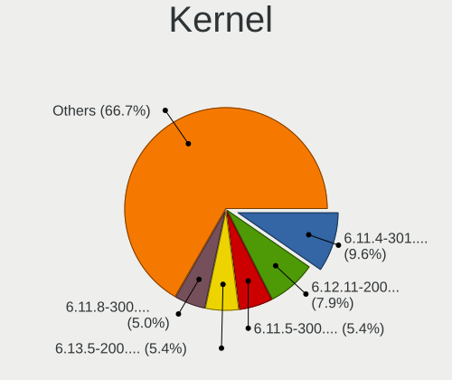

| Version                                            | Notebooks | Percent |
|----------------------------------------------------|-----------|---------|
| 6.11.4-301.fc41.x86_64                             | 182       | 9.6%    |
| 6.12.11-200.fc41.x86_64                            | 150       | 7.91%   |
| 6.11.5-300.fc41.x86_64                             | 103       | 5.43%   |
| 6.13.5-200.fc41.x86_64                             | 102       | 5.38%   |
| 6.11.8-300.fc41.x86_64                             | 95        | 5.01%   |
| 6.13.9-200.fc41.x86_64                             | 88        | 4.64%   |
| 6.11.7-300.fc41.x86_64                             | 87        | 4.59%   |
| 6.12.9-200.fc41.x86_64                             | 84        | 4.43%   |
| 6.11.10-300.fc41.x86_64                            | 83        | 4.38%   |
| 6.12.10-200.fc41.x86_64                            | 75        | 3.96%   |
| 6.12.6-200.fc41.x86_64                             | 70        | 3.69%   |
| 6.13.8-200.fc41.x86_64                             | 59        | 3.11%   |
| 6.13.6-200.fc41.x86_64                             | 58        | 3.06%   |
| 6.12.8-200.fc41.x86_64                             | 55        | 2.9%    |
| 6.11.6-300.fc41.x86_64                             | 53        | 2.8%    |
| 6.12.7-200.fc41.x86_64                             | 51        | 2.69%   |
| 6.13.10-200.fc41.x86_64                            | 43        | 2.27%   |
| 6.12.5-200.fc41.x86_64                             | 43        | 2.27%   |
| 6.13.7-200.fc41.x86_64                             | 42        | 2.22%   |
| 6.12.15-200.fc41.x86_64                            | 42        | 2.22%   |
| 6.12.4-200.fc41.x86_64                             | 39        | 2.06%   |
| 6.11.11-300.fc41.x86_64                            | 38        | 2%      |
| 6.12.13-200.fc41.x86_64                            | 37        | 1.95%   |
| 6.13.4-200.fc41.x86_64                             | 20        | 1.05%   |
| 6.13.11-200.fc41.x86_64                            | 13        | 0.69%   |
| 6.14.9-200.fc41.x86_64                             | 12        | 0.63%   |
| 6.11.0-63.fc41.x86_64                              | 10        | 0.53%   |
| 6.11.3-300.fc41.x86_64                             | 8         | 0.42%   |
| 6.13.12-200.fc41.x86_64                            | 7         | 0.37%   |
| 6.11.0-0.rc5.43.fc41.x86_64                        | 7         | 0.37%   |
| 6.14.6-200.fc41.x86_64                             | 6         | 0.32%   |
| 6.8.5-301.fc40.x86_64                              | 5         | 0.26%   |
| 6.15.9-101.fc41.x86_64                             | 5         | 0.26%   |
| 6.14.5-200.fc41.x86_64                             | 5         | 0.26%   |
| 6.11.4-300.fc41.x86_64                             | 4         | 0.21%   |
| 6.11.2-300.fc41.x86_64                             | 4         | 0.21%   |
| 6.9.0-0.rc5.20240426gitc942a0cd3603.48.fc41.x86_64 | 3         | 0.16%   |
| 6.15.5-100.fc41.x86_64                             | 3         | 0.16%   |
| 6.14.4-200.fc41.x86_64                             | 3         | 0.16%   |
| 6.13.1-200.fc41.x86_64                             | 3         | 0.16%   |

Kernel Family
-------------

Linux kernel without a distro release

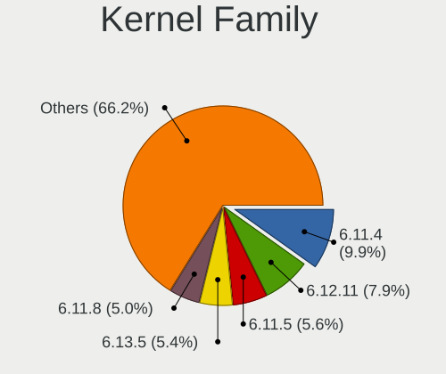

| Version | Notebooks | Percent |
|---------|-----------|---------|
| 6.11.4  | 187       | 9.87%   |
| 6.12.11 | 150       | 7.92%   |
| 6.11.5  | 107       | 5.65%   |
| 6.13.5  | 102       | 5.38%   |
| 6.11.8  | 95        | 5.01%   |
| 6.13.9  | 88        | 4.64%   |
| 6.11.7  | 87        | 4.59%   |
| 6.12.9  | 86        | 4.54%   |
| 6.11.10 | 83        | 4.38%   |
| 6.12.10 | 77        | 4.06%   |
| 6.12.6  | 70        | 3.69%   |
| 6.13.8  | 59        | 3.11%   |
| 6.13.6  | 59        | 3.11%   |
| 6.12.8  | 56        | 2.96%   |
| 6.11.6  | 55        | 2.9%    |
| 6.12.7  | 54        | 2.85%   |
| 6.12.15 | 45        | 2.37%   |
| 6.13.7  | 43        | 2.27%   |
| 6.13.10 | 43        | 2.27%   |
| 6.12.5  | 43        | 2.27%   |
| 6.12.4  | 42        | 2.22%   |
| 6.11.11 | 40        | 2.11%   |
| 6.12.13 | 37        | 1.95%   |
| 6.11.0  | 22        | 1.16%   |
| 6.13.4  | 21        | 1.11%   |
| 6.13.11 | 13        | 0.69%   |
| 6.14.9  | 12        | 0.63%   |
| 6.9.0   | 8         | 0.42%   |
| 6.11.3  | 8         | 0.42%   |
| 6.13.12 | 7         | 0.37%   |
| 6.14.6  | 6         | 0.32%   |
| 6.8.5   | 5         | 0.26%   |
| 6.15.9  | 5         | 0.26%   |
| 6.14.5  | 5         | 0.26%   |
| 6.11.9  | 4         | 0.21%   |
| 6.11.2  | 4         | 0.21%   |
| 6.10.0  | 4         | 0.21%   |
| 6.15.5  | 3         | 0.16%   |
| 6.14.4  | 3         | 0.16%   |
| 6.14.0  | 3         | 0.16%   |

Kernel Major Ver.
-----------------

Linux kernel major version

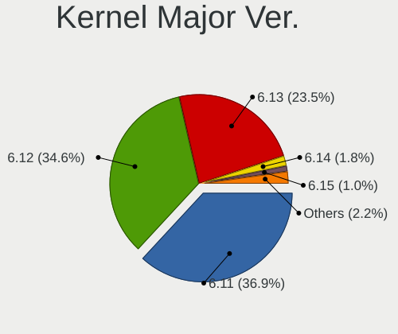

| Version | Notebooks | Percent |
|---------|-----------|---------|
| 6.11    | 683       | 36.88%  |
| 6.12    | 640       | 34.56%  |
| 6.13    | 435       | 23.49%  |
| 6.14    | 34        | 1.84%   |
| 6.15    | 19        | 1.03%   |
| 6.16    | 11        | 0.59%   |
| 6.9     | 8         | 0.43%   |
| 6.8     | 8         | 0.43%   |
| 6.17    | 7         | 0.38%   |
| 6.10    | 6         | 0.32%   |
| 6.6     | 1         | 0.05%   |

Arch
----

OS architecture (x86_64, i586, etc.)

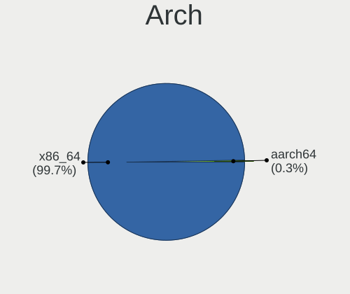

| Name    | Notebooks | Percent |
|---------|-----------|---------|
| x86_64  | 1768      | 99.72%  |
| aarch64 | 5         | 0.28%   |

DE
--

Desktop Environment

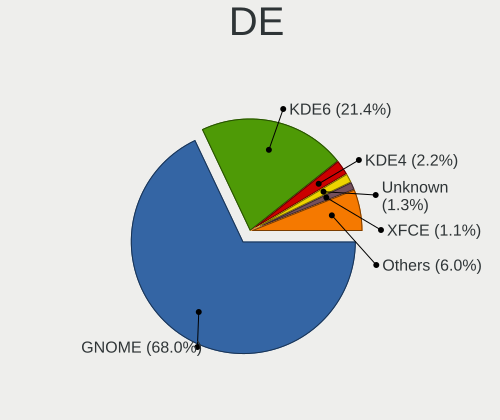

| Name            | Notebooks | Percent |
|-----------------|-----------|---------|
| GNOME           | 1209      | 67.96%  |
| KDE6            | 380       | 21.36%  |
| KDE4            | 39        | 2.19%   |
| Unknown         | 24        | 1.35%   |
| XFCE            | 20        | 1.12%   |
| GNOME Classic   | 20        | 1.12%   |
| X-Cinnamon      | 17        | 0.96%   |
| sway            | 16        | 0.9%    |
| Hyprland        | 11        | 0.62%   |
| Budgie          | 11        | 0.62%   |
| MATE            | 10        | 0.56%   |
| i3              | 6         | 0.34%   |
| COSMIC          | 6         | 0.34%   |
| Cinnamon        | 4         | 0.22%   |
| LXQt            | 3         | 0.17%   |
| LXDE            | 2         | 0.11%   |
| GNOME Flashback | 1         | 0.06%   |

Display Server
--------------

X11 or Wayland

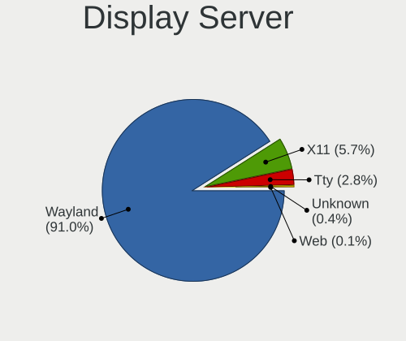

| Name    | Notebooks | Percent |
|---------|-----------|---------|
| Wayland | 1617      | 91%     |
| X11     | 102       | 5.74%   |
| Tty     | 50        | 2.81%   |
| Unknown | 7         | 0.39%   |
| Web     | 1         | 0.06%   |

Display Manager
---------------

SDDM, LightDM, etc.

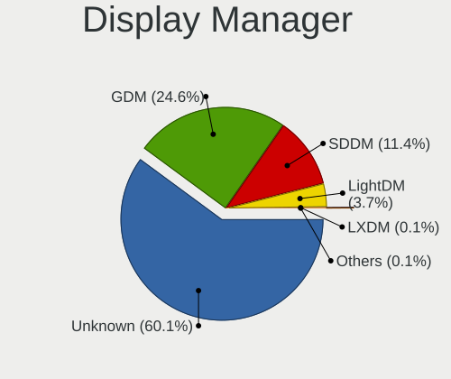

| Name    | Notebooks | Percent |
|---------|-----------|---------|
| Unknown | 1074      | 60.1%   |
| GDM     | 439       | 24.57%  |
| SDDM    | 203       | 11.36%  |
| LightDM | 67        | 3.75%   |
| LXDM    | 2         | 0.11%   |
| GREETD  | 2         | 0.11%   |

OS Lang
-------

Language

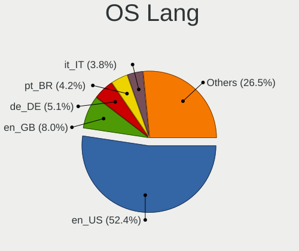

| Lang    | Notebooks | Percent |
|---------|-----------|---------|
| en_US   | 931       | 52.36%  |
| en_GB   | 143       | 8.04%   |
| de_DE   | 90        | 5.06%   |
| pt_BR   | 74        | 4.16%   |
| it_IT   | 68        | 3.82%   |
| ru_RU   | 59        | 3.32%   |
| fr_FR   | 58        | 3.26%   |
| es_ES   | 37        | 2.08%   |
| en_CA   | 28        | 1.57%   |
| pl_PL   | 25        | 1.41%   |
| en_AU   | 25        | 1.41%   |
| en_IN   | 23        | 1.29%   |
| es_MX   | 19        | 1.07%   |
| tr_TR   | 17        | 0.96%   |
| es_CL   | 9         | 0.51%   |
| Unknown | 9         | 0.51%   |
| nl_NL   | 8         | 0.45%   |
| hu_HU   | 8         | 0.45%   |
| es_AR   | 8         | 0.45%   |
| sv_SE   | 7         | 0.39%   |
| de_CH   | 7         | 0.39%   |
| zh_CN   | 6         | 0.34%   |
| es_CO   | 6         | 0.34%   |
| pt_PT   | 5         | 0.28%   |
| fr_BE   | 5         | 0.28%   |
| fi_FI   | 5         | 0.28%   |
| en_ZA   | 5         | 0.28%   |
| en_NZ   | 5         | 0.28%   |
| en_DK   | 5         | 0.28%   |
| de_AT   | 5         | 0.28%   |
| cs_CZ   | 5         | 0.28%   |
| uk_UA   | 4         | 0.22%   |
| nl_BE   | 4         | 0.22%   |
| es_VE   | 4         | 0.22%   |
| en_IE   | 4         | 0.22%   |
| zh_TW   | 3         | 0.17%   |
| gl_ES   | 3         | 0.17%   |
| fr_CH   | 3         | 0.17%   |
| fr_CA   | 3         | 0.17%   |
| es_EC   | 3         | 0.17%   |

Boot Mode
---------

EFI or BIOS

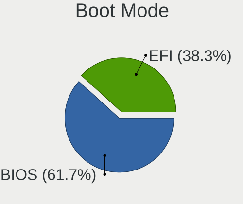

| Mode | Notebooks | Percent |
|------|-----------|---------|
| BIOS | 1102      | 61.74%  |
| EFI  | 683       | 38.26%  |

Filesystem
----------

Type of filesystem

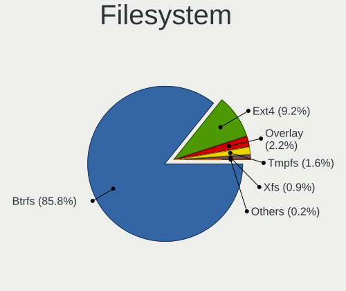

| Type    | Notebooks | Percent |
|---------|-----------|---------|
| Btrfs   | 1526      | 85.78%  |
| Ext4    | 164       | 9.22%   |
| Overlay | 40        | 2.25%   |
| Tmpfs   | 29        | 1.63%   |
| Xfs     | 16        | 0.9%    |
| Unknown | 4         | 0.22%   |

Part. scheme
------------

Scheme of partitioning

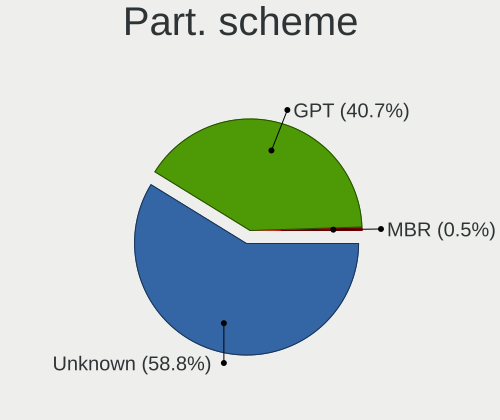

| Type    | Notebooks | Percent |
|---------|-----------|---------|
| Unknown | 1050      | 58.79%  |
| GPT     | 727       | 40.71%  |
| MBR     | 9         | 0.5%    |

Dual Boot with Linux/BSD
------------------------

Hosting more than one Linux/BSD

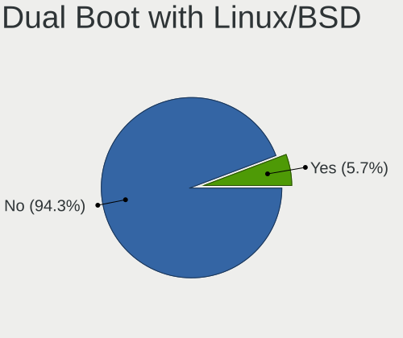

| Dual boot | Notebooks | Percent |
|-----------|-----------|---------|
| No        | 1674      | 94.26%  |
| Yes       | 102       | 5.74%   |

Dual Boot (Win)
---------------

Hosting Linux and Windows

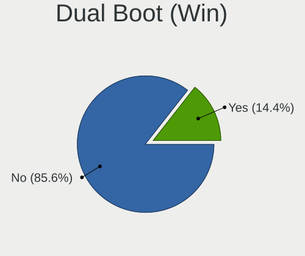

| Dual boot | Notebooks | Percent |
|-----------|-----------|---------|
| No        | 1525      | 85.58%  |
| Yes       | 257       | 14.42%  |

Board
-----

Vendor
------

Motherboard manufacturer

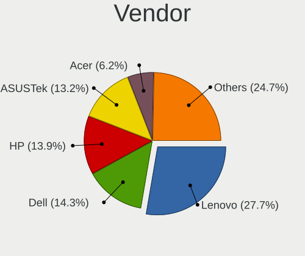

| Name                   | Notebooks | Percent |
|------------------------|-----------|---------|
| Lenovo                 | 491       | 27.69%  |
| Dell                   | 254       | 14.33%  |
| Hewlett-Packard        | 246       | 13.87%  |
| ASUSTek Computer       | 234       | 13.2%   |
| Acer                   | 110       | 6.2%    |
| Apple                  | 102       | 5.75%   |
| MSI                    | 54        | 3.05%   |
| HUAWEI                 | 29        | 1.64%   |
| Samsung Electronics    | 27        | 1.52%   |
| Framework              | 27        | 1.52%   |
| Google                 | 20        | 1.13%   |
| Unknown                | 17        | 0.96%   |
| Toshiba                | 13        | 0.73%   |
| Gigabyte Technology    | 10        | 0.56%   |
| Fujitsu                | 8         | 0.45%   |
| Chuwi                  | 8         | 0.45%   |
| Timi                   | 6         | 0.34%   |
| LG Electronics         | 6         | 0.34%   |
| Positivo               | 5         | 0.28%   |
| HONOR                  | 5         | 0.28%   |
| Alienware              | 5         | 0.28%   |
| TUXEDO                 | 4         | 0.23%   |
| Sony                   | 4         | 0.23%   |
| Intel                  | 4         | 0.23%   |
| GPU Company            | 4         | 0.23%   |
| System76               | 3         | 0.17%   |
| Razer                  | 3         | 0.17%   |
| Positivo Bahia - VAIO  | 3         | 0.17%   |
| Packard Bell           | 3         | 0.17%   |
| Notebook               | 3         | 0.17%   |
| Medion                 | 3         | 0.17%   |
| Avell High Performance | 3         | 0.17%   |
| XIAOMI                 | 2         | 0.11%   |
| win element            | 2         | 0.11%   |
| SLIMBOOK               | 2         | 0.11%   |
| Panasonic              | 2         | 0.11%   |
| Monster                | 2         | 0.11%   |
| Maibenben              | 2         | 0.11%   |
| MACHENIKE              | 2         | 0.11%   |
| Jumper                 | 2         | 0.11%   |

Model
-----

Motherboard model

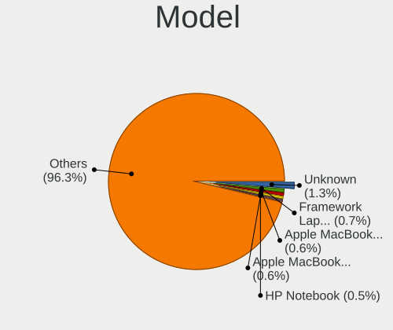

| Name                                        | Notebooks | Percent |
|---------------------------------------------|-----------|---------|
| Unknown                                     | 23        | 1.3%    |
| Framework Laptop 13 (AMD Ryzen 7040Series)  | 13        | 0.73%   |
| Apple MacBookPro9,2                         | 11        | 0.62%   |
| Apple MacBookPro8,1                         | 10        | 0.56%   |
| HP Notebook                                 | 9         | 0.51%   |
| Framework Laptop 16 (AMD Ryzen 7040 Series) | 9         | 0.51%   |
| ASUS Vivobook Go E1504FA_E1504FA            | 9         | 0.51%   |
| Apple MacBookAir7,2                         | 8         | 0.45%   |
| Apple MacBookAir6,2                         | 8         | 0.45%   |
| HUAWEI BOM-WXX9                             | 6         | 0.34%   |
| ASUS ASUS Zenbook S 14 UX5406SA_UX5406SA    | 6         | 0.34%   |
| Acer Nitro ANV15-51                         | 6         | 0.34%   |
| Lenovo IdeaPad Gaming 3 15ACH6 82K2         | 5         | 0.28%   |
| Dell XPS 16 9640                            | 5         | 0.28%   |
| Dell XPS 15 9500                            | 5         | 0.28%   |
| Apple MacBookPro14,1                        | 5         | 0.28%   |
| Apple MacBookPro11,5                        | 5         | 0.28%   |
| Apple MacBookPro11,3                        | 5         | 0.28%   |
| Apple MacBookPro11,1                        | 5         | 0.28%   |
| Acer Aspire A515-57                         | 5         | 0.28%   |
| Acer Aspire A515-45                         | 5         | 0.28%   |
| Lenovo ThinkPad T14 Gen 5 21MCCTO1WW        | 4         | 0.23%   |
| Lenovo ThinkBook 16 G6+ IMH 21LE            | 4         | 0.23%   |
| Lenovo LOQ 15IRH8 82XV                      | 4         | 0.23%   |
| Lenovo Legion 5 16IRX9 83DG                 | 4         | 0.23%   |
| HUAWEI KLVL-WXX9                            | 4         | 0.23%   |
| HUAWEI FLMH-XX                              | 4         | 0.23%   |
| HP Laptop 15-fc0xxx                         | 4         | 0.23%   |
| HP Laptop 15-bs0xx                          | 4         | 0.23%   |
| Dell XPS 15 9530                            | 4         | 0.23%   |
| Dell XPS 15 7590                            | 4         | 0.23%   |
| Dell XPS 13 9350                            | 4         | 0.23%   |
| Dell XPS 13 9310                            | 4         | 0.23%   |
| Dell Latitude E6520                         | 4         | 0.23%   |
| ASUS ROG Zephyrus G14 GA402RJ_GA402RJ       | 4         | 0.23%   |
| ASUS ASUS Zenbook S 16 UM5606WA_UM5606WA    | 4         | 0.23%   |
| ASUS ASUS Zenbook 14 UX3405MA_UX3405MA      | 4         | 0.23%   |
| Apple MacBookPro12,1                        | 4         | 0.23%   |
| Apple MacBookAir6,1                         | 4         | 0.23%   |
| Acer Aspire A315-44P                        | 4         | 0.23%   |

Model Family
------------

Motherboard model prefix

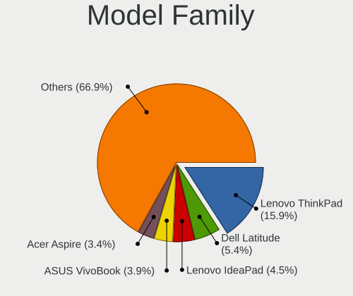

| Name               | Notebooks | Percent |
|--------------------|-----------|---------|
| Lenovo ThinkPad    | 282       | 15.91%  |
| Dell Latitude      | 95        | 5.36%   |
| Lenovo IdeaPad     | 79        | 4.46%   |
| ASUS VivoBook      | 69        | 3.89%   |
| Acer Aspire        | 61        | 3.44%   |
| ASUS ASUS          | 59        | 3.33%   |
| Dell Inspiron      | 57        | 3.21%   |
| Dell XPS           | 56        | 3.16%   |
| HP Laptop          | 46        | 2.59%   |
| HP Pavilion        | 40        | 2.26%   |
| Lenovo Legion      | 38        | 2.14%   |
| HP ProBook         | 37        | 2.09%   |
| HP EliteBook       | 34        | 1.92%   |
| ASUS ROG           | 33        | 1.86%   |
| Framework Laptop   | 27        | 1.52%   |
| Lenovo ThinkBook   | 24        | 1.35%   |
| Dell Precision     | 23        | 1.3%    |
| Acer Nitro         | 23        | 1.3%    |
| Unknown            | 23        | 1.3%    |
| Apple MacBookPro11 | 18        | 1.02%   |
| HP ZBook           | 17        | 0.96%   |
| ASUS Zenbook       | 16        | 0.9%    |
| Lenovo Yoga        | 15        | 0.85%   |
| HP Victus          | 15        | 0.85%   |
| Apple MacBookPro9  | 14        | 0.79%   |
| Apple MacBookPro8  | 14        | 0.79%   |
| Acer Swift         | 13        | 0.73%   |
| Toshiba Satellite  | 12        | 0.68%   |
| Lenovo LOQ         | 12        | 0.68%   |
| Apple MacBookAir6  | 12        | 0.68%   |
| HP Notebook        | 9         | 0.51%   |
| Apple MacBookAir7  | 9         | 0.51%   |
| Acer Predator      | 8         | 0.45%   |
| Lenovo V15         | 7         | 0.39%   |
| HP OMEN            | 7         | 0.39%   |
| HP ENVY            | 7         | 0.39%   |
| Fujitsu LIFEBOOK   | 7         | 0.39%   |
| Dell Vostro        | 7         | 0.39%   |
| Apple MacBookPro14 | 7         | 0.39%   |
| MSI Modern         | 6         | 0.34%   |

MFG Year
--------

Motherboard manufacture year

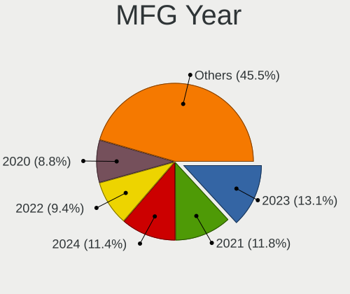

| Year    | Notebooks | Percent |
|---------|-----------|---------|
| 2023    | 233       | 13.14%  |
| 2021    | 209       | 11.79%  |
| 2024    | 202       | 11.39%  |
| 2022    | 166       | 9.36%   |
| 2020    | 156       | 8.8%    |
| 2019    | 131       | 7.39%   |
| 2018    | 116       | 6.54%   |
| 2017    | 91        | 5.13%   |
| 2012    | 78        | 4.4%    |
| 2014    | 70        | 3.95%   |
| 2016    | 69        | 3.89%   |
| 2013    | 68        | 3.84%   |
| 2015    | 58        | 3.27%   |
| 2011    | 55        | 3.1%    |
| 2010    | 21        | 1.18%   |
| 2009    | 13        | 0.73%   |
| 2008    | 12        | 0.68%   |
| 2025    | 8         | 0.45%   |
| 2006    | 8         | 0.45%   |
| 2007    | 5         | 0.28%   |
| Unknown | 4         | 0.23%   |

Form Factor
-----------

Physical design of the computer

| Name     | Notebooks | Percent |
|----------|-----------|---------|
| Notebook | 1773      | 100%    |

Secure Boot
-----------

Enabled or disabled

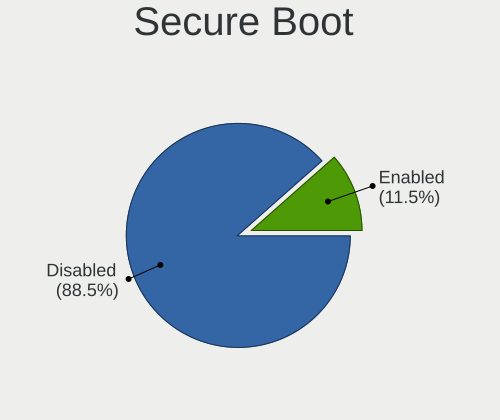

| State    | Notebooks | Percent |
|----------|-----------|---------|
| Disabled | 1575      | 88.48%  |
| Enabled  | 205       | 11.52%  |

Coreboot
--------

Have coreboot on board

| Used | Notebooks | Percent |
|------|-----------|---------|
| No   | 1748      | 98.59%  |
| Yes  | 25        | 1.41%   |

RAM Size
--------

Total RAM memory

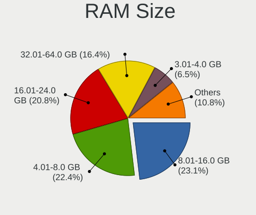

| Size in GB  | Notebooks | Percent |
|-------------|-----------|---------|
| 8.01-16.0   | 412       | 23.12%  |
| 4.01-8.0    | 399       | 22.39%  |
| 16.01-24.0  | 371       | 20.82%  |
| 32.01-64.0  | 293       | 16.44%  |
| 3.01-4.0    | 115       | 6.45%   |
| 24.01-32.0  | 86        | 4.83%   |
| 64.01-256.0 | 80        | 4.49%   |
| 1.01-2.0    | 20        | 1.12%   |
| 2.01-3.0    | 5         | 0.28%   |
| 0.51-1.0    | 1         | 0.06%   |

RAM Used
--------

Used RAM memory

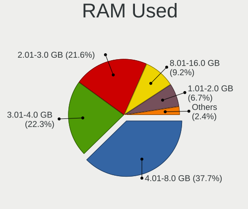

| Used GB    | Notebooks | Percent |
|------------|-----------|---------|
| 4.01-8.0   | 694       | 37.72%  |
| 3.01-4.0   | 410       | 22.28%  |
| 2.01-3.0   | 398       | 21.63%  |
| 8.01-16.0  | 169       | 9.18%   |
| 1.01-2.0   | 124       | 6.74%   |
| 16.01-24.0 | 22        | 1.2%    |
| 0.51-1.0   | 10        | 0.54%   |
| 24.01-32.0 | 8         | 0.43%   |
| 32.01-64.0 | 5         | 0.27%   |

Total Drives
------------

Number of drives on board

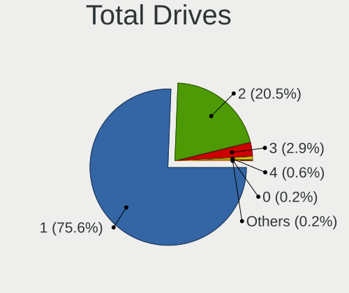

| Drives | Notebooks | Percent |
|--------|-----------|---------|
| 1      | 1350      | 75.63%  |
| 2      | 366       | 20.5%   |
| 3      | 52        | 2.91%   |
| 4      | 11        | 0.62%   |
| 0      | 3         | 0.17%   |
| 13     | 1         | 0.06%   |
| 7      | 1         | 0.06%   |
| 5      | 1         | 0.06%   |

Has CD-ROM
----------

Has CD-ROM on board

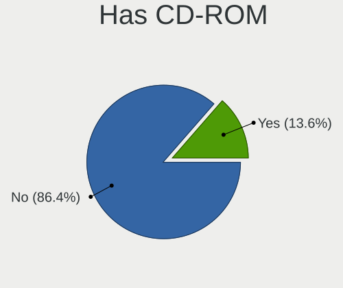

| Presented | Notebooks | Percent |
|-----------|-----------|---------|
| No        | 1533      | 86.41%  |
| Yes       | 241       | 13.59%  |

Has Ethernet
------------

Has Ethernet on board

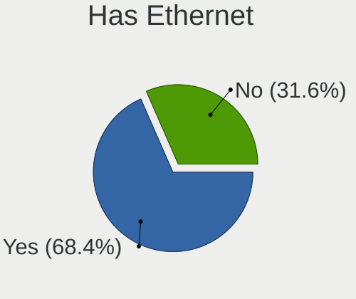

| Presented | Notebooks | Percent |
|-----------|-----------|---------|
| Yes       | 1216      | 68.43%  |
| No        | 561       | 31.57%  |

Has WiFi
--------

Has WiFi module

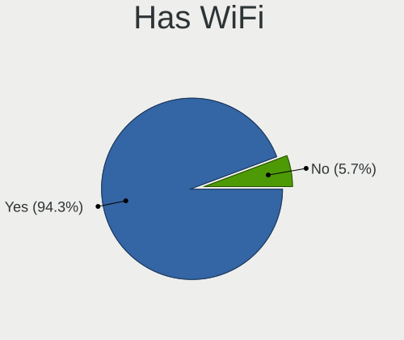

| Presented | Notebooks | Percent |
|-----------|-----------|---------|
| Yes       | 1673      | 94.31%  |
| No        | 101       | 5.69%   |

Has Bluetooth
-------------

Has Bluetooth module

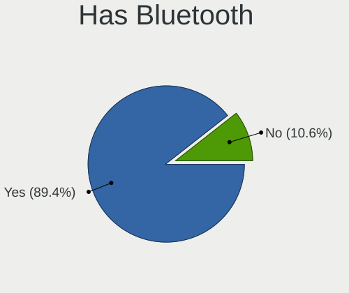

| Presented | Notebooks | Percent |
|-----------|-----------|---------|
| Yes       | 1588      | 89.41%  |
| No        | 188       | 10.59%  |

Location
--------

Country
-------

Geographic location (country)

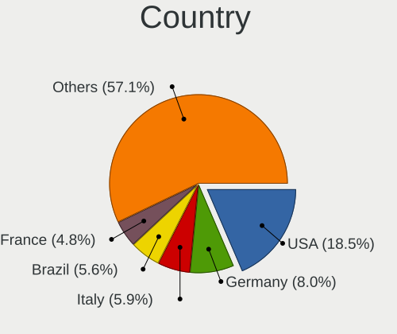

| Country      | Notebooks | Percent |
|--------------|-----------|---------|
| USA          | 330       | 18.53%  |
| Germany      | 143       | 8.03%   |
| Italy        | 105       | 5.9%    |
| Brazil       | 100       | 5.61%   |
| France       | 86        | 4.83%   |
| Russia       | 84        | 4.72%   |
| UK           | 79        | 4.44%   |
| India        | 78        | 4.38%   |
| Canada       | 62        | 3.48%   |
| Spain        | 55        | 3.09%   |
| Poland       | 41        | 2.3%    |
| Mexico       | 29        | 1.63%   |
| Turkey       | 28        | 1.57%   |
| Netherlands  | 26        | 1.46%   |
| Australia    | 26        | 1.46%   |
| Belgium      | 23        | 1.29%   |
| Switzerland  | 22        | 1.24%   |
| Sweden       | 20        | 1.12%   |
| Chile        | 19        | 1.07%   |
| Indonesia    | 16        | 0.9%    |
| Austria      | 16        | 0.9%    |
| Czechia      | 15        | 0.84%   |
| Philippines  | 14        | 0.79%   |
| Hungary      | 14        | 0.79%   |
| Romania      | 13        | 0.73%   |
| Greece       | 13        | 0.73%   |
| Egypt        | 13        | 0.73%   |
| Portugal     | 12        | 0.67%   |
| Finland      | 12        | 0.67%   |
| Colombia     | 12        | 0.67%   |
| Argentina    | 11        | 0.62%   |
| Vietnam      | 10        | 0.56%   |
| Singapore    | 10        | 0.56%   |
| Croatia      | 10        | 0.56%   |
| South Africa | 9         | 0.51%   |
| Bulgaria     | 9         | 0.51%   |
| Slovakia     | 8         | 0.45%   |
| Norway       | 8         | 0.45%   |
| Israel       | 8         | 0.45%   |
| Venezuela    | 7         | 0.39%   |

City
----

Geographic location (city)

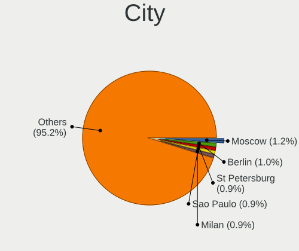

| City          | Notebooks | Percent |
|---------------|-----------|---------|
| Moscow        | 21        | 1.16%   |
| Berlin        | 18        | 0.99%   |
| St Petersburg | 16        | 0.88%   |
| Sao Paulo     | 16        | 0.88%   |
| Milan         | 16        | 0.88%   |
| Rome          | 15        | 0.83%   |
| Paris         | 13        | 0.72%   |
| Toronto       | 11        | 0.61%   |
| Delhi         | 11        | 0.61%   |
| Warsaw        | 10        | 0.55%   |
| Vienna        | 10        | 0.55%   |
| Sydney        | 10        | 0.55%   |
| Singapore     | 10        | 0.55%   |
| Mexico City   | 10        | 0.55%   |
| Hamburg       | 10        | 0.55%   |
| Istanbul      | 9         | 0.5%    |
| Bengaluru     | 9         | 0.5%    |
| Amsterdam     | 9         | 0.5%    |
| New York      | 8         | 0.44%   |
| Los Angeles   | 8         | 0.44%   |
| Zagreb        | 7         | 0.39%   |
| Seattle       | 7         | 0.39%   |
| Santiago      | 7         | 0.39%   |
| Milano        | 7         | 0.39%   |
| Melbourne     | 7         | 0.39%   |
| Helsinki      | 7         | 0.39%   |
| Hanoi         | 7         | 0.39%   |
| Zurich        | 6         | 0.33%   |
| Quezon City   | 6         | 0.33%   |
| Prague        | 6         | 0.33%   |
| Phoenix       | 6         | 0.33%   |
| Minneapolis   | 6         | 0.33%   |
| Madrid        | 6         | 0.33%   |
| London        | 6         | 0.33%   |
| Curitiba      | 6         | 0.33%   |
| Budapest      | 6         | 0.33%   |
| Bucharest     | 6         | 0.33%   |
| Brisbane      | 6         | 0.33%   |
| Stockholm     | 5         | 0.28%   |
| Sofia         | 5         | 0.28%   |

Drives
------

Drive Vendor
------------

Hard drive vendors

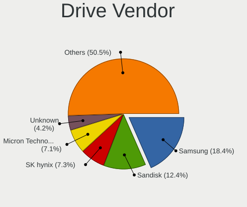

| Vendor                         | Notebooks | Drives | Percent |
|--------------------------------|-----------|--------|---------|
| Samsung Electronics            | 404       | 489    | 18.44%  |
| Sandisk                        | 272       | 305    | 12.41%  |
| SK hynix                       | 160       | 173    | 7.3%    |
| Micron Technology              | 155       | 166    | 7.07%   |
| Unknown                        | 93        | 104    | 4.24%   |
| Kingston                       | 87        | 99     | 3.97%   |
| KIOXIA                         | 81        | 90     | 3.7%    |
| WDC                            | 78        | 89     | 3.56%   |
| Intel                          | 78        | 92     | 3.56%   |
| Seagate                        | 74        | 92     | 3.38%   |
| Toshiba                        | 63        | 68     | 2.88%   |
| Apple                          | 60        | 89     | 2.74%   |
| Crucial                        | 54        | 59     | 2.46%   |
| Kingston Technology Company    | 37        | 39     | 1.69%   |
| Phison Electronics             | 34        | 37     | 1.55%   |
| Micron/Crucial Technology      | 30        | 33     | 1.37%   |
| MAXIO Technology (Hangzhou)    | 27        | 28     | 1.23%   |
| A-DATA Technology              | 25        | 26     | 1.14%   |
| Silicon Motion                 | 24        | 24     | 1.1%    |
| China                          | 23        | 24     | 1.05%   |
| ADATA Technology               | 22        | 23     | 1%      |
| HGST                           | 19        | 20     | 0.87%   |
| Shenzhen Longsys Electronics   | 15        | 15     | 0.68%   |
| Hitachi                        | 13        | 15     | 0.59%   |
| Solid State Storage Technology | 11        | 14     | 0.5%    |
| PNY                            | 11        | 11     | 0.5%    |
| Union Memory (Shenzhen)        | 10        | 10     | 0.46%   |
| Realtek Semiconductor          | 9         | 9      | 0.41%   |
| Transcend                      | 8         | 8      | 0.37%   |
| SPCC                           | 8         | 8      | 0.37%   |
| LITEON                         | 8         | 9      | 0.37%   |
| Intenso                        | 8         | 9      | 0.37%   |
| SOLIDIGM                       | 7         | 7      | 0.32%   |
| Solid State Storage            | 6         | 6      | 0.27%   |
| Patriot                        | 6         | 6      | 0.27%   |
| JMicron Technology             | 6         | 7      | 0.27%   |
| Yangtze Memory Technologies    | 5         | 7      | 0.23%   |
| Phison                         | 5         | 7      | 0.23%   |
| Lenovo                         | 5         | 5      | 0.23%   |
| Hewlett-Packard                | 5         | 7      | 0.23%   |

Drive Model
-----------

Hard drive models

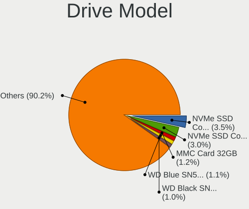

| Model                                                 | Notebooks | Percent |
|-------------------------------------------------------|-----------|---------|
| Samsung NVMe SSD Controller SM981/PM981/PM983 1TB     | 79        | 3.5%    |
| Samsung NVMe SSD Controller PM9A1/PM9A3/980PRO 1TB    | 68        | 3.02%   |
| Unknown MMC Card  32GB                                | 27        | 1.2%    |
| Sandisk WD Blue SN550 NVMe SSD 1024GB                 | 25        | 1.11%   |
| Sandisk WD Black SN750 / PC SN730 NVMe SSD 500GB      | 23        | 1.02%   |
| Unknown MMC Card  64GB                                | 21        | 0.93%   |
| MAXIO (Hangzhou) NVMe SSD Controller MAP1202 2TB      | 19        | 0.84%   |
| Kingston SA400S37480G 480GB SSD                       | 19        | 0.84%   |
| Kingston SA400S37240G 240GB SSD                       | 19        | 0.84%   |
| Samsung NVMe SSD Controller SM961/PM961/SM963 1024GB  | 18        | 0.8%    |
| Micron 2400_MTFDKBA512QFM 512GB                       | 18        | 0.8%    |
| Sandisk WD Black SN850 1TB                            | 17        | 0.75%   |
| Silicon Motion SM2263EN/SM2263XT SSD Controller 512GB | 16        | 0.71%   |
| Seagate ST1000LM035-1RK172 1TB                        | 16        | 0.71%   |
| Micron/Crucial P2 NVMe PCIe SSD 2TB                   | 16        | 0.71%   |
| Intel SSD 660P Series 512GB                           | 16        | 0.71%   |
| Samsung SSD 980 1TB                                   | 15        | 0.67%   |
| Sandisk WD PC SN560 SDDPNQE-1T00-1102 1024GB          | 14        | 0.62%   |
| Intel SSD Pro 7600p/760p/E 6100p Series 256GB         | 14        | 0.62%   |
| SK hynix SKHynix_HFS001TEJ9X115N 1024GB               | 13        | 0.58%   |
| Micron MTFDKBA1T0QFM-1BD1AABGB 1024GB                 | 13        | 0.58%   |
| Intel SSDPEKNU512GZ 512GB                             | 13        | 0.58%   |
| Unknown MMC Card  128GB                               | 12        | 0.53%   |
| Sandisk WD_BLACK SN770 2TB                            | 11        | 0.49%   |
| Samsung SSD 990 PRO 2TB                               | 11        | 0.49%   |
| Micron 2450_MTFDKBA512TFK 512GB                       | 11        | 0.49%   |
| KIOXIA KBG50ZNV512G 512GB                             | 11        | 0.49%   |
| Toshiba XG6 NVMe SSD Controller 1024GB                | 10        | 0.44%   |
| Toshiba MQ04ABF100 1TB                                | 10        | 0.44%   |
| KIOXIA KXG8AZNV1T02 LA 1024GB                         | 10        | 0.44%   |
| Apple SSD SM0128G 121GB                               | 10        | 0.44%   |
| Unknown NVMe SSD Drive 512GB                          | 9         | 0.4%    |
| SK hynix BC501 NVMe Solid State Drive 512GB           | 9         | 0.4%    |
| Samsung SSD 850 EVO 250GB                             | 9         | 0.4%    |
| Phison PS5013 E13 NVMe Controller 500GB               | 9         | 0.4%    |
| Unknown MMC Card  16GB                                | 8         | 0.35%   |
| Samsung SSD 990 PRO 4TB                               | 8         | 0.35%   |
| Micron 2450_MTFDKBA1T0TFK 1TB                         | 8         | 0.35%   |
| Kingston Company OM3PDP3 NVMe SSD 256GB               | 8         | 0.35%   |
| Kingston SA400S37960G 960GB SSD                       | 8         | 0.35%   |

HDD Vendor
----------

Hard disk drive vendors

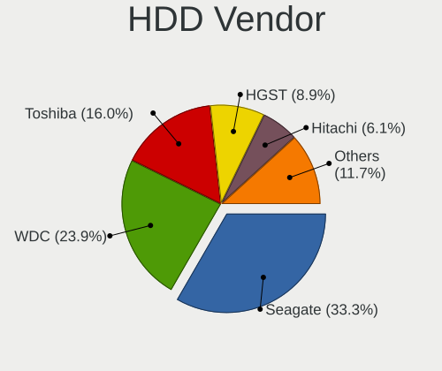

| Vendor              | Notebooks | Drives | Percent |
|---------------------|-----------|--------|---------|
| Seagate             | 71        | 79     | 33.33%  |
| WDC                 | 51        | 57     | 23.94%  |
| Toshiba             | 34        | 37     | 15.96%  |
| HGST                | 19        | 20     | 8.92%   |
| Hitachi             | 13        | 15     | 6.1%    |
| Unknown             | 5         | 5      | 2.35%   |
| JMicron Technology  | 5         | 6      | 2.35%   |
| Samsung Electronics | 3         | 3      | 1.41%   |
| Fujitsu             | 2         | 2      | 0.94%   |
| USB3.0              | 1         | 1      | 0.47%   |
| USB                 | 1         | 1      | 0.47%   |
| TO Exter            | 1         | 1      | 0.47%   |
| SSK                 | 1         | 1      | 0.47%   |
| SABRENT             | 1         | 1      | 0.47%   |
| RSH-319             | 1         | 1      | 0.47%   |
| Maxone              | 1         | 1      | 0.47%   |
| Inateck             | 1         | 1      | 0.47%   |
| HGST HTS            | 1         | 1      | 0.47%   |
| Extemal             | 1         | 1      | 0.47%   |

SSD Vendor
----------

Solid state drive vendors

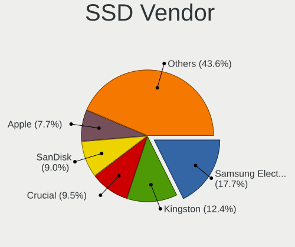

| Vendor              | Notebooks | Drives | Percent |
|---------------------|-----------|--------|---------|
| Samsung Electronics | 98        | 118    | 17.66%  |
| Kingston            | 69        | 75     | 12.43%  |
| Crucial             | 53        | 58     | 9.55%   |
| SanDisk             | 50        | 55     | 9.01%   |
| Apple               | 43        | 45     | 7.75%   |
| WDC                 | 26        | 31     | 4.68%   |
| Micron Technology   | 21        | 23     | 3.78%   |
| China               | 21        | 22     | 3.78%   |
| A-DATA Technology   | 16        | 16     | 2.88%   |
| Intel               | 15        | 19     | 2.7%    |
| PNY                 | 11        | 11     | 1.98%   |
| Transcend           | 8         | 8      | 1.44%   |
| SPCC                | 8         | 8      | 1.44%   |
| LITEON              | 8         | 9      | 1.44%   |
| SK hynix            | 7         | 7      | 1.26%   |
| Patriot             | 6         | 6      | 1.08%   |
| Intenso             | 6         | 6      | 1.08%   |
| Toshiba             | 4         | 4      | 0.72%   |
| Team                | 4         | 4      | 0.72%   |
| Plextor             | 4         | 6      | 0.72%   |
| Lexar               | 4         | 6      | 0.72%   |
| Hewlett-Packard     | 4         | 5      | 0.72%   |
| Unknown             | 4         | 4      | 0.72%   |
| SABRENT             | 3         | 3      | 0.54%   |
| OCZ                 | 3         | 3      | 0.54%   |
| Netac               | 3         | 3      | 0.54%   |
| LITEONIT            | 3         | 4      | 0.54%   |
| GOODRAM             | 3         | 3      | 0.54%   |
| Corsair             | 3         | 3      | 0.54%   |
| Wibtek              | 2         | 2      | 0.36%   |
| Seagate             | 2         | 2      | 0.36%   |
| Mushkin             | 2         | 2      | 0.36%   |
| CONSISTENT          | 2         | 3      | 0.36%   |
| Zheino              | 1         | 1      | 0.18%   |
| XrayDisk            | 1         | 1      | 0.18%   |
| Vi550               | 1         | 1      | 0.18%   |
| Verbatim            | 1         | 1      | 0.18%   |
| Timetec             | 1         | 1      | 0.18%   |
| tecmiyo             | 1         | 1      | 0.18%   |
| SSSTC               | 1         | 1      | 0.18%   |

Drive Kind
----------

HDD or SSD

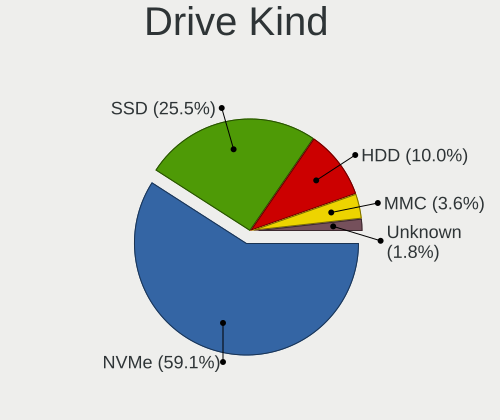

| Kind    | Notebooks | Drives | Percent |
|---------|-----------|--------|---------|
| NVMe    | 1209      | 1516   | 59.09%  |
| SSD     | 522       | 615    | 25.51%  |
| HDD     | 205       | 234    | 10.02%  |
| MMC     | 74        | 84     | 3.62%   |
| Unknown | 36        | 39     | 1.76%   |

Drive Connector
---------------

SATA, SAS, NVMe, etc.

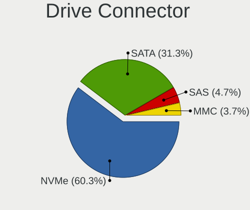

| Type | Notebooks | Drives | Percent |
|------|-----------|--------|---------|
| NVMe | 1206      | 1497   | 60.33%  |
| SATA | 626       | 781    | 31.32%  |
| SAS  | 93        | 126    | 4.65%   |
| MMC  | 74        | 84     | 3.7%    |

Drive Size
----------

Size of hard drive

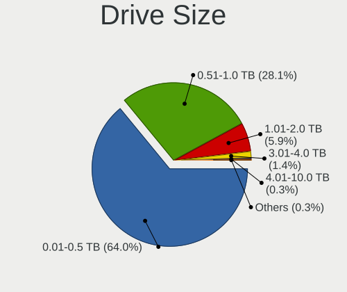

| Size in TB | Notebooks | Drives | Percent |
|------------|-----------|--------|---------|
| 0.01-0.5   | 463       | 549    | 64.04%  |
| 0.51-1.0   | 203       | 226    | 28.08%  |
| 1.01-2.0   | 43        | 50     | 5.95%   |
| 3.01-4.0   | 10        | 11     | 1.38%   |
| 4.01-10.0  | 2         | 2      | 0.28%   |
| 20.01-50.0 | 1         | 5      | 0.14%   |
| 10.01-20.0 | 1         | 6      | 0.14%   |

Space Total
-----------

Amount of disk space available on the file system

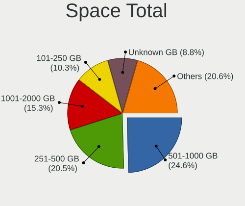

| Size in GB     | Notebooks | Percent |
|----------------|-----------|---------|
| 501-1000       | 443       | 24.57%  |
| 251-500        | 370       | 20.52%  |
| 1001-2000      | 276       | 15.31%  |
| 101-250        | 185       | 10.26%  |
| Unknown        | 158       | 8.76%   |
| 1-20           | 157       | 8.71%   |
| More than 3000 | 84        | 4.66%   |
| 51-100         | 56        | 3.11%   |
| 2001-3000      | 45        | 2.5%    |
| 21-50          | 29        | 1.61%   |

Space Used
----------

Amount of used disk space

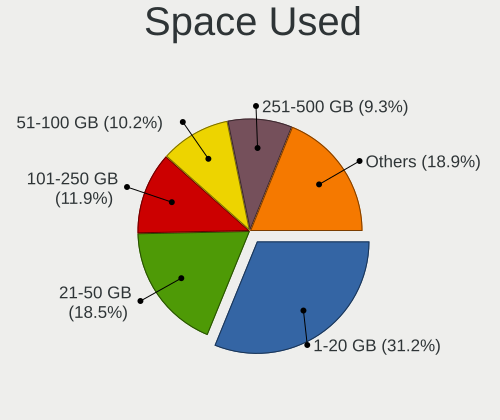

| Used GB        | Notebooks | Percent |
|----------------|-----------|---------|
| 1-20           | 571       | 31.17%  |
| 21-50          | 339       | 18.5%   |
| 101-250        | 218       | 11.9%   |
| 51-100         | 187       | 10.21%  |
| 251-500        | 171       | 9.33%   |
| Unknown        | 158       | 8.62%   |
| 501-1000       | 110       | 6%      |
| 1001-2000      | 54        | 2.95%   |
| More than 3000 | 13        | 0.71%   |
| 2001-3000      | 10        | 0.55%   |
| 0              | 1         | 0.05%   |

Malfunc. Drives
---------------

Drive models with a malfunction

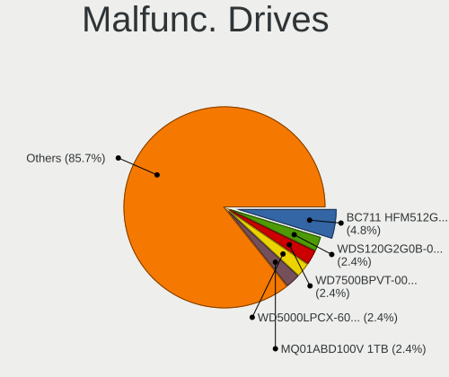

| Model                                                 | Notebooks | Drives | Percent |
|-------------------------------------------------------|-----------|--------|---------|
| SK hynix BC711 HFM512GD3JX013N 512GB                  | 2         | 2      | 4.76%   |
| WDC WDS120G2G0B-00EPW0 120GB SSD                      | 1         | 1      | 2.38%   |
| WDC WD7500BPVT-00HXZT3 752GB                          | 1         | 1      | 2.38%   |
| WDC WD5000LPCX-60VHAT0 500GB                          | 1         | 1      | 2.38%   |
| Toshiba MQ01ABD100V 1TB                               | 1         | 1      | 2.38%   |
| Toshiba MQ01ABD050 500GB                              | 1         | 1      | 2.38%   |
| Toshiba MK5065GSXF 500GB                              | 1         | 1      | 2.38%   |
| SPCC Solid State Disk 512GB                           | 1         | 1      | 2.38%   |
| SPCC Solid State Disk 120GB                           | 1         | 1      | 2.38%   |
| SK hynix BC711 HFM256GD3JX013N 256GB                  | 1         | 1      | 2.38%   |
| Silicon Motion SM2263EN/SM2263XT SSD Controller 512GB | 1         | 1      | 2.38%   |
| Seagate ST9500420ASG 500GB                            | 1         | 1      | 2.38%   |
| Seagate ST9250315AS 250GB                             | 1         | 1      | 2.38%   |
| Seagate ST500LT0 12-9WS142 500GB                      | 1         | 1      | 2.38%   |
| Seagate ST1000LM049-2GH172 1TB                        | 1         | 1      | 2.38%   |
| Seagate ST1000LM048-2E7172 1TB                        | 1         | 2      | 2.38%   |
| Seagate ST1000LM035-1RK172 1TB                        | 1         | 1      | 2.38%   |
| SanDisk SD7TB3Q-256G-1006 256GB SSD                   | 1         | 1      | 2.38%   |
| Samsung Electronics SSD 850 PRO 2TB                   | 1         | 1      | 2.38%   |
| Samsung Electronics MZVLQ1T0HBLB-00B00 1024GB         | 1         | 1      | 2.38%   |
| Samsung Electronics MZ7PD128HAFV-000H7 128GB SSD      | 1         | 1      | 2.38%   |
| Realtek Semiconductor ADATA SX6000PNP 1024GB          | 1         | 1      | 2.38%   |
| PNY 1TB SATA SSD                                      | 1         | 1      | 2.38%   |
| Patriot Burst Elite 240GB SSD                         | 1         | 1      | 2.38%   |
| Netac NVMe SSD 1TB                                    | 1         | 1      | 2.38%   |
| Micron Technology MTFDDAV256TDL-1AW1ZABHA 256GB SSD   | 1         | 1      | 2.38%   |
| Micron Technology MTFDDAK256TDL-1AW1ZABHA 256GB SSD   | 1         | 1      | 2.38%   |
| Micron Technology 1100_MTFDDAV512TBN 512GB SSD        | 1         | 1      | 2.38%   |
| LITEONIT LSS-16L6G-HP 16GB SSD                        | 1         | 2      | 2.38%   |
| Kingston SA400S37480G 480GB SSD                       | 1         | 1      | 2.38%   |
| KingDian S280 480GB SSD                               | 1         | 1      | 2.38%   |
| JMicron Technology Generic 320GB                      | 1         | 1      | 2.38%   |
| Intel SSDSCKGF256A5 SATA 256GB                        | 1         | 1      | 2.38%   |
| Intel SSDSC2KF256H6 SATA 256GB                        | 1         | 1      | 2.38%   |
| Hitachi HTS543216L9A300 160GB                         | 1         | 1      | 2.38%   |
| HGST HTS541010A9E680 1TB                              | 1         | 1      | 2.38%   |
| HGST HCC545050A7E380 500GB                            | 1         | 1      | 2.38%   |
| Crucial CT750MX300SSD1 752GB                          | 1         | 1      | 2.38%   |
| Apple SSD TS128E 121GB                                | 1         | 1      | 2.38%   |
| AMD R5M480G8 480GB SSD                                | 1         | 1      | 2.38%   |

Malfunc. Drive Vendor
---------------------

Vendors of faulty drives

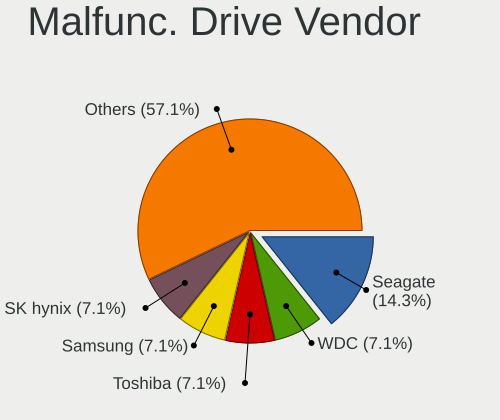

| Vendor                | Notebooks | Drives | Percent |
|-----------------------|-----------|--------|---------|
| Seagate               | 6         | 7      | 14.29%  |
| WDC                   | 3         | 3      | 7.14%   |
| Toshiba               | 3         | 3      | 7.14%   |
| SK hynix              | 3         | 3      | 7.14%   |
| Samsung Electronics   | 3         | 3      | 7.14%   |
| Micron Technology     | 3         | 3      | 7.14%   |
| SPCC                  | 2         | 2      | 4.76%   |
| Intel                 | 2         | 2      | 4.76%   |
| HGST                  | 2         | 2      | 4.76%   |
| Silicon Motion        | 1         | 1      | 2.38%   |
| SanDisk               | 1         | 1      | 2.38%   |
| Realtek Semiconductor | 1         | 1      | 2.38%   |
| PNY                   | 1         | 1      | 2.38%   |
| Patriot               | 1         | 1      | 2.38%   |
| Netac                 | 1         | 1      | 2.38%   |
| LITEONIT              | 1         | 2      | 2.38%   |
| Kingston              | 1         | 1      | 2.38%   |
| KingDian              | 1         | 1      | 2.38%   |
| JMicron Technology    | 1         | 1      | 2.38%   |
| Hitachi               | 1         | 1      | 2.38%   |
| Crucial               | 1         | 1      | 2.38%   |
| Apple                 | 1         | 1      | 2.38%   |
| AMD                   | 1         | 1      | 2.38%   |
| ADATA Technology      | 1         | 1      | 2.38%   |

Malfunc. HDD Vendor
-------------------

Vendors of faulty HDD drives

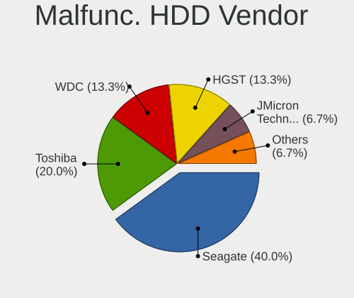

| Vendor             | Notebooks | Drives | Percent |
|--------------------|-----------|--------|---------|
| Seagate            | 6         | 7      | 40%     |
| Toshiba            | 3         | 3      | 20%     |
| WDC                | 2         | 2      | 13.33%  |
| HGST               | 2         | 2      | 13.33%  |
| JMicron Technology | 1         | 1      | 6.67%   |
| Hitachi            | 1         | 1      | 6.67%   |

Malfunc. Drive Kind
-------------------

Kinds of faulty drives

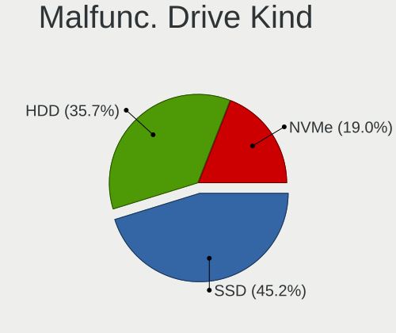

| Kind | Notebooks | Drives | Percent |
|------|-----------|--------|---------|
| SSD  | 19        | 20     | 45.24%  |
| HDD  | 15        | 16     | 35.71%  |
| NVMe | 8         | 8      | 19.05%  |

Failed Drives
-------------

Failed drive models

| Model                             | Notebooks | Drives | Percent |
|-----------------------------------|-----------|--------|---------|
| Samsung Electronics SSD 980 500GB | 1         | 1      | 100%    |

Failed Drive Vendor
-------------------

Failed drive vendors

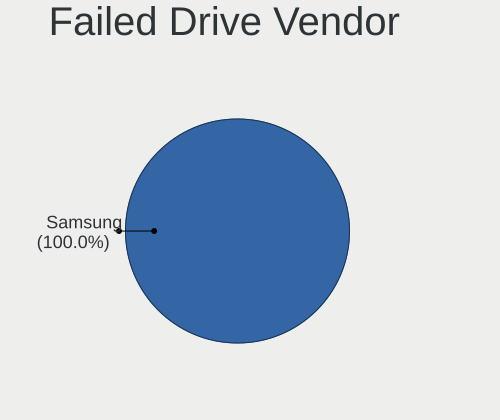

| Vendor              | Notebooks | Drives | Percent |
|---------------------|-----------|--------|---------|
| Samsung Electronics | 1         | 1      | 100%    |

Drive Status
------------

Number of failed and malfunc. drives

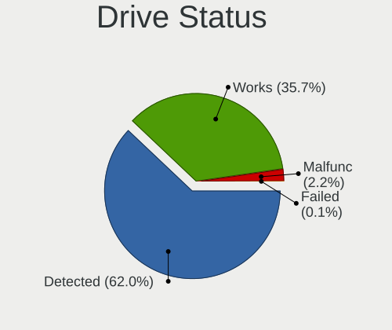

| Status   | Notebooks | Drives | Percent |
|----------|-----------|--------|---------|
| Detected | 1144      | 1569   | 62.04%  |
| Works    | 658       | 874    | 35.68%  |
| Malfunc  | 41        | 44     | 2.22%   |
| Failed   | 1         | 1      | 0.05%   |

Storage controller
------------------

Storage Vendor
--------------

Storage controller vendors

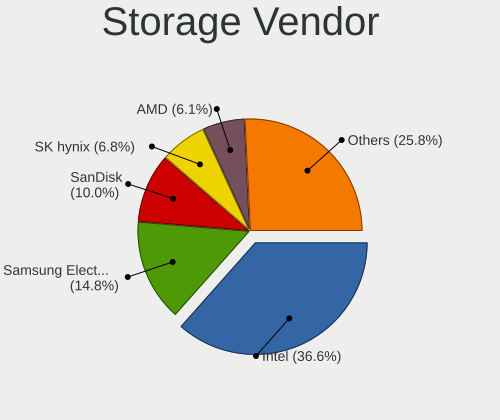

| Vendor                                  | Notebooks | Percent |
|-----------------------------------------|-----------|---------|
| Intel                                   | 824       | 36.56%  |
| Samsung Electronics                     | 333       | 14.77%  |
| SanDisk                                 | 226       | 10.03%  |
| SK hynix                                | 153       | 6.79%   |
| AMD                                     | 137       | 6.08%   |
| Micron Technology                       | 136       | 6.03%   |
| KIOXIA                                  | 81        | 3.59%   |
| Kingston Technology Company             | 55        | 2.44%   |
| Phison Electronics                      | 39        | 1.73%   |
| ADATA Technology                        | 30        | 1.33%   |
| Micron/Crucial Technology               | 29        | 1.29%   |
| Toshiba America Info Systems            | 28        | 1.24%   |
| MAXIO Technology (Hangzhou)             | 26        | 1.15%   |
| Silicon Motion                          | 23        | 1.02%   |
| Solid State Storage Technology          | 17        | 0.75%   |
| Shenzhen Longsys Electronics            | 15        | 0.67%   |
| Apple                                   | 13        | 0.58%   |
| Solidigm                                | 12        | 0.53%   |
| Nvidia                                  | 10        | 0.44%   |
| Realtek Semiconductor                   | 9         | 0.4%    |
| Marvell Technology Group                | 9         | 0.4%    |
| Union Memory (Shenzhen)                 | 8         | 0.35%   |
| Shenzhen Unionmemory Information System | 6         | 0.27%   |
| INNOGRIT                                | 6         | 0.27%   |
| Yangtze Memory Technologies             | 5         | 0.22%   |
| Lenovo                                  | 5         | 0.22%   |
| Biwin Storage Technology                | 5         | 0.22%   |
| Seagate Technology                      | 3         | 0.13%   |
| Unknown                                 | 2         | 0.09%   |
| Transcend                               | 1         | 0.04%   |
| Shenzhen Shichuangyi Electronics        | 1         | 0.04%   |
| Ramaxel Technology(Shenzhen) Limited    | 1         | 0.04%   |
| O2 Micro                                | 1         | 0.04%   |
| Netac Technology                        | 1         | 0.04%   |
| Lite-On Technology                      | 1         | 0.04%   |
| Hosin Global Electronics                | 1         | 0.04%   |
| Foxconn International                   | 1         | 0.04%   |
| ASMedia Technology                      | 1         | 0.04%   |

Storage Model
-------------

Storage controller models

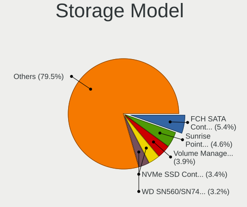

| Model                                                                          | Notebooks | Percent |
|--------------------------------------------------------------------------------|-----------|---------|
| AMD FCH SATA Controller [AHCI mode]                                            | 128       | 5.45%   |
| Intel Sunrise Point-LP SATA Controller [AHCI mode]                             | 108       | 4.6%    |
| Intel Volume Management Device NVMe RAID Controller                            | 92        | 3.92%   |
| Samsung NVMe SSD Controller SM981/PM981/PM983                                  | 80        | 3.41%   |
| SanDisk WD SN560/SN740/SN770/SN5000 NVMe SSD                                   | 74        | 3.15%   |
| Intel 82801 Mobile SATA Controller [RAID mode]                                 | 72        | 3.07%   |
| Samsung NVMe SSD Controller PM9A1/PM9A3/980PRO                                 | 67        | 2.85%   |
| Samsung NVMe SSD Controller 980 (DRAM-less)                                    | 67        | 2.85%   |
| Intel 7 Series Chipset Family 6-port SATA Controller [AHCI mode]               | 66        | 2.81%   |
| Micron 2400 NVMe SSD (DRAM-less)                                               | 49        | 2.09%   |
| Intel 6 Series/C200 Series Chipset Family 6 port Mobile SATA AHCI Controller   | 44        | 1.87%   |
| SK hynix Gold P31/BC711/PC711 NVMe Solid State Drive                           | 41        | 1.75%   |
| SK hynix Platinum P41/PC801 NVMe Solid State Drive                             | 38        | 1.62%   |
| Intel Alder Lake-P SATA AHCI Controller                                        | 36        | 1.53%   |
| Intel Cannon Lake Mobile PCH SATA AHCI Controller                              | 32        | 1.36%   |
| Samsung NVMe SSD Controller PM9B1 (DRAM-less)                                  | 30        | 1.28%   |
| Intel Wildcat Point-LP SATA Controller [AHCI Mode]                             | 30        | 1.28%   |
| Intel 8 Series SATA Controller 1 [AHCI mode]                                   | 30        | 1.28%   |
| SK hynix BC901 NVMe Solid State Drive (DRAM-less)                              | 29        | 1.23%   |
| Samsung NVMe SSD Controller PM9C1a (DRAM-less)                                 | 29        | 1.23%   |
| Micron 2450 NVMe SSD [HendrixV] (DRAM-less)                                    | 29        | 1.23%   |
| KIOXIA NVMe SSD Controller XG8                                                 | 29        | 1.23%   |
| Intel RST Volume Management Device Controller                                  | 28        | 1.19%   |
| Intel SSD 670p Series [Keystone Harbor]                                        | 26        | 1.11%   |
| Intel Comet Lake SATA AHCI Controller                                          | 26        | 1.11%   |
| SanDisk Ultra 3D / WD PC SN530, IX SN530, Blue SN550 NVMe SSD (DRAM-less)      | 25        | 1.06%   |
| Samsung NVMe SSD Controller S4LV008[Pascal]                                    | 25        | 1.06%   |
| Intel Tiger Lake-LP SATA Controller                                            | 25        | 1.06%   |
| Intel 8 Series/C220 Series Chipset Family 6-port SATA Controller 1 [AHCI mode] | 25        | 1.06%   |
| SanDisk Extreme Pro / WD Black SN750 / PC SN730 / Red SN700 NVMe SSD           | 23        | 0.98%   |
| KIOXIA NVMe SSD Controller BG4 (DRAM-less)                                     | 21        | 0.89%   |
| SanDisk WD PC SN810 / Black SN850 NVMe SSD                                     | 18        | 0.77%   |
| Sandisk WD Black SN850X NVMe SSD                                               | 18        | 0.77%   |
| Samsung NVMe SSD Controller SM961/PM961/SM963                                  | 18        | 0.77%   |
| MAXIO (Hangzhou) NVMe SSD Controller MAP1202 (DRAM-less)                       | 18        | 0.77%   |
| KIOXIA NVMe SSD Controller BG5 (DRAM-less)                                     | 18        | 0.77%   |
| Samsung S4LN058A01[SSUBX] AHCI SSD Controller (Apple slot)                     | 17        | 0.72%   |
| Intel Volume Management Device NVMe RAID Controller Intel Corporation          | 17        | 0.72%   |
| Intel Tiger Lake SATA AHCI Controller                                          | 17        | 0.72%   |
| Intel HM170/QM170 Chipset SATA Controller [AHCI Mode]                          | 17        | 0.72%   |

Storage Kind
------------

Kind of storage controller (IDE, SATA, NVMe, SAS, ...)

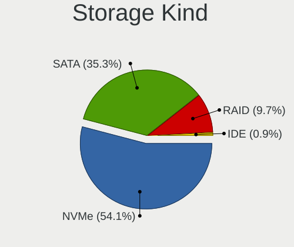

| Kind | Notebooks | Percent |
|------|-----------|---------|
| NVMe | 1195      | 54.07%  |
| SATA | 781       | 35.34%  |
| RAID | 215       | 9.73%   |
| IDE  | 19        | 0.86%   |

Processor
---------

CPU Vendor
----------

Processor vendors

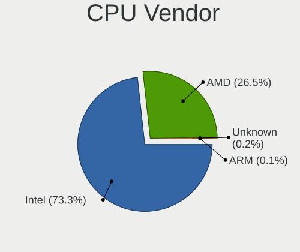

| Vendor  | Notebooks | Percent |
|---------|-----------|---------|
| Intel   | 1299      | 73.27%  |
| AMD     | 469       | 26.45%  |
| Unknown | 4         | 0.23%   |
| ARM     | 1         | 0.06%   |

CPU Model
---------

Processor models

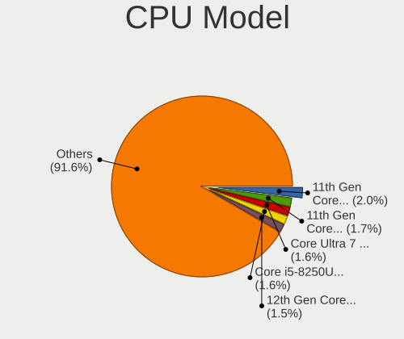

| Model                                      | Notebooks | Percent |
|--------------------------------------------|-----------|---------|
| Intel 11th Gen Core i5-1135G7 @ 2.40GHz    | 35        | 1.97%   |
| Intel 11th Gen Core i7-1165G7 @ 2.80GHz    | 30        | 1.69%   |
| Intel Core Ultra 7 155H                    | 29        | 1.63%   |
| Intel Core i5-8250U CPU @ 1.60GHz          | 28        | 1.58%   |
| Intel 12th Gen Core i7-12700H              | 27        | 1.52%   |
| AMD Ryzen 5 5500U with Radeon Graphics     | 27        | 1.52%   |
| Intel 12th Gen Core i5-1235U               | 25        | 1.41%   |
| AMD Ryzen 7 5700U with Radeon Graphics     | 23        | 1.3%    |
| Intel Core i5-8350U CPU @ 1.70GHz          | 20        | 1.13%   |
| Intel Core i5-7200U CPU @ 2.50GHz          | 20        | 1.13%   |
| AMD Ryzen 7 5800H with Radeon Graphics     | 20        | 1.13%   |
| AMD Ryzen 5 5600H with Radeon Graphics     | 20        | 1.13%   |
| Intel Core Ultra 9 185H                    | 18        | 1.01%   |
| Intel 11th Gen Core i7-11800H @ 2.30GHz    | 18        | 1.01%   |
| Intel Core i7-8750H CPU @ 2.20GHz          | 17        | 0.96%   |
| Intel Core i7-8565U CPU @ 1.80GHz          | 17        | 0.96%   |
| Intel Core i7-8550U CPU @ 1.80GHz          | 17        | 0.96%   |
| AMD Ryzen 5 7520U with Radeon Graphics     | 17        | 0.96%   |
| Intel Core i5-10210U CPU @ 1.60GHz         | 16        | 0.9%    |
| Intel 13th Gen Core i7-13700H              | 16        | 0.9%    |
| AMD Ryzen 7 7730U with Radeon Graphics     | 16        | 0.9%    |
| Intel Core i7-10750H CPU @ 2.60GHz         | 15        | 0.85%   |
| Intel Core i5-5200U CPU @ 2.20GHz          | 15        | 0.85%   |
| AMD Ryzen 7 8845HS w/ Radeon 780M Graphics | 15        | 0.85%   |
| Intel Core i9-14900HX                      | 14        | 0.79%   |
| Intel Core i7-10510U CPU @ 1.80GHz         | 14        | 0.79%   |
| Intel Core i5-6300U CPU @ 2.40GHz          | 14        | 0.79%   |
| Intel Core i5-6200U CPU @ 2.30GHz          | 14        | 0.79%   |
| Intel 11th Gen Core i7-1185G7 @ 3.00GHz    | 13        | 0.73%   |
| AMD Ryzen 7 7840HS w/ Radeon 780M Graphics | 13        | 0.73%   |
| Intel Core i7-7700HQ CPU @ 2.80GHz         | 12        | 0.68%   |
| Intel Core i7-7500U CPU @ 2.70GHz          | 12        | 0.68%   |
| Intel Core i5-3210M CPU @ 2.50GHz          | 12        | 0.68%   |
| Intel Core i5-1035G1 CPU @ 1.00GHz         | 12        | 0.68%   |
| AMD Ryzen 7 7735HS with Radeon Graphics    | 12        | 0.68%   |
| Intel Core Ultra 7 258V                    | 11        | 0.62%   |
| Intel Core i7-1065G7 CPU @ 1.30GHz         | 11        | 0.62%   |
| Intel 12th Gen Core i5-12450H              | 11        | 0.62%   |
| AMD Ryzen 7 7840U w/ Radeon 780M Graphics  | 11        | 0.62%   |
| AMD Ryzen 7 4800H with Radeon Graphics     | 11        | 0.62%   |

CPU Model Family
----------------

Processor model prefix

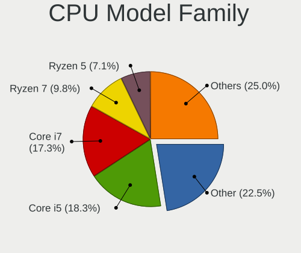

| Model                   | Notebooks | Percent |
|-------------------------|-----------|---------|
| Other                   | 399       | 22.5%   |
| Intel Core i5           | 324       | 18.27%  |
| Intel Core i7           | 307       | 17.32%  |
| AMD Ryzen 7             | 173       | 9.76%   |
| AMD Ryzen 5             | 126       | 7.11%   |
| Intel Core              | 90        | 5.08%   |
| Intel Core i3           | 68        | 3.84%   |
| Intel Celeron           | 44        | 2.48%   |
| AMD Ryzen 9             | 34        | 1.92%   |
| AMD Ryzen 7 PRO         | 34        | 1.92%   |
| Intel Core 2 Duo        | 24        | 1.35%   |
| AMD Ryzen 5 PRO         | 22        | 1.24%   |
| AMD Ryzen 3             | 21        | 1.18%   |
| Intel Core i9           | 20        | 1.13%   |
| Intel Atom              | 14        | 0.79%   |
| Intel Pentium           | 11        | 0.62%   |
| AMD A10                 | 7         | 0.39%   |
| Intel Xeon              | 6         | 0.34%   |
| Intel Pentium Silver    | 6         | 0.34%   |
| AMD A6                  | 6         | 0.34%   |
| AMD A4                  | 6         | 0.34%   |
| Intel Pentium Dual-Core | 5         | 0.28%   |
| Intel Core m3           | 4         | 0.23%   |
| AMD A8                  | 4         | 0.23%   |
| Intel Pentium Dual      | 2         | 0.11%   |
| AMD FX                  | 2         | 0.11%   |
| AMD E2                  | 2         | 0.11%   |
| AMD E                   | 2         | 0.11%   |
| AMD Athlon              | 2         | 0.11%   |
| Intel Core m7           | 1         | 0.06%   |
| Intel Celeron Dual-Core | 1         | 0.06%   |
| AMD V120                | 1         | 0.06%   |
| AMD Ryzen 3 PRO         | 1         | 0.06%   |
| AMD Athlon X2           | 1         | 0.06%   |
| AMD Athlon Neo X2       | 1         | 0.06%   |
| AMD Athlon II           | 1         | 0.06%   |
| AMD A12                 | 1         | 0.06%   |

CPU Cores
---------

Number of processor cores

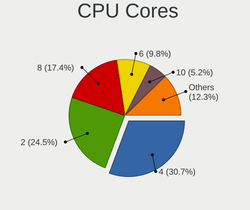

| Number | Notebooks | Percent |
|--------|-----------|---------|
| 4      | 544       | 30.68%  |
| 2      | 435       | 24.53%  |
| 8      | 309       | 17.43%  |
| 6      | 174       | 9.81%   |
| 10     | 93        | 5.25%   |
| 14     | 80        | 4.51%   |
| 16     | 55        | 3.1%    |
| 12     | 55        | 3.1%    |
| 24     | 26        | 1.47%   |
| 20     | 1         | 0.06%   |
| 1      | 1         | 0.06%   |

CPU Sockets
-----------

Number of sockets

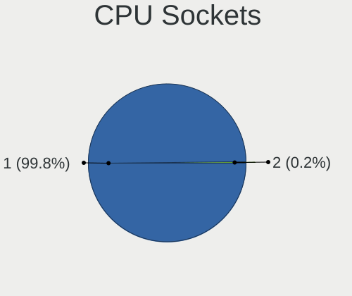

| Number | Notebooks | Percent |
|--------|-----------|---------|
| 1      | 1770      | 99.83%  |
| 2      | 3         | 0.17%   |

CPU Threads
-----------

Threads per core (Hyper-Threading)

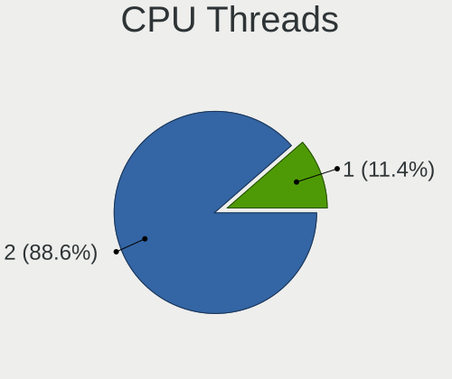

| Number | Notebooks | Percent |
|--------|-----------|---------|
| 2      | 1573      | 88.57%  |
| 1      | 203       | 11.43%  |

CPU Op-Modes
------------

CPU Operation Modes (32-bit, 64-bit)

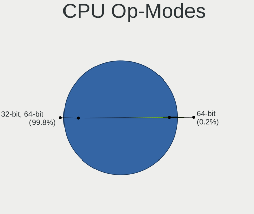

| Op mode        | Notebooks | Percent |
|----------------|-----------|---------|
| 32-bit, 64-bit | 1769      | 99.77%  |
| 64-bit         | 4         | 0.23%   |

CPU Microcode
-------------

Microcode number

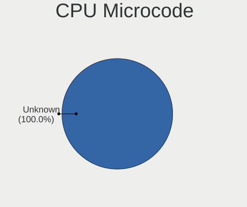

| Number  | Notebooks | Percent |
|---------|-----------|---------|
| Unknown | 1773      | 100%    |

CPU Microarch
-------------

Microarchitecture

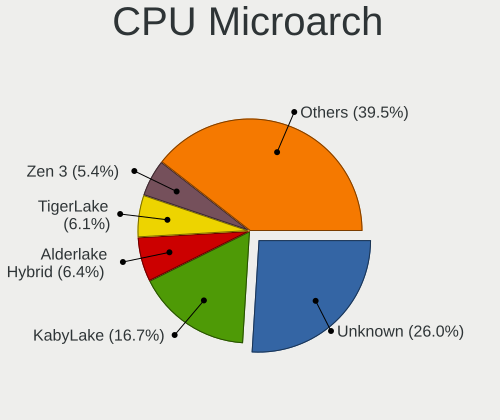

| Name               | Notebooks | Percent |
|--------------------|-----------|---------|
| Unknown            | 461       | 25.99%  |
| KabyLake           | 296       | 16.69%  |
| Alderlake Hybrid   | 114       | 6.43%   |
| TigerLake          | 108       | 6.09%   |
| Zen 3              | 95        | 5.36%   |
| Haswell            | 92        | 5.19%   |
| Skylake            | 74        | 4.17%   |
| IvyBridge          | 72        | 4.06%   |
| SandyBridge        | 54        | 3.04%   |
| Broadwell          | 47        | 2.65%   |
| IceLake            | 40        | 2.25%   |
| CometLake          | 40        | 2.25%   |
| Meteorlake Hybrid  | 39        | 2.2%    |
| Zen 2              | 36        | 2.03%   |
| Silvermont         | 35        | 1.97%   |
| Zen+               | 33        | 1.86%   |
| Penryn             | 25        | 1.41%   |
| Goldmont plus      | 16        | 0.9%    |
| Westmere           | 13        | 0.73%   |
| Zen                | 11        | 0.62%   |
| Lunarlake Hybrid   | 11        | 0.62%   |
| Puma               | 7         | 0.39%   |
| Piledriver         | 7         | 0.39%   |
| Goldmont           | 7         | 0.39%   |
| Excavator          | 7         | 0.39%   |
| Core               | 7         | 0.39%   |
| Gracemont          | 4         | 0.23%   |
| Tremont            | 3         | 0.17%   |
| Steamroller        | 3         | 0.17%   |
| Jaguar             | 3         | 0.17%   |
| Bobcat             | 3         | 0.17%   |
| Nehalem            | 2         | 0.11%   |
| K10 Llano          | 2         | 0.11%   |
| K10                | 2         | 0.11%   |
| Bonnell            | 2         | 0.11%   |
| K8 Hammer          | 1         | 0.06%   |
| K8 & K10 hybrid    | 1         | 0.06%   |
| ArrowLake-H Hybrid | 1         | 0.06%   |

Graphics
--------

GPU Vendor
----------

Vendors of graphics cards

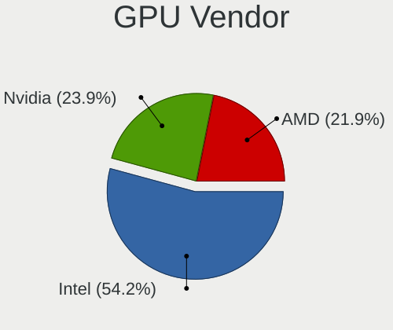

| Vendor | Notebooks | Percent |
|--------|-----------|---------|
| Intel  | 1245      | 54.22%  |
| Nvidia | 549       | 23.91%  |
| AMD    | 502       | 21.86%  |

GPU Model
---------

Graphics card models

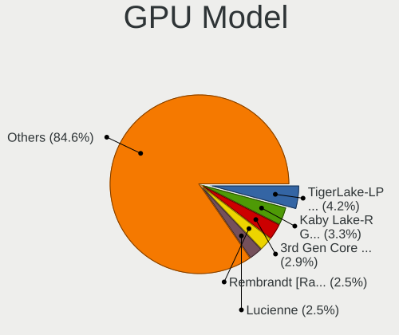

| Model                                                                     | Notebooks | Percent |
|---------------------------------------------------------------------------|-----------|---------|
| Intel TigerLake-LP GT2 [Iris Xe Graphics]                                 | 98        | 4.2%    |
| Intel Kaby Lake-R GT2 [UHD Graphics 620]                                  | 76        | 3.26%   |
| Intel 3rd Gen Core processor Graphics Controller                          | 68        | 2.92%   |
| AMD Rembrandt [Radeon 680M]                                               | 59        | 2.53%   |
| AMD Lucienne                                                              | 58        | 2.49%   |
| Intel Meteor Lake-P [Intel Arc Graphics]                                  | 55        | 2.36%   |
| Intel Raptor Lake-P [Iris Xe Graphics]                                    | 54        | 2.32%   |
| Intel Alder Lake-P GT2 [Iris Xe Graphics]                                 | 54        | 2.32%   |
| AMD Cezanne [Radeon Vega Series / Radeon Vega Mobile Series]              | 54        | 2.32%   |
| Intel 2nd Generation Core Processor Family Integrated Graphics Controller | 51        | 2.19%   |
| AMD Phoenix1                                                              | 50        | 2.14%   |
| Intel Skylake-U GT2 [HD Graphics 520]                                     | 49        | 2.1%    |
| Intel Kaby Lake-U GT2 [HD Graphics 620]                                   | 48        | 2.06%   |
| Intel Haswell-ULT Integrated Graphics Controller                          | 47        | 2.02%   |
| Intel CometLake-U GT2 [UHD Graphics]                                      | 46        | 1.97%   |
| Intel CoffeeLake-H GT2 [UHD Graphics 630]                                 | 44        | 1.89%   |
| Intel WhiskeyLake-U GT2 [UHD Graphics 620]                                | 42        | 1.8%    |
| Nvidia AD107M [GeForce RTX 4060 Max-Q / Mobile]                           | 41        | 1.76%   |
| AMD Renoir [Radeon Vega Series / Radeon Vega Mobile Series]               | 36        | 1.54%   |
| AMD HawkPoint1                                                            | 36        | 1.54%   |
| Nvidia AD106M [GeForce RTX 4070 Max-Q / Mobile]                           | 35        | 1.5%    |
| Intel CometLake-H GT2 [UHD Graphics]                                      | 35        | 1.5%    |
| Nvidia GA106M [GeForce RTX 3060 Mobile / Max-Q]                           | 34        | 1.46%   |
| AMD Picasso/Raven 2 [Radeon Vega Series / Radeon Vega Mobile Series]      | 34        | 1.46%   |
| Intel Broadwell-U GT2 [HD Graphics 5500]                                  | 33        | 1.42%   |
| Intel Alder Lake-UP3 GT2 [Iris Xe Graphics]                               | 33        | 1.42%   |
| AMD Barcelo                                                               | 33        | 1.42%   |
| Nvidia GA107M [GeForce RTX 3050 Mobile]                                   | 32        | 1.37%   |
| Intel Raptor Lake-S UHD Graphics                                          | 28        | 1.2%    |
| Nvidia TU117M [GeForce GTX 1650 Mobile / Max-Q]                           | 27        | 1.16%   |
| Nvidia AD107M [GeForce RTX 4050 Max-Q / Mobile]                           | 26        | 1.11%   |
| Intel TigerLake-H GT1 [UHD Graphics]                                      | 25        | 1.07%   |
| Intel 4th Gen Core Processor Integrated Graphics Controller               | 25        | 1.07%   |
| Intel Atom Processor Z36xxx/Z37xxx Series Graphics & Display              | 24        | 1.03%   |
| Intel Raptor Lake-P [UHD Graphics]                                        | 23        | 0.99%   |
| AMD Mendocino [Radeon 610M]                                               | 21        | 0.9%    |
| Intel Alder Lake-P GT1 [UHD Graphics]                                     | 20        | 0.86%   |
| Nvidia GA107M [GeForce RTX 3050 Ti Mobile]                                | 18        | 0.77%   |
| Intel Kaby Lake-H GT2 [HD Graphics 630]                                   | 17        | 0.73%   |
| Intel Iris Plus Graphics G1 (Ice Lake)                                    | 17        | 0.73%   |

GPU Combo
---------

Combinations of graphics cards

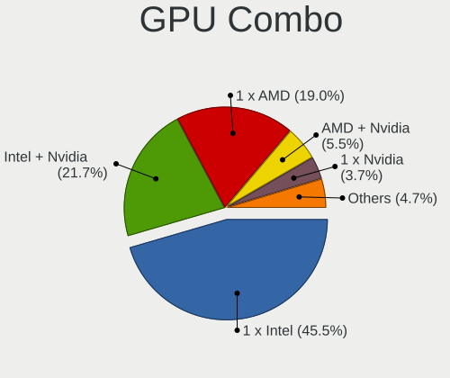

| Name           | Notebooks | Percent |
|----------------|-----------|---------|
| 1 x Intel      | 807       | 45.49%  |
| Intel + Nvidia | 385       | 21.7%   |
| 1 x AMD        | 337       | 19%     |
| AMD + Nvidia   | 97        | 5.47%   |
| 1 x Nvidia     | 65        | 3.66%   |
| Intel + AMD    | 43        | 2.42%   |
| 2 x AMD        | 25        | 1.41%   |
| Other          | 8         | 0.45%   |
| 2 x Intel      | 6         | 0.34%   |
| 2 x Nvidia     | 1         | 0.06%   |

GPU Driver
----------

Free vs proprietary

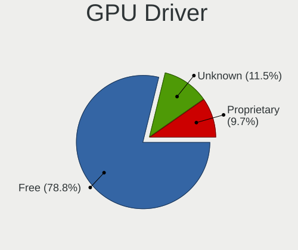

| Driver      | Notebooks | Percent |
|-------------|-----------|---------|
| Free        | 1404      | 78.83%  |
| Unknown     | 204       | 11.45%  |
| Proprietary | 173       | 9.71%   |

GPU Memory
----------

Total video memory

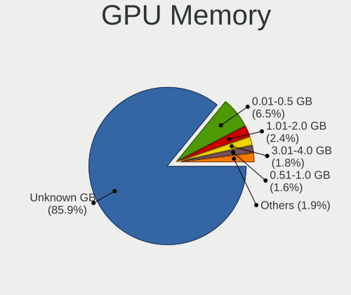

| Size in GB | Notebooks | Percent |
|------------|-----------|---------|
| Unknown    | 1529      | 85.9%   |
| 0.01-0.5   | 115       | 6.46%   |
| 1.01-2.0   | 42        | 2.36%   |
| 3.01-4.0   | 32        | 1.8%    |
| 0.51-1.0   | 28        | 1.57%   |
| 7.01-8.0   | 23        | 1.29%   |
| 5.01-6.0   | 10        | 0.56%   |
| 8.01-16.0  | 1         | 0.06%   |

Monitor
-------

Monitor Vendor
--------------

Monitor vendors

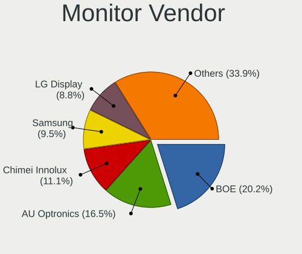

| Vendor                  | Notebooks | Percent |
|-------------------------|-----------|---------|
| BOE                     | 425       | 20.16%  |
| AU Optronics            | 347       | 16.46%  |
| Chimei Innolux          | 235       | 11.15%  |
| Samsung Electronics     | 200       | 9.49%   |
| LG Display              | 186       | 8.82%   |
| Apple                   | 95        | 4.51%   |
| Dell                    | 71        | 3.37%   |
| Lenovo                  | 68        | 3.23%   |
| Sharp                   | 58        | 2.75%   |
| Goldstar                | 56        | 2.66%   |
| PANDA                   | 33        | 1.57%   |
| CSO                     | 28        | 1.33%   |
| Hewlett-Packard         | 26        | 1.23%   |
| CSOT                    | 24        | 1.14%   |
| AOC                     | 19        | 0.9%    |
| InfoVision              | 18        | 0.85%   |
| BenQ                    | 17        | 0.81%   |
| Acer                    | 17        | 0.81%   |
| Philips                 | 15        | 0.71%   |
| ASUSTek Computer        | 15        | 0.71%   |
| Chi Mei Optoelectronics | 14        | 0.66%   |
| TMX                     | 13        | 0.62%   |
| MSI                     | 9         | 0.43%   |
| Iiyama                  | 9         | 0.43%   |
| CSW                     | 9         | 0.43%   |
| Sony                    | 7         | 0.33%   |
| HKC                     | 7         | 0.33%   |
| Gigabyte Technology     | 7         | 0.33%   |
| ViewSonic               | 5         | 0.24%   |
| Vizio                   | 4         | 0.19%   |
| Panasonic               | 4         | 0.19%   |
| EDO                     | 4         | 0.19%   |
| Ancor Communications    | 4         | 0.19%   |
| Mi                      | 3         | 0.14%   |
| CPT                     | 3         | 0.14%   |
| TMA                     | 2         | 0.09%   |
| Sceptre Tech            | 2         | 0.09%   |
| ONN                     | 2         | 0.09%   |
| LG Philips              | 2         | 0.09%   |
| JDI                     | 2         | 0.09%   |

Monitor Model
-------------

Monitor models

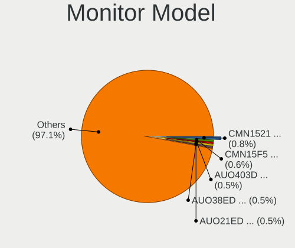

| Model                                                                 | Notebooks | Percent |
|-----------------------------------------------------------------------|-----------|---------|
| Chimei Innolux LCD Monitor CMN1521 1920x1080 344x193mm 15.5-inch      | 17        | 0.79%   |
| Chimei Innolux LCD Monitor CMN15F5 1920x1080 344x193mm 15.5-inch      | 12        | 0.56%   |
| AU Optronics LCD Monitor AUO403D 1920x1080 309x174mm 14.0-inch        | 11        | 0.51%   |
| AU Optronics LCD Monitor AUO38ED 1920x1080 344x193mm 15.5-inch        | 11        | 0.51%   |
| AU Optronics LCD Monitor AUO21ED 1920x1080 344x193mm 15.5-inch        | 11        | 0.51%   |
| Samsung Electronics LCD Monitor SDC419D 2880x1800 302x189mm 14.0-inch | 10        | 0.47%   |
| PANDA LCD Monitor NCP004D 1920x1080 344x194mm 15.5-inch               | 10        | 0.47%   |
| Chimei Innolux LCD Monitor CMN15E7 1920x1080 344x193mm 15.5-inch      | 10        | 0.47%   |
| BOE LCD Monitor BOE0872 1920x1080 344x194mm 15.5-inch                 | 10        | 0.47%   |
| AU Optronics LCD Monitor AUOAF90 1920x1080 344x193mm 15.5-inch        | 10        | 0.47%   |
| Apple Color LCD APP9CF0 1440x900 290x180mm 13.4-inch                  | 10        | 0.47%   |
| Chimei Innolux LCD Monitor CMN14D4 1920x1080 309x173mm 13.9-inch      | 9         | 0.42%   |
| BOE LCD Monitor BOE0BC9 2560x1600 345x215mm 16.0-inch                 | 9         | 0.42%   |
| Apple LCD Monitor APP9CC5 1280x800 286x179mm 13.3-inch                | 9         | 0.42%   |
| LG Display LCD Monitor LGD046F 1920x1080 344x194mm 15.5-inch          | 8         | 0.37%   |
| AU Optronics LCD Monitor AUO71EC 1366x768 344x193mm 15.5-inch         | 8         | 0.37%   |
| Apple Color LCD APP9CC7 1280x800 286x179mm 13.3-inch                  | 8         | 0.37%   |
| Samsung Electronics LCD Monitor SDC419F 2880x1800 302x189mm 14.0-inch | 7         | 0.33%   |
| Samsung Electronics LCD Monitor SDC4188 2880x1800 312x195mm 14.5-inch | 7         | 0.33%   |
| Samsung Electronics LCD Monitor SDC4178 3200x2000 344x215mm 16.0-inch | 7         | 0.33%   |
| Chimei Innolux LCD Monitor CMN15E8 1920x1080 344x193mm 15.5-inch      | 7         | 0.33%   |
| Chimei Innolux LCD Monitor CMN14E5 1920x1080 309x173mm 13.9-inch      | 7         | 0.33%   |
| BOE NE135A1M-NY1 BOE0CB4 2880x1920 285x190mm 13.5-inch                | 7         | 0.33%   |
| BOE LCD Monitor BOE0BCA 2256x1504 285x190mm 13.5-inch                 | 7         | 0.33%   |
| BOE LCD Monitor BOE0812 1920x1080 344x194mm 15.5-inch                 | 7         | 0.33%   |
| Samsung Electronics LCD Monitor SDC4180 2880x1620 344x194mm 15.5-inch | 6         | 0.28%   |
| Samsung Electronics LCD Monitor SDC4171 2880x1800 302x189mm 14.0-inch | 6         | 0.28%   |
| Samsung Electronics LCD Monitor SDC4161 1920x1080 344x194mm 15.5-inch | 6         | 0.28%   |
| Lenovo LCD Monitor LEN40BA 1920x1080 344x194mm 15.5-inch              | 6         | 0.28%   |
| Chimei Innolux LCD Monitor CMN14C9 1920x1080 309x173mm 13.9-inch      | 6         | 0.28%   |
| BOE LCD Monitor BOE0C02 1920x1080 344x194mm 15.5-inch                 | 6         | 0.28%   |
| BOE LCD Monitor BOE0687 1920x1080 344x193mm 15.5-inch                 | 6         | 0.28%   |
| AU Optronics LCD Monitor AUOD291 1920x1200 301x188mm 14.0-inch        | 6         | 0.28%   |
| Apple Color LCD APP9CDF 1440x900 286x179mm 13.3-inch                  | 6         | 0.28%   |
| Samsung Electronics LCD Monitor SEC544B 1600x900 382x214mm 17.2-inch  | 5         | 0.23%   |
| LG Display LCD Monitor LGD0563 1920x1080 344x194mm 15.5-inch          | 5         | 0.23%   |
| Lenovo LCD Monitor LEN40A9 1920x1080 309x173mm 13.9-inch              | 5         | 0.23%   |
| Chimei Innolux LCD Monitor CMN1735 1920x1080 381x214mm 17.2-inch      | 5         | 0.23%   |
| Chimei Innolux LCD Monitor CMN1614 1920x1200 344x215mm 16.0-inch      | 5         | 0.23%   |
| Chimei Innolux LCD Monitor CMN153B 1920x1080 344x193mm 15.5-inch      | 5         | 0.23%   |

Monitor Resolution
------------------

Monitor screen resolution

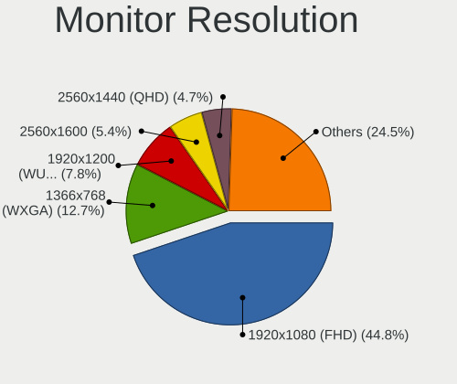

| Resolution         | Notebooks | Percent |
|--------------------|-----------|---------|
| 1920x1080 (FHD)    | 901       | 44.85%  |
| 1366x768 (WXGA)    | 255       | 12.69%  |
| 1920x1200 (WUXGA)  | 157       | 7.81%   |
| 2560x1600          | 109       | 5.43%   |
| 2560x1440 (QHD)    | 95        | 4.73%   |
| 3840x2160 (4K)     | 88        | 4.38%   |
| 2880x1800          | 83        | 4.13%   |
| 1600x900 (HD+)     | 51        | 2.54%   |
| 1440x900 (WXGA+)   | 33        | 1.64%   |
| 1280x800 (WXGA)    | 32        | 1.59%   |
| 3440x1440          | 25        | 1.24%   |
| 3200x2000          | 23        | 1.14%   |
| 3840x2400          | 21        | 1.05%   |
| Unknown            | 14        | 0.7%    |
| 2256x1504          | 12        | 0.6%    |
| 2240x1400          | 11        | 0.55%   |
| 1680x1050 (WSXGA+) | 11        | 0.55%   |
| 2560x1080          | 10        | 0.5%    |
| 2160x1440          | 10        | 0.5%    |
| 2880x1920          | 9         | 0.45%   |
| 2880x1620          | 8         | 0.4%    |
| 3072x1920          | 7         | 0.35%   |
| 3840x1100          | 5         | 0.25%   |
| 3456x2160          | 4         | 0.2%    |
| 3200x1800 (QHD+)   | 4         | 0.2%    |
| 3000x2000          | 4         | 0.2%    |
| 3840x1080          | 3         | 0.15%   |
| 2560x2880          | 2         | 0.1%    |
| 2304x1440          | 2         | 0.1%    |
| 2160x1350          | 2         | 0.1%    |
| 1360x768           | 2         | 0.1%    |
| 1280x1024 (SXGA)   | 2         | 0.1%    |
| 1024x768 (XGA)     | 2         | 0.1%    |
| 800x1280           | 1         | 0.05%   |
| 3840x1600          | 1         | 0.05%   |
| 2944x1840          | 1         | 0.05%   |
| 2520x1680          | 1         | 0.05%   |
| 2400x1600          | 1         | 0.05%   |
| 2048x1280          | 1         | 0.05%   |
| 1920x550           | 1         | 0.05%   |

Monitor Diagonal
----------------

Diagonal size in inches

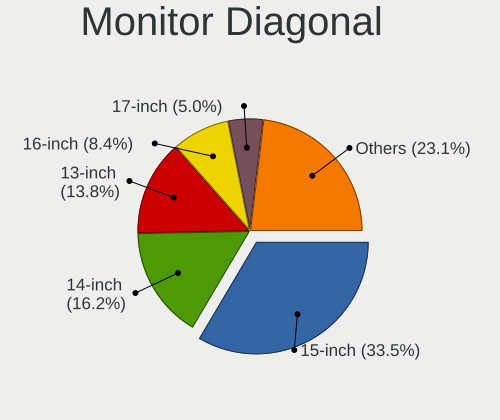

| Inches  | Notebooks | Percent |
|---------|-----------|---------|
| 15      | 704       | 33.51%  |
| 14      | 340       | 16.18%  |
| 13      | 290       | 13.8%   |
| 16      | 176       | 8.38%   |
| 17      | 106       | 5.05%   |
| 27      | 101       | 4.81%   |
| 24      | 62        | 2.95%   |
| 23      | 46        | 2.19%   |
| 12      | 38        | 1.81%   |
| 31      | 37        | 1.76%   |
| 21      | 36        | 1.71%   |
| 34      | 27        | 1.29%   |
| 11      | 24        | 1.14%   |
| Unknown | 20        | 0.95%   |
| 18      | 14        | 0.67%   |
| 32      | 6         | 0.29%   |
| 26      | 6         | 0.29%   |
| 20      | 6         | 0.29%   |
| 84      | 5         | 0.24%   |
| 72      | 5         | 0.24%   |
| 22      | 5         | 0.24%   |
| 40      | 4         | 0.19%   |
| 25      | 4         | 0.19%   |
| 63      | 3         | 0.14%   |
| 54      | 3         | 0.14%   |
| 19      | 3         | 0.14%   |
| 58      | 2         | 0.1%    |
| 48      | 2         | 0.1%    |
| 43      | 2         | 0.1%    |
| 41      | 2         | 0.1%    |
| 38      | 2         | 0.1%    |
| 36      | 2         | 0.1%    |
| 35      | 2         | 0.1%    |
| 10      | 2         | 0.1%    |
| 74      | 1         | 0.05%   |
| 69      | 1         | 0.05%   |
| 65      | 1         | 0.05%   |
| 57      | 1         | 0.05%   |
| 52      | 1         | 0.05%   |
| 49      | 1         | 0.05%   |

Monitor Width
-------------

Physical width

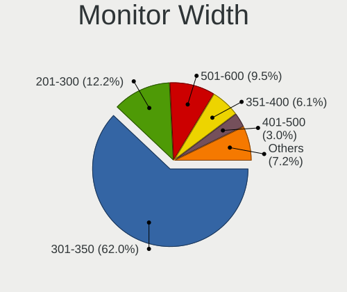

| Width in mm | Notebooks | Percent |
|-------------|-----------|---------|
| 301-350     | 1292      | 62.03%  |
| 201-300     | 254       | 12.19%  |
| 501-600     | 197       | 9.46%   |
| 351-400     | 127       | 6.1%    |
| 401-500     | 63        | 3.02%   |
| 601-700     | 51        | 2.45%   |
| 701-800     | 34        | 1.63%   |
| Unknown     | 20        | 0.96%   |
| 1001-1500   | 15        | 0.72%   |
| 1501-2000   | 12        | 0.58%   |
| 801-900     | 10        | 0.48%   |
| 901-1000    | 6         | 0.29%   |
| 101-200     | 1         | 0.05%   |
| 1-100       | 1         | 0.05%   |

Aspect Ratio
------------

Proportional relationship between the width and the height

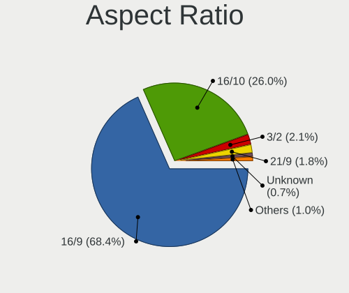

| Ratio   | Notebooks | Percent |
|---------|-----------|---------|
| 16/9    | 1288      | 68.4%   |
| 16/10   | 490       | 26.02%  |
| 3/2     | 40        | 2.12%   |
| 21/9    | 33        | 1.75%   |
| Unknown | 14        | 0.74%   |
| 3.40    | 5         | 0.27%   |
| 32/9    | 4         | 0.21%   |
| 4/3     | 3         | 0.16%   |
| 5/4     | 2         | 0.11%   |
| 0.89    | 2         | 0.11%   |
| 0.67    | 1         | 0.05%   |
| 0.62    | 1         | 0.05%   |

Monitor Area
------------

Area in inch²

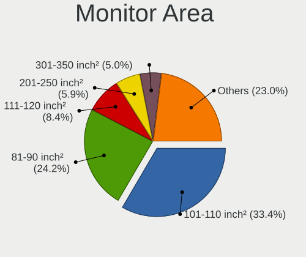

| Area in inch² | Notebooks | Percent |
|----------------|-----------|---------|
| 101-110        | 704       | 33.43%  |
| 81-90          | 510       | 24.22%  |
| 111-120        | 177       | 8.4%    |
| 201-250        | 124       | 5.89%   |
| 71-80          | 106       | 5.03%   |
| 301-350        | 106       | 5.03%   |
| 121-130        | 100       | 4.75%   |
| 351-500        | 72        | 3.42%   |
| 61-70          | 37        | 1.76%   |
| 51-60          | 29        | 1.38%   |
| 251-300        | 25        | 1.19%   |
| More than 1000 | 23        | 1.09%   |
| Unknown        | 20        | 0.95%   |
| 501-1000       | 19        | 0.9%    |
| 151-200        | 16        | 0.76%   |
| 91-100         | 15        | 0.71%   |
| 141-150        | 14        | 0.66%   |
| 131-140        | 5         | 0.24%   |
| 41-50          | 2         | 0.09%   |
| 1-40           | 2         | 0.09%   |

Pixel Density
-------------

Pixels per inch

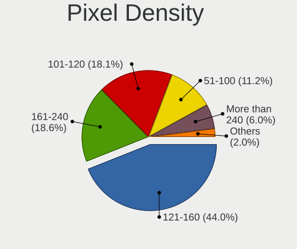

| Density       | Notebooks | Percent |
|---------------|-----------|---------|
| 121-160       | 911       | 43.97%  |
| 161-240       | 386       | 18.63%  |
| 101-120       | 376       | 18.15%  |
| 51-100        | 233       | 11.25%  |
| More than 240 | 124       | 5.98%   |
| 1-50          | 22        | 1.06%   |
| Unknown       | 20        | 0.97%   |

Multiple Monitors
-----------------

Total monitors connected

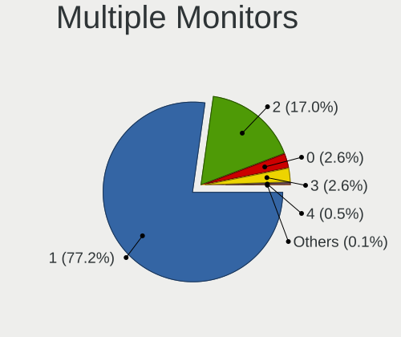

| Total | Notebooks | Percent |
|-------|-----------|---------|
| 1     | 1383      | 77.22%  |
| 2     | 305       | 17.03%  |
| 0     | 47        | 2.62%   |
| 3     | 46        | 2.57%   |
| 4     | 9         | 0.5%    |
| 5     | 1         | 0.06%   |

Network
-------

Net Controller Vendor
---------------------

Controller vendors

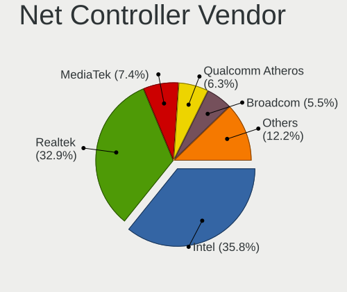

| Vendor                                 | Notebooks | Percent |
|----------------------------------------|-----------|---------|
| Intel                                  | 956       | 35.79%  |
| Realtek Semiconductor                  | 879       | 32.91%  |
| MediaTek                               | 197       | 7.38%   |
| Qualcomm Atheros                       | 167       | 6.25%   |
| Broadcom                               | 146       | 5.47%   |
| Broadcom Limited                       | 40        | 1.5%    |
| Qualcomm                               | 36        | 1.35%   |
| ASIX Electronics                       | 35        | 1.31%   |
| TP-Link                                | 30        | 1.12%   |
| Samsung Electronics                    | 19        | 0.71%   |
| Dell                                   | 15        | 0.56%   |
| Lenovo                                 | 14        | 0.52%   |
| Shenzhen Goodix Technology             | 12        | 0.45%   |
| Ralink                                 | 11        | 0.41%   |
| Qualcomm Technologies                  | 10        | 0.37%   |
| Nvidia                                 | 7         | 0.26%   |
| Google                                 | 7         | 0.26%   |
| DisplayLink                            | 7         | 0.26%   |
| Ralink Technology                      | 6         | 0.22%   |
| Xiaomi                                 | 5         | 0.19%   |
| Sierra Wireless                        | 5         | 0.19%   |
| Marvell Technology Group               | 5         | 0.19%   |
| Ericsson Business Mobile Networks      | 5         | 0.19%   |
| ASUSTek Computer                       | 5         | 0.19%   |
| OPPO Electronics                       | 4         | 0.15%   |
| NetGear                                | 4         | 0.15%   |
| Motorola PCS                           | 4         | 0.15%   |
| Fibocom                                | 4         | 0.15%   |
| Sony Ericsson Mobile Communications AB | 3         | 0.11%   |
| U-Blox                                 | 2         | 0.07%   |
| Suzhou Motorcomm Electronic Technology | 2         | 0.07%   |
| Realtek                                | 2         | 0.07%   |
| JMicron Technology                     | 2         | 0.07%   |
| Hewlett-Packard                        | 2         | 0.07%   |
| Unknown                                | 2         | 0.07%   |
| ZyXEL Communications                   | 1         | 0.04%   |
| ZTE WCDMA Technologies MSM             | 1         | 0.04%   |
| TRENDnet                               | 1         | 0.04%   |
| T & A Mobile Phones                    | 1         | 0.04%   |
| SEGGER                                 | 1         | 0.04%   |

Net Controller Model
--------------------

Controller models

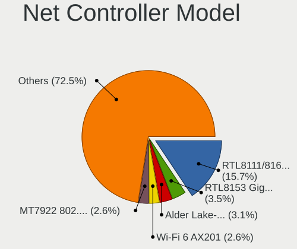

| Model                                                                  | Notebooks | Percent |
|------------------------------------------------------------------------|-----------|---------|
| Realtek RTL8111/8168/8211/8411 PCI Express Gigabit Ethernet Controller | 497       | 15.66%  |
| Realtek RTL8153 Gigabit Ethernet Adapter                               | 112       | 3.53%   |
| Intel Alder Lake-P PCH CNVi WiFi                                       | 99        | 3.12%   |
| Intel Wi-Fi 6 AX201                                                    | 83        | 2.61%   |
| MediaTek MT7922 802.11ax PCI Express Wireless Network Adapter          | 81        | 2.55%   |
| Realtek RTL810xE PCI Express Fast Ethernet controller                  | 74        | 2.33%   |
| Intel Wireless 8265 / 8275                                             | 73        | 2.3%    |
| Intel Wi-Fi 6 AX200                                                    | 71        | 2.24%   |
| MediaTek MT7921 802.11ax PCIe Wireless Network Adapter [Filogic 330]   | 69        | 2.17%   |
| Intel Raptor Lake PCH CNVi WiFi                                        | 57        | 1.8%    |
| Realtek RTL8822CE 802.11ac PCIe Wireless Network Adapter               | 56        | 1.76%   |
| Intel Meteor Lake PCH CNVi WiFi                                        | 55        | 1.73%   |
| Realtek RTL8821CE 802.11ac PCIe Wireless Network Adapter               | 50        | 1.58%   |
| Realtek RTL8852BE PCIe 802.11ax Wireless Network Controller            | 48        | 1.51%   |
| Intel Ethernet Connection (4) I219-LM                                  | 42        | 1.32%   |
| Qualcomm Atheros QCA6174 802.11ac Wireless Network Adapter             | 41        | 1.29%   |
| Intel Comet Lake PCH-LP CNVi WiFi                                      | 41        | 1.29%   |
| Qualcomm Atheros QCA9377 802.11ac Wireless Network Adapter             | 40        | 1.26%   |
| Intel Wi-Fi 6E(802.11ax) AX210/AX1675* 2x2 [Typhoon Peak]              | 40        | 1.26%   |
| Intel Wireless 8260                                                    | 37        | 1.17%   |
| Intel Comet Lake PCH CNVi WiFi                                         | 35        | 1.1%    |
| Qualcomm QCNFA765 Wireless Network Adapter                             | 33        | 1.04%   |
| Intel Wireless 7265                                                    | 33        | 1.04%   |
| Intel 82579LM Gigabit Network Connection (Lewisville)                  | 32        | 1.01%   |
| ASIX AX88179 Gigabit Ethernet                                          | 32        | 1.01%   |
| Intel Cannon Point-LP CNVi [Wireless-AC]                               | 29        | 0.91%   |
| Broadcom BCM4331 802.11a/b/g/n                                         | 29        | 0.91%   |
| Intel Wireless 7260                                                    | 28        | 0.88%   |
| Broadcom NetXtreme BCM57765 Gigabit Ethernet PCIe                      | 28        | 0.88%   |
| Broadcom Limited BCM4360 802.11ac Dual Band Wireless Network Adapter   | 26        | 0.82%   |
| MediaTek MT7902 802.11ax PCIe Wireless Network Adapter [Filogic 310]   | 25        | 0.79%   |
| Intel Tiger Lake PCH CNVi WiFi                                         | 25        | 0.79%   |
| Intel Cannon Lake PCH CNVi WiFi                                        | 25        | 0.79%   |
| Realtek RTL8125 2.5GbE Controller                                      | 23        | 0.72%   |
| Intel 700 Series Chipset CNVi WiFi                                     | 23        | 0.72%   |
| Realtek Killer E2600 GbE Controller                                    | 20        | 0.63%   |
| Intel Wi-Fi 7(802.11be) AX1775*/AX1790*/BE20*/BE401/BE1750* 2x2        | 20        | 0.63%   |
| Broadcom BCM43142 802.11b/g/n                                          | 20        | 0.63%   |
| Realtek RTL8852AE 802.11ax PCIe Wireless Network Adapter               | 19        | 0.6%    |
| Realtek RTL8723BE PCIe Wireless Network Adapter                        | 19        | 0.6%    |

Wireless Vendor
---------------

Wireless vendors

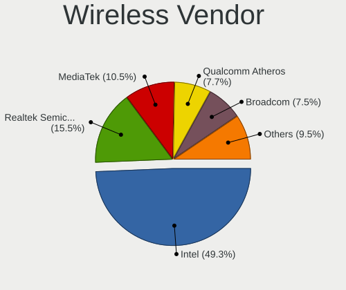

| Vendor                | Notebooks | Percent |
|-----------------------|-----------|---------|
| Intel                 | 873       | 49.35%  |
| Realtek Semiconductor | 274       | 15.49%  |
| MediaTek              | 185       | 10.46%  |
| Qualcomm Atheros      | 136       | 7.69%   |
| Broadcom              | 133       | 7.52%   |
| Broadcom Limited      | 37        | 2.09%   |
| Qualcomm              | 35        | 1.98%   |
| TP-Link               | 27        | 1.53%   |
| Dell                  | 14        | 0.79%   |
| Ralink                | 11        | 0.62%   |
| Qualcomm Technologies | 9         | 0.51%   |
| Ralink Technology     | 6         | 0.34%   |
| Sierra Wireless       | 5         | 0.28%   |
| ASUSTek Computer      | 5         | 0.28%   |
| NetGear               | 4         | 0.23%   |
| Fibocom               | 4         | 0.23%   |
| Realtek               | 2         | 0.11%   |
| Unknown               | 2         | 0.11%   |
| ZyXEL Communications  | 1         | 0.06%   |
| TRENDnet              | 1         | 0.06%   |
| Microsoft             | 1         | 0.06%   |
| Mercucys              | 1         | 0.06%   |
| Edimax Technology     | 1         | 0.06%   |
| D-Link System         | 1         | 0.06%   |
| D-Link                | 1         | 0.06%   |

Wireless Model
--------------

Wireless models

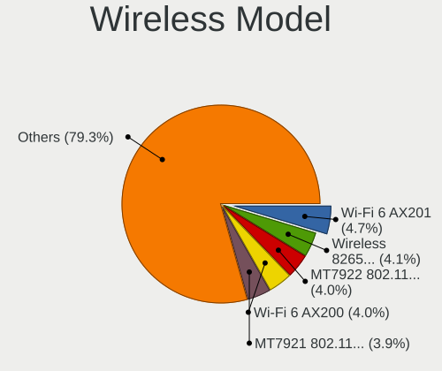

| Model                                                                | Notebooks | Percent |
|----------------------------------------------------------------------|-----------|---------|
| Intel Wi-Fi 6 AX201                                                  | 83        | 4.67%   |
| Intel Wireless 8265 / 8275                                           | 73        | 4.11%   |
| MediaTek MT7922 802.11ax PCI Express Wireless Network Adapter        | 71        | 4%      |
| Intel Wi-Fi 6 AX200                                                  | 71        | 4%      |
| MediaTek MT7921 802.11ax PCIe Wireless Network Adapter [Filogic 330] | 69        | 3.89%   |
| Intel Alder Lake-P PCH CNVi WiFi                                     | 59        | 3.32%   |
| Intel Raptor Lake PCH CNVi WiFi                                      | 57        | 3.21%   |
| Realtek RTL8822CE 802.11ac PCIe Wireless Network Adapter             | 56        | 3.15%   |
| Intel Meteor Lake PCH CNVi WiFi                                      | 55        | 3.1%    |
| Realtek RTL8821CE 802.11ac PCIe Wireless Network Adapter             | 50        | 2.82%   |
| Realtek RTL8852BE PCIe 802.11ax Wireless Network Controller          | 46        | 2.59%   |
| Qualcomm Atheros QCA6174 802.11ac Wireless Network Adapter           | 41        | 2.31%   |
| Intel Comet Lake PCH-LP CNVi WiFi                                    | 41        | 2.31%   |
| Qualcomm Atheros QCA9377 802.11ac Wireless Network Adapter           | 40        | 2.25%   |
| Intel Wi-Fi 6E(802.11ax) AX210/AX1675* 2x2 [Typhoon Peak]            | 40        | 2.25%   |
| Intel Wireless 8260                                                  | 37        | 2.08%   |
| Intel Comet Lake PCH CNVi WiFi                                       | 35        | 1.97%   |
| Qualcomm QCNFA765 Wireless Network Adapter                           | 33        | 1.86%   |
| Intel Wireless 7265                                                  | 33        | 1.86%   |
| Intel Cannon Point-LP CNVi [Wireless-AC]                             | 29        | 1.63%   |
| Broadcom BCM4331 802.11a/b/g/n                                       | 29        | 1.63%   |
| Intel Wireless 7260                                                  | 28        | 1.58%   |
| Broadcom Limited BCM4360 802.11ac Dual Band Wireless Network Adapter | 26        | 1.46%   |
| MediaTek MT7902 802.11ax PCIe Wireless Network Adapter [Filogic 310] | 25        | 1.41%   |
| Intel Tiger Lake PCH CNVi WiFi                                       | 25        | 1.41%   |
| Intel Cannon Lake PCH CNVi WiFi                                      | 25        | 1.41%   |
| Intel 700 Series Chipset CNVi WiFi                                   | 23        | 1.3%    |
| Broadcom BCM43142 802.11b/g/n                                        | 20        | 1.13%   |
| Realtek RTL8852AE 802.11ax PCIe Wireless Network Adapter             | 19        | 1.07%   |
| Realtek RTL8723BE PCIe Wireless Network Adapter                      | 19        | 1.07%   |
| Qualcomm Atheros QCA9565 / AR9565 Wireless Network Adapter           | 18        | 1.01%   |
| Qualcomm Atheros AR9485 Wireless Network Adapter                     | 17        | 0.96%   |
| Intel Centrino Advanced-N 6205 [Taylor Peak]                         | 17        | 0.96%   |
| Intel Wireless 3165                                                  | 15        | 0.84%   |
| Intel Wi-Fi 7(802.11be) AX1775*/AX1790*/BE20*/BE401/BE1750* 2x2      | 15        | 0.84%   |
| Intel Wi-Fi 5(802.11ac) Wireless-AC 9x6x [Thunder Peak]              | 15        | 0.84%   |
| Broadcom BCM43602 802.11ac Wireless LAN SoC                          | 14        | 0.79%   |
| Intel Ice Lake-LP PCH CNVi WiFi                                      | 13        | 0.73%   |
| Qualcomm Atheros AR9462 Wireless Network Adapter                     | 11        | 0.62%   |
| Broadcom BCM43228 802.11a/b/g/n                                      | 11        | 0.62%   |

Ethernet Vendor
---------------

Ethernet vendors

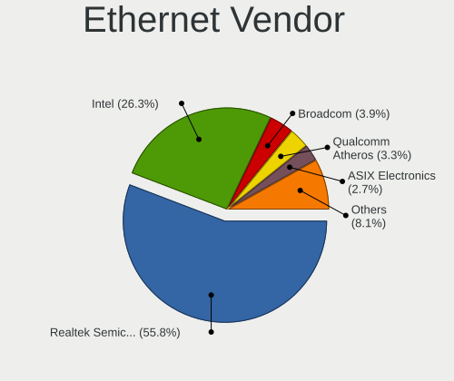

| Vendor                                 | Notebooks | Percent |
|----------------------------------------|-----------|---------|
| Realtek Semiconductor                  | 735       | 55.81%  |
| Intel                                  | 346       | 26.27%  |
| Broadcom                               | 51        | 3.87%   |
| Qualcomm Atheros                       | 43        | 3.26%   |
| ASIX Electronics                       | 35        | 2.66%   |
| Samsung Electronics                    | 19        | 1.44%   |
| MediaTek                               | 13        | 0.99%   |
| Lenovo                                 | 13        | 0.99%   |
| Nvidia                                 | 7         | 0.53%   |
| Google                                 | 7         | 0.53%   |
| DisplayLink                            | 7         | 0.53%   |
| Xiaomi                                 | 5         | 0.38%   |
| Marvell Technology Group               | 5         | 0.38%   |
| OPPO Electronics                       | 4         | 0.3%    |
| Motorola PCS                           | 4         | 0.3%    |
| TP-Link                                | 3         | 0.23%   |
| Sony Ericsson Mobile Communications AB | 3         | 0.23%   |
| Broadcom Limited                       | 3         | 0.23%   |
| Suzhou Motorcomm Electronic Technology | 2         | 0.15%   |
| JMicron Technology                     | 2         | 0.15%   |
| Hewlett-Packard                        | 2         | 0.15%   |
| Rivet                                  | 1         | 0.08%   |
| Qualcomm Technologies                  | 1         | 0.08%   |
| Qualcomm                               | 1         | 0.08%   |
| QinHeng Electronics                    | 1         | 0.08%   |
| OnePlus Technology (Shenzhen)          | 1         | 0.08%   |
| Huawei Technologies                    | 1         | 0.08%   |
| Aquantia                               | 1         | 0.08%   |
| Apple                                  | 1         | 0.08%   |

Ethernet Model
--------------

Ethernet models

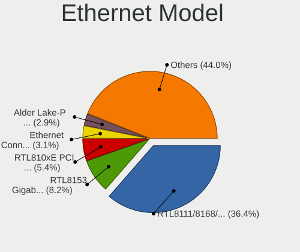

| Model                                                                  | Notebooks | Percent |
|------------------------------------------------------------------------|-----------|---------|
| Realtek RTL8111/8168/8211/8411 PCI Express Gigabit Ethernet Controller | 497       | 36.41%  |
| Realtek RTL8153 Gigabit Ethernet Adapter                               | 112       | 8.21%   |
| Realtek RTL810xE PCI Express Fast Ethernet controller                  | 74        | 5.42%   |
| Intel Ethernet Connection (4) I219-LM                                  | 42        | 3.08%   |
| Intel Alder Lake-P PCH CNVi WiFi                                       | 40        | 2.93%   |
| Intel 82579LM Gigabit Network Connection (Lewisville)                  | 32        | 2.34%   |
| ASIX AX88179 Gigabit Ethernet                                          | 32        | 2.34%   |
| Broadcom NetXtreme BCM57765 Gigabit Ethernet PCIe                      | 28        | 2.05%   |
| Realtek RTL8125 2.5GbE Controller                                      | 23        | 1.68%   |
| Realtek Killer E2600 GbE Controller                                    | 20        | 1.47%   |
| Intel Ethernet Connection I219-LM                                      | 19        | 1.39%   |
| Intel Ethernet Connection (4) I219-V                                   | 15        | 1.1%    |
| Intel Ethernet Connection (18) I219-LM                                 | 15        | 1.1%    |
| Intel Ethernet Connection (10) I219-V                                  | 13        | 0.95%   |
| Realtek RTL8852CE PCIe 802.11ax Wireless Network Controller            | 12        | 0.88%   |
| Intel Ethernet Connection (6) I219-V                                   | 12        | 0.88%   |
| Samsung Galaxy series, misc. (tethering mode)                          | 11        | 0.81%   |
| Intel Ethernet Connection I218-LM                                      | 11        | 0.81%   |
| Intel Ethernet Connection (7) I219-LM                                  | 11        | 0.81%   |
| Intel Ethernet Connection (6) I219-LM                                  | 11        | 0.81%   |
| Intel Ethernet Connection (16) I219-V                                  | 11        | 0.81%   |
| MediaTek MT7922 802.11ax PCI Express Wireless Network Adapter          | 10        | 0.73%   |
| Intel Ethernet Connection (3) I218-LM                                  | 10        | 0.73%   |
| Realtek Killer E3000 2.5GbE Controller                                 | 9         | 0.66%   |
| Intel Ethernet Connection (10) I219-LM                                 | 9         | 0.66%   |
| Samsung GT-I9070 (network tethering, USB debugging enabled)            | 8         | 0.59%   |
| Realtek RTL8152 Fast Ethernet Adapter                                  | 8         | 0.59%   |
| Intel Ethernet Connection I217-LM                                      | 8         | 0.59%   |
| Intel Ethernet Connection (23) I219-V                                  | 8         | 0.59%   |
| Intel Ethernet Connection (2) I219-LM                                  | 8         | 0.59%   |
| Intel Ethernet Connection (13) I219-LM                                 | 8         | 0.59%   |
| Intel BE201 320MHz                                                     | 8         | 0.59%   |
| Realtek USB 10/100/1G/2.5 LAN                                          | 7         | 0.51%   |
| Qualcomm Atheros Killer E2500 Gigabit Ethernet Controller              | 7         | 0.51%   |
| Nvidia MCP79 Ethernet                                                  | 7         | 0.51%   |
| Intel Ethernet Connection (23) I219-LM                                 | 7         | 0.51%   |
| Intel Ethernet Connection (16) I219-LM                                 | 7         | 0.51%   |
| Qualcomm Atheros AR8151 v2.0 Gigabit Ethernet                          | 6         | 0.44%   |
| Xiaomi Mi/Redmi series (RNDIS)                                         | 5         | 0.37%   |
| Qualcomm Atheros QCA8172 Fast Ethernet                                 | 5         | 0.37%   |

Net Controller Kind
-------------------

Ethernet, WiFi or modem

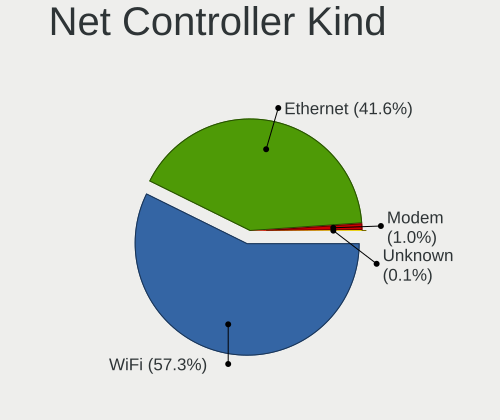

| Kind     | Notebooks | Percent |
|----------|-----------|---------|
| WiFi     | 1671      | 57.3%   |
| Ethernet | 1213      | 41.6%   |
| Modem    | 28        | 0.96%   |
| Unknown  | 4         | 0.14%   |

Used Controller
---------------

Currently used network controller

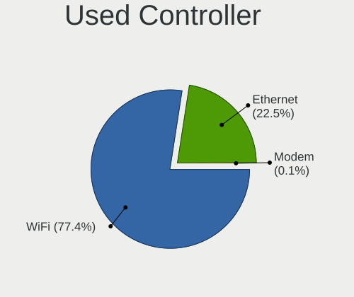

| Kind     | Notebooks | Percent |
|----------|-----------|---------|
| WiFi     | 1421      | 77.44%  |
| Ethernet | 413       | 22.51%  |
| Modem    | 1         | 0.05%   |

NICs
----

Total network controllers on board

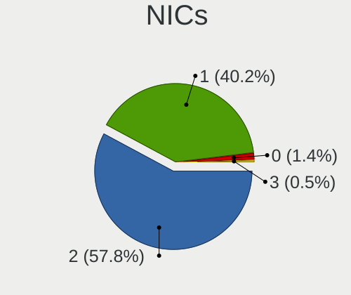

| Total | Notebooks | Percent |
|-------|-----------|---------|
| 2     | 1026      | 57.84%  |
| 1     | 714       | 40.25%  |
| 0     | 25        | 1.41%   |
| 3     | 9         | 0.51%   |

IPv6
----

IPv6 vs IPv4

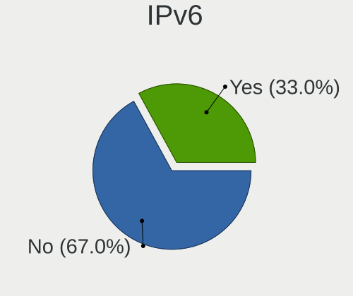

| Used | Notebooks | Percent |
|------|-----------|---------|
| No   | 1200      | 67.04%  |
| Yes  | 590       | 32.96%  |

Bluetooth
---------

Bluetooth Vendor
----------------

Controller vendors

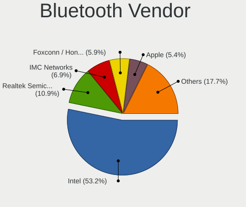

| Vendor                          | Notebooks | Percent |
|---------------------------------|-----------|---------|
| Intel                           | 853       | 53.21%  |
| Realtek Semiconductor           | 174       | 10.85%  |
| IMC Networks                    | 111       | 6.92%   |
| Foxconn / Hon Hai               | 95        | 5.93%   |
| Apple                           | 87        | 5.43%   |
| Qualcomm Atheros Communications | 72        | 4.49%   |
| Lite-On Technology              | 47        | 2.93%   |
| MediaTek                        | 38        | 2.37%   |
| Broadcom                        | 36        | 2.25%   |
| USI                             | 24        | 1.5%    |
| Realtek                         | 15        | 0.94%   |
| Foxconn International           | 7         | 0.44%   |
| Dell                            | 7         | 0.44%   |
| Hewlett-Packard                 | 6         | 0.37%   |
| Ralink                          | 5         | 0.31%   |
| Toshiba                         | 4         | 0.25%   |
| Cambridge Silicon Radio         | 4         | 0.25%   |
| Smart Modular Technologies      | 3         | 0.19%   |
| Fujitsu                         | 3         | 0.19%   |
| TP-Link                         | 2         | 0.12%   |
| ASUSTek Computer                | 2         | 0.12%   |
| Unknown                         | 2         | 0.12%   |
| Roper                           | 1         | 0.06%   |
| Ralink Technology               | 1         | 0.06%   |
| Edimax Technology               | 1         | 0.06%   |
| Chicony Electronics             | 1         | 0.06%   |
| Belkin Components               | 1         | 0.06%   |
| Alps Electric                   | 1         | 0.06%   |

Bluetooth Model
---------------

Controller models

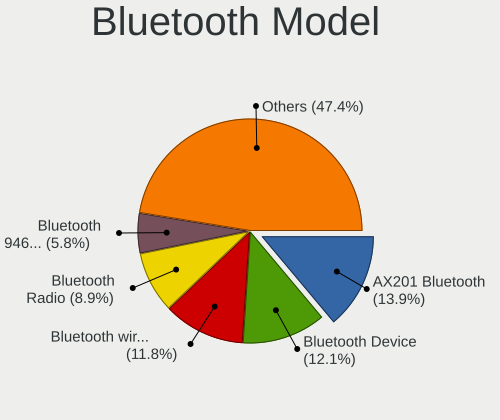

| Model                                               | Notebooks | Percent |
|-----------------------------------------------------|-----------|---------|
| Intel AX201 Bluetooth                               | 223       | 13.89%  |
| Intel Bluetooth Device                              | 195       | 12.15%  |
| Intel Bluetooth wireless interface                  | 190       | 11.84%  |
| Realtek Bluetooth Radio                             | 143       | 8.91%   |
| Intel Bluetooth 9460/9560 Jefferson Peak (JfP)      | 93        | 5.79%   |
| Intel AX200 Bluetooth                               | 70        | 4.36%   |
| IMC Networks Wireless_Device                        | 65        | 4.05%   |
| Foxconn / Hon Hai Wireless_Device                   | 51        | 3.18%   |
| Apple Bluetooth Host Controller                     | 47        | 2.93%   |
| Qualcomm Atheros  Bluetooth Device                  | 44        | 2.74%   |
| Intel AX210 Bluetooth                               | 41        | 2.55%   |
| MediaTek Wireless_Device                            | 38        | 2.37%   |
| Apple Bluetooth USB Host Controller                 | 37        | 2.31%   |
| Realtek  Bluetooth 4.2 Adapter                      | 25        | 1.56%   |
| USI Bluetooth Device                                | 24        | 1.5%    |
| Lite-On Wireless_Device                             | 24        | 1.5%    |
| IMC Networks Bluetooth Radio                        | 22        | 1.37%   |
| Foxconn / Hon Hai Bluetooth Device                  | 20        | 1.25%   |
| Foxconn / Hon Hai MediaTek Bluetooth Adapter        | 19        | 1.18%   |
| Realtek Bluetooth Radio                             | 15        | 0.93%   |
| Qualcomm Atheros QCA61x4 Bluetooth 4.0              | 15        | 0.93%   |
| IMC Networks Bluetooth Device                       | 15        | 0.93%   |
| Intel Centrino Bluetooth Wireless Transceiver       | 14        | 0.87%   |
| Intel Wireless-AC 9260 Bluetooth Adapter            | 13        | 0.81%   |
| Intel Wireless-AC 3168 Bluetooth                    | 9         | 0.56%   |
| Broadcom BCM2045B (BDC-2.1)                         | 9         | 0.56%   |
| Qualcomm Atheros AR3012 Bluetooth 4.0               | 8         | 0.5%    |
| Lite-On Qualcomm Atheros QCA9377 Bluetooth          | 8         | 0.5%    |
| Foxconn International BCM43142A0 Bluetooth module   | 7         | 0.44%   |
| Lite-On Bluetooth Device                            | 6         | 0.37%   |
| Dell DW375 Bluetooth Module                         | 6         | 0.37%   |
| Ralink RT3290 Bluetooth                             | 5         | 0.31%   |
| IMC Networks BCM20702A0                             | 5         | 0.31%   |
| Broadcom HP Portable Bumble Bee                     | 5         | 0.31%   |
| Broadcom BCM43142 Bluetooth 4.0                     | 5         | 0.31%   |
| Broadcom BCM20702 Bluetooth 4.0 [ThinkPad]          | 5         | 0.31%   |
| Lite-On Bluetooth Radio                             | 4         | 0.25%   |
| Intel Bluetooth                                     | 4         | 0.25%   |
| Cambridge Silicon Radio Bluetooth Dongle (HCI mode) | 4         | 0.25%   |
| Smart Modular Bluetooth Device                      | 3         | 0.19%   |

Sound
-----

Sound Vendor
------------

Sound card vendors

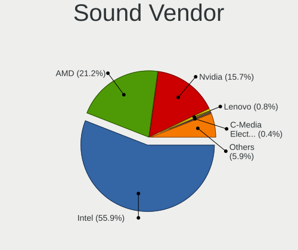

| Vendor                     | Notebooks | Percent |
|----------------------------|-----------|---------|
| Intel                      | 1276      | 55.94%  |
| AMD                        | 484       | 21.22%  |
| Nvidia                     | 358       | 15.69%  |
| Lenovo                     | 18        | 0.79%   |
| C-Media Electronics        | 10        | 0.44%   |
| Realtek Semiconductor      | 8         | 0.35%   |
| Hewlett-Packard            | 8         | 0.35%   |
| GN Netcom                  | 8         | 0.35%   |
| Logitech                   | 7         | 0.31%   |
| Apple                      | 7         | 0.31%   |
| Razer USA                  | 6         | 0.26%   |
| Kingston Technology        | 6         | 0.26%   |
| Sony                       | 5         | 0.22%   |
| Plantronics                | 5         | 0.22%   |
| SteelSeries ApS            | 4         | 0.18%   |
| JMTek                      | 4         | 0.18%   |
| Creative Technology        | 4         | 0.18%   |
| Walmart                    | 3         | 0.13%   |
| TTGK Technology            | 3         | 0.13%   |
| Focusrite-Novation         | 3         | 0.13%   |
| Audient                    | 3         | 0.13%   |
| ASUSTek Computer           | 3         | 0.13%   |
| Texas Instruments          | 2         | 0.09%   |
| RODE Microphones           | 2         | 0.09%   |
| Microsoft                  | 2         | 0.09%   |
| liyuany                    | 2         | 0.09%   |
| Huawei Technologies        | 2         | 0.09%   |
| Framework                  | 2         | 0.09%   |
| Dell                       | 2         | 0.09%   |
| Conexant Systems           | 2         | 0.09%   |
| BEHRINGER International    | 2         | 0.09%   |
| Yealink Network Technology | 1         | 0.04%   |
| Weltrend Semiconductor     | 1         | 0.04%   |
| Trust                      | 1         | 0.04%   |
| Synaptics                  | 1         | 0.04%   |
| Shure                      | 1         | 0.04%   |
| Shenzhen Rapoo Technology  | 1         | 0.04%   |
| Samsung Electronics        | 1         | 0.04%   |
| POROSVOC                   | 1         | 0.04%   |
| Pioneer DJ                 | 1         | 0.04%   |

Sound Model
-----------

Sound card models

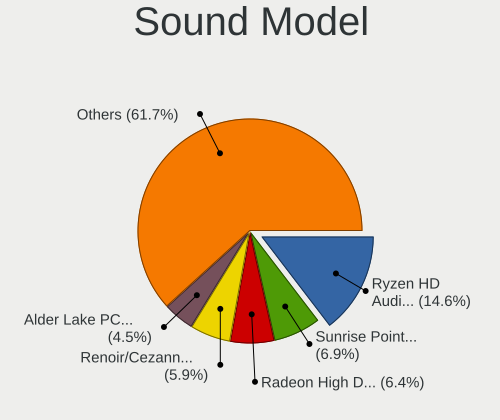

| Model                                                                      | Notebooks | Percent |
|----------------------------------------------------------------------------|-----------|---------|
| AMD Ryzen HD Audio Controller                                              | 414       | 14.61%  |
| Intel Sunrise Point-LP HD Audio                                            | 195       | 6.88%   |
| AMD Radeon High Definition Audio Controller                                | 180       | 6.35%   |
| AMD Renoir/Cezanne HDMI/DP Audio Controller                                | 167       | 5.89%   |
| Intel Alder Lake PCH-P High Definition Audio Controller                    | 128       | 4.52%   |
| Intel Tiger Lake-LP Smart Sound Technology Audio Controller                | 108       | 3.81%   |
| Intel Raptor Lake-P/U/H cAVS                                               | 79        | 2.79%   |
| Intel 7 Series/C216 Chipset Family High Definition Audio Controller        | 74        | 2.61%   |
| Intel Meteor Lake-P HD Audio Controller                                    | 71        | 2.51%   |
| Nvidia AD107 High Definition Audio Controller                              | 61        | 2.15%   |
| Intel 6 Series/C200 Series Chipset Family High Definition Audio Controller | 52        | 1.84%   |
| Intel Comet Lake PCH-LP cAVS                                               | 49        | 1.73%   |
| Intel Haswell-ULT HD Audio Controller                                      | 48        | 1.69%   |
| Intel 8 Series HD Audio Controller                                         | 48        | 1.69%   |
| Intel Cannon Lake PCH cAVS                                                 | 47        | 1.66%   |
| Nvidia GA107 High Definition Audio Controller                              | 46        | 1.62%   |
| Intel Wildcat Point-LP High Definition Audio Controller                    | 46        | 1.62%   |
| Intel Broadwell-U Audio Controller                                         | 46        | 1.62%   |
| Intel Cannon Point-LP High Definition Audio Controller                     | 44        | 1.55%   |
| Intel 8 Series/C220 Series Chipset High Definition Audio Controller        | 43        | 1.52%   |
| AMD Raven/Raven2/Fenghuang HDMI/DP Audio Controller                        | 39        | 1.38%   |
| Intel Comet Lake PCH cAVS                                                  | 38        | 1.34%   |
| Nvidia GA106 High Definition Audio Controller                              | 33        | 1.16%   |
| Intel Raptor Lake High Definition Audio Controller                         | 32        | 1.13%   |
| Nvidia TU107 GeForce GTX 1650 High Definition Audio Controller             | 31        | 1.09%   |
| Intel Tiger Lake-H HD Audio Controller                                     | 31        | 1.09%   |
| Intel Ice Lake-LP Smart Sound Technology Audio Controller                  | 29        | 1.02%   |
| Nvidia AD106M High Definition Audio Controller                             | 28        | 0.99%   |
| Nvidia GA104 High Definition Audio Controller                              | 23        | 0.81%   |
| Intel Xeon E3-1200 v3/4th Gen Core Processor HD Audio Controller           | 23        | 0.81%   |
| AMD FCH Azalia Controller                                                  | 23        | 0.81%   |
| Intel CM238 HD Audio Controller                                            | 18        | 0.64%   |
| Intel 100 Series/C230 Series Chipset Family HD Audio Controller            | 17        | 0.6%    |
| Intel Celeron/Pentium Silver Processor High Definition Audio               | 16        | 0.56%   |
| Nvidia TU106 High Definition Audio Controller                              | 15        | 0.53%   |
| Intel Lunar Lake-M HD Audio Controller                                     | 15        | 0.53%   |
| Intel Atom Processor Z36xxx/Z37xxx Series High Definition Audio Controller | 15        | 0.53%   |
| Intel 82801I (ICH9 Family) HD Audio Controller                             | 15        | 0.53%   |
| Intel 5 Series/3400 Series Chipset High Definition Audio                   | 15        | 0.53%   |
| Nvidia GK107 HDMI Audio Controller                                         | 14        | 0.49%   |

Memory
------

Memory Vendor
-------------

Memory module vendors

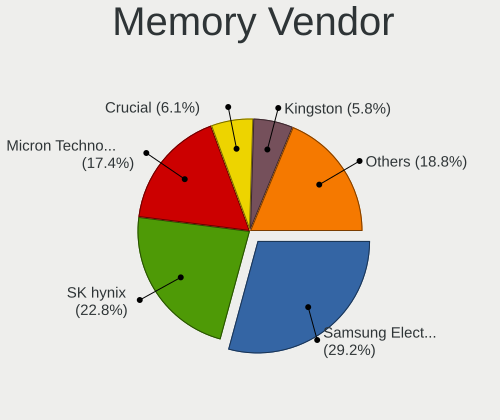

| Vendor                       | Notebooks | Percent |
|------------------------------|-----------|---------|
| Samsung Electronics          | 249       | 29.23%  |
| SK hynix                     | 194       | 22.77%  |
| Micron Technology            | 148       | 17.37%  |
| Crucial                      | 52        | 6.1%    |
| Kingston                     | 49        | 5.75%   |
| Unknown                      | 33        | 3.87%   |
| Unknown                      | 20        | 2.35%   |
| A-DATA Technology            | 17        | 2%      |
| Ramaxel Technology           | 14        | 1.64%   |
| Elpida                       | 11        | 1.29%   |
| Corsair                      | 8         | 0.94%   |
| Team                         | 7         | 0.82%   |
| G.Skill                      | 6         | 0.7%    |
| Apacer                       | 5         | 0.59%   |
| Unknown (ABCD)               | 4         | 0.47%   |
| Timetec                      | 4         | 0.47%   |
| Smart Brazil                 | 3         | 0.35%   |
| Smart                        | 3         | 0.35%   |
| Transcend                    | 2         | 0.23%   |
| Smart Modular                | 2         | 0.23%   |
| Neo Forza                    | 2         | 0.23%   |
| Unknown (0x0F94)             | 1         | 0.12%   |
| Unknown (0x0EEF)             | 1         | 0.12%   |
| Unknown (0x0E9D)             | 1         | 0.12%   |
| Unknown (0x0CAB)             | 1         | 0.12%   |
| Unknown (0x0BEC)             | 1         | 0.12%   |
| Unknown (0x0B5E)             | 1         | 0.12%   |
| Unifosa                      | 1         | 0.12%   |
| UMAX                         | 1         | 0.12%   |
| Teikon                       | 1         | 0.12%   |
| Patriot Memory (PDP Systems) | 1         | 0.12%   |
| Patriot                      | 1         | 0.12%   |
| Nanya Technology             | 1         | 0.12%   |
| Longsys                      | 1         | 0.12%   |
| KingSpec                     | 1         | 0.12%   |
| Hikvision                    | 1         | 0.12%   |
| High Bridge                  | 1         | 0.12%   |
| GOODRAM                      | 1         | 0.12%   |
| ChangXin Memory              | 1         | 0.12%   |
| 4ea5                         | 1         | 0.12%   |

Memory Model
------------

Memory module models

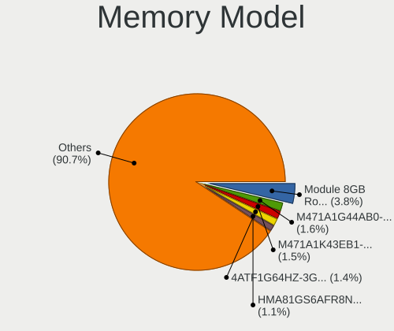

| Model                                                            | Notebooks | Percent |
|------------------------------------------------------------------|-----------|---------|
| Unknown                                                          | 33        | 3.75%   |
| Samsung RAM M471A1G44AB0-CWE 8GiB SODIMM DDR4 3200MT/s           | 14        | 1.59%   |
| Samsung RAM M471A1K43EB1-CWE 8GB SODIMM DDR4 3200MT/s            | 13        | 1.48%   |
| Micron RAM 4ATF1G64HZ-3G2F1 8GB SODIMM DDR4 3200MT/s             | 12        | 1.36%   |
| SK hynix RAM HMA81GS6AFR8N-UH 8GB SODIMM DDR4 2667MT/s           | 10        | 1.14%   |
| Samsung RAM M471A5244CB0-CWE 4GB SODIMM DDR4 3200MT/s            | 8         | 0.91%   |
| Samsung RAM M471A5244CB0-CRC 4GB SODIMM DDR4 2667MT/s            | 8         | 0.91%   |
| Samsung RAM M471A1G44BB0-CWE 8GB SODIMM DDR4 3200MT/s            | 8         | 0.91%   |
| Micron RAM 8ATF1G64HZ-3G2R1 8GB SODIMM DDR4 3200MT/s             | 8         | 0.91%   |
| SK hynix RAM Module 4GB SODIMM DDR3 1600MT/s                     | 7         | 0.8%    |
| SK hynix RAM HMT41GS6BFR8A-PB 8GB SODIMM DDR3 2667MT/s           | 7         | 0.8%    |
| SK hynix RAM HMA81GS6JJR8N-VK 8GB SODIMM DDR4 2667MT/s           | 7         | 0.8%    |
| Samsung RAM K3KL8L80CM-MGCT 2GB Row Of Chips LPDDR5 7500MT/s     | 7         | 0.8%    |
| Micron RAM MT62F2G32D4DS-026 4GB Row Of Chips LPDDR5 7500MT/s    | 7         | 0.8%    |
| Micron RAM Module 4GB Row Of Chips LPDDR5 8533MT/s               | 7         | 0.8%    |
| Micron RAM 8ATF1G64HZ-2G6E1 8GB SODIMM DDR4 2667MT/s             | 7         | 0.8%    |
| SK hynix RAM HMAA1GS6CJR6N-XN 8GB SODIMM DDR4 3200MT/s           | 6         | 0.68%   |
| SK hynix RAM HMA81GS6DJR8N-XN 8GB SODIMM DDR4 3200MT/s           | 6         | 0.68%   |
| SK hynix RAM HCNNNCPMMLXR-NEE 2GB Row Of Chips LPDDR4 4267MT/s   | 6         | 0.68%   |
| SK hynix RAM H9JCNNNCP3MLYR-N6E 2GB Row Of Chips LPDDR5 6400MT/s | 6         | 0.68%   |
| Samsung RAM M471B5173QH0-YK0 4GB SODIMM DDR3 1600MT/s            | 6         | 0.68%   |
| Samsung RAM M471A1K43DB1-CTD 8GB SODIMM DDR4 2667MT/s            | 6         | 0.68%   |
| Samsung RAM M471A1G44AB0-CWE 8GB Row Of Chips DDR4 3200MT/s      | 6         | 0.68%   |
| Ramaxel RAM RMSB3410HA88IBF-5600 16GB SODIMM DDR5 5600MT/s       | 6         | 0.68%   |
| SK hynix RAM HMCG66AGBSA092N 8GB SODIMM DDR5 5600MT/s            | 5         | 0.57%   |
| SK hynix RAM HMAA2GS6CJR8N-XN 16GB SODIMM DDR4 3200MT/s          | 5         | 0.57%   |
| Samsung RAM M471A5244CB0-CTD 4GB SODIMM DDR4 3266MT/s            | 5         | 0.57%   |
| Samsung RAM M471A1K43DB1-CWE 8GB SODIMM DDR4 3200MT/s            | 5         | 0.57%   |
| Samsung RAM M471A1K43BB1-CRC 8GB SODIMM DDR4 2667MT/s            | 5         | 0.57%   |
| Samsung RAM K3KL9L90CM-MGCT 4GB Row Of Chips LPDDR5 7500MT/s     | 5         | 0.57%   |
| Micron RAM MTC4C10163S1SC48BA1 8GB SODIMM DDR5 4800MT/s          | 5         | 0.57%   |
| Unknown (ABCD) RAM 123456789012345678 2GB SODIMM LPDDR4 2400MT/s | 4         | 0.45%   |
| Team RAM TEAMGROUP-SD4-3200 16GB SODIMM DDR4 3200MT/s            | 4         | 0.45%   |
| SK hynix RAM Module 8GB Row Of Chips LPDDR3 2133MT/s             | 4         | 0.45%   |
| SK hynix RAM HMCG88AGBSA095N 32GB SODIMM DDR5 5600MT/s           | 4         | 0.45%   |
| SK hynix RAM HMCG78AGBSA095N 16GB SODIMM DDR5 5600MT/s           | 4         | 0.45%   |
| Samsung RAM Module 16GB SODIMM DDR4 3200MT/s                     | 4         | 0.45%   |
| Samsung RAM M471B5173DB0-YK0 4GB SODIMM DDR3 1600MT/s            | 4         | 0.45%   |
| Samsung RAM M471A2K43EB1-CWE 16GB SODIMM DDR4 3200MT/s           | 4         | 0.45%   |
| Samsung RAM M471A2G43AB2-CWE 16GB SODIMM DDR4 3200MT/s           | 4         | 0.45%   |

Memory Kind
-----------

Memory module kinds

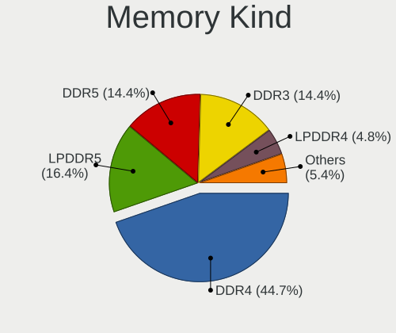

| Kind   | Notebooks | Percent |
|--------|-----------|---------|
| DDR4   | 333       | 44.7%   |
| LPDDR5 | 122       | 16.38%  |
| DDR5   | 107       | 14.36%  |
| DDR3   | 107       | 14.36%  |
| LPDDR4 | 36        | 4.83%   |
| LPDDR3 | 33        | 4.43%   |
| DDR2   | 4         | 0.54%   |
| SDRAM  | 2         | 0.27%   |
| DDR    | 1         | 0.13%   |

Memory Form Factor
------------------

Physical design of the memory module

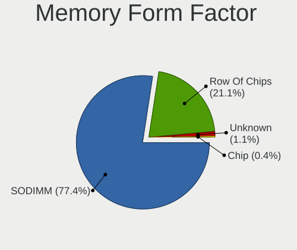

| Name         | Notebooks | Percent |
|--------------|-----------|---------|
| SODIMM       | 583       | 77.42%  |
| Row Of Chips | 159       | 21.12%  |
| Unknown      | 8         | 1.06%   |
| Chip         | 3         | 0.4%    |

Memory Size
-----------

Memory module size

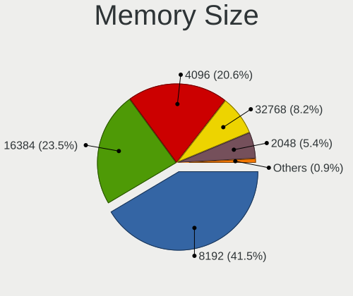

| Size  | Notebooks | Percent |
|-------|-----------|---------|
| 8192  | 330       | 41.46%  |
| 16384 | 187       | 23.49%  |
| 4096  | 164       | 20.6%   |
| 32768 | 65        | 8.17%   |
| 2048  | 43        | 5.4%    |
| 49152 | 2         | 0.25%   |
| 6144  | 2         | 0.25%   |
| 24576 | 1         | 0.13%   |
| 3072  | 1         | 0.13%   |
| 1024  | 1         | 0.13%   |

Memory Speed
------------

Memory module speed

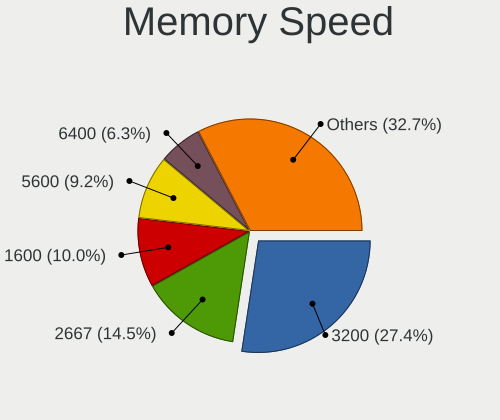

| Speed   | Notebooks | Percent |
|---------|-----------|---------|
| 3200    | 214       | 27.4%   |
| 2667    | 113       | 14.47%  |
| 1600    | 78        | 9.99%   |
| 5600    | 72        | 9.22%   |
| 6400    | 49        | 6.27%   |
| 7500    | 41        | 5.25%   |
| 2133    | 36        | 4.61%   |
| 4800    | 34        | 4.35%   |
| 2400    | 28        | 3.59%   |
| 4267    | 24        | 3.07%   |
| 8533    | 18        | 2.3%    |
| 1333    | 14        | 1.79%   |
| 1867    | 13        | 1.66%   |
| 7467    | 11        | 1.41%   |
| 8400    | 7         | 0.9%    |
| 3266    | 5         | 0.64%   |
| 1334    | 4         | 0.51%   |
| 5500    | 3         | 0.38%   |
| 4266    | 3         | 0.38%   |
| 800     | 3         | 0.38%   |
| 1067    | 2         | 0.26%   |
| 667     | 2         | 0.26%   |
| 5200    | 1         | 0.13%   |
| 4199    | 1         | 0.13%   |
| 3733    | 1         | 0.13%   |
| 2933    | 1         | 0.13%   |
| 2048    | 1         | 0.13%   |
| 1066    | 1         | 0.13%   |
| Unknown | 1         | 0.13%   |

Printers & scanners
-------------------

Printer Vendor
--------------

Printer device vendors

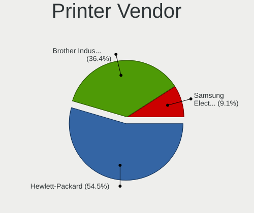

| Vendor              | Notebooks | Percent |
|---------------------|-----------|---------|
| Hewlett-Packard     | 6         | 54.55%  |
| Brother Industries  | 4         | 36.36%  |
| Samsung Electronics | 1         | 9.09%   |

Printer Model
-------------

Printer device models

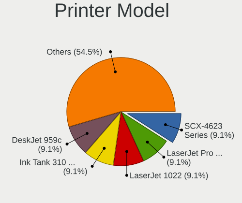

| Model                       | Notebooks | Percent |
|-----------------------------|-----------|---------|
| Samsung SCX-4623 Series     | 1         | 9.09%   |
| HP LaserJet Pro M118-M119   | 1         | 9.09%   |
| HP LaserJet 1022            | 1         | 9.09%   |
| HP Ink Tank 310 series      | 1         | 9.09%   |
| HP DeskJet 959c             | 1         | 9.09%   |
| HP DeskJet 3630 series      | 1         | 9.09%   |
| HP DeskJet 2700 series      | 1         | 9.09%   |
| Brother HL-L2370DW series   | 1         | 9.09%   |
| Brother HL-L2320D series    | 1         | 9.09%   |
| Brother HL-1200 series      | 1         | 9.09%   |
| Brother DCP-L8410CDW series | 1         | 9.09%   |

Scanner Vendor
--------------

Scanner device vendors

Zero info for selected period =(

Scanner Model
-------------

Scanner device models

Zero info for selected period =(

Camera
------

Camera Vendor
-------------

Camera device vendors

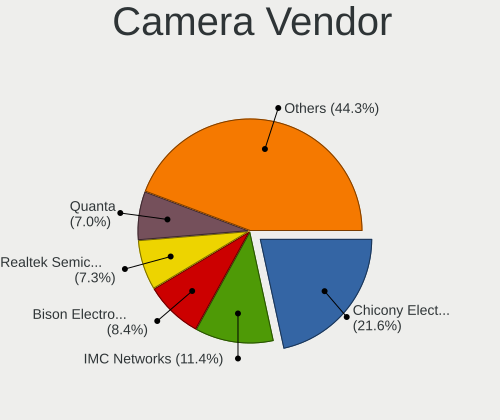

| Vendor                                 | Notebooks | Percent |
|----------------------------------------|-----------|---------|
| Chicony Electronics                    | 347       | 21.61%  |
| IMC Networks                           | 183       | 11.39%  |
| Bison Electronics                      | 135       | 8.41%   |
| Realtek Semiconductor                  | 117       | 7.29%   |
| Quanta                                 | 113       | 7.04%   |
| Microdia                               | 103       | 6.41%   |
| Luxvisions Innotech Limited            | 87        | 5.42%   |
| Sunplus Innovation Technology          | 77        | 4.79%   |
| Syntek                                 | 55        | 3.42%   |
| Apple                                  | 55        | 3.42%   |
| Cheng Uei Precision Industry (Foxlink) | 46        | 2.86%   |
| ShineTech                              | 43        | 2.68%   |
| Sonix Technology                       | 34        | 2.12%   |
| Lite-On Technology                     | 32        | 1.99%   |
| Logitech                               | 28        | 1.74%   |
| Suyin                                  | 21        | 1.31%   |
| Silicon Motion                         | 12        | 0.75%   |
| SunplusIT                              | 9         | 0.56%   |
| Alcor Micro                            | 9         | 0.56%   |
| BillionPixels                          | 8         | 0.5%    |
| Shine-optics                           | 7         | 0.44%   |
| Framework                              | 7         | 0.44%   |
| ShineOptics                            | 6         | 0.37%   |
| kingcome                               | 6         | 0.37%   |
| Samsung Electronics                    | 5         | 0.31%   |
| Unknown                                | 5         | 0.31%   |
| Importek                               | 4         | 0.25%   |
| Acer                                   | 4         | 0.25%   |
| SenseTek                               | 3         | 0.19%   |
| Ricoh                                  | 3         | 0.19%   |
| Primax Electronics                     | 3         | 0.19%   |
| icSpring                               | 3         | 0.19%   |
| USB CAMERA                             | 2         | 0.12%   |
| Tripath Technology                     | 2         | 0.12%   |
| Microsoft                              | 2         | 0.12%   |
| Lenovo                                 | 2         | 0.12%   |
| KYE Systems (Mouse Systems)            | 2         | 0.12%   |
| HYGD-220831-A                          | 2         | 0.12%   |
| Z-Star Microelectronics                | 1         | 0.06%   |
| webcam                                 | 1         | 0.06%   |

Camera Model
------------

Camera device models

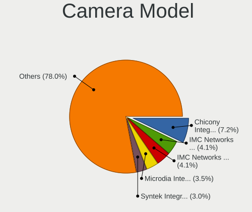

| Model                                                | Notebooks | Percent |
|------------------------------------------------------|-----------|---------|
| Chicony Integrated Camera                            | 116       | 7.18%   |
| IMC Networks USB2.0 HD UVC WebCam                    | 67        | 4.15%   |
| IMC Networks Integrated Camera                       | 67        | 4.15%   |
| Microdia Integrated_Webcam_HD                        | 57        | 3.53%   |
| Syntek Integrated Camera                             | 49        | 3.03%   |
| Bison Integrated Camera                              | 48        | 2.97%   |
| Realtek Integrated_Webcam_HD                         | 47        | 2.91%   |
| Luxvisions Innotech Limited Integrated Camera        | 34        | 2.1%    |
| Apple FaceTime HD Camera                             | 27        | 1.67%   |
| Sunplus Integrated_Webcam_HD                         | 25        | 1.55%   |
| Chicony HD Webcam                                    | 22        | 1.36%   |
| Shinetech USB2.0 FHD UVC WebCam                      | 21        | 1.3%    |
| Quanta HD User Facing                                | 21        | 1.3%    |
| Chicony Integrated Camera (1280x720@30)              | 21        | 1.3%    |
| Bison HD Webcam                                      | 21        | 1.3%    |
| Bison SunplusIT Integrated Camera                    | 19        | 1.18%   |
| Sonix USB2.0 HD UVC WebCam                           | 18        | 1.11%   |
| Luxvisions Innotech Limited Integrated RGB Camera    | 18        | 1.11%   |
| Quanta HP HD Camera                                  | 17        | 1.05%   |
| Chicony HD User Facing                               | 17        | 1.05%   |
| Quanta HP Wide Vision HD Camera                      | 14        | 0.87%   |
| Chicony HP HD Camera                                 | 14        | 0.87%   |
| Sonix USB2.0 FHD UVC WebCam                          | 13        | 0.8%    |
| Realtek Bluetooth Radio                              | 13        | 0.8%    |
| Quanta HP TrueVision HD Camera                       | 13        | 0.8%    |
| Chicony ACER HD User Facing                          | 13        | 0.8%    |
| ShineTech USB2.0 HD UVC WebCam                       | 12        | 0.74%   |
| Realtek Integrated Webcam HD                         | 12        | 0.74%   |
| Quanta ACER HD User Facing                           | 12        | 0.74%   |
| Chicony HP TrueVision HD Camera                      | 12        | 0.74%   |
| Bison Integrated RGB Camera                          | 12        | 0.74%   |
| IMC Networks USB2.0 VGA UVC WebCam                   | 11        | 0.68%   |
| Chicony Chicony USB2.0 Camera                        | 11        | 0.68%   |
| Shinetech ASUS FHD webcam                            | 10        | 0.62%   |
| Luxvisions Innotech Limited HP Wide Vision HD Camera | 10        | 0.62%   |
| Lite-On Integrated Camera                            | 10        | 0.62%   |
| Apple Built-in iSight                                | 10        | 0.62%   |
| Realtek Integrated_Webcam_FHD                        | 9         | 0.56%   |
| Microdia Integrated_Webcam_FHD                       | 9         | 0.56%   |
| IMC Networks HD Camera                               | 9         | 0.56%   |

Security
--------

Fingerprint Vendor
------------------

Fingerprint sensor vendors

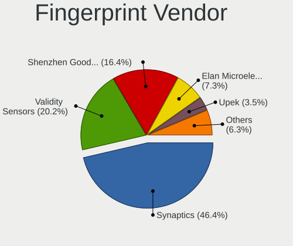

| Vendor                             | Notebooks | Percent |
|------------------------------------|-----------|---------|
| Synaptics                          | 147       | 46.37%  |
| Validity Sensors                   | 64        | 20.19%  |
| Shenzhen Goodix Technology         | 52        | 16.4%   |
| Elan Microelectronics              | 23        | 7.26%   |
| Upek                               | 11        | 3.47%   |
| HOLTEK                             | 6         | 1.89%   |
| Realtek USB2.0 Finger Print Bridge | 4         | 1.26%   |
| LighTuning Technology              | 3         | 0.95%   |
| AuthenTec                          | 3         | 0.95%   |
| STMicroelectronics                 | 2         | 0.63%   |
| Focal-systems.Corp                 | 2         | 0.63%   |

Fingerprint Model
-----------------

Fingerprint sensor models

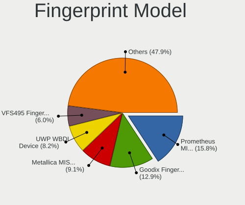

| Model                                                                      | Notebooks | Percent |
|----------------------------------------------------------------------------|-----------|---------|
| Synaptics Prometheus MIS Touch Fingerprint Reader                          | 50        | 15.77%  |
| Shenzhen Goodix  FingerPrint Device                                        | 41        | 12.93%  |
| Synaptics Metallica MIS Touch Fingerprint Reader                           | 29        | 9.15%   |
| Synaptics UWP WBDI Device                                                  | 26        | 8.2%    |
| Validity Sensors VFS495 Fingerprint Reader                                 | 19        | 5.99%   |
| Elan ELAN:ARM-M4                                                           | 13        | 4.1%    |
| Synaptics Prometheus Fingerprint Reader                                    | 12        | 3.79%   |
| Upek Biometric Touchchip/Touchstrip Fingerprint Sensor                     | 11        | 3.47%   |
| Elan ELAN:Fingerprint                                                      | 10        | 3.15%   |
| Validity Sensors Synaptics WBDI                                            | 9         | 2.84%   |
| Synaptics FS7604 Touch Fingerprint Sensor with PurePrint                   | 9         | 2.84%   |
| Shenzhen Goodix FingerPrint                                                | 9         | 2.84%   |
| Validity Sensors VFS 5011 fingerprint sensor                               | 7         | 2.21%   |
| Validity Sensors VFS5011 Fingerprint Reader                                | 6         | 1.89%   |
| Validity Sensors VFS491                                                    | 6         | 1.89%   |
| HOLTEK FocalTech Fingerprint Device                                        | 6         | 1.89%   |
| Validity Sensors VFS7500 Touch Fingerprint Sensor                          | 5         | 1.58%   |
| Synaptics  FS7604 Touch Fingerprint Sensor with PurePrint                  | 5         | 1.58%   |
| Synaptics Fingerprint reader [HP G6]                                       | 5         | 1.58%   |
| Validity Sensors Swipe Fingerprint Sensor                                  | 4         | 1.26%   |
| Synaptics WBDI Fingerprint Reader USB 086                                  | 4         | 1.26%   |
| Realtek USB2.0 Finger Print Bridge FocalTech Fingerprint Device            | 4         | 1.26%   |
| Validity Sensors VFS471 Fingerprint Reader                                 | 3         | 0.95%   |
| Synaptics  WBDI                                                            | 3         | 0.95%   |
| Synaptics Metallica MOH Touch Fingerprint Reader                           | 2         | 0.63%   |
| STMicroelectronics Fingerprint Reader                                      | 2         | 0.63%   |
| Shenzhen Goodix Fingerprint Reader                                         | 2         | 0.63%   |
| LighTuning EgisTec Touch Fingerprint Sensor                                | 2         | 0.63%   |
| Focal-systems.Corp FT9201Fingerprint.                                      | 2         | 0.63%   |
| AuthenTec AES2810                                                          | 2         | 0.63%   |
| Validity Sensors VFS301 Fingerprint Reader                                 | 1         | 0.32%   |
| Validity Sensors VFS Fingerprint sensor                                    | 1         | 0.32%   |
| Validity Sensors Synaptics VFS7552 Touch Fingerprint Sensor with PurePrint | 1         | 0.32%   |
| Validity Sensors Synaptics VFS7552 Touch Fingerprint Sensor                | 1         | 0.32%   |
| Validity Sensors Fingerprint scanner                                       | 1         | 0.32%   |
| Synaptics WBDI                                                             | 1         | 0.32%   |
| Synaptics UWP WBDI                                                         | 1         | 0.32%   |
| LighTuning ES603 Swipe Fingerprint Sensor                                  | 1         | 0.32%   |
| AuthenTec AES2501 Fingerprint Sensor                                       | 1         | 0.32%   |

Chipcard Vendor
---------------

Chipcard module vendors

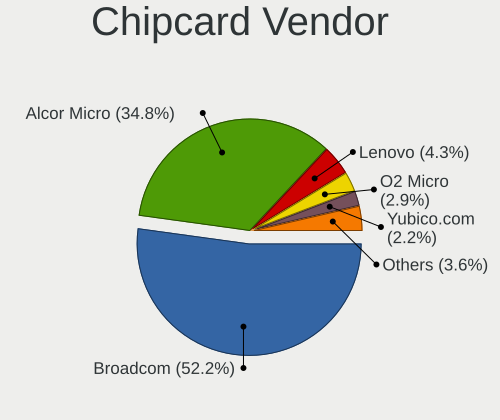

| Vendor                            | Notebooks | Percent |
|-----------------------------------|-----------|---------|
| Broadcom                          | 72        | 52.17%  |
| Alcor Micro                       | 48        | 34.78%  |
| Lenovo                            | 6         | 4.35%   |
| O2 Micro                          | 4         | 2.9%    |
| Yubico.com                        | 3         | 2.17%   |
| Gemalto (was Gemplus)             | 2         | 1.45%   |
| Upek                              | 1         | 0.72%   |
| Free Software Initiative of Japan | 1         | 0.72%   |
| Advanced Card Systems             | 1         | 0.72%   |

Chipcard Model
--------------

Chipcard module models

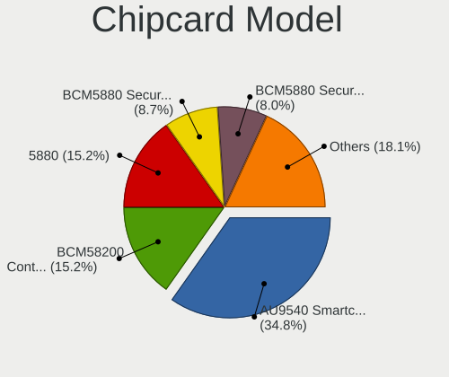

| Model                                                                        | Notebooks | Percent |
|------------------------------------------------------------------------------|-----------|---------|
| Alcor Micro AU9540 Smartcard Reader                                          | 48        | 34.78%  |
| Broadcom BCM58200 ControlVault 3 (FingerPrint sensor + Contacted SmartCard)  | 21        | 15.22%  |
| Broadcom 5880                                                                | 21        | 15.22%  |
| Broadcom BCM5880 Secure Applications Processor                               | 12        | 8.7%    |
| Broadcom BCM5880 Secure Applications Processor with fingerprint swipe sensor | 11        | 7.97%   |
| Broadcom 58200                                                               | 7         | 5.07%   |
| Lenovo Integrated Smart Card Reader                                          | 6         | 4.35%   |
| O2 Micro OZ776 CCID Smartcard Reader                                         | 4         | 2.9%    |
| Yubico.com Yubikey 4/5 U2F+CCID                                              | 2         | 1.45%   |
| Yubico.com Yubikey NEO(-N) U2F+CCID                                          | 1         | 0.72%   |
| Upek TouchChip Fingerprint Coprocessor (WBF advanced mode)                   | 1         | 0.72%   |
| Gemalto (was Gemplus) GemPC Twin SmartCard Reader                            | 1         | 0.72%   |
| Gemalto (was Gemplus) Compact Smart Card Reader Writer                       | 1         | 0.72%   |
| Free Software Initiative of Japan Gnuk Token                                 | 1         | 0.72%   |
| Advanced Card Systems ACR122U                                                | 1         | 0.72%   |

Unsupported
-----------

Unsupported Devices
-------------------

Total unsupported devices on board

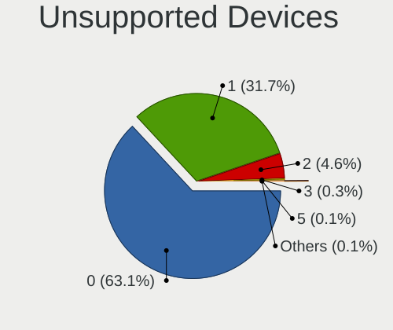

| Total | Notebooks | Percent |
|-------|-----------|---------|
| 0     | 1128      | 63.09%  |
| 1     | 567       | 31.71%  |
| 2     | 83        | 4.64%   |
| 3     | 6         | 0.34%   |
| 5     | 2         | 0.11%   |
| 9     | 1         | 0.06%   |
| 7     | 1         | 0.06%   |

Unsupported Device Types
------------------------

Types of unsupported devices

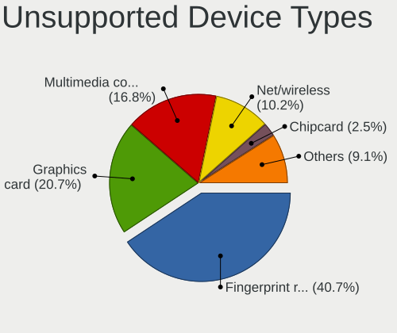

| Type                     | Notebooks | Percent |
|--------------------------|-----------|---------|
| Fingerprint reader       | 310       | 40.68%  |
| Graphics card            | 158       | 20.73%  |
| Multimedia controller    | 128       | 16.8%   |
| Net/wireless             | 78        | 10.24%  |
| Chipcard                 | 19        | 2.49%   |
| Communication controller | 17        | 2.23%   |
| Bluetooth                | 10        | 1.31%   |
| Storage                  | 7         | 0.92%   |
| Sound                    | 7         | 0.92%   |
| Camera                   | 7         | 0.92%   |
| Net/ethernet             | 6         | 0.79%   |
| Card reader              | 5         | 0.66%   |
| Unassigned class         | 4         | 0.52%   |
| Modem                    | 4         | 0.52%   |
| Storage/nvme             | 1         | 0.13%   |
| Network                  | 1         | 0.13%   |

