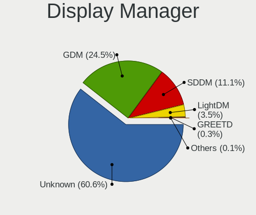
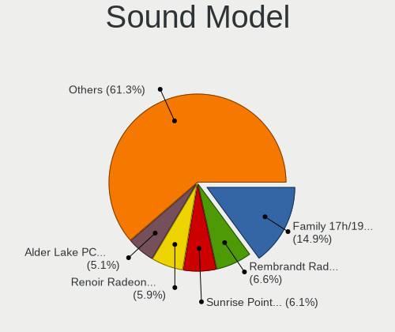

Fedora 41 - Tested Hardware & Statistics (Notebooks)
----------------------------------------------------

A project to collect tested hardware configurations for Fedora 41.

Anyone can contribute to this report by the [hw-probe](https://github.com/linuxhw/hw-probe) tool:

    sudo -E hw-probe -all -upload

Please contribute! Especially if your hardware is rare.

Contents
--------

* [ Test Cases ](#test-cases)

* [ System ](#system)
  - [ Kernel                   ](#kernel)
  - [ Kernel Family            ](#kernel-family)
  - [ Kernel Major Ver.        ](#kernel-major-ver)
  - [ Arch                     ](#arch)
  - [ DE                       ](#de)
  - [ Display Server           ](#display-server)
  - [ Display Manager          ](#display-manager)
  - [ OS Lang                  ](#os-lang)
  - [ Boot Mode                ](#boot-mode)
  - [ Filesystem               ](#filesystem)
  - [ Part. scheme             ](#part-scheme)
  - [ Dual Boot with Linux/BSD ](#dual-boot-with-linuxbsd)
  - [ Dual Boot (Win)          ](#dual-boot-win)

* [ Board ](#board)
  - [ Vendor                   ](#vendor)
  - [ Model                    ](#model)
  - [ Model Family             ](#model-family)
  - [ MFG Year                 ](#mfg-year)
  - [ Form Factor              ](#form-factor)
  - [ Secure Boot              ](#secure-boot)
  - [ Coreboot                 ](#coreboot)
  - [ RAM Size                 ](#ram-size)
  - [ RAM Used                 ](#ram-used)
  - [ Total Drives             ](#total-drives)
  - [ Has CD-ROM               ](#has-cd-rom)
  - [ Has Ethernet             ](#has-ethernet)
  - [ Has WiFi                 ](#has-wifi)
  - [ Has Bluetooth            ](#has-bluetooth)

* [ Location ](#location)
  - [ Country                  ](#country)
  - [ City                     ](#city)

* [ Drives ](#drives)
  - [ Drive Vendor             ](#drive-vendor)
  - [ Drive Model              ](#drive-model)
  - [ HDD Vendor               ](#hdd-vendor)
  - [ SSD Vendor               ](#ssd-vendor)
  - [ Drive Kind               ](#drive-kind)
  - [ Drive Connector          ](#drive-connector)
  - [ Drive Size               ](#drive-size)
  - [ Space Total              ](#space-total)
  - [ Space Used               ](#space-used)
  - [ Malfunc. Drives          ](#malfunc-drives)
  - [ Malfunc. Drive Vendor    ](#malfunc-drive-vendor)
  - [ Malfunc. HDD Vendor      ](#malfunc-hdd-vendor)
  - [ Malfunc. Drive Kind      ](#malfunc-drive-kind)
  - [ Failed Drives            ](#failed-drives)
  - [ Failed Drive Vendor      ](#failed-drive-vendor)
  - [ Drive Status             ](#drive-status)

* [ Storage controller ](#storage-controller)
  - [ Storage Vendor           ](#storage-vendor)
  - [ Storage Model            ](#storage-model)
  - [ Storage Kind             ](#storage-kind)

* [ Processor ](#processor)
  - [ CPU Vendor               ](#cpu-vendor)
  - [ CPU Model                ](#cpu-model)
  - [ CPU Model Family         ](#cpu-model-family)
  - [ CPU Cores                ](#cpu-cores)
  - [ CPU Sockets              ](#cpu-sockets)
  - [ CPU Threads              ](#cpu-threads)
  - [ CPU Op-Modes             ](#cpu-op-modes)
  - [ CPU Microcode            ](#cpu-microcode)
  - [ CPU Microarch            ](#cpu-microarch)

* [ Graphics ](#graphics)
  - [ GPU Vendor               ](#gpu-vendor)
  - [ GPU Model                ](#gpu-model)
  - [ GPU Combo                ](#gpu-combo)
  - [ GPU Driver               ](#gpu-driver)
  - [ GPU Memory               ](#gpu-memory)

* [ Monitor ](#monitor)
  - [ Monitor Vendor           ](#monitor-vendor)
  - [ Monitor Model            ](#monitor-model)
  - [ Monitor Resolution       ](#monitor-resolution)
  - [ Monitor Diagonal         ](#monitor-diagonal)
  - [ Monitor Width            ](#monitor-width)
  - [ Aspect Ratio             ](#aspect-ratio)
  - [ Monitor Area             ](#monitor-area)
  - [ Pixel Density            ](#pixel-density)
  - [ Multiple Monitors        ](#multiple-monitors)

* [ Network ](#network)
  - [ Net Controller Vendor    ](#net-controller-vendor)
  - [ Net Controller Model     ](#net-controller-model)
  - [ Wireless Vendor          ](#wireless-vendor)
  - [ Wireless Model           ](#wireless-model)
  - [ Ethernet Vendor          ](#ethernet-vendor)
  - [ Ethernet Model           ](#ethernet-model)
  - [ Net Controller Kind      ](#net-controller-kind)
  - [ Used Controller          ](#used-controller)
  - [ NICs                     ](#nics)
  - [ IPv6                     ](#ipv6)

* [ Bluetooth ](#bluetooth)
  - [ Bluetooth Vendor         ](#bluetooth-vendor)
  - [ Bluetooth Model          ](#bluetooth-model)

* [ Sound ](#sound)
  - [ Sound Vendor             ](#sound-vendor)
  - [ Sound Model              ](#sound-model)

* [ Memory ](#memory)
  - [ Memory Vendor            ](#memory-vendor)
  - [ Memory Model             ](#memory-model)
  - [ Memory Kind              ](#memory-kind)
  - [ Memory Form Factor       ](#memory-form-factor)
  - [ Memory Size              ](#memory-size)
  - [ Memory Speed             ](#memory-speed)

* [ Printers & scanners ](#printers--scanners)
  - [ Printer Vendor           ](#printer-vendor)
  - [ Printer Model            ](#printer-model)
  - [ Scanner Vendor           ](#scanner-vendor)
  - [ Scanner Model            ](#scanner-model)

* [ Camera ](#camera)
  - [ Camera Vendor            ](#camera-vendor)
  - [ Camera Model             ](#camera-model)

* [ Security ](#security)
  - [ Fingerprint Vendor       ](#fingerprint-vendor)
  - [ Fingerprint Model        ](#fingerprint-model)
  - [ Chipcard Vendor          ](#chipcard-vendor)
  - [ Chipcard Model           ](#chipcard-model)

* [ Unsupported ](#unsupported)
  - [ Unsupported Devices      ](#unsupported-devices)
  - [ Unsupported Device Types ](#unsupported-device-types)

Test Cases
----------

Total: 902

| Vendor        | Model                       | Probe                                                      | Date         |
|---------------|-----------------------------|------------------------------------------------------------|--------------|
| MSI           | Prestige 16 AI Studio B1... | [22d073249b](https://linux-hardware.org/?probe=22d073249b) | Jan 06, 2025 |
| MSI           | Prestige 16 AI Studio B1... | [d8d6ab4b82](https://linux-hardware.org/?probe=d8d6ab4b82) | Jan 06, 2025 |
| GPU Compan... | GWNR7L1749                  | [0f2438bc90](https://linux-hardware.org/?probe=0f2438bc90) | Jan 06, 2025 |
| Apple         | MacBookAir6,2               | [dfb4117f5c](https://linux-hardware.org/?probe=dfb4117f5c) | Jan 06, 2025 |
| Google        | Treeya                      | [b8f7c2d75a](https://linux-hardware.org/?probe=b8f7c2d75a) | Jan 06, 2025 |
| Lenovo        | IdeaPad Pro 5 14APH8 83A... | [046bbb97db](https://linux-hardware.org/?probe=046bbb97db) | Jan 05, 2025 |
| Dell          | XPS 9320                    | [35af44b04a](https://linux-hardware.org/?probe=35af44b04a) | Jan 05, 2025 |
| Dell          | Latitude 7390               | [48814ed45f](https://linux-hardware.org/?probe=48814ed45f) | Jan 05, 2025 |
| Sony          | VGN-NR21E_S                 | [0ed147c4fb](https://linux-hardware.org/?probe=0ed147c4fb) | Jan 05, 2025 |
| Apple         | MacBookAir6,2               | [3b5dc1b1c2](https://linux-hardware.org/?probe=3b5dc1b1c2) | Jan 05, 2025 |
| Lenovo        | 14w Gen 2 82N9              | [733559df9e](https://linux-hardware.org/?probe=733559df9e) | Jan 05, 2025 |
| Lenovo        | ThinkPad E16 Gen 2 21M5C... | [fe15c1092e](https://linux-hardware.org/?probe=fe15c1092e) | Jan 05, 2025 |
| Dell          | Latitude 7400               | [9c347a93bf](https://linux-hardware.org/?probe=9c347a93bf) | Jan 05, 2025 |
| Dell          | Latitude 7400               | [70481b51db](https://linux-hardware.org/?probe=70481b51db) | Jan 05, 2025 |
| Lenovo        | ThinkPad T420 4236PFG       | [df34cf20b9](https://linux-hardware.org/?probe=df34cf20b9) | Jan 05, 2025 |
| HP            | Pavilion Laptop 15-eh0xx... | [d87015b7dd](https://linux-hardware.org/?probe=d87015b7dd) | Jan 05, 2025 |
| Lenovo        | ThinkPad T14s Gen 1 20UH... | [c68a17f027](https://linux-hardware.org/?probe=c68a17f027) | Jan 04, 2025 |
| Lenovo        | B490 377222P                | [4e6cc04345](https://linux-hardware.org/?probe=4e6cc04345) | Jan 04, 2025 |
| Lenovo        | Legion Slim 5 16APH8 82Y... | [3cd4965210](https://linux-hardware.org/?probe=3cd4965210) | Jan 04, 2025 |
| HP            | 635                         | [021402dc32](https://linux-hardware.org/?probe=021402dc32) | Jan 04, 2025 |
| HP            | Laptop 15-db1xxx            | [7bc8aeba55](https://linux-hardware.org/?probe=7bc8aeba55) | Jan 04, 2025 |
| Lenovo        | ThinkPad P17 Gen 1 20SQS... | [4fc43ed5a9](https://linux-hardware.org/?probe=4fc43ed5a9) | Jan 04, 2025 |
| HP            | EliteBook 845 G7 Noteboo... | [33a984a2df](https://linux-hardware.org/?probe=33a984a2df) | Jan 04, 2025 |
| HP            | Laptop 17-cn0xxx            | [6426be4511](https://linux-hardware.org/?probe=6426be4511) | Jan 04, 2025 |
| MSI           | GF63 Thin 11SC              | [3f1c75f109](https://linux-hardware.org/?probe=3f1c75f109) | Jan 04, 2025 |
| Acer          | Predator PH16-71            | [51c220bbe4](https://linux-hardware.org/?probe=51c220bbe4) | Jan 04, 2025 |
| Lenovo        | ThinkPad T530 2394A11       | [87cb15684c](https://linux-hardware.org/?probe=87cb15684c) | Jan 04, 2025 |
| Lenovo        | ThinkPad Z16 Gen 1 21D4C... | [3c9cd9e73c](https://linux-hardware.org/?probe=3c9cd9e73c) | Jan 04, 2025 |
| HP            | Victus by Laptop 16-e0xx... | [125f9224f6](https://linux-hardware.org/?probe=125f9224f6) | Jan 04, 2025 |
| HP            | Laptop 17t-cn300            | [d7d9dcc497](https://linux-hardware.org/?probe=d7d9dcc497) | Jan 04, 2025 |
| Dell          | Inspiron 7386               | [aecd7bdb44](https://linux-hardware.org/?probe=aecd7bdb44) | Jan 04, 2025 |
| Maibenben     | MaiBook M Series            | [0d480fbbc9](https://linux-hardware.org/?probe=0d480fbbc9) | Jan 04, 2025 |
| HP            | Laptop 15s-fq1xxx           | [062f7792dc](https://linux-hardware.org/?probe=062f7792dc) | Jan 03, 2025 |
| Acer          | Nitro AN16-41               | [dedf248848](https://linux-hardware.org/?probe=dedf248848) | Jan 03, 2025 |
| ASUSTek       | ASUS Zenbook S 16 UM5606... | [d3d4e90cf3](https://linux-hardware.org/?probe=d3d4e90cf3) | Jan 03, 2025 |
| ASUSTek       | ASUS TUF Gaming A16 FA60... | [c649f47fe2](https://linux-hardware.org/?probe=c649f47fe2) | Jan 03, 2025 |
| Chuwi         | MiniBook X                  | [77278dd73d](https://linux-hardware.org/?probe=77278dd73d) | Jan 03, 2025 |
| Dell          | Latitude E7450              | [03b4f85891](https://linux-hardware.org/?probe=03b4f85891) | Jan 03, 2025 |
| Dell          | Latitude 7440               | [5e2a44e27d](https://linux-hardware.org/?probe=5e2a44e27d) | Jan 03, 2025 |
| Lenovo        | IdeaPad 1 15AMN7 82VG       | [a791c57fad](https://linux-hardware.org/?probe=a791c57fad) | Jan 03, 2025 |
| Dell          | Latitude 5440               | [60ed15e860](https://linux-hardware.org/?probe=60ed15e860) | Jan 03, 2025 |
| Dell          | Latitude 5440               | [18c0535aa3](https://linux-hardware.org/?probe=18c0535aa3) | Jan 03, 2025 |
| Dell          | Inspiron 3583               | [d2423ded38](https://linux-hardware.org/?probe=d2423ded38) | Jan 03, 2025 |
| Google        | Candy                       | [9cd761ead3](https://linux-hardware.org/?probe=9cd761ead3) | Jan 03, 2025 |
| HP            | Laptop 17-cn0xxx            | [4fdad5bec0](https://linux-hardware.org/?probe=4fdad5bec0) | Jan 02, 2025 |
| HP            | Laptop 17t-cn300            | [a118a2798f](https://linux-hardware.org/?probe=a118a2798f) | Jan 02, 2025 |
| HP            | Laptop 15s-fq2xxx           | [b4f0d1def7](https://linux-hardware.org/?probe=b4f0d1def7) | Jan 02, 2025 |
| HP            | Laptop 15s-eq2xxx           | [37b47880bb](https://linux-hardware.org/?probe=37b47880bb) | Jan 02, 2025 |
| ASUSTek       | VivoBook_ASUSLaptop X150... | [110b5ee190](https://linux-hardware.org/?probe=110b5ee190) | Jan 02, 2025 |
| Lenovo        | ThinkPad T14 Gen 3 21AH0... | [8be01ca5c2](https://linux-hardware.org/?probe=8be01ca5c2) | Jan 02, 2025 |
| HP            | Pavilion Laptop 15-eh0xx... | [49011f501a](https://linux-hardware.org/?probe=49011f501a) | Jan 02, 2025 |
| ASUSTek       | VivoBook_ASUSLaptop X570... | [8511083019](https://linux-hardware.org/?probe=8511083019) | Jan 02, 2025 |
| ASUSTek       | VivoBook_ASUSLaptop X570... | [97cfd2d77b](https://linux-hardware.org/?probe=97cfd2d77b) | Jan 02, 2025 |
| ASUSTek       | Vivobook Go E1504FA_E150... | [e2dc314209](https://linux-hardware.org/?probe=e2dc314209) | Jan 02, 2025 |
| Lenovo        | ThinkPad T15g Gen 1 20US... | [c5dc058f75](https://linux-hardware.org/?probe=c5dc058f75) | Jan 01, 2025 |
| Lenovo        | G510 20238                  | [ebd16410b8](https://linux-hardware.org/?probe=ebd16410b8) | Jan 01, 2025 |
| HP            | Laptop 15-fc0xxx            | [ca0732e368](https://linux-hardware.org/?probe=ca0732e368) | Jan 01, 2025 |
| Acer          | Aspire 5750G                | [4c99e58ae4](https://linux-hardware.org/?probe=4c99e58ae4) | Jan 01, 2025 |
| ASUSTek       | ASUS TUF Gaming A17 FA70... | [110e5ff032](https://linux-hardware.org/?probe=110e5ff032) | Jan 01, 2025 |
| Packard Be... | EasyNote MH36               | [f8b0243bfd](https://linux-hardware.org/?probe=f8b0243bfd) | Jan 01, 2025 |
| Dell          | Latitude E5550              | [4df1fcb20c](https://linux-hardware.org/?probe=4df1fcb20c) | Dec 31, 2024 |
| Dell          | Latitude E7440              | [e25716eb4b](https://linux-hardware.org/?probe=e25716eb4b) | Dec 31, 2024 |
| ASUSTek       | ROG Strix G713PI_G713PI     | [eeef064f3d](https://linux-hardware.org/?probe=eeef064f3d) | Dec 31, 2024 |
| Lenovo        | ThinkPad P14s Gen 3 21J5... | [d99505e615](https://linux-hardware.org/?probe=d99505e615) | Dec 31, 2024 |
| Dell          | Latitude 5400               | [0a64fb9a01](https://linux-hardware.org/?probe=0a64fb9a01) | Dec 31, 2024 |
| Dell          | Latitude 5400               | [192ab2428b](https://linux-hardware.org/?probe=192ab2428b) | Dec 31, 2024 |
| Dell          | Latitude E6520              | [c3a5cf03a9](https://linux-hardware.org/?probe=c3a5cf03a9) | Dec 31, 2024 |
| HP            | Nami                        | [bd56fc3a14](https://linux-hardware.org/?probe=bd56fc3a14) | Dec 31, 2024 |
| HP            | Nami                        | [dc21545854](https://linux-hardware.org/?probe=dc21545854) | Dec 31, 2024 |
| Lenovo        | ThinkPad T495s 20QKS12J1... | [40610d9582](https://linux-hardware.org/?probe=40610d9582) | Dec 31, 2024 |
| Lenovo        | ThinkPad T15 Gen 1 20S60... | [a6451f3941](https://linux-hardware.org/?probe=a6451f3941) | Dec 31, 2024 |
| Framework     | Laptop 16 (AMD Ryzen 704... | [d25adffd4b](https://linux-hardware.org/?probe=d25adffd4b) | Dec 30, 2024 |
| XIAOMI        | Redmi Book Pro 15 2023      | [cc175b8319](https://linux-hardware.org/?probe=cc175b8319) | Dec 30, 2024 |
| Lenovo        | ThinkPad L15 Gen 4 21H7C... | [810f9eeaaa](https://linux-hardware.org/?probe=810f9eeaaa) | Dec 30, 2024 |
| Apple         | MacBookAir6,2               | [f8255d3c15](https://linux-hardware.org/?probe=f8255d3c15) | Dec 30, 2024 |
| Samsung       | RV411/RV511/E3511/S3511/... | [89094bd2df](https://linux-hardware.org/?probe=89094bd2df) | Dec 30, 2024 |
| Dell          | Precision 7720              | [888706d340](https://linux-hardware.org/?probe=888706d340) | Dec 30, 2024 |
| Dell          | Precision 3561              | [effdc98e23](https://linux-hardware.org/?probe=effdc98e23) | Dec 30, 2024 |
| Acer          | Nitro AN515-45              | [cf19396a9a](https://linux-hardware.org/?probe=cf19396a9a) | Dec 30, 2024 |
| ASUSTek       | Zenbook UX3402ZA_UX3402Z... | [06b6bc85d9](https://linux-hardware.org/?probe=06b6bc85d9) | Dec 29, 2024 |
| ASUSTek       | VivoBook_ASUSLaptop M650... | [21c6eba6fd](https://linux-hardware.org/?probe=21c6eba6fd) | Dec 29, 2024 |
| ASUSTek       | VivoBook_ASUSLaptop M650... | [73ea07394a](https://linux-hardware.org/?probe=73ea07394a) | Dec 29, 2024 |
| MSI           | GF63 Thin 8SC               | [e88a8b539f](https://linux-hardware.org/?probe=e88a8b539f) | Dec 29, 2024 |
| Lenovo        | ThinkBook 16 G6+ IMH 21L... | [c80dde07d0](https://linux-hardware.org/?probe=c80dde07d0) | Dec 29, 2024 |
| MSI           | GL73 8SC                    | [77d8c60ea1](https://linux-hardware.org/?probe=77d8c60ea1) | Dec 29, 2024 |
| MSI           | GL73 8SC                    | [57691f4432](https://linux-hardware.org/?probe=57691f4432) | Dec 29, 2024 |
| Framework     | Laptop 16 (AMD Ryzen 704... | [c19c3fe9fc](https://linux-hardware.org/?probe=c19c3fe9fc) | Dec 29, 2024 |
| Acer          | Aspire E5-576               | [4ae46bc01a](https://linux-hardware.org/?probe=4ae46bc01a) | Dec 29, 2024 |
| MSI           | GE60 2PL                    | [db806920f1](https://linux-hardware.org/?probe=db806920f1) | Dec 29, 2024 |
| MSI           | GE60 2PL                    | [0cd07458bc](https://linux-hardware.org/?probe=0cd07458bc) | Dec 29, 2024 |
| Lenovo        | ThinkPad X1 Carbon Gen 9... | [e08182adc8](https://linux-hardware.org/?probe=e08182adc8) | Dec 29, 2024 |
| Toshiba       | Satellite C70-B             | [5014d7827e](https://linux-hardware.org/?probe=5014d7827e) | Dec 29, 2024 |
| Dell          | Inspiron 16 5645            | [254ce49ccb](https://linux-hardware.org/?probe=254ce49ccb) | Dec 28, 2024 |
| Dell          | Inspiron 15 3511            | [bd840e0eeb](https://linux-hardware.org/?probe=bd840e0eeb) | Dec 28, 2024 |
| Lenovo        | Legion 5 Pro 16IAH7H 82R... | [dd408ca578](https://linux-hardware.org/?probe=dd408ca578) | Dec 28, 2024 |
| ASUSTek       | ZenBook UX425EA_UX425EA     | [2ee9b0919f](https://linux-hardware.org/?probe=2ee9b0919f) | Dec 28, 2024 |
| Dell          | Latitude 5490               | [bef25394e1](https://linux-hardware.org/?probe=bef25394e1) | Dec 28, 2024 |
| Dell          | Latitude 5490               | [f98e9d822a](https://linux-hardware.org/?probe=f98e9d822a) | Dec 28, 2024 |
| ASUSTek       | VivoBook_ASUSLaptop M370... | [374d7bf403](https://linux-hardware.org/?probe=374d7bf403) | Dec 28, 2024 |
| Lenovo        | ThinkPad X131e 336855U      | [b0b97f4290](https://linux-hardware.org/?probe=b0b97f4290) | Dec 28, 2024 |
| HP            | ProBook 470 G2              | [ee181df849](https://linux-hardware.org/?probe=ee181df849) | Dec 28, 2024 |
| Toshiba       | Satellite A200              | [9a071c6521](https://linux-hardware.org/?probe=9a071c6521) | Dec 27, 2024 |
| Dell          | Latitude E5550              | [643b7759bc](https://linux-hardware.org/?probe=643b7759bc) | Dec 27, 2024 |
| Lenovo        | IdeaPad 3 15ALC6 82KU       | [e428436322](https://linux-hardware.org/?probe=e428436322) | Dec 27, 2024 |
| Toshiba       | Satellite A200              | [eea353e34a](https://linux-hardware.org/?probe=eea353e34a) | Dec 27, 2024 |
| Acer          | Nitro AN16-41               | [8521ef1a55](https://linux-hardware.org/?probe=8521ef1a55) | Dec 27, 2024 |
| Monster       | ABRA A5 V17.3               | [8ac82ca045](https://linux-hardware.org/?probe=8ac82ca045) | Dec 27, 2024 |
| ASUSTek       | ASUS Zenbook S 16 UM5606... | [2b5056fe92](https://linux-hardware.org/?probe=2b5056fe92) | Dec 27, 2024 |
| HP            | 7Z0P3UA                     | [474af6633c](https://linux-hardware.org/?probe=474af6633c) | Dec 27, 2024 |
| ASUSTek       | ASUS Zenbook S 14 UX5406... | [3b4e12f8b0](https://linux-hardware.org/?probe=3b4e12f8b0) | Dec 27, 2024 |
| HP            | ZBook 15 G6                 | [40bd2c3025](https://linux-hardware.org/?probe=40bd2c3025) | Dec 27, 2024 |
| ASUSTek       | ASUS Zenbook S 16 UM5606... | [bc55a24f5d](https://linux-hardware.org/?probe=bc55a24f5d) | Dec 27, 2024 |
| Lenovo        | ThinkPad L14 Gen 1 20U2S... | [77830eacc7](https://linux-hardware.org/?probe=77830eacc7) | Dec 27, 2024 |
| Lenovo        | ThinkPad T470 20HES0EV0Q    | [df7447ad48](https://linux-hardware.org/?probe=df7447ad48) | Dec 26, 2024 |
| GPD           | G1619-04                    | [b44a9df6e8](https://linux-hardware.org/?probe=b44a9df6e8) | Dec 26, 2024 |
| Avell High... | A70 HYB                     | [aea76220df](https://linux-hardware.org/?probe=aea76220df) | Dec 26, 2024 |
| Dell          | Latitude E5550              | [d4783d7b35](https://linux-hardware.org/?probe=d4783d7b35) | Dec 26, 2024 |
| HP            | Pavilion dv6700             | [d9ccd55fd5](https://linux-hardware.org/?probe=d9ccd55fd5) | Dec 26, 2024 |
| ASUSTek       | ROG Zephyrus G14 GA402RK... | [d48fae0d86](https://linux-hardware.org/?probe=d48fae0d86) | Dec 26, 2024 |
| ASUSTek       | G75VW                       | [6f5eceb221](https://linux-hardware.org/?probe=6f5eceb221) | Dec 26, 2024 |
| HP            | Pavilion dv6700             | [06e2ee69ef](https://linux-hardware.org/?probe=06e2ee69ef) | Dec 26, 2024 |
| Lenovo        | Yoga 3 14 80JH              | [d17784bc63](https://linux-hardware.org/?probe=d17784bc63) | Dec 26, 2024 |
| Lenovo        | ThinkPad T14s Gen 6 21M1... | [1111c1a9ac](https://linux-hardware.org/?probe=1111c1a9ac) | Dec 26, 2024 |
| Dell          | Inspiron 15 3510            | [3eb40bb419](https://linux-hardware.org/?probe=3eb40bb419) | Dec 26, 2024 |
| Lenovo        | IdeaPad Pro 5 16AHP9 83D... | [28dcf6960e](https://linux-hardware.org/?probe=28dcf6960e) | Dec 26, 2024 |
| Lenovo        | ThinkPad X390 20Q0CTO1WW    | [618303b5f9](https://linux-hardware.org/?probe=618303b5f9) | Dec 26, 2024 |
| Samsung       | 700Z3A/700Z4A/700Z5A/700... | [a6a8ce86e8](https://linux-hardware.org/?probe=a6a8ce86e8) | Dec 25, 2024 |
| Samsung       | 700Z3A/700Z4A/700Z5A/700... | [68bb2644f5](https://linux-hardware.org/?probe=68bb2644f5) | Dec 25, 2024 |
| Lenovo        | Legion 9 16IRX9 83G0        | [128debb210](https://linux-hardware.org/?probe=128debb210) | Dec 25, 2024 |
| ASUSTek       | ROG Zephyrus G14 GA401II... | [f561382ccd](https://linux-hardware.org/?probe=f561382ccd) | Dec 25, 2024 |
| ASUSTek       | X751NA                      | [f5f28d0769](https://linux-hardware.org/?probe=f5f28d0769) | Dec 25, 2024 |
| MSI           | Vector GP66 12UHSO          | [49d28925e5](https://linux-hardware.org/?probe=49d28925e5) | Dec 25, 2024 |
| Acer          | Nitro ANV15-51              | [652451b779](https://linux-hardware.org/?probe=652451b779) | Dec 25, 2024 |
| Acer          | Nitro ANV15-51              | [ce85c5a816](https://linux-hardware.org/?probe=ce85c5a816) | Dec 25, 2024 |
| Dell          | Vostro 3491                 | [f0cc8a9f56](https://linux-hardware.org/?probe=f0cc8a9f56) | Dec 25, 2024 |
| ASUSTek       | ASUS Zenbook 14 UM3406HA... | [35ea5d7b34](https://linux-hardware.org/?probe=35ea5d7b34) | Dec 25, 2024 |
| Lenovo        | ThinkPad T480s 20L7CTO1W... | [e79ac6d419](https://linux-hardware.org/?probe=e79ac6d419) | Dec 25, 2024 |
| Lenovo        | ThinkPad X1 Carbon Gen 9... | [00b72da4db](https://linux-hardware.org/?probe=00b72da4db) | Dec 25, 2024 |
| Lenovo        | ThinkPad T14s Gen 6 21M1... | [96c145445a](https://linux-hardware.org/?probe=96c145445a) | Dec 25, 2024 |
| Acer          | Aspire A515-46              | [899ca07b7d](https://linux-hardware.org/?probe=899ca07b7d) | Dec 25, 2024 |
| Apple         | MacBookPro8,1               | [19e759cb83](https://linux-hardware.org/?probe=19e759cb83) | Dec 25, 2024 |
| Gigabyte      | AERO 17 KC                  | [3c4ef2900f](https://linux-hardware.org/?probe=3c4ef2900f) | Dec 24, 2024 |
| Lenovo        | ThinkPad E14 Gen 5 21JRS... | [debe380fb9](https://linux-hardware.org/?probe=debe380fb9) | Dec 24, 2024 |
| HP            | Laptop 14-em0xxx            | [86de6fe058](https://linux-hardware.org/?probe=86de6fe058) | Dec 24, 2024 |
| Lenovo        | ThinkPad X1 Carbon Gen 9... | [4b6d9e080e](https://linux-hardware.org/?probe=4b6d9e080e) | Dec 24, 2024 |
| Lenovo        | IdeaPad Slim 3 15ABR8 82... | [3a374eb06f](https://linux-hardware.org/?probe=3a374eb06f) | Dec 24, 2024 |
| HP            | ProBook 450 G5              | [825918c34e](https://linux-hardware.org/?probe=825918c34e) | Dec 24, 2024 |
| PC Special... | P65xRP                      | [36a98584dd](https://linux-hardware.org/?probe=36a98584dd) | Dec 24, 2024 |
| Apple         | MacBookAir8,1               | [70ac7767c5](https://linux-hardware.org/?probe=70ac7767c5) | Dec 24, 2024 |
| Lenovo        | IdeaPad Gaming 3 15ACH6 ... | [e7ad20e4e1](https://linux-hardware.org/?probe=e7ad20e4e1) | Dec 24, 2024 |
| Valve         | Jupiter                     | [61b4cfc7d9](https://linux-hardware.org/?probe=61b4cfc7d9) | Dec 24, 2024 |
| Lenovo        | ThinkBook 15 G3 ACL 21A4    | [678bac446f](https://linux-hardware.org/?probe=678bac446f) | Dec 24, 2024 |
| Lenovo        | ThinkPad E14 Gen 6 21M3C... | [27c22b69a1](https://linux-hardware.org/?probe=27c22b69a1) | Dec 24, 2024 |
| Dell          | Inspiron 5458               | [463ab8c7ce](https://linux-hardware.org/?probe=463ab8c7ce) | Dec 24, 2024 |
| Fujitsu       | LIFEBOOK AH532              | [aa2e5f57ac](https://linux-hardware.org/?probe=aa2e5f57ac) | Dec 24, 2024 |
| HUAWEI        | KPL-W0X                     | [6bcb7835d8](https://linux-hardware.org/?probe=6bcb7835d8) | Dec 24, 2024 |
| HONOR         | FRI-FXX                     | [36c0ad82b3](https://linux-hardware.org/?probe=36c0ad82b3) | Dec 24, 2024 |
| ASUSTek       | VivoBook_ASUSLaptop M370... | [86f9503271](https://linux-hardware.org/?probe=86f9503271) | Dec 23, 2024 |
| Fujitsu       | FMVA08008                   | [fc76839db5](https://linux-hardware.org/?probe=fc76839db5) | Dec 23, 2024 |
| Unknown       | Unknown                     | [5dfb56f742](https://linux-hardware.org/?probe=5dfb56f742) | Dec 23, 2024 |
| Unknown       | Unknown                     | [2a60e915d0](https://linux-hardware.org/?probe=2a60e915d0) | Dec 23, 2024 |
| MSI           | Cyborg 15 A12VF             | [f95b7169c1](https://linux-hardware.org/?probe=f95b7169c1) | Dec 23, 2024 |
| Dell          | Venue 11 Pro 5130           | [f973f4c831](https://linux-hardware.org/?probe=f973f4c831) | Dec 23, 2024 |
| Dell          | Inspiron 5570               | [325d9a8f2c](https://linux-hardware.org/?probe=325d9a8f2c) | Dec 23, 2024 |
| HP            | EliteBook 855 G8 Noteboo... | [1d6bf9301c](https://linux-hardware.org/?probe=1d6bf9301c) | Dec 23, 2024 |
| Lenovo        | ThinkPad X240 20AL009CUS    | [9fdd4ef9fc](https://linux-hardware.org/?probe=9fdd4ef9fc) | Dec 23, 2024 |
| Lenovo        | V15 G4 IRU 83A1             | [4053c77698](https://linux-hardware.org/?probe=4053c77698) | Dec 23, 2024 |
| Lenovo        | V15 G4 IRU 83A1             | [252f3e5bb8](https://linux-hardware.org/?probe=252f3e5bb8) | Dec 23, 2024 |
| HP            | Laptop 15s-eq2xxx           | [75bf43b349](https://linux-hardware.org/?probe=75bf43b349) | Dec 23, 2024 |
| ASUSTek       | ROG Strix G513QY_G513QY     | [3c5de917d2](https://linux-hardware.org/?probe=3c5de917d2) | Dec 23, 2024 |
| Apple         | MacBookPro14,1              | [62ce6ad6d0](https://linux-hardware.org/?probe=62ce6ad6d0) | Dec 23, 2024 |
| HUAWEI        | MCLF-XX                     | [e97a651e78](https://linux-hardware.org/?probe=e97a651e78) | Dec 23, 2024 |
| HP            | Victus by Gaming Laptop ... | [e3ecdfe665](https://linux-hardware.org/?probe=e3ecdfe665) | Dec 23, 2024 |
| Dell          | Latitude 5290 2-in-1        | [d9eccdb791](https://linux-hardware.org/?probe=d9eccdb791) | Dec 23, 2024 |
| Acer          | Predator PH16-71            | [d721bfca82](https://linux-hardware.org/?probe=d721bfca82) | Dec 23, 2024 |
| ASUSTek       | VivoBook_ASUSLaptop X570... | [d48eeae1c9](https://linux-hardware.org/?probe=d48eeae1c9) | Dec 22, 2024 |
| Lenovo        | ThinkPad T540p 20BFS0N20... | [f49f8d4c4c](https://linux-hardware.org/?probe=f49f8d4c4c) | Dec 22, 2024 |
| Dell          | Precision 7560              | [0181667d44](https://linux-hardware.org/?probe=0181667d44) | Dec 22, 2024 |
| ASUSTek       | X510UQR                     | [a86cafa832](https://linux-hardware.org/?probe=a86cafa832) | Dec 22, 2024 |
| ASUSTek       | ASUS TUF Gaming A15 FA50... | [8ab0fc807b](https://linux-hardware.org/?probe=8ab0fc807b) | Dec 22, 2024 |
| Lenovo        | ThinkPad X1 Carbon Gen 1... | [bb6b07c2e4](https://linux-hardware.org/?probe=bb6b07c2e4) | Dec 22, 2024 |
| HP            | Victus by Gaming Laptop ... | [b800e65be6](https://linux-hardware.org/?probe=b800e65be6) | Dec 22, 2024 |
| ASUSTek       | ASUS TUF Gaming A15 FA50... | [4f994766ca](https://linux-hardware.org/?probe=4f994766ca) | Dec 22, 2024 |
| Dell          | Inspiron 15 3510            | [84ebd422a6](https://linux-hardware.org/?probe=84ebd422a6) | Dec 22, 2024 |
| Dell          | Latitude 5175               | [50e07a5bed](https://linux-hardware.org/?probe=50e07a5bed) | Dec 22, 2024 |
| Lenovo        | ThinkPad T14 Gen 1 20UES... | [f4f76c3079](https://linux-hardware.org/?probe=f4f76c3079) | Dec 22, 2024 |
| MSI           | Alpha 17 C7VG               | [e84308bf47](https://linux-hardware.org/?probe=e84308bf47) | Dec 22, 2024 |
| MSI           | Alpha 17 C7VG               | [c3c778482b](https://linux-hardware.org/?probe=c3c778482b) | Dec 22, 2024 |
| Acer          | Swift SF315-51G             | [52ed0ca55e](https://linux-hardware.org/?probe=52ed0ca55e) | Dec 22, 2024 |
| Acer          | Swift SF315-51G             | [69b8980a29](https://linux-hardware.org/?probe=69b8980a29) | Dec 22, 2024 |
| Lenovo        | ThinkPad E14 Gen 6 21M4C... | [6fa3114483](https://linux-hardware.org/?probe=6fa3114483) | Dec 22, 2024 |
| Lenovo        | ThinkPad T14 Gen 5 21MCC... | [e6c226ac61](https://linux-hardware.org/?probe=e6c226ac61) | Dec 21, 2024 |
| TUXEDO        | Pulse 14 Gen1               | [d1fe4c6194](https://linux-hardware.org/?probe=d1fe4c6194) | Dec 21, 2024 |
| ASUSTek       | ASUS TUF Gaming F15 FX50... | [fe9e479afd](https://linux-hardware.org/?probe=fe9e479afd) | Dec 21, 2024 |
| Lenovo        | LOQ 15AHP9 83DX             | [ced0769044](https://linux-hardware.org/?probe=ced0769044) | Dec 21, 2024 |
| ASUSTek       | ASUS Zenbook 14 UX3405MA... | [0f99359a6d](https://linux-hardware.org/?probe=0f99359a6d) | Dec 21, 2024 |
| Chuwi         | GemiBook XPro               | [cf7ccb0604](https://linux-hardware.org/?probe=cf7ccb0604) | Dec 21, 2024 |
| Dell          | Latitude 14 Rugged (5404... | [0613277441](https://linux-hardware.org/?probe=0613277441) | Dec 21, 2024 |
| Alienware     | m15                         | [7002846b7f](https://linux-hardware.org/?probe=7002846b7f) | Dec 21, 2024 |
| ASUSTek       | ASUS Zenbook S 14 UX5406... | [78598d0f36](https://linux-hardware.org/?probe=78598d0f36) | Dec 21, 2024 |
| HP            | Laptop 15s-eq2xxx           | [ff85345164](https://linux-hardware.org/?probe=ff85345164) | Dec 21, 2024 |
| ONE-NETBOO... | ONEMIX5                     | [4a3a1d7980](https://linux-hardware.org/?probe=4a3a1d7980) | Dec 21, 2024 |
| HP            | OMEN Laptop 15-ek0xxx       | [6061ff7a43](https://linux-hardware.org/?probe=6061ff7a43) | Dec 21, 2024 |
| Acer          | Nitro AN515-54              | [6c1a9f6cda](https://linux-hardware.org/?probe=6c1a9f6cda) | Dec 21, 2024 |
| Apple         | MacBookPro8,1               | [7e908ee163](https://linux-hardware.org/?probe=7e908ee163) | Dec 21, 2024 |
| HP            | OMEN by Laptop 16-c0xxx     | [95118d357e](https://linux-hardware.org/?probe=95118d357e) | Dec 20, 2024 |
| Apple         | MacBookPro11,1              | [e46b293cc4](https://linux-hardware.org/?probe=e46b293cc4) | Dec 20, 2024 |
| Dell          | Latitude 5400               | [a0a87d0a74](https://linux-hardware.org/?probe=a0a87d0a74) | Dec 20, 2024 |
| ASUSTek       | VivoBook_ASUSLaptop M370... | [b52bea9b5c](https://linux-hardware.org/?probe=b52bea9b5c) | Dec 20, 2024 |
| ASUSTek       | VivoBook_ASUSLaptop X509... | [8e15096c09](https://linux-hardware.org/?probe=8e15096c09) | Dec 20, 2024 |
| ASUSTek       | ASUS TUF Gaming A15 FA50... | [6816110a56](https://linux-hardware.org/?probe=6816110a56) | Dec 20, 2024 |
| Acer          | Aspire A315-24P             | [a52fe2c4c9](https://linux-hardware.org/?probe=a52fe2c4c9) | Dec 20, 2024 |
| ASUSTek       | ASUS Zenbook S 14 UX5406... | [2ac89c432d](https://linux-hardware.org/?probe=2ac89c432d) | Dec 19, 2024 |
| COMEXR        | GM5IX7A                     | [263df0c661](https://linux-hardware.org/?probe=263df0c661) | Dec 19, 2024 |
| Lenovo        | IdeaPad 330S-15IKB 81F5     | [41b2a0d866](https://linux-hardware.org/?probe=41b2a0d866) | Dec 19, 2024 |
| Dell          | Wyse 5470                   | [85cbadcae3](https://linux-hardware.org/?probe=85cbadcae3) | Dec 19, 2024 |
| GPU Compan... | GWTC116-2                   | [a8a0a4dbe9](https://linux-hardware.org/?probe=a8a0a4dbe9) | Dec 19, 2024 |
| ASUSTek       | Zenbook 15 UM3504DA_UM35... | [bc6f16d08f](https://linux-hardware.org/?probe=bc6f16d08f) | Dec 18, 2024 |
| ASUSTek       | Zenbook 15 UM3504DA_UM35... | [b4b2988f08](https://linux-hardware.org/?probe=b4b2988f08) | Dec 18, 2024 |
| Lenovo        | ThinkPad P15 Gen 2i 20YQ... | [2653ad16d9](https://linux-hardware.org/?probe=2653ad16d9) | Dec 18, 2024 |
| HP            | Pavilion Gaming Laptop 1... | [1d44dea703](https://linux-hardware.org/?probe=1d44dea703) | Dec 18, 2024 |
| HP            | ENVY m6                     | [e732571527](https://linux-hardware.org/?probe=e732571527) | Dec 18, 2024 |
| GPU Compan... | GWTC116-2                   | [dc80c40690](https://linux-hardware.org/?probe=dc80c40690) | Dec 18, 2024 |
| Toshiba       | Satellite L745              | [55a3a3c512](https://linux-hardware.org/?probe=55a3a3c512) | Dec 18, 2024 |
| Lenovo        | ThinkPad X260 20F5S0D501    | [d1c3cc5bc7](https://linux-hardware.org/?probe=d1c3cc5bc7) | Dec 18, 2024 |
| ASUSTek       | X455LJ                      | [dae3d540f6](https://linux-hardware.org/?probe=dae3d540f6) | Dec 18, 2024 |
| Apple         | MacBookPro13,3              | [25b2cf9a59](https://linux-hardware.org/?probe=25b2cf9a59) | Dec 18, 2024 |
| Unknown       | Unknown                     | [dc53769580](https://linux-hardware.org/?probe=dc53769580) | Dec 18, 2024 |
| Acer          | Swift SF314-512             | [f3193ea048](https://linux-hardware.org/?probe=f3193ea048) | Dec 18, 2024 |
| Apple         | MacBookPro9,2               | [c33a85fd8c](https://linux-hardware.org/?probe=c33a85fd8c) | Dec 18, 2024 |
| Lenovo        | V14-IIL 82C4                | [89e9c44d6a](https://linux-hardware.org/?probe=89e9c44d6a) | Dec 18, 2024 |
| Lenovo        | ThinkPad P14s Gen 2a 21A... | [2ab8cdb946](https://linux-hardware.org/?probe=2ab8cdb946) | Dec 18, 2024 |
| ASUSTek       | UX390UAK                    | [795d742aff](https://linux-hardware.org/?probe=795d742aff) | Dec 18, 2024 |
| Samsung       | 550XDA                      | [d1b77b4082](https://linux-hardware.org/?probe=d1b77b4082) | Dec 17, 2024 |
| Samsung       | 550XDA                      | [d986e68aed](https://linux-hardware.org/?probe=d986e68aed) | Dec 17, 2024 |
| Timi          | TM1801                      | [5d632bcba3](https://linux-hardware.org/?probe=5d632bcba3) | Dec 17, 2024 |
| Acer          | Aspire A15-41M              | [559864f811](https://linux-hardware.org/?probe=559864f811) | Dec 17, 2024 |
| Timi          | Mi NoteBook Pro             | [635ad0c15c](https://linux-hardware.org/?probe=635ad0c15c) | Dec 17, 2024 |
| ASUSTek       | G750JW                      | [398868f146](https://linux-hardware.org/?probe=398868f146) | Dec 17, 2024 |
| Lenovo        | LOQ 15IAX9 83GS             | [4cc0adf6ee](https://linux-hardware.org/?probe=4cc0adf6ee) | Dec 17, 2024 |
| Lenovo        | Legion S7 15ACH6 82K8       | [27cdbae6a3](https://linux-hardware.org/?probe=27cdbae6a3) | Dec 17, 2024 |
| ASUSTek       | G750JS                      | [f33b8f1749](https://linux-hardware.org/?probe=f33b8f1749) | Dec 17, 2024 |
| Lenovo        | ThinkPad X270 20HMS2C003    | [d713ec0e9b](https://linux-hardware.org/?probe=d713ec0e9b) | Dec 17, 2024 |
| Toshiba       | Satellite C70-B             | [c1d411bf64](https://linux-hardware.org/?probe=c1d411bf64) | Dec 17, 2024 |
| Lenovo        | V14-IIL 82C4                | [04d36b04c4](https://linux-hardware.org/?probe=04d36b04c4) | Dec 17, 2024 |
| Lenovo        | ThinkPad X1 Carbon 7th 2... | [21ee611b47](https://linux-hardware.org/?probe=21ee611b47) | Dec 17, 2024 |
| Dell          | Latitude E6420              | [2629998c09](https://linux-hardware.org/?probe=2629998c09) | Dec 17, 2024 |
| Acer          | Aspire A315-59              | [1ddb9a6cc4](https://linux-hardware.org/?probe=1ddb9a6cc4) | Dec 16, 2024 |
| HP            | EliteBook 860 16 inch G1... | [792e2c0b50](https://linux-hardware.org/?probe=792e2c0b50) | Dec 16, 2024 |
| Lenovo        | LOQ 15ARP9 83JC             | [0ae2327989](https://linux-hardware.org/?probe=0ae2327989) | Dec 16, 2024 |
| Lenovo        | ThinkPad X390 20Q0CTO1WW    | [bcd9527a31](https://linux-hardware.org/?probe=bcd9527a31) | Dec 16, 2024 |
| Lenovo        | ThinkPad X1 Carbon 5th 2... | [42683b700f](https://linux-hardware.org/?probe=42683b700f) | Dec 16, 2024 |
| ASUSTek       | ASUS Zenbook 14 UX3405MA... | [5d556ab3f4](https://linux-hardware.org/?probe=5d556ab3f4) | Dec 16, 2024 |
| Lenovo        | ThinkPad T420 42365H1       | [76f6547c79](https://linux-hardware.org/?probe=76f6547c79) | Dec 16, 2024 |
| Acer          | Aspire A515-54              | [6fa352739e](https://linux-hardware.org/?probe=6fa352739e) | Dec 16, 2024 |
| Packard Be... | EasyNote MH36               | [504944e21f](https://linux-hardware.org/?probe=504944e21f) | Dec 15, 2024 |
| HP            | Laptop 15-fc0xxx            | [43c7b5ca99](https://linux-hardware.org/?probe=43c7b5ca99) | Dec 15, 2024 |
| Framework     | Laptop 16 (AMD Ryzen 704... | [1be6e20939](https://linux-hardware.org/?probe=1be6e20939) | Dec 15, 2024 |
| Acer          | Aspire A315-59              | [166754f7f0](https://linux-hardware.org/?probe=166754f7f0) | Dec 15, 2024 |
| Lenovo        | V15 G2 IJL 82QY             | [1d77122693](https://linux-hardware.org/?probe=1d77122693) | Dec 15, 2024 |
| Timi          | RedmiBook 16                | [0d74278d32](https://linux-hardware.org/?probe=0d74278d32) | Dec 15, 2024 |
| Acer          | Aspire A515-46              | [7ad510d617](https://linux-hardware.org/?probe=7ad510d617) | Dec 15, 2024 |
| Lenovo        | IdeaPad Y580 20132          | [73b29547e7](https://linux-hardware.org/?probe=73b29547e7) | Dec 15, 2024 |
| Lenovo        | IdeaPad Y580 20132          | [8f859be522](https://linux-hardware.org/?probe=8f859be522) | Dec 15, 2024 |
| Intel         | X99-P4 V5.1                 | [1b51ac4e5f](https://linux-hardware.org/?probe=1b51ac4e5f) | Dec 15, 2024 |
| Dell          | Inspiron 3583               | [06f46f7744](https://linux-hardware.org/?probe=06f46f7744) | Dec 15, 2024 |
| Framework     | Laptop 16 (AMD Ryzen 704... | [d83059ffbd](https://linux-hardware.org/?probe=d83059ffbd) | Dec 14, 2024 |
| Toshiba       | Satellite L50-B             | [44d23fe380](https://linux-hardware.org/?probe=44d23fe380) | Dec 14, 2024 |
| Lenovo        | Legion 5 15IMH05H 81Y6      | [4ed1aefa4d](https://linux-hardware.org/?probe=4ed1aefa4d) | Dec 14, 2024 |
| Acer          | Nitro AN515-55              | [e322fbd405](https://linux-hardware.org/?probe=e322fbd405) | Dec 14, 2024 |
| Lenovo        | LOQ 15IRH8 82XV             | [288edef8e9](https://linux-hardware.org/?probe=288edef8e9) | Dec 14, 2024 |
| Lenovo        | ThinkPad T480s 20L8S1R50... | [4a41974e06](https://linux-hardware.org/?probe=4a41974e06) | Dec 14, 2024 |
| ASUSTek       | ASUS Zenbook 14 UM3406HA... | [a2501d0b0b](https://linux-hardware.org/?probe=a2501d0b0b) | Dec 14, 2024 |
| Positivo      | Mobile                      | [3ffa6c7d77](https://linux-hardware.org/?probe=3ffa6c7d77) | Dec 14, 2024 |
| ASUSTek       | ASUS Vivobook 15 X1504VA... | [f1a3ece9ad](https://linux-hardware.org/?probe=f1a3ece9ad) | Dec 14, 2024 |
| Lenovo        | ThinkPad L490 20Q6S1VS00    | [1884970842](https://linux-hardware.org/?probe=1884970842) | Dec 14, 2024 |
| Dell          | Latitude 7440               | [2072f1bec0](https://linux-hardware.org/?probe=2072f1bec0) | Dec 14, 2024 |
| Framework     | Laptop 16 (AMD Ryzen 704... | [de6cae595a](https://linux-hardware.org/?probe=de6cae595a) | Dec 14, 2024 |
| HP            | Dragonfly Pro ONE           | [b5d99e3a51](https://linux-hardware.org/?probe=b5d99e3a51) | Dec 14, 2024 |
| Acer          | Aspire A515-45              | [12ef38498b](https://linux-hardware.org/?probe=12ef38498b) | Dec 13, 2024 |
| Dell          | Inspiron 3443               | [ba6daf3a46](https://linux-hardware.org/?probe=ba6daf3a46) | Dec 13, 2024 |
| Dell          | Latitude 7390               | [7c762c0713](https://linux-hardware.org/?probe=7c762c0713) | Dec 13, 2024 |
| Lenovo        | Legion Slim 5 16AHP9 83D... | [c67af7e433](https://linux-hardware.org/?probe=c67af7e433) | Dec 13, 2024 |
| Dell          | XPS 15 9530                 | [fdc43e11d5](https://linux-hardware.org/?probe=fdc43e11d5) | Dec 13, 2024 |
| Apple         | MacBookPro11,3              | [89e566e2cc](https://linux-hardware.org/?probe=89e566e2cc) | Dec 13, 2024 |
| Dell          | Inspiron 13-5368            | [bd47986d73](https://linux-hardware.org/?probe=bd47986d73) | Dec 13, 2024 |
| Apple         | MacBookPro11,3              | [ad546ac102](https://linux-hardware.org/?probe=ad546ac102) | Dec 13, 2024 |
| Lenovo        | Legion 5 17ACH6 82K0        | [2c776f0fbc](https://linux-hardware.org/?probe=2c776f0fbc) | Dec 13, 2024 |
| Dell          | Precision 5520              | [1130b44342](https://linux-hardware.org/?probe=1130b44342) | Dec 13, 2024 |
| Lenovo        | IdeaPadFlex 15 20309        | [833506e3ba](https://linux-hardware.org/?probe=833506e3ba) | Dec 13, 2024 |
| Lenovo        | IdeaPad Gaming 3 15ARH7 ... | [2407d824e5](https://linux-hardware.org/?probe=2407d824e5) | Dec 13, 2024 |
| ASUSTek       | X510UAR                     | [6e752d45d2](https://linux-hardware.org/?probe=6e752d45d2) | Dec 13, 2024 |
| HP            | EliteBook 735 G5            | [747ae84f9e](https://linux-hardware.org/?probe=747ae84f9e) | Dec 12, 2024 |
| Lenovo        | Legion Slim 5 16AHP9 83D... | [02c452576f](https://linux-hardware.org/?probe=02c452576f) | Dec 12, 2024 |
| Lenovo        | Legion 5 15ACH6H 82JU       | [ee8dddc4e4](https://linux-hardware.org/?probe=ee8dddc4e4) | Dec 12, 2024 |
| Dell          | Inspiron 1545               | [d21ea3aaac](https://linux-hardware.org/?probe=d21ea3aaac) | Dec 12, 2024 |
| Lenovo        | ThinkPad P50 20EQS3B30R     | [5885521edc](https://linux-hardware.org/?probe=5885521edc) | Dec 12, 2024 |
| Lenovo        | Legion 5 16IRX9 83DG        | [804631a716](https://linux-hardware.org/?probe=804631a716) | Dec 12, 2024 |
| Lenovo        | ThinkPad T14 Gen 4 21K3C... | [e0b3f9eb93](https://linux-hardware.org/?probe=e0b3f9eb93) | Dec 11, 2024 |
| Samsung       | 550XDA                      | [aaef6e9779](https://linux-hardware.org/?probe=aaef6e9779) | Dec 11, 2024 |
| HP            | ProBook 450 G3              | [e39b84b016](https://linux-hardware.org/?probe=e39b84b016) | Dec 11, 2024 |
| Lenovo        | IdeaPad 3 14IML05 81WA      | [6606762082](https://linux-hardware.org/?probe=6606762082) | Dec 11, 2024 |
| Acer          | Aspire A315-41              | [98a0319c78](https://linux-hardware.org/?probe=98a0319c78) | Dec 11, 2024 |
| Dell          | Inspiron 3584               | [3a3f027b1e](https://linux-hardware.org/?probe=3a3f027b1e) | Dec 11, 2024 |
| Dell          | Inspiron 5437               | [3df37e9946](https://linux-hardware.org/?probe=3df37e9946) | Dec 11, 2024 |
| ASUSTek       | VivoBook_ASUSLaptop X150... | [02a4e78e26](https://linux-hardware.org/?probe=02a4e78e26) | Dec 11, 2024 |
| Acer          | Predator PH16-71            | [663de39a0e](https://linux-hardware.org/?probe=663de39a0e) | Dec 11, 2024 |
| Dell          | XPS 9320                    | [3ea96c1332](https://linux-hardware.org/?probe=3ea96c1332) | Dec 11, 2024 |
| Lenovo        | Legion 9 16IRX9 83G0        | [89ea566fc9](https://linux-hardware.org/?probe=89ea566fc9) | Dec 11, 2024 |
| Acer          | Aspire A315-51              | [7c6b88af46](https://linux-hardware.org/?probe=7c6b88af46) | Dec 10, 2024 |
| Apple         | MacBookPro11,5              | [31b95c4a85](https://linux-hardware.org/?probe=31b95c4a85) | Dec 10, 2024 |
| Dell          | G3 3779                     | [931e58ebb5](https://linux-hardware.org/?probe=931e58ebb5) | Dec 10, 2024 |
| Lenovo        | Yoga Pro 7 14ASP9 83HN      | [a46be93602](https://linux-hardware.org/?probe=a46be93602) | Dec 10, 2024 |
| HP            | ProBook 450 G8 Notebook ... | [ee2af3d283](https://linux-hardware.org/?probe=ee2af3d283) | Dec 10, 2024 |
| ASUSTek       | G750JM                      | [3b9ba01301](https://linux-hardware.org/?probe=3b9ba01301) | Dec 10, 2024 |
| Acer          | Swift SFX14-41G             | [98081a7c5a](https://linux-hardware.org/?probe=98081a7c5a) | Dec 10, 2024 |
| Lenovo        | Legion Pro 5 16ARX8 82WM    | [4eb63f761a](https://linux-hardware.org/?probe=4eb63f761a) | Dec 10, 2024 |
| Lenovo        | ThinkPad T480 20L6SC5502    | [832aa4a194](https://linux-hardware.org/?probe=832aa4a194) | Dec 10, 2024 |
| Lenovo        | Legion 5 Pro 16IAH7H 82R... | [62082eb1f9](https://linux-hardware.org/?probe=62082eb1f9) | Dec 09, 2024 |
| ASUSTek       | VivoBook_ASUSLaptop M160... | [522008f269](https://linux-hardware.org/?probe=522008f269) | Dec 09, 2024 |
| Lenovo        | IdeaPad 510-15ISK 80SR      | [8d3e4cf289](https://linux-hardware.org/?probe=8d3e4cf289) | Dec 09, 2024 |
| Dell          | G3 3779                     | [6efadf2972](https://linux-hardware.org/?probe=6efadf2972) | Dec 09, 2024 |
| Lenovo        | ThinkPad E14 Gen 3 20YDS... | [8733335c47](https://linux-hardware.org/?probe=8733335c47) | Dec 09, 2024 |
| Lenovo        | ThinkPad T14 Gen 5 21MDS... | [67cd429682](https://linux-hardware.org/?probe=67cd429682) | Dec 09, 2024 |
| HP            | Laptop 15s-eq2xxx           | [acb2794fe0](https://linux-hardware.org/?probe=acb2794fe0) | Dec 09, 2024 |
| Dell          | Inspiron 5567               | [d2f763a866](https://linux-hardware.org/?probe=d2f763a866) | Dec 09, 2024 |
| Dell          | XPS 16 9640                 | [abc56657dd](https://linux-hardware.org/?probe=abc56657dd) | Dec 09, 2024 |
| Dell          | XPS 16 9640                 | [b72bcc523e](https://linux-hardware.org/?probe=b72bcc523e) | Dec 09, 2024 |
| Dell          | XPS 13 9370                 | [2e41f81cf3](https://linux-hardware.org/?probe=2e41f81cf3) | Dec 09, 2024 |
| Lenovo        | ThinkPad T480 20L5000ART    | [e1c0b393c6](https://linux-hardware.org/?probe=e1c0b393c6) | Dec 08, 2024 |
| Acer          | Aspire 5720                 | [143fb9ef5e](https://linux-hardware.org/?probe=143fb9ef5e) | Dec 08, 2024 |
| HP            | Laptop 15s-eq2xxx           | [d5bfbc4908](https://linux-hardware.org/?probe=d5bfbc4908) | Dec 08, 2024 |
| HP            | 250 G7 Notebook PC          | [c40248a5a1](https://linux-hardware.org/?probe=c40248a5a1) | Dec 08, 2024 |
| Lenovo        | ThinkPad T480 20L6SDF920    | [362e2af4bf](https://linux-hardware.org/?probe=362e2af4bf) | Dec 08, 2024 |
| MSI           | Katana GF66 12UE            | [f4e70930ed](https://linux-hardware.org/?probe=f4e70930ed) | Dec 08, 2024 |
| HP            | ProBook 470 G3              | [f6ed449358](https://linux-hardware.org/?probe=f6ed449358) | Dec 08, 2024 |
| Lenovo        | ThinkPad T480s 20L8S4GU0... | [d1dafff4c9](https://linux-hardware.org/?probe=d1dafff4c9) | Dec 08, 2024 |
| Google        | Caroline                    | [1cb302691a](https://linux-hardware.org/?probe=1cb302691a) | Dec 08, 2024 |
| HUAWEI        | KLVL-WXX9                   | [b858296fef](https://linux-hardware.org/?probe=b858296fef) | Dec 07, 2024 |
| HP            | 250 G7 Notebook PC          | [4bd0c9c32f](https://linux-hardware.org/?probe=4bd0c9c32f) | Dec 07, 2024 |
| Lenovo        | ThinkPad T470s W10DG 20J... | [d9e0314d14](https://linux-hardware.org/?probe=d9e0314d14) | Dec 07, 2024 |
| Dell          | Inspiron 3543               | [39ace45f52](https://linux-hardware.org/?probe=39ace45f52) | Dec 07, 2024 |
| Lenovo        | ThinkPad T460s 20F9003RM... | [5092bec86b](https://linux-hardware.org/?probe=5092bec86b) | Dec 07, 2024 |
| HUAWEI        | BOM-WXX9                    | [931b9d73cc](https://linux-hardware.org/?probe=931b9d73cc) | Dec 07, 2024 |
| ASUSTek       | VivoBook_ASUSLaptop X421... | [7ec6f9d3b2](https://linux-hardware.org/?probe=7ec6f9d3b2) | Dec 07, 2024 |
| Acer          | Nitro AN515-54              | [a1ca34ba37](https://linux-hardware.org/?probe=a1ca34ba37) | Dec 07, 2024 |
| Acer          | Aspire VN7-572G             | [9a6eeaf235](https://linux-hardware.org/?probe=9a6eeaf235) | Dec 07, 2024 |
| HP            | Pavilion Laptop 15-cw0xx... | [86f767d519](https://linux-hardware.org/?probe=86f767d519) | Dec 07, 2024 |
| Apple         | MacBookAir6,2               | [65c7ec1ad4](https://linux-hardware.org/?probe=65c7ec1ad4) | Dec 07, 2024 |
| Samsung       | 700G7C                      | [681265c670](https://linux-hardware.org/?probe=681265c670) | Dec 06, 2024 |
| Lenovo        | Yoga Pro 9 16IRP8 83BY      | [3e24a418c3](https://linux-hardware.org/?probe=3e24a418c3) | Dec 06, 2024 |
| Dell          | Latitude E6540              | [718496c009](https://linux-hardware.org/?probe=718496c009) | Dec 06, 2024 |
| ASUSTek       | Vivobook Go E1504FA_E150... | [56c3ba74f7](https://linux-hardware.org/?probe=56c3ba74f7) | Dec 06, 2024 |
| HP            | ProBook 440 G7              | [c3cbf63026](https://linux-hardware.org/?probe=c3cbf63026) | Dec 06, 2024 |
| Toshiba       | Satellite Pro L630          | [ea76280b19](https://linux-hardware.org/?probe=ea76280b19) | Dec 06, 2024 |
| Lenovo        | Legion 5 16IRX9 83DG        | [b4d4e702b1](https://linux-hardware.org/?probe=b4d4e702b1) | Dec 06, 2024 |
| MSI           | Modern 14 B11MOU            | [2212d1af6e](https://linux-hardware.org/?probe=2212d1af6e) | Dec 06, 2024 |
| Samsung       | 960XGK                      | [d5299ede05](https://linux-hardware.org/?probe=d5299ede05) | Dec 06, 2024 |
| Apple         | MacBookPro8,2               | [387911d615](https://linux-hardware.org/?probe=387911d615) | Dec 06, 2024 |
| ASUSTek       | Zenbook UM3402YAR_UM3402... | [96e4ef23ce](https://linux-hardware.org/?probe=96e4ef23ce) | Dec 06, 2024 |
| Dell          | XPS 13 9350                 | [513aec641c](https://linux-hardware.org/?probe=513aec641c) | Dec 06, 2024 |
| Apple         | MacBookPro8,2               | [574943c92f](https://linux-hardware.org/?probe=574943c92f) | Dec 06, 2024 |
| Dell          | Latitude 7280               | [8abf259624](https://linux-hardware.org/?probe=8abf259624) | Dec 06, 2024 |
| Dell          | Venue 8 Pro 5830            | [1f4656669a](https://linux-hardware.org/?probe=1f4656669a) | Dec 05, 2024 |
| Dell          | Venue 8 Pro 5830            | [5c6aa00d01](https://linux-hardware.org/?probe=5c6aa00d01) | Dec 05, 2024 |
| HP            | 15 Notebook PC              | [d045ab60ba](https://linux-hardware.org/?probe=d045ab60ba) | Dec 05, 2024 |
| Timi          | RedmiBook 16                | [f88c0150a1](https://linux-hardware.org/?probe=f88c0150a1) | Dec 05, 2024 |
| ASUSTek       | ROG Strix G513RC_G513RC     | [edc5e493f0](https://linux-hardware.org/?probe=edc5e493f0) | Dec 05, 2024 |
| ASUSTek       | ROG Strix G513RC_G513RC     | [c85a51cea1](https://linux-hardware.org/?probe=c85a51cea1) | Dec 05, 2024 |
| HP            | Unknown                     | [0fa9417cad](https://linux-hardware.org/?probe=0fa9417cad) | Dec 05, 2024 |
| ASUSTek       | Zenbook UM3402YAR_UM3402... | [0a72d4f1ca](https://linux-hardware.org/?probe=0a72d4f1ca) | Dec 05, 2024 |
| Lenovo        | IdeaPad Gaming 3 16IAH7 ... | [32315adf16](https://linux-hardware.org/?probe=32315adf16) | Dec 05, 2024 |
| MSI           | Raider GE68 HX 14VGG        | [0e76370025](https://linux-hardware.org/?probe=0e76370025) | Dec 05, 2024 |
| KVADRA        | NAU LE14U                   | [46457138df](https://linux-hardware.org/?probe=46457138df) | Dec 05, 2024 |
| Google        | Marasov                     | [cd94c505e9](https://linux-hardware.org/?probe=cd94c505e9) | Dec 05, 2024 |
| Lenovo        | IdeaPad Gaming 3 15ACH6 ... | [e51903f612](https://linux-hardware.org/?probe=e51903f612) | Dec 05, 2024 |
| ASUSTek       | ROG Zephyrus G14 GA403UI... | [66b7b0f5df](https://linux-hardware.org/?probe=66b7b0f5df) | Dec 04, 2024 |
| HUAWEI        | KLVL-WXX9                   | [e3f8a0e16b](https://linux-hardware.org/?probe=e3f8a0e16b) | Dec 04, 2024 |
| ASUSTek       | VivoBook_ASUSLaptop M760... | [834649c8ed](https://linux-hardware.org/?probe=834649c8ed) | Dec 04, 2024 |
| Lenovo        | ThinkBook 15 G4 ABA 21DL    | [efe5d109c6](https://linux-hardware.org/?probe=efe5d109c6) | Dec 04, 2024 |
| Dell          | XPS 13 9305                 | [1496432b74](https://linux-hardware.org/?probe=1496432b74) | Dec 04, 2024 |
| ASUSTek       | ZenBook Pro Duo UX581LV_... | [e169ffa11a](https://linux-hardware.org/?probe=e169ffa11a) | Dec 04, 2024 |
| Lenovo        | IdeaPad 3 15ALC6 82KU       | [29e95f13ac](https://linux-hardware.org/?probe=29e95f13ac) | Dec 04, 2024 |
| MSI           | Prestige 14Evo A12M         | [1e27b379e6](https://linux-hardware.org/?probe=1e27b379e6) | Dec 04, 2024 |
| Lenovo        | IdeaPad S145-15API 81V7     | [30e11ead8d](https://linux-hardware.org/?probe=30e11ead8d) | Dec 03, 2024 |
| Lenovo        | IdeaPad S145-15API 81V7     | [8f1919da6d](https://linux-hardware.org/?probe=8f1919da6d) | Dec 03, 2024 |
| Sony          | VPCEH25FD                   | [a5e2ac76fc](https://linux-hardware.org/?probe=a5e2ac76fc) | Dec 03, 2024 |
| Unknown       | Unknown                     | [26f56c98be](https://linux-hardware.org/?probe=26f56c98be) | Dec 03, 2024 |
| Lenovo        | ThinkPad E14 Gen 6 21M4C... | [f73390cd6f](https://linux-hardware.org/?probe=f73390cd6f) | Dec 03, 2024 |
| Lenovo        | IdeaPad Gaming 3 15ACH6 ... | [4e0782715d](https://linux-hardware.org/?probe=4e0782715d) | Dec 02, 2024 |
| MSI           | GE75 Raider 10SF            | [5b34c70d2f](https://linux-hardware.org/?probe=5b34c70d2f) | Dec 02, 2024 |
| Lenovo        | ThinkPad X1 Carbon Gen 8... | [52e40afb3d](https://linux-hardware.org/?probe=52e40afb3d) | Dec 02, 2024 |
| Apple         | MacBookPro11,2              | [669a223085](https://linux-hardware.org/?probe=669a223085) | Dec 02, 2024 |
| Apple         | MacBookPro11,2              | [c629a65420](https://linux-hardware.org/?probe=c629a65420) | Dec 02, 2024 |
| HUAWEI        | FLMH-XX                     | [6ba9f9d750](https://linux-hardware.org/?probe=6ba9f9d750) | Dec 01, 2024 |
| Gigabyte      | G5 MD                       | [2e918500f4](https://linux-hardware.org/?probe=2e918500f4) | Dec 01, 2024 |
| Lenovo        | LOQ 15IAX9 83GS             | [c056898b94](https://linux-hardware.org/?probe=c056898b94) | Dec 01, 2024 |
| Lenovo        | IdeaPad 3 15ALC6 82KU       | [bbc5353eab](https://linux-hardware.org/?probe=bbc5353eab) | Dec 01, 2024 |
| Lenovo        | ThinkPad E15 20RD001FPB     | [fa2477acc2](https://linux-hardware.org/?probe=fa2477acc2) | Dec 01, 2024 |
| Dell          | Latitude E6440              | [2c75de8400](https://linux-hardware.org/?probe=2c75de8400) | Dec 01, 2024 |
| HP            | EliteBook 645 14 inch G9... | [7ac5dd88d8](https://linux-hardware.org/?probe=7ac5dd88d8) | Dec 01, 2024 |
| Dell          | Inspiron 3442               | [8354433195](https://linux-hardware.org/?probe=8354433195) | Dec 01, 2024 |
| Dell          | Latitude E7470              | [5e9163052e](https://linux-hardware.org/?probe=5e9163052e) | Dec 01, 2024 |
| Framework     | Laptop 13 (AMD Ryzen 704... | [42386d1cbc](https://linux-hardware.org/?probe=42386d1cbc) | Dec 01, 2024 |
| Google        | Bluebird                    | [02f1a3c1a4](https://linux-hardware.org/?probe=02f1a3c1a4) | Dec 01, 2024 |
| LG Electro... | S425-G.BC34P1               | [abbae32be1](https://linux-hardware.org/?probe=abbae32be1) | Dec 01, 2024 |
| Lenovo        | ThinkPad Edge 13 019727U    | [5f74e9f6ae](https://linux-hardware.org/?probe=5f74e9f6ae) | Dec 01, 2024 |
| Dell          | XPS 15 7590                 | [8d0614c20c](https://linux-hardware.org/?probe=8d0614c20c) | Dec 01, 2024 |
| Lenovo        | LOQ 15ARP9 83JC             | [5bc6d451f8](https://linux-hardware.org/?probe=5bc6d451f8) | Dec 01, 2024 |
| Toshiba       | Satellite L645              | [8ce1185c95](https://linux-hardware.org/?probe=8ce1185c95) | Nov 30, 2024 |
| Lenovo        | IdeaPad 5 15ALC05 82LN      | [b512d19a63](https://linux-hardware.org/?probe=b512d19a63) | Nov 30, 2024 |
| Dell          | Latitude E6430              | [d1aabb8f2e](https://linux-hardware.org/?probe=d1aabb8f2e) | Nov 30, 2024 |
| Lenovo        | ThinkPad P53 20QQS01L25     | [2ab5a606c9](https://linux-hardware.org/?probe=2ab5a606c9) | Nov 30, 2024 |
| Acer          | Nitro AN515-45              | [0188b1df97](https://linux-hardware.org/?probe=0188b1df97) | Nov 30, 2024 |
| HP            | ProBook 450 G3              | [f3ade75c2d](https://linux-hardware.org/?probe=f3ade75c2d) | Nov 30, 2024 |
| Acer          | Nitro AN515-45              | [01f38573f1](https://linux-hardware.org/?probe=01f38573f1) | Nov 30, 2024 |
| Lenovo        | ThinkPad P14s Gen 1 20S4... | [8b5b98ce96](https://linux-hardware.org/?probe=8b5b98ce96) | Nov 30, 2024 |
| Lenovo        | ThinkPad E15 Gen 4 21ED0... | [018f813a0d](https://linux-hardware.org/?probe=018f813a0d) | Nov 30, 2024 |
| Acer          | Aspire A315-22              | [5b6d7f1853](https://linux-hardware.org/?probe=5b6d7f1853) | Nov 30, 2024 |
| ASUSTek       | ROG Zephyrus G15 GA503RM... | [48e6078d2d](https://linux-hardware.org/?probe=48e6078d2d) | Nov 30, 2024 |
| Lenovo        | ThinkPad X1 Extreme 2nd ... | [c784305789](https://linux-hardware.org/?probe=c784305789) | Nov 30, 2024 |
| HP            | ENVY Laptop 16-h0xxx        | [0d30cc34bb](https://linux-hardware.org/?probe=0d30cc34bb) | Nov 30, 2024 |
| MOTILE        | M141                        | [42b7aef056](https://linux-hardware.org/?probe=42b7aef056) | Nov 30, 2024 |
| HP            | ENVY Laptop 16-h0xxx        | [259005c193](https://linux-hardware.org/?probe=259005c193) | Nov 30, 2024 |
| Apple         | MacBookPro9,2               | [58f0a1ff3a](https://linux-hardware.org/?probe=58f0a1ff3a) | Nov 30, 2024 |
| Toshiba       | Satellite L745D             | [de3749718c](https://linux-hardware.org/?probe=de3749718c) | Nov 29, 2024 |
| HP            | Laptop 17-cp0xxx            | [f9f30dfbbc](https://linux-hardware.org/?probe=f9f30dfbbc) | Nov 29, 2024 |
| Lenovo        | G70-80 80FF                 | [b3126b68cd](https://linux-hardware.org/?probe=b3126b68cd) | Nov 29, 2024 |
| Acer          | Predator PT316-51s          | [01e433bc5b](https://linux-hardware.org/?probe=01e433bc5b) | Nov 29, 2024 |
| Lenovo        | ThinkPad P15 Gen 1 20SUS... | [88019f06b5](https://linux-hardware.org/?probe=88019f06b5) | Nov 29, 2024 |
| HP            | ENVY 15                     | [d48d53e1f2](https://linux-hardware.org/?probe=d48d53e1f2) | Nov 29, 2024 |
| HP            | 340S G7 Notebook PC         | [1b0bce07cc](https://linux-hardware.org/?probe=1b0bce07cc) | Nov 29, 2024 |
| Alienware     | 17                          | [323d4a6349](https://linux-hardware.org/?probe=323d4a6349) | Nov 29, 2024 |
| Alienware     | 17                          | [13e4a3a410](https://linux-hardware.org/?probe=13e4a3a410) | Nov 29, 2024 |
| Acer          | Swift SF314-43              | [12009a8a6e](https://linux-hardware.org/?probe=12009a8a6e) | Nov 29, 2024 |
| HP            | Pavilion Laptop 15-cc5xx    | [8d3d4f6e65](https://linux-hardware.org/?probe=8d3d4f6e65) | Nov 28, 2024 |
| HP            | Compaq 515                  | [898c82b9d2](https://linux-hardware.org/?probe=898c82b9d2) | Nov 28, 2024 |
| Apple         | MacBookPro10,2              | [d7a890c3bc](https://linux-hardware.org/?probe=d7a890c3bc) | Nov 28, 2024 |
| ASUSTek       | Zenbook UX3404VA_Q420VA     | [e1c8d61248](https://linux-hardware.org/?probe=e1c8d61248) | Nov 28, 2024 |
| HP            | Pavilion Gaming Laptop 1... | [3757df02d2](https://linux-hardware.org/?probe=3757df02d2) | Nov 28, 2024 |
| Acer          | Aspire V5-573P              | [6e5b5fddf5](https://linux-hardware.org/?probe=6e5b5fddf5) | Nov 28, 2024 |
| Apple         | MacBookPro11,1              | [92dd553051](https://linux-hardware.org/?probe=92dd553051) | Nov 28, 2024 |
| Framework     | Laptop 16 (AMD Ryzen 704... | [a894c8cfca](https://linux-hardware.org/?probe=a894c8cfca) | Nov 28, 2024 |
| Alienware     | 17 R4                       | [ef42de0d20](https://linux-hardware.org/?probe=ef42de0d20) | Nov 28, 2024 |
| HUAWEI        | BOM-WXX9                    | [8c2e6b9292](https://linux-hardware.org/?probe=8c2e6b9292) | Nov 28, 2024 |
| Lenovo        | ThinkPad T470s 20HGS4G80... | [92886f4b9e](https://linux-hardware.org/?probe=92886f4b9e) | Nov 28, 2024 |
| Lenovo        | LOQ 16APH8 82XU             | [de092853e8](https://linux-hardware.org/?probe=de092853e8) | Nov 27, 2024 |
| Lenovo        | Legion Y9000P IAH7H 82RF    | [b356b66672](https://linux-hardware.org/?probe=b356b66672) | Nov 27, 2024 |
| HP            | Pavilion Laptop 15-eh3xx... | [ed79db6569](https://linux-hardware.org/?probe=ed79db6569) | Nov 27, 2024 |
| Lenovo        | ThinkPad X1 Carbon Gen 8... | [7273568e68](https://linux-hardware.org/?probe=7273568e68) | Nov 27, 2024 |
| Lenovo        | ThinkPad T14s Gen 4 21F8... | [41bb4341c5](https://linux-hardware.org/?probe=41bb4341c5) | Nov 27, 2024 |
| ASUSTek       | T100TA                      | [8c6076c6c9](https://linux-hardware.org/?probe=8c6076c6c9) | Nov 27, 2024 |
| Dell          | Precision 7520              | [0262100774](https://linux-hardware.org/?probe=0262100774) | Nov 27, 2024 |
| Dell          | Precision 7520              | [dccf4c6b4e](https://linux-hardware.org/?probe=dccf4c6b4e) | Nov 27, 2024 |
| HP            | Pavilion Notebook           | [9e655c4859](https://linux-hardware.org/?probe=9e655c4859) | Nov 27, 2024 |
| Samsung       | 960XGL                      | [60544dead7](https://linux-hardware.org/?probe=60544dead7) | Nov 26, 2024 |
| Dell          | Inspiron 3583               | [a8954557d8](https://linux-hardware.org/?probe=a8954557d8) | Nov 26, 2024 |
| Lenovo        | Legion 5 Pro 16ITH6H 82J... | [bfd54b7d97](https://linux-hardware.org/?probe=bfd54b7d97) | Nov 26, 2024 |
| Dell          | XPS 16 9640                 | [7e6be4729e](https://linux-hardware.org/?probe=7e6be4729e) | Nov 26, 2024 |
| ASUSTek       | VivoBook_ASUSLaptop K350... | [8464af3717](https://linux-hardware.org/?probe=8464af3717) | Nov 26, 2024 |
| ASUSTek       | VivoBook_ASUSLaptop M340... | [30d5372617](https://linux-hardware.org/?probe=30d5372617) | Nov 26, 2024 |
| Lenovo        | ThinkPad P15s Gen 2i 20W... | [eeafb00551](https://linux-hardware.org/?probe=eeafb00551) | Nov 26, 2024 |
| Acer          | Nitro AN515-44              | [5d0c074a0f](https://linux-hardware.org/?probe=5d0c074a0f) | Nov 26, 2024 |
| Dell          | XPS 9320                    | [1b38c8ce81](https://linux-hardware.org/?probe=1b38c8ce81) | Nov 26, 2024 |
| MSI           | Pulse GL76 12UEK            | [82fd637679](https://linux-hardware.org/?probe=82fd637679) | Nov 26, 2024 |
| YiFang        | NXW9QC132                   | [62263fa4cd](https://linux-hardware.org/?probe=62263fa4cd) | Nov 26, 2024 |
| HP            | Dragonfly Pro ONE           | [dbd0482a3f](https://linux-hardware.org/?probe=dbd0482a3f) | Nov 26, 2024 |
| Dell          | XPS 17 9710                 | [acb695d13e](https://linux-hardware.org/?probe=acb695d13e) | Nov 25, 2024 |
| Google        | Voxel                       | [ef48cc569d](https://linux-hardware.org/?probe=ef48cc569d) | Nov 25, 2024 |
| Apple         | MacBookPro5,1               | [1b2768b378](https://linux-hardware.org/?probe=1b2768b378) | Nov 25, 2024 |
| Dell          | Inspiron 3521               | [7e1f2fee77](https://linux-hardware.org/?probe=7e1f2fee77) | Nov 25, 2024 |
| Lenovo        | ThinkPad P53 20QQS01L25     | [9a46aa789c](https://linux-hardware.org/?probe=9a46aa789c) | Nov 25, 2024 |
| Apple         | MacBookPro10,1              | [e4d9733951](https://linux-hardware.org/?probe=e4d9733951) | Nov 25, 2024 |
| HP            | Laptop 15-dy2xxx            | [9bab1fe930](https://linux-hardware.org/?probe=9bab1fe930) | Nov 24, 2024 |
| ASUSTek       | X556UQK                     | [697ad92c88](https://linux-hardware.org/?probe=697ad92c88) | Nov 24, 2024 |
| ASUSTek       | ROG Strix G634JZ_G634JZ     | [75d0d803d0](https://linux-hardware.org/?probe=75d0d803d0) | Nov 24, 2024 |
| Apple         | MacBookPro15,2              | [73163d4ee6](https://linux-hardware.org/?probe=73163d4ee6) | Nov 24, 2024 |
| Lenovo        | B590 20206                  | [9424bab447](https://linux-hardware.org/?probe=9424bab447) | Nov 24, 2024 |
| Lenovo        | Yoga Pro 7 14IMH9 83E2      | [028fe1f620](https://linux-hardware.org/?probe=028fe1f620) | Nov 24, 2024 |
| Lenovo        | ThinkPad S5-S540 20B3002... | [5aabcad625](https://linux-hardware.org/?probe=5aabcad625) | Nov 24, 2024 |
| Dell          | Latitude E6520              | [38d394dc79](https://linux-hardware.org/?probe=38d394dc79) | Nov 24, 2024 |
| Dell          | XPS 13 9350                 | [e26379b5f0](https://linux-hardware.org/?probe=e26379b5f0) | Nov 24, 2024 |
| Dell          | XPS 14 9440                 | [e2339b154a](https://linux-hardware.org/?probe=e2339b154a) | Nov 24, 2024 |
| Lenovo        | ThinkPad T14 Gen 2i 20W0... | [c6e6aacfe0](https://linux-hardware.org/?probe=c6e6aacfe0) | Nov 24, 2024 |
| HP            | ZBook 17 G4                 | [06e6871d8c](https://linux-hardware.org/?probe=06e6871d8c) | Nov 23, 2024 |
| Lenovo        | ThinkPad T470s 20HGS4G80... | [2176a47b77](https://linux-hardware.org/?probe=2176a47b77) | Nov 23, 2024 |
| Lenovo        | IdeaPad 1 15IAU7 82VY       | [5e869e5fb0](https://linux-hardware.org/?probe=5e869e5fb0) | Nov 23, 2024 |
| Lenovo        | G550 20023                  | [1feabb54b9](https://linux-hardware.org/?probe=1feabb54b9) | Nov 23, 2024 |
| HP            | Pavilion g7                 | [059e972b96](https://linux-hardware.org/?probe=059e972b96) | Nov 23, 2024 |
| Dell          | Latitude 3540               | [a29c279d23](https://linux-hardware.org/?probe=a29c279d23) | Nov 23, 2024 |
| Chuwi         | CoreBook X                  | [ed32e835a1](https://linux-hardware.org/?probe=ed32e835a1) | Nov 23, 2024 |
| Lenovo        | ThinkPad P52s 20LBCTO1WW    | [192bfba317](https://linux-hardware.org/?probe=192bfba317) | Nov 23, 2024 |
| HP            | EliteBook 840 G5            | [f0cd18efb3](https://linux-hardware.org/?probe=f0cd18efb3) | Nov 23, 2024 |
| HP            | EliteBook 2760p             | [6e05ab8b78](https://linux-hardware.org/?probe=6e05ab8b78) | Nov 22, 2024 |
| Dell          | G5 5590                     | [4725f348b0](https://linux-hardware.org/?probe=4725f348b0) | Nov 22, 2024 |
| Framework     | Laptop 13 (Intel Core Ul... | [99ae7a1286](https://linux-hardware.org/?probe=99ae7a1286) | Nov 22, 2024 |
| Timi          | RedmiBook Pro 15            | [eaa61f5f22](https://linux-hardware.org/?probe=eaa61f5f22) | Nov 22, 2024 |
| HP            | Laptop 15-dw0xxx            | [979ceafaea](https://linux-hardware.org/?probe=979ceafaea) | Nov 22, 2024 |
| Google        | Atlas                       | [75e33324cf](https://linux-hardware.org/?probe=75e33324cf) | Nov 22, 2024 |
| Lenovo        | ThinkPad E14 Gen 6 21M3C... | [bd4fb3ed40](https://linux-hardware.org/?probe=bd4fb3ed40) | Nov 22, 2024 |
| ASUSTek       | ASUS EXPERTBOOK B1502CVA... | [78da17b375](https://linux-hardware.org/?probe=78da17b375) | Nov 22, 2024 |
| HP            | ZBook Studio 16 inch G9 ... | [39084b6ee1](https://linux-hardware.org/?probe=39084b6ee1) | Nov 22, 2024 |
| MSI           | GS70 2OD                    | [2a6a2e14ed](https://linux-hardware.org/?probe=2a6a2e14ed) | Nov 22, 2024 |
| HP            | OmniBook Ultra Laptop 14... | [465576d817](https://linux-hardware.org/?probe=465576d817) | Nov 22, 2024 |
| Avell         | 147                         | [a2a7b90a9e](https://linux-hardware.org/?probe=a2a7b90a9e) | Nov 21, 2024 |
| Avell         | 147                         | [4c903739e3](https://linux-hardware.org/?probe=4c903739e3) | Nov 21, 2024 |
| Dell          | Latitude 5320               | [82c6820d29](https://linux-hardware.org/?probe=82c6820d29) | Nov 21, 2024 |
| Lenovo        | Yoga Pro 7 14ASP9 83HN      | [40259a40c1](https://linux-hardware.org/?probe=40259a40c1) | Nov 21, 2024 |
| Lenovo        | Yoga Slim 7 14IMH9 83CV     | [3f8c0e6cad](https://linux-hardware.org/?probe=3f8c0e6cad) | Nov 21, 2024 |
| Lenovo        | Slim 7 ProX 14ARH7 82V2     | [f3b03ac048](https://linux-hardware.org/?probe=f3b03ac048) | Nov 21, 2024 |
| HP            | Notebook                    | [2f354c5b3c](https://linux-hardware.org/?probe=2f354c5b3c) | Nov 21, 2024 |
| HP            | Notebook                    | [8b6e11de37](https://linux-hardware.org/?probe=8b6e11de37) | Nov 21, 2024 |
| Apple         | MacBookAir7,1               | [fe6c43958b](https://linux-hardware.org/?probe=fe6c43958b) | Nov 21, 2024 |
| ASUSTek       | ASUS Zenbook S 14 UX5406... | [e3e2cd6bda](https://linux-hardware.org/?probe=e3e2cd6bda) | Nov 21, 2024 |
| Acer          | Aspire A514-54G             | [90415bf718](https://linux-hardware.org/?probe=90415bf718) | Nov 21, 2024 |
| HP            | EliteBook 845 14 inch G9... | [15aebf35f5](https://linux-hardware.org/?probe=15aebf35f5) | Nov 21, 2024 |
| HP            | ZBook Firefly 14 inch G1... | [f449649eaa](https://linux-hardware.org/?probe=f449649eaa) | Nov 21, 2024 |
| Positivo B... | VJFE41F11X-XXXXXX           | [67ea5dfb8d](https://linux-hardware.org/?probe=67ea5dfb8d) | Nov 21, 2024 |
| HP            | Dragonfly Pro ONE           | [fa88478d29](https://linux-hardware.org/?probe=fa88478d29) | Nov 21, 2024 |
| Lenovo        | ThinkPad X1 Carbon 7th 2... | [5cd21e65a2](https://linux-hardware.org/?probe=5cd21e65a2) | Nov 20, 2024 |
| Fujitsu       | LIFEBOOK A514               | [0c1b1704f6](https://linux-hardware.org/?probe=0c1b1704f6) | Nov 20, 2024 |
| Lenovo        | IdeaPad 510S-13ISK 80SJ     | [f82bc92c01](https://linux-hardware.org/?probe=f82bc92c01) | Nov 20, 2024 |
| Dell          | XPS 13 9350                 | [e508f9977c](https://linux-hardware.org/?probe=e508f9977c) | Nov 20, 2024 |
| Lenovo        | ThinkPad T14s Gen 6 21M1... | [a3efffbb86](https://linux-hardware.org/?probe=a3efffbb86) | Nov 20, 2024 |
| ASUSTek       | VivoBook_ASUSLaptop X150... | [a5db5423e3](https://linux-hardware.org/?probe=a5db5423e3) | Nov 20, 2024 |
| Lenovo        | Legion 9 16IRX9 83G0        | [0a6525b1bd](https://linux-hardware.org/?probe=0a6525b1bd) | Nov 20, 2024 |
| ASUSTek       | X553MA                      | [68441310db](https://linux-hardware.org/?probe=68441310db) | Nov 20, 2024 |
| MSI           | Prestige 15 A12SC           | [c6315e741b](https://linux-hardware.org/?probe=c6315e741b) | Nov 20, 2024 |
| Dell          | XPS 13 9350                 | [e616b2e3b6](https://linux-hardware.org/?probe=e616b2e3b6) | Nov 20, 2024 |
| ASUSTek       | X553MA                      | [43952ac7ef](https://linux-hardware.org/?probe=43952ac7ef) | Nov 20, 2024 |
| HP            | Victus by Gaming Laptop ... | [8fdf1c6408](https://linux-hardware.org/?probe=8fdf1c6408) | Nov 19, 2024 |
| ASUSTek       | ROG Zephyrus G14 GA401QM... | [80772fe50c](https://linux-hardware.org/?probe=80772fe50c) | Nov 19, 2024 |
| HP            | ProBook 430 G8 Notebook ... | [1e771f1fdb](https://linux-hardware.org/?probe=1e771f1fdb) | Nov 19, 2024 |
| HUAWEI        | VGHH-XX                     | [88776c640e](https://linux-hardware.org/?probe=88776c640e) | Nov 19, 2024 |
| ASUSTek       | ROG Strix G733ZM_G733ZM     | [2711562e60](https://linux-hardware.org/?probe=2711562e60) | Nov 19, 2024 |
| Lenovo        | IdeaPad 5 15ABA7 82SG       | [8acc8b1b0b](https://linux-hardware.org/?probe=8acc8b1b0b) | Nov 19, 2024 |
| Dell          | XPS 13 9310                 | [c2128e5e2e](https://linux-hardware.org/?probe=c2128e5e2e) | Nov 19, 2024 |
| Lenovo        | IdeaPad 3 15ARE05 81W4      | [2a64956b97](https://linux-hardware.org/?probe=2a64956b97) | Nov 19, 2024 |
| Dell          | XPS 9315                    | [f41d9a2153](https://linux-hardware.org/?probe=f41d9a2153) | Nov 19, 2024 |
| Lenovo        | ThinkPad P1 Gen 6 21FV00... | [3da47cab2d](https://linux-hardware.org/?probe=3da47cab2d) | Nov 19, 2024 |
| Lenovo        | Legion 5 Pro 16ITH6 82JF    | [70adc34ecd](https://linux-hardware.org/?probe=70adc34ecd) | Nov 19, 2024 |
| HP            | Laptop 15-fd0xxx            | [5bc6ff3fa8](https://linux-hardware.org/?probe=5bc6ff3fa8) | Nov 19, 2024 |
| Acer          | Predator PH16-71            | [cc0c4bfa12](https://linux-hardware.org/?probe=cc0c4bfa12) | Nov 19, 2024 |
| Lenovo        | ThinkPad T14s Gen 4 21F8... | [033e6e4a44](https://linux-hardware.org/?probe=033e6e4a44) | Nov 19, 2024 |
| Dell          | XPS 17 9710                 | [29f64d3858](https://linux-hardware.org/?probe=29f64d3858) | Nov 19, 2024 |
| Lenovo        | IdeaPad 510S-13ISK 80SJ     | [3b32c6de06](https://linux-hardware.org/?probe=3b32c6de06) | Nov 19, 2024 |
| KOCASO        | W1010                       | [4e681496af](https://linux-hardware.org/?probe=4e681496af) | Nov 18, 2024 |
| Fujitsu       | LIFEBOOK E734               | [8b6103869e](https://linux-hardware.org/?probe=8b6103869e) | Nov 18, 2024 |
| KOCASO        | W1010                       | [8caabbe836](https://linux-hardware.org/?probe=8caabbe836) | Nov 18, 2024 |
| Fujitsu       | LIFEBOOK E734               | [fca0aec5c6](https://linux-hardware.org/?probe=fca0aec5c6) | Nov 18, 2024 |
| Conectar I... | SF20GM7                     | [f5669a6587](https://linux-hardware.org/?probe=f5669a6587) | Nov 18, 2024 |
| Acer          | Predator PHN16-71           | [6bcd55ded7](https://linux-hardware.org/?probe=6bcd55ded7) | Nov 18, 2024 |
| Lenovo        | Yoga Pro 7 14IRH8 82Y7      | [3ea6da432a](https://linux-hardware.org/?probe=3ea6da432a) | Nov 18, 2024 |
| Apple         | MacBookPro11,5              | [ba3b14967a](https://linux-hardware.org/?probe=ba3b14967a) | Nov 18, 2024 |
| Google        | Drawman                     | [46c461a6e2](https://linux-hardware.org/?probe=46c461a6e2) | Nov 18, 2024 |
| Dell          | XPS 13 9350                 | [e03881f5f7](https://linux-hardware.org/?probe=e03881f5f7) | Nov 17, 2024 |
| Dell          | XPS 13 9350                 | [e86bc51738](https://linux-hardware.org/?probe=e86bc51738) | Nov 17, 2024 |
| ASUSTek       | ASUS Zenbook S 14 UX5406... | [0e46ff1c6a](https://linux-hardware.org/?probe=0e46ff1c6a) | Nov 17, 2024 |
| MSI           | GL73 8SD                    | [870ff8ef2f](https://linux-hardware.org/?probe=870ff8ef2f) | Nov 17, 2024 |
| Timi          | Mi Notebook Pro             | [deaf367a3e](https://linux-hardware.org/?probe=deaf367a3e) | Nov 17, 2024 |
| Lenovo        | ThinkPad E14 Gen 6 21M4C... | [371079416f](https://linux-hardware.org/?probe=371079416f) | Nov 17, 2024 |
| Lenovo        | ThinkPad E16 Gen 1 21JU0... | [9fdbbb1b89](https://linux-hardware.org/?probe=9fdbbb1b89) | Nov 17, 2024 |
| MSI           | Thin GF63 12UC              | [be325a4b33](https://linux-hardware.org/?probe=be325a4b33) | Nov 17, 2024 |
| Lenovo        | Legion 7 16ARHA7 82UH       | [1860ba92b8](https://linux-hardware.org/?probe=1860ba92b8) | Nov 17, 2024 |
| Lenovo        | ThinkPad E16 Gen 1 21JU0... | [49190049b9](https://linux-hardware.org/?probe=49190049b9) | Nov 17, 2024 |
| ASUSTek       | TP500LAB                    | [a5a7e72131](https://linux-hardware.org/?probe=a5a7e72131) | Nov 17, 2024 |
| Lenovo        | ThinkPad T530 2429AE1       | [3effeec5aa](https://linux-hardware.org/?probe=3effeec5aa) | Nov 17, 2024 |
| Razer         | Blade Stealth               | [35d2ada10e](https://linux-hardware.org/?probe=35d2ada10e) | Nov 17, 2024 |
| Lenovo        | Legion Y7000P2021 82JK      | [db50a44dfb](https://linux-hardware.org/?probe=db50a44dfb) | Nov 17, 2024 |
| Apple         | MacBookPro11,1              | [fde10595bc](https://linux-hardware.org/?probe=fde10595bc) | Nov 17, 2024 |
| HP            | EliteBook 830 G5            | [83ae373757](https://linux-hardware.org/?probe=83ae373757) | Nov 17, 2024 |
| HP            | EliteBook 830 G5            | [0d7c47ffe5](https://linux-hardware.org/?probe=0d7c47ffe5) | Nov 17, 2024 |
| Dell          | Latitude D630               | [0f6b093b2c](https://linux-hardware.org/?probe=0f6b093b2c) | Nov 17, 2024 |
| MSI           | CX61 0NC/CX61 0ND/CX61 0... | [19ba49e5a2](https://linux-hardware.org/?probe=19ba49e5a2) | Nov 17, 2024 |
| HP            | ZBook Firefly 14 inch G1... | [3cf6bc8537](https://linux-hardware.org/?probe=3cf6bc8537) | Nov 16, 2024 |
| Acer          | Aspire A315-59              | [47c865efcb](https://linux-hardware.org/?probe=47c865efcb) | Nov 16, 2024 |
| HP            | Laptop 15-dy2xxx            | [d26160d689](https://linux-hardware.org/?probe=d26160d689) | Nov 16, 2024 |
| Lenovo        | IdeaPad 720S-13IKB 81BV     | [46977439b7](https://linux-hardware.org/?probe=46977439b7) | Nov 16, 2024 |
| Lenovo        | IdeaPad 720S-13IKB 81BV     | [cf2efa9b56](https://linux-hardware.org/?probe=cf2efa9b56) | Nov 16, 2024 |
| HP            | Laptop 17-by3xxx            | [4198a548a0](https://linux-hardware.org/?probe=4198a548a0) | Nov 16, 2024 |
| Dell          | Latitude 7440               | [5935702b41](https://linux-hardware.org/?probe=5935702b41) | Nov 16, 2024 |
| Dell          | Latitude E7470              | [e5f1634bde](https://linux-hardware.org/?probe=e5f1634bde) | Nov 16, 2024 |
| Framework     | Laptop 13 (AMD Ryzen 704... | [0a1c8d8087](https://linux-hardware.org/?probe=0a1c8d8087) | Nov 16, 2024 |
| Acer          | Aspire A514-54G             | [a965ec6798](https://linux-hardware.org/?probe=a965ec6798) | Nov 16, 2024 |
| Acer          | Aspire R3-131T              | [94cd35b768](https://linux-hardware.org/?probe=94cd35b768) | Nov 16, 2024 |
| Dell          | Inspiron 5567               | [cb5b5c8c93](https://linux-hardware.org/?probe=cb5b5c8c93) | Nov 16, 2024 |
| Acer          | Aspire R3-131T              | [8280a1c1a6](https://linux-hardware.org/?probe=8280a1c1a6) | Nov 16, 2024 |
| Apple         | MacBookPro8,1               | [1d9eb9584a](https://linux-hardware.org/?probe=1d9eb9584a) | Nov 16, 2024 |
| Apple         | MacBookPro9,2               | [48c2406f0f](https://linux-hardware.org/?probe=48c2406f0f) | Nov 16, 2024 |
| Apple         | MacBookPro12,1              | [3080a2df87](https://linux-hardware.org/?probe=3080a2df87) | Nov 16, 2024 |
| Dell          | Latitude 7420               | [5c3fe4e30f](https://linux-hardware.org/?probe=5c3fe4e30f) | Nov 16, 2024 |
| Dell          | G16 7630                    | [15e93a0146](https://linux-hardware.org/?probe=15e93a0146) | Nov 15, 2024 |
| Lenovo        | LOQ 15IAX9 83GS             | [36339f74c4](https://linux-hardware.org/?probe=36339f74c4) | Nov 15, 2024 |
| HP            | Pavilion Laptop 14-ec0xx... | [2aba476766](https://linux-hardware.org/?probe=2aba476766) | Nov 15, 2024 |
| ASUSTek       | ROG Zephyrus G14 GA401IV... | [5523dee900](https://linux-hardware.org/?probe=5523dee900) | Nov 15, 2024 |
| ASUSTek       | ASUS Zenbook S 16 UM5606... | [965c9c218c](https://linux-hardware.org/?probe=965c9c218c) | Nov 15, 2024 |
| HP            | Pavilion Gaming Laptop 1... | [47389ed4d4](https://linux-hardware.org/?probe=47389ed4d4) | Nov 15, 2024 |
| Dell          | Inspiron 15-3567            | [a835751386](https://linux-hardware.org/?probe=a835751386) | Nov 15, 2024 |
| Lenovo        | ThinkPad T480s 20L7001VI... | [f078abc42d](https://linux-hardware.org/?probe=f078abc42d) | Nov 15, 2024 |
| Lenovo        | LOQ 15ARP9 83JC             | [0badf3773c](https://linux-hardware.org/?probe=0badf3773c) | Nov 15, 2024 |
| Apple         | MacBookPro8,1               | [06cde81990](https://linux-hardware.org/?probe=06cde81990) | Nov 15, 2024 |
| HP            | Pavilion Laptop 14-ec0xx... | [ee7c0927af](https://linux-hardware.org/?probe=ee7c0927af) | Nov 15, 2024 |
| ASUSTek       | X551CAP                     | [3e7c4c3d1c](https://linux-hardware.org/?probe=3e7c4c3d1c) | Nov 15, 2024 |
| Lenovo        | ThinkPad T495s 20QKS0LG0... | [b9ac22acde](https://linux-hardware.org/?probe=b9ac22acde) | Nov 15, 2024 |
| Unknown       | Unknown                     | [33403ddda1](https://linux-hardware.org/?probe=33403ddda1) | Nov 15, 2024 |
| Lenovo        | ThinkPad 20NKMLPOPU         | [c983cfe628](https://linux-hardware.org/?probe=c983cfe628) | Nov 15, 2024 |
| Acer          | Swift SFG14-73              | [d8d4beb318](https://linux-hardware.org/?probe=d8d4beb318) | Nov 15, 2024 |
| ASUSTek       | ROG Zephyrus G14 GA401II... | [cc545ad6f0](https://linux-hardware.org/?probe=cc545ad6f0) | Nov 15, 2024 |
| Apple         | MacBookPro11,3              | [7d5c42345a](https://linux-hardware.org/?probe=7d5c42345a) | Nov 15, 2024 |
| Acer          | Aspire A515-51G             | [6fe0c808b4](https://linux-hardware.org/?probe=6fe0c808b4) | Nov 15, 2024 |
| Acer          | Aspire A515-51G             | [8aae6438ce](https://linux-hardware.org/?probe=8aae6438ce) | Nov 15, 2024 |
| Lenovo        | ThinkPad T440s 20ARS2A50... | [9587bdd9f1](https://linux-hardware.org/?probe=9587bdd9f1) | Nov 15, 2024 |
| HP            | Laptop 14-dq1xxx            | [fae57142d6](https://linux-hardware.org/?probe=fae57142d6) | Nov 15, 2024 |
| Lenovo        | ThinkPad T400 2765N6G       | [8fc7882931](https://linux-hardware.org/?probe=8fc7882931) | Nov 14, 2024 |
| Lenovo        | IdeaPad 320-15IKB 80YH      | [bdda320b36](https://linux-hardware.org/?probe=bdda320b36) | Nov 14, 2024 |
| Acer          | Aspire A515-57              | [33615560f0](https://linux-hardware.org/?probe=33615560f0) | Nov 14, 2024 |
| MSI           | Prestige 15 A12SC           | [d1f1746cc1](https://linux-hardware.org/?probe=d1f1746cc1) | Nov 14, 2024 |
| ASUSTek       | ASUS Zenbook S 16 UM5606... | [f860e8b036](https://linux-hardware.org/?probe=f860e8b036) | Nov 14, 2024 |
| HP            | ZBook 15 G2                 | [2fa525d5ec](https://linux-hardware.org/?probe=2fa525d5ec) | Nov 14, 2024 |
| HP            | ZBook 15 G2                 | [5a642bf273](https://linux-hardware.org/?probe=5a642bf273) | Nov 14, 2024 |
| ASUSTek       | ROG Zephyrus G16 GU603ZV... | [d31a355a2d](https://linux-hardware.org/?probe=d31a355a2d) | Nov 14, 2024 |
| HP            | Pavilion Notebook 15-bc5... | [8a2d34954e](https://linux-hardware.org/?probe=8a2d34954e) | Nov 14, 2024 |
| Dell          | Inspiron 5521               | [784acebff9](https://linux-hardware.org/?probe=784acebff9) | Nov 14, 2024 |
| Lenovo        | ThinkPad P1 Gen 6 21FWS9... | [741e754d50](https://linux-hardware.org/?probe=741e754d50) | Nov 14, 2024 |
| Dell          | Precision 7510              | [9955fa5923](https://linux-hardware.org/?probe=9955fa5923) | Nov 14, 2024 |
| Lenovo        | ThinkPad T14 Gen 3 21AJS... | [79c0a5ec49](https://linux-hardware.org/?probe=79c0a5ec49) | Nov 14, 2024 |
| Dell          | Latitude 7450               | [30bb6f63ff](https://linux-hardware.org/?probe=30bb6f63ff) | Nov 14, 2024 |
| HP            | EliteBook 840 G1            | [6d582376d4](https://linux-hardware.org/?probe=6d582376d4) | Nov 14, 2024 |
| Lenovo        | ThinkPad P53s 20N6002EUS    | [4a116ef646](https://linux-hardware.org/?probe=4a116ef646) | Nov 14, 2024 |
| Apple         | MacBookAir7,2               | [eebed16c34](https://linux-hardware.org/?probe=eebed16c34) | Nov 14, 2024 |
| Dell          | Latitude 5590               | [b9acbda728](https://linux-hardware.org/?probe=b9acbda728) | Nov 14, 2024 |
| Dell          | Precision M4600             | [578f84fe29](https://linux-hardware.org/?probe=578f84fe29) | Nov 13, 2024 |
| Apple         | MacBookPro9,2               | [be85bcc19e](https://linux-hardware.org/?probe=be85bcc19e) | Nov 13, 2024 |
| HP            | Laptop 17-by3xxx            | [cc4ef67dd3](https://linux-hardware.org/?probe=cc4ef67dd3) | Nov 13, 2024 |
| Lenovo        | Yoga Pro 7 14AHP9 83E3      | [75fd7eeca3](https://linux-hardware.org/?probe=75fd7eeca3) | Nov 13, 2024 |
| Lenovo        | ThinkPad T450s 20BWS03E0... | [6e74d0da32](https://linux-hardware.org/?probe=6e74d0da32) | Nov 13, 2024 |
| Apple         | MacBookPro8,1               | [019e5470dc](https://linux-hardware.org/?probe=019e5470dc) | Nov 13, 2024 |
| HP            | EliteBook 840 G5            | [f7b7160c06](https://linux-hardware.org/?probe=f7b7160c06) | Nov 13, 2024 |
| ASUSTek       | ROG Strix G614JI_G614JI     | [b73f3d838f](https://linux-hardware.org/?probe=b73f3d838f) | Nov 13, 2024 |
| Lenovo        | ThinkPad X1 Nano Gen 2 2... | [e5d1eddfaa](https://linux-hardware.org/?probe=e5d1eddfaa) | Nov 13, 2024 |
| Dell          | G15 5510                    | [ba5b004636](https://linux-hardware.org/?probe=ba5b004636) | Nov 13, 2024 |
| Acer          | Predator PH315-55           | [7082b9efac](https://linux-hardware.org/?probe=7082b9efac) | Nov 13, 2024 |
| Dell          | G15 5510                    | [4db7ad1e83](https://linux-hardware.org/?probe=4db7ad1e83) | Nov 13, 2024 |
| Acer          | Predator PH315-55           | [b5f53d19f9](https://linux-hardware.org/?probe=b5f53d19f9) | Nov 13, 2024 |
| ASUSTek       | Zenbook UX3402ZA_UX3402Z... | [84bc4d51e7](https://linux-hardware.org/?probe=84bc4d51e7) | Nov 13, 2024 |
| ASUSTek       | ASUS Zenbook S 14 UX5406... | [0d1d80c7ec](https://linux-hardware.org/?probe=0d1d80c7ec) | Nov 13, 2024 |
| HP            | OMEN Laptop 15-ek0xxx       | [a28646da71](https://linux-hardware.org/?probe=a28646da71) | Nov 13, 2024 |
| Framework     | Laptop (13th Gen Intel C... | [3a61b52c42](https://linux-hardware.org/?probe=3a61b52c42) | Nov 13, 2024 |
| Lenovo        | 81JQ                        | [0c4b1551bf](https://linux-hardware.org/?probe=0c4b1551bf) | Nov 12, 2024 |
| HP            | 255 G7 Notebook PC          | [7f01470f48](https://linux-hardware.org/?probe=7f01470f48) | Nov 12, 2024 |
| Dell          | Latitude 5400               | [639617799e](https://linux-hardware.org/?probe=639617799e) | Nov 12, 2024 |
| Dell          | G16 7630                    | [c4eb9b5c17](https://linux-hardware.org/?probe=c4eb9b5c17) | Nov 12, 2024 |
| TUXEDO        | Pulse 15 Gen2               | [4f8fa011cd](https://linux-hardware.org/?probe=4f8fa011cd) | Nov 12, 2024 |
| Apple         | MacBookPro9,2               | [03d50f54b5](https://linux-hardware.org/?probe=03d50f54b5) | Nov 12, 2024 |
| Lenovo        | IdeaPad 320-14ISK 80XG      | [5e093f4827](https://linux-hardware.org/?probe=5e093f4827) | Nov 12, 2024 |
| HP            | Laptop 15-bs0xx             | [5313e4e080](https://linux-hardware.org/?probe=5313e4e080) | Nov 12, 2024 |
| ASUSTek       | G75VW                       | [7d2ebdaf04](https://linux-hardware.org/?probe=7d2ebdaf04) | Nov 12, 2024 |
| Toshiba       | Satellite L50-B             | [d15ac8736c](https://linux-hardware.org/?probe=d15ac8736c) | Nov 12, 2024 |
| Toshiba       | Satellite L50-B             | [8b3bf12d0c](https://linux-hardware.org/?probe=8b3bf12d0c) | Nov 12, 2024 |
| HP            | ZBook Fury 15 G7 Mobile ... | [cea3ac2da0](https://linux-hardware.org/?probe=cea3ac2da0) | Nov 12, 2024 |
| Dell          | XPS 15 9520                 | [82a84ec580](https://linux-hardware.org/?probe=82a84ec580) | Nov 11, 2024 |
| Apple         | MacBookPro11,1              | [85954d117b](https://linux-hardware.org/?probe=85954d117b) | Nov 11, 2024 |
| Maibenben     | Perfectum Series            | [941b154c77](https://linux-hardware.org/?probe=941b154c77) | Nov 11, 2024 |
| Lenovo        | ThinkPad X13 Gen 1 20UGS... | [7b749bf585](https://linux-hardware.org/?probe=7b749bf585) | Nov 11, 2024 |
| ASUSTek       | TUF Z390-PLUS GAMING        | [c73e02d988](https://linux-hardware.org/?probe=c73e02d988) | Nov 11, 2024 |
| Lenovo        | ThinkPad E14 Gen 4 21E3S... | [f414da24f7](https://linux-hardware.org/?probe=f414da24f7) | Nov 11, 2024 |
| Lenovo        | ThinkPad T470 W10DG 20JN... | [684a2baf0f](https://linux-hardware.org/?probe=684a2baf0f) | Nov 11, 2024 |
| Lenovo        | ThinkPad T470 W10DG 20JN... | [4654b5620b](https://linux-hardware.org/?probe=4654b5620b) | Nov 11, 2024 |
| HUAWEI        | MACHD-WXX9                  | [ad91a529fc](https://linux-hardware.org/?probe=ad91a529fc) | Nov 11, 2024 |
| TUXEDO        | Sirius 16 Gen2              | [2a7fa5eed7](https://linux-hardware.org/?probe=2a7fa5eed7) | Nov 11, 2024 |
| Lenovo        | ThinkPad X13 Gen 3 21CM0... | [bb9f5ddcc6](https://linux-hardware.org/?probe=bb9f5ddcc6) | Nov 11, 2024 |
| Framework     | Laptop 16 (AMD Ryzen 704... | [3c2983e9f5](https://linux-hardware.org/?probe=3c2983e9f5) | Nov 10, 2024 |
| ASUSTek       | VivoBook_ASUSLaptop M350... | [4aed7cd34c](https://linux-hardware.org/?probe=4aed7cd34c) | Nov 10, 2024 |
| HP            | Laptop 15-bs0xx             | [0dcd8efb4f](https://linux-hardware.org/?probe=0dcd8efb4f) | Nov 10, 2024 |
| HP            | Laptop 15-bs0xx             | [e7a66c4334](https://linux-hardware.org/?probe=e7a66c4334) | Nov 10, 2024 |
| XIAOMI        | Redmi Book Pro 15 2023      | [12e8344508](https://linux-hardware.org/?probe=12e8344508) | Nov 10, 2024 |
| Lenovo        | ThinkPad P16v Gen 1 21FE... | [0812646064](https://linux-hardware.org/?probe=0812646064) | Nov 10, 2024 |
| HP            | EliteBook 845 G8 Noteboo... | [cbaa46528f](https://linux-hardware.org/?probe=cbaa46528f) | Nov 10, 2024 |
| Lenovo        | ThinkPad P1 20MD000DGE      | [043e4439d5](https://linux-hardware.org/?probe=043e4439d5) | Nov 10, 2024 |
| Lenovo        | ThinkPad E14 Gen 6 21M3C... | [3651cea5f4](https://linux-hardware.org/?probe=3651cea5f4) | Nov 10, 2024 |
| ASUSTek       | VivoBook_ASUSLaptop X512... | [9fa3a0fd91](https://linux-hardware.org/?probe=9fa3a0fd91) | Nov 10, 2024 |
| Samsung       | 750XED                      | [83c70c1c73](https://linux-hardware.org/?probe=83c70c1c73) | Nov 10, 2024 |
| ASUSTek       | VivoBook_ASUSLaptop X512... | [466a15b8c7](https://linux-hardware.org/?probe=466a15b8c7) | Nov 10, 2024 |
| Dell          | XPS 13 9310                 | [d8baba8301](https://linux-hardware.org/?probe=d8baba8301) | Nov 10, 2024 |
| Lenovo        | ThinkPad P16s Gen 2 21K9... | [7a8258de47](https://linux-hardware.org/?probe=7a8258de47) | Nov 10, 2024 |
| Lenovo        | ThinkBook 15-IML 20RW       | [c81753d432](https://linux-hardware.org/?probe=c81753d432) | Nov 10, 2024 |
| Dell          | Precision 3570              | [1219d494cd](https://linux-hardware.org/?probe=1219d494cd) | Nov 10, 2024 |
| ASUSTek       | ASUS Zenbook S 16 UM5606... | [fe209b133e](https://linux-hardware.org/?probe=fe209b133e) | Nov 10, 2024 |
| Lenovo        | IdeaPad 3 14ALC6 82KT       | [7ed663f998](https://linux-hardware.org/?probe=7ed663f998) | Nov 10, 2024 |
| LG Electro... | 16Z90P-G.AH75R              | [b5b692e326](https://linux-hardware.org/?probe=b5b692e326) | Nov 10, 2024 |
| Acer          | Aspire A315-44P             | [fb699893c7](https://linux-hardware.org/?probe=fb699893c7) | Nov 10, 2024 |
| Lenovo        | ThinkPad T490 20N3S64000    | [d4db1b1c3c](https://linux-hardware.org/?probe=d4db1b1c3c) | Nov 10, 2024 |
| ASUSTek       | X541UVK                     | [a8ff031ad5](https://linux-hardware.org/?probe=a8ff031ad5) | Nov 10, 2024 |
| HP            | Laptop 14s-fq1xxx           | [93dcb6c0cb](https://linux-hardware.org/?probe=93dcb6c0cb) | Nov 09, 2024 |
| HP            | EliteBook 845 G8 Noteboo... | [765457bf04](https://linux-hardware.org/?probe=765457bf04) | Nov 09, 2024 |
| Unknown       | Unknown                     | [21f17479bb](https://linux-hardware.org/?probe=21f17479bb) | Nov 09, 2024 |
| Dell          | XPS 15 9500                 | [df0be5e06f](https://linux-hardware.org/?probe=df0be5e06f) | Nov 09, 2024 |
| Dell          | XPS 15 9500                 | [1012d1a107](https://linux-hardware.org/?probe=1012d1a107) | Nov 09, 2024 |
| Dell          | Latitude 5410               | [e13ea06859](https://linux-hardware.org/?probe=e13ea06859) | Nov 09, 2024 |
| ASUSTek       | X550VB                      | [c995cf0e55](https://linux-hardware.org/?probe=c995cf0e55) | Nov 09, 2024 |
| HP            | Pavilion Notebook           | [d093f2d9a3](https://linux-hardware.org/?probe=d093f2d9a3) | Nov 09, 2024 |
| Lenovo        | LOQ 15IRH8 82XV             | [780ff233ce](https://linux-hardware.org/?probe=780ff233ce) | Nov 09, 2024 |
| HP            | Victus by Gaming Laptop ... | [4b1a134723](https://linux-hardware.org/?probe=4b1a134723) | Nov 09, 2024 |
| Dell          | Latitude 5591               | [904a4e8836](https://linux-hardware.org/?probe=904a4e8836) | Nov 09, 2024 |
| Apple         | MacBookPro8,1               | [d4fcd6e635](https://linux-hardware.org/?probe=d4fcd6e635) | Nov 09, 2024 |
| HP            | Pavilion Notebook           | [dfd1998ecb](https://linux-hardware.org/?probe=dfd1998ecb) | Nov 09, 2024 |
| Dell          | Latitude E6320              | [6e9a5d67b0](https://linux-hardware.org/?probe=6e9a5d67b0) | Nov 08, 2024 |
| Apple         | MacBookPro14,3              | [5c7bc18987](https://linux-hardware.org/?probe=5c7bc18987) | Nov 08, 2024 |
| Dell          | XPS 15 7590                 | [324fcc00f0](https://linux-hardware.org/?probe=324fcc00f0) | Nov 08, 2024 |
| Lenovo        | ThinkPad T560 20FHS06V00    | [c45dfe1fdd](https://linux-hardware.org/?probe=c45dfe1fdd) | Nov 08, 2024 |
| INFERIT       | Compact                     | [1981c53053](https://linux-hardware.org/?probe=1981c53053) | Nov 08, 2024 |
| Dell          | Latitude 5480               | [8add0ee6f1](https://linux-hardware.org/?probe=8add0ee6f1) | Nov 08, 2024 |
| HP            | ZBook 15u G6                | [e1bcd5f5b3](https://linux-hardware.org/?probe=e1bcd5f5b3) | Nov 08, 2024 |
| ASUSTek       | ProArt P16 H7606WI_H7606... | [9a3252a9ea](https://linux-hardware.org/?probe=9a3252a9ea) | Nov 08, 2024 |
| Razer         | Blade 15 Base Model (Ear... | [cc4e8bb697](https://linux-hardware.org/?probe=cc4e8bb697) | Nov 08, 2024 |
| Dell          | XPS 17 9730                 | [8584e24510](https://linux-hardware.org/?probe=8584e24510) | Nov 08, 2024 |
| Dell          | XPS 15 9520                 | [c1dc8bd18f](https://linux-hardware.org/?probe=c1dc8bd18f) | Nov 08, 2024 |
| MSI           | GP66 Leopard 10UG           | [5ab759967a](https://linux-hardware.org/?probe=5ab759967a) | Nov 08, 2024 |
| LG Electro... | 16Z90P-G.AA76G              | [b694091573](https://linux-hardware.org/?probe=b694091573) | Nov 08, 2024 |
| Framework     | Laptop 13 (AMD Ryzen 704... | [4c8183fd48](https://linux-hardware.org/?probe=4c8183fd48) | Nov 07, 2024 |
| Dell          | Inspiron 5590               | [38356e5d93](https://linux-hardware.org/?probe=38356e5d93) | Nov 07, 2024 |
| Dell          | Latitude 5400               | [8847f00fbf](https://linux-hardware.org/?probe=8847f00fbf) | Nov 07, 2024 |
| Lenovo        | ThinkPad P16s Gen 2 21K9... | [5940493524](https://linux-hardware.org/?probe=5940493524) | Nov 07, 2024 |
| Apple         | MacBookPro11,1              | [d2730b9dc3](https://linux-hardware.org/?probe=d2730b9dc3) | Nov 07, 2024 |
| HP            | ZBook 17 G2                 | [05a7d2f65e](https://linux-hardware.org/?probe=05a7d2f65e) | Nov 07, 2024 |
| Lenovo        | ThinkPad T410 2522PT3       | [ffed1336ad](https://linux-hardware.org/?probe=ffed1336ad) | Nov 07, 2024 |
| HP            | ProBook 440 14 inch G9 N... | [35b6f447f9](https://linux-hardware.org/?probe=35b6f447f9) | Nov 07, 2024 |
| Dell          | Latitude 7370               | [fd6f7129ed](https://linux-hardware.org/?probe=fd6f7129ed) | Nov 06, 2024 |
| Lenovo        | ThinkPad T470s W10DG 20J... | [ab5b3b7cf9](https://linux-hardware.org/?probe=ab5b3b7cf9) | Nov 06, 2024 |
| HP            | Pavilion dv6                | [16d9fab8f0](https://linux-hardware.org/?probe=16d9fab8f0) | Nov 06, 2024 |
| Lenovo        | ThinkPad T14s Gen 2i 20W... | [98f109bd42](https://linux-hardware.org/?probe=98f109bd42) | Nov 06, 2024 |
| Lenovo        | ThinkPad T14 Gen 1 20S1S... | [49ad033cb1](https://linux-hardware.org/?probe=49ad033cb1) | Nov 05, 2024 |
| Flipkart I... | NKi511TL165S                | [0f7b63ec96](https://linux-hardware.org/?probe=0f7b63ec96) | Nov 05, 2024 |
| HP            | ZBook 17 G2                 | [0c1fdabbde](https://linux-hardware.org/?probe=0c1fdabbde) | Nov 05, 2024 |
| ASUSTek       | G750JS                      | [159b6661f3](https://linux-hardware.org/?probe=159b6661f3) | Nov 05, 2024 |
| Acer          | Aspire A315-58              | [921e1620e2](https://linux-hardware.org/?probe=921e1620e2) | Nov 05, 2024 |
| HP            | Notebook                    | [a1bc0f7cfa](https://linux-hardware.org/?probe=a1bc0f7cfa) | Nov 05, 2024 |
| Framework     | Laptop 13 (AMD Ryzen 704... | [a2f5b28b34](https://linux-hardware.org/?probe=a2f5b28b34) | Nov 05, 2024 |
| Dell          | Precision 7710              | [b5b021782d](https://linux-hardware.org/?probe=b5b021782d) | Nov 05, 2024 |
| Lenovo        | ThinkPad E14 Gen 6 21M3C... | [90e5dc9cd2](https://linux-hardware.org/?probe=90e5dc9cd2) | Nov 04, 2024 |
| Acer          | Aspire A515-45              | [56fa1eb0ff](https://linux-hardware.org/?probe=56fa1eb0ff) | Nov 04, 2024 |
| Lenovo        | Yoga Pro 7 14IMH9 83E2      | [8bf53827ed](https://linux-hardware.org/?probe=8bf53827ed) | Nov 04, 2024 |
| ASUSTek       | VivoBook_ASUSLaptop X421... | [349d185cd9](https://linux-hardware.org/?probe=349d185cd9) | Nov 04, 2024 |
| ASUSTek       | ROG STRIX X670E-E GAMING... | [4b2783cfd3](https://linux-hardware.org/?probe=4b2783cfd3) | Nov 04, 2024 |
| Lenovo        | Yoga Pro 7 14IMH9 83E2      | [c996bdf561](https://linux-hardware.org/?probe=c996bdf561) | Nov 04, 2024 |
| Lenovo        | IdeaPad 330-15IKB 81DE      | [dde9b2b53c](https://linux-hardware.org/?probe=dde9b2b53c) | Nov 04, 2024 |
| HONOR         | BRN-HXX                     | [85da97c100](https://linux-hardware.org/?probe=85da97c100) | Nov 04, 2024 |
| Lenovo        | ThinkPad X230 23201S5       | [718e98bfa9](https://linux-hardware.org/?probe=718e98bfa9) | Nov 04, 2024 |
| Lenovo        | ThinkPad P14s Gen 2i 20V... | [a29a5590ed](https://linux-hardware.org/?probe=a29a5590ed) | Nov 04, 2024 |
| Apple         | MacBookAir6,1               | [22a532eef3](https://linux-hardware.org/?probe=22a532eef3) | Nov 04, 2024 |
| Acer          | Swift SF314-56G             | [1c9ca4707d](https://linux-hardware.org/?probe=1c9ca4707d) | Nov 04, 2024 |
| Lenovo        | ThinkPad E14 Gen 6 21M70... | [d7a470fb87](https://linux-hardware.org/?probe=d7a470fb87) | Nov 03, 2024 |
| HP            | ZBook Studio 16 inch G9 ... | [c1d52a840a](https://linux-hardware.org/?probe=c1d52a840a) | Nov 03, 2024 |
| ASUSTek       | VivoBook_ASUSLaptop M340... | [ef2d7b43c2](https://linux-hardware.org/?probe=ef2d7b43c2) | Nov 03, 2024 |
| HP            | 620                         | [62a5cced4d](https://linux-hardware.org/?probe=62a5cced4d) | Nov 03, 2024 |
| Lenovo        | Z50-75 80EC                 | [2cc6bcb510](https://linux-hardware.org/?probe=2cc6bcb510) | Nov 03, 2024 |
| HP            | Stream Notebook PC 13       | [d9ba9aa50b](https://linux-hardware.org/?probe=d9ba9aa50b) | Nov 03, 2024 |
| Dell          | Latitude 5420               | [e72850fdae](https://linux-hardware.org/?probe=e72850fdae) | Nov 03, 2024 |
| Lenovo        | B550 0880                   | [9c3e840bc9](https://linux-hardware.org/?probe=9c3e840bc9) | Nov 03, 2024 |
| Apple         | MacBookAir6,1               | [35fac455c0](https://linux-hardware.org/?probe=35fac455c0) | Nov 03, 2024 |
| Apple         | MacBookAir6,1               | [7421a8ebc1](https://linux-hardware.org/?probe=7421a8ebc1) | Nov 03, 2024 |
| Lenovo        | ThinkPad T14 Gen 5 21MCC... | [3fc3c68095](https://linux-hardware.org/?probe=3fc3c68095) | Nov 03, 2024 |
| Lenovo        | ThinkPad P53 20QN0011IV     | [1b69401ca3](https://linux-hardware.org/?probe=1b69401ca3) | Nov 03, 2024 |
| Lenovo        | Legion 5 17ACH6H 82JY       | [08b46356b3](https://linux-hardware.org/?probe=08b46356b3) | Nov 03, 2024 |
| Lenovo        | ThinkPad W540 20BH002GUS    | [6a2644fabd](https://linux-hardware.org/?probe=6a2644fabd) | Nov 03, 2024 |
| Apple         | MacBookPro9,2               | [4cf37031b7](https://linux-hardware.org/?probe=4cf37031b7) | Nov 03, 2024 |
| Lenovo        | ThinkPad E570 20H5CTO1WW    | [eb472a085e](https://linux-hardware.org/?probe=eb472a085e) | Nov 03, 2024 |
| Dell          | XPS 13 9360                 | [97905cfbdf](https://linux-hardware.org/?probe=97905cfbdf) | Nov 03, 2024 |
| HP            | 15                          | [b69517827e](https://linux-hardware.org/?probe=b69517827e) | Nov 03, 2024 |
| Lenovo        | ThinkPad T470s W10DG 20J... | [9c733e6728](https://linux-hardware.org/?probe=9c733e6728) | Nov 03, 2024 |
| Lenovo        | ThinkPad T480s 20L8S4AE0... | [3d3f0cf934](https://linux-hardware.org/?probe=3d3f0cf934) | Nov 03, 2024 |
| Toshiba       | Satellite L50-A-16Q         | [36a33b21ce](https://linux-hardware.org/?probe=36a33b21ce) | Nov 02, 2024 |
| Lenovo        | ThinkPad T490 20N3S5DQ01    | [5eadce2817](https://linux-hardware.org/?probe=5eadce2817) | Nov 02, 2024 |
| ASUSTek       | ASUS EXPERTBOOK P2451FB_... | [28ffaaba80](https://linux-hardware.org/?probe=28ffaaba80) | Nov 02, 2024 |
| Lenovo        | Legion 5 15ARH7H 82RD       | [27e080a699](https://linux-hardware.org/?probe=27e080a699) | Nov 02, 2024 |
| Samsung       | 750XDA                      | [408ac00f73](https://linux-hardware.org/?probe=408ac00f73) | Nov 02, 2024 |
| Dell          | Inspiron 16 7610            | [f0d1717af2](https://linux-hardware.org/?probe=f0d1717af2) | Nov 02, 2024 |
| HP            | ZBook Studio 16 inch G10... | [ea022eb326](https://linux-hardware.org/?probe=ea022eb326) | Nov 02, 2024 |
| Dell          | XPS 15 9510                 | [f5ed137e6d](https://linux-hardware.org/?probe=f5ed137e6d) | Nov 02, 2024 |
| ASUSTek       | S550CB                      | [d50e1a8a06](https://linux-hardware.org/?probe=d50e1a8a06) | Nov 02, 2024 |
| ASUSTek       | VivoBook_ASUSLaptop M360... | [8fcf0c4937](https://linux-hardware.org/?probe=8fcf0c4937) | Nov 02, 2024 |
| Lenovo        | ThinkPad X395 20NL0006US    | [4e2e9c6bb2](https://linux-hardware.org/?probe=4e2e9c6bb2) | Nov 02, 2024 |
| Apple         | MacBookPro12,1              | [6d0fc0136d](https://linux-hardware.org/?probe=6d0fc0136d) | Nov 02, 2024 |
| Dell          | Inspiron 5459               | [7b505da730](https://linux-hardware.org/?probe=7b505da730) | Nov 02, 2024 |
| HP            | ZBook Studio 16 inch G10... | [43132006f7](https://linux-hardware.org/?probe=43132006f7) | Nov 02, 2024 |
| Lenovo        | Legion 5 15ACH6H 82JU       | [ceeeb0ce3f](https://linux-hardware.org/?probe=ceeeb0ce3f) | Nov 01, 2024 |
| Dell          | Vostro 3405                 | [a5283e32a0](https://linux-hardware.org/?probe=a5283e32a0) | Nov 01, 2024 |
| MSI           | Katana 17 B12VFK            | [ea868433bd](https://linux-hardware.org/?probe=ea868433bd) | Nov 01, 2024 |
| Lenovo        | ThinkPad T15 Gen 1 20S7S... | [c5ed2a9fe5](https://linux-hardware.org/?probe=c5ed2a9fe5) | Nov 01, 2024 |
| Lenovo        | IdeaPad Slim 5 14ABR8 82... | [5415bd125a](https://linux-hardware.org/?probe=5415bd125a) | Nov 01, 2024 |
| ASUSTek       | X541UVK                     | [b0ca93148e](https://linux-hardware.org/?probe=b0ca93148e) | Nov 01, 2024 |
| HP            | Pavilion Laptop 15-eh1xx... | [104f24fde1](https://linux-hardware.org/?probe=104f24fde1) | Nov 01, 2024 |
| MSI           | Katana 17 B12VFK            | [923584a06b](https://linux-hardware.org/?probe=923584a06b) | Nov 01, 2024 |
| Dell          | Vostro 3400                 | [40faeffee1](https://linux-hardware.org/?probe=40faeffee1) | Nov 01, 2024 |
| Lenovo        | IdeaPad Slim 5 14ABR8 82... | [5ab5f3a01c](https://linux-hardware.org/?probe=5ab5f3a01c) | Nov 01, 2024 |
| Apple         | MacBookPro8,1               | [6761042c55](https://linux-hardware.org/?probe=6761042c55) | Nov 01, 2024 |
| Chuwi         | CoreBook X                  | [c74c010e03](https://linux-hardware.org/?probe=c74c010e03) | Nov 01, 2024 |
| Chuwi         | CoreBook X                  | [28379f9762](https://linux-hardware.org/?probe=28379f9762) | Nov 01, 2024 |
| Toshiba       | Satellite C70-B             | [8493b462b6](https://linux-hardware.org/?probe=8493b462b6) | Nov 01, 2024 |
| Toshiba       | Satellite C70-B             | [f1938f4ca3](https://linux-hardware.org/?probe=f1938f4ca3) | Nov 01, 2024 |
| ASUSTek       | ASUS TUF Gaming F15 FX50... | [22176b1e5e](https://linux-hardware.org/?probe=22176b1e5e) | Oct 31, 2024 |
| Lenovo        | ThinkPad Twist 33477WG      | [612a5251ee](https://linux-hardware.org/?probe=612a5251ee) | Oct 31, 2024 |
| Lenovo        | Legion Slim 5 16AHP9 83D... | [aec9e868cb](https://linux-hardware.org/?probe=aec9e868cb) | Oct 31, 2024 |
| HUAWEI        | MACHD-WXX9                  | [401802d13a](https://linux-hardware.org/?probe=401802d13a) | Oct 31, 2024 |
| Notebook      | NS5x_NS7xPU                 | [7c2dc0be38](https://linux-hardware.org/?probe=7c2dc0be38) | Oct 31, 2024 |
| ASUSTek       | VivoBook_ASUSLaptop M350... | [72cd76d953](https://linux-hardware.org/?probe=72cd76d953) | Oct 31, 2024 |
| Lenovo        | ThinkPad X1 Carbon 6th 2... | [e08d2b4a20](https://linux-hardware.org/?probe=e08d2b4a20) | Oct 31, 2024 |
| Dell          | XPS 15 7590                 | [fcef382105](https://linux-hardware.org/?probe=fcef382105) | Oct 31, 2024 |
| Positivo      | C14CU51                     | [d4ad968066](https://linux-hardware.org/?probe=d4ad968066) | Oct 31, 2024 |
| Dell          | XPS 15 7590                 | [8b60365680](https://linux-hardware.org/?probe=8b60365680) | Oct 31, 2024 |
| ASUSTek       | VivoBook_ASUSLaptop X415... | [e9762f3377](https://linux-hardware.org/?probe=e9762f3377) | Oct 31, 2024 |
| Lenovo        | ThinkPad S1 Yoga 12 20DK... | [d882851a03](https://linux-hardware.org/?probe=d882851a03) | Oct 31, 2024 |
| HP            | Laptop 15-fc0xxx            | [ed70122fa1](https://linux-hardware.org/?probe=ed70122fa1) | Oct 31, 2024 |
| Acer          | Aspire A515-57              | [4ba224dc99](https://linux-hardware.org/?probe=4ba224dc99) | Oct 30, 2024 |
| HUAWEI        | BOM-WXX9                    | [fc1beb3a10](https://linux-hardware.org/?probe=fc1beb3a10) | Oct 30, 2024 |
| Lenovo        | ThinkPad T450s 20BWS12V0... | [06a43b6521](https://linux-hardware.org/?probe=06a43b6521) | Oct 30, 2024 |
| ASUSTek       | ASUS EXPERTBOOK B5404CMA... | [cb52c24436](https://linux-hardware.org/?probe=cb52c24436) | Oct 30, 2024 |
| Lenovo        | ThinkPad E15 Gen 2 20TD0... | [a4e50510d5](https://linux-hardware.org/?probe=a4e50510d5) | Oct 30, 2024 |
| HP            | ProBook 450 G3              | [43e8b9cd73](https://linux-hardware.org/?probe=43e8b9cd73) | Oct 30, 2024 |
| Lenovo        | IdeaPad 5 Pro 14ACN6 82L... | [e2b4f362a6](https://linux-hardware.org/?probe=e2b4f362a6) | Oct 30, 2024 |
| Dell          | Latitude 5540               | [c518d513c1](https://linux-hardware.org/?probe=c518d513c1) | Oct 30, 2024 |
| Dell          | Inspiron M5010              | [c33b702644](https://linux-hardware.org/?probe=c33b702644) | Oct 30, 2024 |
| Apple         | MacBookPro9,1               | [436bf59f00](https://linux-hardware.org/?probe=436bf59f00) | Oct 30, 2024 |
| Lenovo        | ThinkPad X1 Carbon Gen 1... | [f711c82c48](https://linux-hardware.org/?probe=f711c82c48) | Oct 30, 2024 |
| HUAWEI        | WRT-WX9                     | [3b20277a4b](https://linux-hardware.org/?probe=3b20277a4b) | Oct 30, 2024 |
| ASUSTek       | ASUS TUF Gaming A15 FA50... | [b6f68c4dbe](https://linux-hardware.org/?probe=b6f68c4dbe) | Oct 30, 2024 |
| Framework     | Laptop 16 (AMD Ryzen 704... | [1f86e6207d](https://linux-hardware.org/?probe=1f86e6207d) | Oct 30, 2024 |
| Lenovo        | ThinkPad P16s Gen 1 21CK... | [0c9aca534f](https://linux-hardware.org/?probe=0c9aca534f) | Oct 29, 2024 |
| ASUSTek       | ASUS Zenbook S 14 UX5406... | [be7e5f1a47](https://linux-hardware.org/?probe=be7e5f1a47) | Oct 29, 2024 |
| Lenovo        | ThinkPad X220 42911H8       | [89f9b8697e](https://linux-hardware.org/?probe=89f9b8697e) | Oct 29, 2024 |
| ASUSTek       | ASUS TUF Gaming A15 FA50... | [f8a7c34e84](https://linux-hardware.org/?probe=f8a7c34e84) | Oct 28, 2024 |
| GPD           | P3 MAX                      | [297976a298](https://linux-hardware.org/?probe=297976a298) | Oct 28, 2024 |
| ASUSTek       | ASUS EXPERTBOOK P2451FA_... | [cccd0be2aa](https://linux-hardware.org/?probe=cccd0be2aa) | Oct 26, 2024 |
| MSI           | GT62VR 7RE                  | [0f4f3e53ee](https://linux-hardware.org/?probe=0f4f3e53ee) | Oct 25, 2024 |
| Dell          | Inspiron 14 5420            | [83d1e56980](https://linux-hardware.org/?probe=83d1e56980) | Oct 25, 2024 |
| Acer          | Predator PH16-71            | [5c7bd4f06b](https://linux-hardware.org/?probe=5c7bd4f06b) | Oct 25, 2024 |
| ASUSTek       | ASUS Vivobook S 16 S5606... | [f375294d93](https://linux-hardware.org/?probe=f375294d93) | Oct 24, 2024 |
| Dell          | Inspiron 5558               | [b4d01e9fbd](https://linux-hardware.org/?probe=b4d01e9fbd) | Oct 24, 2024 |
| Unknown       | Unknown                     | [2a37270718](https://linux-hardware.org/?probe=2a37270718) | Oct 23, 2024 |
| Unknown       | Unknown                     | [6dee0548b7](https://linux-hardware.org/?probe=6dee0548b7) | Oct 23, 2024 |
| Lenovo        | ThinkPad L480 20LTS1Q200    | [6c24b43d59](https://linux-hardware.org/?probe=6c24b43d59) | Oct 22, 2024 |
| Alienware     | x17 R2                      | [0afc5615a2](https://linux-hardware.org/?probe=0afc5615a2) | Oct 21, 2024 |
| HP            | ENVY Laptop 16-h0xxx        | [d367026292](https://linux-hardware.org/?probe=d367026292) | Oct 21, 2024 |
| Acer          | Aspire A515-45              | [681059ba90](https://linux-hardware.org/?probe=681059ba90) | Oct 19, 2024 |
| Dell          | G15 5530                    | [4126a139a6](https://linux-hardware.org/?probe=4126a139a6) | Oct 18, 2024 |
| Lenovo        | ThinkPad X1 Carbon Gen 8... | [7f65e73f36](https://linux-hardware.org/?probe=7f65e73f36) | Oct 18, 2024 |
| HP            | Laptop 15s-eq2xxx           | [5a1fe5a14c](https://linux-hardware.org/?probe=5a1fe5a14c) | Oct 18, 2024 |
| Dell          | XPS 15 9560                 | [4420644452](https://linux-hardware.org/?probe=4420644452) | Oct 17, 2024 |
| Lenovo        | ThinkBook 16 G6+ IMH 21L... | [76502ce8d4](https://linux-hardware.org/?probe=76502ce8d4) | Oct 16, 2024 |
| Acer          | Aspire A315-44P             | [2571a863c2](https://linux-hardware.org/?probe=2571a863c2) | Oct 15, 2024 |
| TongFang      | GX4HRXL                     | [599c1edc57](https://linux-hardware.org/?probe=599c1edc57) | Oct 14, 2024 |
| Apple         | MacBookAir5,1               | [7295180dda](https://linux-hardware.org/?probe=7295180dda) | Oct 13, 2024 |
| HP            | EliteBook 820 G2            | [d7e122a28c](https://linux-hardware.org/?probe=d7e122a28c) | Oct 13, 2024 |
| Lenovo        | IdeaPad S145-15IIL 82DJ     | [1be67f0437](https://linux-hardware.org/?probe=1be67f0437) | Oct 12, 2024 |
| Lenovo        | ThinkPad X13 Gen 3 21BQS... | [b3284fe53e](https://linux-hardware.org/?probe=b3284fe53e) | Oct 10, 2024 |
| ASUSTek       | ASUS Zenbook S 14 UX5406... | [d7178f0ec9](https://linux-hardware.org/?probe=d7178f0ec9) | Oct 08, 2024 |
| ASUSTek       | ASUS Zenbook S 14 UX5406... | [15750fca0b](https://linux-hardware.org/?probe=15750fca0b) | Oct 08, 2024 |
| Lenovo        | ThinkPad X220 42911H8       | [32eb262404](https://linux-hardware.org/?probe=32eb262404) | Oct 08, 2024 |
| Dell          | Inspiron 14 5420            | [14b93e06ea](https://linux-hardware.org/?probe=14b93e06ea) | Oct 07, 2024 |
| Dell          | Inspiron 14 5420            | [d56abe08ed](https://linux-hardware.org/?probe=d56abe08ed) | Oct 07, 2024 |
| Lenovo        | ThinkPad X1 Carbon Gen 8... | [1fc438f730](https://linux-hardware.org/?probe=1fc438f730) | Oct 06, 2024 |
| Packard Be... | EasyNote TV11HC             | [4644c36985](https://linux-hardware.org/?probe=4644c36985) | Oct 05, 2024 |
| Lenovo        | ThinkBook 13s G2 ITL 20V... | [b6507a92e3](https://linux-hardware.org/?probe=b6507a92e3) | Oct 04, 2024 |
| Acer          | Predator PH16-71            | [b8d275fa09](https://linux-hardware.org/?probe=b8d275fa09) | Oct 04, 2024 |
| Apple         | MacBookPro9,1               | [009e988f30](https://linux-hardware.org/?probe=009e988f30) | Oct 02, 2024 |
| Lenovo        | ThinkBook 16 G6+ IMH 21L... | [651186840d](https://linux-hardware.org/?probe=651186840d) | Sep 30, 2024 |
| Apple         | MacBookAir6,2               | [9a0a78c287](https://linux-hardware.org/?probe=9a0a78c287) | Sep 27, 2024 |
| MSI           | GE63VR 7RF                  | [5af1ad3b1a](https://linux-hardware.org/?probe=5af1ad3b1a) | Sep 26, 2024 |
| Lenovo        | ThinkPad T460 20FNCTO1WW    | [a6b33db736](https://linux-hardware.org/?probe=a6b33db736) | Sep 25, 2024 |
| HP            | EliteBook 820 G2            | [08fb815f85](https://linux-hardware.org/?probe=08fb815f85) | Sep 25, 2024 |
| Acer          | Aspire A515-57              | [5bb85acaa8](https://linux-hardware.org/?probe=5bb85acaa8) | Sep 25, 2024 |
| ASUSTek       | ASUS TUF Gaming A14 FA40... | [a312838803](https://linux-hardware.org/?probe=a312838803) | Sep 24, 2024 |
| Lenovo        | V15 G3 IAP 82TT             | [03e9613563](https://linux-hardware.org/?probe=03e9613563) | Sep 24, 2024 |
| Dell          | XPS 16 9640                 | [a61385f8ee](https://linux-hardware.org/?probe=a61385f8ee) | Sep 23, 2024 |
| Lenovo        | IdeaPad Gaming 3 15IAH7 ... | [2900d034f3](https://linux-hardware.org/?probe=2900d034f3) | Sep 22, 2024 |
| HP            | Pavilion Laptop 15-eh1xx... | [6e8490c300](https://linux-hardware.org/?probe=6e8490c300) | Sep 19, 2024 |
| Lenovo        | ThinkPad T14 Gen 3 21AH0... | [d58ba7225f](https://linux-hardware.org/?probe=d58ba7225f) | Sep 18, 2024 |
| HP            | Laptop 15-dy2xxx            | [cb3a9b9c14](https://linux-hardware.org/?probe=cb3a9b9c14) | Sep 10, 2024 |
| Lenovo        | ThinkPad X220 42911H8       | [a13cb84209](https://linux-hardware.org/?probe=a13cb84209) | Sep 04, 2024 |
| HP            | ProBook 450 G6              | [3c8383394f](https://linux-hardware.org/?probe=3c8383394f) | Aug 25, 2024 |
| HP            | EliteBook Folio 9480m       | [206392c090](https://linux-hardware.org/?probe=206392c090) | Aug 23, 2024 |
| HP            | ProBook 450 G6              | [6b40bb2382](https://linux-hardware.org/?probe=6b40bb2382) | Aug 23, 2024 |
| ASUSTek       | Adol_ADOLBOOK I1403ZA_AD... | [791541b848](https://linux-hardware.org/?probe=791541b848) | Aug 19, 2024 |
| Lenovo        | ThinkPad T430 2349G5U       | [fef8a7b49a](https://linux-hardware.org/?probe=fef8a7b49a) | Aug 12, 2024 |
| Lenovo        | Yoga Pro 9 16IMH9 83DN      | [c149db7acc](https://linux-hardware.org/?probe=c149db7acc) | Jul 24, 2024 |
| Lenovo        | ThinkBook 13x G4 IMH 21K... | [654f276030](https://linux-hardware.org/?probe=654f276030) | Jul 23, 2024 |
| ASUSTek       | VivoBook_ASUSLaptop K660... | [3bfa6b7e07](https://linux-hardware.org/?probe=3bfa6b7e07) | Jul 19, 2024 |
| Google        | Lick                        | [0174bc0fdf](https://linux-hardware.org/?probe=0174bc0fdf) | Jul 15, 2024 |
| Lenovo        | ThinkPad X13 Gen 3 21BQS... | [0088811dea](https://linux-hardware.org/?probe=0088811dea) | Jul 02, 2024 |
| Lenovo        | ThinkPad X1 Carbon Gen 8... | [98e35cd23a](https://linux-hardware.org/?probe=98e35cd23a) | Jun 18, 2024 |
| Lenovo        | ThinkPad E595 20NFS00800    | [86f2815484](https://linux-hardware.org/?probe=86f2815484) | May 19, 2024 |
| Lenovo        | ThinkPad E595 20NFS00800    | [d30eb67695](https://linux-hardware.org/?probe=d30eb67695) | May 19, 2024 |
| Acer          | Swift SFG14-72              | [be37570586](https://linux-hardware.org/?probe=be37570586) | May 14, 2024 |
| Acer          | Predator PH315-54           | [c99471c5ab](https://linux-hardware.org/?probe=c99471c5ab) | May 13, 2024 |
| Dell          | Latitude 5440               | [c51190016f](https://linux-hardware.org/?probe=c51190016f) | Apr 30, 2024 |
| Lenovo        | ThinkBook 13x G4 IMH 21K... | [eface5275d](https://linux-hardware.org/?probe=eface5275d) | Apr 29, 2024 |
| Lenovo        | IdeaPad S145-15IWL 81MV     | [9b282865ea](https://linux-hardware.org/?probe=9b282865ea) | Apr 28, 2024 |
| Acer          | Aspire VX5-591G             | [598f3696dc](https://linux-hardware.org/?probe=598f3696dc) | Apr 24, 2024 |
| ASUSTek       | ZenBook Pro Duo UX582LR_... | [967c710a95](https://linux-hardware.org/?probe=967c710a95) | Apr 19, 2024 |
| ASUSTek       | ZenBook Pro Duo UX582LR_... | [ab7744c990](https://linux-hardware.org/?probe=ab7744c990) | Apr 19, 2024 |
| HP            | Notebook                    | [79242853f6](https://linux-hardware.org/?probe=79242853f6) | Mar 10, 2024 |
| Chuwi         | MiniBook X                  | [d354f9d849](https://linux-hardware.org/?probe=d354f9d849) | Feb 25, 2024 |

...

See full list of test cases in the file [Test_Cases.md](</Dist/Fedora_41/Notebook/Test_Cases.md>).

System
------

Kernel
------

Version of the Linux kernel

| Version                                                 | Notebooks | Percent |
|---------------------------------------------------------|-----------|---------|
| 6.11.5-300.fc41.x86_64                                  | 103       | 13.34%  |
| 6.11.8-300.fc41.x86_64                                  | 95        | 12.31%  |
| 6.11.7-300.fc41.x86_64                                  | 87        | 11.27%  |
| 6.11.10-300.fc41.x86_64                                 | 80        | 10.36%  |
| 6.11.4-301.fc41.x86_64                                  | 71        | 9.2%    |
| 6.12.6-200.fc41.x86_64                                  | 65        | 8.42%   |
| 6.11.6-300.fc41.x86_64                                  | 53        | 6.87%   |
| 6.12.5-200.fc41.x86_64                                  | 42        | 5.44%   |
| 6.12.4-200.fc41.x86_64                                  | 38        | 4.92%   |
| 6.11.11-300.fc41.x86_64                                 | 38        | 4.92%   |
| 6.12.7-200.fc41.x86_64                                  | 19        | 2.46%   |
| 6.11.0-63.fc41.x86_64                                   | 10        | 1.3%    |
| 6.11.3-300.fc41.x86_64                                  | 8         | 1.04%   |
| 6.11.0-0.rc5.43.fc41.x86_64                             | 7         | 0.91%   |
| 6.11.4-300.fc41.x86_64                                  | 4         | 0.52%   |
| 6.11.2-300.fc41.x86_64                                  | 4         | 0.52%   |
| 6.9.0-0.rc5.20240426gitc942a0cd3603.48.fc41.x86_64      | 3         | 0.39%   |
| 6.8.5-301.fc40.x86_64                                   | 2         | 0.26%   |
| 6.12.7-cb1.0.fc41.x86_64                                | 2         | 0.26%   |
| 6.12.4-cb1.0.fc41.x86_64                                | 2         | 0.26%   |
| 6.11.9-300.fc41.x86_64                                  | 2         | 0.26%   |
| 6.11.1-300.fc41.x86_64                                  | 2         | 0.26%   |
| 6.11.0-0.rc3.30.fc41.x86_64                             | 2         | 0.26%   |
| 6.11.0-0.rc0.20240719git720261cfc732.7.fc41.x86_64      | 2         | 0.26%   |
| 6.9.0_rc6_tkg_eevdf                                     | 1         | 0.13%   |
| 6.9.0-64.fc41.x86_64                                    | 1         | 0.13%   |
| 6.9.0-0.rc7.20240510git448b3fe5a0ea.62.fc41.x86_64      | 1         | 0.13%   |
| 6.9.0-0.rc5.20240423git71b1543c83d6.45.fc41.x86_64      | 1         | 0.13%   |
| 6.9.0-0.rc4.20240416git96fca68c4fbf7.38.fc41.x86_64     | 1         | 0.13%   |
| 6.8.4-300.es83xx.fc40.x86_64                            | 1         | 0.13%   |
| 6.8.0-0.rc7.20240308git3aaa8ce7a335.60.fc41.x86_64      | 1         | 0.13%   |
| 6.8.0-0.rc5.20240222git39133352cbed.44.fc41.x86_64      | 1         | 0.13%   |
| 6.6.63-clts1.0.fc41.x86_64                              | 1         | 0.13%   |
| 6.12.8-200.fc41.x86_64                                  | 1         | 0.13%   |
| 6.12.1-200.fc41.x86_64                                  | 1         | 0.13%   |
| 6.12.0-0.rc7.457.vanilla.fc41.x86_64                    | 1         | 0.13%   |
| 6.12.0-0.rc7.20241117gt4a5df379.463.vanilla.fc41.x86_64 | 1         | 0.13%   |
| 6.12.0-0.rc2.20241008gt87d6aab2.424.vanilla.fc41.x86_64 | 1         | 0.13%   |
| 6.11.9-cb1.0.fc41.x86_64                                | 1         | 0.13%   |
| 6.11.9-666.rog.fc41.x86_64                              | 1         | 0.13%   |

Kernel Family
-------------

Linux kernel without a distro release

| Version | Notebooks | Percent |
|---------|-----------|---------|
| 6.11.5  | 106       | 13.75%  |
| 6.11.8  | 95        | 12.32%  |
| 6.11.7  | 87        | 11.28%  |
| 6.11.10 | 80        | 10.38%  |
| 6.11.4  | 76        | 9.86%   |
| 6.12.6  | 65        | 8.43%   |
| 6.11.6  | 55        | 7.13%   |
| 6.12.5  | 42        | 5.45%   |
| 6.12.4  | 40        | 5.19%   |
| 6.11.11 | 39        | 5.06%   |
| 6.11.0  | 22        | 2.85%   |
| 6.12.7  | 21        | 2.72%   |
| 6.9.0   | 8         | 1.04%   |
| 6.11.3  | 8         | 1.04%   |
| 6.11.9  | 4         | 0.52%   |
| 6.11.2  | 4         | 0.52%   |
| 6.10.0  | 4         | 0.52%   |
| 6.11.1  | 3         | 0.39%   |
| 6.8.5   | 2         | 0.26%   |
| 6.8.0   | 2         | 0.26%   |
| 6.12.0  | 2         | 0.26%   |
| 6.8.4   | 1         | 0.13%   |
| 6.6.63  | 1         | 0.13%   |
| 6.12.8  | 1         | 0.13%   |
| 6.12.1  | 1         | 0.13%   |
| 6.10.14 | 1         | 0.13%   |
| 6.10.12 | 1         | 0.13%   |

Kernel Major Ver.
-----------------

Linux kernel major version

| Version | Notebooks | Percent |
|---------|-----------|---------|
| 6.11    | 567       | 75%     |
| 6.12    | 169       | 22.35%  |
| 6.9     | 8         | 1.06%   |
| 6.10    | 6         | 0.79%   |
| 6.8     | 5         | 0.66%   |
| 6.6     | 1         | 0.13%   |

Arch
----

OS architecture (x86_64, i586, etc.)

| Name    | Notebooks | Percent |
|---------|-----------|---------|
| x86_64  | 746       | 99.87%  |
| aarch64 | 1         | 0.13%   |

DE
--

Desktop Environment

| Name            | Notebooks | Percent |
|-----------------|-----------|---------|
| GNOME           | 520       | 69.43%  |
| KDE6            | 146       | 19.49%  |
| KDE4            | 20        | 2.67%   |
| sway            | 10        | 1.34%   |
| Unknown         | 10        | 1.34%   |
| Hyprland        | 7         | 0.93%   |
| Budgie          | 7         | 0.93%   |
| XFCE            | 6         | 0.8%    |
| GNOME Classic   | 6         | 0.8%    |
| X-Cinnamon      | 5         | 0.67%   |
| Cinnamon        | 3         | 0.4%    |
| MATE            | 2         | 0.27%   |
| i3              | 2         | 0.27%   |
| COSMIC          | 2         | 0.27%   |
| LXQt            | 1         | 0.13%   |
| LXDE            | 1         | 0.13%   |
| GNOME Flashback | 1         | 0.13%   |

Display Server
--------------

X11 or Wayland

| Name    | Notebooks | Percent |
|---------|-----------|---------|
| Wayland | 683       | 91.43%  |
| X11     | 35        | 4.69%   |
| Tty     | 25        | 3.35%   |
| Unknown | 4         | 0.54%   |

Display Manager
---------------

SDDM, LightDM, etc.

| Name    | Notebooks | Percent |
|---------|-----------|---------|
| Unknown | 455       | 60.59%  |
| GDM     | 184       | 24.5%   |
| SDDM    | 83        | 11.05%  |
| LightDM | 26        | 3.46%   |
| GREETD  | 2         | 0.27%   |
| LXDM    | 1         | 0.13%   |

OS Lang
-------

Language

| Lang       | Notebooks | Percent |
|------------|-----------|---------|
| en_US      | 394       | 52.67%  |
| en_GB      | 69        | 9.22%   |
| de_DE      | 39        | 5.21%   |
| pt_BR      | 33        | 4.41%   |
| fr_FR      | 26        | 3.48%   |
| ru_RU      | 22        | 2.94%   |
| it_IT      | 19        | 2.54%   |
| pl_PL      | 13        | 1.74%   |
| es_ES      | 10        | 1.34%   |
| en_AU      | 10        | 1.34%   |
| en_CA      | 9         | 1.2%    |
| hu_HU      | 7         | 0.94%   |
| en_IN      | 7         | 0.94%   |
| de_CH      | 6         | 0.8%    |
| sv_SE      | 5         | 0.67%   |
| es_MX      | 5         | 0.67%   |
| es_CL      | 5         | 0.67%   |
| de_AT      | 5         | 0.67%   |
| Unknown    | 5         | 0.67%   |
| tr_TR      | 4         | 0.53%   |
| nl_NL      | 4         | 0.53%   |
| fr_BE      | 4         | 0.53%   |
| pt_PT      | 3         | 0.4%    |
| da_DK      | 3         | 0.4%    |
| zh_TW      | 2         | 0.27%   |
| zh_CN      | 2         | 0.27%   |
| ro_RO      | 2         | 0.27%   |
| fr_CH      | 2         | 0.27%   |
| fi_FI      | 2         | 0.27%   |
| es_PE      | 2         | 0.27%   |
| es_EC      | 2         | 0.27%   |
| es_CO      | 2         | 0.27%   |
| en_NZ      | 2         | 0.27%   |
| en_DK      | 2         | 0.27%   |
| en_BW      | 2         | 0.27%   |
| cs_CZ      | 2         | 0.27%   |
| zh_CN.UTF8 | 1         | 0.13%   |
| tr_CY      | 1         | 0.13%   |
| th_TH      | 1         | 0.13%   |
| ru_UA      | 1         | 0.13%   |

Boot Mode
---------

EFI or BIOS

| Mode | Notebooks | Percent |
|------|-----------|---------|
| BIOS | 462       | 61.6%   |
| EFI  | 288       | 38.4%   |

Filesystem
----------

Type of filesystem

| Type    | Notebooks | Percent |
|---------|-----------|---------|
| Btrfs   | 643       | 85.73%  |
| Ext4    | 76        | 10.13%  |
| Overlay | 16        | 2.13%   |
| Tmpfs   | 8         | 1.07%   |
| Xfs     | 6         | 0.8%    |
| Unknown | 1         | 0.13%   |

Part. scheme
------------

Scheme of partitioning

| Type    | Notebooks | Percent |
|---------|-----------|---------|
| Unknown | 444       | 59.12%  |
| GPT     | 303       | 40.35%  |
| MBR     | 4         | 0.53%   |

Dual Boot with Linux/BSD
------------------------

Hosting more than one Linux/BSD

| Dual boot | Notebooks | Percent |
|-----------|-----------|---------|
| No        | 702       | 93.98%  |
| Yes       | 45        | 6.02%   |

Dual Boot (Win)
---------------

Hosting Linux and Windows

| Dual boot | Notebooks | Percent |
|-----------|-----------|---------|
| No        | 637       | 84.93%  |
| Yes       | 113       | 15.07%  |

Board
-----

Vendor
------

Motherboard manufacturer

| Name                   | Notebooks | Percent |
|------------------------|-----------|---------|
| Lenovo                 | 213       | 28.51%  |
| Dell                   | 112       | 14.99%  |
| Hewlett-Packard        | 100       | 13.39%  |
| ASUSTek Computer       | 93        | 12.45%  |
| Acer                   | 46        | 6.16%   |
| Apple                  | 43        | 5.76%   |
| MSI                    | 22        | 2.95%   |
| HUAWEI                 | 12        | 1.61%   |
| Framework              | 12        | 1.61%   |
| Toshiba                | 9         | 1.2%    |
| Samsung Electronics    | 9         | 1.2%    |
| Google                 | 9         | 1.2%    |
| Unknown                | 6         | 0.8%    |
| Timi                   | 5         | 0.67%   |
| Chuwi                  | 5         | 0.67%   |
| Fujitsu                | 4         | 0.54%   |
| Alienware              | 4         | 0.54%   |
| TUXEDO                 | 3         | 0.4%    |
| LG Electronics         | 3         | 0.4%    |
| XIAOMI                 | 2         | 0.27%   |
| Sony                   | 2         | 0.27%   |
| Razer                  | 2         | 0.27%   |
| Positivo               | 2         | 0.27%   |
| Packard Bell           | 2         | 0.27%   |
| Maibenben              | 2         | 0.27%   |
| HONOR                  | 2         | 0.27%   |
| GPU Company            | 2         | 0.27%   |
| GPD                    | 2         | 0.27%   |
| Gigabyte Technology    | 2         | 0.27%   |
| YiFang                 | 1         | 0.13%   |
| Valve                  | 1         | 0.13%   |
| TongFang               | 1         | 0.13%   |
| PC Specialist          | 1         | 0.13%   |
| ONE-NETBOOK TECHNOLOGY | 1         | 0.13%   |
| Notebook               | 1         | 0.13%   |
| MOTILE                 | 1         | 0.13%   |
| Monster                | 1         | 0.13%   |
| KVADRA                 | 1         | 0.13%   |
| KOCASO                 | 1         | 0.13%   |
| Intel                  | 1         | 0.13%   |

Model
-----

Motherboard model

| Name                                        | Notebooks | Percent |
|---------------------------------------------|-----------|---------|
| Framework Laptop 16 (AMD Ryzen 7040 Series) | 7         | 0.94%   |
| Unknown                                     | 7         | 0.94%   |
| Apple MacBookPro8,1                         | 6         | 0.8%    |
| ASUS ASUS Zenbook S 14 UX5406SA_UX5406SA    | 5         | 0.67%   |
| Apple MacBookPro9,2                         | 5         | 0.67%   |
| Dell XPS 15 7590                            | 4         | 0.54%   |
| ASUS ASUS Zenbook S 16 UM5606WA_UM5606WA    | 4         | 0.54%   |
| Apple MacBookPro11,1                        | 4         | 0.54%   |
| Apple MacBookAir6,2                         | 4         | 0.54%   |
| Lenovo ThinkPad E14 Gen 6 21M3CTO1WW        | 3         | 0.4%    |
| Lenovo ThinkBook 16 G6+ IMH 21LE            | 3         | 0.4%    |
| Lenovo LOQ 15IAX9 83GS                      | 3         | 0.4%    |
| HUAWEI BOM-WXX9                             | 3         | 0.4%    |
| HP Notebook                                 | 3         | 0.4%    |
| HP Laptop 15s-eq2xxx                        | 3         | 0.4%    |
| Framework Laptop 13 (AMD Ryzen 7040Series)  | 3         | 0.4%    |
| Dell XPS 9320                               | 3         | 0.4%    |
| Dell XPS 16 9640                            | 3         | 0.4%    |
| Dell XPS 13 9350                            | 3         | 0.4%    |
| Dell Latitude 5440                          | 3         | 0.4%    |
| Apple MacBookPro11,3                        | 3         | 0.4%    |
| Acer Aspire A515-57                         | 3         | 0.4%    |
| Acer Aspire A515-45                         | 3         | 0.4%    |
| XIAOMI Redmi Book Pro 15 2023               | 2         | 0.27%   |
| Toshiba Satellite L50-B                     | 2         | 0.27%   |
| Timi Mi NoteBook Pro                        | 2         | 0.27%   |
| Samsung 550XDA                              | 2         | 0.27%   |
| Lenovo Yoga Pro 7 14IMH9 83E2               | 2         | 0.27%   |
| Lenovo Yoga Pro 7 14ASP9 83HN               | 2         | 0.27%   |
| Lenovo ThinkPad X220 42911H8                | 2         | 0.27%   |
| Lenovo ThinkPad T14s Gen 4 21F8CTO1WW       | 2         | 0.27%   |
| Lenovo ThinkPad T14 Gen 5 21MCCTO1WW        | 2         | 0.27%   |
| Lenovo ThinkPad E14 Gen 6 21M4CTO1WW        | 2         | 0.27%   |
| Lenovo ThinkBook 13x G4 IMH 21KR            | 2         | 0.27%   |
| Lenovo LOQ 15IRH8 82XV                      | 2         | 0.27%   |
| Lenovo LOQ 15ARP9 83JC                      | 2         | 0.27%   |
| Lenovo Legion Slim 5 16AHP9 83DH            | 2         | 0.27%   |
| Lenovo Legion 9 16IRX9 83G0                 | 2         | 0.27%   |
| Lenovo Legion 5 16IRX9 83DG                 | 2         | 0.27%   |
| Lenovo Legion 5 15ACH6H 82JU                | 2         | 0.27%   |

Model Family
------------

Motherboard model prefix

| Name               | Notebooks | Percent |
|--------------------|-----------|---------|
| Lenovo ThinkPad    | 119       | 15.93%  |
| Dell Latitude      | 39        | 5.22%   |
| Lenovo IdeaPad     | 30        | 4.02%   |
| Dell XPS           | 28        | 3.75%   |
| ASUS ASUS          | 27        | 3.61%   |
| Acer Aspire        | 27        | 3.61%   |
| Dell Inspiron      | 24        | 3.21%   |
| ASUS Vivobook      | 23        | 3.08%   |
| Lenovo Legion      | 21        | 2.81%   |
| HP Laptop          | 21        | 2.81%   |
| HP Pavilion        | 17        | 2.28%   |
| ASUS ROG           | 14        | 1.87%   |
| HP EliteBook       | 13        | 1.74%   |
| Framework Laptop   | 12        | 1.61%   |
| HP ZBook           | 11        | 1.47%   |
| Lenovo Yoga        | 10        | 1.34%   |
| Apple MacBookPro11 | 10        | 1.34%   |
| Toshiba Satellite  | 9         | 1.2%    |
| Lenovo ThinkBook   | 9         | 1.2%    |
| Lenovo LOQ         | 9         | 1.2%    |
| HP ProBook         | 9         | 1.2%    |
| Dell Precision     | 9         | 1.2%    |
| ASUS Zenbook       | 8         | 1.07%   |
| Apple MacBookPro9  | 7         | 0.94%   |
| Apple MacBookPro8  | 7         | 0.94%   |
| Acer Swift         | 7         | 0.94%   |
| Acer Nitro         | 7         | 0.94%   |
| Unknown            | 7         | 0.94%   |
| Apple MacBookAir6  | 6         | 0.8%    |
| HP Victus          | 5         | 0.67%   |
| Acer Predator      | 5         | 0.67%   |
| HP ENVY            | 4         | 0.54%   |
| MSI Prestige       | 3         | 0.4%    |
| Lenovo V15         | 3         | 0.4%    |
| HUAWEI BOM-WXX9    | 3         | 0.4%    |
| HP OMEN            | 3         | 0.4%    |
| HP Notebook        | 3         | 0.4%    |
| Fujitsu LIFEBOOK   | 3         | 0.4%    |
| Dell Vostro        | 3         | 0.4%    |
| XIAOMI Redmi       | 2         | 0.27%   |

MFG Year
--------

Motherboard manufacture year

| Year    | Notebooks | Percent |
|---------|-----------|---------|
| 2024    | 102       | 13.65%  |
| 2023    | 94        | 12.58%  |
| 2021    | 91        | 12.18%  |
| 2022    | 81        | 10.84%  |
| 2020    | 57        | 7.63%   |
| 2019    | 52        | 6.96%   |
| 2018    | 43        | 5.76%   |
| 2017    | 35        | 4.69%   |
| 2014    | 33        | 4.42%   |
| 2012    | 32        | 4.28%   |
| 2013    | 31        | 4.15%   |
| 2015    | 27        | 3.61%   |
| 2011    | 26        | 3.48%   |
| 2016    | 20        | 2.68%   |
| 2010    | 8         | 1.07%   |
| 2007    | 6         | 0.8%    |
| 2009    | 4         | 0.54%   |
| 2008    | 4         | 0.54%   |
| Unknown | 1         | 0.13%   |

Form Factor
-----------

Physical design of the computer

| Name     | Notebooks | Percent |
|----------|-----------|---------|
| Notebook | 747       | 100%    |

Secure Boot
-----------

Enabled or disabled

| State    | Notebooks | Percent |
|----------|-----------|---------|
| Disabled | 670       | 89.45%  |
| Enabled  | 79        | 10.55%  |

Coreboot
--------

Have coreboot on board

| Used | Notebooks | Percent |
|------|-----------|---------|
| No   | 737       | 98.66%  |
| Yes  | 10        | 1.34%   |

RAM Size
--------

Total RAM memory

| Size in GB  | Notebooks | Percent |
|-------------|-----------|---------|
| 8.01-16.0   | 185       | 24.7%   |
| 16.01-24.0  | 164       | 21.9%   |
| 4.01-8.0    | 143       | 19.09%  |
| 32.01-64.0  | 122       | 16.29%  |
| 3.01-4.0    | 49        | 6.54%   |
| 24.01-32.0  | 42        | 5.61%   |
| 64.01-256.0 | 34        | 4.54%   |
| 1.01-2.0    | 6         | 0.8%    |
| 2.01-3.0    | 3         | 0.4%    |
| 0.51-1.0    | 1         | 0.13%   |

RAM Used
--------

Used RAM memory

| Used GB    | Notebooks | Percent |
|------------|-----------|---------|
| 4.01-8.0   | 265       | 35.01%  |
| 3.01-4.0   | 192       | 25.36%  |
| 2.01-3.0   | 160       | 21.14%  |
| 8.01-16.0  | 73        | 9.64%   |
| 1.01-2.0   | 47        | 6.21%   |
| 16.01-24.0 | 8         | 1.06%   |
| 0.51-1.0   | 5         | 0.66%   |
| 24.01-32.0 | 4         | 0.53%   |
| 32.01-64.0 | 3         | 0.4%    |

Total Drives
------------

Number of drives on board

| Drives | Notebooks | Percent |
|--------|-----------|---------|
| 1      | 566       | 75.67%  |
| 2      | 151       | 20.19%  |
| 3      | 23        | 3.07%   |
| 4      | 5         | 0.67%   |
| 13     | 1         | 0.13%   |
| 7      | 1         | 0.13%   |
| 5      | 1         | 0.13%   |

Has CD-ROM
----------

Has CD-ROM on board

| Presented | Notebooks | Percent |
|-----------|-----------|---------|
| No        | 644       | 86.21%  |
| Yes       | 103       | 13.79%  |

Has Ethernet
------------

Has Ethernet on board

| Presented | Notebooks | Percent |
|-----------|-----------|---------|
| Yes       | 512       | 68.54%  |
| No        | 235       | 31.46%  |

Has WiFi
--------

Has WiFi module

| Presented | Notebooks | Percent |
|-----------|-----------|---------|
| Yes       | 702       | 93.98%  |
| No        | 45        | 6.02%   |

Has Bluetooth
-------------

Has Bluetooth module

| Presented | Notebooks | Percent |
|-----------|-----------|---------|
| Yes       | 665       | 88.79%  |
| No        | 84        | 11.21%  |

Location
--------

Country
-------

Geographic location (country)

| Country         | Notebooks | Percent |
|-----------------|-----------|---------|
| USA             | 136       | 18.16%  |
| Germany         | 64        | 8.54%   |
| Brazil          | 43        | 5.74%   |
| UK              | 39        | 5.21%   |
| Russia          | 36        | 4.81%   |
| India           | 33        | 4.41%   |
| Italy           | 32        | 4.27%   |
| France          | 31        | 4.14%   |
| Canada          | 20        | 2.67%   |
| Poland          | 18        | 2.4%    |
| Spain           | 17        | 2.27%   |
| Switzerland     | 13        | 1.74%   |
| Austria         | 13        | 1.74%   |
| Netherlands     | 12        | 1.6%    |
| Mexico          | 11        | 1.47%   |
| Turkey          | 10        | 1.34%   |
| Australia       | 10        | 1.34%   |
| Belgium         | 9         | 1.2%    |
| Sweden          | 8         | 1.07%   |
| Hungary         | 8         | 1.07%   |
| Czechia         | 8         | 1.07%   |
| Chile           | 8         | 1.07%   |
| Portugal        | 7         | 0.93%   |
| Greece          | 7         | 0.93%   |
| Finland         | 7         | 0.93%   |
| Slovakia        | 6         | 0.8%    |
| Romania         | 6         | 0.8%    |
| Philippines     | 6         | 0.8%    |
| Bulgaria        | 6         | 0.8%    |
| The Netherlands | 5         | 0.67%   |
| Japan           | 5         | 0.67%   |
| Indonesia       | 5         | 0.67%   |
| Egypt           | 5         | 0.67%   |
| Vietnam         | 4         | 0.53%   |
| Serbia          | 4         | 0.53%   |
| Croatia         | 4         | 0.53%   |
| Thailand        | 3         | 0.4%    |
| Taiwan          | 3         | 0.4%    |
| South Africa    | 3         | 0.4%    |
| Slovenia        | 3         | 0.4%    |

City
----

Geographic location (city)

| City          | Notebooks | Percent |
|---------------|-----------|---------|
| Berlin        | 9         | 1.2%    |
| Vienna        | 8         | 1.06%   |
| Sao Paulo     | 8         | 1.06%   |
| Milan         | 8         | 1.06%   |
| St Petersburg | 7         | 0.93%   |
| Moscow        | 7         | 0.93%   |
| Amsterdam     | 6         | 0.8%    |
| Zurich        | 5         | 0.66%   |
| Sydney        | 5         | 0.66%   |
| Quezon City   | 5         | 0.66%   |
| Paris         | 5         | 0.66%   |
| Helsinki      | 5         | 0.66%   |
| Delhi         | 5         | 0.66%   |
| Bengaluru     | 5         | 0.66%   |
| Zagreb        | 4         | 0.53%   |
| Warsaw        | 4         | 0.53%   |
| Pune          | 4         | 0.53%   |
| Bucharest     | 4         | 0.53%   |
| Bratislava    | 4         | 0.53%   |
| Singapore     | 3         | 0.4%    |
| Seattle       | 3         | 0.4%    |
| Santiago      | 3         | 0.4%    |
| Rome          | 3         | 0.4%    |
| Portland      | 3         | 0.4%    |
| New York      | 3         | 0.4%    |
| Nantes        | 3         | 0.4%    |
| Munich        | 3         | 0.4%    |
| London        | 3         | 0.4%    |
| Lisbon        | 3         | 0.4%    |
| Jacksonville  | 3         | 0.4%    |
| Istanbul      | 3         | 0.4%    |
| Hanoi         | 3         | 0.4%    |
| Dallas        | 3         | 0.4%    |
| Curitiba      | 3         | 0.4%    |
| Cologne       | 3         | 0.4%    |
| Budapest      | 3         | 0.4%    |
| Belgrade      | 3         | 0.4%    |
| Yerevan       | 2         | 0.27%   |
| Wroclaw       | 2         | 0.27%   |
| Voronezh      | 2         | 0.27%   |

Drives
------

Drive Vendor
------------

Hard drive vendors

| Vendor                         | Notebooks | Drives | Percent |
|--------------------------------|-----------|--------|---------|
| Samsung Electronics            | 181       | 213    | 19.46%  |
| Sandisk                        | 119       | 128    | 12.8%   |
| Micron Technology              | 76        | 80     | 8.17%   |
| SK hynix                       | 65        | 68     | 6.99%   |
| Unknown                        | 39        | 40     | 4.19%   |
| KIOXIA                         | 34        | 37     | 3.66%   |
| Kingston                       | 34        | 39     | 3.66%   |
| Seagate                        | 33        | 46     | 3.55%   |
| Toshiba                        | 30        | 31     | 3.23%   |
| Intel                          | 29        | 29     | 3.12%   |
| WDC                            | 28        | 33     | 3.01%   |
| Apple                          | 25        | 28     | 2.69%   |
| Crucial                        | 22        | 23     | 2.37%   |
| Kingston Technology Company    | 16        | 16     | 1.72%   |
| A-DATA Technology              | 15        | 15     | 1.61%   |
| Micron/Crucial Technology      | 12        | 13     | 1.29%   |
| Phison Electronics             | 11        | 11     | 1.18%   |
| MAXIO Technology (Hangzhou)    | 11        | 11     | 1.18%   |
| HGST                           | 10        | 10     | 1.08%   |
| Silicon Motion                 | 7         | 7      | 0.75%   |
| Hitachi                        | 7         | 9      | 0.75%   |
| China                          | 7         | 7      | 0.75%   |
| Union Memory (Shenzhen)        | 6         | 6      | 0.65%   |
| PNY                            | 6         | 6      | 0.65%   |
| ADATA Technology               | 6         | 6      | 0.65%   |
| Shenzhen Longsys Electronics   | 5         | 5      | 0.54%   |
| Realtek Semiconductor          | 5         | 5      | 0.54%   |
| Yangtze Memory Technologies    | 4         | 4      | 0.43%   |
| Transcend                      | 4         | 4      | 0.43%   |
| SPCC                           | 4         | 4      | 0.43%   |
| Solid State Storage Technology | 4         | 4      | 0.43%   |
| Lexar                          | 4         | 5      | 0.43%   |
| Biwin Storage Technology       | 4         | 4      | 0.43%   |
| Unknown                        | 4         | 4      | 0.43%   |
| SABRENT                        | 3         | 3      | 0.32%   |
| JMicron Technology             | 3         | 4      | 0.32%   |
| Plextor                        | 2         | 3      | 0.22%   |
| Phison                         | 2         | 3      | 0.22%   |
| Patriot                        | 2         | 2      | 0.22%   |
| OCZ                            | 2         | 2      | 0.22%   |

Drive Model
-----------

Hard drive models

| Model                                                 | Notebooks | Percent |
|-------------------------------------------------------|-----------|---------|
| Samsung NVMe SSD Controller SM981/PM981/PM983 512GB   | 40        | 4.18%   |
| Samsung NVMe SSD Controller PM9A1/PM9A3/980PRO 512GB  | 29        | 3.03%   |
| Sandisk WD Black SN850 2TB                            | 13        | 1.36%   |
| Samsung SSD 980 1TB                                   | 12        | 1.25%   |
| Sandisk WD Blue SN550 NVMe SSD 256GB                  | 11        | 1.15%   |
| Samsung NVMe SSD Controller SM961/PM961/SM963 256GB   | 11        | 1.15%   |
| Unknown MMC Card  64GB                                | 10        | 1.04%   |
| Unknown MMC Card  32GB                                | 10        | 1.04%   |
| Sandisk WD Black SN750 / PC SN730 NVMe SSD 512GB      | 10        | 1.04%   |
| MAXIO (Hangzhou) NVMe SSD Controller MAP1202 512GB    | 10        | 1.04%   |
| Kingston SA400S37240G 240GB SSD                       | 10        | 1.04%   |
| Kingston SA400S37480G 480GB SSD                       | 9         | 0.94%   |
| Samsung SSD 990 PRO 2TB                               | 8         | 0.84%   |
| Micron MTFDKBA1T0QFM-1BD1AABGB 1024GB                 | 8         | 0.84%   |
| Unknown NVMe SSD Drive 512GB                          | 7         | 0.73%   |
| SK hynix SKHynix_HFS001TEJ9X115N 1TB                  | 7         | 0.73%   |
| Silicon Motion SM2263EN/SM2263XT SSD Controller 256GB | 7         | 0.73%   |
| Seagate ST1000LM035-1RK172 1TB                        | 7         | 0.73%   |
| Sandisk WD PC SN560 SDDPNQE-1T00-1102 1024GB          | 7         | 0.73%   |
| Micron/Crucial P2 NVMe PCIe SSD 500GB                 | 7         | 0.73%   |
| Micron 2450_MTFDKBA512TFK 512GB                       | 7         | 0.73%   |
| Intel SSDPEKNU512GZ 512GB                             | 7         | 0.73%   |
| Phison PS5013 E13 NVMe Controller 512GB               | 6         | 0.63%   |
| Micron 2400_MTFDKBA512QFM 512GB                       | 6         | 0.63%   |
| KIOXIA KXG8AZNV1T02 LA 1024GB                         | 6         | 0.63%   |
| Intel SSD 660P Series 1024GB                          | 6         | 0.63%   |
| HGST HTS721010A9E630 1TB                              | 6         | 0.63%   |
| Toshiba MQ04ABF100 1TB                                | 5         | 0.52%   |
| Intel SSD Pro 7600p/760p/E 6100p Series 512GB         | 5         | 0.52%   |
| Toshiba XG6 NVMe SSD Controller 1024GB                | 4         | 0.42%   |
| Samsung SSD 860 EVO 500GB                             | 4         | 0.42%   |
| Samsung SSD 860 EVO 1TB                               | 4         | 0.42%   |
| Samsung SSD 850 EVO 500GB                             | 4         | 0.42%   |
| Samsung SSD 850 EVO 250GB                             | 4         | 0.42%   |
| Samsung MZALQ512HBLU-00BL2 512GB                      | 4         | 0.42%   |
| Samsung MZAL81T0HDLB-00BLL 1024GB                     | 4         | 0.42%   |
| KIOXIA KBG50ZNV512G 512GB                             | 4         | 0.42%   |
| Kingston Company SNV2S2000G 2TB                       | 4         | 0.42%   |
| Apple SSD SM0128G 121GB                               | 4         | 0.42%   |
| Apple SSD SD0128F 121GB                               | 4         | 0.42%   |

HDD Vendor
----------

Hard disk drive vendors

| Vendor              | Notebooks | Drives | Percent |
|---------------------|-----------|--------|---------|
| Seagate             | 31        | 38     | 32.98%  |
| WDC                 | 18        | 22     | 19.15%  |
| Toshiba             | 16        | 16     | 17.02%  |
| HGST                | 10        | 10     | 10.64%  |
| Hitachi             | 7         | 9      | 7.45%   |
| SABRENT             | 3         | 3      | 3.19%   |
| JMicron Technology  | 3         | 4      | 3.19%   |
| Samsung Electronics | 2         | 2      | 2.13%   |
| Inateck             | 1         | 1      | 1.06%   |
| Fujitsu             | 1         | 1      | 1.06%   |
| Extemal             | 1         | 1      | 1.06%   |
| ASMT                | 1         | 1      | 1.06%   |

SSD Vendor
----------

Solid state drive vendors

| Vendor              | Notebooks | Drives | Percent |
|---------------------|-----------|--------|---------|
| Samsung Electronics | 43        | 52     | 18.61%  |
| Kingston            | 28        | 30     | 12.12%  |
| Crucial             | 21        | 22     | 9.09%   |
| Apple               | 20        | 20     | 8.66%   |
| SanDisk             | 19        | 19     | 8.23%   |
| Micron Technology   | 12        | 12     | 5.19%   |
| WDC                 | 10        | 11     | 4.33%   |
| A-DATA Technology   | 10        | 10     | 4.33%   |
| PNY                 | 6         | 6      | 2.6%    |
| China               | 6         | 6      | 2.6%    |
| SK hynix            | 5         | 5      | 2.16%   |
| Intel               | 5         | 5      | 2.16%   |
| Transcend           | 4         | 4      | 1.73%   |
| SPCC                | 4         | 4      | 1.73%   |
| Lexar               | 4         | 5      | 1.73%   |
| Unknown             | 3         | 3      | 1.3%    |
| Toshiba             | 2         | 2      | 0.87%   |
| Plextor             | 2         | 3      | 0.87%   |
| Patriot             | 2         | 2      | 0.87%   |
| OCZ                 | 2         | 2      | 0.87%   |
| Netac               | 2         | 2      | 0.87%   |
| Intenso             | 2         | 2      | 0.87%   |
| Hewlett-Packard     | 2         | 2      | 0.87%   |
| XrayDisk            | 1         | 1      | 0.43%   |
| tecmiyo             | 1         | 1      | 0.43%   |
| Team                | 1         | 1      | 0.43%   |
| SSSTC               | 1         | 1      | 0.43%   |
| Seagate             | 1         | 1      | 0.43%   |
| PNY USB             | 1         | 1      | 0.43%   |
| NT-256              | 1         | 1      | 0.43%   |
| Mushkin             | 1         | 1      | 0.43%   |
| LITEONIT            | 1         | 1      | 0.43%   |
| LITEON              | 1         | 1      | 0.43%   |
| Kimtigo             | 1         | 1      | 0.43%   |
| GOODRAM             | 1         | 1      | 0.43%   |
| CT500MX5            | 1         | 1      | 0.43%   |
| CT120BX5            | 1         | 1      | 0.43%   |
| CS                  | 1         | 1      | 0.43%   |
| Corsair             | 1         | 1      | 0.43%   |
| Ant                 | 1         | 1      | 0.43%   |

Drive Kind
----------

HDD or SSD

| Kind    | Notebooks | Drives | Percent |
|---------|-----------|--------|---------|
| NVMe    | 513       | 614    | 59.31%  |
| SSD     | 213       | 246    | 24.62%  |
| HDD     | 90        | 108    | 10.4%   |
| MMC     | 31        | 32     | 3.58%   |
| Unknown | 18        | 18     | 2.08%   |

Drive Connector
---------------

SATA, SAS, NVMe, etc.

| Type | Notebooks | Drives | Percent |
|------|-----------|--------|---------|
| NVMe | 512       | 608    | 60.74%  |
| SATA | 260       | 319    | 30.84%  |
| SAS  | 40        | 59     | 4.74%   |
| MMC  | 31        | 32     | 3.68%   |

Drive Size
----------

Size of hard drive

| Size in TB | Notebooks | Drives | Percent |
|------------|-----------|--------|---------|
| 0.01-0.5   | 193       | 222    | 62.87%  |
| 0.51-1.0   | 90        | 99     | 29.32%  |
| 1.01-2.0   | 19        | 19     | 6.19%   |
| 10.01-20.0 | 3         | 8      | 0.98%   |
| 20.01-50.0 | 1         | 5      | 0.33%   |
| 4.01-10.0  | 1         | 1      | 0.33%   |

Space Total
-----------

Amount of disk space available on the file system

| Size in GB     | Notebooks | Percent |
|----------------|-----------|---------|
| 501-1000       | 187       | 24.87%  |
| 251-500        | 139       | 18.48%  |
| 1001-2000      | 119       | 15.82%  |
| 1-20           | 79        | 10.51%  |
| Unknown        | 72        | 9.57%   |
| 101-250        | 67        | 8.91%   |
| More than 3000 | 37        | 4.92%   |
| 51-100         | 21        | 2.79%   |
| 2001-3000      | 19        | 2.53%   |
| 21-50          | 12        | 1.6%    |

Space Used
----------

Amount of used disk space

| Used GB        | Notebooks | Percent |
|----------------|-----------|---------|
| 1-20           | 254       | 33.55%  |
| 21-50          | 123       | 16.25%  |
| 101-250        | 84        | 11.1%   |
| 251-500        | 75        | 9.91%   |
| Unknown        | 72        | 9.51%   |
| 51-100         | 69        | 9.11%   |
| 501-1000       | 43        | 5.68%   |
| 1001-2000      | 26        | 3.43%   |
| 2001-3000      | 6         | 0.79%   |
| More than 3000 | 5         | 0.66%   |

Malfunc. Drives
---------------

Drive models with a malfunction

| Model                                                 | Notebooks | Drives | Percent |
|-------------------------------------------------------|-----------|--------|---------|
| WDC WDS120G2G0B-00EPW0 120GB SSD                      | 1         | 1      | 4.55%   |
| WDC WD7500BPVT-00HXZT3 752GB                          | 1         | 1      | 4.55%   |
| WDC WD5000LPCX-60VHAT0 500GB                          | 1         | 1      | 4.55%   |
| Toshiba MQ01ABD100V 1TB                               | 1         | 1      | 4.55%   |
| Toshiba MQ01ABD050 500GB                              | 1         | 1      | 4.55%   |
| SPCC Solid State Disk 120GB                           | 1         | 1      | 4.55%   |
| SK hynix BC711 HFM512GD3JX013N 512GB                  | 1         | 1      | 4.55%   |
| Silicon Motion SM2263EN/SM2263XT SSD Controller 256GB | 1         | 1      | 4.55%   |
| Seagate ST9250315AS 250GB                             | 1         | 1      | 4.55%   |
| Seagate ST1000LM048-2E7172 1TB                        | 1         | 2      | 4.55%   |
| Samsung Electronics SSD 850 PRO 2TB                   | 1         | 1      | 4.55%   |
| Samsung Electronics MZVLQ1T0HBLB-00B00 1TB            | 1         | 1      | 4.55%   |
| Samsung Electronics MZ7PD128HAFV-000H7 128GB SSD      | 1         | 1      | 4.55%   |
| Realtek Semiconductor ADATA SX6000PNP 1TB             | 1         | 1      | 4.55%   |
| PNY 1TB SATA SSD                                      | 1         | 1      | 4.55%   |
| Netac NVMe SSD 1TB                                    | 1         | 1      | 4.55%   |
| Micron Technology MTFDDAK256TDL-1AW1ZABHA 256GB SSD   | 1         | 1      | 4.55%   |
| Micron Technology 1100_MTFDDAV512TBN 512GB SSD        | 1         | 1      | 4.55%   |
| Kingston SA400S37480G 480GB SSD                       | 1         | 1      | 4.55%   |
| Intel SSDSC2KF256H6 SATA 256GB                        | 1         | 1      | 4.55%   |
| Hitachi HTS543216L9A300 160GB                         | 1         | 1      | 4.55%   |
| Apple SSD TS128E 121GB                                | 1         | 1      | 4.55%   |

Malfunc. Drive Vendor
---------------------

Vendors of faulty drives

| Vendor                | Notebooks | Drives | Percent |
|-----------------------|-----------|--------|---------|
| WDC                   | 3         | 3      | 13.64%  |
| Samsung Electronics   | 3         | 3      | 13.64%  |
| Toshiba               | 2         | 2      | 9.09%   |
| Seagate               | 2         | 3      | 9.09%   |
| Micron Technology     | 2         | 2      | 9.09%   |
| SPCC                  | 1         | 1      | 4.55%   |
| SK hynix              | 1         | 1      | 4.55%   |
| Silicon Motion        | 1         | 1      | 4.55%   |
| Realtek Semiconductor | 1         | 1      | 4.55%   |
| PNY                   | 1         | 1      | 4.55%   |
| Netac                 | 1         | 1      | 4.55%   |
| Kingston              | 1         | 1      | 4.55%   |
| Intel                 | 1         | 1      | 4.55%   |
| Hitachi               | 1         | 1      | 4.55%   |
| Apple                 | 1         | 1      | 4.55%   |

Malfunc. HDD Vendor
-------------------

Vendors of faulty HDD drives

| Vendor  | Notebooks | Drives | Percent |
|---------|-----------|--------|---------|
| WDC     | 2         | 2      | 28.57%  |
| Toshiba | 2         | 2      | 28.57%  |
| Seagate | 2         | 3      | 28.57%  |
| Hitachi | 1         | 1      | 14.29%  |

Malfunc. Drive Kind
-------------------

Kinds of faulty drives

| Kind | Notebooks | Drives | Percent |
|------|-----------|--------|---------|
| SSD  | 10        | 10     | 45.45%  |
| HDD  | 7         | 8      | 31.82%  |
| NVMe | 5         | 5      | 22.73%  |

Failed Drives
-------------

Failed drive models

Zero info for selected period =(

Failed Drive Vendor
-------------------

Failed drive vendors

Zero info for selected period =(

Drive Status
------------

Number of failed and malfunc. drives

| Status   | Notebooks | Drives | Percent |
|----------|-----------|--------|---------|
| Detected | 481       | 635    | 62.06%  |
| Works    | 273       | 360    | 35.23%  |
| Malfunc  | 21        | 23     | 2.71%   |

Storage controller
------------------

Storage Vendor
--------------

Storage controller vendors

| Vendor                                  | Notebooks | Percent |
|-----------------------------------------|-----------|---------|
| Intel                                   | 342       | 35.7%   |
| Samsung Electronics                     | 151       | 15.76%  |
| SanDisk                                 | 102       | 10.65%  |
| Micron Technology                       | 66        | 6.89%   |
| AMD                                     | 64        | 6.68%   |
| SK hynix                                | 60        | 6.26%   |
| KIOXIA                                  | 34        | 3.55%   |
| Kingston Technology Company             | 22        | 2.3%    |
| Toshiba America Info Systems            | 13        | 1.36%   |
| Phison Electronics                      | 13        | 1.36%   |
| Micron/Crucial Technology               | 11        | 1.15%   |
| ADATA Technology                        | 11        | 1.15%   |
| MAXIO Technology (Hangzhou)             | 10        | 1.04%   |
| Silicon Motion                          | 7         | 0.73%   |
| Solidigm                                | 6         | 0.63%   |
| Shenzhen Longsys Electronics            | 5         | 0.52%   |
| Realtek Semiconductor                   | 5         | 0.52%   |
| Yangtze Memory Technologies             | 4         | 0.42%   |
| Union Memory (Shenzhen)                 | 4         | 0.42%   |
| Solid State Storage Technology          | 4         | 0.42%   |
| Marvell Technology Group                | 4         | 0.42%   |
| Biwin Storage Technology                | 4         | 0.42%   |
| Apple                                   | 4         | 0.42%   |
| Seagate Technology                      | 3         | 0.31%   |
| Shenzhen Unionmemory Information System | 2         | 0.21%   |
| Lenovo                                  | 2         | 0.21%   |
| INNOGRIT                                | 2         | 0.21%   |
| Nvidia                                  | 1         | 0.1%    |
| Netac Technology                        | 1         | 0.1%    |
| Lite-On Technology                      | 1         | 0.1%    |

Storage Model
-------------

Storage controller models

| Model                                                                          | Notebooks | Percent |
|--------------------------------------------------------------------------------|-----------|---------|
| AMD FCH SATA Controller [AHCI mode]                                            | 58        | 5.81%   |
| Intel Volume Management Device NVMe RAID Controller                            | 41        | 4.11%   |
| Samsung NVMe SSD Controller SM981/PM981/PM983                                  | 40        | 4.01%   |
| Intel Sunrise Point-LP SATA Controller [AHCI mode]                             | 40        | 4.01%   |
| Samsung NVMe SSD Controller 980 (DRAM-less)                                    | 35        | 3.51%   |
| SanDisk WD Black SN770 / PC SN740 256GB / PC SN560 (DRAM-less) NVMe SSD        | 31        | 3.11%   |
| Intel 7 Series Chipset Family 6-port SATA Controller [AHCI mode]               | 29        | 2.91%   |
| Samsung NVMe SSD Controller PM9A1/PM9A3/980PRO                                 | 28        | 2.81%   |
| Micron 2400 NVMe SSD (DRAM-less)                                               | 26        | 2.61%   |
| Intel 82801 Mobile SATA Controller [RAID mode]                                 | 26        | 2.61%   |
| SK hynix Platinum P41/PC801 NVMe Solid State Drive                             | 19        | 1.9%    |
| SK hynix Gold P31/BC711/PC711 NVMe Solid State Drive                           | 19        | 1.9%    |
| Intel 6 Series/C200 Series Chipset Family 6 port Mobile SATA AHCI Controller   | 19        | 1.9%    |
| Intel Wildcat Point-LP SATA Controller [AHCI Mode]                             | 16        | 1.6%    |
| Intel Alder Lake-P SATA AHCI Controller                                        | 16        | 1.6%    |
| Intel Volume Management Device NVMe RAID Controller Intel Corporation          | 15        | 1.5%    |
| SanDisk WD PC SN810 / Black SN850 NVMe SSD                                     | 14        | 1.4%    |
| Intel Cannon Lake Mobile PCH SATA AHCI Controller                              | 14        | 1.4%    |
| Intel 8 Series/C220 Series Chipset Family 6-port SATA Controller 1 [AHCI mode] | 14        | 1.4%    |
| Intel 8 Series SATA Controller 1 [AHCI mode]                                   | 14        | 1.4%    |
| Samsung NVMe SSD Controller S4LV008[Pascal]                                    | 13        | 1.3%    |
| Micron 2450 NVMe SSD [HendrixV] (DRAM-less)                                    | 13        | 1.3%    |
| KIOXIA NVMe SSD Controller XG8                                                 | 13        | 1.3%    |
| Samsung NVMe SSD Controller PM9C1a (DRAM-less)                                 | 12        | 1.2%    |
| Intel SSD 670p Series [Keystone Harbor]                                        | 12        | 1.2%    |
| SanDisk Ultra 3D / WD PC SN530, IX SN530, Blue SN550 NVMe SSD (DRAM-less)      | 11        | 1.1%    |
| Samsung NVMe SSD Controller SM961/PM961/SM963                                  | 11        | 1.1%    |
| SanDisk Extreme Pro / WD Black SN750 / PC SN730 / Red SN700 NVMe SSD           | 10        | 1%      |
| Micron 2550 NVMe SSD (DRAM-less)                                               | 10        | 1%      |
| Intel Comet Lake SATA AHCI Controller                                          | 10        | 1%      |
| Sandisk WD Black SN850X NVMe SSD                                               | 9         | 0.9%    |
| MAXIO (Hangzhou) NVMe SSD Controller MAP1202 (DRAM-less)                       | 9         | 0.9%    |
| Intel Tiger Lake-LP SATA Controller                                            | 9         | 0.9%    |
| Micron 3400 NVMe SSD [Hendrix]                                                 | 8         | 0.8%    |
| KIOXIA NVMe SSD Controller BG5 (DRAM-less)                                     | 8         | 0.8%    |
| KIOXIA NVMe SSD Controller BG4 (DRAM-less)                                     | 8         | 0.8%    |
| Intel Tiger Lake SATA AHCI Controller                                          | 8         | 0.8%    |
| Silicon Motion SM2263EN/SM2263XT (DRAM-less) NVMe SSD Controllers              | 7         | 0.7%    |
| Sandisk WD PC SN740 NVMe SSD 512GB (DRAM-less)                                 | 7         | 0.7%    |
| Samsung NVMe SSD Controller PM9B1 (DRAM-less)                                  | 7         | 0.7%    |

Storage Kind
------------

Kind of storage controller (IDE, SATA, NVMe, SAS, ...)

| Kind | Notebooks | Percent |
|------|-----------|---------|
| NVMe | 508       | 54.45%  |
| SATA | 333       | 35.69%  |
| RAID | 84        | 9%      |
| IDE  | 8         | 0.86%   |

Processor
---------

CPU Vendor
----------

Processor vendors

| Vendor  | Notebooks | Percent |
|---------|-----------|---------|
| Intel   | 539       | 72.16%  |
| AMD     | 207       | 27.71%  |
| Unknown | 1         | 0.13%   |

CPU Model
---------

Processor models

| Model                                      | Notebooks | Percent |
|--------------------------------------------|-----------|---------|
| Intel 11th Gen Core i5-1135G7 @ 2.40GHz    | 14        | 1.87%   |
| Intel Core Ultra 7 155H                    | 13        | 1.74%   |
| Intel 12th Gen Core i7-12700H              | 13        | 1.74%   |
| AMD Ryzen 5 5500U with Radeon Graphics     | 12        | 1.61%   |
| Intel Core Ultra 9 185H                    | 11        | 1.47%   |
| Intel 12th Gen Core i5-1235U               | 11        | 1.47%   |
| Intel 11th Gen Core i7-1165G7 @ 2.80GHz    | 11        | 1.47%   |
| Intel Core i5-5200U CPU @ 2.20GHz          | 10        | 1.34%   |
| AMD Ryzen 7 7840HS w/ Radeon 780M Graphics | 10        | 1.34%   |
| AMD Ryzen 7 5700U with Radeon Graphics     | 10        | 1.34%   |
| Intel Core i5-8350U CPU @ 1.70GHz          | 9         | 1.2%    |
| Intel Core i5-8250U CPU @ 1.60GHz          | 9         | 1.2%    |
| AMD Ryzen 5 5600H with Radeon Graphics     | 9         | 1.2%    |
| Intel Core i7-9750H CPU @ 2.60GHz          | 8         | 1.07%   |
| AMD Ryzen 7 8845HS w/ Radeon 780M Graphics | 8         | 1.07%   |
| AMD Ryzen 7 5800H with Radeon Graphics     | 8         | 1.07%   |
| Intel Core i5-6200U CPU @ 2.30GHz          | 7         | 0.94%   |
| Intel Core i5-10210U CPU @ 1.60GHz         | 7         | 0.94%   |
| Intel 11th Gen Core i7-11800H @ 2.30GHz    | 7         | 0.94%   |
| AMD Ryzen 7 7730U with Radeon Graphics     | 7         | 0.94%   |
| Intel Core i9-14900HX                      | 6         | 0.8%    |
| Intel Core i7-8750H CPU @ 2.20GHz          | 6         | 0.8%    |
| Intel Core i7-8565U CPU @ 1.80GHz          | 6         | 0.8%    |
| Intel Core i7-8550U CPU @ 1.80GHz          | 6         | 0.8%    |
| Intel Core i7-7700HQ CPU @ 2.80GHz         | 6         | 0.8%    |
| Intel Core i7-7500U CPU @ 2.70GHz          | 6         | 0.8%    |
| Intel Core i7-10750H CPU @ 2.60GHz         | 6         | 0.8%    |
| Intel Core i7-10510U CPU @ 1.80GHz         | 6         | 0.8%    |
| Intel Core i5-7200U CPU @ 2.50GHz          | 6         | 0.8%    |
| Intel 12th Gen Core i7-1255U               | 6         | 0.8%    |
| Intel 12th Gen Core i5-12450H              | 6         | 0.8%    |
| AMD Ryzen 7 7735HS with Radeon Graphics    | 6         | 0.8%    |
| AMD Ryzen 5 7520U with Radeon Graphics     | 6         | 0.8%    |
| AMD Ryzen 3 5300U with Radeon Graphics     | 6         | 0.8%    |
| Intel Core i7-6600U CPU @ 2.60GHz          | 5         | 0.67%   |
| Intel Core i7-4700HQ CPU @ 2.40GHz         | 5         | 0.67%   |
| Intel Core i5-3210M CPU @ 2.50GHz          | 5         | 0.67%   |
| Intel Core i5-10300H CPU @ 2.50GHz         | 5         | 0.67%   |
| Intel 13th Gen Core i7-13700H              | 5         | 0.67%   |
| Intel 12th Gen Core i7-12650H              | 5         | 0.67%   |

CPU Model Family
----------------

Processor model prefix

| Model                   | Notebooks | Percent |
|-------------------------|-----------|---------|
| Other                   | 169       | 22.62%  |
| Intel Core i7           | 136       | 18.21%  |
| Intel Core i5           | 131       | 17.54%  |
| AMD Ryzen 7             | 77        | 10.31%  |
| AMD Ryzen 5             | 52        | 6.96%   |
| Intel Core              | 38        | 5.09%   |
| Intel Core i3           | 23        | 3.08%   |
| Intel Celeron           | 18        | 2.41%   |
| AMD Ryzen 7 PRO         | 14        | 1.87%   |
| AMD Ryzen 9             | 13        | 1.74%   |
| AMD Ryzen 3             | 12        | 1.61%   |
| AMD Ryzen 5 PRO         | 11        | 1.47%   |
| Intel Core i9           | 8         | 1.07%   |
| Intel Xeon              | 5         | 0.67%   |
| Intel Core 2 Duo        | 5         | 0.67%   |
| Intel Atom              | 5         | 0.67%   |
| Intel Pentium Silver    | 4         | 0.54%   |
| Intel Pentium Dual-Core | 4         | 0.54%   |
| Intel Pentium           | 3         | 0.4%    |
| AMD A4                  | 3         | 0.4%    |
| Intel Pentium Dual      | 2         | 0.27%   |
| Intel Core m3           | 2         | 0.27%   |
| AMD A6                  | 2         | 0.27%   |
| AMD A10                 | 2         | 0.27%   |
| Intel Core m7           | 1         | 0.13%   |
| Intel Celeron Dual-Core | 1         | 0.13%   |
| AMD Ryzen 3 PRO         | 1         | 0.13%   |
| AMD E                   | 1         | 0.13%   |
| AMD Athlon X2           | 1         | 0.13%   |
| AMD Athlon Neo X2       | 1         | 0.13%   |
| AMD Athlon II           | 1         | 0.13%   |
| AMD A8                  | 1         | 0.13%   |

CPU Cores
---------

Number of processor cores

| Number | Notebooks | Percent |
|--------|-----------|---------|
| 4      | 210       | 28.11%  |
| 2      | 188       | 25.17%  |
| 8      | 136       | 18.21%  |
| 6      | 76        | 10.17%  |
| 14     | 39        | 5.22%   |
| 10     | 39        | 5.22%   |
| 16     | 27        | 3.61%   |
| 12     | 21        | 2.81%   |
| 24     | 11        | 1.47%   |

CPU Sockets
-----------

Number of sockets

| Number | Notebooks | Percent |
|--------|-----------|---------|
| 1      | 746       | 99.87%  |
| 2      | 1         | 0.13%   |

CPU Threads
-----------

Threads per core (Hyper-Threading)

| Number | Notebooks | Percent |
|--------|-----------|---------|
| 2      | 667       | 89.17%  |
| 1      | 81        | 10.83%  |

CPU Op-Modes
------------

CPU Operation Modes (32-bit, 64-bit)

| Op mode        | Notebooks | Percent |
|----------------|-----------|---------|
| 32-bit, 64-bit | 746       | 99.87%  |
| 64-bit         | 1         | 0.13%   |

CPU Microcode
-------------

Microcode number

| Number  | Notebooks | Percent |
|---------|-----------|---------|
| Unknown | 747       | 100%    |

CPU Microarch
-------------

Microarchitecture

| Name              | Notebooks | Percent |
|-------------------|-----------|---------|
| Unknown           | 205       | 27.44%  |
| KabyLake          | 116       | 15.53%  |
| Alderlake Hybrid  | 53        | 7.1%    |
| Haswell           | 49        | 6.56%   |
| Zen 3             | 40        | 5.35%   |
| TigerLake         | 39        | 5.22%   |
| Skylake           | 32        | 4.28%   |
| IvyBridge         | 30        | 4.02%   |
| SandyBridge       | 24        | 3.21%   |
| Broadwell         | 21        | 2.81%   |
| Meteorlake Hybrid | 19        | 2.54%   |
| CometLake         | 17        | 2.28%   |
| Icelake           | 14        | 1.87%   |
| Zen 2             | 13        | 1.74%   |
| Zen+              | 12        | 1.61%   |
| Silvermont        | 10        | 1.34%   |
| Zen               | 8         | 1.07%   |
| Goldmont plus     | 8         | 1.07%   |
| Penryn            | 7         | 0.94%   |
| Westmere          | 5         | 0.67%   |
| Core              | 5         | 0.67%   |
| Lunarlake Hybrid  | 3         | 0.4%    |
| Puma              | 2         | 0.27%   |
| Piledriver        | 2         | 0.27%   |
| Goldmont          | 2         | 0.27%   |
| Excavator         | 2         | 0.27%   |
| Tremont           | 1         | 0.13%   |
| Steamroller       | 1         | 0.13%   |
| K8 Hammer         | 1         | 0.13%   |
| K8 & K10 hybrid   | 1         | 0.13%   |
| K10 Llano         | 1         | 0.13%   |
| K10               | 1         | 0.13%   |
| Jaguar            | 1         | 0.13%   |
| Gracemont         | 1         | 0.13%   |
| Bobcat            | 1         | 0.13%   |

Graphics
--------

GPU Vendor
----------

Vendors of graphics cards

| Vendor | Notebooks | Percent |
|--------|-----------|---------|
| Intel  | 517       | 53.19%  |
| Nvidia | 236       | 24.28%  |
| AMD    | 219       | 22.53%  |

GPU Model
---------

Graphics card models

| Model                                                                     | Notebooks | Percent |
|---------------------------------------------------------------------------|-----------|---------|
| Intel TigerLake-LP GT2 [Iris Xe Graphics]                                 | 35        | 3.55%   |
| Intel Meteor Lake-P [Intel Arc Graphics]                                  | 28        | 2.84%   |
| Intel Alder Lake-P GT2 [Iris Xe Graphics]                                 | 28        | 2.84%   |
| AMD Lucienne                                                              | 28        | 2.84%   |
| Intel 3rd Gen Core processor Graphics Controller                          | 27        | 2.74%   |
| Intel UHD Graphics 620                                                    | 26        | 2.63%   |
| Intel Haswell-ULT Integrated Graphics Controller                          | 25        | 2.53%   |
| AMD Rembrandt [Radeon 680M]                                               | 25        | 2.53%   |
| AMD Phoenix1                                                              | 24        | 2.43%   |
| Intel 2nd Generation Core Processor Family Integrated Graphics Controller | 23        | 2.33%   |
| Nvidia AD106M [GeForce RTX 4070 Max-Q / Mobile]                           | 22        | 2.23%   |
| Intel Skylake GT2 [HD Graphics 520]                                       | 22        | 2.23%   |
| Intel CoffeeLake-H GT2 [UHD Graphics 630]                                 | 21        | 2.13%   |
| AMD Cezanne [Radeon Vega Series / Radeon Vega Mobile Series]              | 20        | 2.03%   |
| Nvidia AD107M [GeForce RTX 4060 Max-Q / Mobile]                           | 19        | 1.93%   |
| Intel HD Graphics 620                                                     | 19        | 1.93%   |
| Intel Raptor Lake-P [Iris Xe Graphics]                                    | 18        | 1.82%   |
| Nvidia GA106M [GeForce RTX 3060 Mobile / Max-Q]                           | 17        | 1.72%   |
| Intel HD Graphics 5500                                                    | 17        | 1.72%   |
| Intel CometLake-U GT2 [UHD Graphics]                                      | 17        | 1.72%   |
| Intel WhiskeyLake-U GT2 [UHD Graphics 620]                                | 16        | 1.62%   |
| AMD Phoenix3                                                              | 16        | 1.62%   |
| Nvidia TU117M [GeForce GTX 1650 Mobile / Max-Q]                           | 15        | 1.52%   |
| Intel Alder Lake-UP3 GT2 [Iris Xe Graphics]                               | 15        | 1.52%   |
| Intel 4th Gen Core Processor Integrated Graphics Controller               | 15        | 1.52%   |
| AMD Barcelo                                                               | 15        | 1.52%   |
| Intel CometLake-H GT2 [UHD Graphics]                                      | 14        | 1.42%   |
| Nvidia GA107M [GeForce RTX 3050 Mobile]                                   | 13        | 1.32%   |
| AMD Renoir [Radeon Vega Series / Radeon Vega Mobile Series]               | 13        | 1.32%   |
| AMD Picasso/Raven 2 [Radeon Vega Series / Radeon Vega Mobile Series]      | 13        | 1.32%   |
| AMD Strix [Radeon 880M / 890M]                                            | 12        | 1.22%   |
| Intel Raptor Lake-S UHD Graphics                                          | 11        | 1.11%   |
| Intel Alder Lake-P GT1 [UHD Graphics]                                     | 11        | 1.11%   |
| Intel Atom Processor Z36xxx/Z37xxx Series Graphics & Display              | 9         | 0.91%   |
| Nvidia GA107M [GeForce RTX 3050 Ti Mobile]                                | 8         | 0.81%   |
| Intel TigerLake-H GT1 [UHD Graphics]                                      | 8         | 0.81%   |
| Intel HD Graphics 630                                                     | 8         | 0.81%   |
| Intel Lunar Lake [Intel Arc Graphics 130V / 140V]                         | 7         | 0.71%   |
| Intel Iris Plus Graphics G1 (Ice Lake)                                    | 7         | 0.71%   |
| AMD Raven Ridge [Radeon Vega Series / Radeon Vega Mobile Series]          | 7         | 0.71%   |

GPU Combo
---------

Combinations of graphics cards

| Name           | Notebooks | Percent |
|----------------|-----------|---------|
| 1 x Intel      | 331       | 44.31%  |
| Intel + Nvidia | 164       | 21.95%  |
| 1 x AMD        | 149       | 19.95%  |
| AMD + Nvidia   | 41        | 5.49%   |
| 1 x Nvidia     | 29        | 3.88%   |
| Intel + AMD    | 20        | 2.68%   |
| 2 x AMD        | 9         | 1.2%    |
| Other          | 2         | 0.27%   |
| 2 x Nvidia     | 1         | 0.13%   |
| 2 x Intel      | 1         | 0.13%   |

GPU Driver
----------

Free vs proprietary

| Driver      | Notebooks | Percent |
|-------------|-----------|---------|
| Free        | 573       | 76.5%   |
| Proprietary | 95        | 12.68%  |
| Unknown     | 81        | 10.81%  |

GPU Memory
----------

Total video memory

| Size in GB | Notebooks | Percent |
|------------|-----------|---------|
| Unknown    | 627       | 83.6%   |
| 0.01-0.5   | 46        | 6.13%   |
| 1.01-2.0   | 21        | 2.8%    |
| 3.01-4.0   | 18        | 2.4%    |
| 0.51-1.0   | 18        | 2.4%    |
| 7.01-8.0   | 15        | 2%      |
| 5.01-6.0   | 5         | 0.67%   |

Monitor
-------

Monitor Vendor
--------------

Monitor vendors

| Vendor                  | Notebooks | Percent |
|-------------------------|-----------|---------|
| BOE                     | 173       | 19.22%  |
| AU Optronics            | 164       | 18.22%  |
| Samsung Electronics     | 99        | 11%     |
| Chimei Innolux          | 91        | 10.11%  |
| LG Display              | 71        | 7.89%   |
| Apple                   | 42        | 4.67%   |
| Dell                    | 30        | 3.33%   |
| CSO                     | 28        | 3.11%   |
| Sharp                   | 24        | 2.67%   |
| Goldstar                | 24        | 2.67%   |
| Lenovo                  | 17        | 1.89%   |
| Hewlett-Packard         | 10        | 1.11%   |
| BenQ                    | 9         | 1%      |
| Philips                 | 8         | 0.89%   |
| AOC                     | 8         | 0.89%   |
| TMX                     | 7         | 0.78%   |
| PANDA                   | 7         | 0.78%   |
| Iiyama                  | 7         | 0.78%   |
| Chi Mei Optoelectronics | 7         | 0.78%   |
| ASUSTek Computer        | 7         | 0.78%   |
| Sony                    | 6         | 0.67%   |
| MSI                     | 6         | 0.67%   |
| InfoVision              | 5         | 0.56%   |
| Acer                    | 5         | 0.56%   |
| CSW                     | 4         | 0.44%   |
| HKC                     | 3         | 0.33%   |
| Gigabyte Technology     | 3         | 0.33%   |
| Vizio                   | 2         | 0.22%   |
| ViewSonic               | 2         | 0.22%   |
| Panasonic               | 2         | 0.22%   |
| LG Philips              | 2         | 0.22%   |
| CTO                     | 2         | 0.22%   |
| CHD                     | 2         | 0.22%   |
| VXN                     | 1         | 0.11%   |
| Valve                   | 1         | 0.11%   |
| Tianma XM               | 1         | 0.11%   |
| SWE                     | 1         | 0.11%   |
| Sceptre Tech            | 1         | 0.11%   |
| RTK                     | 1         | 0.11%   |
| Orion                   | 1         | 0.11%   |

Monitor Model
-------------

Monitor models

| Model                                                                     | Notebooks | Percent |
|---------------------------------------------------------------------------|-----------|---------|
| BOE LCD Monitor BOE0BC9 2560x1600 345x215mm 16.0-inch                     | 7         | 0.77%   |
| Samsung Electronics LCD Monitor SDC419D 2880x1800 302x189mm 14.0-inch     | 6         | 0.66%   |
| Samsung Electronics LCD Monitor SDC4171 2880x1800 302x189mm 14.0-inch     | 6         | 0.66%   |
| AU Optronics LCD Monitor AUO21ED 1920x1080 344x193mm 15.5-inch            | 6         | 0.66%   |
| Apple LCD Monitor APP9CC5 1280x800 286x179mm 13.3-inch                    | 6         | 0.66%   |
| Chimei Innolux LCD Monitor CMN1521 1920x1080 344x193mm 15.5-inch          | 5         | 0.55%   |
| Chimei Innolux LCD Monitor CMN14D4 1920x1080 309x173mm 13.9-inch          | 5         | 0.55%   |
| AU Optronics LCD Monitor AUO7EAD 1920x1080 344x193mm 15.5-inch            | 5         | 0.55%   |
| Samsung Electronics LCD Monitor SDC4188 2880x1800 312x195mm 14.5-inch     | 4         | 0.44%   |
| Samsung Electronics ATNA60CL10-0 SDC41AF 2880x1800 344x215mm 16.0-inch    | 4         | 0.44%   |
| LG Display LCD Monitor LGD046F 1920x1080 344x194mm 15.5-inch              | 4         | 0.44%   |
| Chimei Innolux LCD Monitor CMN14D5 1920x1080 309x173mm 13.9-inch          | 4         | 0.44%   |
| Chimei Innolux LCD Monitor CMN14C9 1920x1080 309x173mm 13.9-inch          | 4         | 0.44%   |
| Chi Mei Optoelectronics LCD Monitor CMO1720 1920x1080 382x215mm 17.3-inch | 4         | 0.44%   |
| BOE LCD Monitor BOE0893 2160x1440 296x197mm 14.0-inch                     | 4         | 0.44%   |
| AU Optronics LCD Monitor AUOAF90 1920x1080 344x193mm 15.5-inch            | 4         | 0.44%   |
| AU Optronics LCD Monitor AUO38ED 1920x1080 344x193mm 15.5-inch            | 4         | 0.44%   |
| AU Optronics LCD Monitor AUO243D 1920x1080 309x173mm 13.9-inch            | 4         | 0.44%   |
| AU Optronics LCD Monitor AUO219D 1920x1080 381x214mm 17.2-inch            | 4         | 0.44%   |
| AU Optronics LCD Monitor AUO133D 1920x1080 309x173mm 13.9-inch            | 4         | 0.44%   |
| Sharp LCD Monitor SHP14BA 1920x1080 344x194mm 15.5-inch                   | 3         | 0.33%   |
| Samsung Electronics LCD Monitor SDC4196                                   | 3         | 0.33%   |
| Samsung Electronics LCD Monitor SDC4161 1920x1080 344x194mm 15.5-inch     | 3         | 0.33%   |
| PANDA LCD Monitor NCP004D 1920x1080 344x194mm 15.5-inch                   | 3         | 0.33%   |
| Goldstar FULL HD GSM5B55 1920x1080 480x270mm 21.7-inch                    | 3         | 0.33%   |
| CSO LCD Monitor CSO1413 1920x1200 302x189mm 14.0-inch                     | 3         | 0.33%   |
| Chimei Innolux LCD Monitor CMN15AB 1366x768 344x193mm 15.5-inch           | 3         | 0.33%   |
| Chimei Innolux LCD Monitor CMN151E 1920x1080 344x193mm 15.5-inch          | 3         | 0.33%   |
| Chimei Innolux LCD Monitor CMN1512 1920x1080 344x193mm 15.5-inch          | 3         | 0.33%   |
| BOE LCD Monitor BOE0BCA 2256x1504 285x190mm 13.5-inch                     | 3         | 0.33%   |
| BOE LCD Monitor BOE0B14 1920x1080 344x194mm 15.5-inch                     | 3         | 0.33%   |
| BOE LCD Monitor BOE0872 1920x1080 344x194mm 15.5-inch                     | 3         | 0.33%   |
| BOE LCD Monitor BOE0757 1366x768 344x194mm 15.5-inch                      | 3         | 0.33%   |
| BOE LCD Monitor BOE0687 1920x1080 344x193mm 15.5-inch                     | 3         | 0.33%   |
| BOE LCD Monitor BOE0672 1366x768 344x194mm 15.5-inch                      | 3         | 0.33%   |
| AU Optronics LCD Monitor AUOE48D 1920x1080 344x194mm 15.5-inch            | 3         | 0.33%   |
| AU Optronics LCD Monitor AUOD291 1920x1200 301x188mm 14.0-inch            | 3         | 0.33%   |
| AU Optronics LCD Monitor AUOD1ED 1920x1080 344x193mm 15.5-inch            | 3         | 0.33%   |
| AU Optronics LCD Monitor AUOA195 2240x1400 300x188mm 13.9-inch            | 3         | 0.33%   |
| AU Optronics LCD Monitor AUO81EC 1366x768 344x193mm 15.5-inch             | 3         | 0.33%   |

Monitor Resolution
------------------

Monitor screen resolution

| Resolution         | Notebooks | Percent |
|--------------------|-----------|---------|
| 1920x1080 (FHD)    | 377       | 43.74%  |
| 1366x768 (WXGA)    | 103       | 11.95%  |
| 1920x1200 (WUXGA)  | 60        | 6.96%   |
| 2560x1600          | 55        | 6.38%   |
| 3840x2160 (4K)     | 45        | 5.22%   |
| 2560x1440 (QHD)    | 42        | 4.87%   |
| 2880x1800          | 41        | 4.76%   |
| 1600x900 (HD+)     | 23        | 2.67%   |
| 1280x800 (WXGA)    | 15        | 1.74%   |
| 3840x2400          | 11        | 1.28%   |
| 3200x2000          | 11        | 1.28%   |
| 3440x1440          | 9         | 1.04%   |
| 1440x900 (WXGA+)   | 9         | 1.04%   |
| 2240x1400          | 7         | 0.81%   |
| Unknown            | 6         | 0.7%    |
| 2160x1440          | 5         | 0.58%   |
| 1680x1050 (WSXGA+) | 5         | 0.58%   |
| 3072x1920          | 4         | 0.46%   |
| 2880x1920          | 4         | 0.46%   |
| 2560x1080          | 4         | 0.46%   |
| 2256x1504          | 4         | 0.46%   |
| 3456x2160          | 3         | 0.35%   |
| 3000x2000          | 3         | 0.35%   |
| 3840x1100          | 2         | 0.23%   |
| 2880x1620          | 2         | 0.23%   |
| 800x1280           | 1         | 0.12%   |
| 3840x1080          | 1         | 0.12%   |
| 3200x1800 (QHD+)   | 1         | 0.12%   |
| 2560x2880          | 1         | 0.12%   |
| 2400x1600          | 1         | 0.12%   |
| 2160x1350          | 1         | 0.12%   |
| 1920x540           | 1         | 0.12%   |
| 1920x1280          | 1         | 0.12%   |
| 1680x945           | 1         | 0.12%   |
| 1600x2560          | 1         | 0.12%   |
| 1360x768           | 1         | 0.12%   |
| 1280x720 (HD)      | 1         | 0.12%   |

Monitor Diagonal
----------------

Diagonal size in inches

| Inches  | Notebooks | Percent |
|---------|-----------|---------|
| 15      | 285       | 31.81%  |
| 14      | 150       | 16.74%  |
| 13      | 122       | 13.62%  |
| 16      | 80        | 8.93%   |
| 17      | 50        | 5.58%   |
| 27      | 49        | 5.47%   |
| 24      | 21        | 2.34%   |
| 21      | 19        | 2.12%   |
| 31      | 18        | 2.01%   |
| 23      | 15        | 1.67%   |
| 12      | 12        | 1.34%   |
| 34      | 11        | 1.23%   |
| 11      | 10        | 1.12%   |
| Unknown | 8         | 0.89%   |
| 18      | 6         | 0.67%   |
| 32      | 5         | 0.56%   |
| 72      | 4         | 0.45%   |
| 25      | 4         | 0.45%   |
| 20      | 4         | 0.45%   |
| 41      | 2         | 0.22%   |
| 38      | 2         | 0.22%   |
| 26      | 2         | 0.22%   |
| 84      | 1         | 0.11%   |
| 69      | 1         | 0.11%   |
| 65      | 1         | 0.11%   |
| 52      | 1         | 0.11%   |
| 49      | 1         | 0.11%   |
| 48      | 1         | 0.11%   |
| 47      | 1         | 0.11%   |
| 43      | 1         | 0.11%   |
| 42      | 1         | 0.11%   |
| 40      | 1         | 0.11%   |
| 29      | 1         | 0.11%   |
| 28      | 1         | 0.11%   |
| 22      | 1         | 0.11%   |
| 19      | 1         | 0.11%   |
| 10      | 1         | 0.11%   |
| 8       | 1         | 0.11%   |
| 7       | 1         | 0.11%   |

Monitor Width
-------------

Physical width

| Width in mm | Notebooks | Percent |
|-------------|-----------|---------|
| 301-350     | 545       | 61.24%  |
| 201-300     | 105       | 11.8%   |
| 501-600     | 81        | 9.1%    |
| 351-400     | 58        | 6.52%   |
| 401-500     | 30        | 3.37%   |
| 601-700     | 27        | 3.03%   |
| 701-800     | 16        | 1.8%    |
| Unknown     | 8         | 0.9%    |
| 1501-2000   | 6         | 0.67%   |
| 1001-1500   | 5         | 0.56%   |
| 901-1000    | 4         | 0.45%   |
| 801-900     | 3         | 0.34%   |
| 101-200     | 1         | 0.11%   |
| 1-100       | 1         | 0.11%   |

Aspect Ratio
------------

Proportional relationship between the width and the height

| Ratio   | Notebooks | Percent |
|---------|-----------|---------|
| 16/9    | 539       | 67.29%  |
| 16/10   | 218       | 27.22%  |
| 3/2     | 18        | 2.25%   |
| 21/9    | 13        | 1.62%   |
| Unknown | 6         | 0.75%   |
| 3.40    | 2         | 0.25%   |
| 4/3     | 1         | 0.12%   |
| 32/9    | 1         | 0.12%   |
| 0.89    | 1         | 0.12%   |
| 0.67    | 1         | 0.12%   |
| 0.62    | 1         | 0.12%   |

Monitor Area
------------

Area in inch

| Area in inch | Notebooks | Percent |
|----------------|-----------|---------|
| 101-110        | 287       | 32.1%   |
| 81-90          | 217       | 24.27%  |
| 111-120        | 77        | 8.61%   |
| 301-350        | 50        | 5.59%   |
| 121-130        | 50        | 5.59%   |
| 71-80          | 49        | 5.48%   |
| 201-250        | 49        | 5.48%   |
| 351-500        | 33        | 3.69%   |
| 51-60          | 12        | 1.34%   |
| 61-70          | 11        | 1.23%   |
| More than 1000 | 9         | 1.01%   |
| 251-300        | 9         | 1.01%   |
| 501-1000       | 9         | 1.01%   |
| 91-100         | 8         | 0.89%   |
| Unknown        | 8         | 0.89%   |
| 151-200        | 7         | 0.78%   |
| 141-150        | 6         | 0.67%   |
| 1-40           | 2         | 0.22%   |
| 41-50          | 1         | 0.11%   |

Pixel Density
-------------

Pixels per inch

| Density       | Notebooks | Percent |
|---------------|-----------|---------|
| 121-160       | 366       | 41.36%  |
| 161-240       | 176       | 19.89%  |
| 101-120       | 163       | 18.42%  |
| 51-100        | 97        | 10.96%  |
| More than 240 | 64        | 7.23%   |
| 1-50          | 11        | 1.24%   |
| Unknown       | 8         | 0.9%    |

Multiple Monitors
-----------------

Total monitors connected

| Total | Notebooks | Percent |
|-------|-----------|---------|
| 1     | 576       | 76.49%  |
| 2     | 133       | 17.66%  |
| 3     | 22        | 2.92%   |
| 0     | 18        | 2.39%   |
| 4     | 4         | 0.53%   |

Network
-------

Net Controller Vendor
---------------------

Controller vendors

| Vendor                                 | Notebooks | Percent |
|----------------------------------------|-----------|---------|
| Intel                                  | 402       | 36.12%  |
| Realtek Semiconductor                  | 358       | 32.17%  |
| MediaTek                               | 80        | 7.19%   |
| Qualcomm Atheros                       | 76        | 6.83%   |
| Broadcom                               | 66        | 5.93%   |
| Broadcom Limited                       | 20        | 1.8%    |
| Qualcomm                               | 15        | 1.35%   |
| ASIX Electronics                       | 14        | 1.26%   |
| Samsung Electronics                    | 9         | 0.81%   |
| TP-Link                                | 8         | 0.72%   |
| Dell                                   | 8         | 0.72%   |
| Qualcomm Technologies                  | 7         | 0.63%   |
| Lenovo                                 | 5         | 0.45%   |
| DisplayLink                            | 4         | 0.36%   |
| Sony Ericsson Mobile Communications AB | 3         | 0.27%   |
| Ralink                                 | 3         | 0.27%   |
| Marvell Technology Group               | 3         | 0.27%   |
| Google                                 | 3         | 0.27%   |
| ASUSTek Computer                       | 3         | 0.27%   |
| Suzhou Motorcomm Electronic Technology | 2         | 0.18%   |
| Ralink Technology                      | 2         | 0.18%   |
| NetGear                                | 2         | 0.18%   |
| Unknown                                | 2         | 0.18%   |
| Xiaomi                                 | 1         | 0.09%   |
| U-Blox                                 | 1         | 0.09%   |
| TinyUSB                                | 1         | 0.09%   |
| Sierra Wireless                        | 1         | 0.09%   |
| SEGGER                                 | 1         | 0.09%   |
| Rivet                                  | 1         | 0.09%   |
| OPPO Electronics                       | 1         | 0.09%   |
| Nvidia                                 | 1         | 0.09%   |
| Motorola PCS                           | 1         | 0.09%   |
| Microsoft                              | 1         | 0.09%   |
| MicroPython                            | 1         | 0.09%   |
| Mercucys                               | 1         | 0.09%   |
| JMicron Technology                     | 1         | 0.09%   |
| Framework Computer                     | 1         | 0.09%   |
| Ericsson Business Mobile Networks      | 1         | 0.09%   |
| Edimax Technology                      | 1         | 0.09%   |
| D-Link                                 | 1         | 0.09%   |

Net Controller Model
--------------------

Controller models

| Model                                                                  | Notebooks | Percent |
|------------------------------------------------------------------------|-----------|---------|
| Realtek RTL8111/8168/8211/8411 PCI Express Gigabit Ethernet Controller | 195       | 14.64%  |
| Intel Alder Lake-P PCH CNVi WiFi                                       | 54        | 4.05%   |
| Realtek RTL8153 Gigabit Ethernet Adapter                               | 45        | 3.38%   |
| Realtek RTL810xE PCI Express Fast Ethernet controller                  | 35        | 2.63%   |
| MediaTek MT7922 802.11ax PCI Express Wireless Network Adapter          | 32        | 2.4%    |
| MediaTek MT7921 802.11ax PCI Express Wireless Network Adapter          | 32        | 2.4%    |
| Intel Wi-Fi 6 AX201                                                    | 32        | 2.4%    |
| Intel Wireless 8265 / 8275                                             | 31        | 2.33%   |
| Intel Wi-Fi 6 AX200                                                    | 31        | 2.33%   |
| Intel Meteor Lake PCH CNVi WiFi                                        | 22        | 1.65%   |
| Intel Raptor Lake PCH CNVi WiFi                                        | 20        | 1.5%    |
| Realtek RTL8821CE 802.11ac PCIe Wireless Network Adapter               | 19        | 1.43%   |
| Realtek RTL8852BE PCIe 802.11ax Wireless Network Controller            | 18        | 1.35%   |
| Qualcomm Atheros QCA6174 802.11ac Wireless Network Adapter             | 18        | 1.35%   |
| Realtek RTL8822CE 802.11ac PCIe Wireless Network Adapter               | 17        | 1.28%   |
| Intel Wi-Fi 6E(802.11ax) AX210/AX1675* 2x2 [Typhoon Peak]              | 17        | 1.28%   |
| Qualcomm Atheros QCA9377 802.11ac Wireless Network Adapter             | 16        | 1.2%    |
| Intel Ethernet Connection (4) I219-LM                                  | 16        | 1.2%    |
| Intel Comet Lake PCH-LP CNVi WiFi                                      | 16        | 1.2%    |
| Intel Comet Lake PCH CNVi WiFi                                         | 16        | 1.2%    |
| Broadcom BCM4331 802.11a/b/g/n                                         | 15        | 1.13%   |
| Qualcomm QCNFA765 Wireless Network Adapter                             | 14        | 1.05%   |
| Intel 82579LM Gigabit Network Connection (Lewisville)                  | 14        | 1.05%   |
| Broadcom NetXtreme BCM57765 Gigabit Ethernet PCIe                      | 14        | 1.05%   |
| ASIX AX88179 Gigabit Ethernet                                          | 14        | 1.05%   |
| Intel Wireless 8260                                                    | 13        | 0.98%   |
| Intel Wireless 7265                                                    | 13        | 0.98%   |
| Intel Cannon Point-LP CNVi [Wireless-AC]                               | 13        | 0.98%   |
| Intel Wireless 7260                                                    | 12        | 0.9%    |
| Intel Tiger Lake PCH CNVi WiFi                                         | 12        | 0.9%    |
| Broadcom Limited BCM4360 802.11ac Dual Band Wireless Network Adapter   | 12        | 0.9%    |
| Realtek RTL8852AE 802.11ax PCIe Wireless Network Adapter               | 11        | 0.83%   |
| Realtek Killer E2600 GbE Controller                                    | 10        | 0.75%   |
| Intel Raptor Lake-S PCH CNVi WiFi                                      | 10        | 0.75%   |
| Intel Cannon Lake PCH CNVi WiFi                                        | 10        | 0.75%   |
| Realtek RTL8852CE PCIe 802.11ax Wireless Network Controller            | 9         | 0.68%   |
| Realtek RTL8125 2.5GbE Controller                                      | 9         | 0.68%   |
| Intel Ethernet Connection (10) I219-V                                  | 9         | 0.68%   |
| Broadcom BCM43142 802.11b/g/n                                          | 9         | 0.68%   |
| Qualcomm Atheros QCA9565 / AR9565 Wireless Network Adapter             | 8         | 0.6%    |

Wireless Vendor
---------------

Wireless vendors

| Vendor                | Notebooks | Percent |
|-----------------------|-----------|---------|
| Intel                 | 381       | 51.28%  |
| Realtek Semiconductor | 103       | 13.86%  |
| MediaTek              | 67        | 9.02%   |
| Qualcomm Atheros      | 60        | 8.08%   |
| Broadcom              | 59        | 7.94%   |
| Broadcom Limited      | 20        | 2.69%   |
| Qualcomm              | 15        | 2.02%   |
| TP-Link               | 8         | 1.08%   |
| Dell                  | 8         | 1.08%   |
| Qualcomm Technologies | 7         | 0.94%   |
| Ralink                | 3         | 0.4%    |
| ASUSTek Computer      | 3         | 0.4%    |
| Ralink Technology     | 2         | 0.27%   |
| NetGear               | 2         | 0.27%   |
| Sierra Wireless       | 1         | 0.13%   |
| Microsoft             | 1         | 0.13%   |
| Mercucys              | 1         | 0.13%   |
| Edimax Technology     | 1         | 0.13%   |
| D-Link                | 1         | 0.13%   |

Wireless Model
--------------

Wireless models

| Model                                                                | Notebooks | Percent |
|----------------------------------------------------------------------|-----------|---------|
| Intel Alder Lake-P PCH CNVi WiFi                                     | 53        | 7.11%   |
| MediaTek MT7921 802.11ax PCI Express Wireless Network Adapter        | 32        | 4.3%    |
| Intel Wi-Fi 6 AX201                                                  | 32        | 4.3%    |
| Intel Wireless 8265 / 8275                                           | 31        | 4.16%   |
| Intel Wi-Fi 6 AX200                                                  | 31        | 4.16%   |
| Intel Meteor Lake PCH CNVi WiFi                                      | 22        | 2.95%   |
| MediaTek MT7922 802.11ax PCI Express Wireless Network Adapter        | 20        | 2.68%   |
| Intel Raptor Lake PCH CNVi WiFi                                      | 20        | 2.68%   |
| Realtek RTL8821CE 802.11ac PCIe Wireless Network Adapter             | 19        | 2.55%   |
| Qualcomm Atheros QCA6174 802.11ac Wireless Network Adapter           | 18        | 2.42%   |
| Realtek RTL8822CE 802.11ac PCIe Wireless Network Adapter             | 17        | 2.28%   |
| Intel Wi-Fi 6E(802.11ax) AX210/AX1675* 2x2 [Typhoon Peak]            | 17        | 2.28%   |
| Realtek RTL8852BE PCIe 802.11ax Wireless Network Controller          | 16        | 2.15%   |
| Qualcomm Atheros QCA9377 802.11ac Wireless Network Adapter           | 16        | 2.15%   |
| Intel Comet Lake PCH-LP CNVi WiFi                                    | 16        | 2.15%   |
| Intel Comet Lake PCH CNVi WiFi                                       | 16        | 2.15%   |
| Broadcom BCM4331 802.11a/b/g/n                                       | 15        | 2.01%   |
| Qualcomm QCNFA765 Wireless Network Adapter                           | 14        | 1.88%   |
| Intel Wireless 8260                                                  | 13        | 1.74%   |
| Intel Wireless 7265                                                  | 13        | 1.74%   |
| Intel Cannon Point-LP CNVi [Wireless-AC]                             | 13        | 1.74%   |
| Intel Wireless 7260                                                  | 12        | 1.61%   |
| Intel Tiger Lake PCH CNVi WiFi                                       | 12        | 1.61%   |
| Broadcom Limited BCM4360 802.11ac Dual Band Wireless Network Adapter | 12        | 1.61%   |
| Realtek RTL8852AE 802.11ax PCIe Wireless Network Adapter             | 11        | 1.48%   |
| Intel Raptor Lake-S PCH CNVi WiFi                                    | 10        | 1.34%   |
| Intel Cannon Lake PCH CNVi WiFi                                      | 10        | 1.34%   |
| Broadcom BCM43142 802.11b/g/n                                        | 9         | 1.21%   |
| Qualcomm Atheros QCA9565 / AR9565 Wireless Network Adapter           | 8         | 1.07%   |
| Qualcomm Atheros AR9485 Wireless Network Adapter                     | 8         | 1.07%   |
| MediaTek Wi-Fi 6E MT7902 Wireless Network Adapter                    | 8         | 1.07%   |
| Intel Wi-Fi 7(802.11be) AX1775*/AX1790*/BE20*/BE401/BE1750* 2x2      | 8         | 1.07%   |
| Intel Wireless 3165                                                  | 7         | 0.94%   |
| Realtek RTL8723BE PCIe Wireless Network Adapter                      | 6         | 0.81%   |
| Qualcomm WCN785x Wi-Fi 7(802.11be) 320MHz 2x2 [FastConnect 7800]     | 6         | 0.81%   |
| Intel Wi-Fi 5(802.11ac) Wireless-AC 9x6x [Thunder Peak]              | 6         | 0.81%   |
| Broadcom BCM43602 802.11ac Wireless LAN SoC                          | 6         | 0.81%   |
| Realtek 802.11ac NIC                                                 | 5         | 0.67%   |
| Qualcomm Atheros AR9462 Wireless Network Adapter                     | 5         | 0.67%   |
| MediaTek WLAN controller                                             | 5         | 0.67%   |

Ethernet Vendor
---------------

Ethernet vendors

| Vendor                                 | Notebooks | Percent |
|----------------------------------------|-----------|---------|
| Realtek Semiconductor                  | 304       | 54.87%  |
| Intel                                  | 142       | 25.63%  |
| Broadcom                               | 25        | 4.51%   |
| Qualcomm Atheros                       | 23        | 4.15%   |
| ASIX Electronics                       | 14        | 2.53%   |
| MediaTek                               | 13        | 2.35%   |
| Samsung Electronics                    | 6         | 1.08%   |
| Lenovo                                 | 4         | 0.72%   |
| DisplayLink                            | 4         | 0.72%   |
| Sony Ericsson Mobile Communications AB | 3         | 0.54%   |
| Marvell Technology Group               | 3         | 0.54%   |
| Suzhou Motorcomm Electronic Technology | 2         | 0.36%   |
| Google                                 | 2         | 0.36%   |
| Unknown                                | 2         | 0.36%   |
| Xiaomi                                 | 1         | 0.18%   |
| Rivet                                  | 1         | 0.18%   |
| OPPO Electronics                       | 1         | 0.18%   |
| Nvidia                                 | 1         | 0.18%   |
| Motorola PCS                           | 1         | 0.18%   |
| JMicron Technology                     | 1         | 0.18%   |
| Aquantia                               | 1         | 0.18%   |

Ethernet Model
--------------

Ethernet models

| Model                                                                  | Notebooks | Percent |
|------------------------------------------------------------------------|-----------|---------|
| Realtek RTL8111/8168/8211/8411 PCI Express Gigabit Ethernet Controller | 195       | 33.91%  |
| Realtek RTL8153 Gigabit Ethernet Adapter                               | 45        | 7.83%   |
| Realtek RTL810xE PCI Express Fast Ethernet controller                  | 35        | 6.09%   |
| Intel Ethernet Connection (4) I219-LM                                  | 16        | 2.78%   |
| Intel 82579LM Gigabit Network Connection (Lewisville)                  | 14        | 2.43%   |
| Broadcom NetXtreme BCM57765 Gigabit Ethernet PCIe                      | 14        | 2.43%   |
| ASIX AX88179 Gigabit Ethernet                                          | 14        | 2.43%   |
| MediaTek MT7922 802.11ax PCI Express Wireless Network Adapter          | 12        | 2.09%   |
| Realtek Killer E2600 GbE Controller                                    | 10        | 1.74%   |
| Realtek RTL8125 2.5GbE Controller                                      | 9         | 1.57%   |
| Intel Ethernet Connection (10) I219-V                                  | 9         | 1.57%   |
| Realtek RTL8852CE PCIe 802.11ax Wireless Network Controller            | 7         | 1.22%   |
| Intel Wi-Fi 6E AX231 160MHz                                            | 7         | 1.22%   |
| Intel Ethernet Connection I219-LM                                      | 7         | 1.22%   |
| Intel Ethernet Connection I217-LM                                      | 7         | 1.22%   |
| Intel Ethernet Connection (4) I219-V                                   | 7         | 1.22%   |
| Samsung Galaxy series, misc. (tethering mode)                          | 6         | 1.04%   |
| Realtek USB 10/100/1G/2.5G LAN                                         | 6         | 1.04%   |
| Intel Ethernet Controller I219-V                                       | 6         | 1.04%   |
| Realtek Killer E3000 2.5GbE Controller                                 | 5         | 0.87%   |
| Qualcomm Atheros QCA8171 Gigabit Ethernet                              | 5         | 0.87%   |
| Qualcomm Atheros Killer E2500 Gigabit Ethernet Controller              | 5         | 0.87%   |
| Intel Ethernet Connection I218-LM                                      | 5         | 0.87%   |
| Intel Ethernet Connection (7) I219-LM                                  | 5         | 0.87%   |
| Intel Ethernet Connection (6) I219-LM                                  | 5         | 0.87%   |
| Intel Ethernet Connection (3) I218-LM                                  | 5         | 0.87%   |
| Intel Ethernet Connection (10) I219-LM                                 | 5         | 0.87%   |
| Realtek RTL8152 Fast Ethernet Adapter                                  | 4         | 0.7%    |
| Intel Ethernet Connection (6) I219-V                                   | 4         | 0.7%    |
| Intel Ethernet Connection (23) I219-LM                                 | 4         | 0.7%    |
| Intel Ethernet Connection (13) I219-LM                                 | 4         | 0.7%    |
| Realtek RTL8852BE PCIe 802.11ax Wireless Network Controller [1T1R]     | 3         | 0.52%   |
| Qualcomm Atheros Killer E220x Gigabit Ethernet Controller              | 3         | 0.52%   |
| Qualcomm Atheros AR8151 v2.0 Gigabit Ethernet                          | 3         | 0.52%   |
| Intel Ethernet Connection (2) I219-LM                                  | 3         | 0.52%   |
| Intel Ethernet Connection (16) I219-V                                  | 3         | 0.52%   |
| Intel Ethernet Connection (16) I219-LM                                 | 3         | 0.52%   |
| Intel CNVi: Wi-Fi                                                      | 3         | 0.52%   |
| Broadcom NetXtreme BCM57786 Gigabit Ethernet PCIe                      | 3         | 0.52%   |
| Suzhou Motorcomm Electronic YT6801 Gigabit Ethernet Controller         | 2         | 0.35%   |

Net Controller Kind
-------------------

Ethernet, WiFi or modem

| Kind     | Notebooks | Percent |
|----------|-----------|---------|
| WiFi     | 702       | 57.45%  |
| Ethernet | 509       | 41.65%  |
| Modem    | 10        | 0.82%   |
| Unknown  | 1         | 0.08%   |

Used Controller
---------------

Currently used network controller

| Kind     | Notebooks | Percent |
|----------|-----------|---------|
| WiFi     | 584       | 75.65%  |
| Ethernet | 188       | 24.35%  |

NICs
----

Total network controllers on board

| Total | Notebooks | Percent |
|-------|-----------|---------|
| 2     | 437       | 58.5%   |
| 1     | 299       | 40.03%  |
| 0     | 8         | 1.07%   |
| 3     | 3         | 0.4%    |

IPv6
----

IPv6 vs IPv4

| Used | Notebooks | Percent |
|------|-----------|---------|
| No   | 499       | 66.44%  |
| Yes  | 252       | 33.56%  |

Bluetooth
---------

Bluetooth Vendor
----------------

Controller vendors

| Vendor                          | Notebooks | Percent |
|---------------------------------|-----------|---------|
| Intel                           | 361       | 53.72%  |
| Realtek Semiconductor           | 66        | 9.82%   |
| Foxconn / Hon Hai               | 44        | 6.55%   |
| IMC Networks                    | 42        | 6.25%   |
| Apple                           | 38        | 5.65%   |
| Qualcomm Atheros Communications | 33        | 4.91%   |
| Lite-On Technology              | 25        | 3.72%   |
| Broadcom                        | 14        | 2.08%   |
| MediaTek                        | 13        | 1.93%   |
| USI                             | 10        | 1.49%   |
| Realtek                         | 5         | 0.74%   |
| Cambridge Silicon Radio         | 4         | 0.6%    |
| Toshiba                         | 3         | 0.45%   |
| Dell                            | 3         | 0.45%   |
| Hewlett-Packard                 | 2         | 0.3%    |
| Fujitsu                         | 2         | 0.3%    |
| TP-Link                         | 1         | 0.15%   |
| Smart Modular Technologies      | 1         | 0.15%   |
| Roper                           | 1         | 0.15%   |
| Ralink Technology               | 1         | 0.15%   |
| Foxconn International           | 1         | 0.15%   |
| ASUSTek Computer                | 1         | 0.15%   |
| Unknown                         | 1         | 0.15%   |

Bluetooth Model
---------------

Controller models

| Model                                               | Notebooks | Percent |
|-----------------------------------------------------|-----------|---------|
| Intel AX201 Bluetooth                               | 95        | 14.14%  |
| Intel Bluetooth wireless interface                  | 80        | 11.9%   |
| Intel AX211 Bluetooth                               | 74        | 11.01%  |
| Realtek Bluetooth Radio                             | 52        | 7.74%   |
| Intel Bluetooth 9460/9560 Jefferson Peak (JfP)      | 37        | 5.51%   |
| Intel AX200 Bluetooth                               | 30        | 4.46%   |
| IMC Networks Wireless_Device                        | 25        | 3.72%   |
| Foxconn / Hon Hai Wireless_Device                   | 22        | 3.27%   |
| Apple Bluetooth Host Controller                     | 22        | 3.27%   |
| Intel AX210 Bluetooth                               | 17        | 2.53%   |
| Qualcomm Atheros  Bluetooth Device                  | 16        | 2.38%   |
| Apple Bluetooth USB Host Controller                 | 15        | 2.23%   |
| MediaTek Wireless_Device                            | 13        | 1.93%   |
| Lite-On Wireless_Device                             | 13        | 1.93%   |
| Intel Bluetooth Device                              | 12        | 1.79%   |
| Foxconn / Hon Hai Bluetooth Device                  | 11        | 1.64%   |
| USI Bluetooth Device                                | 10        | 1.49%   |
| Qualcomm Atheros QCA61x4 Bluetooth 4.0              | 10        | 1.49%   |
| Realtek  Bluetooth 4.2 Adapter                      | 9         | 1.34%   |
| Foxconn / Hon Hai MediaTek Bluetooth Adapter        | 8         | 1.19%   |
| Intel Centrino Bluetooth Wireless Transceiver       | 6         | 0.89%   |
| IMC Networks Bluetooth Radio                        | 6         | 0.89%   |
| Realtek Bluetooth Radio                             | 5         | 0.74%   |
| Lite-On Qualcomm Atheros QCA9377 Bluetooth          | 5         | 0.74%   |
| Intel Wireless-AC 9260 Bluetooth Adapter            | 5         | 0.74%   |
| IMC Networks BCM20702A0                             | 5         | 0.74%   |
| Cambridge Silicon Radio Bluetooth Dongle (HCI mode) | 4         | 0.6%    |
| Broadcom BCM2045B (BDC-2.1)                         | 4         | 0.6%    |
| Realtek 802.11ac WLAN Adapter                       | 3         | 0.45%   |
| Qualcomm Atheros AR3012 Bluetooth 4.0               | 3         | 0.45%   |
| Intel Wireless-AC 3168 Bluetooth                    | 3         | 0.45%   |
| IMC Networks Bluetooth Device                       | 3         | 0.45%   |
| Dell DW375 Bluetooth Module                         | 3         | 0.45%   |
| Broadcom BCM43142 Bluetooth 4.0                     | 3         | 0.45%   |
| Realtek RTL8723B Bluetooth                          | 2         | 0.3%    |
| Qualcomm Atheros AR9462 Bluetooth                   | 2         | 0.3%    |
| Lite-On Broadcom BCM43142A0 Bluetooth Device        | 2         | 0.3%    |
| Lite-On Bluetooth Radio                             | 2         | 0.3%    |
| Lite-On Bluetooth Device                            | 2         | 0.3%    |
| Intel Bluetooth                                     | 2         | 0.3%    |

Sound
-----

Sound Vendor
------------

Sound card vendors

| Vendor                      | Notebooks | Percent |
|-----------------------------|-----------|---------|
| Intel                       | 533       | 54%     |
| AMD                         | 213       | 21.58%  |
| Nvidia                      | 163       | 16.51%  |
| Lenovo                      | 10        | 1.01%   |
| Realtek Semiconductor       | 6         | 0.61%   |
| C-Media Electronics         | 6         | 0.61%   |
| GN Netcom                   | 5         | 0.51%   |
| Sony                        | 3         | 0.3%    |
| Razer USA                   | 3         | 0.3%    |
| Hewlett-Packard             | 3         | 0.3%    |
| Apple                       | 3         | 0.3%    |
| Walmart                     | 2         | 0.2%    |
| RODE Microphones            | 2         | 0.2%    |
| Logitech                    | 2         | 0.2%    |
| Framework                   | 2         | 0.2%    |
| Focusrite-Novation          | 2         | 0.2%    |
| Creative Technology         | 2         | 0.2%    |
| Conexant Systems            | 2         | 0.2%    |
| BEHRINGER International     | 2         | 0.2%    |
| ASUSTek Computer            | 2         | 0.2%    |
| Yealink Network Technology  | 1         | 0.1%    |
| TTGK Technology             | 1         | 0.1%    |
| Synaptics                   | 1         | 0.1%    |
| SteelSeries ApS             | 1         | 0.1%    |
| POROSVOC                    | 1         | 0.1%    |
| Plantronics                 | 1         | 0.1%    |
| Pioneer DJ                  | 1         | 0.1%    |
| Nexight                     | 1         | 0.1%    |
| MOONDROP                    | 1         | 0.1%    |
| Medeli Electronics          | 1         | 0.1%    |
| Kingston Technology         | 1         | 0.1%    |
| JMTek                       | 1         | 0.1%    |
| Huawei Technologies         | 1         | 0.1%    |
| GYROCOM C&C                 | 1         | 0.1%    |
| FiiO Electronics Technology | 1         | 0.1%    |
| DSEA A/S                    | 1         | 0.1%    |
| Creative Labs               | 1         | 0.1%    |
| Corsair                     | 1         | 0.1%    |
| AudioQuest                  | 1         | 0.1%    |
| Audio-Technica              | 1         | 0.1%    |

Sound Model
-----------

Sound card models

| Model                                                                      | Notebooks | Percent |
|----------------------------------------------------------------------------|-----------|---------|
| AMD Family 17h/19h/1ah HD Audio Controller                                 | 184       | 14.91%  |
| AMD Rembrandt Radeon High Definition Audio Controller                      | 82        | 6.65%   |
| Intel Sunrise Point-LP HD Audio                                            | 75        | 6.08%   |
| AMD Renoir Radeon High Definition Audio Controller                         | 73        | 5.92%   |
| Intel Alder Lake PCH-P High Definition Audio Controller                    | 63        | 5.11%   |
| Intel Tiger Lake-LP Smart Sound Technology Audio Controller                | 39        | 3.16%   |
| Intel 7 Series/C216 Chipset Family High Definition Audio Controller        | 31        | 2.51%   |
| Intel Meteor Lake-P HD Audio Controller                                    | 30        | 2.43%   |
| Intel Haswell-ULT HD Audio Controller                                      | 25        | 2.03%   |
| Intel 8 Series HD Audio Controller                                         | 25        | 2.03%   |
| Intel Raptor Lake-P/U/H cAVS                                               | 24        | 1.94%   |
| Intel 8 Series/C220 Series Chipset High Definition Audio Controller        | 23        | 1.86%   |
| Intel 6 Series/C200 Series Chipset Family High Definition Audio Controller | 23        | 1.86%   |
| Nvidia GA107 High Definition Audio Controller                              | 22        | 1.78%   |
| Nvidia AD107 High Definition Audio Controller                              | 21        | 1.7%    |
| Intel Wildcat Point-LP High Definition Audio Controller                    | 21        | 1.7%    |
| Intel Cannon Lake PCH cAVS                                                 | 21        | 1.7%    |
| Intel Broadwell-U Audio Controller                                         | 21        | 1.7%    |
| AMD Raven/Raven2/Fenghuang HDMI/DP Audio Controller                        | 19        | 1.54%   |
| Nvidia AD106M High Definition Audio Controller                             | 18        | 1.46%   |
| Intel Comet Lake PCH-LP cAVS                                               | 18        | 1.46%   |
| Intel Cannon Point-LP High Definition Audio Controller                     | 18        | 1.46%   |
| Nvidia GA106 High Definition Audio Controller                              | 17        | 1.38%   |
| Intel Comet Lake PCH cAVS                                                  | 17        | 1.38%   |
| Nvidia TU107 GeForce GTX 1650 High Definition Audio Controller             | 14        | 1.13%   |
| Intel Raptor Lake High Definition Audio Controller                         | 14        | 1.13%   |
| Intel Xeon E3-1200 v3/4th Gen Core Processor HD Audio Controller           | 13        | 1.05%   |
| Intel Tiger Lake-H HD Audio Controller                                     | 13        | 1.05%   |
| Intel Ice Lake-LP Smart Sound Technology Audio Controller                  | 9         | 0.73%   |
| Intel CM238 HD Audio Controller                                            | 9         | 0.73%   |
| Nvidia TU106 High Definition Audio Controller                              | 8         | 0.65%   |
| Nvidia GK107 HDMI Audio Controller                                         | 8         | 0.65%   |
| Nvidia GA104 High Definition Audio Controller                              | 8         | 0.65%   |
| Intel Celeron/Pentium Silver Processor High Definition Audio               | 8         | 0.65%   |
| Intel Lunar Lake-M HD Audio Controller                                     | 7         | 0.57%   |
| AMD FCH Azalia Controller                                                  | 7         | 0.57%   |
| Realtek Semiconductor USB Audio                                            | 6         | 0.49%   |
| Lenovo ThinkPad Thunderbolt 4 Dock USB Audio                               | 6         | 0.49%   |
| Intel 82801I (ICH9 Family) HD Audio Controller                             | 6         | 0.49%   |
| Intel 100 Series/C230 Series Chipset Family HD Audio Controller            | 6         | 0.49%   |

Memory
------

Memory Vendor
-------------

Memory module vendors

| Vendor                       | Notebooks | Percent |
|------------------------------|-----------|---------|
| Samsung Electronics          | 94        | 26.11%  |
| SK hynix                     | 92        | 25.56%  |
| Micron Technology            | 56        | 15.56%  |
| Crucial                      | 26        | 7.22%   |
| Kingston                     | 24        | 6.67%   |
| Unknown                      | 15        | 4.17%   |
| A-DATA Technology            | 9         | 2.5%    |
| Elpida                       | 6         | 1.67%   |
| Unknown                      | 5         | 1.39%   |
| Ramaxel Technology           | 5         | 1.39%   |
| G.Skill                      | 4         | 1.11%   |
| Team                         | 3         | 0.83%   |
| Timetec                      | 2         | 0.56%   |
| Smart Brazil                 | 2         | 0.56%   |
| Smart                        | 2         | 0.56%   |
| Corsair                      | 2         | 0.56%   |
| Unknown (ABCD)               | 1         | 0.28%   |
| Unknown (0x0F94)             | 1         | 0.28%   |
| Unknown (0x0EEF)             | 1         | 0.28%   |
| Unknown (0x0BEC)             | 1         | 0.28%   |
| Unifosa                      | 1         | 0.28%   |
| Transcend                    | 1         | 0.28%   |
| Teikon                       | 1         | 0.28%   |
| Patriot Memory (PDP Systems) | 1         | 0.28%   |
| Patriot                      | 1         | 0.28%   |
| Neo Forza                    | 1         | 0.28%   |
| ChangXin Memory              | 1         | 0.28%   |
| Apacer                       | 1         | 0.28%   |
| 4ea5                         | 1         | 0.28%   |

Memory Model
------------

Memory module models

| Model                                                            | Notebooks | Percent |
|------------------------------------------------------------------|-----------|---------|
| Unknown                                                          | 15        | 4%      |
| Samsung RAM M471A1K43EB1-CWE 8GB SODIMM DDR4 3200MT/s            | 7         | 1.87%   |
| Samsung RAM M471A1G44AB0-CWE 8GB SODIMM DDR4 3200MT/s            | 7         | 1.87%   |
| SK hynix RAM Module 4GB SODIMM DDR3 1600MT/s                     | 4         | 1.07%   |
| SK hynix RAM HMAA1GS6CJR6N-XN 8GB SODIMM DDR4 3200MT/s           | 4         | 1.07%   |
| SK hynix RAM HMA81GS6DJR8N-XN 8GB SODIMM DDR4 3200MT/s           | 4         | 1.07%   |
| SK hynix RAM HMA81GS6AFR8N-UH 8GB SODIMM DDR4 2667MT/s           | 4         | 1.07%   |
| Samsung RAM M425R2GA3PB0-CWMOL 16GB SODIMM DDR5 5600MT/s         | 4         | 1.07%   |
| Micron RAM MT62F2G32D4DS-026 4GB Row Of Chips LPDDR5 7467MT/s    | 4         | 1.07%   |
| Micron RAM 4ATF1G64HZ-3G2F1 8GB SODIMM DDR4 3200MT/s             | 4         | 1.07%   |
| SK hynix RAM Module 8GB SODIMM DDR3 1600MT/s                     | 3         | 0.8%    |
| SK hynix RAM Module 8GB Row Of Chips LPDDR3 2133MT/s             | 3         | 0.8%    |
| SK hynix RAM HMT41GS6BFR8A-PB 8GB SODIMM DDR3 1600MT/s           | 3         | 0.8%    |
| SK hynix RAM HMCG78MEBSA095N 16GB SODIMM DDR5 4800MT/s           | 3         | 0.8%    |
| SK hynix RAM HMCG66MEBSA092N 8GB SODIMM DDR5 4800MT/s            | 3         | 0.8%    |
| SK hynix RAM HMAB2GS6CMR6N-XN 16GB SODIMM DDR4 3200MT/s          | 3         | 0.8%    |
| SK hynix RAM HMAA2GS6CJR8N-XN 16GB SODIMM DDR4 3200MT/s          | 3         | 0.8%    |
| SK hynix RAM H9JCNNNCP3MLYR-N6E 2GB Row Of Chips LPDDR5 6400MT/s | 3         | 0.8%    |
| Samsung RAM M471B5173QH0-YK0 4GB SODIMM DDR3 1600MT/s            | 3         | 0.8%    |
| Samsung RAM M471A5244CB0-CTD 4GB SODIMM DDR4 3266MT/s            | 3         | 0.8%    |
| Samsung RAM M471A4G43AB1-CWE 32GB SODIMM DDR4 3200MT/s           | 3         | 0.8%    |
| Samsung RAM M471A1K43CB1-CTD 8GB SODIMM DDR4 2667MT/s            | 3         | 0.8%    |
| Samsung RAM M471A1K43BB1-CRC 8GB SODIMM DDR4 2667MT/s            | 3         | 0.8%    |
| Samsung RAM M471A1G44AB0-CWE 8GB Row Of Chips DDR4 3200MT/s      | 3         | 0.8%    |
| Micron RAM Module 8GB SODIMM DDR3 1600MT/s                       | 3         | 0.8%    |
| Crucial RAM CT16G48C40S5.M8A1 16GB SODIMM DDR5 4800MT/s          | 3         | 0.8%    |
| A-DATA RAM AD5S560032G-SFW 32GB SODIMM DDR5 5600MT/s             | 3         | 0.8%    |
| Team RAM TEAMGROUP-SD4-3200 16GB SODIMM DDR4 3200MT/s            | 2         | 0.53%   |
| SK hynix RAM HMCG88AGBSA095N 32GB SODIMM DDR5 5600MT/s           | 2         | 0.53%   |
| SK hynix RAM HMCG78AGBSA095N 16GB SODIMM DDR5 5600MT/s           | 2         | 0.53%   |
| SK hynix RAM HMCG66AGBSA092N 8GB SODIMM DDR5 5600MT/s            | 2         | 0.53%   |
| SK hynix RAM HMAA1GS6CJR6N-XN 8GB Row Of Chips DDR4 3200MT/s     | 2         | 0.53%   |
| SK hynix RAM HMA81GS6JJR8N-VK 8GB SODIMM DDR4 2667MT/s           | 2         | 0.53%   |
| SK hynix RAM HCNNNCPMMLXR-NEE 2GB Row Of Chips LPDDR4 4267MT/s   | 2         | 0.53%   |
| SK hynix RAM H58G66BK7BX067 8GB SODIMM LPDDR5 7500MT/s           | 2         | 0.53%   |
| SK hynix RAM H58G66BK7BX067 4GB Row Of Chips LPDDR5 8533MT/s     | 2         | 0.53%   |
| Samsung RAM M471B5273DH0-CH9 4GB SODIMM DDR3 1334MT/s            | 2         | 0.53%   |
| Samsung RAM M471B5173EB0-YK0 4GB SODIMM DDR3 1600MT/s            | 2         | 0.53%   |
| Samsung RAM M471B1G73QH0-YK0 8GB SODIMM DDR3 1600MT/s            | 2         | 0.53%   |
| Samsung RAM M471A5244CB0-CRC 4GB SODIMM DDR4 2667MT/s            | 2         | 0.53%   |

Memory Kind
-----------

Memory module kinds

| Kind   | Notebooks | Percent |
|--------|-----------|---------|
| DDR4   | 128       | 40.76%  |
| DDR5   | 55        | 17.52%  |
| LPDDR5 | 53        | 16.88%  |
| DDR3   | 50        | 15.92%  |
| LPDDR3 | 14        | 4.46%   |
| LPDDR4 | 12        | 3.82%   |
| DDR2   | 1         | 0.32%   |
| DDR    | 1         | 0.32%   |

Memory Form Factor
------------------

Physical design of the memory module

| Name         | Notebooks | Percent |
|--------------|-----------|---------|
| SODIMM       | 247       | 77.43%  |
| Row Of Chips | 65        | 20.38%  |
| Unknown      | 5         | 1.57%   |
| Chip         | 2         | 0.63%   |

Memory Size
-----------

Memory module size

| Size  | Notebooks | Percent |
|-------|-----------|---------|
| 8192  | 133       | 38.78%  |
| 16384 | 92        | 26.82%  |
| 4096  | 66        | 19.24%  |
| 32768 | 28        | 8.16%   |
| 2048  | 20        | 5.83%   |
| 49152 | 1         | 0.29%   |
| 6144  | 1         | 0.29%   |
| 3072  | 1         | 0.29%   |
| 1024  | 1         | 0.29%   |

Memory Speed
------------

Memory module speed

| Speed | Notebooks | Percent |
|-------|-----------|---------|
| 3200  | 86        | 26.3%   |
| 1600  | 40        | 12.23%  |
| 2667  | 38        | 11.62%  |
| 5600  | 36        | 11.01%  |
| 6400  | 20        | 6.12%   |
| 4800  | 19        | 5.81%   |
| 7500  | 15        | 4.59%   |
| 2400  | 12        | 3.67%   |
| 2133  | 11        | 3.36%   |
| 8533  | 9         | 2.75%   |
| 4267  | 9         | 2.75%   |
| 7467  | 8         | 2.45%   |
| 1867  | 7         | 2.14%   |
| 1333  | 6         | 1.83%   |
| 3266  | 3         | 0.92%   |
| 1334  | 3         | 0.92%   |
| 5500  | 1         | 0.31%   |
| 3733  | 1         | 0.31%   |
| 1066  | 1         | 0.31%   |
| 800   | 1         | 0.31%   |
| 667   | 1         | 0.31%   |

Printers & scanners
-------------------

Printer Vendor
--------------

Printer device vendors

| Vendor              | Notebooks | Percent |
|---------------------|-----------|---------|
| Hewlett-Packard     | 3         | 42.86%  |
| Brother Industries  | 3         | 42.86%  |
| Samsung Electronics | 1         | 14.29%  |

Printer Model
-------------

Printer device models

| Model                       | Notebooks | Percent |
|-----------------------------|-----------|---------|
| Samsung SCX-4623 Series     | 1         | 14.29%  |
| HP Ink Tank 310 series      | 1         | 14.29%  |
| HP DeskJet 959c             | 1         | 14.29%  |
| HP DeskJet 3630 series      | 1         | 14.29%  |
| Brother HL-L2370DW series   | 1         | 14.29%  |
| Brother HL-L2320D series    | 1         | 14.29%  |
| Brother DCP-L8410CDW series | 1         | 14.29%  |

Scanner Vendor
--------------

Scanner device vendors

Zero info for selected period =(

Scanner Model
-------------

Scanner device models

Zero info for selected period =(

Camera
------

Camera Vendor
-------------

Camera device vendors

| Vendor                                 | Notebooks | Percent |
|----------------------------------------|-----------|---------|
| Chicony Electronics                    | 150       | 22.56%  |
| IMC Networks                           | 68        | 10.23%  |
| Realtek Semiconductor                  | 57        | 8.57%   |
| Bison Electronics                      | 54        | 8.12%   |
| Quanta                                 | 50        | 7.52%   |
| Microdia                               | 43        | 6.47%   |
| Sunplus Innovation Technology          | 37        | 5.56%   |
| Luxvisions Innotech Limited            | 29        | 4.36%   |
| Syntek                                 | 26        | 3.91%   |
| Cheng Uei Precision Industry (Foxlink) | 21        | 3.16%   |
| Apple                                  | 21        | 3.16%   |
| Shinetech                              | 20        | 3.01%   |
| Sonix Technology                       | 14        | 2.11%   |
| Lite-On Technology                     | 11        | 1.65%   |
| Logitech                               | 10        | 1.5%    |
| Suyin                                  | 7         | 1.05%   |
| kingcome                               | 5         | 0.75%   |
| Acer                                   | 5         | 0.75%   |
| SunplusIT                              | 3         | 0.45%   |
| Silicon Motion                         | 3         | 0.45%   |
| Samsung Electronics                    | 3         | 0.45%   |
| icSpring                               | 3         | 0.45%   |
| Alcor Micro                            | 3         | 0.45%   |
| Tripath Technology                     | 2         | 0.3%    |
| ShineOptics                            | 2         | 0.3%    |
| Importek                               | 2         | 0.3%    |
| HYGD-220831-A                          | 2         | 0.3%    |
| Framework                              | 2         | 0.3%    |
| BillionPixels                          | 2         | 0.3%    |
| Sunwingroup                            | 1         | 0.15%   |
| Shine-optics                           | 1         | 0.15%   |
| SenseTek                               | 1         | 0.15%   |
| Nexight                                | 1         | 0.15%   |
| Lenovo                                 | 1         | 0.15%   |
| globaloptics                           | 1         | 0.15%   |
| DigiTech                               | 1         | 0.15%   |
| Creative Technology                    | 1         | 0.15%   |
| BRS 2Mp Camera                         | 1         | 0.15%   |
| Anker PowerConf C200                   | 1         | 0.15%   |

Camera Model
------------

Camera device models

| Model                                             | Notebooks | Percent |
|---------------------------------------------------|-----------|---------|
| Chicony Integrated Camera                         | 57        | 8.53%   |
| IMC Networks USB2.0 HD UVC WebCam                 | 26        | 3.89%   |
| Bison Integrated Camera                           | 24        | 3.59%   |
| Syntek Integrated Camera                          | 23        | 3.44%   |
| Microdia Integrated_Webcam_HD                     | 23        | 3.44%   |
| IMC Networks Integrated Camera                    | 22        | 3.29%   |
| Realtek Integrated_Webcam_HD                      | 20        | 2.99%   |
| Apple FaceTime HD Camera                          | 13        | 1.95%   |
| Sunplus Integrated_Webcam_HD                      | 12        | 1.8%    |
| Luxvisions Innotech Limited Integrated Camera     | 11        | 1.65%   |
| Shinetech ASUS FHD webcam                         | 10        | 1.5%    |
| Quanta HD User Facing                             | 10        | 1.5%    |
| Bison HD Webcam                                   | 9         | 1.35%   |
| Shinetech USB2.0 FHD UVC WebCam                   | 8         | 1.2%    |
| Realtek Bluetooth Radio                           | 8         | 1.2%    |
| Chicony HP HD Camera                              | 8         | 1.2%    |
| Chicony HD WebCam                                 | 8         | 1.2%    |
| Sonix USB2.0 HD UVC WebCam                        | 7         | 1.05%   |
| Quanta HP Wide Vision HD Camera                   | 7         | 1.05%   |
| Quanta HP HD Camera                               | 7         | 1.05%   |
| Luxvisions Innotech Limited Integrated RGB Camera | 7         | 1.05%   |
| Chicony Integrated Camera (1280x720@30)           | 7         | 1.05%   |
| Bison SunplusIT Integrated Camera                 | 7         | 1.05%   |
| Realtek Integrated_Webcam_FHD                     | 6         | 0.9%    |
| Realtek Integrated Webcam HD                      | 6         | 0.9%    |
| IMC Networks USB2.0 VGA UVC WebCam                | 6         | 0.9%    |
| Chicony HD User Facing                            | 6         | 0.9%    |
| Chicony ACER HD User Facing                       | 6         | 0.9%    |
| Sunplus HD WebCam                                 | 5         | 0.75%   |
| Sonix USB2.0 FHD UVC WebCam                       | 5         | 0.75%   |
| Quanta HP TrueVision HD Camera                    | 5         | 0.75%   |
| Quanta ACER HD User Facing                        | 5         | 0.75%   |
| Microdia Integrated_Webcam_FHD                    | 5         | 0.75%   |
| IMC Networks HD Camera                            | 5         | 0.75%   |
| Chicony HP Truevision HD                          | 5         | 0.75%   |
| Bison Integrated RGB Camera                       | 5         | 0.75%   |
| Suyin Integrated_Webcam_HD                        | 4         | 0.6%    |
| Sunplus Laptop_Integrated_Webcam_FHD              | 4         | 0.6%    |
| Lite-On Integrated Camera                         | 4         | 0.6%    |
| Lite-On HP HD Webcam                              | 4         | 0.6%    |

Security
--------

Fingerprint Vendor
------------------

Fingerprint sensor vendors

| Vendor                             | Notebooks | Percent |
|------------------------------------|-----------|---------|
| Synaptics                          | 58        | 46.03%  |
| Validity Sensors                   | 25        | 19.84%  |
| Shenzhen Goodix Technology         | 17        | 13.49%  |
| Elan Microelectronics              | 11        | 8.73%   |
| Upek                               | 5         | 3.97%   |
| Realtek USB2.0 Finger Print Bridge | 3         | 2.38%   |
| LighTuning Technology              | 3         | 2.38%   |
| HOLTEK                             | 2         | 1.59%   |
| STMicroelectronics                 | 1         | 0.79%   |
| Focal-systems.Corp                 | 1         | 0.79%   |

Fingerprint Model
-----------------

Fingerprint sensor models

| Model                                                                      | Notebooks | Percent |
|----------------------------------------------------------------------------|-----------|---------|
| Synaptics Prometheus MIS Touch Fingerprint Reader                          | 28        | 22.22%  |
| Shenzhen Goodix  FingerPrint Device                                        | 14        | 11.11%  |
| Synaptics UWP WBDI Device                                                  | 9         | 7.14%   |
| Validity Sensors VFS495 Fingerprint Reader                                 | 8         | 6.35%   |
| Synaptics Metallica MIS Touch Fingerprint Reader                           | 8         | 6.35%   |
| Elan ELAN:Fingerprint                                                      | 6         | 4.76%   |
| Validity Sensors VFS 5011 fingerprint sensor                               | 5         | 3.97%   |
| Validity Sensors Synaptics WBDI                                            | 5         | 3.97%   |
| Upek Biometric Touchchip/Touchstrip Fingerprint Sensor                     | 5         | 3.97%   |
| Elan ELAN:ARM-M4                                                           | 5         | 3.97%   |
| Synaptics FS7604 Touch Fingerprint Sensor with PurePrint                   | 4         | 3.17%   |
| Realtek USB2.0 Finger Print Bridge FocalTech Fingerprint Device            | 3         | 2.38%   |
| Validity Sensors VFS7500 Touch Fingerprint Sensor                          | 2         | 1.59%   |
| Validity Sensors Swipe Fingerprint Sensor                                  | 2         | 1.59%   |
| Synaptics WBDI Fingerprint Reader USB 086                                  | 2         | 1.59%   |
| Synaptics  FS7604 Touch Fingerprint Sensor with PurePrint                  | 2         | 1.59%   |
| Synaptics Prometheus Fingerprint Reader                                    | 2         | 1.59%   |
| Synaptics Fingerprint reader [HP G6]                                       | 2         | 1.59%   |
| Shenzhen Goodix FingerPrint                                                | 2         | 1.59%   |
| LighTuning EgisTec Touch Fingerprint Sensor                                | 2         | 1.59%   |
| HOLTEK FocalTech Fingerprint Device                                        | 2         | 1.59%   |
| Validity Sensors VFS5011 Fingerprint Reader                                | 1         | 0.79%   |
| Validity Sensors VFS471 Fingerprint Reader                                 | 1         | 0.79%   |
| Validity Sensors Synaptics VFS7552 Touch Fingerprint Sensor with PurePrint | 1         | 0.79%   |
| Synaptics  WBDI                                                            | 1         | 0.79%   |
| STMicroelectronics Fingerprint Reader                                      | 1         | 0.79%   |
| Shenzhen Goodix Fingerprint Reader                                         | 1         | 0.79%   |
| LighTuning ES603 Swipe Fingerprint Sensor                                  | 1         | 0.79%   |
| Focal-systems.Corp FT9201Fingerprint.                                  | 1         | 0.79%   |

Chipcard Vendor
---------------

Chipcard module vendors

| Vendor      | Notebooks | Percent |
|-------------|-----------|---------|
| Broadcom    | 35        | 54.69%  |
| Alcor Micro | 23        | 35.94%  |
| Lenovo      | 3         | 4.69%   |
| O2 Micro    | 2         | 3.13%   |
| Yubico.com  | 1         | 1.56%   |

Chipcard Model
--------------

Chipcard module models

| Model                                                                        | Notebooks | Percent |
|------------------------------------------------------------------------------|-----------|---------|
| Alcor Micro AU9540 Smartcard Reader                                          | 23        | 35.94%  |
| Broadcom 58200                                                               | 12        | 18.75%  |
| Broadcom 5880                                                                | 11        | 17.19%  |
| Broadcom BCM5880 Secure Applications Processor                               | 7         | 10.94%  |
| Broadcom BCM5880 Secure Applications Processor with fingerprint swipe sensor | 5         | 7.81%   |
| Lenovo Integrated Smart Card Reader                                          | 3         | 4.69%   |
| O2 Micro OZ776 CCID Smartcard Reader                                         | 2         | 3.13%   |
| Yubico.com Yubikey 4/5 U2F+CCID                                              | 1         | 1.56%   |

Unsupported
-----------

Unsupported Devices
-------------------

Total unsupported devices on board

| Total | Notebooks | Percent |
|-------|-----------|---------|
| 0     | 481       | 64.22%  |
| 1     | 226       | 30.17%  |
| 2     | 38        | 5.07%   |
| 3     | 3         | 0.4%    |
| 9     | 1         | 0.13%   |

Unsupported Device Types
------------------------

Types of unsupported devices

| Type                     | Notebooks | Percent |
|--------------------------|-----------|---------|
| Fingerprint reader       | 124       | 39.37%  |
| Graphics card            | 64        | 20.32%  |
| Multimedia controller    | 58        | 18.41%  |
| Net/wireless             | 29        | 9.21%   |
| Chipcard                 | 11        | 3.49%   |
| Communication controller | 8         | 2.54%   |
| Storage                  | 4         | 1.27%   |
| Net/ethernet             | 4         | 1.27%   |
| Modem                    | 3         | 0.95%   |
| Unassigned class         | 2         | 0.63%   |
| Sound                    | 2         | 0.63%   |
| Card reader              | 2         | 0.63%   |
| Camera                   | 2         | 0.63%   |
| Storage/nvme             | 1         | 0.32%   |
| Bluetooth                | 1         | 0.32%   |

