Fedora 41 - Tested Hardware & Statistics
----------------------------------------

A project to collect tested hardware configurations for Fedora 41.

Anyone can contribute to this report by the [hw-probe](https://github.com/linuxhw/hw-probe) tool:

    sudo -E hw-probe -all -upload

Please contribute! Especially if your hardware is rare.

This is a report for all computer types. See also reports for [desktops](/Dist/Fedora_41/Desktop/README.md) and [notebooks](/Dist/Fedora_41/Notebook/README.md).

Contents
--------

* [ Test Cases ](#test-cases)

* [ System ](#system)
  - [ Kernel                   ](#kernel)
  - [ Kernel Family            ](#kernel-family)
  - [ Kernel Major Ver.        ](#kernel-major-ver)
  - [ Arch                     ](#arch)
  - [ DE                       ](#de)
  - [ Display Server           ](#display-server)
  - [ Display Manager          ](#display-manager)
  - [ OS Lang                  ](#os-lang)
  - [ Boot Mode                ](#boot-mode)
  - [ Filesystem               ](#filesystem)
  - [ Part. scheme             ](#part-scheme)
  - [ Dual Boot with Linux/BSD ](#dual-boot-with-linuxbsd)
  - [ Dual Boot (Win)          ](#dual-boot-win)

* [ Board ](#board)
  - [ Vendor                   ](#vendor)
  - [ Model                    ](#model)
  - [ Model Family             ](#model-family)
  - [ MFG Year                 ](#mfg-year)
  - [ Form Factor              ](#form-factor)
  - [ Secure Boot              ](#secure-boot)
  - [ Coreboot                 ](#coreboot)
  - [ RAM Size                 ](#ram-size)
  - [ RAM Used                 ](#ram-used)
  - [ Total Drives             ](#total-drives)
  - [ Has CD-ROM               ](#has-cd-rom)
  - [ Has Ethernet             ](#has-ethernet)
  - [ Has WiFi                 ](#has-wifi)
  - [ Has Bluetooth            ](#has-bluetooth)

* [ Location ](#location)
  - [ Country                  ](#country)
  - [ City                     ](#city)

* [ Drives ](#drives)
  - [ Drive Vendor             ](#drive-vendor)
  - [ Drive Model              ](#drive-model)
  - [ HDD Vendor               ](#hdd-vendor)
  - [ SSD Vendor               ](#ssd-vendor)
  - [ Drive Kind               ](#drive-kind)
  - [ Drive Connector          ](#drive-connector)
  - [ Drive Size               ](#drive-size)
  - [ Space Total              ](#space-total)
  - [ Space Used               ](#space-used)
  - [ Malfunc. Drives          ](#malfunc-drives)
  - [ Malfunc. Drive Vendor    ](#malfunc-drive-vendor)
  - [ Malfunc. HDD Vendor      ](#malfunc-hdd-vendor)
  - [ Malfunc. Drive Kind      ](#malfunc-drive-kind)
  - [ Failed Drives            ](#failed-drives)
  - [ Failed Drive Vendor      ](#failed-drive-vendor)
  - [ Drive Status             ](#drive-status)

* [ Storage controller ](#storage-controller)
  - [ Storage Vendor           ](#storage-vendor)
  - [ Storage Model            ](#storage-model)
  - [ Storage Kind             ](#storage-kind)

* [ Processor ](#processor)
  - [ CPU Vendor               ](#cpu-vendor)
  - [ CPU Model                ](#cpu-model)
  - [ CPU Model Family         ](#cpu-model-family)
  - [ CPU Cores                ](#cpu-cores)
  - [ CPU Sockets              ](#cpu-sockets)
  - [ CPU Threads              ](#cpu-threads)
  - [ CPU Op-Modes             ](#cpu-op-modes)
  - [ CPU Microcode            ](#cpu-microcode)
  - [ CPU Microarch            ](#cpu-microarch)

* [ Graphics ](#graphics)
  - [ GPU Vendor               ](#gpu-vendor)
  - [ GPU Model                ](#gpu-model)
  - [ GPU Combo                ](#gpu-combo)
  - [ GPU Driver               ](#gpu-driver)
  - [ GPU Memory               ](#gpu-memory)

* [ Monitor ](#monitor)
  - [ Monitor Vendor           ](#monitor-vendor)
  - [ Monitor Model            ](#monitor-model)
  - [ Monitor Resolution       ](#monitor-resolution)
  - [ Monitor Diagonal         ](#monitor-diagonal)
  - [ Monitor Width            ](#monitor-width)
  - [ Aspect Ratio             ](#aspect-ratio)
  - [ Monitor Area             ](#monitor-area)
  - [ Pixel Density            ](#pixel-density)
  - [ Multiple Monitors        ](#multiple-monitors)

* [ Network ](#network)
  - [ Net Controller Vendor    ](#net-controller-vendor)
  - [ Net Controller Model     ](#net-controller-model)
  - [ Wireless Vendor          ](#wireless-vendor)
  - [ Wireless Model           ](#wireless-model)
  - [ Ethernet Vendor          ](#ethernet-vendor)
  - [ Ethernet Model           ](#ethernet-model)
  - [ Net Controller Kind      ](#net-controller-kind)
  - [ Used Controller          ](#used-controller)
  - [ NICs                     ](#nics)
  - [ IPv6                     ](#ipv6)

* [ Bluetooth ](#bluetooth)
  - [ Bluetooth Vendor         ](#bluetooth-vendor)
  - [ Bluetooth Model          ](#bluetooth-model)

* [ Sound ](#sound)
  - [ Sound Vendor             ](#sound-vendor)
  - [ Sound Model              ](#sound-model)

* [ Memory ](#memory)
  - [ Memory Vendor            ](#memory-vendor)
  - [ Memory Model             ](#memory-model)
  - [ Memory Kind              ](#memory-kind)
  - [ Memory Form Factor       ](#memory-form-factor)
  - [ Memory Size              ](#memory-size)
  - [ Memory Speed             ](#memory-speed)

* [ Printers & scanners ](#printers--scanners)
  - [ Printer Vendor           ](#printer-vendor)
  - [ Printer Model            ](#printer-model)
  - [ Scanner Vendor           ](#scanner-vendor)
  - [ Scanner Model            ](#scanner-model)

* [ Camera ](#camera)
  - [ Camera Vendor            ](#camera-vendor)
  - [ Camera Model             ](#camera-model)

* [ Security ](#security)
  - [ Fingerprint Vendor       ](#fingerprint-vendor)
  - [ Fingerprint Model        ](#fingerprint-model)
  - [ Chipcard Vendor          ](#chipcard-vendor)
  - [ Chipcard Model           ](#chipcard-model)

* [ Unsupported ](#unsupported)
  - [ Unsupported Devices      ](#unsupported-devices)
  - [ Unsupported Device Types ](#unsupported-device-types)

Test Cases
----------

Total: 4129

| Vendor        | Model                       | Form-Factor | Probe                                                      | Date         |
|---------------|-----------------------------|-------------|------------------------------------------------------------|--------------|
| Apple         | MacBookPro5,5               | Notebook    | [eefba9be5a](https://linux-hardware.org/?probe=eefba9be5a) | Jan 01, 2026 |
| ASUSTek       | VivoBook_ASUSLaptop X509... | Notebook    | [5d6e2dd646](https://linux-hardware.org/?probe=5d6e2dd646) | Dec 28, 2025 |
| ASUSTek       | VivoBook_ASUSLaptop X509... | Notebook    | [b12240ff07](https://linux-hardware.org/?probe=b12240ff07) | Dec 28, 2025 |
| Dell          | Inspiron 15 3515            | Notebook    | [c620213f63](https://linux-hardware.org/?probe=c620213f63) | Dec 23, 2025 |
| ASUSTek       | X401U                       | Notebook    | [5a35ce4c60](https://linux-hardware.org/?probe=5a35ce4c60) | Dec 23, 2025 |
| ASUSTek       | Q405UA                      | Convertible | [b3c8c80e14](https://linux-hardware.org/?probe=b3c8c80e14) | Dec 16, 2025 |
| MSI           | PRO Z890-A WIFI             | Desktop     | [f670a8542c](https://linux-hardware.org/?probe=f670a8542c) | Dec 16, 2025 |
| ASUSTek       | ROG Flow Z13 GZ301VV_GZ3... | Tablet      | [26ba90f1bf](https://linux-hardware.org/?probe=26ba90f1bf) | Dec 10, 2025 |
| ASUSTek       | ROG CROSSHAIR VIII DARK ... | Desktop     | [4eb6b901b6](https://linux-hardware.org/?probe=4eb6b901b6) | Dec 09, 2025 |
| Alienware     | m16 R2                      | Notebook    | [a6c1b59f0d](https://linux-hardware.org/?probe=a6c1b59f0d) | Dec 09, 2025 |
| ASUSTek       | ROG CROSSHAIR X870E HERO    | Desktop     | [29b4ebf81c](https://linux-hardware.org/?probe=29b4ebf81c) | Dec 09, 2025 |
| Unknown       | Unknown                     | Notebook    | [2b8ce84657](https://linux-hardware.org/?probe=2b8ce84657) | Dec 05, 2025 |
| ASUSTek       | X550CL                      | Notebook    | [eefc41f906](https://linux-hardware.org/?probe=eefc41f906) | Nov 29, 2025 |
| Lenovo        | ThinkPad E14 Gen 5 21JK0... | Notebook    | [d206d9e111](https://linux-hardware.org/?probe=d206d9e111) | Nov 21, 2025 |
| Lenovo        | ThinkPad E14 Gen 5 21JK0... | Notebook    | [c672066e49](https://linux-hardware.org/?probe=c672066e49) | Nov 21, 2025 |
| MSI           | Z390-A PRO                  | Desktop     | [64ba8969eb](https://linux-hardware.org/?probe=64ba8969eb) | Nov 15, 2025 |
| Dell          | Precision 5560              | Notebook    | [17d78a9e88](https://linux-hardware.org/?probe=17d78a9e88) | Nov 11, 2025 |
| HP            | Laptop 15s-eq0xxx           | Notebook    | [6a6de61eb7](https://linux-hardware.org/?probe=6a6de61eb7) | Nov 11, 2025 |
| HP            | ProBook 450 G7              | Notebook    | [9ef4db1c66](https://linux-hardware.org/?probe=9ef4db1c66) | Nov 11, 2025 |
| Lenovo        | ThinkPad X1 Tablet Gen 2... | Tablet      | [4eaf04d986](https://linux-hardware.org/?probe=4eaf04d986) | Nov 06, 2025 |
| Lenovo        | ThinkPad X1 Extreme Gen ... | Notebook    | [e3c0bafa2a](https://linux-hardware.org/?probe=e3c0bafa2a) | Nov 04, 2025 |
| Lenovo        | ThinkPad P16 Gen 2 21FAC... | Notebook    | [45b3b1cf1c](https://linux-hardware.org/?probe=45b3b1cf1c) | Nov 02, 2025 |
| Dell          | XPS 13 9343                 | Notebook    | [da4a2aa3fc](https://linux-hardware.org/?probe=da4a2aa3fc) | Nov 01, 2025 |
| Shenzhen M... | AHBNB OEM                   | Desktop     | [a23d3903c5](https://linux-hardware.org/?probe=a23d3903c5) | Oct 29, 2025 |
| MSI           | MPG B550 GAMING PLUS        | Desktop     | [cc862822dc](https://linux-hardware.org/?probe=cc862822dc) | Oct 27, 2025 |
| Dell          | Latitude 7430               | Notebook    | [7bec4cb8d2](https://linux-hardware.org/?probe=7bec4cb8d2) | Oct 25, 2025 |
| ASUSTek       | PRIME H610I-PLUS D4         | Desktop     | [75983175ac](https://linux-hardware.org/?probe=75983175ac) | Oct 25, 2025 |
| Lenovo        | SDK0E50510 WIN              | Desktop     | [9f16f7bb01](https://linux-hardware.org/?probe=9f16f7bb01) | Oct 25, 2025 |
| MSI           | Modern 15 A11MU             | Notebook    | [7a9b63ad95](https://linux-hardware.org/?probe=7a9b63ad95) | Oct 24, 2025 |
| HP            | EliteBook 820 G4            | Notebook    | [7d517b6b5e](https://linux-hardware.org/?probe=7d517b6b5e) | Oct 23, 2025 |
| HP            | EliteBook 820 G4            | Notebook    | [6e4e569ec1](https://linux-hardware.org/?probe=6e4e569ec1) | Oct 23, 2025 |
| Microsoft     | Surface Pro 7               | Tablet      | [93e0d8af4f](https://linux-hardware.org/?probe=93e0d8af4f) | Oct 17, 2025 |
| ASUSTek       | VivoBook_ASUSLaptop X160... | Notebook    | [1998e573c9](https://linux-hardware.org/?probe=1998e573c9) | Oct 15, 2025 |
| ASUSTek       | PRIME B650-PLUS WIFI        | Desktop     | [5d449203c3](https://linux-hardware.org/?probe=5d449203c3) | Oct 12, 2025 |
| Intel         | 13th Raptor Lake PCH B76... | Desktop     | [a45abc7d49](https://linux-hardware.org/?probe=a45abc7d49) | Oct 11, 2025 |
| ASRock        | Z370M-ITX/ac                | Desktop     | [7f636defb3](https://linux-hardware.org/?probe=7f636defb3) | Oct 10, 2025 |
| MSI           | Z390-A PRO                  | Desktop     | [0d659fa29d](https://linux-hardware.org/?probe=0d659fa29d) | Oct 10, 2025 |
| Dell          | XPS 15 9570                 | Notebook    | [2d4c055b5e](https://linux-hardware.org/?probe=2d4c055b5e) | Oct 09, 2025 |
| Lenovo        | ThinkPad T480s 20L8S1QX0... | Notebook    | [f15b88c78d](https://linux-hardware.org/?probe=f15b88c78d) | Oct 08, 2025 |
| Dell          | 08NPPY A00                  | Desktop     | [ac9331f4cd](https://linux-hardware.org/?probe=ac9331f4cd) | Oct 08, 2025 |
| HP            | Laptop 15-ef2xxx            | Notebook    | [8a9529561a](https://linux-hardware.org/?probe=8a9529561a) | Oct 08, 2025 |
| ASUSTek       | ASUS TUF Gaming A15 FA50... | Notebook    | [2c31ed886b](https://linux-hardware.org/?probe=2c31ed886b) | Oct 08, 2025 |
| HP            | 339A                        | Desktop     | [9367845801](https://linux-hardware.org/?probe=9367845801) | Oct 08, 2025 |
| Dell          | Latitude 5580               | Notebook    | [306a05282c](https://linux-hardware.org/?probe=306a05282c) | Oct 08, 2025 |
| Dell          | XPS 13 9370                 | Notebook    | [2470344c14](https://linux-hardware.org/?probe=2470344c14) | Oct 07, 2025 |
| SK hynix      | HyBook                      | Notebook    | [d4d028f280](https://linux-hardware.org/?probe=d4d028f280) | Oct 07, 2025 |
| SK hynix      | HyBook                      | Notebook    | [a67ed881ba](https://linux-hardware.org/?probe=a67ed881ba) | Oct 07, 2025 |
| Lenovo        | V330-15IKB 81AX             | Notebook    | [2930e71117](https://linux-hardware.org/?probe=2930e71117) | Oct 06, 2025 |
| ASUSTek       | M5A78L-M/USB3               | Desktop     | [ff1b80fe17](https://linux-hardware.org/?probe=ff1b80fe17) | Oct 04, 2025 |
| Lenovo        | 310C SDK0J40697 WIN 3305... | Mini pc     | [b46c31b1a5](https://linux-hardware.org/?probe=b46c31b1a5) | Sep 26, 2025 |
| Gigabyte      | B850 GAMING WIFI6           | Desktop     | [2a56ec678a](https://linux-hardware.org/?probe=2a56ec678a) | Sep 23, 2025 |
| Shuttle       | NC03U                       | Notebook    | [2b881720f4](https://linux-hardware.org/?probe=2b881720f4) | Sep 23, 2025 |
| Unknown       | Unknown                     | Desktop     | [fd0249996b](https://linux-hardware.org/?probe=fd0249996b) | Sep 21, 2025 |
| Lenovo        | 30BC SDK0J40697 WIN 3305... | Desktop     | [6f349e5245](https://linux-hardware.org/?probe=6f349e5245) | Sep 21, 2025 |
| Unknown       | V00                         | Mini pc     | [e0b8395976](https://linux-hardware.org/?probe=e0b8395976) | Sep 20, 2025 |
| HP            | EliteBook 820 G4            | Notebook    | [3b9cde4084](https://linux-hardware.org/?probe=3b9cde4084) | Sep 20, 2025 |
| ASUSTek       | PRIME B650M-A AX II         | Desktop     | [fd9484610b](https://linux-hardware.org/?probe=fd9484610b) | Sep 15, 2025 |
| Sony          | VGN-NW24MG                  | Notebook    | [52c5f7c921](https://linux-hardware.org/?probe=52c5f7c921) | Sep 11, 2025 |
| Sony          | VGN-NW24MG                  | Notebook    | [0e059452de](https://linux-hardware.org/?probe=0e059452de) | Sep 10, 2025 |
| MSI           | Z790 GAMING WIFI            | Desktop     | [35524f8c84](https://linux-hardware.org/?probe=35524f8c84) | Sep 09, 2025 |
| ASUSTek       | PRIME B650M-A AX II         | Desktop     | [09550d2f78](https://linux-hardware.org/?probe=09550d2f78) | Sep 07, 2025 |
| ASUSTek       | PRIME B650M-A AX II         | Desktop     | [50b2ef5447](https://linux-hardware.org/?probe=50b2ef5447) | Sep 06, 2025 |
| Apple         | MacBookPro5,5               | Notebook    | [e11d0c4964](https://linux-hardware.org/?probe=e11d0c4964) | Sep 05, 2025 |
| Unknown       | Unknown                     | Notebook    | [f58e35dd5e](https://linux-hardware.org/?probe=f58e35dd5e) | Sep 05, 2025 |
| HP            | 255 15.6 inch G10 Notebo... | Notebook    | [45be0fc9f2](https://linux-hardware.org/?probe=45be0fc9f2) | Sep 04, 2025 |
| Intel         | B75A                        | Desktop     | [45438db095](https://linux-hardware.org/?probe=45438db095) | Sep 02, 2025 |
| ASUSTek       | ProArt X870E-CREATOR WIF... | Desktop     | [d21fdfc52a](https://linux-hardware.org/?probe=d21fdfc52a) | Aug 31, 2025 |
| Dell          | XPS 15 9500                 | Notebook    | [ac1e8a2dc9](https://linux-hardware.org/?probe=ac1e8a2dc9) | Aug 25, 2025 |
| HP            | Laptop 17-cp3xxx            | Notebook    | [222bd86785](https://linux-hardware.org/?probe=222bd86785) | Aug 23, 2025 |
| HP            | Laptop 15-db0xxx            | Notebook    | [4ca3eaced7](https://linux-hardware.org/?probe=4ca3eaced7) | Aug 20, 2025 |
| ASUSTek       | PRIME B350M-A               | Desktop     | [7349980cf3](https://linux-hardware.org/?probe=7349980cf3) | Aug 19, 2025 |
| Dell          | Latitude 5510               | Notebook    | [74e2312efe](https://linux-hardware.org/?probe=74e2312efe) | Aug 16, 2025 |
| Dell          | Latitude 5510               | Notebook    | [832b132444](https://linux-hardware.org/?probe=832b132444) | Aug 16, 2025 |
| Dell          | XPS 13 9360                 | Notebook    | [9946c0f1a6](https://linux-hardware.org/?probe=9946c0f1a6) | Aug 15, 2025 |
| Dell          | Latitude 5450               | Notebook    | [d6f1dbee92](https://linux-hardware.org/?probe=d6f1dbee92) | Aug 14, 2025 |
| Dell          | Latitude 5450               | Notebook    | [315483470f](https://linux-hardware.org/?probe=315483470f) | Aug 14, 2025 |
| ASUSTek       | VivoBook_ASUSLaptop X150... | Notebook    | [faa343d6c3](https://linux-hardware.org/?probe=faa343d6c3) | Aug 13, 2025 |
| ASUSTek       | B85M-E                      | Desktop     | [a1e61f99bc](https://linux-hardware.org/?probe=a1e61f99bc) | Aug 09, 2025 |
| ASUSTek       | VivoBook_ASUSLaptop X515... | Notebook    | [1368a492d5](https://linux-hardware.org/?probe=1368a492d5) | Aug 07, 2025 |
| HUAWEI        | PUL-WDX9-PCB-B1 M1040       | Desktop     | [de5218c0da](https://linux-hardware.org/?probe=de5218c0da) | Aug 07, 2025 |
| HP            | ProBook 440 G5              | Notebook    | [4b99ad6017](https://linux-hardware.org/?probe=4b99ad6017) | Aug 07, 2025 |
| HP            | EliteBook 845 G8 Noteboo... | Notebook    | [75d13cd9a4](https://linux-hardware.org/?probe=75d13cd9a4) | Aug 05, 2025 |
| HP            | EliteBook 845 G8 Noteboo... | Notebook    | [455b10eae6](https://linux-hardware.org/?probe=455b10eae6) | Aug 05, 2025 |
| ASUSTek       | VivoBook_ASUSLaptop X515... | Notebook    | [7dc34bf605](https://linux-hardware.org/?probe=7dc34bf605) | Aug 05, 2025 |
| Samsung       | 670Z5E                      | Notebook    | [8dc4e6cf36](https://linux-hardware.org/?probe=8dc4e6cf36) | Jul 27, 2025 |
| Samsung       | 670Z5E                      | Notebook    | [4bf8c403db](https://linux-hardware.org/?probe=4bf8c403db) | Jul 27, 2025 |
| Gigabyte      | B550I AORUS PRO AX          | Desktop     | [b398f5a684](https://linux-hardware.org/?probe=b398f5a684) | Jul 25, 2025 |
| Lenovo        | ThinkPad X13 Gen 1 20T20... | Notebook    | [bce0526e7a](https://linux-hardware.org/?probe=bce0526e7a) | Jul 24, 2025 |
| Dell          | Inspiron 15-3567            | Notebook    | [7d838cc6bc](https://linux-hardware.org/?probe=7d838cc6bc) | Jul 23, 2025 |
| Lenovo        | Legion Pro 5 16IAX10 83F... | Notebook    | [22e32476c3](https://linux-hardware.org/?probe=22e32476c3) | Jul 22, 2025 |
| Framework     | Laptop                      | Notebook    | [210a58b787](https://linux-hardware.org/?probe=210a58b787) | Jul 19, 2025 |
| ASUSTek       | ROG Strix G513QY_G513QY     | Notebook    | [757c7cc4a3](https://linux-hardware.org/?probe=757c7cc4a3) | Jul 19, 2025 |
| ASUSTek       | T102HA                      | Tablet      | [eadb0b365d](https://linux-hardware.org/?probe=eadb0b365d) | Jul 15, 2025 |
| ASUSTek       | T102HA                      | Tablet      | [30a38906ea](https://linux-hardware.org/?probe=30a38906ea) | Jul 15, 2025 |
| ASUSTek       | PRIME B650M-A AX II         | Desktop     | [ad5820dde6](https://linux-hardware.org/?probe=ad5820dde6) | Jul 15, 2025 |
| Lenovo        | IdeaPad 1 15IAU7 82QD       | Notebook    | [fcdc186c2b](https://linux-hardware.org/?probe=fcdc186c2b) | Jul 14, 2025 |
| Lenovo        | IdeaPad 1 15IAU7 82QD       | Notebook    | [7aaccb9561](https://linux-hardware.org/?probe=7aaccb9561) | Jul 14, 2025 |
| MSI           | B550-A PRO                  | Desktop     | [6551611eb6](https://linux-hardware.org/?probe=6551611eb6) | Jul 14, 2025 |
| ASUSTek       | PRIME B650M-A AX II         | Desktop     | [37a35d9bb1](https://linux-hardware.org/?probe=37a35d9bb1) | Jul 14, 2025 |
| Unknown       | Unknown                     | Notebook    | [449de5900b](https://linux-hardware.org/?probe=449de5900b) | Jul 14, 2025 |
| Lenovo        | IdeaPad 1 15IAU7 82QD       | Notebook    | [da26f8791b](https://linux-hardware.org/?probe=da26f8791b) | Jul 13, 2025 |
| Lenovo        | IdeaPad 1 15IAU7 82QD       | Notebook    | [aa1aae05f4](https://linux-hardware.org/?probe=aa1aae05f4) | Jul 13, 2025 |
| ASUSTek       | PRIME B650M-A AX II         | Desktop     | [f48e487339](https://linux-hardware.org/?probe=f48e487339) | Jul 13, 2025 |
| MSI           | MAG B650 TOMAHAWK WIFI      | Desktop     | [11e075c8dc](https://linux-hardware.org/?probe=11e075c8dc) | Jul 09, 2025 |
| MSI           | MAG B650 TOMAHAWK WIFI      | Desktop     | [4850ccb1d9](https://linux-hardware.org/?probe=4850ccb1d9) | Jul 09, 2025 |
| HP            | Laptop 15-bs0xx             | Notebook    | [8a3b202b30](https://linux-hardware.org/?probe=8a3b202b30) | Jul 09, 2025 |
| Lenovo        | ThinkPad P14s Gen 3 21J5... | Notebook    | [fc42c93dfe](https://linux-hardware.org/?probe=fc42c93dfe) | Jul 08, 2025 |
| Lenovo        | ThinkPad X13 Gen 1 20T20... | Notebook    | [4d922be158](https://linux-hardware.org/?probe=4d922be158) | Jul 07, 2025 |
| Gigabyte      | B650 EAGLE AX               | Desktop     | [0e8f55aeb0](https://linux-hardware.org/?probe=0e8f55aeb0) | Jul 06, 2025 |
| Acer          | Swift SF314-510G            | Notebook    | [a35ea41d81](https://linux-hardware.org/?probe=a35ea41d81) | Jul 05, 2025 |
| Dell          | Precision 5570              | Notebook    | [aa6a3d5f6f](https://linux-hardware.org/?probe=aa6a3d5f6f) | Jul 04, 2025 |
| Gigabyte      | 970A-DS3P                   | Desktop     | [4d0d537bb1](https://linux-hardware.org/?probe=4d0d537bb1) | Jul 03, 2025 |
| Lenovo        | ThinkPad X1 Carbon 7th 2... | Notebook    | [92c5113b8e](https://linux-hardware.org/?probe=92c5113b8e) | Jul 03, 2025 |
| ASUSTek       | M4N68T-M-V2                 | Desktop     | [f7bb81c7bb](https://linux-hardware.org/?probe=f7bb81c7bb) | Jul 01, 2025 |
| ASUSTek       | ASUS TUF Gaming A15 FA50... | Notebook    | [87eb6d3f02](https://linux-hardware.org/?probe=87eb6d3f02) | Jul 01, 2025 |
| ASUSTek       | ASUS TUF Gaming A15 FA50... | Notebook    | [3e6fbc30d8](https://linux-hardware.org/?probe=3e6fbc30d8) | Jul 01, 2025 |
| ASRock        | B650E Steel Legend WiFi     | Desktop     | [451f01147a](https://linux-hardware.org/?probe=451f01147a) | Jun 30, 2025 |
| HP            | 8266                        | Desktop     | [7f3d34e133](https://linux-hardware.org/?probe=7f3d34e133) | Jun 30, 2025 |
| ASUSTek       | P5B                         | Desktop     | [7245c1dd87](https://linux-hardware.org/?probe=7245c1dd87) | Jun 30, 2025 |
| MSI           | B350M GAMING PRO            | Desktop     | [d4b58b3d1c](https://linux-hardware.org/?probe=d4b58b3d1c) | Jun 30, 2025 |
| Lenovo        | ThinkPad P1 Gen 6 21FV00... | Notebook    | [f3c32677ad](https://linux-hardware.org/?probe=f3c32677ad) | Jun 29, 2025 |
| Lenovo        | Yoga 6 13ARE05 82FN         | Convertible | [46cb14e6ae](https://linux-hardware.org/?probe=46cb14e6ae) | Jun 28, 2025 |
| ASUSTek       | M5A78L-M/USB3               | Desktop     | [505d1f21f5](https://linux-hardware.org/?probe=505d1f21f5) | Jun 27, 2025 |
| HP            | 250 G7 Notebook PC          | Notebook    | [94625a34fc](https://linux-hardware.org/?probe=94625a34fc) | Jun 24, 2025 |
| Biostar       | X370GTN                     | Desktop     | [f994c03bed](https://linux-hardware.org/?probe=f994c03bed) | Jun 23, 2025 |
| Biostar       | X370GTN                     | Desktop     | [4d9ce9729d](https://linux-hardware.org/?probe=4d9ce9729d) | Jun 23, 2025 |
| Dell          | Latitude 5520               | Notebook    | [c2d0d2828d](https://linux-hardware.org/?probe=c2d0d2828d) | Jun 23, 2025 |
| System76      | Pangolin                    | Notebook    | [c565afa9f3](https://linux-hardware.org/?probe=c565afa9f3) | Jun 22, 2025 |
| HP            | ProBook 650 G1              | Notebook    | [6acec05404](https://linux-hardware.org/?probe=6acec05404) | Jun 22, 2025 |
| MSI           | Z390-A PRO                  | Desktop     | [cf5cda0142](https://linux-hardware.org/?probe=cf5cda0142) | Jun 21, 2025 |
| MSI           | B250I GAMING PRO AC         | Desktop     | [603bd2bcb5](https://linux-hardware.org/?probe=603bd2bcb5) | Jun 20, 2025 |
| Lenovo        | Yoga 6 13ARE05 82FN         | Convertible | [b345225038](https://linux-hardware.org/?probe=b345225038) | Jun 20, 2025 |
| Lenovo        | Yoga 6 13ARE05 82FN         | Convertible | [9b0f6a80da](https://linux-hardware.org/?probe=9b0f6a80da) | Jun 20, 2025 |
| Lenovo        | G700 20251                  | Notebook    | [9b2549df39](https://linux-hardware.org/?probe=9b2549df39) | Jun 18, 2025 |
| ASUSTek       | P5E                         | Desktop     | [6153cd158b](https://linux-hardware.org/?probe=6153cd158b) | Jun 18, 2025 |
| MSI           | B450-A PRO MAX              | Desktop     | [72136aa845](https://linux-hardware.org/?probe=72136aa845) | Jun 18, 2025 |
| Dell          | Latitude 7490               | Notebook    | [ed1339815f](https://linux-hardware.org/?probe=ed1339815f) | Jun 17, 2025 |
| MSI           | MAG B550M MORTAR WIFI       | Desktop     | [b26c41f9dc](https://linux-hardware.org/?probe=b26c41f9dc) | Jun 15, 2025 |
| Intel         | DH87RL AAG74240-400         | Desktop     | [db4d58142d](https://linux-hardware.org/?probe=db4d58142d) | Jun 14, 2025 |
| Dell          | 0WR7PY A01                  | Desktop     | [22853276fa](https://linux-hardware.org/?probe=22853276fa) | Jun 14, 2025 |
| Dell          | 0WR7PY A01                  | Desktop     | [6071a82d06](https://linux-hardware.org/?probe=6071a82d06) | Jun 14, 2025 |
| Dell          | Pro 13 Premium PA13250      | Notebook    | [d5a629d5fe](https://linux-hardware.org/?probe=d5a629d5fe) | Jun 12, 2025 |
| HP            | Falco                       | Notebook    | [6b2677b135](https://linux-hardware.org/?probe=6b2677b135) | Jun 11, 2025 |
| Dell          | Inspiron 15-3567            | Notebook    | [94fed76324](https://linux-hardware.org/?probe=94fed76324) | Jun 11, 2025 |
| Lenovo        | IdeaPad Slim 5 16IRL8 82... | Notebook    | [d36a8f5fad](https://linux-hardware.org/?probe=d36a8f5fad) | Jun 11, 2025 |
| Lenovo        | ThinkPad P14s Gen 2a 21A... | Notebook    | [b290debba7](https://linux-hardware.org/?probe=b290debba7) | Jun 11, 2025 |
| ASRock        | TRX40 Creator               | Desktop     | [086a3167e4](https://linux-hardware.org/?probe=086a3167e4) | Jun 11, 2025 |
| Framework     | Laptop 13 (AMD Ryzen 704... | Notebook    | [fdf458c8be](https://linux-hardware.org/?probe=fdf458c8be) | Jun 10, 2025 |
| HP            | Laptop 14-dq4xxx            | Notebook    | [4b97b12cac](https://linux-hardware.org/?probe=4b97b12cac) | Jun 10, 2025 |
| Dell          | Vostro 3350                 | Notebook    | [057633ccd6](https://linux-hardware.org/?probe=057633ccd6) | Jun 08, 2025 |
| Acer          | Nitro ANV15-51              | Notebook    | [31e5867284](https://linux-hardware.org/?probe=31e5867284) | Jun 08, 2025 |
| Acer          | Veriton M2630G V:1.0        | Desktop     | [b46528e66b](https://linux-hardware.org/?probe=b46528e66b) | Jun 08, 2025 |
| HP            | EliteBook 850 G6            | Notebook    | [495c37dcd9](https://linux-hardware.org/?probe=495c37dcd9) | Jun 08, 2025 |
| ASUSTek       | G20AJ                       | Desktop     | [923cb88ebd](https://linux-hardware.org/?probe=923cb88ebd) | Jun 07, 2025 |
| Lenovo        | 3136 SDK0J40697 WIN 3305... | Mini pc     | [0e7ee70227](https://linux-hardware.org/?probe=0e7ee70227) | Jun 04, 2025 |
| Lenovo        | ThinkPad T14 Gen 1 20UD0... | Notebook    | [1f657d1b54](https://linux-hardware.org/?probe=1f657d1b54) | Jun 04, 2025 |
| Gigabyte      | X470 AORUS ULTRA GAMING-... | Desktop     | [0f88c24377](https://linux-hardware.org/?probe=0f88c24377) | Jun 04, 2025 |
| Toshiba       | Satellite L755              | Notebook    | [71bdfd3432](https://linux-hardware.org/?probe=71bdfd3432) | Jun 04, 2025 |
| ASUSTek       | PRIME B650M-A AX II         | Desktop     | [a6cc825ce1](https://linux-hardware.org/?probe=a6cc825ce1) | Jun 02, 2025 |
| MSI           | PRO H610M-E                 | Desktop     | [3a3fb2252e](https://linux-hardware.org/?probe=3a3fb2252e) | Jun 01, 2025 |
| ASUSTek       | X550CL                      | Notebook    | [803f93d0ec](https://linux-hardware.org/?probe=803f93d0ec) | Jun 01, 2025 |
| ASRock        | B660M Pro RS/AX             | Desktop     | [8e137ed184](https://linux-hardware.org/?probe=8e137ed184) | Jun 01, 2025 |
| ASUSTek       | PRIME B650M-A AX II         | Desktop     | [8edd09d658](https://linux-hardware.org/?probe=8edd09d658) | Jun 01, 2025 |
| Lenovo        | ThinkPad E490 20N8006XUS    | Notebook    | [24e116f9bd](https://linux-hardware.org/?probe=24e116f9bd) | May 31, 2025 |
| ASRock        | B650E Steel Legend WiFi     | Desktop     | [dae8abde24](https://linux-hardware.org/?probe=dae8abde24) | May 31, 2025 |
| Dell          | Inspiron 11 - 3147          | Notebook    | [7eae2f52f0](https://linux-hardware.org/?probe=7eae2f52f0) | May 31, 2025 |
| Lenovo        | ThinkPad T480 20L5001KAU    | Notebook    | [0b70fa8564](https://linux-hardware.org/?probe=0b70fa8564) | May 31, 2025 |
| ASRock        | AMD BC-250                  | Desktop     | [4184746e8a](https://linux-hardware.org/?probe=4184746e8a) | May 29, 2025 |
| ASUSTek       | ROG Zephyrus G14 GA401IV... | Notebook    | [03690b79fa](https://linux-hardware.org/?probe=03690b79fa) | May 29, 2025 |
| Gigabyte      | Z77MX-D3H                   | Desktop     | [c20b379f3e](https://linux-hardware.org/?probe=c20b379f3e) | May 29, 2025 |
| HP            | ProBook 430 G5              | Notebook    | [86b548c0ac](https://linux-hardware.org/?probe=86b548c0ac) | May 26, 2025 |
| Dell          | Inspiron 7560               | Notebook    | [c75f82603e](https://linux-hardware.org/?probe=c75f82603e) | May 26, 2025 |
| ASRock        | 960GM-VGS3 FX               | Desktop     | [1bfa8786a1](https://linux-hardware.org/?probe=1bfa8786a1) | May 26, 2025 |
| ASRock        | 960GM-VGS3 FX               | Desktop     | [50993c10e6](https://linux-hardware.org/?probe=50993c10e6) | May 25, 2025 |
| Lenovo        | ThinkPad Z13 Gen 1 21D2C... | Notebook    | [99b09d55e8](https://linux-hardware.org/?probe=99b09d55e8) | May 25, 2025 |
| ASUSTek       | M5A78L-M/USB3               | Desktop     | [55bdb26850](https://linux-hardware.org/?probe=55bdb26850) | May 25, 2025 |
| Gigabyte      | X870 AORUS ELITE WIFI7      | Desktop     | [a39f910444](https://linux-hardware.org/?probe=a39f910444) | May 25, 2025 |
| Pegatron      | Benicia                     | Desktop     | [7dadc53929](https://linux-hardware.org/?probe=7dadc53929) | May 25, 2025 |
| MSI           | MAG B660M MORTAR DDR4       | Desktop     | [8993926618](https://linux-hardware.org/?probe=8993926618) | May 24, 2025 |
| ASUSTek       | PRIME B350M-A               | Desktop     | [fa7db691e7](https://linux-hardware.org/?probe=fa7db691e7) | May 24, 2025 |
| ASUSTek       | TUF B450M-PRO GAMING        | Desktop     | [f70660d1cf](https://linux-hardware.org/?probe=f70660d1cf) | May 24, 2025 |
| HP            | ProBook 430 G5              | Notebook    | [e3d07a62ba](https://linux-hardware.org/?probe=e3d07a62ba) | May 23, 2025 |
| MSI           | TRX40 PRO WIFI              | Desktop     | [4ad4538d68](https://linux-hardware.org/?probe=4ad4538d68) | May 22, 2025 |
| Dell          | Latitude 5320               | Notebook    | [9becdfc5cf](https://linux-hardware.org/?probe=9becdfc5cf) | May 21, 2025 |
| Unknown       | Unknown                     | Desktop     | [54d7e6c7fa](https://linux-hardware.org/?probe=54d7e6c7fa) | May 20, 2025 |
| Gigabyte      | Z68MA-D2H-B3                | Desktop     | [408bd9530d](https://linux-hardware.org/?probe=408bd9530d) | May 20, 2025 |
| Dell          | Latitude 7300               | Notebook    | [91bd7dd4e6](https://linux-hardware.org/?probe=91bd7dd4e6) | May 19, 2025 |
| Gigabyte      | GA-870A-UD3                 | Desktop     | [bb694388e1](https://linux-hardware.org/?probe=bb694388e1) | May 18, 2025 |
| ASUSTek       | GL552VW                     | Notebook    | [eff0eeff7c](https://linux-hardware.org/?probe=eff0eeff7c) | May 17, 2025 |
| Lenovo        | IdeaPad 3 15ITL6 82H8       | Notebook    | [c2b6c378a0](https://linux-hardware.org/?probe=c2b6c378a0) | May 17, 2025 |
| Avell High... | A70 MOB                     | Notebook    | [384918bffd](https://linux-hardware.org/?probe=384918bffd) | May 17, 2025 |
| Apple         | MacBookPro13,3              | Notebook    | [710fdaa120](https://linux-hardware.org/?probe=710fdaa120) | May 16, 2025 |
| Apple         | MacBookPro11,2              | Notebook    | [ac91982bbc](https://linux-hardware.org/?probe=ac91982bbc) | May 16, 2025 |
| Dell          | Precision M6500             | Notebook    | [58087a3d41](https://linux-hardware.org/?probe=58087a3d41) | May 14, 2025 |
| AZW           | J36-V                       | Other       | [1f23dbc5a4](https://linux-hardware.org/?probe=1f23dbc5a4) | May 14, 2025 |
| HP            | Pavilion Gaming Laptop 1... | Notebook    | [ef537531af](https://linux-hardware.org/?probe=ef537531af) | May 14, 2025 |
| Gigabyte      | H81M-S2PV                   | Desktop     | [2c9a7a80af](https://linux-hardware.org/?probe=2c9a7a80af) | May 12, 2025 |
| Acer          | Nitro AN515-46              | Notebook    | [8af2722a00](https://linux-hardware.org/?probe=8af2722a00) | May 12, 2025 |
| ASUSTek       | X555LAB                     | Notebook    | [a5e6a2d098](https://linux-hardware.org/?probe=a5e6a2d098) | May 11, 2025 |
| Apple         | Mac-00BE6ED71E35EB86 iMa... | All in one  | [0fbbcf31f9](https://linux-hardware.org/?probe=0fbbcf31f9) | May 10, 2025 |
| Dell          | 0KRC95 A02                  | Desktop     | [0bc0e63251](https://linux-hardware.org/?probe=0bc0e63251) | May 10, 2025 |
| Gigabyte      | EP45-DS3L                   | Desktop     | [3005266cd4](https://linux-hardware.org/?probe=3005266cd4) | May 10, 2025 |
| ASUSTek       | PRIME B550M-K               | Desktop     | [8337e657d7](https://linux-hardware.org/?probe=8337e657d7) | May 09, 2025 |
| Lenovo        | ThinkPad X13 Yoga Gen 1 ... | Convertible | [8808cf9048](https://linux-hardware.org/?probe=8808cf9048) | May 08, 2025 |
| MSI           | Unknown                     | Notebook    | [49ca54ed5a](https://linux-hardware.org/?probe=49ca54ed5a) | May 07, 2025 |
| ASUSTek       | TUF Gaming B450M-PLUS II    | Desktop     | [f49744ae0b](https://linux-hardware.org/?probe=f49744ae0b) | May 07, 2025 |
| ASUSTek       | ASUS TUF Gaming A15 FA50... | Notebook    | [4aadbbaeb7](https://linux-hardware.org/?probe=4aadbbaeb7) | May 07, 2025 |
| ASUSTek       | TUF Gaming X570-PLUS_BR     | Desktop     | [355a41646a](https://linux-hardware.org/?probe=355a41646a) | May 06, 2025 |
| ASUSTek       | VivoBook_ASUSLaptop X160... | Notebook    | [f0c92a7540](https://linux-hardware.org/?probe=f0c92a7540) | May 06, 2025 |
| ASUSTek       | VivoBook_ASUSLaptop X570... | Notebook    | [ad7e9d6d63](https://linux-hardware.org/?probe=ad7e9d6d63) | May 06, 2025 |
| MSI           | PRO B660-A DDR4             | Desktop     | [04a97d5ad9](https://linux-hardware.org/?probe=04a97d5ad9) | May 06, 2025 |
| Sony          | VAIO                        | All in one  | [284fc642dc](https://linux-hardware.org/?probe=284fc642dc) | May 05, 2025 |
| Dell          | 02YYK5 A01                  | Desktop     | [94d5165ffb](https://linux-hardware.org/?probe=94d5165ffb) | May 04, 2025 |
| ASRock        | Z390 Phantom Gaming SLI/... | Desktop     | [a528846666](https://linux-hardware.org/?probe=a528846666) | May 04, 2025 |
| ASUSTek       | H81M-C                      | Desktop     | [357444c21d](https://linux-hardware.org/?probe=357444c21d) | May 04, 2025 |
| ASUSTek       | PRIME B650M-A II            | Desktop     | [73df6711e8](https://linux-hardware.org/?probe=73df6711e8) | May 03, 2025 |
| HP            | Pavilion dv6                | Notebook    | [7349e05f36](https://linux-hardware.org/?probe=7349e05f36) | May 03, 2025 |
| ASUSTek       | PRIME B650M-A AX II         | Desktop     | [e7cb6912e5](https://linux-hardware.org/?probe=e7cb6912e5) | May 03, 2025 |
| Lenovo        | V14-IIL 82C4                | Notebook    | [62e000fd73](https://linux-hardware.org/?probe=62e000fd73) | May 03, 2025 |
| ASUSTek       | TUF Z370-PLUS GAMING        | Desktop     | [bfe48a8f04](https://linux-hardware.org/?probe=bfe48a8f04) | May 02, 2025 |
| ASUSTek       | PRIME B650M-A AX II         | Desktop     | [aec34cf394](https://linux-hardware.org/?probe=aec34cf394) | May 02, 2025 |
| MSI           | MEG X570 ACE                | Desktop     | [f1fb7ca4af](https://linux-hardware.org/?probe=f1fb7ca4af) | May 02, 2025 |
| HP            | ProBook 6465b               | Notebook    | [0e944abe77](https://linux-hardware.org/?probe=0e944abe77) | May 01, 2025 |
| HP            | ENVY x360 2-in-1 Laptop ... | Convertible | [6ba1c45020](https://linux-hardware.org/?probe=6ba1c45020) | May 01, 2025 |
| Lenovo        | Legion Pro 5 16ARX8 82WM    | Notebook    | [956ec863bf](https://linux-hardware.org/?probe=956ec863bf) | Apr 30, 2025 |
| HUAWEI        | BOM-WXX9                    | Notebook    | [5eeed879e0](https://linux-hardware.org/?probe=5eeed879e0) | Apr 30, 2025 |
| Lenovo        | 312D SDK0J40697 WIN 3305... | Mini pc     | [38bcffe498](https://linux-hardware.org/?probe=38bcffe498) | Apr 30, 2025 |
| ASUSTek       | PRIME B650M-A AX II         | Desktop     | [3190416c65](https://linux-hardware.org/?probe=3190416c65) | Apr 30, 2025 |
| ASUSTek       | VivoBook_ASUSLaptop M760... | Notebook    | [8d9e15d708](https://linux-hardware.org/?probe=8d9e15d708) | Apr 29, 2025 |
| Acer          | Predator PH315-54           | Notebook    | [c31b670cca](https://linux-hardware.org/?probe=c31b670cca) | Apr 29, 2025 |
| Gigabyte      | B450 AORUS ELITE            | Desktop     | [d140d41566](https://linux-hardware.org/?probe=d140d41566) | Apr 29, 2025 |
| Gigabyte      | B85-HD3                     | Desktop     | [ffdf4d02b2](https://linux-hardware.org/?probe=ffdf4d02b2) | Apr 29, 2025 |
| ASUSTek       | PRIME B650M-A AX II         | Desktop     | [24b664af92](https://linux-hardware.org/?probe=24b664af92) | Apr 29, 2025 |
| Dell          | Latitude E6520              | Notebook    | [ba486e67a7](https://linux-hardware.org/?probe=ba486e67a7) | Apr 28, 2025 |
| ASUSTek       | ProArt PX13 HN7306WV_HN7... | Convertible | [a256c5046b](https://linux-hardware.org/?probe=a256c5046b) | Apr 28, 2025 |
| Lenovo        | FLEX5-14 81X2               | Convertible | [e8770d4c64](https://linux-hardware.org/?probe=e8770d4c64) | Apr 28, 2025 |
| Digibras      | NH4CU53                     | Notebook    | [ea61f59d66](https://linux-hardware.org/?probe=ea61f59d66) | Apr 27, 2025 |
| MSI           | MPG X570 GAMING EDGE WIF... | Desktop     | [e6c91bd27d](https://linux-hardware.org/?probe=e6c91bd27d) | Apr 27, 2025 |
| Lenovo        | ThinkPad T14 Gen 5 21MDS... | Notebook    | [f37f852332](https://linux-hardware.org/?probe=f37f852332) | Apr 26, 2025 |
| Gigabyte      | A320M-S2H-CF                | Desktop     | [bc1526a3cb](https://linux-hardware.org/?probe=bc1526a3cb) | Apr 26, 2025 |
| Lenovo        | V15 G4 IRU 83A1             | Notebook    | [6927f41cb3](https://linux-hardware.org/?probe=6927f41cb3) | Apr 26, 2025 |
| Gigabyte      | EP45-DS3L                   | Desktop     | [cb2a1c77f7](https://linux-hardware.org/?probe=cb2a1c77f7) | Apr 26, 2025 |
| MSI           | Summit E13FlipEvo A12MT     | Notebook    | [8efa76dd16](https://linux-hardware.org/?probe=8efa76dd16) | Apr 25, 2025 |
| MSI           | Summit E13FlipEvo A12MT     | Notebook    | [3086b5f491](https://linux-hardware.org/?probe=3086b5f491) | Apr 25, 2025 |
| Lenovo        | Legion 5 Pro 16ARH7H 82R... | Notebook    | [fdfae32463](https://linux-hardware.org/?probe=fdfae32463) | Apr 25, 2025 |
| Dell          | Vostro 3501                 | Notebook    | [efc5bbc2fd](https://linux-hardware.org/?probe=efc5bbc2fd) | Apr 25, 2025 |
| Dell          | XPS 17 9700                 | Notebook    | [d11057f5ff](https://linux-hardware.org/?probe=d11057f5ff) | Apr 24, 2025 |
| HP            | Elite x2 1012 G2            | Tablet      | [4dc914fa93](https://linux-hardware.org/?probe=4dc914fa93) | Apr 23, 2025 |
| MSI           | Z370 PC PRO                 | Desktop     | [5f526e0951](https://linux-hardware.org/?probe=5f526e0951) | Apr 23, 2025 |
| MSI           | Z370 PC PRO                 | Desktop     | [df503b475e](https://linux-hardware.org/?probe=df503b475e) | Apr 23, 2025 |
| MSI           | MAG B550M BAZOOKA           | Desktop     | [339c81444b](https://linux-hardware.org/?probe=339c81444b) | Apr 23, 2025 |
| Lenovo        | ThinkPad X260 20F5S0V900    | Notebook    | [800ee9a185](https://linux-hardware.org/?probe=800ee9a185) | Apr 22, 2025 |
| HP            | Laptop 14s-dy5xxx           | Notebook    | [1be35eeb8e](https://linux-hardware.org/?probe=1be35eeb8e) | Apr 22, 2025 |
| ASUSTek       | UX305LA                     | Notebook    | [cc4400abf0](https://linux-hardware.org/?probe=cc4400abf0) | Apr 22, 2025 |
| MSI           | Modern 15 A5M               | Notebook    | [434fbb07e4](https://linux-hardware.org/?probe=434fbb07e4) | Apr 21, 2025 |
| JGINYUE       | B650I Night Devil Ver:      | Desktop     | [6ba8e11a07](https://linux-hardware.org/?probe=6ba8e11a07) | Apr 21, 2025 |
| JGINYUE       | B650I Night Devil Ver:      | Desktop     | [fb70244022](https://linux-hardware.org/?probe=fb70244022) | Apr 21, 2025 |
| Lenovo        | ThinkPad E15 Gen 4 21E60... | Notebook    | [05b0351f29](https://linux-hardware.org/?probe=05b0351f29) | Apr 21, 2025 |
| MSI           | MEG X570 ACE                | Desktop     | [2169b84b68](https://linux-hardware.org/?probe=2169b84b68) | Apr 21, 2025 |
| ASUSTek       | B85M-G                      | Desktop     | [4e056ff3e3](https://linux-hardware.org/?probe=4e056ff3e3) | Apr 20, 2025 |
| ASUSTek       | P5N73-AM                    | Desktop     | [b3c20164c2](https://linux-hardware.org/?probe=b3c20164c2) | Apr 20, 2025 |
| MSI           | MPG Z690 CARBON WIFI        | Desktop     | [1c6533cd01](https://linux-hardware.org/?probe=1c6533cd01) | Apr 20, 2025 |
| System76      | Darter Pro                  | Notebook    | [c276874824](https://linux-hardware.org/?probe=c276874824) | Apr 20, 2025 |
| HP            | 843B                        | Desktop     | [4772914984](https://linux-hardware.org/?probe=4772914984) | Apr 20, 2025 |
| Alienware     | 07W25T A00                  | Desktop     | [a8bcaf7ea1](https://linux-hardware.org/?probe=a8bcaf7ea1) | Apr 19, 2025 |
| MSI           | GF65 Thin 10UE              | Notebook    | [4e4a9f5635](https://linux-hardware.org/?probe=4e4a9f5635) | Apr 19, 2025 |
| ASUSTek       | P8Z77-V PRO                 | Desktop     | [cda6bb9bab](https://linux-hardware.org/?probe=cda6bb9bab) | Apr 19, 2025 |
| Dell          | Inspiron 7548               | Notebook    | [b48d1faffe](https://linux-hardware.org/?probe=b48d1faffe) | Apr 19, 2025 |
| Framework     | Laptop 13 (AMD Ryzen 704... | Notebook    | [9f17a8b9f0](https://linux-hardware.org/?probe=9f17a8b9f0) | Apr 19, 2025 |
| HP            | ProBook 450 G8 Notebook ... | Notebook    | [126c912bf3](https://linux-hardware.org/?probe=126c912bf3) | Apr 19, 2025 |
| MSI           | B450 GAMING PRO CARBON A... | Desktop     | [c60b009eca](https://linux-hardware.org/?probe=c60b009eca) | Apr 19, 2025 |
| Dell          | G15 5511                    | Notebook    | [ef254988b1](https://linux-hardware.org/?probe=ef254988b1) | Apr 19, 2025 |
| ASUSTek       | VivoBook_ASUSLaptop X571... | Notebook    | [bc1d57f893](https://linux-hardware.org/?probe=bc1d57f893) | Apr 19, 2025 |
| ZR            | H510M-E                     | Desktop     | [64435f0d4c](https://linux-hardware.org/?probe=64435f0d4c) | Apr 19, 2025 |
| Dell          | Latitude E6520              | Notebook    | [b87987ce77](https://linux-hardware.org/?probe=b87987ce77) | Apr 19, 2025 |
| ASUSTek       | PRIME B560-PLUS             | Desktop     | [3c23dc4d31](https://linux-hardware.org/?probe=3c23dc4d31) | Apr 19, 2025 |
| Gigabyte      | B450 AORUS PRO-CF           | Desktop     | [415de75acc](https://linux-hardware.org/?probe=415de75acc) | Apr 19, 2025 |
| Lenovo        | ThinkBook 14 2-in-1 G4 I... | Convertible | [0da706fb5b](https://linux-hardware.org/?probe=0da706fb5b) | Apr 19, 2025 |
| ASUSTek       | M4A88T-V EVO/USB3           | Desktop     | [b35c7f3e07](https://linux-hardware.org/?probe=b35c7f3e07) | Apr 18, 2025 |
| MSI           | PS63 Modern 8RC             | Notebook    | [e0fad93c02](https://linux-hardware.org/?probe=e0fad93c02) | Apr 18, 2025 |
| SLIMBOOK      | PROX15-AMD                  | Notebook    | [d7d0159137](https://linux-hardware.org/?probe=d7d0159137) | Apr 18, 2025 |
| Gigabyte      | B550M DS3H                  | Desktop     | [320d54b7a5](https://linux-hardware.org/?probe=320d54b7a5) | Apr 18, 2025 |
| Gigabyte      | Z790 AORUS ELITE AX ICE     | Desktop     | [3c41241a9d](https://linux-hardware.org/?probe=3c41241a9d) | Apr 18, 2025 |
| Lenovo        | ThinkPad E16 Gen 2 21M5C... | Notebook    | [35492e97ab](https://linux-hardware.org/?probe=35492e97ab) | Apr 18, 2025 |
| HP            | Laptop 15s-fq1xxx           | Notebook    | [162317b98b](https://linux-hardware.org/?probe=162317b98b) | Apr 17, 2025 |
| Gigabyte      | A520M DS3H                  | Desktop     | [392b63c3f6](https://linux-hardware.org/?probe=392b63c3f6) | Apr 17, 2025 |
| MSI           | Raider GE77HX 12UGS         | Notebook    | [03d17f1118](https://linux-hardware.org/?probe=03d17f1118) | Apr 17, 2025 |
| Dell          | Inspiron 7386               | Convertible | [8d97b1dd52](https://linux-hardware.org/?probe=8d97b1dd52) | Apr 17, 2025 |
| Dell          | 0HD5W2 A00                  | Desktop     | [daa5b37653](https://linux-hardware.org/?probe=daa5b37653) | Apr 17, 2025 |
| AZW           | L55                         | Desktop     | [849edcc900](https://linux-hardware.org/?probe=849edcc900) | Apr 17, 2025 |
| ASUSTek       | TUF Gaming X570-PLUS        | Desktop     | [2026275022](https://linux-hardware.org/?probe=2026275022) | Apr 17, 2025 |
| Unknown       | AX16PRO                     | Notebook    | [338c0400c1](https://linux-hardware.org/?probe=338c0400c1) | Apr 17, 2025 |
| ASUSTek       | ROG Maximus Z690 HERO       | Desktop     | [3a46bd9c53](https://linux-hardware.org/?probe=3a46bd9c53) | Apr 16, 2025 |
| Lenovo        | Y50-70 20378                | Notebook    | [ab6186bfbd](https://linux-hardware.org/?probe=ab6186bfbd) | Apr 16, 2025 |
| HP            | ENVY Laptop 17-ce1xxx       | Notebook    | [f4d7c16247](https://linux-hardware.org/?probe=f4d7c16247) | Apr 16, 2025 |
| Dell          | XPS 16 9640                 | Notebook    | [e6ebf0f943](https://linux-hardware.org/?probe=e6ebf0f943) | Apr 16, 2025 |
| Acer          | Nitro AN515-58              | Notebook    | [87be859cbc](https://linux-hardware.org/?probe=87be859cbc) | Apr 16, 2025 |
| win elemen... | MoreFine S500+              | Notebook    | [90b7c514ec](https://linux-hardware.org/?probe=90b7c514ec) | Apr 16, 2025 |
| Dell          | Inspiron 5770               | Notebook    | [fbfd579a6d](https://linux-hardware.org/?probe=fbfd579a6d) | Apr 16, 2025 |
| Apple         | Mac-27AD2F918AE68F61 Mac... | Desktop     | [97d25995ff](https://linux-hardware.org/?probe=97d25995ff) | Apr 16, 2025 |
| ASRock        | B450 Steel Legend           | Desktop     | [e3fd20c005](https://linux-hardware.org/?probe=e3fd20c005) | Apr 16, 2025 |
| Lenovo        | Legion S7 15ACH6 82K8       | Notebook    | [b4381afb81](https://linux-hardware.org/?probe=b4381afb81) | Apr 16, 2025 |
| HP            | ENVY x360 Convertible 15... | Convertible | [0daa7bac7e](https://linux-hardware.org/?probe=0daa7bac7e) | Apr 16, 2025 |
| Avell High... | A70 HYB                     | Notebook    | [1bc2c792da](https://linux-hardware.org/?probe=1bc2c792da) | Apr 16, 2025 |
| Gigabyte      | B450 AORUS PRO WIFI-CF      | Desktop     | [eb761a0295](https://linux-hardware.org/?probe=eb761a0295) | Apr 16, 2025 |
| MSI           | GF65 Thin 10UE              | Notebook    | [1acf677f13](https://linux-hardware.org/?probe=1acf677f13) | Apr 16, 2025 |
| MSI           | PRO H610M-G WIFI            | Desktop     | [1fca7d9e31](https://linux-hardware.org/?probe=1fca7d9e31) | Apr 15, 2025 |
| Lenovo        | ThinkPad E590 20NB001AMX    | Notebook    | [362f45e09f](https://linux-hardware.org/?probe=362f45e09f) | Apr 15, 2025 |
| ASUSTek       | B150M-A/M.2                 | Desktop     | [2d225cb8c1](https://linux-hardware.org/?probe=2d225cb8c1) | Apr 15, 2025 |
| ASUSTek       | ROG Flow Z13 GZ302EA_GZ3... | Tablet      | [5641002d83](https://linux-hardware.org/?probe=5641002d83) | Apr 15, 2025 |
| Lenovo        | Legion 7 16IRX9 83FD        | Notebook    | [9e5839bc43](https://linux-hardware.org/?probe=9e5839bc43) | Apr 15, 2025 |
| MSI           | Raider GE68 HX 14VGG        | Notebook    | [df80ece3d3](https://linux-hardware.org/?probe=df80ece3d3) | Apr 15, 2025 |
| Lenovo        | 376A SDK0T76461 WIN 3422... | Desktop     | [60f26300b5](https://linux-hardware.org/?probe=60f26300b5) | Apr 15, 2025 |
| Alienware     | 0RF96M A02                  | Desktop     | [aae28a9e4a](https://linux-hardware.org/?probe=aae28a9e4a) | Apr 15, 2025 |
| Lenovo        | ThinkPad X1 Yoga 2nd 20J... | Convertible | [ef9ca754e0](https://linux-hardware.org/?probe=ef9ca754e0) | Apr 15, 2025 |
| Acer          | Nitro AN517-52              | Notebook    | [5c6ed7f9c5](https://linux-hardware.org/?probe=5c6ed7f9c5) | Apr 15, 2025 |
| ASUSTek       | TUF Gaming B550-PLUS        | Desktop     | [be7fb844ec](https://linux-hardware.org/?probe=be7fb844ec) | Apr 15, 2025 |
| Acer          | Aspire E1-571               | Notebook    | [af808880d0](https://linux-hardware.org/?probe=af808880d0) | Apr 15, 2025 |
| Lenovo        | Yoga Slim 7 15ILL9 83HM     | Notebook    | [4f5bee6d09](https://linux-hardware.org/?probe=4f5bee6d09) | Apr 15, 2025 |
| Dell          | Latitude 7320               | Convertible | [7488a3da19](https://linux-hardware.org/?probe=7488a3da19) | Apr 15, 2025 |
| SLIMBOOK      | Executive                   | Notebook    | [2c9e5eb380](https://linux-hardware.org/?probe=2c9e5eb380) | Apr 15, 2025 |
| Dell          | XPS 13 7390                 | Notebook    | [006fb16d79](https://linux-hardware.org/?probe=006fb16d79) | Apr 15, 2025 |
| ASUSTek       | TUF Gaming Z490-PLUS        | Desktop     | [0d387baefd](https://linux-hardware.org/?probe=0d387baefd) | Apr 15, 2025 |
| Biostar       | A320MH                      | Desktop     | [129e334b15](https://linux-hardware.org/?probe=129e334b15) | Apr 15, 2025 |
| HP            | Notebook                    | Notebook    | [fb0d8b1736](https://linux-hardware.org/?probe=fb0d8b1736) | Apr 15, 2025 |
| Lenovo        | ThinkPad T410 2522PT3       | Notebook    | [cb4b887958](https://linux-hardware.org/?probe=cb4b887958) | Apr 15, 2025 |
| Lenovo        | SHARKBAY NOK                | Desktop     | [ed508838a7](https://linux-hardware.org/?probe=ed508838a7) | Apr 15, 2025 |
| MSI           | B450M MORTAR                | Desktop     | [58d3b9cebc](https://linux-hardware.org/?probe=58d3b9cebc) | Apr 15, 2025 |
| Apple         | MacBook10,1                 | Notebook    | [a3c8f0a55a](https://linux-hardware.org/?probe=a3c8f0a55a) | Apr 15, 2025 |
| ASUSTek       | Vivobook Go E1504FA_E150... | Notebook    | [bd06c5a77b](https://linux-hardware.org/?probe=bd06c5a77b) | Apr 15, 2025 |
| Lenovo        | 376A SDK0T76461 WIN 3422... | Desktop     | [609dfb53fe](https://linux-hardware.org/?probe=609dfb53fe) | Apr 15, 2025 |
| HP            | Pavilion Laptop 15-ck0xx    | Notebook    | [fd97c4029b](https://linux-hardware.org/?probe=fd97c4029b) | Apr 15, 2025 |
| Lenovo        | ThinkPad X280 20KES2SK0P    | Notebook    | [6fbad1cc57](https://linux-hardware.org/?probe=6fbad1cc57) | Apr 15, 2025 |
| Dell          | Inspiron 15 3511            | Notebook    | [27e640f852](https://linux-hardware.org/?probe=27e640f852) | Apr 15, 2025 |
| MSI           | PRO Z790-P WIFI             | Desktop     | [0a735901b2](https://linux-hardware.org/?probe=0a735901b2) | Apr 15, 2025 |
| Intel         | Milstead Platform           | Notebook    | [6e191ea8bf](https://linux-hardware.org/?probe=6e191ea8bf) | Apr 15, 2025 |
| Microsoft     | Surface Pro 9               | Tablet      | [36adb2a72c](https://linux-hardware.org/?probe=36adb2a72c) | Apr 15, 2025 |
| ASUSTek       | H110M-A                     | Desktop     | [0c13aa88db](https://linux-hardware.org/?probe=0c13aa88db) | Apr 14, 2025 |
| HP            | OMEN by Laptop 16-c0xxx     | Notebook    | [6d731499ad](https://linux-hardware.org/?probe=6d731499ad) | Apr 14, 2025 |
| Lenovo        | Yoga 7 14ARB7 82QF          | Convertible | [cad5b3a160](https://linux-hardware.org/?probe=cad5b3a160) | Apr 14, 2025 |
| ASUSTek       | ASUS TUF Gaming A15 FA50... | Notebook    | [9b5cab460a](https://linux-hardware.org/?probe=9b5cab460a) | Apr 14, 2025 |
| Lenovo        | ThinkPad L14 Gen 3 21C2S... | Notebook    | [03ae51e101](https://linux-hardware.org/?probe=03ae51e101) | Apr 14, 2025 |
| win elemen... | MoreFine S500+              | Notebook    | [056f84bd2f](https://linux-hardware.org/?probe=056f84bd2f) | Apr 14, 2025 |
| HP            | Laptop 14-dq4xxx            | Notebook    | [46c221e934](https://linux-hardware.org/?probe=46c221e934) | Apr 14, 2025 |
| ASUSTek       | H81M-C                      | Desktop     | [f5cd4e3c08](https://linux-hardware.org/?probe=f5cd4e3c08) | Apr 14, 2025 |
| Shenzhen M... | F7BFD                       | Desktop     | [7d2e65c035](https://linux-hardware.org/?probe=7d2e65c035) | Apr 14, 2025 |
| Lenovo        | Yoga 7 16ARP8 83BS          | Convertible | [fcdfb02384](https://linux-hardware.org/?probe=fcdfb02384) | Apr 14, 2025 |
| Gigabyte      | B550M AORUS ELITE           | Desktop     | [371791c7c9](https://linux-hardware.org/?probe=371791c7c9) | Apr 14, 2025 |
| Unknown       | AX16PRO                     | Notebook    | [139c0428e6](https://linux-hardware.org/?probe=139c0428e6) | Apr 14, 2025 |
| HUAWEI        | HKD-WXX                     | Notebook    | [bdf817d473](https://linux-hardware.org/?probe=bdf817d473) | Apr 14, 2025 |
| Unknown       | Unknown                     | Desktop     | [6244e78cbb](https://linux-hardware.org/?probe=6244e78cbb) | Apr 14, 2025 |
| Unknown       | Unknown                     | Desktop     | [81cd788164](https://linux-hardware.org/?probe=81cd788164) | Apr 14, 2025 |
| Lenovo        | ThinkCentre M90z 3429B9G    | All in one  | [acfe1d1cee](https://linux-hardware.org/?probe=acfe1d1cee) | Apr 14, 2025 |
| MSI           | Modern 14 B4MW              | Notebook    | [ef9b1a6c77](https://linux-hardware.org/?probe=ef9b1a6c77) | Apr 14, 2025 |
| Dell          | G15 5511                    | Notebook    | [f9455f60d1](https://linux-hardware.org/?probe=f9455f60d1) | Apr 14, 2025 |
| Lenovo        | IdeaPad Gaming 3 15ARH7 ... | Notebook    | [b7824edd08](https://linux-hardware.org/?probe=b7824edd08) | Apr 14, 2025 |
| AMI           | Intel                       | Desktop     | [ec9281554b](https://linux-hardware.org/?probe=ec9281554b) | Apr 14, 2025 |
| Microsoft     | Surface Pro 7               | Tablet      | [a35f29db7d](https://linux-hardware.org/?probe=a35f29db7d) | Apr 14, 2025 |
| HP            | EliteBook Folio 9480m       | Notebook    | [55583584a1](https://linux-hardware.org/?probe=55583584a1) | Apr 14, 2025 |
| Samsung       | 550XDA                      | Notebook    | [469ccd5727](https://linux-hardware.org/?probe=469ccd5727) | Apr 14, 2025 |
| Acer          | Nitro ANV15-51              | Notebook    | [c3b43590f3](https://linux-hardware.org/?probe=c3b43590f3) | Apr 14, 2025 |
| Dell          | Latitude 7400               | Notebook    | [db4996700b](https://linux-hardware.org/?probe=db4996700b) | Apr 14, 2025 |
| Lenovo        | ThinkPad E14 Gen 2 20T6A... | Notebook    | [92c46a71f5](https://linux-hardware.org/?probe=92c46a71f5) | Apr 14, 2025 |
| HP            | Pavilion Laptop 15-cs3xx... | Notebook    | [3746a1d8e4](https://linux-hardware.org/?probe=3746a1d8e4) | Apr 13, 2025 |
| Dell          | Inspiron 5520               | Notebook    | [51e2c65d62](https://linux-hardware.org/?probe=51e2c65d62) | Apr 13, 2025 |
| HP            | 8906 SMVB                   | Desktop     | [d58a3ebceb](https://linux-hardware.org/?probe=d58a3ebceb) | Apr 13, 2025 |
| Lenovo        | ThinkPad X13 Gen 1 20UGS... | Notebook    | [4baaf9df76](https://linux-hardware.org/?probe=4baaf9df76) | Apr 13, 2025 |
| Lenovo        | ThinkPad X1 Carbon Gen 1... | Notebook    | [0b8b84b182](https://linux-hardware.org/?probe=0b8b84b182) | Apr 13, 2025 |
| ASUSTek       | N552VX                      | Notebook    | [5c611fdca0](https://linux-hardware.org/?probe=5c611fdca0) | Apr 13, 2025 |
| Chuwi         | MiniBook X                  | Notebook    | [45eb3fcb9b](https://linux-hardware.org/?probe=45eb3fcb9b) | Apr 13, 2025 |
| HP            | Pavilion Aero Laptop 13-... | Notebook    | [a9c5747800](https://linux-hardware.org/?probe=a9c5747800) | Apr 13, 2025 |
| Lenovo        | ThinkPad X1 Carbon 7th 2... | Notebook    | [21aa476129](https://linux-hardware.org/?probe=21aa476129) | Apr 13, 2025 |
| MSI           | MAG X870E TOMAHAWK WIFI     | Desktop     | [dd6f1fda76](https://linux-hardware.org/?probe=dd6f1fda76) | Apr 13, 2025 |
| Apple         | MacBookPro9,2               | Notebook    | [f5ba0a02bf](https://linux-hardware.org/?probe=f5ba0a02bf) | Apr 13, 2025 |
| Gigabyte      | A520M K V2                  | Desktop     | [c9bf92a9b5](https://linux-hardware.org/?probe=c9bf92a9b5) | Apr 13, 2025 |
| Samsung       | 350V5C/351V5C/3540VC/344... | Notebook    | [2214596135](https://linux-hardware.org/?probe=2214596135) | Apr 13, 2025 |
| ASRock        | H310CM-DVS                  | Desktop     | [6fe2e37666](https://linux-hardware.org/?probe=6fe2e37666) | Apr 13, 2025 |
| MSI           | MAG X870E TOMAHAWK WIFI     | Desktop     | [f65dbff8b4](https://linux-hardware.org/?probe=f65dbff8b4) | Apr 13, 2025 |
| ASRock        | B550 Phantom Gaming 4/ac    | Desktop     | [53bed95c35](https://linux-hardware.org/?probe=53bed95c35) | Apr 13, 2025 |
| ASRock        | B550M PG Riptide            | Desktop     | [09e979f060](https://linux-hardware.org/?probe=09e979f060) | Apr 13, 2025 |
| Apple         | MacBookAir7,2               | Notebook    | [ba0d1d683c](https://linux-hardware.org/?probe=ba0d1d683c) | Apr 13, 2025 |
| ASRock        | H510M-HDV/M.2 SE            | Desktop     | [569be7448b](https://linux-hardware.org/?probe=569be7448b) | Apr 13, 2025 |
| HP            | EliteBook 8760w             | Notebook    | [68c2aa05a1](https://linux-hardware.org/?probe=68c2aa05a1) | Apr 13, 2025 |
| Lenovo        | ThinkPad E520 1143GVG       | Notebook    | [83ea2a67c8](https://linux-hardware.org/?probe=83ea2a67c8) | Apr 12, 2025 |
| C&T Soluti... | RCO10X0 Series 100          | Desktop     | [4063b65d0b](https://linux-hardware.org/?probe=4063b65d0b) | Apr 12, 2025 |
| Lenovo        | ThinkPad P50 20EQS3B30R     | Notebook    | [c832feca3c](https://linux-hardware.org/?probe=c832feca3c) | Apr 12, 2025 |
| Apple         | MacBookPro11,5              | Notebook    | [961bc25328](https://linux-hardware.org/?probe=961bc25328) | Apr 12, 2025 |
| ASUSTek       | ASUS EXPERTBOOK B7402FEA... | Convertible | [87dbfa6dfc](https://linux-hardware.org/?probe=87dbfa6dfc) | Apr 12, 2025 |
| Lenovo        | ThinkPad E14 Gen 6 21M30... | Notebook    | [a0cd316aae](https://linux-hardware.org/?probe=a0cd316aae) | Apr 12, 2025 |
| Lenovo        | ThinkPad X1 Nano Gen 1 2... | Notebook    | [9275090cea](https://linux-hardware.org/?probe=9275090cea) | Apr 12, 2025 |
| ASRock        | H310CM-IB                   | Desktop     | [b0af78d02d](https://linux-hardware.org/?probe=b0af78d02d) | Apr 12, 2025 |
| ASRock        | H310CM-IB                   | Desktop     | [23af1f06e2](https://linux-hardware.org/?probe=23af1f06e2) | Apr 12, 2025 |
| Medion        | B660H7-M20                  | Desktop     | [3b5a5720dd](https://linux-hardware.org/?probe=3b5a5720dd) | Apr 12, 2025 |
| Dell          | XPS 13 9310                 | Notebook    | [d4de246c5b](https://linux-hardware.org/?probe=d4de246c5b) | Apr 12, 2025 |
| ASUSTek       | ProArt X670E-CREATOR WIF... | Desktop     | [09f81a9fe8](https://linux-hardware.org/?probe=09f81a9fe8) | Apr 12, 2025 |
| ASUSTek       | ProArt X670E-CREATOR WIF... | Desktop     | [77c4f14ad1](https://linux-hardware.org/?probe=77c4f14ad1) | Apr 12, 2025 |
| ASUSTek       | ProArt X670E-CREATOR WIF... | Desktop     | [164fad2d68](https://linux-hardware.org/?probe=164fad2d68) | Apr 12, 2025 |
| Dell          | Latitude 5550               | Notebook    | [9a74ceff3d](https://linux-hardware.org/?probe=9a74ceff3d) | Apr 12, 2025 |
| Dell          | 0H1DC6 A00                  | Desktop     | [f39367ebe4](https://linux-hardware.org/?probe=f39367ebe4) | Apr 12, 2025 |
| Lenovo        | ThinkPad E14 Gen 5 21JRS... | Notebook    | [35a08987d9](https://linux-hardware.org/?probe=35a08987d9) | Apr 12, 2025 |
| ASUSTek       | ROG STRIX Z790-F GAMING ... | Desktop     | [7779494b16](https://linux-hardware.org/?probe=7779494b16) | Apr 12, 2025 |
| Acer          | Aspire ES1-111M             | Notebook    | [2e2759f8f4](https://linux-hardware.org/?probe=2e2759f8f4) | Apr 12, 2025 |
| Acer          | Aspire ES1-111M             | Notebook    | [70e5cd10ae](https://linux-hardware.org/?probe=70e5cd10ae) | Apr 12, 2025 |
| MSI           | Thin GF63 12VE              | Notebook    | [58f8c1158b](https://linux-hardware.org/?probe=58f8c1158b) | Apr 12, 2025 |
| HP            | Pavilion x360 Convertibl... | Convertible | [02520541e9](https://linux-hardware.org/?probe=02520541e9) | Apr 12, 2025 |
| ASUSTek       | ROG Flow X13 GV301RA_GV3... | Convertible | [3d87e74a36](https://linux-hardware.org/?probe=3d87e74a36) | Apr 12, 2025 |
| Lenovo        | Yoga C930-13IKB 81C4        | Convertible | [7ebb154cbf](https://linux-hardware.org/?probe=7ebb154cbf) | Apr 12, 2025 |
| Framework     | Laptop 16 (AMD Ryzen 704... | Notebook    | [590bd19ba5](https://linux-hardware.org/?probe=590bd19ba5) | Apr 12, 2025 |
| ASUSTek       | ROG Flow X13 GV301RA_GV3... | Convertible | [9bec6695f7](https://linux-hardware.org/?probe=9bec6695f7) | Apr 12, 2025 |
| Dell          | Precision 7520              | Notebook    | [74f3367250](https://linux-hardware.org/?probe=74f3367250) | Apr 11, 2025 |
| Dell          | 0Y2MRG A00                  | Desktop     | [f38e9e7149](https://linux-hardware.org/?probe=f38e9e7149) | Apr 11, 2025 |
| Acer          | Aspire VN7-793G             | Notebook    | [023a36931e](https://linux-hardware.org/?probe=023a36931e) | Apr 11, 2025 |
| MSI           | MAG B550 TOMAHAWK           | Desktop     | [f7a77b606a](https://linux-hardware.org/?probe=f7a77b606a) | Apr 11, 2025 |
| Dell          | XPS 15 9530                 | Notebook    | [8cac7dcaaa](https://linux-hardware.org/?probe=8cac7dcaaa) | Apr 11, 2025 |
| ASUSTek       | PRIME B450M-A II            | Desktop     | [e59ef2dc40](https://linux-hardware.org/?probe=e59ef2dc40) | Apr 11, 2025 |
| Dell          | XPS 15 9530                 | Notebook    | [e417fd81d1](https://linux-hardware.org/?probe=e417fd81d1) | Apr 11, 2025 |
| Lenovo        | IdeaPad Pro 5 16APH8 83A... | Notebook    | [82f95d7c3a](https://linux-hardware.org/?probe=82f95d7c3a) | Apr 11, 2025 |
| Dell          | Precision M6800             | Notebook    | [aeb8b2056c](https://linux-hardware.org/?probe=aeb8b2056c) | Apr 11, 2025 |
| Apple         | MacBook10,1                 | Notebook    | [f8999913bd](https://linux-hardware.org/?probe=f8999913bd) | Apr 11, 2025 |
| Lenovo        | IdeaPad Slim 5 16AHP9 83... | Notebook    | [b820c648e8](https://linux-hardware.org/?probe=b820c648e8) | Apr 11, 2025 |
| SZQFTX        | MI2-SC                      | Desktop     | [3fae75ac82](https://linux-hardware.org/?probe=3fae75ac82) | Apr 11, 2025 |
| Dell          | Precision M6500             | Notebook    | [bc890672ee](https://linux-hardware.org/?probe=bc890672ee) | Apr 11, 2025 |
| HP            | OmniBook Ultra Laptop 14... | Notebook    | [41762f3686](https://linux-hardware.org/?probe=41762f3686) | Apr 11, 2025 |
| Dell          | Inspiron 13-5378            | Notebook    | [f42c6c0263](https://linux-hardware.org/?probe=f42c6c0263) | Apr 11, 2025 |
| ASUSTek       | PRIME B450M-A II            | Desktop     | [010a9a2362](https://linux-hardware.org/?probe=010a9a2362) | Apr 11, 2025 |
| ASUSTek       | SABERTOOTH Z77              | Desktop     | [7fa74ee631](https://linux-hardware.org/?probe=7fa74ee631) | Apr 11, 2025 |
| Lenovo        | Yoga 7 2-in-1 14IML9 83D... | Convertible | [9e0cb47cab](https://linux-hardware.org/?probe=9e0cb47cab) | Apr 10, 2025 |
| HP            | ProBook 4520s (XT988UT#A... | Notebook    | [9a1c105179](https://linux-hardware.org/?probe=9a1c105179) | Apr 10, 2025 |
| Lenovo        | IdeaPad Gaming 3 15IMH05... | Notebook    | [1cea021bcd](https://linux-hardware.org/?probe=1cea021bcd) | Apr 10, 2025 |
| HONOR         | BRI-XX                      | Notebook    | [d2a16666a0](https://linux-hardware.org/?probe=d2a16666a0) | Apr 10, 2025 |
| Apple         | MacBookPro8,1               | Notebook    | [f5d98800c2](https://linux-hardware.org/?probe=f5d98800c2) | Apr 10, 2025 |
| HP            | EliteBook 725 G2            | Notebook    | [f9557ea539](https://linux-hardware.org/?probe=f9557ea539) | Apr 10, 2025 |
| Lenovo        | 314F SDK0J40697 WIN 3305... | Desktop     | [5d400ed9d2](https://linux-hardware.org/?probe=5d400ed9d2) | Apr 10, 2025 |
| HP            | EliteBook 6930p             | Notebook    | [6b0fceffd3](https://linux-hardware.org/?probe=6b0fceffd3) | Apr 10, 2025 |
| Gigabyte      | B850M DS3H                  | Desktop     | [ae1ae27b18](https://linux-hardware.org/?probe=ae1ae27b18) | Apr 10, 2025 |
| Samsung       | 750XDA                      | Notebook    | [d9e378072e](https://linux-hardware.org/?probe=d9e378072e) | Apr 10, 2025 |
| Lenovo        | SHARKBAY NO DPK             | All in one  | [52b572399e](https://linux-hardware.org/?probe=52b572399e) | Apr 10, 2025 |
| HP            | Laptop 14s-dq5xxx           | Notebook    | [6b6cdf7d85](https://linux-hardware.org/?probe=6b6cdf7d85) | Apr 10, 2025 |
| HP            | ProBook 430 G8 Notebook ... | Notebook    | [623b19880a](https://linux-hardware.org/?probe=623b19880a) | Apr 10, 2025 |
| Lenovo        | ThinkPad T530 2429F27       | Notebook    | [4366265c61](https://linux-hardware.org/?probe=4366265c61) | Apr 10, 2025 |
| ASRock        | Z690 Taichi                 | Desktop     | [7b102262b7](https://linux-hardware.org/?probe=7b102262b7) | Apr 10, 2025 |
| Razer         | Blade 14 (2022) - RZ09-0... | Notebook    | [a46b5fa6e2](https://linux-hardware.org/?probe=a46b5fa6e2) | Apr 10, 2025 |
| ASUSTek       | ROG STRIX X670E-E GAMING... | Desktop     | [9491c44b1b](https://linux-hardware.org/?probe=9491c44b1b) | Apr 10, 2025 |
| ASUSTek       | PRIME A320M-K/BR            | Desktop     | [ad21a903ec](https://linux-hardware.org/?probe=ad21a903ec) | Apr 10, 2025 |
| ASUSTek       | M4A88T-V EVO/USB3           | Desktop     | [527a463cf0](https://linux-hardware.org/?probe=527a463cf0) | Apr 10, 2025 |
| Dell          | 0NC2VH A01                  | Desktop     | [406ed546ca](https://linux-hardware.org/?probe=406ed546ca) | Apr 10, 2025 |
| HP            | 894B 10                     | Desktop     | [6773a62a6f](https://linux-hardware.org/?probe=6773a62a6f) | Apr 10, 2025 |
| Apple         | MacBookPro8,1               | Notebook    | [c9dceddcc8](https://linux-hardware.org/?probe=c9dceddcc8) | Apr 10, 2025 |
| Samsung       | 730QDA                      | Convertible | [6f4c5392ff](https://linux-hardware.org/?probe=6f4c5392ff) | Apr 09, 2025 |
| Lenovo        | ThinkPad X9-15 Gen 1 21Q... | Notebook    | [fbaec8c25d](https://linux-hardware.org/?probe=fbaec8c25d) | Apr 09, 2025 |
| Lenovo        | ThinkPad X9-15 Gen 1 21Q... | Notebook    | [9996917e9d](https://linux-hardware.org/?probe=9996917e9d) | Apr 09, 2025 |
| MECER         | YA13Q20_HOME                | Notebook    | [2c50e74dfb](https://linux-hardware.org/?probe=2c50e74dfb) | Apr 09, 2025 |
| MSI           | X370 GAMING PRO CARBON      | Desktop     | [c46dc3dda1](https://linux-hardware.org/?probe=c46dc3dda1) | Apr 09, 2025 |
| Lenovo        | ThinkPad E14 Gen 5 21JLC... | Notebook    | [e9638823d8](https://linux-hardware.org/?probe=e9638823d8) | Apr 09, 2025 |
| Dell          | 0XHYJF A00                  | All in one  | [0d96451376](https://linux-hardware.org/?probe=0d96451376) | Apr 09, 2025 |
| HP            | Laptop 15-dy2xxx            | Notebook    | [ad9b6db0bc](https://linux-hardware.org/?probe=ad9b6db0bc) | Apr 09, 2025 |
| Lenovo        | ThinkPad T480s 20L8S5720... | Notebook    | [7984cf4b66](https://linux-hardware.org/?probe=7984cf4b66) | Apr 09, 2025 |
| MSI           | B550M PRO-VDH WIFI          | Desktop     | [bcf2089a95](https://linux-hardware.org/?probe=bcf2089a95) | Apr 09, 2025 |
| HUAWEI        | BoDE-WXX9                   | Notebook    | [90bd604acd](https://linux-hardware.org/?probe=90bd604acd) | Apr 09, 2025 |
| ASUSTek       | ZenBook UX431DA_UM431DA     | Notebook    | [0a8c9e7f90](https://linux-hardware.org/?probe=0a8c9e7f90) | Apr 09, 2025 |
| MSI           | H410M-A PRO                 | Desktop     | [7d45a27213](https://linux-hardware.org/?probe=7d45a27213) | Apr 09, 2025 |
| MSI           | H410M-A PRO                 | Desktop     | [f298ba7a98](https://linux-hardware.org/?probe=f298ba7a98) | Apr 09, 2025 |
| HP            | EliteBook 655 15.6 inch ... | Notebook    | [ca06fb6633](https://linux-hardware.org/?probe=ca06fb6633) | Apr 09, 2025 |
| AZW           | L55                         | Desktop     | [9b79edcaf8](https://linux-hardware.org/?probe=9b79edcaf8) | Apr 09, 2025 |
| Gigabyte      | B560M DS3H V2               | Desktop     | [f76d60d61c](https://linux-hardware.org/?probe=f76d60d61c) | Apr 09, 2025 |
| Lenovo        | IdeaPad 3 15ALC6 82MF       | Notebook    | [7282e7361d](https://linux-hardware.org/?probe=7282e7361d) | Apr 09, 2025 |
| ASUSTek       | PRIME B650-PLUS             | Desktop     | [f259f9942e](https://linux-hardware.org/?probe=f259f9942e) | Apr 09, 2025 |
| ASUSTek       | VivoBook_ASUSLaptop K660... | Notebook    | [1bf097fcae](https://linux-hardware.org/?probe=1bf097fcae) | Apr 09, 2025 |
| ASUSTek       | ASUS Vivobook S 15 M5506... | Notebook    | [e465c0f5ea](https://linux-hardware.org/?probe=e465c0f5ea) | Apr 08, 2025 |
| MSI           | Alpha 15 B5EEK              | Notebook    | [e9939581b4](https://linux-hardware.org/?probe=e9939581b4) | Apr 08, 2025 |
| ASRock        | A320M/ac                    | Desktop     | [270423ce6c](https://linux-hardware.org/?probe=270423ce6c) | Apr 08, 2025 |
| Apple         | MacBookPro8,1               | Notebook    | [69fc2a3198](https://linux-hardware.org/?probe=69fc2a3198) | Apr 08, 2025 |
| ASUSTek       | Vivobook Go E1504FA_E150... | Notebook    | [71cc73a13b](https://linux-hardware.org/?probe=71cc73a13b) | Apr 08, 2025 |
| HP            | Laptop 15-dy2xxx            | Notebook    | [551ae544fe](https://linux-hardware.org/?probe=551ae544fe) | Apr 08, 2025 |
| Positivo B... | VJFE59F11X-B1011H           | Notebook    | [bbb1c7e433](https://linux-hardware.org/?probe=bbb1c7e433) | Apr 08, 2025 |
| Dell          | Precision M6500             | Notebook    | [657db7de2b](https://linux-hardware.org/?probe=657db7de2b) | Apr 08, 2025 |
| Lenovo        | IdeaPad 510-15IKB 80SV      | Notebook    | [d8c77f3cb1](https://linux-hardware.org/?probe=d8c77f3cb1) | Apr 08, 2025 |
| Lenovo        | ThinkPad E495 20NES01600    | Notebook    | [d2222eadc6](https://linux-hardware.org/?probe=d2222eadc6) | Apr 08, 2025 |
| HP            | Victus by Gaming Laptop ... | Notebook    | [4e37821109](https://linux-hardware.org/?probe=4e37821109) | Apr 08, 2025 |
| ASUSTek       | ASUS TUF Gaming A15 FA50... | Notebook    | [a95a884bb3](https://linux-hardware.org/?probe=a95a884bb3) | Apr 08, 2025 |
| Apple         | MacBook5,2                  | Notebook    | [128c117e66](https://linux-hardware.org/?probe=128c117e66) | Apr 08, 2025 |
| Positivo B... | VJFE59F11X-B1011H           | Notebook    | [92b10fe9d9](https://linux-hardware.org/?probe=92b10fe9d9) | Apr 08, 2025 |
| Lenovo        | ThinkPad X280 20KE001NSP    | Notebook    | [119cf5127f](https://linux-hardware.org/?probe=119cf5127f) | Apr 08, 2025 |
| MSI           | B550-A PRO                  | Desktop     | [a403224ff4](https://linux-hardware.org/?probe=a403224ff4) | Apr 08, 2025 |
| MSI           | B550-A PRO                  | Desktop     | [96bb49ba1d](https://linux-hardware.org/?probe=96bb49ba1d) | Apr 08, 2025 |
| Lenovo        | ThinkPad T430 2349PT4       | Notebook    | [b2d049baa1](https://linux-hardware.org/?probe=b2d049baa1) | Apr 08, 2025 |
| Lenovo        | IdeaPad Yoga 13 20175       | Notebook    | [2e7c3cbe4e](https://linux-hardware.org/?probe=2e7c3cbe4e) | Apr 08, 2025 |
| Lenovo        | IdeaPad Yoga 13 20175       | Notebook    | [722367bbc8](https://linux-hardware.org/?probe=722367bbc8) | Apr 08, 2025 |
| Lenovo        | IdeaPad 5 2-in-1 14AHP9 ... | Convertible | [c4f15046e1](https://linux-hardware.org/?probe=c4f15046e1) | Apr 08, 2025 |
| ASUSTek       | UX430UA                     | Notebook    | [e5f182d752](https://linux-hardware.org/?probe=e5f182d752) | Apr 08, 2025 |
| Lenovo        | IdeaPad 5 Pro 14ACN6 82L... | Notebook    | [1d0f8678d3](https://linux-hardware.org/?probe=1d0f8678d3) | Apr 08, 2025 |
| Framework     | Laptop 13 (AMD Ryzen 704... | Notebook    | [c45eeec648](https://linux-hardware.org/?probe=c45eeec648) | Apr 08, 2025 |
| TUXEDO        | Pulse 15 Gen2               | Notebook    | [5ba28aa47d](https://linux-hardware.org/?probe=5ba28aa47d) | Apr 07, 2025 |
| TUXEDO        | Pulse 15 Gen2               | Notebook    | [99fe45d61a](https://linux-hardware.org/?probe=99fe45d61a) | Apr 07, 2025 |
| Lenovo        | ThinkPad X250 20CM004XUK    | Notebook    | [0d1f85afc9](https://linux-hardware.org/?probe=0d1f85afc9) | Apr 07, 2025 |
| Lenovo        | IdeaPadFlex 5 14ITL05 82... | Convertible | [aad01aa29a](https://linux-hardware.org/?probe=aad01aa29a) | Apr 07, 2025 |
| ASUSTek       | STRIX H270F GAMING          | Desktop     | [cd22379c12](https://linux-hardware.org/?probe=cd22379c12) | Apr 07, 2025 |
| Gigabyte      | X870 AORUS ELITE WIFI7 I... | Desktop     | [42903ca6b8](https://linux-hardware.org/?probe=42903ca6b8) | Apr 07, 2025 |
| Lenovo        | IdeaPadFlex 5 14ALC7 82R... | Convertible | [6a53c65511](https://linux-hardware.org/?probe=6a53c65511) | Apr 07, 2025 |
| Apple         | MacBookPro15,1              | Notebook    | [193dc4b755](https://linux-hardware.org/?probe=193dc4b755) | Apr 07, 2025 |
| MSI           | B350M GAMING PRO            | Desktop     | [57c0dc7eb7](https://linux-hardware.org/?probe=57c0dc7eb7) | Apr 07, 2025 |
| ASUSTek       | Z97-A                       | Desktop     | [69699d658a](https://linux-hardware.org/?probe=69699d658a) | Apr 07, 2025 |
| ASUSTek       | Z97-A                       | Desktop     | [85d314ed2f](https://linux-hardware.org/?probe=85d314ed2f) | Apr 07, 2025 |
| Notebook      | NS50_70MU                   | Notebook    | [d6af3232dd](https://linux-hardware.org/?probe=d6af3232dd) | Apr 07, 2025 |
| HP            | OmniBook Ultra Flip Lapt... | Convertible | [fadc0c2606](https://linux-hardware.org/?probe=fadc0c2606) | Apr 07, 2025 |
| Intel         | NUC8BEB J72688-308          | Mini pc     | [b5f3e10744](https://linux-hardware.org/?probe=b5f3e10744) | Apr 07, 2025 |
| Gigabyte      | GA-880GM-UD2H               | Desktop     | [8921e27858](https://linux-hardware.org/?probe=8921e27858) | Apr 07, 2025 |
| HP            | ProBook 6570b               | Notebook    | [d65a739523](https://linux-hardware.org/?probe=d65a739523) | Apr 07, 2025 |
| HP            | ProBook 6570b               | Notebook    | [e197bd3d28](https://linux-hardware.org/?probe=e197bd3d28) | Apr 07, 2025 |
| ASUSTek       | ROG STRIX B650-A GAMING ... | Desktop     | [824b8128e0](https://linux-hardware.org/?probe=824b8128e0) | Apr 07, 2025 |
| Framework     | Laptop 16 (AMD Ryzen 704... | Notebook    | [2c8f5e8c6a](https://linux-hardware.org/?probe=2c8f5e8c6a) | Apr 06, 2025 |
| MSI           | MAG B550 TOMAHAWK           | Desktop     | [1804aeb405](https://linux-hardware.org/?probe=1804aeb405) | Apr 06, 2025 |
| Chuwi         | LarkBook                    | Notebook    | [0f25d08dea](https://linux-hardware.org/?probe=0f25d08dea) | Apr 06, 2025 |
| ASRock        | X870E Taichi Lite           | Desktop     | [cbf80cd7a6](https://linux-hardware.org/?probe=cbf80cd7a6) | Apr 06, 2025 |
| ASUSTek       | G74Sx                       | Notebook    | [af4d2bcfe9](https://linux-hardware.org/?probe=af4d2bcfe9) | Apr 06, 2025 |
| ASRock        | B650M Pro RS                | Desktop     | [a279d583b5](https://linux-hardware.org/?probe=a279d583b5) | Apr 06, 2025 |
| ASRock        | B650M Pro RS                | Desktop     | [8902cd9f81](https://linux-hardware.org/?probe=8902cd9f81) | Apr 06, 2025 |
| ASUSTek       | ASUS TUF Gaming A15 FA50... | Notebook    | [85c7a57800](https://linux-hardware.org/?probe=85c7a57800) | Apr 06, 2025 |
| Gigabyte      | Z97X-Gaming 3               | Desktop     | [79ff36bf59](https://linux-hardware.org/?probe=79ff36bf59) | Apr 06, 2025 |
| Dell          | 0NW6H5 A00                  | Desktop     | [bed06c4c69](https://linux-hardware.org/?probe=bed06c4c69) | Apr 06, 2025 |
| ASUSTek       | X540SAA                     | Notebook    | [5125876563](https://linux-hardware.org/?probe=5125876563) | Apr 06, 2025 |
| HC Technol... | HCAR5000-MI                 | Desktop     | [5ba151f4eb](https://linux-hardware.org/?probe=5ba151f4eb) | Apr 06, 2025 |
| Gigabyte      | Z170-D3H-CF                 | Desktop     | [322459cd0d](https://linux-hardware.org/?probe=322459cd0d) | Apr 06, 2025 |
| OEM           | X79-Turbo                   | Desktop     | [10454cd61f](https://linux-hardware.org/?probe=10454cd61f) | Apr 06, 2025 |
| HP            | 83E4                        | All in one  | [1bca5f7a79](https://linux-hardware.org/?probe=1bca5f7a79) | Apr 06, 2025 |
| MSI           | PRO Z790-A MAX WIFI         | Desktop     | [601f8f286a](https://linux-hardware.org/?probe=601f8f286a) | Apr 06, 2025 |
| HP            | Laptop 15-ef2xxx            | Notebook    | [d2eaa08424](https://linux-hardware.org/?probe=d2eaa08424) | Apr 06, 2025 |
| MSI           | MAG B550 TOMAHAWK           | Desktop     | [a167e2353b](https://linux-hardware.org/?probe=a167e2353b) | Apr 06, 2025 |
| Lenovo        | ThinkPad X1 Yoga Gen 6 2... | Convertible | [4f73d2f36b](https://linux-hardware.org/?probe=4f73d2f36b) | Apr 06, 2025 |
| HONOR         | BRN-GXXX                    | Notebook    | [4b38a4060d](https://linux-hardware.org/?probe=4b38a4060d) | Apr 05, 2025 |
| Lenovo        | ThinkPad X1 Yoga Gen 6 2... | Convertible | [a5a8043f16](https://linux-hardware.org/?probe=a5a8043f16) | Apr 05, 2025 |
| Fujitsu       | LIFEBOOK E746               | Notebook    | [c2aba89395](https://linux-hardware.org/?probe=c2aba89395) | Apr 05, 2025 |
| Lenovo        | ThinkPad Edge E431 62774... | Notebook    | [9938e4a2b9](https://linux-hardware.org/?probe=9938e4a2b9) | Apr 05, 2025 |
| MSI           | MAG B650 TOMAHAWK WIFI      | Desktop     | [22cbf6933d](https://linux-hardware.org/?probe=22cbf6933d) | Apr 05, 2025 |
| Apple         | MacBookPro10,1              | Notebook    | [4c53d9f7e4](https://linux-hardware.org/?probe=4c53d9f7e4) | Apr 05, 2025 |
| Acer          | Swift SFG14-63              | Notebook    | [6ef105a91a](https://linux-hardware.org/?probe=6ef105a91a) | Apr 05, 2025 |
| ASUSTek       | Pro WS TRX50-SAGE WIFI      | Desktop     | [546f81aa95](https://linux-hardware.org/?probe=546f81aa95) | Apr 05, 2025 |
| Dell          | XPS 15 9550                 | Notebook    | [a894ce399a](https://linux-hardware.org/?probe=a894ce399a) | Apr 05, 2025 |
| HP            | EliteBook 840 G1            | Notebook    | [9f94ed6bc1](https://linux-hardware.org/?probe=9f94ed6bc1) | Apr 05, 2025 |
| Dell          | XPS 15 9550                 | Notebook    | [47b7ba1571](https://linux-hardware.org/?probe=47b7ba1571) | Apr 05, 2025 |
| ASUSTek       | PRIME H410M-R               | Desktop     | [08075ff1f3](https://linux-hardware.org/?probe=08075ff1f3) | Apr 05, 2025 |
| Intel         | DB75EN AAG39650-302         | Desktop     | [f02aa5fbc6](https://linux-hardware.org/?probe=f02aa5fbc6) | Apr 05, 2025 |
| Acer          | Aspire A715-42G             | Notebook    | [fcc743e3df](https://linux-hardware.org/?probe=fcc743e3df) | Apr 05, 2025 |
| ASRock        | B250 Pro4                   | Desktop     | [dfba19c7ad](https://linux-hardware.org/?probe=dfba19c7ad) | Apr 05, 2025 |
| PCSMART       | Cherry Trail CR             | Notebook    | [3ef82b97d3](https://linux-hardware.org/?probe=3ef82b97d3) | Apr 05, 2025 |
| Lenovo        | ThinkPad W530 2441CTO       | Notebook    | [a275771c47](https://linux-hardware.org/?probe=a275771c47) | Apr 05, 2025 |
| Apple         | MacBookAir6,2               | Notebook    | [85efe65774](https://linux-hardware.org/?probe=85efe65774) | Apr 05, 2025 |
| Acer          | Predator PH16-71            | Notebook    | [c81d8cf266](https://linux-hardware.org/?probe=c81d8cf266) | Apr 05, 2025 |
| Acer          | Aspire A315-42G             | Notebook    | [f5999c6be3](https://linux-hardware.org/?probe=f5999c6be3) | Apr 05, 2025 |
| HP            | Spectre x360 Convertible... | Convertible | [5cbabbd951](https://linux-hardware.org/?probe=5cbabbd951) | Apr 05, 2025 |
| HP            | Spectre x360 Convertible... | Convertible | [35e03a979a](https://linux-hardware.org/?probe=35e03a979a) | Apr 05, 2025 |
| MECER         | YA13Q20_HOME                | Notebook    | [fe7db97290](https://linux-hardware.org/?probe=fe7db97290) | Apr 04, 2025 |
| ASUSTek       | B85M-G                      | Desktop     | [adb1ef2070](https://linux-hardware.org/?probe=adb1ef2070) | Apr 04, 2025 |
| System76      | Gazelle                     | Notebook    | [7b1056d2f5](https://linux-hardware.org/?probe=7b1056d2f5) | Apr 04, 2025 |
| ASUSTek       | A88X-PLUS/USB               | Desktop     | [495016bc32](https://linux-hardware.org/?probe=495016bc32) | Apr 04, 2025 |
| MSI           | PRO B760-VC WIFI 7 BULK     | Desktop     | [49456ec87c](https://linux-hardware.org/?probe=49456ec87c) | Apr 04, 2025 |
| Dell          | Inspiron 3542               | Notebook    | [4e95173a4f](https://linux-hardware.org/?probe=4e95173a4f) | Apr 04, 2025 |
| ASUSTek       | ROG ZENITH EXTREME          | Desktop     | [4641a46067](https://linux-hardware.org/?probe=4641a46067) | Apr 04, 2025 |
| Acer          | Swift SFG16-72              | Notebook    | [db7d86a67a](https://linux-hardware.org/?probe=db7d86a67a) | Apr 04, 2025 |
| MSI           | MAG X870 TOMAHAWK WIFI      | Desktop     | [0e7dae8e0a](https://linux-hardware.org/?probe=0e7dae8e0a) | Apr 04, 2025 |
| MSI           | 970A-G43                    | Desktop     | [b82a0ca79c](https://linux-hardware.org/?probe=b82a0ca79c) | Apr 04, 2025 |
| ASUSTek       | TUF Gaming X570-PLUS        | Desktop     | [24cd47cef4](https://linux-hardware.org/?probe=24cd47cef4) | Apr 04, 2025 |
| Lenovo        | ThinkPad E14 Gen 4 21ECS... | Notebook    | [0220aeb93c](https://linux-hardware.org/?probe=0220aeb93c) | Apr 04, 2025 |
| Lenovo        | ThinkPad Twist 334738G      | Notebook    | [911a3ee820](https://linux-hardware.org/?probe=911a3ee820) | Apr 04, 2025 |
| HP            | ProBook 430 G7              | Notebook    | [9d87a0d21c](https://linux-hardware.org/?probe=9d87a0d21c) | Apr 04, 2025 |
| Shenzhen M... | HPBSD                       | Mini pc     | [94d3e12dd8](https://linux-hardware.org/?probe=94d3e12dd8) | Apr 04, 2025 |
| Lenovo        | ThinkPad T14 Gen 1 20S00... | Notebook    | [7aff9d7021](https://linux-hardware.org/?probe=7aff9d7021) | Apr 04, 2025 |
| HP            | ENVY x360 Convertible 13... | Convertible | [33d2d4ded9](https://linux-hardware.org/?probe=33d2d4ded9) | Apr 04, 2025 |
| HP            | ENVY x360 m6 Convertible    | Convertible | [c575741367](https://linux-hardware.org/?probe=c575741367) | Apr 04, 2025 |
| Apple         | MacBookPro11,5              | Notebook    | [3389b8842b](https://linux-hardware.org/?probe=3389b8842b) | Apr 04, 2025 |
| Gigabyte      | Z77MX-D3H                   | Desktop     | [798934e15b](https://linux-hardware.org/?probe=798934e15b) | Apr 04, 2025 |
| Lenovo        | ThinkPad Twist 334738G      | Notebook    | [2370173fc9](https://linux-hardware.org/?probe=2370173fc9) | Apr 03, 2025 |
| Lenovo        | IdeaPad 3 15IML05 82BS      | Notebook    | [976f69f885](https://linux-hardware.org/?probe=976f69f885) | Apr 03, 2025 |
| Dell          | Precision 7730              | Notebook    | [4e30cfcfe3](https://linux-hardware.org/?probe=4e30cfcfe3) | Apr 03, 2025 |
| Dell          | Latitude E7470              | Notebook    | [12bb4a2223](https://linux-hardware.org/?probe=12bb4a2223) | Apr 03, 2025 |
| HP            | Unknown                     | Notebook    | [544d9a6d76](https://linux-hardware.org/?probe=544d9a6d76) | Apr 03, 2025 |
| Lenovo        | ThinkPad P16s Gen 2 21HK... | Notebook    | [946029094a](https://linux-hardware.org/?probe=946029094a) | Apr 03, 2025 |
| Lenovo        | Yoga 520-14IKB 80X8         | Convertible | [252174ee3e](https://linux-hardware.org/?probe=252174ee3e) | Apr 03, 2025 |
| Lenovo        | IdeaPad 3 15ABA7 82RN       | Notebook    | [2162ed7b48](https://linux-hardware.org/?probe=2162ed7b48) | Apr 03, 2025 |
| Clevo         | W55xEU                      | Notebook    | [df11fe8cc1](https://linux-hardware.org/?probe=df11fe8cc1) | Apr 03, 2025 |
| MSI           | X470 GAMING PRO CARBON      | Desktop     | [65d210a8cc](https://linux-hardware.org/?probe=65d210a8cc) | Apr 03, 2025 |
| ASUSTek       | ZenBook UX431DA_UM431DA     | Notebook    | [f72d0a46cf](https://linux-hardware.org/?probe=f72d0a46cf) | Apr 03, 2025 |
| Machcreato... | 14X                         | Notebook    | [706febd492](https://linux-hardware.org/?probe=706febd492) | Apr 03, 2025 |
| HUAWEI        | KLVL-WXX9                   | Notebook    | [2d71b7d16d](https://linux-hardware.org/?probe=2d71b7d16d) | Apr 03, 2025 |
| win elemen... | MoreFine S500+              | Notebook    | [5f382f9235](https://linux-hardware.org/?probe=5f382f9235) | Apr 03, 2025 |
| win elemen... | MoreFine S500+              | Notebook    | [fa53166013](https://linux-hardware.org/?probe=fa53166013) | Apr 03, 2025 |
| Lenovo        | ThinkPad X1 Carbon Gen 1... | Notebook    | [cd9e4e02a6](https://linux-hardware.org/?probe=cd9e4e02a6) | Apr 03, 2025 |
| Gigabyte      | G5 KF                       | Notebook    | [c1270452dd](https://linux-hardware.org/?probe=c1270452dd) | Apr 03, 2025 |
| Apple         | MacBookPro9,2               | Notebook    | [dcc7a8a7e3](https://linux-hardware.org/?probe=dcc7a8a7e3) | Apr 03, 2025 |
| HP            | 18E7                        | Desktop     | [a8325f5897](https://linux-hardware.org/?probe=a8325f5897) | Apr 03, 2025 |
| Gigabyte      | EP45-DS3L                   | Desktop     | [0d2501da82](https://linux-hardware.org/?probe=0d2501da82) | Apr 03, 2025 |
| HP            | Pavilion dm4                | Notebook    | [8232b565d9](https://linux-hardware.org/?probe=8232b565d9) | Apr 03, 2025 |
| Dell          | XPS 15 9500                 | Notebook    | [48a2370fee](https://linux-hardware.org/?probe=48a2370fee) | Apr 03, 2025 |
| Apple         | MacBookPro9,2               | Notebook    | [f2aaecc113](https://linux-hardware.org/?probe=f2aaecc113) | Apr 03, 2025 |
| MSI           | B550-A PRO                  | Desktop     | [fccc8229f0](https://linux-hardware.org/?probe=fccc8229f0) | Apr 02, 2025 |
| Lenovo        | ThinkPad L13 Yoga Gen 3 ... | Convertible | [df748bd9d8](https://linux-hardware.org/?probe=df748bd9d8) | Apr 02, 2025 |
| HP            | EliteBook x360 1040 G5      | Convertible | [9566d2c503](https://linux-hardware.org/?probe=9566d2c503) | Apr 02, 2025 |
| ASRock        | Z97 Pro3                    | Desktop     | [678723c7db](https://linux-hardware.org/?probe=678723c7db) | Apr 02, 2025 |
| Casper        | C15B                        | Desktop     | [1f9bd5e500](https://linux-hardware.org/?probe=1f9bd5e500) | Apr 02, 2025 |
| ASUSTek       | PRIME X570-PRO              | Desktop     | [10665b1944](https://linux-hardware.org/?probe=10665b1944) | Apr 02, 2025 |
| Lenovo        | ThinkPad E14 20RA001YAU     | Notebook    | [573c2fe5df](https://linux-hardware.org/?probe=573c2fe5df) | Apr 02, 2025 |
| Gigabyte      | A520M H                     | Desktop     | [4d35d3ef89](https://linux-hardware.org/?probe=4d35d3ef89) | Apr 02, 2025 |
| SZQFTX        | MI2-SC                      | Desktop     | [57758b5089](https://linux-hardware.org/?probe=57758b5089) | Apr 02, 2025 |
| ASUSTek       | PRIME B550M-K               | Desktop     | [19eed49ba8](https://linux-hardware.org/?probe=19eed49ba8) | Apr 02, 2025 |
| Intel         | DB75EN AAG39650-302         | Desktop     | [971fdadcd6](https://linux-hardware.org/?probe=971fdadcd6) | Apr 02, 2025 |
| Lenovo        | ThinkBook 15 G2 ITL 20VE    | Notebook    | [2baedfbbe4](https://linux-hardware.org/?probe=2baedfbbe4) | Apr 02, 2025 |
| ASRock        | X670E PG Lightning          | Desktop     | [bcfddc2029](https://linux-hardware.org/?probe=bcfddc2029) | Apr 02, 2025 |
| ASRock        | X670E PG Lightning          | Desktop     | [cf4b3e6489](https://linux-hardware.org/?probe=cf4b3e6489) | Apr 02, 2025 |
| ASUSTek       | ASUS Vivobook S 16 M5606... | Notebook    | [0e783a5a8d](https://linux-hardware.org/?probe=0e783a5a8d) | Apr 02, 2025 |
| ASUSTek       | ASUS TUF Dash F15 FX516P... | Notebook    | [c991a485d6](https://linux-hardware.org/?probe=c991a485d6) | Apr 02, 2025 |
| HP            | Dragonfly Pro Laptop PC     | Notebook    | [f8599f65be](https://linux-hardware.org/?probe=f8599f65be) | Apr 02, 2025 |
| HP            | EliteBook 845 G7 Noteboo... | Notebook    | [377d08280e](https://linux-hardware.org/?probe=377d08280e) | Apr 02, 2025 |
| Acer          | Aspire A515-45              | Notebook    | [212fb92ddf](https://linux-hardware.org/?probe=212fb92ddf) | Apr 02, 2025 |
| Lenovo        | ThinkPad T490 20N3S9741Y    | Notebook    | [474c48cc6a](https://linux-hardware.org/?probe=474c48cc6a) | Apr 01, 2025 |
| ASUSTek       | TUF Gaming X570-PRO         | Desktop     | [881e682cdd](https://linux-hardware.org/?probe=881e682cdd) | Apr 01, 2025 |
| ASUSTek       | ASUS EXPERTBOOK B7402FEA... | Convertible | [d43367476c](https://linux-hardware.org/?probe=d43367476c) | Apr 01, 2025 |
| Unknown       | AB07H                       | Desktop     | [48fc528567](https://linux-hardware.org/?probe=48fc528567) | Apr 01, 2025 |
| ASUSTek       | ROG Strix G712LW_G712LW     | Notebook    | [83511a488a](https://linux-hardware.org/?probe=83511a488a) | Apr 01, 2025 |
| ASUSTek       | ASUS Zenbook S 14 UX5406... | Notebook    | [584d5221e8](https://linux-hardware.org/?probe=584d5221e8) | Apr 01, 2025 |
| ASUSTek       | TUF Gaming X570-PRO         | Desktop     | [50cc729da0](https://linux-hardware.org/?probe=50cc729da0) | Apr 01, 2025 |
| Shenzhen M... | A5WSP                       | Desktop     | [93c4d8f1e6](https://linux-hardware.org/?probe=93c4d8f1e6) | Apr 01, 2025 |
| HP            | ProBook 445 14 inch G10 ... | Notebook    | [56180f8837](https://linux-hardware.org/?probe=56180f8837) | Apr 01, 2025 |
| Acer          | Aspire A314-23M             | Notebook    | [d095497d41](https://linux-hardware.org/?probe=d095497d41) | Apr 01, 2025 |
| ASUSTek       | PRIME B550-PLUS AC-HES      | Desktop     | [afaf5c7b6d](https://linux-hardware.org/?probe=afaf5c7b6d) | Apr 01, 2025 |
| Apple         | MacBookPro14,1              | Notebook    | [1fc5e7aa63](https://linux-hardware.org/?probe=1fc5e7aa63) | Apr 01, 2025 |
| Gigabyte      | B550M DS3H                  | Desktop     | [3dd53badd7](https://linux-hardware.org/?probe=3dd53badd7) | Apr 01, 2025 |
| ASUSTek       | VivoBook_ASUSLaptop X512... | Notebook    | [3ed8ac80f4](https://linux-hardware.org/?probe=3ed8ac80f4) | Apr 01, 2025 |
| AZW           | EQ                          | Mini pc     | [fc4acc99f2](https://linux-hardware.org/?probe=fc4acc99f2) | Apr 01, 2025 |
| Lenovo        | IdeaPadFlex 5 15IIL05 81... | Convertible | [c5da6b4d8b](https://linux-hardware.org/?probe=c5da6b4d8b) | Apr 01, 2025 |
| HP            | 2B12                        | Desktop     | [18bd7cffd2](https://linux-hardware.org/?probe=18bd7cffd2) | Apr 01, 2025 |
| HP            | 2B12                        | Desktop     | [d414420da7](https://linux-hardware.org/?probe=d414420da7) | Apr 01, 2025 |
| Dell          | Inspiron 7386               | Convertible | [51bf094512](https://linux-hardware.org/?probe=51bf094512) | Apr 01, 2025 |
| ASUSTek       | ASUS Vivobook S 16 S5606... | Notebook    | [183fe8e0dc](https://linux-hardware.org/?probe=183fe8e0dc) | Apr 01, 2025 |
| Dell          | Latitude E6410              | Notebook    | [bfeb617786](https://linux-hardware.org/?probe=bfeb617786) | Apr 01, 2025 |
| Samsung       | 950XGK                      | Notebook    | [b4774d169d](https://linux-hardware.org/?probe=b4774d169d) | Apr 01, 2025 |
| Dell          | 02TPVG A06                  | Desktop     | [4b50d2ecdc](https://linux-hardware.org/?probe=4b50d2ecdc) | Apr 01, 2025 |
| Gigabyte      | B550M DS3H                  | Desktop     | [9b91d9206b](https://linux-hardware.org/?probe=9b91d9206b) | Apr 01, 2025 |
| Lenovo        | Yoga 7 14ITL5 82BH          | Convertible | [6da0ee4e3a](https://linux-hardware.org/?probe=6da0ee4e3a) | Mar 31, 2025 |
| MSI           | B450 TOMAHAWK MAX           | Desktop     | [9de7fc99ea](https://linux-hardware.org/?probe=9de7fc99ea) | Mar 31, 2025 |
| Dell          | Latitude 7390               | Notebook    | [5190c7dbc6](https://linux-hardware.org/?probe=5190c7dbc6) | Mar 31, 2025 |
| Apple         | MacBookAir7,2               | Notebook    | [241c2d8a5c](https://linux-hardware.org/?probe=241c2d8a5c) | Mar 31, 2025 |
| MSI           | PRO Z790-A MAX WIFI         | Desktop     | [e9692e9a76](https://linux-hardware.org/?probe=e9692e9a76) | Mar 31, 2025 |
| Acer          | Aspire 5745DG               | Notebook    | [816db81251](https://linux-hardware.org/?probe=816db81251) | Mar 31, 2025 |
| ASUSTek       | M32CD_A_F_K20CD_K31CD       | Desktop     | [2a620cfe67](https://linux-hardware.org/?probe=2a620cfe67) | Mar 31, 2025 |
| ASUSTek       | PRIME B360-PLUS             | Desktop     | [d52261f20d](https://linux-hardware.org/?probe=d52261f20d) | Mar 31, 2025 |
| Dell          | Inspiron 3451               | Notebook    | [256a6f3f64](https://linux-hardware.org/?probe=256a6f3f64) | Mar 31, 2025 |
| Dell          | Inspiron 3451               | Notebook    | [a8449b1912](https://linux-hardware.org/?probe=a8449b1912) | Mar 31, 2025 |
| Dell          | XPS 17 9700                 | Notebook    | [d7916c765a](https://linux-hardware.org/?probe=d7916c765a) | Mar 31, 2025 |
| Apple         | MacBookPro12,1              | Notebook    | [1fdd862702](https://linux-hardware.org/?probe=1fdd862702) | Mar 31, 2025 |
| ASUSTek       | VivoBook 15_ASUS Laptop ... | Notebook    | [f9b972bd89](https://linux-hardware.org/?probe=f9b972bd89) | Mar 31, 2025 |
| ASUSTek       | PRIME B650M-A AX II         | Desktop     | [9692fb6496](https://linux-hardware.org/?probe=9692fb6496) | Mar 31, 2025 |
| Shenzhen M... | F7BSI                       | Mini pc     | [29520e7aee](https://linux-hardware.org/?probe=29520e7aee) | Mar 31, 2025 |
| Dell          | Precision 5530              | Notebook    | [fcbe331f68](https://linux-hardware.org/?probe=fcbe331f68) | Mar 31, 2025 |
| Google        | Voxel                       | Notebook    | [2e13eff286](https://linux-hardware.org/?probe=2e13eff286) | Mar 31, 2025 |
| Dell          | XPS 15 9500                 | Notebook    | [772beba8bd](https://linux-hardware.org/?probe=772beba8bd) | Mar 31, 2025 |
| ASRock        | B660-ITX                    | Desktop     | [13c53aa25b](https://linux-hardware.org/?probe=13c53aa25b) | Mar 31, 2025 |
| Gigabyte      | H97-HD3                     | Desktop     | [ab15fcf6f1](https://linux-hardware.org/?probe=ab15fcf6f1) | Mar 31, 2025 |
| Gigabyte      | H97-HD3                     | Desktop     | [9ff185347c](https://linux-hardware.org/?probe=9ff185347c) | Mar 30, 2025 |
| HUAWEI        | MateBook HZ-W09             | Tablet      | [b61d18abc8](https://linux-hardware.org/?probe=b61d18abc8) | Mar 30, 2025 |
| Dell          | Precision M4400             | Notebook    | [3a30dcc406](https://linux-hardware.org/?probe=3a30dcc406) | Mar 30, 2025 |
| Dell          | Precision 5690              | Notebook    | [7b25114729](https://linux-hardware.org/?probe=7b25114729) | Mar 30, 2025 |
| HP            | 15 Notebook PC              | Notebook    | [db55bb7a48](https://linux-hardware.org/?probe=db55bb7a48) | Mar 30, 2025 |
| HONOR         | FMI-XX                      | Notebook    | [dd76751705](https://linux-hardware.org/?probe=dd76751705) | Mar 30, 2025 |
| Acer          | Nitro ANV15-51              | Notebook    | [c23c8f886e](https://linux-hardware.org/?probe=c23c8f886e) | Mar 30, 2025 |
| Apple         | MacBookPro9,2               | Notebook    | [bb330d8113](https://linux-hardware.org/?probe=bb330d8113) | Mar 30, 2025 |
| Acer          | Nitro ANV15-51              | Notebook    | [1844b8304f](https://linux-hardware.org/?probe=1844b8304f) | Mar 30, 2025 |
| Lenovo        | ThinkPad X1 Tablet Gen 3... | Tablet      | [f0fba44a0d](https://linux-hardware.org/?probe=f0fba44a0d) | Mar 30, 2025 |
| Acer          | Aspire A515-45              | Notebook    | [b4ccbbcf54](https://linux-hardware.org/?probe=b4ccbbcf54) | Mar 30, 2025 |
| Apple         | Mac-942B5BF58194151B        | All in one  | [22b8849be5](https://linux-hardware.org/?probe=22b8849be5) | Mar 30, 2025 |
| MSI           | B450M MORTAR MAX            | Desktop     | [902f81a017](https://linux-hardware.org/?probe=902f81a017) | Mar 30, 2025 |
| Lenovo        | ThinkPad X1 Carbon Gen 1... | Notebook    | [a94cea3566](https://linux-hardware.org/?probe=a94cea3566) | Mar 30, 2025 |
| Dell          | Inspiron 15 3520            | Notebook    | [e5f2294f6f](https://linux-hardware.org/?probe=e5f2294f6f) | Mar 30, 2025 |
| ASUSTek       | PRIME B250-PLUS             | Desktop     | [7604787d2e](https://linux-hardware.org/?probe=7604787d2e) | Mar 30, 2025 |
| Apple         | MacBookPro9,2               | Notebook    | [27272ac7f2](https://linux-hardware.org/?probe=27272ac7f2) | Mar 30, 2025 |
| Intel         | NUC9i9QNB K49243-403        | Mini pc     | [9e5298c273](https://linux-hardware.org/?probe=9e5298c273) | Mar 30, 2025 |
| Intel         | NUC9i9QNB K49243-403        | Mini pc     | [e5bee4201c](https://linux-hardware.org/?probe=e5bee4201c) | Mar 30, 2025 |
| Apple         | MacBookPro12,1              | Notebook    | [7e794ef593](https://linux-hardware.org/?probe=7e794ef593) | Mar 30, 2025 |
| ASRock        | Z790 PG SONIC               | Desktop     | [6ccde031e6](https://linux-hardware.org/?probe=6ccde031e6) | Mar 30, 2025 |
| ASUSTek       | PRIME B650M-A AX II         | Desktop     | [9337ab7b34](https://linux-hardware.org/?probe=9337ab7b34) | Mar 30, 2025 |
| ASUSTek       | TS10                        | Desktop     | [d33fdabb82](https://linux-hardware.org/?probe=d33fdabb82) | Mar 30, 2025 |
| Gigabyte      | B660M DS3H DDR4             | Desktop     | [232d19f903](https://linux-hardware.org/?probe=232d19f903) | Mar 30, 2025 |
| ASUSTek       | ROG STRIX B550-F GAMING     | Desktop     | [8cd7c6666d](https://linux-hardware.org/?probe=8cd7c6666d) | Mar 30, 2025 |
| Acer          | Nitro AN515-45              | Notebook    | [b2ecceda98](https://linux-hardware.org/?probe=b2ecceda98) | Mar 30, 2025 |
| ASRock        | X570 Phantom Gaming 4       | Desktop     | [d59fd41d8b](https://linux-hardware.org/?probe=d59fd41d8b) | Mar 29, 2025 |
| Lenovo        | ThinkPad T430 2349SSH       | Notebook    | [a71a374d73](https://linux-hardware.org/?probe=a71a374d73) | Mar 29, 2025 |
| Unknown       | X79-P3                      | Desktop     | [ead69e7bb1](https://linux-hardware.org/?probe=ead69e7bb1) | Mar 29, 2025 |
| OEM           | X79-Turbo                   | Desktop     | [20b1c83073](https://linux-hardware.org/?probe=20b1c83073) | Mar 29, 2025 |
| Lenovo        | IdeaPad Slim 5 16AHP9 83... | Notebook    | [987d98b025](https://linux-hardware.org/?probe=987d98b025) | Mar 29, 2025 |
| Chuwi         | CoreBook X                  | Notebook    | [2701c43b2e](https://linux-hardware.org/?probe=2701c43b2e) | Mar 29, 2025 |
| ASRock        | B850M Steel Legend WiFi     | Desktop     | [a39953e46d](https://linux-hardware.org/?probe=a39953e46d) | Mar 29, 2025 |
| ASUSTek       | VivoBook_ASUSLaptop X150... | Notebook    | [c15ef3761f](https://linux-hardware.org/?probe=c15ef3761f) | Mar 29, 2025 |
| ASUSTek       | VivoBook_ASUSLaptop X421... | Notebook    | [f380989589](https://linux-hardware.org/?probe=f380989589) | Mar 29, 2025 |
| Apple         | MacBookPro13,2              | Notebook    | [780d1f0121](https://linux-hardware.org/?probe=780d1f0121) | Mar 29, 2025 |
| ASUSTek       | VivoBook_ASUSLaptop M350... | Notebook    | [1d8b7de3da](https://linux-hardware.org/?probe=1d8b7de3da) | Mar 29, 2025 |
| ASUSTek       | ASUS Vivobook S 15 M5506... | Notebook    | [6b14319856](https://linux-hardware.org/?probe=6b14319856) | Mar 29, 2025 |
| Dell          | 0GM819                      | Desktop     | [5c4d1b92b4](https://linux-hardware.org/?probe=5c4d1b92b4) | Mar 29, 2025 |
| Dell          | 0GM819                      | Desktop     | [a3ba838dae](https://linux-hardware.org/?probe=a3ba838dae) | Mar 29, 2025 |
| HP            | Victus by Gaming Laptop ... | Notebook    | [125530a218](https://linux-hardware.org/?probe=125530a218) | Mar 29, 2025 |
| Samsung       | 940XGK                      | Notebook    | [2e673951b3](https://linux-hardware.org/?probe=2e673951b3) | Mar 29, 2025 |
| HP            | EliteBook 840 G7 Noteboo... | Notebook    | [e6115028e1](https://linux-hardware.org/?probe=e6115028e1) | Mar 29, 2025 |
| Acer          | Predator PH16-71            | Notebook    | [8d5b47ead4](https://linux-hardware.org/?probe=8d5b47ead4) | Mar 29, 2025 |
| Apple         | MacBookPro7,1               | Notebook    | [43c28863cb](https://linux-hardware.org/?probe=43c28863cb) | Mar 29, 2025 |
| ASUSTek       | M32CD                       | Desktop     | [bc86ef4c80](https://linux-hardware.org/?probe=bc86ef4c80) | Mar 29, 2025 |
| Alder lake    | Intel RVP                   | Desktop     | [3844a7e1a0](https://linux-hardware.org/?probe=3844a7e1a0) | Mar 29, 2025 |
| Lenovo        | Yoga 7 2-in-1 14AHP9 83D... | Convertible | [3e551eaee1](https://linux-hardware.org/?probe=3e551eaee1) | Mar 28, 2025 |
| ASUSTek       | GL553VD                     | Notebook    | [7282b89719](https://linux-hardware.org/?probe=7282b89719) | Mar 28, 2025 |
| HP            | 245 G8 Notebook PC          | Notebook    | [081c26c932](https://linux-hardware.org/?probe=081c26c932) | Mar 28, 2025 |
| Apple         | Mac-BE088AF8C5EB4FA2 iMa... | All in one  | [831a739bf5](https://linux-hardware.org/?probe=831a739bf5) | Mar 28, 2025 |
| Apple         | Mac-BE088AF8C5EB4FA2 iMa... | All in one  | [49e6dbf718](https://linux-hardware.org/?probe=49e6dbf718) | Mar 28, 2025 |
| MSI           | B350 TOMAHAWK               | Desktop     | [2bd3fef11f](https://linux-hardware.org/?probe=2bd3fef11f) | Mar 28, 2025 |
| MSI           | B250M MORTAR                | Desktop     | [2364890836](https://linux-hardware.org/?probe=2364890836) | Mar 28, 2025 |
| Gigabyte      | H81-D3                      | Desktop     | [1b2144aee9](https://linux-hardware.org/?probe=1b2144aee9) | Mar 28, 2025 |
| Acer          | Aspire E5-553               | Notebook    | [5f4fe77673](https://linux-hardware.org/?probe=5f4fe77673) | Mar 28, 2025 |
| Lenovo        | ThinkPad X13 Yoga Gen 3 ... | Convertible | [ee12b97afd](https://linux-hardware.org/?probe=ee12b97afd) | Mar 28, 2025 |
| ASUSTek       | VivoBook_ASUSLaptop X160... | Notebook    | [104deebdbc](https://linux-hardware.org/?probe=104deebdbc) | Mar 28, 2025 |
| HP            | 250 G7 Notebook PC          | Notebook    | [583601d2a9](https://linux-hardware.org/?probe=583601d2a9) | Mar 28, 2025 |
| Sophos        | SG                          | Firewall    | [ec2a5974a9](https://linux-hardware.org/?probe=ec2a5974a9) | Mar 28, 2025 |
| Lenovo        | MIIX 720-12IKB 80VV         | Tablet      | [3cb5a5196d](https://linux-hardware.org/?probe=3cb5a5196d) | Mar 28, 2025 |
| ASUSTek       | PRIME B250-PLUS             | Desktop     | [08153ea1de](https://linux-hardware.org/?probe=08153ea1de) | Mar 28, 2025 |
| Gigabyte      | Z370 AORUS ULTRA GAMING-... | Desktop     | [0d11d30a95](https://linux-hardware.org/?probe=0d11d30a95) | Mar 28, 2025 |
| ASUSTek       | TUF Gaming B650M-PLUS       | Desktop     | [24b4aed50c](https://linux-hardware.org/?probe=24b4aed50c) | Mar 28, 2025 |
| Lenovo        | ThinkPad X1 Carbon Gen 9... | Notebook    | [7da49c76ba](https://linux-hardware.org/?probe=7da49c76ba) | Mar 28, 2025 |
| ASUSTek       | Zenbook 15 UM3504DA_UM35... | Notebook    | [4d76a8dc49](https://linux-hardware.org/?probe=4d76a8dc49) | Mar 28, 2025 |
| Apple         | MacBookAir8,2               | Notebook    | [cd8487865d](https://linux-hardware.org/?probe=cd8487865d) | Mar 28, 2025 |
| MSI           | Z170M MORTAR                | Desktop     | [f2ec829818](https://linux-hardware.org/?probe=f2ec829818) | Mar 28, 2025 |
| Micro Elec... | Element                     | Notebook    | [0edcf3d84d](https://linux-hardware.org/?probe=0edcf3d84d) | Mar 28, 2025 |
| Dell          | Latitude E6410              | Notebook    | [75a64af63f](https://linux-hardware.org/?probe=75a64af63f) | Mar 27, 2025 |
| ASRock        | B650M-HDV/M.2               | Desktop     | [7ea8af3548](https://linux-hardware.org/?probe=7ea8af3548) | Mar 27, 2025 |
| Apple         | Mac-35C5E08120C7EEAF Mac... | Mini pc     | [f28791221d](https://linux-hardware.org/?probe=f28791221d) | Mar 27, 2025 |
| Timi          | RedmiBook 15                | Notebook    | [d63f0e87bf](https://linux-hardware.org/?probe=d63f0e87bf) | Mar 27, 2025 |
| Acer          | Nitro AN517-55              | Notebook    | [ea2f04196d](https://linux-hardware.org/?probe=ea2f04196d) | Mar 27, 2025 |
| Gigabyte      | X99P-SLI-CF                 | Desktop     | [c71548b59d](https://linux-hardware.org/?probe=c71548b59d) | Mar 27, 2025 |
| Apple         | MacBookAir7,2               | Notebook    | [57fb3fcbbf](https://linux-hardware.org/?probe=57fb3fcbbf) | Mar 27, 2025 |
| HP            | ProBook 450 15.6 inch G1... | Notebook    | [2aaffcc0f3](https://linux-hardware.org/?probe=2aaffcc0f3) | Mar 27, 2025 |
| Lenovo        | Yoga 710-15IKB 80V5         | Convertible | [a87992682e](https://linux-hardware.org/?probe=a87992682e) | Mar 27, 2025 |
| Lenovo        | ThinkPad X1 Carbon Gen 9... | Notebook    | [3a36f4d68d](https://linux-hardware.org/?probe=3a36f4d68d) | Mar 27, 2025 |
| Lenovo        | ThinkPad T480 20L6S23900    | Notebook    | [59d403bbc9](https://linux-hardware.org/?probe=59d403bbc9) | Mar 27, 2025 |
| ASUSTek       | PRIME B450M-GAMING/BR       | Desktop     | [b7d711bb25](https://linux-hardware.org/?probe=b7d711bb25) | Mar 27, 2025 |
| MECER         | YA13Q20_HOME                | Notebook    | [056d160b1a](https://linux-hardware.org/?probe=056d160b1a) | Mar 27, 2025 |
| MSI           | MPG Z390 GAMING EDGE AC     | Desktop     | [63fa7921db](https://linux-hardware.org/?probe=63fa7921db) | Mar 27, 2025 |
| Intel         | DX58SO2 AAG10925-205        | Desktop     | [e29e9ee9e7](https://linux-hardware.org/?probe=e29e9ee9e7) | Mar 27, 2025 |
| Lenovo        | ThinkPad T14 Gen 5 21MDS... | Notebook    | [ec434c6c49](https://linux-hardware.org/?probe=ec434c6c49) | Mar 27, 2025 |
| ASUSTek       | VivoBook_ASUSLaptop X350... | Notebook    | [c414faae8e](https://linux-hardware.org/?probe=c414faae8e) | Mar 27, 2025 |
| Gigabyte      | Z790 AERO G                 | Desktop     | [9d7554499f](https://linux-hardware.org/?probe=9d7554499f) | Mar 26, 2025 |
| Lenovo        | ThinkPad X13 Gen 2i 20WL... | Notebook    | [78655e4788](https://linux-hardware.org/?probe=78655e4788) | Mar 26, 2025 |
| Acer          | Nitro AN517-55              | Notebook    | [04de3a9b4b](https://linux-hardware.org/?probe=04de3a9b4b) | Mar 26, 2025 |
| HP            | ProBook 470 G5              | Notebook    | [14b35b990a](https://linux-hardware.org/?probe=14b35b990a) | Mar 26, 2025 |
| Gigabyte      | B450M DS3H WIFI-CF          | Desktop     | [6d97cdf874](https://linux-hardware.org/?probe=6d97cdf874) | Mar 26, 2025 |
| Lenovo        | ThinkPad X1 Carbon Gen 9... | Notebook    | [c71053efad](https://linux-hardware.org/?probe=c71053efad) | Mar 26, 2025 |
| Lenovo        | ThinkPad T14s Gen 3 21CQ... | Notebook    | [3194ebbf99](https://linux-hardware.org/?probe=3194ebbf99) | Mar 26, 2025 |
| MSI           | PRO H610M-G DDR4            | Desktop     | [3a589d7903](https://linux-hardware.org/?probe=3a589d7903) | Mar 26, 2025 |
| MSI           | B450 GAMING PLUS            | Desktop     | [26a49590df](https://linux-hardware.org/?probe=26a49590df) | Mar 26, 2025 |
| Lenovo        | ThinkPad T490s 20NX003NR... | Notebook    | [ef0b2ee269](https://linux-hardware.org/?probe=ef0b2ee269) | Mar 26, 2025 |
| Lenovo        | ThinkPad T14 Gen 5 21MCC... | Notebook    | [a9d752d46c](https://linux-hardware.org/?probe=a9d752d46c) | Mar 26, 2025 |
| Google        | Treeya                      | Notebook    | [9f695b5342](https://linux-hardware.org/?probe=9f695b5342) | Mar 26, 2025 |
| Lenovo        | ThinkPad T470s W10DG 20J... | Notebook    | [26fba1d1bf](https://linux-hardware.org/?probe=26fba1d1bf) | Mar 26, 2025 |
| Lenovo        | 3100 SDK0J40709 WIN 3259... | Desktop     | [b1c837f50d](https://linux-hardware.org/?probe=b1c837f50d) | Mar 26, 2025 |
| Lenovo        | 3100 SDK0J40709 WIN 3259... | Desktop     | [e4ab53c219](https://linux-hardware.org/?probe=e4ab53c219) | Mar 26, 2025 |
| ASUSTek       | ASUS Vivobook 15 X1504VA... | Notebook    | [dcfe9c522d](https://linux-hardware.org/?probe=dcfe9c522d) | Mar 26, 2025 |
| Gigabyte      | EP45-DS3L                   | Desktop     | [8458c1d533](https://linux-hardware.org/?probe=8458c1d533) | Mar 26, 2025 |
| Apple         | Mac-942B5BF58194151B        | All in one  | [0cc5bb1cc8](https://linux-hardware.org/?probe=0cc5bb1cc8) | Mar 26, 2025 |
| ASRock        | B650 Steel Legend WiFi      | Desktop     | [aed8616ad9](https://linux-hardware.org/?probe=aed8616ad9) | Mar 25, 2025 |
| HP            | 250 G7 Notebook PC          | Notebook    | [8d1b1767d2](https://linux-hardware.org/?probe=8d1b1767d2) | Mar 25, 2025 |
| Lenovo        | Yoga 7 14ARB7 82QF          | Convertible | [ff75a70efc](https://linux-hardware.org/?probe=ff75a70efc) | Mar 25, 2025 |
| Gigabyte      | A5 K1                       | Notebook    | [433e86aefa](https://linux-hardware.org/?probe=433e86aefa) | Mar 25, 2025 |
| Dell          | XPS 13 9350                 | Notebook    | [8f57e85222](https://linux-hardware.org/?probe=8f57e85222) | Mar 25, 2025 |
| Gigabyte      | B550M DS3H                  | Desktop     | [2f8bf8cf55](https://linux-hardware.org/?probe=2f8bf8cf55) | Mar 25, 2025 |
| Gigabyte      | P61-USB3-B3                 | Desktop     | [f20ee10dc7](https://linux-hardware.org/?probe=f20ee10dc7) | Mar 25, 2025 |
| GMKtec        | NucBox M3 PLUS              | Desktop     | [91126c21f2](https://linux-hardware.org/?probe=91126c21f2) | Mar 25, 2025 |
| ASUSTek       | ROG STRIX X870-I GAMING ... | Desktop     | [3a5f92be5d](https://linux-hardware.org/?probe=3a5f92be5d) | Mar 25, 2025 |
| HP            | 8768 A                      | Desktop     | [29b234e515](https://linux-hardware.org/?probe=29b234e515) | Mar 25, 2025 |
| HP            | 8768 A                      | Desktop     | [43a89b4954](https://linux-hardware.org/?probe=43a89b4954) | Mar 25, 2025 |
| Framework     | Laptop 13 (AMD Ryzen 704... | Notebook    | [da68458824](https://linux-hardware.org/?probe=da68458824) | Mar 25, 2025 |
| Lenovo        | 313A NOK                    | Desktop     | [1271b1c4b4](https://linux-hardware.org/?probe=1271b1c4b4) | Mar 25, 2025 |
| Dell          | Latitude 3310               | Notebook    | [afab425801](https://linux-hardware.org/?probe=afab425801) | Mar 25, 2025 |
| Dell          | Latitude 3310               | Notebook    | [dd96fe0e7c](https://linux-hardware.org/?probe=dd96fe0e7c) | Mar 25, 2025 |
| ASRock        | B460M Steel Legend          | Desktop     | [3d63781650](https://linux-hardware.org/?probe=3d63781650) | Mar 25, 2025 |
| Lenovo        | 313A NOK                    | Desktop     | [d9f03744bd](https://linux-hardware.org/?probe=d9f03744bd) | Mar 25, 2025 |
| ASRock        | B460M Steel Legend          | Desktop     | [c78ffc6dd0](https://linux-hardware.org/?probe=c78ffc6dd0) | Mar 25, 2025 |
| Lenovo        | ThinkBook 14 G4+ IAP 21C... | Notebook    | [cf4cf9e847](https://linux-hardware.org/?probe=cf4cf9e847) | Mar 25, 2025 |
| HP            | ProBook 445 G8 Notebook ... | Notebook    | [a1a03aec0d](https://linux-hardware.org/?probe=a1a03aec0d) | Mar 25, 2025 |
| Gigabyte      | X870 AORUS ELITE WIFI7      | Desktop     | [10701cacb1](https://linux-hardware.org/?probe=10701cacb1) | Mar 25, 2025 |
| ASUSTek       | VivoBook_ASUSLaptop X421... | Notebook    | [5d39519f05](https://linux-hardware.org/?probe=5d39519f05) | Mar 25, 2025 |
| Acer          | Aspire A515-45              | Notebook    | [9d91327612](https://linux-hardware.org/?probe=9d91327612) | Mar 25, 2025 |
| ASUSTek       | ROG Strix G512LV_G512LV     | Notebook    | [2020e7924d](https://linux-hardware.org/?probe=2020e7924d) | Mar 25, 2025 |
| Gigabyte      | B850 AORUS ELITE WIFI7 I... | Desktop     | [c4a00100de](https://linux-hardware.org/?probe=c4a00100de) | Mar 25, 2025 |
| Gigabyte      | B850 AORUS ELITE WIFI7 I... | Desktop     | [408a348cfd](https://linux-hardware.org/?probe=408a348cfd) | Mar 24, 2025 |
| Samsung       | 370R4E/370R4V/370R5E/357... | Notebook    | [87adfa4979](https://linux-hardware.org/?probe=87adfa4979) | Mar 24, 2025 |
| Lenovo        | ThinkPad P50 20EQS3B30R     | Notebook    | [672c81c4d3](https://linux-hardware.org/?probe=672c81c4d3) | Mar 24, 2025 |
| Lenovo        | ThinkPad X13 Gen 1 20T20... | Notebook    | [888deea909](https://linux-hardware.org/?probe=888deea909) | Mar 24, 2025 |
| Chuwi         | CoreBook Pro                | Notebook    | [4de775d758](https://linux-hardware.org/?probe=4de775d758) | Mar 24, 2025 |
| Acer          | Aspire 5739G                | Notebook    | [30fd7c388e](https://linux-hardware.org/?probe=30fd7c388e) | Mar 24, 2025 |
| ASUSTek       | Pro WS WRX80E-SAGE SE WI... | Desktop     | [cf03034e10](https://linux-hardware.org/?probe=cf03034e10) | Mar 24, 2025 |
| ASUSTek       | A8R32-MVP Deluxe            | Desktop     | [19d61c23a6](https://linux-hardware.org/?probe=19d61c23a6) | Mar 24, 2025 |
| Dell          | Latitude 7410               | Notebook    | [179a99e286](https://linux-hardware.org/?probe=179a99e286) | Mar 24, 2025 |
| Framework     | Laptop 13 (AMD Ryzen 704... | Notebook    | [7c14cbd176](https://linux-hardware.org/?probe=7c14cbd176) | Mar 24, 2025 |
| Dell          | Inspiron 13-5378            | Notebook    | [08705e2607](https://linux-hardware.org/?probe=08705e2607) | Mar 24, 2025 |
| ASUSTek       | PB60                        | Desktop     | [7fc2425510](https://linux-hardware.org/?probe=7fc2425510) | Mar 24, 2025 |
| ASUSTek       | TUF Gaming B550-PLUS        | Desktop     | [e96f70da67](https://linux-hardware.org/?probe=e96f70da67) | Mar 23, 2025 |
| Gigabyte      | B660 GAMING X DDR4          | Desktop     | [e6768e0328](https://linux-hardware.org/?probe=e6768e0328) | Mar 23, 2025 |
| ASUSTek       | TUF Gaming B450-PLUS II     | Desktop     | [1cf7b52aba](https://linux-hardware.org/?probe=1cf7b52aba) | Mar 23, 2025 |
| Lenovo        | ThinkPad P1 Gen 7 21KWS0... | Notebook    | [f094b5d7cf](https://linux-hardware.org/?probe=f094b5d7cf) | Mar 23, 2025 |
| Casper        | C15B                        | Desktop     | [07249b2f3e](https://linux-hardware.org/?probe=07249b2f3e) | Mar 23, 2025 |
| ASUSTek       | PRIME H410M-R               | Desktop     | [3228a4b59e](https://linux-hardware.org/?probe=3228a4b59e) | Mar 23, 2025 |
| Apple         | Mac-F2268DC8                | All in one  | [d5fc8f75a7](https://linux-hardware.org/?probe=d5fc8f75a7) | Mar 23, 2025 |
| HP            | 250 G6 Notebook PC          | Notebook    | [7a68b6e2d2](https://linux-hardware.org/?probe=7a68b6e2d2) | Mar 23, 2025 |
| MSI           | X470 GAMING PRO CARBON A... | Desktop     | [9304336fbd](https://linux-hardware.org/?probe=9304336fbd) | Mar 23, 2025 |
| Lenovo        | ThinkPad E14 Gen 2 20TA0... | Notebook    | [549a9c3317](https://linux-hardware.org/?probe=549a9c3317) | Mar 23, 2025 |
| Framework     | Laptop (12th Gen Intel C... | Notebook    | [5641efa43f](https://linux-hardware.org/?probe=5641efa43f) | Mar 23, 2025 |
| Dell          | XPS 13 9380                 | Notebook    | [8ef8f6b8ad](https://linux-hardware.org/?probe=8ef8f6b8ad) | Mar 23, 2025 |
| Notebook      | W65_67SF                    | Notebook    | [ac7cf2fea7](https://linux-hardware.org/?probe=ac7cf2fea7) | Mar 23, 2025 |
| MSI           | Z370 TOMAHAWK               | Desktop     | [524c810348](https://linux-hardware.org/?probe=524c810348) | Mar 23, 2025 |
| Alienware     | m15 R7                      | Notebook    | [08a7974b9d](https://linux-hardware.org/?probe=08a7974b9d) | Mar 23, 2025 |
| MACHENIKE     | F117-7P                     | Notebook    | [dca9d03e17](https://linux-hardware.org/?probe=dca9d03e17) | Mar 23, 2025 |
| Samsung       | 550XCJ/550XCR               | Notebook    | [5f8cf4147f](https://linux-hardware.org/?probe=5f8cf4147f) | Mar 23, 2025 |
| ASUSTek       | Z97-P                       | Desktop     | [fec47b283d](https://linux-hardware.org/?probe=fec47b283d) | Mar 23, 2025 |
| ASUSTek       | PRIME B550M-K               | Desktop     | [1721452ada](https://linux-hardware.org/?probe=1721452ada) | Mar 23, 2025 |
| Lenovo        | ThinkPad E14 Gen 6 21M30... | Notebook    | [751505d8ca](https://linux-hardware.org/?probe=751505d8ca) | Mar 23, 2025 |
| Gigabyte      | EP45-DS3L                   | Desktop     | [b4af1b43c0](https://linux-hardware.org/?probe=b4af1b43c0) | Mar 23, 2025 |
| MSI           | MPG X570 GAMING PLUS        | Desktop     | [eedf84b922](https://linux-hardware.org/?probe=eedf84b922) | Mar 23, 2025 |
| Lenovo        | 1036 SDK0Q40112 WIN 3305... | Desktop     | [8f07aeaee1](https://linux-hardware.org/?probe=8f07aeaee1) | Mar 23, 2025 |
| Dell          | Latitude 7400               | Notebook    | [dd5d8cb466](https://linux-hardware.org/?probe=dd5d8cb466) | Mar 23, 2025 |
| ASUSTek       | ROG Flow X16 GV601VI_GV6... | Convertible | [9d115e937a](https://linux-hardware.org/?probe=9d115e937a) | Mar 23, 2025 |
| ASUSTek       | X99-A                       | Desktop     | [a7ffa12a18](https://linux-hardware.org/?probe=a7ffa12a18) | Mar 23, 2025 |
| Apple         | MacBookPro14,3              | Notebook    | [9780061895](https://linux-hardware.org/?probe=9780061895) | Mar 23, 2025 |
| Lenovo        | ThinkPad E14 Gen 2 20TA0... | Notebook    | [a4d10a3bca](https://linux-hardware.org/?probe=a4d10a3bca) | Mar 23, 2025 |
| Inventec      | ZQ Class A02                | Desktop     | [6a6a965f16](https://linux-hardware.org/?probe=6a6a965f16) | Mar 23, 2025 |
| Gigabyte      | B550 AORUS ELITE V2         | Desktop     | [67a80868c5](https://linux-hardware.org/?probe=67a80868c5) | Mar 23, 2025 |
| ASRock        | H570 Steel Legend           | Desktop     | [2c376ca091](https://linux-hardware.org/?probe=2c376ca091) | Mar 23, 2025 |
| MSI           | 760GMA-P34                  | Desktop     | [749c8692bc](https://linux-hardware.org/?probe=749c8692bc) | Mar 22, 2025 |
| ASUSTek       | ASUS Zenbook 14 UM3406KA... | Notebook    | [35c081571d](https://linux-hardware.org/?probe=35c081571d) | Mar 22, 2025 |
| MSI           | B550 GAMING GEN3            | Desktop     | [f63e4d3da2](https://linux-hardware.org/?probe=f63e4d3da2) | Mar 22, 2025 |
| Lenovo        | ThinkPad X13 Gen 1 20UFS... | Notebook    | [00173327ea](https://linux-hardware.org/?probe=00173327ea) | Mar 22, 2025 |
| ASUSTek       | Z97-K                       | Desktop     | [45d488d457](https://linux-hardware.org/?probe=45d488d457) | Mar 22, 2025 |
| AZW           | J36-V                       | Other       | [6636b25193](https://linux-hardware.org/?probe=6636b25193) | Mar 22, 2025 |
| PCWare        | IPMH110G                    | Desktop     | [8db4873e92](https://linux-hardware.org/?probe=8db4873e92) | Mar 22, 2025 |
| Lenovo        | IdeaPad 100-15IBY 80MJ      | Notebook    | [605e61f244](https://linux-hardware.org/?probe=605e61f244) | Mar 22, 2025 |
| Apple         | Mac-77F17D7DA9285301 iMa... | All in one  | [65c9faefc2](https://linux-hardware.org/?probe=65c9faefc2) | Mar 22, 2025 |
| Lenovo        | IdeaPad 100-15IBY 80MJ      | Notebook    | [d828c40581](https://linux-hardware.org/?probe=d828c40581) | Mar 22, 2025 |
| ASUSTek       | VivoBook_ASUSLaptop M150... | Notebook    | [d72932f8d0](https://linux-hardware.org/?probe=d72932f8d0) | Mar 22, 2025 |
| HUAWEI        | FLMH-XX                     | Notebook    | [5fc5a3fb9c](https://linux-hardware.org/?probe=5fc5a3fb9c) | Mar 22, 2025 |
| Gigabyte      | B550M K                     | Desktop     | [720b09cd8b](https://linux-hardware.org/?probe=720b09cd8b) | Mar 22, 2025 |
| ASUSTek       | VivoBook Flip 14 TP401CA... | Convertible | [a2f0b64ce8](https://linux-hardware.org/?probe=a2f0b64ce8) | Mar 22, 2025 |
| Gigabyte      | B550 GAMING X V2            | Desktop     | [2affa2941d](https://linux-hardware.org/?probe=2affa2941d) | Mar 22, 2025 |
| ASUSTek       | ASUS TUF Gaming F15 FX50... | Notebook    | [2720c0f2a4](https://linux-hardware.org/?probe=2720c0f2a4) | Mar 22, 2025 |
| Gigabyte      | B550 GAMING X V2            | Desktop     | [83a76a0a70](https://linux-hardware.org/?probe=83a76a0a70) | Mar 22, 2025 |
| ASUSTek       | VivoBook_ASUSLaptop E510... | Notebook    | [37608a50f4](https://linux-hardware.org/?probe=37608a50f4) | Mar 22, 2025 |
| ASUSTek       | VivoBook_ASUSLaptop M150... | Notebook    | [5282179dfc](https://linux-hardware.org/?probe=5282179dfc) | Mar 22, 2025 |
| MSI           | MPG B550 GAMING EDGE WIF... | Desktop     | [439b8138b7](https://linux-hardware.org/?probe=439b8138b7) | Mar 22, 2025 |
| Unknown       | Unknown                     | Desktop     | [2f5d659c8e](https://linux-hardware.org/?probe=2f5d659c8e) | Mar 22, 2025 |
| Acer          | Aspire A315-53G             | Notebook    | [897086bbb9](https://linux-hardware.org/?probe=897086bbb9) | Mar 22, 2025 |
| HP            | Laptop 15s-eq2xxx           | Notebook    | [e60d679908](https://linux-hardware.org/?probe=e60d679908) | Mar 22, 2025 |
| Lenovo        | ThinkPad E14 Gen 6 21M30... | Notebook    | [4028c190a2](https://linux-hardware.org/?probe=4028c190a2) | Mar 22, 2025 |
| ASUSTek       | ROG STRIX Z370-H GAMING     | Desktop     | [7f9c7c2d66](https://linux-hardware.org/?probe=7f9c7c2d66) | Mar 22, 2025 |
| Lenovo        | ThinkPad X1 Yoga 4th 20Q... | Convertible | [65de1a448f](https://linux-hardware.org/?probe=65de1a448f) | Mar 22, 2025 |
| Samsung       | 940XGK                      | Notebook    | [e3ca2b7f98](https://linux-hardware.org/?probe=e3ca2b7f98) | Mar 22, 2025 |
| MSI           | 760GMA-P34                  | Desktop     | [821cc5b3d8](https://linux-hardware.org/?probe=821cc5b3d8) | Mar 22, 2025 |
| Dell          | Inspiron 14 Plus 7440       | Notebook    | [29bc1a11dc](https://linux-hardware.org/?probe=29bc1a11dc) | Mar 22, 2025 |
| ASUSTek       | ASUS Zenbook 14 UM3406KA... | Notebook    | [1970648fa8](https://linux-hardware.org/?probe=1970648fa8) | Mar 22, 2025 |
| HP            | ProBook 4540s               | Notebook    | [8f6df82e7a](https://linux-hardware.org/?probe=8f6df82e7a) | Mar 21, 2025 |
| Apple         | MacBookPro8,2               | Notebook    | [831f6a4814](https://linux-hardware.org/?probe=831f6a4814) | Mar 21, 2025 |
| MSI           | Z370-A PRO                  | Desktop     | [fd05f1143e](https://linux-hardware.org/?probe=fd05f1143e) | Mar 21, 2025 |
| Lenovo        | IdeaPad 5 2-in-1 14AHP9 ... | Convertible | [b3c0c393d1](https://linux-hardware.org/?probe=b3c0c393d1) | Mar 21, 2025 |
| MSI           | Prestige 14H B12UCX         | Notebook    | [4ff1c48c4f](https://linux-hardware.org/?probe=4ff1c48c4f) | Mar 21, 2025 |
| Lenovo        | IdeaPad 5 2-in-1 14AHP9 ... | Convertible | [68879aa79a](https://linux-hardware.org/?probe=68879aa79a) | Mar 21, 2025 |
| Acer          | Predator PH16-71            | Notebook    | [b69f74e103](https://linux-hardware.org/?probe=b69f74e103) | Mar 21, 2025 |
| Alder lake    | Intel RVP                   | Desktop     | [ae7cd3ffca](https://linux-hardware.org/?probe=ae7cd3ffca) | Mar 21, 2025 |
| Apple         | MacBookPro8,2               | Notebook    | [119b9fc582](https://linux-hardware.org/?probe=119b9fc582) | Mar 21, 2025 |
| ASUSTek       | PRIME Z690-P D4             | Desktop     | [0b2044f73e](https://linux-hardware.org/?probe=0b2044f73e) | Mar 21, 2025 |
| ASUSTek       | X75A1                       | Notebook    | [b02cbea761](https://linux-hardware.org/?probe=b02cbea761) | Mar 21, 2025 |
| ASRock        | B550 Pro4                   | Desktop     | [bea4d19a4b](https://linux-hardware.org/?probe=bea4d19a4b) | Mar 21, 2025 |
| Dell          | XPS 14 9440                 | Notebook    | [008d0c705c](https://linux-hardware.org/?probe=008d0c705c) | Mar 21, 2025 |
| HP            | Laptop 15s-fq5xxx           | Notebook    | [a821151c22](https://linux-hardware.org/?probe=a821151c22) | Mar 21, 2025 |
| Lenovo        | ThinkBook 15-IIL 20SM       | Notebook    | [c4cfee14ef](https://linux-hardware.org/?probe=c4cfee14ef) | Mar 21, 2025 |
| Lenovo        | ThinkPad X395 20NMS0C800    | Notebook    | [02a982988f](https://linux-hardware.org/?probe=02a982988f) | Mar 21, 2025 |
| HP            | EliteBook 845 G7 Noteboo... | Notebook    | [f4e7c09d14](https://linux-hardware.org/?probe=f4e7c09d14) | Mar 21, 2025 |
| Lenovo        | ThinkPad P16s Gen 1 21CK... | Notebook    | [a276d6cb2c](https://linux-hardware.org/?probe=a276d6cb2c) | Mar 21, 2025 |
| Intel         | NUC12SNKi72 M45201-500      | Mini pc     | [f040d5977f](https://linux-hardware.org/?probe=f040d5977f) | Mar 21, 2025 |
| Dell          | Latitude 3490               | Notebook    | [ef1a04b57c](https://linux-hardware.org/?probe=ef1a04b57c) | Mar 21, 2025 |
| Dell          | Latitude 3490               | Notebook    | [0e12d08f5d](https://linux-hardware.org/?probe=0e12d08f5d) | Mar 21, 2025 |
| ASRock        | B850M Steel Legend WiFi     | Desktop     | [7c3a6cb1cb](https://linux-hardware.org/?probe=7c3a6cb1cb) | Mar 21, 2025 |
| ASRock        | B850M Steel Legend WiFi     | Desktop     | [4ad6c35eb4](https://linux-hardware.org/?probe=4ad6c35eb4) | Mar 21, 2025 |
| Intel         | H81                         | Desktop     | [d587fa3f0d](https://linux-hardware.org/?probe=d587fa3f0d) | Mar 21, 2025 |
| Gigabyte      | Z790 AORUS PRO X            | Desktop     | [d783cd8f6a](https://linux-hardware.org/?probe=d783cd8f6a) | Mar 21, 2025 |
| ASUSTek       | ROG STRIX B550-F GAMING     | Desktop     | [b36a48b881](https://linux-hardware.org/?probe=b36a48b881) | Mar 21, 2025 |
| Apple         | Mac-63001698E7A34814 iMa... | All in one  | [8c7d731eb3](https://linux-hardware.org/?probe=8c7d731eb3) | Mar 21, 2025 |
| Samsung       | 340XAA/350XAA/550XAA        | Notebook    | [cd2b732669](https://linux-hardware.org/?probe=cd2b732669) | Mar 21, 2025 |
| Samsung       | 340XAA/350XAA/550XAA        | Notebook    | [0d05080a33](https://linux-hardware.org/?probe=0d05080a33) | Mar 21, 2025 |
| Unknown       | X10                         | Notebook    | [f911c294ab](https://linux-hardware.org/?probe=f911c294ab) | Mar 21, 2025 |
| Acer          | Nitro AN515-57              | Notebook    | [3f4ed1a1c4](https://linux-hardware.org/?probe=3f4ed1a1c4) | Mar 20, 2025 |
| HP            | 802F                        | Desktop     | [9c05efc25e](https://linux-hardware.org/?probe=9c05efc25e) | Mar 20, 2025 |
| HP            | Pavilion 17                 | Notebook    | [5699e9b048](https://linux-hardware.org/?probe=5699e9b048) | Mar 20, 2025 |
| Lenovo        | ThinkPad X1 Carbon Gen 1... | Notebook    | [b1a03b8851](https://linux-hardware.org/?probe=b1a03b8851) | Mar 20, 2025 |
| Lenovo        | ThinkPad X1 Yoga 2nd 20J... | Convertible | [21589aa9c7](https://linux-hardware.org/?probe=21589aa9c7) | Mar 20, 2025 |
| Lenovo        | IdeaPadFlex 5 14ALC7 82R... | Convertible | [133fcb9b02](https://linux-hardware.org/?probe=133fcb9b02) | Mar 20, 2025 |
| ASUSTek       | VivoBook Flip 14 TP401CA... | Convertible | [44c098f028](https://linux-hardware.org/?probe=44c098f028) | Mar 20, 2025 |
| MSI           | GE62VR 7RF                  | Notebook    | [97f3fdc662](https://linux-hardware.org/?probe=97f3fdc662) | Mar 20, 2025 |
| Gigabyte      | B550 AORUS ELITE            | Desktop     | [adf589d0dd](https://linux-hardware.org/?probe=adf589d0dd) | Mar 20, 2025 |
| HP            | ZBook Firefly 15 G7 Mobi... | Notebook    | [b686c55108](https://linux-hardware.org/?probe=b686c55108) | Mar 20, 2025 |
| Apple         | Mac-F65AE981FFA204ED Mac... | Mini pc     | [8efe9ad842](https://linux-hardware.org/?probe=8efe9ad842) | Mar 20, 2025 |
| Gigabyte      | J1900M-D2P                  | Desktop     | [0b2c9b6a72](https://linux-hardware.org/?probe=0b2c9b6a72) | Mar 20, 2025 |
| HP            | Pavilion Gaming Laptop 1... | Notebook    | [26b5245f70](https://linux-hardware.org/?probe=26b5245f70) | Mar 20, 2025 |
| Lenovo        | IdeaPad 5 2-in-1 14IRH9 ... | Convertible | [bf90e2d33f](https://linux-hardware.org/?probe=bf90e2d33f) | Mar 19, 2025 |
| Gigabyte      | Z790 GAMING X AX            | Desktop     | [c0f6a18c56](https://linux-hardware.org/?probe=c0f6a18c56) | Mar 19, 2025 |
| Shenzhen M... | F7BFC                       | Desktop     | [b69117e50a](https://linux-hardware.org/?probe=b69117e50a) | Mar 19, 2025 |
| Acer          | Aspire V5-573G              | Notebook    | [541293c343](https://linux-hardware.org/?probe=541293c343) | Mar 19, 2025 |
| Intel         | HURONRIVER                  | Desktop     | [469680fdb0](https://linux-hardware.org/?probe=469680fdb0) | Mar 19, 2025 |
| ASUSTek       | ROG Zephyrus G14 GA402RJ... | Notebook    | [28b0e1f151](https://linux-hardware.org/?probe=28b0e1f151) | Mar 19, 2025 |
| Acer          | One S1003                   | Tablet      | [749811516c](https://linux-hardware.org/?probe=749811516c) | Mar 19, 2025 |
| ASRock        | X570 Phantom Gaming-ITX/... | Desktop     | [9ef141b898](https://linux-hardware.org/?probe=9ef141b898) | Mar 19, 2025 |
| Medion        | MS-7728                     | Desktop     | [85aeaa8004](https://linux-hardware.org/?probe=85aeaa8004) | Mar 19, 2025 |
| ASUSTek       | ROG STRIX B650E-F GAMING... | Desktop     | [5a6044bce3](https://linux-hardware.org/?probe=5a6044bce3) | Mar 19, 2025 |
| Framework     | Laptop                      | Notebook    | [47845a3a28](https://linux-hardware.org/?probe=47845a3a28) | Mar 19, 2025 |
| Gigabyte      | A520M K V2                  | Desktop     | [e878402ab2](https://linux-hardware.org/?probe=e878402ab2) | Mar 19, 2025 |
| ASUSTek       | PRIME A320M-K/BR            | Desktop     | [8710c2a240](https://linux-hardware.org/?probe=8710c2a240) | Mar 19, 2025 |
| Lenovo        | IdeaPadFlex 5 14ABR8 82X... | Convertible | [1619703ddf](https://linux-hardware.org/?probe=1619703ddf) | Mar 19, 2025 |
| Lenovo        | ThinkPad T480 20L5S2GL00    | Notebook    | [53a9752605](https://linux-hardware.org/?probe=53a9752605) | Mar 19, 2025 |
| Lenovo        | G710 20252                  | Notebook    | [6a02263bd3](https://linux-hardware.org/?probe=6a02263bd3) | Mar 19, 2025 |
| Lenovo        | G710 20252                  | Notebook    | [f9b03e9f2c](https://linux-hardware.org/?probe=f9b03e9f2c) | Mar 19, 2025 |
| Gigabyte      | B550M K                     | Desktop     | [6299549217](https://linux-hardware.org/?probe=6299549217) | Mar 18, 2025 |
| ASUSTek       | VivoBook_ASUSLaptop E510... | Notebook    | [f2da0c7c5f](https://linux-hardware.org/?probe=f2da0c7c5f) | Mar 18, 2025 |
| Acer          | Swift SF314-43              | Notebook    | [34de4ea2cb](https://linux-hardware.org/?probe=34de4ea2cb) | Mar 18, 2025 |
| HP            | Victus by Gaming Laptop ... | Notebook    | [a2e7822140](https://linux-hardware.org/?probe=a2e7822140) | Mar 18, 2025 |
| HP            | Laptop 15-fc0xxx            | Notebook    | [1a5212a54a](https://linux-hardware.org/?probe=1a5212a54a) | Mar 18, 2025 |
| MSI           | MPG B760I EDGE WIFI DDR4    | Desktop     | [ff56122abf](https://linux-hardware.org/?probe=ff56122abf) | Mar 18, 2025 |
| HP            | 82FE 11                     | Desktop     | [7f5fde25fc](https://linux-hardware.org/?probe=7f5fde25fc) | Mar 18, 2025 |
| OE            | B75 Ver:1.51                | Desktop     | [aff97b4167](https://linux-hardware.org/?probe=aff97b4167) | Mar 18, 2025 |
| GPU Compan... | GWTC116-2                   | Notebook    | [f2b5931d63](https://linux-hardware.org/?probe=f2b5931d63) | Mar 18, 2025 |
| GPU Compan... | GWTC116-2                   | Notebook    | [4d0c90d431](https://linux-hardware.org/?probe=4d0c90d431) | Mar 18, 2025 |
| Aquarius      | Cmp NS483                   | Convertible | [a333b0beb3](https://linux-hardware.org/?probe=a333b0beb3) | Mar 18, 2025 |
| OE            | B75 Ver:1.51                | Desktop     | [fe9e3970b9](https://linux-hardware.org/?probe=fe9e3970b9) | Mar 18, 2025 |
| Acer          | Aspire A5SP14-51MTN         | Convertible | [9947473677](https://linux-hardware.org/?probe=9947473677) | Mar 18, 2025 |
| Timi          | RedmiBook 15                | Notebook    | [ff539e9ed8](https://linux-hardware.org/?probe=ff539e9ed8) | Mar 18, 2025 |
| Gigabyte      | X870E AORUS MASTER          | Desktop     | [abe1a93b4c](https://linux-hardware.org/?probe=abe1a93b4c) | Mar 18, 2025 |
| Lenovo        | ThinkPad T400 6475G68       | Notebook    | [138225c01a](https://linux-hardware.org/?probe=138225c01a) | Mar 18, 2025 |
| Lenovo        | ThinkPad T430 2349PT4       | Notebook    | [99b95960c7](https://linux-hardware.org/?probe=99b95960c7) | Mar 18, 2025 |
| Lenovo        | ThinkPad Yoga 260 20FES0... | Convertible | [a97cc10df5](https://linux-hardware.org/?probe=a97cc10df5) | Mar 18, 2025 |
| ASUSTek       | T304UA                      | Tablet      | [4bbbeea894](https://linux-hardware.org/?probe=4bbbeea894) | Mar 18, 2025 |
| ASRock        | X570 Phantom Gaming-ITX/... | Desktop     | [5cf3e57e9f](https://linux-hardware.org/?probe=5cf3e57e9f) | Mar 18, 2025 |
| Gigabyte      | A320M-HD2-CF                | Desktop     | [29318490b2](https://linux-hardware.org/?probe=29318490b2) | Mar 18, 2025 |
| Positivo      | Michelangelo                | Notebook    | [06f7958372](https://linux-hardware.org/?probe=06f7958372) | Mar 18, 2025 |
| HP            | Victus by Gaming Laptop ... | Notebook    | [0d1f130054](https://linux-hardware.org/?probe=0d1f130054) | Mar 18, 2025 |
| MSI           | GT83 Titan 8RG              | Notebook    | [bb3a138e6b](https://linux-hardware.org/?probe=bb3a138e6b) | Mar 18, 2025 |
| Acer          | Aspire A315-59              | Notebook    | [71a1ea4b9a](https://linux-hardware.org/?probe=71a1ea4b9a) | Mar 18, 2025 |
| Acer          | Aspire A515-54G             | Notebook    | [c63c134e09](https://linux-hardware.org/?probe=c63c134e09) | Mar 18, 2025 |
| Acer          | Aspire AGSP14-31PT          | Convertible | [6f3b17001c](https://linux-hardware.org/?probe=6f3b17001c) | Mar 17, 2025 |
| ASRock        | H470 Steel Legend           | Desktop     | [27c4ebd106](https://linux-hardware.org/?probe=27c4ebd106) | Mar 17, 2025 |
| Samsung       | 550XED                      | Notebook    | [b5fda334e9](https://linux-hardware.org/?probe=b5fda334e9) | Mar 17, 2025 |
| Dell          | Latitude E6520              | Notebook    | [4b6cfae16b](https://linux-hardware.org/?probe=4b6cfae16b) | Mar 17, 2025 |
| MSI           | MS-B9311                    | Desktop     | [70f1834f58](https://linux-hardware.org/?probe=70f1834f58) | Mar 17, 2025 |
| ASUSTek       | ProArt Z690-CREATOR WIFI    | Desktop     | [64f6eeae8c](https://linux-hardware.org/?probe=64f6eeae8c) | Mar 17, 2025 |
| ASUSTek       | SABERTOOTH 990FX R2.0       | Desktop     | [e41463d012](https://linux-hardware.org/?probe=e41463d012) | Mar 17, 2025 |
| ASUSTek       | SABERTOOTH 990FX R2.0       | Desktop     | [569be2dd5f](https://linux-hardware.org/?probe=569be2dd5f) | Mar 17, 2025 |
| Dell          | Latitude 7650               | Notebook    | [ae6d238739](https://linux-hardware.org/?probe=ae6d238739) | Mar 17, 2025 |
| MSI           | Vector 16 HX A14VIG         | Notebook    | [b156aa6e26](https://linux-hardware.org/?probe=b156aa6e26) | Mar 17, 2025 |
| ASUSTek       | ASUS TUF Gaming A15 FA50... | Notebook    | [23f3fc5f7a](https://linux-hardware.org/?probe=23f3fc5f7a) | Mar 17, 2025 |
| Unknown       | Unknown                     | Desktop     | [d738e9be67](https://linux-hardware.org/?probe=d738e9be67) | Mar 17, 2025 |
| Apple         | MacBookPro8,2               | Notebook    | [711f451df6](https://linux-hardware.org/?probe=711f451df6) | Mar 17, 2025 |
| Lenovo        | XiaoXinPro 14 IMH9 83D2     | Notebook    | [6576044ae4](https://linux-hardware.org/?probe=6576044ae4) | Mar 17, 2025 |
| HP            | Unknown                     | Notebook    | [80aec9ae3d](https://linux-hardware.org/?probe=80aec9ae3d) | Mar 17, 2025 |
| Dell          | Latitude E6430              | Notebook    | [962f7f65ff](https://linux-hardware.org/?probe=962f7f65ff) | Mar 17, 2025 |
| Gigabyte      | B450M H                     | Desktop     | [d197ad27a7](https://linux-hardware.org/?probe=d197ad27a7) | Mar 17, 2025 |
| MSI           | Z97-G43                     | Desktop     | [b69c0008ef](https://linux-hardware.org/?probe=b69c0008ef) | Mar 17, 2025 |
| MSI           | GT83 Titan 8RG              | Notebook    | [f4541be0ba](https://linux-hardware.org/?probe=f4541be0ba) | Mar 17, 2025 |
| Unknown       | Unknown                     | Desktop     | [796bda6c2c](https://linux-hardware.org/?probe=796bda6c2c) | Mar 17, 2025 |
| Unknown       | Unknown                     | Desktop     | [942dfb10ce](https://linux-hardware.org/?probe=942dfb10ce) | Mar 17, 2025 |
| Lenovo        | ThinkPad E14 20RA001MRT     | Notebook    | [cc139da887](https://linux-hardware.org/?probe=cc139da887) | Mar 17, 2025 |
| HP            | EliteBook 845 G7 Noteboo... | Notebook    | [03e23a73d2](https://linux-hardware.org/?probe=03e23a73d2) | Mar 17, 2025 |
| ASUSTek       | ASUS Vivobook 15 X1504VA... | Notebook    | [d6fa93340b](https://linux-hardware.org/?probe=d6fa93340b) | Mar 17, 2025 |
| Gigabyte      | H81M-H                      | Desktop     | [5de95d974d](https://linux-hardware.org/?probe=5de95d974d) | Mar 17, 2025 |
| HP            | Laptop 15-da1xxx            | Notebook    | [7f8c76a4b0](https://linux-hardware.org/?probe=7f8c76a4b0) | Mar 17, 2025 |
| HP            | Victus by Gaming Laptop ... | Notebook    | [e2af45c24e](https://linux-hardware.org/?probe=e2af45c24e) | Mar 16, 2025 |
| HP            | Pavilion 15                 | Notebook    | [2ea363f371](https://linux-hardware.org/?probe=2ea363f371) | Mar 16, 2025 |
| Lenovo        | Legion S7 15ACH6 82K8       | Notebook    | [8e2f19325e](https://linux-hardware.org/?probe=8e2f19325e) | Mar 16, 2025 |
| ASUSTek       | ROG Flow Z13 GZ302EA_GZ3... | Tablet      | [9a3187e7eb](https://linux-hardware.org/?probe=9a3187e7eb) | Mar 16, 2025 |
| Avell High... | A70 MOB                     | Notebook    | [c893b2c7b9](https://linux-hardware.org/?probe=c893b2c7b9) | Mar 16, 2025 |
| Apple         | MacBookPro11,4              | Notebook    | [fba89d38e8](https://linux-hardware.org/?probe=fba89d38e8) | Mar 16, 2025 |
| Apple         | MacBookPro11,4              | Notebook    | [0b86199f2f](https://linux-hardware.org/?probe=0b86199f2f) | Mar 16, 2025 |
| Apple         | MacBook6,1                  | Notebook    | [48a420e964](https://linux-hardware.org/?probe=48a420e964) | Mar 16, 2025 |
| Unknown       | X10                         | Notebook    | [8802fe7074](https://linux-hardware.org/?probe=8802fe7074) | Mar 16, 2025 |
| OEM           | X79-Turbo                   | Desktop     | [10ed52540f](https://linux-hardware.org/?probe=10ed52540f) | Mar 16, 2025 |
| HUAWEI        | HVY-WXX9                    | Notebook    | [9d85525a62](https://linux-hardware.org/?probe=9d85525a62) | Mar 16, 2025 |
| Lenovo        | ThinkPad X1 Carbon 6th 2... | Notebook    | [52c3c25012](https://linux-hardware.org/?probe=52c3c25012) | Mar 16, 2025 |
| Lenovo        | ThinkCentre M900 10FLS19... | Notebook    | [641056126b](https://linux-hardware.org/?probe=641056126b) | Mar 16, 2025 |
| Samsung       | 550XCJ/550XCR               | Notebook    | [5f139faae7](https://linux-hardware.org/?probe=5f139faae7) | Mar 16, 2025 |
| Avell High... | A70 MOB                     | Notebook    | [bdf60bae3f](https://linux-hardware.org/?probe=bdf60bae3f) | Mar 16, 2025 |
| MSI           | B450M-A PRO MAX             | Desktop     | [71de2797b1](https://linux-hardware.org/?probe=71de2797b1) | Mar 16, 2025 |
| Gigabyte      | AB350M-HD3-CF               | Desktop     | [a584eeb27b](https://linux-hardware.org/?probe=a584eeb27b) | Mar 16, 2025 |
| LG Electro... | 16Z90P-G.AA74C              | Notebook    | [db2d4f9f67](https://linux-hardware.org/?probe=db2d4f9f67) | Mar 15, 2025 |
| Lenovo        | ThinkBook 16 G7+ IAH 21T... | Notebook    | [a81f6be044](https://linux-hardware.org/?probe=a81f6be044) | Mar 15, 2025 |
| Apple         | Mac-BE088AF8C5EB4FA2 iMa... | All in one  | [8de4068392](https://linux-hardware.org/?probe=8de4068392) | Mar 15, 2025 |
| ASUSTek       | VivoBook_ASUSLaptop X512... | Notebook    | [ae5dca9533](https://linux-hardware.org/?probe=ae5dca9533) | Mar 15, 2025 |
| Lenovo        | ThinkPad E14 Gen 4 21E40... | Notebook    | [3527b3f60d](https://linux-hardware.org/?probe=3527b3f60d) | Mar 15, 2025 |
| ASRock        | B650 Steel Legend WiFi      | Desktop     | [e9eedb4ae9](https://linux-hardware.org/?probe=e9eedb4ae9) | Mar 15, 2025 |
| Acer          | Aspire A315-44P             | Notebook    | [cf6cc9066c](https://linux-hardware.org/?probe=cf6cc9066c) | Mar 15, 2025 |
| Unknown       | Unknown                     | Tablet      | [262cc8fa80](https://linux-hardware.org/?probe=262cc8fa80) | Mar 15, 2025 |
| ASRock        | B550M-C                     | Desktop     | [eb595b9032](https://linux-hardware.org/?probe=eb595b9032) | Mar 15, 2025 |
| MSI           | B550-A PRO                  | Desktop     | [7eb5079558](https://linux-hardware.org/?probe=7eb5079558) | Mar 15, 2025 |
| Dell          | Vostro 3550                 | Notebook    | [3f89835d0a](https://linux-hardware.org/?probe=3f89835d0a) | Mar 15, 2025 |
| Lenovo        | ThinkPad P1 20MD0014RT      | Notebook    | [9cf3072357](https://linux-hardware.org/?probe=9cf3072357) | Mar 15, 2025 |
| ASRock        | A620M-HDV/M.2+              | Desktop     | [ad4faaf7ad](https://linux-hardware.org/?probe=ad4faaf7ad) | Mar 15, 2025 |

...

See full list of test cases in the file [Test_Cases.md](</Dist/Fedora_41/All/Test_Cases.md>).

System
------

Kernel
------

Version of the Linux kernel

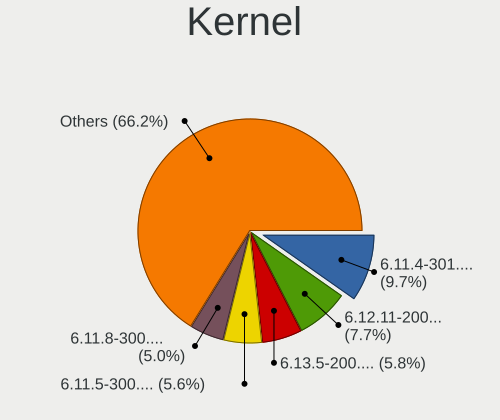

| Version                     | Computers | Percent |
|-----------------------------|-----------|---------|
| 6.11.4-301.fc41.x86_64      | 336       | 9.74%   |
| 6.12.11-200.fc41.x86_64     | 266       | 7.71%   |
| 6.13.5-200.fc41.x86_64      | 201       | 5.82%   |
| 6.11.5-300.fc41.x86_64      | 192       | 5.56%   |
| 6.11.8-300.fc41.x86_64      | 172       | 4.98%   |
| 6.13.9-200.fc41.x86_64      | 162       | 4.69%   |
| 6.11.10-300.fc41.x86_64     | 159       | 4.61%   |
| 6.12.9-200.fc41.x86_64      | 143       | 4.14%   |
| 6.11.7-300.fc41.x86_64      | 135       | 3.91%   |
| 6.12.10-200.fc41.x86_64     | 124       | 3.59%   |
| 6.12.6-200.fc41.x86_64      | 117       | 3.39%   |
| 6.13.8-200.fc41.x86_64      | 112       | 3.25%   |
| 6.12.7-200.fc41.x86_64      | 105       | 3.04%   |
| 6.12.8-200.fc41.x86_64      | 100       | 2.9%    |
| 6.13.6-200.fc41.x86_64      | 98        | 2.84%   |
| 6.12.15-200.fc41.x86_64     | 96        | 2.78%   |
| 6.11.6-300.fc41.x86_64      | 86        | 2.49%   |
| 6.13.7-200.fc41.x86_64      | 82        | 2.38%   |
| 6.12.13-200.fc41.x86_64     | 80        | 2.32%   |
| 6.13.10-200.fc41.x86_64     | 77        | 2.23%   |
| 6.11.11-300.fc41.x86_64     | 69        | 2%      |
| 6.12.4-200.fc41.x86_64      | 68        | 1.97%   |
| 6.12.5-200.fc41.x86_64      | 63        | 1.83%   |
| 6.13.4-200.fc41.x86_64      | 41        | 1.19%   |
| 6.13.11-200.fc41.x86_64     | 32        | 0.93%   |
| 6.11.0-63.fc41.x86_64       | 24        | 0.7%    |
| 6.14.9-200.fc41.x86_64      | 18        | 0.52%   |
| 6.14.6-200.fc41.x86_64      | 15        | 0.43%   |
| 6.11.0-0.rc5.43.fc41.x86_64 | 13        | 0.38%   |
| 6.8.5-301.fc40.x86_64       | 12        | 0.35%   |
| 6.14.5-200.fc41.x86_64      | 10        | 0.29%   |
| 6.11.3-300.fc41.x86_64      | 10        | 0.29%   |
| 6.14.4-200.fc41.x86_64      | 9         | 0.26%   |
| 6.11.2-300.fc41.x86_64      | 9         | 0.26%   |
| 6.13.12-200.fc41.x86_64     | 8         | 0.23%   |
| 6.15.9-101.fc41.x86_64      | 7         | 0.2%    |
| 6.11.4-300.fc41.x86_64      | 7         | 0.2%    |
| 6.14.8-200.fc41.x86_64      | 6         | 0.17%   |
| 6.14.11-200.fc41.x86_64     | 6         | 0.17%   |
| 6.17.4-100.fc41.x86_64      | 5         | 0.14%   |

Kernel Family
-------------

Linux kernel without a distro release

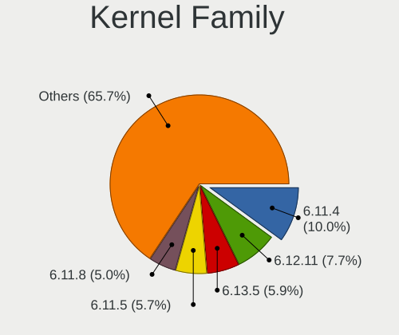

| Version | Computers | Percent |
|---------|-----------|---------|
| 6.11.4  | 346       | 10.04%  |
| 6.12.11 | 266       | 7.72%   |
| 6.13.5  | 203       | 5.89%   |
| 6.11.5  | 196       | 5.69%   |
| 6.11.8  | 172       | 4.99%   |
| 6.13.9  | 162       | 4.7%    |
| 6.11.10 | 159       | 4.61%   |
| 6.12.9  | 146       | 4.24%   |
| 6.11.7  | 136       | 3.95%   |
| 6.12.10 | 126       | 3.66%   |
| 6.12.6  | 117       | 3.4%    |
| 6.13.8  | 113       | 3.28%   |
| 6.12.7  | 112       | 3.25%   |
| 6.12.8  | 101       | 2.93%   |
| 6.13.6  | 100       | 2.9%    |
| 6.12.15 | 99        | 2.87%   |
| 6.11.6  | 89        | 2.58%   |
| 6.13.7  | 86        | 2.5%    |
| 6.12.13 | 80        | 2.32%   |
| 6.13.10 | 77        | 2.23%   |
| 6.11.11 | 74        | 2.15%   |
| 6.12.4  | 71        | 2.06%   |
| 6.12.5  | 63        | 1.83%   |
| 6.11.0  | 46        | 1.33%   |
| 6.13.4  | 42        | 1.22%   |
| 6.13.11 | 32        | 0.93%   |
| 6.14.9  | 18        | 0.52%   |
| 6.14.6  | 15        | 0.44%   |
| 6.9.0   | 14        | 0.41%   |
| 6.8.5   | 12        | 0.35%   |
| 6.11.3  | 11        | 0.32%   |
| 6.14.5  | 10        | 0.29%   |
| 6.14.4  | 9         | 0.26%   |
| 6.11.2  | 9         | 0.26%   |
| 6.13.12 | 8         | 0.23%   |
| 6.15.9  | 7         | 0.2%    |
| 6.10.0  | 7         | 0.2%    |
| 6.14.8  | 6         | 0.17%   |
| 6.14.11 | 6         | 0.17%   |
| 6.8.0   | 5         | 0.15%   |

Kernel Major Ver.
-----------------

Linux kernel major version

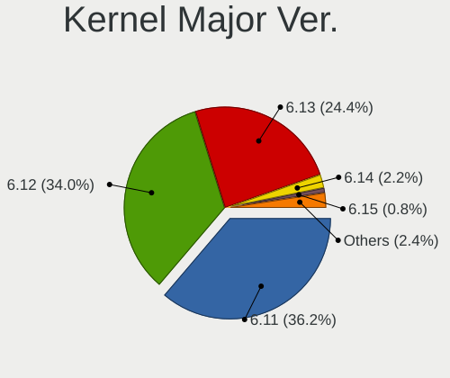

| Version | Computers | Percent |
|---------|-----------|---------|
| 6.11    | 1215      | 36.24%  |
| 6.12    | 1140      | 34%     |
| 6.13    | 818       | 24.4%   |
| 6.14    | 73        | 2.18%   |
| 6.15    | 26        | 0.78%   |
| 6.16    | 25        | 0.75%   |
| 6.8     | 19        | 0.57%   |
| 6.9     | 15        | 0.45%   |
| 6.17    | 12        | 0.36%   |
| 6.10    | 9         | 0.27%   |
| 6.6     | 1         | 0.03%   |

Arch
----

OS architecture (x86_64, i586, etc.)

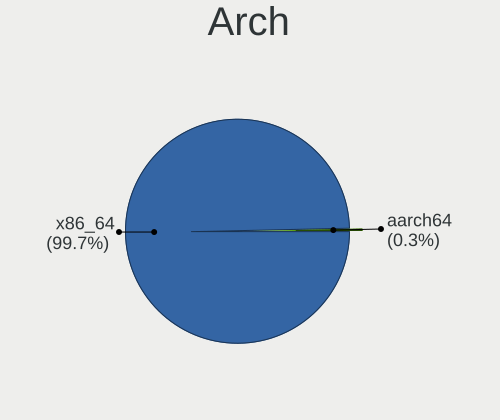

| Name    | Computers | Percent |
|---------|-----------|---------|
| x86_64  | 3173      | 99.65%  |
| aarch64 | 11        | 0.35%   |

DE
--

Desktop Environment

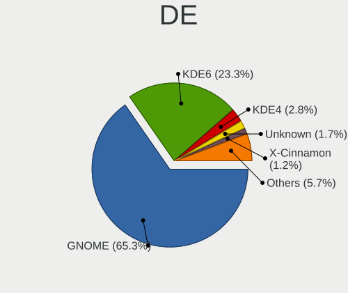

| Name            | Computers | Percent |
|-----------------|-----------|---------|
| GNOME           | 2094      | 65.32%  |
| KDE6            | 747       | 23.3%   |
| KDE4            | 89        | 2.78%   |
| Unknown         | 55        | 1.72%   |
| X-Cinnamon      | 37        | 1.15%   |
| XFCE            | 34        | 1.06%   |
| GNOME Classic   | 29        | 0.9%    |
| Cinnamon        | 20        | 0.62%   |
| sway            | 19        | 0.59%   |
| Budgie          | 18        | 0.56%   |
| Hyprland        | 17        | 0.53%   |
| MATE            | 16        | 0.5%    |
| COSMIC          | 12        | 0.37%   |
| i3              | 7         | 0.22%   |
| LXQt            | 5         | 0.16%   |
| LXDE            | 2         | 0.06%   |
| niri            | 1         | 0.03%   |
| labwc:wlroots   | 1         | 0.03%   |
| KDE             | 1         | 0.03%   |
| GNOME Flashback | 1         | 0.03%   |
| Deepin          | 1         | 0.03%   |

Display Server
--------------

X11 or Wayland

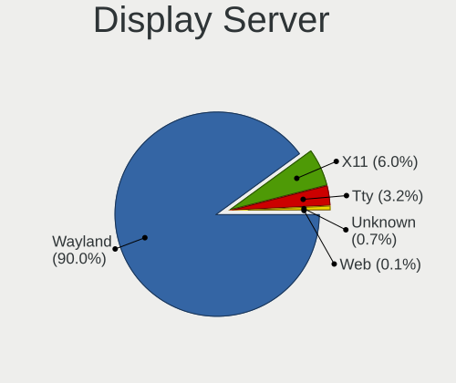

| Name    | Computers | Percent |
|---------|-----------|---------|
| Wayland | 2874      | 89.98%  |
| X11     | 193       | 6.04%   |
| Tty     | 102       | 3.19%   |
| Unknown | 23        | 0.72%   |
| Web     | 2         | 0.06%   |

Display Manager
---------------

SDDM, LightDM, etc.

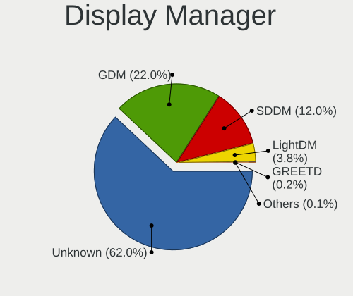

| Name    | Computers | Percent |
|---------|-----------|---------|
| Unknown | 1993      | 62.03%  |
| GDM     | 707       | 22%     |
| SDDM    | 385       | 11.98%  |
| LightDM | 121       | 3.77%   |
| GREETD  | 5         | 0.16%   |
| LXDM    | 2         | 0.06%   |

OS Lang
-------

Language

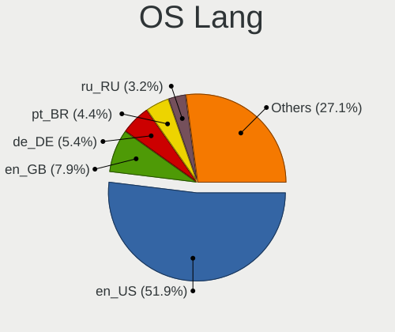

| Lang    | Computers | Percent |
|---------|-----------|---------|
| en_US   | 1658      | 51.93%  |
| en_GB   | 253       | 7.92%   |
| de_DE   | 174       | 5.45%   |
| pt_BR   | 140       | 4.38%   |
| ru_RU   | 102       | 3.19%   |
| it_IT   | 102       | 3.19%   |
| fr_FR   | 97        | 3.04%   |
| en_AU   | 70        | 2.19%   |
| es_ES   | 62        | 1.94%   |
| en_CA   | 58        | 1.82%   |
| pl_PL   | 48        | 1.5%    |
| es_MX   | 37        | 1.16%   |
| en_IN   | 29        | 0.91%   |
| tr_TR   | 27        | 0.85%   |
| Unknown | 20        | 0.63%   |
| nl_NL   | 18        | 0.56%   |
| es_AR   | 18        | 0.56%   |
| zh_CN   | 14        | 0.44%   |
| sv_SE   | 14        | 0.44%   |
| hu_HU   | 14        | 0.44%   |
| de_AT   | 12        | 0.38%   |
| pt_PT   | 10        | 0.31%   |
| es_CO   | 10        | 0.31%   |
| es_CL   | 10        | 0.31%   |
| en_ZA   | 10        | 0.31%   |
| en_NZ   | 10        | 0.31%   |
| nl_BE   | 9         | 0.28%   |
| de_CH   | 9         | 0.28%   |
| fi_FI   | 8         | 0.25%   |
| es_VE   | 8         | 0.25%   |
| cs_CZ   | 8         | 0.25%   |
| en_IE   | 7         | 0.22%   |
| en_DK   | 7         | 0.22%   |
| zh_TW   | 6         | 0.19%   |
| ko_KR   | 6         | 0.19%   |
| fr_CH   | 6         | 0.19%   |
| fr_CA   | 6         | 0.19%   |
| fr_BE   | 6         | 0.19%   |
| da_DK   | 6         | 0.19%   |
| ca_ES   | 6         | 0.19%   |

Boot Mode
---------

EFI or BIOS

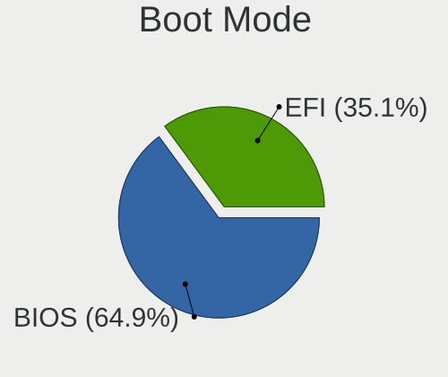

| Mode | Computers | Percent |
|------|-----------|---------|
| BIOS | 2080      | 64.88%  |
| EFI  | 1126      | 35.12%  |

Filesystem
----------

Type of filesystem

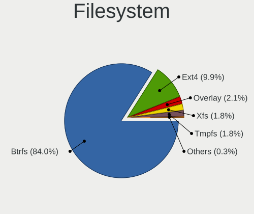

| Type    | Computers | Percent |
|---------|-----------|---------|
| Btrfs   | 2689      | 84.03%  |
| Ext4    | 318       | 9.94%   |
| Overlay | 67        | 2.09%   |
| Xfs     | 59        | 1.84%   |
| Tmpfs   | 56        | 1.75%   |
| Unknown | 9         | 0.28%   |
| F2fs    | 1         | 0.03%   |
| Ext3    | 1         | 0.03%   |

Part. scheme
------------

Scheme of partitioning

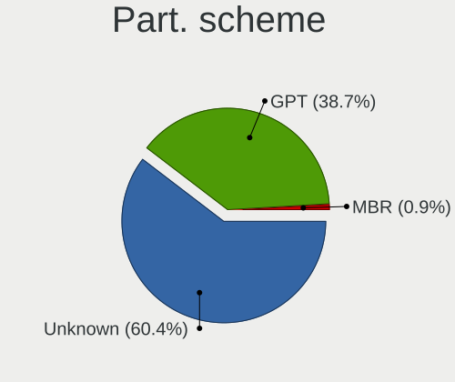

| Type    | Computers | Percent |
|---------|-----------|---------|
| Unknown | 1938      | 60.39%  |
| GPT     | 1241      | 38.67%  |
| MBR     | 30        | 0.93%   |

Dual Boot with Linux/BSD
------------------------

Hosting more than one Linux/BSD

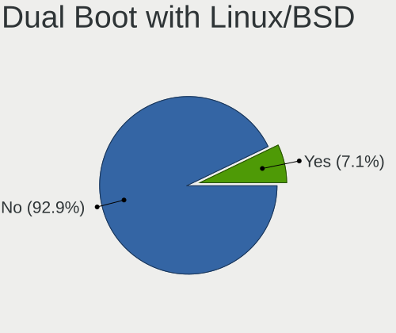

| Dual boot | Computers | Percent |
|-----------|-----------|---------|
| No        | 2969      | 92.87%  |
| Yes       | 228       | 7.13%   |

Dual Boot (Win)
---------------

Hosting Linux and Windows

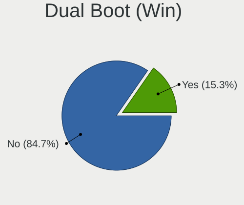

| Dual boot | Computers | Percent |
|-----------|-----------|---------|
| No        | 2712      | 84.67%  |
| Yes       | 491       | 15.33%  |

Board
-----

Vendor
------

Motherboard manufacturer

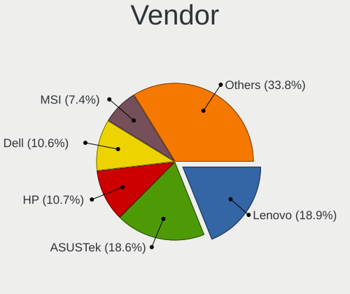

| Name                                 | Computers | Percent |
|--------------------------------------|-----------|---------|
| Lenovo                               | 602       | 18.91%  |
| ASUSTek Computer                     | 591       | 18.56%  |
| Hewlett-Packard                      | 340       | 10.68%  |
| Dell                                 | 338       | 10.62%  |
| MSI                                  | 237       | 7.44%   |
| Gigabyte Technology                  | 207       | 6.5%    |
| Apple                                | 140       | 4.4%    |
| Acer                                 | 124       | 3.89%   |
| ASRock                               | 118       | 3.71%   |
| Intel                                | 36        | 1.13%   |
| Samsung Electronics                  | 33        | 1.04%   |
| Unknown                              | 33        | 1.04%   |
| HUAWEI                               | 31        | 0.97%   |
| Framework                            | 27        | 0.85%   |
| Google                               | 21        | 0.66%   |
| Microsoft                            | 20        | 0.63%   |
| AZW                                  | 19        | 0.6%    |
| Shenzhen Meigao Electronic Equipment | 16        | 0.5%    |
| Toshiba                              | 13        | 0.41%   |
| Chuwi                                | 13        | 0.41%   |
| Fujitsu                              | 10        | 0.31%   |
| LG Electronics                       | 9         | 0.28%   |
| Alienware                            | 9         | 0.28%   |
| Pegatron                             | 7         | 0.22%   |
| Timi                                 | 6         | 0.19%   |
| Medion                               | 6         | 0.19%   |
| Sony                                 | 5         | 0.16%   |
| Positivo                             | 5         | 0.16%   |
| HONOR                                | 5         | 0.16%   |
| Biostar                              | 5         | 0.16%   |
| TUXEDO                               | 4         | 0.13%   |
| System76                             | 4         | 0.13%   |
| Huanan                               | 4         | 0.13%   |
| GPU Company                          | 4         | 0.13%   |
| Supermicro                           | 3         | 0.09%   |
| SLIMBOOK                             | 3         | 0.09%   |
| Razer                                | 3         | 0.09%   |
| Positivo Bahia - VAIO                | 3         | 0.09%   |
| Packard Bell                         | 3         | 0.09%   |
| Notebook                             | 3         | 0.09%   |

Model
-----

Motherboard model

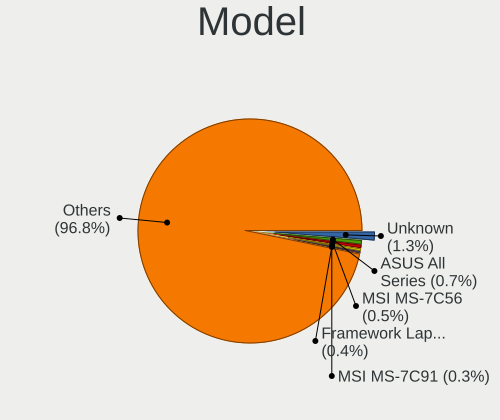

| Name                                                  | Computers | Percent |
|-------------------------------------------------------|-----------|---------|
| Unknown                                               | 41        | 1.29%   |
| ASUS All Series                                       | 21        | 0.66%   |
| MSI MS-7C56                                           | 17        | 0.53%   |
| Framework Laptop 13 (AMD Ryzen 7040Series)            | 13        | 0.41%   |
| MSI MS-7C91                                           | 11        | 0.35%   |
| Apple MacBookPro9,2                                   | 11        | 0.35%   |
| ASUS ROG STRIX B550-F GAMING                          | 10        | 0.31%   |
| Apple MacBookPro8,1                                   | 10        | 0.31%   |
| MSI MS-7B86                                           | 9         | 0.28%   |
| HP Notebook                                           | 9         | 0.28%   |
| Framework Laptop 16 (AMD Ryzen 7040 Series)           | 9         | 0.28%   |
| ASUS Vivobook Go E1504FA_E1504FA                      | 9         | 0.28%   |
| Apple MacBookAir7,2                                   | 8         | 0.25%   |
| Apple MacBookAir6,2                                   | 8         | 0.25%   |
| Dell OptiPlex 7010                                    | 7         | 0.22%   |
| AZW SER                                               | 7         | 0.22%   |
| Shenzhen Meigao Electronic Equipment Venus series     | 6         | 0.19%   |
| Shenzhen Meigao Electronic Equipment EliteMini Series | 6         | 0.19%   |
| Microsoft Surface Pro 7                               | 6         | 0.19%   |
| HUAWEI BOM-WXX9                                       | 6         | 0.19%   |
| Gigabyte B450M DS3H                                   | 6         | 0.19%   |
| ASUS ASUS Zenbook S 14 UX5406SA_UX5406SA              | 6         | 0.19%   |
| Acer Nitro ANV15-51                                   | 6         | 0.19%   |
| MSI MS-7E26                                           | 5         | 0.16%   |
| MSI MS-7C95                                           | 5         | 0.16%   |
| Lenovo IdeaPad Gaming 3 15ACH6 82K2                   | 5         | 0.16%   |
| Dell XPS 16 9640                                      | 5         | 0.16%   |
| Dell XPS 15 9500                                      | 5         | 0.16%   |
| ASUS TUF Gaming B550M-PLUS WIFI II                    | 5         | 0.16%   |
| ASUS TUF Gaming B550-PLUS                             | 5         | 0.16%   |
| ASUS ProArt X870E-CREATOR WIFI                        | 5         | 0.16%   |
| ASUS PRIME B550M-K                                    | 5         | 0.16%   |
| Apple Macmini7,1                                      | 5         | 0.16%   |
| Apple MacBookPro14,1                                  | 5         | 0.16%   |
| Apple MacBookPro11,5                                  | 5         | 0.16%   |
| Apple MacBookPro11,3                                  | 5         | 0.16%   |
| Apple MacBookPro11,1                                  | 5         | 0.16%   |
| Acer Aspire A515-57                                   | 5         | 0.16%   |
| Acer Aspire A515-45                                   | 5         | 0.16%   |
| MSI MS-7E51                                           | 4         | 0.13%   |

Model Family
------------

Motherboard model prefix

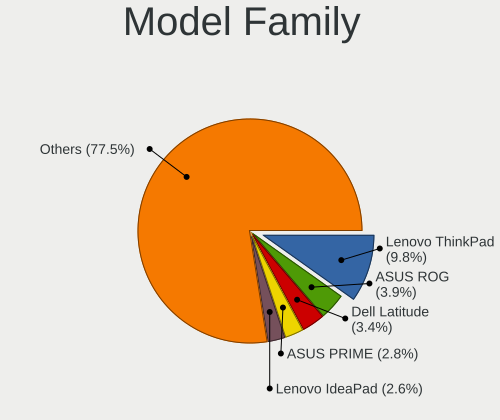

| Name               | Computers | Percent |
|--------------------|-----------|---------|
| Lenovo ThinkPad    | 313       | 9.83%   |
| ASUS ROG           | 124       | 3.89%   |
| Dell Latitude      | 109       | 3.42%   |
| ASUS PRIME         | 88        | 2.76%   |
| Lenovo IdeaPad     | 82        | 2.58%   |
| ASUS VivoBook      | 72        | 2.26%   |
| Acer Aspire        | 69        | 2.17%   |
| Dell Inspiron      | 66        | 2.07%   |
| Dell XPS           | 63        | 1.98%   |
| ASUS ASUS          | 63        | 1.98%   |
| ASUS TUF           | 59        | 1.85%   |
| HP Pavilion        | 56        | 1.76%   |
| HP Laptop          | 46        | 1.44%   |
| Lenovo Yoga        | 41        | 1.29%   |
| Unknown            | 41        | 1.29%   |
| Lenovo Legion      | 40        | 1.26%   |
| HP ProBook         | 38        | 1.19%   |
| HP EliteBook       | 38        | 1.19%   |
| Dell OptiPlex      | 38        | 1.19%   |
| Dell Precision     | 32        | 1.01%   |
| Framework Laptop   | 27        | 0.85%   |
| Lenovo ThinkBook   | 25        | 0.79%   |
| Acer Nitro         | 23        | 0.72%   |
| Lenovo ThinkCentre | 21        | 0.66%   |
| ASUS All           | 21        | 0.66%   |
| Microsoft Surface  | 20        | 0.63%   |
| HP ENVY            | 19        | 0.6%    |
| HP ZBook           | 18        | 0.57%   |
| ASUS ZenBook       | 18        | 0.57%   |
| ASUS ProArt        | 18        | 0.57%   |
| Apple MacBookPro11 | 18        | 0.57%   |
| MSI MS-7C56        | 17        | 0.53%   |
| HP Victus          | 15        | 0.47%   |
| Apple MacBookPro9  | 14        | 0.44%   |
| Apple MacBookPro8  | 14        | 0.44%   |
| Lenovo LOQ         | 13        | 0.41%   |
| Lenovo IdeaPadFlex | 13        | 0.41%   |
| HP EliteDesk       | 13        | 0.41%   |
| Acer Swift         | 13        | 0.41%   |
| Toshiba Satellite  | 12        | 0.38%   |

MFG Year
--------

Motherboard manufacture year

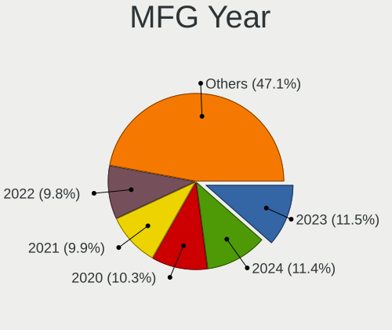

| Year    | Computers | Percent |
|---------|-----------|---------|
| 2023    | 365       | 11.46%  |
| 2024    | 364       | 11.43%  |
| 2020    | 329       | 10.33%  |
| 2021    | 314       | 9.86%   |
| 2022    | 313       | 9.83%   |
| 2018    | 251       | 7.88%   |
| 2019    | 250       | 7.85%   |
| 2017    | 180       | 5.65%   |
| 2012    | 125       | 3.93%   |
| 2014    | 123       | 3.86%   |
| 2016    | 121       | 3.8%    |
| 2013    | 120       | 3.77%   |
| 2015    | 105       | 3.3%    |
| 2011    | 90        | 2.83%   |
| 2010    | 48        | 1.51%   |
| 2009    | 29        | 0.91%   |
| 2008    | 20        | 0.63%   |
| 2025    | 13        | 0.41%   |
| 2007    | 10        | 0.31%   |
| 2006    | 10        | 0.31%   |
| Unknown | 4         | 0.13%   |

Form Factor
-----------

Physical design of the computer

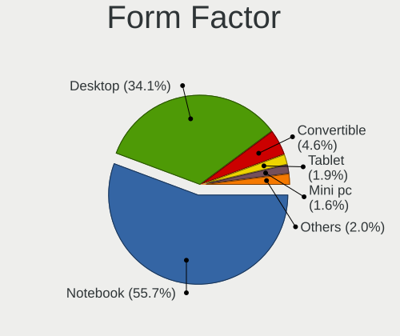

| Name           | Computers | Percent |
|----------------|-----------|---------|
| Notebook       | 1773      | 55.68%  |
| Desktop        | 1087      | 34.14%  |
| Convertible    | 148       | 4.65%   |
| Tablet         | 60        | 1.88%   |
| Mini pc        | 52        | 1.63%   |
| All in one     | 44        | 1.38%   |
| Server         | 12        | 0.38%   |
| System on chip | 5         | 0.16%   |
| Other          | 2         | 0.06%   |
| Firewall       | 1         | 0.03%   |

Secure Boot
-----------

Enabled or disabled

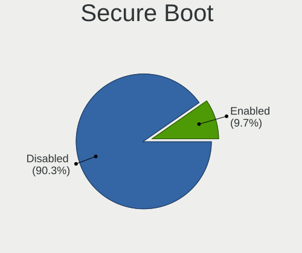

| State    | Computers | Percent |
|----------|-----------|---------|
| Disabled | 2883      | 90.32%  |
| Enabled  | 309       | 9.68%   |

Coreboot
--------

Have coreboot on board

| Used | Computers | Percent |
|------|-----------|---------|
| No   | 3158      | 99.18%  |
| Yes  | 26        | 0.82%   |

RAM Size
--------

Total RAM memory

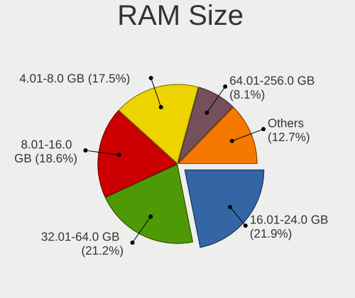

| Size in GB      | Computers | Percent |
|-----------------|-----------|---------|
| 16.01-24.0      | 700       | 21.87%  |
| 32.01-64.0      | 680       | 21.24%  |
| 8.01-16.0       | 596       | 18.62%  |
| 4.01-8.0        | 561       | 17.53%  |
| 64.01-256.0     | 258       | 8.06%   |
| 24.01-32.0      | 194       | 6.06%   |
| 3.01-4.0        | 174       | 5.44%   |
| 1.01-2.0        | 27        | 0.84%   |
| 2.01-3.0        | 7         | 0.22%   |
| More than 256.0 | 3         | 0.09%   |
| 0.51-1.0        | 1         | 0.03%   |

RAM Used
--------

Used RAM memory

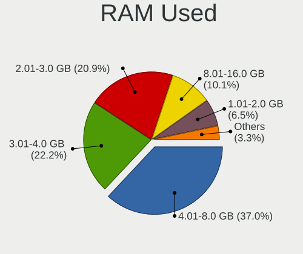

| Used GB     | Computers | Percent |
|-------------|-----------|---------|
| 4.01-8.0    | 1233      | 36.97%  |
| 3.01-4.0    | 741       | 22.22%  |
| 2.01-3.0    | 697       | 20.9%   |
| 8.01-16.0   | 336       | 10.07%  |
| 1.01-2.0    | 217       | 6.51%   |
| 16.01-24.0  | 51        | 1.53%   |
| 0.51-1.0    | 31        | 0.93%   |
| 24.01-32.0  | 18        | 0.54%   |
| 32.01-64.0  | 8         | 0.24%   |
| 64.01-256.0 | 3         | 0.09%   |

Total Drives
------------

Number of drives on board

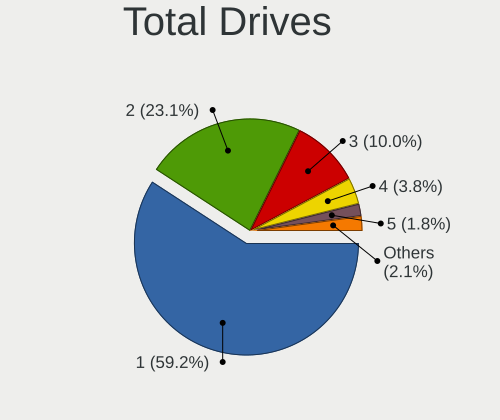

| Drives | Computers | Percent |
|--------|-----------|---------|
| 1      | 1908      | 59.2%   |
| 2      | 744       | 23.08%  |
| 3      | 321       | 9.96%   |
| 4      | 124       | 3.85%   |
| 5      | 57        | 1.77%   |
| 6      | 38        | 1.18%   |
| 7      | 11        | 0.34%   |
| 8      | 7         | 0.22%   |
| 0      | 5         | 0.16%   |
| 9      | 3         | 0.09%   |
| 13     | 2         | 0.06%   |
| 15     | 1         | 0.03%   |
| 12     | 1         | 0.03%   |
| 10     | 1         | 0.03%   |

Has CD-ROM
----------

Has CD-ROM on board

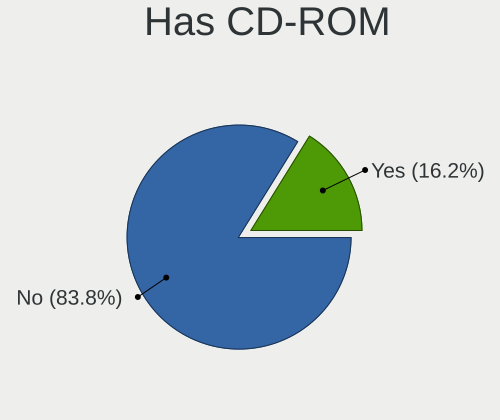

| Presented | Computers | Percent |
|-----------|-----------|---------|
| No        | 2672      | 83.84%  |
| Yes       | 515       | 16.16%  |

Has Ethernet
------------

Has Ethernet on board

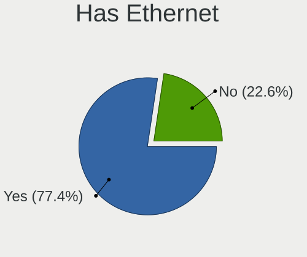

| Presented | Computers | Percent |
|-----------|-----------|---------|
| Yes       | 2466      | 77.35%  |
| No        | 722       | 22.65%  |

Has WiFi
--------

Has WiFi module

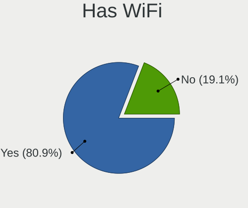

| Presented | Computers | Percent |
|-----------|-----------|---------|
| Yes       | 2580      | 80.85%  |
| No        | 611       | 19.15%  |

Has Bluetooth
-------------

Has Bluetooth module

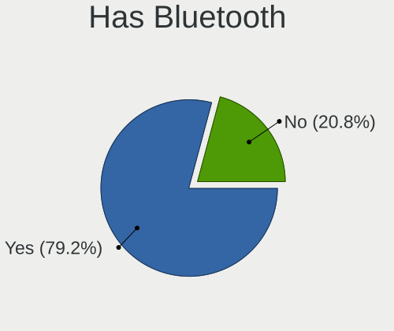

| Presented | Computers | Percent |
|-----------|-----------|---------|
| Yes       | 2530      | 79.16%  |
| No        | 666       | 20.84%  |

Location
--------

Country
-------

Geographic location (country)

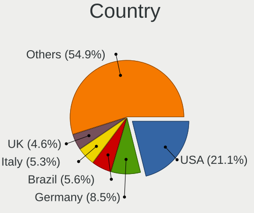

| Country      | Computers | Percent |
|--------------|-----------|---------|
| USA          | 674       | 21.11%  |
| Germany      | 271       | 8.49%   |
| Brazil       | 180       | 5.64%   |
| Italy        | 168       | 5.26%   |
| UK           | 146       | 4.57%   |
| Russia       | 141       | 4.42%   |
| France       | 131       | 4.1%    |
| Canada       | 125       | 3.91%   |
| India        | 96        | 3.01%   |
| Spain        | 87        | 2.72%   |
| Poland       | 78        | 2.44%   |
| Australia    | 71        | 2.22%   |
| Mexico       | 51        | 1.6%    |
| Netherlands  | 50        | 1.57%   |
| Switzerland  | 41        | 1.28%   |
| Turkey       | 39        | 1.22%   |
| Belgium      | 37        | 1.16%   |
| Austria      | 36        | 1.13%   |
| Sweden       | 35        | 1.1%    |
| Romania      | 30        | 0.94%   |
| Argentina    | 30        | 0.94%   |
| Indonesia    | 25        | 0.78%   |
| Finland      | 25        | 0.78%   |
| Hungary      | 24        | 0.75%   |
| Portugal     | 23        | 0.72%   |
| Norway       | 23        | 0.72%   |
| Czechia      | 23        | 0.72%   |
| Chile        | 21        | 0.66%   |
| Singapore    | 20        | 0.63%   |
| Greece       | 20        | 0.63%   |
| Colombia     | 20        | 0.63%   |
| Philippines  | 19        | 0.6%    |
| South Africa | 16        | 0.5%    |
| Israel       | 16        | 0.5%    |
| Serbia       | 15        | 0.47%   |
| Japan        | 15        | 0.47%   |
| Egypt        | 15        | 0.47%   |
| Vietnam      | 14        | 0.44%   |
| Malaysia     | 14        | 0.44%   |
| China        | 14        | 0.44%   |

City
----

Geographic location (city)

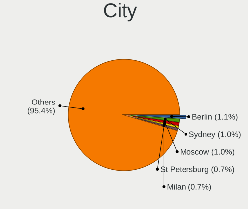

| City              | Computers | Percent |
|-------------------|-----------|---------|
| Berlin            | 37        | 1.14%   |
| Sydney            | 34        | 1.05%   |
| Moscow            | 33        | 1.02%   |
| St Petersburg     | 22        | 0.68%   |
| Milan             | 22        | 0.68%   |
| Sao Paulo         | 21        | 0.65%   |
| Melbourne         | 21        | 0.65%   |
| Vienna            | 20        | 0.62%   |
| Singapore         | 20        | 0.62%   |
| Rome              | 20        | 0.62%   |
| Paris             | 18        | 0.55%   |
| Mexico City       | 18        | 0.55%   |
| Toronto           | 17        | 0.52%   |
| Hamburg           | 16        | 0.49%   |
| Warsaw            | 15        | 0.46%   |
| Amsterdam         | 15        | 0.46%   |
| Istanbul          | 14        | 0.43%   |
| Delhi             | 14        | 0.43%   |
| Zurich            | 13        | 0.4%    |
| Helsinki          | 13        | 0.4%    |
| New York          | 12        | 0.37%   |
| Seattle           | 11        | 0.34%   |
| Los Angeles       | 11        | 0.34%   |
| Brisbane          | 11        | 0.34%   |
| Bengaluru         | 11        | 0.34%   |
| Prague            | 10        | 0.31%   |
| Munich            | 10        | 0.31%   |
| Minneapolis       | 10        | 0.31%   |
| Frankfurt am Main | 10        | 0.31%   |
| Milano            | 9         | 0.28%   |
| Budapest          | 9         | 0.28%   |
| Bucharest         | 9         | 0.28%   |
| Sofia             | 8         | 0.25%   |
| Santiago          | 8         | 0.25%   |
| Salt Lake City    | 8         | 0.25%   |
| Recife            | 8         | 0.25%   |
| Poznan            | 8         | 0.25%   |
| Phoenix           | 8         | 0.25%   |
| Oslo              | 8         | 0.25%   |
| Montreal          | 8         | 0.25%   |

Drives
------

Drive Vendor
------------

Hard drive vendors

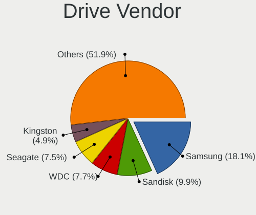

| Vendor                         | Computers | Drives | Percent |
|--------------------------------|-----------|--------|---------|
| Samsung Electronics            | 877       | 1302   | 18.15%  |
| Sandisk                        | 478       | 561    | 9.89%   |
| WDC                            | 372       | 530    | 7.7%    |
| Seagate                        | 364       | 494    | 7.53%   |
| Kingston                       | 235       | 290    | 4.86%   |
| Micron Technology              | 217       | 233    | 4.49%   |
| SK hynix                       | 211       | 236    | 4.37%   |
| Toshiba                        | 156       | 193    | 3.23%   |
| Crucial                        | 154       | 194    | 3.19%   |
| Intel                          | 137       | 179    | 2.84%   |
| Unknown                        | 136       | 163    | 2.81%   |
| Phison Electronics             | 112       | 123    | 2.32%   |
| Micron/Crucial Technology      | 104       | 127    | 2.15%   |
| KIOXIA                         | 101       | 111    | 2.09%   |
| Kingston Technology Company    | 97        | 111    | 2.01%   |
| Apple                          | 78        | 108    | 1.61%   |
| MAXIO Technology (Hangzhou)    | 68        | 75     | 1.41%   |
| ADATA Technology               | 53        | 63     | 1.1%    |
| Silicon Motion                 | 52        | 58     | 1.08%   |
| A-DATA Technology              | 52        | 57     | 1.08%   |
| China                          | 49        | 53     | 1.01%   |
| Hitachi                        | 41        | 55     | 0.85%   |
| Shenzhen Longsys Electronics   | 39        | 42     | 0.81%   |
| HGST                           | 38        | 41     | 0.79%   |
| PNY                            | 33        | 33     | 0.68%   |
| Realtek Semiconductor          | 32        | 35     | 0.66%   |
| Patriot                        | 20        | 29     | 0.41%   |
| Intenso                        | 19        | 23     | 0.39%   |
| SPCC                           | 17        | 20     | 0.35%   |
| Unknown                        | 17        | 18     | 0.35%   |
| LITEON                         | 16        | 18     | 0.33%   |
| Transcend                      | 15        | 17     | 0.31%   |
| JMicron Technology             | 15        | 19     | 0.31%   |
| Team                           | 14        | 16     | 0.29%   |
| OCZ                            | 14        | 14     | 0.29%   |
| Union Memory (Shenzhen)        | 11        | 11     | 0.23%   |
| SOLIDIGM                       | 11        | 12     | 0.23%   |
| Solid State Storage Technology | 11        | 14     | 0.23%   |
| Lexar                          | 10        | 15     | 0.21%   |
| Netac                          | 9         | 10     | 0.19%   |

Drive Model
-----------

Hard drive models

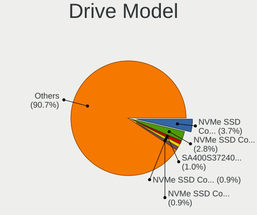

| Model                                                 | Computers | Percent |
|-------------------------------------------------------|-----------|---------|
| Samsung NVMe SSD Controller SM981/PM981/PM983 1TB     | 193       | 3.67%   |
| Samsung NVMe SSD Controller PM9A1/PM9A3/980PRO 1TB    | 148       | 2.82%   |
| Kingston SA400S37240G 240GB SSD                       | 51        | 0.97%   |
| MAXIO (Hangzhou) NVMe SSD Controller MAP1202 2TB      | 49        | 0.93%   |
| Samsung NVMe SSD Controller SM961/PM961/SM963 1024GB  | 46        | 0.88%   |
| Micron/Crucial P2 NVMe PCIe SSD 2TB                   | 45        | 0.86%   |
| Silicon Motion SM2263EN/SM2263XT SSD Controller 512GB | 43        | 0.82%   |
| Sandisk WD Blue SN550 NVMe SSD 1024GB                 | 41        | 0.78%   |
| Samsung SSD 990 PRO 2TB                               | 40        | 0.76%   |
| Kingston SA400S37480G 480GB SSD                       | 40        | 0.76%   |
| Sandisk WD Black SN750 / PC SN730 NVMe SSD 500GB      | 39        | 0.74%   |
| Unknown MMC Card  32GB                                | 36        | 0.68%   |
| Kingston Company SNV2S1000G 1TB                       | 34        | 0.65%   |
| Unknown MMC Card  64GB                                | 32        | 0.61%   |
| Samsung SSD 980 1TB                                   | 32        | 0.61%   |
| Seagate ST1000DM010-2EP102 1TB                        | 31        | 0.59%   |
| Samsung SSD 860 EVO 1TB                               | 30        | 0.57%   |
| Samsung SSD 860 EVO 500GB                             | 28        | 0.53%   |
| Samsung SSD 850 EVO 250GB                             | 27        | 0.51%   |
| Intel SSD 660P Series 512GB                           | 27        | 0.51%   |
| Samsung SSD 870 EVO 1TB                               | 26        | 0.49%   |
| Kingston SA400S37960G 960GB SSD                       | 25        | 0.48%   |
| Sandisk WD Black SN850 1TB                            | 24        | 0.46%   |
| Crucial CT1000MX500SSD1 1TB                           | 24        | 0.46%   |
| Sandisk WD_BLACK SN770 1TB                            | 22        | 0.42%   |
| Samsung SSD 980 500GB                                 | 22        | 0.42%   |
| Phison PS5013 E13 NVMe Controller 500GB               | 22        | 0.42%   |
| Phison E12 NVMe Controller 1TB                        | 22        | 0.42%   |
| Seagate ST1000LM035-1RK172 1TB                        | 21        | 0.4%    |
| Samsung SSD 990 PRO 1TB                               | 21        | 0.4%    |
| Kingston SA400S37120G 120GB SSD                       | 21        | 0.4%    |
| Seagate ST4000DM004-2CV104 4TB                        | 20        | 0.38%   |
| Seagate ST2000DM008-2FR102 2TB                        | 20        | 0.38%   |
| Sandisk WD_BLACK SN770 2TB                            | 20        | 0.38%   |
| Samsung SSD 990 PRO 4TB                               | 20        | 0.38%   |
| Crucial CT240BX500SSD1 240GB                          | 20        | 0.38%   |
| SK hynix BC501 NVMe Solid State Drive 512GB           | 19        | 0.36%   |
| Sandisk WD_BLACK SN850X 1000GB                        | 19        | 0.36%   |
| Samsung SSD 860 EVO 250GB                             | 19        | 0.36%   |
| Micron 2400_MTFDKBA512QFM 512GB                       | 19        | 0.36%   |

HDD Vendor
----------

Hard disk drive vendors

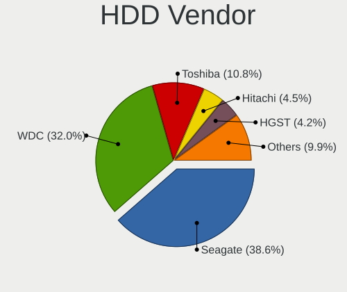

| Vendor              | Computers | Drives | Percent |
|---------------------|-----------|--------|---------|
| Seagate             | 353       | 463    | 38.58%  |
| WDC                 | 293       | 417    | 32.02%  |
| Toshiba             | 99        | 130    | 10.82%  |
| Hitachi             | 41        | 55     | 4.48%   |
| HGST                | 38        | 41     | 4.15%   |
| Samsung Electronics | 20        | 26     | 2.19%   |
| Unknown             | 12        | 12     | 1.31%   |
| Apple               | 11        | 11     | 1.2%    |
| JMicron Technology  | 10        | 14     | 1.09%   |
| Maxtor              | 5         | 6      | 0.55%   |
| External            | 4         | 5      | 0.44%   |
| ASMT                | 4         | 7      | 0.44%   |
| USB                 | 3         | 3      | 0.33%   |
| Fujitsu             | 3         | 3      | 0.33%   |
| USB3.0              | 2         | 2      | 0.22%   |
| Verbatim            | 1         | 1      | 0.11%   |
| USB 3.1             | 1         | 1      | 0.11%   |
| TO Exter            | 1         | 1      | 0.11%   |
| StoreJet            | 1         | 1      | 0.11%   |
| SSK                 | 1         | 1      | 0.11%   |
| Shenzhen            | 1         | 1      | 0.11%   |
| SABRENT             | 1         | 1      | 0.11%   |
| RSH-319             | 1         | 1      | 0.11%   |
| QNAP                | 1         | 5      | 0.11%   |
| Maxone              | 1         | 1      | 0.11%   |
| MARVELL             | 1         | 1      | 0.11%   |
| LaCie               | 1         | 1      | 0.11%   |
| Intenso             | 1         | 2      | 0.11%   |
| Inateck             | 1         | 1      | 0.11%   |
| HGST HTS            | 1         | 1      | 0.11%   |
| Extemal             | 1         | 1      | 0.11%   |
| ASMedia             | 1         | 1      | 0.11%   |

SSD Vendor
----------

Solid state drive vendors

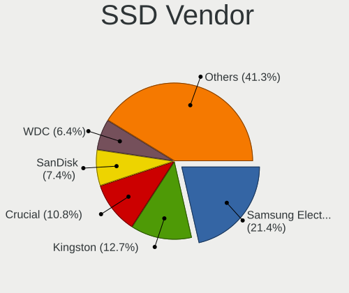

| Vendor              | Computers | Drives | Percent |
|---------------------|-----------|--------|---------|
| Samsung Electronics | 305       | 441    | 21.43%  |
| Kingston            | 181       | 217    | 12.72%  |
| Crucial             | 153       | 193    | 10.75%  |
| SanDisk             | 106       | 121    | 7.45%   |
| WDC                 | 91        | 111    | 6.39%   |
| Apple               | 49        | 51     | 3.44%   |
| China               | 47        | 51     | 3.3%    |
| A-DATA Technology   | 42        | 46     | 2.95%   |
| Micron Technology   | 37        | 40     | 2.6%    |
| Intel               | 36        | 46     | 2.53%   |
| PNY                 | 33        | 33     | 2.32%   |
| Patriot             | 19        | 27     | 1.34%   |
| SPCC                | 17        | 20     | 1.19%   |
| LITEON              | 16        | 18     | 1.12%   |
| Intenso             | 16        | 18     | 1.12%   |
| Toshiba             | 14        | 15     | 0.98%   |
| Team                | 14        | 16     | 0.98%   |
| SK hynix            | 14        | 15     | 0.98%   |
| OCZ                 | 14        | 14     | 0.98%   |
| Transcend           | 13        | 13     | 0.91%   |
| Lexar               | 10        | 15     | 0.7%    |
| GOODRAM             | 9         | 13     | 0.63%   |
| Gigabyte Technology | 9         | 9      | 0.63%   |
| Apacer              | 9         | 9      | 0.63%   |
| Netac               | 8         | 8      | 0.56%   |
| SABRENT             | 7         | 7      | 0.49%   |
| KingSpec            | 7         | 12     | 0.49%   |
| Unknown             | 7         | 7      | 0.49%   |
| Plextor             | 6         | 8      | 0.42%   |
| LITEONIT            | 6         | 7      | 0.42%   |
| Corsair             | 6         | 6      | 0.42%   |
| XrayDisk            | 5         | 5      | 0.35%   |
| Verbatim            | 5         | 7      | 0.35%   |
| Hewlett-Packard     | 5         | 6      | 0.35%   |
| Timetec             | 4         | 4      | 0.28%   |
| Rayson              | 4         | 4      | 0.28%   |
| Seagate             | 3         | 3      | 0.21%   |
| Mushkin             | 3         | 3      | 0.21%   |
| Fanxiang            | 3         | 3      | 0.21%   |
| CONSISTENT          | 3         | 4      | 0.21%   |

Drive Kind
----------

HDD or SSD

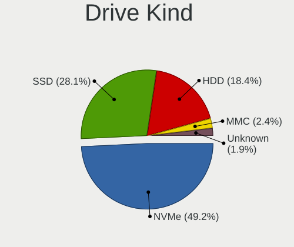

| Kind    | Computers | Drives | Percent |
|---------|-----------|--------|---------|
| NVMe    | 2122      | 2931   | 49.25%  |
| SSD     | 1211      | 1745   | 28.1%   |
| HDD     | 791       | 1217   | 18.36%  |
| MMC     | 104       | 129    | 2.41%   |
| Unknown | 81        | 88     | 1.88%   |

Drive Connector
---------------

SATA, SAS, NVMe, etc.

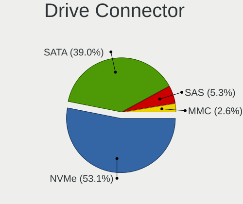

| Type | Computers | Drives | Percent |
|------|-----------|--------|---------|
| NVMe | 2115      | 2896   | 53.11%  |
| SATA | 1551      | 2807   | 38.95%  |
| SAS  | 212       | 278    | 5.32%   |
| MMC  | 104       | 129    | 2.61%   |

Drive Size
----------

Size of hard drive

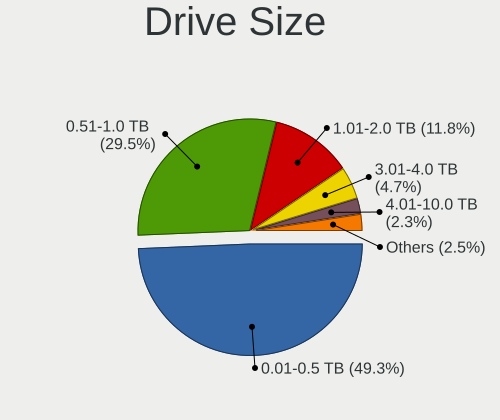

| Size in TB | Computers | Drives | Percent |
|------------|-----------|--------|---------|
| 0.01-0.5   | 1045      | 1462   | 49.34%  |
| 0.51-1.0   | 624       | 833    | 29.46%  |
| 1.01-2.0   | 249       | 360    | 11.76%  |
| 3.01-4.0   | 100       | 139    | 4.72%   |
| 4.01-10.0  | 48        | 78     | 2.27%   |
| 2.01-3.0   | 26        | 43     | 1.23%   |
| 10.01-20.0 | 21        | 37     | 0.99%   |
| 20.01-50.0 | 5         | 10     | 0.24%   |

Space Total
-----------

Amount of disk space available on the file system

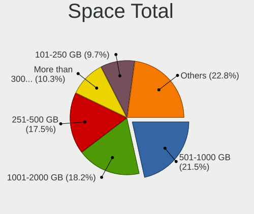

| Size in GB     | Computers | Percent |
|----------------|-----------|---------|
| 501-1000       | 698       | 21.51%  |
| 1001-2000      | 589       | 18.15%  |
| 251-500        | 567       | 17.47%  |
| More than 3000 | 335       | 10.32%  |
| 101-250        | 315       | 9.71%   |
| Unknown        | 240       | 7.4%    |
| 1-20           | 215       | 6.63%   |
| 2001-3000      | 152       | 4.68%   |
| 51-100         | 90        | 2.77%   |
| 21-50          | 44        | 1.36%   |

Space Used
----------

Amount of used disk space

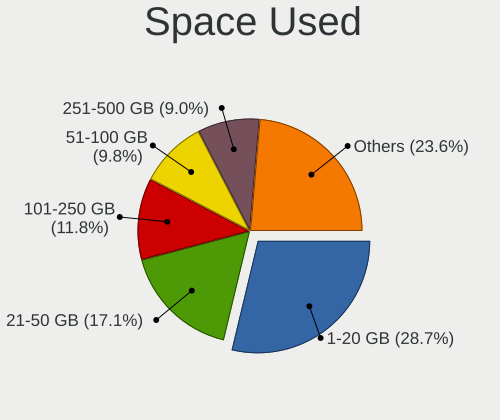

| Used GB        | Computers | Percent |
|----------------|-----------|---------|
| 1-20           | 950       | 28.74%  |
| 21-50          | 566       | 17.13%  |
| 101-250        | 389       | 11.77%  |
| 51-100         | 323       | 9.77%   |
| 251-500        | 296       | 8.96%   |
| Unknown        | 240       | 7.26%   |
| 501-1000       | 238       | 7.2%    |
| 1001-2000      | 164       | 4.96%   |
| More than 3000 | 84        | 2.54%   |
| 2001-3000      | 51        | 1.54%   |
| 0              | 4         | 0.12%   |

Malfunc. Drives
---------------

Drive models with a malfunction

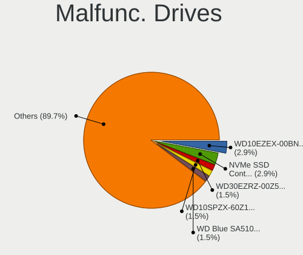

| Model                                                         | Computers | Drives | Percent |
|---------------------------------------------------------------|-----------|--------|---------|
| WDC WD10EZEX-00BN5A0 1TB                                      | 4         | 4      | 2.94%   |
| Samsung Electronics NVMe SSD Controller SM981/PM981/PM983 1TB | 4         | 4      | 2.94%   |
| WDC WD30EZRZ-00Z5HB0 3TB                                      | 2         | 2      | 1.47%   |
| WDC WD10SPZX-60Z10T0 1TB                                      | 2         | 3      | 1.47%   |
| WDC WD Blue SA510 2.5 1000GB SSD                              | 2         | 2      | 1.47%   |
| Toshiba MQ01ABD100 1TB                                        | 2         | 2      | 1.47%   |
| SK hynix BC711 HFM512GD3JX013N 512GB                          | 2         | 2      | 1.47%   |
| Silicon Motion SM2263EN/SM2263XT SSD Controller 512GB         | 2         | 2      | 1.47%   |
| Seagate ST1000LM024 HN-M101MBB 1TB                            | 2         | 2      | 1.47%   |
| Samsung Electronics HD501LJ 500GB                             | 2         | 2      | 1.47%   |
| Kingston SV300S37A120G 120GB SSD                              | 2         | 3      | 1.47%   |
| Intel SSDSC2CT120A3 120GB                                     | 2         | 5      | 1.47%   |
| WDC WDS500G2B0A-00SM50 500GB                                  | 1         | 6      | 0.74%   |
| WDC WDS240G2G0A-00JH30 240GB SSD                              | 1         | 1      | 0.74%   |
| WDC WDS120G2G0B-00EPW0 120GB SSD                              | 1         | 1      | 0.74%   |
| WDC WD7500BPVT-00HXZT3 752GB                                  | 1         | 1      | 0.74%   |
| WDC WD60EFRX-68L0BN1 6TB                                      | 1         | 1      | 0.74%   |
| WDC WD5000LPVX-22V0TT0 500GB                                  | 1         | 1      | 0.74%   |
| WDC WD5000LPCX-60VHAT0 500GB                                  | 1         | 1      | 0.74%   |
| WDC WD5000AZLX-00ZR6A0 500GB                                  | 1         | 2      | 0.74%   |
| WDC WD5000AVCS-632DY1 500GB                                   | 1         | 1      | 0.74%   |
| WDC WD5000AAKX-08ERMA0 500GB                                  | 1         | 1      | 0.74%   |
| WDC WD5000AAKX-001CA0 500GB                                   | 1         | 1      | 0.74%   |
| WDC WD5000AAKS-60Z1A0 500GB                                   | 1         | 1      | 0.74%   |
| WDC WD40PURX-64GVNY0 4TB                                      | 1         | 1      | 0.74%   |
| WDC WD40PURX-64GVNY0 1 4TB                                    | 1         | 1      | 0.74%   |
| WDC WD40EZRZ-00WN9B0 4TB                                      | 1         | 1      | 0.74%   |
| WDC WD40EFRX-68N32N0 4TB                                      | 1         | 1      | 0.74%   |
| WDC WD3200BEVT-22ZCT0 320GB                                   | 1         | 1      | 0.74%   |
| WDC WD2500AAKX-60U6AA0 250GB                                  | 1         | 1      | 0.74%   |
| WDC WD2003FZEX-00Z4SA0 2TB                                    | 1         | 2      | 0.74%   |
| WDC WD1600AVVS-63L2B0 160GB                                   | 1         | 1      | 0.74%   |
| WDC WD15EADS-22P8B0 1TB                                       | 1         | 3      | 0.74%   |
| WDC WD10EZEX-00M2NA0 1TB                                      | 1         | 1      | 0.74%   |
| WDC WD10EURX-63UY4Y0 1TB                                      | 1         | 1      | 0.74%   |
| Toshiba MQ01ABD100V 1TB                                       | 1         | 1      | 0.74%   |
| Toshiba MQ01ABD050 500GB                                      | 1         | 1      | 0.74%   |
| Toshiba MK5065GSXF 500GB                                      | 1         | 1      | 0.74%   |
| Toshiba HDWD130 3TB                                           | 1         | 9      | 0.74%   |
| Toshiba DT01ACA100 1TB                                        | 1         | 1      | 0.74%   |

Malfunc. Drive Vendor
---------------------

Vendors of faulty drives

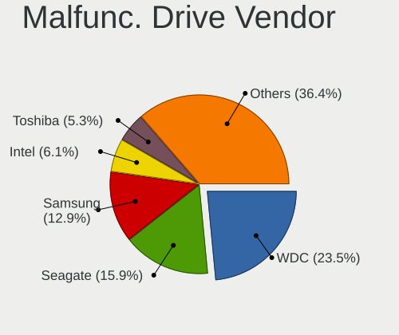

| Vendor                | Computers | Drives | Percent |
|-----------------------|-----------|--------|---------|
| WDC                   | 31        | 43     | 23.48%  |
| Seagate               | 21        | 28     | 15.91%  |
| Samsung Electronics   | 17        | 22     | 12.88%  |
| Intel                 | 8         | 13     | 6.06%   |
| Toshiba               | 7         | 15     | 5.3%    |
| Micron Technology     | 6         | 6      | 4.55%   |
| Kingston              | 6         | 8      | 4.55%   |
| SK hynix              | 3         | 3      | 2.27%   |
| Hitachi               | 3         | 4      | 2.27%   |
| HGST                  | 3         | 3      | 2.27%   |
| Crucial               | 3         | 5      | 2.27%   |
| SPCC                  | 2         | 2      | 1.52%   |
| Silicon Motion        | 2         | 2      | 1.52%   |
| Realtek Semiconductor | 2         | 2      | 1.52%   |
| Maxtor                | 2         | 2      | 1.52%   |
| A-DATA Technology     | 2         | 2      | 1.52%   |
| SanDisk               | 1         | 1      | 0.76%   |
| Realtek               | 1         | 1      | 0.76%   |
| PNY                   | 1         | 1      | 0.76%   |
| Patriot               | 1         | 1      | 0.76%   |
| Netac                 | 1         | 1      | 0.76%   |
| LITEONIT              | 1         | 2      | 0.76%   |
| LDLC                  | 1         | 1      | 0.76%   |
| KingDian              | 1         | 1      | 0.76%   |
| JMicron Technology    | 1         | 1      | 0.76%   |
| Corsair               | 1         | 1      | 0.76%   |
| China                 | 1         | 2      | 0.76%   |
| Apple                 | 1         | 1      | 0.76%   |
| AMD                   | 1         | 1      | 0.76%   |
| ADATA Technology      | 1         | 1      | 0.76%   |

Malfunc. HDD Vendor
-------------------

Vendors of faulty HDD drives

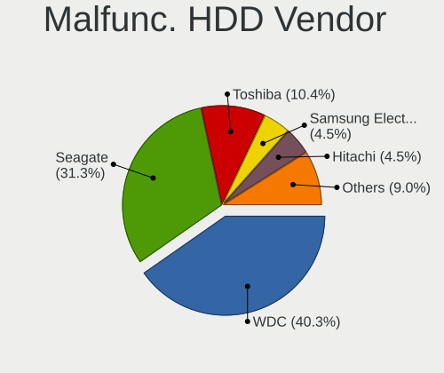

| Vendor              | Computers | Drives | Percent |
|---------------------|-----------|--------|---------|
| WDC                 | 27        | 33     | 40.3%   |
| Seagate             | 21        | 28     | 31.34%  |
| Toshiba             | 7         | 15     | 10.45%  |
| Samsung Electronics | 3         | 4      | 4.48%   |
| Hitachi             | 3         | 4      | 4.48%   |
| HGST                | 3         | 3      | 4.48%   |
| Maxtor              | 2         | 2      | 2.99%   |
| JMicron Technology  | 1         | 1      | 1.49%   |

Malfunc. Drive Kind
-------------------

Kinds of faulty drives

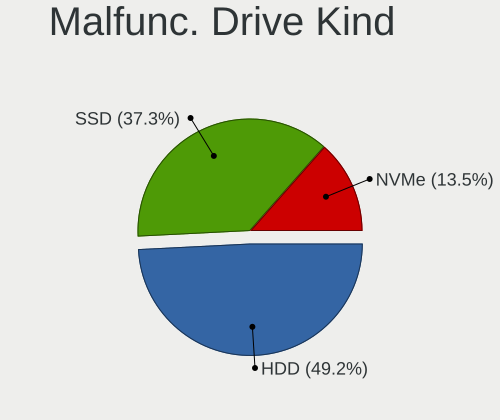

| Kind | Computers | Drives | Percent |
|------|-----------|--------|---------|
| HDD  | 62        | 90     | 49.21%  |
| SSD  | 47        | 65     | 37.3%   |
| NVMe | 17        | 21     | 13.49%  |

Failed Drives
-------------

Failed drive models

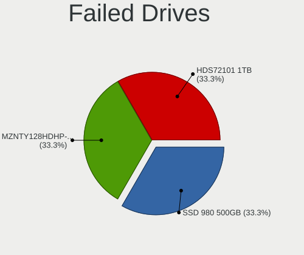

| Model                                            | Computers | Drives | Percent |
|--------------------------------------------------|-----------|--------|---------|
| Samsung Electronics SSD 980 500GB                | 1         | 1      | 33.33%  |
| Samsung Electronics MZNTY128HDHP-000H1 128GB SSD | 1         | 1      | 33.33%  |
| Hitachi HDS72101 1TB                             | 1         | 1      | 33.33%  |

Failed Drive Vendor
-------------------

Failed drive vendors

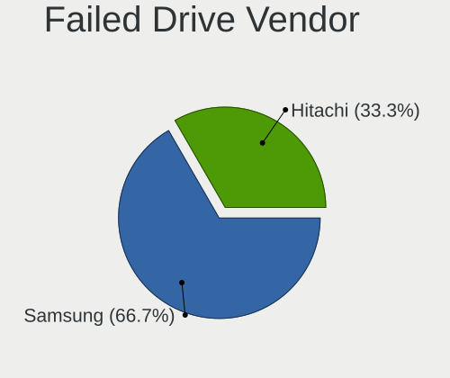

| Vendor              | Computers | Drives | Percent |
|---------------------|-----------|--------|---------|
| Samsung Electronics | 2         | 2      | 66.67%  |
| Hitachi             | 1         | 1      | 33.33%  |

Drive Status
------------

Number of failed and malfunc. drives

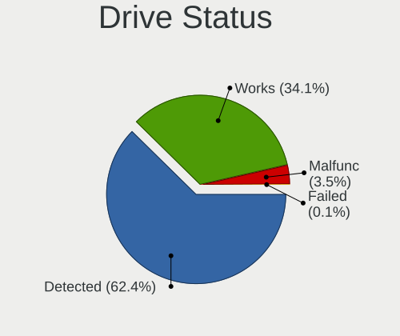

| Status   | Computers | Drives | Percent |
|----------|-----------|--------|---------|
| Detected | 2099      | 3898   | 62.36%  |
| Works    | 1147      | 2033   | 34.08%  |
| Malfunc  | 117       | 176    | 3.48%   |
| Failed   | 3         | 3      | 0.09%   |

Storage controller
------------------

Storage Vendor
--------------

Storage controller vendors

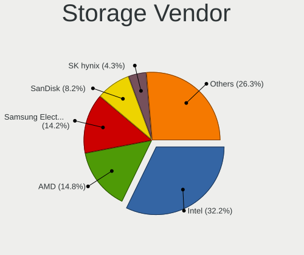

| Vendor                                  | Computers | Percent |
|-----------------------------------------|-----------|---------|
| Intel                                   | 1500      | 32.21%  |
| AMD                                     | 687       | 14.75%  |
| Samsung Electronics                     | 662       | 14.22%  |
| SanDisk                                 | 382       | 8.2%    |
| SK hynix                                | 199       | 4.27%   |
| Micron Technology                       | 182       | 3.91%   |
| Kingston Technology Company             | 152       | 3.26%   |
| Phison Electronics                      | 120       | 2.58%   |
| Micron/Crucial Technology               | 103       | 2.21%   |
| KIOXIA                                  | 102       | 2.19%   |
| ASMedia Technology                      | 68        | 1.46%   |
| MAXIO Technology (Hangzhou)             | 67        | 1.44%   |
| ADATA Technology                        | 62        | 1.33%   |
| Silicon Motion                          | 51        | 1.1%    |
| Toshiba America Info Systems            | 46        | 0.99%   |
| Shenzhen Longsys Electronics            | 41        | 0.88%   |
| Realtek Semiconductor                   | 32        | 0.69%   |
| Marvell Technology Group                | 24        | 0.52%   |
| JMicron Technology                      | 20        | 0.43%   |
| Solidigm                                | 18        | 0.39%   |
| Solid State Storage Technology          | 18        | 0.39%   |
| Nvidia                                  | 17        | 0.37%   |
| Apple                                   | 15        | 0.32%   |
| Seagate Technology                      | 14        | 0.3%    |
| Union Memory (Shenzhen)                 | 9         | 0.19%   |
| Biwin Storage Technology                | 8         | 0.17%   |
| INNOGRIT                                | 7         | 0.15%   |
| Shenzhen Unionmemory Information System | 6         | 0.13%   |
| Lenovo                                  | 6         | 0.13%   |
| Broadcom / LSI                          | 6         | 0.13%   |
| Yangtze Memory Technologies             | 5         | 0.11%   |
| LSI Logic / Symbios Logic               | 4         | 0.09%   |
| Lite-On Technology                      | 4         | 0.09%   |
| Unknown                                 | 4         | 0.09%   |
| Transcend                               | 3         | 0.06%   |
| Hosin Global Electronics                | 3         | 0.06%   |
| VIA Technologies                        | 2         | 0.04%   |
| ULi Electronics                         | 1         | 0.02%   |
| TenaFe                                  | 1         | 0.02%   |
| Silicon Image                           | 1         | 0.02%   |

Storage Model
-------------

Storage controller models

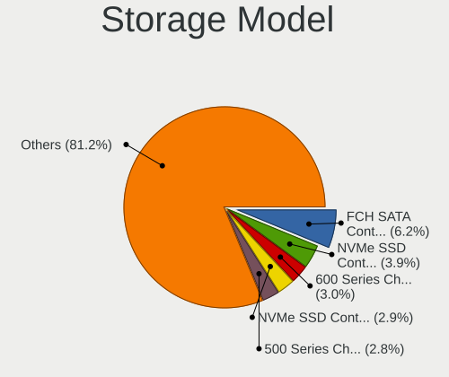

| Model                                                                          | Computers | Percent |
|--------------------------------------------------------------------------------|-----------|---------|
| AMD FCH SATA Controller [AHCI mode]                                            | 315       | 6.22%   |
| Samsung NVMe SSD Controller SM981/PM981/PM983                                  | 196       | 3.87%   |
| AMD 600 Series Chipset SATA Controller                                         | 151       | 2.98%   |
| Samsung NVMe SSD Controller PM9A1/PM9A3/980PRO                                 | 147       | 2.9%    |
| AMD 500 Series Chipset SATA Controller                                         | 142       | 2.8%    |
| Intel Sunrise Point-LP SATA Controller [AHCI mode]                             | 131       | 2.59%   |
| Intel Volume Management Device NVMe RAID Controller                            | 123       | 2.43%   |
| Samsung NVMe SSD Controller 980 (DRAM-less)                                    | 105       | 2.07%   |
| SanDisk WD SN560/SN740/SN770/SN5000 NVMe SSD                                   | 102       | 2.01%   |
| AMD 400 Series Chipset SATA Controller                                         | 90        | 1.78%   |
| Samsung NVMe SSD Controller S4LV008[Pascal]                                    | 87        | 1.72%   |
| Intel 8 Series/C220 Series Chipset Family 6-port SATA Controller 1 [AHCI mode] | 87        | 1.72%   |
| Intel 82801 Mobile SATA Controller [RAID mode]                                 | 73        | 1.44%   |
| Intel 7 Series Chipset Family 6-port SATA Controller [AHCI mode]               | 73        | 1.44%   |
| Intel Q170/Q150/B150/H170/H110/Z170/CM236 Chipset SATA Controller [AHCI Mode]  | 59        | 1.16%   |
| Micron 2400 NVMe SSD (DRAM-less)                                               | 56        | 1.11%   |
| ASMedia ASM1061/ASM1062 Serial ATA Controller                                  | 56        | 1.11%   |
| SK hynix Platinum P41/PC801 NVMe Solid State Drive                             | 53        | 1.05%   |
| SK hynix Gold P31/BC711/PC711 NVMe Solid State Drive                           | 53        | 1.05%   |
| Intel Raptor Lake SATA AHCI Controller                                         | 53        | 1.05%   |
| Intel Comet Lake SATA AHCI Controller                                          | 50        | 0.99%   |
| Intel Alder Lake-P SATA AHCI Controller                                        | 50        | 0.99%   |
| Samsung NVMe SSD Controller PM9C1a (DRAM-less)                                 | 49        | 0.97%   |
| Intel 200 Series PCH SATA controller [AHCI mode]                               | 49        | 0.97%   |
| MAXIO (Hangzhou) NVMe SSD Controller MAP1202 (DRAM-less)                       | 48        | 0.95%   |
| Intel Cannon Lake PCH SATA AHCI Controller                                     | 47        | 0.93%   |
| Sandisk WD Black SN850X NVMe SSD                                               | 46        | 0.91%   |
| Samsung NVMe SSD Controller SM961/PM961/SM963                                  | 46        | 0.91%   |
| Intel 6 Series/C200 Series Chipset Family 6 port Mobile SATA AHCI Controller   | 46        | 0.91%   |
| Micron/Crucial P2 [Nick P2] / P3 / P3 Plus NVMe PCIe SSD (DRAM-less)           | 45        | 0.89%   |
| Intel RST Volume Management Device Controller                                  | 44        | 0.87%   |
| Intel Alder Lake-S PCH SATA Controller [AHCI Mode]                             | 44        | 0.87%   |
| Silicon Motion SM2263EN/SM2263XT (DRAM-less) NVMe SSD Controllers              | 42        | 0.83%   |
| SanDisk Ultra 3D / WD PC SN530, IX SN530, Blue SN550 NVMe SSD (DRAM-less)      | 42        | 0.83%   |
| Micron 2550 NVMe SSD (DRAM-less)                                               | 40        | 0.79%   |
| SanDisk Extreme Pro / WD Black SN750 / PC SN730 / Red SN700 NVMe SSD           | 39        | 0.77%   |
| Samsung NVMe SSD Controller PM9B1 (DRAM-less)                                  | 38        | 0.75%   |
| Intel SATA Controller [RAID mode]                                              | 38        | 0.75%   |
| Intel SSD 670p Series [Keystone Harbor]                                        | 35        | 0.69%   |
| Intel 8 Series SATA Controller 1 [AHCI mode]                                   | 35        | 0.69%   |

Storage Kind
------------

Kind of storage controller (IDE, SATA, NVMe, SAS, ...)

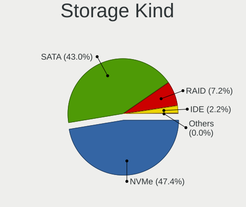

| Kind | Computers | Percent |
|------|-----------|---------|
| NVMe | 2103      | 47.39%  |
| SATA | 1909      | 43.01%  |
| RAID | 319       | 7.19%   |
| IDE  | 98        | 2.21%   |
| SAS  | 8         | 0.18%   |
| SCSI | 1         | 0.02%   |

Processor
---------

CPU Vendor
----------

Processor vendors

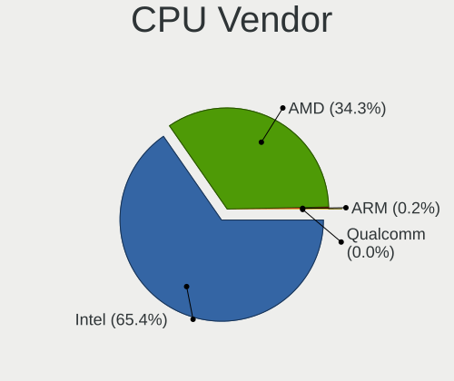

| Vendor   | Computers | Percent |
|----------|-----------|---------|
| Intel    | 2081      | 65.36%  |
| AMD      | 1092      | 34.3%   |
| ARM      | 6         | 0.19%   |
| Unknown  | 4         | 0.13%   |
| Qualcomm | 1         | 0.03%   |

CPU Model
---------

Processor models

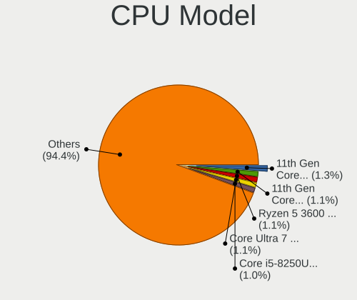

| Model                                      | Computers | Percent |
|--------------------------------------------|-----------|---------|
| Intel 11th Gen Core i5-1135G7 @ 2.40GHz    | 40        | 1.26%   |
| Intel 11th Gen Core i7-1165G7 @ 2.80GHz    | 36        | 1.13%   |
| AMD Ryzen 5 3600 6-Core Processor          | 36        | 1.13%   |
| Intel Core Ultra 7 155H                    | 34        | 1.07%   |
| Intel Core i5-8250U CPU @ 1.60GHz          | 33        | 1.04%   |
| Intel 12th Gen Core i5-1235U               | 30        | 0.94%   |
| AMD Ryzen 5 5500U with Radeon Graphics     | 29        | 0.91%   |
| Intel Core i5-7200U CPU @ 2.50GHz          | 28        | 0.88%   |
| Intel 12th Gen Core i7-12700H              | 28        | 0.88%   |
| AMD Ryzen 7 5700U with Radeon Graphics     | 28        | 0.88%   |
| AMD Ryzen 5 5600X 6-Core Processor         | 26        | 0.82%   |
| Intel Core i5-8350U CPU @ 1.70GHz          | 24        | 0.75%   |
| AMD Ryzen 7 5800X 8-Core Processor         | 24        | 0.75%   |
| AMD Ryzen 5 5600G with Radeon Graphics     | 23        | 0.72%   |
| AMD Ryzen 7 8845HS w/ Radeon 780M Graphics | 22        | 0.69%   |
| AMD Ryzen 7 5800H with Radeon Graphics     | 22        | 0.69%   |
| AMD Ryzen 5 5600H with Radeon Graphics     | 22        | 0.69%   |
| Intel Core i7-8550U CPU @ 1.80GHz          | 21        | 0.66%   |
| Intel Core i7-8565U CPU @ 1.80GHz          | 20        | 0.63%   |
| AMD Ryzen 7 7800X3D 8-Core Processor       | 19        | 0.6%    |
| AMD Ryzen 7 5700G with Radeon Graphics     | 19        | 0.6%    |
| Intel Core Ultra 9 185H                    | 18        | 0.56%   |
| Intel Core i7-8750H CPU @ 2.20GHz          | 18        | 0.56%   |
| Intel Core i5-6300U CPU @ 2.40GHz          | 18        | 0.56%   |
| Intel Core i5-10210U CPU @ 1.60GHz         | 18        | 0.56%   |
| Intel 11th Gen Core i7-1185G7 @ 3.00GHz    | 18        | 0.56%   |
| Intel 11th Gen Core i7-11800H @ 2.30GHz    | 18        | 0.56%   |
| AMD Ryzen 7 3700X 8-Core Processor         | 18        | 0.56%   |
| Intel Core i7-10510U CPU @ 1.80GHz         | 17        | 0.53%   |
| Intel Core i5-3210M CPU @ 2.50GHz          | 17        | 0.53%   |
| AMD Ryzen 9 7950X 16-Core Processor        | 17        | 0.53%   |
| AMD Ryzen 9 5900X 12-Core Processor        | 17        | 0.53%   |
| AMD Ryzen 7 9800X3D 8-Core Processor       | 17        | 0.53%   |
| AMD Ryzen 7 7840HS w/ Radeon 780M Graphics | 17        | 0.53%   |
| AMD Ryzen 7 7730U with Radeon Graphics     | 17        | 0.53%   |
| AMD Ryzen 5 7520U with Radeon Graphics     | 17        | 0.53%   |
| Intel Core i7-7500U CPU @ 2.70GHz          | 16        | 0.5%    |
| Intel Core i7-1065G7 CPU @ 1.30GHz         | 16        | 0.5%    |
| Intel 13th Gen Core i7-13700H              | 16        | 0.5%    |
| Intel Core i7-10750H CPU @ 2.60GHz         | 15        | 0.47%   |

CPU Model Family
----------------

Processor model prefix

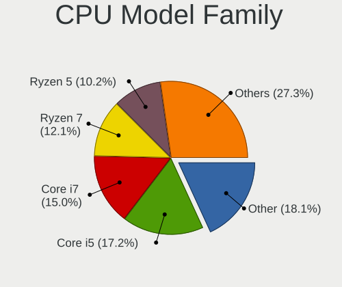

| Model                   | Computers | Percent |
|-------------------------|-----------|---------|
| Other                   | 578       | 18.15%  |
| Intel Core i5           | 549       | 17.24%  |
| Intel Core i7           | 478       | 15.01%  |
| AMD Ryzen 7             | 386       | 12.12%  |
| AMD Ryzen 5             | 326       | 10.24%  |
| AMD Ryzen 9             | 145       | 4.55%   |
| Intel Core i3           | 124       | 3.89%   |
| Intel Core              | 109       | 3.42%   |
| Intel Celeron           | 66        | 2.07%   |
| Intel Xeon              | 52        | 1.63%   |
| Intel Core i9           | 45        | 1.41%   |
| AMD Ryzen 3             | 41        | 1.29%   |
| AMD Ryzen 7 PRO         | 36        | 1.13%   |
| Intel Core 2 Duo        | 35        | 1.1%    |
| AMD Ryzen 5 PRO         | 24        | 0.75%   |
| Intel Pentium           | 23        | 0.72%   |
| Intel Atom              | 23        | 0.72%   |
| AMD FX                  | 20        | 0.63%   |
| Intel Pentium Silver    | 12        | 0.38%   |
| AMD Ryzen Threadripper  | 10        | 0.31%   |
| AMD A10                 | 10        | 0.31%   |
| AMD A6                  | 8         | 0.25%   |
| Intel Pentium Dual-Core | 7         | 0.22%   |
| AMD A8                  | 7         | 0.22%   |
| AMD A4                  | 7         | 0.22%   |
| Intel Core m3           | 5         | 0.16%   |
| Intel Core 2 Quad       | 5         | 0.16%   |
| AMD Phenom II X4        | 5         | 0.16%   |
| AMD Athlon              | 4         | 0.13%   |
| Intel Xeon Gold         | 3         | 0.09%   |
| AMD Ryzen 3 PRO         | 3         | 0.09%   |
| AMD E1                  | 3         | 0.09%   |
| AMD A12                 | 3         | 0.09%   |
| Intel Pentium Dual      | 2         | 0.06%   |
| Intel Genuine           | 2         | 0.06%   |
| Intel Core m7           | 2         | 0.06%   |
| Intel Core m5           | 2         | 0.06%   |
| AMD Phenom II X2        | 2         | 0.06%   |
| AMD GX                  | 2         | 0.06%   |
| AMD E2                  | 2         | 0.06%   |

CPU Cores
---------

Number of processor cores

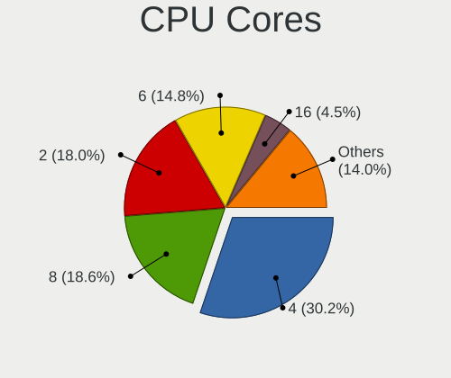

| Number  | Computers | Percent |
|---------|-----------|---------|
| 4       | 961       | 30.17%  |
| 8       | 591       | 18.56%  |
| 2       | 573       | 17.99%  |
| 6       | 470       | 14.76%  |
| 16      | 144       | 4.52%   |
| 12      | 133       | 4.18%   |
| 10      | 127       | 3.99%   |
| 14      | 102       | 3.2%    |
| 24      | 49        | 1.54%   |
| 20      | 14        | 0.44%   |
| 32      | 9         | 0.28%   |
| 1       | 3         | 0.09%   |
| Unknown | 3         | 0.09%   |
| 48      | 1         | 0.03%   |
| 46      | 1         | 0.03%   |
| 40      | 1         | 0.03%   |
| 36      | 1         | 0.03%   |
| 28      | 1         | 0.03%   |
| 18      | 1         | 0.03%   |

CPU Sockets
-----------

Number of sockets

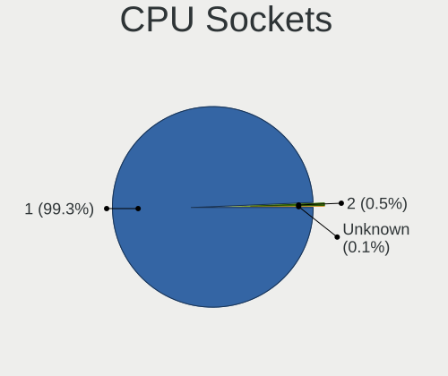

| Number  | Computers | Percent |
|---------|-----------|---------|
| 1       | 3163      | 99.34%  |
| 2       | 17        | 0.53%   |
| 4       | 2         | 0.06%   |
| Unknown | 2         | 0.06%   |

CPU Threads
-----------

Threads per core (Hyper-Threading)

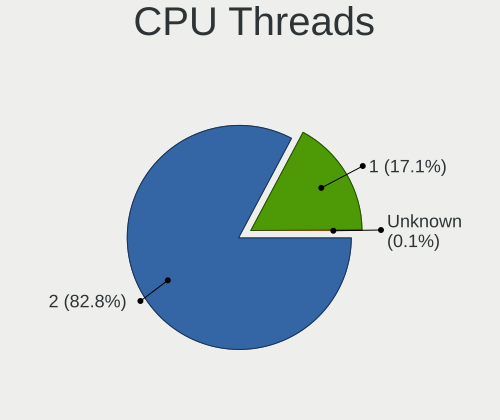

| Number  | Computers | Percent |
|---------|-----------|---------|
| 2       | 2640      | 82.78%  |
| 1       | 546       | 17.12%  |
| Unknown | 3         | 0.09%   |

CPU Op-Modes
------------

CPU Operation Modes (32-bit, 64-bit)

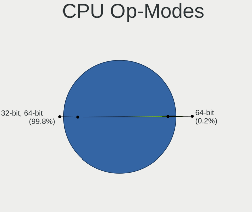

| Op mode        | Computers | Percent |
|----------------|-----------|---------|
| 32-bit, 64-bit | 3177      | 99.78%  |
| 64-bit         | 7         | 0.22%   |

CPU Microcode
-------------

Microcode number

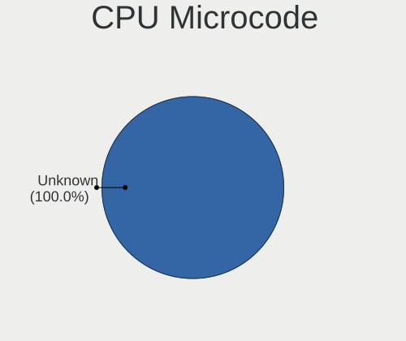

| Number  | Computers | Percent |
|---------|-----------|---------|
| Unknown | 3184      | 100%    |

CPU Microarch
-------------

Microarchitecture

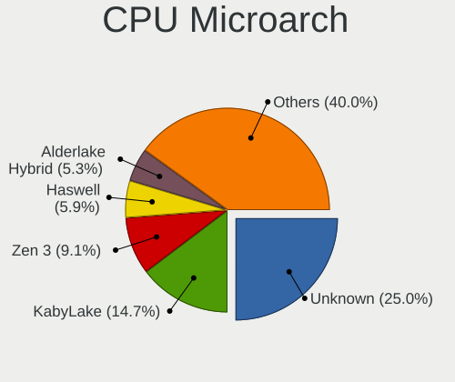

| Name               | Computers | Percent |
|--------------------|-----------|---------|
| Unknown            | 797       | 25.01%  |
| KabyLake           | 468       | 14.68%  |
| Zen 3              | 290       | 9.1%    |
| Haswell            | 188       | 5.9%    |
| Alderlake Hybrid   | 168       | 5.27%   |
| Zen 2              | 134       | 4.2%    |
| Skylake            | 134       | 4.2%    |
| TigerLake          | 133       | 4.17%   |
| IvyBridge          | 123       | 3.86%   |
| SandyBridge        | 97        | 3.04%   |
| CometLake          | 88        | 2.76%   |
| Zen+               | 70        | 2.2%    |
| Broadwell          | 61        | 1.91%   |
| IceLake            | 56        | 1.76%   |
| Silvermont         | 49        | 1.54%   |
| Meteorlake Hybrid  | 43        | 1.35%   |
| Zen                | 42        | 1.32%   |
| Penryn             | 39        | 1.22%   |
| Piledriver         | 27        | 0.85%   |
| Goldmont plus      | 24        | 0.75%   |
| Westmere           | 22        | 0.69%   |
| Lunarlake Hybrid   | 15        | 0.47%   |
| Goldmont           | 14        | 0.44%   |
| K10                | 13        | 0.41%   |
| Excavator          | 13        | 0.41%   |
| Nehalem            | 12        | 0.38%   |
| Core               | 12        | 0.38%   |
| Puma               | 9         | 0.28%   |
| Jaguar             | 9         | 0.28%   |
| Steamroller        | 7         | 0.22%   |
| Gracemont          | 7         | 0.22%   |
| Tremont            | 6         | 0.19%   |
| K8 Hammer          | 4         | 0.13%   |
| Bonnell            | 4         | 0.13%   |
| K10 Llano          | 3         | 0.09%   |
| Bobcat             | 3         | 0.09%   |
| K8 & K10 hybrid    | 1         | 0.03%   |
| Bulldozer          | 1         | 0.03%   |
| ArrowLake-H Hybrid | 1         | 0.03%   |

Graphics
--------

GPU Vendor
----------

Vendors of graphics cards

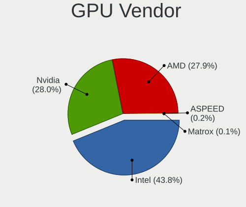

| Vendor                     | Computers | Percent |
|----------------------------|-----------|---------|
| Intel                      | 1694      | 43.84%  |
| Nvidia                     | 1083      | 28.03%  |
| AMD                        | 1077      | 27.87%  |
| ASPEED Technology          | 7         | 0.18%   |
| Matrox Electronics Systems | 3         | 0.08%   |

GPU Model
---------

Graphics card models

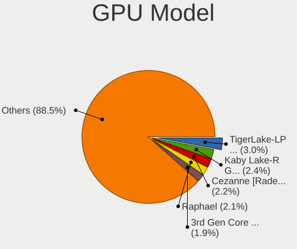

| Model                                                                       | Computers | Percent |
|-----------------------------------------------------------------------------|-----------|---------|
| Intel TigerLake-LP GT2 [Iris Xe Graphics]                                   | 119       | 2.99%   |
| Intel Kaby Lake-R GT2 [UHD Graphics 620]                                    | 94        | 2.36%   |
| AMD Cezanne [Radeon Vega Series / Radeon Vega Mobile Series]                | 88        | 2.21%   |
| AMD Raphael                                                                 | 84        | 2.11%   |
| Intel 3rd Gen Core processor Graphics Controller                            | 74        | 1.86%   |
| Intel 2nd Generation Core Processor Family Integrated Graphics Controller   | 73        | 1.83%   |
| AMD Rembrandt [Radeon 680M]                                                 | 73        | 1.83%   |
| Intel Raptor Lake-P [Iris Xe Graphics]                                      | 67        | 1.68%   |
| Intel Alder Lake-P GT2 [Iris Xe Graphics]                                   | 66        | 1.66%   |
| AMD Lucienne                                                                | 65        | 1.63%   |
| Intel Kaby Lake-U GT2 [HD Graphics 620]                                     | 64        | 1.61%   |
| AMD Phoenix1                                                                | 62        | 1.56%   |
| Intel Meteor Lake-P [Intel Arc Graphics]                                    | 61        | 1.53%   |
| Intel Skylake-U GT2 [HD Graphics 520]                                       | 55        | 1.38%   |
| Intel Haswell-ULT Integrated Graphics Controller                            | 55        | 1.38%   |
| AMD HawkPoint1                                                              | 54        | 1.36%   |
| Intel WhiskeyLake-U GT2 [UHD Graphics 620]                                  | 53        | 1.33%   |
| Intel CometLake-U GT2 [UHD Graphics]                                        | 51        | 1.28%   |
| AMD Ellesmere [Radeon RX 470/480/570/570X/580/580X/590]                     | 47        | 1.18%   |
| Intel CoffeeLake-H GT2 [UHD Graphics 630]                                   | 46        | 1.16%   |
| AMD Picasso/Raven 2 [Radeon Vega Series / Radeon Vega Mobile Series]        | 46        | 1.16%   |
| Nvidia AD107M [GeForce RTX 4060 Max-Q / Mobile]                             | 45        | 1.13%   |
| AMD Renoir [Radeon Vega Series / Radeon Vega Mobile Series]                 | 44        | 1.11%   |
| AMD Barcelo                                                                 | 44        | 1.11%   |
| AMD Granite Ridge [Radeon Graphics]                                         | 43        | 1.08%   |
| Intel Alder Lake-UP3 GT2 [Iris Xe Graphics]                                 | 41        | 1.03%   |
| AMD Navi 31 [Radeon RX 7900 XT/7900 XTX/7900 GRE/7900M]                     | 40        | 1%      |
| Nvidia AD106M [GeForce RTX 4070 Max-Q / Mobile]                             | 37        | 0.93%   |
| AMD Navi 23 [Radeon RX 6600/6600 XT/6600M]                                  | 36        | 0.9%    |
| Nvidia GA106M [GeForce RTX 3060 Mobile / Max-Q]                             | 35        | 0.88%   |
| Intel CometLake-H GT2 [UHD Graphics]                                        | 35        | 0.88%   |
| Intel Broadwell-U GT2 [HD Graphics 5500]                                    | 35        | 0.88%   |
| AMD Navi 22 [Radeon RX 6700/6700 XT/6750 XT / 6800M/6850M XT]               | 34        | 0.85%   |
| Intel Xeon E3-1200 v3/4th Gen Core Processor Integrated Graphics Controller | 33        | 0.83%   |
| Nvidia GA107M [GeForce RTX 3050 Mobile]                                     | 32        | 0.8%    |
| Nvidia TU117M [GeForce GTX 1650 Mobile / Max-Q]                             | 28        | 0.7%    |
| Intel Raptor Lake-S UHD Graphics                                            | 28        | 0.7%    |
| Intel Atom Processor Z36xxx/Z37xxx Series Graphics & Display                | 28        | 0.7%    |
| Nvidia AD107M [GeForce RTX 4050 Max-Q / Mobile]                             | 27        | 0.68%   |
| Nvidia AD107 [GeForce RTX 4060]                                             | 27        | 0.68%   |

GPU Combo
---------

Combinations of graphics cards

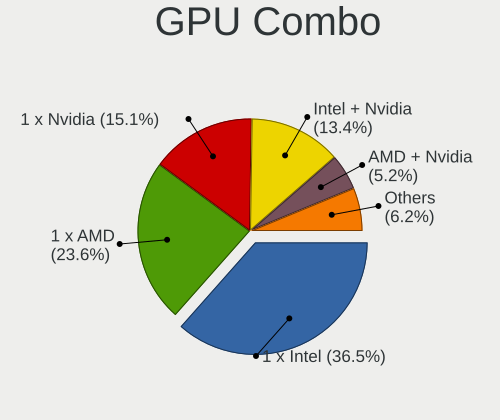

| Name                 | Computers | Percent |
|----------------------|-----------|---------|
| 1 x Intel            | 1166      | 36.54%  |
| 1 x AMD              | 752       | 23.57%  |
| 1 x Nvidia           | 483       | 15.14%  |
| Intel + Nvidia       | 426       | 13.35%  |
| AMD + Nvidia         | 165       | 5.17%   |
| 2 x AMD              | 95        | 2.98%   |
| Intel + AMD          | 64        | 2.01%   |
| Other                | 13        | 0.41%   |
| 2 x Nvidia           | 8         | 0.25%   |
| 2 x Intel            | 8         | 0.25%   |
| 1 x ASPEED           | 6         | 0.19%   |
| 1 x Matrox           | 3         | 0.09%   |
| Nvidia + ASPEED      | 1         | 0.03%   |
| 1 x AMD + 3 x Nvidia | 1         | 0.03%   |

GPU Driver
----------

Free vs proprietary

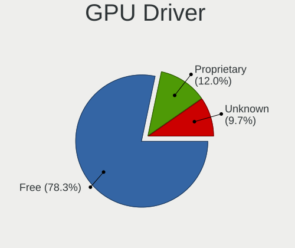

| Driver      | Computers | Percent |
|-------------|-----------|---------|
| Free        | 2509      | 78.31%  |
| Proprietary | 385       | 12.02%  |
| Unknown     | 310       | 9.68%   |

GPU Memory
----------

Total video memory

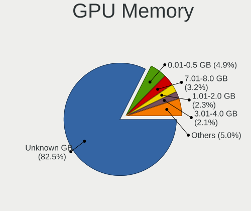

| Size in GB | Computers | Percent |
|------------|-----------|---------|
| Unknown    | 2641      | 82.48%  |
| 0.01-0.5   | 157       | 4.9%    |
| 7.01-8.0   | 101       | 3.15%   |
| 1.01-2.0   | 75        | 2.34%   |
| 3.01-4.0   | 67        | 2.09%   |
| 8.01-16.0  | 59        | 1.84%   |
| 0.51-1.0   | 48        | 1.5%    |
| 16.01-24.0 | 29        | 0.91%   |
| 5.01-6.0   | 20        | 0.62%   |
| 2.01-3.0   | 5         | 0.16%   |

Monitor
-------

Monitor Vendor
--------------

Monitor vendors

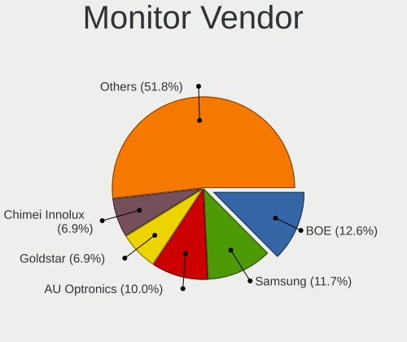

| Vendor                  | Computers | Percent |
|-------------------------|-----------|---------|
| BOE                     | 465       | 12.55%  |
| Samsung Electronics     | 433       | 11.69%  |
| AU Optronics            | 372       | 10.04%  |
| Goldstar                | 257       | 6.94%   |
| Chimei Innolux          | 257       | 6.94%   |
| Dell                    | 236       | 6.37%   |
| LG Display              | 215       | 5.8%    |
| Apple                   | 120       | 3.24%   |
| Lenovo                  | 114       | 3.08%   |
| AOC                     | 112       | 3.02%   |
| Hewlett-Packard         | 103       | 2.78%   |
| Acer                    | 100       | 2.7%    |
| Sharp                   | 75        | 2.02%   |
| ASUSTek Computer        | 72        | 1.94%   |
| BenQ                    | 71        | 1.92%   |
| Philips                 | 62        | 1.67%   |
| MSI                     | 41        | 1.11%   |
| Ancor Communications    | 41        | 1.11%   |
| PANDA                   | 35        | 0.94%   |
| ViewSonic               | 33        | 0.89%   |
| Gigabyte Technology     | 33        | 0.89%   |
| InfoVision              | 31        | 0.84%   |
| CSO                     | 29        | 0.78%   |
| Iiyama                  | 26        | 0.7%    |
| CSOT                    | 26        | 0.7%    |
| TMX                     | 17        | 0.46%   |
| Sony                    | 17        | 0.46%   |
| Chi Mei Optoelectronics | 14        | 0.38%   |
| HKC                     | 13        | 0.35%   |
| Mi                      | 12        | 0.32%   |
| Sceptre Tech            | 11        | 0.3%    |
| Vizio                   | 10        | 0.27%   |
| Unknown                 | 10        | 0.27%   |
| Denver                  | 10        | 0.27%   |
| CSW                     | 9         | 0.24%   |
| Unknown (XXX)           | 8         | 0.22%   |
| Toshiba                 | 8         | 0.22%   |
| Panasonic               | 8         | 0.22%   |
| ONN                     | 7         | 0.19%   |
| NEC Computers           | 6         | 0.16%   |

Monitor Model
-------------

Monitor models

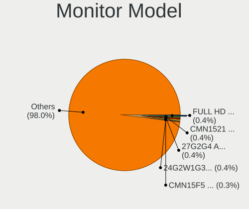

| Model                                                                 | Computers | Percent |
|-----------------------------------------------------------------------|-----------|---------|
| Goldstar FULL HD GSM5B55 1920x1080 480x270mm 21.7-inch                | 17        | 0.44%   |
| Chimei Innolux LCD Monitor CMN1521 1920x1080 344x193mm 15.5-inch      | 17        | 0.44%   |
| AOC 27G2G4 AOC2702 1920x1080 598x336mm 27.0-inch                      | 17        | 0.44%   |
| AOC 24G2W1G3 AOC2402 1920x1080 527x296mm 23.8-inch                    | 15        | 0.39%   |
| Chimei Innolux LCD Monitor CMN15F5 1920x1080 344x193mm 15.5-inch      | 12        | 0.31%   |
| AU Optronics LCD Monitor AUO403D 1920x1080 309x174mm 14.0-inch        | 12        | 0.31%   |
| AU Optronics LCD Monitor AUO21ED 1920x1080 344x193mm 15.5-inch        | 12        | 0.31%   |
| Chimei Innolux LCD Monitor CMN14D4 1920x1080 309x173mm 13.9-inch      | 11        | 0.29%   |
| AU Optronics LCD Monitor AUO38ED 1920x1080 344x193mm 15.5-inch        | 11        | 0.29%   |
| Unknown LCD Monitor FFFF 2288x1287 2550x2550mm 142.0-inch             | 10        | 0.26%   |
| Samsung Electronics LCD Monitor SDC419F 2880x1800 302x189mm 14.0-inch | 10        | 0.26%   |
| Samsung Electronics LCD Monitor SDC419D 2880x1800 302x189mm 14.0-inch | 10        | 0.26%   |
| PANDA LCD Monitor NCP004D 1920x1080 344x194mm 15.5-inch               | 10        | 0.26%   |
| Goldstar HDR 4K GSM7707 3840x2160 600x340mm 27.2-inch                 | 10        | 0.26%   |
| Goldstar 27GL850 GSM5B7F 2560x1440 597x336mm 27.0-inch                | 10        | 0.26%   |
| Chimei Innolux LCD Monitor CMN15E7 1920x1080 344x193mm 15.5-inch      | 10        | 0.26%   |
| BOE LCD Monitor BOE0872 1920x1080 344x194mm 15.5-inch                 | 10        | 0.26%   |
| AU Optronics LCD Monitor AUOAF90 1920x1080 344x193mm 15.5-inch        | 10        | 0.26%   |
| Apple Color LCD APP9CF0 1440x900 290x180mm 13.4-inch                  | 10        | 0.26%   |
| Samsung Electronics C24F390 SAM0D2C 1920x1080 521x293mm 23.5-inch     | 9         | 0.24%   |
| LG Display LCD Monitor LGD0555 2736x1824 260x173mm 12.3-inch          | 9         | 0.24%   |
| BOE LCD Monitor BOE0BC9 2560x1600 345x215mm 16.0-inch                 | 9         | 0.24%   |
| Apple LCD Monitor APP9CC5 1280x800 286x179mm 13.3-inch                | 9         | 0.24%   |
| Samsung Electronics S24F350 SAM0D20 1920x1080 521x293mm 23.5-inch     | 8         | 0.21%   |
| Samsung Electronics LF24T35 SAM707D 1920x1080 528x297mm 23.9-inch     | 8         | 0.21%   |
| Samsung Electronics C27F390 SAM0D32 1920x1080 598x336mm 27.0-inch     | 8         | 0.21%   |
| LG Display LCD Monitor LGD046F 1920x1080 344x194mm 15.5-inch          | 8         | 0.21%   |
| Goldstar Ultra HD GSM5B09 3840x2160 600x340mm 27.2-inch               | 8         | 0.21%   |
| Goldstar HDR 4K GSM7706 3840x2160 600x340mm 27.2-inch                 | 8         | 0.21%   |
| Dell U2412M DELA07B 1920x1200 518x324mm 24.1-inch                     | 8         | 0.21%   |
| Chimei Innolux LCD Monitor CMN1614 1920x1200 344x215mm 16.0-inch      | 8         | 0.21%   |
| Chimei Innolux LCD Monitor CMN15E8 1920x1080 344x193mm 15.5-inch      | 8         | 0.21%   |
| AU Optronics LCD Monitor AUO71EC 1366x768 344x193mm 15.5-inch         | 8         | 0.21%   |
| Apple Color LCD APP9CC7 1280x800 286x179mm 13.3-inch                  | 8         | 0.21%   |
| Samsung Electronics U28E590 SAM0C4D 3840x2160 607x345mm 27.5-inch     | 7         | 0.18%   |
| Samsung Electronics LCD Monitor SDC4188 2880x1800 312x195mm 14.5-inch | 7         | 0.18%   |
| Samsung Electronics LCD Monitor SDC4178 3200x2000 344x215mm 16.0-inch | 7         | 0.18%   |
| Samsung Electronics LCD Monitor SDC4171 2880x1800 302x189mm 14.0-inch | 7         | 0.18%   |
| Goldstar LG TV SSCR2 GSMC0C8 3840x2160                                | 7         | 0.18%   |
| Goldstar HDR WFHD GSM7714 2560x1080 798x334mm 34.1-inch               | 7         | 0.18%   |

Monitor Resolution
------------------

Monitor screen resolution

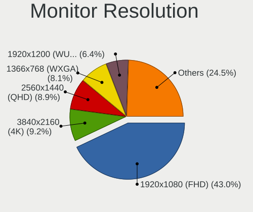

| Resolution         | Computers | Percent |
|--------------------|-----------|---------|
| 1920x1080 (FHD)    | 1511      | 42.96%  |
| 3840x2160 (4K)     | 323       | 9.18%   |
| 2560x1440 (QHD)    | 313       | 8.9%    |
| 1366x768 (WXGA)    | 285       | 8.1%    |
| 1920x1200 (WUXGA)  | 225       | 6.4%    |
| 2560x1600          | 125       | 3.55%   |
| 3440x1440          | 107       | 3.04%   |
| 2880x1800          | 103       | 2.93%   |
| 1600x900 (HD+)     | 70        | 1.99%   |
| 1440x900 (WXGA+)   | 56        | 1.59%   |
| 2560x1080          | 42        | 1.19%   |
| 1680x1050 (WSXGA+) | 38        | 1.08%   |
| 1280x800 (WXGA)    | 32        | 0.91%   |
| 1280x1024 (SXGA)   | 30        | 0.85%   |
| 3840x2400          | 25        | 0.71%   |
| 3200x2000          | 23        | 0.65%   |
| 3840x1080          | 22        | 0.63%   |
| 2880x1920          | 21        | 0.6%    |
| 2160x1440          | 17        | 0.48%   |
| Unknown            | 17        | 0.48%   |
| 2256x1504          | 13        | 0.37%   |
| 2288x1287          | 11        | 0.31%   |
| 2240x1400          | 11        | 0.31%   |
| 3072x1920          | 8         | 0.23%   |
| 2880x1620          | 8         | 0.23%   |
| 1920x1280          | 8         | 0.23%   |
| 1360x768           | 7         | 0.2%    |
| 3840x1600          | 5         | 0.14%   |
| 3840x1100          | 5         | 0.14%   |
| 3000x2000          | 5         | 0.14%   |
| 2560x2880          | 5         | 0.14%   |
| 3456x2160          | 4         | 0.11%   |
| 3200x1800 (QHD+)   | 4         | 0.11%   |
| 2736x1824          | 4         | 0.11%   |
| 1920x540           | 4         | 0.11%   |
| 1600x1200          | 4         | 0.11%   |
| 1024x768 (XGA)     | 3         | 0.09%   |
| 3840x2560          | 2         | 0.06%   |
| 2400x1600          | 2         | 0.06%   |
| 2304x1440          | 2         | 0.06%   |

Monitor Diagonal
----------------

Diagonal size in inches

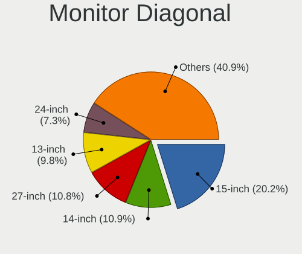

| Inches  | Computers | Percent |
|---------|-----------|---------|
| 15      | 745       | 20.19%  |
| 14      | 404       | 10.95%  |
| 27      | 399       | 10.81%  |
| 13      | 361       | 9.78%   |
| 24      | 271       | 7.34%   |
| 16      | 187       | 5.07%   |
| 23      | 182       | 4.93%   |
| 31      | 174       | 4.72%   |
| 21      | 168       | 4.55%   |
| 34      | 132       | 3.58%   |
| 17      | 120       | 3.25%   |
| 12      | 55        | 1.49%   |
| 19      | 44        | 1.19%   |
| Unknown | 40        | 1.08%   |
| 18      | 36        | 0.98%   |
| 11      | 31        | 0.84%   |
| 22      | 29        | 0.79%   |
| 20      | 25        | 0.68%   |
| 48      | 23        | 0.62%   |
| 40      | 20        | 0.54%   |
| 32      | 20        | 0.54%   |
| 26      | 20        | 0.54%   |
| 84      | 18        | 0.49%   |
| 72      | 17        | 0.46%   |
| 54      | 17        | 0.46%   |
| 25      | 15        | 0.41%   |
| 63      | 14        | 0.38%   |
| 49      | 14        | 0.38%   |
| 28      | 12        | 0.33%   |
| 142     | 10        | 0.27%   |
| 42      | 10        | 0.27%   |
| 74      | 8         | 0.22%   |
| 43      | 6         | 0.16%   |
| 37      | 6         | 0.16%   |
| 33      | 6         | 0.16%   |
| 52      | 5         | 0.14%   |
| 39      | 5         | 0.14%   |
| 35      | 5         | 0.14%   |
| 41      | 4         | 0.11%   |
| 36      | 4         | 0.11%   |

Monitor Width
-------------

Physical width

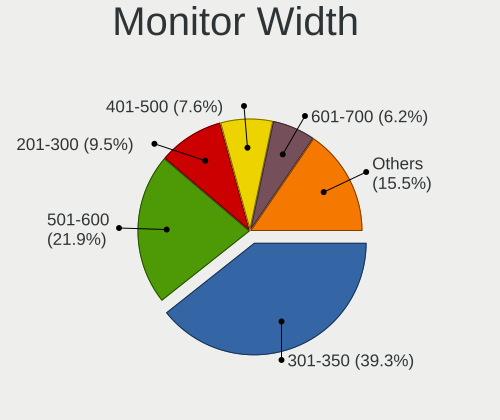

| Width in mm    | Computers | Percent |
|----------------|-----------|---------|
| 301-350        | 1420      | 39.34%  |
| 501-600        | 790       | 21.88%  |
| 201-300        | 343       | 9.5%    |
| 401-500        | 274       | 7.59%   |
| 601-700        | 225       | 6.23%   |
| 701-800        | 159       | 4.4%    |
| 351-400        | 156       | 4.32%   |
| 1001-1500      | 83        | 2.3%    |
| 1501-2000      | 45        | 1.25%   |
| Unknown        | 40        | 1.11%   |
| 801-900        | 39        | 1.08%   |
| 901-1000       | 23        | 0.64%   |
| More than 2000 | 10        | 0.28%   |
| 101-200        | 2         | 0.06%   |
| 1-100          | 1         | 0.03%   |

Aspect Ratio
------------

Proportional relationship between the width and the height

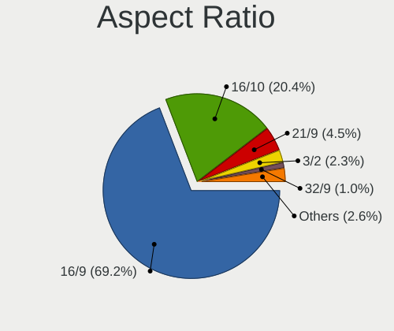

| Ratio   | Computers | Percent |
|---------|-----------|---------|
| 16/9    | 2278      | 69.18%  |
| 16/10   | 672       | 20.41%  |
| 21/9    | 148       | 4.49%   |
| 3/2     | 77        | 2.34%   |
| 32/9    | 34        | 1.03%   |
| 5/4     | 28        | 0.85%   |
| Unknown | 17        | 0.52%   |
| 4/3     | 12        | 0.36%   |
| 1.00    | 10        | 0.3%    |
| 3.40    | 5         | 0.15%   |
| 0.89    | 5         | 0.15%   |
| 6/5     | 3         | 0.09%   |
| 0.62    | 2         | 0.06%   |
| 1.96    | 1         | 0.03%   |
| 0.67    | 1         | 0.03%   |

Monitor Area
------------

Area in inch²

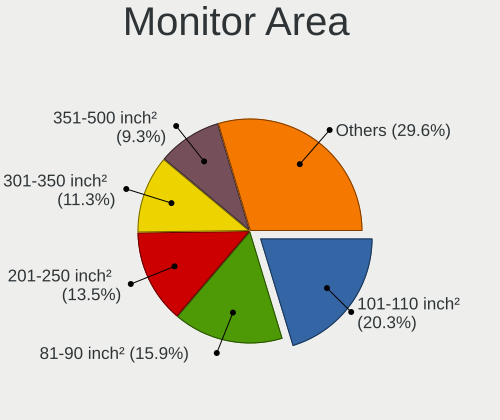

| Area in inch² | Computers | Percent |
|----------------|-----------|---------|
| 101-110        | 744       | 20.31%  |
| 81-90          | 584       | 15.94%  |
| 201-250        | 496       | 13.54%  |
| 301-350        | 413       | 11.27%  |
| 351-500        | 341       | 9.31%   |
| 111-120        | 187       | 5.11%   |
| 71-80          | 168       | 4.59%   |
| 251-300        | 121       | 3.3%    |
| 151-200        | 111       | 3.03%   |
| More than 1000 | 102       | 2.78%   |
| 121-130        | 101       | 2.76%   |
| 501-1000       | 92        | 2.51%   |
| 61-70          | 52        | 1.42%   |
| 141-150        | 40        | 1.09%   |
| Unknown        | 40        | 1.09%   |
| 51-60          | 37        | 1.01%   |
| 91-100         | 18        | 0.49%   |
| 131-140        | 10        | 0.27%   |
| 41-50          | 3         | 0.08%   |
| 1-40           | 3         | 0.08%   |

Pixel Density
-------------

Pixels per inch

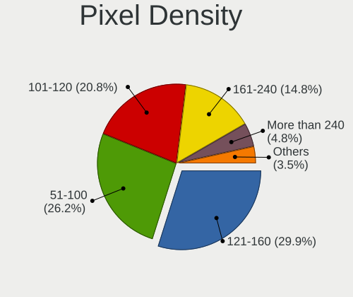

| Density       | Computers | Percent |
|---------------|-----------|---------|
| 121-160       | 1062      | 29.87%  |
| 51-100        | 933       | 26.24%  |
| 101-120       | 740       | 20.82%  |
| 161-240       | 525       | 14.77%  |
| More than 240 | 172       | 4.84%   |
| 1-50          | 83        | 2.33%   |
| Unknown       | 40        | 1.13%   |

Multiple Monitors
-----------------

Total monitors connected

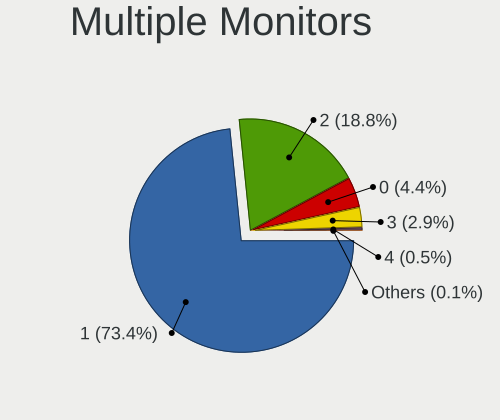

| Total | Computers | Percent |
|-------|-----------|---------|
| 1     | 2364      | 73.39%  |
| 2     | 605       | 18.78%  |
| 0     | 141       | 4.38%   |
| 3     | 94        | 2.92%   |
| 4     | 15        | 0.47%   |
| 6     | 1         | 0.03%   |
| 5     | 1         | 0.03%   |

Network
-------

Net Controller Vendor
---------------------

Controller vendors

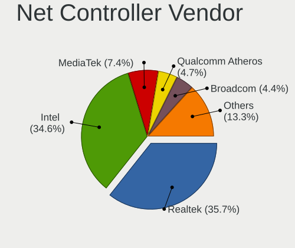

| Vendor                                 | Computers | Percent |
|----------------------------------------|-----------|---------|
| Realtek Semiconductor                  | 1713      | 35.68%  |
| Intel                                  | 1661      | 34.6%   |
| MediaTek                               | 353       | 7.35%   |
| Qualcomm Atheros                       | 227       | 4.73%   |
| Broadcom                               | 210       | 4.37%   |
| TP-Link                                | 74        | 1.54%   |
| Broadcom Limited                       | 51        | 1.06%   |
| ASIX Electronics                       | 46        | 0.96%   |
| Qualcomm                               | 38        | 0.79%   |
| Samsung Electronics                    | 30        | 0.62%   |
| Aquantia                               | 27        | 0.56%   |
| Ralink Technology                      | 25        | 0.52%   |
| Qualcomm Technologies                  | 25        | 0.52%   |
| Dell                                   | 23        | 0.48%   |
| Microsoft                              | 19        | 0.4%    |
| Ralink                                 | 18        | 0.37%   |
| Marvell Technology Group               | 18        | 0.37%   |
| Lenovo                                 | 15        | 0.31%   |
| Google                                 | 15        | 0.31%   |
| Shenzhen Goodix Technology             | 13        | 0.27%   |
| Nvidia                                 | 13        | 0.27%   |
| Xiaomi                                 | 12        | 0.25%   |
| Sierra Wireless                        | 12        | 0.25%   |
| NetGear                                | 11        | 0.23%   |
| DisplayLink                            | 11        | 0.23%   |
| ASUSTek Computer                       | 11        | 0.23%   |
| Mellanox Technologies                  | 8         | 0.17%   |
| OPPO Electronics                       | 6         | 0.12%   |
| Fibocom                                | 6         | 0.12%   |
| Qualcomm Atheros Communications        | 5         | 0.1%    |
| Motorola PCS                           | 5         | 0.1%    |
| Hewlett-Packard                        | 5         | 0.1%    |
| Ericsson Business Mobile Networks      | 5         | 0.1%    |
| D-Link                                 | 5         | 0.1%    |
| U-Blox                                 | 4         | 0.08%   |
| Edimax Technology                      | 4         | 0.08%   |
| D-Link System                          | 4         | 0.08%   |
| Arduino SA                             | 4         | 0.08%   |
| Suzhou Motorcomm Electronic Technology | 3         | 0.06%   |
| Sony Ericsson Mobile Communications AB | 3         | 0.06%   |

Net Controller Model
--------------------

Controller models

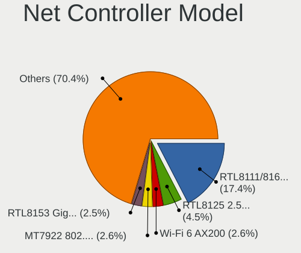

| Model                                                                  | Computers | Percent |
|------------------------------------------------------------------------|-----------|---------|
| Realtek RTL8111/8168/8211/8411 PCI Express Gigabit Ethernet Controller | 989       | 17.4%   |
| Realtek RTL8125 2.5GbE Controller                                      | 258       | 4.54%   |
| Intel Wi-Fi 6 AX200                                                    | 146       | 2.57%   |
| MediaTek MT7922 802.11ax PCI Express Wireless Network Adapter          | 145       | 2.55%   |
| Realtek RTL8153 Gigabit Ethernet Adapter                               | 144       | 2.53%   |
| Intel Alder Lake-P PCH CNVi WiFi                                       | 115       | 2.02%   |
| Intel Wi-Fi 6 AX201                                                    | 107       | 1.88%   |
| Intel Wi-Fi 6E(802.11ax) AX210/AX1675* 2x2 [Typhoon Peak]              | 105       | 1.85%   |
| Intel Wireless 8265 / 8275                                             | 103       | 1.81%   |
| MediaTek MT7921 802.11ax PCIe Wireless Network Adapter [Filogic 330]   | 83        | 1.46%   |
| Realtek RTL8821CE 802.11ac PCIe Wireless Network Adapter               | 81        | 1.42%   |
| Realtek RTL810xE PCI Express Fast Ethernet controller                  | 80        | 1.41%   |
| Realtek RTL8852BE PCIe 802.11ax Wireless Network Controller            | 77        | 1.35%   |
| Intel Ethernet Controller I225-V                                       | 73        | 1.28%   |
| Intel Raptor Lake PCH CNVi WiFi                                        | 67        | 1.18%   |
| Intel I211 Gigabit Network Connection                                  | 67        | 1.18%   |
| Realtek RTL8822CE 802.11ac PCIe Wireless Network Adapter               | 64        | 1.13%   |
| Intel Meteor Lake PCH CNVi WiFi                                        | 60        | 1.06%   |
| Qualcomm Atheros QCA6174 802.11ac Wireless Network Adapter             | 51        | 0.9%    |
| Intel Wireless 8260                                                    | 50        | 0.88%   |
| Intel 82579LM Gigabit Network Connection (Lewisville)                  | 49        | 0.86%   |
| Intel 700 Series Chipset CNVi WiFi                                     | 49        | 0.86%   |
| Intel Comet Lake PCH-LP CNVi WiFi                                      | 48        | 0.84%   |
| Intel Wireless 7265                                                    | 47        | 0.83%   |
| Intel Ethernet Connection (4) I219-LM                                  | 46        | 0.81%   |
| Qualcomm Atheros QCA9377 802.11ac Wireless Network Adapter             | 45        | 0.79%   |
| Intel Comet Lake PCH CNVi WiFi                                         | 44        | 0.77%   |
| ASIX AX88179 Gigabit Ethernet                                          | 43        | 0.76%   |
| Intel Ethernet Controller I226-V                                       | 42        | 0.74%   |
| Intel Wireless 7260                                                    | 39        | 0.69%   |
| Intel Cannon Point-LP CNVi [Wireless-AC]                               | 38        | 0.67%   |
| MediaTek MT7921K (RZ608) Wi-Fi 6E 80MHz                                | 37        | 0.65%   |
| Intel Cannon Lake PCH CNVi WiFi                                        | 37        | 0.65%   |
| Broadcom NetXtreme BCM57765 Gigabit Ethernet PCIe                      | 36        | 0.63%   |
| Intel Dual Band Wireless-AC 3168NGW [Stone Peak]                       | 35        | 0.62%   |
| Broadcom BCM4331 802.11a/b/g/n                                         | 34        | 0.6%    |
| Qualcomm QCNFA765 Wireless Network Adapter                             | 33        | 0.58%   |
| MediaTek MT7902 802.11ax PCIe Wireless Network Adapter [Filogic 310]   | 33        | 0.58%   |
| Broadcom Limited BCM4360 802.11ac Dual Band Wireless Network Adapter   | 33        | 0.58%   |
| Intel Wi-Fi 5(802.11ac) Wireless-AC 9x6x [Thunder Peak]                | 32        | 0.56%   |

Wireless Vendor
---------------

Wireless vendors

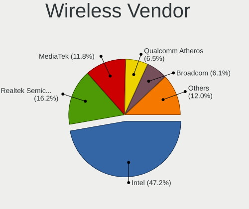

| Vendor                                | Computers | Percent |
|---------------------------------------|-----------|---------|
| Intel                                 | 1292      | 47.24%  |
| Realtek Semiconductor                 | 444       | 16.23%  |
| MediaTek                              | 324       | 11.85%  |
| Qualcomm Atheros                      | 178       | 6.51%   |
| Broadcom                              | 168       | 6.14%   |
| TP-Link                               | 69        | 2.52%   |
| Broadcom Limited                      | 45        | 1.65%   |
| Qualcomm                              | 35        | 1.28%   |
| Ralink Technology                     | 25        | 0.91%   |
| Dell                                  | 20        | 0.73%   |
| Ralink                                | 18        | 0.66%   |
| Microsoft                             | 18        | 0.66%   |
| Sierra Wireless                       | 12        | 0.44%   |
| Qualcomm Technologies                 | 12        | 0.44%   |
| NetGear                               | 11        | 0.4%    |
| ASUSTek Computer                      | 11        | 0.4%    |
| Marvell Technology Group              | 9         | 0.33%   |
| Fibocom                               | 6         | 0.22%   |
| Qualcomm Atheros Communications       | 5         | 0.18%   |
| Edimax Technology                     | 4         | 0.15%   |
| D-Link                                | 4         | 0.15%   |
| Realtek                               | 3         | 0.11%   |
| Mercucys                              | 3         | 0.11%   |
| D-Link System                         | 3         | 0.11%   |
| Sitecom Europe                        | 2         | 0.07%   |
| Hewlett-Packard                       | 2         | 0.07%   |
| Unknown                               | 2         | 0.07%   |
| ZyXEL Communications                  | 1         | 0.04%   |
| Wilocity                              | 1         | 0.04%   |
| TRENDnet                              | 1         | 0.04%   |
| Tenda                                 | 1         | 0.04%   |
| NEC Computers                         | 1         | 0.04%   |
| Micro Star International              | 1         | 0.04%   |
| Linksys                               | 1         | 0.04%   |
| IMC Networks                          | 1         | 0.04%   |
| Belkin Components                     | 1         | 0.04%   |
| 802.11g Adapter [Linksys WUSB54GC v3] | 1         | 0.04%   |

Wireless Model
--------------

Wireless models

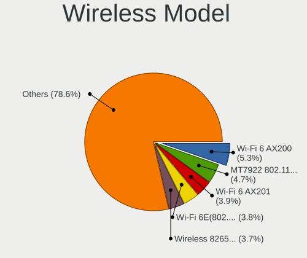

| Model                                                                           | Computers | Percent |
|---------------------------------------------------------------------------------|-----------|---------|
| Intel Wi-Fi 6 AX200                                                             | 146       | 5.31%   |
| MediaTek MT7922 802.11ax PCI Express Wireless Network Adapter                   | 128       | 4.65%   |
| Intel Wi-Fi 6 AX201                                                             | 107       | 3.89%   |
| Intel Wi-Fi 6E(802.11ax) AX210/AX1675* 2x2 [Typhoon Peak]                       | 105       | 3.82%   |
| Intel Wireless 8265 / 8275                                                      | 103       | 3.75%   |
| MediaTek MT7921 802.11ax PCIe Wireless Network Adapter [Filogic 330]            | 83        | 3.02%   |
| Realtek RTL8821CE 802.11ac PCIe Wireless Network Adapter                        | 81        | 2.95%   |
| Intel Alder Lake-P PCH CNVi WiFi                                                | 70        | 2.55%   |
| Intel Raptor Lake PCH CNVi WiFi                                                 | 67        | 2.44%   |
| Realtek RTL8822CE 802.11ac PCIe Wireless Network Adapter                        | 64        | 2.33%   |
| Realtek RTL8852BE PCIe 802.11ax Wireless Network Controller                     | 60        | 2.18%   |
| Intel Meteor Lake PCH CNVi WiFi                                                 | 60        | 2.18%   |
| Qualcomm Atheros QCA6174 802.11ac Wireless Network Adapter                      | 51        | 1.85%   |
| Intel Wireless 8260                                                             | 50        | 1.82%   |
| Intel Comet Lake PCH-LP CNVi WiFi                                               | 48        | 1.75%   |
| Intel 700 Series Chipset CNVi WiFi                                              | 48        | 1.75%   |
| Intel Wireless 7265                                                             | 47        | 1.71%   |
| Qualcomm Atheros QCA9377 802.11ac Wireless Network Adapter                      | 45        | 1.64%   |
| Intel Comet Lake PCH CNVi WiFi                                                  | 44        | 1.6%    |
| Intel Wireless 7260                                                             | 39        | 1.42%   |
| Intel Cannon Point-LP CNVi [Wireless-AC]                                        | 38        | 1.38%   |
| MediaTek MT7921K (RZ608) Wi-Fi 6E 80MHz                                         | 37        | 1.35%   |
| Intel Cannon Lake PCH CNVi WiFi                                                 | 37        | 1.35%   |
| Intel Dual Band Wireless-AC 3168NGW [Stone Peak]                                | 35        | 1.27%   |
| Broadcom BCM4331 802.11a/b/g/n                                                  | 34        | 1.24%   |
| Qualcomm QCNFA765 Wireless Network Adapter                                      | 33        | 1.2%    |
| MediaTek MT7902 802.11ax PCIe Wireless Network Adapter [Filogic 310]            | 33        | 1.2%    |
| Broadcom Limited BCM4360 802.11ac Dual Band Wireless Network Adapter            | 33        | 1.2%    |
| Intel Wi-Fi 5(802.11ac) Wireless-AC 9x6x [Thunder Peak]                         | 32        | 1.16%   |
| Realtek 802.11ac NIC                                                            | 31        | 1.13%   |
| Intel Tiger Lake PCH CNVi WiFi                                                  | 26        | 0.95%   |
| Intel Wireless 3165                                                             | 25        | 0.91%   |
| Intel Wi-Fi 7(802.11be) AX1775*/AX1790*/BE20*/BE401/BE1750* 2x2                 | 25        | 0.91%   |
| Qualcomm Atheros AR9485 Wireless Network Adapter                                | 24        | 0.87%   |
| Intel Ice Lake-LP PCH CNVi WiFi                                                 | 23        | 0.84%   |
| Broadcom BCM4360 802.11ac Dual Band Wireless Network Adapter                    | 23        | 0.84%   |
| Broadcom BCM43142 802.11b/g/n                                                   | 22        | 0.8%    |
| Realtek RTL8723BE PCIe Wireless Network Adapter                                 | 21        | 0.76%   |
| MediaTek MT7925 802.11be 160MHz 2x2 PCIe Wireless Network Adapter [Filogic 360] | 21        | 0.76%   |
| Realtek RTL8852AE 802.11ax PCIe Wireless Network Adapter                        | 20        | 0.73%   |

Ethernet Vendor
---------------

Ethernet vendors

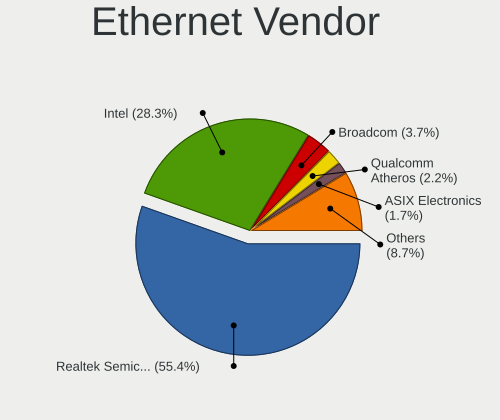

| Vendor                                 | Computers | Percent |
|----------------------------------------|-----------|---------|
| Realtek Semiconductor                  | 1515      | 55.43%  |
| Intel                                  | 774       | 28.32%  |
| Broadcom                               | 100       | 3.66%   |
| Qualcomm Atheros                       | 61        | 2.23%   |
| ASIX Electronics                       | 46        | 1.68%   |
| Samsung Electronics                    | 28        | 1.02%   |
| MediaTek                               | 28        | 1.02%   |
| Aquantia                               | 27        | 0.99%   |
| Google                                 | 15        | 0.55%   |
| Lenovo                                 | 14        | 0.51%   |
| Qualcomm Technologies                  | 13        | 0.48%   |
| Nvidia                                 | 13        | 0.48%   |
| Xiaomi                                 | 12        | 0.44%   |
| DisplayLink                            | 11        | 0.4%    |
| Marvell Technology Group               | 9         | 0.33%   |
| Mellanox Technologies                  | 8         | 0.29%   |
| OPPO Electronics                       | 6         | 0.22%   |
| Broadcom Limited                       | 6         | 0.22%   |
| TP-Link                                | 5         | 0.18%   |
| Motorola PCS                           | 5         | 0.18%   |
| Suzhou Motorcomm Electronic Technology | 3         | 0.11%   |
| Sony Ericsson Mobile Communications AB | 3         | 0.11%   |
| Qualcomm                               | 3         | 0.11%   |
| JMicron Technology                     | 3         | 0.11%   |
| Hewlett-Packard                        | 3         | 0.11%   |
| Huawei Technologies                    | 2         | 0.07%   |
| Dell                                   | 2         | 0.07%   |
| Apple                                  | 2         | 0.07%   |
| American Megatrends                    | 2         | 0.07%   |
| ADMtek                                 | 2         | 0.07%   |
| VIA Technologies                       | 1         | 0.04%   |
| Rivet                                  | 1         | 0.04%   |
| QinHeng Electronics                    | 1         | 0.04%   |
| OnePlus Technology (Shenzhen)          | 1         | 0.04%   |
| Novatel Wireless                       | 1         | 0.04%   |
| Netchip Technology                     | 1         | 0.04%   |
| Microsoft                              | 1         | 0.04%   |
| Insyde Software                        | 1         | 0.04%   |
| ICS Advent                             | 1         | 0.04%   |
| D-Link System                          | 1         | 0.04%   |

Ethernet Model
--------------

Ethernet models

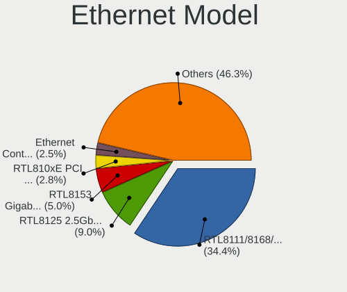

| Model                                                                           | Computers | Percent |
|---------------------------------------------------------------------------------|-----------|---------|
| Realtek RTL8111/8168/8211/8411 PCI Express Gigabit Ethernet Controller          | 989       | 34.39%  |
| Realtek RTL8125 2.5GbE Controller                                               | 258       | 8.97%   |
| Realtek RTL8153 Gigabit Ethernet Adapter                                        | 144       | 5.01%   |
| Realtek RTL810xE PCI Express Fast Ethernet controller                           | 80        | 2.78%   |
| Intel Ethernet Controller I225-V                                                | 73        | 2.54%   |
| Intel I211 Gigabit Network Connection                                           | 67        | 2.33%   |
| Intel 82579LM Gigabit Network Connection (Lewisville)                           | 49        | 1.7%    |
| Intel Ethernet Connection (4) I219-LM                                           | 46        | 1.6%    |
| Intel Alder Lake-P PCH CNVi WiFi                                                | 45        | 1.56%   |
| ASIX AX88179 Gigabit Ethernet                                                   | 43        | 1.5%    |
| Intel Ethernet Controller I226-V                                                | 42        | 1.46%   |
| Broadcom NetXtreme BCM57765 Gigabit Ethernet PCIe                               | 36        | 1.25%   |
| Intel Ethernet Connection (2) I219-V                                            | 31        | 1.08%   |
| Intel Ethernet Connection I217-LM                                               | 25        | 0.87%   |
| Intel Ethernet Connection (7) I219-V                                            | 24        | 0.83%   |
| Realtek Killer E2600 GbE Controller                                             | 23        | 0.8%    |
| Intel Ethernet Connection (7) I219-LM                                           | 23        | 0.8%    |
| Broadcom NetXtreme BCM57766 Gigabit Ethernet PCIe                               | 22        | 0.76%   |
| Realtek RTL8126 5GbE Controller                                                 | 21        | 0.73%   |
| Intel Ethernet Connection (2) I219-LM                                           | 21        | 0.73%   |
| Intel Ethernet Connection I219-LM                                               | 20        | 0.7%    |
| Intel Ethernet Connection (4) I219-V                                            | 20        | 0.7%    |
| Intel Ethernet Connection (10) I219-V                                           | 19        | 0.66%   |
| Samsung Galaxy series, misc. (tethering mode)                                   | 18        | 0.63%   |
| Realtek RTL8852BE PCIe 802.11ax Wireless Network Controller                     | 17        | 0.59%   |
| MediaTek MT7922 802.11ax PCI Express Wireless Network Adapter                   | 17        | 0.59%   |
| Intel Ethernet Connection (6) I219-V                                            | 16        | 0.56%   |
| Realtek Killer E3000 2.5GbE Controller                                          | 15        | 0.52%   |
| Intel Ethernet Connection (18) I219-LM                                          | 15        | 0.52%   |
| Realtek USB 10/100/1G/2.5 LAN                                                   | 14        | 0.49%   |
| Realtek RTL8852CE PCIe 802.11ax Wireless Network Controller                     | 14        | 0.49%   |
| Intel 82579V Gigabit Network Connection                                         | 14        | 0.49%   |
| Qualcomm WCN785x Wi-Fi 7(802.11be) 320MHz 2x2 [FastConnect 7800]                | 13        | 0.45%   |
| Intel I210 Gigabit Network Connection                                           | 13        | 0.45%   |
| Intel Ethernet Connection (6) I219-LM                                           | 12        | 0.42%   |
| Aquantia AQtion AQC113CS NBase-T/IEEE 802.3an Ethernet Controller [Antigua 10G] | 12        | 0.42%   |
| Intel Ethernet Connection I218-LM                                               | 11        | 0.38%   |
| Intel Ethernet Connection (5) I219-LM                                           | 11        | 0.38%   |
| Intel Ethernet Connection (16) I219-V                                           | 11        | 0.38%   |
| Intel BE201 320MHz                                                              | 11        | 0.38%   |

Net Controller Kind
-------------------

Ethernet, WiFi or modem

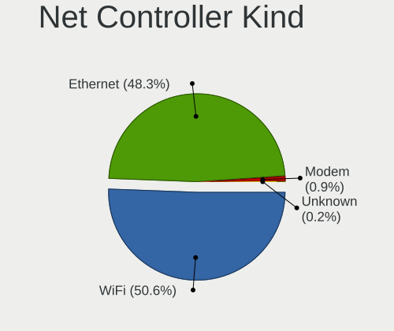

| Kind     | Computers | Percent |
|----------|-----------|---------|
| WiFi     | 2575      | 50.59%  |
| Ethernet | 2460      | 48.33%  |
| Modem    | 47        | 0.92%   |
| Unknown  | 8         | 0.16%   |

Used Controller
---------------

Currently used network controller

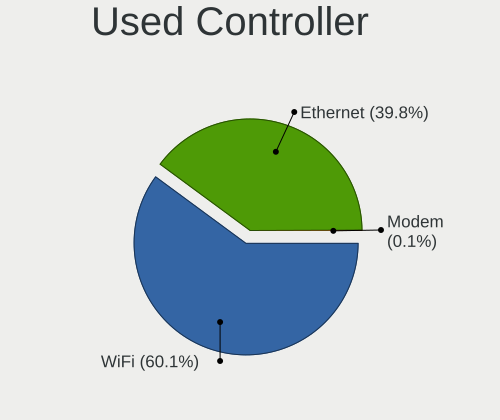

| Kind     | Computers | Percent |
|----------|-----------|---------|
| WiFi     | 1972      | 60.1%   |
| Ethernet | 1307      | 39.84%  |
| Modem    | 2         | 0.06%   |

NICs
----

Total network controllers on board

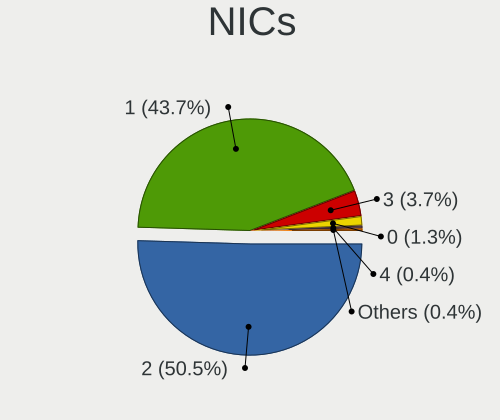

| Total | Computers | Percent |
|-------|-----------|---------|
| 2     | 1608      | 50.47%  |
| 1     | 1391      | 43.66%  |
| 3     | 119       | 3.74%   |
| 0     | 43        | 1.35%   |
| 4     | 13        | 0.41%   |
| 6     | 5         | 0.16%   |
| 5     | 4         | 0.13%   |
| 12    | 1         | 0.03%   |
| 9     | 1         | 0.03%   |
| 7     | 1         | 0.03%   |

IPv6
----

IPv6 vs IPv4

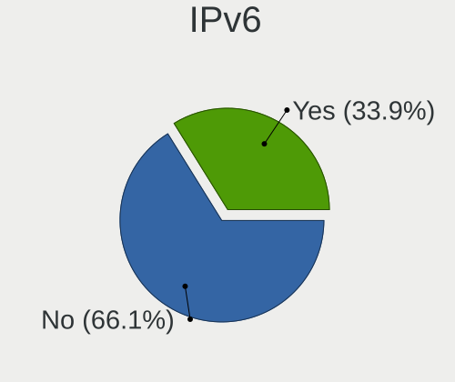

| Used | Computers | Percent |
|------|-----------|---------|
| No   | 2122      | 66.15%  |
| Yes  | 1086      | 33.85%  |

Bluetooth
---------

Bluetooth Vendor
----------------

Controller vendors

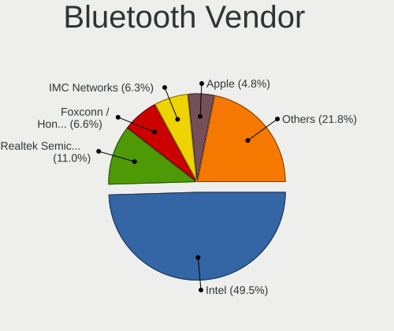

| Vendor                          | Computers | Percent |
|---------------------------------|-----------|---------|
| Intel                           | 1270      | 49.53%  |
| Realtek Semiconductor           | 282       | 11%     |
| Foxconn / Hon Hai               | 168       | 6.55%   |
| IMC Networks                    | 161       | 6.28%   |
| Apple                           | 123       | 4.8%    |
| MediaTek                        | 105       | 4.1%    |
| Cambridge Silicon Radio         | 86        | 3.35%   |
| Qualcomm Atheros Communications | 83        | 3.24%   |
| Lite-On Technology              | 51        | 1.99%   |
| Broadcom                        | 49        | 1.91%   |
| TP-Link                         | 38        | 1.48%   |
| ASUSTek Computer                | 34        | 1.33%   |
| USI                             | 24        | 0.94%   |
| Realtek                         | 23        | 0.9%    |
| Marvell Semiconductor           | 9         | 0.35%   |
| Unknown                         | 8         | 0.31%   |
| Foxconn International           | 7         | 0.27%   |
| Dell                            | 7         | 0.27%   |
| Hewlett-Packard                 | 6         | 0.23%   |
| Ralink                          | 5         | 0.2%    |
| Toshiba                         | 4         | 0.16%   |
| Smart Modular Technologies      | 3         | 0.12%   |
| Fujitsu                         | 3         | 0.12%   |
| Actions                         | 3         | 0.12%   |
| Edimax Technology               | 2         | 0.08%   |
| TRENDnet                        | 1         | 0.04%   |
| SINO WEALTH                     | 1         | 0.04%   |
| Roper                           | 1         | 0.04%   |
| Ralink Technology               | 1         | 0.04%   |
| Micro Star International        | 1         | 0.04%   |
| Integrated System Solution      | 1         | 0.04%   |
| HTC (High Tech Computer)        | 1         | 0.04%   |
| Chicony Electronics             | 1         | 0.04%   |
| Belkin Components               | 1         | 0.04%   |
| Alps Electric                   | 1         | 0.04%   |

Bluetooth Model
---------------

Controller models

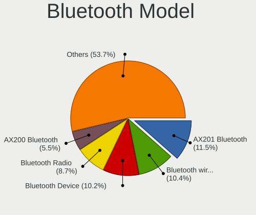

| Model                                               | Computers | Percent |
|-----------------------------------------------------|-----------|---------|
| Intel AX201 Bluetooth                               | 296       | 11.52%  |
| Intel Bluetooth wireless interface                  | 266       | 10.35%  |
| Intel Bluetooth Device                              | 263       | 10.24%  |
| Realtek Bluetooth Radio                             | 223       | 8.68%   |
| Intel AX200 Bluetooth                               | 141       | 5.49%   |
| Intel Bluetooth 9460/9560 Jefferson Peak (JfP)      | 118       | 4.59%   |
| MediaTek Wireless_Device                            | 105       | 4.09%   |
| Intel AX210 Bluetooth                               | 102       | 3.97%   |
| Foxconn / Hon Hai Wireless_Device                   | 100       | 3.89%   |
| IMC Networks Wireless_Device                        | 89        | 3.46%   |
| Cambridge Silicon Radio Bluetooth Dongle (HCI mode) | 86        | 3.35%   |
| Apple Bluetooth Host Controller                     | 61        | 2.37%   |
| Qualcomm Atheros  Bluetooth Device                  | 49        | 1.91%   |
| Apple Bluetooth USB Host Controller                 | 47        | 1.83%   |
| IMC Networks Bluetooth Radio                        | 43        | 1.67%   |
| Realtek  Bluetooth 4.2 Adapter                      | 41        | 1.6%    |
| TP-Link TP-T@- UB500 Adapter                        | 38        | 1.48%   |
| Foxconn / Hon Hai Bluetooth Device                  | 38        | 1.48%   |
| Intel Wireless-AC 3168 Bluetooth                    | 33        | 1.28%   |
| Intel Wireless-AC 9260 Bluetooth Adapter            | 29        | 1.13%   |
| USI Bluetooth Device                                | 24        | 0.93%   |
| Lite-On Wireless_Device                             | 24        | 0.93%   |
| Realtek Bluetooth Radio                             | 23        | 0.9%    |
| Foxconn / Hon Hai MediaTek Bluetooth Adapter        | 23        | 0.9%    |
| Qualcomm Atheros QCA61x4 Bluetooth 4.0              | 19        | 0.74%   |
| IMC Networks Bluetooth Device                       | 19        | 0.74%   |
| Intel Centrino Bluetooth Wireless Transceiver       | 15        | 0.58%   |
| Apple Built-in Bluetooth 2.0+EDR HCI                | 15        | 0.58%   |
| ASUS Broadcom BCM20702A0 Bluetooth                  | 13        | 0.51%   |
| Broadcom BCM20702A0 Bluetooth 4.0                   | 11        | 0.43%   |
| ASUS ASUS USB-BT500                                 | 10        | 0.39%   |
| Lite-On Bluetooth Device                            | 9         | 0.35%   |
| Broadcom BCM2045B (BDC-2.1)                         | 9         | 0.35%   |
| Qualcomm Atheros AR3012 Bluetooth 4.0               | 8         | 0.31%   |
| Lite-On Qualcomm Atheros QCA9377 Bluetooth          | 8         | 0.31%   |
| Unknown                                             | 8         | 0.31%   |
| Intel Bluetooth                                     | 7         | 0.27%   |
| Foxconn International BCM43142A0 Bluetooth module   | 7         | 0.27%   |
| Realtek Bluetooth 5.4 Radio                         | 6         | 0.23%   |
| Marvell Bluetooth and Wireless LAN Composite        | 6         | 0.23%   |

Sound
-----

Sound Vendor
------------

Sound card vendors

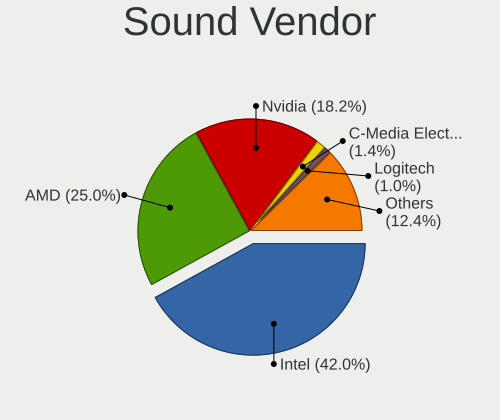

| Vendor                                       | Computers | Percent |
|----------------------------------------------|-----------|---------|
| Intel                                        | 2036      | 42%     |
| AMD                                          | 1214      | 25.04%  |
| Nvidia                                       | 882       | 18.19%  |
| C-Media Electronics                          | 69        | 1.42%   |
| Logitech                                     | 48        | 0.99%   |
| ASUSTek Computer                             | 41        | 0.85%   |
| SteelSeries ApS                              | 33        | 0.68%   |
| Razer USA                                    | 27        | 0.56%   |
| Micro Star International                     | 24        | 0.5%    |
| Lenovo                                       | 23        | 0.47%   |
| JMTek                                        | 23        | 0.47%   |
| Hewlett-Packard                              | 23        | 0.47%   |
| Focusrite-Novation                           | 22        | 0.45%   |
| Kingston Technology                          | 21        | 0.43%   |
| Generalplus Technology                       | 18        | 0.37%   |
| Texas Instruments                            | 15        | 0.31%   |
| GN Netcom                                    | 15        | 0.31%   |
| Sony                                         | 14        | 0.29%   |
| Creative Labs                                | 14        | 0.29%   |
| Corsair                                      | 13        | 0.27%   |
| Realtek Semiconductor                        | 12        | 0.25%   |
| Creative Technology                          | 10        | 0.21%   |
| RODE Microphones                             | 9         | 0.19%   |
| Plantronics                                  | 9         | 0.19%   |
| Apple                                        | 9         | 0.19%   |
| FiiO Electronics Technology                  | 8         | 0.17%   |
| Zoran Co. Personal Media Division (Nogatech) | 7         | 0.14%   |
| ASRock                                       | 7         | 0.14%   |
| Walmart                                      | 6         | 0.12%   |
| Blue Microphones                             | 6         | 0.12%   |
| XMOS                                         | 5         | 0.1%    |
| Elgato Systems                               | 5         | 0.1%    |
| DSEA A/S                                     | 5         | 0.1%    |
| Conexant Systems                             | 5         | 0.1%    |
| BEHRINGER International                      | 5         | 0.1%    |
| Unknown                                      | 5         | 0.1%    |
| TTGK Technology                              | 4         | 0.08%   |
| Thesycon Systemsoftware & Consulting         | 4         | 0.08%   |
| Tenx Technology                              | 4         | 0.08%   |
| Microsoft                                    | 4         | 0.08%   |

Sound Model
-----------

Sound card models

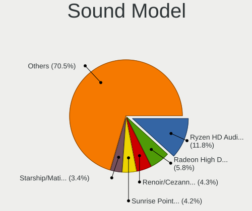

| Model                                                                      | Computers | Percent |
|----------------------------------------------------------------------------|-----------|---------|
| AMD Ryzen HD Audio Controller                                              | 706       | 11.79%  |
| AMD Radeon High Definition Audio Controller                                | 349       | 5.83%   |
| AMD Renoir/Cezanne HDMI/DP Audio Controller                                | 260       | 4.34%   |
| Intel Sunrise Point-LP HD Audio                                            | 249       | 4.16%   |
| AMD Starship/Matisse HD Audio Controller                                   | 202       | 3.37%   |
| Intel Alder Lake PCH-P High Definition Audio Controller                    | 151       | 2.52%   |
| Intel Tiger Lake-LP Smart Sound Technology Audio Controller                | 133       | 2.22%   |
| AMD Navi 21/23 HDMI/DP Audio Controller                                    | 123       | 2.05%   |
| Intel 7 Series/C216 Chipset Family High Definition Audio Controller        | 110       | 1.84%   |
| Intel 8 Series/C220 Series Chipset High Definition Audio Controller        | 105       | 1.75%   |
| Intel 6 Series/C200 Series Chipset Family High Definition Audio Controller | 101       | 1.69%   |
| Intel Cannon Lake PCH cAVS                                                 | 96        | 1.6%    |
| Intel Raptor Lake-P/U/H cAVS                                               | 94        | 1.57%   |
| Nvidia AD107 High Definition Audio Controller                              | 93        | 1.55%   |
| AMD Navi 31 HDMI/DP Audio                                                  | 84        | 1.4%    |
| Intel Raptor Lake High Definition Audio Controller                         | 83        | 1.39%   |
| Intel Meteor Lake-P HD Audio Controller                                    | 79        | 1.32%   |
| Nvidia GA106 High Definition Audio Controller                              | 70        | 1.17%   |
| Intel 100 Series/C230 Series Chipset Family HD Audio Controller            | 67        | 1.12%   |
| Nvidia GA104 High Definition Audio Controller                              | 66        | 1.1%    |
| AMD Raven/Raven2/Fenghuang HDMI/DP Audio Controller                        | 63        | 1.05%   |
| Intel Xeon E3-1200 v3/4th Gen Core Processor HD Audio Controller           | 60        | 1%      |
| Intel Comet Lake PCH-LP cAVS                                               | 58        | 0.97%   |
| Intel Comet Lake PCH cAVS                                                  | 58        | 0.97%   |
| Nvidia GA107 High Definition Audio Controller                              | 57        | 0.95%   |
| AMD Ellesmere HDMI Audio [Radeon RX 470/480 / 570/580/590]                 | 57        | 0.95%   |
| Intel Haswell-ULT HD Audio Controller                                      | 56        | 0.94%   |
| Intel Cannon Point-LP High Definition Audio Controller                     | 56        | 0.94%   |
| Intel 8 Series HD Audio Controller                                         | 56        | 0.94%   |
| Intel 200 Series PCH HD Audio                                              | 56        | 0.94%   |
| Intel Broadwell-U Audio Controller                                         | 50        | 0.84%   |
| Intel Wildcat Point-LP High Definition Audio Controller                    | 49        | 0.82%   |
| Intel Alder Lake-S HD Audio Controller                                     | 47        | 0.79%   |
| Nvidia TU107 GeForce GTX 1650 High Definition Audio Controller             | 45        | 0.75%   |
| Nvidia GP104 High Definition Audio Controller                              | 45        | 0.75%   |
| Intel Tiger Lake-H HD Audio Controller                                     | 44        | 0.73%   |
| Nvidia AD106M High Definition Audio Controller                             | 41        | 0.68%   |
| Intel Ice Lake-LP Smart Sound Technology Audio Controller                  | 40        | 0.67%   |
| AMD FCH Azalia Controller                                                  | 40        | 0.67%   |
| AMD Family 17h (Models 00h-0fh) HD Audio Controller                        | 38        | 0.63%   |

Memory
------

Memory Vendor
-------------

Memory module vendors

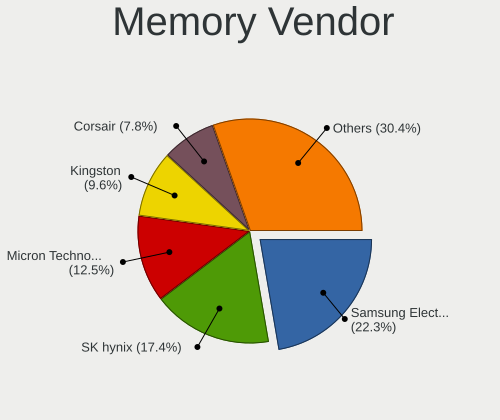

| Vendor                       | Computers | Percent |
|------------------------------|-----------|---------|
| Samsung Electronics          | 320       | 22.3%   |
| SK hynix                     | 249       | 17.35%  |
| Micron Technology            | 180       | 12.54%  |
| Kingston                     | 138       | 9.62%   |
| Corsair                      | 112       | 7.8%    |
| Crucial                      | 89        | 6.2%    |
| G.Skill                      | 64        | 4.46%   |
| Unknown                      | 52        | 3.62%   |
| Unknown                      | 50        | 3.48%   |
| A-DATA Technology            | 30        | 2.09%   |
| Ramaxel Technology           | 19        | 1.32%   |
| Team                         | 16        | 1.11%   |
| Elpida                       | 12        | 0.84%   |
| Apacer                       | 10        | 0.7%    |
| Unknown (ABCD)               | 8         | 0.56%   |
| Patriot                      | 7         | 0.49%   |
| Timetec                      | 6         | 0.42%   |
| Nanya Technology             | 5         | 0.35%   |
| GOODRAM                      | 4         | 0.28%   |
| Smart Brazil                 | 3         | 0.21%   |
| Smart                        | 3         | 0.21%   |
| PNY                          | 3         | 0.21%   |
| Patriot Memory (PDP Systems) | 3         | 0.21%   |
| Hikvision                    | 3         | 0.21%   |
| AMD                          | 3         | 0.21%   |
| Unknown (0x0B45)             | 2         | 0.14%   |
| Transcend                    | 2         | 0.14%   |
| TBD                          | 2         | 0.14%   |
| Smart Modular                | 2         | 0.14%   |
| Neo Forza                    | 2         | 0.14%   |
| Lexar                        | 2         | 0.14%   |
| Golden Empire                | 2         | 0.14%   |
| GeIL                         | 2         | 0.14%   |
| Wodposit                     | 1         | 0.07%   |
| Wilk                         | 1         | 0.07%   |
| Unknown (0x29E)              | 1         | 0.07%   |
| Unknown (0x0FC4)             | 1         | 0.07%   |
| Unknown (0x0F94)             | 1         | 0.07%   |
| Unknown (0x0EEF)             | 1         | 0.07%   |
| Unknown (0x0E9D)             | 1         | 0.07%   |

Memory Model
------------

Memory module models

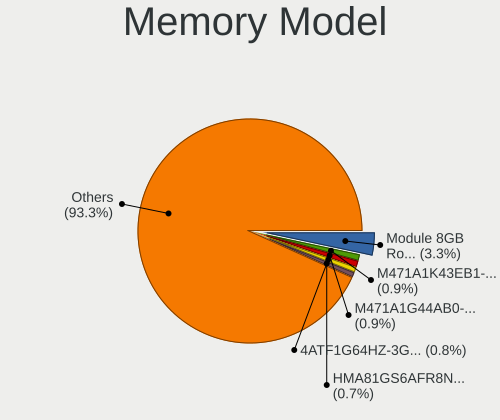

| Model                                                            | Computers | Percent |
|------------------------------------------------------------------|-----------|---------|
| Unknown                                                          | 50        | 3.34%   |
| Samsung RAM M471A1K43EB1-CWE 8GB SODIMM DDR4 3200MT/s            | 14        | 0.94%   |
| Samsung RAM M471A1G44AB0-CWE 8GiB SODIMM DDR4 3200MT/s           | 14        | 0.94%   |
| Micron RAM 4ATF1G64HZ-3G2F1 8GB SODIMM DDR4 3200MT/s             | 12        | 0.8%    |
| SK hynix RAM HMA81GS6AFR8N-UH 8GB SODIMM DDR4 2667MT/s           | 11        | 0.73%   |
| Samsung RAM M471A5244CB0-CRC 4GB SODIMM DDR4 2667MT/s            | 10        | 0.67%   |
| Samsung RAM K3KL8L80CM-MGCT 2GB Row Of Chips LPDDR5 7500MT/s     | 10        | 0.67%   |
| Samsung RAM M471A5244CB0-CWE 4GB SODIMM DDR4 3200MT/s            | 9         | 0.6%    |
| Samsung RAM M471A1G44BB0-CWE 8GB SODIMM DDR4 3200MT/s            | 9         | 0.6%    |
| Micron RAM Module 4GB Row Of Chips LPDDR5 8533MT/s               | 9         | 0.6%    |
| Kingston RAM KF3200C16D4/16GX 16GB DIMM DDR4 3733MT/s            | 9         | 0.6%    |
| Unknown (ABCD) RAM 123456789012345678 2GB SODIMM LPDDR4 2400MT/s | 8         | 0.53%   |
| SK hynix RAM HMAA1GS6CJR6N-XN 8GB SODIMM DDR4 3200MT/s           | 8         | 0.53%   |
| Samsung RAM M471A5244CB0-CTD 4GB SODIMM DDR4 3266MT/s            | 8         | 0.53%   |
| Micron RAM MT62F2G32D4DS-026 4GB Row Of Chips LPDDR5 7500MT/s    | 8         | 0.53%   |
| Micron RAM 8ATF1G64HZ-3G2R1 8GB SODIMM DDR4 3200MT/s             | 8         | 0.53%   |
| Corsair RAM CMK32GX4M2E3200C16 16GB DIMM DDR4 3600MT/s           | 8         | 0.53%   |
| SK hynix RAM Module 4GB SODIMM DDR3 1600MT/s                     | 7         | 0.47%   |
| SK hynix RAM HMT41GS6BFR8A-PB 8GB SODIMM DDR3 2667MT/s           | 7         | 0.47%   |
| SK hynix RAM HMA81GS6JJR8N-VK 8GB SODIMM DDR4 2667MT/s           | 7         | 0.47%   |
| Samsung RAM M471A1K43DB1-CTD 8GB SODIMM DDR4 2667MT/s            | 7         | 0.47%   |
| Samsung RAM M471A1G44AB0-CWE 8GB Row Of Chips DDR4 3200MT/s      | 7         | 0.47%   |
| Samsung RAM K3LKBKB@BM-MGCP 2GB Row Of Chips LPDDR5 6400MT/s     | 7         | 0.47%   |
| Micron RAM 8ATF1G64HZ-2G6E1 8GB SODIMM DDR4 2667MT/s             | 7         | 0.47%   |
| Kingston RAM KHX3200C16D4/8GX 8GB DIMM DDR4 3733MT/s             | 7         | 0.47%   |
| SK hynix RAM HMA81GS6DJR8N-XN 8GB SODIMM DDR4 3200MT/s           | 6         | 0.4%    |
| SK hynix RAM HCNNNCPMMLXR-NEE 2GB Row Of Chips LPDDR4 4267MT/s   | 6         | 0.4%    |
| SK hynix RAM H9JCNNNCP3MLYR-N6E 2GB Row Of Chips LPDDR5 6400MT/s | 6         | 0.4%    |
| Samsung RAM M471B5173QH0-YK0 4GB SODIMM DDR3 1600MT/s            | 6         | 0.4%    |
| Samsung RAM M471A1K43DB1-CWE 8GB SODIMM DDR4 3200MT/s            | 6         | 0.4%    |
| Samsung RAM M471A1K43BB1-CRC 8GB SODIMM DDR4 2667MT/s            | 6         | 0.4%    |
| Samsung RAM K3KL9L90CM-MGCT 8GB SODIMM LPDDR5 7500MT/s           | 6         | 0.4%    |
| Samsung RAM K3KL9L90CM-MGCT 4GB Row Of Chips LPDDR5 7500MT/s     | 6         | 0.4%    |
| Ramaxel RAM RMSB3410HA88IBF-5600 16GB SODIMM DDR5 5600MT/s       | 6         | 0.4%    |
| Micron RAM MTC4C10163S1SC48BA1 8GB SODIMM DDR5 4800MT/s          | 6         | 0.4%    |
| G.Skill RAM F5-6000J3040G32G 32GB DIMM DDR5 6200MT/s             | 6         | 0.4%    |
| Unknown RAM Module 4GB DIMM 1333MT/s                             | 5         | 0.33%   |
| SK hynix RAM Module 8GB Row Of Chips LPDDR3 2133MT/s             | 5         | 0.33%   |
| SK hynix RAM HMCG66AGBSA092N 8GB SODIMM DDR5 5600MT/s            | 5         | 0.33%   |
| SK hynix RAM HMAA2GS6CJR8N-XN 16GB SODIMM DDR4 3200MT/s          | 5         | 0.33%   |

Memory Kind
-----------

Memory module kinds

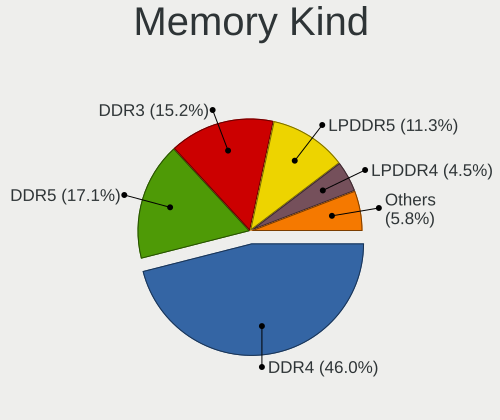

| Kind    | Computers | Percent |
|---------|-----------|---------|
| DDR4    | 592       | 46.03%  |
| DDR5    | 220       | 17.11%  |
| DDR3    | 196       | 15.24%  |
| LPDDR5  | 145       | 11.28%  |
| LPDDR4  | 58        | 4.51%   |
| LPDDR3  | 41        | 3.19%   |
| Unknown | 14        | 1.09%   |
| DDR2    | 11        | 0.86%   |
| SDRAM   | 5         | 0.39%   |
| DRAM    | 2         | 0.16%   |
| DDR     | 2         | 0.16%   |

Memory Form Factor
------------------

Physical design of the memory module

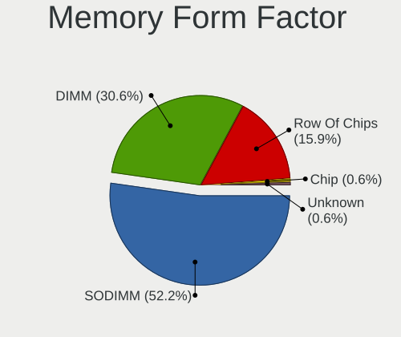

| Name         | Computers | Percent |
|--------------|-----------|---------|
| SODIMM       | 675       | 52.24%  |
| DIMM         | 395       | 30.57%  |
| Row Of Chips | 206       | 15.94%  |
| Chip         | 8         | 0.62%   |
| Unknown      | 8         | 0.62%   |

Memory Size
-----------

Memory module size

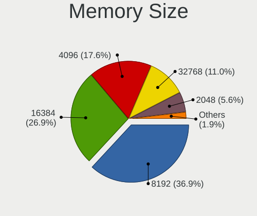

| Size  | Computers | Percent |
|-------|-----------|---------|
| 8192  | 503       | 36.9%   |
| 16384 | 367       | 26.93%  |
| 4096  | 240       | 17.61%  |
| 32768 | 150       | 11.01%  |
| 2048  | 77        | 5.65%   |
| 49152 | 10        | 0.73%   |
| 1024  | 7         | 0.51%   |
| 24576 | 4         | 0.29%   |
| 65536 | 2         | 0.15%   |
| 6144  | 2         | 0.15%   |
| 3072  | 1         | 0.07%   |

Memory Speed
------------

Memory module speed

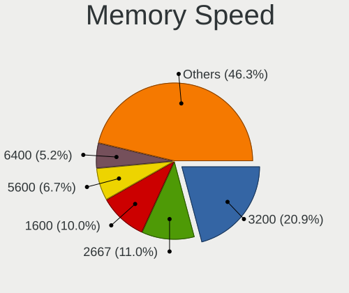

| Speed   | Computers | Percent |
|---------|-----------|---------|
| 3200    | 285       | 20.86%  |
| 2667    | 150       | 10.98%  |
| 1600    | 136       | 9.96%   |
| 5600    | 92        | 6.73%   |
| 6400    | 71        | 5.2%    |
| 2133    | 56        | 4.1%    |
| 4800    | 53        | 3.88%   |
| 3600    | 52        | 3.81%   |
| 2400    | 50        | 3.66%   |
| 7500    | 49        | 3.59%   |
| 6000    | 42        | 3.07%   |
| 1333    | 38        | 2.78%   |
| 4267    | 37        | 2.71%   |
| 3733    | 28        | 2.05%   |
| 1867    | 24        | 1.76%   |
| 8533    | 20        | 1.46%   |
| 7467    | 12        | 0.88%   |
| 3800    | 11        | 0.81%   |
| 2666    | 10        | 0.73%   |
| 1866    | 10        | 0.73%   |
| 3266    | 9         | 0.66%   |
| 3000    | 9         | 0.66%   |
| 6200    | 8         | 0.59%   |
| 800     | 8         | 0.59%   |
| 8400    | 7         | 0.51%   |
| 4000    | 7         | 0.51%   |
| 3400    | 7         | 0.51%   |
| 1067    | 6         | 0.44%   |
| 667     | 6         | 0.44%   |
| 1800    | 5         | 0.37%   |
| 1334    | 5         | 0.37%   |
| Unknown | 5         | 0.37%   |
| 3866    | 4         | 0.29%   |
| 3466    | 4         | 0.29%   |
| 12800   | 3         | 0.22%   |
| 5800    | 3         | 0.22%   |
| 5500    | 3         | 0.22%   |
| 5200    | 3         | 0.22%   |
| 4266    | 3         | 0.22%   |
| 3666    | 3         | 0.22%   |

Printers & scanners
-------------------

Printer Vendor
--------------

Printer device vendors

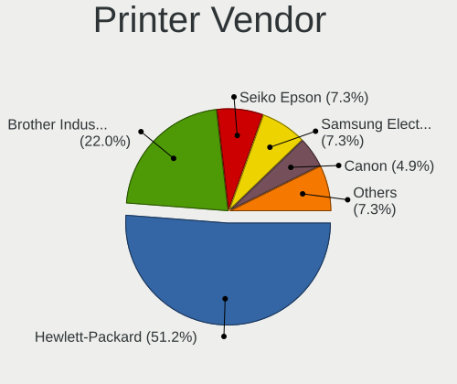

| Vendor              | Computers | Percent |
|---------------------|-----------|---------|
| Hewlett-Packard     | 21        | 51.22%  |
| Brother Industries  | 9         | 21.95%  |
| Seiko Epson         | 3         | 7.32%   |
| Samsung Electronics | 3         | 7.32%   |
| Canon               | 2         | 4.88%   |
| Prolific Technology | 1         | 2.44%   |
| Pantum              | 1         | 2.44%   |
| Lenovo              | 1         | 2.44%   |

Printer Model
-------------

Printer device models

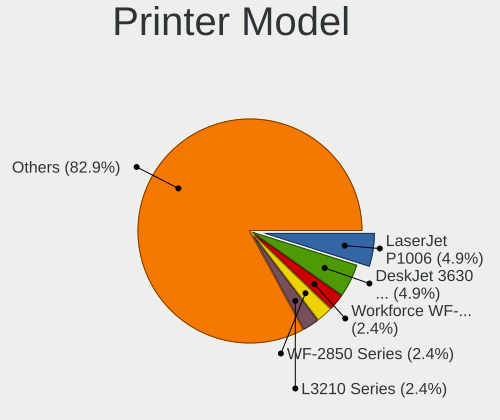

| Model                                     | Computers | Percent |
|-------------------------------------------|-----------|---------|
| HP LaserJet P1006                         | 2         | 4.88%   |
| HP DeskJet 3630 series                    | 2         | 4.88%   |
| Seiko Epson Workforce WF-7820/7840 Series | 1         | 2.44%   |
| Seiko Epson WF-2850 Series                | 1         | 2.44%   |
| Seiko Epson L3210 Series                  | 1         | 2.44%   |
| Samsung SCX-4623 Series                   | 1         | 2.44%   |
| Samsung M332x 382x 402x Series            | 1         | 2.44%   |
| Samsung M2020 Series                      | 1         | 2.44%   |
| Prolific PL2305 Parallel Port             | 1         | 2.44%   |
| Pantum P2500W series                      | 1         | 2.44%   |
| Lenovo G336DN                             | 1         | 2.44%   |
| HP OfficeJet Pro 6970                     | 1         | 2.44%   |
| HP LaserJet Pro M118-M119                 | 1         | 2.44%   |
| HP LaserJet P2014                         | 1         | 2.44%   |
| HP LaserJet 1022                          | 1         | 2.44%   |
| HP LaserJet 1020                          | 1         | 2.44%   |
| HP Ink Tank 310 series                    | 1         | 2.44%   |
| HP HP LaserJet Pro M404-M405              | 1         | 2.44%   |
| HP HP ColorLaserJet M255-M256             | 1         | 2.44%   |
| HP ENVY Photo 7800 series                 | 1         | 2.44%   |
| HP ENVY 4520 series                       | 1         | 2.44%   |
| HP ENVY 4500 series                       | 1         | 2.44%   |
| HP DeskJet Plus 4100 series               | 1         | 2.44%   |
| HP DeskJet 959c                           | 1         | 2.44%   |
| HP Deskjet 4640 series                    | 1         | 2.44%   |
| HP DeskJet 4530 series                    | 1         | 2.44%   |
| HP DeskJet 2700 series                    | 1         | 2.44%   |
| HP DeskJet 2300 series                    | 1         | 2.44%   |
| Canon LiDE 300                            | 1         | 2.44%   |
| Canon G2010 series                        | 1         | 2.44%   |
| Brother MFC-J485DW                        | 1         | 2.44%   |
| Brother MFC-J480DW                        | 1         | 2.44%   |
| Brother MFC-J460DW                        | 1         | 2.44%   |
| Brother HL-L2370DW series                 | 1         | 2.44%   |
| Brother HL-L2320D series                  | 1         | 2.44%   |
| Brother HL-1200 series                    | 1         | 2.44%   |
| Brother DCP-L8410CDW series               | 1         | 2.44%   |
| Brother DCP-L2540DW                       | 1         | 2.44%   |
| Brother DCP-L2500D                        | 1         | 2.44%   |

Scanner Vendor
--------------

Scanner device vendors

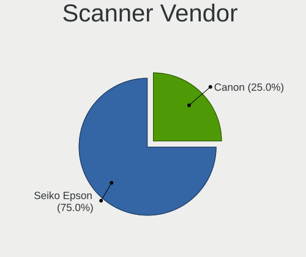

| Vendor      | Computers | Percent |
|-------------|-----------|---------|
| Seiko Epson | 3         | 75%     |
| Canon       | 1         | 25%     |

Scanner Model
-------------

Scanner device models

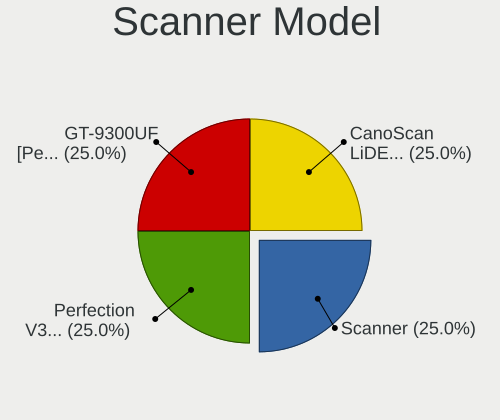

| Model                                         | Computers | Percent |
|-----------------------------------------------|-----------|---------|
| Seiko Epson Scanner                           | 1         | 25%     |
| Seiko Epson Perfection V37/V370               | 1         | 25%     |
| Seiko Epson GT-9300UF [Perfection 2400 PHOTO] | 1         | 25%     |
| Canon CanoScan LiDE 220                       | 1         | 25%     |

Camera
------

Camera Vendor
-------------

Camera device vendors

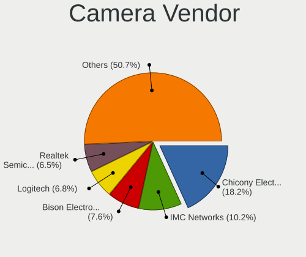

| Vendor                                 | Computers | Percent |
|----------------------------------------|-----------|---------|
| Chicony Electronics                    | 378       | 18.2%   |
| IMC Networks                           | 212       | 10.21%  |
| Bison Electronics                      | 157       | 7.56%   |
| Logitech                               | 141       | 6.79%   |
| Realtek Semiconductor                  | 136       | 6.55%   |
| Microdia                               | 132       | 6.36%   |
| Quanta                                 | 127       | 6.11%   |
| Sunplus Innovation Technology          | 100       | 4.81%   |
| Luxvisions Innotech Limited            | 98        | 4.72%   |
| Apple                                  | 84        | 4.04%   |
| Syntek                                 | 66        | 3.18%   |
| Cheng Uei Precision Industry (Foxlink) | 49        | 2.36%   |
| ShineTech                              | 48        | 2.31%   |
| Sonix Technology                       | 37        | 1.78%   |
| Lite-On Technology                     | 36        | 1.73%   |
| Suyin                                  | 24        | 1.16%   |
| Silicon Motion                         | 16        | 0.77%   |
| Microsoft                              | 15        | 0.72%   |
| SunplusIT                              | 10        | 0.48%   |
| Samsung Electronics                    | 10        | 0.48%   |
| Alcor Micro                            | 10        | 0.48%   |
| kingcome                               | 8         | 0.39%   |
| Generalplus Technology                 | 8         | 0.39%   |
| BillionPixels                          | 8         | 0.39%   |
| Shine-optics                           | 7         | 0.34%   |
| Framework                              | 7         | 0.34%   |
| webcam                                 | 6         | 0.29%   |
| ShineOptics                            | 6         | 0.29%   |
| A4Tech                                 | 6         | 0.29%   |
| Unknown                                | 6         | 0.29%   |
| MacroSilicon                           | 5         | 0.24%   |
| KYE Systems (Mouse Systems)            | 5         | 0.24%   |
| icSpring                               | 5         | 0.24%   |
| ARC International                      | 5         | 0.24%   |
| Z-Star Microelectronics                | 4         | 0.19%   |
| Razer USA                              | 4         | 0.19%   |
| Lenovo                                 | 4         | 0.19%   |
| Importek                               | 4         | 0.19%   |
| Anker PowerConf C200                   | 4         | 0.19%   |
| Acer                                   | 4         | 0.19%   |

Camera Model
------------

Camera device models

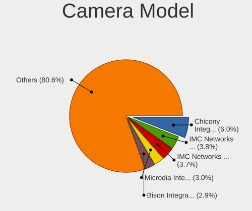

| Model                                             | Computers | Percent |
|---------------------------------------------------|-----------|---------|
| Chicony Integrated Camera                         | 125       | 5.97%   |
| IMC Networks Integrated Camera                    | 80        | 3.82%   |
| IMC Networks USB2.0 HD UVC WebCam                 | 78        | 3.73%   |
| Microdia Integrated_Webcam_HD                     | 63        | 3.01%   |
| Bison Integrated Camera                           | 61        | 2.91%   |
| Syntek Integrated Camera                          | 59        | 2.82%   |
| Realtek Integrated_Webcam_HD                      | 52        | 2.48%   |
| Luxvisions Innotech Limited Integrated Camera     | 38        | 1.82%   |
| Sunplus Integrated_Webcam_HD                      | 27        | 1.29%   |
| Apple FaceTime HD Camera                          | 27        | 1.29%   |
| Logitech Webcam C270                              | 26        | 1.24%   |
| Apple FaceTime HD Camera (Built-in)               | 24        | 1.15%   |
| Luxvisions Innotech Limited Integrated RGB Camera | 23        | 1.1%    |
| Chicony HD Webcam                                 | 23        | 1.1%    |
| Quanta HD User Facing                             | 22        | 1.05%   |
| Shinetech USB2.0 FHD UVC WebCam                   | 21        | 1%      |
| Chicony Integrated Camera (1280x720@30)           | 21        | 1%      |
| Bison HD Webcam                                   | 21        | 1%      |
| Quanta HP HD Camera                               | 20        | 0.96%   |
| Logitech HD Pro Webcam C920                       | 20        | 0.96%   |
| Bison SunplusIT Integrated Camera                 | 19        | 0.91%   |
| Sonix USB2.0 HD UVC WebCam                        | 18        | 0.86%   |
| Logitech C920 PRO HD Webcam                       | 17        | 0.81%   |
| Chicony HD User Facing                            | 17        | 0.81%   |
| Chicony HP HD Camera                              | 16        | 0.76%   |
| Bison Integrated RGB Camera                       | 16        | 0.76%   |
| Sonix USB2.0 FHD UVC WebCam                       | 15        | 0.72%   |
| Realtek Bluetooth Radio                           | 15        | 0.72%   |
| Quanta HP Wide Vision HD Camera                   | 14        | 0.67%   |
| Chicony ACER HD User Facing                       | 14        | 0.67%   |
| Apple Built-in iSight                             | 14        | 0.67%   |
| Shinetech ASUS FHD webcam                         | 13        | 0.62%   |
| Quanta HP TrueVision HD Camera                    | 13        | 0.62%   |
| Lite-On Integrated Camera                         | 13        | 0.62%   |
| Chicony HP TrueVision HD Camera                   | 13        | 0.62%   |
| Apple iPhone 5/5C/5S/6/SE/7/8/X                   | 13        | 0.62%   |
| ShineTech USB2.0 HD UVC WebCam                    | 12        | 0.57%   |
| Realtek Integrated Webcam HD                      | 12        | 0.57%   |
| Quanta ACER HD User Facing                        | 12        | 0.57%   |
| IMC Networks USB2.0 VGA UVC WebCam                | 12        | 0.57%   |

Security
--------

Fingerprint Vendor
------------------

Fingerprint sensor vendors

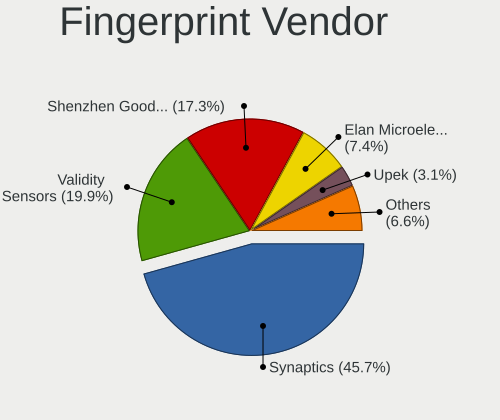

| Vendor                             | Computers | Percent |
|------------------------------------|-----------|---------|
| Synaptics                          | 179       | 45.66%  |
| Validity Sensors                   | 78        | 19.9%   |
| Shenzhen Goodix Technology         | 68        | 17.35%  |
| Elan Microelectronics              | 29        | 7.4%    |
| Upek                               | 12        | 3.06%   |
| HOLTEK                             | 6         | 1.53%   |
| Realtek USB2.0 Finger Print Bridge | 4         | 1.02%   |
| LighTuning Technology              | 4         | 1.02%   |
| AuthenTec                          | 4         | 1.02%   |
| Samsung Electronics                | 3         | 0.77%   |
| STMicroelectronics                 | 2         | 0.51%   |
| Focal-systems.Corp                 | 2         | 0.51%   |
| Yamila                             | 1         | 0.26%   |

Fingerprint Model
-----------------

Fingerprint sensor models

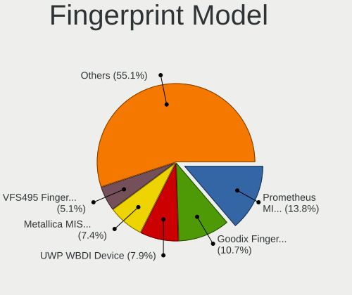

| Model                                                                      | Computers | Percent |
|----------------------------------------------------------------------------|-----------|---------|
| Synaptics Prometheus MIS Touch Fingerprint Reader                          | 54        | 13.78%  |
| Shenzhen Goodix  FingerPrint Device                                        | 42        | 10.71%  |
| Synaptics UWP WBDI Device                                                  | 31        | 7.91%   |
| Synaptics Metallica MIS Touch Fingerprint Reader                           | 29        | 7.4%    |
| Validity Sensors VFS495 Fingerprint Reader                                 | 20        | 5.1%    |
| Validity Sensors Synaptics WBDI                                            | 17        | 4.34%   |
| Shenzhen Goodix Fingerprint Reader                                         | 17        | 4.34%   |
| Elan ELAN:Fingerprint                                                      | 16        | 4.08%   |
| Synaptics Prometheus Fingerprint Reader                                    | 15        | 3.83%   |
| Elan ELAN:ARM-M4                                                           | 13        | 3.32%   |
| Upek Biometric Touchchip/Touchstrip Fingerprint Sensor                     | 12        | 3.06%   |
| Synaptics  WBDI                                                            | 10        | 2.55%   |
| Synaptics FS7604 Touch Fingerprint Sensor with PurePrint                   | 9         | 2.3%    |
| Shenzhen Goodix FingerPrint                                                | 9         | 2.3%    |
| Synaptics Fingerprint reader [HP G6]                                       | 8         | 2.04%   |
| Validity Sensors VFS 5011 fingerprint sensor                               | 7         | 1.79%   |
| Validity Sensors VFS7500 Touch Fingerprint Sensor                          | 6         | 1.53%   |
| Validity Sensors VFS5011 Fingerprint Reader                                | 6         | 1.53%   |
| Validity Sensors VFS491                                                    | 6         | 1.53%   |
| Synaptics WBDI                                                             | 6         | 1.53%   |
| Synaptics  FS7604 Touch Fingerprint Sensor with PurePrint                  | 6         | 1.53%   |
| HOLTEK FocalTech Fingerprint Device                                        | 6         | 1.53%   |
| Validity Sensors Swipe Fingerprint Sensor                                  | 4         | 1.02%   |
| Synaptics WBDI Fingerprint Reader USB 086                                  | 4         | 1.02%   |
| Realtek USB2.0 Finger Print Bridge FocalTech Fingerprint Device            | 4         | 1.02%   |
| Validity Sensors VFS471 Fingerprint Reader                                 | 3         | 0.77%   |
| Validity Sensors Synaptics VFS7552 Touch Fingerprint Sensor with PurePrint | 3         | 0.77%   |
| Validity Sensors Synaptics VFS7552 Touch Fingerprint Sensor                | 3         | 0.77%   |
| Synaptics UWP WBDI                                                         | 3         | 0.77%   |
| Synaptics Metallica MOH Touch Fingerprint Reader                           | 3         | 0.77%   |
| STMicroelectronics Fingerprint Reader                                      | 2         | 0.51%   |
| Samsung Fingerprint Sensor Device - 730B                                   | 2         | 0.51%   |
| LighTuning EgisTec Touch Fingerprint Sensor                                | 2         | 0.51%   |
| Focal-systems.Corp FT9201Fingerprint.                                      | 2         | 0.51%   |
| AuthenTec AES2810                                                          | 2         | 0.51%   |
| Yamila Yamila Fingerprint Device                                           | 1         | 0.26%   |
| Validity Sensors VFS301 Fingerprint Reader                                 | 1         | 0.26%   |
| Validity Sensors VFS Fingerprint sensor                                    | 1         | 0.26%   |
| Validity Sensors Fingerprint scanner                                       | 1         | 0.26%   |
| Synaptics WBDI Fingerprint Reader USB 102                                  | 1         | 0.26%   |

Chipcard Vendor
---------------

Chipcard module vendors

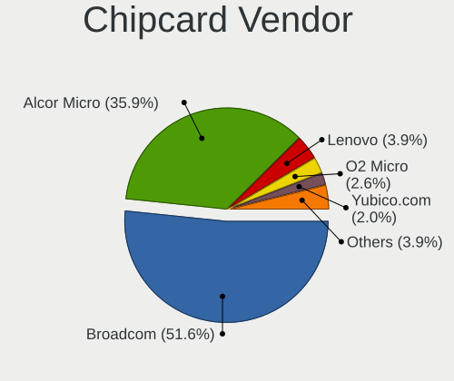

| Vendor                            | Computers | Percent |
|-----------------------------------|-----------|---------|
| Broadcom                          | 79        | 51.63%  |
| Alcor Micro                       | 55        | 35.95%  |
| Lenovo                            | 6         | 3.92%   |
| O2 Micro                          | 4         | 2.61%   |
| Yubico.com                        | 3         | 1.96%   |
| Gemalto (was Gemplus)             | 2         | 1.31%   |
| Upek                              | 1         | 0.65%   |
| Free Software Initiative of Japan | 1         | 0.65%   |
| Aladdin Knowledge Systems         | 1         | 0.65%   |
| Advanced Card Systems             | 1         | 0.65%   |

Chipcard Model
--------------

Chipcard module models

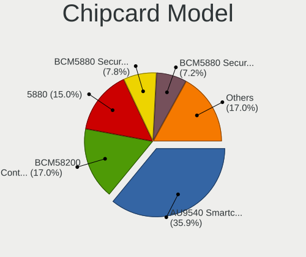

| Model                                                                        | Computers | Percent |
|------------------------------------------------------------------------------|-----------|---------|
| Alcor Micro AU9540 Smartcard Reader                                          | 55        | 35.95%  |
| Broadcom BCM58200 ControlVault 3 (FingerPrint sensor + Contacted SmartCard)  | 26        | 16.99%  |
| Broadcom 5880                                                                | 23        | 15.03%  |
| Broadcom BCM5880 Secure Applications Processor                               | 12        | 7.84%   |
| Broadcom BCM5880 Secure Applications Processor with fingerprint swipe sensor | 11        | 7.19%   |
| Broadcom 58200                                                               | 7         | 4.58%   |
| Lenovo Integrated Smart Card Reader                                          | 6         | 3.92%   |
| O2 Micro OZ776 CCID Smartcard Reader                                         | 4         | 2.61%   |
| Yubico.com Yubikey 4/5 U2F+CCID                                              | 2         | 1.31%   |
| Yubico.com Yubikey NEO(-N) U2F+CCID                                          | 1         | 0.65%   |
| Upek TouchChip Fingerprint Coprocessor (WBF advanced mode)                   | 1         | 0.65%   |
| Gemalto (was Gemplus) GemPC Twin SmartCard Reader                            | 1         | 0.65%   |
| Gemalto (was Gemplus) Compact Smart Card Reader Writer                       | 1         | 0.65%   |
| Free Software Initiative of Japan Gnuk Token                                 | 1         | 0.65%   |
| Aladdin Knowledge Systems Token JC                                           | 1         | 0.65%   |
| Advanced Card Systems ACR122U                                                | 1         | 0.65%   |

Unsupported
-----------

Unsupported Devices
-------------------

Total unsupported devices on board

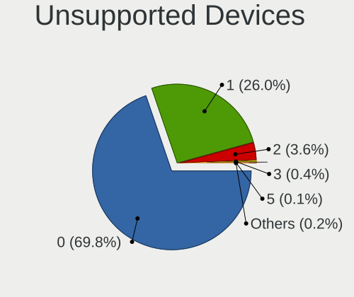

| Total | Computers | Percent |
|-------|-----------|---------|
| 0     | 2236      | 69.77%  |
| 1     | 832       | 25.96%  |
| 2     | 116       | 3.62%   |
| 3     | 12        | 0.37%   |
| 5     | 4         | 0.12%   |
| 4     | 2         | 0.06%   |
| 9     | 1         | 0.03%   |
| 8     | 1         | 0.03%   |
| 7     | 1         | 0.03%   |

Unsupported Device Types
------------------------

Types of unsupported devices

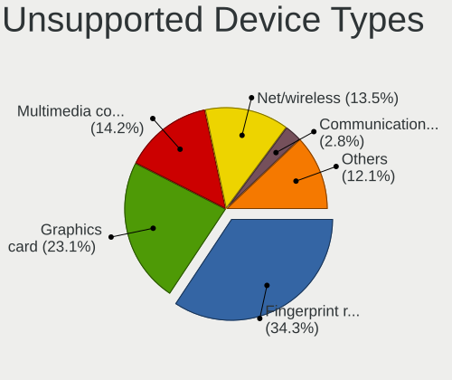

| Type                     | Computers | Percent |
|--------------------------|-----------|---------|
| Fingerprint reader       | 384       | 34.32%  |
| Graphics card            | 259       | 23.15%  |
| Multimedia controller    | 159       | 14.21%  |
| Net/wireless             | 151       | 13.49%  |
| Communication controller | 31        | 2.77%   |
| Unassigned class         | 24        | 2.14%   |
| Chipcard                 | 20        | 1.79%   |
| Sound                    | 18        | 1.61%   |
| Net/ethernet             | 14        | 1.25%   |
| Bluetooth                | 13        | 1.16%   |
| Camera                   | 12        | 1.07%   |
| Network                  | 11        | 0.98%   |
| Storage                  | 7         | 0.63%   |
| Card reader              | 7         | 0.63%   |
| Modem                    | 4         | 0.36%   |
| Storage/raid             | 3         | 0.27%   |
| Storage/nvme             | 1         | 0.09%   |
| Dvb card                 | 1         | 0.09%   |

