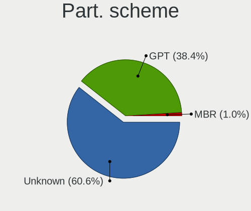
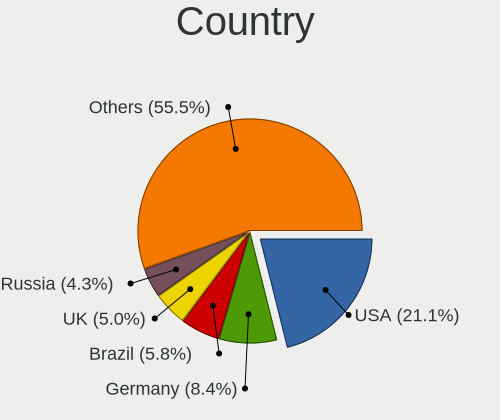
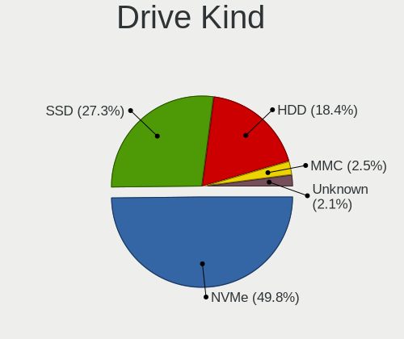
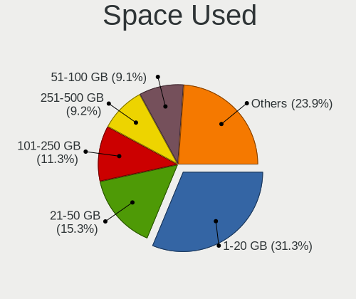
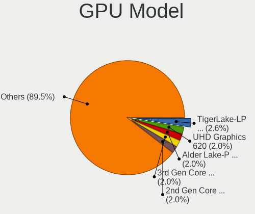
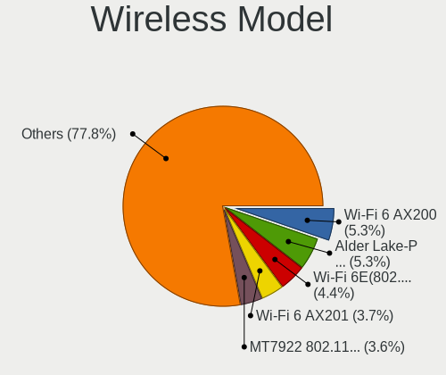
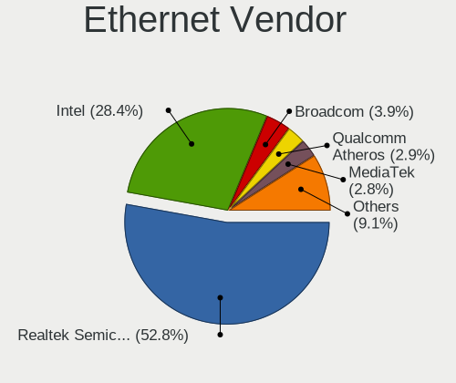
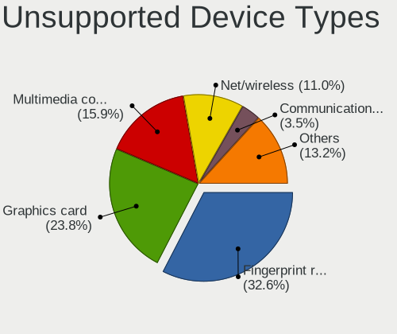

Fedora 41 - Tested Hardware & Statistics
----------------------------------------

A project to collect tested hardware configurations for Fedora 41.

Anyone can contribute to this report by the [hw-probe](https://github.com/linuxhw/hw-probe) tool:

    sudo -E hw-probe -all -upload

Please contribute! Especially if your hardware is rare.

This is a report for all computer types. See also reports for [desktops](/Dist/Fedora_41/Desktop/README.md) and [notebooks](/Dist/Fedora_41/Notebook/README.md).

Contents
--------

* [ Test Cases ](#test-cases)

* [ System ](#system)
  - [ Kernel                   ](#kernel)
  - [ Kernel Family            ](#kernel-family)
  - [ Kernel Major Ver.        ](#kernel-major-ver)
  - [ Arch                     ](#arch)
  - [ DE                       ](#de)
  - [ Display Server           ](#display-server)
  - [ Display Manager          ](#display-manager)
  - [ OS Lang                  ](#os-lang)
  - [ Boot Mode                ](#boot-mode)
  - [ Filesystem               ](#filesystem)
  - [ Part. scheme             ](#part-scheme)
  - [ Dual Boot with Linux/BSD ](#dual-boot-with-linuxbsd)
  - [ Dual Boot (Win)          ](#dual-boot-win)

* [ Board ](#board)
  - [ Vendor                   ](#vendor)
  - [ Model                    ](#model)
  - [ Model Family             ](#model-family)
  - [ MFG Year                 ](#mfg-year)
  - [ Form Factor              ](#form-factor)
  - [ Secure Boot              ](#secure-boot)
  - [ Coreboot                 ](#coreboot)
  - [ RAM Size                 ](#ram-size)
  - [ RAM Used                 ](#ram-used)
  - [ Total Drives             ](#total-drives)
  - [ Has CD-ROM               ](#has-cd-rom)
  - [ Has Ethernet             ](#has-ethernet)
  - [ Has WiFi                 ](#has-wifi)
  - [ Has Bluetooth            ](#has-bluetooth)

* [ Location ](#location)
  - [ Country                  ](#country)
  - [ City                     ](#city)

* [ Drives ](#drives)
  - [ Drive Vendor             ](#drive-vendor)
  - [ Drive Model              ](#drive-model)
  - [ HDD Vendor               ](#hdd-vendor)
  - [ SSD Vendor               ](#ssd-vendor)
  - [ Drive Kind               ](#drive-kind)
  - [ Drive Connector          ](#drive-connector)
  - [ Drive Size               ](#drive-size)
  - [ Space Total              ](#space-total)
  - [ Space Used               ](#space-used)
  - [ Malfunc. Drives          ](#malfunc-drives)
  - [ Malfunc. Drive Vendor    ](#malfunc-drive-vendor)
  - [ Malfunc. HDD Vendor      ](#malfunc-hdd-vendor)
  - [ Malfunc. Drive Kind      ](#malfunc-drive-kind)
  - [ Failed Drives            ](#failed-drives)
  - [ Failed Drive Vendor      ](#failed-drive-vendor)
  - [ Drive Status             ](#drive-status)

* [ Storage controller ](#storage-controller)
  - [ Storage Vendor           ](#storage-vendor)
  - [ Storage Model            ](#storage-model)
  - [ Storage Kind             ](#storage-kind)

* [ Processor ](#processor)
  - [ CPU Vendor               ](#cpu-vendor)
  - [ CPU Model                ](#cpu-model)
  - [ CPU Model Family         ](#cpu-model-family)
  - [ CPU Cores                ](#cpu-cores)
  - [ CPU Sockets              ](#cpu-sockets)
  - [ CPU Threads              ](#cpu-threads)
  - [ CPU Op-Modes             ](#cpu-op-modes)
  - [ CPU Microcode            ](#cpu-microcode)
  - [ CPU Microarch            ](#cpu-microarch)

* [ Graphics ](#graphics)
  - [ GPU Vendor               ](#gpu-vendor)
  - [ GPU Model                ](#gpu-model)
  - [ GPU Combo                ](#gpu-combo)
  - [ GPU Driver               ](#gpu-driver)
  - [ GPU Memory               ](#gpu-memory)

* [ Monitor ](#monitor)
  - [ Monitor Vendor           ](#monitor-vendor)
  - [ Monitor Model            ](#monitor-model)
  - [ Monitor Resolution       ](#monitor-resolution)
  - [ Monitor Diagonal         ](#monitor-diagonal)
  - [ Monitor Width            ](#monitor-width)
  - [ Aspect Ratio             ](#aspect-ratio)
  - [ Monitor Area             ](#monitor-area)
  - [ Pixel Density            ](#pixel-density)
  - [ Multiple Monitors        ](#multiple-monitors)

* [ Network ](#network)
  - [ Net Controller Vendor    ](#net-controller-vendor)
  - [ Net Controller Model     ](#net-controller-model)
  - [ Wireless Vendor          ](#wireless-vendor)
  - [ Wireless Model           ](#wireless-model)
  - [ Ethernet Vendor          ](#ethernet-vendor)
  - [ Ethernet Model           ](#ethernet-model)
  - [ Net Controller Kind      ](#net-controller-kind)
  - [ Used Controller          ](#used-controller)
  - [ NICs                     ](#nics)
  - [ IPv6                     ](#ipv6)

* [ Bluetooth ](#bluetooth)
  - [ Bluetooth Vendor         ](#bluetooth-vendor)
  - [ Bluetooth Model          ](#bluetooth-model)

* [ Sound ](#sound)
  - [ Sound Vendor             ](#sound-vendor)
  - [ Sound Model              ](#sound-model)

* [ Memory ](#memory)
  - [ Memory Vendor            ](#memory-vendor)
  - [ Memory Model             ](#memory-model)
  - [ Memory Kind              ](#memory-kind)
  - [ Memory Form Factor       ](#memory-form-factor)
  - [ Memory Size              ](#memory-size)
  - [ Memory Speed             ](#memory-speed)

* [ Printers & scanners ](#printers--scanners)
  - [ Printer Vendor           ](#printer-vendor)
  - [ Printer Model            ](#printer-model)
  - [ Scanner Vendor           ](#scanner-vendor)
  - [ Scanner Model            ](#scanner-model)

* [ Camera ](#camera)
  - [ Camera Vendor            ](#camera-vendor)
  - [ Camera Model             ](#camera-model)

* [ Security ](#security)
  - [ Fingerprint Vendor       ](#fingerprint-vendor)
  - [ Fingerprint Model        ](#fingerprint-model)
  - [ Chipcard Vendor          ](#chipcard-vendor)
  - [ Chipcard Model           ](#chipcard-model)

* [ Unsupported ](#unsupported)
  - [ Unsupported Devices      ](#unsupported-devices)
  - [ Unsupported Device Types ](#unsupported-device-types)

Test Cases
----------

Total: 1595

| Vendor        | Model                       | Form-Factor | Probe                                                      | Date         |
|---------------|-----------------------------|-------------|------------------------------------------------------------|--------------|
| MSI           | Prestige 16 AI Studio B1... | Notebook    | [22d073249b](https://linux-hardware.org/?probe=22d073249b) | Jan 06, 2025 |
| MSI           | Prestige 16 AI Studio B1... | Notebook    | [d8d6ab4b82](https://linux-hardware.org/?probe=d8d6ab4b82) | Jan 06, 2025 |
| ASUSTek       | ROG STRIX B650-A GAMING ... | Desktop     | [04f9ffdab4](https://linux-hardware.org/?probe=04f9ffdab4) | Jan 06, 2025 |
| GPU Compan... | GWNR7L1749                  | Notebook    | [0f2438bc90](https://linux-hardware.org/?probe=0f2438bc90) | Jan 06, 2025 |
| Apple         | MacBookAir6,2               | Notebook    | [dfb4117f5c](https://linux-hardware.org/?probe=dfb4117f5c) | Jan 06, 2025 |
| ASRock        | H110M-ITX                   | Desktop     | [d9985ebe4e](https://linux-hardware.org/?probe=d9985ebe4e) | Jan 06, 2025 |
| MSI           | B450 GAMING PLUS MAX        | Desktop     | [89cd372074](https://linux-hardware.org/?probe=89cd372074) | Jan 06, 2025 |
| ASUSTek       | TUF Z370-PLUS GAMING II     | Desktop     | [10fd8ef9dd](https://linux-hardware.org/?probe=10fd8ef9dd) | Jan 06, 2025 |
| ASRock        | B360M Performance           | Desktop     | [1e63738abb](https://linux-hardware.org/?probe=1e63738abb) | Jan 06, 2025 |
| Google        | Treeya                      | Notebook    | [b8f7c2d75a](https://linux-hardware.org/?probe=b8f7c2d75a) | Jan 06, 2025 |
| ASUSTek       | ROG STRIX B550-F GAMING     | Desktop     | [c8c490c383](https://linux-hardware.org/?probe=c8c490c383) | Jan 06, 2025 |
| HP            | ENVY x360 Convertible 15... | Convertible | [19193380d7](https://linux-hardware.org/?probe=19193380d7) | Jan 06, 2025 |
| Lenovo        | IdeaPad Pro 5 14APH8 83A... | Notebook    | [046bbb97db](https://linux-hardware.org/?probe=046bbb97db) | Jan 05, 2025 |
| Dell          | XPS 9320                    | Notebook    | [35af44b04a](https://linux-hardware.org/?probe=35af44b04a) | Jan 05, 2025 |
| Dell          | Latitude 7390               | Notebook    | [48814ed45f](https://linux-hardware.org/?probe=48814ed45f) | Jan 05, 2025 |
| ASUSTek       | H110M-E/M.2                 | Desktop     | [ff2e84ab02](https://linux-hardware.org/?probe=ff2e84ab02) | Jan 05, 2025 |
| HP            | 2B12                        | Desktop     | [f9594ff416](https://linux-hardware.org/?probe=f9594ff416) | Jan 05, 2025 |
| Gigabyte      | X570 AORUS ELITE WIFI       | Desktop     | [d80a8fd406](https://linux-hardware.org/?probe=d80a8fd406) | Jan 05, 2025 |
| Sony          | VGN-NR21E_S                 | Notebook    | [0ed147c4fb](https://linux-hardware.org/?probe=0ed147c4fb) | Jan 05, 2025 |
| Apple         | MacBookAir6,2               | Notebook    | [3b5dc1b1c2](https://linux-hardware.org/?probe=3b5dc1b1c2) | Jan 05, 2025 |
| ASUSTek       | TUF Gaming B550M-PLUS       | Desktop     | [a7c3662aec](https://linux-hardware.org/?probe=a7c3662aec) | Jan 05, 2025 |
| Lenovo        | 14w Gen 2 82N9              | Notebook    | [733559df9e](https://linux-hardware.org/?probe=733559df9e) | Jan 05, 2025 |
| Lenovo        | ThinkPad E16 Gen 2 21M5C... | Notebook    | [fe15c1092e](https://linux-hardware.org/?probe=fe15c1092e) | Jan 05, 2025 |
| WIWYNN        | Qualcomm Centriq 2400 Cu... | Server      | [bd0fe2f7fd](https://linux-hardware.org/?probe=bd0fe2f7fd) | Jan 05, 2025 |
| Dell          | Latitude 7400               | Notebook    | [9c347a93bf](https://linux-hardware.org/?probe=9c347a93bf) | Jan 05, 2025 |
| Dell          | Latitude 7400               | Notebook    | [70481b51db](https://linux-hardware.org/?probe=70481b51db) | Jan 05, 2025 |
| ASUSTek       | H110M-E/M.2                 | Desktop     | [3b654f1020](https://linux-hardware.org/?probe=3b654f1020) | Jan 05, 2025 |
| Lenovo        | ThinkPad L13 Yoga Gen 4 ... | Convertible | [a1704866ba](https://linux-hardware.org/?probe=a1704866ba) | Jan 05, 2025 |
| Lenovo        | ThinkPad T420 4236PFG       | Notebook    | [df34cf20b9](https://linux-hardware.org/?probe=df34cf20b9) | Jan 05, 2025 |
| Dell          | 0WKGTH A04                  | Server      | [069319fa9f](https://linux-hardware.org/?probe=069319fa9f) | Jan 05, 2025 |
| HP            | Pavilion Laptop 15-eh0xx... | Notebook    | [d87015b7dd](https://linux-hardware.org/?probe=d87015b7dd) | Jan 05, 2025 |
| Dell          | 0HFG24 A01                  | Server      | [9484e3f188](https://linux-hardware.org/?probe=9484e3f188) | Jan 05, 2025 |
| Supermicro    | X10SLM-F                    | Desktop     | [a8188b3af2](https://linux-hardware.org/?probe=a8188b3af2) | Jan 04, 2025 |
| Lenovo        | ThinkPad T14s Gen 1 20UH... | Notebook    | [c68a17f027](https://linux-hardware.org/?probe=c68a17f027) | Jan 04, 2025 |
| ASUSTek       | ROG STRIX B550-F GAMING ... | Desktop     | [3f75716ffa](https://linux-hardware.org/?probe=3f75716ffa) | Jan 04, 2025 |
| Lenovo        | B490 377222P                | Notebook    | [4e6cc04345](https://linux-hardware.org/?probe=4e6cc04345) | Jan 04, 2025 |
| Lenovo        | Legion Slim 5 16APH8 82Y... | Notebook    | [3cd4965210](https://linux-hardware.org/?probe=3cd4965210) | Jan 04, 2025 |
| HP            | 635                         | Notebook    | [021402dc32](https://linux-hardware.org/?probe=021402dc32) | Jan 04, 2025 |
| HP            | Laptop 15-db1xxx            | Notebook    | [7bc8aeba55](https://linux-hardware.org/?probe=7bc8aeba55) | Jan 04, 2025 |
| Chuwi         | Hi10 pro tablet             | Tablet      | [496c93250d](https://linux-hardware.org/?probe=496c93250d) | Jan 04, 2025 |
| MSI           | B650 GAMING PLUS WIFI       | Desktop     | [3c54d15e6e](https://linux-hardware.org/?probe=3c54d15e6e) | Jan 04, 2025 |
| Microsoft     | Surface Pro 3               | Tablet      | [bb626d70b0](https://linux-hardware.org/?probe=bb626d70b0) | Jan 04, 2025 |
| Unknown       | Unknown                     | Tablet      | [3044720fe2](https://linux-hardware.org/?probe=3044720fe2) | Jan 04, 2025 |
| Lenovo        | ThinkPad P17 Gen 1 20SQS... | Notebook    | [4fc43ed5a9](https://linux-hardware.org/?probe=4fc43ed5a9) | Jan 04, 2025 |
| ASUSTek       | H110M-E/M.2                 | Desktop     | [d36b787d21](https://linux-hardware.org/?probe=d36b787d21) | Jan 04, 2025 |
| HP            | EliteBook 845 G7 Noteboo... | Notebook    | [33a984a2df](https://linux-hardware.org/?probe=33a984a2df) | Jan 04, 2025 |
| Gigabyte      | B760M AORUS ELITE AX        | Desktop     | [0181bfcd89](https://linux-hardware.org/?probe=0181bfcd89) | Jan 04, 2025 |
| MSI           | MAG Z390 TOMAHAWK           | Desktop     | [7e8f8f5c09](https://linux-hardware.org/?probe=7e8f8f5c09) | Jan 04, 2025 |
| AZW           | MINI S                      | Desktop     | [b4b44d49d3](https://linux-hardware.org/?probe=b4b44d49d3) | Jan 04, 2025 |
| HP            | Laptop 17-cn0xxx            | Notebook    | [6426be4511](https://linux-hardware.org/?probe=6426be4511) | Jan 04, 2025 |
| Microsoft     | Surface Pro 7               | Tablet      | [1226114f62](https://linux-hardware.org/?probe=1226114f62) | Jan 04, 2025 |
| MSI           | GF63 Thin 11SC              | Notebook    | [3f1c75f109](https://linux-hardware.org/?probe=3f1c75f109) | Jan 04, 2025 |
| Acer          | Predator PH16-71            | Notebook    | [51c220bbe4](https://linux-hardware.org/?probe=51c220bbe4) | Jan 04, 2025 |
| Lenovo        | ThinkPad T530 2394A11       | Notebook    | [87cb15684c](https://linux-hardware.org/?probe=87cb15684c) | Jan 04, 2025 |
| Lenovo        | ThinkPad Z16 Gen 1 21D4C... | Notebook    | [3c9cd9e73c](https://linux-hardware.org/?probe=3c9cd9e73c) | Jan 04, 2025 |
| ASUSTek       | ROG STRIX X670E-F GAMING... | Desktop     | [053a6288cb](https://linux-hardware.org/?probe=053a6288cb) | Jan 04, 2025 |
| HP            | Victus by Laptop 16-e0xx... | Notebook    | [125f9224f6](https://linux-hardware.org/?probe=125f9224f6) | Jan 04, 2025 |
| MSI           | B450-A PRO MAX              | Desktop     | [a829ef7128](https://linux-hardware.org/?probe=a829ef7128) | Jan 04, 2025 |
| HP            | Laptop 17t-cn300            | Notebook    | [d7d9dcc497](https://linux-hardware.org/?probe=d7d9dcc497) | Jan 04, 2025 |
| Dell          | Inspiron 7386               | Notebook    | [aecd7bdb44](https://linux-hardware.org/?probe=aecd7bdb44) | Jan 04, 2025 |
| Maibenben     | MaiBook M Series            | Notebook    | [0d480fbbc9](https://linux-hardware.org/?probe=0d480fbbc9) | Jan 04, 2025 |
| HP            | Laptop 15s-fq1xxx           | Notebook    | [062f7792dc](https://linux-hardware.org/?probe=062f7792dc) | Jan 03, 2025 |
| Acer          | Nitro AN16-41               | Notebook    | [dedf248848](https://linux-hardware.org/?probe=dedf248848) | Jan 03, 2025 |
| ASUSTek       | ASUS Zenbook S 16 UM5606... | Notebook    | [d3d4e90cf3](https://linux-hardware.org/?probe=d3d4e90cf3) | Jan 03, 2025 |
| ASUSTek       | ASUS TUF Gaming A16 FA60... | Notebook    | [c649f47fe2](https://linux-hardware.org/?probe=c649f47fe2) | Jan 03, 2025 |
| AZW           | SER V1                      | Mini pc     | [eed87de39c](https://linux-hardware.org/?probe=eed87de39c) | Jan 03, 2025 |
| Chuwi         | MiniBook X                  | Notebook    | [77278dd73d](https://linux-hardware.org/?probe=77278dd73d) | Jan 03, 2025 |
| Acer          | Aspire XC-105               | Desktop     | [997c408078](https://linux-hardware.org/?probe=997c408078) | Jan 03, 2025 |
| Lenovo        | 3168 SDK0J40697 WIN 3305... | Desktop     | [c6915cb84a](https://linux-hardware.org/?probe=c6915cb84a) | Jan 03, 2025 |
| Lenovo        | IdeaPadFlex 5 14ABR8 82X... | Convertible | [2092cc07f6](https://linux-hardware.org/?probe=2092cc07f6) | Jan 03, 2025 |
| Dell          | Latitude E7450              | Notebook    | [03b4f85891](https://linux-hardware.org/?probe=03b4f85891) | Jan 03, 2025 |
| Gigabyte      | X670E AORUS MASTER          | Desktop     | [903f395545](https://linux-hardware.org/?probe=903f395545) | Jan 03, 2025 |
| Dell          | Latitude 7440               | Notebook    | [5e2a44e27d](https://linux-hardware.org/?probe=5e2a44e27d) | Jan 03, 2025 |
| MSI           | MAG Z390 TOMAHAWK           | Desktop     | [de008cdc23](https://linux-hardware.org/?probe=de008cdc23) | Jan 03, 2025 |
| Lenovo        | IdeaPad 1 15AMN7 82VG       | Notebook    | [a791c57fad](https://linux-hardware.org/?probe=a791c57fad) | Jan 03, 2025 |
| Lenovo        | ThinkPad X13 Yoga Gen 2 ... | Convertible | [a9e7b0df46](https://linux-hardware.org/?probe=a9e7b0df46) | Jan 03, 2025 |
| Dell          | Latitude 5440               | Notebook    | [60ed15e860](https://linux-hardware.org/?probe=60ed15e860) | Jan 03, 2025 |
| Dell          | Latitude 5440               | Notebook    | [18c0535aa3](https://linux-hardware.org/?probe=18c0535aa3) | Jan 03, 2025 |
| ASRock        | X870E Taichi                | Desktop     | [416afc1fb4](https://linux-hardware.org/?probe=416afc1fb4) | Jan 03, 2025 |
| Dell          | Inspiron 3583               | Notebook    | [d2423ded38](https://linux-hardware.org/?probe=d2423ded38) | Jan 03, 2025 |
| Google        | Candy                       | Notebook    | [9cd761ead3](https://linux-hardware.org/?probe=9cd761ead3) | Jan 03, 2025 |
| Apple         | Mac-F60DEB81FF30ACF6 Mac... | Desktop     | [ecfa27b66d](https://linux-hardware.org/?probe=ecfa27b66d) | Jan 02, 2025 |
| HP            | Laptop 17-cn0xxx            | Notebook    | [4fdad5bec0](https://linux-hardware.org/?probe=4fdad5bec0) | Jan 02, 2025 |
| HP            | Laptop 17t-cn300            | Notebook    | [a118a2798f](https://linux-hardware.org/?probe=a118a2798f) | Jan 02, 2025 |
| HP            | Laptop 15s-fq2xxx           | Notebook    | [b4f0d1def7](https://linux-hardware.org/?probe=b4f0d1def7) | Jan 02, 2025 |
| HP            | Laptop 15s-eq2xxx           | Notebook    | [37b47880bb](https://linux-hardware.org/?probe=37b47880bb) | Jan 02, 2025 |
| Gigabyte      | B75M-D3H                    | Desktop     | [139b1d261d](https://linux-hardware.org/?probe=139b1d261d) | Jan 02, 2025 |
| ASUSTek       | VivoBook_ASUSLaptop X150... | Notebook    | [110b5ee190](https://linux-hardware.org/?probe=110b5ee190) | Jan 02, 2025 |
| MSI           | B550M PRO-VDH WIFI          | Desktop     | [a24d68ca3c](https://linux-hardware.org/?probe=a24d68ca3c) | Jan 02, 2025 |
| Lenovo        | ThinkPad T14 Gen 3 21AH0... | Notebook    | [8be01ca5c2](https://linux-hardware.org/?probe=8be01ca5c2) | Jan 02, 2025 |
| ASUSTek       | PRIME B550-PLUS AC-HES      | Desktop     | [b5eaeaee82](https://linux-hardware.org/?probe=b5eaeaee82) | Jan 02, 2025 |
| HP            | Pavilion Laptop 15-eh0xx... | Notebook    | [49011f501a](https://linux-hardware.org/?probe=49011f501a) | Jan 02, 2025 |
| HP            | OmniBook Ultra Flip Lapt... | Convertible | [5f2a3c878a](https://linux-hardware.org/?probe=5f2a3c878a) | Jan 02, 2025 |
| ASUSTek       | VivoBook_ASUSLaptop X570... | Notebook    | [8511083019](https://linux-hardware.org/?probe=8511083019) | Jan 02, 2025 |
| ASUSTek       | VivoBook_ASUSLaptop X570... | Notebook    | [97cfd2d77b](https://linux-hardware.org/?probe=97cfd2d77b) | Jan 02, 2025 |
| ASUSTek       | Vivobook Go E1504FA_E150... | Notebook    | [e2dc314209](https://linux-hardware.org/?probe=e2dc314209) | Jan 02, 2025 |
| ASUSTek       | ROG STRIX X670E-E GAMING... | Desktop     | [99fc88c92b](https://linux-hardware.org/?probe=99fc88c92b) | Jan 02, 2025 |
| ASUSTek       | Pro B650M-CT                | Desktop     | [eeb61bea29](https://linux-hardware.org/?probe=eeb61bea29) | Jan 02, 2025 |
| Lenovo        | ThinkPad T15g Gen 1 20US... | Notebook    | [c5dc058f75](https://linux-hardware.org/?probe=c5dc058f75) | Jan 01, 2025 |
| Lenovo        | G510 20238                  | Notebook    | [ebd16410b8](https://linux-hardware.org/?probe=ebd16410b8) | Jan 01, 2025 |
| HP            | Laptop 15-fc0xxx            | Notebook    | [ca0732e368](https://linux-hardware.org/?probe=ca0732e368) | Jan 01, 2025 |
| Acer          | Aspire 5750G                | Notebook    | [4c99e58ae4](https://linux-hardware.org/?probe=4c99e58ae4) | Jan 01, 2025 |
| Lenovo        | Yoga 7 2-in-1 14IML9 83D... | Convertible | [1f7e53a59e](https://linux-hardware.org/?probe=1f7e53a59e) | Jan 01, 2025 |
| ASUSTek       | ASUS TUF Gaming A17 FA70... | Notebook    | [110e5ff032](https://linux-hardware.org/?probe=110e5ff032) | Jan 01, 2025 |
| Dell          | XPS 13 9310 2-in-1          | Convertible | [d1cd34a8af](https://linux-hardware.org/?probe=d1cd34a8af) | Jan 01, 2025 |
| Apple         | Mac-FFE5EF870D7BA81A iMa... | All in one  | [500acccf00](https://linux-hardware.org/?probe=500acccf00) | Jan 01, 2025 |
| Apple         | Mac-FFE5EF870D7BA81A iMa... | All in one  | [4df51338c0](https://linux-hardware.org/?probe=4df51338c0) | Jan 01, 2025 |
| Packard Be... | EasyNote MH36               | Notebook    | [f8b0243bfd](https://linux-hardware.org/?probe=f8b0243bfd) | Jan 01, 2025 |
| MSI           | 970 GAMING                  | Desktop     | [c77ab27b22](https://linux-hardware.org/?probe=c77ab27b22) | Jan 01, 2025 |
| Microsoft     | Surface Pro 7               | Tablet      | [6fa9a75b00](https://linux-hardware.org/?probe=6fa9a75b00) | Jan 01, 2025 |
| ASUSTek       | ROG STRIX X570-E GAMING ... | Desktop     | [eb17054181](https://linux-hardware.org/?probe=eb17054181) | Jan 01, 2025 |
| Apple         | Mac-031AEE4D24BFF0B1 Mac... | Mini pc     | [e1f2728de3](https://linux-hardware.org/?probe=e1f2728de3) | Jan 01, 2025 |
| ASUSTek       | ROG STRIX Z790-E GAMING ... | Desktop     | [040cb2efa9](https://linux-hardware.org/?probe=040cb2efa9) | Jan 01, 2025 |
| ASUSTek       | VivoBook Flip 14 TP401CA... | Convertible | [361e80801b](https://linux-hardware.org/?probe=361e80801b) | Jan 01, 2025 |
| ASUSTek       | ROG CROSSHAIR VIII HERO     | Desktop     | [f9183ea9f9](https://linux-hardware.org/?probe=f9183ea9f9) | Dec 31, 2024 |
| MSI           | A520M PRO                   | Desktop     | [092cdc906c](https://linux-hardware.org/?probe=092cdc906c) | Dec 31, 2024 |
| Dell          | Latitude E5550              | Notebook    | [4df1fcb20c](https://linux-hardware.org/?probe=4df1fcb20c) | Dec 31, 2024 |
| Dell          | Latitude E7440              | Notebook    | [e25716eb4b](https://linux-hardware.org/?probe=e25716eb4b) | Dec 31, 2024 |
| ASUSTek       | ROG Strix G713PI_G713PI     | Notebook    | [eeef064f3d](https://linux-hardware.org/?probe=eeef064f3d) | Dec 31, 2024 |
| ASUSTek       | TUF B450M-PLUS GAMING       | Desktop     | [bfc48412dd](https://linux-hardware.org/?probe=bfc48412dd) | Dec 31, 2024 |
| ASUSTek       | TUF Gaming B550M-PLUS WI... | Desktop     | [66588a9985](https://linux-hardware.org/?probe=66588a9985) | Dec 31, 2024 |
| Lenovo        | Yoga 7 2-in-1 14IML9 83D... | Convertible | [4cf88cdd93](https://linux-hardware.org/?probe=4cf88cdd93) | Dec 31, 2024 |
| Lenovo        | ThinkPad P14s Gen 3 21J5... | Notebook    | [d99505e615](https://linux-hardware.org/?probe=d99505e615) | Dec 31, 2024 |
| ASUSTek       | Maximus IX CODE             | Desktop     | [026ee0facd](https://linux-hardware.org/?probe=026ee0facd) | Dec 31, 2024 |
| Dell          | Latitude 5400               | Notebook    | [0a64fb9a01](https://linux-hardware.org/?probe=0a64fb9a01) | Dec 31, 2024 |
| Dell          | Latitude 5400               | Notebook    | [192ab2428b](https://linux-hardware.org/?probe=192ab2428b) | Dec 31, 2024 |
| Dell          | Latitude E6520              | Notebook    | [c3a5cf03a9](https://linux-hardware.org/?probe=c3a5cf03a9) | Dec 31, 2024 |
| ASUSTek       | PRIME H510M-K               | Desktop     | [125c5a0ee0](https://linux-hardware.org/?probe=125c5a0ee0) | Dec 31, 2024 |
| ASUSTek       | ROG Flow X13 GV301RE_GV3... | Convertible | [7c749965ff](https://linux-hardware.org/?probe=7c749965ff) | Dec 31, 2024 |
| HP            | Nami                        | Notebook    | [bd56fc3a14](https://linux-hardware.org/?probe=bd56fc3a14) | Dec 31, 2024 |
| HP            | Nami                        | Notebook    | [dc21545854](https://linux-hardware.org/?probe=dc21545854) | Dec 31, 2024 |
| Lenovo        | ThinkPad T495s 20QKS12J1... | Notebook    | [40610d9582](https://linux-hardware.org/?probe=40610d9582) | Dec 31, 2024 |
| Samsung       | Galaxy Book 12              | Tablet      | [ebd4e47906](https://linux-hardware.org/?probe=ebd4e47906) | Dec 31, 2024 |
| Lenovo        | ThinkPad T15 Gen 1 20S60... | Notebook    | [a6451f3941](https://linux-hardware.org/?probe=a6451f3941) | Dec 31, 2024 |
| Dell          | Latitude 7275               | Tablet      | [0fd89ec85a](https://linux-hardware.org/?probe=0fd89ec85a) | Dec 31, 2024 |
| Framework     | Laptop 16 (AMD Ryzen 704... | Notebook    | [d25adffd4b](https://linux-hardware.org/?probe=d25adffd4b) | Dec 30, 2024 |
| Dell          | Inspiron 14 7440 2-in-1     | Convertible | [1c748f0bb6](https://linux-hardware.org/?probe=1c748f0bb6) | Dec 30, 2024 |
| XIAOMI        | Redmi Book Pro 15 2023      | Notebook    | [cc175b8319](https://linux-hardware.org/?probe=cc175b8319) | Dec 30, 2024 |
| Pegatron      | 2AD5                        | Desktop     | [18dc34ec58](https://linux-hardware.org/?probe=18dc34ec58) | Dec 30, 2024 |
| MSI           | MAG Z390 TOMAHAWK           | Desktop     | [f457b3f670](https://linux-hardware.org/?probe=f457b3f670) | Dec 30, 2024 |
| MSI           | MAG Z390 TOMAHAWK           | Desktop     | [c51b4b60fd](https://linux-hardware.org/?probe=c51b4b60fd) | Dec 30, 2024 |
| ASUSTek       | PRIME Z690-P WIFI D4        | Desktop     | [3e9fa7ec25](https://linux-hardware.org/?probe=3e9fa7ec25) | Dec 30, 2024 |
| ASUSTek       | PRIME B650-PLUS             | Desktop     | [5bae41298f](https://linux-hardware.org/?probe=5bae41298f) | Dec 30, 2024 |
| ASRock        | A320M-HDV R4.0              | Desktop     | [b8d923b1af](https://linux-hardware.org/?probe=b8d923b1af) | Dec 30, 2024 |
| MSI           | PRO B660-A DDR4             | Desktop     | [1760e67766](https://linux-hardware.org/?probe=1760e67766) | Dec 30, 2024 |
| Dell          | 0YXT71 A03                  | Desktop     | [a373cef681](https://linux-hardware.org/?probe=a373cef681) | Dec 30, 2024 |
| Lenovo        | ThinkPad L15 Gen 4 21H7C... | Notebook    | [810f9eeaaa](https://linux-hardware.org/?probe=810f9eeaaa) | Dec 30, 2024 |
| Apple         | MacBookAir6,2               | Notebook    | [f8255d3c15](https://linux-hardware.org/?probe=f8255d3c15) | Dec 30, 2024 |
| Samsung       | RV411/RV511/E3511/S3511/... | Notebook    | [89094bd2df](https://linux-hardware.org/?probe=89094bd2df) | Dec 30, 2024 |
| Dell          | Precision 7720              | Notebook    | [888706d340](https://linux-hardware.org/?probe=888706d340) | Dec 30, 2024 |
| Dell          | Precision 3561              | Notebook    | [effdc98e23](https://linux-hardware.org/?probe=effdc98e23) | Dec 30, 2024 |
| Lenovo        | 3328 SDK0T76463 WIN 3422... | Desktop     | [4dde6cad5a](https://linux-hardware.org/?probe=4dde6cad5a) | Dec 30, 2024 |
| Acer          | Nitro AN515-45              | Notebook    | [cf19396a9a](https://linux-hardware.org/?probe=cf19396a9a) | Dec 30, 2024 |
| ASUSTek       | Zenbook UX3402ZA_UX3402Z... | Notebook    | [06b6bc85d9](https://linux-hardware.org/?probe=06b6bc85d9) | Dec 29, 2024 |
| ASUSTek       | ROG STRIX B550-E GAMING     | Desktop     | [1fc44cea15](https://linux-hardware.org/?probe=1fc44cea15) | Dec 29, 2024 |
| ASUSTek       | VivoBook_ASUSLaptop M650... | Notebook    | [21c6eba6fd](https://linux-hardware.org/?probe=21c6eba6fd) | Dec 29, 2024 |
| ASUSTek       | VivoBook_ASUSLaptop M650... | Notebook    | [73ea07394a](https://linux-hardware.org/?probe=73ea07394a) | Dec 29, 2024 |
| MSI           | GF63 Thin 8SC               | Notebook    | [e88a8b539f](https://linux-hardware.org/?probe=e88a8b539f) | Dec 29, 2024 |
| HP            | 8906 SMVB                   | Desktop     | [c7a78e601d](https://linux-hardware.org/?probe=c7a78e601d) | Dec 29, 2024 |
| Lenovo        | ThinkBook 16 G6+ IMH 21L... | Notebook    | [c80dde07d0](https://linux-hardware.org/?probe=c80dde07d0) | Dec 29, 2024 |
| Gigabyte      | H61M-S2PV                   | Desktop     | [58be9bacfd](https://linux-hardware.org/?probe=58be9bacfd) | Dec 29, 2024 |
| MSI           | GL73 8SC                    | Notebook    | [77d8c60ea1](https://linux-hardware.org/?probe=77d8c60ea1) | Dec 29, 2024 |
| MSI           | GL73 8SC                    | Notebook    | [57691f4432](https://linux-hardware.org/?probe=57691f4432) | Dec 29, 2024 |
| Framework     | Laptop 16 (AMD Ryzen 704... | Notebook    | [c19c3fe9fc](https://linux-hardware.org/?probe=c19c3fe9fc) | Dec 29, 2024 |
| Acer          | Aspire E5-576               | Notebook    | [4ae46bc01a](https://linux-hardware.org/?probe=4ae46bc01a) | Dec 29, 2024 |
| MSI           | GE60 2PL                    | Notebook    | [db806920f1](https://linux-hardware.org/?probe=db806920f1) | Dec 29, 2024 |
| MSI           | GE60 2PL                    | Notebook    | [0cd07458bc](https://linux-hardware.org/?probe=0cd07458bc) | Dec 29, 2024 |
| Lenovo        | ThinkPad X1 Carbon Gen 9... | Notebook    | [e08182adc8](https://linux-hardware.org/?probe=e08182adc8) | Dec 29, 2024 |
| MSI           | B550-A PRO                  | Desktop     | [93afafb17b](https://linux-hardware.org/?probe=93afafb17b) | Dec 29, 2024 |
| Toshiba       | Satellite C70-B             | Notebook    | [5014d7827e](https://linux-hardware.org/?probe=5014d7827e) | Dec 29, 2024 |
| Dell          | Inspiron 16 5645            | Notebook    | [254ce49ccb](https://linux-hardware.org/?probe=254ce49ccb) | Dec 28, 2024 |
| Dell          | Inspiron 15 3511            | Notebook    | [bd840e0eeb](https://linux-hardware.org/?probe=bd840e0eeb) | Dec 28, 2024 |
| Lenovo        | Legion 5 Pro 16IAH7H 82R... | Notebook    | [dd408ca578](https://linux-hardware.org/?probe=dd408ca578) | Dec 28, 2024 |
| HP            | 1589                        | Desktop     | [dd5a66147d](https://linux-hardware.org/?probe=dd5a66147d) | Dec 28, 2024 |
| ASRock        | B550M-C                     | Desktop     | [dec3229b3a](https://linux-hardware.org/?probe=dec3229b3a) | Dec 28, 2024 |
| ASUSTek       | ZenBook UX425EA_UX425EA     | Notebook    | [2ee9b0919f](https://linux-hardware.org/?probe=2ee9b0919f) | Dec 28, 2024 |
| Dell          | Latitude 5490               | Notebook    | [bef25394e1](https://linux-hardware.org/?probe=bef25394e1) | Dec 28, 2024 |
| Dell          | Latitude 5490               | Notebook    | [f98e9d822a](https://linux-hardware.org/?probe=f98e9d822a) | Dec 28, 2024 |
| ASRock        | B550M Phantom Gaming 4      | Desktop     | [1a05752e8c](https://linux-hardware.org/?probe=1a05752e8c) | Dec 28, 2024 |
| ASUSTek       | VivoBook_ASUSLaptop M370... | Notebook    | [374d7bf403](https://linux-hardware.org/?probe=374d7bf403) | Dec 28, 2024 |
| MSI           | A520M-A PRO                 | Desktop     | [e3ba91e9a3](https://linux-hardware.org/?probe=e3ba91e9a3) | Dec 28, 2024 |
| ASUSTek       | P8H61-M LX3 PLUS R2.0       | Desktop     | [345c9bffd4](https://linux-hardware.org/?probe=345c9bffd4) | Dec 28, 2024 |
| Huanan        | X99-F8 GAMING V5.0          | Desktop     | [784d69901d](https://linux-hardware.org/?probe=784d69901d) | Dec 28, 2024 |
| Lenovo        | ThinkPad X131e 336855U      | Notebook    | [b0b97f4290](https://linux-hardware.org/?probe=b0b97f4290) | Dec 28, 2024 |
| Microsoft     | Surface Pro 7               | Tablet      | [39a701d7b2](https://linux-hardware.org/?probe=39a701d7b2) | Dec 28, 2024 |
| Microsoft     | Surface Pro 7               | Tablet      | [8c04767880](https://linux-hardware.org/?probe=8c04767880) | Dec 28, 2024 |
| HP            | ProBook 470 G2              | Notebook    | [ee181df849](https://linux-hardware.org/?probe=ee181df849) | Dec 28, 2024 |
| AZW           | MINI S                      | Desktop     | [2f997d878f](https://linux-hardware.org/?probe=2f997d878f) | Dec 28, 2024 |
| HP            | 81B3                        | Desktop     | [67462f75bb](https://linux-hardware.org/?probe=67462f75bb) | Dec 27, 2024 |
| Apple         | Mac-031AEE4D24BFF0B1 Mac... | Mini pc     | [1b43c72fa8](https://linux-hardware.org/?probe=1b43c72fa8) | Dec 27, 2024 |
| Gigabyte      | B650 EAGLE AX               | Desktop     | [e4b9c34646](https://linux-hardware.org/?probe=e4b9c34646) | Dec 27, 2024 |
| Toshiba       | Satellite A200              | Notebook    | [9a071c6521](https://linux-hardware.org/?probe=9a071c6521) | Dec 27, 2024 |
| Dell          | Latitude E5550              | Notebook    | [643b7759bc](https://linux-hardware.org/?probe=643b7759bc) | Dec 27, 2024 |
| Lenovo        | IdeaPad 3 15ALC6 82KU       | Notebook    | [e428436322](https://linux-hardware.org/?probe=e428436322) | Dec 27, 2024 |
| Toshiba       | Satellite A200              | Notebook    | [eea353e34a](https://linux-hardware.org/?probe=eea353e34a) | Dec 27, 2024 |
| Acer          | Nitro AN16-41               | Notebook    | [8521ef1a55](https://linux-hardware.org/?probe=8521ef1a55) | Dec 27, 2024 |
| MSI           | MEG Z790 ACE                | Desktop     | [6d77957bbb](https://linux-hardware.org/?probe=6d77957bbb) | Dec 27, 2024 |
| Monster       | ABRA A5 V17.3               | Notebook    | [8ac82ca045](https://linux-hardware.org/?probe=8ac82ca045) | Dec 27, 2024 |
| Gigabyte      | GA-A55M-S2V                 | Desktop     | [476ca1ca6d](https://linux-hardware.org/?probe=476ca1ca6d) | Dec 27, 2024 |
| MSI           | A320M PRO-VH                | Desktop     | [e16bd64c51](https://linux-hardware.org/?probe=e16bd64c51) | Dec 27, 2024 |
| MSI           | A320M PRO-VH                | Desktop     | [6c30c82884](https://linux-hardware.org/?probe=6c30c82884) | Dec 27, 2024 |
| ASUSTek       | ASUS Zenbook S 16 UM5606... | Notebook    | [2b5056fe92](https://linux-hardware.org/?probe=2b5056fe92) | Dec 27, 2024 |
| HP            | 7Z0P3UA                     | Notebook    | [474af6633c](https://linux-hardware.org/?probe=474af6633c) | Dec 27, 2024 |
| ASUSTek       | ASUS Zenbook S 14 UX5406... | Notebook    | [3b4e12f8b0](https://linux-hardware.org/?probe=3b4e12f8b0) | Dec 27, 2024 |
| HP            | ZBook 15 G6                 | Notebook    | [40bd2c3025](https://linux-hardware.org/?probe=40bd2c3025) | Dec 27, 2024 |
| ASUSTek       | ASUS Zenbook S 16 UM5606... | Notebook    | [bc55a24f5d](https://linux-hardware.org/?probe=bc55a24f5d) | Dec 27, 2024 |
| Lenovo        | ThinkPad L14 Gen 1 20U2S... | Notebook    | [77830eacc7](https://linux-hardware.org/?probe=77830eacc7) | Dec 27, 2024 |
| Lenovo        | ThinkPad T470 20HES0EV0Q    | Notebook    | [df7447ad48](https://linux-hardware.org/?probe=df7447ad48) | Dec 26, 2024 |
| GPD           | G1619-04                    | Notebook    | [b44a9df6e8](https://linux-hardware.org/?probe=b44a9df6e8) | Dec 26, 2024 |
| ASRock        | X670E Steel Legend          | Desktop     | [77dfeca508](https://linux-hardware.org/?probe=77dfeca508) | Dec 26, 2024 |
| Avell High... | A70 HYB                     | Notebook    | [aea76220df](https://linux-hardware.org/?probe=aea76220df) | Dec 26, 2024 |
| Gigabyte      | X570 I AORUS PRO WIFI       | Desktop     | [856acb68a4](https://linux-hardware.org/?probe=856acb68a4) | Dec 26, 2024 |
| Dell          | Latitude E5550              | Notebook    | [d4783d7b35](https://linux-hardware.org/?probe=d4783d7b35) | Dec 26, 2024 |
| MSI           | H110M PRO-D                 | Desktop     | [9ecfd504b7](https://linux-hardware.org/?probe=9ecfd504b7) | Dec 26, 2024 |
| HP            | Pavilion dv6700             | Notebook    | [d9ccd55fd5](https://linux-hardware.org/?probe=d9ccd55fd5) | Dec 26, 2024 |
| ASUSTek       | H81M-A/BR                   | Desktop     | [37badc0cfd](https://linux-hardware.org/?probe=37badc0cfd) | Dec 26, 2024 |
| Gigabyte      | Z690 UD DDR4                | Desktop     | [fc2486e691](https://linux-hardware.org/?probe=fc2486e691) | Dec 26, 2024 |
| ASUSTek       | ROG Zephyrus G14 GA402RK... | Notebook    | [d48fae0d86](https://linux-hardware.org/?probe=d48fae0d86) | Dec 26, 2024 |
| Gigabyte      | B650 GAMING X AX V2         | Desktop     | [c12274a13c](https://linux-hardware.org/?probe=c12274a13c) | Dec 26, 2024 |
| ASUSTek       | G75VW                       | Notebook    | [6f5eceb221](https://linux-hardware.org/?probe=6f5eceb221) | Dec 26, 2024 |
| HP            | Pavilion dv6700             | Notebook    | [06e2ee69ef](https://linux-hardware.org/?probe=06e2ee69ef) | Dec 26, 2024 |
| MSI           | Z270I GAMING PRO CARBON ... | Desktop     | [deae2e3249](https://linux-hardware.org/?probe=deae2e3249) | Dec 26, 2024 |
| Dell          | 0K240Y A01                  | Desktop     | [8aca080a7d](https://linux-hardware.org/?probe=8aca080a7d) | Dec 26, 2024 |
| Lenovo        | Yoga 3 14 80JH              | Notebook    | [d17784bc63](https://linux-hardware.org/?probe=d17784bc63) | Dec 26, 2024 |
| Lenovo        | ThinkPad T14s Gen 6 21M1... | Notebook    | [1111c1a9ac](https://linux-hardware.org/?probe=1111c1a9ac) | Dec 26, 2024 |
| Dell          | Inspiron 15 3510            | Notebook    | [3eb40bb419](https://linux-hardware.org/?probe=3eb40bb419) | Dec 26, 2024 |
| Lenovo        | IdeaPad Pro 5 16AHP9 83D... | Notebook    | [28dcf6960e](https://linux-hardware.org/?probe=28dcf6960e) | Dec 26, 2024 |
| Lenovo        | ThinkPad X390 20Q0CTO1WW    | Notebook    | [618303b5f9](https://linux-hardware.org/?probe=618303b5f9) | Dec 26, 2024 |
| MSI           | Z270I GAMING PRO CARBON ... | Desktop     | [20b0460a24](https://linux-hardware.org/?probe=20b0460a24) | Dec 25, 2024 |
| MSI           | Z790 GAMING PLUS WIFI       | Desktop     | [0d13f70a8e](https://linux-hardware.org/?probe=0d13f70a8e) | Dec 25, 2024 |
| Dell          | 0VNGWR A01                  | All in one  | [c125805f0d](https://linux-hardware.org/?probe=c125805f0d) | Dec 25, 2024 |
| Samsung       | 700Z3A/700Z4A/700Z5A/700... | Notebook    | [a6a8ce86e8](https://linux-hardware.org/?probe=a6a8ce86e8) | Dec 25, 2024 |
| Gigabyte      | B365M GAMING HD             | Desktop     | [c72350ab41](https://linux-hardware.org/?probe=c72350ab41) | Dec 25, 2024 |
| Samsung       | 700Z3A/700Z4A/700Z5A/700... | Notebook    | [68bb2644f5](https://linux-hardware.org/?probe=68bb2644f5) | Dec 25, 2024 |
| Lenovo        | Legion 9 16IRX9 83G0        | Notebook    | [128debb210](https://linux-hardware.org/?probe=128debb210) | Dec 25, 2024 |
| ASUSTek       | ROG Zephyrus G14 GA401II... | Notebook    | [f561382ccd](https://linux-hardware.org/?probe=f561382ccd) | Dec 25, 2024 |
| ASUSTek       | X751NA                      | Notebook    | [f5f28d0769](https://linux-hardware.org/?probe=f5f28d0769) | Dec 25, 2024 |
| ASUSTek       | PRIME B550-PLUS             | Desktop     | [8c3e2b5020](https://linux-hardware.org/?probe=8c3e2b5020) | Dec 25, 2024 |
| MSI           | Vector GP66 12UHSO          | Notebook    | [49d28925e5](https://linux-hardware.org/?probe=49d28925e5) | Dec 25, 2024 |
| ASRock        | J4105-ITX                   | Desktop     | [760c59fa66](https://linux-hardware.org/?probe=760c59fa66) | Dec 25, 2024 |
| Acer          | Nitro ANV15-51              | Notebook    | [652451b779](https://linux-hardware.org/?probe=652451b779) | Dec 25, 2024 |
| Acer          | Nitro ANV15-51              | Notebook    | [ce85c5a816](https://linux-hardware.org/?probe=ce85c5a816) | Dec 25, 2024 |
| Dell          | Vostro 3491                 | Notebook    | [f0cc8a9f56](https://linux-hardware.org/?probe=f0cc8a9f56) | Dec 25, 2024 |
| ASUSTek       | ASUS Zenbook 14 UM3406HA... | Notebook    | [35ea5d7b34](https://linux-hardware.org/?probe=35ea5d7b34) | Dec 25, 2024 |
| Lenovo        | ThinkPad T480s 20L7CTO1W... | Notebook    | [e79ac6d419](https://linux-hardware.org/?probe=e79ac6d419) | Dec 25, 2024 |
| Lenovo        | ThinkPad X1 Carbon Gen 9... | Notebook    | [00b72da4db](https://linux-hardware.org/?probe=00b72da4db) | Dec 25, 2024 |
| Lenovo        | ThinkPad T14s Gen 6 21M1... | Notebook    | [96c145445a](https://linux-hardware.org/?probe=96c145445a) | Dec 25, 2024 |
| Acer          | Aspire A515-46              | Notebook    | [899ca07b7d](https://linux-hardware.org/?probe=899ca07b7d) | Dec 25, 2024 |
| Dell          | 04Y8V0 A02                  | Desktop     | [3cd26b82de](https://linux-hardware.org/?probe=3cd26b82de) | Dec 25, 2024 |
| Apple         | MacBookPro8,1               | Notebook    | [19e759cb83](https://linux-hardware.org/?probe=19e759cb83) | Dec 25, 2024 |
| Gigabyte      | AERO 17 KC                  | Notebook    | [3c4ef2900f](https://linux-hardware.org/?probe=3c4ef2900f) | Dec 24, 2024 |
| Lenovo        | ThinkPad E14 Gen 5 21JRS... | Notebook    | [debe380fb9](https://linux-hardware.org/?probe=debe380fb9) | Dec 24, 2024 |
| HP            | Laptop 14-em0xxx            | Notebook    | [86de6fe058](https://linux-hardware.org/?probe=86de6fe058) | Dec 24, 2024 |
| Lenovo        | ThinkPad X1 Tablet 20GGS... | Tablet      | [047961b6d0](https://linux-hardware.org/?probe=047961b6d0) | Dec 24, 2024 |
| Lenovo        | ThinkPad X1 Carbon Gen 9... | Notebook    | [4b6d9e080e](https://linux-hardware.org/?probe=4b6d9e080e) | Dec 24, 2024 |
| Lenovo        | IdeaPad Slim 3 15ABR8 82... | Notebook    | [3a374eb06f](https://linux-hardware.org/?probe=3a374eb06f) | Dec 24, 2024 |
| HP            | ProBook 450 G5              | Notebook    | [825918c34e](https://linux-hardware.org/?probe=825918c34e) | Dec 24, 2024 |
| PC Special... | P65xRP                      | Notebook    | [36a98584dd](https://linux-hardware.org/?probe=36a98584dd) | Dec 24, 2024 |
| Apple         | MacBookAir8,1               | Notebook    | [70ac7767c5](https://linux-hardware.org/?probe=70ac7767c5) | Dec 24, 2024 |
| Lenovo        | IdeaPad Gaming 3 15ACH6 ... | Notebook    | [e7ad20e4e1](https://linux-hardware.org/?probe=e7ad20e4e1) | Dec 24, 2024 |
| Supermicro    | X10SDV-4C-TLN2F             | Server      | [3e9be7a949](https://linux-hardware.org/?probe=3e9be7a949) | Dec 24, 2024 |
| Valve         | Jupiter                     | Notebook    | [61b4cfc7d9](https://linux-hardware.org/?probe=61b4cfc7d9) | Dec 24, 2024 |
| Lenovo        | ThinkBook 15 G3 ACL 21A4    | Notebook    | [678bac446f](https://linux-hardware.org/?probe=678bac446f) | Dec 24, 2024 |
| Lenovo        | ThinkPad E14 Gen 6 21M3C... | Notebook    | [27c22b69a1](https://linux-hardware.org/?probe=27c22b69a1) | Dec 24, 2024 |
| Lenovo        | ThinkPad X1 Yoga 1st 20F... | Convertible | [0458999e07](https://linux-hardware.org/?probe=0458999e07) | Dec 24, 2024 |
| Dell          | Inspiron 5458               | Notebook    | [463ab8c7ce](https://linux-hardware.org/?probe=463ab8c7ce) | Dec 24, 2024 |
| ASRock        | B760M Pro-A WiFi            | Desktop     | [8323aa21ad](https://linux-hardware.org/?probe=8323aa21ad) | Dec 24, 2024 |
| Fujitsu       | LIFEBOOK AH532              | Notebook    | [aa2e5f57ac](https://linux-hardware.org/?probe=aa2e5f57ac) | Dec 24, 2024 |
| HUAWEI        | KPL-W0X                     | Notebook    | [6bcb7835d8](https://linux-hardware.org/?probe=6bcb7835d8) | Dec 24, 2024 |
| HONOR         | FRI-FXX                     | Notebook    | [36c0ad82b3](https://linux-hardware.org/?probe=36c0ad82b3) | Dec 24, 2024 |
| HP            | ProBook x360 435 G7         | Convertible | [c4767baf9f](https://linux-hardware.org/?probe=c4767baf9f) | Dec 24, 2024 |
| ASUSTek       | VivoBook_ASUSLaptop M370... | Notebook    | [86f9503271](https://linux-hardware.org/?probe=86f9503271) | Dec 23, 2024 |
| Fujitsu       | FMVA08008                   | Notebook    | [fc76839db5](https://linux-hardware.org/?probe=fc76839db5) | Dec 23, 2024 |
| Unknown       | Unknown                     | Notebook    | [5dfb56f742](https://linux-hardware.org/?probe=5dfb56f742) | Dec 23, 2024 |
| Unknown       | Unknown                     | Notebook    | [2a60e915d0](https://linux-hardware.org/?probe=2a60e915d0) | Dec 23, 2024 |
| MSI           | Cyborg 15 A12VF             | Notebook    | [f95b7169c1](https://linux-hardware.org/?probe=f95b7169c1) | Dec 23, 2024 |
| Gigabyte      | Z790I AORUS ULTRA           | Desktop     | [f36ee00671](https://linux-hardware.org/?probe=f36ee00671) | Dec 23, 2024 |
| Dell          | Venue 11 Pro 5130           | Notebook    | [f973f4c831](https://linux-hardware.org/?probe=f973f4c831) | Dec 23, 2024 |
| HP            | ProBook x360 435 G7         | Convertible | [b59d2b169e](https://linux-hardware.org/?probe=b59d2b169e) | Dec 23, 2024 |
| Dell          | Inspiron 5570               | Notebook    | [325d9a8f2c](https://linux-hardware.org/?probe=325d9a8f2c) | Dec 23, 2024 |
| ASUSTek       | PRIME Z390M-PLUS            | Desktop     | [da6ad47fac](https://linux-hardware.org/?probe=da6ad47fac) | Dec 23, 2024 |
| ASUSTek       | PRIME Z390M-PLUS            | Desktop     | [0a0b737503](https://linux-hardware.org/?probe=0a0b737503) | Dec 23, 2024 |
| HP            | EliteBook 855 G8 Noteboo... | Notebook    | [1d6bf9301c](https://linux-hardware.org/?probe=1d6bf9301c) | Dec 23, 2024 |
| Lenovo        | ThinkPad X240 20AL009CUS    | Notebook    | [9fdd4ef9fc](https://linux-hardware.org/?probe=9fdd4ef9fc) | Dec 23, 2024 |
| Lenovo        | V15 G4 IRU 83A1             | Notebook    | [4053c77698](https://linux-hardware.org/?probe=4053c77698) | Dec 23, 2024 |
| Lenovo        | V15 G4 IRU 83A1             | Notebook    | [252f3e5bb8](https://linux-hardware.org/?probe=252f3e5bb8) | Dec 23, 2024 |
| HP            | Laptop 15s-eq2xxx           | Notebook    | [75bf43b349](https://linux-hardware.org/?probe=75bf43b349) | Dec 23, 2024 |
| ASUSTek       | ROG Strix G513QY_G513QY     | Notebook    | [3c5de917d2](https://linux-hardware.org/?probe=3c5de917d2) | Dec 23, 2024 |
| Apple         | MacBookPro14,1              | Notebook    | [62ce6ad6d0](https://linux-hardware.org/?probe=62ce6ad6d0) | Dec 23, 2024 |
| HUAWEI        | MCLF-XX                     | Notebook    | [e97a651e78](https://linux-hardware.org/?probe=e97a651e78) | Dec 23, 2024 |
| Intel         | NUC13ANBi7 N13084-202       | Mini pc     | [b3512c9ee2](https://linux-hardware.org/?probe=b3512c9ee2) | Dec 23, 2024 |
| HP            | 8906 SMVB                   | Desktop     | [41496e7796](https://linux-hardware.org/?probe=41496e7796) | Dec 23, 2024 |
| ASUSTek       | ROG STRIX B650E-I GAMING... | Desktop     | [f34d1131ed](https://linux-hardware.org/?probe=f34d1131ed) | Dec 23, 2024 |
| HP            | Victus by Gaming Laptop ... | Notebook    | [e3ecdfe665](https://linux-hardware.org/?probe=e3ecdfe665) | Dec 23, 2024 |
| Gigabyte      | J1900M-D2P                  | Desktop     | [6d2e2dedfe](https://linux-hardware.org/?probe=6d2e2dedfe) | Dec 23, 2024 |
| ASRock        | H510M-HDV/M.2               | Desktop     | [66b8b7eae0](https://linux-hardware.org/?probe=66b8b7eae0) | Dec 23, 2024 |
| Dell          | Latitude 5290 2-in-1        | Notebook    | [d9eccdb791](https://linux-hardware.org/?probe=d9eccdb791) | Dec 23, 2024 |
| Apple         | Mac-F2268DAE                | All in one  | [af5aca38ee](https://linux-hardware.org/?probe=af5aca38ee) | Dec 23, 2024 |
| ASUSTek       | H81M-PLUS                   | Desktop     | [237817752c](https://linux-hardware.org/?probe=237817752c) | Dec 23, 2024 |
| Acer          | Predator PH16-71            | Notebook    | [d721bfca82](https://linux-hardware.org/?probe=d721bfca82) | Dec 23, 2024 |
| ASRockRack    | X570D4U-2L2T/BCM            | Server      | [9f3633caa8](https://linux-hardware.org/?probe=9f3633caa8) | Dec 22, 2024 |
| ASUSTek       | VivoBook_ASUSLaptop X570... | Notebook    | [d48eeae1c9](https://linux-hardware.org/?probe=d48eeae1c9) | Dec 22, 2024 |
| Lenovo        | ThinkPad T540p 20BFS0N20... | Notebook    | [f49f8d4c4c](https://linux-hardware.org/?probe=f49f8d4c4c) | Dec 22, 2024 |
| Dell          | Latitude 7320 Detachable    | Tablet      | [88d7eda3a3](https://linux-hardware.org/?probe=88d7eda3a3) | Dec 22, 2024 |
| ASRock        | N68-GS4 FX                  | Desktop     | [e21e961747](https://linux-hardware.org/?probe=e21e961747) | Dec 22, 2024 |
| Dell          | Precision 7560              | Notebook    | [0181667d44](https://linux-hardware.org/?probe=0181667d44) | Dec 22, 2024 |
| ASUSTek       | X510UQR                     | Notebook    | [a86cafa832](https://linux-hardware.org/?probe=a86cafa832) | Dec 22, 2024 |
| MSI           | B550-A PRO                  | Desktop     | [27c4858497](https://linux-hardware.org/?probe=27c4858497) | Dec 22, 2024 |
| ASUSTek       | ASUS TUF Gaming A15 FA50... | Notebook    | [8ab0fc807b](https://linux-hardware.org/?probe=8ab0fc807b) | Dec 22, 2024 |
| Lenovo        | ThinkPad X1 Carbon Gen 1... | Notebook    | [bb6b07c2e4](https://linux-hardware.org/?probe=bb6b07c2e4) | Dec 22, 2024 |
| HP            | Victus by Gaming Laptop ... | Notebook    | [b800e65be6](https://linux-hardware.org/?probe=b800e65be6) | Dec 22, 2024 |
| ASRock        | B450 Gaming K4              | Desktop     | [5df1c0becb](https://linux-hardware.org/?probe=5df1c0becb) | Dec 22, 2024 |
| ASUSTek       | ASUS TUF Gaming A15 FA50... | Notebook    | [4f994766ca](https://linux-hardware.org/?probe=4f994766ca) | Dec 22, 2024 |
| Dell          | Inspiron 15 3510            | Notebook    | [84ebd422a6](https://linux-hardware.org/?probe=84ebd422a6) | Dec 22, 2024 |
| Dell          | Latitude 5175               | Notebook    | [50e07a5bed](https://linux-hardware.org/?probe=50e07a5bed) | Dec 22, 2024 |
| Dell          | 0K240Y A01                  | Desktop     | [d24d7b9494](https://linux-hardware.org/?probe=d24d7b9494) | Dec 22, 2024 |
| ASUSTek       | ROG STRIX X370-F GAMING     | Desktop     | [a1e3da32e8](https://linux-hardware.org/?probe=a1e3da32e8) | Dec 22, 2024 |
| Lenovo        | ThinkPad T14 Gen 1 20UES... | Notebook    | [f4f76c3079](https://linux-hardware.org/?probe=f4f76c3079) | Dec 22, 2024 |
| Lenovo        | Yoga 9 14IAP7 82LU          | Convertible | [26226da814](https://linux-hardware.org/?probe=26226da814) | Dec 22, 2024 |
| MSI           | Alpha 17 C7VG               | Notebook    | [e84308bf47](https://linux-hardware.org/?probe=e84308bf47) | Dec 22, 2024 |
| MSI           | Alpha 17 C7VG               | Notebook    | [c3c778482b](https://linux-hardware.org/?probe=c3c778482b) | Dec 22, 2024 |
| Acer          | Swift SF315-51G             | Notebook    | [52ed0ca55e](https://linux-hardware.org/?probe=52ed0ca55e) | Dec 22, 2024 |
| Acer          | Swift SF315-51G             | Notebook    | [69b8980a29](https://linux-hardware.org/?probe=69b8980a29) | Dec 22, 2024 |
| Lenovo        | ThinkPad E14 Gen 6 21M4C... | Notebook    | [6fa3114483](https://linux-hardware.org/?probe=6fa3114483) | Dec 22, 2024 |
| Lenovo        | ThinkPad T14 Gen 5 21MCC... | Notebook    | [e6c226ac61](https://linux-hardware.org/?probe=e6c226ac61) | Dec 21, 2024 |
| TUXEDO        | Pulse 14 Gen1               | Notebook    | [d1fe4c6194](https://linux-hardware.org/?probe=d1fe4c6194) | Dec 21, 2024 |
| ASUSTek       | ASUS TUF Gaming F15 FX50... | Notebook    | [fe9e479afd](https://linux-hardware.org/?probe=fe9e479afd) | Dec 21, 2024 |
| Gigabyte      | 970A-D3P                    | Desktop     | [1374f8f13a](https://linux-hardware.org/?probe=1374f8f13a) | Dec 21, 2024 |
| Lenovo        | LOQ 15AHP9 83DX             | Notebook    | [ced0769044](https://linux-hardware.org/?probe=ced0769044) | Dec 21, 2024 |
| ASUSTek       | PRIME B450-PLUS             | Desktop     | [26585ec299](https://linux-hardware.org/?probe=26585ec299) | Dec 21, 2024 |
| ASUSTek       | ASUS Zenbook 14 UX3405MA... | Notebook    | [0f99359a6d](https://linux-hardware.org/?probe=0f99359a6d) | Dec 21, 2024 |
| ASUSTek       | P8Z68-V PRO GEN3            | Desktop     | [adf5dc1d46](https://linux-hardware.org/?probe=adf5dc1d46) | Dec 21, 2024 |
| Chuwi         | GemiBook XPro               | Notebook    | [cf7ccb0604](https://linux-hardware.org/?probe=cf7ccb0604) | Dec 21, 2024 |
| Dell          | Latitude 14 Rugged (5404... | Notebook    | [0613277441](https://linux-hardware.org/?probe=0613277441) | Dec 21, 2024 |
| Alienware     | m15                         | Notebook    | [7002846b7f](https://linux-hardware.org/?probe=7002846b7f) | Dec 21, 2024 |
| Lenovo        | IdeaPadFlex 5 16IAU7 82R... | Convertible | [9254a30bbd](https://linux-hardware.org/?probe=9254a30bbd) | Dec 21, 2024 |
| ASUSTek       | ASUS Zenbook S 14 UX5406... | Notebook    | [78598d0f36](https://linux-hardware.org/?probe=78598d0f36) | Dec 21, 2024 |
| HP            | Laptop 15s-eq2xxx           | Notebook    | [ff85345164](https://linux-hardware.org/?probe=ff85345164) | Dec 21, 2024 |
| ONE-NETBOO... | ONEMIX5                     | Notebook    | [4a3a1d7980](https://linux-hardware.org/?probe=4a3a1d7980) | Dec 21, 2024 |
| HP            | OMEN Laptop 15-ek0xxx       | Notebook    | [6061ff7a43](https://linux-hardware.org/?probe=6061ff7a43) | Dec 21, 2024 |
| Acer          | Nitro AN515-54              | Notebook    | [6c1a9f6cda](https://linux-hardware.org/?probe=6c1a9f6cda) | Dec 21, 2024 |
| Apple         | MacBookPro8,1               | Notebook    | [7e908ee163](https://linux-hardware.org/?probe=7e908ee163) | Dec 21, 2024 |
| Gigabyte      | B660M DS3H AX DDR4          | Desktop     | [de1dda444a](https://linux-hardware.org/?probe=de1dda444a) | Dec 21, 2024 |
| ASUSTek       | PRIME A520M-K               | Desktop     | [83995fdfa3](https://linux-hardware.org/?probe=83995fdfa3) | Dec 21, 2024 |
| Gigabyte      | X570 AORUS PRO WIFI         | Desktop     | [9d2496eed1](https://linux-hardware.org/?probe=9d2496eed1) | Dec 21, 2024 |
| ASRock        | B450M Pro4 R2.0             | Desktop     | [10620ef914](https://linux-hardware.org/?probe=10620ef914) | Dec 20, 2024 |
| ASUSTek       | H97-PLUS                    | Desktop     | [a9d05502ce](https://linux-hardware.org/?probe=a9d05502ce) | Dec 20, 2024 |
| HP            | OMEN by Laptop 16-c0xxx     | Notebook    | [95118d357e](https://linux-hardware.org/?probe=95118d357e) | Dec 20, 2024 |
| Apple         | MacBookPro11,1              | Notebook    | [e46b293cc4](https://linux-hardware.org/?probe=e46b293cc4) | Dec 20, 2024 |
| Dell          | Latitude 5400               | Notebook    | [a0a87d0a74](https://linux-hardware.org/?probe=a0a87d0a74) | Dec 20, 2024 |
| Acidanther... | Mac-27AD2F918AE68F61 Mac... | Desktop     | [2e5e5e6242](https://linux-hardware.org/?probe=2e5e5e6242) | Dec 20, 2024 |
| MSI           | PRO H610M-S DDR4            | Desktop     | [9cec96a0b8](https://linux-hardware.org/?probe=9cec96a0b8) | Dec 20, 2024 |
| ASUSTek       | VivoBook_ASUSLaptop M370... | Notebook    | [b52bea9b5c](https://linux-hardware.org/?probe=b52bea9b5c) | Dec 20, 2024 |
| ASRock        | A520M-ITX/ac                | Desktop     | [7bc977761e](https://linux-hardware.org/?probe=7bc977761e) | Dec 20, 2024 |
| ASUSTek       | VivoBook_ASUSLaptop X509... | Notebook    | [8e15096c09](https://linux-hardware.org/?probe=8e15096c09) | Dec 20, 2024 |
| ASUSTek       | ASUS TUF Gaming A15 FA50... | Notebook    | [6816110a56](https://linux-hardware.org/?probe=6816110a56) | Dec 20, 2024 |
| ASRock        | B760M Pro-A WiFi            | Desktop     | [3946d0bb57](https://linux-hardware.org/?probe=3946d0bb57) | Dec 20, 2024 |
| Gigabyte      | X870E AORUS PRO             | Desktop     | [830132d35c](https://linux-hardware.org/?probe=830132d35c) | Dec 20, 2024 |
| ASUSTek       | ROG STRIX Z390-I GAMING     | Desktop     | [b202efa3e6](https://linux-hardware.org/?probe=b202efa3e6) | Dec 20, 2024 |
| Acer          | Aspire A315-24P             | Notebook    | [a52fe2c4c9](https://linux-hardware.org/?probe=a52fe2c4c9) | Dec 20, 2024 |
| ASUSTek       | VivoBook_ASUSLaptop TP42... | Convertible | [d6b9530d72](https://linux-hardware.org/?probe=d6b9530d72) | Dec 20, 2024 |
| ASUSTek       | ASUS Zenbook S 14 UX5406... | Notebook    | [2ac89c432d](https://linux-hardware.org/?probe=2ac89c432d) | Dec 19, 2024 |
| ASUSTek       | ROG STRIX X570-F GAMING     | Desktop     | [373f51ec84](https://linux-hardware.org/?probe=373f51ec84) | Dec 19, 2024 |
| ASUSTek       | TUF B450M-PLUS GAMING       | Desktop     | [9f24ad2683](https://linux-hardware.org/?probe=9f24ad2683) | Dec 19, 2024 |
| ASUSTek       | PRIME H510M-A R2.0          | Desktop     | [600869b46a](https://linux-hardware.org/?probe=600869b46a) | Dec 19, 2024 |
| ASUSTek       | ROG Flow Z13 GZ301VU_GZ3... | Tablet      | [e35c79dde2](https://linux-hardware.org/?probe=e35c79dde2) | Dec 19, 2024 |
| COMEXR        | GM5IX7A                     | Notebook    | [263df0c661](https://linux-hardware.org/?probe=263df0c661) | Dec 19, 2024 |
| ASUSTek       | PRIME Z370-A                | Desktop     | [78d17c7869](https://linux-hardware.org/?probe=78d17c7869) | Dec 19, 2024 |
| Lenovo        | IdeaPad 330S-15IKB 81F5     | Notebook    | [41b2a0d866](https://linux-hardware.org/?probe=41b2a0d866) | Dec 19, 2024 |
| HP            | 8054                        | Desktop     | [ab28ff6e7c](https://linux-hardware.org/?probe=ab28ff6e7c) | Dec 19, 2024 |
| ASRock        | AB350M Pro4                 | Desktop     | [0369c244e9](https://linux-hardware.org/?probe=0369c244e9) | Dec 19, 2024 |
| Dell          | Wyse 5470                   | Notebook    | [85cbadcae3](https://linux-hardware.org/?probe=85cbadcae3) | Dec 19, 2024 |
| GPU Compan... | GWTC116-2                   | Notebook    | [a8a0a4dbe9](https://linux-hardware.org/?probe=a8a0a4dbe9) | Dec 19, 2024 |
| ASUSTek       | P8P67                       | Desktop     | [fa26a62bc4](https://linux-hardware.org/?probe=fa26a62bc4) | Dec 19, 2024 |
| ASUSTek       | Zenbook 15 UM3504DA_UM35... | Notebook    | [bc6f16d08f](https://linux-hardware.org/?probe=bc6f16d08f) | Dec 18, 2024 |
| ASUSTek       | Zenbook 15 UM3504DA_UM35... | Notebook    | [b4b2988f08](https://linux-hardware.org/?probe=b4b2988f08) | Dec 18, 2024 |
| Lenovo        | ThinkPad P15 Gen 2i 20YQ... | Notebook    | [2653ad16d9](https://linux-hardware.org/?probe=2653ad16d9) | Dec 18, 2024 |
| MSI           | C236A WORKSTATION           | Desktop     | [49ab170cda](https://linux-hardware.org/?probe=49ab170cda) | Dec 18, 2024 |
| MSI           | MAG X870 TOMAHAWK WIFI      | Desktop     | [18273fb5dd](https://linux-hardware.org/?probe=18273fb5dd) | Dec 18, 2024 |
| Gigabyte      | X870 EAGLE WIFI7            | Desktop     | [b80f8d2129](https://linux-hardware.org/?probe=b80f8d2129) | Dec 18, 2024 |
| Intel         | NUC10i7FNB K61360-306       | Mini pc     | [a8590c9436](https://linux-hardware.org/?probe=a8590c9436) | Dec 18, 2024 |
| Intel         | NUC10i7FNB K61360-306       | Mini pc     | [f5b0929884](https://linux-hardware.org/?probe=f5b0929884) | Dec 18, 2024 |
| MSI           | C236A WORKSTATION           | Desktop     | [ddec979f1d](https://linux-hardware.org/?probe=ddec979f1d) | Dec 18, 2024 |
| HP            | Pavilion Gaming Laptop 1... | Notebook    | [1d44dea703](https://linux-hardware.org/?probe=1d44dea703) | Dec 18, 2024 |
| HP            | ENVY m6                     | Notebook    | [e732571527](https://linux-hardware.org/?probe=e732571527) | Dec 18, 2024 |
| GPU Compan... | GWTC116-2                   | Notebook    | [dc80c40690](https://linux-hardware.org/?probe=dc80c40690) | Dec 18, 2024 |
| Toshiba       | Satellite L745              | Notebook    | [55a3a3c512](https://linux-hardware.org/?probe=55a3a3c512) | Dec 18, 2024 |
| Dell          | Latitude 5175               | Tablet      | [31a3c7af1e](https://linux-hardware.org/?probe=31a3c7af1e) | Dec 18, 2024 |
| Gigabyte      | Z77MX-D3H                   | Desktop     | [9b82850a59](https://linux-hardware.org/?probe=9b82850a59) | Dec 18, 2024 |
| Lenovo        | ThinkPad X260 20F5S0D501    | Notebook    | [d1c3cc5bc7](https://linux-hardware.org/?probe=d1c3cc5bc7) | Dec 18, 2024 |
| ASUSTek       | X455LJ                      | Notebook    | [dae3d540f6](https://linux-hardware.org/?probe=dae3d540f6) | Dec 18, 2024 |
| Apple         | MacBookPro13,3              | Notebook    | [25b2cf9a59](https://linux-hardware.org/?probe=25b2cf9a59) | Dec 18, 2024 |
| MSI           | MPG X570 GAMING PLUS        | Desktop     | [9f1e3acf5c](https://linux-hardware.org/?probe=9f1e3acf5c) | Dec 18, 2024 |
| Unknown       | Unknown                     | Notebook    | [dc53769580](https://linux-hardware.org/?probe=dc53769580) | Dec 18, 2024 |
| Acer          | Swift SF314-512             | Notebook    | [f3193ea048](https://linux-hardware.org/?probe=f3193ea048) | Dec 18, 2024 |
| Apple         | MacBookPro9,2               | Notebook    | [c33a85fd8c](https://linux-hardware.org/?probe=c33a85fd8c) | Dec 18, 2024 |
| Lenovo        | V14-IIL 82C4                | Notebook    | [89e9c44d6a](https://linux-hardware.org/?probe=89e9c44d6a) | Dec 18, 2024 |
| Lenovo        | ThinkPad P14s Gen 2a 21A... | Notebook    | [2ab8cdb946](https://linux-hardware.org/?probe=2ab8cdb946) | Dec 18, 2024 |
| ASUSTek       | UX390UAK                    | Notebook    | [795d742aff](https://linux-hardware.org/?probe=795d742aff) | Dec 18, 2024 |
| Dell          | 0MWYPT A02                  | Desktop     | [ee147a7018](https://linux-hardware.org/?probe=ee147a7018) | Dec 18, 2024 |
| Samsung       | 550XDA                      | Notebook    | [d1b77b4082](https://linux-hardware.org/?probe=d1b77b4082) | Dec 17, 2024 |
| Samsung       | 550XDA                      | Notebook    | [d986e68aed](https://linux-hardware.org/?probe=d986e68aed) | Dec 17, 2024 |
| Timi          | TM1801                      | Notebook    | [5d632bcba3](https://linux-hardware.org/?probe=5d632bcba3) | Dec 17, 2024 |
| ASUSTek       | TUF Gaming X570-PLUS        | Desktop     | [3830383cb9](https://linux-hardware.org/?probe=3830383cb9) | Dec 17, 2024 |
| ASUSTek       | H81M-CS/BR                  | Desktop     | [5f38363403](https://linux-hardware.org/?probe=5f38363403) | Dec 17, 2024 |
| Acer          | Aspire A15-41M              | Notebook    | [559864f811](https://linux-hardware.org/?probe=559864f811) | Dec 17, 2024 |
| Timi          | Mi NoteBook Pro             | Notebook    | [635ad0c15c](https://linux-hardware.org/?probe=635ad0c15c) | Dec 17, 2024 |
| ASUSTek       | G750JW                      | Notebook    | [398868f146](https://linux-hardware.org/?probe=398868f146) | Dec 17, 2024 |
| Lenovo        | LOQ 15IAX9 83GS             | Notebook    | [4cc0adf6ee](https://linux-hardware.org/?probe=4cc0adf6ee) | Dec 17, 2024 |
| MSI           | PRO H610M-S DDR4            | Desktop     | [5df9fcc399](https://linux-hardware.org/?probe=5df9fcc399) | Dec 17, 2024 |
| Lenovo        | Legion S7 15ACH6 82K8       | Notebook    | [27cdbae6a3](https://linux-hardware.org/?probe=27cdbae6a3) | Dec 17, 2024 |
| ASUSTek       | G750JS                      | Notebook    | [f33b8f1749](https://linux-hardware.org/?probe=f33b8f1749) | Dec 17, 2024 |
| Lenovo        | ThinkPad X270 20HMS2C003    | Notebook    | [d713ec0e9b](https://linux-hardware.org/?probe=d713ec0e9b) | Dec 17, 2024 |
| Toshiba       | Satellite C70-B             | Notebook    | [c1d411bf64](https://linux-hardware.org/?probe=c1d411bf64) | Dec 17, 2024 |
| AZW           | MINI S                      | Desktop     | [f78e053ac9](https://linux-hardware.org/?probe=f78e053ac9) | Dec 17, 2024 |
| Lenovo        | V14-IIL 82C4                | Notebook    | [04d36b04c4](https://linux-hardware.org/?probe=04d36b04c4) | Dec 17, 2024 |
| Lenovo        | ThinkPad X1 Carbon 7th 2... | Notebook    | [21ee611b47](https://linux-hardware.org/?probe=21ee611b47) | Dec 17, 2024 |
| HP            | 8643 SMVB                   | Desktop     | [fde3487f3f](https://linux-hardware.org/?probe=fde3487f3f) | Dec 17, 2024 |
| Dell          | Latitude E6420              | Notebook    | [2629998c09](https://linux-hardware.org/?probe=2629998c09) | Dec 17, 2024 |
| Radxa         | ROCK 5 Model B              | Soc         | [89b110c42d](https://linux-hardware.org/?probe=89b110c42d) | Dec 16, 2024 |
| HP            | 1494                        | Desktop     | [4af4907cff](https://linux-hardware.org/?probe=4af4907cff) | Dec 16, 2024 |
| Acer          | Aspire A315-59              | Notebook    | [1ddb9a6cc4](https://linux-hardware.org/?probe=1ddb9a6cc4) | Dec 16, 2024 |
| HP            | EliteBook 860 16 inch G1... | Notebook    | [792e2c0b50](https://linux-hardware.org/?probe=792e2c0b50) | Dec 16, 2024 |
| Lenovo        | LOQ 15ARP9 83JC             | Notebook    | [0ae2327989](https://linux-hardware.org/?probe=0ae2327989) | Dec 16, 2024 |
| Lenovo        | ThinkPad X390 20Q0CTO1WW    | Notebook    | [bcd9527a31](https://linux-hardware.org/?probe=bcd9527a31) | Dec 16, 2024 |
| ASUSTek       | ProArt X870E-CREATOR WIF... | Desktop     | [4828ed9df5](https://linux-hardware.org/?probe=4828ed9df5) | Dec 16, 2024 |
| Lenovo        | ThinkPad X1 Carbon 5th 2... | Notebook    | [42683b700f](https://linux-hardware.org/?probe=42683b700f) | Dec 16, 2024 |
| Dell          | 0M017G A00                  | Desktop     | [0f1c439447](https://linux-hardware.org/?probe=0f1c439447) | Dec 16, 2024 |
| Dell          | 0M017G A00                  | Desktop     | [e306c72db0](https://linux-hardware.org/?probe=e306c72db0) | Dec 16, 2024 |
| ASUSTek       | ASUS Zenbook 14 UX3405MA... | Notebook    | [5d556ab3f4](https://linux-hardware.org/?probe=5d556ab3f4) | Dec 16, 2024 |
| Lenovo        | ThinkPad T420 42365H1       | Notebook    | [76f6547c79](https://linux-hardware.org/?probe=76f6547c79) | Dec 16, 2024 |
| Apple         | Mac-F2268DAE                | All in one  | [36dda8a551](https://linux-hardware.org/?probe=36dda8a551) | Dec 16, 2024 |
| HP            | 198E                        | Desktop     | [902931c40d](https://linux-hardware.org/?probe=902931c40d) | Dec 16, 2024 |
| Apple         | Mac-F2268DAE                | All in one  | [c79509f24f](https://linux-hardware.org/?probe=c79509f24f) | Dec 16, 2024 |
| Acer          | Aspire A515-54              | Notebook    | [6fa352739e](https://linux-hardware.org/?probe=6fa352739e) | Dec 16, 2024 |
| Packard Be... | EasyNote MH36               | Notebook    | [504944e21f](https://linux-hardware.org/?probe=504944e21f) | Dec 15, 2024 |
| HP            | Laptop 15-fc0xxx            | Notebook    | [43c7b5ca99](https://linux-hardware.org/?probe=43c7b5ca99) | Dec 15, 2024 |
| ASRock        | B550 Phantom Gaming 4/ac    | Desktop     | [11dc169e95](https://linux-hardware.org/?probe=11dc169e95) | Dec 15, 2024 |
| Framework     | Laptop 16 (AMD Ryzen 704... | Notebook    | [1be6e20939](https://linux-hardware.org/?probe=1be6e20939) | Dec 15, 2024 |
| Acer          | Aspire A315-59              | Notebook    | [166754f7f0](https://linux-hardware.org/?probe=166754f7f0) | Dec 15, 2024 |
| HP            | Spectre x360 2-in-1 Lapt... | Convertible | [a88e919512](https://linux-hardware.org/?probe=a88e919512) | Dec 15, 2024 |
| Acer          | Aspire S27-1755             | All in one  | [6e8d78bce8](https://linux-hardware.org/?probe=6e8d78bce8) | Dec 15, 2024 |
| Lenovo        | V15 G2 IJL 82QY             | Notebook    | [1d77122693](https://linux-hardware.org/?probe=1d77122693) | Dec 15, 2024 |
| Timi          | RedmiBook 16                | Notebook    | [0d74278d32](https://linux-hardware.org/?probe=0d74278d32) | Dec 15, 2024 |
| Acer          | Aspire A515-46              | Notebook    | [7ad510d617](https://linux-hardware.org/?probe=7ad510d617) | Dec 15, 2024 |
| Lenovo        | IdeaPad Y580 20132          | Notebook    | [73b29547e7](https://linux-hardware.org/?probe=73b29547e7) | Dec 15, 2024 |
| Lenovo        | IdeaPad Y580 20132          | Notebook    | [8f859be522](https://linux-hardware.org/?probe=8f859be522) | Dec 15, 2024 |
| Intel         | X99-P4 V5.1                 | Notebook    | [1b51ac4e5f](https://linux-hardware.org/?probe=1b51ac4e5f) | Dec 15, 2024 |
| Dell          | Inspiron 3583               | Notebook    | [06f46f7744](https://linux-hardware.org/?probe=06f46f7744) | Dec 15, 2024 |
| Framework     | Laptop 16 (AMD Ryzen 704... | Notebook    | [d83059ffbd](https://linux-hardware.org/?probe=d83059ffbd) | Dec 14, 2024 |
| Toshiba       | Satellite L50-B             | Notebook    | [44d23fe380](https://linux-hardware.org/?probe=44d23fe380) | Dec 14, 2024 |
| Lenovo        | Legion 5 15IMH05H 81Y6      | Notebook    | [4ed1aefa4d](https://linux-hardware.org/?probe=4ed1aefa4d) | Dec 14, 2024 |
| Acer          | Nitro AN515-55              | Notebook    | [e322fbd405](https://linux-hardware.org/?probe=e322fbd405) | Dec 14, 2024 |
| Lenovo        | LOQ 15IRH8 82XV             | Notebook    | [288edef8e9](https://linux-hardware.org/?probe=288edef8e9) | Dec 14, 2024 |
| Chuwi         | Hi10 pro tablet             | Tablet      | [361a72e881](https://linux-hardware.org/?probe=361a72e881) | Dec 14, 2024 |
| Lenovo        | ThinkPad T480s 20L8S1R50... | Notebook    | [4a41974e06](https://linux-hardware.org/?probe=4a41974e06) | Dec 14, 2024 |
| ASUSTek       | ASUS Zenbook 14 UM3406HA... | Notebook    | [a2501d0b0b](https://linux-hardware.org/?probe=a2501d0b0b) | Dec 14, 2024 |
| Lenovo        | IdeaPadFlex 5 16IAU7 82R... | Convertible | [2c638e70fc](https://linux-hardware.org/?probe=2c638e70fc) | Dec 14, 2024 |
| Positivo      | Mobile                      | Notebook    | [3ffa6c7d77](https://linux-hardware.org/?probe=3ffa6c7d77) | Dec 14, 2024 |
| ASUSTek       | ASUS Vivobook 15 X1504VA... | Notebook    | [f1a3ece9ad](https://linux-hardware.org/?probe=f1a3ece9ad) | Dec 14, 2024 |
| Lenovo        | ThinkPad L490 20Q6S1VS00    | Notebook    | [1884970842](https://linux-hardware.org/?probe=1884970842) | Dec 14, 2024 |
| Dell          | Latitude 7440               | Notebook    | [2072f1bec0](https://linux-hardware.org/?probe=2072f1bec0) | Dec 14, 2024 |
| Framework     | Laptop 16 (AMD Ryzen 704... | Notebook    | [de6cae595a](https://linux-hardware.org/?probe=de6cae595a) | Dec 14, 2024 |
| Gigabyte      | G41MT-D3                    | Desktop     | [51632357e5](https://linux-hardware.org/?probe=51632357e5) | Dec 14, 2024 |
| Gigabyte      | B550M AORUS ELITE           | Desktop     | [39f30baf2e](https://linux-hardware.org/?probe=39f30baf2e) | Dec 14, 2024 |
| HP            | Dragonfly Pro ONE           | Notebook    | [b5d99e3a51](https://linux-hardware.org/?probe=b5d99e3a51) | Dec 14, 2024 |
| Acidanther... | Mac-27AD2F918AE68F61 Mac... | Desktop     | [f337acfd7a](https://linux-hardware.org/?probe=f337acfd7a) | Dec 14, 2024 |
| Gigabyte      | Z690 UD DDR4                | Desktop     | [42b3bd140f](https://linux-hardware.org/?probe=42b3bd140f) | Dec 13, 2024 |
| Acer          | Aspire A515-45              | Notebook    | [12ef38498b](https://linux-hardware.org/?probe=12ef38498b) | Dec 13, 2024 |
| Dell          | 02YYK5 A01                  | Desktop     | [ce9189a198](https://linux-hardware.org/?probe=ce9189a198) | Dec 13, 2024 |
| Dell          | Inspiron 3443               | Notebook    | [ba6daf3a46](https://linux-hardware.org/?probe=ba6daf3a46) | Dec 13, 2024 |
| Gigabyte      | X570 AORUS ELITE WIFI       | Desktop     | [c3817fc2bf](https://linux-hardware.org/?probe=c3817fc2bf) | Dec 13, 2024 |
| Dell          | Latitude 7390               | Notebook    | [7c762c0713](https://linux-hardware.org/?probe=7c762c0713) | Dec 13, 2024 |
| Lenovo        | Legion Slim 5 16AHP9 83D... | Notebook    | [c67af7e433](https://linux-hardware.org/?probe=c67af7e433) | Dec 13, 2024 |
| Dell          | XPS 15 9530                 | Notebook    | [fdc43e11d5](https://linux-hardware.org/?probe=fdc43e11d5) | Dec 13, 2024 |
| MSI           | A520M-A PRO                 | Desktop     | [d72d3b5ba5](https://linux-hardware.org/?probe=d72d3b5ba5) | Dec 13, 2024 |
| ASUSTek       | PRIME X570-P                | Desktop     | [05e5753958](https://linux-hardware.org/?probe=05e5753958) | Dec 13, 2024 |
| w 9k          | Unknown                     | Server      | [1423c51cdb](https://linux-hardware.org/?probe=1423c51cdb) | Dec 13, 2024 |
| Apple         | MacBookPro11,3              | Notebook    | [89e566e2cc](https://linux-hardware.org/?probe=89e566e2cc) | Dec 13, 2024 |
| Dell          | Inspiron 13-5368            | Notebook    | [bd47986d73](https://linux-hardware.org/?probe=bd47986d73) | Dec 13, 2024 |
| Apple         | MacBookPro11,3              | Notebook    | [ad546ac102](https://linux-hardware.org/?probe=ad546ac102) | Dec 13, 2024 |
| Gigabyte      | B450M DS3H-CF               | Desktop     | [a6f9793144](https://linux-hardware.org/?probe=a6f9793144) | Dec 13, 2024 |
| Gigabyte      | B450M DS3H-CF               | Desktop     | [6e31ffceab](https://linux-hardware.org/?probe=6e31ffceab) | Dec 13, 2024 |
| GEO           | GeoFlex                     | Convertible | [1b076cc569](https://linux-hardware.org/?probe=1b076cc569) | Dec 13, 2024 |
| Lenovo        | Legion 5 17ACH6 82K0        | Notebook    | [2c776f0fbc](https://linux-hardware.org/?probe=2c776f0fbc) | Dec 13, 2024 |
| Dell          | Precision 5520              | Notebook    | [1130b44342](https://linux-hardware.org/?probe=1130b44342) | Dec 13, 2024 |
| Lenovo        | IdeaPadFlex 5 14IAU7 82R... | Convertible | [d54a08523f](https://linux-hardware.org/?probe=d54a08523f) | Dec 13, 2024 |
| GEO           | GeoFlex                     | Convertible | [ea25ad7f55](https://linux-hardware.org/?probe=ea25ad7f55) | Dec 13, 2024 |
| MSI           | A520M-A PRO                 | Desktop     | [4035532469](https://linux-hardware.org/?probe=4035532469) | Dec 13, 2024 |
| MSI           | A520M-A PRO                 | Desktop     | [b35d0ef2a9](https://linux-hardware.org/?probe=b35d0ef2a9) | Dec 13, 2024 |
| Lenovo        | IdeaPadFlex 15 20309        | Notebook    | [833506e3ba](https://linux-hardware.org/?probe=833506e3ba) | Dec 13, 2024 |
| Lenovo        | ThinkPad X1 Yoga Gen 7 2... | Convertible | [738c5d2c5f](https://linux-hardware.org/?probe=738c5d2c5f) | Dec 13, 2024 |
| Lenovo        | IdeaPad Gaming 3 15ARH7 ... | Notebook    | [2407d824e5](https://linux-hardware.org/?probe=2407d824e5) | Dec 13, 2024 |
| ASUSTek       | X510UAR                     | Notebook    | [6e752d45d2](https://linux-hardware.org/?probe=6e752d45d2) | Dec 13, 2024 |
| MSI           | 970A-G46                    | Desktop     | [eeea91c2c7](https://linux-hardware.org/?probe=eeea91c2c7) | Dec 13, 2024 |
| MSI           | Z87-G45 GAMING              | Desktop     | [f86b7a5624](https://linux-hardware.org/?probe=f86b7a5624) | Dec 12, 2024 |
| HP            | EliteBook 735 G5            | Notebook    | [747ae84f9e](https://linux-hardware.org/?probe=747ae84f9e) | Dec 12, 2024 |
| Dell          | 0HHV7N A00                  | Desktop     | [020475e5fe](https://linux-hardware.org/?probe=020475e5fe) | Dec 12, 2024 |
| MSI           | MAG X870 TOMAHAWK WIFI      | Desktop     | [83c21053dc](https://linux-hardware.org/?probe=83c21053dc) | Dec 12, 2024 |
| Lenovo        | Legion Slim 5 16AHP9 83D... | Notebook    | [02c452576f](https://linux-hardware.org/?probe=02c452576f) | Dec 12, 2024 |
| ASRock        | B660M-C                     | Desktop     | [1236820692](https://linux-hardware.org/?probe=1236820692) | Dec 12, 2024 |
| Gigabyte      | Z890 EAGLE WIFI7            | Desktop     | [f7233e7156](https://linux-hardware.org/?probe=f7233e7156) | Dec 12, 2024 |
| Lenovo        | Legion 5 15ACH6H 82JU       | Notebook    | [ee8dddc4e4](https://linux-hardware.org/?probe=ee8dddc4e4) | Dec 12, 2024 |
| Dell          | Inspiron 1545               | Notebook    | [d21ea3aaac](https://linux-hardware.org/?probe=d21ea3aaac) | Dec 12, 2024 |
| Gigabyte      | Z390 AORUS PRO WIFI-CF      | Desktop     | [7ae34455fd](https://linux-hardware.org/?probe=7ae34455fd) | Dec 12, 2024 |
| ASUSTek       | TUF Gaming X670E-PLUS WI... | Desktop     | [1d01300877](https://linux-hardware.org/?probe=1d01300877) | Dec 12, 2024 |
| Gigabyte      | B550 AORUS ELITE AX V2      | Desktop     | [b819493263](https://linux-hardware.org/?probe=b819493263) | Dec 12, 2024 |
| Lenovo        | ThinkPad P50 20EQS3B30R     | Notebook    | [5885521edc](https://linux-hardware.org/?probe=5885521edc) | Dec 12, 2024 |
| Lenovo        | IdeaPadFlex 5 14ITL05 82... | Convertible | [9eb556b8b9](https://linux-hardware.org/?probe=9eb556b8b9) | Dec 12, 2024 |
| Lenovo        | Legion 5 16IRX9 83DG        | Notebook    | [804631a716](https://linux-hardware.org/?probe=804631a716) | Dec 12, 2024 |
| ASUSTek       | STRIX Z270H GAMING          | Desktop     | [24c88ab18a](https://linux-hardware.org/?probe=24c88ab18a) | Dec 12, 2024 |
| Lenovo        | ThinkPad T14 Gen 4 21K3C... | Notebook    | [e0b3f9eb93](https://linux-hardware.org/?probe=e0b3f9eb93) | Dec 11, 2024 |
| Samsung       | 550XDA                      | Notebook    | [aaef6e9779](https://linux-hardware.org/?probe=aaef6e9779) | Dec 11, 2024 |
| MSI           | MPG Z790 EDGE TI MAX WIF... | Desktop     | [962e3b7c94](https://linux-hardware.org/?probe=962e3b7c94) | Dec 11, 2024 |
| HP            | ProBook 450 G3              | Notebook    | [e39b84b016](https://linux-hardware.org/?probe=e39b84b016) | Dec 11, 2024 |
| Lenovo        | IdeaPad 3 14IML05 81WA      | Notebook    | [6606762082](https://linux-hardware.org/?probe=6606762082) | Dec 11, 2024 |
| Acer          | Aspire A315-41              | Notebook    | [98a0319c78](https://linux-hardware.org/?probe=98a0319c78) | Dec 11, 2024 |
| Dell          | Inspiron 3584               | Notebook    | [3a3f027b1e](https://linux-hardware.org/?probe=3a3f027b1e) | Dec 11, 2024 |
| Intel         | NUC7JYB M37329-601          | Mini pc     | [73016aa2ff](https://linux-hardware.org/?probe=73016aa2ff) | Dec 11, 2024 |
| ASUSTek       | TUF Z390M-PRO GAMING        | Desktop     | [f55cefc4aa](https://linux-hardware.org/?probe=f55cefc4aa) | Dec 11, 2024 |
| AZW           | GTi14 V1.0                  | Mini pc     | [69370c3ec3](https://linux-hardware.org/?probe=69370c3ec3) | Dec 11, 2024 |
| Dell          | Inspiron 5437               | Notebook    | [3df37e9946](https://linux-hardware.org/?probe=3df37e9946) | Dec 11, 2024 |
| ASUSTek       | VivoBook_ASUSLaptop X150... | Notebook    | [02a4e78e26](https://linux-hardware.org/?probe=02a4e78e26) | Dec 11, 2024 |
| ASUSTek       | ROG CROSSHAIR VIII IMPAC... | Desktop     | [1fc3e7965d](https://linux-hardware.org/?probe=1fc3e7965d) | Dec 11, 2024 |
| Gigabyte      | Z790 UD AC                  | Desktop     | [a70d79b557](https://linux-hardware.org/?probe=a70d79b557) | Dec 11, 2024 |
| Acer          | Predator PH16-71            | Notebook    | [663de39a0e](https://linux-hardware.org/?probe=663de39a0e) | Dec 11, 2024 |
| Dell          | XPS 9320                    | Notebook    | [3ea96c1332](https://linux-hardware.org/?probe=3ea96c1332) | Dec 11, 2024 |
| Lenovo        | Legion 9 16IRX9 83G0        | Notebook    | [89ea566fc9](https://linux-hardware.org/?probe=89ea566fc9) | Dec 11, 2024 |
| Acer          | Aspire A315-51              | Notebook    | [7c6b88af46](https://linux-hardware.org/?probe=7c6b88af46) | Dec 10, 2024 |
| Apple         | MacBookPro11,5              | Notebook    | [31b95c4a85](https://linux-hardware.org/?probe=31b95c4a85) | Dec 10, 2024 |
| ASUSTek       | PRIME B660-PLUS D4          | Desktop     | [bea1bb6368](https://linux-hardware.org/?probe=bea1bb6368) | Dec 10, 2024 |
| ASRock        | H97M Pro4                   | Desktop     | [ad4a8c30fa](https://linux-hardware.org/?probe=ad4a8c30fa) | Dec 10, 2024 |
| Fujitsu       | D3164-A1 S26361-D3164-A1    | Desktop     | [49f31af912](https://linux-hardware.org/?probe=49f31af912) | Dec 10, 2024 |
| HP            | 8906 SMVB                   | Desktop     | [4d33ab52fc](https://linux-hardware.org/?probe=4d33ab52fc) | Dec 10, 2024 |
| Dell          | G3 3779                     | Notebook    | [931e58ebb5](https://linux-hardware.org/?probe=931e58ebb5) | Dec 10, 2024 |
| Lenovo        | Yoga Pro 7 14ASP9 83HN      | Notebook    | [a46be93602](https://linux-hardware.org/?probe=a46be93602) | Dec 10, 2024 |
| HP            | ProBook 450 G8 Notebook ... | Notebook    | [ee2af3d283](https://linux-hardware.org/?probe=ee2af3d283) | Dec 10, 2024 |
| ASUSTek       | G750JM                      | Notebook    | [3b9ba01301](https://linux-hardware.org/?probe=3b9ba01301) | Dec 10, 2024 |
| Acer          | Swift SFX14-41G             | Notebook    | [98081a7c5a](https://linux-hardware.org/?probe=98081a7c5a) | Dec 10, 2024 |
| ASUSTek       | PRIME X670-P WIFI           | Desktop     | [3a7dd0b60b](https://linux-hardware.org/?probe=3a7dd0b60b) | Dec 10, 2024 |
| Lenovo        | Legion Pro 5 16ARX8 82WM    | Notebook    | [4eb63f761a](https://linux-hardware.org/?probe=4eb63f761a) | Dec 10, 2024 |
| Lenovo        | ThinkPad T480 20L6SC5502    | Notebook    | [832aa4a194](https://linux-hardware.org/?probe=832aa4a194) | Dec 10, 2024 |
| Pegatron      | 2A86E01                     | Desktop     | [7f912e4b1b](https://linux-hardware.org/?probe=7f912e4b1b) | Dec 10, 2024 |
| Lenovo        | Legion 5 Pro 16IAH7H 82R... | Notebook    | [62082eb1f9](https://linux-hardware.org/?probe=62082eb1f9) | Dec 09, 2024 |
| ASUSTek       | VivoBook_ASUSLaptop M160... | Notebook    | [522008f269](https://linux-hardware.org/?probe=522008f269) | Dec 09, 2024 |
| Lenovo        | IdeaPad 510-15ISK 80SR      | Notebook    | [8d3e4cf289](https://linux-hardware.org/?probe=8d3e4cf289) | Dec 09, 2024 |
| Intel         | LADPNVMO AAE76523-300       | Desktop     | [e42ba66dd1](https://linux-hardware.org/?probe=e42ba66dd1) | Dec 09, 2024 |
| Dell          | G3 3779                     | Notebook    | [6efadf2972](https://linux-hardware.org/?probe=6efadf2972) | Dec 09, 2024 |
| Lenovo        | ThinkPad E14 Gen 3 20YDS... | Notebook    | [8733335c47](https://linux-hardware.org/?probe=8733335c47) | Dec 09, 2024 |
| Lenovo        | Yoga 510-14IKB 80VB         | Convertible | [ad930c5c8f](https://linux-hardware.org/?probe=ad930c5c8f) | Dec 09, 2024 |
| Lenovo        | ThinkPad T14 Gen 5 21MDS... | Notebook    | [67cd429682](https://linux-hardware.org/?probe=67cd429682) | Dec 09, 2024 |
| ASRock        | B650M PG Riptide            | Desktop     | [ec69fb26c9](https://linux-hardware.org/?probe=ec69fb26c9) | Dec 09, 2024 |
| HP            | Laptop 15s-eq2xxx           | Notebook    | [acb2794fe0](https://linux-hardware.org/?probe=acb2794fe0) | Dec 09, 2024 |
| Raspberry ... | Raspberry Pi 4 Model B R... | Soc         | [a68416d928](https://linux-hardware.org/?probe=a68416d928) | Dec 09, 2024 |
| Dell          | Inspiron 5567               | Notebook    | [d2f763a866](https://linux-hardware.org/?probe=d2f763a866) | Dec 09, 2024 |
| Dell          | XPS 16 9640                 | Notebook    | [abc56657dd](https://linux-hardware.org/?probe=abc56657dd) | Dec 09, 2024 |
| Dell          | XPS 16 9640                 | Notebook    | [b72bcc523e](https://linux-hardware.org/?probe=b72bcc523e) | Dec 09, 2024 |
| ASUSTek       | PRIME B460M-A               | Desktop     | [275b70a9b3](https://linux-hardware.org/?probe=275b70a9b3) | Dec 09, 2024 |
| Dell          | XPS 13 9370                 | Notebook    | [2e41f81cf3](https://linux-hardware.org/?probe=2e41f81cf3) | Dec 09, 2024 |
| ASUSTek       | TUF Gaming B550M-PLUS WI... | Desktop     | [8d72975c1f](https://linux-hardware.org/?probe=8d72975c1f) | Dec 08, 2024 |
| Lenovo        | ThinkPad T480 20L5000ART    | Notebook    | [e1c0b393c6](https://linux-hardware.org/?probe=e1c0b393c6) | Dec 08, 2024 |
| Acer          | Aspire 5720                 | Notebook    | [143fb9ef5e](https://linux-hardware.org/?probe=143fb9ef5e) | Dec 08, 2024 |
| HP            | Laptop 15s-eq2xxx           | Notebook    | [d5bfbc4908](https://linux-hardware.org/?probe=d5bfbc4908) | Dec 08, 2024 |
| HP            | 250 G7 Notebook PC          | Notebook    | [c40248a5a1](https://linux-hardware.org/?probe=c40248a5a1) | Dec 08, 2024 |
| ASUSTek       | STRIX B250F GAMING          | Desktop     | [aad04cbfa0](https://linux-hardware.org/?probe=aad04cbfa0) | Dec 08, 2024 |
| Lenovo        | ThinkPad T480 20L6SDF920    | Notebook    | [362e2af4bf](https://linux-hardware.org/?probe=362e2af4bf) | Dec 08, 2024 |
| Microsoft     | Surface Pro 6               | Tablet      | [0bad8a7035](https://linux-hardware.org/?probe=0bad8a7035) | Dec 08, 2024 |
| Microsoft     | Surface Pro 6               | Tablet      | [fe40cc0ef3](https://linux-hardware.org/?probe=fe40cc0ef3) | Dec 08, 2024 |
| Intel         | B85                         | Desktop     | [319a350c09](https://linux-hardware.org/?probe=319a350c09) | Dec 08, 2024 |
| MSI           | Katana GF66 12UE            | Notebook    | [f4e70930ed](https://linux-hardware.org/?probe=f4e70930ed) | Dec 08, 2024 |
| HP            | ProBook 470 G3              | Notebook    | [f6ed449358](https://linux-hardware.org/?probe=f6ed449358) | Dec 08, 2024 |
| MSI           | MAG B550M BAZOOKA           | Desktop     | [ac421a6697](https://linux-hardware.org/?probe=ac421a6697) | Dec 08, 2024 |
| Lenovo        | ThinkPad T480s 20L8S4GU0... | Notebook    | [d1dafff4c9](https://linux-hardware.org/?probe=d1dafff4c9) | Dec 08, 2024 |
| Google        | Caroline                    | Notebook    | [1cb302691a](https://linux-hardware.org/?probe=1cb302691a) | Dec 08, 2024 |
| ASUSTek       | ROG STRIX B550-F GAMING ... | Desktop     | [22bfeaf18d](https://linux-hardware.org/?probe=22bfeaf18d) | Dec 08, 2024 |
| HUAWEI        | KLVL-WXX9                   | Notebook    | [b858296fef](https://linux-hardware.org/?probe=b858296fef) | Dec 07, 2024 |
| Intel         | B85                         | Desktop     | [7cbfefe75c](https://linux-hardware.org/?probe=7cbfefe75c) | Dec 07, 2024 |
| HP            | 250 G7 Notebook PC          | Notebook    | [4bd0c9c32f](https://linux-hardware.org/?probe=4bd0c9c32f) | Dec 07, 2024 |
| ASUSTek       | ROG Maximus XIII HERO       | Desktop     | [c27ff3f4de](https://linux-hardware.org/?probe=c27ff3f4de) | Dec 07, 2024 |
| Lenovo        | ThinkPad T470s W10DG 20J... | Notebook    | [d9e0314d14](https://linux-hardware.org/?probe=d9e0314d14) | Dec 07, 2024 |
| ASUSTek       | PRIME A620-PLUS WIFI6       | Desktop     | [8c2e5346f1](https://linux-hardware.org/?probe=8c2e5346f1) | Dec 07, 2024 |
| Dell          | Inspiron 3543               | Notebook    | [39ace45f52](https://linux-hardware.org/?probe=39ace45f52) | Dec 07, 2024 |
| Lenovo        | ThinkPad T460s 20F9003RM... | Notebook    | [5092bec86b](https://linux-hardware.org/?probe=5092bec86b) | Dec 07, 2024 |
| Gigabyte      | B450 AORUS ELITE            | Desktop     | [4503233bdb](https://linux-hardware.org/?probe=4503233bdb) | Dec 07, 2024 |
| HUAWEI        | BOM-WXX9                    | Notebook    | [931b9d73cc](https://linux-hardware.org/?probe=931b9d73cc) | Dec 07, 2024 |
| ASUSTek       | VivoBook_ASUSLaptop X421... | Notebook    | [7ec6f9d3b2](https://linux-hardware.org/?probe=7ec6f9d3b2) | Dec 07, 2024 |
| Acer          | Nitro AN515-54              | Notebook    | [a1ca34ba37](https://linux-hardware.org/?probe=a1ca34ba37) | Dec 07, 2024 |
| Acer          | Aspire VN7-572G             | Notebook    | [9a6eeaf235](https://linux-hardware.org/?probe=9a6eeaf235) | Dec 07, 2024 |
| MSI           | Z87-G45 GAMING              | Desktop     | [74ef542001](https://linux-hardware.org/?probe=74ef542001) | Dec 07, 2024 |
| Dell          | 0Y9655                      | Desktop     | [b5f13b6611](https://linux-hardware.org/?probe=b5f13b6611) | Dec 07, 2024 |
| HP            | Pavilion Laptop 15-cw0xx... | Notebook    | [86f767d519](https://linux-hardware.org/?probe=86f767d519) | Dec 07, 2024 |
| Apple         | MacBookAir6,2               | Notebook    | [65c7ec1ad4](https://linux-hardware.org/?probe=65c7ec1ad4) | Dec 07, 2024 |
| ASUSTek       | PRIME B460M-A               | Desktop     | [422c8408b1](https://linux-hardware.org/?probe=422c8408b1) | Dec 07, 2024 |
| ASRock        | A320M-HD                    | Desktop     | [ac1057440a](https://linux-hardware.org/?probe=ac1057440a) | Dec 07, 2024 |
| ASUSTek       | TUF Gaming A620-PRO WIFI    | Desktop     | [19aa855f4d](https://linux-hardware.org/?probe=19aa855f4d) | Dec 07, 2024 |
| Gigabyte      | X470 AORUS ULTRA GAMING-... | Desktop     | [5313e20734](https://linux-hardware.org/?probe=5313e20734) | Dec 07, 2024 |
| Samsung       | 700G7C                      | Notebook    | [681265c670](https://linux-hardware.org/?probe=681265c670) | Dec 06, 2024 |
| Lenovo        | Yoga Pro 9 16IRP8 83BY      | Notebook    | [3e24a418c3](https://linux-hardware.org/?probe=3e24a418c3) | Dec 06, 2024 |
| HP            | Elite x2 1012 G2            | Tablet      | [f0d42df827](https://linux-hardware.org/?probe=f0d42df827) | Dec 06, 2024 |
| Dell          | Latitude E6540              | Notebook    | [718496c009](https://linux-hardware.org/?probe=718496c009) | Dec 06, 2024 |
| Gigabyte      | X870 EAGLE WIFI7            | Desktop     | [b7f62c7b88](https://linux-hardware.org/?probe=b7f62c7b88) | Dec 06, 2024 |
| ASUSTek       | Vivobook Go E1504FA_E150... | Notebook    | [56c3ba74f7](https://linux-hardware.org/?probe=56c3ba74f7) | Dec 06, 2024 |
| HP            | ProBook 440 G7              | Notebook    | [c3cbf63026](https://linux-hardware.org/?probe=c3cbf63026) | Dec 06, 2024 |
| Toshiba       | Satellite Pro L630          | Notebook    | [ea76280b19](https://linux-hardware.org/?probe=ea76280b19) | Dec 06, 2024 |
| Gigabyte      | B250M-DS3H-CF               | Desktop     | [765f860e00](https://linux-hardware.org/?probe=765f860e00) | Dec 06, 2024 |
| MSI           | MS-B090                     | All in one  | [c1b90fd6f0](https://linux-hardware.org/?probe=c1b90fd6f0) | Dec 06, 2024 |
| Gigabyte      | H61M-USB3H                  | Desktop     | [f6f758c80a](https://linux-hardware.org/?probe=f6f758c80a) | Dec 06, 2024 |
| ASUSTek       | ProArt X870E-CREATOR WIF... | Desktop     | [ea0f32ae89](https://linux-hardware.org/?probe=ea0f32ae89) | Dec 06, 2024 |
| Lenovo        | Legion 5 16IRX9 83DG        | Notebook    | [b4d4e702b1](https://linux-hardware.org/?probe=b4d4e702b1) | Dec 06, 2024 |
| MSI           | Modern 14 B11MOU            | Notebook    | [2212d1af6e](https://linux-hardware.org/?probe=2212d1af6e) | Dec 06, 2024 |
| ASUSTek       | H81M-A/BR                   | Desktop     | [5e9219a165](https://linux-hardware.org/?probe=5e9219a165) | Dec 06, 2024 |
| Samsung       | 960XGK                      | Notebook    | [d5299ede05](https://linux-hardware.org/?probe=d5299ede05) | Dec 06, 2024 |
| Apple         | MacBookPro8,2               | Notebook    | [387911d615](https://linux-hardware.org/?probe=387911d615) | Dec 06, 2024 |
| ASUSTek       | Zenbook UM3402YAR_UM3402... | Notebook    | [96e4ef23ce](https://linux-hardware.org/?probe=96e4ef23ce) | Dec 06, 2024 |
| Dell          | XPS 13 9350                 | Notebook    | [513aec641c](https://linux-hardware.org/?probe=513aec641c) | Dec 06, 2024 |
| Apple         | MacBookPro8,2               | Notebook    | [574943c92f](https://linux-hardware.org/?probe=574943c92f) | Dec 06, 2024 |
| ASUSTek       | ProArt X670E-CREATOR WIF... | Desktop     | [3a5389b84a](https://linux-hardware.org/?probe=3a5389b84a) | Dec 06, 2024 |
| ASUSTek       | ROG STRIX B550-F GAMING     | Desktop     | [a9ec07c3c9](https://linux-hardware.org/?probe=a9ec07c3c9) | Dec 06, 2024 |
| Dell          | Latitude 7280               | Notebook    | [8abf259624](https://linux-hardware.org/?probe=8abf259624) | Dec 06, 2024 |
| Dell          | Venue 8 Pro 5830            | Notebook    | [1f4656669a](https://linux-hardware.org/?probe=1f4656669a) | Dec 05, 2024 |
| Dell          | Venue 8 Pro 5830            | Notebook    | [5c6aa00d01](https://linux-hardware.org/?probe=5c6aa00d01) | Dec 05, 2024 |
| MSI           | X470 GAMING PLUS            | Desktop     | [bcba713eb3](https://linux-hardware.org/?probe=bcba713eb3) | Dec 05, 2024 |
| HP            | 15 Notebook PC              | Notebook    | [d045ab60ba](https://linux-hardware.org/?probe=d045ab60ba) | Dec 05, 2024 |
| HP            | 8299                        | Desktop     | [8fb4eb84e5](https://linux-hardware.org/?probe=8fb4eb84e5) | Dec 05, 2024 |
| HP            | Elite x2 1012 G2            | Tablet      | [3bb847b8e3](https://linux-hardware.org/?probe=3bb847b8e3) | Dec 05, 2024 |
| Timi          | RedmiBook 16                | Notebook    | [f88c0150a1](https://linux-hardware.org/?probe=f88c0150a1) | Dec 05, 2024 |
| ASUSTek       | ROG Strix G513RC_G513RC     | Notebook    | [edc5e493f0](https://linux-hardware.org/?probe=edc5e493f0) | Dec 05, 2024 |
| ASUSTek       | ROG Strix G513RC_G513RC     | Notebook    | [c85a51cea1](https://linux-hardware.org/?probe=c85a51cea1) | Dec 05, 2024 |
| ASUSTek       | PRIME B450-PLUS             | Desktop     | [3ac8b9ac4d](https://linux-hardware.org/?probe=3ac8b9ac4d) | Dec 05, 2024 |
| MSI           | MAG B550 TOMAHAWK           | Desktop     | [4ec5a1bec9](https://linux-hardware.org/?probe=4ec5a1bec9) | Dec 05, 2024 |
| HP            | Unknown                     | Notebook    | [0fa9417cad](https://linux-hardware.org/?probe=0fa9417cad) | Dec 05, 2024 |
| MSI           | B450M PRO-VDH MAX           | Desktop     | [b866222ea1](https://linux-hardware.org/?probe=b866222ea1) | Dec 05, 2024 |
| ASUSTek       | TUF Gaming X670E-PLUS       | Desktop     | [d5da253b51](https://linux-hardware.org/?probe=d5da253b51) | Dec 05, 2024 |
| ASUSTek       | ROG STRIX Z370-E GAMING     | Desktop     | [3f7324c90a](https://linux-hardware.org/?probe=3f7324c90a) | Dec 05, 2024 |
| ASRock        | AD2700-ITX                  | Desktop     | [5fdaccb9a8](https://linux-hardware.org/?probe=5fdaccb9a8) | Dec 05, 2024 |
| ASUSTek       | Zenbook UM3402YAR_UM3402... | Notebook    | [0a72d4f1ca](https://linux-hardware.org/?probe=0a72d4f1ca) | Dec 05, 2024 |
| Lenovo        | IdeaPad Gaming 3 16IAH7 ... | Notebook    | [32315adf16](https://linux-hardware.org/?probe=32315adf16) | Dec 05, 2024 |
| ASUSTek       | PRIME A320M-K               | Desktop     | [03151f3639](https://linux-hardware.org/?probe=03151f3639) | Dec 05, 2024 |
| Shenzhen M... | HPBSD                       | Mini pc     | [b1b14a084d](https://linux-hardware.org/?probe=b1b14a084d) | Dec 05, 2024 |
| Gigabyte      | B550I AORUS PRO AX          | Desktop     | [fa4be7b516](https://linux-hardware.org/?probe=fa4be7b516) | Dec 05, 2024 |
| MSI           | Raider GE68 HX 14VGG        | Notebook    | [0e76370025](https://linux-hardware.org/?probe=0e76370025) | Dec 05, 2024 |
| KVADRA        | NAU LE14U                   | Notebook    | [46457138df](https://linux-hardware.org/?probe=46457138df) | Dec 05, 2024 |
| Google        | Marasov                     | Notebook    | [cd94c505e9](https://linux-hardware.org/?probe=cd94c505e9) | Dec 05, 2024 |
| Lenovo        | IdeaPad Gaming 3 15ACH6 ... | Notebook    | [e51903f612](https://linux-hardware.org/?probe=e51903f612) | Dec 05, 2024 |
| Gigabyte      | B450M DS3H-CF               | Desktop     | [fc67178348](https://linux-hardware.org/?probe=fc67178348) | Dec 04, 2024 |
| ASUSTek       | ROG Zephyrus G14 GA403UI... | Notebook    | [66b7b0f5df](https://linux-hardware.org/?probe=66b7b0f5df) | Dec 04, 2024 |
| HUAWEI        | KLVL-WXX9                   | Notebook    | [e3f8a0e16b](https://linux-hardware.org/?probe=e3f8a0e16b) | Dec 04, 2024 |
| ASUSTek       | VivoBook_ASUSLaptop M760... | Notebook    | [834649c8ed](https://linux-hardware.org/?probe=834649c8ed) | Dec 04, 2024 |
| Lenovo        | ThinkBook 15 G4 ABA 21DL    | Notebook    | [efe5d109c6](https://linux-hardware.org/?probe=efe5d109c6) | Dec 04, 2024 |
| Lenovo        | IdeaPadFlex 6-14IKB 81EM    | Convertible | [444d3c7259](https://linux-hardware.org/?probe=444d3c7259) | Dec 04, 2024 |
| Dell          | XPS 13 9305                 | Notebook    | [1496432b74](https://linux-hardware.org/?probe=1496432b74) | Dec 04, 2024 |
| Lenovo        | MAHOBAY NO DPK              | Desktop     | [f77678469a](https://linux-hardware.org/?probe=f77678469a) | Dec 04, 2024 |
| ASUSTek       | ZenBook Pro Duo UX581LV_... | Notebook    | [e169ffa11a](https://linux-hardware.org/?probe=e169ffa11a) | Dec 04, 2024 |
| Lenovo        | IdeaPad 3 15ALC6 82KU       | Notebook    | [29e95f13ac](https://linux-hardware.org/?probe=29e95f13ac) | Dec 04, 2024 |
| ASUSTek       | A8R32-MVP Deluxe            | Desktop     | [2c25863ae9](https://linux-hardware.org/?probe=2c25863ae9) | Dec 04, 2024 |
| Lenovo        | MAHOBAY NO DPK              | Desktop     | [f6767b3b26](https://linux-hardware.org/?probe=f6767b3b26) | Dec 04, 2024 |
| MSI           | Prestige 14Evo A12M         | Notebook    | [1e27b379e6](https://linux-hardware.org/?probe=1e27b379e6) | Dec 04, 2024 |
| ASRock        | B450 Pro4                   | Desktop     | [55e24b5774](https://linux-hardware.org/?probe=55e24b5774) | Dec 04, 2024 |
| Lenovo        | IdeaPad S145-15API 81V7     | Notebook    | [30e11ead8d](https://linux-hardware.org/?probe=30e11ead8d) | Dec 03, 2024 |
| Lenovo        | IdeaPad S145-15API 81V7     | Notebook    | [8f1919da6d](https://linux-hardware.org/?probe=8f1919da6d) | Dec 03, 2024 |
| ASUSTek       | ProArt B550-CREATOR         | Desktop     | [074e91d7d5](https://linux-hardware.org/?probe=074e91d7d5) | Dec 03, 2024 |
| Gigabyte      | H410M H V2                  | Desktop     | [1b1f8c13e7](https://linux-hardware.org/?probe=1b1f8c13e7) | Dec 03, 2024 |
| Gigabyte      | Z790 GAMING X               | Desktop     | [0fe982b162](https://linux-hardware.org/?probe=0fe982b162) | Dec 03, 2024 |
| MSI           | B450M PRO-VDH MAX           | Desktop     | [de3399c33d](https://linux-hardware.org/?probe=de3399c33d) | Dec 03, 2024 |
| Sony          | VPCEH25FD                   | Notebook    | [a5e2ac76fc](https://linux-hardware.org/?probe=a5e2ac76fc) | Dec 03, 2024 |
| Lenovo        | Yoga 9 14IAP7 82LU          | Convertible | [d9b6d0ac26](https://linux-hardware.org/?probe=d9b6d0ac26) | Dec 03, 2024 |
| Apple         | Mac-031B6874CF7F642A iMa... | All in one  | [d829862429](https://linux-hardware.org/?probe=d829862429) | Dec 03, 2024 |
| Apple         | Mac-F2268DAE                | All in one  | [f232bee597](https://linux-hardware.org/?probe=f232bee597) | Dec 03, 2024 |
| HP            | 83EF                        | Desktop     | [8ec6753877](https://linux-hardware.org/?probe=8ec6753877) | Dec 03, 2024 |
| Unknown       | Unknown                     | Notebook    | [26f56c98be](https://linux-hardware.org/?probe=26f56c98be) | Dec 03, 2024 |
| Pegatron      | IPM31G                      | Desktop     | [a94a211e70](https://linux-hardware.org/?probe=a94a211e70) | Dec 03, 2024 |
| Lenovo        | ThinkPad E14 Gen 6 21M4C... | Notebook    | [f73390cd6f](https://linux-hardware.org/?probe=f73390cd6f) | Dec 03, 2024 |
| Lenovo        | IdeaPad Gaming 3 15ACH6 ... | Notebook    | [4e0782715d](https://linux-hardware.org/?probe=4e0782715d) | Dec 02, 2024 |
| MSI           | GE75 Raider 10SF            | Notebook    | [5b34c70d2f](https://linux-hardware.org/?probe=5b34c70d2f) | Dec 02, 2024 |
| Gigabyte      | B550M K                     | Desktop     | [6483d852ee](https://linux-hardware.org/?probe=6483d852ee) | Dec 02, 2024 |
| HP            | 8299                        | Desktop     | [5de364edd7](https://linux-hardware.org/?probe=5de364edd7) | Dec 02, 2024 |
| HP            | 1998                        | Desktop     | [924f8aa401](https://linux-hardware.org/?probe=924f8aa401) | Dec 02, 2024 |
| HP            | 1998                        | Desktop     | [96ed13c26f](https://linux-hardware.org/?probe=96ed13c26f) | Dec 02, 2024 |
| ASUSTek       | STRIX H270F GAMING          | Desktop     | [2e9abd7b29](https://linux-hardware.org/?probe=2e9abd7b29) | Dec 02, 2024 |
| Lenovo        | Yoga 510-14IKB 80VB         | Convertible | [1e515c3231](https://linux-hardware.org/?probe=1e515c3231) | Dec 02, 2024 |
| ASUSTek       | TUF Gaming B650-PLUS WIF... | Desktop     | [b2b3a3aa1f](https://linux-hardware.org/?probe=b2b3a3aa1f) | Dec 02, 2024 |
| ASUSTek       | ROG STRIX B550-F GAMING     | Desktop     | [f392f0cb5f](https://linux-hardware.org/?probe=f392f0cb5f) | Dec 02, 2024 |
| Gigabyte      | B450M DS3H WIFI-CF          | Desktop     | [a48c737bf4](https://linux-hardware.org/?probe=a48c737bf4) | Dec 02, 2024 |
| Gigabyte      | GA-A55M-S2V                 | Desktop     | [64ef142041](https://linux-hardware.org/?probe=64ef142041) | Dec 02, 2024 |
| Lenovo        | ThinkPad X1 Carbon Gen 8... | Notebook    | [52e40afb3d](https://linux-hardware.org/?probe=52e40afb3d) | Dec 02, 2024 |
| Gigabyte      | J1900M-D2P                  | Desktop     | [7997ade01f](https://linux-hardware.org/?probe=7997ade01f) | Dec 02, 2024 |
| ASUSTek       | PRIME X670E-PRO WIFI        | Desktop     | [2612abfcee](https://linux-hardware.org/?probe=2612abfcee) | Dec 02, 2024 |
| Apple         | MacBookPro11,2              | Notebook    | [669a223085](https://linux-hardware.org/?probe=669a223085) | Dec 02, 2024 |
| Intel         | H61                         | Desktop     | [1202ad97f8](https://linux-hardware.org/?probe=1202ad97f8) | Dec 02, 2024 |
| Apple         | MacBookPro11,2              | Notebook    | [c629a65420](https://linux-hardware.org/?probe=c629a65420) | Dec 02, 2024 |
| HUAWEI        | FLMH-XX                     | Notebook    | [6ba9f9d750](https://linux-hardware.org/?probe=6ba9f9d750) | Dec 01, 2024 |
| Gigabyte      | G5 MD                       | Notebook    | [2e918500f4](https://linux-hardware.org/?probe=2e918500f4) | Dec 01, 2024 |
| Lenovo        | LOQ 15IAX9 83GS             | Notebook    | [c056898b94](https://linux-hardware.org/?probe=c056898b94) | Dec 01, 2024 |
| Lenovo        | IdeaPad 3 15ALC6 82KU       | Notebook    | [bbc5353eab](https://linux-hardware.org/?probe=bbc5353eab) | Dec 01, 2024 |
| Samsung       | Galaxy Book 12              | Tablet      | [1765ab02d8](https://linux-hardware.org/?probe=1765ab02d8) | Dec 01, 2024 |
| Lenovo        | ThinkPad E15 20RD001FPB     | Notebook    | [fa2477acc2](https://linux-hardware.org/?probe=fa2477acc2) | Dec 01, 2024 |
| Dell          | Latitude E6440              | Notebook    | [2c75de8400](https://linux-hardware.org/?probe=2c75de8400) | Dec 01, 2024 |
| HP            | EliteBook 645 14 inch G9... | Notebook    | [7ac5dd88d8](https://linux-hardware.org/?probe=7ac5dd88d8) | Dec 01, 2024 |
| HP            | ENVY x360 2-in-1 Laptop ... | Convertible | [0ff47a4a36](https://linux-hardware.org/?probe=0ff47a4a36) | Dec 01, 2024 |
| Gigabyte      | GA-MA785G-UD3H              | Desktop     | [cf6a4a0297](https://linux-hardware.org/?probe=cf6a4a0297) | Dec 01, 2024 |
| ASUSTek       | ROG STRIX Z690-I GAMING ... | Desktop     | [b3a49c1c20](https://linux-hardware.org/?probe=b3a49c1c20) | Dec 01, 2024 |
| Dell          | Inspiron 3442               | Notebook    | [8354433195](https://linux-hardware.org/?probe=8354433195) | Dec 01, 2024 |
| MSI           | MAG B550 TOMAHAWK           | Desktop     | [05b0c23f90](https://linux-hardware.org/?probe=05b0c23f90) | Dec 01, 2024 |
| AZW           | MINI S                      | Desktop     | [6b1e7b76ae](https://linux-hardware.org/?probe=6b1e7b76ae) | Dec 01, 2024 |
| Dell          | 0X2MKR A00                  | All in one  | [ccda6ea567](https://linux-hardware.org/?probe=ccda6ea567) | Dec 01, 2024 |
| HP            | 83E0                        | Desktop     | [e3acb6a03b](https://linux-hardware.org/?probe=e3acb6a03b) | Dec 01, 2024 |
| Dell          | Latitude E7470              | Notebook    | [5e9163052e](https://linux-hardware.org/?probe=5e9163052e) | Dec 01, 2024 |
| Framework     | Laptop 13 (AMD Ryzen 704... | Notebook    | [42386d1cbc](https://linux-hardware.org/?probe=42386d1cbc) | Dec 01, 2024 |
| Google        | Bluebird                    | Notebook    | [02f1a3c1a4](https://linux-hardware.org/?probe=02f1a3c1a4) | Dec 01, 2024 |
| LG Electro... | S425-G.BC34P1               | Notebook    | [abbae32be1](https://linux-hardware.org/?probe=abbae32be1) | Dec 01, 2024 |
| ASUSTek       | TUF Gaming X570-PRO         | Desktop     | [a7854e08eb](https://linux-hardware.org/?probe=a7854e08eb) | Dec 01, 2024 |
| ASUSTek       | P8H77-M PRO                 | Desktop     | [9655fa6aa4](https://linux-hardware.org/?probe=9655fa6aa4) | Dec 01, 2024 |
| Lenovo        | ThinkPad Edge 13 019727U    | Notebook    | [5f74e9f6ae](https://linux-hardware.org/?probe=5f74e9f6ae) | Dec 01, 2024 |
| Lenovo        | Yoga 720-13IKB 81C3         | Convertible | [20a51ea196](https://linux-hardware.org/?probe=20a51ea196) | Dec 01, 2024 |
| Dell          | XPS 15 7590                 | Notebook    | [8d0614c20c](https://linux-hardware.org/?probe=8d0614c20c) | Dec 01, 2024 |
| Lenovo        | LOQ 15ARP9 83JC             | Notebook    | [5bc6d451f8](https://linux-hardware.org/?probe=5bc6d451f8) | Dec 01, 2024 |
| Toshiba       | Satellite L645              | Notebook    | [8ce1185c95](https://linux-hardware.org/?probe=8ce1185c95) | Nov 30, 2024 |
| MSI           | Z77A-G45                    | Desktop     | [4ff6c04aeb](https://linux-hardware.org/?probe=4ff6c04aeb) | Nov 30, 2024 |
| Microsoft     | Surface Pro                 | Tablet      | [9102694f7e](https://linux-hardware.org/?probe=9102694f7e) | Nov 30, 2024 |
| Lenovo        | IdeaPad 5 15ALC05 82LN      | Notebook    | [b512d19a63](https://linux-hardware.org/?probe=b512d19a63) | Nov 30, 2024 |
| Dell          | Latitude E6430              | Notebook    | [d1aabb8f2e](https://linux-hardware.org/?probe=d1aabb8f2e) | Nov 30, 2024 |
| Lenovo        | ThinkPad P53 20QQS01L25     | Notebook    | [2ab5a606c9](https://linux-hardware.org/?probe=2ab5a606c9) | Nov 30, 2024 |
| Acer          | Nitro AN515-45              | Notebook    | [0188b1df97](https://linux-hardware.org/?probe=0188b1df97) | Nov 30, 2024 |
| ASUSTek       | SABERTOOTH 990FX R2.0       | Desktop     | [32d10cb8bd](https://linux-hardware.org/?probe=32d10cb8bd) | Nov 30, 2024 |
| HP            | ProBook 450 G3              | Notebook    | [f3ade75c2d](https://linux-hardware.org/?probe=f3ade75c2d) | Nov 30, 2024 |
| Acer          | Nitro AN515-45              | Notebook    | [01f38573f1](https://linux-hardware.org/?probe=01f38573f1) | Nov 30, 2024 |
| Lenovo        | ThinkPad P14s Gen 1 20S4... | Notebook    | [8b5b98ce96](https://linux-hardware.org/?probe=8b5b98ce96) | Nov 30, 2024 |
| Lenovo        | ThinkPad E15 Gen 4 21ED0... | Notebook    | [018f813a0d](https://linux-hardware.org/?probe=018f813a0d) | Nov 30, 2024 |
| Acer          | Aspire A315-22              | Notebook    | [5b6d7f1853](https://linux-hardware.org/?probe=5b6d7f1853) | Nov 30, 2024 |
| Chuwi         | Hi10 Max                    | Tablet      | [a031d56603](https://linux-hardware.org/?probe=a031d56603) | Nov 30, 2024 |
| ASUSTek       | ROG Zephyrus G15 GA503RM... | Notebook    | [48e6078d2d](https://linux-hardware.org/?probe=48e6078d2d) | Nov 30, 2024 |
| ASUSTek       | Maximus IV GENE-Z/GEN3      | Desktop     | [df1e7231c1](https://linux-hardware.org/?probe=df1e7231c1) | Nov 30, 2024 |
| Lenovo        | ThinkPad X1 Extreme 2nd ... | Notebook    | [c784305789](https://linux-hardware.org/?probe=c784305789) | Nov 30, 2024 |
| HP            | ENVY Laptop 16-h0xxx        | Notebook    | [0d30cc34bb](https://linux-hardware.org/?probe=0d30cc34bb) | Nov 30, 2024 |
| MOTILE        | M141                        | Notebook    | [42b7aef056](https://linux-hardware.org/?probe=42b7aef056) | Nov 30, 2024 |
| Microsoft     | Surface Pro 4               | Tablet      | [45e2db1c09](https://linux-hardware.org/?probe=45e2db1c09) | Nov 30, 2024 |
| HP            | ENVY Laptop 16-h0xxx        | Notebook    | [259005c193](https://linux-hardware.org/?probe=259005c193) | Nov 30, 2024 |
| Apple         | MacBookPro9,2               | Notebook    | [58f0a1ff3a](https://linux-hardware.org/?probe=58f0a1ff3a) | Nov 30, 2024 |
| AZW           | U59                         | Desktop     | [895bcb5792](https://linux-hardware.org/?probe=895bcb5792) | Nov 30, 2024 |
| ASRock        | X670E Taichi                | Desktop     | [e20725a706](https://linux-hardware.org/?probe=e20725a706) | Nov 30, 2024 |
| Gigabyte      | B450 AORUS ELITE            | Desktop     | [745588252f](https://linux-hardware.org/?probe=745588252f) | Nov 30, 2024 |
| ASRock        | B550 Phantom Gaming 4/ac    | Desktop     | [f305c13791](https://linux-hardware.org/?probe=f305c13791) | Nov 30, 2024 |
| Toshiba       | Satellite L745D             | Notebook    | [de3749718c](https://linux-hardware.org/?probe=de3749718c) | Nov 29, 2024 |
| Dell          | Latitude 5290 2-in-1        | Tablet      | [fc1f50762a](https://linux-hardware.org/?probe=fc1f50762a) | Nov 29, 2024 |
| HP            | Laptop 17-cp0xxx            | Notebook    | [f9f30dfbbc](https://linux-hardware.org/?probe=f9f30dfbbc) | Nov 29, 2024 |
| Lenovo        | G70-80 80FF                 | Notebook    | [b3126b68cd](https://linux-hardware.org/?probe=b3126b68cd) | Nov 29, 2024 |
| Acer          | Predator PT316-51s          | Notebook    | [01e433bc5b](https://linux-hardware.org/?probe=01e433bc5b) | Nov 29, 2024 |
| Unknown       | Unknown                     | Desktop     | [e5904a131c](https://linux-hardware.org/?probe=e5904a131c) | Nov 29, 2024 |
| Lenovo        | ThinkPad P15 Gen 1 20SUS... | Notebook    | [88019f06b5](https://linux-hardware.org/?probe=88019f06b5) | Nov 29, 2024 |
| HP            | ENVY 15                     | Notebook    | [d48d53e1f2](https://linux-hardware.org/?probe=d48d53e1f2) | Nov 29, 2024 |
| HP            | 340S G7 Notebook PC         | Notebook    | [1b0bce07cc](https://linux-hardware.org/?probe=1b0bce07cc) | Nov 29, 2024 |
| ASUSTek       | PRIME B250-PLUS             | Desktop     | [2e64c84332](https://linux-hardware.org/?probe=2e64c84332) | Nov 29, 2024 |
| MSI           | Z97 PC Mate                 | Desktop     | [2f0201c36b](https://linux-hardware.org/?probe=2f0201c36b) | Nov 29, 2024 |
| Tianbei       | GEM12                       | Desktop     | [a9116936ae](https://linux-hardware.org/?probe=a9116936ae) | Nov 29, 2024 |
| Alienware     | 17                          | Notebook    | [323d4a6349](https://linux-hardware.org/?probe=323d4a6349) | Nov 29, 2024 |
| Alienware     | 17                          | Notebook    | [13e4a3a410](https://linux-hardware.org/?probe=13e4a3a410) | Nov 29, 2024 |
| ASUSTek       | ROG STRIX X370-F GAMING     | Desktop     | [95680c9fec](https://linux-hardware.org/?probe=95680c9fec) | Nov 29, 2024 |
| Acer          | Swift SF314-43              | Notebook    | [12009a8a6e](https://linux-hardware.org/?probe=12009a8a6e) | Nov 29, 2024 |
| Dell          | 0F96C8 A00                  | All in one  | [f50f82aa00](https://linux-hardware.org/?probe=f50f82aa00) | Nov 28, 2024 |
| HP            | 2820h                       | Desktop     | [ef90aa8270](https://linux-hardware.org/?probe=ef90aa8270) | Nov 28, 2024 |
| ASRock        | FM2A68M-HD+                 | Desktop     | [abbaade865](https://linux-hardware.org/?probe=abbaade865) | Nov 28, 2024 |
| ASRock        | B450M-HDV R4.0              | Desktop     | [5368752126](https://linux-hardware.org/?probe=5368752126) | Nov 28, 2024 |
| HP            | Pavilion Laptop 15-cc5xx    | Notebook    | [8d3d4f6e65](https://linux-hardware.org/?probe=8d3d4f6e65) | Nov 28, 2024 |
| Dell          | Latitude 5290 2-in-1        | Tablet      | [1aab837de8](https://linux-hardware.org/?probe=1aab837de8) | Nov 28, 2024 |
| HP            | Compaq 515                  | Notebook    | [898c82b9d2](https://linux-hardware.org/?probe=898c82b9d2) | Nov 28, 2024 |
| MSI           | B550-A PRO                  | Desktop     | [b8646c3e51](https://linux-hardware.org/?probe=b8646c3e51) | Nov 28, 2024 |
| Apple         | MacBookPro10,2              | Notebook    | [d7a890c3bc](https://linux-hardware.org/?probe=d7a890c3bc) | Nov 28, 2024 |
| Gigabyte      | Z790 AORUS ELITE AX         | Desktop     | [97a6701e22](https://linux-hardware.org/?probe=97a6701e22) | Nov 28, 2024 |
| ASUSTek       | Zenbook UX3404VA_Q420VA     | Notebook    | [e1c8d61248](https://linux-hardware.org/?probe=e1c8d61248) | Nov 28, 2024 |
| Biostar       | B450MH                      | Desktop     | [ecf1f7fc9e](https://linux-hardware.org/?probe=ecf1f7fc9e) | Nov 28, 2024 |
| HP            | Pavilion Gaming Laptop 1... | Notebook    | [3757df02d2](https://linux-hardware.org/?probe=3757df02d2) | Nov 28, 2024 |
| Acer          | Aspire V5-573P              | Notebook    | [6e5b5fddf5](https://linux-hardware.org/?probe=6e5b5fddf5) | Nov 28, 2024 |
| Apple         | MacBookPro11,1              | Notebook    | [92dd553051](https://linux-hardware.org/?probe=92dd553051) | Nov 28, 2024 |
| Intel         | NUC10i7FNB K61360-302       | Mini pc     | [9d0494ea1b](https://linux-hardware.org/?probe=9d0494ea1b) | Nov 28, 2024 |
| Gigabyte      | B550 GAMING X V2            | Desktop     | [85f8cae557](https://linux-hardware.org/?probe=85f8cae557) | Nov 28, 2024 |
| Framework     | Laptop 16 (AMD Ryzen 704... | Notebook    | [a894c8cfca](https://linux-hardware.org/?probe=a894c8cfca) | Nov 28, 2024 |
| Alienware     | 17 R4                       | Notebook    | [ef42de0d20](https://linux-hardware.org/?probe=ef42de0d20) | Nov 28, 2024 |
| MSI           | Z97 PC Mate                 | Desktop     | [1bda8fbcb4](https://linux-hardware.org/?probe=1bda8fbcb4) | Nov 28, 2024 |
| HUAWEI        | BOM-WXX9                    | Notebook    | [8c2e6b9292](https://linux-hardware.org/?probe=8c2e6b9292) | Nov 28, 2024 |
| ASRock        | Z590 Phantom Gaming 4       | Desktop     | [0fa184b969](https://linux-hardware.org/?probe=0fa184b969) | Nov 28, 2024 |
| Lenovo        | ThinkPad T470s 20HGS4G80... | Notebook    | [92886f4b9e](https://linux-hardware.org/?probe=92886f4b9e) | Nov 28, 2024 |
| MSI           | MPG B550 GAMING PLUS        | Desktop     | [7c5dbdf270](https://linux-hardware.org/?probe=7c5dbdf270) | Nov 28, 2024 |
| Lenovo        | LOQ 16APH8 82XU             | Notebook    | [de092853e8](https://linux-hardware.org/?probe=de092853e8) | Nov 27, 2024 |
| HP            | 82B4                        | Desktop     | [6d6647f3e4](https://linux-hardware.org/?probe=6d6647f3e4) | Nov 27, 2024 |
| Dell          | 0WMJ54 A01                  | Desktop     | [1dab8af4cf](https://linux-hardware.org/?probe=1dab8af4cf) | Nov 27, 2024 |
| Dell          | 0WMJ54 A01                  | Desktop     | [4dcd36587b](https://linux-hardware.org/?probe=4dcd36587b) | Nov 27, 2024 |
| Lenovo        | Legion Y9000P IAH7H 82RF    | Notebook    | [b356b66672](https://linux-hardware.org/?probe=b356b66672) | Nov 27, 2024 |
| HP            | Pavilion Laptop 15-eh3xx... | Notebook    | [ed79db6569](https://linux-hardware.org/?probe=ed79db6569) | Nov 27, 2024 |
| Lenovo        | ThinkPad X1 Carbon Gen 8... | Notebook    | [7273568e68](https://linux-hardware.org/?probe=7273568e68) | Nov 27, 2024 |
| ASUSTek       | ROG CROSSHAIR X670E HERO    | Desktop     | [49d629a4df](https://linux-hardware.org/?probe=49d629a4df) | Nov 27, 2024 |
| Apple         | Mac-F221BEC8                | Desktop     | [601f8f459f](https://linux-hardware.org/?probe=601f8f459f) | Nov 27, 2024 |
| MSI           | MS-7318                     | Desktop     | [e117ee013a](https://linux-hardware.org/?probe=e117ee013a) | Nov 27, 2024 |
| Lenovo        | ThinkPad T14s Gen 4 21F8... | Notebook    | [41bb4341c5](https://linux-hardware.org/?probe=41bb4341c5) | Nov 27, 2024 |
| ASUSTek       | T100TA                      | Notebook    | [8c6076c6c9](https://linux-hardware.org/?probe=8c6076c6c9) | Nov 27, 2024 |
| Dell          | Precision 7520              | Notebook    | [0262100774](https://linux-hardware.org/?probe=0262100774) | Nov 27, 2024 |
| Dell          | Precision 7520              | Notebook    | [dccf4c6b4e](https://linux-hardware.org/?probe=dccf4c6b4e) | Nov 27, 2024 |
| HP            | 82B4                        | Desktop     | [fbe90d8967](https://linux-hardware.org/?probe=fbe90d8967) | Nov 27, 2024 |
| HP            | 2B0D A01                    | All in one  | [1fea98fbc3](https://linux-hardware.org/?probe=1fea98fbc3) | Nov 27, 2024 |
| Gigabyte      | 990FXA-UD3                  | Desktop     | [28b0d5272c](https://linux-hardware.org/?probe=28b0d5272c) | Nov 27, 2024 |
| HP            | Pavilion Notebook           | Notebook    | [9e655c4859](https://linux-hardware.org/?probe=9e655c4859) | Nov 27, 2024 |
| Samsung       | 960XGL                      | Notebook    | [60544dead7](https://linux-hardware.org/?probe=60544dead7) | Nov 26, 2024 |
| Gigabyte      | 990FXA-UD3                  | Desktop     | [32e941719a](https://linux-hardware.org/?probe=32e941719a) | Nov 26, 2024 |
| Dell          | Inspiron 3583               | Notebook    | [a8954557d8](https://linux-hardware.org/?probe=a8954557d8) | Nov 26, 2024 |
| ASUSTek       | ROG STRIX X570-E GAMING     | Desktop     | [6aeed4ada0](https://linux-hardware.org/?probe=6aeed4ada0) | Nov 26, 2024 |
| Lenovo        | Legion 5 Pro 16ITH6H 82J... | Notebook    | [bfd54b7d97](https://linux-hardware.org/?probe=bfd54b7d97) | Nov 26, 2024 |
| Dell          | XPS 16 9640                 | Notebook    | [7e6be4729e](https://linux-hardware.org/?probe=7e6be4729e) | Nov 26, 2024 |
| ASRock        | B450M-HDV R4.0              | Desktop     | [42f36d7dfa](https://linux-hardware.org/?probe=42f36d7dfa) | Nov 26, 2024 |
| Micro Comp... | V3                          | Tablet      | [0bc6665145](https://linux-hardware.org/?probe=0bc6665145) | Nov 26, 2024 |
| ASUSTek       | VivoBook_ASUSLaptop K350... | Notebook    | [8464af3717](https://linux-hardware.org/?probe=8464af3717) | Nov 26, 2024 |
| ASUSTek       | VivoBook_ASUSLaptop M340... | Notebook    | [30d5372617](https://linux-hardware.org/?probe=30d5372617) | Nov 26, 2024 |
| Lenovo        | ThinkPad P15s Gen 2i 20W... | Notebook    | [eeafb00551](https://linux-hardware.org/?probe=eeafb00551) | Nov 26, 2024 |
| Acer          | Nitro AN515-44              | Notebook    | [5d0c074a0f](https://linux-hardware.org/?probe=5d0c074a0f) | Nov 26, 2024 |
| Dell          | 04Y8V0 A02                  | Desktop     | [46151592a2](https://linux-hardware.org/?probe=46151592a2) | Nov 26, 2024 |
| MSI           | A520M-A PRO                 | Desktop     | [955e1ca8e6](https://linux-hardware.org/?probe=955e1ca8e6) | Nov 26, 2024 |
| Dell          | XPS 9320                    | Notebook    | [1b38c8ce81](https://linux-hardware.org/?probe=1b38c8ce81) | Nov 26, 2024 |
| MSI           | Pulse GL76 12UEK            | Notebook    | [82fd637679](https://linux-hardware.org/?probe=82fd637679) | Nov 26, 2024 |
| Lenovo        | IdeaPadFlex 5 14ABR8 82X... | Convertible | [2d868f3d83](https://linux-hardware.org/?probe=2d868f3d83) | Nov 26, 2024 |
| YiFang        | NXW9QC132                   | Notebook    | [62263fa4cd](https://linux-hardware.org/?probe=62263fa4cd) | Nov 26, 2024 |
| Apple         | Mac-031B6874CF7F642A iMa... | All in one  | [e01d704491](https://linux-hardware.org/?probe=e01d704491) | Nov 26, 2024 |
| HP            | Dragonfly Pro ONE           | Notebook    | [dbd0482a3f](https://linux-hardware.org/?probe=dbd0482a3f) | Nov 26, 2024 |
| ASUSTek       | PRIME X670E-PRO WIFI        | Desktop     | [5820c49268](https://linux-hardware.org/?probe=5820c49268) | Nov 26, 2024 |
| Dell          | 0VNGWR A02                  | All in one  | [8fe8d8b38e](https://linux-hardware.org/?probe=8fe8d8b38e) | Nov 26, 2024 |
| Gigabyte      | Z370P D3-CF                 | Desktop     | [f690af96e7](https://linux-hardware.org/?probe=f690af96e7) | Nov 26, 2024 |
| Dell          | 0NW73C A01                  | Desktop     | [09b0c9f738](https://linux-hardware.org/?probe=09b0c9f738) | Nov 26, 2024 |
| Dell          | XPS 17 9710                 | Notebook    | [acb695d13e](https://linux-hardware.org/?probe=acb695d13e) | Nov 25, 2024 |
| Google        | Voxel                       | Notebook    | [ef48cc569d](https://linux-hardware.org/?probe=ef48cc569d) | Nov 25, 2024 |
| Lenovo        | IdeaPadFlex 5 14ITL05 82... | Convertible | [997d7c3621](https://linux-hardware.org/?probe=997d7c3621) | Nov 25, 2024 |
| Biostar       | B450MH                      | Desktop     | [b6de2bc533](https://linux-hardware.org/?probe=b6de2bc533) | Nov 25, 2024 |
| Apple         | MacBookPro5,1               | Notebook    | [1b2768b378](https://linux-hardware.org/?probe=1b2768b378) | Nov 25, 2024 |
| ASUSTek       | B150M-C                     | Desktop     | [aea6bc9c92](https://linux-hardware.org/?probe=aea6bc9c92) | Nov 25, 2024 |
| Dell          | Inspiron 3521               | Notebook    | [7e1f2fee77](https://linux-hardware.org/?probe=7e1f2fee77) | Nov 25, 2024 |
| Lenovo        | ThinkPad P53 20QQS01L25     | Notebook    | [9a46aa789c](https://linux-hardware.org/?probe=9a46aa789c) | Nov 25, 2024 |
| ASRock        | Z370 Pro4                   | Desktop     | [444d9d7d0b](https://linux-hardware.org/?probe=444d9d7d0b) | Nov 25, 2024 |
| Gigabyte      | B550M AORUS ELITE           | Desktop     | [72541ff724](https://linux-hardware.org/?probe=72541ff724) | Nov 25, 2024 |
| Apple         | MacBookPro10,1              | Notebook    | [e4d9733951](https://linux-hardware.org/?probe=e4d9733951) | Nov 25, 2024 |
| Gigabyte      | B550M AORUS ELITE           | Desktop     | [a372d0e63d](https://linux-hardware.org/?probe=a372d0e63d) | Nov 25, 2024 |
| Gigabyte      | Z68MA-D2H-B3                | Desktop     | [33e54edc5c](https://linux-hardware.org/?probe=33e54edc5c) | Nov 25, 2024 |
| Dell          | Latitude 9520               | Convertible | [cd169ab964](https://linux-hardware.org/?probe=cd169ab964) | Nov 25, 2024 |
| ASUSTek       | TUF Gaming B660M-PLUS WI... | Desktop     | [ab34148bbb](https://linux-hardware.org/?probe=ab34148bbb) | Nov 25, 2024 |
| ASUSTek       | TUF Gaming B660M-PLUS WI... | Desktop     | [556e1e8117](https://linux-hardware.org/?probe=556e1e8117) | Nov 25, 2024 |
| MSI           | MAG B650M MORTAR WIFI       | Desktop     | [20683bbaf5](https://linux-hardware.org/?probe=20683bbaf5) | Nov 24, 2024 |
| ASUSTek       | ROG STRIX B650E-I GAMING... | Desktop     | [e05ac701f9](https://linux-hardware.org/?probe=e05ac701f9) | Nov 24, 2024 |
| HP            | Laptop 15-dy2xxx            | Notebook    | [9bab1fe930](https://linux-hardware.org/?probe=9bab1fe930) | Nov 24, 2024 |
| ASUSTek       | X556UQK                     | Notebook    | [697ad92c88](https://linux-hardware.org/?probe=697ad92c88) | Nov 24, 2024 |
| ASUSTek       | ROG Strix G634JZ_G634JZ     | Notebook    | [75d0d803d0](https://linux-hardware.org/?probe=75d0d803d0) | Nov 24, 2024 |
| ASUSTek       | ROG STRIX B550-F GAMING     | Desktop     | [42ff38d61f](https://linux-hardware.org/?probe=42ff38d61f) | Nov 24, 2024 |
| Apple         | MacBookPro15,2              | Notebook    | [73163d4ee6](https://linux-hardware.org/?probe=73163d4ee6) | Nov 24, 2024 |
| Lenovo        | B590 20206                  | Notebook    | [9424bab447](https://linux-hardware.org/?probe=9424bab447) | Nov 24, 2024 |
| Lenovo        | Yoga Pro 7 14IMH9 83E2      | Notebook    | [028fe1f620](https://linux-hardware.org/?probe=028fe1f620) | Nov 24, 2024 |
| Lenovo        | ThinkPad S5-S540 20B3002... | Notebook    | [5aabcad625](https://linux-hardware.org/?probe=5aabcad625) | Nov 24, 2024 |
| ASUSTek       | Vivobook Slate T3300KA_T... | Tablet      | [1f850c6012](https://linux-hardware.org/?probe=1f850c6012) | Nov 24, 2024 |
| Dell          | Latitude E6520              | Notebook    | [38d394dc79](https://linux-hardware.org/?probe=38d394dc79) | Nov 24, 2024 |
| Dell          | XPS 13 9350                 | Notebook    | [e26379b5f0](https://linux-hardware.org/?probe=e26379b5f0) | Nov 24, 2024 |
| Gigabyte      | B550M AORUS ELITE           | Desktop     | [ddd400a998](https://linux-hardware.org/?probe=ddd400a998) | Nov 24, 2024 |
| Dell          | XPS 14 9440                 | Notebook    | [e2339b154a](https://linux-hardware.org/?probe=e2339b154a) | Nov 24, 2024 |
| Gigabyte      | J1900M-D2P                  | Desktop     | [02184c6e08](https://linux-hardware.org/?probe=02184c6e08) | Nov 24, 2024 |
| Lenovo        | ThinkPad T14 Gen 2i 20W0... | Notebook    | [c6e6aacfe0](https://linux-hardware.org/?probe=c6e6aacfe0) | Nov 24, 2024 |
| ASRock        | Z590 Pro4                   | Desktop     | [f569229d50](https://linux-hardware.org/?probe=f569229d50) | Nov 24, 2024 |
| HP            | ZBook 17 G4                 | Notebook    | [06e6871d8c](https://linux-hardware.org/?probe=06e6871d8c) | Nov 23, 2024 |
| Lenovo        | ThinkPad T470s 20HGS4G80... | Notebook    | [2176a47b77](https://linux-hardware.org/?probe=2176a47b77) | Nov 23, 2024 |
| MSI           | MAG B650M MORTAR WIFI       | Desktop     | [1fda2a7642](https://linux-hardware.org/?probe=1fda2a7642) | Nov 23, 2024 |
| ASUSTek       | PRIME B250-PLUS             | Desktop     | [b83b69cfbe](https://linux-hardware.org/?probe=b83b69cfbe) | Nov 23, 2024 |
| Gigabyte      | Z890 EAGLE WIFI7            | Desktop     | [38990b4a95](https://linux-hardware.org/?probe=38990b4a95) | Nov 23, 2024 |
| Lenovo        | IdeaPad 1 15IAU7 82VY       | Notebook    | [5e869e5fb0](https://linux-hardware.org/?probe=5e869e5fb0) | Nov 23, 2024 |
| Lenovo        | G550 20023                  | Notebook    | [1feabb54b9](https://linux-hardware.org/?probe=1feabb54b9) | Nov 23, 2024 |
| ASUSTek       | H110M-PLUS                  | Desktop     | [0edb7dce3a](https://linux-hardware.org/?probe=0edb7dce3a) | Nov 23, 2024 |
| HP            | Pavilion g7                 | Notebook    | [059e972b96](https://linux-hardware.org/?probe=059e972b96) | Nov 23, 2024 |
| Gigabyte      | H370 AORUS GAMING 3-CF      | Desktop     | [56651b3fbf](https://linux-hardware.org/?probe=56651b3fbf) | Nov 23, 2024 |
| Dell          | Latitude 3540               | Notebook    | [a29c279d23](https://linux-hardware.org/?probe=a29c279d23) | Nov 23, 2024 |
| ASUSTek       | ROG STRIX Z370-E GAMING     | Desktop     | [b6f18ef9c7](https://linux-hardware.org/?probe=b6f18ef9c7) | Nov 23, 2024 |
| PELADN        | HO4                         | Desktop     | [aea6bf6fc7](https://linux-hardware.org/?probe=aea6bf6fc7) | Nov 23, 2024 |
| Chuwi         | CoreBook X                  | Notebook    | [ed32e835a1](https://linux-hardware.org/?probe=ed32e835a1) | Nov 23, 2024 |
| Lenovo        | ThinkPad P52s 20LBCTO1WW    | Notebook    | [192bfba317](https://linux-hardware.org/?probe=192bfba317) | Nov 23, 2024 |
| Gigabyte      | G41MT-D3                    | Desktop     | [d6d09e60c8](https://linux-hardware.org/?probe=d6d09e60c8) | Nov 23, 2024 |
| HP            | EliteBook 840 G5            | Notebook    | [f0cd18efb3](https://linux-hardware.org/?probe=f0cd18efb3) | Nov 23, 2024 |
| Gigabyte      | H510M H                     | Desktop     | [19c3074d2a](https://linux-hardware.org/?probe=19c3074d2a) | Nov 23, 2024 |
| Gigabyte      | H510M H                     | Desktop     | [bb61554d7b](https://linux-hardware.org/?probe=bb61554d7b) | Nov 23, 2024 |
| HP            | EliteBook 2760p             | Notebook    | [6e05ab8b78](https://linux-hardware.org/?probe=6e05ab8b78) | Nov 22, 2024 |
| Dell          | G5 5590                     | Notebook    | [4725f348b0](https://linux-hardware.org/?probe=4725f348b0) | Nov 22, 2024 |
| HP            | 2AFD                        | All in one  | [e27526d07d](https://linux-hardware.org/?probe=e27526d07d) | Nov 22, 2024 |
| Framework     | Laptop 13 (Intel Core Ul... | Notebook    | [99ae7a1286](https://linux-hardware.org/?probe=99ae7a1286) | Nov 22, 2024 |
| Timi          | RedmiBook Pro 15            | Notebook    | [eaa61f5f22](https://linux-hardware.org/?probe=eaa61f5f22) | Nov 22, 2024 |
| HP            | Laptop 15-dw0xxx            | Notebook    | [979ceafaea](https://linux-hardware.org/?probe=979ceafaea) | Nov 22, 2024 |
| Google        | Atlas                       | Notebook    | [75e33324cf](https://linux-hardware.org/?probe=75e33324cf) | Nov 22, 2024 |
| ASUSTek       | ROG STRIX B550-I GAMING     | Desktop     | [400b4c591b](https://linux-hardware.org/?probe=400b4c591b) | Nov 22, 2024 |
| Lenovo        | ThinkPad E14 Gen 6 21M3C... | Notebook    | [bd4fb3ed40](https://linux-hardware.org/?probe=bd4fb3ed40) | Nov 22, 2024 |
| ASUSTek       | ASUS EXPERTBOOK B1502CVA... | Notebook    | [78da17b375](https://linux-hardware.org/?probe=78da17b375) | Nov 22, 2024 |
| MSI           | B150M PRO-VDH               | Desktop     | [1fbfabce4e](https://linux-hardware.org/?probe=1fbfabce4e) | Nov 22, 2024 |
| Intel         | B760 M-ATX D4               | Desktop     | [adae845d88](https://linux-hardware.org/?probe=adae845d88) | Nov 22, 2024 |
| HP            | ZBook Studio 16 inch G9 ... | Notebook    | [39084b6ee1](https://linux-hardware.org/?probe=39084b6ee1) | Nov 22, 2024 |
| MSI           | GS70 2OD                    | Notebook    | [2a6a2e14ed](https://linux-hardware.org/?probe=2a6a2e14ed) | Nov 22, 2024 |
| HP            | OmniBook Ultra Laptop 14... | Notebook    | [465576d817](https://linux-hardware.org/?probe=465576d817) | Nov 22, 2024 |
| LG Electro... | V720                        | All in one  | [83a2f4a1f0](https://linux-hardware.org/?probe=83a2f4a1f0) | Nov 22, 2024 |
| Itautec       | ST 4271 ST-4271 Padrao 0... | Desktop     | [88f77c55ad](https://linux-hardware.org/?probe=88f77c55ad) | Nov 22, 2024 |
| ASUSTek       | ROG Flow X16 GV601RM_GV6... | Convertible | [ff42cd4b2f](https://linux-hardware.org/?probe=ff42cd4b2f) | Nov 21, 2024 |
| Avell         | 147                         | Notebook    | [a2a7b90a9e](https://linux-hardware.org/?probe=a2a7b90a9e) | Nov 21, 2024 |
| Avell         | 147                         | Notebook    | [4c903739e3](https://linux-hardware.org/?probe=4c903739e3) | Nov 21, 2024 |
| Dell          | Latitude 5320               | Notebook    | [82c6820d29](https://linux-hardware.org/?probe=82c6820d29) | Nov 21, 2024 |
| ASUSTek       | G20AJ                       | Desktop     | [0dbb1f0216](https://linux-hardware.org/?probe=0dbb1f0216) | Nov 21, 2024 |
| Gigabyte      | Z790 UD AC                  | Desktop     | [edbc57f0f9](https://linux-hardware.org/?probe=edbc57f0f9) | Nov 21, 2024 |
| ASUSTek       | TUF Gaming B460-PLUS        | Desktop     | [09833d7cc6](https://linux-hardware.org/?probe=09833d7cc6) | Nov 21, 2024 |
| Lenovo        | Yoga Pro 7 14ASP9 83HN      | Notebook    | [40259a40c1](https://linux-hardware.org/?probe=40259a40c1) | Nov 21, 2024 |
| Lenovo        | Yoga Slim 7 14IMH9 83CV     | Notebook    | [3f8c0e6cad](https://linux-hardware.org/?probe=3f8c0e6cad) | Nov 21, 2024 |
| Gigabyte      | B650 GAMING X AX V2         | Desktop     | [8a0ffdead5](https://linux-hardware.org/?probe=8a0ffdead5) | Nov 21, 2024 |
| Intel         | DH67BL AAG10189-206         | Desktop     | [db9eac8915](https://linux-hardware.org/?probe=db9eac8915) | Nov 21, 2024 |
| Lenovo        | Slim 7 ProX 14ARH7 82V2     | Notebook    | [f3b03ac048](https://linux-hardware.org/?probe=f3b03ac048) | Nov 21, 2024 |
| HP            | Notebook                    | Notebook    | [2f354c5b3c](https://linux-hardware.org/?probe=2f354c5b3c) | Nov 21, 2024 |
| HP            | Notebook                    | Notebook    | [8b6e11de37](https://linux-hardware.org/?probe=8b6e11de37) | Nov 21, 2024 |
| Apple         | MacBookAir7,1               | Notebook    | [fe6c43958b](https://linux-hardware.org/?probe=fe6c43958b) | Nov 21, 2024 |
| ASUSTek       | ASUS Zenbook S 14 UX5406... | Notebook    | [e3e2cd6bda](https://linux-hardware.org/?probe=e3e2cd6bda) | Nov 21, 2024 |
| ASUSTek       | PRIME B350-PLUS             | Desktop     | [b37562aa88](https://linux-hardware.org/?probe=b37562aa88) | Nov 21, 2024 |
| Dell          | 0NW73C A01                  | Desktop     | [4676fdcb5b](https://linux-hardware.org/?probe=4676fdcb5b) | Nov 21, 2024 |
| Acer          | Aspire A514-54G             | Notebook    | [90415bf718](https://linux-hardware.org/?probe=90415bf718) | Nov 21, 2024 |
| HP            | EliteBook 845 14 inch G9... | Notebook    | [15aebf35f5](https://linux-hardware.org/?probe=15aebf35f5) | Nov 21, 2024 |
| HP            | ZBook Firefly 14 inch G1... | Notebook    | [f449649eaa](https://linux-hardware.org/?probe=f449649eaa) | Nov 21, 2024 |
| Positivo B... | VJFE41F11X-XXXXXX           | Notebook    | [67ea5dfb8d](https://linux-hardware.org/?probe=67ea5dfb8d) | Nov 21, 2024 |
| Gigabyte      | Z790 AORUS ELITE AX ICE     | Desktop     | [099c277e56](https://linux-hardware.org/?probe=099c277e56) | Nov 21, 2024 |
| ASRock        | Z790 Pro RS WiFi            | Desktop     | [ba5a47319f](https://linux-hardware.org/?probe=ba5a47319f) | Nov 21, 2024 |
| ASUSTek       | TUF Gaming X570-PLUS        | Desktop     | [337a92a014](https://linux-hardware.org/?probe=337a92a014) | Nov 21, 2024 |
| Gigabyte      | H81M-HD3                    | Desktop     | [44a2c7c5a7](https://linux-hardware.org/?probe=44a2c7c5a7) | Nov 21, 2024 |
| ASRock        | B550 Phantom Gaming 4       | Desktop     | [8b731816c0](https://linux-hardware.org/?probe=8b731816c0) | Nov 21, 2024 |
| HP            | Dragonfly Pro ONE           | Notebook    | [fa88478d29](https://linux-hardware.org/?probe=fa88478d29) | Nov 21, 2024 |
| MSI           | B550-A PRO                  | Desktop     | [c9482feedb](https://linux-hardware.org/?probe=c9482feedb) | Nov 20, 2024 |
| Lenovo        | ThinkPad X1 Carbon 7th 2... | Notebook    | [5cd21e65a2](https://linux-hardware.org/?probe=5cd21e65a2) | Nov 20, 2024 |
| Fujitsu       | LIFEBOOK A514               | Notebook    | [0c1b1704f6](https://linux-hardware.org/?probe=0c1b1704f6) | Nov 20, 2024 |
| Gigabyte      | X870E AORUS PRO             | Desktop     | [bd8f54a3ab](https://linux-hardware.org/?probe=bd8f54a3ab) | Nov 20, 2024 |
| ASRock        | H81M-VG4 R2.0               | Desktop     | [21abf92497](https://linux-hardware.org/?probe=21abf92497) | Nov 20, 2024 |
| Lenovo        | IdeaPad 510S-13ISK 80SJ     | Notebook    | [f82bc92c01](https://linux-hardware.org/?probe=f82bc92c01) | Nov 20, 2024 |
| Dell          | XPS 13 9350                 | Notebook    | [e508f9977c](https://linux-hardware.org/?probe=e508f9977c) | Nov 20, 2024 |
| Lenovo        | ThinkPad T14s Gen 6 21M1... | Notebook    | [a3efffbb86](https://linux-hardware.org/?probe=a3efffbb86) | Nov 20, 2024 |
| ASUSTek       | VivoBook_ASUSLaptop X150... | Notebook    | [a5db5423e3](https://linux-hardware.org/?probe=a5db5423e3) | Nov 20, 2024 |
| AZW           | SER V01                     | Mini pc     | [519bf54e21](https://linux-hardware.org/?probe=519bf54e21) | Nov 20, 2024 |
| Dell          | Latitude 9520               | Convertible | [3073e1c9d9](https://linux-hardware.org/?probe=3073e1c9d9) | Nov 20, 2024 |
| Lenovo        | Legion 9 16IRX9 83G0        | Notebook    | [0a6525b1bd](https://linux-hardware.org/?probe=0a6525b1bd) | Nov 20, 2024 |
| ASUSTek       | X553MA                      | Notebook    | [68441310db](https://linux-hardware.org/?probe=68441310db) | Nov 20, 2024 |
| MSI           | Prestige 15 A12SC           | Notebook    | [c6315e741b](https://linux-hardware.org/?probe=c6315e741b) | Nov 20, 2024 |
| Dell          | XPS 13 9350                 | Notebook    | [e616b2e3b6](https://linux-hardware.org/?probe=e616b2e3b6) | Nov 20, 2024 |
| ASUSTek       | X553MA                      | Notebook    | [43952ac7ef](https://linux-hardware.org/?probe=43952ac7ef) | Nov 20, 2024 |
| HP            | Victus by Gaming Laptop ... | Notebook    | [8fdf1c6408](https://linux-hardware.org/?probe=8fdf1c6408) | Nov 19, 2024 |
| ASUSTek       | ROG Zephyrus G14 GA401QM... | Notebook    | [80772fe50c](https://linux-hardware.org/?probe=80772fe50c) | Nov 19, 2024 |
| Lenovo        | ThinkPad X1 Yoga 2nd 20J... | Convertible | [78f9910b5e](https://linux-hardware.org/?probe=78f9910b5e) | Nov 19, 2024 |
| HP            | ProBook 430 G8 Notebook ... | Notebook    | [1e771f1fdb](https://linux-hardware.org/?probe=1e771f1fdb) | Nov 19, 2024 |
| ASUSTek       | ProArt X870E-CREATOR WIF... | Desktop     | [23ea60ff87](https://linux-hardware.org/?probe=23ea60ff87) | Nov 19, 2024 |
| HUAWEI        | VGHH-XX                     | Notebook    | [88776c640e](https://linux-hardware.org/?probe=88776c640e) | Nov 19, 2024 |
| ASUSTek       | ROG Strix G733ZM_G733ZM     | Notebook    | [2711562e60](https://linux-hardware.org/?probe=2711562e60) | Nov 19, 2024 |
| Lenovo        | IdeaPad 5 15ABA7 82SG       | Notebook    | [8acc8b1b0b](https://linux-hardware.org/?probe=8acc8b1b0b) | Nov 19, 2024 |
| Apple         | Mac-942B59F58194171B iMa... | All in one  | [25c6b06605](https://linux-hardware.org/?probe=25c6b06605) | Nov 19, 2024 |
| ASUSTek       | ASUS BR1100FKA BR1100FKA... | Convertible | [96e07ce0c5](https://linux-hardware.org/?probe=96e07ce0c5) | Nov 19, 2024 |
| Gigabyte      | Z790 UD AC                  | Desktop     | [7651664c83](https://linux-hardware.org/?probe=7651664c83) | Nov 19, 2024 |
| Dell          | XPS 13 9310                 | Notebook    | [c2128e5e2e](https://linux-hardware.org/?probe=c2128e5e2e) | Nov 19, 2024 |
| Gigabyte      | GA-MA785G-UD3H              | Desktop     | [9b9550e9cc](https://linux-hardware.org/?probe=9b9550e9cc) | Nov 19, 2024 |
| Gigabyte      | AB350M-DS3H V2-CF           | Desktop     | [c7a500dd7a](https://linux-hardware.org/?probe=c7a500dd7a) | Nov 19, 2024 |
| Lenovo        | Tilapia CRB                 | Desktop     | [5e47873483](https://linux-hardware.org/?probe=5e47873483) | Nov 19, 2024 |
| Lenovo        | IdeaPad 3 15ARE05 81W4      | Notebook    | [2a64956b97](https://linux-hardware.org/?probe=2a64956b97) | Nov 19, 2024 |
| Intel         | H110                        | Desktop     | [d246e22138](https://linux-hardware.org/?probe=d246e22138) | Nov 19, 2024 |
| Dell          | XPS 9315                    | Notebook    | [f41d9a2153](https://linux-hardware.org/?probe=f41d9a2153) | Nov 19, 2024 |
| Lenovo        | ThinkPad P1 Gen 6 21FV00... | Notebook    | [3da47cab2d](https://linux-hardware.org/?probe=3da47cab2d) | Nov 19, 2024 |
| AMI           | Intel                       | Desktop     | [c3bded7d6e](https://linux-hardware.org/?probe=c3bded7d6e) | Nov 19, 2024 |
| Lenovo        | Legion 5 Pro 16ITH6 82JF    | Notebook    | [70adc34ecd](https://linux-hardware.org/?probe=70adc34ecd) | Nov 19, 2024 |
| HP            | Laptop 15-fd0xxx            | Notebook    | [5bc6ff3fa8](https://linux-hardware.org/?probe=5bc6ff3fa8) | Nov 19, 2024 |
| HP            | 158B                        | Desktop     | [5af010ad69](https://linux-hardware.org/?probe=5af010ad69) | Nov 19, 2024 |
| Gigabyte      | B365M DS3H WIFI             | Desktop     | [48aeeedae5](https://linux-hardware.org/?probe=48aeeedae5) | Nov 19, 2024 |
| Acer          | Predator PH16-71            | Notebook    | [cc0c4bfa12](https://linux-hardware.org/?probe=cc0c4bfa12) | Nov 19, 2024 |
| ASUSTek       | PRIME B450M-A II            | Desktop     | [d5d705979c](https://linux-hardware.org/?probe=d5d705979c) | Nov 19, 2024 |
| Lenovo        | ThinkPad T14s Gen 4 21F8... | Notebook    | [033e6e4a44](https://linux-hardware.org/?probe=033e6e4a44) | Nov 19, 2024 |
| Dell          | XPS 17 9710                 | Notebook    | [29f64d3858](https://linux-hardware.org/?probe=29f64d3858) | Nov 19, 2024 |
| Lenovo        | IdeaPad 510S-13ISK 80SJ     | Notebook    | [3b32c6de06](https://linux-hardware.org/?probe=3b32c6de06) | Nov 19, 2024 |
| ASUSTek       | ROG CROSSHAIR X670E HERO    | Desktop     | [8bab1d90d6](https://linux-hardware.org/?probe=8bab1d90d6) | Nov 18, 2024 |
| Lenovo        | Yoga 7 14ARB7 82QF          | Convertible | [37555b37a2](https://linux-hardware.org/?probe=37555b37a2) | Nov 18, 2024 |
| ASUSTek       | TUF Gaming B760M-PLUS WI... | Desktop     | [1f8a9bf724](https://linux-hardware.org/?probe=1f8a9bf724) | Nov 18, 2024 |
| KOCASO        | W1010                       | Notebook    | [4e681496af](https://linux-hardware.org/?probe=4e681496af) | Nov 18, 2024 |
| Fujitsu       | LIFEBOOK E734               | Notebook    | [8b6103869e](https://linux-hardware.org/?probe=8b6103869e) | Nov 18, 2024 |
| KOCASO        | W1010                       | Notebook    | [8caabbe836](https://linux-hardware.org/?probe=8caabbe836) | Nov 18, 2024 |
| Fujitsu       | LIFEBOOK E734               | Notebook    | [fca0aec5c6](https://linux-hardware.org/?probe=fca0aec5c6) | Nov 18, 2024 |
| Conectar I... | SF20GM7                     | Notebook    | [f5669a6587](https://linux-hardware.org/?probe=f5669a6587) | Nov 18, 2024 |
| Gigabyte      | B85M-D3V-A                  | Desktop     | [ef74bd73ca](https://linux-hardware.org/?probe=ef74bd73ca) | Nov 18, 2024 |
| Acer          | Predator PHN16-71           | Notebook    | [6bcd55ded7](https://linux-hardware.org/?probe=6bcd55ded7) | Nov 18, 2024 |
| Lenovo        | Yoga Pro 7 14IRH8 82Y7      | Notebook    | [3ea6da432a](https://linux-hardware.org/?probe=3ea6da432a) | Nov 18, 2024 |
| ASRock        | B660-ITX                    | Desktop     | [089ad162fb](https://linux-hardware.org/?probe=089ad162fb) | Nov 18, 2024 |
| Intel         | NUC10i7FNB K61360-302       | Mini pc     | [18c20e7203](https://linux-hardware.org/?probe=18c20e7203) | Nov 18, 2024 |
| HP            | 83E0                        | Desktop     | [2bce6e8484](https://linux-hardware.org/?probe=2bce6e8484) | Nov 18, 2024 |
| Gigabyte      | H61M-DS2                    | Desktop     | [5067d1ba52](https://linux-hardware.org/?probe=5067d1ba52) | Nov 18, 2024 |
| ASUSTek       | TUF Gaming B650M-PLUS       | Desktop     | [2297a3a6f3](https://linux-hardware.org/?probe=2297a3a6f3) | Nov 18, 2024 |
| Apple         | MacBookPro11,5              | Notebook    | [ba3b14967a](https://linux-hardware.org/?probe=ba3b14967a) | Nov 18, 2024 |
| Google        | Drawman                     | Notebook    | [46c461a6e2](https://linux-hardware.org/?probe=46c461a6e2) | Nov 18, 2024 |
| ASRock        | H310CM-HDV/M.2              | Desktop     | [65268bc04c](https://linux-hardware.org/?probe=65268bc04c) | Nov 17, 2024 |
| Dell          | XPS 13 9350                 | Notebook    | [e03881f5f7](https://linux-hardware.org/?probe=e03881f5f7) | Nov 17, 2024 |
| Dell          | XPS 13 9350                 | Notebook    | [e86bc51738](https://linux-hardware.org/?probe=e86bc51738) | Nov 17, 2024 |
| ASUSTek       | ASUS Zenbook S 14 UX5406... | Notebook    | [0e46ff1c6a](https://linux-hardware.org/?probe=0e46ff1c6a) | Nov 17, 2024 |
| MSI           | GL73 8SD                    | Notebook    | [870ff8ef2f](https://linux-hardware.org/?probe=870ff8ef2f) | Nov 17, 2024 |
| Timi          | Mi Notebook Pro             | Notebook    | [deaf367a3e](https://linux-hardware.org/?probe=deaf367a3e) | Nov 17, 2024 |
| Gigabyte      | Z790 A PRO X WIFI7          | Desktop     | [96214f288a](https://linux-hardware.org/?probe=96214f288a) | Nov 17, 2024 |
| Lenovo        | ThinkPad E14 Gen 6 21M4C... | Notebook    | [371079416f](https://linux-hardware.org/?probe=371079416f) | Nov 17, 2024 |
| Lenovo        | ThinkPad E16 Gen 1 21JU0... | Notebook    | [9fdbbb1b89](https://linux-hardware.org/?probe=9fdbbb1b89) | Nov 17, 2024 |
| MSI           | Thin GF63 12UC              | Notebook    | [be325a4b33](https://linux-hardware.org/?probe=be325a4b33) | Nov 17, 2024 |
| Lenovo        | Legion 7 16ARHA7 82UH       | Notebook    | [1860ba92b8](https://linux-hardware.org/?probe=1860ba92b8) | Nov 17, 2024 |
| Lenovo        | ThinkPad E16 Gen 1 21JU0... | Notebook    | [49190049b9](https://linux-hardware.org/?probe=49190049b9) | Nov 17, 2024 |
| ASUSTek       | TP500LAB                    | Notebook    | [a5a7e72131](https://linux-hardware.org/?probe=a5a7e72131) | Nov 17, 2024 |
| HC Technol... | HCAR6000-MI2                | Desktop     | [bc6c7d0dc9](https://linux-hardware.org/?probe=bc6c7d0dc9) | Nov 17, 2024 |
| Lenovo        | ThinkPad T530 2429AE1       | Notebook    | [3effeec5aa](https://linux-hardware.org/?probe=3effeec5aa) | Nov 17, 2024 |
| HP            | 2B38                        | Desktop     | [7e1ed6da46](https://linux-hardware.org/?probe=7e1ed6da46) | Nov 17, 2024 |

...

See full list of test cases in the file [Test_Cases.md](</Dist/Fedora_41/All/Test_Cases.md>).

System
------

Kernel
------

Version of the Linux kernel

| Version                                                  | Computers | Percent |
|----------------------------------------------------------|-----------|---------|
| 6.11.5-300.fc41.x86_64                                   | 191       | 14.06%  |
| 6.11.8-300.fc41.x86_64                                   | 172       | 12.67%  |
| 6.11.10-300.fc41.x86_64                                  | 155       | 11.41%  |
| 6.11.4-301.fc41.x86_64                                   | 134       | 9.87%   |
| 6.11.7-300.fc41.x86_64                                   | 131       | 9.65%   |
| 6.12.6-200.fc41.x86_64                                   | 108       | 7.95%   |
| 6.11.6-300.fc41.x86_64                                   | 85        | 6.26%   |
| 6.11.11-300.fc41.x86_64                                  | 68        | 5.01%   |
| 6.12.4-200.fc41.x86_64                                   | 65        | 4.79%   |
| 6.12.5-200.fc41.x86_64                                   | 61        | 4.49%   |
| 6.12.7-200.fc41.x86_64                                   | 41        | 3.02%   |
| 6.11.0-63.fc41.x86_64                                    | 24        | 1.77%   |
| 6.11.0-0.rc5.43.fc41.x86_64                              | 13        | 0.96%   |
| 6.11.3-300.fc41.x86_64                                   | 10        | 0.74%   |
| 6.11.2-300.fc41.x86_64                                   | 9         | 0.66%   |
| 6.8.5-301.fc40.x86_64                                    | 7         | 0.52%   |
| 6.11.4-300.fc41.x86_64                                   | 7         | 0.52%   |
| 6.9.0-0.rc5.20240426gitc942a0cd3603.48.fc41.x86_64       | 3         | 0.22%   |
| 6.9.0-0.rc4.20240416git96fca68c4fbf7.38.fc41.x86_64      | 2         | 0.15%   |
| 6.9.0-0.rc3.31.fc41.x86_64+debug                         | 2         | 0.15%   |
| 6.8.0-0.rc7.55.fc41.x86_64+debug                         | 2         | 0.15%   |
| 6.12.7-cb1.0.fc41.x86_64                                 | 2         | 0.15%   |
| 6.12.7-1.surface.fc41.x86_64                             | 2         | 0.15%   |
| 6.12.4-cb1.0.fc41.x86_64                                 | 2         | 0.15%   |
| 6.11.9-300.fc41.x86_64                                   | 2         | 0.15%   |
| 6.11.1-300.fc41.x86_64                                   | 2         | 0.15%   |
| 6.11.0-0.rc3.30.fc41.x86_64                              | 2         | 0.15%   |
| 6.11.0-0.rc0.20240719git720261cfc732.7.fc41.x86_64       | 2         | 0.15%   |
| 6.10.0-64.fc41.x86_64                                    | 2         | 0.15%   |
| 6.9.7-exotic.1.fc40.x86_64                               | 1         | 0.07%   |
| 6.9.0_rc6_tkg_eevdf                                      | 1         | 0.07%   |
| 6.9.0-64.fc41.x86_64                                     | 1         | 0.07%   |
| 6.9.0-0.rc7.20240510git448b3fe5a0ea.62.fc41.x86_64       | 1         | 0.07%   |
| 6.9.0-0.rc6.20240503gitf03359bca01b.56.fc41.x86_64       | 1         | 0.07%   |
| 6.9.0-0.rc5.20240426gitc942a0cd3603.48.fc41.aarch64      | 1         | 0.07%   |
| 6.9.0-0.rc5.20240423git71b1543c83d6.45.fc41.x86_64       | 1         | 0.07%   |
| 6.9.0-0.rc0.20240320gita4145ce1e7bc.11.fc41.x86_64+debug | 1         | 0.07%   |
| 6.8.4-300.es83xx.fc40.x86_64                             | 1         | 0.07%   |
| 6.8.0-0.rc7.20240308git3aaa8ce7a335.60.fc41.x86_64       | 1         | 0.07%   |
| 6.8.0-0.rc7.20240307git67be068d31d4.59.fc41.x86_64       | 1         | 0.07%   |

Kernel Family
-------------

Linux kernel without a distro release

| Version | Computers | Percent |
|---------|-----------|---------|
| 6.11.5  | 194       | 14.33%  |
| 6.11.8  | 172       | 12.7%   |
| 6.11.10 | 155       | 11.45%  |
| 6.11.4  | 144       | 10.64%  |
| 6.11.7  | 132       | 9.75%   |
| 6.12.6  | 108       | 7.98%   |
| 6.11.6  | 88        | 6.5%    |
| 6.11.11 | 71        | 5.24%   |
| 6.12.4  | 67        | 4.95%   |
| 6.12.5  | 61        | 4.51%   |
| 6.11.0  | 46        | 3.4%    |
| 6.12.7  | 45        | 3.32%   |
| 6.9.0   | 14        | 1.03%   |
| 6.11.3  | 11        | 0.81%   |
| 6.11.2  | 9         | 0.66%   |
| 6.8.5   | 7         | 0.52%   |
| 6.10.0  | 7         | 0.52%   |
| 6.8.0   | 5         | 0.37%   |
| 6.11.9  | 4         | 0.3%    |
| 6.12.0  | 3         | 0.22%   |
| 6.11.1  | 3         | 0.22%   |
| 6.9.7   | 1         | 0.07%   |
| 6.8.4   | 1         | 0.07%   |
| 6.6.63  | 1         | 0.07%   |
| 6.13.0  | 1         | 0.07%   |
| 6.12.8  | 1         | 0.07%   |
| 6.12.1  | 1         | 0.07%   |
| 6.10.14 | 1         | 0.07%   |
| 6.10.12 | 1         | 0.07%   |

Kernel Major Ver.
-----------------

Linux kernel major version

| Version | Computers | Percent |
|---------|-----------|---------|
| 6.11    | 999       | 75.68%  |
| 6.12    | 282       | 21.36%  |
| 6.9     | 15        | 1.14%   |
| 6.8     | 13        | 0.98%   |
| 6.10    | 9         | 0.68%   |
| 6.6     | 1         | 0.08%   |
| 6.13    | 1         | 0.08%   |

Arch
----

OS architecture (x86_64, i586, etc.)

| Name    | Computers | Percent |
|---------|-----------|---------|
| x86_64  | 1295      | 99.62%  |
| aarch64 | 5         | 0.38%   |

DE
--

Desktop Environment

| Name            | Computers | Percent |
|-----------------|-----------|---------|
| GNOME           | 879       | 67.25%  |
| KDE6            | 285       | 21.81%  |
| KDE4            | 34        | 2.6%    |
| Unknown         | 24        | 1.84%   |
| Cinnamon        | 13        | 0.99%   |
| sway            | 12        | 0.92%   |
| X-Cinnamon      | 11        | 0.84%   |
| XFCE            | 10        | 0.77%   |
| Hyprland        | 8         | 0.61%   |
| Budgie          | 8         | 0.61%   |
| GNOME Classic   | 6         | 0.46%   |
| MATE            | 5         | 0.38%   |
| COSMIC          | 3         | 0.23%   |
| LXQt            | 2         | 0.15%   |
| i3              | 2         | 0.15%   |
| niri            | 1         | 0.08%   |
| LXDE            | 1         | 0.08%   |
| labwc:wlroots   | 1         | 0.08%   |
| GNOME Flashback | 1         | 0.08%   |
| Deepin          | 1         | 0.08%   |

Display Server
--------------

X11 or Wayland

| Name    | Computers | Percent |
|---------|-----------|---------|
| Wayland | 1177      | 90.4%   |
| X11     | 60        | 4.61%   |
| Tty     | 51        | 3.92%   |
| Unknown | 13        | 1%      |
| Web     | 1         | 0.08%   |

Display Manager
---------------

SDDM, LightDM, etc.

| Name    | Computers | Percent |
|---------|-----------|---------|
| Unknown | 819       | 62.61%  |
| GDM     | 291       | 22.25%  |
| SDDM    | 146       | 11.16%  |
| LightDM | 46        | 3.52%   |
| GREETD  | 5         | 0.38%   |
| LXDM    | 1         | 0.08%   |

OS Lang
-------

Language

| Lang       | Computers | Percent |
|------------|-----------|---------|
| en_US      | 670       | 51.38%  |
| en_GB      | 112       | 8.59%   |
| de_DE      | 72        | 5.52%   |
| pt_BR      | 61        | 4.68%   |
| fr_FR      | 46        | 3.53%   |
| ru_RU      | 38        | 2.91%   |
| en_AU      | 35        | 2.68%   |
| it_IT      | 29        | 2.22%   |
| pl_PL      | 24        | 1.84%   |
| en_CA      | 24        | 1.84%   |
| es_ES      | 16        | 1.23%   |
| hu_HU      | 10        | 0.77%   |
| en_IN      | 10        | 0.77%   |
| Unknown    | 10        | 0.77%   |
| tr_TR      | 9         | 0.69%   |
| sv_SE      | 9         | 0.69%   |
| es_MX      | 9         | 0.69%   |
| de_CH      | 7         | 0.54%   |
| es_AR      | 6         | 0.46%   |
| de_AT      | 6         | 0.46%   |
| zh_CN      | 5         | 0.38%   |
| pt_PT      | 5         | 0.38%   |
| nl_NL      | 5         | 0.38%   |
| es_CL      | 5         | 0.38%   |
| en_NZ      | 5         | 0.38%   |
| da_DK      | 5         | 0.38%   |
| fr_BE      | 4         | 0.31%   |
| fi_FI      | 4         | 0.31%   |
| es_VE      | 4         | 0.31%   |
| es_CO      | 4         | 0.31%   |
| zh_TW      | 3         | 0.23%   |
| ja_JP      | 3         | 0.23%   |
| fr_CH      | 3         | 0.23%   |
| fr_CA      | 3         | 0.23%   |
| es_PE      | 3         | 0.23%   |
| en_BW      | 3         | 0.23%   |
| ca_ES      | 3         | 0.23%   |
| zh_CN.UTF8 | 2         | 0.15%   |
| ro_RO      | 2         | 0.15%   |
| es_SV      | 2         | 0.15%   |

Boot Mode
---------

EFI or BIOS

| Mode | Computers | Percent |
|------|-----------|---------|
| BIOS | 844       | 64.62%  |
| EFI  | 462       | 35.38%  |

Filesystem
----------

Type of filesystem

| Type    | Computers | Percent |
|---------|-----------|---------|
| Btrfs   | 1086      | 83.15%  |
| Ext4    | 136       | 10.41%  |
| Xfs     | 32        | 2.45%   |
| Overlay | 31        | 2.37%   |
| Tmpfs   | 19        | 1.45%   |
| Unknown | 2         | 0.15%   |

Part. scheme
------------

Scheme of partitioning

| Type    | Computers | Percent |
|---------|-----------|---------|
| Unknown | 792       | 60.6%   |
| GPT     | 502       | 38.41%  |
| MBR     | 13        | 0.99%   |

Dual Boot with Linux/BSD
------------------------

Hosting more than one Linux/BSD

| Dual boot | Computers | Percent |
|-----------|-----------|---------|
| No        | 1207      | 92.56%  |
| Yes       | 97        | 7.44%   |

Dual Boot (Win)
---------------

Hosting Linux and Windows

| Dual boot | Computers | Percent |
|-----------|-----------|---------|
| No        | 1104      | 84.6%   |
| Yes       | 201       | 15.4%   |

Board
-----

Vendor
------

Motherboard manufacturer

| Name                                 | Computers | Percent |
|--------------------------------------|-----------|---------|
| Lenovo                               | 244       | 18.77%  |
| ASUSTek Computer                     | 240       | 18.46%  |
| Dell                                 | 147       | 11.31%  |
| Hewlett-Packard                      | 137       | 10.54%  |
| MSI                                  | 87        | 6.69%   |
| Gigabyte Technology                  | 83        | 6.38%   |
| Apple                                | 60        | 4.62%   |
| ASRock                               | 51        | 3.92%   |
| Acer                                 | 51        | 3.92%   |
| Intel                                | 15        | 1.15%   |
| HUAWEI                               | 13        | 1%      |
| Framework                            | 12        | 0.92%   |
| Samsung Electronics                  | 10        | 0.77%   |
| Toshiba                              | 9         | 0.69%   |
| Microsoft                            | 9         | 0.69%   |
| Google                               | 9         | 0.69%   |
| AZW                                  | 9         | 0.69%   |
| Unknown                              | 9         | 0.69%   |
| Chuwi                                | 8         | 0.62%   |
| Fujitsu                              | 6         | 0.46%   |
| Alienware                            | 6         | 0.46%   |
| Timi                                 | 5         | 0.38%   |
| Shenzhen Meigao Electronic Equipment | 4         | 0.31%   |
| Pegatron                             | 4         | 0.31%   |
| LG Electronics                       | 4         | 0.31%   |
| TUXEDO                               | 3         | 0.23%   |
| XIAOMI                               | 2         | 0.15%   |
| Tianbei                              | 2         | 0.15%   |
| Supermicro                           | 2         | 0.15%   |
| Sony                                 | 2         | 0.15%   |
| Razer                                | 2         | 0.15%   |
| Radxa                                | 2         | 0.15%   |
| Positivo                             | 2         | 0.15%   |
| Packard Bell                         | 2         | 0.15%   |
| Micro Computer (HK) Tech Limited     | 2         | 0.15%   |
| Maibenben                            | 2         | 0.15%   |
| MACHINIST                            | 2         | 0.15%   |
| HONOR                                | 2         | 0.15%   |
| HC Technology.                       | 2         | 0.15%   |
| GPU Company                          | 2         | 0.15%   |

Model
-----

Motherboard model

| Name                                        | Computers | Percent |
|---------------------------------------------|-----------|---------|
| Unknown                                     | 11        | 0.85%   |
| MSI MS-7C56                                 | 8         | 0.62%   |
| Framework Laptop 16 (AMD Ryzen 7040 Series) | 7         | 0.54%   |
| ASUS ROG STRIX B550-F GAMING                | 7         | 0.54%   |
| ASUS All Series                             | 6         | 0.46%   |
| Apple MacBookPro8,1                         | 6         | 0.46%   |
| ASUS ASUS Zenbook S 14 UX5406SA_UX5406SA    | 5         | 0.38%   |
| Apple MacBookPro9,2                         | 5         | 0.38%   |
| Dell XPS 15 7590                            | 4         | 0.31%   |
| AZW SER                                     | 4         | 0.31%   |
| ASUS ROG STRIX B650E-I GAMING WIFI          | 4         | 0.31%   |
| ASUS ASUS Zenbook S 16 UM5606WA_UM5606WA    | 4         | 0.31%   |
| Apple MacBookPro11,1                        | 4         | 0.31%   |
| Apple MacBookAir6,2                         | 4         | 0.31%   |
| MSI MS-7C91                                 | 3         | 0.23%   |
| Microsoft Surface Pro 7                     | 3         | 0.23%   |
| Lenovo ThinkPad E14 Gen 6 21M3CTO1WW        | 3         | 0.23%   |
| Lenovo ThinkBook 16 G6+ IMH 21LE            | 3         | 0.23%   |
| Lenovo LOQ 15IAX9 83GS                      | 3         | 0.23%   |
| HUAWEI BOM-WXX9                             | 3         | 0.23%   |
| HP Pavilion Desktop TP01-2xxx               | 3         | 0.23%   |
| HP Notebook                                 | 3         | 0.23%   |
| HP Laptop 15s-eq2xxx                        | 3         | 0.23%   |
| Gigabyte B550M AORUS ELITE                  | 3         | 0.23%   |
| Gigabyte B450M DS3H                         | 3         | 0.23%   |
| Gigabyte B450 AORUS ELITE                   | 3         | 0.23%   |
| Framework Laptop 13 (AMD Ryzen 7040Series)  | 3         | 0.23%   |
| Dell XPS 9320                               | 3         | 0.23%   |
| Dell XPS 16 9640                            | 3         | 0.23%   |
| Dell XPS 13 9350                            | 3         | 0.23%   |
| Dell Latitude 5440                          | 3         | 0.23%   |
| ASUS TUF Gaming X570-PLUS                   | 3         | 0.23%   |
| ASUS TUF Gaming B550M-PLUS WIFI II          | 3         | 0.23%   |
| ASUS ProArt X870E-CREATOR WIFI              | 3         | 0.23%   |
| ASRock B550 Phantom Gaming 4                | 3         | 0.23%   |
| Apple Macmini6,1                            | 3         | 0.23%   |
| Apple MacBookPro11,3                        | 3         | 0.23%   |
| Acer Aspire A515-57                         | 3         | 0.23%   |
| Acer Aspire A515-45                         | 3         | 0.23%   |
| XIAOMI Redmi Book Pro 15 2023               | 2         | 0.15%   |

Model Family
------------

Motherboard model prefix

| Name               | Computers | Percent |
|--------------------|-----------|---------|
| Lenovo ThinkPad    | 127       | 9.77%   |
| ASUS ROG           | 55        | 4.23%   |
| Dell Latitude      | 48        | 3.69%   |
| ASUS PRIME         | 35        | 2.69%   |
| Dell XPS           | 33        | 2.54%   |
| Acer Aspire        | 31        | 2.38%   |
| Lenovo IdeaPad     | 30        | 2.31%   |
| ASUS ASUS          | 29        | 2.23%   |
| ASUS VivoBook      | 26        | 2%      |
| Dell Inspiron      | 25        | 1.92%   |
| ASUS TUF           | 25        | 1.92%   |
| HP Pavilion        | 24        | 1.85%   |
| Lenovo Legion      | 21        | 1.62%   |
| HP Laptop          | 21        | 1.62%   |
| Lenovo Yoga        | 18        | 1.38%   |
| HP EliteBook       | 13        | 1%      |
| Dell Precision     | 13        | 1%      |
| Framework Laptop   | 12        | 0.92%   |
| Dell OptiPlex      | 12        | 0.92%   |
| HP ZBook           | 11        | 0.85%   |
| Unknown            | 11        | 0.85%   |
| Lenovo LOQ         | 10        | 0.77%   |
| HP ProBook         | 10        | 0.77%   |
| Apple MacBookPro11 | 10        | 0.77%   |
| Toshiba Satellite  | 9         | 0.69%   |
| Microsoft Surface  | 9         | 0.69%   |
| Lenovo ThinkBook   | 9         | 0.69%   |
| ASUS ZenBook       | 9         | 0.69%   |
| ASUS ProArt        | 9         | 0.69%   |
| MSI MS-7C56        | 8         | 0.62%   |
| Lenovo IdeaPadFlex | 8         | 0.62%   |
| HP ENVY            | 8         | 0.62%   |
| Apple MacBookPro9  | 7         | 0.54%   |
| Apple MacBookPro8  | 7         | 0.54%   |
| Acer Swift         | 7         | 0.54%   |
| Acer Nitro         | 7         | 0.54%   |
| Lenovo ThinkCentre | 6         | 0.46%   |
| HP EliteDesk       | 6         | 0.46%   |
| ASUS All           | 6         | 0.46%   |
| Apple MacBookAir6  | 6         | 0.46%   |

MFG Year
--------

Motherboard manufacture year

| Year    | Computers | Percent |
|---------|-----------|---------|
| 2024    | 155       | 11.92%  |
| 2023    | 145       | 11.15%  |
| 2021    | 142       | 10.92%  |
| 2022    | 141       | 10.85%  |
| 2020    | 127       | 9.77%   |
| 2018    | 98        | 7.54%   |
| 2019    | 95        | 7.31%   |
| 2017    | 61        | 4.69%   |
| 2012    | 58        | 4.46%   |
| 2014    | 55        | 4.23%   |
| 2013    | 53        | 4.08%   |
| 2016    | 44        | 3.38%   |
| 2015    | 42        | 3.23%   |
| 2011    | 38        | 2.92%   |
| 2010    | 21        | 1.62%   |
| 2008    | 8         | 0.62%   |
| 2007    | 8         | 0.62%   |
| 2009    | 7         | 0.54%   |
| 2006    | 1         | 0.08%   |
| Unknown | 1         | 0.08%   |

Form Factor
-----------

Physical design of the computer

| Name           | Computers | Percent |
|----------------|-----------|---------|
| Notebook       | 747       | 57.46%  |
| Desktop        | 423       | 32.54%  |
| Convertible    | 50        | 3.85%   |
| Tablet         | 31        | 2.38%   |
| All in one     | 20        | 1.54%   |
| Mini pc        | 19        | 1.46%   |
| Server         | 7         | 0.54%   |
| System on chip | 3         | 0.23%   |

Secure Boot
-----------

Enabled or disabled

| State    | Computers | Percent |
|----------|-----------|---------|
| Disabled | 1183      | 90.86%  |
| Enabled  | 119       | 9.14%   |

Coreboot
--------

Have coreboot on board

| Used | Computers | Percent |
|------|-----------|---------|
| No   | 1290      | 99.23%  |
| Yes  | 10        | 0.77%   |

RAM Size
--------

Total RAM memory

| Size in GB      | Computers | Percent |
|-----------------|-----------|---------|
| 16.01-24.0      | 300       | 22.97%  |
| 32.01-64.0      | 276       | 21.13%  |
| 8.01-16.0       | 250       | 19.14%  |
| 4.01-8.0        | 205       | 15.7%   |
| 64.01-256.0     | 104       | 7.96%   |
| 24.01-32.0      | 81        | 6.2%    |
| 3.01-4.0        | 75        | 5.74%   |
| 1.01-2.0        | 8         | 0.61%   |
| 2.01-3.0        | 5         | 0.38%   |
| More than 256.0 | 1         | 0.08%   |
| 0.51-1.0        | 1         | 0.08%   |

RAM Used
--------

Used RAM memory

| Used GB    | Computers | Percent |
|------------|-----------|---------|
| 4.01-8.0   | 452       | 34.04%  |
| 3.01-4.0   | 329       | 24.77%  |
| 2.01-3.0   | 292       | 21.99%  |
| 8.01-16.0  | 132       | 9.94%   |
| 1.01-2.0   | 80        | 6.02%   |
| 16.01-24.0 | 18        | 1.36%   |
| 0.51-1.0   | 13        | 0.98%   |
| 24.01-32.0 | 8         | 0.6%    |
| 32.01-64.0 | 4         | 0.3%    |

Total Drives
------------

Number of drives on board

| Drives | Computers | Percent |
|--------|-----------|---------|
| 1      | 781       | 59.8%   |
| 2      | 301       | 23.05%  |
| 3      | 127       | 9.72%   |
| 4      | 48        | 3.68%   |
| 5      | 22        | 1.68%   |
| 6      | 14        | 1.07%   |
| 7      | 5         | 0.38%   |
| 8      | 3         | 0.23%   |
| 13     | 2         | 0.15%   |
| 9      | 2         | 0.15%   |
| 12     | 1         | 0.08%   |

Has CD-ROM
----------

Has CD-ROM on board

| Presented | Computers | Percent |
|-----------|-----------|---------|
| No        | 1103      | 84.78%  |
| Yes       | 198       | 15.22%  |

Has Ethernet
------------

Has Ethernet on board

| Presented | Computers | Percent |
|-----------|-----------|---------|
| Yes       | 998       | 76.77%  |
| No        | 302       | 23.23%  |

Has WiFi
--------

Has WiFi module

| Presented | Computers | Percent |
|-----------|-----------|---------|
| Yes       | 1056      | 81.11%  |
| No        | 246       | 18.89%  |

Has Bluetooth
-------------

Has Bluetooth module

| Presented | Computers | Percent |
|-----------|-----------|---------|
| Yes       | 1028      | 78.89%  |
| No        | 275       | 21.11%  |

Location
--------

Country
-------

Geographic location (country)

| Country         | Computers | Percent |
|-----------------|-----------|---------|
| USA             | 275       | 21.11%  |
| Germany         | 109       | 8.37%   |
| Brazil          | 75        | 5.76%   |
| UK              | 65        | 4.99%   |
| Russia          | 56        | 4.3%    |
| France          | 52        | 3.99%   |
| Italy           | 50        | 3.84%   |
| Canada          | 48        | 3.68%   |
| India           | 42        | 3.22%   |
| Australia       | 37        | 2.84%   |
| Poland          | 31        | 2.38%   |
| Spain           | 30        | 2.3%    |
| Austria         | 22        | 1.69%   |
| Switzerland     | 20        | 1.53%   |
| Sweden          | 17        | 1.3%    |
| Netherlands     | 17        | 1.3%    |
| Mexico          | 16        | 1.23%   |
| Turkey          | 14        | 1.07%   |
| Portugal        | 13        | 1%      |
| Hungary         | 13        | 1%      |
| Belgium         | 13        | 1%      |
| Argentina       | 12        | 0.92%   |
| Norway          | 11        | 0.84%   |
| Czechia         | 11        | 0.84%   |
| Romania         | 10        | 0.77%   |
| Greece          | 10        | 0.77%   |
| Finland         | 10        | 0.77%   |
| Singapore       | 9         | 0.69%   |
| Philippines     | 9         | 0.69%   |
| Japan           | 9         | 0.69%   |
| Chile           | 9         | 0.69%   |
| Slovakia        | 8         | 0.61%   |
| Serbia          | 8         | 0.61%   |
| Indonesia       | 8         | 0.61%   |
| Malaysia        | 7         | 0.54%   |
| Colombia        | 7         | 0.54%   |
| Bulgaria        | 7         | 0.54%   |
| The Netherlands | 6         | 0.46%   |
| Taiwan          | 6         | 0.46%   |
| New Zealand     | 6         | 0.46%   |

City
----

Geographic location (city)

| City          | Computers | Percent |
|---------------|-----------|---------|
| Sydney        | 21        | 1.6%    |
| Berlin        | 17        | 1.3%    |
| Vienna        | 13        | 0.99%   |
| Sao Paulo     | 11        | 0.84%   |
| Moscow        | 10        | 0.76%   |
| St Petersburg | 9         | 0.69%   |
| Singapore     | 9         | 0.69%   |
| Zurich        | 8         | 0.61%   |
| Milan         | 8         | 0.61%   |
| Paris         | 7         | 0.53%   |
| Melbourne     | 7         | 0.53%   |
| Delhi         | 7         | 0.53%   |
| Warsaw        | 6         | 0.46%   |
| Seattle       | 6         | 0.46%   |
| Rome          | 6         | 0.46%   |
| Pune          | 6         | 0.46%   |
| Helsinki      | 6         | 0.46%   |
| Brisbane      | 6         | 0.46%   |
| Amsterdam     | 6         | 0.46%   |
| Quezon City   | 5         | 0.38%   |
| Prague        | 5         | 0.38%   |
| Munich        | 5         | 0.38%   |
| Mexico City   | 5         | 0.38%   |
| Istanbul      | 5         | 0.38%   |
| Bengaluru     | 5         | 0.38%   |
| Barcelona     | 5         | 0.38%   |
| Zagreb        | 4         | 0.31%   |
| Vancouver     | 4         | 0.31%   |
| Portland      | 4         | 0.31%   |
| Montreal      | 4         | 0.31%   |
| London        | 4         | 0.31%   |
| Livonia       | 4         | 0.31%   |
| Dallas        | 4         | 0.31%   |
| Cologne       | 4         | 0.31%   |
| Chicago       | 4         | 0.31%   |
| Charlotte     | 4         | 0.31%   |
| Budapest      | 4         | 0.31%   |
| Bucharest     | 4         | 0.31%   |
| Bratislava    | 4         | 0.31%   |
| Belgrade      | 4         | 0.31%   |

Drives
------

Drive Vendor
------------

Hard drive vendors

| Vendor                       | Computers | Drives | Percent |
|------------------------------|-----------|--------|---------|
| Samsung Electronics          | 371       | 514    | 18.84%  |
| Sandisk                      | 199       | 228    | 10.11%  |
| Seagate                      | 149       | 196    | 7.57%   |
| WDC                          | 134       | 169    | 6.81%   |
| Micron Technology            | 97        | 102    | 4.93%   |
| SK hynix                     | 85        | 90     | 4.32%   |
| Kingston                     | 82        | 97     | 4.16%   |
| Toshiba                      | 73        | 84     | 3.71%   |
| Crucial                      | 66        | 78     | 3.35%   |
| Unknown                      | 59        | 65     | 3%      |
| Intel                        | 55        | 76     | 2.79%   |
| Phison Electronics           | 47        | 53     | 2.39%   |
| KIOXIA                       | 44        | 48     | 2.23%   |
| Micron/Crucial Technology    | 43        | 54     | 2.18%   |
| Kingston Technology Company  | 36        | 37     | 1.83%   |
| Apple                        | 33        | 36     | 1.68%   |
| MAXIO Technology (Hangzhou)  | 27        | 29     | 1.37%   |
| A-DATA Technology            | 24        | 24     | 1.22%   |
| Hitachi                      | 21        | 27     | 1.07%   |
| Silicon Motion               | 19        | 21     | 0.96%   |
| PNY                          | 19        | 19     | 0.96%   |
| ADATA Technology             | 19        | 22     | 0.96%   |
| HGST                         | 18        | 20     | 0.91%   |
| China                        | 15        | 16     | 0.76%   |
| Shenzhen Longsys Electronics | 12        | 12     | 0.61%   |
| Realtek Semiconductor        | 12        | 13     | 0.61%   |
| SPCC                         | 9         | 10     | 0.46%   |
| Transcend                    | 8         | 9      | 0.41%   |
| Unknown                      | 8         | 8      | 0.41%   |
| Union Memory (Shenzhen)      | 7         | 7      | 0.36%   |
| Lexar                        | 7         | 8      | 0.36%   |
| JMicron Technology           | 7         | 11     | 0.36%   |
| Patriot                      | 6         | 6      | 0.3%    |
| Biwin Storage Technology     | 6         | 7      | 0.3%    |
| ASMT                         | 6         | 8      | 0.3%    |
| OCZ                          | 5         | 5      | 0.25%   |
| Netac                        | 5         | 6      | 0.25%   |
| LITEON                       | 5         | 5      | 0.25%   |
| Intenso                      | 5         | 5      | 0.25%   |
| Yangtze Memory Technologies  | 4         | 4      | 0.2%    |

Drive Model
-----------

Hard drive models

| Model                                                 | Computers | Percent |
|-------------------------------------------------------|-----------|---------|
| Samsung NVMe SSD Controller SM981/PM981/PM983 512GB   | 82        | 3.83%   |
| Samsung NVMe SSD Controller PM9A1/PM9A3/980PRO 512GB  | 62        | 2.9%    |
| Samsung NVMe SSD Controller SM961/PM961/SM963 256GB   | 24        | 1.12%   |
| Kingston SA400S37240G 240GB SSD                       | 24        | 1.12%   |
| Samsung SSD 980 1TB                                   | 21        | 0.98%   |
| MAXIO (Hangzhou) NVMe SSD Controller MAP1202 512GB    | 21        | 0.98%   |
| Silicon Motion SM2263EN/SM2263XT SSD Controller 256GB | 19        | 0.89%   |
| Samsung SSD 990 PRO 2TB                               | 18        | 0.84%   |
| Micron/Crucial P2 NVMe PCIe SSD 500GB                 | 18        | 0.84%   |
| Sandisk WD Blue SN550 NVMe SSD 256GB                  | 16        | 0.75%   |
| Sandisk WD Black SN750 / PC SN730 NVMe SSD 512GB      | 16        | 0.75%   |
| Seagate ST1000DM010-2EP102 1TB                        | 15        | 0.7%    |
| Sandisk WD Black SN850 2TB                            | 15        | 0.7%    |
| Samsung SSD 860 EVO 500GB                             | 15        | 0.7%    |
| Kingston SA400S37480G 480GB SSD                       | 15        | 0.7%    |
| Unknown MMC Card  64GB                                | 14        | 0.65%   |
| Unknown MMC Card  32GB                                | 14        | 0.65%   |
| Samsung SSD 870 EVO 1TB                               | 13        | 0.61%   |
| Samsung SSD 860 EVO 1TB                               | 13        | 0.61%   |
| Phison PS5013 E13 NVMe Controller 512GB               | 13        | 0.61%   |
| Samsung SSD 850 EVO 250GB                             | 12        | 0.56%   |
| Kingston Company SNV2S1000G 1TB                       | 12        | 0.56%   |
| Intel SSD 660P Series 1024GB                          | 11        | 0.51%   |
| Crucial CT500MX500SSD1 500GB                          | 11        | 0.51%   |
| Crucial CT1000MX500SSD1 1TB                           | 11        | 0.51%   |
| Seagate ST4000DM004-2CV104 4TB                        | 10        | 0.47%   |
| Seagate ST1000LM035-1RK172 1TB                        | 10        | 0.47%   |
| Sandisk WD_BLACK SN850X 1000GB                        | 10        | 0.47%   |
| Sandisk WD_BLACK SN770 1TB                            | 10        | 0.47%   |
| Samsung SSD 990 PRO 4TB                               | 9         | 0.42%   |
| Unknown NVMe SSD Drive 512GB                          | 8         | 0.37%   |
| SK hynix SKHynix_HFS001TEJ9X115N 1TB                  | 8         | 0.37%   |
| Sandisk WD_BLACK SN770 2TB                            | 8         | 0.37%   |
| Sandisk WD Blue SN580 1TB                             | 8         | 0.37%   |
| Samsung SSD 980 500GB                                 | 8         | 0.37%   |
| Samsung SSD 870 QVO 1TB                               | 8         | 0.37%   |
| Samsung SSD 850 EVO 500GB                             | 8         | 0.37%   |
| Phison E12 NVMe Controller 480GB                      | 8         | 0.37%   |
| Micron MTFDKBA1T0QFM-1BD1AABGB 1024GB                 | 8         | 0.37%   |
| Kingston Company SNV2S2000G 2TB                       | 8         | 0.37%   |

HDD Vendor
----------

Hard disk drive vendors

| Vendor              | Computers | Drives | Percent |
|---------------------|-----------|--------|---------|
| Seagate             | 145       | 182    | 38.56%  |
| WDC                 | 105       | 131    | 27.93%  |
| Toshiba             | 48        | 58     | 12.77%  |
| Hitachi             | 21        | 27     | 5.59%   |
| HGST                | 18        | 20     | 4.79%   |
| JMicron Technology  | 7         | 11     | 1.86%   |
| Samsung Electronics | 6         | 7      | 1.6%    |
| ASMT                | 5         | 7      | 1.33%   |
| Unknown             | 4         | 4      | 1.06%   |
| SABRENT             | 4         | 4      | 1.06%   |
| Apple               | 4         | 4      | 1.06%   |
| Maxtor              | 3         | 4      | 0.8%    |
| Verbatim            | 1         | 1      | 0.27%   |
| StoreJet            | 1         | 1      | 0.27%   |
| Inateck             | 1         | 1      | 0.27%   |
| Fujitsu             | 1         | 1      | 0.27%   |
| External            | 1         | 1      | 0.27%   |
| Extemal             | 1         | 1      | 0.27%   |

SSD Vendor
----------

Solid state drive vendors

| Vendor              | Computers | Drives | Percent |
|---------------------|-----------|--------|---------|
| Samsung Electronics | 129       | 174    | 23.2%   |
| Crucial             | 65        | 77     | 11.69%  |
| Kingston            | 61        | 70     | 10.97%  |
| SanDisk             | 37        | 40     | 6.65%   |
| WDC                 | 34        | 38     | 6.12%   |
| Apple               | 23        | 23     | 4.14%   |
| PNY                 | 19        | 19     | 3.42%   |
| A-DATA Technology   | 18        | 18     | 3.24%   |
| Micron Technology   | 17        | 18     | 3.06%   |
| China               | 14        | 15     | 2.52%   |
| Intel               | 13        | 14     | 2.34%   |
| SPCC                | 9         | 10     | 1.62%   |
| SK hynix            | 9         | 9      | 1.62%   |
| Lexar               | 7         | 8      | 1.26%   |
| Transcend           | 6         | 6      | 1.08%   |
| Toshiba             | 5         | 5      | 0.9%    |
| Patriot             | 5         | 5      | 0.9%    |
| OCZ                 | 5         | 5      | 0.9%    |
| Netac               | 5         | 5      | 0.9%    |
| LITEON              | 5         | 5      | 0.9%    |
| Intenso             | 5         | 5      | 0.9%    |
| Team                | 4         | 4      | 0.72%   |
| GOODRAM             | 4         | 5      | 0.72%   |
| XrayDisk            | 3         | 3      | 0.54%   |
| Timetec             | 3         | 3      | 0.54%   |
| Plextor             | 3         | 4      | 0.54%   |
| KingSpec            | 3         | 4      | 0.54%   |
| Unknown             | 3         | 3      | 0.54%   |
| Verbatim            | 2         | 2      | 0.36%   |
| LITEONIT            | 2         | 2      | 0.36%   |
| Hewlett-Packard     | 2         | 2      | 0.36%   |
| Apacer              | 2         | 2      | 0.36%   |
| X12                 | 1         | 2      | 0.18%   |
| Vaseky              | 1         | 1      | 0.18%   |
| USB3.0              | 1         | 1      | 0.18%   |
| Thinkplus           | 1         | 1      | 0.18%   |
| tecmiyo             | 1         | 1      | 0.18%   |
| TCSUNBOW            | 1         | 1      | 0.18%   |
| T-FORCE             | 1         | 1      | 0.18%   |
| SSSTC               | 1         | 1      | 0.18%   |

Drive Kind
----------

HDD or SSD

| Kind    | Computers | Drives | Percent |
|---------|-----------|--------|---------|
| NVMe    | 872       | 1173   | 49.83%  |
| SSD     | 477       | 641    | 27.26%  |
| HDD     | 322       | 465    | 18.4%   |
| MMC     | 43        | 49     | 2.46%   |
| Unknown | 36        | 36     | 2.06%   |

Drive Connector
---------------

SATA, SAS, NVMe, etc.

| Type | Computers | Drives | Percent |
|------|-----------|--------|---------|
| NVMe | 871       | 1165   | 54.07%  |
| SATA | 615       | 1038   | 38.18%  |
| SAS  | 82        | 112    | 5.09%   |
| MMC  | 43        | 49     | 2.67%   |

Drive Size
----------

Size of hard drive

| Size in TB | Computers | Drives | Percent |
|------------|-----------|--------|---------|
| 0.01-0.5   | 421       | 560    | 50.18%  |
| 0.51-1.0   | 247       | 316    | 29.44%  |
| 1.01-2.0   | 89        | 118    | 10.61%  |
| 3.01-4.0   | 36        | 45     | 4.29%   |
| 4.01-10.0  | 20        | 26     | 2.38%   |
| 10.01-20.0 | 15        | 25     | 1.79%   |
| 2.01-3.0   | 10        | 11     | 1.19%   |
| 20.01-50.0 | 1         | 5      | 0.12%   |

Space Total
-----------

Amount of disk space available on the file system

| Size in GB     | Computers | Percent |
|----------------|-----------|---------|
| 501-1000       | 286       | 21.8%   |
| 1001-2000      | 233       | 17.76%  |
| 251-500        | 212       | 16.16%  |
| More than 3000 | 146       | 11.13%  |
| 101-250        | 124       | 9.45%   |
| Unknown        | 103       | 7.85%   |
| 1-20           | 101       | 7.7%    |
| 2001-3000      | 54        | 4.12%   |
| 51-100         | 36        | 2.74%   |
| 21-50          | 17        | 1.3%    |

Space Used
----------

Amount of used disk space

| Used GB        | Computers | Percent |
|----------------|-----------|---------|
| 1-20           | 414       | 31.27%  |
| 21-50          | 203       | 15.33%  |
| 101-250        | 149       | 11.25%  |
| 251-500        | 122       | 9.21%   |
| 51-100         | 120       | 9.06%   |
| Unknown        | 103       | 7.78%   |
| 501-1000       | 95        | 7.18%   |
| 1001-2000      | 60        | 4.53%   |
| More than 3000 | 39        | 2.95%   |
| 2001-3000      | 19        | 1.44%   |

Malfunc. Drives
---------------

Drive models with a malfunction

| Model                                                           | Computers | Drives | Percent |
|-----------------------------------------------------------------|-----------|--------|---------|
| Samsung Electronics NVMe SSD Controller SM981/PM981/PM983 512GB | 2         | 2      | 4.17%   |
| Kingston SV300S37A120G 120GB SSD                                | 2         | 2      | 4.17%   |
| Intel SSDSC2CT120A3 120GB                                       | 2         | 3      | 4.17%   |
| WDC WDS120G2G0B-00EPW0 120GB SSD                                | 1         | 1      | 2.08%   |
| WDC WD7500BPVT-00HXZT3 752GB                                    | 1         | 1      | 2.08%   |
| WDC WD5000LPCX-60VHAT0 500GB                                    | 1         | 1      | 2.08%   |
| WDC WD5000AZLX-00ZR6A0 500GB                                    | 1         | 1      | 2.08%   |
| WDC WD5000AVCS-632DY1 500GB                                     | 1         | 1      | 2.08%   |
| WDC WD5000AAKX-001CA0 500GB                                     | 1         | 1      | 2.08%   |
| WDC WD40EFRX-68N32N0 4TB                                        | 1         | 1      | 2.08%   |
| WDC WD1600AVVS-63L2B0 160GB                                     | 1         | 1      | 2.08%   |
| WDC WD10SPZX-60Z10T0 1TB                                        | 1         | 1      | 2.08%   |
| Toshiba MQ01ABD100V 1TB                                         | 1         | 1      | 2.08%   |
| Toshiba MQ01ABD050 500GB                                        | 1         | 1      | 2.08%   |
| SPCC Solid State Disk 120GB                                     | 1         | 1      | 2.08%   |
| SK hynix BC711 HFM512GD3JX013N 512GB                            | 1         | 1      | 2.08%   |
| Silicon Motion SM2263EN/SM2263XT SSD Controller 256GB           | 1         | 1      | 2.08%   |
| Seagate ST9250315AS 250GB                                       | 1         | 1      | 2.08%   |
| Seagate ST500LT012-1DG142 500GB                                 | 1         | 1      | 2.08%   |
| Seagate ST500DM002-1BD142 500GB                                 | 1         | 1      | 2.08%   |
| Seagate ST31000524AS 1TB                                        | 1         | 2      | 2.08%   |
| Seagate ST2000DM006-2DM164 2TB                                  | 1         | 1      | 2.08%   |
| Seagate ST1000LM048-2E7172 1TB                                  | 1         | 2      | 2.08%   |
| Seagate ST1000LM024 HN-M101MBB 1TB                              | 1         | 1      | 2.08%   |
| Seagate ST1000DX002-2DV162 1TB                                  | 1         | 1      | 2.08%   |
| Samsung Electronics SSD 850 PRO 2TB                             | 1         | 1      | 2.08%   |
| Samsung Electronics MZVLQ1T0HBLB-00B00 1TB                      | 1         | 1      | 2.08%   |
| Samsung Electronics MZ7PD128HAFV-000H7 128GB SSD                | 1         | 1      | 2.08%   |
| Realtek Semiconductor RTS5763DL NVMe SSD Controller 256GB       | 1         | 1      | 2.08%   |
| Realtek Semiconductor ADATA SX6000PNP 1TB                       | 1         | 1      | 2.08%   |
| PNY 1TB SATA SSD                                                | 1         | 1      | 2.08%   |
| Netac NVMe SSD 1TB                                              | 1         | 1      | 2.08%   |
| Micron Technology MTFDDAK256TDL-1AW1ZABHA 256GB SSD             | 1         | 1      | 2.08%   |
| Micron Technology 1100_MTFDDAV512TBN 512GB SSD                  | 1         | 1      | 2.08%   |
| Kingston SA400S37960G 960GB SSD                                 | 1         | 2      | 2.08%   |
| Kingston SA400S37480G 480GB SSD                                 | 1         | 1      | 2.08%   |
| Kingston SA400S37240G 240GB SSD                                 | 1         | 1      | 2.08%   |
| Intel SSDSC2KF256H6 SATA 256GB                                  | 1         | 1      | 2.08%   |
| Intel SSDSA2M160G2GC 160GB                                      | 1         | 1      | 2.08%   |
| Hitachi HTS727550A9E364 500GB                                   | 1         | 1      | 2.08%   |

Malfunc. Drive Vendor
---------------------

Vendors of faulty drives

| Vendor                | Computers | Drives | Percent |
|-----------------------|-----------|--------|---------|
| WDC                   | 9         | 9      | 18.75%  |
| Seagate               | 8         | 10     | 16.67%  |
| Samsung Electronics   | 5         | 5      | 10.42%  |
| Kingston              | 5         | 6      | 10.42%  |
| Intel                 | 4         | 5      | 8.33%   |
| Toshiba               | 2         | 2      | 4.17%   |
| Realtek Semiconductor | 2         | 2      | 4.17%   |
| Micron Technology     | 2         | 2      | 4.17%   |
| Hitachi               | 2         | 2      | 4.17%   |
| SPCC                  | 1         | 1      | 2.08%   |
| SK hynix              | 1         | 1      | 2.08%   |
| Silicon Motion        | 1         | 1      | 2.08%   |
| PNY                   | 1         | 1      | 2.08%   |
| Netac                 | 1         | 1      | 2.08%   |
| Crucial               | 1         | 1      | 2.08%   |
| China                 | 1         | 1      | 2.08%   |
| Apple                 | 1         | 1      | 2.08%   |
| A-DATA Technology     | 1         | 1      | 2.08%   |

Malfunc. HDD Vendor
-------------------

Vendors of faulty HDD drives

| Vendor  | Computers | Drives | Percent |
|---------|-----------|--------|---------|
| WDC     | 8         | 8      | 40%     |
| Seagate | 8         | 10     | 40%     |
| Toshiba | 2         | 2      | 10%     |
| Hitachi | 2         | 2      | 10%     |

Malfunc. Drive Kind
-------------------

Kinds of faulty drives

| Kind | Computers | Drives | Percent |
|------|-----------|--------|---------|
| SSD  | 20        | 22     | 42.55%  |
| HDD  | 19        | 22     | 40.43%  |
| NVMe | 8         | 8      | 17.02%  |

Failed Drives
-------------

Failed drive models

| Model                | Computers | Drives | Percent |
|----------------------|-----------|--------|---------|
| Hitachi HDS72101 1TB | 1         | 1      | 100%    |

Failed Drive Vendor
-------------------

Failed drive vendors

| Vendor  | Computers | Drives | Percent |
|---------|-----------|--------|---------|
| Hitachi | 1         | 1      | 100%    |

Drive Status
------------

Number of failed and malfunc. drives

| Status   | Computers | Drives | Percent |
|----------|-----------|--------|---------|
| Detected | 857       | 1493   | 62.69%  |
| Works    | 466       | 818    | 34.09%  |
| Malfunc  | 43        | 52     | 3.15%   |
| Failed   | 1         | 1      | 0.07%   |

Storage controller
------------------

Storage Vendor
--------------

Storage controller vendors

| Vendor                                  | Computers | Percent |
|-----------------------------------------|-----------|---------|
| Intel                                   | 607       | 31.86%  |
| Samsung Electronics                     | 286       | 15.01%  |
| AMD                                     | 273       | 14.33%  |
| SanDisk                                 | 166       | 8.71%   |
| Micron Technology                       | 82        | 4.3%    |
| SK hynix                                | 77        | 4.04%   |
| Kingston Technology Company             | 57        | 2.99%   |
| Phison Electronics                      | 50        | 2.62%   |
| KIOXIA                                  | 44        | 2.31%   |
| Micron/Crucial Technology               | 42        | 2.2%    |
| MAXIO Technology (Hangzhou)             | 26        | 1.36%   |
| ASMedia Technology                      | 26        | 1.36%   |
| ADATA Technology                        | 25        | 1.31%   |
| Toshiba America Info Systems            | 21        | 1.1%    |
| Silicon Motion                          | 19        | 1%      |
| Shenzhen Longsys Electronics            | 13        | 0.68%   |
| Realtek Semiconductor                   | 12        | 0.63%   |
| Marvell Technology Group                | 9         | 0.47%   |
| Solidigm                                | 8         | 0.42%   |
| Seagate Technology                      | 6         | 0.31%   |
| JMicron Technology                      | 6         | 0.31%   |
| Biwin Storage Technology                | 6         | 0.31%   |
| Union Memory (Shenzhen)                 | 5         | 0.26%   |
| Apple                                   | 5         | 0.26%   |
| Yangtze Memory Technologies             | 4         | 0.21%   |
| Solid State Storage Technology          | 4         | 0.21%   |
| Broadcom / LSI                          | 4         | 0.21%   |
| Nvidia                                  | 3         | 0.16%   |
| Lenovo                                  | 3         | 0.16%   |
| INNOGRIT                                | 3         | 0.16%   |
| VIA Technologies                        | 2         | 0.1%    |
| Transcend                               | 2         | 0.1%    |
| Shenzhen Unionmemory Information System | 2         | 0.1%    |
| Lite-On Technology                      | 2         | 0.1%    |
| ULi Electronics                         | 1         | 0.05%   |
| Netac Technology                        | 1         | 0.05%   |
| LSI Logic / Symbios Logic               | 1         | 0.05%   |
| Hosin Global Electronics                | 1         | 0.05%   |
| Unknown                                 | 1         | 0.05%   |

Storage Model
-------------

Storage controller models

| Model                                                                          | Computers | Percent |
|--------------------------------------------------------------------------------|-----------|---------|
| AMD FCH SATA Controller [AHCI mode]                                            | 122       | 5.92%   |
| Samsung NVMe SSD Controller SM981/PM981/PM983                                  | 84        | 4.08%   |
| Samsung NVMe SSD Controller PM9A1/PM9A3/980PRO                                 | 61        | 2.96%   |
| AMD 600 Series Chipset SATA Controller                                         | 59        | 2.86%   |
| AMD 500 Series Chipset SATA Controller                                         | 56        | 2.72%   |
| Intel Volume Management Device NVMe RAID Controller                            | 52        | 2.52%   |
| Samsung NVMe SSD Controller 980 (DRAM-less)                                    | 50        | 2.43%   |
| Intel Sunrise Point-LP SATA Controller [AHCI mode]                             | 46        | 2.23%   |
| SanDisk WD Black SN770 / PC SN740 256GB / PC SN560 (DRAM-less) NVMe SSD        | 44        | 2.13%   |
| Intel 8 Series/C220 Series Chipset Family 6-port SATA Controller 1 [AHCI mode] | 41        | 1.99%   |
| Samsung NVMe SSD Controller S4LV008[Pascal]                                    | 36        | 1.75%   |
| Intel 7 Series Chipset Family 6-port SATA Controller [AHCI mode]               | 34        | 1.65%   |
| AMD 400 Series Chipset SATA Controller                                         | 34        | 1.65%   |
| Micron 2400 NVMe SSD (DRAM-less)                                               | 30        | 1.46%   |
| SK hynix Platinum P41/PC801 NVMe Solid State Drive                             | 27        | 1.31%   |
| Intel 82801 Mobile SATA Controller [RAID mode]                                 | 26        | 1.26%   |
| Samsung NVMe SSD Controller SM961/PM961/SM963                                  | 24        | 1.16%   |
| Intel Q170/Q150/B150/H170/H110/Z170/CM236 Chipset SATA Controller [AHCI Mode]  | 23        | 1.12%   |
| SK hynix Gold P31/BC711/PC711 NVMe Solid State Drive                           | 22        | 1.07%   |
| Sandisk WD Black SN850X NVMe SSD                                               | 22        | 1.07%   |
| Intel Comet Lake SATA AHCI Controller                                          | 22        | 1.07%   |
| Intel Alder Lake-P SATA AHCI Controller                                        | 22        | 1.07%   |
| ASMedia ASM1061/ASM1062 Serial ATA Controller                                  | 22        | 1.07%   |
| Intel 200 Series PCH SATA controller [AHCI mode]                               | 21        | 1.02%   |
| MAXIO (Hangzhou) NVMe SSD Controller MAP1202 (DRAM-less)                       | 20        | 0.97%   |
| Intel Volume Management Device NVMe RAID Controller Intel Corporation          | 20        | 0.97%   |
| Intel 6 Series/C200 Series Chipset Family 6 port Mobile SATA AHCI Controller   | 20        | 0.97%   |
| Silicon Motion SM2263EN/SM2263XT (DRAM-less) NVMe SSD Controllers              | 19        | 0.92%   |
| Intel Raptor Lake SATA AHCI Controller                                         | 19        | 0.92%   |
| Samsung NVMe SSD Controller PM9C1a (DRAM-less)                                 | 18        | 0.87%   |
| Micron/Crucial P2 [Nick P2] / P3 / P3 Plus NVMe PCIe SSD (DRAM-less)           | 18        | 0.87%   |
| Intel Cannon Lake PCH SATA AHCI Controller                                     | 17        | 0.82%   |
| SanDisk WD PC SN810 / Black SN850 NVMe SSD                                     | 16        | 0.78%   |
| SanDisk Ultra 3D / WD PC SN530, IX SN530, Blue SN550 NVMe SSD (DRAM-less)      | 16        | 0.78%   |
| SanDisk Extreme Pro / WD Black SN750 / PC SN730 / Red SN700 NVMe SSD           | 16        | 0.78%   |
| Micron 2550 NVMe SSD (DRAM-less)                                               | 16        | 0.78%   |
| Intel Wildcat Point-LP SATA Controller [AHCI Mode]                             | 16        | 0.78%   |
| Intel Alder Lake-S PCH SATA Controller [AHCI Mode]                             | 16        | 0.78%   |
| Intel 8 Series SATA Controller 1 [AHCI mode]                                   | 16        | 0.78%   |
| Micron 2450 NVMe SSD [HendrixV] (DRAM-less)                                    | 15        | 0.73%   |

Storage Kind
------------

Kind of storage controller (IDE, SATA, NVMe, SAS, ...)

| Kind | Computers | Percent |
|------|-----------|---------|
| NVMe | 868       | 48.17%  |
| SATA | 769       | 42.67%  |
| RAID | 120       | 6.66%   |
| IDE  | 42        | 2.33%   |
| SAS  | 3         | 0.17%   |

Processor
---------

CPU Vendor
----------

Processor vendors

| Vendor   | Computers | Percent |
|----------|-----------|---------|
| Intel    | 848       | 65.23%  |
| AMD      | 447       | 34.38%  |
| ARM      | 3         | 0.23%   |
| Qualcomm | 1         | 0.08%   |
| Unknown  | 1         | 0.08%   |

CPU Model
---------

Processor models

| Model                                      | Computers | Percent |
|--------------------------------------------|-----------|---------|
| Intel 11th Gen Core i5-1135G7 @ 2.40GHz    | 16        | 1.23%   |
| AMD Ryzen 5 3600 6-Core Processor          | 16        | 1.23%   |
| Intel Core Ultra 7 155H                    | 15        | 1.15%   |
| Intel Core i5-8250U CPU @ 1.60GHz          | 13        | 1%      |
| Intel 12th Gen Core i7-12700H              | 13        | 1%      |
| Intel 12th Gen Core i5-1235U               | 13        | 1%      |
| Intel 11th Gen Core i7-1165G7 @ 2.80GHz    | 13        | 1%      |
| AMD Ryzen 7 5800X 8-Core Processor         | 13        | 1%      |
| AMD Ryzen 7 5700U with Radeon Graphics     | 13        | 1%      |
| AMD Ryzen 5 5500U with Radeon Graphics     | 13        | 1%      |
| AMD Ryzen 7 8845HS w/ Radeon 780M Graphics | 12        | 0.92%   |
| AMD Ryzen 7 7840HS w/ Radeon 780M Graphics | 12        | 0.92%   |
| Intel Core Ultra 9 185H                    | 11        | 0.85%   |
| Intel Core i5-8350U CPU @ 1.70GHz          | 11        | 0.85%   |
| Intel Core i5-5200U CPU @ 2.20GHz          | 10        | 0.77%   |
| AMD Ryzen 9 7950X 16-Core Processor        | 10        | 0.77%   |
| AMD Ryzen 5 5600X 6-Core Processor         | 10        | 0.77%   |
| AMD Ryzen 5 5600H with Radeon Graphics     | 10        | 0.77%   |
| Intel Core i5-7200U CPU @ 2.50GHz          | 9         | 0.69%   |
| Intel Core i5-3210M CPU @ 2.50GHz          | 9         | 0.69%   |
| AMD Ryzen 7 5700G with Radeon Graphics     | 9         | 0.69%   |
| Intel N100                                 | 8         | 0.61%   |
| Intel Core i7-9750H CPU @ 2.60GHz          | 8         | 0.61%   |
| Intel Core i7-7500U CPU @ 2.70GHz          | 8         | 0.61%   |
| Intel Core i5-10210U CPU @ 1.60GHz         | 8         | 0.61%   |
| AMD Ryzen 7 7730U with Radeon Graphics     | 8         | 0.61%   |
| AMD Ryzen 7 5800H with Radeon Graphics     | 8         | 0.61%   |
| Intel Core i7-3770 CPU @ 3.40GHz           | 7         | 0.54%   |
| Intel Core i5-6200U CPU @ 2.30GHz          | 7         | 0.54%   |
| Intel 12th Gen Core i7-1260P               | 7         | 0.54%   |
| Intel 12th Gen Core i5-12450H              | 7         | 0.54%   |
| Intel 11th Gen Core i7-11800H @ 2.30GHz    | 7         | 0.54%   |
| AMD Ryzen AI 9 HX 370 w/ Radeon 890M       | 7         | 0.54%   |
| AMD Ryzen 7 7800X3D 8-Core Processor       | 7         | 0.54%   |
| AMD Ryzen 7 5800X3D 8-Core Processor       | 7         | 0.54%   |
| AMD Ryzen 7 3700X 8-Core Processor         | 7         | 0.54%   |
| AMD Ryzen 5 5600G with Radeon Graphics     | 7         | 0.54%   |
| Intel Core i9-14900HX                      | 6         | 0.46%   |
| Intel Core i7-8750H CPU @ 2.20GHz          | 6         | 0.46%   |
| Intel Core i7-8565U CPU @ 1.80GHz          | 6         | 0.46%   |

CPU Model Family
----------------

Processor model prefix

| Model                   | Computers | Percent |
|-------------------------|-----------|---------|
| Other                   | 242       | 18.6%   |
| Intel Core i5           | 222       | 17.06%  |
| Intel Core i7           | 203       | 15.6%   |
| AMD Ryzen 7             | 168       | 12.91%  |
| AMD Ryzen 5             | 125       | 9.61%   |
| AMD Ryzen 9             | 58        | 4.46%   |
| Intel Core i3           | 43        | 3.31%   |
| Intel Core              | 43        | 3.31%   |
| Intel Celeron           | 26        | 2%      |
| Intel Xeon              | 25        | 1.92%   |
| AMD Ryzen 3             | 18        | 1.38%   |
| AMD Ryzen 7 PRO         | 15        | 1.15%   |
| Intel Core i9           | 14        | 1.08%   |
| AMD Ryzen 5 PRO         | 11        | 0.85%   |
| Intel Pentium Silver    | 9         | 0.69%   |
| Intel Core 2 Duo        | 9         | 0.69%   |
| Intel Atom              | 8         | 0.61%   |
| Intel Pentium           | 7         | 0.54%   |
| AMD FX                  | 6         | 0.46%   |
| Intel Pentium Dual-Core | 4         | 0.31%   |
| Intel Core 2 Quad       | 3         | 0.23%   |
| AMD Phenom II X4        | 3         | 0.23%   |
| AMD E1                  | 3         | 0.23%   |
| AMD A8                  | 3         | 0.23%   |
| AMD A6                  | 3         | 0.23%   |
| AMD A4                  | 3         | 0.23%   |
| Intel Xeon Gold         | 2         | 0.15%   |
| Intel Pentium Dual      | 2         | 0.15%   |
| Intel Genuine           | 2         | 0.15%   |
| Intel Core m7           | 2         | 0.15%   |
| Intel Core m5           | 2         | 0.15%   |
| Intel Core m3           | 2         | 0.15%   |
| AMD Athlon II X2        | 2         | 0.15%   |
| AMD Athlon 64 X2        | 2         | 0.15%   |
| AMD A10                 | 2         | 0.15%   |
| Intel Pentium Gold      | 1         | 0.08%   |
| Intel Celeron Dual-Core | 1         | 0.08%   |
| AMD Ryzen Threadripper  | 1         | 0.08%   |
| AMD Ryzen 3 PRO         | 1         | 0.08%   |
| AMD E                   | 1         | 0.08%   |

CPU Cores
---------

Number of processor cores

| Number  | Computers | Percent |
|---------|-----------|---------|
| 4       | 371       | 28.52%  |
| 8       | 254       | 19.52%  |
| 2       | 244       | 18.75%  |
| 6       | 192       | 14.76%  |
| 16      | 60        | 4.61%   |
| 12      | 57        | 4.38%   |
| 10      | 51        | 3.92%   |
| 14      | 45        | 3.46%   |
| 24      | 17        | 1.31%   |
| 32      | 3         | 0.23%   |
| 20      | 3         | 0.23%   |
| 48      | 1         | 0.08%   |
| 46      | 1         | 0.08%   |
| 40      | 1         | 0.08%   |
| Unknown | 1         | 0.08%   |

CPU Sockets
-----------

Number of sockets

| Number  | Computers | Percent |
|---------|-----------|---------|
| 1       | 1292      | 99.38%  |
| 2       | 7         | 0.54%   |
| Unknown | 1         | 0.08%   |

CPU Threads
-----------

Threads per core (Hyper-Threading)

| Number  | Computers | Percent |
|---------|-----------|---------|
| 2       | 1090      | 83.78%  |
| 1       | 210       | 16.14%  |
| Unknown | 1         | 0.08%   |

CPU Op-Modes
------------

CPU Operation Modes (32-bit, 64-bit)

| Op mode        | Computers | Percent |
|----------------|-----------|---------|
| 32-bit, 64-bit | 1297      | 99.77%  |
| 64-bit         | 3         | 0.23%   |

CPU Microcode
-------------

Microcode number

| Number  | Computers | Percent |
|---------|-----------|---------|
| Unknown | 1300      | 100%    |

CPU Microarch
-------------

Microarchitecture

| Name              | Computers | Percent |
|-------------------|-----------|---------|
| Unknown           | 344       | 26.46%  |
| KabyLake          | 174       | 13.38%  |
| Zen 3             | 120       | 9.23%   |
| Haswell           | 88        | 6.77%   |
| Alderlake Hybrid  | 69        | 5.31%   |
| Skylake           | 56        | 4.31%   |
| IvyBridge         | 54        | 4.15%   |
| Zen 2             | 51        | 3.92%   |
| TigerLake         | 49        | 3.77%   |
| SandyBridge       | 43        | 3.31%   |
| CometLake         | 38        | 2.92%   |
| Zen+              | 26        | 2%      |
| Broadwell         | 26        | 2%      |
| Icelake           | 24        | 1.85%   |
| Meteorlake Hybrid | 20        | 1.54%   |
| Zen               | 14        | 1.08%   |
| Silvermont        | 14        | 1.08%   |
| Penryn            | 12        | 0.92%   |
| Goldmont plus     | 12        | 0.92%   |
| Westmere          | 9         | 0.69%   |
| Piledriver        | 9         | 0.69%   |
| Core              | 7         | 0.54%   |
| K10               | 6         | 0.46%   |
| Tremont           | 4         | 0.31%   |
| Nehalem           | 4         | 0.31%   |
| Lunarlake Hybrid  | 4         | 0.31%   |
| Jaguar            | 4         | 0.31%   |
| Puma              | 3         | 0.23%   |
| K8 Hammer         | 3         | 0.23%   |
| Goldmont          | 3         | 0.23%   |
| K10 Llano         | 2         | 0.15%   |
| Excavator         | 2         | 0.15%   |
| Bonnell           | 2         | 0.15%   |
| Steamroller       | 1         | 0.08%   |
| K8 & K10 hybrid   | 1         | 0.08%   |
| Gracemont         | 1         | 0.08%   |
| Bobcat            | 1         | 0.08%   |

Graphics
--------

GPU Vendor
----------

Vendors of graphics cards

| Vendor                     | Computers | Percent |
|----------------------------|-----------|---------|
| Intel                      | 697       | 43.92%  |
| Nvidia                     | 442       | 27.85%  |
| AMD                        | 440       | 27.73%  |
| ASPEED Technology          | 5         | 0.32%   |
| Matrox Electronics Systems | 3         | 0.19%   |

GPU Model
---------

Graphics card models

| Model                                                                       | Computers | Percent |
|-----------------------------------------------------------------------------|-----------|---------|
| Intel TigerLake-LP GT2 [Iris Xe Graphics]                                   | 42        | 2.57%   |
| Intel UHD Graphics 620                                                      | 33        | 2.02%   |
| Intel Alder Lake-P GT2 [Iris Xe Graphics]                                   | 32        | 1.96%   |
| Intel 3rd Gen Core processor Graphics Controller                            | 32        | 1.96%   |
| Intel 2nd Generation Core Processor Family Integrated Graphics Controller   | 32        | 1.96%   |
| AMD Lucienne                                                                | 32        | 1.96%   |
| AMD Cezanne [Radeon Vega Series / Radeon Vega Mobile Series]                | 32        | 1.96%   |
| Intel Meteor Lake-P [Intel Arc Graphics]                                    | 30        | 1.84%   |
| AMD Rembrandt [Radeon 680M]                                                 | 30        | 1.84%   |
| AMD Raphael                                                                 | 30        | 1.84%   |
| AMD Phoenix1                                                                | 30        | 1.84%   |
| Intel Haswell-ULT Integrated Graphics Controller                            | 28        | 1.71%   |
| Intel HD Graphics 620                                                       | 26        | 1.59%   |
| Intel Raptor Lake-P [Iris Xe Graphics]                                      | 24        | 1.47%   |
| AMD Navi 31 [Radeon RX 7900 XT/7900 XTX/7900 GRE/7900M]                     | 24        | 1.47%   |
| Intel Skylake GT2 [HD Graphics 520]                                         | 23        | 1.41%   |
| AMD Phoenix3                                                                | 23        | 1.41%   |
| Nvidia AD106M [GeForce RTX 4070 Max-Q / Mobile]                             | 22        | 1.35%   |
| Nvidia AD107M [GeForce RTX 4060 Max-Q / Mobile]                             | 21        | 1.29%   |
| Intel CoffeeLake-H GT2 [UHD Graphics 630]                                   | 21        | 1.29%   |
| AMD Barcelo                                                                 | 21        | 1.29%   |
| AMD Picasso/Raven 2 [Radeon Vega Series / Radeon Vega Mobile Series]        | 19        | 1.16%   |
| Nvidia GA106M [GeForce RTX 3060 Mobile / Max-Q]                             | 18        | 1.1%    |
| Intel WhiskeyLake-U GT2 [UHD Graphics 620]                                  | 18        | 1.1%    |
| Intel CometLake-U GT2 [UHD Graphics]                                        | 18        | 1.1%    |
| Intel Alder Lake-UP3 GT2 [Iris Xe Graphics]                                 | 18        | 1.1%    |
| Intel HD Graphics 5500                                                      | 17        | 1.04%   |
| AMD Navi 21 [Radeon RX 6800/6800 XT / 6900 XT]                              | 17        | 1.04%   |
| AMD Ellesmere [Radeon RX 470/480/570/570X/580/580X/590]                     | 17        | 1.04%   |
| Nvidia TU117M [GeForce GTX 1650 Mobile / Max-Q]                             | 16        | 0.98%   |
| AMD Granite Ridge [Radeon Graphics]                                         | 16        | 0.98%   |
| Intel 4th Gen Core Processor Integrated Graphics Controller                 | 15        | 0.92%   |
| Intel Xeon E3-1200 v3/4th Gen Core Processor Integrated Graphics Controller | 14        | 0.86%   |
| Intel HD Graphics 630                                                       | 14        | 0.86%   |
| Intel CometLake-H GT2 [UHD Graphics]                                        | 14        | 0.86%   |
| AMD Strix [Radeon 880M / 890M]                                              | 14        | 0.86%   |
| AMD Renoir [Radeon Vega Series / Radeon Vega Mobile Series]                 | 14        | 0.86%   |
| Nvidia GA107M [GeForce RTX 3050 Mobile]                                     | 13        | 0.8%    |
| Intel Alder Lake-P GT1 [UHD Graphics]                                       | 12        | 0.73%   |
| Nvidia AD107 [GeForce RTX 4060]                                             | 11        | 0.67%   |

GPU Combo
---------

Combinations of graphics cards

| Name                 | Computers | Percent |
|----------------------|-----------|---------|
| 1 x Intel            | 472       | 36.31%  |
| 1 x AMD              | 304       | 23.38%  |
| 1 x Nvidia           | 190       | 14.62%  |
| Intel + Nvidia       | 180       | 13.85%  |
| AMD + Nvidia         | 65        | 5%      |
| 2 x AMD              | 36        | 2.77%   |
| Intel + AMD          | 34        | 2.62%   |
| Other                | 5         | 0.38%   |
| 2 x Nvidia           | 4         | 0.31%   |
| 1 x ASPEED           | 4         | 0.31%   |
| 1 x Matrox           | 3         | 0.23%   |
| 2 x Intel            | 1         | 0.08%   |
| Nvidia + ASPEED      | 1         | 0.08%   |
| 1 x AMD + 3 x Nvidia | 1         | 0.08%   |

GPU Driver
----------

Free vs proprietary

| Driver      | Computers | Percent |
|-------------|-----------|---------|
| Free        | 997       | 76.4%   |
| Proprietary | 188       | 14.41%  |
| Unknown     | 120       | 9.2%    |

GPU Memory
----------

Total video memory

| Size in GB | Computers | Percent |
|------------|-----------|---------|
| Unknown    | 1059      | 81.03%  |
| 0.01-0.5   | 60        | 4.59%   |
| 7.01-8.0   | 36        | 2.75%   |
| 1.01-2.0   | 36        | 2.75%   |
| 3.01-4.0   | 31        | 2.37%   |
| 0.51-1.0   | 29        | 2.22%   |
| 8.01-16.0  | 25        | 1.91%   |
| 16.01-24.0 | 17        | 1.3%    |
| 5.01-6.0   | 12        | 0.92%   |
| 2.01-3.0   | 2         | 0.15%   |

Monitor
-------

Monitor Vendor
--------------

Monitor vendors

| Vendor                  | Computers | Percent |
|-------------------------|-----------|---------|
| BOE                     | 191       | 12.71%  |
| Samsung Electronics     | 183       | 12.18%  |
| AU Optronics            | 172       | 11.44%  |
| Goldstar                | 124       | 8.25%   |
| Chimei Innolux          | 101       | 6.72%   |
| Dell                    | 88        | 5.85%   |
| LG Display              | 83        | 5.52%   |
| Apple                   | 49        | 3.26%   |
| AOC                     | 43        | 2.86%   |
| Acer                    | 42        | 2.79%   |
| Hewlett-Packard         | 35        | 2.33%   |
| Lenovo                  | 33        | 2.2%    |
| BenQ                    | 32        | 2.13%   |
| Sharp                   | 31        | 2.06%   |
| CSO                     | 29        | 1.93%   |
| ASUSTek Computer        | 26        | 1.73%   |
| Philips                 | 23        | 1.53%   |
| MSI                     | 16        | 1.06%   |
| ViewSonic               | 15        | 1%      |
| Iiyama                  | 15        | 1%      |
| Gigabyte Technology     | 10        | 0.67%   |
| Ancor Communications    | 10        | 0.67%   |
| TMX                     | 9         | 0.6%    |
| Sony                    | 9         | 0.6%    |
| InfoVision              | 8         | 0.53%   |
| PANDA                   | 7         | 0.47%   |
| Mi                      | 7         | 0.47%   |
| Chi Mei Optoelectronics | 7         | 0.47%   |
| Denver                  | 6         | 0.4%    |
| Unknown                 | 5         | 0.33%   |
| Vizio                   | 4         | 0.27%   |
| Sceptre Tech            | 4         | 0.27%   |
| Panasonic               | 4         | 0.27%   |
| HKC                     | 4         | 0.27%   |
| CSW                     | 4         | 0.27%   |
| ONN                     | 3         | 0.2%    |
| CHD                     | 3         | 0.2%    |
| Unknown (XXX)           | 2         | 0.13%   |
| S2-Tek                  | 2         | 0.13%   |
| RTK                     | 2         | 0.13%   |

Monitor Model
-------------

Monitor models

| Model                                                                     | Computers | Percent |
|---------------------------------------------------------------------------|-----------|---------|
| Goldstar FULL HD GSM5B55 1920x1080 480x270mm 21.7-inch                    | 10        | 0.65%   |
| BOE LCD Monitor BOE0BC9 2560x1600 345x215mm 16.0-inch                     | 7         | 0.45%   |
| Samsung Electronics LCD Monitor SDC419D 2880x1800 302x189mm 14.0-inch     | 6         | 0.39%   |
| Samsung Electronics LCD Monitor SDC4171 2880x1800 302x189mm 14.0-inch     | 6         | 0.39%   |
| LG Display LCD Monitor LGD0555 2880x1920 274x183mm 13.0-inch              | 6         | 0.39%   |
| Goldstar TV SSCR2 GSM81CD 3840x2160                                       | 6         | 0.39%   |
| Goldstar HDR 4K GSM7707 3840x2160 600x340mm 27.2-inch                     | 6         | 0.39%   |
| Chimei Innolux LCD Monitor CMN14D4 1920x1080 309x173mm 13.9-inch          | 6         | 0.39%   |
| AU Optronics LCD Monitor AUO21ED 1920x1080 344x193mm 15.5-inch            | 6         | 0.39%   |
| Apple LCD Monitor APP9CC5 1280x800 286x179mm 13.3-inch                    | 6         | 0.39%   |
| AOC Q27G2WG4 AOC2702 2560x1440 597x336mm 27.0-inch                        | 6         | 0.39%   |
| AOC 24G2W1G5 AOC2402 1920x1080 527x296mm 23.8-inch                        | 6         | 0.39%   |
| Unknown LCD Monitor FFFF 2288x1287 2550x2550mm 142.0-inch                 | 5         | 0.32%   |
| Dell AW3423DWF DELA212 3440x1440 800x337mm 34.2-inch                      | 5         | 0.32%   |
| Chimei Innolux LCD Monitor CMN1521 1920x1080 344x193mm 15.5-inch          | 5         | 0.32%   |
| AU Optronics LCD Monitor AUO7EAD 1920x1080 344x193mm 15.5-inch            | 5         | 0.32%   |
| Samsung Electronics LCD Monitor SDC4188 2880x1800 312x195mm 14.5-inch     | 4         | 0.26%   |
| Samsung Electronics ATNA60CL10-0 SDC41AF 2880x1800 344x215mm 16.0-inch    | 4         | 0.26%   |
| LG Display LCD Monitor LGD046F 1920x1080 344x194mm 15.5-inch              | 4         | 0.26%   |
| Goldstar ULTRAGEAR GSM7766 2560x1440 697x392mm 31.5-inch                  | 4         | 0.26%   |
| Goldstar ULTRAGEAR GSM5B7F 2560x1440 597x336mm 27.0-inch                  | 4         | 0.26%   |
| Goldstar LG TV SSCR2 GSMC0C8 3840x2160                                    | 4         | 0.26%   |
| Goldstar HDR WFHD GSM7714 2560x1080 798x334mm 34.1-inch                   | 4         | 0.26%   |
| Denver PrimetekH3CQC LHCFFFF 3840x1080 1197x337mm 49.0-inch               | 4         | 0.26%   |
| Chimei Innolux LCD Monitor CMN14D5 1920x1080 309x173mm 13.9-inch          | 4         | 0.26%   |
| Chimei Innolux LCD Monitor CMN14C9 1920x1080 309x173mm 13.9-inch          | 4         | 0.26%   |
| Chi Mei Optoelectronics LCD Monitor CMO1720 1920x1080 382x215mm 17.3-inch | 4         | 0.26%   |
| BOE LCD Monitor BOE0893 2160x1440 296x197mm 14.0-inch                     | 4         | 0.26%   |
| AU Optronics LCD Monitor AUOAF90 1920x1080 344x193mm 15.5-inch            | 4         | 0.26%   |
| AU Optronics LCD Monitor AUO38ED 1920x1080 344x193mm 15.5-inch            | 4         | 0.26%   |
| AU Optronics LCD Monitor AUO243D 1920x1080 309x173mm 13.9-inch            | 4         | 0.26%   |
| AU Optronics LCD Monitor AUO219D 1920x1080 381x214mm 17.2-inch            | 4         | 0.26%   |
| AU Optronics LCD Monitor AUO133D 1920x1080 309x173mm 13.9-inch            | 4         | 0.26%   |
| Sharp LCD Monitor SHP14BA 1920x1080 344x194mm 15.5-inch                   | 3         | 0.19%   |
| Samsung Electronics LCD Monitor SDC419F 2880x1800 302x189mm 14.0-inch     | 3         | 0.19%   |
| Samsung Electronics LCD Monitor SDC4196                                   | 3         | 0.19%   |
| Samsung Electronics LCD Monitor SDC4161 1920x1080 344x194mm 15.5-inch     | 3         | 0.19%   |
| Samsung Electronics Color LCD SDCA029 2160x1440 252x168mm 11.9-inch       | 3         | 0.19%   |
| Philips PHL 436M6VBP PHLC179 3840x2160 941x529mm 42.5-inch                | 3         | 0.19%   |
| PANDA LCD Monitor NCP004D 1920x1080 344x194mm 15.5-inch                   | 3         | 0.19%   |

Monitor Resolution
------------------

Monitor screen resolution

| Resolution         | Computers | Percent |
|--------------------|-----------|---------|
| 1920x1080 (FHD)    | 607       | 42.51%  |
| 3840x2160 (4K)     | 130       | 9.1%    |
| 2560x1440 (QHD)    | 128       | 8.96%   |
| 1366x768 (WXGA)    | 109       | 7.63%   |
| 1920x1200 (WUXGA)  | 81        | 5.67%   |
| 2560x1600          | 60        | 4.2%    |
| 2880x1800          | 48        | 3.36%   |
| 3440x1440          | 46        | 3.22%   |
| 1600x900 (HD+)     | 28        | 1.96%   |
| 2560x1080          | 18        | 1.26%   |
| 1280x800 (WXGA)    | 15        | 1.05%   |
| 3840x2400          | 14        | 0.98%   |
| 1440x900 (WXGA+)   | 14        | 0.98%   |
| 1680x1050 (WSXGA+) | 13        | 0.91%   |
| 3200x2000          | 11        | 0.77%   |
| 1280x1024 (SXGA)   | 11        | 0.77%   |
| 2880x1920          | 10        | 0.7%    |
| 3840x1080          | 8         | 0.56%   |
| 2160x1440          | 8         | 0.56%   |
| 2240x1400          | 7         | 0.49%   |
| 2288x1287          | 6         | 0.42%   |
| Unknown            | 6         | 0.42%   |
| 3072x1920          | 5         | 0.35%   |
| 1920x1280          | 5         | 0.35%   |
| 2256x1504          | 4         | 0.28%   |
| 1360x768           | 4         | 0.28%   |
| 3456x2160          | 3         | 0.21%   |
| 3000x2000          | 3         | 0.21%   |
| 2736x1824          | 3         | 0.21%   |
| 3840x1100          | 2         | 0.14%   |
| 2880x1620          | 2         | 0.14%   |
| 2560x2880          | 2         | 0.14%   |
| 1920x540           | 2         | 0.14%   |
| 1600x1200          | 2         | 0.14%   |
| 1280x720 (HD)      | 2         | 0.14%   |
| 800x1280           | 1         | 0.07%   |
| 3840x1600          | 1         | 0.07%   |
| 3200x1800 (QHD+)   | 1         | 0.07%   |
| 2400x1600          | 1         | 0.07%   |
| 2160x1350          | 1         | 0.07%   |

Monitor Diagonal
----------------

Diagonal size in inches

| Inches  | Computers | Percent |
|---------|-----------|---------|
| 15      | 299       | 19.97%  |
| 14      | 174       | 11.62%  |
| 27      | 157       | 10.49%  |
| 13      | 152       | 10.15%  |
| 24      | 93        | 6.21%   |
| 16      | 83        | 5.54%   |
| 23      | 78        | 5.21%   |
| 31      | 71        | 4.74%   |
| 21      | 68        | 4.54%   |
| 34      | 61        | 4.07%   |
| 17      | 53        | 3.54%   |
| 12      | 20        | 1.34%   |
| Unknown | 20        | 1.34%   |
| 18      | 14        | 0.94%   |
| 11      | 13        | 0.87%   |
| 19      | 12        | 0.8%    |
| 20      | 11        | 0.73%   |
| 72      | 10        | 0.67%   |
| 48      | 9         | 0.6%    |
| 32      | 9         | 0.6%    |
| 26      | 9         | 0.6%    |
| 49      | 8         | 0.53%   |
| 54      | 7         | 0.47%   |
| 42      | 7         | 0.47%   |
| 84      | 6         | 0.4%    |
| 40      | 6         | 0.4%    |
| 25      | 6         | 0.4%    |
| 22      | 6         | 0.4%    |
| 142     | 5         | 0.33%   |
| 33      | 4         | 0.27%   |
| 43      | 3         | 0.2%    |
| 28      | 3         | 0.2%    |
| 52      | 2         | 0.13%   |
| 41      | 2         | 0.13%   |
| 38      | 2         | 0.13%   |
| 10      | 2         | 0.13%   |
| 7       | 2         | 0.13%   |
| 74      | 1         | 0.07%   |
| 69      | 1         | 0.07%   |
| 65      | 1         | 0.07%   |

Monitor Width
-------------

Physical width

| Width in mm    | Computers | Percent |
|----------------|-----------|---------|
| 301-350        | 593       | 40.4%   |
| 501-600        | 308       | 20.98%  |
| 201-300        | 141       | 9.6%    |
| 401-500        | 98        | 6.68%   |
| 601-700        | 88        | 5.99%   |
| 701-800        | 73        | 4.97%   |
| 351-400        | 69        | 4.7%    |
| 1001-1500      | 28        | 1.91%   |
| Unknown        | 20        | 1.36%   |
| 1501-2000      | 18        | 1.23%   |
| 901-1000       | 13        | 0.89%   |
| 801-900        | 11        | 0.75%   |
| More than 2000 | 5         | 0.34%   |
| 101-200        | 2         | 0.14%   |
| 1-100          | 1         | 0.07%   |

Aspect Ratio
------------

Proportional relationship between the width and the height

| Ratio   | Computers | Percent |
|---------|-----------|---------|
| 16/9    | 914       | 68.36%  |
| 16/10   | 272       | 20.34%  |
| 21/9    | 65        | 4.86%   |
| 3/2     | 35        | 2.62%   |
| 32/9    | 13        | 0.97%   |
| 5/4     | 9         | 0.67%   |
| Unknown | 7         | 0.52%   |
| 4/3     | 6         | 0.45%   |
| 1.00    | 5         | 0.37%   |
| 6/5     | 3         | 0.22%   |
| 3.40    | 2         | 0.15%   |
| 0.89    | 2         | 0.15%   |
| 0.62    | 2         | 0.15%   |
| 1.96    | 1         | 0.07%   |
| 0.67    | 1         | 0.07%   |

Monitor Area
------------

Area in inch

| Area in inch | Computers | Percent |
|----------------|-----------|---------|
| 101-110        | 301       | 20.34%  |
| 81-90          | 247       | 16.69%  |
| 201-250        | 195       | 13.18%  |
| 301-350        | 163       | 11.01%  |
| 351-500        | 145       | 9.8%    |
| 111-120        | 80        | 5.41%   |
| 71-80          | 73        | 4.93%   |
| 121-130        | 50        | 3.38%   |
| 151-200        | 38        | 2.57%   |
| 501-1000       | 38        | 2.57%   |
| More than 1000 | 35        | 2.36%   |
| 251-300        | 34        | 2.3%    |
| Unknown        | 20        | 1.35%   |
| 61-70          | 18        | 1.22%   |
| 51-60          | 16        | 1.08%   |
| 141-150        | 12        | 0.81%   |
| 91-100         | 9         | 0.61%   |
| 1-40           | 3         | 0.2%    |
| 131-140        | 2         | 0.14%   |
| 41-50          | 1         | 0.07%   |

Pixel Density
-------------

Pixels per inch

| Density       | Computers | Percent |
|---------------|-----------|---------|
| 121-160       | 420       | 28.93%  |
| 51-100        | 365       | 25.14%  |
| 101-120       | 303       | 20.87%  |
| 161-240       | 224       | 15.43%  |
| More than 240 | 87        | 5.99%   |
| 1-50          | 33        | 2.27%   |
| Unknown       | 20        | 1.38%   |

Multiple Monitors
-----------------

Total monitors connected

| Total | Computers | Percent |
|-------|-----------|---------|
| 1     | 963       | 73.62%  |
| 2     | 244       | 18.65%  |
| 0     | 59        | 4.51%   |
| 3     | 35        | 2.68%   |
| 4     | 6         | 0.46%   |
| 6     | 1         | 0.08%   |

Network
-------

Net Controller Vendor
---------------------

Controller vendors

| Vendor                                 | Computers | Percent |
|----------------------------------------|-----------|---------|
| Intel                                  | 690       | 35.17%  |
| Realtek Semiconductor                  | 673       | 34.3%   |
| MediaTek                               | 141       | 7.19%   |
| Qualcomm Atheros                       | 103       | 5.25%   |
| Broadcom                               | 96        | 4.89%   |
| Broadcom Limited                       | 23        | 1.17%   |
| TP-Link                                | 22        | 1.12%   |
| ASIX Electronics                       | 20        | 1.02%   |
| Qualcomm                               | 15        | 0.76%   |
| Dell                                   | 14        | 0.71%   |
| Samsung Electronics                    | 13        | 0.66%   |
| Aquantia                               | 13        | 0.66%   |
| Qualcomm Technologies                  | 12        | 0.61%   |
| Marvell Technology Group               | 9         | 0.46%   |
| Ralink Technology                      | 8         | 0.41%   |
| Microsoft                              | 8         | 0.41%   |
| Ralink                                 | 7         | 0.36%   |
| Google                                 | 7         | 0.36%   |
| DisplayLink                            | 6         | 0.31%   |
| Xiaomi                                 | 5         | 0.25%   |
| NetGear                                | 5         | 0.25%   |
| Mellanox Technologies                  | 5         | 0.25%   |
| Lenovo                                 | 5         | 0.25%   |
| Edimax Technology                      | 4         | 0.2%    |
| D-Link                                 | 4         | 0.2%    |
| Sony Ericsson Mobile Communications AB | 3         | 0.15%   |
| Sierra Wireless                        | 3         | 0.15%   |
| Qualcomm Atheros Communications        | 3         | 0.15%   |
| Mercucys                               | 3         | 0.15%   |
| ASUSTek Computer                       | 3         | 0.15%   |
| U-Blox                                 | 2         | 0.1%    |
| Suzhou Motorcomm Electronic Technology | 2         | 0.1%    |
| Nvidia                                 | 2         | 0.1%    |
| Motorola PCS                           | 2         | 0.1%    |
| Arduino SA                             | 2         | 0.1%    |
| ADMtek                                 | 2         | 0.1%    |
| Unknown                                | 2         | 0.1%    |
| Winbond Electronics                    | 1         | 0.05%   |
| VIA Technologies                       | 1         | 0.05%   |
| TinyUSB                                | 1         | 0.05%   |

Net Controller Model
--------------------

Controller models

| Model                                                                  | Computers | Percent |
|------------------------------------------------------------------------|-----------|---------|
| Realtek RTL8111/8168/8211/8411 PCI Express Gigabit Ethernet Controller | 389       | 16.73%  |
| Realtek RTL8125 2.5GbE Controller                                      | 90        | 3.87%   |
| MediaTek MT7922 802.11ax PCI Express Wireless Network Adapter          | 65        | 2.8%    |
| Intel Alder Lake-P PCH CNVi WiFi                                       | 60        | 2.58%   |
| Intel Wi-Fi 6 AX200                                                    | 59        | 2.54%   |
| Realtek RTL8153 Gigabit Ethernet Adapter                               | 51        | 2.19%   |
| Intel Wi-Fi 6E(802.11ax) AX210/AX1675* 2x2 [Typhoon Peak]              | 49        | 2.11%   |
| Intel Wi-Fi 6 AX201                                                    | 42        | 1.81%   |
| Intel Wireless 8265 / 8275                                             | 40        | 1.72%   |
| MediaTek MT7921 802.11ax PCI Express Wireless Network Adapter          | 39        | 1.68%   |
| Realtek RTL810xE PCI Express Fast Ethernet controller                  | 36        | 1.55%   |
| Intel Ethernet Controller I225-V                                       | 36        | 1.55%   |
| Realtek RTL8852BE PCIe 802.11ax Wireless Network Controller            | 29        | 1.25%   |
| Realtek RTL8821CE 802.11ac PCIe Wireless Network Adapter               | 26        | 1.12%   |
| Intel Raptor Lake PCH CNVi WiFi                                        | 24        | 1.03%   |
| Intel I211 Gigabit Network Connection                                  | 24        | 1.03%   |
| Intel Meteor Lake PCH CNVi WiFi                                        | 23        | 0.99%   |
| Realtek RTL8822CE 802.11ac PCIe Wireless Network Adapter               | 22        | 0.95%   |
| Qualcomm Atheros QCA6174 802.11ac Wireless Network Adapter             | 22        | 0.95%   |
| Intel Wireless 8260                                                    | 21        | 0.9%    |
| Intel 82579LM Gigabit Network Connection (Lewisville)                  | 21        | 0.9%    |
| Intel Raptor Lake-S PCH CNVi WiFi                                      | 20        | 0.86%   |
| Intel Comet Lake PCH CNVi WiFi                                         | 20        | 0.86%   |
| ASIX AX88179 Gigabit Ethernet                                          | 20        | 0.86%   |
| Intel Ethernet Controller I226-V                                       | 19        | 0.82%   |
| Intel Comet Lake PCH-LP CNVi WiFi                                      | 19        | 0.82%   |
| Broadcom BCM4331 802.11a/b/g/n                                         | 19        | 0.82%   |
| Qualcomm Atheros QCA9377 802.11ac Wireless Network Adapter             | 18        | 0.77%   |
| Intel Wireless 7265                                                    | 17        | 0.73%   |
| Intel Ethernet Connection (4) I219-LM                                  | 17        | 0.73%   |
| Broadcom NetXtreme BCM57765 Gigabit Ethernet PCIe                      | 17        | 0.73%   |
| Intel Wireless 7260                                                    | 16        | 0.69%   |
| Broadcom BCM4360 802.11ac Dual Band Wireless Network Adapter           | 16        | 0.69%   |
| Intel Cannon Point-LP CNVi [Wireless-AC]                               | 15        | 0.65%   |
| Qualcomm QCNFA765 Wireless Network Adapter                             | 14        | 0.6%    |
| Intel Wi-Fi 5(802.11ac) Wireless-AC 9x6x [Thunder Peak]                | 14        | 0.6%    |
| Intel Ethernet Connection I217-LM                                      | 14        | 0.6%    |
| Intel Ethernet Connection (2) I219-V                                   | 14        | 0.6%    |
| Broadcom Limited BCM4360 802.11ac Dual Band Wireless Network Adapter   | 14        | 0.6%    |
| Intel Wi-Fi 7(802.11be) AX1775*/AX1790*/BE20*/BE401/BE1750* 2x2        | 13        | 0.56%   |

Wireless Vendor
---------------

Wireless vendors

| Vendor                          | Computers | Percent |
|---------------------------------|-----------|---------|
| Intel                           | 548       | 48.97%  |
| Realtek Semiconductor           | 171       | 15.28%  |
| MediaTek                        | 105       | 9.38%   |
| Broadcom                        | 82        | 7.33%   |
| Qualcomm Atheros                | 77        | 6.88%   |
| Broadcom Limited                | 22        | 1.97%   |
| TP-Link                         | 20        | 1.79%   |
| Qualcomm                        | 15        | 1.34%   |
| Qualcomm Technologies           | 12        | 1.07%   |
| Dell                            | 12        | 1.07%   |
| Ralink Technology               | 8         | 0.71%   |
| Microsoft                       | 8         | 0.71%   |
| Ralink                          | 7         | 0.63%   |
| NetGear                         | 5         | 0.45%   |
| Marvell Technology Group        | 4         | 0.36%   |
| Edimax Technology               | 4         | 0.36%   |
| Sierra Wireless                 | 3         | 0.27%   |
| Qualcomm Atheros Communications | 3         | 0.27%   |
| Mercucys                        | 3         | 0.27%   |
| D-Link                          | 3         | 0.27%   |
| ASUSTek Computer                | 3         | 0.27%   |
| Sitecom Europe                  | 1         | 0.09%   |
| Realtek                         | 1         | 0.09%   |
| Linksys                         | 1         | 0.09%   |
| Fibocom                         | 1         | 0.09%   |

Wireless Model
--------------

Wireless models

| Model                                                                | Computers | Percent |
|----------------------------------------------------------------------|-----------|---------|
| Intel Wi-Fi 6 AX200                                                  | 59        | 5.25%   |
| Intel Alder Lake-P PCH CNVi WiFi                                     | 59        | 5.25%   |
| Intel Wi-Fi 6E(802.11ax) AX210/AX1675* 2x2 [Typhoon Peak]            | 49        | 4.36%   |
| Intel Wi-Fi 6 AX201                                                  | 42        | 3.74%   |
| MediaTek MT7922 802.11ax PCI Express Wireless Network Adapter        | 40        | 3.56%   |
| Intel Wireless 8265 / 8275                                           | 40        | 3.56%   |
| MediaTek MT7921 802.11ax PCI Express Wireless Network Adapter        | 39        | 3.47%   |
| Realtek RTL8852BE PCIe 802.11ax Wireless Network Controller          | 26        | 2.32%   |
| Realtek RTL8821CE 802.11ac PCIe Wireless Network Adapter             | 26        | 2.32%   |
| Intel Raptor Lake PCH CNVi WiFi                                      | 24        | 2.14%   |
| Intel Meteor Lake PCH CNVi WiFi                                      | 23        | 2.05%   |
| Realtek RTL8822CE 802.11ac PCIe Wireless Network Adapter             | 22        | 1.96%   |
| Qualcomm Atheros QCA6174 802.11ac Wireless Network Adapter           | 22        | 1.96%   |
| Intel Wireless 8260                                                  | 21        | 1.87%   |
| Intel Comet Lake PCH CNVi WiFi                                       | 20        | 1.78%   |
| Intel Raptor Lake-S PCH CNVi WiFi                                    | 19        | 1.69%   |
| Intel Comet Lake PCH-LP CNVi WiFi                                    | 19        | 1.69%   |
| Broadcom BCM4331 802.11a/b/g/n                                       | 19        | 1.69%   |
| Qualcomm Atheros QCA9377 802.11ac Wireless Network Adapter           | 18        | 1.6%    |
| Intel Wireless 7265                                                  | 17        | 1.51%   |
| Intel Wireless 7260                                                  | 16        | 1.42%   |
| Broadcom BCM4360 802.11ac Dual Band Wireless Network Adapter         | 16        | 1.42%   |
| Intel Cannon Point-LP CNVi [Wireless-AC]                             | 15        | 1.34%   |
| Qualcomm QCNFA765 Wireless Network Adapter                           | 14        | 1.25%   |
| Intel Wi-Fi 5(802.11ac) Wireless-AC 9x6x [Thunder Peak]              | 14        | 1.25%   |
| Broadcom Limited BCM4360 802.11ac Dual Band Wireless Network Adapter | 14        | 1.25%   |
| Intel Tiger Lake PCH CNVi WiFi                                       | 13        | 1.16%   |
| Intel Cannon Lake PCH CNVi WiFi                                      | 13        | 1.16%   |
| Realtek 802.11ac NIC                                                 | 12        | 1.07%   |
| Intel Wireless 3165                                                  | 12        | 1.07%   |
| Realtek RTL8852AE 802.11ax PCIe Wireless Network Adapter             | 11        | 0.98%   |
| Qualcomm WCN785x Wi-Fi 7(802.11be) 320MHz 2x2 [FastConnect 7800]     | 11        | 0.98%   |
| Qualcomm Atheros AR9485 Wireless Network Adapter                     | 11        | 0.98%   |
| Intel Dual Band Wireless-AC 3168NGW [Stone Peak]                     | 11        | 0.98%   |
| Broadcom BCM43142 802.11b/g/n                                        | 10        | 0.89%   |
| Realtek RTL88x2bu [AC1200 Techkey]                                   | 9         | 0.8%    |
| MediaTek Wi-Fi 6E MT7902 Wireless Network Adapter                    | 9         | 0.8%    |
| Realtek RTL8188EUS 802.11n Wireless Network Adapter                  | 8         | 0.71%   |
| Qualcomm Atheros QCA9565 / AR9565 Wireless Network Adapter           | 8         | 0.71%   |
| Intel Wi-Fi 7(802.11be) AX1775*/AX1790*/BE20*/BE401/BE1750* 2x2      | 8         | 0.71%   |

Ethernet Vendor
---------------

Ethernet vendors

| Vendor                                 | Computers | Percent |
|----------------------------------------|-----------|---------|
| Realtek Semiconductor                  | 595       | 52.84%  |
| Intel                                  | 320       | 28.42%  |
| Broadcom                               | 44        | 3.91%   |
| Qualcomm Atheros                       | 33        | 2.93%   |
| MediaTek                               | 32        | 2.84%   |
| ASIX Electronics                       | 20        | 1.78%   |
| Aquantia                               | 13        | 1.15%   |
| Samsung Electronics                    | 8         | 0.71%   |
| Google                                 | 6         | 0.53%   |
| DisplayLink                            | 6         | 0.53%   |
| Xiaomi                                 | 5         | 0.44%   |
| Mellanox Technologies                  | 5         | 0.44%   |
| Marvell Technology Group               | 5         | 0.44%   |
| Lenovo                                 | 4         | 0.36%   |
| Sony Ericsson Mobile Communications AB | 3         | 0.27%   |
| TP-Link                                | 2         | 0.18%   |
| Suzhou Motorcomm Electronic Technology | 2         | 0.18%   |
| Nvidia                                 | 2         | 0.18%   |
| Motorola PCS                           | 2         | 0.18%   |
| Dell                                   | 2         | 0.18%   |
| ADMtek                                 | 2         | 0.18%   |
| Unknown                                | 2         | 0.18%   |
| VIA Technologies                       | 1         | 0.09%   |
| Rivet                                  | 1         | 0.09%   |
| OPPO Electronics                       | 1         | 0.09%   |
| Novatel Wireless                       | 1         | 0.09%   |
| Netchip Technology                     | 1         | 0.09%   |
| JMicron Technology                     | 1         | 0.09%   |
| Huawei Technologies                    | 1         | 0.09%   |
| Hewlett-Packard                        | 1         | 0.09%   |
| D-Link System                          | 1         | 0.09%   |
| D-Link                                 | 1         | 0.09%   |
| Broadcom Limited                       | 1         | 0.09%   |
| Apple                                  | 1         | 0.09%   |
| American Megatrends                    | 1         | 0.09%   |

Ethernet Model
--------------

Ethernet models

| Model                                                                           | Computers | Percent |
|---------------------------------------------------------------------------------|-----------|---------|
| Realtek RTL8111/8168/8211/8411 PCI Express Gigabit Ethernet Controller          | 389       | 33.08%  |
| Realtek RTL8125 2.5GbE Controller                                               | 90        | 7.65%   |
| Realtek RTL8153 Gigabit Ethernet Adapter                                        | 51        | 4.34%   |
| Realtek RTL810xE PCI Express Fast Ethernet controller                           | 36        | 3.06%   |
| Intel Ethernet Controller I225-V                                                | 36        | 3.06%   |
| MediaTek MT7922 802.11ax PCI Express Wireless Network Adapter                   | 25        | 2.13%   |
| Intel I211 Gigabit Network Connection                                           | 24        | 2.04%   |
| Intel 82579LM Gigabit Network Connection (Lewisville)                           | 21        | 1.79%   |
| ASIX AX88179 Gigabit Ethernet                                                   | 20        | 1.7%    |
| Intel Ethernet Controller I226-V                                                | 19        | 1.62%   |
| Intel Ethernet Connection (4) I219-LM                                           | 17        | 1.45%   |
| Broadcom NetXtreme BCM57765 Gigabit Ethernet PCIe                               | 17        | 1.45%   |
| Intel Ethernet Connection I217-LM                                               | 14        | 1.19%   |
| Intel Ethernet Connection (2) I219-V                                            | 14        | 1.19%   |
| Realtek Killer E2600 GbE Controller                                             | 12        | 1.02%   |
| Intel Ethernet Connection (10) I219-V                                           | 12        | 1.02%   |
| Realtek USB 10/100/1G/2.5G LAN                                                  | 10        | 0.85%   |
| Intel Ethernet Connection (7) I219-V                                            | 10        | 0.85%   |
| Intel Ethernet Connection (4) I219-V                                            | 9         | 0.77%   |
| Broadcom NetXtreme BCM57766 Gigabit Ethernet PCIe                               | 9         | 0.77%   |
| Samsung Galaxy series, misc. (tethering mode)                                   | 8         | 0.68%   |
| Intel Wi-Fi 6E AX231 160MHz                                                     | 8         | 0.68%   |
| Intel Ethernet Connection I219-LM                                               | 8         | 0.68%   |
| Intel Ethernet Connection (7) I219-LM                                           | 8         | 0.68%   |
| Realtek RTL8852CE PCIe 802.11ax Wireless Network Controller                     | 7         | 0.6%    |
| Realtek RT8126 PCIe Ethernet Controller                                         | 7         | 0.6%    |
| Realtek Killer E3000 2.5GbE Controller                                          | 7         | 0.6%    |
| Qualcomm Atheros Killer E220x Gigabit Ethernet Controller                       | 7         | 0.6%    |
| Intel Ethernet Controller I219-V                                                | 7         | 0.6%    |
| Intel Ethernet Connection (2) I219-LM                                           | 7         | 0.6%    |
| Intel CNVi: Wi-Fi                                                               | 7         | 0.6%    |
| Realtek RTL8152 Fast Ethernet Adapter                                           | 6         | 0.51%   |
| Qualcomm Atheros QCA8171 Gigabit Ethernet                                       | 6         | 0.51%   |
| Qualcomm Atheros Killer E2500 Gigabit Ethernet Controller                       | 6         | 0.51%   |
| MediaTek WLAN controller                                                        | 6         | 0.51%   |
| Intel I210 Gigabit Network Connection                                           | 6         | 0.51%   |
| Aquantia AQtion AQC113CS NBase-T/IEEE 802.3an Ethernet Controller [Antigua 10G] | 6         | 0.51%   |
| Intel Wi-Fi 7(802.11be) AX1775*/AX1790*/BE20*/BE401/BE1750* 2x2                 | 5         | 0.43%   |
| Intel Ethernet Connection I218-LM                                               | 5         | 0.43%   |
| Intel Ethernet Connection (6) I219-LM                                           | 5         | 0.43%   |

Net Controller Kind
-------------------

Ethernet, WiFi or modem

| Kind     | Computers | Percent |
|----------|-----------|---------|
| WiFi     | 1055      | 50.89%  |
| Ethernet | 994       | 47.95%  |
| Modem    | 18        | 0.87%   |
| Unknown  | 6         | 0.29%   |

Used Controller
---------------

Currently used network controller

| Kind     | Computers | Percent |
|----------|-----------|---------|
| WiFi     | 809       | 60.6%   |
| Ethernet | 526       | 39.4%   |

NICs
----

Total network controllers on board

| Total | Computers | Percent |
|-------|-----------|---------|
| 2     | 673       | 51.77%  |
| 1     | 555       | 42.69%  |
| 3     | 45        | 3.46%   |
| 0     | 15        | 1.15%   |
| 4     | 6         | 0.46%   |
| 5     | 3         | 0.23%   |
| 6     | 2         | 0.15%   |
| 9     | 1         | 0.08%   |

IPv6
----

IPv6 vs IPv4

| Used | Computers | Percent |
|------|-----------|---------|
| No   | 858       | 65.75%  |
| Yes  | 447       | 34.25%  |

Bluetooth
---------

Bluetooth Vendor
----------------

Controller vendors

| Vendor                          | Computers | Percent |
|---------------------------------|-----------|---------|
| Intel                           | 531       | 51.21%  |
| Realtek Semiconductor           | 98        | 9.45%   |
| Foxconn / Hon Hai               | 76        | 7.33%   |
| IMC Networks                    | 56        | 5.4%    |
| Apple                           | 55        | 5.3%    |
| MediaTek                        | 40        | 3.86%   |
| Qualcomm Atheros Communications | 37        | 3.57%   |
| Cambridge Silicon Radio         | 33        | 3.18%   |
| Lite-On Technology              | 29        | 2.8%    |
| Broadcom                        | 16        | 1.54%   |
| ASUSTek Computer                | 14        | 1.35%   |
| TP-Link                         | 11        | 1.06%   |
| USI                             | 10        | 0.96%   |
| Realtek                         | 7         | 0.68%   |
| Marvell Semiconductor           | 5         | 0.48%   |
| Toshiba                         | 3         | 0.29%   |
| Dell                            | 3         | 0.29%   |
| Hewlett-Packard                 | 2         | 0.19%   |
| Fujitsu                         | 2         | 0.19%   |
| Unknown                         | 2         | 0.19%   |
| Smart Modular Technologies      | 1         | 0.1%    |
| Roper                           | 1         | 0.1%    |
| Ralink Technology               | 1         | 0.1%    |
| Integrated System Solution      | 1         | 0.1%    |
| HTC (High Tech Computer)        | 1         | 0.1%    |
| Foxconn International           | 1         | 0.1%    |
| Actions                         | 1         | 0.1%    |

Bluetooth Model
---------------

Controller models

| Model                                               | Computers | Percent |
|-----------------------------------------------------|-----------|---------|
| Intel AX201 Bluetooth                               | 133       | 12.81%  |
| Intel Bluetooth wireless interface                  | 107       | 10.31%  |
| Intel AX211 Bluetooth                               | 94        | 9.06%   |
| Realtek Bluetooth Radio                             | 77        | 7.42%   |
| Intel AX200 Bluetooth                               | 57        | 5.49%   |
| Intel AX210 Bluetooth                               | 47        | 4.53%   |
| Foxconn / Hon Hai Wireless_Device                   | 46        | 4.43%   |
| Intel Bluetooth 9460/9560 Jefferson Peak (JfP)      | 44        | 4.24%   |
| MediaTek Wireless_Device                            | 40        | 3.85%   |
| IMC Networks Wireless_Device                        | 33        | 3.18%   |
| Cambridge Silicon Radio Bluetooth Dongle (HCI mode) | 33        | 3.18%   |
| Apple Bluetooth Host Controller                     | 30        | 2.89%   |
| Apple Bluetooth USB Host Controller                 | 19        | 1.83%   |
| Qualcomm Atheros  Bluetooth Device                  | 17        | 1.64%   |
| Intel Bluetooth Device                              | 17        | 1.64%   |
| Foxconn / Hon Hai Bluetooth Device                  | 17        | 1.64%   |
| Realtek  Bluetooth 4.2 Adapter                      | 13        | 1.25%   |
| Lite-On Wireless_Device                             | 13        | 1.25%   |
| Qualcomm Atheros QCA61x4 Bluetooth 4.0              | 12        | 1.16%   |
| Intel Wireless-AC 9260 Bluetooth Adapter            | 12        | 1.16%   |
| TP-Link TP-Link Bluetooth USB Adapter               | 11        | 1.06%   |
| Intel Wireless-AC 3168 Bluetooth                    | 11        | 1.06%   |
| IMC Networks Bluetooth Radio                        | 11        | 1.06%   |
| USI Bluetooth Device                                | 10        | 0.96%   |
| Foxconn / Hon Hai MediaTek Bluetooth Adapter        | 9         | 0.87%   |
| Realtek Bluetooth Radio                             | 7         | 0.67%   |
| Intel Centrino Bluetooth Wireless Transceiver       | 7         | 0.67%   |
| Apple Built-in Bluetooth 2.0+EDR HCI                | 6         | 0.58%   |
| Lite-On Qualcomm Atheros QCA9377 Bluetooth          | 5         | 0.48%   |
| Lite-On Bluetooth Device                            | 5         | 0.48%   |
| IMC Networks BCM20702A0                             | 5         | 0.48%   |
| ASUS Broadcom BCM20702A0 Bluetooth                  | 5         | 0.48%   |
| Realtek 802.11ac WLAN Adapter                       | 4         | 0.39%   |
| IMC Networks Bluetooth Device                       | 4         | 0.39%   |
| Broadcom BCM2045B (BDC-2.1)                         | 4         | 0.39%   |
| ASUS ASUS USB-BT500                                 | 4         | 0.39%   |
| Qualcomm Atheros AR3012 Bluetooth 4.0               | 3         | 0.29%   |
| Marvell Bluetooth and Wireless LAN Composite        | 3         | 0.29%   |
| Lite-On Bluetooth Radio                             | 3         | 0.29%   |
| Intel Bluetooth                                     | 3         | 0.29%   |

Sound
-----

Sound Vendor
------------

Sound card vendors

| Vendor                      | Computers | Percent |
|-----------------------------|-----------|---------|
| Intel                       | 833       | 42.37%  |
| AMD                         | 497       | 25.28%  |
| Nvidia                      | 362       | 18.41%  |
| C-Media Electronics         | 23        | 1.17%   |
| ASUSTek Computer            | 20        | 1.02%   |
| SteelSeries ApS             | 16        | 0.81%   |
| Sony                        | 11        | 0.56%   |
| Razer USA                   | 11        | 0.56%   |
| Logitech                    | 11        | 0.56%   |
| Lenovo                      | 10        | 0.51%   |
| Kingston Technology         | 10        | 0.51%   |
| Focusrite-Novation          | 10        | 0.51%   |
| Micro Star International    | 9         | 0.46%   |
| Realtek Semiconductor       | 8         | 0.41%   |
| GN Netcom                   | 8         | 0.41%   |
| Texas Instruments           | 7         | 0.36%   |
| Creative Labs               | 7         | 0.36%   |
| JMTek                       | 6         | 0.31%   |
| RODE Microphones            | 5         | 0.25%   |
| Hewlett-Packard             | 5         | 0.25%   |
| Walmart                     | 4         | 0.2%    |
| Generalplus Technology      | 4         | 0.2%    |
| DSEA A/S                    | 4         | 0.2%    |
| Creative Technology         | 4         | 0.2%    |
| Corsair                     | 4         | 0.2%    |
| Apple                       | 4         | 0.2%    |
| FiiO Electronics Technology | 3         | 0.15%   |
| Conexant Systems            | 3         | 0.15%   |
| BEHRINGER International     | 3         | 0.15%   |
| ASRock                      | 3         | 0.15%   |
| Arturia                     | 3         | 0.15%   |
| XMOS                        | 2         | 0.1%    |
| VIA Technologies            | 2         | 0.1%    |
| Tenx Technology             | 2         | 0.1%    |
| Samson Technologies         | 2         | 0.1%    |
| Nexight                     | 2         | 0.1%    |
| Jieli Technology            | 2         | 0.1%    |
| Huawei Technologies         | 2         | 0.1%    |
| Harman International        | 2         | 0.1%    |
| Framework                   | 2         | 0.1%    |

Sound Model
-----------

Sound card models

| Model                                                                      | Computers | Percent |
|----------------------------------------------------------------------------|-----------|---------|
| AMD Family 17h/19h/1ah HD Audio Controller                                 | 294       | 12.1%   |
| AMD Rembrandt Radeon High Definition Audio Controller                      | 145       | 5.97%   |
| AMD Renoir Radeon High Definition Audio Controller                         | 107       | 4.41%   |
| Intel Sunrise Point-LP HD Audio                                            | 96        | 3.95%   |
| AMD Starship/Matisse HD Audio Controller                                   | 86        | 3.54%   |
| Intel Alder Lake PCH-P High Definition Audio Controller                    | 71        | 2.92%   |
| AMD Navi 21/23 HDMI/DP Audio Controller                                    | 50        | 2.06%   |
| Intel Tiger Lake-LP Smart Sound Technology Audio Controller                | 49        | 2.02%   |
| Intel 8 Series/C220 Series Chipset High Definition Audio Controller        | 49        | 2.02%   |
| Intel 7 Series/C216 Chipset Family High Definition Audio Controller        | 49        | 2.02%   |
| Intel 6 Series/C200 Series Chipset Family High Definition Audio Controller | 42        | 1.73%   |
| AMD Navi 31 HDMI/DP Audio                                                  | 38        | 1.56%   |
| Nvidia GA106 High Definition Audio Controller                              | 37        | 1.52%   |
| Intel Cannon Lake PCH cAVS                                                 | 37        | 1.52%   |
| Nvidia AD107 High Definition Audio Controller                              | 35        | 1.44%   |
| Intel Raptor Lake High Definition Audio Controller                         | 32        | 1.32%   |
| Intel Meteor Lake-P HD Audio Controller                                    | 32        | 1.32%   |
| Intel Raptor Lake-P/U/H cAVS                                               | 31        | 1.28%   |
| Intel Haswell-ULT HD Audio Controller                                      | 28        | 1.15%   |
| Intel 8 Series HD Audio Controller                                         | 28        | 1.15%   |
| Nvidia GA107 High Definition Audio Controller                              | 27        | 1.11%   |
| AMD Raven/Raven2/Fenghuang HDMI/DP Audio Controller                        | 27        | 1.11%   |
| Nvidia GA104 High Definition Audio Controller                              | 26        | 1.07%   |
| Intel Xeon E3-1200 v3/4th Gen Core Processor HD Audio Controller           | 25        | 1.03%   |
| Intel Comet Lake PCH cAVS                                                  | 25        | 1.03%   |
| Intel 100 Series/C230 Series Chipset Family HD Audio Controller            | 25        | 1.03%   |
| Intel Comet Lake PCH-LP cAVS                                               | 22        | 0.91%   |
| Intel Broadwell-U Audio Controller                                         | 22        | 0.91%   |
| AMD Ellesmere HDMI Audio [Radeon RX 470/480 / 570/580/590]                 | 22        | 0.91%   |
| Intel Wildcat Point-LP High Definition Audio Controller                    | 21        | 0.86%   |
| Intel 200 Series PCH HD Audio                                              | 21        | 0.86%   |
| Nvidia AD106M High Definition Audio Controller                             | 20        | 0.82%   |
| Intel Tiger Lake-H HD Audio Controller                                     | 20        | 0.82%   |
| Intel Cannon Point-LP High Definition Audio Controller                     | 20        | 0.82%   |
| Nvidia TU107 GeForce GTX 1650 High Definition Audio Controller             | 19        | 0.78%   |
| Intel Alder Lake-S HD Audio Controller                                     | 19        | 0.78%   |
| Nvidia TU116 High Definition Audio Controller                              | 17        | 0.7%    |
| Nvidia TU106 High Definition Audio Controller                              | 17        | 0.7%    |
| ASUSTek Computer USB Audio                                                 | 16        | 0.66%   |
| Nvidia GK208 HDMI/DP Audio Controller                                      | 15        | 0.62%   |

Memory
------

Memory Vendor
-------------

Memory module vendors

| Vendor                       | Computers | Percent |
|------------------------------|-----------|---------|
| Samsung Electronics          | 119       | 20.48%  |
| SK hynix                     | 109       | 18.76%  |
| Micron Technology            | 71        | 12.22%  |
| Kingston                     | 57        | 9.81%   |
| Corsair                      | 42        | 7.23%   |
| Crucial                      | 41        | 7.06%   |
| G.Skill                      | 29        | 4.99%   |
| Unknown                      | 19        | 3.27%   |
| Unknown                      | 17        | 2.93%   |
| A-DATA Technology            | 14        | 2.41%   |
| Team                         | 9         | 1.55%   |
| Ramaxel Technology           | 6         | 1.03%   |
| Elpida                       | 6         | 1.03%   |
| Apacer                       | 4         | 0.69%   |
| Unknown (ABCD)               | 3         | 0.52%   |
| Patriot                      | 3         | 0.52%   |
| Timetec                      | 2         | 0.34%   |
| TBD                          | 2         | 0.34%   |
| Smart Brazil                 | 2         | 0.34%   |
| Smart                        | 2         | 0.34%   |
| PNY                          | 2         | 0.34%   |
| Lexar                        | 2         | 0.34%   |
| GOODRAM                      | 2         | 0.34%   |
| AMD                          | 2         | 0.34%   |
| Wilk                         | 1         | 0.17%   |
| Unknown (0x0F94)             | 1         | 0.17%   |
| Unknown (0x0EEF)             | 1         | 0.17%   |
| Unknown (0x0DD5)             | 1         | 0.17%   |
| Unknown (0x0BEC)             | 1         | 0.17%   |
| Unifosa                      | 1         | 0.17%   |
| Transcend                    | 1         | 0.17%   |
| Toshiba                      | 1         | 0.17%   |
| Teikon                       | 1         | 0.17%   |
| Shenzhen Longsys             | 1         | 0.17%   |
| Patriot Memory (PDP Systems) | 1         | 0.17%   |
| Neo Forza                    | 1         | 0.17%   |
| Nanya Technology             | 1         | 0.17%   |
| Mushkin                      | 1         | 0.17%   |
| ChangXin Memory              | 1         | 0.17%   |
| 4ea5                         | 1         | 0.17%   |

Memory Model
------------

Memory module models

| Model                                                            | Computers | Percent |
|------------------------------------------------------------------|-----------|---------|
| Unknown                                                          | 19        | 3.12%   |
| Samsung RAM M471A1K43EB1-CWE 8GB SODIMM DDR4 3200MT/s            | 8         | 1.31%   |
| Samsung RAM M471A1G44AB0-CWE 8GB SODIMM DDR4 3200MT/s            | 7         | 1.15%   |
| Kingston RAM KF3200C16D4/16GX 16GB DIMM DDR4 3200MT/s            | 6         | 0.99%   |
| Micron RAM MT62F2G32D4DS-026 4GB Row Of Chips LPDDR5 7467MT/s    | 5         | 0.82%   |
| SK hynix RAM Module 4GB SODIMM DDR3 1600MT/s                     | 4         | 0.66%   |
| SK hynix RAM HMAA1GS6CJR6N-XN 8GB SODIMM DDR4 3200MT/s           | 4         | 0.66%   |
| SK hynix RAM HMA81GS6DJR8N-XN 8GB SODIMM DDR4 3200MT/s           | 4         | 0.66%   |
| SK hynix RAM HMA81GS6AFR8N-UH 8GB SODIMM DDR4 2667MT/s           | 4         | 0.66%   |
| Samsung RAM M471A1G44AB0-CWE 8GB Row Of Chips DDR4 3200MT/s      | 4         | 0.66%   |
| Samsung RAM M425R2GA3PB0-CWMOL 16GB SODIMM DDR5 5600MT/s         | 4         | 0.66%   |
| Samsung RAM K3KL9L90CM-MGCT 8GB SODIMM LPDDR5 7500MT/s           | 4         | 0.66%   |
| Micron RAM 4ATF1G64HZ-3G2F1 8GB SODIMM DDR4 3200MT/s             | 4         | 0.66%   |
| Unknown (ABCD) RAM 123456789012345678 2GB SODIMM LPDDR3 2400MT/s | 3         | 0.49%   |
| SK hynix RAM Module 8GB SODIMM DDR3 1600MT/s                     | 3         | 0.49%   |
| SK hynix RAM Module 8GB Row Of Chips LPDDR3 2133MT/s             | 3         | 0.49%   |
| SK hynix RAM HMT41GS6BFR8A-PB 8GB SODIMM DDR3 1600MT/s           | 3         | 0.49%   |
| SK hynix RAM HMCG78MEBSA095N 16GB SODIMM DDR5 4800MT/s           | 3         | 0.49%   |
| SK hynix RAM HMCG66MEBSA092N 8GB SODIMM DDR5 4800MT/s            | 3         | 0.49%   |
| SK hynix RAM HMAB2GS6CMR6N-XN 16GB SODIMM DDR4 3200MT/s          | 3         | 0.49%   |
| SK hynix RAM HMAA2GS6CJR8N-XN 16GB SODIMM DDR4 3200MT/s          | 3         | 0.49%   |
| SK hynix RAM H9JCNNNCP3MLYR-N6E 2GB Row Of Chips LPDDR5 6400MT/s | 3         | 0.49%   |
| Samsung RAM M471B5173QH0-YK0 4GB SODIMM DDR3 1600MT/s            | 3         | 0.49%   |
| Samsung RAM M471A5244CB0-CTD 4GB SODIMM DDR4 3266MT/s            | 3         | 0.49%   |
| Samsung RAM M471A5244CB0-CRC 4GB SODIMM DDR4 2667MT/s            | 3         | 0.49%   |
| Samsung RAM M471A4G43AB1-CWE 32GB SODIMM DDR4 3200MT/s           | 3         | 0.49%   |
| Samsung RAM M471A1K43CB1-CTD 8GB SODIMM DDR4 2667MT/s            | 3         | 0.49%   |
| Samsung RAM M471A1K43BB1-CRC 8GB SODIMM DDR4 2667MT/s            | 3         | 0.49%   |
| Micron RAM Module 8GB SODIMM DDR3 1600MT/s                       | 3         | 0.49%   |
| Micron RAM Module 4GB Row Of Chips LPDDR5 8533MT/s               | 3         | 0.49%   |
| Kingston RAM KHX3200C16D4/8GX 8GB DIMM DDR4 3733MT/s             | 3         | 0.49%   |
| G.Skill RAM F5-6000J3238G32G 32GB DIMM DDR5 4800MT/s             | 3         | 0.49%   |
| G.Skill RAM F5-6000J3238F16G 16GB DIMM DDR5 6000MT/s             | 3         | 0.49%   |
| Crucial RAM CT16G56C46S5.M8G1 16GB SODIMM DDR5 5600MT/s          | 3         | 0.49%   |
| Crucial RAM CT16G48C40S5.M8A1 16GB SODIMM DDR5 4800MT/s          | 3         | 0.49%   |
| Corsair RAM CMK32GX4M2E3200C16 16GB DIMM DDR4 3534MT/s           | 3         | 0.49%   |
| A-DATA RAM AD5S560032G-SFW 32GB SODIMM DDR5 5600MT/s             | 3         | 0.49%   |
| Unknown RAM Module 4GB DIMM DDR3 1333MT/s                        | 2         | 0.33%   |
| Unknown RAM Module 4GB DIMM 1333MT/s                             | 2         | 0.33%   |
| Unknown RAM Module 16GB SODIMM DDR4 2667MT/s                     | 2         | 0.33%   |

Memory Kind
-----------

Memory module kinds

| Kind    | Computers | Percent |
|---------|-----------|---------|
| DDR4    | 232       | 44.36%  |
| DDR5    | 96        | 18.36%  |
| DDR3    | 80        | 15.3%   |
| LPDDR5  | 59        | 11.28%  |
| LPDDR4  | 24        | 4.59%   |
| LPDDR3  | 18        | 3.44%   |
| Unknown | 5         | 0.96%   |
| DDR2    | 4         | 0.76%   |
| DRAM    | 2         | 0.38%   |
| DDR     | 2         | 0.38%   |
| SDRAM   | 1         | 0.19%   |

Memory Form Factor
------------------

Physical design of the memory module

| Name         | Computers | Percent |
|--------------|-----------|---------|
| SODIMM       | 277       | 52.56%  |
| DIMM         | 157       | 29.79%  |
| Row Of Chips | 84        | 15.94%  |
| Unknown      | 5         | 0.95%   |
| Chip         | 4         | 0.76%   |

Memory Size
-----------

Memory module size

| Size  | Computers | Percent |
|-------|-----------|---------|
| 8192  | 199       | 35.41%  |
| 16384 | 165       | 29.36%  |
| 4096  | 94        | 16.73%  |
| 32768 | 57        | 10.14%  |
| 2048  | 33        | 5.87%   |
| 49152 | 6         | 1.07%   |
| 1024  | 4         | 0.71%   |
| 65536 | 1         | 0.18%   |
| 24576 | 1         | 0.18%   |
| 6144  | 1         | 0.18%   |
| 3072  | 1         | 0.18%   |

Memory Speed
------------

Memory module speed

| Speed   | Computers | Percent |
|---------|-----------|---------|
| 3200    | 122       | 22.18%  |
| 1600    | 55        | 10%     |
| 2667    | 51        | 9.27%   |
| 5600    | 41        | 7.45%   |
| 4800    | 36        | 6.55%   |
| 6400    | 23        | 4.18%   |
| 2400    | 22        | 4%      |
| 2133    | 20        | 3.64%   |
| 7500    | 17        | 3.09%   |
| 1333    | 17        | 3.09%   |
| 4267    | 15        | 2.73%   |
| 1867    | 14        | 2.55%   |
| 3733    | 13        | 2.36%   |
| 6000    | 12        | 2.18%   |
| 3600    | 11        | 2%      |
| 8533    | 10        | 1.82%   |
| 7467    | 9         | 1.64%   |
| 3000    | 5         | 0.91%   |
| 3800    | 4         | 0.73%   |
| 1866    | 4         | 0.73%   |
| 1334    | 4         | 0.73%   |
| 3534    | 3         | 0.55%   |
| 3266    | 3         | 0.55%   |
| 2933    | 3         | 0.55%   |
| 2666    | 3         | 0.55%   |
| 800     | 3         | 0.55%   |
| 667     | 3         | 0.55%   |
| Unknown | 3         | 0.55%   |
| 5800    | 2         | 0.36%   |
| 5200    | 2         | 0.36%   |
| 3866    | 2         | 0.36%   |
| 3666    | 2         | 0.36%   |
| 3466    | 2         | 0.36%   |
| 8000    | 1         | 0.18%   |
| 5808    | 1         | 0.18%   |
| 5500    | 1         | 0.18%   |
| 4000    | 1         | 0.18%   |
| 3500    | 1         | 0.18%   |
| 3400    | 1         | 0.18%   |
| 3151    | 1         | 0.18%   |

Printers & scanners
-------------------

Printer Vendor
--------------

Printer device vendors

| Vendor              | Computers | Percent |
|---------------------|-----------|---------|
| Hewlett-Packard     | 9         | 45%     |
| Brother Industries  | 6         | 30%     |
| Samsung Electronics | 2         | 10%     |
| Seiko Epson         | 1         | 5%      |
| Prolific Technology | 1         | 5%      |
| Canon               | 1         | 5%      |

Printer Model
-------------

Printer device models

| Model                          | Computers | Percent |
|--------------------------------|-----------|---------|
| Seiko Epson WF-2830 Series     | 1         | 5%      |
| Samsung SCX-4623 Series        | 1         | 5%      |
| Samsung M332x 382x 402x Series | 1         | 5%      |
| Prolific PL2305 Parallel Port  | 1         | 5%      |
| HP OfficeJet Pro 6970          | 1         | 5%      |
| HP LaserJet P1006              | 1         | 5%      |
| HP LaserJet 1020               | 1         | 5%      |
| HP Ink Tank 310 series         | 1         | 5%      |
| HP HP LaserJet Pro M404-M405   | 1         | 5%      |
| HP HP ColorLaserJet M255-M256  | 1         | 5%      |
| HP ENVY Photo 7800 series      | 1         | 5%      |
| HP DeskJet 959c                | 1         | 5%      |
| HP DeskJet 3630 series         | 1         | 5%      |
| Canon G2010 series             | 1         | 5%      |
| Brother MFC-J480DW             | 1         | 5%      |
| Brother HL-L2370DW series      | 1         | 5%      |
| Brother HL-L2320D series       | 1         | 5%      |
| Brother DCP-L8410CDW series    | 1         | 5%      |
| Brother DCP-L2540DW            | 1         | 5%      |
| Brother DCP-L2500D             | 1         | 5%      |

Scanner Vendor
--------------

Scanner device vendors

| Vendor | Computers | Percent |
|--------|-----------|---------|
| Canon  | 1         | 100%    |

Scanner Model
-------------

Scanner device models

| Model                   | Computers | Percent |
|-------------------------|-----------|---------|
| Canon CanoScan LiDE 220 | 1         | 100%    |

Camera
------

Camera Vendor
-------------

Camera device vendors

| Vendor                                 | Computers | Percent |
|----------------------------------------|-----------|---------|
| Chicony Electronics                    | 162       | 19.22%  |
| IMC Networks                           | 78        | 9.25%   |
| Realtek Semiconductor                  | 65        | 7.71%   |
| Bison Electronics                      | 62        | 7.35%   |
| Quanta                                 | 56        | 6.64%   |
| Logitech                               | 54        | 6.41%   |
| Microdia                               | 53        | 6.29%   |
| Sunplus Innovation Technology          | 51        | 6.05%   |
| Luxvisions Innotech Limited            | 33        | 3.91%   |
| Apple                                  | 31        | 3.68%   |
| Syntek                                 | 28        | 3.32%   |
| Shinetech                              | 23        | 2.73%   |
| Cheng Uei Precision Industry (Foxlink) | 22        | 2.61%   |
| Sonix Technology                       | 15        | 1.78%   |
| Lite-On Technology                     | 11        | 1.3%    |
| Suyin                                  | 7         | 0.83%   |
| kingcome                               | 7         | 0.83%   |
| Samsung Electronics                    | 6         | 0.71%   |
| Acer                                   | 6         | 0.71%   |
| SunplusIT                              | 4         | 0.47%   |
| Silicon Motion                         | 4         | 0.47%   |
| icSpring                               | 4         | 0.47%   |
| Alcor Micro                            | 4         | 0.47%   |
| Z-Star Microelectronics                | 3         | 0.36%   |
| MacroSilicon                           | 3         | 0.36%   |
| Tripath Technology                     | 2         | 0.24%   |
| ShineOptics                            | 2         | 0.24%   |
| Nexight                                | 2         | 0.24%   |
| Microsoft                              | 2         | 0.24%   |
| Lenovo                                 | 2         | 0.24%   |
| Jieli Technology                       | 2         | 0.24%   |
| Importek                               | 2         | 0.24%   |
| HYGD-220831-A                          | 2         | 0.24%   |
| Framework                              | 2         | 0.24%   |
| DJI Technology                         | 2         | 0.24%   |
| Creative Technology                    | 2         | 0.24%   |
| BillionPixels                          | 2         | 0.24%   |
| Anker PowerConf C200                   | 2         | 0.24%   |
| 2M UVC CAMERA                          | 2         | 0.24%   |
| Xiongmai                               | 1         | 0.12%   |

Camera Model
------------

Camera device models

| Model                                             | Computers | Percent |
|---------------------------------------------------|-----------|---------|
| Chicony Integrated Camera                         | 61        | 7.18%   |
| IMC Networks USB2.0 HD UVC WebCam                 | 31        | 3.65%   |
| Bison Integrated Camera                           | 29        | 3.42%   |
| IMC Networks Integrated Camera                    | 26        | 3.06%   |
| Syntek Integrated Camera                          | 25        | 2.94%   |
| Microdia Integrated_Webcam_HD                     | 25        | 2.94%   |
| Realtek Integrated_Webcam_HD                      | 22        | 2.59%   |
| Sunplus Integrated_Webcam_HD                      | 14        | 1.65%   |
| Logitech HD Pro Webcam C920                       | 14        | 1.65%   |
| Logitech Webcam C270                              | 13        | 1.53%   |
| Apple FaceTime HD Camera                          | 13        | 1.53%   |
| Shinetech ASUS FHD webcam                         | 12        | 1.41%   |
| Quanta HD User Facing                             | 11        | 1.3%    |
| Luxvisions Innotech Limited Integrated Camera     | 11        | 1.3%    |
| Luxvisions Innotech Limited Integrated RGB Camera | 9         | 1.06%   |
| Chicony HD WebCam                                 | 9         | 1.06%   |
| Bison HD Webcam                                   | 9         | 1.06%   |
| Apple FaceTime HD Camera (Built-in)               | 9         | 1.06%   |
| Shinetech USB2.0 FHD UVC WebCam                   | 8         | 0.94%   |
| Realtek Integrated_Webcam_FHD                     | 8         | 0.94%   |
| Realtek Bluetooth Radio                           | 8         | 0.94%   |
| Quanta HP HD Camera                               | 8         | 0.94%   |
| Chicony HP HD Camera                              | 8         | 0.94%   |
| Sonix USB2.0 HD UVC WebCam                        | 7         | 0.82%   |
| Quanta HP Wide Vision HD Camera                   | 7         | 0.82%   |
| Chicony Integrated Camera (1280x720@30)           | 7         | 0.82%   |
| Bison SunplusIT Integrated Camera                 | 7         | 0.82%   |
| Samsung Galaxy series, misc. (MTP mode)           | 6         | 0.71%   |
| Realtek Integrated Webcam HD                      | 6         | 0.71%   |
| IMC Networks USB2.0 VGA UVC WebCam                | 6         | 0.71%   |
| Chicony HD User Facing                            | 6         | 0.71%   |
| Chicony ACER HD User Facing                       | 6         | 0.71%   |
| Bison Integrated RGB Camera                       | 6         | 0.71%   |
| Sunplus HD WebCam                                 | 5         | 0.59%   |
| Sonix USB2.0 FHD UVC WebCam                       | 5         | 0.59%   |
| Quanta HP TrueVision HD Camera                    | 5         | 0.59%   |
| Quanta ACER HD User Facing                        | 5         | 0.59%   |
| Microdia USB 2.0 Camera                           | 5         | 0.59%   |
| Microdia Integrated_Webcam_FHD                    | 5         | 0.59%   |
| IMC Networks HD Camera                            | 5         | 0.59%   |

Security
--------

Fingerprint Vendor
------------------

Fingerprint sensor vendors

| Vendor                             | Computers | Percent |
|------------------------------------|-----------|---------|
| Synaptics                          | 68        | 45.33%  |
| Validity Sensors                   | 31        | 20.67%  |
| Shenzhen Goodix Technology         | 21        | 14%     |
| Elan Microelectronics              | 14        | 9.33%   |
| Upek                               | 6         | 4%      |
| Realtek USB2.0 Finger Print Bridge | 3         | 2%      |
| LighTuning Technology              | 3         | 2%      |
| HOLTEK                             | 2         | 1.33%   |
| STMicroelectronics                 | 1         | 0.67%   |
| Focal-systems.Corp                 | 1         | 0.67%   |

Fingerprint Model
-----------------

Fingerprint sensor models

| Model                                                                      | Computers | Percent |
|----------------------------------------------------------------------------|-----------|---------|
| Synaptics Prometheus MIS Touch Fingerprint Reader                          | 28        | 18.67%  |
| Shenzhen Goodix  FingerPrint Device                                        | 15        | 10%     |
| Synaptics UWP WBDI Device                                                  | 11        | 7.33%   |
| Validity Sensors VFS495 Fingerprint Reader                                 | 8         | 5.33%   |
| Validity Sensors Synaptics WBDI                                            | 8         | 5.33%   |
| Synaptics Metallica MIS Touch Fingerprint Reader                           | 8         | 5.33%   |
| Elan ELAN:Fingerprint                                                      | 8         | 5.33%   |
| Upek Biometric Touchchip/Touchstrip Fingerprint Sensor                     | 6         | 4%      |
| Validity Sensors VFS 5011 fingerprint sensor                               | 5         | 3.33%   |
| Elan ELAN:ARM-M4                                                           | 5         | 3.33%   |
| Synaptics FS7604 Touch Fingerprint Sensor with PurePrint                   | 4         | 2.67%   |
| Shenzhen Goodix Fingerprint Reader                                         | 4         | 2.67%   |
| Validity Sensors VFS7500 Touch Fingerprint Sensor                          | 3         | 2%      |
| Synaptics WBDI                                                             | 3         | 2%      |
| Synaptics  WBDI                                                            | 3         | 2%      |
| Synaptics  FS7604 Touch Fingerprint Sensor with PurePrint                  | 3         | 2%      |
| Synaptics Prometheus Fingerprint Reader                                    | 3         | 2%      |
| Realtek USB2.0 Finger Print Bridge FocalTech Fingerprint Device            | 3         | 2%      |
| Validity Sensors Synaptics VFS7552 Touch Fingerprint Sensor                | 2         | 1.33%   |
| Validity Sensors Swipe Fingerprint Sensor                                  | 2         | 1.33%   |
| Synaptics WBDI Fingerprint Reader USB 086                                  | 2         | 1.33%   |
| Synaptics Fingerprint reader [HP G6]                                       | 2         | 1.33%   |
| Shenzhen Goodix FingerPrint                                                | 2         | 1.33%   |
| LighTuning EgisTec Touch Fingerprint Sensor                                | 2         | 1.33%   |
| HOLTEK FocalTech Fingerprint Device                                        | 2         | 1.33%   |
| Validity Sensors VFS5011 Fingerprint Reader                                | 1         | 0.67%   |
| Validity Sensors VFS471 Fingerprint Reader                                 | 1         | 0.67%   |
| Validity Sensors Synaptics VFS7552 Touch Fingerprint Sensor with PurePrint | 1         | 0.67%   |
| Synaptics UWP WBDI                                                         | 1         | 0.67%   |
| STMicroelectronics Fingerprint Reader                                      | 1         | 0.67%   |
| LighTuning ES603 Swipe Fingerprint Sensor                                  | 1         | 0.67%   |
| Focal-systems.Corp FT9201Fingerprint.                                  | 1         | 0.67%   |
| Elan WBF Fingerprint Sensor                                                | 1         | 0.67%   |

Chipcard Vendor
---------------

Chipcard module vendors

| Vendor                    | Computers | Percent |
|---------------------------|-----------|---------|
| Broadcom                  | 40        | 56.34%  |
| Alcor Micro               | 24        | 33.8%   |
| Lenovo                    | 3         | 4.23%   |
| O2 Micro                  | 2         | 2.82%   |
| Yubico.com                | 1         | 1.41%   |
| Aladdin Knowledge Systems | 1         | 1.41%   |

Chipcard Model
--------------

Chipcard module models

| Model                                                                        | Computers | Percent |
|------------------------------------------------------------------------------|-----------|---------|
| Alcor Micro AU9540 Smartcard Reader                                          | 24        | 33.8%   |
| Broadcom 58200                                                               | 16        | 22.54%  |
| Broadcom 5880                                                                | 12        | 16.9%   |
| Broadcom BCM5880 Secure Applications Processor                               | 7         | 9.86%   |
| Broadcom BCM5880 Secure Applications Processor with fingerprint swipe sensor | 5         | 7.04%   |
| Lenovo Integrated Smart Card Reader                                          | 3         | 4.23%   |
| O2 Micro OZ776 CCID Smartcard Reader                                         | 2         | 2.82%   |
| Yubico.com Yubikey 4/5 U2F+CCID                                              | 1         | 1.41%   |
| Aladdin Knowledge Systems Token JC                                           | 1         | 1.41%   |

Unsupported
-----------

Unsupported Devices
-------------------

Total unsupported devices on board

| Total | Computers | Percent |
|-------|-----------|---------|
| 0     | 914       | 70.15%  |
| 1     | 329       | 25.25%  |
| 2     | 51        | 3.91%   |
| 3     | 7         | 0.54%   |
| 9     | 1         | 0.08%   |
| 4     | 1         | 0.08%   |

Unsupported Device Types
------------------------

Types of unsupported devices

| Type                     | Computers | Percent |
|--------------------------|-----------|---------|
| Fingerprint reader       | 148       | 32.6%   |
| Graphics card            | 108       | 23.79%  |
| Multimedia controller    | 72        | 15.86%  |
| Net/wireless             | 50        | 11.01%  |
| Communication controller | 16        | 3.52%   |
| Chipcard                 | 12        | 2.64%   |
| Unassigned class         | 11        | 2.42%   |
| Net/ethernet             | 8         | 1.76%   |
| Network                  | 7         | 1.54%   |
| Sound                    | 6         | 1.32%   |
| Storage                  | 4         | 0.88%   |
| Modem                    | 3         | 0.66%   |
| Camera                   | 3         | 0.66%   |
| Bluetooth                | 3         | 0.66%   |
| Card reader              | 2         | 0.44%   |
| Storage/nvme             | 1         | 0.22%   |

