Feren OS - Tested Hardware & Statistics
---------------------------------------

A project to collect tested hardware configurations for Feren OS.

Anyone can contribute to this report by the [hw-probe](https://github.com/linuxhw/hw-probe) tool:

    sudo -E hw-probe -all -upload

Please contribute! Especially if your hardware is rare.

This is a report for all computer types. See also reports for [desktops](/Dist/Feren_OS/Desktop/README.md) and [notebooks](/Dist/Feren_OS/Notebook/README.md).

Contents
--------

* [ Test Cases ](#test-cases)

* [ System ](#system)
  - [ OS                       ](#os)
  - [ OS Family                ](#os-family)
  - [ Kernel                   ](#kernel)
  - [ Kernel Family            ](#kernel-family)
  - [ Kernel Major Ver.        ](#kernel-major-ver)
  - [ Arch                     ](#arch)
  - [ DE                       ](#de)
  - [ Display Server           ](#display-server)
  - [ Display Manager          ](#display-manager)
  - [ OS Lang                  ](#os-lang)
  - [ Boot Mode                ](#boot-mode)
  - [ Filesystem               ](#filesystem)
  - [ Part. scheme             ](#part-scheme)
  - [ Dual Boot with Linux/BSD ](#dual-boot-with-linuxbsd)
  - [ Dual Boot (Win)          ](#dual-boot-win)

* [ Board ](#board)
  - [ Vendor                   ](#vendor)
  - [ Model                    ](#model)
  - [ Model Family             ](#model-family)
  - [ MFG Year                 ](#mfg-year)
  - [ Form Factor              ](#form-factor)
  - [ Secure Boot              ](#secure-boot)
  - [ Coreboot                 ](#coreboot)
  - [ RAM Size                 ](#ram-size)
  - [ RAM Used                 ](#ram-used)
  - [ Total Drives             ](#total-drives)
  - [ Has CD-ROM               ](#has-cd-rom)
  - [ Has Ethernet             ](#has-ethernet)
  - [ Has WiFi                 ](#has-wifi)
  - [ Has Bluetooth            ](#has-bluetooth)

* [ Location ](#location)
  - [ Country                  ](#country)
  - [ City                     ](#city)

* [ Drives ](#drives)
  - [ Drive Vendor             ](#drive-vendor)
  - [ Drive Model              ](#drive-model)
  - [ HDD Vendor               ](#hdd-vendor)
  - [ SSD Vendor               ](#ssd-vendor)
  - [ Drive Kind               ](#drive-kind)
  - [ Drive Connector          ](#drive-connector)
  - [ Drive Size               ](#drive-size)
  - [ Space Total              ](#space-total)
  - [ Space Used               ](#space-used)
  - [ Malfunc. Drives          ](#malfunc-drives)
  - [ Malfunc. Drive Vendor    ](#malfunc-drive-vendor)
  - [ Malfunc. HDD Vendor      ](#malfunc-hdd-vendor)
  - [ Malfunc. Drive Kind      ](#malfunc-drive-kind)
  - [ Failed Drives            ](#failed-drives)
  - [ Failed Drive Vendor      ](#failed-drive-vendor)
  - [ Drive Status             ](#drive-status)

* [ Storage controller ](#storage-controller)
  - [ Storage Vendor           ](#storage-vendor)
  - [ Storage Model            ](#storage-model)
  - [ Storage Kind             ](#storage-kind)

* [ Processor ](#processor)
  - [ CPU Vendor               ](#cpu-vendor)
  - [ CPU Model                ](#cpu-model)
  - [ CPU Model Family         ](#cpu-model-family)
  - [ CPU Cores                ](#cpu-cores)
  - [ CPU Sockets              ](#cpu-sockets)
  - [ CPU Threads              ](#cpu-threads)
  - [ CPU Op-Modes             ](#cpu-op-modes)
  - [ CPU Microcode            ](#cpu-microcode)
  - [ CPU Microarch            ](#cpu-microarch)

* [ Graphics ](#graphics)
  - [ GPU Vendor               ](#gpu-vendor)
  - [ GPU Model                ](#gpu-model)
  - [ GPU Combo                ](#gpu-combo)
  - [ GPU Driver               ](#gpu-driver)
  - [ GPU Memory               ](#gpu-memory)

* [ Monitor ](#monitor)
  - [ Monitor Vendor           ](#monitor-vendor)
  - [ Monitor Model            ](#monitor-model)
  - [ Monitor Resolution       ](#monitor-resolution)
  - [ Monitor Diagonal         ](#monitor-diagonal)
  - [ Monitor Width            ](#monitor-width)
  - [ Aspect Ratio             ](#aspect-ratio)
  - [ Monitor Area             ](#monitor-area)
  - [ Pixel Density            ](#pixel-density)
  - [ Multiple Monitors        ](#multiple-monitors)

* [ Network ](#network)
  - [ Net Controller Vendor    ](#net-controller-vendor)
  - [ Net Controller Model     ](#net-controller-model)
  - [ Wireless Vendor          ](#wireless-vendor)
  - [ Wireless Model           ](#wireless-model)
  - [ Ethernet Vendor          ](#ethernet-vendor)
  - [ Ethernet Model           ](#ethernet-model)
  - [ Net Controller Kind      ](#net-controller-kind)
  - [ Used Controller          ](#used-controller)
  - [ NICs                     ](#nics)
  - [ IPv6                     ](#ipv6)

* [ Bluetooth ](#bluetooth)
  - [ Bluetooth Vendor         ](#bluetooth-vendor)
  - [ Bluetooth Model          ](#bluetooth-model)

* [ Sound ](#sound)
  - [ Sound Vendor             ](#sound-vendor)
  - [ Sound Model              ](#sound-model)

* [ Memory ](#memory)
  - [ Memory Vendor            ](#memory-vendor)
  - [ Memory Model             ](#memory-model)
  - [ Memory Kind              ](#memory-kind)
  - [ Memory Form Factor       ](#memory-form-factor)
  - [ Memory Size              ](#memory-size)
  - [ Memory Speed             ](#memory-speed)

* [ Printers & scanners ](#printers--scanners)
  - [ Printer Vendor           ](#printer-vendor)
  - [ Printer Model            ](#printer-model)
  - [ Scanner Vendor           ](#scanner-vendor)
  - [ Scanner Model            ](#scanner-model)

* [ Camera ](#camera)
  - [ Camera Vendor            ](#camera-vendor)
  - [ Camera Model             ](#camera-model)

* [ Security ](#security)
  - [ Fingerprint Vendor       ](#fingerprint-vendor)
  - [ Fingerprint Model        ](#fingerprint-model)
  - [ Chipcard Vendor          ](#chipcard-vendor)
  - [ Chipcard Model           ](#chipcard-model)

* [ Unsupported ](#unsupported)
  - [ Unsupported Devices      ](#unsupported-devices)
  - [ Unsupported Device Types ](#unsupported-device-types)

Test Cases
----------

Total: 149

| Vendor        | Model                       | Form-Factor | Probe                                                      | Date         |
|---------------|-----------------------------|-------------|------------------------------------------------------------|--------------|
| ASUSTek       | PRIME Z270-A                | Desktop     | [725f1e5b25](https://linux-hardware.org/?probe=725f1e5b25) | Sep 29, 2023 |
| MSI           | B350M MORTAR                | Desktop     | [41a05302e8](https://linux-hardware.org/?probe=41a05302e8) | Jul 12, 2023 |
| ASUSTek       | ZenBook UX425UA_UM425UA     | Notebook    | [99cc4bf84b](https://linux-hardware.org/?probe=99cc4bf84b) | Jun 16, 2023 |
| HP            | Stream Notebook PC 13       | Notebook    | [455c6b5e28](https://linux-hardware.org/?probe=455c6b5e28) | Apr 23, 2023 |
| ASUSTek       | CM1630                      | Desktop     | [d28e40c64b](https://linux-hardware.org/?probe=d28e40c64b) | Mar 29, 2023 |
| ASRock        | B550 Taichi                 | Desktop     | [b46a569742](https://linux-hardware.org/?probe=b46a569742) | Mar 28, 2023 |
| ASUSTek       | ZenBook UX425UA_UM425UA     | Notebook    | [787dfaa7d4](https://linux-hardware.org/?probe=787dfaa7d4) | Mar 15, 2023 |
| ASUSTek       | ZenBook UX425UA_UM425UA     | Notebook    | [fa9427d71f](https://linux-hardware.org/?probe=fa9427d71f) | Feb 22, 2023 |
| BESSTAR Te... | TH50                        | Desktop     | [4aa292e3c1](https://linux-hardware.org/?probe=4aa292e3c1) | Jan 29, 2023 |
| Gigabyte      | MJPLNBB-00                  | Desktop     | [a9e701a27a](https://linux-hardware.org/?probe=a9e701a27a) | Dec 23, 2022 |
| Acer          | Aspire E5-773               | Notebook    | [d8d1898a3b](https://linux-hardware.org/?probe=d8d1898a3b) | Dec 17, 2022 |
| Apple         | MacBookAir6,2               | Notebook    | [0d098f7432](https://linux-hardware.org/?probe=0d098f7432) | Nov 29, 2022 |
| MSI           | B350M MORTAR                | Desktop     | [f85255857d](https://linux-hardware.org/?probe=f85255857d) | Nov 17, 2022 |
| HP            | Pavilion Laptop 14-bf0xx    | Notebook    | [79144ee806](https://linux-hardware.org/?probe=79144ee806) | Oct 25, 2022 |
| MSI           | B350M MORTAR                | Desktop     | [9312be9510](https://linux-hardware.org/?probe=9312be9510) | Oct 23, 2022 |
| ASUSTek       | PRIME B450M-A               | Desktop     | [f13203e3ce](https://linux-hardware.org/?probe=f13203e3ce) | Oct 14, 2022 |
| HP            | Pavilion Laptop 14-bf0xx    | Notebook    | [866d1ad750](https://linux-hardware.org/?probe=866d1ad750) | Oct 07, 2022 |
| MSI           | B350M MORTAR                | Desktop     | [4e56098080](https://linux-hardware.org/?probe=4e56098080) | Oct 04, 2022 |
| ASUSTek       | N750JV                      | Notebook    | [04cc8b4e36](https://linux-hardware.org/?probe=04cc8b4e36) | Sep 24, 2022 |
| ASUSTek       | Z97-A                       | Desktop     | [14fa58515f](https://linux-hardware.org/?probe=14fa58515f) | Aug 13, 2022 |
| ASUSTek       | VivoBook_ASUSLaptop M350... | Notebook    | [b2b969b0e3](https://linux-hardware.org/?probe=b2b969b0e3) | Aug 01, 2022 |
| HP            | Pavilion Laptop 14-bf0xx    | Notebook    | [1449b21f55](https://linux-hardware.org/?probe=1449b21f55) | Jul 24, 2022 |
| Gigabyte      | Z170X-UD3-CF                | Desktop     | [aecc3e1863](https://linux-hardware.org/?probe=aecc3e1863) | Jul 06, 2022 |
| ASUSTek       | PRIME Z270-A                | Desktop     | [0f85d8c023](https://linux-hardware.org/?probe=0f85d8c023) | Jun 19, 2022 |
| MSI           | GS66 Stealth 10SE           | Notebook    | [fbdc7a2279](https://linux-hardware.org/?probe=fbdc7a2279) | Jun 17, 2022 |
| ASUSTek       | PRIME Z270-A                | Desktop     | [dd22c99aac](https://linux-hardware.org/?probe=dd22c99aac) | Jun 14, 2022 |
| Gigabyte      | F2A68HM-DS2                 | Desktop     | [1fa6bb2d62](https://linux-hardware.org/?probe=1fa6bb2d62) | May 26, 2022 |
| Dell          | Latitude E5570              | Notebook    | [f132300275](https://linux-hardware.org/?probe=f132300275) | Feb 23, 2022 |
| ASRock        | Z68 Pro3                    | Desktop     | [4cdd6daf44](https://linux-hardware.org/?probe=4cdd6daf44) | Jan 19, 2022 |
| ASUSTek       | S400CA                      | Notebook    | [3d2d24d90e](https://linux-hardware.org/?probe=3d2d24d90e) | Jan 15, 2022 |
| ASUSTek       | ROG Zephyrus M16 GU603HE... | Notebook    | [a53f185048](https://linux-hardware.org/?probe=a53f185048) | Dec 22, 2021 |
| LattePanda    | Alpha                       | Desktop     | [73f961d1b6](https://linux-hardware.org/?probe=73f961d1b6) | Dec 21, 2021 |
| ASUSTek       | ROG Zephyrus M16 GU603HE... | Notebook    | [21ea8cfa3b](https://linux-hardware.org/?probe=21ea8cfa3b) | Dec 16, 2021 |
| ASUSTek       | ROG Zephyrus M16 GU603HE... | Notebook    | [cd47b9ae21](https://linux-hardware.org/?probe=cd47b9ae21) | Dec 05, 2021 |
| ASUSTek       | P552LJ                      | Notebook    | [6dbe422798](https://linux-hardware.org/?probe=6dbe422798) | Nov 29, 2021 |
| MSI           | GP72 7RDX                   | Notebook    | [502ad3be8e](https://linux-hardware.org/?probe=502ad3be8e) | Nov 29, 2021 |
| HP            | 829A                        | Mini pc     | [a906b7c0d4](https://linux-hardware.org/?probe=a906b7c0d4) | Nov 20, 2021 |
| HP            | 829A                        | Mini pc     | [0eabb0317b](https://linux-hardware.org/?probe=0eabb0317b) | Nov 20, 2021 |
| MSI           | GE66 Raider 11UG            | Notebook    | [fe677aa4e9](https://linux-hardware.org/?probe=fe677aa4e9) | Nov 20, 2021 |
| ASUSTek       | ROG Zephyrus M16 GU603HE... | Notebook    | [6d92264040](https://linux-hardware.org/?probe=6d92264040) | Nov 14, 2021 |
| ASUSTek       | ROG Zephyrus M16 GU603HE... | Notebook    | [b3836e81d2](https://linux-hardware.org/?probe=b3836e81d2) | Nov 13, 2021 |
| ASUSTek       | PRIME B450M-A               | Desktop     | [1a8d172b1a](https://linux-hardware.org/?probe=1a8d172b1a) | Nov 02, 2021 |
| MSI           | H61M-P20                    | Desktop     | [4c9df75eee](https://linux-hardware.org/?probe=4c9df75eee) | Oct 15, 2021 |
| ASUSTek       | PRIME B350-PLUS             | Desktop     | [97dbb56e7f](https://linux-hardware.org/?probe=97dbb56e7f) | Oct 08, 2021 |
| MSI           | Traveller 1591              | Notebook    | [46430a6e00](https://linux-hardware.org/?probe=46430a6e00) | Oct 04, 2021 |
| Pegatron      | Eureka3                     | Desktop     | [1a6858321a](https://linux-hardware.org/?probe=1a6858321a) | Sep 06, 2021 |
| Pegatron      | Eureka3                     | Desktop     | [c68cf534fd](https://linux-hardware.org/?probe=c68cf534fd) | Sep 06, 2021 |
| HP            | Pavilion x360 Convertibl... | Convertible | [0a3ff1ead5](https://linux-hardware.org/?probe=0a3ff1ead5) | Aug 25, 2021 |
| HP            | Pavilion x360 Convertibl... | Convertible | [8091745305](https://linux-hardware.org/?probe=8091745305) | Aug 25, 2021 |
| ASUSTek       | PRIME B450M-A               | Desktop     | [446300d07d](https://linux-hardware.org/?probe=446300d07d) | Aug 04, 2021 |
| Dell          | Latitude E5430 vPro         | Notebook    | [8c45da134f](https://linux-hardware.org/?probe=8c45da134f) | Aug 01, 2021 |
| Microsoft     | Surface Pro 3               | Tablet      | [65f1f58d93](https://linux-hardware.org/?probe=65f1f58d93) | Jul 15, 2021 |
| ASUSTek       | PRIME H410M-E               | Desktop     | [3758d2a6b8](https://linux-hardware.org/?probe=3758d2a6b8) | Jul 09, 2021 |
| HP            | 82FE 11                     | Desktop     | [acabfe917b](https://linux-hardware.org/?probe=acabfe917b) | Jun 22, 2021 |
| ASRock        | H61M-VS                     | Desktop     | [cb1c07fa68](https://linux-hardware.org/?probe=cb1c07fa68) | Jun 17, 2021 |
| Lenovo        | ThinkPad X230 2325AT6       | Notebook    | [f0a5e0cbb6](https://linux-hardware.org/?probe=f0a5e0cbb6) | Jun 13, 2021 |
| ASUSTek       | VivoBook_ASUS Laptop E21... | Notebook    | [676f8cfa11](https://linux-hardware.org/?probe=676f8cfa11) | Jun 12, 2021 |
| Unknown       | Unknown                     | Notebook    | [16d75c0003](https://linux-hardware.org/?probe=16d75c0003) | Jun 11, 2021 |
| Lenovo        | ThinkPad X230 2325AT6       | Notebook    | [049671564e](https://linux-hardware.org/?probe=049671564e) | May 27, 2021 |
| Lenovo        | ThinkPad X230 2325AT6       | Notebook    | [cb5051e015](https://linux-hardware.org/?probe=cb5051e015) | May 27, 2021 |
| ASUSTek       | TUF Gaming X570-PLUS        | Desktop     | [56b16c9c71](https://linux-hardware.org/?probe=56b16c9c71) | May 26, 2021 |
| Dell          | 0XHYJF A01                  | All in one  | [f61158882e](https://linux-hardware.org/?probe=f61158882e) | May 21, 2021 |
| ASUSTek       | TUF Gaming X570-PLUS        | Desktop     | [fdff074ae2](https://linux-hardware.org/?probe=fdff074ae2) | May 21, 2021 |
| Dell          | 0XHYJF A01                  | All in one  | [0d1f1e6906](https://linux-hardware.org/?probe=0d1f1e6906) | May 20, 2021 |
| MSI           | 2AE0                        | Desktop     | [cdddabf42c](https://linux-hardware.org/?probe=cdddabf42c) | May 19, 2021 |
| ASRock        | H61M-VS                     | Desktop     | [9e701873b1](https://linux-hardware.org/?probe=9e701873b1) | May 09, 2021 |
| ASRock        | H61M-VS                     | Desktop     | [59a6774cd5](https://linux-hardware.org/?probe=59a6774cd5) | May 09, 2021 |
| Lenovo        | XiaoXin Air 12 80UN         | Notebook    | [210f81171b](https://linux-hardware.org/?probe=210f81171b) | May 08, 2021 |
| HP            | Pavilion Gaming Laptop 1... | Notebook    | [6654328a0f](https://linux-hardware.org/?probe=6654328a0f) | May 05, 2021 |
| Lenovo        | Legion Y7000P 81LD          | Notebook    | [e3b22a36fb](https://linux-hardware.org/?probe=e3b22a36fb) | Apr 22, 2021 |
| Lenovo        | Legion Y7000P 81LD          | Notebook    | [f5715022b7](https://linux-hardware.org/?probe=f5715022b7) | Apr 22, 2021 |
| Wortmann      | TERRA_PC                    | Desktop     | [9224f13a87](https://linux-hardware.org/?probe=9224f13a87) | Apr 09, 2021 |
| Wortmann      | TERRA_PC                    | Desktop     | [c107b4f1a1](https://linux-hardware.org/?probe=c107b4f1a1) | Mar 31, 2021 |
| Dell          | 0FH884                      | Desktop     | [3f73f703ea](https://linux-hardware.org/?probe=3f73f703ea) | Feb 25, 2021 |
| Dell          | 0FH884                      | Desktop     | [9ef7d7ac26](https://linux-hardware.org/?probe=9ef7d7ac26) | Feb 24, 2021 |
| Gigabyte      | EX58-UD5                    | Desktop     | [9743cd82ce](https://linux-hardware.org/?probe=9743cd82ce) | Feb 01, 2021 |
| Pegatron      | 2AC2A                       | Desktop     | [c80b26e32c](https://linux-hardware.org/?probe=c80b26e32c) | Jan 21, 2021 |
| Sony          | VPCEE4J1E                   | Notebook    | [d919affcfd](https://linux-hardware.org/?probe=d919affcfd) | Jan 14, 2021 |
| Lenovo        | XiaoXin Air 12 80UN         | Notebook    | [7339b28f1b](https://linux-hardware.org/?probe=7339b28f1b) | Dec 26, 2020 |
| Lenovo        | XiaoXin Air 12 80UN         | Notebook    | [06c54d29ce](https://linux-hardware.org/?probe=06c54d29ce) | Dec 26, 2020 |
| ASUSTek       | H87-PLUS                    | Desktop     | [563b11dfc7](https://linux-hardware.org/?probe=563b11dfc7) | Nov 27, 2020 |
| ASUSTek       | H87-PLUS                    | Desktop     | [7b22071212](https://linux-hardware.org/?probe=7b22071212) | Nov 27, 2020 |
| MSI           | B360M Xtreme                | Desktop     | [68ebbb560b](https://linux-hardware.org/?probe=68ebbb560b) | Nov 20, 2020 |
| Acer          | NG-VX5-591G-52AT            | Notebook    | [304a828df3](https://linux-hardware.org/?probe=304a828df3) | Nov 20, 2020 |
| MSI           | MPG X570 GAMING PLUS        | Desktop     | [a1f9dad859](https://linux-hardware.org/?probe=a1f9dad859) | Nov 07, 2020 |
| MSI           | MPG X570 GAMING PLUS        | Desktop     | [f78c0034e0](https://linux-hardware.org/?probe=f78c0034e0) | Nov 07, 2020 |
| HP            | ProBook 6560b               | Notebook    | [1e12011c45](https://linux-hardware.org/?probe=1e12011c45) | Nov 05, 2020 |
| ASUSTek       | X541NA                      | Notebook    | [fa42a090b5](https://linux-hardware.org/?probe=fa42a090b5) | Nov 03, 2020 |
| Acer          | Aspire TC-105               | Desktop     | [954d6d151c](https://linux-hardware.org/?probe=954d6d151c) | Oct 17, 2020 |
| Acer          | Aspire TC-105               | Desktop     | [4897bba76b](https://linux-hardware.org/?probe=4897bba76b) | Oct 17, 2020 |
| Sony          | SVF15318SNB                 | Notebook    | [600b06bc21](https://linux-hardware.org/?probe=600b06bc21) | Oct 15, 2020 |
| Apple         | Mac-F2268CC8                | All in one  | [3d6de31d0c](https://linux-hardware.org/?probe=3d6de31d0c) | Oct 09, 2020 |
| Lenovo        | ThinkPad X230 2325AT6       | Notebook    | [fb75c1edd7](https://linux-hardware.org/?probe=fb75c1edd7) | Oct 05, 2020 |
| ASUSTek       | PRIME H410M-E               | Desktop     | [c64e54f364](https://linux-hardware.org/?probe=c64e54f364) | Sep 20, 2020 |
| ASUSTek       | PRIME H410M-E               | Desktop     | [df8fbe9e18](https://linux-hardware.org/?probe=df8fbe9e18) | Sep 20, 2020 |
| Acer          | Predator G5910              | Desktop     | [7c7e146182](https://linux-hardware.org/?probe=7c7e146182) | Sep 19, 2020 |
| Lenovo        | G550 2958                   | Notebook    | [6c33f8ea14](https://linux-hardware.org/?probe=6c33f8ea14) | Sep 13, 2020 |
| Acer          | Predator G5910              | Desktop     | [bc07c92db3](https://linux-hardware.org/?probe=bc07c92db3) | Sep 10, 2020 |
| Lenovo        | ThinkPad X230 2325AT6       | Notebook    | [59ed33b893](https://linux-hardware.org/?probe=59ed33b893) | Sep 06, 2020 |
| ZOTAC         | ZBOX-CI527/CI547            | Mini pc     | [efb03db319](https://linux-hardware.org/?probe=efb03db319) | Sep 02, 2020 |
| HUAWEI        | BOHK-WAX9X                  | Notebook    | [58c99091e7](https://linux-hardware.org/?probe=58c99091e7) | Aug 29, 2020 |
| Toshiba       | Satellite T135D             | Notebook    | [e59691cfe7](https://linux-hardware.org/?probe=e59691cfe7) | Aug 28, 2020 |
| Apple         | Mac-81E3E92DD6088272 iMa... | All in one  | [2f7b60e4cd](https://linux-hardware.org/?probe=2f7b60e4cd) | Aug 12, 2020 |
| Apple         | Mac-F2238BAE iMac11,3       | All in one  | [943de78484](https://linux-hardware.org/?probe=943de78484) | Aug 10, 2020 |
| Apple         | Mac-F2238BAE iMac11,3       | All in one  | [a22cc9f46c](https://linux-hardware.org/?probe=a22cc9f46c) | Aug 10, 2020 |
| ASUSTek       | H81-PLUS                    | Desktop     | [0e79ae7820](https://linux-hardware.org/?probe=0e79ae7820) | Jul 16, 2020 |
| ASUSTek       | X550CA                      | Notebook    | [7f2bf35eb8](https://linux-hardware.org/?probe=7f2bf35eb8) | Jun 30, 2020 |
| ASUSTek       | X550CA                      | Notebook    | [fe533b45dd](https://linux-hardware.org/?probe=fe533b45dd) | Jun 17, 2020 |
| ASUSTek       | X550CA                      | Notebook    | [e07d0dce49](https://linux-hardware.org/?probe=e07d0dce49) | Jun 17, 2020 |
| ASRock        | B75 Pro3-M                  | Desktop     | [83788eaf01](https://linux-hardware.org/?probe=83788eaf01) | Jun 10, 2020 |
| Lenovo        | ThinkPad X230 2325AT6       | Notebook    | [b7b58ba2d6](https://linux-hardware.org/?probe=b7b58ba2d6) | Jun 10, 2020 |
| HP            | EliteBook Folio 1040 G1     | Notebook    | [c7abaff76b](https://linux-hardware.org/?probe=c7abaff76b) | Jun 02, 2020 |
| HP            | ProLiant DL380p Gen8        | Server      | [f2602534be](https://linux-hardware.org/?probe=f2602534be) | May 25, 2020 |
| HP            | ProLiant DL380p Gen8        | Server      | [55a7b7ec76](https://linux-hardware.org/?probe=55a7b7ec76) | May 25, 2020 |
| HP            | ProLiant DL380p Gen8        | Server      | [05fab72756](https://linux-hardware.org/?probe=05fab72756) | May 25, 2020 |
| ASUSTek       | H81-PLUS                    | Desktop     | [d5ecf72e99](https://linux-hardware.org/?probe=d5ecf72e99) | May 24, 2020 |
| Lenovo        | ThinkPad X230 2325AT6       | Notebook    | [f3c754042c](https://linux-hardware.org/?probe=f3c754042c) | May 16, 2020 |
| Lenovo        | ThinkPad X230 2325AT6       | Notebook    | [cfa1314238](https://linux-hardware.org/?probe=cfa1314238) | May 04, 2020 |
| Apple         | MacBookPro8,1               | Notebook    | [b2b19968b0](https://linux-hardware.org/?probe=b2b19968b0) | May 03, 2020 |
| Lenovo        | ThinkPad X240 20AMS72901    | Notebook    | [ad1e10654b](https://linux-hardware.org/?probe=ad1e10654b) | Apr 30, 2020 |
| MSI           | B450M MORTAR TITANIUM       | Desktop     | [f347a42df8](https://linux-hardware.org/?probe=f347a42df8) | Apr 27, 2020 |
| MSI           | B450M MORTAR TITANIUM       | Desktop     | [4037a9fe71](https://linux-hardware.org/?probe=4037a9fe71) | Apr 24, 2020 |
| Gigabyte      | GA-78LMT-USB3 R2 sex        | Desktop     | [208cce85dd](https://linux-hardware.org/?probe=208cce85dd) | Apr 24, 2020 |
| Dell          | 0200DY A03                  | Desktop     | [2b2aa48899](https://linux-hardware.org/?probe=2b2aa48899) | Apr 13, 2020 |
| Dell          | 0T656F A01                  | Desktop     | [ea7fa24667](https://linux-hardware.org/?probe=ea7fa24667) | Apr 09, 2020 |
| Dell          | 0T656F A01                  | Desktop     | [24a2c39ee5](https://linux-hardware.org/?probe=24a2c39ee5) | Apr 09, 2020 |
| Dell          | 0T656F A01                  | Desktop     | [84566f9a9b](https://linux-hardware.org/?probe=84566f9a9b) | Apr 09, 2020 |
| Fujitsu       | LIFEBOOK E554               | Notebook    | [bb918daf7b](https://linux-hardware.org/?probe=bb918daf7b) | Mar 29, 2020 |
| Lenovo        | MAHOBAY                     | Desktop     | [651d7ac7be](https://linux-hardware.org/?probe=651d7ac7be) | Feb 28, 2020 |
| Lenovo        | MAHOBAY                     | Desktop     | [5b33f9565a](https://linux-hardware.org/?probe=5b33f9565a) | Feb 28, 2020 |
| Foxconn       | 2ABF                        | Desktop     | [e2858c8dd1](https://linux-hardware.org/?probe=e2858c8dd1) | Feb 16, 2020 |
| Acer          | Aspire 5733Z                | Notebook    | [ebca80c932](https://linux-hardware.org/?probe=ebca80c932) | Jan 04, 2020 |
| Acer          | Aspire 5733Z                | Notebook    | [05ef4a2f12](https://linux-hardware.org/?probe=05ef4a2f12) | Jan 02, 2020 |
| Acer          | Aspire 5733Z                | Notebook    | [b1af19a6ad](https://linux-hardware.org/?probe=b1af19a6ad) | Jan 02, 2020 |
| Medion        | H61H2-LM3 V1.0              | Desktop     | [32f60e252b](https://linux-hardware.org/?probe=32f60e252b) | Jan 02, 2020 |
| Dell          | Inspiron 3421               | Notebook    | [17f334232d](https://linux-hardware.org/?probe=17f334232d) | Jan 01, 2020 |
| Medion        | H61H2-LM3 V1.0              | Desktop     | [070631b0f3](https://linux-hardware.org/?probe=070631b0f3) | Dec 31, 2019 |
| PCWare        | IPMH81G1                    | Desktop     | [e962036292](https://linux-hardware.org/?probe=e962036292) | Dec 29, 2019 |
| PCWare        | IPMH81G1                    | Desktop     | [ffc38dcd04](https://linux-hardware.org/?probe=ffc38dcd04) | Dec 29, 2019 |
| Panasonic     | CF-J10YYBHR                 | Notebook    | [e00043a374](https://linux-hardware.org/?probe=e00043a374) | Sep 27, 2019 |
| Panasonic     | CF-J10YYBHR                 | Notebook    | [0005e1a411](https://linux-hardware.org/?probe=0005e1a411) | Aug 21, 2019 |
| Exo           | CloudbookE15                | Notebook    | [9a16d4a087](https://linux-hardware.org/?probe=9a16d4a087) | Aug 19, 2019 |
| Lenovo        | Yoga 730-15IKB 81CU         | Convertible | [27307bc4cf](https://linux-hardware.org/?probe=27307bc4cf) | Aug 02, 2019 |
| ASUSTek       | PRIME Z370-A                | Desktop     | [6c0faea524](https://linux-hardware.org/?probe=6c0faea524) | Aug 01, 2019 |
| Lenovo        | G50-45 80E3                 | Notebook    | [440ce358c0](https://linux-hardware.org/?probe=440ce358c0) | May 04, 2019 |
| Lenovo        | G50-45 80E3                 | Notebook    | [fa158b6a96](https://linux-hardware.org/?probe=fa158b6a96) | Apr 16, 2019 |
| ASUSTek       | STRIKER II FORMULA          | Desktop     | [17ab95ea83](https://linux-hardware.org/?probe=17ab95ea83) | Jan 22, 2019 |
| ASUSTek       | STRIKER II FORMULA          | Desktop     | [a9a4ca4d08](https://linux-hardware.org/?probe=a9a4ca4d08) | Jan 21, 2019 |
| ASUSTek       | PRIME Z370-A                | Desktop     | [6649ff8a00](https://linux-hardware.org/?probe=6649ff8a00) | Dec 14, 2018 |

System
------

OS
--

Installed operating systems

| Name             | Computers | Percent |
|------------------|-----------|---------|
| Feren OS 20.04   | 54        | 59.34%  |
| Feren OS 18.04   | 35        | 38.46%  |
| Feren OS 2018.10 | 2         | 2.2%    |

OS Family
---------

OS without a version

| Name     | Computers | Percent |
|----------|-----------|---------|
| Feren OS | 89        | 100%    |

Kernel
------

Version of the Linux kernel

| Version                 | Computers | Percent |
|-------------------------|-----------|---------|
| 5.11.0-37-generic       | 7         | 6.42%   |
| 5.3.0-46-generic        | 5         | 4.59%   |
| 5.8.0-55-generic        | 4         | 3.67%   |
| 5.8.0-53-generic        | 4         | 3.67%   |
| 5.4.0-42-generic        | 4         | 3.67%   |
| 5.0.0-37-generic        | 4         | 3.67%   |
| 5.8.0-48-generic        | 3         | 2.75%   |
| 5.4.0-52-generic        | 3         | 2.75%   |
| 5.3.0-51-generic        | 3         | 2.75%   |
| 5.15.0-48-generic       | 3         | 2.75%   |
| 5.8.0-50-generic        | 2         | 1.83%   |
| 5.8.0-36-generic        | 2         | 1.83%   |
| 5.4.0-54-generic        | 2         | 1.83%   |
| 5.4.0-48-generic        | 2         | 1.83%   |
| 5.4.0-47-generic        | 2         | 1.83%   |
| 5.4.0-45-generic        | 2         | 1.83%   |
| 5.3.0-59-generic        | 2         | 1.83%   |
| 5.3.0-53-generic        | 2         | 1.83%   |
| 5.15.0-69-generic       | 2         | 1.83%   |
| 5.15.0-53-generic       | 2         | 1.83%   |
| 5.11.0-40-generic       | 2         | 1.83%   |
| 5.11.0-27-generic       | 2         | 1.83%   |
| 4.15.0-48-generic       | 2         | 1.83%   |
| 6.4.2-060402-generic    | 1         | 0.92%   |
| 5.8.0-44-generic        | 1         | 0.92%   |
| 5.8.0-40-generic        | 1         | 0.92%   |
| 5.8.0-29-generic        | 1         | 0.92%   |
| 5.4.66-xanmod1          | 1         | 0.92%   |
| 5.4.0-77-generic        | 1         | 0.92%   |
| 5.4.0-74-generic        | 1         | 0.92%   |
| 5.4.0-72-generic        | 1         | 0.92%   |
| 5.4.0-58-generic        | 1         | 0.92%   |
| 5.4.0-51-generic        | 1         | 0.92%   |
| 5.4.0-37-generic        | 1         | 0.92%   |
| 5.4.0-31-generic        | 1         | 0.92%   |
| 5.3.0-42-generic        | 1         | 0.92%   |
| 5.3.0-40-generic        | 1         | 0.92%   |
| 5.3.0-28-generic        | 1         | 0.92%   |
| 5.17.5-76051705-generic | 1         | 0.92%   |
| 5.15.6-051506-generic   | 1         | 0.92%   |

Kernel Family
-------------

Linux kernel without a distro release

| Version | Computers | Percent |
|---------|-----------|---------|
| 5.4.0   | 19        | 20%     |
| 5.8.0   | 17        | 17.89%  |
| 5.3.0   | 14        | 14.74%  |
| 5.15.0  | 13        | 13.68%  |
| 5.11.0  | 12        | 12.63%  |
| 4.15.0  | 6         | 6.32%   |
| 5.13.0  | 5         | 5.26%   |
| 5.0.0   | 5         | 5.26%   |
| 6.4.2   | 1         | 1.05%   |
| 5.4.66  | 1         | 1.05%   |
| 5.17.5  | 1         | 1.05%   |
| 5.15.6  | 1         | 1.05%   |

Kernel Major Ver.
-----------------

Linux kernel major version

| Version | Computers | Percent |
|---------|-----------|---------|
| 5.4     | 19        | 20.21%  |
| 5.8     | 17        | 18.09%  |
| 5.3     | 14        | 14.89%  |
| 5.15    | 14        | 14.89%  |
| 5.11    | 12        | 12.77%  |
| 4.15    | 6         | 6.38%   |
| 5.13    | 5         | 5.32%   |
| 5.0     | 5         | 5.32%   |
| 6.4     | 1         | 1.06%   |
| 5.17    | 1         | 1.06%   |

Arch
----

OS architecture (x86_64, i586, etc.)

| Name   | Computers | Percent |
|--------|-----------|---------|
| x86_64 | 89        | 100%    |

DE
--

Desktop Environment

| Name       | Computers | Percent |
|------------|-----------|---------|
| KDE        | 47        | 50.54%  |
| KDE5       | 32        | 34.41%  |
| Unknown    | 9         | 9.68%   |
| X-Cinnamon | 3         | 3.23%   |
| GNOME      | 2         | 2.15%   |

Display Server
--------------

X11 or Wayland

| Name | Computers | Percent |
|------|-----------|---------|
| X11  | 89        | 100%    |

Display Manager
---------------

SDDM, LightDM, etc.

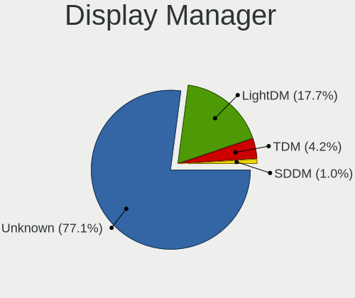

| Name    | Computers | Percent |
|---------|-----------|---------|
| Unknown | 70        | 78.65%  |
| LightDM | 14        | 15.73%  |
| TDM     | 4         | 4.49%   |
| SDDM    | 1         | 1.12%   |

OS Lang
-------

Language

| Lang    | Computers | Percent |
|---------|-----------|---------|
| en_US   | 25        | 27.17%  |
| en_GB   | 17        | 18.48%  |
| de_CH   | 7         | 7.61%   |
| Unknown | 7         | 7.61%   |
| en_AU   | 6         | 6.52%   |
| de_DE   | 6         | 6.52%   |
| en_IN   | 3         | 3.26%   |
| en_CA   | 3         | 3.26%   |
| pt_BR   | 2         | 2.17%   |
| nl_BE   | 2         | 2.17%   |
| es_VE   | 2         | 2.17%   |
| pt_PT   | 1         | 1.09%   |
| it_IT   | 1         | 1.09%   |
| fi_FI   | 1         | 1.09%   |
| es_UY   | 1         | 1.09%   |
| es_PE   | 1         | 1.09%   |
| es_MX   | 1         | 1.09%   |
| es_HN   | 1         | 1.09%   |
| es_ES   | 1         | 1.09%   |
| es_CL   | 1         | 1.09%   |
| en_IE   | 1         | 1.09%   |
| en_AG   | 1         | 1.09%   |
| de_AT   | 1         | 1.09%   |

Boot Mode
---------

EFI or BIOS

| Mode | Computers | Percent |
|------|-----------|---------|
| EFI  | 54        | 60%     |
| BIOS | 36        | 40%     |

Filesystem
----------

Type of filesystem

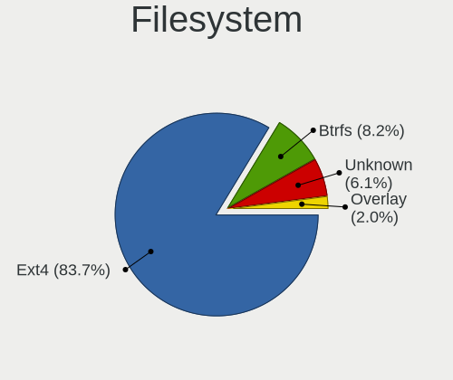

| Type    | Computers | Percent |
|---------|-----------|---------|
| Ext4    | 75        | 82.42%  |
| Btrfs   | 8         | 8.79%   |
| Unknown | 6         | 6.59%   |
| Overlay | 2         | 2.2%    |

Part. scheme
------------

Scheme of partitioning

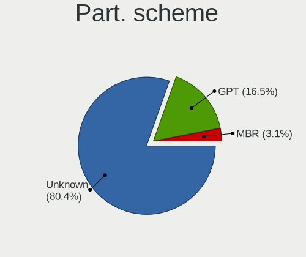

| Type    | Computers | Percent |
|---------|-----------|---------|
| Unknown | 74        | 82.22%  |
| GPT     | 14        | 15.56%  |
| MBR     | 2         | 2.22%   |

Dual Boot with Linux/BSD
------------------------

Hosting more than one Linux/BSD

| Dual boot | Computers | Percent |
|-----------|-----------|---------|
| No        | 87        | 97.75%  |
| Yes       | 2         | 2.25%   |

Dual Boot (Win)
---------------

Hosting Linux and Windows

| Dual boot | Computers | Percent |
|-----------|-----------|---------|
| No        | 76        | 85.39%  |
| Yes       | 13        | 14.61%  |

Board
-----

Vendor
------

Motherboard manufacturer

| Name                | Computers | Percent |
|---------------------|-----------|---------|
| ASUSTek Computer    | 22        | 24.72%  |
| MSI                 | 10        | 11.24%  |
| Hewlett-Packard     | 9         | 10.11%  |
| Lenovo              | 8         | 8.99%   |
| Dell                | 7         | 7.87%   |
| Apple               | 5         | 5.62%   |
| Gigabyte Technology | 4         | 4.49%   |
| Acer                | 4         | 4.49%   |
| ASRock              | 3         | 3.37%   |
| Sony                | 2         | 2.25%   |
| Pegatron            | 2         | 2.25%   |
| ZOTAC               | 1         | 1.12%   |
| Wortmann AG         | 1         | 1.12%   |
| Toshiba             | 1         | 1.12%   |
| PCWare              | 1         | 1.12%   |
| Panasonic           | 1         | 1.12%   |
| Microsoft           | 1         | 1.12%   |
| Medion              | 1         | 1.12%   |
| HUAWEI              | 1         | 1.12%   |
| Fujitsu             | 1         | 1.12%   |
| Foxconn             | 1         | 1.12%   |
| Exo                 | 1         | 1.12%   |
| BESSTAR Tech        | 1         | 1.12%   |
| Unknown             | 1         | 1.12%   |

Model
-----

Motherboard model

| Name                                   | Computers | Percent |
|----------------------------------------|-----------|---------|
| ASUS All Series                        | 3         | 3.37%   |
| ASUS ROG Zephyrus M16 GU603HE_GU603HE  | 2         | 2.25%   |
| ASUS PRIME Z370-A                      | 2         | 2.25%   |
| ZOTAC ZBOX-CI527/CI547                 | 1         | 1.12%   |
| Wortmann AG TERRA_PC                   | 1         | 1.12%   |
| Toshiba Satellite T135D                | 1         | 1.12%   |
| Sony VPCEE4J1E                         | 1         | 1.12%   |
| Sony SVF15318SNB                       | 1         | 1.12%   |
| Pegatron p7-1030                       | 1         | 1.12%   |
| Pegatron AY691AA-ABA p6367c            | 1         | 1.12%   |
| PCWare IPMH81G1                        | 1         | 1.12%   |
| Panasonic CF-J10YYBHR                  | 1         | 1.12%   |
| MSI Traveller 1591                     | 1         | 1.12%   |
| MSI MS-7C37                            | 1         | 1.12%   |
| MSI MS-7B89                            | 1         | 1.12%   |
| MSI MS-7A37                            | 1         | 1.12%   |
| MSI MS-7788                            | 1         | 1.12%   |
| MSI GS66 Stealth 10SE                  | 1         | 1.12%   |
| MSI GP72 7RDX                          | 1         | 1.12%   |
| MSI GE66 Raider 11UG                   | 1         | 1.12%   |
| MSI C Series                           | 1         | 1.12%   |
| MSI 700-216                            | 1         | 1.12%   |
| Microsoft Surface Pro 3                | 1         | 1.12%   |
| Medion H61H2-LM3                       | 1         | 1.12%   |
| Lenovo Yoga 730-15IKB 81CU             | 1         | 1.12%   |
| Lenovo XiaoXin Air 12 80UN             | 1         | 1.12%   |
| Lenovo ThinkPad X240 20AMS72901        | 1         | 1.12%   |
| Lenovo ThinkPad X230 2325AT6           | 1         | 1.12%   |
| Lenovo ThinkCentre M72z 3548B2S        | 1         | 1.12%   |
| Lenovo Legion Y7000P 81LD              | 1         | 1.12%   |
| Lenovo G550 2958                       | 1         | 1.12%   |
| Lenovo G50-45 80E3                     | 1         | 1.12%   |
| HUAWEI BOHK-WAX9X                      | 1         | 1.12%   |
| HP Stream Notebook PC 13               | 1         | 1.12%   |
| HP ProLiant DL380p Gen8                | 1         | 1.12%   |
| HP ProBook 6560b                       | 1         | 1.12%   |
| HP Pavilion x360 Convertible 14-cd1xxx | 1         | 1.12%   |
| HP Pavilion Laptop 14-bf0xx            | 1         | 1.12%   |
| HP Pavilion Gaming Laptop 15-cx0xxx    | 1         | 1.12%   |
| HP Pavilion Desktop PC 570-p0xx        | 1         | 1.12%   |

Model Family
------------

Motherboard model prefix

| Name                  | Computers | Percent |
|-----------------------|-----------|---------|
| ASUS PRIME            | 6         | 6.74%   |
| HP Pavilion           | 4         | 4.49%   |
| Dell OptiPlex         | 3         | 3.37%   |
| ASUS All              | 3         | 3.37%   |
| Lenovo ThinkPad       | 2         | 2.25%   |
| Dell Latitude         | 2         | 2.25%   |
| Dell Inspiron         | 2         | 2.25%   |
| ASUS VivoBook         | 2         | 2.25%   |
| ASUS ROG              | 2         | 2.25%   |
| Acer Aspire           | 2         | 2.25%   |
| ZOTAC ZBOX-CI527      | 1         | 1.12%   |
| Wortmann AG TERRA     | 1         | 1.12%   |
| Toshiba Satellite     | 1         | 1.12%   |
| Sony VPCEE4J1E        | 1         | 1.12%   |
| Sony SVF15318SNB      | 1         | 1.12%   |
| Pegatron p7-1030      | 1         | 1.12%   |
| Pegatron AY691AA-ABA  | 1         | 1.12%   |
| PCWare IPMH81G1       | 1         | 1.12%   |
| Panasonic CF-J10YYBHR | 1         | 1.12%   |
| MSI Traveller         | 1         | 1.12%   |
| MSI MS-7C37           | 1         | 1.12%   |
| MSI MS-7B89           | 1         | 1.12%   |
| MSI MS-7A37           | 1         | 1.12%   |
| MSI MS-7788           | 1         | 1.12%   |
| MSI GS66              | 1         | 1.12%   |
| MSI GP72              | 1         | 1.12%   |
| MSI GE66              | 1         | 1.12%   |
| MSI C                 | 1         | 1.12%   |
| MSI 700-216           | 1         | 1.12%   |
| Microsoft Surface     | 1         | 1.12%   |
| Medion H61H2-LM3      | 1         | 1.12%   |
| Lenovo Yoga           | 1         | 1.12%   |
| Lenovo XiaoXin        | 1         | 1.12%   |
| Lenovo ThinkCentre    | 1         | 1.12%   |
| Lenovo Legion         | 1         | 1.12%   |
| Lenovo G550           | 1         | 1.12%   |
| Lenovo G50-45         | 1         | 1.12%   |
| HUAWEI BOHK-WAX9X     | 1         | 1.12%   |
| HP Stream             | 1         | 1.12%   |
| HP ProLiant           | 1         | 1.12%   |

MFG Year
--------

Motherboard manufacture year

| Year | Computers | Percent |
|------|-----------|---------|
| 2017 | 12        | 13.48%  |
| 2011 | 10        | 11.24%  |
| 2013 | 9         | 10.11%  |
| 2012 | 9         | 10.11%  |
| 2014 | 8         | 8.99%   |
| 2019 | 7         | 7.87%   |
| 2018 | 6         | 6.74%   |
| 2016 | 6         | 6.74%   |
| 2021 | 5         | 5.62%   |
| 2009 | 5         | 5.62%   |
| 2020 | 4         | 4.49%   |
| 2008 | 3         | 3.37%   |
| 2010 | 2         | 2.25%   |
| 2022 | 1         | 1.12%   |
| 2015 | 1         | 1.12%   |
| 2006 | 1         | 1.12%   |

Form Factor
-----------

Physical design of the computer

| Name        | Computers | Percent |
|-------------|-----------|---------|
| Notebook    | 41        | 46.07%  |
| Desktop     | 38        | 42.7%   |
| All in one  | 4         | 4.49%   |
| Convertible | 2         | 2.25%   |
| Mini pc     | 2         | 2.25%   |
| Tablet      | 1         | 1.12%   |
| Server      | 1         | 1.12%   |

Secure Boot
-----------

Enabled or disabled

| State    | Computers | Percent |
|----------|-----------|---------|
| Disabled | 83        | 92.22%  |
| Enabled  | 7         | 7.78%   |

Coreboot
--------

Have coreboot on board

| Used | Computers | Percent |
|------|-----------|---------|
| No   | 89        | 100%    |

RAM Size
--------

Total RAM memory

| Size in GB  | Computers | Percent |
|-------------|-----------|---------|
| 8.01-16.0   | 22        | 23.91%  |
| 4.01-8.0    | 20        | 21.74%  |
| 16.01-24.0  | 19        | 20.65%  |
| 3.01-4.0    | 15        | 16.3%   |
| 32.01-64.0  | 8         | 8.7%    |
| 64.01-256.0 | 3         | 3.26%   |
| 1.01-2.0    | 3         | 3.26%   |
| 24.01-32.0  | 2         | 2.17%   |

RAM Used
--------

Used RAM memory

| Used GB    | Computers | Percent |
|------------|-----------|---------|
| 1.01-2.0   | 42        | 42%     |
| 2.01-3.0   | 31        | 31%     |
| 3.01-4.0   | 14        | 14%     |
| 4.01-8.0   | 9         | 9%      |
| 0.51-1.0   | 2         | 2%      |
| 16.01-24.0 | 1         | 1%      |
| 8.01-16.0  | 1         | 1%      |

Total Drives
------------

Number of drives on board

| Drives | Computers | Percent |
|--------|-----------|---------|
| 1      | 52        | 55.91%  |
| 2      | 21        | 22.58%  |
| 3      | 13        | 13.98%  |
| 4      | 3         | 3.23%   |
| 7      | 1         | 1.08%   |
| 6      | 1         | 1.08%   |
| 5      | 1         | 1.08%   |
| 0      | 1         | 1.08%   |

Has CD-ROM
----------

Has CD-ROM on board

| Presented | Computers | Percent |
|-----------|-----------|---------|
| No        | 56        | 62.22%  |
| Yes       | 34        | 37.78%  |

Has Ethernet
------------

Has Ethernet on board

| Presented | Computers | Percent |
|-----------|-----------|---------|
| Yes       | 81        | 90%     |
| No        | 9         | 10%     |

Has WiFi
--------

Has WiFi module

| Presented | Computers | Percent |
|-----------|-----------|---------|
| Yes       | 63        | 70.79%  |
| No        | 26        | 29.21%  |

Has Bluetooth
-------------

Has Bluetooth module

| Presented | Computers | Percent |
|-----------|-----------|---------|
| Yes       | 48        | 52.75%  |
| No        | 43        | 47.25%  |

Location
--------

Country
-------

Geographic location (country)

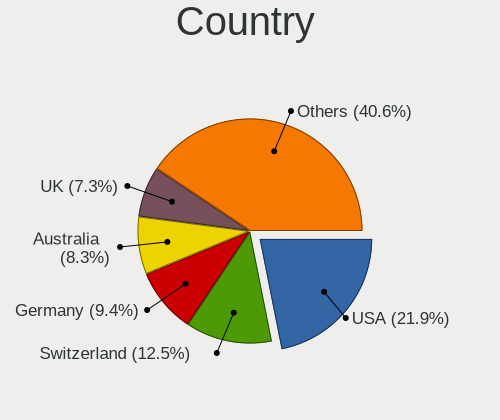

| Country     | Computers | Percent |
|-------------|-----------|---------|
| USA         | 19        | 21.35%  |
| Switzerland | 10        | 11.24%  |
| Germany     | 8         | 8.99%   |
| Australia   | 8         | 8.99%   |
| UK          | 7         | 7.87%   |
| India       | 3         | 3.37%   |
| Canada      | 3         | 3.37%   |
| Brazil      | 3         | 3.37%   |
| Venezuela   | 2         | 2.25%   |
| Turkey      | 2         | 2.25%   |
| Poland      | 2         | 2.25%   |
| Belgium     | 2         | 2.25%   |
| Argentina   | 2         | 2.25%   |
| Uruguay     | 1         | 1.12%   |
| UAE         | 1         | 1.12%   |
| Spain       | 1         | 1.12%   |
| Portugal    | 1         | 1.12%   |
| Peru        | 1         | 1.12%   |
| Norway      | 1         | 1.12%   |
| Mexico      | 1         | 1.12%   |
| Jordan      | 1         | 1.12%   |
| Japan       | 1         | 1.12%   |
| Italy       | 1         | 1.12%   |
| Ireland     | 1         | 1.12%   |
| Honduras    | 1         | 1.12%   |
| Guam        | 1         | 1.12%   |
| Greece      | 1         | 1.12%   |
| Finland     | 1         | 1.12%   |
| Chile       | 1         | 1.12%   |
| Bulgaria    | 1         | 1.12%   |
| Belize      | 1         | 1.12%   |

City
----

Geographic location (city)

| City           | Computers | Percent |
|----------------|-----------|---------|
| Oberwil-Lieli  | 8         | 8.25%   |
| Melbourne      | 4         | 4.12%   |
| Zurich         | 2         | 2.06%   |
| Winterthur     | 2         | 2.06%   |
| Richmond       | 2         | 2.06%   |
| Leicester      | 2         | 2.06%   |
| Istanbul       | 2         | 2.06%   |
| Escondido      | 2         | 2.06%   |
| Ypsilanti      | 1         | 1.03%   |
| Yigo Village   | 1         | 1.03%   |
| Wrexham        | 1         | 1.03%   |
| Varna          | 1         | 1.03%   |
| Tegucigalpa    | 1         | 1.03%   |
| Surat          | 1         | 1.03%   |
| Stuttgart      | 1         | 1.03%   |
| Sterling       | 1         | 1.03%   |
| Stavanger      | 1         | 1.03%   |
| Sligo          | 1         | 1.03%   |
| Seattle        | 1         | 1.03%   |
| Schleusingen   | 1         | 1.03%   |
| Sao Jose       | 1         | 1.03%   |
| Santiago       | 1         | 1.03%   |
| Sankt Augustin | 1         | 1.03%   |
| Saitama        | 1         | 1.03%   |
| Recklinghausen | 1         | 1.03%   |
| Portland       | 1         | 1.03%   |
| Plymouth       | 1         | 1.03%   |
| Phoenix        | 1         | 1.03%   |
| Oudenaarde     | 1         | 1.03%   |
| New York       | 1         | 1.03%   |
| Naples         | 1         | 1.03%   |
| Montevideo     | 1         | 1.03%   |
| Moncton        | 1         | 1.03%   |
| Mieres         | 1         | 1.03%   |
| Maracay        | 1         | 1.03%   |
| Macaé         | 1         | 1.03%   |
| Los Angeles    | 1         | 1.03%   |
| Lineville      | 1         | 1.03%   |
| Lima           | 1         | 1.03%   |
| Lancefield     | 1         | 1.03%   |

Drives
------

Drive Vendor
------------

Hard drive vendors

| Vendor                    | Computers | Drives | Percent |
|---------------------------|-----------|--------|---------|
| WDC                       | 21        | 32     | 15.22%  |
| Seagate                   | 19        | 26     | 13.77%  |
| Samsung Electronics       | 19        | 28     | 13.77%  |
| Unknown                   | 10        | 13     | 7.25%   |
| Hitachi                   | 9         | 13     | 6.52%   |
| Toshiba                   | 8         | 11     | 5.8%    |
| SanDisk                   | 8         | 10     | 5.8%    |
| Intel                     | 8         | 9      | 5.8%    |
| Kingston                  | 7         | 15     | 5.07%   |
| HGST                      | 4         | 4      | 2.9%    |
| SK hynix                  | 3         | 4      | 2.17%   |
| Phison                    | 3         | 3      | 2.17%   |
| A-DATA Technology         | 3         | 3      | 2.17%   |
| Realtek Semiconductor     | 2         | 2      | 1.45%   |
| PNY                       | 2         | 2      | 1.45%   |
| OCZ                       | 2         | 2      | 1.45%   |
| Crucial                   | 2         | 5      | 1.45%   |
| Verbatim                  | 1         | 1      | 0.72%   |
| Micron/Crucial Technology | 1         | 1      | 0.72%   |
| LITEONIT                  | 1         | 1      | 0.72%   |
| LITEON                    | 1         | 1      | 0.72%   |
| KIOXIA                    | 1         | 1      | 0.72%   |
| IBM                       | 1         | 1      | 0.72%   |
| China                     | 1         | 1      | 0.72%   |
| Apple                     | 1         | 1      | 0.72%   |

Drive Model
-----------

Hard drive models

| Model                                               | Computers | Percent |
|-----------------------------------------------------|-----------|---------|
| Unknown SD/MMC/MS PRO 128GB                         | 3         | 2.01%   |
| Unknown MMC Card  32GB                              | 2         | 1.34%   |
| Seagate ST500LT012-9WS142 500GB                     | 2         | 1.34%   |
| Seagate ST4000LM016-1N2170 4TB                      | 2         | 1.34%   |
| Seagate ST31000528AS 1TB                            | 2         | 1.34%   |
| Seagate ST1000LM024 HN-M101MBB 1TB                  | 2         | 1.34%   |
| Samsung NVMe SSD Controller SM981/PM981/PM983 256GB | 2         | 1.34%   |
| Samsung HD103SJ 1TB                                 | 2         | 1.34%   |
| Realtek NVMe SSD Drive 512GB                        | 2         | 1.34%   |
| Phison NVMe SSD Drive 1TB                           | 2         | 1.34%   |
| Kingston SA400S37480G 480GB SSD                     | 2         | 1.34%   |
| Intel NVMe SSD Drive 512GB                          | 2         | 1.34%   |
| Hitachi HUA723020ALA640 2TB                         | 2         | 1.34%   |
| Hitachi HDS721010CLA332 1TB                         | 2         | 1.34%   |
| HGST HTS721010A9E630 1TB                            | 2         | 1.34%   |
| WDC WDS500G2B0A-00SM50 500GB SSD                    | 1         | 0.67%   |
| WDC WDS500G1R0B-68A4Z0 500GB SSD                    | 1         | 0.67%   |
| WDC WDS240G2G0A-00JH30 240GB SSD                    | 1         | 0.67%   |
| WDC WDS100T2B0C-00PXH0 1TB                          | 1         | 0.67%   |
| WDC WDS100T2B0A-00SM50 1TB SSD                      | 1         | 0.67%   |
| WDC WD80EFBX-68AZZN0 8TB                            | 1         | 0.67%   |
| WDC WD6400AAKS-00A7B2 640GB                         | 1         | 0.67%   |
| WDC WD5000LPCX-60VHAT1 500GB                        | 1         | 0.67%   |
| WDC WD5000BPKT-60PK4T0 500GB                        | 1         | 0.67%   |
| WDC WD5000AAVS-00G9B1 500GB                         | 1         | 0.67%   |
| WDC WD5000AAKS-65A7B2 500GB                         | 1         | 0.67%   |
| WDC WD5000AAKS-00A7B2 500GB                         | 1         | 0.67%   |
| WDC WD30EZRX-00MMMB0 3TB                            | 1         | 0.67%   |
| WDC WD30EZRX-00D8PB0 3TB                            | 1         | 0.67%   |
| WDC WD2500BPVT-00JJ5T0 250GB                        | 1         | 0.67%   |
| WDC WD2500AAKX-75U6AA0 250GB                        | 1         | 0.67%   |
| WDC WD1600AAJS-00L7A0 160GB                         | 1         | 0.67%   |
| WDC WD10PURX-78E5EY0 1TB                            | 1         | 0.67%   |
| WDC WD10JPVX-22JC3T0 1TB                            | 1         | 0.67%   |
| WDC WD10EZEX-60WN4A0 1TB                            | 1         | 0.67%   |
| WDC WD10EZEX-22MFCA0 1TB                            | 1         | 0.67%   |
| WDC WD10EZEX-08WN4A0 1TB                            | 1         | 0.67%   |
| WDC WD10EZEX-00WN4A0 1TB                            | 1         | 0.67%   |
| WDC WD10EZEX-00BN5A0 1TB                            | 1         | 0.67%   |
| WDC WD10EURX-83UY4Y0 1TB                            | 1         | 0.67%   |

HDD Vendor
----------

Hard disk drive vendors

| Vendor              | Computers | Drives | Percent |
|---------------------|-----------|--------|---------|
| Seagate             | 19        | 25     | 32.76%  |
| WDC                 | 17        | 26     | 29.31%  |
| Hitachi             | 9         | 13     | 15.52%  |
| Toshiba             | 4         | 6      | 6.9%    |
| HGST                | 4         | 4      | 6.9%    |
| Unknown             | 3         | 2      | 5.17%   |
| Samsung Electronics | 2         | 3      | 3.45%   |

SSD Vendor
----------

Solid state drive vendors

| Vendor              | Computers | Drives | Percent |
|---------------------|-----------|--------|---------|
| Samsung Electronics | 9         | 11     | 18%     |
| SanDisk             | 6         | 7      | 12%     |
| Kingston            | 6         | 14     | 12%     |
| WDC                 | 5         | 5      | 10%     |
| Intel               | 5         | 5      | 10%     |
| Toshiba             | 3         | 4      | 6%      |
| A-DATA Technology   | 3         | 3      | 6%      |
| SK hynix            | 2         | 3      | 4%      |
| PNY                 | 2         | 2      | 4%      |
| OCZ                 | 2         | 2      | 4%      |
| Crucial             | 2         | 5      | 4%      |
| Verbatim            | 1         | 1      | 2%      |
| LITEONIT            | 1         | 1      | 2%      |
| LITEON              | 1         | 1      | 2%      |
| China               | 1         | 1      | 2%      |
| Apple               | 1         | 1      | 2%      |

Drive Kind
----------

HDD or SSD

| Kind    | Computers | Drives | Percent |
|---------|-----------|--------|---------|
| HDD     | 49        | 79     | 39.52%  |
| SSD     | 43        | 66     | 34.68%  |
| NVMe    | 23        | 32     | 18.55%  |
| MMC     | 7         | 11     | 5.65%   |
| Unknown | 2         | 2      | 1.61%   |

Drive Connector
---------------

SATA, SAS, NVMe, etc.

| Type | Computers | Drives | Percent |
|------|-----------|--------|---------|
| SATA | 74        | 140    | 66.07%  |
| NVMe | 23        | 32     | 20.54%  |
| SAS  | 8         | 7      | 7.14%   |
| MMC  | 7         | 11     | 6.25%   |

Drive Size
----------

Size of hard drive

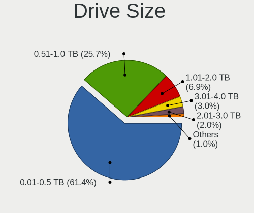

| Size in TB | Computers | Drives | Percent |
|------------|-----------|--------|---------|
| 0.01-0.5   | 57        | 85     | 59.38%  |
| 0.51-1.0   | 27        | 40     | 28.13%  |
| 1.01-2.0   | 6         | 10     | 6.25%   |
| 3.01-4.0   | 3         | 7      | 3.13%   |
| 2.01-3.0   | 2         | 2      | 2.08%   |
| 4.01-10.0  | 1         | 1      | 1.04%   |

Space Total
-----------

Amount of disk space available on the file system

| Size in GB     | Computers | Percent |
|----------------|-----------|---------|
| 101-250        | 26        | 26.53%  |
| 251-500        | 23        | 23.47%  |
| 1001-2000      | 18        | 18.37%  |
| 501-1000       | 13        | 13.27%  |
| 51-100         | 5         | 5.1%    |
| More than 3000 | 4         | 4.08%   |
| 2001-3000      | 4         | 4.08%   |
| 21-50          | 3         | 3.06%   |
| 1-20           | 1         | 1.02%   |
| Unknown        | 1         | 1.02%   |

Space Used
----------

Amount of used disk space

| Used GB   | Computers | Percent |
|-----------|-----------|---------|
| 21-50     | 32        | 32%     |
| 1-20      | 17        | 17%     |
| 251-500   | 15        | 15%     |
| 101-250   | 13        | 13%     |
| 51-100    | 12        | 12%     |
| 501-1000  | 8         | 8%      |
| 1001-2000 | 2         | 2%      |
| Unknown   | 1         | 1%      |

Malfunc. Drives
---------------

Drive models with a malfunction

| Model                                    | Computers | Drives | Percent |
|------------------------------------------|-----------|--------|---------|
| WDC WD5000AAVS-00G9B1 500GB              | 1         | 1      | 14.29%  |
| Toshiba MK1234GSX 120GB                  | 1         | 1      | 14.29%  |
| Seagate ST500LT012-9WS142 500GB          | 1         | 1      | 14.29%  |
| Seagate ST3500418AS 500GB                | 1         | 1      | 14.29%  |
| Seagate ST1000LM024 HN-M101MBB 1TB       | 1         | 1      | 14.29%  |
| Samsung Electronics SSD 840 Series 120GB | 1         | 1      | 14.29%  |
| Intel SSDSC2BW240A4 240GB                | 1         | 1      | 14.29%  |

Malfunc. Drive Vendor
---------------------

Vendors of faulty drives

| Vendor              | Computers | Drives | Percent |
|---------------------|-----------|--------|---------|
| Seagate             | 3         | 3      | 42.86%  |
| WDC                 | 1         | 1      | 14.29%  |
| Toshiba             | 1         | 1      | 14.29%  |
| Samsung Electronics | 1         | 1      | 14.29%  |
| Intel               | 1         | 1      | 14.29%  |

Malfunc. HDD Vendor
-------------------

Vendors of faulty HDD drives

| Vendor  | Computers | Drives | Percent |
|---------|-----------|--------|---------|
| Seagate | 3         | 3      | 60%     |
| WDC     | 1         | 1      | 20%     |
| Toshiba | 1         | 1      | 20%     |

Malfunc. Drive Kind
-------------------

Kinds of faulty drives

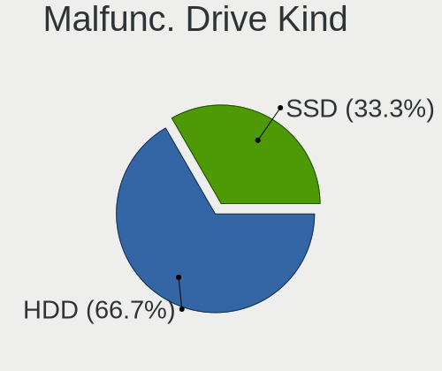

| Kind | Computers | Drives | Percent |
|------|-----------|--------|---------|
| HDD  | 4         | 5      | 66.67%  |
| SSD  | 2         | 2      | 33.33%  |

Failed Drives
-------------

Failed drive models

| Model                    | Computers | Drives | Percent |
|--------------------------|-----------|--------|---------|
| Seagate ST31000528AS 1TB | 1         | 1      | 100%    |

Failed Drive Vendor
-------------------

Failed drive vendors

| Vendor  | Computers | Drives | Percent |
|---------|-----------|--------|---------|
| Seagate | 1         | 1      | 100%    |

Drive Status
------------

Number of failed and malfunc. drives

| Status   | Computers | Drives | Percent |
|----------|-----------|--------|---------|
| Detected | 76        | 155    | 79.17%  |
| Works    | 13        | 27     | 13.54%  |
| Malfunc  | 6         | 7      | 6.25%   |
| Failed   | 1         | 1      | 1.04%   |

Storage controller
------------------

Storage Vendor
--------------

Storage controller vendors

| Vendor                       | Computers | Percent |
|------------------------------|-----------|---------|
| Intel                        | 63        | 56.76%  |
| AMD                          | 15        | 13.51%  |
| Samsung Electronics          | 13        | 11.71%  |
| SanDisk                      | 3         | 2.7%    |
| Phison Electronics           | 3         | 2.7%    |
| Nvidia                       | 3         | 2.7%    |
| Realtek Semiconductor        | 2         | 1.8%    |
| ASMedia Technology           | 2         | 1.8%    |
| Toshiba America Info Systems | 1         | 0.9%    |
| SK hynix                     | 1         | 0.9%    |
| Micron/Crucial Technology    | 1         | 0.9%    |
| KIOXIA                       | 1         | 0.9%    |
| Kingston Technology Company  | 1         | 0.9%    |
| JMicron Technology           | 1         | 0.9%    |
| Hewlett-Packard              | 1         | 0.9%    |

Storage Model
-------------

Storage controller models

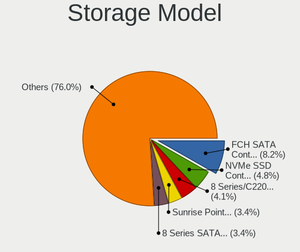

| Model                                                                                   | Computers | Percent |
|-----------------------------------------------------------------------------------------|-----------|---------|
| AMD FCH SATA Controller [AHCI mode]                                                     | 9         | 6.82%   |
| Samsung NVMe SSD Controller SM981/PM981/PM983                                           | 7         | 5.3%    |
| Intel 8 Series/C220 Series Chipset Family 6-port SATA Controller 1 [AHCI mode]          | 6         | 4.55%   |
| Intel Sunrise Point-LP SATA Controller [AHCI mode]                                      | 5         | 3.79%   |
| Intel 8 Series SATA Controller 1 [AHCI mode]                                            | 5         | 3.79%   |
| Intel 7 Series Chipset Family 6-port SATA Controller [AHCI mode]                        | 5         | 3.79%   |
| Intel 6 Series/C200 Series Chipset Family Desktop SATA Controller (IDE mode, ports 4-5) | 4         | 3.03%   |
| Intel 6 Series/C200 Series Chipset Family Desktop SATA Controller (IDE mode, ports 0-3) | 4         | 3.03%   |
| Intel 6 Series/C200 Series Chipset Family 6 port Desktop SATA AHCI Controller           | 4         | 3.03%   |
| Intel 200 Series PCH SATA controller [AHCI mode]                                        | 4         | 3.03%   |
| Samsung NVMe SSD Controller SM961/PM961/SM963                                           | 3         | 2.27%   |
| Phison E12 NVMe Controller                                                              | 3         | 2.27%   |
| Intel 82801 Mobile SATA Controller [RAID mode]                                          | 3         | 2.27%   |
| Intel 6 Series/C200 Series Chipset Family 6 port Mobile SATA AHCI Controller            | 3         | 2.27%   |
| AMD SB7x0/SB8x0/SB9x0 SATA Controller [AHCI mode]                                       | 3         | 2.27%   |
| AMD SB7x0/SB8x0/SB9x0 IDE Controller                                                    | 3         | 2.27%   |
| AMD 300 Series Chipset SATA Controller                                                  | 3         | 2.27%   |
| Intel Volume Management Device NVMe RAID Controller                                     | 2         | 1.52%   |
| Intel SSD 670p Series [Keystone Harbor]                                                 | 2         | 1.52%   |
| Intel NM10/ICH7 Family SATA Controller [IDE mode]                                       | 2         | 1.52%   |
| Intel HM170/QM170 Chipset SATA Controller [AHCI Mode]                                   | 2         | 1.52%   |
| Intel Celeron/Pentium Silver Processor SATA Controller                                  | 2         | 1.52%   |
| Intel 82801JI (ICH10 Family) 4 port SATA IDE Controller #1                              | 2         | 1.52%   |
| Intel 82801G (ICH7 Family) IDE Controller                                               | 2         | 1.52%   |
| ASMedia ASM1062 Serial ATA Controller                                                   | 2         | 1.52%   |
| AMD 400 Series Chipset SATA Controller                                                  | 2         | 1.52%   |
| Toshiba America Info Systems XG5 NVMe SSD Controller                                    | 1         | 0.76%   |
| SK hynix Gold P31/BC711/PC711 NVMe Solid State Drive                                    | 1         | 0.76%   |
| SanDisk WD PC SN810 / Black SN850 NVMe SSD                                              | 1         | 0.76%   |
| SanDisk WD Blue SN550 NVMe SSD                                                          | 1         | 0.76%   |
| SanDisk WD Black SN750 / PC SN730 NVMe SSD                                              | 1         | 0.76%   |
| Samsung S4LN058A01[SSUBX] AHCI SSD Controller (Apple slot)                              | 1         | 0.76%   |
| Samsung NVMe SSD Controller PM9A1/PM9A3/980PRO                                          | 1         | 0.76%   |
| Samsung NVMe SSD Controller 980                                                         | 1         | 0.76%   |
| Realtek RTS5763DL NVMe SSD Controller (DRAM-less)                                       | 1         | 0.76%   |
| Realtek RTS5763DL NVMe SSD Controller                                                   | 1         | 0.76%   |
| Nvidia nForce SATA Controller                                                           | 1         | 0.76%   |
| Nvidia MCP79 AHCI Controller                                                            | 1         | 0.76%   |
| Nvidia MCP55 SATA Controller                                                            | 1         | 0.76%   |
| Nvidia MCP55 IDE                                                                        | 1         | 0.76%   |

Storage Kind
------------

Kind of storage controller (IDE, SATA, NVMe, SAS, ...)

| Kind | Computers | Percent |
|------|-----------|---------|
| SATA | 67        | 58.77%  |
| NVMe | 26        | 22.81%  |
| IDE  | 14        | 12.28%  |
| RAID | 7         | 6.14%   |

Processor
---------

CPU Vendor
----------

Processor vendors

| Vendor | Computers | Percent |
|--------|-----------|---------|
| Intel  | 71        | 79.78%  |
| AMD    | 18        | 20.22%  |

CPU Model
---------

Processor models

| Model                                   | Computers | Percent |
|-----------------------------------------|-----------|---------|
| Intel 11th Gen Core i7-11800H @ 2.30GHz | 3         | 3.37%   |
| Intel Core i7-8700K CPU @ 3.70GHz       | 2         | 2.25%   |
| Intel Core i7-8550U CPU @ 1.80GHz       | 2         | 2.25%   |
| Intel Core i5-4300U CPU @ 1.90GHz       | 2         | 2.25%   |
| Intel Core i5-4260U CPU @ 1.40GHz       | 2         | 2.25%   |
| Intel Core i5-3320M CPU @ 2.60GHz       | 2         | 2.25%   |
| Intel Core i3-2100 CPU @ 3.10GHz        | 2         | 2.25%   |
| Intel Celeron CPU 1007U @ 1.50GHz       | 2         | 2.25%   |
| AMD Ryzen 5 1600 Six-Core Processor     | 2         | 2.25%   |
| Intel Xeon CPU E5-2667 0 @ 2.90GHz      | 1         | 1.12%   |
| Intel Pentium D CPU 3.00GHz             | 1         | 1.12%   |
| Intel Pentium CPU P6200 @ 2.13GHz       | 1         | 1.12%   |
| Intel Pentium CPU N4200 @ 1.10GHz       | 1         | 1.12%   |
| Intel Pentium CPU G630 @ 2.70GHz        | 1         | 1.12%   |
| Intel Pentium CPU G3250 @ 3.20GHz       | 1         | 1.12%   |
| Intel Pentium CPU 4415U @ 2.30GHz       | 1         | 1.12%   |
| Intel Core m3-6Y30 CPU @ 0.90GHz        | 1         | 1.12%   |
| Intel Core i7-7700T CPU @ 2.90GHz       | 1         | 1.12%   |
| Intel Core i7-7700K CPU @ 4.20GHz       | 1         | 1.12%   |
| Intel Core i7-7700HQ CPU @ 2.80GHz      | 1         | 1.12%   |
| Intel Core i7-6700K CPU @ 4.00GHz       | 1         | 1.12%   |
| Intel Core i7-5500U CPU @ 2.40GHz       | 1         | 1.12%   |
| Intel Core i7-4770 CPU @ 3.40GHz        | 1         | 1.12%   |
| Intel Core i7-4700HQ CPU @ 2.40GHz      | 1         | 1.12%   |
| Intel Core i7-4650U CPU @ 1.70GHz       | 1         | 1.12%   |
| Intel Core i7-3770S CPU @ 3.10GHz       | 1         | 1.12%   |
| Intel Core i7-2600K CPU @ 3.40GHz       | 1         | 1.12%   |
| Intel Core i7-2600 CPU @ 3.40GHz        | 1         | 1.12%   |
| Intel Core i7-10875H CPU @ 2.30GHz      | 1         | 1.12%   |
| Intel Core i7-10700 CPU @ 2.90GHz       | 1         | 1.12%   |
| Intel Core i7 CPU 920 @ 2.67GHz         | 1         | 1.12%   |
| Intel Core i5-9400F CPU @ 2.90GHz       | 1         | 1.12%   |
| Intel Core i5-8300H CPU @ 2.30GHz       | 1         | 1.12%   |
| Intel Core i5-7300HQ CPU @ 2.50GHz      | 1         | 1.12%   |
| Intel Core i5-7200U CPU @ 2.50GHz       | 1         | 1.12%   |
| Intel Core i5-6300U CPU @ 2.40GHz       | 1         | 1.12%   |
| Intel Core i5-6200U CPU @ 2.30GHz       | 1         | 1.12%   |
| Intel Core i5-4690K CPU @ 3.50GHz       | 1         | 1.12%   |
| Intel Core i5-4210M CPU @ 2.60GHz       | 1         | 1.12%   |
| Intel Core i5-4200U CPU @ 1.60GHz       | 1         | 1.12%   |

CPU Model Family
----------------

Processor model prefix

| Model                   | Computers | Percent |
|-------------------------|-----------|---------|
| Intel Core i5           | 21        | 23.6%   |
| Intel Core i7           | 18        | 20.22%  |
| Intel Core i3           | 7         | 7.87%   |
| Intel Celeron           | 6         | 6.74%   |
| Intel Pentium           | 5         | 5.62%   |
| Other                   | 4         | 4.49%   |
| AMD Ryzen 5             | 4         | 4.49%   |
| Intel Core 2 Quad       | 3         | 3.37%   |
| AMD Ryzen 7             | 3         | 3.37%   |
| Intel Core 2 Duo        | 2         | 2.25%   |
| AMD Ryzen 9             | 2         | 2.25%   |
| AMD A8                  | 2         | 2.25%   |
| Intel Xeon              | 1         | 1.12%   |
| Intel Pentium D         | 1         | 1.12%   |
| Intel Core m3           | 1         | 1.12%   |
| Intel Celeron Dual-Core | 1         | 1.12%   |
| Intel Atom              | 1         | 1.12%   |
| AMD Turion Neo X2       | 1         | 1.12%   |
| AMD FX                  | 1         | 1.12%   |
| AMD Athlon X2           | 1         | 1.12%   |
| AMD Athlon II X2        | 1         | 1.12%   |
| AMD Athlon II           | 1         | 1.12%   |
| AMD A6                  | 1         | 1.12%   |
| AMD A10                 | 1         | 1.12%   |

CPU Cores
---------

Number of processor cores

| Number | Computers | Percent |
|--------|-----------|---------|
| 2      | 44        | 49.44%  |
| 4      | 29        | 32.58%  |
| 8      | 9         | 10.11%  |
| 6      | 5         | 5.62%   |
| 12     | 2         | 2.25%   |

CPU Sockets
-----------

Number of sockets

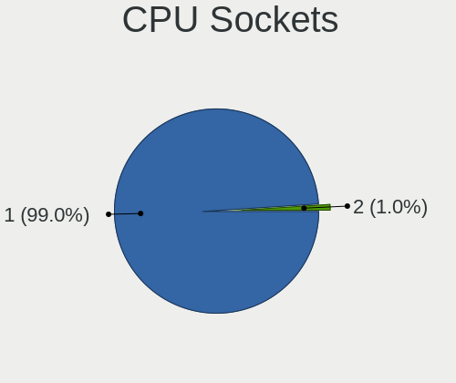

| Number | Computers | Percent |
|--------|-----------|---------|
| 1      | 88        | 98.88%  |
| 2      | 1         | 1.12%   |

CPU Threads
-----------

Threads per core (Hyper-Threading)

| Number | Computers | Percent |
|--------|-----------|---------|
| 2      | 60        | 67.42%  |
| 1      | 29        | 32.58%  |

CPU Op-Modes
------------

CPU Operation Modes (32-bit, 64-bit)

| Op mode        | Computers | Percent |
|----------------|-----------|---------|
| 32-bit, 64-bit | 83        | 93.26%  |
| Unknown        | 6         | 6.74%   |

CPU Microcode
-------------

Microcode number

| Number     | Computers | Percent |
|------------|-----------|---------|
| 0x306a9    | 8         | 8.79%   |
| 0x206a7    | 8         | 8.79%   |
| 0x306c3    | 7         | 7.69%   |
| 0x40651    | 6         | 6.59%   |
| 0x1067a    | 5         | 5.49%   |
| Unknown    | 5         | 5.49%   |
| 0x906ea    | 4         | 4.4%    |
| 0x906e9    | 4         | 4.4%    |
| 0x806d1    | 3         | 3.3%    |
| 0x406e3    | 3         | 3.3%    |
| 0x806ea    | 2         | 2.2%    |
| 0x806e9    | 2         | 2.2%    |
| 0x706a8    | 2         | 2.2%    |
| 0x0800820d | 2         | 2.2%    |
| 0x08001138 | 2         | 2.2%    |
| 0x010000c8 | 2         | 2.2%    |
| 0xf62      | 1         | 1.1%    |
| 0xa0655    | 1         | 1.1%    |
| 0xa0652    | 1         | 1.1%    |
| 0x806eb    | 1         | 1.1%    |
| 0x806c2    | 1         | 1.1%    |
| 0x6fb      | 1         | 1.1%    |
| 0x506e3    | 1         | 1.1%    |
| 0x506c9    | 1         | 1.1%    |
| 0x406c4    | 1         | 1.1%    |
| 0x406c3    | 1         | 1.1%    |
| 0x306d4    | 1         | 1.1%    |
| 0x206d7    | 1         | 1.1%    |
| 0x20655    | 1         | 1.1%    |
| 0x106e5    | 1         | 1.1%    |
| 0x106a5    | 1         | 1.1%    |
| 0x0a50000c | 1         | 1.1%    |
| 0x08701021 | 1         | 1.1%    |
| 0x08608103 | 1         | 1.1%    |
| 0x08108109 | 1         | 1.1%    |
| 0x0810100b | 1         | 1.1%    |
| 0x07030105 | 1         | 1.1%    |
| 0x0600611a | 1         | 1.1%    |
| 0x06003104 | 1         | 1.1%    |
| 0x06001119 | 1         | 1.1%    |

CPU Microarch
-------------

Microarchitecture

| Name            | Computers | Percent |
|-----------------|-----------|---------|
| KabyLake        | 13        | 14.61%  |
| Haswell         | 13        | 14.61%  |
| SandyBridge     | 10        | 11.24%  |
| IvyBridge       | 9         | 10.11%  |
| Penryn          | 5         | 5.62%   |
| Skylake         | 4         | 4.49%   |
| Zen+            | 3         | 3.37%   |
| Zen             | 3         | 3.37%   |
| Icelake         | 3         | 3.37%   |
| Silvermont      | 2         | 2.25%   |
| Piledriver      | 2         | 2.25%   |
| Nehalem         | 2         | 2.25%   |
| K10             | 2         | 2.25%   |
| Goldmont plus   | 2         | 2.25%   |
| CometLake       | 2         | 2.25%   |
| Zen 3           | 1         | 1.12%   |
| Zen 2           | 1         | 1.12%   |
| Westmere        | 1         | 1.12%   |
| TigerLake       | 1         | 1.12%   |
| Steamroller     | 1         | 1.12%   |
| Puma            | 1         | 1.12%   |
| NetBurst        | 1         | 1.12%   |
| K8 Hammer       | 1         | 1.12%   |
| K8 & K10 hybrid | 1         | 1.12%   |
| Goldmont        | 1         | 1.12%   |
| Excavator       | 1         | 1.12%   |
| Core            | 1         | 1.12%   |
| Broadwell       | 1         | 1.12%   |
| Unknown         | 1         | 1.12%   |

Graphics
--------

GPU Vendor
----------

Vendors of graphics cards

| Vendor                     | Computers | Percent |
|----------------------------|-----------|---------|
| Intel                      | 55        | 52.88%  |
| Nvidia                     | 31        | 29.81%  |
| AMD                        | 17        | 16.35%  |
| Matrox Electronics Systems | 1         | 0.96%   |

GPU Model
---------

Graphics card models

| Model                                                                                    | Computers | Percent |
|------------------------------------------------------------------------------------------|-----------|---------|
| Intel Haswell-ULT Integrated Graphics Controller                                         | 6         | 5.71%   |
| Intel 3rd Gen Core processor Graphics Controller                                         | 5         | 4.76%   |
| Intel 2nd Generation Core Processor Family Integrated Graphics Controller                | 5         | 4.76%   |
| Nvidia GP107M [GeForce GTX 1050 Mobile]                                                  | 4         | 3.81%   |
| Intel TigerLake-H GT1 [UHD Graphics]                                                     | 3         | 2.86%   |
| Intel HD Graphics 630                                                                    | 3         | 2.86%   |
| Nvidia GP104 [GeForce GTX 1070]                                                          | 2         | 1.9%    |
| Nvidia GM107 [GeForce GTX 750 Ti]                                                        | 2         | 1.9%    |
| Nvidia GK208B [GeForce GT 710]                                                           | 2         | 1.9%    |
| Nvidia GA107M [GeForce RTX 3050 Ti Mobile]                                               | 2         | 1.9%    |
| Intel Xeon E3-1200 v3/4th Gen Core Processor Integrated Graphics Controller              | 2         | 1.9%    |
| Intel Xeon E3-1200 v2/3rd Gen Core processor Graphics Controller                         | 2         | 1.9%    |
| Intel UHD Graphics 620                                                                   | 2         | 1.9%    |
| Intel Skylake GT2 [HD Graphics 520]                                                      | 2         | 1.9%    |
| Intel IvyBridge GT2 [HD Graphics 4000]                                                   | 2         | 1.9%    |
| Intel GeminiLake [UHD Graphics 600]                                                      | 2         | 1.9%    |
| Intel CoffeeLake-S GT2 [UHD Graphics 630]                                                | 2         | 1.9%    |
| Intel Atom/Celeron/Pentium Processor x5-E8000/J3xxx/N3xxx Integrated Graphics Controller | 2         | 1.9%    |
| Intel 4th Gen Core Processor Integrated Graphics Controller                              | 2         | 1.9%    |
| Intel 4 Series Chipset Integrated Graphics Controller                                    | 2         | 1.9%    |
| AMD Ellesmere [Radeon RX 470/480/570/570X/580/580X/590]                                  | 2         | 1.9%    |
| Nvidia TU116 [GeForce GTX 1660 SUPER]                                                    | 1         | 0.95%   |
| Nvidia TU106M [GeForce RTX 2060 Mobile]                                                  | 1         | 0.95%   |
| Nvidia MCP7A [GeForce 9400]                                                              | 1         | 0.95%   |
| Nvidia GT218 [GeForce 210]                                                               | 1         | 0.95%   |
| Nvidia GP107M [GeForce GTX 1050 Ti Mobile]                                               | 1         | 0.95%   |
| Nvidia GP107 [GeForce GTX 1050]                                                          | 1         | 0.95%   |
| Nvidia GM204 [GeForce GTX 970]                                                           | 1         | 0.95%   |
| Nvidia GK208M [GeForce GT 740M]                                                          | 1         | 0.95%   |
| Nvidia GK208BM [GeForce 920M]                                                            | 1         | 0.95%   |
| Nvidia GK208B [GeForce GT 730]                                                           | 1         | 0.95%   |
| Nvidia GK107M [GeForce GT 750M]                                                          | 1         | 0.95%   |
| Nvidia GK107 [NVS 510]                                                                   | 1         | 0.95%   |
| Nvidia GK107 [GeForce GT 640]                                                            | 1         | 0.95%   |
| Nvidia GF108 [GeForce GT 730]                                                            | 1         | 0.95%   |
| Nvidia GF108 [GeForce GT 630]                                                            | 1         | 0.95%   |
| Nvidia GF108 [GeForce GT 430]                                                            | 1         | 0.95%   |
| Nvidia GA107M [GeForce RTX 3050 Mobile]                                                  | 1         | 0.95%   |
| Nvidia GA104M [GeForce RTX 3070 Mobile / Max-Q]                                          | 1         | 0.95%   |
| Nvidia G92 [GeForce 8800 GT]                                                             | 1         | 0.95%   |

GPU Combo
---------

Combinations of graphics cards

| Name           | Computers | Percent |
|----------------|-----------|---------|
| 1 x Intel      | 41        | 46.07%  |
| 1 x Nvidia     | 18        | 20.22%  |
| 1 x AMD        | 15        | 16.85%  |
| Intel + Nvidia | 12        | 13.48%  |
| 1 x Matrox     | 1         | 1.12%   |
| Intel + AMD    | 1         | 1.12%   |
| AMD + Nvidia   | 1         | 1.12%   |

GPU Driver
----------

Free vs proprietary

| Driver      | Computers | Percent |
|-------------|-----------|---------|
| Free        | 69        | 75.82%  |
| Proprietary | 20        | 21.98%  |
| Unknown     | 2         | 2.2%    |

GPU Memory
----------

Total video memory

| Size in GB | Computers | Percent |
|------------|-----------|---------|
| Unknown    | 46        | 50%     |
| 1.01-2.0   | 13        | 14.13%  |
| 0.51-1.0   | 9         | 9.78%   |
| 0.01-0.5   | 8         | 8.7%    |
| 7.01-8.0   | 7         | 7.61%   |
| 3.01-4.0   | 7         | 7.61%   |
| 5.01-6.0   | 2         | 2.17%   |

Monitor
-------

Monitor Vendor
--------------

Monitor vendors

| Vendor                  | Computers | Percent |
|-------------------------|-----------|---------|
| Samsung Electronics     | 10        | 11.11%  |
| LG Display              | 10        | 11.11%  |
| AU Optronics            | 10        | 11.11%  |
| BOE                     | 8         | 8.89%   |
| Acer                    | 7         | 7.78%   |
| Dell                    | 5         | 5.56%   |
| Apple                   | 5         | 5.56%   |
| Chimei Innolux          | 4         | 4.44%   |
| Lenovo                  | 3         | 3.33%   |
| Hewlett-Packard         | 3         | 3.33%   |
| Sharp                   | 2         | 2.22%   |
| Philips                 | 2         | 2.22%   |
| Chi Mei Optoelectronics | 2         | 2.22%   |
| AOC                     | 2         | 2.22%   |
| Vestel                  | 1         | 1.11%   |
| Unknown                 | 1         | 1.11%   |
| Toshiba                 | 1         | 1.11%   |
| Sony                    | 1         | 1.11%   |
| Sceptre Tech            | 1         | 1.11%   |
| Ruijiang                | 1         | 1.11%   |
| PANDA                   | 1         | 1.11%   |
| Panasonic               | 1         | 1.11%   |
| Onkyo                   | 1         | 1.11%   |
| Medion                  | 1         | 1.11%   |
| LG Electronics          | 1         | 1.11%   |
| Lenovo Group Limited    | 1         | 1.11%   |
| Insignia                | 1         | 1.11%   |
| Goldstar                | 1         | 1.11%   |
| FNI                     | 1         | 1.11%   |
| BenQ                    | 1         | 1.11%   |
| Ancor Communications    | 1         | 1.11%   |

Monitor Model
-------------

Monitor models

| Model                                                                 | Computers | Percent |
|-----------------------------------------------------------------------|-----------|---------|
| AU Optronics LCD Monitor AUOC199 2560x1600 344x215mm 16.0-inch        | 2         | 2.11%   |
| Vestel LCD Monitor 32W_LCD_TV 1920x1080                               | 1         | 1.05%   |
| Unknown LCD Monitor SAMSUNG                                           | 1         | 1.05%   |
| Toshiba LCD Monitor LCD0905 1366x768 295x166mm 13.3-inch              | 1         | 1.05%   |
| Sony AVAMP SNYF400 1920x1080 1440x810mm 65.0-inch                     | 1         | 1.05%   |
| Sharp LQ156T1JW04 SHP153C 2560x1440 344x194mm 15.5-inch               | 1         | 1.05%   |
| Sharp LQ156M1JW03 SHP14C5 1920x1080 344x194mm 15.5-inch               | 1         | 1.05%   |
| Sceptre Tech Sceptre F27 SPT0ABF 1920x1080 597x336mm 27.0-inch        | 1         | 1.05%   |
| Samsung Electronics S34J55x SAM0F71 3440x1440 797x333mm 34.0-inch     | 1         | 1.05%   |
| Samsung Electronics S27E510 SAM0C5F 1920x1080 598x336mm 27.0-inch     | 1         | 1.05%   |
| Samsung Electronics LCD Monitor U28E590 7680x2160                     | 1         | 1.05%   |
| Samsung Electronics LCD Monitor U28E590                               | 1         | 1.05%   |
| Samsung Electronics LCD Monitor SEC5441 1366x768 344x194mm 15.5-inch  | 1         | 1.05%   |
| Samsung Electronics LCD Monitor SEC3542 2160x1440 254x169mm 12.0-inch | 1         | 1.05%   |
| Samsung Electronics LCD Monitor SDC4161 1920x1080 344x194mm 15.5-inch | 1         | 1.05%   |
| Samsung Electronics LCD Monitor SAM0900 1366x768 410x230mm 18.5-inch  | 1         | 1.05%   |
| Samsung Electronics LCD Monitor SAM07C5 1920x1080 700x390mm 31.5-inch | 1         | 1.05%   |
| Samsung Electronics C27F591 SAM0D37 1920x1080 598x336mm 27.0-inch     | 1         | 1.05%   |
| Samsung Electronics C27F390 SAM0D32 1920x1080 598x336mm 27.0-inch     | 1         | 1.05%   |
| Samsung Electronics C24F390 SAM0D2D 1920x1080 521x293mm 23.5-inch     | 1         | 1.05%   |
| Samsung Electronics C24F390 SAM0D2C 1920x1080 521x293mm 23.5-inch     | 1         | 1.05%   |
| Ruijiang RJT HDMI RJT1200 1920x1080 320x180mm 14.5-inch               | 1         | 1.05%   |
| Philips PHL 328E9Q PHLC180 1920x1080 698x393mm 31.5-inch              | 1         | 1.05%   |
| Philips 220EW PHL0861 1680x1050 434x270mm 20.1-inch                   | 1         | 1.05%   |
| PANDA LCD Monitor NCP0035 1920x1080 344x194mm 15.5-inch               | 1         | 1.05%   |
| Panasonic TV MEIC301 1920x1080 698x392mm 31.5-inch                    | 1         | 1.05%   |
| Onkyo TX-NR535 ONK0E51 1920x1080 698x392mm 31.5-inch                  | 1         | 1.05%   |
| Medion MD 20094 MED3610 1920x1200 550x344mm 25.5-inch                 | 1         | 1.05%   |
| LG Electronics LCD Monitor MP59HT 1920x1080                           | 1         | 1.05%   |
| LG Display LCD Monitor LGD049B 1920x1080 344x194mm 15.5-inch          | 1         | 1.05%   |
| LG Display LCD Monitor LGD0468 1366x768 344x194mm 15.5-inch           | 1         | 1.05%   |
| LG Display LCD Monitor LGD044F 1920x1080 345x194mm 15.6-inch          | 1         | 1.05%   |
| LG Display LCD Monitor LGD040A 1920x1080 309x175mm 14.0-inch          | 1         | 1.05%   |
| LG Display LCD Monitor LGD03ED 1366x768 277x156mm 12.5-inch           | 1         | 1.05%   |
| LG Display LCD Monitor LGD039F 1366x768 345x194mm 15.6-inch           | 1         | 1.05%   |
| LG Display LCD Monitor LGD033F 1366x768 309x174mm 14.0-inch           | 1         | 1.05%   |
| LG Display LCD Monitor LGD02F1 1366x768 344x194mm 15.5-inch           | 1         | 1.05%   |
| LG Display LCD Monitor LGD02DC 1366x768 344x194mm 15.5-inch           | 1         | 1.05%   |
| LG Display LCD Monitor LGD02CA 1366x768 345x194mm 15.6-inch           | 1         | 1.05%   |
| Lenovo LEN L174 LEN240B 1280x1024 340x270mm 17.1-inch                 | 1         | 1.05%   |

Monitor Resolution
------------------

Monitor screen resolution

| Resolution         | Computers | Percent |
|--------------------|-----------|---------|
| 1920x1080 (FHD)    | 37        | 41.57%  |
| 1366x768 (WXGA)    | 22        | 24.72%  |
| 2560x1440 (QHD)    | 6         | 6.74%   |
| 3840x2160 (4K)     | 3         | 3.37%   |
| 2560x1600          | 3         | 3.37%   |
| 1280x1024 (SXGA)   | 3         | 3.37%   |
| 1680x1050 (WSXGA+) | 2         | 2.25%   |
| 1600x900 (HD+)     | 2         | 2.25%   |
| 1440x900 (WXGA+)   | 2         | 2.25%   |
| Unknown            | 2         | 2.25%   |
| 7680x2160          | 1         | 1.12%   |
| 3840x1080          | 1         | 1.12%   |
| 3440x1440          | 1         | 1.12%   |
| 2160x1440          | 1         | 1.12%   |
| 1920x1200 (WUXGA)  | 1         | 1.12%   |
| 1280x800 (WXGA)    | 1         | 1.12%   |
| 1024x768 (XGA)     | 1         | 1.12%   |

Monitor Diagonal
----------------

Diagonal size in inches

| Inches  | Computers | Percent |
|---------|-----------|---------|
| 15      | 25        | 27.47%  |
| Unknown | 9         | 9.89%   |
| 27      | 7         | 7.69%   |
| 13      | 6         | 6.59%   |
| 21      | 5         | 5.49%   |
| 17      | 5         | 5.49%   |
| 24      | 4         | 4.4%    |
| 14      | 4         | 4.4%    |
| 31      | 3         | 3.3%    |
| 23      | 3         | 3.3%    |
| 32      | 2         | 2.2%    |
| 25      | 2         | 2.2%    |
| 22      | 2         | 2.2%    |
| 16      | 2         | 2.2%    |
| 12      | 2         | 2.2%    |
| 86      | 1         | 1.1%    |
| 65      | 1         | 1.1%    |
| 54      | 1         | 1.1%    |
| 49      | 1         | 1.1%    |
| 40      | 1         | 1.1%    |
| 34      | 1         | 1.1%    |
| 29      | 1         | 1.1%    |
| 19      | 1         | 1.1%    |
| 18      | 1         | 1.1%    |
| 11      | 1         | 1.1%    |

Monitor Width
-------------

Physical width

| Width in mm | Computers | Percent |
|-------------|-----------|---------|
| 301-350     | 34        | 37.36%  |
| 501-600     | 16        | 17.58%  |
| Unknown     | 9         | 9.89%   |
| 401-500     | 8         | 8.79%   |
| 201-300     | 7         | 7.69%   |
| 351-400     | 5         | 5.49%   |
| 601-700     | 4         | 4.4%    |
| 701-800     | 3         | 3.3%    |
| 1001-1500   | 3         | 3.3%    |
| 801-900     | 1         | 1.1%    |
| 1501-2000   | 1         | 1.1%    |

Aspect Ratio
------------

Proportional relationship between the width and the height

| Ratio   | Computers | Percent |
|---------|-----------|---------|
| 16/9    | 64        | 73.56%  |
| 16/10   | 9         | 10.34%  |
| Unknown | 9         | 10.34%  |
| 5/4     | 3         | 3.45%   |
| 4/3     | 1         | 1.15%   |
| 21/9    | 1         | 1.15%   |

Monitor Area
------------

Area in inch²

| Area in inch² | Computers | Percent |
|----------------|-----------|---------|
| 101-110        | 25        | 27.47%  |
| 201-250        | 12        | 13.19%  |
| Unknown        | 9         | 9.89%   |
| 81-90          | 8         | 8.79%   |
| 351-500        | 7         | 7.69%   |
| 301-350        | 7         | 7.69%   |
| More than 1000 | 4         | 4.4%    |
| 251-300        | 3         | 3.3%    |
| 141-150        | 3         | 3.3%    |
| 121-130        | 3         | 3.3%    |
| 71-80          | 2         | 2.2%    |
| 61-70          | 2         | 2.2%    |
| 151-200        | 2         | 2.2%    |
| 111-120        | 2         | 2.2%    |
| 51-60          | 1         | 1.1%    |
| 501-1000       | 1         | 1.1%    |

Pixel Density
-------------

Pixels per inch

| Density       | Computers | Percent |
|---------------|-----------|---------|
| 101-120       | 26        | 29.55%  |
| 51-100        | 25        | 28.41%  |
| 121-160       | 20        | 22.73%  |
| Unknown       | 9         | 10.23%  |
| 1-50          | 4         | 4.55%   |
| 161-240       | 3         | 3.41%   |
| More than 240 | 1         | 1.14%   |

Multiple Monitors
-----------------

Total monitors connected

| Total | Computers | Percent |
|-------|-----------|---------|
| 1     | 80        | 86.96%  |
| 2     | 9         | 9.78%   |
| 0     | 2         | 2.17%   |
| 3     | 1         | 1.09%   |

Network
-------

Net Controller Vendor
---------------------

Controller vendors

| Vendor                          | Computers | Percent |
|---------------------------------|-----------|---------|
| Realtek Semiconductor           | 52        | 38.81%  |
| Intel                           | 30        | 22.39%  |
| Qualcomm Atheros                | 11        | 8.21%   |
| Broadcom                        | 10        | 7.46%   |
| TP-Link                         | 4         | 2.99%   |
| Ralink                          | 4         | 2.99%   |
| Ralink Technology               | 3         | 2.24%   |
| MediaTek                        | 3         | 2.24%   |
| Sierra Wireless                 | 2         | 1.49%   |
| Nvidia                          | 2         | 1.49%   |
| Linksys                         | 2         | 1.49%   |
| Research In Motion              | 1         | 0.75%   |
| Qualcomm Atheros Communications | 1         | 0.75%   |
| Qualcomm                        | 1         | 0.75%   |
| NetXen Incorporated             | 1         | 0.75%   |
| NetGear                         | 1         | 0.75%   |
| Motorola PCS                    | 1         | 0.75%   |
| Microsoft                       | 1         | 0.75%   |
| Marvell Technology Group        | 1         | 0.75%   |
| Edimax Technology               | 1         | 0.75%   |
| D-Link                          | 1         | 0.75%   |
| Broadcom Limited                | 1         | 0.75%   |

Net Controller Model
--------------------

Controller models

| Model                                                                                         | Computers | Percent |
|-----------------------------------------------------------------------------------------------|-----------|---------|
| Realtek RTL8111/8168/8411 PCI Express Gigabit Ethernet Controller                             | 39        | 24.53%  |
| Qualcomm Atheros AR9485 Wireless Network Adapter                                              | 5         | 3.14%   |
| Intel Ethernet Connection (2) I219-V                                                          | 4         | 2.52%   |
| Realtek RTL8822BE 802.11a/b/g/n/ac WiFi adapter                                               | 3         | 1.89%   |
| Realtek RTL810xE PCI Express Fast Ethernet controller                                         | 3         | 1.89%   |
| MediaTek MT7921 802.11ax PCI Express Wireless Network Adapter                                 | 3         | 1.89%   |
| Intel Wireless 7260                                                                           | 3         | 1.89%   |
| Intel Wi-Fi 6 AX200                                                                           | 3         | 1.89%   |
| Intel Centrino Advanced-N 6205 [Taylor Peak]                                                  | 3         | 1.89%   |
| TP-Link AC600 wireless Realtek RTL8811AU [Archer T2U Nano]                                    | 2         | 1.26%   |
| Realtek RTL8821CE 802.11ac PCIe Wireless Network Adapter                                      | 2         | 1.26%   |
| Realtek PCIe GbE Family Controller                                                            | 2         | 1.26%   |
| Qualcomm Atheros AR8161 Gigabit Ethernet                                                      | 2         | 1.26%   |
| Intel Ethernet Connection I219-LM                                                             | 2         | 1.26%   |
| Intel Ethernet Connection I218-LM                                                             | 2         | 1.26%   |
| Intel Dual Band Wireless-AC 3168NGW [Stone Peak]                                              | 2         | 1.26%   |
| Intel 82579V Gigabit Network Connection                                                       | 2         | 1.26%   |
| Intel 82579LM Gigabit Network Connection (Lewisville)                                         | 2         | 1.26%   |
| Broadcom BCM43142 802.11b/g/n                                                                 | 2         | 1.26%   |
| TP-Link Archer T3U [Realtek RTL8812BU]                                                        | 1         | 0.63%   |
| TP-Link Archer T2U PLUS [RTL8821AU]                                                           | 1         | 0.63%   |
| Sierra Wireless EM7345 4G LTE                                                                 | 1         | 0.63%   |
| Sierra Wireless EM7305 Modem                                                                  | 1         | 0.63%   |
| Research In Motion BlackBerry                                                                 | 1         | 0.63%   |
| Realtek RTL8822CE 802.11ac PCIe Wireless Network Adapter                                      | 1         | 0.63%   |
| Realtek RTL8821AE 802.11ac PCIe Wireless Network Adapter                                      | 1         | 0.63%   |
| Realtek RTL8723BE PCIe Wireless Network Adapter                                               | 1         | 0.63%   |
| Realtek RTL8191SU 802.11n WLAN Adapter                                                        | 1         | 0.63%   |
| Realtek RTL8191SEvB Wireless LAN Controller                                                   | 1         | 0.63%   |
| Realtek RTL8188CE 802.11b/g/n WiFi Adapter                                                    | 1         | 0.63%   |
| Realtek RTL8187 Wireless Adapter                                                              | 1         | 0.63%   |
| Realtek RTL8153 Gigabit Ethernet Adapter                                                      | 1         | 0.63%   |
| Realtek Realtek 8812AU/8821AU 802.11ac WLAN Adapter [USB Wireless Dual-Band Adapter 2.4/5Ghz] | 1         | 0.63%   |
| Realtek Killer E3000 2.5GbE Controller                                                        | 1         | 0.63%   |
| Realtek 802.11n WLAN Adapter                                                                  | 1         | 0.63%   |
| Ralink RT5572 Wireless Adapter                                                                | 1         | 0.63%   |
| Ralink RT2501/RT2573 Wireless Adapter                                                         | 1         | 0.63%   |
| Ralink MT7601U Wireless Adapter                                                               | 1         | 0.63%   |
| Ralink RT3290 Wireless 802.11n 1T/1R PCIe                                                     | 1         | 0.63%   |
| Ralink RT3062 Wireless 802.11n 2T/2R                                                          | 1         | 0.63%   |

Wireless Vendor
---------------

Wireless vendors

| Vendor                          | Computers | Percent |
|---------------------------------|-----------|---------|
| Intel                           | 22        | 30.14%  |
| Realtek Semiconductor           | 14        | 19.18%  |
| Qualcomm Atheros                | 9         | 12.33%  |
| TP-Link                         | 4         | 5.48%   |
| Ralink                          | 4         | 5.48%   |
| Broadcom                        | 4         | 5.48%   |
| Ralink Technology               | 3         | 4.11%   |
| MediaTek                        | 3         | 4.11%   |
| Sierra Wireless                 | 2         | 2.74%   |
| Linksys                         | 2         | 2.74%   |
| Qualcomm Atheros Communications | 1         | 1.37%   |
| NetGear                         | 1         | 1.37%   |
| Marvell Technology Group        | 1         | 1.37%   |
| Edimax Technology               | 1         | 1.37%   |
| D-Link                          | 1         | 1.37%   |
| Broadcom Limited                | 1         | 1.37%   |

Wireless Model
--------------

Wireless models

| Model                                                                                         | Computers | Percent |
|-----------------------------------------------------------------------------------------------|-----------|---------|
| Qualcomm Atheros AR9485 Wireless Network Adapter                                              | 5         | 6.85%   |
| Realtek RTL8822BE 802.11a/b/g/n/ac WiFi adapter                                               | 3         | 4.11%   |
| MediaTek MT7921 802.11ax PCI Express Wireless Network Adapter                                 | 3         | 4.11%   |
| Intel Wireless 7260                                                                           | 3         | 4.11%   |
| Intel Wi-Fi 6 AX200                                                                           | 3         | 4.11%   |
| Intel Centrino Advanced-N 6205 [Taylor Peak]                                                  | 3         | 4.11%   |
| TP-Link AC600 wireless Realtek RTL8811AU [Archer T2U Nano]                                    | 2         | 2.74%   |
| Realtek RTL8821CE 802.11ac PCIe Wireless Network Adapter                                      | 2         | 2.74%   |
| Intel Dual Band Wireless-AC 3168NGW [Stone Peak]                                              | 2         | 2.74%   |
| Broadcom BCM43142 802.11b/g/n                                                                 | 2         | 2.74%   |
| TP-Link Archer T3U [Realtek RTL8812BU]                                                        | 1         | 1.37%   |
| TP-Link Archer T2U PLUS [RTL8821AU]                                                           | 1         | 1.37%   |
| Sierra Wireless EM7345 4G LTE                                                                 | 1         | 1.37%   |
| Sierra Wireless EM7305 Modem                                                                  | 1         | 1.37%   |
| Realtek RTL8822CE 802.11ac PCIe Wireless Network Adapter                                      | 1         | 1.37%   |
| Realtek RTL8821AE 802.11ac PCIe Wireless Network Adapter                                      | 1         | 1.37%   |
| Realtek RTL8723BE PCIe Wireless Network Adapter                                               | 1         | 1.37%   |
| Realtek RTL8191SU 802.11n WLAN Adapter                                                        | 1         | 1.37%   |
| Realtek RTL8191SEvB Wireless LAN Controller                                                   | 1         | 1.37%   |
| Realtek RTL8188CE 802.11b/g/n WiFi Adapter                                                    | 1         | 1.37%   |
| Realtek RTL8187 Wireless Adapter                                                              | 1         | 1.37%   |
| Realtek Realtek 8812AU/8821AU 802.11ac WLAN Adapter [USB Wireless Dual-Band Adapter 2.4/5Ghz] | 1         | 1.37%   |
| Realtek 802.11n WLAN Adapter                                                                  | 1         | 1.37%   |
| Ralink RT5572 Wireless Adapter                                                                | 1         | 1.37%   |
| Ralink RT2501/RT2573 Wireless Adapter                                                         | 1         | 1.37%   |
| Ralink MT7601U Wireless Adapter                                                               | 1         | 1.37%   |
| Ralink RT3290 Wireless 802.11n 1T/1R PCIe                                                     | 1         | 1.37%   |
| Ralink RT3062 Wireless 802.11n 2T/2R                                                          | 1         | 1.37%   |
| Ralink RT2800 802.11n PCI                                                                     | 1         | 1.37%   |
| Ralink RT2790 Wireless 802.11n 1T/2R PCIe                                                     | 1         | 1.37%   |
| Qualcomm Atheros QCA6174 802.11ac Wireless Network Adapter                                    | 1         | 1.37%   |
| Qualcomm Atheros QCA6164 802.11ac Wireless Network Adapter                                    | 1         | 1.37%   |
| Qualcomm Atheros AR9271 802.11n                                                               | 1         | 1.37%   |
| Qualcomm Atheros AR928X Wireless Network Adapter (PCI-Express)                                | 1         | 1.37%   |
| Qualcomm Atheros AR9285 Wireless Network Adapter (PCI-Express)                                | 1         | 1.37%   |
| NetGear A6210                                                                                 | 1         | 1.37%   |
| Marvell Group 88W8897 [AVASTAR] 802.11ac Wireless                                             | 1         | 1.37%   |
| Linksys WUSB6300 V2                                                                           | 1         | 1.37%   |
| Linksys WUSB6300 802.11a/b/g/n/ac Wireless Adapter [Realtek RTL8812AU]                        | 1         | 1.37%   |
| Intel Wireless 8265 / 8275                                                                    | 1         | 1.37%   |

Ethernet Vendor
---------------

Ethernet vendors

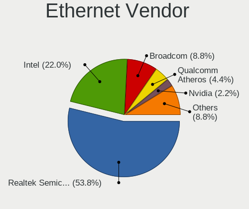

| Vendor                | Computers | Percent |
|-----------------------|-----------|---------|
| Realtek Semiconductor | 46        | 54.12%  |
| Intel                 | 20        | 23.53%  |
| Broadcom              | 8         | 9.41%   |
| Qualcomm Atheros      | 4         | 4.71%   |
| Nvidia                | 2         | 2.35%   |
| Research In Motion    | 1         | 1.18%   |
| Qualcomm              | 1         | 1.18%   |
| NetXen Incorporated   | 1         | 1.18%   |
| Motorola PCS          | 1         | 1.18%   |
| Microsoft             | 1         | 1.18%   |

Ethernet Model
--------------

Ethernet models

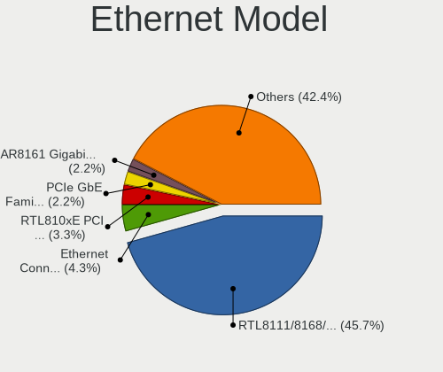

| Model                                                                | Computers | Percent |
|----------------------------------------------------------------------|-----------|---------|
| Realtek RTL8111/8168/8411 PCI Express Gigabit Ethernet Controller    | 39        | 45.35%  |
| Intel Ethernet Connection (2) I219-V                                 | 4         | 4.65%   |
| Realtek RTL810xE PCI Express Fast Ethernet controller                | 3         | 3.49%   |
| Realtek PCIe GbE Family Controller                                   | 2         | 2.33%   |
| Qualcomm Atheros AR8161 Gigabit Ethernet                             | 2         | 2.33%   |
| Intel Ethernet Connection I219-LM                                    | 2         | 2.33%   |
| Intel Ethernet Connection I218-LM                                    | 2         | 2.33%   |
| Intel 82579V Gigabit Network Connection                              | 2         | 2.33%   |
| Intel 82579LM Gigabit Network Connection (Lewisville)                | 2         | 2.33%   |
| Research In Motion BlackBerry                                        | 1         | 1.16%   |
| Realtek RTL8153 Gigabit Ethernet Adapter                             | 1         | 1.16%   |
| Realtek Killer E3000 2.5GbE Controller                               | 1         | 1.16%   |
| Qualcomm Redmi Note 8                                                | 1         | 1.16%   |
| Qualcomm Atheros Killer E2400 Gigabit Ethernet Controller            | 1         | 1.16%   |
| Qualcomm Atheros AR8152 v2.0 Fast Ethernet                           | 1         | 1.16%   |
| Nvidia MCP79 Ethernet                                                | 1         | 1.16%   |
| Nvidia MCP55 Ethernet                                                | 1         | 1.16%   |
| NetXen Incorporated NX3031 Multifunction 1/10-Gigabit Server Adapter | 1         | 1.16%   |
| Motorola PCS moto g51 5G                                             | 1         | 1.16%   |
| Microsoft RTL8153 GigE [Surface Ethernet Adapter]                    | 1         | 1.16%   |
| Intel WiMAX Connection 2400m                                         | 1         | 1.16%   |
| Intel Killer E3100X 2.5 Gigabit Ethernet Controller                  | 1         | 1.16%   |
| Intel Ethernet Controller I225-V                                     | 1         | 1.16%   |
| Intel Ethernet Connection I217-LM                                    | 1         | 1.16%   |
| Intel Ethernet Connection (7) I219-V                                 | 1         | 1.16%   |
| Intel Ethernet Connection (5) I219-LM                                | 1         | 1.16%   |
| Intel Ethernet Connection (2) I218-V                                 | 1         | 1.16%   |
| Intel 82567LM-3 Gigabit Network Connection                           | 1         | 1.16%   |
| Broadcom NetXtreme II BCM57810 10 Gigabit Ethernet                   | 1         | 1.16%   |
| Broadcom NetXtreme II BCM57711 10-Gigabit PCIe                       | 1         | 1.16%   |
| Broadcom NetXtreme BCM57766 Gigabit Ethernet PCIe                    | 1         | 1.16%   |
| Broadcom NetXtreme BCM57765 Gigabit Ethernet PCIe                    | 1         | 1.16%   |
| Broadcom NetXtreme BCM5764M Gigabit Ethernet PCIe                    | 1         | 1.16%   |
| Broadcom NetXtreme BCM5751 Gigabit Ethernet PCI Express              | 1         | 1.16%   |
| Broadcom NetLink BCM5906M Fast Ethernet PCI Express                  | 1         | 1.16%   |
| Broadcom NetLink BCM5784M Gigabit Ethernet PCIe                      | 1         | 1.16%   |
| Broadcom NetLink BCM57780 Gigabit Ethernet PCIe                      | 1         | 1.16%   |

Net Controller Kind
-------------------

Ethernet, WiFi or modem

| Kind     | Computers | Percent |
|----------|-----------|---------|
| Ethernet | 81        | 56.25%  |
| WiFi     | 63        | 43.75%  |

Used Controller
---------------

Currently used network controller

| Kind     | Computers | Percent |
|----------|-----------|---------|
| WiFi     | 49        | 54.44%  |
| Ethernet | 41        | 45.56%  |

NICs
----

Total network controllers on board

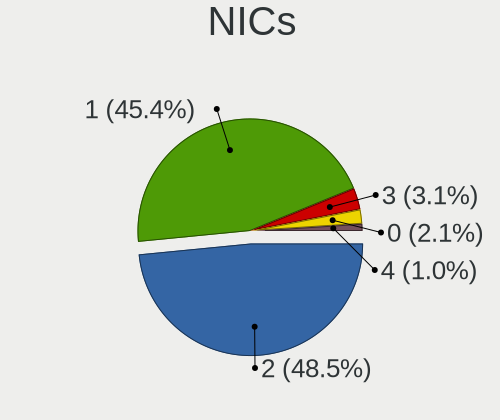

| Total | Computers | Percent |
|-------|-----------|---------|
| 2     | 43        | 47.78%  |
| 1     | 41        | 45.56%  |
| 3     | 3         | 3.33%   |
| 0     | 2         | 2.22%   |
| 4     | 1         | 1.11%   |

IPv6
----

IPv6 vs IPv4

| Used | Computers | Percent |
|------|-----------|---------|
| No   | 78        | 85.71%  |
| Yes  | 13        | 14.29%  |

Bluetooth
---------

Bluetooth Vendor
----------------

Controller vendors

| Vendor                          | Computers | Percent |
|---------------------------------|-----------|---------|
| Intel                           | 17        | 34.69%  |
| Realtek Semiconductor           | 6         | 12.24%  |
| Cambridge Silicon Radio         | 6         | 12.24%  |
| Apple                           | 5         | 10.2%   |
| IMC Networks                    | 4         | 8.16%   |
| Broadcom                        | 3         | 6.12%   |
| Realtek                         | 2         | 4.08%   |
| Ralink                          | 1         | 2.04%   |
| Qualcomm Atheros Communications | 1         | 2.04%   |
| Marvell Semiconductor           | 1         | 2.04%   |
| Lite-On Technology              | 1         | 2.04%   |
| Hewlett-Packard                 | 1         | 2.04%   |
| Foxconn / Hon Hai               | 1         | 2.04%   |

Bluetooth Model
---------------

Controller models

| Model                                               | Computers | Percent |
|-----------------------------------------------------|-----------|---------|
| Intel Bluetooth wireless interface                  | 8         | 16.33%  |
| Cambridge Silicon Radio Bluetooth Dongle (HCI mode) | 6         | 12.24%  |
| Realtek  Bluetooth 4.2 Adapter                      | 3         | 6.12%   |
| Intel AX200 Bluetooth                               | 3         | 6.12%   |
| IMC Networks Wireless_Device                        | 3         | 6.12%   |
| Realtek RTL8822BE Bluetooth 4.2 Adapter             | 2         | 4.08%   |
| Realtek Bluetooth Radio                             | 2         | 4.08%   |
| Intel Wireless-AC 3168 Bluetooth                    | 2         | 4.08%   |
| Apple Built-in Bluetooth 2.0+EDR HCI                | 2         | 4.08%   |
| Apple Bluetooth Host Controller                     | 2         | 4.08%   |
| Realtek Bluetooth Radio                             | 1         | 2.04%   |
| Ralink RT3290 Bluetooth                             | 1         | 2.04%   |
| Qualcomm Atheros QCA61x4 Bluetooth 4.0              | 1         | 2.04%   |
| Marvell Bluetooth and Wireless LAN Composite Device | 1         | 2.04%   |
| Lite-On Bluetooth Device                            | 1         | 2.04%   |
| Intel Centrino Bluetooth Wireless Transceiver       | 1         | 2.04%   |
| Intel Bluetooth 9460/9560 Jefferson Peak (JfP)      | 1         | 2.04%   |
| Intel AX210 Bluetooth                               | 1         | 2.04%   |
| Intel AX201 Bluetooth                               | 1         | 2.04%   |
| IMC Networks Bluetooth USB Host Controller          | 1         | 2.04%   |
| HP Broadcom 2070 Bluetooth Combo                    | 1         | 2.04%   |
| Foxconn / Hon Hai BCM43142A0                        | 1         | 2.04%   |
| Broadcom BCM43142 Bluetooth 4.0                     | 1         | 2.04%   |
| Broadcom BCM20702A0 Bluetooth 4.0                   | 1         | 2.04%   |
| Broadcom BCM20702 Bluetooth 4.0 [ThinkPad]          | 1         | 2.04%   |
| Apple Bluetooth USB Host Controller                 | 1         | 2.04%   |

Sound
-----

Sound Vendor
------------

Sound card vendors

| Vendor              | Computers | Percent |
|---------------------|-----------|---------|
| Intel               | 67        | 54.92%  |
| Nvidia              | 25        | 20.49%  |
| AMD                 | 19        | 15.57%  |
| Texas Instruments   | 2         | 1.64%   |
| Microsoft           | 2         | 1.64%   |
| Logitech            | 2         | 1.64%   |
| C-Media Electronics | 2         | 1.64%   |
| Razer USA           | 1         | 0.82%   |
| Hewlett-Packard     | 1         | 0.82%   |
| Creative Labs       | 1         | 0.82%   |

Sound Model
-----------

Sound card models

| Model                                                                      | Computers | Percent |
|----------------------------------------------------------------------------|-----------|---------|
| Intel 6 Series/C200 Series Chipset Family High Definition Audio Controller | 11        | 7.48%   |
| Intel Sunrise Point-LP HD Audio                                            | 7         | 4.76%   |
| Intel 7 Series/C216 Chipset Family High Definition Audio Controller        | 7         | 4.76%   |
| Intel Haswell-ULT HD Audio Controller                                      | 6         | 4.08%   |
| Intel 8 Series/C220 Series Chipset High Definition Audio Controller        | 6         | 4.08%   |
| Intel 8 Series HD Audio Controller                                         | 6         | 4.08%   |
| Nvidia GK208 HDMI/DP Audio Controller                                      | 4         | 2.72%   |
| Intel Xeon E3-1200 v3/4th Gen Core Processor HD Audio Controller           | 4         | 2.72%   |
| Intel 200 Series PCH HD Audio                                              | 4         | 2.72%   |
| AMD Family 17h/19h HD Audio Controller                                     | 4         | 2.72%   |
| AMD Family 17h (Models 00h-0fh) HD Audio Controller                        | 4         | 2.72%   |
| Nvidia GP107GL High Definition Audio Controller                            | 3         | 2.04%   |
| Nvidia GF108 High Definition Audio Controller                              | 3         | 2.04%   |
| Intel Tiger Lake-H HD Audio Controller                                     | 3         | 2.04%   |
| AMD SBx00 Azalia (Intel HDA)                                               | 3         | 2.04%   |
| AMD FCH Azalia Controller                                                  | 3         | 2.04%   |
| Nvidia GP104 High Definition Audio Controller                              | 2         | 1.36%   |
| Nvidia GM107 High Definition Audio Controller [GeForce 940MX]              | 2         | 1.36%   |
| Nvidia GK107 HDMI Audio Controller                                         | 2         | 1.36%   |
| Nvidia Audio device                                                        | 2         | 1.36%   |
| Logitech Headset H390                                                      | 2         | 1.36%   |
| Intel CM238 HD Audio Controller                                            | 2         | 1.36%   |
| Intel Celeron/Pentium Silver Processor High Definition Audio               | 2         | 1.36%   |
| Intel Cannon Lake PCH cAVS                                                 | 2         | 1.36%   |
| Intel 82801JI (ICH10 Family) HD Audio Controller                           | 2         | 1.36%   |
| Intel 5 Series/3400 Series Chipset High Definition Audio                   | 2         | 1.36%   |
| AMD Renoir Radeon High Definition Audio Controller                         | 2         | 1.36%   |
| AMD Raven/Raven2/Fenghuang HDMI/DP Audio Controller                        | 2         | 1.36%   |
| AMD Ellesmere HDMI Audio [Radeon RX 470/480 / 570/580/590]                 | 2         | 1.36%   |
| Texas Instruments PCM2902C Audio CODEC                                     | 1         | 0.68%   |
| Texas Instruments PCM2902 Audio Codec                                      | 1         | 0.68%   |
| Razer USA Nommo Chroma                                                     | 1         | 0.68%   |
| Nvidia TU116 High Definition Audio Controller                              | 1         | 0.68%   |
| Nvidia TU106 High Definition Audio Controller                              | 1         | 0.68%   |
| Nvidia MCP79 High Definition Audio                                         | 1         | 0.68%   |
| Nvidia MCP72XE/MCP72P/MCP78U/MCP78S High Definition Audio                  | 1         | 0.68%   |
| Nvidia MCP55 High Definition Audio                                         | 1         | 0.68%   |
| Nvidia High Definition Audio Controller                                    | 1         | 0.68%   |
| Nvidia GM204 High Definition Audio Controller                              | 1         | 0.68%   |
| Nvidia GA104 High Definition Audio Controller                              | 1         | 0.68%   |

Memory
------

Memory Vendor
-------------

Memory module vendors

| Vendor              | Computers | Percent |
|---------------------|-----------|---------|
| Micron Technology   | 5         | 17.86%  |
| SK hynix            | 4         | 14.29%  |
| Samsung Electronics | 4         | 14.29%  |
| Crucial             | 4         | 14.29%  |
| Kingston            | 3         | 10.71%  |
| Unknown             | 2         | 7.14%   |
| A-DATA Technology   | 2         | 7.14%   |
| Nanya Technology    | 1         | 3.57%   |
| Hewlett-Packard     | 1         | 3.57%   |
| G.Skill             | 1         | 3.57%   |
| Corsair             | 1         | 3.57%   |

Memory Model
------------

Memory module models

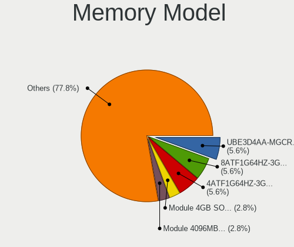

| Model                                                          | Computers | Percent |
|----------------------------------------------------------------|-----------|---------|
| Micron RAM 8ATF1G64HZ-3G2J1 8GB SODIMM DDR4 3200MT/s           | 2         | 6.25%   |
| Micron RAM 4ATF1G64HZ-3G2E1 8GB SODIMM DDR4 3200MT/s           | 2         | 6.25%   |
| Unknown RAM Module 4GB SODIMM DDR3 1600MT/s                    | 1         | 3.13%   |
| Unknown RAM Module 4096MB DIMM DDR3 1400MT/s                   | 1         | 3.13%   |
| SK hynix RAM Module 4096MB SODIMM DDR3 1600MT/s                | 1         | 3.13%   |
| SK hynix RAM HMT451S6BFR8A-PB 4GB SODIMM DDR3 1600MT/s         | 1         | 3.13%   |
| SK hynix RAM HMT451S6BFR8A-PB 4096MB SODIMM DDR3 1600MT/s      | 1         | 3.13%   |
| SK hynix RAM HKNNNFBMAVAR-NEH 2GB Row Of Chips LPDDR4 3200MT/s | 1         | 3.13%   |
| Samsung RAM Module 2048MB SODIMM LPDDR3 1867MT/s               | 1         | 3.13%   |
| Samsung RAM M471A1K43CB1-CTD 8GB SODIMM DDR4 2667MT/s          | 1         | 3.13%   |
| Samsung RAM M471A1G44AB0-CWE 8GB SODIMM DDR4 3200MT/s          | 1         | 3.13%   |
| Samsung RAM M378B5273CH0-CK0 4096MB DIMM DDR3 2000MT/s         | 1         | 3.13%   |
| Samsung RAM M378B5173DB0-CK0 4GB DIMM DDR3 1600MT/s            | 1         | 3.13%   |
| Nanya RAM NT2GT64U8HD0BY-AD 2048MB DIMM DDR2 2048MT/s          | 1         | 3.13%   |
| Micron RAM Module 2048MB Row Of Chips DDR3 1600MT/s            | 1         | 3.13%   |
| Micron RAM 8JTF5126 4HZ1G6D 1 4GB SODIMM DDR3 1600MT/s         | 1         | 3.13%   |
| Micron RAM 16KTF1G64HZ-1G6E1 8GB SODIMM DDR3 1600MT/s          | 1         | 3.13%   |
| Kingston RAM MSI24D4S7D8MH-16 16384MB SODIMM DDR4 2400MT/s     | 1         | 3.13%   |
| Kingston RAM KHX1600C9D3/4GX 4GB DIMM DDR3 1600MT/s            | 1         | 3.13%   |
| Kingston RAM ASU16D3LS1KBG/4G 4GB SODIMM DDR3 1600MT/s         | 1         | 3.13%   |
| HP RAM 7EH65AA# 16384MB DIMM DDR4 2666MT/s                     | 1         | 3.13%   |
| G.Skill RAM F3-14900CL9-4GBSR 4GB DIMM DDR3 1867MT/s           | 1         | 3.13%   |
| G.Skill RAM F3-12800CL9-4GBSR 4GB DIMM DDR3 1600MT/s           | 1         | 3.13%   |
| Crucial RAM Module 4096MB SODIMM DDR3 1600MT/s                 | 1         | 3.13%   |
| Crucial RAM CT8G4DFD8213.C16FBR2 8GB DIMM DDR4 2133MT/s        | 1         | 3.13%   |
| Crucial RAM CT51264BF160BJ.C8F 4GB SODIMM DDR3 1600MT/s        | 1         | 3.13%   |
| Crucial RAM CT16G4SFD824A.C16FP 16GB SODIMM DDR4 2400MT/s      | 1         | 3.13%   |
| Corsair RAM CMK16GX4M2A2666C16 8GB DIMM DDR4 3400MT/s          | 1         | 3.13%   |
| A-DATA RAM DDR4 3000 8GB DIMM DDR4 3600MT/s                    | 1         | 3.13%   |
| A-DATA RAM AM1U16BC4P2-B19H 4096MB SODIMM DDR3 1600MT/s        | 1         | 3.13%   |

Memory Kind
-----------

Memory module kinds

| Kind   | Computers | Percent |
|--------|-----------|---------|
| DDR3   | 11        | 45.83%  |
| DDR4   | 10        | 41.67%  |
| SDRAM  | 1         | 4.17%   |
| LPDDR4 | 1         | 4.17%   |
| LPDDR3 | 1         | 4.17%   |

Memory Form Factor
------------------

Physical design of the memory module

| Name         | Computers | Percent |
|--------------|-----------|---------|
| SODIMM       | 14        | 58.33%  |
| DIMM         | 8         | 33.33%  |
| Row Of Chips | 2         | 8.33%   |

Memory Size
-----------

Memory module size

| Size  | Computers | Percent |
|-------|-----------|---------|
| 4096  | 10        | 40%     |
| 8192  | 7         | 28%     |
| 16384 | 4         | 16%     |
| 2048  | 4         | 16%     |

Memory Speed
------------

Memory module speed

| Speed | Computers | Percent |
|-------|-----------|---------|
| 1600  | 10        | 37.04%  |
| 3200  | 4         | 14.81%  |
| 2400  | 3         | 11.11%  |
| 1867  | 2         | 7.41%   |
| 3600  | 1         | 3.7%    |
| 3400  | 1         | 3.7%    |
| 2667  | 1         | 3.7%    |
| 2666  | 1         | 3.7%    |
| 2133  | 1         | 3.7%    |
| 2048  | 1         | 3.7%    |
| 2000  | 1         | 3.7%    |
| 1400  | 1         | 3.7%    |

Printers & scanners
-------------------

Printer Vendor
--------------

Printer device vendors

| Vendor             | Computers | Percent |
|--------------------|-----------|---------|
| Hewlett-Packard    | 2         | 28.57%  |
| Canon              | 2         | 28.57%  |
| Brother Industries | 2         | 28.57%  |
| Star Micronics     | 1         | 14.29%  |

Printer Model
-------------

Printer device models

| Model                             | Computers | Percent |
|-----------------------------------|-----------|---------|
| Star Micronics TUP592 (STR_T-001) | 1         | 14.29%  |
| HP Laser 107a                     | 1         | 14.29%  |
| HP ENVY 5000 series               | 1         | 14.29%  |
| Canon PIXMA MX490 Series          | 1         | 14.29%  |
| Canon G3000 series                | 1         | 14.29%  |
| Brother MFC-L8900CDW series       | 1         | 14.29%  |
| Brother HL-5370DW series          | 1         | 14.29%  |

Scanner Vendor
--------------

Scanner device vendors

| Vendor | Computers | Percent |
|--------|-----------|---------|
| Canon  | 1         | 100%    |

Scanner Model
-------------

Scanner device models

| Model                  | Computers | Percent |
|------------------------|-----------|---------|
| Canon CanoScan LIDE 25 | 1         | 100%    |

Camera
------

Camera Vendor
-------------

Camera device vendors

| Vendor                                 | Computers | Percent |
|----------------------------------------|-----------|---------|
| Chicony Electronics                    | 10        | 18.52%  |
| IMC Networks                           | 8         | 14.81%  |
| Realtek Semiconductor                  | 4         | 7.41%   |
| Apple                                  | 4         | 7.41%   |
| Sunplus Innovation Technology          | 3         | 5.56%   |
| Logitech                               | 3         | 5.56%   |
| Cheng Uei Precision Industry (Foxlink) | 3         | 5.56%   |
| Bison Electronics                      | 3         | 5.56%   |
| Microsoft                              | 2         | 3.7%    |
| Acer                                   | 2         | 3.7%    |
| Z-Star Microelectronics                | 1         | 1.85%   |
| Samsung Electronics                    | 1         | 1.85%   |
| Pixart Imaging                         | 1         | 1.85%   |
| Novatek Microelectronics               | 1         | 1.85%   |
| Microdia                               | 1         | 1.85%   |
| Lite-On Technology                     | 1         | 1.85%   |
| Huawei Technologies                    | 1         | 1.85%   |
| Generalplus Technology                 | 1         | 1.85%   |
| GEMBIRD                                | 1         | 1.85%   |
| Cubeternet                             | 1         | 1.85%   |
| ARC International                      | 1         | 1.85%   |
| Alcor Micro                            | 1         | 1.85%   |

Camera Model
------------

Camera device models

| Model                                                                      | Computers | Percent |
|----------------------------------------------------------------------------|-----------|---------|
| IMC Networks USB2.0 HD UVC WebCam                                          | 4         | 7.41%   |
| IMC Networks USB2.0 VGA UVC WebCam                                         | 2         | 3.7%    |
| Chicony Integrated Camera                                                  | 2         | 3.7%    |
| Bison Lenovo EasyCamera                                                    | 2         | 3.7%    |
| Apple Built-in iSight                                                      | 2         | 3.7%    |
| Z-Star Integrated Camera                                                   | 1         | 1.85%   |
| Sunplus Integrated_Webcam_HD                                               | 1         | 1.85%   |
| Sunplus HP HD Webcam [Fixed]                                               | 1         | 1.85%   |
| Sunplus Asus Webcam                                                        | 1         | 1.85%   |
| Samsung Galaxy series, misc. (MTP mode)                                    | 1         | 1.85%   |
| Realtek USB Camera                                                         | 1         | 1.85%   |
| Realtek Integrated_Webcam_HD                                               | 1         | 1.85%   |
| Realtek HP Wide Vision HD Camera                                           | 1         | 1.85%   |
| Realtek HD WebCam                                                          | 1         | 1.85%   |
| Pixart Imaging GE 1.3 MP MiniCam Pro                                       | 1         | 1.85%   |
| Novatek DEMO1                                                              | 1         | 1.85%   |
| Microsoft LifeCam VX-5000                                                  | 1         | 1.85%   |
| Microsoft LifeCam VX-500 [1357]                                            | 1         | 1.85%   |
| Microdia Integrated Webcam                                                 | 1         | 1.85%   |
| Logitech Webcam C270                                                       | 1         | 1.85%   |
| Logitech Webcam C250                                                       | 1         | 1.85%   |
| Logitech QuickCam Communicate MP/S5500                                     | 1         | 1.85%   |
| Lite-On Integrated Camera                                                  | 1         | 1.85%   |
| IMC Networks USB2.0 UVC HD Webcam                                          | 1         | 1.85%   |
| IMC Networks ov9734_azurewave_camera                                       | 1         | 1.85%   |
| Huawei HiCamera                                                            | 1         | 1.85%   |
| Generalplus 808 Camera                                                     | 1         | 1.85%   |
| GEMBIRD Generic UVC 1.00 camera [AppoTech AX2311]                          | 1         | 1.85%   |
| Cubeternet GL-UPC822 UVC WebCam                                            | 1         | 1.85%   |
| Chicony WebCam                                                             | 1         | 1.85%   |
| Chicony USB2.0 HD UVC WebCam                                               | 1         | 1.85%   |
| Chicony USB 2.0 Camera                                                     | 1         | 1.85%   |
| Chicony Sony Visual Communication Camera                                   | 1         | 1.85%   |
| Chicony Integrated Camera (1280x720@30)                                    | 1         | 1.85%   |
| Chicony HP Wide Vision HD Camera                                           | 1         | 1.85%   |
| Chicony HD WebCam                                                          | 1         | 1.85%   |
| Chicony FJ Camera                                                          | 1         | 1.85%   |
| Cheng Uei Precision Industry (Foxlink) HP Wide Vision HD Integrated Webcam | 1         | 1.85%   |
| Cheng Uei Precision Industry (Foxlink) HP Truevision HD                    | 1         | 1.85%   |
| Cheng Uei Precision Industry (Foxlink) HP HD Webcam                        | 1         | 1.85%   |

Security
--------

Fingerprint Vendor
------------------

Fingerprint sensor vendors

| Vendor                     | Computers | Percent |
|----------------------------|-----------|---------|
| Validity Sensors           | 4         | 66.67%  |
| Synaptics                  | 1         | 16.67%  |
| Shenzhen Goodix Technology | 1         | 16.67%  |

Fingerprint Model
-----------------

Fingerprint sensor models

| Model                                      | Computers | Percent |
|--------------------------------------------|-----------|---------|
| Validity Sensors VFS495 Fingerprint Reader | 1         | 16.67%  |
| Validity Sensors VFS471 Fingerprint Reader | 1         | 16.67%  |
| Validity Sensors VFS Fingerprint sensor    | 1         | 16.67%  |
| Validity Sensors Swipe Fingerprint Sensor  | 1         | 16.67%  |
| Synaptics  WBDI                            | 1         | 16.67%  |
| Shenzhen Goodix  Fingerprint Device        | 1         | 16.67%  |

Chipcard Vendor
---------------

Chipcard module vendors

| Vendor            | Computers | Percent |
|-------------------|-----------|---------|
| OmniKey           | 1         | 25%     |
| Mako Technologies | 1         | 25%     |
| Broadcom          | 1         | 25%     |
| BIT4ID            | 1         | 25%     |

Chipcard Model
--------------

Chipcard module models

| Model                         | Computers | Percent |
|-------------------------------|-----------|---------|
| OmniKey CardMan 4321          | 1         | 25%     |
| Mako Technologies SZZCS-ZCS80 | 1         | 25%     |
| Broadcom 5880                 | 1         | 25%     |
| BIT4ID miniLector EVO         | 1         | 25%     |

Unsupported
-----------

Unsupported Devices
-------------------

Total unsupported devices on board

| Total | Computers | Percent |
|-------|-----------|---------|
| 0     | 68        | 73.91%  |
| 1     | 21        | 22.83%  |
| 2     | 3         | 3.26%   |

Unsupported Device Types
------------------------

Types of unsupported devices

| Type                  | Computers | Percent |
|-----------------------|-----------|---------|
| Graphics card         | 7         | 26.92%  |
| Fingerprint reader    | 6         | 23.08%  |
| Net/wireless          | 5         | 19.23%  |
| Chipcard              | 3         | 11.54%  |
| Multimedia controller | 2         | 7.69%   |
| Sound                 | 1         | 3.85%   |
| Net/ethernet          | 1         | 3.85%   |
| Bluetooth             | 1         | 3.85%   |

