Feren OS - Tested Hardware & Statistics (Desktops)
--------------------------------------------------

A project to collect tested hardware configurations for Feren OS.

Anyone can contribute to this report by the [hw-probe](https://github.com/linuxhw/hw-probe) tool:

    sudo -E hw-probe -all -upload

Please contribute! Especially if your hardware is rare.

Contents
--------

* [ Test Cases ](#test-cases)

* [ System ](#system)
  - [ OS                       ](#os)
  - [ OS Family                ](#os-family)
  - [ Kernel                   ](#kernel)
  - [ Kernel Family            ](#kernel-family)
  - [ Kernel Major Ver.        ](#kernel-major-ver)
  - [ Arch                     ](#arch)
  - [ DE                       ](#de)
  - [ Display Server           ](#display-server)
  - [ Display Manager          ](#display-manager)
  - [ OS Lang                  ](#os-lang)
  - [ Boot Mode                ](#boot-mode)
  - [ Filesystem               ](#filesystem)
  - [ Part. scheme             ](#part-scheme)
  - [ Dual Boot with Linux/BSD ](#dual-boot-with-linuxbsd)
  - [ Dual Boot (Win)          ](#dual-boot-win)

* [ Board ](#board)
  - [ Vendor                   ](#vendor)
  - [ Model                    ](#model)
  - [ Model Family             ](#model-family)
  - [ MFG Year                 ](#mfg-year)
  - [ Form Factor              ](#form-factor)
  - [ Secure Boot              ](#secure-boot)
  - [ Coreboot                 ](#coreboot)
  - [ RAM Size                 ](#ram-size)
  - [ RAM Used                 ](#ram-used)
  - [ Total Drives             ](#total-drives)
  - [ Has CD-ROM               ](#has-cd-rom)
  - [ Has Ethernet             ](#has-ethernet)
  - [ Has WiFi                 ](#has-wifi)
  - [ Has Bluetooth            ](#has-bluetooth)

* [ Location ](#location)
  - [ Country                  ](#country)
  - [ City                     ](#city)

* [ Drives ](#drives)
  - [ Drive Vendor             ](#drive-vendor)
  - [ Drive Model              ](#drive-model)
  - [ HDD Vendor               ](#hdd-vendor)
  - [ SSD Vendor               ](#ssd-vendor)
  - [ Drive Kind               ](#drive-kind)
  - [ Drive Connector          ](#drive-connector)
  - [ Drive Size               ](#drive-size)
  - [ Space Total              ](#space-total)
  - [ Space Used               ](#space-used)
  - [ Malfunc. Drives          ](#malfunc-drives)
  - [ Malfunc. Drive Vendor    ](#malfunc-drive-vendor)
  - [ Malfunc. HDD Vendor      ](#malfunc-hdd-vendor)
  - [ Malfunc. Drive Kind      ](#malfunc-drive-kind)
  - [ Failed Drives            ](#failed-drives)
  - [ Failed Drive Vendor      ](#failed-drive-vendor)
  - [ Drive Status             ](#drive-status)

* [ Storage controller ](#storage-controller)
  - [ Storage Vendor           ](#storage-vendor)
  - [ Storage Model            ](#storage-model)
  - [ Storage Kind             ](#storage-kind)

* [ Processor ](#processor)
  - [ CPU Vendor               ](#cpu-vendor)
  - [ CPU Model                ](#cpu-model)
  - [ CPU Model Family         ](#cpu-model-family)
  - [ CPU Cores                ](#cpu-cores)
  - [ CPU Sockets              ](#cpu-sockets)
  - [ CPU Threads              ](#cpu-threads)
  - [ CPU Op-Modes             ](#cpu-op-modes)
  - [ CPU Microcode            ](#cpu-microcode)
  - [ CPU Microarch            ](#cpu-microarch)

* [ Graphics ](#graphics)
  - [ GPU Vendor               ](#gpu-vendor)
  - [ GPU Model                ](#gpu-model)
  - [ GPU Combo                ](#gpu-combo)
  - [ GPU Driver               ](#gpu-driver)
  - [ GPU Memory               ](#gpu-memory)

* [ Monitor ](#monitor)
  - [ Monitor Vendor           ](#monitor-vendor)
  - [ Monitor Model            ](#monitor-model)
  - [ Monitor Resolution       ](#monitor-resolution)
  - [ Monitor Diagonal         ](#monitor-diagonal)
  - [ Monitor Width            ](#monitor-width)
  - [ Aspect Ratio             ](#aspect-ratio)
  - [ Monitor Area             ](#monitor-area)
  - [ Pixel Density            ](#pixel-density)
  - [ Multiple Monitors        ](#multiple-monitors)

* [ Network ](#network)
  - [ Net Controller Vendor    ](#net-controller-vendor)
  - [ Net Controller Model     ](#net-controller-model)
  - [ Wireless Vendor          ](#wireless-vendor)
  - [ Wireless Model           ](#wireless-model)
  - [ Ethernet Vendor          ](#ethernet-vendor)
  - [ Ethernet Model           ](#ethernet-model)
  - [ Net Controller Kind      ](#net-controller-kind)
  - [ Used Controller          ](#used-controller)
  - [ NICs                     ](#nics)
  - [ IPv6                     ](#ipv6)

* [ Bluetooth ](#bluetooth)
  - [ Bluetooth Vendor         ](#bluetooth-vendor)
  - [ Bluetooth Model          ](#bluetooth-model)

* [ Sound ](#sound)
  - [ Sound Vendor             ](#sound-vendor)
  - [ Sound Model              ](#sound-model)

* [ Memory ](#memory)
  - [ Memory Vendor            ](#memory-vendor)
  - [ Memory Model             ](#memory-model)
  - [ Memory Kind              ](#memory-kind)
  - [ Memory Form Factor       ](#memory-form-factor)
  - [ Memory Size              ](#memory-size)
  - [ Memory Speed             ](#memory-speed)

* [ Printers & scanners ](#printers--scanners)
  - [ Printer Vendor           ](#printer-vendor)
  - [ Printer Model            ](#printer-model)
  - [ Scanner Vendor           ](#scanner-vendor)
  - [ Scanner Model            ](#scanner-model)

* [ Camera ](#camera)
  - [ Camera Vendor            ](#camera-vendor)
  - [ Camera Model             ](#camera-model)

* [ Security ](#security)
  - [ Fingerprint Vendor       ](#fingerprint-vendor)
  - [ Fingerprint Model        ](#fingerprint-model)
  - [ Chipcard Vendor          ](#chipcard-vendor)
  - [ Chipcard Model           ](#chipcard-model)

* [ Unsupported ](#unsupported)
  - [ Unsupported Devices      ](#unsupported-devices)
  - [ Unsupported Device Types ](#unsupported-device-types)

Test Cases
----------

Total: 65

| Vendor        | Model                 | Probe                                                      | Date         |
|---------------|-----------------------|------------------------------------------------------------|--------------|
| BESSTAR Te... | TH50                  | [4aa292e3c1](https://linux-hardware.org/?probe=4aa292e3c1) | Jan 29, 2023 |
| Gigabyte      | MJPLNBB-00            | [a9e701a27a](https://linux-hardware.org/?probe=a9e701a27a) | Dec 23, 2022 |
| MSI           | B350M MORTAR          | [f85255857d](https://linux-hardware.org/?probe=f85255857d) | Nov 17, 2022 |
| MSI           | B350M MORTAR          | [9312be9510](https://linux-hardware.org/?probe=9312be9510) | Oct 23, 2022 |
| ASUSTek       | PRIME B450M-A         | [f13203e3ce](https://linux-hardware.org/?probe=f13203e3ce) | Oct 14, 2022 |
| MSI           | B350M MORTAR          | [4e56098080](https://linux-hardware.org/?probe=4e56098080) | Oct 04, 2022 |
| ASUSTek       | Z97-A                 | [14fa58515f](https://linux-hardware.org/?probe=14fa58515f) | Aug 13, 2022 |
| Gigabyte      | Z170X-UD3-CF          | [aecc3e1863](https://linux-hardware.org/?probe=aecc3e1863) | Jul 06, 2022 |
| ASUSTek       | PRIME Z270-A          | [0f85d8c023](https://linux-hardware.org/?probe=0f85d8c023) | Jun 19, 2022 |
| ASUSTek       | PRIME Z270-A          | [dd22c99aac](https://linux-hardware.org/?probe=dd22c99aac) | Jun 14, 2022 |
| Gigabyte      | F2A68HM-DS2           | [1fa6bb2d62](https://linux-hardware.org/?probe=1fa6bb2d62) | May 26, 2022 |
| ASRock        | Z68 Pro3              | [4cdd6daf44](https://linux-hardware.org/?probe=4cdd6daf44) | Jan 19, 2022 |
| LattePanda    | Alpha                 | [73f961d1b6](https://linux-hardware.org/?probe=73f961d1b6) | Dec 21, 2021 |
| ASUSTek       | PRIME B450M-A         | [1a8d172b1a](https://linux-hardware.org/?probe=1a8d172b1a) | Nov 02, 2021 |
| MSI           | H61M-P20              | [4c9df75eee](https://linux-hardware.org/?probe=4c9df75eee) | Oct 15, 2021 |
| ASUSTek       | PRIME B350-PLUS       | [97dbb56e7f](https://linux-hardware.org/?probe=97dbb56e7f) | Oct 08, 2021 |
| Pegatron      | Eureka3               | [1a6858321a](https://linux-hardware.org/?probe=1a6858321a) | Sep 06, 2021 |
| Pegatron      | Eureka3               | [c68cf534fd](https://linux-hardware.org/?probe=c68cf534fd) | Sep 06, 2021 |
| ASUSTek       | PRIME B450M-A         | [446300d07d](https://linux-hardware.org/?probe=446300d07d) | Aug 04, 2021 |
| ASUSTek       | PRIME H410M-E         | [3758d2a6b8](https://linux-hardware.org/?probe=3758d2a6b8) | Jul 09, 2021 |
| HP            | 82FE 11               | [acabfe917b](https://linux-hardware.org/?probe=acabfe917b) | Jun 22, 2021 |
| ASRock        | H61M-VS               | [cb1c07fa68](https://linux-hardware.org/?probe=cb1c07fa68) | Jun 17, 2021 |
| ASUSTek       | TUF Gaming X570-PLUS  | [56b16c9c71](https://linux-hardware.org/?probe=56b16c9c71) | May 26, 2021 |
| ASUSTek       | TUF Gaming X570-PLUS  | [fdff074ae2](https://linux-hardware.org/?probe=fdff074ae2) | May 21, 2021 |
| MSI           | 2AE0                  | [cdddabf42c](https://linux-hardware.org/?probe=cdddabf42c) | May 19, 2021 |
| ASRock        | H61M-VS               | [9e701873b1](https://linux-hardware.org/?probe=9e701873b1) | May 09, 2021 |
| ASRock        | H61M-VS               | [59a6774cd5](https://linux-hardware.org/?probe=59a6774cd5) | May 09, 2021 |
| Wortmann      | TERRA_PC              | [9224f13a87](https://linux-hardware.org/?probe=9224f13a87) | Apr 09, 2021 |
| Wortmann      | TERRA_PC              | [c107b4f1a1](https://linux-hardware.org/?probe=c107b4f1a1) | Mar 31, 2021 |
| Dell          | 0FH884                | [3f73f703ea](https://linux-hardware.org/?probe=3f73f703ea) | Feb 25, 2021 |
| Dell          | 0FH884                | [9ef7d7ac26](https://linux-hardware.org/?probe=9ef7d7ac26) | Feb 24, 2021 |
| Gigabyte      | EX58-UD5              | [9743cd82ce](https://linux-hardware.org/?probe=9743cd82ce) | Feb 01, 2021 |
| Pegatron      | 2AC2A                 | [c80b26e32c](https://linux-hardware.org/?probe=c80b26e32c) | Jan 21, 2021 |
| ASUSTek       | H87-PLUS              | [563b11dfc7](https://linux-hardware.org/?probe=563b11dfc7) | Nov 27, 2020 |
| ASUSTek       | H87-PLUS              | [7b22071212](https://linux-hardware.org/?probe=7b22071212) | Nov 27, 2020 |
| MSI           | B360M Xtreme          | [68ebbb560b](https://linux-hardware.org/?probe=68ebbb560b) | Nov 20, 2020 |
| MSI           | MPG X570 GAMING PLUS  | [a1f9dad859](https://linux-hardware.org/?probe=a1f9dad859) | Nov 07, 2020 |
| MSI           | MPG X570 GAMING PLUS  | [f78c0034e0](https://linux-hardware.org/?probe=f78c0034e0) | Nov 07, 2020 |
| Acer          | Aspire TC-105         | [954d6d151c](https://linux-hardware.org/?probe=954d6d151c) | Oct 17, 2020 |
| Acer          | Aspire TC-105         | [4897bba76b](https://linux-hardware.org/?probe=4897bba76b) | Oct 17, 2020 |
| ASUSTek       | PRIME H410M-E         | [c64e54f364](https://linux-hardware.org/?probe=c64e54f364) | Sep 20, 2020 |
| ASUSTek       | PRIME H410M-E         | [df8fbe9e18](https://linux-hardware.org/?probe=df8fbe9e18) | Sep 20, 2020 |
| Acer          | Predator G5910        | [7c7e146182](https://linux-hardware.org/?probe=7c7e146182) | Sep 19, 2020 |
| Acer          | Predator G5910        | [bc07c92db3](https://linux-hardware.org/?probe=bc07c92db3) | Sep 10, 2020 |
| ASUSTek       | H81-PLUS              | [0e79ae7820](https://linux-hardware.org/?probe=0e79ae7820) | Jul 16, 2020 |
| ASRock        | B75 Pro3-M            | [83788eaf01](https://linux-hardware.org/?probe=83788eaf01) | Jun 10, 2020 |
| ASUSTek       | H81-PLUS              | [d5ecf72e99](https://linux-hardware.org/?probe=d5ecf72e99) | May 24, 2020 |
| MSI           | B450M MORTAR TITANIUM | [f347a42df8](https://linux-hardware.org/?probe=f347a42df8) | Apr 27, 2020 |
| MSI           | B450M MORTAR TITANIUM | [4037a9fe71](https://linux-hardware.org/?probe=4037a9fe71) | Apr 24, 2020 |
| Gigabyte      | GA-78LMT-USB3 R2 sex  | [208cce85dd](https://linux-hardware.org/?probe=208cce85dd) | Apr 24, 2020 |
| Dell          | 0200DY A03            | [2b2aa48899](https://linux-hardware.org/?probe=2b2aa48899) | Apr 13, 2020 |
| Dell          | 0T656F A01            | [ea7fa24667](https://linux-hardware.org/?probe=ea7fa24667) | Apr 09, 2020 |
| Dell          | 0T656F A01            | [24a2c39ee5](https://linux-hardware.org/?probe=24a2c39ee5) | Apr 09, 2020 |
| Dell          | 0T656F A01            | [84566f9a9b](https://linux-hardware.org/?probe=84566f9a9b) | Apr 09, 2020 |
| Lenovo        | MAHOBAY               | [651d7ac7be](https://linux-hardware.org/?probe=651d7ac7be) | Feb 28, 2020 |
| Lenovo        | MAHOBAY               | [5b33f9565a](https://linux-hardware.org/?probe=5b33f9565a) | Feb 28, 2020 |
| Foxconn       | 2ABF                  | [e2858c8dd1](https://linux-hardware.org/?probe=e2858c8dd1) | Feb 16, 2020 |
| Medion        | H61H2-LM3 V1.0        | [32f60e252b](https://linux-hardware.org/?probe=32f60e252b) | Jan 02, 2020 |
| Medion        | H61H2-LM3 V1.0        | [070631b0f3](https://linux-hardware.org/?probe=070631b0f3) | Dec 31, 2019 |
| PCWare        | IPMH81G1              | [e962036292](https://linux-hardware.org/?probe=e962036292) | Dec 29, 2019 |
| PCWare        | IPMH81G1              | [ffc38dcd04](https://linux-hardware.org/?probe=ffc38dcd04) | Dec 29, 2019 |
| ASUSTek       | PRIME Z370-A          | [6c0faea524](https://linux-hardware.org/?probe=6c0faea524) | Aug 01, 2019 |
| ASUSTek       | STRIKER II FORMULA    | [17ab95ea83](https://linux-hardware.org/?probe=17ab95ea83) | Jan 22, 2019 |
| ASUSTek       | STRIKER II FORMULA    | [a9a4ca4d08](https://linux-hardware.org/?probe=a9a4ca4d08) | Jan 21, 2019 |
| ASUSTek       | PRIME Z370-A          | [6649ff8a00](https://linux-hardware.org/?probe=6649ff8a00) | Dec 14, 2018 |

System
------

OS
--

Installed operating systems

| Name             | Desktops | Percent |
|------------------|----------|---------|
| Feren OS 20.04   | 23       | 60.53%  |
| Feren OS 18.04   | 13       | 34.21%  |
| Feren OS 2018.10 | 2        | 5.26%   |

OS Family
---------

OS without a version

| Name     | Desktops | Percent |
|----------|----------|---------|
| Feren OS | 37       | 100%    |

Kernel
------

Version of the Linux kernel

| Version                    | Desktops | Percent |
|----------------------------|----------|---------|
| 5.3.0-46-generic           | 4        | 9.3%    |
| 5.11.0-37-generic          | 3        | 6.98%   |
| 5.8.0-53-generic           | 2        | 4.65%   |
| 5.0.0-37-generic           | 2        | 4.65%   |
| 5.8.0-55-generic           | 1        | 2.33%   |
| 5.8.0-48-generic           | 1        | 2.33%   |
| 5.8.0-44-generic           | 1        | 2.33%   |
| 5.8.0-40-generic           | 1        | 2.33%   |
| 5.8.0-36-generic           | 1        | 2.33%   |
| 5.8.0-29-generic           | 1        | 2.33%   |
| 5.4.66-xanmod1             | 1        | 2.33%   |
| 5.4.0-77-generic           | 1        | 2.33%   |
| 5.4.0-74-generic           | 1        | 2.33%   |
| 5.4.0-72-generic           | 1        | 2.33%   |
| 5.4.0-54-generic           | 1        | 2.33%   |
| 5.4.0-52-generic           | 1        | 2.33%   |
| 5.4.0-47-generic           | 1        | 2.33%   |
| 5.4.0-37-generic           | 1        | 2.33%   |
| 5.4.0-31-generic           | 1        | 2.33%   |
| 5.3.0-59-generic           | 1        | 2.33%   |
| 5.3.0-40-generic           | 1        | 2.33%   |
| 5.3.0-28-generic           | 1        | 2.33%   |
| 5.15.0-58-generic          | 1        | 2.33%   |
| 5.15.0-53-generic          | 1        | 2.33%   |
| 5.15.0-50-generic          | 1        | 2.33%   |
| 5.15.0-48-generic          | 1        | 2.33%   |
| 5.15.0-46-generic          | 1        | 2.33%   |
| 5.15.0-33-generic          | 1        | 2.33%   |
| 5.15.0-15.1-liquorix-amd64 | 1        | 2.33%   |
| 5.13.0-52-generic          | 1        | 2.33%   |
| 5.13.0-37-generic          | 1        | 2.33%   |
| 5.11.0-27-generic          | 1        | 2.33%   |
| 5.11.0-25-generic          | 1        | 2.33%   |
| 4.15.0-48-generic          | 1        | 2.33%   |
| 4.15.0-43-generic          | 1        | 2.33%   |
| 4.15.0-42-generic          | 1        | 2.33%   |

Kernel Family
-------------

Linux kernel without a distro release

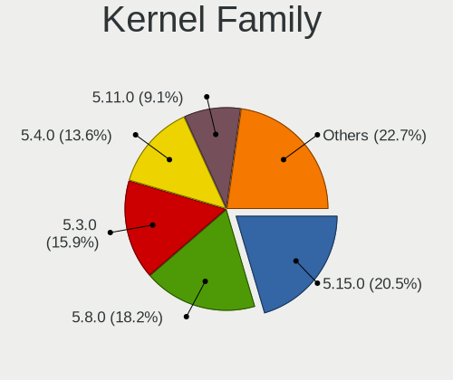

| Version | Desktops | Percent |
|---------|----------|---------|
| 5.8.0   | 8        | 20.51%  |
| 5.3.0   | 7        | 17.95%  |
| 5.4.0   | 6        | 15.38%  |
| 5.15.0  | 6        | 15.38%  |
| 5.11.0  | 4        | 10.26%  |
| 4.15.0  | 3        | 7.69%   |
| 5.13.0  | 2        | 5.13%   |
| 5.0.0   | 2        | 5.13%   |
| 5.4.66  | 1        | 2.56%   |

Kernel Major Ver.
-----------------

Linux kernel major version

| Version | Desktops | Percent |
|---------|----------|---------|
| 5.8     | 8        | 21.05%  |
| 5.3     | 7        | 18.42%  |
| 5.4     | 6        | 15.79%  |
| 5.15    | 6        | 15.79%  |
| 5.11    | 4        | 10.53%  |
| 4.15    | 3        | 7.89%   |
| 5.13    | 2        | 5.26%   |
| 5.0     | 2        | 5.26%   |

Arch
----

OS architecture (x86_64, i586, etc.)

| Name   | Desktops | Percent |
|--------|----------|---------|
| x86_64 | 37       | 100%    |

DE
--

Desktop Environment

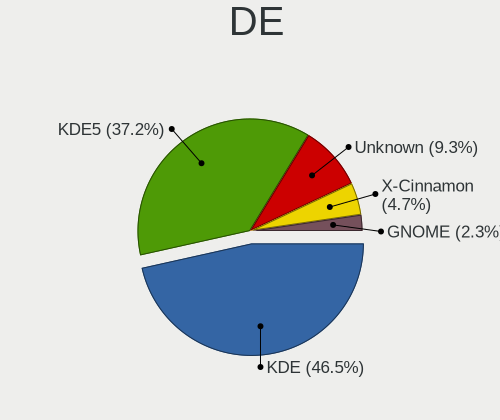

| Name       | Desktops | Percent |
|------------|----------|---------|
| KDE        | 20       | 51.28%  |
| KDE5       | 12       | 30.77%  |
| Unknown    | 4        | 10.26%  |
| X-Cinnamon | 2        | 5.13%   |
| GNOME      | 1        | 2.56%   |

Display Server
--------------

X11 or Wayland

| Name | Desktops | Percent |
|------|----------|---------|
| X11  | 37       | 100%    |

Display Manager
---------------

SDDM, LightDM, etc.

| Name    | Desktops | Percent |
|---------|----------|---------|
| Unknown | 31       | 83.78%  |
| LightDM | 3        | 8.11%   |
| TDM     | 2        | 5.41%   |
| SDDM    | 1        | 2.7%    |

OS Lang
-------

Language

| Lang    | Desktops | Percent |
|---------|----------|---------|
| en_US   | 10       | 26.32%  |
| en_GB   | 7        | 18.42%  |
| en_AU   | 4        | 10.53%  |
| de_DE   | 3        | 7.89%   |
| Unknown | 3        | 7.89%   |
| pt_BR   | 2        | 5.26%   |
| pt_PT   | 1        | 2.63%   |
| nl_BE   | 1        | 2.63%   |
| it_IT   | 1        | 2.63%   |
| es_VE   | 1        | 2.63%   |
| es_PE   | 1        | 2.63%   |
| es_HN   | 1        | 2.63%   |
| en_IE   | 1        | 2.63%   |
| en_CA   | 1        | 2.63%   |
| de_CH   | 1        | 2.63%   |

Boot Mode
---------

EFI or BIOS

| Mode | Desktops | Percent |
|------|----------|---------|
| EFI  | 19       | 51.35%  |
| BIOS | 18       | 48.65%  |

Filesystem
----------

Type of filesystem

| Type    | Desktops | Percent |
|---------|----------|---------|
| Ext4    | 31       | 81.58%  |
| Btrfs   | 4        | 10.53%  |
| Unknown | 3        | 7.89%   |

Part. scheme
------------

Scheme of partitioning

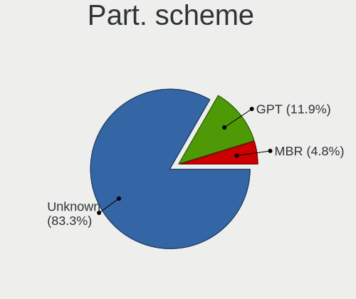

| Type    | Desktops | Percent |
|---------|----------|---------|
| Unknown | 32       | 84.21%  |
| GPT     | 5        | 13.16%  |
| MBR     | 1        | 2.63%   |

Dual Boot with Linux/BSD
------------------------

Hosting more than one Linux/BSD

| Dual boot | Desktops | Percent |
|-----------|----------|---------|
| No        | 36       | 97.3%   |
| Yes       | 1        | 2.7%    |

Dual Boot (Win)
---------------

Hosting Linux and Windows

| Dual boot | Desktops | Percent |
|-----------|----------|---------|
| No        | 33       | 89.19%  |
| Yes       | 4        | 10.81%  |

Board
-----

Vendor
------

Motherboard manufacturer

| Name                | Desktops | Percent |
|---------------------|----------|---------|
| ASUSTek Computer    | 11       | 29.73%  |
| MSI                 | 6        | 16.22%  |
| Gigabyte Technology | 4        | 10.81%  |
| Dell                | 3        | 8.11%   |
| ASRock              | 3        | 8.11%   |
| Pegatron            | 2        | 5.41%   |
| Wortmann AG         | 1        | 2.7%    |
| PCWare              | 1        | 2.7%    |
| Medion              | 1        | 2.7%    |
| Lenovo              | 1        | 2.7%    |
| Hewlett-Packard     | 1        | 2.7%    |
| Foxconn             | 1        | 2.7%    |
| BESSTAR Tech        | 1        | 2.7%    |
| Acer                | 1        | 2.7%    |

Model
-----

Motherboard model

| Name                            | Desktops | Percent |
|---------------------------------|----------|---------|
| ASUS All Series                 | 3        | 8.11%   |
| ASUS PRIME Z370-A               | 2        | 5.41%   |
| Wortmann AG TERRA_PC            | 1        | 2.7%    |
| Pegatron p7-1030                | 1        | 2.7%    |
| Pegatron AY691AA-ABA p6367c     | 1        | 2.7%    |
| PCWare IPMH81G1                 | 1        | 2.7%    |
| MSI MS-7C37                     | 1        | 2.7%    |
| MSI MS-7B89                     | 1        | 2.7%    |
| MSI MS-7A37                     | 1        | 2.7%    |
| MSI MS-7788                     | 1        | 2.7%    |
| MSI C Series                    | 1        | 2.7%    |
| MSI 700-216                     | 1        | 2.7%    |
| Medion H61H2-LM3                | 1        | 2.7%    |
| Lenovo ThinkCentre M72z 3548B2S | 1        | 2.7%    |
| HP Pavilion Desktop PC 570-p0xx | 1        | 2.7%    |
| Gigabyte Z170X-UD3              | 1        | 2.7%    |
| Gigabyte GA-78LMT-USB3 R2       | 1        | 2.7%    |
| Gigabyte F2A68HM-DS2            | 1        | 2.7%    |
| Gigabyte EX58-UD5               | 1        | 2.7%    |
| Foxconn Pro3500 Series          | 1        | 2.7%    |
| Dell OptiPlex GX620             | 1        | 2.7%    |
| Dell OptiPlex 780               | 1        | 2.7%    |
| Dell OptiPlex 360               | 1        | 2.7%    |
| BESSTAR Tech TH50               | 1        | 2.7%    |
| ASUS TUF Gaming X570-PLUS       | 1        | 2.7%    |
| ASUS STRIKER II FORMULA         | 1        | 2.7%    |
| ASUS PRIME Z270-A               | 1        | 2.7%    |
| ASUS PRIME H410M-E              | 1        | 2.7%    |
| ASUS PRIME B450M-A              | 1        | 2.7%    |
| ASUS PRIME B350-PLUS            | 1        | 2.7%    |
| ASRock Z68 Pro3                 | 1        | 2.7%    |
| ASRock H61M-VS                  | 1        | 2.7%    |
| ASRock B75 Pro3-M               | 1        | 2.7%    |
| Acer Predator G5910             | 1        | 2.7%    |

Model Family
------------

Motherboard model prefix

| Name                   | Desktops | Percent |
|------------------------|----------|---------|
| ASUS PRIME             | 6        | 16.22%  |
| Dell OptiPlex          | 3        | 8.11%   |
| ASUS All               | 3        | 8.11%   |
| Wortmann AG TERRA      | 1        | 2.7%    |
| Pegatron p7-1030       | 1        | 2.7%    |
| Pegatron AY691AA-ABA   | 1        | 2.7%    |
| PCWare IPMH81G1        | 1        | 2.7%    |
| MSI MS-7C37            | 1        | 2.7%    |
| MSI MS-7B89            | 1        | 2.7%    |
| MSI MS-7A37            | 1        | 2.7%    |
| MSI MS-7788            | 1        | 2.7%    |
| MSI C                  | 1        | 2.7%    |
| MSI 700-216            | 1        | 2.7%    |
| Medion H61H2-LM3       | 1        | 2.7%    |
| Lenovo ThinkCentre     | 1        | 2.7%    |
| HP Pavilion            | 1        | 2.7%    |
| Gigabyte Z170X-UD3     | 1        | 2.7%    |
| Gigabyte GA-78LMT-USB3 | 1        | 2.7%    |
| Gigabyte F2A68HM-DS2   | 1        | 2.7%    |
| Gigabyte EX58-UD5      | 1        | 2.7%    |
| Foxconn Pro3500        | 1        | 2.7%    |
| BESSTAR Tech TH50      | 1        | 2.7%    |
| ASUS TUF               | 1        | 2.7%    |
| ASUS STRIKER           | 1        | 2.7%    |
| ASRock Z68             | 1        | 2.7%    |
| ASRock H61M-VS         | 1        | 2.7%    |
| ASRock B75             | 1        | 2.7%    |
| Acer Predator          | 1        | 2.7%    |

MFG Year
--------

Motherboard manufacture year

| Year | Desktops | Percent |
|------|----------|---------|
| 2017 | 6        | 16.22%  |
| 2011 | 5        | 13.51%  |
| 2014 | 4        | 10.81%  |
| 2013 | 4        | 10.81%  |
| 2012 | 4        | 10.81%  |
| 2019 | 3        | 8.11%   |
| 2018 | 2        | 5.41%   |
| 2009 | 2        | 5.41%   |
| 2008 | 2        | 5.41%   |
| 2022 | 1        | 2.7%    |
| 2020 | 1        | 2.7%    |
| 2016 | 1        | 2.7%    |
| 2015 | 1        | 2.7%    |
| 2006 | 1        | 2.7%    |

Form Factor
-----------

Physical design of the computer

| Name    | Desktops | Percent |
|---------|----------|---------|
| Desktop | 37       | 100%    |

Secure Boot
-----------

Enabled or disabled

| State    | Desktops | Percent |
|----------|----------|---------|
| Disabled | 36       | 97.3%   |
| Enabled  | 1        | 2.7%    |

Coreboot
--------

Have coreboot on board

| Used | Desktops | Percent |
|------|----------|---------|
| No   | 37       | 100%    |

RAM Size
--------

Total RAM memory

| Size in GB  | Desktops | Percent |
|-------------|----------|---------|
| 16.01-24.0  | 8        | 21.05%  |
| 8.01-16.0   | 8        | 21.05%  |
| 4.01-8.0    | 7        | 18.42%  |
| 32.01-64.0  | 7        | 18.42%  |
| 3.01-4.0    | 5        | 13.16%  |
| 24.01-32.0  | 1        | 2.63%   |
| 64.01-256.0 | 1        | 2.63%   |
| 1.01-2.0    | 1        | 2.63%   |

RAM Used
--------

Used RAM memory

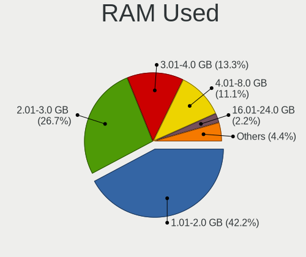

| Used GB   | Desktops | Percent |
|-----------|----------|---------|
| 1.01-2.0  | 17       | 42.5%   |
| 2.01-3.0  | 12       | 30%     |
| 3.01-4.0  | 5        | 12.5%   |
| 4.01-8.0  | 4        | 10%     |
| 8.01-16.0 | 1        | 2.5%    |
| 0.51-1.0  | 1        | 2.5%    |

Total Drives
------------

Number of drives on board

| Drives | Desktops | Percent |
|--------|----------|---------|
| 1      | 17       | 43.59%  |
| 3      | 9        | 23.08%  |
| 2      | 8        | 20.51%  |
| 4      | 3        | 7.69%   |
| 7      | 1        | 2.56%   |
| 5      | 1        | 2.56%   |

Has CD-ROM
----------

Has CD-ROM on board

| Presented | Desktops | Percent |
|-----------|----------|---------|
| No        | 22       | 59.46%  |
| Yes       | 15       | 40.54%  |

Has Ethernet
------------

Has Ethernet on board

| Presented | Desktops | Percent |
|-----------|----------|---------|
| Yes       | 37       | 100%    |

Has WiFi
--------

Has WiFi module

| Presented | Desktops | Percent |
|-----------|----------|---------|
| No        | 22       | 59.46%  |
| Yes       | 15       | 40.54%  |

Has Bluetooth
-------------

Has Bluetooth module

| Presented | Desktops | Percent |
|-----------|----------|---------|
| No        | 28       | 73.68%  |
| Yes       | 10       | 26.32%  |

Location
--------

Country
-------

Geographic location (country)

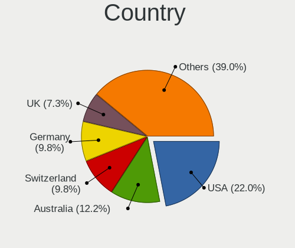

| Country     | Desktops | Percent |
|-------------|----------|---------|
| USA         | 8        | 21.62%  |
| Australia   | 5        | 13.51%  |
| Germany     | 4        | 10.81%  |
| UK          | 3        | 8.11%   |
| Brazil      | 3        | 8.11%   |
| Switzerland | 2        | 5.41%   |
| Canada      | 2        | 5.41%   |
| Venezuela   | 1        | 2.7%    |
| Portugal    | 1        | 2.7%    |
| Peru        | 1        | 2.7%    |
| Norway      | 1        | 2.7%    |
| Jordan      | 1        | 2.7%    |
| Italy       | 1        | 2.7%    |
| Ireland     | 1        | 2.7%    |
| Honduras    | 1        | 2.7%    |
| Belgium     | 1        | 2.7%    |
| Argentina   | 1        | 2.7%    |

City
----

Geographic location (city)

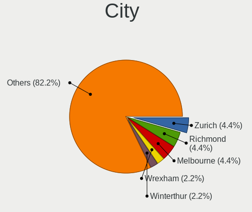

| City           | Desktops | Percent |
|----------------|----------|---------|
| Richmond       | 2        | 5%      |
| Melbourne      | 2        | 5%      |
| Wrexham        | 1        | 2.5%    |
| Winterthur     | 1        | 2.5%    |
| Tegucigalpa    | 1        | 2.5%    |
| Stavanger      | 1        | 2.5%    |
| Sligo          | 1        | 2.5%    |
| Seattle        | 1        | 2.5%    |
| Schleusingen   | 1        | 2.5%    |
| Sao Jose       | 1        | 2.5%    |
| Sankt Augustin | 1        | 2.5%    |
| Recklinghausen | 1        | 2.5%    |
| Oudenaarde     | 1        | 2.5%    |
| Oberwil-Lieli  | 1        | 2.5%    |
| New York       | 1        | 2.5%    |
| Naples         | 1        | 2.5%    |
| Macaé         | 1        | 2.5%    |
| Los Angeles    | 1        | 2.5%    |
| Lima           | 1        | 2.5%    |
| Kingston       | 1        | 2.5%    |
| Hummeltal      | 1        | 2.5%    |
| Hobart         | 1        | 2.5%    |
| Glasgow        | 1        | 2.5%    |
| Funchal        | 1        | 2.5%    |
| Fort St. John  | 1        | 2.5%    |
| Florianópolis | 1        | 2.5%    |
| Edinburg       | 1        | 2.5%    |
| Chapecó       | 1        | 2.5%    |
| Caracas        | 1        | 2.5%    |
| Buenos Aires   | 1        | 2.5%    |
| Bridgwater     | 1        | 2.5%    |
| Bellport       | 1        | 2.5%    |
| Bellflower     | 1        | 2.5%    |
| Barletta       | 1        | 2.5%    |
| Barinas        | 1        | 2.5%    |
| Baltimore      | 1        | 2.5%    |
| Bakersfield    | 1        | 2.5%    |
| Amman          | 1        | 2.5%    |

Drives
------

Drive Vendor
------------

Hard drive vendors

| Vendor                    | Desktops | Drives | Percent |
|---------------------------|----------|--------|---------|
| WDC                       | 18       | 29     | 28.57%  |
| Seagate                   | 13       | 19     | 20.63%  |
| Samsung Electronics       | 8        | 12     | 12.7%   |
| Kingston                  | 5        | 13     | 7.94%   |
| Hitachi                   | 5        | 6      | 7.94%   |
| Toshiba                   | 4        | 5      | 6.35%   |
| SanDisk                   | 2        | 3      | 3.17%   |
| Verbatim                  | 1        | 1      | 1.59%   |
| Unknown                   | 1        | 1      | 1.59%   |
| Realtek Semiconductor     | 1        | 1      | 1.59%   |
| PNY                       | 1        | 1      | 1.59%   |
| Micron/Crucial Technology | 1        | 1      | 1.59%   |
| Intel                     | 1        | 1      | 1.59%   |
| Crucial                   | 1        | 1      | 1.59%   |
| A-DATA Technology         | 1        | 1      | 1.59%   |

Drive Model
-----------

Hard drive models

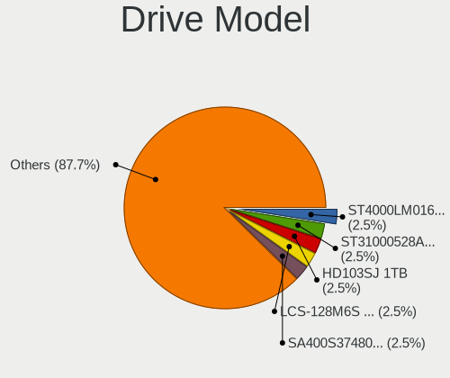

| Model                            | Desktops | Percent |
|----------------------------------|----------|---------|
| Seagate ST4000LM016-1N2170 4TB   | 2        | 2.82%   |
| Seagate ST31000528AS 1TB         | 2        | 2.82%   |
| Samsung HD103SJ 1TB              | 2        | 2.82%   |
| Kingston SA400S37480G 480GB SSD  | 2        | 2.82%   |
| Hitachi HDS721010CLA332 1TB      | 2        | 2.82%   |
| WDC WDS500G2B0A-00SM50 500GB SSD | 1        | 1.41%   |
| WDC WDS240G2G0A-00JH30 240GB SSD | 1        | 1.41%   |
| WDC WDS100T2B0C-00PXH0 1TB       | 1        | 1.41%   |
| WDC WDS100T2B0A-00SM50 1TB SSD   | 1        | 1.41%   |
| WDC WD80EFBX-68AZZN0 8TB         | 1        | 1.41%   |
| WDC WD6400AAKS-00A7B2 640GB      | 1        | 1.41%   |
| WDC WD5000BPKT-60PK4T0 500GB     | 1        | 1.41%   |
| WDC WD5000AAVS-00G9B1 500GB      | 1        | 1.41%   |
| WDC WD5000AAKS-65A7B2 500GB      | 1        | 1.41%   |
| WDC WD5000AAKS-00A7B2 500GB      | 1        | 1.41%   |
| WDC WD30EZRX-00MMMB0 3TB         | 1        | 1.41%   |
| WDC WD30EZRX-00D8PB0 3TB         | 1        | 1.41%   |
| WDC WD2500AAKX-75U6AA0 250GB     | 1        | 1.41%   |
| WDC WD1600AAJS-00L7A0 160GB      | 1        | 1.41%   |
| WDC WD10PURX-78E5EY0 1TB         | 1        | 1.41%   |
| WDC WD10JPVX-22JC3T0 1TB         | 1        | 1.41%   |
| WDC WD10EZEX-60WN4A0 1TB         | 1        | 1.41%   |
| WDC WD10EZEX-22MFCA0 1TB         | 1        | 1.41%   |
| WDC WD10EZEX-08WN4A0 1TB         | 1        | 1.41%   |
| WDC WD10EZEX-00WN4A0 1TB         | 1        | 1.41%   |
| WDC WD10EZEX-00BN5A0 1TB         | 1        | 1.41%   |
| WDC WD10EURX-83UY4Y0 1TB         | 1        | 1.41%   |
| WDC WD Blue SA510 2.5 500GB SSD  | 1        | 1.41%   |
| Verbatim Vi550 S3 SSD 512GB      | 1        | 1.41%   |
| Unknown SD/MMC/MS PRO 2GB        | 1        | 1.41%   |
| Toshiba THNSNJ256GCST 256GB SSD  | 1        | 1.41%   |
| Toshiba MK3275GSX 320GB          | 1        | 1.41%   |
| Toshiba MK1234GSX 120GB          | 1        | 1.41%   |
| Toshiba HDWE140 4TB              | 1        | 1.41%   |
| Toshiba DT01ACA100 1TB           | 1        | 1.41%   |
| Seagate ST500DM005 HD502HJ 500GB | 1        | 1.41%   |
| Seagate ST3500630NS 500GB        | 1        | 1.41%   |
| Seagate ST3500418AS 500GB        | 1        | 1.41%   |
| Seagate ST3320418AS 320GB        | 1        | 1.41%   |
| Seagate ST2000DM008-2FR102 2TB   | 1        | 1.41%   |

HDD Vendor
----------

Hard disk drive vendors

| Vendor              | Desktops | Drives | Percent |
|---------------------|----------|--------|---------|
| WDC                 | 15       | 24     | 38.46%  |
| Seagate             | 13       | 19     | 33.33%  |
| Hitachi             | 5        | 6      | 12.82%  |
| Toshiba             | 3        | 4      | 7.69%   |
| Samsung Electronics | 2        | 3      | 5.13%   |
| Unknown             | 1        | 1      | 2.56%   |

SSD Vendor
----------

Solid state drive vendors

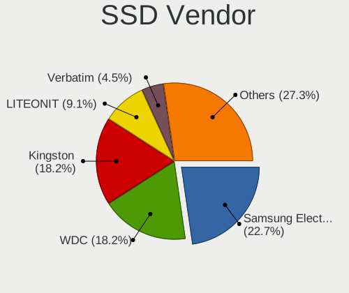

| Vendor              | Desktops | Drives | Percent |
|---------------------|----------|--------|---------|
| Samsung Electronics | 5        | 6      | 25%     |
| WDC                 | 4        | 4      | 20%     |
| Kingston            | 4        | 12     | 20%     |
| Verbatim            | 1        | 1      | 5%      |
| Toshiba             | 1        | 1      | 5%      |
| SanDisk             | 1        | 1      | 5%      |
| PNY                 | 1        | 1      | 5%      |
| Intel               | 1        | 1      | 5%      |
| Crucial             | 1        | 1      | 5%      |
| A-DATA Technology   | 1        | 1      | 5%      |

Drive Kind
----------

HDD or SSD

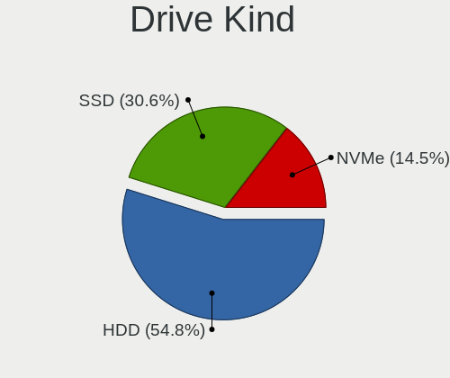

| Kind | Desktops | Drives | Percent |
|------|----------|--------|---------|
| HDD  | 31       | 57     | 56.36%  |
| SSD  | 17       | 29     | 30.91%  |
| NVMe | 7        | 9      | 12.73%  |

Drive Connector
---------------

SATA, SAS, NVMe, etc.

| Type | Desktops | Drives | Percent |
|------|----------|--------|---------|
| SATA | 36       | 85     | 81.82%  |
| NVMe | 7        | 9      | 15.91%  |
| SAS  | 1        | 1      | 2.27%   |

Drive Size
----------

Size of hard drive

| Size in TB | Desktops | Drives | Percent |
|------------|----------|--------|---------|
| 0.01-0.5   | 24       | 39     | 45.28%  |
| 0.51-1.0   | 18       | 31     | 33.96%  |
| 1.01-2.0   | 5        | 6      | 9.43%   |
| 3.01-4.0   | 3        | 7      | 5.66%   |
| 2.01-3.0   | 2        | 2      | 3.77%   |
| 4.01-10.0  | 1        | 1      | 1.89%   |

Space Total
-----------

Amount of disk space available on the file system

| Size in GB     | Desktops | Percent |
|----------------|----------|---------|
| 1001-2000      | 12       | 29.27%  |
| 251-500        | 9        | 21.95%  |
| 501-1000       | 7        | 17.07%  |
| 101-250        | 5        | 12.2%   |
| More than 3000 | 4        | 9.76%   |
| 2001-3000      | 3        | 7.32%   |
| 21-50          | 1        | 2.44%   |

Space Used
----------

Amount of used disk space

| Used GB   | Desktops | Percent |
|-----------|----------|---------|
| 251-500   | 10       | 25%     |
| 1-20      | 8        | 20%     |
| 101-250   | 7        | 17.5%   |
| 21-50     | 6        | 15%     |
| 501-1000  | 5        | 12.5%   |
| 51-100    | 3        | 7.5%    |
| 1001-2000 | 1        | 2.5%    |

Malfunc. Drives
---------------

Drive models with a malfunction

| Model                       | Desktops | Drives | Percent |
|-----------------------------|----------|--------|---------|
| WDC WD5000AAVS-00G9B1 500GB | 1        | 1      | 33.33%  |
| Toshiba MK1234GSX 120GB     | 1        | 1      | 33.33%  |
| Seagate ST3500418AS 500GB   | 1        | 1      | 33.33%  |

Malfunc. Drive Vendor
---------------------

Vendors of faulty drives

| Vendor  | Desktops | Drives | Percent |
|---------|----------|--------|---------|
| WDC     | 1        | 1      | 33.33%  |
| Toshiba | 1        | 1      | 33.33%  |
| Seagate | 1        | 1      | 33.33%  |

Malfunc. HDD Vendor
-------------------

Vendors of faulty HDD drives

| Vendor  | Desktops | Drives | Percent |
|---------|----------|--------|---------|
| WDC     | 1        | 1      | 33.33%  |
| Toshiba | 1        | 1      | 33.33%  |
| Seagate | 1        | 1      | 33.33%  |

Malfunc. Drive Kind
-------------------

Kinds of faulty drives

| Kind | Desktops | Drives | Percent |
|------|----------|--------|---------|
| HDD  | 2        | 3      | 100%    |

Failed Drives
-------------

Failed drive models

| Model                    | Desktops | Drives | Percent |
|--------------------------|----------|--------|---------|
| Seagate ST31000528AS 1TB | 1        | 1      | 100%    |

Failed Drive Vendor
-------------------

Failed drive vendors

| Vendor  | Desktops | Drives | Percent |
|---------|----------|--------|---------|
| Seagate | 1        | 1      | 100%    |

Drive Status
------------

Number of failed and malfunc. drives

| Status   | Desktops | Drives | Percent |
|----------|----------|--------|---------|
| Detected | 32       | 75     | 78.05%  |
| Works    | 6        | 16     | 14.63%  |
| Malfunc  | 2        | 3      | 4.88%   |
| Failed   | 1        | 1      | 2.44%   |

Storage controller
------------------

Storage Vendor
--------------

Storage controller vendors

| Vendor                      | Desktops | Percent |
|-----------------------------|----------|---------|
| Intel                       | 26       | 53.06%  |
| AMD                         | 10       | 20.41%  |
| Samsung Electronics         | 4        | 8.16%   |
| SanDisk                     | 2        | 4.08%   |
| ASMedia Technology          | 2        | 4.08%   |
| Realtek Semiconductor       | 1        | 2.04%   |
| Nvidia                      | 1        | 2.04%   |
| Micron/Crucial Technology   | 1        | 2.04%   |
| Kingston Technology Company | 1        | 2.04%   |
| JMicron Technology          | 1        | 2.04%   |

Storage Model
-------------

Storage controller models

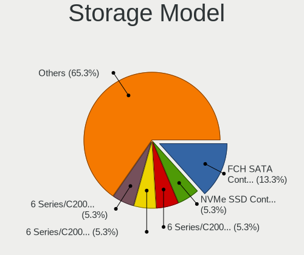

| Model                                                                                   | Desktops | Percent |
|-----------------------------------------------------------------------------------------|----------|---------|
| AMD FCH SATA Controller [AHCI mode]                                                     | 7        | 10.77%  |
| Intel 6 Series/C200 Series Chipset Family Desktop SATA Controller (IDE mode, ports 4-5) | 4        | 6.15%   |
| Intel 6 Series/C200 Series Chipset Family Desktop SATA Controller (IDE mode, ports 0-3) | 4        | 6.15%   |
| Intel 6 Series/C200 Series Chipset Family 6 port Desktop SATA AHCI Controller           | 4        | 6.15%   |
| Samsung NVMe SSD Controller SM981/PM981/PM983                                           | 3        | 4.62%   |
| Intel 8 Series/C220 Series Chipset Family 6-port SATA Controller 1 [AHCI mode]          | 3        | 4.62%   |
| Intel 200 Series PCH SATA controller [AHCI mode]                                        | 3        | 4.62%   |
| AMD 300 Series Chipset SATA Controller                                                  | 3        | 4.62%   |
| Intel NM10/ICH7 Family SATA Controller [IDE mode]                                       | 2        | 3.08%   |
| Intel 82801JI (ICH10 Family) 4 port SATA IDE Controller #1                              | 2        | 3.08%   |
| Intel 82801G (ICH7 Family) IDE Controller                                               | 2        | 3.08%   |
| ASMedia ASM1062 Serial ATA Controller                                                   | 2        | 3.08%   |
| AMD 400 Series Chipset SATA Controller                                                  | 2        | 3.08%   |
| SanDisk WD PC SN810 / Black SN850 NVMe SSD                                              | 1        | 1.54%   |
| SanDisk WD Blue SN550 NVMe SSD                                                          | 1        | 1.54%   |
| Samsung NVMe SSD Controller SM961/PM961/SM963                                           | 1        | 1.54%   |
| Realtek RTS5763DL NVMe SSD Controller                                                   | 1        | 1.54%   |
| Nvidia MCP55 SATA Controller                                                            | 1        | 1.54%   |
| Nvidia MCP55 IDE                                                                        | 1        | 1.54%   |
| Micron/Crucial NVMe Controller                                                          | 1        | 1.54%   |
| Kingston Company OM3PDP3 NVMe SSD                                                       | 1        | 1.54%   |
| JMicron JMB363 SATA/IDE Controller                                                      | 1        | 1.54%   |
| Intel Tiger Lake-LP SATA Controller                                                     | 1        | 1.54%   |
| Intel Q170/Q150/B150/H170/H110/Z170/CM236 Chipset SATA Controller [AHCI Mode]           | 1        | 1.54%   |
| Intel Cannon Lake PCH SATA AHCI Controller                                              | 1        | 1.54%   |
| Intel 9 Series Chipset Family SATA Controller [AHCI Mode]                               | 1        | 1.54%   |
| Intel 82801JI (ICH10 Family) 2 port SATA IDE Controller #2                              | 1        | 1.54%   |
| Intel 82801JD/DO (ICH10 Family) SATA AHCI Controller                                    | 1        | 1.54%   |
| Intel 7 Series/C210 Series Chipset Family 6-port SATA Controller [AHCI mode]            | 1        | 1.54%   |
| Intel 7 Series Chipset Family 6-port SATA Controller [AHCI mode]                        | 1        | 1.54%   |
| Intel 400 Series Chipset Family SATA AHCI Controller                                    | 1        | 1.54%   |
| Intel 4 Series Chipset PT IDER Controller                                               | 1        | 1.54%   |
| AMD SB7x0/SB8x0/SB9x0 SATA Controller [AHCI mode]                                       | 1        | 1.54%   |
| AMD SB7x0/SB8x0/SB9x0 IDE Controller                                                    | 1        | 1.54%   |
| AMD RS690 PCI to PCI Bridge (PCI Express Port 2)                                        | 1        | 1.54%   |
| AMD FCH SATA Controller [IDE mode]                                                      | 1        | 1.54%   |
| AMD FCH IDE Controller                                                                  | 1        | 1.54%   |

Storage Kind
------------

Kind of storage controller (IDE, SATA, NVMe, SAS, ...)

| Kind | Desktops | Percent |
|------|----------|---------|
| SATA | 28       | 56%     |
| IDE  | 12       | 24%     |
| NVMe | 9        | 18%     |
| RAID | 1        | 2%      |

Processor
---------

CPU Vendor
----------

Processor vendors

| Vendor | Desktops | Percent |
|--------|----------|---------|
| Intel  | 27       | 72.97%  |
| AMD    | 10       | 27.03%  |

CPU Model
---------

Processor models

| Model                                          | Desktops | Percent |
|------------------------------------------------|----------|---------|
| Intel Core i7-8700K CPU @ 3.70GHz              | 2        | 5.41%   |
| Intel Core i3-2100 CPU @ 3.10GHz               | 2        | 5.41%   |
| AMD Ryzen 5 1600 Six-Core Processor            | 2        | 5.41%   |
| Intel Pentium D CPU 3.00GHz                    | 1        | 2.7%    |
| Intel Pentium CPU G630 @ 2.70GHz               | 1        | 2.7%    |
| Intel Pentium CPU G3250 @ 3.20GHz              | 1        | 2.7%    |
| Intel Core i7-7700K CPU @ 4.20GHz              | 1        | 2.7%    |
| Intel Core i7-6700K CPU @ 4.00GHz              | 1        | 2.7%    |
| Intel Core i7-4770 CPU @ 3.40GHz               | 1        | 2.7%    |
| Intel Core i7-3770S CPU @ 3.10GHz              | 1        | 2.7%    |
| Intel Core i7-2600K CPU @ 3.40GHz              | 1        | 2.7%    |
| Intel Core i7-2600 CPU @ 3.40GHz               | 1        | 2.7%    |
| Intel Core i7-10700 CPU @ 2.90GHz              | 1        | 2.7%    |
| Intel Core i7 CPU 920 @ 2.67GHz                | 1        | 2.7%    |
| Intel Core i5-9400F CPU @ 2.90GHz              | 1        | 2.7%    |
| Intel Core i5-4690K CPU @ 3.50GHz              | 1        | 2.7%    |
| Intel Core i5-3570K CPU @ 3.40GHz              | 1        | 2.7%    |
| Intel Core i5-3330 CPU @ 3.00GHz               | 1        | 2.7%    |
| Intel Core i3-3240 CPU @ 3.40GHz               | 1        | 2.7%    |
| Intel Core 2 Quad CPU Q8300 @ 2.50GHz          | 1        | 2.7%    |
| Intel Core 2 Quad CPU Q8200 @ 2.33GHz          | 1        | 2.7%    |
| Intel Core 2 Quad CPU Q6600 @ 2.40GHz          | 1        | 2.7%    |
| Intel Core 2 Duo CPU E7400 @ 2.80GHz           | 1        | 2.7%    |
| Intel Celeron CPU G1840 @ 2.80GHz              | 1        | 2.7%    |
| Intel Celeron CPU 1007U @ 1.50GHz              | 1        | 2.7%    |
| Intel 11th Gen Core i5-11320H @ 3.20GHz        | 1        | 2.7%    |
| AMD Ryzen 9 3900X 12-Core Processor            | 1        | 2.7%    |
| AMD Ryzen 7 2700X Eight-Core Processor         | 1        | 2.7%    |
| AMD Ryzen 7 2700 Eight-Core Processor          | 1        | 2.7%    |
| AMD Ryzen 5 2400G with Radeon Vega Graphics    | 1        | 2.7%    |
| AMD FX-8350 Eight-Core Processor               | 1        | 2.7%    |
| AMD A8-9600 RADEON R7, 10 COMPUTE CORES 4C+6G  | 1        | 2.7%    |
| AMD A8-7650K Radeon R7, 10 Compute Cores 4C+6G | 1        | 2.7%    |
| AMD A10-6700 APU with Radeon HD Graphics       | 1        | 2.7%    |

CPU Model Family
----------------

Processor model prefix

| Model             | Desktops | Percent |
|-------------------|----------|---------|
| Intel Core i7     | 10       | 27.03%  |
| Intel Core i5     | 4        | 10.81%  |
| Intel Core i3     | 3        | 8.11%   |
| Intel Core 2 Quad | 3        | 8.11%   |
| AMD Ryzen 5       | 3        | 8.11%   |
| Intel Pentium     | 2        | 5.41%   |
| Intel Celeron     | 2        | 5.41%   |
| AMD Ryzen 7       | 2        | 5.41%   |
| AMD A8            | 2        | 5.41%   |
| Other             | 1        | 2.7%    |
| Intel Pentium D   | 1        | 2.7%    |
| Intel Core 2 Duo  | 1        | 2.7%    |
| AMD Ryzen 9       | 1        | 2.7%    |
| AMD FX            | 1        | 2.7%    |
| AMD A10           | 1        | 2.7%    |

CPU Cores
---------

Number of processor cores

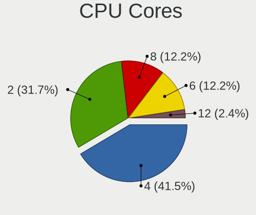

| Number | Desktops | Percent |
|--------|----------|---------|
| 4      | 16       | 43.24%  |
| 2      | 12       | 32.43%  |
| 6      | 5        | 13.51%  |
| 8      | 3        | 8.11%   |
| 12     | 1        | 2.7%    |

CPU Sockets
-----------

Number of sockets

| Number | Desktops | Percent |
|--------|----------|---------|
| 1      | 37       | 100%    |

CPU Threads
-----------

Threads per core (Hyper-Threading)

| Number | Desktops | Percent |
|--------|----------|---------|
| 2      | 24       | 64.86%  |
| 1      | 13       | 35.14%  |

CPU Op-Modes
------------

CPU Operation Modes (32-bit, 64-bit)

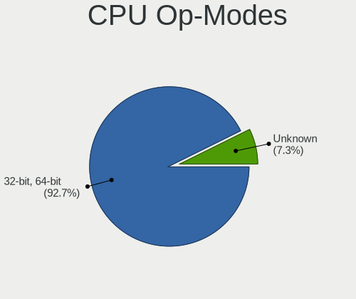

| Op mode        | Desktops | Percent |
|----------------|----------|---------|
| 32-bit, 64-bit | 34       | 91.89%  |
| Unknown        | 3        | 8.11%   |

CPU Microcode
-------------

Microcode number

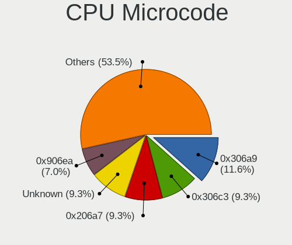

| Number     | Desktops | Percent |
|------------|----------|---------|
| 0x306a9    | 5        | 13.51%  |
| 0x306c3    | 4        | 10.81%  |
| 0x206a7    | 4        | 10.81%  |
| 0x906ea    | 3        | 8.11%   |
| 0x1067a    | 3        | 8.11%   |
| 0x0800820d | 2        | 5.41%   |
| 0x08001138 | 2        | 5.41%   |
| 0xf62      | 1        | 2.7%    |
| 0xa0655    | 1        | 2.7%    |
| 0x906e9    | 1        | 2.7%    |
| 0x806c2    | 1        | 2.7%    |
| 0x6fb      | 1        | 2.7%    |
| 0x506e3    | 1        | 2.7%    |
| 0x106a5    | 1        | 2.7%    |
| 0x08701021 | 1        | 2.7%    |
| 0x0810100b | 1        | 2.7%    |
| 0x0600611a | 1        | 2.7%    |
| 0x06003104 | 1        | 2.7%    |
| 0x06001119 | 1        | 2.7%    |
| 0x06000852 | 1        | 2.7%    |
| Unknown    | 1        | 2.7%    |

CPU Microarch
-------------

Microarchitecture

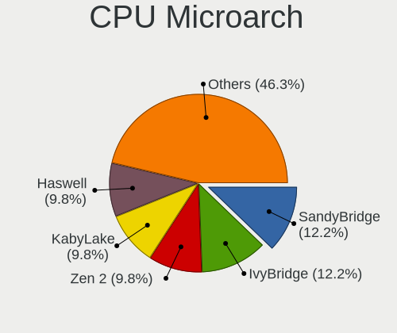

| Name        | Desktops | Percent |
|-------------|----------|---------|
| SandyBridge | 5        | 13.51%  |
| IvyBridge   | 5        | 13.51%  |
| KabyLake    | 4        | 10.81%  |
| Haswell     | 4        | 10.81%  |
| Zen         | 3        | 8.11%   |
| Penryn      | 3        | 8.11%   |
| Zen+        | 2        | 5.41%   |
| Piledriver  | 2        | 5.41%   |
| Zen 2       | 1        | 2.7%    |
| TigerLake   | 1        | 2.7%    |
| Steamroller | 1        | 2.7%    |
| Skylake     | 1        | 2.7%    |
| NetBurst    | 1        | 2.7%    |
| Nehalem     | 1        | 2.7%    |
| Excavator   | 1        | 2.7%    |
| Core        | 1        | 2.7%    |
| CometLake   | 1        | 2.7%    |

Graphics
--------

GPU Vendor
----------

Vendors of graphics cards

| Vendor | Desktops | Percent |
|--------|----------|---------|
| Nvidia | 15       | 38.46%  |
| Intel  | 15       | 38.46%  |
| AMD    | 9        | 23.08%  |

GPU Model
---------

Graphics card models

| Model                                                                       | Desktops | Percent |
|-----------------------------------------------------------------------------|----------|---------|
| Nvidia GM107 [GeForce GTX 750 Ti]                                           | 2        | 5.13%   |
| Nvidia GK208B [GeForce GT 710]                                              | 2        | 5.13%   |
| Intel Xeon E3-1200 v3/4th Gen Core Processor Integrated Graphics Controller | 2        | 5.13%   |
| Intel Xeon E3-1200 v2/3rd Gen Core processor Graphics Controller            | 2        | 5.13%   |
| Intel IvyBridge GT2 [HD Graphics 4000]                                      | 2        | 5.13%   |
| Intel CoffeeLake-S GT2 [UHD Graphics 630]                                   | 2        | 5.13%   |
| Intel 4 Series Chipset Integrated Graphics Controller                       | 2        | 5.13%   |
| AMD Ellesmere [Radeon RX 470/480/570/570X/580/580X/590]                     | 2        | 5.13%   |
| Nvidia TU116 [GeForce GTX 1660 SUPER]                                       | 1        | 2.56%   |
| Nvidia GT218 [GeForce 210]                                                  | 1        | 2.56%   |
| Nvidia GP107 [GeForce GTX 1050]                                             | 1        | 2.56%   |
| Nvidia GP104 [GeForce GTX 1070]                                             | 1        | 2.56%   |
| Nvidia GM204 [GeForce GTX 970]                                              | 1        | 2.56%   |
| Nvidia GK208B [GeForce GT 730]                                              | 1        | 2.56%   |
| Nvidia GK107 [NVS 510]                                                      | 1        | 2.56%   |
| Nvidia GF108 [GeForce GT 730]                                               | 1        | 2.56%   |
| Nvidia GF108 [GeForce GT 630]                                               | 1        | 2.56%   |
| Nvidia GF108 [GeForce GT 430]                                               | 1        | 2.56%   |
| Nvidia G92 [GeForce 8800 GT]                                                | 1        | 2.56%   |
| Intel TigerLake-LP GT2 [Iris Xe Graphics]                                   | 1        | 2.56%   |
| Intel CometLake-S GT2 [UHD Graphics 630]                                    | 1        | 2.56%   |
| Intel 82G33/G31 Express Integrated Graphics Controller                      | 1        | 2.56%   |
| Intel 3rd Gen Core processor Graphics Controller                            | 1        | 2.56%   |
| Intel 2nd Generation Core Processor Family Integrated Graphics Controller   | 1        | 2.56%   |
| AMD Vega 10 XL/XT [Radeon RX Vega 56/64]                                    | 1        | 2.56%   |
| AMD RV620 LE [Radeon HD 3450]                                               | 1        | 2.56%   |
| AMD Richland [Radeon HD 8670D]                                              | 1        | 2.56%   |
| AMD Raven Ridge [Radeon Vega Series / Radeon Vega Mobile Series]            | 1        | 2.56%   |
| AMD Navi 14 [Radeon Pro W5500]                                              | 1        | 2.56%   |
| AMD Kaveri [Radeon R7 Graphics]                                             | 1        | 2.56%   |
| AMD Barts XT [Radeon HD 6870]                                               | 1        | 2.56%   |

GPU Combo
---------

Combinations of graphics cards

| Name           | Desktops | Percent |
|----------------|----------|---------|
| 1 x Nvidia     | 14       | 37.84%  |
| 1 x Intel      | 13       | 35.14%  |
| 1 x AMD        | 9        | 24.32%  |
| Intel + Nvidia | 1        | 2.7%    |

GPU Driver
----------

Free vs proprietary

| Driver      | Desktops | Percent |
|-------------|----------|---------|
| Free        | 25       | 64.1%   |
| Proprietary | 12       | 30.77%  |
| Unknown     | 2        | 5.13%   |

GPU Memory
----------

Total video memory

| Size in GB | Desktops | Percent |
|------------|----------|---------|
| Unknown    | 14       | 36.84%  |
| 1.01-2.0   | 7        | 18.42%  |
| 0.51-1.0   | 6        | 15.79%  |
| 7.01-8.0   | 5        | 13.16%  |
| 3.01-4.0   | 3        | 7.89%   |
| 0.01-0.5   | 2        | 5.26%   |
| 5.01-6.0   | 1        | 2.63%   |

Monitor
-------

Monitor Vendor
--------------

Monitor vendors

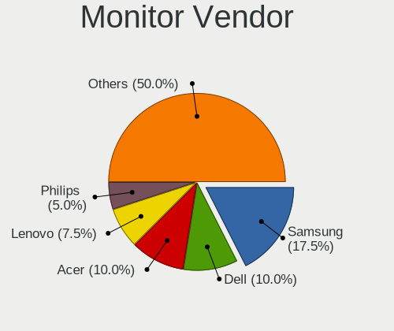

| Vendor                  | Desktops | Percent |
|-------------------------|----------|---------|
| Samsung Electronics     | 7        | 19.44%  |
| Dell                    | 4        | 11.11%  |
| Acer                    | 4        | 11.11%  |
| Lenovo                  | 3        | 8.33%   |
| Hewlett-Packard         | 2        | 5.56%   |
| AOC                     | 2        | 5.56%   |
| Vestel                  | 1        | 2.78%   |
| Unknown                 | 1        | 2.78%   |
| Sceptre Tech            | 1        | 2.78%   |
| Ruijiang                | 1        | 2.78%   |
| Philips                 | 1        | 2.78%   |
| Onkyo                   | 1        | 2.78%   |
| Medion                  | 1        | 2.78%   |
| LG Electronics          | 1        | 2.78%   |
| Lenovo Group Limited    | 1        | 2.78%   |
| Insignia                | 1        | 2.78%   |
| Goldstar                | 1        | 2.78%   |
| Chi Mei Optoelectronics | 1        | 2.78%   |
| BenQ                    | 1        | 2.78%   |
| Ancor Communications    | 1        | 2.78%   |

Monitor Model
-------------

Monitor models

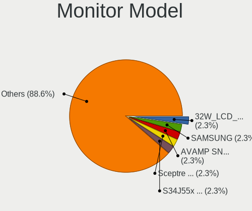

| Model                                                                  | Desktops | Percent |
|------------------------------------------------------------------------|----------|---------|
| Vestel LCD Monitor 32W_LCD_TV 1920x1080                                | 1        | 2.5%    |
| Unknown LCD Monitor SAMSUNG                                            | 1        | 2.5%    |
| Sceptre Tech E27 SPT0ABF 1920x1080 521x293mm 23.5-inch                 | 1        | 2.5%    |
| Samsung Electronics S34J55x SAM0F71 3440x1440 797x333mm 34.0-inch      | 1        | 2.5%    |
| Samsung Electronics S27E510 SAM0C5F 1920x1080 598x336mm 27.0-inch      | 1        | 2.5%    |
| Samsung Electronics LCD Monitor U28E590 7680x2160                      | 1        | 2.5%    |
| Samsung Electronics LCD Monitor U28E590                                | 1        | 2.5%    |
| Samsung Electronics LCD Monitor SAM0900 1366x768 410x230mm 18.5-inch   | 1        | 2.5%    |
| Samsung Electronics LCD Monitor SAM07C5 1920x1080 1020x570mm 46.0-inch | 1        | 2.5%    |
| Samsung Electronics C27F591 SAM0D37 1920x1080 598x336mm 27.0-inch      | 1        | 2.5%    |
| Samsung Electronics C27F390 SAM0D32 1920x1080 598x336mm 27.0-inch      | 1        | 2.5%    |
| Samsung Electronics C24F390 SAM0D2D 1920x1080 521x293mm 23.5-inch      | 1        | 2.5%    |
| Samsung Electronics C24F390 SAM0D2C 1920x1080 521x293mm 23.5-inch      | 1        | 2.5%    |
| Ruijiang RJT HDMI RJT1200 1920x1200 320x180mm 14.5-inch                | 1        | 2.5%    |
| Philips PHL 328E9Q PHLC180 1920x1080 698x393mm 31.5-inch               | 1        | 2.5%    |
| Onkyo TX-NR535 ONK0E51 2560x1440 597x336mm 27.0-inch                   | 1        | 2.5%    |
| Medion MD 20094 MED3610 1920x1200 550x344mm 25.5-inch                  | 1        | 2.5%    |
| LG Electronics LCD Monitor MP59HT 1920x1080                            | 1        | 2.5%    |
| Lenovo LEN L174 LEN240B 1280x1024 340x270mm 17.1-inch                  | 1        | 2.5%    |
| Lenovo L24q-10 LEN65CF 2560x1440 527x296mm 23.8-inch                   | 1        | 2.5%    |
| Lenovo H61 LEN520B 1600x900 410x230mm 18.5-inch                        | 1        | 2.5%    |
| Lenovo Group Limited LCD Monitor L24q-10 2560x1440                     | 1        | 2.5%    |
| Insignia NS-24EM51A14 BBYBB24 1920x1080 531x299mm 24.0-inch            | 1        | 2.5%    |
| Hewlett-Packard ZR22w HWP2867 1920x1080 475x267mm 21.5-inch            | 1        | 2.5%    |
| Hewlett-Packard LCD Monitor ZR22w 3840x1080                            | 1        | 2.5%    |
| Hewlett-Packard 2509 HWP283A 1920x1080 553x311mm 25.0-inch             | 1        | 2.5%    |
| Goldstar E2242 GSM58BE 1920x1080 477x268mm 21.5-inch                   | 1        | 2.5%    |
| Dell UP3017 DEL40FA 2560x1600 640x400mm 29.7-inch                      | 1        | 2.5%    |
| Dell U2412M DELA07A 1920x1200 518x324mm 24.1-inch                      | 1        | 2.5%    |
| Dell SP1908FP DEL4030 1280x1024 376x301mm 19.0-inch                    | 1        | 2.5%    |
| Dell S2715H DEL40BB 1920x1080 598x336mm 27.0-inch                      | 1        | 2.5%    |
| Chi Mei Optoelectronics LCD Monitor CMC 19AW 1440x900                  | 1        | 2.5%    |
| BenQ BL3200 BNQ8017 2560x1440 710x400mm 32.1-inch                      | 1        | 2.5%    |
| AOC LM522 AOCA522 1024x768 304x228mm 15.0-inch                         | 1        | 2.5%    |
| AOC LCD Monitor 1943W 1366x768                                         | 1        | 2.5%    |
| Ancor Communications MX279 ACI27C3 1920x1080 600x340mm 27.2-inch       | 1        | 2.5%    |
| Acer VG270U ACR06C9 2560x1440 597x336mm 27.0-inch                      | 1        | 2.5%    |
| Acer V273HL ACR02D0 1920x1080 598x336mm 27.0-inch                      | 1        | 2.5%    |
| Acer S242HL ACR0216 1920x1080 531x299mm 24.0-inch                      | 1        | 2.5%    |
| Acer LCD Monitor VG270U 2560x1440                                      | 1        | 2.5%    |

Monitor Resolution
------------------

Monitor screen resolution

| Resolution        | Desktops | Percent |
|-------------------|----------|---------|
| 1920x1080 (FHD)   | 16       | 44.44%  |
| 2560x1440 (QHD)   | 4        | 11.11%  |
| 3840x2160 (4K)    | 2        | 5.56%   |
| 1366x768 (WXGA)   | 2        | 5.56%   |
| 1280x1024 (SXGA)  | 2        | 5.56%   |
| Unknown           | 2        | 5.56%   |
| 7680x2160         | 1        | 2.78%   |
| 3840x1080         | 1        | 2.78%   |
| 3440x1440         | 1        | 2.78%   |
| 2560x1600         | 1        | 2.78%   |
| 1920x1200 (WUXGA) | 1        | 2.78%   |
| 1600x900 (HD+)    | 1        | 2.78%   |
| 1440x900 (WXGA+)  | 1        | 2.78%   |
| 1024x768 (XGA)    | 1        | 2.78%   |

Monitor Diagonal
----------------

Diagonal size in inches

| Inches  | Desktops | Percent |
|---------|----------|---------|
| Unknown | 8        | 21.62%  |
| 27      | 6        | 16.22%  |
| 24      | 4        | 10.81%  |
| 32      | 2        | 5.41%   |
| 31      | 2        | 5.41%   |
| 25      | 2        | 5.41%   |
| 21      | 2        | 5.41%   |
| 86      | 1        | 2.7%    |
| 54      | 1        | 2.7%    |
| 49      | 1        | 2.7%    |
| 40      | 1        | 2.7%    |
| 34      | 1        | 2.7%    |
| 29      | 1        | 2.7%    |
| 23      | 1        | 2.7%    |
| 19      | 1        | 2.7%    |
| 18      | 1        | 2.7%    |
| 17      | 1        | 2.7%    |
| 15      | 1        | 2.7%    |

Monitor Width
-------------

Physical width

| Width in mm | Desktops | Percent |
|-------------|----------|---------|
| 501-600     | 13       | 35.14%  |
| Unknown     | 8        | 21.62%  |
| 701-800     | 3        | 8.11%   |
| 601-700     | 3        | 8.11%   |
| 401-500     | 3        | 8.11%   |
| 301-350     | 2        | 5.41%   |
| 1001-1500   | 2        | 5.41%   |
| 801-900     | 1        | 2.7%    |
| 351-400     | 1        | 2.7%    |
| 1501-2000   | 1        | 2.7%    |

Aspect Ratio
------------

Proportional relationship between the width and the height

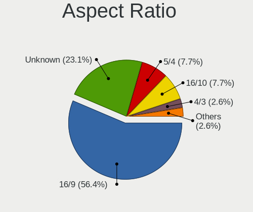

| Ratio   | Desktops | Percent |
|---------|----------|---------|
| 16/9    | 20       | 57.14%  |
| Unknown | 8        | 22.86%  |
| 16/10   | 3        | 8.57%   |
| 5/4     | 2        | 5.71%   |
| 4/3     | 1        | 2.86%   |
| 21/9    | 1        | 2.86%   |

Monitor Area
------------

Area in inch²

| Area in inch² | Desktops | Percent |
|----------------|----------|---------|
| Unknown        | 8        | 21.62%  |
| 351-500        | 6        | 16.22%  |
| 301-350        | 6        | 16.22%  |
| 201-250        | 6        | 16.22%  |
| More than 1000 | 3        | 8.11%   |
| 251-300        | 3        | 8.11%   |
| 141-150        | 2        | 5.41%   |
| 151-200        | 1        | 2.7%    |
| 101-110        | 1        | 2.7%    |
| 501-1000       | 1        | 2.7%    |

Pixel Density
-------------

Pixels per inch

| Density | Desktops | Percent |
|---------|----------|---------|
| 51-100  | 18       | 50%     |
| Unknown | 8        | 22.22%  |
| 101-120 | 5        | 13.89%  |
| 1-50    | 3        | 8.33%   |
| 121-160 | 2        | 5.56%   |

Multiple Monitors
-----------------

Total monitors connected

| Total | Desktops | Percent |
|-------|----------|---------|
| 1     | 31       | 81.58%  |
| 2     | 5        | 13.16%  |
| 0     | 2        | 5.26%   |

Network
-------

Net Controller Vendor
---------------------

Controller vendors

| Vendor                          | Desktops | Percent |
|---------------------------------|----------|---------|
| Realtek Semiconductor           | 23       | 46.94%  |
| Intel                           | 11       | 22.45%  |
| Ralink                          | 2        | 4.08%   |
| Qualcomm Atheros                | 2        | 4.08%   |
| Linksys                         | 2        | 4.08%   |
| Broadcom                        | 2        | 4.08%   |
| TP-Link                         | 1        | 2.04%   |
| Ralink Technology               | 1        | 2.04%   |
| Qualcomm Atheros Communications | 1        | 2.04%   |
| Nvidia                          | 1        | 2.04%   |
| NetGear                         | 1        | 2.04%   |
| Edimax Technology               | 1        | 2.04%   |
| D-Link                          | 1        | 2.04%   |

Net Controller Model
--------------------

Controller models

| Model                                                                        | Desktops | Percent |
|------------------------------------------------------------------------------|----------|---------|
| Realtek RTL8111/8168/8411 PCI Express Gigabit Ethernet Controller            | 22       | 40%     |
| Intel Ethernet Connection (2) I219-V                                         | 4        | 7.27%   |
| Intel Wi-Fi 6 AX200                                                          | 2        | 3.64%   |
| TP-Link AC600 wireless Realtek RTL8811AU [Archer T2U Nano]                   | 1        | 1.82%   |
| Realtek RTL8821CE 802.11ac PCIe Wireless Network Adapter                     | 1        | 1.82%   |
| Realtek RTL8191SU 802.11n WLAN Adapter                                       | 1        | 1.82%   |
| Realtek RTL8188CE 802.11b/g/n WiFi Adapter                                   | 1        | 1.82%   |
| Realtek RTL810xE PCI Express Fast Ethernet controller                        | 1        | 1.82%   |
| Ralink RT2501/RT2573 Wireless Adapter                                        | 1        | 1.82%   |
| Ralink RT3290 Wireless 802.11n 1T/1R PCIe                                    | 1        | 1.82%   |
| Ralink RT3062 Wireless 802.11n 2T/2R                                         | 1        | 1.82%   |
| Qualcomm Atheros AR9271 802.11n                                              | 1        | 1.82%   |
| Qualcomm Atheros AR9485 Wireless Network Adapter                             | 1        | 1.82%   |
| Qualcomm Atheros AR8161 Gigabit Ethernet                                     | 1        | 1.82%   |
| Qualcomm Atheros AR8152 v2.0 Fast Ethernet                                   | 1        | 1.82%   |
| Nvidia MCP55 Ethernet                                                        | 1        | 1.82%   |
| NetGear A6210                                                                | 1        | 1.82%   |
| Linksys WUSB6300 V2                                                          | 1        | 1.82%   |
| Linksys WUSB6300 802.11a/b/g/n/ac Wireless Adapter [Realtek RTL8812AU]       | 1        | 1.82%   |
| Intel Ethernet Controller I225-V                                             | 1        | 1.82%   |
| Intel Ethernet Connection (7) I219-V                                         | 1        | 1.82%   |
| Intel Ethernet Connection (2) I218-V                                         | 1        | 1.82%   |
| Intel Centrino Wireless-N 2230                                               | 1        | 1.82%   |
| Intel Cannon Lake PCH CNVi WiFi                                              | 1        | 1.82%   |
| Intel 82579V Gigabit Network Connection                                      | 1        | 1.82%   |
| Intel 82567LM-3 Gigabit Network Connection                                   | 1        | 1.82%   |
| Edimax EW-7711UTn nLite Wireless Adapter [Ralink RT3070]                     | 1        | 1.82%   |
| D-Link DWA-160 802.11abgn Xtreme N Dual Band Adapter(rev.B2) [Ralink RT5572] | 1        | 1.82%   |
| Broadcom NetXtreme BCM5751 Gigabit Ethernet PCI Express                      | 1        | 1.82%   |
| Broadcom NetLink BCM5784M Gigabit Ethernet PCIe                              | 1        | 1.82%   |

Wireless Vendor
---------------

Wireless vendors

| Vendor                          | Desktops | Percent |
|---------------------------------|----------|---------|
| Intel                           | 4        | 22.22%  |
| Realtek Semiconductor           | 3        | 16.67%  |
| Ralink                          | 2        | 11.11%  |
| Linksys                         | 2        | 11.11%  |
| TP-Link                         | 1        | 5.56%   |
| Ralink Technology               | 1        | 5.56%   |
| Qualcomm Atheros Communications | 1        | 5.56%   |
| Qualcomm Atheros                | 1        | 5.56%   |
| NetGear                         | 1        | 5.56%   |
| Edimax Technology               | 1        | 5.56%   |
| D-Link                          | 1        | 5.56%   |

Wireless Model
--------------

Wireless models

| Model                                                                        | Desktops | Percent |
|------------------------------------------------------------------------------|----------|---------|
| Intel Wi-Fi 6 AX200                                                          | 2        | 11.11%  |
| TP-Link AC600 wireless Realtek RTL8811AU [Archer T2U Nano]                   | 1        | 5.56%   |
| Realtek RTL8821CE 802.11ac PCIe Wireless Network Adapter                     | 1        | 5.56%   |
| Realtek RTL8191SU 802.11n WLAN Adapter                                       | 1        | 5.56%   |
| Realtek RTL8188CE 802.11b/g/n WiFi Adapter                                   | 1        | 5.56%   |
| Ralink RT2501/RT2573 Wireless Adapter                                        | 1        | 5.56%   |
| Ralink RT3290 Wireless 802.11n 1T/1R PCIe                                    | 1        | 5.56%   |
| Ralink RT3062 Wireless 802.11n 2T/2R                                         | 1        | 5.56%   |
| Qualcomm Atheros AR9271 802.11n                                              | 1        | 5.56%   |
| Qualcomm Atheros AR9485 Wireless Network Adapter                             | 1        | 5.56%   |
| NetGear A6210                                                                | 1        | 5.56%   |
| Linksys WUSB6300 V2                                                          | 1        | 5.56%   |
| Linksys WUSB6300 802.11a/b/g/n/ac Wireless Adapter [Realtek RTL8812AU]       | 1        | 5.56%   |
| Intel Centrino Wireless-N 2230                                               | 1        | 5.56%   |
| Intel Cannon Lake PCH CNVi WiFi                                              | 1        | 5.56%   |
| Edimax EW-7711UTn nLite Wireless Adapter [Ralink RT3070]                     | 1        | 5.56%   |
| D-Link DWA-160 802.11abgn Xtreme N Dual Band Adapter(rev.B2) [Ralink RT5572] | 1        | 5.56%   |

Ethernet Vendor
---------------

Ethernet vendors

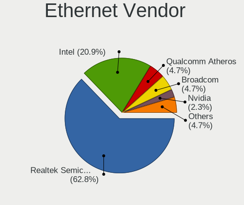

| Vendor                | Desktops | Percent |
|-----------------------|----------|---------|
| Realtek Semiconductor | 23       | 62.16%  |
| Intel                 | 9        | 24.32%  |
| Qualcomm Atheros      | 2        | 5.41%   |
| Broadcom              | 2        | 5.41%   |
| Nvidia                | 1        | 2.7%    |

Ethernet Model
--------------

Ethernet models

| Model                                                             | Desktops | Percent |
|-------------------------------------------------------------------|----------|---------|
| Realtek RTL8111/8168/8411 PCI Express Gigabit Ethernet Controller | 22       | 59.46%  |
| Intel Ethernet Connection (2) I219-V                              | 4        | 10.81%  |
| Realtek RTL810xE PCI Express Fast Ethernet controller             | 1        | 2.7%    |
| Qualcomm Atheros AR8161 Gigabit Ethernet                          | 1        | 2.7%    |
| Qualcomm Atheros AR8152 v2.0 Fast Ethernet                        | 1        | 2.7%    |
| Nvidia MCP55 Ethernet                                             | 1        | 2.7%    |
| Intel Ethernet Controller I225-V                                  | 1        | 2.7%    |
| Intel Ethernet Connection (7) I219-V                              | 1        | 2.7%    |
| Intel Ethernet Connection (2) I218-V                              | 1        | 2.7%    |
| Intel 82579V Gigabit Network Connection                           | 1        | 2.7%    |
| Intel 82567LM-3 Gigabit Network Connection                        | 1        | 2.7%    |
| Broadcom NetXtreme BCM5751 Gigabit Ethernet PCI Express           | 1        | 2.7%    |
| Broadcom NetLink BCM5784M Gigabit Ethernet PCIe                   | 1        | 2.7%    |

Net Controller Kind
-------------------

Ethernet, WiFi or modem

| Kind     | Desktops | Percent |
|----------|----------|---------|
| Ethernet | 37       | 71.15%  |
| WiFi     | 15       | 28.85%  |

Used Controller
---------------

Currently used network controller

| Kind     | Desktops | Percent |
|----------|----------|---------|
| Ethernet | 29       | 78.38%  |
| WiFi     | 8        | 21.62%  |

NICs
----

Total network controllers on board

| Total | Desktops | Percent |
|-------|----------|---------|
| 1     | 27       | 72.97%  |
| 2     | 9        | 24.32%  |
| 3     | 1        | 2.7%    |

IPv6
----

IPv6 vs IPv4

| Used | Desktops | Percent |
|------|----------|---------|
| No   | 34       | 89.47%  |
| Yes  | 4        | 10.53%  |

Bluetooth
---------

Bluetooth Vendor
----------------

Controller vendors

| Vendor                  | Desktops | Percent |
|-------------------------|----------|---------|
| Intel                   | 4        | 40%     |
| Cambridge Silicon Radio | 3        | 30%     |
| Realtek Semiconductor   | 1        | 10%     |
| Ralink                  | 1        | 10%     |
| Broadcom                | 1        | 10%     |

Bluetooth Model
---------------

Controller models

| Model                                               | Desktops | Percent |
|-----------------------------------------------------|----------|---------|
| Cambridge Silicon Radio Bluetooth Dongle (HCI mode) | 3        | 30%     |
| Intel AX200 Bluetooth                               | 2        | 20%     |
| Realtek  Bluetooth 4.2 Adapter                      | 1        | 10%     |
| Ralink RT3290 Bluetooth                             | 1        | 10%     |
| Intel Centrino Bluetooth Wireless Transceiver       | 1        | 10%     |
| Intel Bluetooth 9460/9560 Jefferson Peak (JfP)      | 1        | 10%     |
| Broadcom BCM20702A0 Bluetooth 4.0                   | 1        | 10%     |

Sound
-----

Sound Vendor
------------

Sound card vendors

| Vendor              | Desktops | Percent |
|---------------------|----------|---------|
| Intel               | 26       | 42.62%  |
| Nvidia              | 15       | 24.59%  |
| AMD                 | 12       | 19.67%  |
| C-Media Electronics | 2        | 3.28%   |
| Texas Instruments   | 1        | 1.64%   |
| Razer USA           | 1        | 1.64%   |
| Microsoft           | 1        | 1.64%   |
| Logitech            | 1        | 1.64%   |
| Hewlett-Packard     | 1        | 1.64%   |
| Creative Labs       | 1        | 1.64%   |

Sound Model
-----------

Sound card models

| Model                                                                                           | Desktops | Percent |
|-------------------------------------------------------------------------------------------------|----------|---------|
| Intel 6 Series/C200 Series Chipset Family High Definition Audio Controller                      | 8        | 11.59%  |
| AMD Family 17h (Models 00h-0fh) HD Audio Controller                                             | 4        | 5.8%    |
| Nvidia GK208 HDMI/DP Audio Controller                                                           | 3        | 4.35%   |
| Nvidia GF108 High Definition Audio Controller                                                   | 3        | 4.35%   |
| Intel 8 Series/C220 Series Chipset High Definition Audio Controller                             | 3        | 4.35%   |
| Intel 200 Series PCH HD Audio                                                                   | 3        | 4.35%   |
| Nvidia GM107 High Definition Audio Controller [GeForce 940MX]                                   | 2        | 2.9%    |
| Intel 82801JI (ICH10 Family) HD Audio Controller                                                | 2        | 2.9%    |
| Intel 7 Series/C216 Chipset Family High Definition Audio Controller                             | 2        | 2.9%    |
| AMD FCH Azalia Controller                                                                       | 2        | 2.9%    |
| AMD Ellesmere HDMI Audio [Radeon RX 470/480 / 570/580/590]                                      | 2        | 2.9%    |
| Texas Instruments PCM2902C Audio CODEC                                                          | 1        | 1.45%   |
| Razer USA Nommo Chroma                                                                          | 1        | 1.45%   |
| Nvidia TU116 High Definition Audio Controller                                                   | 1        | 1.45%   |
| Nvidia MCP55 High Definition Audio                                                              | 1        | 1.45%   |
| Nvidia High Definition Audio Controller                                                         | 1        | 1.45%   |
| Nvidia GP107GL High Definition Audio Controller                                                 | 1        | 1.45%   |
| Nvidia GP104 High Definition Audio Controller                                                   | 1        | 1.45%   |
| Nvidia GM204 High Definition Audio Controller                                                   | 1        | 1.45%   |
| Nvidia GK107 HDMI Audio Controller                                                              | 1        | 1.45%   |
| Microsoft LifeChat LX-3000 Headset                                                              | 1        | 1.45%   |
| Logitech Headset H390                                                                           | 1        | 1.45%   |
| Intel Xeon E3-1200 v3/4th Gen Core Processor HD Audio Controller                                | 1        | 1.45%   |
| Intel Tiger Lake-LP Smart Sound Technology Audio Controller                                     | 1        | 1.45%   |
| Intel NM10/ICH7 Family High Definition Audio Controller                                         | 1        | 1.45%   |
| Intel Comet Lake PCH-V cAVS                                                                     | 1        | 1.45%   |
| Intel Cannon Lake PCH cAVS                                                                      | 1        | 1.45%   |
| Intel 9 Series Chipset Family HD Audio Controller                                               | 1        | 1.45%   |
| Intel 82801JD/DO (ICH10 Family) HD Audio Controller                                             | 1        | 1.45%   |
| Intel 82801G (ICH7 Family) AC'97 Audio Controller                                               | 1        | 1.45%   |
| Intel 100 Series/C230 Series Chipset Family HD Audio Controller                                 | 1        | 1.45%   |
| Hewlett-Packard S101 Speaker Bar                                                                | 1        | 1.45%   |
| Creative Labs CA0132 Sound Core3D [Sound Blaster Recon3D / Z-Series / Sound BlasterX AE-5 Plus] | 1        | 1.45%   |
| C-Media Electronics TONOR TC-777 Audio Device                                                   | 1        | 1.45%   |
| C-Media Electronics CMI8788 [Oxygen HD Audio]                                                   | 1        | 1.45%   |
| C-Media Electronics Audio Adapter                                                               | 1        | 1.45%   |
| AMD Vega 10 HDMI Audio [Radeon Vega 56/64]                                                      | 1        | 1.45%   |
| AMD Starship/Matisse HD Audio Controller                                                        | 1        | 1.45%   |
| AMD SBx00 Azalia (Intel HDA)                                                                    | 1        | 1.45%   |
| AMD RV620 HDMI Audio [Radeon HD 3450/3470/3550/3570]                                            | 1        | 1.45%   |

Memory
------

Memory Vendor
-------------

Memory module vendors

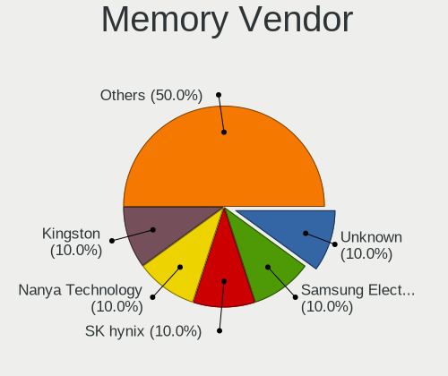

| Vendor              | Desktops | Percent |
|---------------------|----------|---------|
| Unknown             | 1        | 10%     |
| SK hynix            | 1        | 10%     |
| Samsung Electronics | 1        | 10%     |
| Nanya Technology    | 1        | 10%     |
| Kingston            | 1        | 10%     |
| Hewlett-Packard     | 1        | 10%     |
| G.Skill             | 1        | 10%     |
| Crucial             | 1        | 10%     |
| Corsair             | 1        | 10%     |
| A-DATA Technology   | 1        | 10%     |

Memory Model
------------

Memory module models

| Model                                                             | Desktops | Percent |
|-------------------------------------------------------------------|----------|---------|
| Unknown RAM Module 4096MB DIMM DDR3 1400MT/s                      | 1        | 8.33%   |
| SK hynix RAM HKNNNFBMAVAR-NEH 2048MB Row Of Chips LPDDR4 3200MT/s | 1        | 8.33%   |
| Samsung RAM M378B5273CH0-CK0 4GB DIMM DDR3 2000MT/s               | 1        | 8.33%   |
| Samsung RAM M378B5173DB0-CK0 4GB DIMM DDR3 1600MT/s               | 1        | 8.33%   |
| Nanya RAM NT2GT64U8HD0BY-AD 2GB DIMM DDR2 2048MT/s                | 1        | 8.33%   |
| Kingston RAM KHX1600C9D3/4GX 4GB DIMM DDR3 2400MT/s               | 1        | 8.33%   |
| HP RAM 7EH65AA# 16384MB DIMM DDR4 2666MT/s                        | 1        | 8.33%   |
| G.Skill RAM F3-14900CL9-4GBSR 4GB DIMM DDR3 1867MT/s              | 1        | 8.33%   |
| G.Skill RAM F3-12800CL9-4GBSR 4096MB DIMM DDR3 1600MT/s           | 1        | 8.33%   |
| Crucial RAM CT8G4DFD8213.C16FBR2 8GB DIMM DDR4 2133MT/s           | 1        | 8.33%   |
| Corsair RAM CMK16GX4M2A2666C16 8GB DIMM DDR4 3400MT/s             | 1        | 8.33%   |
| A-DATA RAM DDR4 3000 8GB DIMM DDR4 3000MT/s                       | 1        | 8.33%   |

Memory Kind
-----------

Memory module kinds

| Kind   | Desktops | Percent |
|--------|----------|---------|
| DDR4   | 4        | 44.44%  |
| DDR3   | 3        | 33.33%  |
| SDRAM  | 1        | 11.11%  |
| LPDDR4 | 1        | 11.11%  |

Memory Form Factor
------------------

Physical design of the memory module

| Name         | Desktops | Percent |
|--------------|----------|---------|
| DIMM         | 8        | 88.89%  |
| Row Of Chips | 1        | 11.11%  |

Memory Size
-----------

Memory module size

| Size  | Desktops | Percent |
|-------|----------|---------|
| 4096  | 3        | 33.33%  |
| 16384 | 2        | 22.22%  |
| 8192  | 2        | 22.22%  |
| 2048  | 2        | 22.22%  |

Memory Speed
------------

Memory module speed

| Speed | Desktops | Percent |
|-------|----------|---------|
| 1600  | 2        | 16.67%  |
| 3400  | 1        | 8.33%   |
| 3200  | 1        | 8.33%   |
| 3000  | 1        | 8.33%   |
| 2666  | 1        | 8.33%   |
| 2400  | 1        | 8.33%   |
| 2133  | 1        | 8.33%   |
| 2048  | 1        | 8.33%   |
| 2000  | 1        | 8.33%   |
| 1867  | 1        | 8.33%   |
| 1400  | 1        | 8.33%   |

Printers & scanners
-------------------

Printer Vendor
--------------

Printer device vendors

| Vendor             | Desktops | Percent |
|--------------------|----------|---------|
| Brother Industries | 2        | 40%     |
| Star Micronics     | 1        | 20%     |
| Hewlett-Packard    | 1        | 20%     |
| Canon              | 1        | 20%     |

Printer Model
-------------

Printer device models

| Model                             | Desktops | Percent |
|-----------------------------------|----------|---------|
| Star Micronics TUP592 (STR_T-001) | 1        | 20%     |
| HP ENVY 5000 series               | 1        | 20%     |
| Canon PIXMA MX490 Series          | 1        | 20%     |
| Brother MFC-L8900CDW series       | 1        | 20%     |
| Brother HL-5370DW series          | 1        | 20%     |

Scanner Vendor
--------------

Scanner device vendors

| Vendor | Desktops | Percent |
|--------|----------|---------|
| Canon  | 1        | 100%    |

Scanner Model
-------------

Scanner device models

| Model                  | Desktops | Percent |
|------------------------|----------|---------|
| Canon CanoScan LIDE 25 | 1        | 100%    |

Camera
------

Camera Vendor
-------------

Camera device vendors

| Vendor                   | Desktops | Percent |
|--------------------------|----------|---------|
| Microsoft                | 2        | 20%     |
| Logitech                 | 2        | 20%     |
| Z-Star Microelectronics  | 1        | 10%     |
| Novatek Microelectronics | 1        | 10%     |
| Huawei Technologies      | 1        | 10%     |
| Generalplus Technology   | 1        | 10%     |
| Cubeternet               | 1        | 10%     |
| ARC International        | 1        | 10%     |

Camera Model
------------

Camera device models

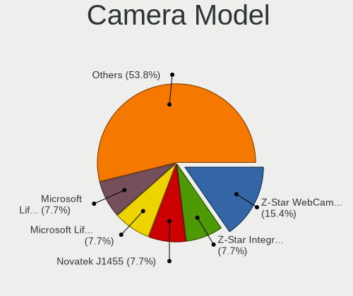

| Model                                    | Desktops | Percent |
|------------------------------------------|----------|---------|
| Z-Star Integrated Camera                 | 1        | 10%     |
| Novatek J1455                            | 1        | 10%     |
| Microsoft LifeCam VX-5000                | 1        | 10%     |
| Microsoft LifeCam VX-500 [1357]          | 1        | 10%     |
| Logitech Webcam C270                     | 1        | 10%     |
| Logitech QuickCam Communicate MP/S5500   | 1        | 10%     |
| Huawei UVC Camera                        | 1        | 10%     |
| Generalplus 808 Camera #9 (web-cam mode) | 1        | 10%     |
| Cubeternet GL-UPC822 UVC WebCam          | 1        | 10%     |
| ARC International Camera                 | 1        | 10%     |

Security
--------

Fingerprint Vendor
------------------

Fingerprint sensor vendors

Zero info for selected period =(

Fingerprint Model
-----------------

Fingerprint sensor models

Zero info for selected period =(

Chipcard Vendor
---------------

Chipcard module vendors

| Vendor            | Desktops | Percent |
|-------------------|----------|---------|
| Mako Technologies | 1        | 50%     |
| BIT4ID            | 1        | 50%     |

Chipcard Model
--------------

Chipcard module models

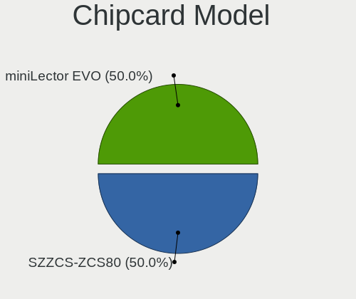

| Model                         | Desktops | Percent |
|-------------------------------|----------|---------|
| Mako Technologies SZZCS-ZCS80 | 1        | 50%     |
| BIT4ID miniLector EVO         | 1        | 50%     |

Unsupported
-----------

Unsupported Devices
-------------------

Total unsupported devices on board

| Total | Desktops | Percent |
|-------|----------|---------|
| 0     | 31       | 81.58%  |
| 1     | 6        | 15.79%  |
| 2     | 1        | 2.63%   |

Unsupported Device Types
------------------------

Types of unsupported devices

| Type          | Desktops | Percent |
|---------------|----------|---------|
| Graphics card | 3        | 37.5%   |
| Net/wireless  | 2        | 25%     |
| Sound         | 1        | 12.5%   |
| Chipcard      | 1        | 12.5%   |
| Bluetooth     | 1        | 12.5%   |

