Feren OS - Tested Hardware & Statistics (Notebooks)
---------------------------------------------------

A project to collect tested hardware configurations for Feren OS.

Anyone can contribute to this report by the [hw-probe](https://github.com/linuxhw/hw-probe) tool:

    sudo -E hw-probe -all -upload

Please contribute! Especially if your hardware is rare.

Contents
--------

* [ Test Cases ](#test-cases)

* [ System ](#system)
  - [ OS                       ](#os)
  - [ OS Family                ](#os-family)
  - [ Kernel                   ](#kernel)
  - [ Kernel Family            ](#kernel-family)
  - [ Kernel Major Ver.        ](#kernel-major-ver)
  - [ Arch                     ](#arch)
  - [ DE                       ](#de)
  - [ Display Server           ](#display-server)
  - [ Display Manager          ](#display-manager)
  - [ OS Lang                  ](#os-lang)
  - [ Boot Mode                ](#boot-mode)
  - [ Filesystem               ](#filesystem)
  - [ Part. scheme             ](#part-scheme)
  - [ Dual Boot with Linux/BSD ](#dual-boot-with-linuxbsd)
  - [ Dual Boot (Win)          ](#dual-boot-win)

* [ Board ](#board)
  - [ Vendor                   ](#vendor)
  - [ Model                    ](#model)
  - [ Model Family             ](#model-family)
  - [ MFG Year                 ](#mfg-year)
  - [ Form Factor              ](#form-factor)
  - [ Secure Boot              ](#secure-boot)
  - [ Coreboot                 ](#coreboot)
  - [ RAM Size                 ](#ram-size)
  - [ RAM Used                 ](#ram-used)
  - [ Total Drives             ](#total-drives)
  - [ Has CD-ROM               ](#has-cd-rom)
  - [ Has Ethernet             ](#has-ethernet)
  - [ Has WiFi                 ](#has-wifi)
  - [ Has Bluetooth            ](#has-bluetooth)

* [ Location ](#location)
  - [ Country                  ](#country)
  - [ City                     ](#city)

* [ Drives ](#drives)
  - [ Drive Vendor             ](#drive-vendor)
  - [ Drive Model              ](#drive-model)
  - [ HDD Vendor               ](#hdd-vendor)
  - [ SSD Vendor               ](#ssd-vendor)
  - [ Drive Kind               ](#drive-kind)
  - [ Drive Connector          ](#drive-connector)
  - [ Drive Size               ](#drive-size)
  - [ Space Total              ](#space-total)
  - [ Space Used               ](#space-used)
  - [ Malfunc. Drives          ](#malfunc-drives)
  - [ Malfunc. Drive Vendor    ](#malfunc-drive-vendor)
  - [ Malfunc. HDD Vendor      ](#malfunc-hdd-vendor)
  - [ Malfunc. Drive Kind      ](#malfunc-drive-kind)
  - [ Failed Drives            ](#failed-drives)
  - [ Failed Drive Vendor      ](#failed-drive-vendor)
  - [ Drive Status             ](#drive-status)

* [ Storage controller ](#storage-controller)
  - [ Storage Vendor           ](#storage-vendor)
  - [ Storage Model            ](#storage-model)
  - [ Storage Kind             ](#storage-kind)

* [ Processor ](#processor)
  - [ CPU Vendor               ](#cpu-vendor)
  - [ CPU Model                ](#cpu-model)
  - [ CPU Model Family         ](#cpu-model-family)
  - [ CPU Cores                ](#cpu-cores)
  - [ CPU Sockets              ](#cpu-sockets)
  - [ CPU Threads              ](#cpu-threads)
  - [ CPU Op-Modes             ](#cpu-op-modes)
  - [ CPU Microcode            ](#cpu-microcode)
  - [ CPU Microarch            ](#cpu-microarch)

* [ Graphics ](#graphics)
  - [ GPU Vendor               ](#gpu-vendor)
  - [ GPU Model                ](#gpu-model)
  - [ GPU Combo                ](#gpu-combo)
  - [ GPU Driver               ](#gpu-driver)
  - [ GPU Memory               ](#gpu-memory)

* [ Monitor ](#monitor)
  - [ Monitor Vendor           ](#monitor-vendor)
  - [ Monitor Model            ](#monitor-model)
  - [ Monitor Resolution       ](#monitor-resolution)
  - [ Monitor Diagonal         ](#monitor-diagonal)
  - [ Monitor Width            ](#monitor-width)
  - [ Aspect Ratio             ](#aspect-ratio)
  - [ Monitor Area             ](#monitor-area)
  - [ Pixel Density            ](#pixel-density)
  - [ Multiple Monitors        ](#multiple-monitors)

* [ Network ](#network)
  - [ Net Controller Vendor    ](#net-controller-vendor)
  - [ Net Controller Model     ](#net-controller-model)
  - [ Wireless Vendor          ](#wireless-vendor)
  - [ Wireless Model           ](#wireless-model)
  - [ Ethernet Vendor          ](#ethernet-vendor)
  - [ Ethernet Model           ](#ethernet-model)
  - [ Net Controller Kind      ](#net-controller-kind)
  - [ Used Controller          ](#used-controller)
  - [ NICs                     ](#nics)
  - [ IPv6                     ](#ipv6)

* [ Bluetooth ](#bluetooth)
  - [ Bluetooth Vendor         ](#bluetooth-vendor)
  - [ Bluetooth Model          ](#bluetooth-model)

* [ Sound ](#sound)
  - [ Sound Vendor             ](#sound-vendor)
  - [ Sound Model              ](#sound-model)

* [ Memory ](#memory)
  - [ Memory Vendor            ](#memory-vendor)
  - [ Memory Model             ](#memory-model)
  - [ Memory Kind              ](#memory-kind)
  - [ Memory Form Factor       ](#memory-form-factor)
  - [ Memory Size              ](#memory-size)
  - [ Memory Speed             ](#memory-speed)

* [ Printers & scanners ](#printers--scanners)
  - [ Printer Vendor           ](#printer-vendor)
  - [ Printer Model            ](#printer-model)
  - [ Scanner Vendor           ](#scanner-vendor)
  - [ Scanner Model            ](#scanner-model)

* [ Camera ](#camera)
  - [ Camera Vendor            ](#camera-vendor)
  - [ Camera Model             ](#camera-model)

* [ Security ](#security)
  - [ Fingerprint Vendor       ](#fingerprint-vendor)
  - [ Fingerprint Model        ](#fingerprint-model)
  - [ Chipcard Vendor          ](#chipcard-vendor)
  - [ Chipcard Model           ](#chipcard-model)

* [ Unsupported ](#unsupported)
  - [ Unsupported Devices      ](#unsupported-devices)
  - [ Unsupported Device Types ](#unsupported-device-types)

Test Cases
----------

Total: 53

| Vendor    | Model                       | Probe                                                      | Date         |
|-----------|-----------------------------|------------------------------------------------------------|--------------|
| MSI       | GS66 Stealth 10SE           | [fbdc7a2279](https://linux-hardware.org/?probe=fbdc7a2279) | Jun 17, 2022 |
| Dell      | Latitude E5570              | [f132300275](https://linux-hardware.org/?probe=f132300275) | Feb 23, 2022 |
| ASUSTek   | S400CA                      | [3d2d24d90e](https://linux-hardware.org/?probe=3d2d24d90e) | Jan 15, 2022 |
| ASUSTek   | ROG Zephyrus M16 GU603HE... | [a53f185048](https://linux-hardware.org/?probe=a53f185048) | Dec 22, 2021 |
| ASUSTek   | ROG Zephyrus M16 GU603HE... | [21ea8cfa3b](https://linux-hardware.org/?probe=21ea8cfa3b) | Dec 16, 2021 |
| ASUSTek   | ROG Zephyrus M16 GU603HE... | [cd47b9ae21](https://linux-hardware.org/?probe=cd47b9ae21) | Dec 05, 2021 |
| ASUSTek   | P552LJ                      | [6dbe422798](https://linux-hardware.org/?probe=6dbe422798) | Nov 29, 2021 |
| MSI       | GP72 7RDX                   | [502ad3be8e](https://linux-hardware.org/?probe=502ad3be8e) | Nov 29, 2021 |
| MSI       | GE66 Raider 11UG            | [fe677aa4e9](https://linux-hardware.org/?probe=fe677aa4e9) | Nov 20, 2021 |
| ASUSTek   | ROG Zephyrus M16 GU603HE... | [6d92264040](https://linux-hardware.org/?probe=6d92264040) | Nov 14, 2021 |
| ASUSTek   | ROG Zephyrus M16 GU603HE... | [b3836e81d2](https://linux-hardware.org/?probe=b3836e81d2) | Nov 13, 2021 |
| MSI       | Traveller 1591              | [46430a6e00](https://linux-hardware.org/?probe=46430a6e00) | Oct 04, 2021 |
| Dell      | Latitude E5430 vPro         | [8c45da134f](https://linux-hardware.org/?probe=8c45da134f) | Aug 01, 2021 |
| Lenovo    | ThinkPad X230 2325AT6       | [f0a5e0cbb6](https://linux-hardware.org/?probe=f0a5e0cbb6) | Jun 13, 2021 |
| ASUSTek   | VivoBook_ASUS Laptop E21... | [676f8cfa11](https://linux-hardware.org/?probe=676f8cfa11) | Jun 12, 2021 |
| Unknown   | Unknown                     | [16d75c0003](https://linux-hardware.org/?probe=16d75c0003) | Jun 11, 2021 |
| Lenovo    | ThinkPad X230 2325AT6       | [049671564e](https://linux-hardware.org/?probe=049671564e) | May 27, 2021 |
| Lenovo    | ThinkPad X230 2325AT6       | [cb5051e015](https://linux-hardware.org/?probe=cb5051e015) | May 27, 2021 |
| Lenovo    | XiaoXin Air 12 80UN         | [210f81171b](https://linux-hardware.org/?probe=210f81171b) | May 08, 2021 |
| HP        | Pavilion Gaming Laptop 1... | [6654328a0f](https://linux-hardware.org/?probe=6654328a0f) | May 05, 2021 |
| Lenovo    | Legion Y7000P 81LD          | [e3b22a36fb](https://linux-hardware.org/?probe=e3b22a36fb) | Apr 22, 2021 |
| Lenovo    | Legion Y7000P 81LD          | [f5715022b7](https://linux-hardware.org/?probe=f5715022b7) | Apr 22, 2021 |
| Sony      | VPCEE4J1E                   | [d919affcfd](https://linux-hardware.org/?probe=d919affcfd) | Jan 14, 2021 |
| Lenovo    | XiaoXin Air 12 80UN         | [7339b28f1b](https://linux-hardware.org/?probe=7339b28f1b) | Dec 26, 2020 |
| Lenovo    | XiaoXin Air 12 80UN         | [06c54d29ce](https://linux-hardware.org/?probe=06c54d29ce) | Dec 26, 2020 |
| Acer      | NG-VX5-591G-52AT            | [304a828df3](https://linux-hardware.org/?probe=304a828df3) | Nov 20, 2020 |
| HP        | ProBook 6560b               | [1e12011c45](https://linux-hardware.org/?probe=1e12011c45) | Nov 05, 2020 |
| ASUSTek   | X541NA                      | [fa42a090b5](https://linux-hardware.org/?probe=fa42a090b5) | Nov 03, 2020 |
| Sony      | SVF15318SNB                 | [600b06bc21](https://linux-hardware.org/?probe=600b06bc21) | Oct 15, 2020 |
| Lenovo    | ThinkPad X230 2325AT6       | [fb75c1edd7](https://linux-hardware.org/?probe=fb75c1edd7) | Oct 05, 2020 |
| Lenovo    | G550 2958                   | [6c33f8ea14](https://linux-hardware.org/?probe=6c33f8ea14) | Sep 13, 2020 |
| Lenovo    | ThinkPad X230 2325AT6       | [59ed33b893](https://linux-hardware.org/?probe=59ed33b893) | Sep 06, 2020 |
| HUAWEI    | BOHK-WAX9X                  | [58c99091e7](https://linux-hardware.org/?probe=58c99091e7) | Aug 29, 2020 |
| Toshiba   | Satellite T135D             | [e59691cfe7](https://linux-hardware.org/?probe=e59691cfe7) | Aug 28, 2020 |
| ASUSTek   | X550CA                      | [7f2bf35eb8](https://linux-hardware.org/?probe=7f2bf35eb8) | Jun 30, 2020 |
| ASUSTek   | X550CA                      | [fe533b45dd](https://linux-hardware.org/?probe=fe533b45dd) | Jun 17, 2020 |
| ASUSTek   | X550CA                      | [e07d0dce49](https://linux-hardware.org/?probe=e07d0dce49) | Jun 17, 2020 |
| Lenovo    | ThinkPad X230 2325AT6       | [b7b58ba2d6](https://linux-hardware.org/?probe=b7b58ba2d6) | Jun 10, 2020 |
| HP        | EliteBook Folio 1040 G1     | [c7abaff76b](https://linux-hardware.org/?probe=c7abaff76b) | Jun 02, 2020 |
| Lenovo    | ThinkPad X230 2325AT6       | [f3c754042c](https://linux-hardware.org/?probe=f3c754042c) | May 16, 2020 |
| Lenovo    | ThinkPad X230 2325AT6       | [cfa1314238](https://linux-hardware.org/?probe=cfa1314238) | May 04, 2020 |
| Apple     | MacBookPro8,1               | [b2b19968b0](https://linux-hardware.org/?probe=b2b19968b0) | May 03, 2020 |
| Lenovo    | ThinkPad X240 20AMS72901    | [ad1e10654b](https://linux-hardware.org/?probe=ad1e10654b) | Apr 30, 2020 |
| Fujitsu   | LIFEBOOK E554               | [bb918daf7b](https://linux-hardware.org/?probe=bb918daf7b) | Mar 29, 2020 |
| Acer      | Aspire 5733Z                | [ebca80c932](https://linux-hardware.org/?probe=ebca80c932) | Jan 04, 2020 |
| Acer      | Aspire 5733Z                | [05ef4a2f12](https://linux-hardware.org/?probe=05ef4a2f12) | Jan 02, 2020 |
| Acer      | Aspire 5733Z                | [b1af19a6ad](https://linux-hardware.org/?probe=b1af19a6ad) | Jan 02, 2020 |
| Dell      | Inspiron 3421               | [17f334232d](https://linux-hardware.org/?probe=17f334232d) | Jan 01, 2020 |
| Panasonic | CF-J10YYBHR                 | [e00043a374](https://linux-hardware.org/?probe=e00043a374) | Sep 27, 2019 |
| Panasonic | CF-J10YYBHR                 | [0005e1a411](https://linux-hardware.org/?probe=0005e1a411) | Aug 21, 2019 |
| Exo       | CloudbookE15                | [9a16d4a087](https://linux-hardware.org/?probe=9a16d4a087) | Aug 19, 2019 |
| Lenovo    | G50-45 80E3                 | [440ce358c0](https://linux-hardware.org/?probe=440ce358c0) | May 04, 2019 |
| Lenovo    | G50-45 80E3                 | [fa158b6a96](https://linux-hardware.org/?probe=fa158b6a96) | Apr 16, 2019 |

System
------

OS
--

Installed operating systems

| Name           | Notebooks | Percent |
|----------------|-----------|---------|
| Feren OS 20.04 | 18        | 51.43%  |
| Feren OS 18.04 | 17        | 48.57%  |

OS Family
---------

OS without a version

| Name     | Notebooks | Percent |
|----------|-----------|---------|
| Feren OS | 34        | 100%    |

Kernel
------

Version of the Linux kernel

| Version               | Notebooks | Percent |
|-----------------------|-----------|---------|
| 5.11.0-37-generic     | 4         | 9.3%    |
| 5.8.0-55-generic      | 3         | 6.98%   |
| 5.3.0-51-generic      | 3         | 6.98%   |
| 5.8.0-50-generic      | 2         | 4.65%   |
| 5.4.0-52-generic      | 2         | 4.65%   |
| 5.4.0-42-generic      | 2         | 4.65%   |
| 5.3.0-53-generic      | 2         | 4.65%   |
| 5.0.0-37-generic      | 2         | 4.65%   |
| 5.8.0-53-generic      | 1         | 2.33%   |
| 5.8.0-48-generic      | 1         | 2.33%   |
| 5.8.0-36-generic      | 1         | 2.33%   |
| 5.4.0-58-generic      | 1         | 2.33%   |
| 5.4.0-54-generic      | 1         | 2.33%   |
| 5.4.0-51-generic      | 1         | 2.33%   |
| 5.4.0-48-generic      | 1         | 2.33%   |
| 5.4.0-47-generic      | 1         | 2.33%   |
| 5.4.0-45-generic      | 1         | 2.33%   |
| 5.3.0-59-generic      | 1         | 2.33%   |
| 5.3.0-42-generic      | 1         | 2.33%   |
| 5.15.6-051506-generic | 1         | 2.33%   |
| 5.13.0-40-generic     | 1         | 2.33%   |
| 5.13.0-30-generic     | 1         | 2.33%   |
| 5.13.0-22-generic     | 1         | 2.33%   |
| 5.13.0-21-generic     | 1         | 2.33%   |
| 5.11.0-40-generic     | 1         | 2.33%   |
| 5.11.0-16-generic     | 1         | 2.33%   |
| 5.0.0-29-generic      | 1         | 2.33%   |
| 5.0.0-25-generic      | 1         | 2.33%   |
| 4.15.0-58-generic     | 1         | 2.33%   |
| 4.15.0-48-generic     | 1         | 2.33%   |
| 4.15.0-47-generic     | 1         | 2.33%   |

Kernel Family
-------------

Linux kernel without a distro release

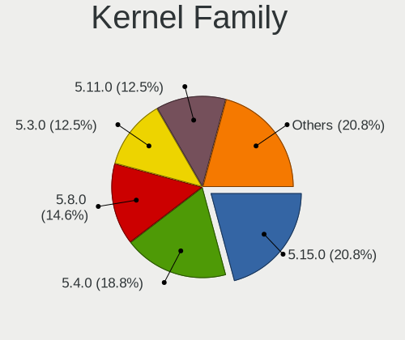

| Version | Notebooks | Percent |
|---------|-----------|---------|
| 5.4.0   | 9         | 24.32%  |
| 5.8.0   | 7         | 18.92%  |
| 5.3.0   | 6         | 16.22%  |
| 5.11.0  | 6         | 16.22%  |
| 5.13.0  | 3         | 8.11%   |
| 5.0.0   | 3         | 8.11%   |
| 4.15.0  | 2         | 5.41%   |
| 5.15.6  | 1         | 2.7%    |

Kernel Major Ver.
-----------------

Linux kernel major version

| Version | Notebooks | Percent |
|---------|-----------|---------|
| 5.4     | 9         | 24.32%  |
| 5.8     | 7         | 18.92%  |
| 5.3     | 6         | 16.22%  |
| 5.11    | 6         | 16.22%  |
| 5.13    | 3         | 8.11%   |
| 5.0     | 3         | 8.11%   |
| 4.15    | 2         | 5.41%   |
| 5.15    | 1         | 2.7%    |

Arch
----

OS architecture (x86_64, i586, etc.)

| Name   | Notebooks | Percent |
|--------|-----------|---------|
| x86_64 | 34        | 100%    |

DE
--

Desktop Environment

| Name       | Notebooks | Percent |
|------------|-----------|---------|
| KDE        | 20        | 55.56%  |
| KDE5       | 10        | 27.78%  |
| Unknown    | 4         | 11.11%  |
| X-Cinnamon | 1         | 2.78%   |
| GNOME      | 1         | 2.78%   |

Display Server
--------------

X11 or Wayland

| Name | Notebooks | Percent |
|------|-----------|---------|
| X11  | 34        | 100%    |

Display Manager
---------------

SDDM, LightDM, etc.

| Name    | Notebooks | Percent |
|---------|-----------|---------|
| Unknown | 27        | 79.41%  |
| LightDM | 6         | 17.65%  |
| TDM     | 1         | 2.94%   |

OS Lang
-------

Language

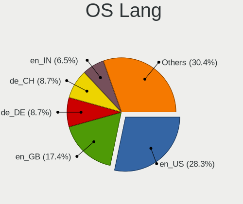

| Lang    | Notebooks | Percent |
|---------|-----------|---------|
| en_US   | 10        | 28.57%  |
| en_GB   | 6         | 17.14%  |
| en_IN   | 3         | 8.57%   |
| de_CH   | 3         | 8.57%   |
| Unknown | 3         | 8.57%   |
| de_DE   | 2         | 5.71%   |
| nl_BE   | 1         | 2.86%   |
| fi_FI   | 1         | 2.86%   |
| es_VE   | 1         | 2.86%   |
| es_UY   | 1         | 2.86%   |
| es_ES   | 1         | 2.86%   |
| es_CL   | 1         | 2.86%   |
| en_CA   | 1         | 2.86%   |
| de_AT   | 1         | 2.86%   |

Boot Mode
---------

EFI or BIOS

| Mode | Notebooks | Percent |
|------|-----------|---------|
| EFI  | 21        | 61.76%  |
| BIOS | 13        | 38.24%  |

Filesystem
----------

Type of filesystem

| Type    | Notebooks | Percent |
|---------|-----------|---------|
| Ext4    | 31        | 88.57%  |
| Unknown | 2         | 5.71%   |
| Overlay | 1         | 2.86%   |
| Btrfs   | 1         | 2.86%   |

Part. scheme
------------

Scheme of partitioning

| Type    | Notebooks | Percent |
|---------|-----------|---------|
| Unknown | 30        | 88.24%  |
| GPT     | 4         | 11.76%  |

Dual Boot with Linux/BSD
------------------------

Hosting more than one Linux/BSD

| Dual boot | Notebooks | Percent |
|-----------|-----------|---------|
| No        | 34        | 100%    |

Dual Boot (Win)
---------------

Hosting Linux and Windows

| Dual boot | Notebooks | Percent |
|-----------|-----------|---------|
| No        | 27        | 79.41%  |
| Yes       | 7         | 20.59%  |

Board
-----

Vendor
------

Motherboard manufacturer

| Name             | Notebooks | Percent |
|------------------|-----------|---------|
| ASUSTek Computer | 7         | 20.59%  |
| Lenovo           | 6         | 17.65%  |
| MSI              | 4         | 11.76%  |
| Hewlett-Packard  | 3         | 8.82%   |
| Dell             | 3         | 8.82%   |
| Sony             | 2         | 5.88%   |
| Acer             | 2         | 5.88%   |
| Toshiba          | 1         | 2.94%   |
| Panasonic        | 1         | 2.94%   |
| HUAWEI           | 1         | 2.94%   |
| Fujitsu          | 1         | 2.94%   |
| Exo              | 1         | 2.94%   |
| Apple            | 1         | 2.94%   |
| Unknown          | 1         | 2.94%   |

Model
-----

Motherboard model

| Name                                    | Notebooks | Percent |
|-----------------------------------------|-----------|---------|
| ASUS ROG Zephyrus M16 GU603HE_GU603HE   | 2         | 5.88%   |
| Toshiba Satellite T135D                 | 1         | 2.94%   |
| Sony VPCEE4J1E                          | 1         | 2.94%   |
| Sony SVF15318SNB                        | 1         | 2.94%   |
| Panasonic CF-J10YYBHR                   | 1         | 2.94%   |
| MSI Traveller 1591                      | 1         | 2.94%   |
| MSI GS66 Stealth 10SE                   | 1         | 2.94%   |
| MSI GP72 7RDX                           | 1         | 2.94%   |
| MSI GE66 Raider 11UG                    | 1         | 2.94%   |
| Lenovo XiaoXin Air 12 80UN              | 1         | 2.94%   |
| Lenovo ThinkPad X240 20AMS72901         | 1         | 2.94%   |
| Lenovo ThinkPad X230 2325AT6            | 1         | 2.94%   |
| Lenovo Legion Y7000P 81LD               | 1         | 2.94%   |
| Lenovo G550 2958                        | 1         | 2.94%   |
| Lenovo G50-45 80E3                      | 1         | 2.94%   |
| HUAWEI BOHK-WAX9X                       | 1         | 2.94%   |
| HP ProBook 6560b                        | 1         | 2.94%   |
| HP Pavilion Gaming Laptop 15-cx0xxx     | 1         | 2.94%   |
| HP EliteBook Folio 1040 G1              | 1         | 2.94%   |
| Fujitsu LIFEBOOK E554                   | 1         | 2.94%   |
| Exo CloudbookE15                        | 1         | 2.94%   |
| Dell Latitude E5570                     | 1         | 2.94%   |
| Dell Latitude E5430 vPro                | 1         | 2.94%   |
| Dell Inspiron 3421                      | 1         | 2.94%   |
| ASUS X550CA                             | 1         | 2.94%   |
| ASUS X541NA                             | 1         | 2.94%   |
| ASUS VivoBook_ASUS Laptop E210MA_E210MA | 1         | 2.94%   |
| ASUS S400CA                             | 1         | 2.94%   |
| ASUS P552LJ                             | 1         | 2.94%   |
| Apple MacBookPro8,1                     | 1         | 2.94%   |
| Acer NG-VX5-591G-52AT                   | 1         | 2.94%   |
| Acer Aspire 5733Z                       | 1         | 2.94%   |
| Unknown                                 | 1         | 2.94%   |

Model Family
------------

Motherboard model prefix

| Name                  | Notebooks | Percent |
|-----------------------|-----------|---------|
| Lenovo ThinkPad       | 2         | 5.88%   |
| Dell Latitude         | 2         | 5.88%   |
| ASUS ROG              | 2         | 5.88%   |
| Toshiba Satellite     | 1         | 2.94%   |
| Sony VPCEE4J1E        | 1         | 2.94%   |
| Sony SVF15318SNB      | 1         | 2.94%   |
| Panasonic CF-J10YYBHR | 1         | 2.94%   |
| MSI Traveller         | 1         | 2.94%   |
| MSI GS66              | 1         | 2.94%   |
| MSI GP72              | 1         | 2.94%   |
| MSI GE66              | 1         | 2.94%   |
| Lenovo XiaoXin        | 1         | 2.94%   |
| Lenovo Legion         | 1         | 2.94%   |
| Lenovo G550           | 1         | 2.94%   |
| Lenovo G50-45         | 1         | 2.94%   |
| HUAWEI BOHK-WAX9X     | 1         | 2.94%   |
| HP ProBook            | 1         | 2.94%   |
| HP Pavilion           | 1         | 2.94%   |
| HP EliteBook          | 1         | 2.94%   |
| Fujitsu LIFEBOOK      | 1         | 2.94%   |
| Exo CloudbookE15      | 1         | 2.94%   |
| Dell Inspiron         | 1         | 2.94%   |
| ASUS X550CA           | 1         | 2.94%   |
| ASUS X541NA           | 1         | 2.94%   |
| ASUS VivoBook         | 1         | 2.94%   |
| ASUS S400CA           | 1         | 2.94%   |
| ASUS P552LJ           | 1         | 2.94%   |
| Apple MacBookPro8     | 1         | 2.94%   |
| Acer NG-VX5-591G-52AT | 1         | 2.94%   |
| Acer Aspire           | 1         | 2.94%   |
| Unknown               | 1         | 2.94%   |

MFG Year
--------

Motherboard manufacture year

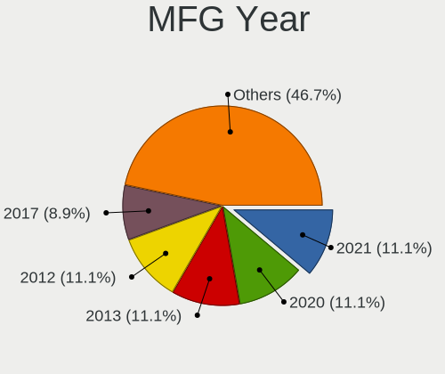

| Year | Notebooks | Percent |
|------|-----------|---------|
| 2012 | 5         | 14.71%  |
| 2016 | 4         | 11.76%  |
| 2011 | 4         | 11.76%  |
| 2021 | 3         | 8.82%   |
| 2020 | 3         | 8.82%   |
| 2019 | 3         | 8.82%   |
| 2017 | 3         | 8.82%   |
| 2018 | 2         | 5.88%   |
| 2014 | 2         | 5.88%   |
| 2013 | 2         | 5.88%   |
| 2009 | 2         | 5.88%   |
| 2008 | 1         | 2.94%   |

Form Factor
-----------

Physical design of the computer

| Name     | Notebooks | Percent |
|----------|-----------|---------|
| Notebook | 34        | 100%    |

Secure Boot
-----------

Enabled or disabled

| State    | Notebooks | Percent |
|----------|-----------|---------|
| Disabled | 30        | 85.71%  |
| Enabled  | 5         | 14.29%  |

Coreboot
--------

Have coreboot on board

| Used | Notebooks | Percent |
|------|-----------|---------|
| No   | 34        | 100%    |

RAM Size
--------

Total RAM memory

| Size in GB  | Notebooks | Percent |
|-------------|-----------|---------|
| 4.01-8.0    | 10        | 27.78%  |
| 3.01-4.0    | 9         | 25%     |
| 16.01-24.0  | 8         | 22.22%  |
| 8.01-16.0   | 6         | 16.67%  |
| 32.01-64.0  | 1         | 2.78%   |
| 64.01-256.0 | 1         | 2.78%   |
| 1.01-2.0    | 1         | 2.78%   |

RAM Used
--------

Used RAM memory

| Used GB  | Notebooks | Percent |
|----------|-----------|---------|
| 1.01-2.0 | 17        | 43.59%  |
| 2.01-3.0 | 12        | 30.77%  |
| 3.01-4.0 | 6         | 15.38%  |
| 4.01-8.0 | 3         | 7.69%   |
| 0.51-1.0 | 1         | 2.56%   |

Total Drives
------------

Number of drives on board

| Drives | Notebooks | Percent |
|--------|-----------|---------|
| 1      | 25        | 71.43%  |
| 2      | 9         | 25.71%  |
| 3      | 1         | 2.86%   |

Has CD-ROM
----------

Has CD-ROM on board

| Presented | Notebooks | Percent |
|-----------|-----------|---------|
| No        | 22        | 64.71%  |
| Yes       | 12        | 35.29%  |

Has Ethernet
------------

Has Ethernet on board

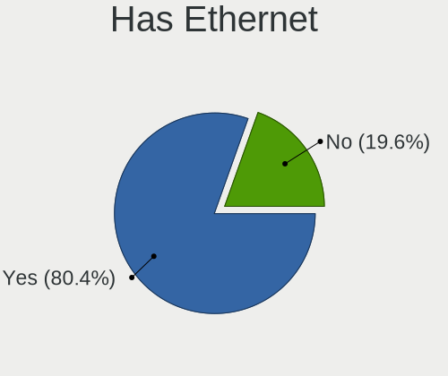

| Presented | Notebooks | Percent |
|-----------|-----------|---------|
| Yes       | 30        | 88.24%  |
| No        | 4         | 11.76%  |

Has WiFi
--------

Has WiFi module

| Presented | Notebooks | Percent |
|-----------|-----------|---------|
| Yes       | 33        | 97.06%  |
| No        | 1         | 2.94%   |

Has Bluetooth
-------------

Has Bluetooth module

| Presented | Notebooks | Percent |
|-----------|-----------|---------|
| Yes       | 25        | 71.43%  |
| No        | 10        | 28.57%  |

Location
--------

Country
-------

Geographic location (country)

| Country     | Notebooks | Percent |
|-------------|-----------|---------|
| USA         | 7         | 20.59%  |
| Switzerland | 3         | 8.82%   |
| India       | 3         | 8.82%   |
| Germany     | 3         | 8.82%   |
| UK          | 2         | 5.88%   |
| Turkey      | 2         | 5.88%   |
| Poland      | 2         | 5.88%   |
| Venezuela   | 1         | 2.94%   |
| Uruguay     | 1         | 2.94%   |
| UAE         | 1         | 2.94%   |
| Spain       | 1         | 2.94%   |
| Japan       | 1         | 2.94%   |
| Greece      | 1         | 2.94%   |
| Finland     | 1         | 2.94%   |
| Chile       | 1         | 2.94%   |
| Canada      | 1         | 2.94%   |
| Belgium     | 1         | 2.94%   |
| Australia   | 1         | 2.94%   |
| Argentina   | 1         | 2.94%   |

City
----

Geographic location (city)

| City               | Notebooks | Percent |
|--------------------|-----------|---------|
| Oberwil-Lieli      | 3         | 8.11%   |
| Istanbul           | 2         | 5.41%   |
| Escondido          | 2         | 5.41%   |
| Ypsilanti          | 1         | 2.7%    |
| Winterthur         | 1         | 2.7%    |
| Surat              | 1         | 2.7%    |
| Stuttgart          | 1         | 2.7%    |
| Santiago           | 1         | 2.7%    |
| Saitama            | 1         | 2.7%    |
| Plymouth           | 1         | 2.7%    |
| Phoenix            | 1         | 2.7%    |
| Montevideo         | 1         | 2.7%    |
| Moncton            | 1         | 2.7%    |
| Mieres             | 1         | 2.7%    |
| Maracay            | 1         | 2.7%    |
| Lafayette          | 1         | 2.7%    |
| Krakow             | 1         | 2.7%    |
| Kloten             | 1         | 2.7%    |
| Karlsruhe          | 1         | 2.7%    |
| Hyderabad          | 1         | 2.7%    |
| Hickory            | 1         | 2.7%    |
| Hämeenlinna       | 1         | 2.7%    |
| Gdynia             | 1         | 2.7%    |
| Gdansk             | 1         | 2.7%    |
| Ernakulam          | 1         | 2.7%    |
| Delmenhorst        | 1         | 2.7%    |
| Corpus Christi     | 1         | 2.7%    |
| Brisbane           | 1         | 2.7%    |
| Banda del Rio Sali | 1         | 2.7%    |
| Ballymena          | 1         | 2.7%    |
| Athens             | 1         | 2.7%    |
| Al Ain City        | 1         | 2.7%    |
| Aartselaar         | 1         | 2.7%    |

Drives
------

Drive Vendor
------------

Hard drive vendors

| Vendor                | Notebooks | Drives | Percent |
|-----------------------|-----------|--------|---------|
| Samsung Electronics   | 7         | 8      | 15.56%  |
| Unknown               | 4         | 5      | 8.89%   |
| SanDisk               | 4         | 4      | 8.89%   |
| Intel                 | 4         | 5      | 8.89%   |
| HGST                  | 4         | 4      | 8.89%   |
| Hitachi               | 3         | 3      | 6.67%   |
| Toshiba               | 2         | 4      | 4.44%   |
| Seagate               | 2         | 2      | 4.44%   |
| Phison                | 2         | 2      | 4.44%   |
| OCZ                   | 2         | 2      | 4.44%   |
| Kingston              | 2         | 2      | 4.44%   |
| A-DATA Technology     | 2         | 2      | 4.44%   |
| WDC                   | 1         | 1      | 2.22%   |
| SK hynix              | 1         | 2      | 2.22%   |
| Realtek Semiconductor | 1         | 1      | 2.22%   |
| PNY                   | 1         | 1      | 2.22%   |
| LITEON                | 1         | 1      | 2.22%   |
| Crucial               | 1         | 4      | 2.22%   |
| China                 | 1         | 1      | 2.22%   |

Drive Model
-----------

Hard drive models

| Model                                 | Notebooks | Percent |
|---------------------------------------|-----------|---------|
| Seagate ST500LT012-9WS142 500GB       | 2         | 4.35%   |
| Phison NVMe SSD Drive 1TB             | 2         | 4.35%   |
| Intel NVMe SSD Drive 512GB            | 2         | 4.35%   |
| HGST HTS721010A9E630 1TB              | 2         | 4.35%   |
| WDC WD2500BPVT-00JJ5T0 250GB          | 1         | 2.17%   |
| Unknown SB128  128GB                  | 1         | 2.17%   |
| Unknown SA04G  4GB                    | 1         | 2.17%   |
| Unknown MMC Card  32GB                | 1         | 2.17%   |
| Unknown MMC Card  128GB               | 1         | 2.17%   |
| Toshiba THNSNC128GNSJ 128GB SSD       | 1         | 2.17%   |
| Toshiba MQ01ABD100 1TB                | 1         | 2.17%   |
| SK hynix HFS128G32TND-N210A 128GB SSD | 1         | 2.17%   |
| SanDisk SSD U100 24GB                 | 1         | 2.17%   |
| SanDisk SD9SB8W256G1002 256GB SSD     | 1         | 2.17%   |
| SanDisk SD6SN1M-256G-1006 256GB SSD   | 1         | 2.17%   |
| SanDisk NVMe SSD Drive 256GB          | 1         | 2.17%   |
| Samsung SSD 860 EVO 250GB             | 1         | 2.17%   |
| Samsung NVMe SSD Drive 256GB          | 1         | 2.17%   |
| Samsung NVMe SSD Drive 1TB            | 1         | 2.17%   |
| Samsung NVMe SSD Drive 1024GB         | 1         | 2.17%   |
| Samsung MZVLW256HEHP-000H1 256GB      | 1         | 2.17%   |
| Samsung MZVLW128HEGR-00000 128GB      | 1         | 2.17%   |
| Samsung MZNTY128HDHP-000L2 128GB SSD  | 1         | 2.17%   |
| Realtek NVMe SSD Drive 512GB          | 1         | 2.17%   |
| PNY CS900 500GB SSD                   | 1         | 2.17%   |
| OCZ VERTEX2 90GB SSD                  | 1         | 2.17%   |
| OCZ AGILITY3 120GB SSD                | 1         | 2.17%   |
| LITEON IT LCS-128L9S-HP 128GB SSD     | 1         | 2.17%   |
| Kingston SV300S37A120G 120GB SSD      | 1         | 2.17%   |
| Kingston SA400S37240G 240GB SSD       | 1         | 2.17%   |
| Intel SSDSC2BF240A4L 240GB            | 1         | 2.17%   |
| Intel SSDPEKKW256G7 256GB             | 1         | 2.17%   |
| Hitachi HTS723232A7A364 320GB         | 1         | 2.17%   |
| Hitachi HTS547550A9E384 500GB         | 1         | 2.17%   |
| Hitachi HDS721050CLA362 500GB         | 1         | 2.17%   |
| HGST HTS541010A9E680 1TB              | 1         | 2.17%   |
| HGST HTS541010A7E630 1TB              | 1         | 2.17%   |
| Crucial CT250MX500SSD1 250GB          | 1         | 2.17%   |
| Crucial CT120M500SSD1 120GB           | 1         | 2.17%   |
| China SSD 256GB                       | 1         | 2.17%   |
| A-DATA SU800 512GB SSD                | 1         | 2.17%   |
| A-DATA SU630 240GB SSD                | 1         | 2.17%   |

HDD Vendor
----------

Hard disk drive vendors

| Vendor  | Notebooks | Drives | Percent |
|---------|-----------|--------|---------|
| HGST    | 4         | 4      | 36.36%  |
| Hitachi | 3         | 3      | 27.27%  |
| Seagate | 2         | 2      | 18.18%  |
| WDC     | 1         | 1      | 9.09%   |
| Toshiba | 1         | 2      | 9.09%   |

SSD Vendor
----------

Solid state drive vendors

| Vendor              | Notebooks | Drives | Percent |
|---------------------|-----------|--------|---------|
| SanDisk             | 3         | 3      | 16.67%  |
| Samsung Electronics | 2         | 3      | 11.11%  |
| OCZ                 | 2         | 2      | 11.11%  |
| Kingston            | 2         | 2      | 11.11%  |
| A-DATA Technology   | 2         | 2      | 11.11%  |
| Toshiba             | 1         | 2      | 5.56%   |
| SK hynix            | 1         | 2      | 5.56%   |
| PNY                 | 1         | 1      | 5.56%   |
| LITEON              | 1         | 1      | 5.56%   |
| Intel               | 1         | 1      | 5.56%   |
| Crucial             | 1         | 4      | 5.56%   |
| China               | 1         | 1      | 5.56%   |

Drive Kind
----------

HDD or SSD

| Kind | Notebooks | Drives | Percent |
|------|-----------|--------|---------|
| SSD  | 16        | 24     | 39.02%  |
| HDD  | 11        | 12     | 26.83%  |
| NVMe | 10        | 13     | 24.39%  |
| MMC  | 4         | 5      | 9.76%   |

Drive Connector
---------------

SATA, SAS, NVMe, etc.

| Type | Notebooks | Drives | Percent |
|------|-----------|--------|---------|
| SATA | 24        | 35     | 61.54%  |
| NVMe | 10        | 13     | 25.64%  |
| MMC  | 4         | 5      | 10.26%  |
| SAS  | 1         | 1      | 2.56%   |

Drive Size
----------

Size of hard drive

| Size in TB | Notebooks | Drives | Percent |
|------------|-----------|--------|---------|
| 0.01-0.5   | 20        | 29     | 76.92%  |
| 0.51-1.0   | 6         | 7      | 23.08%  |

Space Total
-----------

Amount of disk space available on the file system

| Size in GB | Notebooks | Percent |
|------------|-----------|---------|
| 101-250    | 13        | 35.14%  |
| 251-500    | 10        | 27.03%  |
| 501-1000   | 5         | 13.51%  |
| 51-100     | 4         | 10.81%  |
| 21-50      | 2         | 5.41%   |
| 1001-2000  | 2         | 5.41%   |
| 1-20       | 1         | 2.7%    |

Space Used
----------

Amount of used disk space

| Used GB | Notebooks | Percent |
|---------|-----------|---------|
| 21-50   | 15        | 40.54%  |
| 1-20    | 7         | 18.92%  |
| 51-100  | 7         | 18.92%  |
| 101-250 | 5         | 13.51%  |
| 251-500 | 3         | 8.11%   |

Malfunc. Drives
---------------

Drive models with a malfunction

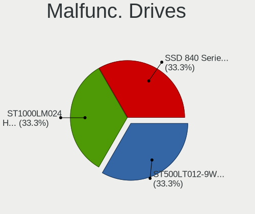

| Model                           | Notebooks | Drives | Percent |
|---------------------------------|-----------|--------|---------|
| Seagate ST500LT012-9WS142 500GB | 1         | 1      | 100%    |

Malfunc. Drive Vendor
---------------------

Vendors of faulty drives

| Vendor  | Notebooks | Drives | Percent |
|---------|-----------|--------|---------|
| Seagate | 1         | 1      | 100%    |

Malfunc. HDD Vendor
-------------------

Vendors of faulty HDD drives

| Vendor  | Notebooks | Drives | Percent |
|---------|-----------|--------|---------|
| Seagate | 1         | 1      | 100%    |

Malfunc. Drive Kind
-------------------

Kinds of faulty drives

| Kind | Notebooks | Drives | Percent |
|------|-----------|--------|---------|
| HDD  | 1         | 1      | 100%    |

Failed Drives
-------------

Failed drive models

Zero info for selected period =(

Failed Drive Vendor
-------------------

Failed drive vendors

Zero info for selected period =(

Drive Status
------------

Number of failed and malfunc. drives

| Status   | Notebooks | Drives | Percent |
|----------|-----------|--------|---------|
| Detected | 31        | 46     | 86.11%  |
| Works    | 4         | 7      | 11.11%  |
| Malfunc  | 1         | 1      | 2.78%   |

Storage controller
------------------

Storage Vendor
--------------

Storage controller vendors

| Vendor                | Notebooks | Percent |
|-----------------------|-----------|---------|
| Intel                 | 26        | 66.67%  |
| Samsung Electronics   | 5         | 12.82%  |
| AMD                   | 3         | 7.69%   |
| Phison Electronics    | 2         | 5.13%   |
| SanDisk               | 1         | 2.56%   |
| Realtek Semiconductor | 1         | 2.56%   |
| Nvidia                | 1         | 2.56%   |

Storage Model
-------------

Storage controller models

| Model                                                                          | Notebooks | Percent |
|--------------------------------------------------------------------------------|-----------|---------|
| Intel 7 Series Chipset Family 6-port SATA Controller [AHCI mode]               | 4         | 9.3%    |
| Intel 8 Series SATA Controller 1 [AHCI mode]                                   | 3         | 6.98%   |
| Intel 6 Series/C200 Series Chipset Family 6 port Mobile SATA AHCI Controller   | 3         | 6.98%   |
| Samsung NVMe SSD Controller SM961/PM961/SM963                                  | 2         | 4.65%   |
| Phison E12 NVMe Controller                                                     | 2         | 4.65%   |
| Intel Volume Management Device NVMe RAID Controller                            | 2         | 4.65%   |
| Intel Sunrise Point-LP SATA Controller [AHCI mode]                             | 2         | 4.65%   |
| Intel Non-Volatile memory controller                                           | 2         | 4.65%   |
| Intel HM170/QM170 Chipset SATA Controller [AHCI Mode]                          | 2         | 4.65%   |
| Intel Celeron/Pentium Silver Processor SATA Controller                         | 2         | 4.65%   |
| Intel 82801 Mobile SATA Controller [RAID mode]                                 | 2         | 4.65%   |
| AMD SB7x0/SB8x0/SB9x0 SATA Controller [AHCI mode]                              | 2         | 4.65%   |
| SanDisk WD Black SN750 / PC SN730 NVMe SSD                                     | 1         | 2.33%   |
| Samsung NVMe SSD Controller SM981/PM981/PM983                                  | 1         | 2.33%   |
| Samsung NVMe SSD Controller PM9A1/PM9A3/980PRO                                 | 1         | 2.33%   |
| Samsung NVMe SSD Controller 980                                                | 1         | 2.33%   |
| Realtek Realtek Non-Volatile memory controller                                 | 1         | 2.33%   |
| Nvidia nForce SATA Controller                                                  | 1         | 2.33%   |
| Intel Wildcat Point-LP SATA Controller [AHCI Mode]                             | 1         | 2.33%   |
| Intel SSD 600P Series                                                          | 1         | 2.33%   |
| Intel Celeron N3350/Pentium N4200/Atom E3900 Series SATA AHCI Controller       | 1         | 2.33%   |
| Intel Cannon Lake Mobile PCH SATA AHCI Controller                              | 1         | 2.33%   |
| Intel 82801IBM/IEM (ICH9M/ICH9M-E) 4 port SATA Controller [AHCI mode]          | 1         | 2.33%   |
| Intel 8 Series/C220 Series Chipset Family 6-port SATA Controller 1 [AHCI mode] | 1         | 2.33%   |
| Intel 5 Series/3400 Series Chipset 4 port SATA AHCI Controller                 | 1         | 2.33%   |
| AMD SB7x0/SB8x0/SB9x0 IDE Controller                                           | 1         | 2.33%   |
| AMD FCH SATA Controller [AHCI mode]                                            | 1         | 2.33%   |

Storage Kind
------------

Kind of storage controller (IDE, SATA, NVMe, SAS, ...)

| Kind | Notebooks | Percent |
|------|-----------|---------|
| SATA | 26        | 63.41%  |
| NVMe | 10        | 24.39%  |
| RAID | 4         | 9.76%   |
| IDE  | 1         | 2.44%   |

Processor
---------

CPU Vendor
----------

Processor vendors

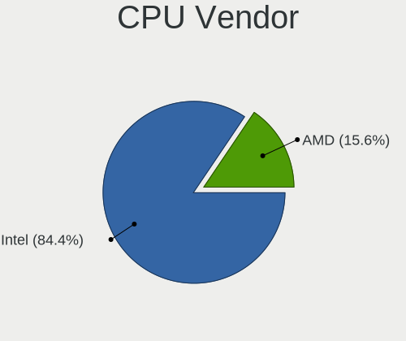

| Vendor | Notebooks | Percent |
|--------|-----------|---------|
| Intel  | 29        | 85.29%  |
| AMD    | 5         | 14.71%  |

CPU Model
---------

Processor models

| Model                                         | Notebooks | Percent |
|-----------------------------------------------|-----------|---------|
| Intel 11th Gen Core i7-11800H @ 2.30GHz       | 3         | 8.82%   |
| Intel Core i5-4300U CPU @ 1.90GHz             | 2         | 5.88%   |
| Intel Core i5-3320M CPU @ 2.60GHz             | 2         | 5.88%   |
| Intel Pentium CPU P6200 @ 2.13GHz             | 1         | 2.94%   |
| Intel Pentium CPU N4200 @ 1.10GHz             | 1         | 2.94%   |
| Intel Core m3-6Y30 CPU @ 0.90GHz              | 1         | 2.94%   |
| Intel Core i7-8550U CPU @ 1.80GHz             | 1         | 2.94%   |
| Intel Core i7-7700HQ CPU @ 2.80GHz            | 1         | 2.94%   |
| Intel Core i7-5500U CPU @ 2.40GHz             | 1         | 2.94%   |
| Intel Core i7-10875H CPU @ 2.30GHz            | 1         | 2.94%   |
| Intel Core i5-8300H CPU @ 2.30GHz             | 1         | 2.94%   |
| Intel Core i5-7300HQ CPU @ 2.50GHz            | 1         | 2.94%   |
| Intel Core i5-6300U CPU @ 2.40GHz             | 1         | 2.94%   |
| Intel Core i5-4210M CPU @ 2.60GHz             | 1         | 2.94%   |
| Intel Core i5-4200U CPU @ 1.60GHz             | 1         | 2.94%   |
| Intel Core i5-2520M CPU @ 2.50GHz             | 1         | 2.94%   |
| Intel Core i5-2450M CPU @ 2.50GHz             | 1         | 2.94%   |
| Intel Core i5-2435M CPU @ 2.40GHz             | 1         | 2.94%   |
| Intel Core i3-3217U CPU @ 1.80GHz             | 1         | 2.94%   |
| Intel Core i3-2375M CPU @ 1.50GHz             | 1         | 2.94%   |
| Intel Celeron N4020 CPU @ 1.10GHz             | 1         | 2.94%   |
| Intel Celeron J4125 CPU @ 2.00GHz             | 1         | 2.94%   |
| Intel Celeron Dual-Core CPU T3000 @ 1.80GHz   | 1         | 2.94%   |
| Intel Celeron CPU 1007U @ 1.50GHz             | 1         | 2.94%   |
| Intel Atom x5-Z8350 CPU @ 1.44GHz             | 1         | 2.94%   |
| AMD Turion Neo X2 Dual Core Processor L625    | 1         | 2.94%   |
| AMD Ryzen 5 3500U with Radeon Vega Mobile Gfx | 1         | 2.94%   |
| AMD Athlon X2 Dual-Core QL-60                 | 1         | 2.94%   |
| AMD Athlon II P360 Dual-Core Processor        | 1         | 2.94%   |
| AMD A6-6310 APU with AMD Radeon R4 Graphics   | 1         | 2.94%   |

CPU Model Family
----------------

Processor model prefix

| Model                   | Notebooks | Percent |
|-------------------------|-----------|---------|
| Intel Core i5           | 12        | 35.29%  |
| Intel Core i7           | 4         | 11.76%  |
| Other                   | 3         | 8.82%   |
| Intel Celeron           | 3         | 8.82%   |
| Intel Pentium           | 2         | 5.88%   |
| Intel Core i3           | 2         | 5.88%   |
| Intel Core m3           | 1         | 2.94%   |
| Intel Celeron Dual-Core | 1         | 2.94%   |
| Intel Atom              | 1         | 2.94%   |
| AMD Turion Neo X2       | 1         | 2.94%   |
| AMD Ryzen 5             | 1         | 2.94%   |
| AMD Athlon X2           | 1         | 2.94%   |
| AMD Athlon II           | 1         | 2.94%   |
| AMD A6                  | 1         | 2.94%   |

CPU Cores
---------

Number of processor cores

| Number | Notebooks | Percent |
|--------|-----------|---------|
| 2      | 21        | 61.76%  |
| 4      | 9         | 26.47%  |
| 8      | 4         | 11.76%  |

CPU Sockets
-----------

Number of sockets

| Number | Notebooks | Percent |
|--------|-----------|---------|
| 1      | 34        | 100%    |

CPU Threads
-----------

Threads per core (Hyper-Threading)

| Number | Notebooks | Percent |
|--------|-----------|---------|
| 2      | 22        | 64.71%  |
| 1      | 12        | 35.29%  |

CPU Op-Modes
------------

CPU Operation Modes (32-bit, 64-bit)

| Op mode        | Notebooks | Percent |
|----------------|-----------|---------|
| 32-bit, 64-bit | 32        | 94.12%  |
| Unknown        | 2         | 5.88%   |

CPU Microcode
-------------

Microcode number

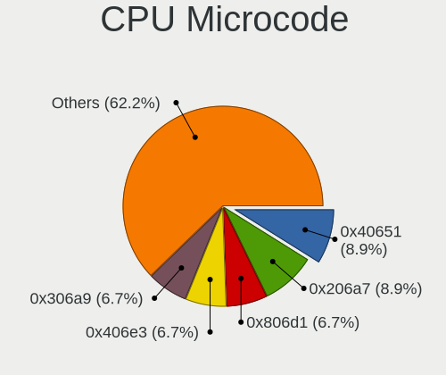

| Number     | Notebooks | Percent |
|------------|-----------|---------|
| 0x206a7    | 4         | 11.76%  |
| 0x806d1    | 3         | 8.82%   |
| 0x40651    | 3         | 8.82%   |
| 0x306a9    | 3         | 8.82%   |
| 0x906e9    | 2         | 5.88%   |
| 0x706a8    | 2         | 5.88%   |
| 0x406e3    | 2         | 5.88%   |
| Unknown    | 2         | 5.88%   |
| 0xa0652    | 1         | 2.94%   |
| 0x906ea    | 1         | 2.94%   |
| 0x806ea    | 1         | 2.94%   |
| 0x506c9    | 1         | 2.94%   |
| 0x406c4    | 1         | 2.94%   |
| 0x306d4    | 1         | 2.94%   |
| 0x306c3    | 1         | 2.94%   |
| 0x20655    | 1         | 2.94%   |
| 0x1067a    | 1         | 2.94%   |
| 0x08108109 | 1         | 2.94%   |
| 0x07030105 | 1         | 2.94%   |
| 0x02000032 | 1         | 2.94%   |
| 0x010000c8 | 1         | 2.94%   |

CPU Microarch
-------------

Microarchitecture

| Name            | Notebooks | Percent |
|-----------------|-----------|---------|
| SandyBridge     | 4         | 11.76%  |
| KabyLake        | 4         | 11.76%  |
| IvyBridge       | 4         | 11.76%  |
| Haswell         | 4         | 11.76%  |
| Icelake         | 3         | 8.82%   |
| Skylake         | 2         | 5.88%   |
| Goldmont plus   | 2         | 5.88%   |
| Zen+            | 1         | 2.94%   |
| Westmere        | 1         | 2.94%   |
| Silvermont      | 1         | 2.94%   |
| Puma            | 1         | 2.94%   |
| Penryn          | 1         | 2.94%   |
| K8 Hammer       | 1         | 2.94%   |
| K8 & K10 hybrid | 1         | 2.94%   |
| K10             | 1         | 2.94%   |
| Goldmont        | 1         | 2.94%   |
| CometLake       | 1         | 2.94%   |
| Broadwell       | 1         | 2.94%   |

Graphics
--------

GPU Vendor
----------

Vendors of graphics cards

| Vendor | Notebooks | Percent |
|--------|-----------|---------|
| Intel  | 28        | 63.64%  |
| Nvidia | 11        | 25%     |
| AMD    | 5         | 11.36%  |

GPU Model
---------

Graphics card models

| Model                                                                                    | Notebooks | Percent |
|------------------------------------------------------------------------------------------|-----------|---------|
| Intel 3rd Gen Core processor Graphics Controller                                         | 4         | 9.09%   |
| Intel 2nd Generation Core Processor Family Integrated Graphics Controller                | 4         | 9.09%   |
| Nvidia GP107M [GeForce GTX 1050 Mobile]                                                  | 3         | 6.82%   |
| Intel TigerLake-H GT1 [UHD Graphics]                                                     | 3         | 6.82%   |
| Intel Haswell-ULT Integrated Graphics Controller                                         | 3         | 6.82%   |
| Nvidia GA107M [GeForce RTX 3050 Ti Mobile]                                               | 2         | 4.55%   |
| Intel HD Graphics 630                                                                    | 2         | 4.55%   |
| Intel GeminiLake [UHD Graphics 600]                                                      | 2         | 4.55%   |
| Nvidia TU106M [GeForce RTX 2060 Mobile]                                                  | 1         | 2.27%   |
| Nvidia GP107M [GeForce GTX 1050 Ti Mobile]                                               | 1         | 2.27%   |
| Nvidia GK208M [GeForce GT 740M]                                                          | 1         | 2.27%   |
| Nvidia GK208BM [GeForce 920M]                                                            | 1         | 2.27%   |
| Nvidia GA104M [GeForce RTX 3070 Mobile / Max-Q]                                          | 1         | 2.27%   |
| Nvidia C77 [GeForce 9100M G]                                                             | 1         | 2.27%   |
| Intel UHD Graphics 620                                                                   | 1         | 2.27%   |
| Intel Skylake GT2 [HD Graphics 520]                                                      | 1         | 2.27%   |
| Intel Mobile 4 Series Chipset Integrated Graphics Controller                             | 1         | 2.27%   |
| Intel HD Graphics 5500                                                                   | 1         | 2.27%   |
| Intel HD Graphics 515                                                                    | 1         | 2.27%   |
| Intel Core Processor Integrated Graphics Controller                                      | 1         | 2.27%   |
| Intel CoffeeLake-H GT2 [UHD Graphics 630]                                                | 1         | 2.27%   |
| Intel Celeron N3350/Pentium N4200/Atom E3900 Series Integrated Graphics Controller       | 1         | 2.27%   |
| Intel Atom/Celeron/Pentium Processor x5-E8000/J3xxx/N3xxx Integrated Graphics Controller | 1         | 2.27%   |
| Intel 4th Gen Core Processor Integrated Graphics Controller                              | 1         | 2.27%   |
| AMD Topaz XT [Radeon R7 M260/M265 / M340/M360 / M440/M445 / 530/535 / 620/625 Mobile]    | 1         | 2.27%   |
| AMD RS880M [Mobility Radeon HD 4225/4250]                                                | 1         | 2.27%   |
| AMD RS780M [Mobility Radeon HD 3200]                                                     | 1         | 2.27%   |
| AMD Picasso/Raven 2 [Radeon Vega Series / Radeon Vega Mobile Series]                     | 1         | 2.27%   |
| AMD Mullins [Radeon R4/R5 Graphics]                                                      | 1         | 2.27%   |

GPU Combo
---------

Combinations of graphics cards

| Name           | Notebooks | Percent |
|----------------|-----------|---------|
| 1 x Intel      | 18        | 52.94%  |
| Intel + Nvidia | 9         | 26.47%  |
| 1 x AMD        | 4         | 11.76%  |
| 1 x Nvidia     | 2         | 5.88%   |
| Intel + AMD    | 1         | 2.94%   |

GPU Driver
----------

Free vs proprietary

| Driver      | Notebooks | Percent |
|-------------|-----------|---------|
| Free        | 29        | 85.29%  |
| Proprietary | 5         | 14.71%  |

GPU Memory
----------

Total video memory

| Size in GB | Notebooks | Percent |
|------------|-----------|---------|
| Unknown    | 21        | 60%     |
| 1.01-2.0   | 4         | 11.43%  |
| 3.01-4.0   | 3         | 8.57%   |
| 0.01-0.5   | 3         | 8.57%   |
| 0.51-1.0   | 2         | 5.71%   |
| 7.01-8.0   | 1         | 2.86%   |
| 5.01-6.0   | 1         | 2.86%   |

Monitor
-------

Monitor Vendor
--------------

Monitor vendors

| Vendor                  | Notebooks | Percent |
|-------------------------|-----------|---------|
| LG Display              | 10        | 27.78%  |
| AU Optronics            | 7         | 19.44%  |
| BOE                     | 6         | 16.67%  |
| Chimei Innolux          | 3         | 8.33%   |
| Sharp                   | 2         | 5.56%   |
| Toshiba                 | 1         | 2.78%   |
| Sony                    | 1         | 2.78%   |
| Samsung Electronics     | 1         | 2.78%   |
| Philips                 | 1         | 2.78%   |
| Panasonic               | 1         | 2.78%   |
| Chi Mei Optoelectronics | 1         | 2.78%   |
| Apple                   | 1         | 2.78%   |
| Acer                    | 1         | 2.78%   |

Monitor Model
-------------

Monitor models

| Model                                                                    | Notebooks | Percent |
|--------------------------------------------------------------------------|-----------|---------|
| AU Optronics LCD Monitor AUOC199 2560x1600 344x215mm 16.0-inch           | 2         | 5.41%   |
| Toshiba LCD Monitor LCD0905 1366x768 295x166mm 13.3-inch                 | 1         | 2.7%    |
| Sony AVAMP SNYF400 1920x1080 700x390mm 31.5-inch                         | 1         | 2.7%    |
| Sharp LQ156T1JW04 SHP153C 2560x1440 344x194mm 15.5-inch                  | 1         | 2.7%    |
| Sharp LQ156M1JW03 SHP14C5 1920x1080 344x194mm 15.5-inch                  | 1         | 2.7%    |
| Samsung Electronics LCD Monitor SEC5441 1366x768 344x194mm 15.5-inch     | 1         | 2.7%    |
| Philips 220EW PHL0861 1680x1050 434x270mm 20.1-inch                      | 1         | 2.7%    |
| Panasonic TV MEIC301 1920x1080 698x392mm 31.5-inch                       | 1         | 2.7%    |
| LG Display LCD Monitor LGD049B 1920x1080 344x194mm 15.5-inch             | 1         | 2.7%    |
| LG Display LCD Monitor LGD0468 1366x768 344x194mm 15.5-inch              | 1         | 2.7%    |
| LG Display LCD Monitor LGD044F 1920x1080 345x194mm 15.6-inch             | 1         | 2.7%    |
| LG Display LCD Monitor LGD040A 1920x1080 309x175mm 14.0-inch             | 1         | 2.7%    |
| LG Display LCD Monitor LGD03ED 1366x768 277x156mm 12.5-inch              | 1         | 2.7%    |
| LG Display LCD Monitor LGD039F 1366x768 345x194mm 15.6-inch              | 1         | 2.7%    |
| LG Display LCD Monitor LGD033F 1366x768 309x174mm 14.0-inch              | 1         | 2.7%    |
| LG Display LCD Monitor LGD02F1 1366x768 344x194mm 15.5-inch              | 1         | 2.7%    |
| LG Display LCD Monitor LGD02DC 1366x768 344x194mm 15.5-inch              | 1         | 2.7%    |
| LG Display LCD Monitor LGD02CA 1366x768 345x194mm 15.6-inch              | 1         | 2.7%    |
| Chimei Innolux LCD Monitor CMN1747 1920x1080 381x214mm 17.2-inch         | 1         | 2.7%    |
| Chimei Innolux LCD Monitor CMN15C9 1366x768 344x193mm 15.5-inch          | 1         | 2.7%    |
| Chimei Innolux LCD Monitor CMN1132 1366x768 256x144mm 11.6-inch          | 1         | 2.7%    |
| Chi Mei Optoelectronics LCD Monitor CMO1557 1366x768 344x193mm 15.5-inch | 1         | 2.7%    |
| BOE LCD Monitor BOE0872 1920x1080 344x194mm 15.5-inch                    | 1         | 2.7%    |
| BOE LCD Monitor BOE0854 1920x1080 344x194mm 15.5-inch                    | 1         | 2.7%    |
| BOE LCD Monitor BOE07A1 1920x1080 344x193mm 15.5-inch                    | 1         | 2.7%    |
| BOE LCD Monitor BOE06FB 1920x1080 344x194mm 15.5-inch                    | 1         | 2.7%    |
| BOE LCD Monitor BOE06A6 1366x768 309x174mm 14.0-inch                     | 1         | 2.7%    |
| BOE LCD Monitor BOE0582 1366x768 344x193mm 15.5-inch                     | 1         | 2.7%    |
| AU Optronics LCD Monitor AUO48EC 1366x768 344x193mm 15.5-inch            | 1         | 2.7%    |
| AU Optronics LCD Monitor AUO38ED 1920x1080 344x193mm 15.5-inch           | 1         | 2.7%    |
| AU Optronics LCD Monitor AUO303C 1366x768 309x173mm 13.9-inch            | 1         | 2.7%    |
| AU Optronics LCD Monitor AUO10EC 1366x768 344x193mm 15.5-inch            | 1         | 2.7%    |
| AU Optronics LCD Monitor AUO106C 1366x768 277x156mm 12.5-inch            | 1         | 2.7%    |
| Apple LCD Monitor APP9CC3 1280x800 286x179mm 13.3-inch                   | 1         | 2.7%    |
| Acer X223W ACR000D 1680x1050 474x296mm 22.0-inch                         | 1         | 2.7%    |
| Acer X223W ACR0009 1680x1050 473x296mm 22.0-inch                         | 1         | 2.7%    |

Monitor Resolution
------------------

Monitor screen resolution

| Resolution         | Notebooks | Percent |
|--------------------|-----------|---------|
| 1366x768 (WXGA)    | 18        | 51.43%  |
| 1920x1080 (FHD)    | 11        | 31.43%  |
| 2560x1600          | 2         | 5.71%   |
| 1680x1050 (WSXGA+) | 2         | 5.71%   |
| 2560x1440 (QHD)    | 1         | 2.86%   |
| 1280x800 (WXGA)    | 1         | 2.86%   |

Monitor Diagonal
----------------

Diagonal size in inches

| Inches | Notebooks | Percent |
|--------|-----------|---------|
| 15     | 20        | 57.14%  |
| 14     | 3         | 8.57%   |
| 13     | 3         | 8.57%   |
| 22     | 2         | 5.71%   |
| 16     | 2         | 5.71%   |
| 12     | 2         | 5.71%   |
| 31     | 1         | 2.86%   |
| 17     | 1         | 2.86%   |
| 11     | 1         | 2.86%   |

Monitor Width
-------------

Physical width

| Width in mm | Notebooks | Percent |
|-------------|-----------|---------|
| 301-350     | 25        | 71.43%  |
| 201-300     | 5         | 14.29%  |
| 401-500     | 2         | 5.71%   |
| 351-400     | 2         | 5.71%   |
| 601-700     | 1         | 2.86%   |

Aspect Ratio
------------

Proportional relationship between the width and the height

| Ratio | Notebooks | Percent |
|-------|-----------|---------|
| 16/9  | 29        | 85.29%  |
| 16/10 | 5         | 14.71%  |

Monitor Area
------------

Area in inch²

| Area in inch² | Notebooks | Percent |
|----------------|-----------|---------|
| 101-110        | 20        | 57.14%  |
| 81-90          | 5         | 14.29%  |
| 61-70          | 2         | 5.71%   |
| 201-250        | 2         | 5.71%   |
| 111-120        | 2         | 5.71%   |
| 71-80          | 1         | 2.86%   |
| 51-60          | 1         | 2.86%   |
| 351-500        | 1         | 2.86%   |
| 121-130        | 1         | 2.86%   |

Pixel Density
-------------

Pixels per inch

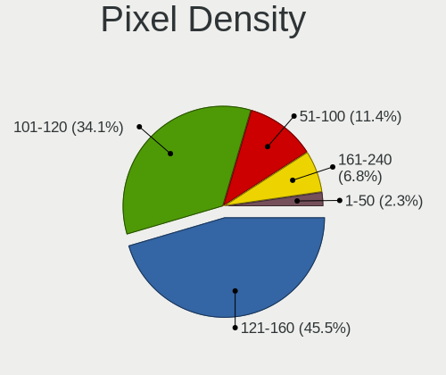

| Density | Notebooks | Percent |
|---------|-----------|---------|
| 121-160 | 13        | 38.24%  |
| 101-120 | 13        | 38.24%  |
| 51-100  | 5         | 14.71%  |
| 161-240 | 3         | 8.82%   |

Multiple Monitors
-----------------

Total monitors connected

| Total | Notebooks | Percent |
|-------|-----------|---------|
| 1     | 33        | 91.67%  |
| 2     | 2         | 5.56%   |
| 3     | 1         | 2.78%   |

Network
-------

Net Controller Vendor
---------------------

Controller vendors

| Vendor                | Notebooks | Percent |
|-----------------------|-----------|---------|
| Realtek Semiconductor | 20        | 37.04%  |
| Intel                 | 14        | 25.93%  |
| Qualcomm Atheros      | 7         | 12.96%  |
| Broadcom              | 5         | 9.26%   |
| Sierra Wireless       | 2         | 3.7%    |
| MediaTek              | 2         | 3.7%    |
| TP-Link               | 1         | 1.85%   |
| Ralink Technology     | 1         | 1.85%   |
| Ralink                | 1         | 1.85%   |
| Qualcomm              | 1         | 1.85%   |

Net Controller Model
--------------------

Controller models

| Model                                                                                         | Notebooks | Percent |
|-----------------------------------------------------------------------------------------------|-----------|---------|
| Realtek RTL8111/8168/8411 PCI Express Gigabit Ethernet Controller                             | 12        | 17.39%  |
| Qualcomm Atheros AR9485 Wireless Network Adapter                                              | 3         | 4.35%   |
| Intel Wireless 7260                                                                           | 3         | 4.35%   |
| Intel Centrino Advanced-N 6205 [Taylor Peak]                                                  | 3         | 4.35%   |
| Realtek RTL8822BE 802.11a/b/g/n/ac WiFi adapter                                               | 2         | 2.9%    |
| Realtek RTL810xE PCI Express Fast Ethernet controller                                         | 2         | 2.9%    |
| Realtek Realtek Ethernet controller                                                           | 2         | 2.9%    |
| MediaTek MT7921 802.11ax PCI Express Wireless Network Adapter                                 | 2         | 2.9%    |
| Intel Ethernet Connection I218-LM                                                             | 2         | 2.9%    |
| Intel 82579LM Gigabit Network Connection (Lewisville)                                         | 2         | 2.9%    |
| Broadcom BCM43142 802.11b/g/n                                                                 | 2         | 2.9%    |
| TP-Link AC600 wireless Realtek RTL8811AU [Archer T2U Nano]                                    | 1         | 1.45%   |
| Sierra Wireless EM7345 4G LTE                                                                 | 1         | 1.45%   |
| Sierra Wireless EM7305 Modem                                                                  | 1         | 1.45%   |
| Realtek RTL8822CE 802.11ac PCIe Wireless Network Adapter                                      | 1         | 1.45%   |
| Realtek RTL8821AE 802.11ac PCIe Wireless Network Adapter                                      | 1         | 1.45%   |
| Realtek RTL8723BU 802.11b/g/n WLAN Adapter                                                    | 1         | 1.45%   |
| Realtek RTL8723BE PCIe Wireless Network Adapter                                               | 1         | 1.45%   |
| Realtek RTL8191SEvB Wireless LAN Controller                                                   | 1         | 1.45%   |
| Realtek Realtek 8812AU/8821AU 802.11ac WLAN Adapter [USB Wireless Dual-Band Adapter 2.4/5Ghz] | 1         | 1.45%   |
| Realtek Killer E3000 2.5GbE Controller                                                        | 1         | 1.45%   |
| Ralink MT7601U Wireless Adapter                                                               | 1         | 1.45%   |
| Ralink RT2790 Wireless 802.11n 1T/2R PCIe                                                     | 1         | 1.45%   |
| Qualcomm Redmi 9T                                                                             | 1         | 1.45%   |
| Qualcomm Atheros QCA6174 802.11ac Wireless Network Adapter                                    | 1         | 1.45%   |
| Qualcomm Atheros QCA6164 802.11ac Wireless Network Adapter                                    | 1         | 1.45%   |
| Qualcomm Atheros Killer E2400 Gigabit Ethernet Controller                                     | 1         | 1.45%   |
| Qualcomm Atheros AR9285 Wireless Network Adapter (PCI-Express)                                | 1         | 1.45%   |
| Qualcomm Atheros AR8161 Gigabit Ethernet                                                      | 1         | 1.45%   |
| Intel Wireless 8265 / 8275                                                                    | 1         | 1.45%   |
| Intel Wireless 8260                                                                           | 1         | 1.45%   |
| Intel WiMAX Connection 2400m                                                                  | 1         | 1.45%   |
| Intel Wi-Fi 6 AX210/AX211/AX411 160MHz                                                        | 1         | 1.45%   |
| Intel PRO/Wireless 5100 AGN [Shiloh] Network Connection                                       | 1         | 1.45%   |
| Intel Ethernet controller                                                                     | 1         | 1.45%   |
| Intel Ethernet Connection I219-LM                                                             | 1         | 1.45%   |
| Intel Dual Band Wireless-AC 3168NGW [Stone Peak]                                              | 1         | 1.45%   |
| Intel Dual Band Wireless-AC 3165 Plus Bluetooth                                               | 1         | 1.45%   |
| Intel Comet Lake PCH CNVi WiFi                                                                | 1         | 1.45%   |
| Intel Centrino Advanced-N + WiMAX 6250 [Kilmer Peak]                                          | 1         | 1.45%   |
| Intel 82579V Gigabit Network Connection                                                       | 1         | 1.45%   |
| Broadcom NetXtreme BCM57765 Gigabit Ethernet PCIe                                             | 1         | 1.45%   |
| Broadcom NetLink BCM5906M Fast Ethernet PCI Express                                           | 1         | 1.45%   |
| Broadcom NetLink BCM57780 Gigabit Ethernet PCIe                                               | 1         | 1.45%   |
| Broadcom BCM4331 802.11a/b/g/n                                                                | 1         | 1.45%   |

Wireless Vendor
---------------

Wireless vendors

| Vendor                | Notebooks | Percent |
|-----------------------|-----------|---------|
| Intel                 | 14        | 36.84%  |
| Realtek Semiconductor | 8         | 21.05%  |
| Qualcomm Atheros      | 6         | 15.79%  |
| Broadcom              | 3         | 7.89%   |
| Sierra Wireless       | 2         | 5.26%   |
| MediaTek              | 2         | 5.26%   |
| TP-Link               | 1         | 2.63%   |
| Ralink Technology     | 1         | 2.63%   |
| Ralink                | 1         | 2.63%   |

Wireless Model
--------------

Wireless models

| Model                                                                                         | Notebooks | Percent |
|-----------------------------------------------------------------------------------------------|-----------|---------|
| Qualcomm Atheros AR9485 Wireless Network Adapter                                              | 3         | 7.89%   |
| Intel Wireless 7260                                                                           | 3         | 7.89%   |
| Intel Centrino Advanced-N 6205 [Taylor Peak]                                                  | 3         | 7.89%   |
| Realtek RTL8822BE 802.11a/b/g/n/ac WiFi adapter                                               | 2         | 5.26%   |
| MediaTek MT7921 802.11ax PCI Express Wireless Network Adapter                                 | 2         | 5.26%   |
| Broadcom BCM43142 802.11b/g/n                                                                 | 2         | 5.26%   |
| TP-Link AC600 wireless Realtek RTL8811AU [Archer T2U Nano]                                    | 1         | 2.63%   |
| Sierra Wireless EM7345 4G LTE                                                                 | 1         | 2.63%   |
| Sierra Wireless EM7305 Modem                                                                  | 1         | 2.63%   |
| Realtek RTL8822CE 802.11ac PCIe Wireless Network Adapter                                      | 1         | 2.63%   |
| Realtek RTL8821AE 802.11ac PCIe Wireless Network Adapter                                      | 1         | 2.63%   |
| Realtek RTL8723BU 802.11b/g/n WLAN Adapter                                                    | 1         | 2.63%   |
| Realtek RTL8723BE PCIe Wireless Network Adapter                                               | 1         | 2.63%   |
| Realtek RTL8191SEvB Wireless LAN Controller                                                   | 1         | 2.63%   |
| Realtek Realtek 8812AU/8821AU 802.11ac WLAN Adapter [USB Wireless Dual-Band Adapter 2.4/5Ghz] | 1         | 2.63%   |
| Ralink MT7601U Wireless Adapter                                                               | 1         | 2.63%   |
| Ralink RT2790 Wireless 802.11n 1T/2R PCIe                                                     | 1         | 2.63%   |
| Qualcomm Atheros QCA6174 802.11ac Wireless Network Adapter                                    | 1         | 2.63%   |
| Qualcomm Atheros QCA6164 802.11ac Wireless Network Adapter                                    | 1         | 2.63%   |
| Qualcomm Atheros AR9285 Wireless Network Adapter (PCI-Express)                                | 1         | 2.63%   |
| Intel Wireless 8265 / 8275                                                                    | 1         | 2.63%   |
| Intel Wireless 8260                                                                           | 1         | 2.63%   |
| Intel Wi-Fi 6 AX210/AX211/AX411 160MHz                                                        | 1         | 2.63%   |
| Intel PRO/Wireless 5100 AGN [Shiloh] Network Connection                                       | 1         | 2.63%   |
| Intel Dual Band Wireless-AC 3168NGW [Stone Peak]                                              | 1         | 2.63%   |
| Intel Dual Band Wireless-AC 3165 Plus Bluetooth                                               | 1         | 2.63%   |
| Intel Comet Lake PCH CNVi WiFi                                                                | 1         | 2.63%   |
| Intel Centrino Advanced-N + WiMAX 6250 [Kilmer Peak]                                          | 1         | 2.63%   |
| Broadcom BCM4331 802.11a/b/g/n                                                                | 1         | 2.63%   |

Ethernet Vendor
---------------

Ethernet vendors

| Vendor                | Notebooks | Percent |
|-----------------------|-----------|---------|
| Realtek Semiconductor | 17        | 54.84%  |
| Intel                 | 8         | 25.81%  |
| Broadcom              | 3         | 9.68%   |
| Qualcomm Atheros      | 2         | 6.45%   |
| Qualcomm              | 1         | 3.23%   |

Ethernet Model
--------------

Ethernet models

| Model                                                             | Notebooks | Percent |
|-------------------------------------------------------------------|-----------|---------|
| Realtek RTL8111/8168/8411 PCI Express Gigabit Ethernet Controller | 12        | 38.71%  |
| Realtek RTL810xE PCI Express Fast Ethernet controller             | 2         | 6.45%   |
| Realtek Realtek Ethernet controller                               | 2         | 6.45%   |
| Intel Ethernet Connection I218-LM                                 | 2         | 6.45%   |
| Intel 82579LM Gigabit Network Connection (Lewisville)             | 2         | 6.45%   |
| Realtek Killer E3000 2.5GbE Controller                            | 1         | 3.23%   |
| Qualcomm Redmi 9T                                                 | 1         | 3.23%   |
| Qualcomm Atheros Killer E2400 Gigabit Ethernet Controller         | 1         | 3.23%   |
| Qualcomm Atheros AR8161 Gigabit Ethernet                          | 1         | 3.23%   |
| Intel WiMAX Connection 2400m                                      | 1         | 3.23%   |
| Intel Ethernet controller                                         | 1         | 3.23%   |
| Intel Ethernet Connection I219-LM                                 | 1         | 3.23%   |
| Intel 82579V Gigabit Network Connection                           | 1         | 3.23%   |
| Broadcom NetXtreme BCM57765 Gigabit Ethernet PCIe                 | 1         | 3.23%   |
| Broadcom NetLink BCM5906M Fast Ethernet PCI Express               | 1         | 3.23%   |
| Broadcom NetLink BCM57780 Gigabit Ethernet PCIe                   | 1         | 3.23%   |

Net Controller Kind
-------------------

Ethernet, WiFi or modem

| Kind     | Notebooks | Percent |
|----------|-----------|---------|
| WiFi     | 33        | 52.38%  |
| Ethernet | 30        | 47.62%  |

Used Controller
---------------

Currently used network controller

| Kind     | Notebooks | Percent |
|----------|-----------|---------|
| WiFi     | 28        | 82.35%  |
| Ethernet | 6         | 17.65%  |

NICs
----

Total network controllers on board

| Total | Notebooks | Percent |
|-------|-----------|---------|
| 2     | 28        | 82.35%  |
| 1     | 5         | 14.71%  |
| 0     | 1         | 2.94%   |

IPv6
----

IPv6 vs IPv4

| Used | Notebooks | Percent |
|------|-----------|---------|
| No   | 28        | 80%     |
| Yes  | 7         | 20%     |

Bluetooth
---------

Bluetooth Vendor
----------------

Controller vendors

| Vendor                          | Notebooks | Percent |
|---------------------------------|-----------|---------|
| Intel                           | 9         | 34.62%  |
| Realtek Semiconductor           | 3         | 11.54%  |
| Cambridge Silicon Radio         | 3         | 11.54%  |
| Realtek                         | 2         | 7.69%   |
| IMC Networks                    | 2         | 7.69%   |
| Broadcom                        | 2         | 7.69%   |
| Qualcomm Atheros Communications | 1         | 3.85%   |
| Lite-On Technology              | 1         | 3.85%   |
| Hewlett-Packard                 | 1         | 3.85%   |
| Foxconn / Hon Hai               | 1         | 3.85%   |
| Apple                           | 1         | 3.85%   |

Bluetooth Model
---------------

Controller models

| Model                                               | Notebooks | Percent |
|-----------------------------------------------------|-----------|---------|
| Intel Bluetooth wireless interface                  | 6         | 23.08%  |
| Cambridge Silicon Radio Bluetooth Dongle (HCI mode) | 3         | 11.54%  |
| Realtek Bluetooth Radio                             | 2         | 7.69%   |
| IMC Networks Wireless_Device                        | 2         | 7.69%   |
| Realtek RTL8822BE Bluetooth 4.2 Adapter             | 1         | 3.85%   |
| Realtek  Bluetooth 4.2 Adapter                      | 1         | 3.85%   |
| Realtek Bluetooth Radio                             | 1         | 3.85%   |
| Qualcomm Atheros QCA61x4 Bluetooth 4.0              | 1         | 3.85%   |
| Lite-On Bluetooth Device                            | 1         | 3.85%   |
| Intel Wireless-AC 3168 Bluetooth                    | 1         | 3.85%   |
| Intel Bluetooth Device                              | 1         | 3.85%   |
| Intel AX210 Bluetooth                               | 1         | 3.85%   |
| HP Broadcom 2070 Bluetooth Combo                    | 1         | 3.85%   |
| Foxconn / Hon Hai BCM43142A0                        | 1         | 3.85%   |
| Broadcom BCM43142 Bluetooth 4.0                     | 1         | 3.85%   |
| Broadcom BCM20702 Bluetooth 4.0 [ThinkPad]          | 1         | 3.85%   |
| Apple Bluetooth Host Controller                     | 1         | 3.85%   |

Sound
-----

Sound Vendor
------------

Sound card vendors

| Vendor            | Notebooks | Percent |
|-------------------|-----------|---------|
| Intel             | 28        | 66.67%  |
| Nvidia            | 8         | 19.05%  |
| AMD               | 4         | 9.52%   |
| Texas Instruments | 1         | 2.38%   |
| Logitech          | 1         | 2.38%   |

Sound Model
-----------

Sound card models

| Model                                                                      | Notebooks | Percent |
|----------------------------------------------------------------------------|-----------|---------|
| Intel 7 Series/C216 Chipset Family High Definition Audio Controller        | 5         | 9.8%    |
| Intel Tiger Lake-H HD Audio Controller                                     | 3         | 5.88%   |
| Intel Sunrise Point-LP HD Audio                                            | 3         | 5.88%   |
| Intel Haswell-ULT HD Audio Controller                                      | 3         | 5.88%   |
| Intel 8 Series HD Audio Controller                                         | 3         | 5.88%   |
| Intel 6 Series/C200 Series Chipset Family High Definition Audio Controller | 3         | 5.88%   |
| Nvidia GP107GL High Definition Audio Controller                            | 2         | 3.92%   |
| Nvidia Audio device                                                        | 2         | 3.92%   |
| Intel CM238 HD Audio Controller                                            | 2         | 3.92%   |
| Intel Celeron/Pentium Silver Processor High Definition Audio               | 2         | 3.92%   |
| AMD SBx00 Azalia (Intel HDA)                                               | 2         | 3.92%   |
| Texas Instruments PCM2902 Audio Codec                                      | 1         | 1.96%   |
| Nvidia TU106 High Definition Audio Controller                              | 1         | 1.96%   |
| Nvidia MCP72XE/MCP72P/MCP78U/MCP78S High Definition Audio                  | 1         | 1.96%   |
| Nvidia GK208 HDMI/DP Audio Controller                                      | 1         | 1.96%   |
| Nvidia GA104 High Definition Audio Controller                              | 1         | 1.96%   |
| Logitech Headset H390                                                      | 1         | 1.96%   |
| Intel Xeon E3-1200 v3/4th Gen Core Processor HD Audio Controller           | 1         | 1.96%   |
| Intel Wildcat Point-LP High Definition Audio Controller                    | 1         | 1.96%   |
| Intel Comet Lake PCH cAVS                                                  | 1         | 1.96%   |
| Intel Celeron N3350/Pentium N4200/Atom E3900 Series Audio Cluster          | 1         | 1.96%   |
| Intel Cannon Lake PCH cAVS                                                 | 1         | 1.96%   |
| Intel Broadwell-U Audio Controller                                         | 1         | 1.96%   |
| Intel 82801I (ICH9 Family) HD Audio Controller                             | 1         | 1.96%   |
| Intel 8 Series/C220 Series Chipset High Definition Audio Controller        | 1         | 1.96%   |
| Intel 5 Series/3400 Series Chipset High Definition Audio                   | 1         | 1.96%   |
| AMD RS880 HDMI Audio [Radeon HD 4200 Series]                               | 1         | 1.96%   |
| AMD RS780 HDMI Audio [Radeon 3000/3100 / HD 3200/3300]                     | 1         | 1.96%   |
| AMD Raven/Raven2/Fenghuang HDMI/DP Audio Controller                        | 1         | 1.96%   |
| AMD Kabini HDMI/DP Audio                                                   | 1         | 1.96%   |
| AMD FCH Azalia Controller                                                  | 1         | 1.96%   |
| AMD Family 17h/19h HD Audio Controller                                     | 1         | 1.96%   |

Memory
------

Memory Vendor
-------------

Memory module vendors

| Vendor              | Notebooks | Percent |
|---------------------|-----------|---------|
| Micron Technology   | 4         | 30.77%  |
| Crucial             | 3         | 23.08%  |
| Samsung Electronics | 2         | 15.38%  |
| Unknown             | 1         | 7.69%   |
| SK hynix            | 1         | 7.69%   |
| Kingston            | 1         | 7.69%   |
| A-DATA Technology   | 1         | 7.69%   |

Memory Model
------------

Memory module models

| Model                                                      | Notebooks | Percent |
|------------------------------------------------------------|-----------|---------|
| Micron RAM 8ATF1G64HZ-3G2J1 8GB SODIMM DDR4 3200MT/s       | 2         | 13.33%  |
| Micron RAM 4ATF1G64HZ-3G2E1 8GB SODIMM DDR4 3200MT/s       | 2         | 13.33%  |
| Unknown RAM Module 4GB SODIMM DDR3 1600MT/s                | 1         | 6.67%   |
| SK hynix RAM HMT451S6BFR8A-PB 4096MB SODIMM DDR3 1600MT/s  | 1         | 6.67%   |
| Samsung RAM Module 2048MB SODIMM LPDDR3 1867MT/s           | 1         | 6.67%   |
| Samsung RAM M471A1K43CB1-CTD 8GB SODIMM DDR4 2667MT/s      | 1         | 6.67%   |
| Micron RAM 8JTF5126 4HZ1G6D 1 4096MB SODIMM DDR3 1600MT/s  | 1         | 6.67%   |
| Micron RAM 16KTF1G64HZ-1G6E1 8192MB SODIMM DDR3 1600MT/s   | 1         | 6.67%   |
| Kingston RAM MSI24D4S7D8MH-16 16384MB SODIMM DDR4 2400MT/s | 1         | 6.67%   |
| Crucial RAM Module 4096MB SODIMM DDR3 1600MT/s             | 1         | 6.67%   |
| Crucial RAM CT51264BF160BJ.C8F 4096MB SODIMM DDR3 1600MT/s | 1         | 6.67%   |
| Crucial RAM CT16G4SFD824A.C16FP 16GB SODIMM DDR4 2400MT/s  | 1         | 6.67%   |
| A-DATA RAM AM1U16BC4P2-B19H 4GB SODIMM DDR3 1600MT/s       | 1         | 6.67%   |

Memory Kind
-----------

Memory module kinds

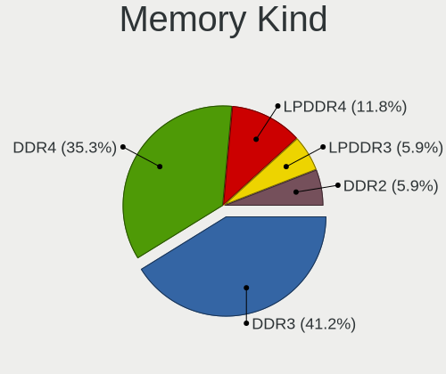

| Kind   | Notebooks | Percent |
|--------|-----------|---------|
| DDR4   | 5         | 50%     |
| DDR3   | 4         | 40%     |
| LPDDR3 | 1         | 10%     |

Memory Form Factor
------------------

Physical design of the memory module

| Name   | Notebooks | Percent |
|--------|-----------|---------|
| SODIMM | 10        | 100%    |

Memory Size
-----------

Memory module size

| Size  | Notebooks | Percent |
|-------|-----------|---------|
| 8192  | 4         | 36.36%  |
| 4096  | 4         | 36.36%  |
| 16384 | 2         | 18.18%  |
| 2048  | 1         | 9.09%   |

Memory Speed
------------

Memory module speed

| Speed | Notebooks | Percent |
|-------|-----------|---------|
| 1600  | 4         | 40%     |
| 3200  | 2         | 20%     |
| 2400  | 2         | 20%     |
| 2667  | 1         | 10%     |
| 1867  | 1         | 10%     |

Printers & scanners
-------------------

Printer Vendor
--------------

Printer device vendors

| Vendor          | Notebooks | Percent |
|-----------------|-----------|---------|
| Hewlett-Packard | 1         | 100%    |

Printer Model
-------------

Printer device models

| Model         | Notebooks | Percent |
|---------------|-----------|---------|
| HP Laser 107a | 1         | 100%    |

Scanner Vendor
--------------

Scanner device vendors

Zero info for selected period =(

Scanner Model
-------------

Scanner device models

Zero info for selected period =(

Camera
------

Camera Vendor
-------------

Camera device vendors

| Vendor                                 | Notebooks | Percent |
|----------------------------------------|-----------|---------|
| Chicony Electronics                    | 8         | 25.81%  |
| IMC Networks                           | 5         | 16.13%  |
| Acer                                   | 5         | 16.13%  |
| Realtek Semiconductor                  | 3         | 9.68%   |
| Sunplus Innovation Technology          | 2         | 6.45%   |
| Samsung Electronics                    | 1         | 3.23%   |
| Pixart Imaging                         | 1         | 3.23%   |
| Microdia                               | 1         | 3.23%   |
| Lite-On Technology                     | 1         | 3.23%   |
| GEMBIRD                                | 1         | 3.23%   |
| Cheng Uei Precision Industry (Foxlink) | 1         | 3.23%   |
| Apple                                  | 1         | 3.23%   |
| Alcor Micro                            | 1         | 3.23%   |

Camera Model
------------

Camera device models

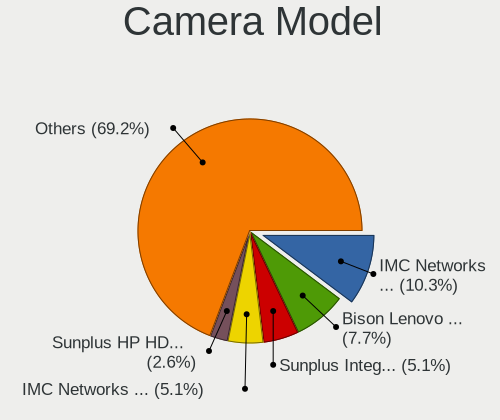

| Model                                               | Notebooks | Percent |
|-----------------------------------------------------|-----------|---------|
| Acer Lenovo EasyCamera                              | 3         | 9.68%   |
| IMC Networks USB2.0 VGA UVC WebCam                  | 2         | 6.45%   |
| IMC Networks USB2.0 HD UVC WebCam                   | 2         | 6.45%   |
| Sunplus HP HD Webcam [Fixed]                        | 1         | 3.23%   |
| Sunplus Asus Webcam                                 | 1         | 3.23%   |
| Samsung Galaxy series, misc. (MTP mode)             | 1         | 3.23%   |
| Realtek USB Camera                                  | 1         | 3.23%   |
| Realtek Integrated_Webcam_HD                        | 1         | 3.23%   |
| Realtek HD WebCam                                   | 1         | 3.23%   |
| Pixart Imaging GE 1.3 MP MiniCam Pro                | 1         | 3.23%   |
| Microdia Integrated Webcam                          | 1         | 3.23%   |
| Lite-On Integrated Camera                           | 1         | 3.23%   |
| IMC Networks ov9734_azurewave_camera                | 1         | 3.23%   |
| GEMBIRD Generic UVC 1.00 camera [AppoTech AX2311]   | 1         | 3.23%   |
| Chicony WebCam                                      | 1         | 3.23%   |
| Chicony USB2.0 HD UVC WebCam                        | 1         | 3.23%   |
| Chicony USB 2.0 Camera                              | 1         | 3.23%   |
| Chicony Sony Visual Communication Camera            | 1         | 3.23%   |
| Chicony Integrated Camera (1280x720@30)             | 1         | 3.23%   |
| Chicony Integrated Camera                           | 1         | 3.23%   |
| Chicony HP Wide Vision HD Camera                    | 1         | 3.23%   |
| Chicony FJ Camera                                   | 1         | 3.23%   |
| Cheng Uei Precision Industry (Foxlink) HP HD Webcam | 1         | 3.23%   |
| Apple FaceTime HD Camera                            | 1         | 3.23%   |
| Alcor Micro USB 2.0 Camera                          | 1         | 3.23%   |
| Acer Integrated Camera                              | 1         | 3.23%   |
| Acer HD Camera                                      | 1         | 3.23%   |

Security
--------

Fingerprint Vendor
------------------

Fingerprint sensor vendors

| Vendor                     | Notebooks | Percent |
|----------------------------|-----------|---------|
| Validity Sensors           | 4         | 80%     |
| Shenzhen Goodix Technology | 1         | 20%     |

Fingerprint Model
-----------------

Fingerprint sensor models

| Model                                      | Notebooks | Percent |
|--------------------------------------------|-----------|---------|
| Validity Sensors VFS495 Fingerprint Reader | 1         | 20%     |
| Validity Sensors VFS471 Fingerprint Reader | 1         | 20%     |
| Validity Sensors VFS Fingerprint sensor    | 1         | 20%     |
| Validity Sensors Swipe Fingerprint Sensor  | 1         | 20%     |
| Shenzhen Goodix  Fingerprint Device        | 1         | 20%     |

Chipcard Vendor
---------------

Chipcard module vendors

| Vendor   | Notebooks | Percent |
|----------|-----------|---------|
| OmniKey  | 1         | 50%     |
| Broadcom | 1         | 50%     |

Chipcard Model
--------------

Chipcard module models

| Model                | Notebooks | Percent |
|----------------------|-----------|---------|
| OmniKey CardMan 4321 | 1         | 50%     |
| Broadcom 5880        | 1         | 50%     |

Unsupported
-----------

Unsupported Devices
-------------------

Total unsupported devices on board

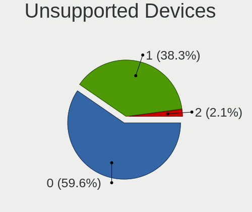

| Total | Notebooks | Percent |
|-------|-----------|---------|
| 0     | 22        | 61.11%  |
| 1     | 13        | 36.11%  |
| 2     | 1         | 2.78%   |

Unsupported Device Types
------------------------

Types of unsupported devices

| Type                  | Notebooks | Percent |
|-----------------------|-----------|---------|
| Fingerprint reader    | 5         | 35.71%  |
| Graphics card         | 3         | 21.43%  |
| Net/wireless          | 2         | 14.29%  |
| Chipcard              | 2         | 14.29%  |
| Net/ethernet          | 1         | 7.14%   |
| Multimedia controller | 1         | 7.14%   |

