GNOME OS - Tested Hardware & Statistics
---------------------------------------

A project to collect tested hardware configurations for GNOME OS.

Anyone can contribute to this report by the [hw-probe](https://github.com/linuxhw/hw-probe) tool:

    sudo -E hw-probe -all -upload

Please contribute! Especially if your hardware is rare.

This is a report for all computer types. See also reports for [desktops](/Dist/GNOME_OS/Desktop/README.md) and [notebooks](/Dist/GNOME_OS/Notebook/README.md).

Contents
--------

* [ Test Cases ](#test-cases)

* [ System ](#system)
  - [ OS                       ](#os)
  - [ OS Family                ](#os-family)
  - [ Kernel                   ](#kernel)
  - [ Kernel Family            ](#kernel-family)
  - [ Kernel Major Ver.        ](#kernel-major-ver)
  - [ Arch                     ](#arch)
  - [ DE                       ](#de)
  - [ Display Server           ](#display-server)
  - [ Display Manager          ](#display-manager)
  - [ OS Lang                  ](#os-lang)
  - [ Boot Mode                ](#boot-mode)
  - [ Filesystem               ](#filesystem)
  - [ Part. scheme             ](#part-scheme)
  - [ Dual Boot with Linux/BSD ](#dual-boot-with-linuxbsd)
  - [ Dual Boot (Win)          ](#dual-boot-win)

* [ Board ](#board)
  - [ Vendor                   ](#vendor)
  - [ Model                    ](#model)
  - [ Model Family             ](#model-family)
  - [ MFG Year                 ](#mfg-year)
  - [ Form Factor              ](#form-factor)
  - [ Secure Boot              ](#secure-boot)
  - [ Coreboot                 ](#coreboot)
  - [ RAM Size                 ](#ram-size)
  - [ RAM Used                 ](#ram-used)
  - [ Total Drives             ](#total-drives)
  - [ Has CD-ROM               ](#has-cd-rom)
  - [ Has Ethernet             ](#has-ethernet)
  - [ Has WiFi                 ](#has-wifi)
  - [ Has Bluetooth            ](#has-bluetooth)

* [ Location ](#location)
  - [ Country                  ](#country)
  - [ City                     ](#city)

* [ Drives ](#drives)
  - [ Drive Vendor             ](#drive-vendor)
  - [ Drive Model              ](#drive-model)
  - [ HDD Vendor               ](#hdd-vendor)
  - [ SSD Vendor               ](#ssd-vendor)
  - [ Drive Kind               ](#drive-kind)
  - [ Drive Connector          ](#drive-connector)
  - [ Drive Size               ](#drive-size)
  - [ Space Total              ](#space-total)
  - [ Space Used               ](#space-used)
  - [ Malfunc. Drives          ](#malfunc-drives)
  - [ Malfunc. Drive Vendor    ](#malfunc-drive-vendor)
  - [ Malfunc. HDD Vendor      ](#malfunc-hdd-vendor)
  - [ Malfunc. Drive Kind      ](#malfunc-drive-kind)
  - [ Failed Drives            ](#failed-drives)
  - [ Failed Drive Vendor      ](#failed-drive-vendor)
  - [ Drive Status             ](#drive-status)

* [ Storage controller ](#storage-controller)
  - [ Storage Vendor           ](#storage-vendor)
  - [ Storage Model            ](#storage-model)
  - [ Storage Kind             ](#storage-kind)

* [ Processor ](#processor)
  - [ CPU Vendor               ](#cpu-vendor)
  - [ CPU Model                ](#cpu-model)
  - [ CPU Model Family         ](#cpu-model-family)
  - [ CPU Cores                ](#cpu-cores)
  - [ CPU Sockets              ](#cpu-sockets)
  - [ CPU Threads              ](#cpu-threads)
  - [ CPU Op-Modes             ](#cpu-op-modes)
  - [ CPU Microcode            ](#cpu-microcode)
  - [ CPU Microarch            ](#cpu-microarch)

* [ Graphics ](#graphics)
  - [ GPU Vendor               ](#gpu-vendor)
  - [ GPU Model                ](#gpu-model)
  - [ GPU Combo                ](#gpu-combo)
  - [ GPU Driver               ](#gpu-driver)
  - [ GPU Memory               ](#gpu-memory)

* [ Monitor ](#monitor)
  - [ Monitor Vendor           ](#monitor-vendor)
  - [ Monitor Model            ](#monitor-model)
  - [ Monitor Resolution       ](#monitor-resolution)
  - [ Monitor Diagonal         ](#monitor-diagonal)
  - [ Monitor Width            ](#monitor-width)
  - [ Aspect Ratio             ](#aspect-ratio)
  - [ Monitor Area             ](#monitor-area)
  - [ Pixel Density            ](#pixel-density)
  - [ Multiple Monitors        ](#multiple-monitors)

* [ Network ](#network)
  - [ Net Controller Vendor    ](#net-controller-vendor)
  - [ Net Controller Model     ](#net-controller-model)
  - [ Wireless Vendor          ](#wireless-vendor)
  - [ Wireless Model           ](#wireless-model)
  - [ Ethernet Vendor          ](#ethernet-vendor)
  - [ Ethernet Model           ](#ethernet-model)
  - [ Net Controller Kind      ](#net-controller-kind)
  - [ Used Controller          ](#used-controller)
  - [ NICs                     ](#nics)
  - [ IPv6                     ](#ipv6)

* [ Bluetooth ](#bluetooth)
  - [ Bluetooth Vendor         ](#bluetooth-vendor)
  - [ Bluetooth Model          ](#bluetooth-model)

* [ Sound ](#sound)
  - [ Sound Vendor             ](#sound-vendor)
  - [ Sound Model              ](#sound-model)

* [ Memory ](#memory)
  - [ Memory Vendor            ](#memory-vendor)
  - [ Memory Model             ](#memory-model)
  - [ Memory Kind              ](#memory-kind)
  - [ Memory Form Factor       ](#memory-form-factor)
  - [ Memory Size              ](#memory-size)
  - [ Memory Speed             ](#memory-speed)

* [ Printers & scanners ](#printers--scanners)
  - [ Printer Vendor           ](#printer-vendor)
  - [ Printer Model            ](#printer-model)
  - [ Scanner Vendor           ](#scanner-vendor)
  - [ Scanner Model            ](#scanner-model)

* [ Camera ](#camera)
  - [ Camera Vendor            ](#camera-vendor)
  - [ Camera Model             ](#camera-model)

* [ Security ](#security)
  - [ Fingerprint Vendor       ](#fingerprint-vendor)
  - [ Fingerprint Model        ](#fingerprint-model)
  - [ Chipcard Vendor          ](#chipcard-vendor)
  - [ Chipcard Model           ](#chipcard-model)

* [ Unsupported ](#unsupported)
  - [ Unsupported Devices      ](#unsupported-devices)
  - [ Unsupported Device Types ](#unsupported-device-types)

Test Cases
----------

Total: 106

| Vendor        | Model                       | Form-Factor | Probe                                                      | Date         |
|---------------|-----------------------------|-------------|------------------------------------------------------------|--------------|
| Lenovo        | Yoga 7 2-in-1 14AKP10 83... | Convertible | [7558767f6f](https://linux-hardware.org/?probe=7558767f6f) | Dec 24, 2025 |
| Microsoft     | Surface Go                  | Tablet      | [d048b4c662](https://linux-hardware.org/?probe=d048b4c662) | Nov 30, 2025 |
| Microsoft     | Surface Go                  | Tablet      | [e605bbea2d](https://linux-hardware.org/?probe=e605bbea2d) | Nov 30, 2025 |
| HP            | OmniBook 5 Flip Laptop 1... | Convertible | [18e53b6ed5](https://linux-hardware.org/?probe=18e53b6ed5) | Nov 23, 2025 |
| ASRock        | B550M-ITX/ac                | Desktop     | [71efebc36f](https://linux-hardware.org/?probe=71efebc36f) | Nov 17, 2025 |
| Acer          | Swift SFG16-71              | Notebook    | [767560a624](https://linux-hardware.org/?probe=767560a624) | Nov 14, 2025 |
| Dell          | Inspiron 3521               | Notebook    | [91a3e8c284](https://linux-hardware.org/?probe=91a3e8c284) | Oct 27, 2025 |
| Samsung       | 730QED                      | Convertible | [cb2ec40d3d](https://linux-hardware.org/?probe=cb2ec40d3d) | Oct 12, 2025 |
| Apple         | MacBookAir6,2               | Notebook    | [cdfad52711](https://linux-hardware.org/?probe=cdfad52711) | Oct 03, 2025 |
| Apple         | MacBookAir6,2               | Notebook    | [6dd0299553](https://linux-hardware.org/?probe=6dd0299553) | Oct 03, 2025 |
| ASRock        | B550M-ITX/ac                | Desktop     | [21347e70d0](https://linux-hardware.org/?probe=21347e70d0) | Sep 23, 2025 |
| Unknown       | Unknown                     | Desktop     | [04df8f67e8](https://linux-hardware.org/?probe=04df8f67e8) | Sep 19, 2025 |
| MSI           | H81M-P33                    | Desktop     | [18d0d50173](https://linux-hardware.org/?probe=18d0d50173) | Sep 04, 2025 |
| ASUSTek       | VivoBook_ASUSLaptop X150... | Notebook    | [349b4a9553](https://linux-hardware.org/?probe=349b4a9553) | Aug 21, 2025 |
| ASUSTek       | VivoBook_ASUSLaptop X150... | Notebook    | [b0228ceb18](https://linux-hardware.org/?probe=b0228ceb18) | Aug 21, 2025 |
| HP            | Laptop 15-bw0xx             | Notebook    | [5773ed37f4](https://linux-hardware.org/?probe=5773ed37f4) | Aug 09, 2025 |
| ASUSTek       | ASUS Vivobook S 16 M5606... | Notebook    | [c89e5e0ca9](https://linux-hardware.org/?probe=c89e5e0ca9) | Aug 07, 2025 |
| ASUSTek       | PRIME X570-P                | Notebook    | [384036f434](https://linux-hardware.org/?probe=384036f434) | Jul 30, 2025 |
| ASUSTek       | PRIME X570-P                | Notebook    | [83b6a3e2ba](https://linux-hardware.org/?probe=83b6a3e2ba) | Jul 29, 2025 |
| Apple         | MacBookPro11,1              | Notebook    | [d4db865805](https://linux-hardware.org/?probe=d4db865805) | Jul 20, 2025 |
| Acer          | Aspire A715-42G             | Notebook    | [884468dbb6](https://linux-hardware.org/?probe=884468dbb6) | Jul 17, 2025 |
| ASUSTek       | ASUS Vivobook S 16 M5606... | Notebook    | [fa9d7b1705](https://linux-hardware.org/?probe=fa9d7b1705) | May 31, 2025 |
| Samsung       | 930QCA                      | Convertible | [7c4645e6e3](https://linux-hardware.org/?probe=7c4645e6e3) | May 22, 2025 |
| Gigabyte      | B550 AORUS PRO AC           | Desktop     | [64dcae5fdc](https://linux-hardware.org/?probe=64dcae5fdc) | Apr 21, 2025 |
| Microsoft     | Surface Laptop 4            | Tablet      | [e2286d96fc](https://linux-hardware.org/?probe=e2286d96fc) | Mar 31, 2025 |
| ASUSTek       | ROG Zephyrus M16 GU604VI... | Notebook    | [1757736a22](https://linux-hardware.org/?probe=1757736a22) | Mar 27, 2025 |
| Lenovo        | ThinkPad E14 Gen 4 21EB0... | Notebook    | [44e1f0a709](https://linux-hardware.org/?probe=44e1f0a709) | Mar 20, 2025 |
| SLIMBOOK      | PROX14-AMD                  | Notebook    | [4705f07c52](https://linux-hardware.org/?probe=4705f07c52) | Feb 19, 2025 |
| ASUSTek       | TUF Gaming B550M-PLUS       | Desktop     | [8fa24df745](https://linux-hardware.org/?probe=8fa24df745) | Dec 18, 2024 |
| MSI           | Z97 GAMING 3                | Desktop     | [a04a3de413](https://linux-hardware.org/?probe=a04a3de413) | Jul 27, 2024 |
| Dell          | Latitude 7490               | Notebook    | [01eda01155](https://linux-hardware.org/?probe=01eda01155) | Jun 02, 2024 |
| ASUSTek       | X99-A/USB                   | Desktop     | [9a5a476598](https://linux-hardware.org/?probe=9a5a476598) | May 16, 2024 |
| GPU Compan... | GWNR71517                   | Notebook    | [89dbdfd53e](https://linux-hardware.org/?probe=89dbdfd53e) | Apr 13, 2024 |
| Lenovo        | ThinkPad X280 20KF001RMX    | Notebook    | [0caddb11a4](https://linux-hardware.org/?probe=0caddb11a4) | Apr 02, 2024 |
| Microsoft     | Surface Pro                 | Tablet      | [261726d643](https://linux-hardware.org/?probe=261726d643) | Mar 25, 2024 |
| Gigabyte      | B450M DS3H-CF               | Desktop     | [c21a61a96d](https://linux-hardware.org/?probe=c21a61a96d) | Mar 23, 2024 |
| Apple         | MacBook4,1                  | Notebook    | [e5b3d089e8](https://linux-hardware.org/?probe=e5b3d089e8) | Oct 06, 2023 |
| Apple         | MacBook4,1                  | Notebook    | [11497e61f8](https://linux-hardware.org/?probe=11497e61f8) | Oct 06, 2023 |
| Lenovo        | ThinkPad T480s 20L8S6P20... | Notebook    | [4f3a1c8208](https://linux-hardware.org/?probe=4f3a1c8208) | Sep 24, 2023 |
| MSI           | Z97 GAMING 3                | Desktop     | [c8c107c355](https://linux-hardware.org/?probe=c8c107c355) | Jul 15, 2023 |
| MSI           | Z97 GAMING 3                | Desktop     | [3841eb7ba0](https://linux-hardware.org/?probe=3841eb7ba0) | Jul 15, 2023 |
| ASUSTek       | M5A97 R2.0                  | Desktop     | [624fca7465](https://linux-hardware.org/?probe=624fca7465) | Jul 07, 2023 |
| Apple         | Mac-F4238CC8 PVT            | All in one  | [2bd22135e0](https://linux-hardware.org/?probe=2bd22135e0) | Jun 20, 2023 |
| Intel         | H61                         | Desktop     | [ac7abe7025](https://linux-hardware.org/?probe=ac7abe7025) | Jun 16, 2023 |
| Apple         | Mac-F226BEC8 PVT            | All in one  | [074de9621d](https://linux-hardware.org/?probe=074de9621d) | Mar 21, 2023 |
| ASUSTek       | X550LC                      | Notebook    | [5f73fa5db7](https://linux-hardware.org/?probe=5f73fa5db7) | Mar 18, 2023 |
| Apple         | Mac-F226BEC8 PVT            | All in one  | [0a83a62b1c](https://linux-hardware.org/?probe=0a83a62b1c) | Mar 13, 2023 |
| Colorful T... | BATTLE-AX B660M-HD DELUX... | Desktop     | [8b2c5b902c](https://linux-hardware.org/?probe=8b2c5b902c) | Mar 10, 2023 |
| Colorful T... | BATTLE-AX B660M-HD DELUX... | Desktop     | [3a0c1c2237](https://linux-hardware.org/?probe=3a0c1c2237) | Mar 10, 2023 |
| HP            | 82F2 A01                    | Desktop     | [b6cb9447df](https://linux-hardware.org/?probe=b6cb9447df) | Nov 19, 2022 |
| Unknown       | 1.0                         | Desktop     | [d07852e419](https://linux-hardware.org/?probe=d07852e419) | Nov 11, 2022 |
| Apple         | MacBookPro8,1               | Notebook    | [1b5ab725ab](https://linux-hardware.org/?probe=1b5ab725ab) | Nov 09, 2022 |
| Lenovo        | IdeaPad 330-15AST 81D6      | Notebook    | [abbb3295c8](https://linux-hardware.org/?probe=abbb3295c8) | Oct 14, 2022 |
| Lenovo        | IdeaPad 330-15AST 81D6      | Notebook    | [f19e981e03](https://linux-hardware.org/?probe=f19e981e03) | Oct 14, 2022 |
| Apple         | Mac-8ED6AF5B48C039E1 Mac... | Mini pc     | [c2f80d89da](https://linux-hardware.org/?probe=c2f80d89da) | Sep 26, 2022 |
| Apple         | Mac-8ED6AF5B48C039E1 Mac... | Mini pc     | [8d0067a198](https://linux-hardware.org/?probe=8d0067a198) | Sep 26, 2022 |
| Dell          | Inspiron 3584               | Notebook    | [626c79c116](https://linux-hardware.org/?probe=626c79c116) | Sep 24, 2022 |
| HP            | Pavilion 15                 | Notebook    | [56a10ce74c](https://linux-hardware.org/?probe=56a10ce74c) | Sep 21, 2022 |
| ASUSTek       | GL553VE                     | Notebook    | [4d93da1983](https://linux-hardware.org/?probe=4d93da1983) | Sep 20, 2022 |
| ASUSTek       | GL553VE                     | Notebook    | [27b8d384a2](https://linux-hardware.org/?probe=27b8d384a2) | Sep 19, 2022 |
| Gigabyte      | Z97X-Gaming 7               | Desktop     | [1c993db964](https://linux-hardware.org/?probe=1c993db964) | Aug 30, 2022 |
| Gigabyte      | Z97X-Gaming 7               | Desktop     | [91438fc6b5](https://linux-hardware.org/?probe=91438fc6b5) | Aug 30, 2022 |
| Acer          | Aspire A515-51G             | Notebook    | [4856a5fefb](https://linux-hardware.org/?probe=4856a5fefb) | Jul 22, 2022 |
| Lenovo        | Yoga Slim 7 14ARE05 82A2    | Notebook    | [a90e6b2be7](https://linux-hardware.org/?probe=a90e6b2be7) | Apr 30, 2022 |
| Apple         | MacBookPro10,1              | Notebook    | [1bbdbe7117](https://linux-hardware.org/?probe=1bbdbe7117) | Apr 04, 2022 |
| Acer          | Iconia W700                 | Notebook    | [604cdabab4](https://linux-hardware.org/?probe=604cdabab4) | Mar 23, 2022 |
| Lenovo        | ThinkPad Edge E531 68851... | Notebook    | [54269ad944](https://linux-hardware.org/?probe=54269ad944) | Feb 18, 2022 |
| Gateway       | NE71B                       | Notebook    | [ac3dc96ccf](https://linux-hardware.org/?probe=ac3dc96ccf) | Feb 02, 2022 |
| HP            | Laptop 14-dk1xxx            | Notebook    | [c604eec754](https://linux-hardware.org/?probe=c604eec754) | Jan 27, 2022 |
| Chuwi         | HeroBook                    | Notebook    | [67990dbe7f](https://linux-hardware.org/?probe=67990dbe7f) | Jan 19, 2022 |
| Apple         | Mac-FFE5EF870D7BA81A iMa... | All in one  | [e53f2b7fd5](https://linux-hardware.org/?probe=e53f2b7fd5) | Nov 03, 2021 |
| Apple         | Mac-FFE5EF870D7BA81A iMa... | All in one  | [922c058537](https://linux-hardware.org/?probe=922c058537) | Nov 03, 2021 |
| Gigabyte      | B450M S2H V2                | Desktop     | [cd6b701253](https://linux-hardware.org/?probe=cd6b701253) | Nov 03, 2021 |
| Lenovo        | Yoga Slim 7 14ARE05 82A2    | Notebook    | [594815bb9d](https://linux-hardware.org/?probe=594815bb9d) | Oct 17, 2021 |
| ASUSTek       | X555LD                      | Notebook    | [2560d8b5a0](https://linux-hardware.org/?probe=2560d8b5a0) | Sep 27, 2021 |
| ASUSTek       | PRIME A320M-K               | Desktop     | [11c23a1f37](https://linux-hardware.org/?probe=11c23a1f37) | Sep 26, 2021 |
| ASUSTek       | PRIME A320M-K               | Desktop     | [b33430e135](https://linux-hardware.org/?probe=b33430e135) | Sep 26, 2021 |
| Lenovo        | IdeaPad S340-14API 81NB     | Notebook    | [c248e4551a](https://linux-hardware.org/?probe=c248e4551a) | Sep 25, 2021 |
| HP            | Pavilion Notebook           | Notebook    | [835f183d57](https://linux-hardware.org/?probe=835f183d57) | Sep 17, 2021 |
| ASUSTek       | H61M-A/BR                   | Desktop     | [73b5c289e2](https://linux-hardware.org/?probe=73b5c289e2) | Sep 04, 2021 |
| Lenovo        | IdeaPad S145-15IWL 81S9     | Notebook    | [35c20c8cde](https://linux-hardware.org/?probe=35c20c8cde) | Aug 30, 2021 |
| HP            | Pavilion Gaming Laptop 1... | Notebook    | [5a54384297](https://linux-hardware.org/?probe=5a54384297) | Aug 11, 2021 |
| HP            | 8767 A                      | Desktop     | [926ac56be9](https://linux-hardware.org/?probe=926ac56be9) | Aug 10, 2021 |
| Gigabyte      | X570 GAMING X               | Desktop     | [b751f6615d](https://linux-hardware.org/?probe=b751f6615d) | Jul 17, 2021 |
| Gigabyte      | B450M S2H V2                | Desktop     | [d8886335b1](https://linux-hardware.org/?probe=d8886335b1) | Jul 10, 2021 |
| Intel         | X79                         | Desktop     | [9f19896285](https://linux-hardware.org/?probe=9f19896285) | May 13, 2021 |
| Lenovo        | IdeaPadFlex 5 14IIL05 81... | Convertible | [35876a09ad](https://linux-hardware.org/?probe=35876a09ad) | May 09, 2021 |
| HP            | ProBook 430 G3              | Notebook    | [c3acaeb030](https://linux-hardware.org/?probe=c3acaeb030) | Apr 26, 2021 |
| HP            | ProBook 430 G3              | Notebook    | [de3298645e](https://linux-hardware.org/?probe=de3298645e) | Apr 26, 2021 |
| Toshiba       | Satellite C55-A-1F5         | Notebook    | [d7b4bf2642](https://linux-hardware.org/?probe=d7b4bf2642) | Apr 15, 2021 |
| Toshiba       | Satellite C55-A-1F5         | Notebook    | [aa32e3693a](https://linux-hardware.org/?probe=aa32e3693a) | Apr 14, 2021 |
| Lenovo        | 317E NOK                    | Desktop     | [2ce2a68735](https://linux-hardware.org/?probe=2ce2a68735) | Apr 14, 2021 |
| HP            | Pavilion 17                 | Notebook    | [220bf859f8](https://linux-hardware.org/?probe=220bf859f8) | Mar 28, 2021 |
| HP            | Pavilion 17                 | Notebook    | [a5a6941b23](https://linux-hardware.org/?probe=a5a6941b23) | Mar 28, 2021 |
| Dell          | Latitude 7490               | Notebook    | [ce86510d2b](https://linux-hardware.org/?probe=ce86510d2b) | Mar 28, 2021 |
| Dell          | Inspiron 3542               | Notebook    | [517406f8b6](https://linux-hardware.org/?probe=517406f8b6) | Mar 21, 2021 |
| ASUSTek       | PRIME H410M-K               | Desktop     | [f685fefbec](https://linux-hardware.org/?probe=f685fefbec) | Mar 04, 2021 |
| Unknown       | Unknown                     | Notebook    | [1c5ed732c5](https://linux-hardware.org/?probe=1c5ed732c5) | Mar 01, 2021 |
| Dell          | Precision M6800             | Notebook    | [95fa029c09](https://linux-hardware.org/?probe=95fa029c09) | Jan 14, 2021 |
| Dell          | Inspiron 5566               | Notebook    | [a3fd17119a](https://linux-hardware.org/?probe=a3fd17119a) | Nov 03, 2020 |
| Chuwi         | LarkBox                     | Mini pc     | [c7f6fd9a66](https://linux-hardware.org/?probe=c7f6fd9a66) | Oct 21, 2020 |
| HP            | Pavilion 17                 | Notebook    | [edc8ed595b](https://linux-hardware.org/?probe=edc8ed595b) | Oct 12, 2020 |
| Acer          | Aspire GX-781               | Desktop     | [159afb32c1](https://linux-hardware.org/?probe=159afb32c1) | Oct 10, 2020 |
| ASUSTek       | SABERTOOTH X79              | Desktop     | [17acfc90d4](https://linux-hardware.org/?probe=17acfc90d4) | Oct 07, 2020 |
| ASUSTek       | E202SA                      | Notebook    | [a226259559](https://linux-hardware.org/?probe=a226259559) | Sep 24, 2020 |
| Acer          | ChiefRiver Platform         | Notebook    | [23e2162b8e](https://linux-hardware.org/?probe=23e2162b8e) | Sep 20, 2020 |

System
------

OS
--

Installed operating systems

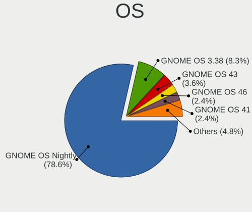

| Name             | Computers | Percent |
|------------------|-----------|---------|
| GNOME OS Nightly | 66        | 78.57%  |
| GNOME OS 3.38    | 7         | 8.33%   |
| GNOME OS 43      | 3         | 3.57%   |
| GNOME OS 46      | 2         | 2.38%   |
| GNOME OS 41      | 2         | 2.38%   |
| GNOME OS 49      | 1         | 1.19%   |
| GNOME OS 48      | 1         | 1.19%   |
| GNOME OS 42      | 1         | 1.19%   |
| GNOME OS 40      | 1         | 1.19%   |

OS Family
---------

OS without a version

| Name     | Computers | Percent |
|----------|-----------|---------|
| GNOME OS | 84        | 100%    |

Kernel
------

Version of the Linux kernel

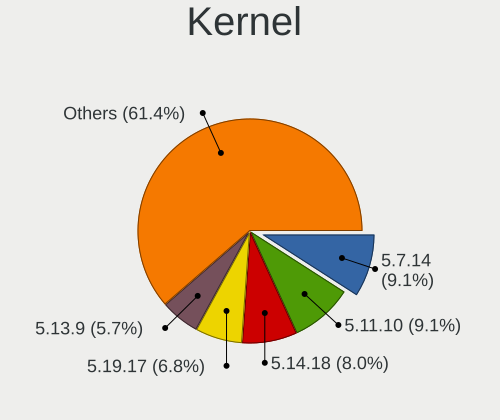

| Version | Computers | Percent |
|---------|-----------|---------|
| 5.7.14  | 8         | 9.09%   |
| 5.11.10 | 8         | 9.09%   |
| 5.14.18 | 7         | 7.95%   |
| 5.19.17 | 6         | 6.82%   |
| 5.13.9  | 5         | 5.68%   |
| 6.17.6  | 4         | 4.55%   |
| 6.16.4  | 4         | 4.55%   |
| 6.7.9   | 3         | 3.41%   |
| 6.16.0  | 3         | 3.41%   |
| 6.15.3  | 3         | 3.41%   |
| 6.13.6  | 3         | 3.41%   |
| 5.19.16 | 3         | 3.41%   |
| 5.18.19 | 3         | 3.41%   |
| 5.11.2  | 3         | 3.41%   |
| 6.14.5  | 2         | 2.27%   |
| 5.18.16 | 2         | 2.27%   |
| 5.14.4  | 2         | 2.27%   |
| 5.13.8  | 2         | 2.27%   |
| 6.9.8   | 1         | 1.14%   |
| 6.9.1   | 1         | 1.14%   |
| 6.7.8   | 1         | 1.14%   |
| 6.6.10  | 1         | 1.14%   |
| 6.5.5   | 1         | 1.14%   |
| 6.5.0   | 1         | 1.14%   |
| 6.4.0   | 1         | 1.14%   |
| 6.17.9  | 1         | 1.14%   |
| 6.17.5  | 1         | 1.14%   |
| 6.16.11 | 1         | 1.14%   |
| 6.12.9  | 1         | 1.14%   |
| 6.12.5  | 1         | 1.14%   |
| 6.12.4  | 1         | 1.14%   |
| 5.18.10 | 1         | 1.14%   |
| 5.14.11 | 1         | 1.14%   |
| 5.12.12 | 1         | 1.14%   |
| 5.11.0  | 1         | 1.14%   |

Kernel Family
-------------

Linux kernel without a distro release

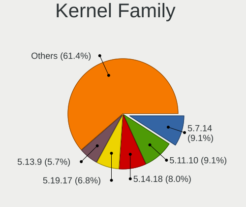

| Version | Computers | Percent |
|---------|-----------|---------|
| 5.7.14  | 8         | 9.09%   |
| 5.11.10 | 8         | 9.09%   |
| 5.14.18 | 7         | 7.95%   |
| 5.19.17 | 6         | 6.82%   |
| 5.13.9  | 5         | 5.68%   |
| 6.17.6  | 4         | 4.55%   |
| 6.16.4  | 4         | 4.55%   |
| 6.7.9   | 3         | 3.41%   |
| 6.16.0  | 3         | 3.41%   |
| 6.15.3  | 3         | 3.41%   |
| 6.13.6  | 3         | 3.41%   |
| 5.19.16 | 3         | 3.41%   |
| 5.18.19 | 3         | 3.41%   |
| 5.11.2  | 3         | 3.41%   |
| 6.14.5  | 2         | 2.27%   |
| 5.18.16 | 2         | 2.27%   |
| 5.14.4  | 2         | 2.27%   |
| 5.13.8  | 2         | 2.27%   |
| 6.9.8   | 1         | 1.14%   |
| 6.9.1   | 1         | 1.14%   |
| 6.7.8   | 1         | 1.14%   |
| 6.6.10  | 1         | 1.14%   |
| 6.5.5   | 1         | 1.14%   |
| 6.5.0   | 1         | 1.14%   |
| 6.4.0   | 1         | 1.14%   |
| 6.17.9  | 1         | 1.14%   |
| 6.17.5  | 1         | 1.14%   |
| 6.16.11 | 1         | 1.14%   |
| 6.12.9  | 1         | 1.14%   |
| 6.12.5  | 1         | 1.14%   |
| 6.12.4  | 1         | 1.14%   |
| 5.18.10 | 1         | 1.14%   |
| 5.14.11 | 1         | 1.14%   |
| 5.12.12 | 1         | 1.14%   |
| 5.11.0  | 1         | 1.14%   |

Kernel Major Ver.
-----------------

Linux kernel major version

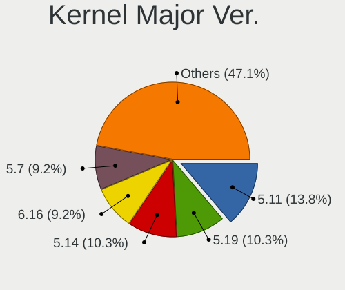

| Version | Computers | Percent |
|---------|-----------|---------|
| 5.11    | 12        | 13.79%  |
| 5.19    | 9         | 10.34%  |
| 5.14    | 9         | 10.34%  |
| 6.16    | 8         | 9.2%    |
| 5.7     | 8         | 9.2%    |
| 5.13    | 7         | 8.05%   |
| 6.17    | 6         | 6.9%    |
| 5.18    | 6         | 6.9%    |
| 6.7     | 4         | 4.6%    |
| 6.15    | 3         | 3.45%   |
| 6.13    | 3         | 3.45%   |
| 6.12    | 3         | 3.45%   |
| 6.9     | 2         | 2.3%    |
| 6.5     | 2         | 2.3%    |
| 6.14    | 2         | 2.3%    |
| 6.6     | 1         | 1.15%   |
| 6.4     | 1         | 1.15%   |
| 5.12    | 1         | 1.15%   |

Arch
----

OS architecture (x86_64, i586, etc.)

| Name   | Computers | Percent |
|--------|-----------|---------|
| x86_64 | 84        | 100%    |

DE
--

Desktop Environment

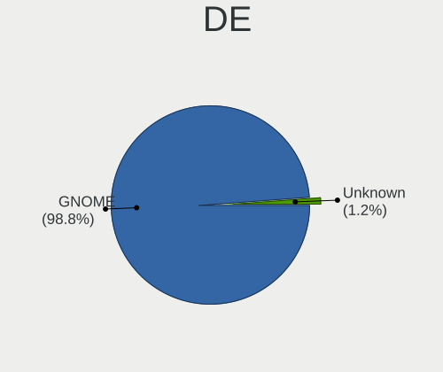

| Name    | Computers | Percent |
|---------|-----------|---------|
| GNOME   | 84        | 98.82%  |
| Unknown | 1         | 1.18%   |

Display Server
--------------

X11 or Wayland

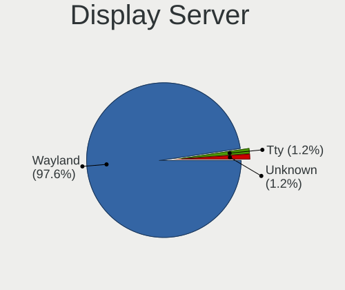

| Name    | Computers | Percent |
|---------|-----------|---------|
| Wayland | 83        | 97.65%  |
| Tty     | 1         | 1.18%   |
| Unknown | 1         | 1.18%   |

Display Manager
---------------

SDDM, LightDM, etc.

| Name    | Computers | Percent |
|---------|-----------|---------|
| Unknown | 84        | 100%    |

OS Lang
-------

Language

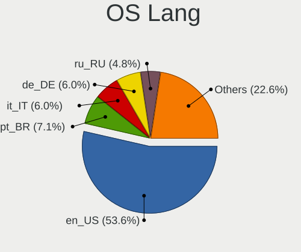

| Lang  | Computers | Percent |
|-------|-----------|---------|
| en_US | 45        | 53.57%  |
| pt_BR | 6         | 7.14%   |
| it_IT | 5         | 5.95%   |
| de_DE | 5         | 5.95%   |
| ru_RU | 4         | 4.76%   |
| fr_FR | 4         | 4.76%   |
| es_ES | 3         | 3.57%   |
| hu_HU | 2         | 2.38%   |
| cs_CZ | 2         | 2.38%   |
| sv_SE | 1         | 1.19%   |
| sk_SK | 1         | 1.19%   |
| ru_UA | 1         | 1.19%   |
| pl_PL | 1         | 1.19%   |
| nl_NL | 1         | 1.19%   |
| es_CL | 1         | 1.19%   |
| en_IN | 1         | 1.19%   |
| en_GB | 1         | 1.19%   |

Boot Mode
---------

EFI or BIOS

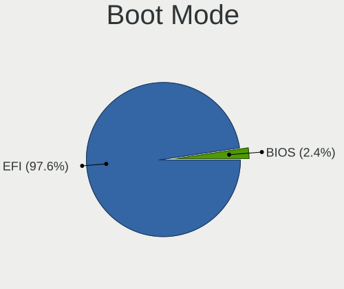

| Mode | Computers | Percent |
|------|-----------|---------|
| EFI  | 82        | 97.62%  |
| BIOS | 2         | 2.38%   |

Filesystem
----------

Type of filesystem

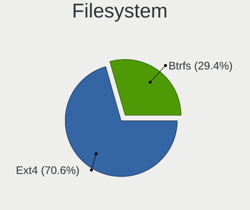

| Type  | Computers | Percent |
|-------|-----------|---------|
| Ext4  | 60        | 70.59%  |
| Btrfs | 25        | 29.41%  |

Part. scheme
------------

Scheme of partitioning

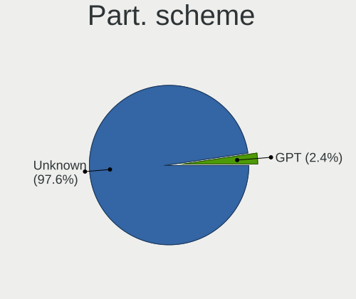

| Type    | Computers | Percent |
|---------|-----------|---------|
| Unknown | 83        | 97.65%  |
| GPT     | 2         | 2.35%   |

Dual Boot with Linux/BSD
------------------------

Hosting more than one Linux/BSD

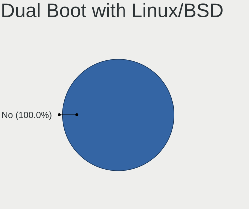

| Dual boot | Computers | Percent |
|-----------|-----------|---------|
| No        | 84        | 100%    |

Dual Boot (Win)
---------------

Hosting Linux and Windows

| Dual boot | Computers | Percent |
|-----------|-----------|---------|
| No        | 84        | 100%    |

Board
-----

Vendor
------

Motherboard manufacturer

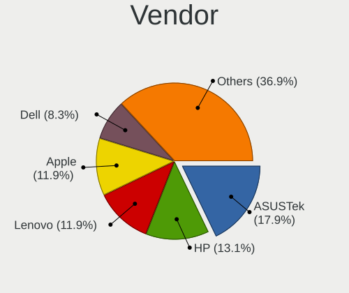

| Name                | Computers | Percent |
|---------------------|-----------|---------|
| ASUSTek Computer    | 15        | 17.86%  |
| Hewlett-Packard     | 11        | 13.1%   |
| Lenovo              | 10        | 11.9%   |
| Apple               | 10        | 11.9%   |
| Dell                | 7         | 8.33%   |
| Acer                | 6         | 7.14%   |
| Gigabyte Technology | 5         | 5.95%   |
| Microsoft           | 3         | 3.57%   |
| Samsung Electronics | 2         | 2.38%   |
| MSI                 | 2         | 2.38%   |
| Intel               | 2         | 2.38%   |
| Chuwi               | 2         | 2.38%   |
| ASRock              | 2         | 2.38%   |
| Unknown             | 2         | 2.38%   |
| Toshiba             | 1         | 1.19%   |
| SLIMBOOK            | 1         | 1.19%   |
| GPU Company         | 1         | 1.19%   |
| Gateway             | 1         | 1.19%   |
| Colorful Technology | 1         | 1.19%   |

Model
-----

Motherboard model

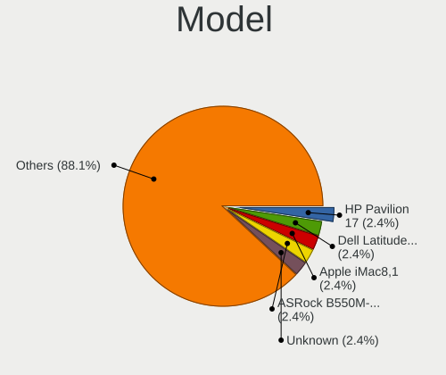

| Name                                   | Computers | Percent |
|----------------------------------------|-----------|---------|
| HP Pavilion 17                         | 2         | 2.38%   |
| Dell Latitude 7490                     | 2         | 2.38%   |
| ASRock B550M-ITX/ac                    | 2         | 2.38%   |
| Apple iMac8,1                          | 2         | 2.38%   |
| Unknown                                | 2         | 2.38%   |
| Toshiba Satellite C55-A-1F5            | 1         | 1.19%   |
| SLIMBOOK PROX14-AMD                    | 1         | 1.19%   |
| Samsung 930QCA                         | 1         | 1.19%   |
| Samsung 730QED                         | 1         | 1.19%   |
| MSI MS-7918                            | 1         | 1.19%   |
| MSI MS-7817                            | 1         | 1.19%   |
| Microsoft Surface Pro                  | 1         | 1.19%   |
| Microsoft Surface Laptop 4             | 1         | 1.19%   |
| Microsoft Surface Go                   | 1         | 1.19%   |
| Lenovo Yoga Slim 7 14ARE05 82A2        | 1         | 1.19%   |
| Lenovo Yoga 7 2-in-1 14AKP10 83JR      | 1         | 1.19%   |
| Lenovo ThinkPad X280 20KF001RMX        | 1         | 1.19%   |
| Lenovo ThinkPad T480s 20L8S6P200       | 1         | 1.19%   |
| Lenovo ThinkPad Edge E531 68851P6      | 1         | 1.19%   |
| Lenovo ThinkPad E14 Gen 4 21EB000GAU   | 1         | 1.19%   |
| Lenovo IdeaPadFlex 5 14IIL05 81X1      | 1         | 1.19%   |
| Lenovo IdeaPad S340-14API 81NB         | 1         | 1.19%   |
| Lenovo IdeaPad S145-15IWL 81S9         | 1         | 1.19%   |
| Lenovo IdeaCentre 3 07IMB05 90NB0020IN | 1         | 1.19%   |
| Intel X79                              | 1         | 1.19%   |
| Intel H61                              | 1         | 1.19%   |
| HP ProBook 430 G3                      | 1         | 1.19%   |
| HP Pavilion Notebook                   | 1         | 1.19%   |
| HP Pavilion Gaming Laptop 15-ec0xxx    | 1         | 1.19%   |
| HP Pavilion Gaming Desktop TG01-1xxx   | 1         | 1.19%   |
| HP Pavilion Desktop PC 570-p0xx        | 1         | 1.19%   |
| HP Pavilion 15                         | 1         | 1.19%   |
| HP OmniBook 5 Flip Laptop 14-fp0xxx    | 1         | 1.19%   |
| HP Laptop 15-bw0xx                     | 1         | 1.19%   |
| HP Laptop 14-dk1xxx                    | 1         | 1.19%   |
| GPU Company GWNR71517                  | 1         | 1.19%   |
| Gigabyte Z97X-Gaming 7                 | 1         | 1.19%   |
| Gigabyte X570 GAMING X                 | 1         | 1.19%   |
| Gigabyte B550 AORUS PRO AC             | 1         | 1.19%   |
| Gigabyte B450M S2H V2                  | 1         | 1.19%   |

Model Family
------------

Motherboard model prefix

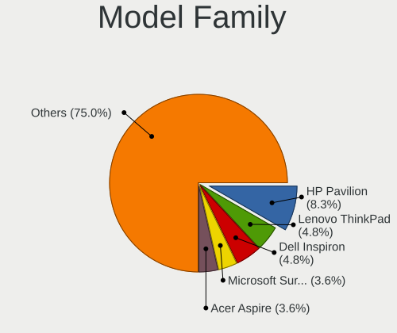

| Name                  | Computers | Percent |
|-----------------------|-----------|---------|
| HP Pavilion           | 7         | 8.33%   |
| Lenovo ThinkPad       | 4         | 4.76%   |
| Dell Inspiron         | 4         | 4.76%   |
| Microsoft Surface     | 3         | 3.57%   |
| ASUS PRIME            | 3         | 3.57%   |
| Acer Aspire           | 3         | 3.57%   |
| Lenovo Yoga           | 2         | 2.38%   |
| Lenovo IdeaPad        | 2         | 2.38%   |
| HP Laptop             | 2         | 2.38%   |
| Gigabyte B450M        | 2         | 2.38%   |
| Dell Latitude         | 2         | 2.38%   |
| ASRock B550M-ITX      | 2         | 2.38%   |
| Apple iMac8           | 2         | 2.38%   |
| Unknown               | 2         | 2.38%   |
| Toshiba Satellite     | 1         | 1.19%   |
| SLIMBOOK PROX14-AMD   | 1         | 1.19%   |
| Samsung 930QCA        | 1         | 1.19%   |
| Samsung 730QED        | 1         | 1.19%   |
| MSI MS-7918           | 1         | 1.19%   |
| MSI MS-7817           | 1         | 1.19%   |
| Lenovo IdeaPadFlex    | 1         | 1.19%   |
| Lenovo IdeaCentre     | 1         | 1.19%   |
| Intel X79             | 1         | 1.19%   |
| Intel H61             | 1         | 1.19%   |
| HP ProBook            | 1         | 1.19%   |
| HP OmniBook           | 1         | 1.19%   |
| GPU Company GWNR71517 | 1         | 1.19%   |
| Gigabyte Z97X-Gaming  | 1         | 1.19%   |
| Gigabyte X570         | 1         | 1.19%   |
| Gigabyte B550         | 1         | 1.19%   |
| Gateway NE71B         | 1         | 1.19%   |
| Dell Precision        | 1         | 1.19%   |
| Colorful BATTLE-AX    | 1         | 1.19%   |
| Chuwi LarkBox         | 1         | 1.19%   |
| Chuwi HeroBook        | 1         | 1.19%   |
| ASUS X555LD           | 1         | 1.19%   |
| ASUS X550LC           | 1         | 1.19%   |
| ASUS VivoBook         | 1         | 1.19%   |
| ASUS TUF              | 1         | 1.19%   |
| ASUS TERRA            | 1         | 1.19%   |

MFG Year
--------

Motherboard manufacture year

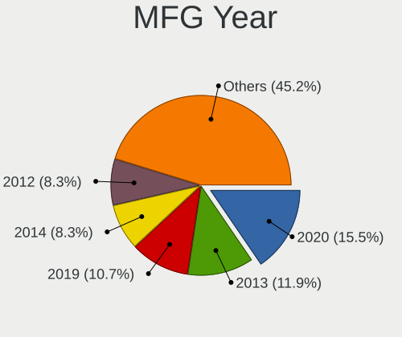

| Year | Computers | Percent |
|------|-----------|---------|
| 2020 | 13        | 15.48%  |
| 2013 | 10        | 11.9%   |
| 2019 | 9         | 10.71%  |
| 2014 | 7         | 8.33%   |
| 2012 | 7         | 8.33%   |
| 2018 | 6         | 7.14%   |
| 2017 | 6         | 7.14%   |
| 2022 | 5         | 5.95%   |
| 2021 | 4         | 4.76%   |
| 2016 | 3         | 3.57%   |
| 2008 | 3         | 3.57%   |
| 2025 | 2         | 2.38%   |
| 2024 | 2         | 2.38%   |
| 2023 | 2         | 2.38%   |
| 2015 | 2         | 2.38%   |
| 2011 | 1         | 1.19%   |
| 2009 | 1         | 1.19%   |
| 2007 | 1         | 1.19%   |

Form Factor
-----------

Physical design of the computer

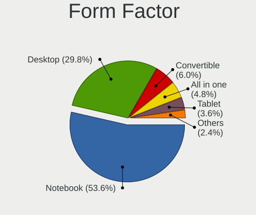

| Name        | Computers | Percent |
|-------------|-----------|---------|
| Notebook    | 45        | 53.57%  |
| Desktop     | 25        | 29.76%  |
| Convertible | 5         | 5.95%   |
| All in one  | 4         | 4.76%   |
| Tablet      | 3         | 3.57%   |
| Mini pc     | 2         | 2.38%   |

Secure Boot
-----------

Enabled or disabled

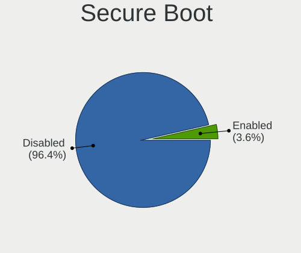

| State    | Computers | Percent |
|----------|-----------|---------|
| Disabled | 81        | 96.43%  |
| Enabled  | 3         | 3.57%   |

Coreboot
--------

Have coreboot on board

| Used | Computers | Percent |
|------|-----------|---------|
| No   | 84        | 100%    |

RAM Size
--------

Total RAM memory

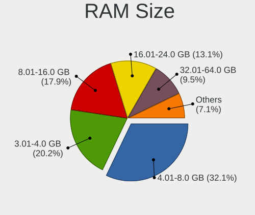

| Size in GB  | Computers | Percent |
|-------------|-----------|---------|
| 4.01-8.0    | 27        | 32.14%  |
| 3.01-4.0    | 17        | 20.24%  |
| 8.01-16.0   | 15        | 17.86%  |
| 16.01-24.0  | 11        | 13.1%   |
| 32.01-64.0  | 8         | 9.52%   |
| 64.01-256.0 | 3         | 3.57%   |
| 24.01-32.0  | 2         | 2.38%   |
| 1.01-2.0    | 1         | 1.19%   |

RAM Used
--------

Used RAM memory

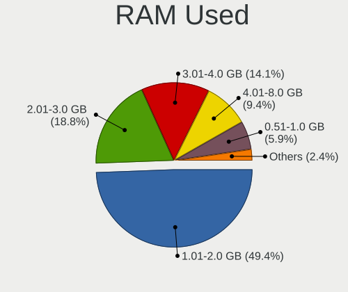

| Used GB   | Computers | Percent |
|-----------|-----------|---------|
| 1.01-2.0  | 42        | 49.41%  |
| 2.01-3.0  | 16        | 18.82%  |
| 3.01-4.0  | 12        | 14.12%  |
| 4.01-8.0  | 8         | 9.41%   |
| 0.51-1.0  | 5         | 5.88%   |
| 8.01-16.0 | 2         | 2.35%   |

Total Drives
------------

Number of drives on board

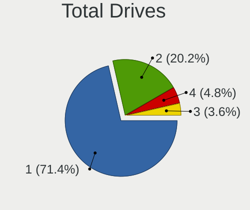

| Drives | Computers | Percent |
|--------|-----------|---------|
| 1      | 60        | 71.43%  |
| 2      | 17        | 20.24%  |
| 4      | 4         | 4.76%   |
| 3      | 3         | 3.57%   |

Has CD-ROM
----------

Has CD-ROM on board

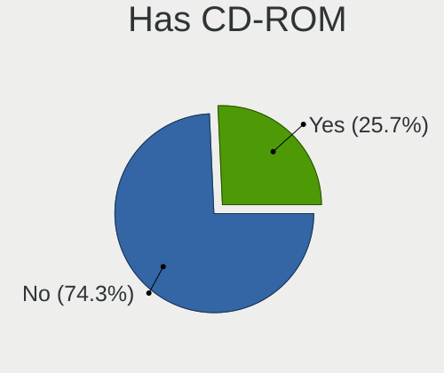

| Presented | Computers | Percent |
|-----------|-----------|---------|
| No        | 66        | 78.57%  |
| Yes       | 18        | 21.43%  |

Has Ethernet
------------

Has Ethernet on board

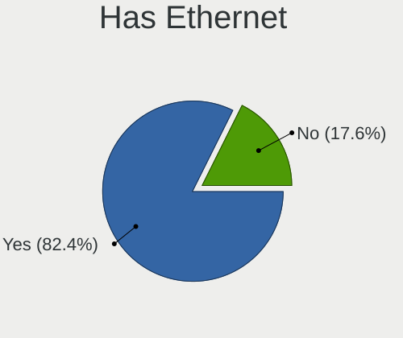

| Presented | Computers | Percent |
|-----------|-----------|---------|
| Yes       | 70        | 83.33%  |
| No        | 14        | 16.67%  |

Has WiFi
--------

Has WiFi module

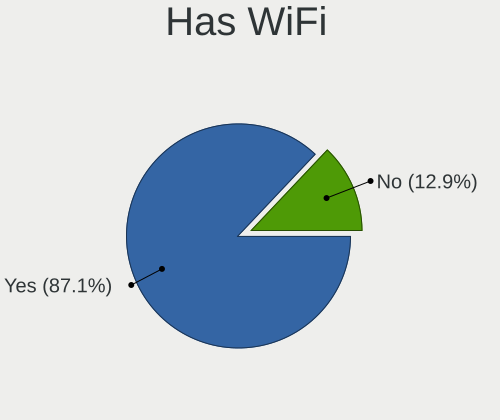

| Presented | Computers | Percent |
|-----------|-----------|---------|
| Yes       | 74        | 87.06%  |
| No        | 11        | 12.94%  |

Has Bluetooth
-------------

Has Bluetooth module

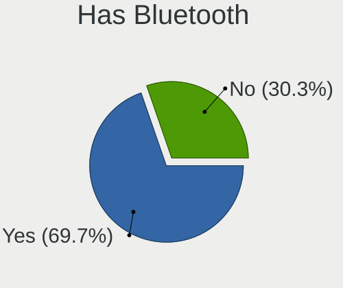

| Presented | Computers | Percent |
|-----------|-----------|---------|
| Yes       | 66        | 78.57%  |
| No        | 18        | 21.43%  |

Location
--------

Country
-------

Geographic location (country)

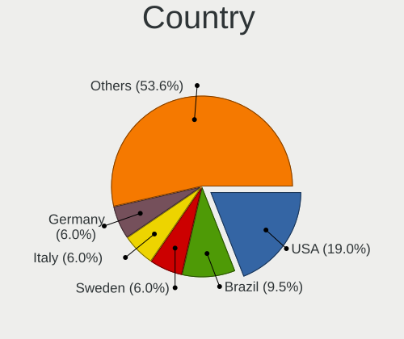

| Country            | Computers | Percent |
|--------------------|-----------|---------|
| USA                | 16        | 19.05%  |
| Brazil             | 8         | 9.52%   |
| Sweden             | 5         | 5.95%   |
| Italy              | 5         | 5.95%   |
| Germany            | 5         | 5.95%   |
| France             | 4         | 4.76%   |
| Ukraine            | 3         | 3.57%   |
| India              | 3         | 3.57%   |
| Chile              | 3         | 3.57%   |
| UK                 | 2         | 2.38%   |
| Spain              | 2         | 2.38%   |
| Russia             | 2         | 2.38%   |
| Romania            | 2         | 2.38%   |
| New Zealand        | 2         | 2.38%   |
| Greece             | 2         | 2.38%   |
| Czechia            | 2         | 2.38%   |
| Canada             | 2         | 2.38%   |
| UAE                | 1         | 1.19%   |
| The Netherlands    | 1         | 1.19%   |
| Thailand           | 1         | 1.19%   |
| Slovakia           | 1         | 1.19%   |
| Serbia             | 1         | 1.19%   |
| Puerto Rico        | 1         | 1.19%   |
| Poland             | 1         | 1.19%   |
| Netherlands        | 1         | 1.19%   |
| Latvia             | 1         | 1.19%   |
| Iraq               | 1         | 1.19%   |
| Iran               | 1         | 1.19%   |
| Hungary            | 1         | 1.19%   |
| Finland            | 1         | 1.19%   |
| El Salvador        | 1         | 1.19%   |
| Dominican Republic | 1         | 1.19%   |
| Australia          | 1         | 1.19%   |

City
----

Geographic location (city)

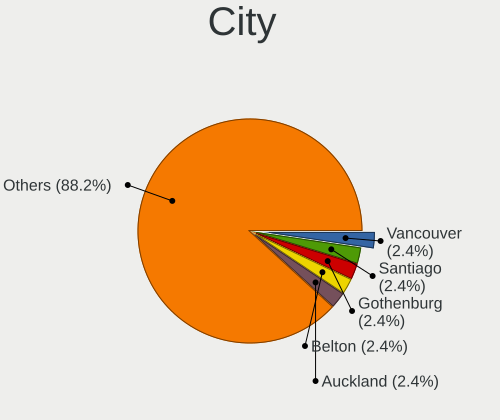

| City                  | Computers | Percent |
|-----------------------|-----------|---------|
| Vancouver             | 2         | 2.35%   |
| Santiago              | 2         | 2.35%   |
| Gothenburg            | 2         | 2.35%   |
| Belton                | 2         | 2.35%   |
| Auckland              | 2         | 2.35%   |
| Zalău                | 1         | 1.18%   |
| Waldachtal            | 1         | 1.18%   |
| Verden an der Aller   | 1         | 1.18%   |
| Västerås            | 1         | 1.18%   |
| Uruguaiana            | 1         | 1.18%   |
| Tyumen                | 1         | 1.18%   |
| Thessaloniki          | 1         | 1.18%   |
| Tehran                | 1         | 1.18%   |
| Targoviste            | 1         | 1.18%   |
| Talence               | 1         | 1.18%   |
| Stoke-on-Trent        | 1         | 1.18%   |
| Stockholm             | 1         | 1.18%   |
| St. Ingbert           | 1         | 1.18%   |
| Skydra                | 1         | 1.18%   |
| Si Racha              | 1         | 1.18%   |
| Shreveport            | 1         | 1.18%   |
| Sesto Fiorentino      | 1         | 1.18%   |
| Seattle               | 1         | 1.18%   |
| Sao Luís             | 1         | 1.18%   |
| Sao Bernardo do Campo | 1         | 1.18%   |
| San Salvador          | 1         | 1.18%   |
| Rome                  | 1         | 1.18%   |
| Rio de Janeiro        | 1         | 1.18%   |
| Riga                  | 1         | 1.18%   |
| Ramsgate              | 1         | 1.18%   |
| Płońsk              | 1         | 1.18%   |
| Prague                | 1         | 1.18%   |
| Pori                  | 1         | 1.18%   |
| Paris                 | 1         | 1.18%   |
| Parempuyre            | 1         | 1.18%   |
| Ottawa                | 1         | 1.18%   |
| Novoyavorovske        | 1         | 1.18%   |
| Novi Sad              | 1         | 1.18%   |
| Munich                | 1         | 1.18%   |
| Mumbai                | 1         | 1.18%   |

Drives
------

Drive Vendor
------------

Hard drive vendors

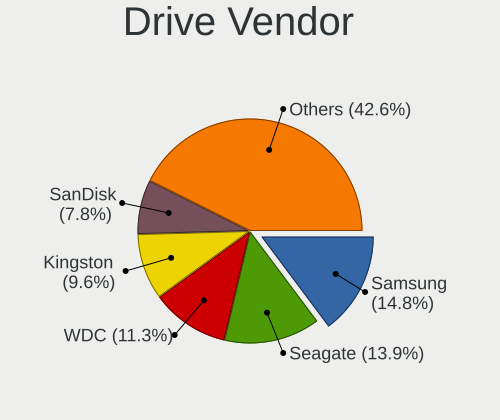

| Vendor                      | Computers | Drives | Percent |
|-----------------------------|-----------|--------|---------|
| Samsung Electronics         | 17        | 19     | 14.78%  |
| Seagate                     | 16        | 18     | 13.91%  |
| WDC                         | 13        | 13     | 11.3%   |
| Kingston                    | 11        | 12     | 9.57%   |
| SanDisk                     | 9         | 10     | 7.83%   |
| Toshiba                     | 6         | 6      | 5.22%   |
| SK hynix                    | 5         | 6      | 4.35%   |
| Micron Technology           | 5         | 6      | 4.35%   |
| Apple                       | 4         | 4      | 3.48%   |
| HGST                        | 3         | 3      | 2.61%   |
| Crucial                     | 3         | 4      | 2.61%   |
| PNY                         | 2         | 2      | 1.74%   |
| Phison Electronics          | 2         | 2      | 1.74%   |
| Micron/Crucial Technology   | 2         | 2      | 1.74%   |
| Intel                       | 2         | 2      | 1.74%   |
| Wibtek                      | 1         | 1      | 0.87%   |
| Unknown                     | 1         | 1      | 0.87%   |
| Transcend                   | 1         | 1      | 0.87%   |
| Team                        | 1         | 1      | 0.87%   |
| SSSTC                       | 1         | 1      | 0.87%   |
| SOLIDIGM                    | 1         | 1      | 0.87%   |
| Patriot                     | 1         | 1      | 0.87%   |
| MAXIO Technology (Hangzhou) | 1         | 1      | 0.87%   |
| Kingston Technology Company | 1         | 1      | 0.87%   |
| HECTRON                     | 1         | 1      | 0.87%   |
| Fanxiang                    | 1         | 1      | 0.87%   |
| CONSISTENT                  | 1         | 1      | 0.87%   |
| Apacer                      | 1         | 1      | 0.87%   |
| AirDisk                     | 1         | 1      | 0.87%   |
| ADATA Technology            | 1         | 1      | 0.87%   |

Drive Model
-----------

Hard drive models

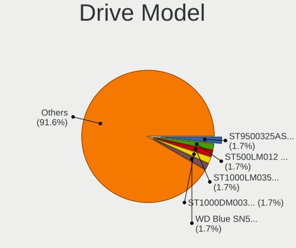

| Model                                              | Computers | Percent |
|----------------------------------------------------|-----------|---------|
| SK hynix NVMe SSD Drive 512GB                      | 2         | 1.68%   |
| Seagate ST9500325AS 500GB                          | 2         | 1.68%   |
| Seagate ST500LM012 HN-M500MBB 500GB                | 2         | 1.68%   |
| Seagate ST1000LM035-1RK172 1TB                     | 2         | 1.68%   |
| Seagate ST1000DM003-1SB102 1TB                     | 2         | 1.68%   |
| Sandisk WD Blue SN550 NVMe SSD 1024GB              | 2         | 1.68%   |
| Samsung NVMe SSD Drive 256GB                       | 2         | 1.68%   |
| Samsung NVMe SSD Controller PM9A1/PM9A3/980PRO 1TB | 2         | 1.68%   |
| PNY CS900 240GB SSD                                | 2         | 1.68%   |
| Micron/Crucial P2 NVMe PCIe SSD 2TB                | 2         | 1.68%   |
| Kingston SA400S37120G 120GB SSD                    | 2         | 1.68%   |
| Intel SSDSCKKF256G8 SATA 256GB                     | 2         | 1.68%   |
| HGST HTS541010A9E680 1TB                           | 2         | 1.68%   |
| Wibtek W800S 512GB                                 | 1         | 0.84%   |
| WDC WDS240G2G0A-00JH30 240GB SSD                   | 1         | 0.84%   |
| WDC WD5000LPVX-75V0TT0 500GB                       | 1         | 0.84%   |
| WDC WD5000LPVX-08V0TT5 500GB                       | 1         | 0.84%   |
| WDC WD5000AAKX-003CA0 500GB                        | 1         | 0.84%   |
| WDC WD40EZRZ-00GXCB0 4TB                           | 1         | 0.84%   |
| WDC WD3200LPVX-08V0TT5 320GB                       | 1         | 0.84%   |
| WDC WD20SPZX-11UA7T0 2TB                           | 1         | 0.84%   |
| WDC WD1600AAJS-22L7A0 160GB                        | 1         | 0.84%   |
| WDC WD10SPZX-24Z10 1TB                             | 1         | 0.84%   |
| WDC WD10SPZX-22Z10T0 1TB                           | 1         | 0.84%   |
| WDC WD10SPZX-00Z10T0 1TB                           | 1         | 0.84%   |
| WDC WD10JPVX-60JC3T1 1TB                           | 1         | 0.84%   |
| WDC WD10EALX-009BA0 1TB                            | 1         | 0.84%   |
| Unknown MMC Card  128GB                            | 1         | 0.84%   |
| Transcend TS64GMTS400 64GB SSD                     | 1         | 0.84%   |
| Toshiba MQ04ABF100 1TB                             | 1         | 0.84%   |
| Toshiba MQ01ABD032 320GB                           | 1         | 0.84%   |
| Toshiba HDWD120 2TB                                | 1         | 0.84%   |
| Toshiba DT01ACA100 1TB                             | 1         | 0.84%   |
| Toshiba DT01ACA050 500GB                           | 1         | 0.84%   |
| Toshiba BG3 NVMe SSD Controller 256GB              | 1         | 0.84%   |
| Team TM8PS7512G 512GB SSD                          | 1         | 0.84%   |
| SSSTC CVB-8D128-HP 128GB                           | 1         | 0.84%   |
| SOLIDIGM NVMe SSD Drive 2TB                        | 1         | 0.84%   |
| SK hynix SKHynix_HFS512GD9TNG-L3A0B 512GB          | 1         | 0.84%   |
| SK hynix SKHynix_HFS001TEM4X182N 1TB               | 1         | 0.84%   |

HDD Vendor
----------

Hard disk drive vendors

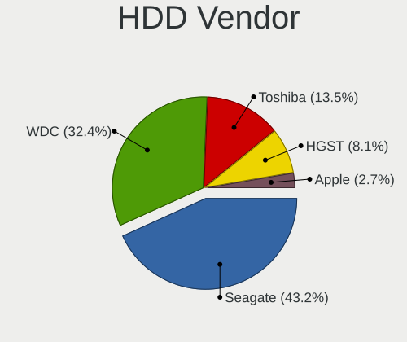

| Vendor  | Computers | Drives | Percent |
|---------|-----------|--------|---------|
| Seagate | 16        | 18     | 43.24%  |
| WDC     | 12        | 12     | 32.43%  |
| Toshiba | 5         | 5      | 13.51%  |
| HGST    | 3         | 3      | 8.11%   |
| Apple   | 1         | 1      | 2.7%    |

SSD Vendor
----------

Solid state drive vendors

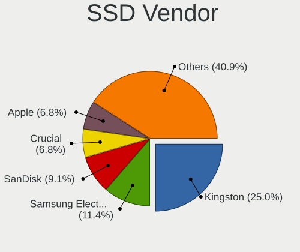

| Vendor              | Computers | Drives | Percent |
|---------------------|-----------|--------|---------|
| Kingston            | 11        | 11     | 25%     |
| Samsung Electronics | 5         | 6      | 11.36%  |
| SanDisk             | 4         | 4      | 9.09%   |
| Crucial             | 3         | 4      | 6.82%   |
| Apple               | 3         | 3      | 6.82%   |
| PNY                 | 2         | 2      | 4.55%   |
| Micron Technology   | 2         | 2      | 4.55%   |
| Intel               | 2         | 2      | 4.55%   |
| Wibtek              | 1         | 1      | 2.27%   |
| WDC                 | 1         | 1      | 2.27%   |
| Transcend           | 1         | 1      | 2.27%   |
| Team                | 1         | 1      | 2.27%   |
| SSSTC               | 1         | 1      | 2.27%   |
| SK hynix            | 1         | 1      | 2.27%   |
| Patriot             | 1         | 1      | 2.27%   |
| HECTRON             | 1         | 1      | 2.27%   |
| Fanxiang            | 1         | 1      | 2.27%   |
| CONSISTENT          | 1         | 1      | 2.27%   |
| Apacer              | 1         | 1      | 2.27%   |
| AirDisk             | 1         | 1      | 2.27%   |

Drive Kind
----------

HDD or SSD

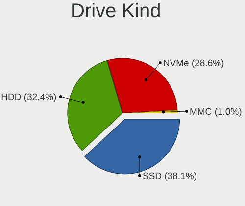

| Kind | Computers | Drives | Percent |
|------|-----------|--------|---------|
| SSD  | 40        | 46     | 38.1%   |
| HDD  | 34        | 39     | 32.38%  |
| NVMe | 30        | 38     | 28.57%  |
| MMC  | 1         | 1      | 0.95%   |

Drive Connector
---------------

SATA, SAS, NVMe, etc.

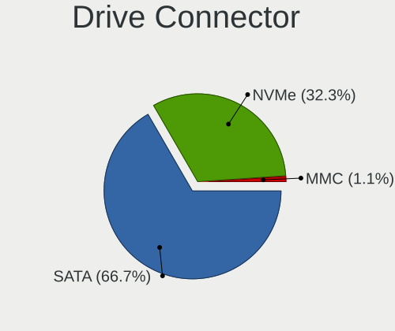

| Type | Computers | Drives | Percent |
|------|-----------|--------|---------|
| SATA | 62        | 85     | 66.67%  |
| NVMe | 30        | 38     | 32.26%  |
| MMC  | 1         | 1      | 1.08%   |

Drive Size
----------

Size of hard drive

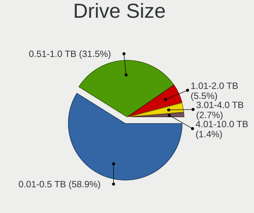

| Size in TB | Computers | Drives | Percent |
|------------|-----------|--------|---------|
| 0.01-0.5   | 43        | 51     | 58.9%   |
| 0.51-1.0   | 23        | 27     | 31.51%  |
| 1.01-2.0   | 4         | 4      | 5.48%   |
| 3.01-4.0   | 2         | 2      | 2.74%   |
| 4.01-10.0  | 1         | 1      | 1.37%   |

Space Total
-----------

Amount of disk space available on the file system

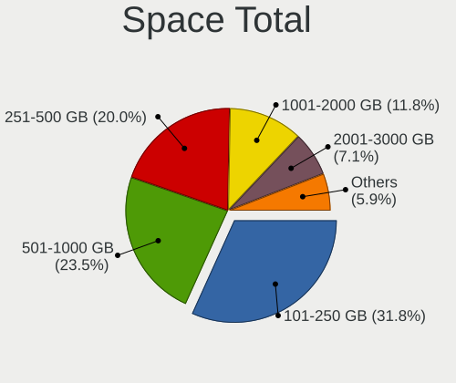

| Size in GB     | Computers | Percent |
|----------------|-----------|---------|
| 101-250        | 27        | 31.76%  |
| 501-1000       | 20        | 23.53%  |
| 251-500        | 17        | 20%     |
| 1001-2000      | 10        | 11.76%  |
| 2001-3000      | 6         | 7.06%   |
| 51-100         | 3         | 3.53%   |
| More than 3000 | 1         | 1.18%   |
| 1-20           | 1         | 1.18%   |

Space Used
----------

Amount of used disk space

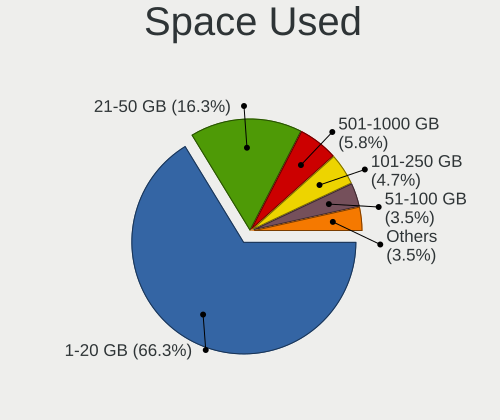

| Used GB   | Computers | Percent |
|-----------|-----------|---------|
| 1-20      | 57        | 66.28%  |
| 21-50     | 14        | 16.28%  |
| 501-1000  | 5         | 5.81%   |
| 101-250   | 4         | 4.65%   |
| 51-100    | 3         | 3.49%   |
| 1001-2000 | 2         | 2.33%   |
| 251-500   | 1         | 1.16%   |

Malfunc. Drives
---------------

Drive models with a malfunction

Zero info for selected period =(

Malfunc. Drive Vendor
---------------------

Vendors of faulty drives

Zero info for selected period =(

Malfunc. HDD Vendor
-------------------

Vendors of faulty HDD drives

Zero info for selected period =(

Malfunc. Drive Kind
-------------------

Kinds of faulty drives

Zero info for selected period =(

Failed Drives
-------------

Failed drive models

Zero info for selected period =(

Failed Drive Vendor
-------------------

Failed drive vendors

Zero info for selected period =(

Drive Status
------------

Number of failed and malfunc. drives

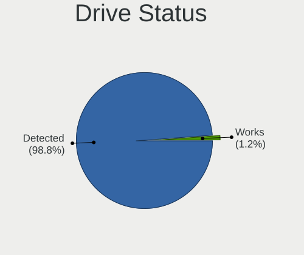

| Status   | Computers | Drives | Percent |
|----------|-----------|--------|---------|
| Detected | 84        | 123    | 98.82%  |
| Works    | 1         | 1      | 1.18%   |

Storage controller
------------------

Storage Vendor
--------------

Storage controller vendors

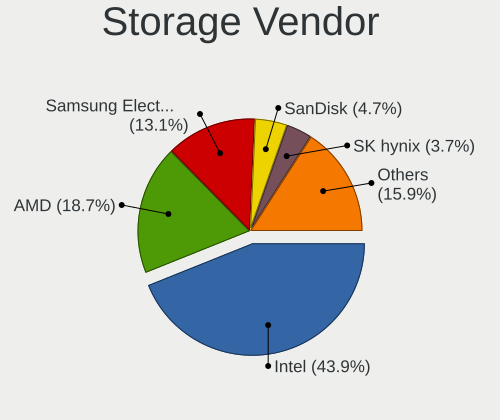

| Vendor                       | Computers | Percent |
|------------------------------|-----------|---------|
| Intel                        | 47        | 43.93%  |
| AMD                          | 20        | 18.69%  |
| Samsung Electronics          | 14        | 13.08%  |
| SanDisk                      | 5         | 4.67%   |
| SK hynix                     | 4         | 3.74%   |
| Micron Technology            | 3         | 2.8%    |
| Marvell Technology Group     | 3         | 2.8%    |
| Phison Electronics           | 2         | 1.87%   |
| Micron/Crucial Technology    | 2         | 1.87%   |
| Kingston Technology Company  | 2         | 1.87%   |
| Toshiba America Info Systems | 1         | 0.93%   |
| Solidigm                     | 1         | 0.93%   |
| MAXIO Technology (Hangzhou)  | 1         | 0.93%   |
| ASMedia Technology           | 1         | 0.93%   |
| ADATA Technology             | 1         | 0.93%   |

Storage Model
-------------

Storage controller models

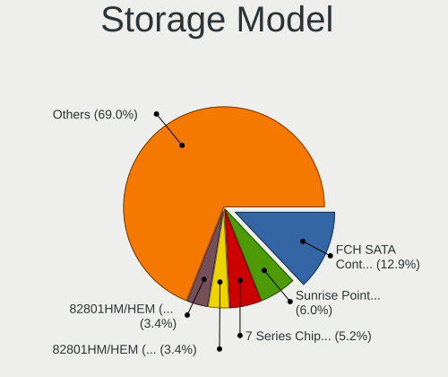

| Model                                                                            | Computers | Percent |
|----------------------------------------------------------------------------------|-----------|---------|
| AMD FCH SATA Controller [AHCI mode]                                              | 15        | 12.93%  |
| Intel Sunrise Point-LP SATA Controller [AHCI mode]                               | 7         | 6.03%   |
| Intel 7 Series Chipset Family 6-port SATA Controller [AHCI mode]                 | 6         | 5.17%   |
| Intel 82801HM/HEM (ICH8M/ICH8M-E) SATA Controller [AHCI mode]                    | 4         | 3.45%   |
| Intel 82801HM/HEM (ICH8M/ICH8M-E) IDE Controller                                 | 4         | 3.45%   |
| Intel 8 Series SATA Controller 1 [AHCI mode]                                     | 4         | 3.45%   |
| AMD 500 Series Chipset SATA Controller                                           | 4         | 3.45%   |
| Samsung NVMe SSD Controller SM981/PM981/PM983                                    | 3         | 2.59%   |
| Samsung NVMe SSD Controller PM9A1/PM9A3/980PRO                                   | 3         | 2.59%   |
| Samsung NVMe SSD Controller 980 (DRAM-less)                                      | 3         | 2.59%   |
| Intel 9 Series Chipset Family SATA Controller [AHCI Mode]                        | 3         | 2.59%   |
| Intel 6 Series/C200 Series Chipset Family 6 port Desktop SATA AHCI Controller    | 3         | 2.59%   |
| SanDisk Ultra 3D / WD PC SN530, IX SN530, Blue SN550 NVMe SSD (DRAM-less)        | 2         | 1.72%   |
| Micron/Crucial P2 [Nick P2] / P3 / P3 Plus NVMe PCIe SSD (DRAM-less)             | 2         | 1.72%   |
| Micron 2400 NVMe SSD (DRAM-less)                                                 | 2         | 1.72%   |
| Intel SATA Controller [RAID mode]                                                | 2         | 1.72%   |
| Intel Atom/Celeron/Pentium Processor x5-E8000/J3xxx/N3xxx Series SATA Controller | 2         | 1.72%   |
| Intel 8 Series/C220 Series Chipset Family 6-port SATA Controller 1 [AHCI mode]   | 2         | 1.72%   |
| Intel 6 Series/C200 Series Chipset Family 6 port Mobile SATA AHCI Controller     | 2         | 1.72%   |
| Intel 400 Series Chipset Family SATA AHCI Controller                             | 2         | 1.72%   |
| AMD 400 Series Chipset SATA Controller                                           | 2         | 1.72%   |
| Toshiba America Info Systems BG3 x2 NVMe SSD Controller (DRAM-less)              | 1         | 0.86%   |
| Solidigm P41 Plus NVMe SSD (DRAM-less) [Echo Harbor]                             | 1         | 0.86%   |
| SK hynix PVC10 NVMe Solid State Drive (DRAM-less)                                | 1         | 0.86%   |
| SK hynix PC601 NVMe Solid State Drive                                            | 1         | 0.86%   |
| SK hynix Gold P31/BC711/PC711 NVMe Solid State Drive                             | 1         | 0.86%   |
| SK hynix BC511 NVMe SSD                                                          | 1         | 0.86%   |
| SanDisk WD PC SN810 / Black SN850 NVMe SSD                                       | 1         | 0.86%   |
| SanDisk Extreme Pro / WD Black SN750 / PC SN730 / Red SN700 NVMe SSD             | 1         | 0.86%   |
| SanDisk Extreme Pro / WD Black 2018/SN750/PC SN720 NVMe SSD                      | 1         | 0.86%   |
| Samsung S4LN058A01[SSUBX] AHCI SSD Controller (Apple slot)                       | 1         | 0.86%   |
| Samsung PM971 BGA PCIe x2 NVMe SSD                                               | 1         | 0.86%   |
| Samsung NVMe SSD Controller S4LV008[Pascal]                                      | 1         | 0.86%   |
| Samsung NVMe SSD Controller PM9C1a (DRAM-less)                                   | 1         | 0.86%   |
| Samsung NVMe SSD 9100 PRO [PM9E1]                                                | 1         | 0.86%   |
| Phison PS5027-E27T PCIe4 NVMe Controller (DRAM-less)                             | 1         | 0.86%   |
| Phison PS5013-E13 PCIe3 NVMe Controller (DRAM-less)                              | 1         | 0.86%   |
| Micron 2450 NVMe SSD [HendrixV] (DRAM-less)                                      | 1         | 0.86%   |
| MAXIO (Hangzhou) NVMe SSD Controller MAP1202 (DRAM-less)                         | 1         | 0.86%   |
| Marvell Group 88SS9183 PCIe SSD Controller                                       | 1         | 0.86%   |

Storage Kind
------------

Kind of storage controller (IDE, SATA, NVMe, SAS, ...)

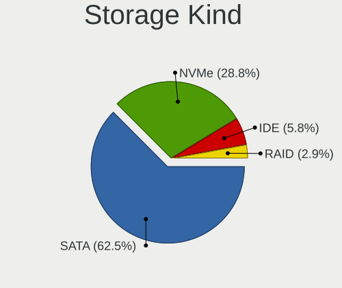

| Kind | Computers | Percent |
|------|-----------|---------|
| SATA | 65        | 62.5%   |
| NVMe | 30        | 28.85%  |
| IDE  | 6         | 5.77%   |
| RAID | 3         | 2.88%   |

Processor
---------

CPU Vendor
----------

Processor vendors

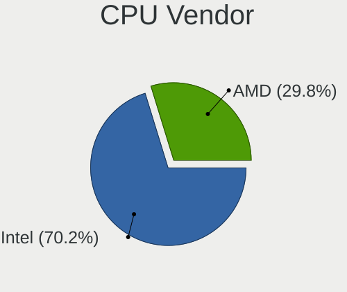

| Vendor | Computers | Percent |
|--------|-----------|---------|
| Intel  | 59        | 70.24%  |
| AMD    | 25        | 29.76%  |

CPU Model
---------

Processor models

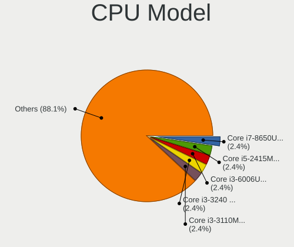

| Model                                | Computers | Percent |
|--------------------------------------|-----------|---------|
| Intel Core i7-8650U CPU @ 1.90GHz    | 2         | 2.38%   |
| Intel Core i5-2415M CPU @ 2.30GHz    | 2         | 2.38%   |
| Intel Core i3-6006U CPU @ 2.00GHz    | 2         | 2.38%   |
| Intel Core i3-3240 CPU @ 3.40GHz     | 2         | 2.38%   |
| Intel Core i3-3110M CPU @ 2.40GHz    | 2         | 2.38%   |
| Intel Core 2 Duo CPU E8135 @ 2.40GHz | 2         | 2.38%   |
| AMD Ryzen 5 5600X 6-Core Processor   | 2         | 2.38%   |
| Intel Xeon CPU E5-2699 v3 @ 2.30GHz  | 1         | 1.19%   |
| Intel Xeon CPU E5-2660 0 @ 2.20GHz   | 1         | 1.19%   |
| Intel Pentium CPU J4205 @ 1.50GHz    | 1         | 1.19%   |
| Intel Pentium CPU 4415Y @ 1.60GHz    | 1         | 1.19%   |
| Intel Core i7-7700HQ CPU @ 2.80GHz   | 1         | 1.19%   |
| Intel Core i7-4930K CPU @ 3.40GHz    | 1         | 1.19%   |
| Intel Core i7-4790K CPU @ 4.00GHz    | 1         | 1.19%   |
| Intel Core i7-3820QM CPU @ 2.70GHz   | 1         | 1.19%   |
| Intel Core i5-8350U CPU @ 1.70GHz    | 1         | 1.19%   |
| Intel Core i5-8265U CPU @ 1.60GHz    | 1         | 1.19%   |
| Intel Core i5-8250U CPU @ 1.60GHz    | 1         | 1.19%   |
| Intel Core i5-7400 CPU @ 3.00GHz     | 1         | 1.19%   |
| Intel Core i5-7300U CPU @ 2.60GHz    | 1         | 1.19%   |
| Intel Core i5-6200U CPU @ 2.30GHz    | 1         | 1.19%   |
| Intel Core i5-5675R CPU @ 3.10GHz    | 1         | 1.19%   |
| Intel Core i5-4690K CPU @ 3.50GHz    | 1         | 1.19%   |
| Intel Core i5-4260U CPU @ 1.40GHz    | 1         | 1.19%   |
| Intel Core i5-4258U CPU @ 2.40GHz    | 1         | 1.19%   |
| Intel Core i5-4210U CPU @ 1.70GHz    | 1         | 1.19%   |
| Intel Core i5-4200U CPU @ 1.60GHz    | 1         | 1.19%   |
| Intel Core i5-4200M CPU @ 2.50GHz    | 1         | 1.19%   |
| Intel Core i5-3337U CPU @ 1.80GHz    | 1         | 1.19%   |
| Intel Core i5-10400 CPU @ 2.90GHz    | 1         | 1.19%   |
| Intel Core i5-1035G1 CPU @ 1.00GHz   | 1         | 1.19%   |
| Intel Core i3-7100 CPU @ 3.90GHz     | 1         | 1.19%   |
| Intel Core i3-7020U CPU @ 2.30GHz    | 1         | 1.19%   |
| Intel Core i3-4170 CPU @ 3.70GHz     | 1         | 1.19%   |
| Intel Core i3-4030U CPU @ 1.90GHz    | 1         | 1.19%   |
| Intel Core i3-3227U CPU @ 1.90GHz    | 1         | 1.19%   |
| Intel Core i3-2375M CPU @ 1.50GHz    | 1         | 1.19%   |
| Intel Core i3-10100F CPU @ 3.60GHz   | 1         | 1.19%   |
| Intel Core i3-10100 CPU @ 3.60GHz    | 1         | 1.19%   |
| Intel Core 2 Duo CPU T8100 @ 2.10GHz | 1         | 1.19%   |

CPU Model Family
----------------

Processor model prefix

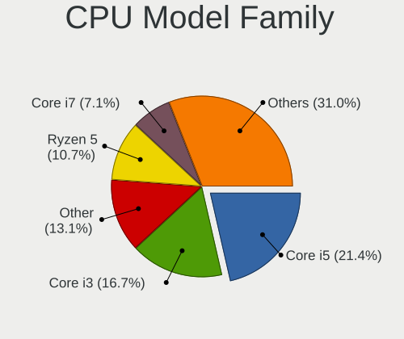

| Model            | Computers | Percent |
|------------------|-----------|---------|
| Intel Core i5    | 18        | 21.43%  |
| Intel Core i3    | 14        | 16.67%  |
| Other            | 11        | 13.1%   |
| AMD Ryzen 5      | 9         | 10.71%  |
| Intel Core i7    | 6         | 7.14%   |
| AMD Ryzen 7      | 6         | 7.14%   |
| Intel Core 2 Duo | 4         | 4.76%   |
| Intel Celeron    | 4         | 4.76%   |
| Intel Xeon       | 2         | 2.38%   |
| Intel Pentium    | 2         | 2.38%   |
| AMD A8           | 2         | 2.38%   |
| Intel Atom       | 1         | 1.19%   |
| AMD Ryzen 9      | 1         | 1.19%   |
| AMD FX           | 1         | 1.19%   |
| AMD E1           | 1         | 1.19%   |
| AMD Athlon       | 1         | 1.19%   |
| AMD A10          | 1         | 1.19%   |

CPU Cores
---------

Number of processor cores

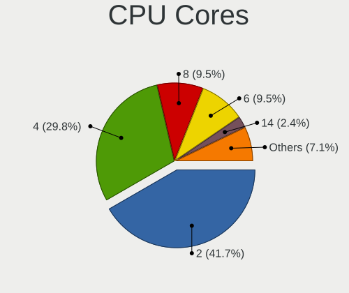

| Number | Computers | Percent |
|--------|-----------|---------|
| 2      | 35        | 41.67%  |
| 4      | 25        | 29.76%  |
| 8      | 8         | 9.52%   |
| 6      | 8         | 9.52%   |
| 14     | 2         | 2.38%   |
| 10     | 2         | 2.38%   |
| 18     | 1         | 1.19%   |
| 16     | 1         | 1.19%   |
| 12     | 1         | 1.19%   |
| 3      | 1         | 1.19%   |

CPU Sockets
-----------

Number of sockets

| Number | Computers | Percent |
|--------|-----------|---------|
| 1      | 83        | 98.81%  |
| 2      | 1         | 1.19%   |

CPU Threads
-----------

Threads per core (Hyper-Threading)

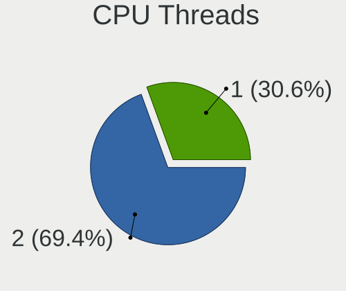

| Number | Computers | Percent |
|--------|-----------|---------|
| 2      | 66        | 78.57%  |
| 1      | 18        | 21.43%  |

CPU Op-Modes
------------

CPU Operation Modes (32-bit, 64-bit)

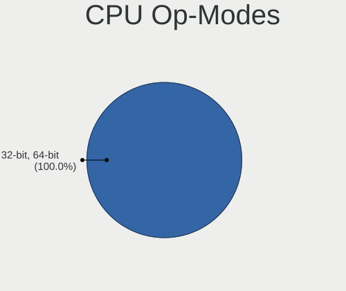

| Op mode        | Computers | Percent |
|----------------|-----------|---------|
| 32-bit, 64-bit | 84        | 100%    |

CPU Microcode
-------------

Microcode number

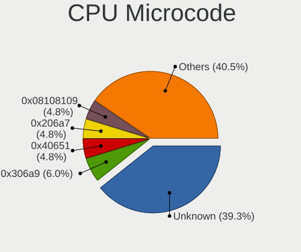

| Number     | Computers | Percent |
|------------|-----------|---------|
| Unknown    | 33        | 39.29%  |
| 0x306a9    | 5         | 5.95%   |
| 0x40651    | 4         | 4.76%   |
| 0x206a7    | 4         | 4.76%   |
| 0x08108109 | 4         | 4.76%   |
| 0xa0653    | 3         | 3.57%   |
| 0x406e3    | 3         | 3.57%   |
| 0x906e9    | 2         | 2.38%   |
| 0x306c3    | 2         | 2.38%   |
| 0x10676    | 2         | 2.38%   |
| 0x06001119 | 2         | 2.38%   |
| 0x90675    | 1         | 1.19%   |
| 0x806ec    | 1         | 1.19%   |
| 0x806ea    | 1         | 1.19%   |
| 0x806e9    | 1         | 1.19%   |
| 0x706e5    | 1         | 1.19%   |
| 0x706a1    | 1         | 1.19%   |
| 0x6fb      | 1         | 1.19%   |
| 0x506c9    | 1         | 1.19%   |
| 0x406c4    | 1         | 1.19%   |
| 0x406c3    | 1         | 1.19%   |
| 0x40671    | 1         | 1.19%   |
| 0x306e4    | 1         | 1.19%   |
| 0x206d7    | 1         | 1.19%   |
| 0x0a201009 | 1         | 1.19%   |
| 0x08701021 | 1         | 1.19%   |
| 0x08600106 | 1         | 1.19%   |
| 0x0800820d | 1         | 1.19%   |
| 0x07030105 | 1         | 1.19%   |
| 0x06000822 | 1         | 1.19%   |
| 0x0500010d | 1         | 1.19%   |

CPU Microarch
-------------

Microarchitecture

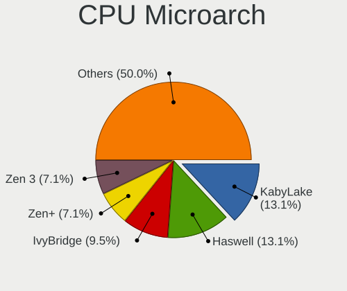

| Name             | Computers | Percent |
|------------------|-----------|---------|
| KabyLake         | 11        | 13.1%   |
| Haswell          | 11        | 13.1%   |
| IvyBridge        | 8         | 9.52%   |
| Zen+             | 6         | 7.14%   |
| Zen 3            | 6         | 7.14%   |
| Alderlake Hybrid | 6         | 7.14%   |
| SandyBridge      | 5         | 5.95%   |
| Zen 2            | 4         | 4.76%   |
| Skylake          | 3         | 3.57%   |
| Piledriver       | 3         | 3.57%   |
| Penryn           | 3         | 3.57%   |
| CometLake        | 3         | 3.57%   |
| Unknown          | 3         | 3.57%   |
| TigerLake        | 2         | 2.38%   |
| Silvermont       | 2         | 2.38%   |
| Puma             | 1         | 1.19%   |
| IceLake          | 1         | 1.19%   |
| Goldmont plus    | 1         | 1.19%   |
| Goldmont         | 1         | 1.19%   |
| Excavator        | 1         | 1.19%   |
| Core             | 1         | 1.19%   |
| Broadwell        | 1         | 1.19%   |
| Bobcat           | 1         | 1.19%   |

Graphics
--------

GPU Vendor
----------

Vendors of graphics cards

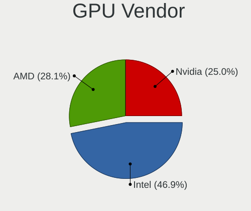

| Vendor | Computers | Percent |
|--------|-----------|---------|
| Intel  | 45        | 46.88%  |
| AMD    | 27        | 28.13%  |
| Nvidia | 24        | 25%     |

GPU Model
---------

Graphics card models

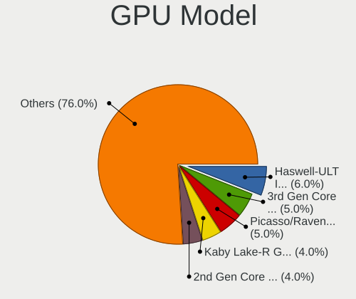

| Model                                                                                    | Computers | Percent |
|------------------------------------------------------------------------------------------|-----------|---------|
| Intel Haswell-ULT Integrated Graphics Controller                                         | 6         | 6%      |
| Intel 3rd Gen Core processor Graphics Controller                                         | 5         | 5%      |
| AMD Picasso/Raven 2 [Radeon Vega Series / Radeon Vega Mobile Series]                     | 5         | 5%      |
| Intel Kaby Lake-R GT2 [UHD Graphics 620]                                                 | 4         | 4%      |
| Intel 2nd Generation Core Processor Family Integrated Graphics Controller                | 4         | 4%      |
| Nvidia GP106 [GeForce GTX 1060 3GB]                                                      | 3         | 3%      |
| Intel Skylake-U GT2 [HD Graphics 520]                                                    | 3         | 3%      |
| Intel Raptor Lake-P [Iris Xe Graphics]                                                   | 3         | 3%      |
| Nvidia GP106 [GeForce GTX 1060 6GB]                                                      | 2         | 2%      |
| Nvidia GF117M [GeForce 610M/710M/810M/820M / GT 620M/625M/630M/720M]                     | 2         | 2%      |
| Intel TigerLake-LP GT2 [Iris Xe Graphics]                                                | 2         | 2%      |
| Intel Atom/Celeron/Pentium Processor x5-E8000/J3xxx/N3xxx Integrated Graphics Controller | 2         | 2%      |
| AMD Topaz XT [Radeon R7 M260/M265 / M340/M360 / M440/M445 / 530/535 / 620/625 Mobile]    | 2         | 2%      |
| AMD RV610/M74 [Mobility Radeon HD 2400 XT]                                               | 2         | 2%      |
| AMD Renoir [Radeon Vega Series / Radeon Vega Mobile Series]                              | 2         | 2%      |
| Nvidia TU117M [GeForce GTX 1650 Mobile / Max-Q]                                          | 1         | 1%      |
| Nvidia TU116 [GeForce GTX 1650 SUPER]                                                    | 1         | 1%      |
| Nvidia TU106 [GeForce RTX 2070]                                                          | 1         | 1%      |
| Nvidia GP107M [GeForce GTX 1050 Ti Mobile]                                               | 1         | 1%      |
| Nvidia GP107M [GeForce GTX 1050 3 GB Max-Q]                                              | 1         | 1%      |
| Nvidia GP107 [GeForce GTX 1050 Ti]                                                       | 1         | 1%      |
| Nvidia GM206 [GeForce GTX 960]                                                           | 1         | 1%      |
| Nvidia GM204 [GeForce GTX 970]                                                           | 1         | 1%      |
| Nvidia GM108M [GeForce MX130]                                                            | 1         | 1%      |
| Nvidia GM108M [GeForce 840M]                                                             | 1         | 1%      |
| Nvidia GM107 [GeForce GTX 750 Ti]                                                        | 1         | 1%      |
| Nvidia GK208M [GeForce GT 740M]                                                          | 1         | 1%      |
| Nvidia GK107M [GeForce GT 650M Mac Edition]                                              | 1         | 1%      |
| Nvidia GF108M [GeForce GT 620M/630M/635M/640M LE]                                        | 1         | 1%      |
| Nvidia GA102 [GeForce RTX 3090]                                                          | 1         | 1%      |
| Nvidia GA102 [GeForce RTX 3080 Lite Hash Rate]                                           | 1         | 1%      |
| Nvidia AD106M [GeForce RTX 4070 Max-Q / Mobile]                                          | 1         | 1%      |
| Intel Xeon E3-1200 v2/3rd Gen Core processor Graphics Controller                         | 1         | 1%      |
| Intel WhiskeyLake-U GT2 [UHD Graphics 620]                                               | 1         | 1%      |
| Intel Raptor Lake-P [UHD Graphics]                                                       | 1         | 1%      |
| Intel Mobile GM965/GL960 Integrated Graphics Controller (secondary)                      | 1         | 1%      |
| Intel Mobile GM965/GL960 Integrated Graphics Controller (primary)                        | 1         | 1%      |
| Intel Kaby Lake-Y GT2 [HD Graphics 615]                                                  | 1         | 1%      |
| Intel Kaby Lake-U GT2 [HD Graphics 620]                                                  | 1         | 1%      |
| Intel Kaby Lake-S GT2 [HD Graphics 630]                                                  | 1         | 1%      |

GPU Combo
---------

Combinations of graphics cards

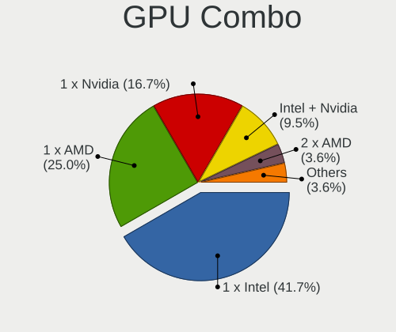

| Name           | Computers | Percent |
|----------------|-----------|---------|
| 1 x Intel      | 35        | 41.67%  |
| 1 x AMD        | 21        | 25%     |
| 1 x Nvidia     | 14        | 16.67%  |
| Intel + Nvidia | 8         | 9.52%   |
| 2 x AMD        | 3         | 3.57%   |
| AMD + Nvidia   | 2         | 2.38%   |
| Intel + AMD    | 1         | 1.19%   |

GPU Driver
----------

Free vs proprietary

| Driver | Computers | Percent |
|--------|-----------|---------|
| Free   | 84        | 100%    |

GPU Memory
----------

Total video memory

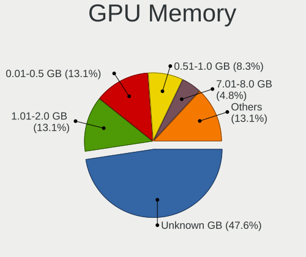

| Size in GB | Computers | Percent |
|------------|-----------|---------|
| Unknown    | 40        | 47.62%  |
| 1.01-2.0   | 11        | 13.1%   |
| 0.01-0.5   | 11        | 13.1%   |
| 0.51-1.0   | 7         | 8.33%   |
| 7.01-8.0   | 4         | 4.76%   |
| 2.01-3.0   | 4         | 4.76%   |
| 3.01-4.0   | 3         | 3.57%   |
| 5.01-6.0   | 2         | 2.38%   |
| 8.01-16.0  | 2         | 2.38%   |

Monitor
-------

Monitor Vendor
--------------

Monitor vendors

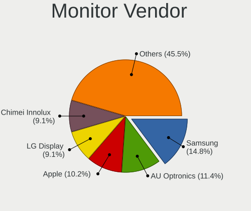

| Vendor               | Computers | Percent |
|----------------------|-----------|---------|
| Samsung Electronics  | 13        | 14.77%  |
| AU Optronics         | 10        | 11.36%  |
| Apple                | 9         | 10.23%  |
| LG Display           | 8         | 9.09%   |
| Chimei Innolux       | 8         | 9.09%   |
| BOE                  | 7         | 7.95%   |
| Goldstar             | 5         | 5.68%   |
| AOC                  | 4         | 4.55%   |
| Sharp                | 3         | 3.41%   |
| Dell                 | 3         | 3.41%   |
| Acer                 | 3         | 3.41%   |
| Viotek               | 2         | 2.27%   |
| TMX                  | 1         | 1.14%   |
| SuperFrame           | 1         | 1.14%   |
| Sony                 | 1         | 1.14%   |
| Philips              | 1         | 1.14%   |
| PANDA                | 1         | 1.14%   |
| Lenovo               | 1         | 1.14%   |
| Insignia             | 1         | 1.14%   |
| InfoVision           | 1         | 1.14%   |
| Iiyama               | 1         | 1.14%   |
| Hewlett-Packard      | 1         | 1.14%   |
| BenQ                 | 1         | 1.14%   |
| ASUSTek Computer     | 1         | 1.14%   |
| Ancor Communications | 1         | 1.14%   |

Monitor Model
-------------

Monitor models

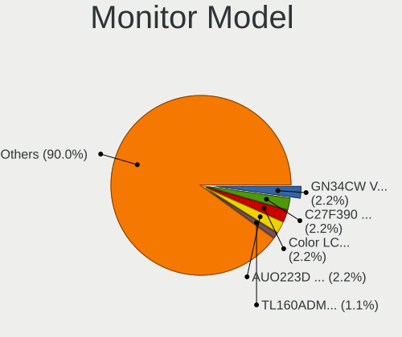

| Model                                                                 | Computers | Percent |
|-----------------------------------------------------------------------|-----------|---------|
| Viotek GN34CW VTK3400 3440x1440 795x334mm 33.9-inch                   | 2         | 2.22%   |
| Samsung Electronics C27F390 SAM0D32 1920x1080 598x336mm 27.0-inch     | 2         | 2.22%   |
| AU Optronics LCD Monitor AUO223D 1920x1080 309x174mm 14.0-inch        | 2         | 2.22%   |
| Apple Color LCD APP9C6B 1680x1050 433x270mm 20.1-inch                 | 2         | 2.22%   |
| TMX TL160ADMP03-0 TMX1603 2560x1600 345x215mm 16.0-inch               | 1         | 1.11%   |
| SuperFrame SFV2409 SUE2409 1920x1080 597x336mm 27.0-inch              | 1         | 1.11%   |
| Sony TV SNY4803 1920x1080 1218x685mm 55.0-inch                        | 1         | 1.11%   |
| Sharp LQ156M1JW01 SHP14C3 1920x1080 344x194mm 15.5-inch               | 1         | 1.11%   |
| Sharp LQ135P1JX51 SHP14B3 2256x1504 285x190mm 13.5-inch               | 1         | 1.11%   |
| Sharp LQ100P1JX51 SHP14A6 1800x1200 211x141mm 10.0-inch               | 1         | 1.11%   |
| Samsung Electronics T27B350 SAM0945 1920x1080 598x336mm 27.0-inch     | 1         | 1.11%   |
| Samsung Electronics SyncMaster SAM02E3 1440x900 367x229mm 17.0-inch   | 1         | 1.11%   |
| Samsung Electronics SMB2230N SAM0635 1920x1080 477x268mm 21.5-inch    | 1         | 1.11%   |
| Samsung Electronics S24D300 SAM0B43 1920x1080 531x299mm 24.0-inch     | 1         | 1.11%   |
| Samsung Electronics LCD Monitor SDC4347 1366x768 344x193mm 15.5-inch  | 1         | 1.11%   |
| Samsung Electronics LCD Monitor SDC418D 3200x2000 344x215mm 16.0-inch | 1         | 1.11%   |
| Samsung Electronics LCD Monitor SDC4178 3200x2000 344x215mm 16.0-inch | 1         | 1.11%   |
| Samsung Electronics LCD Monitor SDC4156 1920x1080 294x165mm 13.3-inch | 1         | 1.11%   |
| Samsung Electronics LCD Monitor SDC3754 1600x900 382x215mm 17.3-inch  | 1         | 1.11%   |
| Samsung Electronics C32F391 SAM0D34 1920x1080 698x393mm 31.5-inch     | 1         | 1.11%   |
| Samsung Electronics C24F390 SAM0D2C 1920x1080 521x293mm 23.5-inch     | 1         | 1.11%   |
| Samsung Electronics ATNA40HQ01-0  SDC4203                             | 1         | 1.11%   |
| Philips PHL 223V5 PHLC0CF 1920x1080 477x268mm 21.5-inch               | 1         | 1.11%   |
| PANDA LCD Monitor NCP0064 1920x1080 344x194mm 15.5-inch               | 1         | 1.11%   |
| LG Display LCD Monitor LGD05EC 1920x1080 309x174mm 14.0-inch          | 1         | 1.11%   |
| LG Display LCD Monitor LGD0555 2736x1824 260x173mm 12.3-inch          | 1         | 1.11%   |
| LG Display LCD Monitor LGD04B3 1920x1080 345x194mm 15.6-inch          | 1         | 1.11%   |
| LG Display LCD Monitor LGD045C 1366x768 345x194mm 15.6-inch           | 1         | 1.11%   |
| LG Display LCD Monitor LGD03AB 1366x768 344x194mm 15.5-inch           | 1         | 1.11%   |
| LG Display LCD Monitor LGD039F 1366x768 345x194mm 15.6-inch           | 1         | 1.11%   |
| LG Display LCD Monitor LGD0372 1600x900 382x215mm 17.3-inch           | 1         | 1.11%   |
| LG Display LCD Monitor LGD02DA 1920x1080 382x215mm 17.3-inch          | 1         | 1.11%   |
| Lenovo LCD Monitor LEN40A9 1920x1080 309x173mm 13.9-inch              | 1         | 1.11%   |
| Insignia NS-19E320A13 BBY0032 1680x1050 640x384mm 29.4-inch           | 1         | 1.11%   |
| InfoVision LCD Monitor IVO057D 1920x1080 309x174mm 14.0-inch          | 1         | 1.11%   |
| Iiyama X2485 IVM6122 1920x1200 518x324mm 24.1-inch                    | 1         | 1.11%   |
| Hewlett-Packard w1907 HWP26A2 1440x900 408x255mm 18.9-inch            | 1         | 1.11%   |
| Goldstar W1752 GSM4490 1440x900 370x232mm 17.2-inch                   | 1         | 1.11%   |
| Goldstar M2262D GSM5755 1920x1080 598x336mm 27.0-inch                 | 1         | 1.11%   |
| Goldstar LG ULTRAGEAR GSM5B73 1920x1080 530x300mm 24.0-inch           | 1         | 1.11%   |

Monitor Resolution
------------------

Monitor screen resolution

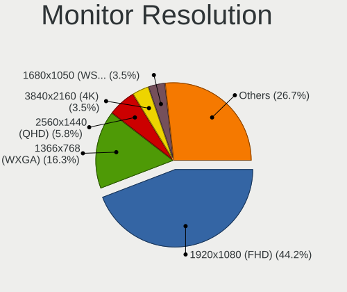

| Resolution         | Computers | Percent |
|--------------------|-----------|---------|
| 1920x1080 (FHD)    | 38        | 44.19%  |
| 1366x768 (WXGA)    | 14        | 16.28%  |
| 2560x1440 (QHD)    | 5         | 5.81%   |
| 3840x2160 (4K)     | 3         | 3.49%   |
| 1680x1050 (WSXGA+) | 3         | 3.49%   |
| 1600x900 (HD+)     | 3         | 3.49%   |
| 1440x900 (WXGA+)   | 3         | 3.49%   |
| 3440x1440          | 2         | 2.33%   |
| 3200x2000          | 2         | 2.33%   |
| 2560x1600          | 2         | 2.33%   |
| 1920x1200 (WUXGA)  | 2         | 2.33%   |
| 1280x800 (WXGA)    | 2         | 2.33%   |
| 3840x1600          | 1         | 1.16%   |
| 2880x1920          | 1         | 1.16%   |
| 2880x1800          | 1         | 1.16%   |
| 2256x1504          | 1         | 1.16%   |
| 1920x540           | 1         | 1.16%   |
| 1800x1200          | 1         | 1.16%   |
| Unknown            | 1         | 1.16%   |

Monitor Diagonal
----------------

Diagonal size in inches

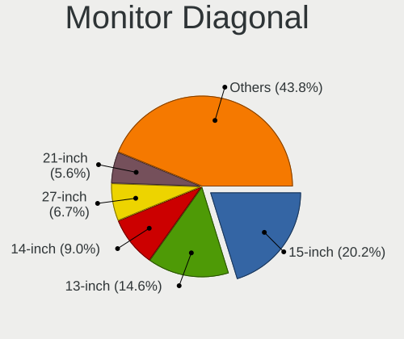

| Inches  | Computers | Percent |
|---------|-----------|---------|
| 15      | 18        | 20.22%  |
| 13      | 13        | 14.61%  |
| 14      | 8         | 8.99%   |
| 27      | 6         | 6.74%   |
| 21      | 5         | 5.62%   |
| 17      | 5         | 5.62%   |
| 24      | 4         | 4.49%   |
| 23      | 4         | 4.49%   |
| 20      | 3         | 3.37%   |
| 16      | 3         | 3.37%   |
| 40      | 2         | 2.25%   |
| 34      | 2         | 2.25%   |
| 31      | 2         | 2.25%   |
| 11      | 2         | 2.25%   |
| 72      | 1         | 1.12%   |
| 60      | 1         | 1.12%   |
| 48      | 1         | 1.12%   |
| 37      | 1         | 1.12%   |
| 32      | 1         | 1.12%   |
| 26      | 1         | 1.12%   |
| 22      | 1         | 1.12%   |
| 19      | 1         | 1.12%   |
| 18      | 1         | 1.12%   |
| 12      | 1         | 1.12%   |
| 10      | 1         | 1.12%   |
| Unknown | 1         | 1.12%   |

Monitor Width
-------------

Physical width

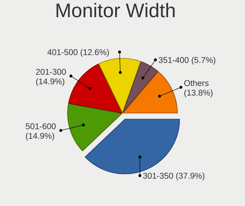

| Width in mm | Computers | Percent |
|-------------|-----------|---------|
| 301-350     | 33        | 37.93%  |
| 501-600     | 13        | 14.94%  |
| 201-300     | 13        | 14.94%  |
| 401-500     | 11        | 12.64%  |
| 351-400     | 5         | 5.75%   |
| 801-900     | 3         | 3.45%   |
| 701-800     | 3         | 3.45%   |
| 601-700     | 2         | 2.3%    |
| 1001-1500   | 2         | 2.3%    |
| 1501-2000   | 1         | 1.15%   |
| Unknown     | 1         | 1.15%   |

Aspect Ratio
------------

Proportional relationship between the width and the height

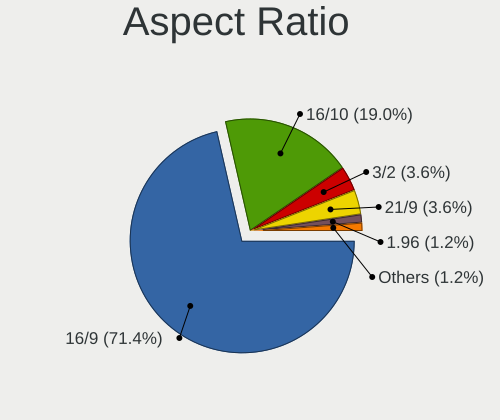

| Ratio   | Computers | Percent |
|---------|-----------|---------|
| 16/9    | 60        | 71.43%  |
| 16/10   | 16        | 19.05%  |
| 3/2     | 3         | 3.57%   |
| 21/9    | 3         | 3.57%   |
| 1.96    | 1         | 1.19%   |
| Unknown | 1         | 1.19%   |

Monitor Area
------------

Area in inch²

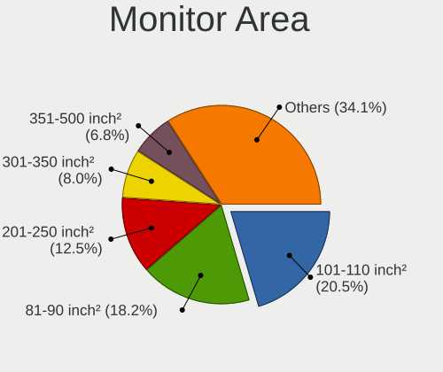

| Area in inch² | Computers | Percent |
|----------------|-----------|---------|
| 101-110        | 18        | 20.45%  |
| 81-90          | 16        | 18.18%  |
| 201-250        | 11        | 12.5%   |
| 301-350        | 7         | 7.95%   |
| 351-500        | 6         | 6.82%   |
| 71-80          | 5         | 5.68%   |
| 151-200        | 5         | 5.68%   |
| 121-130        | 4         | 4.55%   |
| 111-120        | 3         | 3.41%   |
| 501-1000       | 3         | 3.41%   |
| More than 1000 | 2         | 2.27%   |
| 51-60          | 2         | 2.27%   |
| 61-70          | 1         | 1.14%   |
| 41-50          | 1         | 1.14%   |
| 251-300        | 1         | 1.14%   |
| 141-150        | 1         | 1.14%   |
| 131-140        | 1         | 1.14%   |
| Unknown        | 1         | 1.14%   |

Pixel Density
-------------

Pixels per inch

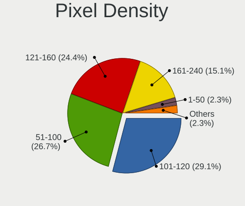

| Density       | Computers | Percent |
|---------------|-----------|---------|
| 101-120       | 25        | 29.07%  |
| 51-100        | 23        | 26.74%  |
| 121-160       | 21        | 24.42%  |
| 161-240       | 13        | 15.12%  |
| 1-50          | 2         | 2.33%   |
| More than 240 | 1         | 1.16%   |
| Unknown       | 1         | 1.16%   |

Multiple Monitors
-----------------

Total monitors connected

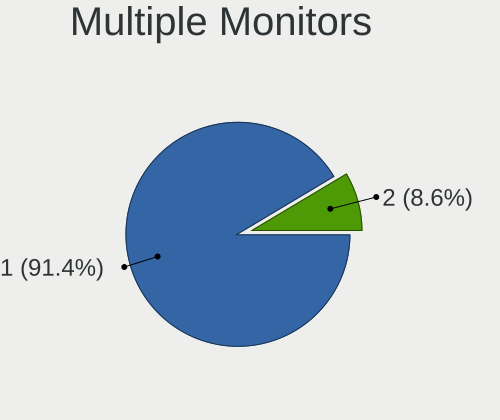

| Total | Computers | Percent |
|-------|-----------|---------|
| 1     | 77        | 91.67%  |
| 2     | 7         | 8.33%   |

Network
-------

Net Controller Vendor
---------------------

Controller vendors

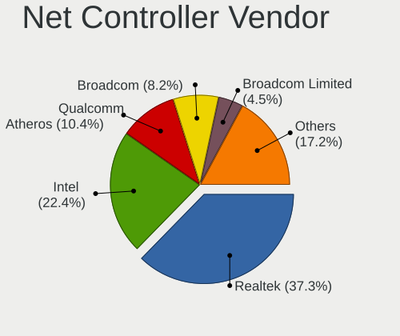

| Vendor                          | Computers | Percent |
|---------------------------------|-----------|---------|
| Realtek Semiconductor           | 50        | 37.31%  |
| Intel                           | 30        | 22.39%  |
| Qualcomm Atheros                | 14        | 10.45%  |
| Broadcom                        | 11        | 8.21%   |
| Broadcom Limited                | 6         | 4.48%   |
| Marvell Technology Group        | 5         | 3.73%   |
| MediaTek                        | 3         | 2.24%   |
| TP-Link                         | 2         | 1.49%   |
| Samsung Electronics             | 2         | 1.49%   |
| Google                          | 2         | 1.49%   |
| ASIX Electronics                | 2         | 1.49%   |
| Xiaomi                          | 1         | 0.75%   |
| Ralink Technology               | 1         | 0.75%   |
| Ralink                          | 1         | 0.75%   |
| Qualcomm Atheros Communications | 1         | 0.75%   |
| OPPO Electronics                | 1         | 0.75%   |
| Motorola PCS                    | 1         | 0.75%   |
| Microsoft                       | 1         | 0.75%   |

Net Controller Model
--------------------

Controller models

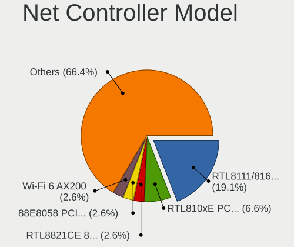

| Model                                                                  | Computers | Percent |
|------------------------------------------------------------------------|-----------|---------|
| Realtek RTL8111/8168/8211/8411 PCI Express Gigabit Ethernet Controller | 29        | 19.08%  |
| Realtek RTL810xE PCI Express Fast Ethernet controller                  | 10        | 6.58%   |
| Realtek RTL8821CE 802.11ac PCIe Wireless Network Adapter               | 4         | 2.63%   |
| Marvell Group 88E8058 PCI-E Gigabit Ethernet Controller                | 4         | 2.63%   |
| Intel Wi-Fi 6 AX200                                                    | 4         | 2.63%   |
| Intel Dual Band Wireless-AC 3168NGW [Stone Peak]                       | 4         | 2.63%   |
| Broadcom BCM4321 802.11a/b/g/n                                         | 4         | 2.63%   |
| Qualcomm Atheros QCA9565 / AR9565 Wireless Network Adapter             | 3         | 1.97%   |
| Qualcomm Atheros QCA9377 802.11ac Wireless Network Adapter             | 3         | 1.97%   |
| Qualcomm Atheros QCA6174 802.11ac Wireless Network Adapter             | 3         | 1.97%   |
| Intel Ethernet Connection (4) I219-LM                                  | 3         | 1.97%   |
| Broadcom Limited BCM4360 802.11ac Dual Band Wireless Network Adapter   | 3         | 1.97%   |
| Broadcom BCM43142 802.11b/g/n                                          | 3         | 1.97%   |
| Realtek RTL8723BE PCIe Wireless Network Adapter                        | 2         | 1.32%   |
| Realtek RTL8153 Gigabit Ethernet Adapter                               | 2         | 1.32%   |
| Realtek RTL8152 Fast Ethernet Adapter                                  | 2         | 1.32%   |
| Realtek RTL8125 2.5GbE Controller                                      | 2         | 1.32%   |
| Qualcomm Atheros Killer E220x Gigabit Ethernet Controller              | 2         | 1.32%   |
| Qualcomm Atheros AR9462 Wireless Network Adapter                       | 2         | 1.32%   |
| Intel Wireless 8265 / 8275                                             | 2         | 1.32%   |
| Intel Wi-Fi 6 AX201                                                    | 2         | 1.32%   |
| Intel Raptor Lake PCH CNVi WiFi                                        | 2         | 1.32%   |
| Broadcom NetXtreme BCM57765 Gigabit Ethernet PCIe                      | 2         | 1.32%   |
| Broadcom BCM4331 802.11a/b/g/n                                         | 2         | 1.32%   |
| ASIX AX88179 Gigabit Ethernet                                          | 2         | 1.32%   |
| Xiaomi Mi/Redmi series (RNDIS)                                         | 1         | 0.66%   |
| TP-Link UE300 10/100/1000 LAN (ethernet mode) [Realtek RTL8153]        | 1         | 0.66%   |
| TP-Link TL-WN821N v5/v6 [RTL8192EU]                                    | 1         | 0.66%   |
| Samsung Galaxy series, misc. (tethering mode)                          | 1         | 0.66%   |
| Samsung Android                                                        | 1         | 0.66%   |
| Realtek RTL8922AE 802.11be PCIe Wireless Network Adapter               | 1         | 0.66%   |
| Realtek RTL8852BE-VT PCIe 802.11ax Wireless Network Controller         | 1         | 0.66%   |
| Realtek RTL8852BE PCIe 802.11ax Wireless Network Controller            | 1         | 0.66%   |
| Realtek RTL8822CE 802.11ac PCIe Wireless Network Adapter               | 1         | 0.66%   |
| Realtek RTL8821AE 802.11ac PCIe Wireless Network Adapter               | 1         | 0.66%   |
| Realtek RTL8723DE Wireless Network Adapter                             | 1         | 0.66%   |
| Realtek RTL8723BU 802.11b/g/n WLAN Adapter                             | 1         | 0.66%   |
| Realtek RTL8192EE PCIe Wireless Network Adapter                        | 1         | 0.66%   |
| Realtek RTL8188EE Wireless Network Adapter                             | 1         | 0.66%   |
| Realtek 802.11ac NIC                                                   | 1         | 0.66%   |

Wireless Vendor
---------------

Wireless vendors

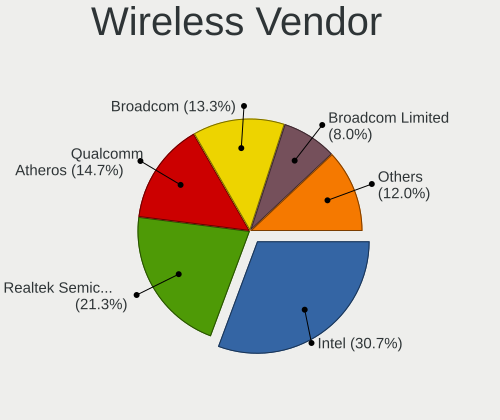

| Vendor                          | Computers | Percent |
|---------------------------------|-----------|---------|
| Intel                           | 23        | 30.67%  |
| Realtek Semiconductor           | 16        | 21.33%  |
| Qualcomm Atheros                | 11        | 14.67%  |
| Broadcom                        | 10        | 13.33%  |
| Broadcom Limited                | 6         | 8%      |
| MediaTek                        | 3         | 4%      |
| TP-Link                         | 1         | 1.33%   |
| Samsung Electronics             | 1         | 1.33%   |
| Ralink Technology               | 1         | 1.33%   |
| Ralink                          | 1         | 1.33%   |
| Qualcomm Atheros Communications | 1         | 1.33%   |
| Marvell Technology Group        | 1         | 1.33%   |

Wireless Model
--------------

Wireless models

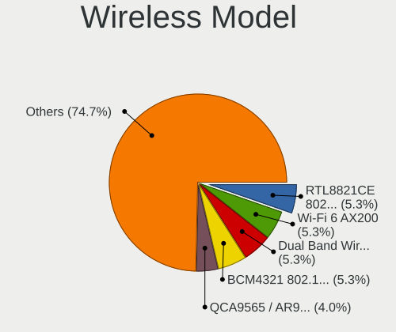

| Model                                                                | Computers | Percent |
|----------------------------------------------------------------------|-----------|---------|
| Realtek RTL8821CE 802.11ac PCIe Wireless Network Adapter             | 4         | 5.33%   |
| Intel Wi-Fi 6 AX200                                                  | 4         | 5.33%   |
| Intel Dual Band Wireless-AC 3168NGW [Stone Peak]                     | 4         | 5.33%   |
| Broadcom BCM4321 802.11a/b/g/n                                       | 4         | 5.33%   |
| Qualcomm Atheros QCA9565 / AR9565 Wireless Network Adapter           | 3         | 4%      |
| Qualcomm Atheros QCA9377 802.11ac Wireless Network Adapter           | 3         | 4%      |
| Qualcomm Atheros QCA6174 802.11ac Wireless Network Adapter           | 3         | 4%      |
| Broadcom Limited BCM4360 802.11ac Dual Band Wireless Network Adapter | 3         | 4%      |
| Broadcom BCM43142 802.11b/g/n                                        | 3         | 4%      |
| Realtek RTL8723BE PCIe Wireless Network Adapter                      | 2         | 2.67%   |
| Qualcomm Atheros AR9462 Wireless Network Adapter                     | 2         | 2.67%   |
| Intel Wireless 8265 / 8275                                           | 2         | 2.67%   |
| Intel Wi-Fi 6 AX201                                                  | 2         | 2.67%   |
| Intel Raptor Lake PCH CNVi WiFi                                      | 2         | 2.67%   |
| Broadcom BCM4331 802.11a/b/g/n                                       | 2         | 2.67%   |
| TP-Link TL-WN821N v5/v6 [RTL8192EU]                                  | 1         | 1.33%   |
| Samsung Android                                                      | 1         | 1.33%   |
| Realtek RTL8922AE 802.11be PCIe Wireless Network Adapter             | 1         | 1.33%   |
| Realtek RTL8852BE-VT PCIe 802.11ax Wireless Network Controller       | 1         | 1.33%   |
| Realtek RTL8852BE PCIe 802.11ax Wireless Network Controller          | 1         | 1.33%   |
| Realtek RTL8822CE 802.11ac PCIe Wireless Network Adapter             | 1         | 1.33%   |
| Realtek RTL8821AE 802.11ac PCIe Wireless Network Adapter             | 1         | 1.33%   |
| Realtek RTL8723DE Wireless Network Adapter                           | 1         | 1.33%   |
| Realtek RTL8723BU 802.11b/g/n WLAN Adapter                           | 1         | 1.33%   |
| Realtek RTL8192EE PCIe Wireless Network Adapter                      | 1         | 1.33%   |
| Realtek RTL8188EE Wireless Network Adapter                           | 1         | 1.33%   |
| Realtek 802.11ac NIC                                                 | 1         | 1.33%   |
| Ralink RT2770 Wireless Adapter                                       | 1         | 1.33%   |
| Ralink RT3290 Wireless 802.11n 1T/1R PCIe                            | 1         | 1.33%   |
| Qualcomm Atheros AR9271 802.11n                                      | 1         | 1.33%   |
| MediaTek MT7922 802.11ax PCI Express Wireless Network Adapter        | 1         | 1.33%   |
| MediaTek MT7921 802.11ax PCIe Wireless Network Adapter [Filogic 330] | 1         | 1.33%   |
| MediaTek MT7902 802.11ax PCIe Wireless Network Adapter [Filogic 310] | 1         | 1.33%   |
| Marvell Group 88W8897 [AVASTAR] 802.11ac Wireless                    | 1         | 1.33%   |
| Intel Wireless 8260                                                  | 1         | 1.33%   |
| Intel Wireless 7265                                                  | 1         | 1.33%   |
| Intel Wireless 3165                                                  | 1         | 1.33%   |
| Intel Wi-Fi 5(802.11ac) Wireless-AC 9x6x [Thunder Peak]              | 1         | 1.33%   |
| Intel Ice Lake-LP PCH CNVi WiFi                                      | 1         | 1.33%   |
| Intel Gemini Lake PCH CNVi WiFi                                      | 1         | 1.33%   |

Ethernet Vendor
---------------

Ethernet vendors

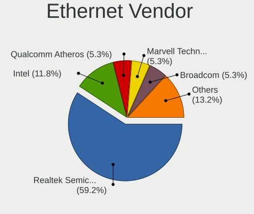

| Vendor                   | Computers | Percent |
|--------------------------|-----------|---------|
| Realtek Semiconductor    | 45        | 59.21%  |
| Intel                    | 9         | 11.84%  |
| Qualcomm Atheros         | 4         | 5.26%   |
| Marvell Technology Group | 4         | 5.26%   |
| Broadcom                 | 4         | 5.26%   |
| Google                   | 2         | 2.63%   |
| ASIX Electronics         | 2         | 2.63%   |
| Xiaomi                   | 1         | 1.32%   |
| TP-Link                  | 1         | 1.32%   |
| Samsung Electronics      | 1         | 1.32%   |
| OPPO Electronics         | 1         | 1.32%   |
| Motorola PCS             | 1         | 1.32%   |
| Microsoft                | 1         | 1.32%   |

Ethernet Model
--------------

Ethernet models

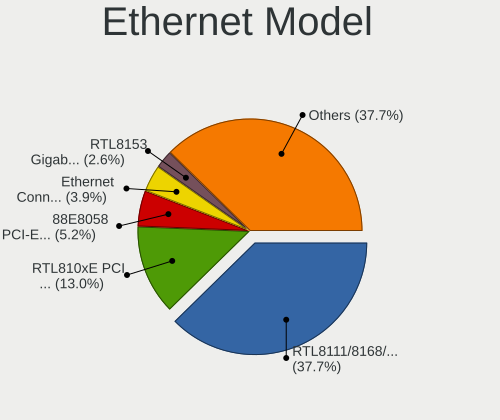

| Model                                                                  | Computers | Percent |
|------------------------------------------------------------------------|-----------|---------|
| Realtek RTL8111/8168/8211/8411 PCI Express Gigabit Ethernet Controller | 29        | 37.66%  |
| Realtek RTL810xE PCI Express Fast Ethernet controller                  | 10        | 12.99%  |
| Marvell Group 88E8058 PCI-E Gigabit Ethernet Controller                | 4         | 5.19%   |
| Intel Ethernet Connection (4) I219-LM                                  | 3         | 3.9%    |
| Realtek RTL8153 Gigabit Ethernet Adapter                               | 2         | 2.6%    |
| Realtek RTL8152 Fast Ethernet Adapter                                  | 2         | 2.6%    |
| Realtek RTL8125 2.5GbE Controller                                      | 2         | 2.6%    |
| Qualcomm Atheros Killer E220x Gigabit Ethernet Controller              | 2         | 2.6%    |
| Broadcom NetXtreme BCM57765 Gigabit Ethernet PCIe                      | 2         | 2.6%    |
| ASIX AX88179 Gigabit Ethernet                                          | 2         | 2.6%    |
| Xiaomi Mi/Redmi series (RNDIS)                                         | 1         | 1.3%    |
| TP-Link UE300 10/100/1000 LAN (ethernet mode) [Realtek RTL8153]        | 1         | 1.3%    |
| Samsung Galaxy series, misc. (tethering mode)                          | 1         | 1.3%    |
| Qualcomm Atheros QCA8172 Fast Ethernet                                 | 1         | 1.3%    |
| Qualcomm Atheros AR8151 v2.0 Gigabit Ethernet                          | 1         | 1.3%    |
| OPPO Ace 3V                                                            | 1         | 1.3%    |
| Motorola PCS moto g100 pro                                             | 1         | 1.3%    |
| Microsoft RTL8153B GigE [Surface Ethernet Adapter]                     | 1         | 1.3%    |
| Intel Ethernet Controller I225-V                                       | 1         | 1.3%    |
| Intel Ethernet Connection I217-LM                                      | 1         | 1.3%    |
| Intel Ethernet Connection (4) I219-V                                   | 1         | 1.3%    |
| Intel Ethernet Connection (2) I218-V                                   | 1         | 1.3%    |
| Intel Ethernet Connection (17) I219-V                                  | 1         | 1.3%    |
| Intel 82579V Gigabit Network Connection                                | 1         | 1.3%    |
| Google Pixel 9a                                                        | 1         | 1.3%    |
| Google Nexus/Pixel Device (tether)                                     | 1         | 1.3%    |
| Broadcom NetXtreme BCM57786 Gigabit Ethernet PCIe                      | 1         | 1.3%    |
| Broadcom NetXtreme BCM57766 Gigabit Ethernet PCIe                      | 1         | 1.3%    |
| Broadcom NetXtreme BCM57762 Gigabit Ethernet PCIe                      | 1         | 1.3%    |

Net Controller Kind
-------------------

Ethernet, WiFi or modem

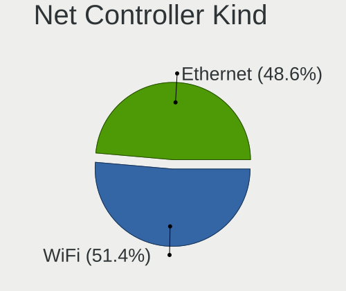

| Kind     | Computers | Percent |
|----------|-----------|---------|
| WiFi     | 74        | 51.39%  |
| Ethernet | 70        | 48.61%  |

Used Controller
---------------

Currently used network controller

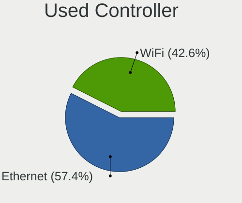

| Kind     | Computers | Percent |
|----------|-----------|---------|
| Ethernet | 44        | 55%     |
| WiFi     | 36        | 45%     |

NICs
----

Total network controllers on board

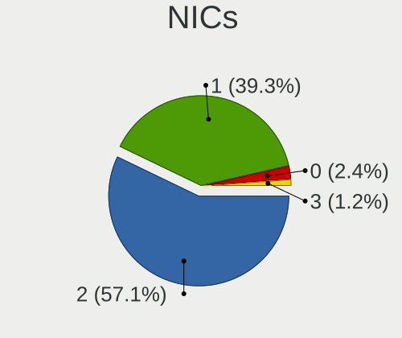

| Total | Computers | Percent |
|-------|-----------|---------|
| 2     | 48        | 57.14%  |
| 1     | 33        | 39.29%  |
| 0     | 2         | 2.38%   |
| 3     | 1         | 1.19%   |

IPv6
----

IPv6 vs IPv4

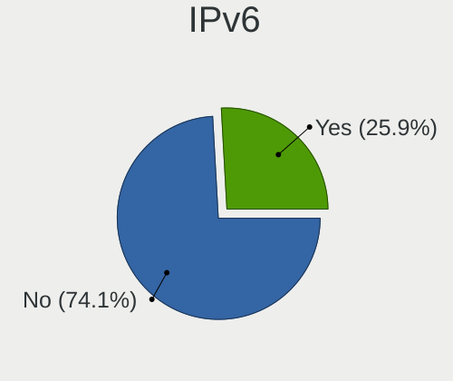

| Used | Computers | Percent |
|------|-----------|---------|
| No   | 63        | 74.12%  |
| Yes  | 22        | 25.88%  |

Bluetooth
---------

Bluetooth Vendor
----------------

Controller vendors

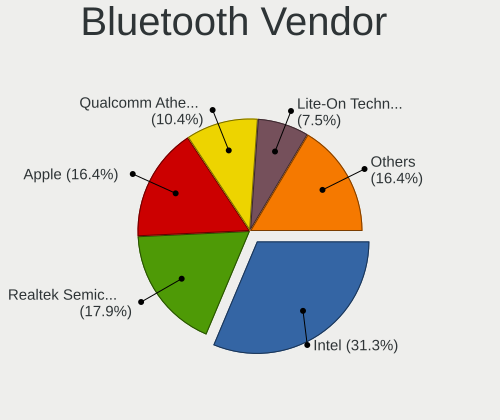

| Vendor                          | Computers | Percent |
|---------------------------------|-----------|---------|
| Intel                           | 21        | 31.34%  |
| Realtek Semiconductor           | 12        | 17.91%  |
| Apple                           | 11        | 16.42%  |
| Qualcomm Atheros Communications | 7         | 10.45%  |
| Lite-On Technology              | 5         | 7.46%   |
| Broadcom                        | 3         | 4.48%   |
| Toshiba                         | 1         | 1.49%   |
| Ralink                          | 1         | 1.49%   |
| Marvell Semiconductor           | 1         | 1.49%   |
| IMC Networks                    | 1         | 1.49%   |
| Foxconn / Hon Hai               | 1         | 1.49%   |
| Dell                            | 1         | 1.49%   |
| Cambridge Silicon Radio         | 1         | 1.49%   |
| ASUSTek Computer                | 1         | 1.49%   |

Bluetooth Model
---------------

Controller models

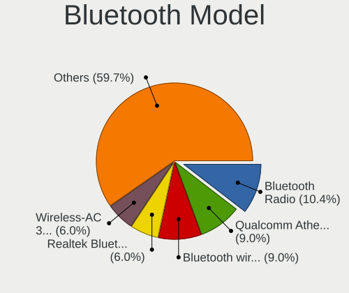

| Model                                               | Computers | Percent |
|-----------------------------------------------------|-----------|---------|
| Realtek Bluetooth Radio                             | 7         | 10.45%  |
| Qualcomm Atheros  Bluetooth Device                  | 6         | 8.96%   |
| Intel Bluetooth wireless interface                  | 6         | 8.96%   |
| Realtek  Bluetooth 4.2 Adapter                      | 4         | 5.97%   |
| Intel Wireless-AC 3168 Bluetooth                    | 4         | 5.97%   |
| Apple Bluetooth Host Controller                     | 4         | 5.97%   |
| Intel Bluetooth Device                              | 3         | 4.48%   |
| Intel AX201 Bluetooth                               | 3         | 4.48%   |
| Intel AX200 Bluetooth                               | 3         | 4.48%   |
| Apple Bluetooth USB Host Controller                 | 3         | 4.48%   |
| Lite-On Broadcom BCM43142A0 Bluetooth Device        | 2         | 2.99%   |
| Apple Bluetooth HCI MacBookPro (HID mode)           | 2         | 2.99%   |
| Apple Bluetooth HCI                                 | 2         | 2.99%   |
| Toshiba Bluetooth Device                            | 1         | 1.49%   |
| Realtek RTL8821A Bluetooth                          | 1         | 1.49%   |
| Ralink RT3290 Bluetooth                             | 1         | 1.49%   |
| Qualcomm Atheros AR9462 Bluetooth                   | 1         | 1.49%   |
| Marvell Bluetooth and Wireless LAN Composite        | 1         | 1.49%   |
| Lite-On Wireless_Device                             | 1         | 1.49%   |
| Lite-On Qualcomm Atheros QCA9377 Bluetooth          | 1         | 1.49%   |
| Lite-On Bluetooth Device                            | 1         | 1.49%   |
| Intel Wireless-AC 9260 Bluetooth Adapter            | 1         | 1.49%   |
| Intel Bluetooth 9460/9560 Jefferson Peak (JfP)      | 1         | 1.49%   |
| IMC Networks Wireless_Device                        | 1         | 1.49%   |
| Foxconn / Hon Hai Wireless_Device                   | 1         | 1.49%   |
| Dell Broadcom BCM20702A0 Bluetooth                  | 1         | 1.49%   |
| Cambridge Silicon Radio Bluetooth Dongle (HCI mode) | 1         | 1.49%   |
| Broadcom BCM43142A0 Bluetooth Device                | 1         | 1.49%   |
| Broadcom BCM43142 Bluetooth 4.0                     | 1         | 1.49%   |
| Broadcom BCM2045 Bluetooth                          | 1         | 1.49%   |
| ASUS Broadcom BCM20702A0 Bluetooth                  | 1         | 1.49%   |

Sound
-----

Sound Vendor
------------

Sound card vendors

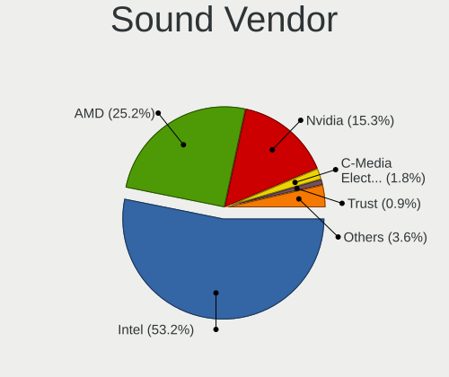

| Vendor              | Computers | Percent |
|---------------------|-----------|---------|
| Intel               | 59        | 53.15%  |
| AMD                 | 28        | 25.23%  |
| Nvidia              | 17        | 15.32%  |
| C-Media Electronics | 2         | 1.8%    |
| Trust               | 1         | 0.9%    |
| SteelSeries ApS     | 1         | 0.9%    |
| Huawei Technologies | 1         | 0.9%    |
| Guillemot           | 1         | 0.9%    |
| Creative Labs       | 1         | 0.9%    |

Sound Model
-----------

Sound card models

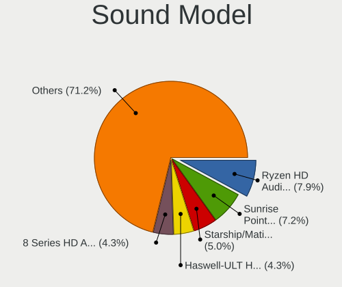

| Model                                                                                             | Computers | Percent |
|---------------------------------------------------------------------------------------------------|-----------|---------|
| AMD Ryzen HD Audio Controller                                                                     | 11        | 7.91%   |
| Intel Sunrise Point-LP HD Audio                                                                   | 10        | 7.19%   |
| AMD Starship/Matisse HD Audio Controller                                                          | 7         | 5.04%   |
| Intel Haswell-ULT HD Audio Controller                                                             | 6         | 4.32%   |
| Intel 8 Series HD Audio Controller                                                                | 6         | 4.32%   |
| Intel 7 Series/C216 Chipset Family High Definition Audio Controller                               | 6         | 4.32%   |
| Intel 6 Series/C200 Series Chipset Family High Definition Audio Controller                        | 6         | 4.32%   |
| Nvidia GP106 High Definition Audio Controller                                                     | 5         | 3.6%    |
| Intel Raptor Lake-P/U/H cAVS                                                                      | 4         | 2.88%   |
| Intel 82801H (ICH8 Family) HD Audio Controller                                                    | 4         | 2.88%   |
| AMD Renoir/Cezanne HDMI/DP Audio Controller                                                       | 4         | 2.88%   |
| AMD Raven/Raven2/Fenghuang HDMI/DP Audio Controller                                               | 4         | 2.88%   |
| AMD FCH Azalia Controller                                                                         | 4         | 2.88%   |
| Intel 9 Series Chipset Family HD Audio Controller                                                 | 3         | 2.16%   |
| Nvidia GP107GL High Definition Audio Controller                                                   | 2         | 1.44%   |
| Nvidia GA102 High Definition Audio Controller                                                     | 2         | 1.44%   |
| Intel Tiger Lake-LP Smart Sound Technology Audio Controller                                       | 2         | 1.44%   |
| Intel Comet Lake PCH-V cAVS                                                                       | 2         | 1.44%   |
| Intel Atom/Celeron/Pentium Processor x5-E8000/J3xxx/N3xxx Series High Definition Audio Controller | 2         | 1.44%   |
| Intel 8 Series/C220 Series Chipset High Definition Audio Controller                               | 2         | 1.44%   |
| AMD Trinity HDMI Audio Controller                                                                 | 2         | 1.44%   |
| AMD Radeon High Definition Audio Controller                                                       | 2         | 1.44%   |
| AMD Navi 21/23 HDMI/DP Audio Controller                                                           | 2         | 1.44%   |
| AMD Ellesmere HDMI Audio [Radeon RX 470/480 / 570/580/590]                                        | 2         | 1.44%   |
| Trust USB microphone                                                                              | 1         | 0.72%   |
| SteelSeries ApS SteelSeries Arctis 9                                                              | 1         | 0.72%   |
| Nvidia TU116 High Definition Audio Controller                                                     | 1         | 0.72%   |
| Nvidia TU106 High Definition Audio Controller                                                     | 1         | 0.72%   |
| Nvidia GM206 High Definition Audio Controller                                                     | 1         | 0.72%   |
| Nvidia GM204 High Definition Audio Controller                                                     | 1         | 0.72%   |
| Nvidia GM107 High Definition Audio Controller [GeForce 940MX]                                     | 1         | 0.72%   |
| Nvidia GK107 HDMI Audio Controller                                                                | 1         | 0.72%   |
| Nvidia GF108 High Definition Audio Controller                                                     | 1         | 0.72%   |
| Nvidia AD106M High Definition Audio Controller                                                    | 1         | 0.72%   |
| Intel Xeon E3-1200 v3/4th Gen Core Processor HD Audio Controller                                  | 1         | 0.72%   |
| Intel Ice Lake-LP Smart Sound Technology Audio Controller                                         | 1         | 0.72%   |
| Intel Comet Lake PCH cAVS                                                                         | 1         | 0.72%   |
| Intel CM238 HD Audio Controller                                                                   | 1         | 0.72%   |
| Intel Celeron/Pentium Silver Processor High Definition Audio                                      | 1         | 0.72%   |
| Intel Celeron N3350/Pentium N4200/Atom E3900 Series Audio Cluster                                 | 1         | 0.72%   |

Memory
------

Memory Vendor
-------------

Memory module vendors

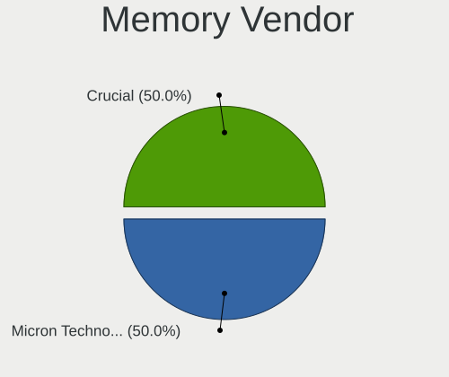

| Vendor            | Computers | Percent |
|-------------------|-----------|---------|
| Micron Technology | 1         | 50%     |
| Crucial           | 1         | 50%     |

Memory Model
------------

Memory module models

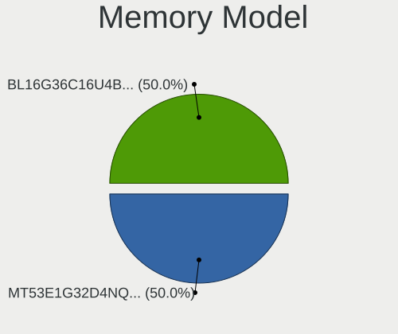

| Model                                                            | Computers | Percent |
|------------------------------------------------------------------|-----------|---------|
| Micron RAM MT53E1G32D4NQ-046WTE 8GB Row Of Chips LPDDR4 4266MT/s | 1         | 50%     |
| Crucial RAM BL16G36C16U4B.M16FE1 16GB DIMM DDR4 3600MT/s         | 1         | 50%     |

Memory Kind
-----------

Memory module kinds

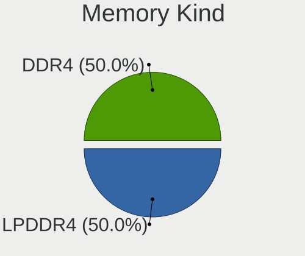

| Kind   | Computers | Percent |
|--------|-----------|---------|
| LPDDR4 | 1         | 50%     |
| DDR4   | 1         | 50%     |

Memory Form Factor
------------------

Physical design of the memory module

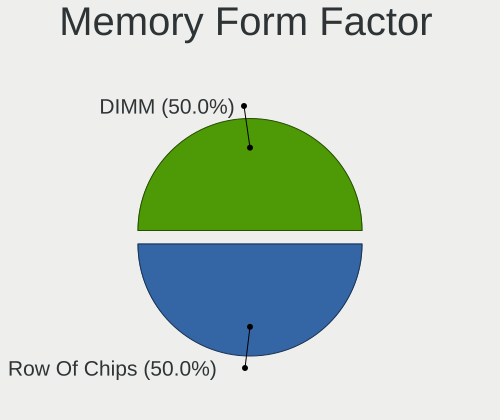

| Name         | Computers | Percent |
|--------------|-----------|---------|
| Row Of Chips | 1         | 50%     |
| DIMM         | 1         | 50%     |

Memory Size
-----------

Memory module size

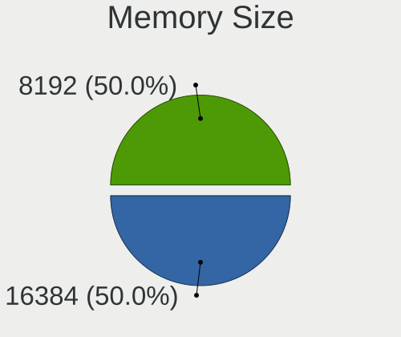

| Size  | Computers | Percent |
|-------|-----------|---------|
| 16384 | 1         | 50%     |
| 8192  | 1         | 50%     |

Memory Speed
------------

Memory module speed

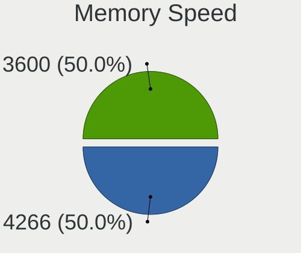

| Speed | Computers | Percent |
|-------|-----------|---------|
| 4266  | 1         | 50%     |
| 3600  | 1         | 50%     |

Printers & scanners
-------------------

Printer Vendor
--------------

Printer device vendors

Zero info for selected period =(

Printer Model
-------------

Printer device models

Zero info for selected period =(

Scanner Vendor
--------------

Scanner device vendors

| Vendor | Computers | Percent |
|--------|-----------|---------|
| Canon  | 1         | 100%    |

Scanner Model
-------------

Scanner device models

| Model                   | Computers | Percent |
|-------------------------|-----------|---------|
| Canon CanoScan LiDE 210 | 1         | 100%    |

Camera
------

Camera Vendor
-------------

Camera device vendors

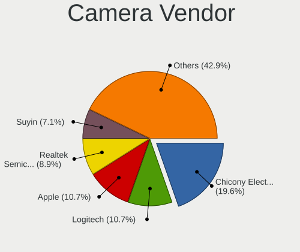

| Vendor                                 | Computers | Percent |
|----------------------------------------|-----------|---------|
| Chicony Electronics                    | 11        | 19.64%  |
| Logitech                               | 6         | 10.71%  |
| Apple                                  | 6         | 10.71%  |
| Realtek Semiconductor                  | 5         | 8.93%   |
| Suyin                                  | 4         | 7.14%   |
| Luxvisions Innotech Limited            | 3         | 5.36%   |
| Cheng Uei Precision Industry (Foxlink) | 3         | 5.36%   |
| Syntek                                 | 2         | 3.57%   |
| Sunplus Innovation Technology          | 2         | 3.57%   |
| Microsoft                              | 2         | 3.57%   |
| Microdia                               | 2         | 3.57%   |
| IMC Networks                           | 2         | 3.57%   |
| webcam                                 | 1         | 1.79%   |
| SunplusIT                              | 1         | 1.79%   |
| Sonix Technology                       | 1         | 1.79%   |
| Shinetech                              | 1         | 1.79%   |
| Shenzhen Kingcome Optoelectronic       | 1         | 1.79%   |
| Quanta                                 | 1         | 1.79%   |
| Lite-On Technology                     | 1         | 1.79%   |
| HRY                                    | 1         | 1.79%   |

Camera Model
------------

Camera device models

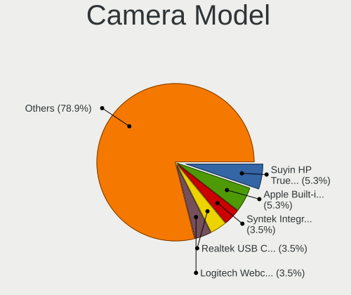

| Model                                                 | Computers | Percent |
|-------------------------------------------------------|-----------|---------|
| Suyin HP Truevision HD                                | 3         | 5.26%   |
| Apple Built-in iSight                                 | 3         | 5.26%   |
| Syntek Integrated Camera                              | 2         | 3.51%   |
| Realtek USB Camera                                    | 2         | 3.51%   |
| Logitech Webcam C270                                  | 2         | 3.51%   |
| Logitech HD Pro Webcam C920                           | 2         | 3.51%   |
| Chicony Integrated Camera                             | 2         | 3.51%   |
| Chicony HD Webcam                                     | 2         | 3.51%   |
| Cheng Uei Precision Industry (Foxlink) HP Webcam      | 2         | 3.51%   |
| Apple FaceTime HD Camera (Built-in)                   | 2         | 3.51%   |
| webcam webcam                                         | 1         | 1.75%   |
| Suyin Laptop_Integrated_Webcam_HD                     | 1         | 1.75%   |
| SunplusIT 720p HD Camera                              | 1         | 1.75%   |
| Sunplus Integrated_Webcam_HD                          | 1         | 1.75%   |
| Sunplus HD WebCam                                     | 1         | 1.75%   |
| Sonix USB2.0 FHD UVC WebCam                           | 1         | 1.75%   |
| Shinetech USB2.0 FHD UVC WebCam                       | 1         | 1.75%   |
| Shenzhen Kingcome Optoelectronic 720p HD Camera       | 1         | 1.75%   |
| Realtek USB2.0 HD UVC WebCam                          | 1         | 1.75%   |
| Realtek Integrated_Webcam_HD                          | 1         | 1.75%   |
| Realtek Integrated Camera                             | 1         | 1.75%   |
| Quanta HD Webcam                                      | 1         | 1.75%   |
| Microsoft Surface Camera Front                        | 1         | 1.75%   |
| Microsoft LifeCam Cinema                              | 1         | 1.75%   |
| Microdia Integrated_Webcam_HD                         | 1         | 1.75%   |
| Microdia Integrated Webcam HD                         | 1         | 1.75%   |
| Luxvisions Innotech Limited Integrated RGB Camera     | 1         | 1.75%   |
| Luxvisions Innotech Limited Integrated Camera         | 1         | 1.75%   |
| Luxvisions Innotech Limited HP True Vision FHD Camera | 1         | 1.75%   |
| Logitech Webcam C170                                  | 1         | 1.75%   |
| Logitech BRIO Ultra HD Webcam                         | 1         | 1.75%   |
| Lite-On Integrated Camera                             | 1         | 1.75%   |
| IMC Networks USB2.0 HD UVC WebCam                     | 1         | 1.75%   |
| IMC Networks HP TrueVision HD Camera                  | 1         | 1.75%   |
| HRY USB Camera                                        | 1         | 1.75%   |
| Chicony USB2.0 VGA UVC WebCam                         | 1         | 1.75%   |
| Chicony USB2.0 HD UVC WebCam                          | 1         | 1.75%   |
| Chicony TOSHIBA Web Camera - HD                       | 1         | 1.75%   |
| Chicony Integrated Camera (1280x720@30)               | 1         | 1.75%   |
| Chicony HP HD Camera                                  | 1         | 1.75%   |

Security
--------

Fingerprint Vendor
------------------

Fingerprint sensor vendors

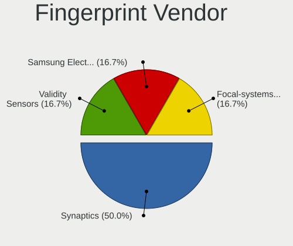

| Vendor              | Computers | Percent |
|---------------------|-----------|---------|
| Synaptics           | 3         | 50%     |
| Validity Sensors    | 1         | 16.67%  |
| Samsung Electronics | 1         | 16.67%  |
| Focal-systems.Corp  | 1         | 16.67%  |

Fingerprint Model
-----------------

Fingerprint sensor models

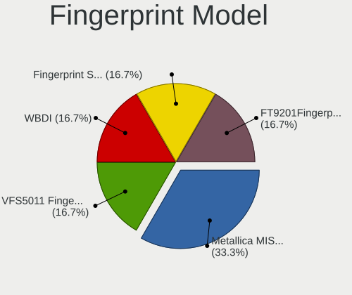

| Model                                            | Computers | Percent |
|--------------------------------------------------|-----------|---------|
| Synaptics Metallica MIS Touch Fingerprint Reader | 2         | 33.33%  |
| Validity Sensors VFS5011 Fingerprint Reader      | 1         | 16.67%  |
| Synaptics WBDI                                   | 1         | 16.67%  |
| Samsung Fingerprint Sensor Device - 730B         | 1         | 16.67%  |
| Focal-systems.Corp FT9201Fingerprint.            | 1         | 16.67%  |

Chipcard Vendor
---------------

Chipcard module vendors

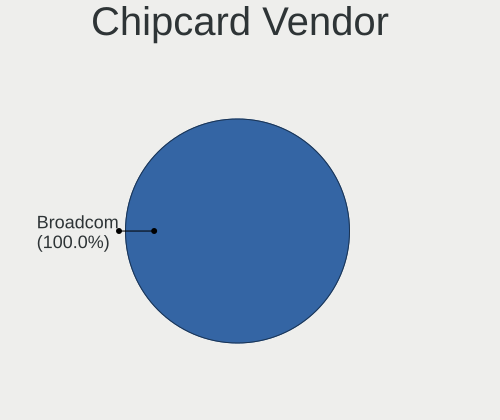

| Vendor      | Computers | Percent |
|-------------|-----------|---------|
| Broadcom    | 1         | 50%     |
| Alcor Micro | 1         | 50%     |

Chipcard Model
--------------

Chipcard module models

| Model                                          | Computers | Percent |
|------------------------------------------------|-----------|---------|
| Broadcom BCM5880 Secure Applications Processor | 1         | 50%     |
| Alcor Micro AU9540 Smartcard Reader            | 1         | 50%     |

Unsupported
-----------

Unsupported Devices
-------------------

Total unsupported devices on board

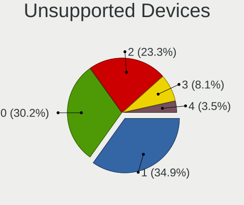

| Total | Computers | Percent |
|-------|-----------|---------|
| 1     | 30        | 34.88%  |
| 0     | 26        | 30.23%  |
| 2     | 20        | 23.26%  |
| 3     | 7         | 8.14%   |
| 4     | 3         | 3.49%   |

Unsupported Device Types
------------------------

Types of unsupported devices

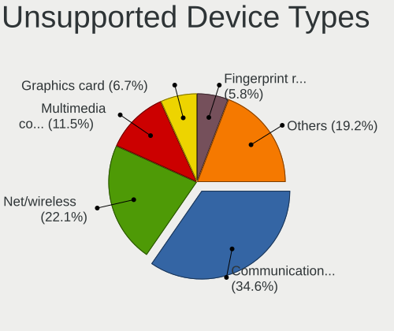

| Type                     | Computers | Percent |
|--------------------------|-----------|---------|
| Communication controller | 36        | 34.62%  |
| Net/wireless             | 23        | 22.12%  |
| Multimedia controller    | 12        | 11.54%  |
| Graphics card            | 7         | 6.73%   |
| Fingerprint reader       | 6         | 5.77%   |
| Bluetooth                | 6         | 5.77%   |
| Card reader              | 5         | 4.81%   |
| Net/ethernet             | 4         | 3.85%   |
| Firewire controller      | 2         | 1.92%   |
| Unassigned class         | 1         | 0.96%   |
| Storage/ide              | 1         | 0.96%   |
| Chipcard                 | 1         | 0.96%   |

