GNOME OS - Tested Hardware & Statistics
---------------------------------------

A project to collect tested hardware configurations for GNOME OS.

Anyone can contribute to this report by the [hw-probe](https://github.com/linuxhw/hw-probe) tool:

    sudo -E hw-probe -all -upload

Please contribute! Especially if your hardware is rare.

This is a report for all computer types. See also reports for [desktops](/Dist/GNOME_OS/Desktop/README.md) and [notebooks](/Dist/GNOME_OS/Notebook/README.md).

Contents
--------

* [ Test Cases ](#test-cases)

* [ System ](#system)
  - [ OS                       ](#os)
  - [ OS Family                ](#os-family)
  - [ Kernel                   ](#kernel)
  - [ Kernel Family            ](#kernel-family)
  - [ Kernel Major Ver.        ](#kernel-major-ver)
  - [ Arch                     ](#arch)
  - [ DE                       ](#de)
  - [ Display Server           ](#display-server)
  - [ Display Manager          ](#display-manager)
  - [ OS Lang                  ](#os-lang)
  - [ Boot Mode                ](#boot-mode)
  - [ Filesystem               ](#filesystem)
  - [ Part. scheme             ](#part-scheme)
  - [ Dual Boot with Linux/BSD ](#dual-boot-with-linuxbsd)
  - [ Dual Boot (Win)          ](#dual-boot-win)

* [ Board ](#board)
  - [ Vendor                   ](#vendor)
  - [ Model                    ](#model)
  - [ Model Family             ](#model-family)
  - [ MFG Year                 ](#mfg-year)
  - [ Form Factor              ](#form-factor)
  - [ Secure Boot              ](#secure-boot)
  - [ Coreboot                 ](#coreboot)
  - [ RAM Size                 ](#ram-size)
  - [ RAM Used                 ](#ram-used)
  - [ Total Drives             ](#total-drives)
  - [ Has CD-ROM               ](#has-cd-rom)
  - [ Has Ethernet             ](#has-ethernet)
  - [ Has WiFi                 ](#has-wifi)
  - [ Has Bluetooth            ](#has-bluetooth)

* [ Location ](#location)
  - [ Country                  ](#country)
  - [ City                     ](#city)

* [ Drives ](#drives)
  - [ Drive Vendor             ](#drive-vendor)
  - [ Drive Model              ](#drive-model)
  - [ HDD Vendor               ](#hdd-vendor)
  - [ SSD Vendor               ](#ssd-vendor)
  - [ Drive Kind               ](#drive-kind)
  - [ Drive Connector          ](#drive-connector)
  - [ Drive Size               ](#drive-size)
  - [ Space Total              ](#space-total)
  - [ Space Used               ](#space-used)
  - [ Malfunc. Drives          ](#malfunc-drives)
  - [ Malfunc. Drive Vendor    ](#malfunc-drive-vendor)
  - [ Malfunc. HDD Vendor      ](#malfunc-hdd-vendor)
  - [ Malfunc. Drive Kind      ](#malfunc-drive-kind)
  - [ Failed Drives            ](#failed-drives)
  - [ Failed Drive Vendor      ](#failed-drive-vendor)
  - [ Drive Status             ](#drive-status)

* [ Storage controller ](#storage-controller)
  - [ Storage Vendor           ](#storage-vendor)
  - [ Storage Model            ](#storage-model)
  - [ Storage Kind             ](#storage-kind)

* [ Processor ](#processor)
  - [ CPU Vendor               ](#cpu-vendor)
  - [ CPU Model                ](#cpu-model)
  - [ CPU Model Family         ](#cpu-model-family)
  - [ CPU Cores                ](#cpu-cores)
  - [ CPU Sockets              ](#cpu-sockets)
  - [ CPU Threads              ](#cpu-threads)
  - [ CPU Op-Modes             ](#cpu-op-modes)
  - [ CPU Microcode            ](#cpu-microcode)
  - [ CPU Microarch            ](#cpu-microarch)

* [ Graphics ](#graphics)
  - [ GPU Vendor               ](#gpu-vendor)
  - [ GPU Model                ](#gpu-model)
  - [ GPU Combo                ](#gpu-combo)
  - [ GPU Driver               ](#gpu-driver)
  - [ GPU Memory               ](#gpu-memory)

* [ Monitor ](#monitor)
  - [ Monitor Vendor           ](#monitor-vendor)
  - [ Monitor Model            ](#monitor-model)
  - [ Monitor Resolution       ](#monitor-resolution)
  - [ Monitor Diagonal         ](#monitor-diagonal)
  - [ Monitor Width            ](#monitor-width)
  - [ Aspect Ratio             ](#aspect-ratio)
  - [ Monitor Area             ](#monitor-area)
  - [ Pixel Density            ](#pixel-density)
  - [ Multiple Monitors        ](#multiple-monitors)

* [ Network ](#network)
  - [ Net Controller Vendor    ](#net-controller-vendor)
  - [ Net Controller Model     ](#net-controller-model)
  - [ Wireless Vendor          ](#wireless-vendor)
  - [ Wireless Model           ](#wireless-model)
  - [ Ethernet Vendor          ](#ethernet-vendor)
  - [ Ethernet Model           ](#ethernet-model)
  - [ Net Controller Kind      ](#net-controller-kind)
  - [ Used Controller          ](#used-controller)
  - [ NICs                     ](#nics)
  - [ IPv6                     ](#ipv6)

* [ Bluetooth ](#bluetooth)
  - [ Bluetooth Vendor         ](#bluetooth-vendor)
  - [ Bluetooth Model          ](#bluetooth-model)

* [ Sound ](#sound)
  - [ Sound Vendor             ](#sound-vendor)
  - [ Sound Model              ](#sound-model)

* [ Memory ](#memory)
  - [ Memory Vendor            ](#memory-vendor)
  - [ Memory Model             ](#memory-model)
  - [ Memory Kind              ](#memory-kind)
  - [ Memory Form Factor       ](#memory-form-factor)
  - [ Memory Size              ](#memory-size)
  - [ Memory Speed             ](#memory-speed)

* [ Printers & scanners ](#printers--scanners)
  - [ Printer Vendor           ](#printer-vendor)
  - [ Printer Model            ](#printer-model)
  - [ Scanner Vendor           ](#scanner-vendor)
  - [ Scanner Model            ](#scanner-model)

* [ Camera ](#camera)
  - [ Camera Vendor            ](#camera-vendor)
  - [ Camera Model             ](#camera-model)

* [ Security ](#security)
  - [ Fingerprint Vendor       ](#fingerprint-vendor)
  - [ Fingerprint Model        ](#fingerprint-model)
  - [ Chipcard Vendor          ](#chipcard-vendor)
  - [ Chipcard Model           ](#chipcard-model)

* [ Unsupported ](#unsupported)
  - [ Unsupported Devices      ](#unsupported-devices)
  - [ Unsupported Device Types ](#unsupported-device-types)

Test Cases
----------

Total: 57

| Vendor   | Model                       | Form-Factor | Probe                                                      | Date         |
|----------|-----------------------------|-------------|------------------------------------------------------------|--------------|
| HP       | 82F2 A01                    | Desktop     | [b6cb9447df](https://linux-hardware.org/?probe=b6cb9447df) | Nov 19, 2022 |
| Unknown  | 1.0                         | Desktop     | [d07852e419](https://linux-hardware.org/?probe=d07852e419) | Nov 11, 2022 |
| Apple    | MacBookPro8,1               | Notebook    | [1b5ab725ab](https://linux-hardware.org/?probe=1b5ab725ab) | Nov 09, 2022 |
| Lenovo   | IdeaPad 330-15AST 81D6      | Notebook    | [abbb3295c8](https://linux-hardware.org/?probe=abbb3295c8) | Oct 14, 2022 |
| Lenovo   | IdeaPad 330-15AST 81D6      | Notebook    | [f19e981e03](https://linux-hardware.org/?probe=f19e981e03) | Oct 14, 2022 |
| Apple    | Mac-8ED6AF5B48C039E1 Mac... | Mini pc     | [c2f80d89da](https://linux-hardware.org/?probe=c2f80d89da) | Sep 26, 2022 |
| Apple    | Mac-8ED6AF5B48C039E1 Mac... | Mini pc     | [8d0067a198](https://linux-hardware.org/?probe=8d0067a198) | Sep 26, 2022 |
| Dell     | Inspiron 3584               | Notebook    | [626c79c116](https://linux-hardware.org/?probe=626c79c116) | Sep 24, 2022 |
| HP       | Pavilion 15                 | Notebook    | [56a10ce74c](https://linux-hardware.org/?probe=56a10ce74c) | Sep 21, 2022 |
| ASUSTek  | GL553VE                     | Notebook    | [4d93da1983](https://linux-hardware.org/?probe=4d93da1983) | Sep 20, 2022 |
| ASUSTek  | GL553VE                     | Notebook    | [27b8d384a2](https://linux-hardware.org/?probe=27b8d384a2) | Sep 19, 2022 |
| Gigabyte | Z97X-Gaming 7               | Desktop     | [1c993db964](https://linux-hardware.org/?probe=1c993db964) | Aug 30, 2022 |
| Gigabyte | Z97X-Gaming 7               | Desktop     | [91438fc6b5](https://linux-hardware.org/?probe=91438fc6b5) | Aug 30, 2022 |
| Acer     | Aspire A515-51G             | Notebook    | [4856a5fefb](https://linux-hardware.org/?probe=4856a5fefb) | Jul 22, 2022 |
| Lenovo   | Yoga Slim 7 14ARE05 82A2    | Notebook    | [a90e6b2be7](https://linux-hardware.org/?probe=a90e6b2be7) | Apr 30, 2022 |
| Apple    | MacBookPro10,1              | Notebook    | [1bbdbe7117](https://linux-hardware.org/?probe=1bbdbe7117) | Apr 04, 2022 |
| Acer     | Iconia W700                 | Notebook    | [604cdabab4](https://linux-hardware.org/?probe=604cdabab4) | Mar 23, 2022 |
| Lenovo   | ThinkPad Edge E531 68851... | Notebook    | [54269ad944](https://linux-hardware.org/?probe=54269ad944) | Feb 18, 2022 |
| Gateway  | NE71B                       | Notebook    | [ac3dc96ccf](https://linux-hardware.org/?probe=ac3dc96ccf) | Feb 02, 2022 |
| HP       | Laptop 14-dk1xxx            | Notebook    | [c604eec754](https://linux-hardware.org/?probe=c604eec754) | Jan 27, 2022 |
| Chuwi    | HeroBook                    | Notebook    | [67990dbe7f](https://linux-hardware.org/?probe=67990dbe7f) | Jan 19, 2022 |
| Apple    | Mac-FFE5EF870D7BA81A iMa... | All in one  | [e53f2b7fd5](https://linux-hardware.org/?probe=e53f2b7fd5) | Nov 03, 2021 |
| Apple    | Mac-FFE5EF870D7BA81A iMa... | All in one  | [922c058537](https://linux-hardware.org/?probe=922c058537) | Nov 03, 2021 |
| Gigabyte | B450M S2H V2                | Desktop     | [cd6b701253](https://linux-hardware.org/?probe=cd6b701253) | Nov 03, 2021 |
| Lenovo   | Yoga Slim 7 14ARE05 82A2    | Notebook    | [594815bb9d](https://linux-hardware.org/?probe=594815bb9d) | Oct 17, 2021 |
| ASUSTek  | X555LD                      | Notebook    | [2560d8b5a0](https://linux-hardware.org/?probe=2560d8b5a0) | Sep 27, 2021 |
| ASUSTek  | PRIME A320M-K               | Desktop     | [11c23a1f37](https://linux-hardware.org/?probe=11c23a1f37) | Sep 26, 2021 |
| ASUSTek  | PRIME A320M-K               | Desktop     | [b33430e135](https://linux-hardware.org/?probe=b33430e135) | Sep 26, 2021 |
| Lenovo   | IdeaPad S340-14API 81NB     | Notebook    | [c248e4551a](https://linux-hardware.org/?probe=c248e4551a) | Sep 25, 2021 |
| HP       | Pavilion Notebook           | Notebook    | [835f183d57](https://linux-hardware.org/?probe=835f183d57) | Sep 17, 2021 |
| ASUSTek  | H61M-A/BR                   | Desktop     | [73b5c289e2](https://linux-hardware.org/?probe=73b5c289e2) | Sep 04, 2021 |
| Lenovo   | IdeaPad S145-15IWL 81S9     | Notebook    | [35c20c8cde](https://linux-hardware.org/?probe=35c20c8cde) | Aug 30, 2021 |
| HP       | Pavilion Gaming Laptop 1... | Notebook    | [5a54384297](https://linux-hardware.org/?probe=5a54384297) | Aug 11, 2021 |
| HP       | 8767 A                      | Desktop     | [926ac56be9](https://linux-hardware.org/?probe=926ac56be9) | Aug 10, 2021 |
| Gigabyte | X570 GAMING X               | Desktop     | [b751f6615d](https://linux-hardware.org/?probe=b751f6615d) | Jul 17, 2021 |
| Gigabyte | B450M S2H V2                | Desktop     | [d8886335b1](https://linux-hardware.org/?probe=d8886335b1) | Jul 10, 2021 |
| Intel    | X79                         | Desktop     | [9f19896285](https://linux-hardware.org/?probe=9f19896285) | May 13, 2021 |
| Lenovo   | IdeaPadFlex 5 14IIL05 81... | Convertible | [35876a09ad](https://linux-hardware.org/?probe=35876a09ad) | May 09, 2021 |
| HP       | ProBook 430 G3              | Notebook    | [c3acaeb030](https://linux-hardware.org/?probe=c3acaeb030) | Apr 26, 2021 |
| HP       | ProBook 430 G3              | Notebook    | [de3298645e](https://linux-hardware.org/?probe=de3298645e) | Apr 26, 2021 |
| Toshiba  | Satellite C55-A-1F5         | Notebook    | [d7b4bf2642](https://linux-hardware.org/?probe=d7b4bf2642) | Apr 15, 2021 |
| Toshiba  | Satellite C55-A-1F5         | Notebook    | [aa32e3693a](https://linux-hardware.org/?probe=aa32e3693a) | Apr 14, 2021 |
| Lenovo   | 317E NOK                    | Desktop     | [2ce2a68735](https://linux-hardware.org/?probe=2ce2a68735) | Apr 14, 2021 |
| HP       | Pavilion 17                 | Notebook    | [220bf859f8](https://linux-hardware.org/?probe=220bf859f8) | Mar 28, 2021 |
| HP       | Pavilion 17                 | Notebook    | [a5a6941b23](https://linux-hardware.org/?probe=a5a6941b23) | Mar 28, 2021 |
| Dell     | Latitude 7490               | Notebook    | [ce86510d2b](https://linux-hardware.org/?probe=ce86510d2b) | Mar 28, 2021 |
| Dell     | Inspiron 3542               | Notebook    | [517406f8b6](https://linux-hardware.org/?probe=517406f8b6) | Mar 21, 2021 |
| ASUSTek  | PRIME H410M-K               | Desktop     | [f685fefbec](https://linux-hardware.org/?probe=f685fefbec) | Mar 04, 2021 |
| Unknown  | Unknown                     | Notebook    | [1c5ed732c5](https://linux-hardware.org/?probe=1c5ed732c5) | Mar 01, 2021 |
| Dell     | Precision M6800             | Notebook    | [95fa029c09](https://linux-hardware.org/?probe=95fa029c09) | Jan 14, 2021 |
| Dell     | Inspiron 5566               | Notebook    | [a3fd17119a](https://linux-hardware.org/?probe=a3fd17119a) | Nov 03, 2020 |
| Chuwi    | LarkBox                     | Mini pc     | [c7f6fd9a66](https://linux-hardware.org/?probe=c7f6fd9a66) | Oct 21, 2020 |
| HP       | Pavilion 17                 | Notebook    | [edc8ed595b](https://linux-hardware.org/?probe=edc8ed595b) | Oct 12, 2020 |
| Acer     | Aspire GX-781               | Desktop     | [159afb32c1](https://linux-hardware.org/?probe=159afb32c1) | Oct 10, 2020 |
| ASUSTek  | SABERTOOTH X79              | Desktop     | [17acfc90d4](https://linux-hardware.org/?probe=17acfc90d4) | Oct 07, 2020 |
| ASUSTek  | E202SA                      | Notebook    | [a226259559](https://linux-hardware.org/?probe=a226259559) | Sep 24, 2020 |
| Acer     | ChiefRiver Platform         | Notebook    | [23e2162b8e](https://linux-hardware.org/?probe=23e2162b8e) | Sep 20, 2020 |

System
------

OS
--

Installed operating systems

| Name             | Computers | Percent |
|------------------|-----------|---------|
| GNOME OS Nightly | 31        | 70.45%  |
| GNOME OS 3.38    | 7         | 15.91%  |
| GNOME OS 43      | 3         | 6.82%   |
| GNOME OS 42      | 1         | 2.27%   |
| GNOME OS 41      | 1         | 2.27%   |
| GNOME OS 40      | 1         | 2.27%   |

OS Family
---------

OS without a version

| Name     | Computers | Percent |
|----------|-----------|---------|
| GNOME OS | 44        | 100%    |

Kernel
------

Version of the Linux kernel

| Version | Computers | Percent |
|---------|-----------|---------|
| 5.7.14  | 8         | 17.39%  |
| 5.11.10 | 8         | 17.39%  |
| 5.14.18 | 7         | 15.22%  |
| 5.13.9  | 4         | 8.7%    |
| 5.19.16 | 3         | 6.52%   |
| 5.18.19 | 3         | 6.52%   |
| 5.11.2  | 3         | 6.52%   |
| 5.18.16 | 2         | 4.35%   |
| 5.14.4  | 2         | 4.35%   |
| 5.13.8  | 2         | 4.35%   |
| 5.18.10 | 1         | 2.17%   |
| 5.14.11 | 1         | 2.17%   |
| 5.12.12 | 1         | 2.17%   |
| 5.11.0  | 1         | 2.17%   |

Kernel Family
-------------

Linux kernel without a distro release

| Version | Computers | Percent |
|---------|-----------|---------|
| 5.7.14  | 8         | 17.39%  |
| 5.11.10 | 8         | 17.39%  |
| 5.14.18 | 7         | 15.22%  |
| 5.13.9  | 4         | 8.7%    |
| 5.19.16 | 3         | 6.52%   |
| 5.18.19 | 3         | 6.52%   |
| 5.11.2  | 3         | 6.52%   |
| 5.18.16 | 2         | 4.35%   |
| 5.14.4  | 2         | 4.35%   |
| 5.13.8  | 2         | 4.35%   |
| 5.18.10 | 1         | 2.17%   |
| 5.14.11 | 1         | 2.17%   |
| 5.12.12 | 1         | 2.17%   |
| 5.11.0  | 1         | 2.17%   |

Kernel Major Ver.
-----------------

Linux kernel major version

| Version | Computers | Percent |
|---------|-----------|---------|
| 5.11    | 12        | 26.67%  |
| 5.14    | 9         | 20%     |
| 5.7     | 8         | 17.78%  |
| 5.18    | 6         | 13.33%  |
| 5.13    | 6         | 13.33%  |
| 5.19    | 3         | 6.67%   |
| 5.12    | 1         | 2.22%   |

Arch
----

OS architecture (x86_64, i586, etc.)

| Name   | Computers | Percent |
|--------|-----------|---------|
| x86_64 | 44        | 100%    |

DE
--

Desktop Environment

| Name    | Computers | Percent |
|---------|-----------|---------|
| GNOME   | 44        | 97.78%  |
| Unknown | 1         | 2.22%   |

Display Server
--------------

X11 or Wayland

| Name    | Computers | Percent |
|---------|-----------|---------|
| Wayland | 44        | 97.78%  |
| Unknown | 1         | 2.22%   |

Display Manager
---------------

SDDM, LightDM, etc.

| Name    | Computers | Percent |
|---------|-----------|---------|
| Unknown | 44        | 100%    |

OS Lang
-------

Language

| Lang  | Computers | Percent |
|-------|-----------|---------|
| en_US | 20        | 45.45%  |
| ru_RU | 4         | 9.09%   |
| pt_BR | 3         | 6.82%   |
| fr_FR | 3         | 6.82%   |
| it_IT | 2         | 4.55%   |
| hu_HU | 2         | 4.55%   |
| de_DE | 2         | 4.55%   |
| sv_SE | 1         | 2.27%   |
| sk_SK | 1         | 2.27%   |
| ru_UA | 1         | 2.27%   |
| nl_NL | 1         | 2.27%   |
| es_ES | 1         | 2.27%   |
| es_CL | 1         | 2.27%   |
| en_IN | 1         | 2.27%   |
| cs_CZ | 1         | 2.27%   |

Boot Mode
---------

EFI or BIOS

| Mode | Computers | Percent |
|------|-----------|---------|
| EFI  | 43        | 97.73%  |
| BIOS | 1         | 2.27%   |

Filesystem
----------

Type of filesystem

| Type | Computers | Percent |
|------|-----------|---------|
| Ext4 | 44        | 100%    |

Part. scheme
------------

Scheme of partitioning

| Type    | Computers | Percent |
|---------|-----------|---------|
| Unknown | 44        | 97.78%  |
| GPT     | 1         | 2.22%   |

Dual Boot with Linux/BSD
------------------------

Hosting more than one Linux/BSD

| Dual boot | Computers | Percent |
|-----------|-----------|---------|
| No        | 44        | 100%    |

Dual Boot (Win)
---------------

Hosting Linux and Windows

| Dual boot | Computers | Percent |
|-----------|-----------|---------|
| No        | 44        | 100%    |

Board
-----

Vendor
------

Motherboard manufacturer

| Name                | Computers | Percent |
|---------------------|-----------|---------|
| Hewlett-Packard     | 9         | 20.45%  |
| ASUSTek Computer    | 7         | 15.91%  |
| Lenovo              | 6         | 13.64%  |
| Dell                | 5         | 11.36%  |
| Apple               | 4         | 9.09%   |
| Acer                | 4         | 9.09%   |
| Gigabyte Technology | 3         | 6.82%   |
| Chuwi               | 2         | 4.55%   |
| Toshiba             | 1         | 2.27%   |
| Intel               | 1         | 2.27%   |
| Gateway             | 1         | 2.27%   |
| Unknown             | 1         | 2.27%   |

Model
-----

Motherboard model

| Name                                   | Computers | Percent |
|----------------------------------------|-----------|---------|
| HP Pavilion 17                         | 2         | 4.55%   |
| Toshiba Satellite C55-A-1F5            | 1         | 2.27%   |
| Lenovo Yoga Slim 7 14ARE05 82A2        | 1         | 2.27%   |
| Lenovo ThinkPad Edge E531 68851P6      | 1         | 2.27%   |
| Lenovo IdeaPadFlex 5 14IIL05 81X1      | 1         | 2.27%   |
| Lenovo IdeaPad S340-14API 81NB         | 1         | 2.27%   |
| Lenovo IdeaPad S145-15IWL 81S9         | 1         | 2.27%   |
| Lenovo IdeaCentre 3 07IMB05 90NB0020IN | 1         | 2.27%   |
| Intel X79                              | 1         | 2.27%   |
| HP ProBook 430 G3                      | 1         | 2.27%   |
| HP Pavilion Notebook                   | 1         | 2.27%   |
| HP Pavilion Gaming Laptop 15-ec0xxx    | 1         | 2.27%   |
| HP Pavilion Gaming Desktop TG01-1xxx   | 1         | 2.27%   |
| HP Pavilion Desktop PC 570-p0xx        | 1         | 2.27%   |
| HP Pavilion 15                         | 1         | 2.27%   |
| HP Laptop 14-dk1xxx                    | 1         | 2.27%   |
| Gigabyte Z97X-Gaming 7                 | 1         | 2.27%   |
| Gigabyte X570 GAMING X                 | 1         | 2.27%   |
| Gigabyte B450M S2H V2                  | 1         | 2.27%   |
| Gateway NE71B                          | 1         | 2.27%   |
| Dell Precision M6800                   | 1         | 2.27%   |
| Dell Latitude 7490                     | 1         | 2.27%   |
| Dell Inspiron 5566                     | 1         | 2.27%   |
| Dell Inspiron 3584                     | 1         | 2.27%   |
| Dell Inspiron 3542                     | 1         | 2.27%   |
| Chuwi LarkBox                          | 1         | 2.27%   |
| Chuwi HeroBook                         | 1         | 2.27%   |
| ASUS X555LD                            | 1         | 2.27%   |
| ASUS SABERTOOTH X79                    | 1         | 2.27%   |
| ASUS PRIME H410M-K                     | 1         | 2.27%   |
| ASUS PRIME A320M-K                     | 1         | 2.27%   |
| ASUS H61M-A/BR                         | 1         | 2.27%   |
| ASUS GL553VE                           | 1         | 2.27%   |
| ASUS E202SA                            | 1         | 2.27%   |
| Apple Macmini5,1                       | 1         | 2.27%   |
| Apple MacBookPro8,1                    | 1         | 2.27%   |
| Apple MacBookPro10,1                   | 1         | 2.27%   |
| Apple iMac16,2                         | 1         | 2.27%   |
| Acer Iconia W700                       | 1         | 2.27%   |
| Acer ChiefRiver Platform               | 1         | 2.27%   |

Model Family
------------

Motherboard model prefix

| Name                 | Computers | Percent |
|----------------------|-----------|---------|
| HP Pavilion          | 7         | 15.91%  |
| Dell Inspiron        | 3         | 6.82%   |
| Lenovo IdeaPad       | 2         | 4.55%   |
| ASUS PRIME           | 2         | 4.55%   |
| Acer Aspire          | 2         | 4.55%   |
| Toshiba Satellite    | 1         | 2.27%   |
| Lenovo Yoga          | 1         | 2.27%   |
| Lenovo ThinkPad      | 1         | 2.27%   |
| Lenovo IdeaPadFlex   | 1         | 2.27%   |
| Lenovo IdeaCentre    | 1         | 2.27%   |
| Intel X79            | 1         | 2.27%   |
| HP ProBook           | 1         | 2.27%   |
| HP Laptop            | 1         | 2.27%   |
| Gigabyte Z97X-Gaming | 1         | 2.27%   |
| Gigabyte X570        | 1         | 2.27%   |
| Gigabyte B450M       | 1         | 2.27%   |
| Gateway NE71B        | 1         | 2.27%   |
| Dell Precision       | 1         | 2.27%   |
| Dell Latitude        | 1         | 2.27%   |
| Chuwi LarkBox        | 1         | 2.27%   |
| Chuwi HeroBook       | 1         | 2.27%   |
| ASUS X555LD          | 1         | 2.27%   |
| ASUS SABERTOOTH      | 1         | 2.27%   |
| ASUS H61M-A          | 1         | 2.27%   |
| ASUS GL553VE         | 1         | 2.27%   |
| ASUS E202SA          | 1         | 2.27%   |
| Apple Macmini5       | 1         | 2.27%   |
| Apple MacBookPro8    | 1         | 2.27%   |
| Apple MacBookPro10   | 1         | 2.27%   |
| Apple iMac16         | 1         | 2.27%   |
| Acer Iconia          | 1         | 2.27%   |
| Acer ChiefRiver      | 1         | 2.27%   |
| Unknown              | 1         | 2.27%   |

MFG Year
--------

Motherboard manufacture year

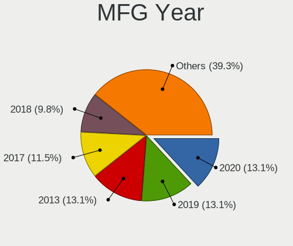

| Year | Computers | Percent |
|------|-----------|---------|
| 2020 | 7         | 15.91%  |
| 2019 | 7         | 15.91%  |
| 2013 | 7         | 15.91%  |
| 2017 | 6         | 13.64%  |
| 2015 | 4         | 9.09%   |
| 2012 | 4         | 9.09%   |
| 2014 | 3         | 6.82%   |
| 2018 | 2         | 4.55%   |
| 2016 | 2         | 4.55%   |
| 2021 | 1         | 2.27%   |
| 2011 | 1         | 2.27%   |

Form Factor
-----------

Physical design of the computer

| Name        | Computers | Percent |
|-------------|-----------|---------|
| Notebook    | 27        | 61.36%  |
| Desktop     | 13        | 29.55%  |
| Mini pc     | 2         | 4.55%   |
| Convertible | 1         | 2.27%   |
| All in one  | 1         | 2.27%   |

Secure Boot
-----------

Enabled or disabled

| State    | Computers | Percent |
|----------|-----------|---------|
| Disabled | 44        | 100%    |

Coreboot
--------

Have coreboot on board

| Used | Computers | Percent |
|------|-----------|---------|
| No   | 44        | 100%    |

RAM Size
--------

Total RAM memory

| Size in GB | Computers | Percent |
|------------|-----------|---------|
| 4.01-8.0   | 18        | 40.91%  |
| 8.01-16.0  | 11        | 25%     |
| 3.01-4.0   | 8         | 18.18%  |
| 32.01-64.0 | 3         | 6.82%   |
| 16.01-24.0 | 3         | 6.82%   |
| 1.01-2.0   | 1         | 2.27%   |

RAM Used
--------

Used RAM memory

| Used GB  | Computers | Percent |
|----------|-----------|---------|
| 1.01-2.0 | 32        | 71.11%  |
| 2.01-3.0 | 6         | 13.33%  |
| 4.01-8.0 | 3         | 6.67%   |
| 0.51-1.0 | 3         | 6.67%   |
| 3.01-4.0 | 1         | 2.22%   |

Total Drives
------------

Number of drives on board

| Drives | Computers | Percent |
|--------|-----------|---------|
| 1      | 33        | 75%     |
| 2      | 7         | 15.91%  |
| 4      | 2         | 4.55%   |
| 3      | 2         | 4.55%   |

Has CD-ROM
----------

Has CD-ROM on board

| Presented | Computers | Percent |
|-----------|-----------|---------|
| No        | 34        | 77.27%  |
| Yes       | 10        | 22.73%  |

Has Ethernet
------------

Has Ethernet on board

| Presented | Computers | Percent |
|-----------|-----------|---------|
| Yes       | 38        | 86.36%  |
| No        | 6         | 13.64%  |

Has WiFi
--------

Has WiFi module

| Presented | Computers | Percent |
|-----------|-----------|---------|
| Yes       | 40        | 90.91%  |
| No        | 4         | 9.09%   |

Has Bluetooth
-------------

Has Bluetooth module

| Presented | Computers | Percent |
|-----------|-----------|---------|
| Yes       | 34        | 77.27%  |
| No        | 10        | 22.73%  |

Location
--------

Country
-------

Geographic location (country)

| Country     | Computers | Percent |
|-------------|-----------|---------|
| USA         | 9         | 20.45%  |
| Brazil      | 4         | 9.09%   |
| Ukraine     | 3         | 6.82%   |
| France      | 3         | 6.82%   |
| Russia      | 2         | 4.55%   |
| Italy       | 2         | 4.55%   |
| India       | 2         | 4.55%   |
| Germany     | 2         | 4.55%   |
| Chile       | 2         | 4.55%   |
| Canada      | 2         | 4.55%   |
| UAE         | 1         | 2.27%   |
| Thailand    | 1         | 2.27%   |
| Sweden      | 1         | 2.27%   |
| Slovakia    | 1         | 2.27%   |
| Serbia      | 1         | 2.27%   |
| Netherlands | 1         | 2.27%   |
| Latvia      | 1         | 2.27%   |
| Iraq        | 1         | 2.27%   |
| Hungary     | 1         | 2.27%   |
| Greece      | 1         | 2.27%   |
| Finland     | 1         | 2.27%   |
| El Salvador | 1         | 2.27%   |
| Czechia     | 1         | 2.27%   |

City
----

Geographic location (city)

| City                  | Computers | Percent |
|-----------------------|-----------|---------|
| Vancouver             | 2         | 4.55%   |
| Santiago              | 2         | 4.55%   |
| Waldachtal            | 1         | 2.27%   |
| Verden an der Aller   | 1         | 2.27%   |
| Västerås            | 1         | 2.27%   |
| Uruguaiana            | 1         | 2.27%   |
| Tyumen                | 1         | 2.27%   |
| Talence               | 1         | 2.27%   |
| Skydra                | 1         | 2.27%   |
| Si Racha              | 1         | 2.27%   |
| Sesto Fiorentino      | 1         | 2.27%   |
| Sao Bernardo do Campo | 1         | 2.27%   |
| San Salvador          | 1         | 2.27%   |
| Rio de Janeiro        | 1         | 2.27%   |
| Riga                  | 1         | 2.27%   |
| Prague                | 1         | 2.27%   |
| Pori                  | 1         | 2.27%   |
| Parempuyre            | 1         | 2.27%   |
| Ottawa                | 1         | 2.27%   |
| Novoyavorovske        | 1         | 2.27%   |
| Novi Sad              | 1         | 2.27%   |
| Millers Creek         | 1         | 2.27%   |
| Milan                 | 1         | 2.27%   |
| Mariupol              | 1         | 2.27%   |
| Levis                 | 1         | 2.27%   |
| Lelystad              | 1         | 2.27%   |
| Lehighton             | 1         | 2.27%   |
| Kyiv                  | 1         | 2.27%   |
| Krasnoyarsk           | 1         | 2.27%   |
| Kolkata               | 1         | 2.27%   |
| Kalispell             | 1         | 2.27%   |
| Juazeiro do Norte     | 1         | 2.27%   |
| Hyderabad             | 1         | 2.27%   |
| Gig Harbor            | 1         | 2.27%   |
| Del Valle             | 1         | 2.27%   |
| Columbia              | 1         | 2.27%   |
| Castelnau-le-Lez      | 1         | 2.27%   |
| Budapest              | 1         | 2.27%   |
| Bratislava            | 1         | 2.27%   |
| Belton                | 1         | 2.27%   |

Drives
------

Drive Vendor
------------

Hard drive vendors

| Vendor              | Computers | Drives | Percent |
|---------------------|-----------|--------|---------|
| Seagate             | 10        | 10     | 16.95%  |
| WDC                 | 9         | 9      | 15.25%  |
| Kingston            | 7         | 7      | 11.86%  |
| Samsung Electronics | 6         | 8      | 10.17%  |
| Toshiba             | 4         | 4      | 6.78%   |
| SK hynix            | 3         | 4      | 5.08%   |
| SanDisk             | 3         | 4      | 5.08%   |
| HGST                | 3         | 3      | 5.08%   |
| PNY                 | 2         | 2      | 3.39%   |
| Micron Technology   | 2         | 2      | 3.39%   |
| Apple               | 2         | 2      | 3.39%   |
| Transcend           | 1         | 1      | 1.69%   |
| SSSTC               | 1         | 1      | 1.69%   |
| Patriot             | 1         | 1      | 1.69%   |
| Intel               | 1         | 1      | 1.69%   |
| HECTRON             | 1         | 1      | 1.69%   |
| Crucial             | 1         | 1      | 1.69%   |
| Apacer              | 1         | 1      | 1.69%   |
| AirDisk             | 1         | 1      | 1.69%   |

Drive Model
-----------

Hard drive models

| Model                                     | Computers | Percent |
|-------------------------------------------|-----------|---------|
| SK hynix NVMe SSD Drive 512GB             | 2         | 3.28%   |
| Seagate ST9500325AS 500GB                 | 2         | 3.28%   |
| Samsung SM963 2.5" NVMe PCIe SSD 256GB    | 2         | 3.28%   |
| PNY CS900 240GB SSD                       | 2         | 3.28%   |
| Kingston SA400S37120G 120GB SSD           | 2         | 3.28%   |
| HGST HTS541010A9E680 1TB                  | 2         | 3.28%   |
| WDC WDS240G2G0A-00JH30 240GB SSD          | 1         | 1.64%   |
| WDC WD5000LPVX-75V0TT0 500GB              | 1         | 1.64%   |
| WDC WD5000LPVX-08V0TT5 500GB              | 1         | 1.64%   |
| WDC WD5000AAKX-003CA0 500GB               | 1         | 1.64%   |
| WDC WD3200LPVX-08V0TT5 320GB              | 1         | 1.64%   |
| WDC WD20SPZX-11UA7T0 2TB                  | 1         | 1.64%   |
| WDC WD1600AAJS-22L7A0 160GB               | 1         | 1.64%   |
| WDC WD10SPZX-24Z10 1TB                    | 1         | 1.64%   |
| WDC WD10EALX-009BA0 1TB                   | 1         | 1.64%   |
| Transcend TS64GMTS400 64GB SSD            | 1         | 1.64%   |
| Toshiba MQ04ABF100 1TB                    | 1         | 1.64%   |
| Toshiba MQ01ABD032 320GB                  | 1         | 1.64%   |
| Toshiba HDWD120 2TB                       | 1         | 1.64%   |
| Toshiba DT01ACA100 1TB                    | 1         | 1.64%   |
| SSSTC CVB-8D128-HP 128GB                  | 1         | 1.64%   |
| SK hynix SKHynix_HFS512GD9TNG-L3A0B 512GB | 1         | 1.64%   |
| SK hynix HFS128G39TND-N210A 128GB SSD     | 1         | 1.64%   |
| Seagate ST8000DM004-2CX188 8TB            | 1         | 1.64%   |
| Seagate ST500LM012 HN-M500MBB 500GB       | 1         | 1.64%   |
| Seagate ST4000DX001-1CE168 4TB            | 1         | 1.64%   |
| Seagate ST3500312CS 500GB                 | 1         | 1.64%   |
| Seagate ST2000DM001-1ER164 2TB            | 1         | 1.64%   |
| Seagate ST1000LM035-1RK172 1TB            | 1         | 1.64%   |
| Seagate ST1000DM010-2EP102 1TB            | 1         | 1.64%   |
| Seagate ST1000DM003-1SB102 1TB            | 1         | 1.64%   |
| SanDisk X300 MSATA 128GB SSD              | 1         | 1.64%   |
| SanDisk SD8SN8U512G1002 512GB SSD         | 1         | 1.64%   |
| SanDisk NVMe SSD Drive 500GB              | 1         | 1.64%   |
| Samsung SSD 860 QVO 1TB                   | 1         | 1.64%   |
| Samsung SSD 860 EVO 500GB                 | 1         | 1.64%   |
| Samsung SSD 840 EVO 250GB                 | 1         | 1.64%   |
| Samsung NVMe SSD Drive 512GB              | 1         | 1.64%   |
| Samsung NVMe SSD Drive 1024GB             | 1         | 1.64%   |
| Patriot Burst Elite 120GB SSD             | 1         | 1.64%   |

HDD Vendor
----------

Hard disk drive vendors

| Vendor  | Computers | Drives | Percent |
|---------|-----------|--------|---------|
| Seagate | 10        | 10     | 38.46%  |
| WDC     | 8         | 8      | 30.77%  |
| Toshiba | 4         | 4      | 15.38%  |
| HGST    | 3         | 3      | 11.54%  |
| Apple   | 1         | 1      | 3.85%   |

SSD Vendor
----------

Solid state drive vendors

| Vendor              | Computers | Drives | Percent |
|---------------------|-----------|--------|---------|
| Kingston            | 7         | 7      | 26.92%  |
| Samsung Electronics | 3         | 4      | 11.54%  |
| SanDisk             | 2         | 2      | 7.69%   |
| PNY                 | 2         | 2      | 7.69%   |
| Micron Technology   | 2         | 2      | 7.69%   |
| WDC                 | 1         | 1      | 3.85%   |
| Transcend           | 1         | 1      | 3.85%   |
| SSSTC               | 1         | 1      | 3.85%   |
| SK hynix            | 1         | 1      | 3.85%   |
| Patriot             | 1         | 1      | 3.85%   |
| Intel               | 1         | 1      | 3.85%   |
| Crucial             | 1         | 1      | 3.85%   |
| Apple               | 1         | 1      | 3.85%   |
| Apacer              | 1         | 1      | 3.85%   |
| AirDisk             | 1         | 1      | 3.85%   |

Drive Kind
----------

HDD or SSD

| Kind    | Computers | Drives | Percent |
|---------|-----------|--------|---------|
| SSD     | 24        | 27     | 42.86%  |
| HDD     | 24        | 26     | 42.86%  |
| NVMe    | 7         | 9      | 12.5%   |
| Unknown | 1         | 1      | 1.79%   |

Drive Connector
---------------

SATA, SAS, NVMe, etc.

| Type | Computers | Drives | Percent |
|------|-----------|--------|---------|
| SATA | 40        | 54     | 85.11%  |
| NVMe | 7         | 9      | 14.89%  |

Drive Size
----------

Size of hard drive

| Size in TB | Computers | Drives | Percent |
|------------|-----------|--------|---------|
| 0.01-0.5   | 27        | 33     | 58.7%   |
| 0.51-1.0   | 14        | 15     | 30.43%  |
| 1.01-2.0   | 3         | 3      | 6.52%   |
| 3.01-4.0   | 1         | 1      | 2.17%   |
| 4.01-10.0  | 1         | 1      | 2.17%   |

Space Total
-----------

Amount of disk space available on the file system

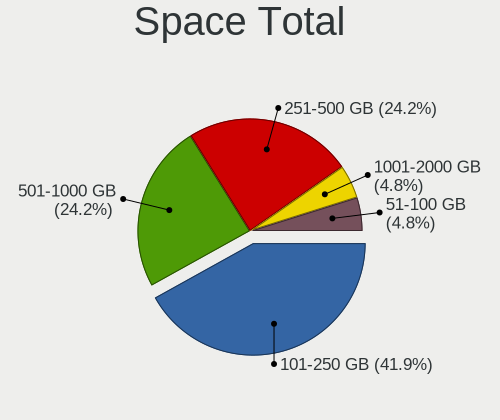

| Size in GB | Computers | Percent |
|------------|-----------|---------|
| 101-250    | 20        | 45.45%  |
| 251-500    | 11        | 25%     |
| 501-1000   | 10        | 22.73%  |
| 51-100     | 2         | 4.55%   |
| 1001-2000  | 1         | 2.27%   |

Space Used
----------

Amount of used disk space

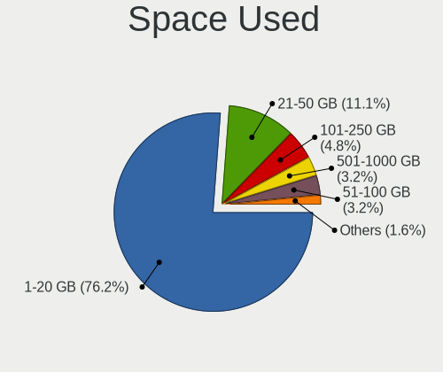

| Used GB | Computers | Percent |
|---------|-----------|---------|
| 1-20    | 35        | 77.78%  |
| 21-50   | 6         | 13.33%  |
| 101-250 | 2         | 4.44%   |
| 251-500 | 1         | 2.22%   |
| 51-100  | 1         | 2.22%   |

Malfunc. Drives
---------------

Drive models with a malfunction

Zero info for selected period =(

Malfunc. Drive Vendor
---------------------

Vendors of faulty drives

Zero info for selected period =(

Malfunc. HDD Vendor
-------------------

Vendors of faulty HDD drives

Zero info for selected period =(

Malfunc. Drive Kind
-------------------

Kinds of faulty drives

Zero info for selected period =(

Failed Drives
-------------

Failed drive models

Zero info for selected period =(

Failed Drive Vendor
-------------------

Failed drive vendors

Zero info for selected period =(

Drive Status
------------

Number of failed and malfunc. drives

| Status   | Computers | Drives | Percent |
|----------|-----------|--------|---------|
| Detected | 44        | 62     | 97.78%  |
| Works    | 1         | 1      | 2.22%   |

Storage controller
------------------

Storage Vendor
--------------

Storage controller vendors

| Vendor                   | Computers | Percent |
|--------------------------|-----------|---------|
| Intel                    | 32        | 62.75%  |
| AMD                      | 9         | 17.65%  |
| Samsung Electronics      | 4         | 7.84%   |
| SK hynix                 | 2         | 3.92%   |
| Marvell Technology Group | 2         | 3.92%   |
| SanDisk                  | 1         | 1.96%   |
| ASMedia Technology       | 1         | 1.96%   |

Storage Model
-------------

Storage controller models

| Model                                                                                   | Computers | Percent |
|-----------------------------------------------------------------------------------------|-----------|---------|
| AMD FCH SATA Controller [AHCI mode]                                                     | 9         | 16.36%  |
| Intel Sunrise Point-LP SATA Controller [AHCI mode]                                      | 5         | 9.09%   |
| Intel 7 Series Chipset Family 6-port SATA Controller [AHCI mode]                        | 5         | 9.09%   |
| Intel 8 Series SATA Controller 1 [AHCI mode]                                            | 3         | 5.45%   |
| Samsung NVMe SSD Controller SM981/PM981/PM983                                           | 2         | 3.64%   |
| Intel Atom/Celeron/Pentium Processor x5-E8000/J3xxx/N3xxx Series SATA Controller        | 2         | 3.64%   |
| Intel 9 Series Chipset Family SATA Controller [AHCI Mode]                               | 2         | 3.64%   |
| Intel 6 Series/C200 Series Chipset Family 6 port Mobile SATA AHCI Controller            | 2         | 3.64%   |
| Intel 400 Series Chipset Family SATA AHCI Controller                                    | 2         | 3.64%   |
| SK hynix Non-Volatile memory controller                                                 | 1         | 1.82%   |
| SK hynix BC511                                                                          | 1         | 1.82%   |
| SanDisk WD Black SN750 / PC SN730 NVMe SSD                                              | 1         | 1.82%   |
| Samsung NVMe SSD Controller PM9A1/PM9A3/980PRO                                          | 1         | 1.82%   |
| Samsung NVMe SSD Controller 980                                                         | 1         | 1.82%   |
| Marvell Group 88SE9172 SATA 6Gb/s Controller                                            | 1         | 1.82%   |
| Marvell Group 88SE9128 PCIe SATA 6 Gb/s RAID controller with HyperDuo                   | 1         | 1.82%   |
| Intel SATA Controller [RAID mode]                                                       | 1         | 1.82%   |
| Intel Q170/Q150/B150/H170/H110/Z170/CM236 Chipset SATA Controller [AHCI Mode]           | 1         | 1.82%   |
| Intel HM170/QM170 Chipset SATA Controller [AHCI Mode]                                   | 1         | 1.82%   |
| Intel Celeron/Pentium Silver Processor SATA Controller                                  | 1         | 1.82%   |
| Intel Celeron N3350/Pentium N4200/Atom E3900 Series SATA AHCI Controller                | 1         | 1.82%   |
| Intel Cannon Point-LP SATA Controller [AHCI Mode]                                       | 1         | 1.82%   |
| Intel C600/X79 series chipset 6-Port SATA AHCI Controller                               | 1         | 1.82%   |
| Intel 8 Series/C220 Series Chipset Family 6-port SATA Controller 1 [AHCI mode]          | 1         | 1.82%   |
| Intel 6 Series/C200 Series Chipset Family Desktop SATA Controller (IDE mode, ports 4-5) | 1         | 1.82%   |
| Intel 6 Series/C200 Series Chipset Family Desktop SATA Controller (IDE mode, ports 0-3) | 1         | 1.82%   |
| Intel 6 Series/C200 Series Chipset Family 6 port Desktop SATA AHCI Controller           | 1         | 1.82%   |
| Intel 200 Series PCH SATA controller [AHCI mode]                                        | 1         | 1.82%   |
| ASMedia ASM1062 Serial ATA Controller                                                   | 1         | 1.82%   |
| AMD FCH SATA Controller D                                                               | 1         | 1.82%   |
| AMD FCH IDE Controller                                                                  | 1         | 1.82%   |
| AMD 400 Series Chipset SATA Controller                                                  | 1         | 1.82%   |

Storage Kind
------------

Kind of storage controller (IDE, SATA, NVMe, SAS, ...)

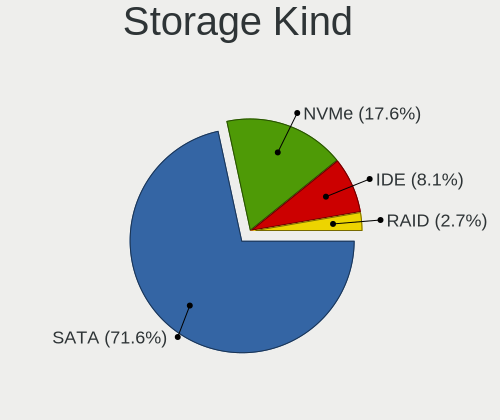

| Kind | Computers | Percent |
|------|-----------|---------|
| SATA | 39        | 79.59%  |
| NVMe | 7         | 14.29%  |
| IDE  | 2         | 4.08%   |
| RAID | 1         | 2.04%   |

Processor
---------

CPU Vendor
----------

Processor vendors

| Vendor | Computers | Percent |
|--------|-----------|---------|
| Intel  | 33        | 75%     |
| AMD    | 11        | 25%     |

CPU Model
---------

Processor models

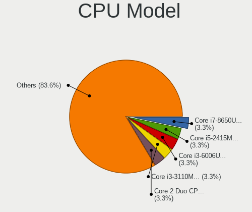

| Model                                         | Computers | Percent |
|-----------------------------------------------|-----------|---------|
| Intel Core i5-2415M CPU @ 2.30GHz             | 2         | 4.55%   |
| Intel Core i3-6006U CPU @ 2.00GHz             | 2         | 4.55%   |
| Intel Core i3-3110M CPU @ 2.40GHz             | 2         | 4.55%   |
| Intel Xeon CPU E5-2660 0 @ 2.20GHz            | 1         | 2.27%   |
| Intel Pentium CPU J4205 @ 1.50GHz             | 1         | 2.27%   |
| Intel Core i7-8650U CPU @ 1.90GHz             | 1         | 2.27%   |
| Intel Core i7-7700HQ CPU @ 2.80GHz            | 1         | 2.27%   |
| Intel Core i7-4930K CPU @ 3.40GHz             | 1         | 2.27%   |
| Intel Core i7-4790K CPU @ 4.00GHz             | 1         | 2.27%   |
| Intel Core i7-3820QM CPU @ 2.70GHz            | 1         | 2.27%   |
| Intel Core i5-8265U CPU @ 1.60GHz             | 1         | 2.27%   |
| Intel Core i5-7400 CPU @ 3.00GHz              | 1         | 2.27%   |
| Intel Core i5-6200U CPU @ 2.30GHz             | 1         | 2.27%   |
| Intel Core i5-5675R CPU @ 3.10GHz             | 1         | 2.27%   |
| Intel Core i5-4210U CPU @ 1.70GHz             | 1         | 2.27%   |
| Intel Core i5-4200M CPU @ 2.50GHz             | 1         | 2.27%   |
| Intel Core i5-3337U CPU @ 1.80GHz             | 1         | 2.27%   |
| Intel Core i5-10400 CPU @ 2.90GHz             | 1         | 2.27%   |
| Intel Core i5-1035G1 CPU @ 1.00GHz            | 1         | 2.27%   |
| Intel Core i3-7100 CPU @ 3.90GHz              | 1         | 2.27%   |
| Intel Core i3-7020U CPU @ 2.30GHz             | 1         | 2.27%   |
| Intel Core i3-4030U CPU @ 1.90GHz             | 1         | 2.27%   |
| Intel Core i3-2375M CPU @ 1.50GHz             | 1         | 2.27%   |
| Intel Core i3-10100F CPU @ 3.60GHz            | 1         | 2.27%   |
| Intel Core i3-10100 CPU @ 3.60GHz             | 1         | 2.27%   |
| Intel Celeron J4115 CPU @ 1.80GHz             | 1         | 2.27%   |
| Intel Celeron CPU N3050 @ 1.60GHz             | 1         | 2.27%   |
| Intel Celeron CPU G530 @ 2.40GHz              | 1         | 2.27%   |
| Intel Celeron 2957U @ 1.40GHz                 | 1         | 2.27%   |
| Intel Atom x5-E8000 CPU @ 1.04GHz             | 1         | 2.27%   |
| AMD Ryzen 7 4700U with Radeon Graphics        | 1         | 2.27%   |
| AMD Ryzen 5 5600X 6-Core Processor            | 1         | 2.27%   |
| AMD Ryzen 5 3600X 6-Core Processor            | 1         | 2.27%   |
| AMD Ryzen 5 3550H with Radeon Vega Mobile Gfx | 1         | 2.27%   |
| AMD Ryzen 5 3500U with Radeon Vega Mobile Gfx | 1         | 2.27%   |
| AMD Ryzen 5 3400G with Radeon Vega Graphics   | 1         | 2.27%   |
| AMD E1-1200 APU with Radeon HD Graphics       | 1         | 2.27%   |
| AMD Athlon Silver 3050U with Radeon Graphics  | 1         | 2.27%   |
| AMD A8-7410 APU with AMD Radeon R5 Graphics   | 1         | 2.27%   |
| AMD A8-5550M APU with Radeon HD Graphics      | 1         | 2.27%   |

CPU Model Family
----------------

Processor model prefix

| Model         | Computers | Percent |
|---------------|-----------|---------|
| Intel Core i5 | 11        | 25%     |
| Intel Core i3 | 10        | 22.73%  |
| Intel Core i7 | 5         | 11.36%  |
| AMD Ryzen 5   | 5         | 11.36%  |
| Intel Celeron | 4         | 9.09%   |
| AMD A8        | 2         | 4.55%   |
| Intel Xeon    | 1         | 2.27%   |
| Intel Pentium | 1         | 2.27%   |
| Intel Atom    | 1         | 2.27%   |
| AMD Ryzen 7   | 1         | 2.27%   |
| AMD E1        | 1         | 2.27%   |
| AMD Athlon    | 1         | 2.27%   |
| AMD A10       | 1         | 2.27%   |

CPU Cores
---------

Number of processor cores

| Number | Computers | Percent |
|--------|-----------|---------|
| 2      | 21        | 47.73%  |
| 4      | 17        | 38.64%  |
| 6      | 4         | 9.09%   |
| 8      | 2         | 4.55%   |

CPU Sockets
-----------

Number of sockets

| Number | Computers | Percent |
|--------|-----------|---------|
| 1      | 44        | 100%    |

CPU Threads
-----------

Threads per core (Hyper-Threading)

| Number | Computers | Percent |
|--------|-----------|---------|
| 2      | 32        | 72.73%  |
| 1      | 12        | 27.27%  |

CPU Op-Modes
------------

CPU Operation Modes (32-bit, 64-bit)

| Op mode        | Computers | Percent |
|----------------|-----------|---------|
| 32-bit, 64-bit | 44        | 100%    |

CPU Microcode
-------------

Microcode number

| Number     | Computers | Percent |
|------------|-----------|---------|
| 0x306a9    | 4         | 9.09%   |
| 0x206a7    | 4         | 9.09%   |
| 0x08108109 | 4         | 9.09%   |
| 0xa0653    | 3         | 6.82%   |
| 0x406e3    | 3         | 6.82%   |
| 0x40651    | 3         | 6.82%   |
| 0x906e9    | 2         | 4.55%   |
| 0x306c3    | 2         | 4.55%   |
| 0x06001119 | 2         | 4.55%   |
| 0x806ec    | 1         | 2.27%   |
| 0x806ea    | 1         | 2.27%   |
| 0x806e9    | 1         | 2.27%   |
| 0x706e5    | 1         | 2.27%   |
| 0x706a1    | 1         | 2.27%   |
| 0x506c9    | 1         | 2.27%   |
| 0x406c4    | 1         | 2.27%   |
| 0x406c3    | 1         | 2.27%   |
| 0x40671    | 1         | 2.27%   |
| 0x306e4    | 1         | 2.27%   |
| 0x206d7    | 1         | 2.27%   |
| 0x0a201009 | 1         | 2.27%   |
| 0x08701021 | 1         | 2.27%   |
| 0x08600106 | 1         | 2.27%   |
| 0x07030105 | 1         | 2.27%   |
| 0x0500010d | 1         | 2.27%   |
| Unknown    | 1         | 2.27%   |

CPU Microarch
-------------

Microarchitecture

| Name          | Computers | Percent |
|---------------|-----------|---------|
| KabyLake      | 6         | 13.64%  |
| SandyBridge   | 5         | 11.36%  |
| IvyBridge     | 5         | 11.36%  |
| Haswell       | 5         | 11.36%  |
| Zen+          | 4         | 9.09%   |
| Skylake       | 3         | 6.82%   |
| CometLake     | 3         | 6.82%   |
| Zen 2         | 2         | 4.55%   |
| Silvermont    | 2         | 4.55%   |
| Piledriver    | 2         | 4.55%   |
| Zen 3         | 1         | 2.27%   |
| Puma          | 1         | 2.27%   |
| IceLake       | 1         | 2.27%   |
| Goldmont plus | 1         | 2.27%   |
| Goldmont      | 1         | 2.27%   |
| Broadwell     | 1         | 2.27%   |
| Bobcat        | 1         | 2.27%   |

Graphics
--------

GPU Vendor
----------

Vendors of graphics cards

| Vendor | Computers | Percent |
|--------|-----------|---------|
| Intel  | 27        | 50.94%  |
| Nvidia | 15        | 28.3%   |
| AMD    | 11        | 20.75%  |

GPU Model
---------

Graphics card models

| Model                                                                                    | Computers | Percent |
|------------------------------------------------------------------------------------------|-----------|---------|
| Intel 3rd Gen Core processor Graphics Controller                                         | 4         | 7.27%   |
| Intel 2nd Generation Core Processor Family Integrated Graphics Controller                | 4         | 7.27%   |
| AMD Picasso/Raven 2 [Radeon Vega Series / Radeon Vega Mobile Series]                     | 4         | 7.27%   |
| Nvidia GP106 [GeForce GTX 1060 3GB]                                                      | 3         | 5.45%   |
| Intel Skylake GT2 [HD Graphics 520]                                                      | 3         | 5.45%   |
| Intel Haswell-ULT Integrated Graphics Controller                                         | 3         | 5.45%   |
| Intel HD Graphics 630                                                                    | 2         | 3.64%   |
| Intel Atom/Celeron/Pentium Processor x5-E8000/J3xxx/N3xxx Integrated Graphics Controller | 2         | 3.64%   |
| AMD Topaz XT [Radeon R7 M260/M265 / M340/M360 / M440/M445 / 530/535 / 620/625 Mobile]    | 2         | 3.64%   |
| Nvidia TU116 [GeForce GTX 1650 SUPER]                                                    | 1         | 1.82%   |
| Nvidia TU106 [GeForce RTX 2070]                                                          | 1         | 1.82%   |
| Nvidia GP107M [GeForce GTX 1050 Ti Mobile]                                               | 1         | 1.82%   |
| Nvidia GP107M [GeForce GTX 1050 3 GB Max-Q]                                              | 1         | 1.82%   |
| Nvidia GP107 [GeForce GTX 1050 Ti]                                                       | 1         | 1.82%   |
| Nvidia GP106 [GeForce GTX 1060 6GB]                                                      | 1         | 1.82%   |
| Nvidia GM108M [GeForce MX130]                                                            | 1         | 1.82%   |
| Nvidia GM108M [GeForce 840M]                                                             | 1         | 1.82%   |
| Nvidia GK208M [GeForce GT 740M]                                                          | 1         | 1.82%   |
| Nvidia GK107M [GeForce GT 650M Mac Edition]                                              | 1         | 1.82%   |
| Nvidia GF117M [GeForce 610M/710M/810M/820M / GT 620M/625M/630M/720M]                     | 1         | 1.82%   |
| Nvidia GF108M [GeForce GT 620M/630M/635M/640M LE]                                        | 1         | 1.82%   |
| Intel WhiskeyLake-U GT2 [UHD Graphics 620]                                               | 1         | 1.82%   |
| Intel UHD Graphics 620                                                                   | 1         | 1.82%   |
| Intel Iris Pro Graphics 6200                                                             | 1         | 1.82%   |
| Intel Iris Plus Graphics G1 (Ice Lake)                                                   | 1         | 1.82%   |
| Intel HD Graphics 620                                                                    | 1         | 1.82%   |
| Intel GeminiLake [UHD Graphics 600]                                                      | 1         | 1.82%   |
| Intel CometLake-S GT2 [UHD Graphics 630]                                                 | 1         | 1.82%   |
| Intel Apollo Lake [HD Graphics 505]                                                      | 1         | 1.82%   |
| Intel 4th Gen Core Processor Integrated Graphics Controller                              | 1         | 1.82%   |
| AMD Wrestler [Radeon HD 7310]                                                            | 1         | 1.82%   |
| AMD Saturn XT [FirePro M6100]                                                            | 1         | 1.82%   |
| AMD Richland [Radeon HD 8610G]                                                           | 1         | 1.82%   |
| AMD Richland [Radeon HD 8550G]                                                           | 1         | 1.82%   |
| AMD Renoir                                                                               | 1         | 1.82%   |
| AMD Mullins [Radeon R4/R5 Graphics]                                                      | 1         | 1.82%   |
| AMD Cedar [Radeon HD 5000/6000/7350/8350 Series]                                         | 1         | 1.82%   |

GPU Combo
---------

Combinations of graphics cards

| Name           | Computers | Percent |
|----------------|-----------|---------|
| 1 x Intel      | 19        | 43.18%  |
| 1 x Nvidia     | 7         | 15.91%  |
| Intel + Nvidia | 7         | 15.91%  |
| 1 x AMD        | 7         | 15.91%  |
| 2 x AMD        | 2         | 4.55%   |
| Intel + AMD    | 1         | 2.27%   |
| AMD + Nvidia   | 1         | 2.27%   |

GPU Driver
----------

Free vs proprietary

| Driver | Computers | Percent |
|--------|-----------|---------|
| Free   | 44        | 100%    |

GPU Memory
----------

Total video memory

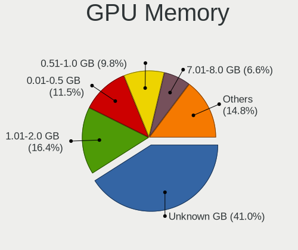

| Size in GB | Computers | Percent |
|------------|-----------|---------|
| Unknown    | 20        | 45.45%  |
| 1.01-2.0   | 7         | 15.91%  |
| 0.51-1.0   | 6         | 13.64%  |
| 2.01-3.0   | 4         | 9.09%   |
| 0.01-0.5   | 3         | 6.82%   |
| 3.01-4.0   | 2         | 4.55%   |
| 7.01-8.0   | 1         | 2.27%   |
| 5.01-6.0   | 1         | 2.27%   |

Monitor
-------

Monitor Vendor
--------------

Monitor vendors

| Vendor              | Computers | Percent |
|---------------------|-----------|---------|
| Samsung Electronics | 8         | 17.39%  |
| AU Optronics        | 7         | 15.22%  |
| LG Display          | 6         | 13.04%  |
| Chimei Innolux      | 5         | 10.87%  |
| BOE                 | 5         | 10.87%  |
| Goldstar            | 3         | 6.52%   |
| Apple               | 3         | 6.52%   |
| Acer                | 2         | 4.35%   |
| Viotek              | 1         | 2.17%   |
| Philips             | 1         | 2.17%   |
| Insignia            | 1         | 2.17%   |
| InfoVision          | 1         | 2.17%   |
| Dell                | 1         | 2.17%   |
| BenQ                | 1         | 2.17%   |
| AOC                 | 1         | 2.17%   |

Monitor Model
-------------

Monitor models

| Model                                                                | Computers | Percent |
|----------------------------------------------------------------------|-----------|---------|
| Samsung Electronics C27F390 SAM0D32 1920x1080 598x336mm 27.0-inch    | 2         | 4.26%   |
| Viotek GN34CW VTK3400 3440x1440 795x334mm 33.9-inch                  | 1         | 2.13%   |
| Samsung Electronics SyncMaster SAM02E3 1440x900 367x229mm 17.0-inch  | 1         | 2.13%   |
| Samsung Electronics SMB2230N SAM0635 1920x1080 477x268mm 21.5-inch   | 1         | 2.13%   |
| Samsung Electronics S24D300 SAM0B43 1920x1080 531x299mm 24.0-inch    | 1         | 2.13%   |
| Samsung Electronics LCD Monitor SDC4347 1366x768 344x193mm 15.5-inch | 1         | 2.13%   |
| Samsung Electronics LCD Monitor SDC3754 1600x900 382x215mm 17.3-inch | 1         | 2.13%   |
| Samsung Electronics C32F391 SAM0D34 1920x1080 698x393mm 31.5-inch    | 1         | 2.13%   |
| Samsung Electronics C24F390 SAM0D2C 1920x1080 521x293mm 23.5-inch    | 1         | 2.13%   |
| Philips PHL 223V5 PHLC0CF 1920x1080 477x268mm 21.5-inch              | 1         | 2.13%   |
| LG Display LCD Monitor LGD05EC 1920x1080 309x174mm 14.0-inch         | 1         | 2.13%   |
| LG Display LCD Monitor LGD04B3 1920x1080 345x194mm 15.6-inch         | 1         | 2.13%   |
| LG Display LCD Monitor LGD045C 1366x768 345x194mm 15.6-inch          | 1         | 2.13%   |
| LG Display LCD Monitor LGD039F 1366x768 345x194mm 15.6-inch          | 1         | 2.13%   |
| LG Display LCD Monitor LGD0372 1600x900 382x215mm 17.3-inch          | 1         | 2.13%   |
| LG Display LCD Monitor LGD02DA 1920x1080 380x220mm 17.3-inch         | 1         | 2.13%   |
| Insignia NS-19E320A13 BBY0032 1680x1050 640x384mm 29.4-inch          | 1         | 2.13%   |
| InfoVision LCD Monitor IVO057D 1920x1080 309x174mm 14.0-inch         | 1         | 2.13%   |
| Goldstar W1752 GSM4490 1440x900 370x232mm 17.2-inch                  | 1         | 2.13%   |
| Goldstar ULTRAGEAR GSM5B73 1920x1080 531x298mm 24.0-inch             | 1         | 2.13%   |
| Goldstar TV SSCR2 GSMC0C8 3840x2160                                  | 1         | 2.13%   |
| Dell P2421D DELD0FF 2560x1440 527x296mm 23.8-inch                    | 1         | 2.13%   |
| Chimei Innolux LCD Monitor CMN15E6 1366x768 344x193mm 15.5-inch      | 1         | 2.13%   |
| Chimei Innolux LCD Monitor CMN15D6 1920x1080 344x193mm 15.5-inch     | 1         | 2.13%   |
| Chimei Innolux LCD Monitor CMN15BB 1920x1080 344x194mm 15.5-inch     | 1         | 2.13%   |
| Chimei Innolux LCD Monitor CMN1406 1920x1080 309x173mm 13.9-inch     | 1         | 2.13%   |
| Chimei Innolux LCD Monitor CMN1130 1366x768 256x144mm 11.6-inch      | 1         | 2.13%   |
| BOE LCD Monitor BOE0802 1920x1080 344x193mm 15.5-inch                | 1         | 2.13%   |
| BOE LCD Monitor BOE07B5 1366x768 309x173mm 13.9-inch                 | 1         | 2.13%   |
| BOE LCD Monitor BOE0671 1366x768 344x194mm 15.5-inch                 | 1         | 2.13%   |
| BOE LCD Monitor BOE065F 1920x1080 344x194mm 15.5-inch                | 1         | 2.13%   |
| BOE LCD Monitor BOE0615 1366x768 309x173mm 13.9-inch                 | 1         | 2.13%   |
| BenQ LCD BNQ8024 2560x1440 597x336mm 27.0-inch                       | 1         | 2.13%   |
| AU Optronics LCD Monitor AUO683D 1920x1080 309x174mm 14.0-inch       | 1         | 2.13%   |
| AU Optronics LCD Monitor AUO61ED 1920x1080 344x194mm 15.5-inch       | 1         | 2.13%   |
| AU Optronics LCD Monitor AUO305D 1920x1080 256x144mm 11.6-inch       | 1         | 2.13%   |
| AU Optronics LCD Monitor AUO233C 1366x768 309x173mm 13.9-inch        | 1         | 2.13%   |
| AU Optronics LCD Monitor AUO223D 1920x1080 309x174mm 14.0-inch       | 1         | 2.13%   |
| AU Optronics LCD Monitor AUO162C 1366x768 293x164mm 13.2-inch        | 1         | 2.13%   |
| AU Optronics LCD Monitor AUO159E 1600x900 382x214mm 17.2-inch        | 1         | 2.13%   |

Monitor Resolution
------------------

Monitor screen resolution

| Resolution       | Computers | Percent |
|------------------|-----------|---------|
| 1920x1080 (FHD)  | 22        | 48.89%  |
| 1366x768 (WXGA)  | 11        | 24.44%  |
| 1600x900 (HD+)   | 3         | 6.67%   |
| 3840x2160 (4K)   | 2         | 4.44%   |
| 2560x1440 (QHD)  | 2         | 4.44%   |
| 3440x1440        | 1         | 2.22%   |
| 2880x1800        | 1         | 2.22%   |
| 1920x540         | 1         | 2.22%   |
| 1440x900 (WXGA+) | 1         | 2.22%   |
| 1280x800 (WXGA)  | 1         | 2.22%   |

Monitor Diagonal
----------------

Diagonal size in inches

| Inches | Computers | Percent |
|--------|-----------|---------|
| 15     | 12        | 26.09%  |
| 21     | 5         | 10.87%  |
| 17     | 5         | 10.87%  |
| 14     | 5         | 10.87%  |
| 13     | 5         | 10.87%  |
| 27     | 3         | 6.52%   |
| 24     | 3         | 6.52%   |
| 11     | 2         | 4.35%   |
| 72     | 1         | 2.17%   |
| 48     | 1         | 2.17%   |
| 34     | 1         | 2.17%   |
| 31     | 1         | 2.17%   |
| 23     | 1         | 2.17%   |
| 18     | 1         | 2.17%   |

Monitor Width
-------------

Physical width

| Width in mm | Computers | Percent |
|-------------|-----------|---------|
| 301-350     | 20        | 44.44%  |
| 501-600     | 6         | 13.33%  |
| 401-500     | 6         | 13.33%  |
| 351-400     | 5         | 11.11%  |
| 201-300     | 4         | 8.89%   |
| 701-800     | 1         | 2.22%   |
| 601-700     | 1         | 2.22%   |
| 1501-2000   | 1         | 2.22%   |
| 1001-1500   | 1         | 2.22%   |

Aspect Ratio
------------

Proportional relationship between the width and the height

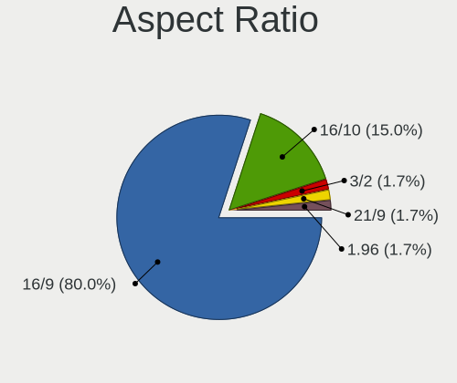

| Ratio | Computers | Percent |
|-------|-----------|---------|
| 16/9  | 40        | 88.89%  |
| 16/10 | 3         | 6.67%   |
| 21/9  | 1         | 2.22%   |
| 1.96  | 1         | 2.22%   |

Monitor Area
------------

Area in inch²

| Area in inch² | Computers | Percent |
|----------------|-----------|---------|
| 101-110        | 12        | 26.67%  |
| 81-90          | 9         | 20%     |
| 201-250        | 7         | 15.56%  |
| 121-130        | 4         | 8.89%   |
| 301-350        | 3         | 6.67%   |
| 51-60          | 2         | 4.44%   |
| 351-500        | 2         | 4.44%   |
| More than 1000 | 1         | 2.22%   |
| 71-80          | 1         | 2.22%   |
| 151-200        | 1         | 2.22%   |
| 141-150        | 1         | 2.22%   |
| 131-140        | 1         | 2.22%   |
| 501-1000       | 1         | 2.22%   |

Pixel Density
-------------

Pixels per inch

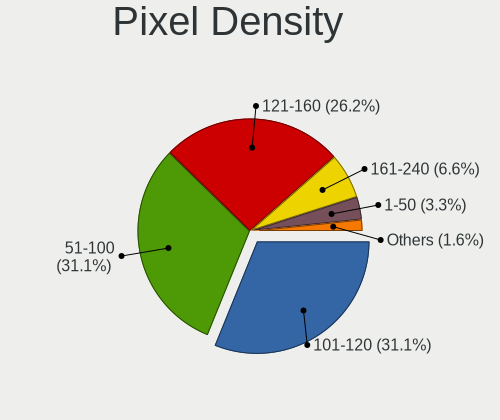

| Density | Computers | Percent |
|---------|-----------|---------|
| 101-120 | 17        | 37.78%  |
| 121-160 | 14        | 31.11%  |
| 51-100  | 10        | 22.22%  |
| 161-240 | 3         | 6.67%   |
| 1-50    | 1         | 2.22%   |

Multiple Monitors
-----------------

Total monitors connected

| Total | Computers | Percent |
|-------|-----------|---------|
| 1     | 41        | 93.18%  |
| 2     | 3         | 6.82%   |

Network
-------

Net Controller Vendor
---------------------

Controller vendors

| Vendor                          | Computers | Percent |
|---------------------------------|-----------|---------|
| Realtek Semiconductor           | 28        | 40.58%  |
| Intel                           | 15        | 21.74%  |
| Qualcomm Atheros                | 11        | 15.94%  |
| Broadcom                        | 6         | 8.7%    |
| Broadcom Limited                | 3         | 4.35%   |
| Google                          | 2         | 2.9%    |
| TP-Link                         | 1         | 1.45%   |
| Samsung Electronics             | 1         | 1.45%   |
| Qualcomm Atheros Communications | 1         | 1.45%   |
| Motorola PCS                    | 1         | 1.45%   |

Net Controller Model
--------------------

Controller models

| Model                                                             | Computers | Percent |
|-------------------------------------------------------------------|-----------|---------|
| Realtek RTL8111/8168/8411 PCI Express Gigabit Ethernet Controller | 18        | 21.69%  |
| Realtek RTL810xE PCI Express Fast Ethernet controller             | 7         | 8.43%   |
| Realtek RTL8821CE 802.11ac PCIe Wireless Network Adapter          | 4         | 4.82%   |
| Qualcomm Atheros QCA9565 / AR9565 Wireless Network Adapter        | 3         | 3.61%   |
| Qualcomm Atheros QCA9377 802.11ac Wireless Network Adapter        | 3         | 3.61%   |
| Realtek RTL8723BE PCIe Wireless Network Adapter                   | 2         | 2.41%   |
| Qualcomm Atheros AR9462 Wireless Network Adapter                  | 2         | 2.41%   |
| Intel Wi-Fi 6 AX200                                               | 2         | 2.41%   |
| Broadcom NetXtreme BCM57765 Gigabit Ethernet PCIe                 | 2         | 2.41%   |
| Broadcom BCM4331 802.11a/b/g/n                                    | 2         | 2.41%   |
| Broadcom BCM43142 802.11b/g/n                                     | 2         | 2.41%   |
| TP-Link UE300 10/100/1000 LAN (ethernet mode) [Realtek RTL8153]   | 1         | 1.2%    |
| Samsung Galaxy series, misc. (tethering mode)                     | 1         | 1.2%    |
| Realtek RTL8822CE 802.11ac PCIe Wireless Network Adapter          | 1         | 1.2%    |
| Realtek RTL8821AE 802.11ac PCIe Wireless Network Adapter          | 1         | 1.2%    |
| Realtek RTL8192EE PCIe Wireless Network Adapter                   | 1         | 1.2%    |
| Realtek RTL8188EE Wireless Network Adapter                        | 1         | 1.2%    |
| Realtek RTL8152 Fast Ethernet Adapter                             | 1         | 1.2%    |
| Realtek 802.11n WLAN Adapter                                      | 1         | 1.2%    |
| Qualcomm Atheros QCA8172 Fast Ethernet                            | 1         | 1.2%    |
| Qualcomm Atheros QCA6174 802.11ac Wireless Network Adapter        | 1         | 1.2%    |
| Qualcomm Atheros Killer E220x Gigabit Ethernet Controller         | 1         | 1.2%    |
| Qualcomm Atheros AR9271 802.11n                                   | 1         | 1.2%    |
| Qualcomm Atheros AR8151 v2.0 Gigabit Ethernet                     | 1         | 1.2%    |
| Motorola PCS moto g play (2021)                                   | 1         | 1.2%    |
| Intel Wireless-AC 9260                                            | 1         | 1.2%    |
| Intel Wireless 8260                                               | 1         | 1.2%    |
| Intel Wireless 7265                                               | 1         | 1.2%    |
| Intel Wireless 3165                                               | 1         | 1.2%    |
| Intel Ice Lake-LP PCH CNVi WiFi                                   | 1         | 1.2%    |
| Intel Gemini Lake PCH CNVi WiFi                                   | 1         | 1.2%    |
| Intel Ethernet Controller I225-V                                  | 1         | 1.2%    |
| Intel Ethernet Connection I217-LM                                 | 1         | 1.2%    |
| Intel Ethernet Connection (4) I219-LM                             | 1         | 1.2%    |
| Intel Dual Band Wireless-AC 3168NGW [Stone Peak]                  | 1         | 1.2%    |
| Intel Dual Band Wireless-AC 3165 Plus Bluetooth                   | 1         | 1.2%    |
| Intel Centrino Wireless-N 105                                     | 1         | 1.2%    |
| Intel 82579V Gigabit Network Connection                           | 1         | 1.2%    |
| Google Pixel 6a                                                   | 1         | 1.2%    |
| Google Nexus/Pixel Device (tether)                                | 1         | 1.2%    |

Wireless Vendor
---------------

Wireless vendors

| Vendor                          | Computers | Percent |
|---------------------------------|-----------|---------|
| Realtek Semiconductor           | 11        | 27.5%   |
| Intel                           | 11        | 27.5%   |
| Qualcomm Atheros                | 9         | 22.5%   |
| Broadcom                        | 5         | 12.5%   |
| Broadcom Limited                | 3         | 7.5%    |
| Qualcomm Atheros Communications | 1         | 2.5%    |

Wireless Model
--------------

Wireless models

| Model                                                      | Computers | Percent |
|------------------------------------------------------------|-----------|---------|
| Realtek RTL8821CE 802.11ac PCIe Wireless Network Adapter   | 4         | 10%     |
| Qualcomm Atheros QCA9565 / AR9565 Wireless Network Adapter | 3         | 7.5%    |
| Qualcomm Atheros QCA9377 802.11ac Wireless Network Adapter | 3         | 7.5%    |
| Realtek RTL8723BE PCIe Wireless Network Adapter            | 2         | 5%      |
| Qualcomm Atheros AR9462 Wireless Network Adapter           | 2         | 5%      |
| Intel Wi-Fi 6 AX200                                        | 2         | 5%      |
| Broadcom BCM4331 802.11a/b/g/n                             | 2         | 5%      |
| Broadcom BCM43142 802.11b/g/n                              | 2         | 5%      |
| Realtek RTL8822CE 802.11ac PCIe Wireless Network Adapter   | 1         | 2.5%    |
| Realtek RTL8821AE 802.11ac PCIe Wireless Network Adapter   | 1         | 2.5%    |
| Realtek RTL8192EE PCIe Wireless Network Adapter            | 1         | 2.5%    |
| Realtek RTL8188EE Wireless Network Adapter                 | 1         | 2.5%    |
| Realtek 802.11n WLAN Adapter                               | 1         | 2.5%    |
| Qualcomm Atheros QCA6174 802.11ac Wireless Network Adapter | 1         | 2.5%    |
| Qualcomm Atheros AR9271 802.11n                            | 1         | 2.5%    |
| Intel Wireless-AC 9260                                     | 1         | 2.5%    |
| Intel Wireless 8260                                        | 1         | 2.5%    |
| Intel Wireless 7265                                        | 1         | 2.5%    |
| Intel Wireless 3165                                        | 1         | 2.5%    |
| Intel Ice Lake-LP PCH CNVi WiFi                            | 1         | 2.5%    |
| Intel Gemini Lake PCH CNVi WiFi                            | 1         | 2.5%    |
| Intel Dual Band Wireless-AC 3168NGW [Stone Peak]           | 1         | 2.5%    |
| Intel Dual Band Wireless-AC 3165 Plus Bluetooth            | 1         | 2.5%    |
| Intel Centrino Wireless-N 105                              | 1         | 2.5%    |
| Broadcom Limited BCM4352 802.11ac Wireless Network Adapter | 1         | 2.5%    |
| Broadcom Limited BCM4331 802.11a/b/g/n                     | 1         | 2.5%    |
| Broadcom Limited BCM43142 802.11b/g/n                      | 1         | 2.5%    |
| Broadcom BCM43602 802.11ac Wireless LAN SoC                | 1         | 2.5%    |

Ethernet Vendor
---------------

Ethernet vendors

| Vendor                | Computers | Percent |
|-----------------------|-----------|---------|
| Realtek Semiconductor | 26        | 63.41%  |
| Intel                 | 4         | 9.76%   |
| Broadcom              | 4         | 9.76%   |
| Qualcomm Atheros      | 3         | 7.32%   |
| Google                | 2         | 4.88%   |
| TP-Link               | 1         | 2.44%   |
| Samsung Electronics   | 1         | 2.44%   |

Ethernet Model
--------------

Ethernet models

| Model                                                             | Computers | Percent |
|-------------------------------------------------------------------|-----------|---------|
| Realtek RTL8111/8168/8411 PCI Express Gigabit Ethernet Controller | 18        | 42.86%  |
| Realtek RTL810xE PCI Express Fast Ethernet controller             | 7         | 16.67%  |
| Broadcom NetXtreme BCM57765 Gigabit Ethernet PCIe                 | 2         | 4.76%   |
| TP-Link UE300 10/100/1000 LAN (ethernet mode) [Realtek RTL8153]   | 1         | 2.38%   |
| Samsung Galaxy series, misc. (tethering mode)                     | 1         | 2.38%   |
| Realtek RTL8152 Fast Ethernet Adapter                             | 1         | 2.38%   |
| Qualcomm Atheros QCA8172 Fast Ethernet                            | 1         | 2.38%   |
| Qualcomm Atheros Killer E220x Gigabit Ethernet Controller         | 1         | 2.38%   |
| Qualcomm Atheros AR8151 v2.0 Gigabit Ethernet                     | 1         | 2.38%   |
| Intel Ethernet Controller I225-V                                  | 1         | 2.38%   |
| Intel Ethernet Connection I217-LM                                 | 1         | 2.38%   |
| Intel Ethernet Connection (4) I219-LM                             | 1         | 2.38%   |
| Intel 82579V Gigabit Network Connection                           | 1         | 2.38%   |
| Google Pixel 6a                                                   | 1         | 2.38%   |
| Google Nexus/Pixel Device (tether)                                | 1         | 2.38%   |
| Broadcom NetXtreme BCM57786 Gigabit Ethernet PCIe                 | 1         | 2.38%   |
| Broadcom NetXtreme BCM57766 Gigabit Ethernet PCIe                 | 1         | 2.38%   |
| Broadcom NetXtreme BCM57762 Gigabit Ethernet PCIe                 | 1         | 2.38%   |

Net Controller Kind
-------------------

Ethernet, WiFi or modem

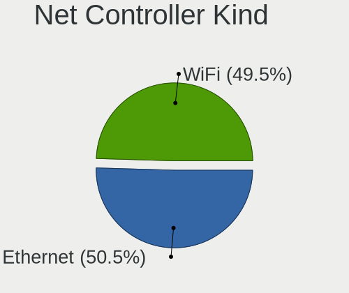

| Kind     | Computers | Percent |
|----------|-----------|---------|
| WiFi     | 40        | 50.63%  |
| Ethernet | 38        | 48.1%   |
| Unknown  | 1         | 1.27%   |

Used Controller
---------------

Currently used network controller

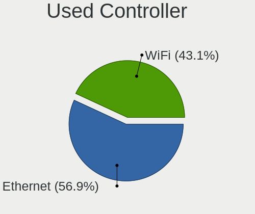

| Kind     | Computers | Percent |
|----------|-----------|---------|
| Ethernet | 23        | 54.76%  |
| WiFi     | 19        | 45.24%  |

NICs
----

Total network controllers on board

| Total | Computers | Percent |
|-------|-----------|---------|
| 2     | 30        | 68.18%  |
| 1     | 12        | 27.27%  |
| 3     | 1         | 2.27%   |
| 0     | 1         | 2.27%   |

IPv6
----

IPv6 vs IPv4

| Used | Computers | Percent |
|------|-----------|---------|
| No   | 35        | 77.78%  |
| Yes  | 10        | 22.22%  |

Bluetooth
---------

Bluetooth Vendor
----------------

Controller vendors

| Vendor                          | Computers | Percent |
|---------------------------------|-----------|---------|
| Intel                           | 9         | 26.47%  |
| Realtek Semiconductor           | 8         | 23.53%  |
| Qualcomm Atheros Communications | 5         | 14.71%  |
| Lite-On Technology              | 4         | 11.76%  |
| Apple                           | 4         | 11.76%  |
| Toshiba                         | 1         | 2.94%   |
| Dell                            | 1         | 2.94%   |
| Broadcom                        | 1         | 2.94%   |
| ASUSTek Computer                | 1         | 2.94%   |

Bluetooth Model
---------------

Controller models

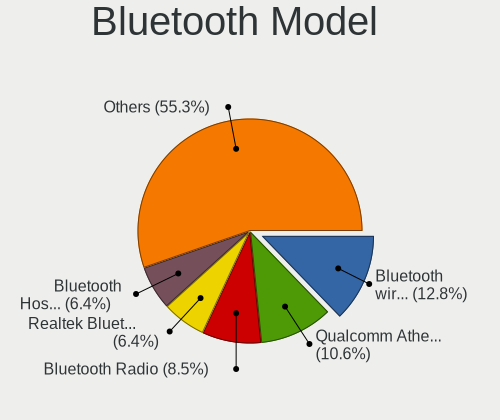

| Model                                          | Computers | Percent |
|------------------------------------------------|-----------|---------|
| Realtek Bluetooth Radio                        | 4         | 11.76%  |
| Qualcomm Atheros  Bluetooth Device             | 4         | 11.76%  |
| Intel Bluetooth wireless interface             | 4         | 11.76%  |
| Realtek  Bluetooth 4.2 Adapter                 | 3         | 8.82%   |
| Apple Bluetooth Host Controller                | 3         | 8.82%   |
| Lite-On Broadcom BCM43142A0 Bluetooth Device   | 2         | 5.88%   |
| Toshiba Bluetooth Device                       | 1         | 2.94%   |
| Realtek RTL8821A Bluetooth                     | 1         | 2.94%   |
| Qualcomm Atheros AR9462 Bluetooth              | 1         | 2.94%   |
| Lite-On Qualcomm Atheros QCA9377 Bluetooth     | 1         | 2.94%   |
| Lite-On Bluetooth Device                       | 1         | 2.94%   |
| Intel Wireless-AC 9260 Bluetooth Adapter       | 1         | 2.94%   |
| Intel Wireless-AC 3168 Bluetooth               | 1         | 2.94%   |
| Intel Bluetooth 9460/9560 Jefferson Peak (JfP) | 1         | 2.94%   |
| Intel AX201 Bluetooth                          | 1         | 2.94%   |
| Intel AX200 Bluetooth                          | 1         | 2.94%   |
| Dell Broadcom BCM20702A0 Bluetooth             | 1         | 2.94%   |
| Broadcom BCM43142A0 Bluetooth Device           | 1         | 2.94%   |
| ASUS Broadcom BCM20702A0 Bluetooth             | 1         | 2.94%   |
| Apple Bluetooth USB Host Controller            | 1         | 2.94%   |

Sound
-----

Sound Vendor
------------

Sound card vendors

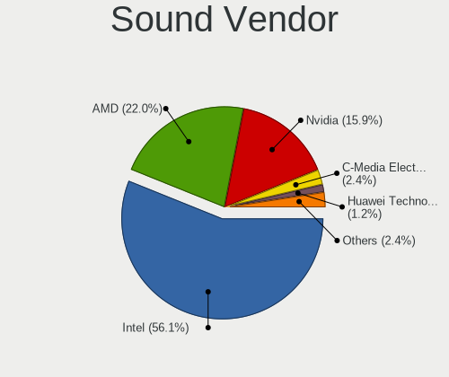

| Vendor              | Computers | Percent |
|---------------------|-----------|---------|
| Intel               | 33        | 55.93%  |
| AMD                 | 12        | 20.34%  |
| Nvidia              | 10        | 16.95%  |
| C-Media Electronics | 2         | 3.39%   |
| Huawei Technologies | 1         | 1.69%   |
| Guillemot           | 1         | 1.69%   |

Sound Model
-----------

Sound card models

| Model                                                                                             | Computers | Percent |
|---------------------------------------------------------------------------------------------------|-----------|---------|
| Intel Sunrise Point-LP HD Audio                                                                   | 5         | 6.85%   |
| Intel 7 Series/C216 Chipset Family High Definition Audio Controller                               | 5         | 6.85%   |
| AMD Family 17h/19h HD Audio Controller                                                            | 5         | 6.85%   |
| Nvidia GP106 High Definition Audio Controller                                                     | 4         | 5.48%   |
| Intel 6 Series/C200 Series Chipset Family High Definition Audio Controller                        | 4         | 5.48%   |
| AMD FCH Azalia Controller                                                                         | 4         | 5.48%   |
| Intel Haswell-ULT HD Audio Controller                                                             | 3         | 4.11%   |
| Intel 8 Series HD Audio Controller                                                                | 3         | 4.11%   |
| AMD Raven/Raven2/Fenghuang HDMI/DP Audio Controller                                               | 3         | 4.11%   |
| Nvidia GP107GL High Definition Audio Controller                                                   | 2         | 2.74%   |
| Intel Comet Lake PCH-V cAVS                                                                       | 2         | 2.74%   |
| Intel Atom/Celeron/Pentium Processor x5-E8000/J3xxx/N3xxx Series High Definition Audio Controller | 2         | 2.74%   |
| Intel 9 Series Chipset Family HD Audio Controller                                                 | 2         | 2.74%   |
| AMD Trinity HDMI Audio Controller                                                                 | 2         | 2.74%   |
| AMD Starship/Matisse HD Audio Controller                                                          | 2         | 2.74%   |
| Nvidia TU116 High Definition Audio Controller                                                     | 1         | 1.37%   |
| Nvidia TU106 High Definition Audio Controller                                                     | 1         | 1.37%   |
| Nvidia GK107 HDMI Audio Controller                                                                | 1         | 1.37%   |
| Nvidia GF108 High Definition Audio Controller                                                     | 1         | 1.37%   |
| Intel Xeon E3-1200 v3/4th Gen Core Processor HD Audio Controller                                  | 1         | 1.37%   |
| Intel Ice Lake-LP Smart Sound Technology Audio Controller                                         | 1         | 1.37%   |
| Intel Comet Lake PCH cAVS                                                                         | 1         | 1.37%   |
| Intel CM238 HD Audio Controller                                                                   | 1         | 1.37%   |
| Intel Celeron/Pentium Silver Processor High Definition Audio                                      | 1         | 1.37%   |
| Intel Celeron N3350/Pentium N4200/Atom E3900 Series Audio Cluster                                 | 1         | 1.37%   |
| Intel Cannon Point-LP High Definition Audio Controller                                            | 1         | 1.37%   |
| Intel C600/X79 series chipset High Definition Audio Controller                                    | 1         | 1.37%   |
| Intel Broadwell-U Audio Controller                                                                | 1         | 1.37%   |
| Intel 8 Series/C220 Series Chipset High Definition Audio Controller                               | 1         | 1.37%   |
| Intel 200 Series PCH HD Audio                                                                     | 1         | 1.37%   |
| Intel 100 Series/C230 Series Chipset Family HD Audio Controller                                   | 1         | 1.37%   |
| Huawei Technologies USB-C HEADSET                                                                 | 1         | 1.37%   |
| Guillemot Hercules DJ Console 4-Mx                                                                | 1         | 1.37%   |
| C-Media Electronics CM102-A+/102S+ Audio Controller                                               | 1         | 1.37%   |
| C-Media Electronics Audio Adapter (Unitek Y-247A)                                                 | 1         | 1.37%   |
| AMD Wrestler HDMI Audio                                                                           | 1         | 1.37%   |
| AMD Tobago HDMI Audio [Radeon R7 360 / R9 360 OEM]                                                | 1         | 1.37%   |
| AMD Renoir Radeon High Definition Audio Controller                                                | 1         | 1.37%   |
| AMD Kabini HDMI/DP Audio                                                                          | 1         | 1.37%   |
| AMD Cedar HDMI Audio [Radeon HD 5400/6300/7300 Series]                                            | 1         | 1.37%   |

Memory
------

Memory Vendor
-------------

Memory module vendors

| Vendor            | Computers | Percent |
|-------------------|-----------|---------|
| Micron Technology | 1         | 100%    |

Memory Model
------------

Memory module models

| Model                                                            | Computers | Percent |
|------------------------------------------------------------------|-----------|---------|
| Micron RAM MT53E1G32D4NQ-046WTE 4GB Row Of Chips LPDDR4 4266MT/s | 1         | 100%    |

Memory Kind
-----------

Memory module kinds

| Kind   | Computers | Percent |
|--------|-----------|---------|
| LPDDR4 | 1         | 100%    |

Memory Form Factor
------------------

Physical design of the memory module

| Name         | Computers | Percent |
|--------------|-----------|---------|
| Row Of Chips | 1         | 100%    |

Memory Size
-----------

Memory module size

| Size | Computers | Percent |
|------|-----------|---------|
| 8192 | 1         | 100%    |

Memory Speed
------------

Memory module speed

| Speed | Computers | Percent |
|-------|-----------|---------|
| 4266  | 1         | 100%    |

Printers & scanners
-------------------

Printer Vendor
--------------

Printer device vendors

Zero info for selected period =(

Printer Model
-------------

Printer device models

Zero info for selected period =(

Scanner Vendor
--------------

Scanner device vendors

Zero info for selected period =(

Scanner Model
-------------

Scanner device models

Zero info for selected period =(

Camera
------

Camera Vendor
-------------

Camera device vendors

| Vendor                                 | Computers | Percent |
|----------------------------------------|-----------|---------|
| Chicony Electronics                    | 6         | 20%     |
| Realtek Semiconductor                  | 5         | 16.67%  |
| Suyin                                  | 3         | 10%     |
| Apple                                  | 3         | 10%     |
| Syntek                                 | 2         | 6.67%   |
| Sunplus Innovation Technology          | 2         | 6.67%   |
| Microdia                               | 2         | 6.67%   |
| Logitech                               | 2         | 6.67%   |
| Cheng Uei Precision Industry (Foxlink) | 2         | 6.67%   |
| Quanta                                 | 1         | 3.33%   |
| IMC Networks                           | 1         | 3.33%   |
| HD 2MP WEBCAM                          | 1         | 3.33%   |

Camera Model
------------

Camera device models

| Model                                            | Computers | Percent |
|--------------------------------------------------|-----------|---------|
| Suyin HP Truevision HD                           | 3         | 9.68%   |
| Syntek Integrated Camera                         | 2         | 6.45%   |
| Realtek USB Camera                               | 2         | 6.45%   |
| Chicony Integrated Camera                        | 2         | 6.45%   |
| Apple FaceTime HD Camera (Built-in)              | 2         | 6.45%   |
| Sunplus Integrated_Webcam_HD                     | 1         | 3.23%   |
| Sunplus HD WebCam                                | 1         | 3.23%   |
| Realtek USB2.0 HD UVC WebCam                     | 1         | 3.23%   |
| Realtek Integrated_Webcam_HD                     | 1         | 3.23%   |
| Realtek Integrated Camera                        | 1         | 3.23%   |
| Quanta HD Webcam                                 | 1         | 3.23%   |
| Microdia Integrated_Webcam_HD                    | 1         | 3.23%   |
| Microdia Integrated Webcam HD                    | 1         | 3.23%   |
| Logitech Webcam C270                             | 1         | 3.23%   |
| Logitech HD Pro Webcam C920                      | 1         | 3.23%   |
| IMC Networks HP TrueVision HD Camera             | 1         | 3.23%   |
| HD 2MP WEBCAM HD 2MP WEBCAM                      | 1         | 3.23%   |
| Chicony USB2.0 VGA UVC WebCam                    | 1         | 3.23%   |
| Chicony TOSHIBA Web Camera - HD                  | 1         | 3.23%   |
| Chicony HP HD Camera                             | 1         | 3.23%   |
| Chicony HD WebCam                                | 1         | 3.23%   |
| Chicony 5M Cam                                   | 1         | 3.23%   |
| Cheng Uei Precision Industry (Foxlink) Webcam    | 1         | 3.23%   |
| Cheng Uei Precision Industry (Foxlink) HP Webcam | 1         | 3.23%   |
| Apple FaceTime HD Camera                         | 1         | 3.23%   |

Security
--------

Fingerprint Vendor
------------------

Fingerprint sensor vendors

| Vendor           | Computers | Percent |
|------------------|-----------|---------|
| Validity Sensors | 1         | 50%     |
| Synaptics        | 1         | 50%     |

Fingerprint Model
-----------------

Fingerprint sensor models

| Model                                       | Computers | Percent |
|---------------------------------------------|-----------|---------|
| Validity Sensors VFS5011 Fingerprint Reader | 1         | 50%     |
| Unknown                                     | 1         | 50%     |

Chipcard Vendor
---------------

Chipcard module vendors

| Vendor   | Computers | Percent |
|----------|-----------|---------|
| Broadcom | 1         | 100%    |

Chipcard Model
--------------

Chipcard module models

| Model                                          | Computers | Percent |
|------------------------------------------------|-----------|---------|
| Broadcom BCM5880 Secure Applications Processor | 1         | 100%    |

Unsupported
-----------

Unsupported Devices
-------------------

Total unsupported devices on board

| Total | Computers | Percent |
|-------|-----------|---------|
| 1     | 17        | 38.64%  |
| 2     | 14        | 31.82%  |
| 3     | 7         | 15.91%  |
| 4     | 3         | 6.82%   |
| 0     | 3         | 6.82%   |

Unsupported Device Types
------------------------

Types of unsupported devices

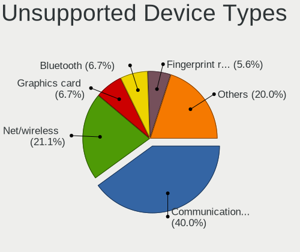

| Type                     | Computers | Percent |
|--------------------------|-----------|---------|
| Communication controller | 30        | 37.97%  |
| Net/wireless             | 19        | 24.05%  |
| Graphics card            | 6         | 7.59%   |
| Card reader              | 5         | 6.33%   |
| Bluetooth                | 5         | 6.33%   |
| Net/ethernet             | 4         | 5.06%   |
| Multimedia controller    | 4         | 5.06%   |
| Firewire controller      | 2         | 2.53%   |
| Fingerprint reader       | 2         | 2.53%   |
| Storage/ide              | 1         | 1.27%   |
| Chipcard                 | 1         | 1.27%   |

