GNOME OS - Tested Hardware & Statistics (Desktops)
--------------------------------------------------

A project to collect tested hardware configurations for GNOME OS.

Anyone can contribute to this report by the [hw-probe](https://github.com/linuxhw/hw-probe) tool:

    sudo -E hw-probe -all -upload

Please contribute! Especially if your hardware is rare.

Contents
--------

* [ Test Cases ](#test-cases)

* [ System ](#system)
  - [ OS                       ](#os)
  - [ OS Family                ](#os-family)
  - [ Kernel                   ](#kernel)
  - [ Kernel Family            ](#kernel-family)
  - [ Kernel Major Ver.        ](#kernel-major-ver)
  - [ Arch                     ](#arch)
  - [ DE                       ](#de)
  - [ Display Server           ](#display-server)
  - [ Display Manager          ](#display-manager)
  - [ OS Lang                  ](#os-lang)
  - [ Boot Mode                ](#boot-mode)
  - [ Filesystem               ](#filesystem)
  - [ Part. scheme             ](#part-scheme)
  - [ Dual Boot with Linux/BSD ](#dual-boot-with-linuxbsd)
  - [ Dual Boot (Win)          ](#dual-boot-win)

* [ Board ](#board)
  - [ Vendor                   ](#vendor)
  - [ Model                    ](#model)
  - [ Model Family             ](#model-family)
  - [ MFG Year                 ](#mfg-year)
  - [ Form Factor              ](#form-factor)
  - [ Secure Boot              ](#secure-boot)
  - [ Coreboot                 ](#coreboot)
  - [ RAM Size                 ](#ram-size)
  - [ RAM Used                 ](#ram-used)
  - [ Total Drives             ](#total-drives)
  - [ Has CD-ROM               ](#has-cd-rom)
  - [ Has Ethernet             ](#has-ethernet)
  - [ Has WiFi                 ](#has-wifi)
  - [ Has Bluetooth            ](#has-bluetooth)

* [ Location ](#location)
  - [ Country                  ](#country)
  - [ City                     ](#city)

* [ Drives ](#drives)
  - [ Drive Vendor             ](#drive-vendor)
  - [ Drive Model              ](#drive-model)
  - [ HDD Vendor               ](#hdd-vendor)
  - [ SSD Vendor               ](#ssd-vendor)
  - [ Drive Kind               ](#drive-kind)
  - [ Drive Connector          ](#drive-connector)
  - [ Drive Size               ](#drive-size)
  - [ Space Total              ](#space-total)
  - [ Space Used               ](#space-used)
  - [ Malfunc. Drives          ](#malfunc-drives)
  - [ Malfunc. Drive Vendor    ](#malfunc-drive-vendor)
  - [ Malfunc. HDD Vendor      ](#malfunc-hdd-vendor)
  - [ Malfunc. Drive Kind      ](#malfunc-drive-kind)
  - [ Failed Drives            ](#failed-drives)
  - [ Failed Drive Vendor      ](#failed-drive-vendor)
  - [ Drive Status             ](#drive-status)

* [ Storage controller ](#storage-controller)
  - [ Storage Vendor           ](#storage-vendor)
  - [ Storage Model            ](#storage-model)
  - [ Storage Kind             ](#storage-kind)

* [ Processor ](#processor)
  - [ CPU Vendor               ](#cpu-vendor)
  - [ CPU Model                ](#cpu-model)
  - [ CPU Model Family         ](#cpu-model-family)
  - [ CPU Cores                ](#cpu-cores)
  - [ CPU Sockets              ](#cpu-sockets)
  - [ CPU Threads              ](#cpu-threads)
  - [ CPU Op-Modes             ](#cpu-op-modes)
  - [ CPU Microcode            ](#cpu-microcode)
  - [ CPU Microarch            ](#cpu-microarch)

* [ Graphics ](#graphics)
  - [ GPU Vendor               ](#gpu-vendor)
  - [ GPU Model                ](#gpu-model)
  - [ GPU Combo                ](#gpu-combo)
  - [ GPU Driver               ](#gpu-driver)
  - [ GPU Memory               ](#gpu-memory)

* [ Monitor ](#monitor)
  - [ Monitor Vendor           ](#monitor-vendor)
  - [ Monitor Model            ](#monitor-model)
  - [ Monitor Resolution       ](#monitor-resolution)
  - [ Monitor Diagonal         ](#monitor-diagonal)
  - [ Monitor Width            ](#monitor-width)
  - [ Aspect Ratio             ](#aspect-ratio)
  - [ Monitor Area             ](#monitor-area)
  - [ Pixel Density            ](#pixel-density)
  - [ Multiple Monitors        ](#multiple-monitors)

* [ Network ](#network)
  - [ Net Controller Vendor    ](#net-controller-vendor)
  - [ Net Controller Model     ](#net-controller-model)
  - [ Wireless Vendor          ](#wireless-vendor)
  - [ Wireless Model           ](#wireless-model)
  - [ Ethernet Vendor          ](#ethernet-vendor)
  - [ Ethernet Model           ](#ethernet-model)
  - [ Net Controller Kind      ](#net-controller-kind)
  - [ Used Controller          ](#used-controller)
  - [ NICs                     ](#nics)
  - [ IPv6                     ](#ipv6)

* [ Bluetooth ](#bluetooth)
  - [ Bluetooth Vendor         ](#bluetooth-vendor)
  - [ Bluetooth Model          ](#bluetooth-model)

* [ Sound ](#sound)
  - [ Sound Vendor             ](#sound-vendor)
  - [ Sound Model              ](#sound-model)

* [ Memory ](#memory)
  - [ Memory Vendor            ](#memory-vendor)
  - [ Memory Model             ](#memory-model)
  - [ Memory Kind              ](#memory-kind)
  - [ Memory Form Factor       ](#memory-form-factor)
  - [ Memory Size              ](#memory-size)
  - [ Memory Speed             ](#memory-speed)

* [ Printers & scanners ](#printers--scanners)
  - [ Printer Vendor           ](#printer-vendor)
  - [ Printer Model            ](#printer-model)
  - [ Scanner Vendor           ](#scanner-vendor)
  - [ Scanner Model            ](#scanner-model)

* [ Camera ](#camera)
  - [ Camera Vendor            ](#camera-vendor)
  - [ Camera Model             ](#camera-model)

* [ Security ](#security)
  - [ Fingerprint Vendor       ](#fingerprint-vendor)
  - [ Fingerprint Model        ](#fingerprint-model)
  - [ Chipcard Vendor          ](#chipcard-vendor)
  - [ Chipcard Model           ](#chipcard-model)

* [ Unsupported ](#unsupported)
  - [ Unsupported Devices      ](#unsupported-devices)
  - [ Unsupported Device Types ](#unsupported-device-types)

Test Cases
----------

Total: 16

| Vendor   | Model          | Probe                                                      | Date         |
|----------|----------------|------------------------------------------------------------|--------------|
| HP       | 82F2 A01       | [b6cb9447df](https://linux-hardware.org/?probe=b6cb9447df) | Nov 19, 2022 |
| Unknown  | 1.0            | [d07852e419](https://linux-hardware.org/?probe=d07852e419) | Nov 11, 2022 |
| Gigabyte | Z97X-Gaming 7  | [1c993db964](https://linux-hardware.org/?probe=1c993db964) | Aug 30, 2022 |
| Gigabyte | Z97X-Gaming 7  | [91438fc6b5](https://linux-hardware.org/?probe=91438fc6b5) | Aug 30, 2022 |
| Gigabyte | B450M S2H V2   | [cd6b701253](https://linux-hardware.org/?probe=cd6b701253) | Nov 03, 2021 |
| ASUSTek  | PRIME A320M-K  | [11c23a1f37](https://linux-hardware.org/?probe=11c23a1f37) | Sep 26, 2021 |
| ASUSTek  | PRIME A320M-K  | [b33430e135](https://linux-hardware.org/?probe=b33430e135) | Sep 26, 2021 |
| ASUSTek  | H61M-A/BR      | [73b5c289e2](https://linux-hardware.org/?probe=73b5c289e2) | Sep 04, 2021 |
| HP       | 8767 A         | [926ac56be9](https://linux-hardware.org/?probe=926ac56be9) | Aug 10, 2021 |
| Gigabyte | X570 GAMING X  | [b751f6615d](https://linux-hardware.org/?probe=b751f6615d) | Jul 17, 2021 |
| Gigabyte | B450M S2H V2   | [d8886335b1](https://linux-hardware.org/?probe=d8886335b1) | Jul 10, 2021 |
| Intel    | X79            | [9f19896285](https://linux-hardware.org/?probe=9f19896285) | May 13, 2021 |
| Lenovo   | 317E NOK       | [2ce2a68735](https://linux-hardware.org/?probe=2ce2a68735) | Apr 14, 2021 |
| ASUSTek  | PRIME H410M-K  | [f685fefbec](https://linux-hardware.org/?probe=f685fefbec) | Mar 04, 2021 |
| Acer     | Aspire GX-781  | [159afb32c1](https://linux-hardware.org/?probe=159afb32c1) | Oct 10, 2020 |
| ASUSTek  | SABERTOOTH X79 | [17acfc90d4](https://linux-hardware.org/?probe=17acfc90d4) | Oct 07, 2020 |

System
------

OS
--

Installed operating systems

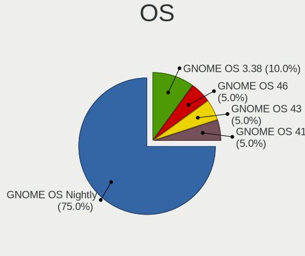

| Name             | Desktops | Percent |
|------------------|----------|---------|
| GNOME OS Nightly | 10       | 76.92%  |
| GNOME OS 3.38    | 2        | 15.38%  |
| GNOME OS 43      | 1        | 7.69%   |

OS Family
---------

OS without a version

| Name     | Desktops | Percent |
|----------|----------|---------|
| GNOME OS | 13       | 100%    |

Kernel
------

Version of the Linux kernel

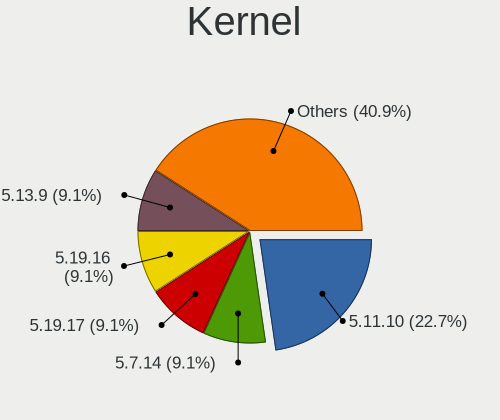

| Version | Desktops | Percent |
|---------|----------|---------|
| 5.11.10 | 5        | 35.71%  |
| 5.7.14  | 2        | 14.29%  |
| 5.19.16 | 2        | 14.29%  |
| 5.18.16 | 1        | 7.14%   |
| 5.14.4  | 1        | 7.14%   |
| 5.13.9  | 1        | 7.14%   |
| 5.12.12 | 1        | 7.14%   |
| 5.11.0  | 1        | 7.14%   |

Kernel Family
-------------

Linux kernel without a distro release

| Version | Desktops | Percent |
|---------|----------|---------|
| 5.11.10 | 5        | 35.71%  |
| 5.7.14  | 2        | 14.29%  |
| 5.19.16 | 2        | 14.29%  |
| 5.18.16 | 1        | 7.14%   |
| 5.14.4  | 1        | 7.14%   |
| 5.13.9  | 1        | 7.14%   |
| 5.12.12 | 1        | 7.14%   |
| 5.11.0  | 1        | 7.14%   |

Kernel Major Ver.
-----------------

Linux kernel major version

| Version | Desktops | Percent |
|---------|----------|---------|
| 5.11    | 6        | 42.86%  |
| 5.7     | 2        | 14.29%  |
| 5.19    | 2        | 14.29%  |
| 5.18    | 1        | 7.14%   |
| 5.14    | 1        | 7.14%   |
| 5.13    | 1        | 7.14%   |
| 5.12    | 1        | 7.14%   |

Arch
----

OS architecture (x86_64, i586, etc.)

| Name   | Desktops | Percent |
|--------|----------|---------|
| x86_64 | 13       | 100%    |

DE
--

Desktop Environment

| Name  | Desktops | Percent |
|-------|----------|---------|
| GNOME | 13       | 100%    |

Display Server
--------------

X11 or Wayland

| Name    | Desktops | Percent |
|---------|----------|---------|
| Wayland | 13       | 100%    |

Display Manager
---------------

SDDM, LightDM, etc.

| Name    | Desktops | Percent |
|---------|----------|---------|
| Unknown | 13       | 100%    |

OS Lang
-------

Language

| Lang  | Desktops | Percent |
|-------|----------|---------|
| en_US | 5        | 38.46%  |
| pt_BR | 2        | 15.38%  |
| de_DE | 2        | 15.38%  |
| ru_UA | 1        | 7.69%   |
| it_IT | 1        | 7.69%   |
| en_IN | 1        | 7.69%   |
| cs_CZ | 1        | 7.69%   |

Boot Mode
---------

EFI or BIOS

| Mode | Desktops | Percent |
|------|----------|---------|
| EFI  | 13       | 100%    |

Filesystem
----------

Type of filesystem

| Type | Desktops | Percent |
|------|----------|---------|
| Ext4 | 13       | 100%    |

Part. scheme
------------

Scheme of partitioning

| Type    | Desktops | Percent |
|---------|----------|---------|
| Unknown | 13       | 100%    |

Dual Boot with Linux/BSD
------------------------

Hosting more than one Linux/BSD

| Dual boot | Desktops | Percent |
|-----------|----------|---------|
| No        | 13       | 100%    |

Dual Boot (Win)
---------------

Hosting Linux and Windows

| Dual boot | Desktops | Percent |
|-----------|----------|---------|
| No        | 13       | 100%    |

Board
-----

Vendor
------

Motherboard manufacturer

| Name                | Desktops | Percent |
|---------------------|----------|---------|
| ASUSTek Computer    | 4        | 30.77%  |
| Gigabyte Technology | 3        | 23.08%  |
| Hewlett-Packard     | 2        | 15.38%  |
| Lenovo              | 1        | 7.69%   |
| Intel               | 1        | 7.69%   |
| Acer                | 1        | 7.69%   |
| Unknown             | 1        | 7.69%   |

Model
-----

Motherboard model

| Name                                   | Desktops | Percent |
|----------------------------------------|----------|---------|
| Lenovo IdeaCentre 3 07IMB05 90NB0020IN | 1        | 7.69%   |
| Intel X79                              | 1        | 7.69%   |
| HP Pavilion Gaming Desktop TG01-1xxx   | 1        | 7.69%   |
| HP Pavilion Desktop PC 570-p0xx        | 1        | 7.69%   |
| Gigabyte Z97X-Gaming 7                 | 1        | 7.69%   |
| Gigabyte X570 GAMING X                 | 1        | 7.69%   |
| Gigabyte B450M S2H V2                  | 1        | 7.69%   |
| ASUS SABERTOOTH X79                    | 1        | 7.69%   |
| ASUS PRIME H410M-K                     | 1        | 7.69%   |
| ASUS PRIME A320M-K                     | 1        | 7.69%   |
| ASUS H61M-A/BR                         | 1        | 7.69%   |
| Acer Aspire GX-781                     | 1        | 7.69%   |
| Unknown                                | 1        | 7.69%   |

Model Family
------------

Motherboard model prefix

| Name                 | Desktops | Percent |
|----------------------|----------|---------|
| HP Pavilion          | 2        | 15.38%  |
| ASUS PRIME           | 2        | 15.38%  |
| Lenovo IdeaCentre    | 1        | 7.69%   |
| Intel X79            | 1        | 7.69%   |
| Gigabyte Z97X-Gaming | 1        | 7.69%   |
| Gigabyte X570        | 1        | 7.69%   |
| Gigabyte B450M       | 1        | 7.69%   |
| ASUS SABERTOOTH      | 1        | 7.69%   |
| ASUS H61M-A          | 1        | 7.69%   |
| Acer Aspire          | 1        | 7.69%   |
| Unknown              | 1        | 7.69%   |

MFG Year
--------

Motherboard manufacture year

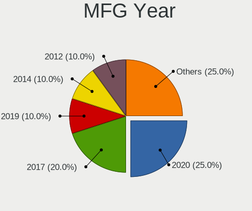

| Year | Desktops | Percent |
|------|----------|---------|
| 2020 | 4        | 30.77%  |
| 2017 | 3        | 23.08%  |
| 2021 | 1        | 7.69%   |
| 2019 | 1        | 7.69%   |
| 2016 | 1        | 7.69%   |
| 2015 | 1        | 7.69%   |
| 2013 | 1        | 7.69%   |
| 2012 | 1        | 7.69%   |

Form Factor
-----------

Physical design of the computer

| Name    | Desktops | Percent |
|---------|----------|---------|
| Desktop | 13       | 100%    |

Secure Boot
-----------

Enabled or disabled

| State    | Desktops | Percent |
|----------|----------|---------|
| Disabled | 13       | 100%    |

Coreboot
--------

Have coreboot on board

| Used | Desktops | Percent |
|------|----------|---------|
| No   | 13       | 100%    |

RAM Size
--------

Total RAM memory

| Size in GB | Desktops | Percent |
|------------|----------|---------|
| 8.01-16.0  | 5        | 38.46%  |
| 32.01-64.0 | 3        | 23.08%  |
| 3.01-4.0   | 2        | 15.38%  |
| 16.01-24.0 | 2        | 15.38%  |
| 4.01-8.0   | 1        | 7.69%   |

RAM Used
--------

Used RAM memory

| Used GB  | Desktops | Percent |
|----------|----------|---------|
| 1.01-2.0 | 9        | 64.29%  |
| 2.01-3.0 | 2        | 14.29%  |
| 4.01-8.0 | 1        | 7.14%   |
| 3.01-4.0 | 1        | 7.14%   |
| 0.51-1.0 | 1        | 7.14%   |

Total Drives
------------

Number of drives on board

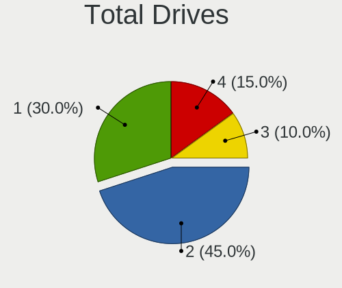

| Drives | Desktops | Percent |
|--------|----------|---------|
| 1      | 5        | 38.46%  |
| 2      | 4        | 30.77%  |
| 4      | 2        | 15.38%  |
| 3      | 2        | 15.38%  |

Has CD-ROM
----------

Has CD-ROM on board

| Presented | Desktops | Percent |
|-----------|----------|---------|
| No        | 11       | 84.62%  |
| Yes       | 2        | 15.38%  |

Has Ethernet
------------

Has Ethernet on board

| Presented | Desktops | Percent |
|-----------|----------|---------|
| Yes       | 13       | 100%    |

Has WiFi
--------

Has WiFi module

| Presented | Desktops | Percent |
|-----------|----------|---------|
| Yes       | 9        | 69.23%  |
| No        | 4        | 30.77%  |

Has Bluetooth
-------------

Has Bluetooth module

| Presented | Desktops | Percent |
|-----------|----------|---------|
| Yes       | 7        | 53.85%  |
| No        | 6        | 46.15%  |

Location
--------

Country
-------

Geographic location (country)

| Country  | Desktops | Percent |
|----------|----------|---------|
| USA      | 2        | 15.38%  |
| Germany  | 2        | 15.38%  |
| Brazil   | 2        | 15.38%  |
| Ukraine  | 1        | 7.69%   |
| Thailand | 1        | 7.69%   |
| Russia   | 1        | 7.69%   |
| Italy    | 1        | 7.69%   |
| India    | 1        | 7.69%   |
| Czechia  | 1        | 7.69%   |
| Canada   | 1        | 7.69%   |

City
----

Geographic location (city)

| City                  | Desktops | Percent |
|-----------------------|----------|---------|
| Waldachtal            | 1        | 7.69%   |
| Verden an der Aller   | 1        | 7.69%   |
| Vancouver             | 1        | 7.69%   |
| Tyumen                | 1        | 7.69%   |
| Si Racha              | 1        | 7.69%   |
| Sesto Fiorentino      | 1        | 7.69%   |
| Sao Bernardo do Campo | 1        | 7.69%   |
| Rio de Janeiro        | 1        | 7.69%   |
| Prague                | 1        | 7.69%   |
| Ottawa                | 1        | 7.69%   |
| Novoyavorovske        | 1        | 7.69%   |
| Kolkata               | 1        | 7.69%   |
| Columbia              | 1        | 7.69%   |

Drives
------

Drive Vendor
------------

Hard drive vendors

| Vendor              | Desktops | Drives | Percent |
|---------------------|----------|--------|---------|
| Seagate             | 7        | 7      | 28%     |
| Samsung Electronics | 4        | 6      | 16%     |
| Kingston            | 4        | 4      | 16%     |
| WDC                 | 3        | 3      | 12%     |
| Toshiba             | 2        | 2      | 8%      |
| SK hynix            | 1        | 1      | 4%      |
| SanDisk             | 1        | 2      | 4%      |
| PNY                 | 1        | 1      | 4%      |
| Apacer              | 1        | 1      | 4%      |
| AirDisk             | 1        | 1      | 4%      |

Drive Model
-----------

Hard drive models

| Model                                  | Desktops | Percent |
|----------------------------------------|----------|---------|
| WDC WD5000AAKX-003CA0 500GB            | 1        | 3.85%   |
| WDC WD1600AAJS-22L7A0 160GB            | 1        | 3.85%   |
| WDC WD10EALX-009BA0 1TB                | 1        | 3.85%   |
| Toshiba HDWD120 2TB                    | 1        | 3.85%   |
| Toshiba DT01ACA100 1TB                 | 1        | 3.85%   |
| SK hynix HFS128G39TND-N210A 128GB SSD  | 1        | 3.85%   |
| Seagate ST9500325AS 500GB              | 1        | 3.85%   |
| Seagate ST8000DM004-2CX188 8TB         | 1        | 3.85%   |
| Seagate ST4000DX001-1CE168 4TB         | 1        | 3.85%   |
| Seagate ST3500312CS 500GB              | 1        | 3.85%   |
| Seagate ST2000DM001-1ER164 2TB         | 1        | 3.85%   |
| Seagate ST1000DM010-2EP102 1TB         | 1        | 3.85%   |
| Seagate ST1000DM003-1SB102 1TB         | 1        | 3.85%   |
| SanDisk NVMe SSD Drive 500GB           | 1        | 3.85%   |
| Samsung SSD 860 QVO 1TB                | 1        | 3.85%   |
| Samsung SSD 840 EVO 250GB              | 1        | 3.85%   |
| Samsung SM963 2.5" NVMe PCIe SSD 256GB | 1        | 3.85%   |
| Samsung NVMe SSD Drive 512GB           | 1        | 3.85%   |
| Samsung NVMe SSD Drive 1024GB          | 1        | 3.85%   |
| PNY CS900 240GB SSD                    | 1        | 3.85%   |
| Kingston SV300S37A240G 240GB SSD       | 1        | 3.85%   |
| Kingston SV300S37A120G 120GB SSD       | 1        | 3.85%   |
| Kingston SA400S37120G 120GB SSD        | 1        | 3.85%   |
| Kingston SA400M8240G 240GB SSD         | 1        | 3.85%   |
| Apacer AS350 120GB SSD                 | 1        | 3.85%   |
| AirDisk 128GB SSD                      | 1        | 3.85%   |

HDD Vendor
----------

Hard disk drive vendors

| Vendor  | Desktops | Drives | Percent |
|---------|----------|--------|---------|
| Seagate | 7        | 7      | 58.33%  |
| WDC     | 3        | 3      | 25%     |
| Toshiba | 2        | 2      | 16.67%  |

SSD Vendor
----------

Solid state drive vendors

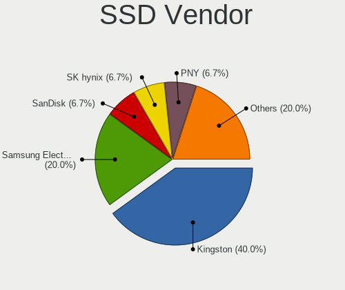

| Vendor              | Desktops | Drives | Percent |
|---------------------|----------|--------|---------|
| Kingston            | 4        | 4      | 40%     |
| Samsung Electronics | 2        | 3      | 20%     |
| SK hynix            | 1        | 1      | 10%     |
| PNY                 | 1        | 1      | 10%     |
| Apacer              | 1        | 1      | 10%     |
| AirDisk             | 1        | 1      | 10%     |

Drive Kind
----------

HDD or SSD

| Kind | Desktops | Drives | Percent |
|------|----------|--------|---------|
| HDD  | 10       | 12     | 45.45%  |
| SSD  | 8        | 11     | 36.36%  |
| NVMe | 4        | 5      | 18.18%  |

Drive Connector
---------------

SATA, SAS, NVMe, etc.

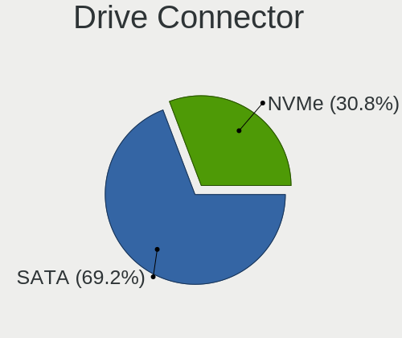

| Type | Desktops | Drives | Percent |
|------|----------|--------|---------|
| SATA | 12       | 23     | 75%     |
| NVMe | 4        | 5      | 25%     |

Drive Size
----------

Size of hard drive

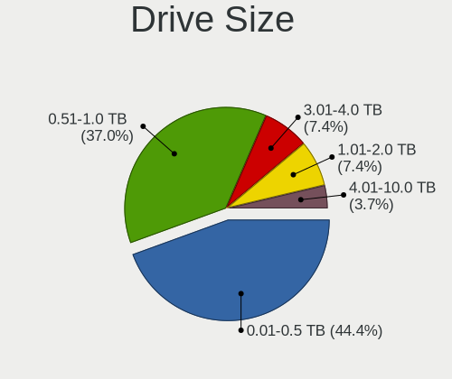

| Size in TB | Desktops | Drives | Percent |
|------------|----------|--------|---------|
| 0.01-0.5   | 8        | 13     | 47.06%  |
| 0.51-1.0   | 5        | 6      | 29.41%  |
| 1.01-2.0   | 2        | 2      | 11.76%  |
| 3.01-4.0   | 1        | 1      | 5.88%   |
| 4.01-10.0  | 1        | 1      | 5.88%   |

Space Total
-----------

Amount of disk space available on the file system

| Size in GB | Desktops | Percent |
|------------|----------|---------|
| 101-250    | 7        | 53.85%  |
| 501-1000   | 3        | 23.08%  |
| 251-500    | 2        | 15.38%  |
| 1001-2000  | 1        | 7.69%   |

Space Used
----------

Amount of used disk space

| Used GB | Desktops | Percent |
|---------|----------|---------|
| 1-20    | 9        | 64.29%  |
| 101-250 | 2        | 14.29%  |
| 251-500 | 1        | 7.14%   |
| 21-50   | 1        | 7.14%   |
| 51-100  | 1        | 7.14%   |

Malfunc. Drives
---------------

Drive models with a malfunction

Zero info for selected period =(

Malfunc. Drive Vendor
---------------------

Vendors of faulty drives

Zero info for selected period =(

Malfunc. HDD Vendor
-------------------

Vendors of faulty HDD drives

Zero info for selected period =(

Malfunc. Drive Kind
-------------------

Kinds of faulty drives

Zero info for selected period =(

Failed Drives
-------------

Failed drive models

Zero info for selected period =(

Failed Drive Vendor
-------------------

Failed drive vendors

Zero info for selected period =(

Drive Status
------------

Number of failed and malfunc. drives

| Status   | Desktops | Drives | Percent |
|----------|----------|--------|---------|
| Detected | 13       | 28     | 100%    |

Storage controller
------------------

Storage Vendor
--------------

Storage controller vendors

| Vendor                   | Desktops | Percent |
|--------------------------|----------|---------|
| Intel                    | 10       | 50%     |
| Samsung Electronics      | 3        | 15%     |
| AMD                      | 3        | 15%     |
| Marvell Technology Group | 2        | 10%     |
| SanDisk                  | 1        | 5%      |
| ASMedia Technology       | 1        | 5%      |

Storage Model
-------------

Storage controller models

| Model                                                                                   | Desktops | Percent |
|-----------------------------------------------------------------------------------------|----------|---------|
| AMD FCH SATA Controller [AHCI mode]                                                     | 3        | 13.04%  |
| Samsung NVMe SSD Controller SM981/PM981/PM983                                           | 2        | 8.7%    |
| Intel 400 Series Chipset Family SATA AHCI Controller                                    | 2        | 8.7%    |
| SanDisk WD Black SN750 / PC SN730 NVMe SSD                                              | 1        | 4.35%   |
| Samsung NVMe SSD Controller PM9A1/PM9A3/980PRO                                          | 1        | 4.35%   |
| Marvell Group 88SE9172 SATA 6Gb/s Controller                                            | 1        | 4.35%   |
| Marvell Group 88SE9128 PCIe SATA 6 Gb/s RAID controller with HyperDuo                   | 1        | 4.35%   |
| Intel SATA Controller [RAID mode]                                                       | 1        | 4.35%   |
| Intel Q170/Q150/B150/H170/H110/Z170/CM236 Chipset SATA Controller [AHCI Mode]           | 1        | 4.35%   |
| Intel Celeron N3350/Pentium N4200/Atom E3900 Series SATA AHCI Controller                | 1        | 4.35%   |
| Intel C600/X79 series chipset 6-Port SATA AHCI Controller                               | 1        | 4.35%   |
| Intel 9 Series Chipset Family SATA Controller [AHCI Mode]                               | 1        | 4.35%   |
| Intel 6 Series/C200 Series Chipset Family Desktop SATA Controller (IDE mode, ports 4-5) | 1        | 4.35%   |
| Intel 6 Series/C200 Series Chipset Family Desktop SATA Controller (IDE mode, ports 0-3) | 1        | 4.35%   |
| Intel 6 Series/C200 Series Chipset Family 6 port Desktop SATA AHCI Controller           | 1        | 4.35%   |
| Intel 200 Series PCH SATA controller [AHCI mode]                                        | 1        | 4.35%   |
| ASMedia ASM1062 Serial ATA Controller                                                   | 1        | 4.35%   |
| AMD FCH SATA Controller D                                                               | 1        | 4.35%   |
| AMD 400 Series Chipset SATA Controller                                                  | 1        | 4.35%   |

Storage Kind
------------

Kind of storage controller (IDE, SATA, NVMe, SAS, ...)

| Kind | Desktops | Percent |
|------|----------|---------|
| SATA | 11       | 64.71%  |
| NVMe | 4        | 23.53%  |
| RAID | 1        | 5.88%   |
| IDE  | 1        | 5.88%   |

Processor
---------

CPU Vendor
----------

Processor vendors

| Vendor | Desktops | Percent |
|--------|----------|---------|
| Intel  | 10       | 76.92%  |
| AMD    | 3        | 23.08%  |

CPU Model
---------

Processor models

| Model                                       | Desktops | Percent |
|---------------------------------------------|----------|---------|
| Intel Xeon CPU E5-2660 0 @ 2.20GHz          | 1        | 7.69%   |
| Intel Pentium CPU J4205 @ 1.50GHz           | 1        | 7.69%   |
| Intel Core i7-4930K CPU @ 3.40GHz           | 1        | 7.69%   |
| Intel Core i7-4790K CPU @ 4.00GHz           | 1        | 7.69%   |
| Intel Core i5-7400 CPU @ 3.00GHz            | 1        | 7.69%   |
| Intel Core i5-10400 CPU @ 2.90GHz           | 1        | 7.69%   |
| Intel Core i3-7100 CPU @ 3.90GHz            | 1        | 7.69%   |
| Intel Core i3-10100F CPU @ 3.60GHz          | 1        | 7.69%   |
| Intel Core i3-10100 CPU @ 3.60GHz           | 1        | 7.69%   |
| Intel Celeron CPU G530 @ 2.40GHz            | 1        | 7.69%   |
| AMD Ryzen 5 5600X 6-Core Processor          | 1        | 7.69%   |
| AMD Ryzen 5 3600X 6-Core Processor          | 1        | 7.69%   |
| AMD Ryzen 5 3400G with Radeon Vega Graphics | 1        | 7.69%   |

CPU Model Family
----------------

Processor model prefix

| Model         | Desktops | Percent |
|---------------|----------|---------|
| Intel Core i3 | 3        | 23.08%  |
| AMD Ryzen 5   | 3        | 23.08%  |
| Intel Core i7 | 2        | 15.38%  |
| Intel Core i5 | 2        | 15.38%  |
| Intel Xeon    | 1        | 7.69%   |
| Intel Pentium | 1        | 7.69%   |
| Intel Celeron | 1        | 7.69%   |

CPU Cores
---------

Number of processor cores

| Number | Desktops | Percent |
|--------|----------|---------|
| 4      | 6        | 46.15%  |
| 6      | 4        | 30.77%  |
| 2      | 2        | 15.38%  |
| 8      | 1        | 7.69%   |

CPU Sockets
-----------

Number of sockets

| Number | Desktops | Percent |
|--------|----------|---------|
| 1      | 13       | 100%    |

CPU Threads
-----------

Threads per core (Hyper-Threading)

| Number | Desktops | Percent |
|--------|----------|---------|
| 2      | 10       | 76.92%  |
| 1      | 3        | 23.08%  |

CPU Op-Modes
------------

CPU Operation Modes (32-bit, 64-bit)

| Op mode        | Desktops | Percent |
|----------------|----------|---------|
| 32-bit, 64-bit | 13       | 100%    |

CPU Microcode
-------------

Microcode number

| Number     | Desktops | Percent |
|------------|----------|---------|
| 0xa0653    | 3        | 23.08%  |
| 0x906e9    | 2        | 15.38%  |
| 0x506c9    | 1        | 7.69%   |
| 0x306e4    | 1        | 7.69%   |
| 0x306c3    | 1        | 7.69%   |
| 0x206d7    | 1        | 7.69%   |
| 0x206a7    | 1        | 7.69%   |
| 0x0a201009 | 1        | 7.69%   |
| 0x08701021 | 1        | 7.69%   |
| 0x08108109 | 1        | 7.69%   |

CPU Microarch
-------------

Microarchitecture

| Name        | Desktops | Percent |
|-------------|----------|---------|
| CometLake   | 3        | 23.08%  |
| SandyBridge | 2        | 15.38%  |
| KabyLake    | 2        | 15.38%  |
| Zen+        | 1        | 7.69%   |
| Zen 3       | 1        | 7.69%   |
| Zen 2       | 1        | 7.69%   |
| IvyBridge   | 1        | 7.69%   |
| Haswell     | 1        | 7.69%   |
| Goldmont    | 1        | 7.69%   |

Graphics
--------

GPU Vendor
----------

Vendors of graphics cards

| Vendor | Desktops | Percent |
|--------|----------|---------|
| Nvidia | 7        | 53.85%  |
| Intel  | 4        | 30.77%  |
| AMD    | 2        | 15.38%  |

GPU Model
---------

Graphics card models

| Model                                                                     | Desktops | Percent |
|---------------------------------------------------------------------------|----------|---------|
| Nvidia GP106 [GeForce GTX 1060 3GB]                                       | 3        | 23.08%  |
| Nvidia TU116 [GeForce GTX 1650 SUPER]                                     | 1        | 7.69%   |
| Nvidia TU106 [GeForce RTX 2070]                                           | 1        | 7.69%   |
| Nvidia GP107 [GeForce GTX 1050 Ti]                                        | 1        | 7.69%   |
| Nvidia GP106 [GeForce GTX 1060 6GB]                                       | 1        | 7.69%   |
| Intel HD Graphics 630                                                     | 1        | 7.69%   |
| Intel CometLake-S GT2 [UHD Graphics 630]                                  | 1        | 7.69%   |
| Intel Apollo Lake [HD Graphics 505]                                       | 1        | 7.69%   |
| Intel 2nd Generation Core Processor Family Integrated Graphics Controller | 1        | 7.69%   |
| AMD Picasso/Raven 2 [Radeon Vega Series / Radeon Vega Mobile Series]      | 1        | 7.69%   |
| AMD Cedar [Radeon HD 5000/6000/7350/8350 Series]                          | 1        | 7.69%   |

GPU Combo
---------

Combinations of graphics cards

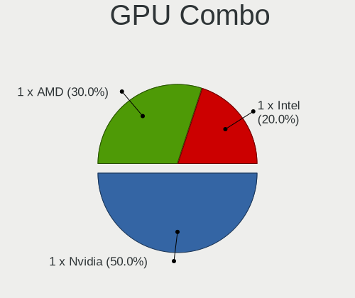

| Name       | Desktops | Percent |
|------------|----------|---------|
| 1 x Nvidia | 7        | 53.85%  |
| 1 x Intel  | 4        | 30.77%  |
| 1 x AMD    | 2        | 15.38%  |

GPU Driver
----------

Free vs proprietary

| Driver | Desktops | Percent |
|--------|----------|---------|
| Free   | 13       | 100%    |

GPU Memory
----------

Total video memory

| Size in GB | Desktops | Percent |
|------------|----------|---------|
| Unknown    | 4        | 30.77%  |
| 2.01-3.0   | 3        | 23.08%  |
| 3.01-4.0   | 2        | 15.38%  |
| 1.01-2.0   | 2        | 15.38%  |
| 7.01-8.0   | 1        | 7.69%   |
| 5.01-6.0   | 1        | 7.69%   |

Monitor
-------

Monitor Vendor
--------------

Monitor vendors

| Vendor              | Desktops | Percent |
|---------------------|----------|---------|
| Samsung Electronics | 6        | 42.86%  |
| Goldstar            | 3        | 21.43%  |
| Acer                | 2        | 14.29%  |
| Viotek              | 1        | 7.14%   |
| Philips             | 1        | 7.14%   |
| AOC                 | 1        | 7.14%   |

Monitor Model
-------------

Monitor models

| Model                                                               | Desktops | Percent |
|---------------------------------------------------------------------|----------|---------|
| Samsung Electronics C27F390 SAM0D32 1920x1080 598x336mm 27.0-inch   | 2        | 13.33%  |
| Viotek GN34CW VTK3400 3440x1440 795x334mm 33.9-inch                 | 1        | 6.67%   |
| Samsung Electronics SyncMaster SAM02E3 1440x900 367x229mm 17.0-inch | 1        | 6.67%   |
| Samsung Electronics SMB2230N SAM0635 1920x1080 477x268mm 21.5-inch  | 1        | 6.67%   |
| Samsung Electronics S24D300 SAM0B43 1920x1080 531x299mm 24.0-inch   | 1        | 6.67%   |
| Samsung Electronics C32F391 SAM0D34 1920x1080 698x393mm 31.5-inch   | 1        | 6.67%   |
| Samsung Electronics C24F390 SAM0D2C 1920x1080 521x293mm 23.5-inch   | 1        | 6.67%   |
| Philips PHL 223V5 PHLC0CF 1920x1080 477x268mm 21.5-inch             | 1        | 6.67%   |
| Goldstar W1752 GSM4490 1440x900 370x232mm 17.2-inch                 | 1        | 6.67%   |
| Goldstar ULTRAGEAR GSM5B73 1920x1080 531x298mm 24.0-inch            | 1        | 6.67%   |
| Goldstar TV SSCR2 GSMC0C8 3840x2160                                 | 1        | 6.67%   |
| AOC 1970W AOC1970 1366x768 410x230mm 18.5-inch                      | 1        | 6.67%   |
| Acer K222HQL ACR0512 1920x1080 480x270mm 21.7-inch                  | 1        | 6.67%   |
| Acer FT220HQL ACR03D2 1920x1080 476x268mm 21.5-inch                 | 1        | 6.67%   |

Monitor Resolution
------------------

Monitor screen resolution

| Resolution       | Desktops | Percent |
|------------------|----------|---------|
| 1920x1080 (FHD)  | 9        | 69.23%  |
| 3840x2160 (4K)   | 1        | 7.69%   |
| 3440x1440        | 1        | 7.69%   |
| 1440x900 (WXGA+) | 1        | 7.69%   |
| 1366x768 (WXGA)  | 1        | 7.69%   |

Monitor Diagonal
----------------

Diagonal size in inches

| Inches | Desktops | Percent |
|--------|----------|---------|
| 21     | 4        | 28.57%  |
| 27     | 2        | 14.29%  |
| 24     | 2        | 14.29%  |
| 72     | 1        | 7.14%   |
| 34     | 1        | 7.14%   |
| 31     | 1        | 7.14%   |
| 23     | 1        | 7.14%   |
| 18     | 1        | 7.14%   |
| 17     | 1        | 7.14%   |

Monitor Width
-------------

Physical width

| Width in mm | Desktops | Percent |
|-------------|----------|---------|
| 401-500     | 5        | 38.46%  |
| 501-600     | 4        | 30.77%  |
| 701-800     | 1        | 7.69%   |
| 601-700     | 1        | 7.69%   |
| 351-400     | 1        | 7.69%   |
| 1501-2000   | 1        | 7.69%   |

Aspect Ratio
------------

Proportional relationship between the width and the height

| Ratio | Desktops | Percent |
|-------|----------|---------|
| 16/9  | 12       | 85.71%  |
| 21/9  | 1        | 7.14%   |
| 16/10 | 1        | 7.14%   |

Monitor Area
------------

Area in inch²

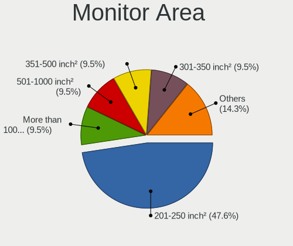

| Area in inch² | Desktops | Percent |
|----------------|----------|---------|
| 201-250        | 6        | 46.15%  |
| 351-500        | 2        | 15.38%  |
| 301-350        | 2        | 15.38%  |
| More than 1000 | 1        | 7.69%   |
| 141-150        | 1        | 7.69%   |
| 131-140        | 1        | 7.69%   |

Pixel Density
-------------

Pixels per inch

| Density | Desktops | Percent |
|---------|----------|---------|
| 51-100  | 8        | 61.54%  |
| 101-120 | 5        | 38.46%  |

Multiple Monitors
-----------------

Total monitors connected

| Total | Desktops | Percent |
|-------|----------|---------|
| 1     | 11       | 84.62%  |
| 2     | 2        | 15.38%  |

Network
-------

Net Controller Vendor
---------------------

Controller vendors

| Vendor                          | Desktops | Percent |
|---------------------------------|----------|---------|
| Realtek Semiconductor           | 11       | 50%     |
| Intel                           | 6        | 27.27%  |
| Samsung Electronics             | 1        | 4.55%   |
| Qualcomm Atheros Communications | 1        | 4.55%   |
| Qualcomm Atheros                | 1        | 4.55%   |
| Motorola PCS                    | 1        | 4.55%   |
| Google                          | 1        | 4.55%   |

Net Controller Model
--------------------

Controller models

| Model                                                             | Desktops | Percent |
|-------------------------------------------------------------------|----------|---------|
| Realtek RTL8111/8168/8411 PCI Express Gigabit Ethernet Controller | 10       | 40%     |
| Realtek RTL8821CE 802.11ac PCIe Wireless Network Adapter          | 3        | 12%     |
| Samsung Galaxy series, misc. (tethering mode)                     | 1        | 4%      |
| Realtek RTL8192EE PCIe Wireless Network Adapter                   | 1        | 4%      |
| Qualcomm Atheros Killer E220x Gigabit Ethernet Controller         | 1        | 4%      |
| Qualcomm Atheros AR9271 802.11n                                   | 1        | 4%      |
| Motorola PCS moto g play (2021)                                   | 1        | 4%      |
| Intel Wireless-AC 9260                                            | 1        | 4%      |
| Intel Wireless 8260                                               | 1        | 4%      |
| Intel Wi-Fi 6 AX200                                               | 1        | 4%      |
| Intel Ethernet Controller I225-V                                  | 1        | 4%      |
| Intel Dual Band Wireless-AC 3168NGW [Stone Peak]                  | 1        | 4%      |
| Intel 82579V Gigabit Network Connection                           | 1        | 4%      |
| Google Nexus/Pixel Device (tether)                                | 1        | 4%      |

Wireless Vendor
---------------

Wireless vendors

| Vendor                          | Desktops | Percent |
|---------------------------------|----------|---------|
| Realtek Semiconductor           | 4        | 44.44%  |
| Intel                           | 4        | 44.44%  |
| Qualcomm Atheros Communications | 1        | 11.11%  |

Wireless Model
--------------

Wireless models

| Model                                                    | Desktops | Percent |
|----------------------------------------------------------|----------|---------|
| Realtek RTL8821CE 802.11ac PCIe Wireless Network Adapter | 3        | 33.33%  |
| Realtek RTL8192EE PCIe Wireless Network Adapter          | 1        | 11.11%  |
| Qualcomm Atheros AR9271 802.11n                          | 1        | 11.11%  |
| Intel Wireless-AC 9260                                   | 1        | 11.11%  |
| Intel Wireless 8260                                      | 1        | 11.11%  |
| Intel Wi-Fi 6 AX200                                      | 1        | 11.11%  |
| Intel Dual Band Wireless-AC 3168NGW [Stone Peak]         | 1        | 11.11%  |

Ethernet Vendor
---------------

Ethernet vendors

| Vendor                | Desktops | Percent |
|-----------------------|----------|---------|
| Realtek Semiconductor | 10       | 66.67%  |
| Intel                 | 2        | 13.33%  |
| Samsung Electronics   | 1        | 6.67%   |
| Qualcomm Atheros      | 1        | 6.67%   |
| Google                | 1        | 6.67%   |

Ethernet Model
--------------

Ethernet models

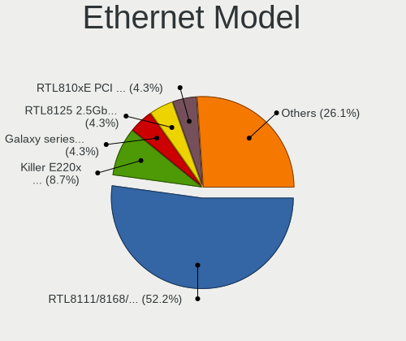

| Model                                                             | Desktops | Percent |
|-------------------------------------------------------------------|----------|---------|
| Realtek RTL8111/8168/8411 PCI Express Gigabit Ethernet Controller | 10       | 66.67%  |
| Samsung Galaxy series, misc. (tethering mode)                     | 1        | 6.67%   |
| Qualcomm Atheros Killer E220x Gigabit Ethernet Controller         | 1        | 6.67%   |
| Intel Ethernet Controller I225-V                                  | 1        | 6.67%   |
| Intel 82579V Gigabit Network Connection                           | 1        | 6.67%   |
| Google Nexus/Pixel Device (tether)                                | 1        | 6.67%   |

Net Controller Kind
-------------------

Ethernet, WiFi or modem

| Kind     | Desktops | Percent |
|----------|----------|---------|
| Ethernet | 13       | 56.52%  |
| WiFi     | 9        | 39.13%  |
| Unknown  | 1        | 4.35%   |

Used Controller
---------------

Currently used network controller

| Kind     | Desktops | Percent |
|----------|----------|---------|
| Ethernet | 6        | 54.55%  |
| WiFi     | 5        | 45.45%  |

NICs
----

Total network controllers on board

| Total | Desktops | Percent |
|-------|----------|---------|
| 2     | 8        | 61.54%  |
| 1     | 5        | 38.46%  |

IPv6
----

IPv6 vs IPv4

| Used | Desktops | Percent |
|------|----------|---------|
| No   | 11       | 84.62%  |
| Yes  | 2        | 15.38%  |

Bluetooth
---------

Bluetooth Vendor
----------------

Controller vendors

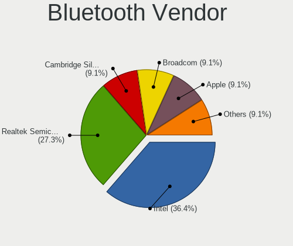

| Vendor                | Desktops | Percent |
|-----------------------|----------|---------|
| Realtek Semiconductor | 3        | 42.86%  |
| Intel                 | 3        | 42.86%  |
| ASUSTek Computer      | 1        | 14.29%  |

Bluetooth Model
---------------

Controller models

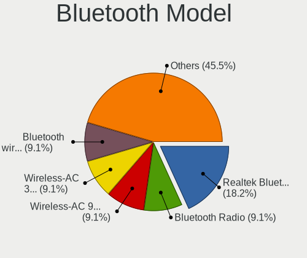

| Model                                    | Desktops | Percent |
|------------------------------------------|----------|---------|
| Realtek  Bluetooth 4.2 Adapter           | 2        | 28.57%  |
| Realtek Bluetooth Radio                  | 1        | 14.29%  |
| Intel Wireless-AC 9260 Bluetooth Adapter | 1        | 14.29%  |
| Intel Wireless-AC 3168 Bluetooth         | 1        | 14.29%  |
| Intel Bluetooth wireless interface       | 1        | 14.29%  |
| ASUS Broadcom BCM20702A0 Bluetooth       | 1        | 14.29%  |

Sound
-----

Sound Vendor
------------

Sound card vendors

| Vendor              | Desktops | Percent |
|---------------------|----------|---------|
| Intel               | 10       | 43.48%  |
| Nvidia              | 7        | 30.43%  |
| AMD                 | 3        | 13.04%  |
| C-Media Electronics | 2        | 8.7%    |
| Guillemot           | 1        | 4.35%   |

Sound Model
-----------

Sound card models

| Model                                                                      | Desktops | Percent |
|----------------------------------------------------------------------------|----------|---------|
| Nvidia GP106 High Definition Audio Controller                              | 4        | 16%     |
| Intel Comet Lake PCH-V cAVS                                                | 2        | 8%      |
| Intel 6 Series/C200 Series Chipset Family High Definition Audio Controller | 2        | 8%      |
| AMD Starship/Matisse HD Audio Controller                                   | 2        | 8%      |
| Nvidia TU116 High Definition Audio Controller                              | 1        | 4%      |
| Nvidia TU106 High Definition Audio Controller                              | 1        | 4%      |
| Nvidia GP107GL High Definition Audio Controller                            | 1        | 4%      |
| Intel Comet Lake PCH cAVS                                                  | 1        | 4%      |
| Intel Celeron N3350/Pentium N4200/Atom E3900 Series Audio Cluster          | 1        | 4%      |
| Intel C600/X79 series chipset High Definition Audio Controller             | 1        | 4%      |
| Intel 9 Series Chipset Family HD Audio Controller                          | 1        | 4%      |
| Intel 200 Series PCH HD Audio                                              | 1        | 4%      |
| Intel 100 Series/C230 Series Chipset Family HD Audio Controller            | 1        | 4%      |
| Guillemot Hercules DJ Console 4-Mx                                         | 1        | 4%      |
| C-Media Electronics CM102-A+/102S+ Audio Controller                        | 1        | 4%      |
| C-Media Electronics Audio Adapter (Unitek Y-247A)                          | 1        | 4%      |
| AMD Raven/Raven2/Fenghuang HDMI/DP Audio Controller                        | 1        | 4%      |
| AMD Family 17h/19h HD Audio Controller                                     | 1        | 4%      |
| AMD Cedar HDMI Audio [Radeon HD 5400/6300/7300 Series]                     | 1        | 4%      |

Memory
------

Memory Vendor
-------------

Memory module vendors

Zero info for selected period =(

Memory Model
------------

Memory module models

Zero info for selected period =(

Memory Kind
-----------

Memory module kinds

Zero info for selected period =(

Memory Form Factor
------------------

Physical design of the memory module

Zero info for selected period =(

Memory Size
-----------

Memory module size

Zero info for selected period =(

Memory Speed
------------

Memory module speed

Zero info for selected period =(

Printers & scanners
-------------------

Printer Vendor
--------------

Printer device vendors

Zero info for selected period =(

Printer Model
-------------

Printer device models

Zero info for selected period =(

Scanner Vendor
--------------

Scanner device vendors

Zero info for selected period =(

Scanner Model
-------------

Scanner device models

Zero info for selected period =(

Camera
------

Camera Vendor
-------------

Camera device vendors

| Vendor        | Desktops | Percent |
|---------------|----------|---------|
| Logitech      | 1        | 50%     |
| HD 2MP WEBCAM | 1        | 50%     |

Camera Model
------------

Camera device models

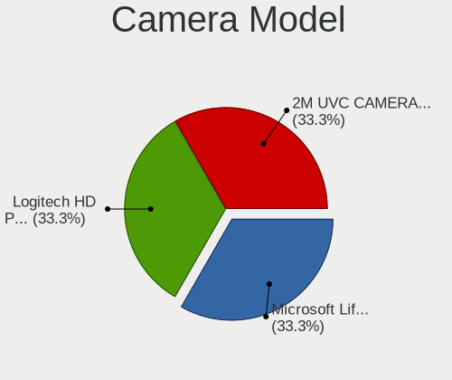

| Model                       | Desktops | Percent |
|-----------------------------|----------|---------|
| Logitech HD Pro Webcam C920 | 1        | 50%     |
| HD 2MP WEBCAM HD 2MP WEBCAM | 1        | 50%     |

Security
--------

Fingerprint Vendor
------------------

Fingerprint sensor vendors

Zero info for selected period =(

Fingerprint Model
-----------------

Fingerprint sensor models

Zero info for selected period =(

Chipcard Vendor
---------------

Chipcard module vendors

Zero info for selected period =(

Chipcard Model
--------------

Chipcard module models

Zero info for selected period =(

Unsupported
-----------

Unsupported Devices
-------------------

Total unsupported devices on board

| Total | Desktops | Percent |
|-------|----------|---------|
| 1     | 7        | 53.85%  |
| 2     | 3        | 23.08%  |
| 0     | 2        | 15.38%  |
| 3     | 1        | 7.69%   |

Unsupported Device Types
------------------------

Types of unsupported devices

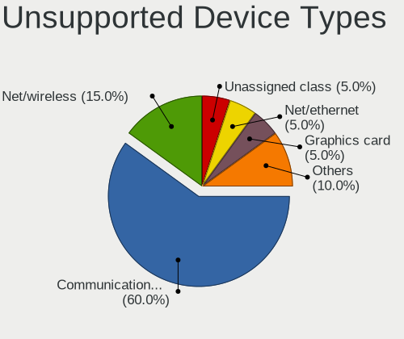

| Type                     | Desktops | Percent |
|--------------------------|----------|---------|
| Communication controller | 9        | 56.25%  |
| Net/wireless             | 3        | 18.75%  |
| Net/ethernet             | 1        | 6.25%   |
| Graphics card            | 1        | 6.25%   |
| Firewire controller      | 1        | 6.25%   |
| Bluetooth                | 1        | 6.25%   |

