GNOME OS - Tested Hardware & Statistics (Notebooks)
---------------------------------------------------

A project to collect tested hardware configurations for GNOME OS.

Anyone can contribute to this report by the [hw-probe](https://github.com/linuxhw/hw-probe) tool:

    sudo -E hw-probe -all -upload

Please contribute! Especially if your hardware is rare.

Contents
--------

* [ Test Cases ](#test-cases)

* [ System ](#system)
  - [ OS                       ](#os)
  - [ OS Family                ](#os-family)
  - [ Kernel                   ](#kernel)
  - [ Kernel Family            ](#kernel-family)
  - [ Kernel Major Ver.        ](#kernel-major-ver)
  - [ Arch                     ](#arch)
  - [ DE                       ](#de)
  - [ Display Server           ](#display-server)
  - [ Display Manager          ](#display-manager)
  - [ OS Lang                  ](#os-lang)
  - [ Boot Mode                ](#boot-mode)
  - [ Filesystem               ](#filesystem)
  - [ Part. scheme             ](#part-scheme)
  - [ Dual Boot with Linux/BSD ](#dual-boot-with-linuxbsd)
  - [ Dual Boot (Win)          ](#dual-boot-win)

* [ Board ](#board)
  - [ Vendor                   ](#vendor)
  - [ Model                    ](#model)
  - [ Model Family             ](#model-family)
  - [ MFG Year                 ](#mfg-year)
  - [ Form Factor              ](#form-factor)
  - [ Secure Boot              ](#secure-boot)
  - [ Coreboot                 ](#coreboot)
  - [ RAM Size                 ](#ram-size)
  - [ RAM Used                 ](#ram-used)
  - [ Total Drives             ](#total-drives)
  - [ Has CD-ROM               ](#has-cd-rom)
  - [ Has Ethernet             ](#has-ethernet)
  - [ Has WiFi                 ](#has-wifi)
  - [ Has Bluetooth            ](#has-bluetooth)

* [ Location ](#location)
  - [ Country                  ](#country)
  - [ City                     ](#city)

* [ Drives ](#drives)
  - [ Drive Vendor             ](#drive-vendor)
  - [ Drive Model              ](#drive-model)
  - [ HDD Vendor               ](#hdd-vendor)
  - [ SSD Vendor               ](#ssd-vendor)
  - [ Drive Kind               ](#drive-kind)
  - [ Drive Connector          ](#drive-connector)
  - [ Drive Size               ](#drive-size)
  - [ Space Total              ](#space-total)
  - [ Space Used               ](#space-used)
  - [ Malfunc. Drives          ](#malfunc-drives)
  - [ Malfunc. Drive Vendor    ](#malfunc-drive-vendor)
  - [ Malfunc. HDD Vendor      ](#malfunc-hdd-vendor)
  - [ Malfunc. Drive Kind      ](#malfunc-drive-kind)
  - [ Failed Drives            ](#failed-drives)
  - [ Failed Drive Vendor      ](#failed-drive-vendor)
  - [ Drive Status             ](#drive-status)

* [ Storage controller ](#storage-controller)
  - [ Storage Vendor           ](#storage-vendor)
  - [ Storage Model            ](#storage-model)
  - [ Storage Kind             ](#storage-kind)

* [ Processor ](#processor)
  - [ CPU Vendor               ](#cpu-vendor)
  - [ CPU Model                ](#cpu-model)
  - [ CPU Model Family         ](#cpu-model-family)
  - [ CPU Cores                ](#cpu-cores)
  - [ CPU Sockets              ](#cpu-sockets)
  - [ CPU Threads              ](#cpu-threads)
  - [ CPU Op-Modes             ](#cpu-op-modes)
  - [ CPU Microcode            ](#cpu-microcode)
  - [ CPU Microarch            ](#cpu-microarch)

* [ Graphics ](#graphics)
  - [ GPU Vendor               ](#gpu-vendor)
  - [ GPU Model                ](#gpu-model)
  - [ GPU Combo                ](#gpu-combo)
  - [ GPU Driver               ](#gpu-driver)
  - [ GPU Memory               ](#gpu-memory)

* [ Monitor ](#monitor)
  - [ Monitor Vendor           ](#monitor-vendor)
  - [ Monitor Model            ](#monitor-model)
  - [ Monitor Resolution       ](#monitor-resolution)
  - [ Monitor Diagonal         ](#monitor-diagonal)
  - [ Monitor Width            ](#monitor-width)
  - [ Aspect Ratio             ](#aspect-ratio)
  - [ Monitor Area             ](#monitor-area)
  - [ Pixel Density            ](#pixel-density)
  - [ Multiple Monitors        ](#multiple-monitors)

* [ Network ](#network)
  - [ Net Controller Vendor    ](#net-controller-vendor)
  - [ Net Controller Model     ](#net-controller-model)
  - [ Wireless Vendor          ](#wireless-vendor)
  - [ Wireless Model           ](#wireless-model)
  - [ Ethernet Vendor          ](#ethernet-vendor)
  - [ Ethernet Model           ](#ethernet-model)
  - [ Net Controller Kind      ](#net-controller-kind)
  - [ Used Controller          ](#used-controller)
  - [ NICs                     ](#nics)
  - [ IPv6                     ](#ipv6)

* [ Bluetooth ](#bluetooth)
  - [ Bluetooth Vendor         ](#bluetooth-vendor)
  - [ Bluetooth Model          ](#bluetooth-model)

* [ Sound ](#sound)
  - [ Sound Vendor             ](#sound-vendor)
  - [ Sound Model              ](#sound-model)

* [ Memory ](#memory)
  - [ Memory Vendor            ](#memory-vendor)
  - [ Memory Model             ](#memory-model)
  - [ Memory Kind              ](#memory-kind)
  - [ Memory Form Factor       ](#memory-form-factor)
  - [ Memory Size              ](#memory-size)
  - [ Memory Speed             ](#memory-speed)

* [ Printers & scanners ](#printers--scanners)
  - [ Printer Vendor           ](#printer-vendor)
  - [ Printer Model            ](#printer-model)
  - [ Scanner Vendor           ](#scanner-vendor)
  - [ Scanner Model            ](#scanner-model)

* [ Camera ](#camera)
  - [ Camera Vendor            ](#camera-vendor)
  - [ Camera Model             ](#camera-model)

* [ Security ](#security)
  - [ Fingerprint Vendor       ](#fingerprint-vendor)
  - [ Fingerprint Model        ](#fingerprint-model)
  - [ Chipcard Vendor          ](#chipcard-vendor)
  - [ Chipcard Model           ](#chipcard-model)

* [ Unsupported ](#unsupported)
  - [ Unsupported Devices      ](#unsupported-devices)
  - [ Unsupported Device Types ](#unsupported-device-types)

Test Cases
----------

Total: 58

| Vendor        | Model                       | Probe                                                      | Date         |
|---------------|-----------------------------|------------------------------------------------------------|--------------|
| Acer          | Swift SFG16-71              | [767560a624](https://linux-hardware.org/?probe=767560a624) | Nov 14, 2025 |
| Dell          | Inspiron 3521               | [91a3e8c284](https://linux-hardware.org/?probe=91a3e8c284) | Oct 27, 2025 |
| Apple         | MacBookAir6,2               | [cdfad52711](https://linux-hardware.org/?probe=cdfad52711) | Oct 03, 2025 |
| Apple         | MacBookAir6,2               | [6dd0299553](https://linux-hardware.org/?probe=6dd0299553) | Oct 03, 2025 |
| ASUSTek       | VivoBook_ASUSLaptop X150... | [349b4a9553](https://linux-hardware.org/?probe=349b4a9553) | Aug 21, 2025 |
| ASUSTek       | VivoBook_ASUSLaptop X150... | [b0228ceb18](https://linux-hardware.org/?probe=b0228ceb18) | Aug 21, 2025 |
| HP            | Laptop 15-bw0xx             | [5773ed37f4](https://linux-hardware.org/?probe=5773ed37f4) | Aug 09, 2025 |
| ASUSTek       | ASUS Vivobook S 16 M5606... | [c89e5e0ca9](https://linux-hardware.org/?probe=c89e5e0ca9) | Aug 07, 2025 |
| ASUSTek       | PRIME X570-P                | [384036f434](https://linux-hardware.org/?probe=384036f434) | Jul 30, 2025 |
| ASUSTek       | PRIME X570-P                | [83b6a3e2ba](https://linux-hardware.org/?probe=83b6a3e2ba) | Jul 29, 2025 |
| Apple         | MacBookPro11,1              | [d4db865805](https://linux-hardware.org/?probe=d4db865805) | Jul 20, 2025 |
| Acer          | Aspire A715-42G             | [884468dbb6](https://linux-hardware.org/?probe=884468dbb6) | Jul 17, 2025 |
| ASUSTek       | ASUS Vivobook S 16 M5606... | [fa9d7b1705](https://linux-hardware.org/?probe=fa9d7b1705) | May 31, 2025 |
| ASUSTek       | ROG Zephyrus M16 GU604VI... | [1757736a22](https://linux-hardware.org/?probe=1757736a22) | Mar 27, 2025 |
| Lenovo        | ThinkPad E14 Gen 4 21EB0... | [44e1f0a709](https://linux-hardware.org/?probe=44e1f0a709) | Mar 20, 2025 |
| SLIMBOOK      | PROX14-AMD                  | [4705f07c52](https://linux-hardware.org/?probe=4705f07c52) | Feb 19, 2025 |
| Dell          | Latitude 7490               | [01eda01155](https://linux-hardware.org/?probe=01eda01155) | Jun 02, 2024 |
| GPU Compan... | GWNR71517                   | [89dbdfd53e](https://linux-hardware.org/?probe=89dbdfd53e) | Apr 13, 2024 |
| Lenovo        | ThinkPad X280 20KF001RMX    | [0caddb11a4](https://linux-hardware.org/?probe=0caddb11a4) | Apr 02, 2024 |
| Apple         | MacBook4,1                  | [e5b3d089e8](https://linux-hardware.org/?probe=e5b3d089e8) | Oct 06, 2023 |
| Apple         | MacBook4,1                  | [11497e61f8](https://linux-hardware.org/?probe=11497e61f8) | Oct 06, 2023 |
| Lenovo        | ThinkPad T480s 20L8S6P20... | [4f3a1c8208](https://linux-hardware.org/?probe=4f3a1c8208) | Sep 24, 2023 |
| ASUSTek       | X550LC                      | [5f73fa5db7](https://linux-hardware.org/?probe=5f73fa5db7) | Mar 18, 2023 |
| Apple         | MacBookPro8,1               | [1b5ab725ab](https://linux-hardware.org/?probe=1b5ab725ab) | Nov 09, 2022 |
| Lenovo        | IdeaPad 330-15AST 81D6      | [abbb3295c8](https://linux-hardware.org/?probe=abbb3295c8) | Oct 14, 2022 |
| Lenovo        | IdeaPad 330-15AST 81D6      | [f19e981e03](https://linux-hardware.org/?probe=f19e981e03) | Oct 14, 2022 |
| Dell          | Inspiron 3584               | [626c79c116](https://linux-hardware.org/?probe=626c79c116) | Sep 24, 2022 |
| HP            | Pavilion 15                 | [56a10ce74c](https://linux-hardware.org/?probe=56a10ce74c) | Sep 21, 2022 |
| ASUSTek       | GL553VE                     | [4d93da1983](https://linux-hardware.org/?probe=4d93da1983) | Sep 20, 2022 |
| ASUSTek       | GL553VE                     | [27b8d384a2](https://linux-hardware.org/?probe=27b8d384a2) | Sep 19, 2022 |
| Acer          | Aspire A515-51G             | [4856a5fefb](https://linux-hardware.org/?probe=4856a5fefb) | Jul 22, 2022 |
| Lenovo        | Yoga Slim 7 14ARE05 82A2    | [a90e6b2be7](https://linux-hardware.org/?probe=a90e6b2be7) | Apr 30, 2022 |
| Apple         | MacBookPro10,1              | [1bbdbe7117](https://linux-hardware.org/?probe=1bbdbe7117) | Apr 04, 2022 |
| Acer          | Iconia W700                 | [604cdabab4](https://linux-hardware.org/?probe=604cdabab4) | Mar 23, 2022 |
| Lenovo        | ThinkPad Edge E531 68851... | [54269ad944](https://linux-hardware.org/?probe=54269ad944) | Feb 18, 2022 |
| Gateway       | NE71B                       | [ac3dc96ccf](https://linux-hardware.org/?probe=ac3dc96ccf) | Feb 02, 2022 |
| HP            | Laptop 14-dk1xxx            | [c604eec754](https://linux-hardware.org/?probe=c604eec754) | Jan 27, 2022 |
| Chuwi         | HeroBook                    | [67990dbe7f](https://linux-hardware.org/?probe=67990dbe7f) | Jan 19, 2022 |
| Lenovo        | Yoga Slim 7 14ARE05 82A2    | [594815bb9d](https://linux-hardware.org/?probe=594815bb9d) | Oct 17, 2021 |
| ASUSTek       | X555LD                      | [2560d8b5a0](https://linux-hardware.org/?probe=2560d8b5a0) | Sep 27, 2021 |
| Lenovo        | IdeaPad S340-14API 81NB     | [c248e4551a](https://linux-hardware.org/?probe=c248e4551a) | Sep 25, 2021 |
| HP            | Pavilion Notebook           | [835f183d57](https://linux-hardware.org/?probe=835f183d57) | Sep 17, 2021 |
| Lenovo        | IdeaPad S145-15IWL 81S9     | [35c20c8cde](https://linux-hardware.org/?probe=35c20c8cde) | Aug 30, 2021 |
| HP            | Pavilion Gaming Laptop 1... | [5a54384297](https://linux-hardware.org/?probe=5a54384297) | Aug 11, 2021 |
| HP            | ProBook 430 G3              | [c3acaeb030](https://linux-hardware.org/?probe=c3acaeb030) | Apr 26, 2021 |
| HP            | ProBook 430 G3              | [de3298645e](https://linux-hardware.org/?probe=de3298645e) | Apr 26, 2021 |
| Toshiba       | Satellite C55-A-1F5         | [d7b4bf2642](https://linux-hardware.org/?probe=d7b4bf2642) | Apr 15, 2021 |
| Toshiba       | Satellite C55-A-1F5         | [aa32e3693a](https://linux-hardware.org/?probe=aa32e3693a) | Apr 14, 2021 |
| HP            | Pavilion 17                 | [220bf859f8](https://linux-hardware.org/?probe=220bf859f8) | Mar 28, 2021 |
| HP            | Pavilion 17                 | [a5a6941b23](https://linux-hardware.org/?probe=a5a6941b23) | Mar 28, 2021 |
| Dell          | Latitude 7490               | [ce86510d2b](https://linux-hardware.org/?probe=ce86510d2b) | Mar 28, 2021 |
| Dell          | Inspiron 3542               | [517406f8b6](https://linux-hardware.org/?probe=517406f8b6) | Mar 21, 2021 |
| Unknown       | Unknown                     | [1c5ed732c5](https://linux-hardware.org/?probe=1c5ed732c5) | Mar 01, 2021 |
| Dell          | Precision M6800             | [95fa029c09](https://linux-hardware.org/?probe=95fa029c09) | Jan 14, 2021 |
| Dell          | Inspiron 5566               | [a3fd17119a](https://linux-hardware.org/?probe=a3fd17119a) | Nov 03, 2020 |
| HP            | Pavilion 17                 | [edc8ed595b](https://linux-hardware.org/?probe=edc8ed595b) | Oct 12, 2020 |
| ASUSTek       | E202SA                      | [a226259559](https://linux-hardware.org/?probe=a226259559) | Sep 24, 2020 |
| Acer          | ChiefRiver Platform         | [23e2162b8e](https://linux-hardware.org/?probe=23e2162b8e) | Sep 20, 2020 |

System
------

OS
--

Installed operating systems

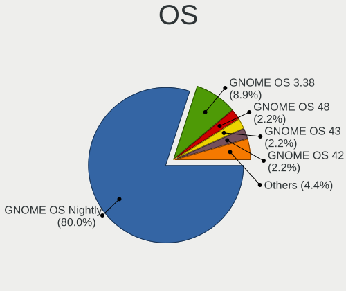

| Name             | Notebooks | Percent |
|------------------|-----------|---------|
| GNOME OS Nightly | 36        | 80%     |
| GNOME OS 3.38    | 4         | 8.89%   |
| GNOME OS 48      | 1         | 2.22%   |
| GNOME OS 43      | 1         | 2.22%   |
| GNOME OS 42      | 1         | 2.22%   |
| GNOME OS 41      | 1         | 2.22%   |
| GNOME OS 40      | 1         | 2.22%   |

OS Family
---------

OS without a version

| Name     | Notebooks | Percent |
|----------|-----------|---------|
| GNOME OS | 45        | 100%    |

Kernel
------

Version of the Linux kernel

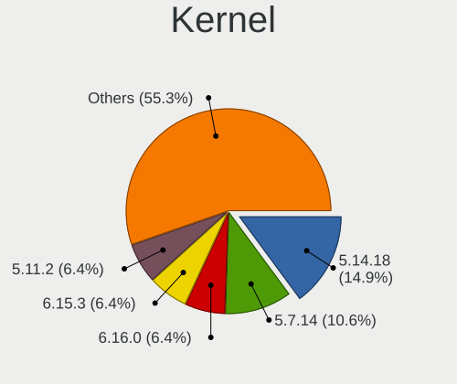

| Version | Notebooks | Percent |
|---------|-----------|---------|
| 5.14.18 | 7         | 14.89%  |
| 5.7.14  | 5         | 10.64%  |
| 6.16.0  | 3         | 6.38%   |
| 6.15.3  | 3         | 6.38%   |
| 5.11.2  | 3         | 6.38%   |
| 6.7.9   | 2         | 4.26%   |
| 5.18.19 | 2         | 4.26%   |
| 5.13.9  | 2         | 4.26%   |
| 5.13.8  | 2         | 4.26%   |
| 5.11.10 | 2         | 4.26%   |
| 6.9.1   | 1         | 2.13%   |
| 6.5.5   | 1         | 2.13%   |
| 6.5.0   | 1         | 2.13%   |
| 6.17.6  | 1         | 2.13%   |
| 6.17.5  | 1         | 2.13%   |
| 6.16.4  | 1         | 2.13%   |
| 6.14.5  | 1         | 2.13%   |
| 6.13.6  | 1         | 2.13%   |
| 6.12.9  | 1         | 2.13%   |
| 6.12.5  | 1         | 2.13%   |
| 5.19.17 | 1         | 2.13%   |
| 5.19.16 | 1         | 2.13%   |
| 5.18.16 | 1         | 2.13%   |
| 5.18.10 | 1         | 2.13%   |
| 5.14.4  | 1         | 2.13%   |
| 5.14.11 | 1         | 2.13%   |

Kernel Family
-------------

Linux kernel without a distro release

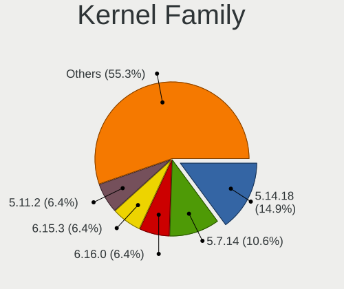

| Version | Notebooks | Percent |
|---------|-----------|---------|
| 5.14.18 | 7         | 14.89%  |
| 5.7.14  | 5         | 10.64%  |
| 6.16.0  | 3         | 6.38%   |
| 6.15.3  | 3         | 6.38%   |
| 5.11.2  | 3         | 6.38%   |
| 6.7.9   | 2         | 4.26%   |
| 5.18.19 | 2         | 4.26%   |
| 5.13.9  | 2         | 4.26%   |
| 5.13.8  | 2         | 4.26%   |
| 5.11.10 | 2         | 4.26%   |
| 6.9.1   | 1         | 2.13%   |
| 6.5.5   | 1         | 2.13%   |
| 6.5.0   | 1         | 2.13%   |
| 6.17.6  | 1         | 2.13%   |
| 6.17.5  | 1         | 2.13%   |
| 6.16.4  | 1         | 2.13%   |
| 6.14.5  | 1         | 2.13%   |
| 6.13.6  | 1         | 2.13%   |
| 6.12.9  | 1         | 2.13%   |
| 6.12.5  | 1         | 2.13%   |
| 5.19.17 | 1         | 2.13%   |
| 5.19.16 | 1         | 2.13%   |
| 5.18.16 | 1         | 2.13%   |
| 5.18.10 | 1         | 2.13%   |
| 5.14.4  | 1         | 2.13%   |
| 5.14.11 | 1         | 2.13%   |

Kernel Major Ver.
-----------------

Linux kernel major version

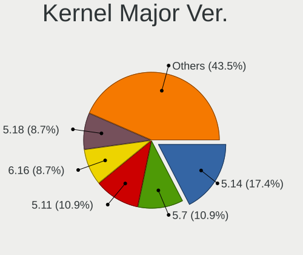

| Version | Notebooks | Percent |
|---------|-----------|---------|
| 5.14    | 8         | 17.39%  |
| 5.7     | 5         | 10.87%  |
| 5.11    | 5         | 10.87%  |
| 6.16    | 4         | 8.7%    |
| 5.18    | 4         | 8.7%    |
| 5.13    | 4         | 8.7%    |
| 6.15    | 3         | 6.52%   |
| 6.7     | 2         | 4.35%   |
| 6.5     | 2         | 4.35%   |
| 6.17    | 2         | 4.35%   |
| 6.12    | 2         | 4.35%   |
| 5.19    | 2         | 4.35%   |
| 6.9     | 1         | 2.17%   |
| 6.14    | 1         | 2.17%   |
| 6.13    | 1         | 2.17%   |

Arch
----

OS architecture (x86_64, i586, etc.)

| Name   | Notebooks | Percent |
|--------|-----------|---------|
| x86_64 | 45        | 100%    |

DE
--

Desktop Environment

| Name    | Notebooks | Percent |
|---------|-----------|---------|
| GNOME   | 45        | 97.83%  |
| Unknown | 1         | 2.17%   |

Display Server
--------------

X11 or Wayland

| Name    | Notebooks | Percent |
|---------|-----------|---------|
| Wayland | 45        | 97.83%  |
| Unknown | 1         | 2.17%   |

Display Manager
---------------

SDDM, LightDM, etc.

| Name    | Notebooks | Percent |
|---------|-----------|---------|
| Unknown | 45        | 100%    |

OS Lang
-------

Language

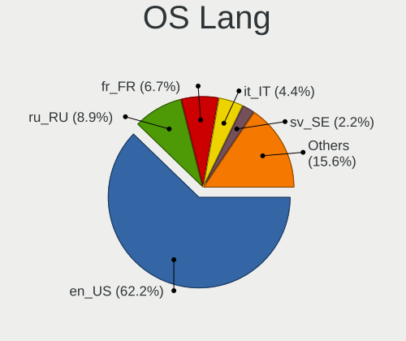

| Lang  | Notebooks | Percent |
|-------|-----------|---------|
| en_US | 28        | 62.22%  |
| ru_RU | 4         | 8.89%   |
| fr_FR | 3         | 6.67%   |
| it_IT | 2         | 4.44%   |
| sv_SE | 1         | 2.22%   |
| sk_SK | 1         | 2.22%   |
| pt_BR | 1         | 2.22%   |
| pl_PL | 1         | 2.22%   |
| nl_NL | 1         | 2.22%   |
| hu_HU | 1         | 2.22%   |
| es_ES | 1         | 2.22%   |
| de_DE | 1         | 2.22%   |

Boot Mode
---------

EFI or BIOS

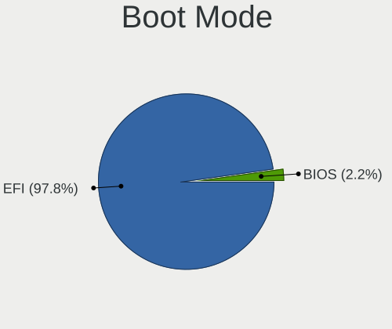

| Mode | Notebooks | Percent |
|------|-----------|---------|
| EFI  | 44        | 97.78%  |
| BIOS | 1         | 2.22%   |

Filesystem
----------

Type of filesystem

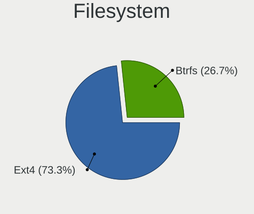

| Type  | Notebooks | Percent |
|-------|-----------|---------|
| Ext4  | 33        | 73.33%  |
| Btrfs | 12        | 26.67%  |

Part. scheme
------------

Scheme of partitioning

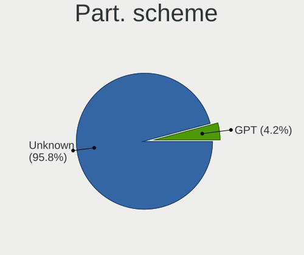

| Type    | Notebooks | Percent |
|---------|-----------|---------|
| Unknown | 45        | 97.83%  |
| GPT     | 1         | 2.17%   |

Dual Boot with Linux/BSD
------------------------

Hosting more than one Linux/BSD

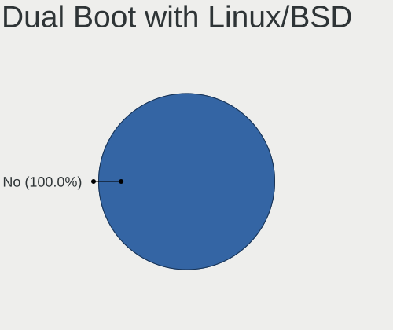

| Dual boot | Notebooks | Percent |
|-----------|-----------|---------|
| No        | 45        | 100%    |

Dual Boot (Win)
---------------

Hosting Linux and Windows

| Dual boot | Notebooks | Percent |
|-----------|-----------|---------|
| No        | 45        | 100%    |

Board
-----

Vendor
------

Motherboard manufacturer

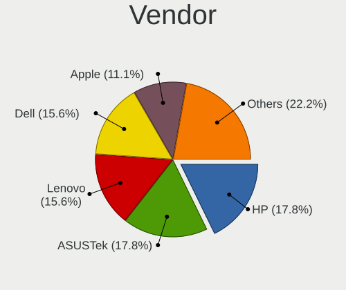

| Name             | Notebooks | Percent |
|------------------|-----------|---------|
| Hewlett-Packard  | 8         | 17.78%  |
| ASUSTek Computer | 8         | 17.78%  |
| Lenovo           | 7         | 15.56%  |
| Dell             | 7         | 15.56%  |
| Apple            | 5         | 11.11%  |
| Acer             | 5         | 11.11%  |
| Toshiba          | 1         | 2.22%   |
| SLIMBOOK         | 1         | 2.22%   |
| GPU Company      | 1         | 2.22%   |
| Gateway          | 1         | 2.22%   |
| Chuwi            | 1         | 2.22%   |

Model
-----

Motherboard model

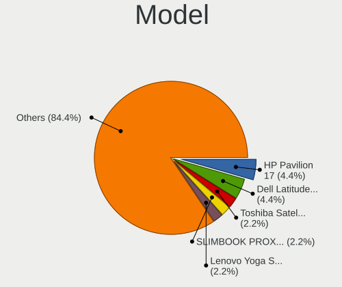

| Name                                     | Notebooks | Percent |
|------------------------------------------|-----------|---------|
| HP Pavilion 17                           | 2         | 4.44%   |
| Dell Latitude 7490                       | 2         | 4.44%   |
| Toshiba Satellite C55-A-1F5              | 1         | 2.22%   |
| SLIMBOOK PROX14-AMD                      | 1         | 2.22%   |
| Lenovo Yoga Slim 7 14ARE05 82A2          | 1         | 2.22%   |
| Lenovo ThinkPad X280 20KF001RMX          | 1         | 2.22%   |
| Lenovo ThinkPad T480s 20L8S6P200         | 1         | 2.22%   |
| Lenovo ThinkPad Edge E531 68851P6        | 1         | 2.22%   |
| Lenovo ThinkPad E14 Gen 4 21EB000GAU     | 1         | 2.22%   |
| Lenovo IdeaPad S340-14API 81NB           | 1         | 2.22%   |
| Lenovo IdeaPad S145-15IWL 81S9           | 1         | 2.22%   |
| HP ProBook 430 G3                        | 1         | 2.22%   |
| HP Pavilion Notebook                     | 1         | 2.22%   |
| HP Pavilion Gaming Laptop 15-ec0xxx      | 1         | 2.22%   |
| HP Pavilion 15                           | 1         | 2.22%   |
| HP Laptop 15-bw0xx                       | 1         | 2.22%   |
| HP Laptop 14-dk1xxx                      | 1         | 2.22%   |
| GPU Company GWNR71517                    | 1         | 2.22%   |
| Gateway NE71B                            | 1         | 2.22%   |
| Dell Precision M6800                     | 1         | 2.22%   |
| Dell Inspiron 5566                       | 1         | 2.22%   |
| Dell Inspiron 3584                       | 1         | 2.22%   |
| Dell Inspiron 3542                       | 1         | 2.22%   |
| Dell Inspiron 3521                       | 1         | 2.22%   |
| Chuwi HeroBook                           | 1         | 2.22%   |
| ASUS X555LD                              | 1         | 2.22%   |
| ASUS X550LC                              | 1         | 2.22%   |
| ASUS VivoBook_ASUSLaptop X1502VA_R1502VA | 1         | 2.22%   |
| ASUS ROG Zephyrus M16 GU604VI_GU604VI    | 1         | 2.22%   |
| ASUS PRIME X570-P                        | 1         | 2.22%   |
| ASUS GL553VE                             | 1         | 2.22%   |
| ASUS E202SA                              | 1         | 2.22%   |
| ASUS ASUS Vivobook S 16 M5606WA_M5606WA  | 1         | 2.22%   |
| Apple MacBookPro8,1                      | 1         | 2.22%   |
| Apple MacBookPro11,1                     | 1         | 2.22%   |
| Apple MacBookPro10,1                     | 1         | 2.22%   |
| Apple MacBookAir6,2                      | 1         | 2.22%   |
| Apple MacBook4,1                         | 1         | 2.22%   |
| Acer Swift SFG16-71                      | 1         | 2.22%   |
| Acer Iconia W700                         | 1         | 2.22%   |

Model Family
------------

Motherboard model prefix

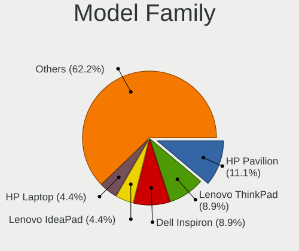

| Name                  | Notebooks | Percent |
|-----------------------|-----------|---------|
| HP Pavilion           | 5         | 11.11%  |
| Lenovo ThinkPad       | 4         | 8.89%   |
| Dell Inspiron         | 4         | 8.89%   |
| Lenovo IdeaPad        | 2         | 4.44%   |
| HP Laptop             | 2         | 4.44%   |
| Dell Latitude         | 2         | 4.44%   |
| Acer Aspire           | 2         | 4.44%   |
| Toshiba Satellite     | 1         | 2.22%   |
| SLIMBOOK PROX14-AMD   | 1         | 2.22%   |
| Lenovo Yoga           | 1         | 2.22%   |
| HP ProBook            | 1         | 2.22%   |
| GPU Company GWNR71517 | 1         | 2.22%   |
| Gateway NE71B         | 1         | 2.22%   |
| Dell Precision        | 1         | 2.22%   |
| Chuwi HeroBook        | 1         | 2.22%   |
| ASUS X555LD           | 1         | 2.22%   |
| ASUS X550LC           | 1         | 2.22%   |
| ASUS VivoBook         | 1         | 2.22%   |
| ASUS ROG              | 1         | 2.22%   |
| ASUS PRIME            | 1         | 2.22%   |
| ASUS GL553VE          | 1         | 2.22%   |
| ASUS E202SA           | 1         | 2.22%   |
| ASUS ASUS             | 1         | 2.22%   |
| Apple MacBookPro8     | 1         | 2.22%   |
| Apple MacBookPro11    | 1         | 2.22%   |
| Apple MacBookPro10    | 1         | 2.22%   |
| Apple MacBookAir6     | 1         | 2.22%   |
| Apple MacBook4        | 1         | 2.22%   |
| Acer Swift            | 1         | 2.22%   |
| Acer Iconia           | 1         | 2.22%   |
| Acer ChiefRiver       | 1         | 2.22%   |

MFG Year
--------

Motherboard manufacture year

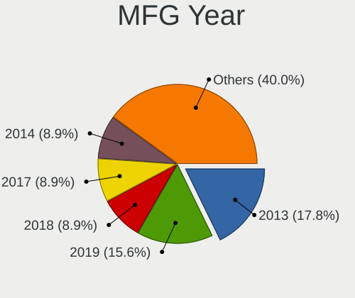

| Year | Notebooks | Percent |
|------|-----------|---------|
| 2013 | 8         | 17.78%  |
| 2019 | 7         | 15.56%  |
| 2018 | 4         | 8.89%   |
| 2017 | 4         | 8.89%   |
| 2014 | 4         | 8.89%   |
| 2012 | 4         | 8.89%   |
| 2020 | 3         | 6.67%   |
| 2024 | 2         | 4.44%   |
| 2023 | 2         | 4.44%   |
| 2015 | 2         | 4.44%   |
| 2022 | 1         | 2.22%   |
| 2021 | 1         | 2.22%   |
| 2016 | 1         | 2.22%   |
| 2011 | 1         | 2.22%   |
| 2008 | 1         | 2.22%   |

Form Factor
-----------

Physical design of the computer

| Name     | Notebooks | Percent |
|----------|-----------|---------|
| Notebook | 45        | 100%    |

Secure Boot
-----------

Enabled or disabled

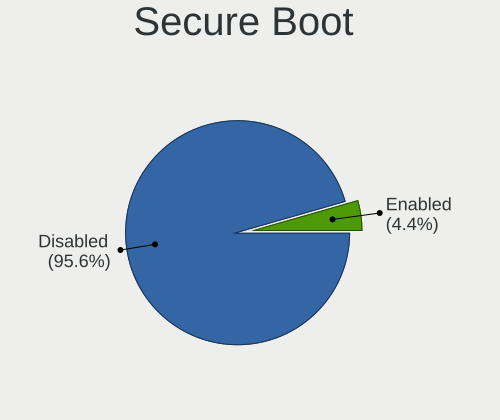

| State    | Notebooks | Percent |
|----------|-----------|---------|
| Disabled | 43        | 95.56%  |
| Enabled  | 2         | 4.44%   |

Coreboot
--------

Have coreboot on board

| Used | Notebooks | Percent |
|------|-----------|---------|
| No   | 45        | 100%    |

RAM Size
--------

Total RAM memory

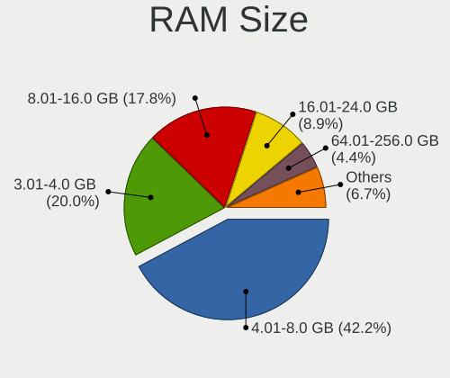

| Size in GB  | Notebooks | Percent |
|-------------|-----------|---------|
| 4.01-8.0    | 19        | 42.22%  |
| 3.01-4.0    | 9         | 20%     |
| 8.01-16.0   | 8         | 17.78%  |
| 16.01-24.0  | 4         | 8.89%   |
| 64.01-256.0 | 2         | 4.44%   |
| 32.01-64.0  | 1         | 2.22%   |
| 24.01-32.0  | 1         | 2.22%   |
| 1.01-2.0    | 1         | 2.22%   |

RAM Used
--------

Used RAM memory

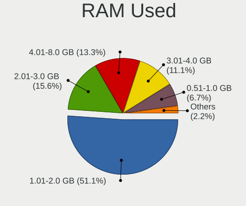

| Used GB   | Notebooks | Percent |
|-----------|-----------|---------|
| 1.01-2.0  | 23        | 51.11%  |
| 2.01-3.0  | 7         | 15.56%  |
| 4.01-8.0  | 6         | 13.33%  |
| 3.01-4.0  | 5         | 11.11%  |
| 0.51-1.0  | 3         | 6.67%   |
| 8.01-16.0 | 1         | 2.22%   |

Total Drives
------------

Number of drives on board

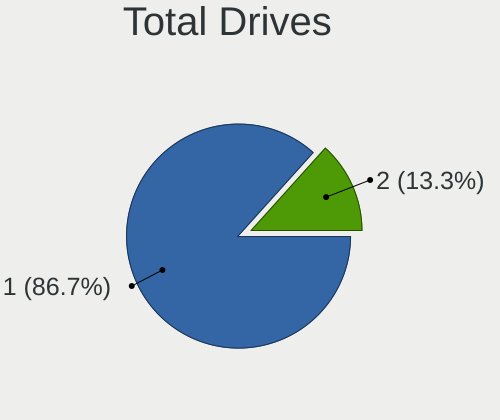

| Drives | Notebooks | Percent |
|--------|-----------|---------|
| 1      | 39        | 86.67%  |
| 2      | 6         | 13.33%  |

Has CD-ROM
----------

Has CD-ROM on board

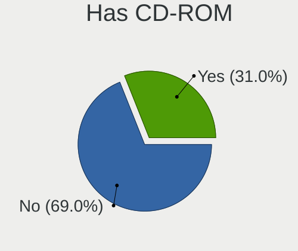

| Presented | Notebooks | Percent |
|-----------|-----------|---------|
| No        | 34        | 75.56%  |
| Yes       | 11        | 24.44%  |

Has Ethernet
------------

Has Ethernet on board

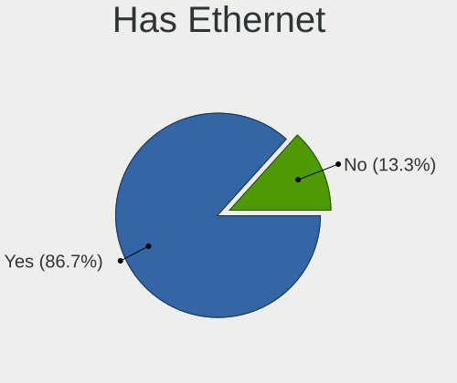

| Presented | Notebooks | Percent |
|-----------|-----------|---------|
| Yes       | 38        | 84.44%  |
| No        | 7         | 15.56%  |

Has WiFi
--------

Has WiFi module

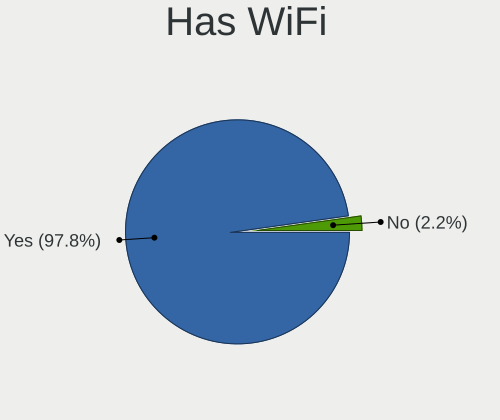

| Presented | Notebooks | Percent |
|-----------|-----------|---------|
| Yes       | 44        | 97.78%  |
| No        | 1         | 2.22%   |

Has Bluetooth
-------------

Has Bluetooth module

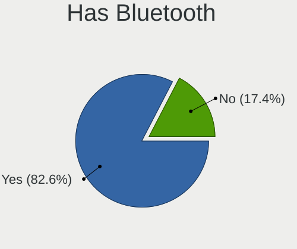

| Presented | Notebooks | Percent |
|-----------|-----------|---------|
| Yes       | 39        | 86.67%  |
| No        | 6         | 13.33%  |

Location
--------

Country
-------

Geographic location (country)

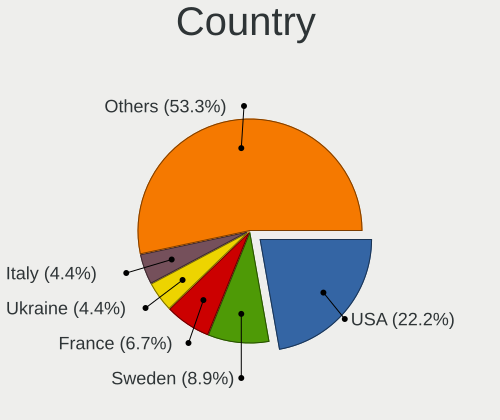

| Country     | Notebooks | Percent |
|-------------|-----------|---------|
| USA         | 10        | 22.22%  |
| Sweden      | 4         | 8.89%   |
| France      | 3         | 6.67%   |
| Ukraine     | 2         | 4.44%   |
| Italy       | 2         | 4.44%   |
| Greece      | 2         | 4.44%   |
| Chile       | 2         | 4.44%   |
| Brazil      | 2         | 4.44%   |
| UAE         | 1         | 2.22%   |
| Slovakia    | 1         | 2.22%   |
| Serbia      | 1         | 2.22%   |
| Russia      | 1         | 2.22%   |
| Romania     | 1         | 2.22%   |
| Puerto Rico | 1         | 2.22%   |
| Poland      | 1         | 2.22%   |
| New Zealand | 1         | 2.22%   |
| Netherlands | 1         | 2.22%   |
| Latvia      | 1         | 2.22%   |
| Iraq        | 1         | 2.22%   |
| Iran        | 1         | 2.22%   |
| India       | 1         | 2.22%   |
| Germany     | 1         | 2.22%   |
| Finland     | 1         | 2.22%   |
| El Salvador | 1         | 2.22%   |
| Canada      | 1         | 2.22%   |
| Australia   | 1         | 2.22%   |

City
----

Geographic location (city)

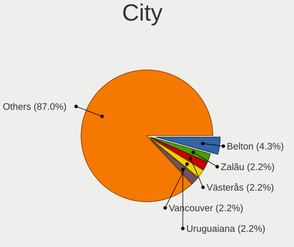

| City              | Notebooks | Percent |
|-------------------|-----------|---------|
| Belton            | 2         | 4.35%   |
| Zalău            | 1         | 2.17%   |
| Västerås        | 1         | 2.17%   |
| Vancouver         | 1         | 2.17%   |
| Uruguaiana        | 1         | 2.17%   |
| Thessaloniki      | 1         | 2.17%   |
| Tehran            | 1         | 2.17%   |
| Talence           | 1         | 2.17%   |
| Stockholm         | 1         | 2.17%   |
| Skydra            | 1         | 2.17%   |
| Shreveport        | 1         | 2.17%   |
| Seattle           | 1         | 2.17%   |
| Santiago          | 1         | 2.17%   |
| San Salvador      | 1         | 2.17%   |
| Riga              | 1         | 2.17%   |
| Płońsk          | 1         | 2.17%   |
| Pori              | 1         | 2.17%   |
| Parempuyre        | 1         | 2.17%   |
| Novi Sad          | 1         | 2.17%   |
| Millers Creek     | 1         | 2.17%   |
| Milan             | 1         | 2.17%   |
| Melbourne         | 1         | 2.17%   |
| Mariupol          | 1         | 2.17%   |
| Levis             | 1         | 2.17%   |
| Lelystad          | 1         | 2.17%   |
| Lehighton         | 1         | 2.17%   |
| Las Vegas         | 1         | 2.17%   |
| Kyiv              | 1         | 2.17%   |
| Krasnoyarsk       | 1         | 2.17%   |
| Kearney           | 1         | 2.17%   |
| Juazeiro do Norte | 1         | 2.17%   |
| Hyderabad         | 1         | 2.17%   |
| Gothenburg        | 1         | 2.17%   |
| Gig Harbor        | 1         | 2.17%   |
| Gemünden am Main | 1         | 2.17%   |
| Drobin            | 1         | 2.17%   |
| Concon            | 1         | 2.17%   |
| Castelnau-le-Lez  | 1         | 2.17%   |
| Campodoro         | 1         | 2.17%   |
| Caguas            | 1         | 2.17%   |

Drives
------

Drive Vendor
------------

Hard drive vendors

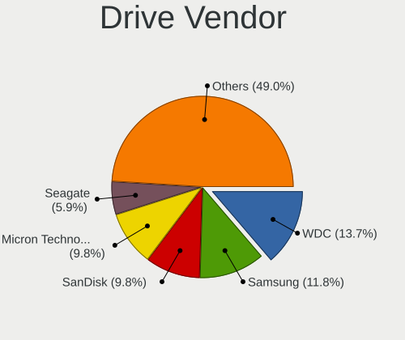

| Vendor                    | Notebooks | Drives | Percent |
|---------------------------|-----------|--------|---------|
| WDC                       | 7         | 7      | 13.73%  |
| Samsung Electronics       | 6         | 6      | 11.76%  |
| SanDisk                   | 5         | 5      | 9.8%    |
| Micron Technology         | 5         | 6      | 9.8%    |
| Seagate                   | 3         | 3      | 5.88%   |
| Kingston                  | 3         | 3      | 5.88%   |
| HGST                      | 3         | 3      | 5.88%   |
| Apple                     | 3         | 3      | 5.88%   |
| Toshiba                   | 2         | 2      | 3.92%   |
| SK hynix                  | 2         | 3      | 3.92%   |
| Intel                     | 2         | 2      | 3.92%   |
| Crucial                   | 2         | 2      | 3.92%   |
| Wibtek                    | 1         | 1      | 1.96%   |
| Unknown                   | 1         | 1      | 1.96%   |
| Transcend                 | 1         | 1      | 1.96%   |
| Team                      | 1         | 1      | 1.96%   |
| SSSTC                     | 1         | 1      | 1.96%   |
| Patriot                   | 1         | 1      | 1.96%   |
| Micron/Crucial Technology | 1         | 1      | 1.96%   |
| HECTRON                   | 1         | 1      | 1.96%   |

Drive Model
-----------

Hard drive models

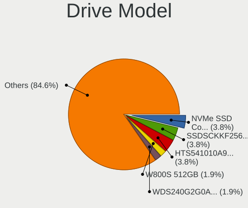

| Model                                                 | Notebooks | Percent |
|-------------------------------------------------------|-----------|---------|
| Samsung NVMe SSD Controller PM9A1/PM9A3/980PRO 1TB    | 2         | 3.85%   |
| Intel SSDSCKKF256G8 SATA 256GB                        | 2         | 3.85%   |
| HGST HTS541010A9E680 1TB                              | 2         | 3.85%   |
| Wibtek W800S 512GB                                    | 1         | 1.92%   |
| WDC WDS240G2G0A-00JH30 240GB SSD                      | 1         | 1.92%   |
| WDC WD5000LPVX-75V0TT0 500GB                          | 1         | 1.92%   |
| WDC WD5000LPVX-08V0TT5 500GB                          | 1         | 1.92%   |
| WDC WD3200LPVX-08V0TT5 320GB                          | 1         | 1.92%   |
| WDC WD10SPZX-24Z10 1TB                                | 1         | 1.92%   |
| WDC WD10SPZX-22Z10T0 1TB                              | 1         | 1.92%   |
| WDC WD10JPVX-60JC3T1 1TB                              | 1         | 1.92%   |
| Unknown MMC Card  128GB                               | 1         | 1.92%   |
| Transcend TS64GMTS400 64GB SSD                        | 1         | 1.92%   |
| Toshiba MQ04ABF100 1TB                                | 1         | 1.92%   |
| Toshiba MQ01ABD032 320GB                              | 1         | 1.92%   |
| Team TM8PS7512G 512GB SSD                             | 1         | 1.92%   |
| SSSTC CVB-8D128-HP 128GB                              | 1         | 1.92%   |
| SK hynix SKHynix_HFS512GD9TNG-L3A0B 512GB             | 1         | 1.92%   |
| SK hynix NVMe SSD Drive 512GB                         | 1         | 1.92%   |
| SK hynix HFM512GD3JX016N 512GB                        | 1         | 1.92%   |
| Seagate ST9500325AS 500GB                             | 1         | 1.92%   |
| Seagate ST500LM012 HN-M500MBB 500GB                   | 1         | 1.92%   |
| Seagate ST1000LM035-1RK172 1TB                        | 1         | 1.92%   |
| SanDisk X300 MSATA 128GB SSD                          | 1         | 1.92%   |
| Sandisk WD Blue SN550 NVMe SSD 1024GB                 | 1         | 1.92%   |
| Sandisk WD Black 2018/SN750 / PC SN720 NVMe SSD 512GB | 1         | 1.92%   |
| SanDisk SSD PLUS 120 GB                               | 1         | 1.92%   |
| SanDisk SD8SN8U512G1002 512GB SSD                     | 1         | 1.92%   |
| Samsung SSD 990 PRO 2TB                               | 1         | 1.92%   |
| Samsung SSD 860 EVO 500GB                             | 1         | 1.92%   |
| Samsung NVMe SSD Drive 256GB                          | 1         | 1.92%   |
| Samsung MZVL8512HELU-00BTW 512GB                      | 1         | 1.92%   |
| Patriot Burst Elite 120GB SSD                         | 1         | 1.92%   |
| Micron/Crucial P2 NVMe PCIe SSD 2TB                   | 1         | 1.92%   |
| Micron MTFDKCD512TFK 512GB                            | 1         | 1.92%   |
| Micron MTFDKBA1T0QFM-1BD1AABGB 1024GB                 | 1         | 1.92%   |
| Micron 2400_MTFDKBA1T0QFM 1TB                         | 1         | 1.92%   |
| Micron 1100_MTFDDAV256TBN 256GB SSD                   | 1         | 1.92%   |
| Micron 1100_MTFDDAK256TBN 256GB SSD                   | 1         | 1.92%   |
| Kingston SM2280S3120G 120GB SSD                       | 1         | 1.92%   |

HDD Vendor
----------

Hard disk drive vendors

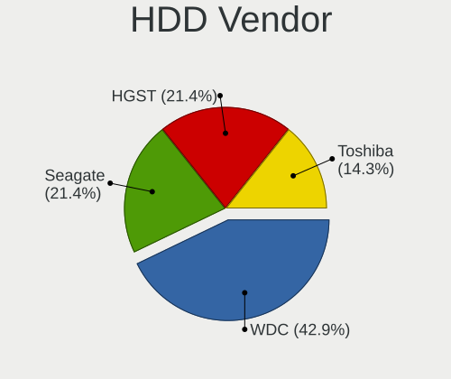

| Vendor  | Notebooks | Drives | Percent |
|---------|-----------|--------|---------|
| WDC     | 6         | 6      | 42.86%  |
| Seagate | 3         | 3      | 21.43%  |
| HGST    | 3         | 3      | 21.43%  |
| Toshiba | 2         | 2      | 14.29%  |

SSD Vendor
----------

Solid state drive vendors

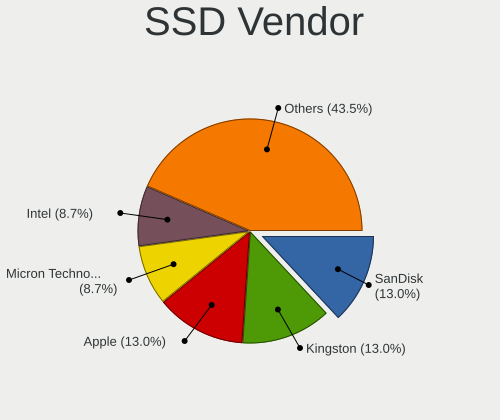

| Vendor              | Notebooks | Drives | Percent |
|---------------------|-----------|--------|---------|
| SanDisk             | 3         | 3      | 13.04%  |
| Kingston            | 3         | 3      | 13.04%  |
| Apple               | 3         | 3      | 13.04%  |
| Micron Technology   | 2         | 2      | 8.7%    |
| Intel               | 2         | 2      | 8.7%    |
| Crucial             | 2         | 2      | 8.7%    |
| Wibtek              | 1         | 1      | 4.35%   |
| WDC                 | 1         | 1      | 4.35%   |
| Transcend           | 1         | 1      | 4.35%   |
| Team                | 1         | 1      | 4.35%   |
| SSSTC               | 1         | 1      | 4.35%   |
| Samsung Electronics | 1         | 1      | 4.35%   |
| Patriot             | 1         | 1      | 4.35%   |
| HECTRON             | 1         | 1      | 4.35%   |

Drive Kind
----------

HDD or SSD

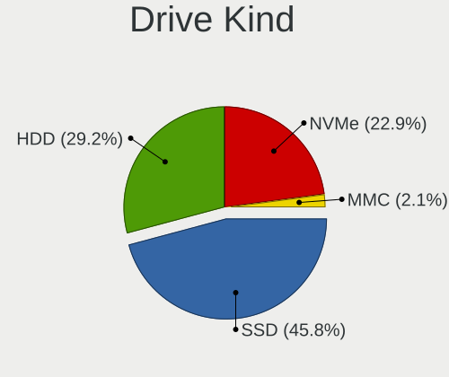

| Kind | Notebooks | Drives | Percent |
|------|-----------|--------|---------|
| SSD  | 22        | 23     | 45.83%  |
| HDD  | 14        | 14     | 29.17%  |
| NVMe | 11        | 15     | 22.92%  |
| MMC  | 1         | 1      | 2.08%   |

Drive Connector
---------------

SATA, SAS, NVMe, etc.

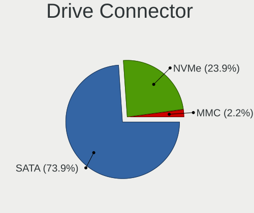

| Type | Notebooks | Drives | Percent |
|------|-----------|--------|---------|
| SATA | 34        | 37     | 73.91%  |
| NVMe | 11        | 15     | 23.91%  |
| MMC  | 1         | 1      | 2.17%   |

Drive Size
----------

Size of hard drive

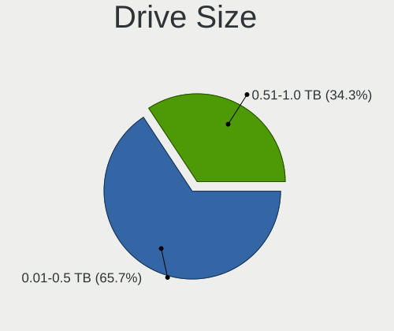

| Size in TB | Notebooks | Drives | Percent |
|------------|-----------|--------|---------|
| 0.01-0.5   | 23        | 24     | 65.71%  |
| 0.51-1.0   | 12        | 13     | 34.29%  |

Space Total
-----------

Amount of disk space available on the file system

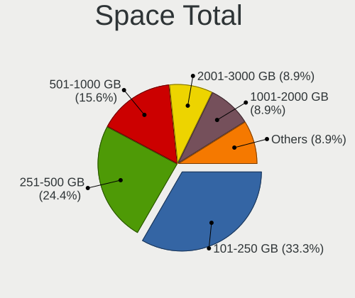

| Size in GB     | Notebooks | Percent |
|----------------|-----------|---------|
| 101-250        | 15        | 33.33%  |
| 251-500        | 11        | 24.44%  |
| 501-1000       | 7         | 15.56%  |
| 2001-3000      | 4         | 8.89%   |
| 1001-2000      | 4         | 8.89%   |
| 51-100         | 2         | 4.44%   |
| More than 3000 | 1         | 2.22%   |
| 1-20           | 1         | 2.22%   |

Space Used
----------

Amount of used disk space

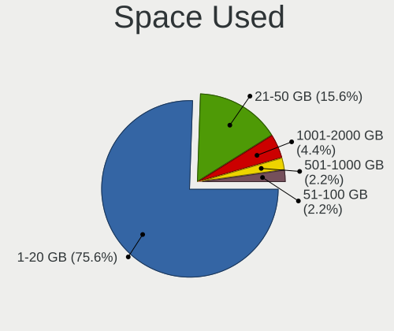

| Used GB   | Notebooks | Percent |
|-----------|-----------|---------|
| 1-20      | 34        | 75.56%  |
| 21-50     | 7         | 15.56%  |
| 1001-2000 | 2         | 4.44%   |
| 501-1000  | 1         | 2.22%   |
| 51-100    | 1         | 2.22%   |

Malfunc. Drives
---------------

Drive models with a malfunction

Zero info for selected period =(

Malfunc. Drive Vendor
---------------------

Vendors of faulty drives

Zero info for selected period =(

Malfunc. HDD Vendor
-------------------

Vendors of faulty HDD drives

Zero info for selected period =(

Malfunc. Drive Kind
-------------------

Kinds of faulty drives

Zero info for selected period =(

Failed Drives
-------------

Failed drive models

Zero info for selected period =(

Failed Drive Vendor
-------------------

Failed drive vendors

Zero info for selected period =(

Drive Status
------------

Number of failed and malfunc. drives

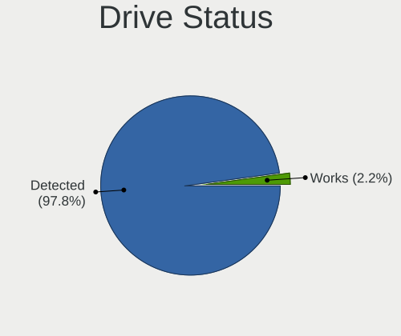

| Status   | Notebooks | Drives | Percent |
|----------|-----------|--------|---------|
| Detected | 45        | 52     | 97.83%  |
| Works    | 1         | 1      | 2.17%   |

Storage controller
------------------

Storage Vendor
--------------

Storage controller vendors

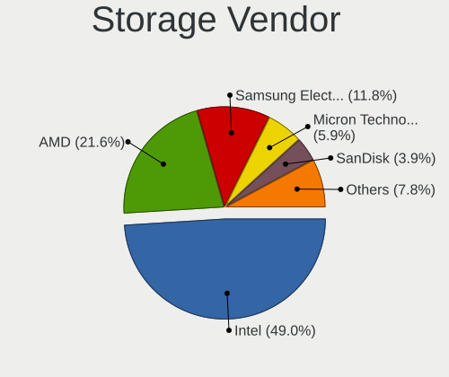

| Vendor                    | Notebooks | Percent |
|---------------------------|-----------|---------|
| Intel                     | 25        | 49.02%  |
| AMD                       | 11        | 21.57%  |
| Samsung Electronics       | 6         | 11.76%  |
| Micron Technology         | 3         | 5.88%   |
| SK hynix                  | 2         | 3.92%   |
| SanDisk                   | 2         | 3.92%   |
| Micron/Crucial Technology | 1         | 1.96%   |
| Marvell Technology Group  | 1         | 1.96%   |

Storage Model
-------------

Storage controller models

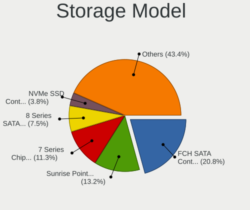

| Model                                                                            | Notebooks | Percent |
|----------------------------------------------------------------------------------|-----------|---------|
| AMD FCH SATA Controller [AHCI mode]                                              | 11        | 20.75%  |
| Intel Sunrise Point-LP SATA Controller [AHCI mode]                               | 7         | 13.21%  |
| Intel 7 Series Chipset Family 6-port SATA Controller [AHCI mode]                 | 6         | 11.32%  |
| Intel 8 Series SATA Controller 1 [AHCI mode]                                     | 4         | 7.55%   |
| Samsung NVMe SSD Controller PM9A1/PM9A3/980PRO                                   | 2         | 3.77%   |
| Micron 2400 NVMe SSD (DRAM-less)                                                 | 2         | 3.77%   |
| Intel Atom/Celeron/Pentium Processor x5-E8000/J3xxx/N3xxx Series SATA Controller | 2         | 3.77%   |
| SK hynix PC601 NVMe Solid State Drive                                            | 1         | 1.89%   |
| SK hynix Gold P31/BC711/PC711 NVMe Solid State Drive                             | 1         | 1.89%   |
| SanDisk Ultra 3D / WD PC SN530, IX SN530, Blue SN550 NVMe SSD (DRAM-less)        | 1         | 1.89%   |
| SanDisk Extreme Pro / WD Black 2018/SN750/PC SN720 NVMe SSD                      | 1         | 1.89%   |
| Samsung S4LN058A01[SSUBX] AHCI SSD Controller (Apple slot)                       | 1         | 1.89%   |
| Samsung NVMe SSD Controller S4LV008[Pascal]                                      | 1         | 1.89%   |
| Samsung NVMe SSD Controller PM9C1a (DRAM-less)                                   | 1         | 1.89%   |
| Samsung NVMe SSD Controller 980 (DRAM-less)                                      | 1         | 1.89%   |
| Micron/Crucial P2 [Nick P2] / P3 / P3 Plus NVMe PCIe SSD (DRAM-less)             | 1         | 1.89%   |
| Micron 2450 NVMe SSD [HendrixV] (DRAM-less)                                      | 1         | 1.89%   |
| Marvell Group 88SS9183 PCIe SSD Controller                                       | 1         | 1.89%   |
| Intel RST Volume Management Device Controller                                    | 1         | 1.89%   |
| Intel HM170/QM170 Chipset SATA Controller [AHCI Mode]                            | 1         | 1.89%   |
| Intel Cannon Point-LP SATA Controller [AHCI Mode]                                | 1         | 1.89%   |
| Intel 82801HM/HEM (ICH8M/ICH8M-E) SATA Controller [AHCI mode]                    | 1         | 1.89%   |
| Intel 82801HM/HEM (ICH8M/ICH8M-E) IDE Controller                                 | 1         | 1.89%   |
| Intel 8 Series/C220 Series Chipset Family 6-port SATA Controller 1 [AHCI mode]   | 1         | 1.89%   |
| Intel 6 Series/C200 Series Chipset Family 6 port Mobile SATA AHCI Controller     | 1         | 1.89%   |
| AMD FCH IDE Controller                                                           | 1         | 1.89%   |

Storage Kind
------------

Kind of storage controller (IDE, SATA, NVMe, SAS, ...)

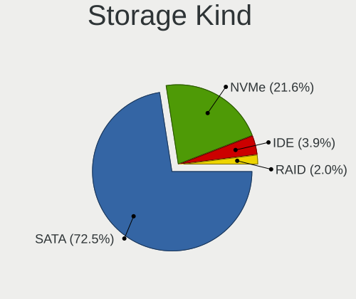

| Kind | Notebooks | Percent |
|------|-----------|---------|
| SATA | 37        | 72.55%  |
| NVMe | 11        | 21.57%  |
| IDE  | 2         | 3.92%   |
| RAID | 1         | 1.96%   |

Processor
---------

CPU Vendor
----------

Processor vendors

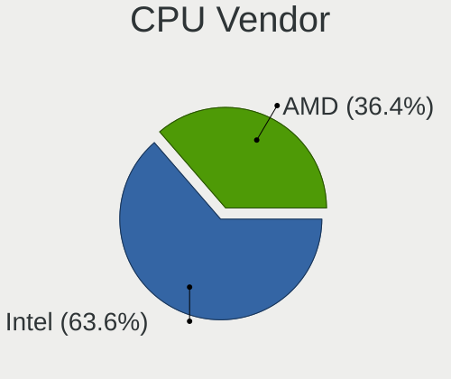

| Vendor | Notebooks | Percent |
|--------|-----------|---------|
| Intel  | 30        | 66.67%  |
| AMD    | 15        | 33.33%  |

CPU Model
---------

Processor models

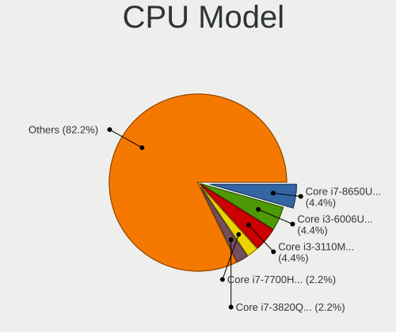

| Model                                         | Notebooks | Percent |
|-----------------------------------------------|-----------|---------|
| Intel Core i7-8650U CPU @ 1.90GHz             | 2         | 4.44%   |
| Intel Core i3-6006U CPU @ 2.00GHz             | 2         | 4.44%   |
| Intel Core i3-3110M CPU @ 2.40GHz             | 2         | 4.44%   |
| Intel Core i7-7700HQ CPU @ 2.80GHz            | 1         | 2.22%   |
| Intel Core i7-3820QM CPU @ 2.70GHz            | 1         | 2.22%   |
| Intel Core i5-8350U CPU @ 1.70GHz             | 1         | 2.22%   |
| Intel Core i5-8265U CPU @ 1.60GHz             | 1         | 2.22%   |
| Intel Core i5-8250U CPU @ 1.60GHz             | 1         | 2.22%   |
| Intel Core i5-6200U CPU @ 2.30GHz             | 1         | 2.22%   |
| Intel Core i5-4260U CPU @ 1.40GHz             | 1         | 2.22%   |
| Intel Core i5-4258U CPU @ 2.40GHz             | 1         | 2.22%   |
| Intel Core i5-4210U CPU @ 1.70GHz             | 1         | 2.22%   |
| Intel Core i5-4200U CPU @ 1.60GHz             | 1         | 2.22%   |
| Intel Core i5-4200M CPU @ 2.50GHz             | 1         | 2.22%   |
| Intel Core i5-3337U CPU @ 1.80GHz             | 1         | 2.22%   |
| Intel Core i5-2415M CPU @ 2.30GHz             | 1         | 2.22%   |
| Intel Core i3-7020U CPU @ 2.30GHz             | 1         | 2.22%   |
| Intel Core i3-4030U CPU @ 1.90GHz             | 1         | 2.22%   |
| Intel Core i3-3227U CPU @ 1.90GHz             | 1         | 2.22%   |
| Intel Core i3-2375M CPU @ 1.50GHz             | 1         | 2.22%   |
| Intel Core 2 Duo CPU T8100 @ 2.10GHz          | 1         | 2.22%   |
| Intel Celeron CPU N3050 @ 1.60GHz             | 1         | 2.22%   |
| Intel Celeron 2957U @ 1.40GHz                 | 1         | 2.22%   |
| Intel Atom x5-E8000 CPU @ 1.04GHz             | 1         | 2.22%   |
| Intel 13th Gen Core i9-13900H                 | 1         | 2.22%   |
| Intel 13th Gen Core i7-13700H                 | 1         | 2.22%   |
| Intel 13th Gen Core i5-13420H                 | 1         | 2.22%   |
| AMD Ryzen AI 9 HX 370 w/ Radeon 890M          | 1         | 2.22%   |
| AMD Ryzen 9 3950X 16-Core Processor           | 1         | 2.22%   |
| AMD Ryzen 7 4800H with Radeon Graphics        | 1         | 2.22%   |
| AMD Ryzen 7 4700U with Radeon Graphics        | 1         | 2.22%   |
| AMD Ryzen 7 3700U with Radeon Vega Mobile Gfx | 1         | 2.22%   |
| AMD Ryzen 5 5625U with Radeon Graphics        | 1         | 2.22%   |
| AMD Ryzen 5 5500U with Radeon Graphics        | 1         | 2.22%   |
| AMD Ryzen 5 3550H with Radeon Vega Mobile Gfx | 1         | 2.22%   |
| AMD Ryzen 5 3500U with Radeon Vega Mobile Gfx | 1         | 2.22%   |
| AMD E1-1200 APU with Radeon HD Graphics       | 1         | 2.22%   |
| AMD Athlon Silver 3050U with Radeon Graphics  | 1         | 2.22%   |
| AMD A9-9420 RADEON R5, 5 COMPUTE CORES 2C+3G  | 1         | 2.22%   |
| AMD A8-7410 APU with AMD Radeon R5 Graphics   | 1         | 2.22%   |

CPU Model Family
----------------

Processor model prefix

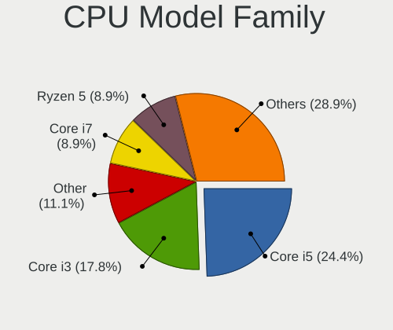

| Model            | Notebooks | Percent |
|------------------|-----------|---------|
| Intel Core i5    | 11        | 24.44%  |
| Intel Core i3    | 8         | 17.78%  |
| Other            | 5         | 11.11%  |
| Intel Core i7    | 4         | 8.89%   |
| AMD Ryzen 5      | 4         | 8.89%   |
| AMD Ryzen 7      | 3         | 6.67%   |
| Intel Celeron    | 2         | 4.44%   |
| AMD A8           | 2         | 4.44%   |
| Intel Core 2 Duo | 1         | 2.22%   |
| Intel Atom       | 1         | 2.22%   |
| AMD Ryzen 9      | 1         | 2.22%   |
| AMD E1           | 1         | 2.22%   |
| AMD Athlon       | 1         | 2.22%   |
| AMD A10          | 1         | 2.22%   |

CPU Cores
---------

Number of processor cores

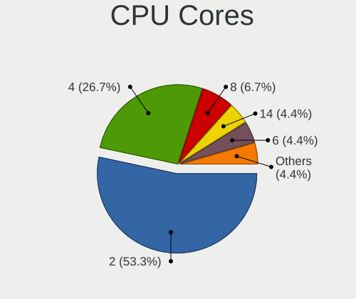

| Number | Notebooks | Percent |
|--------|-----------|---------|
| 2      | 24        | 53.33%  |
| 4      | 12        | 26.67%  |
| 8      | 3         | 6.67%   |
| 14     | 2         | 4.44%   |
| 6      | 2         | 4.44%   |
| 16     | 1         | 2.22%   |
| 12     | 1         | 2.22%   |

CPU Sockets
-----------

Number of sockets

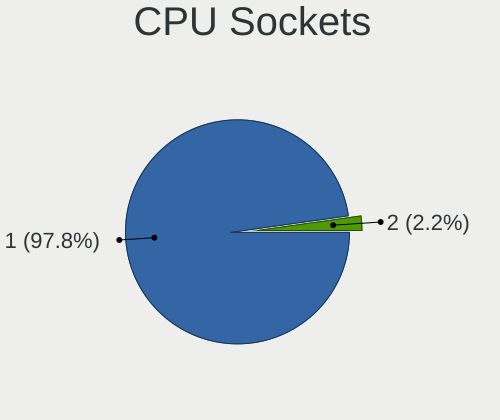

| Number | Notebooks | Percent |
|--------|-----------|---------|
| 1      | 44        | 97.78%  |
| 2      | 1         | 2.22%   |

CPU Threads
-----------

Threads per core (Hyper-Threading)

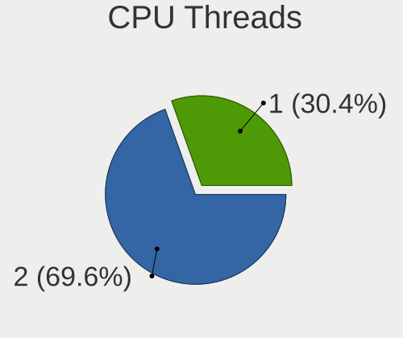

| Number | Notebooks | Percent |
|--------|-----------|---------|
| 2      | 36        | 80%     |
| 1      | 9         | 20%     |

CPU Op-Modes
------------

CPU Operation Modes (32-bit, 64-bit)

| Op mode        | Notebooks | Percent |
|----------------|-----------|---------|
| 32-bit, 64-bit | 45        | 100%    |

CPU Microcode
-------------

Microcode number

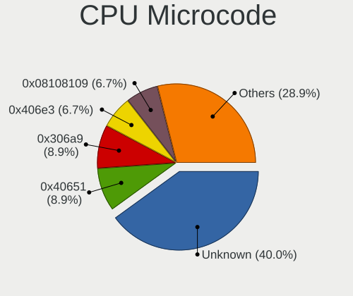

| Number     | Notebooks | Percent |
|------------|-----------|---------|
| Unknown    | 18        | 40%     |
| 0x40651    | 4         | 8.89%   |
| 0x306a9    | 4         | 8.89%   |
| 0x406e3    | 3         | 6.67%   |
| 0x08108109 | 3         | 6.67%   |
| 0x206a7    | 2         | 4.44%   |
| 0x06001119 | 2         | 4.44%   |
| 0x806ec    | 1         | 2.22%   |
| 0x806ea    | 1         | 2.22%   |
| 0x806e9    | 1         | 2.22%   |
| 0x406c4    | 1         | 2.22%   |
| 0x406c3    | 1         | 2.22%   |
| 0x306c3    | 1         | 2.22%   |
| 0x08600106 | 1         | 2.22%   |
| 0x07030105 | 1         | 2.22%   |
| 0x0500010d | 1         | 2.22%   |

CPU Microarch
-------------

Microarchitecture

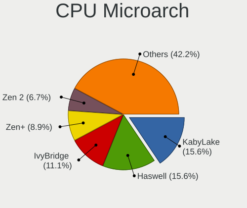

| Name             | Notebooks | Percent |
|------------------|-----------|---------|
| KabyLake         | 7         | 15.56%  |
| Haswell          | 7         | 15.56%  |
| IvyBridge        | 5         | 11.11%  |
| Zen+             | 4         | 8.89%   |
| Zen 2            | 3         | 6.67%   |
| Skylake          | 3         | 6.67%   |
| Alderlake Hybrid | 3         | 6.67%   |
| Silvermont       | 2         | 4.44%   |
| SandyBridge      | 2         | 4.44%   |
| Piledriver       | 2         | 4.44%   |
| Unknown          | 2         | 4.44%   |
| Zen 3            | 1         | 2.22%   |
| Puma             | 1         | 2.22%   |
| Penryn           | 1         | 2.22%   |
| Excavator        | 1         | 2.22%   |
| Bobcat           | 1         | 2.22%   |

Graphics
--------

GPU Vendor
----------

Vendors of graphics cards

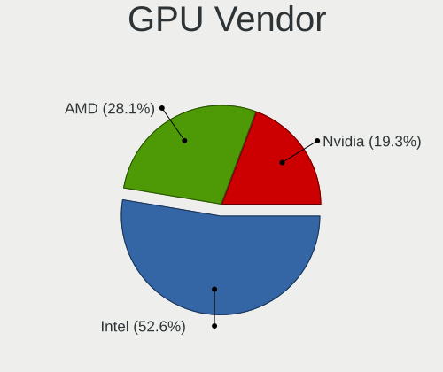

| Vendor | Notebooks | Percent |
|--------|-----------|---------|
| Intel  | 30        | 52.63%  |
| AMD    | 16        | 28.07%  |
| Nvidia | 11        | 19.3%   |

GPU Model
---------

Graphics card models

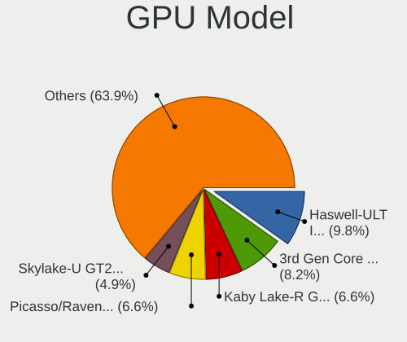

| Model                                                                                    | Notebooks | Percent |
|------------------------------------------------------------------------------------------|-----------|---------|
| Intel Haswell-ULT Integrated Graphics Controller                                         | 6         | 9.84%   |
| Intel 3rd Gen Core processor Graphics Controller                                         | 5         | 8.2%    |
| Intel Kaby Lake-R GT2 [UHD Graphics 620]                                                 | 4         | 6.56%   |
| AMD Picasso/Raven 2 [Radeon Vega Series / Radeon Vega Mobile Series]                     | 4         | 6.56%   |
| Intel Skylake-U GT2 [HD Graphics 520]                                                    | 3         | 4.92%   |
| Nvidia GF117M [GeForce 610M/710M/810M/820M / GT 620M/625M/630M/720M]                     | 2         | 3.28%   |
| Intel Raptor Lake-P [Iris Xe Graphics]                                                   | 2         | 3.28%   |
| Intel Atom/Celeron/Pentium Processor x5-E8000/J3xxx/N3xxx Integrated Graphics Controller | 2         | 3.28%   |
| Intel 2nd Generation Core Processor Family Integrated Graphics Controller                | 2         | 3.28%   |
| AMD Topaz XT [Radeon R7 M260/M265 / M340/M360 / M440/M445 / 530/535 / 620/625 Mobile]    | 2         | 3.28%   |
| AMD Renoir [Radeon Vega Series / Radeon Vega Mobile Series]                              | 2         | 3.28%   |
| Nvidia TU117M [GeForce GTX 1650 Mobile / Max-Q]                                          | 1         | 1.64%   |
| Nvidia GP107M [GeForce GTX 1050 Ti Mobile]                                               | 1         | 1.64%   |
| Nvidia GP107M [GeForce GTX 1050 3 GB Max-Q]                                              | 1         | 1.64%   |
| Nvidia GM108M [GeForce MX130]                                                            | 1         | 1.64%   |
| Nvidia GM108M [GeForce 840M]                                                             | 1         | 1.64%   |
| Nvidia GK208M [GeForce GT 740M]                                                          | 1         | 1.64%   |
| Nvidia GK107M [GeForce GT 650M Mac Edition]                                              | 1         | 1.64%   |
| Nvidia GF108M [GeForce GT 620M/630M/635M/640M LE]                                        | 1         | 1.64%   |
| Nvidia AD106M [GeForce RTX 4070 Max-Q / Mobile]                                          | 1         | 1.64%   |
| Intel WhiskeyLake-U GT2 [UHD Graphics 620]                                               | 1         | 1.64%   |
| Intel Raptor Lake-P [UHD Graphics]                                                       | 1         | 1.64%   |
| Intel Mobile GM965/GL960 Integrated Graphics Controller (secondary)                      | 1         | 1.64%   |
| Intel Mobile GM965/GL960 Integrated Graphics Controller (primary)                        | 1         | 1.64%   |
| Intel Kaby Lake-H GT2 [HD Graphics 630]                                                  | 1         | 1.64%   |
| Intel HD Graphics 620                                                                    | 1         | 1.64%   |
| Intel 4th Gen Core Processor Integrated Graphics Controller                              | 1         | 1.64%   |
| AMD Wrestler [Radeon HD 7310]                                                            | 1         | 1.64%   |
| AMD Sun XT [Radeon HD 8670A/8670M/8690M / R5 M330 / M430 / Radeon 520 Mobile]            | 1         | 1.64%   |
| AMD Strix [Radeon 880M / 890M]                                                           | 1         | 1.64%   |
| AMD Stoney [Radeon R2/R3/R4/R5 Graphics]                                                 | 1         | 1.64%   |
| AMD Saturn XT [FirePro M6100]                                                            | 1         | 1.64%   |
| AMD Richland [Radeon HD 8610G]                                                           | 1         | 1.64%   |
| AMD Richland [Radeon HD 8550G]                                                           | 1         | 1.64%   |
| AMD Navi 21 [Radeon RX 6900 XT]                                                          | 1         | 1.64%   |
| AMD Mullins [Radeon R4/R5 Graphics]                                                      | 1         | 1.64%   |
| AMD Lucienne                                                                             | 1         | 1.64%   |
| AMD Barcelo                                                                              | 1         | 1.64%   |

GPU Combo
---------

Combinations of graphics cards

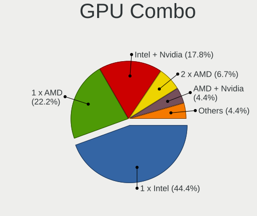

| Name           | Notebooks | Percent |
|----------------|-----------|---------|
| 1 x Intel      | 20        | 44.44%  |
| 1 x AMD        | 10        | 22.22%  |
| Intel + Nvidia | 8         | 17.78%  |
| 2 x AMD        | 3         | 6.67%   |
| AMD + Nvidia   | 2         | 4.44%   |
| 1 x Nvidia     | 1         | 2.22%   |
| Intel + AMD    | 1         | 2.22%   |

GPU Driver
----------

Free vs proprietary

| Driver | Notebooks | Percent |
|--------|-----------|---------|
| Free   | 45        | 100%    |

GPU Memory
----------

Total video memory

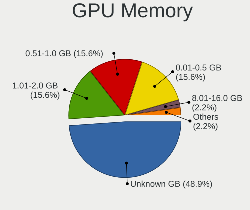

| Size in GB | Notebooks | Percent |
|------------|-----------|---------|
| Unknown    | 22        | 48.89%  |
| 1.01-2.0   | 7         | 15.56%  |
| 0.51-1.0   | 7         | 15.56%  |
| 0.01-0.5   | 7         | 15.56%  |
| 2.01-3.0   | 1         | 2.22%   |
| 8.01-16.0  | 1         | 2.22%   |

Monitor
-------

Monitor Vendor
--------------

Monitor vendors

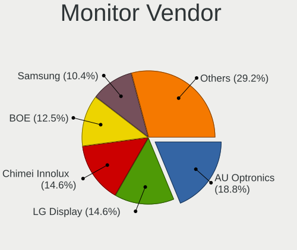

| Vendor              | Notebooks | Percent |
|---------------------|-----------|---------|
| AU Optronics        | 9         | 18.75%  |
| LG Display          | 7         | 14.58%  |
| Chimei Innolux      | 7         | 14.58%  |
| BOE                 | 6         | 12.5%   |
| Samsung Electronics | 5         | 10.42%  |
| Apple               | 5         | 10.42%  |
| TMX                 | 1         | 2.08%   |
| Sharp               | 1         | 2.08%   |
| PANDA               | 1         | 2.08%   |
| Lenovo              | 1         | 2.08%   |
| InfoVision          | 1         | 2.08%   |
| Goldstar            | 1         | 2.08%   |
| Dell                | 1         | 2.08%   |
| ASUSTek Computer    | 1         | 2.08%   |
| AOC                 | 1         | 2.08%   |

Monitor Model
-------------

Monitor models

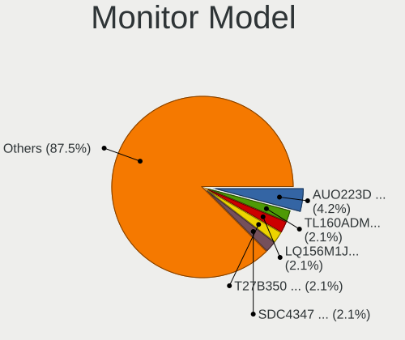

| Model                                                                 | Notebooks | Percent |
|-----------------------------------------------------------------------|-----------|---------|
| AU Optronics LCD Monitor AUO223D 1920x1080 309x174mm 14.0-inch        | 2         | 4.17%   |
| TMX TL160ADMP03-0 TMX1603 2560x1600 345x215mm 16.0-inch               | 1         | 2.08%   |
| Sharp LQ156M1JW01 SHP14C3 1920x1080 344x194mm 15.5-inch               | 1         | 2.08%   |
| Samsung Electronics T27B350 SAM0945 1920x1080 598x336mm 27.0-inch     | 1         | 2.08%   |
| Samsung Electronics LCD Monitor SDC4347 1366x768 344x193mm 15.5-inch  | 1         | 2.08%   |
| Samsung Electronics LCD Monitor SDC418D 3200x2000 344x215mm 16.0-inch | 1         | 2.08%   |
| Samsung Electronics LCD Monitor SDC4178 3200x2000 344x215mm 16.0-inch | 1         | 2.08%   |
| Samsung Electronics LCD Monitor SDC3754 1600x900 382x215mm 17.3-inch  | 1         | 2.08%   |
| PANDA LCD Monitor NCP0064 1920x1080 344x194mm 15.5-inch               | 1         | 2.08%   |
| LG Display LCD Monitor LGD05EC 1920x1080 309x174mm 14.0-inch          | 1         | 2.08%   |
| LG Display LCD Monitor LGD04B3 1920x1080 345x194mm 15.6-inch          | 1         | 2.08%   |
| LG Display LCD Monitor LGD045C 1366x768 345x194mm 15.6-inch           | 1         | 2.08%   |
| LG Display LCD Monitor LGD03AB 1366x768 344x194mm 15.5-inch           | 1         | 2.08%   |
| LG Display LCD Monitor LGD039F 1366x768 345x194mm 15.6-inch           | 1         | 2.08%   |
| LG Display LCD Monitor LGD0372 1600x900 382x215mm 17.3-inch           | 1         | 2.08%   |
| LG Display LCD Monitor LGD02DA 1920x1080 382x215mm 17.3-inch          | 1         | 2.08%   |
| Lenovo LCD Monitor LEN40A9 1920x1080 309x173mm 13.9-inch              | 1         | 2.08%   |
| InfoVision LCD Monitor IVO057D 1920x1080 309x174mm 14.0-inch          | 1         | 2.08%   |
| Goldstar HDR WQHD+ GSM774D 3840x1600 879x366mm 37.5-inch              | 1         | 2.08%   |
| Dell P2421D DELD0FF 2560x1440 527x296mm 23.8-inch                     | 1         | 2.08%   |
| Chimei Innolux LCD Monitor CMN15E7 1920x1080 344x193mm 15.5-inch      | 1         | 2.08%   |
| Chimei Innolux LCD Monitor CMN15E6 1366x768 344x193mm 15.5-inch       | 1         | 2.08%   |
| Chimei Innolux LCD Monitor CMN15D6 1920x1080 344x193mm 15.5-inch      | 1         | 2.08%   |
| Chimei Innolux LCD Monitor CMN15BB 1920x1080 344x194mm 15.5-inch      | 1         | 2.08%   |
| Chimei Innolux LCD Monitor CMN14C9 1920x1080 309x173mm 13.9-inch      | 1         | 2.08%   |
| Chimei Innolux LCD Monitor CMN1239 1920x1080 276x155mm 12.5-inch      | 1         | 2.08%   |
| Chimei Innolux LCD Monitor CMN1130 1366x768 256x144mm 11.6-inch       | 1         | 2.08%   |
| BOE LCD Monitor BOE0802 1920x1080 344x193mm 15.5-inch                 | 1         | 2.08%   |
| BOE LCD Monitor BOE07B5 1366x768 309x173mm 13.9-inch                  | 1         | 2.08%   |
| BOE LCD Monitor BOE06A4 1366x768 344x194mm 15.5-inch                  | 1         | 2.08%   |
| BOE LCD Monitor BOE0671 1366x768 344x194mm 15.5-inch                  | 1         | 2.08%   |
| BOE LCD Monitor BOE065F 1920x1080 344x194mm 15.5-inch                 | 1         | 2.08%   |
| BOE LCD Monitor BOE0615 1366x768 309x173mm 13.9-inch                  | 1         | 2.08%   |
| AU Optronics LCD Monitor AUODF87 1920x1080 344x193mm 15.5-inch        | 1         | 2.08%   |
| AU Optronics LCD Monitor AUO683D 1920x1080 309x174mm 14.0-inch        | 1         | 2.08%   |
| AU Optronics LCD Monitor AUO48EC 1366x768 344x193mm 15.5-inch         | 1         | 2.08%   |
| AU Optronics LCD Monitor AUO305D 1920x1080 256x144mm 11.6-inch        | 1         | 2.08%   |
| AU Optronics LCD Monitor AUO233C 1366x768 309x173mm 13.9-inch         | 1         | 2.08%   |
| AU Optronics LCD Monitor AUO162C 1366x768 293x164mm 13.2-inch         | 1         | 2.08%   |
| AU Optronics LCD Monitor AUO159E 1600x900 382x214mm 17.2-inch         | 1         | 2.08%   |

Monitor Resolution
------------------

Monitor screen resolution

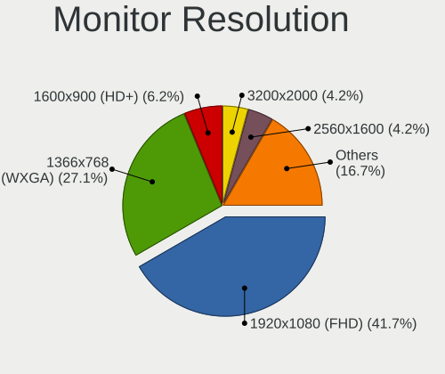

| Resolution       | Notebooks | Percent |
|------------------|-----------|---------|
| 1920x1080 (FHD)  | 20        | 41.67%  |
| 1366x768 (WXGA)  | 13        | 27.08%  |
| 1600x900 (HD+)   | 3         | 6.25%   |
| 3200x2000        | 2         | 4.17%   |
| 2560x1600        | 2         | 4.17%   |
| 2560x1440 (QHD)  | 2         | 4.17%   |
| 1280x800 (WXGA)  | 2         | 4.17%   |
| 3840x2160 (4K)   | 1         | 2.08%   |
| 3840x1600        | 1         | 2.08%   |
| 2880x1800        | 1         | 2.08%   |
| 1440x900 (WXGA+) | 1         | 2.08%   |

Monitor Diagonal
----------------

Diagonal size in inches

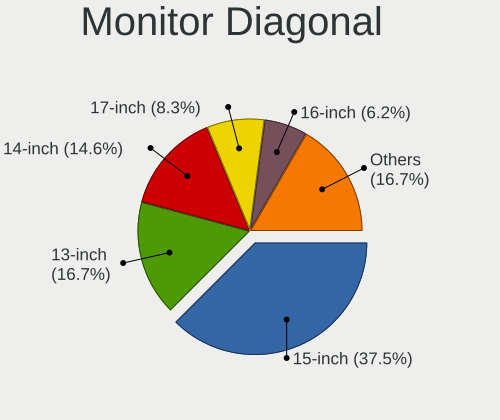

| Inches | Notebooks | Percent |
|--------|-----------|---------|
| 15     | 18        | 37.5%   |
| 13     | 8         | 16.67%  |
| 14     | 7         | 14.58%  |
| 17     | 4         | 8.33%   |
| 16     | 3         | 6.25%   |
| 27     | 2         | 4.17%   |
| 11     | 2         | 4.17%   |
| 37     | 1         | 2.08%   |
| 31     | 1         | 2.08%   |
| 24     | 1         | 2.08%   |
| 12     | 1         | 2.08%   |

Monitor Width
-------------

Physical width

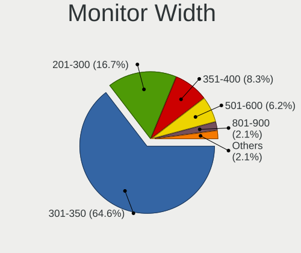

| Width in mm | Notebooks | Percent |
|-------------|-----------|---------|
| 301-350     | 31        | 64.58%  |
| 201-300     | 8         | 16.67%  |
| 351-400     | 4         | 8.33%   |
| 501-600     | 3         | 6.25%   |
| 801-900     | 1         | 2.08%   |
| 601-700     | 1         | 2.08%   |

Aspect Ratio
------------

Proportional relationship between the width and the height

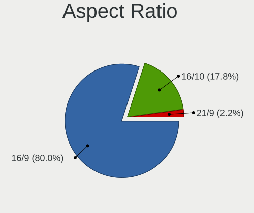

| Ratio | Notebooks | Percent |
|-------|-----------|---------|
| 16/9  | 36        | 80%     |
| 16/10 | 8         | 17.78%  |
| 21/9  | 1         | 2.22%   |

Monitor Area
------------

Area in inch²

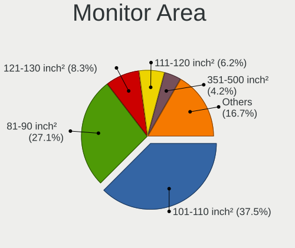

| Area in inch² | Notebooks | Percent |
|----------------|-----------|---------|
| 101-110        | 18        | 37.5%   |
| 81-90          | 13        | 27.08%  |
| 121-130        | 4         | 8.33%   |
| 111-120        | 3         | 6.25%   |
| 71-80          | 2         | 4.17%   |
| 51-60          | 2         | 4.17%   |
| 351-500        | 2         | 4.17%   |
| 301-350        | 2         | 4.17%   |
| 61-70          | 1         | 2.08%   |
| 201-250        | 1         | 2.08%   |

Pixel Density
-------------

Pixels per inch

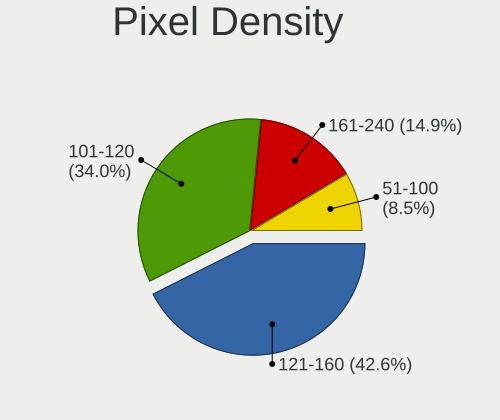

| Density | Notebooks | Percent |
|---------|-----------|---------|
| 121-160 | 20        | 42.55%  |
| 101-120 | 16        | 34.04%  |
| 161-240 | 7         | 14.89%  |
| 51-100  | 4         | 8.51%   |

Multiple Monitors
-----------------

Total monitors connected

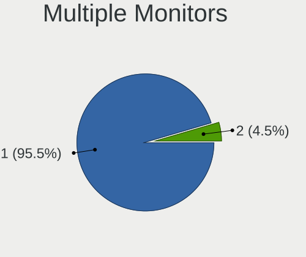

| Total | Notebooks | Percent |
|-------|-----------|---------|
| 1     | 41        | 91.11%  |
| 2     | 4         | 8.89%   |

Network
-------

Net Controller Vendor
---------------------

Controller vendors

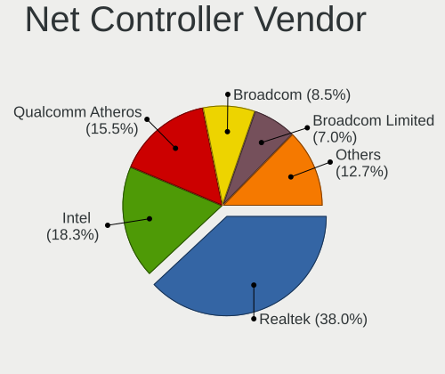

| Vendor                   | Notebooks | Percent |
|--------------------------|-----------|---------|
| Realtek Semiconductor    | 27        | 38.03%  |
| Intel                    | 13        | 18.31%  |
| Qualcomm Atheros         | 11        | 15.49%  |
| Broadcom                 | 6         | 8.45%   |
| Broadcom Limited         | 5         | 7.04%   |
| MediaTek                 | 3         | 4.23%   |
| ASIX Electronics         | 2         | 2.82%   |
| TP-Link                  | 1         | 1.41%   |
| Ralink                   | 1         | 1.41%   |
| Marvell Technology Group | 1         | 1.41%   |
| Google                   | 1         | 1.41%   |

Net Controller Model
--------------------

Controller models

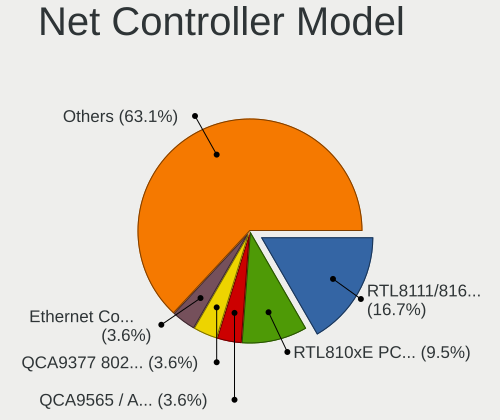

| Model                                                                  | Notebooks | Percent |
|------------------------------------------------------------------------|-----------|---------|
| Realtek RTL8111/8168/8211/8411 PCI Express Gigabit Ethernet Controller | 14        | 16.67%  |
| Realtek RTL810xE PCI Express Fast Ethernet controller                  | 8         | 9.52%   |
| Qualcomm Atheros QCA9565 / AR9565 Wireless Network Adapter             | 3         | 3.57%   |
| Qualcomm Atheros QCA9377 802.11ac Wireless Network Adapter             | 3         | 3.57%   |
| Intel Ethernet Connection (4) I219-LM                                  | 3         | 3.57%   |
| Broadcom BCM43142 802.11b/g/n                                          | 3         | 3.57%   |
| Realtek RTL8723BE PCIe Wireless Network Adapter                        | 2         | 2.38%   |
| Realtek RTL8152 Fast Ethernet Adapter                                  | 2         | 2.38%   |
| Qualcomm Atheros QCA6174 802.11ac Wireless Network Adapter             | 2         | 2.38%   |
| Qualcomm Atheros AR9462 Wireless Network Adapter                       | 2         | 2.38%   |
| Intel Wireless 8265 / 8275                                             | 2         | 2.38%   |
| Intel Wi-Fi 6 AX200                                                    | 2         | 2.38%   |
| Intel Raptor Lake PCH CNVi WiFi                                        | 2         | 2.38%   |
| Broadcom Limited BCM4360 802.11ac Dual Band Wireless Network Adapter   | 2         | 2.38%   |
| ASIX AX88179 Gigabit Ethernet                                          | 2         | 2.38%   |
| TP-Link UE300 10/100/1000 LAN (ethernet mode) [Realtek RTL8153]        | 1         | 1.19%   |
| Realtek RTL8852BE PCIe 802.11ax Wireless Network Controller            | 1         | 1.19%   |
| Realtek RTL8822CE 802.11ac PCIe Wireless Network Adapter               | 1         | 1.19%   |
| Realtek RTL8821CE 802.11ac PCIe Wireless Network Adapter               | 1         | 1.19%   |
| Realtek RTL8821AE 802.11ac PCIe Wireless Network Adapter               | 1         | 1.19%   |
| Realtek RTL8723DE Wireless Network Adapter                             | 1         | 1.19%   |
| Realtek RTL8723BU 802.11b/g/n WLAN Adapter                             | 1         | 1.19%   |
| Realtek RTL8188EE Wireless Network Adapter                             | 1         | 1.19%   |
| Realtek RTL8153 Gigabit Ethernet Adapter                               | 1         | 1.19%   |
| Realtek 802.11ac NIC                                                   | 1         | 1.19%   |
| Ralink RT3290 Wireless 802.11n 1T/1R PCIe                              | 1         | 1.19%   |
| Qualcomm Atheros QCA8172 Fast Ethernet                                 | 1         | 1.19%   |
| Qualcomm Atheros AR8151 v2.0 Gigabit Ethernet                          | 1         | 1.19%   |
| MediaTek MT7922 802.11ax PCI Express Wireless Network Adapter          | 1         | 1.19%   |
| MediaTek MT7921 802.11ax PCIe Wireless Network Adapter [Filogic 330]   | 1         | 1.19%   |
| MediaTek MT7902 802.11ax PCIe Wireless Network Adapter [Filogic 310]   | 1         | 1.19%   |
| Marvell Group 88E8058 PCI-E Gigabit Ethernet Controller                | 1         | 1.19%   |
| Intel Wireless 7265                                                    | 1         | 1.19%   |
| Intel Wireless 3165                                                    | 1         | 1.19%   |
| Intel Ethernet Connection I217-LM                                      | 1         | 1.19%   |
| Intel Ethernet Connection (4) I219-V                                   | 1         | 1.19%   |
| Intel Dual Band Wireless-AC 3165 Plus Bluetooth                        | 1         | 1.19%   |
| Intel Centrino Wireless-N 105                                          | 1         | 1.19%   |
| Google Pixel 9a                                                        | 1         | 1.19%   |
| Broadcom NetXtreme BCM57786 Gigabit Ethernet PCIe                      | 1         | 1.19%   |

Wireless Vendor
---------------

Wireless vendors

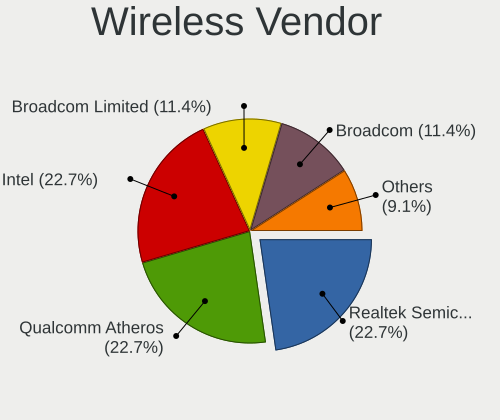

| Vendor                | Notebooks | Percent |
|-----------------------|-----------|---------|
| Realtek Semiconductor | 10        | 22.73%  |
| Qualcomm Atheros      | 10        | 22.73%  |
| Intel                 | 10        | 22.73%  |
| Broadcom Limited      | 5         | 11.36%  |
| Broadcom              | 5         | 11.36%  |
| MediaTek              | 3         | 6.82%   |
| Ralink                | 1         | 2.27%   |

Wireless Model
--------------

Wireless models

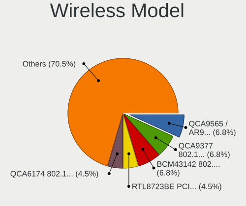

| Model                                                                | Notebooks | Percent |
|----------------------------------------------------------------------|-----------|---------|
| Qualcomm Atheros QCA9565 / AR9565 Wireless Network Adapter           | 3         | 6.82%   |
| Qualcomm Atheros QCA9377 802.11ac Wireless Network Adapter           | 3         | 6.82%   |
| Broadcom BCM43142 802.11b/g/n                                        | 3         | 6.82%   |
| Realtek RTL8723BE PCIe Wireless Network Adapter                      | 2         | 4.55%   |
| Qualcomm Atheros QCA6174 802.11ac Wireless Network Adapter           | 2         | 4.55%   |
| Qualcomm Atheros AR9462 Wireless Network Adapter                     | 2         | 4.55%   |
| Intel Wireless 8265 / 8275                                           | 2         | 4.55%   |
| Intel Wi-Fi 6 AX200                                                  | 2         | 4.55%   |
| Intel Raptor Lake PCH CNVi WiFi                                      | 2         | 4.55%   |
| Broadcom Limited BCM4360 802.11ac Dual Band Wireless Network Adapter | 2         | 4.55%   |
| Realtek RTL8852BE PCIe 802.11ax Wireless Network Controller          | 1         | 2.27%   |
| Realtek RTL8822CE 802.11ac PCIe Wireless Network Adapter             | 1         | 2.27%   |
| Realtek RTL8821CE 802.11ac PCIe Wireless Network Adapter             | 1         | 2.27%   |
| Realtek RTL8821AE 802.11ac PCIe Wireless Network Adapter             | 1         | 2.27%   |
| Realtek RTL8723DE Wireless Network Adapter                           | 1         | 2.27%   |
| Realtek RTL8723BU 802.11b/g/n WLAN Adapter                           | 1         | 2.27%   |
| Realtek RTL8188EE Wireless Network Adapter                           | 1         | 2.27%   |
| Realtek 802.11ac NIC                                                 | 1         | 2.27%   |
| Ralink RT3290 Wireless 802.11n 1T/1R PCIe                            | 1         | 2.27%   |
| MediaTek MT7922 802.11ax PCI Express Wireless Network Adapter        | 1         | 2.27%   |
| MediaTek MT7921 802.11ax PCIe Wireless Network Adapter [Filogic 330] | 1         | 2.27%   |
| MediaTek MT7902 802.11ax PCIe Wireless Network Adapter [Filogic 310] | 1         | 2.27%   |
| Intel Wireless 7265                                                  | 1         | 2.27%   |
| Intel Wireless 3165                                                  | 1         | 2.27%   |
| Intel Dual Band Wireless-AC 3165 Plus Bluetooth                      | 1         | 2.27%   |
| Intel Centrino Wireless-N 105                                        | 1         | 2.27%   |
| Broadcom Limited BCM4352 802.11ac Dual Band Wireless Network Adapter | 1         | 2.27%   |
| Broadcom Limited BCM4331 802.11a/b/g/n                               | 1         | 2.27%   |
| Broadcom Limited BCM43142 802.11b/g/n                                | 1         | 2.27%   |
| Broadcom BCM4331 802.11a/b/g/n                                       | 1         | 2.27%   |
| Broadcom BCM4321 802.11a/b/g/n                                       | 1         | 2.27%   |

Ethernet Vendor
---------------

Ethernet vendors

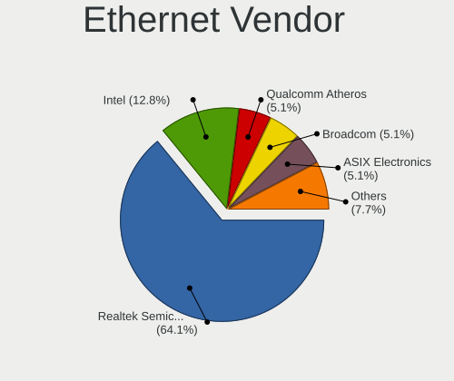

| Vendor                   | Notebooks | Percent |
|--------------------------|-----------|---------|
| Realtek Semiconductor    | 25        | 64.1%   |
| Intel                    | 5         | 12.82%  |
| Qualcomm Atheros         | 2         | 5.13%   |
| Broadcom                 | 2         | 5.13%   |
| ASIX Electronics         | 2         | 5.13%   |
| TP-Link                  | 1         | 2.56%   |
| Marvell Technology Group | 1         | 2.56%   |
| Google                   | 1         | 2.56%   |

Ethernet Model
--------------

Ethernet models

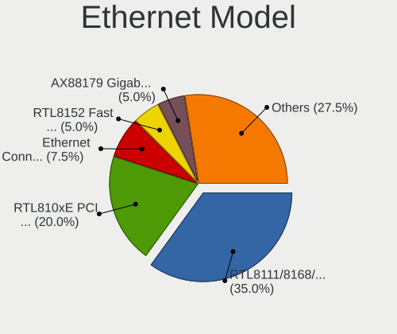

| Model                                                                  | Notebooks | Percent |
|------------------------------------------------------------------------|-----------|---------|
| Realtek RTL8111/8168/8211/8411 PCI Express Gigabit Ethernet Controller | 14        | 35%     |
| Realtek RTL810xE PCI Express Fast Ethernet controller                  | 8         | 20%     |
| Intel Ethernet Connection (4) I219-LM                                  | 3         | 7.5%    |
| Realtek RTL8152 Fast Ethernet Adapter                                  | 2         | 5%      |
| ASIX AX88179 Gigabit Ethernet                                          | 2         | 5%      |
| TP-Link UE300 10/100/1000 LAN (ethernet mode) [Realtek RTL8153]        | 1         | 2.5%    |
| Realtek RTL8153 Gigabit Ethernet Adapter                               | 1         | 2.5%    |
| Qualcomm Atheros QCA8172 Fast Ethernet                                 | 1         | 2.5%    |
| Qualcomm Atheros AR8151 v2.0 Gigabit Ethernet                          | 1         | 2.5%    |
| Marvell Group 88E8058 PCI-E Gigabit Ethernet Controller                | 1         | 2.5%    |
| Intel Ethernet Connection I217-LM                                      | 1         | 2.5%    |
| Intel Ethernet Connection (4) I219-V                                   | 1         | 2.5%    |
| Google Pixel 9a                                                        | 1         | 2.5%    |
| Broadcom NetXtreme BCM57786 Gigabit Ethernet PCIe                      | 1         | 2.5%    |
| Broadcom NetXtreme BCM57765 Gigabit Ethernet PCIe                      | 1         | 2.5%    |
| Broadcom NetXtreme BCM57762 Gigabit Ethernet PCIe                      | 1         | 2.5%    |

Net Controller Kind
-------------------

Ethernet, WiFi or modem

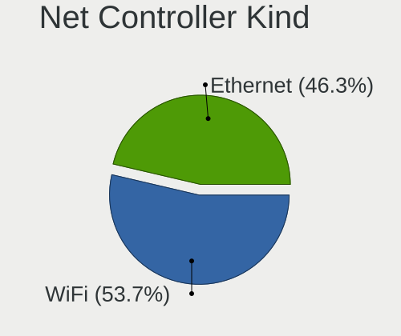

| Kind     | Notebooks | Percent |
|----------|-----------|---------|
| WiFi     | 44        | 53.66%  |
| Ethernet | 38        | 46.34%  |

Used Controller
---------------

Currently used network controller

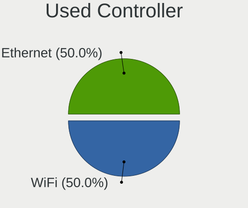

| Kind     | Notebooks | Percent |
|----------|-----------|---------|
| WiFi     | 22        | 50%     |
| Ethernet | 22        | 50%     |

NICs
----

Total network controllers on board

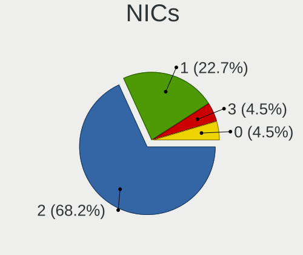

| Total | Notebooks | Percent |
|-------|-----------|---------|
| 2     | 30        | 66.67%  |
| 1     | 12        | 26.67%  |
| 0     | 2         | 4.44%   |
| 3     | 1         | 2.22%   |

IPv6
----

IPv6 vs IPv4

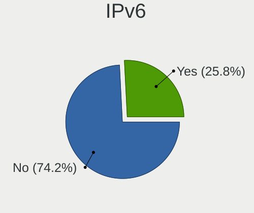

| Used | Notebooks | Percent |
|------|-----------|---------|
| No   | 36        | 78.26%  |
| Yes  | 10        | 21.74%  |

Bluetooth
---------

Bluetooth Vendor
----------------

Controller vendors

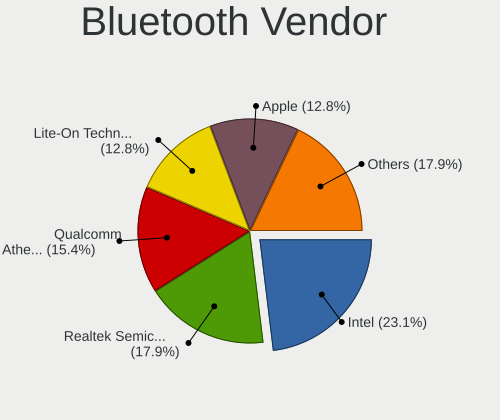

| Vendor                          | Notebooks | Percent |
|---------------------------------|-----------|---------|
| Intel                           | 9         | 23.08%  |
| Realtek Semiconductor           | 7         | 17.95%  |
| Qualcomm Atheros Communications | 6         | 15.38%  |
| Lite-On Technology              | 5         | 12.82%  |
| Apple                           | 5         | 12.82%  |
| Broadcom                        | 2         | 5.13%   |
| Toshiba                         | 1         | 2.56%   |
| Ralink                          | 1         | 2.56%   |
| IMC Networks                    | 1         | 2.56%   |
| Foxconn / Hon Hai               | 1         | 2.56%   |
| Dell                            | 1         | 2.56%   |

Bluetooth Model
---------------

Controller models

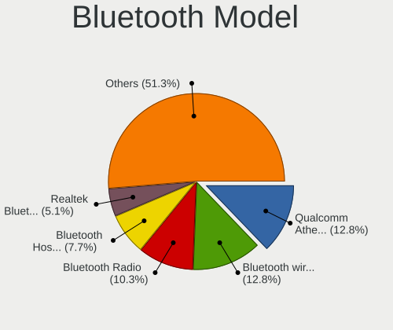

| Model                                        | Notebooks | Percent |
|----------------------------------------------|-----------|---------|
| Qualcomm Atheros  Bluetooth Device           | 5         | 12.82%  |
| Intel Bluetooth wireless interface           | 5         | 12.82%  |
| Realtek Bluetooth Radio                      | 4         | 10.26%  |
| Apple Bluetooth Host Controller              | 3         | 7.69%   |
| Realtek  Bluetooth 4.2 Adapter               | 2         | 5.13%   |
| Lite-On Broadcom BCM43142A0 Bluetooth Device | 2         | 5.13%   |
| Intel Bluetooth Device                       | 2         | 5.13%   |
| Intel AX200 Bluetooth                        | 2         | 5.13%   |
| Toshiba Bluetooth Device                     | 1         | 2.56%   |
| Realtek RTL8821A Bluetooth                   | 1         | 2.56%   |
| Ralink RT3290 Bluetooth                      | 1         | 2.56%   |
| Qualcomm Atheros AR9462 Bluetooth            | 1         | 2.56%   |
| Lite-On Wireless_Device                      | 1         | 2.56%   |
| Lite-On Qualcomm Atheros QCA9377 Bluetooth   | 1         | 2.56%   |
| Lite-On Bluetooth Device                     | 1         | 2.56%   |
| IMC Networks Wireless_Device                 | 1         | 2.56%   |
| Foxconn / Hon Hai Wireless_Device            | 1         | 2.56%   |
| Dell Broadcom BCM20702A0 Bluetooth           | 1         | 2.56%   |
| Broadcom BCM43142A0 Bluetooth Device         | 1         | 2.56%   |
| Broadcom BCM43142 Bluetooth 4.0              | 1         | 2.56%   |
| Apple Bluetooth USB Host Controller          | 1         | 2.56%   |
| Apple Bluetooth HCI MacBookPro (HID mode)    | 1         | 2.56%   |

Sound
-----

Sound Vendor
------------

Sound card vendors

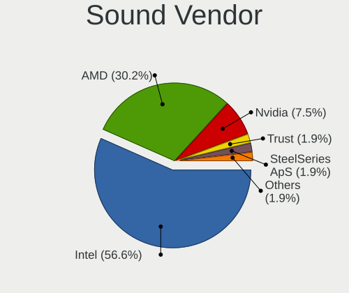

| Vendor              | Notebooks | Percent |
|---------------------|-----------|---------|
| Intel               | 30        | 56.6%   |
| AMD                 | 16        | 30.19%  |
| Nvidia              | 4         | 7.55%   |
| Trust               | 1         | 1.89%   |
| SteelSeries ApS     | 1         | 1.89%   |
| Huawei Technologies | 1         | 1.89%   |

Sound Model
-----------

Sound card models

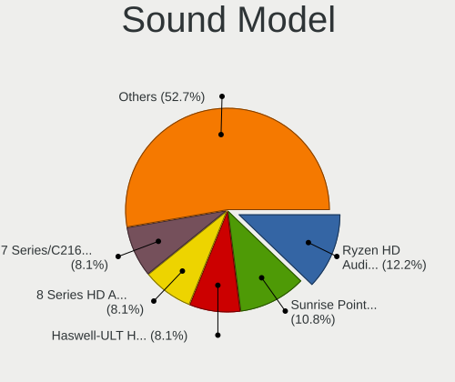

| Model                                                                                             | Notebooks | Percent |
|---------------------------------------------------------------------------------------------------|-----------|---------|
| AMD Ryzen HD Audio Controller                                                                     | 9         | 12.16%  |
| Intel Sunrise Point-LP HD Audio                                                                   | 8         | 10.81%  |
| Intel Haswell-ULT HD Audio Controller                                                             | 6         | 8.11%   |
| Intel 8 Series HD Audio Controller                                                                | 6         | 8.11%   |
| Intel 7 Series/C216 Chipset Family High Definition Audio Controller                               | 6         | 8.11%   |
| AMD Renoir/Cezanne HDMI/DP Audio Controller                                                       | 4         | 5.41%   |
| AMD FCH Azalia Controller                                                                         | 4         | 5.41%   |
| Intel Raptor Lake-P/U/H cAVS                                                                      | 3         | 4.05%   |
| AMD Raven/Raven2/Fenghuang HDMI/DP Audio Controller                                               | 3         | 4.05%   |
| Intel Atom/Celeron/Pentium Processor x5-E8000/J3xxx/N3xxx Series High Definition Audio Controller | 2         | 2.7%    |
| AMD Trinity HDMI Audio Controller                                                                 | 2         | 2.7%    |
| Trust USB microphone                                                                              | 1         | 1.35%   |
| SteelSeries ApS SteelSeries Arctis 9                                                              | 1         | 1.35%   |
| Nvidia GP107GL High Definition Audio Controller                                                   | 1         | 1.35%   |
| Nvidia GK107 HDMI Audio Controller                                                                | 1         | 1.35%   |
| Nvidia GF108 High Definition Audio Controller                                                     | 1         | 1.35%   |
| Nvidia AD106M High Definition Audio Controller                                                    | 1         | 1.35%   |
| Intel Xeon E3-1200 v3/4th Gen Core Processor HD Audio Controller                                  | 1         | 1.35%   |
| Intel CM238 HD Audio Controller                                                                   | 1         | 1.35%   |
| Intel Cannon Point-LP High Definition Audio Controller                                            | 1         | 1.35%   |
| Intel 82801H (ICH8 Family) HD Audio Controller                                                    | 1         | 1.35%   |
| Intel 8 Series/C220 Series Chipset High Definition Audio Controller                               | 1         | 1.35%   |
| Intel 6 Series/C200 Series Chipset Family High Definition Audio Controller                        | 1         | 1.35%   |
| Huawei Technologies HUAWEI USB-C HEADSET                                                          | 1         | 1.35%   |
| AMD Wrestler HDMI Audio                                                                           | 1         | 1.35%   |
| AMD Tobago HDMI Audio [Radeon R7 360 / R9 360 OEM]                                                | 1         | 1.35%   |
| AMD Starship/Matisse HD Audio Controller                                                          | 1         | 1.35%   |
| AMD Radeon High Definition Audio Controller                                                       | 1         | 1.35%   |
| AMD Navi 21/23 HDMI/DP Audio Controller                                                           | 1         | 1.35%   |
| AMD Kabini HDMI/DP Audio                                                                          | 1         | 1.35%   |
| AMD High Definition Audio Controller                                                              | 1         | 1.35%   |
| AMD Family 15h (Models 60h-6fh) Audio Controller                                                  | 1         | 1.35%   |

Memory
------

Memory Vendor
-------------

Memory module vendors

| Vendor            | Notebooks | Percent |
|-------------------|-----------|---------|
| Micron Technology | 1         | 100%    |

Memory Model
------------

Memory module models

| Model                                                            | Notebooks | Percent |
|------------------------------------------------------------------|-----------|---------|
| Micron RAM MT53E1G32D4NQ-046WTE 8GB Row Of Chips LPDDR4 4266MT/s | 1         | 100%    |

Memory Kind
-----------

Memory module kinds

| Kind   | Notebooks | Percent |
|--------|-----------|---------|
| LPDDR4 | 1         | 100%    |

Memory Form Factor
------------------

Physical design of the memory module

| Name         | Notebooks | Percent |
|--------------|-----------|---------|
| Row Of Chips | 1         | 100%    |

Memory Size
-----------

Memory module size

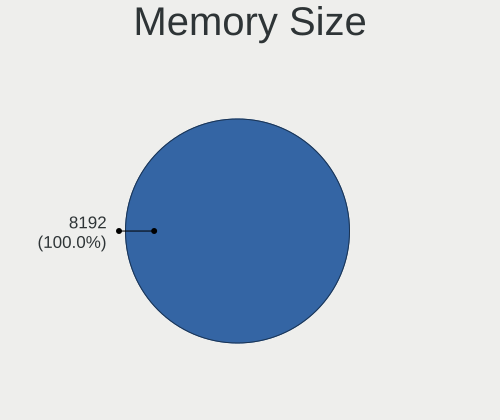

| Size | Notebooks | Percent |
|------|-----------|---------|
| 8192 | 1         | 100%    |

Memory Speed
------------

Memory module speed

| Speed | Notebooks | Percent |
|-------|-----------|---------|
| 4266  | 1         | 100%    |

Printers & scanners
-------------------

Printer Vendor
--------------

Printer device vendors

Zero info for selected period =(

Printer Model
-------------

Printer device models

Zero info for selected period =(

Scanner Vendor
--------------

Scanner device vendors

Zero info for selected period =(

Scanner Model
-------------

Scanner device models

Zero info for selected period =(

Camera
------

Camera Vendor
-------------

Camera device vendors

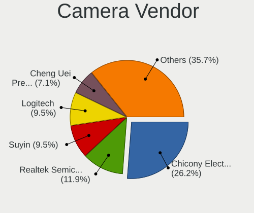

| Vendor                                 | Notebooks | Percent |
|----------------------------------------|-----------|---------|
| Chicony Electronics                    | 11        | 26.19%  |
| Realtek Semiconductor                  | 5         | 11.9%   |
| Suyin                                  | 4         | 9.52%   |
| Logitech                               | 4         | 9.52%   |
| Cheng Uei Precision Industry (Foxlink) | 3         | 7.14%   |
| Sunplus Innovation Technology          | 2         | 4.76%   |
| Microdia                               | 2         | 4.76%   |
| IMC Networks                           | 2         | 4.76%   |
| Apple                                  | 2         | 4.76%   |
| Syntek                                 | 1         | 2.38%   |
| Sonix Technology                       | 1         | 2.38%   |
| Shinetech                              | 1         | 2.38%   |
| Quanta                                 | 1         | 2.38%   |
| Luxvisions Innotech Limited            | 1         | 2.38%   |
| Lite-On Technology                     | 1         | 2.38%   |
| HRY                                    | 1         | 2.38%   |

Camera Model
------------

Camera device models

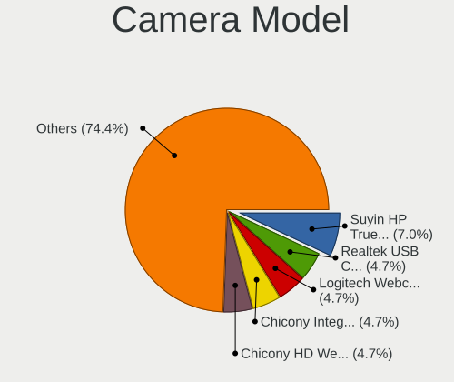

| Model                                             | Notebooks | Percent |
|---------------------------------------------------|-----------|---------|
| Suyin HP Truevision HD                            | 3         | 6.98%   |
| Realtek USB Camera                                | 2         | 4.65%   |
| Logitech Webcam C270                              | 2         | 4.65%   |
| Chicony Integrated Camera                         | 2         | 4.65%   |
| Chicony HD Webcam                                 | 2         | 4.65%   |
| Cheng Uei Precision Industry (Foxlink) HP Webcam  | 2         | 4.65%   |
| Syntek Integrated Camera                          | 1         | 2.33%   |
| Suyin Laptop_Integrated_Webcam_HD                 | 1         | 2.33%   |
| Sunplus Integrated_Webcam_HD                      | 1         | 2.33%   |
| Sunplus HD WebCam                                 | 1         | 2.33%   |
| Sonix USB2.0 FHD UVC WebCam                       | 1         | 2.33%   |
| Shinetech USB2.0 FHD UVC WebCam                   | 1         | 2.33%   |
| Realtek USB2.0 HD UVC WebCam                      | 1         | 2.33%   |
| Realtek Integrated_Webcam_HD                      | 1         | 2.33%   |
| Realtek Integrated Camera                         | 1         | 2.33%   |
| Quanta HD Webcam                                  | 1         | 2.33%   |
| Microdia Integrated_Webcam_HD                     | 1         | 2.33%   |
| Microdia Integrated Webcam HD                     | 1         | 2.33%   |
| Luxvisions Innotech Limited Integrated RGB Camera | 1         | 2.33%   |
| Logitech HD Pro Webcam C920                       | 1         | 2.33%   |
| Logitech BRIO Ultra HD Webcam                     | 1         | 2.33%   |
| Lite-On Integrated Camera                         | 1         | 2.33%   |
| IMC Networks USB2.0 HD UVC WebCam                 | 1         | 2.33%   |
| IMC Networks HP TrueVision HD Camera              | 1         | 2.33%   |
| HRY USB Camera                                    | 1         | 2.33%   |
| Chicony USB2.0 VGA UVC WebCam                     | 1         | 2.33%   |
| Chicony USB2.0 HD UVC WebCam                      | 1         | 2.33%   |
| Chicony TOSHIBA Web Camera - HD                   | 1         | 2.33%   |
| Chicony Integrated Camera (1280x720@30)           | 1         | 2.33%   |
| Chicony HP HD Camera                              | 1         | 2.33%   |
| Chicony HD User Facing                            | 1         | 2.33%   |
| Chicony ACER QHD User Facing                      | 1         | 2.33%   |
| Chicony 5M Cam                                    | 1         | 2.33%   |
| Cheng Uei Precision Industry (Foxlink) Webcam     | 1         | 2.33%   |
| Apple FaceTime HD Camera (Built-in)               | 1         | 2.33%   |
| Apple FaceTime HD Camera                          | 1         | 2.33%   |

Security
--------

Fingerprint Vendor
------------------

Fingerprint sensor vendors

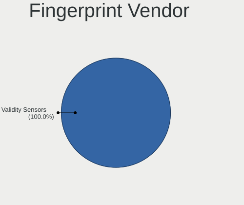

| Vendor             | Notebooks | Percent |
|--------------------|-----------|---------|
| Synaptics          | 2         | 50%     |
| Validity Sensors   | 1         | 25%     |
| Focal-systems.Corp | 1         | 25%     |

Fingerprint Model
-----------------

Fingerprint sensor models

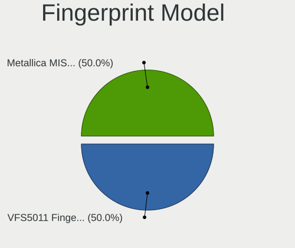

| Model                                            | Notebooks | Percent |
|--------------------------------------------------|-----------|---------|
| Synaptics Metallica MIS Touch Fingerprint Reader | 2         | 50%     |
| Validity Sensors VFS5011 Fingerprint Reader      | 1         | 25%     |
| Focal-systems.Corp FT9201Fingerprint.            | 1         | 25%     |

Chipcard Vendor
---------------

Chipcard module vendors

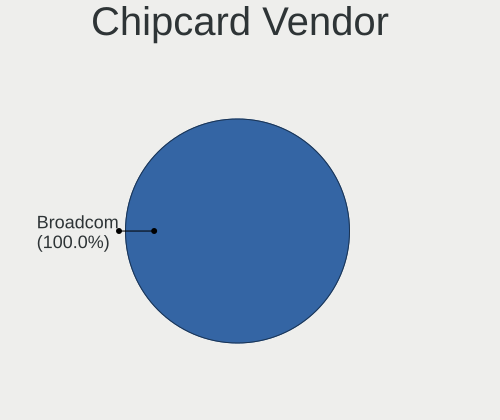

| Vendor      | Notebooks | Percent |
|-------------|-----------|---------|
| Broadcom    | 1         | 50%     |
| Alcor Micro | 1         | 50%     |

Chipcard Model
--------------

Chipcard module models

| Model                                          | Notebooks | Percent |
|------------------------------------------------|-----------|---------|
| Broadcom BCM5880 Secure Applications Processor | 1         | 50%     |
| Alcor Micro AU9540 Smartcard Reader            | 1         | 50%     |

Unsupported
-----------

Unsupported Devices
-------------------

Total unsupported devices on board

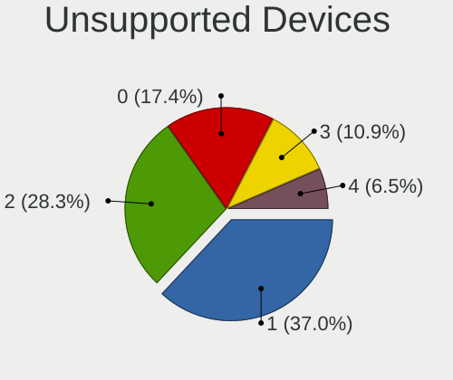

| Total | Notebooks | Percent |
|-------|-----------|---------|
| 1     | 17        | 36.96%  |
| 2     | 13        | 28.26%  |
| 0     | 8         | 17.39%  |
| 3     | 5         | 10.87%  |
| 4     | 3         | 6.52%   |

Unsupported Device Types
------------------------

Types of unsupported devices

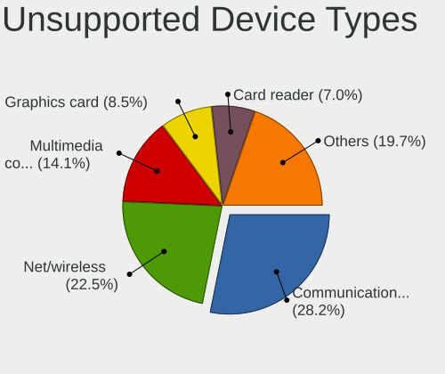

| Type                     | Notebooks | Percent |
|--------------------------|-----------|---------|
| Communication controller | 20        | 28.17%  |
| Net/wireless             | 16        | 22.54%  |
| Multimedia controller    | 10        | 14.08%  |
| Graphics card            | 6         | 8.45%   |
| Card reader              | 5         | 7.04%   |
| Bluetooth                | 5         | 7.04%   |
| Fingerprint reader       | 4         | 5.63%   |
| Net/ethernet             | 3         | 4.23%   |
| Storage/ide              | 1         | 1.41%   |
| Chipcard                 | 1         | 1.41%   |

