GNOME OS - Tested Hardware & Statistics (Notebooks)
---------------------------------------------------

A project to collect tested hardware configurations for GNOME OS.

Anyone can contribute to this report by the [hw-probe](https://github.com/linuxhw/hw-probe) tool:

    sudo -E hw-probe -all -upload

Please contribute! Especially if your hardware is rare.

Contents
--------

* [ Test Cases ](#test-cases)

* [ System ](#system)
  - [ OS                       ](#os)
  - [ OS Family                ](#os-family)
  - [ Kernel                   ](#kernel)
  - [ Kernel Family            ](#kernel-family)
  - [ Kernel Major Ver.        ](#kernel-major-ver)
  - [ Arch                     ](#arch)
  - [ DE                       ](#de)
  - [ Display Server           ](#display-server)
  - [ Display Manager          ](#display-manager)
  - [ OS Lang                  ](#os-lang)
  - [ Boot Mode                ](#boot-mode)
  - [ Filesystem               ](#filesystem)
  - [ Part. scheme             ](#part-scheme)
  - [ Dual Boot with Linux/BSD ](#dual-boot-with-linuxbsd)
  - [ Dual Boot (Win)          ](#dual-boot-win)

* [ Board ](#board)
  - [ Vendor                   ](#vendor)
  - [ Model                    ](#model)
  - [ Model Family             ](#model-family)
  - [ MFG Year                 ](#mfg-year)
  - [ Form Factor              ](#form-factor)
  - [ Secure Boot              ](#secure-boot)
  - [ Coreboot                 ](#coreboot)
  - [ RAM Size                 ](#ram-size)
  - [ RAM Used                 ](#ram-used)
  - [ Total Drives             ](#total-drives)
  - [ Has CD-ROM               ](#has-cd-rom)
  - [ Has Ethernet             ](#has-ethernet)
  - [ Has WiFi                 ](#has-wifi)
  - [ Has Bluetooth            ](#has-bluetooth)

* [ Location ](#location)
  - [ Country                  ](#country)
  - [ City                     ](#city)

* [ Drives ](#drives)
  - [ Drive Vendor             ](#drive-vendor)
  - [ Drive Model              ](#drive-model)
  - [ HDD Vendor               ](#hdd-vendor)
  - [ SSD Vendor               ](#ssd-vendor)
  - [ Drive Kind               ](#drive-kind)
  - [ Drive Connector          ](#drive-connector)
  - [ Drive Size               ](#drive-size)
  - [ Space Total              ](#space-total)
  - [ Space Used               ](#space-used)
  - [ Malfunc. Drives          ](#malfunc-drives)
  - [ Malfunc. Drive Vendor    ](#malfunc-drive-vendor)
  - [ Malfunc. HDD Vendor      ](#malfunc-hdd-vendor)
  - [ Malfunc. Drive Kind      ](#malfunc-drive-kind)
  - [ Failed Drives            ](#failed-drives)
  - [ Failed Drive Vendor      ](#failed-drive-vendor)
  - [ Drive Status             ](#drive-status)

* [ Storage controller ](#storage-controller)
  - [ Storage Vendor           ](#storage-vendor)
  - [ Storage Model            ](#storage-model)
  - [ Storage Kind             ](#storage-kind)

* [ Processor ](#processor)
  - [ CPU Vendor               ](#cpu-vendor)
  - [ CPU Model                ](#cpu-model)
  - [ CPU Model Family         ](#cpu-model-family)
  - [ CPU Cores                ](#cpu-cores)
  - [ CPU Sockets              ](#cpu-sockets)
  - [ CPU Threads              ](#cpu-threads)
  - [ CPU Op-Modes             ](#cpu-op-modes)
  - [ CPU Microcode            ](#cpu-microcode)
  - [ CPU Microarch            ](#cpu-microarch)

* [ Graphics ](#graphics)
  - [ GPU Vendor               ](#gpu-vendor)
  - [ GPU Model                ](#gpu-model)
  - [ GPU Combo                ](#gpu-combo)
  - [ GPU Driver               ](#gpu-driver)
  - [ GPU Memory               ](#gpu-memory)

* [ Monitor ](#monitor)
  - [ Monitor Vendor           ](#monitor-vendor)
  - [ Monitor Model            ](#monitor-model)
  - [ Monitor Resolution       ](#monitor-resolution)
  - [ Monitor Diagonal         ](#monitor-diagonal)
  - [ Monitor Width            ](#monitor-width)
  - [ Aspect Ratio             ](#aspect-ratio)
  - [ Monitor Area             ](#monitor-area)
  - [ Pixel Density            ](#pixel-density)
  - [ Multiple Monitors        ](#multiple-monitors)

* [ Network ](#network)
  - [ Net Controller Vendor    ](#net-controller-vendor)
  - [ Net Controller Model     ](#net-controller-model)
  - [ Wireless Vendor          ](#wireless-vendor)
  - [ Wireless Model           ](#wireless-model)
  - [ Ethernet Vendor          ](#ethernet-vendor)
  - [ Ethernet Model           ](#ethernet-model)
  - [ Net Controller Kind      ](#net-controller-kind)
  - [ Used Controller          ](#used-controller)
  - [ NICs                     ](#nics)
  - [ IPv6                     ](#ipv6)

* [ Bluetooth ](#bluetooth)
  - [ Bluetooth Vendor         ](#bluetooth-vendor)
  - [ Bluetooth Model          ](#bluetooth-model)

* [ Sound ](#sound)
  - [ Sound Vendor             ](#sound-vendor)
  - [ Sound Model              ](#sound-model)

* [ Memory ](#memory)
  - [ Memory Vendor            ](#memory-vendor)
  - [ Memory Model             ](#memory-model)
  - [ Memory Kind              ](#memory-kind)
  - [ Memory Form Factor       ](#memory-form-factor)
  - [ Memory Size              ](#memory-size)
  - [ Memory Speed             ](#memory-speed)

* [ Printers & scanners ](#printers--scanners)
  - [ Printer Vendor           ](#printer-vendor)
  - [ Printer Model            ](#printer-model)
  - [ Scanner Vendor           ](#scanner-vendor)
  - [ Scanner Model            ](#scanner-model)

* [ Camera ](#camera)
  - [ Camera Vendor            ](#camera-vendor)
  - [ Camera Model             ](#camera-model)

* [ Security ](#security)
  - [ Fingerprint Vendor       ](#fingerprint-vendor)
  - [ Fingerprint Model        ](#fingerprint-model)
  - [ Chipcard Vendor          ](#chipcard-vendor)
  - [ Chipcard Model           ](#chipcard-model)

* [ Unsupported ](#unsupported)
  - [ Unsupported Devices      ](#unsupported-devices)
  - [ Unsupported Device Types ](#unsupported-device-types)

Test Cases
----------

Total: 42

| Vendor        | Model                       | Probe                                                      | Date         |
|---------------|-----------------------------|------------------------------------------------------------|--------------|
| Dell          | Latitude 7490               | [01eda01155](https://linux-hardware.org/?probe=01eda01155) | Jun 02, 2024 |
| GPU Compan... | GWNR71517                   | [89dbdfd53e](https://linux-hardware.org/?probe=89dbdfd53e) | Apr 13, 2024 |
| Lenovo        | ThinkPad X280 20KF001RMX    | [0caddb11a4](https://linux-hardware.org/?probe=0caddb11a4) | Apr 02, 2024 |
| Apple         | MacBook4,1                  | [e5b3d089e8](https://linux-hardware.org/?probe=e5b3d089e8) | Oct 06, 2023 |
| Apple         | MacBook4,1                  | [11497e61f8](https://linux-hardware.org/?probe=11497e61f8) | Oct 06, 2023 |
| Lenovo        | ThinkPad T480s 20L8S6P20... | [4f3a1c8208](https://linux-hardware.org/?probe=4f3a1c8208) | Sep 24, 2023 |
| ASUSTek       | X550LC                      | [5f73fa5db7](https://linux-hardware.org/?probe=5f73fa5db7) | Mar 18, 2023 |
| Apple         | MacBookPro8,1               | [1b5ab725ab](https://linux-hardware.org/?probe=1b5ab725ab) | Nov 09, 2022 |
| Lenovo        | IdeaPad 330-15AST 81D6      | [abbb3295c8](https://linux-hardware.org/?probe=abbb3295c8) | Oct 14, 2022 |
| Lenovo        | IdeaPad 330-15AST 81D6      | [f19e981e03](https://linux-hardware.org/?probe=f19e981e03) | Oct 14, 2022 |
| Dell          | Inspiron 3584               | [626c79c116](https://linux-hardware.org/?probe=626c79c116) | Sep 24, 2022 |
| HP            | Pavilion 15                 | [56a10ce74c](https://linux-hardware.org/?probe=56a10ce74c) | Sep 21, 2022 |
| ASUSTek       | GL553VE                     | [4d93da1983](https://linux-hardware.org/?probe=4d93da1983) | Sep 20, 2022 |
| ASUSTek       | GL553VE                     | [27b8d384a2](https://linux-hardware.org/?probe=27b8d384a2) | Sep 19, 2022 |
| Acer          | Aspire A515-51G             | [4856a5fefb](https://linux-hardware.org/?probe=4856a5fefb) | Jul 22, 2022 |
| Lenovo        | Yoga Slim 7 14ARE05 82A2    | [a90e6b2be7](https://linux-hardware.org/?probe=a90e6b2be7) | Apr 30, 2022 |
| Apple         | MacBookPro10,1              | [1bbdbe7117](https://linux-hardware.org/?probe=1bbdbe7117) | Apr 04, 2022 |
| Acer          | Iconia W700                 | [604cdabab4](https://linux-hardware.org/?probe=604cdabab4) | Mar 23, 2022 |
| Lenovo        | ThinkPad Edge E531 68851... | [54269ad944](https://linux-hardware.org/?probe=54269ad944) | Feb 18, 2022 |
| Gateway       | NE71B                       | [ac3dc96ccf](https://linux-hardware.org/?probe=ac3dc96ccf) | Feb 02, 2022 |
| HP            | Laptop 14-dk1xxx            | [c604eec754](https://linux-hardware.org/?probe=c604eec754) | Jan 27, 2022 |
| Chuwi         | HeroBook                    | [67990dbe7f](https://linux-hardware.org/?probe=67990dbe7f) | Jan 19, 2022 |
| Lenovo        | Yoga Slim 7 14ARE05 82A2    | [594815bb9d](https://linux-hardware.org/?probe=594815bb9d) | Oct 17, 2021 |
| ASUSTek       | X555LD                      | [2560d8b5a0](https://linux-hardware.org/?probe=2560d8b5a0) | Sep 27, 2021 |
| Lenovo        | IdeaPad S340-14API 81NB     | [c248e4551a](https://linux-hardware.org/?probe=c248e4551a) | Sep 25, 2021 |
| HP            | Pavilion Notebook           | [835f183d57](https://linux-hardware.org/?probe=835f183d57) | Sep 17, 2021 |
| Lenovo        | IdeaPad S145-15IWL 81S9     | [35c20c8cde](https://linux-hardware.org/?probe=35c20c8cde) | Aug 30, 2021 |
| HP            | Pavilion Gaming Laptop 1... | [5a54384297](https://linux-hardware.org/?probe=5a54384297) | Aug 11, 2021 |
| HP            | ProBook 430 G3              | [c3acaeb030](https://linux-hardware.org/?probe=c3acaeb030) | Apr 26, 2021 |
| HP            | ProBook 430 G3              | [de3298645e](https://linux-hardware.org/?probe=de3298645e) | Apr 26, 2021 |
| Toshiba       | Satellite C55-A-1F5         | [d7b4bf2642](https://linux-hardware.org/?probe=d7b4bf2642) | Apr 15, 2021 |
| Toshiba       | Satellite C55-A-1F5         | [aa32e3693a](https://linux-hardware.org/?probe=aa32e3693a) | Apr 14, 2021 |
| HP            | Pavilion 17                 | [220bf859f8](https://linux-hardware.org/?probe=220bf859f8) | Mar 28, 2021 |
| HP            | Pavilion 17                 | [a5a6941b23](https://linux-hardware.org/?probe=a5a6941b23) | Mar 28, 2021 |
| Dell          | Latitude 7490               | [ce86510d2b](https://linux-hardware.org/?probe=ce86510d2b) | Mar 28, 2021 |
| Dell          | Inspiron 3542               | [517406f8b6](https://linux-hardware.org/?probe=517406f8b6) | Mar 21, 2021 |
| Unknown       | Unknown                     | [1c5ed732c5](https://linux-hardware.org/?probe=1c5ed732c5) | Mar 01, 2021 |
| Dell          | Precision M6800             | [95fa029c09](https://linux-hardware.org/?probe=95fa029c09) | Jan 14, 2021 |
| Dell          | Inspiron 5566               | [a3fd17119a](https://linux-hardware.org/?probe=a3fd17119a) | Nov 03, 2020 |
| HP            | Pavilion 17                 | [edc8ed595b](https://linux-hardware.org/?probe=edc8ed595b) | Oct 12, 2020 |
| ASUSTek       | E202SA                      | [a226259559](https://linux-hardware.org/?probe=a226259559) | Sep 24, 2020 |
| Acer          | ChiefRiver Platform         | [23e2162b8e](https://linux-hardware.org/?probe=23e2162b8e) | Sep 20, 2020 |

System
------

OS
--

Installed operating systems

| Name             | Notebooks | Percent |
|------------------|-----------|---------|
| GNOME OS Nightly | 25        | 75.76%  |
| GNOME OS 3.38    | 4         | 12.12%  |
| GNOME OS 43      | 1         | 3.03%   |
| GNOME OS 42      | 1         | 3.03%   |
| GNOME OS 41      | 1         | 3.03%   |
| GNOME OS 40      | 1         | 3.03%   |

OS Family
---------

OS without a version

| Name     | Notebooks | Percent |
|----------|-----------|---------|
| GNOME OS | 33        | 100%    |

Kernel
------

Version of the Linux kernel

| Version | Notebooks | Percent |
|---------|-----------|---------|
| 5.14.18 | 7         | 20.59%  |
| 5.7.14  | 5         | 14.71%  |
| 5.11.2  | 3         | 8.82%   |
| 6.7.9   | 2         | 5.88%   |
| 5.18.19 | 2         | 5.88%   |
| 5.13.9  | 2         | 5.88%   |
| 5.13.8  | 2         | 5.88%   |
| 5.11.10 | 2         | 5.88%   |
| 6.9.1   | 1         | 2.94%   |
| 6.5.5   | 1         | 2.94%   |
| 6.5.0   | 1         | 2.94%   |
| 5.19.17 | 1         | 2.94%   |
| 5.19.16 | 1         | 2.94%   |
| 5.18.16 | 1         | 2.94%   |
| 5.18.10 | 1         | 2.94%   |
| 5.14.4  | 1         | 2.94%   |
| 5.14.11 | 1         | 2.94%   |

Kernel Family
-------------

Linux kernel without a distro release

| Version | Notebooks | Percent |
|---------|-----------|---------|
| 5.14.18 | 7         | 20.59%  |
| 5.7.14  | 5         | 14.71%  |
| 5.11.2  | 3         | 8.82%   |
| 6.7.9   | 2         | 5.88%   |
| 5.18.19 | 2         | 5.88%   |
| 5.13.9  | 2         | 5.88%   |
| 5.13.8  | 2         | 5.88%   |
| 5.11.10 | 2         | 5.88%   |
| 6.9.1   | 1         | 2.94%   |
| 6.5.5   | 1         | 2.94%   |
| 6.5.0   | 1         | 2.94%   |
| 5.19.17 | 1         | 2.94%   |
| 5.19.16 | 1         | 2.94%   |
| 5.18.16 | 1         | 2.94%   |
| 5.18.10 | 1         | 2.94%   |
| 5.14.4  | 1         | 2.94%   |
| 5.14.11 | 1         | 2.94%   |

Kernel Major Ver.
-----------------

Linux kernel major version

| Version | Notebooks | Percent |
|---------|-----------|---------|
| 5.14    | 8         | 24.24%  |
| 5.7     | 5         | 15.15%  |
| 5.11    | 5         | 15.15%  |
| 5.18    | 4         | 12.12%  |
| 5.13    | 4         | 12.12%  |
| 6.7     | 2         | 6.06%   |
| 6.5     | 2         | 6.06%   |
| 5.19    | 2         | 6.06%   |
| 6.9     | 1         | 3.03%   |

Arch
----

OS architecture (x86_64, i586, etc.)

| Name   | Notebooks | Percent |
|--------|-----------|---------|
| x86_64 | 33        | 100%    |

DE
--

Desktop Environment

| Name    | Notebooks | Percent |
|---------|-----------|---------|
| GNOME   | 33        | 97.06%  |
| Unknown | 1         | 2.94%   |

Display Server
--------------

X11 or Wayland

| Name    | Notebooks | Percent |
|---------|-----------|---------|
| Wayland | 33        | 97.06%  |
| Unknown | 1         | 2.94%   |

Display Manager
---------------

SDDM, LightDM, etc.

| Name    | Notebooks | Percent |
|---------|-----------|---------|
| Unknown | 33        | 100%    |

OS Lang
-------

Language

| Lang  | Notebooks | Percent |
|-------|-----------|---------|
| en_US | 19        | 57.58%  |
| ru_RU | 4         | 12.12%  |
| fr_FR | 3         | 9.09%   |
| sv_SE | 1         | 3.03%   |
| sk_SK | 1         | 3.03%   |
| pt_BR | 1         | 3.03%   |
| nl_NL | 1         | 3.03%   |
| it_IT | 1         | 3.03%   |
| hu_HU | 1         | 3.03%   |
| es_ES | 1         | 3.03%   |

Boot Mode
---------

EFI or BIOS

| Mode | Notebooks | Percent |
|------|-----------|---------|
| EFI  | 32        | 96.97%  |
| BIOS | 1         | 3.03%   |

Filesystem
----------

Type of filesystem

| Type | Notebooks | Percent |
|------|-----------|---------|
| Ext4 | 33        | 100%    |

Part. scheme
------------

Scheme of partitioning

| Type    | Notebooks | Percent |
|---------|-----------|---------|
| Unknown | 33        | 97.06%  |
| GPT     | 1         | 2.94%   |

Dual Boot with Linux/BSD
------------------------

Hosting more than one Linux/BSD

| Dual boot | Notebooks | Percent |
|-----------|-----------|---------|
| No        | 33        | 100%    |

Dual Boot (Win)
---------------

Hosting Linux and Windows

| Dual boot | Notebooks | Percent |
|-----------|-----------|---------|
| No        | 33        | 100%    |

Board
-----

Vendor
------

Motherboard manufacturer

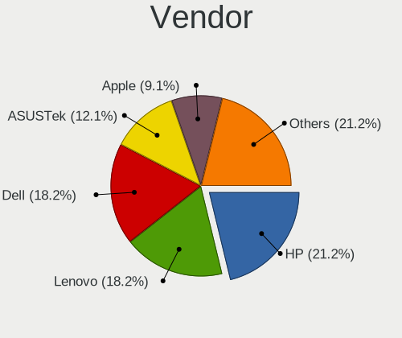

| Name             | Notebooks | Percent |
|------------------|-----------|---------|
| Hewlett-Packard  | 7         | 21.21%  |
| Lenovo           | 6         | 18.18%  |
| Dell             | 6         | 18.18%  |
| ASUSTek Computer | 4         | 12.12%  |
| Apple            | 3         | 9.09%   |
| Acer             | 3         | 9.09%   |
| Toshiba          | 1         | 3.03%   |
| GPU Company      | 1         | 3.03%   |
| Gateway          | 1         | 3.03%   |
| Chuwi            | 1         | 3.03%   |

Model
-----

Motherboard model

| Name                                | Notebooks | Percent |
|-------------------------------------|-----------|---------|
| HP Pavilion 17                      | 2         | 6.06%   |
| Dell Latitude 7490                  | 2         | 6.06%   |
| Toshiba Satellite C55-A-1F5         | 1         | 3.03%   |
| Lenovo Yoga Slim 7 14ARE05 82A2     | 1         | 3.03%   |
| Lenovo ThinkPad X280 20KF001RMX     | 1         | 3.03%   |
| Lenovo ThinkPad T480s 20L8S6P200    | 1         | 3.03%   |
| Lenovo ThinkPad Edge E531 68851P6   | 1         | 3.03%   |
| Lenovo IdeaPad S340-14API 81NB      | 1         | 3.03%   |
| Lenovo IdeaPad S145-15IWL 81S9      | 1         | 3.03%   |
| HP ProBook 430 G3                   | 1         | 3.03%   |
| HP Pavilion Notebook                | 1         | 3.03%   |
| HP Pavilion Gaming Laptop 15-ec0xxx | 1         | 3.03%   |
| HP Pavilion 15                      | 1         | 3.03%   |
| HP Laptop 14-dk1xxx                 | 1         | 3.03%   |
| GPU Company GWNR71517               | 1         | 3.03%   |
| Gateway NE71B                       | 1         | 3.03%   |
| Dell Precision M6800                | 1         | 3.03%   |
| Dell Inspiron 5566                  | 1         | 3.03%   |
| Dell Inspiron 3584                  | 1         | 3.03%   |
| Dell Inspiron 3542                  | 1         | 3.03%   |
| Chuwi HeroBook                      | 1         | 3.03%   |
| ASUS X555LD                         | 1         | 3.03%   |
| ASUS X550LC                         | 1         | 3.03%   |
| ASUS GL553VE                        | 1         | 3.03%   |
| ASUS E202SA                         | 1         | 3.03%   |
| Apple MacBookPro8,1                 | 1         | 3.03%   |
| Apple MacBookPro10,1                | 1         | 3.03%   |
| Apple MacBook4,1                    | 1         | 3.03%   |
| Acer Iconia W700                    | 1         | 3.03%   |
| Acer ChiefRiver Platform            | 1         | 3.03%   |
| Acer Aspire A515-51G                | 1         | 3.03%   |

Model Family
------------

Motherboard model prefix

| Name                  | Notebooks | Percent |
|-----------------------|-----------|---------|
| HP Pavilion           | 5         | 15.15%  |
| Lenovo ThinkPad       | 3         | 9.09%   |
| Dell Inspiron         | 3         | 9.09%   |
| Lenovo IdeaPad        | 2         | 6.06%   |
| Dell Latitude         | 2         | 6.06%   |
| Toshiba Satellite     | 1         | 3.03%   |
| Lenovo Yoga           | 1         | 3.03%   |
| HP ProBook            | 1         | 3.03%   |
| HP Laptop             | 1         | 3.03%   |
| GPU Company GWNR71517 | 1         | 3.03%   |
| Gateway NE71B         | 1         | 3.03%   |
| Dell Precision        | 1         | 3.03%   |
| Chuwi HeroBook        | 1         | 3.03%   |
| ASUS X555LD           | 1         | 3.03%   |
| ASUS X550LC           | 1         | 3.03%   |
| ASUS GL553VE          | 1         | 3.03%   |
| ASUS E202SA           | 1         | 3.03%   |
| Apple MacBookPro8     | 1         | 3.03%   |
| Apple MacBookPro10    | 1         | 3.03%   |
| Apple MacBook4        | 1         | 3.03%   |
| Acer Iconia           | 1         | 3.03%   |
| Acer ChiefRiver       | 1         | 3.03%   |
| Acer Aspire           | 1         | 3.03%   |

MFG Year
--------

Motherboard manufacture year

| Year | Notebooks | Percent |
|------|-----------|---------|
| 2013 | 7         | 21.21%  |
| 2019 | 6         | 18.18%  |
| 2018 | 4         | 12.12%  |
| 2017 | 3         | 9.09%   |
| 2014 | 3         | 9.09%   |
| 2012 | 3         | 9.09%   |
| 2015 | 2         | 6.06%   |
| 2021 | 1         | 3.03%   |
| 2020 | 1         | 3.03%   |
| 2016 | 1         | 3.03%   |
| 2011 | 1         | 3.03%   |
| 2008 | 1         | 3.03%   |

Form Factor
-----------

Physical design of the computer

| Name     | Notebooks | Percent |
|----------|-----------|---------|
| Notebook | 33        | 100%    |

Secure Boot
-----------

Enabled or disabled

| State    | Notebooks | Percent |
|----------|-----------|---------|
| Disabled | 33        | 100%    |

Coreboot
--------

Have coreboot on board

| Used | Notebooks | Percent |
|------|-----------|---------|
| No   | 33        | 100%    |

RAM Size
--------

Total RAM memory

| Size in GB | Notebooks | Percent |
|------------|-----------|---------|
| 4.01-8.0   | 18        | 54.55%  |
| 3.01-4.0   | 7         | 21.21%  |
| 8.01-16.0  | 5         | 15.15%  |
| 16.01-24.0 | 2         | 6.06%   |
| 1.01-2.0   | 1         | 3.03%   |

RAM Used
--------

Used RAM memory

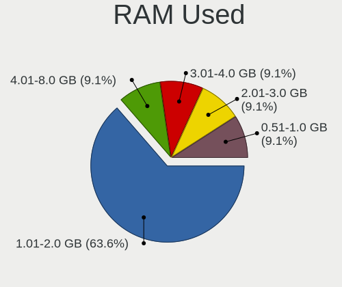

| Used GB  | Notebooks | Percent |
|----------|-----------|---------|
| 1.01-2.0 | 21        | 63.64%  |
| 4.01-8.0 | 3         | 9.09%   |
| 3.01-4.0 | 3         | 9.09%   |
| 2.01-3.0 | 3         | 9.09%   |
| 0.51-1.0 | 3         | 9.09%   |

Total Drives
------------

Number of drives on board

| Drives | Notebooks | Percent |
|--------|-----------|---------|
| 1      | 30        | 90.91%  |
| 2      | 3         | 9.09%   |

Has CD-ROM
----------

Has CD-ROM on board

| Presented | Notebooks | Percent |
|-----------|-----------|---------|
| No        | 23        | 69.7%   |
| Yes       | 10        | 30.3%   |

Has Ethernet
------------

Has Ethernet on board

| Presented | Notebooks | Percent |
|-----------|-----------|---------|
| Yes       | 29        | 87.88%  |
| No        | 4         | 12.12%  |

Has WiFi
--------

Has WiFi module

| Presented | Notebooks | Percent |
|-----------|-----------|---------|
| Yes       | 33        | 100%    |

Has Bluetooth
-------------

Has Bluetooth module

| Presented | Notebooks | Percent |
|-----------|-----------|---------|
| Yes       | 28        | 84.85%  |
| No        | 5         | 15.15%  |

Location
--------

Country
-------

Geographic location (country)

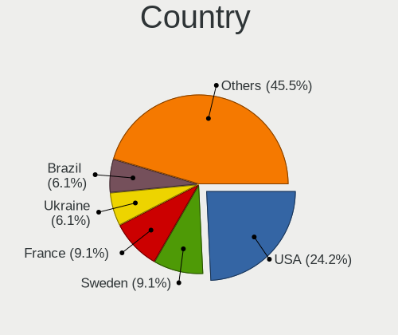

| Country     | Notebooks | Percent |
|-------------|-----------|---------|
| USA         | 8         | 24.24%  |
| Sweden      | 3         | 9.09%   |
| France      | 3         | 9.09%   |
| Ukraine     | 2         | 6.06%   |
| Brazil      | 2         | 6.06%   |
| UAE         | 1         | 3.03%   |
| Slovakia    | 1         | 3.03%   |
| Serbia      | 1         | 3.03%   |
| Russia      | 1         | 3.03%   |
| Netherlands | 1         | 3.03%   |
| Latvia      | 1         | 3.03%   |
| Italy       | 1         | 3.03%   |
| Iraq        | 1         | 3.03%   |
| Iran        | 1         | 3.03%   |
| India       | 1         | 3.03%   |
| Greece      | 1         | 3.03%   |
| Finland     | 1         | 3.03%   |
| El Salvador | 1         | 3.03%   |
| Chile       | 1         | 3.03%   |
| Canada      | 1         | 3.03%   |

City
----

Geographic location (city)

| City              | Notebooks | Percent |
|-------------------|-----------|---------|
| Belton            | 2         | 6.06%   |
| Västerås        | 1         | 3.03%   |
| Vancouver         | 1         | 3.03%   |
| Uruguaiana        | 1         | 3.03%   |
| Tehran            | 1         | 3.03%   |
| Talence           | 1         | 3.03%   |
| Stockholm         | 1         | 3.03%   |
| Skydra            | 1         | 3.03%   |
| Shreveport        | 1         | 3.03%   |
| Santiago          | 1         | 3.03%   |
| San Salvador      | 1         | 3.03%   |
| Riga              | 1         | 3.03%   |
| Pori              | 1         | 3.03%   |
| Parempuyre        | 1         | 3.03%   |
| Novi Sad          | 1         | 3.03%   |
| Millers Creek     | 1         | 3.03%   |
| Milan             | 1         | 3.03%   |
| Mariupol          | 1         | 3.03%   |
| Levis             | 1         | 3.03%   |
| Lelystad          | 1         | 3.03%   |
| Lehighton         | 1         | 3.03%   |
| Kyiv              | 1         | 3.03%   |
| Krasnoyarsk       | 1         | 3.03%   |
| Kearney           | 1         | 3.03%   |
| Juazeiro do Norte | 1         | 3.03%   |
| Hyderabad         | 1         | 3.03%   |
| Gig Harbor        | 1         | 3.03%   |
| Castelnau-le-Lez  | 1         | 3.03%   |
| Bratislava        | 1         | 3.03%   |
| Baghdad           | 1         | 3.03%   |
| Arloev            | 1         | 3.03%   |
| Abu Dhabi         | 1         | 3.03%   |

Drives
------

Drive Vendor
------------

Hard drive vendors

| Vendor              | Notebooks | Drives | Percent |
|---------------------|-----------|--------|---------|
| WDC                 | 6         | 6      | 16.67%  |
| SanDisk             | 4         | 4      | 11.11%  |
| Seagate             | 3         | 3      | 8.33%   |
| Kingston            | 3         | 3      | 8.33%   |
| HGST                | 3         | 3      | 8.33%   |
| Toshiba             | 2         | 2      | 5.56%   |
| Samsung Electronics | 2         | 2      | 5.56%   |
| Micron Technology   | 2         | 2      | 5.56%   |
| Intel               | 2         | 2      | 5.56%   |
| Wibtek              | 1         | 1      | 2.78%   |
| Transcend           | 1         | 1      | 2.78%   |
| Team                | 1         | 1      | 2.78%   |
| SSSTC               | 1         | 1      | 2.78%   |
| SK hynix            | 1         | 2      | 2.78%   |
| Patriot             | 1         | 1      | 2.78%   |
| HECTRON             | 1         | 1      | 2.78%   |
| Crucial             | 1         | 1      | 2.78%   |
| Apple               | 1         | 1      | 2.78%   |

Drive Model
-----------

Hard drive models

| Model                                                 | Notebooks | Percent |
|-------------------------------------------------------|-----------|---------|
| Intel SSDSCKKF256G8 SATA 256GB                        | 2         | 5.41%   |
| HGST HTS541010A9E680 1TB                              | 2         | 5.41%   |
| Wibtek W800S 512GB SSD                                | 1         | 2.7%    |
| WDC WDS240G2G0A-00JH30 240GB SSD                      | 1         | 2.7%    |
| WDC WD5000LPVX-75V0TT0 500GB                          | 1         | 2.7%    |
| WDC WD5000LPVX-08V0TT5 500GB                          | 1         | 2.7%    |
| WDC WD3200LPVX-08V0TT5 320GB                          | 1         | 2.7%    |
| WDC WD10SPZX-24Z10 1TB                                | 1         | 2.7%    |
| WDC WD10SPZX-22Z10T0 1TB                              | 1         | 2.7%    |
| Transcend TS64GMTS400 64GB SSD                        | 1         | 2.7%    |
| Toshiba MQ04ABF100 1TB                                | 1         | 2.7%    |
| Toshiba MQ01ABD032 320GB                              | 1         | 2.7%    |
| Team TM8PS7512G 512GB SSD                             | 1         | 2.7%    |
| SSSTC CVB-8D128-HP 128GB SSD                          | 1         | 2.7%    |
| SK hynix SKHynix_HFS512GD9TNG-L3A0B 512GB             | 1         | 2.7%    |
| SK hynix NVMe SSD Drive 512GB                         | 1         | 2.7%    |
| Seagate ST9500325AS 500GB                             | 1         | 2.7%    |
| Seagate ST500LM012 HN-M500MBB 500GB                   | 1         | 2.7%    |
| Seagate ST1000LM035-1RK172 1TB                        | 1         | 2.7%    |
| SanDisk X300 MSATA 128GB SSD                          | 1         | 2.7%    |
| Sandisk WD Black 2018/SN750 / PC SN720 NVMe SSD 512GB | 1         | 2.7%    |
| SanDisk SSD PLUS 120 GB                               | 1         | 2.7%    |
| SanDisk SD8SN8U512G1002 512GB SSD                     | 1         | 2.7%    |
| Samsung SSD 860 EVO 500GB                             | 1         | 2.7%    |
| Samsung NVMe SSD Drive 256GB                          | 1         | 2.7%    |
| Patriot Burst Elite 120GB SSD                         | 1         | 2.7%    |
| Micron 1100_MTFDDAV256TBN 256GB SSD                   | 1         | 2.7%    |
| Micron 1100_MTFDDAK256TBN 256GB SSD                   | 1         | 2.7%    |
| Kingston SM2280S3120G 120GB SSD                       | 1         | 2.7%    |
| Kingston SHFS37A120G 120GB SSD                        | 1         | 2.7%    |
| Kingston SA400S37120G 120GB SSD                       | 1         | 2.7%    |
| HGST HTS541010A7E630 1TB                              | 1         | 2.7%    |
| HECTRON HECX1-60G SSD                                 | 1         | 2.7%    |
| Crucial CT240BX500SSD1 240GB                          | 1         | 2.7%    |
| Apple SSD SM768E 752GB                                | 1         | 2.7%    |

HDD Vendor
----------

Hard disk drive vendors

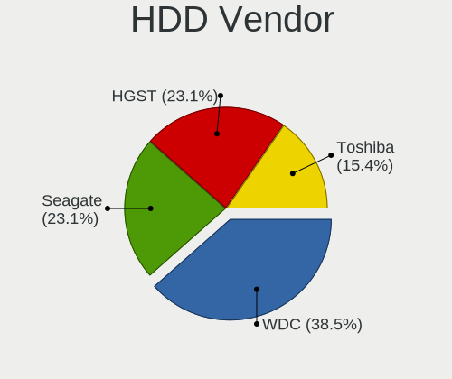

| Vendor  | Notebooks | Drives | Percent |
|---------|-----------|--------|---------|
| WDC     | 5         | 5      | 38.46%  |
| Seagate | 3         | 3      | 23.08%  |
| HGST    | 3         | 3      | 23.08%  |
| Toshiba | 2         | 2      | 15.38%  |

SSD Vendor
----------

Solid state drive vendors

| Vendor              | Notebooks | Drives | Percent |
|---------------------|-----------|--------|---------|
| SanDisk             | 3         | 3      | 15%     |
| Kingston            | 3         | 3      | 15%     |
| Micron Technology   | 2         | 2      | 10%     |
| Intel               | 2         | 2      | 10%     |
| Wibtek              | 1         | 1      | 5%      |
| WDC                 | 1         | 1      | 5%      |
| Transcend           | 1         | 1      | 5%      |
| Team                | 1         | 1      | 5%      |
| SSSTC               | 1         | 1      | 5%      |
| Samsung Electronics | 1         | 1      | 5%      |
| Patriot             | 1         | 1      | 5%      |
| HECTRON             | 1         | 1      | 5%      |
| Crucial             | 1         | 1      | 5%      |
| Apple               | 1         | 1      | 5%      |

Drive Kind
----------

HDD or SSD

| Kind | Notebooks | Drives | Percent |
|------|-----------|--------|---------|
| SSD  | 19        | 20     | 54.29%  |
| HDD  | 13        | 13     | 37.14%  |
| NVMe | 3         | 4      | 8.57%   |

Drive Connector
---------------

SATA, SAS, NVMe, etc.

| Type | Notebooks | Drives | Percent |
|------|-----------|--------|---------|
| SATA | 30        | 33     | 90.91%  |
| NVMe | 3         | 4      | 9.09%   |

Drive Size
----------

Size of hard drive

| Size in TB | Notebooks | Drives | Percent |
|------------|-----------|--------|---------|
| 0.01-0.5   | 21        | 22     | 67.74%  |
| 0.51-1.0   | 10        | 11     | 32.26%  |

Space Total
-----------

Amount of disk space available on the file system

| Size in GB | Notebooks | Percent |
|------------|-----------|---------|
| 101-250    | 14        | 42.42%  |
| 251-500    | 10        | 30.3%   |
| 501-1000   | 7         | 21.21%  |
| 51-100     | 2         | 6.06%   |

Space Used
----------

Amount of used disk space

| Used GB | Notebooks | Percent |
|---------|-----------|---------|
| 1-20    | 30        | 90.91%  |
| 21-50   | 3         | 9.09%   |

Malfunc. Drives
---------------

Drive models with a malfunction

Zero info for selected period =(

Malfunc. Drive Vendor
---------------------

Vendors of faulty drives

Zero info for selected period =(

Malfunc. HDD Vendor
-------------------

Vendors of faulty HDD drives

Zero info for selected period =(

Malfunc. Drive Kind
-------------------

Kinds of faulty drives

Zero info for selected period =(

Failed Drives
-------------

Failed drive models

Zero info for selected period =(

Failed Drive Vendor
-------------------

Failed drive vendors

Zero info for selected period =(

Drive Status
------------

Number of failed and malfunc. drives

| Status   | Notebooks | Drives | Percent |
|----------|-----------|--------|---------|
| Detected | 33        | 36     | 97.06%  |
| Works    | 1         | 1      | 2.94%   |

Storage controller
------------------

Storage Vendor
--------------

Storage controller vendors

| Vendor              | Notebooks | Percent |
|---------------------|-----------|---------|
| Intel               | 23        | 69.7%   |
| AMD                 | 7         | 21.21%  |
| SK hynix            | 1         | 3.03%   |
| SanDisk             | 1         | 3.03%   |
| Samsung Electronics | 1         | 3.03%   |

Storage Model
-------------

Storage controller models

| Model                                                                            | Notebooks | Percent |
|----------------------------------------------------------------------------------|-----------|---------|
| Intel Sunrise Point-LP SATA Controller [AHCI mode]                               | 7         | 20%     |
| AMD FCH SATA Controller [AHCI mode]                                              | 7         | 20%     |
| Intel 7 Series Chipset Family 6-port SATA Controller [AHCI mode]                 | 5         | 14.29%  |
| Intel 8 Series SATA Controller 1 [AHCI mode]                                     | 4         | 11.43%  |
| Intel Atom/Celeron/Pentium Processor x5-E8000/J3xxx/N3xxx Series SATA Controller | 2         | 5.71%   |
| SK hynix PC601 NVMe Solid State Drive                                            | 1         | 2.86%   |
| SanDisk Extreme Pro / WD Black 2018/SN750/PC SN720 NVMe SSD                      | 1         | 2.86%   |
| Samsung NVMe SSD Controller 980 (DRAM-less)                                      | 1         | 2.86%   |
| Intel HM170/QM170 Chipset SATA Controller [AHCI Mode]                            | 1         | 2.86%   |
| Intel Cannon Point-LP SATA Controller [AHCI Mode]                                | 1         | 2.86%   |
| Intel 82801HM/HEM (ICH8M/ICH8M-E) SATA Controller [AHCI mode]                    | 1         | 2.86%   |
| Intel 82801HM/HEM (ICH8M/ICH8M-E) IDE Controller                                 | 1         | 2.86%   |
| Intel 8 Series/C220 Series Chipset Family 6-port SATA Controller 1 [AHCI mode]   | 1         | 2.86%   |
| Intel 6 Series/C200 Series Chipset Family 6 port Mobile SATA AHCI Controller     | 1         | 2.86%   |
| AMD FCH IDE Controller                                                           | 1         | 2.86%   |

Storage Kind
------------

Kind of storage controller (IDE, SATA, NVMe, SAS, ...)

| Kind | Notebooks | Percent |
|------|-----------|---------|
| SATA | 30        | 85.71%  |
| NVMe | 3         | 8.57%   |
| IDE  | 2         | 5.71%   |

Processor
---------

CPU Vendor
----------

Processor vendors

| Vendor | Notebooks | Percent |
|--------|-----------|---------|
| Intel  | 24        | 72.73%  |
| AMD    | 9         | 27.27%  |

CPU Model
---------

Processor models

| Model                                         | Notebooks | Percent |
|-----------------------------------------------|-----------|---------|
| Intel Core i7-8650U CPU @ 1.90GHz             | 2         | 6.06%   |
| Intel Core i3-6006U CPU @ 2.00GHz             | 2         | 6.06%   |
| Intel Core i3-3110M CPU @ 2.40GHz             | 2         | 6.06%   |
| Intel Core i7-7700HQ CPU @ 2.80GHz            | 1         | 3.03%   |
| Intel Core i7-3820QM CPU @ 2.70GHz            | 1         | 3.03%   |
| Intel Core i5-8350U CPU @ 1.70GHz             | 1         | 3.03%   |
| Intel Core i5-8265U CPU @ 1.60GHz             | 1         | 3.03%   |
| Intel Core i5-8250U CPU @ 1.60GHz             | 1         | 3.03%   |
| Intel Core i5-6200U CPU @ 2.30GHz             | 1         | 3.03%   |
| Intel Core i5-4210U CPU @ 1.70GHz             | 1         | 3.03%   |
| Intel Core i5-4200U CPU @ 1.60GHz             | 1         | 3.03%   |
| Intel Core i5-4200M CPU @ 2.50GHz             | 1         | 3.03%   |
| Intel Core i5-3337U CPU @ 1.80GHz             | 1         | 3.03%   |
| Intel Core i5-2415M CPU @ 2.30GHz             | 1         | 3.03%   |
| Intel Core i3-7020U CPU @ 2.30GHz             | 1         | 3.03%   |
| Intel Core i3-4030U CPU @ 1.90GHz             | 1         | 3.03%   |
| Intel Core i3-2375M CPU @ 1.50GHz             | 1         | 3.03%   |
| Intel Core 2 Duo CPU T8100 @ 2.10GHz          | 1         | 3.03%   |
| Intel Celeron CPU N3050 @ 1.60GHz             | 1         | 3.03%   |
| Intel Celeron 2957U @ 1.40GHz                 | 1         | 3.03%   |
| Intel Atom x5-E8000 CPU @ 1.04GHz             | 1         | 3.03%   |
| AMD Ryzen 7 4700U with Radeon Graphics        | 1         | 3.03%   |
| AMD Ryzen 7 3700U with Radeon Vega Mobile Gfx | 1         | 3.03%   |
| AMD Ryzen 5 3550H with Radeon Vega Mobile Gfx | 1         | 3.03%   |
| AMD Ryzen 5 3500U with Radeon Vega Mobile Gfx | 1         | 3.03%   |
| AMD E1-1200 APU with Radeon HD Graphics       | 1         | 3.03%   |
| AMD Athlon Silver 3050U with Radeon Graphics  | 1         | 3.03%   |
| AMD A8-7410 APU with AMD Radeon R5 Graphics   | 1         | 3.03%   |
| AMD A8-5550M APU with Radeon HD Graphics      | 1         | 3.03%   |
| AMD A10-5745M APU with Radeon HD Graphics     | 1         | 3.03%   |

CPU Model Family
----------------

Processor model prefix

| Model            | Notebooks | Percent |
|------------------|-----------|---------|
| Intel Core i5    | 9         | 27.27%  |
| Intel Core i3    | 7         | 21.21%  |
| Intel Core i7    | 4         | 12.12%  |
| Intel Celeron    | 2         | 6.06%   |
| AMD Ryzen 7      | 2         | 6.06%   |
| AMD Ryzen 5      | 2         | 6.06%   |
| AMD A8           | 2         | 6.06%   |
| Intel Core 2 Duo | 1         | 3.03%   |
| Intel Atom       | 1         | 3.03%   |
| AMD E1           | 1         | 3.03%   |
| AMD Athlon       | 1         | 3.03%   |
| AMD A10          | 1         | 3.03%   |

CPU Cores
---------

Number of processor cores

| Number | Notebooks | Percent |
|--------|-----------|---------|
| 2      | 20        | 60.61%  |
| 4      | 12        | 36.36%  |
| 8      | 1         | 3.03%   |

CPU Sockets
-----------

Number of sockets

| Number | Notebooks | Percent |
|--------|-----------|---------|
| 1      | 33        | 100%    |

CPU Threads
-----------

Threads per core (Hyper-Threading)

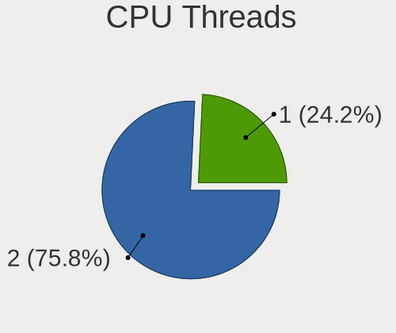

| Number | Notebooks | Percent |
|--------|-----------|---------|
| 2      | 25        | 75.76%  |
| 1      | 8         | 24.24%  |

CPU Op-Modes
------------

CPU Operation Modes (32-bit, 64-bit)

| Op mode        | Notebooks | Percent |
|----------------|-----------|---------|
| 32-bit, 64-bit | 33        | 100%    |

CPU Microcode
-------------

Microcode number

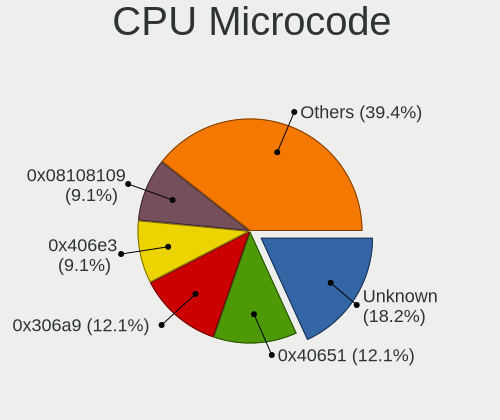

| Number     | Notebooks | Percent |
|------------|-----------|---------|
| Unknown    | 6         | 18.18%  |
| 0x40651    | 4         | 12.12%  |
| 0x306a9    | 4         | 12.12%  |
| 0x406e3    | 3         | 9.09%   |
| 0x08108109 | 3         | 9.09%   |
| 0x206a7    | 2         | 6.06%   |
| 0x06001119 | 2         | 6.06%   |
| 0x806ec    | 1         | 3.03%   |
| 0x806ea    | 1         | 3.03%   |
| 0x806e9    | 1         | 3.03%   |
| 0x406c4    | 1         | 3.03%   |
| 0x406c3    | 1         | 3.03%   |
| 0x306c3    | 1         | 3.03%   |
| 0x08600106 | 1         | 3.03%   |
| 0x07030105 | 1         | 3.03%   |
| 0x0500010d | 1         | 3.03%   |

CPU Microarch
-------------

Microarchitecture

| Name        | Notebooks | Percent |
|-------------|-----------|---------|
| KabyLake    | 7         | 21.21%  |
| Haswell     | 5         | 15.15%  |
| Zen+        | 4         | 12.12%  |
| IvyBridge   | 4         | 12.12%  |
| Skylake     | 3         | 9.09%   |
| Silvermont  | 2         | 6.06%   |
| SandyBridge | 2         | 6.06%   |
| Piledriver  | 2         | 6.06%   |
| Zen 2       | 1         | 3.03%   |
| Puma        | 1         | 3.03%   |
| Penryn      | 1         | 3.03%   |
| Bobcat      | 1         | 3.03%   |

Graphics
--------

GPU Vendor
----------

Vendors of graphics cards

| Vendor | Notebooks | Percent |
|--------|-----------|---------|
| Intel  | 24        | 55.81%  |
| AMD    | 10        | 23.26%  |
| Nvidia | 9         | 20.93%  |

GPU Model
---------

Graphics card models

| Model                                                                                    | Notebooks | Percent |
|------------------------------------------------------------------------------------------|-----------|---------|
| Intel UHD Graphics 620                                                                   | 4         | 8.7%    |
| Intel Haswell-ULT Integrated Graphics Controller                                         | 4         | 8.7%    |
| Intel 3rd Gen Core processor Graphics Controller                                         | 4         | 8.7%    |
| AMD Picasso/Raven 2 [Radeon Vega Series / Radeon Vega Mobile Series]                     | 4         | 8.7%    |
| Intel Skylake GT2 [HD Graphics 520]                                                      | 3         | 6.52%   |
| Nvidia GF117M [GeForce 610M/710M/810M/820M / GT 620M/625M/630M/720M]                     | 2         | 4.35%   |
| Intel Atom/Celeron/Pentium Processor x5-E8000/J3xxx/N3xxx Integrated Graphics Controller | 2         | 4.35%   |
| Intel 2nd Generation Core Processor Family Integrated Graphics Controller                | 2         | 4.35%   |
| AMD Topaz XT [Radeon R7 M260/M265 / M340/M360 / M440/M445 / 530/535 / 620/625 Mobile]    | 2         | 4.35%   |
| Nvidia GP107M [GeForce GTX 1050 Ti Mobile]                                               | 1         | 2.17%   |
| Nvidia GP107M [GeForce GTX 1050 3 GB Max-Q]                                              | 1         | 2.17%   |
| Nvidia GM108M [GeForce MX130]                                                            | 1         | 2.17%   |
| Nvidia GM108M [GeForce 840M]                                                             | 1         | 2.17%   |
| Nvidia GK208M [GeForce GT 740M]                                                          | 1         | 2.17%   |
| Nvidia GK107M [GeForce GT 650M Mac Edition]                                              | 1         | 2.17%   |
| Nvidia GF108M [GeForce GT 620M/630M/635M/640M LE]                                        | 1         | 2.17%   |
| Intel WhiskeyLake-U GT2 [UHD Graphics 620]                                               | 1         | 2.17%   |
| Intel Mobile GM965/GL960 Integrated Graphics Controller (secondary)                      | 1         | 2.17%   |
| Intel Mobile GM965/GL960 Integrated Graphics Controller (primary)                        | 1         | 2.17%   |
| Intel HD Graphics 630                                                                    | 1         | 2.17%   |
| Intel HD Graphics 620                                                                    | 1         | 2.17%   |
| Intel 4th Gen Core Processor Integrated Graphics Controller                              | 1         | 2.17%   |
| AMD Wrestler [Radeon HD 7310]                                                            | 1         | 2.17%   |
| AMD Saturn XT [FirePro M6100]                                                            | 1         | 2.17%   |
| AMD Richland [Radeon HD 8610G]                                                           | 1         | 2.17%   |
| AMD Richland [Radeon HD 8550G]                                                           | 1         | 2.17%   |
| AMD Renoir [Radeon Vega Series / Radeon Vega Mobile Series]                              | 1         | 2.17%   |
| AMD Mullins [Radeon R4/R5 Graphics]                                                      | 1         | 2.17%   |

GPU Combo
---------

Combinations of graphics cards

| Name           | Notebooks | Percent |
|----------------|-----------|---------|
| 1 x Intel      | 15        | 45.45%  |
| Intel + Nvidia | 8         | 24.24%  |
| 1 x AMD        | 6         | 18.18%  |
| 2 x AMD        | 2         | 6.06%   |
| Intel + AMD    | 1         | 3.03%   |
| AMD + Nvidia   | 1         | 3.03%   |

GPU Driver
----------

Free vs proprietary

| Driver | Notebooks | Percent |
|--------|-----------|---------|
| Free   | 33        | 100%    |

GPU Memory
----------

Total video memory

| Size in GB | Notebooks | Percent |
|------------|-----------|---------|
| Unknown    | 16        | 48.48%  |
| 1.01-2.0   | 6         | 18.18%  |
| 0.51-1.0   | 6         | 18.18%  |
| 0.01-0.5   | 4         | 12.12%  |
| 2.01-3.0   | 1         | 3.03%   |

Monitor
-------

Monitor Vendor
--------------

Monitor vendors

| Vendor              | Notebooks | Percent |
|---------------------|-----------|---------|
| AU Optronics        | 8         | 24.24%  |
| LG Display          | 6         | 18.18%  |
| Chimei Innolux      | 6         | 18.18%  |
| BOE                 | 5         | 15.15%  |
| Apple               | 3         | 9.09%   |
| Samsung Electronics | 2         | 6.06%   |
| PANDA               | 1         | 3.03%   |
| InfoVision          | 1         | 3.03%   |
| Dell                | 1         | 3.03%   |

Monitor Model
-------------

Monitor models

| Model                                                                | Notebooks | Percent |
|----------------------------------------------------------------------|-----------|---------|
| AU Optronics LCD Monitor AUO223D 1920x1080 309x174mm 14.0-inch       | 2         | 6.06%   |
| Samsung Electronics LCD Monitor SDC4347 1366x768 344x193mm 15.5-inch | 1         | 3.03%   |
| Samsung Electronics LCD Monitor SDC3754 1600x900 382x215mm 17.3-inch | 1         | 3.03%   |
| PANDA LCD Monitor NCP0064 1920x1080 344x194mm 15.5-inch              | 1         | 3.03%   |
| LG Display LCD Monitor LGD05EC 1920x1080 309x174mm 14.0-inch         | 1         | 3.03%   |
| LG Display LCD Monitor LGD04B3 1920x1080 345x194mm 15.6-inch         | 1         | 3.03%   |
| LG Display LCD Monitor LGD045C 1366x768 345x194mm 15.6-inch          | 1         | 3.03%   |
| LG Display LCD Monitor LGD039F 1366x768 345x194mm 15.6-inch          | 1         | 3.03%   |
| LG Display LCD Monitor LGD0372 1600x900 382x215mm 17.3-inch          | 1         | 3.03%   |
| LG Display LCD Monitor LGD02DA 1920x1080 382x215mm 17.3-inch         | 1         | 3.03%   |
| InfoVision LCD Monitor IVO057D 1920x1080 309x174mm 14.0-inch         | 1         | 3.03%   |
| Dell P2421D DELD0FF 2560x1440 527x296mm 23.8-inch                    | 1         | 3.03%   |
| Chimei Innolux LCD Monitor CMN15E6 1366x768 344x193mm 15.5-inch      | 1         | 3.03%   |
| Chimei Innolux LCD Monitor CMN15D6 1920x1080 344x193mm 15.5-inch     | 1         | 3.03%   |
| Chimei Innolux LCD Monitor CMN15BB 1920x1080 344x194mm 15.5-inch     | 1         | 3.03%   |
| Chimei Innolux LCD Monitor CMN14C9 1920x1080 309x173mm 13.9-inch     | 1         | 3.03%   |
| Chimei Innolux LCD Monitor CMN1239 1920x1080 276x155mm 12.5-inch     | 1         | 3.03%   |
| Chimei Innolux LCD Monitor CMN1130 1366x768 256x144mm 11.6-inch      | 1         | 3.03%   |
| BOE LCD Monitor BOE0802 1920x1080 344x193mm 15.5-inch                | 1         | 3.03%   |
| BOE LCD Monitor BOE07B5 1366x768 309x173mm 13.9-inch                 | 1         | 3.03%   |
| BOE LCD Monitor BOE0671 1366x768 344x194mm 15.5-inch                 | 1         | 3.03%   |
| BOE LCD Monitor BOE065F 1920x1080 344x194mm 15.5-inch                | 1         | 3.03%   |
| BOE LCD Monitor BOE0615 1366x768 309x173mm 13.9-inch                 | 1         | 3.03%   |
| AU Optronics LCD Monitor AUO683D 1920x1080 309x174mm 14.0-inch       | 1         | 3.03%   |
| AU Optronics LCD Monitor AUO48EC 1366x768 344x193mm 15.5-inch        | 1         | 3.03%   |
| AU Optronics LCD Monitor AUO305D 1920x1080 256x144mm 11.6-inch       | 1         | 3.03%   |
| AU Optronics LCD Monitor AUO233C 1366x768 309x173mm 13.9-inch        | 1         | 3.03%   |
| AU Optronics LCD Monitor AUO162C 1366x768 293x164mm 13.2-inch        | 1         | 3.03%   |
| AU Optronics LCD Monitor AUO159E 1600x900 382x214mm 17.2-inch        | 1         | 3.03%   |
| Apple LCD Monitor APP9C5F 1280x800 286x179mm 13.3-inch               | 1         | 3.03%   |
| Apple Color LCD APPA00E 2880x1800 331x207mm 15.4-inch                | 1         | 3.03%   |
| Apple Color LCD APP9CC7 1280x800 286x179mm 13.3-inch                 | 1         | 3.03%   |

Monitor Resolution
------------------

Monitor screen resolution

| Resolution      | Notebooks | Percent |
|-----------------|-----------|---------|
| 1920x1080 (FHD) | 15        | 45.45%  |
| 1366x768 (WXGA) | 11        | 33.33%  |
| 1600x900 (HD+)  | 3         | 9.09%   |
| 1280x800 (WXGA) | 2         | 6.06%   |
| 2880x1800       | 1         | 3.03%   |
| 2560x1440 (QHD) | 1         | 3.03%   |

Monitor Diagonal
----------------

Diagonal size in inches

| Inches | Notebooks | Percent |
|--------|-----------|---------|
| 15     | 13        | 39.39%  |
| 14     | 6         | 18.18%  |
| 13     | 6         | 18.18%  |
| 17     | 4         | 12.12%  |
| 11     | 2         | 6.06%   |
| 24     | 1         | 3.03%   |
| 12     | 1         | 3.03%   |

Monitor Width
-------------

Physical width

| Width in mm | Notebooks | Percent |
|-------------|-----------|---------|
| 301-350     | 22        | 66.67%  |
| 201-300     | 6         | 18.18%  |
| 351-400     | 4         | 12.12%  |
| 501-600     | 1         | 3.03%   |

Aspect Ratio
------------

Proportional relationship between the width and the height

| Ratio | Notebooks | Percent |
|-------|-----------|---------|
| 16/9  | 29        | 90.63%  |
| 16/10 | 3         | 9.38%   |

Monitor Area
------------

Area in inch²

| Area in inch² | Notebooks | Percent |
|----------------|-----------|---------|
| 101-110        | 13        | 39.39%  |
| 81-90          | 11        | 33.33%  |
| 121-130        | 4         | 12.12%  |
| 51-60          | 2         | 6.06%   |
| 71-80          | 1         | 3.03%   |
| 61-70          | 1         | 3.03%   |
| 201-250        | 1         | 3.03%   |

Pixel Density
-------------

Pixels per inch

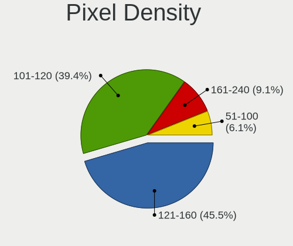

| Density | Notebooks | Percent |
|---------|-----------|---------|
| 121-160 | 15        | 45.45%  |
| 101-120 | 13        | 39.39%  |
| 161-240 | 3         | 9.09%   |
| 51-100  | 2         | 6.06%   |

Multiple Monitors
-----------------

Total monitors connected

| Total | Notebooks | Percent |
|-------|-----------|---------|
| 1     | 32        | 96.97%  |
| 2     | 1         | 3.03%   |

Network
-------

Net Controller Vendor
---------------------

Controller vendors

| Vendor                   | Notebooks | Percent |
|--------------------------|-----------|---------|
| Realtek Semiconductor    | 19        | 35.85%  |
| Qualcomm Atheros         | 11        | 20.75%  |
| Intel                    | 10        | 18.87%  |
| Broadcom                 | 5         | 9.43%   |
| Broadcom Limited         | 3         | 5.66%   |
| TP-Link                  | 1         | 1.89%   |
| Ralink                   | 1         | 1.89%   |
| Marvell Technology Group | 1         | 1.89%   |
| Google                   | 1         | 1.89%   |
| ASIX Electronics         | 1         | 1.89%   |

Net Controller Model
--------------------

Controller models

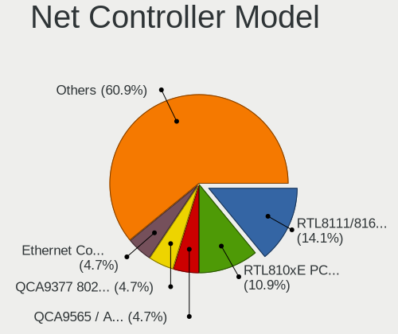

| Model                                                                  | Notebooks | Percent |
|------------------------------------------------------------------------|-----------|---------|
| Realtek RTL8111/8168/8211/8411 PCI Express Gigabit Ethernet Controller | 9         | 14.06%  |
| Realtek RTL810xE PCI Express Fast Ethernet controller                  | 7         | 10.94%  |
| Qualcomm Atheros QCA9565 / AR9565 Wireless Network Adapter             | 3         | 4.69%   |
| Qualcomm Atheros QCA9377 802.11ac Wireless Network Adapter             | 3         | 4.69%   |
| Intel Ethernet Connection (4) I219-LM                                  | 3         | 4.69%   |
| Realtek RTL8723BE PCIe Wireless Network Adapter                        | 2         | 3.13%   |
| Qualcomm Atheros QCA6174 802.11ac Wireless Network Adapter             | 2         | 3.13%   |
| Qualcomm Atheros AR9462 Wireless Network Adapter                       | 2         | 3.13%   |
| Intel Wireless 8265 / 8275                                             | 2         | 3.13%   |
| Broadcom BCM43142 802.11b/g/n                                          | 2         | 3.13%   |
| TP-Link UE300 10/100/1000 LAN (ethernet mode) [Realtek RTL8153]        | 1         | 1.56%   |
| Realtek RTL8822CE 802.11ac PCIe Wireless Network Adapter               | 1         | 1.56%   |
| Realtek RTL8821CE 802.11ac PCIe Wireless Network Adapter               | 1         | 1.56%   |
| Realtek RTL8821AE 802.11ac PCIe Wireless Network Adapter               | 1         | 1.56%   |
| Realtek RTL8723BU 802.11b/g/n WLAN Adapter                             | 1         | 1.56%   |
| Realtek RTL8188EE Wireless Network Adapter                             | 1         | 1.56%   |
| Realtek RTL8152 Fast Ethernet Adapter                                  | 1         | 1.56%   |
| Realtek 802.11ac NIC                                                   | 1         | 1.56%   |
| Ralink RT3290 Wireless 802.11n 1T/1R PCIe                              | 1         | 1.56%   |
| Qualcomm Atheros QCA8172 Fast Ethernet                                 | 1         | 1.56%   |
| Qualcomm Atheros AR8151 v2.0 Gigabit Ethernet                          | 1         | 1.56%   |
| Marvell Group 88E8058 PCI-E Gigabit Ethernet Controller                | 1         | 1.56%   |
| Intel Wireless 7265                                                    | 1         | 1.56%   |
| Intel Wireless 3165                                                    | 1         | 1.56%   |
| Intel Wi-Fi 6 AX200                                                    | 1         | 1.56%   |
| Intel Ethernet Connection I217-LM                                      | 1         | 1.56%   |
| Intel Ethernet Connection (4) I219-V                                   | 1         | 1.56%   |
| Intel Dual Band Wireless-AC 3165 Plus Bluetooth                        | 1         | 1.56%   |
| Intel Centrino Wireless-N 105                                          | 1         | 1.56%   |
| Google Pixel 6a                                                        | 1         | 1.56%   |
| Broadcom NetXtreme BCM57786 Gigabit Ethernet PCIe                      | 1         | 1.56%   |
| Broadcom NetXtreme BCM57765 Gigabit Ethernet PCIe                      | 1         | 1.56%   |
| Broadcom NetXtreme BCM57762 Gigabit Ethernet PCIe                      | 1         | 1.56%   |
| Broadcom Limited BCM4352 802.11ac Dual Band Wireless Network Adapter   | 1         | 1.56%   |
| Broadcom Limited BCM4331 802.11a/b/g/n                                 | 1         | 1.56%   |
| Broadcom Limited BCM43142 802.11b/g/n                                  | 1         | 1.56%   |
| Broadcom BCM4331 802.11a/b/g/n                                         | 1         | 1.56%   |
| Broadcom BCM4321 802.11a/b/g/n                                         | 1         | 1.56%   |
| ASIX AX88179 Gigabit Ethernet                                          | 1         | 1.56%   |

Wireless Vendor
---------------

Wireless vendors

| Vendor                | Notebooks | Percent |
|-----------------------|-----------|---------|
| Qualcomm Atheros      | 10        | 30.3%   |
| Realtek Semiconductor | 8         | 24.24%  |
| Intel                 | 7         | 21.21%  |
| Broadcom              | 4         | 12.12%  |
| Broadcom Limited      | 3         | 9.09%   |
| Ralink                | 1         | 3.03%   |

Wireless Model
--------------

Wireless models

| Model                                                                | Notebooks | Percent |
|----------------------------------------------------------------------|-----------|---------|
| Qualcomm Atheros QCA9565 / AR9565 Wireless Network Adapter           | 3         | 9.09%   |
| Qualcomm Atheros QCA9377 802.11ac Wireless Network Adapter           | 3         | 9.09%   |
| Realtek RTL8723BE PCIe Wireless Network Adapter                      | 2         | 6.06%   |
| Qualcomm Atheros QCA6174 802.11ac Wireless Network Adapter           | 2         | 6.06%   |
| Qualcomm Atheros AR9462 Wireless Network Adapter                     | 2         | 6.06%   |
| Intel Wireless 8265 / 8275                                           | 2         | 6.06%   |
| Broadcom BCM43142 802.11b/g/n                                        | 2         | 6.06%   |
| Realtek RTL8822CE 802.11ac PCIe Wireless Network Adapter             | 1         | 3.03%   |
| Realtek RTL8821CE 802.11ac PCIe Wireless Network Adapter             | 1         | 3.03%   |
| Realtek RTL8821AE 802.11ac PCIe Wireless Network Adapter             | 1         | 3.03%   |
| Realtek RTL8723BU 802.11b/g/n WLAN Adapter                           | 1         | 3.03%   |
| Realtek RTL8188EE Wireless Network Adapter                           | 1         | 3.03%   |
| Realtek 802.11ac NIC                                                 | 1         | 3.03%   |
| Ralink RT3290 Wireless 802.11n 1T/1R PCIe                            | 1         | 3.03%   |
| Intel Wireless 7265                                                  | 1         | 3.03%   |
| Intel Wireless 3165                                                  | 1         | 3.03%   |
| Intel Wi-Fi 6 AX200                                                  | 1         | 3.03%   |
| Intel Dual Band Wireless-AC 3165 Plus Bluetooth                      | 1         | 3.03%   |
| Intel Centrino Wireless-N 105                                        | 1         | 3.03%   |
| Broadcom Limited BCM4352 802.11ac Dual Band Wireless Network Adapter | 1         | 3.03%   |
| Broadcom Limited BCM4331 802.11a/b/g/n                               | 1         | 3.03%   |
| Broadcom Limited BCM43142 802.11b/g/n                                | 1         | 3.03%   |
| Broadcom BCM4331 802.11a/b/g/n                                       | 1         | 3.03%   |
| Broadcom BCM4321 802.11a/b/g/n                                       | 1         | 3.03%   |

Ethernet Vendor
---------------

Ethernet vendors

| Vendor                   | Notebooks | Percent |
|--------------------------|-----------|---------|
| Realtek Semiconductor    | 17        | 56.67%  |
| Intel                    | 5         | 16.67%  |
| Qualcomm Atheros         | 2         | 6.67%   |
| Broadcom                 | 2         | 6.67%   |
| TP-Link                  | 1         | 3.33%   |
| Marvell Technology Group | 1         | 3.33%   |
| Google                   | 1         | 3.33%   |
| ASIX Electronics         | 1         | 3.33%   |

Ethernet Model
--------------

Ethernet models

| Model                                                                  | Notebooks | Percent |
|------------------------------------------------------------------------|-----------|---------|
| Realtek RTL8111/8168/8211/8411 PCI Express Gigabit Ethernet Controller | 9         | 29.03%  |
| Realtek RTL810xE PCI Express Fast Ethernet controller                  | 7         | 22.58%  |
| Intel Ethernet Connection (4) I219-LM                                  | 3         | 9.68%   |
| TP-Link UE300 10/100/1000 LAN (ethernet mode) [Realtek RTL8153]        | 1         | 3.23%   |
| Realtek RTL8152 Fast Ethernet Adapter                                  | 1         | 3.23%   |
| Qualcomm Atheros QCA8172 Fast Ethernet                                 | 1         | 3.23%   |
| Qualcomm Atheros AR8151 v2.0 Gigabit Ethernet                          | 1         | 3.23%   |
| Marvell Group 88E8058 PCI-E Gigabit Ethernet Controller                | 1         | 3.23%   |
| Intel Ethernet Connection I217-LM                                      | 1         | 3.23%   |
| Intel Ethernet Connection (4) I219-V                                   | 1         | 3.23%   |
| Google Pixel 6a                                                        | 1         | 3.23%   |
| Broadcom NetXtreme BCM57786 Gigabit Ethernet PCIe                      | 1         | 3.23%   |
| Broadcom NetXtreme BCM57765 Gigabit Ethernet PCIe                      | 1         | 3.23%   |
| Broadcom NetXtreme BCM57762 Gigabit Ethernet PCIe                      | 1         | 3.23%   |
| ASIX AX88179 Gigabit Ethernet                                          | 1         | 3.23%   |

Net Controller Kind
-------------------

Ethernet, WiFi or modem

| Kind     | Notebooks | Percent |
|----------|-----------|---------|
| WiFi     | 33        | 53.23%  |
| Ethernet | 29        | 46.77%  |

Used Controller
---------------

Currently used network controller

| Kind     | Notebooks | Percent |
|----------|-----------|---------|
| Ethernet | 17        | 51.52%  |
| WiFi     | 16        | 48.48%  |

NICs
----

Total network controllers on board

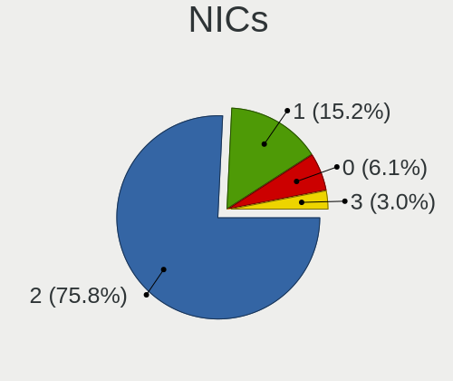

| Total | Notebooks | Percent |
|-------|-----------|---------|
| 2     | 25        | 75.76%  |
| 1     | 5         | 15.15%  |
| 0     | 2         | 6.06%   |
| 3     | 1         | 3.03%   |

IPv6
----

IPv6 vs IPv4

| Used | Notebooks | Percent |
|------|-----------|---------|
| No   | 25        | 73.53%  |
| Yes  | 9         | 26.47%  |

Bluetooth
---------

Bluetooth Vendor
----------------

Controller vendors

| Vendor                          | Notebooks | Percent |
|---------------------------------|-----------|---------|
| Qualcomm Atheros Communications | 6         | 21.43%  |
| Intel                           | 6         | 21.43%  |
| Realtek Semiconductor           | 5         | 17.86%  |
| Lite-On Technology              | 4         | 14.29%  |
| Apple                           | 3         | 10.71%  |
| Toshiba                         | 1         | 3.57%   |
| Ralink                          | 1         | 3.57%   |
| Dell                            | 1         | 3.57%   |
| Broadcom                        | 1         | 3.57%   |

Bluetooth Model
---------------

Controller models

| Model                                        | Notebooks | Percent |
|----------------------------------------------|-----------|---------|
| Qualcomm Atheros  Bluetooth Device           | 5         | 17.86%  |
| Intel Bluetooth wireless interface           | 5         | 17.86%  |
| Realtek Bluetooth Radio                      | 3         | 10.71%  |
| Lite-On Broadcom BCM43142A0 Bluetooth Device | 2         | 7.14%   |
| Apple Bluetooth Host Controller              | 2         | 7.14%   |
| Toshiba Bluetooth Device                     | 1         | 3.57%   |
| Realtek RTL8821A Bluetooth                   | 1         | 3.57%   |
| Realtek  Bluetooth 4.2 Adapter               | 1         | 3.57%   |
| Ralink RT3290 Bluetooth                      | 1         | 3.57%   |
| Qualcomm Atheros AR9462 Bluetooth            | 1         | 3.57%   |
| Lite-On Qualcomm Atheros QCA9377 Bluetooth   | 1         | 3.57%   |
| Lite-On Bluetooth Device                     | 1         | 3.57%   |
| Intel AX200 Bluetooth                        | 1         | 3.57%   |
| Dell Broadcom BCM20702A0 Bluetooth           | 1         | 3.57%   |
| Broadcom BCM43142A0 Bluetooth Device         | 1         | 3.57%   |
| Apple Bluetooth HCI MacBookPro (HID mode)    | 1         | 3.57%   |

Sound
-----

Sound Vendor
------------

Sound card vendors

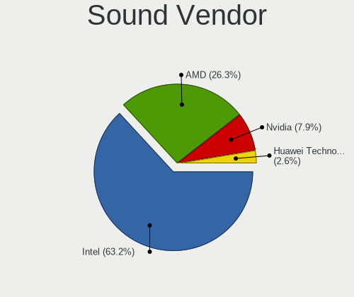

| Vendor              | Notebooks | Percent |
|---------------------|-----------|---------|
| Intel               | 24        | 63.16%  |
| AMD                 | 10        | 26.32%  |
| Nvidia              | 3         | 7.89%   |
| Huawei Technologies | 1         | 2.63%   |

Sound Model
-----------

Sound card models

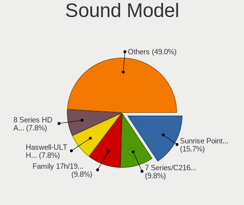

| Model                                                                                             | Notebooks | Percent |
|---------------------------------------------------------------------------------------------------|-----------|---------|
| Intel Sunrise Point-LP HD Audio                                                                   | 8         | 15.69%  |
| Intel 7 Series/C216 Chipset Family High Definition Audio Controller                               | 5         | 9.8%    |
| AMD Family 17h/19h/1ah HD Audio Controller                                                        | 5         | 9.8%    |
| Intel Haswell-ULT HD Audio Controller                                                             | 4         | 7.84%   |
| Intel 8 Series HD Audio Controller                                                                | 4         | 7.84%   |
| AMD FCH Azalia Controller                                                                         | 4         | 7.84%   |
| AMD Raven/Raven2/Fenghuang HDMI/DP Audio Controller                                               | 3         | 5.88%   |
| Intel Atom/Celeron/Pentium Processor x5-E8000/J3xxx/N3xxx Series High Definition Audio Controller | 2         | 3.92%   |
| AMD Trinity HDMI Audio Controller                                                                 | 2         | 3.92%   |
| Nvidia GP107GL High Definition Audio Controller                                                   | 1         | 1.96%   |
| Nvidia GK107 HDMI Audio Controller                                                                | 1         | 1.96%   |
| Nvidia GF108 High Definition Audio Controller                                                     | 1         | 1.96%   |
| Intel Xeon E3-1200 v3/4th Gen Core Processor HD Audio Controller                                  | 1         | 1.96%   |
| Intel CM238 HD Audio Controller                                                                   | 1         | 1.96%   |
| Intel Cannon Point-LP High Definition Audio Controller                                            | 1         | 1.96%   |
| Intel 82801H (ICH8 Family) HD Audio Controller                                                    | 1         | 1.96%   |
| Intel 8 Series/C220 Series Chipset High Definition Audio Controller                               | 1         | 1.96%   |
| Intel 6 Series/C200 Series Chipset Family High Definition Audio Controller                        | 1         | 1.96%   |
| Huawei Technologies USB-C HEADSET                                                                 | 1         | 1.96%   |
| AMD Wrestler HDMI Audio                                                                           | 1         | 1.96%   |
| AMD Tobago HDMI Audio [Radeon R7 360 / R9 360 OEM]                                                | 1         | 1.96%   |
| AMD Renoir Radeon High Definition Audio Controller                                                | 1         | 1.96%   |
| AMD Kabini HDMI/DP Audio                                                                          | 1         | 1.96%   |

Memory
------

Memory Vendor
-------------

Memory module vendors

| Vendor            | Notebooks | Percent |
|-------------------|-----------|---------|
| Micron Technology | 1         | 100%    |

Memory Model
------------

Memory module models

| Model                                                            | Notebooks | Percent |
|------------------------------------------------------------------|-----------|---------|
| Micron RAM MT53E1G32D4NQ-046WTE 8GB Row Of Chips LPDDR4 4266MT/s | 1         | 100%    |

Memory Kind
-----------

Memory module kinds

| Kind   | Notebooks | Percent |
|--------|-----------|---------|
| LPDDR4 | 1         | 100%    |

Memory Form Factor
------------------

Physical design of the memory module

| Name         | Notebooks | Percent |
|--------------|-----------|---------|
| Row Of Chips | 1         | 100%    |

Memory Size
-----------

Memory module size

| Size | Notebooks | Percent |
|------|-----------|---------|
| 8192 | 1         | 100%    |

Memory Speed
------------

Memory module speed

| Speed | Notebooks | Percent |
|-------|-----------|---------|
| 4266  | 1         | 100%    |

Printers & scanners
-------------------

Printer Vendor
--------------

Printer device vendors

Zero info for selected period =(

Printer Model
-------------

Printer device models

Zero info for selected period =(

Scanner Vendor
--------------

Scanner device vendors

Zero info for selected period =(

Scanner Model
-------------

Scanner device models

Zero info for selected period =(

Camera
------

Camera Vendor
-------------

Camera device vendors

| Vendor                                 | Notebooks | Percent |
|----------------------------------------|-----------|---------|
| Chicony Electronics                    | 8         | 26.67%  |
| Realtek Semiconductor                  | 5         | 16.67%  |
| Suyin                                  | 3         | 10%     |
| Sunplus Innovation Technology          | 2         | 6.67%   |
| Microdia                               | 2         | 6.67%   |
| Cheng Uei Precision Industry (Foxlink) | 2         | 6.67%   |
| Apple                                  | 2         | 6.67%   |
| Syntek                                 | 1         | 3.33%   |
| Quanta                                 | 1         | 3.33%   |
| Logitech                               | 1         | 3.33%   |
| Lite-On Technology                     | 1         | 3.33%   |
| IMC Networks                           | 1         | 3.33%   |
| HRY                                    | 1         | 3.33%   |

Camera Model
------------

Camera device models

| Model                                            | Notebooks | Percent |
|--------------------------------------------------|-----------|---------|
| Suyin HP Truevision HD                           | 3         | 9.68%   |
| Realtek USB Camera                               | 2         | 6.45%   |
| Chicony Integrated Camera                        | 2         | 6.45%   |
| Syntek Integrated Camera                         | 1         | 3.23%   |
| Sunplus Integrated_Webcam_HD                     | 1         | 3.23%   |
| Sunplus HD WebCam                                | 1         | 3.23%   |
| Realtek USB2.0 HD UVC WebCam                     | 1         | 3.23%   |
| Realtek Integrated_Webcam_HD                     | 1         | 3.23%   |
| Realtek Integrated Camera                        | 1         | 3.23%   |
| Quanta HD Webcam                                 | 1         | 3.23%   |
| Microdia Integrated_Webcam_HD                    | 1         | 3.23%   |
| Microdia Integrated Webcam HD                    | 1         | 3.23%   |
| Logitech Webcam C270                             | 1         | 3.23%   |
| Lite-On Integrated Camera                        | 1         | 3.23%   |
| IMC Networks HP TrueVision HD Camera             | 1         | 3.23%   |
| HRY USB Camera                                   | 1         | 3.23%   |
| Chicony USB2.0 VGA UVC WebCam                    | 1         | 3.23%   |
| Chicony USB2.0 HD UVC WebCam                     | 1         | 3.23%   |
| Chicony TOSHIBA Web Camera - HD                  | 1         | 3.23%   |
| Chicony Integrated Camera (1280x720@30)          | 1         | 3.23%   |
| Chicony HP HD Camera                             | 1         | 3.23%   |
| Chicony HD WebCam                                | 1         | 3.23%   |
| Chicony 5M Cam                                   | 1         | 3.23%   |
| Cheng Uei Precision Industry (Foxlink) Webcam    | 1         | 3.23%   |
| Cheng Uei Precision Industry (Foxlink) HP Webcam | 1         | 3.23%   |
| Apple FaceTime HD Camera (Built-in)              | 1         | 3.23%   |
| Apple FaceTime HD Camera                         | 1         | 3.23%   |

Security
--------

Fingerprint Vendor
------------------

Fingerprint sensor vendors

| Vendor             | Notebooks | Percent |
|--------------------|-----------|---------|
| Synaptics          | 2         | 50%     |
| Validity Sensors   | 1         | 25%     |
| Focal-systems.Corp | 1         | 25%     |

Fingerprint Model
-----------------

Fingerprint sensor models

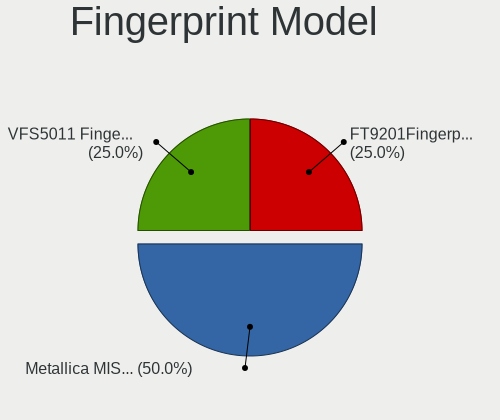

| Model                                            | Notebooks | Percent |
|--------------------------------------------------|-----------|---------|
| Synaptics Metallica MIS Touch Fingerprint Reader | 2         | 50%     |
| Validity Sensors VFS5011 Fingerprint Reader      | 1         | 25%     |
| Focal-systems.Corp FT9201Fingerprint.̚        | 1         | 25%     |

Chipcard Vendor
---------------

Chipcard module vendors

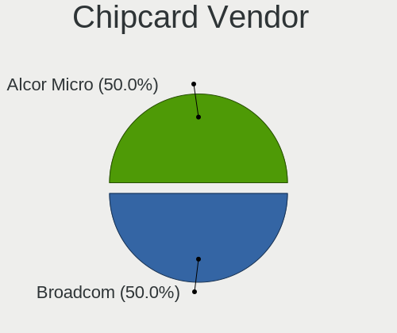

| Vendor      | Notebooks | Percent |
|-------------|-----------|---------|
| Broadcom    | 1         | 50%     |
| Alcor Micro | 1         | 50%     |

Chipcard Model
--------------

Chipcard module models

| Model                                          | Notebooks | Percent |
|------------------------------------------------|-----------|---------|
| Broadcom BCM5880 Secure Applications Processor | 1         | 50%     |
| Alcor Micro AU9540 Smartcard Reader            | 1         | 50%     |

Unsupported
-----------

Unsupported Devices
-------------------

Total unsupported devices on board

| Total | Notebooks | Percent |
|-------|-----------|---------|
| 2     | 12        | 36.36%  |
| 1     | 10        | 30.3%   |
| 3     | 5         | 15.15%  |
| 4     | 3         | 9.09%   |
| 0     | 3         | 9.09%   |

Unsupported Device Types
------------------------

Types of unsupported devices

| Type                     | Notebooks | Percent |
|--------------------------|-----------|---------|
| Communication controller | 20        | 32.26%  |
| Net/wireless             | 14        | 22.58%  |
| Graphics card            | 5         | 8.06%   |
| Card reader              | 5         | 8.06%   |
| Bluetooth                | 5         | 8.06%   |
| Multimedia controller    | 4         | 6.45%   |
| Fingerprint reader       | 4         | 6.45%   |
| Net/ethernet             | 3         | 4.84%   |
| Storage/ide              | 1         | 1.61%   |
| Chipcard                 | 1         | 1.61%   |

