Garuda Linux - Tested Hardware & Statistics
-------------------------------------------

A project to collect tested hardware configurations for Garuda Linux.

Anyone can contribute to this report by the [hw-probe](https://github.com/linuxhw/hw-probe) tool:

    sudo -E hw-probe -all -upload

Please contribute! Especially if your hardware is rare.

This is a report for all computer types. See also reports for [desktops](/Dist/Garuda_Linux/Desktop/README.md) and [notebooks](/Dist/Garuda_Linux/Notebook/README.md).

Contents
--------

* [ Test Cases ](#test-cases)

* [ System ](#system)
  - [ OS                       ](#os)
  - [ OS Family                ](#os-family)
  - [ Kernel                   ](#kernel)
  - [ Kernel Family            ](#kernel-family)
  - [ Kernel Major Ver.        ](#kernel-major-ver)
  - [ Arch                     ](#arch)
  - [ DE                       ](#de)
  - [ Display Server           ](#display-server)
  - [ Display Manager          ](#display-manager)
  - [ OS Lang                  ](#os-lang)
  - [ Boot Mode                ](#boot-mode)
  - [ Filesystem               ](#filesystem)
  - [ Part. scheme             ](#part-scheme)
  - [ Dual Boot with Linux/BSD ](#dual-boot-with-linuxbsd)
  - [ Dual Boot (Win)          ](#dual-boot-win)

* [ Board ](#board)
  - [ Vendor                   ](#vendor)
  - [ Model                    ](#model)
  - [ Model Family             ](#model-family)
  - [ MFG Year                 ](#mfg-year)
  - [ Form Factor              ](#form-factor)
  - [ Secure Boot              ](#secure-boot)
  - [ Coreboot                 ](#coreboot)
  - [ RAM Size                 ](#ram-size)
  - [ RAM Used                 ](#ram-used)
  - [ Total Drives             ](#total-drives)
  - [ Has CD-ROM               ](#has-cd-rom)
  - [ Has Ethernet             ](#has-ethernet)
  - [ Has WiFi                 ](#has-wifi)
  - [ Has Bluetooth            ](#has-bluetooth)

* [ Location ](#location)
  - [ Country                  ](#country)
  - [ City                     ](#city)

* [ Drives ](#drives)
  - [ Drive Vendor             ](#drive-vendor)
  - [ Drive Model              ](#drive-model)
  - [ HDD Vendor               ](#hdd-vendor)
  - [ SSD Vendor               ](#ssd-vendor)
  - [ Drive Kind               ](#drive-kind)
  - [ Drive Connector          ](#drive-connector)
  - [ Drive Size               ](#drive-size)
  - [ Space Total              ](#space-total)
  - [ Space Used               ](#space-used)
  - [ Malfunc. Drives          ](#malfunc-drives)
  - [ Malfunc. Drive Vendor    ](#malfunc-drive-vendor)
  - [ Malfunc. HDD Vendor      ](#malfunc-hdd-vendor)
  - [ Malfunc. Drive Kind      ](#malfunc-drive-kind)
  - [ Failed Drives            ](#failed-drives)
  - [ Failed Drive Vendor      ](#failed-drive-vendor)
  - [ Drive Status             ](#drive-status)

* [ Storage controller ](#storage-controller)
  - [ Storage Vendor           ](#storage-vendor)
  - [ Storage Model            ](#storage-model)
  - [ Storage Kind             ](#storage-kind)

* [ Processor ](#processor)
  - [ CPU Vendor               ](#cpu-vendor)
  - [ CPU Model                ](#cpu-model)
  - [ CPU Model Family         ](#cpu-model-family)
  - [ CPU Cores                ](#cpu-cores)
  - [ CPU Sockets              ](#cpu-sockets)
  - [ CPU Threads              ](#cpu-threads)
  - [ CPU Op-Modes             ](#cpu-op-modes)
  - [ CPU Microcode            ](#cpu-microcode)
  - [ CPU Microarch            ](#cpu-microarch)

* [ Graphics ](#graphics)
  - [ GPU Vendor               ](#gpu-vendor)
  - [ GPU Model                ](#gpu-model)
  - [ GPU Combo                ](#gpu-combo)
  - [ GPU Driver               ](#gpu-driver)
  - [ GPU Memory               ](#gpu-memory)

* [ Monitor ](#monitor)
  - [ Monitor Vendor           ](#monitor-vendor)
  - [ Monitor Model            ](#monitor-model)
  - [ Monitor Resolution       ](#monitor-resolution)
  - [ Monitor Diagonal         ](#monitor-diagonal)
  - [ Monitor Width            ](#monitor-width)
  - [ Aspect Ratio             ](#aspect-ratio)
  - [ Monitor Area             ](#monitor-area)
  - [ Pixel Density            ](#pixel-density)
  - [ Multiple Monitors        ](#multiple-monitors)

* [ Network ](#network)
  - [ Net Controller Vendor    ](#net-controller-vendor)
  - [ Net Controller Model     ](#net-controller-model)
  - [ Wireless Vendor          ](#wireless-vendor)
  - [ Wireless Model           ](#wireless-model)
  - [ Ethernet Vendor          ](#ethernet-vendor)
  - [ Ethernet Model           ](#ethernet-model)
  - [ Net Controller Kind      ](#net-controller-kind)
  - [ Used Controller          ](#used-controller)
  - [ NICs                     ](#nics)
  - [ IPv6                     ](#ipv6)

* [ Bluetooth ](#bluetooth)
  - [ Bluetooth Vendor         ](#bluetooth-vendor)
  - [ Bluetooth Model          ](#bluetooth-model)

* [ Sound ](#sound)
  - [ Sound Vendor             ](#sound-vendor)
  - [ Sound Model              ](#sound-model)

* [ Memory ](#memory)
  - [ Memory Vendor            ](#memory-vendor)
  - [ Memory Model             ](#memory-model)
  - [ Memory Kind              ](#memory-kind)
  - [ Memory Form Factor       ](#memory-form-factor)
  - [ Memory Size              ](#memory-size)
  - [ Memory Speed             ](#memory-speed)

* [ Printers & scanners ](#printers--scanners)
  - [ Printer Vendor           ](#printer-vendor)
  - [ Printer Model            ](#printer-model)
  - [ Scanner Vendor           ](#scanner-vendor)
  - [ Scanner Model            ](#scanner-model)

* [ Camera ](#camera)
  - [ Camera Vendor            ](#camera-vendor)
  - [ Camera Model             ](#camera-model)

* [ Security ](#security)
  - [ Fingerprint Vendor       ](#fingerprint-vendor)
  - [ Fingerprint Model        ](#fingerprint-model)
  - [ Chipcard Vendor          ](#chipcard-vendor)
  - [ Chipcard Model           ](#chipcard-model)

* [ Unsupported ](#unsupported)
  - [ Unsupported Devices      ](#unsupported-devices)
  - [ Unsupported Device Types ](#unsupported-device-types)

Test Cases
----------

Total: 1676

| Vendor        | Model                       | Form-Factor | Probe                                                      | Date         |
|---------------|-----------------------------|-------------|------------------------------------------------------------|--------------|
| HP            | ENVY 15                     | Notebook    | [d9445a94bd](https://linux-hardware.org/?probe=d9445a94bd) | Jan 03, 2026 |
| Gigabyte      | X870E AORUS ELITE WIFI7     | Desktop     | [2db823294a](https://linux-hardware.org/?probe=2db823294a) | Jan 03, 2026 |
| Dell          | Inspiron 13-5378            | Notebook    | [ce07c7b172](https://linux-hardware.org/?probe=ce07c7b172) | Jan 01, 2026 |
| Dell          | Vostro 5490                 | Notebook    | [bfd9866176](https://linux-hardware.org/?probe=bfd9866176) | Dec 30, 2025 |
| ASUSTek       | PRIME B450-PLUS             | Desktop     | [bcb86df684](https://linux-hardware.org/?probe=bcb86df684) | Dec 30, 2025 |
| MSI           | PRO X870-P WIFI             | Desktop     | [48c2121370](https://linux-hardware.org/?probe=48c2121370) | Dec 28, 2025 |
| ASUSTek       | TUF Gaming X570-PLUS        | Desktop     | [b5eaa8c55a](https://linux-hardware.org/?probe=b5eaa8c55a) | Dec 26, 2025 |
| ASUSTek       | TUF Gaming X570-PLUS        | Desktop     | [5d368d5c45](https://linux-hardware.org/?probe=5d368d5c45) | Dec 26, 2025 |
| ASRock        | B650M Pro RS                | Desktop     | [6eb8daf1f0](https://linux-hardware.org/?probe=6eb8daf1f0) | Dec 26, 2025 |
| MSI           | Katana GF66 11UC            | Notebook    | [eed2171b8a](https://linux-hardware.org/?probe=eed2171b8a) | Dec 26, 2025 |
| MSI           | Katana GF66 11UC            | Notebook    | [b3c8abc3b6](https://linux-hardware.org/?probe=b3c8abc3b6) | Dec 26, 2025 |
| Lenovo        | LOQ 15IRX10 83JE            | Notebook    | [d6bf940539](https://linux-hardware.org/?probe=d6bf940539) | Dec 26, 2025 |
| ASUSTek       | PRIME Z490-V                | Desktop     | [c509f4c611](https://linux-hardware.org/?probe=c509f4c611) | Dec 26, 2025 |
| MSI           | PRO B650-S WIFI             | Desktop     | [032fbe9268](https://linux-hardware.org/?probe=032fbe9268) | Dec 25, 2025 |
| Dell          | Inspiron 16 7620 2-in-1     | Convertible | [0470c87b81](https://linux-hardware.org/?probe=0470c87b81) | Dec 24, 2025 |
| ASUSTek       | ASUS EXPERTBOOK B1500CEP... | Notebook    | [8ef8ba5ce0](https://linux-hardware.org/?probe=8ef8ba5ce0) | Dec 23, 2025 |
| ASUSTek       | ASUS EXPERTBOOK B1500CEP... | Notebook    | [05b3c78f4f](https://linux-hardware.org/?probe=05b3c78f4f) | Dec 23, 2025 |
| ASUSTek       | ROG STRIX B550-XE GAMING... | Desktop     | [6f3ed8e1ff](https://linux-hardware.org/?probe=6f3ed8e1ff) | Dec 22, 2025 |
| COM1          | NBINF-X5-9G5                | Notebook    | [0cab2b0b84](https://linux-hardware.org/?probe=0cab2b0b84) | Dec 21, 2025 |
| ASUSTek       | TUF Gaming B560M-PLUS WI... | Desktop     | [be3c56c465](https://linux-hardware.org/?probe=be3c56c465) | Dec 21, 2025 |
| Acer          | Predator PHN16-73           | Notebook    | [011b8833c9](https://linux-hardware.org/?probe=011b8833c9) | Dec 19, 2025 |
| Lenovo        | ThinkPad T14s Gen 1 20UH... | Notebook    | [6a6b09a710](https://linux-hardware.org/?probe=6a6b09a710) | Dec 18, 2025 |
| Dell          | 0F6X5P A00                  | Desktop     | [17e1141202](https://linux-hardware.org/?probe=17e1141202) | Dec 18, 2025 |
| HP            | Victus by Gaming Laptop ... | Notebook    | [8575420334](https://linux-hardware.org/?probe=8575420334) | Dec 17, 2025 |
| HP            | EliteBook 840 G8 Noteboo... | Notebook    | [ec7b63cebb](https://linux-hardware.org/?probe=ec7b63cebb) | Dec 15, 2025 |
| ASUSTek       | ROG Zephyrus G15 GA503RM... | Notebook    | [5d3731f0fc](https://linux-hardware.org/?probe=5d3731f0fc) | Dec 14, 2025 |
| Lenovo        | Yoga Slim 7 15ILL9 83HM     | Notebook    | [559a94e940](https://linux-hardware.org/?probe=559a94e940) | Dec 14, 2025 |
| ASRock        | B450M-HDV R4.0              | Desktop     | [0bbea6ad55](https://linux-hardware.org/?probe=0bbea6ad55) | Dec 12, 2025 |
| Apple         | Mac-42FD25EABCABB274 iMa... | All in one  | [922e28e382](https://linux-hardware.org/?probe=922e28e382) | Dec 09, 2025 |
| Dell          | Inspiron 3541               | Notebook    | [de95f9386e](https://linux-hardware.org/?probe=de95f9386e) | Dec 09, 2025 |
| Lenovo        | IdeaPad Gaming 3 15ARH7 ... | Notebook    | [cf54d3afae](https://linux-hardware.org/?probe=cf54d3afae) | Dec 09, 2025 |
| ASUSTek       | PRIME B660M-A AC D4         | Desktop     | [c86f323faf](https://linux-hardware.org/?probe=c86f323faf) | Dec 08, 2025 |
| ASRock        | Z790 Taichi Carrara         | Desktop     | [1006f29a57](https://linux-hardware.org/?probe=1006f29a57) | Dec 06, 2025 |
| ASUSTek       | ROG STRIX B650E-E GAMING... | Desktop     | [4321cb91e9](https://linux-hardware.org/?probe=4321cb91e9) | Dec 06, 2025 |
| Apple         | Mac-42FD25EABCABB274 iMa... | All in one  | [ddcb489f12](https://linux-hardware.org/?probe=ddcb489f12) | Dec 05, 2025 |
| Gigabyte      | X570S AORUS MASTER          | Desktop     | [23109f5b66](https://linux-hardware.org/?probe=23109f5b66) | Dec 04, 2025 |
| Lenovo        | Inagua CRB                  | All in one  | [465aeba506](https://linux-hardware.org/?probe=465aeba506) | Dec 03, 2025 |
| HP            | Laptop 14s-fq1xxx           | Notebook    | [a456a8813a](https://linux-hardware.org/?probe=a456a8813a) | Nov 29, 2025 |
| Lenovo        | Legion 5 15IMH05H 81Y6      | Notebook    | [3773567220](https://linux-hardware.org/?probe=3773567220) | Nov 29, 2025 |
| ASRock        | X870 Steel Legend WiFi      | Desktop     | [b8323b233c](https://linux-hardware.org/?probe=b8323b233c) | Nov 28, 2025 |
| HP            | 2AF8                        | All in one  | [c86669c266](https://linux-hardware.org/?probe=c86669c266) | Nov 26, 2025 |
| ASUSTek       | ROG CROSSHAIR X670E EXTR... | Desktop     | [841e113682](https://linux-hardware.org/?probe=841e113682) | Nov 25, 2025 |
| HP            | OMEN by Laptop 15t-dc100    | Notebook    | [0c8c8897cd](https://linux-hardware.org/?probe=0c8c8897cd) | Nov 25, 2025 |
| Lenovo        | Inagua CRB                  | All in one  | [22d199cf94](https://linux-hardware.org/?probe=22d199cf94) | Nov 24, 2025 |
| Lenovo        | Inagua CRB                  | All in one  | [7409dc3d26](https://linux-hardware.org/?probe=7409dc3d26) | Nov 24, 2025 |
| AB8139        | LX15PRO                     | Notebook    | [3d3258993d](https://linux-hardware.org/?probe=3d3258993d) | Nov 24, 2025 |
| Gigabyte      | B650 GAMING X               | Desktop     | [bcfb83022b](https://linux-hardware.org/?probe=bcfb83022b) | Nov 23, 2025 |
| HP            | Victus by Gaming Laptop ... | Notebook    | [a9b052d5b9](https://linux-hardware.org/?probe=a9b052d5b9) | Nov 22, 2025 |
| Gigabyte      | B650 EAGLE AX               | Desktop     | [cf2159fc52](https://linux-hardware.org/?probe=cf2159fc52) | Nov 22, 2025 |
| MSI           | GS75 Stealth 9SF            | Notebook    | [44c3724c1d](https://linux-hardware.org/?probe=44c3724c1d) | Nov 22, 2025 |
| Apple         | MacBookAir7,2               | Notebook    | [3964922be3](https://linux-hardware.org/?probe=3964922be3) | Nov 22, 2025 |
| Lenovo        | ThinkPad E14 Gen 4 21EBC... | Notebook    | [cd3261a1b6](https://linux-hardware.org/?probe=cd3261a1b6) | Nov 21, 2025 |
| Dell          | 0WMJ54 A01                  | Desktop     | [ebe2b60e70](https://linux-hardware.org/?probe=ebe2b60e70) | Nov 16, 2025 |
| Dell          | 0WMJ54 A01                  | Desktop     | [af807d18e5](https://linux-hardware.org/?probe=af807d18e5) | Nov 16, 2025 |
| Apple         | MacBookPro14,1              | Notebook    | [291b2377da](https://linux-hardware.org/?probe=291b2377da) | Nov 14, 2025 |
| MSI           | MPG X570 GAMING PLUS        | Desktop     | [cc336f258c](https://linux-hardware.org/?probe=cc336f258c) | Nov 14, 2025 |
| ASUSTek       | PRIME B660M-A AC D4         | Desktop     | [47d19348ee](https://linux-hardware.org/?probe=47d19348ee) | Nov 13, 2025 |
| HP            | Victus by Gaming Laptop ... | Notebook    | [a4ee3ec979](https://linux-hardware.org/?probe=a4ee3ec979) | Nov 12, 2025 |
| ASUSTek       | VivoBook_ASUSLaptop X513... | Notebook    | [d354b8ffbd](https://linux-hardware.org/?probe=d354b8ffbd) | Nov 10, 2025 |
| TUXEDO        | Unknown                     | Notebook    | [e99399e577](https://linux-hardware.org/?probe=e99399e577) | Nov 07, 2025 |
| HP            | Victus by Gaming Laptop ... | Notebook    | [2df16d3f85](https://linux-hardware.org/?probe=2df16d3f85) | Nov 07, 2025 |
| ASUSTek       | ROG STRIX X370-F GAMING     | Desktop     | [4006fef9fc](https://linux-hardware.org/?probe=4006fef9fc) | Nov 05, 2025 |
| QIYIDA        | X99 K9S                     | Desktop     | [a7ff6006fd](https://linux-hardware.org/?probe=a7ff6006fd) | Nov 05, 2025 |
| HP            | 2B42 100                    | All in one  | [ed36f8cb7d](https://linux-hardware.org/?probe=ed36f8cb7d) | Nov 04, 2025 |
| Chuwi         | CoreBook X                  | Notebook    | [9a479ddd13](https://linux-hardware.org/?probe=9a479ddd13) | Nov 03, 2025 |
| HP            | Victus by Gaming Laptop ... | Notebook    | [cc332d4c8d](https://linux-hardware.org/?probe=cc332d4c8d) | Nov 03, 2025 |
| ASRock        | Z77 Extreme4                | Desktop     | [5a322f7769](https://linux-hardware.org/?probe=5a322f7769) | Nov 03, 2025 |
| ASRock        | B650M-HDV/M.2               | Desktop     | [9717e1ed5b](https://linux-hardware.org/?probe=9717e1ed5b) | Nov 02, 2025 |
| HP            | Victus by Gaming Laptop ... | Notebook    | [7e8b776b4a](https://linux-hardware.org/?probe=7e8b776b4a) | Nov 02, 2025 |
| Fujitsu       | LIFEBOOK SH531/GFX          | Notebook    | [24441293a1](https://linux-hardware.org/?probe=24441293a1) | Nov 01, 2025 |
| Acer          | Aspire A315-21              | Notebook    | [894b678fa1](https://linux-hardware.org/?probe=894b678fa1) | Oct 30, 2025 |
| ASUSTek       | PRIME B660M-A AC D4         | Desktop     | [905f65e4c1](https://linux-hardware.org/?probe=905f65e4c1) | Oct 27, 2025 |
| ASUSTek       | ASUS TUF Gaming A15 FA50... | Notebook    | [7dd5306b9f](https://linux-hardware.org/?probe=7dd5306b9f) | Oct 26, 2025 |
| Lenovo        | Legion 5 15ACH6H 82JU       | Notebook    | [6e3aefbe66](https://linux-hardware.org/?probe=6e3aefbe66) | Oct 22, 2025 |
| MSI           | GT63 Titan 8RF              | Notebook    | [cd5d5c4875](https://linux-hardware.org/?probe=cd5d5c4875) | Oct 21, 2025 |
| Samsung       | 940XGK                      | Notebook    | [486c011099](https://linux-hardware.org/?probe=486c011099) | Oct 21, 2025 |
| ASUSTek       | ASUS TUF Gaming F16 FX60... | Notebook    | [17f7c91e50](https://linux-hardware.org/?probe=17f7c91e50) | Oct 21, 2025 |
| Dell          | Inspiron 16 5645            | Notebook    | [1aab12f9d5](https://linux-hardware.org/?probe=1aab12f9d5) | Oct 21, 2025 |
| Alienware     | 0TYR0X A01                  | Desktop     | [0fced30679](https://linux-hardware.org/?probe=0fced30679) | Oct 18, 2025 |
| Gigabyte      | B550 AORUS ELITE V2         | Desktop     | [19e4ec7a59](https://linux-hardware.org/?probe=19e4ec7a59) | Oct 18, 2025 |
| Lenovo        | ThinkPad L13 Yoga 20R5A0... | Convertible | [483a9e0889](https://linux-hardware.org/?probe=483a9e0889) | Oct 18, 2025 |
| ASUSTek       | Z87-A                       | Desktop     | [4933389155](https://linux-hardware.org/?probe=4933389155) | Oct 17, 2025 |
| ASRock        | B650I Lightning WiFi        | Desktop     | [e34a347119](https://linux-hardware.org/?probe=e34a347119) | Oct 17, 2025 |
| MSI           | Cyborg 15 A12VE             | Notebook    | [5b66fb2bac](https://linux-hardware.org/?probe=5b66fb2bac) | Oct 16, 2025 |
| Gigabyte      | Z790 AORUS MASTER           | Desktop     | [a473305aee](https://linux-hardware.org/?probe=a473305aee) | Oct 16, 2025 |
| Samsung       | 750XGK                      | Notebook    | [4ed2ca21af](https://linux-hardware.org/?probe=4ed2ca21af) | Oct 16, 2025 |
| Intel         | H310                        | Desktop     | [4ea29f8a1e](https://linux-hardware.org/?probe=4ea29f8a1e) | Oct 13, 2025 |
| Gigabyte      | H610M H V2 DDR4             | Desktop     | [ec69027df2](https://linux-hardware.org/?probe=ec69027df2) | Oct 11, 2025 |
| HP            | 2AFE                        | Desktop     | [1be2ffc5b2](https://linux-hardware.org/?probe=1be2ffc5b2) | Oct 11, 2025 |
| ASUSTek       | ROG Zephyrus G14 GA401IV... | Notebook    | [5326307f87](https://linux-hardware.org/?probe=5326307f87) | Oct 11, 2025 |
| ASUSTek       | ROG Strix G16 G614JIR_G6... | Notebook    | [612064e804](https://linux-hardware.org/?probe=612064e804) | Oct 08, 2025 |
| Samsung       | R530/R730                   | Notebook    | [59f3b8d8e9](https://linux-hardware.org/?probe=59f3b8d8e9) | Oct 07, 2025 |
| MSI           | X870E GAMING PLUS WIFI      | Desktop     | [ae4a6b7908](https://linux-hardware.org/?probe=ae4a6b7908) | Oct 06, 2025 |
| Gigabyte      | Z390 AORUS XTREME-CF        | Desktop     | [c0525f500e](https://linux-hardware.org/?probe=c0525f500e) | Oct 06, 2025 |
| ASUSTek       | VivoBook_ASUSLaptop X421... | Notebook    | [d583946864](https://linux-hardware.org/?probe=d583946864) | Oct 04, 2025 |
| ASUSTek       | VivoBook_ASUSLaptop X421... | Notebook    | [23965fc08c](https://linux-hardware.org/?probe=23965fc08c) | Oct 04, 2025 |
| ASUSTek       | ROG STRIX B650E-F GAMING... | Desktop     | [629e46cb6e](https://linux-hardware.org/?probe=629e46cb6e) | Oct 04, 2025 |
| Notebook      | NH5x_7xDCx_DDx              | Notebook    | [6b475835e6](https://linux-hardware.org/?probe=6b475835e6) | Oct 03, 2025 |
| ASUSTek       | Rampage IV FORMULA          | Desktop     | [e689d4b4e3](https://linux-hardware.org/?probe=e689d4b4e3) | Oct 02, 2025 |
| ASUSTek       | ROG STRIX B650E-F GAMING... | Desktop     | [18af646ef2](https://linux-hardware.org/?probe=18af646ef2) | Oct 01, 2025 |
| Supermicro    | H11DSi                      | Server      | [b6e250019b](https://linux-hardware.org/?probe=b6e250019b) | Oct 01, 2025 |
| Lenovo        | IdeaPad 3 15ADA05 81W1      | Notebook    | [a14006447d](https://linux-hardware.org/?probe=a14006447d) | Oct 01, 2025 |
| Gigabyte      | B650 AORUS ELITE AX         | Desktop     | [053280bdd7](https://linux-hardware.org/?probe=053280bdd7) | Sep 30, 2025 |
| MSI           | A520M PRO                   | Desktop     | [34d1219616](https://linux-hardware.org/?probe=34d1219616) | Sep 29, 2025 |
| HP            | Victus by Gaming Laptop ... | Notebook    | [8202bee665](https://linux-hardware.org/?probe=8202bee665) | Sep 29, 2025 |
| HP            | Victus by Gaming Laptop ... | Notebook    | [1663705d80](https://linux-hardware.org/?probe=1663705d80) | Sep 29, 2025 |
| ASUSTek       | Vivobook Go E1404FA_E140... | Notebook    | [c7f158e943](https://linux-hardware.org/?probe=c7f158e943) | Sep 28, 2025 |
| ASUSTek       | VivoBook_ASUSLaptop X160... | Notebook    | [7bc6acee34](https://linux-hardware.org/?probe=7bc6acee34) | Sep 27, 2025 |
| ASUSTek       | PRIME Z690-P WIFI           | Desktop     | [337cb9e1b7](https://linux-hardware.org/?probe=337cb9e1b7) | Sep 26, 2025 |
| Infinix       | GL613                       | Notebook    | [fd1713a6e3](https://linux-hardware.org/?probe=fd1713a6e3) | Sep 26, 2025 |
| HP            | ZBook 15 G6                 | Notebook    | [968ed5dbf0](https://linux-hardware.org/?probe=968ed5dbf0) | Sep 25, 2025 |
| ASUSTek       | ROG Strix G732LXS_G732LX... | Notebook    | [9a9ad41f99](https://linux-hardware.org/?probe=9a9ad41f99) | Sep 24, 2025 |
| HP            | Laptop 15-da0xxx            | Notebook    | [b4c5879565](https://linux-hardware.org/?probe=b4c5879565) | Sep 23, 2025 |
| ASRock        | Z790 Taichi Lite            | Desktop     | [df7a9d704d](https://linux-hardware.org/?probe=df7a9d704d) | Sep 23, 2025 |
| Dell          | Latitude E5470              | Notebook    | [426794c177](https://linux-hardware.org/?probe=426794c177) | Sep 23, 2025 |
| Dell          | Latitude E5470              | Notebook    | [63c2eb1239](https://linux-hardware.org/?probe=63c2eb1239) | Sep 23, 2025 |
| ASUSTek       | VivoBook_ASUSLaptop X150... | Notebook    | [02c9df8cbc](https://linux-hardware.org/?probe=02c9df8cbc) | Sep 22, 2025 |
| ASUSTek       | PRIME Z690-P WIFI           | Desktop     | [1d1ad73d55](https://linux-hardware.org/?probe=1d1ad73d55) | Sep 21, 2025 |
| ASUSTek       | PRIME B550M-A AC            | Desktop     | [e9b7f0eee6](https://linux-hardware.org/?probe=e9b7f0eee6) | Sep 21, 2025 |
| HP            | Pavilion Gaming Laptop 1... | Notebook    | [c7ac433443](https://linux-hardware.org/?probe=c7ac433443) | Sep 20, 2025 |
| Samsung       | R530/R730                   | Notebook    | [d3e22c4b5f](https://linux-hardware.org/?probe=d3e22c4b5f) | Sep 19, 2025 |
| Lenovo        | IdeaPad Slim 1-14AST-05 ... | Notebook    | [7f24dbd1ae](https://linux-hardware.org/?probe=7f24dbd1ae) | Sep 19, 2025 |
| ASUSTek       | PRIME B550M-A AC            | Desktop     | [277e98d85b](https://linux-hardware.org/?probe=277e98d85b) | Sep 18, 2025 |
| ASUSTek       | P5P41T-LE                   | Desktop     | [6ec284a6f0](https://linux-hardware.org/?probe=6ec284a6f0) | Sep 18, 2025 |
| MSI           | MPG B550 GAMING CARBON W... | Desktop     | [705f495ee0](https://linux-hardware.org/?probe=705f495ee0) | Sep 16, 2025 |
| ASRock        | B650E Taichi Lite           | Desktop     | [b9e96fd506](https://linux-hardware.org/?probe=b9e96fd506) | Sep 16, 2025 |
| ASUSTek       | VivoBook_ASUSLaptop M160... | Notebook    | [e300266057](https://linux-hardware.org/?probe=e300266057) | Sep 15, 2025 |
| ASUSTek       | P8Z77-V LE PLUS             | Desktop     | [28c9120872](https://linux-hardware.org/?probe=28c9120872) | Sep 15, 2025 |
| ASUSTek       | TUF Gaming B650M-E WIFI     | Desktop     | [71b3cdb50b](https://linux-hardware.org/?probe=71b3cdb50b) | Sep 13, 2025 |
| Biostar       | A320MH                      | Desktop     | [fe59cf242c](https://linux-hardware.org/?probe=fe59cf242c) | Sep 12, 2025 |
| MSI           | MAG B550 TOMAHAWK           | Desktop     | [ffbc704bed](https://linux-hardware.org/?probe=ffbc704bed) | Sep 12, 2025 |
| MSI           | MAG B550 TOMAHAWK           | Desktop     | [1352162d6d](https://linux-hardware.org/?probe=1352162d6d) | Sep 09, 2025 |
| Gigabyte      | B550 AORUS ELITE            | Desktop     | [54ea589f76](https://linux-hardware.org/?probe=54ea589f76) | Sep 07, 2025 |
| Notebook      | NH5x_7xDCx_DDx              | Notebook    | [ff179b4f49](https://linux-hardware.org/?probe=ff179b4f49) | Sep 07, 2025 |
| Notebook      | NH5x_7xDCx_DDx              | Notebook    | [474c45d6ff](https://linux-hardware.org/?probe=474c45d6ff) | Sep 07, 2025 |
| Gigabyte      | B650 AORUS ELITE AX         | Desktop     | [4bfa89c468](https://linux-hardware.org/?probe=4bfa89c468) | Sep 06, 2025 |
| MSI           | B150M BAZOOKA               | Desktop     | [ff12066182](https://linux-hardware.org/?probe=ff12066182) | Sep 04, 2025 |
| MSI           | B150M BAZOOKA               | Desktop     | [14c4540aa8](https://linux-hardware.org/?probe=14c4540aa8) | Sep 04, 2025 |
| ASUSTek       | VivoBook_ASUS Laptop X50... | Notebook    | [f5db9f21a3](https://linux-hardware.org/?probe=f5db9f21a3) | Sep 04, 2025 |
| ASUSTek       | P8Z77-V LE PLUS             | Desktop     | [20be46fc85](https://linux-hardware.org/?probe=20be46fc85) | Sep 02, 2025 |
| Lenovo        | Y520-15IKBM 80YY            | Notebook    | [ec3b476444](https://linux-hardware.org/?probe=ec3b476444) | Aug 31, 2025 |
| MSI           | A520M PRO                   | Desktop     | [ef56f35f12](https://linux-hardware.org/?probe=ef56f35f12) | Aug 31, 2025 |
| Microsoft     | Surface Pro 4               | Tablet      | [5c0756e77b](https://linux-hardware.org/?probe=5c0756e77b) | Aug 31, 2025 |
| Microsoft     | Surface Pro 4               | Tablet      | [780725170e](https://linux-hardware.org/?probe=780725170e) | Aug 31, 2025 |
| MSI           | MAG B550 TOMAHAWK           | Desktop     | [a55fcfd885](https://linux-hardware.org/?probe=a55fcfd885) | Aug 30, 2025 |
| Notebook      | NH5x_7xDCx_DDx              | Notebook    | [68fc562b8f](https://linux-hardware.org/?probe=68fc562b8f) | Aug 28, 2025 |
| Samsung       | R530/R730                   | Notebook    | [45a479d740](https://linux-hardware.org/?probe=45a479d740) | Aug 25, 2025 |
| ASRock        | B450M Pro4                  | Desktop     | [ece4e2c68d](https://linux-hardware.org/?probe=ece4e2c68d) | Aug 24, 2025 |
| ASUSTek       | ROG STRIX Z370-F GAMING     | Desktop     | [a08c512bb2](https://linux-hardware.org/?probe=a08c512bb2) | Aug 24, 2025 |
| HP            | 8643 SMVB                   | Desktop     | [0f61f1a533](https://linux-hardware.org/?probe=0f61f1a533) | Aug 21, 2025 |
| Dell          | 0JP3NX A02                  | Desktop     | [6b85fb5608](https://linux-hardware.org/?probe=6b85fb5608) | Aug 20, 2025 |
| ASUSTek       | Z87-A                       | Desktop     | [fb45fbf143](https://linux-hardware.org/?probe=fb45fbf143) | Aug 19, 2025 |
| ASUSTek       | X751LK                      | Notebook    | [def4914f51](https://linux-hardware.org/?probe=def4914f51) | Aug 19, 2025 |
| HP            | 18E7                        | Desktop     | [42e6b96722](https://linux-hardware.org/?probe=42e6b96722) | Aug 18, 2025 |
| ASRock        | B650E Taichi Lite           | Desktop     | [de9324b90b](https://linux-hardware.org/?probe=de9324b90b) | Aug 17, 2025 |
| MSI           | GS65 Stealth Thin 8RE       | Notebook    | [68b7343609](https://linux-hardware.org/?probe=68b7343609) | Aug 15, 2025 |
| HP            | Laptop 15-fd0xxx            | Notebook    | [5501b35173](https://linux-hardware.org/?probe=5501b35173) | Aug 15, 2025 |
| MSI           | GS65 Stealth Thin 8RE       | Notebook    | [660eb7b671](https://linux-hardware.org/?probe=660eb7b671) | Aug 14, 2025 |
| ASUSTek       | GL553VD                     | Notebook    | [d3c1af7c64](https://linux-hardware.org/?probe=d3c1af7c64) | Aug 12, 2025 |
| Lenovo        | IdeaPad 320-17IKB 80XM      | Notebook    | [508a9373ac](https://linux-hardware.org/?probe=508a9373ac) | Aug 10, 2025 |
| ASUSTek       | TUF B360M-PLUS GAMING       | Desktop     | [b60b009cfe](https://linux-hardware.org/?probe=b60b009cfe) | Aug 10, 2025 |
| ASUSTek       | ASUS TUF Gaming F17 FX70... | Notebook    | [42abf64ee9](https://linux-hardware.org/?probe=42abf64ee9) | Aug 08, 2025 |
| ASUSTek       | ASUS TUF Gaming A15 FA50... | Notebook    | [dd6f9542ce](https://linux-hardware.org/?probe=dd6f9542ce) | Aug 04, 2025 |
| ASRock        | A620M-HDV/M.2+              | Desktop     | [c4b941aa0e](https://linux-hardware.org/?probe=c4b941aa0e) | Aug 04, 2025 |
| HP            | Victus by Gaming Laptop ... | Notebook    | [78e2f65453](https://linux-hardware.org/?probe=78e2f65453) | Aug 04, 2025 |
| MSI           | MPG B550 GAMING CARBON W... | Desktop     | [b56a20260a](https://linux-hardware.org/?probe=b56a20260a) | Aug 01, 2025 |
| ASUSTek       | P5P41T-LE                   | Desktop     | [07197c54d8](https://linux-hardware.org/?probe=07197c54d8) | Jul 31, 2025 |
| Infinix       | ZEROBOOK Ultra              | Notebook    | [df81f2582e](https://linux-hardware.org/?probe=df81f2582e) | Jul 30, 2025 |
| ASUSTek       | VivoBook_ASUSLaptop X515... | Notebook    | [9e0fb87132](https://linux-hardware.org/?probe=9e0fb87132) | Jul 30, 2025 |
| Gigabyte      | X670 GAMING X AX V2         | Desktop     | [68318eef6c](https://linux-hardware.org/?probe=68318eef6c) | Jul 30, 2025 |
| Lenovo        | ThinkPad T430 23501K0       | Notebook    | [b3284b5ab2](https://linux-hardware.org/?probe=b3284b5ab2) | Jul 30, 2025 |
| HP            | ProBook 440 G3              | Notebook    | [5a4e4bac6a](https://linux-hardware.org/?probe=5a4e4bac6a) | Jul 30, 2025 |
| ASRock        | B450M Pro4                  | Desktop     | [8351505be9](https://linux-hardware.org/?probe=8351505be9) | Jul 30, 2025 |
| Framework     | Laptop 13 (AMD Ryzen 704... | Notebook    | [437966e415](https://linux-hardware.org/?probe=437966e415) | Jul 28, 2025 |
| Acer          | Veriton M4630G V:1.0        | Desktop     | [03dc58eed4](https://linux-hardware.org/?probe=03dc58eed4) | Jul 27, 2025 |
| HP            | Victus by Gaming Laptop ... | Notebook    | [21bab621c5](https://linux-hardware.org/?probe=21bab621c5) | Jul 27, 2025 |
| Toshiba       | Satellite E45t-B            | Notebook    | [cf57384533](https://linux-hardware.org/?probe=cf57384533) | Jul 25, 2025 |
| HP            | 212B                        | Desktop     | [2dd7423414](https://linux-hardware.org/?probe=2dd7423414) | Jul 22, 2025 |
| ASUSTek       | ROG STRIX X570-E GAMING     | Desktop     | [50e4ad6005](https://linux-hardware.org/?probe=50e4ad6005) | Jul 18, 2025 |
| Samsung       | R530/R730                   | Notebook    | [4a9ad819f8](https://linux-hardware.org/?probe=4a9ad819f8) | Jul 18, 2025 |
| MSI           | Z370-A PRO                  | Desktop     | [b260fbd8d0](https://linux-hardware.org/?probe=b260fbd8d0) | Jul 18, 2025 |
| Gigabyte      | Z170X-Designare-CF          | Desktop     | [7e5968741c](https://linux-hardware.org/?probe=7e5968741c) | Jul 17, 2025 |
| ASUSTek       | VivoBook_ASUSLaptop X150... | Notebook    | [d6788d26e7](https://linux-hardware.org/?probe=d6788d26e7) | Jul 17, 2025 |
| Alienware     | m15 R7                      | Notebook    | [3770bf8c04](https://linux-hardware.org/?probe=3770bf8c04) | Jul 17, 2025 |
| HP            | 212B                        | Desktop     | [3e3949789c](https://linux-hardware.org/?probe=3e3949789c) | Jul 16, 2025 |
| Lenovo        | IdeaPad Slim 1-14AST-05 ... | Notebook    | [eefaf584ad](https://linux-hardware.org/?probe=eefaf584ad) | Jul 15, 2025 |
| Dell          | 0F6X5P A00                  | Desktop     | [3500c9cf8f](https://linux-hardware.org/?probe=3500c9cf8f) | Jul 13, 2025 |
| Lenovo        | IdeaPad 5 Pro 14ITL6 82L... | Notebook    | [4dc5cefe1f](https://linux-hardware.org/?probe=4dc5cefe1f) | Jul 13, 2025 |
| Lenovo        | IdeaPad 5 15ARE05 81YQ      | Notebook    | [3e77840cd4](https://linux-hardware.org/?probe=3e77840cd4) | Jul 10, 2025 |
| ASRock        | B450M Pro4                  | Desktop     | [b15eb7e83a](https://linux-hardware.org/?probe=b15eb7e83a) | Jul 09, 2025 |
| Dell          | Latitude E5470              | Notebook    | [90bb0f3834](https://linux-hardware.org/?probe=90bb0f3834) | Jul 08, 2025 |
| Lenovo        | IdeaPad Gaming 3 15ACH6 ... | Notebook    | [7727882fc5](https://linux-hardware.org/?probe=7727882fc5) | Jul 06, 2025 |
| MSI           | PRO Z790-A MAX WIFI         | Notebook    | [83b7ef3ed0](https://linux-hardware.org/?probe=83b7ef3ed0) | Jul 05, 2025 |
| ASUSTek       | ROG STRIX B550-A GAMING     | Desktop     | [99fc128637](https://linux-hardware.org/?probe=99fc128637) | Jul 03, 2025 |
| ASUSTek       | ROG STRIX B550-A GAMING     | Desktop     | [4aab0a2102](https://linux-hardware.org/?probe=4aab0a2102) | Jul 03, 2025 |
| MSI           | MAG B550M MORTAR            | Desktop     | [1f88e91277](https://linux-hardware.org/?probe=1f88e91277) | Jul 03, 2025 |
| ASUSTek       | ASUS TUF Gaming F15 FX50... | Notebook    | [1c42b49c83](https://linux-hardware.org/?probe=1c42b49c83) | Jul 02, 2025 |
| HP            | Pavilion Gaming Laptop 1... | Notebook    | [e21ebe2d2c](https://linux-hardware.org/?probe=e21ebe2d2c) | Jun 29, 2025 |
| Samsung       | R530/R730                   | Notebook    | [a2a4abec9c](https://linux-hardware.org/?probe=a2a4abec9c) | Jun 29, 2025 |
| TECNO Mobi... | MEGABOOK T1 TGL             | Notebook    | [cc64a58447](https://linux-hardware.org/?probe=cc64a58447) | Jun 29, 2025 |
| HONOR         | NMH-WCX9                    | Notebook    | [3e0061a0ca](https://linux-hardware.org/?probe=3e0061a0ca) | Jun 28, 2025 |
| HONOR         | NMH-WCX9                    | Notebook    | [bf63f2b0b3](https://linux-hardware.org/?probe=bf63f2b0b3) | Jun 28, 2025 |
| ASUSTek       | VivoBook_ASUSLaptop X150... | Notebook    | [b5ef6db29b](https://linux-hardware.org/?probe=b5ef6db29b) | Jun 28, 2025 |
| Huanan        | X79 V6.11                   | Desktop     | [4ae10aa681](https://linux-hardware.org/?probe=4ae10aa681) | Jun 28, 2025 |
| Acer          | Aspire XC-886 V:2.0         | Desktop     | [1cdddc956d](https://linux-hardware.org/?probe=1cdddc956d) | Jun 27, 2025 |
| Gigabyte      | GA-78LMT-S2                 | Desktop     | [810ef810e5](https://linux-hardware.org/?probe=810ef810e5) | Jun 26, 2025 |
| ASUSTek       | ROG STRIX B550-F GAMING ... | Desktop     | [b6155e2b49](https://linux-hardware.org/?probe=b6155e2b49) | Jun 25, 2025 |
| ASUSTek       | ASUS TUF Gaming F17 FX70... | Notebook    | [34f81bd82c](https://linux-hardware.org/?probe=34f81bd82c) | Jun 25, 2025 |
| Dell          | Vostro 15 3515              | Notebook    | [7a84dec539](https://linux-hardware.org/?probe=7a84dec539) | Jun 24, 2025 |
| ASUSTek       | ASUS TUF Dash F15 FX517Z... | Notebook    | [aa2786e85e](https://linux-hardware.org/?probe=aa2786e85e) | Jun 24, 2025 |
| Acer          | Aspire XC-886 V:2.0         | Desktop     | [b13b2429e9](https://linux-hardware.org/?probe=b13b2429e9) | Jun 24, 2025 |
| ASUSTek       | TUF Gaming B550-PLUS        | Desktop     | [675c47829b](https://linux-hardware.org/?probe=675c47829b) | Jun 24, 2025 |
| TUXEDO        | InfinityBook Pro Gen7 (M... | Notebook    | [4a22b2adbc](https://linux-hardware.org/?probe=4a22b2adbc) | Jun 21, 2025 |
| Gigabyte      | B660 DS3H AC DDR4-Y1        | Desktop     | [d9e2210791](https://linux-hardware.org/?probe=d9e2210791) | Jun 20, 2025 |
| Lenovo        | ThinkPad T440s 20ARS1EQ0... | Notebook    | [c4152bd794](https://linux-hardware.org/?probe=c4152bd794) | Jun 20, 2025 |
| Gigabyte      | B760I AORUS PRO             | Desktop     | [6e45b773ad](https://linux-hardware.org/?probe=6e45b773ad) | Jun 20, 2025 |
| ASUSTek       | VivoBook_ASUSLaptop X415... | Notebook    | [ad2f338f5c](https://linux-hardware.org/?probe=ad2f338f5c) | Jun 19, 2025 |
| ASUSTek       | VivoBook_ASUSLaptop X415... | Notebook    | [684ec9de6e](https://linux-hardware.org/?probe=684ec9de6e) | Jun 19, 2025 |
| Gigabyte      | X870 AORUS ELITE WIFI7 I... | Desktop     | [500c588293](https://linux-hardware.org/?probe=500c588293) | Jun 17, 2025 |
| ASRock        | Z690 Extreme                | Desktop     | [c1b5d3c41b](https://linux-hardware.org/?probe=c1b5d3c41b) | Jun 16, 2025 |
| ASUSTek       | ROG STRIX Z390-F GAMING     | Desktop     | [f8cc585af9](https://linux-hardware.org/?probe=f8cc585af9) | Jun 16, 2025 |
| MSI           | MAG X870 TOMAHAWK WIFI      | Desktop     | [d7cd77dfef](https://linux-hardware.org/?probe=d7cd77dfef) | Jun 15, 2025 |
| Samsung       | R530/R730                   | Notebook    | [74b9257793](https://linux-hardware.org/?probe=74b9257793) | Jun 14, 2025 |
| MSI           | MAG B550 TOMAHAWK           | Desktop     | [7f811b34ce](https://linux-hardware.org/?probe=7f811b34ce) | Jun 14, 2025 |
| Gigabyte      | B650 AORUS ELITE AX ICE     | Desktop     | [cf88f27ebd](https://linux-hardware.org/?probe=cf88f27ebd) | Jun 13, 2025 |
| Lenovo        | Legion 5 Pro 16IAH7H 82R... | Notebook    | [07f522f3e7](https://linux-hardware.org/?probe=07f522f3e7) | Jun 11, 2025 |
| MSI           | MPG X570 GAMING PRO CARB... | Desktop     | [6406194f1c](https://linux-hardware.org/?probe=6406194f1c) | Jun 11, 2025 |
| Intel         | E5-A99 V1.2                 | Desktop     | [f8891fe24b](https://linux-hardware.org/?probe=f8891fe24b) | Jun 11, 2025 |
| Intel         | E5-A99 V1.2                 | Desktop     | [a50f3cb3d5](https://linux-hardware.org/?probe=a50f3cb3d5) | Jun 11, 2025 |
| MSI           | X870 GAMING PLUS WIFI       | Desktop     | [c0f84c19ae](https://linux-hardware.org/?probe=c0f84c19ae) | Jun 10, 2025 |
| Gigabyte      | B450 AORUS M                | Desktop     | [fc5e447c1f](https://linux-hardware.org/?probe=fc5e447c1f) | Jun 09, 2025 |
| HP            | OMEN Laptop 15-ek0xxx       | Notebook    | [b055228722](https://linux-hardware.org/?probe=b055228722) | Jun 08, 2025 |
| ASUSTek       | VivoBook_ASUSLaptop X150... | Notebook    | [3b9831bf28](https://linux-hardware.org/?probe=3b9831bf28) | Jun 07, 2025 |
| ASRock        | Z790 LiveMixer              | Desktop     | [6b7ec4a2aa](https://linux-hardware.org/?probe=6b7ec4a2aa) | Jun 06, 2025 |
| Lenovo        | IdeaPad 3 15IIL05 81WE      | Notebook    | [ac7905b51f](https://linux-hardware.org/?probe=ac7905b51f) | Jun 06, 2025 |
| Acer          | Swift SF14-71T              | Notebook    | [469c0a0cec](https://linux-hardware.org/?probe=469c0a0cec) | Jun 06, 2025 |
| MSI           | MAG B550 TOMAHAWK           | Desktop     | [190760a000](https://linux-hardware.org/?probe=190760a000) | Jun 05, 2025 |
| Toshiba       | Satellite C55-C             | Notebook    | [4bc0f65b19](https://linux-hardware.org/?probe=4bc0f65b19) | Jun 03, 2025 |
| HP            | Laptop 15-fd0xxx            | Notebook    | [c5335953e2](https://linux-hardware.org/?probe=c5335953e2) | Jun 03, 2025 |
| NZXT          | N7 B650E                    | Desktop     | [661a689faa](https://linux-hardware.org/?probe=661a689faa) | Jun 03, 2025 |
| Lenovo        | IdeaPad 3 15IIL05 81WE      | Notebook    | [ddc4a8ca3b](https://linux-hardware.org/?probe=ddc4a8ca3b) | Jun 03, 2025 |
| ASRock        | Z790 LiveMixer              | Desktop     | [90a060e09e](https://linux-hardware.org/?probe=90a060e09e) | Jun 02, 2025 |
| HP            | Victus by Gaming Laptop ... | Notebook    | [ffe10a7330](https://linux-hardware.org/?probe=ffe10a7330) | Jun 02, 2025 |
| HP            | Laptop 14-dq1xxx            | Notebook    | [63e1bb9843](https://linux-hardware.org/?probe=63e1bb9843) | Jun 01, 2025 |
| Gigabyte      | B650E AORUS STEALTH ICE     | Desktop     | [765ea57543](https://linux-hardware.org/?probe=765ea57543) | May 30, 2025 |
| ASRock        | B650E Taichi Lite           | Desktop     | [8d68b5cfad](https://linux-hardware.org/?probe=8d68b5cfad) | May 29, 2025 |
| Samsung       | R530/R730                   | Notebook    | [79d7f94ff6](https://linux-hardware.org/?probe=79d7f94ff6) | May 29, 2025 |
| ASRock        | B650M-C                     | Desktop     | [2d7a646749](https://linux-hardware.org/?probe=2d7a646749) | May 29, 2025 |
| ASUSTek       | Vivobook Go E1504FA_E150... | Notebook    | [d31cd61333](https://linux-hardware.org/?probe=d31cd61333) | May 26, 2025 |
| HP            | Pavilion Notebook           | Notebook    | [61e1c787a0](https://linux-hardware.org/?probe=61e1c787a0) | May 25, 2025 |
| Alienware     | 17 R4                       | Notebook    | [b1c6204681](https://linux-hardware.org/?probe=b1c6204681) | May 25, 2025 |
| MSI           | MPG B550 GAMING PLUS        | Desktop     | [e72255cdb5](https://linux-hardware.org/?probe=e72255cdb5) | May 24, 2025 |
| Alienware     | m15 R7                      | Notebook    | [5b4e7afe44](https://linux-hardware.org/?probe=5b4e7afe44) | May 24, 2025 |
| Alienware     | 0446JC A01                  | Desktop     | [8cba3cdbad](https://linux-hardware.org/?probe=8cba3cdbad) | May 23, 2025 |
| HP            | Notebook                    | Notebook    | [636a756ca6](https://linux-hardware.org/?probe=636a756ca6) | May 23, 2025 |
| ASUSTek       | P7P55D                      | Desktop     | [584ddbacd6](https://linux-hardware.org/?probe=584ddbacd6) | May 21, 2025 |
| Gigabyte      | X670 GAMING X AX V2         | Desktop     | [1694e6f4c3](https://linux-hardware.org/?probe=1694e6f4c3) | May 21, 2025 |
| HP            | Notebook                    | Notebook    | [416f13cf51](https://linux-hardware.org/?probe=416f13cf51) | May 20, 2025 |
| Gigabyte      | B560 DS3H AC-Y1             | Desktop     | [77fc286115](https://linux-hardware.org/?probe=77fc286115) | May 18, 2025 |
| ASUSTek       | Vivobook Go E1504FA_E150... | Notebook    | [624e637efa](https://linux-hardware.org/?probe=624e637efa) | May 16, 2025 |
| ASUSTek       | Maximus IX HERO             | Desktop     | [b58e0e68b4](https://linux-hardware.org/?probe=b58e0e68b4) | May 16, 2025 |
| ASUSTek       | Maximus IX HERO             | Desktop     | [f090c9b6a6](https://linux-hardware.org/?probe=f090c9b6a6) | May 16, 2025 |
| Gigabyte      | B450 GAMING X               | Desktop     | [b2d0d0f17a](https://linux-hardware.org/?probe=b2d0d0f17a) | May 15, 2025 |
| Intel         | NUC12WSBi7 M46422-304       | Mini pc     | [3a22363d66](https://linux-hardware.org/?probe=3a22363d66) | May 15, 2025 |
| Intel         | NUC12WSBi7 M46422-304       | Mini pc     | [49133606cc](https://linux-hardware.org/?probe=49133606cc) | May 15, 2025 |
| Dell          | Latitude E5470              | Notebook    | [82fce2bcf5](https://linux-hardware.org/?probe=82fce2bcf5) | May 14, 2025 |
| Lenovo        | Yoga 9 14IRP8 83B1          | Convertible | [872dc5c868](https://linux-hardware.org/?probe=872dc5c868) | May 14, 2025 |
| Lenovo        | 3102 SDK0J40697 WIN 3305... | Desktop     | [3a1a177bf9](https://linux-hardware.org/?probe=3a1a177bf9) | May 14, 2025 |
| Gigabyte      | X670 AORUS ELITE AX         | Desktop     | [6fdcc1c34e](https://linux-hardware.org/?probe=6fdcc1c34e) | May 10, 2025 |
| Dell          | Latitude 7490               | Notebook    | [f4b103de08](https://linux-hardware.org/?probe=f4b103de08) | May 10, 2025 |
| HP            | Victus by Gaming Laptop ... | Notebook    | [3865affd99](https://linux-hardware.org/?probe=3865affd99) | May 10, 2025 |
| HP            | ENVY x360 Convertible 15... | Convertible | [a5b3a28d72](https://linux-hardware.org/?probe=a5b3a28d72) | May 08, 2025 |
| MSI           | MAG X870 TOMAHAWK WIFI      | Desktop     | [22a335bbc8](https://linux-hardware.org/?probe=22a335bbc8) | May 08, 2025 |
| MSI           | MPG X570 GAMING PRO CARB... | Desktop     | [5b5ece7f9f](https://linux-hardware.org/?probe=5b5ece7f9f) | May 08, 2025 |
| HP            | ENVY x360 Convertible 15... | Convertible | [578329aae9](https://linux-hardware.org/?probe=578329aae9) | May 08, 2025 |
| Unknown       | Unknown                     | Desktop     | [9e55183226](https://linux-hardware.org/?probe=9e55183226) | May 07, 2025 |
| Lenovo        | Legion 5 15ACH6H 82JU       | Notebook    | [8adeee2962](https://linux-hardware.org/?probe=8adeee2962) | May 05, 2025 |
| ASUSTek       | P7P55D                      | Desktop     | [864a6700f5](https://linux-hardware.org/?probe=864a6700f5) | May 03, 2025 |
| Samsung       | R530/R730                   | Notebook    | [0f553128f2](https://linux-hardware.org/?probe=0f553128f2) | May 03, 2025 |
| HP            | Notebook                    | Notebook    | [212b3acc51](https://linux-hardware.org/?probe=212b3acc51) | May 03, 2025 |
| ASRock        | B650E Taichi Lite           | Desktop     | [1841155d94](https://linux-hardware.org/?probe=1841155d94) | May 02, 2025 |
| MSI           | B85-G41 PC Mate             | Desktop     | [22de9d91e8](https://linux-hardware.org/?probe=22de9d91e8) | May 02, 2025 |
| Gigabyte      | B760 AORUS ELITE AX         | Desktop     | [2de3d412fd](https://linux-hardware.org/?probe=2de3d412fd) | Apr 30, 2025 |
| Framework     | Laptop 16 (AMD Ryzen 704... | Notebook    | [84b31e07c5](https://linux-hardware.org/?probe=84b31e07c5) | Apr 30, 2025 |
| ASUSTek       | ROG Strix G713QM_G713QM     | Notebook    | [da0d69a888](https://linux-hardware.org/?probe=da0d69a888) | Apr 29, 2025 |
| ASUSTek       | ROG STRIX X670E-A GAMING... | Desktop     | [8eac549ffa](https://linux-hardware.org/?probe=8eac549ffa) | Apr 29, 2025 |
| ASUSTek       | ROG STRIX Z390-F GAMING     | Desktop     | [23b59ec33e](https://linux-hardware.org/?probe=23b59ec33e) | Apr 28, 2025 |
| Samsung       | 960XHA                      | Notebook    | [782a131559](https://linux-hardware.org/?probe=782a131559) | Apr 28, 2025 |
| Lenovo        | IdeaPadFlex 5 14ARE05 81... | Convertible | [4721af3a12](https://linux-hardware.org/?probe=4721af3a12) | Apr 27, 2025 |
| Lenovo        | IdeaPadFlex 5 14ARE05 81... | Convertible | [03789f9876](https://linux-hardware.org/?probe=03789f9876) | Apr 27, 2025 |
| Intel         | X99                         | Desktop     | [bf397efe84](https://linux-hardware.org/?probe=bf397efe84) | Apr 27, 2025 |
| ASRock        | B550M PG Riptide            | Desktop     | [6eb5fc2f44](https://linux-hardware.org/?probe=6eb5fc2f44) | Apr 27, 2025 |
| MSI           | MAG B650 TOMAHAWK WIFI      | Desktop     | [0463f3c711](https://linux-hardware.org/?probe=0463f3c711) | Apr 25, 2025 |
| Acer          | WG43M                       | Desktop     | [94d6092ca0](https://linux-hardware.org/?probe=94d6092ca0) | Apr 25, 2025 |
| HP            | Pavilion Gaming Laptop 1... | Notebook    | [5f214a7436](https://linux-hardware.org/?probe=5f214a7436) | Apr 23, 2025 |
| HP            | Pavilion Gaming Laptop 1... | Notebook    | [dbe18c67b6](https://linux-hardware.org/?probe=dbe18c67b6) | Apr 23, 2025 |
| ASUSTek       | VivoBook_ASUSLaptop X150... | Notebook    | [b7fd73a71a](https://linux-hardware.org/?probe=b7fd73a71a) | Apr 23, 2025 |
| MSI           | PRO B650-S WIFI             | Desktop     | [06491291c2](https://linux-hardware.org/?probe=06491291c2) | Apr 22, 2025 |
| Gigabyte      | B760 AORUS ELITE AX         | Desktop     | [9ed61fa147](https://linux-hardware.org/?probe=9ed61fa147) | Apr 22, 2025 |
| Gigabyte      | B650M GAMING PLUS WIFI      | Desktop     | [fc674bcaa0](https://linux-hardware.org/?probe=fc674bcaa0) | Apr 21, 2025 |
| Gigabyte      | B760 AORUS ELITE AX         | Desktop     | [cb515d8f8d](https://linux-hardware.org/?probe=cb515d8f8d) | Apr 21, 2025 |
| MSI           | MAG X670E TOMAHAWK WIFI     | Desktop     | [861353705e](https://linux-hardware.org/?probe=861353705e) | Apr 17, 2025 |
| Intel         | B360                        | Desktop     | [f05e9f5e5d](https://linux-hardware.org/?probe=f05e9f5e5d) | Apr 15, 2025 |
| Lenovo        | IdeaPad 100-15IBD 80QQ      | Notebook    | [a02290b009](https://linux-hardware.org/?probe=a02290b009) | Apr 14, 2025 |
| Acer          | Nitro AN515-53              | Notebook    | [d9f5b1d9f2](https://linux-hardware.org/?probe=d9f5b1d9f2) | Apr 14, 2025 |
| Acer          | Nitro AN515-53              | Notebook    | [9a68274890](https://linux-hardware.org/?probe=9a68274890) | Apr 14, 2025 |
| Intel         | B360                        | Desktop     | [77a06343bf](https://linux-hardware.org/?probe=77a06343bf) | Apr 14, 2025 |
| ASUSTek       | VivoBook_ASUSLaptop M650... | Notebook    | [34872eab43](https://linux-hardware.org/?probe=34872eab43) | Apr 13, 2025 |
| Dell          | Latitude 7490               | Notebook    | [bce28995ce](https://linux-hardware.org/?probe=bce28995ce) | Apr 12, 2025 |
| ASUSTek       | ROG STRIX B450-F GAMING ... | Desktop     | [12feb5495c](https://linux-hardware.org/?probe=12feb5495c) | Apr 12, 2025 |
| ASUSTek       | ROG Strix G513QY_G513QY     | Notebook    | [77525541b8](https://linux-hardware.org/?probe=77525541b8) | Apr 11, 2025 |
| Samsung       | R530/R730                   | Notebook    | [0f2b20294c](https://linux-hardware.org/?probe=0f2b20294c) | Apr 11, 2025 |
| HP            | ProBook 450 G4              | Notebook    | [a45fe36a21](https://linux-hardware.org/?probe=a45fe36a21) | Apr 11, 2025 |
| Acer          | WG43M                       | Desktop     | [66ea01163e](https://linux-hardware.org/?probe=66ea01163e) | Apr 10, 2025 |
| Dell          | Latitude 7490               | Notebook    | [ab718d9a7c](https://linux-hardware.org/?probe=ab718d9a7c) | Apr 09, 2025 |
| Unknown       | AX16                        | Notebook    | [48f29c0281](https://linux-hardware.org/?probe=48f29c0281) | Apr 09, 2025 |
| Shenzhen M... | F7BFC                       | Desktop     | [2b0c905545](https://linux-hardware.org/?probe=2b0c905545) | Apr 08, 2025 |
| ASUSTek       | ASUS TUF Gaming F17 FX70... | Notebook    | [fca62b6034](https://linux-hardware.org/?probe=fca62b6034) | Apr 07, 2025 |
| Gigabyte      | Z370P D3-CF                 | Desktop     | [08018295de](https://linux-hardware.org/?probe=08018295de) | Apr 07, 2025 |
| ASUSTek       | ROG Strix G513QY_G513QY     | Notebook    | [b918b8aab8](https://linux-hardware.org/?probe=b918b8aab8) | Apr 06, 2025 |
| ASUSTek       | Pro Q670M-C                 | Desktop     | [f0579550e1](https://linux-hardware.org/?probe=f0579550e1) | Apr 04, 2025 |
| Gigabyte      | X870 GAMING WIFI6           | Desktop     | [0bdbb640f3](https://linux-hardware.org/?probe=0bdbb640f3) | Apr 04, 2025 |
| ASUSTek       | ASUS TUF Gaming F15 FX50... | Notebook    | [58bbd7e274](https://linux-hardware.org/?probe=58bbd7e274) | Apr 03, 2025 |
| Samsung       | R530/R730                   | Notebook    | [335ce66d37](https://linux-hardware.org/?probe=335ce66d37) | Apr 02, 2025 |
| Medion        | H81H3-EM2 H81EM2W08.309     | Desktop     | [71f2d50018](https://linux-hardware.org/?probe=71f2d50018) | Mar 31, 2025 |
| ASRock        | B365M Pro4                  | Desktop     | [8b5e8ba656](https://linux-hardware.org/?probe=8b5e8ba656) | Mar 31, 2025 |
| Dell          | XPS 13 9365                 | Convertible | [e72db8edd0](https://linux-hardware.org/?probe=e72db8edd0) | Mar 31, 2025 |
| ASUSTek       | PRIME B650-PLUS WIFI        | Desktop     | [e3e1296979](https://linux-hardware.org/?probe=e3e1296979) | Mar 31, 2025 |
| MSI           | PRO B650-P WIFI             | Desktop     | [a71fe4014e](https://linux-hardware.org/?probe=a71fe4014e) | Mar 30, 2025 |
| ASUSTek       | TUF Gaming X570-PLUS        | Desktop     | [9dcec1121f](https://linux-hardware.org/?probe=9dcec1121f) | Mar 30, 2025 |
| HP            | EliteBook 2760p             | Notebook    | [ab34b4c9a8](https://linux-hardware.org/?probe=ab34b4c9a8) | Mar 28, 2025 |
| Samsung       | R530/R730                   | Notebook    | [80a2172c80](https://linux-hardware.org/?probe=80a2172c80) | Mar 27, 2025 |
| Gigabyte      | X570 AORUS ELITE WIFI       | Desktop     | [bba5e773f4](https://linux-hardware.org/?probe=bba5e773f4) | Mar 26, 2025 |
| MSI           | PRO B650-P WIFI             | Desktop     | [4d31279a12](https://linux-hardware.org/?probe=4d31279a12) | Mar 24, 2025 |
| ASUSTek       | ProArt X870E-CREATOR WIF... | Desktop     | [b8e840369a](https://linux-hardware.org/?probe=b8e840369a) | Mar 23, 2025 |
| Dell          | Latitude 7450               | Notebook    | [42b78d7d2e](https://linux-hardware.org/?probe=42b78d7d2e) | Mar 23, 2025 |
| Medion        | H81H3-EM2 H81EM2W08.309     | Desktop     | [a1d3241b12](https://linux-hardware.org/?probe=a1d3241b12) | Mar 21, 2025 |
| Lenovo        | G710 20252                  | Notebook    | [4487978361](https://linux-hardware.org/?probe=4487978361) | Mar 20, 2025 |
| MSI           | Stealth 15M B12UE           | Notebook    | [5ae4fb9dee](https://linux-hardware.org/?probe=5ae4fb9dee) | Mar 20, 2025 |
| ASUSTek       | PRIME B450M-K II            | Desktop     | [b85795695e](https://linux-hardware.org/?probe=b85795695e) | Mar 20, 2025 |
| ASUSTek       | N551JM                      | Notebook    | [e03046cfcb](https://linux-hardware.org/?probe=e03046cfcb) | Mar 20, 2025 |
| MSI           | Stealth 15M B12UE           | Notebook    | [f47006c54c](https://linux-hardware.org/?probe=f47006c54c) | Mar 19, 2025 |
| ASUSTek       | PRIME B450M-K II            | Desktop     | [4e67f2c959](https://linux-hardware.org/?probe=4e67f2c959) | Mar 19, 2025 |
| MSI           | PRO B760-VC WIFI 7 BULK     | Desktop     | [2e5c94bf7b](https://linux-hardware.org/?probe=2e5c94bf7b) | Mar 18, 2025 |
| ASUSTek       | PRIME B760M-A AX6 II        | Desktop     | [3ac4b710cf](https://linux-hardware.org/?probe=3ac4b710cf) | Mar 18, 2025 |
| ASUSTek       | PRIME B760M-A AX6 II        | Desktop     | [865b7c3de1](https://linux-hardware.org/?probe=865b7c3de1) | Mar 18, 2025 |
| MANCER        | A520M-DBWT 1001             | Desktop     | [547f779e4c](https://linux-hardware.org/?probe=547f779e4c) | Mar 18, 2025 |
| Samsung       | R530/R730                   | Notebook    | [019a0bc9cd](https://linux-hardware.org/?probe=019a0bc9cd) | Mar 16, 2025 |
| ASUSTek       | VivoBook_ASUSLaptop X160... | Notebook    | [e249c624e2](https://linux-hardware.org/?probe=e249c624e2) | Mar 15, 2025 |
| Unknown       | Unknown                     | Notebook    | [b1d56b2a0f](https://linux-hardware.org/?probe=b1d56b2a0f) | Mar 11, 2025 |
| ASUSTek       | PRIME A320M-K               | Desktop     | [d02940fbed](https://linux-hardware.org/?probe=d02940fbed) | Mar 11, 2025 |
| ASUSTek       | TUF Gaming X570-PLUS        | Desktop     | [97127f108c](https://linux-hardware.org/?probe=97127f108c) | Mar 11, 2025 |
| ASUSTek       | VivoBook_ASUSLaptop X571... | Notebook    | [2b044e8c58](https://linux-hardware.org/?probe=2b044e8c58) | Mar 10, 2025 |
| MSI           | PRO B760-VC WIFI 7 BULK     | Desktop     | [00f334d737](https://linux-hardware.org/?probe=00f334d737) | Mar 10, 2025 |
| MSI           | MAG B550 TOMAHAWK           | Desktop     | [cc858d5fc9](https://linux-hardware.org/?probe=cc858d5fc9) | Mar 09, 2025 |
| Unknown       | Unknown                     | Desktop     | [4d9a902f59](https://linux-hardware.org/?probe=4d9a902f59) | Mar 08, 2025 |
| Framework     | Laptop 16 (AMD Ryzen 704... | Notebook    | [db16029784](https://linux-hardware.org/?probe=db16029784) | Mar 07, 2025 |
| Lenovo        | IdeaPad 320-17IKB 80XM      | Notebook    | [bb60a0ab7b](https://linux-hardware.org/?probe=bb60a0ab7b) | Mar 06, 2025 |
| ASUSTek       | ROG Zephyrus G16 GU603ZU... | Notebook    | [43c30dd25c](https://linux-hardware.org/?probe=43c30dd25c) | Mar 06, 2025 |
| ASUSTek       | GA15DH                      | Desktop     | [5588464d66](https://linux-hardware.org/?probe=5588464d66) | Mar 05, 2025 |
| Samsung       | R530/R730                   | Notebook    | [888d4307c5](https://linux-hardware.org/?probe=888d4307c5) | Mar 03, 2025 |
| Dell          | Vostro 3420                 | Notebook    | [86ba6ae460](https://linux-hardware.org/?probe=86ba6ae460) | Mar 02, 2025 |
| Gigabyte      | B560 DS3H AC-Y1             | Desktop     | [34a8cef67e](https://linux-hardware.org/?probe=34a8cef67e) | Feb 28, 2025 |
| Toshiba       | Satellite Pro R50-C         | Notebook    | [80adb4e4f2](https://linux-hardware.org/?probe=80adb4e4f2) | Feb 27, 2025 |
| Metabox       | Prime-S PC50DP              | Notebook    | [29d0a3018d](https://linux-hardware.org/?probe=29d0a3018d) | Feb 27, 2025 |
| MSI           | PRO B650-S WIFI             | Desktop     | [647dbbe2ed](https://linux-hardware.org/?probe=647dbbe2ed) | Feb 26, 2025 |
| ASUSTek       | ROG STRIX Z490-E GAMING     | Desktop     | [bc289ad0bd](https://linux-hardware.org/?probe=bc289ad0bd) | Feb 25, 2025 |
| Gigabyte      | AX370-Gaming K5-CF          | Desktop     | [3c8940964f](https://linux-hardware.org/?probe=3c8940964f) | Feb 22, 2025 |
| Shenzhen M... | MTBAC                       | Desktop     | [0cede5b8cf](https://linux-hardware.org/?probe=0cede5b8cf) | Feb 21, 2025 |
| ASUSTek       | TUF Gaming B650-PLUS WIF... | Desktop     | [70fa66b700](https://linux-hardware.org/?probe=70fa66b700) | Feb 18, 2025 |
| HP            | EliteBook 830 G8 Noteboo... | Notebook    | [cebe1dd196](https://linux-hardware.org/?probe=cebe1dd196) | Feb 18, 2025 |
| HP            | EliteBook 830 G8 Noteboo... | Notebook    | [e66ac081c9](https://linux-hardware.org/?probe=e66ac081c9) | Feb 18, 2025 |
| Gigabyte      | GA-78LMT-USB3 R2 sex        | Desktop     | [bcbd04dc49](https://linux-hardware.org/?probe=bcbd04dc49) | Feb 18, 2025 |
| MSI           | PRO B550-VC                 | Desktop     | [3a10043885](https://linux-hardware.org/?probe=3a10043885) | Feb 18, 2025 |
| Lenovo        | LOQ 15ARP9 83JC             | Notebook    | [1b8bf2fca8](https://linux-hardware.org/?probe=1b8bf2fca8) | Feb 18, 2025 |
| HP            | Presario CQ43               | Notebook    | [58ccf3616b](https://linux-hardware.org/?probe=58ccf3616b) | Feb 17, 2025 |
| HP            | OMEN by Gaming Laptop 16... | Notebook    | [f67408c168](https://linux-hardware.org/?probe=f67408c168) | Feb 15, 2025 |
| ASUSTek       | Zenbook UM3402YAR_UM3402... | Notebook    | [89451cc820](https://linux-hardware.org/?probe=89451cc820) | Feb 15, 2025 |
| HP            | EliteBook 840 G6            | Notebook    | [05d0c5d6af](https://linux-hardware.org/?probe=05d0c5d6af) | Feb 15, 2025 |
| ASUSTek       | ROG STRIX Z490-E GAMING     | Desktop     | [6efbca60d6](https://linux-hardware.org/?probe=6efbca60d6) | Feb 12, 2025 |
| ASUSTek       | VivoBook_ASUSLaptop X412... | Notebook    | [6d3d5e999a](https://linux-hardware.org/?probe=6d3d5e999a) | Feb 11, 2025 |
| ASUSTek       | TUF Gaming B550M-PLUS       | Desktop     | [1042da10ef](https://linux-hardware.org/?probe=1042da10ef) | Feb 11, 2025 |
| Toshiba       | Satellite Pro R50-C         | Notebook    | [6287b959a9](https://linux-hardware.org/?probe=6287b959a9) | Feb 09, 2025 |
| ASUSTek       | ROG STRIX Z390-F GAMING     | Desktop     | [4b5e4d1905](https://linux-hardware.org/?probe=4b5e4d1905) | Feb 09, 2025 |
| Shenzhen M... | MTBAC                       | Desktop     | [371be3cfe3](https://linux-hardware.org/?probe=371be3cfe3) | Feb 09, 2025 |
| HUAWEI        | EMD-WXX                     | Notebook    | [87380ba492](https://linux-hardware.org/?probe=87380ba492) | Feb 06, 2025 |
| HP            | Laptop 15-db0xxx            | Notebook    | [94f6830976](https://linux-hardware.org/?probe=94f6830976) | Feb 06, 2025 |
| Gigabyte      | Z590 AORUS PRO AX           | Desktop     | [a1e71f751d](https://linux-hardware.org/?probe=a1e71f751d) | Feb 05, 2025 |
| Gigabyte      | B760 AORUS ELITE AX         | Desktop     | [66cd505d0c](https://linux-hardware.org/?probe=66cd505d0c) | Feb 05, 2025 |
| Unknown       | Unknown                     | Notebook    | [eff8f97a6d](https://linux-hardware.org/?probe=eff8f97a6d) | Feb 05, 2025 |
| Dell          | 0Y5DDC A00                  | Desktop     | [d81294377b](https://linux-hardware.org/?probe=d81294377b) | Feb 04, 2025 |
| HUAWEI        | BOHK-WAX9X                  | Notebook    | [425d0ed464](https://linux-hardware.org/?probe=425d0ed464) | Feb 03, 2025 |
| HUAWEI        | BOHK-WAX9X                  | Notebook    | [abbf6fa8c4](https://linux-hardware.org/?probe=abbf6fa8c4) | Feb 03, 2025 |
| MSI           | Z590 PRO WIFI               | Desktop     | [18c995a526](https://linux-hardware.org/?probe=18c995a526) | Feb 03, 2025 |
| Gigabyte      | Z590 AORUS PRO AX           | Desktop     | [41255e03f9](https://linux-hardware.org/?probe=41255e03f9) | Jan 31, 2025 |
| MSI           | Raider GE78HX 13VH          | Notebook    | [fdb99aab9e](https://linux-hardware.org/?probe=fdb99aab9e) | Jan 30, 2025 |
| HP            | ProBook 650 G3              | Notebook    | [f75084121e](https://linux-hardware.org/?probe=f75084121e) | Jan 30, 2025 |
| Samsung       | 520U4C/520U4X               | Notebook    | [7c37153ce6](https://linux-hardware.org/?probe=7c37153ce6) | Jan 30, 2025 |
| HP            | EliteBook x360 1030 G2      | Convertible | [d655af28bd](https://linux-hardware.org/?probe=d655af28bd) | Jan 30, 2025 |
| Huanan        | X99-TF-Q GAMING V1.2        | Desktop     | [d4fe9ebd41](https://linux-hardware.org/?probe=d4fe9ebd41) | Jan 29, 2025 |
| Dell          | Inspiron 5402               | Notebook    | [830f104da1](https://linux-hardware.org/?probe=830f104da1) | Jan 29, 2025 |
| ASUSTek       | PRIME A320M-K               | Desktop     | [8cd4461327](https://linux-hardware.org/?probe=8cd4461327) | Jan 29, 2025 |
| Dell          | Latitude 5590               | Notebook    | [b0fddfff0b](https://linux-hardware.org/?probe=b0fddfff0b) | Jan 29, 2025 |
| Dell          | Latitude 5590               | Notebook    | [7640a8105a](https://linux-hardware.org/?probe=7640a8105a) | Jan 29, 2025 |
| ASUSTek       | ASUS TUF Gaming A16 FA61... | Notebook    | [26e9694fbc](https://linux-hardware.org/?probe=26e9694fbc) | Jan 24, 2025 |
| Lenovo        | IdeaPad 3 15IIL05 81WE      | Notebook    | [69b5272424](https://linux-hardware.org/?probe=69b5272424) | Jan 20, 2025 |
| ASUSTek       | ASUS TUF Gaming F17 FX70... | Notebook    | [038015b718](https://linux-hardware.org/?probe=038015b718) | Jan 18, 2025 |
| ASUSTek       | PRIME B650-PLUS WIFI        | Desktop     | [78fbdb69a9](https://linux-hardware.org/?probe=78fbdb69a9) | Jan 18, 2025 |
| MSI           | PRO Z790-A WIFI DDR4        | Desktop     | [fe566a2f9b](https://linux-hardware.org/?probe=fe566a2f9b) | Jan 17, 2025 |
| ASUSTek       | TUF Gaming X670E-PLUS       | Desktop     | [9be6fb3d2e](https://linux-hardware.org/?probe=9be6fb3d2e) | Jan 16, 2025 |
| ASUSTek       | ASUS TUF Gaming F15 FX50... | Notebook    | [c7b341389e](https://linux-hardware.org/?probe=c7b341389e) | Jan 16, 2025 |
| MSI           | B450M BAZOOKA               | Desktop     | [363d72fde1](https://linux-hardware.org/?probe=363d72fde1) | Jan 15, 2025 |
| Lenovo        | IdeaPad 3 15IIL05 81WE      | Notebook    | [de70f3fc74](https://linux-hardware.org/?probe=de70f3fc74) | Jan 14, 2025 |
| HP            | Laptop 15-db0xxx            | Notebook    | [ee5a5d0752](https://linux-hardware.org/?probe=ee5a5d0752) | Jan 14, 2025 |
| HP            | Laptop 15-db0xxx            | Notebook    | [71b4ae98ad](https://linux-hardware.org/?probe=71b4ae98ad) | Jan 14, 2025 |
| Gigabyte      | B760M AORUS ELITE AX        | Desktop     | [e4ba99acd1](https://linux-hardware.org/?probe=e4ba99acd1) | Jan 13, 2025 |
| Samsung       | R530/R730                   | Notebook    | [22acd59a80](https://linux-hardware.org/?probe=22acd59a80) | Jan 12, 2025 |
| Samsung       | R530/R730                   | Notebook    | [2a6edb063b](https://linux-hardware.org/?probe=2a6edb063b) | Jan 12, 2025 |
| ASUSTek       | ROG STRIX B550-F GAMING ... | Desktop     | [2b7e440ecc](https://linux-hardware.org/?probe=2b7e440ecc) | Jan 12, 2025 |
| Acer          | Nitro AN517-52              | Notebook    | [1d2110d2ac](https://linux-hardware.org/?probe=1d2110d2ac) | Jan 12, 2025 |
| Alienware     | m18 R1 AMD                  | Notebook    | [3b57572546](https://linux-hardware.org/?probe=3b57572546) | Jan 12, 2025 |
| ASUSTek       | ASUS TUF Gaming F15 FX50... | Notebook    | [189de911e2](https://linux-hardware.org/?probe=189de911e2) | Jan 10, 2025 |
| Medion        | SF40IL6                     | Notebook    | [1069c75b87](https://linux-hardware.org/?probe=1069c75b87) | Jan 08, 2025 |
| Medion        | SF40IL6                     | Notebook    | [a64f5db97d](https://linux-hardware.org/?probe=a64f5db97d) | Jan 07, 2025 |
| Gigabyte      | 990XA-UD3                   | Desktop     | [58d589e0bb](https://linux-hardware.org/?probe=58d589e0bb) | Jan 07, 2025 |
| Gigabyte      | B550 AORUS ELITE AX V2      | Desktop     | [4aff43df94](https://linux-hardware.org/?probe=4aff43df94) | Jan 07, 2025 |
| MSI           | PRO B650-S WIFI             | Desktop     | [bf20a2de9e](https://linux-hardware.org/?probe=bf20a2de9e) | Jan 03, 2025 |
| MSI           | X470 GAMING PLUS MAX        | Desktop     | [b35c367d58](https://linux-hardware.org/?probe=b35c367d58) | Jan 03, 2025 |
| Dell          | Inspiron 7420               | Notebook    | [643874a1e2](https://linux-hardware.org/?probe=643874a1e2) | Jan 03, 2025 |
| Toshiba       | Satellite Pro S500          | Notebook    | [62a9b2c381](https://linux-hardware.org/?probe=62a9b2c381) | Jan 01, 2025 |
| Dell          | Inspiron 7420               | Notebook    | [f4cfceadf3](https://linux-hardware.org/?probe=f4cfceadf3) | Jan 01, 2025 |
| ASUSTek       | TUF Gaming B550-PLUS WIF... | Desktop     | [5c9bfe608f](https://linux-hardware.org/?probe=5c9bfe608f) | Dec 30, 2024 |
| Gigabyte      | B650 EAGLE AX               | Desktop     | [0524509879](https://linux-hardware.org/?probe=0524509879) | Dec 29, 2024 |
| MSI           | MPG X570 GAMING PLUS        | Desktop     | [497960e510](https://linux-hardware.org/?probe=497960e510) | Dec 28, 2024 |
| ASUSTek       | PRIME B450M-K II            | Desktop     | [dadb3385a3](https://linux-hardware.org/?probe=dadb3385a3) | Dec 26, 2024 |
| MSI           | PRO X870-P WIFI             | Desktop     | [e93d4e3b9c](https://linux-hardware.org/?probe=e93d4e3b9c) | Dec 26, 2024 |
| Lenovo        | ThinkPad T430 2347G2U       | Notebook    | [84d841764a](https://linux-hardware.org/?probe=84d841764a) | Dec 25, 2024 |
| ASUSTek       | PRIME X370-PRO              | Desktop     | [3b87937167](https://linux-hardware.org/?probe=3b87937167) | Dec 25, 2024 |
| Lenovo        | ThinkBook 14-IIL 20SL       | Notebook    | [ba5d8c06f6](https://linux-hardware.org/?probe=ba5d8c06f6) | Dec 23, 2024 |
| HP            | 18E7                        | Desktop     | [8aadcc618f](https://linux-hardware.org/?probe=8aadcc618f) | Dec 23, 2024 |
| Lenovo        | SHARKBAY 0B98401 PRO        | Desktop     | [7812efa4c0](https://linux-hardware.org/?probe=7812efa4c0) | Dec 22, 2024 |
| Schenker      | XMG PRO 16 Studio (M24)     | Notebook    | [cb7a4908df](https://linux-hardware.org/?probe=cb7a4908df) | Dec 21, 2024 |
| Samsung       | 300E4A/300E5A/300E7A/343... | Notebook    | [6461bf27f1](https://linux-hardware.org/?probe=6461bf27f1) | Dec 20, 2024 |
| Dell          | 042P49 A00                  | Desktop     | [89c68a1188](https://linux-hardware.org/?probe=89c68a1188) | Dec 18, 2024 |
| HP            | Victus by Gaming Laptop ... | Notebook    | [d0585de2f5](https://linux-hardware.org/?probe=d0585de2f5) | Dec 18, 2024 |
| HP            | Victus by Gaming Laptop ... | Notebook    | [49259c4221](https://linux-hardware.org/?probe=49259c4221) | Dec 18, 2024 |
| ASUSTek       | ASUS TUF Gaming A15 FA50... | Notebook    | [e823717ef8](https://linux-hardware.org/?probe=e823717ef8) | Dec 18, 2024 |
| ASUSTek       | ASUS TUF Gaming A15 FA50... | Notebook    | [1c47a9e4d4](https://linux-hardware.org/?probe=1c47a9e4d4) | Dec 18, 2024 |
| MSI           | PRO X870-P WIFI             | Desktop     | [42ae1f2830](https://linux-hardware.org/?probe=42ae1f2830) | Dec 16, 2024 |
| Gigabyte      | B450 AORUS M                | Desktop     | [5b288ec021](https://linux-hardware.org/?probe=5b288ec021) | Dec 16, 2024 |
| Gigabyte      | 990FXA-UD3                  | Desktop     | [695e646513](https://linux-hardware.org/?probe=695e646513) | Dec 15, 2024 |
| Gigabyte      | 990FXA-UD3                  | Desktop     | [00a730597f](https://linux-hardware.org/?probe=00a730597f) | Dec 15, 2024 |
| HUAWEI        | NBD-WXX9                    | Notebook    | [627bafd258](https://linux-hardware.org/?probe=627bafd258) | Dec 15, 2024 |
| Samsung       | R530/R730                   | Notebook    | [995d2abd36](https://linux-hardware.org/?probe=995d2abd36) | Dec 14, 2024 |
| ASUSTek       | K501UB                      | Notebook    | [9bb21014e6](https://linux-hardware.org/?probe=9bb21014e6) | Dec 14, 2024 |
| Dell          | G15 5511                    | Notebook    | [fd366d5886](https://linux-hardware.org/?probe=fd366d5886) | Dec 12, 2024 |
| HP            | G62                         | Notebook    | [70f9d38537](https://linux-hardware.org/?probe=70f9d38537) | Dec 11, 2024 |
| Samsung       | 300E4A/300E5A/300E7A/343... | Notebook    | [a8cdd032a9](https://linux-hardware.org/?probe=a8cdd032a9) | Dec 10, 2024 |
| MSI           | MAG B650 TOMAHAWK WIFI      | Desktop     | [e2d658580f](https://linux-hardware.org/?probe=e2d658580f) | Dec 10, 2024 |
| Biostar       | B350GT3                     | Desktop     | [9ba0340067](https://linux-hardware.org/?probe=9ba0340067) | Dec 10, 2024 |
| Lenovo        | ThinkPad T440s 20ARS1EQ0... | Notebook    | [c4f09615ae](https://linux-hardware.org/?probe=c4f09615ae) | Dec 08, 2024 |
| MSI           | PRO B550-VC                 | Desktop     | [5b3e1150f1](https://linux-hardware.org/?probe=5b3e1150f1) | Dec 08, 2024 |
| HP            | Pavilion Laptop 15-cc1xx    | Notebook    | [8f790073ab](https://linux-hardware.org/?probe=8f790073ab) | Dec 07, 2024 |
| Google        | Delbin                      | Notebook    | [e761f97d94](https://linux-hardware.org/?probe=e761f97d94) | Dec 06, 2024 |
| Framework     | Laptop 16 (AMD Ryzen 704... | Notebook    | [040113880f](https://linux-hardware.org/?probe=040113880f) | Dec 06, 2024 |
| Gigabyte      | B660M DS3H DDR4             | Desktop     | [e026d0ed7b](https://linux-hardware.org/?probe=e026d0ed7b) | Dec 06, 2024 |
| Lenovo        | 3136 SDK0J40697 WIN 3305... | Mini pc     | [c33d7aa05f](https://linux-hardware.org/?probe=c33d7aa05f) | Dec 05, 2024 |
| MSI           | B450M MORTAR MAX            | Desktop     | [5ff5a0db06](https://linux-hardware.org/?probe=5ff5a0db06) | Dec 03, 2024 |
| Dell          | Latitude 5590               | Notebook    | [02ace3d15e](https://linux-hardware.org/?probe=02ace3d15e) | Dec 03, 2024 |
| Google        | Delbin                      | Notebook    | [0b18a9a18c](https://linux-hardware.org/?probe=0b18a9a18c) | Dec 01, 2024 |
| ASUSTek       | ROG Zephyrus G14 GA401QM... | Notebook    | [1cabb4b7bd](https://linux-hardware.org/?probe=1cabb4b7bd) | Dec 01, 2024 |
| MSI           | MAG B550 TOMAHAWK           | Desktop     | [a834234236](https://linux-hardware.org/?probe=a834234236) | Nov 30, 2024 |
| HP            | Victus by Gaming Laptop ... | Notebook    | [be9e4b9467](https://linux-hardware.org/?probe=be9e4b9467) | Nov 29, 2024 |
| HP            | 8374 1100                   | All in one  | [9fe1f0456a](https://linux-hardware.org/?probe=9fe1f0456a) | Nov 27, 2024 |
| Gigabyte      | B550 AORUS ELITE            | Desktop     | [faa62fd31d](https://linux-hardware.org/?probe=faa62fd31d) | Nov 27, 2024 |
| HP            | Victus by Gaming Laptop ... | Notebook    | [53747d81e3](https://linux-hardware.org/?probe=53747d81e3) | Nov 26, 2024 |
| ASUSTek       | TUF Gaming B650-PLUS        | Desktop     | [94e5e4047f](https://linux-hardware.org/?probe=94e5e4047f) | Nov 24, 2024 |
| HC Technol... | HCAR5000-MI                 | Desktop     | [277f85b96b](https://linux-hardware.org/?probe=277f85b96b) | Nov 21, 2024 |
| ASRock        | A620M-HDV/M.2+              | Desktop     | [6bf36eceff](https://linux-hardware.org/?probe=6bf36eceff) | Nov 21, 2024 |
| Dell          | Latitude 5590               | Notebook    | [9249e52134](https://linux-hardware.org/?probe=9249e52134) | Nov 19, 2024 |
| ASUSTek       | ASUS TUF Gaming A15 FA50... | Notebook    | [cd51b4ca43](https://linux-hardware.org/?probe=cd51b4ca43) | Nov 18, 2024 |
| Dell          | Inspiron 3542               | Notebook    | [21d296d057](https://linux-hardware.org/?probe=21d296d057) | Nov 17, 2024 |
| ASUSTek       | ASUS TUF Gaming F17 FX70... | Notebook    | [92b243bc47](https://linux-hardware.org/?probe=92b243bc47) | Nov 17, 2024 |
| MSI           | MAG B550 TOMAHAWK           | Desktop     | [571dd6599b](https://linux-hardware.org/?probe=571dd6599b) | Nov 17, 2024 |
| ASUSTek       | ASUS TUF Gaming F15 FX50... | Notebook    | [1579ba23ea](https://linux-hardware.org/?probe=1579ba23ea) | Nov 17, 2024 |
| Gigabyte      | AB350M-DS3H V2-CF           | Desktop     | [a386e4310c](https://linux-hardware.org/?probe=a386e4310c) | Nov 17, 2024 |
| MSI           | MPG B550 GAMING PLUS        | Desktop     | [5da217fd03](https://linux-hardware.org/?probe=5da217fd03) | Nov 16, 2024 |
| ASUSTek       | VivoBook_ASUSLaptop X512... | Notebook    | [9497b471dc](https://linux-hardware.org/?probe=9497b471dc) | Nov 14, 2024 |
| Toshiba       | Satellite L755D             | Notebook    | [026c487fec](https://linux-hardware.org/?probe=026c487fec) | Nov 13, 2024 |
| MSI           | MPG B550 GAMING PLUS        | Desktop     | [e3a4d58208](https://linux-hardware.org/?probe=e3a4d58208) | Nov 12, 2024 |
| Apple         | MacBookPro9,1               | Notebook    | [a41e7684ba](https://linux-hardware.org/?probe=a41e7684ba) | Nov 09, 2024 |
| Toshiba       | Satellite Pro L550          | Notebook    | [90ba079d9a](https://linux-hardware.org/?probe=90ba079d9a) | Nov 08, 2024 |
| Dynabook      | Satellite Pro C40-K         | Notebook    | [f8d851c4ec](https://linux-hardware.org/?probe=f8d851c4ec) | Nov 08, 2024 |
| Dell          | 0WN7Y6 A01                  | Desktop     | [cc23916a73](https://linux-hardware.org/?probe=cc23916a73) | Nov 06, 2024 |
| Razer         | Blade 15 Advanced Model ... | Notebook    | [2d70625c33](https://linux-hardware.org/?probe=2d70625c33) | Nov 04, 2024 |
| Schenker      | SLIM14_SSL14L19             | Notebook    | [f7c0d965b7](https://linux-hardware.org/?probe=f7c0d965b7) | Nov 03, 2024 |
| Acer          | One 14 Z8-415               | Notebook    | [30bd329571](https://linux-hardware.org/?probe=30bd329571) | Nov 01, 2024 |
| ASUSTek       | VivoBook_ASUSLaptop X513... | Notebook    | [6e52b4f65d](https://linux-hardware.org/?probe=6e52b4f65d) | Oct 31, 2024 |
| Schenker      | SLIM14_SSL14L19             | Notebook    | [fcf7985ef8](https://linux-hardware.org/?probe=fcf7985ef8) | Oct 31, 2024 |
| ASUSTek       | PRIME B660-PLUS D4          | Desktop     | [adedc3cad6](https://linux-hardware.org/?probe=adedc3cad6) | Oct 30, 2024 |
| Lenovo        | Yoga 9 14IRP8 83B1          | Convertible | [cc607f4e72](https://linux-hardware.org/?probe=cc607f4e72) | Oct 28, 2024 |
| Lenovo        | ThinkPad X1 Carbon 6th 2... | Notebook    | [0ba3e2a6cf](https://linux-hardware.org/?probe=0ba3e2a6cf) | Oct 28, 2024 |
| ASUSTek       | ROG STRIX B450-F GAMING ... | Desktop     | [1299a69914](https://linux-hardware.org/?probe=1299a69914) | Oct 28, 2024 |
| Unknown       | Unknown                     | Desktop     | [07edcf4b71](https://linux-hardware.org/?probe=07edcf4b71) | Oct 27, 2024 |
| MSI           | MAG B550 TOMAHAWK MAX WI... | Desktop     | [98ad76578b](https://linux-hardware.org/?probe=98ad76578b) | Oct 27, 2024 |
| Lenovo        | G50-30 80G0                 | Notebook    | [d0905f7bb9](https://linux-hardware.org/?probe=d0905f7bb9) | Oct 26, 2024 |
| ASUSTek       | PRIME Z790-V AX             | Desktop     | [6cf269e31f](https://linux-hardware.org/?probe=6cf269e31f) | Oct 26, 2024 |
| HP            | EliteBook x360 1030 G2      | Convertible | [f500a67552](https://linux-hardware.org/?probe=f500a67552) | Oct 25, 2024 |
| ASUSTek       | K53E                        | Notebook    | [d27b0b2eee](https://linux-hardware.org/?probe=d27b0b2eee) | Oct 24, 2024 |
| ASUSTek       | VivoBook_ASUSLaptop X140... | Notebook    | [0d286dd3ac](https://linux-hardware.org/?probe=0d286dd3ac) | Oct 22, 2024 |
| Gigabyte      | Z790 AORUS ELITE AX DDR4    | Desktop     | [42d192db93](https://linux-hardware.org/?probe=42d192db93) | Oct 20, 2024 |
| ASUSTek       | VivoBook_ASUSLaptop X513... | Notebook    | [9db5365bb8](https://linux-hardware.org/?probe=9db5365bb8) | Oct 20, 2024 |
| Google        | Drobit                      | Notebook    | [26edf296d3](https://linux-hardware.org/?probe=26edf296d3) | Oct 20, 2024 |
| Intel         | NUC11PHBi7 M26151-404       | Mini pc     | [f93a2b50ee](https://linux-hardware.org/?probe=f93a2b50ee) | Oct 20, 2024 |
| Acer          | Nitro ANV15-41              | Notebook    | [c96376c69b](https://linux-hardware.org/?probe=c96376c69b) | Oct 13, 2024 |
| Dell          | Latitude 5490               | Notebook    | [968ebd0c22](https://linux-hardware.org/?probe=968ebd0c22) | Oct 11, 2024 |
| ASUSTek       | Strix GL704GW_GL704GW       | Notebook    | [2fca92d6b4](https://linux-hardware.org/?probe=2fca92d6b4) | Oct 11, 2024 |
| ASUSTek       | TUF Gaming B550-PLUS WIF... | Desktop     | [214834c74c](https://linux-hardware.org/?probe=214834c74c) | Oct 09, 2024 |
| MSI           | B250M PRO-VDH               | Desktop     | [804981ff9b](https://linux-hardware.org/?probe=804981ff9b) | Oct 08, 2024 |
| Dell          | Inspiron 7577               | Notebook    | [42d1b5a375](https://linux-hardware.org/?probe=42d1b5a375) | Oct 08, 2024 |
| MSI           | B360 GAMING PRO CARBON      | Desktop     | [4f51efa27b](https://linux-hardware.org/?probe=4f51efa27b) | Oct 08, 2024 |
| HP            | 18E4                        | Desktop     | [50cf02b67c](https://linux-hardware.org/?probe=50cf02b67c) | Oct 07, 2024 |
| HP            | ProBook 440 G2              | Notebook    | [fe177c4385](https://linux-hardware.org/?probe=fe177c4385) | Oct 07, 2024 |
| MSI           | PRO H610M-G DDR4            | Desktop     | [385153fdf8](https://linux-hardware.org/?probe=385153fdf8) | Oct 06, 2024 |
| Gigabyte      | A620M H                     | Desktop     | [b144a036c9](https://linux-hardware.org/?probe=b144a036c9) | Oct 03, 2024 |
| Microsoft     | Surface Pro 8               | Tablet      | [c3e2a3c803](https://linux-hardware.org/?probe=c3e2a3c803) | Oct 01, 2024 |
| Microsoft     | Surface Pro 8               | Tablet      | [d974cafe12](https://linux-hardware.org/?probe=d974cafe12) | Oct 01, 2024 |
| GPD           | G1618-04                    | Notebook    | [be67fe0e3e](https://linux-hardware.org/?probe=be67fe0e3e) | Sep 30, 2024 |
| ASUSTek       | B150 PRO GAMING D3          | Desktop     | [9342e97a46](https://linux-hardware.org/?probe=9342e97a46) | Sep 28, 2024 |
| ASUSTek       | ROG STRIX Z390-F GAMING     | Desktop     | [248886a2a4](https://linux-hardware.org/?probe=248886a2a4) | Sep 28, 2024 |
| Lenovo        | IdeaPad 330-15ICH 81FK      | Notebook    | [01fc4d5bf5](https://linux-hardware.org/?probe=01fc4d5bf5) | Sep 28, 2024 |
| ASUSTek       | PRIME B350-PLUS             | Desktop     | [316eac0f8f](https://linux-hardware.org/?probe=316eac0f8f) | Sep 26, 2024 |
| Lenovo        | IdeaPad Z580                | Notebook    | [fb42cc4c6f](https://linux-hardware.org/?probe=fb42cc4c6f) | Sep 24, 2024 |
| ASUSTek       | TUF Gaming B550-PLUS WIF... | Desktop     | [25f605fe0b](https://linux-hardware.org/?probe=25f605fe0b) | Sep 24, 2024 |
| Dell          | Inspiron 7577               | Notebook    | [ebda65fac2](https://linux-hardware.org/?probe=ebda65fac2) | Sep 23, 2024 |
| Lenovo        | ThinkPad T440p 20AN006NU... | Notebook    | [99476c9cd3](https://linux-hardware.org/?probe=99476c9cd3) | Sep 23, 2024 |
| MSI           | B350 TOMAHAWK               | Desktop     | [078f9d07a7](https://linux-hardware.org/?probe=078f9d07a7) | Sep 22, 2024 |
| Avell High... | A62 LIV                     | Notebook    | [aa80a76284](https://linux-hardware.org/?probe=aa80a76284) | Sep 20, 2024 |
| Gigabyte      | Z390 AORUS ULTRA-CF         | Desktop     | [a6bb869814](https://linux-hardware.org/?probe=a6bb869814) | Sep 18, 2024 |
| ASUSTek       | TUF Gaming X570-PLUS        | Desktop     | [c89ae91f7e](https://linux-hardware.org/?probe=c89ae91f7e) | Sep 16, 2024 |
| ASUSTek       | ROG Zephyrus M15 GU502LV... | Notebook    | [0975c90f12](https://linux-hardware.org/?probe=0975c90f12) | Sep 16, 2024 |
| ASRock        | B550M Steel Legend          | Desktop     | [aadc023cfc](https://linux-hardware.org/?probe=aadc023cfc) | Sep 15, 2024 |
| Lenovo        | 371C WIN SDK0J40700 3258... | All in one  | [346a96daf6](https://linux-hardware.org/?probe=346a96daf6) | Sep 14, 2024 |
| Alienware     | 14                          | Notebook    | [c47b383fde](https://linux-hardware.org/?probe=c47b383fde) | Sep 13, 2024 |
| Apple         | Mac-FFE5EF870D7BA81A iMa... | All in one  | [8367955e9f](https://linux-hardware.org/?probe=8367955e9f) | Sep 13, 2024 |
| Apple         | Mac-FFE5EF870D7BA81A iMa... | All in one  | [f8559b33b3](https://linux-hardware.org/?probe=f8559b33b3) | Sep 13, 2024 |
| ASUSTek       | TUF Gaming X570-PLUS        | Desktop     | [19a2e3f88d](https://linux-hardware.org/?probe=19a2e3f88d) | Sep 13, 2024 |
| Dell          | 04VHC5 A05                  | Desktop     | [7f5c1dd188](https://linux-hardware.org/?probe=7f5c1dd188) | Sep 13, 2024 |
| ASRock        | B550 Phantom Gaming 4       | Desktop     | [8b4b16d6c1](https://linux-hardware.org/?probe=8b4b16d6c1) | Sep 11, 2024 |
| Lenovo        | Legion 5 15ARH7H 82RD       | Notebook    | [da6201fca5](https://linux-hardware.org/?probe=da6201fca5) | Sep 11, 2024 |
| Alienware     | 14                          | Notebook    | [dda4311094](https://linux-hardware.org/?probe=dda4311094) | Sep 10, 2024 |
| ASUSTek       | ProArt X670E-CREATOR WIF... | Desktop     | [07e25442a0](https://linux-hardware.org/?probe=07e25442a0) | Sep 09, 2024 |
| MSI           | Summit E15 A11SCS           | Notebook    | [0de416afaf](https://linux-hardware.org/?probe=0de416afaf) | Sep 09, 2024 |
| Dell          | 0R7HRW A02                  | Desktop     | [2eb397c5dc](https://linux-hardware.org/?probe=2eb397c5dc) | Sep 09, 2024 |
| Lenovo        | Yoga 9 14ITL5 82BG          | Convertible | [9a7675b128](https://linux-hardware.org/?probe=9a7675b128) | Sep 09, 2024 |
| ASUSTek       | M5A78L-M PLUS/USB3          | Desktop     | [b53daf6dc1](https://linux-hardware.org/?probe=b53daf6dc1) | Sep 09, 2024 |
| Dell          | 0R7HRW A02                  | Desktop     | [2e00c133ee](https://linux-hardware.org/?probe=2e00c133ee) | Sep 08, 2024 |
| MSI           | B360M BAZOOKA               | Desktop     | [c306aed70e](https://linux-hardware.org/?probe=c306aed70e) | Sep 08, 2024 |
| MSI           | X470 GAMING PLUS MAX        | Desktop     | [5db59ecfa9](https://linux-hardware.org/?probe=5db59ecfa9) | Sep 07, 2024 |
| MSI           | PRO B550M-VC WIFI           | Desktop     | [c5969aacc7](https://linux-hardware.org/?probe=c5969aacc7) | Sep 06, 2024 |
| ASRock        | B760M-STX                   | Desktop     | [4d715fcdab](https://linux-hardware.org/?probe=4d715fcdab) | Sep 05, 2024 |
| ASUSTek       | ROG Zephyrus G15 GA503RW... | Notebook    | [0abd493e22](https://linux-hardware.org/?probe=0abd493e22) | Sep 02, 2024 |
| Dell          | Inspiron 15 3525            | Notebook    | [4bc238278b](https://linux-hardware.org/?probe=4bc238278b) | Sep 01, 2024 |
| ASUSTek       | ROG STRIX B550-F GAMING ... | Desktop     | [6be41e3426](https://linux-hardware.org/?probe=6be41e3426) | Sep 01, 2024 |
| Avell High... | A62 LIV                     | Notebook    | [88cbf3c8bc](https://linux-hardware.org/?probe=88cbf3c8bc) | Aug 31, 2024 |
| Avell High... | A62 LIV                     | Notebook    | [11abb87f47](https://linux-hardware.org/?probe=11abb87f47) | Aug 31, 2024 |
| Dell          | Inspiron 15 3525            | Notebook    | [a9efa36c83](https://linux-hardware.org/?probe=a9efa36c83) | Aug 31, 2024 |
| ASUSTek       | ROG STRIX X370-F GAMING     | Desktop     | [b8a3e200f4](https://linux-hardware.org/?probe=b8a3e200f4) | Aug 29, 2024 |
| MSI           | X370 GAMING PLUS            | Desktop     | [cccb0b55d2](https://linux-hardware.org/?probe=cccb0b55d2) | Aug 28, 2024 |
| Monster       | TULPAR T5 V23.2             | Notebook    | [9b4bf39bd8](https://linux-hardware.org/?probe=9b4bf39bd8) | Aug 25, 2024 |
| Intel         | DP965LT AAD41694-210        | Desktop     | [5f5c266187](https://linux-hardware.org/?probe=5f5c266187) | Aug 25, 2024 |
| Acer          | Nitro AN515-43              | Notebook    | [21fa7cdf8b](https://linux-hardware.org/?probe=21fa7cdf8b) | Aug 25, 2024 |
| Apple         | MacBookPro15,1              | Notebook    | [18ccfcabb6](https://linux-hardware.org/?probe=18ccfcabb6) | Aug 25, 2024 |
| Dell          | Latitude E7440              | Notebook    | [6cddb30ec0](https://linux-hardware.org/?probe=6cddb30ec0) | Aug 24, 2024 |
| Dell          | Latitude E7440              | Notebook    | [bda506fc26](https://linux-hardware.org/?probe=bda506fc26) | Aug 24, 2024 |
| Alienware     | 17 R4                       | Notebook    | [4607e5603d](https://linux-hardware.org/?probe=4607e5603d) | Aug 24, 2024 |
| HP            | Spectre x360 Convertible... | Convertible | [99925cbbf6](https://linux-hardware.org/?probe=99925cbbf6) | Aug 23, 2024 |
| MSI           | PRO B760M-A WIFI            | Desktop     | [dffcb9242a](https://linux-hardware.org/?probe=dffcb9242a) | Aug 23, 2024 |
| Lenovo        | ThinkPad T430 2349RQ3       | Notebook    | [344514d748](https://linux-hardware.org/?probe=344514d748) | Aug 23, 2024 |
| Apple         | Mac-FFE5EF870D7BA81A iMa... | All in one  | [e93db27fa7](https://linux-hardware.org/?probe=e93db27fa7) | Aug 23, 2024 |
| MSI           | GS66 Stealth 10UG           | Notebook    | [e1bd6aa8e1](https://linux-hardware.org/?probe=e1bd6aa8e1) | Aug 23, 2024 |
| Apple         | Mac-FFE5EF870D7BA81A iMa... | All in one  | [ecb6bbc906](https://linux-hardware.org/?probe=ecb6bbc906) | Aug 23, 2024 |
| ASUSTek       | ROG STRIX X570-E GAMING     | Desktop     | [4627f152d7](https://linux-hardware.org/?probe=4627f152d7) | Aug 22, 2024 |
| ASRock        | B760M-STX                   | Desktop     | [0a0fc81c8f](https://linux-hardware.org/?probe=0a0fc81c8f) | Aug 22, 2024 |
| Lenovo        | ThinkBook 14s Yoga ITL 2... | Convertible | [5b7c55fd49](https://linux-hardware.org/?probe=5b7c55fd49) | Aug 20, 2024 |
| Dell          | 07WP95 A01                  | Desktop     | [a4a7707426](https://linux-hardware.org/?probe=a4a7707426) | Aug 19, 2024 |
| Lenovo        | ThinkBook 14s Yoga ITL 2... | Convertible | [c51e04df17](https://linux-hardware.org/?probe=c51e04df17) | Aug 16, 2024 |
| ASUSTek       | P8Z77-V LK                  | Desktop     | [a2d890c354](https://linux-hardware.org/?probe=a2d890c354) | Aug 16, 2024 |
| Lenovo        | ThinkPad S1 Yoga 12 20DL... | Notebook    | [b8416663f7](https://linux-hardware.org/?probe=b8416663f7) | Aug 16, 2024 |
| Lenovo        | ThinkPad S1 Yoga 12 20DL... | Notebook    | [3e797134f0](https://linux-hardware.org/?probe=3e797134f0) | Aug 16, 2024 |
| Unknown       | Unknown                     | Notebook    | [a627eeb394](https://linux-hardware.org/?probe=a627eeb394) | Aug 13, 2024 |
| Avell High... | A62 LIV                     | Notebook    | [89892c500e](https://linux-hardware.org/?probe=89892c500e) | Aug 13, 2024 |
| Samsung       | 950QED                      | Convertible | [3e383ce555](https://linux-hardware.org/?probe=3e383ce555) | Aug 12, 2024 |
| Samsung       | 950QED                      | Convertible | [24d637ab46](https://linux-hardware.org/?probe=24d637ab46) | Aug 12, 2024 |
| Lenovo        | ThinkPad X1 Carbon 6th 2... | Notebook    | [ed0cfaf91b](https://linux-hardware.org/?probe=ed0cfaf91b) | Aug 12, 2024 |
| ASUSTek       | TUF Gaming H570-PRO WIFI    | Desktop     | [6442ec1ebd](https://linux-hardware.org/?probe=6442ec1ebd) | Aug 11, 2024 |
| ASUSTek       | TUF Gaming H570-PRO WIFI    | Desktop     | [1a0b227011](https://linux-hardware.org/?probe=1a0b227011) | Aug 11, 2024 |
| Lenovo        | 36DA SDK0J40709 WIN 3259... | All in one  | [518391fcb2](https://linux-hardware.org/?probe=518391fcb2) | Aug 09, 2024 |
| Lenovo        | ThinkPad X1 Carbon 6th 2... | Notebook    | [4bbef13098](https://linux-hardware.org/?probe=4bbef13098) | Aug 08, 2024 |
| Gigabyte      | H410M S2H                   | Desktop     | [699e2bba87](https://linux-hardware.org/?probe=699e2bba87) | Aug 08, 2024 |
| Intel         | DP965LT AAD41694-210        | Desktop     | [73798551a6](https://linux-hardware.org/?probe=73798551a6) | Aug 08, 2024 |
| ASRock        | B450M Pro4 R2.0             | Desktop     | [6864d163d8](https://linux-hardware.org/?probe=6864d163d8) | Aug 04, 2024 |
| Samsung       | R530/R730                   | Notebook    | [a67ee0342f](https://linux-hardware.org/?probe=a67ee0342f) | Aug 04, 2024 |
| Dell          | 0RW203                      | Desktop     | [f2871f9938](https://linux-hardware.org/?probe=f2871f9938) | Aug 02, 2024 |
| ONDA          | B550SD4-ITX Ver:1.02        | Desktop     | [1be8c45046](https://linux-hardware.org/?probe=1be8c45046) | Jul 30, 2024 |
| MSI           | B550 GAMING GEN3            | Desktop     | [5ab0ffc9aa](https://linux-hardware.org/?probe=5ab0ffc9aa) | Jul 28, 2024 |
| GPD           | G1618-04                    | Notebook    | [c6aefccb2c](https://linux-hardware.org/?probe=c6aefccb2c) | Jul 27, 2024 |
| Valve         | Galileo                     | Notebook    | [79a07fcefb](https://linux-hardware.org/?probe=79a07fcefb) | Jul 26, 2024 |
| ASUSTek       | PRIME B450M-A II            | Desktop     | [9b93efc7fa](https://linux-hardware.org/?probe=9b93efc7fa) | Jul 25, 2024 |
| Lenovo        | ThinkPad P71 20HLS0UE00     | Notebook    | [400120df7a](https://linux-hardware.org/?probe=400120df7a) | Jul 25, 2024 |
| Dell          | Precision 7710              | Notebook    | [b0ff7b315d](https://linux-hardware.org/?probe=b0ff7b315d) | Jul 23, 2024 |
| Dell          | Precision 7520              | Notebook    | [ab03c13aca](https://linux-hardware.org/?probe=ab03c13aca) | Jul 23, 2024 |
| Dell          | Precision 7710              | Notebook    | [eaaefe2324](https://linux-hardware.org/?probe=eaaefe2324) | Jul 23, 2024 |
| MSI           | X470 GAMING PLUS MAX        | Desktop     | [a1eee06fd3](https://linux-hardware.org/?probe=a1eee06fd3) | Jul 12, 2024 |
| GPU Compan... | GWNC214H34-SL               | Notebook    | [f6c5223f36](https://linux-hardware.org/?probe=f6c5223f36) | Jul 12, 2024 |
| ASUSTek       | ASUS TUF Gaming A15 FA50... | Notebook    | [0837d07786](https://linux-hardware.org/?probe=0837d07786) | Jul 11, 2024 |
| Lenovo        | ThinkPad T460s 20F90060G... | Notebook    | [24c071c2e6](https://linux-hardware.org/?probe=24c071c2e6) | Jul 10, 2024 |
| Apple         | Mac-942B5BF58194151B        | All in one  | [22139a9f01](https://linux-hardware.org/?probe=22139a9f01) | Jul 09, 2024 |
| ASUSTek       | TUF Gaming B650-PLUS        | Desktop     | [be094b7023](https://linux-hardware.org/?probe=be094b7023) | Jul 09, 2024 |
| Lenovo        | LOQ 16APH8 82XU             | Notebook    | [0a9be595b1](https://linux-hardware.org/?probe=0a9be595b1) | Jul 09, 2024 |
| Lenovo        | LOQ 16APH8 82XU             | Notebook    | [e81695264a](https://linux-hardware.org/?probe=e81695264a) | Jul 09, 2024 |
| MSI           | Z370 GAMING PLUS            | Desktop     | [c17844b884](https://linux-hardware.org/?probe=c17844b884) | Jul 05, 2024 |
| ASUSTek       | PRIME B350-PLUS             | Desktop     | [b98a7bf947](https://linux-hardware.org/?probe=b98a7bf947) | Jul 04, 2024 |
| HP            | Laptop 15-da0xxx            | Notebook    | [60c0248abc](https://linux-hardware.org/?probe=60c0248abc) | Jul 04, 2024 |
| MSI           | B450 TOMAHAWK MAX           | Desktop     | [01e4ba3dfd](https://linux-hardware.org/?probe=01e4ba3dfd) | Jul 02, 2024 |
| Lenovo        | IdeaPad 3 15ITL05 81X8      | Notebook    | [313df6e324](https://linux-hardware.org/?probe=313df6e324) | Jun 29, 2024 |
| MSI           | B350 TOMAHAWK               | Desktop     | [f0ce44ea05](https://linux-hardware.org/?probe=f0ce44ea05) | Jun 29, 2024 |
| MSI           | PRO Z690-A WIFI DDR4        | Desktop     | [1cf081dbdb](https://linux-hardware.org/?probe=1cf081dbdb) | Jun 28, 2024 |
| Dell          | 0D28YY A03                  | Desktop     | [57fe8e4c14](https://linux-hardware.org/?probe=57fe8e4c14) | Jun 26, 2024 |
| Notebook      | P640RE                      | Notebook    | [e191099edb](https://linux-hardware.org/?probe=e191099edb) | Jun 24, 2024 |
| MSI           | GP66 Leopard 10UG           | Notebook    | [c50af3b6c8](https://linux-hardware.org/?probe=c50af3b6c8) | Jun 22, 2024 |
| ASUSTek       | VivoBook_ASUSLaptop M150... | Notebook    | [869129230d](https://linux-hardware.org/?probe=869129230d) | Jun 22, 2024 |
| MSI           | B550-A PRO                  | Desktop     | [cb97b1274c](https://linux-hardware.org/?probe=cb97b1274c) | Jun 21, 2024 |
| ASUSTek       | VivoBook_ASUSLaptop M140... | Notebook    | [ba2fcdc6b1](https://linux-hardware.org/?probe=ba2fcdc6b1) | Jun 20, 2024 |
| Gigabyte      | B550 AORUS ELITE V2         | Desktop     | [6900714a99](https://linux-hardware.org/?probe=6900714a99) | Jun 20, 2024 |
| Gigabyte      | B550I AORUS PRO AX          | Desktop     | [33624dc95e](https://linux-hardware.org/?probe=33624dc95e) | Jun 19, 2024 |
| Fujitsu       | LIFEBOOK U7511              | Notebook    | [e3ecabe043](https://linux-hardware.org/?probe=e3ecabe043) | Jun 19, 2024 |
| ASUSTek       | ROG Strix G713RS_G713RS     | Notebook    | [f33e866e3a](https://linux-hardware.org/?probe=f33e866e3a) | Jun 19, 2024 |
| HP            | Laptop 15-ef0xxx            | Notebook    | [1e8aa7a77f](https://linux-hardware.org/?probe=1e8aa7a77f) | Jun 18, 2024 |
| MSI           | B450 TOMAHAWK MAX           | Desktop     | [f5ea2494d3](https://linux-hardware.org/?probe=f5ea2494d3) | Jun 18, 2024 |
| MSI           | B550-A PRO                  | Desktop     | [828e38468b](https://linux-hardware.org/?probe=828e38468b) | Jun 17, 2024 |
| ASRock        | B450M Steel Legend          | Desktop     | [ffc9e0875c](https://linux-hardware.org/?probe=ffc9e0875c) | Jun 17, 2024 |
| HP            | 18E4                        | Desktop     | [23b6d1c78c](https://linux-hardware.org/?probe=23b6d1c78c) | Jun 16, 2024 |
| Gigabyte      | Z370P D3-CF                 | Desktop     | [bdfb84bfc5](https://linux-hardware.org/?probe=bdfb84bfc5) | Jun 15, 2024 |
| Gigabyte      | Z370P D3-CF                 | Desktop     | [8c20971426](https://linux-hardware.org/?probe=8c20971426) | Jun 15, 2024 |
| ASUSTek       | ROG CROSSHAIR X670E HERO    | Desktop     | [2f452e7bed](https://linux-hardware.org/?probe=2f452e7bed) | Jun 14, 2024 |
| Intel         | DP965LT AAD41694-210        | Desktop     | [3e39a37742](https://linux-hardware.org/?probe=3e39a37742) | Jun 14, 2024 |
| Intel         | DP965LT AAD41694-210        | Desktop     | [0677434191](https://linux-hardware.org/?probe=0677434191) | Jun 13, 2024 |
| ECS           | A780GM-A                    | Desktop     | [577391284a](https://linux-hardware.org/?probe=577391284a) | Jun 12, 2024 |
| Dell          | Precision 5690              | Notebook    | [924b1ece6c](https://linux-hardware.org/?probe=924b1ece6c) | Jun 12, 2024 |
| PEAQ          | PNB P1115 MD99343           | Notebook    | [4e29fc0839](https://linux-hardware.org/?probe=4e29fc0839) | Jun 09, 2024 |
| Gigabyte      | Z390 AORUS ELITE-CF         | Desktop     | [4cf9ebee56](https://linux-hardware.org/?probe=4cf9ebee56) | Jun 08, 2024 |
| Samsung       | R530/R730                   | Notebook    | [e9d3fc4719](https://linux-hardware.org/?probe=e9d3fc4719) | Jun 08, 2024 |
| ASUSTek       | PRIME A320M-K               | Desktop     | [aa4888abc9](https://linux-hardware.org/?probe=aa4888abc9) | Jun 08, 2024 |
| HUAWEI        | BOM-WXX9                    | Notebook    | [e7e349c28e](https://linux-hardware.org/?probe=e7e349c28e) | Jun 07, 2024 |
| HUAWEI        | BOM-WXX9                    | Notebook    | [3c0ef8ae3f](https://linux-hardware.org/?probe=3c0ef8ae3f) | Jun 07, 2024 |
| ASUSTek       | PRIME Z790-V AX             | Desktop     | [7685323b5f](https://linux-hardware.org/?probe=7685323b5f) | Jun 07, 2024 |
| MSI           | GL73 8RD                    | Notebook    | [232fab6257](https://linux-hardware.org/?probe=232fab6257) | Jun 07, 2024 |
| MSI           | MAG B650 TOMAHAWK WIFI      | Desktop     | [5b3c45f75c](https://linux-hardware.org/?probe=5b3c45f75c) | Jun 06, 2024 |
| Gigabyte      | Z690 UD DDR4                | Desktop     | [f8802d8e00](https://linux-hardware.org/?probe=f8802d8e00) | Jun 06, 2024 |
| MSI           | B450 TOMAHAWK MAX II        | Desktop     | [df4dd0037c](https://linux-hardware.org/?probe=df4dd0037c) | Jun 06, 2024 |
| Gigabyte      | B450M K-CF                  | Notebook    | [0cb44e20e0](https://linux-hardware.org/?probe=0cb44e20e0) | Jun 06, 2024 |
| ASUSTek       | PRIME Z790-V AX             | Desktop     | [d5962dc0f4](https://linux-hardware.org/?probe=d5962dc0f4) | Jun 04, 2024 |
| MSI           | MPG B650 EDGE WIFI          | Desktop     | [e1adf09d60](https://linux-hardware.org/?probe=e1adf09d60) | Jun 02, 2024 |
| MSI           | MPG B650 EDGE WIFI          | Desktop     | [96cbb6e9fc](https://linux-hardware.org/?probe=96cbb6e9fc) | Jun 02, 2024 |
| Shenzhen M... | F7BSC                       | Mini pc     | [8867eaebbd](https://linux-hardware.org/?probe=8867eaebbd) | May 29, 2024 |
| ASUSTek       | ROG Zephyrus G15 GA503RM... | Notebook    | [9c2659e775](https://linux-hardware.org/?probe=9c2659e775) | May 28, 2024 |
| MSI           | GE66 Raider 10SFS           | Notebook    | [a6443b3b74](https://linux-hardware.org/?probe=a6443b3b74) | May 24, 2024 |
| Dell          | G15 Special Edition 5521    | Notebook    | [5bb64a1498](https://linux-hardware.org/?probe=5bb64a1498) | May 23, 2024 |
| MSI           | PRO B550-VC                 | Desktop     | [e70c5bf67b](https://linux-hardware.org/?probe=e70c5bf67b) | May 22, 2024 |
| Dell          | G15 Special Edition 5521    | Notebook    | [47bfbd5ead](https://linux-hardware.org/?probe=47bfbd5ead) | May 21, 2024 |
| Lenovo        | Legion 5 15ARH7H 82RD       | Notebook    | [7cfed3af06](https://linux-hardware.org/?probe=7cfed3af06) | May 21, 2024 |
| Razer         | Blade 16 - RZ09-0510        | Notebook    | [965dc14fc2](https://linux-hardware.org/?probe=965dc14fc2) | May 20, 2024 |
| HP            | 8053                        | Desktop     | [78a3be9668](https://linux-hardware.org/?probe=78a3be9668) | May 19, 2024 |
| Acer          | Swift SF113-31              | Notebook    | [afefc4eb75](https://linux-hardware.org/?probe=afefc4eb75) | May 18, 2024 |
| Dell          | Latitude 5490               | Notebook    | [65385e527b](https://linux-hardware.org/?probe=65385e527b) | May 18, 2024 |
| Dell          | Latitude 5490               | Notebook    | [dcccf62ee8](https://linux-hardware.org/?probe=dcccf62ee8) | May 18, 2024 |
| MSI           | Modern 15 H B13M            | Notebook    | [f9839d0180](https://linux-hardware.org/?probe=f9839d0180) | May 17, 2024 |
| ASUSTek       | Q87T                        | Desktop     | [6fda8ece6f](https://linux-hardware.org/?probe=6fda8ece6f) | May 15, 2024 |
| Casper        | EXCALIBUR G770              | Notebook    | [06a25f526f](https://linux-hardware.org/?probe=06a25f526f) | May 14, 2024 |
| Dell          | Latitude E6430              | Notebook    | [a145a37354](https://linux-hardware.org/?probe=a145a37354) | May 14, 2024 |
| Dell          | 0YJMC0 A02                  | Desktop     | [80760046ec](https://linux-hardware.org/?probe=80760046ec) | May 13, 2024 |
| Dell          | 0X231R A00                  | Desktop     | [d20f0d688b](https://linux-hardware.org/?probe=d20f0d688b) | May 13, 2024 |
| Casper        | EXCALIBUR G770              | Notebook    | [b092716b6a](https://linux-hardware.org/?probe=b092716b6a) | May 12, 2024 |
| Dell          | G15 Special Edition 5521    | Notebook    | [6ac404598d](https://linux-hardware.org/?probe=6ac404598d) | May 12, 2024 |
| Acer          | Aspire A315-24P             | Notebook    | [4e002660a0](https://linux-hardware.org/?probe=4e002660a0) | May 10, 2024 |
| Lenovo        | Legion 5 15ARH7H 82RD       | Notebook    | [4b77160a0a](https://linux-hardware.org/?probe=4b77160a0a) | May 09, 2024 |
| ASUSTek       | PRIME X570-PRO              | Desktop     | [184ca6c080](https://linux-hardware.org/?probe=184ca6c080) | May 09, 2024 |
| MSI           | Alpha 17 B5EEK              | Notebook    | [8f78e61ba3](https://linux-hardware.org/?probe=8f78e61ba3) | May 06, 2024 |
| ASUSTek       | PRIME X570-PRO              | Desktop     | [02dec94612](https://linux-hardware.org/?probe=02dec94612) | May 05, 2024 |
| MSI           | Alpha 17 B5EEK              | Notebook    | [38d719b3cc](https://linux-hardware.org/?probe=38d719b3cc) | May 05, 2024 |
| ASRock        | 970 Extreme3                | Desktop     | [78a7df5736](https://linux-hardware.org/?probe=78a7df5736) | May 05, 2024 |
| MSI           | MEG Z390 ACE                | Desktop     | [d564c1c05f](https://linux-hardware.org/?probe=d564c1c05f) | May 03, 2024 |
| Dell          | G5 5590                     | Notebook    | [b32e4a3fcc](https://linux-hardware.org/?probe=b32e4a3fcc) | May 03, 2024 |
| Gigabyte      | X470 AORUS ULTRA GAMING-... | Desktop     | [f40340d3fa](https://linux-hardware.org/?probe=f40340d3fa) | May 02, 2024 |
| ASUSTek       | ROG Flow Z13 GZ301ZC_GZ3... | Tablet      | [fb39aaf8f2](https://linux-hardware.org/?probe=fb39aaf8f2) | May 01, 2024 |
| Gigabyte      | B450 AORUS ELITE V2         | Desktop     | [b9f81199c9](https://linux-hardware.org/?probe=b9f81199c9) | Apr 30, 2024 |
| Lenovo        | Legion Y530-15ICH 81FV      | Notebook    | [2ffec4cb68](https://linux-hardware.org/?probe=2ffec4cb68) | Apr 29, 2024 |
| ASUSTek       | ROG Flow Z13 GZ301ZC_GZ3... | Tablet      | [9e12aaba51](https://linux-hardware.org/?probe=9e12aaba51) | Apr 29, 2024 |
| Timi          | Redmi G 2022                | Notebook    | [42d8e2e055](https://linux-hardware.org/?probe=42d8e2e055) | Apr 28, 2024 |
| MSI           | Stealth 15M B12UE           | Notebook    | [5a6ea85213](https://linux-hardware.org/?probe=5a6ea85213) | Apr 28, 2024 |
| Gigabyte      | B650 AORUS ELITE AX V2      | Desktop     | [8076b425cd](https://linux-hardware.org/?probe=8076b425cd) | Apr 27, 2024 |
| HP            | Pavilion Notebook           | Notebook    | [baeaf7e578](https://linux-hardware.org/?probe=baeaf7e578) | Apr 26, 2024 |
| HP            | EliteBook 745 G2            | Notebook    | [3386466743](https://linux-hardware.org/?probe=3386466743) | Apr 25, 2024 |
| ASUSTek       | Q87T                        | Desktop     | [2c7eb11783](https://linux-hardware.org/?probe=2c7eb11783) | Apr 23, 2024 |
| MSI           | B450M MORTAR MAX            | Desktop     | [4c3f0758e4](https://linux-hardware.org/?probe=4c3f0758e4) | Apr 22, 2024 |
| ASUSTek       | ROG CROSSHAIR X670E EXTR... | Desktop     | [9f8a1748ce](https://linux-hardware.org/?probe=9f8a1748ce) | Apr 22, 2024 |
| HP            | Laptop 17-cn0xxx            | Notebook    | [f9b7f5d81b](https://linux-hardware.org/?probe=f9b7f5d81b) | Apr 21, 2024 |
| HP            | Laptop 17-cn0xxx            | Notebook    | [6f3c85173f](https://linux-hardware.org/?probe=6f3c85173f) | Apr 20, 2024 |
| ASUSTek       | TUF Gaming B550-PLUS        | Desktop     | [9778349d4b](https://linux-hardware.org/?probe=9778349d4b) | Apr 18, 2024 |
| ASUSTek       | TUF Gaming B550-PLUS        | Desktop     | [c7e32d8f0c](https://linux-hardware.org/?probe=c7e32d8f0c) | Apr 18, 2024 |
| MSI           | P65 Creator 8SF             | Notebook    | [4765243dd1](https://linux-hardware.org/?probe=4765243dd1) | Apr 17, 2024 |
| Dell          | Inspiron 7737               | Notebook    | [1f91e64679](https://linux-hardware.org/?probe=1f91e64679) | Apr 17, 2024 |
| Dell          | Inspiron 7737               | Notebook    | [361844ede0](https://linux-hardware.org/?probe=361844ede0) | Apr 17, 2024 |
| ASUSTek       | PRIME Z790-P WIFI           | Desktop     | [ac52751407](https://linux-hardware.org/?probe=ac52751407) | Apr 16, 2024 |
| GEEKOM        | Mini IT12                   | Desktop     | [fd2c385c1b](https://linux-hardware.org/?probe=fd2c385c1b) | Apr 16, 2024 |
| ASUSTek       | Q87T                        | Desktop     | [fdcc988e3a](https://linux-hardware.org/?probe=fdcc988e3a) | Apr 16, 2024 |
| MSI           | Stealth GS77 12UE           | Notebook    | [47ff584537](https://linux-hardware.org/?probe=47ff584537) | Apr 14, 2024 |
| MSI           | MPG X570 GAMING PRO CARB... | Desktop     | [85072c85db](https://linux-hardware.org/?probe=85072c85db) | Apr 11, 2024 |
| ASRock        | B550M-ITX/ac                | Desktop     | [edf7dfcacb](https://linux-hardware.org/?probe=edf7dfcacb) | Apr 10, 2024 |
| Notebook      | P7xxDM2(-G)                 | Notebook    | [ee5809d062](https://linux-hardware.org/?probe=ee5809d062) | Apr 09, 2024 |
| GEEKOM        | Mini IT12                   | Desktop     | [a5050366da](https://linux-hardware.org/?probe=a5050366da) | Apr 09, 2024 |
| ASUSTek       | PRIME B450M-A II            | Desktop     | [ec1a7c3951](https://linux-hardware.org/?probe=ec1a7c3951) | Apr 09, 2024 |
| ASUSTek       | ROG Zephyrus G14 GA401QM... | Notebook    | [48f3d584f3](https://linux-hardware.org/?probe=48f3d584f3) | Apr 09, 2024 |
| MSI           | Stealth 15M B12UE           | Notebook    | [041874d8e0](https://linux-hardware.org/?probe=041874d8e0) | Apr 08, 2024 |
| Microsoft     | Surface Laptop 4            | Tablet      | [068a8fcd94](https://linux-hardware.org/?probe=068a8fcd94) | Apr 07, 2024 |
| ASUSTek       | TUF B350M-PLUS GAMING       | Desktop     | [91ae8a8c4b](https://linux-hardware.org/?probe=91ae8a8c4b) | Apr 07, 2024 |
| ASRock        | A620M-HDV/M.2+              | Desktop     | [79ed318799](https://linux-hardware.org/?probe=79ed318799) | Apr 06, 2024 |
| ASUSTek       | ROG STRIX B450-I GAMING     | Desktop     | [d0b50bb8cf](https://linux-hardware.org/?probe=d0b50bb8cf) | Apr 06, 2024 |
| MSI           | MPG X570 GAMING PLUS        | Desktop     | [282f54846f](https://linux-hardware.org/?probe=282f54846f) | Apr 05, 2024 |
| Lenovo        | ThinkPad T430 2349RQ3       | Notebook    | [6988a75b14](https://linux-hardware.org/?probe=6988a75b14) | Apr 05, 2024 |
| ASUSTek       | TUF Gaming X570-PRO         | Desktop     | [fc81346f79](https://linux-hardware.org/?probe=fc81346f79) | Apr 04, 2024 |
| HP            | EliteBook 745 G2            | Notebook    | [8d1226791a](https://linux-hardware.org/?probe=8d1226791a) | Mar 29, 2024 |
| Lenovo        | ThinkBook 14-IIL 20SL       | Notebook    | [b1ff4c1ab1](https://linux-hardware.org/?probe=b1ff4c1ab1) | Mar 28, 2024 |
| ASRock        | B550M-ITX/ac                | Desktop     | [82cd14327e](https://linux-hardware.org/?probe=82cd14327e) | Mar 28, 2024 |
| Dell          | Precision 5540              | Notebook    | [e36c4c65ab](https://linux-hardware.org/?probe=e36c4c65ab) | Mar 26, 2024 |
| MSI           | P65 Creator 8SF             | Notebook    | [2ac35fb5df](https://linux-hardware.org/?probe=2ac35fb5df) | Mar 24, 2024 |
| HP            | Laptop 15-fc0xxx            | Notebook    | [45f2251b48](https://linux-hardware.org/?probe=45f2251b48) | Mar 23, 2024 |
| Shenzhen M... | F7BSC                       | Mini pc     | [61f15ca75a](https://linux-hardware.org/?probe=61f15ca75a) | Mar 22, 2024 |
| Shenzhen M... | F7BSC                       | Mini pc     | [f59cf641ed](https://linux-hardware.org/?probe=f59cf641ed) | Mar 21, 2024 |
| GEEKOM        | Mini IT12                   | Desktop     | [55440632d5](https://linux-hardware.org/?probe=55440632d5) | Mar 20, 2024 |
| ASUSTek       | VivoBook_ASUSLaptop X170... | Notebook    | [2f1a34dcc7](https://linux-hardware.org/?probe=2f1a34dcc7) | Mar 17, 2024 |
| Lenovo        | ThinkPad X230 23249Q2       | Notebook    | [53750d45df](https://linux-hardware.org/?probe=53750d45df) | Mar 16, 2024 |
| ASUSTek       | PRIME X370-PRO              | Desktop     | [38ef3d13d7](https://linux-hardware.org/?probe=38ef3d13d7) | Mar 16, 2024 |
| Apple         | Mac-F2238BAE iMac11,3       | All in one  | [0335b381d3](https://linux-hardware.org/?probe=0335b381d3) | Mar 14, 2024 |
| HP            | Laptop 15-da1xxx            | Notebook    | [decbe9d726](https://linux-hardware.org/?probe=decbe9d726) | Mar 14, 2024 |
| ASRock        | Z97M Pro4                   | Desktop     | [d82ec98b2f](https://linux-hardware.org/?probe=d82ec98b2f) | Mar 14, 2024 |
| ASUSTek       | ROG Flow X16 GV601RW_GV6... | Convertible | [3bd7c8ccf4](https://linux-hardware.org/?probe=3bd7c8ccf4) | Mar 14, 2024 |
| GPD           | G1621-02                    | Notebook    | [382319d2bd](https://linux-hardware.org/?probe=382319d2bd) | Mar 13, 2024 |
| ASUSTek       | ROG Flow X16 GV601RW_GV6... | Convertible | [de707827fb](https://linux-hardware.org/?probe=de707827fb) | Mar 13, 2024 |
| ASUSTek       | ROG CROSSHAIR X670E EXTR... | Desktop     | [5ff5755d30](https://linux-hardware.org/?probe=5ff5755d30) | Mar 13, 2024 |
| MSI           | Stealth 15M B12UE           | Notebook    | [a731c5f5eb](https://linux-hardware.org/?probe=a731c5f5eb) | Mar 13, 2024 |
| Foxconn       | 2ABF                        | Desktop     | [edaf44f04b](https://linux-hardware.org/?probe=edaf44f04b) | Mar 10, 2024 |
| MSI           | H610M BOMBER DDR4           | Desktop     | [8795e218dc](https://linux-hardware.org/?probe=8795e218dc) | Mar 10, 2024 |
| Apple         | MacBookAir6,1               | Notebook    | [de3cdad359](https://linux-hardware.org/?probe=de3cdad359) | Mar 09, 2024 |
| ASUSTek       | VivoBook_ASUSLaptop X170... | Notebook    | [92a2bca1a2](https://linux-hardware.org/?probe=92a2bca1a2) | Mar 08, 2024 |
| ASUSTek       | Vivobook Go E1504FA_E150... | Notebook    | [386945e586](https://linux-hardware.org/?probe=386945e586) | Mar 07, 2024 |
| Lenovo        | IdeaPadFlex 5 16ALC7 82R... | Convertible | [35d31a50c0](https://linux-hardware.org/?probe=35d31a50c0) | Mar 07, 2024 |
| Lenovo        | Yoga 9 14ITL5 82BG          | Convertible | [289e745411](https://linux-hardware.org/?probe=289e745411) | Mar 07, 2024 |
| HP            | Pavilion x360 Convertibl... | Convertible | [1fce24506f](https://linux-hardware.org/?probe=1fce24506f) | Mar 06, 2024 |
| Huanan        | X99-F8 GAMING V2.0          | Desktop     | [ce05cbee18](https://linux-hardware.org/?probe=ce05cbee18) | Mar 02, 2024 |
| ASRock        | X470 Taichi                 | Desktop     | [798acc343c](https://linux-hardware.org/?probe=798acc343c) | Feb 29, 2024 |
| MSI           | Stealth 15M B12UE           | Notebook    | [59afccdc44](https://linux-hardware.org/?probe=59afccdc44) | Feb 28, 2024 |
| Lenovo        | SHARKBAY 31900058 STD       | Desktop     | [37c0d2130b](https://linux-hardware.org/?probe=37c0d2130b) | Feb 28, 2024 |
| ASUSTek       | ASUS TUF Gaming F15 FX50... | Notebook    | [a71e9dba32](https://linux-hardware.org/?probe=a71e9dba32) | Feb 26, 2024 |
| HP            | Pavilion Gaming Laptop 1... | Notebook    | [e8bc13baa1](https://linux-hardware.org/?probe=e8bc13baa1) | Feb 25, 2024 |
| Lenovo        | Y520-15IKBM 80YY            | Notebook    | [c8de9e7dd7](https://linux-hardware.org/?probe=c8de9e7dd7) | Feb 25, 2024 |
| HP            | EliteBook 8560w             | Notebook    | [ea3d798358](https://linux-hardware.org/?probe=ea3d798358) | Feb 25, 2024 |
| HP            | EliteBook 8560w             | Notebook    | [d3a04fdf22](https://linux-hardware.org/?probe=d3a04fdf22) | Feb 25, 2024 |
| HP            | 8053                        | Desktop     | [29dcf353b5](https://linux-hardware.org/?probe=29dcf353b5) | Feb 24, 2024 |
| ASUSTek       | ROG Zephyrus G14 GA401QM... | Notebook    | [3a64f7e0a5](https://linux-hardware.org/?probe=3a64f7e0a5) | Feb 22, 2024 |
| MSI           | MAG X570S TORPEDO MAX       | Desktop     | [acb58aeb0d](https://linux-hardware.org/?probe=acb58aeb0d) | Feb 21, 2024 |
| Apple         | MacBookPro13,3              | Notebook    | [f6a0a37d75](https://linux-hardware.org/?probe=f6a0a37d75) | Feb 20, 2024 |
| Lenovo        | IdeaPadFlex 5 16ALC7 82R... | Convertible | [6e87a83b16](https://linux-hardware.org/?probe=6e87a83b16) | Feb 20, 2024 |
| Fujitsu       | D3221-A1 S26361-D3221-A1    | Desktop     | [d6a420d5e4](https://linux-hardware.org/?probe=d6a420d5e4) | Feb 18, 2024 |
| ASUSTek       | ProArt B550-CREATOR         | Desktop     | [7749f91798](https://linux-hardware.org/?probe=7749f91798) | Feb 18, 2024 |
| Fujitsu       | D3221-A1 S26361-D3221-A1    | Desktop     | [14f9f1afa9](https://linux-hardware.org/?probe=14f9f1afa9) | Feb 17, 2024 |
| Lenovo        | ThinkPad X1 Carbon 6th 2... | Notebook    | [4d44c78868](https://linux-hardware.org/?probe=4d44c78868) | Feb 15, 2024 |
| TECNO         | MEGABOOK T1                 | Notebook    | [33fe01408f](https://linux-hardware.org/?probe=33fe01408f) | Feb 14, 2024 |
| AZW           | GT-R                        | Notebook    | [d40b69a73e](https://linux-hardware.org/?probe=d40b69a73e) | Feb 13, 2024 |
| Apple         | MacBookPro11,1              | Notebook    | [9a6d21a18d](https://linux-hardware.org/?probe=9a6d21a18d) | Feb 10, 2024 |
| Dell          | Vostro 3580                 | Notebook    | [1d2758029b](https://linux-hardware.org/?probe=1d2758029b) | Feb 08, 2024 |
| Dell          | Vostro 3580                 | Notebook    | [0b028612c5](https://linux-hardware.org/?probe=0b028612c5) | Feb 08, 2024 |
| ASUSTek       | TUF Gaming FX505GT_FX505... | Notebook    | [1ef50cb52c](https://linux-hardware.org/?probe=1ef50cb52c) | Feb 05, 2024 |
| Dell          | Inspiron 5759               | Notebook    | [b1fd1650b7](https://linux-hardware.org/?probe=b1fd1650b7) | Feb 04, 2024 |
| Acer          | Nitro AN515-54              | Notebook    | [a8ba2aabd5](https://linux-hardware.org/?probe=a8ba2aabd5) | Feb 04, 2024 |
| MSI           | Stealth 15M B12UE           | Notebook    | [b5d23740cc](https://linux-hardware.org/?probe=b5d23740cc) | Feb 04, 2024 |
| Lenovo        | IdeaPad Flex-14API 81SS     | Notebook    | [cf1e9cdc22](https://linux-hardware.org/?probe=cf1e9cdc22) | Feb 03, 2024 |
| Acer          | Aspire A515-43              | Notebook    | [349b53e55a](https://linux-hardware.org/?probe=349b53e55a) | Feb 02, 2024 |
| Gigabyte      | B450M K-CF                  | Desktop     | [c58dd08065](https://linux-hardware.org/?probe=c58dd08065) | Jan 31, 2024 |
| ASRock        | B550M-ITX/ac                | Desktop     | [5996127f6c](https://linux-hardware.org/?probe=5996127f6c) | Jan 31, 2024 |
| ASUSTek       | PRIME Z590-A                | Desktop     | [907099b1e7](https://linux-hardware.org/?probe=907099b1e7) | Jan 29, 2024 |
| Gigabyte      | X570S AERO G                | Desktop     | [f485006061](https://linux-hardware.org/?probe=f485006061) | Jan 28, 2024 |
| Acer          | Predator PH317-53           | Notebook    | [4b8b265f8c](https://linux-hardware.org/?probe=4b8b265f8c) | Jan 23, 2024 |
| OriginPC      | EVO17-S                     | Notebook    | [085e0b26d0](https://linux-hardware.org/?probe=085e0b26d0) | Jan 21, 2024 |
| Unknown       | AM02                        | Mini pc     | [e36d8fb228](https://linux-hardware.org/?probe=e36d8fb228) | Jan 20, 2024 |
| Gigabyte      | B450M S2H                   | Desktop     | [5f1537cd10](https://linux-hardware.org/?probe=5f1537cd10) | Jan 19, 2024 |
| Dell          | 0D24M8 A00                  | Desktop     | [521b297c38](https://linux-hardware.org/?probe=521b297c38) | Jan 19, 2024 |
| Dell          | Inspiron 15 7000 Gaming     | Notebook    | [217209efeb](https://linux-hardware.org/?probe=217209efeb) | Jan 18, 2024 |
| Dell          | Inspiron 15 7000 Gaming     | Notebook    | [12d61689c2](https://linux-hardware.org/?probe=12d61689c2) | Jan 18, 2024 |
| MSI           | Stealth 15M B12UE           | Notebook    | [64561711ef](https://linux-hardware.org/?probe=64561711ef) | Jan 18, 2024 |
| ASUSTek       | SABERTOOTH 990FX R2.0       | Desktop     | [d4da037a11](https://linux-hardware.org/?probe=d4da037a11) | Jan 17, 2024 |
| Apple         | MacBookPro9,2               | Notebook    | [a8557f8a49](https://linux-hardware.org/?probe=a8557f8a49) | Jan 17, 2024 |
| ASUSTek       | PRIME B350-PLUS             | Desktop     | [52d8f5119e](https://linux-hardware.org/?probe=52d8f5119e) | Jan 15, 2024 |
| ASRock        | X470 Taichi                 | Desktop     | [85ada6019c](https://linux-hardware.org/?probe=85ada6019c) | Jan 15, 2024 |
| MSI           | B350M MORTAR                | Desktop     | [0462bdbc4d](https://linux-hardware.org/?probe=0462bdbc4d) | Jan 14, 2024 |
| Shenzhen M... | F7BSC                       | Mini pc     | [86f3a39f11](https://linux-hardware.org/?probe=86f3a39f11) | Jan 11, 2024 |
| ASUSTek       | TUF Gaming B550-PLUS        | Desktop     | [f618c2c6b8](https://linux-hardware.org/?probe=f618c2c6b8) | Jan 10, 2024 |
| ASUSTek       | TUF Gaming B550-PLUS        | Desktop     | [af4d83b40f](https://linux-hardware.org/?probe=af4d83b40f) | Jan 10, 2024 |
| Razer         | Blade                       | Notebook    | [8bfee68ead](https://linux-hardware.org/?probe=8bfee68ead) | Jan 10, 2024 |
| Microsoft     | Surface Book 2              | Tablet      | [a1c9e7aaa5](https://linux-hardware.org/?probe=a1c9e7aaa5) | Jan 08, 2024 |
| ASUSTek       | Vivobook Go E1504FA_E150... | Notebook    | [1e21573b13](https://linux-hardware.org/?probe=1e21573b13) | Jan 05, 2024 |
| Shenzhen M... | F7BSC                       | Mini pc     | [0d79087015](https://linux-hardware.org/?probe=0d79087015) | Jan 05, 2024 |
| ASUSTek       | PRIME B350-PLUS             | Desktop     | [9e7c6246dc](https://linux-hardware.org/?probe=9e7c6246dc) | Jan 05, 2024 |
| Gigabyte      | AX370-Gaming 3-CF           | Desktop     | [e984790c53](https://linux-hardware.org/?probe=e984790c53) | Jan 04, 2024 |
| HP            | Laptop 15-dw0xxx            | Notebook    | [b732d30db5](https://linux-hardware.org/?probe=b732d30db5) | Jan 02, 2024 |
| HP            | Laptop 15-dw0xxx            | Notebook    | [43bc3cd4bd](https://linux-hardware.org/?probe=43bc3cd4bd) | Jan 02, 2024 |
| ASRock        | X470 Taichi                 | Desktop     | [93ce6b9074](https://linux-hardware.org/?probe=93ce6b9074) | Jan 02, 2024 |
| ASUSTek       | Vivobook Go E1504FA_E150... | Notebook    | [5cde8dcd78](https://linux-hardware.org/?probe=5cde8dcd78) | Jan 01, 2024 |
| Gigabyte      | Z370P D3-CF                 | Desktop     | [4c2ef0d59a](https://linux-hardware.org/?probe=4c2ef0d59a) | Dec 30, 2023 |
| Lenovo        | Legion Y540-17IRH-PG0 81... | Notebook    | [8ec110334b](https://linux-hardware.org/?probe=8ec110334b) | Dec 27, 2023 |
| Dell          | Latitude 5420               | Notebook    | [769ba1b68c](https://linux-hardware.org/?probe=769ba1b68c) | Dec 27, 2023 |
| NZXT          | N7 B550                     | Desktop     | [2ce2b46a02](https://linux-hardware.org/?probe=2ce2b46a02) | Dec 27, 2023 |
| Intel         | X99-P4 V5.0                 | Desktop     | [875d756d73](https://linux-hardware.org/?probe=875d756d73) | Dec 26, 2023 |
| Gigabyte      | B450 AORUS ELITE            | Desktop     | [c3b34cdeb4](https://linux-hardware.org/?probe=c3b34cdeb4) | Dec 26, 2023 |
| Lenovo        | ThinkPad T500 20828WG       | Notebook    | [a3edf5e69b](https://linux-hardware.org/?probe=a3edf5e69b) | Dec 26, 2023 |
| Gigabyte      | Z370P D3-CF                 | Desktop     | [7fcdc0004a](https://linux-hardware.org/?probe=7fcdc0004a) | Dec 25, 2023 |
| Acer          | Aspire V3-571               | Notebook    | [0819197709](https://linux-hardware.org/?probe=0819197709) | Dec 24, 2023 |
| Apple         | MacBookPro9,2               | Notebook    | [41256541b5](https://linux-hardware.org/?probe=41256541b5) | Dec 21, 2023 |
| HC Technol... | HCAR5000-MI                 | Desktop     | [16f9dec3e0](https://linux-hardware.org/?probe=16f9dec3e0) | Dec 20, 2023 |
| ASUSTek       | ROG STRIX B450-F GAMING     | Desktop     | [67c84a4903](https://linux-hardware.org/?probe=67c84a4903) | Dec 19, 2023 |
| Lenovo        | V14-ADA 82C6                | Notebook    | [ec237cc638](https://linux-hardware.org/?probe=ec237cc638) | Dec 19, 2023 |
| Dell          | XPS 15 9560                 | Notebook    | [1bd33b2c6b](https://linux-hardware.org/?probe=1bd33b2c6b) | Dec 18, 2023 |
| Lenovo        | ThinkPad Edge E540 20C60... | Notebook    | [30fc775598](https://linux-hardware.org/?probe=30fc775598) | Dec 18, 2023 |
| ASUSTek       | ROG Strix G814JZ_G814JZ     | Notebook    | [19d43a41f8](https://linux-hardware.org/?probe=19d43a41f8) | Dec 17, 2023 |
| HP            | 2B18                        | Desktop     | [7015a76fe4](https://linux-hardware.org/?probe=7015a76fe4) | Dec 15, 2023 |
| MSI           | H310M PRO-M2 PLUS           | Desktop     | [60461068e8](https://linux-hardware.org/?probe=60461068e8) | Dec 13, 2023 |
| HC            | HCAR357-MI                  | Notebook    | [daaf3e0f5f](https://linux-hardware.org/?probe=daaf3e0f5f) | Dec 12, 2023 |
| HUAWEI        | KLVC-WXX9                   | Notebook    | [3e8d09cc67](https://linux-hardware.org/?probe=3e8d09cc67) | Dec 12, 2023 |
| ASUSTek       | TUF Gaming X570-PLUS        | Desktop     | [241c795a70](https://linux-hardware.org/?probe=241c795a70) | Dec 10, 2023 |
| Lenovo        | IdeaPad Gaming 3 15ACH6 ... | Notebook    | [c6f72287f3](https://linux-hardware.org/?probe=c6f72287f3) | Dec 07, 2023 |
| Lenovo        | ThinkPad P14s Gen 4 21HF... | Notebook    | [afd68e777f](https://linux-hardware.org/?probe=afd68e777f) | Dec 06, 2023 |
| Lenovo        | ThinkPad P14s Gen 4 21HF... | Notebook    | [9a8395654c](https://linux-hardware.org/?probe=9a8395654c) | Dec 06, 2023 |
| HP            | ProBook 450 G4              | Notebook    | [a41eb50b0e](https://linux-hardware.org/?probe=a41eb50b0e) | Dec 04, 2023 |
| Dell          | Inspiron 17-7779            | Notebook    | [16c9e2b55c](https://linux-hardware.org/?probe=16c9e2b55c) | Dec 04, 2023 |
| Dell          | Inspiron 5515               | Notebook    | [e099b86288](https://linux-hardware.org/?probe=e099b86288) | Dec 02, 2023 |
| Lenovo        | IdeaPad 3 15ALC6 82KU       | Notebook    | [cf6dd1eb40](https://linux-hardware.org/?probe=cf6dd1eb40) | Dec 01, 2023 |
| Samsung       | R530/R730                   | Notebook    | [d307e11a95](https://linux-hardware.org/?probe=d307e11a95) | Dec 01, 2023 |
| ASUSTek       | TUF B450M-PLUS GAMING       | Desktop     | [d46afc319c](https://linux-hardware.org/?probe=d46afc319c) | Nov 30, 2023 |
| AZW           | MINI S 10                   | Desktop     | [f71053bf5c](https://linux-hardware.org/?probe=f71053bf5c) | Nov 30, 2023 |
| Lenovo        | IdeaPad 3 15ALC6 82KU       | Notebook    | [3aa5e4bed1](https://linux-hardware.org/?probe=3aa5e4bed1) | Nov 30, 2023 |
| Dell          | Vostro 3583                 | Notebook    | [68c6f002f5](https://linux-hardware.org/?probe=68c6f002f5) | Nov 28, 2023 |
| Acer          | Nitro AN515-58              | Notebook    | [2ddc688d1d](https://linux-hardware.org/?probe=2ddc688d1d) | Nov 28, 2023 |
| ASUSTek       | ROG STRIX B650E-I GAMING... | Desktop     | [7077c34a71](https://linux-hardware.org/?probe=7077c34a71) | Nov 27, 2023 |
| HP            | Laptop 14-dk0xxx            | Notebook    | [9e97507512](https://linux-hardware.org/?probe=9e97507512) | Nov 27, 2023 |
| ASUSTek       | TUF Gaming B550-PLUS WIF... | Desktop     | [77db088b52](https://linux-hardware.org/?probe=77db088b52) | Nov 26, 2023 |
| Lenovo        | G50-30 80G0                 | Notebook    | [e604b5ce78](https://linux-hardware.org/?probe=e604b5ce78) | Nov 25, 2023 |
| Acer          | Predator PO3-620            | Desktop     | [a052f2ee36](https://linux-hardware.org/?probe=a052f2ee36) | Nov 25, 2023 |
| Supermicro    | H11DSi                      | Server      | [a1cf33e683](https://linux-hardware.org/?probe=a1cf33e683) | Nov 23, 2023 |
| Dell          | Latitude E5520              | Notebook    | [7c773e173a](https://linux-hardware.org/?probe=7c773e173a) | Nov 21, 2023 |
| ASUSTek       | TUF Gaming B550-PLUS WIF... | Desktop     | [c8ae454aca](https://linux-hardware.org/?probe=c8ae454aca) | Nov 20, 2023 |
| Supermicro    | H11DSi                      | Server      | [282df85b76](https://linux-hardware.org/?probe=282df85b76) | Nov 19, 2023 |
| HP            | ZBook 15                    | Notebook    | [7959bd4b85](https://linux-hardware.org/?probe=7959bd4b85) | Nov 18, 2023 |
| ASUSTek       | TUF Gaming B550-PLUS WIF... | Desktop     | [89c0fabbb5](https://linux-hardware.org/?probe=89c0fabbb5) | Nov 17, 2023 |
| Dell          | Vostro 3583                 | Notebook    | [4ddc04a5ba](https://linux-hardware.org/?probe=4ddc04a5ba) | Nov 15, 2023 |
| Lenovo        | IdeaPad 3 15ALC6 82MF       | Notebook    | [0fe7515de5](https://linux-hardware.org/?probe=0fe7515de5) | Nov 15, 2023 |
| Dell          | Vostro 3583                 | Notebook    | [6bf67ac977](https://linux-hardware.org/?probe=6bf67ac977) | Nov 15, 2023 |
| MSI           | Z370 PC PRO                 | Desktop     | [e9e98d1041](https://linux-hardware.org/?probe=e9e98d1041) | Nov 14, 2023 |
| ASUSTek       | Zephyrus S GX502GV_GX502... | Notebook    | [3567b57191](https://linux-hardware.org/?probe=3567b57191) | Nov 14, 2023 |
| HP            | Pavilion Laptop 15-eh2xx... | Notebook    | [197a03d08f](https://linux-hardware.org/?probe=197a03d08f) | Nov 12, 2023 |
| Samsung       | R530/R730                   | Notebook    | [e1177626c4](https://linux-hardware.org/?probe=e1177626c4) | Nov 11, 2023 |
| Apple         | Mac-63001698E7A34814 iMa... | All in one  | [46261b27de](https://linux-hardware.org/?probe=46261b27de) | Nov 09, 2023 |
| HP            | 89E9 0100                   | All in one  | [fafa5e6c96](https://linux-hardware.org/?probe=fafa5e6c96) | Nov 07, 2023 |
| HP            | Laptop 15-ef2xxx            | Notebook    | [dd143f192c](https://linux-hardware.org/?probe=dd143f192c) | Nov 06, 2023 |
| ASUSTek       | ROG STRIX X570-F GAMING     | Desktop     | [17acb71f9d](https://linux-hardware.org/?probe=17acb71f9d) | Nov 05, 2023 |
| HP            | Pavilion Laptop 15-eh2xx... | Notebook    | [49c91b6782](https://linux-hardware.org/?probe=49c91b6782) | Nov 04, 2023 |
| HP            | Pavilion Laptop 15-eh2xx... | Notebook    | [c39cd7480d](https://linux-hardware.org/?probe=c39cd7480d) | Nov 04, 2023 |
| ASUSTek       | PRIME B350-PLUS             | Desktop     | [4a6383e886](https://linux-hardware.org/?probe=4a6383e886) | Nov 04, 2023 |
| MSI           | PRO Z690-A WIFI DDR4        | Desktop     | [b84c515650](https://linux-hardware.org/?probe=b84c515650) | Nov 02, 2023 |
| HP            | OMEN Laptop 15-en0xxx       | Notebook    | [45d3b00840](https://linux-hardware.org/?probe=45d3b00840) | Nov 01, 2023 |
| ASRock        | X670E Steel Legend          | Desktop     | [d802042506](https://linux-hardware.org/?probe=d802042506) | Oct 31, 2023 |
| Dell          | Inspiron 3521               | Notebook    | [cdda6b5094](https://linux-hardware.org/?probe=cdda6b5094) | Oct 31, 2023 |
| Dell          | Inspiron 3521               | Notebook    | [5bec5815bb](https://linux-hardware.org/?probe=5bec5815bb) | Oct 31, 2023 |
| ASRock        | H77 Pro4-M                  | Desktop     | [83aeda3c64](https://linux-hardware.org/?probe=83aeda3c64) | Oct 30, 2023 |
| Apple         | Mac-7BA5B2DFE22DDD8C Mac... | Mini pc     | [0ff396f5c2](https://linux-hardware.org/?probe=0ff396f5c2) | Oct 29, 2023 |
| MSI           | PRO Z690-A WIFI DDR4        | Desktop     | [bf5f9098d7](https://linux-hardware.org/?probe=bf5f9098d7) | Oct 28, 2023 |
| Intel         | H55                         | Desktop     | [f8788bcc72](https://linux-hardware.org/?probe=f8788bcc72) | Oct 27, 2023 |
| ASUSTek       | PRIME B350-PLUS             | Desktop     | [92c4516951](https://linux-hardware.org/?probe=92c4516951) | Oct 27, 2023 |
| Acer          | Predator PH317-51           | Notebook    | [941e333a3b](https://linux-hardware.org/?probe=941e333a3b) | Oct 27, 2023 |
| HP            | 3397                        | Desktop     | [50b7d4272d](https://linux-hardware.org/?probe=50b7d4272d) | Oct 26, 2023 |
| Dell          | 0WN7Y6 A01                  | Desktop     | [4b2be75f68](https://linux-hardware.org/?probe=4b2be75f68) | Oct 24, 2023 |
| HP            | EliteBook 820 G1            | Notebook    | [51f3725a80](https://linux-hardware.org/?probe=51f3725a80) | Oct 24, 2023 |
| Dell          | 0WN7Y6 A01                  | Desktop     | [4323d57b2f](https://linux-hardware.org/?probe=4323d57b2f) | Oct 23, 2023 |
| ASUSTek       | ROG Strix G513RC_G513RC     | Notebook    | [817367d444](https://linux-hardware.org/?probe=817367d444) | Oct 23, 2023 |
| HP            | EliteBook 820 G1            | Notebook    | [959fc54e2b](https://linux-hardware.org/?probe=959fc54e2b) | Oct 23, 2023 |
| Lenovo        | ThinkPad T460s 20F90060G... | Notebook    | [b44ed99aff](https://linux-hardware.org/?probe=b44ed99aff) | Oct 22, 2023 |
| MSI           | MPG B650 EDGE WIFI          | Desktop     | [73fdacf30c](https://linux-hardware.org/?probe=73fdacf30c) | Oct 18, 2023 |
| XIAOMI        | Redmi Book Pro 15 2023      | Notebook    | [2079534fd9](https://linux-hardware.org/?probe=2079534fd9) | Oct 18, 2023 |
| MSI           | MPG B650 EDGE WIFI          | Desktop     | [5902fdf35f](https://linux-hardware.org/?probe=5902fdf35f) | Oct 18, 2023 |
| Gigabyte      | B550 AORUS PRO AC           | Desktop     | [04d307e685](https://linux-hardware.org/?probe=04d307e685) | Oct 16, 2023 |
| Acer          | Aspire A715-42G             | Notebook    | [b63b919a75](https://linux-hardware.org/?probe=b63b919a75) | Oct 14, 2023 |
| MSI           | MAG B650 TOMAHAWK WIFI      | Desktop     | [e30927f66e](https://linux-hardware.org/?probe=e30927f66e) | Oct 12, 2023 |
| Apple         | MacBookPro9,2               | Notebook    | [4b5b669131](https://linux-hardware.org/?probe=4b5b669131) | Oct 12, 2023 |
| Lenovo        | Y520-15IKBN 80WK            | Notebook    | [e38dfab96d](https://linux-hardware.org/?probe=e38dfab96d) | Oct 11, 2023 |
| Lenovo        | Y520-15IKBN 80WK            | Notebook    | [41d5ccfd3f](https://linux-hardware.org/?probe=41d5ccfd3f) | Oct 11, 2023 |
| HP            | 8053                        | Desktop     | [52151555cb](https://linux-hardware.org/?probe=52151555cb) | Oct 11, 2023 |
| Lenovo        | Legion Pro 5 16ARX8 82WM    | Notebook    | [be6e7011cc](https://linux-hardware.org/?probe=be6e7011cc) | Oct 11, 2023 |
| HP            | 8053                        | Desktop     | [d1ce4588e7](https://linux-hardware.org/?probe=d1ce4588e7) | Oct 11, 2023 |
| HP            | OMEN by Laptop 15-dh1xxx    | Notebook    | [bc5016980d](https://linux-hardware.org/?probe=bc5016980d) | Oct 10, 2023 |
| ASUSTek       | TUF Gaming B550-PLUS WIF... | Desktop     | [49d0e884bb](https://linux-hardware.org/?probe=49d0e884bb) | Oct 08, 2023 |
| HP            | Laptop 15-ef2xxx            | Notebook    | [ad00ca7536](https://linux-hardware.org/?probe=ad00ca7536) | Oct 07, 2023 |
| ASUSTek       | PRIME X470-PRO              | Desktop     | [61fef3256c](https://linux-hardware.org/?probe=61fef3256c) | Oct 07, 2023 |
| ASUSTek       | TUF Gaming B550-PLUS WIF... | Desktop     | [3d613c96a8](https://linux-hardware.org/?probe=3d613c96a8) | Oct 06, 2023 |
| ASUSTek       | TUF Gaming B550M-PLUS       | Desktop     | [8bc96db254](https://linux-hardware.org/?probe=8bc96db254) | Oct 06, 2023 |
| Intel         | X99                         | Desktop     | [61579851ef](https://linux-hardware.org/?probe=61579851ef) | Oct 05, 2023 |
| ASUSTek       | TUF Gaming B550-PLUS WIF... | Desktop     | [9410b590b4](https://linux-hardware.org/?probe=9410b590b4) | Oct 05, 2023 |
| ASUSTek       | TUF Gaming B550-PLUS WIF... | Desktop     | [2a6facae05](https://linux-hardware.org/?probe=2a6facae05) | Oct 05, 2023 |
| Lenovo        | Legion S7 15IMH5 82BC       | Notebook    | [e7906b9cd7](https://linux-hardware.org/?probe=e7906b9cd7) | Oct 04, 2023 |
| Lenovo        | Legion S7 15IMH5 82BC       | Notebook    | [1c7bef5950](https://linux-hardware.org/?probe=1c7bef5950) | Oct 04, 2023 |
| Intel         | X99                         | Desktop     | [67ec0ac8d0](https://linux-hardware.org/?probe=67ec0ac8d0) | Oct 02, 2023 |
| Unknown       | TB-5000                     | Desktop     | [9c67baa34f](https://linux-hardware.org/?probe=9c67baa34f) | Sep 29, 2023 |
| Gigabyte      | B550 AORUS PRO AC           | Desktop     | [ecef286c2a](https://linux-hardware.org/?probe=ecef286c2a) | Sep 26, 2023 |
| Acer          | Aspire A515-56              | Notebook    | [4e91084325](https://linux-hardware.org/?probe=4e91084325) | Sep 23, 2023 |
| AMI           | Intel                       | Notebook    | [ebb3577023](https://linux-hardware.org/?probe=ebb3577023) | Sep 23, 2023 |
| HP            | 1998                        | Desktop     | [60208f6be9](https://linux-hardware.org/?probe=60208f6be9) | Sep 22, 2023 |
| ASUSTek       | X455LD                      | Notebook    | [1e79e3536c](https://linux-hardware.org/?probe=1e79e3536c) | Sep 20, 2023 |
| XIAOMI        | Redmi Book Pro 15 2023      | Notebook    | [832c9cf416](https://linux-hardware.org/?probe=832c9cf416) | Sep 17, 2023 |
| MSI           | Stealth 14Studio A13VE      | Notebook    | [e57ab86521](https://linux-hardware.org/?probe=e57ab86521) | Sep 16, 2023 |
| Gigabyte      | Z790 UD AX                  | Desktop     | [5995975e04](https://linux-hardware.org/?probe=5995975e04) | Sep 16, 2023 |
| Gigabyte      | 970A-DS3P                   | Desktop     | [fa347b6b46](https://linux-hardware.org/?probe=fa347b6b46) | Sep 15, 2023 |
| Dell          | 0GY6Y8 A02                  | Desktop     | [623cd3e438](https://linux-hardware.org/?probe=623cd3e438) | Sep 14, 2023 |
| ASUSTek       | ROG Strix G733ZW_G733ZW     | Notebook    | [78ddadfb89](https://linux-hardware.org/?probe=78ddadfb89) | Sep 12, 2023 |
| ASUSTek       | ROG Strix G733ZW_G733ZW     | Notebook    | [3145861387](https://linux-hardware.org/?probe=3145861387) | Sep 12, 2023 |
| Gigabyte      | AX370-Gaming 3-CF           | Desktop     | [b037f9322d](https://linux-hardware.org/?probe=b037f9322d) | Sep 10, 2023 |
| ASUSTek       | M51BC                       | Desktop     | [647634e7fb](https://linux-hardware.org/?probe=647634e7fb) | Sep 10, 2023 |
| Samsung       | 340XAA/350XAA/550XAA        | Notebook    | [7403fec062](https://linux-hardware.org/?probe=7403fec062) | Sep 09, 2023 |
| ASUSTek       | TUF Gaming B550-PLUS WIF... | Desktop     | [5330a96ef6](https://linux-hardware.org/?probe=5330a96ef6) | Sep 07, 2023 |
| Matsushita... | CF-74JCJBDAM                | Notebook    | [0cc1e4014d](https://linux-hardware.org/?probe=0cc1e4014d) | Sep 07, 2023 |
| Lenovo        | ThinkPad X1 Carbon 7th 2... | Notebook    | [471b71bda5](https://linux-hardware.org/?probe=471b71bda5) | Sep 04, 2023 |
| Unknown       | Unknown                     | Notebook    | [9441e027c6](https://linux-hardware.org/?probe=9441e027c6) | Sep 04, 2023 |
| HUAWEI        | MACHD-WXX9                  | Notebook    | [3b0d2983a6](https://linux-hardware.org/?probe=3b0d2983a6) | Sep 03, 2023 |
| Dell          | Inspiron 5537               | Notebook    | [3aa237c8c6](https://linux-hardware.org/?probe=3aa237c8c6) | Sep 03, 2023 |
| Lenovo        | IdeaPad Y510P 20217         | Notebook    | [10951f0a65](https://linux-hardware.org/?probe=10951f0a65) | Sep 01, 2023 |
| Lenovo        | IdeaPad Y510P 20217         | Notebook    | [ac6c5c8969](https://linux-hardware.org/?probe=ac6c5c8969) | Sep 01, 2023 |
| MOTION        | NVX00                       | Notebook    | [8e26121033](https://linux-hardware.org/?probe=8e26121033) | Aug 31, 2023 |
| Samsung       | 340XAA/350XAA/550XAA        | Notebook    | [379728237a](https://linux-hardware.org/?probe=379728237a) | Aug 28, 2023 |
| HP            | Laptop 15-da0xxx            | Notebook    | [4c9a89e532](https://linux-hardware.org/?probe=4c9a89e532) | Aug 27, 2023 |
| ASUSTek       | VivoBook_ASUSLaptop M160... | Notebook    | [5d571876c8](https://linux-hardware.org/?probe=5d571876c8) | Aug 24, 2023 |
| Lenovo        | IdeaPad 5 15ALC05 82LN      | Notebook    | [2f4fd95449](https://linux-hardware.org/?probe=2f4fd95449) | Aug 23, 2023 |
| ASUSTek       | TUF Gaming FX505DT_FX505... | Notebook    | [0b0926bb45](https://linux-hardware.org/?probe=0b0926bb45) | Aug 21, 2023 |
| Gigabyte      | X570 AORUS MASTER           | Desktop     | [fde9e1a454](https://linux-hardware.org/?probe=fde9e1a454) | Aug 20, 2023 |
| ASUSTek       | M51BC                       | Desktop     | [4a81412fdd](https://linux-hardware.org/?probe=4a81412fdd) | Aug 20, 2023 |
| Lenovo        | ThinkPad X1 Yoga 3rd 20L... | Convertible | [0657120653](https://linux-hardware.org/?probe=0657120653) | Aug 19, 2023 |
| Lenovo        | ThinkPad T61 7661ZSF        | Notebook    | [2a461c159d](https://linux-hardware.org/?probe=2a461c159d) | Aug 18, 2023 |
| Gigabyte      | Z390 AORUS ULTRA-CF         | Desktop     | [9c90e63339](https://linux-hardware.org/?probe=9c90e63339) | Aug 17, 2023 |
| ASUSTek       | ROG STRIX X570-I GAMING     | Desktop     | [f0b1f6f364](https://linux-hardware.org/?probe=f0b1f6f364) | Aug 17, 2023 |
| ASUSTek       | PRIME H410M-E               | Desktop     | [a9d7216b70](https://linux-hardware.org/?probe=a9d7216b70) | Aug 15, 2023 |
| Gigabyte      | GA-MA770T-UD3               | Desktop     | [4dc7a0831b](https://linux-hardware.org/?probe=4dc7a0831b) | Aug 14, 2023 |
| Dell          | 0KV62T A00                  | Desktop     | [369b0195cc](https://linux-hardware.org/?probe=369b0195cc) | Aug 14, 2023 |
| ASUSTek       | GL552VW                     | Notebook    | [9db2ba151b](https://linux-hardware.org/?probe=9db2ba151b) | Aug 13, 2023 |
| MSI           | MPG X570 GAMING PRO CARB... | Desktop     | [ef08441bc9](https://linux-hardware.org/?probe=ef08441bc9) | Aug 13, 2023 |
| ASUSTek       | ROG STRIX X570-E GAMING ... | Desktop     | [b0f8b16669](https://linux-hardware.org/?probe=b0f8b16669) | Aug 13, 2023 |
| ASRock        | B450M-HDV R4.0              | Desktop     | [6855901c02](https://linux-hardware.org/?probe=6855901c02) | Aug 12, 2023 |
| Acer          | Nitro AN517-54              | Notebook    | [4daff2c43f](https://linux-hardware.org/?probe=4daff2c43f) | Aug 11, 2023 |
| ASUSTek       | Zenbook UM3402YAR_UM3402... | Notebook    | [83a0a8a2aa](https://linux-hardware.org/?probe=83a0a8a2aa) | Aug 11, 2023 |
| HP            | Laptop 14-dq1xxx            | Notebook    | [68fff65eee](https://linux-hardware.org/?probe=68fff65eee) | Aug 10, 2023 |
| HP            | Laptop 14-dq1xxx            | Notebook    | [81a2d0415e](https://linux-hardware.org/?probe=81a2d0415e) | Aug 10, 2023 |
| HP            | 8433 11                     | Desktop     | [de06cea570](https://linux-hardware.org/?probe=de06cea570) | Aug 10, 2023 |
| HP            | 8433 11                     | Desktop     | [4275d43a74](https://linux-hardware.org/?probe=4275d43a74) | Aug 10, 2023 |
| Dell          | Precision 5530              | Notebook    | [3b10bebb7d](https://linux-hardware.org/?probe=3b10bebb7d) | Aug 10, 2023 |
| Apple         | MacBookPro9,1               | Notebook    | [65343a7900](https://linux-hardware.org/?probe=65343a7900) | Aug 06, 2023 |
| HP            | Pavilion Laptop 15-cc1xx    | Notebook    | [771a45e46f](https://linux-hardware.org/?probe=771a45e46f) | Aug 05, 2023 |
| Gigabyte      | B560 DS3H AC-Y1             | Desktop     | [af88e64084](https://linux-hardware.org/?probe=af88e64084) | Aug 04, 2023 |
| MSI           | MPG X570 GAMING PRO CARB... | Desktop     | [88e9cc22bf](https://linux-hardware.org/?probe=88e9cc22bf) | Aug 03, 2023 |
| MSI           | MPG X570 GAMING PRO CARB... | Desktop     | [52319a8cef](https://linux-hardware.org/?probe=52319a8cef) | Aug 03, 2023 |
| MSI           | B450 TOMAHAWK               | Desktop     | [6b736ced64](https://linux-hardware.org/?probe=6b736ced64) | Aug 03, 2023 |
| HP            | Laptop 14-dq1xxx            | Notebook    | [4d98867c44](https://linux-hardware.org/?probe=4d98867c44) | Aug 02, 2023 |
| HP            | Laptop 14-dq1xxx            | Notebook    | [675811747f](https://linux-hardware.org/?probe=675811747f) | Aug 02, 2023 |
| Apple         | MacBookPro8,2               | Notebook    | [ba2cec8099](https://linux-hardware.org/?probe=ba2cec8099) | Aug 01, 2023 |
| HP            | Dev One Notebook PC         | Notebook    | [cdbcf58dcb](https://linux-hardware.org/?probe=cdbcf58dcb) | Jul 30, 2023 |
| HP            | ENVY Notebook               | Notebook    | [3e13681e00](https://linux-hardware.org/?probe=3e13681e00) | Jul 29, 2023 |
| Apple         | MacBookPro9,2               | Notebook    | [2dbda5ea48](https://linux-hardware.org/?probe=2dbda5ea48) | Jul 29, 2023 |
| Lenovo        | Legion 5 15ARH7 82RE        | Notebook    | [f7dce38938](https://linux-hardware.org/?probe=f7dce38938) | Jul 28, 2023 |
| ASUSTek       | TUF Gaming X670E-PLUS WI... | Desktop     | [a5467c396a](https://linux-hardware.org/?probe=a5467c396a) | Jul 28, 2023 |
| Alienware     | 13 R3                       | Notebook    | [845dfcc74f](https://linux-hardware.org/?probe=845dfcc74f) | Jul 27, 2023 |
| MSI           | MPG X570 GAMING PLUS        | Desktop     | [3a59ab6dd1](https://linux-hardware.org/?probe=3a59ab6dd1) | Jul 26, 2023 |
| HP            | 18E7                        | Desktop     | [1638b42b8b](https://linux-hardware.org/?probe=1638b42b8b) | Jul 23, 2023 |
| HP            | 18E7                        | Desktop     | [909788f739](https://linux-hardware.org/?probe=909788f739) | Jul 23, 2023 |
| ASRock        | B250M Pro4                  | Desktop     | [9ce9a989dd](https://linux-hardware.org/?probe=9ce9a989dd) | Jul 23, 2023 |
| Biostar       | B350GT3                     | Desktop     | [41d95e4e81](https://linux-hardware.org/?probe=41d95e4e81) | Jul 22, 2023 |
| ASUSTek       | ROG Strix G733PZ_G733PZ     | Notebook    | [8b7ca3c460](https://linux-hardware.org/?probe=8b7ca3c460) | Jul 21, 2023 |
| Alienware     | 07W25T A00                  | Desktop     | [24dade96af](https://linux-hardware.org/?probe=24dade96af) | Jul 21, 2023 |
| HP            | Pavilion Laptop 15-cc1xx    | Notebook    | [5d2c798252](https://linux-hardware.org/?probe=5d2c798252) | Jul 21, 2023 |
| ASUSTek       | GL502VM                     | Notebook    | [dd46e07611](https://linux-hardware.org/?probe=dd46e07611) | Jul 19, 2023 |
| Apple         | MacBookPro9,2               | Notebook    | [79ab32a714](https://linux-hardware.org/?probe=79ab32a714) | Jul 17, 2023 |
| Apple         | MacBookPro9,2               | Notebook    | [228fca7e43](https://linux-hardware.org/?probe=228fca7e43) | Jul 17, 2023 |
| Fujitsu       | LIFEBOOK A3511              | Notebook    | [f47d2eaa8e](https://linux-hardware.org/?probe=f47d2eaa8e) | Jul 16, 2023 |
| Shenzhen M... | HX90G                       | Desktop     | [f42afac191](https://linux-hardware.org/?probe=f42afac191) | Jul 15, 2023 |
| Fujitsu       | LIFEBOOK A3511              | Notebook    | [a505a2e91f](https://linux-hardware.org/?probe=a505a2e91f) | Jul 15, 2023 |
| AZW           | SER V2.0                    | Mini pc     | [eb85c87997](https://linux-hardware.org/?probe=eb85c87997) | Jul 12, 2023 |
| ASUSTek       | PRIME Z690-P D4             | Desktop     | [b91bb21dfc](https://linux-hardware.org/?probe=b91bb21dfc) | Jul 10, 2023 |

...

See full list of test cases in the file [Test_Cases.md](</Dist/Garuda_Linux/All/Test_Cases.md>).

System
------

OS
--

Installed operating systems

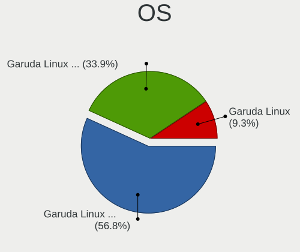

| Name                 | Computers | Percent |
|----------------------|-----------|---------|
| Garuda Linux Soaring | 651       | 56.81%  |
| Garuda Linux Rolling | 388       | 33.86%  |
| Garuda Linux         | 107       | 9.34%   |

OS Family
---------

OS without a version

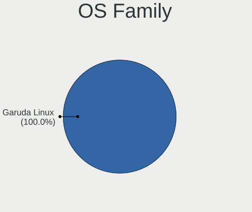

| Name         | Computers | Percent |
|--------------|-----------|---------|
| Garuda Linux | 1126      | 100%    |

Kernel
------

Version of the Linux kernel

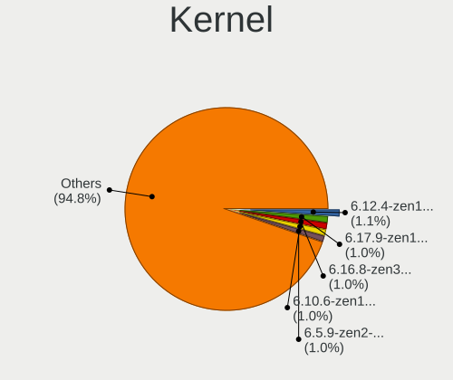

| Version            | Computers | Percent |
|--------------------|-----------|---------|
| 6.12.4-zen1-1-zen  | 15        | 1.12%   |
| 6.17.9-zen1-1-zen  | 14        | 1.05%   |
| 6.16.8-zen3-1-zen  | 14        | 1.05%   |
| 6.10.6-zen1-1-zen  | 14        | 1.05%   |
| 6.5.9-zen2-1-zen   | 13        | 0.97%   |
| 6.13.8-zen1-1-zen  | 13        | 0.97%   |
| 6.13.5-zen1-1-zen  | 13        | 0.97%   |
| 6.1.1-zen1-1-zen   | 13        | 0.97%   |
| 6.9.3-zen1-1-zen   | 12        | 0.9%    |
| 6.6.8-zen1-1-zen   | 12        | 0.9%    |
| 6.11.5-zen1-1-zen  | 12        | 0.9%    |
| 6.18.2-zen2-1-zen  | 11        | 0.82%   |
| 6.14.6-zen1-1-zen  | 11        | 0.82%   |
| 6.12.10-zen1-1-zen | 11        | 0.82%   |
| 6.0.2-zen1-1-zen   | 11        | 0.82%   |
| 6.16.7-zen1-1-zen  | 10        | 0.75%   |
| 6.14.3-zen1-1-zen  | 10        | 0.75%   |
| 6.10.10-zen1-1-zen | 10        | 0.75%   |
| 6.8.7-zen1-2-zen   | 9         | 0.67%   |
| 6.4.12-zen1-1-zen  | 9         | 0.67%   |
| 6.2.13-zen-1-zen   | 9         | 0.67%   |
| 6.17.8-zen1-1-zen  | 9         | 0.67%   |
| 6.15.4-zen2-1-zen  | 9         | 0.67%   |
| 6.14.9-zen1-1-zen  | 9         | 0.67%   |
| 6.12.8-zen1-1-zen  | 9         | 0.67%   |
| 5.17.1-zen1-1-zen  | 9         | 0.67%   |
| 6.9.5-zen1-1-zen   | 8         | 0.6%    |
| 6.8.2-zen2-1-zen   | 8         | 0.6%    |
| 6.7.0-zen3-1-zen   | 8         | 0.6%    |
| 6.15.8-zen1-1-zen  | 8         | 0.6%    |
| 6.10.8-zen1-1-zen  | 8         | 0.6%    |
| 6.6.7-zen1-1-zen   | 7         | 0.52%   |
| 6.4.10-zen2-1-zen  | 7         | 0.52%   |
| 6.15.6-zen1-1-zen  | 7         | 0.52%   |
| 6.12.9-zen1-1-zen  | 7         | 0.52%   |
| 6.11.6-zen1-1-zen  | 7         | 0.52%   |
| 5.15.2-zen1-1-zen  | 7         | 0.52%   |
| 5.14.14-zen1-1-zen | 7         | 0.52%   |
| 6.9.7-zen1-1-zen   | 6         | 0.45%   |
| 6.8.9-zen1-2-zen   | 6         | 0.45%   |

Kernel Family
-------------

Linux kernel without a distro release

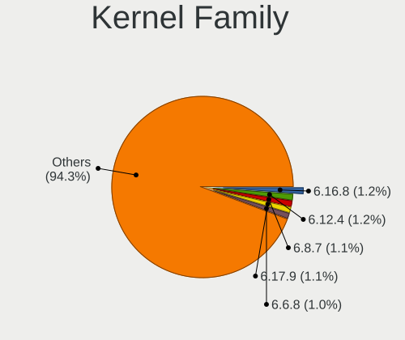

| Version | Computers | Percent |
|---------|-----------|---------|
| 6.16.8  | 16        | 1.2%    |
| 6.12.4  | 16        | 1.2%    |
| 6.8.7   | 15        | 1.12%   |
| 6.17.9  | 15        | 1.12%   |
| 6.6.8   | 14        | 1.05%   |
| 6.5.9   | 14        | 1.05%   |
| 6.13.5  | 14        | 1.05%   |
| 6.10.6  | 14        | 1.05%   |
| 6.1.1   | 14        | 1.05%   |
| 6.9.3   | 13        | 0.97%   |
| 6.18.2  | 13        | 0.97%   |
| 6.13.8  | 13        | 0.97%   |
| 6.8.9   | 12        | 0.9%    |
| 6.14.6  | 12        | 0.9%    |
| 6.14.4  | 12        | 0.9%    |
| 6.12.10 | 12        | 0.9%    |
| 6.11.5  | 12        | 0.9%    |
| 6.0.2   | 12        | 0.9%    |
| 6.8.2   | 11        | 0.82%   |
| 6.17.8  | 11        | 0.82%   |
| 6.16.7  | 11        | 0.82%   |
| 6.10.10 | 11        | 0.82%   |
| 5.17.1  | 11        | 0.82%   |
| 6.7.6   | 10        | 0.75%   |
| 6.15.8  | 10        | 0.75%   |
| 6.15.4  | 10        | 0.75%   |
| 6.14.3  | 10        | 0.75%   |
| 6.9.5   | 9         | 0.67%   |
| 6.4.12  | 9         | 0.67%   |
| 6.2.13  | 9         | 0.67%   |
| 6.15.2  | 9         | 0.67%   |
| 6.14.9  | 9         | 0.67%   |
| 6.13.7  | 9         | 0.67%   |
| 6.12.8  | 9         | 0.67%   |
| 6.10.8  | 9         | 0.67%   |
| 6.7.0   | 8         | 0.6%    |
| 6.4.10  | 8         | 0.6%    |
| 6.15.9  | 8         | 0.6%    |
| 6.13.2  | 8         | 0.6%    |
| 6.12.9  | 8         | 0.6%    |

Kernel Major Ver.
-----------------

Linux kernel major version

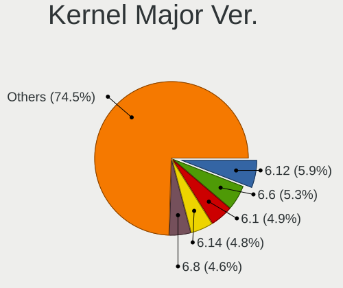

| Version | Computers | Percent |
|---------|-----------|---------|
| 6.12    | 76        | 5.89%   |
| 6.6     | 69        | 5.34%   |
| 6.1     | 63        | 4.88%   |
| 6.14    | 62        | 4.8%    |
| 6.8     | 59        | 4.57%   |
| 6.10    | 57        | 4.42%   |
| 6.15    | 55        | 4.26%   |
| 6.13    | 55        | 4.26%   |
| 5.15    | 54        | 4.18%   |
| 6.17    | 53        | 4.11%   |
| 6.9     | 51        | 3.95%   |
| 6.4     | 50        | 3.87%   |
| 6.0     | 49        | 3.8%    |
| 6.16    | 45        | 3.49%   |
| 6.11    | 43        | 3.33%   |
| 6.2     | 41        | 3.18%   |
| 5.16    | 41        | 3.18%   |
| 6.7     | 39        | 3.02%   |
| 6.5     | 39        | 3.02%   |
| 5.18    | 36        | 2.79%   |
| 5.10    | 36        | 2.79%   |
| 5.19    | 32        | 2.48%   |
| 5.17    | 31        | 2.4%    |
| 5.14    | 27        | 2.09%   |
| 6.3     | 24        | 1.86%   |
| 5.12    | 23        | 1.78%   |
| 5.11    | 23        | 1.78%   |
| 5.13    | 21        | 1.63%   |
| 6.18    | 17        | 1.32%   |
| 5.9     | 13        | 1.01%   |
| 5.8     | 5         | 0.39%   |
| 5.6     | 1         | 0.08%   |
| 5.4     | 1         | 0.08%   |

Arch
----

OS architecture (x86_64, i586, etc.)

| Name   | Computers | Percent |
|--------|-----------|---------|
| x86_64 | 1126      | 100%    |

DE
--

Desktop Environment

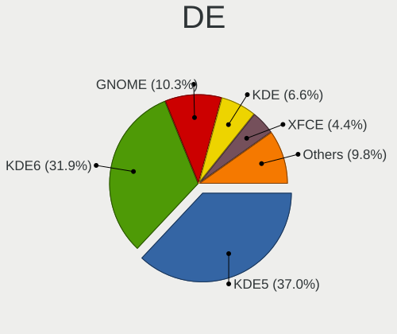

| Name              | Computers | Percent |
|-------------------|-----------|---------|
| KDE5              | 434       | 37%     |
| KDE6              | 374       | 31.88%  |
| GNOME             | 121       | 10.32%  |
| KDE               | 77        | 6.56%   |
| XFCE              | 52        | 4.43%   |
| X-Cinnamon        | 29        | 2.47%   |
| Hyprland          | 21        | 1.79%   |
| Unknown           | 12        | 1.02%   |
| sway              | 11        | 0.94%   |
| i3                | 7         | 0.6%    |
| Deepin            | 7         | 0.6%    |
| Cinnamon          | 6         | 0.51%   |
| qtile-default     | 4         | 0.34%   |
| MATE              | 4         | 0.34%   |
| LXQt              | 4         | 0.34%   |
| qtile             | 2         | 0.17%   |
| Niri              | 2         | 0.17%   |
| Yaru:ubuntu:GNOME | 1         | 0.09%   |
| Unity             | 1         | 0.09%   |
| hyprstart         | 1         | 0.09%   |
| COSMIC            | 1         | 0.09%   |
| Budgie            | 1         | 0.09%   |
| awesome           | 1         | 0.09%   |

Display Server
--------------

X11 or Wayland

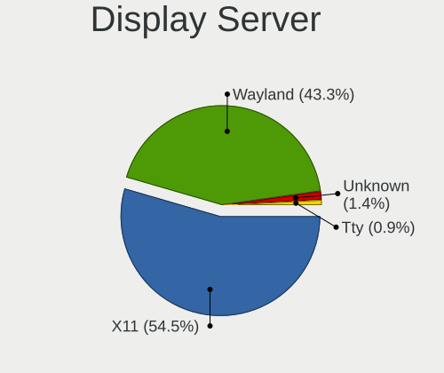

| Name    | Computers | Percent |
|---------|-----------|---------|
| X11     | 631       | 54.49%  |
| Wayland | 501       | 43.26%  |
| Unknown | 16        | 1.38%   |
| Tty     | 10        | 0.86%   |

Display Manager
---------------

SDDM, LightDM, etc.

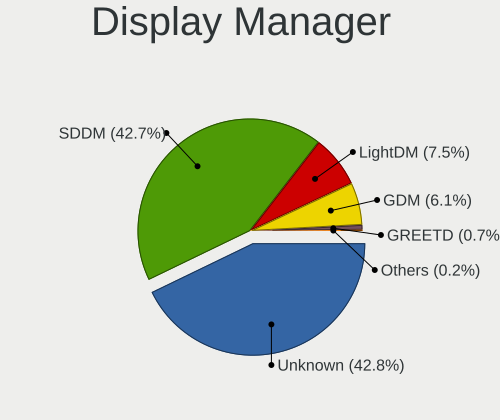

| Name    | Computers | Percent |
|---------|-----------|---------|
| Unknown | 490       | 42.83%  |
| SDDM    | 488       | 42.66%  |
| LightDM | 86        | 7.52%   |
| GDM     | 70        | 6.12%   |
| GREETD  | 8         | 0.7%    |
| LY-DM   | 1         | 0.09%   |
| EMPTTY  | 1         | 0.09%   |

OS Lang
-------

Language

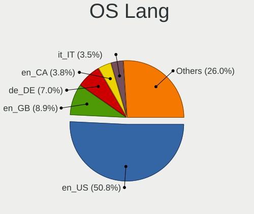

| Lang    | Computers | Percent |
|---------|-----------|---------|
| en_US   | 575       | 50.75%  |
| en_GB   | 101       | 8.91%   |
| de_DE   | 79        | 6.97%   |
| en_CA   | 43        | 3.8%    |
| it_IT   | 40        | 3.53%   |
| en_IN   | 40        | 3.53%   |
| pt_BR   | 26        | 2.29%   |
| pl_PL   | 22        | 1.94%   |
| es_ES   | 22        | 1.94%   |
| es_MX   | 20        | 1.77%   |
| fr_FR   | 19        | 1.68%   |
| ru_RU   | 17        | 1.5%    |
| tr_TR   | 13        | 1.15%   |
| en_AU   | 12        | 1.06%   |
| nl_NL   | 11        | 0.97%   |
| en_ZA   | 8         | 0.71%   |
| de_AT   | 7         | 0.62%   |
| sv_SE   | 5         | 0.44%   |
| en_DK   | 5         | 0.44%   |
| fr_CA   | 4         | 0.35%   |
| es_CO   | 4         | 0.35%   |
| de_CH   | 4         | 0.35%   |
| hu_HU   | 3         | 0.26%   |
| fi_FI   | 3         | 0.26%   |
| es_AR   | 3         | 0.26%   |
| da_DK   | 3         | 0.26%   |
| cs_CZ   | 3         | 0.26%   |
| Unknown | 3         | 0.26%   |
| zh_CN   | 2         | 0.18%   |
| sk_SK   | 2         | 0.18%   |
| ja_JP   | 2         | 0.18%   |
| fr_BE   | 2         | 0.18%   |
| es_VE   | 2         | 0.18%   |
| es_EC   | 2         | 0.18%   |
| es_CR   | 2         | 0.18%   |
| es_CL   | 2         | 0.18%   |
| en_IL   | 2         | 0.18%   |
| en_AG   | 2         | 0.18%   |
| el_GR   | 2         | 0.18%   |
| vi_VN   | 1         | 0.09%   |

Boot Mode
---------

EFI or BIOS

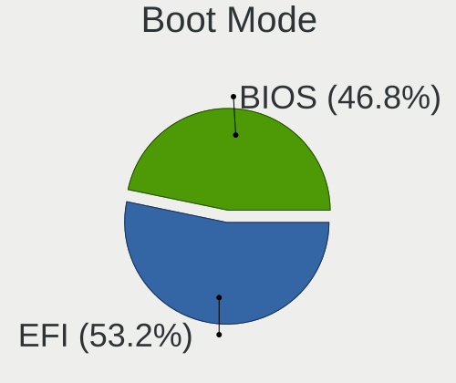

| Mode | Computers | Percent |
|------|-----------|---------|
| EFI  | 607       | 53.25%  |
| BIOS | 533       | 46.75%  |

Filesystem
----------

Type of filesystem

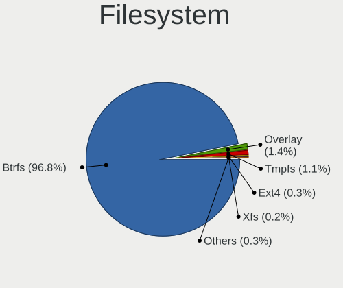

| Type    | Computers | Percent |
|---------|-----------|---------|
| Btrfs   | 1092      | 96.81%  |
| Overlay | 16        | 1.42%   |
| Tmpfs   | 12        | 1.06%   |
| Ext4    | 3         | 0.27%   |
| XXXXX   | 2         | 0.18%   |
| Xfs     | 2         | 0.18%   |
| F2fs    | 1         | 0.09%   |

Part. scheme
------------

Scheme of partitioning

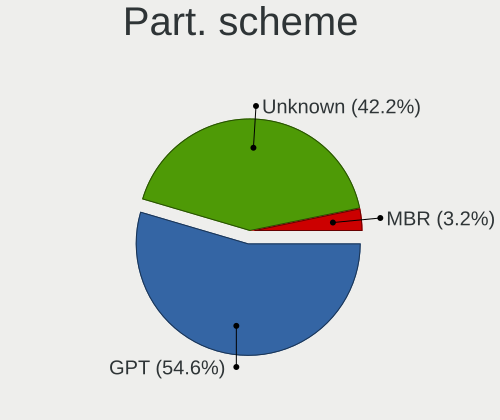

| Type    | Computers | Percent |
|---------|-----------|---------|
| GPT     | 623       | 54.55%  |
| Unknown | 482       | 42.21%  |
| MBR     | 37        | 3.24%   |

Dual Boot with Linux/BSD
------------------------

Hosting more than one Linux/BSD

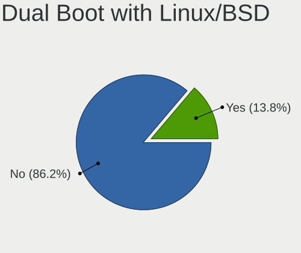

| Dual boot | Computers | Percent |
|-----------|-----------|---------|
| No        | 987       | 86.2%   |
| Yes       | 158       | 13.8%   |

Dual Boot (Win)
---------------

Hosting Linux and Windows

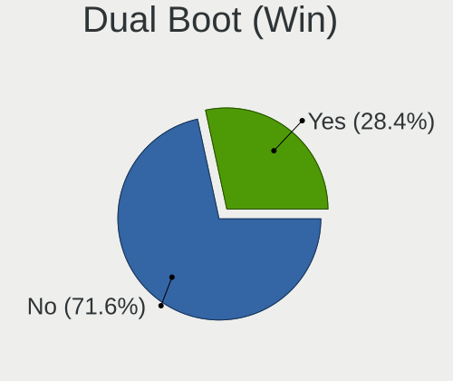

| Dual boot | Computers | Percent |
|-----------|-----------|---------|
| No        | 820       | 71.62%  |
| Yes       | 325       | 28.38%  |

Board
-----

Vendor
------

Motherboard manufacturer

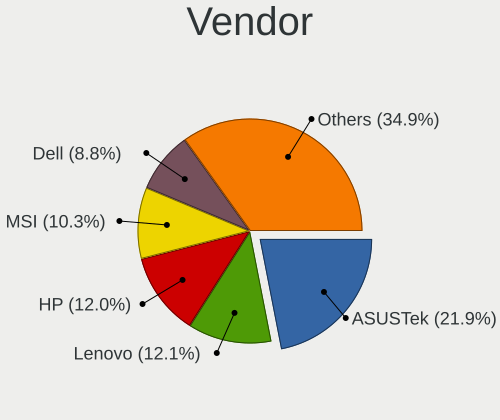

| Name                                 | Computers | Percent |
|--------------------------------------|-----------|---------|
| ASUSTek Computer                     | 247       | 21.94%  |
| Lenovo                               | 136       | 12.08%  |
| Hewlett-Packard                      | 135       | 11.99%  |
| MSI                                  | 116       | 10.3%   |
| Dell                                 | 99        | 8.79%   |
| Gigabyte Technology                  | 91        | 8.08%   |
| Acer                                 | 53        | 4.71%   |
| ASRock                               | 47        | 4.17%   |
| Apple                                | 23        | 2.04%   |
| Intel                                | 12        | 1.07%   |
| Samsung Electronics                  | 11        | 0.98%   |
| Alienware                            | 11        | 0.98%   |
| Unknown                              | 11        | 0.98%   |
| HUAWEI                               | 10        | 0.89%   |
| Toshiba                              | 8         | 0.71%   |
| Shenzhen Meigao Electronic Equipment | 7         | 0.62%   |
| Notebook                             | 7         | 0.62%   |
| Fujitsu                              | 7         | 0.62%   |
| Razer                                | 6         | 0.53%   |
| Microsoft                            | 5         | 0.44%   |
| Medion                               | 5         | 0.44%   |
| AZW                                  | 5         | 0.44%   |
| Framework                            | 4         | 0.36%   |
| Huanan                               | 3         | 0.27%   |
| HONOR                                | 3         | 0.27%   |
| Google                               | 3         | 0.27%   |
| Biostar                              | 3         | 0.27%   |
| XIAOMI                               | 2         | 0.18%   |
| TUXEDO                               | 2         | 0.18%   |
| Sony                                 | 2         | 0.18%   |
| Schenker                             | 2         | 0.18%   |
| Pegatron                             | 2         | 0.18%   |
| NZXT                                 | 2         | 0.18%   |
| Monster                              | 2         | 0.18%   |
| Infinix                              | 2         | 0.18%   |
| HC Technology.                       | 2         | 0.18%   |
| GPU Company                          | 2         | 0.18%   |
| GPD                                  | 2         | 0.18%   |
| Chuwi                                | 2         | 0.18%   |
| Casper                               | 2         | 0.18%   |

Model
-----

Motherboard model

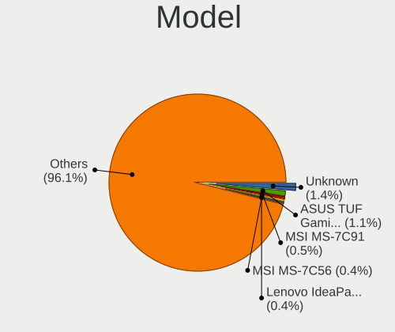

| Name                                              | Computers | Percent |
|---------------------------------------------------|-----------|---------|
| Unknown                                           | 16        | 1.42%   |
| ASUS TUF Gaming X570-PLUS                         | 12        | 1.07%   |
| MSI MS-7C91                                       | 6         | 0.53%   |
| MSI MS-7C56                                       | 5         | 0.44%   |
| Lenovo IdeaPad Gaming 3 15ARH05 82EY              | 5         | 0.44%   |
| Apple MacBookPro9,2                               | 5         | 0.44%   |
| MSI MS-7C37                                       | 4         | 0.36%   |
| MSI MS-7C02                                       | 4         | 0.36%   |
| MSI MS-7B86                                       | 4         | 0.36%   |
| HP Notebook                                       | 4         | 0.36%   |
| HP Laptop 15-da0xxx                               | 4         | 0.36%   |
| ASUS TUF Gaming B550-PLUS WIFI II                 | 4         | 0.36%   |
| ASUS ROG STRIX X570-E GAMING                      | 4         | 0.36%   |
| ASUS All Series                                   | 4         | 0.36%   |
| Shenzhen Meigao Electronic Equipment Venus series | 3         | 0.27%   |
| MSI MS-7D75                                       | 3         | 0.27%   |
| MSI MS-7B79                                       | 3         | 0.27%   |
| Gigabyte B550 AORUS ELITE V2                      | 3         | 0.27%   |
| Framework Laptop 16 (AMD Ryzen 7040 Series)       | 3         | 0.27%   |
| Dell Latitude E5470                               | 3         | 0.27%   |
| Dell Inspiron 15 7000 Gaming                      | 3         | 0.27%   |
| AZW SER                                           | 3         | 0.27%   |
| ASUS VivoBook_ASUSLaptop X1504ZA_X1504ZA          | 3         | 0.27%   |
| ASUS Vivobook Go E1504FA_E1504FA                  | 3         | 0.27%   |
| ASUS ROG STRIX B550-F GAMING WIFI II              | 3         | 0.27%   |
| ASUS ROG STRIX B450-F GAMING II                   | 3         | 0.27%   |
| ASUS ROG CROSSHAIR X670E EXTREME                  | 3         | 0.27%   |
| ASRock B450M-HDV R4.0                             | 3         | 0.27%   |
| XIAOMI Redmi Book Pro 15 2023                     | 2         | 0.18%   |
| Shenzhen Meigao Electronic Equipment UM690        | 2         | 0.18%   |
| Razer Blade                                       | 2         | 0.18%   |
| Notebook P7xxDM2(-G)                              | 2         | 0.18%   |
| MSI MS-7E51                                       | 2         | 0.18%   |
| MSI MS-7E47                                       | 2         | 0.18%   |
| MSI MS-7E26                                       | 2         | 0.18%   |
| MSI MS-7E10                                       | 2         | 0.18%   |
| MSI MS-7E07                                       | 2         | 0.18%   |
| MSI MS-7C90                                       | 2         | 0.18%   |
| MSI MS-7B93                                       | 2         | 0.18%   |
| MSI MS-7B89                                       | 2         | 0.18%   |

Model Family
------------

Motherboard model prefix

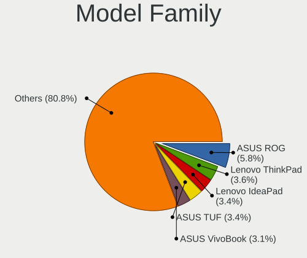

| Name               | Computers | Percent |
|--------------------|-----------|---------|
| ASUS ROG           | 65        | 5.77%   |
| Lenovo ThinkPad    | 40        | 3.55%   |
| Lenovo IdeaPad     | 38        | 3.37%   |
| ASUS TUF           | 38        | 3.37%   |
| ASUS VivoBook      | 35        | 3.11%   |
| ASUS PRIME         | 33        | 2.93%   |
| Dell Inspiron      | 31        | 2.75%   |
| HP Pavilion        | 27        | 2.4%    |
| Acer Aspire        | 25        | 2.22%   |
| HP Laptop          | 24        | 2.13%   |
| Dell Latitude      | 21        | 1.87%   |
| Lenovo Legion      | 17        | 1.51%   |
| ASUS ASUS          | 17        | 1.51%   |
| Unknown            | 16        | 1.42%   |
| Dell OptiPlex      | 15        | 1.33%   |
| HP EliteBook       | 12        | 1.07%   |
| Acer Nitro         | 12        | 1.07%   |
| HP OMEN            | 11        | 0.98%   |
| Dell Precision     | 11        | 0.98%   |
| HP Victus          | 9         | 0.8%    |
| Gigabyte B550      | 9         | 0.8%    |
| Toshiba Satellite  | 8         | 0.71%   |
| Lenovo Yoga        | 8         | 0.71%   |
| Lenovo ThinkCentre | 8         | 0.71%   |
| HP ProBook         | 8         | 0.71%   |
| Dell XPS           | 8         | 0.71%   |
| Gigabyte B450      | 7         | 0.62%   |
| Apple MacBookPro9  | 7         | 0.62%   |
| Razer Blade        | 6         | 0.53%   |
| MSI MS-7C91        | 6         | 0.53%   |
| HP ENVY            | 6         | 0.53%   |
| Gigabyte X570      | 6         | 0.53%   |
| Gigabyte B650      | 6         | 0.53%   |
| Dell Vostro        | 6         | 0.53%   |
| Acer Swift         | 6         | 0.53%   |
| MSI MS-7C56        | 5         | 0.44%   |
| Microsoft Surface  | 5         | 0.44%   |
| HP EliteDesk       | 5         | 0.44%   |
| MSI MS-7C37        | 4         | 0.36%   |
| MSI MS-7C02        | 4         | 0.36%   |

MFG Year
--------

Motherboard manufacture year

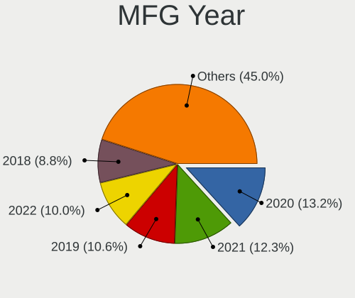

| Year    | Computers | Percent |
|---------|-----------|---------|
| 2020    | 149       | 13.23%  |
| 2021    | 139       | 12.34%  |
| 2019    | 119       | 10.57%  |
| 2022    | 113       | 10.04%  |
| 2018    | 99        | 8.79%   |
| 2017    | 76        | 6.75%   |
| 2023    | 73        | 6.48%   |
| 2013    | 56        | 4.97%   |
| 2012    | 56        | 4.97%   |
| 2014    | 51        | 4.53%   |
| 2024    | 45        | 4%      |
| 2016    | 43        | 3.82%   |
| 2015    | 29        | 2.58%   |
| 2011    | 29        | 2.58%   |
| 2009    | 14        | 1.24%   |
| 2010    | 12        | 1.07%   |
| 2025    | 10        | 0.89%   |
| 2008    | 9         | 0.8%    |
| 2007    | 3         | 0.27%   |
| Unknown | 1         | 0.09%   |

Form Factor
-----------

Physical design of the computer

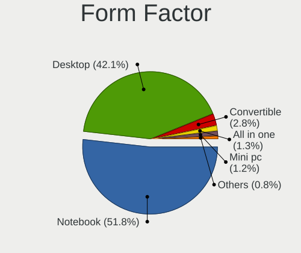

| Name        | Computers | Percent |
|-------------|-----------|---------|
| Notebook    | 583       | 51.78%  |
| Desktop     | 474       | 42.1%   |
| Convertible | 32        | 2.84%   |
| All in one  | 15        | 1.33%   |
| Mini pc     | 13        | 1.15%   |
| Tablet      | 8         | 0.71%   |
| Server      | 1         | 0.09%   |

Secure Boot
-----------

Enabled or disabled

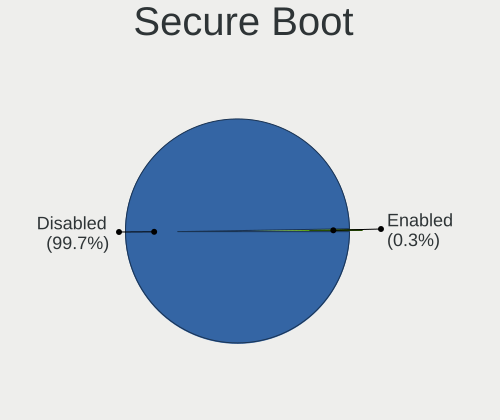

| State    | Computers | Percent |
|----------|-----------|---------|
| Disabled | 1124      | 99.73%  |
| Enabled  | 3         | 0.27%   |

Coreboot
--------

Have coreboot on board

| Used | Computers | Percent |
|------|-----------|---------|
| No   | 1123      | 99.73%  |
| Yes  | 3         | 0.27%   |

RAM Size
--------

Total RAM memory

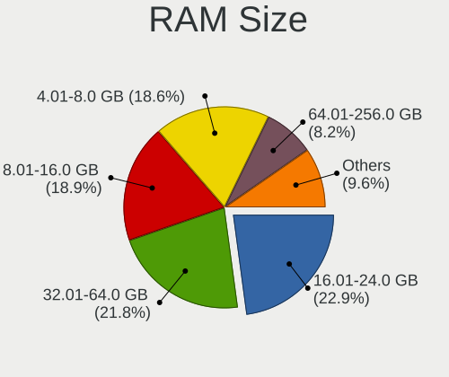

| Size in GB      | Computers | Percent |
|-----------------|-----------|---------|
| 16.01-24.0      | 261       | 22.87%  |
| 32.01-64.0      | 249       | 21.82%  |
| 8.01-16.0       | 216       | 18.93%  |
| 4.01-8.0        | 212       | 18.58%  |
| 64.01-256.0     | 93        | 8.15%   |
| 24.01-32.0      | 61        | 5.35%   |
| 3.01-4.0        | 47        | 4.12%   |
| More than 256.0 | 1         | 0.09%   |
| 2.01-3.0        | 1         | 0.09%   |

RAM Used
--------

Used RAM memory

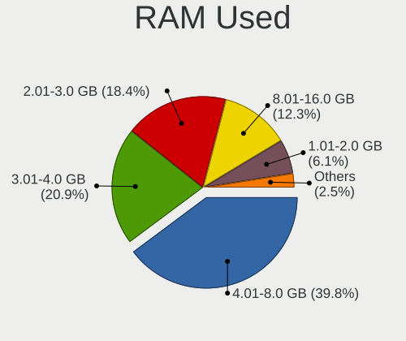

| Used GB     | Computers | Percent |
|-------------|-----------|---------|
| 4.01-8.0    | 490       | 39.81%  |
| 3.01-4.0    | 257       | 20.88%  |
| 2.01-3.0    | 226       | 18.36%  |
| 8.01-16.0   | 152       | 12.35%  |
| 1.01-2.0    | 75        | 6.09%   |
| 16.01-24.0  | 19        | 1.54%   |
| 32.01-64.0  | 5         | 0.41%   |
| 24.01-32.0  | 4         | 0.32%   |
| 0.51-1.0    | 2         | 0.16%   |
| 64.01-256.0 | 1         | 0.08%   |

Total Drives
------------

Number of drives on board

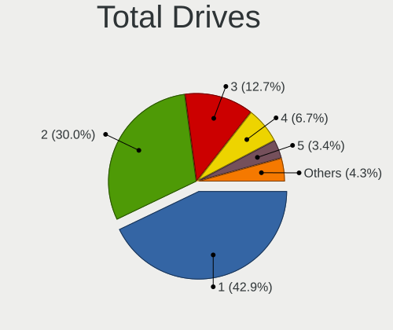

| Drives | Computers | Percent |
|--------|-----------|---------|
| 1      | 500       | 42.88%  |
| 2      | 350       | 30.02%  |
| 3      | 148       | 12.69%  |
| 4      | 78        | 6.69%   |
| 5      | 40        | 3.43%   |
| 6      | 21        | 1.8%    |
| 7      | 13        | 1.11%   |
| 9      | 7         | 0.6%    |
| 11     | 2         | 0.17%   |
| 8      | 2         | 0.17%   |
| 0      | 2         | 0.17%   |
| 18     | 1         | 0.09%   |
| 14     | 1         | 0.09%   |
| 10     | 1         | 0.09%   |

Has CD-ROM
----------

Has CD-ROM on board

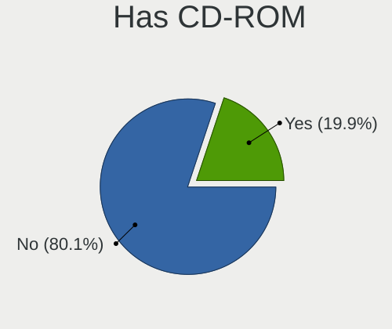

| Presented | Computers | Percent |
|-----------|-----------|---------|
| No        | 910       | 80.11%  |
| Yes       | 226       | 19.89%  |

Has Ethernet
------------

Has Ethernet on board

| Presented | Computers | Percent |
|-----------|-----------|---------|
| Yes       | 953       | 84.41%  |
| No        | 176       | 15.59%  |

Has WiFi
--------

Has WiFi module

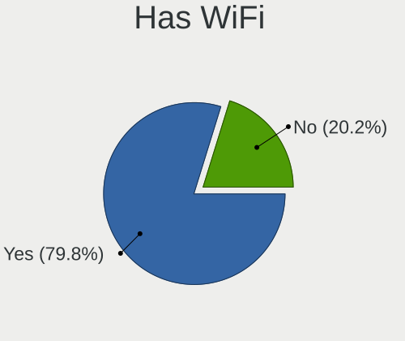

| Presented | Computers | Percent |
|-----------|-----------|---------|
| Yes       | 908       | 79.79%  |
| No        | 230       | 20.21%  |

Has Bluetooth
-------------

Has Bluetooth module

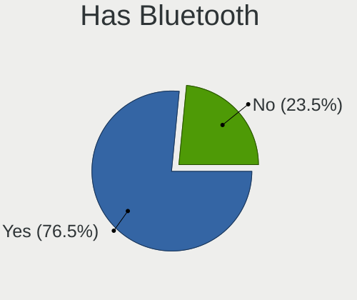

| Presented | Computers | Percent |
|-----------|-----------|---------|
| Yes       | 874       | 76.53%  |
| No        | 268       | 23.47%  |

Location
--------

Country
-------

Geographic location (country)

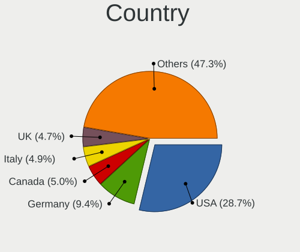

| Country      | Computers | Percent |
|--------------|-----------|---------|
| USA          | 326       | 28.75%  |
| Germany      | 107       | 9.44%   |
| Canada       | 57        | 5.03%   |
| Italy        | 55        | 4.85%   |
| UK           | 53        | 4.67%   |
| India        | 48        | 4.23%   |
| Brazil       | 36        | 3.17%   |
| Poland       | 32        | 2.82%   |
| Spain        | 27        | 2.38%   |
| France       | 27        | 2.38%   |
| Mexico       | 25        | 2.2%    |
| Turkey       | 22        | 1.94%   |
| Netherlands  | 21        | 1.85%   |
| Russia       | 20        | 1.76%   |
| Australia    | 19        | 1.68%   |
| Sweden       | 15        | 1.32%   |
| Romania      | 15        | 1.32%   |
| South Africa | 12        | 1.06%   |
| Austria      | 12        | 1.06%   |
| Belgium      | 10        | 0.88%   |
| Denmark      | 9         | 0.79%   |
| Switzerland  | 8         | 0.71%   |
| Greece       | 8         | 0.71%   |
| Czechia      | 8         | 0.71%   |
| Hungary      | 7         | 0.62%   |
| Finland      | 7         | 0.62%   |
| Colombia     | 7         | 0.62%   |
| Norway       | 6         | 0.53%   |
| Indonesia    | 6         | 0.53%   |
| Vietnam      | 5         | 0.44%   |
| Portugal     | 5         | 0.44%   |
| Japan        | 5         | 0.44%   |
| Chile        | 5         | 0.44%   |
| Venezuela    | 4         | 0.35%   |
| Slovenia     | 4         | 0.35%   |
| Latvia       | 4         | 0.35%   |
| Croatia      | 4         | 0.35%   |
| Bulgaria     | 4         | 0.35%   |
| Bangladesh   | 4         | 0.35%   |
| Argentina    | 4         | 0.35%   |

City
----

Geographic location (city)

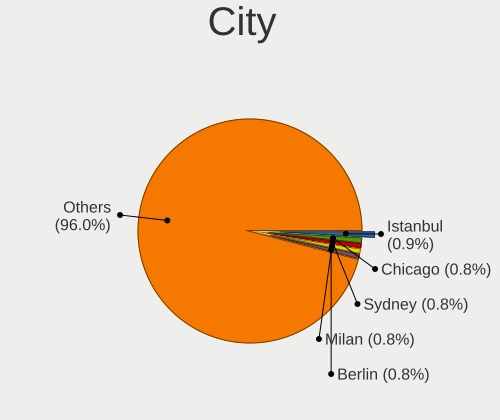

| City              | Computers | Percent |
|-------------------|-----------|---------|
| Istanbul          | 11        | 0.92%   |
| Chicago           | 10        | 0.84%   |
| Sydney            | 9         | 0.76%   |
| Milan             | 9         | 0.76%   |
| Berlin            | 9         | 0.76%   |
| London            | 8         | 0.67%   |
| Seattle           | 7         | 0.59%   |
| Prague            | 7         | 0.59%   |
| Portland          | 7         | 0.59%   |
| Mexico City       | 7         | 0.59%   |
| Los Angeles       | 7         | 0.59%   |
| Cape Town         | 7         | 0.59%   |
| Athens            | 7         | 0.59%   |
| Warsaw            | 6         | 0.5%    |
| Toronto           | 6         | 0.5%    |
| San Jose          | 6         | 0.5%    |
| Mississauga       | 6         | 0.5%    |
| Kansas City       | 6         | 0.5%    |
| Jacksonville      | 6         | 0.5%    |
| Hyderabad         | 6         | 0.5%    |
| Frankfurt am Main | 6         | 0.5%    |
| Denver            | 6         | 0.5%    |
| Dallas            | 6         | 0.5%    |
| Bengaluru         | 6         | 0.5%    |
| Sao Paulo         | 5         | 0.42%   |
| New York          | 5         | 0.42%   |
| Moscow            | 5         | 0.42%   |
| Melbourne         | 5         | 0.42%   |
| Florence          | 5         | 0.42%   |
| Dortmund          | 5         | 0.42%   |
| Copenhagen        | 5         | 0.42%   |
| Bucharest         | 5         | 0.42%   |
| Atlanta           | 5         | 0.42%   |
| Vienna            | 4         | 0.34%   |
| Valencia          | 4         | 0.34%   |
| Riga              | 4         | 0.34%   |
| Poznan            | 4         | 0.34%   |
| New Glasgow       | 4         | 0.34%   |
| Mumbai            | 4         | 0.34%   |
| Montreal          | 4         | 0.34%   |

Drives
------

Drive Vendor
------------

Hard drive vendors

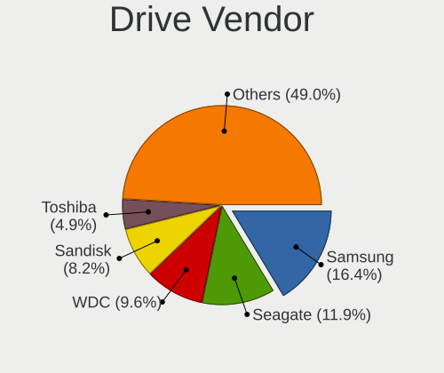

| Vendor                       | Computers | Drives | Percent |
|------------------------------|-----------|--------|---------|
| Samsung Electronics          | 343       | 590    | 16.36%  |
| Seagate                      | 249       | 386    | 11.87%  |
| WDC                          | 202       | 306    | 9.63%   |
| Sandisk                      | 173       | 231    | 8.25%   |
| Toshiba                      | 102       | 147    | 4.86%   |
| Kingston                     | 90        | 114    | 4.29%   |
| Crucial                      | 76        | 105    | 3.62%   |
| Micron Technology            | 63        | 73     | 3%      |
| SK hynix                     | 61        | 77     | 2.91%   |
| Intel                        | 56        | 69     | 2.67%   |
| Phison Electronics           | 54        | 72     | 2.58%   |
| Unknown                      | 44        | 56     | 2.1%    |
| Micron/Crucial Technology    | 41        | 49     | 1.96%   |
| Kingston Technology Company  | 41        | 47     | 1.96%   |
| Hitachi                      | 37        | 39     | 1.76%   |
| HGST                         | 32        | 41     | 1.53%   |
| Silicon Motion               | 30        | 32     | 1.43%   |
| MAXIO Technology (Hangzhou)  | 26        | 32     | 1.24%   |
| ADATA Technology             | 23        | 36     | 1.1%    |
| KIOXIA                       | 18        | 24     | 0.86%   |
| A-DATA Technology            | 18        | 27     | 0.86%   |
| SPCC                         | 17        | 21     | 0.81%   |
| China                        | 17        | 23     | 0.81%   |
| Realtek Semiconductor        | 14        | 21     | 0.67%   |
| PNY                          | 13        | 13     | 0.62%   |
| Phison                       | 12        | 13     | 0.57%   |
| SABRENT                      | 10        | 15     | 0.48%   |
| Apple                        | 10        | 15     | 0.48%   |
| Team                         | 9         | 16     | 0.43%   |
| Corsair                      | 8         | 14     | 0.38%   |
| Shenzhen Longsys Electronics | 7         | 8      | 0.33%   |
| Intenso                      | 7         | 9      | 0.33%   |
| Transcend                    | 6         | 6      | 0.29%   |
| Patriot                      | 6         | 23     | 0.29%   |
| OCZ                          | 6         | 8      | 0.29%   |
| LITEONIT                     | 6         | 6      | 0.29%   |
| LITEON                       | 6         | 6      | 0.29%   |
| GOODRAM                      | 6         | 9      | 0.29%   |
| Unknown                      | 6         | 7      | 0.29%   |
| JMicron Technology           | 5         | 5      | 0.24%   |

Drive Model
-----------

Hard drive models

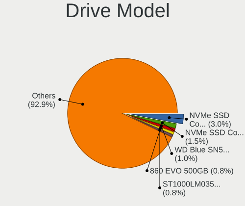

| Model                                                              | Computers | Percent |
|--------------------------------------------------------------------|-----------|---------|
| Samsung NVMe SSD Controller SM981/PM981/PM983 1TB                  | 71        | 2.97%   |
| Samsung NVMe SSD Controller PM9A1/PM9A3/980PRO 1TB                 | 36        | 1.51%   |
| Sandisk WD Blue SN550 NVMe SSD 1024GB                              | 25        | 1.05%   |
| Samsung SSD 860 EVO 500GB                                          | 20        | 0.84%   |
| Seagate ST1000LM035-1RK172 1TB                                     | 18        | 0.75%   |
| Intel SSD 660P Series 512GB                                        | 18        | 0.75%   |
| Sandisk WD Black SN750 / PC SN730 NVMe SSD 500GB                   | 17        | 0.71%   |
| Phison E12 NVMe Controller 1TB                                     | 17        | 0.71%   |
| Silicon Motion SM2263EN/SM2263XT SSD Controller 512GB              | 16        | 0.67%   |
| Samsung SSD 850 EVO 250GB                                          | 16        | 0.67%   |
| MAXIO (Hangzhou) NVMe SSD Controller MAP1202 2TB                   | 16        | 0.67%   |
| Seagate ST1000LM024 HN-M101MBB 1TB                                 | 15        | 0.63%   |
| Micron/Crucial P2 NVMe PCIe SSD 2TB                                | 15        | 0.63%   |
| Crucial CT1000MX500SSD1 1TB                                        | 15        | 0.63%   |
| Seagate ST4000DM004-2CV104 4TB                                     | 14        | 0.59%   |
| Seagate ST2000DM008-2FR102 2TB                                     | 14        | 0.59%   |
| Samsung SSD 860 EVO 1TB                                            | 14        | 0.59%   |
| Crucial CT500MX500SSD1 500GB                                       | 14        | 0.59%   |
| Samsung SSD 850 EVO 500GB                                          | 13        | 0.54%   |
| Samsung NVMe SSD Controller SM961/PM961/SM963 1024GB               | 13        | 0.54%   |
| Phison E16 PCIe4 NVMe Controller 1TB                               | 13        | 0.54%   |
| Kingston SA400S37240G 240GB SSD                                    | 13        | 0.54%   |
| ADATA XPG SX8200 Pro PCIe Gen3x4 M.2 2280 Solid State Drive 1024GB | 13        | 0.54%   |
| Samsung SSD 870 EVO 1TB                                            | 12        | 0.5%    |
| Samsung NVMe SSD Drive 1TB                                         | 12        | 0.5%    |
| Seagate ST1000DM010-2EP102 1TB                                     | 11        | 0.46%   |
| Samsung SSD 980 1TB                                                | 11        | 0.46%   |
| Samsung NVMe SSD Controller S4LV008[Pascal] 4TB                    | 11        | 0.46%   |
| Kingston Company SNV2S1000G 1TB                                    | 11        | 0.46%   |
| Kingston SA400S37480G 480GB SSD                                    | 11        | 0.46%   |
| HGST HTS721010A9E630 1TB                                           | 11        | 0.46%   |
| Unknown MMC Card  64GB                                             | 10        | 0.42%   |
| Toshiba DT01ACA100 1TB                                             | 10        | 0.42%   |
| Seagate ST1000LM049-2GH172 1TB                                     | 9         | 0.38%   |
| SABRENT Disk 4TB                                                   | 9         | 0.38%   |
| Intel SSDPEKNU512GZ 512GB                                          | 9         | 0.38%   |
| Sandisk WD Black SN850 1TB                                         | 8         | 0.33%   |
| Samsung SSD 990 PRO 2TB                                            | 8         | 0.33%   |
| Samsung SSD 860 QVO 1TB                                            | 8         | 0.33%   |
| Crucial CT2000MX500SSD1 2TB                                        | 8         | 0.33%   |

HDD Vendor
----------

Hard disk drive vendors

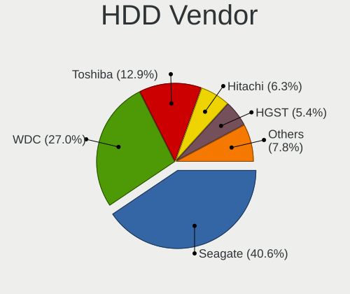

| Vendor              | Computers | Drives | Percent |
|---------------------|-----------|--------|---------|
| Seagate             | 239       | 367    | 40.58%  |
| WDC                 | 159       | 257    | 26.99%  |
| Toshiba             | 76        | 103    | 12.9%   |
| Hitachi             | 37        | 39     | 6.28%   |
| HGST                | 32        | 41     | 5.43%   |
| Samsung Electronics | 9         | 13     | 1.53%   |
| Unknown             | 7         | 10     | 1.19%   |
| Apple               | 4         | 8      | 0.68%   |
| TO Exter            | 3         | 6      | 0.51%   |
| JMicron Technology  | 3         | 3      | 0.51%   |
| Intenso             | 3         | 4      | 0.51%   |
| SSK                 | 2         | 2      | 0.34%   |
| JetFlash            | 2         | 2      | 0.34%   |
| ASMT                | 2         | 4      | 0.34%   |
| T-FORCE             | 1         | 1      | 0.17%   |
| SATAFIRM            | 1         | 1      | 0.17%   |
| Maxtor              | 1         | 1      | 0.17%   |
| LaCie               | 1         | 1      | 0.17%   |
| KESU                | 1         | 1      | 0.17%   |
| Initio              | 1         | 1      | 0.17%   |
| Inateck             | 1         | 1      | 0.17%   |
| IBM/Hitachi         | 1         | 1      | 0.17%   |
| Hewlett-Packard     | 1         | 1      | 0.17%   |
| External            | 1         | 1      | 0.17%   |
| ASMedia             | 1         | 2      | 0.17%   |

SSD Vendor
----------

Solid state drive vendors

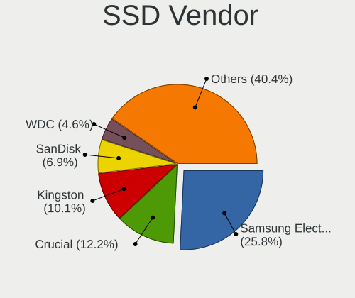

| Vendor              | Computers | Drives | Percent |
|---------------------|-----------|--------|---------|
| Samsung Electronics | 150       | 220    | 25.77%  |
| Crucial             | 71        | 98     | 12.2%   |
| Kingston            | 59        | 72     | 10.14%  |
| SanDisk             | 40        | 58     | 6.87%   |
| WDC                 | 27        | 29     | 4.64%   |
| A-DATA Technology   | 18        | 27     | 3.09%   |
| China               | 17        | 23     | 2.92%   |
| SPCC                | 15        | 19     | 2.58%   |
| Toshiba             | 12        | 20     | 2.06%   |
| PNY                 | 12        | 12     | 2.06%   |
| Micron Technology   | 11        | 12     | 1.89%   |
| SK hynix            | 10        | 15     | 1.72%   |
| SABRENT             | 10        | 15     | 1.72%   |
| Team                | 9         | 16     | 1.55%   |
| OCZ                 | 6         | 8      | 1.03%   |
| LITEONIT            | 6         | 6      | 1.03%   |
| LITEON              | 6         | 6      | 1.03%   |
| GOODRAM             | 6         | 9      | 1.03%   |
| Patriot             | 5         | 22     | 0.86%   |
| Corsair             | 5         | 8      | 0.86%   |
| Transcend           | 4         | 4      | 0.69%   |
| KingSpec            | 4         | 4      | 0.69%   |
| Emtec               | 4         | 6      | 0.69%   |
| Unknown             | 4         | 5      | 0.69%   |
| X12                 | 3         | 4      | 0.52%   |
| T-FORCE             | 3         | 3      | 0.52%   |
| Netac               | 3         | 3      | 0.52%   |
| Mushkin             | 3         | 4      | 0.52%   |
| Intenso             | 3         | 4      | 0.52%   |
| Hewlett-Packard     | 3         | 3      | 0.52%   |
| Apple               | 3         | 3      | 0.52%   |
| TCSUNBOW            | 2         | 3      | 0.34%   |
| Lexar               | 2         | 2      | 0.34%   |
| KODAK               | 2         | 3      | 0.34%   |
| KIOXIA-EXCERIA      | 2         | 2      | 0.34%   |
| Intel               | 2         | 2      | 0.34%   |
| FORESEE             | 2         | 2      | 0.34%   |
| Fanxiang            | 2         | 2      | 0.34%   |
| ZADAK               | 1         | 1      | 0.17%   |
| XrayDisk            | 1         | 1      | 0.17%   |

Drive Kind
----------

HDD or SSD

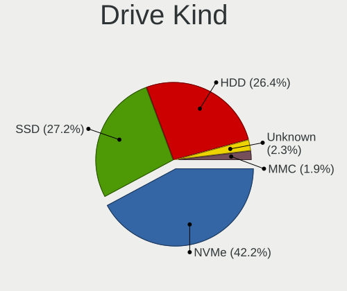

| Kind    | Computers | Drives | Percent |
|---------|-----------|--------|---------|
| NVMe    | 745       | 1215   | 42.16%  |
| SSD     | 480       | 799    | 27.16%  |
| HDD     | 467       | 871    | 26.43%  |
| Unknown | 41        | 48     | 2.32%   |
| MMC     | 34        | 39     | 1.92%   |

Drive Connector
---------------

SATA, SAS, NVMe, etc.

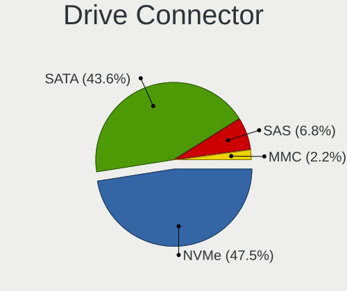

| Type | Computers | Drives | Percent |
|------|-----------|--------|---------|
| NVMe | 745       | 1208   | 47.51%  |
| SATA | 683       | 1549   | 43.56%  |
| SAS  | 106       | 176    | 6.76%   |
| MMC  | 34        | 39     | 2.17%   |

Drive Size
----------

Size of hard drive

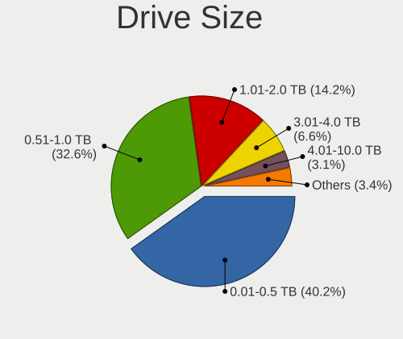

| Size in TB | Computers | Drives | Percent |
|------------|-----------|--------|---------|
| 0.01-0.5   | 428       | 712    | 40.15%  |
| 0.51-1.0   | 348       | 507    | 32.65%  |
| 1.01-2.0   | 151       | 243    | 14.17%  |
| 3.01-4.0   | 70        | 111    | 6.57%   |
| 4.01-10.0  | 33        | 41     | 3.1%    |
| 2.01-3.0   | 28        | 47     | 2.63%   |
| 10.01-20.0 | 8         | 9      | 0.75%   |

Space Total
-----------

Amount of disk space available on the file system

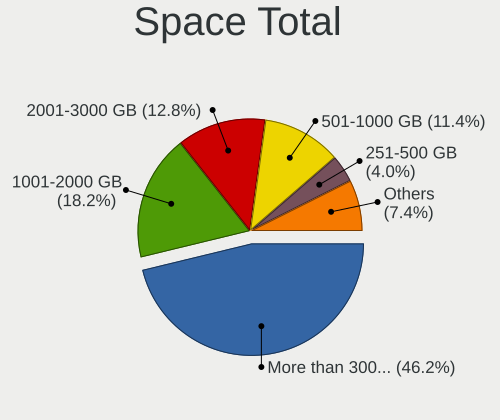

| Size in GB     | Computers | Percent |
|----------------|-----------|---------|
| More than 3000 | 537       | 46.21%  |
| 1001-2000      | 211       | 18.16%  |
| 2001-3000      | 149       | 12.82%  |
| 501-1000       | 133       | 11.45%  |
| 251-500        | 46        | 3.96%   |
| Unknown        | 46        | 3.96%   |
| 1-20           | 31        | 2.67%   |
| 101-250        | 9         | 0.77%   |

Space Used
----------

Amount of used disk space

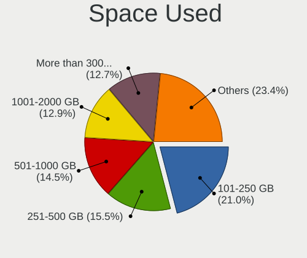

| Used GB        | Computers | Percent |
|----------------|-----------|---------|
| 101-250        | 254       | 20.96%  |
| 251-500        | 188       | 15.51%  |
| 501-1000       | 176       | 14.52%  |
| 1001-2000      | 156       | 12.87%  |
| More than 3000 | 154       | 12.71%  |
| 51-100         | 104       | 8.58%   |
| 2001-3000      | 97        | 8%      |
| Unknown        | 46        | 3.8%    |
| 1-20           | 29        | 2.39%   |
| 21-50          | 5         | 0.41%   |
| 0              | 3         | 0.25%   |

Malfunc. Drives
---------------

Drive models with a malfunction

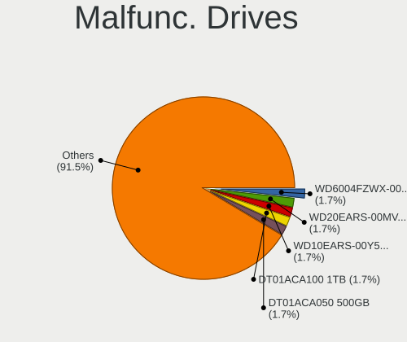

| Model                                                         | Computers | Drives | Percent |
|---------------------------------------------------------------|-----------|--------|---------|
| WDC WD6004FZWX-00BKVA0 6TB                                    | 2         | 2      | 1.71%   |
| WDC WD20EARS-00MVWB0 2TB                                      | 2         | 2      | 1.71%   |
| WDC WD10EARS-00Y5B1 1TB                                       | 2         | 2      | 1.71%   |
| Toshiba DT01ACA100 1TB                                        | 2         | 2      | 1.71%   |
| Toshiba DT01ACA050 500GB                                      | 2         | 2      | 1.71%   |
| Seagate ST500LT012-1DG142 500GB                               | 2         | 2      | 1.71%   |
| Seagate ST2000DM006-2DM164 2TB                                | 2         | 2      | 1.71%   |
| Seagate ST1000LM035-1RK172 1TB                                | 2         | 2      | 1.71%   |
| Samsung Electronics SSD 870 EVO 1TB                           | 2         | 2      | 1.71%   |
| Samsung Electronics NVMe SSD Controller SM981/PM981/PM983 1TB | 2         | 2      | 1.71%   |
| Realtek Semiconductor RTS5763DL NVMe SSD Controller 512GB     | 2         | 4      | 1.71%   |
| Kingston SH103S3240G 240GB SSD                                | 2         | 2      | 1.71%   |
| Intenso USB 3.0 device 1TB                                    | 2         | 2      | 1.71%   |
| HGST HTS725050A7E630 500GB                                    | 2         | 5      | 1.71%   |
| HGST HTS721010A9E630 1TB                                      | 2         | 2      | 1.71%   |
| WDC WDS240G2G0A-00JH30 240GB SSD                              | 1         | 1      | 0.85%   |
| WDC WD6400AAKS-65A7B0 640GB                                   | 1         | 1      | 0.85%   |
| WDC WD5000BEVT-60A0RT0 500GB                                  | 1         | 1      | 0.85%   |
| WDC WD5000AAKX-60U6AA0 500GB                                  | 1         | 1      | 0.85%   |
| WDC WD5000AAKX-003CA0 500GB                                   | 1         | 3      | 0.85%   |
| WDC WD5000AAKS-00E4A0 500GB                                   | 1         | 1      | 0.85%   |
| WDC WD40EZRZ-00WN9B0 4TB                                      | 1         | 1      | 0.85%   |
| WDC WD3200AAKS-75L9A0 320GB                                   | 1         | 1      | 0.85%   |
| WDC WD30EZRX-00DC0B0 3TB                                      | 1         | 1      | 0.85%   |
| WDC WD30EZRX-00D8PB0 3TB                                      | 1         | 2      | 0.85%   |
| WDC WD30EFRX-68EUZN0 3TB                                      | 1         | 2      | 0.85%   |
| WDC WD3000FYYZ-01UL1B0 3TB                                    | 1         | 2      | 0.85%   |
| WDC WD2500JD-98HBC0 250GB                                     | 1         | 1      | 0.85%   |
| WDC WD2500AAJS-75M0A0 249GB                                   | 1         | 1      | 0.85%   |
| WDC WD20EZRZ-00Z5HB0 2TB                                      | 1         | 1      | 0.85%   |
| WDC WD20EARX-00PASB0 2TB                                      | 1         | 1      | 0.85%   |
| WDC WD2002FAEX-007BA0 2TB                                     | 1         | 1      | 0.85%   |
| WDC WD15EADS-22P8B0 1TB                                       | 1         | 3      | 0.85%   |
| WDC WD10JPVX-22JC3T0 1TB                                      | 1         | 1      | 0.85%   |
| WDC WD10EZRX-00L4HB0 1TB                                      | 1         | 1      | 0.85%   |
| WDC WD10EZEX-75WN4A1 1TB                                      | 1         | 1      | 0.85%   |
| WDC WD10EZEX-75WN4A0 1TB                                      | 1         | 1      | 0.85%   |
| WDC WD10EZEX-60ZF5A0 1TB                                      | 1         | 1      | 0.85%   |
| WDC WD10EZEX-60M2NA0 1TB                                      | 1         | 1      | 0.85%   |
| WDC WD10EALX-009BA0 1TB                                       | 1         | 1      | 0.85%   |

Malfunc. Drive Vendor
---------------------

Vendors of faulty drives

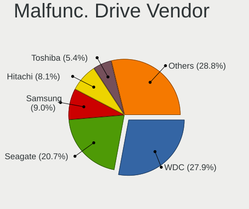

| Vendor                    | Computers | Drives | Percent |
|---------------------------|-----------|--------|---------|
| WDC                       | 31        | 41     | 27.93%  |
| Seagate                   | 23        | 25     | 20.72%  |
| Samsung Electronics       | 10        | 25     | 9.01%   |
| Hitachi                   | 9         | 9      | 8.11%   |
| Toshiba                   | 6         | 6      | 5.41%   |
| HGST                      | 5         | 11     | 4.5%    |
| Kingston                  | 4         | 5      | 3.6%    |
| SanDisk                   | 3         | 3      | 2.7%    |
| Crucial                   | 3         | 3      | 2.7%    |
| SK hynix                  | 2         | 4      | 1.8%    |
| Realtek Semiconductor     | 2         | 4      | 1.8%    |
| OCZ                       | 2         | 2      | 1.8%    |
| Intenso                   | 2         | 2      | 1.8%    |
| A-DATA Technology         | 2         | 2      | 1.8%    |
| Transcend                 | 1         | 1      | 0.9%    |
| Micron/Crucial Technology | 1         | 1      | 0.9%    |
| Intel                     | 1         | 1      | 0.9%    |
| Hewlett-Packard           | 1         | 1      | 0.9%    |
| China                     | 1         | 1      | 0.9%    |
| Apple                     | 1         | 1      | 0.9%    |
| Aarvex                    | 1         | 2      | 0.9%    |

Malfunc. HDD Vendor
-------------------

Vendors of faulty HDD drives

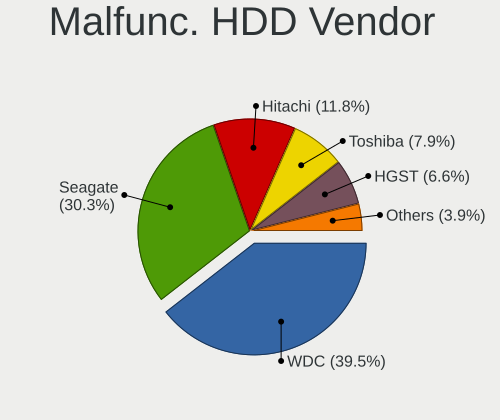

| Vendor  | Computers | Drives | Percent |
|---------|-----------|--------|---------|
| WDC     | 30        | 40     | 39.47%  |
| Seagate | 23        | 25     | 30.26%  |
| Hitachi | 9         | 9      | 11.84%  |
| Toshiba | 6         | 6      | 7.89%   |
| HGST    | 5         | 11     | 6.58%   |
| Intenso | 2         | 2      | 2.63%   |
| Apple   | 1         | 1      | 1.32%   |

Malfunc. Drive Kind
-------------------

Kinds of faulty drives

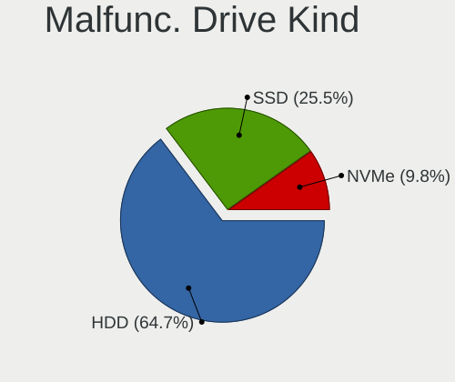

| Kind | Computers | Drives | Percent |
|------|-----------|--------|---------|
| HDD  | 66        | 94     | 64.71%  |
| SSD  | 26        | 29     | 25.49%  |
| NVMe | 10        | 27     | 9.8%    |

Failed Drives
-------------

Failed drive models

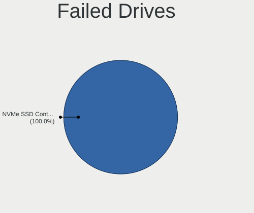

| Model                                                         | Computers | Drives | Percent |
|---------------------------------------------------------------|-----------|--------|---------|
| Samsung Electronics NVMe SSD Controller 980 (DRAM-less) 256GB | 1         | 2      | 100%    |

Failed Drive Vendor
-------------------

Failed drive vendors

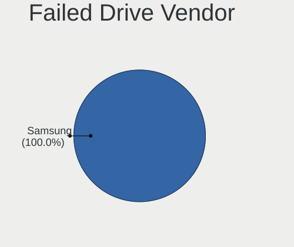

| Vendor              | Computers | Drives | Percent |
|---------------------|-----------|--------|---------|
| Samsung Electronics | 1         | 2      | 100%    |

Drive Status
------------

Number of failed and malfunc. drives

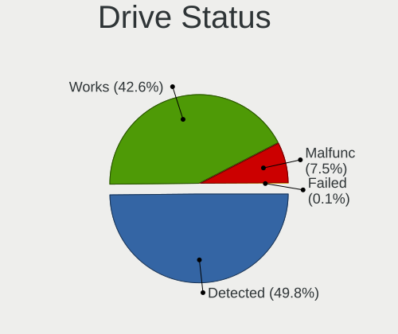

| Status   | Computers | Drives | Percent |
|----------|-----------|--------|---------|
| Detected | 639       | 1585   | 49.84%  |
| Works    | 546       | 1235   | 42.59%  |
| Malfunc  | 96        | 150    | 7.49%   |
| Failed   | 1         | 2      | 0.08%   |

Storage controller
------------------

Storage Vendor
--------------

Storage controller vendors

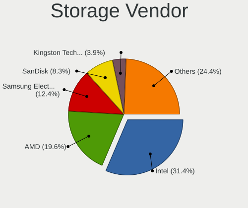

| Vendor                         | Computers | Percent |
|--------------------------------|-----------|---------|
| Intel                          | 575       | 31.4%   |
| AMD                            | 358       | 19.55%  |
| Samsung Electronics            | 227       | 12.4%   |
| SanDisk                        | 152       | 8.3%    |
| Kingston Technology Company    | 72        | 3.93%   |
| Phison Electronics             | 71        | 3.88%   |
| SK hynix                       | 51        | 2.79%   |
| Micron Technology              | 51        | 2.79%   |
| Micron/Crucial Technology      | 43        | 2.35%   |
| ASMedia Technology             | 36        | 1.97%   |
| Silicon Motion                 | 31        | 1.69%   |
| MAXIO Technology (Hangzhou)    | 26        | 1.42%   |
| ADATA Technology               | 25        | 1.37%   |
| Toshiba America Info Systems   | 19        | 1.04%   |
| KIOXIA                         | 17        | 0.93%   |
| Realtek Semiconductor          | 15        | 0.82%   |
| Marvell Technology Group       | 11        | 0.6%    |
| Shenzhen Longsys Electronics   | 8         | 0.44%   |
| Union Memory (Shenzhen)        | 5         | 0.27%   |
| Solid State Storage Technology | 5         | 0.27%   |
| Seagate Technology             | 5         | 0.27%   |
| JMicron Technology             | 5         | 0.27%   |
| Solidigm                       | 4         | 0.22%   |
| Biwin Storage Technology       | 3         | 0.16%   |
| Apple                          | 3         | 0.16%   |
| Yangtze Memory Technologies    | 2         | 0.11%   |
| Transcend                      | 2         | 0.11%   |
| INNOGRIT                       | 2         | 0.11%   |
| Broadcom / LSI                 | 2         | 0.11%   |
| Nvidia                         | 1         | 0.05%   |
| Nextorage                      | 1         | 0.05%   |
| Netac Technology               | 1         | 0.05%   |
| LSI Logic / Symbios Logic      | 1         | 0.05%   |
| Lenovo                         | 1         | 0.05%   |

Storage Model
-------------

Storage controller models

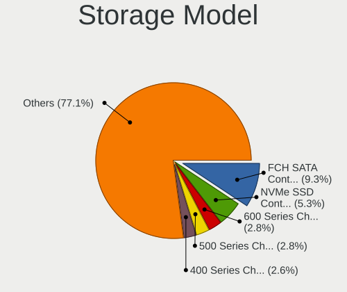

| Model                                                                          | Computers | Percent |
|--------------------------------------------------------------------------------|-----------|---------|
| AMD FCH SATA Controller [AHCI mode]                                            | 190       | 9.29%   |
| Samsung NVMe SSD Controller SM981/PM981/PM983                                  | 108       | 5.28%   |
| AMD 600 Series Chipset SATA Controller                                         | 58        | 2.84%   |
| AMD 500 Series Chipset SATA Controller                                         | 58        | 2.84%   |
| AMD 400 Series Chipset SATA Controller                                         | 54        | 2.64%   |
| Intel Volume Management Device NVMe RAID Controller                            | 52        | 2.54%   |
| Intel 82801 Mobile SATA Controller [RAID mode]                                 | 40        | 1.96%   |
| Intel 8 Series/C220 Series Chipset Family 6-port SATA Controller 1 [AHCI mode] | 40        | 1.96%   |
| SanDisk Ultra 3D / WD PC SN530, IX SN530, Blue SN550 NVMe SSD (DRAM-less)      | 39        | 1.91%   |
| Samsung NVMe SSD Controller PM9A1/PM9A3/980PRO                                 | 39        | 1.91%   |
| Intel Sunrise Point-LP SATA Controller [AHCI mode]                             | 37        | 1.81%   |
| Samsung NVMe SSD Controller 980 (DRAM-less)                                    | 34        | 1.66%   |
| Intel 7 Series Chipset Family 6-port SATA Controller [AHCI mode]               | 32        | 1.56%   |
| ASMedia ASM1061/ASM1062 Serial ATA Controller                                  | 30        | 1.47%   |
| Samsung NVMe SSD Controller S4LV008[Pascal]                                    | 28        | 1.37%   |
| Phison E12 NVMe Controller                                                     | 27        | 1.32%   |
| Intel Cannon Lake Mobile PCH SATA AHCI Controller                              | 25        | 1.22%   |
| Intel SSD 660P Series                                                          | 23        | 1.12%   |
| Silicon Motion SM2263EN/SM2263XT (DRAM-less) NVMe SSD Controllers              | 22        | 1.08%   |
| SanDisk Extreme Pro / WD Black SN750 / PC SN730 / Red SN700 NVMe SSD           | 21        | 1.03%   |
| SanDisk WD SN560/SN740/SN770/SN5000 NVMe SSD                                   | 20        | 0.98%   |
| Intel Q170/Q150/B150/H170/H110/Z170/CM236 Chipset SATA Controller [AHCI Mode]  | 20        | 0.98%   |
| Micron/Crucial P2 [Nick P2] / P3 / P3 Plus NVMe PCIe SSD (DRAM-less)           | 19        | 0.93%   |
| Intel Alder Lake-S PCH SATA Controller [AHCI Mode]                             | 19        | 0.93%   |
| Intel 200 Series PCH SATA controller [AHCI mode]                               | 19        | 0.93%   |
| Samsung NVMe SSD Controller SM961/PM961/SM963                                  | 18        | 0.88%   |
| MAXIO (Hangzhou) NVMe SSD Controller MAP1202 (DRAM-less)                       | 18        | 0.88%   |
| Intel Raptor Lake SATA AHCI Controller                                         | 18        | 0.88%   |
| SK hynix Gold P31/BC711/PC711 NVMe Solid State Drive                           | 17        | 0.83%   |
| Sandisk WD Black SN850X NVMe SSD                                               | 17        | 0.83%   |
| Intel 400 Series Chipset Family SATA AHCI Controller                           | 17        | 0.83%   |
| AMD SB7x0/SB8x0/SB9x0 SATA Controller [AHCI mode]                              | 17        | 0.83%   |
| Kingston Company KC3000/FURY Renegade NVMe SSD [E18]                           | 16        | 0.78%   |
| Intel HM170/QM170 Chipset SATA Controller [AHCI Mode]                          | 16        | 0.78%   |
| Intel Cannon Lake PCH SATA AHCI Controller                                     | 16        | 0.78%   |
| Phison E16 PCIe4 NVMe Controller                                               | 15        | 0.73%   |
| Kingston Company NV2 NVMe SSD [SM2267XT] (DRAM-less)                           | 15        | 0.73%   |
| Intel Tiger Lake-LP SATA Controller                                            | 15        | 0.73%   |
| Intel SATA Controller [RAID mode]                                              | 15        | 0.73%   |
| Intel 8 Series SATA Controller 1 [AHCI mode]                                   | 15        | 0.73%   |

Storage Kind
------------

Kind of storage controller (IDE, SATA, NVMe, SAS, ...)

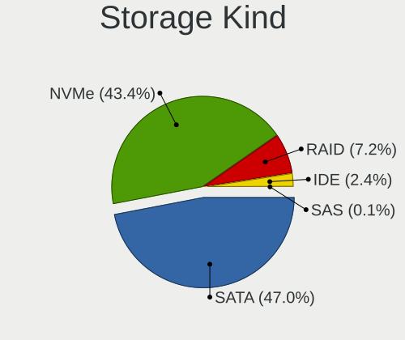

| Kind | Computers | Percent |
|------|-----------|---------|
| SATA | 803       | 46.99%  |
| NVMe | 741       | 43.36%  |
| RAID | 123       | 7.2%    |
| IDE  | 41        | 2.4%    |
| SAS  | 1         | 0.06%   |

Processor
---------

CPU Vendor
----------

Processor vendors

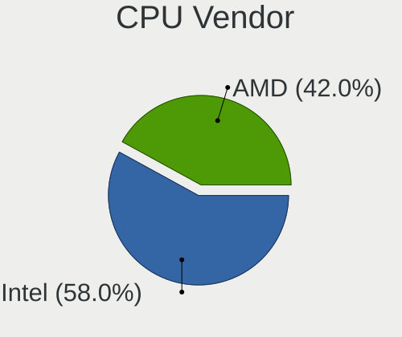

| Vendor | Computers | Percent |
|--------|-----------|---------|
| Intel  | 653       | 57.99%  |
| AMD    | 473       | 42.01%  |

CPU Model
---------

Processor models

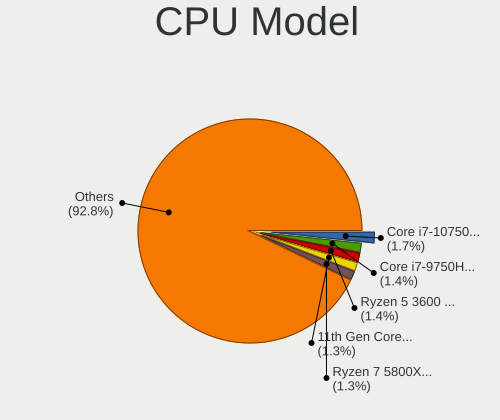

| Model                                         | Computers | Percent |
|-----------------------------------------------|-----------|---------|
| Intel Core i7-10750H CPU @ 2.60GHz            | 19        | 1.68%   |
| Intel Core i7-9750H CPU @ 2.60GHz             | 16        | 1.42%   |
| AMD Ryzen 5 3600 6-Core Processor             | 16        | 1.42%   |
| Intel 11th Gen Core i5-1135G7 @ 2.40GHz       | 15        | 1.33%   |
| AMD Ryzen 7 5800X 8-Core Processor            | 15        | 1.33%   |
| AMD Ryzen 5 5600X 6-Core Processor            | 15        | 1.33%   |
| Intel Core i7-7700HQ CPU @ 2.80GHz            | 14        | 1.24%   |
| AMD Ryzen 7 3700X 8-Core Processor            | 14        | 1.24%   |
| AMD Ryzen 7 5800H with Radeon Graphics        | 12        | 1.06%   |
| AMD Ryzen 7 4800H with Radeon Graphics        | 11        | 0.97%   |
| AMD Ryzen 5 5500U with Radeon Graphics        | 11        | 0.97%   |
| Intel Core i5-3210M CPU @ 2.50GHz             | 10        | 0.88%   |
| AMD Ryzen 7 5700G with Radeon Graphics        | 10        | 0.88%   |
| Intel 12th Gen Core i7-12700H                 | 9         | 0.8%    |
| Intel 11th Gen Core i7-1165G7 @ 2.80GHz       | 9         | 0.8%    |
| AMD Ryzen 7 7800X3D 8-Core Processor          | 9         | 0.8%    |
| AMD Ryzen 5 5600H with Radeon Graphics        | 9         | 0.8%    |
| AMD Ryzen 5 3500U with Radeon Vega Mobile Gfx | 9         | 0.8%    |
| Intel Core i7-8750H CPU @ 2.20GHz             | 8         | 0.71%   |
| Intel Core i7-8550U CPU @ 1.80GHz             | 8         | 0.71%   |
| AMD Ryzen 9 5950X 16-Core Processor           | 8         | 0.71%   |
| AMD Ryzen 9 5900X 12-Core Processor           | 8         | 0.71%   |
| AMD Ryzen 9 3900X 12-Core Processor           | 8         | 0.71%   |
| Intel Core i5-7200U CPU @ 2.50GHz             | 7         | 0.62%   |
| Intel Core i3-1005G1 CPU @ 1.20GHz            | 7         | 0.62%   |
| Intel 12th Gen Core i5-12600K                 | 7         | 0.62%   |
| AMD Ryzen 9 7900X 12-Core Processor           | 7         | 0.62%   |
| AMD Ryzen 7 9800X3D 8-Core Processor          | 7         | 0.62%   |
| AMD Ryzen 7 7840HS w/ Radeon 780M Graphics    | 7         | 0.62%   |
| AMD Ryzen 7 3800X 8-Core Processor            | 7         | 0.62%   |
| AMD Ryzen 5 3550H with Radeon Vega Mobile Gfx | 7         | 0.62%   |
| Intel Core i7-6700HQ CPU @ 2.60GHz            | 6         | 0.53%   |
| Intel Core i5-6200U CPU @ 2.30GHz             | 6         | 0.53%   |
| Intel Core i5-10210U CPU @ 1.60GHz            | 6         | 0.53%   |
| Intel 11th Gen Core i7-11800H @ 2.30GHz       | 6         | 0.53%   |
| Intel 11th Gen Core i5-11400H @ 2.70GHz       | 6         | 0.53%   |
| Intel 11th Gen Core i3-1115G4 @ 3.00GHz       | 6         | 0.53%   |
| AMD Ryzen 9 7950X 16-Core Processor           | 6         | 0.53%   |
| AMD Ryzen 7 5800X3D 8-Core Processor          | 6         | 0.53%   |
| AMD Ryzen 7 5700U with Radeon Graphics        | 6         | 0.53%   |

CPU Model Family
----------------

Processor model prefix

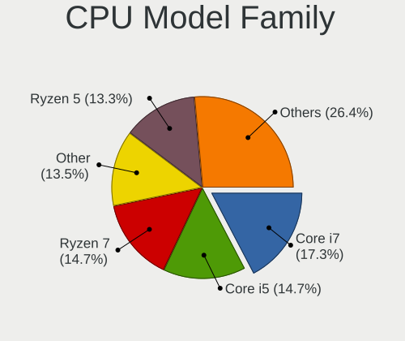

| Model                   | Computers | Percent |
|-------------------------|-----------|---------|
| Intel Core i7           | 195       | 17.3%   |
| Intel Core i5           | 166       | 14.73%  |
| AMD Ryzen 7             | 166       | 14.73%  |
| Other                   | 152       | 13.49%  |
| AMD Ryzen 5             | 150       | 13.31%  |
| AMD Ryzen 9             | 72        | 6.39%   |
| Intel Core i3           | 55        | 4.88%   |
| Intel Xeon              | 18        | 1.6%    |
| Intel Celeron           | 16        | 1.42%   |
| AMD Ryzen 3             | 16        | 1.42%   |
| AMD FX                  | 15        | 1.33%   |
| Intel Core i9           | 14        | 1.24%   |
| Intel Pentium           | 12        | 1.06%   |
| Intel Core              | 8         | 0.71%   |
| Intel Core 2 Duo        | 7         | 0.62%   |
| AMD Ryzen 7 PRO         | 7         | 0.62%   |
| AMD A8                  | 7         | 0.62%   |
| AMD A6                  | 7         | 0.62%   |
| AMD A4                  | 5         | 0.44%   |
| AMD A10                 | 5         | 0.44%   |
| Intel Pentium Dual-Core | 4         | 0.35%   |
| AMD Athlon              | 4         | 0.35%   |
| Intel Pentium Silver    | 3         | 0.27%   |
| AMD Ryzen Threadripper  | 3         | 0.27%   |
| Intel Core m3           | 2         | 0.18%   |
| Intel Core 2 Quad       | 2         | 0.18%   |
| AMD Phenom II X6        | 2         | 0.18%   |
| AMD E                   | 2         | 0.18%   |
| AMD A12                 | 2         | 0.18%   |
| Intel Pentium Gold      | 1         | 0.09%   |
| Intel Core 2            | 1         | 0.09%   |
| AMD Turion              | 1         | 0.09%   |
| AMD Ryzen 5 PRO         | 1         | 0.09%   |
| AMD Phenom II X4        | 1         | 0.09%   |
| AMD Phenom II X2        | 1         | 0.09%   |
| AMD EPYC                | 1         | 0.09%   |
| AMD E1                  | 1         | 0.09%   |
| AMD Athlon X4           | 1         | 0.09%   |
| AMD Athlon Dual Core    | 1         | 0.09%   |

CPU Cores
---------

Number of processor cores

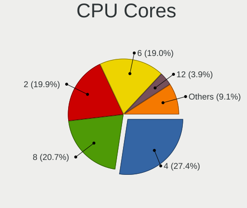

| Number | Computers | Percent |
|--------|-----------|---------|
| 4      | 309       | 27.39%  |
| 8      | 234       | 20.74%  |
| 2      | 224       | 19.86%  |
| 6      | 214       | 18.97%  |
| 12     | 44        | 3.9%    |
| 16     | 31        | 2.75%   |
| 14     | 27        | 2.39%   |
| 10     | 24        | 2.13%   |
| 24     | 10        | 0.89%   |
| 20     | 4         | 0.35%   |
| 1      | 2         | 0.18%   |
| 48     | 1         | 0.09%   |
| 40     | 1         | 0.09%   |
| 18     | 1         | 0.09%   |
| 7      | 1         | 0.09%   |
| 3      | 1         | 0.09%   |

CPU Sockets
-----------

Number of sockets

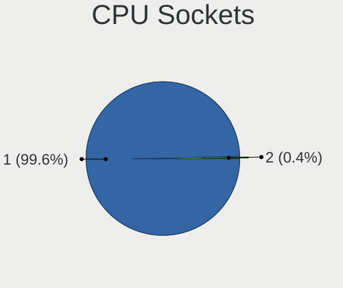

| Number | Computers | Percent |
|--------|-----------|---------|
| 1      | 1122      | 99.64%  |
| 2      | 4         | 0.36%   |

CPU Threads
-----------

Threads per core (Hyper-Threading)

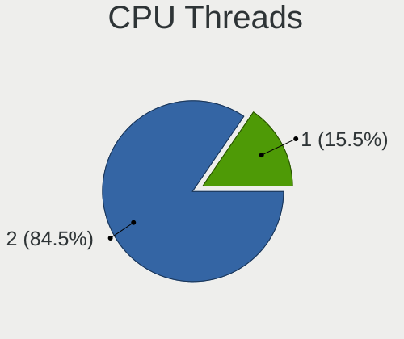

| Number | Computers | Percent |
|--------|-----------|---------|
| 2      | 952       | 84.55%  |
| 1      | 174       | 15.45%  |

CPU Op-Modes
------------

CPU Operation Modes (32-bit, 64-bit)

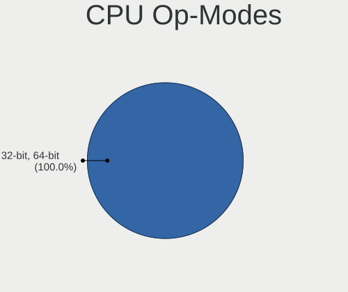

| Op mode        | Computers | Percent |
|----------------|-----------|---------|
| 32-bit, 64-bit | 1126      | 100%    |

CPU Microcode
-------------

Microcode number

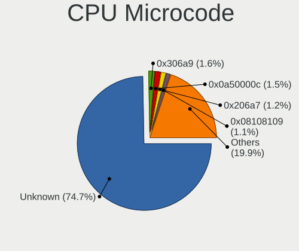

| Number     | Computers | Percent |
|------------|-----------|---------|
| Unknown    | 857       | 74.72%  |
| 0x306a9    | 18        | 1.57%   |
| 0x0a50000c | 17        | 1.48%   |
| 0x206a7    | 14        | 1.22%   |
| 0x08108109 | 13        | 1.13%   |
| 0x306c3    | 11        | 0.96%   |
| 0x08701021 | 11        | 0.96%   |
| 0x806c1    | 10        | 0.87%   |
| 0x0800820d | 10        | 0.87%   |
| 0x906ea    | 9         | 0.78%   |
| 0x0a601203 | 9         | 0.78%   |
| 0x0a50000d | 9         | 0.78%   |
| 0x08600106 | 8         | 0.7%    |
| 0x906e9    | 7         | 0.61%   |
| 0x506e3    | 7         | 0.61%   |
| 0xa0652    | 6         | 0.52%   |
| 0x0a404102 | 6         | 0.52%   |
| 0x0a20120a | 6         | 0.52%   |
| 0x806ea    | 5         | 0.44%   |
| 0x806e9    | 5         | 0.44%   |
| 0x08608103 | 5         | 0.44%   |
| 0x08600103 | 4         | 0.35%   |
| 0xa0653    | 3         | 0.26%   |
| 0x806ec    | 3         | 0.26%   |
| 0x406e3    | 3         | 0.26%   |
| 0x40651    | 3         | 0.26%   |
| 0x0a704103 | 3         | 0.26%   |
| 0x0a50000b | 3         | 0.26%   |
| 0x0a201025 | 3         | 0.26%   |
| 0x0a201009 | 3         | 0.26%   |
| 0x08a00008 | 3         | 0.26%   |
| 0x08600104 | 3         | 0.26%   |
| 0x08108102 | 3         | 0.26%   |
| 0x08001137 | 3         | 0.26%   |
| 0x06006705 | 3         | 0.26%   |
| 0x906ed    | 2         | 0.17%   |
| 0x906a3    | 2         | 0.17%   |
| 0x90672    | 2         | 0.17%   |
| 0x106e5    | 2         | 0.17%   |
| 0x1067a    | 2         | 0.17%   |

CPU Microarch
-------------

Microarchitecture

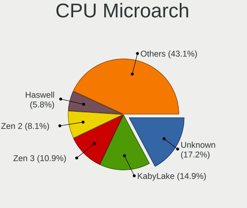

| Name              | Computers | Percent |
|-------------------|-----------|---------|
| Unknown           | 194       | 17.18%  |
| KabyLake          | 168       | 14.88%  |
| Zen 3             | 123       | 10.89%  |
| Zen 2             | 91        | 8.06%   |
| Haswell           | 66        | 5.85%   |
| Zen+              | 60        | 5.31%   |
| IvyBridge         | 54        | 4.78%   |
| TigerLake         | 44        | 3.9%    |
| CometLake         | 44        | 3.9%    |
| Alderlake Hybrid  | 44        | 3.9%    |
| Skylake           | 39        | 3.45%   |
| SandyBridge       | 38        | 3.37%   |
| Zen               | 23        | 2.04%   |
| Broadwell         | 22        | 1.95%   |
| Piledriver        | 17        | 1.51%   |
| IceLake           | 16        | 1.42%   |
| Penryn            | 13        | 1.15%   |
| Excavator         | 10        | 0.89%   |
| Westmere          | 8         | 0.71%   |
| Goldmont plus     | 8         | 0.71%   |
| Puma              | 7         | 0.62%   |
| Nehalem           | 6         | 0.53%   |
| Steamroller       | 5         | 0.44%   |
| Silvermont        | 4         | 0.35%   |
| Meteorlake Hybrid | 4         | 0.35%   |
| K10               | 4         | 0.35%   |
| Goldmont          | 4         | 0.35%   |
| Jaguar            | 3         | 0.27%   |
| Core              | 2         | 0.18%   |
| Bulldozer         | 2         | 0.18%   |
| Bobcat            | 2         | 0.18%   |
| Lunarlake Hybrid  | 1         | 0.09%   |
| K8 Hammer         | 1         | 0.09%   |
| K8 & K10 hybrid   | 1         | 0.09%   |
| K10 Llano         | 1         | 0.09%   |

Graphics
--------

GPU Vendor
----------

Vendors of graphics cards

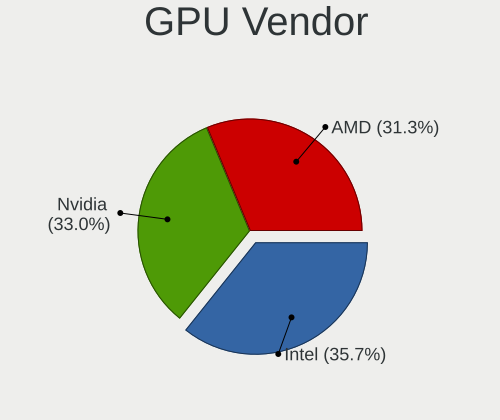

| Vendor | Computers | Percent |
|--------|-----------|---------|
| Intel  | 520       | 35.74%  |
| Nvidia | 480       | 32.99%  |
| AMD    | 455       | 31.27%  |

GPU Model
---------

Graphics card models

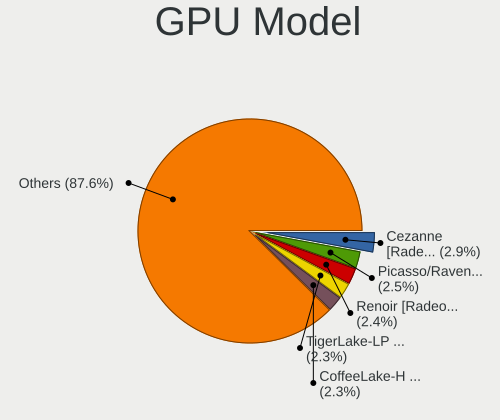

| Model                                                                       | Computers | Percent |
|-----------------------------------------------------------------------------|-----------|---------|
| AMD Cezanne [Radeon Vega Series / Radeon Vega Mobile Series]                | 44        | 2.91%   |
| AMD Picasso/Raven 2 [Radeon Vega Series / Radeon Vega Mobile Series]        | 38        | 2.52%   |
| AMD Renoir [Radeon Vega Series / Radeon Vega Mobile Series]                 | 36        | 2.38%   |
| Intel TigerLake-LP GT2 [Iris Xe Graphics]                                   | 35        | 2.32%   |
| Intel CoffeeLake-H GT2 [UHD Graphics 630]                                   | 34        | 2.25%   |
| Intel 3rd Gen Core processor Graphics Controller                            | 33        | 2.19%   |
| AMD Raphael                                                                 | 32        | 2.12%   |
| AMD Ellesmere [Radeon RX 470/480/570/570X/580/580X/590]                     | 29        | 1.92%   |
| Nvidia TU117M [GeForce GTX 1650 Mobile / Max-Q]                             | 28        | 1.85%   |
| Intel 2nd Generation Core Processor Family Integrated Graphics Controller   | 28        | 1.85%   |
| Intel CometLake-H GT2 [UHD Graphics]                                        | 25        | 1.66%   |
| AMD Navi 22 [Radeon RX 6700/6700 XT/6750 XT / 6800M/6850M XT]               | 23        | 1.52%   |
| Intel Kaby Lake-R GT2 [UHD Graphics 620]                                    | 22        | 1.46%   |
| AMD Rembrandt [Radeon 680M]                                                 | 22        | 1.46%   |
| Nvidia GA106M [GeForce RTX 3060 Mobile / Max-Q]                             | 21        | 1.39%   |
| Intel Kaby Lake-H GT2 [HD Graphics 630]                                     | 19        | 1.26%   |
| Intel Xeon E3-1200 v3/4th Gen Core Processor Integrated Graphics Controller | 18        | 1.19%   |
| Intel Kaby Lake-U GT2 [HD Graphics 620]                                     | 18        | 1.19%   |
| AMD Navi 31 [Radeon RX 7900 XT/7900 XTX/7900 GRE/7900M]                     | 18        | 1.19%   |
| AMD Navi 21 [Radeon RX 6800/6800 XT / 6900 XT]                              | 18        | 1.19%   |
| AMD Lucienne                                                                | 18        | 1.19%   |
| Intel Haswell-ULT Integrated Graphics Controller                            | 17        | 1.13%   |
| Intel Alder Lake-P GT2 [Iris Xe Graphics]                                   | 17        | 1.13%   |
| Nvidia GA106 [GeForce RTX 3060 Lite Hash Rate]                              | 15        | 0.99%   |
| Intel TigerLake-H GT1 [UHD Graphics]                                        | 15        | 0.99%   |
| AMD Navi 10 [Radeon RX 5600 OEM/5600 XT / 5700/5700 XT]                     | 15        | 0.99%   |
| Intel Skylake-U GT2 [HD Graphics 520]                                       | 14        | 0.93%   |
| Intel Broadwell-U GT2 [HD Graphics 5500]                                    | 14        | 0.93%   |
| Intel Alder Lake-S GT1 [UHD Graphics 770]                                   | 13        | 0.86%   |
| AMD Phoenix1                                                                | 13        | 0.86%   |
| Nvidia TU116M [GeForce GTX 1660 Ti Mobile]                                  | 12        | 0.79%   |
| Nvidia GP107M [GeForce GTX 1050 Mobile]                                     | 12        | 0.79%   |
| Nvidia GA107M [GeForce RTX 3050 Mobile]                                     | 12        | 0.79%   |
| Intel 4th Gen Core Processor Integrated Graphics Controller                 | 12        | 0.79%   |
| AMD Navi 23 [Radeon RX 6600/6600 XT/6600M]                                  | 12        | 0.79%   |
| Intel CometLake-U GT2 [UHD Graphics]                                        | 11        | 0.73%   |
| Nvidia TU117M [GeForce GTX 1650 Ti Mobile]                                  | 10        | 0.66%   |
| Nvidia GP104 [GeForce GTX 1070]                                             | 10        | 0.66%   |
| Intel Iris Plus Graphics G1 (Ice Lake)                                      | 10        | 0.66%   |
| Intel CoffeeLake-S GT2 [UHD Graphics 630]                                   | 10        | 0.66%   |

GPU Combo
---------

Combinations of graphics cards

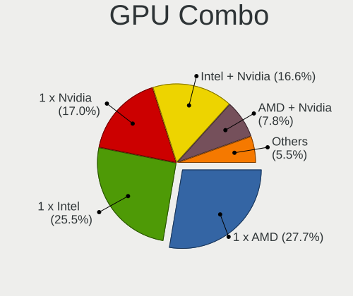

| Name                 | Computers | Percent |
|----------------------|-----------|---------|
| 1 x AMD              | 314       | 27.67%  |
| 1 x Intel            | 289       | 25.46%  |
| 1 x Nvidia           | 193       | 17%     |
| Intel + Nvidia       | 188       | 16.56%  |
| AMD + Nvidia         | 89        | 7.84%   |
| 2 x AMD              | 35        | 3.08%   |
| Intel + AMD          | 17        | 1.5%    |
| 2 x Nvidia           | 5         | 0.44%   |
| 2 x Intel            | 2         | 0.18%   |
| Intel + 2 x Nvidia   | 2         | 0.18%   |
| 2 x AMD + 1 x Nvidia | 1         | 0.09%   |

GPU Driver
----------

Free vs proprietary

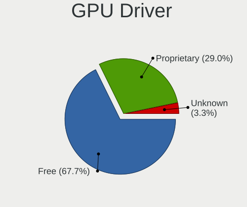

| Driver      | Computers | Percent |
|-------------|-----------|---------|
| Free        | 770       | 67.72%  |
| Proprietary | 330       | 29.02%  |
| Unknown     | 37        | 3.25%   |

GPU Memory
----------

Total video memory

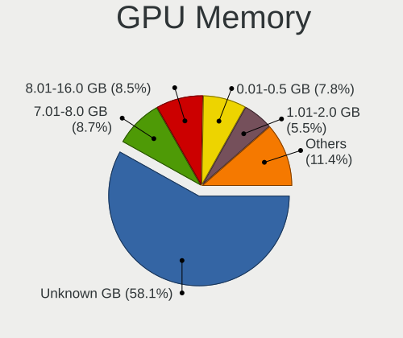

| Size in GB | Computers | Percent |
|------------|-----------|---------|
| Unknown    | 670       | 58.11%  |
| 7.01-8.0   | 100       | 8.67%   |
| 8.01-16.0  | 98        | 8.5%    |
| 0.01-0.5   | 90        | 7.81%   |
| 1.01-2.0   | 63        | 5.46%   |
| 3.01-4.0   | 56        | 4.86%   |
| 5.01-6.0   | 32        | 2.78%   |
| 0.51-1.0   | 22        | 1.91%   |
| 16.01-24.0 | 17        | 1.47%   |
| 2.01-3.0   | 4         | 0.35%   |
| 24.01-32.0 | 1         | 0.09%   |

Monitor
-------

Monitor Vendor
--------------

Monitor vendors

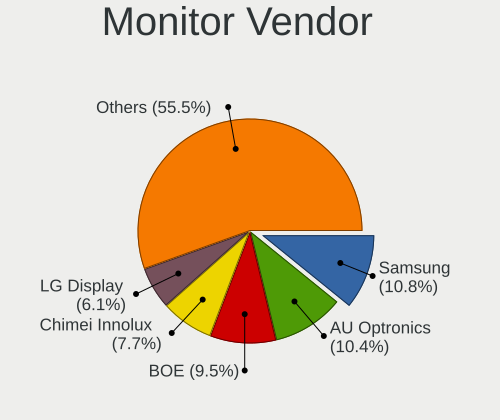

| Vendor               | Computers | Percent |
|----------------------|-----------|---------|
| Samsung Electronics  | 150       | 10.84%  |
| AU Optronics         | 144       | 10.4%   |
| BOE                  | 132       | 9.54%   |
| Chimei Innolux       | 106       | 7.66%   |
| LG Display           | 84        | 6.07%   |
| Goldstar             | 78        | 5.64%   |
| Dell                 | 75        | 5.42%   |
| Acer                 | 56        | 4.05%   |
| AOC                  | 47        | 3.4%    |
| Hewlett-Packard      | 44        | 3.18%   |
| BenQ                 | 33        | 2.38%   |
| Ancor Communications | 29        | 2.1%    |
| ASUSTek Computer     | 27        | 1.95%   |
| MSI                  | 26        | 1.88%   |
| Sharp                | 25        | 1.81%   |
| Philips              | 23        | 1.66%   |
| PANDA                | 22        | 1.59%   |
| Lenovo               | 22        | 1.59%   |
| Apple                | 22        | 1.59%   |
| Unknown              | 14        | 1.01%   |
| ViewSonic            | 13        | 0.94%   |
| Sony                 | 12        | 0.87%   |
| Iiyama               | 12        | 0.87%   |
| Gigabyte Technology  | 10        | 0.72%   |
| NEC Computers        | 8         | 0.58%   |
| HKC                  | 8         | 0.58%   |
| Sceptre Tech         | 7         | 0.51%   |
| Mi                   | 7         | 0.51%   |
| Vizio                | 6         | 0.43%   |
| TMX                  | 5         | 0.36%   |
| Insignia             | 5         | 0.36%   |
| Denver               | 5         | 0.36%   |
| Toshiba              | 4         | 0.29%   |
| RTK                  | 4         | 0.29%   |
| Panasonic            | 4         | 0.29%   |
| InfoVision           | 4         | 0.29%   |
| Unknown              | 4         | 0.29%   |
| Pixio                | 3         | 0.22%   |
| LG Electronics       | 3         | 0.22%   |
| HUAWEI               | 3         | 0.22%   |

Monitor Model
-------------

Monitor models

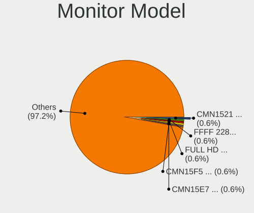

| Model                                                                 | Computers | Percent |
|-----------------------------------------------------------------------|-----------|---------|
| Chimei Innolux LCD Monitor CMN1521 1920x1080 344x193mm 15.5-inch      | 9         | 0.62%   |
| Unknown LCD Monitor FFFF 2288x1287 2550x2550mm 142.0-inch             | 8         | 0.55%   |
| Goldstar FULL HD GSM5B55 1920x1080 480x270mm 21.7-inch                | 8         | 0.55%   |
| Chimei Innolux LCD Monitor CMN15F5 1920x1080 344x193mm 15.5-inch      | 8         | 0.55%   |
| Chimei Innolux LCD Monitor CMN15E7 1920x1080 344x193mm 15.5-inch      | 8         | 0.55%   |
| AU Optronics LCD Monitor AUO38ED 1920x1080 344x193mm 15.5-inch        | 8         | 0.55%   |
| Samsung Electronics C27F390 SAM0D32 1920x1080 598x336mm 27.0-inch     | 6         | 0.42%   |
| PANDA LCD Monitor NCP004D 1920x1080 344x194mm 15.5-inch               | 6         | 0.42%   |
| AOC 27G2G4 AOC2702 1920x1080 598x336mm 27.0-inch                      | 6         | 0.42%   |
| Samsung Electronics LCD Monitor SDC4161 1920x1080 344x194mm 15.5-inch | 5         | 0.35%   |
| Goldstar ULTRAGEAR GSM7766 2560x1440 697x392mm 31.5-inch              | 5         | 0.35%   |
| Goldstar LG TV SSCR2 GSMC0C8 3840x2160                                | 5         | 0.35%   |
| BOE LCD Monitor BOE0700 1920x1080 344x194mm 15.5-inch                 | 5         | 0.35%   |
| Mi Monitor XMI3444 3440x1440 797x334mm 34.0-inch                      | 4         | 0.28%   |
| Goldstar LG ULTRAWIDE GSM59F1 2560x1080 670x280mm 28.6-inch           | 4         | 0.28%   |
| Gigabyte Technology G27Q GBT2709 2560x1440 598x336mm 27.0-inch        | 4         | 0.28%   |
| Dell U2412M DELA07A 1920x1200 518x324mm 24.1-inch                     | 4         | 0.28%   |
| Chimei Innolux LCD Monitor CMN1540 2560x1440 344x193mm 15.5-inch      | 4         | 0.28%   |
| Chimei Innolux LCD Monitor CMN14E5 1920x1080 309x173mm 13.9-inch      | 4         | 0.28%   |
| BenQ GW2480 BNQ78E7 1920x1080 527x296mm 23.8-inch                     | 4         | 0.28%   |
| AU Optronics LCD Monitor AUOAF90 1920x1080 344x193mm 15.5-inch        | 4         | 0.28%   |
| AU Optronics LCD Monitor AUO21ED 1920x1080 344x193mm 15.5-inch        | 4         | 0.28%   |
| Unknown                                                               | 4         | 0.28%   |
| ViewSonic VX3276-QHD VSCE635 2560x1440 698x393mm 31.5-inch            | 3         | 0.21%   |
| Samsung Electronics C24F390 SAM0D2C 1920x1080 521x293mm 23.5-inch     | 3         | 0.21%   |
| MSI G321CU MSI3DC5 3840x2160 697x392mm 31.5-inch                      | 3         | 0.21%   |
| LG Display LCD Monitor LGD0690 2560x1440 344x194mm 15.5-inch          | 3         | 0.21%   |
| LG Display LCD Monitor LGD05FE 1920x1080 344x194mm 15.5-inch          | 3         | 0.21%   |
| Hewlett-Packard E241i HWP3122 1920x1200 518x324mm 24.1-inch           | 3         | 0.21%   |
| Goldstar ULTRAWIDE GSM5AFB 2560x1080 798x334mm 34.1-inch              | 3         | 0.21%   |
| Goldstar Ultra HD GSM5B08 3840x2160 600x340mm 27.2-inch               | 3         | 0.21%   |
| Denver MO-HHS-32C LHCFFFF 1920x1080 699x393mm 31.6-inch               | 3         | 0.21%   |
| Dell P2419H DELD0DA 1920x1080 527x296mm 23.8-inch                     | 3         | 0.21%   |
| Chimei Innolux LCD Monitor CMN1618 1920x1200 344x215mm 16.0-inch      | 3         | 0.21%   |
| Chimei Innolux LCD Monitor CMN15E8 1920x1080 344x193mm 15.5-inch      | 3         | 0.21%   |
| Chimei Innolux LCD Monitor CMN15C4 1920x1080 344x193mm 15.5-inch      | 3         | 0.21%   |
| BOE LCD Monitor BOE0BC9 2560x1600 345x215mm 16.0-inch                 | 3         | 0.21%   |
| BOE LCD Monitor BOE06A4 1366x768 344x194mm 15.5-inch                  | 3         | 0.21%   |
| BenQ GL2760 BNQ78D5 1920x1080 598x336mm 27.0-inch                     | 3         | 0.21%   |
| AU Optronics LCD Monitor AUO45EC 1366x768 344x193mm 15.5-inch         | 3         | 0.21%   |

Monitor Resolution
------------------

Monitor screen resolution

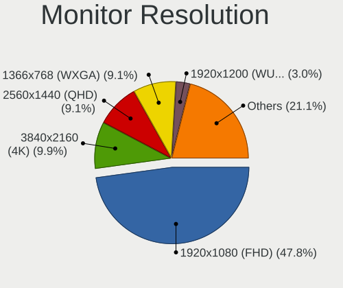

| Resolution         | Computers | Percent |
|--------------------|-----------|---------|
| 1920x1080 (FHD)    | 628       | 47.83%  |
| 3840x2160 (4K)     | 130       | 9.9%    |
| 2560x1440 (QHD)    | 120       | 9.14%   |
| 1366x768 (WXGA)    | 119       | 9.06%   |
| 1920x1200 (WUXGA)  | 39        | 2.97%   |
| 3440x1440          | 31        | 2.36%   |
| 1600x900 (HD+)     | 31        | 2.36%   |
| 1680x1050 (WSXGA+) | 29        | 2.21%   |
| 2560x1600          | 22        | 1.68%   |
| 2560x1080          | 20        | 1.52%   |
| 1440x900 (WXGA+)   | 16        | 1.22%   |
| 1280x1024 (SXGA)   | 14        | 1.07%   |
| 3840x1080          | 12        | 0.91%   |
| Unknown            | 12        | 0.91%   |
| 2880x1800          | 11        | 0.84%   |
| 2288x1287          | 9         | 0.69%   |
| 1280x800 (WXGA)    | 8         | 0.61%   |
| 1360x768           | 6         | 0.46%   |
| 2256x1504          | 4         | 0.3%    |
| 1920x540           | 4         | 0.3%    |
| 1280x720 (HD)      | 4         | 0.3%    |
| 3840x2400          | 3         | 0.23%   |
| 3840x1200          | 3         | 0.23%   |
| 2160x1440          | 3         | 0.23%   |
| 7680x2160          | 2         | 0.15%   |
| 3840x1600          | 2         | 0.15%   |
| 3200x2000          | 2         | 0.15%   |
| 3200x1800 (QHD+)   | 2         | 0.15%   |
| 3000x2000          | 2         | 0.15%   |
| 2880x1440          | 2         | 0.15%   |
| 2736x1824          | 2         | 0.15%   |
| 2240x1400          | 2         | 0.15%   |
| 1600x1200          | 2         | 0.15%   |
| 9600x2160          | 1         | 0.08%   |
| 800x1280           | 1         | 0.08%   |
| 504x315            | 1         | 0.08%   |
| 480x1920           | 1         | 0.08%   |
| 4480x1440          | 1         | 0.08%   |
| 3520x1080          | 1         | 0.08%   |
| 3360x1050          | 1         | 0.08%   |

Monitor Diagonal
----------------

Diagonal size in inches

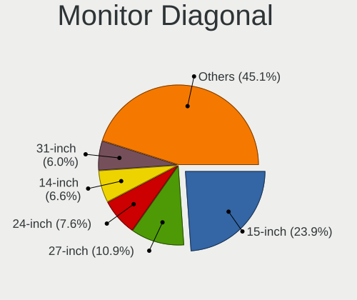

| Inches  | Computers | Percent |
|---------|-----------|---------|
| 15      | 328       | 23.87%  |
| 27      | 150       | 10.92%  |
| 24      | 104       | 7.57%   |
| 14      | 90        | 6.55%   |
| 31      | 82        | 5.97%   |
| 23      | 75        | 5.46%   |
| 13      | 74        | 5.39%   |
| 17      | 58        | 4.22%   |
| Unknown | 57        | 4.15%   |
| 21      | 47        | 3.42%   |
| 16      | 42        | 3.06%   |
| 34      | 39        | 2.84%   |
| 19      | 25        | 1.82%   |
| 22      | 20        | 1.46%   |
| 18      | 19        | 1.38%   |
| 20      | 15        | 1.09%   |
| 72      | 13        | 0.95%   |
| 84      | 10        | 0.73%   |
| 40      | 9         | 0.66%   |
| 142     | 8         | 0.58%   |
| 32      | 8         | 0.58%   |
| 26      | 8         | 0.58%   |
| 49      | 7         | 0.51%   |
| 48      | 7         | 0.51%   |
| 28      | 7         | 0.51%   |
| 54      | 6         | 0.44%   |
| 29      | 6         | 0.44%   |
| 25      | 6         | 0.44%   |
| 12      | 6         | 0.44%   |
| 43      | 5         | 0.36%   |
| 11      | 5         | 0.36%   |
| 65      | 4         | 0.29%   |
| 35      | 4         | 0.29%   |
| 33      | 4         | 0.29%   |
| 63      | 3         | 0.22%   |
| 46      | 3         | 0.22%   |
| 75      | 2         | 0.15%   |
| 74      | 2         | 0.15%   |
| 44      | 2         | 0.15%   |
| 37      | 2         | 0.15%   |

Monitor Width
-------------

Physical width

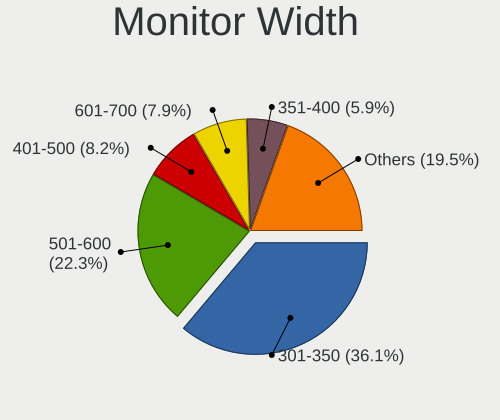

| Width in mm    | Computers | Percent |
|----------------|-----------|---------|
| 301-350        | 481       | 36.14%  |
| 501-600        | 297       | 22.31%  |
| 401-500        | 109       | 8.19%   |
| 601-700        | 105       | 7.89%   |
| 351-400        | 79        | 5.94%   |
| Unknown        | 57        | 4.28%   |
| 201-300        | 55        | 4.13%   |
| 701-800        | 52        | 3.91%   |
| 1001-1500      | 37        | 2.78%   |
| 1501-2000      | 28        | 2.1%    |
| 801-900        | 17        | 1.28%   |
| More than 2000 | 8         | 0.6%    |
| 901-1000       | 4         | 0.3%    |
| 101-200        | 1         | 0.08%   |
| 1-100          | 1         | 0.08%   |

Aspect Ratio
------------

Proportional relationship between the width and the height

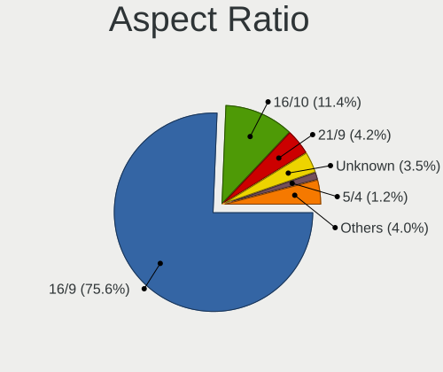

| Ratio   | Computers | Percent |
|---------|-----------|---------|
| 16/9    | 916       | 75.64%  |
| 16/10   | 138       | 11.4%   |
| 21/9    | 51        | 4.21%   |
| Unknown | 42        | 3.47%   |
| 5/4     | 15        | 1.24%   |
| 3/2     | 15        | 1.24%   |
| 32/9    | 13        | 1.07%   |
| 1.00    | 9         | 0.74%   |
| 4/3     | 5         | 0.41%   |
| 3.20    | 2         | 0.17%   |
| 2.00    | 2         | 0.17%   |
| 0.89    | 1         | 0.08%   |
| 0.62    | 1         | 0.08%   |
| 0.25    | 1         | 0.08%   |

Monitor Area
------------

Area in inch²

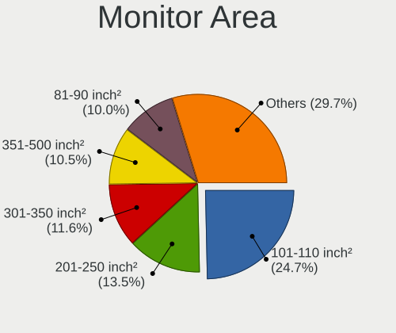

| Area in inch² | Computers | Percent |
|----------------|-----------|---------|
| 101-110        | 332       | 24.67%  |
| 201-250        | 182       | 13.52%  |
| 301-350        | 156       | 11.59%  |
| 351-500        | 142       | 10.55%  |
| 81-90          | 134       | 9.96%   |
| 151-200        | 58        | 4.31%   |
| Unknown        | 57        | 4.23%   |
| 121-130        | 55        | 4.09%   |
| More than 1000 | 54        | 4.01%   |
| 251-300        | 42        | 3.12%   |
| 501-1000       | 36        | 2.67%   |
| 111-120        | 34        | 2.53%   |
| 71-80          | 27        | 2.01%   |
| 141-150        | 18        | 1.34%   |
| 61-70          | 6         | 0.45%   |
| 51-60          | 5         | 0.37%   |
| 91-100         | 4         | 0.3%    |
| 1-40           | 2         | 0.15%   |
| 131-140        | 2         | 0.15%   |

Pixel Density
-------------

Pixels per inch

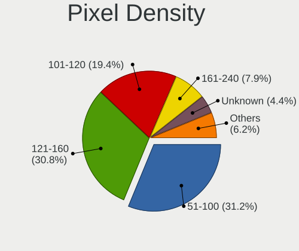

| Density       | Computers | Percent |
|---------------|-----------|---------|
| 51-100        | 403       | 31.22%  |
| 121-160       | 398       | 30.83%  |
| 101-120       | 251       | 19.44%  |
| 161-240       | 102       | 7.9%    |
| Unknown       | 57        | 4.42%   |
| 1-50          | 49        | 3.8%    |
| More than 240 | 31        | 2.4%    |

Multiple Monitors
-----------------

Total monitors connected

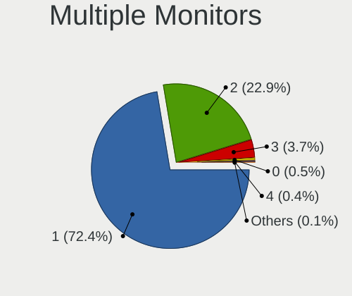

| Total | Computers | Percent |
|-------|-----------|---------|
| 1     | 835       | 72.36%  |
| 2     | 264       | 22.88%  |
| 3     | 43        | 3.73%   |
| 0     | 6         | 0.52%   |
| 4     | 5         | 0.43%   |
| 5     | 1         | 0.09%   |

Network
-------

Net Controller Vendor
---------------------

Controller vendors

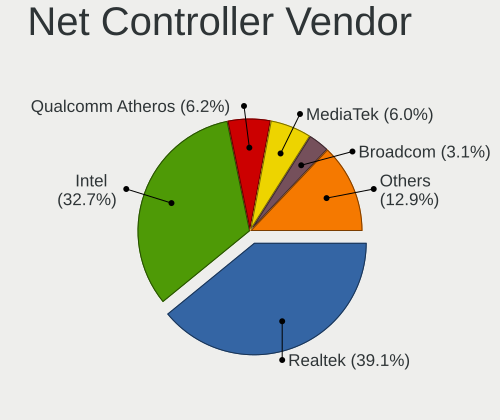

| Vendor                            | Computers | Percent |
|-----------------------------------|-----------|---------|
| Realtek Semiconductor             | 708       | 39.09%  |
| Intel                             | 592       | 32.69%  |
| Qualcomm Atheros                  | 112       | 6.18%   |
| MediaTek                          | 109       | 6.02%   |
| Broadcom                          | 56        | 3.09%   |
| TP-Link                           | 24        | 1.33%   |
| Ralink Technology                 | 16        | 0.88%   |
| ASIX Electronics                  | 16        | 0.88%   |
| Samsung Electronics               | 14        | 0.77%   |
| Microsoft                         | 14        | 0.77%   |
| DisplayLink                       | 13        | 0.72%   |
| NetGear                           | 12        | 0.66%   |
| Aquantia                          | 10        | 0.55%   |
| Xiaomi                            | 8         | 0.44%   |
| Shenzhen Goodix Technology        | 8         | 0.44%   |
| Qualcomm Technologies             | 8         | 0.44%   |
| Sierra Wireless                   | 6         | 0.33%   |
| Qualcomm                          | 6         | 0.33%   |
| Google                            | 6         | 0.33%   |
| Linksys                           | 5         | 0.28%   |
| Broadcom Limited                  | 5         | 0.28%   |
| Ralink                            | 4         | 0.22%   |
| Dell                              | 4         | 0.22%   |
| Marvell Technology Group          | 3         | 0.17%   |
| Lenovo                            | 3         | 0.17%   |
| ASUSTek Computer                  | 3         | 0.17%   |
| ZTE WCDMA Technologies MSM        | 2         | 0.11%   |
| Wacom                             | 2         | 0.11%   |
| Qualcomm Atheros Communications   | 2         | 0.11%   |
| QinHeng Electronics               | 2         | 0.11%   |
| OnePlus Technology (Shenzhen)     | 2         | 0.11%   |
| Huawei Technologies               | 2         | 0.11%   |
| Hewlett-Packard                   | 2         | 0.11%   |
| Ericsson Business Mobile Networks | 2         | 0.11%   |
| D-Link                            | 2         | 0.11%   |
| Belkin Components                 | 2         | 0.11%   |
| AVM                               | 2         | 0.11%   |
| Unknown                           | 2         | 0.11%   |
| ZyXEL Communications              | 1         | 0.06%   |
| Winbond Electronics               | 1         | 0.06%   |

Net Controller Model
--------------------

Controller models

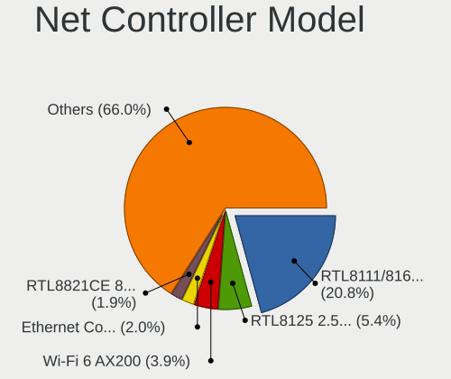

| Model                                                                  | Computers | Percent |
|------------------------------------------------------------------------|-----------|---------|
| Realtek RTL8111/8168/8211/8411 PCI Express Gigabit Ethernet Controller | 437       | 20.76%  |
| Realtek RTL8125 2.5GbE Controller                                      | 114       | 5.42%   |
| Intel Wi-Fi 6 AX200                                                    | 82        | 3.9%    |
| Intel Ethernet Controller I225-V                                       | 43        | 2.04%   |
| Realtek RTL8821CE 802.11ac PCIe Wireless Network Adapter               | 40        | 1.9%    |
| Intel I211 Gigabit Network Connection                                  | 39        | 1.85%   |
| Intel Wi-Fi 6E(802.11ax) AX210/AX1675* 2x2 [Typhoon Peak]              | 38        | 1.81%   |
| Realtek RTL810xE PCI Express Fast Ethernet controller                  | 35        | 1.66%   |
| MediaTek MT7921 802.11ax PCIe Wireless Network Adapter [Filogic 330]   | 35        | 1.66%   |
| Intel Wi-Fi 6 AX201                                                    | 33        | 1.57%   |
| Realtek RTL8153 Gigabit Ethernet Adapter                               | 32        | 1.52%   |
| MediaTek MT7922 802.11ax PCI Express Wireless Network Adapter          | 32        | 1.52%   |
| Intel Cannon Lake PCH CNVi WiFi                                        | 31        | 1.47%   |
| Intel Comet Lake PCH CNVi WiFi                                         | 30        | 1.43%   |
| Realtek RTL8822CE 802.11ac PCIe Wireless Network Adapter               | 27        | 1.28%   |
| Intel Wireless 8265 / 8275                                             | 26        | 1.24%   |
| Intel Alder Lake-P PCH CNVi WiFi                                       | 26        | 1.24%   |
| Intel 82579LM Gigabit Network Connection (Lewisville)                  | 26        | 1.24%   |
| Qualcomm Atheros QCA6174 802.11ac Wireless Network Adapter             | 24        | 1.14%   |
| Intel Wireless 7265                                                    | 22        | 1.05%   |
| Intel Dual Band Wireless-AC 3168NGW [Stone Peak]                       | 21        | 1%      |
| Intel Wi-Fi 5(802.11ac) Wireless-AC 9x6x [Thunder Peak]                | 19        | 0.9%    |
| Intel Ethernet Connection I217-LM                                      | 17        | 0.81%   |
| Intel Wireless 7260                                                    | 16        | 0.76%   |
| Realtek RTL8852BE PCIe 802.11ax Wireless Network Controller            | 15        | 0.71%   |
| Qualcomm Atheros QCA9377 802.11ac Wireless Network Adapter             | 15        | 0.71%   |
| MediaTek MT7921K (RZ608) Wi-Fi 6E 80MHz                                | 15        | 0.71%   |
| Qualcomm Atheros QCA9565 / AR9565 Wireless Network Adapter             | 14        | 0.67%   |
| Intel Tiger Lake PCH CNVi WiFi                                         | 14        | 0.67%   |
| Intel 700 Series Chipset CNVi WiFi                                     | 14        | 0.67%   |
| ASIX AX88179 Gigabit Ethernet                                          | 14        | 0.67%   |
| MediaTek MT7902 802.11ax PCIe Wireless Network Adapter [Filogic 310]   | 13        | 0.62%   |
| Intel Wireless 3165                                                    | 13        | 0.62%   |
| Intel Ethernet Connection (2) I219-V                                   | 13        | 0.62%   |
| Intel Wireless 8260                                                    | 12        | 0.57%   |
| Realtek RTL8822BE 802.11a/b/g/n/ac WiFi adapter                        | 11        | 0.52%   |
| Realtek Killer E3000 2.5GbE Controller                                 | 11        | 0.52%   |
| Realtek Killer E2600 GbE Controller                                    | 11        | 0.52%   |
| Realtek RTL88x2bu [AC1200 Techkey]                                     | 10        | 0.48%   |
| Ralink RT2870/RT3070 Wireless Adapter                                  | 10        | 0.48%   |

Wireless Vendor
---------------

Wireless vendors

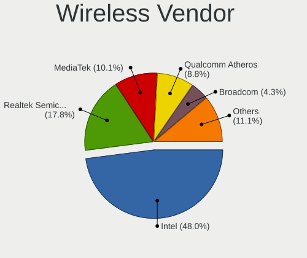

| Vendor                          | Computers | Percent |
|---------------------------------|-----------|---------|
| Intel                           | 471       | 47.96%  |
| Realtek Semiconductor           | 175       | 17.82%  |
| MediaTek                        | 99        | 10.08%  |
| Qualcomm Atheros                | 86        | 8.76%   |
| Broadcom                        | 42        | 4.28%   |
| TP-Link                         | 22        | 2.24%   |
| Ralink Technology               | 16        | 1.63%   |
| NetGear                         | 12        | 1.22%   |
| Microsoft                       | 12        | 1.22%   |
| Sierra Wireless                 | 6         | 0.61%   |
| Linksys                         | 5         | 0.51%   |
| Ralink                          | 4         | 0.41%   |
| Broadcom Limited                | 4         | 0.41%   |
| ASUSTek Computer                | 3         | 0.31%   |
| Wacom                           | 2         | 0.2%    |
| Qualcomm Atheros Communications | 2         | 0.2%    |
| Qualcomm                        | 2         | 0.2%    |
| Marvell Technology Group        | 2         | 0.2%    |
| Dell                            | 2         | 0.2%    |
| D-Link                          | 2         | 0.2%    |
| AVM                             | 2         | 0.2%    |
| Unknown                         | 2         | 0.2%    |
| ZyXEL Communications            | 1         | 0.1%    |
| Sitecom Europe                  | 1         | 0.1%    |
| Quectel Wireless Solutions      | 1         | 0.1%    |
| Qualcomm Technologies           | 1         | 0.1%    |
| Mercucys                        | 1         | 0.1%    |
| Hewlett-Packard                 | 1         | 0.1%    |
| Edimax Technology               | 1         | 0.1%    |
| Belkin Components               | 1         | 0.1%    |
| Accton Technology               | 1         | 0.1%    |

Wireless Model
--------------

Wireless models

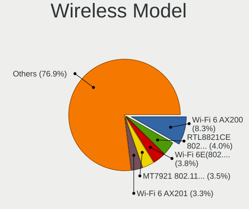

| Model                                                                | Computers | Percent |
|----------------------------------------------------------------------|-----------|---------|
| Intel Wi-Fi 6 AX200                                                  | 82        | 8.3%    |
| Realtek RTL8821CE 802.11ac PCIe Wireless Network Adapter             | 40        | 4.05%   |
| Intel Wi-Fi 6E(802.11ax) AX210/AX1675* 2x2 [Typhoon Peak]            | 38        | 3.85%   |
| MediaTek MT7921 802.11ax PCIe Wireless Network Adapter [Filogic 330] | 35        | 3.54%   |
| Intel Wi-Fi 6 AX201                                                  | 33        | 3.34%   |
| Intel Cannon Lake PCH CNVi WiFi                                      | 31        | 3.14%   |
| Intel Comet Lake PCH CNVi WiFi                                       | 30        | 3.04%   |
| MediaTek MT7922 802.11ax PCI Express Wireless Network Adapter        | 28        | 2.83%   |
| Realtek RTL8822CE 802.11ac PCIe Wireless Network Adapter             | 27        | 2.73%   |
| Intel Wireless 8265 / 8275                                           | 26        | 2.63%   |
| Qualcomm Atheros QCA6174 802.11ac Wireless Network Adapter           | 24        | 2.43%   |
| Intel Wireless 7265                                                  | 22        | 2.23%   |
| Intel Dual Band Wireless-AC 3168NGW [Stone Peak]                     | 21        | 2.13%   |
| Intel Wi-Fi 5(802.11ac) Wireless-AC 9x6x [Thunder Peak]              | 19        | 1.92%   |
| Intel Alder Lake-P PCH CNVi WiFi                                     | 19        | 1.92%   |
| Intel Wireless 7260                                                  | 16        | 1.62%   |
| Qualcomm Atheros QCA9377 802.11ac Wireless Network Adapter           | 15        | 1.52%   |
| MediaTek MT7921K (RZ608) Wi-Fi 6E 80MHz                              | 15        | 1.52%   |
| Realtek RTL8852BE PCIe 802.11ax Wireless Network Controller          | 14        | 1.42%   |
| Qualcomm Atheros QCA9565 / AR9565 Wireless Network Adapter           | 14        | 1.42%   |
| Intel Tiger Lake PCH CNVi WiFi                                       | 14        | 1.42%   |
| Intel 700 Series Chipset CNVi WiFi                                   | 14        | 1.42%   |
| MediaTek MT7902 802.11ax PCIe Wireless Network Adapter [Filogic 310] | 13        | 1.32%   |
| Intel Wireless 3165                                                  | 13        | 1.32%   |
| Intel Wireless 8260                                                  | 12        | 1.21%   |
| Realtek RTL8822BE 802.11a/b/g/n/ac WiFi adapter                      | 11        | 1.11%   |
| Realtek RTL88x2bu [AC1200 Techkey]                                   | 10        | 1.01%   |
| Ralink RT2870/RT3070 Wireless Adapter                                | 10        | 1.01%   |
| Qualcomm Atheros AR9485 Wireless Network Adapter                     | 10        | 1.01%   |
| Intel Comet Lake PCH-LP CNVi WiFi                                    | 10        | 1.01%   |
| Broadcom BCM4331 802.11a/b/g/n                                       | 10        | 1.01%   |
| Intel Ice Lake-LP PCH CNVi WiFi                                      | 9         | 0.91%   |
| Intel Centrino Advanced-N 6205 [Taylor Peak]                         | 9         | 0.91%   |
| Qualcomm Atheros AR9462 Wireless Network Adapter                     | 8         | 0.81%   |
| Realtek RTL8852CE PCIe 802.11ax Wireless Network Controller          | 7         | 0.71%   |
| Realtek RTL8852AE 802.11ax PCIe Wireless Network Adapter             | 7         | 0.71%   |
| Realtek RTL8723BE PCIe Wireless Network Adapter                      | 7         | 0.71%   |
| Realtek 802.11ac NIC                                                 | 7         | 0.71%   |
| Realtek RTL8723DE Wireless Network Adapter                           | 6         | 0.61%   |
| Intel Wireless 3160                                                  | 6         | 0.61%   |

Ethernet Vendor
---------------

Ethernet vendors

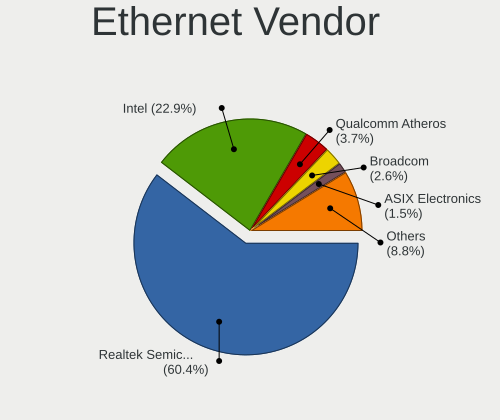

| Vendor                                 | Computers | Percent |
|----------------------------------------|-----------|---------|
| Realtek Semiconductor                  | 640       | 60.43%  |
| Intel                                  | 243       | 22.95%  |
| Qualcomm Atheros                       | 39        | 3.68%   |
| Broadcom                               | 28        | 2.64%   |
| ASIX Electronics                       | 16        | 1.51%   |
| Samsung Electronics                    | 14        | 1.32%   |
| DisplayLink                            | 13        | 1.23%   |
| MediaTek                               | 11        | 1.04%   |
| Aquantia                               | 10        | 0.94%   |
| Xiaomi                                 | 8         | 0.76%   |
| Qualcomm Technologies                  | 7         | 0.66%   |
| Google                                 | 6         | 0.57%   |
| Qualcomm                               | 3         | 0.28%   |
| Lenovo                                 | 3         | 0.28%   |
| TP-Link                                | 2         | 0.19%   |
| Microsoft                              | 2         | 0.19%   |
| ZTE WCDMA Technologies MSM             | 1         | 0.09%   |
| Spreadtrum Communications              | 1         | 0.09%   |
| Sony Ericsson Mobile Communications AB | 1         | 0.09%   |
| QinHeng Electronics                    | 1         | 0.09%   |
| OPPO Electronics                       | 1         | 0.09%   |
| OnePlus Technology (Shenzhen)          | 1         | 0.09%   |
| Nvidia                                 | 1         | 0.09%   |
| Motorola PCS                           | 1         | 0.09%   |
| Marvell Technology Group               | 1         | 0.09%   |
| ICS Advent                             | 1         | 0.09%   |
| Hewlett-Packard                        | 1         | 0.09%   |
| Broadcom Limited                       | 1         | 0.09%   |
| Belkin Components                      | 1         | 0.09%   |
| Alteon Networks                        | 1         | 0.09%   |

Ethernet Model
--------------

Ethernet models

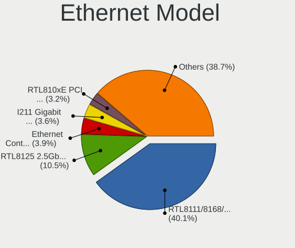

| Model                                                                           | Computers | Percent |
|---------------------------------------------------------------------------------|-----------|---------|
| Realtek RTL8111/8168/8211/8411 PCI Express Gigabit Ethernet Controller          | 437       | 40.09%  |
| Realtek RTL8125 2.5GbE Controller                                               | 114       | 10.46%  |
| Intel Ethernet Controller I225-V                                                | 43        | 3.94%   |
| Intel I211 Gigabit Network Connection                                           | 39        | 3.58%   |
| Realtek RTL810xE PCI Express Fast Ethernet controller                           | 35        | 3.21%   |
| Realtek RTL8153 Gigabit Ethernet Adapter                                        | 32        | 2.94%   |
| Intel 82579LM Gigabit Network Connection (Lewisville)                           | 26        | 2.39%   |
| Intel Ethernet Connection I217-LM                                               | 17        | 1.56%   |
| ASIX AX88179 Gigabit Ethernet                                                   | 14        | 1.28%   |
| Intel Ethernet Connection (2) I219-V                                            | 13        | 1.19%   |
| Realtek Killer E3000 2.5GbE Controller                                          | 11        | 1.01%   |
| Realtek Killer E2600 GbE Controller                                             | 11        | 1.01%   |
| Intel Ethernet Connection (7) I219-V                                            | 10        | 0.92%   |
| Samsung GT-I9070 (network tethering, USB debugging enabled)                     | 9         | 0.83%   |
| Qualcomm Atheros Killer E2500 Gigabit Ethernet Controller                       | 9         | 0.83%   |
| Broadcom NetXtreme BCM57765 Gigabit Ethernet PCIe                               | 9         | 0.83%   |
| Intel Ethernet Connection (4) I219-LM                                           | 8         | 0.73%   |
| Qualcomm WCN785x Wi-Fi 7(802.11be) 320MHz 2x2 [FastConnect 7800]                | 7         | 0.64%   |
| Qualcomm Atheros Killer E2400 Gigabit Ethernet Controller                       | 7         | 0.64%   |
| Intel Alder Lake-P PCH CNVi WiFi                                                | 7         | 0.64%   |
| Realtek RTL8126 5GbE Controller                                                 | 6         | 0.55%   |
| Intel Ethernet Connection (17) I219-V                                           | 6         | 0.55%   |
| Broadcom NetXtreme BCM57766 Gigabit Ethernet PCIe                               | 6         | 0.55%   |
| Aquantia AQtion AQC113CS NBase-T/IEEE 802.3an Ethernet Controller [Antigua 10G] | 6         | 0.55%   |
| Xiaomi Mi/Redmi series (RNDIS)                                                  | 5         | 0.46%   |
| Samsung Galaxy series, misc. (tethering mode)                                   | 5         | 0.46%   |
| Realtek USB 10/100/1G/2.5 LAN                                                   | 5         | 0.46%   |
| Qualcomm Atheros QCA8171 Gigabit Ethernet                                       | 5         | 0.46%   |
| MediaTek Infinix HOT 50i                                                        | 5         | 0.46%   |
| Intel Ethernet Controller I226-V                                                | 5         | 0.46%   |
| Intel Ethernet Connection (2) I219-LM                                           | 5         | 0.46%   |
| Intel 82579V Gigabit Network Connection                                         | 5         | 0.46%   |
| Intel 82577LM Gigabit Network Connection                                        | 5         | 0.46%   |
| Realtek RTL8152 Fast Ethernet Adapter                                           | 4         | 0.37%   |
| Qualcomm Atheros Killer E220x Gigabit Ethernet Controller                       | 4         | 0.37%   |
| MediaTek MT7922 802.11ax PCI Express Wireless Network Adapter                   | 4         | 0.37%   |
| Intel Ethernet Connection I219-LM                                               | 4         | 0.37%   |
| Intel Ethernet Connection I218-LM                                               | 4         | 0.37%   |
| Intel Ethernet Connection (7) I219-LM                                           | 4         | 0.37%   |
| Intel Ethernet Connection (5) I219-LM                                           | 4         | 0.37%   |

Net Controller Kind
-------------------

Ethernet, WiFi or modem

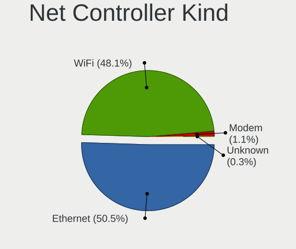

| Kind     | Computers | Percent |
|----------|-----------|---------|
| Ethernet | 952       | 50.5%   |
| WiFi     | 907       | 48.12%  |
| Modem    | 21        | 1.11%   |
| Unknown  | 5         | 0.27%   |

Used Controller
---------------

Currently used network controller

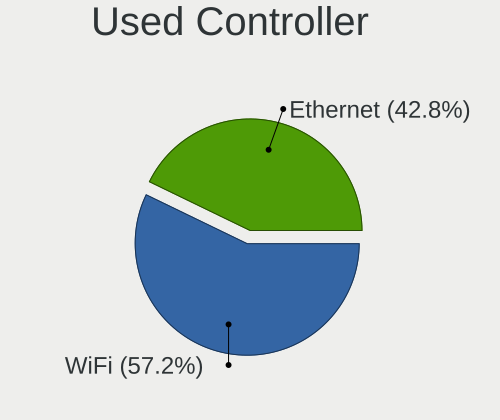

| Kind     | Computers | Percent |
|----------|-----------|---------|
| WiFi     | 673       | 57.18%  |
| Ethernet | 504       | 42.82%  |

NICs
----

Total network controllers on board

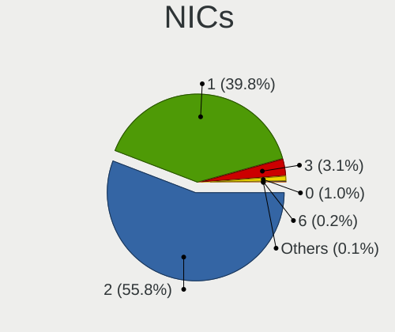

| Total | Computers | Percent |
|-------|-----------|---------|
| 2     | 632       | 55.83%  |
| 1     | 451       | 39.84%  |
| 3     | 35        | 3.09%   |
| 0     | 11        | 0.97%   |
| 6     | 2         | 0.18%   |
| 4     | 1         | 0.09%   |

IPv6
----

IPv6 vs IPv4

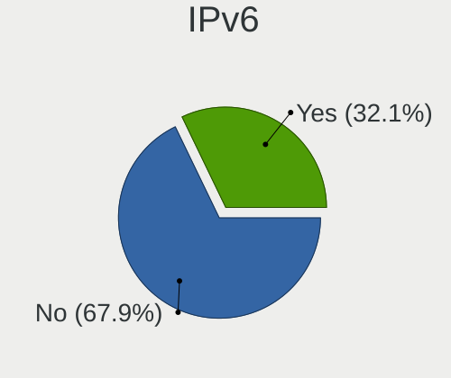

| Used | Computers | Percent |
|------|-----------|---------|
| No   | 779       | 67.86%  |
| Yes  | 369       | 32.14%  |

Bluetooth
---------

Bluetooth Vendor
----------------

Controller vendors

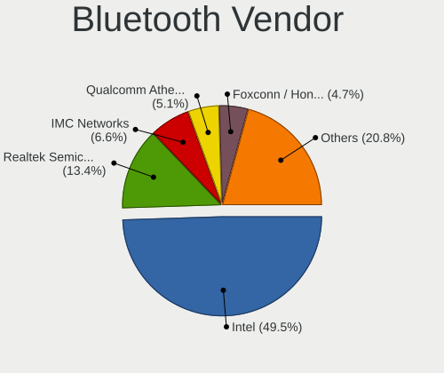

| Vendor                          | Computers | Percent |
|---------------------------------|-----------|---------|
| Intel                           | 441       | 49.49%  |
| Realtek Semiconductor           | 119       | 13.36%  |
| IMC Networks                    | 59        | 6.62%   |
| Qualcomm Atheros Communications | 45        | 5.05%   |
| Foxconn / Hon Hai               | 42        | 4.71%   |
| Cambridge Silicon Radio         | 37        | 4.15%   |
| MediaTek                        | 36        | 4.04%   |
| Broadcom                        | 20        | 2.24%   |
| ASUSTek Computer                | 20        | 2.24%   |
| Apple                           | 18        | 2.02%   |
| Lite-On Technology              | 17        | 1.91%   |
| TP-Link                         | 6         | 0.67%   |
| Realtek                         | 6         | 0.67%   |
| Dell                            | 4         | 0.45%   |
| Hewlett-Packard                 | 3         | 0.34%   |
| Actions                         | 3         | 0.34%   |
| Unknown                         | 3         | 0.34%   |
| Toshiba                         | 2         | 0.22%   |
| Marvell Semiconductor           | 2         | 0.22%   |
| USI                             | 1         | 0.11%   |
| Opticis                         | 1         | 0.11%   |
| Fujitsu                         | 1         | 0.11%   |
| Edimax Technology               | 1         | 0.11%   |
| Dynex                           | 1         | 0.11%   |
| Belkin Components               | 1         | 0.11%   |
| Alps Electric                   | 1         | 0.11%   |
| AboCom Systems                  | 1         | 0.11%   |

Bluetooth Model
---------------

Controller models

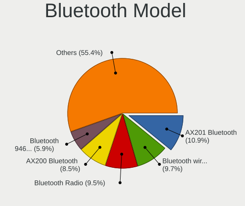

| Model                                               | Computers | Percent |
|-----------------------------------------------------|-----------|---------|
| Intel AX201 Bluetooth                               | 97        | 10.89%  |
| Intel Bluetooth wireless interface                  | 86        | 9.65%   |
| Realtek Bluetooth Radio                             | 85        | 9.54%   |
| Intel AX200 Bluetooth                               | 76        | 8.53%   |
| Intel Bluetooth 9460/9560 Jefferson Peak (JfP)      | 53        | 5.95%   |
| Intel Bluetooth Device                              | 42        | 4.71%   |
| IMC Networks Wireless_Device                        | 38        | 4.26%   |
| Intel AX210 Bluetooth                               | 37        | 4.15%   |
| Cambridge Silicon Radio Bluetooth Dongle (HCI mode) | 37        | 4.15%   |
| MediaTek Wireless_Device                            | 35        | 3.93%   |
| Realtek  Bluetooth 4.2 Adapter                      | 22        | 2.47%   |
| Qualcomm Atheros  Bluetooth Device                  | 22        | 2.47%   |
| Intel Wireless-AC 3168 Bluetooth                    | 21        | 2.36%   |
| Intel Wireless-AC 9260 Bluetooth Adapter            | 20        | 2.24%   |
| IMC Networks Bluetooth Radio                        | 17        | 1.91%   |
| Foxconn / Hon Hai Bluetooth Device                  | 15        | 1.68%   |
| Foxconn / Hon Hai Wireless_Device                   | 14        | 1.57%   |
| Qualcomm Atheros QCA61x4 Bluetooth 4.0              | 11        | 1.23%   |
| Apple Bluetooth USB Host Controller                 | 11        | 1.23%   |
| ASUS ASUS USB-BT500                                 | 10        | 1.12%   |
| Intel Centrino Bluetooth Wireless Transceiver       | 8         | 0.9%    |
| Foxconn / Hon Hai MediaTek Bluetooth Adapter        | 8         | 0.9%    |
| TP-Link TP-T@- UB500 Adapter                        | 6         | 0.67%   |
| Realtek Bluetooth Radio                             | 6         | 0.67%   |
| Lite-On Bluetooth Device                            | 5         | 0.56%   |
| Apple Bluetooth Host Controller                     | 5         | 0.56%   |
| Qualcomm Atheros AR9462 Bluetooth                   | 4         | 0.45%   |
| Qualcomm Atheros AR3012 Bluetooth 4.0               | 4         | 0.45%   |
| Lite-On Wireless_Device                             | 4         | 0.45%   |
| Lite-On Qualcomm Atheros QCA9377 Bluetooth          | 4         | 0.45%   |
| Broadcom BCM20702A0 Bluetooth 4.0                   | 4         | 0.45%   |
| ASUS Broadcom BCM20702A0 Bluetooth                  | 4         | 0.45%   |
| Realtek RTL8822BE Bluetooth 4.2 Adapter             | 3         | 0.34%   |
| Realtek RTL8821A Bluetooth                          | 3         | 0.34%   |
| Dell DW375 Bluetooth Module                         | 3         | 0.34%   |
| Broadcom HP Portable Bumble Bee                     | 3         | 0.34%   |
| ASUS Bluetooth Radio                                | 3         | 0.34%   |
| Actions general adapter                             | 3         | 0.34%   |
| Unknown                                             | 3         | 0.34%   |
| Realtek RTL8723B Bluetooth                          | 2         | 0.22%   |

Sound
-----

Sound Vendor
------------

Sound card vendors

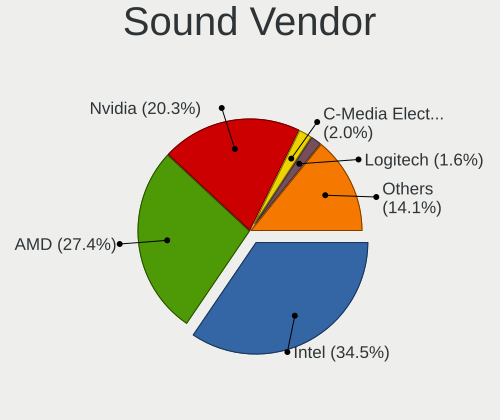

| Vendor                                       | Computers | Percent |
|----------------------------------------------|-----------|---------|
| Intel                                        | 657       | 34.51%  |
| AMD                                          | 522       | 27.42%  |
| Nvidia                                       | 387       | 20.33%  |
| C-Media Electronics                          | 38        | 2%      |
| Logitech                                     | 31        | 1.63%   |
| JMTek                                        | 15        | 0.79%   |
| Kingston Technology                          | 14        | 0.74%   |
| ASUSTek Computer                             | 13        | 0.68%   |
| SteelSeries ApS                              | 12        | 0.63%   |
| Sony                                         | 12        | 0.63%   |
| Creative Labs                                | 11        | 0.58%   |
| Corsair                                      | 11        | 0.58%   |
| Texas Instruments                            | 10        | 0.53%   |
| Micro Star International                     | 10        | 0.53%   |
| Razer USA                                    | 9         | 0.47%   |
| Generalplus Technology                       | 9         | 0.47%   |
| Realtek Semiconductor                        | 8         | 0.42%   |
| Blue Microphones                             | 7         | 0.37%   |
| Focusrite-Novation                           | 6         | 0.32%   |
| RODE Microphones                             | 5         | 0.26%   |
| Jieli Technology                             | 5         | 0.26%   |
| Hewlett-Packard                              | 5         | 0.26%   |
| Creative Technology                          | 5         | 0.26%   |
| Valve Software                               | 4         | 0.21%   |
| Samson Technologies                          | 4         | 0.21%   |
| FIFINE Microphones                           | 4         | 0.21%   |
| ASRock                                       | 4         | 0.21%   |
| Yamaha                                       | 3         | 0.16%   |
| XMOS                                         | 3         | 0.16%   |
| Trust                                        | 3         | 0.16%   |
| M-Audio                                      | 3         | 0.16%   |
| Lenovo                                       | 3         | 0.16%   |
| GN Netcom                                    | 3         | 0.16%   |
| Astro Gaming                                 | 3         | 0.16%   |
| Zoran Co. Personal Media Division (Nogatech) | 2         | 0.11%   |
| Walmart                                      | 2         | 0.11%   |
| Turtle Beach                                 | 2         | 0.11%   |
| Samsung Electronics                          | 2         | 0.11%   |
| ROCCAT                                       | 2         | 0.11%   |
| PreSonus Audio Electronics                   | 2         | 0.11%   |

Sound Model
-----------

Sound card models

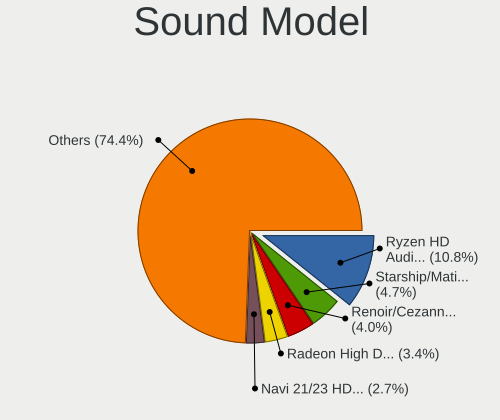

| Model                                                                      | Computers | Percent |
|----------------------------------------------------------------------------|-----------|---------|
| AMD Ryzen HD Audio Controller                                              | 255       | 10.75%  |
| AMD Starship/Matisse HD Audio Controller                                   | 112       | 4.72%   |
| AMD Renoir/Cezanne HDMI/DP Audio Controller                                | 96        | 4.05%   |
| AMD Radeon High Definition Audio Controller                                | 80        | 3.37%   |
| AMD Navi 21/23 HDMI/DP Audio Controller                                    | 64        | 2.7%    |
| Intel Sunrise Point-LP HD Audio                                            | 63        | 2.66%   |
| Intel Cannon Lake PCH cAVS                                                 | 58        | 2.45%   |
| Intel 7 Series/C216 Chipset Family High Definition Audio Controller        | 51        | 2.15%   |
| Intel Tiger Lake-LP Smart Sound Technology Audio Controller                | 44        | 1.85%   |
| Intel 8 Series/C220 Series Chipset High Definition Audio Controller        | 43        | 1.81%   |
| AMD Raven/Raven2/Fenghuang HDMI/DP Audio Controller                        | 43        | 1.81%   |
| Nvidia GA104 High Definition Audio Controller                              | 42        | 1.77%   |
| Nvidia GA106 High Definition Audio Controller                              | 39        | 1.64%   |
| AMD Ellesmere HDMI Audio [Radeon RX 470/480 / 570/580/590]                 | 37        | 1.56%   |
| Intel Comet Lake PCH cAVS                                                  | 35        | 1.48%   |
| Intel 6 Series/C200 Series Chipset Family High Definition Audio Controller | 35        | 1.48%   |
| Intel Xeon E3-1200 v3/4th Gen Core Processor HD Audio Controller           | 34        | 1.43%   |
| AMD Navi 31 HDMI/DP Audio                                                  | 34        | 1.43%   |
| Intel Alder Lake PCH-P High Definition Audio Controller                    | 32        | 1.35%   |
| AMD Family 17h (Models 00h-0fh) HD Audio Controller                        | 31        | 1.31%   |
| Nvidia TU106 High Definition Audio Controller                              | 26        | 1.1%    |
| Nvidia GP104 High Definition Audio Controller                              | 26        | 1.1%    |
| Intel 100 Series/C230 Series Chipset Family HD Audio Controller            | 25        | 1.05%   |
| Intel Raptor Lake High Definition Audio Controller                         | 24        | 1.01%   |
| Nvidia TU107 GeForce GTX 1650 High Definition Audio Controller             | 23        | 0.97%   |
| Nvidia GP107GL High Definition Audio Controller                            | 21        | 0.89%   |
| Intel Tiger Lake-H HD Audio Controller                                     | 21        | 0.89%   |
| Intel CM238 HD Audio Controller                                            | 21        | 0.89%   |
| Intel 200 Series PCH HD Audio                                              | 21        | 0.89%   |
| AMD SBx00 Azalia (Intel HDA)                                               | 21        | 0.89%   |
| Nvidia AD107 High Definition Audio Controller                              | 20        | 0.84%   |
| AMD FCH Azalia Controller                                                  | 20        | 0.84%   |
| Nvidia TU116 High Definition Audio Controller                              | 19        | 0.8%    |
| Nvidia GA107 High Definition Audio Controller                              | 19        | 0.8%    |
| Intel Alder Lake-S HD Audio Controller                                     | 19        | 0.8%    |
| Intel Haswell-ULT HD Audio Controller                                      | 17        | 0.72%   |
| Intel Broadwell-U Audio Controller                                         | 17        | 0.72%   |
| Intel 8 Series HD Audio Controller                                         | 17        | 0.72%   |
| AMD Navi 10 HDMI Audio                                                     | 17        | 0.72%   |
| Intel Wildcat Point-LP High Definition Audio Controller                    | 16        | 0.67%   |

Memory
------

Memory Vendor
-------------

Memory module vendors

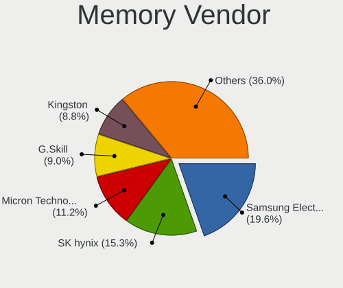

| Vendor                                  | Computers | Percent |
|-----------------------------------------|-----------|---------|
| Samsung Electronics                     | 151       | 19.64%  |
| SK hynix                                | 118       | 15.34%  |
| Micron Technology                       | 86        | 11.18%  |
| G.Skill                                 | 69        | 8.97%   |
| Kingston                                | 68        | 8.84%   |
| Corsair                                 | 67        | 8.71%   |
| Crucial                                 | 55        | 7.15%   |
| Unknown                                 | 24        | 3.12%   |
| A-DATA Technology                       | 21        | 2.73%   |
| Ramaxel Technology                      | 14        | 1.82%   |
| Patriot                                 | 12        | 1.56%   |
| Unknown                                 | 12        | 1.56%   |
| Team                                    | 10        | 1.3%    |
| Nanya Technology                        | 6         | 0.78%   |
| Elpida                                  | 6         | 0.78%   |
| Unknown (ABCD)                          | 5         | 0.65%   |
| Timetec                                 | 4         | 0.52%   |
| Patriot Memory (PDP Systems)            | 4         | 0.52%   |
| Smart                                   | 3         | 0.39%   |
| Hewlett-Packard                         | 3         | 0.39%   |
| Transcend                               | 2         | 0.26%   |
| Kimtigo                                 | 2         | 0.26%   |
| GOODRAM                                 | 2         | 0.26%   |
| ASint Technology                        | 2         | 0.26%   |
| Apacer                                  | 2         | 0.26%   |
| Wilk Elektronik                         | 1         | 0.13%   |
| Wilk                                    | 1         | 0.13%   |
| Unknown (B98C)                          | 1         | 0.13%   |
| Unknown (0x0CAB)                        | 1         | 0.13%   |
| Toshiba                                 | 1         | 0.13%   |
| Smart Brazil                            | 1         | 0.13%   |
| Silicon Power Computer & Communications | 1         | 0.13%   |
| Sesame                                  | 1         | 0.13%   |
| PNY                                     | 1         | 0.13%   |
| Patriot Memory                          | 1         | 0.13%   |
| Lexar Co Limited                        | 1         | 0.13%   |
| KLEVV                                   | 1         | 0.13%   |
| Juhor                                   | 1         | 0.13%   |
| Huanan                                  | 1         | 0.13%   |
| Gold Key                                | 1         | 0.13%   |

Memory Model
------------

Memory module models

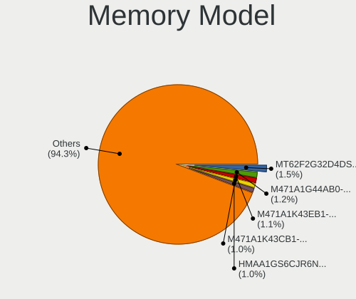

| Model                                                            | Computers | Percent |
|------------------------------------------------------------------|-----------|---------|
| Unknown                                                          | 12        | 1.47%   |
| Samsung RAM M471A1G44AB0-CWE 8GiB SODIMM DDR4 3200MT/s           | 10        | 1.22%   |
| Samsung RAM M471A1K43EB1-CWE 8GB SODIMM DDR4 3200MT/s            | 9         | 1.1%    |
| SK hynix RAM HMAA1GS6CJR6N-XN 8GB SODIMM DDR4 3200MT/s           | 8         | 0.98%   |
| SK hynix RAM HMA81GS6DJR8N-XN 8GB SODIMM DDR4 3200MT/s           | 8         | 0.98%   |
| Samsung RAM M471A1K43CB1-CTD 8GB SODIMM DDR4 3200MT/s            | 8         | 0.98%   |
| SK hynix RAM HMA81GS6AFR8N-UH 8GB SODIMM DDR4 2667MT/s           | 7         | 0.86%   |
| Samsung RAM M471A1K43DB1-CWE 8GB SODIMM DDR4 3200MT/s            | 7         | 0.86%   |
| Corsair RAM CMK16GX4M2B3200C16 8GB DIMM DDR4 3600MT/s            | 7         | 0.86%   |
| Corsair RAM CMK16GX4M2B3000C15 8GB DIMM DDR4 3600MT/s            | 7         | 0.86%   |
| Samsung RAM M425R1GB4BB0-CQKOL 8GB SODIMM DDR5 4800MT/s          | 6         | 0.73%   |
| Micron RAM 8ATF1G64HZ-3G2J1 8GB SODIMM DDR4 3200MT/s             | 6         | 0.73%   |
| Micron RAM 4ATF1G64HZ-3G2E2 8GB SODIMM DDR4 3200MT/s             | 6         | 0.73%   |
| G.Skill RAM F4-3200C16-16GVK 16GB DIMM DDR4 3600MT/s             | 6         | 0.73%   |
| Unknown (ABCD) RAM 123456789012345678 2GB SODIMM LPDDR4 2400MT/s | 5         | 0.61%   |
| Samsung RAM M471A5244CB0-CWE 4GB SODIMM DDR4 3200MT/s            | 5         | 0.61%   |
| Samsung RAM M471A5244CB0-CTD 4GB SODIMM DDR4 3266MT/s            | 5         | 0.61%   |
| G.Skill RAM F5-6000J3040G32G 32GB DIMM DDR5 6200MT/s             | 5         | 0.61%   |
| G.Skill RAM F4-3200C16-8GTZR 8GB DIMM DDR4 3200MT/s              | 5         | 0.61%   |
| SK hynix RAM HMA81GS6JJR8N-VK 8GB SODIMM DDR4 2667MT/s           | 4         | 0.49%   |
| SK hynix RAM H9JCNNNCP3MLYR-N6E 4GB SODIMM LPDDR5 6400MT/s       | 4         | 0.49%   |
| Samsung RAM M471B5173EB0-YK0 4GB SODIMM DDR3 1600MT/s            | 4         | 0.49%   |
| Samsung RAM M471B1G73QH0-YK0 8GB SODIMM DDR3 1600MT/s            | 4         | 0.49%   |
| Samsung RAM M471B1G73DB0-YK0 8GB SODIMM DDR3 1600MT/s            | 4         | 0.49%   |
| Samsung RAM M471A1G44AB0-CWE 8GB Row Of Chips DDR4 3200MT/s      | 4         | 0.49%   |
| Samsung RAM M425R2GA3BB0-CQKOL 16GB SODIMM DDR5 4800MT/s         | 4         | 0.49%   |
| Micron RAM 4ATF1G64HZ-3G2F1 8GB SODIMM DDR4 3200MT/s             | 4         | 0.49%   |
| Micron RAM 4ATF1G64HZ-3G2E1 8GB Row Of Chips DDR4 3200MT/s       | 4         | 0.49%   |
| G.Skill RAM F5-6000J3038F16G 16GB DIMM DDR5 6000MT/s             | 4         | 0.49%   |
| Unknown RAM Module 8GB DIMM DDR3 1600MT/s                        | 3         | 0.37%   |
| SK hynix RAM HMT451S6BFR8A-PB 4GB SODIMM DDR3 1600MT/s           | 3         | 0.37%   |
| SK hynix RAM HMT41GS6BFR8A-PB 8GB SODIMM DDR3 2667MT/s           | 3         | 0.37%   |
| SK hynix RAM HMT41GS6AFR8A-PB 8GB SODIMM DDR3 1600MT/s           | 3         | 0.37%   |
| SK hynix RAM HMT351U6CFR8C-PB 4GB DIMM DDR3 1800MT/s             | 3         | 0.37%   |
| SK hynix RAM HMA851S6DJR6N-XN 4GB SODIMM DDR4 3200MT/s           | 3         | 0.37%   |
| SK hynix RAM HMA851S6CJR6N-VK 4GB SODIMM DDR4 2667MT/s           | 3         | 0.37%   |
| SK hynix RAM HMA81GU6AFR8N-UH 8GB DIMM DDR4 2400MT/s             | 3         | 0.37%   |
| Samsung RAM M471B1G73EB0-YK0 8192MB SODIMM DDR3 1600MT/s         | 3         | 0.37%   |
| Samsung RAM M471A1K43DB1-CTD 8GB SODIMM DDR4 2667MT/s            | 3         | 0.37%   |
| Micron RAM Module 8GB SODIMM DDR3 1333MT/s                       | 3         | 0.37%   |

Memory Kind
-----------

Memory module kinds

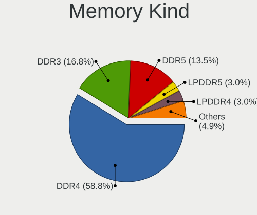

| Kind    | Computers | Percent |
|---------|-----------|---------|
| DDR4    | 392       | 58.77%  |
| DDR3    | 112       | 16.79%  |
| DDR5    | 90        | 13.49%  |
| LPDDR5  | 20        | 3%      |
| LPDDR4  | 20        | 3%      |
| LPDDR3  | 9         | 1.35%   |
| SDRAM   | 8         | 1.2%    |
| Unknown | 7         | 1.05%   |
| DDR2    | 6         | 0.9%    |
| DRAM    | 3         | 0.45%   |

Memory Form Factor
------------------

Physical design of the memory module

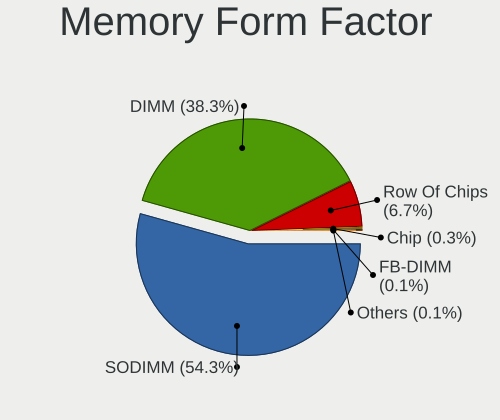

| Name         | Computers | Percent |
|--------------|-----------|---------|
| SODIMM       | 363       | 54.34%  |
| DIMM         | 256       | 38.32%  |
| Row Of Chips | 45        | 6.74%   |
| Chip         | 2         | 0.3%    |
| FB-DIMM      | 1         | 0.15%   |
| Unknown      | 1         | 0.15%   |

Memory Size
-----------

Memory module size

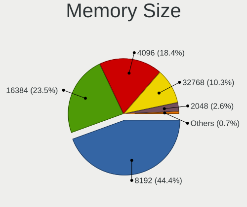

| Size  | Computers | Percent |
|-------|-----------|---------|
| 8192  | 323       | 44.43%  |
| 16384 | 171       | 23.52%  |
| 4096  | 134       | 18.43%  |
| 32768 | 75        | 10.32%  |
| 2048  | 19        | 2.61%   |
| 24576 | 2         | 0.28%   |
| 49152 | 1         | 0.14%   |
| 12288 | 1         | 0.14%   |
| 1024  | 1         | 0.14%   |

Memory Speed
------------

Memory module speed

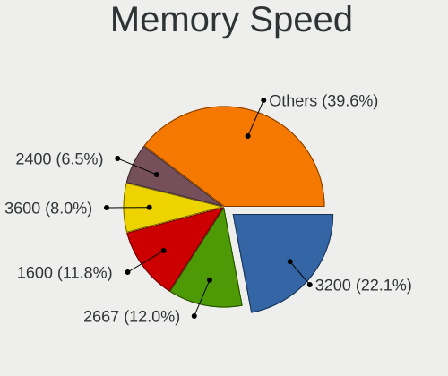

| Speed | Computers | Percent |
|-------|-----------|---------|
| 3200  | 163       | 22.06%  |
| 2667  | 89        | 12.04%  |
| 1600  | 87        | 11.77%  |
| 3600  | 59        | 7.98%   |
| 2400  | 48        | 6.5%    |
| 4800  | 34        | 4.6%    |
| 2133  | 24        | 3.25%   |
| 6000  | 21        | 2.84%   |
| 5600  | 18        | 2.44%   |
| 6400  | 17        | 2.3%    |
| 1333  | 17        | 2.3%    |
| 3733  | 9         | 1.22%   |
| 2933  | 9         | 1.22%   |
| 4267  | 8         | 1.08%   |
| 3400  | 8         | 1.08%   |
| 4266  | 7         | 0.95%   |
| 4000  | 7         | 0.95%   |
| 3266  | 7         | 0.95%   |
| 3000  | 6         | 0.81%   |
| 1334  | 6         | 0.81%   |
| 7500  | 5         | 0.68%   |
| 6200  | 5         | 0.68%   |
| 4199  | 5         | 0.68%   |
| 3666  | 5         | 0.68%   |
| 2666  | 5         | 0.68%   |
| 1866  | 5         | 0.68%   |
| 1800  | 5         | 0.68%   |
| 800   | 5         | 0.68%   |
| 3866  | 4         | 0.54%   |
| 3800  | 4         | 0.54%   |
| 1867  | 4         | 0.54%   |
| 8400  | 3         | 0.41%   |
| 5200  | 3         | 0.41%   |
| 667   | 3         | 0.41%   |
| 12800 | 2         | 0.27%   |
| 7467  | 2         | 0.27%   |
| 4333  | 2         | 0.27%   |
| 4133  | 2         | 0.27%   |
| 3466  | 2         | 0.27%   |
| 3333  | 2         | 0.27%   |

Printers & scanners
-------------------

Printer Vendor
--------------

Printer device vendors

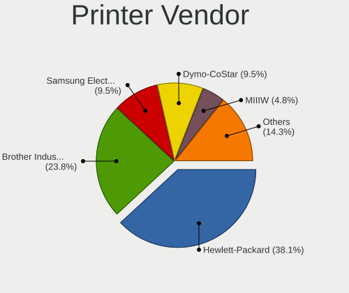

| Vendor                | Computers | Percent |
|-----------------------|-----------|---------|
| Hewlett-Packard       | 8         | 38.1%   |
| Brother Industries    | 5         | 23.81%  |
| Samsung Electronics   | 2         | 9.52%   |
| Dymo-CoStar           | 2         | 9.52%   |
| MIIIW                 | 1         | 4.76%   |
| Lexmark International | 1         | 4.76%   |
| Kyocera               | 1         | 4.76%   |
| Fuji Xerox            | 1         | 4.76%   |

Printer Model
-------------

Printer device models

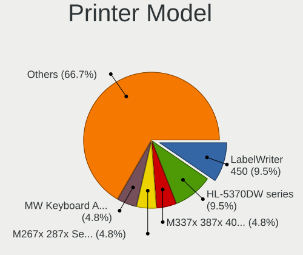

| Model                                   | Computers | Percent |
|-----------------------------------------|-----------|---------|
| Dymo-CoStar LabelWriter 450             | 2         | 9.52%   |
| Brother HL-5370DW series                | 2         | 9.52%   |
| Samsung M337x 387x 407x Series          | 1         | 4.76%   |
| Samsung M267x 287x Series               | 1         | 4.76%   |
| MIIIW MW Keyboard Air Mini              | 1         | 4.76%   |
| Lexmark International Lexmark CX331adwe | 1         | 4.76%   |
| Kyocera FS-1030D printer                | 1         | 4.76%   |
| HP Smart Tank 530 series                | 1         | 4.76%   |
| HP LaserJet 200 colorMFP M275nw         | 1         | 4.76%   |
| HP HP OfficeJet Pro 8020 series         | 1         | 4.76%   |
| HP DeskJet Plus 4100 series             | 1         | 4.76%   |
| HP DeskJet 4100 series                  | 1         | 4.76%   |
| HP Deskjet 3520 series                  | 1         | 4.76%   |
| HP Deskjet 2050 J510                    | 1         | 4.76%   |
| HP Color LaserJet CP1215                | 1         | 4.76%   |
| Fuji Xerox DocuPrint CM315/318 z        | 1         | 4.76%   |
| Brother MFC Composite Device            | 1         | 4.76%   |
| Brother HL-L2395DW series               | 1         | 4.76%   |
| Brother HL-1210W series                 | 1         | 4.76%   |

Scanner Vendor
--------------

Scanner device vendors

| Vendor | Computers | Percent |
|--------|-----------|---------|
| Canon  | 1         | 100%    |

Scanner Model
-------------

Scanner device models

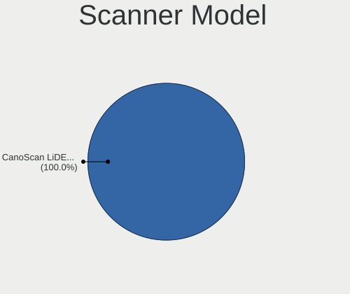

| Model                    | Computers | Percent |
|--------------------------|-----------|---------|
| Canon CanoScan LiDE 500F | 1         | 100%    |

Camera
------

Camera Vendor
-------------

Camera device vendors

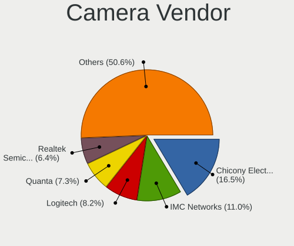

| Vendor                                 | Computers | Percent |
|----------------------------------------|-----------|---------|
| Chicony Electronics                    | 115       | 16.45%  |
| IMC Networks                           | 77        | 11.02%  |
| Logitech                               | 57        | 8.15%   |
| Quanta                                 | 51        | 7.3%    |
| Realtek Semiconductor                  | 45        | 6.44%   |
| Microdia                               | 42        | 6.01%   |
| Bison Electronics                      | 42        | 6.01%   |
| Sunplus Innovation Technology          | 33        | 4.72%   |
| Luxvisions Innotech Limited            | 29        | 4.15%   |
| Apple                                  | 23        | 3.29%   |
| Sonix Technology                       | 19        | 2.72%   |
| Cheng Uei Precision Industry (Foxlink) | 19        | 2.72%   |
| Syntek                                 | 15        | 2.15%   |
| Microsoft                              | 13        | 1.86%   |
| Lite-On Technology                     | 12        | 1.72%   |
| Suyin                                  | 9         | 1.29%   |
| ShineTech                              | 9         | 1.29%   |
| SunplusIT                              | 8         | 1.14%   |
| Generalplus Technology                 | 8         | 1.14%   |
| Silicon Motion                         | 6         | 0.86%   |
| Creative Technology                    | 6         | 0.86%   |
| Valve Software                         | 4         | 0.57%   |
| Samsung Electronics                    | 4         | 0.57%   |
| Razer USA                              | 4         | 0.57%   |
| MacroSilicon                           | 4         | 0.57%   |
| Alcor Micro                            | 4         | 0.57%   |
| OPPO Electronics                       | 3         | 0.43%   |
| Jieli Technology                       | 3         | 0.43%   |
| Z-Star Microelectronics                | 2         | 0.29%   |
| Shine-optics                           | 2         | 0.29%   |
| Primax Electronics                     | 2         | 0.29%   |
| Lenovo                                 | 2         | 0.29%   |
| Acer                                   | 2         | 0.29%   |
| Unknown                                | 2         | 0.29%   |
| WaveRider Communications               | 1         | 0.14%   |
| Trust                                  | 1         | 0.14%   |
| Tobii Technology AB                    | 1         | 0.14%   |
| Shenzhen Kingcome Optoelectronic       | 1         | 0.14%   |
| OmniVision Technologies                | 1         | 0.14%   |
| KYE Systems (Mouse Systems)            | 1         | 0.14%   |

Camera Model
------------

Camera device models

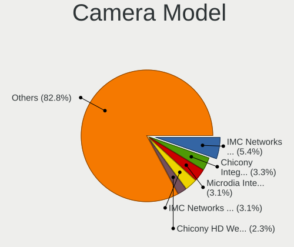

| Model                                                | Computers | Percent |
|------------------------------------------------------|-----------|---------|
| IMC Networks USB2.0 HD UVC WebCam                    | 38        | 5.39%   |
| Chicony Integrated Camera                            | 23        | 3.26%   |
| Microdia Integrated_Webcam_HD                        | 22        | 3.12%   |
| IMC Networks Integrated Camera                       | 22        | 3.12%   |
| Chicony HD Webcam                                    | 16        | 2.27%   |
| Syntek Integrated Camera                             | 13        | 1.84%   |
| Sonix USB2.0 HD UVC WebCam                           | 13        | 1.84%   |
| Logitech Webcam C270                                 | 13        | 1.84%   |
| Realtek Integrated_Webcam_HD                         | 12        | 1.7%    |
| Bison Integrated Camera                              | 11        | 1.56%   |
| Bison HD Webcam                                      | 11        | 1.56%   |
| Sunplus Integrated_Webcam_HD                         | 9         | 1.28%   |
| ShineTech USB2.0 HD UVC WebCam                       | 9         | 1.28%   |
| Quanta HD User Facing                                | 9         | 1.28%   |
| Luxvisions Innotech Limited HP Wide Vision HD Camera | 9         | 1.28%   |
| Chicony HP Wide Vision HD Camera                     | 9         | 1.28%   |
| Apple iPhone 5/5C/5S/6/SE/7/8/X                      | 9         | 1.28%   |
| Luxvisions Innotech Limited Integrated Camera        | 8         | 1.13%   |
| Luxvisions Innotech Limited HP TrueVision HD Camera  | 8         | 1.13%   |
| Apple FaceTime HD Camera                             | 8         | 1.13%   |
| Logitech HD Pro Webcam C920                          | 7         | 0.99%   |
| Generalplus GENERAL WEBCAM                           | 7         | 0.99%   |
| Chicony HD User Facing                               | 7         | 0.99%   |
| Chicony EasyCamera                                   | 7         | 0.99%   |
| Quanta USB2.0 HD UVC WebCam                          | 6         | 0.85%   |
| Quanta HP Wide Vision HD Camera                      | 6         | 0.85%   |
| Logitech C922 Pro Stream Webcam                      | 6         | 0.85%   |
| Logitech BRIO Ultra HD Webcam                        | 6         | 0.85%   |
| Lite-On HP Wide Vision HD Camera                     | 6         | 0.85%   |
| Quanta HP TrueVision HD Camera                       | 5         | 0.71%   |
| Chicony Chicony USB2.0 Camera                        | 5         | 0.71%   |
| Valve Software 3D Camera                             | 4         | 0.57%   |
| Sunplus Full HD webcam                               | 4         | 0.57%   |
| Samsung Galaxy series, misc. (MTP mode)              | 4         | 0.57%   |
| Realtek Integrated Webcam HD                         | 4         | 0.57%   |
| MacroSilicon USB Video                               | 4         | 0.57%   |
| Logitech Webcam C930e                                | 4         | 0.57%   |
| Logitech StreamCam                                   | 4         | 0.57%   |
| Apple FaceTime HD Camera (Built-in)                  | 4         | 0.57%   |
| Sunplus USB 2.0 Camera                               | 3         | 0.43%   |

Security
--------

Fingerprint Vendor
------------------

Fingerprint sensor vendors

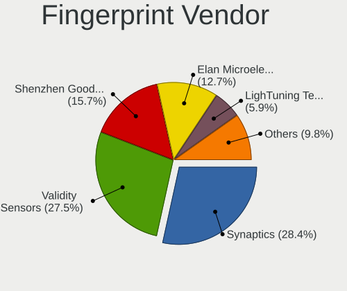

| Vendor                             | Computers | Percent |
|------------------------------------|-----------|---------|
| Synaptics                          | 29        | 28.43%  |
| Validity Sensors                   | 28        | 27.45%  |
| Shenzhen Goodix Technology         | 16        | 15.69%  |
| Elan Microelectronics              | 13        | 12.75%  |
| LighTuning Technology              | 6         | 5.88%   |
| AuthenTec                          | 5         | 4.9%    |
| Focal-systems.Corp                 | 2         | 1.96%   |
| Samsung Electronics                | 1         | 0.98%   |
| Realtek USB2.0 Finger Print Bridge | 1         | 0.98%   |
| Unknown                            | 1         | 0.98%   |

Fingerprint Model
-----------------

Fingerprint sensor models

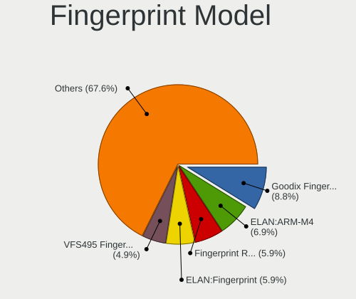

| Model                                                                      | Computers | Percent |
|----------------------------------------------------------------------------|-----------|---------|
| Shenzhen Goodix  Fingerprint Device                                        | 9         | 8.82%   |
| Elan ELAN:ARM-M4                                                           | 7         | 6.86%   |
| Shenzhen Goodix Fingerprint Reader                                         | 6         | 5.88%   |
| Elan ELAN:Fingerprint                                                      | 6         | 5.88%   |
| Validity Sensors VFS495 Fingerprint Reader                                 | 5         | 4.9%    |
| Synaptics Prometheus MIS Touch Fingerprint Reader                          | 5         | 4.9%    |
| Synaptics WBDI                                                             | 4         | 3.92%   |
| Synaptics UWP WBDI                                                         | 4         | 3.92%   |
| Synaptics Metallica MIS Touch Fingerprint Reader                           | 4         | 3.92%   |
| LighTuning EgisTec Touch Fingerprint Sensor                                | 4         | 3.92%   |
| Validity Sensors VFS 5011 fingerprint sensor                               | 3         | 2.94%   |
| Validity Sensors Synaptics WBDI                                            | 3         | 2.94%   |
| Validity Sensors VFS7552 Touch Fingerprint Sensor                          | 2         | 1.96%   |
| Validity Sensors VFS7500 Touch Fingerprint Sensor                          | 2         | 1.96%   |
| Validity Sensors VFS5011 Fingerprint Reader                                | 2         | 1.96%   |
| Validity Sensors VFS471 Fingerprint Reader                                 | 2         | 1.96%   |
| Validity Sensors Synaptics VFS7552 Touch Fingerprint Sensor                | 2         | 1.96%   |
| Validity Sensors Swipe Fingerprint Sensor                                  | 2         | 1.96%   |
| Validity Sensors Fingerprint scanner                                       | 2         | 1.96%   |
| Synaptics WBDI Device                                                      | 2         | 1.96%   |
| Synaptics  WBDI Fingerprint Reader - USB 052                               | 2         | 1.96%   |
| LighTuning ES603 Swipe Fingerprint Sensor                                  | 2         | 1.96%   |
| Focal-systems.Corp FT9201Fingerprint.                                      | 2         | 1.96%   |
| AuthenTec AES2810                                                          | 2         | 1.96%   |
| Validity Sensors VFS491                                                    | 1         | 0.98%   |
| Validity Sensors VFS451 Fingerprint Reader                                 | 1         | 0.98%   |
| Validity Sensors Synaptics VFS7552 Touch Fingerprint Sensor with PurePrint | 1         | 0.98%   |
| Synaptics WBDI Fingerprint Reader USB 102                                  | 1         | 0.98%   |
| Synaptics WBDI Fingerprint Reader USB 086                                  | 1         | 0.98%   |
| Synaptics UWP WBDI Device                                                  | 1         | 0.98%   |
| Synaptics TouchPad                                                         | 1         | 0.98%   |
| Synaptics  WBDI                                                            | 1         | 0.98%   |
| Synaptics FS7604 Touch Fingerprint Sensor with PurePrint                   | 1         | 0.98%   |
| Synaptics Fingerprint scanner                                              | 1         | 0.98%   |
| Synaptics Fingerprint reader [HP G6]                                       | 1         | 0.98%   |
| Shenzhen Goodix FingerPrint                                                | 1         | 0.98%   |
| Samsung Fingerprint Sensor Device - 730B                                   | 1         | 0.98%   |
| Realtek USB2.0 Finger Print Bridge FocalTech Fingerprint Device            | 1         | 0.98%   |
| AuthenTec Fingerprint Sensor                                               | 1         | 0.98%   |
| AuthenTec AES2550 Fingerprint Sensor                                       | 1         | 0.98%   |

Chipcard Vendor
---------------

Chipcard module vendors

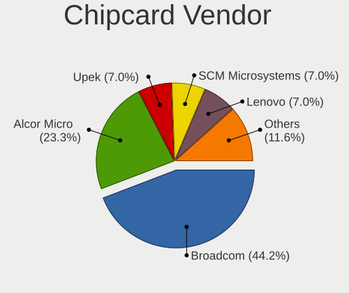

| Vendor                | Computers | Percent |
|-----------------------|-----------|---------|
| Broadcom              | 19        | 44.19%  |
| Alcor Micro           | 10        | 23.26%  |
| Upek                  | 3         | 6.98%   |
| SCM Microsystems      | 3         | 6.98%   |
| Lenovo                | 3         | 6.98%   |
| Yubico.com            | 2         | 4.65%   |
| Thetis                | 1         | 2.33%   |
| O2 Micro              | 1         | 2.33%   |
| Advanced Card Systems | 1         | 2.33%   |

Chipcard Model
--------------

Chipcard module models

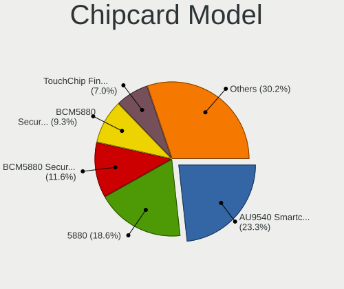

| Model                                                                        | Computers | Percent |
|------------------------------------------------------------------------------|-----------|---------|
| Alcor Micro AU9540 Smartcard Reader                                          | 10        | 23.26%  |
| Broadcom 5880                                                                | 8         | 18.6%   |
| Broadcom BCM5880 Secure Applications Processor                               | 5         | 11.63%  |
| Broadcom BCM5880 Secure Applications Processor with fingerprint swipe sensor | 4         | 9.3%    |
| Upek TouchChip Fingerprint Coprocessor (WBF advanced mode)                   | 3         | 6.98%   |
| Lenovo Integrated Smart Card Reader                                          | 3         | 6.98%   |
| Yubico.com Yubikey 4/5 U2F+CCID                                              | 2         | 4.65%   |
| SCM Microsystems SCR331-LC1 / SCR3310 SmartCard Reader                       | 2         | 4.65%   |
| Thetis Security Key(FE25)                                                    | 1         | 2.33%   |
| SCM Microsystems SCR3500 C Contact Reader                                    | 1         | 2.33%   |
| O2 Micro OZ776 CCID Smartcard Reader                                         | 1         | 2.33%   |
| Broadcom BCM58200 ControlVault 3 (FingerPrint sensor + Contacted SmartCard)  | 1         | 2.33%   |
| Broadcom 58200                                                               | 1         | 2.33%   |
| Advanced Card Systems ACR122U                                                | 1         | 2.33%   |

Unsupported
-----------

Unsupported Devices
-------------------

Total unsupported devices on board

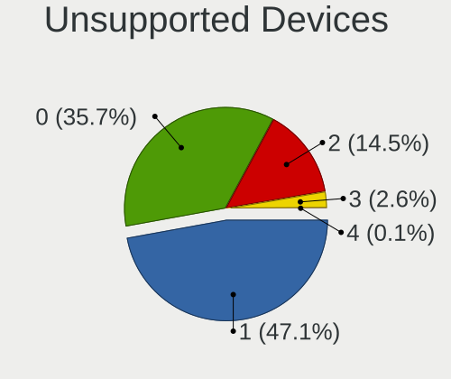

| Total | Computers | Percent |
|-------|-----------|---------|
| 1     | 544       | 47.14%  |
| 0     | 412       | 35.7%   |
| 2     | 167       | 14.47%  |
| 3     | 30        | 2.6%    |
| 4     | 1         | 0.09%   |

Unsupported Device Types
------------------------

Types of unsupported devices

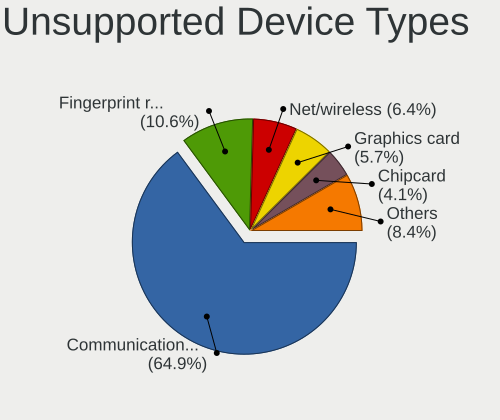

| Type                     | Computers | Percent |
|--------------------------|-----------|---------|
| Communication controller | 621       | 64.89%  |
| Fingerprint reader       | 101       | 10.55%  |
| Net/wireless             | 61        | 6.37%   |
| Graphics card            | 55        | 5.75%   |
| Chipcard                 | 39        | 4.08%   |
| Multimedia controller    | 32        | 3.34%   |
| Camera                   | 15        | 1.57%   |
| Net/ethernet             | 10        | 1.04%   |
| Unassigned class         | 7         | 0.73%   |
| Storage                  | 4         | 0.42%   |
| Network                  | 3         | 0.31%   |
| Storage/raid             | 2         | 0.21%   |
| Sound                    | 2         | 0.21%   |
| Bluetooth                | 2         | 0.21%   |
| Wireless                 | 1         | 0.1%    |
| Modem                    | 1         | 0.1%    |
| Card reader              | 1         | 0.1%    |

