Garuda Linux - Tested Hardware & Statistics (Desktops)
------------------------------------------------------

A project to collect tested hardware configurations for Garuda Linux.

Anyone can contribute to this report by the [hw-probe](https://github.com/linuxhw/hw-probe) tool:

    sudo -E hw-probe -all -upload

Please contribute! Especially if your hardware is rare.

Contents
--------

* [ Test Cases ](#test-cases)

* [ System ](#system)
  - [ OS                       ](#os)
  - [ OS Family                ](#os-family)
  - [ Kernel                   ](#kernel)
  - [ Kernel Family            ](#kernel-family)
  - [ Kernel Major Ver.        ](#kernel-major-ver)
  - [ Arch                     ](#arch)
  - [ DE                       ](#de)
  - [ Display Server           ](#display-server)
  - [ Display Manager          ](#display-manager)
  - [ OS Lang                  ](#os-lang)
  - [ Boot Mode                ](#boot-mode)
  - [ Filesystem               ](#filesystem)
  - [ Part. scheme             ](#part-scheme)
  - [ Dual Boot with Linux/BSD ](#dual-boot-with-linuxbsd)
  - [ Dual Boot (Win)          ](#dual-boot-win)

* [ Board ](#board)
  - [ Vendor                   ](#vendor)
  - [ Model                    ](#model)
  - [ Model Family             ](#model-family)
  - [ MFG Year                 ](#mfg-year)
  - [ Form Factor              ](#form-factor)
  - [ Secure Boot              ](#secure-boot)
  - [ Coreboot                 ](#coreboot)
  - [ RAM Size                 ](#ram-size)
  - [ RAM Used                 ](#ram-used)
  - [ Total Drives             ](#total-drives)
  - [ Has CD-ROM               ](#has-cd-rom)
  - [ Has Ethernet             ](#has-ethernet)
  - [ Has WiFi                 ](#has-wifi)
  - [ Has Bluetooth            ](#has-bluetooth)

* [ Location ](#location)
  - [ Country                  ](#country)
  - [ City                     ](#city)

* [ Drives ](#drives)
  - [ Drive Vendor             ](#drive-vendor)
  - [ Drive Model              ](#drive-model)
  - [ HDD Vendor               ](#hdd-vendor)
  - [ SSD Vendor               ](#ssd-vendor)
  - [ Drive Kind               ](#drive-kind)
  - [ Drive Connector          ](#drive-connector)
  - [ Drive Size               ](#drive-size)
  - [ Space Total              ](#space-total)
  - [ Space Used               ](#space-used)
  - [ Malfunc. Drives          ](#malfunc-drives)
  - [ Malfunc. Drive Vendor    ](#malfunc-drive-vendor)
  - [ Malfunc. HDD Vendor      ](#malfunc-hdd-vendor)
  - [ Malfunc. Drive Kind      ](#malfunc-drive-kind)
  - [ Failed Drives            ](#failed-drives)
  - [ Failed Drive Vendor      ](#failed-drive-vendor)
  - [ Drive Status             ](#drive-status)

* [ Storage controller ](#storage-controller)
  - [ Storage Vendor           ](#storage-vendor)
  - [ Storage Model            ](#storage-model)
  - [ Storage Kind             ](#storage-kind)

* [ Processor ](#processor)
  - [ CPU Vendor               ](#cpu-vendor)
  - [ CPU Model                ](#cpu-model)
  - [ CPU Model Family         ](#cpu-model-family)
  - [ CPU Cores                ](#cpu-cores)
  - [ CPU Sockets              ](#cpu-sockets)
  - [ CPU Threads              ](#cpu-threads)
  - [ CPU Op-Modes             ](#cpu-op-modes)
  - [ CPU Microcode            ](#cpu-microcode)
  - [ CPU Microarch            ](#cpu-microarch)

* [ Graphics ](#graphics)
  - [ GPU Vendor               ](#gpu-vendor)
  - [ GPU Model                ](#gpu-model)
  - [ GPU Combo                ](#gpu-combo)
  - [ GPU Driver               ](#gpu-driver)
  - [ GPU Memory               ](#gpu-memory)

* [ Monitor ](#monitor)
  - [ Monitor Vendor           ](#monitor-vendor)
  - [ Monitor Model            ](#monitor-model)
  - [ Monitor Resolution       ](#monitor-resolution)
  - [ Monitor Diagonal         ](#monitor-diagonal)
  - [ Monitor Width            ](#monitor-width)
  - [ Aspect Ratio             ](#aspect-ratio)
  - [ Monitor Area             ](#monitor-area)
  - [ Pixel Density            ](#pixel-density)
  - [ Multiple Monitors        ](#multiple-monitors)

* [ Network ](#network)
  - [ Net Controller Vendor    ](#net-controller-vendor)
  - [ Net Controller Model     ](#net-controller-model)
  - [ Wireless Vendor          ](#wireless-vendor)
  - [ Wireless Model           ](#wireless-model)
  - [ Ethernet Vendor          ](#ethernet-vendor)
  - [ Ethernet Model           ](#ethernet-model)
  - [ Net Controller Kind      ](#net-controller-kind)
  - [ Used Controller          ](#used-controller)
  - [ NICs                     ](#nics)
  - [ IPv6                     ](#ipv6)

* [ Bluetooth ](#bluetooth)
  - [ Bluetooth Vendor         ](#bluetooth-vendor)
  - [ Bluetooth Model          ](#bluetooth-model)

* [ Sound ](#sound)
  - [ Sound Vendor             ](#sound-vendor)
  - [ Sound Model              ](#sound-model)

* [ Memory ](#memory)
  - [ Memory Vendor            ](#memory-vendor)
  - [ Memory Model             ](#memory-model)
  - [ Memory Kind              ](#memory-kind)
  - [ Memory Form Factor       ](#memory-form-factor)
  - [ Memory Size              ](#memory-size)
  - [ Memory Speed             ](#memory-speed)

* [ Printers & scanners ](#printers--scanners)
  - [ Printer Vendor           ](#printer-vendor)
  - [ Printer Model            ](#printer-model)
  - [ Scanner Vendor           ](#scanner-vendor)
  - [ Scanner Model            ](#scanner-model)

* [ Camera ](#camera)
  - [ Camera Vendor            ](#camera-vendor)
  - [ Camera Model             ](#camera-model)

* [ Security ](#security)
  - [ Fingerprint Vendor       ](#fingerprint-vendor)
  - [ Fingerprint Model        ](#fingerprint-model)
  - [ Chipcard Vendor          ](#chipcard-vendor)
  - [ Chipcard Model           ](#chipcard-model)

* [ Unsupported ](#unsupported)
  - [ Unsupported Devices      ](#unsupported-devices)
  - [ Unsupported Device Types ](#unsupported-device-types)

Test Cases
----------

Total: 180

| Vendor        | Model                       | Probe                                                      | Date         |
|---------------|-----------------------------|------------------------------------------------------------|--------------|
| Lenovo        | Win8 Pro DPK TPG            | [9561e51689](https://linux-hardware.org/?probe=9561e51689) | Dec 31, 2022 |
| Intel         | H61                         | [39f3cddffb](https://linux-hardware.org/?probe=39f3cddffb) | Dec 29, 2022 |
| ASUSTek       | ROG STRIX B450-F GAMING ... | [ee98173357](https://linux-hardware.org/?probe=ee98173357) | Dec 27, 2022 |
| ASRock        | X570 Taichi                 | [e48882ad67](https://linux-hardware.org/?probe=e48882ad67) | Dec 22, 2022 |
| ASUSTek       | PRIME Z390-P                | [1a9f9ac05f](https://linux-hardware.org/?probe=1a9f9ac05f) | Dec 22, 2022 |
| Lenovo        | Win8 Pro DPK TPG            | [7ce8a10de4](https://linux-hardware.org/?probe=7ce8a10de4) | Dec 21, 2022 |
| Lenovo        | Win8 Pro DPK TPG            | [a4c1397ad3](https://linux-hardware.org/?probe=a4c1397ad3) | Dec 21, 2022 |
| BESSTAR Te... | B550                        | [d9fbac807d](https://linux-hardware.org/?probe=d9fbac807d) | Dec 10, 2022 |
| ASRock        | Z77 Pro3                    | [a2e7958d4a](https://linux-hardware.org/?probe=a2e7958d4a) | Dec 08, 2022 |
| ASRock        | Z77 Pro3                    | [3184df2bf6](https://linux-hardware.org/?probe=3184df2bf6) | Dec 07, 2022 |
| Gigabyte      | 990FXA-UD3                  | [54d896b9ed](https://linux-hardware.org/?probe=54d896b9ed) | Dec 06, 2022 |
| MSI           | H510I PRO WIFI              | [f46e59c772](https://linux-hardware.org/?probe=f46e59c772) | Nov 27, 2022 |
| Dell          | 0K3CM7 A00                  | [27109cda18](https://linux-hardware.org/?probe=27109cda18) | Nov 20, 2022 |
| Dell          | 0K3CM7 A00                  | [6dbdd86e08](https://linux-hardware.org/?probe=6dbdd86e08) | Nov 20, 2022 |
| HP            | 8767 A                      | [375e0d4525](https://linux-hardware.org/?probe=375e0d4525) | Nov 19, 2022 |
| Gigabyte      | 990FXA-UD3                  | [985fb6d758](https://linux-hardware.org/?probe=985fb6d758) | Nov 16, 2022 |
| Dell          | 0K3CM7 A00                  | [3c426cb32b](https://linux-hardware.org/?probe=3c426cb32b) | Nov 14, 2022 |
| HP            | 2B2C                        | [6f90b1e25e](https://linux-hardware.org/?probe=6f90b1e25e) | Oct 26, 2022 |
| ASUSTek       | PRIME X570-P                | [5558f9e3f7](https://linux-hardware.org/?probe=5558f9e3f7) | Oct 23, 2022 |
| Acer          | Aspire TC-780               | [fd6c66dac7](https://linux-hardware.org/?probe=fd6c66dac7) | Oct 22, 2022 |
| ASUSTek       | PRIME X570-P                | [a7d6f0bd9e](https://linux-hardware.org/?probe=a7d6f0bd9e) | Oct 15, 2022 |
| Gigabyte      | B550 AORUS ELITE V2         | [541e327f0f](https://linux-hardware.org/?probe=541e327f0f) | Oct 01, 2022 |
| ASUSTek       | PRIME X570-P                | [6647dc20ac](https://linux-hardware.org/?probe=6647dc20ac) | Sep 21, 2022 |
| ASUSTek       | TUF Gaming X570-PLUS        | [9d0697ec96](https://linux-hardware.org/?probe=9d0697ec96) | Sep 20, 2022 |
| ASRock        | A320M-HDV R4.0              | [afbb849b02](https://linux-hardware.org/?probe=afbb849b02) | Sep 11, 2022 |
| ASRock        | A320M-HDV R4.0              | [5e98f641f1](https://linux-hardware.org/?probe=5e98f641f1) | Sep 11, 2022 |
| ASUSTek       | ROG CROSSHAIR VIII HERO     | [ac65980e25](https://linux-hardware.org/?probe=ac65980e25) | Sep 02, 2022 |
| Gigabyte      | F2A88XM-HD3                 | [44e355eb93](https://linux-hardware.org/?probe=44e355eb93) | Aug 30, 2022 |
| MSI           | B450 TOMAHAWK MAX II        | [57f1970999](https://linux-hardware.org/?probe=57f1970999) | Aug 20, 2022 |
| ASUSTek       | PRIME X570-P                | [fc5923b017](https://linux-hardware.org/?probe=fc5923b017) | Aug 15, 2022 |
| ASUSTek       | PRIME X570-P                | [e53bbe7c1b](https://linux-hardware.org/?probe=e53bbe7c1b) | Aug 14, 2022 |
| MSI           | A68HM-E33 V2                | [762f08a697](https://linux-hardware.org/?probe=762f08a697) | Aug 13, 2022 |
| ASRock        | A520M-HDV                   | [f23bdacb56](https://linux-hardware.org/?probe=f23bdacb56) | Aug 11, 2022 |
| ASUSTek       | Maximus IX FORMULA          | [2212732244](https://linux-hardware.org/?probe=2212732244) | Aug 01, 2022 |
| MSI           | B450M PRO-VDH MAX           | [941092ee95](https://linux-hardware.org/?probe=941092ee95) | Jul 26, 2022 |
| MSI           | B450 TOMAHAWK MAX II        | [dfe6047aa7](https://linux-hardware.org/?probe=dfe6047aa7) | Jul 21, 2022 |
| Gigabyte      | X570 AORUS PRO WIFI         | [f9996d6494](https://linux-hardware.org/?probe=f9996d6494) | Jul 21, 2022 |
| ASUSTek       | ROG STRIX X570-E GAMING     | [92fe4c2ff3](https://linux-hardware.org/?probe=92fe4c2ff3) | Jul 03, 2022 |
| ASUSTek       | PRIME B550-PLUS AC-HES      | [dde2246ae8](https://linux-hardware.org/?probe=dde2246ae8) | Jul 01, 2022 |
| ASRock        | Z87M Extreme4               | [06504aecc5](https://linux-hardware.org/?probe=06504aecc5) | Jun 24, 2022 |
| Gigabyte      | Z77X-UD3H                   | [7d7828a253](https://linux-hardware.org/?probe=7d7828a253) | Jun 23, 2022 |
| MSI           | B550-A PRO                  | [a7a76f04f9](https://linux-hardware.org/?probe=a7a76f04f9) | Jun 19, 2022 |
| MSI           | B450M MORTAR MAX            | [e1f785770e](https://linux-hardware.org/?probe=e1f785770e) | Jun 11, 2022 |
| T-bao         | MINI PC V1.0                | [8108463ab7](https://linux-hardware.org/?probe=8108463ab7) | Jun 09, 2022 |
| ASRock        | Z87M Extreme4               | [5ca7bb09b0](https://linux-hardware.org/?probe=5ca7bb09b0) | Jun 05, 2022 |
| Lenovo        | 3716 SDK0T76463 WIN 3422... | [cd15058963](https://linux-hardware.org/?probe=cd15058963) | May 16, 2022 |
| Lenovo        | 3716 SDK0T76463 WIN 3422... | [4043d7e26a](https://linux-hardware.org/?probe=4043d7e26a) | May 11, 2022 |
| Gigabyte      | B450 I AORUS PRO WIFI-CF    | [8c34e423f4](https://linux-hardware.org/?probe=8c34e423f4) | May 04, 2022 |
| Dell          | 0WR7PY A01                  | [66c6e57421](https://linux-hardware.org/?probe=66c6e57421) | Apr 23, 2022 |
| ASRock        | B550M Pro4                  | [b82721163b](https://linux-hardware.org/?probe=b82721163b) | Apr 22, 2022 |
| ASRock        | X99X Killer                 | [c6d6bddd17](https://linux-hardware.org/?probe=c6d6bddd17) | Apr 18, 2022 |
| ASUSTek       | Z97-P                       | [bf54ec19d0](https://linux-hardware.org/?probe=bf54ec19d0) | Apr 16, 2022 |
| ASRock        | X99X Killer                 | [3be92995ff](https://linux-hardware.org/?probe=3be92995ff) | Apr 11, 2022 |
| ASUSTek       | P8B75-M                     | [808661699f](https://linux-hardware.org/?probe=808661699f) | Apr 07, 2022 |
| HP            | 8433 11                     | [30c5d1d62f](https://linux-hardware.org/?probe=30c5d1d62f) | Apr 03, 2022 |
| MSI           | B450-A PRO MAX              | [a47ab656ab](https://linux-hardware.org/?probe=a47ab656ab) | Apr 01, 2022 |
| Gigabyte      | B550 GAMING X V2            | [3d37374fae](https://linux-hardware.org/?probe=3d37374fae) | Apr 01, 2022 |
| ASUSTek       | A68HM-PLUS                  | [cd6ebcba97](https://linux-hardware.org/?probe=cd6ebcba97) | Mar 31, 2022 |
| ASUSTek       | ROG CROSSHAIR VIII HERO     | [fc5cdc4595](https://linux-hardware.org/?probe=fc5cdc4595) | Mar 23, 2022 |
| MSI           | MPG B550 GAMING CARBON W... | [c1a26607fd](https://linux-hardware.org/?probe=c1a26607fd) | Mar 13, 2022 |
| MSI           | MAG B550 TOMAHAWK           | [95b7c99a5a](https://linux-hardware.org/?probe=95b7c99a5a) | Mar 08, 2022 |
| ASRock        | B450 Gaming K4              | [504b20acce](https://linux-hardware.org/?probe=504b20acce) | Mar 04, 2022 |
| ASUSTek       | TUF Gaming X570-PLUS        | [336ddc137d](https://linux-hardware.org/?probe=336ddc137d) | Mar 01, 2022 |
| ASUSTek       | A68HM-PLUS                  | [edfa6eb6e3](https://linux-hardware.org/?probe=edfa6eb6e3) | Feb 28, 2022 |
| ASUSTek       | ProArt X570-CREATOR WIFI    | [abc925b917](https://linux-hardware.org/?probe=abc925b917) | Feb 26, 2022 |
| ASUSTek       | M4A89TD PRO USB3            | [66c0fc8423](https://linux-hardware.org/?probe=66c0fc8423) | Feb 26, 2022 |
| HP            | 8767 A                      | [e048574911](https://linux-hardware.org/?probe=e048574911) | Feb 12, 2022 |
| ASUSTek       | ROG Maximus XII FORMULA     | [a63d909e46](https://linux-hardware.org/?probe=a63d909e46) | Feb 12, 2022 |
| HP            | 8767 A                      | [6cb1e6b72f](https://linux-hardware.org/?probe=6cb1e6b72f) | Feb 12, 2022 |
| ASUSTek       | ROG Maximus XII FORMULA     | [885617bdda](https://linux-hardware.org/?probe=885617bdda) | Feb 12, 2022 |
| ASRock        | B450M Pro4                  | [0d80dc8143](https://linux-hardware.org/?probe=0d80dc8143) | Feb 11, 2022 |
| Lenovo        | 31900058 STD                | [03540e9cb2](https://linux-hardware.org/?probe=03540e9cb2) | Feb 07, 2022 |
| Gigabyte      | MFLP3AP-00\2.x              | [b7441a0e94](https://linux-hardware.org/?probe=b7441a0e94) | Jan 31, 2022 |
| Gigabyte      | B85-HD3                     | [ad70601774](https://linux-hardware.org/?probe=ad70601774) | Jan 26, 2022 |
| ASRock        | 970M Pro3                   | [402a4f960e](https://linux-hardware.org/?probe=402a4f960e) | Jan 17, 2022 |
| ASUSTek       | ROG Maximus X CODE          | [8fac80f31d](https://linux-hardware.org/?probe=8fac80f31d) | Jan 16, 2022 |
| Gigabyte      | AB350-Gaming 3-CF           | [9fab263b02](https://linux-hardware.org/?probe=9fab263b02) | Jan 11, 2022 |
| MSI           | Z270 GAMING M5              | [02d70182fd](https://linux-hardware.org/?probe=02d70182fd) | Jan 10, 2022 |
| Gigabyte      | AB350-Gaming 3-CF           | [8a1167daea](https://linux-hardware.org/?probe=8a1167daea) | Jan 08, 2022 |
| ASUSTek       | TUF Gaming X570-PLUS        | [1a4570a458](https://linux-hardware.org/?probe=1a4570a458) | Jan 08, 2022 |
| Pegatron      | 2AD5                        | [91ee5ba1df](https://linux-hardware.org/?probe=91ee5ba1df) | Jan 08, 2022 |
| Gigabyte      | B460M DS3H                  | [40f4de9da7](https://linux-hardware.org/?probe=40f4de9da7) | Jan 07, 2022 |
| Gigabyte      | B550 AORUS PRO AC           | [1b62246b10](https://linux-hardware.org/?probe=1b62246b10) | Dec 21, 2021 |
| ASUSTek       | TUF Gaming X570-PLUS        | [9e73346fb8](https://linux-hardware.org/?probe=9e73346fb8) | Dec 15, 2021 |
| Gigabyte      | X570 AORUS ELITE WIFI       | [196b460373](https://linux-hardware.org/?probe=196b460373) | Dec 13, 2021 |
| ASRock        | H77M-ITX                    | [5e98a2fce2](https://linux-hardware.org/?probe=5e98a2fce2) | Dec 11, 2021 |
| ASRock        | B450M Pro4                  | [e4fb1e4fe4](https://linux-hardware.org/?probe=e4fb1e4fe4) | Dec 09, 2021 |
| Lenovo        | ThinkStation S20 4105O1U    | [731c890641](https://linux-hardware.org/?probe=731c890641) | Dec 08, 2021 |
| ASUSTek       | TUF Gaming X570-PLUS        | [f0df07c0e4](https://linux-hardware.org/?probe=f0df07c0e4) | Dec 06, 2021 |
| Acer          | Aspire TC-895 V:1.0         | [c743459a71](https://linux-hardware.org/?probe=c743459a71) | Dec 04, 2021 |
| ASUSTek       | H87M-E                      | [2b4abcf54f](https://linux-hardware.org/?probe=2b4abcf54f) | Dec 02, 2021 |
| ASUSTek       | H87M-E                      | [72cf0ed74d](https://linux-hardware.org/?probe=72cf0ed74d) | Dec 02, 2021 |
| Lenovo        | ThinkStation S20 4105O1U    | [f031548aac](https://linux-hardware.org/?probe=f031548aac) | Dec 01, 2021 |
| Lenovo        | ThinkStation S20 4105O1U    | [48f73af82d](https://linux-hardware.org/?probe=48f73af82d) | Nov 30, 2021 |
| ASUSTek       | Rampage IV EXTREME          | [50999d4796](https://linux-hardware.org/?probe=50999d4796) | Nov 14, 2021 |
| ASUSTek       | TUF Gaming X570-PLUS        | [cd295bb56c](https://linux-hardware.org/?probe=cd295bb56c) | Nov 04, 2021 |
| ASUSTek       | P8B75-M                     | [2130c28d33](https://linux-hardware.org/?probe=2130c28d33) | Oct 27, 2021 |
| MSI           | Z77A-G43                    | [3bd9604ae7](https://linux-hardware.org/?probe=3bd9604ae7) | Oct 20, 2021 |
| MSI           | B460M PRO-VDH WIFI          | [76071ec77b](https://linux-hardware.org/?probe=76071ec77b) | Oct 19, 2021 |
| MSI           | B450M-A PRO MAX             | [4148046f02](https://linux-hardware.org/?probe=4148046f02) | Oct 17, 2021 |
| Fujitsu       | D3120-A1 S26361-D3120-A1    | [fdd8f9dd8e](https://linux-hardware.org/?probe=fdd8f9dd8e) | Sep 17, 2021 |
| Fujitsu       | D3120-A1 S26361-D3120-A1    | [ab3ad8009e](https://linux-hardware.org/?probe=ab3ad8009e) | Sep 16, 2021 |
| ASUSTek       | PRIME B450M-K               | [b8b49f201f](https://linux-hardware.org/?probe=b8b49f201f) | Sep 14, 2021 |
| MSI           | H310M PRO-VDH PLUS          | [65fcfef06f](https://linux-hardware.org/?probe=65fcfef06f) | Aug 27, 2021 |
| Alienware     | 0TYR0X A00                  | [5ea23ebfb2](https://linux-hardware.org/?probe=5ea23ebfb2) | Aug 19, 2021 |
| ASRock        | X399 Professional Gaming    | [bb53a385c3](https://linux-hardware.org/?probe=bb53a385c3) | Aug 19, 2021 |
| Medion        | H110H4-EM2                  | [f4e01958e5](https://linux-hardware.org/?probe=f4e01958e5) | Aug 10, 2021 |
| MSI           | Z97 MPOWER                  | [dee7d3af4a](https://linux-hardware.org/?probe=dee7d3af4a) | Aug 06, 2021 |
| MSI           | Z97 MPOWER                  | [f30e5a3a86](https://linux-hardware.org/?probe=f30e5a3a86) | Aug 06, 2021 |
| ASUSTek       | ROG STRIX B550-F GAMING     | [826edd51bc](https://linux-hardware.org/?probe=826edd51bc) | Jul 07, 2021 |
| Gigabyte      | X470 AORUS ULTRA GAMING-... | [aa05cca9b7](https://linux-hardware.org/?probe=aa05cca9b7) | Jun 30, 2021 |
| Biostar       | H310MHP                     | [0d3f648f3e](https://linux-hardware.org/?probe=0d3f648f3e) | Jun 30, 2021 |
| Lenovo        | SHARKBAY SDK0E50510 WIN     | [fb3d7de63c](https://linux-hardware.org/?probe=fb3d7de63c) | Jun 26, 2021 |
| MSI           | A320M-HDV R4.0              | [486775a989](https://linux-hardware.org/?probe=486775a989) | Jun 23, 2021 |
| MSI           | A320M-HDV R4.0              | [4629f86f56](https://linux-hardware.org/?probe=4629f86f56) | Jun 22, 2021 |
| MSI           | A320M-HDV R4.0              | [69dea4e3cf](https://linux-hardware.org/?probe=69dea4e3cf) | Jun 22, 2021 |
| MSI           | A320M-HDV R4.0              | [2fd89c951e](https://linux-hardware.org/?probe=2fd89c951e) | Jun 22, 2021 |
| MSI           | X370 GAMING PRO CARBON      | [9ead1e1bb5](https://linux-hardware.org/?probe=9ead1e1bb5) | Jun 22, 2021 |
| ASUSTek       | ROG STRIX B550-F GAMING     | [8144c83b50](https://linux-hardware.org/?probe=8144c83b50) | Jun 22, 2021 |
| ASUSTek       | ROG STRIX B550-F GAMING     | [376c0ff95d](https://linux-hardware.org/?probe=376c0ff95d) | Jun 15, 2021 |
| Gigabyte      | B550I AORUS PRO AX          | [34801a2f74](https://linux-hardware.org/?probe=34801a2f74) | Jun 12, 2021 |
| ASUSTek       | ROG CROSSHAIR VII HERO      | [51e1e33185](https://linux-hardware.org/?probe=51e1e33185) | May 20, 2021 |
| MSI           | B350M GAMING PRO            | [c04e6666e7](https://linux-hardware.org/?probe=c04e6666e7) | May 20, 2021 |
| Dell          | 0D28YY A02                  | [14edf3bd00](https://linux-hardware.org/?probe=14edf3bd00) | May 16, 2021 |
| Gigabyte      | A320M-S2H-CF                | [066f815622](https://linux-hardware.org/?probe=066f815622) | May 12, 2021 |
| HP            | 844C                        | [29f7cf64ce](https://linux-hardware.org/?probe=29f7cf64ce) | May 06, 2021 |
| HP            | 844C                        | [0534f06ec4](https://linux-hardware.org/?probe=0534f06ec4) | May 06, 2021 |
| ASUSTek       | PRIME Z590-A                | [cb3058760e](https://linux-hardware.org/?probe=cb3058760e) | May 04, 2021 |
| Gigabyte      | P67A-UD3-B3                 | [08ea956bfa](https://linux-hardware.org/?probe=08ea956bfa) | Apr 24, 2021 |
| MSI           | Z87 MPOWER                  | [ff6aa3811c](https://linux-hardware.org/?probe=ff6aa3811c) | Apr 08, 2021 |
| ASRock        | AB350M-HDV                  | [23502edac5](https://linux-hardware.org/?probe=23502edac5) | Apr 01, 2021 |
| ASRock        | AB350M-HDV                  | [13b2fdddc0](https://linux-hardware.org/?probe=13b2fdddc0) | Apr 01, 2021 |
| Dell          | 07KY25 A01                  | [8c4f2f9922](https://linux-hardware.org/?probe=8c4f2f9922) | Mar 31, 2021 |
| Dell          | 07KY25 A01                  | [1b9efb1b29](https://linux-hardware.org/?probe=1b9efb1b29) | Mar 24, 2021 |
| Gigabyte      | B450 AORUS M                | [097a0d616c](https://linux-hardware.org/?probe=097a0d616c) | Mar 18, 2021 |
| Gigabyte      | B450 AORUS M                | [22054ffd75](https://linux-hardware.org/?probe=22054ffd75) | Mar 18, 2021 |
| HP            | 2AF7                        | [e0639ea4a5](https://linux-hardware.org/?probe=e0639ea4a5) | Mar 11, 2021 |
| HP            | 2AF7                        | [fb8d76722c](https://linux-hardware.org/?probe=fb8d76722c) | Mar 11, 2021 |
| ASUSTek       | ROG STRIX B550-F GAMING     | [c1f22a7521](https://linux-hardware.org/?probe=c1f22a7521) | Mar 05, 2021 |
| Gigabyte      | GA-MA790FXT-UD5P            | [404dab2464](https://linux-hardware.org/?probe=404dab2464) | Feb 27, 2021 |
| ASRock        | FM2A88X Extreme6+           | [13f9fc2ef3](https://linux-hardware.org/?probe=13f9fc2ef3) | Feb 18, 2021 |
| ASUSTek       | ROG STRIX B550-F GAMING     | [2e19f3b1af](https://linux-hardware.org/?probe=2e19f3b1af) | Feb 18, 2021 |
| Dell          | 0C2KJT A00                  | [f821a0035b](https://linux-hardware.org/?probe=f821a0035b) | Feb 12, 2021 |
| ASUSTek       | PRIME B360M-K               | [b73941c431](https://linux-hardware.org/?probe=b73941c431) | Feb 08, 2021 |
| HP            | 1825                        | [3b6b80db46](https://linux-hardware.org/?probe=3b6b80db46) | Jan 31, 2021 |
| HP            | 1825                        | [1df894dea4](https://linux-hardware.org/?probe=1df894dea4) | Jan 31, 2021 |
| ASRock        | X470 Master SLI             | [36eaf717e9](https://linux-hardware.org/?probe=36eaf717e9) | Jan 26, 2021 |
| ASRock        | X470 Master SLI             | [b1be9375c0](https://linux-hardware.org/?probe=b1be9375c0) | Jan 24, 2021 |
| ASUSTek       | ROG STRIX X570-E GAMING     | [7332b50f98](https://linux-hardware.org/?probe=7332b50f98) | Jan 24, 2021 |
| ASUSTek       | PRIME H270-PLUS             | [3f895b585b](https://linux-hardware.org/?probe=3f895b585b) | Jan 22, 2021 |
| Lenovo        | SHARKBAY 0B98401 PRO        | [61976e9745](https://linux-hardware.org/?probe=61976e9745) | Jan 18, 2021 |
| MSI           | X399 SLI PLUS               | [e392838a54](https://linux-hardware.org/?probe=e392838a54) | Jan 10, 2021 |
| ASUSTek       | CM5671                      | [069344a54e](https://linux-hardware.org/?probe=069344a54e) | Jan 07, 2021 |
| MSI           | B85-G43 GAMING              | [8fe013f04a](https://linux-hardware.org/?probe=8fe013f04a) | Jan 04, 2021 |
| ASRock        | G41M-VS3                    | [e1217b1871](https://linux-hardware.org/?probe=e1217b1871) | Jan 02, 2021 |
| Pegatron      | 2AC2A                       | [436a2ca3ce](https://linux-hardware.org/?probe=436a2ca3ce) | Dec 25, 2020 |
| Pegatron      | 2AC2A                       | [2df3b195c6](https://linux-hardware.org/?probe=2df3b195c6) | Dec 25, 2020 |
| ASUSTek       | PRIME Z370-P                | [35365be0e8](https://linux-hardware.org/?probe=35365be0e8) | Dec 19, 2020 |
| MSI           | Z390-A PRO                  | [ea7a52fdac](https://linux-hardware.org/?probe=ea7a52fdac) | Dec 16, 2020 |
| ASUSTek       | ROG STRIX B550-F GAMING     | [62a5c95d51](https://linux-hardware.org/?probe=62a5c95d51) | Dec 14, 2020 |
| HP            | 8643 SMVB                   | [dccfba36f1](https://linux-hardware.org/?probe=dccfba36f1) | Dec 06, 2020 |
| Gigabyte      | B450 AORUS ELITE            | [2a35d394f9](https://linux-hardware.org/?probe=2a35d394f9) | Dec 04, 2020 |
| MSI           | Z390-A PRO                  | [05e3eb32c9](https://linux-hardware.org/?probe=05e3eb32c9) | Dec 03, 2020 |
| MSI           | Z390-A PRO                  | [dc6ea9bfb8](https://linux-hardware.org/?probe=dc6ea9bfb8) | Nov 29, 2020 |
| ASUSTek       | M5A97 LE R2.0               | [d4b3f84c86](https://linux-hardware.org/?probe=d4b3f84c86) | Nov 28, 2020 |
| Gigabyte      | B450 AORUS M                | [a3d68dc126](https://linux-hardware.org/?probe=a3d68dc126) | Nov 19, 2020 |
| Gigabyte      | B450 AORUS M                | [d9faeae0d4](https://linux-hardware.org/?probe=d9faeae0d4) | Nov 19, 2020 |
| Gigabyte      | X570 AORUS PRO WIFI         | [11c79940a4](https://linux-hardware.org/?probe=11c79940a4) | Nov 19, 2020 |
| HP            | 18E7                        | [f84cbfd465](https://linux-hardware.org/?probe=f84cbfd465) | Nov 10, 2020 |
| Gigabyte      | X570 AORUS PRO WIFI         | [79608bd849](https://linux-hardware.org/?probe=79608bd849) | Nov 06, 2020 |
| ASUSTek       | ROG STRIX B550-F GAMING     | [e80ddac12f](https://linux-hardware.org/?probe=e80ddac12f) | Nov 02, 2020 |
| ASUSTek       | ROG STRIX B550-F GAMING     | [876b039494](https://linux-hardware.org/?probe=876b039494) | Nov 01, 2020 |
| Gigabyte      | X570 AORUS PRO WIFI         | [4e573bc6ff](https://linux-hardware.org/?probe=4e573bc6ff) | Oct 28, 2020 |
| MSI           | MPG B550 GAMING EDGE WIF... | [4b9d2b77cb](https://linux-hardware.org/?probe=4b9d2b77cb) | Oct 26, 2020 |
| ASUSTek       | PRIME X399-A                | [b7772d9ff8](https://linux-hardware.org/?probe=b7772d9ff8) | Oct 13, 2020 |
| Dell          | 0R6JMP A00                  | [c4cbec5b80](https://linux-hardware.org/?probe=c4cbec5b80) | Oct 11, 2020 |
| OEM           | Unknown                     | [2e7a212437](https://linux-hardware.org/?probe=2e7a212437) | Sep 26, 2020 |
| Lenovo        | ThinkCentre M91p 7033CG1    | [c08fed8ecb](https://linux-hardware.org/?probe=c08fed8ecb) | Sep 11, 2020 |
| ASUSTek       | Maximus VIII FORMULA        | [7b8babe846](https://linux-hardware.org/?probe=7b8babe846) | Aug 27, 2020 |
| ASUSTek       | Maximus VIII FORMULA        | [73462df387](https://linux-hardware.org/?probe=73462df387) | Aug 07, 2020 |

System
------

OS
--

Installed operating systems

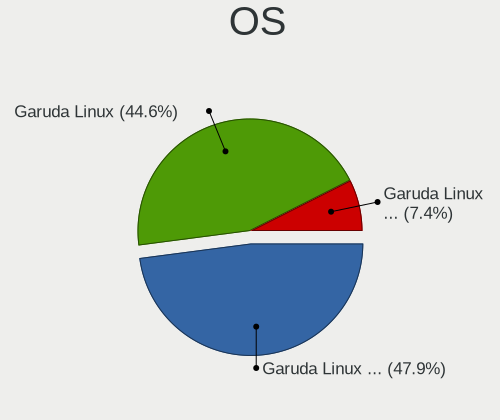

| Name                 | Desktops | Percent |
|----------------------|----------|---------|
| Garuda Linux Soaring | 63       | 48.84%  |
| Garuda Linux         | 54       | 41.86%  |
| Garuda Linux Rolling | 12       | 9.3%    |

OS Family
---------

OS without a version

| Name         | Desktops | Percent |
|--------------|----------|---------|
| Garuda Linux | 125      | 100%    |

Kernel
------

Version of the Linux kernel

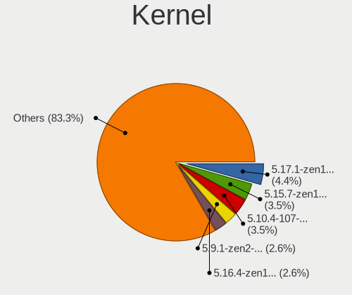

| Version            | Desktops | Percent |
|--------------------|----------|---------|
| 5.17.1-zen1-1-zen  | 6        | 4.26%   |
| 5.15.7-zen1-1-zen  | 4        | 2.84%   |
| 5.10.4-107-tkg-bmq | 4        | 2.84%   |
| 6.0.11-zen1-1-zen  | 3        | 2.13%   |
| 5.9.1-zen2-1-zen   | 3        | 2.13%   |
| 5.18.12-zen1-1-zen | 3        | 2.13%   |
| 5.18.1-zen1-1-zen  | 3        | 2.13%   |
| 5.16.4-zen1-1-zen  | 3        | 2.13%   |
| 5.15.2-zen1-1-zen  | 3        | 2.13%   |
| 5.15.13-zen1-1-zen | 3        | 2.13%   |
| 5.11.16-zen1-1-zen | 3        | 2.13%   |
| 6.1.1-zen1-1-zen   | 2        | 1.42%   |
| 6.0.8-zen1-1-zen   | 2        | 1.42%   |
| 6.0.2-zen1-1-zen   | 2        | 1.42%   |
| 6.0.12-zen1-1-zen  | 2        | 1.42%   |
| 5.9.11-zen2-1-zen  | 2        | 1.42%   |
| 5.9.10-zen1-1-zen  | 2        | 1.42%   |
| 5.8.14-zen1-1-zen  | 2        | 1.42%   |
| 5.19.9-zen1-1-zen  | 2        | 1.42%   |
| 5.19.5-zen1-1-zen  | 2        | 1.42%   |
| 5.18.16-zen1-1-zen | 2        | 1.42%   |
| 5.16.8-zen1-1-zen  | 2        | 1.42%   |
| 5.16.11-zen1-1-zen | 2        | 1.42%   |
| 5.16.10-zen1-1-zen | 2        | 1.42%   |
| 5.16.0-zen1-1-zen  | 2        | 1.42%   |
| 5.15.12-zen1-1-zen | 2        | 1.42%   |
| 5.15.10-zen1-1-zen | 2        | 1.42%   |
| 5.13.9-zen1-1-zen  | 2        | 1.42%   |
| 5.13.12-zen1-1-zen | 2        | 1.42%   |
| 5.12.4-zen1-2-zen  | 2        | 1.42%   |
| 5.10.8-112-tkg-bmq | 2        | 1.42%   |
| 6.0.9-zen1-1-zen   | 1        | 0.71%   |
| 6.0.1-zen2-1-zen   | 1        | 0.71%   |
| 5.9.8-zen1-1-zen   | 1        | 0.71%   |
| 5.9.6-zen1-1-zen   | 1        | 0.71%   |
| 5.9.4-zen1-1-zen   | 1        | 0.71%   |
| 5.9.2-zen1-1-zen   | 1        | 0.71%   |
| 5.9.14-99-tkg-bmq  | 1        | 0.71%   |
| 5.8.5-zen1-1-zen   | 1        | 0.71%   |
| 5.8.10-zen1-1-zen  | 1        | 0.71%   |

Kernel Family
-------------

Linux kernel without a distro release

| Version | Desktops | Percent |
|---------|----------|---------|
| 5.17.1  | 6        | 4.26%   |
| 5.15.7  | 4        | 2.84%   |
| 5.10.4  | 4        | 2.84%   |
| 6.0.11  | 3        | 2.13%   |
| 5.9.1   | 3        | 2.13%   |
| 5.18.12 | 3        | 2.13%   |
| 5.18.1  | 3        | 2.13%   |
| 5.16.4  | 3        | 2.13%   |
| 5.15.2  | 3        | 2.13%   |
| 5.15.13 | 3        | 2.13%   |
| 5.12.13 | 3        | 2.13%   |
| 5.11.16 | 3        | 2.13%   |
| 6.1.1   | 2        | 1.42%   |
| 6.0.8   | 2        | 1.42%   |
| 6.0.2   | 2        | 1.42%   |
| 6.0.12  | 2        | 1.42%   |
| 5.9.11  | 2        | 1.42%   |
| 5.9.10  | 2        | 1.42%   |
| 5.8.14  | 2        | 1.42%   |
| 5.19.9  | 2        | 1.42%   |
| 5.19.5  | 2        | 1.42%   |
| 5.18.16 | 2        | 1.42%   |
| 5.17.5  | 2        | 1.42%   |
| 5.17.3  | 2        | 1.42%   |
| 5.16.8  | 2        | 1.42%   |
| 5.16.11 | 2        | 1.42%   |
| 5.16.10 | 2        | 1.42%   |
| 5.16.0  | 2        | 1.42%   |
| 5.15.12 | 2        | 1.42%   |
| 5.15.10 | 2        | 1.42%   |
| 5.14.12 | 2        | 1.42%   |
| 5.13.9  | 2        | 1.42%   |
| 5.13.12 | 2        | 1.42%   |
| 5.12.4  | 2        | 1.42%   |
| 5.12.12 | 2        | 1.42%   |
| 5.10.8  | 2        | 1.42%   |
| 6.0.9   | 1        | 0.71%   |
| 6.0.1   | 1        | 0.71%   |
| 5.9.8   | 1        | 0.71%   |
| 5.9.6   | 1        | 0.71%   |

Kernel Major Ver.
-----------------

Linux kernel major version

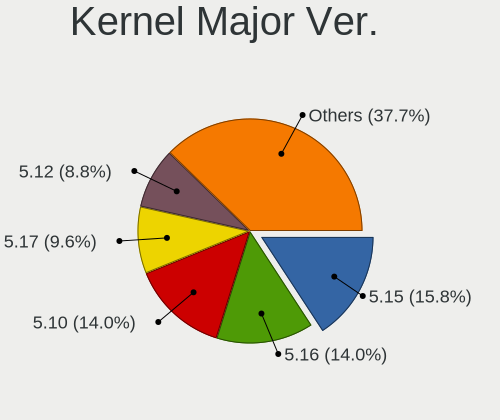

| Version | Desktops | Percent |
|---------|----------|---------|
| 5.15    | 17       | 12.41%  |
| 5.10    | 16       | 11.68%  |
| 5.16    | 15       | 10.95%  |
| 5.18    | 14       | 10.22%  |
| 6.0     | 11       | 8.03%   |
| 5.17    | 10       | 7.3%    |
| 5.12    | 10       | 7.3%    |
| 5.11    | 10       | 7.3%    |
| 5.9     | 9        | 6.57%   |
| 5.19    | 7        | 5.11%   |
| 5.13    | 6        | 4.38%   |
| 5.8     | 5        | 3.65%   |
| 5.14    | 5        | 3.65%   |
| 6.1     | 2        | 1.46%   |

Arch
----

OS architecture (x86_64, i586, etc.)

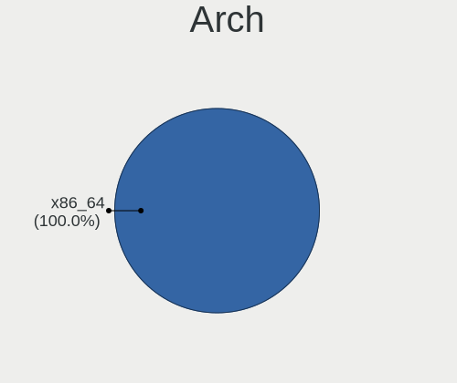

| Name   | Desktops | Percent |
|--------|----------|---------|
| x86_64 | 125      | 100%    |

DE
--

Desktop Environment

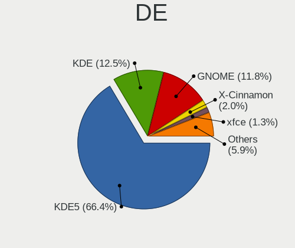

| Name       | Desktops | Percent |
|------------|----------|---------|
| KDE5       | 83       | 64.84%  |
| KDE        | 19       | 14.84%  |
| GNOME      | 16       | 12.5%   |
| xfce       | 2        | 1.56%   |
| X-Cinnamon | 2        | 1.56%   |
| sway       | 1        | 0.78%   |
| LXQt       | 1        | 0.78%   |
| i3         | 1        | 0.78%   |
| Deepin     | 1        | 0.78%   |
| Cinnamon   | 1        | 0.78%   |
| Unknown    | 1        | 0.78%   |

Display Server
--------------

X11 or Wayland

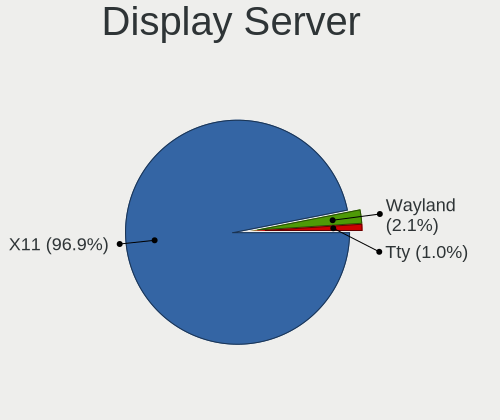

| Name    | Desktops | Percent |
|---------|----------|---------|
| X11     | 116      | 92.06%  |
| Wayland | 4        | 3.17%   |
| Tty     | 3        | 2.38%   |
| Unknown | 3        | 2.38%   |

Display Manager
---------------

SDDM, LightDM, etc.

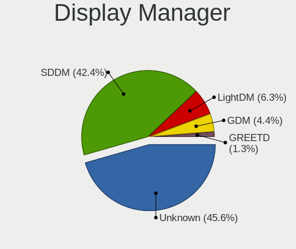

| Name    | Desktops | Percent |
|---------|----------|---------|
| Unknown | 60       | 47.62%  |
| SDDM    | 53       | 42.06%  |
| LightDM | 8        | 6.35%   |
| GDM     | 4        | 3.17%   |
| GREETD  | 1        | 0.79%   |

OS Lang
-------

Language

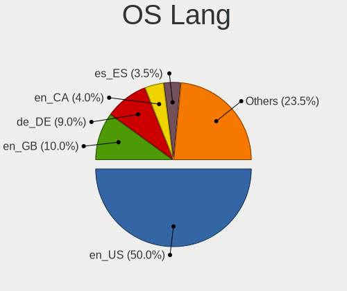

| Lang  | Desktops | Percent |
|-------|----------|---------|
| en_US | 62       | 49.6%   |
| de_DE | 14       | 11.2%   |
| en_GB | 12       | 9.6%    |
| es_ES | 4        | 3.2%    |
| en_CA | 4        | 3.2%    |
| en_AU | 4        | 3.2%    |
| pt_BR | 3        | 2.4%    |
| ru_RU | 2        | 1.6%    |
| nl_NL | 2        | 1.6%    |
| it_IT | 2        | 1.6%    |
| fr_BE | 2        | 1.6%    |
| en_IN | 2        | 1.6%    |
| sv_SE | 1        | 0.8%    |
| sk_SK | 1        | 0.8%    |
| nl_BE | 1        | 0.8%    |
| nb_NO | 1        | 0.8%    |
| iu_CA | 1        | 0.8%    |
| fr_FR | 1        | 0.8%    |
| es_VE | 1        | 0.8%    |
| es_AR | 1        | 0.8%    |
| en_ZA | 1        | 0.8%    |
| en_DE | 1        | 0.8%    |
| el_GR | 1        | 0.8%    |
| da_DK | 1        | 0.8%    |

Boot Mode
---------

EFI or BIOS

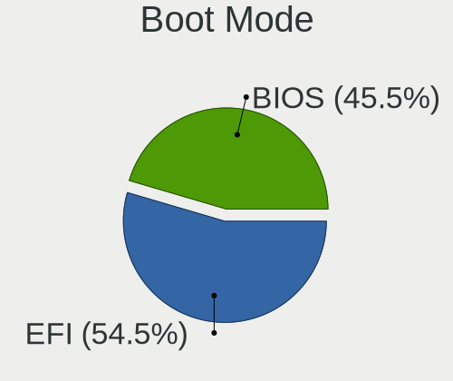

| Mode | Desktops | Percent |
|------|----------|---------|
| EFI  | 67       | 53.6%   |
| BIOS | 58       | 46.4%   |

Filesystem
----------

Type of filesystem

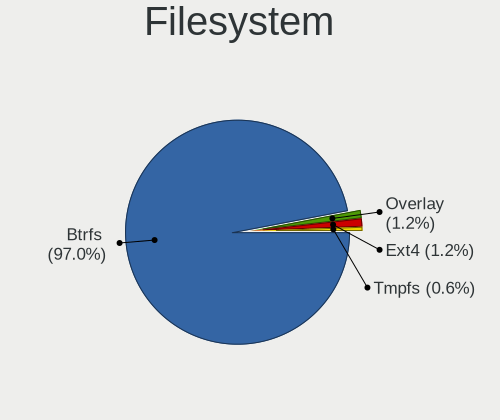

| Type  | Desktops | Percent |
|-------|----------|---------|
| Btrfs | 123      | 98.4%   |
| Ext4  | 2        | 1.6%    |

Part. scheme
------------

Scheme of partitioning

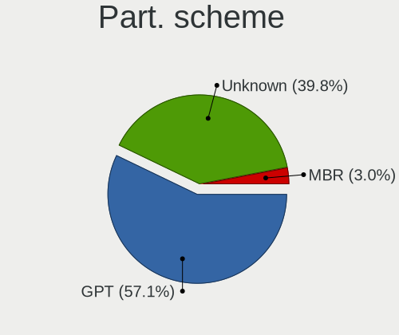

| Type    | Desktops | Percent |
|---------|----------|---------|
| GPT     | 62       | 49.21%  |
| Unknown | 60       | 47.62%  |
| MBR     | 4        | 3.17%   |

Dual Boot with Linux/BSD
------------------------

Hosting more than one Linux/BSD

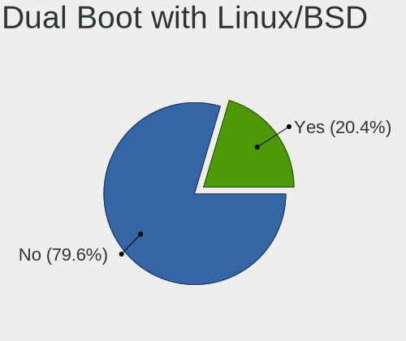

| Dual boot | Desktops | Percent |
|-----------|----------|---------|
| No        | 100      | 78.74%  |
| Yes       | 27       | 21.26%  |

Dual Boot (Win)
---------------

Hosting Linux and Windows

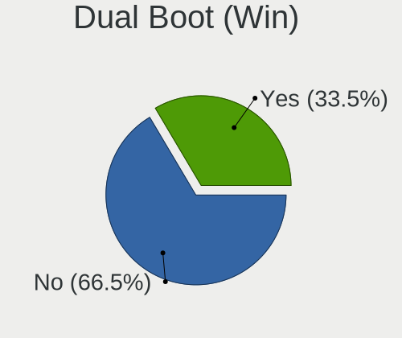

| Dual boot | Desktops | Percent |
|-----------|----------|---------|
| No        | 86       | 68.25%  |
| Yes       | 40       | 31.75%  |

Board
-----

Vendor
------

Motherboard manufacturer

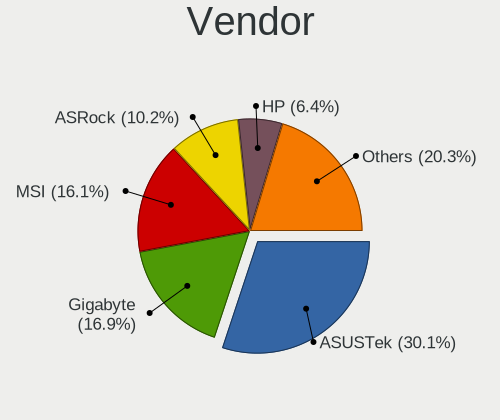

| Name                | Desktops | Percent |
|---------------------|----------|---------|
| ASUSTek Computer    | 33       | 26.4%   |
| MSI                 | 22       | 17.6%   |
| Gigabyte Technology | 22       | 17.6%   |
| ASRock              | 15       | 12%     |
| Hewlett-Packard     | 8        | 6.4%    |
| Lenovo              | 7        | 5.6%    |
| Dell                | 6        | 4.8%    |
| Pegatron            | 2        | 1.6%    |
| Acer                | 2        | 1.6%    |
| T-bao               | 1        | 0.8%    |
| OEM                 | 1        | 0.8%    |
| Medion              | 1        | 0.8%    |
| Intel               | 1        | 0.8%    |
| Fujitsu             | 1        | 0.8%    |
| Biostar             | 1        | 0.8%    |
| BESSTAR Tech        | 1        | 0.8%    |
| Alienware           | 1        | 0.8%    |

Model
-----

Motherboard model

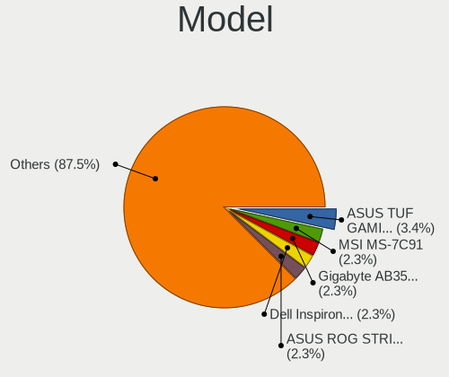

| Name                               | Desktops | Percent |
|------------------------------------|----------|---------|
| ASUS TUF Gaming X570-PLUS          | 4        | 3.2%    |
| MSI MS-7C91                        | 2        | 1.6%    |
| Gigabyte X570 AORUS PRO WIFI       | 2        | 1.6%    |
| Gigabyte AB350-Gaming 3            | 2        | 1.6%    |
| Dell Inspiron 3668                 | 2        | 1.6%    |
| ASUS ROG STRIX X570-E GAMING       | 2        | 1.6%    |
| ASUS ROG STRIX B550-F GAMING       | 2        | 1.6%    |
| ASUS All Series                    | 2        | 1.6%    |
| T-bao MINI PC                      | 1        | 0.8%    |
| Pegatron p7-1030                   | 1        | 0.8%    |
| Pegatron h9-1301es                 | 1        | 0.8%    |
| MSI MS-7D16                        | 1        | 0.8%    |
| MSI MS-7C90                        | 1        | 0.8%    |
| MSI MS-7C83                        | 1        | 0.8%    |
| MSI MS-7C56                        | 1        | 0.8%    |
| MSI MS-7C52                        | 1        | 0.8%    |
| MSI MS-7C09                        | 1        | 0.8%    |
| MSI MS-7C02                        | 1        | 0.8%    |
| MSI MS-7B98                        | 1        | 0.8%    |
| MSI MS-7B89                        | 1        | 0.8%    |
| MSI MS-7B86                        | 1        | 0.8%    |
| MSI MS-7B09                        | 1        | 0.8%    |
| MSI MS-7A78                        | 1        | 0.8%    |
| MSI MS-7A39                        | 1        | 0.8%    |
| MSI MS-7A38                        | 1        | 0.8%    |
| MSI MS-7A32                        | 1        | 0.8%    |
| MSI MS-7818                        | 1        | 0.8%    |
| MSI MS-7816                        | 1        | 0.8%    |
| MSI MS-7758                        | 1        | 0.8%    |
| MSI MS-7721                        | 1        | 0.8%    |
| MSI A320M-HDV R4.0                 | 1        | 0.8%    |
| Medion Akoya P5238 F/C395          | 1        | 0.8%    |
| Lenovo ThinkStation S20 4105O1U    | 1        | 0.8%    |
| Lenovo ThinkCentre M93p 10A90048US | 1        | 0.8%    |
| Lenovo ThinkCentre M93p 10A90016US | 1        | 0.8%    |
| Lenovo ThinkCentre M91p 7033CG1    | 1        | 0.8%    |
| Lenovo ThinkCentre Edge72 3484HPU  | 1        | 0.8%    |
| Lenovo Legion T5 26AMR5 90RC018LBX | 1        | 0.8%    |
| Lenovo K450e 10181                 | 1        | 0.8%    |
| Intel H61                          | 1        | 0.8%    |

Model Family
------------

Motherboard model prefix

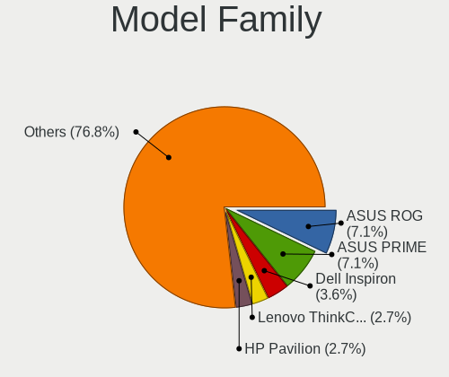

| Name                  | Desktops | Percent |
|-----------------------|----------|---------|
| ASUS ROG              | 9        | 7.2%    |
| ASUS PRIME            | 9        | 7.2%    |
| Lenovo ThinkCentre    | 4        | 3.2%    |
| Dell Inspiron         | 4        | 3.2%    |
| ASUS TUF              | 4        | 3.2%    |
| HP Pavilion           | 3        | 2.4%    |
| Gigabyte X570         | 3        | 2.4%    |
| Gigabyte B550         | 3        | 2.4%    |
| Gigabyte B450         | 3        | 2.4%    |
| MSI MS-7C91           | 2        | 1.6%    |
| Gigabyte AB350-Gaming | 2        | 1.6%    |
| Dell OptiPlex         | 2        | 1.6%    |
| ASUS Maximus          | 2        | 1.6%    |
| ASUS All              | 2        | 1.6%    |
| Acer Aspire           | 2        | 1.6%    |
| T-bao MINI            | 1        | 0.8%    |
| Pegatron p7-1030      | 1        | 0.8%    |
| Pegatron h9-1301es    | 1        | 0.8%    |
| MSI MS-7D16           | 1        | 0.8%    |
| MSI MS-7C90           | 1        | 0.8%    |
| MSI MS-7C83           | 1        | 0.8%    |
| MSI MS-7C56           | 1        | 0.8%    |
| MSI MS-7C52           | 1        | 0.8%    |
| MSI MS-7C09           | 1        | 0.8%    |
| MSI MS-7C02           | 1        | 0.8%    |
| MSI MS-7B98           | 1        | 0.8%    |
| MSI MS-7B89           | 1        | 0.8%    |
| MSI MS-7B86           | 1        | 0.8%    |
| MSI MS-7B09           | 1        | 0.8%    |
| MSI MS-7A78           | 1        | 0.8%    |
| MSI MS-7A39           | 1        | 0.8%    |
| MSI MS-7A38           | 1        | 0.8%    |
| MSI MS-7A32           | 1        | 0.8%    |
| MSI MS-7818           | 1        | 0.8%    |
| MSI MS-7816           | 1        | 0.8%    |
| MSI MS-7758           | 1        | 0.8%    |
| MSI MS-7721           | 1        | 0.8%    |
| MSI A320M-HDV         | 1        | 0.8%    |
| Medion Akoya          | 1        | 0.8%    |
| Lenovo ThinkStation   | 1        | 0.8%    |

MFG Year
--------

Motherboard manufacture year

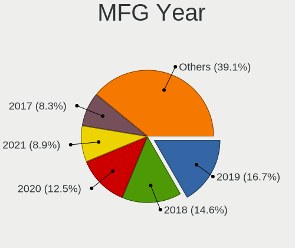

| Year | Desktops | Percent |
|------|----------|---------|
| 2019 | 20       | 16%     |
| 2020 | 19       | 15.2%   |
| 2018 | 17       | 13.6%   |
| 2017 | 15       | 12%     |
| 2013 | 11       | 8.8%    |
| 2021 | 9        | 7.2%    |
| 2014 | 8        | 6.4%    |
| 2012 | 8        | 6.4%    |
| 2015 | 4        | 3.2%    |
| 2011 | 4        | 3.2%    |
| 2010 | 4        | 3.2%    |
| 2016 | 3        | 2.4%    |
| 2009 | 2        | 1.6%    |
| 2022 | 1        | 0.8%    |

Form Factor
-----------

Physical design of the computer

| Name    | Desktops | Percent |
|---------|----------|---------|
| Desktop | 125      | 100%    |

Secure Boot
-----------

Enabled or disabled

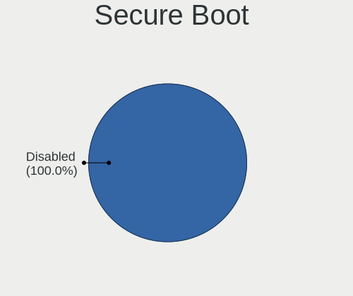

| State    | Desktops | Percent |
|----------|----------|---------|
| Disabled | 125      | 100%    |

Coreboot
--------

Have coreboot on board

| Used | Desktops | Percent |
|------|----------|---------|
| No   | 125      | 100%    |

RAM Size
--------

Total RAM memory

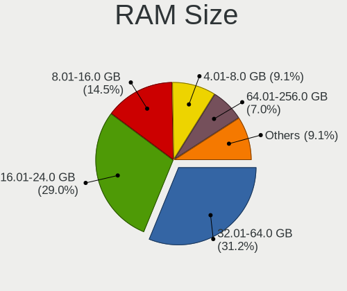

| Size in GB  | Desktops | Percent |
|-------------|----------|---------|
| 16.01-24.0  | 37       | 29.37%  |
| 32.01-64.0  | 36       | 28.57%  |
| 8.01-16.0   | 18       | 14.29%  |
| 4.01-8.0    | 15       | 11.9%   |
| 24.01-32.0  | 9        | 7.14%   |
| 64.01-256.0 | 8        | 6.35%   |
| 3.01-4.0    | 3        | 2.38%   |

RAM Used
--------

Used RAM memory

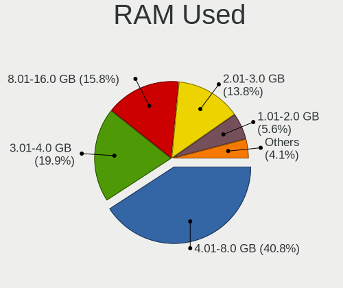

| Used GB    | Desktops | Percent |
|------------|----------|---------|
| 4.01-8.0   | 51       | 38.93%  |
| 3.01-4.0   | 25       | 19.08%  |
| 8.01-16.0  | 23       | 17.56%  |
| 2.01-3.0   | 19       | 14.5%   |
| 16.01-24.0 | 6        | 4.58%   |
| 1.01-2.0   | 6        | 4.58%   |
| 32.01-64.0 | 1        | 0.76%   |

Total Drives
------------

Number of drives on board

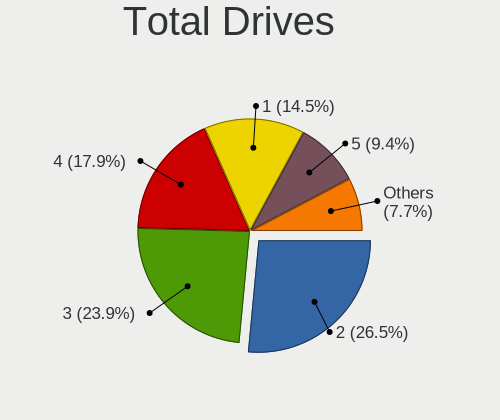

| Drives | Desktops | Percent |
|--------|----------|---------|
| 2      | 38       | 29.23%  |
| 3      | 30       | 23.08%  |
| 4      | 21       | 16.15%  |
| 1      | 17       | 13.08%  |
| 5      | 14       | 10.77%  |
| 6      | 4        | 3.08%   |
| 9      | 3        | 2.31%   |
| 18     | 1        | 0.77%   |
| 14     | 1        | 0.77%   |
| 7      | 1        | 0.77%   |

Has CD-ROM
----------

Has CD-ROM on board

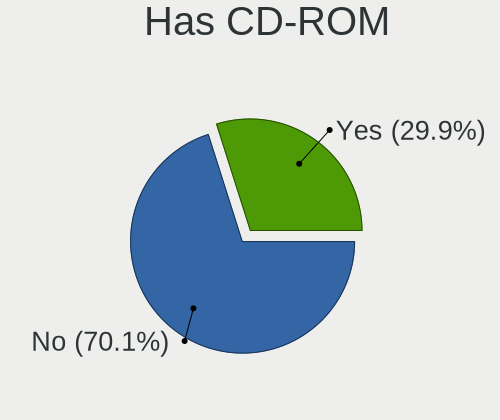

| Presented | Desktops | Percent |
|-----------|----------|---------|
| No        | 89       | 70.63%  |
| Yes       | 37       | 29.37%  |

Has Ethernet
------------

Has Ethernet on board

| Presented | Desktops | Percent |
|-----------|----------|---------|
| Yes       | 123      | 98.4%   |
| No        | 2        | 1.6%    |

Has WiFi
--------

Has WiFi module

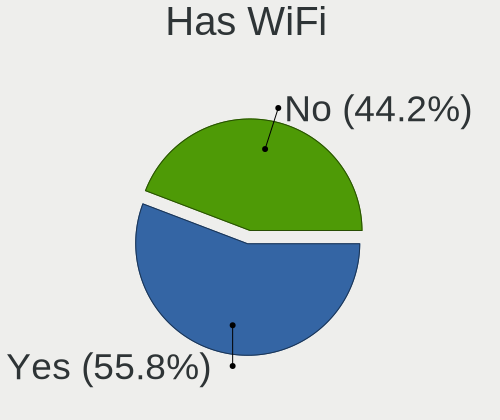

| Presented | Desktops | Percent |
|-----------|----------|---------|
| Yes       | 69       | 53.91%  |
| No        | 59       | 46.09%  |

Has Bluetooth
-------------

Has Bluetooth module

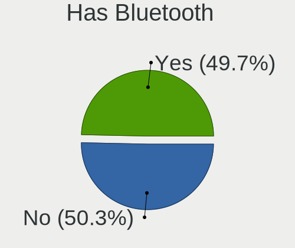

| Presented | Desktops | Percent |
|-----------|----------|---------|
| Yes       | 64       | 50.39%  |
| No        | 63       | 49.61%  |

Location
--------

Country
-------

Geographic location (country)

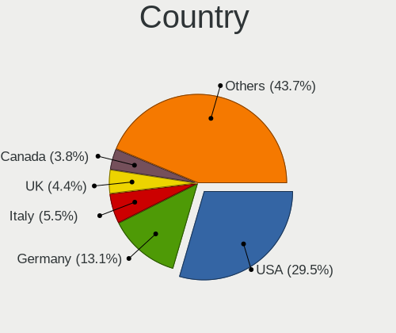

| Country      | Desktops | Percent |
|--------------|----------|---------|
| USA          | 40       | 32%     |
| Germany      | 17       | 13.6%   |
| UK           | 6        | 4.8%    |
| Italy        | 6        | 4.8%    |
| Canada       | 5        | 4%      |
| Spain        | 4        | 3.2%    |
| Brazil       | 4        | 3.2%    |
| Australia    | 4        | 3.2%    |
| Sweden       | 3        | 2.4%    |
| Russia       | 3        | 2.4%    |
| Romania      | 3        | 2.4%    |
| Netherlands  | 3        | 2.4%    |
| Belgium      | 3        | 2.4%    |
| Puerto Rico  | 2        | 1.6%    |
| Latvia       | 2        | 1.6%    |
| India        | 2        | 1.6%    |
| Greece       | 2        | 1.6%    |
| France       | 2        | 1.6%    |
| Venezuela    | 1        | 0.8%    |
| Ukraine      | 1        | 0.8%    |
| South Africa | 1        | 0.8%    |
| Slovakia     | 1        | 0.8%    |
| Serbia       | 1        | 0.8%    |
| Poland       | 1        | 0.8%    |
| Philippines  | 1        | 0.8%    |
| Norway       | 1        | 0.8%    |
| Israel       | 1        | 0.8%    |
| Iceland      | 1        | 0.8%    |
| Finland      | 1        | 0.8%    |
| Denmark      | 1        | 0.8%    |
| Chile        | 1        | 0.8%    |
| Argentina    | 1        | 0.8%    |

City
----

Geographic location (city)

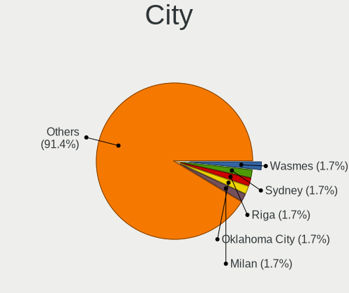

| City                    | Desktops | Percent |
|-------------------------|----------|---------|
| Milan                   | 3        | 2.29%   |
| Dallas                  | 3        | 2.29%   |
| Wasmes                  | 2        | 1.53%   |
| Sydney                  | 2        | 1.53%   |
| St Louis                | 2        | 1.53%   |
| Sao Paulo               | 2        | 1.53%   |
| Riga                    | 2        | 1.53%   |
| Oklahoma City           | 2        | 1.53%   |
| Melbourne               | 2        | 1.53%   |
| Kingsport               | 2        | 1.53%   |
| Berlin                  | 2        | 1.53%   |
| York                    | 1        | 0.76%   |
| Weiterstadt             | 1        | 0.76%   |
| Weilen unter den Rinnen | 1        | 0.76%   |
| Voronezh                | 1        | 0.76%   |
| Volzhskiy               | 1        | 0.76%   |
| Västerås              | 1        | 0.76%   |
| Valence                 | 1        | 0.76%   |
| Urbandale               | 1        | 0.76%   |
| Ullerslev               | 1        | 0.76%   |
| Timișoara              | 1        | 0.76%   |
| Taunusstein             | 1        | 0.76%   |
| Tampere                 | 1        | 0.76%   |
| Stockholm               | 1        | 0.76%   |
| Stavropol               | 1        | 0.76%   |
| Stanley                 | 1        | 0.76%   |
| Sindelfingen            | 1        | 0.76%   |
| Shreveport              | 1        | 0.76%   |
| Sherwood Park           | 1        | 0.76%   |
| Satu Mare               | 1        | 0.76%   |
| Sarasota                | 1        | 0.76%   |
| Santa Cruz de Tenerife  | 1        | 0.76%   |
| San Juan                | 1        | 0.76%   |
| San Jose                | 1        | 0.76%   |
| Reykjavik               | 1        | 0.76%   |
| Reston                  | 1        | 0.76%   |
| Regina                  | 1        | 0.76%   |
| Ramat Gan               | 1        | 0.76%   |
| Pune                    | 1        | 0.76%   |
| Providencia             | 1        | 0.76%   |

Drives
------

Drive Vendor
------------

Hard drive vendors

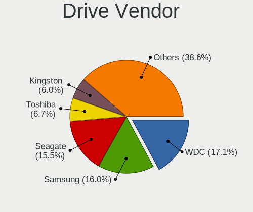

| Vendor                      | Desktops | Drives | Percent |
|-----------------------------|----------|--------|---------|
| WDC                         | 61       | 93     | 19%     |
| Seagate                     | 54       | 77     | 16.82%  |
| Samsung Electronics         | 51       | 97     | 15.89%  |
| Toshiba                     | 19       | 25     | 5.92%   |
| Crucial                     | 19       | 26     | 5.92%   |
| SanDisk                     | 14       | 22     | 4.36%   |
| Kingston                    | 14       | 23     | 4.36%   |
| Hitachi                     | 8        | 8      | 2.49%   |
| Phison                      | 7        | 8      | 2.18%   |
| Silicon Motion              | 5        | 5      | 1.56%   |
| Intel                       | 5        | 8      | 1.56%   |
| A-DATA Technology           | 5        | 8      | 1.56%   |
| Unknown                     | 4        | 4      | 1.25%   |
| PNY                         | 4        | 4      | 1.25%   |
| China                       | 4        | 6      | 1.25%   |
| XPG                         | 3        | 4      | 0.93%   |
| SPCC                        | 3        | 3      | 0.93%   |
| OCZ                         | 3        | 3      | 0.93%   |
| Micron/Crucial Technology   | 3        | 6      | 0.93%   |
| Transcend                   | 2        | 2      | 0.62%   |
| Team                        | 2        | 3      | 0.62%   |
| LITEONIT                    | 2        | 2      | 0.62%   |
| HGST                        | 2        | 8      | 0.62%   |
| Emtec                       | 2        | 4      | 0.62%   |
| WD MediaMax                 | 1        | 1      | 0.31%   |
| USB30                       | 1        | 2      | 0.31%   |
| TO Exter                    | 1        | 1      | 0.31%   |
| T-FORCE                     | 1        | 1      | 0.31%   |
| SK hynix                    | 1        | 1      | 0.31%   |
| Qumo                        | 1        | 1      | 0.31%   |
| Plextor                     | 1        | 1      | 0.31%   |
| Patriot                     | 1        | 1      | 0.31%   |
| Mushkin                     | 1        | 1      | 0.31%   |
| Micron Technology           | 1        | 1      | 0.31%   |
| MAXIO Technology (Hangzhou) | 1        | 1      | 0.31%   |
| LITEON                      | 1        | 1      | 0.31%   |
| Intenso                     | 1        | 2      | 0.31%   |
| Inateck                     | 1        | 1      | 0.31%   |
| HS-SSD-E100                 | 1        | 1      | 0.31%   |
| HS-SSD-C100                 | 1        | 1      | 0.31%   |

Drive Model
-----------

Hard drive models

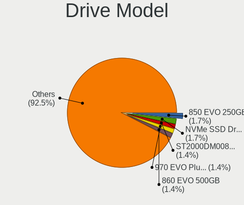

| Model                                               | Desktops | Percent |
|-----------------------------------------------------|----------|---------|
| Samsung SSD 850 EVO 250GB                           | 6        | 1.54%   |
| Samsung NVMe SSD Drive 1TB                          | 6        | 1.54%   |
| Seagate ST2000DM008-2FR102 2TB                      | 5        | 1.28%   |
| Samsung SSD 970 EVO Plus 500GB                      | 5        | 1.28%   |
| Samsung SSD 860 EVO 500GB                           | 5        | 1.28%   |
| Crucial CT1000MX500SSD1 1TB                         | 5        | 1.28%   |
| Seagate ST1000DM010-2EP102 1TB                      | 4        | 1.03%   |
| Samsung NVMe SSD Drive 500GB                        | 4        | 1.03%   |
| WDC WD20EZRZ-00Z5HB0 2TB                            | 3        | 0.77%   |
| WDC WD10EZEX-60WN4A0 1TB                            | 3        | 0.77%   |
| WDC WD10EZEX-08WN4A0 1TB                            | 3        | 0.77%   |
| Toshiba DT01ACA100 1TB                              | 3        | 0.77%   |
| Seagate ST4000DM004-2CV104 4TB                      | 3        | 0.77%   |
| Seagate ST3000DM001-1ER166 3TB                      | 3        | 0.77%   |
| Seagate ST2000DL003-9VT166 2TB                      | 3        | 0.77%   |
| Seagate Portable 5TB                                | 3        | 0.77%   |
| SanDisk SSD PLUS 1000GB                             | 3        | 0.77%   |
| SanDisk NVMe SSD Drive 1TB                          | 3        | 0.77%   |
| Samsung SSD 860 EVO 1TB                             | 3        | 0.77%   |
| Samsung SSD 850 EVO 500GB                           | 3        | 0.77%   |
| Samsung NVMe SSD Controller SM981/PM981/PM983 500GB | 3        | 0.77%   |
| XPG NVMe SSD Drive 512GB                            | 2        | 0.51%   |
| WDC WDS240G2G0A-00JH30 240GB SSD                    | 2        | 0.51%   |
| WDC WDS240G1G0A-00SS50 240GB SSD                    | 2        | 0.51%   |
| WDC WDS100T2B0C-00PXH0 1TB                          | 2        | 0.51%   |
| WDC WD20EARX-00PASB0 2TB                            | 2        | 0.51%   |
| WDC WD10EARS-00Y5B1 1TB                             | 2        | 0.51%   |
| WDC WD10EALX-009BA0 1TB                             | 2        | 0.51%   |
| WDC WD10EADS-00M2B0 1TB                             | 2        | 0.51%   |
| Unknown SD/MMC/MS PRO 64GB                          | 2        | 0.51%   |
| Toshiba HDWD110 1TB                                 | 2        | 0.51%   |
| Toshiba DT01ACA300 3TB                              | 2        | 0.51%   |
| SPCC Solid State Disk 512GB                         | 2        | 0.51%   |
| Silicon Motion SM2262/SM2262EN SSD Controller 2TB   | 2        | 0.51%   |
| Seagate ST3320820AS 320GB                           | 2        | 0.51%   |
| Seagate ST31000528AS 1TB                            | 2        | 0.51%   |
| Seagate ST2000LM003 HN-M201RAD 2TB                  | 2        | 0.51%   |
| Seagate ST2000DM001-1ER164 2TB                      | 2        | 0.51%   |
| Seagate ST1000LM024 HN-M101MBB 1TB                  | 2        | 0.51%   |
| Seagate ST1000DM003-1ER162 1TB                      | 2        | 0.51%   |

HDD Vendor
----------

Hard disk drive vendors

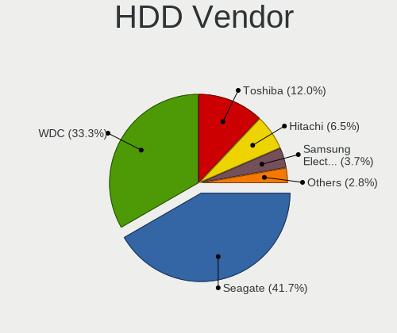

| Vendor              | Desktops | Drives | Percent |
|---------------------|----------|--------|---------|
| Seagate             | 52       | 74     | 38.52%  |
| WDC                 | 50       | 79     | 37.04%  |
| Toshiba             | 15       | 18     | 11.11%  |
| Hitachi             | 8        | 8      | 5.93%   |
| Samsung Electronics | 4        | 4      | 2.96%   |
| Unknown             | 2        | 2      | 1.48%   |
| HGST                | 2        | 8      | 1.48%   |
| Intenso             | 1        | 2      | 0.74%   |
| Inateck             | 1        | 1      | 0.74%   |

SSD Vendor
----------

Solid state drive vendors

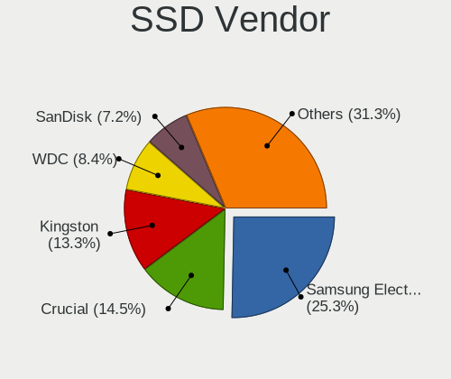

| Vendor              | Desktops | Drives | Percent |
|---------------------|----------|--------|---------|
| Samsung Electronics | 26       | 44     | 23.42%  |
| Crucial             | 15       | 20     | 13.51%  |
| Kingston            | 11       | 17     | 9.91%   |
| SanDisk             | 9        | 14     | 8.11%   |
| WDC                 | 8        | 8      | 7.21%   |
| A-DATA Technology   | 5        | 8      | 4.5%    |
| China               | 4        | 6      | 3.6%    |
| Toshiba             | 3        | 6      | 2.7%    |
| SPCC                | 3        | 3      | 2.7%    |
| PNY                 | 3        | 3      | 2.7%    |
| OCZ                 | 3        | 3      | 2.7%    |
| Transcend           | 2        | 2      | 1.8%    |
| Team                | 2        | 3      | 1.8%    |
| LITEONIT            | 2        | 2      | 1.8%    |
| Emtec               | 2        | 4      | 1.8%    |
| USB30               | 1        | 2      | 0.9%    |
| Unknown             | 1        | 1      | 0.9%    |
| TO Exter            | 1        | 1      | 0.9%    |
| T-FORCE             | 1        | 1      | 0.9%    |
| SK hynix            | 1        | 1      | 0.9%    |
| Qumo                | 1        | 1      | 0.9%    |
| Plextor             | 1        | 1      | 0.9%    |
| Mushkin             | 1        | 1      | 0.9%    |
| Micron Technology   | 1        | 1      | 0.9%    |
| LITEON              | 1        | 1      | 0.9%    |
| HS-SSD-C100         | 1        | 1      | 0.9%    |
| ASMedia             | 1        | 2      | 0.9%    |
| ADATA SU            | 1        | 1      | 0.9%    |

Drive Kind
----------

HDD or SSD

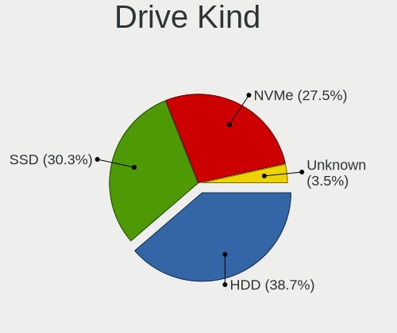

| Kind    | Desktops | Drives | Percent |
|---------|----------|--------|---------|
| HDD     | 95       | 196    | 38.15%  |
| SSD     | 79       | 158    | 31.73%  |
| NVMe    | 66       | 119    | 26.51%  |
| Unknown | 9        | 9      | 3.61%   |

Drive Connector
---------------

SATA, SAS, NVMe, etc.

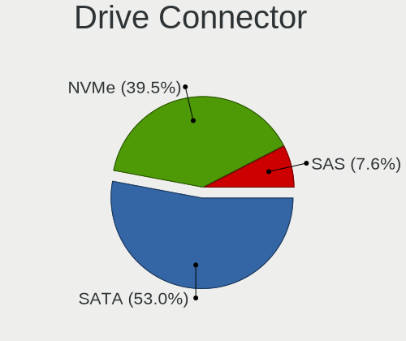

| Type | Desktops | Drives | Percent |
|------|----------|--------|---------|
| SATA | 114      | 329    | 57.29%  |
| NVMe | 66       | 119    | 33.17%  |
| SAS  | 19       | 34     | 9.55%   |

Drive Size
----------

Size of hard drive

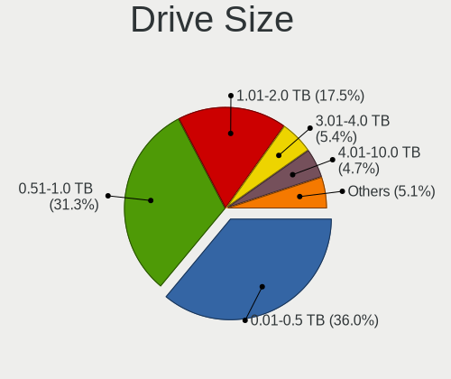

| Size in TB | Desktops | Drives | Percent |
|------------|----------|--------|---------|
| 0.01-0.5   | 81       | 169    | 37.5%   |
| 0.51-1.0   | 66       | 95     | 30.56%  |
| 1.01-2.0   | 39       | 49     | 18.06%  |
| 2.01-3.0   | 10       | 16     | 4.63%   |
| 3.01-4.0   | 9        | 12     | 4.17%   |
| 4.01-10.0  | 9        | 10     | 4.17%   |
| 10.01-20.0 | 2        | 3      | 0.93%   |

Space Total
-----------

Amount of disk space available on the file system

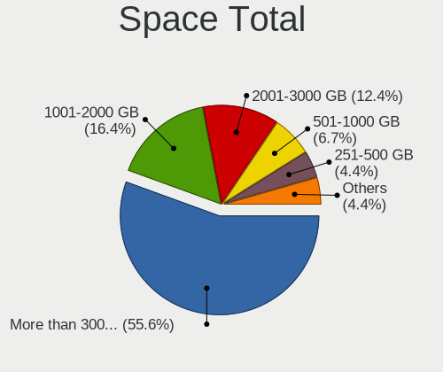

| Size in GB     | Desktops | Percent |
|----------------|----------|---------|
| More than 3000 | 61       | 48.03%  |
| 1001-2000      | 23       | 18.11%  |
| 2001-3000      | 20       | 15.75%  |
| 501-1000       | 12       | 9.45%   |
| 251-500        | 8        | 6.3%    |
| Unknown        | 2        | 1.57%   |
| 101-250        | 1        | 0.79%   |

Space Used
----------

Amount of used disk space

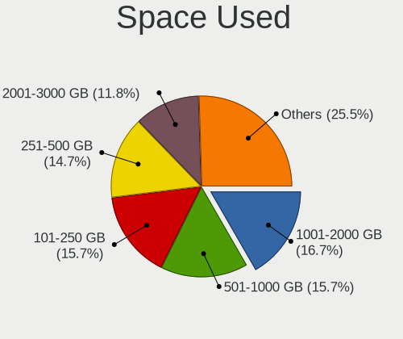

| Used GB        | Desktops | Percent |
|----------------|----------|---------|
| 251-500        | 22       | 16.79%  |
| 501-1000       | 22       | 16.79%  |
| 101-250        | 20       | 15.27%  |
| 1001-2000      | 19       | 14.5%   |
| 2001-3000      | 17       | 12.98%  |
| More than 3000 | 15       | 11.45%  |
| 51-100         | 10       | 7.63%   |
| 21-50          | 3        | 2.29%   |
| Unknown        | 2        | 1.53%   |
| 1-20           | 1        | 0.76%   |

Malfunc. Drives
---------------

Drive models with a malfunction

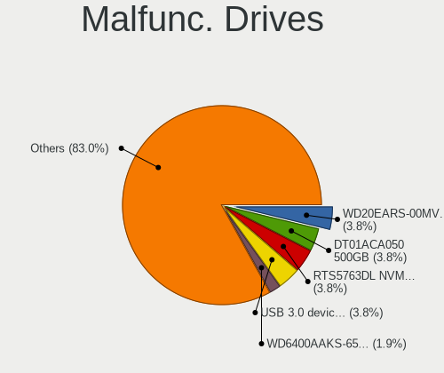

| Model                              | Desktops | Drives | Percent |
|------------------------------------|----------|--------|---------|
| WDC WD6400AAKS-65A7B0 640GB        | 1        | 1      | 4%      |
| WDC WD5000AAKX-60U6AA0 500GB       | 1        | 1      | 4%      |
| WDC WD5000AAKS-00E4A0 500GB        | 1        | 1      | 4%      |
| WDC WD30EZRX-00DC0B0 3TB           | 1        | 1      | 4%      |
| WDC WD20EARX-00PASB0 2TB           | 1        | 1      | 4%      |
| WDC WD20EARS-00MVWB0 2TB           | 1        | 1      | 4%      |
| WDC WD10EZEX-60ZF5A0 1TB           | 1        | 1      | 4%      |
| WDC WD10EARS-00Y5B1 1TB            | 1        | 1      | 4%      |
| WDC WD10EALX-009BA0 1TB            | 1        | 1      | 4%      |
| WDC WD10EADS-22M2B0 1TB            | 1        | 1      | 4%      |
| WDC WD10EADS-00M2B0 1TB            | 1        | 1      | 4%      |
| Seagate ST9250827AS 250GB          | 1        | 1      | 4%      |
| Seagate ST4000DM004-2CV104 4TB     | 1        | 1      | 4%      |
| Seagate ST2000LM003 HN-M201RAD 2TB | 1        | 1      | 4%      |
| Seagate ST2000DL003-9VT166 2TB     | 1        | 1      | 4%      |
| SanDisk SD6SF1M128G1022I 128GB SSD | 1        | 1      | 4%      |
| OCZ TRION100 480GB SSD             | 1        | 1      | 4%      |
| Kingston SV300S37A120G 120GB SSD   | 1        | 1      | 4%      |
| Kingston SH103S3240G 240GB         | 1        | 1      | 4%      |
| Hitachi HTS543216L9A300 160GB      | 1        | 1      | 4%      |
| HGST HTS725050A7E635 OPAL 500GB    | 1        | 3      | 4%      |
| HGST HTS725050A7E630 500GB         | 1        | 4      | 4%      |
| Hewlett-Packard SSD EX900 500GB    | 1        | 1      | 4%      |
| Crucial CT960M500SSD1 960GB        | 1        | 1      | 4%      |
| A-DATA Technology SU800 1TB SSD    | 1        | 1      | 4%      |

Malfunc. Drive Vendor
---------------------

Vendors of faulty drives

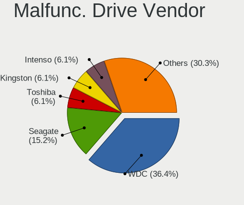

| Vendor            | Desktops | Drives | Percent |
|-------------------|----------|--------|---------|
| WDC               | 9        | 11     | 40.91%  |
| Seagate           | 4        | 4      | 18.18%  |
| Kingston          | 2        | 2      | 9.09%   |
| SanDisk           | 1        | 1      | 4.55%   |
| OCZ               | 1        | 1      | 4.55%   |
| Hitachi           | 1        | 1      | 4.55%   |
| HGST              | 1        | 7      | 4.55%   |
| Hewlett-Packard   | 1        | 1      | 4.55%   |
| Crucial           | 1        | 1      | 4.55%   |
| A-DATA Technology | 1        | 1      | 4.55%   |

Malfunc. HDD Vendor
-------------------

Vendors of faulty HDD drives

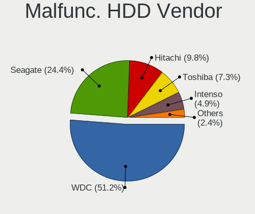

| Vendor  | Desktops | Drives | Percent |
|---------|----------|--------|---------|
| WDC     | 9        | 11     | 60%     |
| Seagate | 4        | 4      | 26.67%  |
| Hitachi | 1        | 1      | 6.67%   |
| HGST    | 1        | 7      | 6.67%   |

Malfunc. Drive Kind
-------------------

Kinds of faulty drives

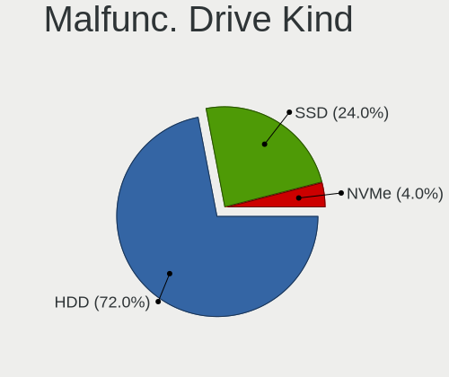

| Kind | Desktops | Drives | Percent |
|------|----------|--------|---------|
| HDD  | 13       | 23     | 65%     |
| SSD  | 6        | 6      | 30%     |
| NVMe | 1        | 1      | 5%      |

Failed Drives
-------------

Failed drive models

Zero info for selected period =(

Failed Drive Vendor
-------------------

Failed drive vendors

Zero info for selected period =(

Drive Status
------------

Number of failed and malfunc. drives

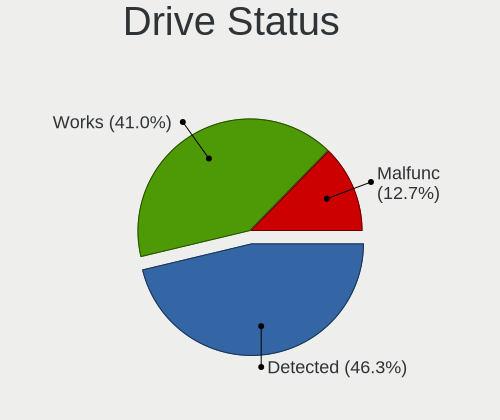

| Status   | Desktops | Drives | Percent |
|----------|----------|--------|---------|
| Detected | 76       | 266    | 48.72%  |
| Works    | 61       | 186    | 39.1%   |
| Malfunc  | 19       | 30     | 12.18%  |

Storage controller
------------------

Storage Vendor
--------------

Storage controller vendors

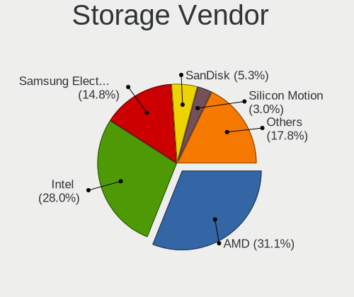

| Vendor                       | Desktops | Percent |
|------------------------------|----------|---------|
| AMD                          | 67       | 32.06%  |
| Intel                        | 59       | 28.23%  |
| Samsung Electronics          | 29       | 13.88%  |
| SanDisk                      | 10       | 4.78%   |
| Phison Electronics           | 8        | 3.83%   |
| Silicon Motion               | 7        | 3.35%   |
| Micron/Crucial Technology    | 6        | 2.87%   |
| Marvell Technology Group     | 5        | 2.39%   |
| Kingston Technology Company  | 4        | 1.91%   |
| ASMedia Technology           | 4        | 1.91%   |
| ADATA Technology             | 3        | 1.44%   |
| JMicron Technology           | 2        | 0.96%   |
| Union Memory (Shenzhen)      | 1        | 0.48%   |
| Toshiba America Info Systems | 1        | 0.48%   |
| Shenzhen Longsys Electronics | 1        | 0.48%   |
| Realtek Semiconductor        | 1        | 0.48%   |
| MAXIO Technology (Hangzhou)  | 1        | 0.48%   |

Storage Model
-------------

Storage controller models

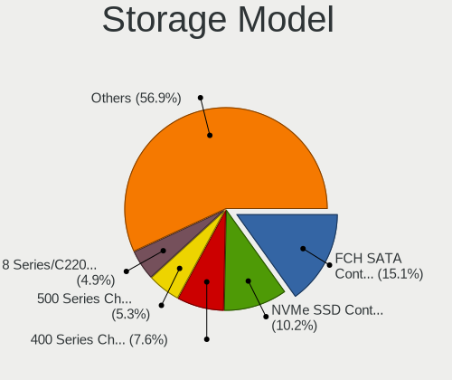

| Model                                                                          | Desktops | Percent |
|--------------------------------------------------------------------------------|----------|---------|
| AMD FCH SATA Controller [AHCI mode]                                            | 40       | 15.56%  |
| Samsung NVMe SSD Controller SM981/PM981/PM983                                  | 25       | 9.73%   |
| AMD 400 Series Chipset SATA Controller                                         | 17       | 6.61%   |
| AMD 500 Series Chipset SATA Controller                                         | 15       | 5.84%   |
| Intel 8 Series/C220 Series Chipset Family 6-port SATA Controller 1 [AHCI mode] | 12       | 4.67%   |
| Phison E12 NVMe Controller                                                     | 6        | 2.33%   |
| Intel 6 Series/C200 Series Chipset Family 6 port Desktop SATA AHCI Controller  | 6        | 2.33%   |
| Intel 200 Series PCH SATA controller [AHCI mode]                               | 6        | 2.33%   |
| Intel Q170/Q150/B150/H170/H110/Z170/CM236 Chipset SATA Controller [AHCI Mode]  | 5        | 1.95%   |
| Intel Cannon Lake PCH SATA AHCI Controller                                     | 5        | 1.95%   |
| Intel 7 Series/C210 Series Chipset Family 6-port SATA Controller [AHCI mode]   | 5        | 1.95%   |
| Silicon Motion SM2263EN/SM2263XT SSD Controller                                | 4        | 1.56%   |
| SanDisk WD Blue SN550 NVMe SSD                                                 | 4        | 1.56%   |
| Samsung NVMe SSD Controller SM961/PM961/SM963                                  | 4        | 1.56%   |
| ASMedia ASM1062 Serial ATA Controller                                          | 4        | 1.56%   |
| AMD SB7x0/SB8x0/SB9x0 IDE Controller                                           | 4        | 1.56%   |
| AMD 300 Series Chipset SATA Controller                                         | 4        | 1.56%   |
| Silicon Motion SM2262/SM2262EN SSD Controller                                  | 3        | 1.17%   |
| SanDisk WD Black 2018/SN750 / PC SN720 NVMe SSD                                | 3        | 1.17%   |
| Samsung NVMe SSD Controller PM9A1/PM9A3/980PRO                                 | 3        | 1.17%   |
| Micron/Crucial P2 NVMe PCIe SSD                                                | 3        | 1.17%   |
| Marvell Group 88SE9215 PCIe 2.0 x1 4-port SATA 6 Gb/s Controller               | 3        | 1.17%   |
| Intel SATA Controller [RAID mode]                                              | 3        | 1.17%   |
| AMD X399 Series Chipset SATA Controller                                        | 3        | 1.17%   |
| AMD SB7x0/SB8x0/SB9x0 SATA Controller [IDE mode]                               | 3        | 1.17%   |
| AMD SB7x0/SB8x0/SB9x0 SATA Controller [AHCI mode]                              | 3        | 1.17%   |
| AMD FCH SATA Controller D                                                      | 3        | 1.17%   |
| ADATA XPG SX8200 Pro PCIe Gen3x4 M.2 2280 Solid State Drive                    | 3        | 1.17%   |
| SanDisk WD Black SN750 / PC SN730 NVMe SSD                                     | 2        | 0.78%   |
| Samsung NVMe SSD Controller 980                                                | 2        | 0.78%   |
| Phison E16 PCIe4 NVMe Controller                                               | 2        | 0.78%   |
| Micron/Crucial NVMe Controller                                                 | 2        | 0.78%   |
| Marvell Group 88SE9172 SATA 6Gb/s Controller                                   | 2        | 0.78%   |
| Kingston Company Company Non-Volatile memory controller                        | 2        | 0.78%   |
| Kingston Company A2000 NVMe SSD                                                | 2        | 0.78%   |
| Intel SSD 660P Series                                                          | 2        | 0.78%   |
| Intel PROSet/Wireless WiFi Software extension                                  | 2        | 0.78%   |
| Intel 7 Series/C210 Series Chipset Family 4-port SATA Controller [IDE mode]    | 2        | 0.78%   |
| Intel 7 Series/C210 Series Chipset Family 2-port SATA Controller [IDE mode]    | 2        | 0.78%   |
| Intel 500 Series Chipset Family SATA AHCI Controller                           | 2        | 0.78%   |

Storage Kind
------------

Kind of storage controller (IDE, SATA, NVMe, SAS, ...)

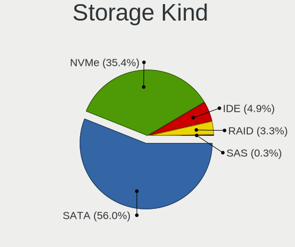

| Kind | Desktops | Percent |
|------|----------|---------|
| SATA | 113      | 57.36%  |
| NVMe | 67       | 34.01%  |
| IDE  | 10       | 5.08%   |
| RAID | 7        | 3.55%   |

Processor
---------

CPU Vendor
----------

Processor vendors

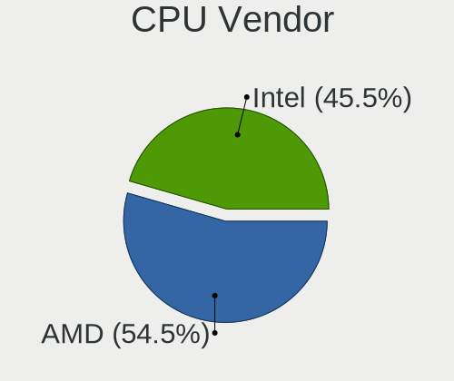

| Vendor | Desktops | Percent |
|--------|----------|---------|
| AMD    | 67       | 53.6%   |
| Intel  | 58       | 46.4%   |

CPU Model
---------

Processor models

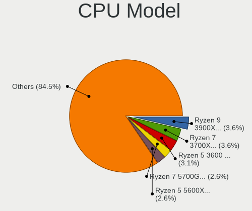

| Model                                       | Desktops | Percent |
|---------------------------------------------|----------|---------|
| AMD Ryzen 7 3700X 8-Core Processor          | 6        | 4.8%    |
| AMD Ryzen 9 3900X 12-Core Processor         | 5        | 4%      |
| AMD Ryzen 5 3600 6-Core Processor           | 5        | 4%      |
| Intel Core i7-4790 CPU @ 3.60GHz            | 3        | 2.4%    |
| AMD Ryzen 9 5950X 16-Core Processor         | 3        | 2.4%    |
| AMD Ryzen 7 5700G with Radeon Graphics      | 3        | 2.4%    |
| AMD Ryzen 7 2700X Eight-Core Processor      | 3        | 2.4%    |
| AMD Ryzen 5 3400G with Radeon Vega Graphics | 3        | 2.4%    |
| Intel Core i7-7700K CPU @ 4.20GHz           | 2        | 1.6%    |
| Intel Core i5-9600K CPU @ 3.70GHz           | 2        | 1.6%    |
| Intel Core i5-4590 CPU @ 3.30GHz            | 2        | 1.6%    |
| Intel Core i5-3470 CPU @ 3.20GHz            | 2        | 1.6%    |
| Intel Core i3-7100 CPU @ 3.90GHz            | 2        | 1.6%    |
| Intel Core i3-3220 CPU @ 3.30GHz            | 2        | 1.6%    |
| Intel Core i3-2100 CPU @ 3.10GHz            | 2        | 1.6%    |
| AMD Ryzen 7 5800X 8-Core Processor          | 2        | 1.6%    |
| AMD Ryzen 7 3800X 8-Core Processor          | 2        | 1.6%    |
| AMD Ryzen 5 5600X 6-Core Processor          | 2        | 1.6%    |
| AMD Ryzen 5 2600 Six-Core Processor         | 2        | 1.6%    |
| AMD Ryzen 5 2400G with Radeon Vega Graphics | 2        | 1.6%    |
| AMD Ryzen 3 3200G with Radeon Vega Graphics | 2        | 1.6%    |
| AMD FX-8350 Eight-Core Processor            | 2        | 1.6%    |
| Intel Xeon CPU W3550 @ 3.07GHz              | 1        | 0.8%    |
| Intel Xeon CPU E5-1680 v2 @ 3.00GHz         | 1        | 0.8%    |
| Intel Xeon CPU E3-1246 v3 @ 3.50GHz         | 1        | 0.8%    |
| Intel Pentium Dual-Core CPU E6600 @ 3.06GHz | 1        | 0.8%    |
| Intel Core i9-10900K CPU @ 3.70GHz          | 1        | 0.8%    |
| Intel Core i7-8700K CPU @ 3.70GHz           | 1        | 0.8%    |
| Intel Core i7-6850K CPU @ 3.60GHz           | 1        | 0.8%    |
| Intel Core i7-6700K CPU @ 4.00GHz           | 1        | 0.8%    |
| Intel Core i7-4790K CPU @ 4.00GHz           | 1        | 0.8%    |
| Intel Core i7-4770K CPU @ 3.50GHz           | 1        | 0.8%    |
| Intel Core i7-4770 CPU @ 3.40GHz            | 1        | 0.8%    |
| Intel Core i7-3770K CPU @ 3.50GHz           | 1        | 0.8%    |
| Intel Core i7-2600K CPU @ 3.40GHz           | 1        | 0.8%    |
| Intel Core i7-10700F CPU @ 2.90GHz          | 1        | 0.8%    |
| Intel Core i5-9600KF CPU @ 3.70GHz          | 1        | 0.8%    |
| Intel Core i5-9400F CPU @ 2.90GHz           | 1        | 0.8%    |
| Intel Core i5-9400 CPU @ 2.90GHz            | 1        | 0.8%    |
| Intel Core i5-8500 CPU @ 3.00GHz            | 1        | 0.8%    |

CPU Model Family
----------------

Processor model prefix

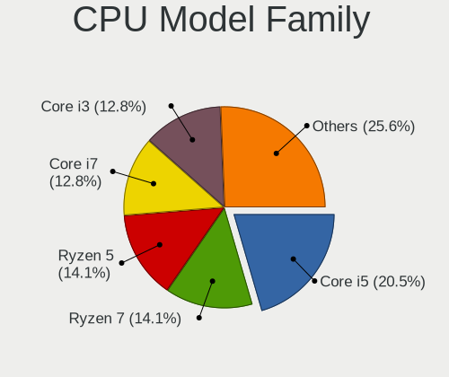

| Model                   | Desktops | Percent |
|-------------------------|----------|---------|
| Intel Core i5           | 22       | 17.6%   |
| AMD Ryzen 7             | 21       | 16.8%   |
| AMD Ryzen 5             | 19       | 15.2%   |
| Intel Core i7           | 14       | 11.2%   |
| Intel Core i3           | 14       | 11.2%   |
| AMD Ryzen 9             | 9        | 7.2%    |
| AMD Ryzen 3             | 5        | 4%      |
| Intel Xeon              | 3        | 2.4%    |
| AMD Ryzen Threadripper  | 3        | 2.4%    |
| AMD FX                  | 3        | 2.4%    |
| AMD A10                 | 2        | 1.6%    |
| Other                   | 1        | 0.8%    |
| Intel Pentium Dual-Core | 1        | 0.8%    |
| Intel Core i9           | 1        | 0.8%    |
| Intel Core 2 Quad       | 1        | 0.8%    |
| Intel Celeron           | 1        | 0.8%    |
| AMD Phenom II X6        | 1        | 0.8%    |
| AMD Phenom II X4        | 1        | 0.8%    |
| AMD Phenom II X2        | 1        | 0.8%    |
| AMD Athlon X4           | 1        | 0.8%    |
| AMD A8                  | 1        | 0.8%    |

CPU Cores
---------

Number of processor cores

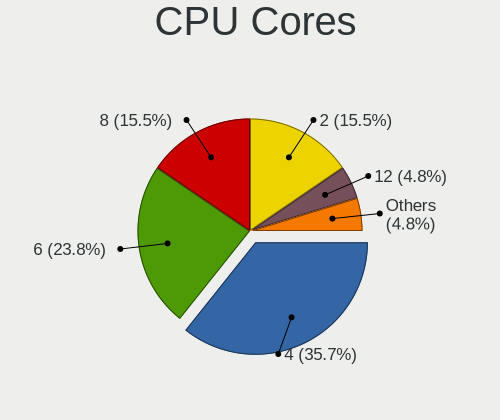

| Number | Desktops | Percent |
|--------|----------|---------|
| 4      | 43       | 34.4%   |
| 6      | 27       | 21.6%   |
| 8      | 23       | 18.4%   |
| 2      | 19       | 15.2%   |
| 12     | 7        | 5.6%    |
| 16     | 4        | 3.2%    |
| 24     | 1        | 0.8%    |
| 10     | 1        | 0.8%    |

CPU Sockets
-----------

Number of sockets

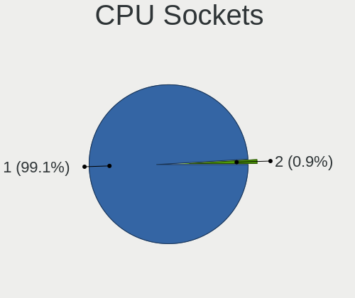

| Number | Desktops | Percent |
|--------|----------|---------|
| 1      | 125      | 100%    |

CPU Threads
-----------

Threads per core (Hyper-Threading)

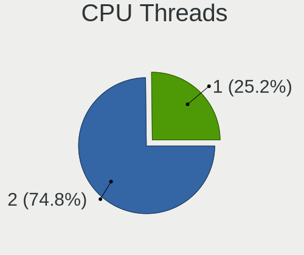

| Number | Desktops | Percent |
|--------|----------|---------|
| 2      | 94       | 75.2%   |
| 1      | 31       | 24.8%   |

CPU Op-Modes
------------

CPU Operation Modes (32-bit, 64-bit)

| Op mode        | Desktops | Percent |
|----------------|----------|---------|
| 32-bit, 64-bit | 125      | 100%    |

CPU Microcode
-------------

Microcode number

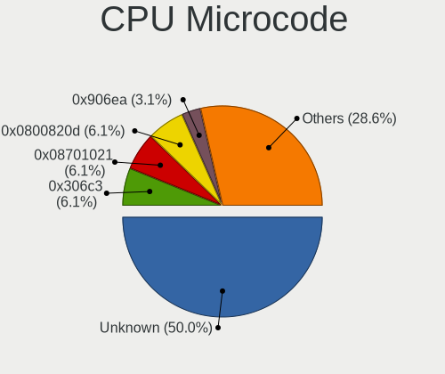

| Number     | Desktops | Percent |
|------------|----------|---------|
| Unknown    | 66       | 51.97%  |
| 0x08701021 | 9        | 7.09%   |
| 0x306c3    | 7        | 5.51%   |
| 0x0800820d | 5        | 3.94%   |
| 0x306a9    | 4        | 3.15%   |
| 0x906ea    | 3        | 2.36%   |
| 0x206a7    | 3        | 2.36%   |
| 0xa0653    | 2        | 1.57%   |
| 0x506e3    | 2        | 1.57%   |
| 0x0a50000c | 2        | 1.57%   |
| 0x0a201204 | 2        | 1.57%   |
| 0x08108109 | 2        | 1.57%   |
| 0x0810100b | 2        | 1.57%   |
| 0x08001137 | 2        | 1.57%   |
| 0xa0655    | 1        | 0.79%   |
| 0x906ed    | 1        | 0.79%   |
| 0x906ec    | 1        | 0.79%   |
| 0x906eb    | 1        | 0.79%   |
| 0x906e9    | 1        | 0.79%   |
| 0x106a5    | 1        | 0.79%   |
| 0x1067a    | 1        | 0.79%   |
| 0x0a20120a | 1        | 0.79%   |
| 0x0a201016 | 1        | 0.79%   |
| 0x0a201009 | 1        | 0.79%   |
| 0x08701013 | 1        | 0.79%   |
| 0x08101016 | 1        | 0.79%   |
| 0x06003106 | 1        | 0.79%   |
| 0x06000852 | 1        | 0.79%   |
| 0x010000dc | 1        | 0.79%   |
| 0x00000000 | 1        | 0.79%   |

CPU Microarch
-------------

Microarchitecture

| Name        | Desktops | Percent |
|-------------|----------|---------|
| Zen 2       | 20       | 16%     |
| Zen 3       | 16       | 12.8%   |
| KabyLake    | 15       | 12%     |
| Zen+        | 13       | 10.4%   |
| Haswell     | 13       | 10.4%   |
| IvyBridge   | 9        | 7.2%    |
| Zen         | 8        | 6.4%    |
| SandyBridge | 6        | 4.8%    |
| CometLake   | 6        | 4.8%    |
| Piledriver  | 4        | 3.2%    |
| Steamroller | 3        | 2.4%    |
| Skylake     | 3        | 2.4%    |
| K10         | 3        | 2.4%    |
| Penryn      | 2        | 1.6%    |
| Westmere    | 1        | 0.8%    |
| Nehalem     | 1        | 0.8%    |
| Broadwell   | 1        | 0.8%    |
| Unknown     | 1        | 0.8%    |

Graphics
--------

GPU Vendor
----------

Vendors of graphics cards

| Vendor | Desktops | Percent |
|--------|----------|---------|
| AMD    | 58       | 41.43%  |
| Nvidia | 56       | 40%     |
| Intel  | 26       | 18.57%  |

GPU Model
---------

Graphics card models

| Model                                                                       | Desktops | Percent |
|-----------------------------------------------------------------------------|----------|---------|
| AMD Ellesmere [Radeon RX 470/480/570/570X/580/580X/590]                     | 13       | 9.03%   |
| Intel Xeon E3-1200 v3/4th Gen Core Processor Integrated Graphics Controller | 8        | 5.56%   |
| AMD Vega 10 XL/XT [Radeon RX Vega 56/64]                                    | 5        | 3.47%   |
| AMD Navi 22 [Radeon RX 6700/6700 XT/6750 XT / 6800M]                        | 5        | 3.47%   |
| AMD Navi 10 [Radeon RX 5600 OEM/5600 XT / 5700/5700 XT]                     | 5        | 3.47%   |
| Intel Xeon E3-1200 v2/3rd Gen Core processor Graphics Controller            | 4        | 2.78%   |
| AMD Picasso/Raven 2 [Radeon Vega Series / Radeon Vega Mobile Series]        | 4        | 2.78%   |
| AMD Navi 21 [Radeon RX 6800/6800 XT / 6900 XT]                              | 4        | 2.78%   |
| Nvidia TU104 [GeForce RTX 2080 Rev. A]                                      | 3        | 2.08%   |
| Nvidia GP104 [GeForce GTX 1070]                                             | 3        | 2.08%   |
| Nvidia GP102 [GeForce GTX 1080 Ti]                                          | 3        | 2.08%   |
| Nvidia GM204 [GeForce GTX 970]                                              | 3        | 2.08%   |
| Intel 2nd Generation Core Processor Family Integrated Graphics Controller   | 3        | 2.08%   |
| AMD Raven Ridge [Radeon Vega Series / Radeon Vega Mobile Series]            | 3        | 2.08%   |
| Nvidia TU116 [GeForce GTX 1660 SUPER]                                       | 2        | 1.39%   |
| Nvidia TU116 [GeForce GTX 1650 SUPER]                                       | 2        | 1.39%   |
| Nvidia GT218 [GeForce 210]                                                  | 2        | 1.39%   |
| Nvidia GP107 [GeForce GTX 1050]                                             | 2        | 1.39%   |
| Nvidia GP106 [GeForce GTX 1060 6GB]                                         | 2        | 1.39%   |
| Nvidia GP104 [GeForce GTX 1080]                                             | 2        | 1.39%   |
| Nvidia GP104 [GeForce GTX 1070 Ti]                                          | 2        | 1.39%   |
| Nvidia GM206 [GeForce GTX 960]                                              | 2        | 1.39%   |
| Nvidia GM204 [GeForce GTX 980]                                              | 2        | 1.39%   |
| Nvidia GK208B [GeForce GT 710]                                              | 2        | 1.39%   |
| Nvidia GK106 [GeForce GTX 660]                                              | 2        | 1.39%   |
| Nvidia GA106 [GeForce RTX 3060 Lite Hash Rate]                              | 2        | 1.39%   |
| Intel HD Graphics 630                                                       | 2        | 1.39%   |
| AMD Tahiti PRO [Radeon HD 7950/8950 OEM / R9 280]                           | 2        | 1.39%   |
| AMD Curacao PRO [Radeon R7 370 / R9 270/370 OEM]                            | 2        | 1.39%   |
| AMD Cezanne [Radeon Vega Series / Radeon Vega Mobile Series]                | 2        | 1.39%   |
| AMD Baffin [Radeon RX 460/560D / Pro 450/455/460/555/555X/560/560X]         | 2        | 1.39%   |
| Nvidia TU116 [GeForce GTX 1660]                                             | 1        | 0.69%   |
| Nvidia TU106 [GeForce RTX 2060 Rev. A]                                      | 1        | 0.69%   |
| Nvidia TU104 [GeForce RTX 2080]                                             | 1        | 0.69%   |
| Nvidia TU104 [GeForce RTX 2070 SUPER]                                       | 1        | 0.69%   |
| Nvidia GP108 [GeForce GT 1030]                                              | 1        | 0.69%   |
| Nvidia GP107 [GeForce GTX 1050 Ti]                                          | 1        | 0.69%   |
| Nvidia GP106 [GeForce GTX 1060 3GB]                                         | 1        | 0.69%   |
| Nvidia GM107 [GeForce GTX 750]                                              | 1        | 0.69%   |
| Nvidia GM107 [GeForce GTX 750 Ti]                                           | 1        | 0.69%   |

GPU Combo
---------

Combinations of graphics cards

| Name           | Desktops | Percent |
|----------------|----------|---------|
| 1 x AMD        | 53       | 41.73%  |
| 1 x Nvidia     | 48       | 37.8%   |
| 1 x Intel      | 15       | 11.81%  |
| AMD + Nvidia   | 4        | 3.15%   |
| 2 x Nvidia     | 2        | 1.57%   |
| 2 x AMD        | 2        | 1.57%   |
| Intel + Nvidia | 2        | 1.57%   |
| Intel + AMD    | 1        | 0.79%   |

GPU Driver
----------

Free vs proprietary

| Driver      | Desktops | Percent |
|-------------|----------|---------|
| Free        | 78       | 61.9%   |
| Proprietary | 48       | 38.1%   |

GPU Memory
----------

Total video memory

| Size in GB | Desktops | Percent |
|------------|----------|---------|
| Unknown    | 48       | 37.8%   |
| 7.01-8.0   | 22       | 17.32%  |
| 3.01-4.0   | 16       | 12.6%   |
| 1.01-2.0   | 11       | 8.66%   |
| 8.01-16.0  | 9        | 7.09%   |
| 5.01-6.0   | 7        | 5.51%   |
| 0.51-1.0   | 7        | 5.51%   |
| 0.01-0.5   | 4        | 3.15%   |
| 2.01-3.0   | 2        | 1.57%   |
| 16.01-24.0 | 1        | 0.79%   |

Monitor
-------

Monitor Vendor
--------------

Monitor vendors

| Vendor               | Desktops | Percent |
|----------------------|----------|---------|
| Samsung Electronics  | 29       | 17.26%  |
| Acer                 | 17       | 10.12%  |
| Goldstar             | 16       | 9.52%   |
| Dell                 | 16       | 9.52%   |
| AOC                  | 11       | 6.55%   |
| Hewlett-Packard      | 10       | 5.95%   |
| Ancor Communications | 10       | 5.95%   |
| BenQ                 | 9        | 5.36%   |
| Unknown              | 6        | 3.57%   |
| MSI                  | 4        | 2.38%   |
| Gigabyte Technology  | 4        | 2.38%   |
| ASUSTek Computer     | 4        | 2.38%   |
| Philips              | 3        | 1.79%   |
| Vizio                | 2        | 1.19%   |
| Toshiba              | 2        | 1.19%   |
| Sony                 | 2        | 1.19%   |
| NEC Computers        | 2        | 1.19%   |
| LG Electronics       | 2        | 1.19%   |
| Iiyama               | 2        | 1.19%   |
| Xiaomi               | 1        | 0.6%    |
| ViewSonic            | 1        | 0.6%    |
| ONN                  | 1        | 0.6%    |
| MiTAC                | 1        | 0.6%    |
| Microstep            | 1        | 0.6%    |
| Mi                   | 1        | 0.6%    |
| LTM                  | 1        | 0.6%    |
| Lenovo Group Limited | 1        | 0.6%    |
| Lenovo               | 1        | 0.6%    |
| Insignia             | 1        | 0.6%    |
| HPN                  | 1        | 0.6%    |
| HKC                  | 1        | 0.6%    |
| Fujitsu Siemens      | 1        | 0.6%    |
| Element              | 1        | 0.6%    |
| AOpen                | 1        | 0.6%    |
| Alba                 | 1        | 0.6%    |
| Unknown              | 1        | 0.6%    |

Monitor Model
-------------

Monitor models

| Model                                                                  | Desktops | Percent |
|------------------------------------------------------------------------|----------|---------|
| Samsung Electronics C24F390 SAM0D2C 1920x1080 521x293mm 23.5-inch      | 3        | 1.64%   |
| Samsung Electronics S34J55x SAM0F72 3440x1440 797x333mm 34.0-inch      | 2        | 1.09%   |
| Philips PHL 276E8V PHLC18F 3840x2160 600x340mm 27.2-inch               | 2        | 1.09%   |
| Goldstar FULL HD GSM5B55 1920x1080 480x270mm 21.7-inch                 | 2        | 1.09%   |
| Dell 1909W DELA03C 1440x900 408x255mm 18.9-inch                        | 2        | 1.09%   |
| Ancor Communications ASUS PB287Q ACI28A3 3840x2160 621x341mm 27.9-inch | 2        | 1.09%   |
| Acer X223W ACR0009 1680x1050 473x296mm 22.0-inch                       | 2        | 1.09%   |
| Xiaomi Mi TV XMD009A 2880x1800 480x270mm 21.7-inch                     | 1        | 0.55%   |
| Vizio P502ui-B1E VIZ1013 3840x2160 1095x616mm 49.5-inch                | 1        | 0.55%   |
| Vizio E231-B1 VIZ0095 1360x768 534x311mm 24.3-inch                     | 1        | 0.55%   |
| ViewSonic VX2270 SERIES VSCE02C 1920x1080 476x267mm 21.5-inch          | 1        | 0.55%   |
| Unknown LCD Monitor XXX AAA 1366x768                                   | 1        | 0.55%   |
| Unknown LCD Monitor SAMSUNG 3840x2160                                  | 1        | 0.55%   |
| Unknown LCD Monitor SAMSUNG                                            | 1        | 0.55%   |
| Unknown LCD Monitor RJT HDMI                                           | 1        | 0.55%   |
| Unknown LCD Monitor LHC 32-QHD-144-C 4480x1440                         | 1        | 0.55%   |
| Unknown LCD Monitor Hitachi/HINT W240D DVI                             | 1        | 0.55%   |
| Toshiba TV TSB0206 1920x1080 886x498mm 40.0-inch                       | 1        | 0.55%   |
| Toshiba TV TSB0105 1920x540 708x398mm 32.0-inch                        | 1        | 0.55%   |
| Sony TV SNY1802 1920x1080                                              | 1        | 0.55%   |
| Sony TV SNY0801 1360x768                                               | 1        | 0.55%   |
| Samsung Electronics U32J59x SAM0F35 3840x2160 697x392mm 31.5-inch      | 1        | 0.55%   |
| Samsung Electronics U28E850 SAM0CCB 3840x2160 607x345mm 27.5-inch      | 1        | 0.55%   |
| Samsung Electronics U28E590 SAM0C4D 3840x2160 607x345mm 27.5-inch      | 1        | 0.55%   |
| Samsung Electronics T24E390 SAM0C20 1920x1080 521x293mm 23.5-inch      | 1        | 0.55%   |
| Samsung Electronics SyncMaster SAM05B0 1920x1080                       | 1        | 0.55%   |
| Samsung Electronics SyncMaster SAM04D5 1920x540                        | 1        | 0.55%   |
| Samsung Electronics SyncMaster SAM00BB 1280x1024 376x301mm 19.0-inch   | 1        | 0.55%   |
| Samsung Electronics SMS24A350H SAM07D6 1920x1080 531x299mm 24.0-inch   | 1        | 0.55%   |
| Samsung Electronics S24R35xFZ SAM71A8 1920x1080 527x296mm 23.8-inch    | 1        | 0.55%   |
| Samsung Electronics S24E450 SAM0CA0 1920x1080 531x299mm 24.0-inch      | 1        | 0.55%   |
| Samsung Electronics S24D300 SAM0B42 1920x1080 531x299mm 24.0-inch      | 1        | 0.55%   |
| Samsung Electronics LU28R55 SAM1016 3840x2160 632x360mm 28.6-inch      | 1        | 0.55%   |
| Samsung Electronics LS27A800U SAM71A4 3840x2160 600x340mm 27.2-inch    | 1        | 0.55%   |
| Samsung Electronics LS24AG30x SAM7178 1920x1080 530x300mm 24.0-inch    | 1        | 0.55%   |
| Samsung Electronics LCD Monitor SyncMaster 3840x1080                   | 1        | 0.55%   |
| Samsung Electronics LCD Monitor SyncMaster 1920x1080                   | 1        | 0.55%   |
| Samsung Electronics LCD Monitor SAM0B7C 1920x1080 890x500mm 40.2-inch  | 1        | 0.55%   |
| Samsung Electronics LCD Monitor SAM0B30 1920x1080 885x498mm 40.0-inch  | 1        | 0.55%   |
| Samsung Electronics LCD Monitor SAM0A7A 1920x1080 1060x626mm 48.5-inch | 1        | 0.55%   |

Monitor Resolution
------------------

Monitor screen resolution

| Resolution         | Desktops | Percent |
|--------------------|----------|---------|
| 1920x1080 (FHD)    | 73       | 45.06%  |
| 3840x2160 (4K)     | 19       | 11.73%  |
| 2560x1440 (QHD)    | 10       | 6.17%   |
| Unknown            | 9        | 5.56%   |
| 3440x1440          | 8        | 4.94%   |
| 1680x1050 (WSXGA+) | 6        | 3.7%    |
| 3840x1080          | 5        | 3.09%   |
| 2560x1080          | 5        | 3.09%   |
| 1366x768 (WXGA)    | 5        | 3.09%   |
| 1280x1024 (SXGA)   | 4        | 2.47%   |
| 1920x1200 (WUXGA)  | 3        | 1.85%   |
| 1600x900 (HD+)     | 3        | 1.85%   |
| 1440x900 (WXGA+)   | 3        | 1.85%   |
| 7680x2160          | 2        | 1.23%   |
| 1360x768           | 2        | 1.23%   |
| 9600x2160          | 1        | 0.62%   |
| 4480x1440          | 1        | 0.62%   |
| 3840x1200          | 1        | 0.62%   |
| 2048x1152          | 1        | 0.62%   |
| 1920x540           | 1        | 0.62%   |

Monitor Diagonal
----------------

Diagonal size in inches

| Inches  | Desktops | Percent |
|---------|----------|---------|
| 27      | 33       | 20.63%  |
| 24      | 25       | 15.63%  |
| Unknown | 25       | 15.63%  |
| 23      | 17       | 10.63%  |
| 21      | 9        | 5.63%   |
| 34      | 8        | 5%      |
| 22      | 7        | 4.38%   |
| 19      | 7        | 4.38%   |
| 31      | 6        | 3.75%   |
| 72      | 3        | 1.88%   |
| 49      | 3        | 1.88%   |
| 20      | 3        | 1.88%   |
| 40      | 2        | 1.25%   |
| 28      | 2        | 1.25%   |
| 74      | 1        | 0.63%   |
| 58      | 1        | 0.63%   |
| 54      | 1        | 0.63%   |
| 48      | 1        | 0.63%   |
| 33      | 1        | 0.63%   |
| 32      | 1        | 0.63%   |
| 26      | 1        | 0.63%   |
| 25      | 1        | 0.63%   |
| 18      | 1        | 0.63%   |
| 17      | 1        | 0.63%   |

Monitor Width
-------------

Physical width

| Width in mm | Desktops | Percent |
|-------------|----------|---------|
| 501-600     | 64       | 42.38%  |
| Unknown     | 25       | 16.56%  |
| 401-500     | 23       | 15.23%  |
| 601-700     | 13       | 8.61%   |
| 701-800     | 10       | 6.62%   |
| 1001-1500   | 6        | 3.97%   |
| 1501-2000   | 4        | 2.65%   |
| 351-400     | 3        | 1.99%   |
| 801-900     | 2        | 1.32%   |
| 301-350     | 1        | 0.66%   |

Aspect Ratio
------------

Proportional relationship between the width and the height

| Ratio   | Desktops | Percent |
|---------|----------|---------|
| 16/9    | 85       | 60.28%  |
| Unknown | 23       | 16.31%  |
| 16/10   | 17       | 12.06%  |
| 21/9    | 9        | 6.38%   |
| 5/4     | 4        | 2.84%   |
| 32/9    | 3        | 2.13%   |

Monitor Area
------------

Area in inch²

| Area in inch² | Desktops | Percent |
|----------------|----------|---------|
| 201-250        | 44       | 28.57%  |
| 301-350        | 34       | 22.08%  |
| Unknown        | 25       | 16.23%  |
| 351-500        | 17       | 11.04%  |
| 151-200        | 11       | 7.14%   |
| 251-300        | 9        | 5.84%   |
| More than 1000 | 8        | 5.19%   |
| 501-1000       | 4        | 2.6%    |
| 141-150        | 2        | 1.3%    |

Pixel Density
-------------

Pixels per inch

| Density | Desktops | Percent |
|---------|----------|---------|
| 51-100  | 74       | 52.86%  |
| Unknown | 25       | 17.86%  |
| 101-120 | 22       | 15.71%  |
| 121-160 | 8        | 5.71%   |
| 1-50    | 7        | 5%      |
| 161-240 | 4        | 2.86%   |

Multiple Monitors
-----------------

Total monitors connected

| Total | Desktops | Percent |
|-------|----------|---------|
| 1     | 73       | 57.48%  |
| 2     | 38       | 29.92%  |
| 3     | 13       | 10.24%  |
| 0     | 3        | 2.36%   |

Network
-------

Net Controller Vendor
---------------------

Controller vendors

| Vendor                | Desktops | Percent |
|-----------------------|----------|---------|
| Realtek Semiconductor | 85       | 44.27%  |
| Intel                 | 57       | 29.69%  |
| Qualcomm Atheros      | 11       | 5.73%   |
| Broadcom              | 5        | 2.6%    |
| Ralink Technology     | 4        | 2.08%   |
| NetGear               | 4        | 2.08%   |
| TP-Link               | 3        | 1.56%   |
| Microsoft             | 3        | 1.56%   |
| MediaTek              | 3        | 1.56%   |
| Linksys               | 3        | 1.56%   |
| Aquantia              | 3        | 1.56%   |
| Ralink                | 2        | 1.04%   |
| DisplayLink           | 2        | 1.04%   |
| Samsung Electronics   | 1        | 0.52%   |
| InterBiometrics       | 1        | 0.52%   |
| Holtek Semiconductor  | 1        | 0.52%   |
| Belkin Components     | 1        | 0.52%   |
| ASIX Electronics      | 1        | 0.52%   |
| Alteon Networks       | 1        | 0.52%   |
| Accton Technology     | 1        | 0.52%   |

Net Controller Model
--------------------

Controller models

| Model                                                               | Desktops | Percent |
|---------------------------------------------------------------------|----------|---------|
| Realtek RTL8111/8168/8411 PCI Express Gigabit Ethernet Controller   | 68       | 31.05%  |
| Intel I211 Gigabit Network Connection                               | 16       | 7.31%   |
| Realtek RTL8125 2.5GbE Controller                                   | 10       | 4.57%   |
| Intel Wi-Fi 6 AX200                                                 | 10       | 4.57%   |
| Intel Wireless-AC 9260                                              | 7        | 3.2%    |
| Intel Ethernet Controller I225-V                                    | 7        | 3.2%    |
| Realtek RTL8821CE 802.11ac PCIe Wireless Network Adapter            | 6        | 2.74%   |
| Intel Dual Band Wireless-AC 3168NGW [Stone Peak]                    | 5        | 2.28%   |
| Intel Ethernet Connection I217-LM                                   | 4        | 1.83%   |
| Ralink RT2870/RT3070 Wireless Adapter                               | 3        | 1.37%   |
| Qualcomm Atheros Killer E220x Gigabit Ethernet Controller           | 3        | 1.37%   |
| Intel Wi-Fi 6 AX210/AX211/AX411 160MHz                              | 3        | 1.37%   |
| Intel Ethernet Connection (2) I219-V                                | 3        | 1.37%   |
| Intel 82579LM Gigabit Network Connection (Lewisville)               | 3        | 1.37%   |
| Realtek RTL8822BE 802.11a/b/g/n/ac WiFi adapter                     | 2        | 0.91%   |
| Realtek RTL810xE PCI Express Fast Ethernet controller               | 2        | 0.91%   |
| Qualcomm Atheros QCA9565 / AR9565 Wireless Network Adapter          | 2        | 0.91%   |
| Qualcomm Atheros AR8161 Gigabit Ethernet                            | 2        | 0.91%   |
| NetGear A6210                                                       | 2        | 0.91%   |
| Microsoft XBOX ACC                                                  | 2        | 0.91%   |
| Linksys AE6000 802.11a/b/g/n/ac Wireless Adapter [MediaTek MT7610U] | 2        | 0.91%   |
| Intel Wireless 7265                                                 | 2        | 0.91%   |
| Aquantia AQC107 NBase-T/IEEE 802.3bz Ethernet Controller [AQtion]   | 2        | 0.91%   |
| TP-Link TL-WN823N v2/v3 [Realtek RTL8192EU]                         | 1        | 0.46%   |
| TP-Link TL-WN722N v2/v3 [Realtek RTL8188EUS]                        | 1        | 0.46%   |
| TP-Link Archer T9UH v1 [Realtek RTL8814AU]                          | 1        | 0.46%   |
| Samsung Galaxy series, misc. (tethering mode)                       | 1        | 0.46%   |
| Realtek USB 10/100/1G/2.5G LAN                                      | 1        | 0.46%   |
| Realtek RTL88x2bu [AC1200 Techkey]                                  | 1        | 0.46%   |
| Realtek RTL8852AE 802.11ax PCIe Wireless Network Adapter            | 1        | 0.46%   |
| Realtek RTL8814AU 802.11a/b/g/n/ac Wireless Adapter                 | 1        | 0.46%   |
| Realtek RTL8191SU 802.11n WLAN Adapter                              | 1        | 0.46%   |
| Realtek RTL8188RU 802.11n WLAN Adapter                              | 1        | 0.46%   |
| Realtek RTL8188EUS 802.11n Wireless Network Adapter                 | 1        | 0.46%   |
| Realtek RTL8188EE Wireless Network Adapter                          | 1        | 0.46%   |
| Realtek RTL8153 Gigabit Ethernet Adapter                            | 1        | 0.46%   |
| Realtek RTL-8100/8101L/8139 PCI Fast Ethernet Adapter               | 1        | 0.46%   |
| Realtek Killer E2600 Gigabit Ethernet Controller                    | 1        | 0.46%   |
| Ralink Wireless Adapter Canyon CN-WF511                             | 1        | 0.46%   |
| Ralink MT7601U Wireless Adapter                                     | 1        | 0.46%   |

Wireless Vendor
---------------

Wireless vendors

| Vendor                | Desktops | Percent |
|-----------------------|----------|---------|
| Intel                 | 32       | 42.67%  |
| Realtek Semiconductor | 15       | 20%     |
| Ralink Technology     | 4        | 5.33%   |
| Qualcomm Atheros      | 4        | 5.33%   |
| NetGear               | 4        | 5.33%   |
| TP-Link               | 3        | 4%      |
| Microsoft             | 3        | 4%      |
| Linksys               | 3        | 4%      |
| Broadcom              | 3        | 4%      |
| Ralink                | 2        | 2.67%   |
| MediaTek              | 1        | 1.33%   |
| Accton Technology     | 1        | 1.33%   |

Wireless Model
--------------

Wireless models

| Model                                                                     | Desktops | Percent |
|---------------------------------------------------------------------------|----------|---------|
| Intel Wi-Fi 6 AX200                                                       | 10       | 13.33%  |
| Intel Wireless-AC 9260                                                    | 7        | 9.33%   |
| Realtek RTL8821CE 802.11ac PCIe Wireless Network Adapter                  | 6        | 8%      |
| Intel Dual Band Wireless-AC 3168NGW [Stone Peak]                          | 5        | 6.67%   |
| Ralink RT2870/RT3070 Wireless Adapter                                     | 3        | 4%      |
| Intel Wi-Fi 6 AX210/AX211/AX411 160MHz                                    | 3        | 4%      |
| Realtek RTL8822BE 802.11a/b/g/n/ac WiFi adapter                           | 2        | 2.67%   |
| Qualcomm Atheros QCA9565 / AR9565 Wireless Network Adapter                | 2        | 2.67%   |
| NetGear A6210                                                             | 2        | 2.67%   |
| Microsoft XBOX ACC                                                        | 2        | 2.67%   |
| Linksys AE6000 802.11a/b/g/n/ac Wireless Adapter [MediaTek MT7610U]       | 2        | 2.67%   |
| Intel Wireless 7265                                                       | 2        | 2.67%   |
| TP-Link TL-WN823N v2/v3 [Realtek RTL8192EU]                               | 1        | 1.33%   |
| TP-Link TL-WN722N v2/v3 [Realtek RTL8188EUS]                              | 1        | 1.33%   |
| TP-Link Archer T9UH v1 [Realtek RTL8814AU]                                | 1        | 1.33%   |
| Realtek RTL88x2bu [AC1200 Techkey]                                        | 1        | 1.33%   |
| Realtek RTL8852AE 802.11ax PCIe Wireless Network Adapter                  | 1        | 1.33%   |
| Realtek RTL8814AU 802.11a/b/g/n/ac Wireless Adapter                       | 1        | 1.33%   |
| Realtek RTL8191SU 802.11n WLAN Adapter                                    | 1        | 1.33%   |
| Realtek RTL8188RU 802.11n WLAN Adapter                                    | 1        | 1.33%   |
| Realtek RTL8188EUS 802.11n Wireless Network Adapter                       | 1        | 1.33%   |
| Realtek RTL8188EE Wireless Network Adapter                                | 1        | 1.33%   |
| Ralink Wireless Adapter Canyon CN-WF511                                   | 1        | 1.33%   |
| Ralink MT7601U Wireless Adapter                                           | 1        | 1.33%   |
| Ralink RT5390R 802.11bgn PCIe Wireless Network Adapter                    | 1        | 1.33%   |
| Qualcomm Atheros QCA6174 802.11ac Wireless Network Adapter                | 1        | 1.33%   |
| Qualcomm Atheros AR9227 Wireless Network Adapter                          | 1        | 1.33%   |
| NetGear WNDA3100v1 802.11abgn [Atheros AR9170+AR9104]                     | 1        | 1.33%   |
| NetGear Nighthawk A7000 802.11ac Wireless Adapter AC1900 [Realtek 8814AU] | 1        | 1.33%   |
| Microsoft Wireless XBox Controller Dongle                                 | 1        | 1.33%   |
| MediaTek MT7921K (RZ608) Wi-Fi 6E 80MHz                                   | 1        | 1.33%   |
| Linksys WUSB54GC v1 802.11g Adapter [Ralink RT73]                         | 1        | 1.33%   |
| Intel Wireless 3165                                                       | 1        | 1.33%   |
| Intel Tiger Lake PCH CNVi WiFi                                            | 1        | 1.33%   |
| Intel Comet Lake PCH CNVi WiFi                                            | 1        | 1.33%   |
| Intel Centrino Wireless-N 2230                                            | 1        | 1.33%   |
| Intel Centrino Advanced-N 6205 [Taylor Peak]                              | 1        | 1.33%   |
| Broadcom Network controller                                               | 1        | 1.33%   |
| Broadcom BCM4352 802.11ac Wireless Network Adapter                        | 1        | 1.33%   |
| Broadcom BCM43142 802.11b/g/n                                             | 1        | 1.33%   |

Ethernet Vendor
---------------

Ethernet vendors

| Vendor                | Desktops | Percent |
|-----------------------|----------|---------|
| Realtek Semiconductor | 81       | 58.27%  |
| Intel                 | 37       | 26.62%  |
| Qualcomm Atheros      | 8        | 5.76%   |
| Aquantia              | 3        | 2.16%   |
| MediaTek              | 2        | 1.44%   |
| DisplayLink           | 2        | 1.44%   |
| Broadcom              | 2        | 1.44%   |
| Samsung Electronics   | 1        | 0.72%   |
| Belkin Components     | 1        | 0.72%   |
| ASIX Electronics      | 1        | 0.72%   |
| Alteon Networks       | 1        | 0.72%   |

Ethernet Model
--------------

Ethernet models

| Model                                                               | Desktops | Percent |
|---------------------------------------------------------------------|----------|---------|
| Realtek RTL8111/8168/8411 PCI Express Gigabit Ethernet Controller   | 68       | 47.89%  |
| Intel I211 Gigabit Network Connection                               | 16       | 11.27%  |
| Realtek RTL8125 2.5GbE Controller                                   | 10       | 7.04%   |
| Intel Ethernet Controller I225-V                                    | 7        | 4.93%   |
| Intel Ethernet Connection I217-LM                                   | 4        | 2.82%   |
| Qualcomm Atheros Killer E220x Gigabit Ethernet Controller           | 3        | 2.11%   |
| Intel Ethernet Connection (2) I219-V                                | 3        | 2.11%   |
| Intel 82579LM Gigabit Network Connection (Lewisville)               | 3        | 2.11%   |
| Realtek RTL810xE PCI Express Fast Ethernet controller               | 2        | 1.41%   |
| Qualcomm Atheros AR8161 Gigabit Ethernet                            | 2        | 1.41%   |
| Aquantia AQC107 NBase-T/IEEE 802.3bz Ethernet Controller [AQtion]   | 2        | 1.41%   |
| Samsung Galaxy series, misc. (tethering mode)                       | 1        | 0.7%    |
| Realtek USB 10/100/1G/2.5G LAN                                      | 1        | 0.7%    |
| Realtek RTL8153 Gigabit Ethernet Adapter                            | 1        | 0.7%    |
| Realtek RTL-8100/8101L/8139 PCI Fast Ethernet Adapter               | 1        | 0.7%    |
| Realtek Killer E2600 Gigabit Ethernet Controller                    | 1        | 0.7%    |
| Qualcomm Atheros Killer E2500 Gigabit Ethernet Controller           | 1        | 0.7%    |
| Qualcomm Atheros AR8152 v2.0 Fast Ethernet                          | 1        | 0.7%    |
| Qualcomm Atheros AR8121/AR8113/AR8114 Gigabit or Fast Ethernet      | 1        | 0.7%    |
| MediaTek TECNO CAMON 18P                                            | 1        | 0.7%    |
| MediaTek Infinix NOTE 11                                            | 1        | 0.7%    |
| Intel Ethernet Connection I217-V                                    | 1        | 0.7%    |
| Intel Ethernet Connection (7) I219-V                                | 1        | 0.7%    |
| Intel Ethernet Connection (2) I218-V                                | 1        | 0.7%    |
| Intel 82579V Gigabit Network Connection                             | 1        | 0.7%    |
| DisplayLink ThinkPad USB 3.0 Dock                                   | 1        | 0.7%    |
| DisplayLink 6950                                                    | 1        | 0.7%    |
| Broadcom NetXtreme BCM5755 Gigabit Ethernet PCI Express             | 1        | 0.7%    |
| Broadcom NetLink BCM57788 Gigabit Ethernet PCIe                     | 1        | 0.7%    |
| Belkin Components F5D5050 100Mbps Ethernet                          | 1        | 0.7%    |
| ASIX AX88179 Gigabit Ethernet                                       | 1        | 0.7%    |
| Aquantia AQC113CS NBase-T/IEEE 802.3bz Ethernet Controller [AQtion] | 1        | 0.7%    |
| Alteon Networks Ethernet controller                                 | 1        | 0.7%    |

Net Controller Kind
-------------------

Ethernet, WiFi or modem

| Kind     | Desktops | Percent |
|----------|----------|---------|
| Ethernet | 123      | 63.73%  |
| WiFi     | 68       | 35.23%  |
| Modem    | 1        | 0.52%   |
| Unknown  | 1        | 0.52%   |

Used Controller
---------------

Currently used network controller

| Kind     | Desktops | Percent |
|----------|----------|---------|
| Ethernet | 93       | 72.66%  |
| WiFi     | 35       | 27.34%  |

NICs
----

Total network controllers on board

| Total | Desktops | Percent |
|-------|----------|---------|
| 1     | 68       | 54.4%   |
| 2     | 46       | 36.8%   |
| 3     | 8        | 6.4%    |
| 0     | 2        | 1.6%    |
| 4     | 1        | 0.8%    |

IPv6
----

IPv6 vs IPv4

| Used | Desktops | Percent |
|------|----------|---------|
| No   | 100      | 80%     |
| Yes  | 25       | 20%     |

Bluetooth
---------

Bluetooth Vendor
----------------

Controller vendors

| Vendor                          | Desktops | Percent |
|---------------------------------|----------|---------|
| Intel                           | 29       | 45.31%  |
| Cambridge Silicon Radio         | 11       | 17.19%  |
| Realtek Semiconductor           | 9        | 14.06%  |
| ASUSTek Computer                | 5        | 7.81%   |
| Qualcomm Atheros Communications | 4        | 6.25%   |
| Broadcom                        | 3        | 4.69%   |
| MediaTek                        | 1        | 1.56%   |
| IMC Networks                    | 1        | 1.56%   |
| Dynex                           | 1        | 1.56%   |

Bluetooth Model
---------------

Controller models

| Model                                                    | Desktops | Percent |
|----------------------------------------------------------|----------|---------|
| Cambridge Silicon Radio Bluetooth Dongle (HCI mode)      | 11       | 17.19%  |
| Intel AX200 Bluetooth                                    | 10       | 15.63%  |
| Intel Wireless-AC 9260 Bluetooth Adapter                 | 7        | 10.94%  |
| Realtek Bluetooth Radio                                  | 6        | 9.38%   |
| Intel Wireless-AC 3168 Bluetooth                         | 5        | 7.81%   |
| Realtek  Bluetooth 4.2 Adapter                           | 3        | 4.69%   |
| Qualcomm Atheros  Bluetooth Device                       | 3        | 4.69%   |
| Intel Bluetooth wireless interface                       | 2        | 3.13%   |
| Intel AX210 Bluetooth                                    | 2        | 3.13%   |
| Intel AX201 Bluetooth                                    | 2        | 3.13%   |
| Broadcom BCM20702A0 Bluetooth 4.0                        | 2        | 3.13%   |
| ASUS Bluetooth Radio                                     | 2        | 3.13%   |
| Qualcomm Atheros AR3011 Bluetooth                        | 1        | 1.56%   |
| MediaTek Wireless_Device                                 | 1        | 1.56%   |
| Intel Centrino Bluetooth Wireless Transceiver            | 1        | 1.56%   |
| IMC Networks Bluetooth Radio                             | 1        | 1.56%   |
| Dynex Bluetooth 4.0 Adapter [Broadcom, 1.12, BCM20702A0] | 1        | 1.56%   |
| Broadcom BCM43142A0 Bluetooth Device                     | 1        | 1.56%   |
| ASUS Qualcomm Bluetooth 4.1                              | 1        | 1.56%   |
| ASUS Broadcom BCM20702A0 Bluetooth                       | 1        | 1.56%   |
| ASUS Bluetooth Device                                    | 1        | 1.56%   |

Sound
-----

Sound Vendor
------------

Sound card vendors

| Vendor                    | Desktops | Percent |
|---------------------------|----------|---------|
| AMD                       | 78       | 31.45%  |
| Intel                     | 58       | 23.39%  |
| Nvidia                    | 56       | 22.58%  |
| C-Media Electronics       | 11       | 4.44%   |
| Logitech                  | 7        | 2.82%   |
| Texas Instruments         | 3        | 1.21%   |
| Kingston Technology       | 3        | 1.21%   |
| Blue Microphones          | 3        | 1.21%   |
| Yamaha                    | 2        | 0.81%   |
| Trust                     | 2        | 0.81%   |
| Sony                      | 2        | 0.81%   |
| JMTek                     | 2        | 0.81%   |
| Generalplus Technology    | 2        | 0.81%   |
| Creative Labs             | 2        | 0.81%   |
| Tenx Technology           | 1        | 0.4%    |
| SteelSeries ApS           | 1        | 0.4%    |
| Sennheiser Communications | 1        | 0.4%    |
| Samson Technologies       | 1        | 0.4%    |
| RODE Microphones          | 1        | 0.4%    |
| ROCCAT                    | 1        | 0.4%    |
| Plantronics               | 1        | 0.4%    |
| Hewlett-Packard           | 1        | 0.4%    |
| Harman International      | 1        | 0.4%    |
| Focusrite-Novation        | 1        | 0.4%    |
| EVGA                      | 1        | 0.4%    |
| DSEA A/S                  | 1        | 0.4%    |
| DigiTech                  | 1        | 0.4%    |
| Creative Technology       | 1        | 0.4%    |
| Audio-Technica            | 1        | 0.4%    |
| Arturia                   | 1        | 0.4%    |
| Alesis                    | 1        | 0.4%    |

Sound Model
-----------

Sound card models

| Model                                                                      | Desktops | Percent |
|----------------------------------------------------------------------------|----------|---------|
| AMD Starship/Matisse HD Audio Controller                                   | 32       | 10.42%  |
| AMD Ellesmere HDMI Audio [Radeon RX 470/480 / 570/580/590]                 | 13       | 4.23%   |
| AMD Family 17h/19h HD Audio Controller                                     | 12       | 3.91%   |
| AMD Family 17h (Models 00h-0fh) HD Audio Controller                        | 12       | 3.91%   |
| AMD Navi 21/23 HDMI/DP Audio Controller                                    | 11       | 3.58%   |
| Intel Xeon E3-1200 v3/4th Gen Core Processor HD Audio Controller           | 10       | 3.26%   |
| Intel 8 Series/C220 Series Chipset High Definition Audio Controller        | 10       | 3.26%   |
| Nvidia GP104 High Definition Audio Controller                              | 7        | 2.28%   |
| Intel 7 Series/C216 Chipset Family High Definition Audio Controller        | 7        | 2.28%   |
| Intel 6 Series/C200 Series Chipset Family High Definition Audio Controller | 7        | 2.28%   |
| Intel 200 Series PCH HD Audio                                              | 7        | 2.28%   |
| AMD Raven/Raven2/Fenghuang HDMI/DP Audio Controller                        | 7        | 2.28%   |
| C-Media Electronics USB Audio Device                                       | 6        | 1.95%   |
| AMD SBx00 Azalia (Intel HDA)                                               | 6        | 1.95%   |
| Nvidia TU116 High Definition Audio Controller                              | 5        | 1.63%   |
| Nvidia TU104 HD Audio Controller                                           | 5        | 1.63%   |
| Nvidia GM204 High Definition Audio Controller                              | 5        | 1.63%   |
| Intel Cannon Lake PCH cAVS                                                 | 5        | 1.63%   |
| Intel 100 Series/C230 Series Chipset Family HD Audio Controller            | 5        | 1.63%   |
| AMD Vega 10 HDMI Audio [Radeon Vega 56/64]                                 | 5        | 1.63%   |
| AMD Oland/Hainan/Cape Verde/Pitcairn HDMI Audio [Radeon HD 7000 Series]    | 5        | 1.63%   |
| AMD Navi 10 HDMI Audio                                                     | 5        | 1.63%   |
| AMD Renoir Radeon High Definition Audio Controller                         | 4        | 1.3%    |
| Nvidia GP107GL High Definition Audio Controller                            | 3        | 0.98%   |
| Nvidia GP106 High Definition Audio Controller                              | 3        | 0.98%   |
| Nvidia GP102 HDMI Audio Controller                                         | 3        | 0.98%   |
| Nvidia GM107 High Definition Audio Controller [GeForce 940MX]              | 3        | 0.98%   |
| Nvidia GK208 HDMI/DP Audio Controller                                      | 3        | 0.98%   |
| Nvidia GK106 HDMI Audio Controller                                         | 3        | 0.98%   |
| Nvidia GA102 High Definition Audio Controller                              | 3        | 0.98%   |
| Intel Comet Lake PCH-V cAVS                                                | 3        | 0.98%   |
| Blue Microphones Yeti Stereo Microphone                                    | 3        | 0.98%   |
| AMD FCH Azalia Controller                                                  | 3        | 0.98%   |
| Texas Instruments PCM2902 Audio Codec                                      | 2        | 0.65%   |
| Sony DualShock 4 [CUH-ZCT2x]                                               | 2        | 0.65%   |
| Nvidia High Definition Audio Controller                                    | 2        | 0.65%   |
| Nvidia GM206 High Definition Audio Controller                              | 2        | 0.65%   |
| Nvidia GF108 High Definition Audio Controller                              | 2        | 0.65%   |
| Nvidia GA106 High Definition Audio Controller                              | 2        | 0.65%   |
| Kingston Technology HyperX QuadCast                                        | 2        | 0.65%   |

Memory
------

Memory Vendor
-------------

Memory module vendors

| Vendor                       | Desktops | Percent |
|------------------------------|----------|---------|
| G.Skill                      | 18       | 24.66%  |
| Corsair                      | 11       | 15.07%  |
| Samsung Electronics          | 7        | 9.59%   |
| SK hynix                     | 6        | 8.22%   |
| Patriot                      | 6        | 8.22%   |
| Kingston                     | 6        | 8.22%   |
| Crucial                      | 6        | 8.22%   |
| Unknown                      | 4        | 5.48%   |
| Team                         | 2        | 2.74%   |
| Micron Technology            | 2        | 2.74%   |
| Ramaxel Technology           | 1        | 1.37%   |
| Patriot Memory (PDP Systems) | 1        | 1.37%   |
| Apacer                       | 1        | 1.37%   |
| A-DATA Technology            | 1        | 1.37%   |
| Unknown                      | 1        | 1.37%   |

Memory Model
------------

Memory module models

| Model                                                                   | Desktops | Percent |
|-------------------------------------------------------------------------|----------|---------|
| G.Skill RAM F4-3200C16-16GVK 16GB DIMM DDR4 3600MT/s                    | 6        | 7.32%   |
| G.Skill RAM F4-3000C16-8GISB 8GB DIMM DDR4 3200MT/s                     | 3        | 3.66%   |
| Corsair RAM CMK16GX4M2B3000C15 8GB DIMM DDR4 3200MT/s                   | 3        | 3.66%   |
| SK hynix RAM HMT351U6CFR8C-PB 4096MB DIMM DDR3 1800MT/s                 | 2        | 2.44%   |
| SK hynix RAM HMA81GU6AFR8N-UH 8GB DIMM DDR4 2400MT/s                    | 2        | 2.44%   |
| Patriot RAM 2666 C16 Series 8GB DIMM DDR4 2667MT/s                      | 2        | 2.44%   |
| G.Skill RAM F4-3600C16-16GVKC 16GB DIMM DDR4 3866MT/s                   | 2        | 2.44%   |
| Corsair RAM CMK32GX4M4B3200C16 8GB DIMM DDR4 3600MT/s                   | 2        | 2.44%   |
| Corsair RAM CMK16GX4M2D3600C18 8GB DIMM DDR4 3600MT/s                   | 2        | 2.44%   |
| Corsair RAM CMK16GX4M2B3200C16 8GB DIMM DDR4 3600MT/s                   | 2        | 2.44%   |
| Unknown RAM Module 8GB DIMM 1333MT/s                                    | 1        | 1.22%   |
| Unknown RAM Module 4GB DIMM 1066MT/s                                    | 1        | 1.22%   |
| Unknown RAM Module 1GB DIMM 1066MT/s                                    | 1        | 1.22%   |
| Unknown RAM 4400 C19 Series 8GB DIMM DDR4 2133MT/s                      | 1        | 1.22%   |
| Unknown RAM 3000 C16 Series 8192MB DIMM DDR4 2133MT/s                   | 1        | 1.22%   |
| Team RAM TEAMGROUP-UD4-3200 16GB DIMM DDR4 3800MT/s                     | 1        | 1.22%   |
| Team RAM TEAMGROUP-UD4-3200 16GB DIMM DDR4 3733MT/s                     | 1        | 1.22%   |
| SK hynix RAM HMT41GU6BFR8C-PB 8192MB DIMM DDR3 1600MT/s                 | 1        | 1.22%   |
| SK hynix RAM HMAA2GU6CJR8N-XN 16GB DIMM DDR4 3200MT/s                   | 1        | 1.22%   |
| Samsung RAM Module 8GB DIMM DDR4 2666MT/s                               | 1        | 1.22%   |
| Samsung RAM Module 16GB DIMM DDR4 3200MT/s                              | 1        | 1.22%   |
| Samsung RAM M471B1G73QH0-YK0 8192MB SODIMM DDR3 1600MT/s                | 1        | 1.22%   |
| Samsung RAM M379B5273DH0-YK0 4GB DIMM DDR3 1600MT/s                     | 1        | 1.22%   |
| Samsung RAM M379B5273DH0-YK 4GB DIMM DDR3 1600MT/s                      | 1        | 1.22%   |
| Samsung RAM M378B5273DH0-CK0 4096MB DIMM DDR3 2200MT/s                  | 1        | 1.22%   |
| Samsung RAM M378B5173EB0-CK0 4GB DIMM DDR3 1600MT/s                     | 1        | 1.22%   |
| Samsung RAM M378B1G73QH0-CK0 8GB DIMM DDR3 1600MT/s                     | 1        | 1.22%   |
| Samsung RAM M378B1G73EB0-CK0 8GB DIMM DDR3 1600MT/s                     | 1        | 1.22%   |
| Ramaxel RAM RMR5030MM58E8F1600 2GB DIMM DDR3 1600MT/s                   | 1        | 1.22%   |
| Patriot RAM PSD38G16002 8GB DIMM DDR3 1600MT/s                          | 1        | 1.22%   |
| Patriot RAM Module 8GB DIMM DDR4 2666MT/s                               | 1        | 1.22%   |
| Patriot RAM 4000 C19 Series 8GB DIMM DDR4 4200MT/s                      | 1        | 1.22%   |
| Patriot RAM 2133 CL11 Series 4GB DIMM DDR3 2400MT/s                     | 1        | 1.22%   |
| Patriot RAM 1600 CL10 Series 8GB DIMM DDR3 1600MT/s                     | 1        | 1.22%   |
| Patriot Memory (PDP Systems) RAM 2666 C16 Series 8GB DIMM DDR4 2133MT/s | 1        | 1.22%   |
| Micron RAM F6451U64F9333G 4GB DIMM DDR3 1333MT/s                        | 1        | 1.22%   |
| Micron RAM 4ATF51264HZ-2G6B1 4GB SODIMM DDR4 1200MT/s                   | 1        | 1.22%   |
| Kingston RAM X2YH1K-MIE 16GB DIMM DDR4 3200MT/s                         | 1        | 1.22%   |
| Kingston RAM KHX2666C16D4/16GX 16GB DIMM DDR4 2667MT/s                  | 1        | 1.22%   |
| Kingston RAM KHX2666C16/8G 8GB DIMM DDR4 3466MT/s                       | 1        | 1.22%   |

Memory Kind
-----------

Memory module kinds

| Kind    | Desktops | Percent |
|---------|----------|---------|
| DDR4    | 47       | 72.31%  |
| DDR3    | 15       | 23.08%  |
| Unknown | 3        | 4.62%   |

Memory Form Factor
------------------

Physical design of the memory module

| Name   | Desktops | Percent |
|--------|----------|---------|
| DIMM   | 63       | 96.92%  |
| SODIMM | 2        | 3.08%   |

Memory Size
-----------

Memory module size

| Size  | Desktops | Percent |
|-------|----------|---------|
| 8192  | 39       | 52.7%   |
| 16384 | 18       | 24.32%  |
| 4096  | 12       | 16.22%  |
| 32768 | 3        | 4.05%   |
| 2048  | 1        | 1.35%   |
| 1024  | 1        | 1.35%   |

Memory Speed
------------

Memory module speed

| Speed | Desktops | Percent |
|-------|----------|---------|
| 3600  | 17       | 22.97%  |
| 1600  | 9        | 12.16%  |
| 3200  | 7        | 9.46%   |
| 2400  | 6        | 8.11%   |
| 3466  | 5        | 6.76%   |
| 2667  | 5        | 6.76%   |
| 2666  | 4        | 5.41%   |
| 3866  | 2        | 2.7%    |
| 2133  | 2        | 2.7%    |
| 1800  | 2        | 2.7%    |
| 1333  | 2        | 2.7%    |
| 4266  | 1        | 1.35%   |
| 4200  | 1        | 1.35%   |
| 4000  | 1        | 1.35%   |
| 3800  | 1        | 1.35%   |
| 3733  | 1        | 1.35%   |
| 3666  | 1        | 1.35%   |
| 3000  | 1        | 1.35%   |
| 2933  | 1        | 1.35%   |
| 2200  | 1        | 1.35%   |
| 1867  | 1        | 1.35%   |
| 1200  | 1        | 1.35%   |
| 1066  | 1        | 1.35%   |
| 800   | 1        | 1.35%   |

Printers & scanners
-------------------

Printer Vendor
--------------

Printer device vendors

| Vendor             | Desktops | Percent |
|--------------------|----------|---------|
| Hewlett-Packard    | 2        | 33.33%  |
| Dymo-CoStar        | 2        | 33.33%  |
| Fuji Xerox         | 1        | 16.67%  |
| Brother Industries | 1        | 16.67%  |

Printer Model
-------------

Printer device models

| Model                            | Desktops | Percent |
|----------------------------------|----------|---------|
| Dymo-CoStar LabelWriter 450      | 2        | 33.33%  |
| HP OfficeJet Pro 8020 series     | 1        | 16.67%  |
| HP DeskJet Plus 4100 series      | 1        | 16.67%  |
| Fuji Xerox DocuPrint CM315/318 z | 1        | 16.67%  |
| Brother HL-5370DW series         | 1        | 16.67%  |

Scanner Vendor
--------------

Scanner device vendors

Zero info for selected period =(

Scanner Model
-------------

Scanner device models

Zero info for selected period =(

Camera
------

Camera Vendor
-------------

Camera device vendors

| Vendor                        | Desktops | Percent |
|-------------------------------|----------|---------|
| Logitech                      | 17       | 54.84%  |
| Microsoft                     | 5        | 16.13%  |
| Jieli Technology              | 2        | 6.45%   |
| Generalplus Technology        | 2        | 6.45%   |
| Z-Star Microelectronics       | 1        | 3.23%   |
| Sunplus Innovation Technology | 1        | 3.23%   |
| Realtek Semiconductor         | 1        | 3.23%   |
| Razer USA                     | 1        | 3.23%   |
| MacroSilicon                  | 1        | 3.23%   |

Camera Model
------------

Camera device models

| Model                             | Desktops | Percent |
|-----------------------------------|----------|---------|
| Logitech Webcam C270              | 3        | 9.68%   |
| Logitech BRIO Ultra HD Webcam     | 3        | 9.68%   |
| Microsoft LifeCam HD-5000         | 2        | 6.45%   |
| Logitech Webcam C930e             | 2        | 6.45%   |
| Logitech HD Webcam C910           | 2        | 6.45%   |
| Logitech HD Pro Webcam C920       | 2        | 6.45%   |
| Logitech C922 Pro Stream Webcam   | 2        | 6.45%   |
| Jieli USB PHY 2.0                 | 2        | 6.45%   |
| Z-Star A4 TECH USB2.0 PC Camera J | 1        | 3.23%   |
| Sunplus AUSDOM FHD Camera         | 1        | 3.23%   |
| Realtek Full HD webcam            | 1        | 3.23%   |
| Razer USA Razer Kiyo Pro          | 1        | 3.23%   |
| Microsoft Xbox NUI Camera         | 1        | 3.23%   |
| Microsoft LifeCam VX-2000         | 1        | 3.23%   |
| Microsoft LifeCam HD-3000         | 1        | 3.23%   |
| MacroSilicon USB Video            | 1        | 3.23%   |
| Logitech Webcam C925e             | 1        | 3.23%   |
| Logitech HD Webcam C510           | 1        | 3.23%   |
| Logitech C920 PRO HD Webcam       | 1        | 3.23%   |
| Generalplus GENERAL WEBCAM        | 1        | 3.23%   |
| Generalplus 2K HD Camera          | 1        | 3.23%   |

Security
--------

Fingerprint Vendor
------------------

Fingerprint sensor vendors

Zero info for selected period =(

Fingerprint Model
-----------------

Fingerprint sensor models

Zero info for selected period =(

Chipcard Vendor
---------------

Chipcard module vendors

Zero info for selected period =(

Chipcard Model
--------------

Chipcard module models

Zero info for selected period =(

Unsupported
-----------

Unsupported Devices
-------------------

Total unsupported devices on board

| Total | Desktops | Percent |
|-------|----------|---------|
| 0     | 64       | 50.39%  |
| 1     | 56       | 44.09%  |
| 2     | 6        | 4.72%   |
| 3     | 1        | 0.79%   |

Unsupported Device Types
------------------------

Types of unsupported devices

| Type                     | Desktops | Percent |
|--------------------------|----------|---------|
| Communication controller | 52       | 73.24%  |
| Net/wireless             | 9        | 12.68%  |
| Graphics card            | 5        | 7.04%   |
| Net/ethernet             | 3        | 4.23%   |
| Unassigned class         | 1        | 1.41%   |
| Multimedia controller    | 1        | 1.41%   |

