Garuda Linux - Tested Hardware & Statistics (Desktops)
------------------------------------------------------

A project to collect tested hardware configurations for Garuda Linux.

Anyone can contribute to this report by the [hw-probe](https://github.com/linuxhw/hw-probe) tool:

    sudo -E hw-probe -all -upload

Please contribute! Especially if your hardware is rare.

Contents
--------

* [ Test Cases ](#test-cases)

* [ System ](#system)
  - [ OS                       ](#os)
  - [ OS Family                ](#os-family)
  - [ Kernel                   ](#kernel)
  - [ Kernel Family            ](#kernel-family)
  - [ Kernel Major Ver.        ](#kernel-major-ver)
  - [ Arch                     ](#arch)
  - [ DE                       ](#de)
  - [ Display Server           ](#display-server)
  - [ Display Manager          ](#display-manager)
  - [ OS Lang                  ](#os-lang)
  - [ Boot Mode                ](#boot-mode)
  - [ Filesystem               ](#filesystem)
  - [ Part. scheme             ](#part-scheme)
  - [ Dual Boot with Linux/BSD ](#dual-boot-with-linuxbsd)
  - [ Dual Boot (Win)          ](#dual-boot-win)

* [ Board ](#board)
  - [ Vendor                   ](#vendor)
  - [ Model                    ](#model)
  - [ Model Family             ](#model-family)
  - [ MFG Year                 ](#mfg-year)
  - [ Form Factor              ](#form-factor)
  - [ Secure Boot              ](#secure-boot)
  - [ Coreboot                 ](#coreboot)
  - [ RAM Size                 ](#ram-size)
  - [ RAM Used                 ](#ram-used)
  - [ Total Drives             ](#total-drives)
  - [ Has CD-ROM               ](#has-cd-rom)
  - [ Has Ethernet             ](#has-ethernet)
  - [ Has WiFi                 ](#has-wifi)
  - [ Has Bluetooth            ](#has-bluetooth)

* [ Location ](#location)
  - [ Country                  ](#country)
  - [ City                     ](#city)

* [ Drives ](#drives)
  - [ Drive Vendor             ](#drive-vendor)
  - [ Drive Model              ](#drive-model)
  - [ HDD Vendor               ](#hdd-vendor)
  - [ SSD Vendor               ](#ssd-vendor)
  - [ Drive Kind               ](#drive-kind)
  - [ Drive Connector          ](#drive-connector)
  - [ Drive Size               ](#drive-size)
  - [ Space Total              ](#space-total)
  - [ Space Used               ](#space-used)
  - [ Malfunc. Drives          ](#malfunc-drives)
  - [ Malfunc. Drive Vendor    ](#malfunc-drive-vendor)
  - [ Malfunc. HDD Vendor      ](#malfunc-hdd-vendor)
  - [ Malfunc. Drive Kind      ](#malfunc-drive-kind)
  - [ Failed Drives            ](#failed-drives)
  - [ Failed Drive Vendor      ](#failed-drive-vendor)
  - [ Drive Status             ](#drive-status)

* [ Storage controller ](#storage-controller)
  - [ Storage Vendor           ](#storage-vendor)
  - [ Storage Model            ](#storage-model)
  - [ Storage Kind             ](#storage-kind)

* [ Processor ](#processor)
  - [ CPU Vendor               ](#cpu-vendor)
  - [ CPU Model                ](#cpu-model)
  - [ CPU Model Family         ](#cpu-model-family)
  - [ CPU Cores                ](#cpu-cores)
  - [ CPU Sockets              ](#cpu-sockets)
  - [ CPU Threads              ](#cpu-threads)
  - [ CPU Op-Modes             ](#cpu-op-modes)
  - [ CPU Microcode            ](#cpu-microcode)
  - [ CPU Microarch            ](#cpu-microarch)

* [ Graphics ](#graphics)
  - [ GPU Vendor               ](#gpu-vendor)
  - [ GPU Model                ](#gpu-model)
  - [ GPU Combo                ](#gpu-combo)
  - [ GPU Driver               ](#gpu-driver)
  - [ GPU Memory               ](#gpu-memory)

* [ Monitor ](#monitor)
  - [ Monitor Vendor           ](#monitor-vendor)
  - [ Monitor Model            ](#monitor-model)
  - [ Monitor Resolution       ](#monitor-resolution)
  - [ Monitor Diagonal         ](#monitor-diagonal)
  - [ Monitor Width            ](#monitor-width)
  - [ Aspect Ratio             ](#aspect-ratio)
  - [ Monitor Area             ](#monitor-area)
  - [ Pixel Density            ](#pixel-density)
  - [ Multiple Monitors        ](#multiple-monitors)

* [ Network ](#network)
  - [ Net Controller Vendor    ](#net-controller-vendor)
  - [ Net Controller Model     ](#net-controller-model)
  - [ Wireless Vendor          ](#wireless-vendor)
  - [ Wireless Model           ](#wireless-model)
  - [ Ethernet Vendor          ](#ethernet-vendor)
  - [ Ethernet Model           ](#ethernet-model)
  - [ Net Controller Kind      ](#net-controller-kind)
  - [ Used Controller          ](#used-controller)
  - [ NICs                     ](#nics)
  - [ IPv6                     ](#ipv6)

* [ Bluetooth ](#bluetooth)
  - [ Bluetooth Vendor         ](#bluetooth-vendor)
  - [ Bluetooth Model          ](#bluetooth-model)

* [ Sound ](#sound)
  - [ Sound Vendor             ](#sound-vendor)
  - [ Sound Model              ](#sound-model)

* [ Memory ](#memory)
  - [ Memory Vendor            ](#memory-vendor)
  - [ Memory Model             ](#memory-model)
  - [ Memory Kind              ](#memory-kind)
  - [ Memory Form Factor       ](#memory-form-factor)
  - [ Memory Size              ](#memory-size)
  - [ Memory Speed             ](#memory-speed)

* [ Printers & scanners ](#printers--scanners)
  - [ Printer Vendor           ](#printer-vendor)
  - [ Printer Model            ](#printer-model)
  - [ Scanner Vendor           ](#scanner-vendor)
  - [ Scanner Model            ](#scanner-model)

* [ Camera ](#camera)
  - [ Camera Vendor            ](#camera-vendor)
  - [ Camera Model             ](#camera-model)

* [ Security ](#security)
  - [ Fingerprint Vendor       ](#fingerprint-vendor)
  - [ Fingerprint Model        ](#fingerprint-model)
  - [ Chipcard Vendor          ](#chipcard-vendor)
  - [ Chipcard Model           ](#chipcard-model)

* [ Unsupported ](#unsupported)
  - [ Unsupported Devices      ](#unsupported-devices)
  - [ Unsupported Device Types ](#unsupported-device-types)

Test Cases
----------

Total: 709

| Vendor        | Model                       | Probe                                                      | Date         |
|---------------|-----------------------------|------------------------------------------------------------|--------------|
| Gigabyte      | X870E AORUS ELITE WIFI7     | [2db823294a](https://linux-hardware.org/?probe=2db823294a) | Jan 03, 2026 |
| ASUSTek       | PRIME B450-PLUS             | [bcb86df684](https://linux-hardware.org/?probe=bcb86df684) | Dec 30, 2025 |
| MSI           | PRO X870-P WIFI             | [48c2121370](https://linux-hardware.org/?probe=48c2121370) | Dec 28, 2025 |
| ASUSTek       | TUF Gaming X570-PLUS        | [b5eaa8c55a](https://linux-hardware.org/?probe=b5eaa8c55a) | Dec 26, 2025 |
| ASUSTek       | TUF Gaming X570-PLUS        | [5d368d5c45](https://linux-hardware.org/?probe=5d368d5c45) | Dec 26, 2025 |
| ASRock        | B650M Pro RS                | [6eb8daf1f0](https://linux-hardware.org/?probe=6eb8daf1f0) | Dec 26, 2025 |
| ASUSTek       | PRIME Z490-V                | [c509f4c611](https://linux-hardware.org/?probe=c509f4c611) | Dec 26, 2025 |
| MSI           | PRO B650-S WIFI             | [032fbe9268](https://linux-hardware.org/?probe=032fbe9268) | Dec 25, 2025 |
| ASUSTek       | ROG STRIX B550-XE GAMING... | [6f3ed8e1ff](https://linux-hardware.org/?probe=6f3ed8e1ff) | Dec 22, 2025 |
| ASUSTek       | TUF Gaming B560M-PLUS WI... | [be3c56c465](https://linux-hardware.org/?probe=be3c56c465) | Dec 21, 2025 |
| Dell          | 0F6X5P A00                  | [17e1141202](https://linux-hardware.org/?probe=17e1141202) | Dec 18, 2025 |
| ASRock        | B450M-HDV R4.0              | [0bbea6ad55](https://linux-hardware.org/?probe=0bbea6ad55) | Dec 12, 2025 |
| ASUSTek       | PRIME B660M-A AC D4         | [c86f323faf](https://linux-hardware.org/?probe=c86f323faf) | Dec 08, 2025 |
| ASRock        | Z790 Taichi Carrara         | [1006f29a57](https://linux-hardware.org/?probe=1006f29a57) | Dec 06, 2025 |
| ASUSTek       | ROG STRIX B650E-E GAMING... | [4321cb91e9](https://linux-hardware.org/?probe=4321cb91e9) | Dec 06, 2025 |
| Gigabyte      | X570S AORUS MASTER          | [23109f5b66](https://linux-hardware.org/?probe=23109f5b66) | Dec 04, 2025 |
| ASRock        | X870 Steel Legend WiFi      | [b8323b233c](https://linux-hardware.org/?probe=b8323b233c) | Nov 28, 2025 |
| ASUSTek       | ROG CROSSHAIR X670E EXTR... | [841e113682](https://linux-hardware.org/?probe=841e113682) | Nov 25, 2025 |
| Gigabyte      | B650 GAMING X               | [bcfb83022b](https://linux-hardware.org/?probe=bcfb83022b) | Nov 23, 2025 |
| Gigabyte      | B650 EAGLE AX               | [cf2159fc52](https://linux-hardware.org/?probe=cf2159fc52) | Nov 22, 2025 |
| Dell          | 0WMJ54 A01                  | [ebe2b60e70](https://linux-hardware.org/?probe=ebe2b60e70) | Nov 16, 2025 |
| Dell          | 0WMJ54 A01                  | [af807d18e5](https://linux-hardware.org/?probe=af807d18e5) | Nov 16, 2025 |
| MSI           | MPG X570 GAMING PLUS        | [cc336f258c](https://linux-hardware.org/?probe=cc336f258c) | Nov 14, 2025 |
| ASUSTek       | PRIME B660M-A AC D4         | [47d19348ee](https://linux-hardware.org/?probe=47d19348ee) | Nov 13, 2025 |
| ASUSTek       | ROG STRIX X370-F GAMING     | [4006fef9fc](https://linux-hardware.org/?probe=4006fef9fc) | Nov 05, 2025 |
| QIYIDA        | X99 K9S                     | [a7ff6006fd](https://linux-hardware.org/?probe=a7ff6006fd) | Nov 05, 2025 |
| ASRock        | Z77 Extreme4                | [5a322f7769](https://linux-hardware.org/?probe=5a322f7769) | Nov 03, 2025 |
| ASRock        | B650M-HDV/M.2               | [9717e1ed5b](https://linux-hardware.org/?probe=9717e1ed5b) | Nov 02, 2025 |
| ASUSTek       | PRIME B660M-A AC D4         | [905f65e4c1](https://linux-hardware.org/?probe=905f65e4c1) | Oct 27, 2025 |
| Alienware     | 0TYR0X A01                  | [0fced30679](https://linux-hardware.org/?probe=0fced30679) | Oct 18, 2025 |
| Gigabyte      | B550 AORUS ELITE V2         | [19e4ec7a59](https://linux-hardware.org/?probe=19e4ec7a59) | Oct 18, 2025 |
| ASUSTek       | Z87-A                       | [4933389155](https://linux-hardware.org/?probe=4933389155) | Oct 17, 2025 |
| ASRock        | B650I Lightning WiFi        | [e34a347119](https://linux-hardware.org/?probe=e34a347119) | Oct 17, 2025 |
| Gigabyte      | Z790 AORUS MASTER           | [a473305aee](https://linux-hardware.org/?probe=a473305aee) | Oct 16, 2025 |
| Intel         | H310                        | [4ea29f8a1e](https://linux-hardware.org/?probe=4ea29f8a1e) | Oct 13, 2025 |
| Gigabyte      | H610M H V2 DDR4             | [ec69027df2](https://linux-hardware.org/?probe=ec69027df2) | Oct 11, 2025 |
| HP            | 2AFE                        | [1be2ffc5b2](https://linux-hardware.org/?probe=1be2ffc5b2) | Oct 11, 2025 |
| MSI           | X870E GAMING PLUS WIFI      | [ae4a6b7908](https://linux-hardware.org/?probe=ae4a6b7908) | Oct 06, 2025 |
| Gigabyte      | Z390 AORUS XTREME-CF        | [c0525f500e](https://linux-hardware.org/?probe=c0525f500e) | Oct 06, 2025 |
| ASUSTek       | ROG STRIX B650E-F GAMING... | [629e46cb6e](https://linux-hardware.org/?probe=629e46cb6e) | Oct 04, 2025 |
| ASUSTek       | Rampage IV FORMULA          | [e689d4b4e3](https://linux-hardware.org/?probe=e689d4b4e3) | Oct 02, 2025 |
| ASUSTek       | ROG STRIX B650E-F GAMING... | [18af646ef2](https://linux-hardware.org/?probe=18af646ef2) | Oct 01, 2025 |
| Gigabyte      | B650 AORUS ELITE AX         | [053280bdd7](https://linux-hardware.org/?probe=053280bdd7) | Sep 30, 2025 |
| MSI           | A520M PRO                   | [34d1219616](https://linux-hardware.org/?probe=34d1219616) | Sep 29, 2025 |
| ASUSTek       | PRIME Z690-P WIFI           | [337cb9e1b7](https://linux-hardware.org/?probe=337cb9e1b7) | Sep 26, 2025 |
| ASRock        | Z790 Taichi Lite            | [df7a9d704d](https://linux-hardware.org/?probe=df7a9d704d) | Sep 23, 2025 |
| ASUSTek       | PRIME Z690-P WIFI           | [1d1ad73d55](https://linux-hardware.org/?probe=1d1ad73d55) | Sep 21, 2025 |
| ASUSTek       | PRIME B550M-A AC            | [e9b7f0eee6](https://linux-hardware.org/?probe=e9b7f0eee6) | Sep 21, 2025 |
| ASUSTek       | PRIME B550M-A AC            | [277e98d85b](https://linux-hardware.org/?probe=277e98d85b) | Sep 18, 2025 |
| ASUSTek       | P5P41T-LE                   | [6ec284a6f0](https://linux-hardware.org/?probe=6ec284a6f0) | Sep 18, 2025 |
| MSI           | MPG B550 GAMING CARBON W... | [705f495ee0](https://linux-hardware.org/?probe=705f495ee0) | Sep 16, 2025 |
| ASRock        | B650E Taichi Lite           | [b9e96fd506](https://linux-hardware.org/?probe=b9e96fd506) | Sep 16, 2025 |
| ASUSTek       | P8Z77-V LE PLUS             | [28c9120872](https://linux-hardware.org/?probe=28c9120872) | Sep 15, 2025 |
| ASUSTek       | TUF Gaming B650M-E WIFI     | [71b3cdb50b](https://linux-hardware.org/?probe=71b3cdb50b) | Sep 13, 2025 |
| Biostar       | A320MH                      | [fe59cf242c](https://linux-hardware.org/?probe=fe59cf242c) | Sep 12, 2025 |
| MSI           | MAG B550 TOMAHAWK           | [ffbc704bed](https://linux-hardware.org/?probe=ffbc704bed) | Sep 12, 2025 |
| MSI           | MAG B550 TOMAHAWK           | [1352162d6d](https://linux-hardware.org/?probe=1352162d6d) | Sep 09, 2025 |
| Gigabyte      | B550 AORUS ELITE            | [54ea589f76](https://linux-hardware.org/?probe=54ea589f76) | Sep 07, 2025 |
| Gigabyte      | B650 AORUS ELITE AX         | [4bfa89c468](https://linux-hardware.org/?probe=4bfa89c468) | Sep 06, 2025 |
| MSI           | B150M BAZOOKA               | [ff12066182](https://linux-hardware.org/?probe=ff12066182) | Sep 04, 2025 |
| MSI           | B150M BAZOOKA               | [14c4540aa8](https://linux-hardware.org/?probe=14c4540aa8) | Sep 04, 2025 |
| ASUSTek       | P8Z77-V LE PLUS             | [20be46fc85](https://linux-hardware.org/?probe=20be46fc85) | Sep 02, 2025 |
| MSI           | A520M PRO                   | [ef56f35f12](https://linux-hardware.org/?probe=ef56f35f12) | Aug 31, 2025 |
| MSI           | MAG B550 TOMAHAWK           | [a55fcfd885](https://linux-hardware.org/?probe=a55fcfd885) | Aug 30, 2025 |
| ASRock        | B450M Pro4                  | [ece4e2c68d](https://linux-hardware.org/?probe=ece4e2c68d) | Aug 24, 2025 |
| ASUSTek       | ROG STRIX Z370-F GAMING     | [a08c512bb2](https://linux-hardware.org/?probe=a08c512bb2) | Aug 24, 2025 |
| HP            | 8643 SMVB                   | [0f61f1a533](https://linux-hardware.org/?probe=0f61f1a533) | Aug 21, 2025 |
| Dell          | 0JP3NX A02                  | [6b85fb5608](https://linux-hardware.org/?probe=6b85fb5608) | Aug 20, 2025 |
| ASUSTek       | Z87-A                       | [fb45fbf143](https://linux-hardware.org/?probe=fb45fbf143) | Aug 19, 2025 |
| HP            | 18E7                        | [42e6b96722](https://linux-hardware.org/?probe=42e6b96722) | Aug 18, 2025 |
| ASRock        | B650E Taichi Lite           | [de9324b90b](https://linux-hardware.org/?probe=de9324b90b) | Aug 17, 2025 |
| ASUSTek       | TUF B360M-PLUS GAMING       | [b60b009cfe](https://linux-hardware.org/?probe=b60b009cfe) | Aug 10, 2025 |
| ASRock        | A620M-HDV/M.2+              | [c4b941aa0e](https://linux-hardware.org/?probe=c4b941aa0e) | Aug 04, 2025 |
| MSI           | MPG B550 GAMING CARBON W... | [b56a20260a](https://linux-hardware.org/?probe=b56a20260a) | Aug 01, 2025 |
| ASUSTek       | P5P41T-LE                   | [07197c54d8](https://linux-hardware.org/?probe=07197c54d8) | Jul 31, 2025 |
| Gigabyte      | X670 GAMING X AX V2         | [68318eef6c](https://linux-hardware.org/?probe=68318eef6c) | Jul 30, 2025 |
| ASRock        | B450M Pro4                  | [8351505be9](https://linux-hardware.org/?probe=8351505be9) | Jul 30, 2025 |
| Acer          | Veriton M4630G V:1.0        | [03dc58eed4](https://linux-hardware.org/?probe=03dc58eed4) | Jul 27, 2025 |
| HP            | 212B                        | [2dd7423414](https://linux-hardware.org/?probe=2dd7423414) | Jul 22, 2025 |
| ASUSTek       | ROG STRIX X570-E GAMING     | [50e4ad6005](https://linux-hardware.org/?probe=50e4ad6005) | Jul 18, 2025 |
| MSI           | Z370-A PRO                  | [b260fbd8d0](https://linux-hardware.org/?probe=b260fbd8d0) | Jul 18, 2025 |
| Gigabyte      | Z170X-Designare-CF          | [7e5968741c](https://linux-hardware.org/?probe=7e5968741c) | Jul 17, 2025 |
| HP            | 212B                        | [3e3949789c](https://linux-hardware.org/?probe=3e3949789c) | Jul 16, 2025 |
| Dell          | 0F6X5P A00                  | [3500c9cf8f](https://linux-hardware.org/?probe=3500c9cf8f) | Jul 13, 2025 |
| ASRock        | B450M Pro4                  | [b15eb7e83a](https://linux-hardware.org/?probe=b15eb7e83a) | Jul 09, 2025 |
| ASUSTek       | ROG STRIX B550-A GAMING     | [99fc128637](https://linux-hardware.org/?probe=99fc128637) | Jul 03, 2025 |
| ASUSTek       | ROG STRIX B550-A GAMING     | [4aab0a2102](https://linux-hardware.org/?probe=4aab0a2102) | Jul 03, 2025 |
| MSI           | MAG B550M MORTAR            | [1f88e91277](https://linux-hardware.org/?probe=1f88e91277) | Jul 03, 2025 |
| Huanan        | X79 V6.11                   | [4ae10aa681](https://linux-hardware.org/?probe=4ae10aa681) | Jun 28, 2025 |
| Acer          | Aspire XC-886 V:2.0         | [1cdddc956d](https://linux-hardware.org/?probe=1cdddc956d) | Jun 27, 2025 |
| Gigabyte      | GA-78LMT-S2                 | [810ef810e5](https://linux-hardware.org/?probe=810ef810e5) | Jun 26, 2025 |
| ASUSTek       | ROG STRIX B550-F GAMING ... | [b6155e2b49](https://linux-hardware.org/?probe=b6155e2b49) | Jun 25, 2025 |
| Acer          | Aspire XC-886 V:2.0         | [b13b2429e9](https://linux-hardware.org/?probe=b13b2429e9) | Jun 24, 2025 |
| ASUSTek       | TUF Gaming B550-PLUS        | [675c47829b](https://linux-hardware.org/?probe=675c47829b) | Jun 24, 2025 |
| Gigabyte      | B660 DS3H AC DDR4-Y1        | [d9e2210791](https://linux-hardware.org/?probe=d9e2210791) | Jun 20, 2025 |
| Gigabyte      | B760I AORUS PRO             | [6e45b773ad](https://linux-hardware.org/?probe=6e45b773ad) | Jun 20, 2025 |
| Gigabyte      | X870 AORUS ELITE WIFI7 I... | [500c588293](https://linux-hardware.org/?probe=500c588293) | Jun 17, 2025 |
| ASRock        | Z690 Extreme                | [c1b5d3c41b](https://linux-hardware.org/?probe=c1b5d3c41b) | Jun 16, 2025 |
| ASUSTek       | ROG STRIX Z390-F GAMING     | [f8cc585af9](https://linux-hardware.org/?probe=f8cc585af9) | Jun 16, 2025 |
| MSI           | MAG X870 TOMAHAWK WIFI      | [d7cd77dfef](https://linux-hardware.org/?probe=d7cd77dfef) | Jun 15, 2025 |
| MSI           | MAG B550 TOMAHAWK           | [7f811b34ce](https://linux-hardware.org/?probe=7f811b34ce) | Jun 14, 2025 |
| Gigabyte      | B650 AORUS ELITE AX ICE     | [cf88f27ebd](https://linux-hardware.org/?probe=cf88f27ebd) | Jun 13, 2025 |
| MSI           | MPG X570 GAMING PRO CARB... | [6406194f1c](https://linux-hardware.org/?probe=6406194f1c) | Jun 11, 2025 |
| Intel         | E5-A99 V1.2                 | [f8891fe24b](https://linux-hardware.org/?probe=f8891fe24b) | Jun 11, 2025 |
| Intel         | E5-A99 V1.2                 | [a50f3cb3d5](https://linux-hardware.org/?probe=a50f3cb3d5) | Jun 11, 2025 |
| MSI           | X870 GAMING PLUS WIFI       | [c0f84c19ae](https://linux-hardware.org/?probe=c0f84c19ae) | Jun 10, 2025 |
| Gigabyte      | B450 AORUS M                | [fc5e447c1f](https://linux-hardware.org/?probe=fc5e447c1f) | Jun 09, 2025 |
| ASRock        | Z790 LiveMixer              | [6b7ec4a2aa](https://linux-hardware.org/?probe=6b7ec4a2aa) | Jun 06, 2025 |
| MSI           | MAG B550 TOMAHAWK           | [190760a000](https://linux-hardware.org/?probe=190760a000) | Jun 05, 2025 |
| NZXT          | N7 B650E                    | [661a689faa](https://linux-hardware.org/?probe=661a689faa) | Jun 03, 2025 |
| ASRock        | Z790 LiveMixer              | [90a060e09e](https://linux-hardware.org/?probe=90a060e09e) | Jun 02, 2025 |
| Gigabyte      | B650E AORUS STEALTH ICE     | [765ea57543](https://linux-hardware.org/?probe=765ea57543) | May 30, 2025 |
| ASRock        | B650E Taichi Lite           | [8d68b5cfad](https://linux-hardware.org/?probe=8d68b5cfad) | May 29, 2025 |
| ASRock        | B650M-C                     | [2d7a646749](https://linux-hardware.org/?probe=2d7a646749) | May 29, 2025 |
| MSI           | MPG B550 GAMING PLUS        | [e72255cdb5](https://linux-hardware.org/?probe=e72255cdb5) | May 24, 2025 |
| Alienware     | 0446JC A01                  | [8cba3cdbad](https://linux-hardware.org/?probe=8cba3cdbad) | May 23, 2025 |
| ASUSTek       | P7P55D                      | [584ddbacd6](https://linux-hardware.org/?probe=584ddbacd6) | May 21, 2025 |
| Gigabyte      | X670 GAMING X AX V2         | [1694e6f4c3](https://linux-hardware.org/?probe=1694e6f4c3) | May 21, 2025 |
| Gigabyte      | B560 DS3H AC-Y1             | [77fc286115](https://linux-hardware.org/?probe=77fc286115) | May 18, 2025 |
| ASUSTek       | Maximus IX HERO             | [b58e0e68b4](https://linux-hardware.org/?probe=b58e0e68b4) | May 16, 2025 |
| ASUSTek       | Maximus IX HERO             | [f090c9b6a6](https://linux-hardware.org/?probe=f090c9b6a6) | May 16, 2025 |
| Gigabyte      | B450 GAMING X               | [b2d0d0f17a](https://linux-hardware.org/?probe=b2d0d0f17a) | May 15, 2025 |
| Lenovo        | 3102 SDK0J40697 WIN 3305... | [3a1a177bf9](https://linux-hardware.org/?probe=3a1a177bf9) | May 14, 2025 |
| Gigabyte      | X670 AORUS ELITE AX         | [6fdcc1c34e](https://linux-hardware.org/?probe=6fdcc1c34e) | May 10, 2025 |
| MSI           | MAG X870 TOMAHAWK WIFI      | [22a335bbc8](https://linux-hardware.org/?probe=22a335bbc8) | May 08, 2025 |
| MSI           | MPG X570 GAMING PRO CARB... | [5b5ece7f9f](https://linux-hardware.org/?probe=5b5ece7f9f) | May 08, 2025 |
| Unknown       | Unknown                     | [9e55183226](https://linux-hardware.org/?probe=9e55183226) | May 07, 2025 |
| ASUSTek       | P7P55D                      | [864a6700f5](https://linux-hardware.org/?probe=864a6700f5) | May 03, 2025 |
| ASRock        | B650E Taichi Lite           | [1841155d94](https://linux-hardware.org/?probe=1841155d94) | May 02, 2025 |
| MSI           | B85-G41 PC Mate             | [22de9d91e8](https://linux-hardware.org/?probe=22de9d91e8) | May 02, 2025 |
| Gigabyte      | B760 AORUS ELITE AX         | [2de3d412fd](https://linux-hardware.org/?probe=2de3d412fd) | Apr 30, 2025 |
| ASUSTek       | ROG STRIX X670E-A GAMING... | [8eac549ffa](https://linux-hardware.org/?probe=8eac549ffa) | Apr 29, 2025 |
| ASUSTek       | ROG STRIX Z390-F GAMING     | [23b59ec33e](https://linux-hardware.org/?probe=23b59ec33e) | Apr 28, 2025 |
| Intel         | X99                         | [bf397efe84](https://linux-hardware.org/?probe=bf397efe84) | Apr 27, 2025 |
| ASRock        | B550M PG Riptide            | [6eb5fc2f44](https://linux-hardware.org/?probe=6eb5fc2f44) | Apr 27, 2025 |
| MSI           | MAG B650 TOMAHAWK WIFI      | [0463f3c711](https://linux-hardware.org/?probe=0463f3c711) | Apr 25, 2025 |
| Acer          | WG43M                       | [94d6092ca0](https://linux-hardware.org/?probe=94d6092ca0) | Apr 25, 2025 |
| MSI           | PRO B650-S WIFI             | [06491291c2](https://linux-hardware.org/?probe=06491291c2) | Apr 22, 2025 |
| Gigabyte      | B760 AORUS ELITE AX         | [9ed61fa147](https://linux-hardware.org/?probe=9ed61fa147) | Apr 22, 2025 |
| Gigabyte      | B650M GAMING PLUS WIFI      | [fc674bcaa0](https://linux-hardware.org/?probe=fc674bcaa0) | Apr 21, 2025 |
| Gigabyte      | B760 AORUS ELITE AX         | [cb515d8f8d](https://linux-hardware.org/?probe=cb515d8f8d) | Apr 21, 2025 |
| MSI           | MAG X670E TOMAHAWK WIFI     | [861353705e](https://linux-hardware.org/?probe=861353705e) | Apr 17, 2025 |
| Intel         | B360                        | [f05e9f5e5d](https://linux-hardware.org/?probe=f05e9f5e5d) | Apr 15, 2025 |
| Intel         | B360                        | [77a06343bf](https://linux-hardware.org/?probe=77a06343bf) | Apr 14, 2025 |
| ASUSTek       | ROG STRIX B450-F GAMING ... | [12feb5495c](https://linux-hardware.org/?probe=12feb5495c) | Apr 12, 2025 |
| Acer          | WG43M                       | [66ea01163e](https://linux-hardware.org/?probe=66ea01163e) | Apr 10, 2025 |
| Shenzhen M... | F7BFC                       | [2b0c905545](https://linux-hardware.org/?probe=2b0c905545) | Apr 08, 2025 |
| Gigabyte      | Z370P D3-CF                 | [08018295de](https://linux-hardware.org/?probe=08018295de) | Apr 07, 2025 |
| ASUSTek       | Pro Q670M-C                 | [f0579550e1](https://linux-hardware.org/?probe=f0579550e1) | Apr 04, 2025 |
| Gigabyte      | X870 GAMING WIFI6           | [0bdbb640f3](https://linux-hardware.org/?probe=0bdbb640f3) | Apr 04, 2025 |
| Medion        | H81H3-EM2 H81EM2W08.309     | [71f2d50018](https://linux-hardware.org/?probe=71f2d50018) | Mar 31, 2025 |
| ASRock        | B365M Pro4                  | [8b5e8ba656](https://linux-hardware.org/?probe=8b5e8ba656) | Mar 31, 2025 |
| ASUSTek       | PRIME B650-PLUS WIFI        | [e3e1296979](https://linux-hardware.org/?probe=e3e1296979) | Mar 31, 2025 |
| MSI           | PRO B650-P WIFI             | [a71fe4014e](https://linux-hardware.org/?probe=a71fe4014e) | Mar 30, 2025 |
| ASUSTek       | TUF Gaming X570-PLUS        | [9dcec1121f](https://linux-hardware.org/?probe=9dcec1121f) | Mar 30, 2025 |
| Gigabyte      | X570 AORUS ELITE WIFI       | [bba5e773f4](https://linux-hardware.org/?probe=bba5e773f4) | Mar 26, 2025 |
| MSI           | PRO B650-P WIFI             | [4d31279a12](https://linux-hardware.org/?probe=4d31279a12) | Mar 24, 2025 |
| ASUSTek       | ProArt X870E-CREATOR WIF... | [b8e840369a](https://linux-hardware.org/?probe=b8e840369a) | Mar 23, 2025 |
| Medion        | H81H3-EM2 H81EM2W08.309     | [a1d3241b12](https://linux-hardware.org/?probe=a1d3241b12) | Mar 21, 2025 |
| ASUSTek       | PRIME B450M-K II            | [b85795695e](https://linux-hardware.org/?probe=b85795695e) | Mar 20, 2025 |
| ASUSTek       | PRIME B450M-K II            | [4e67f2c959](https://linux-hardware.org/?probe=4e67f2c959) | Mar 19, 2025 |
| MSI           | PRO B760-VC WIFI 7 BULK     | [2e5c94bf7b](https://linux-hardware.org/?probe=2e5c94bf7b) | Mar 18, 2025 |
| ASUSTek       | PRIME B760M-A AX6 II        | [3ac4b710cf](https://linux-hardware.org/?probe=3ac4b710cf) | Mar 18, 2025 |
| ASUSTek       | PRIME B760M-A AX6 II        | [865b7c3de1](https://linux-hardware.org/?probe=865b7c3de1) | Mar 18, 2025 |
| MANCER        | A520M-DBWT 1001             | [547f779e4c](https://linux-hardware.org/?probe=547f779e4c) | Mar 18, 2025 |
| ASUSTek       | PRIME A320M-K               | [d02940fbed](https://linux-hardware.org/?probe=d02940fbed) | Mar 11, 2025 |
| ASUSTek       | TUF Gaming X570-PLUS        | [97127f108c](https://linux-hardware.org/?probe=97127f108c) | Mar 11, 2025 |
| MSI           | PRO B760-VC WIFI 7 BULK     | [00f334d737](https://linux-hardware.org/?probe=00f334d737) | Mar 10, 2025 |
| MSI           | MAG B550 TOMAHAWK           | [cc858d5fc9](https://linux-hardware.org/?probe=cc858d5fc9) | Mar 09, 2025 |
| Unknown       | Unknown                     | [4d9a902f59](https://linux-hardware.org/?probe=4d9a902f59) | Mar 08, 2025 |
| ASUSTek       | GA15DH                      | [5588464d66](https://linux-hardware.org/?probe=5588464d66) | Mar 05, 2025 |
| Gigabyte      | B560 DS3H AC-Y1             | [34a8cef67e](https://linux-hardware.org/?probe=34a8cef67e) | Feb 28, 2025 |
| MSI           | PRO B650-S WIFI             | [647dbbe2ed](https://linux-hardware.org/?probe=647dbbe2ed) | Feb 26, 2025 |
| ASUSTek       | ROG STRIX Z490-E GAMING     | [bc289ad0bd](https://linux-hardware.org/?probe=bc289ad0bd) | Feb 25, 2025 |
| Gigabyte      | AX370-Gaming K5-CF          | [3c8940964f](https://linux-hardware.org/?probe=3c8940964f) | Feb 22, 2025 |
| Shenzhen M... | MTBAC                       | [0cede5b8cf](https://linux-hardware.org/?probe=0cede5b8cf) | Feb 21, 2025 |
| ASUSTek       | TUF Gaming B650-PLUS WIF... | [70fa66b700](https://linux-hardware.org/?probe=70fa66b700) | Feb 18, 2025 |
| Gigabyte      | GA-78LMT-USB3 R2 sex        | [bcbd04dc49](https://linux-hardware.org/?probe=bcbd04dc49) | Feb 18, 2025 |
| MSI           | PRO B550-VC                 | [3a10043885](https://linux-hardware.org/?probe=3a10043885) | Feb 18, 2025 |
| ASUSTek       | ROG STRIX Z490-E GAMING     | [6efbca60d6](https://linux-hardware.org/?probe=6efbca60d6) | Feb 12, 2025 |
| ASUSTek       | TUF Gaming B550M-PLUS       | [1042da10ef](https://linux-hardware.org/?probe=1042da10ef) | Feb 11, 2025 |
| ASUSTek       | ROG STRIX Z390-F GAMING     | [4b5e4d1905](https://linux-hardware.org/?probe=4b5e4d1905) | Feb 09, 2025 |
| Shenzhen M... | MTBAC                       | [371be3cfe3](https://linux-hardware.org/?probe=371be3cfe3) | Feb 09, 2025 |
| Gigabyte      | Z590 AORUS PRO AX           | [a1e71f751d](https://linux-hardware.org/?probe=a1e71f751d) | Feb 05, 2025 |
| Gigabyte      | B760 AORUS ELITE AX         | [66cd505d0c](https://linux-hardware.org/?probe=66cd505d0c) | Feb 05, 2025 |
| Dell          | 0Y5DDC A00                  | [d81294377b](https://linux-hardware.org/?probe=d81294377b) | Feb 04, 2025 |
| MSI           | Z590 PRO WIFI               | [18c995a526](https://linux-hardware.org/?probe=18c995a526) | Feb 03, 2025 |
| Gigabyte      | Z590 AORUS PRO AX           | [41255e03f9](https://linux-hardware.org/?probe=41255e03f9) | Jan 31, 2025 |
| Huanan        | X99-TF-Q GAMING V1.2        | [d4fe9ebd41](https://linux-hardware.org/?probe=d4fe9ebd41) | Jan 29, 2025 |
| ASUSTek       | PRIME A320M-K               | [8cd4461327](https://linux-hardware.org/?probe=8cd4461327) | Jan 29, 2025 |
| ASUSTek       | PRIME B650-PLUS WIFI        | [78fbdb69a9](https://linux-hardware.org/?probe=78fbdb69a9) | Jan 18, 2025 |
| MSI           | PRO Z790-A WIFI DDR4        | [fe566a2f9b](https://linux-hardware.org/?probe=fe566a2f9b) | Jan 17, 2025 |
| ASUSTek       | TUF Gaming X670E-PLUS       | [9be6fb3d2e](https://linux-hardware.org/?probe=9be6fb3d2e) | Jan 16, 2025 |
| MSI           | B450M BAZOOKA               | [363d72fde1](https://linux-hardware.org/?probe=363d72fde1) | Jan 15, 2025 |
| Gigabyte      | B760M AORUS ELITE AX        | [e4ba99acd1](https://linux-hardware.org/?probe=e4ba99acd1) | Jan 13, 2025 |
| ASUSTek       | ROG STRIX B550-F GAMING ... | [2b7e440ecc](https://linux-hardware.org/?probe=2b7e440ecc) | Jan 12, 2025 |
| Gigabyte      | 990XA-UD3                   | [58d589e0bb](https://linux-hardware.org/?probe=58d589e0bb) | Jan 07, 2025 |
| Gigabyte      | B550 AORUS ELITE AX V2      | [4aff43df94](https://linux-hardware.org/?probe=4aff43df94) | Jan 07, 2025 |
| MSI           | PRO B650-S WIFI             | [bf20a2de9e](https://linux-hardware.org/?probe=bf20a2de9e) | Jan 03, 2025 |
| MSI           | X470 GAMING PLUS MAX        | [b35c367d58](https://linux-hardware.org/?probe=b35c367d58) | Jan 03, 2025 |
| ASUSTek       | TUF Gaming B550-PLUS WIF... | [5c9bfe608f](https://linux-hardware.org/?probe=5c9bfe608f) | Dec 30, 2024 |
| Gigabyte      | B650 EAGLE AX               | [0524509879](https://linux-hardware.org/?probe=0524509879) | Dec 29, 2024 |
| MSI           | MPG X570 GAMING PLUS        | [497960e510](https://linux-hardware.org/?probe=497960e510) | Dec 28, 2024 |
| ASUSTek       | PRIME B450M-K II            | [dadb3385a3](https://linux-hardware.org/?probe=dadb3385a3) | Dec 26, 2024 |
| MSI           | PRO X870-P WIFI             | [e93d4e3b9c](https://linux-hardware.org/?probe=e93d4e3b9c) | Dec 26, 2024 |
| ASUSTek       | PRIME X370-PRO              | [3b87937167](https://linux-hardware.org/?probe=3b87937167) | Dec 25, 2024 |
| HP            | 18E7                        | [8aadcc618f](https://linux-hardware.org/?probe=8aadcc618f) | Dec 23, 2024 |
| Lenovo        | SHARKBAY 0B98401 PRO        | [7812efa4c0](https://linux-hardware.org/?probe=7812efa4c0) | Dec 22, 2024 |
| Dell          | 042P49 A00                  | [89c68a1188](https://linux-hardware.org/?probe=89c68a1188) | Dec 18, 2024 |
| MSI           | PRO X870-P WIFI             | [42ae1f2830](https://linux-hardware.org/?probe=42ae1f2830) | Dec 16, 2024 |
| Gigabyte      | B450 AORUS M                | [5b288ec021](https://linux-hardware.org/?probe=5b288ec021) | Dec 16, 2024 |
| Gigabyte      | 990FXA-UD3                  | [695e646513](https://linux-hardware.org/?probe=695e646513) | Dec 15, 2024 |
| Gigabyte      | 990FXA-UD3                  | [00a730597f](https://linux-hardware.org/?probe=00a730597f) | Dec 15, 2024 |
| MSI           | MAG B650 TOMAHAWK WIFI      | [e2d658580f](https://linux-hardware.org/?probe=e2d658580f) | Dec 10, 2024 |
| Biostar       | B350GT3                     | [9ba0340067](https://linux-hardware.org/?probe=9ba0340067) | Dec 10, 2024 |
| MSI           | PRO B550-VC                 | [5b3e1150f1](https://linux-hardware.org/?probe=5b3e1150f1) | Dec 08, 2024 |
| Gigabyte      | B660M DS3H DDR4             | [e026d0ed7b](https://linux-hardware.org/?probe=e026d0ed7b) | Dec 06, 2024 |
| MSI           | B450M MORTAR MAX            | [5ff5a0db06](https://linux-hardware.org/?probe=5ff5a0db06) | Dec 03, 2024 |
| MSI           | MAG B550 TOMAHAWK           | [a834234236](https://linux-hardware.org/?probe=a834234236) | Nov 30, 2024 |
| Gigabyte      | B550 AORUS ELITE            | [faa62fd31d](https://linux-hardware.org/?probe=faa62fd31d) | Nov 27, 2024 |
| ASUSTek       | TUF Gaming B650-PLUS        | [94e5e4047f](https://linux-hardware.org/?probe=94e5e4047f) | Nov 24, 2024 |
| HC Technol... | HCAR5000-MI                 | [277f85b96b](https://linux-hardware.org/?probe=277f85b96b) | Nov 21, 2024 |
| ASRock        | A620M-HDV/M.2+              | [6bf36eceff](https://linux-hardware.org/?probe=6bf36eceff) | Nov 21, 2024 |
| MSI           | MAG B550 TOMAHAWK           | [571dd6599b](https://linux-hardware.org/?probe=571dd6599b) | Nov 17, 2024 |
| Gigabyte      | AB350M-DS3H V2-CF           | [a386e4310c](https://linux-hardware.org/?probe=a386e4310c) | Nov 17, 2024 |
| MSI           | MPG B550 GAMING PLUS        | [5da217fd03](https://linux-hardware.org/?probe=5da217fd03) | Nov 16, 2024 |
| MSI           | MPG B550 GAMING PLUS        | [e3a4d58208](https://linux-hardware.org/?probe=e3a4d58208) | Nov 12, 2024 |
| Dell          | 0WN7Y6 A01                  | [cc23916a73](https://linux-hardware.org/?probe=cc23916a73) | Nov 06, 2024 |
| ASUSTek       | PRIME B660-PLUS D4          | [adedc3cad6](https://linux-hardware.org/?probe=adedc3cad6) | Oct 30, 2024 |
| ASUSTek       | ROG STRIX B450-F GAMING ... | [1299a69914](https://linux-hardware.org/?probe=1299a69914) | Oct 28, 2024 |
| Unknown       | Unknown                     | [07edcf4b71](https://linux-hardware.org/?probe=07edcf4b71) | Oct 27, 2024 |
| MSI           | MAG B550 TOMAHAWK MAX WI... | [98ad76578b](https://linux-hardware.org/?probe=98ad76578b) | Oct 27, 2024 |
| ASUSTek       | PRIME Z790-V AX             | [6cf269e31f](https://linux-hardware.org/?probe=6cf269e31f) | Oct 26, 2024 |
| Gigabyte      | Z790 AORUS ELITE AX DDR4    | [42d192db93](https://linux-hardware.org/?probe=42d192db93) | Oct 20, 2024 |
| ASUSTek       | TUF Gaming B550-PLUS WIF... | [214834c74c](https://linux-hardware.org/?probe=214834c74c) | Oct 09, 2024 |
| MSI           | B250M PRO-VDH               | [804981ff9b](https://linux-hardware.org/?probe=804981ff9b) | Oct 08, 2024 |
| MSI           | B360 GAMING PRO CARBON      | [4f51efa27b](https://linux-hardware.org/?probe=4f51efa27b) | Oct 08, 2024 |
| HP            | 18E4                        | [50cf02b67c](https://linux-hardware.org/?probe=50cf02b67c) | Oct 07, 2024 |
| MSI           | PRO H610M-G DDR4            | [385153fdf8](https://linux-hardware.org/?probe=385153fdf8) | Oct 06, 2024 |
| Gigabyte      | A620M H                     | [b144a036c9](https://linux-hardware.org/?probe=b144a036c9) | Oct 03, 2024 |
| ASUSTek       | B150 PRO GAMING D3          | [9342e97a46](https://linux-hardware.org/?probe=9342e97a46) | Sep 28, 2024 |
| ASUSTek       | ROG STRIX Z390-F GAMING     | [248886a2a4](https://linux-hardware.org/?probe=248886a2a4) | Sep 28, 2024 |
| ASUSTek       | PRIME B350-PLUS             | [316eac0f8f](https://linux-hardware.org/?probe=316eac0f8f) | Sep 26, 2024 |
| ASUSTek       | TUF Gaming B550-PLUS WIF... | [25f605fe0b](https://linux-hardware.org/?probe=25f605fe0b) | Sep 24, 2024 |
| MSI           | B350 TOMAHAWK               | [078f9d07a7](https://linux-hardware.org/?probe=078f9d07a7) | Sep 22, 2024 |
| Gigabyte      | Z390 AORUS ULTRA-CF         | [a6bb869814](https://linux-hardware.org/?probe=a6bb869814) | Sep 18, 2024 |
| ASUSTek       | TUF Gaming X570-PLUS        | [c89ae91f7e](https://linux-hardware.org/?probe=c89ae91f7e) | Sep 16, 2024 |
| ASRock        | B550M Steel Legend          | [aadc023cfc](https://linux-hardware.org/?probe=aadc023cfc) | Sep 15, 2024 |
| ASUSTek       | TUF Gaming X570-PLUS        | [19a2e3f88d](https://linux-hardware.org/?probe=19a2e3f88d) | Sep 13, 2024 |
| Dell          | 04VHC5 A05                  | [7f5c1dd188](https://linux-hardware.org/?probe=7f5c1dd188) | Sep 13, 2024 |
| ASRock        | B550 Phantom Gaming 4       | [8b4b16d6c1](https://linux-hardware.org/?probe=8b4b16d6c1) | Sep 11, 2024 |
| ASUSTek       | ProArt X670E-CREATOR WIF... | [07e25442a0](https://linux-hardware.org/?probe=07e25442a0) | Sep 09, 2024 |
| Dell          | 0R7HRW A02                  | [2eb397c5dc](https://linux-hardware.org/?probe=2eb397c5dc) | Sep 09, 2024 |
| ASUSTek       | M5A78L-M PLUS/USB3          | [b53daf6dc1](https://linux-hardware.org/?probe=b53daf6dc1) | Sep 09, 2024 |
| Dell          | 0R7HRW A02                  | [2e00c133ee](https://linux-hardware.org/?probe=2e00c133ee) | Sep 08, 2024 |
| MSI           | B360M BAZOOKA               | [c306aed70e](https://linux-hardware.org/?probe=c306aed70e) | Sep 08, 2024 |
| MSI           | X470 GAMING PLUS MAX        | [5db59ecfa9](https://linux-hardware.org/?probe=5db59ecfa9) | Sep 07, 2024 |
| MSI           | PRO B550M-VC WIFI           | [c5969aacc7](https://linux-hardware.org/?probe=c5969aacc7) | Sep 06, 2024 |
| ASRock        | B760M-STX                   | [4d715fcdab](https://linux-hardware.org/?probe=4d715fcdab) | Sep 05, 2024 |
| ASUSTek       | ROG STRIX B550-F GAMING ... | [6be41e3426](https://linux-hardware.org/?probe=6be41e3426) | Sep 01, 2024 |
| ASUSTek       | ROG STRIX X370-F GAMING     | [b8a3e200f4](https://linux-hardware.org/?probe=b8a3e200f4) | Aug 29, 2024 |
| MSI           | X370 GAMING PLUS            | [cccb0b55d2](https://linux-hardware.org/?probe=cccb0b55d2) | Aug 28, 2024 |
| Intel         | DP965LT AAD41694-210        | [5f5c266187](https://linux-hardware.org/?probe=5f5c266187) | Aug 25, 2024 |
| MSI           | PRO B760M-A WIFI            | [dffcb9242a](https://linux-hardware.org/?probe=dffcb9242a) | Aug 23, 2024 |
| ASUSTek       | ROG STRIX X570-E GAMING     | [4627f152d7](https://linux-hardware.org/?probe=4627f152d7) | Aug 22, 2024 |
| ASRock        | B760M-STX                   | [0a0fc81c8f](https://linux-hardware.org/?probe=0a0fc81c8f) | Aug 22, 2024 |
| Dell          | 07WP95 A01                  | [a4a7707426](https://linux-hardware.org/?probe=a4a7707426) | Aug 19, 2024 |
| ASUSTek       | P8Z77-V LK                  | [a2d890c354](https://linux-hardware.org/?probe=a2d890c354) | Aug 16, 2024 |
| ASUSTek       | TUF Gaming H570-PRO WIFI    | [6442ec1ebd](https://linux-hardware.org/?probe=6442ec1ebd) | Aug 11, 2024 |
| ASUSTek       | TUF Gaming H570-PRO WIFI    | [1a0b227011](https://linux-hardware.org/?probe=1a0b227011) | Aug 11, 2024 |
| Gigabyte      | H410M S2H                   | [699e2bba87](https://linux-hardware.org/?probe=699e2bba87) | Aug 08, 2024 |
| Intel         | DP965LT AAD41694-210        | [73798551a6](https://linux-hardware.org/?probe=73798551a6) | Aug 08, 2024 |
| ASRock        | B450M Pro4 R2.0             | [6864d163d8](https://linux-hardware.org/?probe=6864d163d8) | Aug 04, 2024 |
| Dell          | 0RW203                      | [f2871f9938](https://linux-hardware.org/?probe=f2871f9938) | Aug 02, 2024 |
| ONDA          | B550SD4-ITX Ver:1.02        | [1be8c45046](https://linux-hardware.org/?probe=1be8c45046) | Jul 30, 2024 |
| MSI           | B550 GAMING GEN3            | [5ab0ffc9aa](https://linux-hardware.org/?probe=5ab0ffc9aa) | Jul 28, 2024 |
| ASUSTek       | PRIME B450M-A II            | [9b93efc7fa](https://linux-hardware.org/?probe=9b93efc7fa) | Jul 25, 2024 |
| MSI           | X470 GAMING PLUS MAX        | [a1eee06fd3](https://linux-hardware.org/?probe=a1eee06fd3) | Jul 12, 2024 |
| ASUSTek       | TUF Gaming B650-PLUS        | [be094b7023](https://linux-hardware.org/?probe=be094b7023) | Jul 09, 2024 |
| MSI           | Z370 GAMING PLUS            | [c17844b884](https://linux-hardware.org/?probe=c17844b884) | Jul 05, 2024 |
| ASUSTek       | PRIME B350-PLUS             | [b98a7bf947](https://linux-hardware.org/?probe=b98a7bf947) | Jul 04, 2024 |
| MSI           | B450 TOMAHAWK MAX           | [01e4ba3dfd](https://linux-hardware.org/?probe=01e4ba3dfd) | Jul 02, 2024 |
| MSI           | B350 TOMAHAWK               | [f0ce44ea05](https://linux-hardware.org/?probe=f0ce44ea05) | Jun 29, 2024 |
| MSI           | PRO Z690-A WIFI DDR4        | [1cf081dbdb](https://linux-hardware.org/?probe=1cf081dbdb) | Jun 28, 2024 |
| Dell          | 0D28YY A03                  | [57fe8e4c14](https://linux-hardware.org/?probe=57fe8e4c14) | Jun 26, 2024 |
| MSI           | B550-A PRO                  | [cb97b1274c](https://linux-hardware.org/?probe=cb97b1274c) | Jun 21, 2024 |
| Gigabyte      | B550 AORUS ELITE V2         | [6900714a99](https://linux-hardware.org/?probe=6900714a99) | Jun 20, 2024 |
| Gigabyte      | B550I AORUS PRO AX          | [33624dc95e](https://linux-hardware.org/?probe=33624dc95e) | Jun 19, 2024 |
| MSI           | B450 TOMAHAWK MAX           | [f5ea2494d3](https://linux-hardware.org/?probe=f5ea2494d3) | Jun 18, 2024 |
| MSI           | B550-A PRO                  | [828e38468b](https://linux-hardware.org/?probe=828e38468b) | Jun 17, 2024 |
| ASRock        | B450M Steel Legend          | [ffc9e0875c](https://linux-hardware.org/?probe=ffc9e0875c) | Jun 17, 2024 |
| HP            | 18E4                        | [23b6d1c78c](https://linux-hardware.org/?probe=23b6d1c78c) | Jun 16, 2024 |
| Gigabyte      | Z370P D3-CF                 | [bdfb84bfc5](https://linux-hardware.org/?probe=bdfb84bfc5) | Jun 15, 2024 |
| Gigabyte      | Z370P D3-CF                 | [8c20971426](https://linux-hardware.org/?probe=8c20971426) | Jun 15, 2024 |
| ASUSTek       | ROG CROSSHAIR X670E HERO    | [2f452e7bed](https://linux-hardware.org/?probe=2f452e7bed) | Jun 14, 2024 |
| Intel         | DP965LT AAD41694-210        | [3e39a37742](https://linux-hardware.org/?probe=3e39a37742) | Jun 14, 2024 |
| Intel         | DP965LT AAD41694-210        | [0677434191](https://linux-hardware.org/?probe=0677434191) | Jun 13, 2024 |
| ECS           | A780GM-A                    | [577391284a](https://linux-hardware.org/?probe=577391284a) | Jun 12, 2024 |
| Gigabyte      | Z390 AORUS ELITE-CF         | [4cf9ebee56](https://linux-hardware.org/?probe=4cf9ebee56) | Jun 08, 2024 |
| ASUSTek       | PRIME A320M-K               | [aa4888abc9](https://linux-hardware.org/?probe=aa4888abc9) | Jun 08, 2024 |
| ASUSTek       | PRIME Z790-V AX             | [7685323b5f](https://linux-hardware.org/?probe=7685323b5f) | Jun 07, 2024 |
| MSI           | MAG B650 TOMAHAWK WIFI      | [5b3c45f75c](https://linux-hardware.org/?probe=5b3c45f75c) | Jun 06, 2024 |
| Gigabyte      | Z690 UD DDR4                | [f8802d8e00](https://linux-hardware.org/?probe=f8802d8e00) | Jun 06, 2024 |
| MSI           | B450 TOMAHAWK MAX II        | [df4dd0037c](https://linux-hardware.org/?probe=df4dd0037c) | Jun 06, 2024 |
| ASUSTek       | PRIME Z790-V AX             | [d5962dc0f4](https://linux-hardware.org/?probe=d5962dc0f4) | Jun 04, 2024 |
| MSI           | MPG B650 EDGE WIFI          | [e1adf09d60](https://linux-hardware.org/?probe=e1adf09d60) | Jun 02, 2024 |
| MSI           | MPG B650 EDGE WIFI          | [96cbb6e9fc](https://linux-hardware.org/?probe=96cbb6e9fc) | Jun 02, 2024 |
| MSI           | PRO B550-VC                 | [e70c5bf67b](https://linux-hardware.org/?probe=e70c5bf67b) | May 22, 2024 |
| HP            | 8053                        | [78a3be9668](https://linux-hardware.org/?probe=78a3be9668) | May 19, 2024 |
| ASUSTek       | Q87T                        | [6fda8ece6f](https://linux-hardware.org/?probe=6fda8ece6f) | May 15, 2024 |
| Dell          | 0YJMC0 A02                  | [80760046ec](https://linux-hardware.org/?probe=80760046ec) | May 13, 2024 |
| Dell          | 0X231R A00                  | [d20f0d688b](https://linux-hardware.org/?probe=d20f0d688b) | May 13, 2024 |
| ASUSTek       | PRIME X570-PRO              | [184ca6c080](https://linux-hardware.org/?probe=184ca6c080) | May 09, 2024 |
| ASUSTek       | PRIME X570-PRO              | [02dec94612](https://linux-hardware.org/?probe=02dec94612) | May 05, 2024 |
| ASRock        | 970 Extreme3                | [78a7df5736](https://linux-hardware.org/?probe=78a7df5736) | May 05, 2024 |
| MSI           | MEG Z390 ACE                | [d564c1c05f](https://linux-hardware.org/?probe=d564c1c05f) | May 03, 2024 |
| Gigabyte      | X470 AORUS ULTRA GAMING-... | [f40340d3fa](https://linux-hardware.org/?probe=f40340d3fa) | May 02, 2024 |
| Gigabyte      | B450 AORUS ELITE V2         | [b9f81199c9](https://linux-hardware.org/?probe=b9f81199c9) | Apr 30, 2024 |
| Gigabyte      | B650 AORUS ELITE AX V2      | [8076b425cd](https://linux-hardware.org/?probe=8076b425cd) | Apr 27, 2024 |
| ASUSTek       | Q87T                        | [2c7eb11783](https://linux-hardware.org/?probe=2c7eb11783) | Apr 23, 2024 |
| MSI           | B450M MORTAR MAX            | [4c3f0758e4](https://linux-hardware.org/?probe=4c3f0758e4) | Apr 22, 2024 |
| ASUSTek       | ROG CROSSHAIR X670E EXTR... | [9f8a1748ce](https://linux-hardware.org/?probe=9f8a1748ce) | Apr 22, 2024 |
| ASUSTek       | TUF Gaming B550-PLUS        | [9778349d4b](https://linux-hardware.org/?probe=9778349d4b) | Apr 18, 2024 |
| ASUSTek       | TUF Gaming B550-PLUS        | [c7e32d8f0c](https://linux-hardware.org/?probe=c7e32d8f0c) | Apr 18, 2024 |
| ASUSTek       | PRIME Z790-P WIFI           | [ac52751407](https://linux-hardware.org/?probe=ac52751407) | Apr 16, 2024 |
| GEEKOM        | Mini IT12                   | [fd2c385c1b](https://linux-hardware.org/?probe=fd2c385c1b) | Apr 16, 2024 |
| ASUSTek       | Q87T                        | [fdcc988e3a](https://linux-hardware.org/?probe=fdcc988e3a) | Apr 16, 2024 |
| MSI           | MPG X570 GAMING PRO CARB... | [85072c85db](https://linux-hardware.org/?probe=85072c85db) | Apr 11, 2024 |
| ASRock        | B550M-ITX/ac                | [edf7dfcacb](https://linux-hardware.org/?probe=edf7dfcacb) | Apr 10, 2024 |
| GEEKOM        | Mini IT12                   | [a5050366da](https://linux-hardware.org/?probe=a5050366da) | Apr 09, 2024 |
| ASUSTek       | PRIME B450M-A II            | [ec1a7c3951](https://linux-hardware.org/?probe=ec1a7c3951) | Apr 09, 2024 |
| ASUSTek       | TUF B350M-PLUS GAMING       | [91ae8a8c4b](https://linux-hardware.org/?probe=91ae8a8c4b) | Apr 07, 2024 |
| ASRock        | A620M-HDV/M.2+              | [79ed318799](https://linux-hardware.org/?probe=79ed318799) | Apr 06, 2024 |
| ASUSTek       | ROG STRIX B450-I GAMING     | [d0b50bb8cf](https://linux-hardware.org/?probe=d0b50bb8cf) | Apr 06, 2024 |
| MSI           | MPG X570 GAMING PLUS        | [282f54846f](https://linux-hardware.org/?probe=282f54846f) | Apr 05, 2024 |
| ASUSTek       | TUF Gaming X570-PRO         | [fc81346f79](https://linux-hardware.org/?probe=fc81346f79) | Apr 04, 2024 |
| ASRock        | B550M-ITX/ac                | [82cd14327e](https://linux-hardware.org/?probe=82cd14327e) | Mar 28, 2024 |
| GEEKOM        | Mini IT12                   | [55440632d5](https://linux-hardware.org/?probe=55440632d5) | Mar 20, 2024 |
| ASUSTek       | PRIME X370-PRO              | [38ef3d13d7](https://linux-hardware.org/?probe=38ef3d13d7) | Mar 16, 2024 |
| ASRock        | Z97M Pro4                   | [d82ec98b2f](https://linux-hardware.org/?probe=d82ec98b2f) | Mar 14, 2024 |
| ASUSTek       | ROG CROSSHAIR X670E EXTR... | [5ff5755d30](https://linux-hardware.org/?probe=5ff5755d30) | Mar 13, 2024 |
| Foxconn       | 2ABF                        | [edaf44f04b](https://linux-hardware.org/?probe=edaf44f04b) | Mar 10, 2024 |
| MSI           | H610M BOMBER DDR4           | [8795e218dc](https://linux-hardware.org/?probe=8795e218dc) | Mar 10, 2024 |
| Huanan        | X99-F8 GAMING V2.0          | [ce05cbee18](https://linux-hardware.org/?probe=ce05cbee18) | Mar 02, 2024 |
| ASRock        | X470 Taichi                 | [798acc343c](https://linux-hardware.org/?probe=798acc343c) | Feb 29, 2024 |
| Lenovo        | SHARKBAY 31900058 STD       | [37c0d2130b](https://linux-hardware.org/?probe=37c0d2130b) | Feb 28, 2024 |
| HP            | 8053                        | [29dcf353b5](https://linux-hardware.org/?probe=29dcf353b5) | Feb 24, 2024 |
| MSI           | MAG X570S TORPEDO MAX       | [acb58aeb0d](https://linux-hardware.org/?probe=acb58aeb0d) | Feb 21, 2024 |
| Fujitsu       | D3221-A1 S26361-D3221-A1    | [d6a420d5e4](https://linux-hardware.org/?probe=d6a420d5e4) | Feb 18, 2024 |
| ASUSTek       | ProArt B550-CREATOR         | [7749f91798](https://linux-hardware.org/?probe=7749f91798) | Feb 18, 2024 |
| Fujitsu       | D3221-A1 S26361-D3221-A1    | [14f9f1afa9](https://linux-hardware.org/?probe=14f9f1afa9) | Feb 17, 2024 |
| Gigabyte      | B450M K-CF                  | [c58dd08065](https://linux-hardware.org/?probe=c58dd08065) | Jan 31, 2024 |
| ASRock        | B550M-ITX/ac                | [5996127f6c](https://linux-hardware.org/?probe=5996127f6c) | Jan 31, 2024 |
| ASUSTek       | PRIME Z590-A                | [907099b1e7](https://linux-hardware.org/?probe=907099b1e7) | Jan 29, 2024 |
| Gigabyte      | X570S AERO G                | [f485006061](https://linux-hardware.org/?probe=f485006061) | Jan 28, 2024 |
| Gigabyte      | B450M S2H                   | [5f1537cd10](https://linux-hardware.org/?probe=5f1537cd10) | Jan 19, 2024 |
| Dell          | 0D24M8 A00                  | [521b297c38](https://linux-hardware.org/?probe=521b297c38) | Jan 19, 2024 |
| ASUSTek       | SABERTOOTH 990FX R2.0       | [d4da037a11](https://linux-hardware.org/?probe=d4da037a11) | Jan 17, 2024 |
| ASUSTek       | PRIME B350-PLUS             | [52d8f5119e](https://linux-hardware.org/?probe=52d8f5119e) | Jan 15, 2024 |
| ASRock        | X470 Taichi                 | [85ada6019c](https://linux-hardware.org/?probe=85ada6019c) | Jan 15, 2024 |
| MSI           | B350M MORTAR                | [0462bdbc4d](https://linux-hardware.org/?probe=0462bdbc4d) | Jan 14, 2024 |
| ASUSTek       | TUF Gaming B550-PLUS        | [f618c2c6b8](https://linux-hardware.org/?probe=f618c2c6b8) | Jan 10, 2024 |
| ASUSTek       | TUF Gaming B550-PLUS        | [af4d83b40f](https://linux-hardware.org/?probe=af4d83b40f) | Jan 10, 2024 |
| ASUSTek       | PRIME B350-PLUS             | [9e7c6246dc](https://linux-hardware.org/?probe=9e7c6246dc) | Jan 05, 2024 |
| Gigabyte      | AX370-Gaming 3-CF           | [e984790c53](https://linux-hardware.org/?probe=e984790c53) | Jan 04, 2024 |
| ASRock        | X470 Taichi                 | [93ce6b9074](https://linux-hardware.org/?probe=93ce6b9074) | Jan 02, 2024 |
| Gigabyte      | Z370P D3-CF                 | [4c2ef0d59a](https://linux-hardware.org/?probe=4c2ef0d59a) | Dec 30, 2023 |
| NZXT          | N7 B550                     | [2ce2b46a02](https://linux-hardware.org/?probe=2ce2b46a02) | Dec 27, 2023 |
| Intel         | X99-P4 V5.0                 | [875d756d73](https://linux-hardware.org/?probe=875d756d73) | Dec 26, 2023 |
| Gigabyte      | B450 AORUS ELITE            | [c3b34cdeb4](https://linux-hardware.org/?probe=c3b34cdeb4) | Dec 26, 2023 |
| Gigabyte      | Z370P D3-CF                 | [7fcdc0004a](https://linux-hardware.org/?probe=7fcdc0004a) | Dec 25, 2023 |
| HC Technol... | HCAR5000-MI                 | [16f9dec3e0](https://linux-hardware.org/?probe=16f9dec3e0) | Dec 20, 2023 |
| ASUSTek       | ROG STRIX B450-F GAMING     | [67c84a4903](https://linux-hardware.org/?probe=67c84a4903) | Dec 19, 2023 |
| HP            | 2B18                        | [7015a76fe4](https://linux-hardware.org/?probe=7015a76fe4) | Dec 15, 2023 |
| MSI           | H310M PRO-M2 PLUS           | [60461068e8](https://linux-hardware.org/?probe=60461068e8) | Dec 13, 2023 |
| ASUSTek       | TUF Gaming X570-PLUS        | [241c795a70](https://linux-hardware.org/?probe=241c795a70) | Dec 10, 2023 |
| ASUSTek       | TUF B450M-PLUS GAMING       | [d46afc319c](https://linux-hardware.org/?probe=d46afc319c) | Nov 30, 2023 |
| AZW           | MINI S 10                   | [f71053bf5c](https://linux-hardware.org/?probe=f71053bf5c) | Nov 30, 2023 |
| ASUSTek       | ROG STRIX B650E-I GAMING... | [7077c34a71](https://linux-hardware.org/?probe=7077c34a71) | Nov 27, 2023 |
| ASUSTek       | TUF Gaming B550-PLUS WIF... | [77db088b52](https://linux-hardware.org/?probe=77db088b52) | Nov 26, 2023 |
| Acer          | Predator PO3-620            | [a052f2ee36](https://linux-hardware.org/?probe=a052f2ee36) | Nov 25, 2023 |
| ASUSTek       | TUF Gaming B550-PLUS WIF... | [c8ae454aca](https://linux-hardware.org/?probe=c8ae454aca) | Nov 20, 2023 |
| ASUSTek       | TUF Gaming B550-PLUS WIF... | [89c0fabbb5](https://linux-hardware.org/?probe=89c0fabbb5) | Nov 17, 2023 |
| MSI           | Z370 PC PRO                 | [e9e98d1041](https://linux-hardware.org/?probe=e9e98d1041) | Nov 14, 2023 |
| ASUSTek       | ROG STRIX X570-F GAMING     | [17acb71f9d](https://linux-hardware.org/?probe=17acb71f9d) | Nov 05, 2023 |
| ASUSTek       | PRIME B350-PLUS             | [4a6383e886](https://linux-hardware.org/?probe=4a6383e886) | Nov 04, 2023 |
| MSI           | PRO Z690-A WIFI DDR4        | [b84c515650](https://linux-hardware.org/?probe=b84c515650) | Nov 02, 2023 |
| ASRock        | X670E Steel Legend          | [d802042506](https://linux-hardware.org/?probe=d802042506) | Oct 31, 2023 |
| ASRock        | H77 Pro4-M                  | [83aeda3c64](https://linux-hardware.org/?probe=83aeda3c64) | Oct 30, 2023 |
| MSI           | PRO Z690-A WIFI DDR4        | [bf5f9098d7](https://linux-hardware.org/?probe=bf5f9098d7) | Oct 28, 2023 |
| Intel         | H55                         | [f8788bcc72](https://linux-hardware.org/?probe=f8788bcc72) | Oct 27, 2023 |
| ASUSTek       | PRIME B350-PLUS             | [92c4516951](https://linux-hardware.org/?probe=92c4516951) | Oct 27, 2023 |
| HP            | 3397                        | [50b7d4272d](https://linux-hardware.org/?probe=50b7d4272d) | Oct 26, 2023 |
| Dell          | 0WN7Y6 A01                  | [4b2be75f68](https://linux-hardware.org/?probe=4b2be75f68) | Oct 24, 2023 |
| Dell          | 0WN7Y6 A01                  | [4323d57b2f](https://linux-hardware.org/?probe=4323d57b2f) | Oct 23, 2023 |
| MSI           | MPG B650 EDGE WIFI          | [73fdacf30c](https://linux-hardware.org/?probe=73fdacf30c) | Oct 18, 2023 |
| MSI           | MPG B650 EDGE WIFI          | [5902fdf35f](https://linux-hardware.org/?probe=5902fdf35f) | Oct 18, 2023 |
| Gigabyte      | B550 AORUS PRO AC           | [04d307e685](https://linux-hardware.org/?probe=04d307e685) | Oct 16, 2023 |
| MSI           | MAG B650 TOMAHAWK WIFI      | [e30927f66e](https://linux-hardware.org/?probe=e30927f66e) | Oct 12, 2023 |
| HP            | 8053                        | [52151555cb](https://linux-hardware.org/?probe=52151555cb) | Oct 11, 2023 |
| HP            | 8053                        | [d1ce4588e7](https://linux-hardware.org/?probe=d1ce4588e7) | Oct 11, 2023 |
| ASUSTek       | TUF Gaming B550-PLUS WIF... | [49d0e884bb](https://linux-hardware.org/?probe=49d0e884bb) | Oct 08, 2023 |
| ASUSTek       | PRIME X470-PRO              | [61fef3256c](https://linux-hardware.org/?probe=61fef3256c) | Oct 07, 2023 |
| ASUSTek       | TUF Gaming B550-PLUS WIF... | [3d613c96a8](https://linux-hardware.org/?probe=3d613c96a8) | Oct 06, 2023 |
| ASUSTek       | TUF Gaming B550M-PLUS       | [8bc96db254](https://linux-hardware.org/?probe=8bc96db254) | Oct 06, 2023 |
| Intel         | X99                         | [61579851ef](https://linux-hardware.org/?probe=61579851ef) | Oct 05, 2023 |
| ASUSTek       | TUF Gaming B550-PLUS WIF... | [9410b590b4](https://linux-hardware.org/?probe=9410b590b4) | Oct 05, 2023 |
| ASUSTek       | TUF Gaming B550-PLUS WIF... | [2a6facae05](https://linux-hardware.org/?probe=2a6facae05) | Oct 05, 2023 |
| Intel         | X99                         | [67ec0ac8d0](https://linux-hardware.org/?probe=67ec0ac8d0) | Oct 02, 2023 |
| Unknown       | TB-5000                     | [9c67baa34f](https://linux-hardware.org/?probe=9c67baa34f) | Sep 29, 2023 |
| Gigabyte      | B550 AORUS PRO AC           | [ecef286c2a](https://linux-hardware.org/?probe=ecef286c2a) | Sep 26, 2023 |
| HP            | 1998                        | [60208f6be9](https://linux-hardware.org/?probe=60208f6be9) | Sep 22, 2023 |
| Gigabyte      | Z790 UD AX                  | [5995975e04](https://linux-hardware.org/?probe=5995975e04) | Sep 16, 2023 |
| Gigabyte      | 970A-DS3P                   | [fa347b6b46](https://linux-hardware.org/?probe=fa347b6b46) | Sep 15, 2023 |
| Dell          | 0GY6Y8 A02                  | [623cd3e438](https://linux-hardware.org/?probe=623cd3e438) | Sep 14, 2023 |
| Gigabyte      | AX370-Gaming 3-CF           | [b037f9322d](https://linux-hardware.org/?probe=b037f9322d) | Sep 10, 2023 |
| ASUSTek       | M51BC                       | [647634e7fb](https://linux-hardware.org/?probe=647634e7fb) | Sep 10, 2023 |
| ASUSTek       | TUF Gaming B550-PLUS WIF... | [5330a96ef6](https://linux-hardware.org/?probe=5330a96ef6) | Sep 07, 2023 |
| Gigabyte      | X570 AORUS MASTER           | [fde9e1a454](https://linux-hardware.org/?probe=fde9e1a454) | Aug 20, 2023 |
| ASUSTek       | M51BC                       | [4a81412fdd](https://linux-hardware.org/?probe=4a81412fdd) | Aug 20, 2023 |
| Gigabyte      | Z390 AORUS ULTRA-CF         | [9c90e63339](https://linux-hardware.org/?probe=9c90e63339) | Aug 17, 2023 |
| ASUSTek       | ROG STRIX X570-I GAMING     | [f0b1f6f364](https://linux-hardware.org/?probe=f0b1f6f364) | Aug 17, 2023 |
| ASUSTek       | PRIME H410M-E               | [a9d7216b70](https://linux-hardware.org/?probe=a9d7216b70) | Aug 15, 2023 |
| Gigabyte      | GA-MA770T-UD3               | [4dc7a0831b](https://linux-hardware.org/?probe=4dc7a0831b) | Aug 14, 2023 |
| Dell          | 0KV62T A00                  | [369b0195cc](https://linux-hardware.org/?probe=369b0195cc) | Aug 14, 2023 |
| MSI           | MPG X570 GAMING PRO CARB... | [ef08441bc9](https://linux-hardware.org/?probe=ef08441bc9) | Aug 13, 2023 |
| ASUSTek       | ROG STRIX X570-E GAMING ... | [b0f8b16669](https://linux-hardware.org/?probe=b0f8b16669) | Aug 13, 2023 |
| ASRock        | B450M-HDV R4.0              | [6855901c02](https://linux-hardware.org/?probe=6855901c02) | Aug 12, 2023 |
| HP            | 8433 11                     | [de06cea570](https://linux-hardware.org/?probe=de06cea570) | Aug 10, 2023 |
| HP            | 8433 11                     | [4275d43a74](https://linux-hardware.org/?probe=4275d43a74) | Aug 10, 2023 |
| Gigabyte      | B560 DS3H AC-Y1             | [af88e64084](https://linux-hardware.org/?probe=af88e64084) | Aug 04, 2023 |
| MSI           | MPG X570 GAMING PRO CARB... | [88e9cc22bf](https://linux-hardware.org/?probe=88e9cc22bf) | Aug 03, 2023 |
| MSI           | MPG X570 GAMING PRO CARB... | [52319a8cef](https://linux-hardware.org/?probe=52319a8cef) | Aug 03, 2023 |
| MSI           | B450 TOMAHAWK               | [6b736ced64](https://linux-hardware.org/?probe=6b736ced64) | Aug 03, 2023 |
| ASUSTek       | TUF Gaming X670E-PLUS WI... | [a5467c396a](https://linux-hardware.org/?probe=a5467c396a) | Jul 28, 2023 |
| MSI           | MPG X570 GAMING PLUS        | [3a59ab6dd1](https://linux-hardware.org/?probe=3a59ab6dd1) | Jul 26, 2023 |
| HP            | 18E7                        | [1638b42b8b](https://linux-hardware.org/?probe=1638b42b8b) | Jul 23, 2023 |
| HP            | 18E7                        | [909788f739](https://linux-hardware.org/?probe=909788f739) | Jul 23, 2023 |
| ASRock        | B250M Pro4                  | [9ce9a989dd](https://linux-hardware.org/?probe=9ce9a989dd) | Jul 23, 2023 |
| Biostar       | B350GT3                     | [41d95e4e81](https://linux-hardware.org/?probe=41d95e4e81) | Jul 22, 2023 |
| Alienware     | 07W25T A00                  | [24dade96af](https://linux-hardware.org/?probe=24dade96af) | Jul 21, 2023 |
| Shenzhen M... | HX90G                       | [f42afac191](https://linux-hardware.org/?probe=f42afac191) | Jul 15, 2023 |
| ASUSTek       | PRIME Z690-P D4             | [b91bb21dfc](https://linux-hardware.org/?probe=b91bb21dfc) | Jul 10, 2023 |
| HP            | 8053                        | [4241a715e6](https://linux-hardware.org/?probe=4241a715e6) | Jul 09, 2023 |
| ASRock        | B450M-HDV R4.0              | [f24ba1fb9c](https://linux-hardware.org/?probe=f24ba1fb9c) | Jul 09, 2023 |
| ASUSTek       | Rampage V EDITION 10        | [54611e82ec](https://linux-hardware.org/?probe=54611e82ec) | Jul 06, 2023 |
| Gigabyte      | Z490 GAMING X               | [5e8900dde2](https://linux-hardware.org/?probe=5e8900dde2) | Jul 02, 2023 |
| Gigabyte      | Z490 GAMING X               | [b819a1fb21](https://linux-hardware.org/?probe=b819a1fb21) | Jul 02, 2023 |
| ASRock        | X470 Taichi                 | [529873f796](https://linux-hardware.org/?probe=529873f796) | Jul 02, 2023 |
| HP            | 1998                        | [cee46b5772](https://linux-hardware.org/?probe=cee46b5772) | Jul 01, 2023 |
| Shenzhen M... | HX90G                       | [d1d0bb38d0](https://linux-hardware.org/?probe=d1d0bb38d0) | Jun 20, 2023 |
| ASUSTek       | TUF Gaming X570-PLUS        | [2278cd4d03](https://linux-hardware.org/?probe=2278cd4d03) | Jun 17, 2023 |
| Biostar       | B350GT3                     | [13b1026096](https://linux-hardware.org/?probe=13b1026096) | Jun 13, 2023 |
| ASUSTek       | ROG STRIX B550-A GAMING     | [933978a1ae](https://linux-hardware.org/?probe=933978a1ae) | Jun 07, 2023 |
| ASUSTek       | TUF Gaming X570-PLUS        | [21b7236d20](https://linux-hardware.org/?probe=21b7236d20) | Jun 03, 2023 |
| Lenovo        | ThinkCentre M58p 6137AU8    | [bd80dea70f](https://linux-hardware.org/?probe=bd80dea70f) | May 29, 2023 |
| ASUSTek       | Rampage V EDITION 10        | [a7fbdc21bc](https://linux-hardware.org/?probe=a7fbdc21bc) | May 26, 2023 |
| Win elemen... | M600                        | [4c5d685663](https://linux-hardware.org/?probe=4c5d685663) | May 21, 2023 |
| ASUSTek       | ROG STRIX B650E-F GAMING... | [262bc7c88f](https://linux-hardware.org/?probe=262bc7c88f) | May 21, 2023 |
| Win elemen... | M600                        | [84de4a3207](https://linux-hardware.org/?probe=84de4a3207) | May 20, 2023 |
| ASUSTek       | TUF Gaming B550-PLUS        | [194f7f96e5](https://linux-hardware.org/?probe=194f7f96e5) | May 13, 2023 |
| ASUSTek       | TUF Gaming X570-PLUS        | [fda523de2a](https://linux-hardware.org/?probe=fda523de2a) | May 11, 2023 |
| ASUSTek       | Z170 PRO GAMING             | [3b4eb54186](https://linux-hardware.org/?probe=3b4eb54186) | May 08, 2023 |
| Intel         | DH67CL AAG10212-210         | [3f2fa70636](https://linux-hardware.org/?probe=3f2fa70636) | May 06, 2023 |
| MSI           | MAG B550 TOMAHAWK           | [7a5a0f75aa](https://linux-hardware.org/?probe=7a5a0f75aa) | May 01, 2023 |
| Intel         | DH67CL AAG10212-210         | [7d6b0027b3](https://linux-hardware.org/?probe=7d6b0027b3) | Apr 30, 2023 |
| ASRock        | A320M-HD                    | [43b57e5088](https://linux-hardware.org/?probe=43b57e5088) | Apr 28, 2023 |
| Intel         | DH67CL AAG10212-210         | [cb87589d9f](https://linux-hardware.org/?probe=cb87589d9f) | Apr 28, 2023 |
| Shenzhen M... | F7BFC                       | [bb189b2507](https://linux-hardware.org/?probe=bb189b2507) | Apr 22, 2023 |
| Gigabyte      | X670 AORUS ELITE AX         | [d9fd347989](https://linux-hardware.org/?probe=d9fd347989) | Apr 20, 2023 |
| Gigabyte      | X670 AORUS ELITE AX         | [d5adb940b4](https://linux-hardware.org/?probe=d5adb940b4) | Apr 19, 2023 |
| Intel         | DH67CL AAG10212-210         | [8519b4cda2](https://linux-hardware.org/?probe=8519b4cda2) | Apr 15, 2023 |
| Gigabyte      | B550M AORUS PRO-P           | [424d545740](https://linux-hardware.org/?probe=424d545740) | Apr 14, 2023 |
| Acer          | Veriton K8-680G V:1.0       | [9ab3fc183a](https://linux-hardware.org/?probe=9ab3fc183a) | Apr 13, 2023 |
| Win elemen... | M600                        | [7723a03558](https://linux-hardware.org/?probe=7723a03558) | Apr 10, 2023 |
| Win elemen... | M600                        | [e20927ec15](https://linux-hardware.org/?probe=e20927ec15) | Apr 10, 2023 |
| Gigabyte      | Z690 GAMING X DDR4          | [e2521c6d93](https://linux-hardware.org/?probe=e2521c6d93) | Apr 09, 2023 |
| HP            | 8053                        | [9897b3e51f](https://linux-hardware.org/?probe=9897b3e51f) | Apr 04, 2023 |
| ASUSTek       | M5A78L-M LX PLUS            | [7a2bce56b1](https://linux-hardware.org/?probe=7a2bce56b1) | Mar 26, 2023 |
| HP            | 8053                        | [82eb90837f](https://linux-hardware.org/?probe=82eb90837f) | Mar 21, 2023 |
| ASUSTek       | ROG STRIX X670E-I GAMING... | [40372e4af3](https://linux-hardware.org/?probe=40372e4af3) | Mar 19, 2023 |
| MSI           | B450-A PRO MAX              | [15f0543609](https://linux-hardware.org/?probe=15f0543609) | Mar 19, 2023 |
| ASUSTek       | ROG STRIX X670E-I GAMING... | [9d10f13efc](https://linux-hardware.org/?probe=9d10f13efc) | Mar 18, 2023 |
| HP            | 8053                        | [273a6c822b](https://linux-hardware.org/?probe=273a6c822b) | Mar 12, 2023 |
| HP            | 8053                        | [be27383efc](https://linux-hardware.org/?probe=be27383efc) | Mar 11, 2023 |
| ASUSTek       | ROG STRIX X670E-I GAMING... | [51b92fb276](https://linux-hardware.org/?probe=51b92fb276) | Mar 11, 2023 |
| Dell          | 0VYXHD A00                  | [d7618c5b6c](https://linux-hardware.org/?probe=d7618c5b6c) | Mar 08, 2023 |
| ASUSTek       | BT6130                      | [3549cfad14](https://linux-hardware.org/?probe=3549cfad14) | Feb 27, 2023 |
| MSI           | MAG B760 TOMAHAWK WIFI D... | [575a7f4897](https://linux-hardware.org/?probe=575a7f4897) | Feb 26, 2023 |
| MSI           | MAG B760 TOMAHAWK WIFI D... | [466f8533fb](https://linux-hardware.org/?probe=466f8533fb) | Feb 26, 2023 |
| ASUSTek       | ROG STRIX X570-E GAMING     | [fad109dc98](https://linux-hardware.org/?probe=fad109dc98) | Feb 25, 2023 |
| MSI           | MAG B650 TOMAHAWK WIFI      | [a53235325f](https://linux-hardware.org/?probe=a53235325f) | Feb 23, 2023 |
| MSI           | MPG X570 GAMING PLUS        | [bd6a746c89](https://linux-hardware.org/?probe=bd6a746c89) | Feb 20, 2023 |
| MSI           | B450-A PRO                  | [014bf5276e](https://linux-hardware.org/?probe=014bf5276e) | Feb 17, 2023 |
| ASUSTek       | BT6130                      | [db3b191eb2](https://linux-hardware.org/?probe=db3b191eb2) | Feb 13, 2023 |
| ASRock        | A520M-ITX/ac                | [a6e401a1d3](https://linux-hardware.org/?probe=a6e401a1d3) | Feb 09, 2023 |
| Intel         | X79M-S                      | [91ab5e33ed](https://linux-hardware.org/?probe=91ab5e33ed) | Feb 03, 2023 |
| ASUSTek       | TUF Gaming Z690-PLUS D4     | [d6d4c6c38c](https://linux-hardware.org/?probe=d6d4c6c38c) | Jan 31, 2023 |
| ASUSTek       | PRIME Z490-A                | [91dbb8d045](https://linux-hardware.org/?probe=91dbb8d045) | Jan 26, 2023 |
| Intel         | X79M-S                      | [ccad523936](https://linux-hardware.org/?probe=ccad523936) | Jan 22, 2023 |
| ASUSTek       | PRIME A320M-A               | [918dbdb148](https://linux-hardware.org/?probe=918dbdb148) | Jan 22, 2023 |
| ASUSTek       | Rampage IV GENE             | [64553c4fd7](https://linux-hardware.org/?probe=64553c4fd7) | Jan 17, 2023 |
| MSI           | B450M PRO-VDH MAX           | [87e7a60bfa](https://linux-hardware.org/?probe=87e7a60bfa) | Jan 15, 2023 |
| ASUSTek       | CM6850                      | [7eac1c6a7a](https://linux-hardware.org/?probe=7eac1c6a7a) | Jan 13, 2023 |
| ASUSTek       | P8H61/USB3 R2.0             | [5e29a1afb7](https://linux-hardware.org/?probe=5e29a1afb7) | Jan 10, 2023 |
| ASUSTek       | P8H61/USB3 R2.0             | [8daa546122](https://linux-hardware.org/?probe=8daa546122) | Jan 09, 2023 |
| Gigabyte      | X570 I AORUS PRO WIFI       | [919b259ea2](https://linux-hardware.org/?probe=919b259ea2) | Jan 09, 2023 |
| ASUSTek       | PRIME X570-P                | [95c21fc90e](https://linux-hardware.org/?probe=95c21fc90e) | Jan 09, 2023 |
| Gigabyte      | GA-78LMT-USB3               | [d759bb7551](https://linux-hardware.org/?probe=d759bb7551) | Jan 08, 2023 |
| MSI           | H61M-E22/W8                 | [92280cb6ae](https://linux-hardware.org/?probe=92280cb6ae) | Jan 06, 2023 |
| ASUSTek       | PRIME B360M-C               | [7685480bf0](https://linux-hardware.org/?probe=7685480bf0) | Jan 05, 2023 |
| Intel         | X79M-S                      | [3b38d8023e](https://linux-hardware.org/?probe=3b38d8023e) | Jan 03, 2023 |
| Dell          | 0VHWTR A02                  | [0d9d6203e1](https://linux-hardware.org/?probe=0d9d6203e1) | Jan 03, 2023 |
| Intel         | X79M-S                      | [5c97a3976d](https://linux-hardware.org/?probe=5c97a3976d) | Jan 01, 2023 |
| ASUSTek       | TUF Gaming B660M-E D4       | [a294963db9](https://linux-hardware.org/?probe=a294963db9) | Jan 01, 2023 |
| Lenovo        | Win8 Pro DPK TPG            | [9561e51689](https://linux-hardware.org/?probe=9561e51689) | Dec 31, 2022 |
| Intel         | H61                         | [39f3cddffb](https://linux-hardware.org/?probe=39f3cddffb) | Dec 29, 2022 |
| ASUSTek       | ROG STRIX B450-F GAMING ... | [ee98173357](https://linux-hardware.org/?probe=ee98173357) | Dec 27, 2022 |
| ASRock        | X570 Taichi                 | [e48882ad67](https://linux-hardware.org/?probe=e48882ad67) | Dec 22, 2022 |
| ASUSTek       | PRIME Z390-P                | [1a9f9ac05f](https://linux-hardware.org/?probe=1a9f9ac05f) | Dec 22, 2022 |
| Lenovo        | Win8 Pro DPK TPG            | [7ce8a10de4](https://linux-hardware.org/?probe=7ce8a10de4) | Dec 21, 2022 |
| Lenovo        | Win8 Pro DPK TPG            | [a4c1397ad3](https://linux-hardware.org/?probe=a4c1397ad3) | Dec 21, 2022 |
| BESSTAR Te... | B550                        | [d9fbac807d](https://linux-hardware.org/?probe=d9fbac807d) | Dec 10, 2022 |
| ASRock        | Z77 Pro3                    | [a2e7958d4a](https://linux-hardware.org/?probe=a2e7958d4a) | Dec 08, 2022 |
| ASRock        | Z77 Pro3                    | [3184df2bf6](https://linux-hardware.org/?probe=3184df2bf6) | Dec 07, 2022 |
| Gigabyte      | 990FXA-UD3                  | [54d896b9ed](https://linux-hardware.org/?probe=54d896b9ed) | Dec 06, 2022 |
| MSI           | H510I PRO WIFI              | [f46e59c772](https://linux-hardware.org/?probe=f46e59c772) | Nov 27, 2022 |
| Dell          | 0K3CM7 A00                  | [27109cda18](https://linux-hardware.org/?probe=27109cda18) | Nov 20, 2022 |
| Dell          | 0K3CM7 A00                  | [6dbdd86e08](https://linux-hardware.org/?probe=6dbdd86e08) | Nov 20, 2022 |
| HP            | 8767 A                      | [375e0d4525](https://linux-hardware.org/?probe=375e0d4525) | Nov 19, 2022 |
| Gigabyte      | 990FXA-UD3                  | [985fb6d758](https://linux-hardware.org/?probe=985fb6d758) | Nov 16, 2022 |
| Dell          | 0K3CM7 A00                  | [3c426cb32b](https://linux-hardware.org/?probe=3c426cb32b) | Nov 14, 2022 |
| ASRock        | X470 Taichi                 | [7cd5f4c280](https://linux-hardware.org/?probe=7cd5f4c280) | Nov 05, 2022 |
| ASRock        | X470 Taichi                 | [d808be6d90](https://linux-hardware.org/?probe=d808be6d90) | Oct 31, 2022 |
| HP            | 2B2C                        | [6f90b1e25e](https://linux-hardware.org/?probe=6f90b1e25e) | Oct 26, 2022 |
| ASUSTek       | PRIME X570-P                | [5558f9e3f7](https://linux-hardware.org/?probe=5558f9e3f7) | Oct 23, 2022 |
| Acer          | Aspire TC-780               | [fd6c66dac7](https://linux-hardware.org/?probe=fd6c66dac7) | Oct 22, 2022 |
| ASUSTek       | PRIME X570-P                | [a7d6f0bd9e](https://linux-hardware.org/?probe=a7d6f0bd9e) | Oct 15, 2022 |
| Gigabyte      | B550 AORUS ELITE V2         | [541e327f0f](https://linux-hardware.org/?probe=541e327f0f) | Oct 01, 2022 |
| ASUSTek       | PRIME X570-P                | [6647dc20ac](https://linux-hardware.org/?probe=6647dc20ac) | Sep 21, 2022 |
| ASUSTek       | TUF Gaming X570-PLUS        | [9d0697ec96](https://linux-hardware.org/?probe=9d0697ec96) | Sep 20, 2022 |
| ASRock        | A320M-HDV R4.0              | [afbb849b02](https://linux-hardware.org/?probe=afbb849b02) | Sep 11, 2022 |
| ASRock        | A320M-HDV R4.0              | [5e98f641f1](https://linux-hardware.org/?probe=5e98f641f1) | Sep 11, 2022 |
| ASUSTek       | ROG CROSSHAIR VIII HERO     | [ac65980e25](https://linux-hardware.org/?probe=ac65980e25) | Sep 02, 2022 |
| Gigabyte      | F2A88XM-HD3                 | [44e355eb93](https://linux-hardware.org/?probe=44e355eb93) | Aug 30, 2022 |
| ASRock        | X470 Taichi                 | [7bc56eb3d4](https://linux-hardware.org/?probe=7bc56eb3d4) | Aug 25, 2022 |
| MSI           | B450 TOMAHAWK MAX II        | [57f1970999](https://linux-hardware.org/?probe=57f1970999) | Aug 20, 2022 |
| ASUSTek       | PRIME X570-P                | [fc5923b017](https://linux-hardware.org/?probe=fc5923b017) | Aug 15, 2022 |
| ASUSTek       | PRIME X570-P                | [e53bbe7c1b](https://linux-hardware.org/?probe=e53bbe7c1b) | Aug 14, 2022 |
| MSI           | A68HM-E33 V2                | [762f08a697](https://linux-hardware.org/?probe=762f08a697) | Aug 13, 2022 |
| ASRock        | A520M-HDV                   | [f23bdacb56](https://linux-hardware.org/?probe=f23bdacb56) | Aug 11, 2022 |
| ASUSTek       | Maximus IX FORMULA          | [2212732244](https://linux-hardware.org/?probe=2212732244) | Aug 01, 2022 |
| MSI           | B450M PRO-VDH MAX           | [941092ee95](https://linux-hardware.org/?probe=941092ee95) | Jul 26, 2022 |
| MSI           | B450 TOMAHAWK MAX II        | [dfe6047aa7](https://linux-hardware.org/?probe=dfe6047aa7) | Jul 21, 2022 |
| Gigabyte      | X570 AORUS PRO WIFI         | [f9996d6494](https://linux-hardware.org/?probe=f9996d6494) | Jul 21, 2022 |
| ASUSTek       | ROG STRIX X570-E GAMING     | [92fe4c2ff3](https://linux-hardware.org/?probe=92fe4c2ff3) | Jul 03, 2022 |
| ASUSTek       | PRIME B550-PLUS AC-HES      | [dde2246ae8](https://linux-hardware.org/?probe=dde2246ae8) | Jul 01, 2022 |
| ASRock        | Z87M Extreme4               | [06504aecc5](https://linux-hardware.org/?probe=06504aecc5) | Jun 24, 2022 |
| Gigabyte      | Z77X-UD3H                   | [7d7828a253](https://linux-hardware.org/?probe=7d7828a253) | Jun 23, 2022 |
| MSI           | B550-A PRO                  | [a7a76f04f9](https://linux-hardware.org/?probe=a7a76f04f9) | Jun 19, 2022 |
| MSI           | B450M MORTAR MAX            | [e1f785770e](https://linux-hardware.org/?probe=e1f785770e) | Jun 11, 2022 |
| T-bao         | MINI PC V1.0                | [8108463ab7](https://linux-hardware.org/?probe=8108463ab7) | Jun 09, 2022 |
| ASRock        | Z87M Extreme4               | [5ca7bb09b0](https://linux-hardware.org/?probe=5ca7bb09b0) | Jun 05, 2022 |
| ASRock        | X470 Taichi                 | [114aa0b977](https://linux-hardware.org/?probe=114aa0b977) | May 22, 2022 |
| Lenovo        | 3716 SDK0T76463 WIN 3422... | [cd15058963](https://linux-hardware.org/?probe=cd15058963) | May 16, 2022 |
| Lenovo        | 3716 SDK0T76463 WIN 3422... | [4043d7e26a](https://linux-hardware.org/?probe=4043d7e26a) | May 11, 2022 |
| Gigabyte      | B450 I AORUS PRO WIFI-CF    | [8c34e423f4](https://linux-hardware.org/?probe=8c34e423f4) | May 04, 2022 |
| ASRock        | X470 Taichi                 | [bd151331c1](https://linux-hardware.org/?probe=bd151331c1) | May 04, 2022 |
| Dell          | 0WR7PY A01                  | [66c6e57421](https://linux-hardware.org/?probe=66c6e57421) | Apr 23, 2022 |
| ASRock        | B550M Pro4                  | [b82721163b](https://linux-hardware.org/?probe=b82721163b) | Apr 22, 2022 |
| ASRock        | X99X Killer                 | [c6d6bddd17](https://linux-hardware.org/?probe=c6d6bddd17) | Apr 18, 2022 |
| ASUSTek       | Z97-P                       | [bf54ec19d0](https://linux-hardware.org/?probe=bf54ec19d0) | Apr 16, 2022 |
| ASRock        | X99X Killer                 | [3be92995ff](https://linux-hardware.org/?probe=3be92995ff) | Apr 11, 2022 |
| ASRock        | X470 Taichi                 | [ba87ebf29f](https://linux-hardware.org/?probe=ba87ebf29f) | Apr 08, 2022 |
| ASUSTek       | P8B75-M                     | [808661699f](https://linux-hardware.org/?probe=808661699f) | Apr 07, 2022 |
| HP            | 8433 11                     | [30c5d1d62f](https://linux-hardware.org/?probe=30c5d1d62f) | Apr 03, 2022 |
| MSI           | B450-A PRO MAX              | [a47ab656ab](https://linux-hardware.org/?probe=a47ab656ab) | Apr 01, 2022 |
| Gigabyte      | B550 GAMING X V2            | [3d37374fae](https://linux-hardware.org/?probe=3d37374fae) | Apr 01, 2022 |
| ASUSTek       | A68HM-PLUS                  | [cd6ebcba97](https://linux-hardware.org/?probe=cd6ebcba97) | Mar 31, 2022 |
| ASRock        | X470 Taichi                 | [f339c6f710](https://linux-hardware.org/?probe=f339c6f710) | Mar 29, 2022 |
| ASUSTek       | ROG CROSSHAIR VIII HERO     | [fc5cdc4595](https://linux-hardware.org/?probe=fc5cdc4595) | Mar 23, 2022 |
| MSI           | MPG B550 GAMING CARBON W... | [c1a26607fd](https://linux-hardware.org/?probe=c1a26607fd) | Mar 13, 2022 |
| MSI           | MAG B550 TOMAHAWK           | [95b7c99a5a](https://linux-hardware.org/?probe=95b7c99a5a) | Mar 08, 2022 |
| ASRock        | B450 Gaming K4              | [504b20acce](https://linux-hardware.org/?probe=504b20acce) | Mar 04, 2022 |
| ASUSTek       | TUF Gaming X570-PLUS        | [336ddc137d](https://linux-hardware.org/?probe=336ddc137d) | Mar 01, 2022 |
| ASUSTek       | A68HM-PLUS                  | [edfa6eb6e3](https://linux-hardware.org/?probe=edfa6eb6e3) | Feb 28, 2022 |
| ASUSTek       | ProArt X570-CREATOR WIFI    | [abc925b917](https://linux-hardware.org/?probe=abc925b917) | Feb 26, 2022 |
| ASUSTek       | M4A89TD PRO USB3            | [66c0fc8423](https://linux-hardware.org/?probe=66c0fc8423) | Feb 26, 2022 |
| ASRock        | X470 Taichi                 | [df78a2fff6](https://linux-hardware.org/?probe=df78a2fff6) | Feb 14, 2022 |
| HP            | 8767 A                      | [e048574911](https://linux-hardware.org/?probe=e048574911) | Feb 12, 2022 |
| ASUSTek       | ROG Maximus XII FORMULA     | [a63d909e46](https://linux-hardware.org/?probe=a63d909e46) | Feb 12, 2022 |
| HP            | 8767 A                      | [6cb1e6b72f](https://linux-hardware.org/?probe=6cb1e6b72f) | Feb 12, 2022 |
| ASUSTek       | ROG Maximus XII FORMULA     | [885617bdda](https://linux-hardware.org/?probe=885617bdda) | Feb 12, 2022 |
| ASRock        | B450M Pro4                  | [0d80dc8143](https://linux-hardware.org/?probe=0d80dc8143) | Feb 11, 2022 |
| Lenovo        | 31900058 STD                | [03540e9cb2](https://linux-hardware.org/?probe=03540e9cb2) | Feb 07, 2022 |
| ASRock        | X470 Taichi                 | [e4beeac4a1](https://linux-hardware.org/?probe=e4beeac4a1) | Feb 06, 2022 |
| Gigabyte      | MFLP3AP-00\2.x              | [b7441a0e94](https://linux-hardware.org/?probe=b7441a0e94) | Jan 31, 2022 |
| ASRock        | X470 Taichi                 | [aa0e21b159](https://linux-hardware.org/?probe=aa0e21b159) | Jan 27, 2022 |
| Gigabyte      | B85-HD3                     | [ad70601774](https://linux-hardware.org/?probe=ad70601774) | Jan 26, 2022 |
| ASRock        | 970M Pro3                   | [402a4f960e](https://linux-hardware.org/?probe=402a4f960e) | Jan 17, 2022 |
| ASUSTek       | ROG Maximus X CODE          | [8fac80f31d](https://linux-hardware.org/?probe=8fac80f31d) | Jan 16, 2022 |
| Gigabyte      | AB350-Gaming 3-CF           | [9fab263b02](https://linux-hardware.org/?probe=9fab263b02) | Jan 11, 2022 |
| MSI           | Z270 GAMING M5              | [02d70182fd](https://linux-hardware.org/?probe=02d70182fd) | Jan 10, 2022 |
| Gigabyte      | AB350-Gaming 3-CF           | [8a1167daea](https://linux-hardware.org/?probe=8a1167daea) | Jan 08, 2022 |
| ASUSTek       | TUF Gaming X570-PLUS        | [1a4570a458](https://linux-hardware.org/?probe=1a4570a458) | Jan 08, 2022 |
| Pegatron      | 2AD5                        | [91ee5ba1df](https://linux-hardware.org/?probe=91ee5ba1df) | Jan 08, 2022 |
| Gigabyte      | B460M DS3H                  | [40f4de9da7](https://linux-hardware.org/?probe=40f4de9da7) | Jan 07, 2022 |
| Gigabyte      | B550 AORUS PRO AC           | [1b62246b10](https://linux-hardware.org/?probe=1b62246b10) | Dec 21, 2021 |
| ASUSTek       | TUF Gaming X570-PLUS        | [9e73346fb8](https://linux-hardware.org/?probe=9e73346fb8) | Dec 15, 2021 |
| Gigabyte      | X570 AORUS ELITE WIFI       | [196b460373](https://linux-hardware.org/?probe=196b460373) | Dec 13, 2021 |
| ASRock        | H77M-ITX                    | [5e98a2fce2](https://linux-hardware.org/?probe=5e98a2fce2) | Dec 11, 2021 |
| ASRock        | B450M Pro4                  | [e4fb1e4fe4](https://linux-hardware.org/?probe=e4fb1e4fe4) | Dec 09, 2021 |
| Lenovo        | ThinkStation S20 4105O1U    | [731c890641](https://linux-hardware.org/?probe=731c890641) | Dec 08, 2021 |
| ASUSTek       | TUF Gaming X570-PLUS        | [f0df07c0e4](https://linux-hardware.org/?probe=f0df07c0e4) | Dec 06, 2021 |
| Acer          | Aspire TC-895 V:1.0         | [c743459a71](https://linux-hardware.org/?probe=c743459a71) | Dec 04, 2021 |
| ASUSTek       | H87M-E                      | [2b4abcf54f](https://linux-hardware.org/?probe=2b4abcf54f) | Dec 02, 2021 |
| ASUSTek       | H87M-E                      | [72cf0ed74d](https://linux-hardware.org/?probe=72cf0ed74d) | Dec 02, 2021 |
| Lenovo        | ThinkStation S20 4105O1U    | [f031548aac](https://linux-hardware.org/?probe=f031548aac) | Dec 01, 2021 |
| Lenovo        | ThinkStation S20 4105O1U    | [48f73af82d](https://linux-hardware.org/?probe=48f73af82d) | Nov 30, 2021 |
| ASRock        | X470 Taichi                 | [0b1d816eff](https://linux-hardware.org/?probe=0b1d816eff) | Nov 28, 2021 |
| ASUSTek       | Rampage IV EXTREME          | [50999d4796](https://linux-hardware.org/?probe=50999d4796) | Nov 14, 2021 |
| ASUSTek       | TUF Gaming X570-PLUS        | [cd295bb56c](https://linux-hardware.org/?probe=cd295bb56c) | Nov 04, 2021 |
| ASRock        | X470 Taichi                 | [86f08832c0](https://linux-hardware.org/?probe=86f08832c0) | Oct 31, 2021 |
| ASUSTek       | P8B75-M                     | [2130c28d33](https://linux-hardware.org/?probe=2130c28d33) | Oct 27, 2021 |
| MSI           | Z77A-G43                    | [3bd9604ae7](https://linux-hardware.org/?probe=3bd9604ae7) | Oct 20, 2021 |
| MSI           | B460M PRO-VDH WIFI          | [76071ec77b](https://linux-hardware.org/?probe=76071ec77b) | Oct 19, 2021 |
| MSI           | B450M-A PRO MAX             | [4148046f02](https://linux-hardware.org/?probe=4148046f02) | Oct 17, 2021 |
| ASRock        | X470 Taichi                 | [ff6b763448](https://linux-hardware.org/?probe=ff6b763448) | Oct 16, 2021 |
| Fujitsu       | D3120-A1 S26361-D3120-A1    | [fdd8f9dd8e](https://linux-hardware.org/?probe=fdd8f9dd8e) | Sep 17, 2021 |
| Fujitsu       | D3120-A1 S26361-D3120-A1    | [ab3ad8009e](https://linux-hardware.org/?probe=ab3ad8009e) | Sep 16, 2021 |
| ASUSTek       | PRIME B450M-K               | [b8b49f201f](https://linux-hardware.org/?probe=b8b49f201f) | Sep 14, 2021 |
| MSI           | H310M PRO-VDH PLUS          | [65fcfef06f](https://linux-hardware.org/?probe=65fcfef06f) | Aug 27, 2021 |
| Alienware     | 0TYR0X A00                  | [5ea23ebfb2](https://linux-hardware.org/?probe=5ea23ebfb2) | Aug 19, 2021 |
| ASRock        | X399 Professional Gaming    | [bb53a385c3](https://linux-hardware.org/?probe=bb53a385c3) | Aug 19, 2021 |
| Medion        | H110H4-EM2                  | [f4e01958e5](https://linux-hardware.org/?probe=f4e01958e5) | Aug 10, 2021 |
| ASRock        | X470 Taichi                 | [a919fef17f](https://linux-hardware.org/?probe=a919fef17f) | Aug 07, 2021 |
| MSI           | Z97 MPOWER                  | [dee7d3af4a](https://linux-hardware.org/?probe=dee7d3af4a) | Aug 06, 2021 |
| MSI           | Z97 MPOWER                  | [f30e5a3a86](https://linux-hardware.org/?probe=f30e5a3a86) | Aug 06, 2021 |
| ASUSTek       | ROG STRIX B550-F GAMING     | [826edd51bc](https://linux-hardware.org/?probe=826edd51bc) | Jul 07, 2021 |
| Gigabyte      | X470 AORUS ULTRA GAMING-... | [aa05cca9b7](https://linux-hardware.org/?probe=aa05cca9b7) | Jun 30, 2021 |
| Biostar       | H310MHP                     | [0d3f648f3e](https://linux-hardware.org/?probe=0d3f648f3e) | Jun 30, 2021 |
| Lenovo        | SHARKBAY SDK0E50510 WIN     | [fb3d7de63c](https://linux-hardware.org/?probe=fb3d7de63c) | Jun 26, 2021 |
| MSI           | A320M-HDV R4.0              | [486775a989](https://linux-hardware.org/?probe=486775a989) | Jun 23, 2021 |
| MSI           | A320M-HDV R4.0              | [4629f86f56](https://linux-hardware.org/?probe=4629f86f56) | Jun 22, 2021 |
| MSI           | A320M-HDV R4.0              | [69dea4e3cf](https://linux-hardware.org/?probe=69dea4e3cf) | Jun 22, 2021 |
| MSI           | A320M-HDV R4.0              | [2fd89c951e](https://linux-hardware.org/?probe=2fd89c951e) | Jun 22, 2021 |
| MSI           | X370 GAMING PRO CARBON      | [9ead1e1bb5](https://linux-hardware.org/?probe=9ead1e1bb5) | Jun 22, 2021 |
| ASUSTek       | ROG STRIX B550-F GAMING     | [8144c83b50](https://linux-hardware.org/?probe=8144c83b50) | Jun 22, 2021 |
| ASUSTek       | ROG STRIX B550-F GAMING     | [376c0ff95d](https://linux-hardware.org/?probe=376c0ff95d) | Jun 15, 2021 |
| Gigabyte      | B550I AORUS PRO AX          | [34801a2f74](https://linux-hardware.org/?probe=34801a2f74) | Jun 12, 2021 |
| ASUSTek       | ROG CROSSHAIR VII HERO      | [51e1e33185](https://linux-hardware.org/?probe=51e1e33185) | May 20, 2021 |
| MSI           | B350M GAMING PRO            | [c04e6666e7](https://linux-hardware.org/?probe=c04e6666e7) | May 20, 2021 |
| Dell          | 0D28YY A02                  | [14edf3bd00](https://linux-hardware.org/?probe=14edf3bd00) | May 16, 2021 |
| Gigabyte      | A320M-S2H-CF                | [066f815622](https://linux-hardware.org/?probe=066f815622) | May 12, 2021 |
| HP            | 844C                        | [29f7cf64ce](https://linux-hardware.org/?probe=29f7cf64ce) | May 06, 2021 |
| HP            | 844C                        | [0534f06ec4](https://linux-hardware.org/?probe=0534f06ec4) | May 06, 2021 |
| ASUSTek       | PRIME Z590-A                | [cb3058760e](https://linux-hardware.org/?probe=cb3058760e) | May 04, 2021 |
| Gigabyte      | P67A-UD3-B3                 | [08ea956bfa](https://linux-hardware.org/?probe=08ea956bfa) | Apr 24, 2021 |
| MSI           | Z87 MPOWER                  | [ff6aa3811c](https://linux-hardware.org/?probe=ff6aa3811c) | Apr 08, 2021 |
| ASRock        | AB350M-HDV                  | [23502edac5](https://linux-hardware.org/?probe=23502edac5) | Apr 01, 2021 |
| ASRock        | AB350M-HDV                  | [13b2fdddc0](https://linux-hardware.org/?probe=13b2fdddc0) | Apr 01, 2021 |
| Dell          | 07KY25 A01                  | [8c4f2f9922](https://linux-hardware.org/?probe=8c4f2f9922) | Mar 31, 2021 |
| Dell          | 07KY25 A01                  | [1b9efb1b29](https://linux-hardware.org/?probe=1b9efb1b29) | Mar 24, 2021 |
| Gigabyte      | B450 AORUS M                | [097a0d616c](https://linux-hardware.org/?probe=097a0d616c) | Mar 18, 2021 |
| Gigabyte      | B450 AORUS M                | [22054ffd75](https://linux-hardware.org/?probe=22054ffd75) | Mar 18, 2021 |
| HP            | 2AF7                        | [e0639ea4a5](https://linux-hardware.org/?probe=e0639ea4a5) | Mar 11, 2021 |
| HP            | 2AF7                        | [fb8d76722c](https://linux-hardware.org/?probe=fb8d76722c) | Mar 11, 2021 |
| ASUSTek       | ROG STRIX B550-F GAMING     | [c1f22a7521](https://linux-hardware.org/?probe=c1f22a7521) | Mar 05, 2021 |
| Gigabyte      | GA-MA790FXT-UD5P            | [404dab2464](https://linux-hardware.org/?probe=404dab2464) | Feb 27, 2021 |
| ASRock        | FM2A88X Extreme6+           | [13f9fc2ef3](https://linux-hardware.org/?probe=13f9fc2ef3) | Feb 18, 2021 |
| ASUSTek       | ROG STRIX B550-F GAMING     | [2e19f3b1af](https://linux-hardware.org/?probe=2e19f3b1af) | Feb 18, 2021 |
| Dell          | 0C2KJT A00                  | [f821a0035b](https://linux-hardware.org/?probe=f821a0035b) | Feb 12, 2021 |
| ASUSTek       | PRIME B360M-K               | [b73941c431](https://linux-hardware.org/?probe=b73941c431) | Feb 08, 2021 |
| HP            | 1825                        | [3b6b80db46](https://linux-hardware.org/?probe=3b6b80db46) | Jan 31, 2021 |
| HP            | 1825                        | [1df894dea4](https://linux-hardware.org/?probe=1df894dea4) | Jan 31, 2021 |
| ASRock        | X470 Master SLI             | [36eaf717e9](https://linux-hardware.org/?probe=36eaf717e9) | Jan 26, 2021 |
| ASRock        | X470 Master SLI             | [b1be9375c0](https://linux-hardware.org/?probe=b1be9375c0) | Jan 24, 2021 |
| ASUSTek       | ROG STRIX X570-E GAMING     | [7332b50f98](https://linux-hardware.org/?probe=7332b50f98) | Jan 24, 2021 |
| ASUSTek       | PRIME H270-PLUS             | [3f895b585b](https://linux-hardware.org/?probe=3f895b585b) | Jan 22, 2021 |
| Lenovo        | SHARKBAY 0B98401 PRO        | [61976e9745](https://linux-hardware.org/?probe=61976e9745) | Jan 18, 2021 |
| MSI           | X399 SLI PLUS               | [e392838a54](https://linux-hardware.org/?probe=e392838a54) | Jan 10, 2021 |
| ASUSTek       | CM5671                      | [069344a54e](https://linux-hardware.org/?probe=069344a54e) | Jan 07, 2021 |
| MSI           | B85-G43 GAMING              | [8fe013f04a](https://linux-hardware.org/?probe=8fe013f04a) | Jan 04, 2021 |
| ASRock        | G41M-VS3                    | [e1217b1871](https://linux-hardware.org/?probe=e1217b1871) | Jan 02, 2021 |
| Pegatron      | 2AC2A                       | [436a2ca3ce](https://linux-hardware.org/?probe=436a2ca3ce) | Dec 25, 2020 |
| Pegatron      | 2AC2A                       | [2df3b195c6](https://linux-hardware.org/?probe=2df3b195c6) | Dec 25, 2020 |
| ASUSTek       | PRIME Z370-P                | [35365be0e8](https://linux-hardware.org/?probe=35365be0e8) | Dec 19, 2020 |
| MSI           | Z390-A PRO                  | [ea7a52fdac](https://linux-hardware.org/?probe=ea7a52fdac) | Dec 16, 2020 |
| ASUSTek       | ROG STRIX B550-F GAMING     | [62a5c95d51](https://linux-hardware.org/?probe=62a5c95d51) | Dec 14, 2020 |
| HP            | 8643 SMVB                   | [dccfba36f1](https://linux-hardware.org/?probe=dccfba36f1) | Dec 06, 2020 |
| Gigabyte      | B450 AORUS ELITE            | [2a35d394f9](https://linux-hardware.org/?probe=2a35d394f9) | Dec 04, 2020 |
| MSI           | Z390-A PRO                  | [05e3eb32c9](https://linux-hardware.org/?probe=05e3eb32c9) | Dec 03, 2020 |
| MSI           | Z390-A PRO                  | [dc6ea9bfb8](https://linux-hardware.org/?probe=dc6ea9bfb8) | Nov 29, 2020 |
| ASUSTek       | M5A97 LE R2.0               | [d4b3f84c86](https://linux-hardware.org/?probe=d4b3f84c86) | Nov 28, 2020 |
| Gigabyte      | B450 AORUS M                | [a3d68dc126](https://linux-hardware.org/?probe=a3d68dc126) | Nov 19, 2020 |
| Gigabyte      | B450 AORUS M                | [d9faeae0d4](https://linux-hardware.org/?probe=d9faeae0d4) | Nov 19, 2020 |
| Gigabyte      | X570 AORUS PRO WIFI         | [11c79940a4](https://linux-hardware.org/?probe=11c79940a4) | Nov 19, 2020 |
| HP            | 18E7                        | [f84cbfd465](https://linux-hardware.org/?probe=f84cbfd465) | Nov 10, 2020 |
| Gigabyte      | X570 AORUS PRO WIFI         | [79608bd849](https://linux-hardware.org/?probe=79608bd849) | Nov 06, 2020 |
| ASUSTek       | ROG STRIX B550-F GAMING     | [e80ddac12f](https://linux-hardware.org/?probe=e80ddac12f) | Nov 02, 2020 |
| ASUSTek       | ROG STRIX B550-F GAMING     | [876b039494](https://linux-hardware.org/?probe=876b039494) | Nov 01, 2020 |
| Gigabyte      | X570 AORUS PRO WIFI         | [4e573bc6ff](https://linux-hardware.org/?probe=4e573bc6ff) | Oct 28, 2020 |
| MSI           | MPG B550 GAMING EDGE WIF... | [4b9d2b77cb](https://linux-hardware.org/?probe=4b9d2b77cb) | Oct 26, 2020 |
| ASUSTek       | PRIME X399-A                | [b7772d9ff8](https://linux-hardware.org/?probe=b7772d9ff8) | Oct 13, 2020 |
| Dell          | 0R6JMP A00                  | [c4cbec5b80](https://linux-hardware.org/?probe=c4cbec5b80) | Oct 11, 2020 |
| OEM           | Unknown                     | [2e7a212437](https://linux-hardware.org/?probe=2e7a212437) | Sep 26, 2020 |
| Lenovo        | ThinkCentre M91p 7033CG1    | [c08fed8ecb](https://linux-hardware.org/?probe=c08fed8ecb) | Sep 11, 2020 |
| ASUSTek       | Maximus VIII FORMULA        | [7b8babe846](https://linux-hardware.org/?probe=7b8babe846) | Aug 27, 2020 |
| ASUSTek       | Maximus VIII FORMULA        | [73462df387](https://linux-hardware.org/?probe=73462df387) | Aug 07, 2020 |

...

See full list of test cases in the file [Test_Cases.md](</Dist/Garuda_Linux/Desktop/Test_Cases.md>).

System
------

OS
--

Installed operating systems

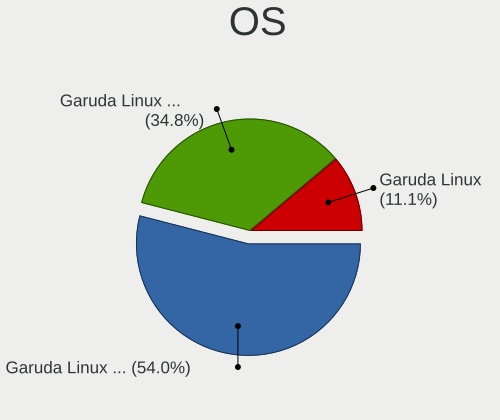

| Name                 | Desktops | Percent |
|----------------------|----------|---------|
| Garuda Linux Soaring | 262      | 54.02%  |
| Garuda Linux Rolling | 169      | 34.85%  |
| Garuda Linux         | 54       | 11.13%  |

OS Family
---------

OS without a version

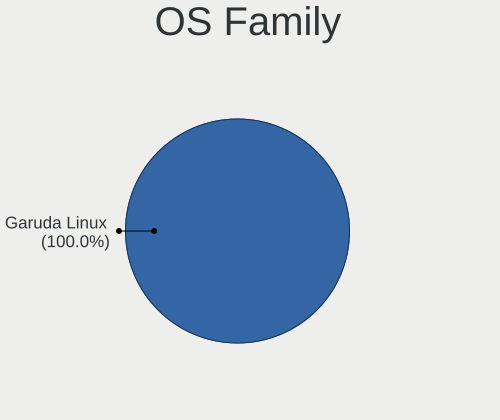

| Name         | Desktops | Percent |
|--------------|----------|---------|
| Garuda Linux | 474      | 100%    |

Kernel
------

Version of the Linux kernel

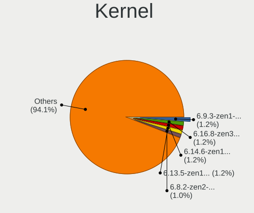

| Version            | Desktops | Percent |
|--------------------|----------|---------|
| 6.9.3-zen1-1-zen   | 7        | 1.21%   |
| 6.16.8-zen3-1-zen  | 7        | 1.21%   |
| 6.14.6-zen1-1-zen  | 7        | 1.21%   |
| 6.13.5-zen1-1-zen  | 7        | 1.21%   |
| 6.8.2-zen2-1-zen   | 6        | 1.04%   |
| 6.6.8-zen1-1-zen   | 6        | 1.04%   |
| 6.18.2-zen2-1-zen  | 6        | 1.04%   |
| 6.14.3-zen1-1-zen  | 6        | 1.04%   |
| 6.13.8-zen1-1-zen  | 6        | 1.04%   |
| 6.12.4-zen1-1-zen  | 6        | 1.04%   |
| 5.17.1-zen1-1-zen  | 6        | 1.04%   |
| 6.5.9-zen2-1-zen   | 5        | 0.87%   |
| 6.17.9-zen1-1-zen  | 5        | 0.87%   |
| 6.15.3-zen1-1-zen  | 5        | 0.87%   |
| 6.12.10-zen1-1-zen | 5        | 0.87%   |
| 6.10.6-zen1-1-zen  | 5        | 0.87%   |
| 6.9.7-zen1-1-zen   | 4        | 0.69%   |
| 6.7.9-zen1-1-zen   | 4        | 0.69%   |
| 6.6.7-zen1-1-zen   | 4        | 0.69%   |
| 6.4.10-zen2-1-zen  | 4        | 0.69%   |
| 6.2.10-zen1-1-zen  | 4        | 0.69%   |
| 6.16.1-zen1-1-zen  | 4        | 0.69%   |
| 6.13.4-zen1-1-zen  | 4        | 0.69%   |
| 6.12.9-zen1-1-zen  | 4        | 0.69%   |
| 6.12.8-zen1-1-zen  | 4        | 0.69%   |
| 6.11.5-zen1-1-zen  | 4        | 0.69%   |
| 6.10.8-zen1-1-zen  | 4        | 0.69%   |
| 6.10.10-zen1-1-zen | 4        | 0.69%   |
| 6.1.12-zen1-1-zen  | 4        | 0.69%   |
| 6.1.1-zen1-1-zen   | 4        | 0.69%   |
| 5.15.7-zen1-1-zen  | 4        | 0.69%   |
| 5.10.4-107-tkg-bmq | 4        | 0.69%   |
| 6.9.5-zen1-1-zen   | 3        | 0.52%   |
| 6.9.4-zen1-1-zen   | 3        | 0.52%   |
| 6.8.9-zen1-1-zen   | 3        | 0.52%   |
| 6.8.7-zen1-2-zen   | 3        | 0.52%   |
| 6.8.5-zen1-1-zen   | 3        | 0.52%   |
| 6.7.5-zen1-1-zen   | 3        | 0.52%   |
| 6.7.0-zen3-1-zen   | 3        | 0.52%   |
| 6.5.5-zen1-1-zen   | 3        | 0.52%   |

Kernel Family
-------------

Linux kernel without a distro release

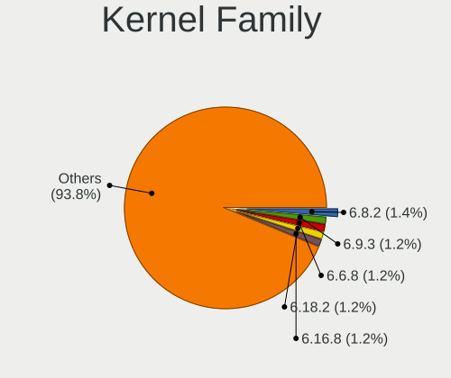

| Version | Desktops | Percent |
|---------|----------|---------|
| 6.8.2   | 8        | 1.39%   |
| 6.9.3   | 7        | 1.21%   |
| 6.6.8   | 7        | 1.21%   |
| 6.18.2  | 7        | 1.21%   |
| 6.16.8  | 7        | 1.21%   |
| 6.14.6  | 7        | 1.21%   |
| 6.13.5  | 7        | 1.21%   |
| 5.17.1  | 7        | 1.21%   |
| 6.8.7   | 6        | 1.04%   |
| 6.17.9  | 6        | 1.04%   |
| 6.15.2  | 6        | 1.04%   |
| 6.14.4  | 6        | 1.04%   |
| 6.14.3  | 6        | 1.04%   |
| 6.13.8  | 6        | 1.04%   |
| 6.12.4  | 6        | 1.04%   |
| 6.12.10 | 6        | 1.04%   |
| 6.5.9   | 5        | 0.87%   |
| 6.5.5   | 5        | 0.87%   |
| 6.4.10  | 5        | 0.87%   |
| 6.15.8  | 5        | 0.87%   |
| 6.15.3  | 5        | 0.87%   |
| 6.13.7  | 5        | 0.87%   |
| 6.10.8  | 5        | 0.87%   |
| 6.10.6  | 5        | 0.87%   |
| 6.10.10 | 5        | 0.87%   |
| 6.9.7   | 4        | 0.69%   |
| 6.9.4   | 4        | 0.69%   |
| 6.8.9   | 4        | 0.69%   |
| 6.7.9   | 4        | 0.69%   |
| 6.6.7   | 4        | 0.69%   |
| 6.2.10  | 4        | 0.69%   |
| 6.16.7  | 4        | 0.69%   |
| 6.16.1  | 4        | 0.69%   |
| 6.13.4  | 4        | 0.69%   |
| 6.13.2  | 4        | 0.69%   |
| 6.12.9  | 4        | 0.69%   |
| 6.12.8  | 4        | 0.69%   |
| 6.12.7  | 4        | 0.69%   |
| 6.11.5  | 4        | 0.69%   |
| 6.1.12  | 4        | 0.69%   |

Kernel Major Ver.
-----------------

Linux kernel major version

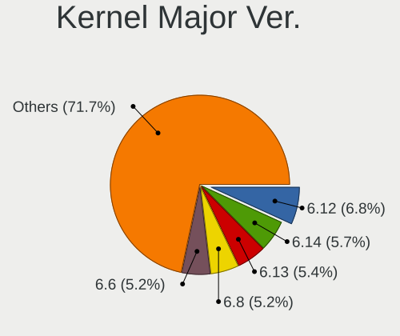

| Version | Desktops | Percent |
|---------|----------|---------|
| 6.12    | 38       | 6.81%   |
| 6.14    | 32       | 5.73%   |
| 6.13    | 30       | 5.38%   |
| 6.8     | 29       | 5.2%    |
| 6.6     | 29       | 5.2%    |
| 6.10    | 29       | 5.2%    |
| 6.1     | 29       | 5.2%    |
| 6.15    | 26       | 4.66%   |
| 6.4     | 24       | 4.3%    |
| 6.16    | 23       | 4.12%   |
| 6.9     | 22       | 3.94%   |
| 6.17    | 20       | 3.58%   |
| 5.15    | 20       | 3.58%   |
| 6.5     | 19       | 3.41%   |
| 6.0     | 16       | 2.87%   |
| 5.16    | 16       | 2.87%   |
| 5.10    | 16       | 2.87%   |
| 6.2     | 15       | 2.69%   |
| 6.7     | 14       | 2.51%   |
| 6.11    | 14       | 2.51%   |
| 5.18    | 14       | 2.51%   |
| 5.17    | 11       | 1.97%   |
| 5.12    | 10       | 1.79%   |
| 5.11    | 10       | 1.79%   |
| 6.3     | 9        | 1.61%   |
| 5.9     | 9        | 1.61%   |
| 6.18    | 8        | 1.43%   |
| 5.19    | 8        | 1.43%   |
| 5.13    | 7        | 1.25%   |
| 5.14    | 6        | 1.08%   |
| 5.8     | 5        | 0.9%    |

Arch
----

OS architecture (x86_64, i586, etc.)

| Name   | Desktops | Percent |
|--------|----------|---------|
| x86_64 | 474      | 100%    |

DE
--

Desktop Environment

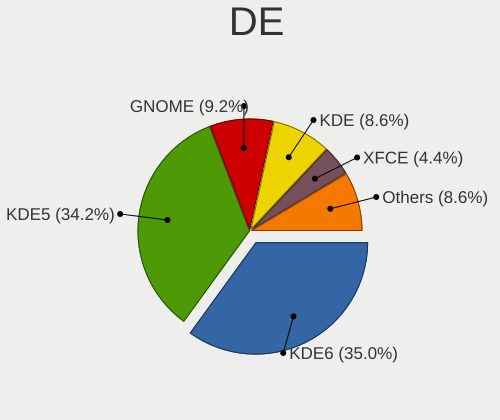

| Name       | Desktops | Percent |
|------------|----------|---------|
| KDE6       | 175      | 35%     |
| KDE5       | 171      | 34.2%   |
| GNOME      | 46       | 9.2%    |
| KDE        | 43       | 8.6%    |
| XFCE       | 22       | 4.4%    |
| X-Cinnamon | 11       | 2.2%    |
| Hyprland   | 8        | 1.6%    |
| Unknown    | 7        | 1.4%    |
| MATE       | 3        | 0.6%    |
| LXQt       | 3        | 0.6%    |
| i3         | 3        | 0.6%    |
| sway       | 2        | 0.4%    |
| Deepin     | 2        | 0.4%    |
| Cinnamon   | 2        | 0.4%    |
| Niri       | 1        | 0.2%    |
| hyprstart  | 1        | 0.2%    |

Display Server
--------------

X11 or Wayland

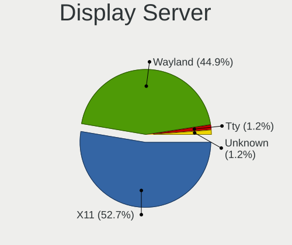

| Name    | Desktops | Percent |
|---------|----------|---------|
| X11     | 258      | 52.65%  |
| Wayland | 220      | 44.9%   |
| Tty     | 6        | 1.22%   |
| Unknown | 6        | 1.22%   |

Display Manager
---------------

SDDM, LightDM, etc.

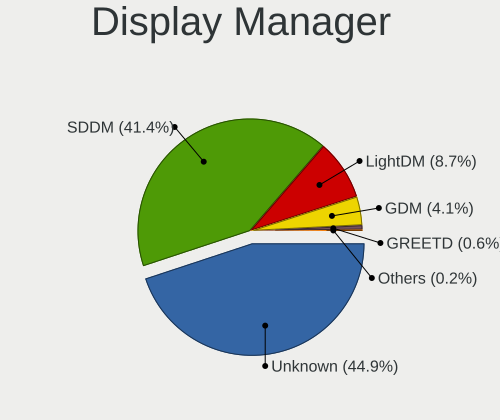

| Name    | Desktops | Percent |
|---------|----------|---------|
| Unknown | 217      | 44.93%  |
| SDDM    | 200      | 41.41%  |
| LightDM | 42       | 8.7%    |
| GDM     | 20       | 4.14%   |
| GREETD  | 3        | 0.62%   |
| LY-DM   | 1        | 0.21%   |

OS Lang
-------

Language

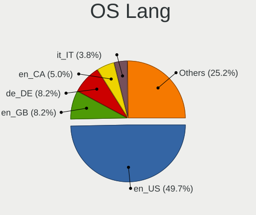

| Lang        | Desktops | Percent |
|-------------|----------|---------|
| en_US       | 237      | 49.69%  |
| en_GB       | 39       | 8.18%   |
| de_DE       | 39       | 8.18%   |
| en_CA       | 24       | 5.03%   |
| it_IT       | 18       | 3.77%   |
| es_ES       | 13       | 2.73%   |
| pt_BR       | 12       | 2.52%   |
| pl_PL       | 9        | 1.89%   |
| fr_FR       | 8        | 1.68%   |
| ru_RU       | 7        | 1.47%   |
| en_AU       | 7        | 1.47%   |
| nl_NL       | 5        | 1.05%   |
| es_MX       | 5        | 1.05%   |
| tr_TR       | 4        | 0.84%   |
| de_CH       | 4        | 0.84%   |
| de_AT       | 4        | 0.84%   |
| sv_SE       | 3        | 0.63%   |
| en_ZA       | 3        | 0.63%   |
| en_IN       | 3        | 0.63%   |
| sk_SK       | 2        | 0.42%   |
| hu_HU       | 2        | 0.42%   |
| fr_BE       | 2        | 0.42%   |
| es_CL       | 2        | 0.42%   |
| en_IL       | 2        | 0.42%   |
| en_DK       | 2        | 0.42%   |
| da_DK       | 2        | 0.42%   |
| cs_CZ       | 2        | 0.42%   |
| sl_SI       | 1        | 0.21%   |
| nl_BE       | 1        | 0.21%   |
| nb_NO       | 1        | 0.21%   |
| ja_JP       | 1        | 0.21%   |
| iu_CA       | 1        | 0.21%   |
| fr_CA       | 1        | 0.21%   |
| fi_FI       | 1        | 0.21%   |
| es_VE       | 1        | 0.21%   |
| es_CO       | 1        | 0.21%   |
| es_AR       | 1        | 0.21%   |
| en_XX@POSIX | 1        | 0.21%   |
| en_SG       | 1        | 0.21%   |
| en_NZ       | 1        | 0.21%   |

Boot Mode
---------

EFI or BIOS

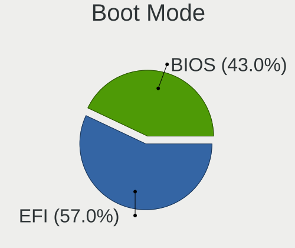

| Mode | Desktops | Percent |
|------|----------|---------|
| EFI  | 247      | 51.35%  |
| BIOS | 234      | 48.65%  |

Filesystem
----------

Type of filesystem

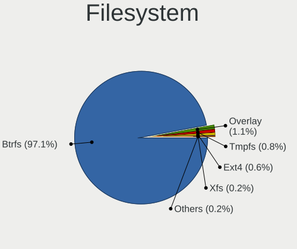

| Type    | Desktops | Percent |
|---------|----------|---------|
| Btrfs   | 461      | 97.05%  |
| Overlay | 5        | 1.05%   |
| Tmpfs   | 4        | 0.84%   |
| Ext4    | 3        | 0.63%   |
| XXXXX   | 1        | 0.21%   |
| Xfs     | 1        | 0.21%   |

Part. scheme
------------

Scheme of partitioning

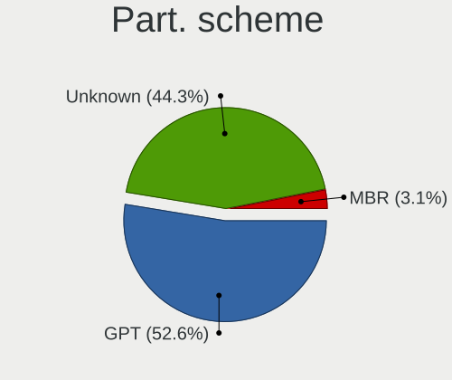

| Type    | Desktops | Percent |
|---------|----------|---------|
| GPT     | 254      | 52.59%  |
| Unknown | 214      | 44.31%  |
| MBR     | 15       | 3.11%   |

Dual Boot with Linux/BSD
------------------------

Hosting more than one Linux/BSD

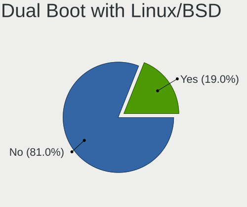

| Dual boot | Desktops | Percent |
|-----------|----------|---------|
| No        | 393      | 81.03%  |
| Yes       | 92       | 18.97%  |

Dual Boot (Win)
---------------

Hosting Linux and Windows

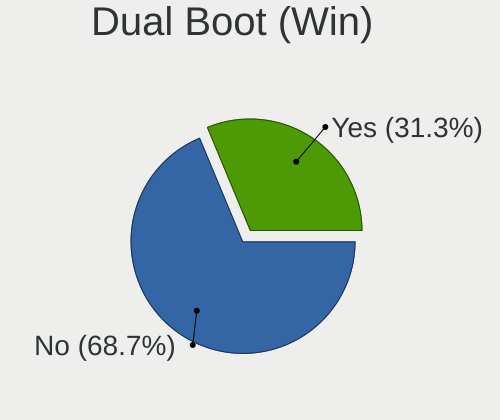

| Dual boot | Desktops | Percent |
|-----------|----------|---------|
| No        | 334      | 68.72%  |
| Yes       | 152      | 31.28%  |

Board
-----

Vendor
------

Motherboard manufacturer

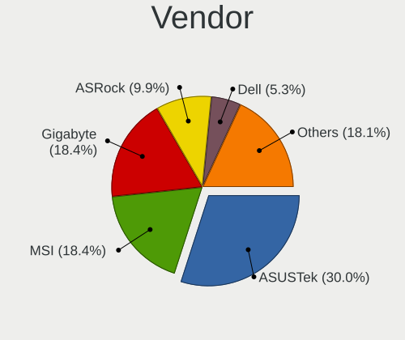

| Name                                 | Desktops | Percent |
|--------------------------------------|----------|---------|
| ASUSTek Computer                     | 142      | 29.96%  |
| MSI                                  | 87       | 18.35%  |
| Gigabyte Technology                  | 87       | 18.35%  |
| ASRock                               | 47       | 9.92%   |
| Dell                                 | 25       | 5.27%   |
| Hewlett-Packard                      | 20       | 4.22%   |
| Lenovo                               | 11       | 2.32%   |
| Intel                                | 10       | 2.11%   |
| Acer                                 | 7        | 1.48%   |
| Shenzhen Meigao Electronic Equipment | 4        | 0.84%   |
| Alienware                            | 4        | 0.84%   |
| Huanan                               | 3        | 0.63%   |
| Biostar                              | 3        | 0.63%   |
| Unknown                              | 3        | 0.63%   |
| Pegatron                             | 2        | 0.42%   |
| NZXT                                 | 2        | 0.42%   |
| Medion                               | 2        | 0.42%   |
| HC Technology.                       | 2        | 0.42%   |
| Fujitsu                              | 2        | 0.42%   |
| Win element                          | 1        | 0.21%   |
| T-bao                                | 1        | 0.21%   |
| QIYIDA                               | 1        | 0.21%   |
| ONDA                                 | 1        | 0.21%   |
| OEM                                  | 1        | 0.21%   |
| MANCER                               | 1        | 0.21%   |
| GEEKOM                               | 1        | 0.21%   |
| Foxconn                              | 1        | 0.21%   |
| ECS                                  | 1        | 0.21%   |
| BESSTAR Tech                         | 1        | 0.21%   |
| AZW                                  | 1        | 0.21%   |

Model
-----

Motherboard model

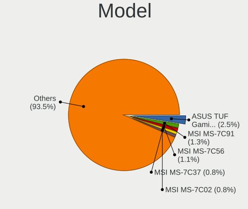

| Name                                       | Desktops | Percent |
|--------------------------------------------|----------|---------|
| ASUS TUF Gaming X570-PLUS                  | 12       | 2.53%   |
| MSI MS-7C91                                | 6        | 1.27%   |
| MSI MS-7C56                                | 5        | 1.05%   |
| MSI MS-7C37                                | 4        | 0.84%   |
| MSI MS-7C02                                | 4        | 0.84%   |
| MSI MS-7B86                                | 4        | 0.84%   |
| ASUS TUF Gaming B550-PLUS WIFI II          | 4        | 0.84%   |
| ASUS ROG STRIX X570-E GAMING               | 4        | 0.84%   |
| ASUS All Series                            | 4        | 0.84%   |
| Unknown                                    | 4        | 0.84%   |
| MSI MS-7D75                                | 3        | 0.63%   |
| MSI MS-7B79                                | 3        | 0.63%   |
| Gigabyte B550 AORUS ELITE V2               | 3        | 0.63%   |
| ASUS ROG STRIX B550-F GAMING WIFI II       | 3        | 0.63%   |
| ASUS ROG STRIX B450-F GAMING II            | 3        | 0.63%   |
| ASUS ROG CROSSHAIR X670E EXTREME           | 3        | 0.63%   |
| ASRock B450M-HDV R4.0                      | 3        | 0.63%   |
| Shenzhen Meigao Electronic Equipment UM690 | 2        | 0.42%   |
| MSI MS-7E51                                | 2        | 0.42%   |
| MSI MS-7E47                                | 2        | 0.42%   |
| MSI MS-7E26                                | 2        | 0.42%   |
| MSI MS-7E10                                | 2        | 0.42%   |
| MSI MS-7C90                                | 2        | 0.42%   |
| MSI MS-7B93                                | 2        | 0.42%   |
| MSI MS-7B89                                | 2        | 0.42%   |
| MSI MS-7A38                                | 2        | 0.42%   |
| HP ProDesk 600 G1 SFF                      | 2        | 0.42%   |
| HP Pavilion Gaming Desktop 690-00xx        | 2        | 0.42%   |
| HP EliteDesk 800 G1 SFF                    | 2        | 0.42%   |
| HC Technology. HCAR5000-MI                 | 2        | 0.42%   |
| Gigabyte Z390 AORUS ULTRA                  | 2        | 0.42%   |
| Gigabyte X670 GAMING X AX V2               | 2        | 0.42%   |
| Gigabyte X670 AORUS ELITE AX               | 2        | 0.42%   |
| Gigabyte X570 AORUS PRO WIFI               | 2        | 0.42%   |
| Gigabyte X570 AORUS ELITE WIFI             | 2        | 0.42%   |
| Gigabyte X470 AORUS ULTRA GAMING           | 2        | 0.42%   |
| Gigabyte B650 EAGLE AX                     | 2        | 0.42%   |
| Gigabyte B550I AORUS PRO AX                | 2        | 0.42%   |
| Gigabyte B550 AORUS PRO AC                 | 2        | 0.42%   |
| Gigabyte B550 AORUS ELITE                  | 2        | 0.42%   |

Model Family
------------

Motherboard model prefix

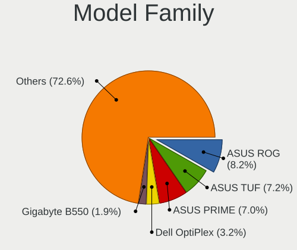

| Name                                       | Desktops | Percent |
|--------------------------------------------|----------|---------|
| ASUS ROG                                   | 39       | 8.23%   |
| ASUS TUF                                   | 34       | 7.17%   |
| ASUS PRIME                                 | 33       | 6.96%   |
| Dell OptiPlex                              | 15       | 3.16%   |
| Gigabyte B550                              | 9        | 1.9%    |
| Lenovo ThinkCentre                         | 7        | 1.48%   |
| Gigabyte B450                              | 7        | 1.48%   |
| MSI MS-7C91                                | 6        | 1.27%   |
| Gigabyte X570                              | 6        | 1.27%   |
| Gigabyte B650                              | 6        | 1.27%   |
| MSI MS-7C56                                | 5        | 1.05%   |
| HP Pavilion                                | 5        | 1.05%   |
| HP EliteDesk                               | 5        | 1.05%   |
| Dell Inspiron                              | 5        | 1.05%   |
| MSI MS-7C37                                | 4        | 0.84%   |
| MSI MS-7C02                                | 4        | 0.84%   |
| MSI MS-7B86                                | 4        | 0.84%   |
| Gigabyte Z390                              | 4        | 0.84%   |
| Gigabyte X670                              | 4        | 0.84%   |
| ASUS ProArt                                | 4        | 0.84%   |
| ASUS All                                   | 4        | 0.84%   |
| ASRock B450M                               | 4        | 0.84%   |
| Alienware Aurora                           | 4        | 0.84%   |
| Acer Aspire                                | 4        | 0.84%   |
| Unknown                                    | 4        | 0.84%   |
| MSI MS-7D75                                | 3        | 0.63%   |
| MSI MS-7B79                                | 3        | 0.63%   |
| HP ProDesk                                 | 3        | 0.63%   |
| Gigabyte Z790                              | 3        | 0.63%   |
| Dell Precision                             | 3        | 0.63%   |
| ASUS Rampage                               | 3        | 0.63%   |
| ASUS Maximus                               | 3        | 0.63%   |
| ASRock Z790                                | 3        | 0.63%   |
| ASRock B550M                               | 3        | 0.63%   |
| ASRock B450M-HDV                           | 3        | 0.63%   |
| Shenzhen Meigao Electronic Equipment UM690 | 2        | 0.42%   |
| NZXT N7                                    | 2        | 0.42%   |
| MSI MS-7E51                                | 2        | 0.42%   |
| MSI MS-7E47                                | 2        | 0.42%   |
| MSI MS-7E26                                | 2        | 0.42%   |

MFG Year
--------

Motherboard manufacture year

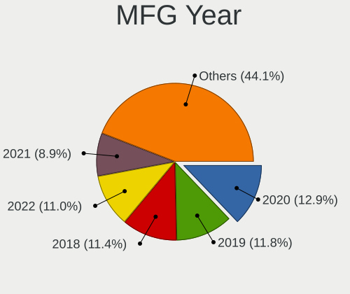

| Year | Desktops | Percent |
|------|----------|---------|
| 2020 | 61       | 12.87%  |
| 2019 | 56       | 11.81%  |
| 2018 | 54       | 11.39%  |
| 2022 | 52       | 10.97%  |
| 2021 | 42       | 8.86%   |
| 2017 | 33       | 6.96%   |
| 2023 | 32       | 6.75%   |
| 2013 | 28       | 5.91%   |
| 2014 | 24       | 5.06%   |
| 2012 | 24       | 5.06%   |
| 2024 | 21       | 4.43%   |
| 2011 | 10       | 2.11%   |
| 2015 | 9        | 1.9%    |
| 2009 | 9        | 1.9%    |
| 2016 | 8        | 1.69%   |
| 2025 | 4        | 0.84%   |
| 2010 | 4        | 0.84%   |
| 2008 | 3        | 0.63%   |

Form Factor
-----------

Physical design of the computer

| Name    | Desktops | Percent |
|---------|----------|---------|
| Desktop | 474      | 100%    |

Secure Boot
-----------

Enabled or disabled

| State    | Desktops | Percent |
|----------|----------|---------|
| Disabled | 472      | 99.58%  |
| Enabled  | 2        | 0.42%   |

Coreboot
--------

Have coreboot on board

| Used | Desktops | Percent |
|------|----------|---------|
| No   | 474      | 100%    |

RAM Size
--------

Total RAM memory

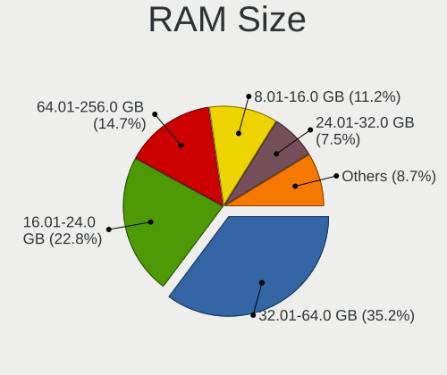

| Size in GB      | Desktops | Percent |
|-----------------|----------|---------|
| 32.01-64.0      | 170      | 35.2%   |
| 16.01-24.0      | 110      | 22.77%  |
| 64.01-256.0     | 71       | 14.7%   |
| 8.01-16.0       | 54       | 11.18%  |
| 24.01-32.0      | 36       | 7.45%   |
| 4.01-8.0        | 33       | 6.83%   |
| 3.01-4.0        | 8        | 1.66%   |
| More than 256.0 | 1        | 0.21%   |

RAM Used
--------

Used RAM memory

| Used GB     | Desktops | Percent |
|-------------|----------|---------|
| 4.01-8.0    | 233      | 44.64%  |
| 8.01-16.0   | 95       | 18.2%   |
| 3.01-4.0    | 89       | 17.05%  |
| 2.01-3.0    | 61       | 11.69%  |
| 1.01-2.0    | 21       | 4.02%   |
| 16.01-24.0  | 16       | 3.07%   |
| 32.01-64.0  | 4        | 0.77%   |
| 24.01-32.0  | 2        | 0.38%   |
| 64.01-256.0 | 1        | 0.19%   |

Total Drives
------------

Number of drives on board

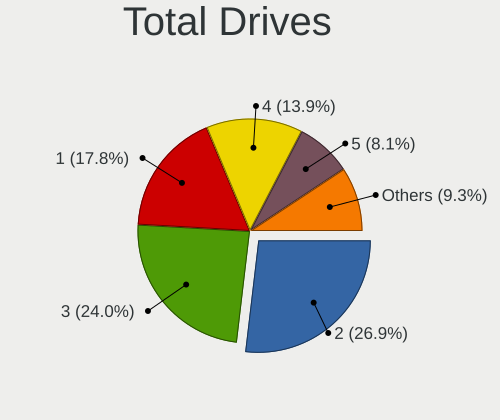

| Drives | Desktops | Percent |
|--------|----------|---------|
| 2      | 133      | 26.87%  |
| 3      | 119      | 24.04%  |
| 1      | 88       | 17.78%  |
| 4      | 69       | 13.94%  |
| 5      | 40       | 8.08%   |
| 6      | 20       | 4.04%   |
| 7      | 13       | 2.63%   |
| 9      | 7        | 1.41%   |
| 11     | 2        | 0.4%    |
| 8      | 2        | 0.4%    |
| 18     | 1        | 0.2%    |
| 14     | 1        | 0.2%    |

Has CD-ROM
----------

Has CD-ROM on board

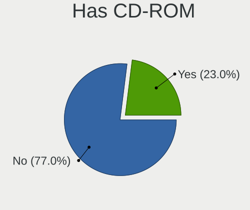

| Presented | Desktops | Percent |
|-----------|----------|---------|
| No        | 368      | 76.99%  |
| Yes       | 110      | 23.01%  |

Has Ethernet
------------

Has Ethernet on board

| Presented | Desktops | Percent |
|-----------|----------|---------|
| Yes       | 467      | 98.52%  |
| No        | 7        | 1.48%   |

Has WiFi
--------

Has WiFi module

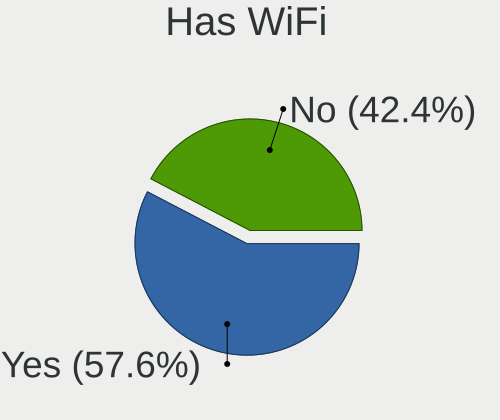

| Presented | Desktops | Percent |
|-----------|----------|---------|
| Yes       | 279      | 57.64%  |
| No        | 205      | 42.36%  |

Has Bluetooth
-------------

Has Bluetooth module

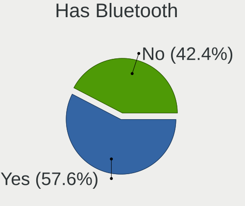

| Presented | Desktops | Percent |
|-----------|----------|---------|
| Yes       | 280      | 57.61%  |
| No        | 206      | 42.39%  |

Location
--------

Country
-------

Geographic location (country)

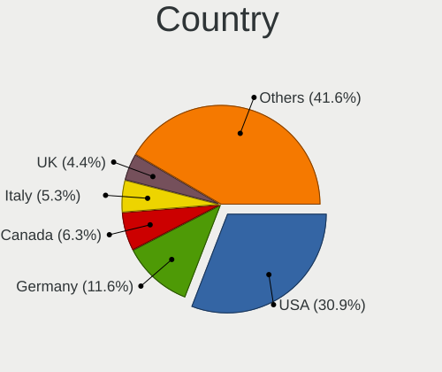

| Country      | Desktops | Percent |
|--------------|----------|---------|
| USA          | 147      | 30.88%  |
| Germany      | 55       | 11.55%  |
| Canada       | 30       | 6.3%    |
| Italy        | 25       | 5.25%   |
| UK           | 21       | 4.41%   |
| Brazil       | 16       | 3.36%   |
| Spain        | 14       | 2.94%   |
| Sweden       | 10       | 2.1%    |
| Russia       | 10       | 2.1%    |
| Poland       | 10       | 2.1%    |
| Netherlands  | 9        | 1.89%   |
| France       | 9        | 1.89%   |
| Australia    | 9        | 1.89%   |
| Mexico       | 7        | 1.47%   |
| Turkey       | 6        | 1.26%   |
| Austria      | 6        | 1.26%   |
| Romania      | 5        | 1.05%   |
| India        | 5        | 1.05%   |
| Denmark      | 5        | 1.05%   |
| Belgium      | 5        | 1.05%   |
| Switzerland  | 4        | 0.84%   |
| South Africa | 4        | 0.84%   |
| Portugal     | 4        | 0.84%   |
| Norway       | 4        | 0.84%   |
| Finland      | 4        | 0.84%   |
| Chile        | 4        | 0.84%   |
| Venezuela    | 3        | 0.63%   |
| Slovakia     | 3        | 0.63%   |
| Japan        | 3        | 0.63%   |
| Hungary      | 3        | 0.63%   |
| Ukraine      | 2        | 0.42%   |
| Slovenia     | 2        | 0.42%   |
| Puerto Rico  | 2        | 0.42%   |
| Philippines  | 2        | 0.42%   |
| Latvia       | 2        | 0.42%   |
| Israel       | 2        | 0.42%   |
| Iceland      | 2        | 0.42%   |
| Greece       | 2        | 0.42%   |
| Egypt        | 2        | 0.42%   |
| Czechia      | 2        | 0.42%   |

City
----

Geographic location (city)

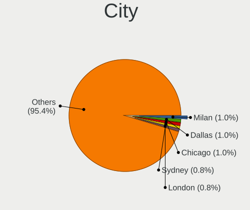

| City                   | Desktops | Percent |
|------------------------|----------|---------|
| Milan                  | 5        | 1%      |
| Dallas                 | 5        | 1%      |
| Chicago                | 5        | 1%      |
| Sydney                 | 4        | 0.8%    |
| London                 | 4        | 0.8%    |
| Denver                 | 4        | 0.8%    |
| Berlin                 | 4        | 0.8%    |
| Atlanta                | 4        | 0.8%    |
| Wuppertal              | 3        | 0.6%    |
| Wittenbach             | 3        | 0.6%    |
| Toronto                | 3        | 0.6%    |
| Seattle                | 3        | 0.6%    |
| Sao Paulo              | 3        | 0.6%    |
| San Jose               | 3        | 0.6%    |
| Mexico City            | 3        | 0.6%    |
| Melbourne              | 3        | 0.6%    |
| Kansas City            | 3        | 0.6%    |
| Istanbul               | 3        | 0.6%    |
| Florence               | 3        | 0.6%    |
| Cape Town              | 3        | 0.6%    |
| Calgary                | 3        | 0.6%    |
| Zetland                | 2        | 0.4%    |
| Wasmes                 | 2        | 0.4%    |
| Warsaw                 | 2        | 0.4%    |
| Voronezh               | 2        | 0.4%    |
| Vienna                 | 2        | 0.4%    |
| Tamworth               | 2        | 0.4%    |
| Tampere                | 2        | 0.4%    |
| Stockholm              | 2        | 0.4%    |
| St Louis               | 2        | 0.4%    |
| Sindelfingen           | 2        | 0.4%    |
| Santa Cruz de Tenerife | 2        | 0.4%    |
| Saint Joseph           | 2        | 0.4%    |
| Rio de Janeiro         | 2        | 0.4%    |
| Riga                   | 2        | 0.4%    |
| Reykjavik              | 2        | 0.4%    |
| Prague                 | 2        | 0.4%    |
| Portland               | 2        | 0.4%    |
| Oslo                   | 2        | 0.4%    |
| Oklahoma City          | 2        | 0.4%    |

Drives
------

Drive Vendor
------------

Hard drive vendors

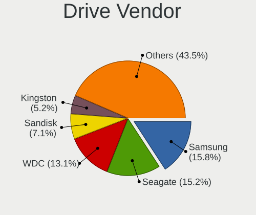

| Vendor                      | Desktops | Drives | Percent |
|-----------------------------|----------|--------|---------|
| Samsung Electronics         | 184      | 391    | 15.79%  |
| Seagate                     | 177      | 300    | 15.19%  |
| WDC                         | 153      | 253    | 13.13%  |
| Sandisk                     | 83       | 122    | 7.12%   |
| Kingston                    | 61       | 84     | 5.24%   |
| Toshiba                     | 58       | 92     | 4.98%   |
| Crucial                     | 58       | 82     | 4.98%   |
| Phison Electronics          | 33       | 47     | 2.83%   |
| Micron/Crucial Technology   | 28       | 34     | 2.4%    |
| Hitachi                     | 24       | 25     | 2.06%   |
| Kingston Technology Company | 23       | 27     | 1.97%   |
| Silicon Motion              | 20       | 22     | 1.72%   |
| MAXIO Technology (Hangzhou) | 18       | 22     | 1.55%   |
| ADATA Technology            | 16       | 26     | 1.37%   |
| Intel                       | 14       | 19     | 1.2%    |
| China                       | 12       | 18     | 1.03%   |
| A-DATA Technology           | 12       | 18     | 1.03%   |
| Realtek Semiconductor       | 10       | 16     | 0.86%   |
| Micron Technology           | 10       | 11     | 0.86%   |
| Team                        | 8        | 15     | 0.69%   |
| SK hynix                    | 8        | 10     | 0.69%   |
| HGST                        | 8        | 15     | 0.69%   |
| SPCC                        | 7        | 9      | 0.6%    |
| PNY                         | 7        | 7      | 0.6%    |
| Phison                      | 7        | 8      | 0.6%    |
| Unknown                     | 6        | 9      | 0.52%   |
| OCZ                         | 6        | 8      | 0.52%   |
| Intenso                     | 5        | 7      | 0.43%   |
| Corsair                     | 5        | 11     | 0.43%   |
| Transcend                   | 4        | 4      | 0.34%   |
| Seagate Technology          | 4        | 4      | 0.34%   |
| Patriot                     | 4        | 7      | 0.34%   |
| LITEONIT                    | 4        | 4      | 0.34%   |
| AMD                         | 4        | 8      | 0.34%   |
| XPG                         | 3        | 4      | 0.26%   |
| USB                         | 3        | 3      | 0.26%   |
| TO Exter                    | 3        | 6      | 0.26%   |
| T-FORCE                     | 3        | 3      | 0.26%   |
| SABRENT                     | 3        | 6      | 0.26%   |
| KingSpec                    | 3        | 3      | 0.26%   |

Drive Model
-----------

Hard drive models

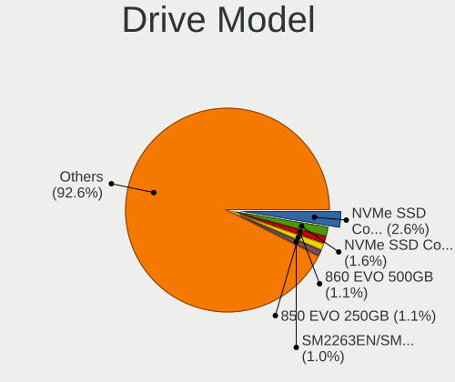

| Model                                                              | Desktops | Percent |
|--------------------------------------------------------------------|----------|---------|
| Samsung NVMe SSD Controller SM981/PM981/PM983 1TB                  | 37       | 2.62%   |
| Samsung NVMe SSD Controller PM9A1/PM9A3/980PRO 1TB                 | 22       | 1.56%   |
| Samsung SSD 860 EVO 500GB                                          | 16       | 1.13%   |
| Samsung SSD 850 EVO 250GB                                          | 16       | 1.13%   |
| Silicon Motion SM2263EN/SM2263XT SSD Controller 512GB              | 14       | 0.99%   |
| Seagate ST4000DM004-2CV104 4TB                                     | 14       | 0.99%   |
| Seagate ST2000DM008-2FR102 2TB                                     | 14       | 0.99%   |
| Samsung SSD 850 EVO 500GB                                          | 13       | 0.92%   |
| Crucial CT1000MX500SSD1 1TB                                        | 13       | 0.92%   |
| Seagate ST1000DM010-2EP102 1TB                                     | 11       | 0.78%   |
| MAXIO (Hangzhou) NVMe SSD Controller MAP1202 2TB                   | 11       | 0.78%   |
| Crucial CT500MX500SSD1 500GB                                       | 11       | 0.78%   |
| Toshiba DT01ACA100 1TB                                             | 10       | 0.71%   |
| Samsung NVMe SSD Controller S4LV008[Pascal] 4TB                    | 10       | 0.71%   |
| Phison E12 NVMe Controller 1TB                                     | 10       | 0.71%   |
| Micron/Crucial P2 NVMe PCIe SSD 2TB                                | 10       | 0.71%   |
| Kingston Company SNV2S1000G 1TB                                    | 10       | 0.71%   |
| Sandisk WD Blue SN550 NVMe SSD 1024GB                              | 9        | 0.64%   |
| Sandisk WD Black SN750 / PC SN730 NVMe SSD 500GB                   | 9        | 0.64%   |
| Kingston SA400S37240G 240GB SSD                                    | 9        | 0.64%   |
| ADATA XPG SX8200 Pro PCIe Gen3x4 M.2 2280 Solid State Drive 1024GB | 9        | 0.64%   |
| Samsung SSD 980 1TB                                                | 8        | 0.57%   |
| Samsung SSD 870 EVO 1TB                                            | 8        | 0.57%   |
| Samsung SSD 860 EVO 1TB                                            | 8        | 0.57%   |
| Samsung NVMe SSD Controller SM961/PM961/SM963 1024GB               | 8        | 0.57%   |
| Kingston SA400S37480G 480GB SSD                                    | 8        | 0.57%   |
| Seagate ST1000LM024 HN-M101MBB 1TB                                 | 7        | 0.5%    |
| Samsung SSD 990 PRO 2TB                                            | 7        | 0.5%    |
| Samsung SSD 860 QVO 1TB                                            | 7        | 0.5%    |
| Phison E16 PCIe4 NVMe Controller 1TB                               | 7        | 0.5%    |
| Kingston SA400S37960G 960GB SSD                                    | 7        | 0.5%    |
| Crucial CT2000MX500SSD1 2TB                                        | 7        | 0.5%    |
| WDC WD20EZRZ-00Z5HB0 2TB                                           | 6        | 0.42%   |
| WDC WD10EZEX-08WN4A0 1TB                                           | 6        | 0.42%   |
| Toshiba HDWD110 1TB                                                | 6        | 0.42%   |
| Seagate ST2000DM006-2DM164 2TB                                     | 6        | 0.42%   |
| Seagate ST1000DM003-1ER162 1TB                                     | 6        | 0.42%   |
| Sandisk WD Black SN850 1TB                                         | 6        | 0.42%   |
| Samsung NVMe SSD Drive 1TB                                         | 6        | 0.42%   |
| Micron/Crucial P1 NVMe PCIe SSD 1TB                                | 6        | 0.42%   |

HDD Vendor
----------

Hard disk drive vendors

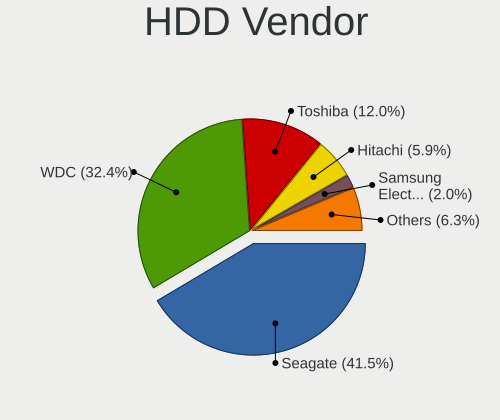

| Vendor              | Desktops | Drives | Percent |
|---------------------|----------|--------|---------|
| Seagate             | 170      | 287    | 41.46%  |
| WDC                 | 133      | 229    | 32.44%  |
| Toshiba             | 49       | 72     | 11.95%  |
| Hitachi             | 24       | 25     | 5.85%   |
| Samsung Electronics | 8        | 12     | 1.95%   |
| HGST                | 8        | 15     | 1.95%   |
| Unknown             | 3        | 4      | 0.73%   |
| TO Exter            | 3        | 6      | 0.73%   |
| Intenso             | 3        | 4      | 0.73%   |
| SSK                 | 1        | 1      | 0.24%   |
| Maxtor              | 1        | 1      | 0.24%   |
| LaCie               | 1        | 1      | 0.24%   |
| JMicron Technology  | 1        | 1      | 0.24%   |
| Inateck             | 1        | 1      | 0.24%   |
| IBM/Hitachi         | 1        | 1      | 0.24%   |
| Hewlett-Packard     | 1        | 1      | 0.24%   |
| ASMedia             | 1        | 2      | 0.24%   |
| Apple               | 1        | 4      | 0.24%   |

SSD Vendor
----------

Solid state drive vendors

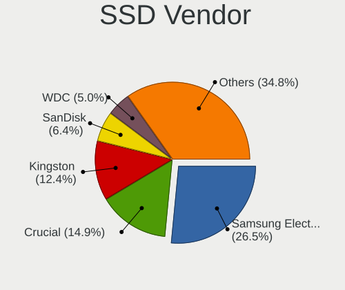

| Vendor              | Desktops | Drives | Percent |
|---------------------|----------|--------|---------|
| Samsung Electronics | 96       | 159    | 26.52%  |
| Crucial             | 54       | 76     | 14.92%  |
| Kingston            | 45       | 57     | 12.43%  |
| SanDisk             | 23       | 33     | 6.35%   |
| WDC                 | 18       | 18     | 4.97%   |
| China               | 12       | 18     | 3.31%   |
| A-DATA Technology   | 12       | 18     | 3.31%   |
| Toshiba             | 9        | 17     | 2.49%   |
| Team                | 8        | 15     | 2.21%   |
| SPCC                | 6        | 8      | 1.66%   |
| PNY                 | 6        | 6      | 1.66%   |
| OCZ                 | 6        | 8      | 1.66%   |
| LITEONIT            | 4        | 4      | 1.1%    |
| Corsair             | 4        | 7      | 1.1%    |
| Transcend           | 3        | 3      | 0.83%   |
| T-FORCE             | 3        | 3      | 0.83%   |
| SABRENT             | 3        | 6      | 0.83%   |
| Patriot             | 3        | 6      | 0.83%   |
| KingSpec            | 3        | 3      | 0.83%   |
| GOODRAM             | 3        | 6      | 0.83%   |
| Emtec               | 3        | 5      | 0.83%   |
| SK hynix            | 2        | 4      | 0.55%   |
| Mushkin             | 2        | 3      | 0.55%   |
| Micron Technology   | 2        | 2      | 0.55%   |
| KODAK               | 2        | 3      | 0.55%   |
| Intenso             | 2        | 3      | 0.55%   |
| Fanxiang            | 2        | 2      | 0.55%   |
| ZADAK               | 1        | 1      | 0.28%   |
| WALRAM              | 1        | 1      | 0.28%   |
| USB30               | 1        | 2      | 0.28%   |
| Unknown             | 1        | 1      | 0.28%   |
| TCSUNBOW            | 1        | 1      | 0.28%   |
| SXMicro             | 1        | 2      | 0.28%   |
| Seagate             | 1        | 1      | 0.28%   |
| Qumo                | 1        | 1      | 0.28%   |
| Plextor             | 1        | 1      | 0.28%   |
| Netac               | 1        | 1      | 0.28%   |
| Neo                 | 1        | 1      | 0.28%   |
| Micron_2            | 1        | 1      | 0.28%   |
| Maxtor              | 1        | 1      | 0.28%   |

Drive Kind
----------

HDD or SSD

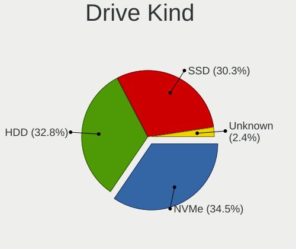

| Kind    | Desktops | Drives | Percent |
|---------|----------|--------|---------|
| NVMe    | 317      | 631    | 34.53%  |
| HDD     | 301      | 667    | 32.79%  |
| SSD     | 278      | 522    | 30.28%  |
| Unknown | 22       | 25     | 2.4%    |

Drive Connector
---------------

SATA, SAS, NVMe, etc.

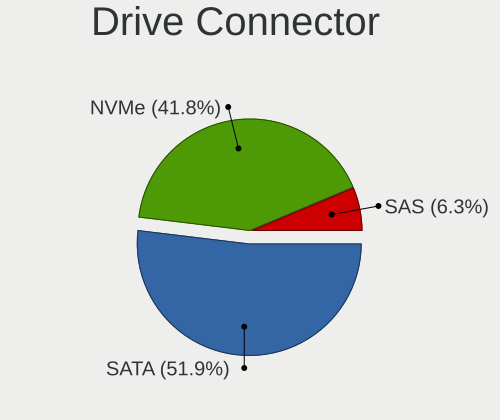

| Type | Desktops | Drives | Percent |
|------|----------|--------|---------|
| SATA | 394      | 1132   | 51.91%  |
| NVMe | 317      | 626    | 41.77%  |
| SAS  | 48       | 87     | 6.32%   |

Drive Size
----------

Size of hard drive

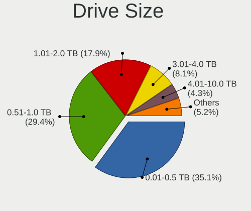

| Size in TB | Desktops | Drives | Percent |
|------------|----------|--------|---------|
| 0.01-0.5   | 243      | 472    | 35.06%  |
| 0.51-1.0   | 204      | 323    | 29.44%  |
| 1.01-2.0   | 124      | 207    | 17.89%  |
| 3.01-4.0   | 56       | 94     | 8.08%   |
| 4.01-10.0  | 30       | 37     | 4.33%   |
| 2.01-3.0   | 28       | 47     | 4.04%   |
| 10.01-20.0 | 8        | 9      | 1.15%   |

Space Total
-----------

Amount of disk space available on the file system

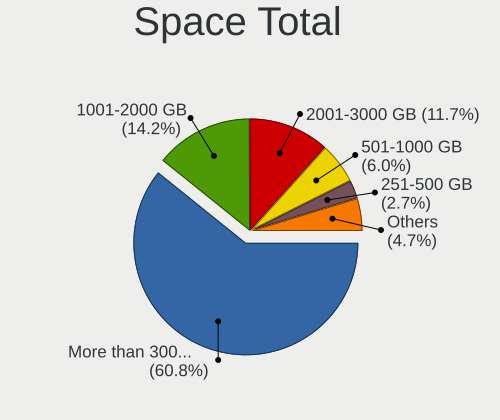

| Size in GB     | Desktops | Percent |
|----------------|----------|---------|
| More than 3000 | 296      | 60.78%  |
| 1001-2000      | 69       | 14.17%  |
| 2001-3000      | 57       | 11.7%   |
| 501-1000       | 29       | 5.95%   |
| 251-500        | 13       | 2.67%   |
| Unknown        | 13       | 2.67%   |
| 1-20           | 8        | 1.64%   |
| 101-250        | 2        | 0.41%   |

Space Used
----------

Amount of used disk space

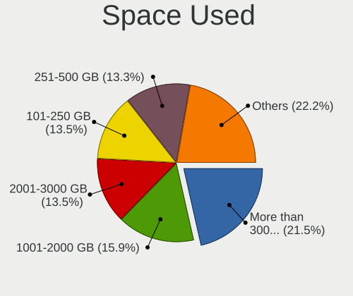

| Used GB        | Desktops | Percent |
|----------------|----------|---------|
| More than 3000 | 111      | 21.47%  |
| 1001-2000      | 82       | 15.86%  |
| 2001-3000      | 70       | 13.54%  |
| 101-250        | 70       | 13.54%  |
| 251-500        | 69       | 13.35%  |
| 501-1000       | 67       | 12.96%  |
| 51-100         | 21       | 4.06%   |
| Unknown        | 13       | 2.51%   |
| 1-20           | 8        | 1.55%   |
| 21-50          | 5        | 0.97%   |
| 0              | 1        | 0.19%   |

Malfunc. Drives
---------------

Drive models with a malfunction

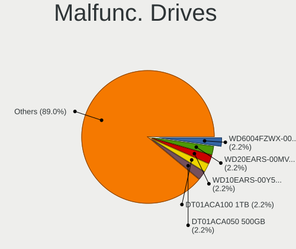

| Model                                                         | Desktops | Drives | Percent |
|---------------------------------------------------------------|----------|--------|---------|
| WDC WD6004FZWX-00BKVA0 6TB                                    | 2        | 2      | 2.2%    |
| WDC WD20EARS-00MVWB0 2TB                                      | 2        | 2      | 2.2%    |
| WDC WD10EARS-00Y5B1 1TB                                       | 2        | 2      | 2.2%    |
| Toshiba DT01ACA100 1TB                                        | 2        | 2      | 2.2%    |
| Toshiba DT01ACA050 500GB                                      | 2        | 2      | 2.2%    |
| Seagate ST2000DM006-2DM164 2TB                                | 2        | 2      | 2.2%    |
| Samsung Electronics SSD 870 EVO 1TB                           | 2        | 2      | 2.2%    |
| Samsung Electronics NVMe SSD Controller SM981/PM981/PM983 1TB | 2        | 2      | 2.2%    |
| Realtek Semiconductor RTS5763DL NVMe SSD Controller 512GB     | 2        | 4      | 2.2%    |
| Intenso USB 3.0 device 1TB                                    | 2        | 2      | 2.2%    |
| WDC WDS240G2G0A-00JH30 240GB SSD                              | 1        | 1      | 1.1%    |
| WDC WD6400AAKS-65A7B0 640GB                                   | 1        | 1      | 1.1%    |
| WDC WD5000AAKX-60U6AA0 500GB                                  | 1        | 1      | 1.1%    |
| WDC WD5000AAKX-003CA0 500GB                                   | 1        | 3      | 1.1%    |
| WDC WD5000AAKS-00E4A0 500GB                                   | 1        | 1      | 1.1%    |
| WDC WD40EZRZ-00WN9B0 4TB                                      | 1        | 1      | 1.1%    |
| WDC WD3200AAKS-75L9A0 320GB                                   | 1        | 1      | 1.1%    |
| WDC WD30EZRX-00DC0B0 3TB                                      | 1        | 1      | 1.1%    |
| WDC WD30EZRX-00D8PB0 3TB                                      | 1        | 2      | 1.1%    |
| WDC WD30EFRX-68EUZN0 3TB                                      | 1        | 2      | 1.1%    |
| WDC WD3000FYYZ-01UL1B0 3TB                                    | 1        | 2      | 1.1%    |
| WDC WD2500JD-98HBC0 250GB                                     | 1        | 1      | 1.1%    |
| WDC WD2500AAJS-75M0A0 249GB                                   | 1        | 1      | 1.1%    |
| WDC WD20EZRZ-00Z5HB0 2TB                                      | 1        | 1      | 1.1%    |
| WDC WD20EARX-00PASB0 2TB                                      | 1        | 1      | 1.1%    |
| WDC WD2002FAEX-007BA0 2TB                                     | 1        | 1      | 1.1%    |
| WDC WD15EADS-22P8B0 1TB                                       | 1        | 3      | 1.1%    |
| WDC WD10EZRX-00L4HB0 1TB                                      | 1        | 1      | 1.1%    |
| WDC WD10EZEX-75WN4A1 1TB                                      | 1        | 1      | 1.1%    |
| WDC WD10EZEX-75WN4A0 1TB                                      | 1        | 1      | 1.1%    |
| WDC WD10EZEX-60ZF5A0 1TB                                      | 1        | 1      | 1.1%    |
| WDC WD10EALX-009BA0 1TB                                       | 1        | 1      | 1.1%    |
| WDC WD10EADS-22M2B0 1TB                                       | 1        | 1      | 1.1%    |
| WDC WD10EADS-00M2B0 1TB                                       | 1        | 1      | 1.1%    |
| WDC WD10EACS-07D6B1 1TB                                       | 1        | 1      | 1.1%    |
| Transcend TS1TSSD230S 1TB                                     | 1        | 1      | 1.1%    |
| Toshiba MQ04ABD200 2TB                                        | 1        | 1      | 1.1%    |
| Seagate ST9250827AS 250GB                                     | 1        | 1      | 1.1%    |
| Seagate ST500LT012-1DG142 500GB                               | 1        | 1      | 1.1%    |
| Seagate ST4000DM004-2CV104 4TB                                | 1        | 1      | 1.1%    |

Malfunc. Drive Vendor
---------------------

Vendors of faulty drives

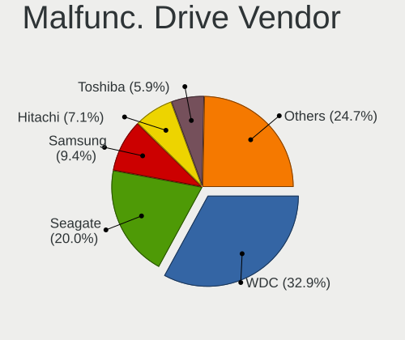

| Vendor                    | Desktops | Drives | Percent |
|---------------------------|----------|--------|---------|
| WDC                       | 28       | 38     | 32.94%  |
| Seagate                   | 17       | 19     | 20%     |
| Samsung Electronics       | 8        | 23     | 9.41%   |
| Hitachi                   | 6        | 6      | 7.06%   |
| Toshiba                   | 5        | 5      | 5.88%   |
| Kingston                  | 3        | 4      | 3.53%   |
| SanDisk                   | 2        | 2      | 2.35%   |
| Realtek Semiconductor     | 2        | 4      | 2.35%   |
| OCZ                       | 2        | 2      | 2.35%   |
| Intenso                   | 2        | 2      | 2.35%   |
| Crucial                   | 2        | 2      | 2.35%   |
| A-DATA Technology         | 2        | 2      | 2.35%   |
| Transcend                 | 1        | 1      | 1.18%   |
| Micron/Crucial Technology | 1        | 1      | 1.18%   |
| HGST                      | 1        | 7      | 1.18%   |
| Hewlett-Packard           | 1        | 1      | 1.18%   |
| China                     | 1        | 1      | 1.18%   |
| Aarvex                    | 1        | 2      | 1.18%   |

Malfunc. HDD Vendor
-------------------

Vendors of faulty HDD drives

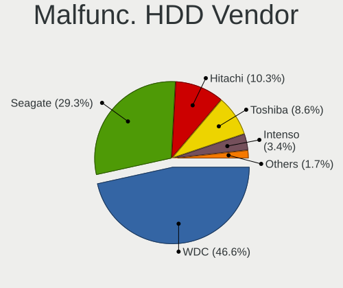

| Vendor  | Desktops | Drives | Percent |
|---------|----------|--------|---------|
| WDC     | 27       | 37     | 46.55%  |
| Seagate | 17       | 19     | 29.31%  |
| Hitachi | 6        | 6      | 10.34%  |
| Toshiba | 5        | 5      | 8.62%   |
| Intenso | 2        | 2      | 3.45%   |
| HGST    | 1        | 7      | 1.72%   |

Malfunc. Drive Kind
-------------------

Kinds of faulty drives

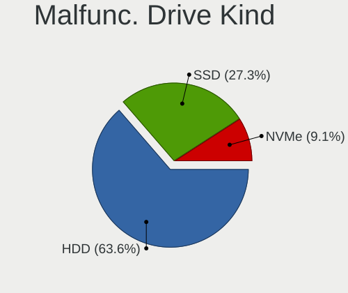

| Kind | Desktops | Drives | Percent |
|------|----------|--------|---------|
| HDD  | 49       | 76     | 63.64%  |
| SSD  | 21       | 24     | 27.27%  |
| NVMe | 7        | 22     | 9.09%   |

Failed Drives
-------------

Failed drive models

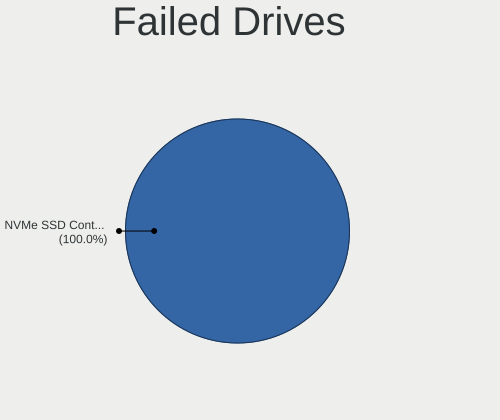

| Model                                                         | Desktops | Drives | Percent |
|---------------------------------------------------------------|----------|--------|---------|
| Samsung Electronics NVMe SSD Controller 980 (DRAM-less) 256GB | 1        | 2      | 100%    |

Failed Drive Vendor
-------------------

Failed drive vendors

| Vendor              | Desktops | Drives | Percent |
|---------------------|----------|--------|---------|
| Samsung Electronics | 1        | 2      | 100%    |

Drive Status
------------

Number of failed and malfunc. drives

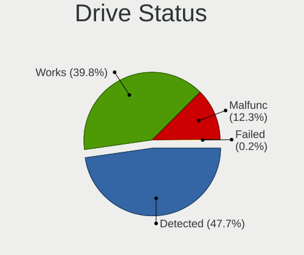

| Status   | Desktops | Drives | Percent |
|----------|----------|--------|---------|
| Detected | 275      | 966    | 47.74%  |
| Works    | 229      | 755    | 39.76%  |
| Malfunc  | 71       | 122    | 12.33%  |
| Failed   | 1        | 2      | 0.17%   |

Storage controller
------------------

Storage Vendor
--------------

Storage controller vendors

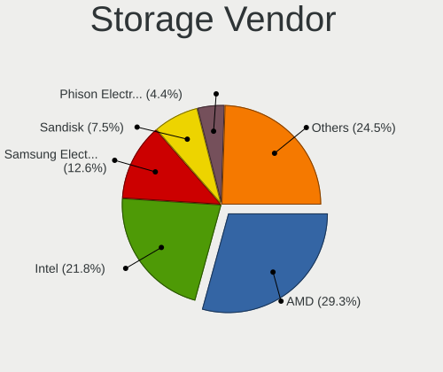

| Vendor                       | Desktops | Percent |
|------------------------------|----------|---------|
| AMD                          | 270      | 29.25%  |
| Intel                        | 201      | 21.78%  |
| Samsung Electronics          | 116      | 12.57%  |
| Sandisk                      | 69       | 7.48%   |
| Phison Electronics           | 41       | 4.44%   |
| Kingston Technology Company  | 41       | 4.44%   |
| ASMedia Technology           | 35       | 3.79%   |
| Micron/Crucial Technology    | 29       | 3.14%   |
| Silicon Motion               | 21       | 2.28%   |
| MAXIO Technology (Hangzhou)  | 18       | 1.95%   |
| ADATA Technology             | 18       | 1.95%   |
| Realtek Semiconductor        | 11       | 1.19%   |
| Marvell Technology Group     | 10       | 1.08%   |
| Micron Technology            | 8        | 0.87%   |
| SK hynix                     | 6        | 0.65%   |
| Seagate Technology           | 5        | 0.54%   |
| JMicron Technology           | 5        | 0.54%   |
| Toshiba America Info Systems | 3        | 0.33%   |
| Shenzhen Longsys Electronics | 2        | 0.22%   |
| KIOXIA                       | 2        | 0.22%   |
| Broadcom / LSI               | 2        | 0.22%   |
| Biwin Storage Technology     | 2        | 0.22%   |
| Yangtze Memory Technologies  | 1        | 0.11%   |
| Union Memory (Shenzhen)      | 1        | 0.11%   |
| Transcend                    | 1        | 0.11%   |
| Solidigm                     | 1        | 0.11%   |
| Nextorage                    | 1        | 0.11%   |
| Netac Technology             | 1        | 0.11%   |
| LSI Logic / Symbios Logic    | 1        | 0.11%   |
| INNOGRIT                     | 1        | 0.11%   |

Storage Model
-------------

Storage controller models

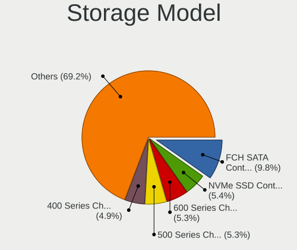

| Model                                                                          | Desktops | Percent |
|--------------------------------------------------------------------------------|----------|---------|
| AMD FCH SATA Controller [AHCI mode]                                            | 106      | 9.77%   |
| Samsung NVMe SSD Controller SM981/PM981/PM983                                  | 59       | 5.44%   |
| AMD 600 Series Chipset SATA Controller                                         | 58       | 5.35%   |
| AMD 500 Series Chipset SATA Controller                                         | 58       | 5.35%   |
| AMD 400 Series Chipset SATA Controller                                         | 53       | 4.88%   |
| ASMedia ASM1061/ASM1062 Serial ATA Controller                                  | 29       | 2.67%   |
| Intel 8 Series/C220 Series Chipset Family 6-port SATA Controller 1 [AHCI mode] | 28       | 2.58%   |
| Samsung NVMe SSD Controller S4LV008[Pascal]                                    | 26       | 2.4%    |
| Samsung NVMe SSD Controller PM9A1/PM9A3/980PRO                                 | 24       | 2.21%   |
| Intel Alder Lake-S PCH SATA Controller [AHCI Mode]                             | 19       | 1.75%   |
| Intel 200 Series PCH SATA controller [AHCI mode]                               | 19       | 1.75%   |
| Silicon Motion SM2263EN/SM2263XT (DRAM-less) NVMe SSD Controllers              | 17       | 1.57%   |
| Intel Raptor Lake SATA AHCI Controller                                         | 17       | 1.57%   |
| Phison E12 NVMe Controller                                                     | 16       | 1.47%   |
| Intel Cannon Lake PCH SATA AHCI Controller                                     | 15       | 1.38%   |
| AMD SB7x0/SB8x0/SB9x0 SATA Controller [AHCI mode]                              | 14       | 1.29%   |
| Sandisk WD Black SN850X NVMe SSD                                               | 13       | 1.2%    |
| AMD SB7x0/SB8x0/SB9x0 IDE Controller                                           | 13       | 1.2%    |
| SanDisk Ultra 3D / WD PC SN530, IX SN530, Blue SN550 NVMe SSD (DRAM-less)      | 12       | 1.11%   |
| SanDisk Extreme Pro / WD Black SN750 / PC SN730 / Red SN700 NVMe SSD           | 12       | 1.11%   |
| Samsung NVMe SSD Controller SM961/PM961/SM963                                  | 12       | 1.11%   |
| Micron/Crucial P2 [Nick P2] / P3 / P3 Plus NVMe PCIe SSD (DRAM-less)           | 12       | 1.11%   |
| MAXIO (Hangzhou) NVMe SSD Controller MAP1202 (DRAM-less)                       | 12       | 1.11%   |
| Intel Volume Management Device NVMe RAID Controller                            | 12       | 1.11%   |
| Intel SATA Controller [RAID mode]                                              | 12       | 1.11%   |
| Intel 7 Series/C210 Series Chipset Family 6-port SATA Controller [AHCI mode]   | 12       | 1.11%   |
| Intel 6 Series/C200 Series Chipset Family 6 port Desktop SATA AHCI Controller  | 12       | 1.11%   |
| Samsung NVMe SSD Controller 980 (DRAM-less)                                    | 11       | 1.01%   |
| Kingston Company NV2 NVMe SSD [SM2267XT] (DRAM-less)                           | 11       | 1.01%   |
| ADATA XPG SX8200 Pro PCIe Gen3x4 M.2 2280 Solid State Drive                    | 11       | 1.01%   |
| SanDisk WD SN560/SN740/SN770/SN5000 NVMe SSD                                   | 10       | 0.92%   |
| SanDisk WD PC SN810 / Black SN850 NVMe SSD                                     | 10       | 0.92%   |
| Kingston Company KC3000/FURY Renegade NVMe SSD [E18]                           | 10       | 0.92%   |
| Intel Q170/Q150/B150/H170/H110/Z170/CM236 Chipset SATA Controller [AHCI Mode]  | 10       | 0.92%   |
| AMD 300 Series Chipset SATA Controller                                         | 10       | 0.92%   |
| Phison E16 PCIe4 NVMe Controller                                               | 9        | 0.83%   |
| Intel 500 Series Chipset Family SATA AHCI Controller                           | 9        | 0.83%   |
| Realtek RTS5765DL NVMe SSD Controller (DRAM-less)                              | 8        | 0.74%   |
| AMD A320 Chipset SATA Controller [AHCI mode]                                   | 8        | 0.74%   |
| Samsung NVMe SSD Controller PM9C1a (DRAM-less)                                 | 7        | 0.65%   |

Storage Kind
------------

Kind of storage controller (IDE, SATA, NVMe, SAS, ...)

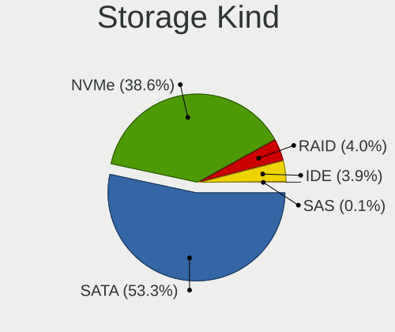

| Kind | Desktops | Percent |
|------|----------|---------|
| SATA | 438      | 53.35%  |
| NVMe | 317      | 38.61%  |
| RAID | 33       | 4.02%   |
| IDE  | 32       | 3.9%    |
| SAS  | 1        | 0.12%   |

Processor
---------

CPU Vendor
----------

Processor vendors

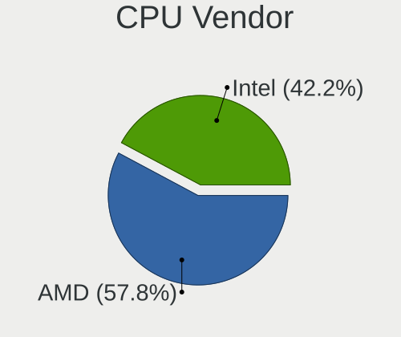

| Vendor | Desktops | Percent |
|--------|----------|---------|
| AMD    | 274      | 57.81%  |
| Intel  | 200      | 42.19%  |

CPU Model
---------

Processor models

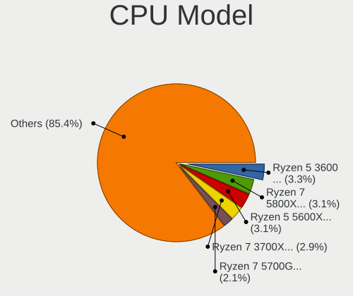

| Model                                       | Desktops | Percent |
|---------------------------------------------|----------|---------|
| AMD Ryzen 5 3600 6-Core Processor           | 16       | 3.35%   |
| AMD Ryzen 7 5800X 8-Core Processor          | 15       | 3.14%   |
| AMD Ryzen 5 5600X 6-Core Processor          | 15       | 3.14%   |
| AMD Ryzen 7 3700X 8-Core Processor          | 14       | 2.93%   |
| AMD Ryzen 7 5700G with Radeon Graphics      | 10       | 2.09%   |
| AMD Ryzen 7 7800X3D 8-Core Processor        | 9        | 1.88%   |
| AMD Ryzen 9 5950X 16-Core Processor         | 8        | 1.67%   |
| AMD Ryzen 9 5900X 12-Core Processor         | 8        | 1.67%   |
| AMD Ryzen 9 3900X 12-Core Processor         | 8        | 1.67%   |
| Intel 12th Gen Core i5-12600K               | 7        | 1.46%   |
| AMD Ryzen 9 7900X 12-Core Processor         | 7        | 1.46%   |
| AMD Ryzen 7 9800X3D 8-Core Processor        | 7        | 1.46%   |
| AMD Ryzen 7 3800X 8-Core Processor          | 7        | 1.46%   |
| AMD Ryzen 9 7950X 16-Core Processor         | 6        | 1.26%   |
| AMD Ryzen 7 5800X3D 8-Core Processor        | 6        | 1.26%   |
| AMD Ryzen 5 5600G with Radeon Graphics      | 6        | 1.26%   |
| AMD FX-8350 Eight-Core Processor            | 6        | 1.26%   |
| Intel Core i7-4790 CPU @ 3.60GHz            | 5        | 1.05%   |
| Intel Core i5-3470 CPU @ 3.20GHz            | 5        | 1.05%   |
| AMD Ryzen 7 7700X 8-Core Processor          | 5        | 1.05%   |
| AMD Ryzen 7 5700X 8-Core Processor          | 5        | 1.05%   |
| AMD Ryzen 5 2600X Six-Core Processor        | 5        | 1.05%   |
| AMD Ryzen 5 2600 Six-Core Processor         | 5        | 1.05%   |
| Intel Core i7-8700K CPU @ 3.70GHz           | 4        | 0.84%   |
| Intel Core i3-7100 CPU @ 3.90GHz            | 4        | 0.84%   |
| AMD Ryzen 7 2700X Eight-Core Processor      | 4        | 0.84%   |
| AMD Ryzen 7 2700 Eight-Core Processor       | 4        | 0.84%   |
| AMD Ryzen 5 7600X 6-Core Processor          | 4        | 0.84%   |
| AMD Ryzen 5 7600 6-Core Processor           | 4        | 0.84%   |
| AMD Ryzen 5 3400G with Radeon Vega Graphics | 4        | 0.84%   |
| Intel Core i9-9900K CPU @ 3.60GHz           | 3        | 0.63%   |
| Intel Core i7-9700K CPU @ 3.60GHz           | 3        | 0.63%   |
| Intel Core i7-9700 CPU @ 3.00GHz            | 3        | 0.63%   |
| Intel Core i7-7700K CPU @ 4.20GHz           | 3        | 0.63%   |
| Intel Core i7-2600 CPU @ 3.40GHz            | 3        | 0.63%   |
| Intel Core i5-4590 CPU @ 3.30GHz            | 3        | 0.63%   |
| Intel Core i5-4570 CPU @ 3.20GHz            | 3        | 0.63%   |
| Intel Core i5-2400 CPU @ 3.10GHz            | 3        | 0.63%   |
| Intel 12th Gen Core i5-12400F               | 3        | 0.63%   |
| Intel 12th Gen Core i3-12100F               | 3        | 0.63%   |

CPU Model Family
----------------

Processor model prefix

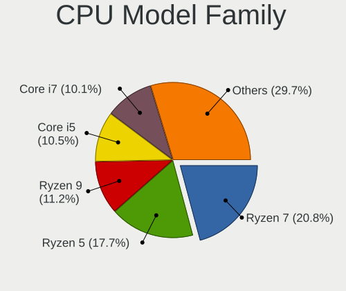

| Model                   | Desktops | Percent |
|-------------------------|----------|---------|
| AMD Ryzen 7             | 99       | 20.84%  |
| AMD Ryzen 5             | 84       | 17.68%  |
| AMD Ryzen 9             | 53       | 11.16%  |
| Intel Core i5           | 50       | 10.53%  |
| Intel Core i7           | 48       | 10.11%  |
| Other                   | 44       | 9.26%   |
| Intel Core i3           | 21       | 4.42%   |
| Intel Xeon              | 15       | 3.16%   |
| AMD FX                  | 14       | 2.95%   |
| Intel Core i9           | 7        | 1.47%   |
| AMD Ryzen 3             | 7        | 1.47%   |
| Intel Pentium           | 5        | 1.05%   |
| AMD Ryzen Threadripper  | 3        | 0.63%   |
| Intel Pentium Dual-Core | 2        | 0.42%   |
| Intel Core 2 Quad       | 2        | 0.42%   |
| Intel Celeron           | 2        | 0.42%   |
| AMD Phenom II X6        | 2        | 0.42%   |
| AMD Athlon              | 2        | 0.42%   |
| AMD A10                 | 2        | 0.42%   |
| Intel Pentium Gold      | 1        | 0.21%   |
| Intel Core 2 Duo        | 1        | 0.21%   |
| Intel Core 2            | 1        | 0.21%   |
| Intel Core              | 1        | 0.21%   |
| AMD Ryzen 7 PRO         | 1        | 0.21%   |
| AMD Ryzen 5 PRO         | 1        | 0.21%   |
| AMD Phenom II X4        | 1        | 0.21%   |
| AMD Phenom II X2        | 1        | 0.21%   |
| AMD E1                  | 1        | 0.21%   |
| AMD Athlon X4           | 1        | 0.21%   |
| AMD Athlon Dual Core    | 1        | 0.21%   |
| AMD A8                  | 1        | 0.21%   |
| AMD A4                  | 1        | 0.21%   |

CPU Cores
---------

Number of processor cores

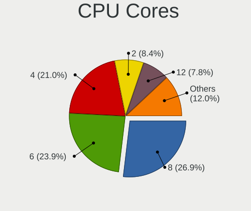

| Number | Desktops | Percent |
|--------|----------|---------|
| 8      | 128      | 26.89%  |
| 6      | 114      | 23.95%  |
| 4      | 100      | 21.01%  |
| 2      | 40       | 8.4%    |
| 12     | 37       | 7.77%   |
| 16     | 27       | 5.67%   |
| 10     | 12       | 2.52%   |
| 24     | 5        | 1.05%   |
| 14     | 5        | 1.05%   |
| 20     | 4        | 0.84%   |
| 40     | 1        | 0.21%   |
| 18     | 1        | 0.21%   |
| 7      | 1        | 0.21%   |
| 3      | 1        | 0.21%   |

CPU Sockets
-----------

Number of sockets

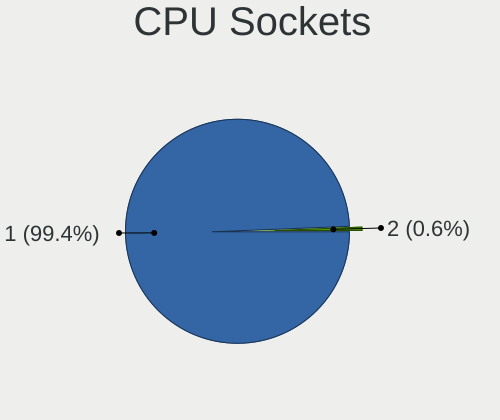

| Number | Desktops | Percent |
|--------|----------|---------|
| 1      | 471      | 99.37%  |
| 2      | 3        | 0.63%   |

CPU Threads
-----------

Threads per core (Hyper-Threading)

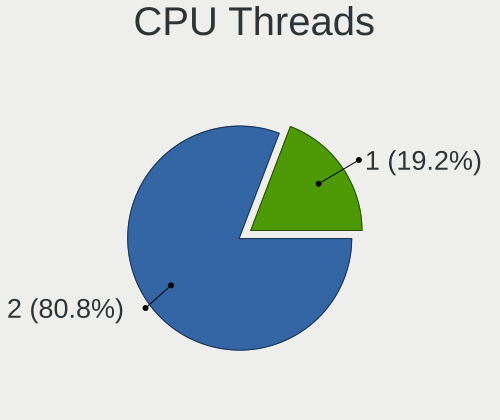

| Number | Desktops | Percent |
|--------|----------|---------|
| 2      | 383      | 80.8%   |
| 1      | 91       | 19.2%   |

CPU Op-Modes
------------

CPU Operation Modes (32-bit, 64-bit)

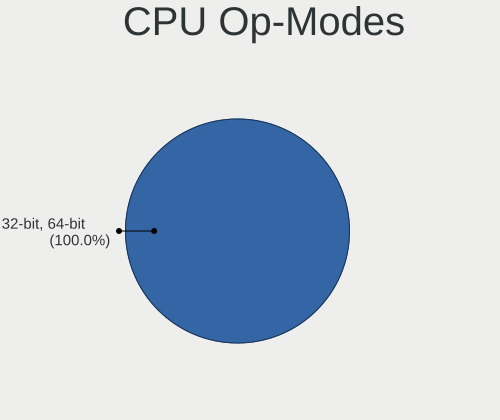

| Op mode        | Desktops | Percent |
|----------------|----------|---------|
| 32-bit, 64-bit | 474      | 100%    |

CPU Microcode
-------------

Microcode number

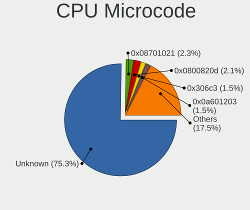

| Number     | Desktops | Percent |
|------------|----------|---------|
| Unknown    | 362      | 75.26%  |
| 0x08701021 | 11       | 2.29%   |
| 0x0800820d | 10       | 2.08%   |
| 0x306c3    | 7        | 1.46%   |
| 0x0a601203 | 7        | 1.46%   |
| 0x0a50000d | 6        | 1.25%   |
| 0x0a20120a | 6        | 1.25%   |
| 0x306a9    | 5        | 1.04%   |
| 0x206a7    | 5        | 1.04%   |
| 0x0a50000c | 4        | 0.83%   |
| 0xa0653    | 3        | 0.62%   |
| 0x906ea    | 3        | 0.62%   |
| 0x506e3    | 3        | 0.62%   |
| 0x0a201025 | 3        | 0.62%   |
| 0x0a201009 | 3        | 0.62%   |
| 0x08108109 | 3        | 0.62%   |
| 0x08001137 | 3        | 0.62%   |
| 0x906ed    | 2        | 0.42%   |
| 0x906e9    | 2        | 0.42%   |
| 0x90672    | 2        | 0.42%   |
| 0x0a404102 | 2        | 0.42%   |
| 0x0a201204 | 2        | 0.42%   |
| 0x0a201016 | 2        | 0.42%   |
| 0x08701013 | 2        | 0.42%   |
| 0x0810100b | 2        | 0.42%   |
| 0x08001138 | 2        | 0.42%   |
| 0x06000852 | 2        | 0.42%   |
| 0x010000dc | 2        | 0.42%   |
| 0xa0655    | 1        | 0.21%   |
| 0x906ec    | 1        | 0.21%   |
| 0x906eb    | 1        | 0.21%   |
| 0x90675    | 1        | 0.21%   |
| 0x306e4    | 1        | 0.21%   |
| 0x106a5    | 1        | 0.21%   |
| 0x1067a    | 1        | 0.21%   |
| 0x0b404035 | 1        | 0.21%   |
| 0x0a601201 | 1        | 0.21%   |
| 0x0a50000b | 1        | 0.21%   |
| 0x0a20120e | 1        | 0.21%   |
| 0x08701030 | 1        | 0.21%   |

CPU Microarch
-------------

Microarchitecture

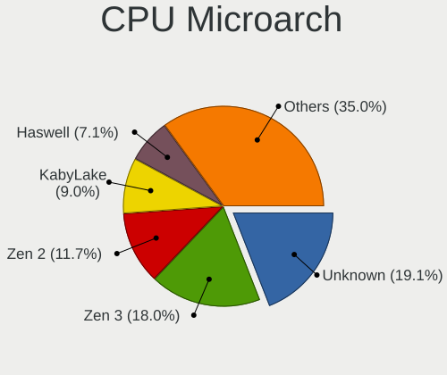

| Name             | Desktops | Percent |
|------------------|----------|---------|
| Unknown          | 91       | 19.08%  |
| Zen 3            | 86       | 18.03%  |
| Zen 2            | 56       | 11.74%  |
| KabyLake         | 43       | 9.01%   |
| Haswell          | 34       | 7.13%   |
| Zen+             | 28       | 5.87%   |
| IvyBridge        | 20       | 4.19%   |
| Zen              | 19       | 3.98%   |
| Alderlake Hybrid | 18       | 3.77%   |
| SandyBridge      | 16       | 3.35%   |
| CometLake        | 14       | 2.94%   |
| Piledriver       | 13       | 2.73%   |
| Skylake          | 8        | 1.68%   |
| Penryn           | 6        | 1.26%   |
| Broadwell        | 5        | 1.05%   |
| Nehalem          | 4        | 0.84%   |
| K10              | 4        | 0.84%   |
| Steamroller      | 3        | 0.63%   |
| Jaguar           | 2        | 0.42%   |
| Icelake          | 2        | 0.42%   |
| Bulldozer        | 2        | 0.42%   |
| Westmere         | 1        | 0.21%   |
| K8 Hammer        | 1        | 0.21%   |
| Core             | 1        | 0.21%   |

Graphics
--------

GPU Vendor
----------

Vendors of graphics cards

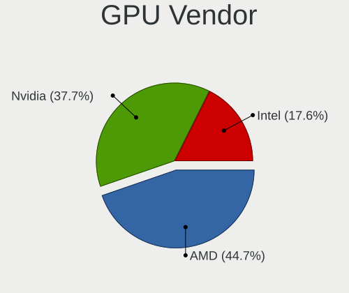

| Vendor | Desktops | Percent |
|--------|----------|---------|
| AMD    | 241      | 44.71%  |
| Nvidia | 203      | 37.66%  |
| Intel  | 95       | 17.63%  |

GPU Model
---------

Graphics card models

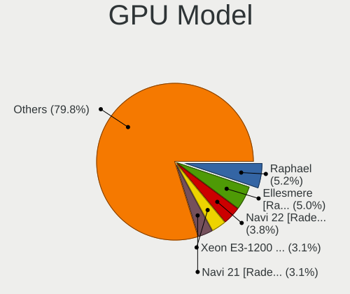

| Model                                                                       | Desktops | Percent |
|-----------------------------------------------------------------------------|----------|---------|
| AMD Raphael                                                                 | 30       | 5.18%   |
| AMD Ellesmere [Radeon RX 470/480/570/570X/580/580X/590]                     | 29       | 5.01%   |
| AMD Navi 22 [Radeon RX 6700/6700 XT/6750 XT / 6800M/6850M XT]               | 22       | 3.8%    |
| Intel Xeon E3-1200 v3/4th Gen Core Processor Integrated Graphics Controller | 18       | 3.11%   |
| AMD Navi 21 [Radeon RX 6800/6800 XT / 6900 XT]                              | 18       | 3.11%   |
| AMD Navi 31 [Radeon RX 7900 XT/7900 XTX/7900 GRE/7900M]                     | 16       | 2.76%   |
| Nvidia GA106 [GeForce RTX 3060 Lite Hash Rate]                              | 15       | 2.59%   |
| AMD Navi 10 [Radeon RX 5600 OEM/5600 XT / 5700/5700 XT]                     | 15       | 2.59%   |
| AMD Cezanne [Radeon Vega Series / Radeon Vega Mobile Series]                | 14       | 2.42%   |
| Intel Alder Lake-S GT1 [UHD Graphics 770]                                   | 13       | 2.25%   |
| Nvidia GP104 [GeForce GTX 1070]                                             | 10       | 1.73%   |
| AMD Navi 23 [Radeon RX 6600/6600 XT/6600M]                                  | 10       | 1.73%   |
| Intel CoffeeLake-S GT2 [UHD Graphics 630]                                   | 9        | 1.55%   |
| Intel Xeon E3-1200 v2/3rd Gen Core processor Graphics Controller            | 8        | 1.38%   |
| AMD Polaris 20 XL [Radeon RX 580 2048SP]                                    | 8        | 1.38%   |
| AMD Navi 32 [Radeon RX 7700 XT / 7800 XT]                                   | 8        | 1.38%   |
| Nvidia GP107 [GeForce GTX 1050 Ti]                                          | 7        | 1.21%   |
| Nvidia GK208B [GeForce GT 710]                                              | 7        | 1.21%   |
| Nvidia GA104 [GeForce RTX 3060 Ti Lite Hash Rate]                           | 7        | 1.21%   |
| Intel 2nd Generation Core Processor Family Integrated Graphics Controller   | 7        | 1.21%   |
| AMD Granite Ridge [Radeon Graphics]                                         | 7        | 1.21%   |
| Nvidia GP104 [GeForce GTX 1070 Ti]                                          | 6        | 1.04%   |
| Nvidia GA104 [GeForce RTX 3070 Lite Hash Rate]                              | 6        | 1.04%   |
| Intel Kaby Lake-S GT2 [HD Graphics 630]                                     | 6        | 1.04%   |
| AMD Vega 10 XL/XT [Radeon RX Vega 56/64]                                    | 6        | 1.04%   |
| AMD Picasso/Raven 2 [Radeon Vega Series / Radeon Vega Mobile Series]        | 6        | 1.04%   |
| AMD Navi 33 [Radeon RX 7600/7600 XT/7600M XT/7600S/7700S / PRO W7600]       | 6        | 1.04%   |
| Nvidia TU104 [GeForce RTX 2080 Rev. A]                                      | 5        | 0.86%   |
| Nvidia TU102 [GeForce RTX 2080 Ti Rev. A]                                   | 5        | 0.86%   |
| Nvidia GP106 [GeForce GTX 1060 6GB]                                         | 5        | 0.86%   |
| Nvidia GP104 [GeForce GTX 1080]                                             | 5        | 0.86%   |
| Nvidia GA102 [GeForce RTX 3080]                                             | 5        | 0.86%   |
| Nvidia AD103 [GeForce RTX 4080]                                             | 5        | 0.86%   |
| Nvidia AD103 [GeForce RTX 4080 SUPER]                                       | 5        | 0.86%   |
| AMD Raven Ridge [Radeon Vega Series / Radeon Vega Mobile Series]            | 5        | 0.86%   |
| AMD Lexa PRO [Radeon 540/540X/550/550X / RX 540X/550/550X]                  | 5        | 0.86%   |
| Nvidia GT218 [GeForce 210]                                                  | 4        | 0.69%   |
| Nvidia GP107 [GeForce GTX 1050]                                             | 4        | 0.69%   |
| Nvidia GM206 [GeForce GTX 960]                                              | 4        | 0.69%   |
| Nvidia GM107 [GeForce GTX 750 Ti]                                           | 4        | 0.69%   |

GPU Combo
---------

Combinations of graphics cards

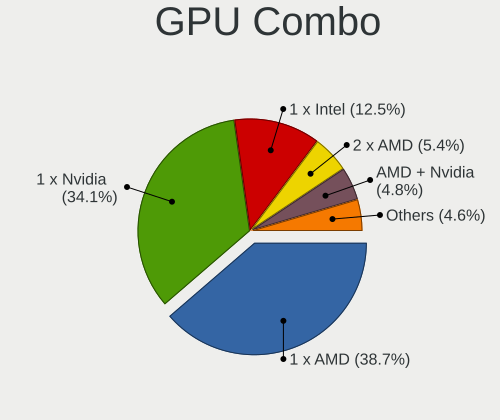

| Name                 | Desktops | Percent |
|----------------------|----------|---------|
| 1 x AMD              | 186      | 38.67%  |
| 1 x Nvidia           | 164      | 34.1%   |
| 1 x Intel            | 60       | 12.47%  |
| 2 x AMD              | 26       | 5.41%   |
| AMD + Nvidia         | 23       | 4.78%   |
| Intel + Nvidia       | 9        | 1.87%   |
| Intel + AMD          | 6        | 1.25%   |
| 2 x Nvidia           | 5        | 1.04%   |
| 2 x Intel            | 1        | 0.21%   |
| 2 x AMD + 1 x Nvidia | 1        | 0.21%   |

GPU Driver
----------

Free vs proprietary

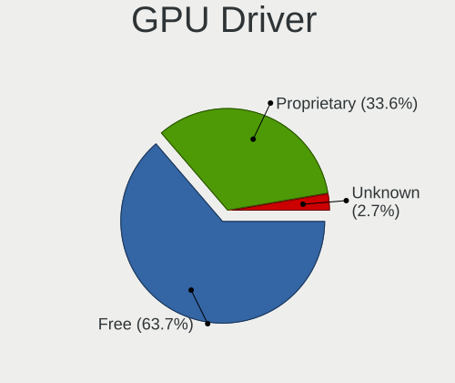

| Driver      | Desktops | Percent |
|-------------|----------|---------|
| Free        | 307      | 63.69%  |
| Proprietary | 162      | 33.61%  |
| Unknown     | 13       | 2.7%    |

GPU Memory
----------

Total video memory

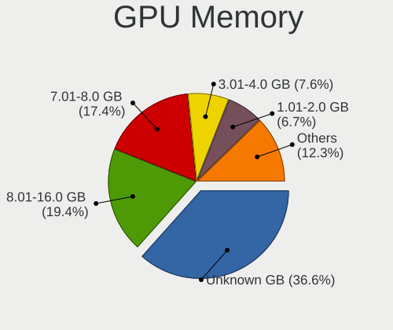

| Size in GB | Desktops | Percent |
|------------|----------|---------|
| Unknown    | 179      | 36.61%  |
| 8.01-16.0  | 95       | 19.43%  |
| 7.01-8.0   | 85       | 17.38%  |
| 3.01-4.0   | 37       | 7.57%   |
| 1.01-2.0   | 33       | 6.75%   |
| 5.01-6.0   | 16       | 3.27%   |
| 16.01-24.0 | 16       | 3.27%   |
| 0.01-0.5   | 13       | 2.66%   |
| 0.51-1.0   | 11       | 2.25%   |
| 2.01-3.0   | 3        | 0.61%   |
| 24.01-32.0 | 1        | 0.2%    |

Monitor
-------

Monitor Vendor
--------------

Monitor vendors

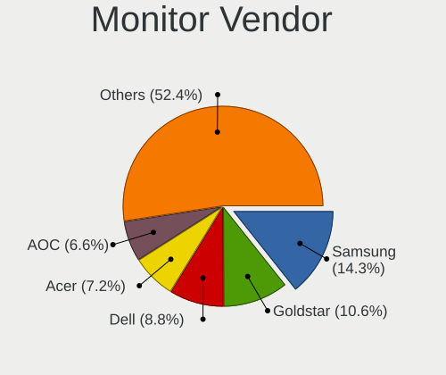

| Vendor               | Desktops | Percent |
|----------------------|----------|---------|
| Samsung Electronics  | 89       | 14.31%  |
| Goldstar             | 66       | 10.61%  |
| Dell                 | 55       | 8.84%   |
| Acer                 | 45       | 7.23%   |
| AOC                  | 41       | 6.59%   |
| Hewlett-Packard      | 30       | 4.82%   |
| BenQ                 | 28       | 4.5%    |
| Ancor Communications | 27       | 4.34%   |
| ASUSTek Computer     | 23       | 3.7%    |
| MSI                  | 22       | 3.54%   |
| Philips              | 18       | 2.89%   |
| Unknown              | 13       | 2.09%   |
| ViewSonic            | 11       | 1.77%   |
| Iiyama               | 11       | 1.77%   |
| Gigabyte Technology  | 10       | 1.61%   |
| Sony                 | 8        | 1.29%   |
| NEC Computers        | 8        | 1.29%   |
| Sceptre Tech         | 7        | 1.13%   |
| Lenovo               | 6        | 0.96%   |
| HKC                  | 5        | 0.8%    |
| Denver               | 5        | 0.8%    |
| Vizio                | 4        | 0.64%   |
| RTK                  | 4        | 0.64%   |
| Insignia             | 4        | 0.64%   |
| Toshiba              | 3        | 0.48%   |
| Mi                   | 3        | 0.48%   |
| LG Electronics       | 3        | 0.48%   |
| HUAWEI               | 3        | 0.48%   |
| ___                  | 2        | 0.32%   |
| Viotek               | 2        | 0.32%   |
| SKG                  | 2        | 0.32%   |
| Sharp                | 2        | 0.32%   |
| SGT                  | 2        | 0.32%   |
| Pixio                | 2        | 0.32%   |
| Panasonic            | 2        | 0.32%   |
| Optoma               | 2        | 0.32%   |
| ONN                  | 2        | 0.32%   |
| HannStar             | 2        | 0.32%   |
| Fujitsu Siemens      | 2        | 0.32%   |
| Eizo                 | 2        | 0.32%   |

Monitor Model
-------------

Monitor models

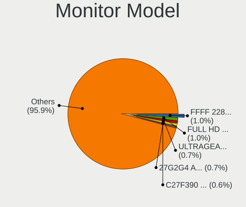

| Model                                                                  | Desktops | Percent |
|------------------------------------------------------------------------|----------|---------|
| Unknown LCD Monitor FFFF 2288x1287 2550x2550mm 142.0-inch              | 7        | 1.04%   |
| Goldstar FULL HD GSM5B55 1920x1080 480x270mm 21.7-inch                 | 7        | 1.04%   |
| Goldstar ULTRAGEAR GSM7766 2560x1440 697x392mm 31.5-inch               | 5        | 0.74%   |
| AOC 27G2G4 AOC2702 1920x1080 598x336mm 27.0-inch                       | 5        | 0.74%   |
| Samsung Electronics C27F390 SAM0D32 1920x1080 598x336mm 27.0-inch      | 4        | 0.59%   |
| Goldstar LG ULTRAWIDE GSM59F1 2560x1080 670x280mm 28.6-inch            | 4        | 0.59%   |
| Goldstar LG TV SSCR2 GSMC0C8 3840x2160                                 | 4        | 0.59%   |
| Gigabyte Technology G27Q GBT2709 2560x1440 598x336mm 27.0-inch         | 4        | 0.59%   |
| BenQ GW2480 BNQ78E7 1920x1080 527x296mm 23.8-inch                      | 4        | 0.59%   |
| Samsung Electronics C24F390 SAM0D2C 1920x1080 521x293mm 23.5-inch      | 3        | 0.44%   |
| MSI G321CU MSI3DC5 3840x2160 697x392mm 31.5-inch                       | 3        | 0.44%   |
| Hewlett-Packard E241i HWP3122 1920x1200 518x324mm 24.1-inch            | 3        | 0.44%   |
| Goldstar ULTRAWIDE GSM5AFB 2560x1080 798x334mm 34.1-inch               | 3        | 0.44%   |
| Denver MO-HHS-32C LHCFFFF 1920x1080 699x393mm 31.6-inch                | 3        | 0.44%   |
| Dell U2412M DELA07A 1920x1200 518x324mm 24.1-inch                      | 3        | 0.44%   |
| BenQ GL2760 BNQ78D5 1920x1080 598x336mm 27.0-inch                      | 3        | 0.44%   |
| AOC 27G1G4 AOC2701 1920x1080 598x336mm 27.0-inch                       | 3        | 0.44%   |
| Ancor Communications VE247 ACI2493 1920x1080 530x300mm 24.0-inch       | 3        | 0.44%   |
| Ancor Communications ASUS PB287Q ACI28A3 3840x2160 621x341mm 27.9-inch | 3        | 0.44%   |
| ViewSonic VX3276-QHD VSCE635 2560x1440 698x393mm 31.5-inch             | 2        | 0.3%    |
| ViewSonic VX3258 series VSCDE35 2560x1440 700x390mm 31.5-inch          | 2        | 0.3%    |
| Sony TV SNYEA01 1920x1080                                              | 2        | 0.3%    |
| Sceptre Tech Sceptre F27 SPT0AD7 1920x1080 600x330mm 27.0-inch         | 2        | 0.3%    |
| Sceptre Tech Sceptre F24 SPT09AB 1920x1080 530x290mm 23.8-inch         | 2        | 0.3%    |
| Samsung Electronics U28E590 SAM0C4D 3840x2160 607x345mm 27.5-inch      | 2        | 0.3%    |
| Samsung Electronics S34J55x SAM0F72 3440x1440 797x333mm 34.0-inch      | 2        | 0.3%    |
| Samsung Electronics LU28R55 SAM1015 3840x2160 632x360mm 28.6-inch      | 2        | 0.3%    |
| Samsung Electronics LS49AG95 SAM71AC 3840x1080 1190x340mm 48.7-inch    | 2        | 0.3%    |
| Samsung Electronics LCD Monitor SAM0A7A 1920x1080 1060x626mm 48.5-inch | 2        | 0.3%    |
| Samsung Electronics LC32G7xT SAM7058 2560x1440 698x393mm 31.5-inch     | 2        | 0.3%    |
| Samsung Electronics LC27G5xT SAM707A 2560x1440 597x336mm 27.0-inch     | 2        | 0.3%    |
| Samsung Electronics C49RG9x SAM0F9C 3360x1440 1193x336mm 48.8-inch     | 2        | 0.3%    |
| Samsung Electronics C32F391 SAM0D35 1920x1080 698x393mm 31.5-inch      | 2        | 0.3%    |
| Samsung Electronics C27F591 SAM0D37 1920x1080 600x340mm 27.2-inch      | 2        | 0.3%    |
| RTK LCD Monitor RTK1D1A 1920x1080 1020x570mm 46.0-inch                 | 2        | 0.3%    |
| Philips PHL 276E8V PHLC18F 3840x2160 597x336mm 27.0-inch               | 2        | 0.3%    |
| Philips PHL 273V7 PHLC156 1920x1080 598x336mm 27.0-inch                | 2        | 0.3%    |
| MSI G273 MSI3CA7 1920x1080 590x330mm 26.6-inch                         | 2        | 0.3%    |
| HUAWEI ZQE-CBA HWV6A25 3440x1440 797x334mm 34.0-inch                   | 2        | 0.3%    |
| Hewlett-Packard vs19b HWP264C 1280x1024 376x301mm 19.0-inch            | 2        | 0.3%    |

Monitor Resolution
------------------

Monitor screen resolution

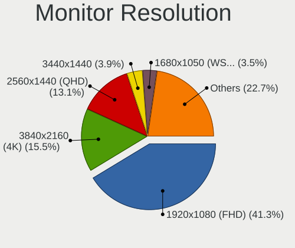

| Resolution         | Desktops | Percent |
|--------------------|----------|---------|
| 1920x1080 (FHD)    | 246      | 41.34%  |
| 3840x2160 (4K)     | 92       | 15.46%  |
| 2560x1440 (QHD)    | 78       | 13.11%  |
| 3440x1440          | 23       | 3.87%   |
| 1680x1050 (WSXGA+) | 21       | 3.53%   |
| 2560x1080          | 19       | 3.19%   |
| 1366x768 (WXGA)    | 15       | 2.52%   |
| 3840x1080          | 12       | 2.02%   |
| 1920x1200 (WUXGA)  | 12       | 2.02%   |
| 1280x1024 (SXGA)   | 12       | 2.02%   |
| 1440x900 (WXGA+)   | 11       | 1.85%   |
| Unknown            | 11       | 1.85%   |
| 2288x1287          | 8        | 1.34%   |
| 1600x900 (HD+)     | 7        | 1.18%   |
| 1360x768           | 4        | 0.67%   |
| 3840x1200          | 3        | 0.5%    |
| 7680x2160          | 2        | 0.34%   |
| 3840x1600          | 2        | 0.34%   |
| 2560x1600          | 2        | 0.34%   |
| 1920x540           | 2        | 0.34%   |
| 1280x720 (HD)      | 2        | 0.34%   |
| 9600x2160          | 1        | 0.17%   |
| 504x315            | 1        | 0.17%   |
| 480x1920           | 1        | 0.17%   |
| 4480x1440          | 1        | 0.17%   |
| 3360x1050          | 1        | 0.17%   |
| 2880x1440          | 1        | 0.17%   |
| 2560x2880          | 1        | 0.17%   |
| 2160x1440          | 1        | 0.17%   |
| 2048x1152          | 1        | 0.17%   |
| 1600x1200          | 1        | 0.17%   |
| 1400x1050          | 1        | 0.17%   |

Monitor Diagonal
----------------

Diagonal size in inches

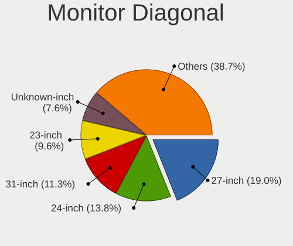

| Inches  | Desktops | Percent |
|---------|----------|---------|
| 27      | 117      | 18.96%  |
| 24      | 85       | 13.78%  |
| 31      | 70       | 11.35%  |
| 23      | 59       | 9.56%   |
| Unknown | 47       | 7.62%   |
| 34      | 32       | 5.19%   |
| 21      | 31       | 5.02%   |
| 19      | 19       | 3.08%   |
| 22      | 18       | 2.92%   |
| 20      | 10       | 1.62%   |
| 72      | 9        | 1.46%   |
| 18      | 9        | 1.46%   |
| 142     | 7        | 1.13%   |
| 84      | 7        | 1.13%   |
| 49      | 7        | 1.13%   |
| 48      | 7        | 1.13%   |
| 40      | 7        | 1.13%   |
| 28      | 6        | 0.97%   |
| 26      | 6        | 0.97%   |
| 32      | 5        | 0.81%   |
| 29      | 5        | 0.81%   |
| 25      | 5        | 0.81%   |
| 54      | 4        | 0.65%   |
| 43      | 4        | 0.65%   |
| 65      | 3        | 0.49%   |
| 63      | 3        | 0.49%   |
| 35      | 3        | 0.49%   |
| 33      | 3        | 0.49%   |
| 17      | 3        | 0.49%   |
| 15      | 3        | 0.49%   |
| 75      | 2        | 0.32%   |
| 74      | 2        | 0.32%   |
| 46      | 2        | 0.32%   |
| 44      | 2        | 0.32%   |
| 37      | 2        | 0.32%   |
| 16      | 2        | 0.32%   |
| 69      | 1        | 0.16%   |
| 58      | 1        | 0.16%   |
| 57      | 1        | 0.16%   |
| 50      | 1        | 0.16%   |

Monitor Width
-------------

Physical width

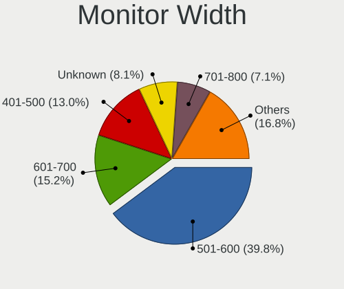

| Width in mm    | Desktops | Percent |
|----------------|----------|---------|
| 501-600        | 230      | 39.79%  |
| 601-700        | 88       | 15.22%  |
| 401-500        | 75       | 12.98%  |
| Unknown        | 47       | 8.13%   |
| 701-800        | 41       | 7.09%   |
| 1001-1500      | 32       | 5.54%   |
| 1501-2000      | 20       | 3.46%   |
| 801-900        | 14       | 2.42%   |
| 351-400        | 12       | 2.08%   |
| More than 2000 | 7        | 1.21%   |
| 301-350        | 6        | 1.04%   |
| 901-1000       | 3        | 0.52%   |
| 201-300        | 2        | 0.35%   |
| 101-200        | 1        | 0.17%   |

Aspect Ratio
------------

Proportional relationship between the width and the height

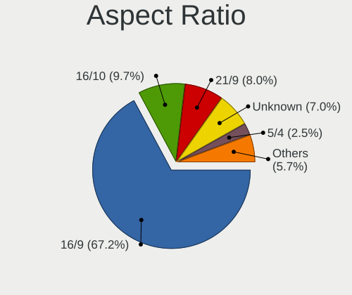

| Ratio   | Desktops | Percent |
|---------|----------|---------|
| 16/9    | 354      | 67.17%  |
| 16/10   | 51       | 9.68%   |
| 21/9    | 42       | 7.97%   |
| Unknown | 37       | 7.02%   |
| 5/4     | 13       | 2.47%   |
| 32/9    | 13       | 2.47%   |
| 1.00    | 8        | 1.52%   |
| 3/2     | 3        | 0.57%   |
| 3.20    | 2        | 0.38%   |
| 4/3     | 1        | 0.19%   |
| 2.00    | 1        | 0.19%   |
| 0.89    | 1        | 0.19%   |
| 0.25    | 1        | 0.19%   |

Monitor Area
------------

Area in inch²

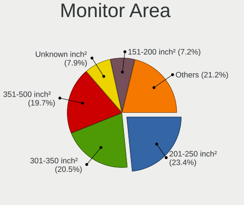

| Area in inch² | Desktops | Percent |
|----------------|----------|---------|
| 201-250        | 139      | 23.4%   |
| 301-350        | 122      | 20.54%  |
| 351-500        | 117      | 19.7%   |
| Unknown        | 47       | 7.91%   |
| 151-200        | 43       | 7.24%   |
| More than 1000 | 41       | 6.9%    |
| 251-300        | 36       | 6.06%   |
| 501-1000       | 32       | 5.39%   |
| 141-150        | 9        | 1.52%   |
| 101-110        | 3        | 0.51%   |
| 111-120        | 2        | 0.34%   |
| 51-60          | 1        | 0.17%   |
| 1-40           | 1        | 0.17%   |
| 121-130        | 1        | 0.17%   |

Pixel Density
-------------

Pixels per inch

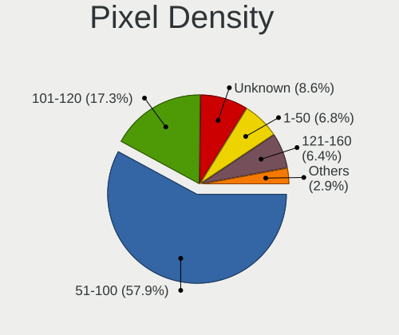

| Density | Desktops | Percent |
|---------|----------|---------|
| 51-100  | 315      | 57.9%   |
| 101-120 | 94       | 17.28%  |
| Unknown | 47       | 8.64%   |
| 1-50    | 37       | 6.8%    |
| 121-160 | 35       | 6.43%   |
| 161-240 | 16       | 2.94%   |

Multiple Monitors
-----------------

Total monitors connected

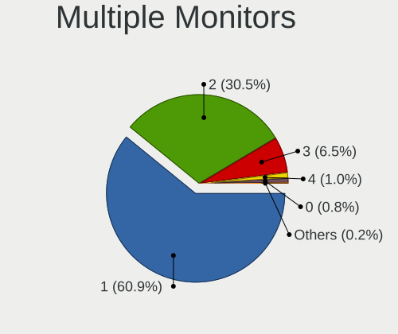

| Total | Desktops | Percent |
|-------|----------|---------|
| 1     | 299      | 60.9%   |
| 2     | 150      | 30.55%  |
| 3     | 32       | 6.52%   |
| 4     | 5        | 1.02%   |
| 0     | 4        | 0.81%   |
| 5     | 1        | 0.2%    |

Network
-------

Net Controller Vendor
---------------------

Controller vendors

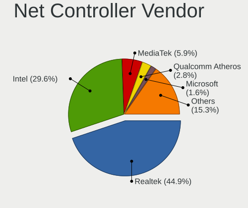

| Vendor                          | Desktops | Percent |
|---------------------------------|----------|---------|
| Realtek Semiconductor           | 340      | 44.85%  |
| Intel                           | 224      | 29.55%  |
| MediaTek                        | 45       | 5.94%   |
| Qualcomm Atheros                | 21       | 2.77%   |
| Microsoft                       | 12       | 1.58%   |
| TP-Link                         | 11       | 1.45%   |
| Broadcom                        | 11       | 1.45%   |
| Aquantia                        | 10       | 1.32%   |
| Ralink Technology               | 9        | 1.19%   |
| NetGear                         | 9        | 1.19%   |
| ASIX Electronics                | 8        | 1.06%   |
| Qualcomm Technologies           | 6        | 0.79%   |
| DisplayLink                     | 6        | 0.79%   |
| Linksys                         | 5        | 0.66%   |
| Samsung Electronics             | 4        | 0.53%   |
| Ralink                          | 3        | 0.4%    |
| Google                          | 3        | 0.4%    |
| Xiaomi                          | 2        | 0.26%   |
| Qualcomm Atheros Communications | 2        | 0.26%   |
| D-Link                          | 2        | 0.26%   |
| Broadcom Limited                | 2        | 0.26%   |
| Belkin Components               | 2        | 0.26%   |
| AVM                             | 2        | 0.26%   |
| ZTE WCDMA Technologies MSM      | 1        | 0.13%   |
| Winbond Electronics             | 1        | 0.13%   |
| U-Blox                          | 1        | 0.13%   |
| Spreadtrum Communications       | 1        | 0.13%   |
| Sitecom Europe                  | 1        | 0.13%   |
| Sierra Wireless                 | 1        | 0.13%   |
| Qualcomm                        | 1        | 0.13%   |
| QinHeng Electronics             | 1        | 0.13%   |
| OPPO Electronics                | 1        | 0.13%   |
| Microchip Technology            | 1        | 0.13%   |
| Mercucys                        | 1        | 0.13%   |
| MCS                             | 1        | 0.13%   |
| InterBiometrics                 | 1        | 0.13%   |
| Holtek Semiconductor            | 1        | 0.13%   |
| ASUSTek Computer                | 1        | 0.13%   |
| American Future Technology      | 1        | 0.13%   |
| Alteon Networks                 | 1        | 0.13%   |

Net Controller Model
--------------------

Controller models

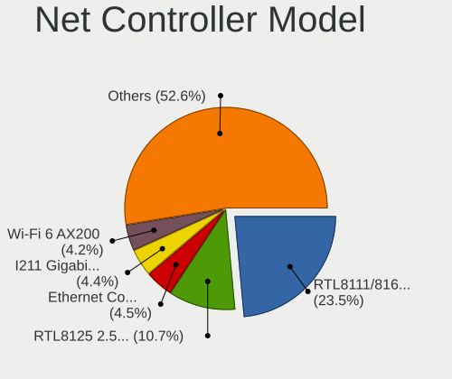

| Model                                                                           | Desktops | Percent |
|---------------------------------------------------------------------------------|----------|---------|
| Realtek RTL8111/8168/8211/8411 PCI Express Gigabit Ethernet Controller          | 208      | 23.53%  |
| Realtek RTL8125 2.5GbE Controller                                               | 95       | 10.75%  |
| Intel Ethernet Controller I225-V                                                | 40       | 4.52%   |
| Intel I211 Gigabit Network Connection                                           | 39       | 4.41%   |
| Intel Wi-Fi 6 AX200                                                             | 37       | 4.19%   |
| Intel Wi-Fi 6E(802.11ax) AX210/AX1675* 2x2 [Typhoon Peak]                       | 21       | 2.38%   |
| MediaTek MT7922 802.11ax PCI Express Wireless Network Adapter                   | 19       | 2.15%   |
| Intel Dual Band Wireless-AC 3168NGW [Stone Peak]                                | 16       | 1.81%   |
| Realtek RTL8821CE 802.11ac PCIe Wireless Network Adapter                        | 15       | 1.7%    |
| Realtek RTL8153 Gigabit Ethernet Adapter                                        | 14       | 1.58%   |
| Intel Wi-Fi 5(802.11ac) Wireless-AC 9x6x [Thunder Peak]                         | 14       | 1.58%   |
| MediaTek MT7921K (RZ608) Wi-Fi 6E 80MHz                                         | 13       | 1.47%   |
| Intel Ethernet Connection (2) I219-V                                            | 13       | 1.47%   |
| Intel Ethernet Connection I217-LM                                               | 12       | 1.36%   |
| Intel Ethernet Connection (7) I219-V                                            | 10       | 1.13%   |
| Intel 700 Series Chipset CNVi WiFi                                              | 10       | 1.13%   |
| Intel 82579LM Gigabit Network Connection (Lewisville)                           | 9        | 1.02%   |
| ASIX AX88179 Gigabit Ethernet                                                   | 8        | 0.9%    |
| Realtek RTL88x2bu [AC1200 Techkey]                                              | 6        | 0.68%   |
| Realtek RTL8852CE PCIe 802.11ax Wireless Network Controller                     | 6        | 0.68%   |
| Realtek RTL8126 5GbE Controller                                                 | 6        | 0.68%   |
| Ralink RT2870/RT3070 Wireless Adapter                                           | 6        | 0.68%   |
| Qualcomm WCN785x Wi-Fi 7(802.11be) 320MHz 2x2 [FastConnect 7800]                | 6        | 0.68%   |
| Intel Ethernet Connection (17) I219-V                                           | 6        | 0.68%   |
| Aquantia AQtion AQC113CS NBase-T/IEEE 802.3an Ethernet Controller [Antigua 10G] | 6        | 0.68%   |
| Realtek RTL810xE PCI Express Fast Ethernet controller                           | 5        | 0.57%   |
| Realtek Killer E3000 2.5GbE Controller                                          | 5        | 0.57%   |
| Microsoft Xbox Wireless Adapter for Windows                                     | 5        | 0.57%   |
| MediaTek MT7921 802.11ax PCIe Wireless Network Adapter [Filogic 330]            | 5        | 0.57%   |
| Intel Ethernet Controller I226-V                                                | 5        | 0.57%   |
| Intel Comet Lake PCH CNVi WiFi                                                  | 5        | 0.57%   |
| Intel Alder Lake-S PCH CNVi WiFi                                                | 5        | 0.57%   |
| Realtek USB 10/100/1G/2.5 LAN                                                   | 4        | 0.45%   |
| Realtek RTL8851BE PCIe 802.11ax Wireless Network Controller                     | 4        | 0.45%   |
| Realtek 802.11ac NIC                                                            | 4        | 0.45%   |
| NetGear A6210                                                                   | 4        | 0.45%   |
| Microsoft Wireless XBox Controller Dongle                                       | 4        | 0.45%   |
| Intel Tiger Lake PCH CNVi WiFi                                                  | 4        | 0.45%   |
| Intel Cannon Lake PCH CNVi WiFi                                                 | 4        | 0.45%   |
| Intel 82579V Gigabit Network Connection                                         | 4        | 0.45%   |

Wireless Vendor
---------------

Wireless vendors

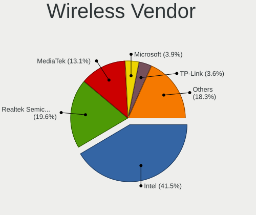

| Vendor                          | Desktops | Percent |
|---------------------------------|----------|---------|
| Intel                           | 127      | 41.5%   |
| Realtek Semiconductor           | 60       | 19.61%  |
| MediaTek                        | 40       | 13.07%  |
| Microsoft                       | 12       | 3.92%   |
| TP-Link                         | 11       | 3.59%   |
| Qualcomm Atheros                | 11       | 3.59%   |
| Ralink Technology               | 9        | 2.94%   |
| NetGear                         | 9        | 2.94%   |
| Broadcom                        | 6        | 1.96%   |
| Linksys                         | 5        | 1.63%   |
| Ralink                          | 3        | 0.98%   |
| Qualcomm Atheros Communications | 2        | 0.65%   |
| D-Link                          | 2        | 0.65%   |
| AVM                             | 2        | 0.65%   |
| Sitecom Europe                  | 1        | 0.33%   |
| Sierra Wireless                 | 1        | 0.33%   |
| Mercucys                        | 1        | 0.33%   |
| Broadcom Limited                | 1        | 0.33%   |
| Belkin Components               | 1        | 0.33%   |
| ASUSTek Computer                | 1        | 0.33%   |
| Accton Technology               | 1        | 0.33%   |

Wireless Model
--------------

Wireless models

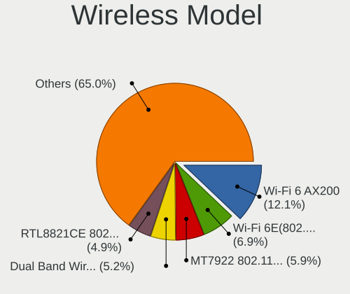

| Model                                                                           | Desktops | Percent |
|---------------------------------------------------------------------------------|----------|---------|
| Intel Wi-Fi 6 AX200                                                             | 37       | 12.09%  |
| Intel Wi-Fi 6E(802.11ax) AX210/AX1675* 2x2 [Typhoon Peak]                       | 21       | 6.86%   |
| MediaTek MT7922 802.11ax PCI Express Wireless Network Adapter                   | 18       | 5.88%   |
| Intel Dual Band Wireless-AC 3168NGW [Stone Peak]                                | 16       | 5.23%   |
| Realtek RTL8821CE 802.11ac PCIe Wireless Network Adapter                        | 15       | 4.9%    |
| Intel Wi-Fi 5(802.11ac) Wireless-AC 9x6x [Thunder Peak]                         | 14       | 4.58%   |
| MediaTek MT7921K (RZ608) Wi-Fi 6E 80MHz                                         | 13       | 4.25%   |
| Intel 700 Series Chipset CNVi WiFi                                              | 10       | 3.27%   |
| Realtek RTL88x2bu [AC1200 Techkey]                                              | 6        | 1.96%   |
| Realtek RTL8852CE PCIe 802.11ax Wireless Network Controller                     | 6        | 1.96%   |
| Ralink RT2870/RT3070 Wireless Adapter                                           | 6        | 1.96%   |
| Microsoft Xbox Wireless Adapter for Windows                                     | 5        | 1.63%   |
| MediaTek MT7921 802.11ax PCIe Wireless Network Adapter [Filogic 330]            | 5        | 1.63%   |
| Intel Comet Lake PCH CNVi WiFi                                                  | 5        | 1.63%   |
| Realtek RTL8851BE PCIe 802.11ax Wireless Network Controller                     | 4        | 1.31%   |
| Realtek 802.11ac NIC                                                            | 4        | 1.31%   |
| NetGear A6210                                                                   | 4        | 1.31%   |
| Microsoft Wireless XBox Controller Dongle                                       | 4        | 1.31%   |
| Intel Tiger Lake PCH CNVi WiFi                                                  | 4        | 1.31%   |
| Intel Cannon Lake PCH CNVi WiFi                                                 | 4        | 1.31%   |
| Intel Alder Lake-S PCH CNVi WiFi                                                | 4        | 1.31%   |
| Realtek RTL8822BE 802.11a/b/g/n/ac WiFi adapter                                 | 3        | 0.98%   |
| Realtek 802.11ax WLAN Adapter                                                   | 3        | 0.98%   |
| Microsoft Xbox 360 Wireless Adapter                                             | 3        | 0.98%   |
| Intel Wireless 7265                                                             | 3        | 0.98%   |
| TP-Link TL-WN823N v2/v3 [Realtek RTL8192EU]                                     | 2        | 0.65%   |
| TP-Link TL-WN722N v2/v3 [Realtek RTL8188EUS]                                    | 2        | 0.65%   |
| TP-Link 802.11ac NIC                                                            | 2        | 0.65%   |
| Realtek RTL8812AU 802.11a/b/g/n/ac 2T2R DB WLAN Adapter                         | 2        | 0.65%   |
| Realtek RTL8192CE PCIe Wireless Network Adapter                                 | 2        | 0.65%   |
| Realtek RTL8188EUS 802.11n Wireless Network Adapter                             | 2        | 0.65%   |
| Realtek 802.11n WLAN Adapter                                                    | 2        | 0.65%   |
| Qualcomm Atheros QCA9565 / AR9565 Wireless Network Adapter                      | 2        | 0.65%   |
| Qualcomm Atheros AR9485 Wireless Network Adapter                                | 2        | 0.65%   |
| Qualcomm Atheros AR9462 Wireless Network Adapter                                | 2        | 0.65%   |
| NetGear Nighthawk A7000 802.11ac Wireless Adapter AC1900 [Realtek 8814AU]       | 2        | 0.65%   |
| MediaTek MT7925 802.11be 160MHz 2x2 PCIe Wireless Network Adapter [Filogic 360] | 2        | 0.65%   |
| Linksys AE6000 802.11a/b/g/n/ac Wireless Adapter [MediaTek MT7610U]             | 2        | 0.65%   |
| Intel Wireless 7260                                                             | 2        | 0.65%   |
| Broadcom Network controller                                                     | 2        | 0.65%   |

Ethernet Vendor
---------------

Ethernet vendors

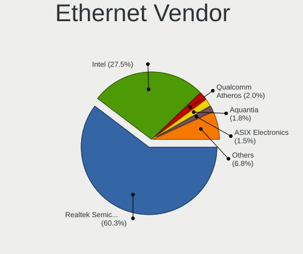

| Vendor                    | Desktops | Percent |
|---------------------------|----------|---------|
| Realtek Semiconductor     | 327      | 60.33%  |
| Intel                     | 149      | 27.49%  |
| Qualcomm Atheros          | 11       | 2.03%   |
| Aquantia                  | 10       | 1.85%   |
| ASIX Electronics          | 8        | 1.48%   |
| Qualcomm Technologies     | 6        | 1.11%   |
| DisplayLink               | 6        | 1.11%   |
| MediaTek                  | 5        | 0.92%   |
| Broadcom                  | 5        | 0.92%   |
| Samsung Electronics       | 4        | 0.74%   |
| Google                    | 3        | 0.55%   |
| Xiaomi                    | 2        | 0.37%   |
| Spreadtrum Communications | 1        | 0.18%   |
| Qualcomm                  | 1        | 0.18%   |
| OPPO Electronics          | 1        | 0.18%   |
| Broadcom Limited          | 1        | 0.18%   |
| Belkin Components         | 1        | 0.18%   |
| Alteon Networks           | 1        | 0.18%   |

Ethernet Model
--------------

Ethernet models

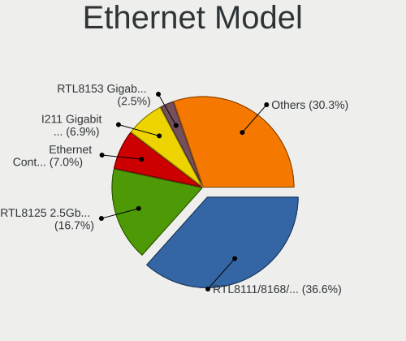

| Model                                                                           | Desktops | Percent |
|---------------------------------------------------------------------------------|----------|---------|
| Realtek RTL8111/8168/8211/8411 PCI Express Gigabit Ethernet Controller          | 208      | 36.62%  |
| Realtek RTL8125 2.5GbE Controller                                               | 95       | 16.73%  |
| Intel Ethernet Controller I225-V                                                | 40       | 7.04%   |
| Intel I211 Gigabit Network Connection                                           | 39       | 6.87%   |
| Realtek RTL8153 Gigabit Ethernet Adapter                                        | 14       | 2.46%   |
| Intel Ethernet Connection (2) I219-V                                            | 13       | 2.29%   |
| Intel Ethernet Connection I217-LM                                               | 12       | 2.11%   |
| Intel Ethernet Connection (7) I219-V                                            | 10       | 1.76%   |
| Intel 82579LM Gigabit Network Connection (Lewisville)                           | 9        | 1.58%   |
| ASIX AX88179 Gigabit Ethernet                                                   | 8        | 1.41%   |
| Realtek RTL8126 5GbE Controller                                                 | 6        | 1.06%   |
| Qualcomm WCN785x Wi-Fi 7(802.11be) 320MHz 2x2 [FastConnect 7800]                | 6        | 1.06%   |
| Intel Ethernet Connection (17) I219-V                                           | 6        | 1.06%   |
| Aquantia AQtion AQC113CS NBase-T/IEEE 802.3an Ethernet Controller [Antigua 10G] | 6        | 1.06%   |
| Realtek RTL810xE PCI Express Fast Ethernet controller                           | 5        | 0.88%   |
| Realtek Killer E3000 2.5GbE Controller                                          | 5        | 0.88%   |
| Intel Ethernet Controller I226-V                                                | 5        | 0.88%   |
| Realtek USB 10/100/1G/2.5 LAN                                                   | 4        | 0.7%    |
| Intel 82579V Gigabit Network Connection                                         | 4        | 0.7%    |
| Realtek Killer E2600 GbE Controller                                             | 3        | 0.53%   |
| Qualcomm Atheros Killer E220x Gigabit Ethernet Controller                       | 3        | 0.53%   |
| Intel Ethernet Connection (2) I218-V                                            | 3        | 0.53%   |
| Aquantia AQtion AQC107 NBase-T/IEEE 802.3an Ethernet Controller [Atlantic 10G]  | 3        | 0.53%   |
| Samsung GT-I9070 (network tethering, USB debugging enabled)                     | 2        | 0.35%   |
| Samsung Galaxy series, misc. (tethering mode)                                   | 2        | 0.35%   |
| Realtek RTL8111/8168/8411 PCI Express Gigabit Ethernet Controller               | 2        | 0.35%   |
| Realtek RTL-8100/8101L/8139 PCI Fast Ethernet Adapter                           | 2        | 0.35%   |
| Qualcomm Atheros Killer E2500 Gigabit Ethernet Controller                       | 2        | 0.35%   |
| Qualcomm Atheros AR8161 Gigabit Ethernet                                        | 2        | 0.35%   |
| Qualcomm Atheros AR8121/AR8113/AR8114 Gigabit or Fast Ethernet                  | 2        | 0.35%   |
| MediaTek Infinix HOT 50i                                                        | 2        | 0.35%   |
| Intel Ethernet Connection I217-V                                                | 2        | 0.35%   |
| Google Pixel 9a                                                                 | 2        | 0.35%   |
| DisplayLink ThinkPad USB 3.0 Dock                                               | 2        | 0.35%   |
| Xiaomi Mi/Redmi series (RNDIS)                                                  | 1        | 0.18%   |
| Xiaomi Mi/Redmi series (RNDIS + ADB)                                            | 1        | 0.18%   |
| Spreadtrum Android                                                              | 1        | 0.18%   |
| Realtek RTL8922AE 802.11be PCIe Wireless Network Adapter                        | 1        | 0.18%   |
| Realtek RTL8152 Fast Ethernet Adapter                                           | 1        | 0.18%   |
| Qualcomm VOS_5G                                                                 | 1        | 0.18%   |

Net Controller Kind
-------------------

Ethernet, WiFi or modem

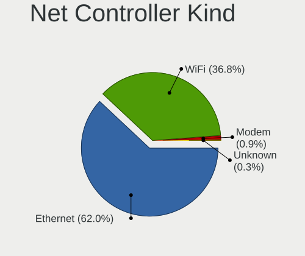

| Kind     | Desktops | Percent |
|----------|----------|---------|
| Ethernet | 468      | 61.99%  |
| WiFi     | 278      | 36.82%  |
| Modem    | 7        | 0.93%   |
| Unknown  | 2        | 0.26%   |

Used Controller
---------------

Currently used network controller

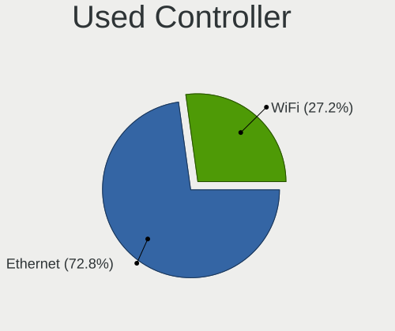

| Kind     | Desktops | Percent |
|----------|----------|---------|
| Ethernet | 367      | 72.82%  |
| WiFi     | 137      | 27.18%  |

NICs
----

Total network controllers on board

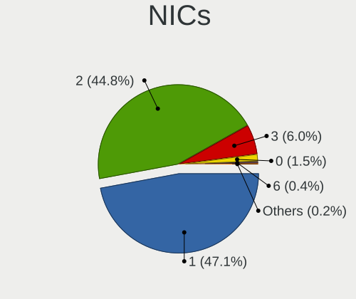

| Total | Desktops | Percent |
|-------|----------|---------|
| 1     | 226      | 47.08%  |
| 2     | 215      | 44.79%  |
| 3     | 29       | 6.04%   |
| 0     | 7        | 1.46%   |
| 6     | 2        | 0.42%   |
| 4     | 1        | 0.21%   |

IPv6
----

IPv6 vs IPv4

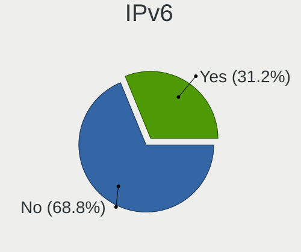

| Used | Desktops | Percent |
|------|----------|---------|
| No   | 331      | 68.81%  |
| Yes  | 150      | 31.19%  |

Bluetooth
---------

Bluetooth Vendor
----------------

Controller vendors

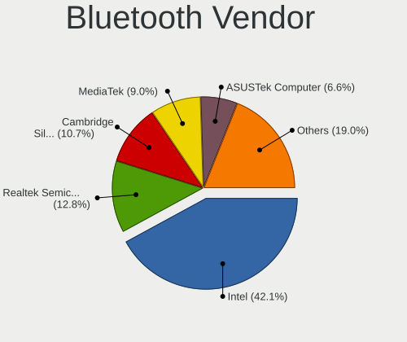

| Vendor                          | Desktops | Percent |
|---------------------------------|----------|---------|
| Intel                           | 122      | 42.07%  |
| Realtek Semiconductor           | 37       | 12.76%  |
| Cambridge Silicon Radio         | 31       | 10.69%  |
| MediaTek                        | 26       | 8.97%   |
| ASUSTek Computer                | 19       | 6.55%   |
| Foxconn / Hon Hai               | 18       | 6.21%   |
| IMC Networks                    | 11       | 3.79%   |
| Broadcom                        | 6        | 2.07%   |
| TP-Link                         | 5        | 1.72%   |
| Qualcomm Atheros Communications | 5        | 1.72%   |
| Actions                         | 3        | 1.03%   |
| Realtek                         | 2        | 0.69%   |
| Unknown                         | 2        | 0.69%   |
| Fujitsu                         | 1        | 0.34%   |
| Edimax Technology               | 1        | 0.34%   |
| Dynex                           | 1        | 0.34%   |

Bluetooth Model
---------------

Controller models

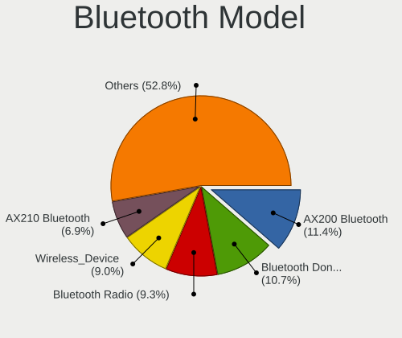

| Model                                                    | Desktops | Percent |
|----------------------------------------------------------|----------|---------|
| Intel AX200 Bluetooth                                    | 33       | 11.38%  |
| Cambridge Silicon Radio Bluetooth Dongle (HCI mode)      | 31       | 10.69%  |
| Realtek Bluetooth Radio                                  | 27       | 9.31%   |
| MediaTek Wireless_Device                                 | 26       | 8.97%   |
| Intel AX210 Bluetooth                                    | 20       | 6.9%    |
| Intel Wireless-AC 3168 Bluetooth                         | 16       | 5.52%   |
| Intel Wireless-AC 9260 Bluetooth Adapter                 | 15       | 5.17%   |
| Intel AX201 Bluetooth                                    | 13       | 4.48%   |
| Intel Bluetooth Device                                   | 12       | 4.14%   |
| ASUS ASUS USB-BT500                                      | 10       | 3.45%   |
| Foxconn / Hon Hai Wireless_Device                        | 8        | 2.76%   |
| Foxconn / Hon Hai Bluetooth Device                       | 8        | 2.76%   |
| Intel Bluetooth wireless interface                       | 6        | 2.07%   |
| Intel Bluetooth 9460/9560 Jefferson Peak (JfP)           | 6        | 2.07%   |
| IMC Networks Bluetooth Radio                             | 6        | 2.07%   |
| TP-Link TP-T@- UB500 Adapter                             | 5        | 1.72%   |
| Realtek  Bluetooth 4.2 Adapter                           | 5        | 1.72%   |
| IMC Networks Wireless_Device                             | 5        | 1.72%   |
| Qualcomm Atheros  Bluetooth Device                       | 4        | 1.38%   |
| Broadcom BCM20702A0 Bluetooth 4.0                        | 4        | 1.38%   |
| ASUS Broadcom BCM20702A0 Bluetooth                       | 4        | 1.38%   |
| ASUS Bluetooth Radio                                     | 3        | 1.03%   |
| Actions general adapter                                  | 3        | 1.03%   |
| Realtek Bluetooth 5.4 Radio                              | 2        | 0.69%   |
| Realtek Bluetooth 5.3 Radio                              | 2        | 0.69%   |
| Realtek Bluetooth Radio                                  | 2        | 0.69%   |
| Unknown                                                  | 2        | 0.69%   |
| Realtek RTL8723B Bluetooth                               | 1        | 0.34%   |
| Qualcomm Atheros AR3011 Bluetooth                        | 1        | 0.34%   |
| Intel Centrino Bluetooth Wireless Transceiver            | 1        | 0.34%   |
| Fujitsu Bluetooth Device                                 | 1        | 0.34%   |
| Foxconn / Hon Hai MediaTek Bluetooth Adapter             | 1        | 0.34%   |
| Foxconn / Hon Hai Bluetooth Radio                        | 1        | 0.34%   |
| Edimax Bluetooth Device                                  | 1        | 0.34%   |
| Dynex Bluetooth 4.0 Adapter [Broadcom, 1.12, BCM20702A0] | 1        | 0.34%   |
| Broadcom HP Bluetooth Module                             | 1        | 0.34%   |
| Broadcom BCM43142A0 Bluetooth Device                     | 1        | 0.34%   |
| ASUS Qualcomm Bluetooth 4.1                              | 1        | 0.34%   |
| ASUS Broadcom BCM20702 Single-Chip Bluetooth 4.0 + LE    | 1        | 0.34%   |

Sound
-----

Sound Vendor
------------

Sound card vendors

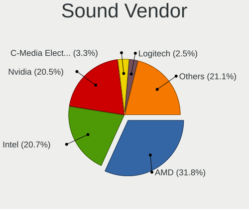

| Vendor                                       | Desktops | Percent |
|----------------------------------------------|----------|---------|
| AMD                                          | 316      | 31.79%  |
| Intel                                        | 206      | 20.72%  |
| Nvidia                                       | 204      | 20.52%  |
| C-Media Electronics                          | 33       | 3.32%   |
| Logitech                                     | 25       | 2.52%   |
| ASUSTek Computer                             | 12       | 1.21%   |
| Kingston Technology                          | 11       | 1.11%   |
| JMTek                                        | 11       | 1.11%   |
| Creative Labs                                | 11       | 1.11%   |
| SteelSeries ApS                              | 10       | 1.01%   |
| Micro Star International                     | 9        | 0.91%   |
| Texas Instruments                            | 8        | 0.8%    |
| Razer USA                                    | 8        | 0.8%    |
| Sony                                         | 7        | 0.7%    |
| Generalplus Technology                       | 7        | 0.7%    |
| Corsair                                      | 7        | 0.7%    |
| Blue Microphones                             | 7        | 0.7%    |
| Focusrite-Novation                           | 6        | 0.6%    |
| Hewlett-Packard                              | 5        | 0.5%    |
| Valve Software                               | 4        | 0.4%    |
| Samson Technologies                          | 4        | 0.4%    |
| Realtek Semiconductor                        | 4        | 0.4%    |
| Jieli Technology                             | 4        | 0.4%    |
| fifine Microphones                           | 4        | 0.4%    |
| Creative Technology                          | 4        | 0.4%    |
| ASRock                                       | 4        | 0.4%    |
| Yamaha                                       | 3        | 0.3%    |
| XMOS                                         | 3        | 0.3%    |
| Trust                                        | 3        | 0.3%    |
| RODE Microphones                             | 3        | 0.3%    |
| Astro Gaming                                 | 3        | 0.3%    |
| Zoran Co. Personal Media Division (Nogatech) | 2        | 0.2%    |
| Walmart                                      | 2        | 0.2%    |
| ROCCAT                                       | 2        | 0.2%    |
| PreSonus Audio Electronics                   | 2        | 0.2%    |
| MV-SILICON                                   | 2        | 0.2%    |
| M-Audio                                      | 2        | 0.2%    |
| JBL                                          | 2        | 0.2%    |
| Harman International                         | 2        | 0.2%    |
| DSEA A/S                                     | 2        | 0.2%    |

Sound Model
-----------

Sound card models

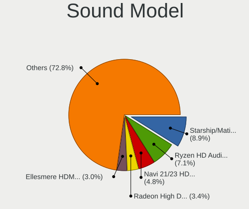

| Model                                                                                           | Desktops | Percent |
|-------------------------------------------------------------------------------------------------|----------|---------|
| AMD Starship/Matisse HD Audio Controller                                                        | 111      | 8.92%   |
| AMD Ryzen HD Audio Controller                                                                   | 89       | 7.15%   |
| AMD Navi 21/23 HDMI/DP Audio Controller                                                         | 60       | 4.82%   |
| AMD Radeon High Definition Audio Controller                                                     | 42       | 3.37%   |
| AMD Ellesmere HDMI Audio [Radeon RX 470/480 / 570/580/590]                                      | 37       | 2.97%   |
| AMD Family 17h (Models 00h-0fh) HD Audio Controller                                             | 31       | 2.49%   |
| AMD Navi 31 HDMI/DP Audio                                                                       | 30       | 2.41%   |
| Intel 8 Series/C220 Series Chipset High Definition Audio Controller                             | 28       | 2.25%   |
| AMD Renoir/Cezanne HDMI/DP Audio Controller                                                     | 27       | 2.17%   |
| Nvidia GP104 High Definition Audio Controller                                                   | 22       | 1.77%   |
| Nvidia GA104 High Definition Audio Controller                                                   | 22       | 1.77%   |
| Intel Xeon E3-1200 v3/4th Gen Core Processor HD Audio Controller                                | 22       | 1.77%   |
| Intel 200 Series PCH HD Audio                                                                   | 21       | 1.69%   |
| Nvidia GA106 High Definition Audio Controller                                                   | 19       | 1.53%   |
| Intel Cannon Lake PCH cAVS                                                                      | 19       | 1.53%   |
| Intel Alder Lake-S HD Audio Controller                                                          | 19       | 1.53%   |
| AMD SBx00 Azalia (Intel HDA)                                                                    | 18       | 1.45%   |
| AMD Navi 10 HDMI Audio                                                                          | 17       | 1.37%   |
| Intel Raptor Lake High Definition Audio Controller                                              | 16       | 1.29%   |
| Intel 6 Series/C200 Series Chipset Family High Definition Audio Controller                      | 16       | 1.29%   |
| Nvidia GA102 High Definition Audio Controller                                                   | 14       | 1.12%   |
| Intel 7 Series/C216 Chipset Family High Definition Audio Controller                             | 14       | 1.12%   |
| Nvidia AD103 High Definition Audio Controller                                                   | 12       | 0.96%   |
| Nvidia TU106 High Definition Audio Controller                                                   | 11       | 0.88%   |
| Nvidia GP107GL High Definition Audio Controller                                                 | 11       | 0.88%   |
| AMD Raven/Raven2/Fenghuang HDMI/DP Audio Controller                                             | 11       | 0.88%   |
| Nvidia TU104 HD Audio Controller                                                                | 10       | 0.8%    |
| Intel 100 Series/C230 Series Chipset Family HD Audio Controller                                 | 10       | 0.8%    |
| C-Media Electronics Audio Adapter (Unitek Y-247A)                                               | 10       | 0.8%    |
| AMD Oland/Hainan/Cape Verde/Pitcairn HDMI Audio [Radeon HD 7000 Series]                         | 10       | 0.8%    |
| Nvidia GM107 High Definition Audio Controller [GeForce 940MX]                                   | 9        | 0.72%   |
| Nvidia GK208 HDMI/DP Audio Controller                                                           | 9        | 0.72%   |
| Micro Star International USB Audio                                                              | 9        | 0.72%   |
| C-Media Electronics USB Audio Device                                                            | 9        | 0.72%   |
| ASUSTek Computer USB Audio                                                                      | 9        | 0.72%   |
| AMD Baffin HDMI/DP Audio [Radeon RX 550 640SP / RX 560/560X]                                    | 9        | 0.72%   |
| Nvidia TU116 High Definition Audio Controller                                                   | 8        | 0.64%   |
| Nvidia AD104 High Definition Audio Controller                                                   | 8        | 0.64%   |
| Creative Labs CA0132 Sound Core3D [Sound Blaster Recon3D / Z-Series / Sound BlasterX AE-5 Plus] | 8        | 0.64%   |
| Nvidia AD106M High Definition Audio Controller                                                  | 7        | 0.56%   |

Memory
------

Memory Vendor
-------------

Memory module vendors

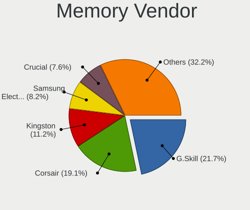

| Vendor                                  | Desktops | Percent |
|-----------------------------------------|----------|---------|
| G.Skill                                 | 66       | 21.71%  |
| Corsair                                 | 58       | 19.08%  |
| Kingston                                | 34       | 11.18%  |
| Samsung Electronics                     | 25       | 8.22%   |
| Crucial                                 | 23       | 7.57%   |
| Unknown                                 | 18       | 5.92%   |
| SK hynix                                | 15       | 4.93%   |
| A-DATA Technology                       | 11       | 3.62%   |
| Patriot                                 | 10       | 3.29%   |
| Micron Technology                       | 10       | 3.29%   |
| Team                                    | 7        | 2.3%    |
| Unknown                                 | 5        | 1.64%   |
| Patriot Memory (PDP Systems)            | 4        | 1.32%   |
| Ramaxel Technology                      | 2        | 0.66%   |
| ASint Technology                        | 2        | 0.66%   |
| Wilk Elektronik                         | 1        | 0.33%   |
| Silicon Power Computer & Communications | 1        | 0.33%   |
| Patriot Memory                          | 1        | 0.33%   |
| Nanya Technology                        | 1        | 0.33%   |
| Lexar Co Limited                        | 1        | 0.33%   |
| KLEVV                                   | 1        | 0.33%   |
| Kimtigo                                 | 1        | 0.33%   |
| Juhor                                   | 1        | 0.33%   |
| Huanan                                  | 1        | 0.33%   |
| Hewlett-Packard                         | 1        | 0.33%   |
| Gold Key                                | 1        | 0.33%   |
| Elpida                                  | 1        | 0.33%   |
| Apacer                                  | 1        | 0.33%   |
| 80540000802C                            | 1        | 0.33%   |

Memory Model
------------

Memory module models

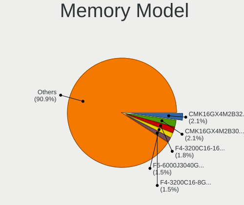

| Model                                                                    | Desktops | Percent |
|--------------------------------------------------------------------------|----------|---------|
| Corsair RAM CMK16GX4M2B3200C16 8GB DIMM DDR4 3600MT/s                    | 7        | 2.11%   |
| Corsair RAM CMK16GX4M2B3000C15 8GB DIMM DDR4 3600MT/s                    | 7        | 2.11%   |
| G.Skill RAM F4-3200C16-16GVK 16GB DIMM DDR4 3600MT/s                     | 6        | 1.81%   |
| G.Skill RAM F5-6000J3040G32G 32GB DIMM DDR5 6200MT/s                     | 5        | 1.51%   |
| G.Skill RAM F4-3200C16-8GTZR 8GB DIMM DDR4 3200MT/s                      | 5        | 1.51%   |
| Unknown                                                                  | 5        | 1.51%   |
| G.Skill RAM F5-6000J3038F16G 16GB DIMM DDR5 6000MT/s                     | 4        | 1.21%   |
| Unknown RAM Module 8GB DIMM DDR3 1600MT/s                                | 3        | 0.91%   |
| SK hynix RAM HMT351U6CFR8C-PB 4GB DIMM DDR3 1800MT/s                     | 3        | 0.91%   |
| SK hynix RAM HMA81GU6AFR8N-UH 8GB DIMM DDR4 2400MT/s                     | 3        | 0.91%   |
| Kingston RAM KF3200C16D4/8GX 8GiB DIMM DDR4 3600MT/s                     | 3        | 0.91%   |
| G.Skill RAM F5-6000J3636F16G 16GB DIMM DDR5 6400MT/s                     | 3        | 0.91%   |
| G.Skill RAM F4-3600C16-16GVKC 16GB DIMM DDR4 3866MT/s                    | 3        | 0.91%   |
| G.Skill RAM F4-3200C16-8GVKB 8GB DIMM DDR4 4000MT/s                      | 3        | 0.91%   |
| G.Skill RAM F4-3000C16-8GISB 8GB DIMM DDR4 3200MT/s                      | 3        | 0.91%   |
| Corsair RAM CMK32GX4M2E3200C16 16GB DIMM DDR4 3600MT/s                   | 3        | 0.91%   |
| Corsair RAM CMK16GX4M2D3600C18 8GB DIMM DDR4 4000MT/s                    | 3        | 0.91%   |
| A-DATA RAM DDR4 3000 8GB DIMM DDR4 3600MT/s                              | 3        | 0.91%   |
| Unknown RAM Module 8GB DIMM 1333MT/s                                     | 2        | 0.6%    |
| Team RAM TEAMGROUP-UD4-3200 8GB DIMM DDR4 3800MT/s                       | 2        | 0.6%    |
| SK hynix RAM HMT42GR7MFR4A-PB 16GB DIMM DDR3 1600MT/s                    | 2        | 0.6%    |
| Samsung RAM Module 8GB DIMM DDR4 2133MT/s                                | 2        | 0.6%    |
| Samsung RAM M471B1G73QH0-YK0 8GB SODIMM DDR3 1600MT/s                    | 2        | 0.6%    |
| Samsung RAM M378B5273CH0-CK0 4GB DIMM DDR3 2000MT/s                      | 2        | 0.6%    |
| Samsung RAM M378B5173EB0-CK0 4GB DIMM DDR3 1600MT/s                      | 2        | 0.6%    |
| Patriot RAM 2666 C16 Series 16GB DIMM DDR4 3400MT/s                      | 2        | 0.6%    |
| Patriot Memory (PDP Systems) RAM 3600 C18 Series 16GB DIMM DDR4 3600MT/s | 2        | 0.6%    |
| Kingston RAM KHX3200C16D4/8GX 8GB DIMM DDR4 3733MT/s                     | 2        | 0.6%    |
| Kingston RAM KF560C36-16 16GB DIMM DDR5 6000MT/s                         | 2        | 0.6%    |
| Kingston RAM KF560C30-32 32GB DIMM DDR5 6000MT/s                         | 2        | 0.6%    |
| Kingston RAM KF556C40-32 32GB DIMM DDR5 6000MT/s                         | 2        | 0.6%    |
| Kingston RAM KF3200C16D4/16GX 16GB DIMM DDR4 3733MT/s                    | 2        | 0.6%    |
| Kingston RAM 9965516-138.A00LF 16GB DIMM DDR3 1600MT/s                   | 2        | 0.6%    |
| G.Skill RAM F5-6000J3238G32G 32GB DIMM DDR5 6000MT/s                     | 2        | 0.6%    |
| G.Skill RAM F4-3600C19-8GVRB 8GB DIMM DDR4 3666MT/s                      | 2        | 0.6%    |
| G.Skill RAM F4-3200C16-8GIS 8GB DIMM DDR4 3600MT/s                       | 2        | 0.6%    |
| G.Skill RAM F4-3200C16-16GTZR 16GB DIMM DDR4 3600MT/s                    | 2        | 0.6%    |
| Crucial RAM BLS8G4D240FSC.16FBD2 8GB DIMM DDR4 2933MT/s                  | 2        | 0.6%    |
| Crucial RAM BL8G32C16U4B.M8FE1 8GB DIMM DDR4 3600MT/s                    | 2        | 0.6%    |
| Crucial RAM BL8G32C16U4B.M8FE 8GB DIMM DDR4 4333MT/s                     | 2        | 0.6%    |

Memory Kind
-----------

Memory module kinds

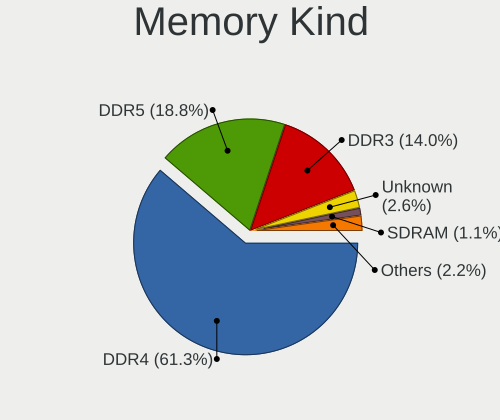

| Kind    | Desktops | Percent |
|---------|----------|---------|
| DDR4    | 166      | 61.25%  |
| DDR5    | 51       | 18.82%  |
| DDR3    | 38       | 14.02%  |
| Unknown | 7        | 2.58%   |
| SDRAM   | 3        | 1.11%   |
| DRAM    | 3        | 1.11%   |
| DDR2    | 2        | 0.74%   |
| LPDDR5  | 1        | 0.37%   |

Memory Form Factor
------------------

Physical design of the memory module

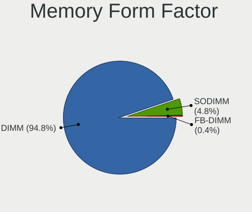

| Name    | Desktops | Percent |
|---------|----------|---------|
| DIMM    | 255      | 94.8%   |
| SODIMM  | 13       | 4.83%   |
| FB-DIMM | 1        | 0.37%   |

Memory Size
-----------

Memory module size

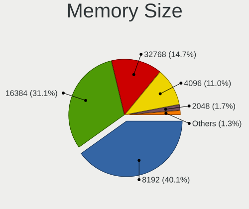

| Size  | Desktops | Percent |
|-------|----------|---------|
| 8192  | 120      | 40.13%  |
| 16384 | 93       | 31.1%   |
| 32768 | 44       | 14.72%  |
| 4096  | 33       | 11.04%  |
| 2048  | 5        | 1.67%   |
| 24576 | 2        | 0.67%   |
| 49152 | 1        | 0.33%   |
| 1024  | 1        | 0.33%   |

Memory Speed
------------

Memory module speed

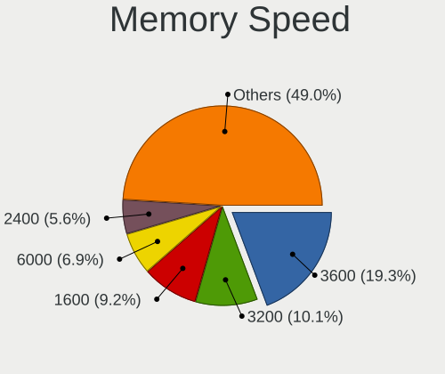

| Speed | Desktops | Percent |
|-------|----------|---------|
| 3600  | 59       | 19.28%  |
| 3200  | 31       | 10.13%  |
| 1600  | 28       | 9.15%   |
| 6000  | 21       | 6.86%   |
| 2400  | 17       | 5.56%   |
| 2667  | 11       | 3.59%   |
| 4800  | 10       | 3.27%   |
| 3733  | 8        | 2.61%   |
| 3400  | 8        | 2.61%   |
| 1333  | 8        | 2.61%   |
| 6400  | 7        | 2.29%   |
| 4000  | 7        | 2.29%   |
| 2933  | 7        | 2.29%   |
| 2133  | 6        | 1.96%   |
| 6200  | 5        | 1.63%   |
| 3666  | 5        | 1.63%   |
| 3000  | 5        | 1.63%   |
| 2666  | 5        | 1.63%   |
| 1800  | 5        | 1.63%   |
| 3866  | 4        | 1.31%   |
| 3800  | 4        | 1.31%   |
| 5600  | 3        | 0.98%   |
| 5200  | 3        | 0.98%   |
| 1866  | 3        | 0.98%   |
| 800   | 3        | 0.98%   |
| 12800 | 2        | 0.65%   |
| 4333  | 2        | 0.65%   |
| 4133  | 2        | 0.65%   |
| 3466  | 2        | 0.65%   |
| 3333  | 2        | 0.65%   |
| 3266  | 2        | 0.65%   |
| 2800  | 2        | 0.65%   |
| 2000  | 2        | 0.65%   |
| 1067  | 2        | 0.65%   |
| 7500  | 1        | 0.33%   |
| 4266  | 1        | 0.33%   |
| 4200  | 1        | 0.33%   |
| 4040  | 1        | 0.33%   |
| 3933  | 1        | 0.33%   |
| 3467  | 1        | 0.33%   |

Printers & scanners
-------------------

Printer Vendor
--------------

Printer device vendors

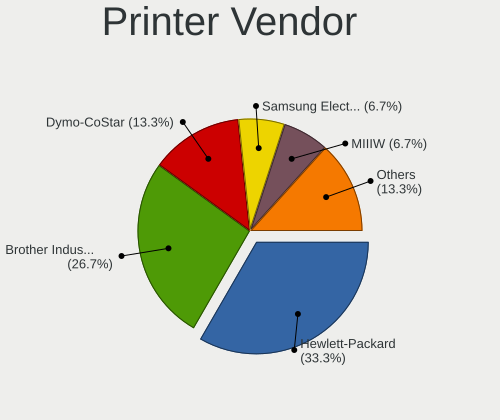

| Vendor                | Desktops | Percent |
|-----------------------|----------|---------|
| Hewlett-Packard       | 5        | 33.33%  |
| Brother Industries    | 4        | 26.67%  |
| Dymo-CoStar           | 2        | 13.33%  |
| Samsung Electronics   | 1        | 6.67%   |
| MIIIW                 | 1        | 6.67%   |
| Lexmark International | 1        | 6.67%   |
| Fuji Xerox            | 1        | 6.67%   |

Printer Model
-------------

Printer device models

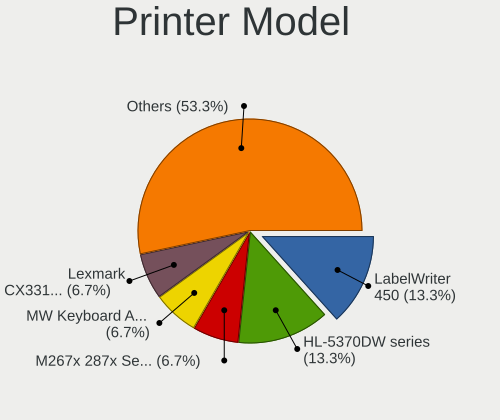

| Model                                   | Desktops | Percent |
|-----------------------------------------|----------|---------|
| Dymo-CoStar LabelWriter 450             | 2        | 13.33%  |
| Brother HL-5370DW series                | 2        | 13.33%  |
| Samsung M267x 287x Series               | 1        | 6.67%   |
| MIIIW MW Keyboard Air Mini              | 1        | 6.67%   |
| Lexmark International Lexmark CX331adwe | 1        | 6.67%   |
| HP HP OfficeJet Pro 8020 series         | 1        | 6.67%   |
| HP DeskJet Plus 4100 series             | 1        | 6.67%   |
| HP DeskJet 4100 series                  | 1        | 6.67%   |
| HP Deskjet 3520 series                  | 1        | 6.67%   |
| HP Deskjet 2050 J510                    | 1        | 6.67%   |
| Fuji Xerox DocuPrint CM315/318 z        | 1        | 6.67%   |
| Brother MFC Composite Device            | 1        | 6.67%   |
| Brother HL-L2395DW series               | 1        | 6.67%   |

Scanner Vendor
--------------

Scanner device vendors

| Vendor | Desktops | Percent |
|--------|----------|---------|
| Canon  | 1        | 100%    |

Scanner Model
-------------

Scanner device models

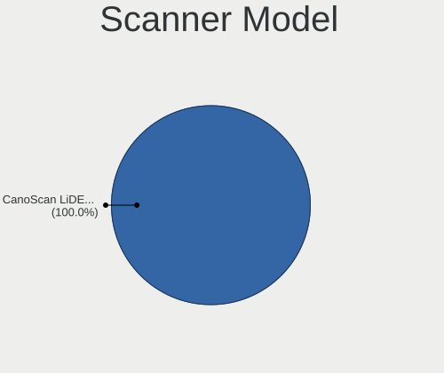

| Model                    | Desktops | Percent |
|--------------------------|----------|---------|
| Canon CanoScan LiDE 500F | 1        | 100%    |

Camera
------

Camera Vendor
-------------

Camera device vendors

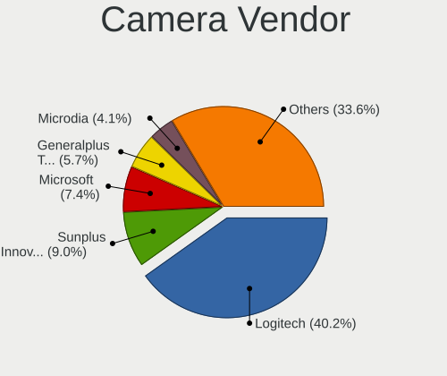

| Vendor                        | Desktops | Percent |
|-------------------------------|----------|---------|
| Logitech                      | 49       | 40.16%  |
| Sunplus Innovation Technology | 11       | 9.02%   |
| Microsoft                     | 9        | 7.38%   |
| Generalplus Technology        | 7        | 5.74%   |
| Microdia                      | 5        | 4.1%    |
| Creative Technology           | 5        | 4.1%    |
| Valve Software                | 4        | 3.28%   |
| Razer USA                     | 4        | 3.28%   |
| MacroSilicon                  | 4        | 3.28%   |
| Apple                         | 4        | 3.28%   |
| Jieli Technology              | 3        | 2.46%   |
| SunplusIT                     | 2        | 1.64%   |
| Realtek Semiconductor         | 2        | 1.64%   |
| Unknown                       | 2        | 1.64%   |
| Z-Star Microelectronics       | 1        | 0.82%   |
| Trust                         | 1        | 0.82%   |
| Sonix Technology              | 1        | 0.82%   |
| OPPO Electronics              | 1        | 0.82%   |
| OmniVision Technologies       | 1        | 0.82%   |
| Insta360                      | 1        | 0.82%   |
| ezcap                         | 1        | 0.82%   |
| Elgato Systems                | 1        | 0.82%   |
| ARC International             | 1        | 0.82%   |
| Anker PowerConf C200          | 1        | 0.82%   |
| Anker Innovations Limited     | 1        | 0.82%   |

Camera Model
------------

Camera device models

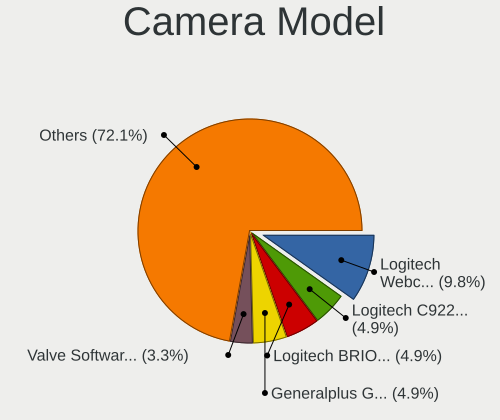

| Model                            | Desktops | Percent |
|----------------------------------|----------|---------|
| Logitech Webcam C270             | 12       | 9.84%   |
| Logitech C922 Pro Stream Webcam  | 6        | 4.92%   |
| Logitech BRIO Ultra HD Webcam    | 6        | 4.92%   |
| Generalplus GENERAL WEBCAM       | 6        | 4.92%   |
| Valve Software 3D Camera         | 4        | 3.28%   |
| Sunplus Full HD webcam           | 4        | 3.28%   |
| MacroSilicon USB Video           | 4        | 3.28%   |
| Logitech HD Pro Webcam C920      | 4        | 3.28%   |
| Logitech Webcam C930e            | 3        | 2.46%   |
| Logitech StreamCam               | 3        | 2.46%   |
| Jieli USB PHY 2.0                | 3        | 2.46%   |
| Apple iPhone 5/5C/5S/6/SE/7/8/X  | 3        | 2.46%   |
| Sunplus USB 2.0 Camera           | 2        | 1.64%   |
| Sunplus AUSDOM FHD Camera        | 2        | 1.64%   |
| Realtek FULL HD 1080P Webcam     | 2        | 1.64%   |
| Razer USA Razer Kiyo Pro         | 2        | 1.64%   |
| Razer USA Gaming Webcam [Kiyo]   | 2        | 1.64%   |
| Microsoft LifeCam HD-5000        | 2        | 1.64%   |
| Microsoft LifeCam HD-3000        | 2        | 1.64%   |
| Logitech QuickCam Pro 9000       | 2        | 1.64%   |
| Logitech HD Webcam C910          | 2        | 1.64%   |
| Logitech Brio 500                | 2        | 1.64%   |
| Creative Live! Cam Sync 1080p V2 | 2        | 1.64%   |
| Unknown                          | 2        | 1.64%   |
| Z-Star A4 TECH USB 2.0 Camera J  | 1        | 0.82%   |
| Trust USB Camera                 | 1        | 0.82%   |
| SunplusIT USB Camera             | 1        | 0.82%   |
| SunplusIT FHD Webcam             | 1        | 0.82%   |
| Sunplus UHD Capture              | 1        | 0.82%   |
| Sunplus Integrated Camera        | 1        | 0.82%   |
| Sunplus Aukey-PC-LM1E Camera     | 1        | 0.82%   |
| Sonix QHD Webcam                 | 1        | 0.82%   |
| OPPO Oppo N1                     | 1        | 0.82%   |
| OmniVision USB Camera-OV580      | 1        | 0.82%   |
| Microsoft Xbox NUI Camera        | 1        | 0.82%   |
| Microsoft LifeCam VX-5000        | 1        | 0.82%   |
| Microsoft LifeCam VX-2000        | 1        | 0.82%   |
| Microsoft LifeCam Studio         | 1        | 0.82%   |
| Microsoft LifeCam Cinema         | 1        | 0.82%   |
| Microdia Webcam Vitade AF        | 1        | 0.82%   |

Security
--------

Fingerprint Vendor
------------------

Fingerprint sensor vendors

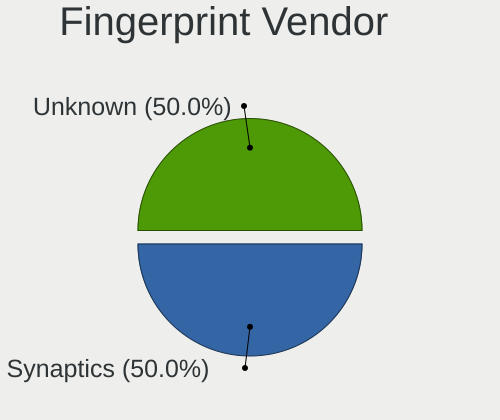

| Vendor    | Desktops | Percent |
|-----------|----------|---------|
| Synaptics | 1        | 50%     |
| Unknown   | 1        | 50%     |

Fingerprint Model
-----------------

Fingerprint sensor models

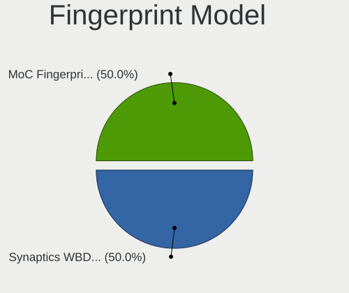

| Model                                        | Desktops | Percent |
|----------------------------------------------|----------|---------|
| Synaptics  WBDI Fingerprint Reader - USB 052 | 1        | 50%     |
| Unknown                                      | 1        | 50%     |

Chipcard Vendor
---------------

Chipcard module vendors

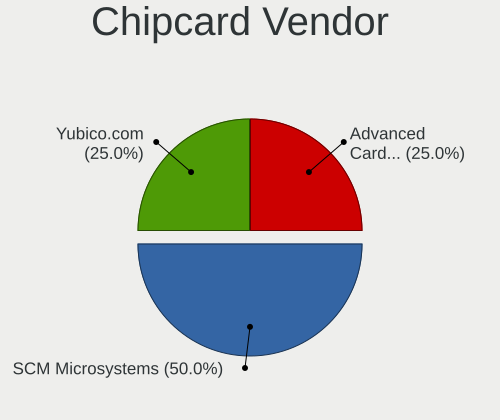

| Vendor                | Desktops | Percent |
|-----------------------|----------|---------|
| SCM Microsystems      | 2        | 50%     |
| Yubico.com            | 1        | 25%     |
| Advanced Card Systems | 1        | 25%     |

Chipcard Model
--------------

Chipcard module models

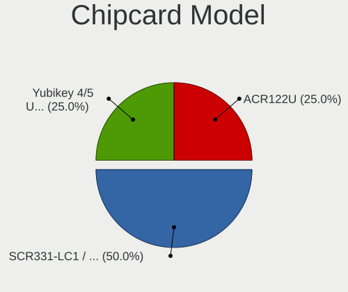

| Model                                                  | Desktops | Percent |
|--------------------------------------------------------|----------|---------|
| SCM Microsystems SCR331-LC1 / SCR3310 SmartCard Reader | 2        | 50%     |
| Yubico.com Yubikey 4/5 U2F+CCID                        | 1        | 25%     |
| Advanced Card Systems ACR122U                          | 1        | 25%     |

Unsupported
-----------

Unsupported Devices
-------------------

Total unsupported devices on board

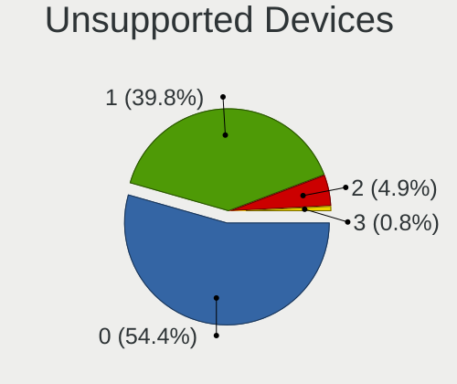

| Total | Desktops | Percent |
|-------|----------|---------|
| 0     | 265      | 54.41%  |
| 1     | 194      | 39.84%  |
| 2     | 24       | 4.93%   |
| 3     | 4        | 0.82%   |

Unsupported Device Types
------------------------

Types of unsupported devices

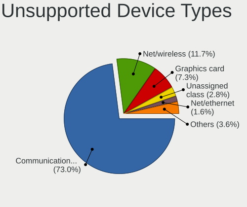

| Type                     | Desktops | Percent |
|--------------------------|----------|---------|
| Communication controller | 181      | 72.98%  |
| Net/wireless             | 29       | 11.69%  |
| Graphics card            | 18       | 7.26%   |
| Unassigned class         | 7        | 2.82%   |
| Net/ethernet             | 4        | 1.61%   |
| Chipcard                 | 3        | 1.21%   |
| Storage/raid             | 2        | 0.81%   |
| Multimedia controller    | 2        | 0.81%   |
| Fingerprint reader       | 2        | 0.81%   |

