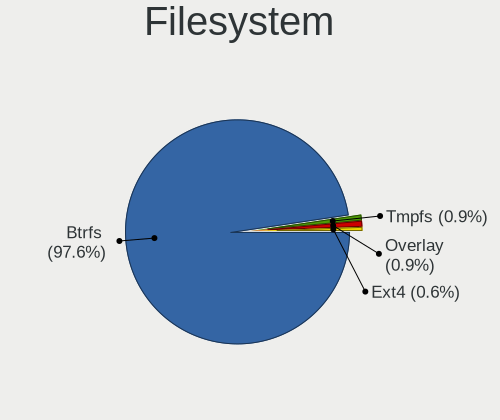
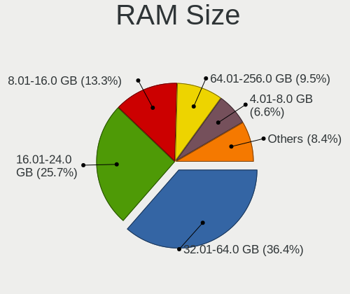
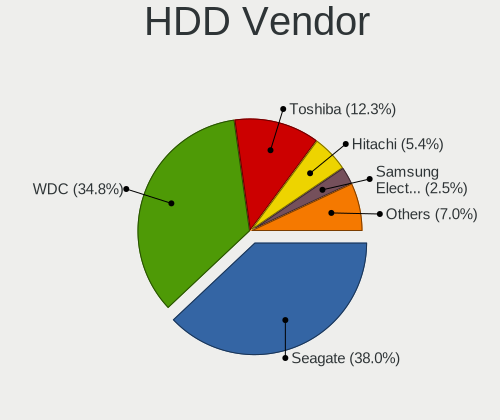
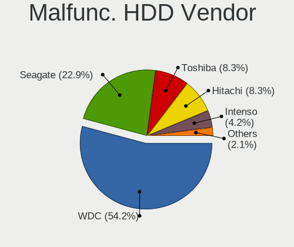
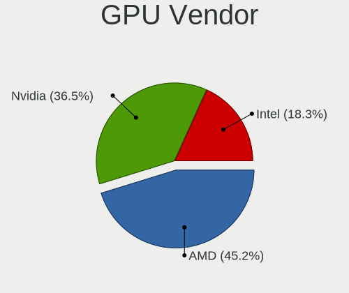
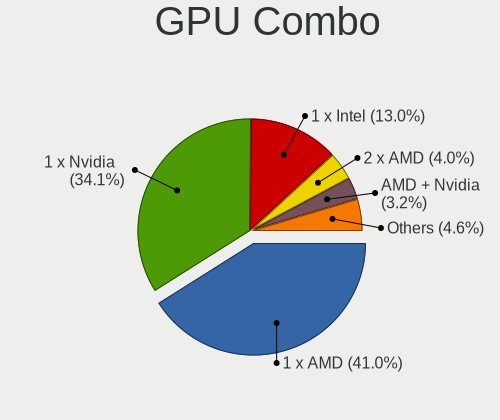
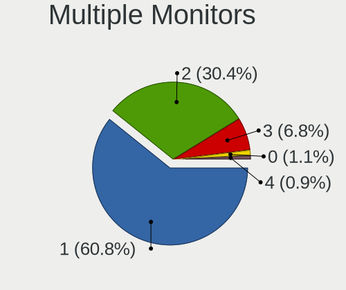

Garuda Linux - Tested Hardware & Statistics (Desktops)
------------------------------------------------------

A project to collect tested hardware configurations for Garuda Linux.

Anyone can contribute to this report by the [hw-probe](https://github.com/linuxhw/hw-probe) tool:

    sudo -E hw-probe -all -upload

Please contribute! Especially if your hardware is rare.

Contents
--------

* [ Test Cases ](#test-cases)

* [ System ](#system)
  - [ OS                       ](#os)
  - [ OS Family                ](#os-family)
  - [ Kernel                   ](#kernel)
  - [ Kernel Family            ](#kernel-family)
  - [ Kernel Major Ver.        ](#kernel-major-ver)
  - [ Arch                     ](#arch)
  - [ DE                       ](#de)
  - [ Display Server           ](#display-server)
  - [ Display Manager          ](#display-manager)
  - [ OS Lang                  ](#os-lang)
  - [ Boot Mode                ](#boot-mode)
  - [ Filesystem               ](#filesystem)
  - [ Part. scheme             ](#part-scheme)
  - [ Dual Boot with Linux/BSD ](#dual-boot-with-linuxbsd)
  - [ Dual Boot (Win)          ](#dual-boot-win)

* [ Board ](#board)
  - [ Vendor                   ](#vendor)
  - [ Model                    ](#model)
  - [ Model Family             ](#model-family)
  - [ MFG Year                 ](#mfg-year)
  - [ Form Factor              ](#form-factor)
  - [ Secure Boot              ](#secure-boot)
  - [ Coreboot                 ](#coreboot)
  - [ RAM Size                 ](#ram-size)
  - [ RAM Used                 ](#ram-used)
  - [ Total Drives             ](#total-drives)
  - [ Has CD-ROM               ](#has-cd-rom)
  - [ Has Ethernet             ](#has-ethernet)
  - [ Has WiFi                 ](#has-wifi)
  - [ Has Bluetooth            ](#has-bluetooth)

* [ Location ](#location)
  - [ Country                  ](#country)
  - [ City                     ](#city)

* [ Drives ](#drives)
  - [ Drive Vendor             ](#drive-vendor)
  - [ Drive Model              ](#drive-model)
  - [ HDD Vendor               ](#hdd-vendor)
  - [ SSD Vendor               ](#ssd-vendor)
  - [ Drive Kind               ](#drive-kind)
  - [ Drive Connector          ](#drive-connector)
  - [ Drive Size               ](#drive-size)
  - [ Space Total              ](#space-total)
  - [ Space Used               ](#space-used)
  - [ Malfunc. Drives          ](#malfunc-drives)
  - [ Malfunc. Drive Vendor    ](#malfunc-drive-vendor)
  - [ Malfunc. HDD Vendor      ](#malfunc-hdd-vendor)
  - [ Malfunc. Drive Kind      ](#malfunc-drive-kind)
  - [ Failed Drives            ](#failed-drives)
  - [ Failed Drive Vendor      ](#failed-drive-vendor)
  - [ Drive Status             ](#drive-status)

* [ Storage controller ](#storage-controller)
  - [ Storage Vendor           ](#storage-vendor)
  - [ Storage Model            ](#storage-model)
  - [ Storage Kind             ](#storage-kind)

* [ Processor ](#processor)
  - [ CPU Vendor               ](#cpu-vendor)
  - [ CPU Model                ](#cpu-model)
  - [ CPU Model Family         ](#cpu-model-family)
  - [ CPU Cores                ](#cpu-cores)
  - [ CPU Sockets              ](#cpu-sockets)
  - [ CPU Threads              ](#cpu-threads)
  - [ CPU Op-Modes             ](#cpu-op-modes)
  - [ CPU Microcode            ](#cpu-microcode)
  - [ CPU Microarch            ](#cpu-microarch)

* [ Graphics ](#graphics)
  - [ GPU Vendor               ](#gpu-vendor)
  - [ GPU Model                ](#gpu-model)
  - [ GPU Combo                ](#gpu-combo)
  - [ GPU Driver               ](#gpu-driver)
  - [ GPU Memory               ](#gpu-memory)

* [ Monitor ](#monitor)
  - [ Monitor Vendor           ](#monitor-vendor)
  - [ Monitor Model            ](#monitor-model)
  - [ Monitor Resolution       ](#monitor-resolution)
  - [ Monitor Diagonal         ](#monitor-diagonal)
  - [ Monitor Width            ](#monitor-width)
  - [ Aspect Ratio             ](#aspect-ratio)
  - [ Monitor Area             ](#monitor-area)
  - [ Pixel Density            ](#pixel-density)
  - [ Multiple Monitors        ](#multiple-monitors)

* [ Network ](#network)
  - [ Net Controller Vendor    ](#net-controller-vendor)
  - [ Net Controller Model     ](#net-controller-model)
  - [ Wireless Vendor          ](#wireless-vendor)
  - [ Wireless Model           ](#wireless-model)
  - [ Ethernet Vendor          ](#ethernet-vendor)
  - [ Ethernet Model           ](#ethernet-model)
  - [ Net Controller Kind      ](#net-controller-kind)
  - [ Used Controller          ](#used-controller)
  - [ NICs                     ](#nics)
  - [ IPv6                     ](#ipv6)

* [ Bluetooth ](#bluetooth)
  - [ Bluetooth Vendor         ](#bluetooth-vendor)
  - [ Bluetooth Model          ](#bluetooth-model)

* [ Sound ](#sound)
  - [ Sound Vendor             ](#sound-vendor)
  - [ Sound Model              ](#sound-model)

* [ Memory ](#memory)
  - [ Memory Vendor            ](#memory-vendor)
  - [ Memory Model             ](#memory-model)
  - [ Memory Kind              ](#memory-kind)
  - [ Memory Form Factor       ](#memory-form-factor)
  - [ Memory Size              ](#memory-size)
  - [ Memory Speed             ](#memory-speed)

* [ Printers & scanners ](#printers--scanners)
  - [ Printer Vendor           ](#printer-vendor)
  - [ Printer Model            ](#printer-model)
  - [ Scanner Vendor           ](#scanner-vendor)
  - [ Scanner Model            ](#scanner-model)

* [ Camera ](#camera)
  - [ Camera Vendor            ](#camera-vendor)
  - [ Camera Model             ](#camera-model)

* [ Security ](#security)
  - [ Fingerprint Vendor       ](#fingerprint-vendor)
  - [ Fingerprint Model        ](#fingerprint-model)
  - [ Chipcard Vendor          ](#chipcard-vendor)
  - [ Chipcard Model           ](#chipcard-model)

* [ Unsupported ](#unsupported)
  - [ Unsupported Devices      ](#unsupported-devices)
  - [ Unsupported Device Types ](#unsupported-device-types)

Test Cases
----------

Total: 344

| Vendor        | Model                       | Probe                                                      | Date         |
|---------------|-----------------------------|------------------------------------------------------------|--------------|
| ASRock        | X470 Taichi                 | [93ce6b9074](https://linux-hardware.org/?probe=93ce6b9074) | Jan 02, 2024 |
| Gigabyte      | Z370P D3-CF                 | [4c2ef0d59a](https://linux-hardware.org/?probe=4c2ef0d59a) | Dec 30, 2023 |
| NZXT          | N7 B550                     | [2ce2b46a02](https://linux-hardware.org/?probe=2ce2b46a02) | Dec 27, 2023 |
| Intel         | X99-P4 V5.0                 | [875d756d73](https://linux-hardware.org/?probe=875d756d73) | Dec 26, 2023 |
| Gigabyte      | B450 AORUS ELITE            | [c3b34cdeb4](https://linux-hardware.org/?probe=c3b34cdeb4) | Dec 26, 2023 |
| Gigabyte      | Z370P D3-CF                 | [7fcdc0004a](https://linux-hardware.org/?probe=7fcdc0004a) | Dec 25, 2023 |
| HC Technol... | HCAR5000-MI                 | [16f9dec3e0](https://linux-hardware.org/?probe=16f9dec3e0) | Dec 20, 2023 |
| ASUSTek       | ROG STRIX B450-F GAMING     | [67c84a4903](https://linux-hardware.org/?probe=67c84a4903) | Dec 19, 2023 |
| HP            | 2B18                        | [7015a76fe4](https://linux-hardware.org/?probe=7015a76fe4) | Dec 15, 2023 |
| MSI           | H310M PRO-M2 PLUS           | [60461068e8](https://linux-hardware.org/?probe=60461068e8) | Dec 13, 2023 |
| ASUSTek       | TUF Gaming X570-PLUS        | [241c795a70](https://linux-hardware.org/?probe=241c795a70) | Dec 10, 2023 |
| ASUSTek       | TUF B450M-PLUS GAMING       | [d46afc319c](https://linux-hardware.org/?probe=d46afc319c) | Nov 30, 2023 |
| AZW           | MINI S 10                   | [f71053bf5c](https://linux-hardware.org/?probe=f71053bf5c) | Nov 30, 2023 |
| ASUSTek       | ROG STRIX B650E-I GAMING... | [7077c34a71](https://linux-hardware.org/?probe=7077c34a71) | Nov 27, 2023 |
| ASUSTek       | TUF Gaming B550-PLUS WIF... | [77db088b52](https://linux-hardware.org/?probe=77db088b52) | Nov 26, 2023 |
| Acer          | Predator PO3-620            | [a052f2ee36](https://linux-hardware.org/?probe=a052f2ee36) | Nov 25, 2023 |
| ASUSTek       | TUF Gaming B550-PLUS WIF... | [c8ae454aca](https://linux-hardware.org/?probe=c8ae454aca) | Nov 20, 2023 |
| ASUSTek       | TUF Gaming B550-PLUS WIF... | [89c0fabbb5](https://linux-hardware.org/?probe=89c0fabbb5) | Nov 17, 2023 |
| MSI           | Z370 PC PRO                 | [e9e98d1041](https://linux-hardware.org/?probe=e9e98d1041) | Nov 14, 2023 |
| ASUSTek       | ROG STRIX X570-F GAMING     | [17acb71f9d](https://linux-hardware.org/?probe=17acb71f9d) | Nov 05, 2023 |
| ASUSTek       | PRIME B350-PLUS             | [4a6383e886](https://linux-hardware.org/?probe=4a6383e886) | Nov 04, 2023 |
| MSI           | PRO Z690-A WIFI DDR4        | [b84c515650](https://linux-hardware.org/?probe=b84c515650) | Nov 02, 2023 |
| ASRock        | X670E Steel Legend          | [d802042506](https://linux-hardware.org/?probe=d802042506) | Oct 31, 2023 |
| ASRock        | H77 Pro4-M                  | [83aeda3c64](https://linux-hardware.org/?probe=83aeda3c64) | Oct 30, 2023 |
| MSI           | PRO Z690-A WIFI DDR4        | [bf5f9098d7](https://linux-hardware.org/?probe=bf5f9098d7) | Oct 28, 2023 |
| Intel         | H55                         | [f8788bcc72](https://linux-hardware.org/?probe=f8788bcc72) | Oct 27, 2023 |
| ASUSTek       | PRIME B350-PLUS             | [92c4516951](https://linux-hardware.org/?probe=92c4516951) | Oct 27, 2023 |
| HP            | 3397                        | [50b7d4272d](https://linux-hardware.org/?probe=50b7d4272d) | Oct 26, 2023 |
| Dell          | 0WN7Y6 A01                  | [4b2be75f68](https://linux-hardware.org/?probe=4b2be75f68) | Oct 24, 2023 |
| Dell          | 0WN7Y6 A01                  | [4323d57b2f](https://linux-hardware.org/?probe=4323d57b2f) | Oct 23, 2023 |
| MSI           | MPG B650 EDGE WIFI          | [73fdacf30c](https://linux-hardware.org/?probe=73fdacf30c) | Oct 18, 2023 |
| MSI           | MPG B650 EDGE WIFI          | [5902fdf35f](https://linux-hardware.org/?probe=5902fdf35f) | Oct 18, 2023 |
| Gigabyte      | B550 AORUS PRO AC           | [04d307e685](https://linux-hardware.org/?probe=04d307e685) | Oct 16, 2023 |
| MSI           | MAG B650 TOMAHAWK WIFI      | [e30927f66e](https://linux-hardware.org/?probe=e30927f66e) | Oct 12, 2023 |
| HP            | 8053                        | [52151555cb](https://linux-hardware.org/?probe=52151555cb) | Oct 11, 2023 |
| HP            | 8053                        | [d1ce4588e7](https://linux-hardware.org/?probe=d1ce4588e7) | Oct 11, 2023 |
| ASUSTek       | TUF Gaming B550-PLUS WIF... | [49d0e884bb](https://linux-hardware.org/?probe=49d0e884bb) | Oct 08, 2023 |
| ASUSTek       | PRIME X470-PRO              | [61fef3256c](https://linux-hardware.org/?probe=61fef3256c) | Oct 07, 2023 |
| ASUSTek       | TUF Gaming B550-PLUS WIF... | [3d613c96a8](https://linux-hardware.org/?probe=3d613c96a8) | Oct 06, 2023 |
| ASUSTek       | TUF Gaming B550M-PLUS       | [8bc96db254](https://linux-hardware.org/?probe=8bc96db254) | Oct 06, 2023 |
| Intel         | X99                         | [61579851ef](https://linux-hardware.org/?probe=61579851ef) | Oct 05, 2023 |
| ASUSTek       | TUF Gaming B550-PLUS WIF... | [9410b590b4](https://linux-hardware.org/?probe=9410b590b4) | Oct 05, 2023 |
| ASUSTek       | TUF Gaming B550-PLUS WIF... | [2a6facae05](https://linux-hardware.org/?probe=2a6facae05) | Oct 05, 2023 |
| Intel         | X99                         | [67ec0ac8d0](https://linux-hardware.org/?probe=67ec0ac8d0) | Oct 02, 2023 |
| Unknown       | TB-5000                     | [9c67baa34f](https://linux-hardware.org/?probe=9c67baa34f) | Sep 29, 2023 |
| Gigabyte      | B550 AORUS PRO AC           | [ecef286c2a](https://linux-hardware.org/?probe=ecef286c2a) | Sep 26, 2023 |
| HP            | 1998                        | [60208f6be9](https://linux-hardware.org/?probe=60208f6be9) | Sep 22, 2023 |
| Gigabyte      | Z790 UD AX                  | [5995975e04](https://linux-hardware.org/?probe=5995975e04) | Sep 16, 2023 |
| Gigabyte      | 970A-DS3P                   | [fa347b6b46](https://linux-hardware.org/?probe=fa347b6b46) | Sep 15, 2023 |
| Dell          | 0GY6Y8 A02                  | [623cd3e438](https://linux-hardware.org/?probe=623cd3e438) | Sep 14, 2023 |
| Gigabyte      | AX370-Gaming 3-CF           | [b037f9322d](https://linux-hardware.org/?probe=b037f9322d) | Sep 10, 2023 |
| ASUSTek       | M51BC                       | [647634e7fb](https://linux-hardware.org/?probe=647634e7fb) | Sep 10, 2023 |
| ASUSTek       | TUF Gaming B550-PLUS WIF... | [5330a96ef6](https://linux-hardware.org/?probe=5330a96ef6) | Sep 07, 2023 |
| Gigabyte      | X570 AORUS MASTER           | [fde9e1a454](https://linux-hardware.org/?probe=fde9e1a454) | Aug 20, 2023 |
| ASUSTek       | M51BC                       | [4a81412fdd](https://linux-hardware.org/?probe=4a81412fdd) | Aug 20, 2023 |
| Gigabyte      | Z390 AORUS ULTRA-CF         | [9c90e63339](https://linux-hardware.org/?probe=9c90e63339) | Aug 17, 2023 |
| ASUSTek       | ROG STRIX X570-I GAMING     | [f0b1f6f364](https://linux-hardware.org/?probe=f0b1f6f364) | Aug 17, 2023 |
| ASUSTek       | PRIME H410M-E               | [a9d7216b70](https://linux-hardware.org/?probe=a9d7216b70) | Aug 15, 2023 |
| Gigabyte      | GA-MA770T-UD3               | [4dc7a0831b](https://linux-hardware.org/?probe=4dc7a0831b) | Aug 14, 2023 |
| Dell          | 0KV62T A00                  | [369b0195cc](https://linux-hardware.org/?probe=369b0195cc) | Aug 14, 2023 |
| MSI           | MPG X570 GAMING PRO CARB... | [ef08441bc9](https://linux-hardware.org/?probe=ef08441bc9) | Aug 13, 2023 |
| ASUSTek       | ROG STRIX X570-E GAMING ... | [b0f8b16669](https://linux-hardware.org/?probe=b0f8b16669) | Aug 13, 2023 |
| ASRock        | B450M-HDV R4.0              | [6855901c02](https://linux-hardware.org/?probe=6855901c02) | Aug 12, 2023 |
| HP            | 8433 11                     | [de06cea570](https://linux-hardware.org/?probe=de06cea570) | Aug 10, 2023 |
| HP            | 8433 11                     | [4275d43a74](https://linux-hardware.org/?probe=4275d43a74) | Aug 10, 2023 |
| Gigabyte      | B560 DS3H AC-Y1             | [af88e64084](https://linux-hardware.org/?probe=af88e64084) | Aug 04, 2023 |
| MSI           | MPG X570 GAMING PRO CARB... | [88e9cc22bf](https://linux-hardware.org/?probe=88e9cc22bf) | Aug 03, 2023 |
| MSI           | MPG X570 GAMING PRO CARB... | [52319a8cef](https://linux-hardware.org/?probe=52319a8cef) | Aug 03, 2023 |
| MSI           | B450 TOMAHAWK               | [6b736ced64](https://linux-hardware.org/?probe=6b736ced64) | Aug 03, 2023 |
| ASUSTek       | TUF Gaming X670E-PLUS WI... | [a5467c396a](https://linux-hardware.org/?probe=a5467c396a) | Jul 28, 2023 |
| MSI           | MPG X570 GAMING PLUS        | [3a59ab6dd1](https://linux-hardware.org/?probe=3a59ab6dd1) | Jul 26, 2023 |
| HP            | 18E7                        | [1638b42b8b](https://linux-hardware.org/?probe=1638b42b8b) | Jul 23, 2023 |
| HP            | 18E7                        | [909788f739](https://linux-hardware.org/?probe=909788f739) | Jul 23, 2023 |
| ASRock        | B250M Pro4                  | [9ce9a989dd](https://linux-hardware.org/?probe=9ce9a989dd) | Jul 23, 2023 |
| Biostar       | B350GT3                     | [41d95e4e81](https://linux-hardware.org/?probe=41d95e4e81) | Jul 22, 2023 |
| Alienware     | 07W25T A00                  | [24dade96af](https://linux-hardware.org/?probe=24dade96af) | Jul 21, 2023 |
| Shenzhen M... | HX90G                       | [f42afac191](https://linux-hardware.org/?probe=f42afac191) | Jul 15, 2023 |
| ASUSTek       | PRIME Z690-P D4             | [b91bb21dfc](https://linux-hardware.org/?probe=b91bb21dfc) | Jul 10, 2023 |
| HP            | 8053                        | [4241a715e6](https://linux-hardware.org/?probe=4241a715e6) | Jul 09, 2023 |
| ASRock        | B450M-HDV R4.0              | [f24ba1fb9c](https://linux-hardware.org/?probe=f24ba1fb9c) | Jul 09, 2023 |
| ASUSTek       | Rampage V EDITION 10        | [54611e82ec](https://linux-hardware.org/?probe=54611e82ec) | Jul 06, 2023 |
| Gigabyte      | Z490 GAMING X               | [5e8900dde2](https://linux-hardware.org/?probe=5e8900dde2) | Jul 02, 2023 |
| Gigabyte      | Z490 GAMING X               | [b819a1fb21](https://linux-hardware.org/?probe=b819a1fb21) | Jul 02, 2023 |
| ASRock        | X470 Taichi                 | [529873f796](https://linux-hardware.org/?probe=529873f796) | Jul 02, 2023 |
| HP            | 1998                        | [cee46b5772](https://linux-hardware.org/?probe=cee46b5772) | Jul 01, 2023 |
| Shenzhen M... | HX90G                       | [d1d0bb38d0](https://linux-hardware.org/?probe=d1d0bb38d0) | Jun 20, 2023 |
| ASUSTek       | TUF Gaming X570-PLUS        | [2278cd4d03](https://linux-hardware.org/?probe=2278cd4d03) | Jun 17, 2023 |
| Biostar       | B350GT3                     | [13b1026096](https://linux-hardware.org/?probe=13b1026096) | Jun 13, 2023 |
| ASUSTek       | ROG STRIX B550-A GAMING     | [933978a1ae](https://linux-hardware.org/?probe=933978a1ae) | Jun 07, 2023 |
| ASUSTek       | TUF Gaming X570-PLUS        | [21b7236d20](https://linux-hardware.org/?probe=21b7236d20) | Jun 03, 2023 |
| Lenovo        | ThinkCentre M58p 6137AU8    | [bd80dea70f](https://linux-hardware.org/?probe=bd80dea70f) | May 29, 2023 |
| ASUSTek       | Rampage V EDITION 10        | [a7fbdc21bc](https://linux-hardware.org/?probe=a7fbdc21bc) | May 26, 2023 |
| Win elemen... | M600                        | [4c5d685663](https://linux-hardware.org/?probe=4c5d685663) | May 21, 2023 |
| ASUSTek       | ROG STRIX B650E-F GAMING... | [262bc7c88f](https://linux-hardware.org/?probe=262bc7c88f) | May 21, 2023 |
| Win elemen... | M600                        | [84de4a3207](https://linux-hardware.org/?probe=84de4a3207) | May 20, 2023 |
| ASUSTek       | TUF Gaming B550-PLUS        | [194f7f96e5](https://linux-hardware.org/?probe=194f7f96e5) | May 13, 2023 |
| ASUSTek       | TUF Gaming X570-PLUS        | [fda523de2a](https://linux-hardware.org/?probe=fda523de2a) | May 11, 2023 |
| ASUSTek       | Z170 PRO GAMING             | [3b4eb54186](https://linux-hardware.org/?probe=3b4eb54186) | May 08, 2023 |
| Intel         | DH67CL AAG10212-210         | [3f2fa70636](https://linux-hardware.org/?probe=3f2fa70636) | May 06, 2023 |
| MSI           | MAG B550 TOMAHAWK           | [7a5a0f75aa](https://linux-hardware.org/?probe=7a5a0f75aa) | May 01, 2023 |
| Intel         | DH67CL AAG10212-210         | [7d6b0027b3](https://linux-hardware.org/?probe=7d6b0027b3) | Apr 30, 2023 |
| ASRock        | A320M-HD                    | [43b57e5088](https://linux-hardware.org/?probe=43b57e5088) | Apr 28, 2023 |
| Intel         | DH67CL AAG10212-210         | [cb87589d9f](https://linux-hardware.org/?probe=cb87589d9f) | Apr 28, 2023 |
| Shenzhen M... | F7BFC                       | [bb189b2507](https://linux-hardware.org/?probe=bb189b2507) | Apr 22, 2023 |
| Gigabyte      | X670 AORUS ELITE AX         | [d9fd347989](https://linux-hardware.org/?probe=d9fd347989) | Apr 20, 2023 |
| Gigabyte      | X670 AORUS ELITE AX         | [d5adb940b4](https://linux-hardware.org/?probe=d5adb940b4) | Apr 19, 2023 |
| Intel         | DH67CL AAG10212-210         | [8519b4cda2](https://linux-hardware.org/?probe=8519b4cda2) | Apr 15, 2023 |
| Gigabyte      | B550M AORUS PRO-P           | [424d545740](https://linux-hardware.org/?probe=424d545740) | Apr 14, 2023 |
| Acer          | Veriton K8-680G V:1.0       | [9ab3fc183a](https://linux-hardware.org/?probe=9ab3fc183a) | Apr 13, 2023 |
| Win elemen... | M600                        | [7723a03558](https://linux-hardware.org/?probe=7723a03558) | Apr 10, 2023 |
| Win elemen... | M600                        | [e20927ec15](https://linux-hardware.org/?probe=e20927ec15) | Apr 10, 2023 |
| Gigabyte      | Z690 GAMING X DDR4          | [e2521c6d93](https://linux-hardware.org/?probe=e2521c6d93) | Apr 09, 2023 |
| HP            | 8053                        | [9897b3e51f](https://linux-hardware.org/?probe=9897b3e51f) | Apr 04, 2023 |
| ASUSTek       | M5A78L-M LX PLUS            | [7a2bce56b1](https://linux-hardware.org/?probe=7a2bce56b1) | Mar 26, 2023 |
| HP            | 8053                        | [82eb90837f](https://linux-hardware.org/?probe=82eb90837f) | Mar 21, 2023 |
| ASUSTek       | ROG STRIX X670E-I GAMING... | [40372e4af3](https://linux-hardware.org/?probe=40372e4af3) | Mar 19, 2023 |
| MSI           | B450-A PRO MAX              | [15f0543609](https://linux-hardware.org/?probe=15f0543609) | Mar 19, 2023 |
| ASUSTek       | ROG STRIX X670E-I GAMING... | [9d10f13efc](https://linux-hardware.org/?probe=9d10f13efc) | Mar 18, 2023 |
| HP            | 8053                        | [273a6c822b](https://linux-hardware.org/?probe=273a6c822b) | Mar 12, 2023 |
| HP            | 8053                        | [be27383efc](https://linux-hardware.org/?probe=be27383efc) | Mar 11, 2023 |
| ASUSTek       | ROG STRIX X670E-I GAMING... | [51b92fb276](https://linux-hardware.org/?probe=51b92fb276) | Mar 11, 2023 |
| Dell          | 0VYXHD A00                  | [d7618c5b6c](https://linux-hardware.org/?probe=d7618c5b6c) | Mar 08, 2023 |
| ASUSTek       | BT6130                      | [3549cfad14](https://linux-hardware.org/?probe=3549cfad14) | Feb 27, 2023 |
| MSI           | MAG B760 TOMAHAWK WIFI D... | [575a7f4897](https://linux-hardware.org/?probe=575a7f4897) | Feb 26, 2023 |
| MSI           | MAG B760 TOMAHAWK WIFI D... | [466f8533fb](https://linux-hardware.org/?probe=466f8533fb) | Feb 26, 2023 |
| ASUSTek       | ROG STRIX X570-E GAMING     | [fad109dc98](https://linux-hardware.org/?probe=fad109dc98) | Feb 25, 2023 |
| MSI           | MAG B650 TOMAHAWK WIFI      | [a53235325f](https://linux-hardware.org/?probe=a53235325f) | Feb 23, 2023 |
| MSI           | MPG X570 GAMING PLUS        | [bd6a746c89](https://linux-hardware.org/?probe=bd6a746c89) | Feb 20, 2023 |
| MSI           | B450-A PRO                  | [014bf5276e](https://linux-hardware.org/?probe=014bf5276e) | Feb 17, 2023 |
| ASUSTek       | BT6130                      | [db3b191eb2](https://linux-hardware.org/?probe=db3b191eb2) | Feb 13, 2023 |
| ASRock        | A520M-ITX/ac                | [a6e401a1d3](https://linux-hardware.org/?probe=a6e401a1d3) | Feb 09, 2023 |
| Intel         | X79M-S                      | [91ab5e33ed](https://linux-hardware.org/?probe=91ab5e33ed) | Feb 03, 2023 |
| ASUSTek       | TUF Gaming Z690-PLUS D4     | [d6d4c6c38c](https://linux-hardware.org/?probe=d6d4c6c38c) | Jan 31, 2023 |
| ASUSTek       | PRIME Z490-A                | [91dbb8d045](https://linux-hardware.org/?probe=91dbb8d045) | Jan 26, 2023 |
| Intel         | X79M-S                      | [ccad523936](https://linux-hardware.org/?probe=ccad523936) | Jan 22, 2023 |
| ASUSTek       | PRIME A320M-A               | [918dbdb148](https://linux-hardware.org/?probe=918dbdb148) | Jan 22, 2023 |
| ASUSTek       | Rampage IV GENE             | [64553c4fd7](https://linux-hardware.org/?probe=64553c4fd7) | Jan 17, 2023 |
| MSI           | B450M PRO-VDH MAX           | [87e7a60bfa](https://linux-hardware.org/?probe=87e7a60bfa) | Jan 15, 2023 |
| ASUSTek       | CM6850                      | [7eac1c6a7a](https://linux-hardware.org/?probe=7eac1c6a7a) | Jan 13, 2023 |
| ASUSTek       | P8H61/USB3 R2.0             | [5e29a1afb7](https://linux-hardware.org/?probe=5e29a1afb7) | Jan 10, 2023 |
| ASUSTek       | P8H61/USB3 R2.0             | [8daa546122](https://linux-hardware.org/?probe=8daa546122) | Jan 09, 2023 |
| Gigabyte      | X570 I AORUS PRO WIFI       | [919b259ea2](https://linux-hardware.org/?probe=919b259ea2) | Jan 09, 2023 |
| ASUSTek       | PRIME X570-P                | [95c21fc90e](https://linux-hardware.org/?probe=95c21fc90e) | Jan 09, 2023 |
| Gigabyte      | GA-78LMT-USB3               | [d759bb7551](https://linux-hardware.org/?probe=d759bb7551) | Jan 08, 2023 |
| MSI           | H61M-E22/W8                 | [92280cb6ae](https://linux-hardware.org/?probe=92280cb6ae) | Jan 06, 2023 |
| ASUSTek       | PRIME B360M-C               | [7685480bf0](https://linux-hardware.org/?probe=7685480bf0) | Jan 05, 2023 |
| Intel         | X79M-S                      | [3b38d8023e](https://linux-hardware.org/?probe=3b38d8023e) | Jan 03, 2023 |
| Dell          | 0VHWTR A02                  | [0d9d6203e1](https://linux-hardware.org/?probe=0d9d6203e1) | Jan 03, 2023 |
| Intel         | X79M-S                      | [5c97a3976d](https://linux-hardware.org/?probe=5c97a3976d) | Jan 01, 2023 |
| ASUSTek       | TUF Gaming B660M-E D4       | [a294963db9](https://linux-hardware.org/?probe=a294963db9) | Jan 01, 2023 |
| Lenovo        | Win8 Pro DPK TPG            | [9561e51689](https://linux-hardware.org/?probe=9561e51689) | Dec 31, 2022 |
| Intel         | H61                         | [39f3cddffb](https://linux-hardware.org/?probe=39f3cddffb) | Dec 29, 2022 |
| ASUSTek       | ROG STRIX B450-F GAMING ... | [ee98173357](https://linux-hardware.org/?probe=ee98173357) | Dec 27, 2022 |
| ASRock        | X570 Taichi                 | [e48882ad67](https://linux-hardware.org/?probe=e48882ad67) | Dec 22, 2022 |
| ASUSTek       | PRIME Z390-P                | [1a9f9ac05f](https://linux-hardware.org/?probe=1a9f9ac05f) | Dec 22, 2022 |
| Lenovo        | Win8 Pro DPK TPG            | [7ce8a10de4](https://linux-hardware.org/?probe=7ce8a10de4) | Dec 21, 2022 |
| Lenovo        | Win8 Pro DPK TPG            | [a4c1397ad3](https://linux-hardware.org/?probe=a4c1397ad3) | Dec 21, 2022 |
| BESSTAR Te... | B550                        | [d9fbac807d](https://linux-hardware.org/?probe=d9fbac807d) | Dec 10, 2022 |
| ASRock        | Z77 Pro3                    | [a2e7958d4a](https://linux-hardware.org/?probe=a2e7958d4a) | Dec 08, 2022 |
| ASRock        | Z77 Pro3                    | [3184df2bf6](https://linux-hardware.org/?probe=3184df2bf6) | Dec 07, 2022 |
| Gigabyte      | 990FXA-UD3                  | [54d896b9ed](https://linux-hardware.org/?probe=54d896b9ed) | Dec 06, 2022 |
| MSI           | H510I PRO WIFI              | [f46e59c772](https://linux-hardware.org/?probe=f46e59c772) | Nov 27, 2022 |
| Dell          | 0K3CM7 A00                  | [27109cda18](https://linux-hardware.org/?probe=27109cda18) | Nov 20, 2022 |
| Dell          | 0K3CM7 A00                  | [6dbdd86e08](https://linux-hardware.org/?probe=6dbdd86e08) | Nov 20, 2022 |
| HP            | 8767 A                      | [375e0d4525](https://linux-hardware.org/?probe=375e0d4525) | Nov 19, 2022 |
| Gigabyte      | 990FXA-UD3                  | [985fb6d758](https://linux-hardware.org/?probe=985fb6d758) | Nov 16, 2022 |
| Dell          | 0K3CM7 A00                  | [3c426cb32b](https://linux-hardware.org/?probe=3c426cb32b) | Nov 14, 2022 |
| ASRock        | X470 Taichi                 | [7cd5f4c280](https://linux-hardware.org/?probe=7cd5f4c280) | Nov 05, 2022 |
| ASRock        | X470 Taichi                 | [d808be6d90](https://linux-hardware.org/?probe=d808be6d90) | Oct 31, 2022 |
| HP            | 2B2C                        | [6f90b1e25e](https://linux-hardware.org/?probe=6f90b1e25e) | Oct 26, 2022 |
| ASUSTek       | PRIME X570-P                | [5558f9e3f7](https://linux-hardware.org/?probe=5558f9e3f7) | Oct 23, 2022 |
| Acer          | Aspire TC-780               | [fd6c66dac7](https://linux-hardware.org/?probe=fd6c66dac7) | Oct 22, 2022 |
| ASUSTek       | PRIME X570-P                | [a7d6f0bd9e](https://linux-hardware.org/?probe=a7d6f0bd9e) | Oct 15, 2022 |
| Gigabyte      | B550 AORUS ELITE V2         | [541e327f0f](https://linux-hardware.org/?probe=541e327f0f) | Oct 01, 2022 |
| ASUSTek       | PRIME X570-P                | [6647dc20ac](https://linux-hardware.org/?probe=6647dc20ac) | Sep 21, 2022 |
| ASUSTek       | TUF Gaming X570-PLUS        | [9d0697ec96](https://linux-hardware.org/?probe=9d0697ec96) | Sep 20, 2022 |
| ASRock        | A320M-HDV R4.0              | [afbb849b02](https://linux-hardware.org/?probe=afbb849b02) | Sep 11, 2022 |
| ASRock        | A320M-HDV R4.0              | [5e98f641f1](https://linux-hardware.org/?probe=5e98f641f1) | Sep 11, 2022 |
| ASUSTek       | ROG CROSSHAIR VIII HERO     | [ac65980e25](https://linux-hardware.org/?probe=ac65980e25) | Sep 02, 2022 |
| Gigabyte      | F2A88XM-HD3                 | [44e355eb93](https://linux-hardware.org/?probe=44e355eb93) | Aug 30, 2022 |
| ASRock        | X470 Taichi                 | [7bc56eb3d4](https://linux-hardware.org/?probe=7bc56eb3d4) | Aug 25, 2022 |
| MSI           | B450 TOMAHAWK MAX II        | [57f1970999](https://linux-hardware.org/?probe=57f1970999) | Aug 20, 2022 |
| ASUSTek       | PRIME X570-P                | [fc5923b017](https://linux-hardware.org/?probe=fc5923b017) | Aug 15, 2022 |
| ASUSTek       | PRIME X570-P                | [e53bbe7c1b](https://linux-hardware.org/?probe=e53bbe7c1b) | Aug 14, 2022 |
| MSI           | A68HM-E33 V2                | [762f08a697](https://linux-hardware.org/?probe=762f08a697) | Aug 13, 2022 |
| ASRock        | A520M-HDV                   | [f23bdacb56](https://linux-hardware.org/?probe=f23bdacb56) | Aug 11, 2022 |
| ASUSTek       | Maximus IX FORMULA          | [2212732244](https://linux-hardware.org/?probe=2212732244) | Aug 01, 2022 |
| MSI           | B450M PRO-VDH MAX           | [941092ee95](https://linux-hardware.org/?probe=941092ee95) | Jul 26, 2022 |
| MSI           | B450 TOMAHAWK MAX II        | [dfe6047aa7](https://linux-hardware.org/?probe=dfe6047aa7) | Jul 21, 2022 |
| Gigabyte      | X570 AORUS PRO WIFI         | [f9996d6494](https://linux-hardware.org/?probe=f9996d6494) | Jul 21, 2022 |
| ASUSTek       | ROG STRIX X570-E GAMING     | [92fe4c2ff3](https://linux-hardware.org/?probe=92fe4c2ff3) | Jul 03, 2022 |
| ASUSTek       | PRIME B550-PLUS AC-HES      | [dde2246ae8](https://linux-hardware.org/?probe=dde2246ae8) | Jul 01, 2022 |
| ASRock        | Z87M Extreme4               | [06504aecc5](https://linux-hardware.org/?probe=06504aecc5) | Jun 24, 2022 |
| Gigabyte      | Z77X-UD3H                   | [7d7828a253](https://linux-hardware.org/?probe=7d7828a253) | Jun 23, 2022 |
| MSI           | B550-A PRO                  | [a7a76f04f9](https://linux-hardware.org/?probe=a7a76f04f9) | Jun 19, 2022 |
| MSI           | B450M MORTAR MAX            | [e1f785770e](https://linux-hardware.org/?probe=e1f785770e) | Jun 11, 2022 |
| T-bao         | MINI PC V1.0                | [8108463ab7](https://linux-hardware.org/?probe=8108463ab7) | Jun 09, 2022 |
| ASRock        | Z87M Extreme4               | [5ca7bb09b0](https://linux-hardware.org/?probe=5ca7bb09b0) | Jun 05, 2022 |
| ASRock        | X470 Taichi                 | [114aa0b977](https://linux-hardware.org/?probe=114aa0b977) | May 22, 2022 |
| Lenovo        | 3716 SDK0T76463 WIN 3422... | [cd15058963](https://linux-hardware.org/?probe=cd15058963) | May 16, 2022 |
| Lenovo        | 3716 SDK0T76463 WIN 3422... | [4043d7e26a](https://linux-hardware.org/?probe=4043d7e26a) | May 11, 2022 |
| Gigabyte      | B450 I AORUS PRO WIFI-CF    | [8c34e423f4](https://linux-hardware.org/?probe=8c34e423f4) | May 04, 2022 |
| ASRock        | X470 Taichi                 | [bd151331c1](https://linux-hardware.org/?probe=bd151331c1) | May 04, 2022 |
| Dell          | 0WR7PY A01                  | [66c6e57421](https://linux-hardware.org/?probe=66c6e57421) | Apr 23, 2022 |
| ASRock        | B550M Pro4                  | [b82721163b](https://linux-hardware.org/?probe=b82721163b) | Apr 22, 2022 |
| ASRock        | X99X Killer                 | [c6d6bddd17](https://linux-hardware.org/?probe=c6d6bddd17) | Apr 18, 2022 |
| ASUSTek       | Z97-P                       | [bf54ec19d0](https://linux-hardware.org/?probe=bf54ec19d0) | Apr 16, 2022 |
| ASRock        | X99X Killer                 | [3be92995ff](https://linux-hardware.org/?probe=3be92995ff) | Apr 11, 2022 |
| ASRock        | X470 Taichi                 | [ba87ebf29f](https://linux-hardware.org/?probe=ba87ebf29f) | Apr 08, 2022 |
| ASUSTek       | P8B75-M                     | [808661699f](https://linux-hardware.org/?probe=808661699f) | Apr 07, 2022 |
| HP            | 8433 11                     | [30c5d1d62f](https://linux-hardware.org/?probe=30c5d1d62f) | Apr 03, 2022 |
| MSI           | B450-A PRO MAX              | [a47ab656ab](https://linux-hardware.org/?probe=a47ab656ab) | Apr 01, 2022 |
| Gigabyte      | B550 GAMING X V2            | [3d37374fae](https://linux-hardware.org/?probe=3d37374fae) | Apr 01, 2022 |
| ASUSTek       | A68HM-PLUS                  | [cd6ebcba97](https://linux-hardware.org/?probe=cd6ebcba97) | Mar 31, 2022 |
| ASRock        | X470 Taichi                 | [f339c6f710](https://linux-hardware.org/?probe=f339c6f710) | Mar 29, 2022 |
| ASUSTek       | ROG CROSSHAIR VIII HERO     | [fc5cdc4595](https://linux-hardware.org/?probe=fc5cdc4595) | Mar 23, 2022 |
| MSI           | MPG B550 GAMING CARBON W... | [c1a26607fd](https://linux-hardware.org/?probe=c1a26607fd) | Mar 13, 2022 |
| MSI           | MAG B550 TOMAHAWK           | [95b7c99a5a](https://linux-hardware.org/?probe=95b7c99a5a) | Mar 08, 2022 |
| ASRock        | B450 Gaming K4              | [504b20acce](https://linux-hardware.org/?probe=504b20acce) | Mar 04, 2022 |
| ASUSTek       | TUF Gaming X570-PLUS        | [336ddc137d](https://linux-hardware.org/?probe=336ddc137d) | Mar 01, 2022 |
| ASUSTek       | A68HM-PLUS                  | [edfa6eb6e3](https://linux-hardware.org/?probe=edfa6eb6e3) | Feb 28, 2022 |
| ASUSTek       | ProArt X570-CREATOR WIFI    | [abc925b917](https://linux-hardware.org/?probe=abc925b917) | Feb 26, 2022 |
| ASUSTek       | M4A89TD PRO USB3            | [66c0fc8423](https://linux-hardware.org/?probe=66c0fc8423) | Feb 26, 2022 |
| ASRock        | X470 Taichi                 | [df78a2fff6](https://linux-hardware.org/?probe=df78a2fff6) | Feb 14, 2022 |
| HP            | 8767 A                      | [e048574911](https://linux-hardware.org/?probe=e048574911) | Feb 12, 2022 |
| ASUSTek       | ROG Maximus XII FORMULA     | [a63d909e46](https://linux-hardware.org/?probe=a63d909e46) | Feb 12, 2022 |
| HP            | 8767 A                      | [6cb1e6b72f](https://linux-hardware.org/?probe=6cb1e6b72f) | Feb 12, 2022 |
| ASUSTek       | ROG Maximus XII FORMULA     | [885617bdda](https://linux-hardware.org/?probe=885617bdda) | Feb 12, 2022 |
| ASRock        | B450M Pro4                  | [0d80dc8143](https://linux-hardware.org/?probe=0d80dc8143) | Feb 11, 2022 |
| Lenovo        | 31900058 STD                | [03540e9cb2](https://linux-hardware.org/?probe=03540e9cb2) | Feb 07, 2022 |
| ASRock        | X470 Taichi                 | [e4beeac4a1](https://linux-hardware.org/?probe=e4beeac4a1) | Feb 06, 2022 |
| Gigabyte      | MFLP3AP-00\2.x              | [b7441a0e94](https://linux-hardware.org/?probe=b7441a0e94) | Jan 31, 2022 |
| ASRock        | X470 Taichi                 | [aa0e21b159](https://linux-hardware.org/?probe=aa0e21b159) | Jan 27, 2022 |
| Gigabyte      | B85-HD3                     | [ad70601774](https://linux-hardware.org/?probe=ad70601774) | Jan 26, 2022 |
| ASRock        | 970M Pro3                   | [402a4f960e](https://linux-hardware.org/?probe=402a4f960e) | Jan 17, 2022 |
| ASUSTek       | ROG Maximus X CODE          | [8fac80f31d](https://linux-hardware.org/?probe=8fac80f31d) | Jan 16, 2022 |
| Gigabyte      | AB350-Gaming 3-CF           | [9fab263b02](https://linux-hardware.org/?probe=9fab263b02) | Jan 11, 2022 |
| MSI           | Z270 GAMING M5              | [02d70182fd](https://linux-hardware.org/?probe=02d70182fd) | Jan 10, 2022 |
| Gigabyte      | AB350-Gaming 3-CF           | [8a1167daea](https://linux-hardware.org/?probe=8a1167daea) | Jan 08, 2022 |
| ASUSTek       | TUF Gaming X570-PLUS        | [1a4570a458](https://linux-hardware.org/?probe=1a4570a458) | Jan 08, 2022 |
| Pegatron      | 2AD5                        | [91ee5ba1df](https://linux-hardware.org/?probe=91ee5ba1df) | Jan 08, 2022 |
| Gigabyte      | B460M DS3H                  | [40f4de9da7](https://linux-hardware.org/?probe=40f4de9da7) | Jan 07, 2022 |
| Gigabyte      | B550 AORUS PRO AC           | [1b62246b10](https://linux-hardware.org/?probe=1b62246b10) | Dec 21, 2021 |
| ASUSTek       | TUF Gaming X570-PLUS        | [9e73346fb8](https://linux-hardware.org/?probe=9e73346fb8) | Dec 15, 2021 |
| Gigabyte      | X570 AORUS ELITE WIFI       | [196b460373](https://linux-hardware.org/?probe=196b460373) | Dec 13, 2021 |
| ASRock        | H77M-ITX                    | [5e98a2fce2](https://linux-hardware.org/?probe=5e98a2fce2) | Dec 11, 2021 |
| ASRock        | B450M Pro4                  | [e4fb1e4fe4](https://linux-hardware.org/?probe=e4fb1e4fe4) | Dec 09, 2021 |
| Lenovo        | ThinkStation S20 4105O1U    | [731c890641](https://linux-hardware.org/?probe=731c890641) | Dec 08, 2021 |
| ASUSTek       | TUF Gaming X570-PLUS        | [f0df07c0e4](https://linux-hardware.org/?probe=f0df07c0e4) | Dec 06, 2021 |
| Acer          | Aspire TC-895 V:1.0         | [c743459a71](https://linux-hardware.org/?probe=c743459a71) | Dec 04, 2021 |
| ASUSTek       | H87M-E                      | [2b4abcf54f](https://linux-hardware.org/?probe=2b4abcf54f) | Dec 02, 2021 |
| ASUSTek       | H87M-E                      | [72cf0ed74d](https://linux-hardware.org/?probe=72cf0ed74d) | Dec 02, 2021 |
| Lenovo        | ThinkStation S20 4105O1U    | [f031548aac](https://linux-hardware.org/?probe=f031548aac) | Dec 01, 2021 |
| Lenovo        | ThinkStation S20 4105O1U    | [48f73af82d](https://linux-hardware.org/?probe=48f73af82d) | Nov 30, 2021 |
| ASRock        | X470 Taichi                 | [0b1d816eff](https://linux-hardware.org/?probe=0b1d816eff) | Nov 28, 2021 |
| ASUSTek       | Rampage IV EXTREME          | [50999d4796](https://linux-hardware.org/?probe=50999d4796) | Nov 14, 2021 |
| ASUSTek       | TUF Gaming X570-PLUS        | [cd295bb56c](https://linux-hardware.org/?probe=cd295bb56c) | Nov 04, 2021 |
| ASRock        | X470 Taichi                 | [86f08832c0](https://linux-hardware.org/?probe=86f08832c0) | Oct 31, 2021 |
| ASUSTek       | P8B75-M                     | [2130c28d33](https://linux-hardware.org/?probe=2130c28d33) | Oct 27, 2021 |
| MSI           | Z77A-G43                    | [3bd9604ae7](https://linux-hardware.org/?probe=3bd9604ae7) | Oct 20, 2021 |
| MSI           | B460M PRO-VDH WIFI          | [76071ec77b](https://linux-hardware.org/?probe=76071ec77b) | Oct 19, 2021 |
| MSI           | B450M-A PRO MAX             | [4148046f02](https://linux-hardware.org/?probe=4148046f02) | Oct 17, 2021 |
| ASRock        | X470 Taichi                 | [ff6b763448](https://linux-hardware.org/?probe=ff6b763448) | Oct 16, 2021 |
| Fujitsu       | D3120-A1 S26361-D3120-A1    | [fdd8f9dd8e](https://linux-hardware.org/?probe=fdd8f9dd8e) | Sep 17, 2021 |
| Fujitsu       | D3120-A1 S26361-D3120-A1    | [ab3ad8009e](https://linux-hardware.org/?probe=ab3ad8009e) | Sep 16, 2021 |
| ASUSTek       | PRIME B450M-K               | [b8b49f201f](https://linux-hardware.org/?probe=b8b49f201f) | Sep 14, 2021 |
| MSI           | H310M PRO-VDH PLUS          | [65fcfef06f](https://linux-hardware.org/?probe=65fcfef06f) | Aug 27, 2021 |
| Alienware     | 0TYR0X A00                  | [5ea23ebfb2](https://linux-hardware.org/?probe=5ea23ebfb2) | Aug 19, 2021 |
| ASRock        | X399 Professional Gaming    | [bb53a385c3](https://linux-hardware.org/?probe=bb53a385c3) | Aug 19, 2021 |
| Medion        | H110H4-EM2                  | [f4e01958e5](https://linux-hardware.org/?probe=f4e01958e5) | Aug 10, 2021 |
| ASRock        | X470 Taichi                 | [a919fef17f](https://linux-hardware.org/?probe=a919fef17f) | Aug 07, 2021 |
| MSI           | Z97 MPOWER                  | [dee7d3af4a](https://linux-hardware.org/?probe=dee7d3af4a) | Aug 06, 2021 |
| MSI           | Z97 MPOWER                  | [f30e5a3a86](https://linux-hardware.org/?probe=f30e5a3a86) | Aug 06, 2021 |
| ASUSTek       | ROG STRIX B550-F GAMING     | [826edd51bc](https://linux-hardware.org/?probe=826edd51bc) | Jul 07, 2021 |
| Gigabyte      | X470 AORUS ULTRA GAMING-... | [aa05cca9b7](https://linux-hardware.org/?probe=aa05cca9b7) | Jun 30, 2021 |
| Biostar       | H310MHP                     | [0d3f648f3e](https://linux-hardware.org/?probe=0d3f648f3e) | Jun 30, 2021 |
| Lenovo        | SHARKBAY SDK0E50510 WIN     | [fb3d7de63c](https://linux-hardware.org/?probe=fb3d7de63c) | Jun 26, 2021 |
| MSI           | A320M-HDV R4.0              | [486775a989](https://linux-hardware.org/?probe=486775a989) | Jun 23, 2021 |
| MSI           | A320M-HDV R4.0              | [4629f86f56](https://linux-hardware.org/?probe=4629f86f56) | Jun 22, 2021 |
| MSI           | A320M-HDV R4.0              | [69dea4e3cf](https://linux-hardware.org/?probe=69dea4e3cf) | Jun 22, 2021 |
| MSI           | A320M-HDV R4.0              | [2fd89c951e](https://linux-hardware.org/?probe=2fd89c951e) | Jun 22, 2021 |
| MSI           | X370 GAMING PRO CARBON      | [9ead1e1bb5](https://linux-hardware.org/?probe=9ead1e1bb5) | Jun 22, 2021 |
| ASUSTek       | ROG STRIX B550-F GAMING     | [8144c83b50](https://linux-hardware.org/?probe=8144c83b50) | Jun 22, 2021 |
| ASUSTek       | ROG STRIX B550-F GAMING     | [376c0ff95d](https://linux-hardware.org/?probe=376c0ff95d) | Jun 15, 2021 |
| Gigabyte      | B550I AORUS PRO AX          | [34801a2f74](https://linux-hardware.org/?probe=34801a2f74) | Jun 12, 2021 |
| ASUSTek       | ROG CROSSHAIR VII HERO      | [51e1e33185](https://linux-hardware.org/?probe=51e1e33185) | May 20, 2021 |
| MSI           | B350M GAMING PRO            | [c04e6666e7](https://linux-hardware.org/?probe=c04e6666e7) | May 20, 2021 |
| Dell          | 0D28YY A02                  | [14edf3bd00](https://linux-hardware.org/?probe=14edf3bd00) | May 16, 2021 |
| Gigabyte      | A320M-S2H-CF                | [066f815622](https://linux-hardware.org/?probe=066f815622) | May 12, 2021 |
| HP            | 844C                        | [29f7cf64ce](https://linux-hardware.org/?probe=29f7cf64ce) | May 06, 2021 |
| HP            | 844C                        | [0534f06ec4](https://linux-hardware.org/?probe=0534f06ec4) | May 06, 2021 |
| ASUSTek       | PRIME Z590-A                | [cb3058760e](https://linux-hardware.org/?probe=cb3058760e) | May 04, 2021 |
| Gigabyte      | P67A-UD3-B3                 | [08ea956bfa](https://linux-hardware.org/?probe=08ea956bfa) | Apr 24, 2021 |
| MSI           | Z87 MPOWER                  | [ff6aa3811c](https://linux-hardware.org/?probe=ff6aa3811c) | Apr 08, 2021 |
| ASRock        | AB350M-HDV                  | [23502edac5](https://linux-hardware.org/?probe=23502edac5) | Apr 01, 2021 |
| ASRock        | AB350M-HDV                  | [13b2fdddc0](https://linux-hardware.org/?probe=13b2fdddc0) | Apr 01, 2021 |
| Dell          | 07KY25 A01                  | [8c4f2f9922](https://linux-hardware.org/?probe=8c4f2f9922) | Mar 31, 2021 |
| Dell          | 07KY25 A01                  | [1b9efb1b29](https://linux-hardware.org/?probe=1b9efb1b29) | Mar 24, 2021 |
| Gigabyte      | B450 AORUS M                | [097a0d616c](https://linux-hardware.org/?probe=097a0d616c) | Mar 18, 2021 |
| Gigabyte      | B450 AORUS M                | [22054ffd75](https://linux-hardware.org/?probe=22054ffd75) | Mar 18, 2021 |
| HP            | 2AF7                        | [e0639ea4a5](https://linux-hardware.org/?probe=e0639ea4a5) | Mar 11, 2021 |
| HP            | 2AF7                        | [fb8d76722c](https://linux-hardware.org/?probe=fb8d76722c) | Mar 11, 2021 |
| ASUSTek       | ROG STRIX B550-F GAMING     | [c1f22a7521](https://linux-hardware.org/?probe=c1f22a7521) | Mar 05, 2021 |
| Gigabyte      | GA-MA790FXT-UD5P            | [404dab2464](https://linux-hardware.org/?probe=404dab2464) | Feb 27, 2021 |
| ASRock        | FM2A88X Extreme6+           | [13f9fc2ef3](https://linux-hardware.org/?probe=13f9fc2ef3) | Feb 18, 2021 |
| ASUSTek       | ROG STRIX B550-F GAMING     | [2e19f3b1af](https://linux-hardware.org/?probe=2e19f3b1af) | Feb 18, 2021 |
| Dell          | 0C2KJT A00                  | [f821a0035b](https://linux-hardware.org/?probe=f821a0035b) | Feb 12, 2021 |
| ASUSTek       | PRIME B360M-K               | [b73941c431](https://linux-hardware.org/?probe=b73941c431) | Feb 08, 2021 |
| HP            | 1825                        | [3b6b80db46](https://linux-hardware.org/?probe=3b6b80db46) | Jan 31, 2021 |
| HP            | 1825                        | [1df894dea4](https://linux-hardware.org/?probe=1df894dea4) | Jan 31, 2021 |
| ASRock        | X470 Master SLI             | [36eaf717e9](https://linux-hardware.org/?probe=36eaf717e9) | Jan 26, 2021 |
| ASRock        | X470 Master SLI             | [b1be9375c0](https://linux-hardware.org/?probe=b1be9375c0) | Jan 24, 2021 |
| ASUSTek       | ROG STRIX X570-E GAMING     | [7332b50f98](https://linux-hardware.org/?probe=7332b50f98) | Jan 24, 2021 |
| ASUSTek       | PRIME H270-PLUS             | [3f895b585b](https://linux-hardware.org/?probe=3f895b585b) | Jan 22, 2021 |
| Lenovo        | SHARKBAY 0B98401 PRO        | [61976e9745](https://linux-hardware.org/?probe=61976e9745) | Jan 18, 2021 |
| MSI           | X399 SLI PLUS               | [e392838a54](https://linux-hardware.org/?probe=e392838a54) | Jan 10, 2021 |
| ASUSTek       | CM5671                      | [069344a54e](https://linux-hardware.org/?probe=069344a54e) | Jan 07, 2021 |
| MSI           | B85-G43 GAMING              | [8fe013f04a](https://linux-hardware.org/?probe=8fe013f04a) | Jan 04, 2021 |
| ASRock        | G41M-VS3                    | [e1217b1871](https://linux-hardware.org/?probe=e1217b1871) | Jan 02, 2021 |
| Pegatron      | 2AC2A                       | [436a2ca3ce](https://linux-hardware.org/?probe=436a2ca3ce) | Dec 25, 2020 |
| Pegatron      | 2AC2A                       | [2df3b195c6](https://linux-hardware.org/?probe=2df3b195c6) | Dec 25, 2020 |
| ASUSTek       | PRIME Z370-P                | [35365be0e8](https://linux-hardware.org/?probe=35365be0e8) | Dec 19, 2020 |
| MSI           | Z390-A PRO                  | [ea7a52fdac](https://linux-hardware.org/?probe=ea7a52fdac) | Dec 16, 2020 |
| ASUSTek       | ROG STRIX B550-F GAMING     | [62a5c95d51](https://linux-hardware.org/?probe=62a5c95d51) | Dec 14, 2020 |
| HP            | 8643 SMVB                   | [dccfba36f1](https://linux-hardware.org/?probe=dccfba36f1) | Dec 06, 2020 |
| Gigabyte      | B450 AORUS ELITE            | [2a35d394f9](https://linux-hardware.org/?probe=2a35d394f9) | Dec 04, 2020 |
| MSI           | Z390-A PRO                  | [05e3eb32c9](https://linux-hardware.org/?probe=05e3eb32c9) | Dec 03, 2020 |
| MSI           | Z390-A PRO                  | [dc6ea9bfb8](https://linux-hardware.org/?probe=dc6ea9bfb8) | Nov 29, 2020 |
| ASUSTek       | M5A97 LE R2.0               | [d4b3f84c86](https://linux-hardware.org/?probe=d4b3f84c86) | Nov 28, 2020 |
| Gigabyte      | B450 AORUS M                | [a3d68dc126](https://linux-hardware.org/?probe=a3d68dc126) | Nov 19, 2020 |
| Gigabyte      | B450 AORUS M                | [d9faeae0d4](https://linux-hardware.org/?probe=d9faeae0d4) | Nov 19, 2020 |
| Gigabyte      | X570 AORUS PRO WIFI         | [11c79940a4](https://linux-hardware.org/?probe=11c79940a4) | Nov 19, 2020 |
| HP            | 18E7                        | [f84cbfd465](https://linux-hardware.org/?probe=f84cbfd465) | Nov 10, 2020 |
| Gigabyte      | X570 AORUS PRO WIFI         | [79608bd849](https://linux-hardware.org/?probe=79608bd849) | Nov 06, 2020 |
| ASUSTek       | ROG STRIX B550-F GAMING     | [e80ddac12f](https://linux-hardware.org/?probe=e80ddac12f) | Nov 02, 2020 |
| ASUSTek       | ROG STRIX B550-F GAMING     | [876b039494](https://linux-hardware.org/?probe=876b039494) | Nov 01, 2020 |
| Gigabyte      | X570 AORUS PRO WIFI         | [4e573bc6ff](https://linux-hardware.org/?probe=4e573bc6ff) | Oct 28, 2020 |
| MSI           | MPG B550 GAMING EDGE WIF... | [4b9d2b77cb](https://linux-hardware.org/?probe=4b9d2b77cb) | Oct 26, 2020 |
| ASUSTek       | PRIME X399-A                | [b7772d9ff8](https://linux-hardware.org/?probe=b7772d9ff8) | Oct 13, 2020 |
| Dell          | 0R6JMP A00                  | [c4cbec5b80](https://linux-hardware.org/?probe=c4cbec5b80) | Oct 11, 2020 |
| OEM           | Unknown                     | [2e7a212437](https://linux-hardware.org/?probe=2e7a212437) | Sep 26, 2020 |
| Lenovo        | ThinkCentre M91p 7033CG1    | [c08fed8ecb](https://linux-hardware.org/?probe=c08fed8ecb) | Sep 11, 2020 |
| ASUSTek       | Maximus VIII FORMULA        | [7b8babe846](https://linux-hardware.org/?probe=7b8babe846) | Aug 27, 2020 |
| ASUSTek       | Maximus VIII FORMULA        | [73462df387](https://linux-hardware.org/?probe=73462df387) | Aug 07, 2020 |

System
------

OS
--

Installed operating systems

| Name                 | Desktops | Percent |
|----------------------|----------|---------|
| Garuda Linux Soaring | 132      | 56.9%   |
| Garuda Linux         | 54       | 23.28%  |
| Garuda Linux Rolling | 46       | 19.83%  |

OS Family
---------

OS without a version

| Name         | Desktops | Percent |
|--------------|----------|---------|
| Garuda Linux | 227      | 100%    |

Kernel
------

Version of the Linux kernel

| Version            | Desktops | Percent |
|--------------------|----------|---------|
| 5.17.1-zen1-1-zen  | 6        | 2.22%   |
| 6.6.8-zen1-1-zen   | 4        | 1.48%   |
| 6.5.9-zen2-1-zen   | 4        | 1.48%   |
| 6.4.10-zen2-1-zen  | 4        | 1.48%   |
| 6.2.10-zen1-1-zen  | 4        | 1.48%   |
| 6.1.12-zen1-1-zen  | 4        | 1.48%   |
| 6.1.1-zen1-1-zen   | 4        | 1.48%   |
| 5.15.7-zen1-1-zen  | 4        | 1.48%   |
| 5.10.4-107-tkg-bmq | 4        | 1.48%   |
| 6.6.7-zen1-1-zen   | 3        | 1.11%   |
| 6.5.5-zen1-1-zen   | 3        | 1.11%   |
| 6.5.4-zen2-1-zen   | 3        | 1.11%   |
| 6.5.2-zen1-1-zen   | 3        | 1.11%   |
| 6.4.6-zen1-1-zen   | 3        | 1.11%   |
| 6.4.12-zen1-1-zen  | 3        | 1.11%   |
| 6.3.2-zen1-1-zen   | 3        | 1.11%   |
| 6.1.8-zen1-1-zen   | 3        | 1.11%   |
| 6.0.2-zen1-1-zen   | 3        | 1.11%   |
| 6.0.12-zen1-1-zen  | 3        | 1.11%   |
| 6.0.11-zen1-1-zen  | 3        | 1.11%   |
| 5.9.1-zen2-1-zen   | 3        | 1.11%   |
| 5.18.12-zen1-1-zen | 3        | 1.11%   |
| 5.18.1-zen1-1-zen  | 3        | 1.11%   |
| 5.16.4-zen1-1-zen  | 3        | 1.11%   |
| 5.15.2-zen1-1-zen  | 3        | 1.11%   |
| 5.15.13-zen1-1-zen | 3        | 1.11%   |
| 5.11.16-zen1-1-zen | 3        | 1.11%   |
| 6.6.3-zen1-1-zen   | 2        | 0.74%   |
| 6.5.7-zen2-1-zen   | 2        | 0.74%   |
| 6.4.9-zen1-1-zen   | 2        | 0.74%   |
| 6.4.3-zen1-1-zen   | 2        | 0.74%   |
| 6.3.6-zen1-1-zen   | 2        | 0.74%   |
| 6.2.7-zen1-1-zen   | 2        | 0.74%   |
| 6.2.2-zen2-1-zen   | 2        | 0.74%   |
| 6.2.13-zen-1-zen   | 2        | 0.74%   |
| 6.2.12-zen1-1-zen  | 2        | 0.74%   |
| 6.2.11-zen1-1-zen  | 2        | 0.74%   |
| 6.1.4-zen2-1-zen   | 2        | 0.74%   |
| 6.1.3-zen1-1-zen   | 2        | 0.74%   |
| 6.0.8-zen1-1-zen   | 2        | 0.74%   |

Kernel Family
-------------

Linux kernel without a distro release

| Version | Desktops | Percent |
|---------|----------|---------|
| 5.17.1  | 7        | 2.59%   |
| 6.6.8   | 5        | 1.85%   |
| 6.5.5   | 5        | 1.85%   |
| 6.4.10  | 5        | 1.85%   |
| 6.5.9   | 4        | 1.48%   |
| 6.2.10  | 4        | 1.48%   |
| 6.1.12  | 4        | 1.48%   |
| 6.1.1   | 4        | 1.48%   |
| 5.15.7  | 4        | 1.48%   |
| 5.10.4  | 4        | 1.48%   |
| 6.6.7   | 3        | 1.11%   |
| 6.5.4   | 3        | 1.11%   |
| 6.5.2   | 3        | 1.11%   |
| 6.4.6   | 3        | 1.11%   |
| 6.4.3   | 3        | 1.11%   |
| 6.4.12  | 3        | 1.11%   |
| 6.3.2   | 3        | 1.11%   |
| 6.2.2   | 3        | 1.11%   |
| 6.1.8   | 3        | 1.11%   |
| 6.1.4   | 3        | 1.11%   |
| 6.0.2   | 3        | 1.11%   |
| 6.0.12  | 3        | 1.11%   |
| 6.0.11  | 3        | 1.11%   |
| 5.9.1   | 3        | 1.11%   |
| 5.18.12 | 3        | 1.11%   |
| 5.18.1  | 3        | 1.11%   |
| 5.17.5  | 3        | 1.11%   |
| 5.16.4  | 3        | 1.11%   |
| 5.15.2  | 3        | 1.11%   |
| 5.15.13 | 3        | 1.11%   |
| 5.12.13 | 3        | 1.11%   |
| 5.11.16 | 3        | 1.11%   |
| 6.6.3   | 2        | 0.74%   |
| 6.6.2   | 2        | 0.74%   |
| 6.5.7   | 2        | 0.74%   |
| 6.4.9   | 2        | 0.74%   |
| 6.4.2   | 2        | 0.74%   |
| 6.3.6   | 2        | 0.74%   |
| 6.2.7   | 2        | 0.74%   |
| 6.2.13  | 2        | 0.74%   |

Kernel Major Ver.
-----------------

Linux kernel major version

| Version | Desktops | Percent |
|---------|----------|---------|
| 6.1     | 29       | 11.24%  |
| 6.4     | 24       | 9.3%    |
| 5.15    | 20       | 7.75%   |
| 6.5     | 18       | 6.98%   |
| 6.0     | 16       | 6.2%    |
| 5.16    | 16       | 6.2%    |
| 5.10    | 16       | 6.2%    |
| 6.6     | 15       | 5.81%   |
| 6.2     | 15       | 5.81%   |
| 5.18    | 14       | 5.43%   |
| 5.17    | 11       | 4.26%   |
| 5.12    | 10       | 3.88%   |
| 5.11    | 10       | 3.88%   |
| 6.3     | 9        | 3.49%   |
| 5.9     | 9        | 3.49%   |
| 5.19    | 8        | 3.1%    |
| 5.13    | 7        | 2.71%   |
| 5.14    | 6        | 2.33%   |
| 5.8     | 5        | 1.94%   |

Arch
----

OS architecture (x86_64, i586, etc.)

| Name   | Desktops | Percent |
|--------|----------|---------|
| x86_64 | 227      | 100%    |

DE
--

Desktop Environment

| Name       | Desktops | Percent |
|------------|----------|---------|
| KDE5       | 161      | 69.1%   |
| GNOME      | 25       | 10.73%  |
| KDE        | 19       | 8.15%   |
| XFCE       | 12       | 5.15%   |
| X-Cinnamon | 4        | 1.72%   |
| LXQt       | 3        | 1.29%   |
| sway       | 2        | 0.86%   |
| Unknown    | 2        | 0.86%   |
| MATE       | 1        | 0.43%   |
| i3         | 1        | 0.43%   |
| Hyprland   | 1        | 0.43%   |
| Deepin     | 1        | 0.43%   |
| Cinnamon   | 1        | 0.43%   |

Display Server
--------------

X11 or Wayland

| Name    | Desktops | Percent |
|---------|----------|---------|
| X11     | 194      | 83.98%  |
| Wayland | 28       | 12.12%  |
| Tty     | 6        | 2.6%    |
| Unknown | 3        | 1.3%    |

Display Manager
---------------

SDDM, LightDM, etc.

| Name    | Desktops | Percent |
|---------|----------|---------|
| SDDM    | 100      | 43.48%  |
| Unknown | 94       | 40.87%  |
| LightDM | 22       | 9.57%   |
| GDM     | 11       | 4.78%   |
| GREETD  | 3        | 1.3%    |

OS Lang
-------

Language

| Lang  | Desktops | Percent |
|-------|----------|---------|
| en_US | 111      | 48.68%  |
| en_GB | 20       | 8.77%   |
| de_DE | 20       | 8.77%   |
| en_CA | 11       | 4.82%   |
| it_IT | 8        | 3.51%   |
| es_ES | 8        | 3.51%   |
| en_AU | 5        | 2.19%   |
| pt_BR | 4        | 1.75%   |
| fr_FR | 4        | 1.75%   |
| ru_RU | 3        | 1.32%   |
| nl_NL | 3        | 1.32%   |
| en_IN | 3        | 1.32%   |
| sk_SK | 2        | 0.88%   |
| pl_PL | 2        | 0.88%   |
| fr_BE | 2        | 0.88%   |
| da_DK | 2        | 0.88%   |
| sv_SE | 1        | 0.44%   |
| sl_SI | 1        | 0.44%   |
| nl_BE | 1        | 0.44%   |
| nb_NO | 1        | 0.44%   |
| ja_JP | 1        | 0.44%   |
| iu_CA | 1        | 0.44%   |
| hu_HU | 1        | 0.44%   |
| es_VE | 1        | 0.44%   |
| es_MX | 1        | 0.44%   |
| es_CL | 1        | 0.44%   |
| es_AR | 1        | 0.44%   |
| en_ZA | 1        | 0.44%   |
| en_SG | 1        | 0.44%   |
| en_IE | 1        | 0.44%   |
| en_DK | 1        | 0.44%   |
| en_DE | 1        | 0.44%   |
| el_GR | 1        | 0.44%   |
| de_CH | 1        | 0.44%   |
| de_AT | 1        | 0.44%   |
| cs_CZ | 1        | 0.44%   |

Boot Mode
---------

EFI or BIOS

| Mode | Desktops | Percent |
|------|----------|---------|
| EFI  | 130      | 57.02%  |
| BIOS | 98       | 42.98%  |

Filesystem
----------

Type of filesystem

| Type    | Desktops | Percent |
|---------|----------|---------|
| Btrfs   | 220      | 96.92%  |
| Tmpfs   | 3        | 1.32%   |
| Overlay | 2        | 0.88%   |
| Ext4    | 2        | 0.88%   |

Part. scheme
------------

Scheme of partitioning

| Type    | Desktops | Percent |
|---------|----------|---------|
| GPT     | 130      | 56.77%  |
| Unknown | 93       | 40.61%  |
| MBR     | 6        | 2.62%   |

Dual Boot with Linux/BSD
------------------------

Hosting more than one Linux/BSD

| Dual boot | Desktops | Percent |
|-----------|----------|---------|
| No        | 184      | 79.65%  |
| Yes       | 47       | 20.35%  |

Dual Boot (Win)
---------------

Hosting Linux and Windows

| Dual boot | Desktops | Percent |
|-----------|----------|---------|
| No        | 151      | 65.09%  |
| Yes       | 81       | 34.91%  |

Board
-----

Vendor
------

Motherboard manufacturer

| Name                                 | Desktops | Percent |
|--------------------------------------|----------|---------|
| ASUSTek Computer                     | 68       | 29.96%  |
| MSI                                  | 37       | 16.3%   |
| Gigabyte Technology                  | 37       | 16.3%   |
| ASRock                               | 23       | 10.13%  |
| Hewlett-Packard                      | 15       | 6.61%   |
| Dell                                 | 11       | 4.85%   |
| Lenovo                               | 8        | 3.52%   |
| Intel                                | 6        | 2.64%   |
| Acer                                 | 4        | 1.76%   |
| Shenzhen Meigao Electronic Equipment | 2        | 0.88%   |
| Pegatron                             | 2        | 0.88%   |
| Biostar                              | 2        | 0.88%   |
| Alienware                            | 2        | 0.88%   |
| Win element                          | 1        | 0.44%   |
| T-bao                                | 1        | 0.44%   |
| OEM                                  | 1        | 0.44%   |
| NZXT                                 | 1        | 0.44%   |
| Medion                               | 1        | 0.44%   |
| HC Technology.                       | 1        | 0.44%   |
| Fujitsu                              | 1        | 0.44%   |
| BESSTAR Tech                         | 1        | 0.44%   |
| AZW                                  | 1        | 0.44%   |
| Unknown                              | 1        | 0.44%   |

Model
-----

Motherboard model

| Name                                       | Desktops | Percent |
|--------------------------------------------|----------|---------|
| ASUS TUF Gaming X570-PLUS                  | 8        | 3.52%   |
| MSI MS-7C91                                | 3        | 1.32%   |
| MSI MS-7B86                                | 3        | 1.32%   |
| ASUS All Series                            | 3        | 1.32%   |
| MSI MS-7D75                                | 2        | 0.88%   |
| MSI MS-7C37                                | 2        | 0.88%   |
| MSI MS-7C02                                | 2        | 0.88%   |
| HP ProDesk 600 G1 SFF                      | 2        | 0.88%   |
| HP Pavilion Gaming Desktop 690-00xx        | 2        | 0.88%   |
| HP EliteDesk 800 G1 SFF                    | 2        | 0.88%   |
| Gigabyte X570 AORUS PRO WIFI               | 2        | 0.88%   |
| Gigabyte B550 AORUS PRO AC                 | 2        | 0.88%   |
| Gigabyte B450 AORUS ELITE                  | 2        | 0.88%   |
| Gigabyte AB350-Gaming 3                    | 2        | 0.88%   |
| Dell OptiPlex 7010                         | 2        | 0.88%   |
| Dell Inspiron 3668                         | 2        | 0.88%   |
| ASUS TUF Gaming B550-PLUS WIFI II          | 2        | 0.88%   |
| ASUS ROG STRIX X570-E GAMING               | 2        | 0.88%   |
| ASUS ROG STRIX B550-F GAMING               | 2        | 0.88%   |
| ASUS PRIME X570-P                          | 2        | 0.88%   |
| ASRock B450M-HDV R4.0                      | 2        | 0.88%   |
| Unknown                                    | 2        | 0.88%   |
| Win element M600                           | 1        | 0.44%   |
| T-bao MINI PC                              | 1        | 0.44%   |
| Shenzhen Meigao Electronic Equipment UM690 | 1        | 0.44%   |
| Shenzhen Meigao Electronic Equipment HX90G | 1        | 0.44%   |
| Pegatron p7-1030                           | 1        | 0.44%   |
| Pegatron h9-1301es                         | 1        | 0.44%   |
| NZXT N7 B550                               | 1        | 0.44%   |
| MSI MS-7E10                                | 1        | 0.44%   |
| MSI MS-7D96                                | 1        | 0.44%   |
| MSI MS-7D25                                | 1        | 0.44%   |
| MSI MS-7D16                                | 1        | 0.44%   |
| MSI MS-7C90                                | 1        | 0.44%   |
| MSI MS-7C83                                | 1        | 0.44%   |
| MSI MS-7C56                                | 1        | 0.44%   |
| MSI MS-7C52                                | 1        | 0.44%   |
| MSI MS-7C09                                | 1        | 0.44%   |
| MSI MS-7C08                                | 1        | 0.44%   |
| MSI MS-7B98                                | 1        | 0.44%   |

Model Family
------------

Motherboard model prefix

| Name                                       | Desktops | Percent |
|--------------------------------------------|----------|---------|
| ASUS ROG                                   | 17       | 7.49%   |
| ASUS TUF                                   | 16       | 7.05%   |
| ASUS PRIME                                 | 16       | 7.05%   |
| Lenovo ThinkCentre                         | 5        | 2.2%    |
| Gigabyte X570                              | 5        | 2.2%    |
| Dell OptiPlex                              | 5        | 2.2%    |
| Dell Inspiron                              | 5        | 2.2%    |
| HP Pavilion                                | 4        | 1.76%   |
| HP EliteDesk                               | 4        | 1.76%   |
| Gigabyte B550                              | 4        | 1.76%   |
| Gigabyte B450                              | 4        | 1.76%   |
| MSI MS-7C91                                | 3        | 1.32%   |
| MSI MS-7B86                                | 3        | 1.32%   |
| ASUS All                                   | 3        | 1.32%   |
| MSI MS-7D75                                | 2        | 0.88%   |
| MSI MS-7C37                                | 2        | 0.88%   |
| MSI MS-7C02                                | 2        | 0.88%   |
| HP ProDesk                                 | 2        | 0.88%   |
| Gigabyte AB350-Gaming                      | 2        | 0.88%   |
| ASUS Rampage                               | 2        | 0.88%   |
| ASUS Maximus                               | 2        | 0.88%   |
| ASRock X470                                | 2        | 0.88%   |
| ASRock B450M-HDV                           | 2        | 0.88%   |
| Alienware Aurora                           | 2        | 0.88%   |
| Acer Aspire                                | 2        | 0.88%   |
| Unknown                                    | 2        | 0.88%   |
| Win element M600                           | 1        | 0.44%   |
| T-bao MINI                                 | 1        | 0.44%   |
| Shenzhen Meigao Electronic Equipment UM690 | 1        | 0.44%   |
| Shenzhen Meigao Electronic Equipment HX90G | 1        | 0.44%   |
| Pegatron p7-1030                           | 1        | 0.44%   |
| Pegatron h9-1301es                         | 1        | 0.44%   |
| NZXT N7                                    | 1        | 0.44%   |
| MSI MS-7E10                                | 1        | 0.44%   |
| MSI MS-7D96                                | 1        | 0.44%   |
| MSI MS-7D25                                | 1        | 0.44%   |
| MSI MS-7D16                                | 1        | 0.44%   |
| MSI MS-7C90                                | 1        | 0.44%   |
| MSI MS-7C83                                | 1        | 0.44%   |
| MSI MS-7C56                                | 1        | 0.44%   |

MFG Year
--------

Motherboard manufacture year

| Year | Desktops | Percent |
|------|----------|---------|
| 2019 | 35       | 15.42%  |
| 2018 | 32       | 14.1%   |
| 2020 | 27       | 11.89%  |
| 2017 | 21       | 9.25%   |
| 2022 | 19       | 8.37%   |
| 2021 | 19       | 8.37%   |
| 2013 | 17       | 7.49%   |
| 2014 | 15       | 6.61%   |
| 2012 | 13       | 5.73%   |
| 2016 | 7        | 3.08%   |
| 2011 | 7        | 3.08%   |
| 2015 | 4        | 1.76%   |
| 2010 | 4        | 1.76%   |
| 2023 | 3        | 1.32%   |
| 2009 | 3        | 1.32%   |
| 2008 | 1        | 0.44%   |

Form Factor
-----------

Physical design of the computer

| Name    | Desktops | Percent |
|---------|----------|---------|
| Desktop | 227      | 100%    |

Secure Boot
-----------

Enabled or disabled

| State    | Desktops | Percent |
|----------|----------|---------|
| Disabled | 227      | 100%    |

Coreboot
--------

Have coreboot on board

| Used | Desktops | Percent |
|------|----------|---------|
| No   | 227      | 100%    |

RAM Size
--------

Total RAM memory

| Size in GB  | Desktops | Percent |
|-------------|----------|---------|
| 32.01-64.0  | 76       | 33.04%  |
| 16.01-24.0  | 66       | 28.7%   |
| 8.01-16.0   | 32       | 13.91%  |
| 4.01-8.0    | 19       | 8.26%   |
| 64.01-256.0 | 17       | 7.39%   |
| 24.01-32.0  | 15       | 6.52%   |
| 3.01-4.0    | 5        | 2.17%   |

RAM Used
--------

Used RAM memory

| Used GB     | Desktops | Percent |
|-------------|----------|---------|
| 4.01-8.0    | 99       | 40.24%  |
| 3.01-4.0    | 49       | 19.92%  |
| 8.01-16.0   | 37       | 15.04%  |
| 2.01-3.0    | 35       | 14.23%  |
| 1.01-2.0    | 13       | 5.28%   |
| 16.01-24.0  | 11       | 4.47%   |
| 32.01-64.0  | 1        | 0.41%   |
| 64.01-256.0 | 1        | 0.41%   |

Total Drives
------------

Number of drives on board

| Drives | Desktops | Percent |
|--------|----------|---------|
| 2      | 66       | 28.21%  |
| 3      | 56       | 23.93%  |
| 1      | 41       | 17.52%  |
| 4      | 32       | 13.68%  |
| 5      | 22       | 9.4%    |
| 6      | 8        | 3.42%   |
| 9      | 4        | 1.71%   |
| 7      | 2        | 0.85%   |
| 18     | 1        | 0.43%   |
| 14     | 1        | 0.43%   |
| 11     | 1        | 0.43%   |

Has CD-ROM
----------

Has CD-ROM on board

| Presented | Desktops | Percent |
|-----------|----------|---------|
| No        | 167      | 73.25%  |
| Yes       | 61       | 26.75%  |

Has Ethernet
------------

Has Ethernet on board

| Presented | Desktops | Percent |
|-----------|----------|---------|
| Yes       | 224      | 98.68%  |
| No        | 3        | 1.32%   |

Has WiFi
--------

Has WiFi module

| Presented | Desktops | Percent |
|-----------|----------|---------|
| Yes       | 130      | 55.79%  |
| No        | 103      | 44.21%  |

Has Bluetooth
-------------

Has Bluetooth module

| Presented | Desktops | Percent |
|-----------|----------|---------|
| Yes       | 116      | 50.22%  |
| No        | 115      | 49.78%  |

Location
--------

Country
-------

Geographic location (country)

| Country      | Desktops | Percent |
|--------------|----------|---------|
| USA          | 63       | 27.75%  |
| Germany      | 29       | 12.78%  |
| Italy        | 14       | 6.17%   |
| Canada       | 13       | 5.73%   |
| UK           | 9        | 3.96%   |
| Spain        | 8        | 3.52%   |
| Brazil       | 7        | 3.08%   |
| Sweden       | 6        | 2.64%   |
| Netherlands  | 5        | 2.2%    |
| France       | 5        | 2.2%    |
| Australia    | 5        | 2.2%    |
| Russia       | 4        | 1.76%   |
| Poland       | 4        | 1.76%   |
| India        | 4        | 1.76%   |
| Belgium      | 4        | 1.76%   |
| Romania      | 3        | 1.32%   |
| Norway       | 3        | 1.32%   |
| Denmark      | 3        | 1.32%   |
| Austria      | 3        | 1.32%   |
| Slovakia     | 2        | 0.88%   |
| Puerto Rico  | 2        | 0.88%   |
| Philippines  | 2        | 0.88%   |
| Mexico       | 2        | 0.88%   |
| Latvia       | 2        | 0.88%   |
| Japan        | 2        | 0.88%   |
| Greece       | 2        | 0.88%   |
| Chile        | 2        | 0.88%   |
| Venezuela    | 1        | 0.44%   |
| Ukraine      | 1        | 0.44%   |
| Turkey       | 1        | 0.44%   |
| Taiwan       | 1        | 0.44%   |
| Switzerland  | 1        | 0.44%   |
| South Africa | 1        | 0.44%   |
| Slovenia     | 1        | 0.44%   |
| Singapore    | 1        | 0.44%   |
| Serbia       | 1        | 0.44%   |
| Portugal     | 1        | 0.44%   |
| Lithuania    | 1        | 0.44%   |
| Israel       | 1        | 0.44%   |
| Ireland      | 1        | 0.44%   |

City
----

Geographic location (city)

| City                    | Desktops | Percent |
|-------------------------|----------|---------|
| Sydney                  | 3        | 1.28%   |
| Milan                   | 3        | 1.28%   |
| Dallas                  | 3        | 1.28%   |
| Berlin                  | 3        | 1.28%   |
| Wasmes                  | 2        | 0.85%   |
| Stockholm               | 2        | 0.85%   |
| St Louis                | 2        | 0.85%   |
| Sao Paulo               | 2        | 0.85%   |
| Santa Cruz de Tenerife  | 2        | 0.85%   |
| Saint Joseph            | 2        | 0.85%   |
| Riga                    | 2        | 0.85%   |
| Oklahoma City           | 2        | 0.85%   |
| Melbourne               | 2        | 0.85%   |
| Mannheim                | 2        | 0.85%   |
| Kingsport               | 2        | 0.85%   |
| Gaildorf                | 2        | 0.85%   |
| Fort St. John           | 2        | 0.85%   |
| Colfax                  | 2        | 0.85%   |
| Charlotte               | 2        | 0.85%   |
| Algeciras               | 2        | 0.85%   |
| Zotoryja              | 1        | 0.43%   |
| Zwickau                 | 1        | 0.43%   |
| York                    | 1        | 0.43%   |
| Wuppertal               | 1        | 0.43%   |
| Wil                     | 1        | 0.43%   |
| Wichita                 | 1        | 0.43%   |
| Weiterstadt             | 1        | 0.43%   |
| Weilen unter den Rinnen | 1        | 0.43%   |
| Waxahachie              | 1        | 0.43%   |
| Warsaw                  | 1        | 0.43%   |
| Voronezh                | 1        | 0.43%   |
| Volzhskiy               | 1        | 0.43%   |
| Vilnius                 | 1        | 0.43%   |
| Victoria                | 1        | 0.43%   |
| Veauche                 | 1        | 0.43%   |
| Vsters              | 1        | 0.43%   |
| Valenciennes            | 1        | 0.43%   |
| Valence                 | 1        | 0.43%   |
| Urbandale               | 1        | 0.43%   |
| Ullerslev               | 1        | 0.43%   |

Drives
------

Drive Vendor
------------

Hard drive vendors

| Vendor                      | Desktops | Drives | Percent |
|-----------------------------|----------|--------|---------|
| WDC                         | 95       | 158    | 16.93%  |
| Samsung Electronics         | 88       | 186    | 15.69%  |
| Seagate                     | 87       | 139    | 15.51%  |
| Toshiba                     | 39       | 54     | 6.95%   |
| Kingston                    | 33       | 49     | 5.88%   |
| SanDisk                     | 32       | 42     | 5.7%    |
| Crucial                     | 27       | 34     | 4.81%   |
| Hitachi                     | 12       | 13     | 2.14%   |
| Micron/Crucial Technology   | 11       | 15     | 1.96%   |
| Silicon Motion              | 9        | 9      | 1.6%    |
| Intel                       | 8        | 11     | 1.43%   |
| Phison                      | 7        | 8      | 1.25%   |
| China                       | 7        | 10     | 1.25%   |
| Phison Electronics          | 6        | 8      | 1.07%   |
| MAXIO Technology (Hangzhou) | 6        | 6      | 1.07%   |
| A-DATA Technology           | 6        | 9      | 1.07%   |
| PNY                         | 5        | 5      | 0.89%   |
| ADATA Technology            | 5        | 6      | 0.89%   |
| Unknown                     | 4        | 4      | 0.71%   |
| Team                        | 4        | 5      | 0.71%   |
| SPCC                        | 4        | 5      | 0.71%   |
| Realtek Semiconductor       | 4        | 6      | 0.71%   |
| OCZ                         | 4        | 4      | 0.71%   |
| HGST                        | 4        | 10     | 0.71%   |
| XPG                         | 3        | 4      | 0.53%   |
| SK hynix                    | 3        | 5      | 0.53%   |
| Kingston Technology Company | 3        | 3      | 0.53%   |
| Intenso                     | 3        | 4      | 0.53%   |
| Emtec                       | 3        | 5      | 0.53%   |
| Transcend                   | 2        | 2      | 0.36%   |
| TO Exter                    | 2        | 2      | 0.36%   |
| Patriot                     | 2        | 4      | 0.36%   |
| Micron Technology           | 2        | 2      | 0.36%   |
| LITEONIT                    | 2        | 2      | 0.36%   |
| Hewlett-Packard             | 2        | 2      | 0.36%   |
| WD MediaMax                 | 1        | 1      | 0.18%   |
| USB30                       | 1        | 2      | 0.18%   |
| T-FORCE                     | 1        | 1      | 0.18%   |
| SSK                         | 1        | 1      | 0.18%   |
| SABRENT                     | 1        | 2      | 0.18%   |

Drive Model
-----------

Hard drive models

| Model                                                             | Desktops | Percent |
|-------------------------------------------------------------------|----------|---------|
| Samsung NVMe SSD Controller SM981/PM981/PM983 512GB               | 15       | 2.24%   |
| Seagate ST2000DM008-2FR102 2TB                                    | 10       | 1.49%   |
| Samsung SSD 850 EVO 250GB                                         | 9        | 1.34%   |
| Samsung NVMe SSD Controller PM9A1/PM9A3/980PRO 2TB                | 9        | 1.34%   |
| Samsung SSD 860 EVO 500GB                                         | 8        | 1.19%   |
| Crucial CT1000MX500SSD1 1TB                                       | 8        | 1.19%   |
| Toshiba DT01ACA100 1TB                                            | 6        | 0.9%    |
| Seagate ST4000DM004-2CV104 4TB                                    | 6        | 0.9%    |
| Seagate ST1000DM010-2EP102 1TB                                    | 6        | 0.9%    |
| Samsung NVMe SSD Drive 1TB                                        | 6        | 0.9%    |
| WDC WD10EZEX-08WN4A0 1TB                                          | 5        | 0.75%   |
| Toshiba HDWD110 1TB                                               | 5        | 0.75%   |
| Samsung SSD 980 1TB                                               | 5        | 0.75%   |
| Samsung SSD 970 EVO Plus 500GB                                    | 5        | 0.75%   |
| Samsung SSD 850 EVO 500GB                                         | 5        | 0.75%   |
| Micron/Crucial P2 NVMe PCIe SSD 4TB                               | 5        | 0.75%   |
| MAXIO (Hangzhou) NVMe SSD Controller MAP1202 256GB                | 5        | 0.75%   |
| WDC WD20EZRZ-00Z5HB0 2TB                                          | 4        | 0.6%    |
| WDC WD10EZEX-60WN4A0 1TB                                          | 4        | 0.6%    |
| Toshiba DT01ACA050 500GB                                          | 4        | 0.6%    |
| Silicon Motion SM2263EN/SM2263XT SSD Controller 500GB             | 4        | 0.6%    |
| Seagate ST2000DM006-2DM164 2TB                                    | 4        | 0.6%    |
| Sandisk WD Blue SN550 NVMe SSD 1TB                                | 4        | 0.6%    |
| SanDisk SSD PLUS 1000GB                                           | 4        | 0.6%    |
| Samsung SSD 860 QVO 1TB                                           | 4        | 0.6%    |
| Samsung SSD 860 EVO 250GB                                         | 4        | 0.6%    |
| Samsung SSD 860 EVO 1TB                                           | 4        | 0.6%    |
| Samsung NVMe SSD Drive 500GB                                      | 4        | 0.6%    |
| Micron/Crucial P1 NVMe PCIe SSD 1TB                               | 4        | 0.6%    |
| Kingston SA400S37480G 480GB SSD                                   | 4        | 0.6%    |
| Kingston SA400S37240G 240GB SSD                                   | 4        | 0.6%    |
| Kingston SA400S37120G 120GB SSD                                   | 4        | 0.6%    |
| ADATA XPG SX8200 Pro PCIe Gen3x4 M.2 2280 Solid State Drive 512GB | 4        | 0.6%    |
| WDC WD60EZAZ-00SF3B0 6TB                                          | 3        | 0.45%   |
| WDC WD40EFZX-68AWUN0 4TB                                          | 3        | 0.45%   |
| WDC WD20EARX-00PASB0 2TB                                          | 3        | 0.45%   |
| WDC WD10EARS-00Y5B1 1TB                                           | 3        | 0.45%   |
| WDC WD10EALX-009BA0 1TB                                           | 3        | 0.45%   |
| Toshiba DT01ACA300 3TB                                            | 3        | 0.45%   |
| Toshiba DT01ACA200 2TB                                            | 3        | 0.45%   |

HDD Vendor
----------

Hard disk drive vendors

| Vendor              | Desktops | Drives | Percent |
|---------------------|----------|--------|---------|
| Seagate             | 84       | 132    | 35.9%   |
| WDC                 | 83       | 143    | 35.47%  |
| Toshiba             | 33       | 43     | 14.1%   |
| Hitachi             | 12       | 13     | 5.13%   |
| Samsung Electronics | 5        | 5      | 2.14%   |
| HGST                | 4        | 10     | 1.71%   |
| Intenso             | 3        | 4      | 1.28%   |
| Unknown             | 2        | 2      | 0.85%   |
| TO Exter            | 2        | 2      | 0.85%   |
| SSK                 | 1        | 1      | 0.43%   |
| SABRENT             | 1        | 2      | 0.43%   |
| LaCie               | 1        | 1      | 0.43%   |
| Inateck             | 1        | 1      | 0.43%   |
| Hewlett-Packard     | 1        | 1      | 0.43%   |
| ASMedia             | 1        | 2      | 0.43%   |

SSD Vendor
----------

Solid state drive vendors

| Vendor              | Desktops | Drives | Percent |
|---------------------|----------|--------|---------|
| Samsung Electronics | 43       | 73     | 24.71%  |
| Kingston            | 24       | 32     | 13.79%  |
| Crucial             | 23       | 28     | 13.22%  |
| SanDisk             | 14       | 20     | 8.05%   |
| WDC                 | 9        | 9      | 5.17%   |
| China               | 7        | 10     | 4.02%   |
| Toshiba             | 6        | 10     | 3.45%   |
| A-DATA Technology   | 6        | 9      | 3.45%   |
| Team                | 4        | 5      | 2.3%    |
| SPCC                | 4        | 5      | 2.3%    |
| PNY                 | 4        | 4      | 2.3%    |
| OCZ                 | 4        | 4      | 2.3%    |
| Emtec               | 3        | 5      | 1.72%   |
| Transcend           | 2        | 2      | 1.15%   |
| SK hynix            | 2        | 4      | 1.15%   |
| LITEONIT            | 2        | 2      | 1.15%   |
| USB30               | 1        | 2      | 0.57%   |
| Unknown             | 1        | 1      | 0.57%   |
| T-FORCE             | 1        | 1      | 0.57%   |
| Qumo                | 1        | 1      | 0.57%   |
| Plextor             | 1        | 1      | 0.57%   |
| Patriot             | 1        | 3      | 0.57%   |
| Neo                 | 1        | 1      | 0.57%   |
| Mushkin             | 1        | 1      | 0.57%   |
| Micron Technology   | 1        | 1      | 0.57%   |
| LITEON              | 1        | 1      | 0.57%   |
| Lexar               | 1        | 1      | 0.57%   |
| Intel               | 1        | 1      | 0.57%   |
| HS-SSD-C100         | 1        | 1      | 0.57%   |
| GOODRAM             | 1        | 1      | 0.57%   |
| Fanxiang            | 1        | 1      | 0.57%   |
| DEXP                | 1        | 1      | 0.57%   |
| ADATA SU            | 1        | 1      | 0.57%   |

Drive Kind
----------

HDD or SSD

| Kind    | Desktops | Drives | Percent |
|---------|----------|--------|---------|
| HDD     | 168      | 362    | 38.01%  |
| SSD     | 131      | 242    | 29.64%  |
| NVMe    | 130      | 248    | 29.41%  |
| Unknown | 13       | 13     | 2.94%   |

Drive Connector
---------------

SATA, SAS, NVMe, etc.

| Type | Desktops | Drives | Percent |
|------|----------|--------|---------|
| SATA | 198      | 569    | 55.31%  |
| NVMe | 130      | 248    | 36.31%  |
| SAS  | 30       | 48     | 8.38%   |

Drive Size
----------

Size of hard drive

| Size in TB | Desktops | Drives | Percent |
|------------|----------|--------|---------|
| 0.01-0.5   | 126      | 240    | 35.39%  |
| 0.51-1.0   | 112      | 171    | 31.46%  |
| 1.01-2.0   | 67       | 113    | 18.82%  |
| 3.01-4.0   | 19       | 34     | 5.34%   |
| 2.01-3.0   | 15       | 24     | 4.21%   |
| 4.01-10.0  | 15       | 19     | 4.21%   |
| 10.01-20.0 | 2        | 3      | 0.56%   |

Space Total
-----------

Amount of disk space available on the file system

| Size in GB     | Desktops | Percent |
|----------------|----------|---------|
| More than 3000 | 129      | 56.33%  |
| 1001-2000      | 37       | 16.16%  |
| 2001-3000      | 28       | 12.23%  |
| 501-1000       | 15       | 6.55%   |
| 251-500        | 10       | 4.37%   |
| Unknown        | 6        | 2.62%   |
| 101-250        | 2        | 0.87%   |
| 1-20           | 2        | 0.87%   |

Space Used
----------

Amount of used disk space

| Used GB        | Desktops | Percent |
|----------------|----------|---------|
| More than 3000 | 44       | 18.33%  |
| 251-500        | 36       | 15%     |
| 101-250        | 35       | 14.58%  |
| 501-1000       | 35       | 14.58%  |
| 1001-2000      | 33       | 13.75%  |
| 2001-3000      | 26       | 10.83%  |
| 51-100         | 18       | 7.5%    |
| Unknown        | 6        | 2.5%    |
| 21-50          | 4        | 1.67%   |
| 1-20           | 3        | 1.25%   |

Malfunc. Drives
---------------

Drive models with a malfunction

| Model                                                     | Desktops | Drives | Percent |
|-----------------------------------------------------------|----------|--------|---------|
| WDC WD20EARS-00MVWB0 2TB                                  | 2        | 2      | 4%      |
| Toshiba DT01ACA050 500GB                                  | 2        | 2      | 4%      |
| Realtek Semiconductor RTS5763DL NVMe SSD Controller 256GB | 2        | 3      | 4%      |
| Intenso USB 3.0 device 1TB                                | 2        | 2      | 4%      |
| WDC WD6400AAKS-65A7B0 640GB                               | 1        | 1      | 2%      |
| WDC WD5000AAKX-60U6AA0 500GB                              | 1        | 1      | 2%      |
| WDC WD5000AAKX-003CA0 500GB                               | 1        | 2      | 2%      |
| WDC WD5000AAKS-00E4A0 500GB                               | 1        | 1      | 2%      |
| WDC WD40EZRZ-00WN9B0 4TB                                  | 1        | 1      | 2%      |
| WDC WD30EZRX-00DC0B0 3TB                                  | 1        | 1      | 2%      |
| WDC WD30EFRX-68EUZN0 3TB                                  | 1        | 2      | 2%      |
| WDC WD20EZRZ-00Z5HB0 2TB                                  | 1        | 1      | 2%      |
| WDC WD20EARX-00PASB0 2TB                                  | 1        | 1      | 2%      |
| WDC WD2002FAEX-007BA0 2TB                                 | 1        | 1      | 2%      |
| WDC WD15EADS-22P8B0 1TB                                   | 1        | 2      | 2%      |
| WDC WD10EZRX-00L4HB0 1TB                                  | 1        | 1      | 2%      |
| WDC WD10EZEX-75WN4A1 1TB                                  | 1        | 1      | 2%      |
| WDC WD10EZEX-60ZF5A0 1TB                                  | 1        | 1      | 2%      |
| WDC WD10EARS-00Y5B1 1TB                                   | 1        | 1      | 2%      |
| WDC WD10EALX-009BA0 1TB                                   | 1        | 1      | 2%      |
| WDC WD10EADS-22M2B0 1TB                                   | 1        | 1      | 2%      |
| WDC WD10EADS-00M2B0 1TB                                   | 1        | 1      | 2%      |
| Toshiba DT01ACA100 1TB                                    | 1        | 1      | 2%      |
| Seagate ST9250827AS 250GB                                 | 1        | 1      | 2%      |
| Seagate ST4000DM004-2CV104 4TB                            | 1        | 1      | 2%      |
| Seagate ST3000DM003-1F216N 3TB                            | 1        | 1      | 2%      |
| Seagate ST2000LM003 HN-M201RAD 2TB                        | 1        | 1      | 2%      |
| Seagate ST2000DX002-2DV164 2TB                            | 1        | 2      | 2%      |
| Seagate ST2000DM006-2DM164 2TB                            | 1        | 1      | 2%      |
| Seagate ST2000DL003-9VT166 2TB                            | 1        | 1      | 2%      |
| SanDisk SD6SF1M128G1022I 128GB SSD                        | 1        | 1      | 2%      |
| Samsung Electronics SSD 980 1TB                           | 1        | 8      | 2%      |
| Samsung Electronics SSD 960 EVO 250GB                     | 1        | 5      | 2%      |
| Samsung Electronics SSD 850 PRO 512GB                     | 1        | 2      | 2%      |
| OCZ TRION100 480GB SSD                                    | 1        | 1      | 2%      |
| Micron/Crucial Technology P2 NVMe PCIe SSD 4TB            | 1        | 1      | 2%      |
| Kingston SV300S37A120G 120GB SSD                          | 1        | 1      | 2%      |
| Kingston SH103S3240G 240GB SSD                            | 1        | 1      | 2%      |
| Hitachi HTS543216L9A300 160GB                             | 1        | 1      | 2%      |
| Hitachi HDT721032SLA360 320GB                             | 1        | 1      | 2%      |

Malfunc. Drive Vendor
---------------------

Vendors of faulty drives

| Vendor                    | Desktops | Drives | Percent |
|---------------------------|----------|--------|---------|
| WDC                       | 18       | 23     | 39.13%  |
| Seagate                   | 7        | 8      | 15.22%  |
| Toshiba                   | 3        | 3      | 6.52%   |
| Hitachi                   | 3        | 3      | 6.52%   |
| Samsung Electronics       | 2        | 15     | 4.35%   |
| Realtek Semiconductor     | 2        | 3      | 4.35%   |
| Kingston                  | 2        | 2      | 4.35%   |
| Intenso                   | 2        | 2      | 4.35%   |
| SanDisk                   | 1        | 1      | 2.17%   |
| OCZ                       | 1        | 1      | 2.17%   |
| Micron/Crucial Technology | 1        | 1      | 2.17%   |
| HGST                      | 1        | 7      | 2.17%   |
| Hewlett-Packard           | 1        | 1      | 2.17%   |
| Crucial                   | 1        | 1      | 2.17%   |
| A-DATA Technology         | 1        | 1      | 2.17%   |

Malfunc. HDD Vendor
-------------------

Vendors of faulty HDD drives

| Vendor  | Desktops | Drives | Percent |
|---------|----------|--------|---------|
| WDC     | 18       | 23     | 52.94%  |
| Seagate | 7        | 8      | 20.59%  |
| Toshiba | 3        | 3      | 8.82%   |
| Hitachi | 3        | 3      | 8.82%   |
| Intenso | 2        | 2      | 5.88%   |
| HGST    | 1        | 7      | 2.94%   |

Malfunc. Drive Kind
-------------------

Kinds of faulty drives

| Kind | Desktops | Drives | Percent |
|------|----------|--------|---------|
| HDD  | 28       | 46     | 70%     |
| SSD  | 7        | 8      | 17.5%   |
| NVMe | 5        | 18     | 12.5%   |

Failed Drives
-------------

Failed drive models

Zero info for selected period =(

Failed Drive Vendor
-------------------

Failed drive vendors

Zero info for selected period =(

Drive Status
------------

Number of failed and malfunc. drives

| Status   | Desktops | Drives | Percent |
|----------|----------|--------|---------|
| Detected | 128      | 407    | 45.23%  |
| Works    | 118      | 386    | 41.7%   |
| Malfunc  | 37       | 72     | 13.07%  |

Storage controller
------------------

Storage Vendor
--------------

Storage controller vendors

| Vendor                       | Desktops | Percent |
|------------------------------|----------|---------|
| AMD                          | 125      | 31.33%  |
| Intel                        | 100      | 25.06%  |
| Samsung Electronics          | 53       | 13.28%  |
| Sandisk                      | 23       | 5.76%   |
| Phison Electronics           | 14       | 3.51%   |
| Kingston Technology Company  | 14       | 3.51%   |
| Micron/Crucial Technology    | 13       | 3.26%   |
| ASMedia Technology           | 13       | 3.26%   |
| Silicon Motion               | 10       | 2.51%   |
| ADATA Technology             | 7        | 1.75%   |
| MAXIO Technology (Hangzhou)  | 6        | 1.5%    |
| Realtek Semiconductor        | 5        | 1.25%   |
| Marvell Technology Group     | 5        | 1.25%   |
| Seagate Technology           | 2        | 0.5%    |
| JMicron Technology           | 2        | 0.5%    |
| Union Memory (Shenzhen)      | 1        | 0.25%   |
| Toshiba America Info Systems | 1        | 0.25%   |
| SK hynix                     | 1        | 0.25%   |
| Shenzhen Longsys Electronics | 1        | 0.25%   |
| Micron Technology            | 1        | 0.25%   |
| LSI Logic / Symbios Logic    | 1        | 0.25%   |
| Broadcom / LSI               | 1        | 0.25%   |

Storage Model
-------------

Storage controller models

| Model                                                                          | Desktops | Percent |
|--------------------------------------------------------------------------------|----------|---------|
| AMD FCH SATA Controller [AHCI mode]                                            | 80       | 16.63%  |
| Samsung NVMe SSD Controller SM981/PM981/PM983                                  | 37       | 7.69%   |
| AMD 400 Series Chipset SATA Controller                                         | 27       | 5.61%   |
| AMD 500 Series Chipset SATA Controller                                         | 25       | 5.2%    |
| Intel 8 Series/C220 Series Chipset Family 6-port SATA Controller 1 [AHCI mode] | 16       | 3.33%   |
| ASMedia ASM1062 Serial ATA Controller                                          | 13       | 2.7%    |
| Samsung NVMe SSD Controller PM9A1/PM9A3/980PRO                                 | 11       | 2.29%   |
| Intel 200 Series PCH SATA controller [AHCI mode]                               | 10       | 2.08%   |
| Intel 7 Series/C210 Series Chipset Family 6-port SATA Controller [AHCI mode]   | 9        | 1.87%   |
| Intel 6 Series/C200 Series Chipset Family 6 port Desktop SATA AHCI Controller  | 9        | 1.87%   |
| AMD SB7x0/SB8x0/SB9x0 SATA Controller [AHCI mode]                              | 8        | 1.66%   |
| AMD SB7x0/SB8x0/SB9x0 IDE Controller                                           | 8        | 1.66%   |
| Silicon Motion SM2263EN/SM2263XT (DRAM-less) NVMe SSD Controllers              | 7        | 1.46%   |
| SanDisk Ultra 3D / WD Blue SN550 NVMe SSD                                      | 7        | 1.46%   |
| Samsung NVMe SSD Controller SM961/PM961/SM963                                  | 7        | 1.46%   |
| Phison E12 NVMe Controller                                                     | 7        | 1.46%   |
| Intel Q170/Q150/B150/H170/H110/Z170/CM236 Chipset SATA Controller [AHCI Mode]  | 7        | 1.46%   |
| AMD 300 Series Chipset SATA Controller                                         | 7        | 1.46%   |
| Micron/Crucial P2 [Nick P2] / P3 / P3 Plus NVMe PCIe SSD (DRAM-less)           | 6        | 1.25%   |
| Kingston Company KC3000/FURY Renegade NVMe SSD E18                             | 6        | 1.25%   |
| Intel Cannon Lake PCH SATA AHCI Controller                                     | 6        | 1.25%   |
| ADATA XPG SX8200 Pro PCIe Gen3x4 M.2 2280 Solid State Drive                    | 6        | 1.25%   |
| SanDisk Extreme Pro / WD Black SN750 / PC SN730 / Red SN700 NVMe SSD           | 5        | 1.04%   |
| Samsung NVMe SSD Controller 980 (DRAM-less)                                    | 5        | 1.04%   |
| MAXIO (Hangzhou) NVMe SSD Controller MAP1202                                   | 5        | 1.04%   |
| Intel SATA Controller [RAID mode]                                              | 5        | 1.04%   |
| Intel Alder Lake-S PCH SATA Controller [AHCI Mode]                             | 5        | 1.04%   |
| AMD FCH SATA Controller D                                                      | 5        | 1.04%   |
| Phison E16 PCIe4 NVMe Controller                                               | 4        | 0.83%   |
| Micron/Crucial P1 NVMe PCIe SSD[Frampton]                                      | 4        | 0.83%   |
| Intel 500 Series Chipset Family SATA AHCI Controller                           | 4        | 0.83%   |
| Silicon Motion SM2262/SM2262EN SSD Controller                                  | 3        | 0.62%   |
| SanDisk WD PC SN810 / Black SN850 NVMe SSD                                     | 3        | 0.62%   |
| SanDisk Extreme Pro / WD Black 2018/SN750/PC SN720 NVMe SSD                    | 3        | 0.62%   |
| Samsung NVMe SSD Controller S4LV008[Pascal]                                    | 3        | 0.62%   |
| Realtek RTS5765DL NVMe SSD Controller (DRAM-less)                              | 3        | 0.62%   |
| Marvell Group 88SE9215 PCIe 2.0 x1 4-port SATA 6 Gb/s Controller               | 3        | 0.62%   |
| Kingston Company NV1 NVMe SSD SM2263XT                                         | 3        | 0.62%   |
| Intel Volume Management Device NVMe RAID Controller                            | 3        | 0.62%   |
| Intel SSD 660P Series                                                          | 3        | 0.62%   |

Storage Kind
------------

Kind of storage controller (IDE, SATA, NVMe, SAS, ...)

| Kind | Desktops | Percent |
|------|----------|---------|
| SATA | 208      | 56.06%  |
| NVMe | 131      | 35.31%  |
| IDE  | 18       | 4.85%   |
| RAID | 13       | 3.5%    |
| SAS  | 1        | 0.27%   |

Processor
---------

CPU Vendor
----------

Processor vendors

| Vendor | Desktops | Percent |
|--------|----------|---------|
| AMD    | 127      | 55.95%  |
| Intel  | 100      | 44.05%  |

CPU Model
---------

Processor models

| Model                                       | Desktops | Percent |
|---------------------------------------------|----------|---------|
| AMD Ryzen 9 3900X 12-Core Processor         | 8        | 3.51%   |
| AMD Ryzen 7 3700X 8-Core Processor          | 8        | 3.51%   |
| AMD Ryzen 7 5700G with Radeon Graphics      | 6        | 2.63%   |
| AMD Ryzen 5 5600X 6-Core Processor          | 6        | 2.63%   |
| AMD Ryzen 5 3600 6-Core Processor           | 6        | 2.63%   |
| Intel 12th Gen Core i5-12600K               | 5        | 2.19%   |
| AMD Ryzen 9 5950X 16-Core Processor         | 5        | 2.19%   |
| AMD Ryzen 7 5800X 8-Core Processor          | 5        | 2.19%   |
| Intel Core i7-4790 CPU @ 3.60GHz            | 4        | 1.75%   |
| Intel Core i5-3470 CPU @ 3.20GHz            | 4        | 1.75%   |
| AMD Ryzen 7 5800X3D 8-Core Processor        | 4        | 1.75%   |
| AMD Ryzen 5 3400G with Radeon Vega Graphics | 4        | 1.75%   |
| AMD Ryzen 5 2600X Six-Core Processor        | 4        | 1.75%   |
| AMD Ryzen 5 2600 Six-Core Processor         | 4        | 1.75%   |
| Intel Core i7-2600 CPU @ 3.40GHz            | 3        | 1.32%   |
| AMD Ryzen 9 7900X 12-Core Processor         | 3        | 1.32%   |
| AMD Ryzen 7 3800X 8-Core Processor          | 3        | 1.32%   |
| AMD Ryzen 7 2700X Eight-Core Processor      | 3        | 1.32%   |
| AMD Ryzen 7 2700 Eight-Core Processor       | 3        | 1.32%   |
| AMD Ryzen 3 3200G with Radeon Vega Graphics | 3        | 1.32%   |
| AMD FX-8350 Eight-Core Processor            | 3        | 1.32%   |
| Intel Core i7-8700K CPU @ 3.70GHz           | 2        | 0.88%   |
| Intel Core i7-7700K CPU @ 4.20GHz           | 2        | 0.88%   |
| Intel Core i7-6700K CPU @ 4.00GHz           | 2        | 0.88%   |
| Intel Core i5-9600K CPU @ 3.70GHz           | 2        | 0.88%   |
| Intel Core i5-4590 CPU @ 3.30GHz            | 2        | 0.88%   |
| Intel Core i5-4570 CPU @ 3.20GHz            | 2        | 0.88%   |
| Intel Core i3-9100F CPU @ 3.60GHz           | 2        | 0.88%   |
| Intel Core i3-7100 CPU @ 3.90GHz            | 2        | 0.88%   |
| Intel Core i3-3220 CPU @ 3.30GHz            | 2        | 0.88%   |
| Intel Core i3-2100 CPU @ 3.10GHz            | 2        | 0.88%   |
| AMD Ryzen 9 6900HX with Radeon Graphics     | 2        | 0.88%   |
| AMD Ryzen 7 7700 8-Core Processor           | 2        | 0.88%   |
| AMD Ryzen 5 5600G with Radeon Graphics      | 2        | 0.88%   |
| AMD Ryzen 5 2400G with Radeon Vega Graphics | 2        | 0.88%   |
| AMD Ryzen 5 1600X Six-Core Processor        | 2        | 0.88%   |
| AMD Ryzen 5 1600 Six-Core Processor         | 2        | 0.88%   |
| Intel Xeon CPU W3550 @ 3.07GHz              | 1        | 0.44%   |
| Intel Xeon CPU E5-2690 0 @ 2.90GHz          | 1        | 0.44%   |
| Intel Xeon CPU E5-2680 v2 @ 2.80GHz         | 1        | 0.44%   |

CPU Model Family
----------------

Processor model prefix

| Model                   | Desktops | Percent |
|-------------------------|----------|---------|
| AMD Ryzen 7             | 40       | 17.62%  |
| AMD Ryzen 5             | 38       | 16.74%  |
| Intel Core i5           | 30       | 13.22%  |
| Intel Core i7           | 26       | 11.45%  |
| AMD Ryzen 9             | 23       | 10.13%  |
| Intel Core i3           | 17       | 7.49%   |
| Other                   | 12       | 5.29%   |
| Intel Xeon              | 7        | 3.08%   |
| AMD FX                  | 7        | 3.08%   |
| AMD Ryzen 3             | 6        | 2.64%   |
| AMD Ryzen Threadripper  | 3        | 1.32%   |
| Intel Core i9           | 2        | 0.88%   |
| Intel Celeron           | 2        | 0.88%   |
| AMD Phenom II X6        | 2        | 0.88%   |
| AMD A10                 | 2        | 0.88%   |
| Intel Pentium Dual-Core | 1        | 0.44%   |
| Intel Pentium           | 1        | 0.44%   |
| Intel Core 2 Quad       | 1        | 0.44%   |
| Intel Core 2 Duo        | 1        | 0.44%   |
| AMD Phenom II X4        | 1        | 0.44%   |
| AMD Phenom II X2        | 1        | 0.44%   |
| AMD Athlon X4           | 1        | 0.44%   |
| AMD Athlon              | 1        | 0.44%   |
| AMD A8                  | 1        | 0.44%   |
| AMD A4                  | 1        | 0.44%   |

CPU Cores
---------

Number of processor cores

| Number | Desktops | Percent |
|--------|----------|---------|
| 4      | 66       | 29.07%  |
| 8      | 54       | 23.79%  |
| 6      | 48       | 21.15%  |
| 2      | 25       | 11.01%  |
| 12     | 16       | 7.05%   |
| 16     | 7        | 3.08%   |
| 10     | 6        | 2.64%   |
| 24     | 2        | 0.88%   |
| 20     | 1        | 0.44%   |
| 14     | 1        | 0.44%   |
| 3      | 1        | 0.44%   |

CPU Sockets
-----------

Number of sockets

| Number | Desktops | Percent |
|--------|----------|---------|
| 1      | 225      | 99.12%  |
| 2      | 2        | 0.88%   |

CPU Threads
-----------

Threads per core (Hyper-Threading)

| Number | Desktops | Percent |
|--------|----------|---------|
| 2      | 180      | 79.3%   |
| 1      | 47       | 20.7%   |

CPU Op-Modes
------------

CPU Operation Modes (32-bit, 64-bit)

| Op mode        | Desktops | Percent |
|----------------|----------|---------|
| 32-bit, 64-bit | 227      | 100%    |

CPU Microcode
-------------

Microcode number

| Number     | Desktops | Percent |
|------------|----------|---------|
| Unknown    | 115      | 49.78%  |
| 0x08701021 | 11       | 4.76%   |
| 0x0800820d | 10       | 4.33%   |
| 0x306c3    | 7        | 3.03%   |
| 0x0a601203 | 7        | 3.03%   |
| 0x0a20120a | 6        | 2.6%    |
| 0x306a9    | 5        | 2.16%   |
| 0x206a7    | 5        | 2.16%   |
| 0x0a50000d | 5        | 2.16%   |
| 0x0a50000c | 4        | 1.73%   |
| 0xa0653    | 3        | 1.3%    |
| 0x906ea    | 3        | 1.3%    |
| 0x506e3    | 3        | 1.3%    |
| 0x0a201025 | 3        | 1.3%    |
| 0x0a201009 | 3        | 1.3%    |
| 0x08108109 | 3        | 1.3%    |
| 0x08001137 | 3        | 1.3%    |
| 0x906ed    | 2        | 0.87%   |
| 0x906e9    | 2        | 0.87%   |
| 0x90672    | 2        | 0.87%   |
| 0x0a404102 | 2        | 0.87%   |
| 0x0a201204 | 2        | 0.87%   |
| 0x0a201016 | 2        | 0.87%   |
| 0x08701013 | 2        | 0.87%   |
| 0x0810100b | 2        | 0.87%   |
| 0x08001138 | 2        | 0.87%   |
| 0x06000852 | 2        | 0.87%   |
| 0x010000dc | 2        | 0.87%   |
| 0xa0655    | 1        | 0.43%   |
| 0x906ec    | 1        | 0.43%   |
| 0x906eb    | 1        | 0.43%   |
| 0x90675    | 1        | 0.43%   |
| 0x306e4    | 1        | 0.43%   |
| 0x106a5    | 1        | 0.43%   |
| 0x1067a    | 1        | 0.43%   |
| 0x0a601201 | 1        | 0.43%   |
| 0x0a50000b | 1        | 0.43%   |
| 0x08701030 | 1        | 0.43%   |
| 0x08101016 | 1        | 0.43%   |
| 0x06003106 | 1        | 0.43%   |

CPU Microarch
-------------

Microarchitecture

| Name             | Desktops | Percent |
|------------------|----------|---------|
| Zen 3            | 37       | 16.23%  |
| Zen 2            | 28       | 12.28%  |
| Zen+             | 24       | 10.53%  |
| KabyLake         | 21       | 9.21%   |
| Haswell          | 19       | 8.33%   |
| Unknown          | 16       | 7.02%   |
| IvyBridge        | 15       | 6.58%   |
| Zen              | 12       | 5.26%   |
| SandyBridge      | 11       | 4.82%   |
| CometLake        | 9        | 3.95%   |
| Piledriver       | 8        | 3.51%   |
| Alderlake Hybrid | 6        | 2.63%   |
| Skylake          | 5        | 2.19%   |
| K10              | 4        | 1.75%   |
| Steamroller      | 3        | 1.32%   |
| Penryn           | 3        | 1.32%   |
| Nehalem          | 2        | 0.88%   |
| Broadwell        | 2        | 0.88%   |
| Westmere         | 1        | 0.44%   |
| Jaguar           | 1        | 0.44%   |
| Icelake          | 1        | 0.44%   |

Graphics
--------

GPU Vendor
----------

Vendors of graphics cards

| Vendor | Desktops | Percent |
|--------|----------|---------|
| AMD    | 113      | 44.14%  |
| Nvidia | 97       | 37.89%  |
| Intel  | 46       | 17.97%  |

GPU Model
---------

Graphics card models

| Model                                                                       | Desktops | Percent |
|-----------------------------------------------------------------------------|----------|---------|
| AMD Ellesmere [Radeon RX 470/480/570/570X/580/580X/590]                     | 16       | 5.97%   |
| AMD Navi 22 [Radeon RX 6700/6700 XT/6750 XT / 6800M/6850M XT]               | 15       | 5.6%    |
| Intel Xeon E3-1200 v3/4th Gen Core Processor Integrated Graphics Controller | 11       | 4.1%    |
| AMD Navi 10 [Radeon RX 5600 OEM/5600 XT / 5700/5700 XT]                     | 11       | 4.1%    |
| Intel Xeon E3-1200 v2/3rd Gen Core processor Graphics Controller            | 8        | 2.99%   |
| AMD Raphael                                                                 | 7        | 2.61%   |
| AMD Navi 21 [Radeon RX 6800/6800 XT / 6900 XT]                              | 7        | 2.61%   |
| AMD Cezanne [Radeon Vega Series / Radeon Vega Mobile Series]                | 7        | 2.61%   |
| AMD Picasso/Raven 2 [Radeon Vega Series / Radeon Vega Mobile Series]        | 6        | 2.24%   |
| AMD Vega 10 XL/XT [Radeon RX Vega 56/64]                                    | 5        | 1.87%   |
| Nvidia TU104 [GeForce RTX 2080 Rev. A]                                      | 4        | 1.49%   |
| Nvidia GP107 [GeForce GTX 1050 Ti]                                          | 4        | 1.49%   |
| Nvidia GP106 [GeForce GTX 1060 6GB]                                         | 4        | 1.49%   |
| Nvidia GP104 [GeForce GTX 1080]                                             | 4        | 1.49%   |
| Nvidia GP104 [GeForce GTX 1070]                                             | 4        | 1.49%   |
| Nvidia GK208B [GeForce GT 710]                                              | 4        | 1.49%   |
| Nvidia GA104 [GeForce RTX 3060 Ti Lite Hash Rate]                           | 4        | 1.49%   |
| Intel AlderLake-S GT1                                                       | 4        | 1.49%   |
| Intel 2nd Generation Core Processor Family Integrated Graphics Controller   | 4        | 1.49%   |
| AMD Navi 31 [Radeon RX 7900 XT/7900 XTX]                                    | 4        | 1.49%   |
| AMD Navi 23 [Radeon RX 6600/6600 XT/6600M]                                  | 4        | 1.49%   |
| Nvidia TU102 [GeForce RTX 2080 Ti Rev. A]                                   | 3        | 1.12%   |
| Nvidia GT218 [GeForce 210]                                                  | 3        | 1.12%   |
| Nvidia GP107 [GeForce GTX 1050]                                             | 3        | 1.12%   |
| Nvidia GP104 [GeForce GTX 1070 Ti]                                          | 3        | 1.12%   |
| Nvidia GP102 [GeForce GTX 1080 Ti]                                          | 3        | 1.12%   |
| Nvidia GM206 [GeForce GTX 960]                                              | 3        | 1.12%   |
| Nvidia GM204 [GeForce GTX 970]                                              | 3        | 1.12%   |
| Nvidia GK106 [GeForce GTX 660]                                              | 3        | 1.12%   |
| Nvidia GA102 [GeForce RTX 3080]                                             | 3        | 1.12%   |
| Intel HD Graphics 630                                                       | 3        | 1.12%   |
| Intel CoffeeLake-S GT2 [UHD Graphics 630]                                   | 3        | 1.12%   |
| AMD Raven Ridge [Radeon Vega Series / Radeon Vega Mobile Series]            | 3        | 1.12%   |
| AMD Polaris 20 XL [Radeon RX 580 2048SP]                                    | 3        | 1.12%   |
| AMD Navi 24 [Radeon RX 6400/6500 XT/6500M]                                  | 3        | 1.12%   |
| AMD Lexa PRO [Radeon 540/540X/550/550X / RX 540X/550/550X]                  | 3        | 1.12%   |
| Nvidia TU116 [GeForce GTX 1660 SUPER]                                       | 2        | 0.75%   |
| Nvidia TU116 [GeForce GTX 1650 SUPER]                                       | 2        | 0.75%   |
| Nvidia GM204 [GeForce GTX 980]                                              | 2        | 0.75%   |
| Nvidia GK208 [GeForce GT 635]                                               | 2        | 0.75%   |

GPU Combo
---------

Combinations of graphics cards

| Name           | Desktops | Percent |
|----------------|----------|---------|
| 1 x AMD        | 93       | 40.26%  |
| 1 x Nvidia     | 81       | 35.06%  |
| 1 x Intel      | 28       | 12.12%  |
| AMD + Nvidia   | 9        | 3.9%    |
| 2 x AMD        | 8        | 3.46%   |
| Intel + Nvidia | 4        | 1.73%   |
| Intel + AMD    | 4        | 1.73%   |
| 2 x Nvidia     | 3        | 1.3%    |
| 2 x Intel      | 1        | 0.43%   |

GPU Driver
----------

Free vs proprietary

| Driver      | Desktops | Percent |
|-------------|----------|---------|
| Free        | 146      | 63.48%  |
| Proprietary | 83       | 36.09%  |
| Unknown     | 1        | 0.43%   |

GPU Memory
----------

Total video memory

| Size in GB | Desktops | Percent |
|------------|----------|---------|
| Unknown    | 81       | 34.91%  |
| 7.01-8.0   | 41       | 17.67%  |
| 8.01-16.0  | 32       | 13.79%  |
| 3.01-4.0   | 26       | 11.21%  |
| 1.01-2.0   | 19       | 8.19%   |
| 5.01-6.0   | 9        | 3.88%   |
| 0.01-0.5   | 8        | 3.45%   |
| 0.51-1.0   | 7        | 3.02%   |
| 16.01-24.0 | 6        | 2.59%   |
| 2.01-3.0   | 3        | 1.29%   |

Monitor
-------

Monitor Vendor
--------------

Monitor vendors

| Vendor               | Desktops | Percent |
|----------------------|----------|---------|
| Samsung Electronics  | 43       | 14.38%  |
| Dell                 | 30       | 10.03%  |
| Acer                 | 28       | 9.36%   |
| Goldstar             | 27       | 9.03%   |
| AOC                  | 24       | 8.03%   |
| Hewlett-Packard      | 16       | 5.35%   |
| BenQ                 | 13       | 4.35%   |
| Ancor Communications | 12       | 4.01%   |
| Philips              | 9        | 3.01%   |
| ASUSTek Computer     | 9        | 3.01%   |
| ViewSonic            | 7        | 2.34%   |
| Unknown              | 7        | 2.34%   |
| MSI                  | 6        | 2.01%   |
| Gigabyte Technology  | 6        | 2.01%   |
| NEC Computers        | 5        | 1.67%   |
| Iiyama               | 5        | 1.67%   |
| Sony                 | 3        | 1%      |
| Mi                   | 3        | 1%      |
| Lenovo               | 3        | 1%      |
| Vizio                | 2        | 0.67%   |
| Toshiba              | 2        | 0.67%   |
| LG Electronics       | 2        | 0.67%   |
| Insignia             | 2        | 0.67%   |
| HKC                  | 2        | 0.67%   |
| ___                  | 1        | 0.33%   |
| Xiaomi               | 1        | 0.33%   |
| VIZ                  | 1        | 0.33%   |
| Viotek               | 1        | 0.33%   |
| Vestel               | 1        | 0.33%   |
| Sceptre Tech         | 1        | 0.33%   |
| Sceptre              | 1        | 0.33%   |
| SAC                  | 1        | 0.33%   |
| RTK                  | 1        | 0.33%   |
| Plain Tree Systems   | 1        | 0.33%   |
| Panasonic            | 1        | 0.33%   |
| Optoma               | 1        | 0.33%   |
| ONN                  | 1        | 0.33%   |
| MiTAC                | 1        | 0.33%   |
| Microstep            | 1        | 0.33%   |
| MacroSilicon         | 1        | 0.33%   |

Monitor Model
-------------

Monitor models

| Model                                                                  | Desktops | Percent |
|------------------------------------------------------------------------|----------|---------|
| Goldstar FULL HD GSM5B55 1920x1080 480x270mm 21.7-inch                 | 4        | 1.24%   |
| Samsung Electronics C24F390 SAM0D2C 1920x1080 521x293mm 23.5-inch      | 3        | 0.93%   |
| Goldstar TV SSCR2 GSMC0C8 3840x2160                                    | 3        | 0.93%   |
| AOC 27G1G4 AOC2701 1920x1080 598x336mm 27.0-inch                       | 3        | 0.93%   |
| ViewSonic VX3258 SERIES VSCDE35 2560x1440 697x392mm 31.5-inch          | 2        | 0.62%   |
| Samsung Electronics S34J55x SAM0F72 3440x1440 797x333mm 34.0-inch      | 2        | 0.62%   |
| Philips PHL 276E8V PHLC18F 3840x2160 600x340mm 27.2-inch               | 2        | 0.62%   |
| MSI G273 MSI3CA7 1920x1080 590x330mm 26.6-inch                         | 2        | 0.62%   |
| Goldstar ULTRAWIDE GSM59F1 2560x1080 673x284mm 28.8-inch               | 2        | 0.62%   |
| Gigabyte Technology G27Q GBT2709 2560x1440 598x336mm 27.0-inch         | 2        | 0.62%   |
| Dell U2312HM DEL4073 1920x1080 510x287mm 23.0-inch                     | 2        | 0.62%   |
| Dell SE2719HR DELF115 1920x1080 598x336mm 27.0-inch                    | 2        | 0.62%   |
| Dell D3218HN DEL200B 1920x1080 698x393mm 31.5-inch                     | 2        | 0.62%   |
| Dell 1909W DELA03C 1440x900 408x255mm 18.9-inch                        | 2        | 0.62%   |
| AOC Q32G1WG4 AOC3201 2560x1440 697x393mm 31.5-inch                     | 2        | 0.62%   |
| AOC 2460G4 AOC0001 1920x1080 530x300mm 24.0-inch                       | 2        | 0.62%   |
| Ancor Communications ASUS PB287Q ACI28A3 3840x2160 621x341mm 27.9-inch | 2        | 0.62%   |
| Acer XB271HU ACR0490 2560x1440 598x336mm 27.0-inch                     | 2        | 0.62%   |
| Acer X223W ACR0009 1680x1050 473x296mm 22.0-inch                       | 2        | 0.62%   |
| Acer ED322Q ACR0574 1920x1080 521x293mm 23.5-inch                      | 2        | 0.62%   |
| ___ LCDTV16 ___9000 1360x768                                           | 1        | 0.31%   |
| Xiaomi Woieyeks-4K XMD009A 2880x1800 480x270mm 21.7-inch               | 1        | 0.31%   |
| Vizio P502ui-B1E VIZ1013 3840x2160 1095x616mm 49.5-inch                | 1        | 0.31%   |
| Vizio E280-A1 VIZ0095 1360x768 607x345mm 27.5-inch                     | 1        | 0.31%   |
| VIZ LCD Monitor D40f-J09 1920x1080                                     | 1        | 0.31%   |
| Viotek VIOTEKGN27C2 VTK0027 1920x1080 598x336mm 27.0-inch              | 1        | 0.31%   |
| ViewSonic VX3276-QHD VSCE635 2560x1440 698x393mm 31.5-inch             | 1        | 0.31%   |
| ViewSonic VX2703 SERIES VSCF62B 1920x1080 597x336mm 27.0-inch          | 1        | 0.31%   |
| ViewSonic VX2270 SERIES VSCE02C 1920x1080 476x267mm 21.5-inch          | 1        | 0.31%   |
| ViewSonic VG2719-2K VSC1935 2560x1440 600x340mm 27.2-inch              | 1        | 0.31%   |
| ViewSonic VA2415 SERIES VSCBC3C 1920x1080 521x293mm 23.5-inch          | 1        | 0.31%   |
| Vestel LCD Monitor 24W_LCD_TV 1920x1080                                | 1        | 0.31%   |
| Unknown LCD Monitor XXX AAA 1366x768                                   | 1        | 0.31%   |
| Unknown LCD Monitor SAMSUNG 3840x2160                                  | 1        | 0.31%   |
| Unknown LCD Monitor SAMSUNG                                            | 1        | 0.31%   |
| Unknown LCD Monitor RJT HDMI                                           | 1        | 0.31%   |
| Unknown LCD Monitor LHC 32-QHD-144-C 4480x1440                         | 1        | 0.31%   |
| Unknown LCD Monitor Hitachi/HINT W240D DVI                             | 1        | 0.31%   |
| Unknown LCD Monitor FFFF 2288x1287 2550x2550mm 142.0-inch              | 1        | 0.31%   |
| Toshiba TV TSB0206 1920x1080 890x500mm 40.2-inch                       | 1        | 0.31%   |

Monitor Resolution
------------------

Monitor screen resolution

| Resolution         | Desktops | Percent |
|--------------------|----------|---------|
| 1920x1080 (FHD)    | 124      | 43.66%  |
| 3840x2160 (4K)     | 38       | 13.38%  |
| 2560x1440 (QHD)    | 26       | 9.15%   |
| 3440x1440          | 13       | 4.58%   |
| 1680x1050 (WSXGA+) | 12       | 4.23%   |
| Unknown            | 10       | 3.52%   |
| 1366x768 (WXGA)    | 9        | 3.17%   |
| 1920x1200 (WUXGA)  | 8        | 2.82%   |
| 2560x1080          | 7        | 2.46%   |
| 1440x900 (WXGA+)   | 7        | 2.46%   |
| 1280x1024 (SXGA)   | 6        | 2.11%   |
| 3840x1080          | 5        | 1.76%   |
| 1600x900 (HD+)     | 4        | 1.41%   |
| 7680x2160          | 2        | 0.7%    |
| 3840x1200          | 2        | 0.7%    |
| 1360x768           | 2        | 0.7%    |
| 9600x2160          | 1        | 0.35%   |
| 4480x1440          | 1        | 0.35%   |
| 3360x1050          | 1        | 0.35%   |
| 2560x1600          | 1        | 0.35%   |
| 2288x1287          | 1        | 0.35%   |
| 2048x1152          | 1        | 0.35%   |
| 1920x540           | 1        | 0.35%   |
| 1400x1050          | 1        | 0.35%   |
| 1280x720 (HD)      | 1        | 0.35%   |

Monitor Diagonal
----------------

Diagonal size in inches

| Inches  | Desktops | Percent |
|---------|----------|---------|
| 27      | 56       | 19.51%  |
| Unknown | 38       | 13.24%  |
| 24      | 37       | 12.89%  |
| 23      | 28       | 9.76%   |
| 21      | 21       | 7.32%   |
| 31      | 19       | 6.62%   |
| 34      | 14       | 4.88%   |
| 22      | 12       | 4.18%   |
| 20      | 7        | 2.44%   |
| 19      | 7        | 2.44%   |
| 18      | 6        | 2.09%   |
| 72      | 5        | 1.74%   |
| 25      | 4        | 1.39%   |
| 26      | 3        | 1.05%   |
| 74      | 2        | 0.7%    |
| 65      | 2        | 0.7%    |
| 49      | 2        | 0.7%    |
| 48      | 2        | 0.7%    |
| 43      | 2        | 0.7%    |
| 40      | 2        | 0.7%    |
| 32      | 2        | 0.7%    |
| 29      | 2        | 0.7%    |
| 28      | 2        | 0.7%    |
| 17      | 2        | 0.7%    |
| 142     | 1        | 0.35%   |
| 84      | 1        | 0.35%   |
| 58      | 1        | 0.35%   |
| 54      | 1        | 0.35%   |
| 50      | 1        | 0.35%   |
| 47      | 1        | 0.35%   |
| 46      | 1        | 0.35%   |
| 35      | 1        | 0.35%   |
| 33      | 1        | 0.35%   |
| 16      | 1        | 0.35%   |

Monitor Width
-------------

Physical width

| Width in mm    | Desktops | Percent |
|----------------|----------|---------|
| 501-600        | 109      | 39.93%  |
| 401-500        | 47       | 17.22%  |
| Unknown        | 38       | 13.92%  |
| 601-700        | 30       | 10.99%  |
| 701-800        | 17       | 6.23%   |
| 1001-1500      | 12       | 4.4%    |
| 1501-2000      | 8        | 2.93%   |
| 351-400        | 5        | 1.83%   |
| 801-900        | 3        | 1.1%    |
| 301-350        | 2        | 0.73%   |
| More than 2000 | 1        | 0.37%   |
| 901-1000       | 1        | 0.37%   |

Aspect Ratio
------------

Proportional relationship between the width and the height

| Ratio   | Desktops | Percent |
|---------|----------|---------|
| 16/9    | 161      | 64.14%  |
| Unknown | 34       | 13.55%  |
| 16/10   | 29       | 11.55%  |
| 21/9    | 16       | 6.37%   |
| 5/4     | 6        | 2.39%   |
| 32/9    | 3        | 1.2%    |
| 3.20    | 1        | 0.4%    |
| 1.00    | 1        | 0.4%    |

Monitor Area
------------

Area in inch

| Area in inch | Desktops | Percent |
|----------------|----------|---------|
| 201-250        | 75       | 27.17%  |
| 301-350        | 59       | 21.38%  |
| 351-500        | 39       | 14.13%  |
| Unknown        | 38       | 13.77%  |
| 151-200        | 19       | 6.88%   |
| More than 1000 | 16       | 5.8%    |
| 251-300        | 15       | 5.43%   |
| 501-1000       | 8        | 2.9%    |
| 141-150        | 6        | 2.17%   |
| 121-130        | 1        | 0.36%   |

Pixel Density
-------------

Pixels per inch

| Density | Desktops | Percent |
|---------|----------|---------|
| 51-100  | 143      | 56.3%   |
| 101-120 | 45       | 17.72%  |
| Unknown | 38       | 14.96%  |
| 1-50    | 12       | 4.72%   |
| 121-160 | 12       | 4.72%   |
| 161-240 | 4        | 1.57%   |

Multiple Monitors
-----------------

Total monitors connected

| Total | Desktops | Percent |
|-------|----------|---------|
| 1     | 142      | 60.94%  |
| 2     | 66       | 28.33%  |
| 3     | 19       | 8.15%   |
| 0     | 4        | 1.72%   |
| 4     | 2        | 0.86%   |

Network
-------

Net Controller Vendor
---------------------

Controller vendors

| Vendor                          | Desktops | Percent |
|---------------------------------|----------|---------|
| Realtek Semiconductor           | 154      | 44%     |
| Intel                           | 111      | 31.71%  |
| MediaTek                        | 19       | 5.43%   |
| Qualcomm Atheros                | 14       | 4%      |
| Broadcom                        | 6        | 1.71%   |
| Ralink Technology               | 5        | 1.43%   |
| NetGear                         | 5        | 1.43%   |
| TP-Link                         | 4        | 1.14%   |
| Microsoft                       | 4        | 1.14%   |
| Linksys                         | 4        | 1.14%   |
| Samsung Electronics             | 3        | 0.86%   |
| DisplayLink                     | 3        | 0.86%   |
| Aquantia                        | 3        | 0.86%   |
| Ralink                          | 2        | 0.57%   |
| D-Link                          | 2        | 0.57%   |
| AVM                             | 2        | 0.57%   |
| Xiaomi                          | 1        | 0.29%   |
| Sitecom Europe                  | 1        | 0.29%   |
| Qualcomm Atheros Communications | 1        | 0.29%   |
| InterBiometrics                 | 1        | 0.29%   |
| Holtek Semiconductor            | 1        | 0.29%   |
| Belkin Components               | 1        | 0.29%   |
| ASIX Electronics                | 1        | 0.29%   |
| Alteon Networks                 | 1        | 0.29%   |
| Accton Technology               | 1        | 0.29%   |

Net Controller Model
--------------------

Controller models

| Model                                                               | Desktops | Percent |
|---------------------------------------------------------------------|----------|---------|
| Realtek RTL8111/8168/8411 PCI Express Gigabit Ethernet Controller   | 111      | 27.48%  |
| Realtek RTL8125 2.5GbE Controller                                   | 31       | 7.67%   |
| Intel I211 Gigabit Network Connection                               | 26       | 6.44%   |
| Intel Wi-Fi 6 AX200                                                 | 18       | 4.46%   |
| Intel Ethernet Controller I225-V                                    | 18       | 4.46%   |
| Realtek RTL8821CE 802.11ac PCIe Wireless Network Adapter            | 10       | 2.48%   |
| Intel Wireless-AC 9260                                              | 8        | 1.98%   |
| Intel Wi-Fi 6 AX210/AX211/AX411 160MHz                              | 8        | 1.98%   |
| Intel Dual Band Wireless-AC 3168NGW [Stone Peak]                    | 8        | 1.98%   |
| MediaTek MT7922 802.11ax PCI Express Wireless Network Adapter       | 7        | 1.73%   |
| MediaTek MT7921K (RZ608) Wi-Fi 6E 80MHz                             | 7        | 1.73%   |
| Intel Ethernet Connection I217-LM                                   | 7        | 1.73%   |
| Intel Ethernet Connection (2) I219-V                                | 7        | 1.73%   |
| Intel 82579LM Gigabit Network Connection (Lewisville)               | 7        | 1.73%   |
| Realtek RTL810xE PCI Express Fast Ethernet controller               | 4        | 0.99%   |
| Realtek RTL8153 Gigabit Ethernet Adapter                            | 3        | 0.74%   |
| Ralink RT2870/RT3070 Wireless Adapter                               | 3        | 0.74%   |
| Qualcomm Atheros Killer E220x Gigabit Ethernet Controller           | 3        | 0.74%   |
| NetGear A6210                                                       | 3        | 0.74%   |
| Intel Wireless 7265                                                 | 3        | 0.74%   |
| Intel Ethernet Connection (7) I219-V                                | 3        | 0.74%   |
| Intel Comet Lake PCH CNVi WiFi                                      | 3        | 0.74%   |
| Intel 82579V Gigabit Network Connection                             | 3        | 0.74%   |
| Samsung Galaxy series, misc. (tethering mode)                       | 2        | 0.5%    |
| Realtek RTL8822BE 802.11a/b/g/n/ac WiFi adapter                     | 2        | 0.5%    |
| Realtek RTL8812AU 802.11a/b/g/n/ac 2T2R DB WLAN Adapter             | 2        | 0.5%    |
| Realtek Killer E2600 Gigabit Ethernet Controller                    | 2        | 0.5%    |
| Realtek 802.11ac NIC                                                | 2        | 0.5%    |
| Qualcomm Atheros QCA9565 / AR9565 Wireless Network Adapter          | 2        | 0.5%    |
| Qualcomm Atheros AR8161 Gigabit Ethernet                            | 2        | 0.5%    |
| Microsoft Xbox Wireless Adapter for Windows                         | 2        | 0.5%    |
| Microsoft Wireless XBox Controller Dongle                           | 2        | 0.5%    |
| MediaTek MT7921 802.11ax PCI Express Wireless Network Adapter       | 2        | 0.5%    |
| Linksys AE6000 802.11a/b/g/n/ac Wireless Adapter [MediaTek MT7610U] | 2        | 0.5%    |
| Intel Tiger Lake PCH CNVi WiFi                                      | 2        | 0.5%    |
| Intel Ethernet Connection (2) I218-V                                | 2        | 0.5%    |
| AVM FRITZ!WLAN AC 860                                               | 2        | 0.5%    |
| Aquantia AQC107 NBase-T/IEEE 802.3bz Ethernet Controller [AQtion]   | 2        | 0.5%    |
| Xiaomi Mi/Redmi series (RNDIS)                                      | 1        | 0.25%   |
| TP-Link TL-WN823N v2/v3 [Realtek RTL8192EU]                         | 1        | 0.25%   |

Wireless Vendor
---------------

Wireless vendors

| Vendor                          | Desktops | Percent |
|---------------------------------|----------|---------|
| Intel                           | 57       | 40.43%  |
| Realtek Semiconductor           | 26       | 18.44%  |
| MediaTek                        | 16       | 11.35%  |
| Qualcomm Atheros                | 7        | 4.96%   |
| Ralink Technology               | 5        | 3.55%   |
| NetGear                         | 5        | 3.55%   |
| TP-Link                         | 4        | 2.84%   |
| Microsoft                       | 4        | 2.84%   |
| Linksys                         | 4        | 2.84%   |
| Broadcom                        | 4        | 2.84%   |
| Ralink                          | 2        | 1.42%   |
| D-Link                          | 2        | 1.42%   |
| AVM                             | 2        | 1.42%   |
| Sitecom Europe                  | 1        | 0.71%   |
| Qualcomm Atheros Communications | 1        | 0.71%   |
| Accton Technology               | 1        | 0.71%   |

Wireless Model
--------------

Wireless models

| Model                                                               | Desktops | Percent |
|---------------------------------------------------------------------|----------|---------|
| Intel Wi-Fi 6 AX200                                                 | 18       | 12.77%  |
| Realtek RTL8821CE 802.11ac PCIe Wireless Network Adapter            | 10       | 7.09%   |
| Intel Wireless-AC 9260                                              | 8        | 5.67%   |
| Intel Wi-Fi 6 AX210/AX211/AX411 160MHz                              | 8        | 5.67%   |
| Intel Dual Band Wireless-AC 3168NGW [Stone Peak]                    | 8        | 5.67%   |
| MediaTek MT7922 802.11ax PCI Express Wireless Network Adapter       | 7        | 4.96%   |
| MediaTek MT7921K (RZ608) Wi-Fi 6E 80MHz                             | 7        | 4.96%   |
| Ralink RT2870/RT3070 Wireless Adapter                               | 3        | 2.13%   |
| NetGear A6210                                                       | 3        | 2.13%   |
| Intel Wireless 7265                                                 | 3        | 2.13%   |
| Intel Comet Lake PCH CNVi WiFi                                      | 3        | 2.13%   |
| Realtek RTL8822BE 802.11a/b/g/n/ac WiFi adapter                     | 2        | 1.42%   |
| Realtek RTL8812AU 802.11a/b/g/n/ac 2T2R DB WLAN Adapter             | 2        | 1.42%   |
| Realtek 802.11ac NIC                                                | 2        | 1.42%   |
| Qualcomm Atheros QCA9565 / AR9565 Wireless Network Adapter          | 2        | 1.42%   |
| Microsoft Xbox Wireless Adapter for Windows                         | 2        | 1.42%   |
| Microsoft Wireless XBox Controller Dongle                           | 2        | 1.42%   |
| MediaTek MT7921 802.11ax PCI Express Wireless Network Adapter       | 2        | 1.42%   |
| Linksys AE6000 802.11a/b/g/n/ac Wireless Adapter [MediaTek MT7610U] | 2        | 1.42%   |
| Intel Tiger Lake PCH CNVi WiFi                                      | 2        | 1.42%   |
| AVM FRITZ!WLAN AC 860                                               | 2        | 1.42%   |
| TP-Link TL-WN823N v2/v3 [Realtek RTL8192EU]                         | 1        | 0.71%   |
| TP-Link TL-WN722N v2/v3 [Realtek RTL8188EUS]                        | 1        | 0.71%   |
| TP-Link Archer T9UH v1 [Realtek RTL8814AU]                          | 1        | 0.71%   |
| TP-Link AC600 wireless Realtek RTL8811AU [Archer T2U Nano]          | 1        | 0.71%   |
| Sitecom Europe WLA-5000 802.11abgn [Ralink RT3572]                  | 1        | 0.71%   |
| Realtek RTL88x2bu [AC1200 Techkey]                                  | 1        | 0.71%   |
| Realtek RTL8852AE 802.11ax PCIe Wireless Network Adapter            | 1        | 0.71%   |
| Realtek RTL8814AU 802.11a/b/g/n/ac Wireless Adapter                 | 1        | 0.71%   |
| Realtek RTL8192CE PCIe Wireless Network Adapter                     | 1        | 0.71%   |
| Realtek RTL8191SU 802.11n WLAN Adapter                              | 1        | 0.71%   |
| Realtek RTL8188RU 802.11n WLAN Adapter                              | 1        | 0.71%   |
| Realtek RTL8188FTV 802.11b/g/n 1T1R 2.4G WLAN Adapter               | 1        | 0.71%   |
| Realtek RTL8188EUS 802.11n Wireless Network Adapter                 | 1        | 0.71%   |
| Realtek RTL8188EE Wireless Network Adapter                          | 1        | 0.71%   |
| Realtek 802.11n WLAN Adapter                                        | 1        | 0.71%   |
| Ralink Wireless Adapter Canyon CN-WF511                             | 1        | 0.71%   |
| Ralink RT2501/RT2573 Wireless Adapter                               | 1        | 0.71%   |
| Ralink MT7601U Wireless Adapter                                     | 1        | 0.71%   |
| Ralink RT5390R 802.11bgn PCIe Wireless Network Adapter              | 1        | 0.71%   |

Ethernet Vendor
---------------

Ethernet vendors

| Vendor                | Desktops | Percent |
|-----------------------|----------|---------|
| Realtek Semiconductor | 148      | 58.96%  |
| Intel                 | 78       | 31.08%  |
| Qualcomm Atheros      | 8        | 3.19%   |
| MediaTek              | 3        | 1.2%    |
| DisplayLink           | 3        | 1.2%    |
| Aquantia              | 3        | 1.2%    |
| Samsung Electronics   | 2        | 0.8%    |
| Broadcom              | 2        | 0.8%    |
| Xiaomi                | 1        | 0.4%    |
| Belkin Components     | 1        | 0.4%    |
| ASIX Electronics      | 1        | 0.4%    |
| Alteon Networks       | 1        | 0.4%    |

Ethernet Model
--------------

Ethernet models

| Model                                                             | Desktops | Percent |
|-------------------------------------------------------------------|----------|---------|
| Realtek RTL8111/8168/8411 PCI Express Gigabit Ethernet Controller | 111      | 42.69%  |
| Realtek RTL8125 2.5GbE Controller                                 | 31       | 11.92%  |
| Intel I211 Gigabit Network Connection                             | 26       | 10%     |
| Intel Ethernet Controller I225-V                                  | 18       | 6.92%   |
| Intel Ethernet Connection I217-LM                                 | 7        | 2.69%   |
| Intel Ethernet Connection (2) I219-V                              | 7        | 2.69%   |
| Intel 82579LM Gigabit Network Connection (Lewisville)             | 7        | 2.69%   |
| Realtek RTL810xE PCI Express Fast Ethernet controller             | 4        | 1.54%   |
| Realtek RTL8153 Gigabit Ethernet Adapter                          | 3        | 1.15%   |
| Qualcomm Atheros Killer E220x Gigabit Ethernet Controller         | 3        | 1.15%   |
| Intel Ethernet Connection (7) I219-V                              | 3        | 1.15%   |
| Intel 82579V Gigabit Network Connection                           | 3        | 1.15%   |
| Samsung Galaxy series, misc. (tethering mode)                     | 2        | 0.77%   |
| Realtek Killer E2600 Gigabit Ethernet Controller                  | 2        | 0.77%   |
| Qualcomm Atheros AR8161 Gigabit Ethernet                          | 2        | 0.77%   |
| Intel Ethernet Connection (2) I218-V                              | 2        | 0.77%   |
| Aquantia AQC107 NBase-T/IEEE 802.3bz Ethernet Controller [AQtion] | 2        | 0.77%   |
| Xiaomi Mi/Redmi series (RNDIS)                                    | 1        | 0.38%   |
| Realtek USB 10/100/1G/2.5G LAN                                    | 1        | 0.38%   |
| Realtek RTL-8100/8101L/8139 PCI Fast Ethernet Adapter             | 1        | 0.38%   |
| Realtek Killer E3000 2.5GbE Controller                            | 1        | 0.38%   |
| Qualcomm Atheros Killer E2500 Gigabit Ethernet Controller         | 1        | 0.38%   |
| Qualcomm Atheros AR8152 v2.0 Fast Ethernet                        | 1        | 0.38%   |
| Qualcomm Atheros AR8121/AR8113/AR8114 Gigabit or Fast Ethernet    | 1        | 0.38%   |
| MediaTek moto e22                                                 | 1        | 0.38%   |
| MediaTek M40Air_EEA                                               | 1        | 0.38%   |
| MediaTek FM350-GL                                                 | 1        | 0.38%   |
| Intel Ethernet Controller I226-V                                  | 1        | 0.38%   |
| Intel Ethernet Controller I225-LM                                 | 1        | 0.38%   |
| Intel Ethernet Connection I217-V                                  | 1        | 0.38%   |
| Intel Ethernet Connection (2) I219-LM                             | 1        | 0.38%   |
| Intel Ethernet Connection (14) I219-LM                            | 1        | 0.38%   |
| Intel 82580 Gigabit Network Connection                            | 1        | 0.38%   |
| Intel 82576 Gigabit Network Connection                            | 1        | 0.38%   |
| Intel 82567LM-3 Gigabit Network Connection                        | 1        | 0.38%   |
| DisplayLink USB3.0 5K Graphic Docking                             | 1        | 0.38%   |
| DisplayLink USB Display                                           | 1        | 0.38%   |
| DisplayLink ThinkPad USB 3.0 Dock                                 | 1        | 0.38%   |
| Broadcom NetXtreme BCM5755 Gigabit Ethernet PCI Express           | 1        | 0.38%   |
| Broadcom NetLink BCM57788 Gigabit Ethernet PCIe                   | 1        | 0.38%   |

Net Controller Kind
-------------------

Ethernet, WiFi or modem

| Kind     | Desktops | Percent |
|----------|----------|---------|
| Ethernet | 224      | 62.92%  |
| WiFi     | 129      | 36.24%  |
| Modem    | 2        | 0.56%   |
| Unknown  | 1        | 0.28%   |

Used Controller
---------------

Currently used network controller

| Kind     | Desktops | Percent |
|----------|----------|---------|
| Ethernet | 175      | 72.92%  |
| WiFi     | 65       | 27.08%  |

NICs
----

Total network controllers on board

| Total | Desktops | Percent |
|-------|----------|---------|
| 1     | 122      | 53.04%  |
| 2     | 86       | 37.39%  |
| 3     | 17       | 7.39%   |
| 6     | 2        | 0.87%   |
| 0     | 2        | 0.87%   |
| 4     | 1        | 0.43%   |

IPv6
----

IPv6 vs IPv4

| Used | Desktops | Percent |
|------|----------|---------|
| No   | 172      | 75.44%  |
| Yes  | 56       | 24.56%  |

Bluetooth
---------

Bluetooth Vendor
----------------

Controller vendors

| Vendor                          | Desktops | Percent |
|---------------------------------|----------|---------|
| Intel                           | 50       | 42.37%  |
| Cambridge Silicon Radio         | 19       | 16.1%   |
| Realtek Semiconductor           | 15       | 12.71%  |
| MediaTek                        | 11       | 9.32%   |
| ASUSTek Computer                | 7        | 5.93%   |
| Qualcomm Atheros Communications | 5        | 4.24%   |
| IMC Networks                    | 4        | 3.39%   |
| Broadcom                        | 4        | 3.39%   |
| Foxconn / Hon Hai               | 1        | 0.85%   |
| Edimax Technology               | 1        | 0.85%   |
| Dynex                           | 1        | 0.85%   |

Bluetooth Model
---------------

Controller models

| Model                                                    | Desktops | Percent |
|----------------------------------------------------------|----------|---------|
| Cambridge Silicon Radio Bluetooth Dongle (HCI mode)      | 19       | 16.1%   |
| Intel AX200 Bluetooth                                    | 15       | 12.71%  |
| MediaTek Wireless_Device                                 | 11       | 9.32%   |
| Realtek Bluetooth Radio                                  | 10       | 8.47%   |
| Intel Wireless-AC 9260 Bluetooth Adapter                 | 8        | 6.78%   |
| Intel Wireless-AC 3168 Bluetooth                         | 8        | 6.78%   |
| Intel Bluetooth Device                                   | 8        | 6.78%   |
| Intel AX210 Bluetooth                                    | 6        | 5.08%   |
| Realtek  Bluetooth 4.2 Adapter                           | 4        | 3.39%   |
| Qualcomm Atheros  Bluetooth Device                       | 4        | 3.39%   |
| Intel Bluetooth wireless interface                       | 3        | 2.54%   |
| Broadcom BCM20702A0 Bluetooth 4.0                        | 3        | 2.54%   |
| IMC Networks Wireless_Device                             | 2        | 1.69%   |
| IMC Networks Bluetooth Radio                             | 2        | 1.69%   |
| ASUS Bluetooth Radio                                     | 2        | 1.69%   |
| ASUS Bluetooth Device                                    | 2        | 1.69%   |
| Realtek Bluetooth 5.1 Radio                              | 1        | 0.85%   |
| Qualcomm Atheros AR3011 Bluetooth                        | 1        | 0.85%   |
| Intel Centrino Bluetooth Wireless Transceiver            | 1        | 0.85%   |
| Intel Bluetooth 9460/9560 Jefferson Peak (JfP)           | 1        | 0.85%   |
| Foxconn / Hon Hai Wireless_Device                        | 1        | 0.85%   |
| Edimax Edimax Bluetooth Adapter                          | 1        | 0.85%   |
| Dynex Bluetooth 4.0 Adapter [Broadcom, 1.12, BCM20702A0] | 1        | 0.85%   |
| Broadcom BCM43142A0 Bluetooth Device                     | 1        | 0.85%   |
| ASUS Qualcomm Bluetooth 4.1                              | 1        | 0.85%   |
| ASUS Broadcom BCM20702A0 Bluetooth                       | 1        | 0.85%   |
| ASUS Broadcom BCM20702 Single-Chip Bluetooth 4.0 + LE    | 1        | 0.85%   |

Sound
-----

Sound Vendor
------------

Sound card vendors

| Vendor                   | Desktops | Percent |
|--------------------------|----------|---------|
| AMD                      | 148      | 32.74%  |
| Intel                    | 100      | 22.12%  |
| Nvidia                   | 98       | 21.68%  |
| C-Media Electronics      | 20       | 4.42%   |
| Logitech                 | 12       | 2.65%   |
| Kingston Technology      | 7        | 1.55%   |
| Blue Microphones         | 5        | 1.11%   |
| Texas Instruments        | 4        | 0.88%   |
| Sony                     | 4        | 0.88%   |
| JMTek                    | 4        | 0.88%   |
| Trust                    | 3        | 0.66%   |
| Generalplus Technology   | 3        | 0.66%   |
| Focusrite-Novation       | 3        | 0.66%   |
| Creative Technology      | 3        | 0.66%   |
| Yamaha                   | 2        | 0.44%   |
| RODE Microphones         | 2        | 0.44%   |
| Razer USA                | 2        | 0.44%   |
| Micro Star International | 2        | 0.44%   |
| DSEA A/S                 | 2        | 0.44%   |
| Digidesign               | 2        | 0.44%   |
| Creative Labs            | 2        | 0.44%   |
| ASUSTek Computer         | 2        | 0.44%   |
| XMOS                     | 1        | 0.22%   |
| Tenx Technology          | 1        | 0.22%   |
| SteelSeries ApS          | 1        | 0.22%   |
| Samson Technologies      | 1        | 0.22%   |
| ROCCAT                   | 1        | 0.22%   |
| Plantronics              | 1        | 0.22%   |
| M-Audio                  | 1        | 0.22%   |
| KORG                     | 1        | 0.22%   |
| Hewlett-Packard          | 1        | 0.22%   |
| Harman International     | 1        | 0.22%   |
| FIFINE Microphones       | 1        | 0.22%   |
| EVGA                     | 1        | 0.22%   |
| DigiTech                 | 1        | 0.22%   |
| Corsair                  | 1        | 0.22%   |
| Comtrue                  | 1        | 0.22%   |
| Cambridge Audio          | 1        | 0.22%   |
| Audio-Technica           | 1        | 0.22%   |
| Astro Gaming             | 1        | 0.22%   |

Sound Model
-----------

Sound card models

| Model                                                                      | Desktops | Percent |
|----------------------------------------------------------------------------|----------|---------|
| AMD Starship/Matisse HD Audio Controller                                   | 53       | 9.35%   |
| AMD Navi 21/23 HDMI/DP Audio Controller                                    | 31       | 5.47%   |
| AMD Family 17h/19h HD Audio Controller                                     | 31       | 5.47%   |
| AMD Family 17h (Models 00h-0fh) HD Audio Controller                        | 23       | 4.06%   |
| AMD Ellesmere HDMI Audio [Radeon RX 470/480 / 570/580/590]                 | 19       | 3.35%   |
| Intel Xeon E3-1200 v3/4th Gen Core Processor HD Audio Controller           | 14       | 2.47%   |
| Intel 8 Series/C220 Series Chipset High Definition Audio Controller        | 14       | 2.47%   |
| Nvidia GP104 High Definition Audio Controller                              | 12       | 2.12%   |
| Intel 6 Series/C200 Series Chipset Family High Definition Audio Controller | 12       | 2.12%   |
| AMD Renoir Radeon High Definition Audio Controller                         | 12       | 2.12%   |
| Intel 7 Series/C216 Chipset Family High Definition Audio Controller        | 11       | 1.94%   |
| Intel 200 Series PCH HD Audio                                              | 11       | 1.94%   |
| AMD SBx00 Azalia (Intel HDA)                                               | 11       | 1.94%   |
| AMD Navi 10 HDMI Audio                                                     | 11       | 1.94%   |
| Nvidia GA104 High Definition Audio Controller                              | 10       | 1.76%   |
| AMD Rembrandt Radeon High Definition Audio Controller                      | 9        | 1.59%   |
| AMD Raven/Raven2/Fenghuang HDMI/DP Audio Controller                        | 9        | 1.59%   |
| Nvidia GP107GL High Definition Audio Controller                            | 7        | 1.23%   |
| Nvidia GA102 High Definition Audio Controller                              | 7        | 1.23%   |
| Intel Cannon Lake PCH cAVS                                                 | 7        | 1.23%   |
| Intel 100 Series/C230 Series Chipset Family HD Audio Controller            | 7        | 1.23%   |
| Nvidia TU104 HD Audio Controller                                           | 6        | 1.06%   |
| Nvidia GK208 HDMI/DP Audio Controller                                      | 6        | 1.06%   |
| C-Media Electronics USB Audio Device                                       | 6        | 1.06%   |
| C-Media Electronics Audio Adapter (Unitek Y-247A)                          | 6        | 1.06%   |
| AMD Oland/Hainan/Cape Verde/Pitcairn HDMI Audio [Radeon HD 7000 Series]    | 6        | 1.06%   |
| AMD Navi 31 HDMI/DP Audio                                                  | 6        | 1.06%   |
| Nvidia TU116 High Definition Audio Controller                              | 5        | 0.88%   |
| Nvidia GP106 High Definition Audio Controller                              | 5        | 0.88%   |
| Nvidia GM206 High Definition Audio Controller                              | 5        | 0.88%   |
| Nvidia GM204 High Definition Audio Controller                              | 5        | 0.88%   |
| Intel Alder Lake-S HD Audio Controller                                     | 5        | 0.88%   |
| Blue Microphones Yeti Stereo Microphone                                    | 5        | 0.88%   |
| AMD Vega 10 HDMI Audio [Radeon Vega 56/64]                                 | 5        | 0.88%   |
| AMD Baffin HDMI/DP Audio [Radeon RX 550 640SP / RX 560/560X]               | 5        | 0.88%   |
| Nvidia High Definition Audio Controller                                    | 4        | 0.71%   |
| Nvidia GM107 High Definition Audio Controller [GeForce 940MX]              | 4        | 0.71%   |
| Nvidia GK106 HDMI Audio Controller                                         | 4        | 0.71%   |
| Intel Comet Lake PCH-V cAVS                                                | 4        | 0.71%   |
| Intel Comet Lake PCH cAVS                                                  | 4        | 0.71%   |

Memory
------

Memory Vendor
-------------

Memory module vendors

| Vendor                                  | Desktops | Percent |
|-----------------------------------------|----------|---------|
| G.Skill                                 | 33       | 22.45%  |
| Corsair                                 | 25       | 17.01%  |
| Kingston                                | 18       | 12.24%  |
| Samsung Electronics                     | 12       | 8.16%   |
| Crucial                                 | 12       | 8.16%   |
| SK hynix                                | 9        | 6.12%   |
| Unknown                                 | 8        | 5.44%   |
| Patriot                                 | 8        | 5.44%   |
| Patriot Memory (PDP Systems)            | 4        | 2.72%   |
| A-DATA Technology                       | 4        | 2.72%   |
| Team                                    | 3        | 2.04%   |
| Unknown                                 | 3        | 2.04%   |
| Micron Technology                       | 2        | 1.36%   |
| ASint Technology                        | 2        | 1.36%   |
| Silicon Power Computer & Communications | 1        | 0.68%   |
| Ramaxel Technology                      | 1        | 0.68%   |
| Hewlett-Packard                         | 1        | 0.68%   |
| Apacer                                  | 1        | 0.68%   |

Memory Model
------------

Memory module models

| Model                                                                    | Desktops | Percent |
|--------------------------------------------------------------------------|----------|---------|
| G.Skill RAM F4-3200C16-16GVK 16GB DIMM DDR4 3600MT/s                     | 6        | 3.73%   |
| Corsair RAM CMK16GX4M2B3000C15 8GB DIMM DDR4 3533MT/s                    | 4        | 2.48%   |
| G.Skill RAM F4-3200C16-8GTZR 8GB DIMM DDR4 3200MT/s                      | 3        | 1.86%   |
| G.Skill RAM F4-3000C16-8GISB 8192MB DIMM DDR4 3200MT/s                   | 3        | 1.86%   |
| Corsair RAM CMK16GX4M2D3600C18 8GB DIMM DDR4 3600MT/s                    | 3        | 1.86%   |
| Corsair RAM CMK16GX4M2B3200C16 8GB DIMM DDR4 3600MT/s                    | 3        | 1.86%   |
| Unknown                                                                  | 3        | 1.86%   |
| Unknown RAM Module 8GB DIMM 1333MT/s                                     | 2        | 1.24%   |
| SK hynix RAM HMT351U6CFR8C-PB 4GB DIMM DDR3 1800MT/s                     | 2        | 1.24%   |
| SK hynix RAM HMA81GU6AFR8N-UH 8192MB DIMM DDR4 2400MT/s                  | 2        | 1.24%   |
| Samsung RAM M378B5173EB0-CK0 4GB DIMM DDR3 1600MT/s                      | 2        | 1.24%   |
| Patriot RAM 2666 C16 Series 4GB DIMM DDR4 2933MT/s                       | 2        | 1.24%   |
| Patriot Memory (PDP Systems) RAM 3600 C18 Series 32GB DIMM DDR4 3600MT/s | 2        | 1.24%   |
| G.Skill RAM F4-3600C19-8GVRB 8GB DIMM DDR4 3666MT/s                      | 2        | 1.24%   |
| G.Skill RAM F4-3600C16-16GVKC 16GB DIMM DDR4 3866MT/s                    | 2        | 1.24%   |
| G.Skill RAM F4-3200C16-8GIS 8GB DIMM DDR4 3200MT/s                       | 2        | 1.24%   |
| Corsair RAM CMK32GX4M4B3200C16 8GB DIMM DDR4 3600MT/s                    | 2        | 1.24%   |
| Unknown RAM Module 8GB DIMM DDR3 1333MT/s                                | 1        | 0.62%   |
| Unknown RAM Module 8GB DIMM                                              | 1        | 0.62%   |
| Unknown RAM Module 4GB DIMM 1333MT/s                                     | 1        | 0.62%   |
| Unknown RAM Module 4GB DIMM 1066MT/s                                     | 1        | 0.62%   |
| Unknown RAM Module 4GB DIMM                                              | 1        | 0.62%   |
| Unknown RAM Module 2GB DIMM DDR2 1067MT/s                                | 1        | 0.62%   |
| Unknown RAM Module 1GB DIMM 1066MT/s                                     | 1        | 0.62%   |
| Unknown RAM 4400 C19 Series 8GB DIMM DDR4 2133MT/s                       | 1        | 0.62%   |
| Unknown RAM 3000 C16 Series 8192MB DIMM DDR4 2133MT/s                    | 1        | 0.62%   |
| Team RAM TEAMGROUP-UD4-3200 8GB DIMM DDR4 3733MT/s                       | 1        | 0.62%   |
| Team RAM TEAMGROUP-UD4-3200 32GB DIMM DDR4 3800MT/s                      | 1        | 0.62%   |
| Team RAM TEAMGROUP-UD4-3000 8192MB DIMM DDR4 3200MT/s                    | 1        | 0.62%   |
| SK hynix RAM HMT451U6BFR8A-PB 4GB DIMM DDR3 1600MT/s                     | 1        | 0.62%   |
| SK hynix RAM HMT42GR7MFR4A-PB 16GB DIMM DDR3 1600MT/s                    | 1        | 0.62%   |
| SK hynix RAM HMT41GU6BFR8C-PB 8GB DIMM DDR3 1600MT/s                     | 1        | 0.62%   |
| SK hynix RAM HMT325U7CFR8C-PB 2GB DIMM DDR3 1600MT/s                     | 1        | 0.62%   |
| SK hynix RAM HMAA2GU6CJR8N-XN 16GB DIMM DDR4 3200MT/s                    | 1        | 0.62%   |
| SK hynix RAM HMA81GU6CJR8N-VK 8GB DIMM DDR4 2667MT/s                     | 1        | 0.62%   |
| Silicon Power & RAM Module 16GB DIMM DDR4 3200MT/s                       | 1        | 0.62%   |
| Silicon Power & RAM Module 16GB DIMM DDR4 2667MT/s                       | 1        | 0.62%   |
| Samsung RAM Module 8GB DIMM DDR4 2666MT/s                                | 1        | 0.62%   |
| Samsung RAM Module 8GB DIMM DDR4 2133MT/s                                | 1        | 0.62%   |
| Samsung RAM Module 16GB DIMM DDR4 3200MT/s                               | 1        | 0.62%   |

Memory Kind
-----------

Memory module kinds

| Kind    | Desktops | Percent |
|---------|----------|---------|
| DDR4    | 93       | 69.92%  |
| DDR3    | 22       | 16.54%  |
| DDR5    | 11       | 8.27%   |
| Unknown | 5        | 3.76%   |
| DRAM    | 1        | 0.75%   |
| DDR2    | 1        | 0.75%   |

Memory Form Factor
------------------

Physical design of the memory module

| Name   | Desktops | Percent |
|--------|----------|---------|
| DIMM   | 126      | 94.74%  |
| SODIMM | 7        | 5.26%   |

Memory Size
-----------

Memory module size

| Size  | Desktops | Percent |
|-------|----------|---------|
| 8192  | 71       | 47.97%  |
| 16384 | 39       | 26.35%  |
| 4096  | 20       | 13.51%  |
| 32768 | 14       | 9.46%   |
| 2048  | 3        | 2.03%   |
| 1024  | 1        | 0.68%   |

Memory Speed
------------

Memory module speed

| Speed   | Desktops | Percent |
|---------|----------|---------|
| 3600    | 26       | 17.57%  |
| 3200    | 22       | 14.86%  |
| 1600    | 13       | 8.78%   |
| 3666    | 7        | 4.73%   |
| 2933    | 7        | 4.73%   |
| 2400    | 7        | 4.73%   |
| 4800    | 5        | 3.38%   |
| 2667    | 5        | 3.38%   |
| 1333    | 5        | 3.38%   |
| 3733    | 4        | 2.7%    |
| 3533    | 4        | 2.7%    |
| 2666    | 4        | 2.7%    |
| 1800    | 4        | 2.7%    |
| 3000    | 3        | 2.03%   |
| 2133    | 3        | 2.03%   |
| 5600    | 2        | 1.35%   |
| 3866    | 2        | 1.35%   |
| 3800    | 2        | 1.35%   |
| 3466    | 2        | 1.35%   |
| 6400    | 1        | 0.68%   |
| 6000    | 1        | 0.68%   |
| 5808    | 1        | 0.68%   |
| 5200    | 1        | 0.68%   |
| 4266    | 1        | 0.68%   |
| 4200    | 1        | 0.68%   |
| 4000    | 1        | 0.68%   |
| 3534    | 1        | 0.68%   |
| 3400    | 1        | 0.68%   |
| 3151    | 1        | 0.68%   |
| 2800    | 1        | 0.68%   |
| 2200    | 1        | 0.68%   |
| 2000    | 1        | 0.68%   |
| 1867    | 1        | 0.68%   |
| 1866    | 1        | 0.68%   |
| 1648    | 1        | 0.68%   |
| 1200    | 1        | 0.68%   |
| 1067    | 1        | 0.68%   |
| 1066    | 1        | 0.68%   |
| 800     | 1        | 0.68%   |
| Unknown | 1        | 0.68%   |

Printers & scanners
-------------------

Printer Vendor
--------------

Printer device vendors

| Vendor              | Desktops | Percent |
|---------------------|----------|---------|
| Hewlett-Packard     | 3        | 30%     |
| Brother Industries  | 3        | 30%     |
| Dymo-CoStar         | 2        | 20%     |
| Samsung Electronics | 1        | 10%     |
| Fuji Xerox          | 1        | 10%     |

Printer Model
-------------

Printer device models

| Model                            | Desktops | Percent |
|----------------------------------|----------|---------|
| Dymo-CoStar LabelWriter 450      | 2        | 20%     |
| Brother HL-5370DW series         | 2        | 20%     |
| Samsung M267x 287x Series        | 1        | 10%     |
| HP HP OfficeJet Pro 8020 series  | 1        | 10%     |
| HP DeskJet Plus 4100 series      | 1        | 10%     |
| HP Deskjet 2050 J510             | 1        | 10%     |
| Fuji Xerox DocuPrint CM315/318 z | 1        | 10%     |
| Brother MFC Composite Device     | 1        | 10%     |

Scanner Vendor
--------------

Scanner device vendors

Zero info for selected period =(

Scanner Model
-------------

Scanner device models

Zero info for selected period =(

Camera
------

Camera Vendor
-------------

Camera device vendors

| Vendor                        | Desktops | Percent |
|-------------------------------|----------|---------|
| Logitech                      | 23       | 46%     |
| Microsoft                     | 6        | 12%     |
| Sunplus Innovation Technology | 5        | 10%     |
| Jieli Technology              | 3        | 6%      |
| Realtek Semiconductor         | 2        | 4%      |
| Generalplus Technology        | 2        | 4%      |
| Creative Technology           | 2        | 4%      |
| Z-Star Microelectronics       | 1        | 2%      |
| Trust                         | 1        | 2%      |
| Razer USA                     | 1        | 2%      |
| Microdia                      | 1        | 2%      |
| MacroSilicon                  | 1        | 2%      |
| ezcap                         | 1        | 2%      |
| Unknown                       | 1        | 2%      |

Camera Model
------------

Camera device models

| Model                                      | Desktops | Percent |
|--------------------------------------------|----------|---------|
| Logitech Webcam C270                       | 5        | 10%     |
| Logitech BRIO Ultra HD Webcam              | 4        | 8%      |
| Logitech Webcam C930e                      | 3        | 6%      |
| Jieli USB PHY 2.0                          | 3        | 6%      |
| Sunplus FHD Camera                         | 2        | 4%      |
| Realtek Full HD webcam                     | 2        | 4%      |
| Microsoft LifeCam HD-5000                  | 2        | 4%      |
| Microsoft LifeCam HD-3000                  | 2        | 4%      |
| Logitech HD Webcam C910                    | 2        | 4%      |
| Logitech HD Pro Webcam C920                | 2        | 4%      |
| Logitech C922 Pro Stream Webcam            | 2        | 4%      |
| Z-Star A4 TECH USB2.0 PC Camera J          | 1        | 2%      |
| Trust USB Camera                           | 1        | 2%      |
| Sunplus WEBCAM ESSENTIELB W1               | 1        | 2%      |
| Sunplus USB Camera                         | 1        | 2%      |
| Sunplus USB 2.0 Camera                     | 1        | 2%      |
| Razer USA Razer Kiyo Pro                   | 1        | 2%      |
| Microsoft Xbox NUI Camera                  | 1        | 2%      |
| Microsoft LifeCam VX-2000                  | 1        | 2%      |
| Microdia Integrated Camera                 | 1        | 2%      |
| MacroSilicon USB3. 0 capture               | 1        | 2%      |
| Logitech Webcam C925e                      | 1        | 2%      |
| Logitech Webcam C310                       | 1        | 2%      |
| Logitech HD Webcam C510                    | 1        | 2%      |
| Logitech C920 PRO HD Webcam                | 1        | 2%      |
| Logitech Brio 500                          | 1        | 2%      |
| Generalplus WEB CAM                        | 1        | 2%      |
| Generalplus GENERAL WEBCAM                 | 1        | 2%      |
| ezcap ezcap Live Gamer RAW                 | 1        | 2%      |
| Creative Live! Cam Sync 1080p V2           | 1        | 2%      |
| Creative Live! Cam Chat HD [VF0700/VF0790] | 1        | 2%      |
| Unknown                                    | 1        | 2%      |

Security
--------

Fingerprint Vendor
------------------

Fingerprint sensor vendors

| Vendor    | Desktops | Percent |
|-----------|----------|---------|
| Synaptics | 1        | 100%    |

Fingerprint Model
-----------------

Fingerprint sensor models

| Model                                        | Desktops | Percent |
|----------------------------------------------|----------|---------|
| Synaptics  WBDI Fingerprint Reader - USB 052 | 1        | 100%    |

Chipcard Vendor
---------------

Chipcard module vendors

Zero info for selected period =(

Chipcard Model
--------------

Chipcard module models

Zero info for selected period =(

Unsupported
-----------

Unsupported Devices
-------------------

Total unsupported devices on board

| Total | Desktops | Percent |
|-------|----------|---------|
| 0     | 122      | 52.59%  |
| 1     | 97       | 41.81%  |
| 2     | 11       | 4.74%   |
| 3     | 2        | 0.86%   |

Unsupported Device Types
------------------------

Types of unsupported devices

| Type                     | Desktops | Percent |
|--------------------------|----------|---------|
| Communication controller | 92       | 73.6%   |
| Net/wireless             | 14       | 11.2%   |
| Graphics card            | 10       | 8%      |
| Unassigned class         | 4        | 3.2%    |
| Net/ethernet             | 3        | 2.4%    |
| Multimedia controller    | 1        | 0.8%    |
| Fingerprint reader       | 1        | 0.8%    |

