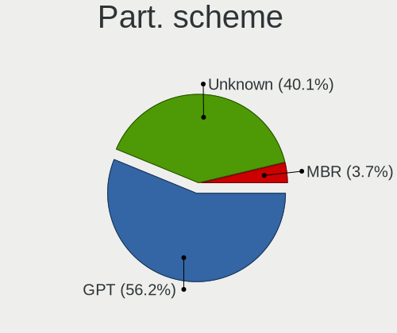
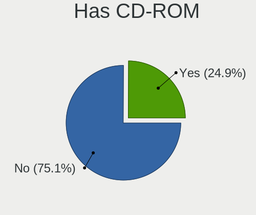
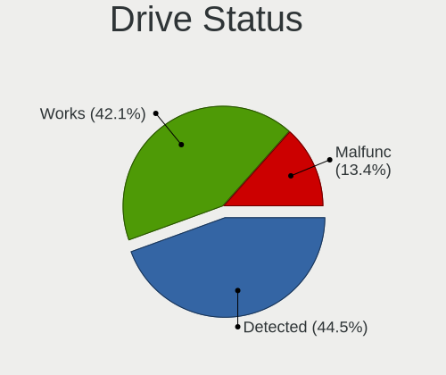
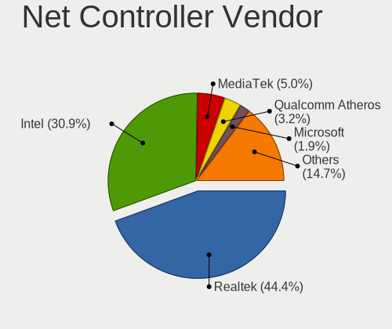
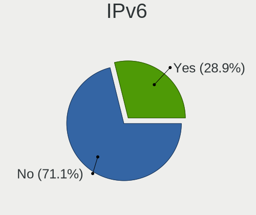
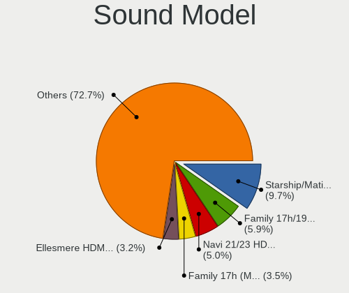
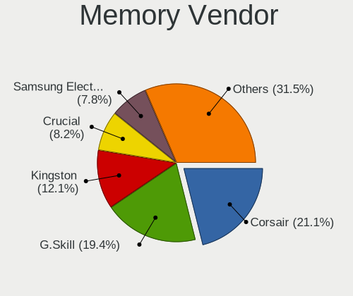
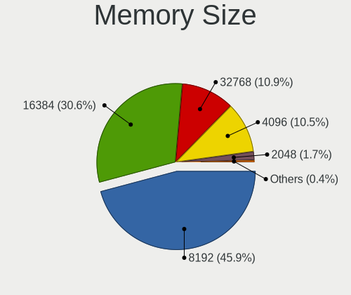
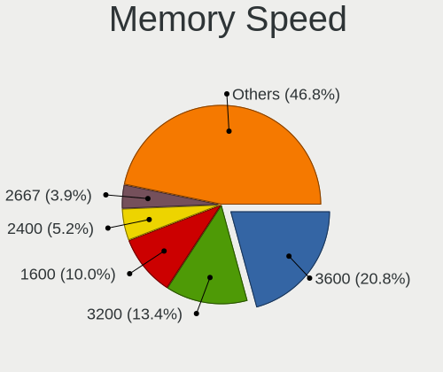

Garuda Linux - Tested Hardware & Statistics (Desktops)
------------------------------------------------------

A project to collect tested hardware configurations for Garuda Linux.

Anyone can contribute to this report by the [hw-probe](https://github.com/linuxhw/hw-probe) tool:

    sudo -E hw-probe -all -upload

Please submit a probe of your configuration if it's not presented on the page or is rare.

Full-feature report is available here: https://linux-hardware.org/?view=trends

Contents
--------

* [ Test Cases ](#test-cases)

* [ System ](#system)
  - [ Kernel                   ](#kernel)
  - [ Kernel Family            ](#kernel-family)
  - [ Kernel Major Ver.        ](#kernel-major-ver)
  - [ Arch                     ](#arch)
  - [ DE                       ](#de)
  - [ Display Server           ](#display-server)
  - [ Display Manager          ](#display-manager)
  - [ OS Lang                  ](#os-lang)
  - [ Boot Mode                ](#boot-mode)
  - [ Filesystem               ](#filesystem)
  - [ Part. scheme             ](#part-scheme)
  - [ Dual Boot with Linux/BSD ](#dual-boot-with-linuxbsd)
  - [ Dual Boot (Win)          ](#dual-boot-win)

* [ Board ](#board)
  - [ Vendor                   ](#vendor)
  - [ Model                    ](#model)
  - [ Model Family             ](#model-family)
  - [ MFG Year                 ](#mfg-year)
  - [ Form Factor              ](#form-factor)
  - [ Secure Boot              ](#secure-boot)
  - [ Coreboot                 ](#coreboot)
  - [ RAM Size                 ](#ram-size)
  - [ RAM Used                 ](#ram-used)
  - [ Total Drives             ](#total-drives)
  - [ Has CD-ROM               ](#has-cd-rom)
  - [ Has Ethernet             ](#has-ethernet)
  - [ Has WiFi                 ](#has-wifi)
  - [ Has Bluetooth            ](#has-bluetooth)

* [ Location ](#location)
  - [ Country                  ](#country)
  - [ City                     ](#city)

* [ Drives ](#drives)
  - [ Drive Vendor             ](#drive-vendor)
  - [ Drive Model              ](#drive-model)
  - [ HDD Vendor               ](#hdd-vendor)
  - [ SSD Vendor               ](#ssd-vendor)
  - [ Drive Kind               ](#drive-kind)
  - [ Drive Connector          ](#drive-connector)
  - [ Drive Size               ](#drive-size)
  - [ Space Total              ](#space-total)
  - [ Space Used               ](#space-used)
  - [ Malfunc. Drives          ](#malfunc-drives)
  - [ Malfunc. Drive Vendor    ](#malfunc-drive-vendor)
  - [ Malfunc. HDD Vendor      ](#malfunc-hdd-vendor)
  - [ Malfunc. Drive Kind      ](#malfunc-drive-kind)
  - [ Failed Drives            ](#failed-drives)
  - [ Failed Drive Vendor      ](#failed-drive-vendor)
  - [ Drive Status             ](#drive-status)

* [ Storage controller ](#storage-controller)
  - [ Storage Vendor           ](#storage-vendor)
  - [ Storage Model            ](#storage-model)
  - [ Storage Kind             ](#storage-kind)

* [ Processor ](#processor)
  - [ CPU Vendor               ](#cpu-vendor)
  - [ CPU Model                ](#cpu-model)
  - [ CPU Model Family         ](#cpu-model-family)
  - [ CPU Cores                ](#cpu-cores)
  - [ CPU Sockets              ](#cpu-sockets)
  - [ CPU Threads              ](#cpu-threads)
  - [ CPU Op-Modes             ](#cpu-op-modes)
  - [ CPU Microcode            ](#cpu-microcode)
  - [ CPU Microarch            ](#cpu-microarch)

* [ Graphics ](#graphics)
  - [ GPU Vendor               ](#gpu-vendor)
  - [ GPU Model                ](#gpu-model)
  - [ GPU Combo                ](#gpu-combo)
  - [ GPU Driver               ](#gpu-driver)
  - [ GPU Memory               ](#gpu-memory)

* [ Monitor ](#monitor)
  - [ Monitor Vendor           ](#monitor-vendor)
  - [ Monitor Model            ](#monitor-model)
  - [ Monitor Resolution       ](#monitor-resolution)
  - [ Monitor Diagonal         ](#monitor-diagonal)
  - [ Monitor Width            ](#monitor-width)
  - [ Aspect Ratio             ](#aspect-ratio)
  - [ Monitor Area             ](#monitor-area)
  - [ Pixel Density            ](#pixel-density)
  - [ Multiple Monitors        ](#multiple-monitors)

* [ Network ](#network)
  - [ Net Controller Vendor    ](#net-controller-vendor)
  - [ Net Controller Model     ](#net-controller-model)
  - [ Wireless Vendor          ](#wireless-vendor)
  - [ Wireless Model           ](#wireless-model)
  - [ Ethernet Vendor          ](#ethernet-vendor)
  - [ Ethernet Model           ](#ethernet-model)
  - [ Net Controller Kind      ](#net-controller-kind)
  - [ Used Controller          ](#used-controller)
  - [ NICs                     ](#nics)
  - [ IPv6                     ](#ipv6)

* [ Bluetooth ](#bluetooth)
  - [ Bluetooth Vendor         ](#bluetooth-vendor)
  - [ Bluetooth Model          ](#bluetooth-model)

* [ Sound ](#sound)
  - [ Sound Vendor             ](#sound-vendor)
  - [ Sound Model              ](#sound-model)

* [ Memory ](#memory)
  - [ Memory Vendor            ](#memory-vendor)
  - [ Memory Model             ](#memory-model)
  - [ Memory Kind              ](#memory-kind)
  - [ Memory Form Factor       ](#memory-form-factor)
  - [ Memory Size              ](#memory-size)
  - [ Memory Speed             ](#memory-speed)

* [ Printers & scanners ](#printers--scanners)
  - [ Printer Vendor           ](#printer-vendor)
  - [ Printer Model            ](#printer-model)
  - [ Scanner Vendor           ](#scanner-vendor)
  - [ Scanner Model            ](#scanner-model)

* [ Camera ](#camera)
  - [ Camera Vendor            ](#camera-vendor)
  - [ Camera Model             ](#camera-model)

* [ Security ](#security)
  - [ Fingerprint Vendor       ](#fingerprint-vendor)
  - [ Fingerprint Model        ](#fingerprint-model)
  - [ Chipcard Vendor          ](#chipcard-vendor)
  - [ Chipcard Model           ](#chipcard-model)

* [ Unsupported ](#unsupported)
  - [ Unsupported Devices      ](#unsupported-devices)
  - [ Unsupported Device Types ](#unsupported-device-types)

Test Cases
----------

| Vendor    | Model                       | Probe                                                      | Date         |
|-----------|-----------------------------|------------------------------------------------------------|--------------|
| Gigabyte  | MFLP3AP-00\2.x              | [b7441a0e94](https://linux-hardware.org/?probe=b7441a0e94) | Jan 31, 2022 |
| ASRock    | X470 Taichi                 | [aa0e21b159](https://linux-hardware.org/?probe=aa0e21b159) | Jan 27, 2022 |
| Gigabyte  | B85-HD3                     | [ad70601774](https://linux-hardware.org/?probe=ad70601774) | Jan 26, 2022 |
| ASRock    | X470 Taichi                 | [2227a23892](https://linux-hardware.org/?probe=2227a23892) | Jan 20, 2022 |
| ASRock    | 970M Pro3                   | [402a4f960e](https://linux-hardware.org/?probe=402a4f960e) | Jan 17, 2022 |
| ASRock    | X470 Taichi                 | [6261484b31](https://linux-hardware.org/?probe=6261484b31) | Jan 17, 2022 |
| ASUSTek   | ROG Maximus X CODE          | [8fac80f31d](https://linux-hardware.org/?probe=8fac80f31d) | Jan 16, 2022 |
| Gigabyte  | AB350-Gaming 3-CF           | [9fab263b02](https://linux-hardware.org/?probe=9fab263b02) | Jan 11, 2022 |
| MSI       | Z270 GAMING M5              | [02d70182fd](https://linux-hardware.org/?probe=02d70182fd) | Jan 10, 2022 |
| Gigabyte  | AB350-Gaming 3-CF           | [8a1167daea](https://linux-hardware.org/?probe=8a1167daea) | Jan 08, 2022 |
| ASUSTek   | TUF GAMING X570-PLUS        | [1a4570a458](https://linux-hardware.org/?probe=1a4570a458) | Jan 08, 2022 |
| Pegatron  | 2AD5                        | [91ee5ba1df](https://linux-hardware.org/?probe=91ee5ba1df) | Jan 08, 2022 |
| Gigabyte  | B460M DS3H                  | [40f4de9da7](https://linux-hardware.org/?probe=40f4de9da7) | Jan 07, 2022 |
| ASRock    | X470 Taichi                 | [37dc48f3f3](https://linux-hardware.org/?probe=37dc48f3f3) | Jan 02, 2022 |
| ASRock    | X470 Taichi                 | [f506cf2d37](https://linux-hardware.org/?probe=f506cf2d37) | Jan 02, 2022 |
| Gigabyte  | B550 AORUS PRO AC           | [1b62246b10](https://linux-hardware.org/?probe=1b62246b10) | Dec 21, 2021 |
| ASRock    | X470 Taichi                 | [8d397e7af8](https://linux-hardware.org/?probe=8d397e7af8) | Dec 19, 2021 |
| ASUSTek   | TUF GAMING X570-PLUS        | [9e73346fb8](https://linux-hardware.org/?probe=9e73346fb8) | Dec 15, 2021 |
| Gigabyte  | X570 AORUS ELITE WIFI       | [196b460373](https://linux-hardware.org/?probe=196b460373) | Dec 13, 2021 |
| ASRock    | H77M-ITX                    | [5e98a2fce2](https://linux-hardware.org/?probe=5e98a2fce2) | Dec 11, 2021 |
| ASRock    | B450M Pro4                  | [e4fb1e4fe4](https://linux-hardware.org/?probe=e4fb1e4fe4) | Dec 09, 2021 |
| Lenovo    | ThinkStation S20 4105O1U    | [731c890641](https://linux-hardware.org/?probe=731c890641) | Dec 08, 2021 |
| ASUSTek   | TUF GAMING X570-PLUS        | [f0df07c0e4](https://linux-hardware.org/?probe=f0df07c0e4) | Dec 06, 2021 |
| Acer      | Aspire TC-895 V:1.0         | [c743459a71](https://linux-hardware.org/?probe=c743459a71) | Dec 04, 2021 |
| ASUSTek   | H87M-E                      | [2b4abcf54f](https://linux-hardware.org/?probe=2b4abcf54f) | Dec 02, 2021 |
| ASUSTek   | H87M-E                      | [72cf0ed74d](https://linux-hardware.org/?probe=72cf0ed74d) | Dec 02, 2021 |
| Lenovo    | ThinkStation S20 4105O1U    | [f031548aac](https://linux-hardware.org/?probe=f031548aac) | Dec 01, 2021 |
| Lenovo    | ThinkStation S20 4105O1U    | [48f73af82d](https://linux-hardware.org/?probe=48f73af82d) | Nov 30, 2021 |
| ASRock    | X470 Taichi                 | [0b1d816eff](https://linux-hardware.org/?probe=0b1d816eff) | Nov 28, 2021 |
| ASRock    | X470 Taichi                 | [dd3bc71908](https://linux-hardware.org/?probe=dd3bc71908) | Nov 26, 2021 |
| ASRock    | X470 Taichi                 | [0f3490892c](https://linux-hardware.org/?probe=0f3490892c) | Nov 14, 2021 |
| ASUSTek   | Rampage IV EXTREME          | [50999d4796](https://linux-hardware.org/?probe=50999d4796) | Nov 14, 2021 |
| ASUSTek   | TUF GAMING X570-PLUS        | [cd295bb56c](https://linux-hardware.org/?probe=cd295bb56c) | Nov 04, 2021 |
| ASRock    | X470 Taichi                 | [5ae2157abe](https://linux-hardware.org/?probe=5ae2157abe) | Nov 04, 2021 |
| ASRock    | X470 Taichi                 | [86f08832c0](https://linux-hardware.org/?probe=86f08832c0) | Oct 31, 2021 |
| ASRock    | X470 Taichi                 | [e153488f12](https://linux-hardware.org/?probe=e153488f12) | Oct 28, 2021 |
| ASUSTek   | P8B75-M                     | [2130c28d33](https://linux-hardware.org/?probe=2130c28d33) | Oct 27, 2021 |
| ASRock    | X470 Taichi                 | [ec046ac486](https://linux-hardware.org/?probe=ec046ac486) | Oct 24, 2021 |
| MSI       | Z77A-G43                    | [3bd9604ae7](https://linux-hardware.org/?probe=3bd9604ae7) | Oct 20, 2021 |
| MSI       | B460M PRO-VDH WIFI          | [76071ec77b](https://linux-hardware.org/?probe=76071ec77b) | Oct 19, 2021 |
| ASRock    | X470 Taichi                 | [9b9f21a8eb](https://linux-hardware.org/?probe=9b9f21a8eb) | Oct 19, 2021 |
| MSI       | B450M-A PRO MAX             | [4148046f02](https://linux-hardware.org/?probe=4148046f02) | Oct 17, 2021 |
| ASRock    | X470 Taichi                 | [ff6b763448](https://linux-hardware.org/?probe=ff6b763448) | Oct 16, 2021 |
| ASRock    | X470 Taichi                 | [1963eb2e26](https://linux-hardware.org/?probe=1963eb2e26) | Sep 28, 2021 |
| Fujitsu   | D3120-A1 S26361-D3120-A1    | [fdd8f9dd8e](https://linux-hardware.org/?probe=fdd8f9dd8e) | Sep 17, 2021 |
| Fujitsu   | D3120-A1 S26361-D3120-A1    | [ab3ad8009e](https://linux-hardware.org/?probe=ab3ad8009e) | Sep 16, 2021 |
| ASUSTek   | PRIME B450M-K               | [b8b49f201f](https://linux-hardware.org/?probe=b8b49f201f) | Sep 14, 2021 |
| MSI       | H310M PRO-VDH PLUS          | [65fcfef06f](https://linux-hardware.org/?probe=65fcfef06f) | Aug 27, 2021 |
| Alienware | 0TYR0X A00                  | [5ea23ebfb2](https://linux-hardware.org/?probe=5ea23ebfb2) | Aug 19, 2021 |
| ASRock    | X399 Professional Gaming    | [bb53a385c3](https://linux-hardware.org/?probe=bb53a385c3) | Aug 19, 2021 |
| ASRock    | X470 Taichi                 | [c18bca5109](https://linux-hardware.org/?probe=c18bca5109) | Aug 16, 2021 |
| Medion    | H110H4-EM2                  | [f4e01958e5](https://linux-hardware.org/?probe=f4e01958e5) | Aug 10, 2021 |
| ASRock    | X470 Taichi                 | [a919fef17f](https://linux-hardware.org/?probe=a919fef17f) | Aug 07, 2021 |
| MSI       | Z97 MPOWER                  | [dee7d3af4a](https://linux-hardware.org/?probe=dee7d3af4a) | Aug 06, 2021 |
| MSI       | Z97 MPOWER                  | [f30e5a3a86](https://linux-hardware.org/?probe=f30e5a3a86) | Aug 06, 2021 |
| ASUSTek   | ROG STRIX B550-F GAMING     | [826edd51bc](https://linux-hardware.org/?probe=826edd51bc) | Jul 07, 2021 |
| Gigabyte  | X470 AORUS ULTRA GAMING-... | [aa05cca9b7](https://linux-hardware.org/?probe=aa05cca9b7) | Jun 30, 2021 |
| Biostar   | H310MHP                     | [0d3f648f3e](https://linux-hardware.org/?probe=0d3f648f3e) | Jun 30, 2021 |
| Lenovo    | SHARKBAY SDK0E50510 WIN     | [fb3d7de63c](https://linux-hardware.org/?probe=fb3d7de63c) | Jun 26, 2021 |
| MSI       | A320M-HDV R4.0              | [486775a989](https://linux-hardware.org/?probe=486775a989) | Jun 23, 2021 |
| MSI       | A320M-HDV R4.0              | [4629f86f56](https://linux-hardware.org/?probe=4629f86f56) | Jun 22, 2021 |
| MSI       | A320M-HDV R4.0              | [69dea4e3cf](https://linux-hardware.org/?probe=69dea4e3cf) | Jun 22, 2021 |
| MSI       | A320M-HDV R4.0              | [2fd89c951e](https://linux-hardware.org/?probe=2fd89c951e) | Jun 22, 2021 |
| MSI       | X370 GAMING PRO CARBON      | [9ead1e1bb5](https://linux-hardware.org/?probe=9ead1e1bb5) | Jun 22, 2021 |
| ASUSTek   | ROG STRIX B550-F GAMING     | [8144c83b50](https://linux-hardware.org/?probe=8144c83b50) | Jun 22, 2021 |
| ASUSTek   | ROG STRIX B550-F GAMING     | [8a7a518013](https://linux-hardware.org/?probe=8a7a518013) | Jun 15, 2021 |
| ASUSTek   | ROG STRIX B550-F GAMING     | [376c0ff95d](https://linux-hardware.org/?probe=376c0ff95d) | Jun 15, 2021 |
| Gigabyte  | B550I AORUS PRO AX          | [34801a2f74](https://linux-hardware.org/?probe=34801a2f74) | Jun 12, 2021 |
| ASUSTek   | ROG CROSSHAIR VII HERO      | [51e1e33185](https://linux-hardware.org/?probe=51e1e33185) | May 20, 2021 |
| MSI       | B350M GAMING PRO            | [c04e6666e7](https://linux-hardware.org/?probe=c04e6666e7) | May 20, 2021 |
| Dell      | 0D28YY A02                  | [14edf3bd00](https://linux-hardware.org/?probe=14edf3bd00) | May 16, 2021 |
| Gigabyte  | A320M-S2H-CF                | [066f815622](https://linux-hardware.org/?probe=066f815622) | May 12, 2021 |
| HP        | 844C                        | [29f7cf64ce](https://linux-hardware.org/?probe=29f7cf64ce) | May 06, 2021 |
| HP        | 844C                        | [0534f06ec4](https://linux-hardware.org/?probe=0534f06ec4) | May 06, 2021 |
| ASUSTek   | PRIME Z590-A                | [cb3058760e](https://linux-hardware.org/?probe=cb3058760e) | May 04, 2021 |
| Gigabyte  | P67A-UD3-B3                 | [08ea956bfa](https://linux-hardware.org/?probe=08ea956bfa) | Apr 24, 2021 |
| MSI       | Z87 MPOWER                  | [ff6aa3811c](https://linux-hardware.org/?probe=ff6aa3811c) | Apr 08, 2021 |
| ASRock    | AB350M-HDV                  | [23502edac5](https://linux-hardware.org/?probe=23502edac5) | Apr 01, 2021 |
| ASRock    | AB350M-HDV                  | [8cc9da4310](https://linux-hardware.org/?probe=8cc9da4310) | Apr 01, 2021 |
| ASRock    | AB350M-HDV                  | [13b2fdddc0](https://linux-hardware.org/?probe=13b2fdddc0) | Apr 01, 2021 |
| Dell      | 07KY25 A01                  | [8c4f2f9922](https://linux-hardware.org/?probe=8c4f2f9922) | Mar 31, 2021 |
| Dell      | 07KY25 A01                  | [1b9efb1b29](https://linux-hardware.org/?probe=1b9efb1b29) | Mar 24, 2021 |
| Gigabyte  | B450 AORUS M                | [097a0d616c](https://linux-hardware.org/?probe=097a0d616c) | Mar 18, 2021 |
| Gigabyte  | B450 AORUS M                | [22054ffd75](https://linux-hardware.org/?probe=22054ffd75) | Mar 18, 2021 |
| HP        | 2AF7                        | [e0639ea4a5](https://linux-hardware.org/?probe=e0639ea4a5) | Mar 11, 2021 |
| HP        | 2AF7                        | [fb8d76722c](https://linux-hardware.org/?probe=fb8d76722c) | Mar 11, 2021 |
| ASUSTek   | ROG STRIX B550-F GAMING     | [c1f22a7521](https://linux-hardware.org/?probe=c1f22a7521) | Mar 05, 2021 |
| Gigabyte  | GA-MA790FXT-UD5P            | [404dab2464](https://linux-hardware.org/?probe=404dab2464) | Feb 27, 2021 |
| ASRock    | FM2A88X Extreme6+           | [13f9fc2ef3](https://linux-hardware.org/?probe=13f9fc2ef3) | Feb 18, 2021 |
| ASUSTek   | ROG STRIX B550-F GAMING     | [2e19f3b1af](https://linux-hardware.org/?probe=2e19f3b1af) | Feb 18, 2021 |
| ASUSTek   | ROG STRIX B550-F GAMING     | [51244d0897](https://linux-hardware.org/?probe=51244d0897) | Feb 18, 2021 |
| Dell      | 0C2KJT A00                  | [f821a0035b](https://linux-hardware.org/?probe=f821a0035b) | Feb 12, 2021 |
| ASUSTek   | PRIME B360M-K               | [b73941c431](https://linux-hardware.org/?probe=b73941c431) | Feb 08, 2021 |
| HP        | 1825                        | [3b6b80db46](https://linux-hardware.org/?probe=3b6b80db46) | Jan 31, 2021 |
| HP        | 1825                        | [1df894dea4](https://linux-hardware.org/?probe=1df894dea4) | Jan 31, 2021 |
| ASRock    | X470 Master SLI             | [36eaf717e9](https://linux-hardware.org/?probe=36eaf717e9) | Jan 26, 2021 |
| ASRock    | X470 Master SLI             | [b1be9375c0](https://linux-hardware.org/?probe=b1be9375c0) | Jan 24, 2021 |
| ASUSTek   | ROG STRIX X570-E GAMING     | [7332b50f98](https://linux-hardware.org/?probe=7332b50f98) | Jan 24, 2021 |
| ASUSTek   | PRIME H270-PLUS             | [3f895b585b](https://linux-hardware.org/?probe=3f895b585b) | Jan 22, 2021 |
| Lenovo    | SHARKBAY 0B98401 PRO        | [61976e9745](https://linux-hardware.org/?probe=61976e9745) | Jan 18, 2021 |
| MSI       | X399 SLI PLUS               | [e392838a54](https://linux-hardware.org/?probe=e392838a54) | Jan 10, 2021 |
| ASUSTek   | CM5671                      | [069344a54e](https://linux-hardware.org/?probe=069344a54e) | Jan 07, 2021 |
| MSI       | B85-G43 GAMING              | [8fe013f04a](https://linux-hardware.org/?probe=8fe013f04a) | Jan 04, 2021 |
| ASRock    | G41M-VS3                    | [e1217b1871](https://linux-hardware.org/?probe=e1217b1871) | Jan 02, 2021 |
| Pegatron  | 2AC2A                       | [436a2ca3ce](https://linux-hardware.org/?probe=436a2ca3ce) | Dec 25, 2020 |
| Pegatron  | 2AC2A                       | [2df3b195c6](https://linux-hardware.org/?probe=2df3b195c6) | Dec 25, 2020 |
| ASUSTek   | PRIME Z370-P                | [35365be0e8](https://linux-hardware.org/?probe=35365be0e8) | Dec 19, 2020 |
| MSI       | Z390-A PRO                  | [ea7a52fdac](https://linux-hardware.org/?probe=ea7a52fdac) | Dec 16, 2020 |
| ASUSTek   | ROG STRIX B550-F GAMING     | [62a5c95d51](https://linux-hardware.org/?probe=62a5c95d51) | Dec 14, 2020 |
| HP        | 8643 SMVB                   | [dccfba36f1](https://linux-hardware.org/?probe=dccfba36f1) | Dec 06, 2020 |
| Gigabyte  | B450 AORUS ELITE            | [2a35d394f9](https://linux-hardware.org/?probe=2a35d394f9) | Dec 04, 2020 |
| MSI       | Z390-A PRO                  | [05e3eb32c9](https://linux-hardware.org/?probe=05e3eb32c9) | Dec 03, 2020 |
| MSI       | Z390-A PRO                  | [dc6ea9bfb8](https://linux-hardware.org/?probe=dc6ea9bfb8) | Nov 29, 2020 |
| ASUSTek   | M5A97 LE R2.0               | [d4b3f84c86](https://linux-hardware.org/?probe=d4b3f84c86) | Nov 28, 2020 |
| Gigabyte  | B450 AORUS M                | [a3d68dc126](https://linux-hardware.org/?probe=a3d68dc126) | Nov 19, 2020 |
| Gigabyte  | B450 AORUS M                | [d9faeae0d4](https://linux-hardware.org/?probe=d9faeae0d4) | Nov 19, 2020 |
| Gigabyte  | X570 AORUS PRO WIFI         | [11c79940a4](https://linux-hardware.org/?probe=11c79940a4) | Nov 19, 2020 |
| HP        | 18E7                        | [f84cbfd465](https://linux-hardware.org/?probe=f84cbfd465) | Nov 10, 2020 |
| Gigabyte  | X570 AORUS PRO WIFI         | [79608bd849](https://linux-hardware.org/?probe=79608bd849) | Nov 06, 2020 |
| ASUSTek   | ROG STRIX B550-F GAMING     | [e80ddac12f](https://linux-hardware.org/?probe=e80ddac12f) | Nov 02, 2020 |
| ASUSTek   | ROG STRIX B550-F GAMING     | [876b039494](https://linux-hardware.org/?probe=876b039494) | Nov 01, 2020 |
| Gigabyte  | X570 AORUS PRO WIFI         | [428abb1a9b](https://linux-hardware.org/?probe=428abb1a9b) | Oct 31, 2020 |
| Gigabyte  | X570 AORUS PRO WIFI         | [4e573bc6ff](https://linux-hardware.org/?probe=4e573bc6ff) | Oct 28, 2020 |
| MSI       | MPG B550 GAMING EDGE WIF... | [4b9d2b77cb](https://linux-hardware.org/?probe=4b9d2b77cb) | Oct 26, 2020 |
| ASUSTek   | PRIME X399-A                | [b7772d9ff8](https://linux-hardware.org/?probe=b7772d9ff8) | Oct 13, 2020 |
| Dell      | 0R6JMP A00                  | [c4cbec5b80](https://linux-hardware.org/?probe=c4cbec5b80) | Oct 11, 2020 |
| OEM       | Unknown                     | [2e7a212437](https://linux-hardware.org/?probe=2e7a212437) | Sep 26, 2020 |
| Lenovo    | Board                       | [c08fed8ecb](https://linux-hardware.org/?probe=c08fed8ecb) | Sep 11, 2020 |
| ASUSTek   | Maximus VIII FORMULA        | [7b8babe846](https://linux-hardware.org/?probe=7b8babe846) | Aug 27, 2020 |
| ASUSTek   | Maximus VIII FORMULA        | [e8a88c2b81](https://linux-hardware.org/?probe=e8a88c2b81) | Aug 12, 2020 |
| ASUSTek   | Maximus VIII FORMULA        | [7380887fb8](https://linux-hardware.org/?probe=7380887fb8) | Aug 09, 2020 |
| ASUSTek   | Maximus VIII FORMULA        | [faac6d06ac](https://linux-hardware.org/?probe=faac6d06ac) | Aug 09, 2020 |
| ASUSTek   | Maximus VIII FORMULA        | [73462df387](https://linux-hardware.org/?probe=73462df387) | Aug 07, 2020 |

System
------

Kernel
------

Version of the Linux kernel

| Version                        | Desktops | Percent |
|--------------------------------|----------|---------|
| 5.10.4-107-tkg-bmq             | 4        | 4.44%   |
| 5.9.1-zen2-1-zen               | 3        | 3.33%   |
| 5.15.7-zen1-1-zen              | 3        | 3.33%   |
| 5.15.2-zen1-1-zen              | 3        | 3.33%   |
| 5.15.13-zen1-1-zen             | 3        | 3.33%   |
| 5.11.16-zen1-1-zen             | 3        | 3.33%   |
| 5.9.11-zen2-1-zen              | 2        | 2.22%   |
| 5.9.10-zen1-1-zen              | 2        | 2.22%   |
| 5.8.14-zen1-1-zen              | 2        | 2.22%   |
| 5.16.0-zen1-1-zen              | 2        | 2.22%   |
| 5.15.12-zen1-1-zen             | 2        | 2.22%   |
| 5.15.10-zen1-1-zen             | 2        | 2.22%   |
| 5.13.9-zen1-1-zen              | 2        | 2.22%   |
| 5.13.12-zen1-1-zen             | 2        | 2.22%   |
| 5.12.4-zen1-2-zen              | 2        | 2.22%   |
| 5.10.8-112-tkg-bmq             | 2        | 2.22%   |
| 5.9.8-zen1-1-zen               | 1        | 1.11%   |
| 5.9.6-zen1-1-zen               | 1        | 1.11%   |
| 5.9.4-zen1-1-zen               | 1        | 1.11%   |
| 5.9.2-zen1-1-zen               | 1        | 1.11%   |
| 5.9.14-99-tkg-bmq              | 1        | 1.11%   |
| 5.8.5-zen1-1-zen               | 1        | 1.11%   |
| 5.8.10-zen1-1-zen              | 1        | 1.11%   |
| 5.8.0-xanmod1-1-xanmod         | 1        | 1.11%   |
| 5.16.4-zen1-1-zen              | 1        | 1.11%   |
| 5.16.2-zen1-1-zen              | 1        | 1.11%   |
| 5.15.6-zen2-1-zen              | 1        | 1.11%   |
| 5.15.6-225-tkg-pds             | 1        | 1.11%   |
| 5.15.5-zen1-1-zen              | 1        | 1.11%   |
| 5.15.10-229-tkg-pds            | 1        | 1.11%   |
| 5.15.0-212-tkg-pds             | 1        | 1.11%   |
| 5.14.5-zen1-1-zen              | 1        | 1.11%   |
| 5.14.15-zen1-1-zen             | 1        | 1.11%   |
| 5.14.14-zen1-1-zen             | 1        | 1.11%   |
| 5.14.12-zen1-1-zen             | 1        | 1.11%   |
| 5.14.12-207-tkg-cacule         | 1        | 1.11%   |
| 5.14.11-206-tkg-pds            | 1        | 1.11%   |
| 5.13.8-zen1-1-zen              | 1        | 1.11%   |
| 5.13.19-204-tkg-muqss          | 1        | 1.11%   |
| 5.13.19-203-tkg-muqss          | 1        | 1.11%   |
| 5.13.10-190-tkg-bmq            | 1        | 1.11%   |
| 5.12.7-zen1-1-zen              | 1        | 1.11%   |
| 5.12.3-zen1-1-zen              | 1        | 1.11%   |
| 5.12.14-zen1-1-zen             | 1        | 1.11%   |
| 5.12.13-zen1-2-zen             | 1        | 1.11%   |
| 5.12.13-zen1-1-zen             | 1        | 1.11%   |
| 5.12.13-170-tkg-muqss          | 1        | 1.11%   |
| 5.12.12-zen1-1-zen             | 1        | 1.11%   |
| 5.12.12-AMD-znver2             | 1        | 1.11%   |
| 5.12.10-zen1-1-zen             | 1        | 1.11%   |
| 5.11.8-zen1-1-zen              | 1        | 1.11%   |
| 5.11.6-zen1-1-zen              | 1        | 1.11%   |
| 5.11.5-zen1-1-zen              | 1        | 1.11%   |
| 5.11.3-xanmod1-cacule-1-cacule | 1        | 1.11%   |
| 5.11.11-zen1-1-zen             | 1        | 1.11%   |
| 5.11.1-127-tkg-bmq             | 1        | 1.11%   |
| 5.11.0-xanmod1-1               | 1        | 1.11%   |
| 5.10.7-111-tkg-bmq             | 1        | 1.11%   |
| 5.10.34-1-clear                | 1        | 1.11%   |
| 5.10.3-zen1-1-zen              | 1        | 1.11%   |

Kernel Family
-------------

Linux kernel without a distro release

| Version | Desktops | Percent |
|---------|----------|---------|
| 5.10.4  | 4        | 4.44%   |
| 5.9.1   | 3        | 3.33%   |
| 5.15.7  | 3        | 3.33%   |
| 5.15.2  | 3        | 3.33%   |
| 5.15.13 | 3        | 3.33%   |
| 5.15.10 | 3        | 3.33%   |
| 5.12.13 | 3        | 3.33%   |
| 5.11.16 | 3        | 3.33%   |
| 5.9.11  | 2        | 2.22%   |
| 5.9.10  | 2        | 2.22%   |
| 5.8.14  | 2        | 2.22%   |
| 5.16.0  | 2        | 2.22%   |
| 5.15.6  | 2        | 2.22%   |
| 5.15.12 | 2        | 2.22%   |
| 5.14.12 | 2        | 2.22%   |
| 5.13.9  | 2        | 2.22%   |
| 5.13.19 | 2        | 2.22%   |
| 5.13.12 | 2        | 2.22%   |
| 5.12.4  | 2        | 2.22%   |
| 5.12.12 | 2        | 2.22%   |
| 5.10.8  | 2        | 2.22%   |
| 5.9.8   | 1        | 1.11%   |
| 5.9.6   | 1        | 1.11%   |
| 5.9.4   | 1        | 1.11%   |
| 5.9.2   | 1        | 1.11%   |
| 5.9.14  | 1        | 1.11%   |
| 5.8.5   | 1        | 1.11%   |
| 5.8.10  | 1        | 1.11%   |
| 5.8.0   | 1        | 1.11%   |
| 5.16.4  | 1        | 1.11%   |
| 5.16.2  | 1        | 1.11%   |
| 5.15.5  | 1        | 1.11%   |
| 5.15.0  | 1        | 1.11%   |
| 5.14.5  | 1        | 1.11%   |
| 5.14.15 | 1        | 1.11%   |
| 5.14.14 | 1        | 1.11%   |
| 5.14.11 | 1        | 1.11%   |
| 5.13.8  | 1        | 1.11%   |
| 5.13.10 | 1        | 1.11%   |
| 5.12.7  | 1        | 1.11%   |
| 5.12.3  | 1        | 1.11%   |
| 5.12.14 | 1        | 1.11%   |
| 5.12.10 | 1        | 1.11%   |
| 5.11.8  | 1        | 1.11%   |
| 5.11.6  | 1        | 1.11%   |
| 5.11.5  | 1        | 1.11%   |
| 5.11.3  | 1        | 1.11%   |
| 5.11.11 | 1        | 1.11%   |
| 5.11.1  | 1        | 1.11%   |
| 5.11.0  | 1        | 1.11%   |
| 5.10.7  | 1        | 1.11%   |
| 5.10.34 | 1        | 1.11%   |
| 5.10.3  | 1        | 1.11%   |
| 5.10.27 | 1        | 1.11%   |
| 5.10.2  | 1        | 1.11%   |
| 5.10.16 | 1        | 1.11%   |
| 5.10.15 | 1        | 1.11%   |
| 5.10.13 | 1        | 1.11%   |
| 5.10.10 | 1        | 1.11%   |
| 5.10.1  | 1        | 1.11%   |

Kernel Major Ver.
-----------------

Linux kernel major version

| Version | Desktops | Percent |
|---------|----------|---------|
| 5.15    | 16       | 19.28%  |
| 5.10    | 16       | 19.28%  |
| 5.12    | 10       | 12.05%  |
| 5.11    | 10       | 12.05%  |
| 5.9     | 9        | 10.84%  |
| 5.13    | 7        | 8.43%   |
| 5.14    | 6        | 7.23%   |
| 5.8     | 5        | 6.02%   |
| 5.16    | 4        | 4.82%   |

Arch
----

OS architecture (x86_64, i586, etc.)

| Name   | Desktops | Percent |
|--------|----------|---------|
| x86_64 | 78       | 100%    |

DE
--

Desktop Environment

| Name    | Desktops | Percent |
|---------|----------|---------|
| KDE5    | 46       | 57.5%   |
| KDE     | 19       | 23.75%  |
| GNOME   | 11       | 13.75%  |
| XFCE    | 1        | 1.25%   |
| LXQt    | 1        | 1.25%   |
| i3      | 1        | 1.25%   |
| Unknown | 1        | 1.25%   |

Display Server
--------------

X11 or Wayland

| Name    | Desktops | Percent |
|---------|----------|---------|
| X11     | 77       | 98.72%  |
| Wayland | 1        | 1.28%   |

Display Manager
---------------

SDDM, LightDM, etc.

| Name    | Desktops | Percent |
|---------|----------|---------|
| Unknown | 42       | 53.85%  |
| SDDM    | 31       | 39.74%  |
| LightDM | 3        | 3.85%   |
| GDM     | 2        | 2.56%   |

OS Lang
-------

Language

| Lang  | Desktops | Percent |
|-------|----------|---------|
| en_US | 38       | 48.72%  |
| de_DE | 8        | 10.26%  |
| en_GB | 7        | 8.97%   |
| es_ES | 3        | 3.85%   |
| ru_RU | 2        | 2.56%   |
| nl_NL | 2        | 2.56%   |
| fr_BE | 2        | 2.56%   |
| en_CA | 2        | 2.56%   |
| en_AU | 2        | 2.56%   |
| sv_SE | 1        | 1.28%   |
| sk_SK | 1        | 1.28%   |
| pt_BR | 1        | 1.28%   |
| nb_NO | 1        | 1.28%   |
| iu_CA | 1        | 1.28%   |
| fr_FR | 1        | 1.28%   |
| es_VE | 1        | 1.28%   |
| es_AR | 1        | 1.28%   |
| en_ZA | 1        | 1.28%   |
| en_IN | 1        | 1.28%   |
| el_GR | 1        | 1.28%   |
| da_DK | 1        | 1.28%   |

Boot Mode
---------

EFI or BIOS

| Mode | Desktops | Percent |
|------|----------|---------|
| EFI  | 42       | 53.85%  |
| BIOS | 36       | 46.15%  |

Filesystem
----------

Type of filesystem

| Type  | Desktops | Percent |
|-------|----------|---------|
| Btrfs | 76       | 97.44%  |
| Ext4  | 2        | 2.56%   |

Part. scheme
------------

Scheme of partitioning

| Type    | Desktops | Percent |
|---------|----------|---------|
| Unknown | 41       | 51.9%   |
| GPT     | 35       | 44.3%   |
| MBR     | 3        | 3.8%    |

Dual Boot with Linux/BSD
------------------------

Hosting more than one Linux/BSD

| Dual boot | Desktops | Percent |
|-----------|----------|---------|
| No        | 71       | 87.65%  |
| Yes       | 10       | 12.35%  |

Dual Boot (Win)
---------------

Hosting Linux and Windows

| Dual boot | Desktops | Percent |
|-----------|----------|---------|
| No        | 54       | 68.35%  |
| Yes       | 25       | 31.65%  |

Board
-----

Vendor
------

Motherboard manufacturer

| Name                | Desktops | Percent |
|---------------------|----------|---------|
| ASUSTek Computer    | 20       | 25.64%  |
| Gigabyte Technology | 15       | 19.23%  |
| MSI                 | 13       | 16.67%  |
| ASRock              | 8        | 10.26%  |
| Hewlett-Packard     | 5        | 6.41%   |
| Dell                | 5        | 6.41%   |
| Lenovo              | 4        | 5.13%   |
| Pegatron            | 2        | 2.56%   |
| OEM                 | 1        | 1.28%   |
| Medion              | 1        | 1.28%   |
| Fujitsu             | 1        | 1.28%   |
| Biostar             | 1        | 1.28%   |
| Alienware           | 1        | 1.28%   |
| Acer                | 1        | 1.28%   |

Model
-----

Motherboard model

| Name                                | Desktops | Percent |
|-------------------------------------|----------|---------|
| ASUS TUF GAMING X570-PLUS           | 3        | 3.85%   |
| Gigabyte AB350-Gaming 3             | 2        | 2.56%   |
| Dell Inspiron 3668                  | 2        | 2.56%   |
| ASUS ROG STRIX B550-F GAMING        | 2        | 2.56%   |
| Pegatron p7-1030                    | 1        | 1.28%   |
| Pegatron h9-1301es                  | 1        | 1.28%   |
| MSI MS-7C91                         | 1        | 1.28%   |
| MSI MS-7C83                         | 1        | 1.28%   |
| MSI MS-7C52                         | 1        | 1.28%   |
| MSI MS-7C09                         | 1        | 1.28%   |
| MSI MS-7B98                         | 1        | 1.28%   |
| MSI MS-7B09                         | 1        | 1.28%   |
| MSI MS-7A78                         | 1        | 1.28%   |
| MSI MS-7A39                         | 1        | 1.28%   |
| MSI MS-7A32                         | 1        | 1.28%   |
| MSI MS-7818                         | 1        | 1.28%   |
| MSI MS-7816                         | 1        | 1.28%   |
| MSI MS-7758                         | 1        | 1.28%   |
| MSI A320M-HDV R4.0                  | 1        | 1.28%   |
| Medion Akoya P5238 F/C395           | 1        | 1.28%   |
| Lenovo ThinkStation S20 4105O1U     | 1        | 1.28%   |
| Lenovo ThinkCentre M93p 10A90048US  | 1        | 1.28%   |
| Lenovo ThinkCentre M93p 10A90016US  | 1        | 1.28%   |
| Lenovo ThinkCentre M91p 7033CG1     | 1        | 1.28%   |
| HP ProDesk 600 G1 SFF               | 1        | 1.28%   |
| HP Pavilion Gaming Desktop 790-00xx | 1        | 1.28%   |
| HP EliteDesk 800 G1 DM              | 1        | 1.28%   |
| HP Desktop M01-F0xxx                | 1        | 1.28%   |
| HP 500-439                          | 1        | 1.28%   |
| Gigabyte X570 AORUS PRO WIFI        | 1        | 1.28%   |
| Gigabyte X570 AORUS ELITE WIFI      | 1        | 1.28%   |
| Gigabyte X470 AORUS ULTRA GAMING    | 1        | 1.28%   |
| Gigabyte P67A-UD3-B3                | 1        | 1.28%   |
| Gigabyte GB-BKi3(H)A-7100           | 1        | 1.28%   |
| Gigabyte GA-MA790FXT-UD5P           | 1        | 1.28%   |
| Gigabyte B85-HD3                    | 1        | 1.28%   |
| Gigabyte B550I AORUS PRO AX         | 1        | 1.28%   |
| Gigabyte B550 AORUS PRO AC          | 1        | 1.28%   |
| Gigabyte B460MDS3H                  | 1        | 1.28%   |
| Gigabyte B450 AORUS M               | 1        | 1.28%   |
| Gigabyte B450 AORUS ELITE           | 1        | 1.28%   |
| Gigabyte A320M-S2H                  | 1        | 1.28%   |
| Fujitsu ESPRIMO E410                | 1        | 1.28%   |
| Dell OptiPlex 790                   | 1        | 1.28%   |
| Dell Inspiron 580                   | 1        | 1.28%   |
| Dell Inspiron 3670                  | 1        | 1.28%   |
| Biostar H310MHP                     | 1        | 1.28%   |
| ASUS ROG STRIX X570-E GAMING        | 1        | 1.28%   |
| ASUS ROG Maximus X CODE             | 1        | 1.28%   |
| ASUS ROG CROSSHAIR VII HERO         | 1        | 1.28%   |
| ASUS Rampage IV EXTREME             | 1        | 1.28%   |
| ASUS PRIME Z590-A                   | 1        | 1.28%   |
| ASUS PRIME Z370-P                   | 1        | 1.28%   |
| ASUS PRIME X399-A                   | 1        | 1.28%   |
| ASUS PRIME H270-PLUS                | 1        | 1.28%   |
| ASUS PRIME B450M-K                  | 1        | 1.28%   |
| ASUS PRIME B360M-K                  | 1        | 1.28%   |
| ASUS P8B75-M                        | 1        | 1.28%   |
| ASUS Maximus VIII FORMULA           | 1        | 1.28%   |
| ASUS M5A97 LE R2.0                  | 1        | 1.28%   |

Model Family
------------

Motherboard model prefix

| Name                      | Desktops | Percent |
|---------------------------|----------|---------|
| ASUS PRIME                | 6        | 7.69%   |
| ASUS ROG                  | 5        | 6.41%   |
| Dell Inspiron             | 4        | 5.13%   |
| Lenovo ThinkCentre        | 3        | 3.85%   |
| ASUS TUF                  | 3        | 3.85%   |
| Gigabyte X570             | 2        | 2.56%   |
| Gigabyte B450             | 2        | 2.56%   |
| Gigabyte AB350-Gaming     | 2        | 2.56%   |
| ASRock X470               | 2        | 2.56%   |
| Pegatron p7-1030          | 1        | 1.28%   |
| Pegatron h9-1301es        | 1        | 1.28%   |
| MSI MS-7C91               | 1        | 1.28%   |
| MSI MS-7C83               | 1        | 1.28%   |
| MSI MS-7C52               | 1        | 1.28%   |
| MSI MS-7C09               | 1        | 1.28%   |
| MSI MS-7B98               | 1        | 1.28%   |
| MSI MS-7B09               | 1        | 1.28%   |
| MSI MS-7A78               | 1        | 1.28%   |
| MSI MS-7A39               | 1        | 1.28%   |
| MSI MS-7A32               | 1        | 1.28%   |
| MSI MS-7818               | 1        | 1.28%   |
| MSI MS-7816               | 1        | 1.28%   |
| MSI MS-7758               | 1        | 1.28%   |
| MSI A320M-HDV             | 1        | 1.28%   |
| Medion Akoya              | 1        | 1.28%   |
| Lenovo ThinkStation       | 1        | 1.28%   |
| HP ProDesk                | 1        | 1.28%   |
| HP Pavilion               | 1        | 1.28%   |
| HP EliteDesk              | 1        | 1.28%   |
| HP Desktop                | 1        | 1.28%   |
| HP 500-439                | 1        | 1.28%   |
| Gigabyte X470             | 1        | 1.28%   |
| Gigabyte P67A-UD3-B3      | 1        | 1.28%   |
| Gigabyte GB-BKi3(H)A-7100 | 1        | 1.28%   |
| Gigabyte GA-MA790FXT-UD5P | 1        | 1.28%   |
| Gigabyte B85-HD3          | 1        | 1.28%   |
| Gigabyte B550I            | 1        | 1.28%   |
| Gigabyte B550             | 1        | 1.28%   |
| Gigabyte B460MDS3H        | 1        | 1.28%   |
| Gigabyte A320M-S2H        | 1        | 1.28%   |
| Fujitsu ESPRIMO           | 1        | 1.28%   |
| Dell OptiPlex             | 1        | 1.28%   |
| Biostar H310MHP           | 1        | 1.28%   |
| ASUS Rampage              | 1        | 1.28%   |
| ASUS P8B75-M              | 1        | 1.28%   |
| ASUS Maximus              | 1        | 1.28%   |
| ASUS M5A97                | 1        | 1.28%   |
| ASUS CM5671               | 1        | 1.28%   |
| ASUS All                  | 1        | 1.28%   |
| ASRock X399               | 1        | 1.28%   |
| ASRock H77M-ITX           | 1        | 1.28%   |
| ASRock G41M-VS3           | 1        | 1.28%   |
| ASRock FM2A88X            | 1        | 1.28%   |
| ASRock B450M              | 1        | 1.28%   |
| ASRock 970M               | 1        | 1.28%   |
| Alienware Aurora          | 1        | 1.28%   |
| Acer Aspire               | 1        | 1.28%   |
| Unknown                   | 1        | 1.28%   |

MFG Year
--------

Motherboard manufacture year

| Year | Desktops | Percent |
|------|----------|---------|
| 2019 | 13       | 16.67%  |
| 2018 | 13       | 16.67%  |
| 2017 | 12       | 15.38%  |
| 2020 | 8        | 10.26%  |
| 2013 | 7        | 8.97%   |
| 2012 | 5        | 6.41%   |
| 2011 | 4        | 5.13%   |
| 2010 | 4        | 5.13%   |
| 2021 | 3        | 3.85%   |
| 2015 | 3        | 3.85%   |
| 2014 | 3        | 3.85%   |
| 2016 | 2        | 2.56%   |
| 2009 | 1        | 1.28%   |

Form Factor
-----------

Physical design of the computer

| Name    | Desktops | Percent |
|---------|----------|---------|
| Desktop | 78       | 100%    |

Secure Boot
-----------

Enabled or disabled

| State    | Desktops | Percent |
|----------|----------|---------|
| Disabled | 78       | 100%    |

Coreboot
--------

Have coreboot on board

| Used | Desktops | Percent |
|------|----------|---------|
| No   | 78       | 100%    |

RAM Size
--------

Total RAM memory

| Size in GB  | Desktops | Percent |
|-------------|----------|---------|
| 32.01-64.0  | 23       | 29.49%  |
| 16.01-24.0  | 21       | 26.92%  |
| 8.01-16.0   | 15       | 19.23%  |
| 4.01-8.0    | 9        | 11.54%  |
| 24.01-32.0  | 6        | 7.69%   |
| 3.01-4.0    | 2        | 2.56%   |
| 64.01-256.0 | 2        | 2.56%   |

RAM Used
--------

Used RAM memory

| Used GB    | Desktops | Percent |
|------------|----------|---------|
| 4.01-8.0   | 29       | 36.71%  |
| 3.01-4.0   | 17       | 21.52%  |
| 8.01-16.0  | 15       | 18.99%  |
| 2.01-3.0   | 11       | 13.92%  |
| 1.01-2.0   | 4        | 5.06%   |
| 16.01-24.0 | 3        | 3.8%    |

Total Drives
------------

Number of drives on board

| Drives | Desktops | Percent |
|--------|----------|---------|
| 2      | 26       | 32.5%   |
| 3      | 17       | 21.25%  |
| 4      | 13       | 16.25%  |
| 1      | 12       | 15%     |
| 5      | 6        | 7.5%    |
| 9      | 3        | 3.75%   |
| 6      | 3        | 3.75%   |

Has CD-ROM
----------

Has CD-ROM on board

| Presented | Desktops | Percent |
|-----------|----------|---------|
| No        | 55       | 69.62%  |
| Yes       | 24       | 30.38%  |

Has Ethernet
------------

Has Ethernet on board

| Presented | Desktops | Percent |
|-----------|----------|---------|
| Yes       | 76       | 97.44%  |
| No        | 2        | 2.56%   |

Has WiFi
--------

Has WiFi module

| Presented | Desktops | Percent |
|-----------|----------|---------|
| Yes       | 44       | 54.32%  |
| No        | 37       | 45.68%  |

Has Bluetooth
-------------

Has Bluetooth module

| Presented | Desktops | Percent |
|-----------|----------|---------|
| No        | 43       | 54.43%  |
| Yes       | 36       | 45.57%  |

Location
--------

Country
-------

Geographic location (country)

| Country      | Desktops | Percent |
|--------------|----------|---------|
| USA          | 27       | 34.62%  |
| Germany      | 9        | 11.54%  |
| UK           | 5        | 6.41%   |
| Spain        | 3        | 3.85%   |
| Russia       | 3        | 3.85%   |
| Canada       | 3        | 3.85%   |
| Sweden       | 2        | 2.56%   |
| Romania      | 2        | 2.56%   |
| Puerto Rico  | 2        | 2.56%   |
| Netherlands  | 2        | 2.56%   |
| France       | 2        | 2.56%   |
| Belgium      | 2        | 2.56%   |
| Australia    | 2        | 2.56%   |
| Venezuela    | 1        | 1.28%   |
| South Africa | 1        | 1.28%   |
| Slovakia     | 1        | 1.28%   |
| Philippines  | 1        | 1.28%   |
| Norway       | 1        | 1.28%   |
| Latvia       | 1        | 1.28%   |
| Italy        | 1        | 1.28%   |
| India        | 1        | 1.28%   |
| Iceland      | 1        | 1.28%   |
| Greece       | 1        | 1.28%   |
| Denmark      | 1        | 1.28%   |
| Chile        | 1        | 1.28%   |
| Brazil       | 1        | 1.28%   |
| Argentina    | 1        | 1.28%   |

City
----

Geographic location (city)

| City                   | Desktops | Percent |
|------------------------|----------|---------|
| Kingsport              | 2        | 2.5%    |
| Windermere             | 1        | 1.25%   |
| West Des Moines        | 1        | 1.25%   |
| Volzhskiy              | 1        | 1.25%   |
| Volgograd              | 1        | 1.25%   |
| Valence                | 1        | 1.25%   |
| Timi?ôoara             | 1        | 1.25%   |
| Tekoa                  | 1        | 1.25%   |
| Tampa                  | 1        | 1.25%   |
| Sydney                 | 1        | 1.25%   |
| Stuttgart              | 1        | 1.25%   |
| Stockton-on-Tees       | 1        | 1.25%   |
| Stockholm              | 1        | 1.25%   |
| Stavropol              | 1        | 1.25%   |
| St Louis               | 1        | 1.25%   |
| Shreveport             | 1        | 1.25%   |
| Satu Mare              | 1        | 1.25%   |
| Sarasota               | 1        | 1.25%   |
| Santa Cruz de Tenerife | 1        | 1.25%   |
| San Juan               | 1        | 1.25%   |
| San Jose               | 1        | 1.25%   |
| Salto da Divisa        | 1        | 1.25%   |
| Riga                   | 1        | 1.25%   |
| Regina                 | 1        | 1.25%   |
| Portland               | 1        | 1.25%   |
| Perth                  | 1        | 1.25%   |
| Orrefors               | 1        | 1.25%   |
| Omaha                  | 1        | 1.25%   |
| Oklahoma City          | 1        | 1.25%   |
| Ocean Springs          | 1        | 1.25%   |
| Nunoa                  | 1        | 1.25%   |
| Noss                   | 1        | 1.25%   |
| Norman                 | 1        | 1.25%   |
| Nijmegen               | 1        | 1.25%   |
| Nashua                 | 1        | 1.25%   |
| Naranjito              | 1        | 1.25%   |
| Mumbai                 | 1        | 1.25%   |
| Milan                  | 1        | 1.25%   |
| Miami                  | 1        | 1.25%   |
| Martigues              | 1        | 1.25%   |
| Marslev                | 1        | 1.25%   |
| Mannheim               | 1        | 1.25%   |
| Ludwigshafen am Rhein  | 1        | 1.25%   |
| Los Angeles            | 1        | 1.25%   |
| London                 | 1        | 1.25%   |
| Leichlingen            | 1        | 1.25%   |
| Langhorne              | 1        | 1.25%   |
| Laguna Hills           | 1        | 1.25%   |
| Kokomo                 | 1        | 1.25%   |
| Kitchener              | 1        | 1.25%   |
| Kings Lynn             | 1        | 1.25%   |
| Karlsruhe              | 1        | 1.25%   |
| Jonesboro              | 1        | 1.25%   |
| Jemappes               | 1        | 1.25%   |
| Illertissen            | 1        | 1.25%   |
| Hamburg                | 1        | 1.25%   |
| Groningen              | 1        | 1.25%   |
| Geneva                 | 1        | 1.25%   |
| Gar√∞abaer             | 1        | 1.25%   |
| Frankfurt am Main      | 1        | 1.25%   |

Drives
------

Drive Vendor
------------

Hard drive vendors

| Vendor                    | Desktops | Drives | Percent |
|---------------------------|----------|--------|---------|
| Seagate                   | 35       | 53     | 18.52%  |
| WDC                       | 34       | 43     | 17.99%  |
| Samsung Electronics       | 32       | 68     | 16.93%  |
| Toshiba                   | 14       | 16     | 7.41%   |
| Crucial                   | 12       | 16     | 6.35%   |
| Kingston                  | 10       | 16     | 5.29%   |
| SanDisk                   | 8        | 10     | 4.23%   |
| Phison                    | 6        | 7      | 3.17%   |
| Hitachi                   | 4        | 4      | 2.12%   |
| XPG                       | 3        | 4      | 1.59%   |
| A-DATA Technology         | 3        | 6      | 1.59%   |
| Unknown                   | 2        | 2      | 1.06%   |
| Transcend                 | 2        | 2      | 1.06%   |
| SPCC                      | 2        | 2      | 1.06%   |
| Intel                     | 2        | 3      | 1.06%   |
| China                     | 2        | 4      | 1.06%   |
| WD MediaMax               | 1        | 1      | 0.53%   |
| USB30                     | 1        | 2      | 0.53%   |
| TO Exter                  | 1        | 1      | 0.53%   |
| SK Hynix                  | 1        | 1      | 0.53%   |
| Silicon Motion            | 1        | 1      | 0.53%   |
| QUMO                      | 1        | 1      | 0.53%   |
| PNY                       | 1        | 1      | 0.53%   |
| Mushkin                   | 1        | 1      | 0.53%   |
| Micron/Crucial Technology | 1        | 2      | 0.53%   |
| Micron Technology         | 1        | 1      | 0.53%   |
| LITEONIT                  | 1        | 1      | 0.53%   |
| Inateck                   | 1        | 1      | 0.53%   |
| HS-SSD-E100               | 1        | 1      | 0.53%   |
| HGST                      | 1        | 1      | 0.53%   |
| EMTEC                     | 1        | 1      | 0.53%   |
| Corsair                   | 1        | 4      | 0.53%   |
| ASMedia                   | 1        | 2      | 0.53%   |
| Unknown                   | 1        | 1      | 0.53%   |

Drive Model
-----------

Hard drive models

| Model                            | Desktops | Percent |
|----------------------------------|----------|---------|
| Samsung SSD 970 EVO Plus 500GB   | 5        | 2.24%   |
| Crucial CT1000MX500SSD1 1TB      | 4        | 1.79%   |
| Toshiba DT01ACA100 1TB           | 3        | 1.35%   |
| Seagate ST2000DM008-2FR102 2TB   | 3        | 1.35%   |
| Seagate ST1000DM010-2EP102 1TB   | 3        | 1.35%   |
| Samsung SSD 860 EVO 500GB        | 3        | 1.35%   |
| Samsung SSD 850 EVO 250GB        | 3        | 1.35%   |
| Samsung NVMe SSD Drive 500GB     | 3        | 1.35%   |
| Samsung NVMe SSD Drive 1TB       | 3        | 1.35%   |
| XPG NVMe SSD Drive 512GB         | 2        | 0.9%    |
| WDC WDS240G2G0A-00JH30 240GB SSD | 2        | 0.9%    |
| WDC WD20EARX-00PASB0 2TB         | 2        | 0.9%    |
| WDC WD10EZEX-08WN4A0 1TB         | 2        | 0.9%    |
| Toshiba HDWD110 1TB              | 2        | 0.9%    |
| SPCC Solid State Disk 512GB      | 2        | 0.9%    |
| Seagate ST4000DM004-2CV104 4TB   | 2        | 0.9%    |
| Seagate ST3320820AS 320GB        | 2        | 0.9%    |
| Seagate ST2000DM001-1ER164 2TB   | 2        | 0.9%    |
| Seagate ST2000DL003-9VT166 2TB   | 2        | 0.9%    |
| Seagate Portable 5TB             | 2        | 0.9%    |
| Seagate Expansion Desk 8TB       | 2        | 0.9%    |
| SanDisk SSD PLUS 1000GB          | 2        | 0.9%    |
| Sandisk NVMe SSD Drive 500GB     | 2        | 0.9%    |
| Samsung SSD 970 EVO 250GB        | 2        | 0.9%    |
| Samsung SSD 850 EVO 500GB        | 2        | 0.9%    |
| Samsung NVMe SSD Drive 250GB     | 2        | 0.9%    |
| Phison NVMe SSD Drive 2TB        | 2        | 0.9%    |
| Kingston SV300S37A120G 120GB SSD | 2        | 0.9%    |
| Kingston SA400S37240G 240GB SSD  | 2        | 0.9%    |
| Crucial CT1000P1SSD8 1TB         | 2        | 0.9%    |
| XPG SPECTRIX S20G 1TB            | 1        | 0.45%   |
| WDC WDS500G2X0C-00L350 500GB     | 1        | 0.45%   |
| WDC WDS500G2B0A-00SM50 500GB SSD | 1        | 0.45%   |
| WDC WDS120G2G0A-00JH30 120GB SSD | 1        | 0.45%   |
| WDC WDS120G1G0A-00SS50 120GB SSD | 1        | 0.45%   |
| WDC WDS100T2B0C-00PXH0 1TB       | 1        | 0.45%   |
| WDC WDS100T1X0E-00AFY0 1TB       | 1        | 0.45%   |
| WDC WD800BEVS-07RST0 80GB        | 1        | 0.45%   |
| WDC WD6400AAKS-75A7B2 640GB      | 1        | 0.45%   |
| WDC WD6400AAKS-65A7B2 640GB      | 1        | 0.45%   |
| WDC WD5000LPCX-22VHAT1 500GB     | 1        | 0.45%   |
| WDC WD5000AZRX-00L4HB0 500GB     | 1        | 0.45%   |
| WDC WD5000AZRX-00A8LB0 500GB     | 1        | 0.45%   |
| WDC WD5000AAKS-00E4A0 500GB      | 1        | 0.45%   |
| WDC WD4001FAEX-00MJRA0 4TB       | 1        | 0.45%   |
| WDC WD3200AAKS-75L9A0 320GB      | 1        | 0.45%   |
| WDC WD3200AAJS-55B4A0 320GB      | 1        | 0.45%   |
| WDC WD30EZRZ-00Z5HB0 3TB         | 1        | 0.45%   |
| WDC WD30EZRX-00DC0B0 3TB         | 1        | 0.45%   |
| WDC WD30EFRX-68EUZN0 3TB         | 1        | 0.45%   |
| WDC WD2500JS-55NCB1 250GB        | 1        | 0.45%   |
| WDC WD2500AAKX-75U6AA0 250GB     | 1        | 0.45%   |
| WDC WD2500AAJS-00RYA0 250GB      | 1        | 0.45%   |
| WDC WD20PURZ-85GU6Y0 2TB         | 1        | 0.45%   |
| WDC WD20EURS-73TLHY0 2TB         | 1        | 0.45%   |
| WDC WD20EFRX-68AX9N0 2TB         | 1        | 0.45%   |
| WDC WD2003FZEX-00Z4SA0 2TB       | 1        | 0.45%   |
| WDC WD2000F9YZ-09N20L1 2TB       | 1        | 0.45%   |
| WDC WD10EZRZ-22HTKB0 1TB         | 1        | 0.45%   |
| WDC WD10EZRX-00D8PB0 1TB         | 1        | 0.45%   |

HDD Vendor
----------

Hard disk drive vendors

| Vendor              | Desktops | Drives | Percent |
|---------------------|----------|--------|---------|
| Seagate             | 34       | 51     | 40.48%  |
| WDC                 | 27       | 34     | 32.14%  |
| Toshiba             | 12       | 13     | 14.29%  |
| Samsung Electronics | 4        | 4      | 4.76%   |
| Hitachi             | 4        | 4      | 4.76%   |
| TO Exter            | 1        | 1      | 1.19%   |
| Inateck             | 1        | 1      | 1.19%   |
| HGST                | 1        | 1      | 1.19%   |

SSD Vendor
----------

Solid state drive vendors

| Vendor              | Desktops | Drives | Percent |
|---------------------|----------|--------|---------|
| Samsung Electronics | 15       | 24     | 24.19%  |
| Kingston            | 9        | 15     | 14.52%  |
| Crucial             | 9        | 11     | 14.52%  |
| WDC                 | 5        | 5      | 8.06%   |
| SanDisk             | 5        | 6      | 8.06%   |
| A-DATA Technology   | 3        | 6      | 4.84%   |
| Transcend           | 2        | 2      | 3.23%   |
| SPCC                | 2        | 2      | 3.23%   |
| China               | 2        | 4      | 3.23%   |
| USB30               | 1        | 2      | 1.61%   |
| Unknown             | 1        | 1      | 1.61%   |
| Toshiba             | 1        | 2      | 1.61%   |
| SK Hynix            | 1        | 1      | 1.61%   |
| QUMO                | 1        | 1      | 1.61%   |
| Mushkin             | 1        | 1      | 1.61%   |
| Micron Technology   | 1        | 1      | 1.61%   |
| LITEONIT            | 1        | 1      | 1.61%   |
| EMTEC               | 1        | 1      | 1.61%   |
| ASMedia             | 1        | 2      | 1.61%   |

Drive Kind
----------

HDD or SSD

| Kind    | Desktops | Drives | Percent |
|---------|----------|--------|---------|
| HDD     | 60       | 109    | 39.74%  |
| SSD     | 47       | 88     | 31.13%  |
| NVMe    | 37       | 76     | 24.5%   |
| Unknown | 7        | 7      | 4.64%   |

Drive Connector
---------------

SATA, SAS, NVMe, etc.

| Type | Desktops | Drives | Percent |
|------|----------|--------|---------|
| SATA | 71       | 180    | 59.17%  |
| NVMe | 37       | 76     | 30.83%  |
| SAS  | 12       | 24     | 10%     |

Drive Size
----------

Size of hard drive

| Size in TB | Desktops | Drives | Percent |
|------------|----------|--------|---------|
| 0.01-0.5   | 47       | 85     | 36.72%  |
| 0.51-1.0   | 40       | 54     | 31.25%  |
| 1.01-2.0   | 23       | 34     | 17.97%  |
| 3.01-4.0   | 6        | 7      | 4.69%   |
| 4.01-10.0  | 6        | 7      | 4.69%   |
| 2.01-3.0   | 5        | 9      | 3.91%   |
| 10.01-20.0 | 1        | 1      | 0.78%   |

Space Total
-----------

Amount of disk space available on the file system

| Size in GB     | Desktops | Percent |
|----------------|----------|---------|
| More than 3000 | 32       | 41.03%  |
| 2001-3000      | 15       | 19.23%  |
| 1001-2000      | 14       | 17.95%  |
| 501-1000       | 8        | 10.26%  |
| 251-500        | 6        | 7.69%   |
| Unknown        | 2        | 2.56%   |
| 101-250        | 1        | 1.28%   |

Space Used
----------

Amount of used disk space

| Used GB        | Desktops | Percent |
|----------------|----------|---------|
| 1001-2000      | 15       | 18.29%  |
| 101-250        | 13       | 15.85%  |
| 251-500        | 12       | 14.63%  |
| 501-1000       | 12       | 14.63%  |
| More than 3000 | 9        | 10.98%  |
| 2001-3000      | 8        | 9.76%   |
| 51-100         | 7        | 8.54%   |
| 21-50          | 3        | 3.66%   |
| Unknown        | 2        | 2.44%   |
| 1-20           | 1        | 1.22%   |

Malfunc. Drives
---------------

Drive models with a malfunction

| Model                                 | Desktops | Drives | Percent |
|---------------------------------------|----------|--------|---------|
| WDC WD5000AAKS-00E4A0 500GB           | 1        | 1      | 9.09%   |
| WDC WD30EZRX-00DC0B0 3TB              | 1        | 1      | 9.09%   |
| WDC WD20EARX-00PASB0 2TB              | 1        | 1      | 9.09%   |
| WDC WD10EZEX-60ZF5A0 1TB              | 1        | 1      | 9.09%   |
| WDC WD10EADS-00M2B0 1TB               | 1        | 1      | 9.09%   |
| Seagate ST9250827AS 250GB             | 1        | 1      | 9.09%   |
| Samsung Electronics SSD 960 EVO 250GB | 1        | 6      | 9.09%   |
| Kingston SV300S37A120G 120GB SSD      | 1        | 1      | 9.09%   |
| Kingston SH103S3240G 240GB SSD        | 1        | 1      | 9.09%   |
| Hitachi HTS543216L9A300 160GB         | 1        | 1      | 9.09%   |
| Crucial CT960M500SSD1 960GB           | 1        | 1      | 9.09%   |

Malfunc. Drive Vendor
---------------------

Vendors of faulty drives

| Vendor              | Desktops | Drives | Percent |
|---------------------|----------|--------|---------|
| WDC                 | 5        | 5      | 45.45%  |
| Kingston            | 2        | 2      | 18.18%  |
| Seagate             | 1        | 1      | 9.09%   |
| Samsung Electronics | 1        | 6      | 9.09%   |
| Hitachi             | 1        | 1      | 9.09%   |
| Crucial             | 1        | 1      | 9.09%   |

Malfunc. HDD Vendor
-------------------

Vendors of faulty HDD drives

| Vendor  | Desktops | Drives | Percent |
|---------|----------|--------|---------|
| WDC     | 5        | 5      | 71.43%  |
| Seagate | 1        | 1      | 14.29%  |
| Hitachi | 1        | 1      | 14.29%  |

Malfunc. Drive Kind
-------------------

Kinds of faulty drives

| Kind | Desktops | Drives | Percent |
|------|----------|--------|---------|
| HDD  | 7        | 7      | 63.64%  |
| SSD  | 3        | 3      | 27.27%  |
| NVMe | 1        | 6      | 9.09%   |

Failed Drives
-------------

Failed drive models

Zero info for selected period =(

Failed Drive Vendor
-------------------

Failed drive vendors

Zero info for selected period =(

Drive Status
------------

Number of failed and malfunc. drives

| Status   | Desktops | Drives | Percent |
|----------|----------|--------|---------|
| Detected | 50       | 143    | 51.55%  |
| Works    | 36       | 121    | 37.11%  |
| Malfunc  | 11       | 16     | 11.34%  |

Storage controller
------------------

Storage Vendor
--------------

Storage controller vendors

| Vendor                       | Desktops | Percent |
|------------------------------|----------|---------|
| Intel                        | 42       | 33.6%   |
| AMD                          | 36       | 28.8%   |
| Samsung Electronics          | 18       | 14.4%   |
| Phison Electronics           | 7        | 5.6%    |
| Sandisk                      | 6        | 4.8%    |
| ASMedia Technology           | 4        | 3.2%    |
| Micron/Crucial Technology    | 3        | 2.4%    |
| ADATA Technology             | 2        | 1.6%    |
| Union Memory (Shenzhen)      | 1        | 0.8%    |
| Toshiba America Info Systems | 1        | 0.8%    |
| Silicon Motion               | 1        | 0.8%    |
| Realtek Semiconductor        | 1        | 0.8%    |
| Marvell Technology Group     | 1        | 0.8%    |
| Kingston Technology Company  | 1        | 0.8%    |
| JMicron Technology           | 1        | 0.8%    |

Storage Model
-------------

Storage controller models

| Model                                                                                   | Desktops | Percent |
|-----------------------------------------------------------------------------------------|----------|---------|
| AMD FCH SATA Controller [AHCI mode]                                                     | 25       | 15.72%  |
| Samsung NVMe SSD Controller SM981/PM981/PM983                                           | 16       | 10.06%  |
| AMD 400 Series Chipset SATA Controller                                                  | 11       | 6.92%   |
| Intel 8 Series/C220 Series Chipset Family 6-port SATA Controller 1 [AHCI mode]          | 9        | 5.66%   |
| Phison E12 NVMe Controller                                                              | 6        | 3.77%   |
| Intel 200 Series PCH SATA controller [AHCI mode]                                        | 5        | 3.14%   |
| AMD Starship/Matisse Chipset SATA Controller [AHCI mode]                                | 5        | 3.14%   |
| Samsung NVMe SSD Controller SM961/PM961/SM963                                           | 4        | 2.52%   |
| Intel Q170/Q150/B150/H170/H110/Z170/CM236 Chipset SATA Controller [AHCI Mode]           | 4        | 2.52%   |
| Intel Cannon Lake PCH SATA AHCI Controller                                              | 4        | 2.52%   |
| Intel 6 Series/C200 Series Chipset Family 6 port Desktop SATA AHCI Controller           | 4        | 2.52%   |
| ASMedia ASM1062 Serial ATA Controller                                                   | 4        | 2.52%   |
| Sandisk WD Black 2018/SN750 / PC SN720 NVMe SSD                                         | 3        | 1.89%   |
| Intel 7 Series/C210 Series Chipset Family 6-port SATA Controller [AHCI mode]            | 3        | 1.89%   |
| AMD X399 Series Chipset SATA Controller                                                 | 3        | 1.89%   |
| AMD SB7x0/SB8x0/SB9x0 IDE Controller                                                    | 3        | 1.89%   |
| AMD 300 Series Chipset SATA Controller                                                  | 3        | 1.89%   |
| Sandisk WD Black SN750 / PC SN730 NVMe SSD                                              | 2        | 1.26%   |
| Micron/Crucial NVMe Controller                                                          | 2        | 1.26%   |
| Intel SATA Controller [RAID mode]                                                       | 2        | 1.26%   |
| Intel PROSet/Wireless WiFi Software extension                                           | 2        | 1.26%   |
| AMD SB7x0/SB8x0/SB9x0 SATA Controller [IDE mode]                                        | 2        | 1.26%   |
| AMD SB7x0/SB8x0/SB9x0 SATA Controller [AHCI mode]                                       | 2        | 1.26%   |
| AMD FCH SATA Controller D                                                               | 2        | 1.26%   |
| ADATA XPG SX8200 Pro PCIe Gen3x4 M.2 2280 Solid State Drive                             | 2        | 1.26%   |
| Union Memory (Shenzhen) Non-Volatile memory controller                                  | 1        | 0.63%   |
| Toshiba America Info Systems BG3 NVMe SSD Controller                                    | 1        | 0.63%   |
| Silicon Motion SM2263EN/SM2263XT SSD Controller                                         | 1        | 0.63%   |
| Sandisk WD PC SN810 / Black SN850 NVMe SSD                                              | 1        | 0.63%   |
| Sandisk WD Blue SN550 NVMe SSD                                                          | 1        | 0.63%   |
| Samsung NVMe SSD Controller SM951/PM951                                                 | 1        | 0.63%   |
| Samsung NVMe SSD Controller PM9A1/PM9A3/980PRO                                          | 1        | 0.63%   |
| Samsung NVMe SSD Controller 980                                                         | 1        | 0.63%   |
| Realtek Realtek Non-Volatile memory controller                                          | 1        | 0.63%   |
| Phison E16 PCIe4 NVMe Controller                                                        | 1        | 0.63%   |
| Micron/Crucial P2 NVMe PCIe SSD                                                         | 1        | 0.63%   |
| Marvell Group 88SE9215 PCIe 2.0 x1 4-port SATA 6 Gb/s Controller                        | 1        | 0.63%   |
| Kingston Company A2000 NVMe SSD                                                         | 1        | 0.63%   |
| JMicron JMB363 SATA/IDE Controller                                                      | 1        | 0.63%   |
| Intel Sunrise Point-LP SATA Controller [AHCI mode]                                      | 1        | 0.63%   |
| Intel NM10/ICH7 Family SATA Controller [IDE mode]                                       | 1        | 0.63%   |
| Intel C600/X79 series chipset 6-Port SATA AHCI Controller                               | 1        | 0.63%   |
| Intel 82801JI (ICH10 Family) SATA AHCI Controller                                       | 1        | 0.63%   |
| Intel 82801JI (ICH10 Family) 4 port SATA IDE Controller #1                              | 1        | 0.63%   |
| Intel 82801JI (ICH10 Family) 2 port SATA IDE Controller #2                              | 1        | 0.63%   |
| Intel 82801G (ICH7 Family) IDE Controller                                               | 1        | 0.63%   |
| Intel 7 Series/C210 Series Chipset Family 4-port SATA Controller [IDE mode]             | 1        | 0.63%   |
| Intel 7 Series/C210 Series Chipset Family 2-port SATA Controller [IDE mode]             | 1        | 0.63%   |
| Intel 6 Series/C200 Series Chipset Family Desktop SATA Controller (IDE mode, ports 4-5) | 1        | 0.63%   |
| Intel 6 Series/C200 Series Chipset Family Desktop SATA Controller (IDE mode, ports 0-3) | 1        | 0.63%   |
| Intel 500 Series Chipset Family SATA AHCI Controller                                    | 1        | 0.63%   |
| Intel 5 Series/3400 Series Chipset 4 port SATA IDE Controller                           | 1        | 0.63%   |
| Intel 400 Series Chipset Family SATA AHCI Controller                                    | 1        | 0.63%   |
| Intel 300 Series Chipset Family SATA RAID Controller                                    | 1        | 0.63%   |
| AMD X370 Series Chipset SATA Controller                                                 | 1        | 0.63%   |
| AMD RS690 PCI to PCI Bridge (PCI Express Port 2)                                        | 1        | 0.63%   |

Storage Kind
------------

Kind of storage controller (IDE, SATA, NVMe, SAS, ...)

| Kind | Desktops | Percent |
|------|----------|---------|
| SATA | 71       | 59.17%  |
| NVMe | 38       | 31.67%  |
| IDE  | 8        | 6.67%   |
| RAID | 3        | 2.5%    |

Processor
---------

CPU Vendor
----------

Processor vendors

| Vendor | Desktops | Percent |
|--------|----------|---------|
| Intel  | 42       | 53.85%  |
| AMD    | 36       | 46.15%  |

CPU Model
---------

Processor models

| Model                                           | Desktops | Percent |
|-------------------------------------------------|----------|---------|
| AMD Ryzen 7 3700X 8-Core Processor              | 5        | 6.41%   |
| AMD Ryzen 5 3600 6-Core Processor               | 3        | 3.85%   |
| Intel Core i7-4790 CPU @ 3.60GHz                | 2        | 2.56%   |
| Intel Core i5-4590 CPU @ 3.30GHz                | 2        | 2.56%   |
| Intel Core i3-7100 CPU @ 3.90GHz                | 2        | 2.56%   |
| Intel Core i3-2100 CPU @ 3.10GHz                | 2        | 2.56%   |
| AMD Ryzen 9 3900X 12-Core Processor             | 2        | 2.56%   |
| AMD Ryzen 7 5800X 8-Core Processor              | 2        | 2.56%   |
| AMD Ryzen 7 2700X Eight-Core Processor          | 2        | 2.56%   |
| AMD Ryzen 5 2600 Six-Core Processor             | 2        | 2.56%   |
| AMD Ryzen 5 2400G with Radeon Vega Graphics     | 2        | 2.56%   |
| AMD Ryzen 3 3200G with Radeon Vega Graphics     | 2        | 2.56%   |
| AMD FX-8350 Eight-Core Processor                | 2        | 2.56%   |
| Intel Xeon CPU W3550 @ 3.07GHz                  | 1        | 1.28%   |
| Intel Xeon CPU E5-1680 v2 @ 3.00GHz             | 1        | 1.28%   |
| Intel Pentium Dual-Core CPU E6600 @ 3.06GHz     | 1        | 1.28%   |
| Intel Core i7-8700K CPU @ 3.70GHz               | 1        | 1.28%   |
| Intel Core i7-7700K CPU @ 4.20GHz               | 1        | 1.28%   |
| Intel Core i7-6700K CPU @ 4.00GHz               | 1        | 1.28%   |
| Intel Core i7-4790K CPU @ 4.00GHz               | 1        | 1.28%   |
| Intel Core i7-4770K CPU @ 3.50GHz               | 1        | 1.28%   |
| Intel Core i7-4770 CPU @ 3.40GHz                | 1        | 1.28%   |
| Intel Core i7-3770K CPU @ 3.50GHz               | 1        | 1.28%   |
| Intel Core i7-2600K CPU @ 3.40GHz               | 1        | 1.28%   |
| Intel Core i5-9600KF CPU @ 3.70GHz              | 1        | 1.28%   |
| Intel Core i5-9600K CPU @ 3.70GHz               | 1        | 1.28%   |
| Intel Core i5-9400F CPU @ 2.90GHz               | 1        | 1.28%   |
| Intel Core i5-9400 CPU @ 2.90GHz                | 1        | 1.28%   |
| Intel Core i5-8500 CPU @ 3.00GHz                | 1        | 1.28%   |
| Intel Core i5-7400 CPU @ 3.00GHz                | 1        | 1.28%   |
| Intel Core i5-4590T CPU @ 2.00GHz               | 1        | 1.28%   |
| Intel Core i5-4460 CPU @ 3.20GHz                | 1        | 1.28%   |
| Intel Core i5-3470 CPU @ 3.20GHz                | 1        | 1.28%   |
| Intel Core i5-2500 CPU @ 3.30GHz                | 1        | 1.28%   |
| Intel Core i5-2400 CPU @ 3.10GHz                | 1        | 1.28%   |
| Intel Core i5-10600K CPU @ 4.10GHz              | 1        | 1.28%   |
| Intel Core i5-10400F CPU @ 2.90GHz              | 1        | 1.28%   |
| Intel Core i5-10400 CPU @ 2.90GHz               | 1        | 1.28%   |
| Intel Core i3-9100F CPU @ 3.60GHz               | 1        | 1.28%   |
| Intel Core i3-8100 CPU @ 3.60GHz                | 1        | 1.28%   |
| Intel Core i3-7100U CPU @ 2.40GHz               | 1        | 1.28%   |
| Intel Core i3-3225 CPU @ 3.30GHz                | 1        | 1.28%   |
| Intel Core i3-3220 CPU @ 3.30GHz                | 1        | 1.28%   |
| Intel Core i3 CPU 550 @ 3.20GHz                 | 1        | 1.28%   |
| Intel Core 2 Quad CPU Q9300 @ 2.50GHz           | 1        | 1.28%   |
| Intel Celeron CPU G3900 @ 2.80GHz               | 1        | 1.28%   |
| Intel 11th Gen Core i5-11600KF @ 3.90GHz        | 1        | 1.28%   |
| AMD Ryzen Threadripper 2970WX 24-Core Processor | 1        | 1.28%   |
| AMD Ryzen Threadripper 1950X 16-Core Processor  | 1        | 1.28%   |
| AMD Ryzen Threadripper 1920X 12-Core Processor  | 1        | 1.28%   |
| AMD Ryzen 9 5900 12-Core Processor              | 1        | 1.28%   |
| AMD Ryzen 7 3800X 8-Core Processor              | 1        | 1.28%   |
| AMD Ryzen 7 1800X Eight-Core Processor          | 1        | 1.28%   |
| AMD Ryzen 5 3600X 6-Core Processor              | 1        | 1.28%   |
| AMD Ryzen 5 2600X Six-Core Processor            | 1        | 1.28%   |
| AMD Ryzen 5 1600X Six-Core Processor            | 1        | 1.28%   |
| AMD Ryzen 5 1600 Six-Core Processor             | 1        | 1.28%   |
| AMD Ryzen 3 2300X Quad-Core Processor           | 1        | 1.28%   |
| AMD Phenom II X4 965 Processor                  | 1        | 1.28%   |
| AMD Phenom II X2 555 Processor                  | 1        | 1.28%   |

CPU Model Family
----------------

Processor model prefix

| Model                   | Desktops | Percent |
|-------------------------|----------|---------|
| Intel Core i5           | 16       | 20.51%  |
| AMD Ryzen 7             | 11       | 14.1%   |
| AMD Ryzen 5             | 11       | 14.1%   |
| Intel Core i7           | 10       | 12.82%  |
| Intel Core i3           | 10       | 12.82%  |
| AMD Ryzen Threadripper  | 3        | 3.85%   |
| AMD Ryzen 9             | 3        | 3.85%   |
| AMD Ryzen 3             | 3        | 3.85%   |
| Intel Xeon              | 2        | 2.56%   |
| AMD FX                  | 2        | 2.56%   |
| Other                   | 1        | 1.28%   |
| Intel Pentium Dual-Core | 1        | 1.28%   |
| Intel Core 2 Quad       | 1        | 1.28%   |
| Intel Celeron           | 1        | 1.28%   |
| AMD Phenom II X4        | 1        | 1.28%   |
| AMD Phenom II X2        | 1        | 1.28%   |
| AMD A10                 | 1        | 1.28%   |

CPU Cores
---------

Number of processor cores

| Number | Desktops | Percent |
|--------|----------|---------|
| 4      | 29       | 37.18%  |
| 6      | 19       | 24.36%  |
| 8      | 12       | 15.38%  |
| 2      | 12       | 15.38%  |
| 12     | 4        | 5.13%   |
| 24     | 1        | 1.28%   |
| 16     | 1        | 1.28%   |

CPU Sockets
-----------

Number of sockets

| Number | Desktops | Percent |
|--------|----------|---------|
| 1      | 78       | 100%    |

CPU Threads
-----------

Threads per core (Hyper-Threading)

| Number | Desktops | Percent |
|--------|----------|---------|
| 2      | 55       | 70.51%  |
| 1      | 23       | 29.49%  |

CPU Op-Modes
------------

CPU Operation Modes (32-bit, 64-bit)

| Op mode        | Desktops | Percent |
|----------------|----------|---------|
| 32-bit, 64-bit | 78       | 100%    |

CPU Microcode
-------------

Microcode number

| Number     | Desktops | Percent |
|------------|----------|---------|
| Unknown    | 39       | 48.75%  |
| 0x08701021 | 6        | 7.5%    |
| 0x306c3    | 5        | 6.25%   |
| 0x0800820d | 5        | 6.25%   |
| 0x906ea    | 3        | 3.75%   |
| 0x206a7    | 3        | 3.75%   |
| 0x506e3    | 2        | 2.5%    |
| 0x306a9    | 2        | 2.5%    |
| 0x08001137 | 2        | 2.5%    |
| 0xa0653    | 1        | 1.25%   |
| 0x906ed    | 1        | 1.25%   |
| 0x906ec    | 1        | 1.25%   |
| 0x906eb    | 1        | 1.25%   |
| 0x906e9    | 1        | 1.25%   |
| 0x106a5    | 1        | 1.25%   |
| 0x1067a    | 1        | 1.25%   |
| 0x0a201016 | 1        | 1.25%   |
| 0x08701013 | 1        | 1.25%   |
| 0x08101016 | 1        | 1.25%   |
| 0x0810100b | 1        | 1.25%   |
| 0x06003106 | 1        | 1.25%   |
| 0x06000852 | 1        | 1.25%   |

CPU Microarch
-------------

Microarchitecture

| Name        | Desktops | Percent |
|-------------|----------|---------|
| KabyLake    | 13       | 16.67%  |
| Zen 2       | 12       | 15.38%  |
| Zen+        | 9        | 11.54%  |
| Haswell     | 9        | 11.54%  |
| Zen         | 7        | 8.97%   |
| SandyBridge | 5        | 6.41%   |
| IvyBridge   | 5        | 6.41%   |
| Zen 3       | 3        | 3.85%   |
| CometLake   | 3        | 3.85%   |
| Skylake     | 2        | 2.56%   |
| Piledriver  | 2        | 2.56%   |
| Penryn      | 2        | 2.56%   |
| K10         | 2        | 2.56%   |
| Westmere    | 1        | 1.28%   |
| Steamroller | 1        | 1.28%   |
| Nehalem     | 1        | 1.28%   |
| Unknown     | 1        | 1.28%   |

Graphics
--------

GPU Vendor
----------

Vendors of graphics cards

| Vendor | Desktops | Percent |
|--------|----------|---------|
| Nvidia | 40       | 45.98%  |
| AMD    | 29       | 33.33%  |
| Intel  | 18       | 20.69%  |

GPU Model
---------

Graphics card models

| Model                                                                       | Desktops | Percent |
|-----------------------------------------------------------------------------|----------|---------|
| Intel Xeon E3-1200 v3/4th Gen Core Processor Integrated Graphics Controller | 7        | 7.87%   |
| AMD Ellesmere [Radeon RX 470/480/570/570X/580/580X/590]                     | 6        | 6.74%   |
| AMD Vega 10 XL/XT [Radeon RX Vega 56/64]                                    | 4        | 4.49%   |
| Nvidia TU104 [GeForce RTX 2080 Rev. A]                                      | 3        | 3.37%   |
| AMD Navi 10 [Radeon RX 5600 OEM/5600 XT / 5700/5700 XT]                     | 3        | 3.37%   |
| Nvidia TU116 [GeForce GTX 1650 SUPER]                                       | 2        | 2.25%   |
| Nvidia GT218 [GeForce 210]                                                  | 2        | 2.25%   |
| Nvidia GP107 [GeForce GTX 1050]                                             | 2        | 2.25%   |
| Nvidia GP104 [GeForce GTX 1080]                                             | 2        | 2.25%   |
| Nvidia GP104 [GeForce GTX 1070 Ti]                                          | 2        | 2.25%   |
| Nvidia GP102 [GeForce GTX 1080 Ti]                                          | 2        | 2.25%   |
| Nvidia GM206 [GeForce GTX 960]                                              | 2        | 2.25%   |
| Nvidia GM204 [GeForce GTX 970]                                              | 2        | 2.25%   |
| Nvidia GK208B [GeForce GT 710]                                              | 2        | 2.25%   |
| Nvidia GK106 [GeForce GTX 660]                                              | 2        | 2.25%   |
| Intel HD Graphics 630                                                       | 2        | 2.25%   |
| Intel 2nd Generation Core Processor Family Integrated Graphics Controller   | 2        | 2.25%   |
| AMD Raven Ridge [Radeon Vega Series / Radeon Vega Mobile Series]            | 2        | 2.25%   |
| AMD Picasso/Raven 2 [Radeon Vega Series / Radeon Vega Mobile Series]        | 2        | 2.25%   |
| AMD Navi 21 [Radeon RX 6800/6800 XT / 6900 XT]                              | 2        | 2.25%   |
| Nvidia TU116 [GeForce GTX 1660 SUPER]                                       | 1        | 1.12%   |
| Nvidia TU106 [GeForce RTX 2060 Rev. A]                                      | 1        | 1.12%   |
| Nvidia TU104 [GeForce RTX 2080]                                             | 1        | 1.12%   |
| Nvidia TU104 [GeForce RTX 2070 SUPER]                                       | 1        | 1.12%   |
| Nvidia GP108 [GeForce GT 1030]                                              | 1        | 1.12%   |
| Nvidia GP107 [GeForce GTX 1050 Ti]                                          | 1        | 1.12%   |
| Nvidia GP106 [GeForce GTX 1060 6GB]                                         | 1        | 1.12%   |
| Nvidia GP106 [GeForce GTX 1060 3GB]                                         | 1        | 1.12%   |
| Nvidia GP104 [GeForce GTX 1070]                                             | 1        | 1.12%   |
| Nvidia GM204 [GeForce GTX 980]                                              | 1        | 1.12%   |
| Nvidia GK208 [GeForce GT 635]                                               | 1        | 1.12%   |
| Nvidia GK106 [GeForce GTX 650 OEM]                                          | 1        | 1.12%   |
| Nvidia GK104 [GeForce GTX 760]                                              | 1        | 1.12%   |
| Nvidia GF119 [GeForce GT 520]                                               | 1        | 1.12%   |
| Nvidia GF116 [GeForce GTX 550 Ti]                                           | 1        | 1.12%   |
| Nvidia GF108 [GeForce GT 630]                                               | 1        | 1.12%   |
| Nvidia GF104 [GeForce GTX 460 SE]                                           | 1        | 1.12%   |
| Nvidia GA102 [GeForce RTX 3090]                                             | 1        | 1.12%   |
| Nvidia GA102 [GeForce RTX 3080]                                             | 1        | 1.12%   |
| Intel Xeon E3-1200 v2/3rd Gen Core processor Graphics Controller            | 1        | 1.12%   |
| Intel HD Graphics 620                                                       | 1        | 1.12%   |
| Intel HD Graphics 510                                                       | 1        | 1.12%   |
| Intel Core Processor Integrated Graphics Controller                         | 1        | 1.12%   |
| Intel CometLake-S GT2 [UHD Graphics 630]                                    | 1        | 1.12%   |
| Intel CoffeeLake-S GT2 [UHD Graphics 630]                                   | 1        | 1.12%   |
| Intel 4 Series Chipset Integrated Graphics Controller                       | 1        | 1.12%   |
| AMD Tahiti PRO [Radeon HD 7950/8950 OEM / R9 280]                           | 1        | 1.12%   |
| AMD RS780L [Radeon 3000]                                                    | 1        | 1.12%   |
| AMD Oland XT [Radeon HD 8670 / R5 340X OEM / R7 250/350/350X OEM]           | 1        | 1.12%   |
| AMD Navi 22 [Radeon RX 6700/6700 XT / 6800M]                                | 1        | 1.12%   |
| AMD Fiji [Radeon R9 FURY / NANO Series]                                     | 1        | 1.12%   |
| AMD Curacao XT / Trinidad XT [Radeon R7 370 / R9 270X/370X]                 | 1        | 1.12%   |
| AMD Curacao PRO [Radeon R7 370 / R9 270/370 OEM]                            | 1        | 1.12%   |
| AMD Cedar [Radeon HD 5000/6000/7350/8350 Series]                            | 1        | 1.12%   |
| AMD Barts PRO [Radeon HD 6850]                                              | 1        | 1.12%   |
| AMD Baffin [Radeon RX 460/560D / Pro 450/455/460/555/555X/560/560X]         | 1        | 1.12%   |

GPU Combo
---------

Combinations of graphics cards

| Name           | Desktops | Percent |
|----------------|----------|---------|
| 1 x Nvidia     | 34       | 43.59%  |
| 1 x AMD        | 26       | 33.33%  |
| 1 x Intel      | 11       | 14.1%   |
| 2 x Nvidia     | 2        | 2.56%   |
| Intel + Nvidia | 2        | 2.56%   |
| AMD + Nvidia   | 2        | 2.56%   |
| Intel + AMD    | 1        | 1.28%   |

GPU Driver
----------

Free vs proprietary

| Driver      | Desktops | Percent |
|-------------|----------|---------|
| Free        | 45       | 57.69%  |
| Proprietary | 33       | 42.31%  |

GPU Memory
----------

Total video memory

| Size in GB | Desktops | Percent |
|------------|----------|---------|
| Unknown    | 28       | 35.44%  |
| 7.01-8.0   | 14       | 17.72%  |
| 3.01-4.0   | 10       | 12.66%  |
| 1.01-2.0   | 9        | 11.39%  |
| 0.51-1.0   | 5        | 6.33%   |
| 5.01-6.0   | 4        | 5.06%   |
| 8.01-16.0  | 4        | 5.06%   |
| 2.01-3.0   | 2        | 2.53%   |
| 0.01-0.5   | 2        | 2.53%   |
| 16.01-24.0 | 1        | 1.27%   |

Monitor
-------

Monitor Vendor
--------------

Monitor vendors

| Vendor               | Desktops | Percent |
|----------------------|----------|---------|
| Samsung Electronics  | 18       | 17.82%  |
| Dell                 | 13       | 12.87%  |
| Acer                 | 10       | 9.9%    |
| Goldstar             | 9        | 8.91%   |
| BenQ                 | 7        | 6.93%   |
| Unknown              | 6        | 5.94%   |
| AOC                  | 6        | 5.94%   |
| Ancor Communications | 5        | 4.95%   |
| Hewlett-Packard      | 4        | 3.96%   |
| ASUSTek Computer     | 3        | 2.97%   |
| Vizio                | 2        | 1.98%   |
| Sony                 | 2        | 1.98%   |
| MSI                  | 2        | 1.98%   |
| Iiyama               | 2        | 1.98%   |
| Philips              | 1        | 0.99%   |
| ONN                  | 1        | 0.99%   |
| MiTAC                | 1        | 0.99%   |
| LG Electronics       | 1        | 0.99%   |
| Lenovo Group Limited | 1        | 0.99%   |
| Lenovo               | 1        | 0.99%   |
| Insignia             | 1        | 0.99%   |
| HPN                  | 1        | 0.99%   |
| HKC                  | 1        | 0.99%   |
| Fujitsu Siemens      | 1        | 0.99%   |
| AOpen                | 1        | 0.99%   |
| Alba                 | 1        | 0.99%   |

Monitor Model
-------------

Monitor models

| Model                                                                  | Desktops | Percent |
|------------------------------------------------------------------------|----------|---------|
| Samsung Electronics C24F390 SAM0D2C 1920x1080 521x293mm 23.5-inch      | 3        | 2.8%    |
| Goldstar LG FULL HD GSM5B55 1920x1080 480x270mm 21.7-inch              | 2        | 1.87%   |
| Dell 1909W DELA03C 1440x900 408x255mm 18.9-inch                        | 2        | 1.87%   |
| Ancor Communications ASUS PB287Q ACI28A3 3840x2160 621x341mm 27.9-inch | 2        | 1.87%   |
| Acer X223W ACR0009 1680x1050 473x296mm 22.0-inch                       | 2        | 1.87%   |
| Vizio P502ui-B1E VIZ1013 3840x2160 1095x616mm 49.5-inch                | 1        | 0.93%   |
| Vizio E320-A0 VIZ0095 1366x768 700x390mm 31.5-inch                     | 1        | 0.93%   |
| Unknown LCD Monitor XXX AAA 1366x768                                   | 1        | 0.93%   |
| Unknown LCD Monitor SAMSUNG 3840x2160                                  | 1        | 0.93%   |
| Unknown LCD Monitor SAMSUNG                                            | 1        | 0.93%   |
| Unknown LCD Monitor RJT HDMI                                           | 1        | 0.93%   |
| Unknown LCD Monitor LHC 32-QHD-144-C 4480x1440                         | 1        | 0.93%   |
| Unknown LCD Monitor Hitachi/HINT W240D DVI                             | 1        | 0.93%   |
| Sony TV SNY1802 1920x1080 1600x900mm 72.3-inch                         | 1        | 0.93%   |
| Sony TV SNY0801 1360x768 1600x900mm 72.3-inch                          | 1        | 0.93%   |
| Samsung Electronics U28E850 SAM0CCB 3840x2160 607x345mm 27.5-inch      | 1        | 0.93%   |
| Samsung Electronics T24E390 SAM0C20 1920x1080 521x293mm 23.5-inch      | 1        | 0.93%   |
| Samsung Electronics SyncMaster SAM00BB 1280x1024 376x301mm 19.0-inch   | 1        | 0.93%   |
| Samsung Electronics S24E450 SAM0CA0 1920x1080 531x299mm 24.0-inch      | 1        | 0.93%   |
| Samsung Electronics LU28R55 SAM1016 3840x2160 632x360mm 28.6-inch      | 1        | 0.93%   |
| Samsung Electronics LCD Monitor SyncMaster 3840x1080                   | 1        | 0.93%   |
| Samsung Electronics LCD Monitor SyncMaster 1920x1080                   | 1        | 0.93%   |
| Samsung Electronics LCD Monitor SAM0FBE 3840x2160 950x540mm 43.0-inch  | 1        | 0.93%   |
| Samsung Electronics LCD Monitor SAM0B7C 1920x1080 700x390mm 31.5-inch  | 1        | 0.93%   |
| Samsung Electronics LCD Monitor SAM0B30 1920x1080 885x498mm 40.0-inch  | 1        | 0.93%   |
| Samsung Electronics LCD Monitor SAM0A7A 1920x1080 1060x626mm 48.5-inch | 1        | 0.93%   |
| Samsung Electronics LCD Monitor SAM0659 1920x1080                      | 1        | 0.93%   |
| Samsung Electronics LCD Monitor C32R50x 3840x1080                      | 1        | 0.93%   |
| Samsung Electronics LCD Monitor C32R50x                                | 1        | 0.93%   |
| Samsung Electronics LCD Monitor C27F390 3840x1080                      | 1        | 0.93%   |
| Samsung Electronics LCD Monitor C27F390 1920x1080                      | 1        | 0.93%   |
| Samsung Electronics C49HG9x SAM0E5E 3840x1080 1200x340mm 49.1-inch     | 1        | 0.93%   |
| Samsung Electronics C27F591 SAM0D37 1920x1080 598x336mm 27.0-inch      | 1        | 0.93%   |
| Philips LCD Monitor 221E 1920x1080                                     | 1        | 0.93%   |
| ONN ONA18HO015 ONN0101 1920x1080 470x290mm 21.7-inch                   | 1        | 0.93%   |
| MSI MAG341CQ MSI1462 3440x1440 800x330mm 34.1-inch                     | 1        | 0.93%   |
| MSI MAG272QR MSI3CA8 2560x1440 597x336mm 27.0-inch                     | 1        | 0.93%   |
| MiTAC LCD MONITOR MTC03D7 1920x1080 410x260mm 19.1-inch                | 1        | 0.93%   |
| LG Electronics LCD Monitor LG ULTRAGEAR 2560x1440                      | 1        | 0.93%   |
| Lenovo Q27q-10 LEN65F4 2560x1440 597x336mm 27.0-inch                   | 1        | 0.93%   |
| Lenovo Group Limited LCD Monitor LEN S27q-10                           | 1        | 0.93%   |
| Insignia NS32D200NA14 BBY32D2 1680x1050 698x392mm 31.5-inch            | 1        | 0.93%   |
| Iiyama PLE2283H IVM562E 1920x1080 480x270mm 21.7-inch                  | 1        | 0.93%   |
| Iiyama PL2790 IVM6616 1920x1080 598x336mm 27.0-inch                    | 1        | 0.93%   |
| HPN LCD Monitor HP Z27 7680x2160                                       | 1        | 0.93%   |
| HPN LCD Monitor HP Z27                                                 | 1        | 0.93%   |
| HKC Checksum: 0x34 (valid) HKC2160 1920x1080 480x270mm 21.7-inch       | 1        | 0.93%   |
| Hewlett-Packard LCD Monitor LP2475w 3840x1200                          | 1        | 0.93%   |
| Hewlett-Packard 27w HPN3495 1920x1080 598x336mm 27.0-inch              | 1        | 0.93%   |
| Hewlett-Packard 27o HPN342B 1920x1080 600x340mm 27.2-inch              | 1        | 0.93%   |
| Hewlett-Packard 24f HPN3545 1920x1080 527x296mm 23.8-inch              | 1        | 0.93%   |
| Goldstar ULTRAWIDE GSM76F6 3440x1440 800x335mm 34.1-inch               | 1        | 0.93%   |
| Goldstar ULTRAWIDE GSM76E4 3440x1440 800x335mm 34.1-inch               | 1        | 0.93%   |
| Goldstar ULTRAWIDE GSM5AFB 2560x1080 798x334mm 34.1-inch               | 1        | 0.93%   |
| Goldstar IPS FULLHD GSM5AB6 1920x1080 480x270mm 21.7-inch              | 1        | 0.93%   |
| Goldstar HDR WFHD GSM5BA0 2560x1080 798x334mm 34.1-inch                | 1        | 0.93%   |
| Goldstar E2050 GSM4EAD 1600x900 443x249mm 20.0-inch                    | 1        | 0.93%   |
| Goldstar 31MU97 GSM76E7 3840x2160 600x340mm 27.2-inch                  | 1        | 0.93%   |
| Fujitsu Siemens SL3260W FUS07CC 1920x1200 550x344mm 25.5-inch          | 1        | 0.93%   |
| Dell U4919DW DELA10D 3840x1080 1198x337mm 49.0-inch                    | 1        | 0.93%   |

Monitor Resolution
------------------

Monitor screen resolution

| Resolution         | Desktops | Percent |
|--------------------|----------|---------|
| 1920x1080 (FHD)    | 41       | 41.41%  |
| 3840x2160 (4K)     | 11       | 11.11%  |
| Unknown            | 8        | 8.08%   |
| 3840x1080          | 5        | 5.05%   |
| 2560x1440 (QHD)    | 5        | 5.05%   |
| 2560x1080          | 4        | 4.04%   |
| 3440x1440          | 3        | 3.03%   |
| 1680x1050 (WSXGA+) | 3        | 3.03%   |
| 1600x900 (HD+)     | 3        | 3.03%   |
| 1440x900 (WXGA+)   | 3        | 3.03%   |
| 1366x768 (WXGA)    | 3        | 3.03%   |
| 7680x2160          | 2        | 2.02%   |
| 1360x768           | 2        | 2.02%   |
| 1280x1024 (SXGA)   | 2        | 2.02%   |
| 4480x1440          | 1        | 1.01%   |
| 3840x1200          | 1        | 1.01%   |
| 2048x1152          | 1        | 1.01%   |
| 1920x1200 (WUXGA)  | 1        | 1.01%   |

Monitor Diagonal
----------------

Diagonal size in inches

| Inches  | Desktops | Percent |
|---------|----------|---------|
| Unknown | 19       | 20.21%  |
| 27      | 15       | 15.96%  |
| 24      | 11       | 11.7%   |
| 23      | 11       | 11.7%   |
| 22      | 5        | 5.32%   |
| 19      | 5        | 5.32%   |
| 34      | 4        | 4.26%   |
| 21      | 4        | 4.26%   |
| 49      | 3        | 3.19%   |
| 40      | 3        | 3.19%   |
| 31      | 3        | 3.19%   |
| 72      | 2        | 2.13%   |
| 28      | 2        | 2.13%   |
| 20      | 2        | 2.13%   |
| 48      | 1        | 1.06%   |
| 43      | 1        | 1.06%   |
| 33      | 1        | 1.06%   |
| 25      | 1        | 1.06%   |
| 17      | 1        | 1.06%   |

Monitor Width
-------------

Physical width

| Width in mm | Desktops | Percent |
|-------------|----------|---------|
| 501-600     | 33       | 36.26%  |
| Unknown     | 19       | 20.88%  |
| 401-500     | 14       | 15.38%  |
| 601-700     | 8        | 8.79%   |
| 701-800     | 5        | 5.49%   |
| 1001-1500   | 4        | 4.4%    |
| 801-900     | 3        | 3.3%    |
| 1501-2000   | 2        | 2.2%    |
| 351-400     | 1        | 1.1%    |
| 301-350     | 1        | 1.1%    |
| 901-1000    | 1        | 1.1%    |

Aspect Ratio
------------

Proportional relationship between the width and the height

| Ratio   | Desktops | Percent |
|---------|----------|---------|
| 16/9    | 49       | 57.65%  |
| Unknown | 18       | 21.18%  |
| 16/10   | 9        | 10.59%  |
| 21/9    | 5        | 5.88%   |
| 5/4     | 2        | 2.35%   |
| 32/9    | 2        | 2.35%   |

Monitor Area
------------

Area in inch²

| Area in inch² | Desktops | Percent |
|----------------|----------|---------|
| 201-250        | 25       | 27.47%  |
| Unknown        | 19       | 20.88%  |
| 301-350        | 15       | 16.48%  |
| 351-500        | 9        | 9.89%   |
| 151-200        | 7        | 7.69%   |
| 501-1000       | 6        | 6.59%   |
| 251-300        | 5        | 5.49%   |
| More than 1000 | 4        | 4.4%    |
| 141-150        | 1        | 1.1%    |

Pixel Density
-------------

Pixels per inch

| Density | Desktops | Percent |
|---------|----------|---------|
| 51-100  | 43       | 51.19%  |
| Unknown | 19       | 22.62%  |
| 101-120 | 13       | 15.48%  |
| 1-50    | 4        | 4.76%   |
| 121-160 | 4        | 4.76%   |
| 161-240 | 1        | 1.19%   |

Multiple Monitors
-----------------

Total monitors connected

| Total | Desktops | Percent |
|-------|----------|---------|
| 1     | 48       | 61.54%  |
| 2     | 23       | 29.49%  |
| 3     | 6        | 7.69%   |
| 0     | 1        | 1.28%   |

Network
-------

Net Controller Vendor
---------------------

Controller vendors

| Vendor                | Desktops | Percent |
|-----------------------|----------|---------|
| Realtek Semiconductor | 47       | 38.52%  |
| Intel                 | 38       | 31.15%  |
| Qualcomm Atheros      | 8        | 6.56%   |
| Ralink Technology     | 4        | 3.28%   |
| NetGear               | 4        | 3.28%   |
| Broadcom              | 4        | 3.28%   |
| Linksys               | 3        | 2.46%   |
| TP-Link               | 2        | 1.64%   |
| Ralink                | 2        | 1.64%   |
| Samsung Electronics   | 1        | 0.82%   |
| Microsoft             | 1        | 0.82%   |
| MediaTek              | 1        | 0.82%   |
| InterBiometrics       | 1        | 0.82%   |
| Holtek Semiconductor  | 1        | 0.82%   |
| DisplayLink           | 1        | 0.82%   |
| Belkin Components     | 1        | 0.82%   |
| ASIX Electronics      | 1        | 0.82%   |
| Aquantia              | 1        | 0.82%   |
| Accton Technology     | 1        | 0.82%   |

Net Controller Model
--------------------

Controller models

| Model                                                                     | Desktops | Percent |
|---------------------------------------------------------------------------|----------|---------|
| Realtek RTL8111/8168/8411 PCI Express Gigabit Ethernet Controller         | 37       | 27.82%  |
| Intel I211 Gigabit Network Connection                                     | 11       | 8.27%   |
| Intel Dual Band Wireless-AC 3168NGW [Stone Peak]                          | 6        | 4.51%   |
| Intel Wireless-AC 9260                                                    | 5        | 3.76%   |
| Intel Wi-Fi 6 AX200                                                       | 5        | 3.76%   |
| Realtek RTL8125 2.5GbE Controller                                         | 4        | 3.01%   |
| Intel Ethernet Connection I217-LM                                         | 4        | 3.01%   |
| Realtek RTL8821CE 802.11ac PCIe Wireless Network Adapter                  | 3        | 2.26%   |
| Ralink RT2870/RT3070 Wireless Adapter                                     | 3        | 2.26%   |
| Intel Ethernet Controller I225-V                                          | 3        | 2.26%   |
| Realtek RTL8822BE 802.11a/b/g/n/ac WiFi adapter                           | 2        | 1.5%    |
| Qualcomm Atheros QCA9565 / AR9565 Wireless Network Adapter                | 2        | 1.5%    |
| Qualcomm Atheros Killer E220x Gigabit Ethernet Controller                 | 2        | 1.5%    |
| NetGear A6210                                                             | 2        | 1.5%    |
| Linksys AE6000 802.11a/b/g/n/ac Wireless Adapter [MediaTek MT7610U]       | 2        | 1.5%    |
| Intel Ethernet Connection (2) I219-V                                      | 2        | 1.5%    |
| Intel 82579LM Gigabit Network Connection (Lewisville)                     | 2        | 1.5%    |
| TP-Link TL-WN823N v2/v3 [Realtek RTL8192EU]                               | 1        | 0.75%   |
| TP-Link Archer T9UH v1 [Realtek RTL8814AU]                                | 1        | 0.75%   |
| Samsung Galaxy series, misc. (tethering mode)                             | 1        | 0.75%   |
| Realtek RTL88x2bu [AC1200 Techkey]                                        | 1        | 0.75%   |
| Realtek RTL8191SU 802.11n WLAN Adapter                                    | 1        | 0.75%   |
| Realtek RTL8188RU 802.11n WLAN Adapter                                    | 1        | 0.75%   |
| Realtek RTL8188EUS 802.11n Wireless Network Adapter                       | 1        | 0.75%   |
| Realtek RTL810xE PCI Express Fast Ethernet controller                     | 1        | 0.75%   |
| Realtek Killer E2600 Gigabit Ethernet Controller                          | 1        | 0.75%   |
| Ralink Wireless Adapter Canyon CN-WF511                                   | 1        | 0.75%   |
| Ralink MT7601U Wireless Adapter                                           | 1        | 0.75%   |
| Ralink RT5390R 802.11bgn PCIe Wireless Network Adapter                    | 1        | 0.75%   |
| Qualcomm Atheros Killer E2500 Gigabit Ethernet Controller                 | 1        | 0.75%   |
| Qualcomm Atheros AR9227 Wireless Network Adapter                          | 1        | 0.75%   |
| Qualcomm Atheros AR8161 Gigabit Ethernet                                  | 1        | 0.75%   |
| Qualcomm Atheros AR8152 v2.0 Fast Ethernet                                | 1        | 0.75%   |
| Qualcomm Atheros AR8121/AR8113/AR8114 Gigabit or Fast Ethernet            | 1        | 0.75%   |
| NetGear WNDA3100v1 802.11abgn [Atheros AR9170+AR9104]                     | 1        | 0.75%   |
| NetGear Nighthawk A7000 802.11ac Wireless Adapter AC1900 [Realtek 8814AU] | 1        | 0.75%   |
| Microsoft Wireless XBox Controller Dongle                                 | 1        | 0.75%   |
| MediaTek Infinix HOT 10T                                                  | 1        | 0.75%   |
| Linksys WUSB54GC v1 802.11g Adapter [Ralink RT73]                         | 1        | 0.75%   |
| InterBiometrics Dygma Shortcut Keyboard                                   | 1        | 0.75%   |
| Intel Wi-Fi 6 AX210/AX211/AX411 160MHz                                    | 1        | 0.75%   |
| Intel Ethernet Connection (7) I219-V                                      | 1        | 0.75%   |
| Intel Centrino Wireless-N 2230                                            | 1        | 0.75%   |
| Intel Centrino Advanced-N 6205 [Taylor Peak]                              | 1        | 0.75%   |
| Intel 82579V Gigabit Network Connection                                   | 1        | 0.75%   |
| Holtek SKILLER SGM1                                                       | 1        | 0.75%   |
| DisplayLink ThinkPad USB 3.0 Dock                                         | 1        | 0.75%   |
| Broadcom NetXtreme BCM5755 Gigabit Ethernet PCI Express                   | 1        | 0.75%   |
| Broadcom Network controller                                               | 1        | 0.75%   |
| Broadcom NetLink BCM57788 Gigabit Ethernet PCIe                           | 1        | 0.75%   |
| Broadcom BCM4352 802.11ac Wireless Network Adapter                        | 1        | 0.75%   |
| Belkin Components F5D5050 100Mbps Ethernet                                | 1        | 0.75%   |
| ASIX AX88179 Gigabit Ethernet                                             | 1        | 0.75%   |
| Aquantia AQC107 NBase-T/IEEE 802.3bz Ethernet Controller [AQtion]         | 1        | 0.75%   |
| Accton SMCWUSB-G 802.11bg                                                 | 1        | 0.75%   |

Wireless Vendor
---------------

Wireless vendors

| Vendor                | Desktops | Percent |
|-----------------------|----------|---------|
| Intel                 | 19       | 38%     |
| Realtek Semiconductor | 9        | 18%     |
| Ralink Technology     | 4        | 8%      |
| NetGear               | 4        | 8%      |
| Qualcomm Atheros      | 3        | 6%      |
| Linksys               | 3        | 6%      |
| TP-Link               | 2        | 4%      |
| Ralink                | 2        | 4%      |
| Broadcom              | 2        | 4%      |
| Microsoft             | 1        | 2%      |
| Accton Technology     | 1        | 2%      |

Wireless Model
--------------

Wireless models

| Model                                                                     | Desktops | Percent |
|---------------------------------------------------------------------------|----------|---------|
| Intel Dual Band Wireless-AC 3168NGW [Stone Peak]                          | 6        | 12%     |
| Intel Wireless-AC 9260                                                    | 5        | 10%     |
| Intel Wi-Fi 6 AX200                                                       | 5        | 10%     |
| Realtek RTL8821CE 802.11ac PCIe Wireless Network Adapter                  | 3        | 6%      |
| Ralink RT2870/RT3070 Wireless Adapter                                     | 3        | 6%      |
| Realtek RTL8822BE 802.11a/b/g/n/ac WiFi adapter                           | 2        | 4%      |
| Qualcomm Atheros QCA9565 / AR9565 Wireless Network Adapter                | 2        | 4%      |
| NetGear A6210                                                             | 2        | 4%      |
| Linksys AE6000 802.11a/b/g/n/ac Wireless Adapter [MediaTek MT7610U]       | 2        | 4%      |
| TP-Link TL-WN823N v2/v3 [Realtek RTL8192EU]                               | 1        | 2%      |
| TP-Link Archer T9UH v1 [Realtek RTL8814AU]                                | 1        | 2%      |
| Realtek RTL88x2bu [AC1200 Techkey]                                        | 1        | 2%      |
| Realtek RTL8191SU 802.11n WLAN Adapter                                    | 1        | 2%      |
| Realtek RTL8188RU 802.11n WLAN Adapter                                    | 1        | 2%      |
| Realtek RTL8188EUS 802.11n Wireless Network Adapter                       | 1        | 2%      |
| Ralink Wireless Adapter Canyon CN-WF511                                   | 1        | 2%      |
| Ralink MT7601U Wireless Adapter                                           | 1        | 2%      |
| Ralink RT5390R 802.11bgn PCIe Wireless Network Adapter                    | 1        | 2%      |
| Qualcomm Atheros AR9227 Wireless Network Adapter                          | 1        | 2%      |
| NetGear WNDA3100v1 802.11abgn [Atheros AR9170+AR9104]                     | 1        | 2%      |
| NetGear Nighthawk A7000 802.11ac Wireless Adapter AC1900 [Realtek 8814AU] | 1        | 2%      |
| Microsoft Wireless XBox Controller Dongle                                 | 1        | 2%      |
| Linksys WUSB54GC v1 802.11g Adapter [Ralink RT73]                         | 1        | 2%      |
| Intel Wi-Fi 6 AX210/AX211/AX411 160MHz                                    | 1        | 2%      |
| Intel Centrino Wireless-N 2230                                            | 1        | 2%      |
| Intel Centrino Advanced-N 6205 [Taylor Peak]                              | 1        | 2%      |
| Broadcom Network controller                                               | 1        | 2%      |
| Broadcom BCM4352 802.11ac Wireless Network Adapter                        | 1        | 2%      |
| Accton SMCWUSB-G 802.11bg                                                 | 1        | 2%      |

Ethernet Vendor
---------------

Ethernet vendors

| Vendor                | Desktops | Percent |
|-----------------------|----------|---------|
| Realtek Semiconductor | 43       | 53.09%  |
| Intel                 | 24       | 29.63%  |
| Qualcomm Atheros      | 6        | 7.41%   |
| Broadcom              | 2        | 2.47%   |
| Samsung Electronics   | 1        | 1.23%   |
| MediaTek              | 1        | 1.23%   |
| DisplayLink           | 1        | 1.23%   |
| Belkin Components     | 1        | 1.23%   |
| ASIX Electronics      | 1        | 1.23%   |
| Aquantia              | 1        | 1.23%   |

Ethernet Model
--------------

Ethernet models

| Model                                                             | Desktops | Percent |
|-------------------------------------------------------------------|----------|---------|
| Realtek RTL8111/8168/8411 PCI Express Gigabit Ethernet Controller | 37       | 45.68%  |
| Intel I211 Gigabit Network Connection                             | 11       | 13.58%  |
| Realtek RTL8125 2.5GbE Controller                                 | 4        | 4.94%   |
| Intel Ethernet Connection I217-LM                                 | 4        | 4.94%   |
| Intel Ethernet Controller I225-V                                  | 3        | 3.7%    |
| Qualcomm Atheros Killer E220x Gigabit Ethernet Controller         | 2        | 2.47%   |
| Intel Ethernet Connection (2) I219-V                              | 2        | 2.47%   |
| Intel 82579LM Gigabit Network Connection (Lewisville)             | 2        | 2.47%   |
| Samsung Galaxy series, misc. (tethering mode)                     | 1        | 1.23%   |
| Realtek RTL810xE PCI Express Fast Ethernet controller             | 1        | 1.23%   |
| Realtek Killer E2600 Gigabit Ethernet Controller                  | 1        | 1.23%   |
| Qualcomm Atheros Killer E2500 Gigabit Ethernet Controller         | 1        | 1.23%   |
| Qualcomm Atheros AR8161 Gigabit Ethernet                          | 1        | 1.23%   |
| Qualcomm Atheros AR8152 v2.0 Fast Ethernet                        | 1        | 1.23%   |
| Qualcomm Atheros AR8121/AR8113/AR8114 Gigabit or Fast Ethernet    | 1        | 1.23%   |
| MediaTek Infinix HOT 10T                                          | 1        | 1.23%   |
| Intel Ethernet Connection (7) I219-V                              | 1        | 1.23%   |
| Intel 82579V Gigabit Network Connection                           | 1        | 1.23%   |
| DisplayLink ThinkPad USB 3.0 Dock                                 | 1        | 1.23%   |
| Broadcom NetXtreme BCM5755 Gigabit Ethernet PCI Express           | 1        | 1.23%   |
| Broadcom NetLink BCM57788 Gigabit Ethernet PCIe                   | 1        | 1.23%   |
| Belkin Components F5D5050 100Mbps Ethernet                        | 1        | 1.23%   |
| ASIX AX88179 Gigabit Ethernet                                     | 1        | 1.23%   |
| Aquantia AQC107 NBase-T/IEEE 802.3bz Ethernet Controller [AQtion] | 1        | 1.23%   |

Net Controller Kind
-------------------

Ethernet, WiFi or modem

| Kind     | Desktops | Percent |
|----------|----------|---------|
| Ethernet | 76       | 62.81%  |
| WiFi     | 43       | 35.54%  |
| Modem    | 1        | 0.83%   |
| Unknown  | 1        | 0.83%   |

Used Controller
---------------

Currently used network controller

| Kind     | Desktops | Percent |
|----------|----------|---------|
| Ethernet | 67       | 70.53%  |
| WiFi     | 28       | 29.47%  |

NICs
----

Total network controllers on board

| Total | Desktops | Percent |
|-------|----------|---------|
| 1     | 48       | 60.76%  |
| 2     | 26       | 32.91%  |
| 3     | 2        | 2.53%   |
| 0     | 2        | 2.53%   |
| 4     | 1        | 1.27%   |

IPv6
----

IPv6 vs IPv4

| Used | Desktops | Percent |
|------|----------|---------|
| No   | 65       | 83.33%  |
| Yes  | 13       | 16.67%  |

Bluetooth
---------

Bluetooth Vendor
----------------

Controller vendors

| Vendor                          | Desktops | Percent |
|---------------------------------|----------|---------|
| Intel                           | 17       | 48.57%  |
| Cambridge Silicon Radio         | 6        | 17.14%  |
| Qualcomm Atheros Communications | 4        | 11.43%  |
| Realtek Semiconductor           | 3        | 8.57%   |
| ASUSTek Computer                | 3        | 8.57%   |
| Dynex                           | 1        | 2.86%   |
| Broadcom                        | 1        | 2.86%   |

Bluetooth Model
---------------

Controller models

| Model                                                    | Desktops | Percent |
|----------------------------------------------------------|----------|---------|
| Intel Wireless-AC 3168 Bluetooth                         | 6        | 17.14%  |
| Cambridge Silicon Radio Bluetooth Dongle (HCI mode)      | 6        | 17.14%  |
| Intel Wireless-AC 9260 Bluetooth Adapter                 | 5        | 14.29%  |
| Intel Bluetooth Device                                   | 5        | 14.29%  |
| Qualcomm Atheros  Bluetooth Device                       | 3        | 8.57%   |
| Realtek  Bluetooth 4.2 Adapter                           | 2        | 5.71%   |
| ASUS Bluetooth Radio                                     | 2        | 5.71%   |
| Realtek Bluetooth Radio                                  | 1        | 2.86%   |
| Qualcomm Atheros AR3011 Bluetooth                        | 1        | 2.86%   |
| Intel Centrino Bluetooth Wireless Transceiver            | 1        | 2.86%   |
| Dynex Bluetooth 4.0 Adapter [Broadcom, 1.12, BCM20702A0] | 1        | 2.86%   |
| Broadcom BCM20702A0 Bluetooth 4.0                        | 1        | 2.86%   |
| ASUS Broadcom BCM20702A0 Bluetooth                       | 1        | 2.86%   |

Sound
-----

Sound Vendor
------------

Sound card vendors

| Vendor                    | Desktops | Percent |
|---------------------------|----------|---------|
| AMD                       | 44       | 27.85%  |
| Intel                     | 41       | 25.95%  |
| Nvidia                    | 40       | 25.32%  |
| C-Media Electronics       | 7        | 4.43%   |
| Logitech                  | 6        | 3.8%    |
| Sony                      | 2        | 1.27%   |
| Sennheiser Communications | 2        | 1.27%   |
| Creative Labs             | 2        | 1.27%   |
| Yamaha                    | 1        | 0.63%   |
| Trust                     | 1        | 0.63%   |
| Texas Instruments         | 1        | 0.63%   |
| Tenx Technology           | 1        | 0.63%   |
| SteelSeries ApS           | 1        | 0.63%   |
| Plantronics               | 1        | 0.63%   |
| JMTek                     | 1        | 0.63%   |
| Hewlett-Packard           | 1        | 0.63%   |
| Generalplus Technology    | 1        | 0.63%   |
| Focusrite-Novation        | 1        | 0.63%   |
| EVGA                      | 1        | 0.63%   |
| DigiTech                  | 1        | 0.63%   |
| Creative Technology       | 1        | 0.63%   |
| Blue Microphones          | 1        | 0.63%   |

Sound Model
-----------

Sound card models

| Model                                                                      | Desktops | Percent |
|----------------------------------------------------------------------------|----------|---------|
| AMD Starship/Matisse HD Audio Controller                                   | 15       | 8.15%   |
| AMD Family 17h (Models 00h-0fh) HD Audio Controller                        | 11       | 5.98%   |
| Intel Xeon E3-1200 v3/4th Gen Core Processor HD Audio Controller           | 7        | 3.8%    |
| Intel 8 Series/C220 Series Chipset High Definition Audio Controller        | 7        | 3.8%    |
| Intel 200 Series PCH HD Audio                                              | 6        | 3.26%   |
| AMD Ellesmere HDMI Audio [Radeon RX 470/480 / 570/580/590]                 | 6        | 3.26%   |
| Nvidia TU104 HD Audio Controller                                           | 5        | 2.72%   |
| Nvidia GP104 High Definition Audio Controller                              | 5        | 2.72%   |
| Intel 6 Series/C200 Series Chipset Family High Definition Audio Controller | 5        | 2.72%   |
| Intel Cannon Lake PCH cAVS                                                 | 4        | 2.17%   |
| Intel 7 Series/C216 Chipset Family High Definition Audio Controller        | 4        | 2.17%   |
| Intel 100 Series/C230 Series Chipset Family HD Audio Controller            | 4        | 2.17%   |
| AMD Vega 10 HDMI Audio [Radeon Vega 56/64]                                 | 4        | 2.17%   |
| AMD SBx00 Azalia (Intel HDA)                                               | 4        | 2.17%   |
| AMD Raven/Raven2/Fenghuang HDMI/DP Audio Controller                        | 4        | 2.17%   |
| AMD Family 17h (Models 10h-1fh) HD Audio Controller                        | 4        | 2.17%   |
| Nvidia TU116 High Definition Audio Controller                              | 3        | 1.63%   |
| Nvidia GP107GL High Definition Audio Controller                            | 3        | 1.63%   |
| Nvidia GM204 High Definition Audio Controller                              | 3        | 1.63%   |
| Nvidia GK208 HDMI/DP Audio Controller                                      | 3        | 1.63%   |
| Nvidia GK106 HDMI Audio Controller                                         | 3        | 1.63%   |
| Intel Comet Lake PCH-V cAVS                                                | 3        | 1.63%   |
| C-Media Electronics USB Audio Device                                       | 3        | 1.63%   |
| AMD Oland/Hainan/Cape Verde/Pitcairn HDMI Audio [Radeon HD 7000 Series]    | 3        | 1.63%   |
| AMD Navi 21 HDMI Audio [Radeon RX 6800/6800 XT / 6900 XT]                  | 3        | 1.63%   |
| AMD Navi 10 HDMI Audio                                                     | 3        | 1.63%   |
| Nvidia High Definition Audio Controller                                    | 2        | 1.09%   |
| Nvidia GP106 High Definition Audio Controller                              | 2        | 1.09%   |
| Nvidia GP102 HDMI Audio Controller                                         | 2        | 1.09%   |
| Nvidia GM206 High Definition Audio Controller                              | 2        | 1.09%   |
| Nvidia GA102 High Definition Audio Controller                              | 2        | 1.09%   |
| Logitech G933 Wireless Headset Dongle                                      | 2        | 1.09%   |
| Intel 82801JI (ICH10 Family) HD Audio Controller                           | 2        | 1.09%   |
| Creative Labs Sound Core3D [Sound Blaster Recon3D / Z-Series]              | 2        | 1.09%   |
| Yamaha Steinberg UR22mkII                                                  | 1        | 0.54%   |
| Trust GXT 363 headset                                                      | 1        | 0.54%   |
| Texas Instruments PCM2902 Audio Codec                                      | 1        | 0.54%   |
| Tenx Technology USB AUDIO                                                  | 1        | 0.54%   |
| SteelSeries ApS SteelSeries Arctis 1 Wireless                              | 1        | 0.54%   |
| Sony DualShock 4 [CUH-ZCT2x]                                               | 1        | 0.54%   |
| Sony DualSense wireless controller (PS5)                                   | 1        | 0.54%   |
| Sennheiser Communications Sennheiser Main Audio                            | 1        | 0.54%   |
| Sennheiser Communications EPOS GSA 70                                      | 1        | 0.54%   |
| Plantronics Blackwire 3220 Series                                          | 1        | 0.54%   |
| Nvidia TU106 High Definition Audio Controller                              | 1        | 0.54%   |
| Nvidia GP108 High Definition Audio Controller                              | 1        | 0.54%   |
| Nvidia GK104 HDMI Audio Controller                                         | 1        | 0.54%   |
| Nvidia GF119 HDMI Audio Controller                                         | 1        | 0.54%   |
| Nvidia GF116 High Definition Audio Controller                              | 1        | 0.54%   |
| Nvidia GF108 High Definition Audio Controller                              | 1        | 0.54%   |
| Nvidia GF104 High Definition Audio Controller                              | 1        | 0.54%   |
| Logitech Headset H390                                                      | 1        | 0.54%   |
| Logitech H600 [Wireless Headset]                                           | 1        | 0.54%   |
| Logitech Blue Snowball                                                     | 1        | 0.54%   |
| Logitech Blue Microphones                                                  | 1        | 0.54%   |
| JMTek USB PnP Audio Device                                                 | 1        | 0.54%   |
| Intel Tiger Lake-H HD Audio Controller                                     | 1        | 0.54%   |
| Intel Sunrise Point-LP HD Audio                                            | 1        | 0.54%   |
| Intel NM10/ICH7 Family High Definition Audio Controller                    | 1        | 0.54%   |
| Intel C600/X79 series chipset High Definition Audio Controller             | 1        | 0.54%   |

Memory
------

Memory Vendor
-------------

Memory module vendors

| Vendor              | Desktops | Percent |
|---------------------|----------|---------|
| G.Skill             | 7        | 15.91%  |
| Corsair             | 7        | 15.91%  |
| SK Hynix            | 5        | 11.36%  |
| Patriot             | 5        | 11.36%  |
| Samsung Electronics | 4        | 9.09%   |
| Kingston            | 4        | 9.09%   |
| Crucial             | 4        | 9.09%   |
| Unknown             | 3        | 6.82%   |
| Team                | 2        | 4.55%   |
| Ramaxel Technology  | 1        | 2.27%   |
| Apacer              | 1        | 2.27%   |
| A-DATA Technology   | 1        | 2.27%   |

Memory Model
------------

Memory module models

| Model                                                    | Desktops | Percent |
|----------------------------------------------------------|----------|---------|
| G.Skill RAM F4-3200C16-16GVK 16GB DIMM DDR4 3600MT/s     | 3        | 5.77%   |
| Corsair RAM CMK16GX4M2B3000C15 8192MB DIMM DDR4 2400MT/s | 3        | 5.77%   |
| SK Hynix RAM HMT351U6CFR8C-PB 4GB DIMM DDR3 1800MT/s     | 2        | 3.85%   |
| SK Hynix RAM HMA81GU6AFR8N-UH 8GB DIMM DDR4 2400MT/s     | 2        | 3.85%   |
| Patriot RAM 2666 C16 Series 8GB DIMM DDR4 2667MT/s       | 2        | 3.85%   |
| Corsair RAM CMK32GX4M4B3200C16 8GB DIMM DDR4 3600MT/s    | 2        | 3.85%   |
| Unknown RAM Module 8GB DIMM 1333MT/s                     | 1        | 1.92%   |
| Unknown RAM Module 4GB DIMM 1066MT/s                     | 1        | 1.92%   |
| Unknown RAM Module 1GB DIMM 1066MT/s                     | 1        | 1.92%   |
| Unknown RAM 3000 C16 Series 8192MB DIMM DDR4 2133MT/s    | 1        | 1.92%   |
| Team RAM TEAMGROUP-UD4-3200 16384MB DIMM DDR4 3200MT/s   | 1        | 1.92%   |
| Team RAM TEAMGROUP-UD4-3000 8GB DIMM DDR4 3067MT/s       | 1        | 1.92%   |
| SK Hynix RAM HMT41GU6BFR8C-PB 8GB DIMM DDR3 1600MT/s     | 1        | 1.92%   |
| Samsung RAM Module 8GB DIMM DDR4 2666MT/s                | 1        | 1.92%   |
| Samsung RAM M471B1G73QH0-YK0 8192MB SODIMM DDR3 2667MT/s | 1        | 1.92%   |
| Samsung RAM M379B5273DH0-YK0 4GB DIMM DDR3 1600MT/s      | 1        | 1.92%   |
| Samsung RAM M379B5273DH0-YK 4GB DIMM DDR3 1600MT/s       | 1        | 1.92%   |
| Samsung RAM M378B5273DH0-CK0 4GB DIMM DDR3 2200MT/s      | 1        | 1.92%   |
| Samsung RAM M378B1G73QH0-CK0 8GB DIMM DDR3 1600MT/s      | 1        | 1.92%   |
| Ramaxel RAM RMR5030MM58E8F1600 2GB DIMM DDR3 1600MT/s    | 1        | 1.92%   |
| Patriot RAM Module 8GB DIMM DDR4 2666MT/s                | 1        | 1.92%   |
| Patriot RAM 4000 C19 Series 8GB DIMM DDR4 4200MT/s       | 1        | 1.92%   |
| Patriot RAM 2133 CL11 Series 4GB DIMM DDR3 2400MT/s      | 1        | 1.92%   |
| Kingston RAM X2YH1K-MIE 16GB DIMM DDR4 3200MT/s          | 1        | 1.92%   |
| Kingston RAM KHX2666C16D4/16GX 16GB DIMM DDR4 2667MT/s   | 1        | 1.92%   |
| Kingston RAM KHX2666C16/8G 8GB DIMM DDR4 3200MT/s        | 1        | 1.92%   |
| Kingston RAM KHX1866C10D3/4G 4096MB DIMM DDR3 1867MT/s   | 1        | 1.92%   |
| Kingston RAM 9965643-006.A01G 8GB DIMM DDR4 2400MT/s     | 1        | 1.92%   |
| G.Skill RAM F4-3600C16-16GVKC 16384MB DIMM DDR4 3866MT/s | 1        | 1.92%   |
| G.Skill RAM F4-3200C16-8GTZR 8GB DIMM DDR4 3200MT/s      | 1        | 1.92%   |
| G.Skill RAM F4-3000C16-8GISB 8GB DIMM DDR4 3200MT/s      | 1        | 1.92%   |
| G.Skill RAM F4-2666C19-8GVR 8GB DIMM DDR4 2666MT/s       | 1        | 1.92%   |
| Crucial RAM CT51264BA160B.C16F 4GB DIMM DDR3 1600MT/s    | 1        | 1.92%   |
| Crucial RAM CT102464BD160B.C16 8GB DIMM DDR3 1600MT/s    | 1        | 1.92%   |
| Crucial RAM BLS8G4D240FSC.16FBD2 8GB DIMM DDR4 2400MT/s  | 1        | 1.92%   |
| Crucial RAM BLE8G4D40BEEAK.M8FE1 8GB DIMM DDR4 2133MT/s  | 1        | 1.92%   |
| Crucial RAM BL8G32C16U4B.M8FE 8GB DIMM DDR4 3600MT/s     | 1        | 1.92%   |
| Corsair RAM CMZ8GX3M2A1600C9 4GB DIMM DDR3 1600MT/s      | 1        | 1.92%   |
| Corsair RAM CMX4GX3M1A1600C11 4096MB DIMM DDR3 1600MT/s  | 1        | 1.92%   |
| Corsair RAM CMK8GX4M2A2133C13 4096MB DIMM DDR4 2933MT/s  | 1        | 1.92%   |
| Corsair RAM CMK16GX4M2D3600C18 8GB DIMM DDR4 3600MT/s    | 1        | 1.92%   |
| Corsair RAM CMK16GX4M2B3200C16 8GB DIMM DDR4 3600MT/s    | 1        | 1.92%   |
| Apacer RAM D12.2356WS.001 8192MB DIMM DDR4 2667MT/s      | 1        | 1.92%   |
| A-DATA RAM DDR4 3000 16GB DIMM DDR4 3600MT/s             | 1        | 1.92%   |

Memory Kind
-----------

Memory module kinds

| Kind    | Desktops | Percent |
|---------|----------|---------|
| DDR4    | 27       | 72.97%  |
| DDR3    | 8        | 21.62%  |
| Unknown | 2        | 5.41%   |

Memory Form Factor
------------------

Physical design of the memory module

| Name   | Desktops | Percent |
|--------|----------|---------|
| DIMM   | 36       | 97.3%   |
| SODIMM | 1        | 2.7%    |

Memory Size
-----------

Memory module size

| Size  | Desktops | Percent |
|-------|----------|---------|
| 8192  | 24       | 52.17%  |
| 16384 | 10       | 21.74%  |
| 4096  | 8        | 17.39%  |
| 32768 | 2        | 4.35%   |
| 2048  | 1        | 2.17%   |
| 1024  | 1        | 2.17%   |

Memory Speed
------------

Memory module speed

| Speed | Desktops | Percent |
|-------|----------|---------|
| 3600  | 10       | 21.74%  |
| 3200  | 5        | 10.87%  |
| 2667  | 5        | 10.87%  |
| 2400  | 5        | 10.87%  |
| 1600  | 5        | 10.87%  |
| 3466  | 3        | 6.52%   |
| 2666  | 2        | 4.35%   |
| 2133  | 2        | 4.35%   |
| 1800  | 2        | 4.35%   |
| 4200  | 1        | 2.17%   |
| 3866  | 1        | 2.17%   |
| 3067  | 1        | 2.17%   |
| 2933  | 1        | 2.17%   |
| 2200  | 1        | 2.17%   |
| 1333  | 1        | 2.17%   |
| 1066  | 1        | 2.17%   |

Printers & scanners
-------------------

Printer Vendor
--------------

Printer device vendors

| Vendor             | Desktops | Percent |
|--------------------|----------|---------|
| Hewlett-Packard    | 2        | 50%     |
| Fuji Xerox         | 1        | 25%     |
| Brother Industries | 1        | 25%     |

Printer Model
-------------

Printer device models

| Model                            | Desktops | Percent |
|----------------------------------|----------|---------|
| HP OfficeJet Pro 8020 series     | 1        | 25%     |
| HP DeskJet Plus 4100 series      | 1        | 25%     |
| Fuji Xerox DocuPrint CM315/318 z | 1        | 25%     |
| Brother HL-5370DW series         | 1        | 25%     |

Scanner Vendor
--------------

Scanner device vendors

Zero info for selected period =(

Scanner Model
-------------

Scanner device models

Zero info for selected period =(

Camera
------

Camera Vendor
-------------

Camera device vendors

| Vendor                  | Desktops | Percent |
|-------------------------|----------|---------|
| Logitech                | 8        | 44.44%  |
| Microsoft               | 4        | 22.22%  |
| Jieli Technology        | 2        | 11.11%  |
| Z-Star Microelectronics | 1        | 5.56%   |
| Realtek Semiconductor   | 1        | 5.56%   |
| Razer USA               | 1        | 5.56%   |
| MacroSilicon            | 1        | 5.56%   |

Camera Model
------------

Camera device models

| Model                             | Desktops | Percent |
|-----------------------------------|----------|---------|
| Microsoft LifeCam HD-5000         | 2        | 11.11%  |
| Logitech Webcam C930e             | 2        | 11.11%  |
| Logitech Webcam C270              | 2        | 11.11%  |
| Logitech HD Webcam C910           | 2        | 11.11%  |
| Jieli USB PHY 2.0                 | 2        | 11.11%  |
| Z-Star A4 TECH USB2.0 PC Camera J | 1        | 5.56%   |
| Realtek Full HD webcam            | 1        | 5.56%   |
| Razer USA Razer Kiyo Pro          | 1        | 5.56%   |
| Microsoft Xbox NUI Camera         | 1        | 5.56%   |
| Microsoft LifeCam HD-3000         | 1        | 5.56%   |
| MacroSilicon MiraBox Capture      | 1        | 5.56%   |
| Logitech Webcam C925e             | 1        | 5.56%   |
| Logitech HD Webcam C510           | 1        | 5.56%   |

Security
--------

Fingerprint Vendor
------------------

Fingerprint sensor vendors

Zero info for selected period =(

Fingerprint Model
-----------------

Fingerprint sensor models

Zero info for selected period =(

Chipcard Vendor
---------------

Chipcard module vendors

Zero info for selected period =(

Chipcard Model
--------------

Chipcard module models

Zero info for selected period =(

Unsupported
-----------

Unsupported Devices
-------------------

Total unsupported devices on board

| Total | Desktops | Percent |
|-------|----------|---------|
| 1     | 38       | 48.1%   |
| 0     | 37       | 46.84%  |
| 2     | 3        | 3.8%    |
| 3     | 1        | 1.27%   |

Unsupported Device Types
------------------------

Types of unsupported devices

| Type                     | Desktops | Percent |
|--------------------------|----------|---------|
| Communication controller | 38       | 80.85%  |
| Net/wireless             | 5        | 10.64%  |
| Graphics card            | 3        | 6.38%   |
| Net/ethernet             | 1        | 2.13%   |

