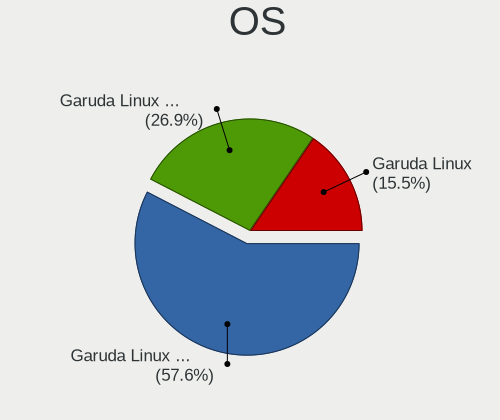
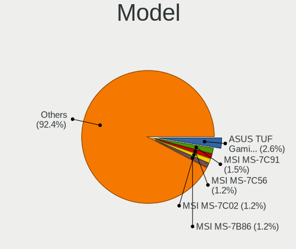
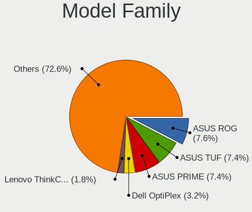
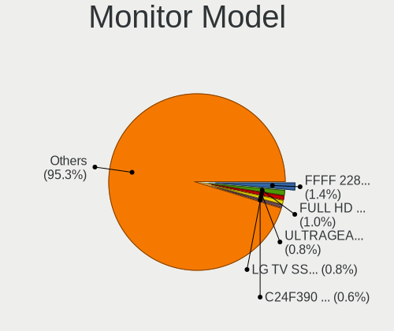
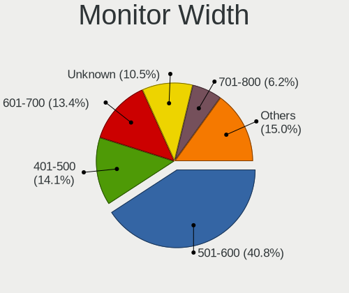
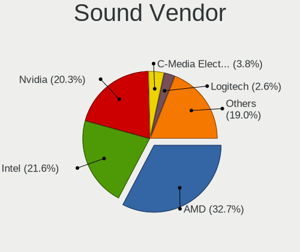
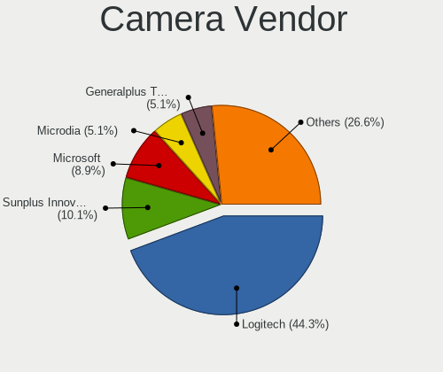

Garuda Linux - Tested Hardware & Statistics (Desktops)
------------------------------------------------------

A project to collect tested hardware configurations for Garuda Linux.

Anyone can contribute to this report by the [hw-probe](https://github.com/linuxhw/hw-probe) tool:

    sudo -E hw-probe -all -upload

Please contribute! Especially if your hardware is rare.

Contents
--------

* [ Test Cases ](#test-cases)

* [ System ](#system)
  - [ OS                       ](#os)
  - [ OS Family                ](#os-family)
  - [ Kernel                   ](#kernel)
  - [ Kernel Family            ](#kernel-family)
  - [ Kernel Major Ver.        ](#kernel-major-ver)
  - [ Arch                     ](#arch)
  - [ DE                       ](#de)
  - [ Display Server           ](#display-server)
  - [ Display Manager          ](#display-manager)
  - [ OS Lang                  ](#os-lang)
  - [ Boot Mode                ](#boot-mode)
  - [ Filesystem               ](#filesystem)
  - [ Part. scheme             ](#part-scheme)
  - [ Dual Boot with Linux/BSD ](#dual-boot-with-linuxbsd)
  - [ Dual Boot (Win)          ](#dual-boot-win)

* [ Board ](#board)
  - [ Vendor                   ](#vendor)
  - [ Model                    ](#model)
  - [ Model Family             ](#model-family)
  - [ MFG Year                 ](#mfg-year)
  - [ Form Factor              ](#form-factor)
  - [ Secure Boot              ](#secure-boot)
  - [ Coreboot                 ](#coreboot)
  - [ RAM Size                 ](#ram-size)
  - [ RAM Used                 ](#ram-used)
  - [ Total Drives             ](#total-drives)
  - [ Has CD-ROM               ](#has-cd-rom)
  - [ Has Ethernet             ](#has-ethernet)
  - [ Has WiFi                 ](#has-wifi)
  - [ Has Bluetooth            ](#has-bluetooth)

* [ Location ](#location)
  - [ Country                  ](#country)
  - [ City                     ](#city)

* [ Drives ](#drives)
  - [ Drive Vendor             ](#drive-vendor)
  - [ Drive Model              ](#drive-model)
  - [ HDD Vendor               ](#hdd-vendor)
  - [ SSD Vendor               ](#ssd-vendor)
  - [ Drive Kind               ](#drive-kind)
  - [ Drive Connector          ](#drive-connector)
  - [ Drive Size               ](#drive-size)
  - [ Space Total              ](#space-total)
  - [ Space Used               ](#space-used)
  - [ Malfunc. Drives          ](#malfunc-drives)
  - [ Malfunc. Drive Vendor    ](#malfunc-drive-vendor)
  - [ Malfunc. HDD Vendor      ](#malfunc-hdd-vendor)
  - [ Malfunc. Drive Kind      ](#malfunc-drive-kind)
  - [ Failed Drives            ](#failed-drives)
  - [ Failed Drive Vendor      ](#failed-drive-vendor)
  - [ Drive Status             ](#drive-status)

* [ Storage controller ](#storage-controller)
  - [ Storage Vendor           ](#storage-vendor)
  - [ Storage Model            ](#storage-model)
  - [ Storage Kind             ](#storage-kind)

* [ Processor ](#processor)
  - [ CPU Vendor               ](#cpu-vendor)
  - [ CPU Model                ](#cpu-model)
  - [ CPU Model Family         ](#cpu-model-family)
  - [ CPU Cores                ](#cpu-cores)
  - [ CPU Sockets              ](#cpu-sockets)
  - [ CPU Threads              ](#cpu-threads)
  - [ CPU Op-Modes             ](#cpu-op-modes)
  - [ CPU Microcode            ](#cpu-microcode)
  - [ CPU Microarch            ](#cpu-microarch)

* [ Graphics ](#graphics)
  - [ GPU Vendor               ](#gpu-vendor)
  - [ GPU Model                ](#gpu-model)
  - [ GPU Combo                ](#gpu-combo)
  - [ GPU Driver               ](#gpu-driver)
  - [ GPU Memory               ](#gpu-memory)

* [ Monitor ](#monitor)
  - [ Monitor Vendor           ](#monitor-vendor)
  - [ Monitor Model            ](#monitor-model)
  - [ Monitor Resolution       ](#monitor-resolution)
  - [ Monitor Diagonal         ](#monitor-diagonal)
  - [ Monitor Width            ](#monitor-width)
  - [ Aspect Ratio             ](#aspect-ratio)
  - [ Monitor Area             ](#monitor-area)
  - [ Pixel Density            ](#pixel-density)
  - [ Multiple Monitors        ](#multiple-monitors)

* [ Network ](#network)
  - [ Net Controller Vendor    ](#net-controller-vendor)
  - [ Net Controller Model     ](#net-controller-model)
  - [ Wireless Vendor          ](#wireless-vendor)
  - [ Wireless Model           ](#wireless-model)
  - [ Ethernet Vendor          ](#ethernet-vendor)
  - [ Ethernet Model           ](#ethernet-model)
  - [ Net Controller Kind      ](#net-controller-kind)
  - [ Used Controller          ](#used-controller)
  - [ NICs                     ](#nics)
  - [ IPv6                     ](#ipv6)

* [ Bluetooth ](#bluetooth)
  - [ Bluetooth Vendor         ](#bluetooth-vendor)
  - [ Bluetooth Model          ](#bluetooth-model)

* [ Sound ](#sound)
  - [ Sound Vendor             ](#sound-vendor)
  - [ Sound Model              ](#sound-model)

* [ Memory ](#memory)
  - [ Memory Vendor            ](#memory-vendor)
  - [ Memory Model             ](#memory-model)
  - [ Memory Kind              ](#memory-kind)
  - [ Memory Form Factor       ](#memory-form-factor)
  - [ Memory Size              ](#memory-size)
  - [ Memory Speed             ](#memory-speed)

* [ Printers & scanners ](#printers--scanners)
  - [ Printer Vendor           ](#printer-vendor)
  - [ Printer Model            ](#printer-model)
  - [ Scanner Vendor           ](#scanner-vendor)
  - [ Scanner Model            ](#scanner-model)

* [ Camera ](#camera)
  - [ Camera Vendor            ](#camera-vendor)
  - [ Camera Model             ](#camera-model)

* [ Security ](#security)
  - [ Fingerprint Vendor       ](#fingerprint-vendor)
  - [ Fingerprint Model        ](#fingerprint-model)
  - [ Chipcard Vendor          ](#chipcard-vendor)
  - [ Chipcard Model           ](#chipcard-model)

* [ Unsupported ](#unsupported)
  - [ Unsupported Devices      ](#unsupported-devices)
  - [ Unsupported Device Types ](#unsupported-device-types)

Test Cases
----------

Total: 171

| Vendor    | Model                       | Probe                                                      | Date         |
|-----------|-----------------------------|------------------------------------------------------------|--------------|
| Gigabyte  | B550 AORUS ELITE V2         | [541e327f0f](https://linux-hardware.org/?probe=541e327f0f) | Oct 01, 2022 |
| ASUSTek   | PRIME X570-P                | [6647dc20ac](https://linux-hardware.org/?probe=6647dc20ac) | Sep 21, 2022 |
| ASUSTek   | TUF Gaming X570-PLUS        | [9d0697ec96](https://linux-hardware.org/?probe=9d0697ec96) | Sep 20, 2022 |
| ASRock    | A320M-HDV R4.0              | [afbb849b02](https://linux-hardware.org/?probe=afbb849b02) | Sep 11, 2022 |
| ASRock    | A320M-HDV R4.0              | [5e98f641f1](https://linux-hardware.org/?probe=5e98f641f1) | Sep 11, 2022 |
| ASUSTek   | ROG CROSSHAIR VIII HERO     | [ac65980e25](https://linux-hardware.org/?probe=ac65980e25) | Sep 02, 2022 |
| Gigabyte  | F2A88XM-HD3                 | [44e355eb93](https://linux-hardware.org/?probe=44e355eb93) | Aug 30, 2022 |
| ASRock    | X470 Taichi                 | [7bc56eb3d4](https://linux-hardware.org/?probe=7bc56eb3d4) | Aug 25, 2022 |
| MSI       | B450 TOMAHAWK MAX II        | [57f1970999](https://linux-hardware.org/?probe=57f1970999) | Aug 20, 2022 |
| ASUSTek   | PRIME X570-P                | [fc5923b017](https://linux-hardware.org/?probe=fc5923b017) | Aug 15, 2022 |
| ASUSTek   | PRIME X570-P                | [e53bbe7c1b](https://linux-hardware.org/?probe=e53bbe7c1b) | Aug 14, 2022 |
| MSI       | A68HM-E33 V2                | [762f08a697](https://linux-hardware.org/?probe=762f08a697) | Aug 13, 2022 |
| ASRock    | A520M-HDV                   | [f23bdacb56](https://linux-hardware.org/?probe=f23bdacb56) | Aug 11, 2022 |
| ASUSTek   | Maximus IX FORMULA          | [2212732244](https://linux-hardware.org/?probe=2212732244) | Aug 01, 2022 |
| MSI       | B450M PRO-VDH MAX           | [941092ee95](https://linux-hardware.org/?probe=941092ee95) | Jul 26, 2022 |
| MSI       | B450 TOMAHAWK MAX II        | [dfe6047aa7](https://linux-hardware.org/?probe=dfe6047aa7) | Jul 21, 2022 |
| Gigabyte  | X570 AORUS PRO WIFI         | [f9996d6494](https://linux-hardware.org/?probe=f9996d6494) | Jul 21, 2022 |
| ASUSTek   | ROG STRIX X570-E GAMING     | [92fe4c2ff3](https://linux-hardware.org/?probe=92fe4c2ff3) | Jul 03, 2022 |
| ASUSTek   | PRIME B550-PLUS AC-HES      | [dde2246ae8](https://linux-hardware.org/?probe=dde2246ae8) | Jul 01, 2022 |
| ASRock    | Z87M Extreme4               | [06504aecc5](https://linux-hardware.org/?probe=06504aecc5) | Jun 24, 2022 |
| Gigabyte  | Z77X-UD3H                   | [7d7828a253](https://linux-hardware.org/?probe=7d7828a253) | Jun 23, 2022 |
| MSI       | B550-A PRO                  | [a7a76f04f9](https://linux-hardware.org/?probe=a7a76f04f9) | Jun 19, 2022 |
| MSI       | B450M MORTAR MAX            | [e1f785770e](https://linux-hardware.org/?probe=e1f785770e) | Jun 11, 2022 |
| T-bao     | MINI PC V1.0                | [8108463ab7](https://linux-hardware.org/?probe=8108463ab7) | Jun 09, 2022 |
| ASRock    | Z87M Extreme4               | [5ca7bb09b0](https://linux-hardware.org/?probe=5ca7bb09b0) | Jun 05, 2022 |
| ASRock    | X470 Taichi                 | [114aa0b977](https://linux-hardware.org/?probe=114aa0b977) | May 22, 2022 |
| Lenovo    | 3716 SDK0T76463 WIN 3422... | [cd15058963](https://linux-hardware.org/?probe=cd15058963) | May 16, 2022 |
| Lenovo    | 3716 SDK0T76463 WIN 3422... | [4043d7e26a](https://linux-hardware.org/?probe=4043d7e26a) | May 11, 2022 |
| Gigabyte  | B450 I AORUS PRO WIFI-CF    | [8c34e423f4](https://linux-hardware.org/?probe=8c34e423f4) | May 04, 2022 |
| ASRock    | X470 Taichi                 | [bd151331c1](https://linux-hardware.org/?probe=bd151331c1) | May 04, 2022 |
| Dell      | 0WR7PY A01                  | [66c6e57421](https://linux-hardware.org/?probe=66c6e57421) | Apr 23, 2022 |
| ASRock    | B550M Pro4                  | [b82721163b](https://linux-hardware.org/?probe=b82721163b) | Apr 22, 2022 |
| ASRock    | X99X Killer                 | [c6d6bddd17](https://linux-hardware.org/?probe=c6d6bddd17) | Apr 18, 2022 |
| ASUSTek   | Z97-P                       | [bf54ec19d0](https://linux-hardware.org/?probe=bf54ec19d0) | Apr 16, 2022 |
| ASRock    | X99X Killer                 | [3be92995ff](https://linux-hardware.org/?probe=3be92995ff) | Apr 11, 2022 |
| ASRock    | X470 Taichi                 | [ba87ebf29f](https://linux-hardware.org/?probe=ba87ebf29f) | Apr 08, 2022 |
| ASUSTek   | P8B75-M                     | [808661699f](https://linux-hardware.org/?probe=808661699f) | Apr 07, 2022 |
| HP        | 8433 11                     | [30c5d1d62f](https://linux-hardware.org/?probe=30c5d1d62f) | Apr 03, 2022 |
| MSI       | B450-A PRO MAX              | [a47ab656ab](https://linux-hardware.org/?probe=a47ab656ab) | Apr 01, 2022 |
| Gigabyte  | B550 GAMING X V2            | [3d37374fae](https://linux-hardware.org/?probe=3d37374fae) | Apr 01, 2022 |
| ASUSTek   | A68HM-PLUS                  | [cd6ebcba97](https://linux-hardware.org/?probe=cd6ebcba97) | Mar 31, 2022 |
| ASRock    | X470 Taichi                 | [f339c6f710](https://linux-hardware.org/?probe=f339c6f710) | Mar 29, 2022 |
| ASUSTek   | ROG CROSSHAIR VIII HERO     | [fc5cdc4595](https://linux-hardware.org/?probe=fc5cdc4595) | Mar 23, 2022 |
| MSI       | MPG B550 GAMING CARBON W... | [c1a26607fd](https://linux-hardware.org/?probe=c1a26607fd) | Mar 13, 2022 |
| MSI       | MAG B550 TOMAHAWK           | [95b7c99a5a](https://linux-hardware.org/?probe=95b7c99a5a) | Mar 08, 2022 |
| ASRock    | B450 Gaming K4              | [504b20acce](https://linux-hardware.org/?probe=504b20acce) | Mar 04, 2022 |
| ASUSTek   | TUF Gaming X570-PLUS        | [336ddc137d](https://linux-hardware.org/?probe=336ddc137d) | Mar 01, 2022 |
| ASUSTek   | A68HM-PLUS                  | [edfa6eb6e3](https://linux-hardware.org/?probe=edfa6eb6e3) | Feb 28, 2022 |
| ASUSTek   | ProArt X570-CREATOR WIFI    | [abc925b917](https://linux-hardware.org/?probe=abc925b917) | Feb 26, 2022 |
| ASUSTek   | M4A89TD PRO USB3            | [66c0fc8423](https://linux-hardware.org/?probe=66c0fc8423) | Feb 26, 2022 |
| ASRock    | X470 Taichi                 | [df78a2fff6](https://linux-hardware.org/?probe=df78a2fff6) | Feb 14, 2022 |
| HP        | 8767 A                      | [e048574911](https://linux-hardware.org/?probe=e048574911) | Feb 12, 2022 |
| ASUSTek   | ROG Maximus XII FORMULA     | [a63d909e46](https://linux-hardware.org/?probe=a63d909e46) | Feb 12, 2022 |
| HP        | 8767 A                      | [6cb1e6b72f](https://linux-hardware.org/?probe=6cb1e6b72f) | Feb 12, 2022 |
| ASUSTek   | ROG Maximus XII FORMULA     | [885617bdda](https://linux-hardware.org/?probe=885617bdda) | Feb 12, 2022 |
| ASRock    | B450M Pro4                  | [0d80dc8143](https://linux-hardware.org/?probe=0d80dc8143) | Feb 11, 2022 |
| Lenovo    | 31900058 STD                | [03540e9cb2](https://linux-hardware.org/?probe=03540e9cb2) | Feb 07, 2022 |
| ASRock    | X470 Taichi                 | [e4beeac4a1](https://linux-hardware.org/?probe=e4beeac4a1) | Feb 06, 2022 |
| Gigabyte  | MFLP3AP-00\2.x              | [b7441a0e94](https://linux-hardware.org/?probe=b7441a0e94) | Jan 31, 2022 |
| ASRock    | X470 Taichi                 | [aa0e21b159](https://linux-hardware.org/?probe=aa0e21b159) | Jan 27, 2022 |
| Gigabyte  | B85-HD3                     | [ad70601774](https://linux-hardware.org/?probe=ad70601774) | Jan 26, 2022 |
| ASRock    | 970M Pro3                   | [402a4f960e](https://linux-hardware.org/?probe=402a4f960e) | Jan 17, 2022 |
| ASUSTek   | ROG Maximus X CODE          | [8fac80f31d](https://linux-hardware.org/?probe=8fac80f31d) | Jan 16, 2022 |
| Gigabyte  | AB350-Gaming 3-CF           | [9fab263b02](https://linux-hardware.org/?probe=9fab263b02) | Jan 11, 2022 |
| MSI       | Z270 GAMING M5              | [02d70182fd](https://linux-hardware.org/?probe=02d70182fd) | Jan 10, 2022 |
| Gigabyte  | AB350-Gaming 3-CF           | [8a1167daea](https://linux-hardware.org/?probe=8a1167daea) | Jan 08, 2022 |
| ASUSTek   | TUF Gaming X570-PLUS        | [1a4570a458](https://linux-hardware.org/?probe=1a4570a458) | Jan 08, 2022 |
| Pegatron  | 2AD5                        | [91ee5ba1df](https://linux-hardware.org/?probe=91ee5ba1df) | Jan 08, 2022 |
| Gigabyte  | B460M DS3H                  | [40f4de9da7](https://linux-hardware.org/?probe=40f4de9da7) | Jan 07, 2022 |
| Gigabyte  | B550 AORUS PRO AC           | [1b62246b10](https://linux-hardware.org/?probe=1b62246b10) | Dec 21, 2021 |
| ASUSTek   | TUF Gaming X570-PLUS        | [9e73346fb8](https://linux-hardware.org/?probe=9e73346fb8) | Dec 15, 2021 |
| Gigabyte  | X570 AORUS ELITE WIFI       | [196b460373](https://linux-hardware.org/?probe=196b460373) | Dec 13, 2021 |
| ASRock    | H77M-ITX                    | [5e98a2fce2](https://linux-hardware.org/?probe=5e98a2fce2) | Dec 11, 2021 |
| ASRock    | B450M Pro4                  | [e4fb1e4fe4](https://linux-hardware.org/?probe=e4fb1e4fe4) | Dec 09, 2021 |
| Lenovo    | ThinkStation S20 4105O1U    | [731c890641](https://linux-hardware.org/?probe=731c890641) | Dec 08, 2021 |
| ASUSTek   | TUF Gaming X570-PLUS        | [f0df07c0e4](https://linux-hardware.org/?probe=f0df07c0e4) | Dec 06, 2021 |
| Acer      | Aspire TC-895 V:1.0         | [c743459a71](https://linux-hardware.org/?probe=c743459a71) | Dec 04, 2021 |
| ASUSTek   | H87M-E                      | [2b4abcf54f](https://linux-hardware.org/?probe=2b4abcf54f) | Dec 02, 2021 |
| ASUSTek   | H87M-E                      | [72cf0ed74d](https://linux-hardware.org/?probe=72cf0ed74d) | Dec 02, 2021 |
| Lenovo    | ThinkStation S20 4105O1U    | [f031548aac](https://linux-hardware.org/?probe=f031548aac) | Dec 01, 2021 |
| Lenovo    | ThinkStation S20 4105O1U    | [48f73af82d](https://linux-hardware.org/?probe=48f73af82d) | Nov 30, 2021 |
| ASRock    | X470 Taichi                 | [0b1d816eff](https://linux-hardware.org/?probe=0b1d816eff) | Nov 28, 2021 |
| ASUSTek   | Rampage IV EXTREME          | [50999d4796](https://linux-hardware.org/?probe=50999d4796) | Nov 14, 2021 |
| ASUSTek   | TUF Gaming X570-PLUS        | [cd295bb56c](https://linux-hardware.org/?probe=cd295bb56c) | Nov 04, 2021 |
| ASRock    | X470 Taichi                 | [86f08832c0](https://linux-hardware.org/?probe=86f08832c0) | Oct 31, 2021 |
| ASUSTek   | P8B75-M                     | [2130c28d33](https://linux-hardware.org/?probe=2130c28d33) | Oct 27, 2021 |
| MSI       | Z77A-G43                    | [3bd9604ae7](https://linux-hardware.org/?probe=3bd9604ae7) | Oct 20, 2021 |
| MSI       | B460M PRO-VDH WIFI          | [76071ec77b](https://linux-hardware.org/?probe=76071ec77b) | Oct 19, 2021 |
| MSI       | B450M-A PRO MAX             | [4148046f02](https://linux-hardware.org/?probe=4148046f02) | Oct 17, 2021 |
| ASRock    | X470 Taichi                 | [ff6b763448](https://linux-hardware.org/?probe=ff6b763448) | Oct 16, 2021 |
| Fujitsu   | D3120-A1 S26361-D3120-A1    | [fdd8f9dd8e](https://linux-hardware.org/?probe=fdd8f9dd8e) | Sep 17, 2021 |
| Fujitsu   | D3120-A1 S26361-D3120-A1    | [ab3ad8009e](https://linux-hardware.org/?probe=ab3ad8009e) | Sep 16, 2021 |
| ASUSTek   | PRIME B450M-K               | [b8b49f201f](https://linux-hardware.org/?probe=b8b49f201f) | Sep 14, 2021 |
| MSI       | H310M PRO-VDH PLUS          | [65fcfef06f](https://linux-hardware.org/?probe=65fcfef06f) | Aug 27, 2021 |
| Alienware | 0TYR0X A00                  | [5ea23ebfb2](https://linux-hardware.org/?probe=5ea23ebfb2) | Aug 19, 2021 |
| ASRock    | X399 Professional Gaming    | [bb53a385c3](https://linux-hardware.org/?probe=bb53a385c3) | Aug 19, 2021 |
| Medion    | H110H4-EM2                  | [f4e01958e5](https://linux-hardware.org/?probe=f4e01958e5) | Aug 10, 2021 |
| ASRock    | X470 Taichi                 | [a919fef17f](https://linux-hardware.org/?probe=a919fef17f) | Aug 07, 2021 |
| MSI       | Z97 MPOWER                  | [dee7d3af4a](https://linux-hardware.org/?probe=dee7d3af4a) | Aug 06, 2021 |
| MSI       | Z97 MPOWER                  | [f30e5a3a86](https://linux-hardware.org/?probe=f30e5a3a86) | Aug 06, 2021 |
| ASUSTek   | ROG STRIX B550-F GAMING     | [826edd51bc](https://linux-hardware.org/?probe=826edd51bc) | Jul 07, 2021 |
| Gigabyte  | X470 AORUS ULTRA GAMING-... | [aa05cca9b7](https://linux-hardware.org/?probe=aa05cca9b7) | Jun 30, 2021 |
| Biostar   | H310MHP                     | [0d3f648f3e](https://linux-hardware.org/?probe=0d3f648f3e) | Jun 30, 2021 |
| Lenovo    | SHARKBAY SDK0E50510 WIN     | [fb3d7de63c](https://linux-hardware.org/?probe=fb3d7de63c) | Jun 26, 2021 |
| MSI       | A320M-HDV R4.0              | [486775a989](https://linux-hardware.org/?probe=486775a989) | Jun 23, 2021 |
| MSI       | A320M-HDV R4.0              | [4629f86f56](https://linux-hardware.org/?probe=4629f86f56) | Jun 22, 2021 |
| MSI       | A320M-HDV R4.0              | [69dea4e3cf](https://linux-hardware.org/?probe=69dea4e3cf) | Jun 22, 2021 |
| MSI       | A320M-HDV R4.0              | [2fd89c951e](https://linux-hardware.org/?probe=2fd89c951e) | Jun 22, 2021 |
| MSI       | X370 GAMING PRO CARBON      | [9ead1e1bb5](https://linux-hardware.org/?probe=9ead1e1bb5) | Jun 22, 2021 |
| ASUSTek   | ROG STRIX B550-F GAMING     | [8144c83b50](https://linux-hardware.org/?probe=8144c83b50) | Jun 22, 2021 |
| ASUSTek   | ROG STRIX B550-F GAMING     | [376c0ff95d](https://linux-hardware.org/?probe=376c0ff95d) | Jun 15, 2021 |
| Gigabyte  | B550I AORUS PRO AX          | [34801a2f74](https://linux-hardware.org/?probe=34801a2f74) | Jun 12, 2021 |
| ASUSTek   | ROG CROSSHAIR VII HERO      | [51e1e33185](https://linux-hardware.org/?probe=51e1e33185) | May 20, 2021 |
| MSI       | B350M GAMING PRO            | [c04e6666e7](https://linux-hardware.org/?probe=c04e6666e7) | May 20, 2021 |
| Dell      | 0D28YY A02                  | [14edf3bd00](https://linux-hardware.org/?probe=14edf3bd00) | May 16, 2021 |
| Gigabyte  | A320M-S2H-CF                | [066f815622](https://linux-hardware.org/?probe=066f815622) | May 12, 2021 |
| HP        | 844C                        | [29f7cf64ce](https://linux-hardware.org/?probe=29f7cf64ce) | May 06, 2021 |
| HP        | 844C                        | [0534f06ec4](https://linux-hardware.org/?probe=0534f06ec4) | May 06, 2021 |
| ASUSTek   | PRIME Z590-A                | [cb3058760e](https://linux-hardware.org/?probe=cb3058760e) | May 04, 2021 |
| Gigabyte  | P67A-UD3-B3                 | [08ea956bfa](https://linux-hardware.org/?probe=08ea956bfa) | Apr 24, 2021 |
| MSI       | Z87 MPOWER                  | [ff6aa3811c](https://linux-hardware.org/?probe=ff6aa3811c) | Apr 08, 2021 |
| ASRock    | AB350M-HDV                  | [23502edac5](https://linux-hardware.org/?probe=23502edac5) | Apr 01, 2021 |
| ASRock    | AB350M-HDV                  | [13b2fdddc0](https://linux-hardware.org/?probe=13b2fdddc0) | Apr 01, 2021 |
| Dell      | 07KY25 A01                  | [8c4f2f9922](https://linux-hardware.org/?probe=8c4f2f9922) | Mar 31, 2021 |
| Dell      | 07KY25 A01                  | [1b9efb1b29](https://linux-hardware.org/?probe=1b9efb1b29) | Mar 24, 2021 |
| Gigabyte  | B450 AORUS M                | [097a0d616c](https://linux-hardware.org/?probe=097a0d616c) | Mar 18, 2021 |
| Gigabyte  | B450 AORUS M                | [22054ffd75](https://linux-hardware.org/?probe=22054ffd75) | Mar 18, 2021 |
| HP        | 2AF7                        | [e0639ea4a5](https://linux-hardware.org/?probe=e0639ea4a5) | Mar 11, 2021 |
| HP        | 2AF7                        | [fb8d76722c](https://linux-hardware.org/?probe=fb8d76722c) | Mar 11, 2021 |
| ASUSTek   | ROG STRIX B550-F GAMING     | [c1f22a7521](https://linux-hardware.org/?probe=c1f22a7521) | Mar 05, 2021 |
| Gigabyte  | GA-MA790FXT-UD5P            | [404dab2464](https://linux-hardware.org/?probe=404dab2464) | Feb 27, 2021 |
| ASRock    | FM2A88X Extreme6+           | [13f9fc2ef3](https://linux-hardware.org/?probe=13f9fc2ef3) | Feb 18, 2021 |
| ASUSTek   | ROG STRIX B550-F GAMING     | [2e19f3b1af](https://linux-hardware.org/?probe=2e19f3b1af) | Feb 18, 2021 |
| Dell      | 0C2KJT A00                  | [f821a0035b](https://linux-hardware.org/?probe=f821a0035b) | Feb 12, 2021 |
| ASUSTek   | PRIME B360M-K               | [b73941c431](https://linux-hardware.org/?probe=b73941c431) | Feb 08, 2021 |
| HP        | 1825                        | [3b6b80db46](https://linux-hardware.org/?probe=3b6b80db46) | Jan 31, 2021 |
| HP        | 1825                        | [1df894dea4](https://linux-hardware.org/?probe=1df894dea4) | Jan 31, 2021 |
| ASRock    | X470 Master SLI             | [36eaf717e9](https://linux-hardware.org/?probe=36eaf717e9) | Jan 26, 2021 |
| ASRock    | X470 Master SLI             | [b1be9375c0](https://linux-hardware.org/?probe=b1be9375c0) | Jan 24, 2021 |
| ASUSTek   | ROG STRIX X570-E GAMING     | [7332b50f98](https://linux-hardware.org/?probe=7332b50f98) | Jan 24, 2021 |
| ASUSTek   | PRIME H270-PLUS             | [3f895b585b](https://linux-hardware.org/?probe=3f895b585b) | Jan 22, 2021 |
| Lenovo    | SHARKBAY 0B98401 PRO        | [61976e9745](https://linux-hardware.org/?probe=61976e9745) | Jan 18, 2021 |
| MSI       | X399 SLI PLUS               | [e392838a54](https://linux-hardware.org/?probe=e392838a54) | Jan 10, 2021 |
| ASUSTek   | CM5671                      | [069344a54e](https://linux-hardware.org/?probe=069344a54e) | Jan 07, 2021 |
| MSI       | B85-G43 GAMING              | [8fe013f04a](https://linux-hardware.org/?probe=8fe013f04a) | Jan 04, 2021 |
| ASRock    | G41M-VS3                    | [e1217b1871](https://linux-hardware.org/?probe=e1217b1871) | Jan 02, 2021 |
| Pegatron  | 2AC2A                       | [436a2ca3ce](https://linux-hardware.org/?probe=436a2ca3ce) | Dec 25, 2020 |
| Pegatron  | 2AC2A                       | [2df3b195c6](https://linux-hardware.org/?probe=2df3b195c6) | Dec 25, 2020 |
| ASUSTek   | PRIME Z370-P                | [35365be0e8](https://linux-hardware.org/?probe=35365be0e8) | Dec 19, 2020 |
| MSI       | Z390-A PRO                  | [ea7a52fdac](https://linux-hardware.org/?probe=ea7a52fdac) | Dec 16, 2020 |
| ASUSTek   | ROG STRIX B550-F GAMING     | [62a5c95d51](https://linux-hardware.org/?probe=62a5c95d51) | Dec 14, 2020 |
| HP        | 8643 SMVB                   | [dccfba36f1](https://linux-hardware.org/?probe=dccfba36f1) | Dec 06, 2020 |
| Gigabyte  | B450 AORUS ELITE            | [2a35d394f9](https://linux-hardware.org/?probe=2a35d394f9) | Dec 04, 2020 |
| MSI       | Z390-A PRO                  | [05e3eb32c9](https://linux-hardware.org/?probe=05e3eb32c9) | Dec 03, 2020 |
| MSI       | Z390-A PRO                  | [dc6ea9bfb8](https://linux-hardware.org/?probe=dc6ea9bfb8) | Nov 29, 2020 |
| ASUSTek   | M5A97 LE R2.0               | [d4b3f84c86](https://linux-hardware.org/?probe=d4b3f84c86) | Nov 28, 2020 |
| Gigabyte  | B450 AORUS M                | [a3d68dc126](https://linux-hardware.org/?probe=a3d68dc126) | Nov 19, 2020 |
| Gigabyte  | B450 AORUS M                | [d9faeae0d4](https://linux-hardware.org/?probe=d9faeae0d4) | Nov 19, 2020 |
| Gigabyte  | X570 AORUS PRO WIFI         | [11c79940a4](https://linux-hardware.org/?probe=11c79940a4) | Nov 19, 2020 |
| HP        | 18E7                        | [f84cbfd465](https://linux-hardware.org/?probe=f84cbfd465) | Nov 10, 2020 |
| Gigabyte  | X570 AORUS PRO WIFI         | [79608bd849](https://linux-hardware.org/?probe=79608bd849) | Nov 06, 2020 |
| ASUSTek   | ROG STRIX B550-F GAMING     | [e80ddac12f](https://linux-hardware.org/?probe=e80ddac12f) | Nov 02, 2020 |
| ASUSTek   | ROG STRIX B550-F GAMING     | [876b039494](https://linux-hardware.org/?probe=876b039494) | Nov 01, 2020 |
| Gigabyte  | X570 AORUS PRO WIFI         | [4e573bc6ff](https://linux-hardware.org/?probe=4e573bc6ff) | Oct 28, 2020 |
| MSI       | MPG B550 GAMING EDGE WIF... | [4b9d2b77cb](https://linux-hardware.org/?probe=4b9d2b77cb) | Oct 26, 2020 |
| ASUSTek   | PRIME X399-A                | [b7772d9ff8](https://linux-hardware.org/?probe=b7772d9ff8) | Oct 13, 2020 |
| Dell      | 0R6JMP A00                  | [c4cbec5b80](https://linux-hardware.org/?probe=c4cbec5b80) | Oct 11, 2020 |
| OEM       | Unknown                     | [2e7a212437](https://linux-hardware.org/?probe=2e7a212437) | Sep 26, 2020 |
| Lenovo    | ThinkCentre M91p 7033CG1    | [c08fed8ecb](https://linux-hardware.org/?probe=c08fed8ecb) | Sep 11, 2020 |
| ASUSTek   | Maximus VIII FORMULA        | [7b8babe846](https://linux-hardware.org/?probe=7b8babe846) | Aug 27, 2020 |
| ASUSTek   | Maximus VIII FORMULA        | [73462df387](https://linux-hardware.org/?probe=73462df387) | Aug 07, 2020 |

System
------

OS
--

Installed operating systems

| Name                 | Desktops | Percent |
|----------------------|----------|---------|
| Garuda Linux Soaring | 58       | 49.15%  |
| Garuda Linux         | 55       | 46.61%  |
| Garuda Linux Rolling | 5        | 4.24%   |

OS Family
---------

OS without a version

| Name         | Desktops | Percent |
|--------------|----------|---------|
| Garuda Linux | 115      | 100%    |

Kernel
------

Version of the Linux kernel

| Version                | Desktops | Percent |
|------------------------|----------|---------|
| 5.17.1-zen1-1-zen      | 6        | 4.38%   |
| 5.15.7-zen1-1-zen      | 4        | 2.92%   |
| 5.10.4-107-tkg-bmq     | 4        | 2.92%   |
| 5.9.1-zen2-1-zen       | 3        | 2.19%   |
| 5.18.12-zen1-1-zen     | 3        | 2.19%   |
| 5.18.1-zen1-1-zen      | 3        | 2.19%   |
| 5.16.4-zen1-1-zen      | 3        | 2.19%   |
| 5.15.2-zen1-1-zen      | 3        | 2.19%   |
| 5.15.13-zen1-1-zen     | 3        | 2.19%   |
| 5.11.16-zen1-1-zen     | 3        | 2.19%   |
| 5.9.11-zen2-1-zen      | 2        | 1.46%   |
| 5.9.10-zen1-1-zen      | 2        | 1.46%   |
| 5.8.14-zen1-1-zen      | 2        | 1.46%   |
| 5.19.9-zen1-1-zen      | 2        | 1.46%   |
| 5.19.5-zen1-1-zen      | 2        | 1.46%   |
| 5.18.16-zen1-1-zen     | 2        | 1.46%   |
| 5.16.8-zen1-1-zen      | 2        | 1.46%   |
| 5.16.11-zen1-1-zen     | 2        | 1.46%   |
| 5.16.10-zen1-1-zen     | 2        | 1.46%   |
| 5.16.0-zen1-1-zen      | 2        | 1.46%   |
| 5.15.12-zen1-1-zen     | 2        | 1.46%   |
| 5.15.10-zen1-1-zen     | 2        | 1.46%   |
| 5.13.9-zen1-1-zen      | 2        | 1.46%   |
| 5.13.12-zen1-1-zen     | 2        | 1.46%   |
| 5.12.4-zen1-2-zen      | 2        | 1.46%   |
| 5.10.8-112-tkg-bmq     | 2        | 1.46%   |
| 5.9.8-zen1-1-zen       | 1        | 0.73%   |
| 5.9.6-zen1-1-zen       | 1        | 0.73%   |
| 5.9.4-zen1-1-zen       | 1        | 0.73%   |
| 5.9.2-zen1-1-zen       | 1        | 0.73%   |
| 5.9.14-99-tkg-bmq      | 1        | 0.73%   |
| 5.8.5-zen1-1-zen       | 1        | 0.73%   |
| 5.8.10-zen1-1-zen      | 1        | 0.73%   |
| 5.8.0-xanmod1-1-xanmod | 1        | 0.73%   |
| 5.19.7-zen2-1-zen      | 1        | 0.73%   |
| 5.19.3-zen1-1-zen      | 1        | 0.73%   |
| 5.19.2-zen1-1-zen      | 1        | 0.73%   |
| 5.19.12-zen1-1-zen     | 1        | 0.73%   |
| 5.18.8-zen1-1-zen      | 1        | 0.73%   |
| 5.18.6-zen1-1-zen      | 1        | 0.73%   |

Kernel Family
-------------

Linux kernel without a distro release

| Version | Desktops | Percent |
|---------|----------|---------|
| 5.17.1  | 7        | 5.11%   |
| 5.15.7  | 4        | 2.92%   |
| 5.10.4  | 4        | 2.92%   |
| 5.9.1   | 3        | 2.19%   |
| 5.18.12 | 3        | 2.19%   |
| 5.18.1  | 3        | 2.19%   |
| 5.17.5  | 3        | 2.19%   |
| 5.16.4  | 3        | 2.19%   |
| 5.15.2  | 3        | 2.19%   |
| 5.15.13 | 3        | 2.19%   |
| 5.12.13 | 3        | 2.19%   |
| 5.11.16 | 3        | 2.19%   |
| 5.9.11  | 2        | 1.46%   |
| 5.9.10  | 2        | 1.46%   |
| 5.8.14  | 2        | 1.46%   |
| 5.19.9  | 2        | 1.46%   |
| 5.19.5  | 2        | 1.46%   |
| 5.18.16 | 2        | 1.46%   |
| 5.17.3  | 2        | 1.46%   |
| 5.16.8  | 2        | 1.46%   |
| 5.16.5  | 2        | 1.46%   |
| 5.16.2  | 2        | 1.46%   |
| 5.16.11 | 2        | 1.46%   |
| 5.16.10 | 2        | 1.46%   |
| 5.16.0  | 2        | 1.46%   |
| 5.15.5  | 2        | 1.46%   |
| 5.15.12 | 2        | 1.46%   |
| 5.15.10 | 2        | 1.46%   |
| 5.14.12 | 2        | 1.46%   |
| 5.13.9  | 2        | 1.46%   |
| 5.13.12 | 2        | 1.46%   |
| 5.12.4  | 2        | 1.46%   |
| 5.12.12 | 2        | 1.46%   |
| 5.10.8  | 2        | 1.46%   |
| 5.9.8   | 1        | 0.73%   |
| 5.9.6   | 1        | 0.73%   |
| 5.9.4   | 1        | 0.73%   |
| 5.9.2   | 1        | 0.73%   |
| 5.9.14  | 1        | 0.73%   |
| 5.8.5   | 1        | 0.73%   |

Kernel Major Ver.
-----------------

Linux kernel major version

| Version | Desktops | Percent |
|---------|----------|---------|
| 5.15    | 18       | 13.85%  |
| 5.16    | 16       | 12.31%  |
| 5.10    | 16       | 12.31%  |
| 5.18    | 14       | 10.77%  |
| 5.17    | 11       | 8.46%   |
| 5.12    | 10       | 7.69%   |
| 5.11    | 10       | 7.69%   |
| 5.9     | 9        | 6.92%   |
| 5.19    | 8        | 6.15%   |
| 5.13    | 7        | 5.38%   |
| 5.14    | 6        | 4.62%   |
| 5.8     | 5        | 3.85%   |

Arch
----

OS architecture (x86_64, i586, etc.)

| Name   | Desktops | Percent |
|--------|----------|---------|
| x86_64 | 115      | 100%    |

DE
--

Desktop Environment

| Name       | Desktops | Percent |
|------------|----------|---------|
| KDE5       | 76       | 64.96%  |
| KDE        | 19       | 16.24%  |
| GNOME      | 15       | 12.82%  |
| XFCE       | 1        | 0.85%   |
| X-Cinnamon | 1        | 0.85%   |
| LXQt       | 1        | 0.85%   |
| i3         | 1        | 0.85%   |
| Deepin     | 1        | 0.85%   |
| Cinnamon   | 1        | 0.85%   |
| Unknown    | 1        | 0.85%   |

Display Server
--------------

X11 or Wayland

| Name    | Desktops | Percent |
|---------|----------|---------|
| X11     | 108      | 92.31%  |
| Wayland | 5        | 4.27%   |
| Tty     | 2        | 1.71%   |
| Unknown | 2        | 1.71%   |

Display Manager
---------------

SDDM, LightDM, etc.

| Name    | Desktops | Percent |
|---------|----------|---------|
| Unknown | 55       | 47.83%  |
| SDDM    | 51       | 44.35%  |
| LightDM | 6        | 5.22%   |
| GDM     | 3        | 2.61%   |

OS Lang
-------

Language

| Lang  | Desktops | Percent |
|-------|----------|---------|
| en_US | 57       | 49.57%  |
| de_DE | 13       | 11.3%   |
| en_GB | 10       | 8.7%    |
| es_ES | 4        | 3.48%   |
| en_AU | 4        | 3.48%   |
| pt_BR | 3        | 2.61%   |
| en_CA | 3        | 2.61%   |
| ru_RU | 2        | 1.74%   |
| nl_NL | 2        | 1.74%   |
| it_IT | 2        | 1.74%   |
| fr_BE | 2        | 1.74%   |
| sv_SE | 1        | 0.87%   |
| sk_SK | 1        | 0.87%   |
| nl_BE | 1        | 0.87%   |
| nb_NO | 1        | 0.87%   |
| iu_CA | 1        | 0.87%   |
| fr_FR | 1        | 0.87%   |
| es_VE | 1        | 0.87%   |
| es_AR | 1        | 0.87%   |
| en_ZA | 1        | 0.87%   |
| en_IN | 1        | 0.87%   |
| en_DE | 1        | 0.87%   |
| el_GR | 1        | 0.87%   |
| da_DK | 1        | 0.87%   |

Boot Mode
---------

EFI or BIOS

| Mode | Desktops | Percent |
|------|----------|---------|
| EFI  | 64       | 55.65%  |
| BIOS | 51       | 44.35%  |

Filesystem
----------

Type of filesystem

| Type  | Desktops | Percent |
|-------|----------|---------|
| Btrfs | 113      | 98.26%  |
| Ext4  | 2        | 1.74%   |

Part. scheme
------------

Scheme of partitioning

| Type    | Desktops | Percent |
|---------|----------|---------|
| GPT     | 57       | 49.14%  |
| Unknown | 55       | 47.41%  |
| MBR     | 4        | 3.45%   |

Dual Boot with Linux/BSD
------------------------

Hosting more than one Linux/BSD

| Dual boot | Desktops | Percent |
|-----------|----------|---------|
| No        | 92       | 77.97%  |
| Yes       | 26       | 22.03%  |

Dual Boot (Win)
---------------

Hosting Linux and Windows

| Dual boot | Desktops | Percent |
|-----------|----------|---------|
| No        | 79       | 67.52%  |
| Yes       | 38       | 32.48%  |

Board
-----

Vendor
------

Motherboard manufacturer

| Name                | Desktops | Percent |
|---------------------|----------|---------|
| ASUSTek Computer    | 31       | 26.96%  |
| MSI                 | 21       | 18.26%  |
| Gigabyte Technology | 21       | 18.26%  |
| ASRock              | 14       | 12.17%  |
| Hewlett-Packard     | 7        | 6.09%   |
| Lenovo              | 6        | 5.22%   |
| Dell                | 6        | 5.22%   |
| Pegatron            | 2        | 1.74%   |
| T-bao               | 1        | 0.87%   |
| OEM                 | 1        | 0.87%   |
| Medion              | 1        | 0.87%   |
| Fujitsu             | 1        | 0.87%   |
| Biostar             | 1        | 0.87%   |
| Alienware           | 1        | 0.87%   |
| Acer                | 1        | 0.87%   |

Model
-----

Motherboard model

| Name                                 | Desktops | Percent |
|--------------------------------------|----------|---------|
| ASUS TUF Gaming X570-PLUS            | 4        | 3.48%   |
| MSI MS-7C91                          | 2        | 1.74%   |
| Gigabyte X570 AORUS PRO WIFI         | 2        | 1.74%   |
| Gigabyte AB350-Gaming 3              | 2        | 1.74%   |
| Dell Inspiron 3668                   | 2        | 1.74%   |
| ASUS ROG STRIX X570-E GAMING         | 2        | 1.74%   |
| ASUS ROG STRIX B550-F GAMING         | 2        | 1.74%   |
| ASUS All Series                      | 2        | 1.74%   |
| T-bao MINI PC                        | 1        | 0.87%   |
| Pegatron p7-1030                     | 1        | 0.87%   |
| Pegatron h9-1301es                   | 1        | 0.87%   |
| MSI MS-7C90                          | 1        | 0.87%   |
| MSI MS-7C83                          | 1        | 0.87%   |
| MSI MS-7C56                          | 1        | 0.87%   |
| MSI MS-7C52                          | 1        | 0.87%   |
| MSI MS-7C09                          | 1        | 0.87%   |
| MSI MS-7C02                          | 1        | 0.87%   |
| MSI MS-7B98                          | 1        | 0.87%   |
| MSI MS-7B89                          | 1        | 0.87%   |
| MSI MS-7B86                          | 1        | 0.87%   |
| MSI MS-7B09                          | 1        | 0.87%   |
| MSI MS-7A78                          | 1        | 0.87%   |
| MSI MS-7A39                          | 1        | 0.87%   |
| MSI MS-7A38                          | 1        | 0.87%   |
| MSI MS-7A32                          | 1        | 0.87%   |
| MSI MS-7818                          | 1        | 0.87%   |
| MSI MS-7816                          | 1        | 0.87%   |
| MSI MS-7758                          | 1        | 0.87%   |
| MSI MS-7721                          | 1        | 0.87%   |
| MSI A320M-HDV R4.0                   | 1        | 0.87%   |
| Medion Akoya P5238 F/C395            | 1        | 0.87%   |
| Lenovo ThinkStation S20 4105O1U      | 1        | 0.87%   |
| Lenovo ThinkCentre M93p 10A90048US   | 1        | 0.87%   |
| Lenovo ThinkCentre M93p 10A90016US   | 1        | 0.87%   |
| Lenovo ThinkCentre M91p 7033CG1      | 1        | 0.87%   |
| Lenovo Legion T5 26AMR5 90RC018LBX   | 1        | 0.87%   |
| Lenovo K450e 10181                   | 1        | 0.87%   |
| HP ProDesk 600 G1 SFF                | 1        | 0.87%   |
| HP Pavilion Gaming Desktop TG01-1xxx | 1        | 0.87%   |
| HP Pavilion Gaming Desktop 790-00xx  | 1        | 0.87%   |

Model Family
------------

Motherboard model prefix

| Name                  | Desktops | Percent |
|-----------------------|----------|---------|
| ASUS ROG              | 8        | 6.96%   |
| ASUS PRIME            | 8        | 6.96%   |
| Dell Inspiron         | 4        | 3.48%   |
| ASUS TUF              | 4        | 3.48%   |
| Lenovo ThinkCentre    | 3        | 2.61%   |
| HP Pavilion           | 3        | 2.61%   |
| Gigabyte X570         | 3        | 2.61%   |
| Gigabyte B550         | 3        | 2.61%   |
| Gigabyte B450         | 3        | 2.61%   |
| MSI MS-7C91           | 2        | 1.74%   |
| Gigabyte AB350-Gaming | 2        | 1.74%   |
| Dell OptiPlex         | 2        | 1.74%   |
| ASUS Maximus          | 2        | 1.74%   |
| ASUS All              | 2        | 1.74%   |
| ASRock X470           | 2        | 1.74%   |
| T-bao MINI            | 1        | 0.87%   |
| Pegatron p7-1030      | 1        | 0.87%   |
| Pegatron h9-1301es    | 1        | 0.87%   |
| MSI MS-7C90           | 1        | 0.87%   |
| MSI MS-7C83           | 1        | 0.87%   |
| MSI MS-7C56           | 1        | 0.87%   |
| MSI MS-7C52           | 1        | 0.87%   |
| MSI MS-7C09           | 1        | 0.87%   |
| MSI MS-7C02           | 1        | 0.87%   |
| MSI MS-7B98           | 1        | 0.87%   |
| MSI MS-7B89           | 1        | 0.87%   |
| MSI MS-7B86           | 1        | 0.87%   |
| MSI MS-7B09           | 1        | 0.87%   |
| MSI MS-7A78           | 1        | 0.87%   |
| MSI MS-7A39           | 1        | 0.87%   |
| MSI MS-7A38           | 1        | 0.87%   |
| MSI MS-7A32           | 1        | 0.87%   |
| MSI MS-7818           | 1        | 0.87%   |
| MSI MS-7816           | 1        | 0.87%   |
| MSI MS-7758           | 1        | 0.87%   |
| MSI MS-7721           | 1        | 0.87%   |
| MSI A320M-HDV         | 1        | 0.87%   |
| Medion Akoya          | 1        | 0.87%   |
| Lenovo ThinkStation   | 1        | 0.87%   |
| Lenovo Legion         | 1        | 0.87%   |

MFG Year
--------

Motherboard manufacture year

| Year | Desktops | Percent |
|------|----------|---------|
| 2019 | 20       | 17.39%  |
| 2020 | 18       | 15.65%  |
| 2018 | 16       | 13.91%  |
| 2017 | 14       | 12.17%  |
| 2013 | 10       | 8.7%    |
| 2021 | 8        | 6.96%   |
| 2014 | 8        | 6.96%   |
| 2012 | 6        | 5.22%   |
| 2011 | 4        | 3.48%   |
| 2010 | 4        | 3.48%   |
| 2015 | 3        | 2.61%   |
| 2016 | 2        | 1.74%   |
| 2009 | 2        | 1.74%   |

Form Factor
-----------

Physical design of the computer

| Name    | Desktops | Percent |
|---------|----------|---------|
| Desktop | 115      | 100%    |

Secure Boot
-----------

Enabled or disabled

| State    | Desktops | Percent |
|----------|----------|---------|
| Disabled | 115      | 100%    |

Coreboot
--------

Have coreboot on board

| Used | Desktops | Percent |
|------|----------|---------|
| No   | 115      | 100%    |

RAM Size
--------

Total RAM memory

| Size in GB  | Desktops | Percent |
|-------------|----------|---------|
| 32.01-64.0  | 36       | 30.77%  |
| 16.01-24.0  | 34       | 29.06%  |
| 8.01-16.0   | 17       | 14.53%  |
| 4.01-8.0    | 12       | 10.26%  |
| 24.01-32.0  | 9        | 7.69%   |
| 64.01-256.0 | 7        | 5.98%   |
| 3.01-4.0    | 2        | 1.71%   |

RAM Used
--------

Used RAM memory

| Used GB    | Desktops | Percent |
|------------|----------|---------|
| 4.01-8.0   | 50       | 41.32%  |
| 3.01-4.0   | 24       | 19.83%  |
| 8.01-16.0  | 21       | 17.36%  |
| 2.01-3.0   | 15       | 12.4%   |
| 16.01-24.0 | 6        | 4.96%   |
| 1.01-2.0   | 4        | 3.31%   |
| 32.01-64.0 | 1        | 0.83%   |

Total Drives
------------

Number of drives on board

| Drives | Desktops | Percent |
|--------|----------|---------|
| 2      | 31       | 25.83%  |
| 3      | 30       | 25%     |
| 4      | 21       | 17.5%   |
| 1      | 17       | 14.17%  |
| 5      | 12       | 10%     |
| 6      | 4        | 3.33%   |
| 9      | 3        | 2.5%    |
| 14     | 1        | 0.83%   |
| 7      | 1        | 0.83%   |

Has CD-ROM
----------

Has CD-ROM on board

| Presented | Desktops | Percent |
|-----------|----------|---------|
| No        | 82       | 70.69%  |
| Yes       | 34       | 29.31%  |

Has Ethernet
------------

Has Ethernet on board

| Presented | Desktops | Percent |
|-----------|----------|---------|
| Yes       | 113      | 98.26%  |
| No        | 2        | 1.74%   |

Has WiFi
--------

Has WiFi module

| Presented | Desktops | Percent |
|-----------|----------|---------|
| Yes       | 65       | 54.62%  |
| No        | 54       | 45.38%  |

Has Bluetooth
-------------

Has Bluetooth module

| Presented | Desktops | Percent |
|-----------|----------|---------|
| No        | 59       | 50.43%  |
| Yes       | 58       | 49.57%  |

Location
--------

Country
-------

Geographic location (country)

| Country      | Desktops | Percent |
|--------------|----------|---------|
| USA          | 39       | 33.91%  |
| Germany      | 15       | 13.04%  |
| UK           | 6        | 5.22%   |
| Italy        | 5        | 4.35%   |
| Spain        | 4        | 3.48%   |
| Canada       | 4        | 3.48%   |
| Brazil       | 4        | 3.48%   |
| Australia    | 4        | 3.48%   |
| Sweden       | 3        | 2.61%   |
| Russia       | 3        | 2.61%   |
| Romania      | 3        | 2.61%   |
| Netherlands  | 3        | 2.61%   |
| Belgium      | 3        | 2.61%   |
| Puerto Rico  | 2        | 1.74%   |
| Latvia       | 2        | 1.74%   |
| France       | 2        | 1.74%   |
| Venezuela    | 1        | 0.87%   |
| Ukraine      | 1        | 0.87%   |
| South Africa | 1        | 0.87%   |
| Slovakia     | 1        | 0.87%   |
| Poland       | 1        | 0.87%   |
| Philippines  | 1        | 0.87%   |
| Norway       | 1        | 0.87%   |
| India        | 1        | 0.87%   |
| Iceland      | 1        | 0.87%   |
| Greece       | 1        | 0.87%   |
| Denmark      | 1        | 0.87%   |
| Chile        | 1        | 0.87%   |
| Argentina    | 1        | 0.87%   |

City
----

Geographic location (city)

| City                    | Desktops | Percent |
|-------------------------|----------|---------|
| Wasmes                  | 2        | 1.67%   |
| Sydney                  | 2        | 1.67%   |
| Sao Paulo               | 2        | 1.67%   |
| Riga                    | 2        | 1.67%   |
| Oklahoma City           | 2        | 1.67%   |
| Milan                   | 2        | 1.67%   |
| Melbourne               | 2        | 1.67%   |
| Kingsport               | 2        | 1.67%   |
| Dallas                  | 2        | 1.67%   |
| Berlin                  | 2        | 1.67%   |
| York                    | 1        | 0.83%   |
| Weiterstadt             | 1        | 0.83%   |
| Weilen unter den Rinnen | 1        | 0.83%   |
| Voronezh                | 1        | 0.83%   |
| Volzhskiy               | 1        | 0.83%   |
| Västerås              | 1        | 0.83%   |
| Valence                 | 1        | 0.83%   |
| Urbandale               | 1        | 0.83%   |
| Ullerslev               | 1        | 0.83%   |
| Timișoara              | 1        | 0.83%   |
| Taunusstein             | 1        | 0.83%   |
| Stockholm               | 1        | 0.83%   |
| Stavropol               | 1        | 0.83%   |
| Stanley                 | 1        | 0.83%   |
| St Louis                | 1        | 0.83%   |
| Sindelfingen            | 1        | 0.83%   |
| Shreveport              | 1        | 0.83%   |
| Satu Mare               | 1        | 0.83%   |
| Sarasota                | 1        | 0.83%   |
| Santa Cruz de Tenerife  | 1        | 0.83%   |
| San Juan                | 1        | 0.83%   |
| San Jose                | 1        | 0.83%   |
| Reykjavik               | 1        | 0.83%   |
| Reston                  | 1        | 0.83%   |
| Regina                  | 1        | 0.83%   |
| Pune                    | 1        | 0.83%   |
| Providencia             | 1        | 0.83%   |
| Portland                | 1        | 0.83%   |
| Plymouth                | 1        | 0.83%   |
| Perkasie                | 1        | 0.83%   |

Drives
------

Drive Vendor
------------

Hard drive vendors

| Vendor                      | Desktops | Drives | Percent |
|-----------------------------|----------|--------|---------|
| WDC                         | 56       | 83     | 19.31%  |
| Seagate                     | 50       | 80     | 17.24%  |
| Samsung Electronics         | 49       | 107    | 16.9%   |
| Toshiba                     | 18       | 21     | 6.21%   |
| Crucial                     | 17       | 24     | 5.86%   |
| Kingston                    | 13       | 21     | 4.48%   |
| SanDisk                     | 12       | 18     | 4.14%   |
| Phison                      | 7        | 8      | 2.41%   |
| Hitachi                     | 7        | 7      | 2.41%   |
| Silicon Motion              | 5        | 5      | 1.72%   |
| A-DATA Technology           | 5        | 8      | 1.72%   |
| Intel                       | 4        | 5      | 1.38%   |
| XPG                         | 3        | 4      | 1.03%   |
| PNY                         | 3        | 3      | 1.03%   |
| OCZ                         | 3        | 3      | 1.03%   |
| Unknown                     | 2        | 2      | 0.69%   |
| Transcend                   | 2        | 2      | 0.69%   |
| Team                        | 2        | 3      | 0.69%   |
| SPCC                        | 2        | 2      | 0.69%   |
| Micron/Crucial Technology   | 2        | 4      | 0.69%   |
| Emtec                       | 2        | 3      | 0.69%   |
| China                       | 2        | 4      | 0.69%   |
| WD MediaMax                 | 1        | 1      | 0.34%   |
| USB30                       | 1        | 2      | 0.34%   |
| TO Exter                    | 1        | 1      | 0.34%   |
| T-FORCE                     | 1        | 1      | 0.34%   |
| SK hynix                    | 1        | 1      | 0.34%   |
| Qumo                        | 1        | 1      | 0.34%   |
| Plextor                     | 1        | 1      | 0.34%   |
| Patriot                     | 1        | 1      | 0.34%   |
| Mushkin                     | 1        | 1      | 0.34%   |
| Micron Technology           | 1        | 1      | 0.34%   |
| MAXIO Technology (Hangzhou) | 1        | 1      | 0.34%   |
| LITEONIT                    | 1        | 1      | 0.34%   |
| Intenso                     | 1        | 2      | 0.34%   |
| Inateck                     | 1        | 1      | 0.34%   |
| HS-SSD-E100                 | 1        | 1      | 0.34%   |
| HS-SSD-C100                 | 1        | 1      | 0.34%   |
| HGST                        | 1        | 1      | 0.34%   |
| Hewlett-Packard             | 1        | 1      | 0.34%   |

Drive Model
-----------

Hard drive models

| Model                                                | Desktops | Percent |
|------------------------------------------------------|----------|---------|
| Samsung SSD 850 EVO 250GB                            | 6        | 1.7%    |
| Samsung NVMe SSD Drive 1TB                           | 6        | 1.7%    |
| Seagate ST2000DM008-2FR102 2TB                       | 5        | 1.42%   |
| Samsung SSD 970 EVO Plus 500GB                       | 5        | 1.42%   |
| Samsung SSD 860 EVO 500GB                            | 5        | 1.42%   |
| Crucial CT1000MX500SSD1 1TB                          | 5        | 1.42%   |
| Seagate ST1000DM010-2EP102 1TB                       | 4        | 1.13%   |
| Samsung NVMe SSD Drive 500GB                         | 4        | 1.13%   |
| WDC WD10EZEX-60WN4A0 1TB                             | 3        | 0.85%   |
| WDC WD10EZEX-08WN4A0 1TB                             | 3        | 0.85%   |
| Toshiba DT01ACA100 1TB                               | 3        | 0.85%   |
| Seagate ST4000DM004-2CV104 4TB                       | 3        | 0.85%   |
| Seagate ST3000DM001-1ER166 3TB                       | 3        | 0.85%   |
| Seagate ST2000DL003-9VT166 2TB                       | 3        | 0.85%   |
| SanDisk SSD PLUS 1000GB                              | 3        | 0.85%   |
| SanDisk NVMe SSD Drive 1TB                           | 3        | 0.85%   |
| Samsung SSD 970 EVO 250GB                            | 3        | 0.85%   |
| Samsung SSD 860 EVO 1TB                              | 3        | 0.85%   |
| Samsung SSD 850 EVO 500GB                            | 3        | 0.85%   |
| Samsung NVMe SSD Controller SM981/PM981/PM983 256GB  | 3        | 0.85%   |
| XPG NVMe SSD Drive 512GB                             | 2        | 0.57%   |
| WDC WDS240G2G0A-00JH30 240GB SSD                     | 2        | 0.57%   |
| WDC WDS240G1G0A-00SS50 240GB SSD                     | 2        | 0.57%   |
| WDC WDS100T2B0C-00PXH0 1TB                           | 2        | 0.57%   |
| WDC WD20EZRZ-00Z5HB0 2TB                             | 2        | 0.57%   |
| WDC WD20EARX-00PASB0 2TB                             | 2        | 0.57%   |
| WDC WD10EARS-00Y5B1 1TB                              | 2        | 0.57%   |
| WDC WD10EALX-009BA0 1TB                              | 2        | 0.57%   |
| WDC WD10EADS-00M2B0 1TB                              | 2        | 0.57%   |
| Toshiba HDWD110 1TB                                  | 2        | 0.57%   |
| Toshiba DT01ACA300 3TB                               | 2        | 0.57%   |
| SPCC Solid State Disk 512GB                          | 2        | 0.57%   |
| Silicon Motion SM2262/SM2262EN SSD Controller 1024GB | 2        | 0.57%   |
| Seagate ST3320820AS 320GB                            | 2        | 0.57%   |
| Seagate ST2000LM003 HN-M201RAD 2TB                   | 2        | 0.57%   |
| Seagate ST2000DM001-1ER164 2TB                       | 2        | 0.57%   |
| Seagate ST1000LM024 HN-M101MBB 1TB                   | 2        | 0.57%   |
| Seagate ST1000DM003-1ER162 1TB                       | 2        | 0.57%   |
| Seagate Portable 2TB                                 | 2        | 0.57%   |
| Seagate Expansion Desk 2TB                           | 2        | 0.57%   |

HDD Vendor
----------

Hard disk drive vendors

| Vendor              | Desktops | Drives | Percent |
|---------------------|----------|--------|---------|
| Seagate             | 49       | 78     | 40.16%  |
| WDC                 | 45       | 69     | 36.89%  |
| Toshiba             | 14       | 15     | 11.48%  |
| Hitachi             | 7        | 7      | 5.74%   |
| Samsung Electronics | 4        | 4      | 3.28%   |
| Intenso             | 1        | 2      | 0.82%   |
| Inateck             | 1        | 1      | 0.82%   |
| HGST                | 1        | 1      | 0.82%   |

SSD Vendor
----------

Solid state drive vendors

| Vendor              | Desktops | Drives | Percent |
|---------------------|----------|--------|---------|
| Samsung Electronics | 24       | 41     | 24.24%  |
| Crucial             | 13       | 18     | 13.13%  |
| Kingston            | 11       | 17     | 11.11%  |
| WDC                 | 8        | 8      | 8.08%   |
| SanDisk             | 7        | 11     | 7.07%   |
| A-DATA Technology   | 5        | 8      | 5.05%   |
| Toshiba             | 3        | 5      | 3.03%   |
| OCZ                 | 3        | 3      | 3.03%   |
| Transcend           | 2        | 2      | 2.02%   |
| Team                | 2        | 3      | 2.02%   |
| SPCC                | 2        | 2      | 2.02%   |
| PNY                 | 2        | 2      | 2.02%   |
| Emtec               | 2        | 3      | 2.02%   |
| China               | 2        | 4      | 2.02%   |
| USB30               | 1        | 2      | 1.01%   |
| Unknown             | 1        | 1      | 1.01%   |
| TO Exter            | 1        | 1      | 1.01%   |
| T-FORCE             | 1        | 1      | 1.01%   |
| SK hynix            | 1        | 1      | 1.01%   |
| Qumo                | 1        | 1      | 1.01%   |
| Plextor             | 1        | 1      | 1.01%   |
| Mushkin             | 1        | 1      | 1.01%   |
| Micron Technology   | 1        | 1      | 1.01%   |
| LITEONIT            | 1        | 1      | 1.01%   |
| HS-SSD-C100         | 1        | 1      | 1.01%   |
| ASMedia             | 1        | 2      | 1.01%   |
| ADATA SU            | 1        | 1      | 1.01%   |

Drive Kind
----------

HDD or SSD

| Kind    | Desktops | Drives | Percent |
|---------|----------|--------|---------|
| HDD     | 88       | 177    | 38.6%   |
| SSD     | 71       | 142    | 31.14%  |
| NVMe    | 62       | 122    | 27.19%  |
| Unknown | 7        | 7      | 3.07%   |

Drive Connector
---------------

SATA, SAS, NVMe, etc.

| Type | Desktops | Drives | Percent |
|------|----------|--------|---------|
| SATA | 104      | 296    | 57.14%  |
| NVMe | 62       | 122    | 34.07%  |
| SAS  | 16       | 30     | 8.79%   |

Drive Size
----------

Size of hard drive

| Size in TB | Desktops | Drives | Percent |
|------------|----------|--------|---------|
| 0.01-0.5   | 71       | 139    | 35.86%  |
| 0.51-1.0   | 60       | 85     | 30.3%   |
| 1.01-2.0   | 39       | 58     | 19.7%   |
| 3.01-4.0   | 10       | 12     | 5.05%   |
| 2.01-3.0   | 10       | 16     | 5.05%   |
| 4.01-10.0  | 6        | 6      | 3.03%   |
| 10.01-20.0 | 2        | 3      | 1.01%   |

Space Total
-----------

Amount of disk space available on the file system

| Size in GB     | Desktops | Percent |
|----------------|----------|---------|
| More than 3000 | 54       | 46.15%  |
| 1001-2000      | 22       | 18.8%   |
| 2001-3000      | 19       | 16.24%  |
| 501-1000       | 11       | 9.4%    |
| 251-500        | 8        | 6.84%   |
| Unknown        | 2        | 1.71%   |
| 101-250        | 1        | 0.85%   |

Space Used
----------

Amount of used disk space

| Used GB        | Desktops | Percent |
|----------------|----------|---------|
| 251-500        | 20       | 16.53%  |
| 501-1000       | 20       | 16.53%  |
| 1001-2000      | 18       | 14.88%  |
| 101-250        | 17       | 14.05%  |
| More than 3000 | 15       | 12.4%   |
| 2001-3000      | 15       | 12.4%   |
| 51-100         | 10       | 8.26%   |
| 21-50          | 3        | 2.48%   |
| Unknown        | 2        | 1.65%   |
| 1-20           | 1        | 0.83%   |

Malfunc. Drives
---------------

Drive models with a malfunction

| Model                                 | Desktops | Drives | Percent |
|---------------------------------------|----------|--------|---------|
| WDC WD5000AAKS-00E4A0 500GB           | 1        | 1      | 4.55%   |
| WDC WD30EZRX-00DC0B0 3TB              | 1        | 1      | 4.55%   |
| WDC WD20EARX-00PASB0 2TB              | 1        | 1      | 4.55%   |
| WDC WD10EZEX-60ZF5A0 1TB              | 1        | 1      | 4.55%   |
| WDC WD10EARS-00Y5B1 1TB               | 1        | 1      | 4.55%   |
| WDC WD10EALX-009BA0 1TB               | 1        | 1      | 4.55%   |
| WDC WD10EADS-22M2B0 1TB               | 1        | 1      | 4.55%   |
| WDC WD10EADS-00M2B0 1TB               | 1        | 1      | 4.55%   |
| Seagate ST9250827AS 250GB             | 1        | 1      | 4.55%   |
| Seagate ST4000DM004-2CV104 4TB        | 1        | 1      | 4.55%   |
| Seagate ST2000LM003 HN-M201RAD 2TB    | 1        | 1      | 4.55%   |
| Seagate ST2000DL003-9VT166 2TB        | 1        | 1      | 4.55%   |
| SanDisk SD6SF1M128G1022I 128GB SSD    | 1        | 1      | 4.55%   |
| Samsung Electronics SSD 980 1TB       | 1        | 4      | 4.55%   |
| Samsung Electronics SSD 960 EVO 250GB | 1        | 5      | 4.55%   |
| OCZ TRION100 480GB SSD                | 1        | 1      | 4.55%   |
| Kingston SV300S37A120G 120GB SSD      | 1        | 1      | 4.55%   |
| Kingston SH103S3240G 240GB SSD        | 1        | 1      | 4.55%   |
| Hitachi HTS543216L9A300 160GB         | 1        | 1      | 4.55%   |
| Hewlett-Packard SSD EX900 500GB       | 1        | 1      | 4.55%   |
| Crucial CT960M500SSD1 960GB           | 1        | 1      | 4.55%   |
| A-DATA Technology SU800 1TB SSD       | 1        | 1      | 4.55%   |

Malfunc. Drive Vendor
---------------------

Vendors of faulty drives

| Vendor              | Desktops | Drives | Percent |
|---------------------|----------|--------|---------|
| WDC                 | 8        | 8      | 38.1%   |
| Seagate             | 4        | 4      | 19.05%  |
| Kingston            | 2        | 2      | 9.52%   |
| SanDisk             | 1        | 1      | 4.76%   |
| Samsung Electronics | 1        | 9      | 4.76%   |
| OCZ                 | 1        | 1      | 4.76%   |
| Hitachi             | 1        | 1      | 4.76%   |
| Hewlett-Packard     | 1        | 1      | 4.76%   |
| Crucial             | 1        | 1      | 4.76%   |
| A-DATA Technology   | 1        | 1      | 4.76%   |

Malfunc. HDD Vendor
-------------------

Vendors of faulty HDD drives

| Vendor  | Desktops | Drives | Percent |
|---------|----------|--------|---------|
| WDC     | 8        | 8      | 61.54%  |
| Seagate | 4        | 4      | 30.77%  |
| Hitachi | 1        | 1      | 7.69%   |

Malfunc. Drive Kind
-------------------

Kinds of faulty drives

| Kind | Desktops | Drives | Percent |
|------|----------|--------|---------|
| HDD  | 12       | 13     | 60%     |
| SSD  | 6        | 6      | 30%     |
| NVMe | 2        | 10     | 10%     |

Failed Drives
-------------

Failed drive models

Zero info for selected period =(

Failed Drive Vendor
-------------------

Failed drive vendors

Zero info for selected period =(

Drive Status
------------

Number of failed and malfunc. drives

| Status   | Desktops | Drives | Percent |
|----------|----------|--------|---------|
| Detected | 67       | 229    | 46.53%  |
| Works    | 58       | 190    | 40.28%  |
| Malfunc  | 19       | 29     | 13.19%  |

Storage controller
------------------

Storage Vendor
--------------

Storage controller vendors

| Vendor                       | Desktops | Percent |
|------------------------------|----------|---------|
| AMD                          | 64       | 33.16%  |
| Intel                        | 51       | 26.42%  |
| Samsung Electronics          | 28       | 14.51%  |
| SanDisk                      | 10       | 5.18%   |
| Phison Electronics           | 8        | 4.15%   |
| Silicon Motion               | 7        | 3.63%   |
| Micron/Crucial Technology    | 5        | 2.59%   |
| ASMedia Technology           | 5        | 2.59%   |
| Marvell Technology Group     | 3        | 1.55%   |
| Kingston Technology Company  | 3        | 1.55%   |
| JMicron Technology           | 2        | 1.04%   |
| ADATA Technology             | 2        | 1.04%   |
| Union Memory (Shenzhen)      | 1        | 0.52%   |
| Toshiba America Info Systems | 1        | 0.52%   |
| Shenzhen Longsys Electronics | 1        | 0.52%   |
| Realtek Semiconductor        | 1        | 0.52%   |
| MAXIO Technology (Hangzhou)  | 1        | 0.52%   |

Storage Model
-------------

Storage controller models

| Model                                                                          | Desktops | Percent |
|--------------------------------------------------------------------------------|----------|---------|
| AMD FCH SATA Controller [AHCI mode]                                            | 39       | 16.18%  |
| Samsung NVMe SSD Controller SM981/PM981/PM983                                  | 25       | 10.37%  |
| AMD 400 Series Chipset SATA Controller                                         | 17       | 7.05%   |
| AMD 500 Series Chipset SATA Controller                                         | 14       | 5.81%   |
| Intel 8 Series/C220 Series Chipset Family 6-port SATA Controller 1 [AHCI mode] | 11       | 4.56%   |
| Phison E12 NVMe Controller                                                     | 6        | 2.49%   |
| Intel 200 Series PCH SATA controller [AHCI mode]                               | 6        | 2.49%   |
| ASMedia ASM1062 Serial ATA Controller                                          | 5        | 2.07%   |
| Silicon Motion SM2263EN/SM2263XT SSD Controller                                | 4        | 1.66%   |
| SanDisk WD Blue SN550 NVMe SSD                                                 | 4        | 1.66%   |
| Samsung NVMe SSD Controller SM961/PM961/SM963                                  | 4        | 1.66%   |
| Intel Q170/Q150/B150/H170/H110/Z170/CM236 Chipset SATA Controller [AHCI Mode]  | 4        | 1.66%   |
| Intel Cannon Lake PCH SATA AHCI Controller                                     | 4        | 1.66%   |
| Intel 7 Series/C210 Series Chipset Family 6-port SATA Controller [AHCI mode]   | 4        | 1.66%   |
| Intel 6 Series/C200 Series Chipset Family 6 port Desktop SATA AHCI Controller  | 4        | 1.66%   |
| AMD SB7x0/SB8x0/SB9x0 IDE Controller                                           | 4        | 1.66%   |
| AMD 300 Series Chipset SATA Controller                                         | 4        | 1.66%   |
| Silicon Motion SM2262/SM2262EN SSD Controller                                  | 3        | 1.24%   |
| SanDisk WD Black 2018/SN750 / PC SN720 NVMe SSD                                | 3        | 1.24%   |
| Samsung NVMe SSD Controller PM9A1/PM9A3/980PRO                                 | 3        | 1.24%   |
| Intel SATA Controller [RAID mode]                                              | 3        | 1.24%   |
| AMD X399 Series Chipset SATA Controller                                        | 3        | 1.24%   |
| AMD SB7x0/SB8x0/SB9x0 SATA Controller [IDE mode]                               | 3        | 1.24%   |
| AMD FCH SATA Controller D                                                      | 3        | 1.24%   |
| SanDisk WD Black SN750 / PC SN730 NVMe SSD                                     | 2        | 0.83%   |
| Samsung NVMe SSD Controller 980                                                | 2        | 0.83%   |
| Phison E16 PCIe4 NVMe Controller                                               | 2        | 0.83%   |
| Micron/Crucial P2 NVMe PCIe SSD                                                | 2        | 0.83%   |
| Micron/Crucial NVMe Controller                                                 | 2        | 0.83%   |
| Marvell Group 88SE9215 PCIe 2.0 x1 4-port SATA 6 Gb/s Controller               | 2        | 0.83%   |
| Kingston Company A2000 NVMe SSD                                                | 2        | 0.83%   |
| Intel SSD 660P Series                                                          | 2        | 0.83%   |
| Intel PROSet/Wireless WiFi Software extension                                  | 2        | 0.83%   |
| Intel 7 Series/C210 Series Chipset Family 4-port SATA Controller [IDE mode]    | 2        | 0.83%   |
| Intel 7 Series/C210 Series Chipset Family 2-port SATA Controller [IDE mode]    | 2        | 0.83%   |
| AMD SB7x0/SB8x0/SB9x0 SATA Controller [AHCI mode]                              | 2        | 0.83%   |
| AMD RS690 PCI to PCI Bridge (PCI Express Port 2)                               | 2        | 0.83%   |
| ADATA XPG SX8200 Pro PCIe Gen3x4 M.2 2280 Solid State Drive                    | 2        | 0.83%   |
| Union Memory (Shenzhen) Non-Volatile memory controller                         | 1        | 0.41%   |
| Toshiba America Info Systems BG3 NVMe SSD Controller                           | 1        | 0.41%   |

Storage Kind
------------

Kind of storage controller (IDE, SATA, NVMe, SAS, ...)

| Kind | Desktops | Percent |
|------|----------|---------|
| SATA | 103      | 56.28%  |
| NVMe | 63       | 34.43%  |
| IDE  | 10       | 5.46%   |
| RAID | 7        | 3.83%   |

Processor
---------

CPU Vendor
----------

Processor vendors

| Vendor | Desktops | Percent |
|--------|----------|---------|
| AMD    | 64       | 55.65%  |
| Intel  | 51       | 44.35%  |

CPU Model
---------

Processor models

| Model                                       | Desktops | Percent |
|---------------------------------------------|----------|---------|
| AMD Ryzen 7 3700X 8-Core Processor          | 6        | 5.17%   |
| AMD Ryzen 9 3900X 12-Core Processor         | 5        | 4.31%   |
| AMD Ryzen 5 3600 6-Core Processor           | 5        | 4.31%   |
| Intel Core i7-4790 CPU @ 3.60GHz            | 3        | 2.59%   |
| AMD Ryzen 9 5950X 16-Core Processor         | 3        | 2.59%   |
| AMD Ryzen 7 2700X Eight-Core Processor      | 3        | 2.59%   |
| AMD Ryzen 5 5600X 6-Core Processor          | 3        | 2.59%   |
| AMD Ryzen 5 3400G with Radeon Vega Graphics | 3        | 2.59%   |
| Intel Core i7-7700K CPU @ 4.20GHz           | 2        | 1.72%   |
| Intel Core i5-4590 CPU @ 3.30GHz            | 2        | 1.72%   |
| Intel Core i3-7100 CPU @ 3.90GHz            | 2        | 1.72%   |
| Intel Core i3-2100 CPU @ 3.10GHz            | 2        | 1.72%   |
| AMD Ryzen 7 5800X 8-Core Processor          | 2        | 1.72%   |
| AMD Ryzen 7 5700G with Radeon Graphics      | 2        | 1.72%   |
| AMD Ryzen 7 3800X 8-Core Processor          | 2        | 1.72%   |
| AMD Ryzen 5 2600 Six-Core Processor         | 2        | 1.72%   |
| AMD Ryzen 5 2400G with Radeon Vega Graphics | 2        | 1.72%   |
| AMD Ryzen 3 3200G with Radeon Vega Graphics | 2        | 1.72%   |
| AMD FX-8350 Eight-Core Processor            | 2        | 1.72%   |
| Intel Xeon CPU W3550 @ 3.07GHz              | 1        | 0.86%   |
| Intel Xeon CPU E5-1680 v2 @ 3.00GHz         | 1        | 0.86%   |
| Intel Xeon CPU E3-1246 v3 @ 3.50GHz         | 1        | 0.86%   |
| Intel Pentium Dual-Core CPU E6600 @ 3.06GHz | 1        | 0.86%   |
| Intel Core i9-10900K CPU @ 3.70GHz          | 1        | 0.86%   |
| Intel Core i7-8700K CPU @ 3.70GHz           | 1        | 0.86%   |
| Intel Core i7-6850K CPU @ 3.60GHz           | 1        | 0.86%   |
| Intel Core i7-6700K CPU @ 4.00GHz           | 1        | 0.86%   |
| Intel Core i7-4790K CPU @ 4.00GHz           | 1        | 0.86%   |
| Intel Core i7-4770K CPU @ 3.50GHz           | 1        | 0.86%   |
| Intel Core i7-4770 CPU @ 3.40GHz            | 1        | 0.86%   |
| Intel Core i7-3770K CPU @ 3.50GHz           | 1        | 0.86%   |
| Intel Core i7-2600K CPU @ 3.40GHz           | 1        | 0.86%   |
| Intel Core i7-10700F CPU @ 2.90GHz          | 1        | 0.86%   |
| Intel Core i5-9600KF CPU @ 3.70GHz          | 1        | 0.86%   |
| Intel Core i5-9600K CPU @ 3.70GHz           | 1        | 0.86%   |
| Intel Core i5-9400F CPU @ 2.90GHz           | 1        | 0.86%   |
| Intel Core i5-9400 CPU @ 2.90GHz            | 1        | 0.86%   |
| Intel Core i5-8500 CPU @ 3.00GHz            | 1        | 0.86%   |
| Intel Core i5-7400 CPU @ 3.00GHz            | 1        | 0.86%   |
| Intel Core i5-4690K CPU @ 3.50GHz           | 1        | 0.86%   |

CPU Model Family
----------------

Processor model prefix

| Model                   | Desktops | Percent |
|-------------------------|----------|---------|
| Intel Core i5           | 19       | 16.52%  |
| AMD Ryzen 7             | 19       | 16.52%  |
| AMD Ryzen 5             | 19       | 16.52%  |
| Intel Core i7           | 14       | 12.17%  |
| Intel Core i3           | 10       | 8.7%    |
| AMD Ryzen 9             | 9        | 7.83%   |
| AMD Ryzen 3             | 5        | 4.35%   |
| Intel Xeon              | 3        | 2.61%   |
| AMD Ryzen Threadripper  | 3        | 2.61%   |
| AMD FX                  | 2        | 1.74%   |
| AMD A10                 | 2        | 1.74%   |
| Other                   | 1        | 0.87%   |
| Intel Pentium Dual-Core | 1        | 0.87%   |
| Intel Core i9           | 1        | 0.87%   |
| Intel Core 2 Quad       | 1        | 0.87%   |
| Intel Celeron           | 1        | 0.87%   |
| AMD Phenom II X6        | 1        | 0.87%   |
| AMD Phenom II X4        | 1        | 0.87%   |
| AMD Phenom II X2        | 1        | 0.87%   |
| AMD Athlon X4           | 1        | 0.87%   |
| AMD A8                  | 1        | 0.87%   |

CPU Cores
---------

Number of processor cores

| Number | Desktops | Percent |
|--------|----------|---------|
| 4      | 39       | 33.91%  |
| 6      | 26       | 22.61%  |
| 8      | 21       | 18.26%  |
| 2      | 16       | 13.91%  |
| 12     | 7        | 6.09%   |
| 16     | 4        | 3.48%   |
| 24     | 1        | 0.87%   |
| 10     | 1        | 0.87%   |

CPU Sockets
-----------

Number of sockets

| Number | Desktops | Percent |
|--------|----------|---------|
| 1      | 115      | 100%    |

CPU Threads
-----------

Threads per core (Hyper-Threading)

| Number | Desktops | Percent |
|--------|----------|---------|
| 2      | 88       | 76.52%  |
| 1      | 27       | 23.48%  |

CPU Op-Modes
------------

CPU Operation Modes (32-bit, 64-bit)

| Op mode        | Desktops | Percent |
|----------------|----------|---------|
| 32-bit, 64-bit | 115      | 100%    |

CPU Microcode
-------------

Microcode number

| Number     | Desktops | Percent |
|------------|----------|---------|
| Unknown    | 57       | 48.72%  |
| 0x08701021 | 9        | 7.69%   |
| 0x306c3    | 7        | 5.98%   |
| 0x0800820d | 6        | 5.13%   |
| 0x306a9    | 4        | 3.42%   |
| 0x906ea    | 3        | 2.56%   |
| 0x206a7    | 3        | 2.56%   |
| 0x506e3    | 2        | 1.71%   |
| 0x0a50000c | 2        | 1.71%   |
| 0x08108109 | 2        | 1.71%   |
| 0x0810100b | 2        | 1.71%   |
| 0x08001137 | 2        | 1.71%   |
| 0xa0655    | 1        | 0.85%   |
| 0xa0653    | 1        | 0.85%   |
| 0x906ed    | 1        | 0.85%   |
| 0x906ec    | 1        | 0.85%   |
| 0x906eb    | 1        | 0.85%   |
| 0x906e9    | 1        | 0.85%   |
| 0x106a5    | 1        | 0.85%   |
| 0x1067a    | 1        | 0.85%   |
| 0x0a20120a | 1        | 0.85%   |
| 0x0a201204 | 1        | 0.85%   |
| 0x0a201016 | 1        | 0.85%   |
| 0x0a201009 | 1        | 0.85%   |
| 0x08701013 | 1        | 0.85%   |
| 0x08101016 | 1        | 0.85%   |
| 0x06003106 | 1        | 0.85%   |
| 0x06000852 | 1        | 0.85%   |
| 0x010000dc | 1        | 0.85%   |
| 0x00000000 | 1        | 0.85%   |

CPU Microarch
-------------

Microarchitecture

| Name        | Desktops | Percent |
|-------------|----------|---------|
| Zen 2       | 20       | 17.24%  |
| Zen+        | 14       | 12.07%  |
| Zen 3       | 14       | 12.07%  |
| KabyLake    | 14       | 12.07%  |
| Haswell     | 12       | 10.34%  |
| Zen         | 8        | 6.9%    |
| IvyBridge   | 7        | 6.03%   |
| SandyBridge | 5        | 4.31%   |
| CometLake   | 5        | 4.31%   |
| Steamroller | 3        | 2.59%   |
| Piledriver  | 3        | 2.59%   |
| K10         | 3        | 2.59%   |
| Skylake     | 2        | 1.72%   |
| Penryn      | 2        | 1.72%   |
| Westmere    | 1        | 0.86%   |
| Nehalem     | 1        | 0.86%   |
| Broadwell   | 1        | 0.86%   |
| Unknown     | 1        | 0.86%   |

Graphics
--------

GPU Vendor
----------

Vendors of graphics cards

| Vendor | Desktops | Percent |
|--------|----------|---------|
| AMD    | 54       | 41.86%  |
| Nvidia | 53       | 41.09%  |
| Intel  | 22       | 17.05%  |

GPU Model
---------

Graphics card models

| Model                                                                       | Desktops | Percent |
|-----------------------------------------------------------------------------|----------|---------|
| AMD Ellesmere [Radeon RX 470/480/570/570X/580/580X/590]                     | 13       | 9.77%   |
| Intel Xeon E3-1200 v3/4th Gen Core Processor Integrated Graphics Controller | 8        | 6.02%   |
| AMD Vega 10 XL/XT [Radeon RX Vega 56/64]                                    | 5        | 3.76%   |
| AMD Navi 22 [Radeon RX 6700/6700 XT/6750 XT / 6800M]                        | 5        | 3.76%   |
| AMD Navi 10 [Radeon RX 5600 OEM/5600 XT / 5700/5700 XT]                     | 5        | 3.76%   |
| AMD Picasso/Raven 2 [Radeon Vega Series / Radeon Vega Mobile Series]        | 4        | 3.01%   |
| AMD Navi 21 [Radeon RX 6800/6800 XT / 6900 XT]                              | 4        | 3.01%   |
| Nvidia TU104 [GeForce RTX 2080 Rev. A]                                      | 3        | 2.26%   |
| Nvidia GP104 [GeForce GTX 1080]                                             | 3        | 2.26%   |
| Nvidia GP104 [GeForce GTX 1070]                                             | 3        | 2.26%   |
| Nvidia GM204 [GeForce GTX 970]                                              | 3        | 2.26%   |
| AMD Raven Ridge [Radeon Vega Series / Radeon Vega Mobile Series]            | 3        | 2.26%   |
| Nvidia TU116 [GeForce GTX 1660 SUPER]                                       | 2        | 1.5%    |
| Nvidia TU116 [GeForce GTX 1650 SUPER]                                       | 2        | 1.5%    |
| Nvidia GT218 [GeForce 210]                                                  | 2        | 1.5%    |
| Nvidia GP107 [GeForce GTX 1050]                                             | 2        | 1.5%    |
| Nvidia GP106 [GeForce GTX 1060 6GB]                                         | 2        | 1.5%    |
| Nvidia GP104 [GeForce GTX 1070 Ti]                                          | 2        | 1.5%    |
| Nvidia GP102 [GeForce GTX 1080 Ti]                                          | 2        | 1.5%    |
| Nvidia GM206 [GeForce GTX 960]                                              | 2        | 1.5%    |
| Nvidia GM204 [GeForce GTX 980]                                              | 2        | 1.5%    |
| Nvidia GK208B [GeForce GT 710]                                              | 2        | 1.5%    |
| Nvidia GK106 [GeForce GTX 660]                                              | 2        | 1.5%    |
| Nvidia GA106 [GeForce RTX 3060 Lite Hash Rate]                              | 2        | 1.5%    |
| Intel Xeon E3-1200 v2/3rd Gen Core processor Graphics Controller            | 2        | 1.5%    |
| Intel HD Graphics 630                                                       | 2        | 1.5%    |
| Intel 2nd Generation Core Processor Family Integrated Graphics Controller   | 2        | 1.5%    |
| AMD Tahiti PRO [Radeon HD 7950/8950 OEM / R9 280]                           | 2        | 1.5%    |
| AMD Curacao PRO [Radeon R7 370 / R9 270/370 OEM]                            | 2        | 1.5%    |
| AMD Baffin [Radeon RX 460/560D / Pro 450/455/460/555/555X/560/560X]         | 2        | 1.5%    |
| Nvidia TU106 [GeForce RTX 2060 Rev. A]                                      | 1        | 0.75%   |
| Nvidia TU104 [GeForce RTX 2080]                                             | 1        | 0.75%   |
| Nvidia TU104 [GeForce RTX 2070 SUPER]                                       | 1        | 0.75%   |
| Nvidia GP108 [GeForce GT 1030]                                              | 1        | 0.75%   |
| Nvidia GP107 [GeForce GTX 1050 Ti]                                          | 1        | 0.75%   |
| Nvidia GP106 [GeForce GTX 1060 3GB]                                         | 1        | 0.75%   |
| Nvidia GM107 [GeForce GTX 750 Ti]                                           | 1        | 0.75%   |
| Nvidia GK208 [GeForce GT 635]                                               | 1        | 0.75%   |
| Nvidia GK106 [GeForce GTX 650 OEM]                                          | 1        | 0.75%   |
| Nvidia GK104 [GeForce GTX 760]                                              | 1        | 0.75%   |

GPU Combo
---------

Combinations of graphics cards

| Name           | Desktops | Percent |
|----------------|----------|---------|
| 1 x AMD        | 50       | 42.37%  |
| 1 x Nvidia     | 46       | 38.98%  |
| 1 x Intel      | 12       | 10.17%  |
| AMD + Nvidia   | 3        | 2.54%   |
| 2 x Nvidia     | 2        | 1.69%   |
| 2 x AMD        | 2        | 1.69%   |
| Intel + Nvidia | 2        | 1.69%   |
| Intel + AMD    | 1        | 0.85%   |

GPU Driver
----------

Free vs proprietary

| Driver      | Desktops | Percent |
|-------------|----------|---------|
| Free        | 72       | 61.54%  |
| Proprietary | 45       | 38.46%  |

GPU Memory
----------

Total video memory

| Size in GB | Desktops | Percent |
|------------|----------|---------|
| Unknown    | 44       | 37.29%  |
| 7.01-8.0   | 23       | 19.49%  |
| 3.01-4.0   | 13       | 11.02%  |
| 1.01-2.0   | 11       | 9.32%   |
| 8.01-16.0  | 8        | 6.78%   |
| 5.01-6.0   | 6        | 5.08%   |
| 0.51-1.0   | 6        | 5.08%   |
| 0.01-0.5   | 4        | 3.39%   |
| 2.01-3.0   | 2        | 1.69%   |
| 16.01-24.0 | 1        | 0.85%   |

Monitor
-------

Monitor Vendor
--------------

Monitor vendors

| Vendor               | Desktops | Percent |
|----------------------|----------|---------|
| Samsung Electronics  | 27       | 17.76%  |
| Dell                 | 16       | 10.53%  |
| Acer                 | 16       | 10.53%  |
| Goldstar             | 13       | 8.55%   |
| AOC                  | 10       | 6.58%   |
| Hewlett-Packard      | 8        | 5.26%   |
| BenQ                 | 8        | 5.26%   |
| Ancor Communications | 8        | 5.26%   |
| Unknown              | 6        | 3.95%   |
| Gigabyte Technology  | 4        | 2.63%   |
| ASUSTek Computer     | 4        | 2.63%   |
| Philips              | 3        | 1.97%   |
| MSI                  | 3        | 1.97%   |
| Vizio                | 2        | 1.32%   |
| Sony                 | 2        | 1.32%   |
| NEC Computers        | 2        | 1.32%   |
| Iiyama               | 2        | 1.32%   |
| Xiaomi               | 1        | 0.66%   |
| ViewSonic            | 1        | 0.66%   |
| Toshiba              | 1        | 0.66%   |
| ONN                  | 1        | 0.66%   |
| MiTAC                | 1        | 0.66%   |
| Microstep            | 1        | 0.66%   |
| Mi                   | 1        | 0.66%   |
| LTM                  | 1        | 0.66%   |
| LG Electronics       | 1        | 0.66%   |
| Lenovo Group Limited | 1        | 0.66%   |
| Lenovo               | 1        | 0.66%   |
| Insignia             | 1        | 0.66%   |
| HPN                  | 1        | 0.66%   |
| HKC                  | 1        | 0.66%   |
| Fujitsu Siemens      | 1        | 0.66%   |
| Element              | 1        | 0.66%   |
| AOpen                | 1        | 0.66%   |
| Alba                 | 1        | 0.66%   |

Monitor Model
-------------

Monitor models

| Model                                                                   | Desktops | Percent |
|-------------------------------------------------------------------------|----------|---------|
| Samsung Electronics C24F390 SAM0D2C 1920x1080 521x293mm 23.5-inch       | 3        | 1.8%    |
| Samsung Electronics S34J55x SAM0F72 1720x1440                           | 2        | 1.2%    |
| Philips PHL 276E8V PHLC18F 3840x2160 597x336mm 27.0-inch                | 2        | 1.2%    |
| Goldstar FULL HD GSM5B55 1920x1080 480x270mm 21.7-inch                  | 2        | 1.2%    |
| Dell 1909W DELA03C 1440x900 408x255mm 18.9-inch                         | 2        | 1.2%    |
| Ancor Communications ASUS PB287Q ACI28A3 3840x2160 620x340mm 27.8-inch  | 2        | 1.2%    |
| Acer X223W ACR0009 1680x1050 473x296mm 22.0-inch                        | 2        | 1.2%    |
| Xiaomi Mi TV XMD009A 3440x1440 480x270mm 21.7-inch                      | 1        | 0.6%    |
| Vizio P502ui-B1E VIZ1013 3840x2160 1095x616mm 49.5-inch                 | 1        | 0.6%    |
| Vizio D24h-C1 VIZ0095 1360x768 521x293mm 23.5-inch                      | 1        | 0.6%    |
| ViewSonic VX2270 SERIES VSCE02C 1920x1080 476x267mm 21.5-inch           | 1        | 0.6%    |
| Unknown LCD Monitor XXX AAA 1366x768                                    | 1        | 0.6%    |
| Unknown LCD Monitor SAMSUNG 3840x2160                                   | 1        | 0.6%    |
| Unknown LCD Monitor SAMSUNG                                             | 1        | 0.6%    |
| Unknown LCD Monitor RJT HDMI                                            | 1        | 0.6%    |
| Unknown LCD Monitor LHC 32-QHD-144-C 4480x1440                          | 1        | 0.6%    |
| Unknown LCD Monitor Hitachi/HINT W240D DVI                              | 1        | 0.6%    |
| Toshiba TV TSB0105 1920x540 708x398mm 32.0-inch                         | 1        | 0.6%    |
| Sony TV SNY1802 1920x1080                                               | 1        | 0.6%    |
| Sony TV SNY0801 1360x768                                                | 1        | 0.6%    |
| Samsung Electronics U32J59x SAM0F35 3840x2160 697x392mm 31.5-inch       | 1        | 0.6%    |
| Samsung Electronics U28E850 SAM0CCB 3840x2160 607x345mm 27.5-inch       | 1        | 0.6%    |
| Samsung Electronics U28E590 SAM0C4D 3840x2160 607x345mm 27.5-inch       | 1        | 0.6%    |
| Samsung Electronics T24E390 SAM0C20 1920x1080 521x293mm 23.5-inch       | 1        | 0.6%    |
| Samsung Electronics SyncMaster SAM05B0 1920x1080                        | 1        | 0.6%    |
| Samsung Electronics SyncMaster SAM04D5 1920x1080                        | 1        | 0.6%    |
| Samsung Electronics SyncMaster SAM00BB 1280x1024 376x301mm 19.0-inch    | 1        | 0.6%    |
| Samsung Electronics SA300/350/360 SAM07D6 1920x1080 531x299mm 24.0-inch | 1        | 0.6%    |
| Samsung Electronics S24R35xFZ SAM71A8 1920x1080 521x293mm 23.5-inch     | 1        | 0.6%    |
| Samsung Electronics S24E450 SAM0CA0 1920x1080 531x299mm 24.0-inch       | 1        | 0.6%    |
| Samsung Electronics S24D300 SAM0B42 1920x1080 531x299mm 24.0-inch       | 1        | 0.6%    |
| Samsung Electronics LU28R55 SAM1016 3840x2160 632x360mm 28.6-inch       | 1        | 0.6%    |
| Samsung Electronics LCD Monitor SyncMaster 3840x1080                    | 1        | 0.6%    |
| Samsung Electronics LCD Monitor SyncMaster 1920x1080                    | 1        | 0.6%    |
| Samsung Electronics LCD Monitor SAM0FBE 3840x2160 950x540mm 43.0-inch   | 1        | 0.6%    |
| Samsung Electronics LCD Monitor SAM0B7C 1920x1080 886x498mm 40.0-inch   | 1        | 0.6%    |
| Samsung Electronics LCD Monitor SAM0B30 1920x1080 885x498mm 40.0-inch   | 1        | 0.6%    |
| Samsung Electronics LCD Monitor SAM0A7A 1920x1080 480x270mm 21.7-inch   | 1        | 0.6%    |
| Samsung Electronics LCD Monitor SAM0659 1920x1080                       | 1        | 0.6%    |
| Samsung Electronics LCD Monitor C32R50x 3840x1080                       | 1        | 0.6%    |

Monitor Resolution
------------------

Monitor screen resolution

| Resolution         | Desktops | Percent |
|--------------------|----------|---------|
| 1920x1080 (FHD)    | 65       | 43.92%  |
| 3840x2160 (4K)     | 18       | 12.16%  |
| Unknown            | 9        | 6.08%   |
| 3440x1440          | 8        | 5.41%   |
| 2560x1440 (QHD)    | 7        | 4.73%   |
| 3840x1080          | 5        | 3.38%   |
| 2560x1080          | 5        | 3.38%   |
| 1680x1050 (WSXGA+) | 5        | 3.38%   |
| 1366x768 (WXGA)    | 5        | 3.38%   |
| 1280x1024 (SXGA)   | 4        | 2.7%    |
| 1600x900 (HD+)     | 3        | 2.03%   |
| 1440x900 (WXGA+)   | 3        | 2.03%   |
| 7680x2160          | 2        | 1.35%   |
| 1920x1200 (WUXGA)  | 2        | 1.35%   |
| 1360x768           | 2        | 1.35%   |
| 9600x2160          | 1        | 0.68%   |
| 4480x1440          | 1        | 0.68%   |
| 3840x1200          | 1        | 0.68%   |
| 2048x1152          | 1        | 0.68%   |
| 1920x540           | 1        | 0.68%   |

Monitor Diagonal
----------------

Diagonal size in inches

| Inches  | Desktops | Percent |
|---------|----------|---------|
| 27      | 30       | 20.83%  |
| 24      | 23       | 15.97%  |
| Unknown | 22       | 15.28%  |
| 23      | 15       | 10.42%  |
| 34      | 8        | 5.56%   |
| 19      | 7        | 4.86%   |
| 22      | 6        | 4.17%   |
| 21      | 6        | 4.17%   |
| 31      | 5        | 3.47%   |
| 72      | 3        | 2.08%   |
| 49      | 3        | 2.08%   |
| 40      | 3        | 2.08%   |
| 20      | 3        | 2.08%   |
| 28      | 2        | 1.39%   |
| 54      | 1        | 0.69%   |
| 48      | 1        | 0.69%   |
| 43      | 1        | 0.69%   |
| 33      | 1        | 0.69%   |
| 32      | 1        | 0.69%   |
| 25      | 1        | 0.69%   |
| 18      | 1        | 0.69%   |
| 17      | 1        | 0.69%   |

Monitor Width
-------------

Physical width

| Width in mm | Desktops | Percent |
|-------------|----------|---------|
| 501-600     | 59       | 42.75%  |
| Unknown     | 22       | 15.94%  |
| 401-500     | 19       | 13.77%  |
| 601-700     | 12       | 8.7%    |
| 701-800     | 10       | 7.25%   |
| 1001-1500   | 5        | 3.62%   |
| 801-900     | 3        | 2.17%   |
| 351-400     | 3        | 2.17%   |
| 1501-2000   | 3        | 2.17%   |
| 301-350     | 1        | 0.72%   |
| 901-1000    | 1        | 0.72%   |

Aspect Ratio
------------

Proportional relationship between the width and the height

| Ratio   | Desktops | Percent |
|---------|----------|---------|
| 16/9    | 79       | 61.24%  |
| Unknown | 20       | 15.5%   |
| 16/10   | 14       | 10.85%  |
| 21/9    | 9        | 6.98%   |
| 5/4     | 4        | 3.1%    |
| 32/9    | 3        | 2.33%   |

Monitor Area
------------

Area in inch²

| Area in inch² | Desktops | Percent |
|----------------|----------|---------|
| 201-250        | 38       | 27.54%  |
| 301-350        | 30       | 21.74%  |
| Unknown        | 22       | 15.94%  |
| 351-500        | 16       | 11.59%  |
| 151-200        | 10       | 7.25%   |
| 251-300        | 8        | 5.8%    |
| More than 1000 | 6        | 4.35%   |
| 501-1000       | 6        | 4.35%   |
| 141-150        | 2        | 1.45%   |

Pixel Density
-------------

Pixels per inch

| Density | Desktops | Percent |
|---------|----------|---------|
| 51-100  | 69       | 54.33%  |
| Unknown | 22       | 17.32%  |
| 101-120 | 20       | 15.75%  |
| 121-160 | 8        | 6.3%    |
| 1-50    | 5        | 3.94%   |
| 161-240 | 3        | 2.36%   |

Multiple Monitors
-----------------

Total monitors connected

| Total | Desktops | Percent |
|-------|----------|---------|
| 1     | 67       | 57.26%  |
| 2     | 36       | 30.77%  |
| 3     | 11       | 9.4%    |
| 0     | 3        | 2.56%   |

Network
-------

Net Controller Vendor
---------------------

Controller vendors

| Vendor                | Desktops | Percent |
|-----------------------|----------|---------|
| Realtek Semiconductor | 75       | 42.86%  |
| Intel                 | 53       | 30.29%  |
| Qualcomm Atheros      | 11       | 6.29%   |
| Ralink Technology     | 4        | 2.29%   |
| NetGear               | 4        | 2.29%   |
| Broadcom              | 4        | 2.29%   |
| TP-Link               | 3        | 1.71%   |
| Microsoft             | 3        | 1.71%   |
| Linksys               | 3        | 1.71%   |
| Aquantia              | 3        | 1.71%   |
| Ralink                | 2        | 1.14%   |
| MediaTek              | 2        | 1.14%   |
| Samsung Electronics   | 1        | 0.57%   |
| InterBiometrics       | 1        | 0.57%   |
| Holtek Semiconductor  | 1        | 0.57%   |
| DisplayLink           | 1        | 0.57%   |
| Belkin Components     | 1        | 0.57%   |
| ASIX Electronics      | 1        | 0.57%   |
| Alteon Networks       | 1        | 0.57%   |
| Accton Technology     | 1        | 0.57%   |

Net Controller Model
--------------------

Controller models

| Model                                                               | Desktops | Percent |
|---------------------------------------------------------------------|----------|---------|
| Realtek RTL8111/8168/8411 PCI Express Gigabit Ethernet Controller   | 61       | 30.35%  |
| Intel I211 Gigabit Network Connection                               | 15       | 7.46%   |
| Realtek RTL8125 2.5GbE Controller                                   | 9        | 4.48%   |
| Intel Wi-Fi 6 AX200                                                 | 9        | 4.48%   |
| Intel Wireless-AC 9260                                              | 7        | 3.48%   |
| Realtek RTL8821CE 802.11ac PCIe Wireless Network Adapter            | 6        | 2.99%   |
| Intel Ethernet Controller I225-V                                    | 6        | 2.99%   |
| Intel Dual Band Wireless-AC 3168NGW [Stone Peak]                    | 6        | 2.99%   |
| Intel Ethernet Connection I217-LM                                   | 4        | 1.99%   |
| Ralink RT2870/RT3070 Wireless Adapter                               | 3        | 1.49%   |
| Qualcomm Atheros Killer E220x Gigabit Ethernet Controller           | 3        | 1.49%   |
| Intel Wi-Fi 6 AX210/AX211/AX411 160MHz                              | 3        | 1.49%   |
| Intel Ethernet Connection (2) I219-V                                | 3        | 1.49%   |
| Intel 82579LM Gigabit Network Connection (Lewisville)               | 3        | 1.49%   |
| Realtek RTL8822BE 802.11a/b/g/n/ac WiFi adapter                     | 2        | 1%      |
| Qualcomm Atheros QCA9565 / AR9565 Wireless Network Adapter          | 2        | 1%      |
| Qualcomm Atheros AR8161 Gigabit Ethernet                            | 2        | 1%      |
| NetGear A6210                                                       | 2        | 1%      |
| Microsoft XBOX ACC                                                  | 2        | 1%      |
| Linksys AE6000 802.11a/b/g/n/ac Wireless Adapter [MediaTek MT7610U] | 2        | 1%      |
| Intel Wireless 7265                                                 | 2        | 1%      |
| Aquantia AQC107 NBase-T/IEEE 802.3bz Ethernet Controller [AQtion]   | 2        | 1%      |
| TP-Link TL-WN823N v2/v3 [Realtek RTL8192EU]                         | 1        | 0.5%    |
| TP-Link TL-WN722N v2/v3 [Realtek RTL8188EUS]                        | 1        | 0.5%    |
| TP-Link Archer T9UH v1 [Realtek RTL8814AU]                          | 1        | 0.5%    |
| Samsung Galaxy series, misc. (tethering mode)                       | 1        | 0.5%    |
| Realtek RTL8852AE 802.11ax PCIe Wireless Network Adapter            | 1        | 0.5%    |
| Realtek RTL8814AU 802.11a/b/g/n/ac Wireless Adapter                 | 1        | 0.5%    |
| Realtek RTL8191SU 802.11n WLAN Adapter                              | 1        | 0.5%    |
| Realtek RTL8188RU 802.11n WLAN Adapter                              | 1        | 0.5%    |
| Realtek RTL8188EUS 802.11n Wireless Network Adapter                 | 1        | 0.5%    |
| Realtek RTL8188EE Wireless Network Adapter                          | 1        | 0.5%    |
| Realtek RTL810xE PCI Express Fast Ethernet controller               | 1        | 0.5%    |
| Realtek RTL-8100/8101L/8139 PCI Fast Ethernet Adapter               | 1        | 0.5%    |
| Realtek Killer E2600 Gigabit Ethernet Controller                    | 1        | 0.5%    |
| Realtek 802.11ac NIC                                                | 1        | 0.5%    |
| Ralink Wireless Adapter Canyon CN-WF511                             | 1        | 0.5%    |
| Ralink MT7601U Wireless Adapter                                     | 1        | 0.5%    |
| Ralink RT5390R 802.11bgn PCIe Wireless Network Adapter              | 1        | 0.5%    |
| Qualcomm Atheros QCA6174 802.11ac Wireless Network Adapter          | 1        | 0.5%    |

Wireless Vendor
---------------

Wireless vendors

| Vendor                | Desktops | Percent |
|-----------------------|----------|---------|
| Intel                 | 30       | 42.25%  |
| Realtek Semiconductor | 15       | 21.13%  |
| Ralink Technology     | 4        | 5.63%   |
| Qualcomm Atheros      | 4        | 5.63%   |
| NetGear               | 4        | 5.63%   |
| TP-Link               | 3        | 4.23%   |
| Microsoft             | 3        | 4.23%   |
| Linksys               | 3        | 4.23%   |
| Ralink                | 2        | 2.82%   |
| Broadcom              | 2        | 2.82%   |
| Accton Technology     | 1        | 1.41%   |

Wireless Model
--------------

Wireless models

| Model                                                                     | Desktops | Percent |
|---------------------------------------------------------------------------|----------|---------|
| Intel Wi-Fi 6 AX200                                                       | 9        | 12.68%  |
| Intel Wireless-AC 9260                                                    | 7        | 9.86%   |
| Realtek RTL8821CE 802.11ac PCIe Wireless Network Adapter                  | 6        | 8.45%   |
| Intel Dual Band Wireless-AC 3168NGW [Stone Peak]                          | 6        | 8.45%   |
| Ralink RT2870/RT3070 Wireless Adapter                                     | 3        | 4.23%   |
| Intel Wi-Fi 6 AX210/AX211/AX411 160MHz                                    | 3        | 4.23%   |
| Realtek RTL8822BE 802.11a/b/g/n/ac WiFi adapter                           | 2        | 2.82%   |
| Qualcomm Atheros QCA9565 / AR9565 Wireless Network Adapter                | 2        | 2.82%   |
| NetGear A6210                                                             | 2        | 2.82%   |
| Microsoft XBOX ACC                                                        | 2        | 2.82%   |
| Linksys AE6000 802.11a/b/g/n/ac Wireless Adapter [MediaTek MT7610U]       | 2        | 2.82%   |
| Intel Wireless 7265                                                       | 2        | 2.82%   |
| TP-Link TL-WN823N v2/v3 [Realtek RTL8192EU]                               | 1        | 1.41%   |
| TP-Link TL-WN722N v2/v3 [Realtek RTL8188EUS]                              | 1        | 1.41%   |
| TP-Link Archer T9UH v1 [Realtek RTL8814AU]                                | 1        | 1.41%   |
| Realtek RTL8852AE 802.11ax PCIe Wireless Network Adapter                  | 1        | 1.41%   |
| Realtek RTL8814AU 802.11a/b/g/n/ac Wireless Adapter                       | 1        | 1.41%   |
| Realtek RTL8191SU 802.11n WLAN Adapter                                    | 1        | 1.41%   |
| Realtek RTL8188RU 802.11n WLAN Adapter                                    | 1        | 1.41%   |
| Realtek RTL8188EUS 802.11n Wireless Network Adapter                       | 1        | 1.41%   |
| Realtek RTL8188EE Wireless Network Adapter                                | 1        | 1.41%   |
| Realtek 802.11ac NIC                                                      | 1        | 1.41%   |
| Ralink Wireless Adapter Canyon CN-WF511                                   | 1        | 1.41%   |
| Ralink MT7601U Wireless Adapter                                           | 1        | 1.41%   |
| Ralink RT5390R 802.11bgn PCIe Wireless Network Adapter                    | 1        | 1.41%   |
| Qualcomm Atheros QCA6174 802.11ac Wireless Network Adapter                | 1        | 1.41%   |
| Qualcomm Atheros AR9227 Wireless Network Adapter                          | 1        | 1.41%   |
| NetGear WNDA3100v1 802.11abgn [Atheros AR9170+AR9104]                     | 1        | 1.41%   |
| NetGear Nighthawk A7000 802.11ac Wireless Adapter AC1900 [Realtek 8814AU] | 1        | 1.41%   |
| Microsoft Wireless XBox Controller Dongle                                 | 1        | 1.41%   |
| Linksys WUSB54GC v1 802.11g Adapter [Ralink RT73]                         | 1        | 1.41%   |
| Intel Comet Lake PCH CNVi WiFi                                            | 1        | 1.41%   |
| Intel Centrino Wireless-N 2230                                            | 1        | 1.41%   |
| Intel Centrino Advanced-N 6205 [Taylor Peak]                              | 1        | 1.41%   |
| Broadcom Network controller                                               | 1        | 1.41%   |
| Broadcom BCM4352 802.11ac Wireless Network Adapter                        | 1        | 1.41%   |
| Accton SMCWUSB-G 802.11bg                                                 | 1        | 1.41%   |

Ethernet Vendor
---------------

Ethernet vendors

| Vendor                | Desktops | Percent |
|-----------------------|----------|---------|
| Realtek Semiconductor | 71       | 56.35%  |
| Intel                 | 35       | 27.78%  |
| Qualcomm Atheros      | 8        | 6.35%   |
| Aquantia              | 3        | 2.38%   |
| MediaTek              | 2        | 1.59%   |
| Broadcom              | 2        | 1.59%   |
| Samsung Electronics   | 1        | 0.79%   |
| DisplayLink           | 1        | 0.79%   |
| Belkin Components     | 1        | 0.79%   |
| ASIX Electronics      | 1        | 0.79%   |
| Alteon Networks       | 1        | 0.79%   |

Ethernet Model
--------------

Ethernet models

| Model                                                               | Desktops | Percent |
|---------------------------------------------------------------------|----------|---------|
| Realtek RTL8111/8168/8411 PCI Express Gigabit Ethernet Controller   | 61       | 47.66%  |
| Intel I211 Gigabit Network Connection                               | 15       | 11.72%  |
| Realtek RTL8125 2.5GbE Controller                                   | 9        | 7.03%   |
| Intel Ethernet Controller I225-V                                    | 6        | 4.69%   |
| Intel Ethernet Connection I217-LM                                   | 4        | 3.13%   |
| Qualcomm Atheros Killer E220x Gigabit Ethernet Controller           | 3        | 2.34%   |
| Intel Ethernet Connection (2) I219-V                                | 3        | 2.34%   |
| Intel 82579LM Gigabit Network Connection (Lewisville)               | 3        | 2.34%   |
| Qualcomm Atheros AR8161 Gigabit Ethernet                            | 2        | 1.56%   |
| Aquantia AQC107 NBase-T/IEEE 802.3bz Ethernet Controller [AQtion]   | 2        | 1.56%   |
| Samsung Galaxy series, misc. (tethering mode)                       | 1        | 0.78%   |
| Realtek RTL810xE PCI Express Fast Ethernet controller               | 1        | 0.78%   |
| Realtek RTL-8100/8101L/8139 PCI Fast Ethernet Adapter               | 1        | 0.78%   |
| Realtek Killer E2600 Gigabit Ethernet Controller                    | 1        | 0.78%   |
| Qualcomm Atheros Killer E2500 Gigabit Ethernet Controller           | 1        | 0.78%   |
| Qualcomm Atheros AR8152 v2.0 Fast Ethernet                          | 1        | 0.78%   |
| Qualcomm Atheros AR8121/AR8113/AR8114 Gigabit or Fast Ethernet      | 1        | 0.78%   |
| MediaTek TECNO POVA 2                                               | 1        | 0.78%   |
| MediaTek Nokia 5.1 Plus                                             | 1        | 0.78%   |
| Intel Ethernet Connection I217-V                                    | 1        | 0.78%   |
| Intel Ethernet Connection (7) I219-V                                | 1        | 0.78%   |
| Intel Ethernet Connection (2) I218-V                                | 1        | 0.78%   |
| Intel 82579V Gigabit Network Connection                             | 1        | 0.78%   |
| DisplayLink ThinkPad USB 3.0 Dock                                   | 1        | 0.78%   |
| Broadcom NetXtreme BCM5755 Gigabit Ethernet PCI Express             | 1        | 0.78%   |
| Broadcom NetLink BCM57788 Gigabit Ethernet PCIe                     | 1        | 0.78%   |
| Belkin Components F5D5050 100Mbps Ethernet                          | 1        | 0.78%   |
| ASIX AX88179 Gigabit Ethernet                                       | 1        | 0.78%   |
| Aquantia AQC113CS NBase-T/IEEE 802.3bz Ethernet Controller [AQtion] | 1        | 0.78%   |
| Alteon Networks Ethernet controller                                 | 1        | 0.78%   |

Net Controller Kind
-------------------

Ethernet, WiFi or modem

| Kind     | Desktops | Percent |
|----------|----------|---------|
| Ethernet | 113      | 63.13%  |
| WiFi     | 64       | 35.75%  |
| Modem    | 1        | 0.56%   |
| Unknown  | 1        | 0.56%   |

Used Controller
---------------

Currently used network controller

| Kind     | Desktops | Percent |
|----------|----------|---------|
| Ethernet | 83       | 71.55%  |
| WiFi     | 33       | 28.45%  |

NICs
----

Total network controllers on board

| Total | Desktops | Percent |
|-------|----------|---------|
| 1     | 63       | 54.31%  |
| 2     | 43       | 37.07%  |
| 3     | 7        | 6.03%   |
| 0     | 2        | 1.72%   |
| 4     | 1        | 0.86%   |

IPv6
----

IPv6 vs IPv4

| Used | Desktops | Percent |
|------|----------|---------|
| No   | 91       | 78.45%  |
| Yes  | 25       | 21.55%  |

Bluetooth
---------

Bluetooth Vendor
----------------

Controller vendors

| Vendor                          | Desktops | Percent |
|---------------------------------|----------|---------|
| Intel                           | 27       | 45.76%  |
| Cambridge Silicon Radio         | 10       | 16.95%  |
| Realtek Semiconductor           | 9        | 15.25%  |
| Qualcomm Atheros Communications | 4        | 6.78%   |
| ASUSTek Computer                | 4        | 6.78%   |
| Broadcom                        | 2        | 3.39%   |
| IMC Networks                    | 1        | 1.69%   |
| Edimax Technology               | 1        | 1.69%   |
| Dynex                           | 1        | 1.69%   |

Bluetooth Model
---------------

Controller models

| Model                                               | Desktops | Percent |
|-----------------------------------------------------|----------|---------|
| Cambridge Silicon Radio Bluetooth Dongle (HCI mode) | 10       | 16.95%  |
| Intel AX200 Bluetooth                               | 9        | 15.25%  |
| Intel Wireless-AC 9260 Bluetooth Adapter            | 7        | 11.86%  |
| Realtek Bluetooth Radio                             | 6        | 10.17%  |
| Intel Wireless-AC 3168 Bluetooth                    | 6        | 10.17%  |
| Realtek  Bluetooth 4.2 Adapter                      | 3        | 5.08%   |
| Qualcomm Atheros  Bluetooth Device                  | 3        | 5.08%   |
| Intel AX210 Bluetooth                               | 2        | 3.39%   |
| Broadcom BCM20702A0 Bluetooth 4.0                   | 2        | 3.39%   |
| ASUS Bluetooth Radio                                | 2        | 3.39%   |
| Qualcomm Atheros AR3011 Bluetooth                   | 1        | 1.69%   |
| Intel Centrino Bluetooth Wireless Transceiver       | 1        | 1.69%   |
| Intel Bluetooth wireless interface                  | 1        | 1.69%   |
| Intel AX201 Bluetooth                               | 1        | 1.69%   |
| IMC Networks Bluetooth Radio                        | 1        | 1.69%   |
| Edimax Bluetooth Adapter                            | 1        | 1.69%   |
| Dynex BCM20702A0                                    | 1        | 1.69%   |
| ASUS Qualcomm Bluetooth 4.1                         | 1        | 1.69%   |
| ASUS Broadcom BCM20702A0 Bluetooth                  | 1        | 1.69%   |

Sound
-----

Sound Vendor
------------

Sound card vendors

| Vendor                    | Desktops | Percent |
|---------------------------|----------|---------|
| AMD                       | 73       | 32.16%  |
| Nvidia                    | 53       | 23.35%  |
| Intel                     | 51       | 22.47%  |
| C-Media Electronics       | 9        | 3.96%   |
| Logitech                  | 7        | 3.08%   |
| Sony                      | 3        | 1.32%   |
| Kingston Technology       | 3        | 1.32%   |
| Blue Microphones          | 3        | 1.32%   |
| Trust                     | 2        | 0.88%   |
| Sennheiser Communications | 2        | 0.88%   |
| JMTek                     | 2        | 0.88%   |
| Generalplus Technology    | 2        | 0.88%   |
| Creative Labs             | 2        | 0.88%   |
| Yamaha                    | 1        | 0.44%   |
| Texas Instruments         | 1        | 0.44%   |
| Tenx Technology           | 1        | 0.44%   |
| SteelSeries ApS           | 1        | 0.44%   |
| RODE Microphones          | 1        | 0.44%   |
| ROCCAT                    | 1        | 0.44%   |
| Plantronics               | 1        | 0.44%   |
| Hewlett-Packard           | 1        | 0.44%   |
| Harman International      | 1        | 0.44%   |
| Focusrite-Novation        | 1        | 0.44%   |
| EVGA                      | 1        | 0.44%   |
| DigiTech                  | 1        | 0.44%   |
| Creative Technology       | 1        | 0.44%   |
| Audio-Technica            | 1        | 0.44%   |
| Alesis                    | 1        | 0.44%   |

Sound Model
-----------

Sound card models

| Model                                                                      | Desktops | Percent |
|----------------------------------------------------------------------------|----------|---------|
| AMD Starship/Matisse HD Audio Controller                                   | 31       | 10.92%  |
| AMD Family 17h (Models 00h-0fh) HD Audio Controller                        | 13       | 4.58%   |
| AMD Ellesmere HDMI Audio [Radeon RX 470/480 / 570/580/590]                 | 13       | 4.58%   |
| AMD Family 17h/19h HD Audio Controller                                     | 11       | 3.87%   |
| AMD Navi 21/23 HDMI/DP Audio Controller                                    | 10       | 3.52%   |
| Intel Xeon E3-1200 v3/4th Gen Core Processor HD Audio Controller           | 9        | 3.17%   |
| Intel 8 Series/C220 Series Chipset High Definition Audio Controller        | 9        | 3.17%   |
| Nvidia GP104 High Definition Audio Controller                              | 8        | 2.82%   |
| Intel 200 Series PCH HD Audio                                              | 7        | 2.46%   |
| AMD Raven/Raven2/Fenghuang HDMI/DP Audio Controller                        | 7        | 2.46%   |
| Intel 7 Series/C216 Chipset Family High Definition Audio Controller        | 6        | 2.11%   |
| Nvidia TU104 HD Audio Controller                                           | 5        | 1.76%   |
| Nvidia GM204 High Definition Audio Controller                              | 5        | 1.76%   |
| Intel 6 Series/C200 Series Chipset Family High Definition Audio Controller | 5        | 1.76%   |
| C-Media Electronics USB Audio Device                                       | 5        | 1.76%   |
| AMD Vega 10 HDMI Audio [Radeon Vega 56/64]                                 | 5        | 1.76%   |
| AMD SBx00 Azalia (Intel HDA)                                               | 5        | 1.76%   |
| AMD Navi 10 HDMI Audio                                                     | 5        | 1.76%   |
| Nvidia TU116 High Definition Audio Controller                              | 4        | 1.41%   |
| Intel Cannon Lake PCH cAVS                                                 | 4        | 1.41%   |
| Intel 100 Series/C230 Series Chipset Family HD Audio Controller            | 4        | 1.41%   |
| AMD Oland/Hainan/Cape Verde/Pitcairn HDMI Audio [Radeon HD 7000 Series]    | 4        | 1.41%   |
| Nvidia GP107GL High Definition Audio Controller                            | 3        | 1.06%   |
| Nvidia GP106 High Definition Audio Controller                              | 3        | 1.06%   |
| Nvidia GK208 HDMI/DP Audio Controller                                      | 3        | 1.06%   |
| Nvidia GK106 HDMI Audio Controller                                         | 3        | 1.06%   |
| Nvidia GA102 High Definition Audio Controller                              | 3        | 1.06%   |
| Intel Comet Lake PCH-V cAVS                                                | 3        | 1.06%   |
| Blue Microphones Yeti Stereo Microphone                                    | 3        | 1.06%   |
| AMD Renoir Radeon High Definition Audio Controller                         | 3        | 1.06%   |
| AMD FCH Azalia Controller                                                  | 3        | 1.06%   |
| Sony DualShock 4 [CUH-ZCT2x]                                               | 2        | 0.7%    |
| Nvidia High Definition Audio Controller                                    | 2        | 0.7%    |
| Nvidia GP102 HDMI Audio Controller                                         | 2        | 0.7%    |
| Nvidia GM206 High Definition Audio Controller                              | 2        | 0.7%    |
| Nvidia GF108 High Definition Audio Controller                              | 2        | 0.7%    |
| Nvidia GA106 High Definition Audio Controller                              | 2        | 0.7%    |
| Logitech G933 Wireless Headset Dongle                                      | 2        | 0.7%    |
| Kingston Technology HyperX QuadCast                                        | 2        | 0.7%    |
| Intel Comet Lake PCH cAVS                                                  | 2        | 0.7%    |

Memory
------

Memory Vendor
-------------

Memory module vendors

| Vendor              | Desktops | Percent |
|---------------------|----------|---------|
| G.Skill             | 18       | 26.47%  |
| Corsair             | 10       | 14.71%  |
| Samsung Electronics | 7        | 10.29%  |
| Patriot             | 6        | 8.82%   |
| Kingston            | 6        | 8.82%   |
| SK hynix            | 5        | 7.35%   |
| Crucial             | 5        | 7.35%   |
| Unknown             | 3        | 4.41%   |
| Team                | 3        | 4.41%   |
| Ramaxel Technology  | 1        | 1.47%   |
| Micron Technology   | 1        | 1.47%   |
| Apacer              | 1        | 1.47%   |
| A-DATA Technology   | 1        | 1.47%   |
| Unknown             | 1        | 1.47%   |

Memory Model
------------

Memory module models

| Model                                                    | Desktops | Percent |
|----------------------------------------------------------|----------|---------|
| G.Skill RAM F4-3200C16-16GVK 16GB DIMM DDR4 3600MT/s     | 6        | 7.79%   |
| G.Skill RAM F4-3000C16-8GISB 8GB DIMM DDR4 3200MT/s      | 3        | 3.9%    |
| Corsair RAM CMK16GX4M2B3000C15 8GB DIMM DDR4 3200MT/s    | 3        | 3.9%    |
| SK hynix RAM HMT351U6CFR8C-PB 4GB DIMM DDR3 1800MT/s     | 2        | 2.6%    |
| SK hynix RAM HMA81GU6AFR8N-UH 8GB DIMM DDR4 2400MT/s     | 2        | 2.6%    |
| Patriot RAM 2666 C16 Series 16384MB DIMM DDR4 2667MT/s   | 2        | 2.6%    |
| G.Skill RAM F4-3600C16-16GVKC 16GB DIMM DDR4 3866MT/s    | 2        | 2.6%    |
| Corsair RAM CMK32GX4M4B3200C16 8GB DIMM DDR4 3600MT/s    | 2        | 2.6%    |
| Corsair RAM CMK16GX4M2B3200C16 8GB DIMM DDR4 3600MT/s    | 2        | 2.6%    |
| Unknown RAM Module 8GB DIMM 1333MT/s                     | 1        | 1.3%    |
| Unknown RAM Module 4GB DIMM 1066MT/s                     | 1        | 1.3%    |
| Unknown RAM Module 1GB DIMM 1066MT/s                     | 1        | 1.3%    |
| Unknown RAM 3000 C16 Series 8192MB DIMM DDR4 2133MT/s    | 1        | 1.3%    |
| Team RAM TEAMGROUP-UD4-3200 8GB DIMM DDR4 3733MT/s       | 1        | 1.3%    |
| Team RAM TEAMGROUP-UD4-3200 8GB DIMM DDR4 3200MT/s       | 1        | 1.3%    |
| Team RAM TEAMGROUP-UD4-3000 8GB DIMM DDR4 3067MT/s       | 1        | 1.3%    |
| SK hynix RAM HMT41GU6BFR8C-PB 8GB DIMM DDR3 1600MT/s     | 1        | 1.3%    |
| Samsung RAM Module 8GB DIMM DDR4 2666MT/s                | 1        | 1.3%    |
| Samsung RAM Module 16GB DIMM DDR4 3200MT/s               | 1        | 1.3%    |
| Samsung RAM M471B1G73QH0-YK0 8192MB SODIMM DDR3 1600MT/s | 1        | 1.3%    |
| Samsung RAM M379B5273DH0-YK0 4GB DIMM DDR3 1600MT/s      | 1        | 1.3%    |
| Samsung RAM M379B5273DH0-YK 4GB DIMM DDR3 1600MT/s       | 1        | 1.3%    |
| Samsung RAM M378B5273DH0-CK0 4GB DIMM DDR3 2200MT/s      | 1        | 1.3%    |
| Samsung RAM M378B5173EB0-CK0 4096MB DIMM DDR3 1600MT/s   | 1        | 1.3%    |
| Samsung RAM M378B1G73QH0-CK0 8192MB DIMM DDR3 1600MT/s   | 1        | 1.3%    |
| Samsung RAM M378B1G73EB0-CK0 8GB DIMM DDR3 1600MT/s      | 1        | 1.3%    |
| Ramaxel RAM RMR5030MM58E8F1600 2GB DIMM DDR3 1600MT/s    | 1        | 1.3%    |
| Patriot RAM PSD38G16002 8GB DIMM DDR3 1600MT/s           | 1        | 1.3%    |
| Patriot RAM Module 8GB DIMM DDR4 2666MT/s                | 1        | 1.3%    |
| Patriot RAM 4000 C19 Series 8GB DIMM DDR4 4200MT/s       | 1        | 1.3%    |
| Patriot RAM 2133 CL11 Series 4GB DIMM DDR3 2400MT/s      | 1        | 1.3%    |
| Patriot RAM 1600 CL10 Series 4GB DIMM DDR3 1600MT/s      | 1        | 1.3%    |
| Micron RAM 4ATF51264HZ-2G6B1 4GB SODIMM DDR4 1200MT/s    | 1        | 1.3%    |
| Kingston RAM X2YH1K-MIE 16GB DIMM DDR4 3200MT/s          | 1        | 1.3%    |
| Kingston RAM KHX2666C16D4/16GX 16GB DIMM DDR4 2667MT/s   | 1        | 1.3%    |
| Kingston RAM KHX2666C16/8G 8GB DIMM DDR4 3466MT/s        | 1        | 1.3%    |
| Kingston RAM KHX2400C11D3/8GX 8GB DIMM DDR3 2400MT/s     | 1        | 1.3%    |
| Kingston RAM KHX1866C10D3/4G 4GB DIMM DDR3 1867MT/s      | 1        | 1.3%    |
| Kingston RAM KHX1600C10D3/8G 8GB DIMM DDR3 1600MT/s      | 1        | 1.3%    |
| Kingston RAM 9965643-006.A01G 8GB DIMM DDR4 2400MT/s     | 1        | 1.3%    |

Memory Kind
-----------

Memory module kinds

| Kind    | Desktops | Percent |
|---------|----------|---------|
| DDR4    | 43       | 71.67%  |
| DDR3    | 14       | 23.33%  |
| Unknown | 3        | 5%      |

Memory Form Factor
------------------

Physical design of the memory module

| Name   | Desktops | Percent |
|--------|----------|---------|
| DIMM   | 58       | 96.67%  |
| SODIMM | 2        | 3.33%   |

Memory Size
-----------

Memory module size

| Size  | Desktops | Percent |
|-------|----------|---------|
| 8192  | 36       | 52.17%  |
| 16384 | 17       | 24.64%  |
| 4096  | 11       | 15.94%  |
| 32768 | 3        | 4.35%   |
| 2048  | 1        | 1.45%   |
| 1024  | 1        | 1.45%   |

Memory Speed
------------

Memory module speed

| Speed | Desktops | Percent |
|-------|----------|---------|
| 3600  | 16       | 22.86%  |
| 3200  | 9        | 12.86%  |
| 1600  | 9        | 12.86%  |
| 2400  | 6        | 8.57%   |
| 2667  | 5        | 7.14%   |
| 3466  | 4        | 5.71%   |
| 2666  | 3        | 4.29%   |
| 3866  | 2        | 2.86%   |
| 2133  | 2        | 2.86%   |
| 1800  | 2        | 2.86%   |
| 4200  | 1        | 1.43%   |
| 4000  | 1        | 1.43%   |
| 3733  | 1        | 1.43%   |
| 3067  | 1        | 1.43%   |
| 3000  | 1        | 1.43%   |
| 2933  | 1        | 1.43%   |
| 2200  | 1        | 1.43%   |
| 1867  | 1        | 1.43%   |
| 1333  | 1        | 1.43%   |
| 1200  | 1        | 1.43%   |
| 1066  | 1        | 1.43%   |
| 800   | 1        | 1.43%   |

Printers & scanners
-------------------

Printer Vendor
--------------

Printer device vendors

| Vendor             | Desktops | Percent |
|--------------------|----------|---------|
| Hewlett-Packard    | 2        | 33.33%  |
| Dymo-CoStar        | 2        | 33.33%  |
| Fuji Xerox         | 1        | 16.67%  |
| Brother Industries | 1        | 16.67%  |

Printer Model
-------------

Printer device models

| Model                            | Desktops | Percent |
|----------------------------------|----------|---------|
| Dymo-CoStar LabelWriter 450      | 2        | 33.33%  |
| HP OfficeJet Pro 8020 series     | 1        | 16.67%  |
| HP DeskJet Plus 4100 series      | 1        | 16.67%  |
| Fuji Xerox DocuPrint CM315/318 z | 1        | 16.67%  |
| Brother HL-5370DW series         | 1        | 16.67%  |

Scanner Vendor
--------------

Scanner device vendors

Zero info for selected period =(

Scanner Model
-------------

Scanner device models

Zero info for selected period =(

Camera
------

Camera Vendor
-------------

Camera device vendors

| Vendor                        | Desktops | Percent |
|-------------------------------|----------|---------|
| Logitech                      | 17       | 60.71%  |
| Microsoft                     | 4        | 14.29%  |
| Jieli Technology              | 2        | 7.14%   |
| Z-Star Microelectronics       | 1        | 3.57%   |
| Sunplus Innovation Technology | 1        | 3.57%   |
| Realtek Semiconductor         | 1        | 3.57%   |
| Razer USA                     | 1        | 3.57%   |
| MacroSilicon                  | 1        | 3.57%   |

Camera Model
------------

Camera device models

| Model                             | Desktops | Percent |
|-----------------------------------|----------|---------|
| Logitech Webcam C270              | 3        | 10.71%  |
| Logitech BRIO Ultra HD Webcam     | 3        | 10.71%  |
| Microsoft LifeCam HD-5000         | 2        | 7.14%   |
| Logitech Webcam C930e             | 2        | 7.14%   |
| Logitech HD Webcam C910           | 2        | 7.14%   |
| Logitech HD Pro Webcam C920       | 2        | 7.14%   |
| Logitech C922 Pro Stream Webcam   | 2        | 7.14%   |
| Jieli USB PHY 2.0                 | 2        | 7.14%   |
| Z-Star A4 TECH USB2.0 PC Camera J | 1        | 3.57%   |
| Sunplus AUSDOM FHD Camera         | 1        | 3.57%   |
| Realtek FULL HD 1080P Webcam      | 1        | 3.57%   |
| Razer USA Razer Kiyo Pro          | 1        | 3.57%   |
| Microsoft Xbox NUI Camera         | 1        | 3.57%   |
| Microsoft LifeCam HD-3000         | 1        | 3.57%   |
| MacroSilicon USB Video            | 1        | 3.57%   |
| Logitech Webcam C925e             | 1        | 3.57%   |
| Logitech HD Webcam C510           | 1        | 3.57%   |
| Logitech C920 PRO HD Webcam       | 1        | 3.57%   |

Security
--------

Fingerprint Vendor
------------------

Fingerprint sensor vendors

Zero info for selected period =(

Fingerprint Model
-----------------

Fingerprint sensor models

Zero info for selected period =(

Chipcard Vendor
---------------

Chipcard module vendors

Zero info for selected period =(

Chipcard Model
--------------

Chipcard module models

Zero info for selected period =(

Unsupported
-----------

Unsupported Devices
-------------------

Total unsupported devices on board

| Total | Desktops | Percent |
|-------|----------|---------|
| 0     | 62       | 52.54%  |
| 1     | 49       | 41.53%  |
| 2     | 6        | 5.08%   |
| 3     | 1        | 0.85%   |

Unsupported Device Types
------------------------

Types of unsupported devices

| Type                     | Desktops | Percent |
|--------------------------|----------|---------|
| Communication controller | 45       | 71.43%  |
| Net/wireless             | 9        | 14.29%  |
| Graphics card            | 5        | 7.94%   |
| Net/ethernet             | 3        | 4.76%   |
| Unassigned class         | 1        | 1.59%   |

