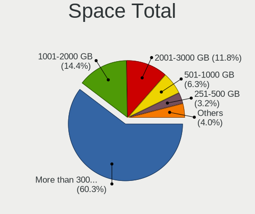
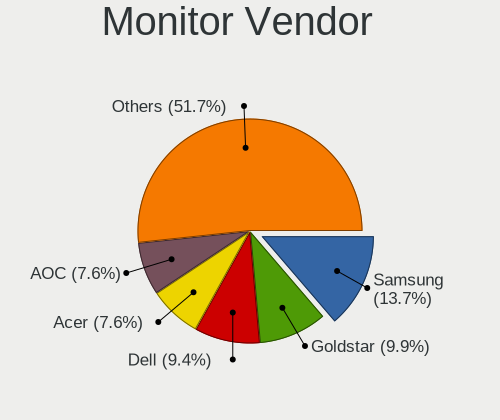
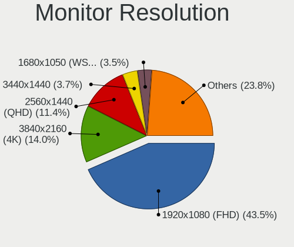
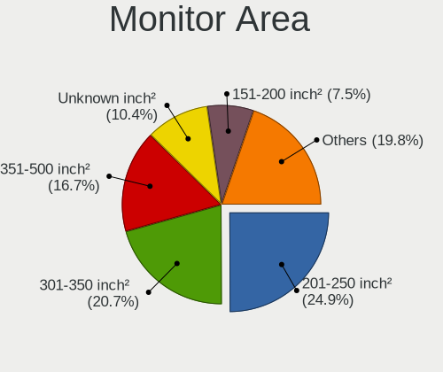
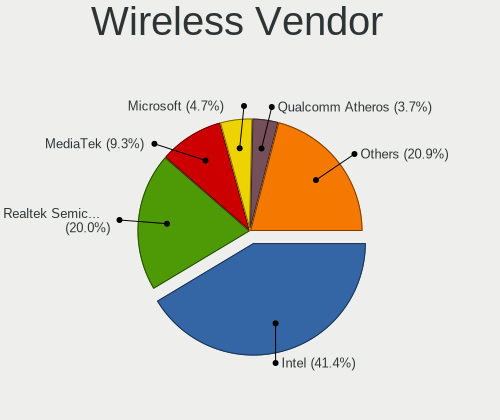
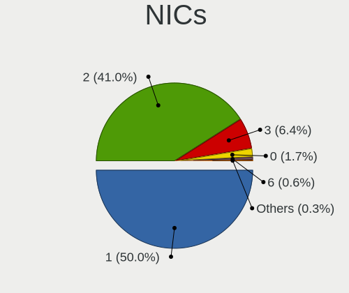
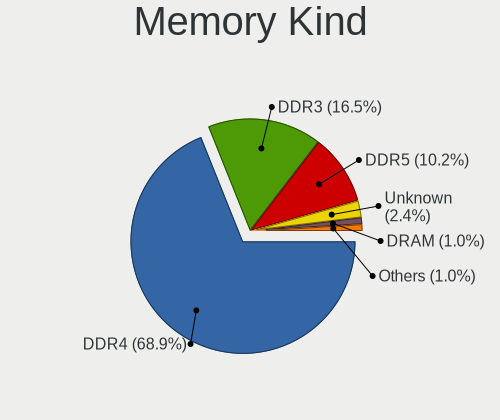

Garuda - Tested Hardware & Statistics (Desktops)
------------------------------------------------

A project to collect tested hardware configurations for Garuda.

Anyone can contribute to this report by the [hw-probe](https://github.com/linuxhw/hw-probe) tool:

    sudo -E hw-probe -all -upload

Please submit a probe of your configuration if it's not presented on the page or is rare.

Full-feature report is available here: https://linux-hardware.org/?view=trends

Contents
--------

* [ Test Cases ](#test-cases)

* [ System ](#system)
  - [ Kernel                   ](#kernel)
  - [ Kernel Family            ](#kernel-family)
  - [ Kernel Major Ver.        ](#kernel-major-ver)
  - [ Arch                     ](#arch)
  - [ DE                       ](#de)
  - [ Display Server           ](#display-server)
  - [ Display Manager          ](#display-manager)
  - [ OS Lang                  ](#os-lang)
  - [ Boot Mode                ](#boot-mode)
  - [ Filesystem               ](#filesystem)
  - [ Part. scheme             ](#part-scheme)
  - [ Dual Boot with Linux/BSD ](#dual-boot-with-linuxbsd)
  - [ Dual Boot (Win)          ](#dual-boot-win)

* [ Board ](#board)
  - [ Vendor                   ](#vendor)
  - [ Model                    ](#model)
  - [ Model Family             ](#model-family)
  - [ MFG Year                 ](#mfg-year)
  - [ Form Factor              ](#form-factor)
  - [ Secure Boot              ](#secure-boot)
  - [ Coreboot                 ](#coreboot)
  - [ RAM Size                 ](#ram-size)
  - [ RAM Used                 ](#ram-used)
  - [ Total Drives             ](#total-drives)
  - [ Has CD-ROM               ](#has-cd-rom)
  - [ Has Ethernet             ](#has-ethernet)
  - [ Has WiFi                 ](#has-wifi)
  - [ Has Bluetooth            ](#has-bluetooth)

* [ Location ](#location)
  - [ Country                  ](#country)
  - [ City                     ](#city)

* [ Drives ](#drives)
  - [ Drive Vendor             ](#drive-vendor)
  - [ Drive Model              ](#drive-model)
  - [ HDD Vendor               ](#hdd-vendor)
  - [ SSD Vendor               ](#ssd-vendor)
  - [ Drive Kind               ](#drive-kind)
  - [ Drive Connector          ](#drive-connector)
  - [ Drive Size               ](#drive-size)
  - [ Space Total              ](#space-total)
  - [ Space Used               ](#space-used)
  - [ Malfunc. Drives          ](#malfunc-drives)
  - [ Malfunc. Drive Vendor    ](#malfunc-drive-vendor)
  - [ Malfunc. HDD Vendor      ](#malfunc-hdd-vendor)
  - [ Malfunc. Drive Kind      ](#malfunc-drive-kind)
  - [ Failed Drives            ](#failed-drives)
  - [ Failed Drive Vendor      ](#failed-drive-vendor)
  - [ Drive Status             ](#drive-status)

* [ Storage controller ](#storage-controller)
  - [ Storage Vendor           ](#storage-vendor)
  - [ Storage Model            ](#storage-model)
  - [ Storage Kind             ](#storage-kind)

* [ Processor ](#processor)
  - [ CPU Vendor               ](#cpu-vendor)
  - [ CPU Model                ](#cpu-model)
  - [ CPU Model Family         ](#cpu-model-family)
  - [ CPU Cores                ](#cpu-cores)
  - [ CPU Sockets              ](#cpu-sockets)
  - [ CPU Threads              ](#cpu-threads)
  - [ CPU Op-Modes             ](#cpu-op-modes)
  - [ CPU Microcode            ](#cpu-microcode)
  - [ CPU Microarch            ](#cpu-microarch)

* [ Graphics ](#graphics)
  - [ GPU Vendor               ](#gpu-vendor)
  - [ GPU Model                ](#gpu-model)
  - [ GPU Combo                ](#gpu-combo)
  - [ GPU Driver               ](#gpu-driver)
  - [ GPU Memory               ](#gpu-memory)

* [ Monitor ](#monitor)
  - [ Monitor Vendor           ](#monitor-vendor)
  - [ Monitor Model            ](#monitor-model)
  - [ Monitor Resolution       ](#monitor-resolution)
  - [ Monitor Diagonal         ](#monitor-diagonal)
  - [ Monitor Width            ](#monitor-width)
  - [ Aspect Ratio             ](#aspect-ratio)
  - [ Monitor Area             ](#monitor-area)
  - [ Pixel Density            ](#pixel-density)
  - [ Multiple Monitors        ](#multiple-monitors)

* [ Network ](#network)
  - [ Net Controller Vendor    ](#net-controller-vendor)
  - [ Net Controller Model     ](#net-controller-model)
  - [ Wireless Vendor          ](#wireless-vendor)
  - [ Wireless Model           ](#wireless-model)
  - [ Ethernet Vendor          ](#ethernet-vendor)
  - [ Ethernet Model           ](#ethernet-model)
  - [ Net Controller Kind      ](#net-controller-kind)
  - [ Used Controller          ](#used-controller)
  - [ NICs                     ](#nics)
  - [ IPv6                     ](#ipv6)

* [ Bluetooth ](#bluetooth)
  - [ Bluetooth Vendor         ](#bluetooth-vendor)
  - [ Bluetooth Model          ](#bluetooth-model)

* [ Sound ](#sound)
  - [ Sound Vendor             ](#sound-vendor)
  - [ Sound Model              ](#sound-model)

* [ Memory ](#memory)
  - [ Memory Vendor            ](#memory-vendor)
  - [ Memory Model             ](#memory-model)
  - [ Memory Kind              ](#memory-kind)
  - [ Memory Form Factor       ](#memory-form-factor)
  - [ Memory Size              ](#memory-size)
  - [ Memory Speed             ](#memory-speed)

* [ Printers & scanners ](#printers--scanners)
  - [ Printer Vendor           ](#printer-vendor)
  - [ Printer Model            ](#printer-model)
  - [ Scanner Vendor           ](#scanner-vendor)
  - [ Scanner Model            ](#scanner-model)

* [ Camera ](#camera)
  - [ Camera Vendor            ](#camera-vendor)
  - [ Camera Model             ](#camera-model)

* [ Security ](#security)
  - [ Fingerprint Vendor       ](#fingerprint-vendor)
  - [ Fingerprint Model        ](#fingerprint-model)
  - [ Chipcard Vendor          ](#chipcard-vendor)
  - [ Chipcard Model           ](#chipcard-model)

* [ Unsupported ](#unsupported)
  - [ Unsupported Devices      ](#unsupported-devices)
  - [ Unsupported Device Types ](#unsupported-device-types)

Test Cases
----------

| Vendor   | Model                       | Probe                                                      | Date         |
|----------|-----------------------------|------------------------------------------------------------|--------------|
| ASUSTek  | TUF GAMING X570-PLUS        | [9e73346fb8](https://linux-hardware.org/?probe=9e73346fb8) | Dec 15, 2021 |
| Gigabyte | X570 AORUS ELITE WIFI       | [196b460373](https://linux-hardware.org/?probe=196b460373) | Dec 13, 2021 |
| ASRock   | B450M Pro4                  | [e4fb1e4fe4](https://linux-hardware.org/?probe=e4fb1e4fe4) | Dec 09, 2021 |
| Lenovo   | ThinkStation S20 4105O1U    | [731c890641](https://linux-hardware.org/?probe=731c890641) | Dec 08, 2021 |
| ASUSTek  | TUF GAMING X570-PLUS        | [f0df07c0e4](https://linux-hardware.org/?probe=f0df07c0e4) | Dec 06, 2021 |
| Acer     | Aspire TC-895 V:1.0         | [c743459a71](https://linux-hardware.org/?probe=c743459a71) | Dec 04, 2021 |
| ASUSTek  | H87M-E                      | [2b4abcf54f](https://linux-hardware.org/?probe=2b4abcf54f) | Dec 02, 2021 |
| ASUSTek  | H87M-E                      | [72cf0ed74d](https://linux-hardware.org/?probe=72cf0ed74d) | Dec 02, 2021 |
| Lenovo   | ThinkStation S20 4105O1U    | [f031548aac](https://linux-hardware.org/?probe=f031548aac) | Dec 01, 2021 |
| Lenovo   | ThinkStation S20 4105O1U    | [48f73af82d](https://linux-hardware.org/?probe=48f73af82d) | Nov 30, 2021 |
| ASUSTek  | Rampage IV EXTREME          | [50999d4796](https://linux-hardware.org/?probe=50999d4796) | Nov 14, 2021 |
| ASUSTek  | TUF GAMING X570-PLUS        | [cd295bb56c](https://linux-hardware.org/?probe=cd295bb56c) | Nov 04, 2021 |
| ASUSTek  | P8B75-M                     | [2130c28d33](https://linux-hardware.org/?probe=2130c28d33) | Oct 27, 2021 |
| ASUSTek  | PRIME B450M-K               | [b8b49f201f](https://linux-hardware.org/?probe=b8b49f201f) | Sep 14, 2021 |
| MSI      | H310M PRO-VDH PLUS          | [65fcfef06f](https://linux-hardware.org/?probe=65fcfef06f) | Aug 27, 2021 |
| Medion   | H110H4-EM2                  | [f4e01958e5](https://linux-hardware.org/?probe=f4e01958e5) | Aug 10, 2021 |
| MSI      | Z97 MPOWER                  | [dee7d3af4a](https://linux-hardware.org/?probe=dee7d3af4a) | Aug 06, 2021 |
| MSI      | Z97 MPOWER                  | [f30e5a3a86](https://linux-hardware.org/?probe=f30e5a3a86) | Aug 06, 2021 |
| ASUSTek  | ROG STRIX B550-F GAMING     | [826edd51bc](https://linux-hardware.org/?probe=826edd51bc) | Jul 07, 2021 |
| Gigabyte | X470 AORUS ULTRA GAMING-... | [aa05cca9b7](https://linux-hardware.org/?probe=aa05cca9b7) | Jun 30, 2021 |
| MSI      | A320M-HDV R4.0              | [486775a989](https://linux-hardware.org/?probe=486775a989) | Jun 23, 2021 |
| MSI      | A320M-HDV R4.0              | [4629f86f56](https://linux-hardware.org/?probe=4629f86f56) | Jun 22, 2021 |
| MSI      | A320M-HDV R4.0              | [69dea4e3cf](https://linux-hardware.org/?probe=69dea4e3cf) | Jun 22, 2021 |
| MSI      | A320M-HDV R4.0              | [2fd89c951e](https://linux-hardware.org/?probe=2fd89c951e) | Jun 22, 2021 |
| MSI      | X370 GAMING PRO CARBON      | [9ead1e1bb5](https://linux-hardware.org/?probe=9ead1e1bb5) | Jun 22, 2021 |
| ASUSTek  | ROG STRIX B550-F GAMING     | [8144c83b50](https://linux-hardware.org/?probe=8144c83b50) | Jun 22, 2021 |
| ASUSTek  | ROG STRIX B550-F GAMING     | [8a7a518013](https://linux-hardware.org/?probe=8a7a518013) | Jun 15, 2021 |
| ASUSTek  | ROG STRIX B550-F GAMING     | [376c0ff95d](https://linux-hardware.org/?probe=376c0ff95d) | Jun 15, 2021 |
| Dell     | 0D28YY A02                  | [14edf3bd00](https://linux-hardware.org/?probe=14edf3bd00) | May 16, 2021 |
| Gigabyte | A320M-S2H-CF                | [066f815622](https://linux-hardware.org/?probe=066f815622) | May 12, 2021 |
| Gigabyte | B450 AORUS M                | [22054ffd75](https://linux-hardware.org/?probe=22054ffd75) | Mar 18, 2021 |
| HP       | 2AF7                        | [e0639ea4a5](https://linux-hardware.org/?probe=e0639ea4a5) | Mar 11, 2021 |
| HP       | 2AF7                        | [fb8d76722c](https://linux-hardware.org/?probe=fb8d76722c) | Mar 11, 2021 |
| Gigabyte | GA-MA790FXT-UD5P            | [404dab2464](https://linux-hardware.org/?probe=404dab2464) | Feb 27, 2021 |
| Dell     | 0C2KJT A00                  | [f821a0035b](https://linux-hardware.org/?probe=f821a0035b) | Feb 12, 2021 |
| Lenovo   | SHARKBAY 0B98401 PRO        | [61976e9745](https://linux-hardware.org/?probe=61976e9745) | Jan 18, 2021 |
| ASUSTek  | CM5671                      | [069344a54e](https://linux-hardware.org/?probe=069344a54e) | Jan 07, 2021 |
| MSI      | B85-G43 GAMING              | [8fe013f04a](https://linux-hardware.org/?probe=8fe013f04a) | Jan 04, 2021 |
| ASRock   | G41M-VS3                    | [e1217b1871](https://linux-hardware.org/?probe=e1217b1871) | Jan 02, 2021 |
| Pegatron | 2AC2A                       | [436a2ca3ce](https://linux-hardware.org/?probe=436a2ca3ce) | Dec 25, 2020 |
| Pegatron | 2AC2A                       | [2df3b195c6](https://linux-hardware.org/?probe=2df3b195c6) | Dec 25, 2020 |
| ASUSTek  | PRIME Z370-P                | [35365be0e8](https://linux-hardware.org/?probe=35365be0e8) | Dec 19, 2020 |
| HP       | 8643 SMVB                   | [dccfba36f1](https://linux-hardware.org/?probe=dccfba36f1) | Dec 06, 2020 |
| Gigabyte | B450 AORUS ELITE            | [2a35d394f9](https://linux-hardware.org/?probe=2a35d394f9) | Dec 04, 2020 |
| Gigabyte | B450 AORUS M                | [d9faeae0d4](https://linux-hardware.org/?probe=d9faeae0d4) | Nov 19, 2020 |
| Gigabyte | X570 AORUS PRO WIFI         | [11c79940a4](https://linux-hardware.org/?probe=11c79940a4) | Nov 19, 2020 |
| HP       | 18E7                        | [f84cbfd465](https://linux-hardware.org/?probe=f84cbfd465) | Nov 10, 2020 |
| Gigabyte | X570 AORUS PRO WIFI         | [79608bd849](https://linux-hardware.org/?probe=79608bd849) | Nov 06, 2020 |
| ASUSTek  | ROG STRIX B550-F GAMING     | [876b039494](https://linux-hardware.org/?probe=876b039494) | Nov 01, 2020 |
| Gigabyte | X570 AORUS PRO WIFI         | [428abb1a9b](https://linux-hardware.org/?probe=428abb1a9b) | Oct 31, 2020 |
| Gigabyte | X570 AORUS PRO WIFI         | [4e573bc6ff](https://linux-hardware.org/?probe=4e573bc6ff) | Oct 28, 2020 |
| MSI      | MPG B550 GAMING EDGE WIF... | [4b9d2b77cb](https://linux-hardware.org/?probe=4b9d2b77cb) | Oct 26, 2020 |
| ASUSTek  | PRIME X399-A                | [b7772d9ff8](https://linux-hardware.org/?probe=b7772d9ff8) | Oct 13, 2020 |
| Dell     | 0R6JMP A00                  | [c4cbec5b80](https://linux-hardware.org/?probe=c4cbec5b80) | Oct 11, 2020 |
| OEM      | Unknown                     | [2e7a212437](https://linux-hardware.org/?probe=2e7a212437) | Sep 26, 2020 |
| Lenovo   | Board                       | [c08fed8ecb](https://linux-hardware.org/?probe=c08fed8ecb) | Sep 11, 2020 |

System
------

Kernel
------

Version of the Linux kernel

| Version               | Desktops | Percent |
|-----------------------|----------|---------|
| 5.15.2-zen1-1-zen     | 3        | 7.89%   |
| 5.9.1-zen2-1-zen      | 2        | 5.26%   |
| 5.8.14-zen1-1-zen     | 2        | 5.26%   |
| 5.15.7-zen1-1-zen     | 2        | 5.26%   |
| 5.13.9-zen1-1-zen     | 2        | 5.26%   |
| 5.10.4-107-tkg-bmq    | 2        | 5.26%   |
| 5.9.6-zen1-1-zen      | 1        | 2.63%   |
| 5.9.4-zen1-1-zen      | 1        | 2.63%   |
| 5.9.11-zen2-1-zen     | 1        | 2.63%   |
| 5.9.10-zen1-1-zen     | 1        | 2.63%   |
| 5.8.5-zen1-1-zen      | 1        | 2.63%   |
| 5.8.10-zen1-1-zen     | 1        | 2.63%   |
| 5.15.6-zen2-1-zen     | 1        | 2.63%   |
| 5.15.5-zen1-1-zen     | 1        | 2.63%   |
| 5.14.15-zen1-1-zen    | 1        | 2.63%   |
| 5.14.14-zen1-1-zen    | 1        | 2.63%   |
| 5.13.12-zen1-1-zen    | 1        | 2.63%   |
| 5.12.3-zen1-1-zen     | 1        | 2.63%   |
| 5.12.14-zen1-1-zen    | 1        | 2.63%   |
| 5.12.13-170-tkg-muqss | 1        | 2.63%   |
| 5.12.12-zen1-1-zen    | 1        | 2.63%   |
| 5.12.12-AMD-znver2    | 1        | 2.63%   |
| 5.12.10-zen1-1-zen    | 1        | 2.63%   |
| 5.11.5-zen1-1-zen     | 1        | 2.63%   |
| 5.11.16-zen1-1-zen    | 1        | 2.63%   |
| 5.11.1-127-tkg-bmq    | 1        | 2.63%   |
| 5.10.7-111-tkg-bmq    | 1        | 2.63%   |
| 5.10.3-zen1-1-zen     | 1        | 2.63%   |
| 5.10.2-104-tkg-bmq    | 1        | 2.63%   |
| 5.10.15-120-tkg-bmq   | 1        | 2.63%   |
| 5.10.1-103-tkg-bmq    | 1        | 2.63%   |

Kernel Family
-------------

Linux kernel without a distro release

| Version | Desktops | Percent |
|---------|----------|---------|
| 5.15.2  | 3        | 7.89%   |
| 5.9.1   | 2        | 5.26%   |
| 5.8.14  | 2        | 5.26%   |
| 5.15.7  | 2        | 5.26%   |
| 5.13.9  | 2        | 5.26%   |
| 5.12.12 | 2        | 5.26%   |
| 5.10.4  | 2        | 5.26%   |
| 5.9.6   | 1        | 2.63%   |
| 5.9.4   | 1        | 2.63%   |
| 5.9.11  | 1        | 2.63%   |
| 5.9.10  | 1        | 2.63%   |
| 5.8.5   | 1        | 2.63%   |
| 5.8.10  | 1        | 2.63%   |
| 5.15.6  | 1        | 2.63%   |
| 5.15.5  | 1        | 2.63%   |
| 5.14.15 | 1        | 2.63%   |
| 5.14.14 | 1        | 2.63%   |
| 5.13.12 | 1        | 2.63%   |
| 5.12.3  | 1        | 2.63%   |
| 5.12.14 | 1        | 2.63%   |
| 5.12.13 | 1        | 2.63%   |
| 5.12.10 | 1        | 2.63%   |
| 5.11.5  | 1        | 2.63%   |
| 5.11.16 | 1        | 2.63%   |
| 5.11.1  | 1        | 2.63%   |
| 5.10.7  | 1        | 2.63%   |
| 5.10.3  | 1        | 2.63%   |
| 5.10.2  | 1        | 2.63%   |
| 5.10.15 | 1        | 2.63%   |
| 5.10.1  | 1        | 2.63%   |

Kernel Major Ver.
-----------------

Linux kernel major version

| Version | Desktops | Percent |
|---------|----------|---------|
| 5.15    | 7        | 19.44%  |
| 5.10    | 7        | 19.44%  |
| 5.9     | 5        | 13.89%  |
| 5.12    | 5        | 13.89%  |
| 5.8     | 4        | 11.11%  |
| 5.13    | 3        | 8.33%   |
| 5.11    | 3        | 8.33%   |
| 5.14    | 2        | 5.56%   |

Arch
----

OS architecture (x86_64, i586, etc.)

| Name   | Desktops | Percent |
|--------|----------|---------|
| x86_64 | 36       | 100%    |

DE
--

Desktop Environment

| Name    | Desktops | Percent |
|---------|----------|---------|
| KDE     | 17       | 47.22%  |
| KDE5    | 8        | 22.22%  |
| GNOME   | 8        | 22.22%  |
| XFCE    | 1        | 2.78%   |
| LXQt    | 1        | 2.78%   |
| Unknown | 1        | 2.78%   |

Display Server
--------------

X11 or Wayland

| Name    | Desktops | Percent |
|---------|----------|---------|
| X11     | 35       | 97.22%  |
| Wayland | 1        | 2.78%   |

Display Manager
---------------

SDDM, LightDM, etc.

| Name    | Desktops | Percent |
|---------|----------|---------|
| Unknown | 36       | 100%    |

OS Lang
-------

Language

| Lang  | Desktops | Percent |
|-------|----------|---------|
| en_US | 19       | 52.78%  |
| de_DE | 4        | 11.11%  |
| nl_NL | 2        | 5.56%   |
| en_CA | 2        | 5.56%   |
| en_AU | 2        | 5.56%   |
| pt_BR | 1        | 2.78%   |
| iu_CA | 1        | 2.78%   |
| fr_BE | 1        | 2.78%   |
| es_VE | 1        | 2.78%   |
| en_ZA | 1        | 2.78%   |
| en_IN | 1        | 2.78%   |
| en_GB | 1        | 2.78%   |

Boot Mode
---------

EFI or BIOS

| Mode | Desktops | Percent |
|------|----------|---------|
| BIOS | 26       | 72.22%  |
| EFI  | 10       | 27.78%  |

Filesystem
----------

Type of filesystem

| Type  | Desktops | Percent |
|-------|----------|---------|
| Btrfs | 35       | 97.22%  |
| Ext4  | 1        | 2.78%   |

Part. scheme
------------

Scheme of partitioning

| Type    | Desktops | Percent |
|---------|----------|---------|
| Unknown | 35       | 94.59%  |
| MBR     | 1        | 2.7%    |
| GPT     | 1        | 2.7%    |

Dual Boot with Linux/BSD
------------------------

Hosting more than one Linux/BSD

| Dual boot | Desktops | Percent |
|-----------|----------|---------|
| No        | 36       | 97.3%   |
| Yes       | 1        | 2.7%    |

Dual Boot (Win)
---------------

Hosting Linux and Windows

| Dual boot | Desktops | Percent |
|-----------|----------|---------|
| No        | 36       | 97.3%   |
| Yes       | 1        | 2.7%    |

Board
-----

Vendor
------

Motherboard manufacturer

| Name                | Desktops | Percent |
|---------------------|----------|---------|
| ASUSTek Computer    | 10       | 27.78%  |
| Gigabyte Technology | 6        | 16.67%  |
| MSI                 | 5        | 13.89%  |
| Lenovo              | 3        | 8.33%   |
| Hewlett-Packard     | 3        | 8.33%   |
| Dell                | 3        | 8.33%   |
| ASRock              | 2        | 5.56%   |
| Pegatron            | 1        | 2.78%   |
| OEM                 | 1        | 2.78%   |
| Medion              | 1        | 2.78%   |
| Acer                | 1        | 2.78%   |

Model
-----

Motherboard model

| Name                               | Desktops | Percent |
|------------------------------------|----------|---------|
| ASUS TUF GAMING X570-PLUS          | 2        | 5.56%   |
| Pegatron p7-1030                   | 1        | 2.78%   |
| MSI MS-7C91                        | 1        | 2.78%   |
| MSI MS-7C09                        | 1        | 2.78%   |
| MSI MS-7A32                        | 1        | 2.78%   |
| MSI MS-7816                        | 1        | 2.78%   |
| MSI A320M-HDV R4.0                 | 1        | 2.78%   |
| Medion Akoya P5238 F/C395          | 1        | 2.78%   |
| Lenovo ThinkStation S20 4105O1U    | 1        | 2.78%   |
| Lenovo ThinkCentre M93p 10A90016US | 1        | 2.78%   |
| Lenovo ThinkCentre M91p 7033CG1    | 1        | 2.78%   |
| HP ProDesk 600 G1 SFF              | 1        | 2.78%   |
| HP Desktop M01-F0xxx               | 1        | 2.78%   |
| HP 500-439                         | 1        | 2.78%   |
| Gigabyte X570 AORUS PRO WIFI       | 1        | 2.78%   |
| Gigabyte X570 AORUS ELITE WIFI     | 1        | 2.78%   |
| Gigabyte X470 AORUS ULTRA GAMING   | 1        | 2.78%   |
| Gigabyte GA-MA790FXT-UD5P          | 1        | 2.78%   |
| Gigabyte B450 AORUS ELITE          | 1        | 2.78%   |
| Gigabyte A320M-S2H                 | 1        | 2.78%   |
| Dell OptiPlex 790                  | 1        | 2.78%   |
| Dell Inspiron 580                  | 1        | 2.78%   |
| Dell Inspiron 3670                 | 1        | 2.78%   |
| ASUS ROG STRIX B550-F GAMING       | 1        | 2.78%   |
| ASUS Rampage IV EXTREME            | 1        | 2.78%   |
| ASUS PRIME Z370-P                  | 1        | 2.78%   |
| ASUS PRIME X399-A                  | 1        | 2.78%   |
| ASUS PRIME B450M-K                 | 1        | 2.78%   |
| ASUS P8B75-M                       | 1        | 2.78%   |
| ASUS CM5671                        | 1        | 2.78%   |
| ASUS All Series                    | 1        | 2.78%   |
| ASRock G41M-VS3                    | 1        | 2.78%   |
| ASRock B450M Pro4                  | 1        | 2.78%   |
| Acer Aspire TC-895                 | 1        | 2.78%   |
| Unknown                            | 1        | 2.78%   |

Model Family
------------

Motherboard model prefix

| Name                      | Desktops | Percent |
|---------------------------|----------|---------|
| ASUS PRIME                | 3        | 8.33%   |
| Lenovo ThinkCentre        | 2        | 5.56%   |
| Gigabyte X570             | 2        | 5.56%   |
| Dell Inspiron             | 2        | 5.56%   |
| ASUS TUF                  | 2        | 5.56%   |
| Pegatron p7-1030          | 1        | 2.78%   |
| MSI MS-7C91               | 1        | 2.78%   |
| MSI MS-7C09               | 1        | 2.78%   |
| MSI MS-7A32               | 1        | 2.78%   |
| MSI MS-7816               | 1        | 2.78%   |
| MSI A320M-HDV             | 1        | 2.78%   |
| Medion Akoya              | 1        | 2.78%   |
| Lenovo ThinkStation       | 1        | 2.78%   |
| HP ProDesk                | 1        | 2.78%   |
| HP Desktop                | 1        | 2.78%   |
| HP 500-439                | 1        | 2.78%   |
| Gigabyte X470             | 1        | 2.78%   |
| Gigabyte GA-MA790FXT-UD5P | 1        | 2.78%   |
| Gigabyte B450             | 1        | 2.78%   |
| Gigabyte A320M-S2H        | 1        | 2.78%   |
| Dell OptiPlex             | 1        | 2.78%   |
| ASUS ROG                  | 1        | 2.78%   |
| ASUS Rampage              | 1        | 2.78%   |
| ASUS P8B75-M              | 1        | 2.78%   |
| ASUS CM5671               | 1        | 2.78%   |
| ASUS All                  | 1        | 2.78%   |
| ASRock G41M-VS3           | 1        | 2.78%   |
| ASRock B450M              | 1        | 2.78%   |
| Acer Aspire               | 1        | 2.78%   |
| Unknown                   | 1        | 2.78%   |

MFG Year
--------

Motherboard manufacture year

| Year | Desktops | Percent |
|------|----------|---------|
| 2020 | 7        | 19.44%  |
| 2019 | 6        | 16.67%  |
| 2021 | 5        | 13.89%  |
| 2014 | 4        | 11.11%  |
| 2011 | 4        | 11.11%  |
| 2010 | 3        | 8.33%   |
| 2013 | 2        | 5.56%   |
| 2018 | 1        | 2.78%   |
| 2017 | 1        | 2.78%   |
| 2016 | 1        | 2.78%   |
| 2015 | 1        | 2.78%   |
| 2009 | 1        | 2.78%   |

Form Factor
-----------

Physical design of the computer

| Name    | Desktops | Percent |
|---------|----------|---------|
| Desktop | 36       | 100%    |

Secure Boot
-----------

Enabled or disabled

| State    | Desktops | Percent |
|----------|----------|---------|
| Disabled | 36       | 100%    |

Coreboot
--------

Have coreboot on board

| Used | Desktops | Percent |
|------|----------|---------|
| No   | 36       | 100%    |

RAM Size
--------

Total RAM memory

| Size in GB  | Desktops | Percent |
|-------------|----------|---------|
| 16.01-24.0  | 10       | 27.78%  |
| 8.01-16.0   | 10       | 27.78%  |
| 32.01-64.0  | 8        | 22.22%  |
| 4.01-8.0    | 4        | 11.11%  |
| 3.01-4.0    | 2        | 5.56%   |
| 24.01-32.0  | 1        | 2.78%   |
| 64.01-256.0 | 1        | 2.78%   |

RAM Used
--------

Used RAM memory

| Used GB   | Desktops | Percent |
|-----------|----------|---------|
| 4.01-8.0  | 12       | 33.33%  |
| 3.01-4.0  | 11       | 30.56%  |
| 2.01-3.0  | 6        | 16.67%  |
| 8.01-16.0 | 4        | 11.11%  |
| 1.01-2.0  | 3        | 8.33%   |

Total Drives
------------

Number of drives on board

| Drives | Desktops | Percent |
|--------|----------|---------|
| 2      | 16       | 44.44%  |
| 1      | 6        | 16.67%  |
| 3      | 4        | 11.11%  |
| 5      | 3        | 8.33%   |
| 4      | 3        | 8.33%   |
| 9      | 2        | 5.56%   |
| 6      | 2        | 5.56%   |

Has CD-ROM
----------

Has CD-ROM on board

| Presented | Desktops | Percent |
|-----------|----------|---------|
| No        | 21       | 58.33%  |
| Yes       | 15       | 41.67%  |

Has Ethernet
------------

Has Ethernet on board

| Presented | Desktops | Percent |
|-----------|----------|---------|
| Yes       | 36       | 100%    |

Has WiFi
--------

Has WiFi module

| Presented | Desktops | Percent |
|-----------|----------|---------|
| Yes       | 20       | 55.56%  |
| No        | 16       | 44.44%  |

Has Bluetooth
-------------

Has Bluetooth module

| Presented | Desktops | Percent |
|-----------|----------|---------|
| No        | 24       | 66.67%  |
| Yes       | 12       | 33.33%  |

Location
--------

Country
-------

Geographic location (country)

| Country      | Desktops | Percent |
|--------------|----------|---------|
| USA          | 12       | 33.33%  |
| Germany      | 4        | 11.11%  |
| Canada       | 3        | 8.33%   |
| Puerto Rico  | 2        | 5.56%   |
| Netherlands  | 2        | 5.56%   |
| Australia    | 2        | 5.56%   |
| Venezuela    | 1        | 2.78%   |
| Sweden       | 1        | 2.78%   |
| South Africa | 1        | 2.78%   |
| Romania      | 1        | 2.78%   |
| Philippines  | 1        | 2.78%   |
| Italy        | 1        | 2.78%   |
| India        | 1        | 2.78%   |
| Iceland      | 1        | 2.78%   |
| France       | 1        | 2.78%   |
| Brazil       | 1        | 2.78%   |
| Belgium      | 1        | 2.78%   |

City
----

Geographic location (city)

| City                  | Desktops | Percent |
|-----------------------|----------|---------|
| Kingsport             | 2        | 5.56%   |
| Valence               | 1        | 2.78%   |
| Tekoa                 | 1        | 2.78%   |
| Sydney                | 1        | 2.78%   |
| Stockholm             | 1        | 2.78%   |
| St Louis              | 1        | 2.78%   |
| Shreveport            | 1        | 2.78%   |
| Satu Mare             | 1        | 2.78%   |
| Sarasota              | 1        | 2.78%   |
| San Juan              | 1        | 2.78%   |
| Salto da Divisa       | 1        | 2.78%   |
| Regina                | 1        | 2.78%   |
| Portland              | 1        | 2.78%   |
| Oklahoma City         | 1        | 2.78%   |
| Norman                | 1        | 2.78%   |
| Nijmegen              | 1        | 2.78%   |
| Naranjito             | 1        | 2.78%   |
| Mumbai                | 1        | 2.78%   |
| Milan                 | 1        | 2.78%   |
| Ludwigshafen am Rhein | 1        | 2.78%   |
| Leichlingen           | 1        | 2.78%   |
| Kitchener             | 1        | 2.78%   |
| Karlsruhe             | 1        | 2.78%   |
| Jonesboro             | 1        | 2.78%   |
| Jemappes              | 1        | 2.78%   |
| Hamburg               | 1        | 2.78%   |
| Groningen             | 1        | 2.78%   |
| Garðabaer            | 1        | 2.78%   |
| Fort St. John         | 1        | 2.78%   |
| De Pere               | 1        | 2.78%   |
| Croydon               | 1        | 2.78%   |
| Chicago               | 1        | 2.78%   |
| Catia La Mar          | 1        | 2.78%   |
| Cape Town             | 1        | 2.78%   |
| Cagayan de Oro        | 1        | 2.78%   |

Drives
------

Drive Vendor
------------

Hard drive vendors

| Vendor                    | Desktops | Drives | Percent |
|---------------------------|----------|--------|---------|
| Seagate                   | 19       | 29     | 22.09%  |
| Samsung Electronics       | 14       | 18     | 16.28%  |
| WDC                       | 12       | 15     | 13.95%  |
| Toshiba                   | 6        | 6      | 6.98%   |
| SanDisk                   | 5        | 7      | 5.81%   |
| Kingston                  | 5        | 10     | 5.81%   |
| Phison                    | 4        | 5      | 4.65%   |
| XPG                       | 2        | 3      | 2.33%   |
| Hitachi                   | 2        | 2      | 2.33%   |
| Crucial                   | 2        | 2      | 2.33%   |
| China                     | 2        | 4      | 2.33%   |
| A-DATA Technology         | 2        | 5      | 2.33%   |
| WD MediaMax               | 1        | 1      | 1.16%   |
| Unknown                   | 1        | 1      | 1.16%   |
| Transcend                 | 1        | 1      | 1.16%   |
| SK Hynix                  | 1        | 1      | 1.16%   |
| Silicon Motion            | 1        | 1      | 1.16%   |
| Micron/Crucial Technology | 1        | 2      | 1.16%   |
| Intel                     | 1        | 1      | 1.16%   |
| HS-SSD-E100               | 1        | 1      | 1.16%   |
| HGST                      | 1        | 1      | 1.16%   |
| ASMedia                   | 1        | 2      | 1.16%   |
| Unknown                   | 1        | 1      | 1.16%   |

Drive Model
-----------

Hard drive models

| Model                               | Desktops | Percent |
|-------------------------------------|----------|---------|
| Samsung NVMe SSD Drive 1TB          | 3        | 3%      |
| XPG NVMe SSD Drive 512GB            | 2        | 2%      |
| WDC WD10EZEX-08WN4A0 1TB            | 2        | 2%      |
| Seagate ST2000DM008-2FR102 2TB      | 2        | 2%      |
| Seagate ST1000DM010-2EP102 1TB      | 2        | 2%      |
| Sandisk NVMe SSD Drive 500GB        | 2        | 2%      |
| Samsung NVMe SSD Drive 500GB        | 2        | 2%      |
| Samsung NVMe SSD Drive 250GB        | 2        | 2%      |
| Phison NVMe SSD Drive 2TB           | 2        | 2%      |
| WDC WDS240G2G0A-00JH30 240GB SSD    | 1        | 1%      |
| WDC WDS120G2G0A-00JH30 120GB SSD    | 1        | 1%      |
| WDC WD6400AAKS-75A7B2 640GB         | 1        | 1%      |
| WDC WD4001FAEX-00MJRA0 4TB          | 1        | 1%      |
| WDC WD3200AAKS-75L9A0 320GB         | 1        | 1%      |
| WDC WD3200AAJS-55B4A0 320GB         | 1        | 1%      |
| WDC WD30EFRX-68EUZN0 3TB            | 1        | 1%      |
| WDC WD2500AAKX-75U6AA0 250GB        | 1        | 1%      |
| WDC WD20PURZ-85GU6Y0 2TB            | 1        | 1%      |
| WDC WD20EARX-00PASB0 2TB            | 1        | 1%      |
| WDC WD2000F9YZ-09N20L1 2TB          | 1        | 1%      |
| WDC WD10EZEX-08RKKA0 1TB            | 1        | 1%      |
| WDC WD10EARS-00Y5B1 1TB             | 1        | 1%      |
| WD MediaMax WL500GSA6454G 497GB     | 1        | 1%      |
| Unknown SDEZS25-240G-Z01 240GB      | 1        | 1%      |
| Transcend TS120GSSD220S 120GB       | 1        | 1%      |
| Toshiba MQ01ABF032 320GB            | 1        | 1%      |
| Toshiba KBG30ZMS128G 128GB NVMe SSD | 1        | 1%      |
| Toshiba HDWE140 4TB                 | 1        | 1%      |
| Toshiba HDWD120 2TB                 | 1        | 1%      |
| Toshiba HDWD110 1TB                 | 1        | 1%      |
| Toshiba DT01ACA300 3TB              | 1        | 1%      |
| SK Hynix SHGS31-500GS-2 500GB SSD   | 1        | 1%      |
| Silicon Motion NVMe SSD Drive 512GB | 1        | 1%      |
| Seagate ST8000NM0055-1RM112 8TB     | 1        | 1%      |
| Seagate ST8000DM004-2CX188 8TB      | 1        | 1%      |
| Seagate ST750LX003-1AC154 752GB     | 1        | 1%      |
| Seagate ST4000DM004-2CV104 4TB      | 1        | 1%      |
| Seagate ST3500413AS 500GB           | 1        | 1%      |
| Seagate ST3500312CS 500GB           | 1        | 1%      |
| Seagate ST3320820AS 320GB           | 1        | 1%      |
| Seagate ST3320620AS 320GB           | 1        | 1%      |
| Seagate ST330006 51NS 3TB           | 1        | 1%      |
| Seagate ST31000528AS 1TB            | 1        | 1%      |
| Seagate ST3000DM 001-1E6166 3TB     | 1        | 1%      |
| Seagate ST2000LM003 HN-M201RAD 2TB  | 1        | 1%      |
| Seagate ST2000DM001-9YN164 2TB      | 1        | 1%      |
| Seagate ST2000DL003-9VT166 2TB      | 1        | 1%      |
| Seagate ST12000NM0008-2H3101 12TB   | 1        | 1%      |
| Seagate ST1000VM002-1CT162 1TB      | 1        | 1%      |
| Seagate ST1000DM003-1ER162 1TB      | 1        | 1%      |
| Seagate Portable 2TB                | 1        | 1%      |
| Seagate Expansion HDD 10TB          | 1        | 1%      |
| Seagate Expansion Desk 5TB          | 1        | 1%      |
| Seagate Expansion 1TB               | 1        | 1%      |
| Seagate Backup+ Hub BK 8TB          | 1        | 1%      |
| SanDisk SSD PLUS 240GB              | 1        | 1%      |
| SanDisk SSD PLUS 1000GB             | 1        | 1%      |
| SanDisk SDSSDH3 500G                | 1        | 1%      |
| SanDisk SDSSDA-1T00 1TB             | 1        | 1%      |
| Samsung SSD 860 EVO 500GB           | 1        | 1%      |

HDD Vendor
----------

Hard disk drive vendors

| Vendor              | Desktops | Drives | Percent |
|---------------------|----------|--------|---------|
| Seagate             | 17       | 27     | 44.74%  |
| WDC                 | 10       | 13     | 26.32%  |
| Toshiba             | 5        | 5      | 13.16%  |
| Samsung Electronics | 3        | 3      | 7.89%   |
| Hitachi             | 2        | 2      | 5.26%   |
| HGST                | 1        | 1      | 2.63%   |

SSD Vendor
----------

Solid state drive vendors

| Vendor              | Desktops | Drives | Percent |
|---------------------|----------|--------|---------|
| Samsung Electronics | 6        | 7      | 24%     |
| Kingston            | 4        | 9      | 16%     |
| SanDisk             | 3        | 4      | 12%     |
| WDC                 | 2        | 2      | 8%      |
| Crucial             | 2        | 2      | 8%      |
| China               | 2        | 4      | 8%      |
| A-DATA Technology   | 2        | 5      | 8%      |
| Unknown             | 1        | 1      | 4%      |
| Transcend           | 1        | 1      | 4%      |
| SK Hynix            | 1        | 1      | 4%      |
| ASMedia             | 1        | 2      | 4%      |

Drive Kind
----------

HDD or SSD

| Kind    | Desktops | Drives | Percent |
|---------|----------|--------|---------|
| HDD     | 27       | 51     | 39.71%  |
| SSD     | 21       | 38     | 30.88%  |
| NVMe    | 16       | 25     | 23.53%  |
| Unknown | 4        | 5      | 5.88%   |

Drive Connector
---------------

SATA, SAS, NVMe, etc.

| Type | Desktops | Drives | Percent |
|------|----------|--------|---------|
| SATA | 33       | 79     | 61.11%  |
| NVMe | 16       | 25     | 29.63%  |
| SAS  | 5        | 15     | 9.26%   |

Drive Size
----------

Size of hard drive

| Size in TB | Desktops | Drives | Percent |
|------------|----------|--------|---------|
| 0.01-0.5   | 23       | 42     | 37.1%   |
| 0.51-1.0   | 19       | 22     | 30.65%  |
| 1.01-2.0   | 9        | 10     | 14.52%  |
| 4.01-10.0  | 4        | 5      | 6.45%   |
| 3.01-4.0   | 3        | 3      | 4.84%   |
| 2.01-3.0   | 3        | 6      | 4.84%   |
| 10.01-20.0 | 1        | 1      | 1.61%   |

Space Total
-----------

Amount of disk space available on the file system

| Size in GB     | Desktops | Percent |
|----------------|----------|---------|
| More than 3000 | 14       | 38.89%  |
| 2001-3000      | 8        | 22.22%  |
| 1001-2000      | 5        | 13.89%  |
| 501-1000       | 5        | 13.89%  |
| 251-500        | 3        | 8.33%   |
| 101-250        | 1        | 2.78%   |

Space Used
----------

Amount of used disk space

| Used GB        | Desktops | Percent |
|----------------|----------|---------|
| 101-250        | 7        | 19.44%  |
| 51-100         | 6        | 16.67%  |
| More than 3000 | 5        | 13.89%  |
| 251-500        | 5        | 13.89%  |
| 501-1000       | 5        | 13.89%  |
| 2001-3000      | 3        | 8.33%   |
| 1001-2000      | 3        | 8.33%   |
| 21-50          | 2        | 5.56%   |

Malfunc. Drives
---------------

Drive models with a malfunction

Zero info for selected period =(

Malfunc. Drive Vendor
---------------------

Vendors of faulty drives

Zero info for selected period =(

Malfunc. HDD Vendor
-------------------

Vendors of faulty HDD drives

Zero info for selected period =(

Malfunc. Drive Kind
-------------------

Kinds of faulty drives

Zero info for selected period =(

Failed Drives
-------------

Failed drive models

Zero info for selected period =(

Failed Drive Vendor
-------------------

Failed drive vendors

Zero info for selected period =(

Drive Status
------------

Number of failed and malfunc. drives

| Status   | Desktops | Drives | Percent |
|----------|----------|--------|---------|
| Detected | 37       | 115    | 94.87%  |
| Works    | 2        | 4      | 5.13%   |

Storage controller
------------------

Storage Vendor
--------------

Storage controller vendors

| Vendor                       | Desktops | Percent |
|------------------------------|----------|---------|
| Intel                        | 19       | 35.19%  |
| AMD                          | 17       | 31.48%  |
| Samsung Electronics          | 5        | 9.26%   |
| Phison Electronics           | 3        | 5.56%   |
| Sandisk                      | 2        | 3.7%    |
| ADATA Technology             | 2        | 3.7%    |
| Toshiba America Info Systems | 1        | 1.85%   |
| Silicon Motion               | 1        | 1.85%   |
| Marvell Technology Group     | 1        | 1.85%   |
| Kingston Technology Company  | 1        | 1.85%   |
| JMicron Technology           | 1        | 1.85%   |
| ASMedia Technology           | 1        | 1.85%   |

Storage Model
-------------

Storage controller models

| Model                                                                                   | Desktops | Percent |
|-----------------------------------------------------------------------------------------|----------|---------|
| AMD FCH SATA Controller [AHCI mode]                                                     | 13       | 17.81%  |
| Samsung NVMe SSD Controller SM981/PM981/PM983                                           | 5        | 6.85%   |
| Intel 8 Series/C220 Series Chipset Family 6-port SATA Controller 1 [AHCI mode]          | 5        | 6.85%   |
| AMD 400 Series Chipset SATA Controller                                                  | 5        | 6.85%   |
| Phison E12 NVMe Controller                                                              | 3        | 4.11%   |
| Sandisk WD Black 2018/SN750 / PC SN720 NVMe SSD                                         | 2        | 2.74%   |
| Intel 6 Series/C200 Series Chipset Family 6 port Desktop SATA AHCI Controller           | 2        | 2.74%   |
| Intel 200 Series PCH SATA controller [AHCI mode]                                        | 2        | 2.74%   |
| AMD Starship/Matisse Chipset SATA Controller [AHCI mode]                                | 2        | 2.74%   |
| AMD SB7x0/SB8x0/SB9x0 SATA Controller [IDE mode]                                        | 2        | 2.74%   |
| AMD SB7x0/SB8x0/SB9x0 IDE Controller                                                    | 2        | 2.74%   |
| AMD FCH SATA Controller D                                                               | 2        | 2.74%   |
| ADATA XPG SX8200 Pro PCIe Gen3x4 M.2 2280 Solid State Drive                             | 2        | 2.74%   |
| Toshiba America Info Systems BG3 NVMe SSD Controller                                    | 1        | 1.37%   |
| Silicon Motion SM2263EN/SM2263XT SSD Controller                                         | 1        | 1.37%   |
| Sandisk WD Black SN750 / PC SN730 NVMe SSD                                              | 1        | 1.37%   |
| Samsung NVMe SSD Controller SM961/PM961/SM963                                           | 1        | 1.37%   |
| Marvell Group 88SE9215 PCIe 2.0 x1 4-port SATA 6 Gb/s Controller                        | 1        | 1.37%   |
| Kingston Company A2000 NVMe SSD                                                         | 1        | 1.37%   |
| JMicron JMB363 SATA/IDE Controller                                                      | 1        | 1.37%   |
| Intel Q170/Q150/B150/H170/H110/Z170/CM236 Chipset SATA Controller [AHCI Mode]           | 1        | 1.37%   |
| Intel PROSet/Wireless WiFi Software extension                                           | 1        | 1.37%   |
| Intel NM10/ICH7 Family SATA Controller [IDE mode]                                       | 1        | 1.37%   |
| Intel Cannon Lake PCH SATA AHCI Controller                                              | 1        | 1.37%   |
| Intel C600/X79 series chipset 6-Port SATA AHCI Controller                               | 1        | 1.37%   |
| Intel 82801JI (ICH10 Family) SATA AHCI Controller                                       | 1        | 1.37%   |
| Intel 82801JI (ICH10 Family) 4 port SATA IDE Controller #1                              | 1        | 1.37%   |
| Intel 82801JI (ICH10 Family) 2 port SATA IDE Controller #2                              | 1        | 1.37%   |
| Intel 82801G (ICH7 Family) IDE Controller                                               | 1        | 1.37%   |
| Intel 7 Series/C210 Series Chipset Family 4-port SATA Controller [IDE mode]             | 1        | 1.37%   |
| Intel 7 Series/C210 Series Chipset Family 2-port SATA Controller [IDE mode]             | 1        | 1.37%   |
| Intel 6 Series/C200 Series Chipset Family Desktop SATA Controller (IDE mode, ports 4-5) | 1        | 1.37%   |
| Intel 6 Series/C200 Series Chipset Family Desktop SATA Controller (IDE mode, ports 0-3) | 1        | 1.37%   |
| Intel 5 Series/3400 Series Chipset 4 port SATA IDE Controller                           | 1        | 1.37%   |
| Intel 300 Series Chipset Family SATA RAID Controller                                    | 1        | 1.37%   |
| ASMedia ASM1062 Serial ATA Controller                                                   | 1        | 1.37%   |
| AMD X399 Series Chipset SATA Controller                                                 | 1        | 1.37%   |
| AMD X370 Series Chipset SATA Controller                                                 | 1        | 1.37%   |
| AMD RS690 PCI to PCI Bridge (PCI Express Port 2)                                        | 1        | 1.37%   |

Storage Kind
------------

Kind of storage controller (IDE, SATA, NVMe, SAS, ...)

| Kind | Desktops | Percent |
|------|----------|---------|
| SATA | 31       | 58.49%  |
| NVMe | 14       | 26.42%  |
| IDE  | 7        | 13.21%  |
| RAID | 1        | 1.89%   |

Processor
---------

CPU Vendor
----------

Processor vendors

| Vendor | Desktops | Percent |
|--------|----------|---------|
| Intel  | 19       | 52.78%  |
| AMD    | 17       | 47.22%  |

CPU Model
---------

Processor models

| Model                                           | Desktops | Percent |
|-------------------------------------------------|----------|---------|
| AMD Ryzen 7 3700X 8-Core Processor              | 3        | 8.33%   |
| Intel Core i5-4590 CPU @ 3.30GHz                | 2        | 5.56%   |
| Intel Core i3-2100 CPU @ 3.10GHz                | 2        | 5.56%   |
| AMD Ryzen 3 3200G with Radeon Vega Graphics     | 2        | 5.56%   |
| Intel Xeon CPU W3550 @ 3.07GHz                  | 1        | 2.78%   |
| Intel Xeon CPU E5-1680 v2 @ 3.00GHz             | 1        | 2.78%   |
| Intel Pentium Dual-Core CPU E6600 @ 3.06GHz     | 1        | 2.78%   |
| Intel Core i7-4790K CPU @ 4.00GHz               | 1        | 2.78%   |
| Intel Core i7-4770 CPU @ 3.40GHz                | 1        | 2.78%   |
| Intel Core i5-9600KF CPU @ 3.70GHz              | 1        | 2.78%   |
| Intel Core i5-9600K CPU @ 3.70GHz               | 1        | 2.78%   |
| Intel Core i5-9400 CPU @ 2.90GHz                | 1        | 2.78%   |
| Intel Core i5-7400 CPU @ 3.00GHz                | 1        | 2.78%   |
| Intel Core i5-4460 CPU @ 3.20GHz                | 1        | 2.78%   |
| Intel Core i5-3470 CPU @ 3.20GHz                | 1        | 2.78%   |
| Intel Core i5-2400 CPU @ 3.10GHz                | 1        | 2.78%   |
| Intel Core i5-10400 CPU @ 2.90GHz               | 1        | 2.78%   |
| Intel Core i3 CPU 550 @ 3.20GHz                 | 1        | 2.78%   |
| Intel Core 2 Quad CPU Q9300 @ 2.50GHz           | 1        | 2.78%   |
| AMD Ryzen Threadripper 2970WX 24-Core Processor | 1        | 2.78%   |
| AMD Ryzen 9 3900X 12-Core Processor             | 1        | 2.78%   |
| AMD Ryzen 7 5800X 8-Core Processor              | 1        | 2.78%   |
| AMD Ryzen 7 2700X Eight-Core Processor          | 1        | 2.78%   |
| AMD Ryzen 7 1800X Eight-Core Processor          | 1        | 2.78%   |
| AMD Ryzen 5 3600 6-Core Processor               | 1        | 2.78%   |
| AMD Ryzen 5 2600 Six-Core Processor             | 1        | 2.78%   |
| AMD Ryzen 5 2400G with Radeon Vega Graphics     | 1        | 2.78%   |
| AMD Ryzen 5 1600X Six-Core Processor            | 1        | 2.78%   |
| AMD Ryzen 3 2300X Quad-Core Processor           | 1        | 2.78%   |
| AMD Phenom II X4 965 Processor                  | 1        | 2.78%   |
| AMD Phenom II X2 555 Processor                  | 1        | 2.78%   |

CPU Model Family
----------------

Processor model prefix

| Model                   | Desktops | Percent |
|-------------------------|----------|---------|
| Intel Core i5           | 10       | 27.78%  |
| AMD Ryzen 7             | 6        | 16.67%  |
| AMD Ryzen 5             | 4        | 11.11%  |
| Intel Core i3           | 3        | 8.33%   |
| AMD Ryzen 3             | 3        | 8.33%   |
| Intel Xeon              | 2        | 5.56%   |
| Intel Core i7           | 2        | 5.56%   |
| Intel Pentium Dual-Core | 1        | 2.78%   |
| Intel Core 2 Quad       | 1        | 2.78%   |
| AMD Ryzen Threadripper  | 1        | 2.78%   |
| AMD Ryzen 9             | 1        | 2.78%   |
| AMD Phenom II X4        | 1        | 2.78%   |
| AMD Phenom II X2        | 1        | 2.78%   |

CPU Cores
---------

Number of processor cores

| Number | Desktops | Percent |
|--------|----------|---------|
| 4      | 15       | 41.67%  |
| 8      | 7        | 19.44%  |
| 6      | 7        | 19.44%  |
| 2      | 5        | 13.89%  |
| 24     | 1        | 2.78%   |
| 12     | 1        | 2.78%   |

CPU Sockets
-----------

Number of sockets

| Number | Desktops | Percent |
|--------|----------|---------|
| 1      | 36       | 100%    |

CPU Threads
-----------

Threads per core (Hyper-Threading)

| Number | Desktops | Percent |
|--------|----------|---------|
| 2      | 20       | 55.56%  |
| 1      | 16       | 44.44%  |

CPU Op-Modes
------------

CPU Operation Modes (32-bit, 64-bit)

| Op mode        | Desktops | Percent |
|----------------|----------|---------|
| 32-bit, 64-bit | 36       | 100%    |

CPU Microcode
-------------

Microcode number

| Number     | Desktops | Percent |
|------------|----------|---------|
| Unknown    | 25       | 67.57%  |
| 0x306c3    | 2        | 5.41%   |
| 0x08701021 | 2        | 5.41%   |
| 0x0800820d | 2        | 5.41%   |
| 0x906ed    | 1        | 2.7%    |
| 0x906ec    | 1        | 2.7%    |
| 0x206a7    | 1        | 2.7%    |
| 0x106a5    | 1        | 2.7%    |
| 0x1067a    | 1        | 2.7%    |
| 0x08101016 | 1        | 2.7%    |

CPU Microarch
-------------

Microarchitecture

| Name        | Desktops | Percent |
|-------------|----------|---------|
| Zen+        | 6        | 16.67%  |
| Zen 2       | 5        | 13.89%  |
| Haswell     | 5        | 13.89%  |
| KabyLake    | 4        | 11.11%  |
| Zen         | 3        | 8.33%   |
| SandyBridge | 3        | 8.33%   |
| Penryn      | 2        | 5.56%   |
| K10         | 2        | 5.56%   |
| IvyBridge   | 2        | 5.56%   |
| Zen 3       | 1        | 2.78%   |
| Westmere    | 1        | 2.78%   |
| Nehalem     | 1        | 2.78%   |
| CometLake   | 1        | 2.78%   |

Graphics
--------

GPU Vendor
----------

Vendors of graphics cards

| Vendor | Desktops | Percent |
|--------|----------|---------|
| Nvidia | 17       | 41.46%  |
| AMD    | 13       | 31.71%  |
| Intel  | 11       | 26.83%  |

GPU Model
---------

Graphics card models

| Model                                                                       | Desktops | Percent |
|-----------------------------------------------------------------------------|----------|---------|
| Intel Xeon E3-1200 v3/4th Gen Core Processor Integrated Graphics Controller | 5        | 11.9%   |
| AMD Ellesmere [Radeon RX 470/480/570/570X/580/580X/590]                     | 3        | 7.14%   |
| Intel 2nd Generation Core Processor Family Integrated Graphics Controller   | 2        | 4.76%   |
| AMD Vega 10 XL/XT [Radeon RX Vega 56/64]                                    | 2        | 4.76%   |
| AMD Picasso/Raven 2 [Radeon Vega Series / Radeon Vega Mobile Series]        | 2        | 4.76%   |
| Nvidia TU116 [GeForce GTX 1660 SUPER]                                       | 1        | 2.38%   |
| Nvidia TU116 [GeForce GTX 1650 SUPER]                                       | 1        | 2.38%   |
| Nvidia TU104 [GeForce RTX 2080]                                             | 1        | 2.38%   |
| Nvidia TU104 [GeForce RTX 2070 SUPER]                                       | 1        | 2.38%   |
| Nvidia GP108 [GeForce GT 1030]                                              | 1        | 2.38%   |
| Nvidia GP107 [GeForce GTX 1050]                                             | 1        | 2.38%   |
| Nvidia GP107 [GeForce GTX 1050 Ti]                                          | 1        | 2.38%   |
| Nvidia GP106 [GeForce GTX 1060 3GB]                                         | 1        | 2.38%   |
| Nvidia GP104 [GeForce GTX 1070]                                             | 1        | 2.38%   |
| Nvidia GP104 [GeForce GTX 1070 Ti]                                          | 1        | 2.38%   |
| Nvidia GP102 [GeForce GTX 1080 Ti]                                          | 1        | 2.38%   |
| Nvidia GM204 [GeForce GTX 980]                                              | 1        | 2.38%   |
| Nvidia GM204 [GeForce GTX 970]                                              | 1        | 2.38%   |
| Nvidia GK208 [GeForce GT 635]                                               | 1        | 2.38%   |
| Nvidia GK106 [GeForce GTX 660]                                              | 1        | 2.38%   |
| Nvidia GK104 [GeForce GTX 760]                                              | 1        | 2.38%   |
| Nvidia GF119 [GeForce GT 520]                                               | 1        | 2.38%   |
| Nvidia GF108 [GeForce GT 630]                                               | 1        | 2.38%   |
| Intel Core Processor Integrated Graphics Controller                         | 1        | 2.38%   |
| Intel CometLake-S GT2 [UHD Graphics 630]                                    | 1        | 2.38%   |
| Intel CoffeeLake-S GT2 [UHD Graphics 630]                                   | 1        | 2.38%   |
| Intel 4 Series Chipset Integrated Graphics Controller                       | 1        | 2.38%   |
| AMD RS780L [Radeon 3000]                                                    | 1        | 2.38%   |
| AMD Raven Ridge [Radeon Vega Series / Radeon Vega Mobile Series]            | 1        | 2.38%   |
| AMD Oland XT [Radeon HD 8670 / R5 340X OEM / R7 250/350/350X OEM]           | 1        | 2.38%   |
| AMD Navi 22 [Radeon RX 6700/6700 XT / 6800M]                                | 1        | 2.38%   |
| AMD Curacao XT / Trinidad XT [Radeon R7 370 / R9 270X/370X]                 | 1        | 2.38%   |
| AMD Barts PRO [Radeon HD 6850]                                              | 1        | 2.38%   |

GPU Combo
---------

Combinations of graphics cards

| Name         | Desktops | Percent |
|--------------|----------|---------|
| 1 x Nvidia   | 15       | 41.67%  |
| 1 x AMD      | 12       | 33.33%  |
| 1 x Intel    | 7        | 19.44%  |
| 2 x Nvidia   | 1        | 2.78%   |
| AMD + Nvidia | 1        | 2.78%   |

GPU Driver
----------

Free vs proprietary

| Driver      | Desktops | Percent |
|-------------|----------|---------|
| Free        | 23       | 63.89%  |
| Proprietary | 13       | 36.11%  |

GPU Memory
----------

Total video memory

| Size in GB | Desktops | Percent |
|------------|----------|---------|
| Unknown    | 18       | 48.65%  |
| 1.01-2.0   | 7        | 18.92%  |
| 7.01-8.0   | 4        | 10.81%  |
| 3.01-4.0   | 4        | 10.81%  |
| 5.01-6.0   | 1        | 2.7%    |
| 2.01-3.0   | 1        | 2.7%    |
| 8.01-16.0  | 1        | 2.7%    |
| 0.51-1.0   | 1        | 2.7%    |

Monitor
-------

Monitor Vendor
--------------

Monitor vendors

| Vendor               | Desktops | Percent |
|----------------------|----------|---------|
| Samsung Electronics  | 9        | 21.43%  |
| Dell                 | 5        | 11.9%   |
| Acer                 | 5        | 11.9%   |
| Unknown              | 4        | 9.52%   |
| AOC                  | 4        | 9.52%   |
| BenQ                 | 3        | 7.14%   |
| Vizio                | 2        | 4.76%   |
| Hewlett-Packard      | 2        | 4.76%   |
| Goldstar             | 2        | 4.76%   |
| Sony                 | 1        | 2.38%   |
| Philips              | 1        | 2.38%   |
| Insignia             | 1        | 2.38%   |
| HPN                  | 1        | 2.38%   |
| ASUSTek Computer     | 1        | 2.38%   |
| Ancor Communications | 1        | 2.38%   |

Monitor Model
-------------

Monitor models

| Model                                                                 | Desktops | Percent |
|-----------------------------------------------------------------------|----------|---------|
| Samsung Electronics C24F390 SAM0D2C 1920x1080 520x290mm 23.4-inch     | 2        | 4.44%   |
| Vizio P502ui-B1E VIZ1013 3840x2160 1095x616mm 49.5-inch               | 1        | 2.22%   |
| Vizio D28h-C1 VIZ0095 1360x768 607x345mm 27.5-inch                    | 1        | 2.22%   |
| Unknown LCD Monitor XXX AAA 1366x768                                  | 1        | 2.22%   |
| Unknown LCD Monitor SAMSUNG                                           | 1        | 2.22%   |
| Unknown LCD Monitor RJT HDMI                                          | 1        | 2.22%   |
| Unknown LCD Monitor LHC 32-QHD-144-C 4480x1440                        | 1        | 2.22%   |
| Sony TV SNY1802 1920x1080 1600x900mm 72.3-inch                        | 1        | 2.22%   |
| Samsung Electronics U28E850 SAM0CCB 3840x2160 607x345mm 27.5-inch     | 1        | 2.22%   |
| Samsung Electronics T24E390 SAM0C20 1920x1080 521x293mm 23.5-inch     | 1        | 2.22%   |
| Samsung Electronics LCD Monitor SyncMaster 3840x1080                  | 1        | 2.22%   |
| Samsung Electronics LCD Monitor SyncMaster 1920x1080                  | 1        | 2.22%   |
| Samsung Electronics LCD Monitor SAM0B7C 1920x1080 886x498mm 40.0-inch | 1        | 2.22%   |
| Samsung Electronics LCD Monitor C32R50x 3840x1080                     | 1        | 2.22%   |
| Samsung Electronics LCD Monitor C32R50x                               | 1        | 2.22%   |
| Samsung Electronics LCD Monitor C27F390 3840x1080                     | 1        | 2.22%   |
| Samsung Electronics LCD Monitor C27F390 1920x1080                     | 1        | 2.22%   |
| Philips LCD Monitor 221E 1920x1080                                    | 1        | 2.22%   |
| Insignia NS32D200NA14 BBY32D2 1680x1050 698x392mm 31.5-inch           | 1        | 2.22%   |
| HPN LCD Monitor HP Z27 7680x2160                                      | 1        | 2.22%   |
| HPN LCD Monitor HP Z27                                                | 1        | 2.22%   |
| Hewlett-Packard 27o HPN342B 1920x1080 600x340mm 27.2-inch             | 1        | 2.22%   |
| Hewlett-Packard 24f HPN3545 1920x1080 527x296mm 23.8-inch             | 1        | 2.22%   |
| Goldstar FULL HD GSM5B55 1920x1080 480x270mm 21.7-inch                | 1        | 2.22%   |
| Goldstar E2050 GSM4EAD 1600x900 443x249mm 20.0-inch                   | 1        | 2.22%   |
| Dell ST2310 DELF01D 1920x1080 510x287mm 23.0-inch                     | 1        | 2.22%   |
| Dell SE2717H/HX DELD0A1 1920x1080 600x340mm 27.2-inch                 | 1        | 2.22%   |
| Dell LCD Monitor S2422HG 1920x1080                                    | 1        | 2.22%   |
| Dell IN2030M DELF03C 1600x900 443x249mm 20.0-inch                     | 1        | 2.22%   |
| Dell D3218HN DEL200B 1920x1080 698x393mm 31.5-inch                    | 1        | 2.22%   |
| BenQ LCD Monitor M2700HD                                              | 1        | 2.22%   |
| BenQ LCD Monitor GL2780                                               | 1        | 2.22%   |
| BenQ LCD Monitor G922HDL 1366x768                                     | 1        | 2.22%   |
| ASUSTek Computer VG278 AUS27AF 1920x1080 598x336mm 27.0-inch          | 1        | 2.22%   |
| AOC Q32G1WG4 AOC3201 2560x1440 697x393mm 31.5-inch                    | 1        | 2.22%   |
| AOC LCD Monitor Q2963 2560x1080                                       | 1        | 2.22%   |
| AOC 2070W AOC2070 1600x900 434x236mm 19.4-inch                        | 1        | 2.22%   |
| AOC 2019Vwal AOC2001 1680x1050 474x297mm 22.0-inch                    | 1        | 2.22%   |
| Ancor Communications LCD Monitor ASUS VP228 1920x1080                 | 1        | 2.22%   |
| Acer S242HL ACR0216 1920x1080 531x299mm 24.0-inch                     | 1        | 2.22%   |
| Acer S241HL ACR0312 1920x1080 531x299mm 24.0-inch                     | 1        | 2.22%   |
| Acer S230HL ACR0282 1920x1080 510x290mm 23.1-inch                     | 1        | 2.22%   |
| Acer LCD Monitor XB281HK 7680x2160                                    | 1        | 2.22%   |
| Acer LCD Monitor S271HL                                               | 1        | 2.22%   |

Monitor Resolution
------------------

Monitor screen resolution

| Resolution         | Desktops | Percent |
|--------------------|----------|---------|
| 1920x1080 (FHD)    | 18       | 41.86%  |
| Unknown            | 6        | 13.95%  |
| 3840x2160 (4K)     | 4        | 9.3%    |
| 3840x1080          | 3        | 6.98%   |
| 1600x900 (HD+)     | 3        | 6.98%   |
| 1366x768 (WXGA)    | 3        | 6.98%   |
| 7680x2160          | 2        | 4.65%   |
| 4480x1440          | 1        | 2.33%   |
| 2560x1080          | 1        | 2.33%   |
| 1680x1050 (WSXGA+) | 1        | 2.33%   |
| 1360x768           | 1        | 2.33%   |

Monitor Diagonal
----------------

Diagonal size in inches

| Inches  | Desktops | Percent |
|---------|----------|---------|
| Unknown | 13       | 36.11%  |
| 23      | 5        | 13.89%  |
| 27      | 4        | 11.11%  |
| 31      | 3        | 8.33%   |
| 24      | 3        | 8.33%   |
| 20      | 2        | 5.56%   |
| 72      | 1        | 2.78%   |
| 49      | 1        | 2.78%   |
| 40      | 1        | 2.78%   |
| 22      | 1        | 2.78%   |
| 21      | 1        | 2.78%   |
| 19      | 1        | 2.78%   |

Monitor Width
-------------

Physical width

| Width in mm | Desktops | Percent |
|-------------|----------|---------|
| Unknown     | 13       | 37.14%  |
| 501-600     | 10       | 28.57%  |
| 401-500     | 5        | 14.29%  |
| 601-700     | 4        | 11.43%  |
| 801-900     | 1        | 2.86%   |
| 1501-2000   | 1        | 2.86%   |
| 1001-1500   | 1        | 2.86%   |

Aspect Ratio
------------

Proportional relationship between the width and the height

| Ratio   | Desktops | Percent |
|---------|----------|---------|
| 16/9    | 19       | 57.58%  |
| Unknown | 13       | 39.39%  |
| 16/10   | 1        | 3.03%   |

Monitor Area
------------

Area in inch²

| Area in inch² | Desktops | Percent |
|----------------|----------|---------|
| Unknown        | 13       | 37.14%  |
| 201-250        | 9        | 25.71%  |
| 301-350        | 4        | 11.43%  |
| 351-500        | 3        | 8.57%   |
| 151-200        | 3        | 8.57%   |
| More than 1000 | 2        | 5.71%   |
| 501-1000       | 1        | 2.86%   |

Pixel Density
-------------

Pixels per inch

| Density | Desktops | Percent |
|---------|----------|---------|
| 51-100  | 18       | 52.94%  |
| Unknown | 13       | 38.24%  |
| 1-50    | 1        | 2.94%   |
| 121-160 | 1        | 2.94%   |
| 101-120 | 1        | 2.94%   |

Multiple Monitors
-----------------

Total monitors connected

| Total | Desktops | Percent |
|-------|----------|---------|
| 1     | 25       | 69.44%  |
| 2     | 9        | 25%     |
| 3     | 1        | 2.78%   |
| 0     | 1        | 2.78%   |

Network
-------

Net Controller Vendor
---------------------

Controller vendors

| Vendor                | Desktops | Percent |
|-----------------------|----------|---------|
| Realtek Semiconductor | 21       | 36.84%  |
| Intel                 | 17       | 29.82%  |
| Broadcom              | 4        | 7.02%   |
| Qualcomm Atheros      | 3        | 5.26%   |
| TP-Link               | 2        | 3.51%   |
| Ralink Technology     | 2        | 3.51%   |
| NetGear               | 2        | 3.51%   |
| Linksys               | 2        | 3.51%   |
| Samsung Electronics   | 1        | 1.75%   |
| Holtek Semiconductor  | 1        | 1.75%   |
| Belkin Components     | 1        | 1.75%   |
| Accton Technology     | 1        | 1.75%   |

Net Controller Model
--------------------

Controller models

| Model                                                               | Desktops | Percent |
|---------------------------------------------------------------------|----------|---------|
| Realtek RTL8111/8168/8411 PCI Express Gigabit Ethernet Controller   | 17       | 27.42%  |
| Intel I211 Gigabit Network Connection                               | 5        | 8.06%   |
| Intel Wireless-AC 9260                                              | 3        | 4.84%   |
| NetGear A6210                                                       | 2        | 3.23%   |
| Linksys AE6000 802.11a/b/g/n/ac Wireless Adapter [MediaTek MT7610U] | 2        | 3.23%   |
| Intel Wi-Fi 6 AX200                                                 | 2        | 3.23%   |
| Intel Ethernet Connection I217-LM                                   | 2        | 3.23%   |
| Intel 82579LM Gigabit Network Connection (Lewisville)               | 2        | 3.23%   |
| TP-Link TL-WN823N v2/v3 [Realtek RTL8192EU]                         | 1        | 1.61%   |
| TP-Link Archer T9UH v1 [Realtek RTL8814AU]                          | 1        | 1.61%   |
| Samsung Galaxy series, misc. (tethering mode)                       | 1        | 1.61%   |
| Realtek RTL88x2bu [AC1200 Techkey]                                  | 1        | 1.61%   |
| Realtek RTL8821CE 802.11ac PCIe Wireless Network Adapter            | 1        | 1.61%   |
| Realtek RTL8191SU 802.11n WLAN Adapter                              | 1        | 1.61%   |
| Realtek RTL8188RU 802.11n WLAN Adapter                              | 1        | 1.61%   |
| Realtek RTL8188EUS 802.11n Wireless Network Adapter                 | 1        | 1.61%   |
| Realtek RTL8125 2.5GbE Controller                                   | 1        | 1.61%   |
| Realtek RTL810xE PCI Express Fast Ethernet controller               | 1        | 1.61%   |
| Ralink RT2870/RT3070 Wireless Adapter                               | 1        | 1.61%   |
| Ralink MT7601U Wireless Adapter                                     | 1        | 1.61%   |
| Qualcomm Atheros Killer E220x Gigabit Ethernet Controller           | 1        | 1.61%   |
| Qualcomm Atheros AR9227 Wireless Network Adapter                    | 1        | 1.61%   |
| Qualcomm Atheros AR8152 v2.0 Fast Ethernet                          | 1        | 1.61%   |
| Qualcomm Atheros AR8121/AR8113/AR8114 Gigabit or Fast Ethernet      | 1        | 1.61%   |
| Intel Ethernet Controller I225-V                                    | 1        | 1.61%   |
| Intel Dual Band Wireless-AC 3168NGW [Stone Peak]                    | 1        | 1.61%   |
| Intel Centrino Advanced-N 6205 [Taylor Peak]                        | 1        | 1.61%   |
| Intel 82579V Gigabit Network Connection                             | 1        | 1.61%   |
| Holtek SKILLER SGM1                                                 | 1        | 1.61%   |
| Broadcom NetXtreme BCM5755 Gigabit Ethernet PCI Express             | 1        | 1.61%   |
| Broadcom Network controller                                         | 1        | 1.61%   |
| Broadcom NetLink BCM57788 Gigabit Ethernet PCIe                     | 1        | 1.61%   |
| Broadcom BCM4352 802.11ac Wireless Network Adapter                  | 1        | 1.61%   |
| Belkin Components F5D5050 100Mbps Ethernet                          | 1        | 1.61%   |
| Accton SMCWUSB-G 802.11bg                                           | 1        | 1.61%   |

Wireless Vendor
---------------

Wireless vendors

| Vendor                | Desktops | Percent |
|-----------------------|----------|---------|
| Intel                 | 7        | 29.17%  |
| Realtek Semiconductor | 5        | 20.83%  |
| TP-Link               | 2        | 8.33%   |
| Ralink Technology     | 2        | 8.33%   |
| NetGear               | 2        | 8.33%   |
| Linksys               | 2        | 8.33%   |
| Broadcom              | 2        | 8.33%   |
| Qualcomm Atheros      | 1        | 4.17%   |
| Accton Technology     | 1        | 4.17%   |

Wireless Model
--------------

Wireless models

| Model                                                               | Desktops | Percent |
|---------------------------------------------------------------------|----------|---------|
| Intel Wireless-AC 9260                                              | 3        | 12.5%   |
| NetGear A6210                                                       | 2        | 8.33%   |
| Linksys AE6000 802.11a/b/g/n/ac Wireless Adapter [MediaTek MT7610U] | 2        | 8.33%   |
| Intel Wi-Fi 6 AX200                                                 | 2        | 8.33%   |
| TP-Link TL-WN823N v2/v3 [Realtek RTL8192EU]                         | 1        | 4.17%   |
| TP-Link Archer T9UH v1 [Realtek RTL8814AU]                          | 1        | 4.17%   |
| Realtek RTL88x2bu [AC1200 Techkey]                                  | 1        | 4.17%   |
| Realtek RTL8821CE 802.11ac PCIe Wireless Network Adapter            | 1        | 4.17%   |
| Realtek RTL8191SU 802.11n WLAN Adapter                              | 1        | 4.17%   |
| Realtek RTL8188RU 802.11n WLAN Adapter                              | 1        | 4.17%   |
| Realtek RTL8188EUS 802.11n Wireless Network Adapter                 | 1        | 4.17%   |
| Ralink RT2870/RT3070 Wireless Adapter                               | 1        | 4.17%   |
| Ralink MT7601U Wireless Adapter                                     | 1        | 4.17%   |
| Qualcomm Atheros AR9227 Wireless Network Adapter                    | 1        | 4.17%   |
| Intel Dual Band Wireless-AC 3168NGW [Stone Peak]                    | 1        | 4.17%   |
| Intel Centrino Advanced-N 6205 [Taylor Peak]                        | 1        | 4.17%   |
| Broadcom Network controller                                         | 1        | 4.17%   |
| Broadcom BCM4352 802.11ac Wireless Network Adapter                  | 1        | 4.17%   |
| Accton SMCWUSB-G 802.11bg                                           | 1        | 4.17%   |

Ethernet Vendor
---------------

Ethernet vendors

| Vendor                | Desktops | Percent |
|-----------------------|----------|---------|
| Realtek Semiconductor | 19       | 51.35%  |
| Intel                 | 11       | 29.73%  |
| Qualcomm Atheros      | 3        | 8.11%   |
| Broadcom              | 2        | 5.41%   |
| Samsung Electronics   | 1        | 2.7%    |
| Belkin Components     | 1        | 2.7%    |

Ethernet Model
--------------

Ethernet models

| Model                                                             | Desktops | Percent |
|-------------------------------------------------------------------|----------|---------|
| Realtek RTL8111/8168/8411 PCI Express Gigabit Ethernet Controller | 17       | 45.95%  |
| Intel I211 Gigabit Network Connection                             | 5        | 13.51%  |
| Intel Ethernet Connection I217-LM                                 | 2        | 5.41%   |
| Intel 82579LM Gigabit Network Connection (Lewisville)             | 2        | 5.41%   |
| Samsung Galaxy series, misc. (tethering mode)                     | 1        | 2.7%    |
| Realtek RTL8125 2.5GbE Controller                                 | 1        | 2.7%    |
| Realtek RTL810xE PCI Express Fast Ethernet controller             | 1        | 2.7%    |
| Qualcomm Atheros Killer E220x Gigabit Ethernet Controller         | 1        | 2.7%    |
| Qualcomm Atheros AR8152 v2.0 Fast Ethernet                        | 1        | 2.7%    |
| Qualcomm Atheros AR8121/AR8113/AR8114 Gigabit or Fast Ethernet    | 1        | 2.7%    |
| Intel Ethernet Controller I225-V                                  | 1        | 2.7%    |
| Intel 82579V Gigabit Network Connection                           | 1        | 2.7%    |
| Broadcom NetXtreme BCM5755 Gigabit Ethernet PCI Express           | 1        | 2.7%    |
| Broadcom NetLink BCM57788 Gigabit Ethernet PCIe                   | 1        | 2.7%    |
| Belkin Components F5D5050 100Mbps Ethernet                        | 1        | 2.7%    |

Net Controller Kind
-------------------

Ethernet, WiFi or modem

| Kind     | Desktops | Percent |
|----------|----------|---------|
| Ethernet | 36       | 63.16%  |
| WiFi     | 20       | 35.09%  |
| Unknown  | 1        | 1.75%   |

Used Controller
---------------

Currently used network controller

| Kind     | Desktops | Percent |
|----------|----------|---------|
| Ethernet | 35       | 66.04%  |
| WiFi     | 18       | 33.96%  |

NICs
----

Total network controllers on board

| Total | Desktops | Percent |
|-------|----------|---------|
| 1     | 24       | 66.67%  |
| 2     | 11       | 30.56%  |
| 0     | 1        | 2.78%   |

IPv6
----

IPv6 vs IPv4

| Used | Desktops | Percent |
|------|----------|---------|
| No   | 29       | 80.56%  |
| Yes  | 7        | 19.44%  |

Bluetooth
---------

Bluetooth Vendor
----------------

Controller vendors

| Vendor                          | Desktops | Percent |
|---------------------------------|----------|---------|
| Intel                           | 6        | 50%     |
| Cambridge Silicon Radio         | 3        | 25%     |
| Qualcomm Atheros Communications | 2        | 16.67%  |
| Realtek Semiconductor           | 1        | 8.33%   |

Bluetooth Model
---------------

Controller models

| Model                                               | Desktops | Percent |
|-----------------------------------------------------|----------|---------|
| Intel Wireless-AC 9260 Bluetooth Adapter            | 3        | 25%     |
| Cambridge Silicon Radio Bluetooth Dongle (HCI mode) | 3        | 25%     |
| Intel AX200 Bluetooth                               | 2        | 16.67%  |
| Realtek  Bluetooth 4.2 Adapter                      | 1        | 8.33%   |
| Qualcomm Atheros  Bluetooth Device                  | 1        | 8.33%   |
| Qualcomm Atheros AR3011 Bluetooth                   | 1        | 8.33%   |
| Intel Wireless-AC 3168 Bluetooth                    | 1        | 8.33%   |

Sound
-----

Sound Vendor
------------

Sound card vendors

| Vendor                 | Desktops | Percent |
|------------------------|----------|---------|
| Intel                  | 20       | 28.17%  |
| AMD                    | 19       | 26.76%  |
| Nvidia                 | 17       | 23.94%  |
| Logitech               | 2        | 2.82%   |
| Trust                  | 1        | 1.41%   |
| Tenx Technology        | 1        | 1.41%   |
| SteelSeries ApS        | 1        | 1.41%   |
| Sony                   | 1        | 1.41%   |
| Plantronics            | 1        | 1.41%   |
| JMTek                  | 1        | 1.41%   |
| Hewlett-Packard        | 1        | 1.41%   |
| Generalplus Technology | 1        | 1.41%   |
| EVGA                   | 1        | 1.41%   |
| DigiTech               | 1        | 1.41%   |
| Creative Labs          | 1        | 1.41%   |
| C-Media Electronics    | 1        | 1.41%   |
| Blue Microphones       | 1        | 1.41%   |

Sound Model
-----------

Sound card models

| Model                                                                      | Desktops | Percent |
|----------------------------------------------------------------------------|----------|---------|
| AMD Starship/Matisse HD Audio Controller                                   | 6        | 7.06%   |
| Intel Xeon E3-1200 v3/4th Gen Core Processor HD Audio Controller           | 5        | 5.88%   |
| Intel 8 Series/C220 Series Chipset High Definition Audio Controller        | 5        | 5.88%   |
| AMD Family 17h (Models 00h-0fh) HD Audio Controller                        | 5        | 5.88%   |
| Intel 6 Series/C200 Series Chipset Family High Definition Audio Controller | 3        | 3.53%   |
| AMD Raven/Raven2/Fenghuang HDMI/DP Audio Controller                        | 3        | 3.53%   |
| AMD Family 17h (Models 10h-1fh) HD Audio Controller                        | 3        | 3.53%   |
| AMD Ellesmere HDMI Audio [Radeon RX 470/480 / 570/580/590]                 | 3        | 3.53%   |
| Nvidia TU116 High Definition Audio Controller                              | 2        | 2.35%   |
| Nvidia TU104 HD Audio Controller                                           | 2        | 2.35%   |
| Nvidia GP107GL High Definition Audio Controller                            | 2        | 2.35%   |
| Nvidia GP104 High Definition Audio Controller                              | 2        | 2.35%   |
| Nvidia GM204 High Definition Audio Controller                              | 2        | 2.35%   |
| Intel 82801JI (ICH10 Family) HD Audio Controller                           | 2        | 2.35%   |
| Intel 200 Series PCH HD Audio                                              | 2        | 2.35%   |
| AMD Vega 10 HDMI Audio [Radeon Vega 56/64]                                 | 2        | 2.35%   |
| AMD SBx00 Azalia (Intel HDA)                                               | 2        | 2.35%   |
| AMD Oland/Hainan/Cape Verde/Pitcairn HDMI Audio [Radeon HD 7000 Series]    | 2        | 2.35%   |
| Trust GXT 363 headset                                                      | 1        | 1.18%   |
| Tenx Technology USB AUDIO                                                  | 1        | 1.18%   |
| SteelSeries ApS SteelSeries Arctis 1 Wireless                              | 1        | 1.18%   |
| Sony DualShock 4 [CUH-ZCT2x]                                               | 1        | 1.18%   |
| Plantronics Blackwire 3220 Series                                          | 1        | 1.18%   |
| Nvidia GP108 High Definition Audio Controller                              | 1        | 1.18%   |
| Nvidia GP106 High Definition Audio Controller                              | 1        | 1.18%   |
| Nvidia GP102 HDMI Audio Controller                                         | 1        | 1.18%   |
| Nvidia GK208 HDMI/DP Audio Controller                                      | 1        | 1.18%   |
| Nvidia GK106 HDMI Audio Controller                                         | 1        | 1.18%   |
| Nvidia GK104 HDMI Audio Controller                                         | 1        | 1.18%   |
| Nvidia GF119 HDMI Audio Controller                                         | 1        | 1.18%   |
| Nvidia GF108 High Definition Audio Controller                              | 1        | 1.18%   |
| Logitech Headset H390                                                      | 1        | 1.18%   |
| Logitech Blue Snowball                                                     | 1        | 1.18%   |
| JMTek USB PnP Audio Device                                                 | 1        | 1.18%   |
| Intel NM10/ICH7 Family High Definition Audio Controller                    | 1        | 1.18%   |
| Intel Comet Lake PCH-V cAVS                                                | 1        | 1.18%   |
| Intel Cannon Lake PCH cAVS                                                 | 1        | 1.18%   |
| Intel C600/X79 series chipset High Definition Audio Controller             | 1        | 1.18%   |
| Intel 7 Series/C216 Chipset Family High Definition Audio Controller        | 1        | 1.18%   |
| Intel 5 Series/3400 Series Chipset High Definition Audio                   | 1        | 1.18%   |
| Intel 100 Series/C230 Series Chipset Family HD Audio Controller            | 1        | 1.18%   |
| Hewlett-Packard S101 Speaker Bar                                           | 1        | 1.18%   |
| Generalplus Technology USB Audio Device                                    | 1        | 1.18%   |
| EVGA NU Audio                                                              | 1        | 1.18%   |
| DigiTech Lexicon Alpha                                                     | 1        | 1.18%   |
| Creative Labs Sound Core3D [Sound Blaster Recon3D / Z-Series]              | 1        | 1.18%   |
| C-Media Electronics Audio Adapter (Unitek Y-247A)                          | 1        | 1.18%   |
| Blue Microphones Yeti Stereo Microphone                                    | 1        | 1.18%   |
| AMD Navi 21 HDMI Audio [Radeon RX 6800/6800 XT / 6900 XT]                  | 1        | 1.18%   |
| AMD Barts HDMI Audio [Radeon HD 6790/6850/6870 / 7720 OEM]                 | 1        | 1.18%   |

Memory
------

Memory Vendor
-------------

Memory module vendors

| Vendor            | Desktops | Percent |
|-------------------|----------|---------|
| Unknown           | 1        | 50%     |
| A-DATA Technology | 1        | 50%     |

Memory Model
------------

Memory module models

| Model                                       | Desktops | Percent |
|---------------------------------------------|----------|---------|
| Unknown RAM Module 4GB DIMM 1066MT/s        | 1        | 33.33%  |
| Unknown RAM Module 1GB DIMM 1066MT/s        | 1        | 33.33%  |
| A-DATA RAM DDR4 3000 8GB DIMM DDR4 3600MT/s | 1        | 33.33%  |

Memory Kind
-----------

Memory module kinds

| Kind    | Desktops | Percent |
|---------|----------|---------|
| DDR4    | 1        | 50%     |
| Unknown | 1        | 50%     |

Memory Form Factor
------------------

Physical design of the memory module

| Name | Desktops | Percent |
|------|----------|---------|
| DIMM | 2        | 100%    |

Memory Size
-----------

Memory module size

| Size  | Desktops | Percent |
|-------|----------|---------|
| 16384 | 1        | 33.33%  |
| 4096  | 1        | 33.33%  |
| 1024  | 1        | 33.33%  |

Memory Speed
------------

Memory module speed

| Speed | Desktops | Percent |
|-------|----------|---------|
| 3600  | 1        | 50%     |
| 1066  | 1        | 50%     |

Printers & scanners
-------------------

Printer Vendor
--------------

Printer device vendors

| Vendor             | Desktops | Percent |
|--------------------|----------|---------|
| Hewlett-Packard    | 1        | 33.33%  |
| Fuji Xerox         | 1        | 33.33%  |
| Brother Industries | 1        | 33.33%  |

Printer Model
-------------

Printer device models

| Model                            | Desktops | Percent |
|----------------------------------|----------|---------|
| HP DeskJet Plus 4100 series      | 1        | 33.33%  |
| Fuji Xerox DocuPrint CM315/318 z | 1        | 33.33%  |
| Brother HL-5370DW series         | 1        | 33.33%  |

Scanner Vendor
--------------

Scanner device vendors

Zero info for selected period =(

Scanner Model
-------------

Scanner device models

Zero info for selected period =(

Camera
------

Camera Vendor
-------------

Camera device vendors

| Vendor                | Desktops | Percent |
|-----------------------|----------|---------|
| Logitech              | 2        | 50%     |
| Realtek Semiconductor | 1        | 25%     |
| Jieli Technology      | 1        | 25%     |

Camera Model
------------

Camera device models

| Model                   | Desktops | Percent |
|-------------------------|----------|---------|
| Realtek Full HD webcam  | 1        | 25%     |
| Logitech Webcam C270    | 1        | 25%     |
| Logitech HD Webcam C910 | 1        | 25%     |
| Jieli USB PHY 2.0       | 1        | 25%     |

Security
--------

Fingerprint Vendor
------------------

Fingerprint sensor vendors

Zero info for selected period =(

Fingerprint Model
-----------------

Fingerprint sensor models

Zero info for selected period =(

Chipcard Vendor
---------------

Chipcard module vendors

Zero info for selected period =(

Chipcard Model
--------------

Chipcard module models

Zero info for selected period =(

Unsupported
-----------

Unsupported Devices
-------------------

Total unsupported devices on board

| Total | Desktops | Percent |
|-------|----------|---------|
| 0     | 19       | 52.78%  |
| 1     | 15       | 41.67%  |
| 2     | 2        | 5.56%   |

Unsupported Device Types
------------------------

Types of unsupported devices

| Type                     | Desktops | Percent |
|--------------------------|----------|---------|
| Communication controller | 16       | 80%     |
| Net/wireless             | 3        | 15%     |
| Graphics card            | 1        | 5%      |

