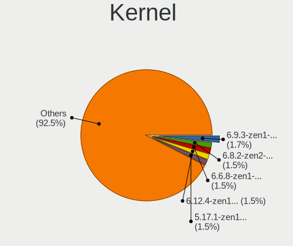
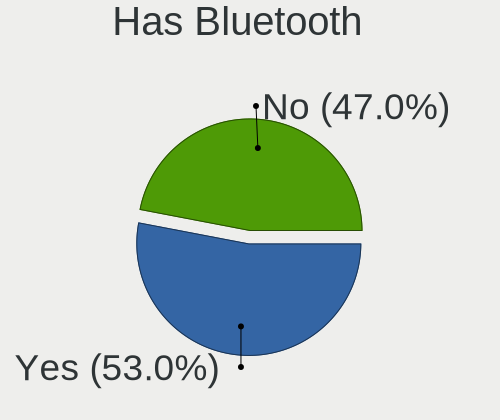
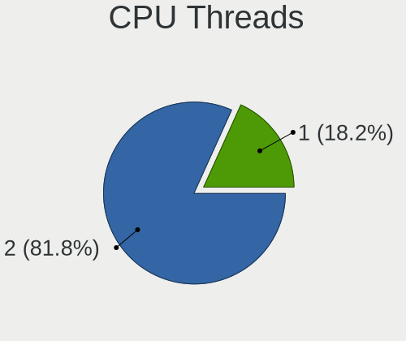
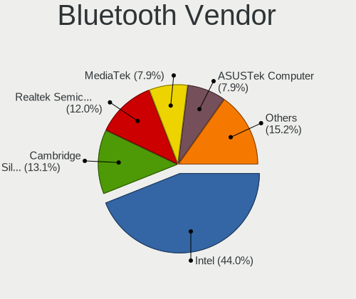
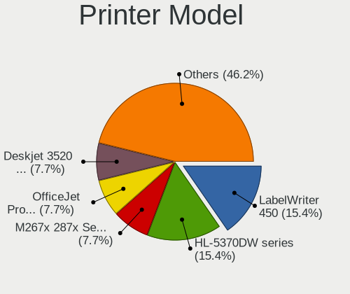
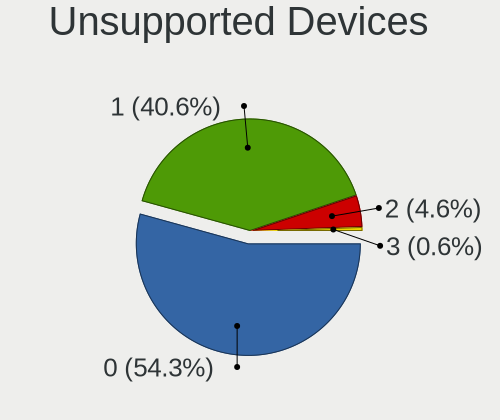
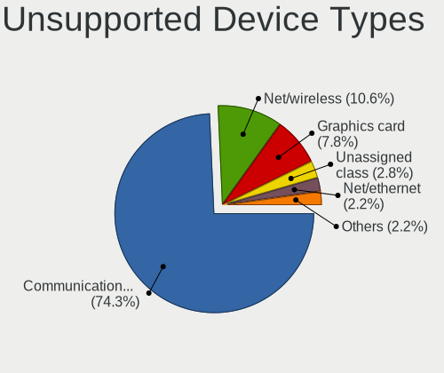

Garuda Linux - Tested Hardware & Statistics (Desktops)
------------------------------------------------------

A project to collect tested hardware configurations for Garuda Linux.

Anyone can contribute to this report by the [hw-probe](https://github.com/linuxhw/hw-probe) tool:

    sudo -E hw-probe -all -upload

Please contribute! Especially if your hardware is rare.

Contents
--------

* [ Test Cases ](#test-cases)

* [ System ](#system)
  - [ OS                       ](#os)
  - [ OS Family                ](#os-family)
  - [ Kernel                   ](#kernel)
  - [ Kernel Family            ](#kernel-family)
  - [ Kernel Major Ver.        ](#kernel-major-ver)
  - [ Arch                     ](#arch)
  - [ DE                       ](#de)
  - [ Display Server           ](#display-server)
  - [ Display Manager          ](#display-manager)
  - [ OS Lang                  ](#os-lang)
  - [ Boot Mode                ](#boot-mode)
  - [ Filesystem               ](#filesystem)
  - [ Part. scheme             ](#part-scheme)
  - [ Dual Boot with Linux/BSD ](#dual-boot-with-linuxbsd)
  - [ Dual Boot (Win)          ](#dual-boot-win)

* [ Board ](#board)
  - [ Vendor                   ](#vendor)
  - [ Model                    ](#model)
  - [ Model Family             ](#model-family)
  - [ MFG Year                 ](#mfg-year)
  - [ Form Factor              ](#form-factor)
  - [ Secure Boot              ](#secure-boot)
  - [ Coreboot                 ](#coreboot)
  - [ RAM Size                 ](#ram-size)
  - [ RAM Used                 ](#ram-used)
  - [ Total Drives             ](#total-drives)
  - [ Has CD-ROM               ](#has-cd-rom)
  - [ Has Ethernet             ](#has-ethernet)
  - [ Has WiFi                 ](#has-wifi)
  - [ Has Bluetooth            ](#has-bluetooth)

* [ Location ](#location)
  - [ Country                  ](#country)
  - [ City                     ](#city)

* [ Drives ](#drives)
  - [ Drive Vendor             ](#drive-vendor)
  - [ Drive Model              ](#drive-model)
  - [ HDD Vendor               ](#hdd-vendor)
  - [ SSD Vendor               ](#ssd-vendor)
  - [ Drive Kind               ](#drive-kind)
  - [ Drive Connector          ](#drive-connector)
  - [ Drive Size               ](#drive-size)
  - [ Space Total              ](#space-total)
  - [ Space Used               ](#space-used)
  - [ Malfunc. Drives          ](#malfunc-drives)
  - [ Malfunc. Drive Vendor    ](#malfunc-drive-vendor)
  - [ Malfunc. HDD Vendor      ](#malfunc-hdd-vendor)
  - [ Malfunc. Drive Kind      ](#malfunc-drive-kind)
  - [ Failed Drives            ](#failed-drives)
  - [ Failed Drive Vendor      ](#failed-drive-vendor)
  - [ Drive Status             ](#drive-status)

* [ Storage controller ](#storage-controller)
  - [ Storage Vendor           ](#storage-vendor)
  - [ Storage Model            ](#storage-model)
  - [ Storage Kind             ](#storage-kind)

* [ Processor ](#processor)
  - [ CPU Vendor               ](#cpu-vendor)
  - [ CPU Model                ](#cpu-model)
  - [ CPU Model Family         ](#cpu-model-family)
  - [ CPU Cores                ](#cpu-cores)
  - [ CPU Sockets              ](#cpu-sockets)
  - [ CPU Threads              ](#cpu-threads)
  - [ CPU Op-Modes             ](#cpu-op-modes)
  - [ CPU Microcode            ](#cpu-microcode)
  - [ CPU Microarch            ](#cpu-microarch)

* [ Graphics ](#graphics)
  - [ GPU Vendor               ](#gpu-vendor)
  - [ GPU Model                ](#gpu-model)
  - [ GPU Combo                ](#gpu-combo)
  - [ GPU Driver               ](#gpu-driver)
  - [ GPU Memory               ](#gpu-memory)

* [ Monitor ](#monitor)
  - [ Monitor Vendor           ](#monitor-vendor)
  - [ Monitor Model            ](#monitor-model)
  - [ Monitor Resolution       ](#monitor-resolution)
  - [ Monitor Diagonal         ](#monitor-diagonal)
  - [ Monitor Width            ](#monitor-width)
  - [ Aspect Ratio             ](#aspect-ratio)
  - [ Monitor Area             ](#monitor-area)
  - [ Pixel Density            ](#pixel-density)
  - [ Multiple Monitors        ](#multiple-monitors)

* [ Network ](#network)
  - [ Net Controller Vendor    ](#net-controller-vendor)
  - [ Net Controller Model     ](#net-controller-model)
  - [ Wireless Vendor          ](#wireless-vendor)
  - [ Wireless Model           ](#wireless-model)
  - [ Ethernet Vendor          ](#ethernet-vendor)
  - [ Ethernet Model           ](#ethernet-model)
  - [ Net Controller Kind      ](#net-controller-kind)
  - [ Used Controller          ](#used-controller)
  - [ NICs                     ](#nics)
  - [ IPv6                     ](#ipv6)

* [ Bluetooth ](#bluetooth)
  - [ Bluetooth Vendor         ](#bluetooth-vendor)
  - [ Bluetooth Model          ](#bluetooth-model)

* [ Sound ](#sound)
  - [ Sound Vendor             ](#sound-vendor)
  - [ Sound Model              ](#sound-model)

* [ Memory ](#memory)
  - [ Memory Vendor            ](#memory-vendor)
  - [ Memory Model             ](#memory-model)
  - [ Memory Kind              ](#memory-kind)
  - [ Memory Form Factor       ](#memory-form-factor)
  - [ Memory Size              ](#memory-size)
  - [ Memory Speed             ](#memory-speed)

* [ Printers & scanners ](#printers--scanners)
  - [ Printer Vendor           ](#printer-vendor)
  - [ Printer Model            ](#printer-model)
  - [ Scanner Vendor           ](#scanner-vendor)
  - [ Scanner Model            ](#scanner-model)

* [ Camera ](#camera)
  - [ Camera Vendor            ](#camera-vendor)
  - [ Camera Model             ](#camera-model)

* [ Security ](#security)
  - [ Fingerprint Vendor       ](#fingerprint-vendor)
  - [ Fingerprint Model        ](#fingerprint-model)
  - [ Chipcard Vendor          ](#chipcard-vendor)
  - [ Chipcard Model           ](#chipcard-model)

* [ Unsupported ](#unsupported)
  - [ Unsupported Devices      ](#unsupported-devices)
  - [ Unsupported Device Types ](#unsupported-device-types)

Test Cases
----------

Total: 511

| Vendor        | Model                       | Probe                                                      | Date         |
|---------------|-----------------------------|------------------------------------------------------------|--------------|
| MSI           | PRO B650-S WIFI             | [bf20a2de9e](https://linux-hardware.org/?probe=bf20a2de9e) | Jan 03, 2025 |
| MSI           | X470 GAMING PLUS MAX        | [b35c367d58](https://linux-hardware.org/?probe=b35c367d58) | Jan 03, 2025 |
| ASUSTek       | TUF Gaming B550-PLUS WIF... | [5c9bfe608f](https://linux-hardware.org/?probe=5c9bfe608f) | Dec 30, 2024 |
| Gigabyte      | B650 EAGLE AX               | [0524509879](https://linux-hardware.org/?probe=0524509879) | Dec 29, 2024 |
| MSI           | MPG X570 GAMING PLUS        | [497960e510](https://linux-hardware.org/?probe=497960e510) | Dec 28, 2024 |
| ASUSTek       | PRIME B450M-K II            | [dadb3385a3](https://linux-hardware.org/?probe=dadb3385a3) | Dec 26, 2024 |
| MSI           | PRO X870-P WIFI             | [e93d4e3b9c](https://linux-hardware.org/?probe=e93d4e3b9c) | Dec 26, 2024 |
| ASUSTek       | PRIME X370-PRO              | [3b87937167](https://linux-hardware.org/?probe=3b87937167) | Dec 25, 2024 |
| HP            | 18E7                        | [8aadcc618f](https://linux-hardware.org/?probe=8aadcc618f) | Dec 23, 2024 |
| Lenovo        | SHARKBAY 0B98401 PRO        | [7812efa4c0](https://linux-hardware.org/?probe=7812efa4c0) | Dec 22, 2024 |
| Dell          | 042P49 A00                  | [89c68a1188](https://linux-hardware.org/?probe=89c68a1188) | Dec 18, 2024 |
| MSI           | PRO X870-P WIFI             | [42ae1f2830](https://linux-hardware.org/?probe=42ae1f2830) | Dec 16, 2024 |
| Gigabyte      | B450 AORUS M                | [5b288ec021](https://linux-hardware.org/?probe=5b288ec021) | Dec 16, 2024 |
| Gigabyte      | 990FXA-UD3                  | [695e646513](https://linux-hardware.org/?probe=695e646513) | Dec 15, 2024 |
| Gigabyte      | 990FXA-UD3                  | [00a730597f](https://linux-hardware.org/?probe=00a730597f) | Dec 15, 2024 |
| MSI           | MAG B650 TOMAHAWK WIFI      | [e2d658580f](https://linux-hardware.org/?probe=e2d658580f) | Dec 10, 2024 |
| Biostar       | B350GT3                     | [9ba0340067](https://linux-hardware.org/?probe=9ba0340067) | Dec 10, 2024 |
| MSI           | PRO B550-VC                 | [5b3e1150f1](https://linux-hardware.org/?probe=5b3e1150f1) | Dec 08, 2024 |
| Gigabyte      | B660M DS3H DDR4             | [e026d0ed7b](https://linux-hardware.org/?probe=e026d0ed7b) | Dec 06, 2024 |
| MSI           | B450M MORTAR MAX            | [5ff5a0db06](https://linux-hardware.org/?probe=5ff5a0db06) | Dec 03, 2024 |
| MSI           | MAG B550 TOMAHAWK           | [a834234236](https://linux-hardware.org/?probe=a834234236) | Nov 30, 2024 |
| Gigabyte      | B550 AORUS ELITE            | [faa62fd31d](https://linux-hardware.org/?probe=faa62fd31d) | Nov 27, 2024 |
| ASUSTek       | TUF Gaming B650-PLUS        | [94e5e4047f](https://linux-hardware.org/?probe=94e5e4047f) | Nov 24, 2024 |
| HC Technol... | HCAR5000-MI                 | [277f85b96b](https://linux-hardware.org/?probe=277f85b96b) | Nov 21, 2024 |
| ASRock        | A620M-HDV/M.2+              | [6bf36eceff](https://linux-hardware.org/?probe=6bf36eceff) | Nov 21, 2024 |
| MSI           | MAG B550 TOMAHAWK           | [571dd6599b](https://linux-hardware.org/?probe=571dd6599b) | Nov 17, 2024 |
| Gigabyte      | AB350M-DS3H V2-CF           | [a386e4310c](https://linux-hardware.org/?probe=a386e4310c) | Nov 17, 2024 |
| MSI           | MPG B550 GAMING PLUS        | [5da217fd03](https://linux-hardware.org/?probe=5da217fd03) | Nov 16, 2024 |
| MSI           | MPG B550 GAMING PLUS        | [e3a4d58208](https://linux-hardware.org/?probe=e3a4d58208) | Nov 12, 2024 |
| Dell          | 0WN7Y6 A01                  | [cc23916a73](https://linux-hardware.org/?probe=cc23916a73) | Nov 06, 2024 |
| ASUSTek       | PRIME B660-PLUS D4          | [adedc3cad6](https://linux-hardware.org/?probe=adedc3cad6) | Oct 30, 2024 |
| ASUSTek       | ROG STRIX B450-F GAMING ... | [1299a69914](https://linux-hardware.org/?probe=1299a69914) | Oct 28, 2024 |
| Unknown       | Unknown                     | [07edcf4b71](https://linux-hardware.org/?probe=07edcf4b71) | Oct 27, 2024 |
| MSI           | MAG B550 TOMAHAWK MAX WI... | [98ad76578b](https://linux-hardware.org/?probe=98ad76578b) | Oct 27, 2024 |
| ASUSTek       | PRIME Z790-V AX             | [6cf269e31f](https://linux-hardware.org/?probe=6cf269e31f) | Oct 26, 2024 |
| Gigabyte      | Z790 AORUS ELITE AX DDR4    | [42d192db93](https://linux-hardware.org/?probe=42d192db93) | Oct 20, 2024 |
| ASUSTek       | TUF Gaming B550-PLUS WIF... | [214834c74c](https://linux-hardware.org/?probe=214834c74c) | Oct 09, 2024 |
| MSI           | B250M PRO-VDH               | [804981ff9b](https://linux-hardware.org/?probe=804981ff9b) | Oct 08, 2024 |
| MSI           | B360 GAMING PRO CARBON      | [4f51efa27b](https://linux-hardware.org/?probe=4f51efa27b) | Oct 08, 2024 |
| HP            | 18E4                        | [50cf02b67c](https://linux-hardware.org/?probe=50cf02b67c) | Oct 07, 2024 |
| MSI           | PRO H610M-G DDR4            | [385153fdf8](https://linux-hardware.org/?probe=385153fdf8) | Oct 06, 2024 |
| Gigabyte      | A620M H                     | [b144a036c9](https://linux-hardware.org/?probe=b144a036c9) | Oct 03, 2024 |
| ASUSTek       | B150 PRO GAMING D3          | [9342e97a46](https://linux-hardware.org/?probe=9342e97a46) | Sep 28, 2024 |
| ASUSTek       | ROG STRIX Z390-F GAMING     | [248886a2a4](https://linux-hardware.org/?probe=248886a2a4) | Sep 28, 2024 |
| ASUSTek       | PRIME B350-PLUS             | [316eac0f8f](https://linux-hardware.org/?probe=316eac0f8f) | Sep 26, 2024 |
| ASUSTek       | TUF Gaming B550-PLUS WIF... | [25f605fe0b](https://linux-hardware.org/?probe=25f605fe0b) | Sep 24, 2024 |
| MSI           | B350 TOMAHAWK               | [078f9d07a7](https://linux-hardware.org/?probe=078f9d07a7) | Sep 22, 2024 |
| Gigabyte      | Z390 AORUS ULTRA-CF         | [a6bb869814](https://linux-hardware.org/?probe=a6bb869814) | Sep 18, 2024 |
| ASUSTek       | TUF Gaming X570-PLUS        | [c89ae91f7e](https://linux-hardware.org/?probe=c89ae91f7e) | Sep 16, 2024 |
| ASRock        | B550M Steel Legend          | [aadc023cfc](https://linux-hardware.org/?probe=aadc023cfc) | Sep 15, 2024 |
| ASUSTek       | TUF Gaming X570-PLUS        | [19a2e3f88d](https://linux-hardware.org/?probe=19a2e3f88d) | Sep 13, 2024 |
| Dell          | 04VHC5 A05                  | [7f5c1dd188](https://linux-hardware.org/?probe=7f5c1dd188) | Sep 13, 2024 |
| ASRock        | B550 Phantom Gaming 4       | [8b4b16d6c1](https://linux-hardware.org/?probe=8b4b16d6c1) | Sep 11, 2024 |
| ASUSTek       | ProArt X670E-CREATOR WIF... | [07e25442a0](https://linux-hardware.org/?probe=07e25442a0) | Sep 09, 2024 |
| Dell          | 0R7HRW A02                  | [2eb397c5dc](https://linux-hardware.org/?probe=2eb397c5dc) | Sep 09, 2024 |
| ASUSTek       | M5A78L-M PLUS/USB3          | [b53daf6dc1](https://linux-hardware.org/?probe=b53daf6dc1) | Sep 09, 2024 |
| Dell          | 0R7HRW A02                  | [2e00c133ee](https://linux-hardware.org/?probe=2e00c133ee) | Sep 08, 2024 |
| MSI           | B360M BAZOOKA               | [c306aed70e](https://linux-hardware.org/?probe=c306aed70e) | Sep 08, 2024 |
| MSI           | X470 GAMING PLUS MAX        | [5db59ecfa9](https://linux-hardware.org/?probe=5db59ecfa9) | Sep 07, 2024 |
| MSI           | PRO B550M-VC WIFI           | [c5969aacc7](https://linux-hardware.org/?probe=c5969aacc7) | Sep 06, 2024 |
| ASRock        | B760M-STX                   | [4d715fcdab](https://linux-hardware.org/?probe=4d715fcdab) | Sep 05, 2024 |
| ASUSTek       | ROG STRIX B550-F GAMING ... | [6be41e3426](https://linux-hardware.org/?probe=6be41e3426) | Sep 01, 2024 |
| ASUSTek       | ROG STRIX X370-F GAMING     | [b8a3e200f4](https://linux-hardware.org/?probe=b8a3e200f4) | Aug 29, 2024 |
| MSI           | X370 GAMING PLUS            | [cccb0b55d2](https://linux-hardware.org/?probe=cccb0b55d2) | Aug 28, 2024 |
| Intel         | DP965LT AAD41694-210        | [5f5c266187](https://linux-hardware.org/?probe=5f5c266187) | Aug 25, 2024 |
| MSI           | PRO B760M-A WIFI            | [dffcb9242a](https://linux-hardware.org/?probe=dffcb9242a) | Aug 23, 2024 |
| ASUSTek       | ROG STRIX X570-E GAMING     | [4627f152d7](https://linux-hardware.org/?probe=4627f152d7) | Aug 22, 2024 |
| ASRock        | B760M-STX                   | [0a0fc81c8f](https://linux-hardware.org/?probe=0a0fc81c8f) | Aug 22, 2024 |
| Dell          | 07WP95 A01                  | [a4a7707426](https://linux-hardware.org/?probe=a4a7707426) | Aug 19, 2024 |
| ASUSTek       | P8Z77-V LK                  | [a2d890c354](https://linux-hardware.org/?probe=a2d890c354) | Aug 16, 2024 |
| ASUSTek       | TUF Gaming H570-PRO WIFI    | [6442ec1ebd](https://linux-hardware.org/?probe=6442ec1ebd) | Aug 11, 2024 |
| ASUSTek       | TUF Gaming H570-PRO WIFI    | [1a0b227011](https://linux-hardware.org/?probe=1a0b227011) | Aug 11, 2024 |
| Gigabyte      | H410M S2H                   | [699e2bba87](https://linux-hardware.org/?probe=699e2bba87) | Aug 08, 2024 |
| Intel         | DP965LT AAD41694-210        | [73798551a6](https://linux-hardware.org/?probe=73798551a6) | Aug 08, 2024 |
| ASRock        | B450M Pro4 R2.0             | [6864d163d8](https://linux-hardware.org/?probe=6864d163d8) | Aug 04, 2024 |
| Dell          | 0RW203                      | [f2871f9938](https://linux-hardware.org/?probe=f2871f9938) | Aug 02, 2024 |
| ONDA          | B550SD4-ITX Ver:1.02        | [1be8c45046](https://linux-hardware.org/?probe=1be8c45046) | Jul 30, 2024 |
| MSI           | B550 GAMING GEN3            | [5ab0ffc9aa](https://linux-hardware.org/?probe=5ab0ffc9aa) | Jul 28, 2024 |
| ASUSTek       | PRIME B450M-A II            | [9b93efc7fa](https://linux-hardware.org/?probe=9b93efc7fa) | Jul 25, 2024 |
| MSI           | X470 GAMING PLUS MAX        | [a1eee06fd3](https://linux-hardware.org/?probe=a1eee06fd3) | Jul 12, 2024 |
| ASUSTek       | TUF Gaming B650-PLUS        | [be094b7023](https://linux-hardware.org/?probe=be094b7023) | Jul 09, 2024 |
| MSI           | Z370 GAMING PLUS            | [c17844b884](https://linux-hardware.org/?probe=c17844b884) | Jul 05, 2024 |
| ASUSTek       | PRIME B350-PLUS             | [b98a7bf947](https://linux-hardware.org/?probe=b98a7bf947) | Jul 04, 2024 |
| MSI           | B450 TOMAHAWK MAX           | [01e4ba3dfd](https://linux-hardware.org/?probe=01e4ba3dfd) | Jul 02, 2024 |
| MSI           | B350 TOMAHAWK               | [f0ce44ea05](https://linux-hardware.org/?probe=f0ce44ea05) | Jun 29, 2024 |
| MSI           | PRO Z690-A WIFI DDR4        | [1cf081dbdb](https://linux-hardware.org/?probe=1cf081dbdb) | Jun 28, 2024 |
| Dell          | 0D28YY A03                  | [57fe8e4c14](https://linux-hardware.org/?probe=57fe8e4c14) | Jun 26, 2024 |
| MSI           | B550-A PRO                  | [cb97b1274c](https://linux-hardware.org/?probe=cb97b1274c) | Jun 21, 2024 |
| Gigabyte      | B550 AORUS ELITE V2         | [6900714a99](https://linux-hardware.org/?probe=6900714a99) | Jun 20, 2024 |
| Gigabyte      | B550I AORUS PRO AX          | [33624dc95e](https://linux-hardware.org/?probe=33624dc95e) | Jun 19, 2024 |
| MSI           | B450 TOMAHAWK MAX           | [f5ea2494d3](https://linux-hardware.org/?probe=f5ea2494d3) | Jun 18, 2024 |
| MSI           | B550-A PRO                  | [828e38468b](https://linux-hardware.org/?probe=828e38468b) | Jun 17, 2024 |
| ASRock        | B450M Steel Legend          | [ffc9e0875c](https://linux-hardware.org/?probe=ffc9e0875c) | Jun 17, 2024 |
| HP            | 18E4                        | [23b6d1c78c](https://linux-hardware.org/?probe=23b6d1c78c) | Jun 16, 2024 |
| Gigabyte      | Z370P D3-CF                 | [bdfb84bfc5](https://linux-hardware.org/?probe=bdfb84bfc5) | Jun 15, 2024 |
| Gigabyte      | Z370P D3-CF                 | [8c20971426](https://linux-hardware.org/?probe=8c20971426) | Jun 15, 2024 |
| ASUSTek       | ROG CROSSHAIR X670E HERO    | [2f452e7bed](https://linux-hardware.org/?probe=2f452e7bed) | Jun 14, 2024 |
| Intel         | DP965LT AAD41694-210        | [3e39a37742](https://linux-hardware.org/?probe=3e39a37742) | Jun 14, 2024 |
| Intel         | DP965LT AAD41694-210        | [0677434191](https://linux-hardware.org/?probe=0677434191) | Jun 13, 2024 |
| ECS           | A780GM-A                    | [577391284a](https://linux-hardware.org/?probe=577391284a) | Jun 12, 2024 |
| Gigabyte      | Z390 AORUS ELITE-CF         | [4cf9ebee56](https://linux-hardware.org/?probe=4cf9ebee56) | Jun 08, 2024 |
| ASUSTek       | PRIME A320M-K               | [aa4888abc9](https://linux-hardware.org/?probe=aa4888abc9) | Jun 08, 2024 |
| ASUSTek       | PRIME Z790-V AX             | [7685323b5f](https://linux-hardware.org/?probe=7685323b5f) | Jun 07, 2024 |
| MSI           | MAG B650 TOMAHAWK WIFI      | [5b3c45f75c](https://linux-hardware.org/?probe=5b3c45f75c) | Jun 06, 2024 |
| Gigabyte      | Z690 UD DDR4                | [f8802d8e00](https://linux-hardware.org/?probe=f8802d8e00) | Jun 06, 2024 |
| MSI           | B450 TOMAHAWK MAX II        | [df4dd0037c](https://linux-hardware.org/?probe=df4dd0037c) | Jun 06, 2024 |
| ASUSTek       | PRIME Z790-V AX             | [d5962dc0f4](https://linux-hardware.org/?probe=d5962dc0f4) | Jun 04, 2024 |
| MSI           | MPG B650 EDGE WIFI          | [e1adf09d60](https://linux-hardware.org/?probe=e1adf09d60) | Jun 02, 2024 |
| MSI           | MPG B650 EDGE WIFI          | [96cbb6e9fc](https://linux-hardware.org/?probe=96cbb6e9fc) | Jun 02, 2024 |
| MSI           | PRO B550-VC                 | [e70c5bf67b](https://linux-hardware.org/?probe=e70c5bf67b) | May 22, 2024 |
| HP            | 8053                        | [78a3be9668](https://linux-hardware.org/?probe=78a3be9668) | May 19, 2024 |
| ASUSTek       | Q87T                        | [6fda8ece6f](https://linux-hardware.org/?probe=6fda8ece6f) | May 15, 2024 |
| Dell          | 0YJMC0 A02                  | [80760046ec](https://linux-hardware.org/?probe=80760046ec) | May 13, 2024 |
| Dell          | 0X231R A00                  | [d20f0d688b](https://linux-hardware.org/?probe=d20f0d688b) | May 13, 2024 |
| ASUSTek       | PRIME X570-PRO              | [184ca6c080](https://linux-hardware.org/?probe=184ca6c080) | May 09, 2024 |
| ASUSTek       | PRIME X570-PRO              | [02dec94612](https://linux-hardware.org/?probe=02dec94612) | May 05, 2024 |
| ASRock        | 970 Extreme3                | [78a7df5736](https://linux-hardware.org/?probe=78a7df5736) | May 05, 2024 |
| MSI           | MEG Z390 ACE                | [d564c1c05f](https://linux-hardware.org/?probe=d564c1c05f) | May 03, 2024 |
| Gigabyte      | X470 AORUS ULTRA GAMING-... | [f40340d3fa](https://linux-hardware.org/?probe=f40340d3fa) | May 02, 2024 |
| Gigabyte      | B450 AORUS ELITE V2         | [b9f81199c9](https://linux-hardware.org/?probe=b9f81199c9) | Apr 30, 2024 |
| Gigabyte      | B650 AORUS ELITE AX V2      | [8076b425cd](https://linux-hardware.org/?probe=8076b425cd) | Apr 27, 2024 |
| ASUSTek       | Q87T                        | [2c7eb11783](https://linux-hardware.org/?probe=2c7eb11783) | Apr 23, 2024 |
| MSI           | B450M MORTAR MAX            | [4c3f0758e4](https://linux-hardware.org/?probe=4c3f0758e4) | Apr 22, 2024 |
| ASUSTek       | ROG CROSSHAIR X670E EXTR... | [9f8a1748ce](https://linux-hardware.org/?probe=9f8a1748ce) | Apr 22, 2024 |
| ASUSTek       | TUF Gaming B550-PLUS        | [9778349d4b](https://linux-hardware.org/?probe=9778349d4b) | Apr 18, 2024 |
| ASUSTek       | TUF Gaming B550-PLUS        | [c7e32d8f0c](https://linux-hardware.org/?probe=c7e32d8f0c) | Apr 18, 2024 |
| ASUSTek       | PRIME Z790-P WIFI           | [ac52751407](https://linux-hardware.org/?probe=ac52751407) | Apr 16, 2024 |
| GEEKOM        | Mini IT12                   | [fd2c385c1b](https://linux-hardware.org/?probe=fd2c385c1b) | Apr 16, 2024 |
| ASUSTek       | Q87T                        | [fdcc988e3a](https://linux-hardware.org/?probe=fdcc988e3a) | Apr 16, 2024 |
| MSI           | MPG X570 GAMING PRO CARB... | [85072c85db](https://linux-hardware.org/?probe=85072c85db) | Apr 11, 2024 |
| ASRock        | B550M-ITX/ac                | [edf7dfcacb](https://linux-hardware.org/?probe=edf7dfcacb) | Apr 10, 2024 |
| GEEKOM        | Mini IT12                   | [a5050366da](https://linux-hardware.org/?probe=a5050366da) | Apr 09, 2024 |
| ASUSTek       | PRIME B450M-A II            | [ec1a7c3951](https://linux-hardware.org/?probe=ec1a7c3951) | Apr 09, 2024 |
| ASUSTek       | TUF B350M-PLUS GAMING       | [91ae8a8c4b](https://linux-hardware.org/?probe=91ae8a8c4b) | Apr 07, 2024 |
| ASRock        | A620M-HDV/M.2+              | [79ed318799](https://linux-hardware.org/?probe=79ed318799) | Apr 06, 2024 |
| ASUSTek       | ROG STRIX B450-I GAMING     | [d0b50bb8cf](https://linux-hardware.org/?probe=d0b50bb8cf) | Apr 06, 2024 |
| MSI           | MPG X570 GAMING PLUS        | [282f54846f](https://linux-hardware.org/?probe=282f54846f) | Apr 05, 2024 |
| ASUSTek       | TUF Gaming X570-PRO         | [fc81346f79](https://linux-hardware.org/?probe=fc81346f79) | Apr 04, 2024 |
| ASRock        | B550M-ITX/ac                | [82cd14327e](https://linux-hardware.org/?probe=82cd14327e) | Mar 28, 2024 |
| GEEKOM        | Mini IT12                   | [55440632d5](https://linux-hardware.org/?probe=55440632d5) | Mar 20, 2024 |
| ASUSTek       | PRIME X370-PRO              | [38ef3d13d7](https://linux-hardware.org/?probe=38ef3d13d7) | Mar 16, 2024 |
| ASRock        | Z97M Pro4                   | [d82ec98b2f](https://linux-hardware.org/?probe=d82ec98b2f) | Mar 14, 2024 |
| ASUSTek       | ROG CROSSHAIR X670E EXTR... | [5ff5755d30](https://linux-hardware.org/?probe=5ff5755d30) | Mar 13, 2024 |
| Foxconn       | 2ABF                        | [edaf44f04b](https://linux-hardware.org/?probe=edaf44f04b) | Mar 10, 2024 |
| MSI           | H610M BOMBER DDR4           | [8795e218dc](https://linux-hardware.org/?probe=8795e218dc) | Mar 10, 2024 |
| Huanan        | X99-F8 GAMING V2.0          | [ce05cbee18](https://linux-hardware.org/?probe=ce05cbee18) | Mar 02, 2024 |
| ASRock        | X470 Taichi                 | [798acc343c](https://linux-hardware.org/?probe=798acc343c) | Feb 29, 2024 |
| Lenovo        | SHARKBAY 31900058 STD       | [37c0d2130b](https://linux-hardware.org/?probe=37c0d2130b) | Feb 28, 2024 |
| HP            | 8053                        | [29dcf353b5](https://linux-hardware.org/?probe=29dcf353b5) | Feb 24, 2024 |
| MSI           | MAG X570S TORPEDO MAX       | [acb58aeb0d](https://linux-hardware.org/?probe=acb58aeb0d) | Feb 21, 2024 |
| Fujitsu       | D3221-A1 S26361-D3221-A1    | [d6a420d5e4](https://linux-hardware.org/?probe=d6a420d5e4) | Feb 18, 2024 |
| ASUSTek       | ProArt B550-CREATOR         | [7749f91798](https://linux-hardware.org/?probe=7749f91798) | Feb 18, 2024 |
| Fujitsu       | D3221-A1 S26361-D3221-A1    | [14f9f1afa9](https://linux-hardware.org/?probe=14f9f1afa9) | Feb 17, 2024 |
| Gigabyte      | B450M K-CF                  | [c58dd08065](https://linux-hardware.org/?probe=c58dd08065) | Jan 31, 2024 |
| ASRock        | B550M-ITX/ac                | [5996127f6c](https://linux-hardware.org/?probe=5996127f6c) | Jan 31, 2024 |
| ASUSTek       | PRIME Z590-A                | [907099b1e7](https://linux-hardware.org/?probe=907099b1e7) | Jan 29, 2024 |
| Gigabyte      | X570S AERO G                | [f485006061](https://linux-hardware.org/?probe=f485006061) | Jan 28, 2024 |
| Gigabyte      | B450M S2H                   | [5f1537cd10](https://linux-hardware.org/?probe=5f1537cd10) | Jan 19, 2024 |
| Dell          | 0D24M8 A00                  | [521b297c38](https://linux-hardware.org/?probe=521b297c38) | Jan 19, 2024 |
| ASUSTek       | SABERTOOTH 990FX R2.0       | [d4da037a11](https://linux-hardware.org/?probe=d4da037a11) | Jan 17, 2024 |
| ASUSTek       | PRIME B350-PLUS             | [52d8f5119e](https://linux-hardware.org/?probe=52d8f5119e) | Jan 15, 2024 |
| ASRock        | X470 Taichi                 | [85ada6019c](https://linux-hardware.org/?probe=85ada6019c) | Jan 15, 2024 |
| MSI           | B350M MORTAR                | [0462bdbc4d](https://linux-hardware.org/?probe=0462bdbc4d) | Jan 14, 2024 |
| ASUSTek       | TUF Gaming B550-PLUS        | [f618c2c6b8](https://linux-hardware.org/?probe=f618c2c6b8) | Jan 10, 2024 |
| ASUSTek       | TUF Gaming B550-PLUS        | [af4d83b40f](https://linux-hardware.org/?probe=af4d83b40f) | Jan 10, 2024 |
| ASUSTek       | PRIME B350-PLUS             | [9e7c6246dc](https://linux-hardware.org/?probe=9e7c6246dc) | Jan 05, 2024 |
| Gigabyte      | AX370-Gaming 3-CF           | [e984790c53](https://linux-hardware.org/?probe=e984790c53) | Jan 04, 2024 |
| ASRock        | X470 Taichi                 | [93ce6b9074](https://linux-hardware.org/?probe=93ce6b9074) | Jan 02, 2024 |
| Gigabyte      | Z370P D3-CF                 | [4c2ef0d59a](https://linux-hardware.org/?probe=4c2ef0d59a) | Dec 30, 2023 |
| NZXT          | N7 B550                     | [2ce2b46a02](https://linux-hardware.org/?probe=2ce2b46a02) | Dec 27, 2023 |
| Intel         | X99-P4 V5.0                 | [875d756d73](https://linux-hardware.org/?probe=875d756d73) | Dec 26, 2023 |
| Gigabyte      | B450 AORUS ELITE            | [c3b34cdeb4](https://linux-hardware.org/?probe=c3b34cdeb4) | Dec 26, 2023 |
| Gigabyte      | Z370P D3-CF                 | [7fcdc0004a](https://linux-hardware.org/?probe=7fcdc0004a) | Dec 25, 2023 |
| HC Technol... | HCAR5000-MI                 | [16f9dec3e0](https://linux-hardware.org/?probe=16f9dec3e0) | Dec 20, 2023 |
| ASUSTek       | ROG STRIX B450-F GAMING     | [67c84a4903](https://linux-hardware.org/?probe=67c84a4903) | Dec 19, 2023 |
| HP            | 2B18                        | [7015a76fe4](https://linux-hardware.org/?probe=7015a76fe4) | Dec 15, 2023 |
| MSI           | H310M PRO-M2 PLUS           | [60461068e8](https://linux-hardware.org/?probe=60461068e8) | Dec 13, 2023 |
| ASUSTek       | TUF Gaming X570-PLUS        | [241c795a70](https://linux-hardware.org/?probe=241c795a70) | Dec 10, 2023 |
| ASUSTek       | TUF B450M-PLUS GAMING       | [d46afc319c](https://linux-hardware.org/?probe=d46afc319c) | Nov 30, 2023 |
| AZW           | MINI S 10                   | [f71053bf5c](https://linux-hardware.org/?probe=f71053bf5c) | Nov 30, 2023 |
| ASUSTek       | ROG STRIX B650E-I GAMING... | [7077c34a71](https://linux-hardware.org/?probe=7077c34a71) | Nov 27, 2023 |
| ASUSTek       | TUF Gaming B550-PLUS WIF... | [77db088b52](https://linux-hardware.org/?probe=77db088b52) | Nov 26, 2023 |
| Acer          | Predator PO3-620            | [a052f2ee36](https://linux-hardware.org/?probe=a052f2ee36) | Nov 25, 2023 |
| ASUSTek       | TUF Gaming B550-PLUS WIF... | [c8ae454aca](https://linux-hardware.org/?probe=c8ae454aca) | Nov 20, 2023 |
| ASUSTek       | TUF Gaming B550-PLUS WIF... | [89c0fabbb5](https://linux-hardware.org/?probe=89c0fabbb5) | Nov 17, 2023 |
| MSI           | Z370 PC PRO                 | [e9e98d1041](https://linux-hardware.org/?probe=e9e98d1041) | Nov 14, 2023 |
| ASUSTek       | ROG STRIX X570-F GAMING     | [17acb71f9d](https://linux-hardware.org/?probe=17acb71f9d) | Nov 05, 2023 |
| ASUSTek       | PRIME B350-PLUS             | [4a6383e886](https://linux-hardware.org/?probe=4a6383e886) | Nov 04, 2023 |
| MSI           | PRO Z690-A WIFI DDR4        | [b84c515650](https://linux-hardware.org/?probe=b84c515650) | Nov 02, 2023 |
| ASRock        | X670E Steel Legend          | [d802042506](https://linux-hardware.org/?probe=d802042506) | Oct 31, 2023 |
| ASRock        | H77 Pro4-M                  | [83aeda3c64](https://linux-hardware.org/?probe=83aeda3c64) | Oct 30, 2023 |
| MSI           | PRO Z690-A WIFI DDR4        | [bf5f9098d7](https://linux-hardware.org/?probe=bf5f9098d7) | Oct 28, 2023 |
| Intel         | H55                         | [f8788bcc72](https://linux-hardware.org/?probe=f8788bcc72) | Oct 27, 2023 |
| ASUSTek       | PRIME B350-PLUS             | [92c4516951](https://linux-hardware.org/?probe=92c4516951) | Oct 27, 2023 |
| HP            | 3397                        | [50b7d4272d](https://linux-hardware.org/?probe=50b7d4272d) | Oct 26, 2023 |
| Dell          | 0WN7Y6 A01                  | [4b2be75f68](https://linux-hardware.org/?probe=4b2be75f68) | Oct 24, 2023 |
| Dell          | 0WN7Y6 A01                  | [4323d57b2f](https://linux-hardware.org/?probe=4323d57b2f) | Oct 23, 2023 |
| MSI           | MPG B650 EDGE WIFI          | [73fdacf30c](https://linux-hardware.org/?probe=73fdacf30c) | Oct 18, 2023 |
| MSI           | MPG B650 EDGE WIFI          | [5902fdf35f](https://linux-hardware.org/?probe=5902fdf35f) | Oct 18, 2023 |
| Gigabyte      | B550 AORUS PRO AC           | [04d307e685](https://linux-hardware.org/?probe=04d307e685) | Oct 16, 2023 |
| MSI           | MAG B650 TOMAHAWK WIFI      | [e30927f66e](https://linux-hardware.org/?probe=e30927f66e) | Oct 12, 2023 |
| HP            | 8053                        | [52151555cb](https://linux-hardware.org/?probe=52151555cb) | Oct 11, 2023 |
| HP            | 8053                        | [d1ce4588e7](https://linux-hardware.org/?probe=d1ce4588e7) | Oct 11, 2023 |
| ASUSTek       | TUF Gaming B550-PLUS WIF... | [49d0e884bb](https://linux-hardware.org/?probe=49d0e884bb) | Oct 08, 2023 |
| ASUSTek       | PRIME X470-PRO              | [61fef3256c](https://linux-hardware.org/?probe=61fef3256c) | Oct 07, 2023 |
| ASUSTek       | TUF Gaming B550-PLUS WIF... | [3d613c96a8](https://linux-hardware.org/?probe=3d613c96a8) | Oct 06, 2023 |
| ASUSTek       | TUF Gaming B550M-PLUS       | [8bc96db254](https://linux-hardware.org/?probe=8bc96db254) | Oct 06, 2023 |
| Intel         | X99                         | [61579851ef](https://linux-hardware.org/?probe=61579851ef) | Oct 05, 2023 |
| ASUSTek       | TUF Gaming B550-PLUS WIF... | [9410b590b4](https://linux-hardware.org/?probe=9410b590b4) | Oct 05, 2023 |
| ASUSTek       | TUF Gaming B550-PLUS WIF... | [2a6facae05](https://linux-hardware.org/?probe=2a6facae05) | Oct 05, 2023 |
| Intel         | X99                         | [67ec0ac8d0](https://linux-hardware.org/?probe=67ec0ac8d0) | Oct 02, 2023 |
| Unknown       | TB-5000                     | [9c67baa34f](https://linux-hardware.org/?probe=9c67baa34f) | Sep 29, 2023 |
| Gigabyte      | B550 AORUS PRO AC           | [ecef286c2a](https://linux-hardware.org/?probe=ecef286c2a) | Sep 26, 2023 |
| HP            | 1998                        | [60208f6be9](https://linux-hardware.org/?probe=60208f6be9) | Sep 22, 2023 |
| Gigabyte      | Z790 UD AX                  | [5995975e04](https://linux-hardware.org/?probe=5995975e04) | Sep 16, 2023 |
| Gigabyte      | 970A-DS3P                   | [fa347b6b46](https://linux-hardware.org/?probe=fa347b6b46) | Sep 15, 2023 |
| Dell          | 0GY6Y8 A02                  | [623cd3e438](https://linux-hardware.org/?probe=623cd3e438) | Sep 14, 2023 |
| Gigabyte      | AX370-Gaming 3-CF           | [b037f9322d](https://linux-hardware.org/?probe=b037f9322d) | Sep 10, 2023 |
| ASUSTek       | M51BC                       | [647634e7fb](https://linux-hardware.org/?probe=647634e7fb) | Sep 10, 2023 |
| ASUSTek       | TUF Gaming B550-PLUS WIF... | [5330a96ef6](https://linux-hardware.org/?probe=5330a96ef6) | Sep 07, 2023 |
| Gigabyte      | X570 AORUS MASTER           | [fde9e1a454](https://linux-hardware.org/?probe=fde9e1a454) | Aug 20, 2023 |
| ASUSTek       | M51BC                       | [4a81412fdd](https://linux-hardware.org/?probe=4a81412fdd) | Aug 20, 2023 |
| Gigabyte      | Z390 AORUS ULTRA-CF         | [9c90e63339](https://linux-hardware.org/?probe=9c90e63339) | Aug 17, 2023 |
| ASUSTek       | ROG STRIX X570-I GAMING     | [f0b1f6f364](https://linux-hardware.org/?probe=f0b1f6f364) | Aug 17, 2023 |
| ASUSTek       | PRIME H410M-E               | [a9d7216b70](https://linux-hardware.org/?probe=a9d7216b70) | Aug 15, 2023 |
| Gigabyte      | GA-MA770T-UD3               | [4dc7a0831b](https://linux-hardware.org/?probe=4dc7a0831b) | Aug 14, 2023 |
| Dell          | 0KV62T A00                  | [369b0195cc](https://linux-hardware.org/?probe=369b0195cc) | Aug 14, 2023 |
| MSI           | MPG X570 GAMING PRO CARB... | [ef08441bc9](https://linux-hardware.org/?probe=ef08441bc9) | Aug 13, 2023 |
| ASUSTek       | ROG STRIX X570-E GAMING ... | [b0f8b16669](https://linux-hardware.org/?probe=b0f8b16669) | Aug 13, 2023 |
| ASRock        | B450M-HDV R4.0              | [6855901c02](https://linux-hardware.org/?probe=6855901c02) | Aug 12, 2023 |
| HP            | 8433 11                     | [de06cea570](https://linux-hardware.org/?probe=de06cea570) | Aug 10, 2023 |
| HP            | 8433 11                     | [4275d43a74](https://linux-hardware.org/?probe=4275d43a74) | Aug 10, 2023 |
| Gigabyte      | B560 DS3H AC-Y1             | [af88e64084](https://linux-hardware.org/?probe=af88e64084) | Aug 04, 2023 |
| MSI           | MPG X570 GAMING PRO CARB... | [88e9cc22bf](https://linux-hardware.org/?probe=88e9cc22bf) | Aug 03, 2023 |
| MSI           | MPG X570 GAMING PRO CARB... | [52319a8cef](https://linux-hardware.org/?probe=52319a8cef) | Aug 03, 2023 |
| MSI           | B450 TOMAHAWK               | [6b736ced64](https://linux-hardware.org/?probe=6b736ced64) | Aug 03, 2023 |
| ASUSTek       | TUF Gaming X670E-PLUS WI... | [a5467c396a](https://linux-hardware.org/?probe=a5467c396a) | Jul 28, 2023 |
| MSI           | MPG X570 GAMING PLUS        | [3a59ab6dd1](https://linux-hardware.org/?probe=3a59ab6dd1) | Jul 26, 2023 |
| HP            | 18E7                        | [1638b42b8b](https://linux-hardware.org/?probe=1638b42b8b) | Jul 23, 2023 |
| HP            | 18E7                        | [909788f739](https://linux-hardware.org/?probe=909788f739) | Jul 23, 2023 |
| ASRock        | B250M Pro4                  | [9ce9a989dd](https://linux-hardware.org/?probe=9ce9a989dd) | Jul 23, 2023 |
| Biostar       | B350GT3                     | [41d95e4e81](https://linux-hardware.org/?probe=41d95e4e81) | Jul 22, 2023 |
| Alienware     | 07W25T A00                  | [24dade96af](https://linux-hardware.org/?probe=24dade96af) | Jul 21, 2023 |
| Shenzhen M... | HX90G                       | [f42afac191](https://linux-hardware.org/?probe=f42afac191) | Jul 15, 2023 |
| ASUSTek       | PRIME Z690-P D4             | [b91bb21dfc](https://linux-hardware.org/?probe=b91bb21dfc) | Jul 10, 2023 |
| HP            | 8053                        | [4241a715e6](https://linux-hardware.org/?probe=4241a715e6) | Jul 09, 2023 |
| ASRock        | B450M-HDV R4.0              | [f24ba1fb9c](https://linux-hardware.org/?probe=f24ba1fb9c) | Jul 09, 2023 |
| ASUSTek       | Rampage V EDITION 10        | [54611e82ec](https://linux-hardware.org/?probe=54611e82ec) | Jul 06, 2023 |
| Gigabyte      | Z490 GAMING X               | [5e8900dde2](https://linux-hardware.org/?probe=5e8900dde2) | Jul 02, 2023 |
| Gigabyte      | Z490 GAMING X               | [b819a1fb21](https://linux-hardware.org/?probe=b819a1fb21) | Jul 02, 2023 |
| ASRock        | X470 Taichi                 | [529873f796](https://linux-hardware.org/?probe=529873f796) | Jul 02, 2023 |
| HP            | 1998                        | [cee46b5772](https://linux-hardware.org/?probe=cee46b5772) | Jul 01, 2023 |
| Shenzhen M... | HX90G                       | [d1d0bb38d0](https://linux-hardware.org/?probe=d1d0bb38d0) | Jun 20, 2023 |
| ASUSTek       | TUF Gaming X570-PLUS        | [2278cd4d03](https://linux-hardware.org/?probe=2278cd4d03) | Jun 17, 2023 |
| Biostar       | B350GT3                     | [13b1026096](https://linux-hardware.org/?probe=13b1026096) | Jun 13, 2023 |
| ASUSTek       | ROG STRIX B550-A GAMING     | [933978a1ae](https://linux-hardware.org/?probe=933978a1ae) | Jun 07, 2023 |
| ASUSTek       | TUF Gaming X570-PLUS        | [21b7236d20](https://linux-hardware.org/?probe=21b7236d20) | Jun 03, 2023 |
| Lenovo        | ThinkCentre M58p 6137AU8    | [bd80dea70f](https://linux-hardware.org/?probe=bd80dea70f) | May 29, 2023 |
| ASUSTek       | Rampage V EDITION 10        | [a7fbdc21bc](https://linux-hardware.org/?probe=a7fbdc21bc) | May 26, 2023 |
| Win elemen... | M600                        | [4c5d685663](https://linux-hardware.org/?probe=4c5d685663) | May 21, 2023 |
| ASUSTek       | ROG STRIX B650E-F GAMING... | [262bc7c88f](https://linux-hardware.org/?probe=262bc7c88f) | May 21, 2023 |
| Win elemen... | M600                        | [84de4a3207](https://linux-hardware.org/?probe=84de4a3207) | May 20, 2023 |
| ASUSTek       | TUF Gaming B550-PLUS        | [194f7f96e5](https://linux-hardware.org/?probe=194f7f96e5) | May 13, 2023 |
| ASUSTek       | TUF Gaming X570-PLUS        | [fda523de2a](https://linux-hardware.org/?probe=fda523de2a) | May 11, 2023 |
| ASUSTek       | Z170 PRO GAMING             | [3b4eb54186](https://linux-hardware.org/?probe=3b4eb54186) | May 08, 2023 |
| Intel         | DH67CL AAG10212-210         | [3f2fa70636](https://linux-hardware.org/?probe=3f2fa70636) | May 06, 2023 |
| MSI           | MAG B550 TOMAHAWK           | [7a5a0f75aa](https://linux-hardware.org/?probe=7a5a0f75aa) | May 01, 2023 |
| Intel         | DH67CL AAG10212-210         | [7d6b0027b3](https://linux-hardware.org/?probe=7d6b0027b3) | Apr 30, 2023 |
| ASRock        | A320M-HD                    | [43b57e5088](https://linux-hardware.org/?probe=43b57e5088) | Apr 28, 2023 |
| Intel         | DH67CL AAG10212-210         | [cb87589d9f](https://linux-hardware.org/?probe=cb87589d9f) | Apr 28, 2023 |
| Shenzhen M... | F7BFC                       | [bb189b2507](https://linux-hardware.org/?probe=bb189b2507) | Apr 22, 2023 |
| Gigabyte      | X670 AORUS ELITE AX         | [d9fd347989](https://linux-hardware.org/?probe=d9fd347989) | Apr 20, 2023 |
| Gigabyte      | X670 AORUS ELITE AX         | [d5adb940b4](https://linux-hardware.org/?probe=d5adb940b4) | Apr 19, 2023 |
| Intel         | DH67CL AAG10212-210         | [8519b4cda2](https://linux-hardware.org/?probe=8519b4cda2) | Apr 15, 2023 |
| Gigabyte      | B550M AORUS PRO-P           | [424d545740](https://linux-hardware.org/?probe=424d545740) | Apr 14, 2023 |
| Acer          | Veriton K8-680G V:1.0       | [9ab3fc183a](https://linux-hardware.org/?probe=9ab3fc183a) | Apr 13, 2023 |
| Win elemen... | M600                        | [7723a03558](https://linux-hardware.org/?probe=7723a03558) | Apr 10, 2023 |
| Win elemen... | M600                        | [e20927ec15](https://linux-hardware.org/?probe=e20927ec15) | Apr 10, 2023 |
| Gigabyte      | Z690 GAMING X DDR4          | [e2521c6d93](https://linux-hardware.org/?probe=e2521c6d93) | Apr 09, 2023 |
| HP            | 8053                        | [9897b3e51f](https://linux-hardware.org/?probe=9897b3e51f) | Apr 04, 2023 |
| ASUSTek       | M5A78L-M LX PLUS            | [7a2bce56b1](https://linux-hardware.org/?probe=7a2bce56b1) | Mar 26, 2023 |
| HP            | 8053                        | [82eb90837f](https://linux-hardware.org/?probe=82eb90837f) | Mar 21, 2023 |
| ASUSTek       | ROG STRIX X670E-I GAMING... | [40372e4af3](https://linux-hardware.org/?probe=40372e4af3) | Mar 19, 2023 |
| MSI           | B450-A PRO MAX              | [15f0543609](https://linux-hardware.org/?probe=15f0543609) | Mar 19, 2023 |
| ASUSTek       | ROG STRIX X670E-I GAMING... | [9d10f13efc](https://linux-hardware.org/?probe=9d10f13efc) | Mar 18, 2023 |
| HP            | 8053                        | [273a6c822b](https://linux-hardware.org/?probe=273a6c822b) | Mar 12, 2023 |
| HP            | 8053                        | [be27383efc](https://linux-hardware.org/?probe=be27383efc) | Mar 11, 2023 |
| ASUSTek       | ROG STRIX X670E-I GAMING... | [51b92fb276](https://linux-hardware.org/?probe=51b92fb276) | Mar 11, 2023 |
| Dell          | 0VYXHD A00                  | [d7618c5b6c](https://linux-hardware.org/?probe=d7618c5b6c) | Mar 08, 2023 |
| ASUSTek       | BT6130                      | [3549cfad14](https://linux-hardware.org/?probe=3549cfad14) | Feb 27, 2023 |
| MSI           | MAG B760 TOMAHAWK WIFI D... | [575a7f4897](https://linux-hardware.org/?probe=575a7f4897) | Feb 26, 2023 |
| MSI           | MAG B760 TOMAHAWK WIFI D... | [466f8533fb](https://linux-hardware.org/?probe=466f8533fb) | Feb 26, 2023 |
| ASUSTek       | ROG STRIX X570-E GAMING     | [fad109dc98](https://linux-hardware.org/?probe=fad109dc98) | Feb 25, 2023 |
| MSI           | MAG B650 TOMAHAWK WIFI      | [a53235325f](https://linux-hardware.org/?probe=a53235325f) | Feb 23, 2023 |
| MSI           | MPG X570 GAMING PLUS        | [bd6a746c89](https://linux-hardware.org/?probe=bd6a746c89) | Feb 20, 2023 |
| MSI           | B450-A PRO                  | [014bf5276e](https://linux-hardware.org/?probe=014bf5276e) | Feb 17, 2023 |
| ASUSTek       | BT6130                      | [db3b191eb2](https://linux-hardware.org/?probe=db3b191eb2) | Feb 13, 2023 |
| ASRock        | A520M-ITX/ac                | [a6e401a1d3](https://linux-hardware.org/?probe=a6e401a1d3) | Feb 09, 2023 |
| Intel         | X79M-S                      | [91ab5e33ed](https://linux-hardware.org/?probe=91ab5e33ed) | Feb 03, 2023 |
| ASUSTek       | TUF Gaming Z690-PLUS D4     | [d6d4c6c38c](https://linux-hardware.org/?probe=d6d4c6c38c) | Jan 31, 2023 |
| ASUSTek       | PRIME Z490-A                | [91dbb8d045](https://linux-hardware.org/?probe=91dbb8d045) | Jan 26, 2023 |
| Intel         | X79M-S                      | [ccad523936](https://linux-hardware.org/?probe=ccad523936) | Jan 22, 2023 |
| ASUSTek       | PRIME A320M-A               | [918dbdb148](https://linux-hardware.org/?probe=918dbdb148) | Jan 22, 2023 |
| ASUSTek       | Rampage IV GENE             | [64553c4fd7](https://linux-hardware.org/?probe=64553c4fd7) | Jan 17, 2023 |
| MSI           | B450M PRO-VDH MAX           | [87e7a60bfa](https://linux-hardware.org/?probe=87e7a60bfa) | Jan 15, 2023 |
| ASUSTek       | CM6850                      | [7eac1c6a7a](https://linux-hardware.org/?probe=7eac1c6a7a) | Jan 13, 2023 |
| ASUSTek       | P8H61/USB3 R2.0             | [5e29a1afb7](https://linux-hardware.org/?probe=5e29a1afb7) | Jan 10, 2023 |
| ASUSTek       | P8H61/USB3 R2.0             | [8daa546122](https://linux-hardware.org/?probe=8daa546122) | Jan 09, 2023 |
| Gigabyte      | X570 I AORUS PRO WIFI       | [919b259ea2](https://linux-hardware.org/?probe=919b259ea2) | Jan 09, 2023 |
| ASUSTek       | PRIME X570-P                | [95c21fc90e](https://linux-hardware.org/?probe=95c21fc90e) | Jan 09, 2023 |
| Gigabyte      | GA-78LMT-USB3               | [d759bb7551](https://linux-hardware.org/?probe=d759bb7551) | Jan 08, 2023 |
| MSI           | H61M-E22/W8                 | [92280cb6ae](https://linux-hardware.org/?probe=92280cb6ae) | Jan 06, 2023 |
| ASUSTek       | PRIME B360M-C               | [7685480bf0](https://linux-hardware.org/?probe=7685480bf0) | Jan 05, 2023 |
| Intel         | X79M-S                      | [3b38d8023e](https://linux-hardware.org/?probe=3b38d8023e) | Jan 03, 2023 |
| Dell          | 0VHWTR A02                  | [0d9d6203e1](https://linux-hardware.org/?probe=0d9d6203e1) | Jan 03, 2023 |
| Intel         | X79M-S                      | [5c97a3976d](https://linux-hardware.org/?probe=5c97a3976d) | Jan 01, 2023 |
| ASUSTek       | TUF Gaming B660M-E D4       | [a294963db9](https://linux-hardware.org/?probe=a294963db9) | Jan 01, 2023 |
| Lenovo        | Win8 Pro DPK TPG            | [9561e51689](https://linux-hardware.org/?probe=9561e51689) | Dec 31, 2022 |
| Intel         | H61                         | [39f3cddffb](https://linux-hardware.org/?probe=39f3cddffb) | Dec 29, 2022 |
| ASUSTek       | ROG STRIX B450-F GAMING ... | [ee98173357](https://linux-hardware.org/?probe=ee98173357) | Dec 27, 2022 |
| ASRock        | X570 Taichi                 | [e48882ad67](https://linux-hardware.org/?probe=e48882ad67) | Dec 22, 2022 |
| ASUSTek       | PRIME Z390-P                | [1a9f9ac05f](https://linux-hardware.org/?probe=1a9f9ac05f) | Dec 22, 2022 |
| Lenovo        | Win8 Pro DPK TPG            | [7ce8a10de4](https://linux-hardware.org/?probe=7ce8a10de4) | Dec 21, 2022 |
| Lenovo        | Win8 Pro DPK TPG            | [a4c1397ad3](https://linux-hardware.org/?probe=a4c1397ad3) | Dec 21, 2022 |
| BESSTAR Te... | B550                        | [d9fbac807d](https://linux-hardware.org/?probe=d9fbac807d) | Dec 10, 2022 |
| ASRock        | Z77 Pro3                    | [a2e7958d4a](https://linux-hardware.org/?probe=a2e7958d4a) | Dec 08, 2022 |
| ASRock        | Z77 Pro3                    | [3184df2bf6](https://linux-hardware.org/?probe=3184df2bf6) | Dec 07, 2022 |
| Gigabyte      | 990FXA-UD3                  | [54d896b9ed](https://linux-hardware.org/?probe=54d896b9ed) | Dec 06, 2022 |
| MSI           | H510I PRO WIFI              | [f46e59c772](https://linux-hardware.org/?probe=f46e59c772) | Nov 27, 2022 |
| Dell          | 0K3CM7 A00                  | [27109cda18](https://linux-hardware.org/?probe=27109cda18) | Nov 20, 2022 |
| Dell          | 0K3CM7 A00                  | [6dbdd86e08](https://linux-hardware.org/?probe=6dbdd86e08) | Nov 20, 2022 |
| HP            | 8767 A                      | [375e0d4525](https://linux-hardware.org/?probe=375e0d4525) | Nov 19, 2022 |
| Gigabyte      | 990FXA-UD3                  | [985fb6d758](https://linux-hardware.org/?probe=985fb6d758) | Nov 16, 2022 |
| Dell          | 0K3CM7 A00                  | [3c426cb32b](https://linux-hardware.org/?probe=3c426cb32b) | Nov 14, 2022 |
| ASRock        | X470 Taichi                 | [7cd5f4c280](https://linux-hardware.org/?probe=7cd5f4c280) | Nov 05, 2022 |
| ASRock        | X470 Taichi                 | [d808be6d90](https://linux-hardware.org/?probe=d808be6d90) | Oct 31, 2022 |
| HP            | 2B2C                        | [6f90b1e25e](https://linux-hardware.org/?probe=6f90b1e25e) | Oct 26, 2022 |
| ASUSTek       | PRIME X570-P                | [5558f9e3f7](https://linux-hardware.org/?probe=5558f9e3f7) | Oct 23, 2022 |
| Acer          | Aspire TC-780               | [fd6c66dac7](https://linux-hardware.org/?probe=fd6c66dac7) | Oct 22, 2022 |
| ASUSTek       | PRIME X570-P                | [a7d6f0bd9e](https://linux-hardware.org/?probe=a7d6f0bd9e) | Oct 15, 2022 |
| Gigabyte      | B550 AORUS ELITE V2         | [541e327f0f](https://linux-hardware.org/?probe=541e327f0f) | Oct 01, 2022 |
| ASUSTek       | PRIME X570-P                | [6647dc20ac](https://linux-hardware.org/?probe=6647dc20ac) | Sep 21, 2022 |
| ASUSTek       | TUF Gaming X570-PLUS        | [9d0697ec96](https://linux-hardware.org/?probe=9d0697ec96) | Sep 20, 2022 |
| ASRock        | A320M-HDV R4.0              | [afbb849b02](https://linux-hardware.org/?probe=afbb849b02) | Sep 11, 2022 |
| ASRock        | A320M-HDV R4.0              | [5e98f641f1](https://linux-hardware.org/?probe=5e98f641f1) | Sep 11, 2022 |
| ASUSTek       | ROG CROSSHAIR VIII HERO     | [ac65980e25](https://linux-hardware.org/?probe=ac65980e25) | Sep 02, 2022 |
| Gigabyte      | F2A88XM-HD3                 | [44e355eb93](https://linux-hardware.org/?probe=44e355eb93) | Aug 30, 2022 |
| ASRock        | X470 Taichi                 | [7bc56eb3d4](https://linux-hardware.org/?probe=7bc56eb3d4) | Aug 25, 2022 |
| MSI           | B450 TOMAHAWK MAX II        | [57f1970999](https://linux-hardware.org/?probe=57f1970999) | Aug 20, 2022 |
| ASUSTek       | PRIME X570-P                | [fc5923b017](https://linux-hardware.org/?probe=fc5923b017) | Aug 15, 2022 |
| ASUSTek       | PRIME X570-P                | [e53bbe7c1b](https://linux-hardware.org/?probe=e53bbe7c1b) | Aug 14, 2022 |
| MSI           | A68HM-E33 V2                | [762f08a697](https://linux-hardware.org/?probe=762f08a697) | Aug 13, 2022 |
| ASRock        | A520M-HDV                   | [f23bdacb56](https://linux-hardware.org/?probe=f23bdacb56) | Aug 11, 2022 |
| ASUSTek       | Maximus IX FORMULA          | [2212732244](https://linux-hardware.org/?probe=2212732244) | Aug 01, 2022 |
| MSI           | B450M PRO-VDH MAX           | [941092ee95](https://linux-hardware.org/?probe=941092ee95) | Jul 26, 2022 |
| MSI           | B450 TOMAHAWK MAX II        | [dfe6047aa7](https://linux-hardware.org/?probe=dfe6047aa7) | Jul 21, 2022 |
| Gigabyte      | X570 AORUS PRO WIFI         | [f9996d6494](https://linux-hardware.org/?probe=f9996d6494) | Jul 21, 2022 |
| ASUSTek       | ROG STRIX X570-E GAMING     | [92fe4c2ff3](https://linux-hardware.org/?probe=92fe4c2ff3) | Jul 03, 2022 |
| ASUSTek       | PRIME B550-PLUS AC-HES      | [dde2246ae8](https://linux-hardware.org/?probe=dde2246ae8) | Jul 01, 2022 |
| ASRock        | Z87M Extreme4               | [06504aecc5](https://linux-hardware.org/?probe=06504aecc5) | Jun 24, 2022 |
| Gigabyte      | Z77X-UD3H                   | [7d7828a253](https://linux-hardware.org/?probe=7d7828a253) | Jun 23, 2022 |
| MSI           | B550-A PRO                  | [a7a76f04f9](https://linux-hardware.org/?probe=a7a76f04f9) | Jun 19, 2022 |
| MSI           | B450M MORTAR MAX            | [e1f785770e](https://linux-hardware.org/?probe=e1f785770e) | Jun 11, 2022 |
| T-bao         | MINI PC V1.0                | [8108463ab7](https://linux-hardware.org/?probe=8108463ab7) | Jun 09, 2022 |
| ASRock        | Z87M Extreme4               | [5ca7bb09b0](https://linux-hardware.org/?probe=5ca7bb09b0) | Jun 05, 2022 |
| ASRock        | X470 Taichi                 | [114aa0b977](https://linux-hardware.org/?probe=114aa0b977) | May 22, 2022 |
| Lenovo        | 3716 SDK0T76463 WIN 3422... | [cd15058963](https://linux-hardware.org/?probe=cd15058963) | May 16, 2022 |
| Lenovo        | 3716 SDK0T76463 WIN 3422... | [4043d7e26a](https://linux-hardware.org/?probe=4043d7e26a) | May 11, 2022 |
| Gigabyte      | B450 I AORUS PRO WIFI-CF    | [8c34e423f4](https://linux-hardware.org/?probe=8c34e423f4) | May 04, 2022 |
| ASRock        | X470 Taichi                 | [bd151331c1](https://linux-hardware.org/?probe=bd151331c1) | May 04, 2022 |
| Dell          | 0WR7PY A01                  | [66c6e57421](https://linux-hardware.org/?probe=66c6e57421) | Apr 23, 2022 |
| ASRock        | B550M Pro4                  | [b82721163b](https://linux-hardware.org/?probe=b82721163b) | Apr 22, 2022 |
| ASRock        | X99X Killer                 | [c6d6bddd17](https://linux-hardware.org/?probe=c6d6bddd17) | Apr 18, 2022 |
| ASUSTek       | Z97-P                       | [bf54ec19d0](https://linux-hardware.org/?probe=bf54ec19d0) | Apr 16, 2022 |
| ASRock        | X99X Killer                 | [3be92995ff](https://linux-hardware.org/?probe=3be92995ff) | Apr 11, 2022 |
| ASRock        | X470 Taichi                 | [ba87ebf29f](https://linux-hardware.org/?probe=ba87ebf29f) | Apr 08, 2022 |
| ASUSTek       | P8B75-M                     | [808661699f](https://linux-hardware.org/?probe=808661699f) | Apr 07, 2022 |
| HP            | 8433 11                     | [30c5d1d62f](https://linux-hardware.org/?probe=30c5d1d62f) | Apr 03, 2022 |
| MSI           | B450-A PRO MAX              | [a47ab656ab](https://linux-hardware.org/?probe=a47ab656ab) | Apr 01, 2022 |
| Gigabyte      | B550 GAMING X V2            | [3d37374fae](https://linux-hardware.org/?probe=3d37374fae) | Apr 01, 2022 |
| ASUSTek       | A68HM-PLUS                  | [cd6ebcba97](https://linux-hardware.org/?probe=cd6ebcba97) | Mar 31, 2022 |
| ASRock        | X470 Taichi                 | [f339c6f710](https://linux-hardware.org/?probe=f339c6f710) | Mar 29, 2022 |
| ASUSTek       | ROG CROSSHAIR VIII HERO     | [fc5cdc4595](https://linux-hardware.org/?probe=fc5cdc4595) | Mar 23, 2022 |
| MSI           | MPG B550 GAMING CARBON W... | [c1a26607fd](https://linux-hardware.org/?probe=c1a26607fd) | Mar 13, 2022 |
| MSI           | MAG B550 TOMAHAWK           | [95b7c99a5a](https://linux-hardware.org/?probe=95b7c99a5a) | Mar 08, 2022 |
| ASRock        | B450 Gaming K4              | [504b20acce](https://linux-hardware.org/?probe=504b20acce) | Mar 04, 2022 |
| ASUSTek       | TUF Gaming X570-PLUS        | [336ddc137d](https://linux-hardware.org/?probe=336ddc137d) | Mar 01, 2022 |
| ASUSTek       | A68HM-PLUS                  | [edfa6eb6e3](https://linux-hardware.org/?probe=edfa6eb6e3) | Feb 28, 2022 |
| ASUSTek       | ProArt X570-CREATOR WIFI    | [abc925b917](https://linux-hardware.org/?probe=abc925b917) | Feb 26, 2022 |
| ASUSTek       | M4A89TD PRO USB3            | [66c0fc8423](https://linux-hardware.org/?probe=66c0fc8423) | Feb 26, 2022 |
| ASRock        | X470 Taichi                 | [df78a2fff6](https://linux-hardware.org/?probe=df78a2fff6) | Feb 14, 2022 |
| HP            | 8767 A                      | [e048574911](https://linux-hardware.org/?probe=e048574911) | Feb 12, 2022 |
| ASUSTek       | ROG Maximus XII FORMULA     | [a63d909e46](https://linux-hardware.org/?probe=a63d909e46) | Feb 12, 2022 |
| HP            | 8767 A                      | [6cb1e6b72f](https://linux-hardware.org/?probe=6cb1e6b72f) | Feb 12, 2022 |
| ASUSTek       | ROG Maximus XII FORMULA     | [885617bdda](https://linux-hardware.org/?probe=885617bdda) | Feb 12, 2022 |
| ASRock        | B450M Pro4                  | [0d80dc8143](https://linux-hardware.org/?probe=0d80dc8143) | Feb 11, 2022 |
| Lenovo        | 31900058 STD                | [03540e9cb2](https://linux-hardware.org/?probe=03540e9cb2) | Feb 07, 2022 |
| ASRock        | X470 Taichi                 | [e4beeac4a1](https://linux-hardware.org/?probe=e4beeac4a1) | Feb 06, 2022 |
| Gigabyte      | MFLP3AP-00\2.x              | [b7441a0e94](https://linux-hardware.org/?probe=b7441a0e94) | Jan 31, 2022 |
| ASRock        | X470 Taichi                 | [aa0e21b159](https://linux-hardware.org/?probe=aa0e21b159) | Jan 27, 2022 |
| Gigabyte      | B85-HD3                     | [ad70601774](https://linux-hardware.org/?probe=ad70601774) | Jan 26, 2022 |
| ASRock        | 970M Pro3                   | [402a4f960e](https://linux-hardware.org/?probe=402a4f960e) | Jan 17, 2022 |
| ASUSTek       | ROG Maximus X CODE          | [8fac80f31d](https://linux-hardware.org/?probe=8fac80f31d) | Jan 16, 2022 |
| Gigabyte      | AB350-Gaming 3-CF           | [9fab263b02](https://linux-hardware.org/?probe=9fab263b02) | Jan 11, 2022 |
| MSI           | Z270 GAMING M5              | [02d70182fd](https://linux-hardware.org/?probe=02d70182fd) | Jan 10, 2022 |
| Gigabyte      | AB350-Gaming 3-CF           | [8a1167daea](https://linux-hardware.org/?probe=8a1167daea) | Jan 08, 2022 |
| ASUSTek       | TUF Gaming X570-PLUS        | [1a4570a458](https://linux-hardware.org/?probe=1a4570a458) | Jan 08, 2022 |
| Pegatron      | 2AD5                        | [91ee5ba1df](https://linux-hardware.org/?probe=91ee5ba1df) | Jan 08, 2022 |
| Gigabyte      | B460M DS3H                  | [40f4de9da7](https://linux-hardware.org/?probe=40f4de9da7) | Jan 07, 2022 |
| Gigabyte      | B550 AORUS PRO AC           | [1b62246b10](https://linux-hardware.org/?probe=1b62246b10) | Dec 21, 2021 |
| ASUSTek       | TUF Gaming X570-PLUS        | [9e73346fb8](https://linux-hardware.org/?probe=9e73346fb8) | Dec 15, 2021 |
| Gigabyte      | X570 AORUS ELITE WIFI       | [196b460373](https://linux-hardware.org/?probe=196b460373) | Dec 13, 2021 |
| ASRock        | H77M-ITX                    | [5e98a2fce2](https://linux-hardware.org/?probe=5e98a2fce2) | Dec 11, 2021 |
| ASRock        | B450M Pro4                  | [e4fb1e4fe4](https://linux-hardware.org/?probe=e4fb1e4fe4) | Dec 09, 2021 |
| Lenovo        | ThinkStation S20 4105O1U    | [731c890641](https://linux-hardware.org/?probe=731c890641) | Dec 08, 2021 |
| ASUSTek       | TUF Gaming X570-PLUS        | [f0df07c0e4](https://linux-hardware.org/?probe=f0df07c0e4) | Dec 06, 2021 |
| Acer          | Aspire TC-895 V:1.0         | [c743459a71](https://linux-hardware.org/?probe=c743459a71) | Dec 04, 2021 |
| ASUSTek       | H87M-E                      | [2b4abcf54f](https://linux-hardware.org/?probe=2b4abcf54f) | Dec 02, 2021 |
| ASUSTek       | H87M-E                      | [72cf0ed74d](https://linux-hardware.org/?probe=72cf0ed74d) | Dec 02, 2021 |
| Lenovo        | ThinkStation S20 4105O1U    | [f031548aac](https://linux-hardware.org/?probe=f031548aac) | Dec 01, 2021 |
| Lenovo        | ThinkStation S20 4105O1U    | [48f73af82d](https://linux-hardware.org/?probe=48f73af82d) | Nov 30, 2021 |
| ASRock        | X470 Taichi                 | [0b1d816eff](https://linux-hardware.org/?probe=0b1d816eff) | Nov 28, 2021 |
| ASUSTek       | Rampage IV EXTREME          | [50999d4796](https://linux-hardware.org/?probe=50999d4796) | Nov 14, 2021 |
| ASUSTek       | TUF Gaming X570-PLUS        | [cd295bb56c](https://linux-hardware.org/?probe=cd295bb56c) | Nov 04, 2021 |
| ASRock        | X470 Taichi                 | [86f08832c0](https://linux-hardware.org/?probe=86f08832c0) | Oct 31, 2021 |
| ASUSTek       | P8B75-M                     | [2130c28d33](https://linux-hardware.org/?probe=2130c28d33) | Oct 27, 2021 |
| MSI           | Z77A-G43                    | [3bd9604ae7](https://linux-hardware.org/?probe=3bd9604ae7) | Oct 20, 2021 |
| MSI           | B460M PRO-VDH WIFI          | [76071ec77b](https://linux-hardware.org/?probe=76071ec77b) | Oct 19, 2021 |
| MSI           | B450M-A PRO MAX             | [4148046f02](https://linux-hardware.org/?probe=4148046f02) | Oct 17, 2021 |
| ASRock        | X470 Taichi                 | [ff6b763448](https://linux-hardware.org/?probe=ff6b763448) | Oct 16, 2021 |
| Fujitsu       | D3120-A1 S26361-D3120-A1    | [fdd8f9dd8e](https://linux-hardware.org/?probe=fdd8f9dd8e) | Sep 17, 2021 |
| Fujitsu       | D3120-A1 S26361-D3120-A1    | [ab3ad8009e](https://linux-hardware.org/?probe=ab3ad8009e) | Sep 16, 2021 |
| ASUSTek       | PRIME B450M-K               | [b8b49f201f](https://linux-hardware.org/?probe=b8b49f201f) | Sep 14, 2021 |
| MSI           | H310M PRO-VDH PLUS          | [65fcfef06f](https://linux-hardware.org/?probe=65fcfef06f) | Aug 27, 2021 |
| Alienware     | 0TYR0X A00                  | [5ea23ebfb2](https://linux-hardware.org/?probe=5ea23ebfb2) | Aug 19, 2021 |
| ASRock        | X399 Professional Gaming    | [bb53a385c3](https://linux-hardware.org/?probe=bb53a385c3) | Aug 19, 2021 |
| Medion        | H110H4-EM2                  | [f4e01958e5](https://linux-hardware.org/?probe=f4e01958e5) | Aug 10, 2021 |
| ASRock        | X470 Taichi                 | [a919fef17f](https://linux-hardware.org/?probe=a919fef17f) | Aug 07, 2021 |
| MSI           | Z97 MPOWER                  | [dee7d3af4a](https://linux-hardware.org/?probe=dee7d3af4a) | Aug 06, 2021 |
| MSI           | Z97 MPOWER                  | [f30e5a3a86](https://linux-hardware.org/?probe=f30e5a3a86) | Aug 06, 2021 |
| ASUSTek       | ROG STRIX B550-F GAMING     | [826edd51bc](https://linux-hardware.org/?probe=826edd51bc) | Jul 07, 2021 |
| Gigabyte      | X470 AORUS ULTRA GAMING-... | [aa05cca9b7](https://linux-hardware.org/?probe=aa05cca9b7) | Jun 30, 2021 |
| Biostar       | H310MHP                     | [0d3f648f3e](https://linux-hardware.org/?probe=0d3f648f3e) | Jun 30, 2021 |
| Lenovo        | SHARKBAY SDK0E50510 WIN     | [fb3d7de63c](https://linux-hardware.org/?probe=fb3d7de63c) | Jun 26, 2021 |
| MSI           | A320M-HDV R4.0              | [486775a989](https://linux-hardware.org/?probe=486775a989) | Jun 23, 2021 |
| MSI           | A320M-HDV R4.0              | [4629f86f56](https://linux-hardware.org/?probe=4629f86f56) | Jun 22, 2021 |
| MSI           | A320M-HDV R4.0              | [69dea4e3cf](https://linux-hardware.org/?probe=69dea4e3cf) | Jun 22, 2021 |
| MSI           | A320M-HDV R4.0              | [2fd89c951e](https://linux-hardware.org/?probe=2fd89c951e) | Jun 22, 2021 |
| MSI           | X370 GAMING PRO CARBON      | [9ead1e1bb5](https://linux-hardware.org/?probe=9ead1e1bb5) | Jun 22, 2021 |
| ASUSTek       | ROG STRIX B550-F GAMING     | [8144c83b50](https://linux-hardware.org/?probe=8144c83b50) | Jun 22, 2021 |
| ASUSTek       | ROG STRIX B550-F GAMING     | [376c0ff95d](https://linux-hardware.org/?probe=376c0ff95d) | Jun 15, 2021 |
| Gigabyte      | B550I AORUS PRO AX          | [34801a2f74](https://linux-hardware.org/?probe=34801a2f74) | Jun 12, 2021 |
| ASUSTek       | ROG CROSSHAIR VII HERO      | [51e1e33185](https://linux-hardware.org/?probe=51e1e33185) | May 20, 2021 |
| MSI           | B350M GAMING PRO            | [c04e6666e7](https://linux-hardware.org/?probe=c04e6666e7) | May 20, 2021 |
| Dell          | 0D28YY A02                  | [14edf3bd00](https://linux-hardware.org/?probe=14edf3bd00) | May 16, 2021 |
| Gigabyte      | A320M-S2H-CF                | [066f815622](https://linux-hardware.org/?probe=066f815622) | May 12, 2021 |
| HP            | 844C                        | [29f7cf64ce](https://linux-hardware.org/?probe=29f7cf64ce) | May 06, 2021 |
| HP            | 844C                        | [0534f06ec4](https://linux-hardware.org/?probe=0534f06ec4) | May 06, 2021 |
| ASUSTek       | PRIME Z590-A                | [cb3058760e](https://linux-hardware.org/?probe=cb3058760e) | May 04, 2021 |
| Gigabyte      | P67A-UD3-B3                 | [08ea956bfa](https://linux-hardware.org/?probe=08ea956bfa) | Apr 24, 2021 |
| MSI           | Z87 MPOWER                  | [ff6aa3811c](https://linux-hardware.org/?probe=ff6aa3811c) | Apr 08, 2021 |
| ASRock        | AB350M-HDV                  | [23502edac5](https://linux-hardware.org/?probe=23502edac5) | Apr 01, 2021 |
| ASRock        | AB350M-HDV                  | [13b2fdddc0](https://linux-hardware.org/?probe=13b2fdddc0) | Apr 01, 2021 |
| Dell          | 07KY25 A01                  | [8c4f2f9922](https://linux-hardware.org/?probe=8c4f2f9922) | Mar 31, 2021 |
| Dell          | 07KY25 A01                  | [1b9efb1b29](https://linux-hardware.org/?probe=1b9efb1b29) | Mar 24, 2021 |
| Gigabyte      | B450 AORUS M                | [097a0d616c](https://linux-hardware.org/?probe=097a0d616c) | Mar 18, 2021 |
| Gigabyte      | B450 AORUS M                | [22054ffd75](https://linux-hardware.org/?probe=22054ffd75) | Mar 18, 2021 |
| HP            | 2AF7                        | [e0639ea4a5](https://linux-hardware.org/?probe=e0639ea4a5) | Mar 11, 2021 |
| HP            | 2AF7                        | [fb8d76722c](https://linux-hardware.org/?probe=fb8d76722c) | Mar 11, 2021 |
| ASUSTek       | ROG STRIX B550-F GAMING     | [c1f22a7521](https://linux-hardware.org/?probe=c1f22a7521) | Mar 05, 2021 |
| Gigabyte      | GA-MA790FXT-UD5P            | [404dab2464](https://linux-hardware.org/?probe=404dab2464) | Feb 27, 2021 |
| ASRock        | FM2A88X Extreme6+           | [13f9fc2ef3](https://linux-hardware.org/?probe=13f9fc2ef3) | Feb 18, 2021 |
| ASUSTek       | ROG STRIX B550-F GAMING     | [2e19f3b1af](https://linux-hardware.org/?probe=2e19f3b1af) | Feb 18, 2021 |
| Dell          | 0C2KJT A00                  | [f821a0035b](https://linux-hardware.org/?probe=f821a0035b) | Feb 12, 2021 |
| ASUSTek       | PRIME B360M-K               | [b73941c431](https://linux-hardware.org/?probe=b73941c431) | Feb 08, 2021 |
| HP            | 1825                        | [3b6b80db46](https://linux-hardware.org/?probe=3b6b80db46) | Jan 31, 2021 |
| HP            | 1825                        | [1df894dea4](https://linux-hardware.org/?probe=1df894dea4) | Jan 31, 2021 |
| ASRock        | X470 Master SLI             | [36eaf717e9](https://linux-hardware.org/?probe=36eaf717e9) | Jan 26, 2021 |
| ASRock        | X470 Master SLI             | [b1be9375c0](https://linux-hardware.org/?probe=b1be9375c0) | Jan 24, 2021 |
| ASUSTek       | ROG STRIX X570-E GAMING     | [7332b50f98](https://linux-hardware.org/?probe=7332b50f98) | Jan 24, 2021 |
| ASUSTek       | PRIME H270-PLUS             | [3f895b585b](https://linux-hardware.org/?probe=3f895b585b) | Jan 22, 2021 |
| Lenovo        | SHARKBAY 0B98401 PRO        | [61976e9745](https://linux-hardware.org/?probe=61976e9745) | Jan 18, 2021 |
| MSI           | X399 SLI PLUS               | [e392838a54](https://linux-hardware.org/?probe=e392838a54) | Jan 10, 2021 |
| ASUSTek       | CM5671                      | [069344a54e](https://linux-hardware.org/?probe=069344a54e) | Jan 07, 2021 |
| MSI           | B85-G43 GAMING              | [8fe013f04a](https://linux-hardware.org/?probe=8fe013f04a) | Jan 04, 2021 |
| ASRock        | G41M-VS3                    | [e1217b1871](https://linux-hardware.org/?probe=e1217b1871) | Jan 02, 2021 |
| Pegatron      | 2AC2A                       | [436a2ca3ce](https://linux-hardware.org/?probe=436a2ca3ce) | Dec 25, 2020 |
| Pegatron      | 2AC2A                       | [2df3b195c6](https://linux-hardware.org/?probe=2df3b195c6) | Dec 25, 2020 |
| ASUSTek       | PRIME Z370-P                | [35365be0e8](https://linux-hardware.org/?probe=35365be0e8) | Dec 19, 2020 |
| MSI           | Z390-A PRO                  | [ea7a52fdac](https://linux-hardware.org/?probe=ea7a52fdac) | Dec 16, 2020 |
| ASUSTek       | ROG STRIX B550-F GAMING     | [62a5c95d51](https://linux-hardware.org/?probe=62a5c95d51) | Dec 14, 2020 |
| HP            | 8643 SMVB                   | [dccfba36f1](https://linux-hardware.org/?probe=dccfba36f1) | Dec 06, 2020 |
| Gigabyte      | B450 AORUS ELITE            | [2a35d394f9](https://linux-hardware.org/?probe=2a35d394f9) | Dec 04, 2020 |
| MSI           | Z390-A PRO                  | [05e3eb32c9](https://linux-hardware.org/?probe=05e3eb32c9) | Dec 03, 2020 |
| MSI           | Z390-A PRO                  | [dc6ea9bfb8](https://linux-hardware.org/?probe=dc6ea9bfb8) | Nov 29, 2020 |
| ASUSTek       | M5A97 LE R2.0               | [d4b3f84c86](https://linux-hardware.org/?probe=d4b3f84c86) | Nov 28, 2020 |
| Gigabyte      | B450 AORUS M                | [a3d68dc126](https://linux-hardware.org/?probe=a3d68dc126) | Nov 19, 2020 |
| Gigabyte      | B450 AORUS M                | [d9faeae0d4](https://linux-hardware.org/?probe=d9faeae0d4) | Nov 19, 2020 |
| Gigabyte      | X570 AORUS PRO WIFI         | [11c79940a4](https://linux-hardware.org/?probe=11c79940a4) | Nov 19, 2020 |
| HP            | 18E7                        | [f84cbfd465](https://linux-hardware.org/?probe=f84cbfd465) | Nov 10, 2020 |
| Gigabyte      | X570 AORUS PRO WIFI         | [79608bd849](https://linux-hardware.org/?probe=79608bd849) | Nov 06, 2020 |
| ASUSTek       | ROG STRIX B550-F GAMING     | [e80ddac12f](https://linux-hardware.org/?probe=e80ddac12f) | Nov 02, 2020 |
| ASUSTek       | ROG STRIX B550-F GAMING     | [876b039494](https://linux-hardware.org/?probe=876b039494) | Nov 01, 2020 |
| Gigabyte      | X570 AORUS PRO WIFI         | [4e573bc6ff](https://linux-hardware.org/?probe=4e573bc6ff) | Oct 28, 2020 |
| MSI           | MPG B550 GAMING EDGE WIF... | [4b9d2b77cb](https://linux-hardware.org/?probe=4b9d2b77cb) | Oct 26, 2020 |
| ASUSTek       | PRIME X399-A                | [b7772d9ff8](https://linux-hardware.org/?probe=b7772d9ff8) | Oct 13, 2020 |
| Dell          | 0R6JMP A00                  | [c4cbec5b80](https://linux-hardware.org/?probe=c4cbec5b80) | Oct 11, 2020 |
| OEM           | Unknown                     | [2e7a212437](https://linux-hardware.org/?probe=2e7a212437) | Sep 26, 2020 |
| Lenovo        | ThinkCentre M91p 7033CG1    | [c08fed8ecb](https://linux-hardware.org/?probe=c08fed8ecb) | Sep 11, 2020 |
| ASUSTek       | Maximus VIII FORMULA        | [7b8babe846](https://linux-hardware.org/?probe=7b8babe846) | Aug 27, 2020 |
| ASUSTek       | Maximus VIII FORMULA        | [73462df387](https://linux-hardware.org/?probe=73462df387) | Aug 07, 2020 |

...

See full list of test cases in the file [Test_Cases.md](</Dist/Garuda_Linux/Desktop/Test_Cases.md>).

System
------

OS
--

Installed operating systems

| Name                 | Desktops | Percent |
|----------------------|----------|---------|
| Garuda Linux Soaring | 201      | 57.59%  |
| Garuda Linux Rolling | 94       | 26.93%  |
| Garuda Linux         | 54       | 15.47%  |

OS Family
---------

OS without a version

| Name         | Desktops | Percent |
|--------------|----------|---------|
| Garuda Linux | 340      | 100%    |

Kernel
------

Version of the Linux kernel

| Version            | Desktops | Percent |
|--------------------|----------|---------|
| 6.9.3-zen1-1-zen   | 7        | 1.69%   |
| 6.8.2-zen2-1-zen   | 6        | 1.45%   |
| 6.6.8-zen1-1-zen   | 6        | 1.45%   |
| 6.12.4-zen1-1-zen  | 6        | 1.45%   |
| 5.17.1-zen1-1-zen  | 6        | 1.45%   |
| 6.5.9-zen2-1-zen   | 5        | 1.21%   |
| 6.10.6-zen1-1-zen  | 5        | 1.21%   |
| 6.9.7-zen1-1-zen   | 4        | 0.97%   |
| 6.7.9-zen1-1-zen   | 4        | 0.97%   |
| 6.6.7-zen1-1-zen   | 4        | 0.97%   |
| 6.4.10-zen2-1-zen  | 4        | 0.97%   |
| 6.2.10-zen1-1-zen  | 4        | 0.97%   |
| 6.11.5-zen1-1-zen  | 4        | 0.97%   |
| 6.10.8-zen1-1-zen  | 4        | 0.97%   |
| 6.10.10-zen1-1-zen | 4        | 0.97%   |
| 6.1.12-zen1-1-zen  | 4        | 0.97%   |
| 6.1.1-zen1-1-zen   | 4        | 0.97%   |
| 5.15.7-zen1-1-zen  | 4        | 0.97%   |
| 5.10.4-107-tkg-bmq | 4        | 0.97%   |
| 6.9.5-zen1-1-zen   | 3        | 0.73%   |
| 6.9.4-zen1-1-zen   | 3        | 0.73%   |
| 6.8.9-zen1-1-zen   | 3        | 0.73%   |
| 6.8.7-zen1-2-zen   | 3        | 0.73%   |
| 6.8.5-zen1-1-zen   | 3        | 0.73%   |
| 6.7.5-zen1-1-zen   | 3        | 0.73%   |
| 6.7.0-zen3-1-zen   | 3        | 0.73%   |
| 6.5.5-zen1-1-zen   | 3        | 0.73%   |
| 6.5.4-zen2-1-zen   | 3        | 0.73%   |
| 6.5.2-zen1-1-zen   | 3        | 0.73%   |
| 6.4.6-zen1-1-zen   | 3        | 0.73%   |
| 6.4.12-zen1-1-zen  | 3        | 0.73%   |
| 6.3.2-zen1-1-zen   | 3        | 0.73%   |
| 6.11.1-zen1-1-zen  | 3        | 0.73%   |
| 6.1.8-zen1-1-zen   | 3        | 0.73%   |
| 6.0.2-zen1-1-zen   | 3        | 0.73%   |
| 6.0.12-zen1-1-zen  | 3        | 0.73%   |
| 6.0.11-zen1-1-zen  | 3        | 0.73%   |
| 5.9.1-zen2-1-zen   | 3        | 0.73%   |
| 5.18.12-zen1-1-zen | 3        | 0.73%   |
| 5.18.1-zen1-1-zen  | 3        | 0.73%   |

Kernel Family
-------------

Linux kernel without a distro release

| Version | Desktops | Percent |
|---------|----------|---------|
| 6.8.2   | 8        | 1.94%   |
| 6.9.3   | 7        | 1.69%   |
| 6.6.8   | 7        | 1.69%   |
| 5.17.1  | 7        | 1.69%   |
| 6.8.7   | 6        | 1.45%   |
| 6.12.4  | 6        | 1.45%   |
| 6.5.9   | 5        | 1.21%   |
| 6.5.5   | 5        | 1.21%   |
| 6.4.10  | 5        | 1.21%   |
| 6.10.8  | 5        | 1.21%   |
| 6.10.6  | 5        | 1.21%   |
| 6.10.10 | 5        | 1.21%   |
| 6.9.7   | 4        | 0.97%   |
| 6.9.4   | 4        | 0.97%   |
| 6.8.9   | 4        | 0.97%   |
| 6.7.9   | 4        | 0.97%   |
| 6.6.7   | 4        | 0.97%   |
| 6.2.10  | 4        | 0.97%   |
| 6.12.7  | 4        | 0.97%   |
| 6.11.5  | 4        | 0.97%   |
| 6.1.12  | 4        | 0.97%   |
| 6.1.1   | 4        | 0.97%   |
| 5.15.7  | 4        | 0.97%   |
| 5.10.4  | 4        | 0.97%   |
| 6.9.5   | 3        | 0.73%   |
| 6.8.8   | 3        | 0.73%   |
| 6.8.5   | 3        | 0.73%   |
| 6.8.4   | 3        | 0.73%   |
| 6.7.6   | 3        | 0.73%   |
| 6.7.5   | 3        | 0.73%   |
| 6.7.0   | 3        | 0.73%   |
| 6.5.4   | 3        | 0.73%   |
| 6.5.2   | 3        | 0.73%   |
| 6.4.6   | 3        | 0.73%   |
| 6.4.3   | 3        | 0.73%   |
| 6.4.12  | 3        | 0.73%   |
| 6.3.2   | 3        | 0.73%   |
| 6.2.2   | 3        | 0.73%   |
| 6.11.1  | 3        | 0.73%   |
| 6.10.3  | 3        | 0.73%   |

Kernel Major Ver.
-----------------

Linux kernel major version

| Version | Desktops | Percent |
|---------|----------|---------|
| 6.8     | 29       | 7.32%   |
| 6.6     | 29       | 7.32%   |
| 6.1     | 29       | 7.32%   |
| 6.10    | 28       | 7.07%   |
| 6.4     | 24       | 6.06%   |
| 6.9     | 22       | 5.56%   |
| 5.15    | 20       | 5.05%   |
| 6.5     | 19       | 4.8%    |
| 6.12    | 16       | 4.04%   |
| 6.0     | 16       | 4.04%   |
| 5.16    | 16       | 4.04%   |
| 5.10    | 16       | 4.04%   |
| 6.2     | 15       | 3.79%   |
| 6.7     | 14       | 3.54%   |
| 6.11    | 14       | 3.54%   |
| 5.18    | 14       | 3.54%   |
| 5.17    | 11       | 2.78%   |
| 5.12    | 10       | 2.53%   |
| 5.11    | 10       | 2.53%   |
| 6.3     | 9        | 2.27%   |
| 5.9     | 9        | 2.27%   |
| 5.19    | 8        | 2.02%   |
| 5.13    | 7        | 1.77%   |
| 5.14    | 6        | 1.52%   |
| 5.8     | 5        | 1.26%   |

Arch
----

OS architecture (x86_64, i586, etc.)

| Name   | Desktops | Percent |
|--------|----------|---------|
| x86_64 | 340      | 100%    |

DE
--

Desktop Environment

| Name       | Desktops | Percent |
|------------|----------|---------|
| KDE5       | 171      | 47.5%   |
| KDE6       | 78       | 21.67%  |
| KDE        | 33       | 9.17%   |
| GNOME      | 33       | 9.17%   |
| XFCE       | 16       | 4.44%   |
| X-Cinnamon | 7        | 1.94%   |
| Hyprland   | 5        | 1.39%   |
| Unknown    | 4        | 1.11%   |
| MATE       | 3        | 0.83%   |
| LXQt       | 3        | 0.83%   |
| sway       | 2        | 0.56%   |
| Deepin     | 2        | 0.56%   |
| Cinnamon   | 2        | 0.56%   |
| i3         | 1        | 0.28%   |

Display Server
--------------

X11 or Wayland

| Name    | Desktops | Percent |
|---------|----------|---------|
| X11     | 233      | 65.82%  |
| Wayland | 111      | 31.36%  |
| Tty     | 6        | 1.69%   |
| Unknown | 4        | 1.13%   |

Display Manager
---------------

SDDM, LightDM, etc.

| Name    | Desktops | Percent |
|---------|----------|---------|
| SDDM    | 153      | 44.09%  |
| Unknown | 142      | 40.92%  |
| LightDM | 32       | 9.22%   |
| GDM     | 17       | 4.9%    |
| GREETD  | 3        | 0.86%   |

OS Lang
-------

Language

| Lang        | Desktops | Percent |
|-------------|----------|---------|
| en_US       | 161      | 47.08%  |
| en_GB       | 31       | 9.06%   |
| de_DE       | 29       | 8.48%   |
| en_CA       | 19       | 5.56%   |
| it_IT       | 14       | 4.09%   |
| es_ES       | 9        | 2.63%   |
| pt_BR       | 7        | 2.05%   |
| pl_PL       | 6        | 1.75%   |
| nl_NL       | 5        | 1.46%   |
| fr_FR       | 5        | 1.46%   |
| en_AU       | 5        | 1.46%   |
| ru_RU       | 4        | 1.17%   |
| de_CH       | 4        | 1.17%   |
| sv_SE       | 3        | 0.88%   |
| en_IN       | 3        | 0.88%   |
| de_AT       | 3        | 0.88%   |
| tr_TR       | 2        | 0.58%   |
| sk_SK       | 2        | 0.58%   |
| hu_HU       | 2        | 0.58%   |
| fr_BE       | 2        | 0.58%   |
| en_ZA       | 2        | 0.58%   |
| da_DK       | 2        | 0.58%   |
| cs_CZ       | 2        | 0.58%   |
| sl_SI       | 1        | 0.29%   |
| nl_BE       | 1        | 0.29%   |
| nb_NO       | 1        | 0.29%   |
| ja_JP       | 1        | 0.29%   |
| iu_CA       | 1        | 0.29%   |
| fr_CA       | 1        | 0.29%   |
| es_VE       | 1        | 0.29%   |
| es_MX       | 1        | 0.29%   |
| es_CO       | 1        | 0.29%   |
| es_CL       | 1        | 0.29%   |
| es_AR       | 1        | 0.29%   |
| en_XX@POSIX | 1        | 0.29%   |
| en_SG       | 1        | 0.29%   |
| en_NZ       | 1        | 0.29%   |
| en_IL       | 1        | 0.29%   |
| en_IE       | 1        | 0.29%   |
| en_DK       | 1        | 0.29%   |

Boot Mode
---------

EFI or BIOS

| Mode | Desktops | Percent |
|------|----------|---------|
| EFI  | 193      | 55.94%  |
| BIOS | 152      | 44.06%  |

Filesystem
----------

Type of filesystem

| Type    | Desktops | Percent |
|---------|----------|---------|
| Btrfs   | 332      | 97.65%  |
| Tmpfs   | 3        | 0.88%   |
| Overlay | 3        | 0.88%   |
| Ext4    | 2        | 0.59%   |

Part. scheme
------------

Scheme of partitioning

| Type    | Desktops | Percent |
|---------|----------|---------|
| GPT     | 195      | 56.2%   |
| Unknown | 139      | 40.06%  |
| MBR     | 13       | 3.75%   |

Dual Boot with Linux/BSD
------------------------

Hosting more than one Linux/BSD

| Dual boot | Desktops | Percent |
|-----------|----------|---------|
| No        | 280      | 80.69%  |
| Yes       | 67       | 19.31%  |

Dual Boot (Win)
---------------

Hosting Linux and Windows

| Dual boot | Desktops | Percent |
|-----------|----------|---------|
| No        | 234      | 67.05%  |
| Yes       | 115      | 32.95%  |

Board
-----

Vendor
------

Motherboard manufacturer

| Name                                 | Desktops | Percent |
|--------------------------------------|----------|---------|
| ASUSTek Computer                     | 102      | 30%     |
| MSI                                  | 66       | 19.41%  |
| Gigabyte Technology                  | 56       | 16.47%  |
| ASRock                               | 32       | 9.41%   |
| Dell                                 | 21       | 6.18%   |
| Hewlett-Packard                      | 16       | 4.71%   |
| Lenovo                               | 10       | 2.94%   |
| Intel                                | 7        | 2.06%   |
| Acer                                 | 4        | 1.18%   |
| Shenzhen Meigao Electronic Equipment | 2        | 0.59%   |
| Pegatron                             | 2        | 0.59%   |
| HC Technology.                       | 2        | 0.59%   |
| Fujitsu                              | 2        | 0.59%   |
| Biostar                              | 2        | 0.59%   |
| Alienware                            | 2        | 0.59%   |
| Unknown                              | 2        | 0.59%   |
| Win element                          | 1        | 0.29%   |
| T-bao                                | 1        | 0.29%   |
| ONDA                                 | 1        | 0.29%   |
| OEM                                  | 1        | 0.29%   |
| NZXT                                 | 1        | 0.29%   |
| Medion                               | 1        | 0.29%   |
| Huanan                               | 1        | 0.29%   |
| GEEKOM                               | 1        | 0.29%   |
| Foxconn                              | 1        | 0.29%   |
| ECS                                  | 1        | 0.29%   |
| BESSTAR Tech                         | 1        | 0.29%   |
| AZW                                  | 1        | 0.29%   |

Model
-----

Motherboard model

| Name                                | Desktops | Percent |
|-------------------------------------|----------|---------|
| ASUS TUF Gaming X570-PLUS           | 9        | 2.65%   |
| MSI MS-7C91                         | 5        | 1.47%   |
| MSI MS-7C56                         | 4        | 1.18%   |
| MSI MS-7C02                         | 4        | 1.18%   |
| MSI MS-7B86                         | 4        | 1.18%   |
| ASUS TUF Gaming B550-PLUS WIFI II   | 4        | 1.18%   |
| MSI MS-7C37                         | 3        | 0.88%   |
| MSI MS-7B79                         | 3        | 0.88%   |
| ASUS ROG STRIX X570-E GAMING        | 3        | 0.88%   |
| ASUS All Series                     | 3        | 0.88%   |
| Unknown                             | 3        | 0.88%   |
| MSI MS-7E10                         | 2        | 0.59%   |
| MSI MS-7D75                         | 2        | 0.59%   |
| MSI MS-7B93                         | 2        | 0.59%   |
| MSI MS-7B89                         | 2        | 0.59%   |
| HP ProDesk 600 G1 SFF               | 2        | 0.59%   |
| HP Pavilion Gaming Desktop 690-00xx | 2        | 0.59%   |
| HP EliteDesk 800 G1 SFF             | 2        | 0.59%   |
| HC Technology. HCAR5000-MI          | 2        | 0.59%   |
| Gigabyte Z390 AORUS ULTRA           | 2        | 0.59%   |
| Gigabyte X570 AORUS PRO WIFI        | 2        | 0.59%   |
| Gigabyte X470 AORUS ULTRA GAMING    | 2        | 0.59%   |
| Gigabyte B550I AORUS PRO AX         | 2        | 0.59%   |
| Gigabyte B550 AORUS PRO AC          | 2        | 0.59%   |
| Gigabyte B550 AORUS ELITE V2        | 2        | 0.59%   |
| Gigabyte B450 AORUS M               | 2        | 0.59%   |
| Gigabyte B450 AORUS ELITE           | 2        | 0.59%   |
| Gigabyte AB350-Gaming 3             | 2        | 0.59%   |
| Gigabyte 990FXA-UD3                 | 2        | 0.59%   |
| Dell Precision T5610                | 2        | 0.59%   |
| Dell OptiPlex 790                   | 2        | 0.59%   |
| Dell OptiPlex 7010                  | 2        | 0.59%   |
| Dell Inspiron 3668                  | 2        | 0.59%   |
| ASUS TUF Gaming B650-PLUS           | 2        | 0.59%   |
| ASUS TUF Gaming B550-PLUS           | 2        | 0.59%   |
| ASUS ROG STRIX B550-F GAMING        | 2        | 0.59%   |
| ASUS ROG STRIX B450-F GAMING II     | 2        | 0.59%   |
| ASUS ROG CROSSHAIR X670E EXTREME    | 2        | 0.59%   |
| ASUS PRIME Z590-A                   | 2        | 0.59%   |
| ASUS PRIME X570-P                   | 2        | 0.59%   |

Model Family
------------

Motherboard model prefix

| Name                       | Desktops | Percent |
|----------------------------|----------|---------|
| ASUS ROG                   | 26       | 7.65%   |
| ASUS TUF                   | 25       | 7.35%   |
| ASUS PRIME                 | 25       | 7.35%   |
| Dell OptiPlex              | 11       | 3.24%   |
| Lenovo ThinkCentre         | 6        | 1.76%   |
| Gigabyte B550              | 6        | 1.76%   |
| Gigabyte B450              | 6        | 1.76%   |
| MSI MS-7C91                | 5        | 1.47%   |
| HP EliteDesk               | 5        | 1.47%   |
| Gigabyte X570              | 5        | 1.47%   |
| Dell Inspiron              | 5        | 1.47%   |
| MSI MS-7C56                | 4        | 1.18%   |
| MSI MS-7C02                | 4        | 1.18%   |
| MSI MS-7B86                | 4        | 1.18%   |
| HP Pavilion                | 4        | 1.18%   |
| MSI MS-7C37                | 3        | 0.88%   |
| MSI MS-7B79                | 3        | 0.88%   |
| Gigabyte Z390              | 3        | 0.88%   |
| Dell Precision             | 3        | 0.88%   |
| ASUS ProArt                | 3        | 0.88%   |
| ASUS All                   | 3        | 0.88%   |
| ASRock B450M               | 3        | 0.88%   |
| Unknown                    | 3        | 0.88%   |
| MSI MS-7E10                | 2        | 0.59%   |
| MSI MS-7D75                | 2        | 0.59%   |
| MSI MS-7B93                | 2        | 0.59%   |
| MSI MS-7B89                | 2        | 0.59%   |
| HP ProDesk                 | 2        | 0.59%   |
| HC Technology. HCAR5000-MI | 2        | 0.59%   |
| Gigabyte Z790              | 2        | 0.59%   |
| Gigabyte Z690              | 2        | 0.59%   |
| Gigabyte X470              | 2        | 0.59%   |
| Gigabyte B650              | 2        | 0.59%   |
| Gigabyte B550I             | 2        | 0.59%   |
| Gigabyte B450M             | 2        | 0.59%   |
| Gigabyte AB350-Gaming      | 2        | 0.59%   |
| Gigabyte 990FXA-UD3        | 2        | 0.59%   |
| Fujitsu ESPRIMO            | 2        | 0.59%   |
| ASUS Rampage               | 2        | 0.59%   |
| ASUS Maximus               | 2        | 0.59%   |

MFG Year
--------

Motherboard manufacture year

| Year | Desktops | Percent |
|------|----------|---------|
| 2020 | 48       | 14.12%  |
| 2019 | 45       | 13.24%  |
| 2018 | 41       | 12.06%  |
| 2022 | 33       | 9.71%   |
| 2021 | 30       | 8.82%   |
| 2017 | 29       | 8.53%   |
| 2013 | 23       | 6.76%   |
| 2012 | 20       | 5.88%   |
| 2014 | 18       | 5.29%   |
| 2023 | 13       | 3.82%   |
| 2016 | 9        | 2.65%   |
| 2011 | 9        | 2.65%   |
| 2024 | 5        | 1.47%   |
| 2015 | 5        | 1.47%   |
| 2009 | 5        | 1.47%   |
| 2010 | 4        | 1.18%   |
| 2008 | 3        | 0.88%   |

Form Factor
-----------

Physical design of the computer

| Name    | Desktops | Percent |
|---------|----------|---------|
| Desktop | 340      | 100%    |

Secure Boot
-----------

Enabled or disabled

| State    | Desktops | Percent |
|----------|----------|---------|
| Disabled | 340      | 100%    |

Coreboot
--------

Have coreboot on board

| Used | Desktops | Percent |
|------|----------|---------|
| No   | 340      | 100%    |

RAM Size
--------

Total RAM memory

| Size in GB  | Desktops | Percent |
|-------------|----------|---------|
| 32.01-64.0  | 126      | 36.42%  |
| 16.01-24.0  | 89       | 25.72%  |
| 8.01-16.0   | 46       | 13.29%  |
| 64.01-256.0 | 33       | 9.54%   |
| 4.01-8.0    | 23       | 6.65%   |
| 24.01-32.0  | 21       | 6.07%   |
| 3.01-4.0    | 8        | 2.31%   |

RAM Used
--------

Used RAM memory

| Used GB     | Desktops | Percent |
|-------------|----------|---------|
| 4.01-8.0    | 169      | 45.31%  |
| 3.01-4.0    | 63       | 16.89%  |
| 8.01-16.0   | 58       | 15.55%  |
| 2.01-3.0    | 48       | 12.87%  |
| 1.01-2.0    | 18       | 4.83%   |
| 16.01-24.0  | 14       | 3.75%   |
| 32.01-64.0  | 1        | 0.27%   |
| 24.01-32.0  | 1        | 0.27%   |
| 64.01-256.0 | 1        | 0.27%   |

Total Drives
------------

Number of drives on board

| Drives | Desktops | Percent |
|--------|----------|---------|
| 2      | 95       | 26.99%  |
| 3      | 83       | 23.58%  |
| 1      | 68       | 19.32%  |
| 4      | 45       | 12.78%  |
| 5      | 28       | 7.95%   |
| 6      | 12       | 3.41%   |
| 7      | 10       | 2.84%   |
| 9      | 7        | 1.99%   |
| 11     | 2        | 0.57%   |
| 18     | 1        | 0.28%   |
| 14     | 1        | 0.28%   |

Has CD-ROM
----------

Has CD-ROM on board

| Presented | Desktops | Percent |
|-----------|----------|---------|
| No        | 259      | 75.07%  |
| Yes       | 86       | 24.93%  |

Has Ethernet
------------

Has Ethernet on board

| Presented | Desktops | Percent |
|-----------|----------|---------|
| Yes       | 335      | 98.53%  |
| No        | 5        | 1.47%   |

Has WiFi
--------

Has WiFi module

| Presented | Desktops | Percent |
|-----------|----------|---------|
| Yes       | 194      | 55.75%  |
| No        | 154      | 44.25%  |

Has Bluetooth
-------------

Has Bluetooth module

| Presented | Desktops | Percent |
|-----------|----------|---------|
| Yes       | 185      | 53.01%  |
| No        | 164      | 46.99%  |

Location
--------

Country
-------

Geographic location (country)

| Country      | Desktops | Percent |
|--------------|----------|---------|
| USA          | 98       | 28.65%  |
| Germany      | 41       | 11.99%  |
| Canada       | 24       | 7.02%   |
| Italy        | 20       | 5.85%   |
| UK           | 19       | 5.56%   |
| Spain        | 11       | 3.22%   |
| Brazil       | 11       | 3.22%   |
| Sweden       | 8        | 2.34%   |
| Poland       | 7        | 2.05%   |
| Netherlands  | 7        | 2.05%   |
| France       | 6        | 1.75%   |
| Russia       | 5        | 1.46%   |
| Austria      | 5        | 1.46%   |
| Australia    | 5        | 1.46%   |
| Turkey       | 4        | 1.17%   |
| Switzerland  | 4        | 1.17%   |
| Romania      | 4        | 1.17%   |
| Norway       | 4        | 1.17%   |
| India        | 4        | 1.17%   |
| Denmark      | 4        | 1.17%   |
| Belgium      | 4        | 1.17%   |
| South Africa | 3        | 0.88%   |
| Hungary      | 3        | 0.88%   |
| Ukraine      | 2        | 0.58%   |
| Slovakia     | 2        | 0.58%   |
| Puerto Rico  | 2        | 0.58%   |
| Portugal     | 2        | 0.58%   |
| Philippines  | 2        | 0.58%   |
| Mexico       | 2        | 0.58%   |
| Latvia       | 2        | 0.58%   |
| Japan        | 2        | 0.58%   |
| Iceland      | 2        | 0.58%   |
| Greece       | 2        | 0.58%   |
| Finland      | 2        | 0.58%   |
| Czechia      | 2        | 0.58%   |
| Chile        | 2        | 0.58%   |
| Venezuela    | 1        | 0.29%   |
| UAE          | 1        | 0.29%   |
| Taiwan       | 1        | 0.29%   |
| Slovenia     | 1        | 0.29%   |

City
----

Geographic location (city)

| City                   | Desktops | Percent |
|------------------------|----------|---------|
| Milan                  | 5        | 1.41%   |
| Denver                 | 4        | 1.13%   |
| Dallas                 | 4        | 1.13%   |
| Chicago                | 4        | 1.13%   |
| Berlin                 | 4        | 1.13%   |
| Wittenbach             | 3        | 0.85%   |
| Toronto                | 3        | 0.85%   |
| Sydney                 | 3        | 0.85%   |
| Sao Paulo              | 3        | 0.85%   |
| Melbourne              | 3        | 0.85%   |
| London                 | 3        | 0.85%   |
| Florence               | 3        | 0.85%   |
| Wuppertal              | 2        | 0.56%   |
| Wasmes                 | 2        | 0.56%   |
| Tampere                | 2        | 0.56%   |
| Stockholm              | 2        | 0.56%   |
| St Louis               | 2        | 0.56%   |
| Sindelfingen           | 2        | 0.56%   |
| Santa Cruz de Tenerife | 2        | 0.56%   |
| San Jose               | 2        | 0.56%   |
| Saint Joseph           | 2        | 0.56%   |
| Riga                   | 2        | 0.56%   |
| Reykjavik              | 2        | 0.56%   |
| Prague                 | 2        | 0.56%   |
| Oslo                   | 2        | 0.56%   |
| Oklahoma City          | 2        | 0.56%   |
| New York               | 2        | 0.56%   |
| Montreal               | 2        | 0.56%   |
| Mannheim               | 2        | 0.56%   |
| Manchester             | 2        | 0.56%   |
| Kyiv                   | 2        | 0.56%   |
| Krakow                 | 2        | 0.56%   |
| Kingsport              | 2        | 0.56%   |
| Hanover                | 2        | 0.56%   |
| Gaziantep              | 2        | 0.56%   |
| Gaildorf               | 2        | 0.56%   |
| Fort St. John          | 2        | 0.56%   |
| Dover                  | 2        | 0.56%   |
| Copenhagen             | 2        | 0.56%   |
| Colfax                 | 2        | 0.56%   |

Drives
------

Drive Vendor
------------

Hard drive vendors

| Vendor                      | Desktops | Drives | Percent |
|-----------------------------|----------|--------|---------|
| Samsung Electronics         | 136      | 282    | 16.33%  |
| WDC                         | 127      | 209    | 15.25%  |
| Seagate                     | 126      | 211    | 15.13%  |
| SanDisk                     | 55       | 76     | 6.6%    |
| Toshiba                     | 48       | 75     | 5.76%   |
| Kingston                    | 45       | 65     | 5.4%    |
| Crucial                     | 42       | 57     | 5.04%   |
| Phison Electronics          | 20       | 30     | 2.4%    |
| Micron/Crucial Technology   | 17       | 21     | 2.04%   |
| Hitachi                     | 17       | 18     | 2.04%   |
| Silicon Motion              | 15       | 16     | 1.8%    |
| Kingston Technology Company | 13       | 15     | 1.56%   |
| Intel                       | 12       | 16     | 1.44%   |
| MAXIO Technology (Hangzhou) | 9        | 10     | 1.08%   |
| China                       | 9        | 14     | 1.08%   |
| A-DATA Technology           | 8        | 12     | 0.96%   |
| Phison                      | 7        | 8      | 0.84%   |
| ADATA Technology            | 7        | 9      | 0.84%   |
| Unknown                     | 6        | 9      | 0.72%   |
| Realtek Semiconductor       | 6        | 11     | 0.72%   |
| Team                        | 5        | 9      | 0.6%    |
| SPCC                        | 5        | 6      | 0.6%    |
| PNY                         | 5        | 5      | 0.6%    |
| OCZ                         | 5        | 6      | 0.6%    |
| Micron Technology           | 5        | 5      | 0.6%    |
| Transcend                   | 4        | 4      | 0.48%   |
| Intenso                     | 4        | 6      | 0.48%   |
| HGST                        | 4        | 11     | 0.48%   |
| XPG                         | 3        | 4      | 0.36%   |
| TO Exter                    | 3        | 3      | 0.36%   |
| SK hynix                    | 3        | 5      | 0.36%   |
| GOODRAM                     | 3        | 6      | 0.36%   |
| Emtec                       | 3        | 5      | 0.36%   |
| Corsair                     | 3        | 8      | 0.36%   |
| USB                         | 2        | 2      | 0.24%   |
| T-FORCE                     | 2        | 2      | 0.24%   |
| Patriot                     | 2        | 4      | 0.24%   |
| Mushkin                     | 2        | 3      | 0.24%   |
| LITEONIT                    | 2        | 2      | 0.24%   |
| KIOXIA                      | 2        | 2      | 0.24%   |

Drive Model
-----------

Hard drive models

| Model                                                             | Desktops | Percent |
|-------------------------------------------------------------------|----------|---------|
| Samsung NVMe SSD Controller SM981/PM981/PM983 512GB               | 30       | 3%      |
| Samsung NVMe SSD Controller PM9A1/PM9A3/980PRO 512GB              | 16       | 1.6%    |
| Samsung SSD 850 EVO 250GB                                         | 14       | 1.4%    |
| Seagate ST2000DM008-2FR102 2TB                                    | 12       | 1.2%    |
| Samsung SSD 860 EVO 500GB                                         | 12       | 1.2%    |
| Samsung SSD 850 EVO 500GB                                         | 11       | 1.1%    |
| Silicon Motion SM2263EN/SM2263XT SSD Controller 256GB             | 10       | 1%      |
| Seagate ST4000DM004-2CV104 4TB                                    | 9        | 0.9%    |
| Crucial CT1000MX500SSD1 1TB                                       | 9        | 0.9%    |
| Toshiba DT01ACA100 1TB                                            | 8        | 0.8%    |
| Seagate ST1000DM010-2EP102 1TB                                    | 8        | 0.8%    |
| MAXIO (Hangzhou) NVMe SSD Controller MAP1202 512GB                | 8        | 0.8%    |
| Crucial CT500MX500SSD1 500GB                                      | 8        | 0.8%    |
| Samsung SSD 860 QVO 1TB                                           | 7        | 0.7%    |
| Samsung NVMe SSD Controller SM961/PM961/SM963 256GB               | 7        | 0.7%    |
| Phison E12 NVMe Controller 480GB                                  | 7        | 0.7%    |
| Micron/Crucial P2 NVMe PCIe SSD 500GB                             | 7        | 0.7%    |
| WDC WD20EZRZ-00Z5HB0 2TB                                          | 6        | 0.6%    |
| Toshiba HDWD110 1TB                                               | 6        | 0.6%    |
| Sandisk WD Black SN750 / PC SN730 NVMe SSD 512GB                  | 6        | 0.6%    |
| Samsung NVMe SSD Drive 1TB                                        | 6        | 0.6%    |
| Phison E16 PCIe4 NVMe Controller 1TB                              | 6        | 0.6%    |
| Micron/Crucial P1 NVMe PCIe SSD 1TB                               | 6        | 0.6%    |
| Kingston Company SNV2S1000G 1TB                                   | 6        | 0.6%    |
| Kingston SA400S37480G 480GB SSD                                   | 6        | 0.6%    |
| Kingston SA400S37240G 240GB SSD                                   | 6        | 0.6%    |
| WDC WD10EZEX-08WN4A0 1TB                                          | 5        | 0.5%    |
| Seagate ST8000DM004-2CX188 8TB                                    | 5        | 0.5%    |
| Seagate ST1000LM024 HN-M101MBB 1TB                                | 5        | 0.5%    |
| Sandisk WD Blue SN550 NVMe SSD 256GB                              | 5        | 0.5%    |
| Sandisk WD Black SN850 2TB                                        | 5        | 0.5%    |
| Samsung SSD 980 1TB                                               | 5        | 0.5%    |
| Samsung SSD 970 EVO Plus 500GB                                    | 5        | 0.5%    |
| Samsung SSD 870 EVO 1TB                                           | 5        | 0.5%    |
| ADATA XPG SX8200 Pro PCIe Gen3x4 M.2 2280 Solid State Drive 256GB | 5        | 0.5%    |
| WDC WD30EZRX-00D8PB0 3TB                                          | 4        | 0.4%    |
| WDC WD10EZEX-60WN4A0 1TB                                          | 4        | 0.4%    |
| WDC WD10EALX-009BA0 1TB                                           | 4        | 0.4%    |
| Toshiba DT01ACA050 500GB                                          | 4        | 0.4%    |
| Seagate ST2000DM006-2DM164 2TB                                    | 4        | 0.4%    |

HDD Vendor
----------

Hard disk drive vendors

| Vendor              | Desktops | Drives | Percent |
|---------------------|----------|--------|---------|
| Seagate             | 120      | 200    | 37.97%  |
| WDC                 | 110      | 189    | 34.81%  |
| Toshiba             | 39       | 59     | 12.34%  |
| Hitachi             | 17       | 18     | 5.38%   |
| Samsung Electronics | 8        | 11     | 2.53%   |
| HGST                | 4        | 11     | 1.27%   |
| Unknown             | 3        | 4      | 0.95%   |
| TO Exter            | 3        | 3      | 0.95%   |
| Intenso             | 3        | 4      | 0.95%   |
| SABRENT             | 1        | 2      | 0.32%   |
| Maxtor              | 1        | 1      | 0.32%   |
| LaCie               | 1        | 1      | 0.32%   |
| JMicron Technology  | 1        | 1      | 0.32%   |
| Inateck             | 1        | 1      | 0.32%   |
| IBM/Hitachi         | 1        | 1      | 0.32%   |
| Hewlett-Packard     | 1        | 1      | 0.32%   |
| ASMedia             | 1        | 2      | 0.32%   |
| Apple               | 1        | 4      | 0.32%   |

SSD Vendor
----------

Solid state drive vendors

| Vendor              | Desktops | Drives | Percent |
|---------------------|----------|--------|---------|
| Samsung Electronics | 72       | 115    | 28.13%  |
| Crucial             | 38       | 51     | 14.84%  |
| Kingston            | 32       | 43     | 12.5%   |
| SanDisk             | 17       | 25     | 6.64%   |
| WDC                 | 13       | 13     | 5.08%   |
| China               | 9        | 14     | 3.52%   |
| Toshiba             | 8        | 14     | 3.13%   |
| A-DATA Technology   | 8        | 12     | 3.13%   |
| Team                | 5        | 9      | 1.95%   |
| SPCC                | 5        | 6      | 1.95%   |
| OCZ                 | 5        | 6      | 1.95%   |
| PNY                 | 4        | 4      | 1.56%   |
| Transcend           | 3        | 3      | 1.17%   |
| GOODRAM             | 3        | 6      | 1.17%   |
| Emtec               | 3        | 5      | 1.17%   |
| T-FORCE             | 2        | 2      | 0.78%   |
| SK hynix            | 2        | 4      | 0.78%   |
| Mushkin             | 2        | 3      | 0.78%   |
| LITEONIT            | 2        | 2      | 0.78%   |
| Corsair             | 2        | 4      | 0.78%   |
| USB30               | 1        | 2      | 0.39%   |
| Unknown             | 1        | 1      | 0.39%   |
| TCSUNBOW            | 1        | 1      | 0.39%   |
| Qumo                | 1        | 1      | 0.39%   |
| Plextor             | 1        | 1      | 0.39%   |
| Patriot             | 1        | 3      | 0.39%   |
| Netac               | 1        | 1      | 0.39%   |
| Neo                 | 1        | 1      | 0.39%   |
| Micron Technology   | 1        | 1      | 0.39%   |
| Longline            | 1        | 1      | 0.39%   |
| LITEON              | 1        | 1      | 0.39%   |
| Lexar               | 1        | 1      | 0.39%   |
| KingSpec            | 1        | 1      | 0.39%   |
| JAMESDONKEY         | 1        | 1      | 0.39%   |
| Intenso             | 1        | 2      | 0.39%   |
| Intel               | 1        | 1      | 0.39%   |
| HS-SSD-C100         | 1        | 1      | 0.39%   |
| Fanxiang            | 1        | 1      | 0.39%   |
| DEXP                | 1        | 1      | 0.39%   |
| ADATA SU            | 1        | 1      | 0.39%   |

Drive Kind
----------

HDD or SSD

| Kind    | Desktops | Drives | Percent |
|---------|----------|--------|---------|
| HDD     | 233      | 513    | 35.09%  |
| NVMe    | 214      | 407    | 32.23%  |
| SSD     | 196      | 366    | 29.52%  |
| Unknown | 21       | 24     | 3.16%   |

Drive Connector
---------------

SATA, SAS, NVMe, etc.

| Type | Desktops | Drives | Percent |
|------|----------|--------|---------|
| SATA | 287      | 837    | 52.95%  |
| NVMe | 214      | 404    | 39.48%  |
| SAS  | 41       | 69     | 7.56%   |

Drive Size
----------

Size of hard drive

| Size in TB | Desktops | Drives | Percent |
|------------|----------|--------|---------|
| 0.01-0.5   | 178      | 341    | 34.63%  |
| 0.51-1.0   | 158      | 257    | 30.74%  |
| 1.01-2.0   | 89       | 150    | 17.32%  |
| 3.01-4.0   | 37       | 57     | 7.2%    |
| 2.01-3.0   | 24       | 39     | 4.67%   |
| 4.01-10.0  | 21       | 26     | 4.09%   |
| 10.01-20.0 | 7        | 9      | 1.36%   |

Space Total
-----------

Amount of disk space available on the file system

| Size in GB     | Desktops | Percent |
|----------------|----------|---------|
| More than 3000 | 210      | 60.34%  |
| 1001-2000      | 50       | 14.37%  |
| 2001-3000      | 41       | 11.78%  |
| 501-1000       | 22       | 6.32%   |
| 251-500        | 11       | 3.16%   |
| Unknown        | 8        | 2.3%    |
| 1-20           | 4        | 1.15%   |
| 101-250        | 2        | 0.57%   |

Space Used
----------

Amount of used disk space

| Used GB        | Desktops | Percent |
|----------------|----------|---------|
| More than 3000 | 75       | 20.27%  |
| 101-250        | 54       | 14.59%  |
| 1001-2000      | 54       | 14.59%  |
| 251-500        | 52       | 14.05%  |
| 501-1000       | 50       | 13.51%  |
| 2001-3000      | 47       | 12.7%   |
| 51-100         | 20       | 5.41%   |
| Unknown        | 8        | 2.16%   |
| 21-50          | 5        | 1.35%   |
| 1-20           | 5        | 1.35%   |

Malfunc. Drives
---------------

Drive models with a malfunction

| Model                                                           | Desktops | Drives | Percent |
|-----------------------------------------------------------------|----------|--------|---------|
| WDC WD6004FZWX-00BKVA0 6TB                                      | 2        | 2      | 2.67%   |
| WDC WD20EARS-00MVWB0 2TB                                        | 2        | 2      | 2.67%   |
| WDC WD10EARS-00Y5B1 1TB                                         | 2        | 2      | 2.67%   |
| Toshiba DT01ACA100 1TB                                          | 2        | 2      | 2.67%   |
| Toshiba DT01ACA050 500GB                                        | 2        | 2      | 2.67%   |
| Samsung Electronics SSD 870 EVO 1TB                             | 2        | 2      | 2.67%   |
| Samsung Electronics NVMe SSD Controller SM981/PM981/PM983 512GB | 2        | 2      | 2.67%   |
| Realtek Semiconductor RTS5763DL NVMe SSD Controller 256GB       | 2        | 4      | 2.67%   |
| Intenso USB 3.0 device 1TB                                      | 2        | 2      | 2.67%   |
| WDC WDS240G2G0A-00JH30 240GB SSD                                | 1        | 1      | 1.33%   |
| WDC WD6400AAKS-65A7B0 640GB                                     | 1        | 1      | 1.33%   |
| WDC WD5000AAKX-60U6AA0 500GB                                    | 1        | 1      | 1.33%   |
| WDC WD5000AAKX-003CA0 500GB                                     | 1        | 3      | 1.33%   |
| WDC WD5000AAKS-00E4A0 500GB                                     | 1        | 1      | 1.33%   |
| WDC WD40EZRZ-00WN9B0 4TB                                        | 1        | 1      | 1.33%   |
| WDC WD3200AAKS-75L9A0 320GB                                     | 1        | 1      | 1.33%   |
| WDC WD30EZRX-00DC0B0 3TB                                        | 1        | 1      | 1.33%   |
| WDC WD30EZRX-00D8PB0 3TB                                        | 1        | 1      | 1.33%   |
| WDC WD30EFRX-68EUZN0 3TB                                        | 1        | 2      | 1.33%   |
| WDC WD3000FYYZ-01UL1B0 3TB                                      | 1        | 2      | 1.33%   |
| WDC WD2500JD-98HBC0 250GB                                       | 1        | 1      | 1.33%   |
| WDC WD20EZRZ-00Z5HB0 2TB                                        | 1        | 1      | 1.33%   |
| WDC WD20EARX-00PASB0 2TB                                        | 1        | 1      | 1.33%   |
| WDC WD2002FAEX-007BA0 2TB                                       | 1        | 1      | 1.33%   |
| WDC WD15EADS-22P8B0 1TB                                         | 1        | 3      | 1.33%   |
| WDC WD10EZRX-00L4HB0 1TB                                        | 1        | 1      | 1.33%   |
| WDC WD10EZEX-75WN4A1 1TB                                        | 1        | 1      | 1.33%   |
| WDC WD10EZEX-75WN4A0 1TB                                        | 1        | 1      | 1.33%   |
| WDC WD10EZEX-60ZF5A0 1TB                                        | 1        | 1      | 1.33%   |
| WDC WD10EALX-009BA0 1TB                                         | 1        | 1      | 1.33%   |
| WDC WD10EADS-22M2B0 1TB                                         | 1        | 1      | 1.33%   |
| WDC WD10EADS-00M2B0 1TB                                         | 1        | 1      | 1.33%   |
| WDC WD10EACS-07D6B1 1TB                                         | 1        | 1      | 1.33%   |
| Transcend TS1TSSD230S 1TB                                       | 1        | 1      | 1.33%   |
| Seagate ST9250827AS 250GB                                       | 1        | 1      | 1.33%   |
| Seagate ST4000DM004-2CV104 4TB                                  | 1        | 1      | 1.33%   |
| Seagate ST3250310NS 250GB                                       | 1        | 1      | 1.33%   |
| Seagate ST3000DM008-2DM166 3TB                                  | 1        | 1      | 1.33%   |
| Seagate ST3000DM003-1F216N 3TB                                  | 1        | 1      | 1.33%   |
| Seagate ST2000LM015-2E8174 2TB                                  | 1        | 1      | 1.33%   |

Malfunc. Drive Vendor
---------------------

Vendors of faulty drives

| Vendor                    | Desktops | Drives | Percent |
|---------------------------|----------|--------|---------|
| WDC                       | 27       | 36     | 39.13%  |
| Seagate                   | 11       | 12     | 15.94%  |
| Samsung Electronics       | 7        | 22     | 10.14%  |
| Toshiba                   | 4        | 4      | 5.8%    |
| Hitachi                   | 4        | 4      | 5.8%    |
| SanDisk                   | 2        | 2      | 2.9%    |
| Realtek Semiconductor     | 2        | 4      | 2.9%    |
| Kingston                  | 2        | 2      | 2.9%    |
| Intenso                   | 2        | 2      | 2.9%    |
| Crucial                   | 2        | 2      | 2.9%    |
| Transcend                 | 1        | 1      | 1.45%   |
| OCZ                       | 1        | 1      | 1.45%   |
| Micron/Crucial Technology | 1        | 1      | 1.45%   |
| HGST                      | 1        | 7      | 1.45%   |
| Hewlett-Packard           | 1        | 1      | 1.45%   |
| A-DATA Technology         | 1        | 1      | 1.45%   |

Malfunc. HDD Vendor
-------------------

Vendors of faulty HDD drives

| Vendor  | Desktops | Drives | Percent |
|---------|----------|--------|---------|
| WDC     | 26       | 35     | 54.17%  |
| Seagate | 11       | 12     | 22.92%  |
| Toshiba | 4        | 4      | 8.33%   |
| Hitachi | 4        | 4      | 8.33%   |
| Intenso | 2        | 2      | 4.17%   |
| HGST    | 1        | 7      | 2.08%   |

Malfunc. Drive Kind
-------------------

Kinds of faulty drives

| Kind | Desktops | Drives | Percent |
|------|----------|--------|---------|
| HDD  | 40       | 64     | 64.52%  |
| SSD  | 15       | 16     | 24.19%  |
| NVMe | 7        | 22     | 11.29%  |

Failed Drives
-------------

Failed drive models

Zero info for selected period =(

Failed Drive Vendor
-------------------

Failed drive vendors

Zero info for selected period =(

Drive Status
------------

Number of failed and malfunc. drives

| Status   | Desktops | Drives | Percent |
|----------|----------|--------|---------|
| Detected | 189      | 621    | 44.47%  |
| Works    | 179      | 587    | 42.12%  |
| Malfunc  | 57       | 102    | 13.41%  |

Storage controller
------------------

Storage Vendor
--------------

Storage controller vendors

| Vendor                       | Desktops | Percent |
|------------------------------|----------|---------|
| AMD                          | 195      | 30.81%  |
| Intel                        | 145      | 22.91%  |
| Samsung Electronics          | 81       | 12.8%   |
| SanDisk                      | 44       | 6.95%   |
| Phison Electronics           | 28       | 4.42%   |
| Kingston Technology Company  | 28       | 4.42%   |
| ASMedia Technology           | 23       | 3.63%   |
| Micron/Crucial Technology    | 18       | 2.84%   |
| Silicon Motion               | 16       | 2.53%   |
| MAXIO Technology (Hangzhou)  | 9        | 1.42%   |
| Marvell Technology Group     | 9        | 1.42%   |
| ADATA Technology             | 9        | 1.42%   |
| Realtek Semiconductor        | 7        | 1.11%   |
| Micron Technology            | 4        | 0.63%   |
| JMicron Technology           | 3        | 0.47%   |
| Toshiba America Info Systems | 2        | 0.32%   |
| Seagate Technology           | 2        | 0.32%   |
| KIOXIA                       | 2        | 0.32%   |
| Broadcom / LSI               | 2        | 0.32%   |
| Union Memory (Shenzhen)      | 1        | 0.16%   |
| Transcend                    | 1        | 0.16%   |
| SK hynix                     | 1        | 0.16%   |
| Shenzhen Longsys Electronics | 1        | 0.16%   |
| LSI Logic / Symbios Logic    | 1        | 0.16%   |
| Biwin Storage Technology     | 1        | 0.16%   |

Storage Model
-------------

Storage controller models

| Model                                                                          | Desktops | Percent |
|--------------------------------------------------------------------------------|----------|---------|
| AMD FCH SATA Controller [AHCI mode]                                            | 90       | 12%     |
| Samsung NVMe SSD Controller SM981/PM981/PM983                                  | 52       | 6.93%   |
| AMD 400 Series Chipset SATA Controller                                         | 44       | 5.87%   |
| AMD 500 Series Chipset SATA Controller                                         | 43       | 5.73%   |
| AMD 600 Series Chipset SATA Controller                                         | 22       | 2.93%   |
| ASMedia ASM1061/ASM1062 Serial ATA Controller                                  | 21       | 2.8%    |
| Intel 8 Series/C220 Series Chipset Family 6-port SATA Controller 1 [AHCI mode] | 20       | 2.67%   |
| Samsung NVMe SSD Controller PM9A1/PM9A3/980PRO                                 | 18       | 2.4%    |
| Silicon Motion SM2263EN/SM2263XT (DRAM-less) NVMe SSD Controllers              | 13       | 1.73%   |
| Phison E12 NVMe Controller                                                     | 13       | 1.73%   |
| Intel 200 Series PCH SATA controller [AHCI mode]                               | 13       | 1.73%   |
| Intel Alder Lake-S PCH SATA Controller [AHCI Mode]                             | 12       | 1.6%    |
| Intel 6 Series/C200 Series Chipset Family 6 port Desktop SATA AHCI Controller  | 12       | 1.6%    |
| AMD SB7x0/SB8x0/SB9x0 SATA Controller [AHCI mode]                              | 12       | 1.6%    |
| Samsung NVMe SSD Controller SM961/PM961/SM963                                  | 11       | 1.47%   |
| Intel SATA Controller [RAID mode]                                              | 11       | 1.47%   |
| Intel Cannon Lake PCH SATA AHCI Controller                                     | 11       | 1.47%   |
| AMD SB7x0/SB8x0/SB9x0 IDE Controller                                           | 11       | 1.47%   |
| Intel 7 Series/C210 Series Chipset Family 6-port SATA Controller [AHCI mode]   | 10       | 1.33%   |
| AMD 300 Series Chipset SATA Controller                                         | 10       | 1.33%   |
| Sandisk WD Black SN850X NVMe SSD                                               | 8        | 1.07%   |
| SanDisk Ultra 3D / WD PC SN530, IX SN530, Blue SN550 NVMe SSD (DRAM-less)      | 8        | 1.07%   |
| SanDisk Extreme Pro / WD Black SN750 / PC SN730 / Red SN700 NVMe SSD           | 8        | 1.07%   |
| Phison E16 PCIe4 NVMe Controller                                               | 8        | 1.07%   |
| Micron/Crucial P2 [Nick P2] / P3 / P3 Plus NVMe PCIe SSD (DRAM-less)           | 8        | 1.07%   |
| MAXIO (Hangzhou) NVMe SSD Controller MAP1202 (DRAM-less)                       | 8        | 1.07%   |
| Intel Q170/Q150/B150/H170/H110/Z170/CM236 Chipset SATA Controller [AHCI Mode]  | 8        | 1.07%   |
| Samsung NVMe SSD Controller S4LV008[Pascal]                                    | 7        | 0.93%   |
| Samsung NVMe SSD Controller 980 (DRAM-less)                                    | 7        | 0.93%   |
| Kingston Company KC3000/FURY Renegade NVMe SSD [E18]                           | 7        | 0.93%   |
| Intel Volume Management Device NVMe RAID Controller                            | 7        | 0.93%   |
| Intel Raptor Lake SATA AHCI Controller                                         | 7        | 0.93%   |
| ADATA XPG SX8200 Pro PCIe Gen3x4 M.2 2280 Solid State Drive                    | 7        | 0.93%   |
| SanDisk WD PC SN810 / Black SN850 NVMe SSD                                     | 6        | 0.8%    |
| SanDisk WD Black SN770 / PC SN740 256GB / PC SN560 (DRAM-less) NVMe SSD        | 6        | 0.8%    |
| Micron/Crucial P1 NVMe PCIe SSD[Frampton]                                      | 6        | 0.8%    |
| Intel 500 Series Chipset Family SATA AHCI Controller                           | 6        | 0.8%    |
| AMD X370 Series Chipset SATA Controller                                        | 6        | 0.8%    |
| AMD A320 Chipset SATA Controller [AHCI mode]                                   | 6        | 0.8%    |
| SanDisk Extreme Pro / WD Black 2018/SN750/PC SN720 NVMe SSD                    | 5        | 0.67%   |

Storage Kind
------------

Kind of storage controller (IDE, SATA, NVMe, SAS, ...)

| Kind | Desktops | Percent |
|------|----------|---------|
| SATA | 315      | 54.5%   |
| NVMe | 214      | 37.02%  |
| IDE  | 25       | 4.33%   |
| RAID | 23       | 3.98%   |
| SAS  | 1        | 0.17%   |

Processor
---------

CPU Vendor
----------

Processor vendors

| Vendor | Desktops | Percent |
|--------|----------|---------|
| AMD    | 197      | 57.94%  |
| Intel  | 143      | 42.06%  |

CPU Model
---------

Processor models

| Model                                       | Desktops | Percent |
|---------------------------------------------|----------|---------|
| AMD Ryzen 5 3600 6-Core Processor           | 14       | 4.09%   |
| AMD Ryzen 7 5800X 8-Core Processor          | 11       | 3.22%   |
| AMD Ryzen 7 3700X 8-Core Processor          | 11       | 3.22%   |
| AMD Ryzen 7 5700G with Radeon Graphics      | 10       | 2.92%   |
| AMD Ryzen 5 5600X 6-Core Processor          | 10       | 2.92%   |
| AMD Ryzen 9 3900X 12-Core Processor         | 8        | 2.34%   |
| Intel 12th Gen Core i5-12600K               | 6        | 1.75%   |
| AMD Ryzen 9 5950X 16-Core Processor         | 6        | 1.75%   |
| AMD Ryzen 7 5800X3D 8-Core Processor        | 6        | 1.75%   |
| AMD Ryzen 7 3800X 8-Core Processor          | 6        | 1.75%   |
| Intel Core i7-4790 CPU @ 3.60GHz            | 5        | 1.46%   |
| Intel Core i5-3470 CPU @ 3.20GHz            | 5        | 1.46%   |
| AMD Ryzen 9 7900X 12-Core Processor         | 5        | 1.46%   |
| AMD Ryzen 5 2600X Six-Core Processor        | 5        | 1.46%   |
| AMD Ryzen 5 2600 Six-Core Processor         | 5        | 1.46%   |
| AMD FX-8350 Eight-Core Processor            | 5        | 1.46%   |
| Intel Core i7-8700K CPU @ 3.70GHz           | 4        | 1.17%   |
| AMD Ryzen 9 7950X 16-Core Processor         | 4        | 1.17%   |
| AMD Ryzen 9 5900X 12-Core Processor         | 4        | 1.17%   |
| AMD Ryzen 7 2700X Eight-Core Processor      | 4        | 1.17%   |
| AMD Ryzen 7 2700 Eight-Core Processor       | 4        | 1.17%   |
| AMD Ryzen 5 5600G with Radeon Graphics      | 4        | 1.17%   |
| AMD Ryzen 5 3400G with Radeon Vega Graphics | 4        | 1.17%   |
| Intel Core i9-9900K CPU @ 3.60GHz           | 3        | 0.88%   |
| Intel Core i7-2600 CPU @ 3.40GHz            | 3        | 0.88%   |
| Intel Core i5-4590 CPU @ 3.30GHz            | 3        | 0.88%   |
| Intel Core i3-7100 CPU @ 3.90GHz            | 3        | 0.88%   |
| Intel 12th Gen Core i3-12100F               | 3        | 0.88%   |
| AMD Ryzen 7 7700 8-Core Processor           | 3        | 0.88%   |
| AMD Ryzen 7 5700X 8-Core Processor          | 3        | 0.88%   |
| AMD Ryzen 7 1800X Eight-Core Processor      | 3        | 0.88%   |
| AMD Ryzen 5 5600 6-Core Processor           | 3        | 0.88%   |
| AMD Ryzen 3 3200G with Radeon Vega Graphics | 3        | 0.88%   |
| Intel Xeon CPU E5-2680 v2 @ 2.80GHz         | 2        | 0.58%   |
| Intel Core i7-9700 CPU @ 3.00GHz            | 2        | 0.58%   |
| Intel Core i7-7700K CPU @ 4.20GHz           | 2        | 0.58%   |
| Intel Core i7-6700K CPU @ 4.00GHz           | 2        | 0.58%   |
| Intel Core i7-3770K CPU @ 3.50GHz           | 2        | 0.58%   |
| Intel Core i7 CPU 860 @ 2.80GHz             | 2        | 0.58%   |
| Intel Core i5-9600K CPU @ 3.70GHz           | 2        | 0.58%   |

CPU Model Family
----------------

Processor model prefix

| Model                   | Desktops | Percent |
|-------------------------|----------|---------|
| AMD Ryzen 7             | 66       | 19.41%  |
| AMD Ryzen 5             | 64       | 18.82%  |
| Intel Core i7           | 38       | 11.18%  |
| Intel Core i5           | 38       | 11.18%  |
| AMD Ryzen 9             | 34       | 10%     |
| Other                   | 26       | 7.65%   |
| Intel Core i3           | 18       | 5.29%   |
| AMD FX                  | 11       | 3.24%   |
| Intel Xeon              | 10       | 2.94%   |
| AMD Ryzen 3             | 6        | 1.76%   |
| Intel Core i9           | 4        | 1.18%   |
| Intel Pentium           | 3        | 0.88%   |
| AMD Ryzen Threadripper  | 3        | 0.88%   |
| Intel Celeron           | 2        | 0.59%   |
| AMD Phenom II X6        | 2        | 0.59%   |
| AMD A10                 | 2        | 0.59%   |
| Intel Pentium Dual-Core | 1        | 0.29%   |
| Intel Core 2 Quad       | 1        | 0.29%   |
| Intel Core 2 Duo        | 1        | 0.29%   |
| Intel Core 2            | 1        | 0.29%   |
| AMD Ryzen 7 PRO         | 1        | 0.29%   |
| AMD Ryzen 5 PRO         | 1        | 0.29%   |
| AMD Phenom II X4        | 1        | 0.29%   |
| AMD Phenom II X2        | 1        | 0.29%   |
| AMD Athlon X4           | 1        | 0.29%   |
| AMD Athlon Dual Core    | 1        | 0.29%   |
| AMD Athlon              | 1        | 0.29%   |
| AMD A8                  | 1        | 0.29%   |
| AMD A4                  | 1        | 0.29%   |

CPU Cores
---------

Number of processor cores

| Number | Desktops | Percent |
|--------|----------|---------|
| 8      | 86       | 25.29%  |
| 6      | 84       | 24.71%  |
| 4      | 84       | 24.71%  |
| 2      | 31       | 9.12%   |
| 12     | 24       | 7.06%   |
| 16     | 14       | 4.12%   |
| 10     | 9        | 2.65%   |
| 24     | 2        | 0.59%   |
| 20     | 2        | 0.59%   |
| 14     | 2        | 0.59%   |
| 7      | 1        | 0.29%   |
| 3      | 1        | 0.29%   |

CPU Sockets
-----------

Number of sockets

| Number | Desktops | Percent |
|--------|----------|---------|
| 1      | 337      | 99.12%  |
| 2      | 3        | 0.88%   |

CPU Threads
-----------

Threads per core (Hyper-Threading)

| Number | Desktops | Percent |
|--------|----------|---------|
| 2      | 278      | 81.76%  |
| 1      | 62       | 18.24%  |

CPU Op-Modes
------------

CPU Operation Modes (32-bit, 64-bit)

| Op mode        | Desktops | Percent |
|----------------|----------|---------|
| 32-bit, 64-bit | 340      | 100%    |

CPU Microcode
-------------

Microcode number

| Number     | Desktops | Percent |
|------------|----------|---------|
| Unknown    | 229      | 65.99%  |
| 0x08701021 | 11       | 3.17%   |
| 0x0800820d | 10       | 2.88%   |
| 0x306c3    | 7        | 2.02%   |
| 0x0a601203 | 7        | 2.02%   |
| 0x0a50000d | 6        | 1.73%   |
| 0x0a20120a | 6        | 1.73%   |
| 0x306a9    | 5        | 1.44%   |
| 0x206a7    | 5        | 1.44%   |
| 0x0a50000c | 4        | 1.15%   |
| 0xa0653    | 3        | 0.86%   |
| 0x906ea    | 3        | 0.86%   |
| 0x506e3    | 3        | 0.86%   |
| 0x0a201025 | 3        | 0.86%   |
| 0x0a201009 | 3        | 0.86%   |
| 0x08108109 | 3        | 0.86%   |
| 0x08001137 | 3        | 0.86%   |
| 0x906ed    | 2        | 0.58%   |
| 0x906e9    | 2        | 0.58%   |
| 0x90672    | 2        | 0.58%   |
| 0x0a404102 | 2        | 0.58%   |
| 0x0a201204 | 2        | 0.58%   |
| 0x0a201016 | 2        | 0.58%   |
| 0x08701013 | 2        | 0.58%   |
| 0x0810100b | 2        | 0.58%   |
| 0x08001138 | 2        | 0.58%   |
| 0x06000852 | 2        | 0.58%   |
| 0x010000dc | 2        | 0.58%   |
| 0xa0655    | 1        | 0.29%   |
| 0x906ec    | 1        | 0.29%   |
| 0x906eb    | 1        | 0.29%   |
| 0x90675    | 1        | 0.29%   |
| 0x306e4    | 1        | 0.29%   |
| 0x106a5    | 1        | 0.29%   |
| 0x1067a    | 1        | 0.29%   |
| 0x0a601201 | 1        | 0.29%   |
| 0x0a50000b | 1        | 0.29%   |
| 0x0a20120e | 1        | 0.29%   |
| 0x08701030 | 1        | 0.29%   |
| 0x08101016 | 1        | 0.29%   |

CPU Microarch
-------------

Microarchitecture

| Name             | Desktops | Percent |
|------------------|----------|---------|
| Zen 3            | 64       | 18.71%  |
| Zen 2            | 46       | 13.45%  |
| Unknown          | 39       | 11.4%   |
| KabyLake         | 31       | 9.06%   |
| Zen+             | 28       | 8.19%   |
| Haswell          | 26       | 7.6%    |
| IvyBridge        | 18       | 5.26%   |
| Zen              | 15       | 4.39%   |
| SandyBridge      | 13       | 3.8%    |
| Alderlake Hybrid | 12       | 3.51%   |
| Piledriver       | 11       | 3.22%   |
| CometLake        | 11       | 3.22%   |
| Skylake          | 6        | 1.75%   |
| Penryn           | 4        | 1.17%   |
| K10              | 4        | 1.17%   |
| Steamroller      | 3        | 0.88%   |
| Nehalem          | 3        | 0.88%   |
| Broadwell        | 2        | 0.58%   |
| Westmere         | 1        | 0.29%   |
| K8 Hammer        | 1        | 0.29%   |
| Jaguar           | 1        | 0.29%   |
| Icelake          | 1        | 0.29%   |
| Core             | 1        | 0.29%   |
| Bulldozer        | 1        | 0.29%   |

Graphics
--------

GPU Vendor
----------

Vendors of graphics cards

| Vendor | Desktops | Percent |
|--------|----------|---------|
| AMD    | 171      | 45.24%  |
| Nvidia | 138      | 36.51%  |
| Intel  | 69       | 18.25%  |

GPU Model
---------

Graphics card models

| Model                                                                       | Desktops | Percent |
|-----------------------------------------------------------------------------|----------|---------|
| AMD Ellesmere [Radeon RX 470/480/570/570X/580/580X/590]                     | 23       | 5.72%   |
| AMD Navi 22 [Radeon RX 6700/6700 XT/6750 XT / 6800M/6850M XT]               | 18       | 4.48%   |
| Intel Xeon E3-1200 v3/4th Gen Core Processor Integrated Graphics Controller | 15       | 3.73%   |
| AMD Navi 10 [Radeon RX 5600 OEM/5600 XT / 5700/5700 XT]                     | 14       | 3.48%   |
| AMD Raphael                                                                 | 13       | 3.23%   |
| AMD Navi 21 [Radeon RX 6800/6800 XT / 6900 XT]                              | 13       | 3.23%   |
| AMD Cezanne [Radeon Vega Series / Radeon Vega Mobile Series]                | 12       | 2.99%   |
| AMD Navi 31 [Radeon RX 7900 XT/7900 XTX/7900 GRE/7900M]                     | 10       | 2.49%   |
| Nvidia GP104 [GeForce GTX 1070]                                             | 8        | 1.99%   |
| Intel Xeon E3-1200 v2/3rd Gen Core processor Graphics Controller            | 8        | 1.99%   |
| Intel AlderLake-S GT1                                                       | 7        | 1.74%   |
| Nvidia GK208B [GeForce GT 710]                                              | 6        | 1.49%   |
| Nvidia GA106 [GeForce RTX 3060 Lite Hash Rate]                              | 6        | 1.49%   |
| Nvidia GA104 [GeForce RTX 3060 Ti Lite Hash Rate]                           | 6        | 1.49%   |
| Intel CoffeeLake-S GT2 [UHD Graphics 630]                                   | 6        | 1.49%   |
| Intel 2nd Generation Core Processor Family Integrated Graphics Controller   | 6        | 1.49%   |
| AMD Vega 10 XL/XT [Radeon RX Vega 56/64]                                    | 6        | 1.49%   |
| AMD Picasso/Raven 2 [Radeon Vega Series / Radeon Vega Mobile Series]        | 6        | 1.49%   |
| AMD Navi 23 [Radeon RX 6600/6600 XT/6600M]                                  | 6        | 1.49%   |
| Nvidia TU104 [GeForce RTX 2080 Rev. A]                                      | 5        | 1.24%   |
| Nvidia TU102 [GeForce RTX 2080 Ti Rev. A]                                   | 5        | 1.24%   |
| Nvidia GP106 [GeForce GTX 1060 6GB]                                         | 5        | 1.24%   |
| Nvidia GP104 [GeForce GTX 1070 Ti]                                          | 5        | 1.24%   |
| Nvidia GA104 [GeForce RTX 3070 Lite Hash Rate]                              | 5        | 1.24%   |
| Nvidia GA102 [GeForce RTX 3080]                                             | 5        | 1.24%   |
| Intel HD Graphics 630                                                       | 5        | 1.24%   |
| AMD Polaris 20 XL [Radeon RX 580 2048SP]                                    | 5        | 1.24%   |
| AMD Navi 33 [Radeon RX 7600/7600 XT/7600M XT/7600S/7700S / PRO W7600]       | 5        | 1.24%   |
| AMD Navi 32 [Radeon RX 7700 XT / 7800 XT]                                   | 5        | 1.24%   |
| AMD Lexa PRO [Radeon 540/540X/550/550X / RX 540X/550/550X]                  | 5        | 1.24%   |
| Nvidia GT218 [GeForce 210]                                                  | 4        | 1%      |
| Nvidia GP107 [GeForce GTX 1050]                                             | 4        | 1%      |
| Nvidia GP107 [GeForce GTX 1050 Ti]                                          | 4        | 1%      |
| Nvidia GP104 [GeForce GTX 1080]                                             | 4        | 1%      |
| AMD Baffin [Radeon RX 460/560D / Pro 450/455/460/555/555X/560/560X]         | 4        | 1%      |
| Nvidia TU116 [GeForce GTX 1660]                                             | 3        | 0.75%   |
| Nvidia TU106 [GeForce RTX 2060 SUPER]                                       | 3        | 0.75%   |
| Nvidia GP102 [GeForce GTX 1080 Ti]                                          | 3        | 0.75%   |
| Nvidia GM206 [GeForce GTX 960]                                              | 3        | 0.75%   |
| Nvidia GM204 [GeForce GTX 970]                                              | 3        | 0.75%   |

GPU Combo
---------

Combinations of graphics cards

| Name           | Desktops | Percent |
|----------------|----------|---------|
| 1 x AMD        | 142      | 41.04%  |
| 1 x Nvidia     | 118      | 34.1%   |
| 1 x Intel      | 45       | 13.01%  |
| 2 x AMD        | 14       | 4.05%   |
| AMD + Nvidia   | 11       | 3.18%   |
| Intel + AMD    | 6        | 1.73%   |
| Intel + Nvidia | 5        | 1.45%   |
| 2 x Nvidia     | 4        | 1.16%   |
| 2 x Intel      | 1        | 0.29%   |

GPU Driver
----------

Free vs proprietary

| Driver      | Desktops | Percent |
|-------------|----------|---------|
| Free        | 216      | 62.43%  |
| Proprietary | 123      | 35.55%  |
| Unknown     | 7        | 2.02%   |

GPU Memory
----------

Total video memory

| Size in GB | Desktops | Percent |
|------------|----------|---------|
| Unknown    | 121      | 34.57%  |
| 7.01-8.0   | 65       | 18.57%  |
| 8.01-16.0  | 55       | 15.71%  |
| 3.01-4.0   | 33       | 9.43%   |
| 1.01-2.0   | 28       | 8%      |
| 5.01-6.0   | 16       | 4.57%   |
| 16.01-24.0 | 11       | 3.14%   |
| 0.01-0.5   | 10       | 2.86%   |
| 0.51-1.0   | 8        | 2.29%   |
| 2.01-3.0   | 3        | 0.86%   |

Monitor
-------

Monitor Vendor
--------------

Monitor vendors

| Vendor               | Desktops | Percent |
|----------------------|----------|---------|
| Samsung Electronics  | 61       | 13.71%  |
| Goldstar             | 44       | 9.89%   |
| Dell                 | 42       | 9.44%   |
| AOC                  | 34       | 7.64%   |
| Acer                 | 34       | 7.64%   |
| Hewlett-Packard      | 23       | 5.17%   |
| Ancor Communications | 22       | 4.94%   |
| BenQ                 | 20       | 4.49%   |
| ASUSTek Computer     | 15       | 3.37%   |
| Philips              | 14       | 3.15%   |
| Unknown              | 13       | 2.92%   |
| MSI                  | 11       | 2.47%   |
| Gigabyte Technology  | 9        | 2.02%   |
| ViewSonic            | 7        | 1.57%   |
| NEC Computers        | 6        | 1.35%   |
| Iiyama               | 6        | 1.35%   |
| Vizio                | 4        | 0.9%    |
| Sony                 | 4        | 0.9%    |
| Lenovo               | 4        | 0.9%    |
| Insignia             | 4        | 0.9%    |
| HKC                  | 4        | 0.9%    |
| Sceptre Tech         | 3        | 0.67%   |
| Mi                   | 3        | 0.67%   |
| LG Electronics       | 3        | 0.67%   |
| HUAWEI               | 3        | 0.67%   |
| ___                  | 2        | 0.45%   |
| Toshiba              | 2        | 0.45%   |
| SGT                  | 2        | 0.45%   |
| Panasonic            | 2        | 0.45%   |
| ONN                  | 2        | 0.45%   |
| Fujitsu Siemens      | 2        | 0.45%   |
| Eizo                 | 2        | 0.45%   |
| Unknown              | 2        | 0.45%   |
| XKX                  | 1        | 0.22%   |
| Xiaomi               | 1        | 0.22%   |
| VIZ                  | 1        | 0.22%   |
| Viotek               | 1        | 0.22%   |
| Vestel               | 1        | 0.22%   |
| TWM                  | 1        | 0.22%   |
| Sceptre              | 1        | 0.22%   |

Monitor Model
-------------

Monitor models

| Model                                                              | Desktops | Percent |
|--------------------------------------------------------------------|----------|---------|
| Unknown LCD Monitor FFFF 2288x1287 2550x2550mm 142.0-inch          | 7        | 1.44%   |
| Goldstar FULL HD GSM5B55 1920x1080 480x270mm 21.7-inch             | 5        | 1.03%   |
| Goldstar ULTRAGEAR GSM7766 2560x1440 697x392mm 31.5-inch           | 4        | 0.82%   |
| Goldstar LG TV SSCR2 GSMC0C8 3840x2160                             | 4        | 0.82%   |
| Samsung Electronics C24F390 SAM0D2C 1920x1080 521x293mm 23.5-inch  | 3        | 0.62%   |
| Hewlett-Packard E241i HWP3122 1920x1200 518x324mm 24.1-inch        | 3        | 0.62%   |
| Gigabyte Technology G27Q GBT2709 2560x1440 598x336mm 27.0-inch     | 3        | 0.62%   |
| BenQ GL2760 BNQ78D5 1920x1080 598x336mm 27.0-inch                  | 3        | 0.62%   |
| AOC Q27G2WG4 AOC2702 2560x1440 597x336mm 27.0-inch                 | 3        | 0.62%   |
| AOC 27G1G4 AOC2701 1920x1080 598x336mm 27.0-inch                   | 3        | 0.62%   |
| Ancor Communications VE247 ACI2493 1920x1080 531x299mm 24.0-inch   | 3        | 0.62%   |
| ViewSonic VX3258 SERIES VSCDE35 2560x1440 697x392mm 31.5-inch      | 2        | 0.41%   |
| Samsung Electronics S34J55x SAM0F72 3440x1440 797x333mm 34.0-inch  | 2        | 0.41%   |
| Samsung Electronics LC27G5xT SAM707A 2560x1440 698x393mm 31.5-inch | 2        | 0.41%   |
| Philips PHL 276E8V PHLC18F 3840x2160 600x340mm 27.2-inch           | 2        | 0.41%   |
| MSI G273 MSI3CA7 1920x1080 590x330mm 26.6-inch                     | 2        | 0.41%   |
| HUAWEI ZQE-CBA HWV6A25 3440x1440 797x334mm 34.0-inch               | 2        | 0.41%   |
| Goldstar ULTRAWIDE GSM5AFB 2560x1080 798x334mm 34.1-inch           | 2        | 0.41%   |
| Goldstar ULTRAWIDE GSM59F1 2560x1080 677x290mm 29.0-inch           | 2        | 0.41%   |
| Goldstar ULTRAGEAR GSM7765 2560x1440 697x392mm 31.5-inch           | 2        | 0.41%   |
| Goldstar Ultra HD GSM5B08 3840x2160 600x340mm 27.2-inch            | 2        | 0.41%   |
| Goldstar HDR WFHD GSM5BA0 2560x1080 798x334mm 34.1-inch            | 2        | 0.41%   |
| Goldstar FULL HD GSM5B54 1920x1080 480x270mm 21.7-inch             | 2        | 0.41%   |
| Goldstar 27GN950 GSM5B9A 3840x2160 600x340mm 27.2-inch             | 2        | 0.41%   |
| Dell U2412M DELA07A 1920x1200 518x324mm 24.1-inch                  | 2        | 0.41%   |
| Dell U2312HM DEL4073 1920x1080 510x287mm 23.0-inch                 | 2        | 0.41%   |
| Dell SE2719HR DELF115 1920x1080 598x336mm 27.0-inch                | 2        | 0.41%   |
| Dell P2214H DELA097 1920x1080 477x268mm 21.5-inch                  | 2        | 0.41%   |
| Dell D3218HN DEL200B 1920x1080 698x393mm 31.5-inch                 | 2        | 0.41%   |
| Dell 1909W DELA03C 1440x900 408x255mm 18.9-inch                    | 2        | 0.41%   |
| BenQ GW2480 BNQ78E7 1920x1080 527x296mm 23.8-inch                  | 2        | 0.41%   |
| BenQ GL2780 BNQ78EC 1920x1080 598x336mm 27.0-inch                  | 2        | 0.41%   |
| ASUSTek Computer XG43V AUS4390 3840x1200 1052x329mm 43.4-inch      | 2        | 0.41%   |
| ASUSTek Computer VG278 AUS2720 1920x1080 598x336mm 27.0-inch       | 2        | 0.41%   |
| ASUSTek Computer VG248 AUS24AC 1920x1080 531x299mm 24.0-inch       | 2        | 0.41%   |
| AOC Q32G1WG4 AOC3201 2560x1440 697x393mm 31.5-inch                 | 2        | 0.41%   |
| AOC 2590G4 AOC2590 1920x1080 544x303mm 24.5-inch                   | 2        | 0.41%   |
| AOC 2460G4 AOC2460 1920x1080 531x299mm 24.0-inch                   | 2        | 0.41%   |
| AOC 2460 AOC0001 1920x1080 530x300mm 24.0-inch                     | 2        | 0.41%   |
| Ancor Communications VE248 ACI2494 1920x1080 531x299mm 24.0-inch   | 2        | 0.41%   |

Monitor Resolution
------------------

Monitor screen resolution

| Resolution         | Desktops | Percent |
|--------------------|----------|---------|
| 1920x1080 (FHD)    | 186      | 43.46%  |
| 3840x2160 (4K)     | 60       | 14.02%  |
| 2560x1440 (QHD)    | 49       | 11.45%  |
| 3440x1440          | 16       | 3.74%   |
| 1680x1050 (WSXGA+) | 15       | 3.5%    |
| 1366x768 (WXGA)    | 13       | 3.04%   |
| 2560x1080          | 10       | 2.34%   |
| 1920x1200 (WUXGA)  | 10       | 2.34%   |
| Unknown            | 10       | 2.34%   |
| 1280x1024 (SXGA)   | 9        | 2.1%    |
| 2288x1287          | 8        | 1.87%   |
| 1440x900 (WXGA+)   | 8        | 1.87%   |
| 3840x1080          | 7        | 1.64%   |
| 1600x900 (HD+)     | 5        | 1.17%   |
| 3840x1200          | 3        | 0.7%    |
| 7680x2160          | 2        | 0.47%   |
| 1920x540           | 2        | 0.47%   |
| 1360x768           | 2        | 0.47%   |
| 1280x720 (HD)      | 2        | 0.47%   |
| 9600x2160          | 1        | 0.23%   |
| 504x315            | 1        | 0.23%   |
| 480x1920           | 1        | 0.23%   |
| 4480x1440          | 1        | 0.23%   |
| 3840x1600          | 1        | 0.23%   |
| 3360x1050          | 1        | 0.23%   |
| 2880x1440          | 1        | 0.23%   |
| 2560x1600          | 1        | 0.23%   |
| 2048x1152          | 1        | 0.23%   |
| 1600x1200          | 1        | 0.23%   |
| 1400x1050          | 1        | 0.23%   |

Monitor Diagonal
----------------

Diagonal size in inches

| Inches  | Desktops | Percent |
|---------|----------|---------|
| 27      | 84       | 19.05%  |
| 24      | 64       | 14.51%  |
| Unknown | 44       | 9.98%   |
| 31      | 43       | 9.75%   |
| 23      | 42       | 9.52%   |
| 21      | 25       | 5.67%   |
| 34      | 21       | 4.76%   |
| 22      | 14       | 3.17%   |
| 19      | 13       | 2.95%   |
| 20      | 9        | 2.04%   |
| 142     | 7        | 1.59%   |
| 72      | 7        | 1.59%   |
| 18      | 6        | 1.36%   |
| 26      | 5        | 1.13%   |
| 25      | 5        | 1.13%   |
| 84      | 4        | 0.91%   |
| 40      | 4        | 0.91%   |
| 54      | 3        | 0.68%   |
| 49      | 3        | 0.68%   |
| 43      | 3        | 0.68%   |
| 28      | 3        | 0.68%   |
| 17      | 3        | 0.68%   |
| 15      | 3        | 0.68%   |
| 74      | 2        | 0.45%   |
| 65      | 2        | 0.45%   |
| 48      | 2        | 0.45%   |
| 33      | 2        | 0.45%   |
| 32      | 2        | 0.45%   |
| 29      | 2        | 0.45%   |
| 64      | 1        | 0.23%   |
| 58      | 1        | 0.23%   |
| 50      | 1        | 0.23%   |
| 47      | 1        | 0.23%   |
| 46      | 1        | 0.23%   |
| 44      | 1        | 0.23%   |
| 39      | 1        | 0.23%   |
| 38      | 1        | 0.23%   |
| 37      | 1        | 0.23%   |
| 36      | 1        | 0.23%   |
| 35      | 1        | 0.23%   |

Monitor Width
-------------

Physical width

| Width in mm    | Desktops | Percent |
|----------------|----------|---------|
| 501-600        | 171      | 40.81%  |
| 401-500        | 59       | 14.08%  |
| 601-700        | 56       | 13.37%  |
| Unknown        | 44       | 10.5%   |
| 701-800        | 26       | 6.21%   |
| 1001-1500      | 18       | 4.3%    |
| 1501-2000      | 13       | 3.1%    |
| 801-900        | 8        | 1.91%   |
| 351-400        | 8        | 1.91%   |
| More than 2000 | 7        | 1.67%   |
| 301-350        | 6        | 1.43%   |
| 201-300        | 1        | 0.24%   |
| 101-200        | 1        | 0.24%   |
| 901-1000       | 1        | 0.24%   |

Aspect Ratio
------------

Proportional relationship between the width and the height

| Ratio   | Desktops | Percent |
|---------|----------|---------|
| 16/9    | 249      | 65.35%  |
| 16/10   | 40       | 10.5%   |
| Unknown | 36       | 9.45%   |
| 21/9    | 25       | 6.56%   |
| 5/4     | 10       | 2.62%   |
| 1.00    | 8        | 2.1%    |
| 32/9    | 5        | 1.31%   |
| 3/2     | 3        | 0.79%   |
| 3.20    | 2        | 0.52%   |
| 4/3     | 1        | 0.26%   |
| 2.00    | 1        | 0.26%   |
| 0.25    | 1        | 0.26%   |

Monitor Area
------------

Area in inch

| Area in inch | Desktops | Percent |
|----------------|----------|---------|
| 201-250        | 106      | 24.94%  |
| 301-350        | 88       | 20.71%  |
| 351-500        | 71       | 16.71%  |
| Unknown        | 44       | 10.35%  |
| 151-200        | 32       | 7.53%   |
| More than 1000 | 28       | 6.59%   |
| 251-300        | 26       | 6.12%   |
| 501-1000       | 17       | 4%      |
| 141-150        | 7        | 1.65%   |
| 101-110        | 3        | 0.71%   |
| 1-40           | 1        | 0.24%   |
| 121-130        | 1        | 0.24%   |
| 111-120        | 1        | 0.24%   |

Pixel Density
-------------

Pixels per inch

| Density | Desktops | Percent |
|---------|----------|---------|
| 51-100  | 225      | 57.99%  |
| 101-120 | 67       | 17.27%  |
| Unknown | 44       | 11.34%  |
| 1-50    | 24       | 6.19%   |
| 121-160 | 20       | 5.15%   |
| 161-240 | 8        | 2.06%   |

Multiple Monitors
-----------------

Total monitors connected

| Total | Desktops | Percent |
|-------|----------|---------|
| 1     | 214      | 60.8%   |
| 2     | 107      | 30.4%   |
| 3     | 24       | 6.82%   |
| 0     | 4        | 1.14%   |
| 4     | 3        | 0.85%   |

Network
-------

Net Controller Vendor
---------------------

Controller vendors

| Vendor                          | Desktops | Percent |
|---------------------------------|----------|---------|
| Realtek Semiconductor           | 239      | 44.42%  |
| Intel                           | 166      | 30.86%  |
| MediaTek                        | 27       | 5.02%   |
| Qualcomm Atheros                | 17       | 3.16%   |
| Microsoft                       | 10       | 1.86%   |
| Broadcom                        | 9        | 1.67%   |
| TP-Link                         | 7        | 1.3%    |
| Ralink Technology               | 7        | 1.3%    |
| NetGear                         | 7        | 1.3%    |
| Aquantia                        | 6        | 1.12%   |
| DisplayLink                     | 5        | 0.93%   |
| ASIX Electronics                | 5        | 0.93%   |
| Samsung Electronics             | 4        | 0.74%   |
| Linksys                         | 4        | 0.74%   |
| Ralink                          | 3        | 0.56%   |
| Qualcomm Atheros Communications | 2        | 0.37%   |
| D-Link                          | 2        | 0.37%   |
| Broadcom Limited                | 2        | 0.37%   |
| AVM                             | 2        | 0.37%   |
| ZTE WCDMA Technologies MSM      | 1        | 0.19%   |
| Xiaomi                          | 1        | 0.19%   |
| U-Blox                          | 1        | 0.19%   |
| Sitecom Europe                  | 1        | 0.19%   |
| Sierra Wireless                 | 1        | 0.19%   |
| Qualcomm Technologies           | 1        | 0.19%   |
| Qualcomm                        | 1        | 0.19%   |
| InterBiometrics                 | 1        | 0.19%   |
| Holtek Semiconductor            | 1        | 0.19%   |
| Google                          | 1        | 0.19%   |
| Belkin Components               | 1        | 0.19%   |
| ASUSTek Computer                | 1        | 0.19%   |
| Alteon Networks                 | 1        | 0.19%   |
| Accton Technology               | 1        | 0.19%   |

Net Controller Model
--------------------

Controller models

| Model                                                                           | Desktops | Percent |
|---------------------------------------------------------------------------------|----------|---------|
| Realtek RTL8111/8168/8211/8411 PCI Express Gigabit Ethernet Controller          | 160      | 25.52%  |
| Realtek RTL8125 2.5GbE Controller                                               | 54       | 8.61%   |
| Intel I211 Gigabit Network Connection                                           | 34       | 5.42%   |
| Intel Wi-Fi 6 AX200                                                             | 29       | 4.63%   |
| Intel Ethernet Controller I225-V                                                | 27       | 4.31%   |
| Realtek RTL8821CE 802.11ac PCIe Wireless Network Adapter                        | 12       | 1.91%   |
| Realtek RTL8153 Gigabit Ethernet Adapter                                        | 12       | 1.91%   |
| Intel Wi-Fi 6E(802.11ax) AX210/AX1675* 2x2 [Typhoon Peak]                       | 12       | 1.91%   |
| MediaTek MT7922 802.11ax PCI Express Wireless Network Adapter                   | 11       | 1.75%   |
| Intel Wi-Fi 5(802.11ac) Wireless-AC 9x6x [Thunder Peak]                         | 11       | 1.75%   |
| Intel Dual Band Wireless-AC 3168NGW [Stone Peak]                                | 11       | 1.75%   |
| Intel Ethernet Connection I217-LM                                               | 10       | 1.59%   |
| MediaTek MT7921K (RZ608) Wi-Fi 6E 80MHz                                         | 9        | 1.44%   |
| Intel Ethernet Connection (2) I219-V                                            | 9        | 1.44%   |
| Intel 82579LM Gigabit Network Connection (Lewisville)                           | 9        | 1.44%   |
| Microsoft Xbox Wireless Adapter for Windows                                     | 7        | 1.12%   |
| Intel Ethernet Connection (7) I219-V                                            | 7        | 1.12%   |
| Realtek RTL88x2bu [AC1200 Techkey]                                              | 5        | 0.8%    |
| Ralink RT2870/RT3070 Wireless Adapter                                           | 5        | 0.8%    |
| Intel Raptor Lake-S PCH CNVi WiFi                                               | 5        | 0.8%    |
| ASIX AX88179 Gigabit Ethernet                                                   | 5        | 0.8%    |
| Realtek USB 10/100/1G/2.5G LAN                                                  | 4        | 0.64%   |
| Realtek RTL810xE PCI Express Fast Ethernet controller                           | 4        | 0.64%   |
| MediaTek MT7921 802.11ax PCI Express Wireless Network Adapter                   | 4        | 0.64%   |
| Aquantia AQtion AQC113CS NBase-T/IEEE 802.3an Ethernet Controller [Antigua 10G] | 4        | 0.64%   |
| Realtek RTL8822BE 802.11a/b/g/n/ac WiFi adapter                                 | 3        | 0.48%   |
| Realtek 802.11ac NIC                                                            | 3        | 0.48%   |
| Qualcomm Atheros Killer E220x Gigabit Ethernet Controller                       | 3        | 0.48%   |
| NetGear A6210                                                                   | 3        | 0.48%   |
| Microsoft Xbox 360 Wireless Adapter                                             | 3        | 0.48%   |
| Intel Wireless 7265                                                             | 3        | 0.48%   |
| Intel Tiger Lake PCH CNVi WiFi                                                  | 3        | 0.48%   |
| Intel Ethernet Connection (2) I218-V                                            | 3        | 0.48%   |
| Intel Comet Lake PCH CNVi WiFi                                                  | 3        | 0.48%   |
| Intel Cannon Lake PCH CNVi WiFi                                                 | 3        | 0.48%   |
| Intel Alder Lake-S PCH CNVi WiFi                                                | 3        | 0.48%   |
| Intel 82579V Gigabit Network Connection                                         | 3        | 0.48%   |
| TP-Link TL-WN823N v2/v3 [Realtek RTL8192EU]                                     | 2        | 0.32%   |
| Samsung GT-I9070 (network tethering, USB debugging enabled)                     | 2        | 0.32%   |
| Samsung Galaxy series, misc. (tethering mode)                                   | 2        | 0.32%   |

Wireless Vendor
---------------

Wireless vendors

| Vendor                          | Desktops | Percent |
|---------------------------------|----------|---------|
| Intel                           | 89       | 41.4%   |
| Realtek Semiconductor           | 43       | 20%     |
| MediaTek                        | 20       | 9.3%    |
| Microsoft                       | 10       | 4.65%   |
| Qualcomm Atheros                | 8        | 3.72%   |
| TP-Link                         | 7        | 3.26%   |
| Ralink Technology               | 7        | 3.26%   |
| NetGear                         | 7        | 3.26%   |
| Broadcom                        | 5        | 2.33%   |
| Linksys                         | 4        | 1.86%   |
| Ralink                          | 3        | 1.4%    |
| Qualcomm Atheros Communications | 2        | 0.93%   |
| D-Link                          | 2        | 0.93%   |
| AVM                             | 2        | 0.93%   |
| Sitecom Europe                  | 1        | 0.47%   |
| Sierra Wireless                 | 1        | 0.47%   |
| Qualcomm Technologies           | 1        | 0.47%   |
| Broadcom Limited                | 1        | 0.47%   |
| ASUSTek Computer                | 1        | 0.47%   |
| Accton Technology               | 1        | 0.47%   |

Wireless Model
--------------

Wireless models

| Model                                                                     | Desktops | Percent |
|---------------------------------------------------------------------------|----------|---------|
| Intel Wi-Fi 6 AX200                                                       | 29       | 13.49%  |
| Realtek RTL8821CE 802.11ac PCIe Wireless Network Adapter                  | 12       | 5.58%   |
| Intel Wi-Fi 6E(802.11ax) AX210/AX1675* 2x2 [Typhoon Peak]                 | 12       | 5.58%   |
| Intel Wi-Fi 5(802.11ac) Wireless-AC 9x6x [Thunder Peak]                   | 11       | 5.12%   |
| Intel Dual Band Wireless-AC 3168NGW [Stone Peak]                          | 11       | 5.12%   |
| MediaTek MT7921K (RZ608) Wi-Fi 6E 80MHz                                   | 9        | 4.19%   |
| Microsoft Xbox Wireless Adapter for Windows                               | 7        | 3.26%   |
| MediaTek MT7922 802.11ax PCI Express Wireless Network Adapter             | 7        | 3.26%   |
| Realtek RTL88x2bu [AC1200 Techkey]                                        | 5        | 2.33%   |
| Ralink RT2870/RT3070 Wireless Adapter                                     | 5        | 2.33%   |
| Intel Raptor Lake-S PCH CNVi WiFi                                         | 5        | 2.33%   |
| MediaTek MT7921 802.11ax PCI Express Wireless Network Adapter             | 4        | 1.86%   |
| Realtek RTL8822BE 802.11a/b/g/n/ac WiFi adapter                           | 3        | 1.4%    |
| Realtek 802.11ac NIC                                                      | 3        | 1.4%    |
| NetGear A6210                                                             | 3        | 1.4%    |
| Microsoft Xbox 360 Wireless Adapter                                       | 3        | 1.4%    |
| Intel Wireless 7265                                                       | 3        | 1.4%    |
| Intel Tiger Lake PCH CNVi WiFi                                            | 3        | 1.4%    |
| Intel Comet Lake PCH CNVi WiFi                                            | 3        | 1.4%    |
| Intel Cannon Lake PCH CNVi WiFi                                           | 3        | 1.4%    |
| Intel Alder Lake-S PCH CNVi WiFi                                          | 3        | 1.4%    |
| TP-Link TL-WN823N v2/v3 [Realtek RTL8192EU]                               | 2        | 0.93%   |
| Realtek RTL8852CE PCIe 802.11ax Wireless Network Controller               | 2        | 0.93%   |
| Realtek RTL8812AU 802.11a/b/g/n/ac 2T2R DB WLAN Adapter                   | 2        | 0.93%   |
| Realtek RTL8188EUS 802.11n Wireless Network Adapter                       | 2        | 0.93%   |
| Realtek 802.11n WLAN Adapter                                              | 2        | 0.93%   |
| Qualcomm Atheros QCA9565 / AR9565 Wireless Network Adapter                | 2        | 0.93%   |
| NetGear Nighthawk A7000 802.11ac Wireless Adapter AC1900 [Realtek 8814AU] | 2        | 0.93%   |
| Linksys AE6000 802.11a/b/g/n/ac Wireless Adapter [MediaTek MT7610U]       | 2        | 0.93%   |
| Broadcom BCM4360 802.11ac Dual Band Wireless Network Adapter              | 2        | 0.93%   |
| AVM FRITZ!WLAN AC 860                                                     | 2        | 0.93%   |
| TP-Link TL-WN722N v2/v3 [Realtek RTL8188EUS]                              | 1        | 0.47%   |
| TP-Link Archer T9UH v1 [Realtek RTL8814AU]                                | 1        | 0.47%   |
| TP-Link Archer T3U [Realtek RTL8812BU]                                    | 1        | 0.47%   |
| TP-Link AC600 wireless Realtek RTL8811AU [Archer T2U Nano]                | 1        | 0.47%   |
| TP-Link 802.11ac NIC                                                      | 1        | 0.47%   |
| Sitecom Europe WLA-5000 802.11abgn [Ralink RT3572]                        | 1        | 0.47%   |
| Sierra Wireless MC7750                                                    | 1        | 0.47%   |
| Realtek RTL8852AE 802.11ax PCIe Wireless Network Adapter                  | 1        | 0.47%   |
| Realtek RTL8814AU 802.11a/b/g/n/ac Wireless Adapter                       | 1        | 0.47%   |

Ethernet Vendor
---------------

Ethernet vendors

| Vendor                | Desktops | Percent |
|-----------------------|----------|---------|
| Realtek Semiconductor | 228      | 58.76%  |
| Intel                 | 115      | 29.64%  |
| Qualcomm Atheros      | 10       | 2.58%   |
| MediaTek              | 7        | 1.8%    |
| Aquantia              | 6        | 1.55%   |
| DisplayLink           | 5        | 1.29%   |
| ASIX Electronics      | 5        | 1.29%   |
| Broadcom              | 4        | 1.03%   |
| Samsung Electronics   | 2        | 0.52%   |
| Xiaomi                | 1        | 0.26%   |
| Qualcomm              | 1        | 0.26%   |
| Google                | 1        | 0.26%   |
| Broadcom Limited      | 1        | 0.26%   |
| Belkin Components     | 1        | 0.26%   |
| Alteon Networks       | 1        | 0.26%   |

Ethernet Model
--------------

Ethernet models

| Model                                                                           | Desktops | Percent |
|---------------------------------------------------------------------------------|----------|---------|
| Realtek RTL8111/8168/8211/8411 PCI Express Gigabit Ethernet Controller          | 160      | 39.41%  |
| Realtek RTL8125 2.5GbE Controller                                               | 54       | 13.3%   |
| Intel I211 Gigabit Network Connection                                           | 34       | 8.37%   |
| Intel Ethernet Controller I225-V                                                | 27       | 6.65%   |
| Realtek RTL8153 Gigabit Ethernet Adapter                                        | 12       | 2.96%   |
| Intel Ethernet Connection I217-LM                                               | 10       | 2.46%   |
| Intel Ethernet Connection (2) I219-V                                            | 9        | 2.22%   |
| Intel 82579LM Gigabit Network Connection (Lewisville)                           | 9        | 2.22%   |
| Intel Ethernet Connection (7) I219-V                                            | 7        | 1.72%   |
| ASIX AX88179 Gigabit Ethernet                                                   | 5        | 1.23%   |
| Realtek USB 10/100/1G/2.5G LAN                                                  | 4        | 0.99%   |
| Realtek RTL810xE PCI Express Fast Ethernet controller                           | 4        | 0.99%   |
| MediaTek MT7922 802.11ax PCI Express Wireless Network Adapter                   | 4        | 0.99%   |
| Aquantia AQtion AQC113CS NBase-T/IEEE 802.3an Ethernet Controller [Antigua 10G] | 4        | 0.99%   |
| Qualcomm Atheros Killer E220x Gigabit Ethernet Controller                       | 3        | 0.74%   |
| Intel Ethernet Connection (2) I218-V                                            | 3        | 0.74%   |
| Intel 82579V Gigabit Network Connection                                         | 3        | 0.74%   |
| Samsung Galaxy series, misc. (tethering mode)                                   | 2        | 0.49%   |
| Realtek RTL8111/8168/8411 PCI Express Gigabit Ethernet Controller               | 2        | 0.49%   |
| Realtek RTL-8100/8101L/8139 PCI Fast Ethernet Adapter                           | 2        | 0.49%   |
| Realtek Killer E2600 GbE Controller                                             | 2        | 0.49%   |
| Qualcomm Atheros Killer E2500 Gigabit Ethernet Controller                       | 2        | 0.49%   |
| Qualcomm Atheros AR8161 Gigabit Ethernet                                        | 2        | 0.49%   |
| Intel Ethernet Controller I226-V                                                | 2        | 0.49%   |
| Intel Ethernet Connection I217-V                                                | 2        | 0.49%   |
| Intel Ethernet Connection (17) I219-V                                           | 2        | 0.49%   |
| DisplayLink ThinkPad USB 3.0 Dock                                               | 2        | 0.49%   |
| Aquantia AQtion AQC107 NBase-T/IEEE 802.3an Ethernet Controller [Atlantic 10G]  | 2        | 0.49%   |
| Xiaomi Mi/Redmi series (RNDIS)                                                  | 1        | 0.25%   |
| Realtek RT8126 PCIe Ethernet Controller                                         | 1        | 0.25%   |
| Realtek Killer E3000 2.5GbE Controller                                          | 1        | 0.25%   |
| Qualcomm VOS_5G                                                                 | 1        | 0.25%   |
| Qualcomm Atheros Attansic L1 Gigabit Ethernet                                   | 1        | 0.25%   |
| Qualcomm Atheros AR8152 v2.0 Fast Ethernet                                      | 1        | 0.25%   |
| Qualcomm Atheros AR8121/AR8113/AR8114 Gigabit or Fast Ethernet                  | 1        | 0.25%   |
| MediaTek TANK2                                                                  | 1        | 0.25%   |
| MediaTek Infinix SMART 5                                                        | 1        | 0.25%   |
| MediaTek FM350-GL                                                               | 1        | 0.25%   |
| Intel Ethernet Controller I225-LM                                               | 1        | 0.25%   |
| Intel Ethernet Connection (5) I219-LM                                           | 1        | 0.25%   |

Net Controller Kind
-------------------

Ethernet, WiFi or modem

| Kind     | Desktops | Percent |
|----------|----------|---------|
| Ethernet | 335      | 62.85%  |
| WiFi     | 193      | 36.21%  |
| Modem    | 4        | 0.75%   |
| Unknown  | 1        | 0.19%   |

Used Controller
---------------

Currently used network controller

| Kind     | Desktops | Percent |
|----------|----------|---------|
| Ethernet | 257      | 71.19%  |
| WiFi     | 104      | 28.81%  |

NICs
----

Total network controllers on board

| Total | Desktops | Percent |
|-------|----------|---------|
| 1     | 172      | 50%     |
| 2     | 141      | 40.99%  |
| 3     | 22       | 6.4%    |
| 0     | 6        | 1.74%   |
| 6     | 2        | 0.58%   |
| 4     | 1        | 0.29%   |

IPv6
----

IPv6 vs IPv4

| Used | Desktops | Percent |
|------|----------|---------|
| No   | 244      | 71.14%  |
| Yes  | 99       | 28.86%  |

Bluetooth
---------

Bluetooth Vendor
----------------

Controller vendors

| Vendor                          | Desktops | Percent |
|---------------------------------|----------|---------|
| Intel                           | 84       | 43.98%  |
| Cambridge Silicon Radio         | 25       | 13.09%  |
| Realtek Semiconductor           | 23       | 12.04%  |
| MediaTek                        | 15       | 7.85%   |
| ASUSTek Computer                | 15       | 7.85%   |
| IMC Networks                    | 6        | 3.14%   |
| Foxconn / Hon Hai               | 6        | 3.14%   |
| Qualcomm Atheros Communications | 5        | 2.62%   |
| Broadcom                        | 5        | 2.62%   |
| TP-Link                         | 2        | 1.05%   |
| Realtek                         | 2        | 1.05%   |
| Edimax Technology               | 1        | 0.52%   |
| Dynex                           | 1        | 0.52%   |
| Unknown                         | 1        | 0.52%   |

Bluetooth Model
---------------

Controller models

| Model                                                    | Desktops | Percent |
|----------------------------------------------------------|----------|---------|
| Intel AX200 Bluetooth                                    | 26       | 13.61%  |
| Cambridge Silicon Radio Bluetooth Dongle (HCI mode)      | 25       | 13.09%  |
| Realtek Bluetooth Radio                                  | 17       | 8.9%    |
| MediaTek Wireless_Device                                 | 15       | 7.85%   |
| Intel Wireless-AC 9260 Bluetooth Adapter                 | 11       | 5.76%   |
| Intel Wireless-AC 3168 Bluetooth                         | 11       | 5.76%   |
| Intel AX210 Bluetooth                                    | 11       | 5.76%   |
| Intel AX201 Bluetooth                                    | 9        | 4.71%   |
| Intel AX211 Bluetooth                                    | 6        | 3.14%   |
| ASUS ASUS USB-BT500                                      | 6        | 3.14%   |
| Intel Bluetooth wireless interface                       | 5        | 2.62%   |
| Realtek  Bluetooth 4.2 Adapter                           | 4        | 2.09%   |
| Qualcomm Atheros  Bluetooth Device                       | 4        | 2.09%   |
| Intel Bluetooth 9460/9560 Jefferson Peak (JfP)           | 4        | 2.09%   |
| ASUS Broadcom BCM20702A0 Bluetooth                       | 4        | 2.09%   |
| IMC Networks Wireless_Device                             | 3        | 1.57%   |
| IMC Networks Bluetooth Radio                             | 3        | 1.57%   |
| Foxconn / Hon Hai Wireless_Device                        | 3        | 1.57%   |
| Broadcom BCM20702A0 Bluetooth 4.0                        | 3        | 1.57%   |
| ASUS Bluetooth Radio                                     | 3        | 1.57%   |
| TP-Link TP-Link Bluetooth USB Adapter                    | 2        | 1.05%   |
| Realtek Bluetooth Radio                                  | 2        | 1.05%   |
| Foxconn / Hon Hai Bluetooth Device                       | 2        | 1.05%   |
| Realtek RTL8723B Bluetooth                               | 1        | 0.52%   |
| Realtek Bluetooth 5.3 Radio                              | 1        | 0.52%   |
| Qualcomm Atheros AR3011 Bluetooth                        | 1        | 0.52%   |
| Intel Centrino Bluetooth Wireless Transceiver            | 1        | 0.52%   |
| Foxconn / Hon Hai MediaTek Bluetooth Adapter             | 1        | 0.52%   |
| Edimax Bluetooth Adapter                                 | 1        | 0.52%   |
| Dynex Bluetooth 4.0 Adapter [Broadcom, 1.12, BCM20702A0] | 1        | 0.52%   |
| Broadcom HP Bluetooth Module                             | 1        | 0.52%   |
| Broadcom BCM43142A0 Bluetooth Device                     | 1        | 0.52%   |
| ASUS Qualcomm Bluetooth 4.1                              | 1        | 0.52%   |
| ASUS Broadcom BCM20702 Single-Chip Bluetooth 4.0 + LE    | 1        | 0.52%   |
| Unknown                                                  | 1        | 0.52%   |

Sound
-----

Sound Vendor
------------

Sound card vendors

| Vendor                                       | Desktops | Percent |
|----------------------------------------------|----------|---------|
| AMD                                          | 224      | 32.7%   |
| Intel                                        | 148      | 21.61%  |
| Nvidia                                       | 139      | 20.29%  |
| C-Media Electronics                          | 26       | 3.8%    |
| Logitech                                     | 18       | 2.63%   |
| Kingston Technology                          | 9        | 1.31%   |
| JMTek                                        | 9        | 1.31%   |
| Creative Labs                                | 7        | 1.02%   |
| ASUSTek Computer                             | 6        | 0.88%   |
| Texas Instruments                            | 5        | 0.73%   |
| Sony                                         | 5        | 0.73%   |
| Micro Star International                     | 5        | 0.73%   |
| Generalplus Technology                       | 5        | 0.73%   |
| Focusrite-Novation                           | 5        | 0.73%   |
| Blue Microphones                             | 5        | 0.73%   |
| Razer USA                                    | 4        | 0.58%   |
| Creative Technology                          | 4        | 0.58%   |
| XMOS                                         | 3        | 0.44%   |
| Trust                                        | 3        | 0.44%   |
| SteelSeries ApS                              | 3        | 0.44%   |
| Samson Technologies                          | 3        | 0.44%   |
| Hewlett-Packard                              | 3        | 0.44%   |
| Corsair                                      | 3        | 0.44%   |
| Yamaha                                       | 2        | 0.29%   |
| RODE Microphones                             | 2        | 0.29%   |
| ROCCAT                                       | 2        | 0.29%   |
| Realtek Semiconductor                        | 2        | 0.29%   |
| Harman International                         | 2        | 0.29%   |
| FIFINE Microphones                           | 2        | 0.29%   |
| Digidesign                                   | 2        | 0.29%   |
| Astro Gaming                                 | 2        | 0.29%   |
| Unknown                                      | 2        | 0.29%   |
| Zoran Co. Personal Media Division (Nogatech) | 1        | 0.15%   |
| Valve Software                               | 1        | 0.15%   |
| USB Audio                                    | 1        | 0.15%   |
| Turtle Beach                                 | 1        | 0.15%   |
| Tenx Technology                              | 1        | 0.15%   |
| Sennheiser Communications                    | 1        | 0.15%   |
| PreSonus Audio Electronics                   | 1        | 0.15%   |
| Plantronics                                  | 1        | 0.15%   |

Sound Model
-----------

Sound card models

| Model                                                                                           | Desktops | Percent |
|-------------------------------------------------------------------------------------------------|----------|---------|
| AMD Starship/Matisse HD Audio Controller                                                        | 84       | 9.73%   |
| AMD Family 17h/19h/1ah HD Audio Controller                                                      | 51       | 5.91%   |
| AMD Navi 21/23 HDMI/DP Audio Controller                                                         | 43       | 4.98%   |
| AMD Family 17h (Models 00h-0fh) HD Audio Controller                                             | 30       | 3.48%   |
| AMD Ellesmere HDMI Audio [Radeon RX 470/480 / 570/580/590]                                      | 28       | 3.24%   |
| AMD Renoir Radeon High Definition Audio Controller                                              | 23       | 2.67%   |
| AMD Navi 31 HDMI/DP Audio                                                                       | 20       | 2.32%   |
| Intel 8 Series/C220 Series Chipset High Definition Audio Controller                             | 19       | 2.2%    |
| Nvidia GP104 High Definition Audio Controller                                                   | 18       | 2.09%   |
| Intel Xeon E3-1200 v3/4th Gen Core Processor HD Audio Controller                                | 18       | 2.09%   |
| AMD Rembrandt Radeon High Definition Audio Controller                                           | 16       | 1.85%   |
| Nvidia GA104 High Definition Audio Controller                                                   | 15       | 1.74%   |
| Intel 6 Series/C200 Series Chipset Family High Definition Audio Controller                      | 15       | 1.74%   |
| AMD SBx00 Azalia (Intel HDA)                                                                    | 15       | 1.74%   |
| AMD Navi 10 HDMI Audio                                                                          | 15       | 1.74%   |
| Intel Cannon Lake PCH cAVS                                                                      | 14       | 1.62%   |
| Intel 200 Series PCH HD Audio                                                                   | 14       | 1.62%   |
| Intel Alder Lake-S HD Audio Controller                                                          | 12       | 1.39%   |
| Intel 7 Series/C216 Chipset Family High Definition Audio Controller                             | 12       | 1.39%   |
| Nvidia TU106 High Definition Audio Controller                                                   | 10       | 1.16%   |
| Nvidia GA102 High Definition Audio Controller                                                   | 10       | 1.16%   |
| C-Media Electronics Audio Adapter (Unitek Y-247A)                                               | 9        | 1.04%   |
| AMD Raven/Raven2/Fenghuang HDMI/DP Audio Controller                                             | 9        | 1.04%   |
| AMD Baffin HDMI/DP Audio [Radeon RX 550 640SP / RX 560/560X]                                    | 9        | 1.04%   |
| Nvidia TU116 High Definition Audio Controller                                                   | 8        | 0.93%   |
| Nvidia TU104 HD Audio Controller                                                                | 8        | 0.93%   |
| Nvidia GP107GL High Definition Audio Controller                                                 | 8        | 0.93%   |
| Nvidia GK208 HDMI/DP Audio Controller                                                           | 8        | 0.93%   |
| Intel 100 Series/C230 Series Chipset Family HD Audio Controller                                 | 8        | 0.93%   |
| Nvidia GM107 High Definition Audio Controller [GeForce 940MX]                                   | 7        | 0.81%   |
| Nvidia GA106 High Definition Audio Controller                                                   | 7        | 0.81%   |
| Intel Raptor Lake High Definition Audio Controller                                              | 7        | 0.81%   |
| C-Media Electronics USB Audio Device                                                            | 7        | 0.81%   |
| AMD Oland/Hainan/Cape Verde/Pitcairn HDMI Audio [Radeon HD 7000 Series]                         | 7        | 0.81%   |
| Nvidia GP106 High Definition Audio Controller                                                   | 6        | 0.7%    |
| Creative Labs CA0132 Sound Core3D [Sound Blaster Recon3D / Z-Series / Sound BlasterX AE-5 Plus] | 6        | 0.7%    |
| AMD Vega 10 HDMI Audio [Radeon Vega 56/64]                                                      | 6        | 0.7%    |
| Nvidia TU102 High Definition Audio Controller                                                   | 5        | 0.58%   |
| Nvidia High Definition Audio Controller                                                         | 5        | 0.58%   |
| Nvidia GM206 High Definition Audio Controller                                                   | 5        | 0.58%   |

Memory
------

Memory Vendor
-------------

Memory module vendors

| Vendor                                  | Desktops | Percent |
|-----------------------------------------|----------|---------|
| Corsair                                 | 49       | 21.12%  |
| G.Skill                                 | 45       | 19.4%   |
| Kingston                                | 28       | 12.07%  |
| Crucial                                 | 19       | 8.19%   |
| Samsung Electronics                     | 18       | 7.76%   |
| Unknown                                 | 14       | 6.03%   |
| SK hynix                                | 13       | 5.6%    |
| Patriot                                 | 8        | 3.45%   |
| A-DATA Technology                       | 7        | 3.02%   |
| Team                                    | 6        | 2.59%   |
| Micron Technology                       | 5        | 2.16%   |
| Patriot Memory (PDP Systems)            | 4        | 1.72%   |
| Unknown                                 | 3        | 1.29%   |
| ASint Technology                        | 2        | 0.86%   |
| Silicon Power Computer & Communications | 1        | 0.43%   |
| Ramaxel Technology                      | 1        | 0.43%   |
| Patriot Memory                          | 1        | 0.43%   |
| Lexar Co Limited                        | 1        | 0.43%   |
| KLEVV                                   | 1        | 0.43%   |
| Kimtigo                                 | 1        | 0.43%   |
| Huanan                                  | 1        | 0.43%   |
| Hewlett-Packard                         | 1        | 0.43%   |
| Elpida                                  | 1        | 0.43%   |
| Apacer                                  | 1        | 0.43%   |
| 80540000802C                            | 1        | 0.43%   |

Memory Model
------------

Memory module models

| Model                                                                    | Desktops | Percent |
|--------------------------------------------------------------------------|----------|---------|
| Corsair RAM CMK16GX4M2B3200C16 8GB DIMM DDR4 3600MT/s                    | 7        | 2.76%   |
| G.Skill RAM F4-3200C16-16GVK 16GB DIMM DDR4 3600MT/s                     | 6        | 2.36%   |
| Corsair RAM CMK16GX4M2B3000C15 8GB DIMM DDR4 3600MT/s                    | 6        | 2.36%   |
| G.Skill RAM F4-3200C16-8GTZR 8GB DIMM DDR4 3200MT/s                      | 4        | 1.57%   |
| Unknown RAM Module 8GB DIMM DDR3 1600MT/s                                | 3        | 1.18%   |
| SK hynix RAM HMA81GU6AFR8N-UH 8GB DIMM DDR4 2400MT/s                     | 3        | 1.18%   |
| G.Skill RAM F4-3000C16-8GISB 8GB DIMM DDR4 3200MT/s                      | 3        | 1.18%   |
| Corsair RAM CMK16GX4M2D3600C18 8GB DIMM DDR4 3600MT/s                    | 3        | 1.18%   |
| Unknown                                                                  | 3        | 1.18%   |
| Unknown RAM Module 8GB DIMM 1333MT/s                                     | 2        | 0.79%   |
| Team RAM TEAMGROUP-UD4-3200 8GB DIMM DDR4 3800MT/s                       | 2        | 0.79%   |
| SK hynix RAM HMT42GR7MFR4A-PB 16GB DIMM DDR3 1600MT/s                    | 2        | 0.79%   |
| SK hynix RAM HMT351U6CFR8C-PB 4GB DIMM DDR3 1800MT/s                     | 2        | 0.79%   |
| Samsung RAM M471B1G73QH0-YK0 8GB SODIMM DDR3 1600MT/s                    | 2        | 0.79%   |
| Samsung RAM M378B5173EB0-CK0 4GB DIMM DDR3 1600MT/s                      | 2        | 0.79%   |
| Patriot RAM 2666 C16 Series 8GB DIMM DDR4 3400MT/s                       | 2        | 0.79%   |
| Patriot Memory (PDP Systems) RAM 3600 C18 Series 32GB DIMM DDR4 3600MT/s | 2        | 0.79%   |
| Kingston RAM KF560C36-16 16GB DIMM DDR5 6000MT/s                         | 2        | 0.79%   |
| Kingston RAM KF3200C16D4/8GX 8GB DIMM DDR4 3600MT/s                      | 2        | 0.79%   |
| Kingston RAM 9965516-138.A00LF 16GB DIMM DDR3 1600MT/s                   | 2        | 0.79%   |
| G.Skill RAM F5-6000J3636F16G 16GB DIMM DDR5 6400MT/s                     | 2        | 0.79%   |
| G.Skill RAM F5-6000J3238G32G 32GB DIMM DDR5 4800MT/s                     | 2        | 0.79%   |
| G.Skill RAM F4-3600C19-8GVRB 8192MB DIMM DDR4 3666MT/s                   | 2        | 0.79%   |
| G.Skill RAM F4-3600C16-16GVKC 16GB DIMM DDR4 3866MT/s                    | 2        | 0.79%   |
| G.Skill RAM F4-3200C16-8GVKB 8GB DIMM DDR4 4000MT/s                      | 2        | 0.79%   |
| G.Skill RAM F4-3200C16-8GIS 8GB DIMM DDR4 3200MT/s                       | 2        | 0.79%   |
| Crucial RAM BLS8G4D240FSC.16FBD2 8GB DIMM DDR4 2933MT/s                  | 2        | 0.79%   |
| Crucial RAM BL8G32C16U4B.M8FE1 8GB DIMM DDR4 3600MT/s                    | 2        | 0.79%   |
| Crucial RAM BL8G32C16U4B.M8FE 8GB DIMM DDR4 3600MT/s                     | 2        | 0.79%   |
| Corsair RAM CMW32GX4M4C3200C16 8GB DIMM DDR4 3200MT/s                    | 2        | 0.79%   |
| Corsair RAM CMW32GX4M2E3200C16 16GB DIMM DDR4 3200MT/s                   | 2        | 0.79%   |
| Corsair RAM CMT64GX4M2C3600C18 32GB DIMM DDR4 4133MT/s                   | 2        | 0.79%   |
| Corsair RAM CMK8GX4M1A2400C14 8GB DIMM DDR4 2800MT/s                     | 2        | 0.79%   |
| Corsair RAM CMK32GX4M4B3200C16 8GB DIMM DDR4 3600MT/s                    | 2        | 0.79%   |
| Corsair RAM CMK32GX4M2E3200C16 16GB DIMM DDR4 3534MT/s                   | 2        | 0.79%   |
| Corsair RAM CMK16GX4M2D3000C16 8GB DIMM DDR4 3200MT/s                    | 2        | 0.79%   |
| A-DATA RAM DDR4 3000 8GB DIMM DDR4 3600MT/s                              | 2        | 0.79%   |
| Unknown RAM Module 8GB DIMM DDR3 800MT/s                                 | 1        | 0.39%   |
| Unknown RAM Module 8GB DIMM DDR3 1333MT/s                                | 1        | 0.39%   |
| Unknown RAM Module 8GB DIMM                                              | 1        | 0.39%   |

Memory Kind
-----------

Memory module kinds

| Kind    | Desktops | Percent |
|---------|----------|---------|
| DDR4    | 142      | 68.93%  |
| DDR3    | 34       | 16.5%   |
| DDR5    | 21       | 10.19%  |
| Unknown | 5        | 2.43%   |
| DRAM    | 2        | 0.97%   |
| DDR2    | 2        | 0.97%   |

Memory Form Factor
------------------

Physical design of the memory module

| Name    | Desktops | Percent |
|---------|----------|---------|
| DIMM    | 194      | 94.17%  |
| SODIMM  | 11       | 5.34%   |
| FB-DIMM | 1        | 0.49%   |

Memory Size
-----------

Memory module size

| Size  | Desktops | Percent |
|-------|----------|---------|
| 8192  | 105      | 45.85%  |
| 16384 | 70       | 30.57%  |
| 32768 | 25       | 10.92%  |
| 4096  | 24       | 10.48%  |
| 2048  | 4        | 1.75%   |
| 1024  | 1        | 0.44%   |

Memory Speed
------------

Memory module speed

| Speed | Desktops | Percent |
|-------|----------|---------|
| 3600  | 48       | 20.78%  |
| 3200  | 31       | 13.42%  |
| 1600  | 23       | 9.96%   |
| 2400  | 12       | 5.19%   |
| 2667  | 9        | 3.9%    |
| 3666  | 8        | 3.46%   |
| 4800  | 7        | 3.03%   |
| 1333  | 7        | 3.03%   |
| 6000  | 6        | 2.6%    |
| 3000  | 6        | 2.6%    |
| 2933  | 6        | 2.6%    |
| 3400  | 5        | 2.16%   |
| 2666  | 5        | 2.16%   |
| 3800  | 4        | 1.73%   |
| 3733  | 4        | 1.73%   |
| 1800  | 4        | 1.73%   |
| 6400  | 3        | 1.3%    |
| 4000  | 3        | 1.3%    |
| 2133  | 3        | 1.3%    |
| 5600  | 2        | 0.87%   |
| 5200  | 2        | 0.87%   |
| 4133  | 2        | 0.87%   |
| 3866  | 2        | 0.87%   |
| 3534  | 2        | 0.87%   |
| 3466  | 2        | 0.87%   |
| 2800  | 2        | 0.87%   |
| 1866  | 2        | 0.87%   |
| 1067  | 2        | 0.87%   |
| 800   | 2        | 0.87%   |
| 5808  | 1        | 0.43%   |
| 4266  | 1        | 0.43%   |
| 4200  | 1        | 0.43%   |
| 4040  | 1        | 0.43%   |
| 3933  | 1        | 0.43%   |
| 3467  | 1        | 0.43%   |
| 3266  | 1        | 0.43%   |
| 3151  | 1        | 0.43%   |
| 3100  | 1        | 0.43%   |
| 2200  | 1        | 0.43%   |
| 2000  | 1        | 0.43%   |

Printers & scanners
-------------------

Printer Vendor
--------------

Printer device vendors

| Vendor              | Desktops | Percent |
|---------------------|----------|---------|
| Hewlett-Packard     | 5        | 38.46%  |
| Brother Industries  | 4        | 30.77%  |
| Dymo-CoStar         | 2        | 15.38%  |
| Samsung Electronics | 1        | 7.69%   |
| Fuji Xerox          | 1        | 7.69%   |

Printer Model
-------------

Printer device models

| Model                            | Desktops | Percent |
|----------------------------------|----------|---------|
| Dymo-CoStar LabelWriter 450      | 2        | 15.38%  |
| Brother HL-5370DW series         | 2        | 15.38%  |
| Samsung M267x 287x Series        | 1        | 7.69%   |
| HP OfficeJet Pro 8020 series     | 1        | 7.69%   |
| HP DeskJet Plus 4100 series      | 1        | 7.69%   |
| HP DeskJet 4100 series           | 1        | 7.69%   |
| HP Deskjet 3520 series           | 1        | 7.69%   |
| HP Deskjet 2050 J510             | 1        | 7.69%   |
| Fuji Xerox DocuPrint CM315/318 z | 1        | 7.69%   |
| Brother MFC Composite Device     | 1        | 7.69%   |
| Brother HL-L2395DW series        | 1        | 7.69%   |

Scanner Vendor
--------------

Scanner device vendors

Zero info for selected period =(

Scanner Model
-------------

Scanner device models

Zero info for selected period =(

Camera
------

Camera Vendor
-------------

Camera device vendors

| Vendor                        | Desktops | Percent |
|-------------------------------|----------|---------|
| Logitech                      | 35       | 44.3%   |
| Sunplus Innovation Technology | 8        | 10.13%  |
| Microsoft                     | 7        | 8.86%   |
| Microdia                      | 4        | 5.06%   |
| Generalplus Technology        | 4        | 5.06%   |
| Jieli Technology              | 3        | 3.8%    |
| Apple                         | 3        | 3.8%    |
| Realtek Semiconductor         | 2        | 2.53%   |
| MacroSilicon                  | 2        | 2.53%   |
| Creative Technology           | 2        | 2.53%   |
| Z-Star Microelectronics       | 1        | 1.27%   |
| Valve Software                | 1        | 1.27%   |
| Trust                         | 1        | 1.27%   |
| Razer USA                     | 1        | 1.27%   |
| OmniVision Technologies       | 1        | 1.27%   |
| Nexight                       | 1        | 1.27%   |
| ezcap                         | 1        | 1.27%   |
| ARC International             | 1        | 1.27%   |
| Unknown                       | 1        | 1.27%   |

Camera Model
------------

Camera device models

| Model                                  | Desktops | Percent |
|----------------------------------------|----------|---------|
| Logitech Webcam C270                   | 9        | 11.39%  |
| Logitech C922 Pro Stream Webcam        | 5        | 6.33%   |
| Logitech BRIO Ultra HD Webcam          | 5        | 6.33%   |
| Logitech HD Pro Webcam C920            | 4        | 5.06%   |
| Generalplus GENERAL WEBCAM             | 4        | 5.06%   |
| Logitech Webcam C930e                  | 3        | 3.8%    |
| Jieli USB PHY 2.0                      | 3        | 3.8%    |
| Sunplus Full HD webcam                 | 2        | 2.53%   |
| Sunplus FHD Camera                     | 2        | 2.53%   |
| Realtek FULL HD 1080P Webcam           | 2        | 2.53%   |
| Microsoft LifeCam HD-5000              | 2        | 2.53%   |
| Microsoft LifeCam HD-3000              | 2        | 2.53%   |
| Microdia Integrated Camera             | 2        | 2.53%   |
| MacroSilicon USB Video                 | 2        | 2.53%   |
| Logitech HD Webcam C910                | 2        | 2.53%   |
| Apple iPhone 5/5C/5S/6/SE/7/8/X/XR     | 2        | 2.53%   |
| Z-Star A4 TECH USB2.0 PC Camera J      | 1        | 1.27%   |
| Valve Software 3D Camera               | 1        | 1.27%   |
| Trust Trust USB Camera                 | 1        | 1.27%   |
| Sunplus USB Camera                     | 1        | 1.27%   |
| Sunplus USB 2.0 Camera                 | 1        | 1.27%   |
| Sunplus HD 720P webcam                 | 1        | 1.27%   |
| Sunplus DICOTA 4K                      | 1        | 1.27%   |
| Razer USA Razer Kiyo Pro               | 1        | 1.27%   |
| OmniVision USB Camera-OV580            | 1        | 1.27%   |
| Nexight NexiGo N930E FHD Webcam        | 1        | 1.27%   |
| Microsoft Xbox NUI Camera              | 1        | 1.27%   |
| Microsoft LifeCam VX-5000              | 1        | 1.27%   |
| Microsoft LifeCam VX-2000              | 1        | 1.27%   |
| Microdia USB 2.0 Camera                | 1        | 1.27%   |
| Microdia Streaming Camera W8GS         | 1        | 1.27%   |
| Logitech Webcam C310                   | 1        | 1.27%   |
| Logitech StreamCam                     | 1        | 1.27%   |
| Logitech QuickCam Pro 9000             | 1        | 1.27%   |
| Logitech QuickCam Communicate MP/S5500 | 1        | 1.27%   |
| Logitech Logitech Webcam C925e         | 1        | 1.27%   |
| Logitech HD Webcam C510                | 1        | 1.27%   |
| Logitech Brio 500                      | 1        | 1.27%   |
| ezcap LIVE GAMER RAW                   | 1        | 1.27%   |
| Creative Live! Cam Sync 1080p V2       | 1        | 1.27%   |

Security
--------

Fingerprint Vendor
------------------

Fingerprint sensor vendors

| Vendor    | Desktops | Percent |
|-----------|----------|---------|
| Synaptics | 1        | 100%    |

Fingerprint Model
-----------------

Fingerprint sensor models

| Model                                        | Desktops | Percent |
|----------------------------------------------|----------|---------|
| Synaptics  WBDI Fingerprint Reader - USB 052 | 1        | 100%    |

Chipcard Vendor
---------------

Chipcard module vendors

| Vendor                | Desktops | Percent |
|-----------------------|----------|---------|
| Advanced Card Systems | 1        | 100%    |

Chipcard Model
--------------

Chipcard module models

| Model                         | Desktops | Percent |
|-------------------------------|----------|---------|
| Advanced Card Systems ACR122U | 1        | 100%    |

Unsupported
-----------

Unsupported Devices
-------------------

Total unsupported devices on board

| Total | Desktops | Percent |
|-------|----------|---------|
| 0     | 190      | 54.29%  |
| 1     | 142      | 40.57%  |
| 2     | 16       | 4.57%   |
| 3     | 2        | 0.57%   |

Unsupported Device Types
------------------------

Types of unsupported devices

| Type                     | Desktops | Percent |
|--------------------------|----------|---------|
| Communication controller | 133      | 74.3%   |
| Net/wireless             | 19       | 10.61%  |
| Graphics card            | 14       | 7.82%   |
| Unassigned class         | 5        | 2.79%   |
| Net/ethernet             | 4        | 2.23%   |
| Storage/raid             | 1        | 0.56%   |
| Multimedia controller    | 1        | 0.56%   |
| Fingerprint reader       | 1        | 0.56%   |
| Chipcard                 | 1        | 0.56%   |

