Garuda Linux - Tested Hardware & Statistics (Notebooks)
-------------------------------------------------------

A project to collect tested hardware configurations for Garuda Linux.

Anyone can contribute to this report by the [hw-probe](https://github.com/linuxhw/hw-probe) tool:

    sudo -E hw-probe -all -upload

Please contribute! Especially if your hardware is rare.

Contents
--------

* [ Test Cases ](#test-cases)

* [ System ](#system)
  - [ OS                       ](#os)
  - [ OS Family                ](#os-family)
  - [ Kernel                   ](#kernel)
  - [ Kernel Family            ](#kernel-family)
  - [ Kernel Major Ver.        ](#kernel-major-ver)
  - [ Arch                     ](#arch)
  - [ DE                       ](#de)
  - [ Display Server           ](#display-server)
  - [ Display Manager          ](#display-manager)
  - [ OS Lang                  ](#os-lang)
  - [ Boot Mode                ](#boot-mode)
  - [ Filesystem               ](#filesystem)
  - [ Part. scheme             ](#part-scheme)
  - [ Dual Boot with Linux/BSD ](#dual-boot-with-linuxbsd)
  - [ Dual Boot (Win)          ](#dual-boot-win)

* [ Board ](#board)
  - [ Vendor                   ](#vendor)
  - [ Model                    ](#model)
  - [ Model Family             ](#model-family)
  - [ MFG Year                 ](#mfg-year)
  - [ Form Factor              ](#form-factor)
  - [ Secure Boot              ](#secure-boot)
  - [ Coreboot                 ](#coreboot)
  - [ RAM Size                 ](#ram-size)
  - [ RAM Used                 ](#ram-used)
  - [ Total Drives             ](#total-drives)
  - [ Has CD-ROM               ](#has-cd-rom)
  - [ Has Ethernet             ](#has-ethernet)
  - [ Has WiFi                 ](#has-wifi)
  - [ Has Bluetooth            ](#has-bluetooth)

* [ Location ](#location)
  - [ Country                  ](#country)
  - [ City                     ](#city)

* [ Drives ](#drives)
  - [ Drive Vendor             ](#drive-vendor)
  - [ Drive Model              ](#drive-model)
  - [ HDD Vendor               ](#hdd-vendor)
  - [ SSD Vendor               ](#ssd-vendor)
  - [ Drive Kind               ](#drive-kind)
  - [ Drive Connector          ](#drive-connector)
  - [ Drive Size               ](#drive-size)
  - [ Space Total              ](#space-total)
  - [ Space Used               ](#space-used)
  - [ Malfunc. Drives          ](#malfunc-drives)
  - [ Malfunc. Drive Vendor    ](#malfunc-drive-vendor)
  - [ Malfunc. HDD Vendor      ](#malfunc-hdd-vendor)
  - [ Malfunc. Drive Kind      ](#malfunc-drive-kind)
  - [ Failed Drives            ](#failed-drives)
  - [ Failed Drive Vendor      ](#failed-drive-vendor)
  - [ Drive Status             ](#drive-status)

* [ Storage controller ](#storage-controller)
  - [ Storage Vendor           ](#storage-vendor)
  - [ Storage Model            ](#storage-model)
  - [ Storage Kind             ](#storage-kind)

* [ Processor ](#processor)
  - [ CPU Vendor               ](#cpu-vendor)
  - [ CPU Model                ](#cpu-model)
  - [ CPU Model Family         ](#cpu-model-family)
  - [ CPU Cores                ](#cpu-cores)
  - [ CPU Sockets              ](#cpu-sockets)
  - [ CPU Threads              ](#cpu-threads)
  - [ CPU Op-Modes             ](#cpu-op-modes)
  - [ CPU Microcode            ](#cpu-microcode)
  - [ CPU Microarch            ](#cpu-microarch)

* [ Graphics ](#graphics)
  - [ GPU Vendor               ](#gpu-vendor)
  - [ GPU Model                ](#gpu-model)
  - [ GPU Combo                ](#gpu-combo)
  - [ GPU Driver               ](#gpu-driver)
  - [ GPU Memory               ](#gpu-memory)

* [ Monitor ](#monitor)
  - [ Monitor Vendor           ](#monitor-vendor)
  - [ Monitor Model            ](#monitor-model)
  - [ Monitor Resolution       ](#monitor-resolution)
  - [ Monitor Diagonal         ](#monitor-diagonal)
  - [ Monitor Width            ](#monitor-width)
  - [ Aspect Ratio             ](#aspect-ratio)
  - [ Monitor Area             ](#monitor-area)
  - [ Pixel Density            ](#pixel-density)
  - [ Multiple Monitors        ](#multiple-monitors)

* [ Network ](#network)
  - [ Net Controller Vendor    ](#net-controller-vendor)
  - [ Net Controller Model     ](#net-controller-model)
  - [ Wireless Vendor          ](#wireless-vendor)
  - [ Wireless Model           ](#wireless-model)
  - [ Ethernet Vendor          ](#ethernet-vendor)
  - [ Ethernet Model           ](#ethernet-model)
  - [ Net Controller Kind      ](#net-controller-kind)
  - [ Used Controller          ](#used-controller)
  - [ NICs                     ](#nics)
  - [ IPv6                     ](#ipv6)

* [ Bluetooth ](#bluetooth)
  - [ Bluetooth Vendor         ](#bluetooth-vendor)
  - [ Bluetooth Model          ](#bluetooth-model)

* [ Sound ](#sound)
  - [ Sound Vendor             ](#sound-vendor)
  - [ Sound Model              ](#sound-model)

* [ Memory ](#memory)
  - [ Memory Vendor            ](#memory-vendor)
  - [ Memory Model             ](#memory-model)
  - [ Memory Kind              ](#memory-kind)
  - [ Memory Form Factor       ](#memory-form-factor)
  - [ Memory Size              ](#memory-size)
  - [ Memory Speed             ](#memory-speed)

* [ Printers & scanners ](#printers--scanners)
  - [ Printer Vendor           ](#printer-vendor)
  - [ Printer Model            ](#printer-model)
  - [ Scanner Vendor           ](#scanner-vendor)
  - [ Scanner Model            ](#scanner-model)

* [ Camera ](#camera)
  - [ Camera Vendor            ](#camera-vendor)
  - [ Camera Model             ](#camera-model)

* [ Security ](#security)
  - [ Fingerprint Vendor       ](#fingerprint-vendor)
  - [ Fingerprint Model        ](#fingerprint-model)
  - [ Chipcard Vendor          ](#chipcard-vendor)
  - [ Chipcard Model           ](#chipcard-model)

* [ Unsupported ](#unsupported)
  - [ Unsupported Devices      ](#unsupported-devices)
  - [ Unsupported Device Types ](#unsupported-device-types)

Test Cases
----------

Total: 866

| Vendor        | Model                       | Probe                                                      | Date         |
|---------------|-----------------------------|------------------------------------------------------------|--------------|
| HP            | ENVY 15                     | [d9445a94bd](https://linux-hardware.org/?probe=d9445a94bd) | Jan 03, 2026 |
| Dell          | Inspiron 13-5378            | [ce07c7b172](https://linux-hardware.org/?probe=ce07c7b172) | Jan 01, 2026 |
| Dell          | Vostro 5490                 | [bfd9866176](https://linux-hardware.org/?probe=bfd9866176) | Dec 30, 2025 |
| MSI           | Katana GF66 11UC            | [eed2171b8a](https://linux-hardware.org/?probe=eed2171b8a) | Dec 26, 2025 |
| MSI           | Katana GF66 11UC            | [b3c8abc3b6](https://linux-hardware.org/?probe=b3c8abc3b6) | Dec 26, 2025 |
| Lenovo        | LOQ 15IRX10 83JE            | [d6bf940539](https://linux-hardware.org/?probe=d6bf940539) | Dec 26, 2025 |
| ASUSTek       | ASUS EXPERTBOOK B1500CEP... | [8ef8ba5ce0](https://linux-hardware.org/?probe=8ef8ba5ce0) | Dec 23, 2025 |
| ASUSTek       | ASUS EXPERTBOOK B1500CEP... | [05b3c78f4f](https://linux-hardware.org/?probe=05b3c78f4f) | Dec 23, 2025 |
| COM1          | NBINF-X5-9G5                | [0cab2b0b84](https://linux-hardware.org/?probe=0cab2b0b84) | Dec 21, 2025 |
| Acer          | Predator PHN16-73           | [011b8833c9](https://linux-hardware.org/?probe=011b8833c9) | Dec 19, 2025 |
| Lenovo        | ThinkPad T14s Gen 1 20UH... | [6a6b09a710](https://linux-hardware.org/?probe=6a6b09a710) | Dec 18, 2025 |
| HP            | Victus by Gaming Laptop ... | [8575420334](https://linux-hardware.org/?probe=8575420334) | Dec 17, 2025 |
| HP            | EliteBook 840 G8 Noteboo... | [ec7b63cebb](https://linux-hardware.org/?probe=ec7b63cebb) | Dec 15, 2025 |
| ASUSTek       | ROG Zephyrus G15 GA503RM... | [5d3731f0fc](https://linux-hardware.org/?probe=5d3731f0fc) | Dec 14, 2025 |
| Lenovo        | Yoga Slim 7 15ILL9 83HM     | [559a94e940](https://linux-hardware.org/?probe=559a94e940) | Dec 14, 2025 |
| Dell          | Inspiron 3541               | [de95f9386e](https://linux-hardware.org/?probe=de95f9386e) | Dec 09, 2025 |
| Lenovo        | IdeaPad Gaming 3 15ARH7 ... | [cf54d3afae](https://linux-hardware.org/?probe=cf54d3afae) | Dec 09, 2025 |
| HP            | Laptop 14s-fq1xxx           | [a456a8813a](https://linux-hardware.org/?probe=a456a8813a) | Nov 29, 2025 |
| Lenovo        | Legion 5 15IMH05H 81Y6      | [3773567220](https://linux-hardware.org/?probe=3773567220) | Nov 29, 2025 |
| HP            | OMEN by Laptop 15t-dc100    | [0c8c8897cd](https://linux-hardware.org/?probe=0c8c8897cd) | Nov 25, 2025 |
| AB8139        | LX15PRO                     | [3d3258993d](https://linux-hardware.org/?probe=3d3258993d) | Nov 24, 2025 |
| HP            | Victus by Gaming Laptop ... | [a9b052d5b9](https://linux-hardware.org/?probe=a9b052d5b9) | Nov 22, 2025 |
| MSI           | GS75 Stealth 9SF            | [44c3724c1d](https://linux-hardware.org/?probe=44c3724c1d) | Nov 22, 2025 |
| Apple         | MacBookAir7,2               | [3964922be3](https://linux-hardware.org/?probe=3964922be3) | Nov 22, 2025 |
| Lenovo        | ThinkPad E14 Gen 4 21EBC... | [cd3261a1b6](https://linux-hardware.org/?probe=cd3261a1b6) | Nov 21, 2025 |
| Apple         | MacBookPro14,1              | [291b2377da](https://linux-hardware.org/?probe=291b2377da) | Nov 14, 2025 |
| HP            | Victus by Gaming Laptop ... | [a4ee3ec979](https://linux-hardware.org/?probe=a4ee3ec979) | Nov 12, 2025 |
| ASUSTek       | VivoBook_ASUSLaptop X513... | [d354b8ffbd](https://linux-hardware.org/?probe=d354b8ffbd) | Nov 10, 2025 |
| TUXEDO        | Unknown                     | [e99399e577](https://linux-hardware.org/?probe=e99399e577) | Nov 07, 2025 |
| HP            | Victus by Gaming Laptop ... | [2df16d3f85](https://linux-hardware.org/?probe=2df16d3f85) | Nov 07, 2025 |
| Chuwi         | CoreBook X                  | [9a479ddd13](https://linux-hardware.org/?probe=9a479ddd13) | Nov 03, 2025 |
| HP            | Victus by Gaming Laptop ... | [cc332d4c8d](https://linux-hardware.org/?probe=cc332d4c8d) | Nov 03, 2025 |
| HP            | Victus by Gaming Laptop ... | [7e8b776b4a](https://linux-hardware.org/?probe=7e8b776b4a) | Nov 02, 2025 |
| Fujitsu       | LIFEBOOK SH531/GFX          | [24441293a1](https://linux-hardware.org/?probe=24441293a1) | Nov 01, 2025 |
| Acer          | Aspire A315-21              | [894b678fa1](https://linux-hardware.org/?probe=894b678fa1) | Oct 30, 2025 |
| ASUSTek       | ASUS TUF Gaming A15 FA50... | [7dd5306b9f](https://linux-hardware.org/?probe=7dd5306b9f) | Oct 26, 2025 |
| Lenovo        | Legion 5 15ACH6H 82JU       | [6e3aefbe66](https://linux-hardware.org/?probe=6e3aefbe66) | Oct 22, 2025 |
| MSI           | GT63 Titan 8RF              | [cd5d5c4875](https://linux-hardware.org/?probe=cd5d5c4875) | Oct 21, 2025 |
| Samsung       | 940XGK                      | [486c011099](https://linux-hardware.org/?probe=486c011099) | Oct 21, 2025 |
| ASUSTek       | ASUS TUF Gaming F16 FX60... | [17f7c91e50](https://linux-hardware.org/?probe=17f7c91e50) | Oct 21, 2025 |
| Dell          | Inspiron 16 5645            | [1aab12f9d5](https://linux-hardware.org/?probe=1aab12f9d5) | Oct 21, 2025 |
| MSI           | Cyborg 15 A12VE             | [5b66fb2bac](https://linux-hardware.org/?probe=5b66fb2bac) | Oct 16, 2025 |
| Samsung       | 750XGK                      | [4ed2ca21af](https://linux-hardware.org/?probe=4ed2ca21af) | Oct 16, 2025 |
| ASUSTek       | ROG Zephyrus G14 GA401IV... | [5326307f87](https://linux-hardware.org/?probe=5326307f87) | Oct 11, 2025 |
| ASUSTek       | ROG Strix G16 G614JIR_G6... | [612064e804](https://linux-hardware.org/?probe=612064e804) | Oct 08, 2025 |
| Samsung       | R530/R730                   | [59f3b8d8e9](https://linux-hardware.org/?probe=59f3b8d8e9) | Oct 07, 2025 |
| ASUSTek       | VivoBook_ASUSLaptop X421... | [d583946864](https://linux-hardware.org/?probe=d583946864) | Oct 04, 2025 |
| ASUSTek       | VivoBook_ASUSLaptop X421... | [23965fc08c](https://linux-hardware.org/?probe=23965fc08c) | Oct 04, 2025 |
| Notebook      | NH5x_7xDCx_DDx              | [6b475835e6](https://linux-hardware.org/?probe=6b475835e6) | Oct 03, 2025 |
| Lenovo        | IdeaPad 3 15ADA05 81W1      | [a14006447d](https://linux-hardware.org/?probe=a14006447d) | Oct 01, 2025 |
| HP            | Victus by Gaming Laptop ... | [8202bee665](https://linux-hardware.org/?probe=8202bee665) | Sep 29, 2025 |
| HP            | Victus by Gaming Laptop ... | [1663705d80](https://linux-hardware.org/?probe=1663705d80) | Sep 29, 2025 |
| ASUSTek       | Vivobook Go E1404FA_E140... | [c7f158e943](https://linux-hardware.org/?probe=c7f158e943) | Sep 28, 2025 |
| ASUSTek       | VivoBook_ASUSLaptop X160... | [7bc6acee34](https://linux-hardware.org/?probe=7bc6acee34) | Sep 27, 2025 |
| Infinix       | GL613                       | [fd1713a6e3](https://linux-hardware.org/?probe=fd1713a6e3) | Sep 26, 2025 |
| HP            | ZBook 15 G6                 | [968ed5dbf0](https://linux-hardware.org/?probe=968ed5dbf0) | Sep 25, 2025 |
| ASUSTek       | ROG Strix G732LXS_G732LX... | [9a9ad41f99](https://linux-hardware.org/?probe=9a9ad41f99) | Sep 24, 2025 |
| HP            | Laptop 15-da0xxx            | [b4c5879565](https://linux-hardware.org/?probe=b4c5879565) | Sep 23, 2025 |
| Dell          | Latitude E5470              | [426794c177](https://linux-hardware.org/?probe=426794c177) | Sep 23, 2025 |
| Dell          | Latitude E5470              | [63c2eb1239](https://linux-hardware.org/?probe=63c2eb1239) | Sep 23, 2025 |
| ASUSTek       | VivoBook_ASUSLaptop X150... | [02c9df8cbc](https://linux-hardware.org/?probe=02c9df8cbc) | Sep 22, 2025 |
| HP            | Pavilion Gaming Laptop 1... | [c7ac433443](https://linux-hardware.org/?probe=c7ac433443) | Sep 20, 2025 |
| Samsung       | R530/R730                   | [d3e22c4b5f](https://linux-hardware.org/?probe=d3e22c4b5f) | Sep 19, 2025 |
| Lenovo        | IdeaPad Slim 1-14AST-05 ... | [7f24dbd1ae](https://linux-hardware.org/?probe=7f24dbd1ae) | Sep 19, 2025 |
| ASUSTek       | VivoBook_ASUSLaptop M160... | [e300266057](https://linux-hardware.org/?probe=e300266057) | Sep 15, 2025 |
| Notebook      | NH5x_7xDCx_DDx              | [ff179b4f49](https://linux-hardware.org/?probe=ff179b4f49) | Sep 07, 2025 |
| Notebook      | NH5x_7xDCx_DDx              | [474c45d6ff](https://linux-hardware.org/?probe=474c45d6ff) | Sep 07, 2025 |
| ASUSTek       | VivoBook_ASUS Laptop X50... | [f5db9f21a3](https://linux-hardware.org/?probe=f5db9f21a3) | Sep 04, 2025 |
| Lenovo        | Y520-15IKBM 80YY            | [ec3b476444](https://linux-hardware.org/?probe=ec3b476444) | Aug 31, 2025 |
| Notebook      | NH5x_7xDCx_DDx              | [68fc562b8f](https://linux-hardware.org/?probe=68fc562b8f) | Aug 28, 2025 |
| Samsung       | R530/R730                   | [45a479d740](https://linux-hardware.org/?probe=45a479d740) | Aug 25, 2025 |
| ASUSTek       | X751LK                      | [def4914f51](https://linux-hardware.org/?probe=def4914f51) | Aug 19, 2025 |
| MSI           | GS65 Stealth Thin 8RE       | [68b7343609](https://linux-hardware.org/?probe=68b7343609) | Aug 15, 2025 |
| HP            | Laptop 15-fd0xxx            | [5501b35173](https://linux-hardware.org/?probe=5501b35173) | Aug 15, 2025 |
| MSI           | GS65 Stealth Thin 8RE       | [660eb7b671](https://linux-hardware.org/?probe=660eb7b671) | Aug 14, 2025 |
| ASUSTek       | GL553VD                     | [d3c1af7c64](https://linux-hardware.org/?probe=d3c1af7c64) | Aug 12, 2025 |
| Lenovo        | IdeaPad 320-17IKB 80XM      | [508a9373ac](https://linux-hardware.org/?probe=508a9373ac) | Aug 10, 2025 |
| ASUSTek       | ASUS TUF Gaming F17 FX70... | [42abf64ee9](https://linux-hardware.org/?probe=42abf64ee9) | Aug 08, 2025 |
| ASUSTek       | ASUS TUF Gaming A15 FA50... | [dd6f9542ce](https://linux-hardware.org/?probe=dd6f9542ce) | Aug 04, 2025 |
| HP            | Victus by Gaming Laptop ... | [78e2f65453](https://linux-hardware.org/?probe=78e2f65453) | Aug 04, 2025 |
| Infinix       | ZEROBOOK Ultra              | [df81f2582e](https://linux-hardware.org/?probe=df81f2582e) | Jul 30, 2025 |
| ASUSTek       | VivoBook_ASUSLaptop X515... | [9e0fb87132](https://linux-hardware.org/?probe=9e0fb87132) | Jul 30, 2025 |
| Lenovo        | ThinkPad T430 23501K0       | [b3284b5ab2](https://linux-hardware.org/?probe=b3284b5ab2) | Jul 30, 2025 |
| HP            | ProBook 440 G3              | [5a4e4bac6a](https://linux-hardware.org/?probe=5a4e4bac6a) | Jul 30, 2025 |
| Framework     | Laptop 13 (AMD Ryzen 704... | [437966e415](https://linux-hardware.org/?probe=437966e415) | Jul 28, 2025 |
| HP            | Victus by Gaming Laptop ... | [21bab621c5](https://linux-hardware.org/?probe=21bab621c5) | Jul 27, 2025 |
| Toshiba       | Satellite E45t-B            | [cf57384533](https://linux-hardware.org/?probe=cf57384533) | Jul 25, 2025 |
| Samsung       | R530/R730                   | [4a9ad819f8](https://linux-hardware.org/?probe=4a9ad819f8) | Jul 18, 2025 |
| ASUSTek       | VivoBook_ASUSLaptop X150... | [d6788d26e7](https://linux-hardware.org/?probe=d6788d26e7) | Jul 17, 2025 |
| Alienware     | m15 R7                      | [3770bf8c04](https://linux-hardware.org/?probe=3770bf8c04) | Jul 17, 2025 |
| Lenovo        | IdeaPad Slim 1-14AST-05 ... | [eefaf584ad](https://linux-hardware.org/?probe=eefaf584ad) | Jul 15, 2025 |
| Lenovo        | IdeaPad 5 Pro 14ITL6 82L... | [4dc5cefe1f](https://linux-hardware.org/?probe=4dc5cefe1f) | Jul 13, 2025 |
| Lenovo        | IdeaPad 5 15ARE05 81YQ      | [3e77840cd4](https://linux-hardware.org/?probe=3e77840cd4) | Jul 10, 2025 |
| Dell          | Latitude E5470              | [90bb0f3834](https://linux-hardware.org/?probe=90bb0f3834) | Jul 08, 2025 |
| Lenovo        | IdeaPad Gaming 3 15ACH6 ... | [7727882fc5](https://linux-hardware.org/?probe=7727882fc5) | Jul 06, 2025 |
| MSI           | PRO Z790-A MAX WIFI         | [83b7ef3ed0](https://linux-hardware.org/?probe=83b7ef3ed0) | Jul 05, 2025 |
| ASUSTek       | ASUS TUF Gaming F15 FX50... | [1c42b49c83](https://linux-hardware.org/?probe=1c42b49c83) | Jul 02, 2025 |
| HP            | Pavilion Gaming Laptop 1... | [e21ebe2d2c](https://linux-hardware.org/?probe=e21ebe2d2c) | Jun 29, 2025 |
| Samsung       | R530/R730                   | [a2a4abec9c](https://linux-hardware.org/?probe=a2a4abec9c) | Jun 29, 2025 |
| TECNO Mobi... | MEGABOOK T1 TGL             | [cc64a58447](https://linux-hardware.org/?probe=cc64a58447) | Jun 29, 2025 |
| HONOR         | NMH-WCX9                    | [3e0061a0ca](https://linux-hardware.org/?probe=3e0061a0ca) | Jun 28, 2025 |
| HONOR         | NMH-WCX9                    | [bf63f2b0b3](https://linux-hardware.org/?probe=bf63f2b0b3) | Jun 28, 2025 |
| ASUSTek       | VivoBook_ASUSLaptop X150... | [b5ef6db29b](https://linux-hardware.org/?probe=b5ef6db29b) | Jun 28, 2025 |
| ASUSTek       | ASUS TUF Gaming F17 FX70... | [34f81bd82c](https://linux-hardware.org/?probe=34f81bd82c) | Jun 25, 2025 |
| Dell          | Vostro 15 3515              | [7a84dec539](https://linux-hardware.org/?probe=7a84dec539) | Jun 24, 2025 |
| ASUSTek       | ASUS TUF Dash F15 FX517Z... | [aa2786e85e](https://linux-hardware.org/?probe=aa2786e85e) | Jun 24, 2025 |
| TUXEDO        | InfinityBook Pro Gen7 (M... | [4a22b2adbc](https://linux-hardware.org/?probe=4a22b2adbc) | Jun 21, 2025 |
| Lenovo        | ThinkPad T440s 20ARS1EQ0... | [c4152bd794](https://linux-hardware.org/?probe=c4152bd794) | Jun 20, 2025 |
| ASUSTek       | VivoBook_ASUSLaptop X415... | [ad2f338f5c](https://linux-hardware.org/?probe=ad2f338f5c) | Jun 19, 2025 |
| ASUSTek       | VivoBook_ASUSLaptop X415... | [684ec9de6e](https://linux-hardware.org/?probe=684ec9de6e) | Jun 19, 2025 |
| Samsung       | R530/R730                   | [74b9257793](https://linux-hardware.org/?probe=74b9257793) | Jun 14, 2025 |
| Lenovo        | Legion 5 Pro 16IAH7H 82R... | [07f522f3e7](https://linux-hardware.org/?probe=07f522f3e7) | Jun 11, 2025 |
| HP            | OMEN Laptop 15-ek0xxx       | [b055228722](https://linux-hardware.org/?probe=b055228722) | Jun 08, 2025 |
| ASUSTek       | VivoBook_ASUSLaptop X150... | [3b9831bf28](https://linux-hardware.org/?probe=3b9831bf28) | Jun 07, 2025 |
| Lenovo        | IdeaPad 3 15IIL05 81WE      | [ac7905b51f](https://linux-hardware.org/?probe=ac7905b51f) | Jun 06, 2025 |
| Acer          | Swift SF14-71T              | [469c0a0cec](https://linux-hardware.org/?probe=469c0a0cec) | Jun 06, 2025 |
| Toshiba       | Satellite C55-C             | [4bc0f65b19](https://linux-hardware.org/?probe=4bc0f65b19) | Jun 03, 2025 |
| HP            | Laptop 15-fd0xxx            | [c5335953e2](https://linux-hardware.org/?probe=c5335953e2) | Jun 03, 2025 |
| Lenovo        | IdeaPad 3 15IIL05 81WE      | [ddc4a8ca3b](https://linux-hardware.org/?probe=ddc4a8ca3b) | Jun 03, 2025 |
| HP            | Victus by Gaming Laptop ... | [ffe10a7330](https://linux-hardware.org/?probe=ffe10a7330) | Jun 02, 2025 |
| HP            | Laptop 14-dq1xxx            | [63e1bb9843](https://linux-hardware.org/?probe=63e1bb9843) | Jun 01, 2025 |
| Samsung       | R530/R730                   | [79d7f94ff6](https://linux-hardware.org/?probe=79d7f94ff6) | May 29, 2025 |
| ASUSTek       | Vivobook Go E1504FA_E150... | [d31cd61333](https://linux-hardware.org/?probe=d31cd61333) | May 26, 2025 |
| HP            | Pavilion Notebook           | [61e1c787a0](https://linux-hardware.org/?probe=61e1c787a0) | May 25, 2025 |
| Alienware     | 17 R4                       | [b1c6204681](https://linux-hardware.org/?probe=b1c6204681) | May 25, 2025 |
| Alienware     | m15 R7                      | [5b4e7afe44](https://linux-hardware.org/?probe=5b4e7afe44) | May 24, 2025 |
| HP            | Notebook                    | [636a756ca6](https://linux-hardware.org/?probe=636a756ca6) | May 23, 2025 |
| HP            | Notebook                    | [416f13cf51](https://linux-hardware.org/?probe=416f13cf51) | May 20, 2025 |
| ASUSTek       | Vivobook Go E1504FA_E150... | [624e637efa](https://linux-hardware.org/?probe=624e637efa) | May 16, 2025 |
| Dell          | Latitude E5470              | [82fce2bcf5](https://linux-hardware.org/?probe=82fce2bcf5) | May 14, 2025 |
| Dell          | Latitude 7490               | [f4b103de08](https://linux-hardware.org/?probe=f4b103de08) | May 10, 2025 |
| HP            | Victus by Gaming Laptop ... | [3865affd99](https://linux-hardware.org/?probe=3865affd99) | May 10, 2025 |
| Lenovo        | Legion 5 15ACH6H 82JU       | [8adeee2962](https://linux-hardware.org/?probe=8adeee2962) | May 05, 2025 |
| Samsung       | R530/R730                   | [0f553128f2](https://linux-hardware.org/?probe=0f553128f2) | May 03, 2025 |
| HP            | Notebook                    | [212b3acc51](https://linux-hardware.org/?probe=212b3acc51) | May 03, 2025 |
| Framework     | Laptop 16 (AMD Ryzen 704... | [84b31e07c5](https://linux-hardware.org/?probe=84b31e07c5) | Apr 30, 2025 |
| ASUSTek       | ROG Strix G713QM_G713QM     | [da0d69a888](https://linux-hardware.org/?probe=da0d69a888) | Apr 29, 2025 |
| Samsung       | 960XHA                      | [782a131559](https://linux-hardware.org/?probe=782a131559) | Apr 28, 2025 |
| HP            | Pavilion Gaming Laptop 1... | [5f214a7436](https://linux-hardware.org/?probe=5f214a7436) | Apr 23, 2025 |
| HP            | Pavilion Gaming Laptop 1... | [dbe18c67b6](https://linux-hardware.org/?probe=dbe18c67b6) | Apr 23, 2025 |
| ASUSTek       | VivoBook_ASUSLaptop X150... | [b7fd73a71a](https://linux-hardware.org/?probe=b7fd73a71a) | Apr 23, 2025 |
| Lenovo        | IdeaPad 100-15IBD 80QQ      | [a02290b009](https://linux-hardware.org/?probe=a02290b009) | Apr 14, 2025 |
| Acer          | Nitro AN515-53              | [d9f5b1d9f2](https://linux-hardware.org/?probe=d9f5b1d9f2) | Apr 14, 2025 |
| Acer          | Nitro AN515-53              | [9a68274890](https://linux-hardware.org/?probe=9a68274890) | Apr 14, 2025 |
| ASUSTek       | VivoBook_ASUSLaptop M650... | [34872eab43](https://linux-hardware.org/?probe=34872eab43) | Apr 13, 2025 |
| Dell          | Latitude 7490               | [bce28995ce](https://linux-hardware.org/?probe=bce28995ce) | Apr 12, 2025 |
| ASUSTek       | ROG Strix G513QY_G513QY     | [77525541b8](https://linux-hardware.org/?probe=77525541b8) | Apr 11, 2025 |
| Samsung       | R530/R730                   | [0f2b20294c](https://linux-hardware.org/?probe=0f2b20294c) | Apr 11, 2025 |
| HP            | ProBook 450 G4              | [a45fe36a21](https://linux-hardware.org/?probe=a45fe36a21) | Apr 11, 2025 |
| Dell          | Latitude 7490               | [ab718d9a7c](https://linux-hardware.org/?probe=ab718d9a7c) | Apr 09, 2025 |
| Unknown       | AX16                        | [48f29c0281](https://linux-hardware.org/?probe=48f29c0281) | Apr 09, 2025 |
| ASUSTek       | ASUS TUF Gaming F17 FX70... | [fca62b6034](https://linux-hardware.org/?probe=fca62b6034) | Apr 07, 2025 |
| ASUSTek       | ROG Strix G513QY_G513QY     | [b918b8aab8](https://linux-hardware.org/?probe=b918b8aab8) | Apr 06, 2025 |
| ASUSTek       | ASUS TUF Gaming F15 FX50... | [58bbd7e274](https://linux-hardware.org/?probe=58bbd7e274) | Apr 03, 2025 |
| Samsung       | R530/R730                   | [335ce66d37](https://linux-hardware.org/?probe=335ce66d37) | Apr 02, 2025 |
| HP            | EliteBook 2760p             | [ab34b4c9a8](https://linux-hardware.org/?probe=ab34b4c9a8) | Mar 28, 2025 |
| Samsung       | R530/R730                   | [80a2172c80](https://linux-hardware.org/?probe=80a2172c80) | Mar 27, 2025 |
| Dell          | Latitude 7450               | [42b78d7d2e](https://linux-hardware.org/?probe=42b78d7d2e) | Mar 23, 2025 |
| Lenovo        | G710 20252                  | [4487978361](https://linux-hardware.org/?probe=4487978361) | Mar 20, 2025 |
| MSI           | Stealth 15M B12UE           | [5ae4fb9dee](https://linux-hardware.org/?probe=5ae4fb9dee) | Mar 20, 2025 |
| ASUSTek       | N551JM                      | [e03046cfcb](https://linux-hardware.org/?probe=e03046cfcb) | Mar 20, 2025 |
| MSI           | Stealth 15M B12UE           | [f47006c54c](https://linux-hardware.org/?probe=f47006c54c) | Mar 19, 2025 |
| Samsung       | R530/R730                   | [019a0bc9cd](https://linux-hardware.org/?probe=019a0bc9cd) | Mar 16, 2025 |
| ASUSTek       | VivoBook_ASUSLaptop X160... | [e249c624e2](https://linux-hardware.org/?probe=e249c624e2) | Mar 15, 2025 |
| Unknown       | Unknown                     | [b1d56b2a0f](https://linux-hardware.org/?probe=b1d56b2a0f) | Mar 11, 2025 |
| ASUSTek       | VivoBook_ASUSLaptop X571... | [2b044e8c58](https://linux-hardware.org/?probe=2b044e8c58) | Mar 10, 2025 |
| Framework     | Laptop 16 (AMD Ryzen 704... | [db16029784](https://linux-hardware.org/?probe=db16029784) | Mar 07, 2025 |
| Lenovo        | IdeaPad 320-17IKB 80XM      | [bb60a0ab7b](https://linux-hardware.org/?probe=bb60a0ab7b) | Mar 06, 2025 |
| ASUSTek       | ROG Zephyrus G16 GU603ZU... | [43c30dd25c](https://linux-hardware.org/?probe=43c30dd25c) | Mar 06, 2025 |
| Samsung       | R530/R730                   | [888d4307c5](https://linux-hardware.org/?probe=888d4307c5) | Mar 03, 2025 |
| Dell          | Vostro 3420                 | [86ba6ae460](https://linux-hardware.org/?probe=86ba6ae460) | Mar 02, 2025 |
| Toshiba       | Satellite Pro R50-C         | [80adb4e4f2](https://linux-hardware.org/?probe=80adb4e4f2) | Feb 27, 2025 |
| Metabox       | Prime-S PC50DP              | [29d0a3018d](https://linux-hardware.org/?probe=29d0a3018d) | Feb 27, 2025 |
| HP            | EliteBook 830 G8 Noteboo... | [cebe1dd196](https://linux-hardware.org/?probe=cebe1dd196) | Feb 18, 2025 |
| HP            | EliteBook 830 G8 Noteboo... | [e66ac081c9](https://linux-hardware.org/?probe=e66ac081c9) | Feb 18, 2025 |
| Lenovo        | LOQ 15ARP9 83JC             | [1b8bf2fca8](https://linux-hardware.org/?probe=1b8bf2fca8) | Feb 18, 2025 |
| HP            | Presario CQ43               | [58ccf3616b](https://linux-hardware.org/?probe=58ccf3616b) | Feb 17, 2025 |
| HP            | OMEN by Gaming Laptop 16... | [f67408c168](https://linux-hardware.org/?probe=f67408c168) | Feb 15, 2025 |
| ASUSTek       | Zenbook UM3402YAR_UM3402... | [89451cc820](https://linux-hardware.org/?probe=89451cc820) | Feb 15, 2025 |
| HP            | EliteBook 840 G6            | [05d0c5d6af](https://linux-hardware.org/?probe=05d0c5d6af) | Feb 15, 2025 |
| ASUSTek       | VivoBook_ASUSLaptop X412... | [6d3d5e999a](https://linux-hardware.org/?probe=6d3d5e999a) | Feb 11, 2025 |
| Toshiba       | Satellite Pro R50-C         | [6287b959a9](https://linux-hardware.org/?probe=6287b959a9) | Feb 09, 2025 |
| HUAWEI        | EMD-WXX                     | [87380ba492](https://linux-hardware.org/?probe=87380ba492) | Feb 06, 2025 |
| HP            | Laptop 15-db0xxx            | [94f6830976](https://linux-hardware.org/?probe=94f6830976) | Feb 06, 2025 |
| Unknown       | Unknown                     | [eff8f97a6d](https://linux-hardware.org/?probe=eff8f97a6d) | Feb 05, 2025 |
| HUAWEI        | BOHK-WAX9X                  | [425d0ed464](https://linux-hardware.org/?probe=425d0ed464) | Feb 03, 2025 |
| HUAWEI        | BOHK-WAX9X                  | [abbf6fa8c4](https://linux-hardware.org/?probe=abbf6fa8c4) | Feb 03, 2025 |
| MSI           | Raider GE78HX 13VH          | [fdb99aab9e](https://linux-hardware.org/?probe=fdb99aab9e) | Jan 30, 2025 |
| HP            | ProBook 650 G3              | [f75084121e](https://linux-hardware.org/?probe=f75084121e) | Jan 30, 2025 |
| Samsung       | 520U4C/520U4X               | [7c37153ce6](https://linux-hardware.org/?probe=7c37153ce6) | Jan 30, 2025 |
| Dell          | Inspiron 5402               | [830f104da1](https://linux-hardware.org/?probe=830f104da1) | Jan 29, 2025 |
| Dell          | Latitude 5590               | [b0fddfff0b](https://linux-hardware.org/?probe=b0fddfff0b) | Jan 29, 2025 |
| Dell          | Latitude 5590               | [7640a8105a](https://linux-hardware.org/?probe=7640a8105a) | Jan 29, 2025 |
| ASUSTek       | ASUS TUF Gaming A16 FA61... | [26e9694fbc](https://linux-hardware.org/?probe=26e9694fbc) | Jan 24, 2025 |
| Lenovo        | IdeaPad 3 15IIL05 81WE      | [69b5272424](https://linux-hardware.org/?probe=69b5272424) | Jan 20, 2025 |
| ASUSTek       | ASUS TUF Gaming F17 FX70... | [038015b718](https://linux-hardware.org/?probe=038015b718) | Jan 18, 2025 |
| ASUSTek       | ASUS TUF Gaming F15 FX50... | [c7b341389e](https://linux-hardware.org/?probe=c7b341389e) | Jan 16, 2025 |
| Lenovo        | IdeaPad 3 15IIL05 81WE      | [de70f3fc74](https://linux-hardware.org/?probe=de70f3fc74) | Jan 14, 2025 |
| HP            | Laptop 15-db0xxx            | [ee5a5d0752](https://linux-hardware.org/?probe=ee5a5d0752) | Jan 14, 2025 |
| HP            | Laptop 15-db0xxx            | [71b4ae98ad](https://linux-hardware.org/?probe=71b4ae98ad) | Jan 14, 2025 |
| Samsung       | R530/R730                   | [22acd59a80](https://linux-hardware.org/?probe=22acd59a80) | Jan 12, 2025 |
| Samsung       | R530/R730                   | [2a6edb063b](https://linux-hardware.org/?probe=2a6edb063b) | Jan 12, 2025 |
| Acer          | Nitro AN517-52              | [1d2110d2ac](https://linux-hardware.org/?probe=1d2110d2ac) | Jan 12, 2025 |
| Alienware     | m18 R1 AMD                  | [3b57572546](https://linux-hardware.org/?probe=3b57572546) | Jan 12, 2025 |
| ASUSTek       | ASUS TUF Gaming F15 FX50... | [189de911e2](https://linux-hardware.org/?probe=189de911e2) | Jan 10, 2025 |
| Medion        | SF40IL6                     | [1069c75b87](https://linux-hardware.org/?probe=1069c75b87) | Jan 08, 2025 |
| Medion        | SF40IL6                     | [a64f5db97d](https://linux-hardware.org/?probe=a64f5db97d) | Jan 07, 2025 |
| Dell          | Inspiron 7420               | [643874a1e2](https://linux-hardware.org/?probe=643874a1e2) | Jan 03, 2025 |
| Toshiba       | Satellite Pro S500          | [62a9b2c381](https://linux-hardware.org/?probe=62a9b2c381) | Jan 01, 2025 |
| Dell          | Inspiron 7420               | [f4cfceadf3](https://linux-hardware.org/?probe=f4cfceadf3) | Jan 01, 2025 |
| Lenovo        | ThinkPad T430 2347G2U       | [84d841764a](https://linux-hardware.org/?probe=84d841764a) | Dec 25, 2024 |
| Lenovo        | ThinkBook 14-IIL 20SL       | [ba5d8c06f6](https://linux-hardware.org/?probe=ba5d8c06f6) | Dec 23, 2024 |
| Schenker      | XMG PRO 16 Studio (M24)     | [cb7a4908df](https://linux-hardware.org/?probe=cb7a4908df) | Dec 21, 2024 |
| Samsung       | 300E4A/300E5A/300E7A/343... | [6461bf27f1](https://linux-hardware.org/?probe=6461bf27f1) | Dec 20, 2024 |
| HP            | Victus by Gaming Laptop ... | [d0585de2f5](https://linux-hardware.org/?probe=d0585de2f5) | Dec 18, 2024 |
| HP            | Victus by Gaming Laptop ... | [49259c4221](https://linux-hardware.org/?probe=49259c4221) | Dec 18, 2024 |
| ASUSTek       | ASUS TUF Gaming A15 FA50... | [e823717ef8](https://linux-hardware.org/?probe=e823717ef8) | Dec 18, 2024 |
| ASUSTek       | ASUS TUF Gaming A15 FA50... | [1c47a9e4d4](https://linux-hardware.org/?probe=1c47a9e4d4) | Dec 18, 2024 |
| HUAWEI        | NBD-WXX9                    | [627bafd258](https://linux-hardware.org/?probe=627bafd258) | Dec 15, 2024 |
| Samsung       | R530/R730                   | [995d2abd36](https://linux-hardware.org/?probe=995d2abd36) | Dec 14, 2024 |
| ASUSTek       | K501UB                      | [9bb21014e6](https://linux-hardware.org/?probe=9bb21014e6) | Dec 14, 2024 |
| Dell          | G15 5511                    | [fd366d5886](https://linux-hardware.org/?probe=fd366d5886) | Dec 12, 2024 |
| HP            | G62                         | [70f9d38537](https://linux-hardware.org/?probe=70f9d38537) | Dec 11, 2024 |
| Samsung       | 300E4A/300E5A/300E7A/343... | [a8cdd032a9](https://linux-hardware.org/?probe=a8cdd032a9) | Dec 10, 2024 |
| Lenovo        | ThinkPad T440s 20ARS1EQ0... | [c4f09615ae](https://linux-hardware.org/?probe=c4f09615ae) | Dec 08, 2024 |
| HP            | Pavilion Laptop 15-cc1xx    | [8f790073ab](https://linux-hardware.org/?probe=8f790073ab) | Dec 07, 2024 |
| Google        | Delbin                      | [e761f97d94](https://linux-hardware.org/?probe=e761f97d94) | Dec 06, 2024 |
| Framework     | Laptop 16 (AMD Ryzen 704... | [040113880f](https://linux-hardware.org/?probe=040113880f) | Dec 06, 2024 |
| Dell          | Latitude 5590               | [02ace3d15e](https://linux-hardware.org/?probe=02ace3d15e) | Dec 03, 2024 |
| Google        | Delbin                      | [0b18a9a18c](https://linux-hardware.org/?probe=0b18a9a18c) | Dec 01, 2024 |
| ASUSTek       | ROG Zephyrus G14 GA401QM... | [1cabb4b7bd](https://linux-hardware.org/?probe=1cabb4b7bd) | Dec 01, 2024 |
| HP            | Victus by Gaming Laptop ... | [be9e4b9467](https://linux-hardware.org/?probe=be9e4b9467) | Nov 29, 2024 |
| HP            | Victus by Gaming Laptop ... | [53747d81e3](https://linux-hardware.org/?probe=53747d81e3) | Nov 26, 2024 |
| Dell          | Latitude 5590               | [9249e52134](https://linux-hardware.org/?probe=9249e52134) | Nov 19, 2024 |
| ASUSTek       | ASUS TUF Gaming A15 FA50... | [cd51b4ca43](https://linux-hardware.org/?probe=cd51b4ca43) | Nov 18, 2024 |
| Dell          | Inspiron 3542               | [21d296d057](https://linux-hardware.org/?probe=21d296d057) | Nov 17, 2024 |
| ASUSTek       | ASUS TUF Gaming F17 FX70... | [92b243bc47](https://linux-hardware.org/?probe=92b243bc47) | Nov 17, 2024 |
| ASUSTek       | ASUS TUF Gaming F15 FX50... | [1579ba23ea](https://linux-hardware.org/?probe=1579ba23ea) | Nov 17, 2024 |
| ASUSTek       | VivoBook_ASUSLaptop X512... | [9497b471dc](https://linux-hardware.org/?probe=9497b471dc) | Nov 14, 2024 |
| Toshiba       | Satellite L755D             | [026c487fec](https://linux-hardware.org/?probe=026c487fec) | Nov 13, 2024 |
| Apple         | MacBookPro9,1               | [a41e7684ba](https://linux-hardware.org/?probe=a41e7684ba) | Nov 09, 2024 |
| Toshiba       | Satellite Pro L550          | [90ba079d9a](https://linux-hardware.org/?probe=90ba079d9a) | Nov 08, 2024 |
| Dynabook      | Satellite Pro C40-K         | [f8d851c4ec](https://linux-hardware.org/?probe=f8d851c4ec) | Nov 08, 2024 |
| Razer         | Blade 15 Advanced Model ... | [2d70625c33](https://linux-hardware.org/?probe=2d70625c33) | Nov 04, 2024 |
| Schenker      | SLIM14_SSL14L19             | [f7c0d965b7](https://linux-hardware.org/?probe=f7c0d965b7) | Nov 03, 2024 |
| Acer          | One 14 Z8-415               | [30bd329571](https://linux-hardware.org/?probe=30bd329571) | Nov 01, 2024 |
| ASUSTek       | VivoBook_ASUSLaptop X513... | [6e52b4f65d](https://linux-hardware.org/?probe=6e52b4f65d) | Oct 31, 2024 |
| Schenker      | SLIM14_SSL14L19             | [fcf7985ef8](https://linux-hardware.org/?probe=fcf7985ef8) | Oct 31, 2024 |
| Lenovo        | ThinkPad X1 Carbon 6th 2... | [0ba3e2a6cf](https://linux-hardware.org/?probe=0ba3e2a6cf) | Oct 28, 2024 |
| Lenovo        | G50-30 80G0                 | [d0905f7bb9](https://linux-hardware.org/?probe=d0905f7bb9) | Oct 26, 2024 |
| ASUSTek       | K53E                        | [d27b0b2eee](https://linux-hardware.org/?probe=d27b0b2eee) | Oct 24, 2024 |
| ASUSTek       | VivoBook_ASUSLaptop X140... | [0d286dd3ac](https://linux-hardware.org/?probe=0d286dd3ac) | Oct 22, 2024 |
| ASUSTek       | VivoBook_ASUSLaptop X513... | [9db5365bb8](https://linux-hardware.org/?probe=9db5365bb8) | Oct 20, 2024 |
| Google        | Drobit                      | [26edf296d3](https://linux-hardware.org/?probe=26edf296d3) | Oct 20, 2024 |
| Acer          | Nitro ANV15-41              | [c96376c69b](https://linux-hardware.org/?probe=c96376c69b) | Oct 13, 2024 |
| Dell          | Latitude 5490               | [968ebd0c22](https://linux-hardware.org/?probe=968ebd0c22) | Oct 11, 2024 |
| ASUSTek       | Strix GL704GW_GL704GW       | [2fca92d6b4](https://linux-hardware.org/?probe=2fca92d6b4) | Oct 11, 2024 |
| Dell          | Inspiron 7577               | [42d1b5a375](https://linux-hardware.org/?probe=42d1b5a375) | Oct 08, 2024 |
| HP            | ProBook 440 G2              | [fe177c4385](https://linux-hardware.org/?probe=fe177c4385) | Oct 07, 2024 |
| GPD           | G1618-04                    | [be67fe0e3e](https://linux-hardware.org/?probe=be67fe0e3e) | Sep 30, 2024 |
| Lenovo        | IdeaPad 330-15ICH 81FK      | [01fc4d5bf5](https://linux-hardware.org/?probe=01fc4d5bf5) | Sep 28, 2024 |
| Lenovo        | IdeaPad Z580                | [fb42cc4c6f](https://linux-hardware.org/?probe=fb42cc4c6f) | Sep 24, 2024 |
| Dell          | Inspiron 7577               | [ebda65fac2](https://linux-hardware.org/?probe=ebda65fac2) | Sep 23, 2024 |
| Lenovo        | ThinkPad T440p 20AN006NU... | [99476c9cd3](https://linux-hardware.org/?probe=99476c9cd3) | Sep 23, 2024 |
| Avell High... | A62 LIV                     | [aa80a76284](https://linux-hardware.org/?probe=aa80a76284) | Sep 20, 2024 |
| ASUSTek       | ROG Zephyrus M15 GU502LV... | [0975c90f12](https://linux-hardware.org/?probe=0975c90f12) | Sep 16, 2024 |
| Alienware     | 14                          | [c47b383fde](https://linux-hardware.org/?probe=c47b383fde) | Sep 13, 2024 |
| Lenovo        | Legion 5 15ARH7H 82RD       | [da6201fca5](https://linux-hardware.org/?probe=da6201fca5) | Sep 11, 2024 |
| Alienware     | 14                          | [dda4311094](https://linux-hardware.org/?probe=dda4311094) | Sep 10, 2024 |
| MSI           | Summit E15 A11SCS           | [0de416afaf](https://linux-hardware.org/?probe=0de416afaf) | Sep 09, 2024 |
| ASUSTek       | ROG Zephyrus G15 GA503RW... | [0abd493e22](https://linux-hardware.org/?probe=0abd493e22) | Sep 02, 2024 |
| Dell          | Inspiron 15 3525            | [4bc238278b](https://linux-hardware.org/?probe=4bc238278b) | Sep 01, 2024 |
| Avell High... | A62 LIV                     | [88cbf3c8bc](https://linux-hardware.org/?probe=88cbf3c8bc) | Aug 31, 2024 |
| Avell High... | A62 LIV                     | [11abb87f47](https://linux-hardware.org/?probe=11abb87f47) | Aug 31, 2024 |
| Dell          | Inspiron 15 3525            | [a9efa36c83](https://linux-hardware.org/?probe=a9efa36c83) | Aug 31, 2024 |
| Monster       | TULPAR T5 V23.2             | [9b4bf39bd8](https://linux-hardware.org/?probe=9b4bf39bd8) | Aug 25, 2024 |
| Acer          | Nitro AN515-43              | [21fa7cdf8b](https://linux-hardware.org/?probe=21fa7cdf8b) | Aug 25, 2024 |
| Apple         | MacBookPro15,1              | [18ccfcabb6](https://linux-hardware.org/?probe=18ccfcabb6) | Aug 25, 2024 |
| Dell          | Latitude E7440              | [6cddb30ec0](https://linux-hardware.org/?probe=6cddb30ec0) | Aug 24, 2024 |
| Dell          | Latitude E7440              | [bda506fc26](https://linux-hardware.org/?probe=bda506fc26) | Aug 24, 2024 |
| Alienware     | 17 R4                       | [4607e5603d](https://linux-hardware.org/?probe=4607e5603d) | Aug 24, 2024 |
| Lenovo        | ThinkPad T430 2349RQ3       | [344514d748](https://linux-hardware.org/?probe=344514d748) | Aug 23, 2024 |
| MSI           | GS66 Stealth 10UG           | [e1bd6aa8e1](https://linux-hardware.org/?probe=e1bd6aa8e1) | Aug 23, 2024 |
| Lenovo        | ThinkPad S1 Yoga 12 20DL... | [b8416663f7](https://linux-hardware.org/?probe=b8416663f7) | Aug 16, 2024 |
| Lenovo        | ThinkPad S1 Yoga 12 20DL... | [3e797134f0](https://linux-hardware.org/?probe=3e797134f0) | Aug 16, 2024 |
| Unknown       | Unknown                     | [a627eeb394](https://linux-hardware.org/?probe=a627eeb394) | Aug 13, 2024 |
| Avell High... | A62 LIV                     | [89892c500e](https://linux-hardware.org/?probe=89892c500e) | Aug 13, 2024 |
| Lenovo        | ThinkPad X1 Carbon 6th 2... | [ed0cfaf91b](https://linux-hardware.org/?probe=ed0cfaf91b) | Aug 12, 2024 |
| Lenovo        | ThinkPad X1 Carbon 6th 2... | [4bbef13098](https://linux-hardware.org/?probe=4bbef13098) | Aug 08, 2024 |
| Samsung       | R530/R730                   | [a67ee0342f](https://linux-hardware.org/?probe=a67ee0342f) | Aug 04, 2024 |
| GPD           | G1618-04                    | [c6aefccb2c](https://linux-hardware.org/?probe=c6aefccb2c) | Jul 27, 2024 |
| Valve         | Galileo                     | [79a07fcefb](https://linux-hardware.org/?probe=79a07fcefb) | Jul 26, 2024 |
| Lenovo        | ThinkPad P71 20HLS0UE00     | [400120df7a](https://linux-hardware.org/?probe=400120df7a) | Jul 25, 2024 |
| Dell          | Precision 7710              | [b0ff7b315d](https://linux-hardware.org/?probe=b0ff7b315d) | Jul 23, 2024 |
| Dell          | Precision 7520              | [ab03c13aca](https://linux-hardware.org/?probe=ab03c13aca) | Jul 23, 2024 |
| Dell          | Precision 7710              | [eaaefe2324](https://linux-hardware.org/?probe=eaaefe2324) | Jul 23, 2024 |
| GPU Compan... | GWNC214H34-SL               | [f6c5223f36](https://linux-hardware.org/?probe=f6c5223f36) | Jul 12, 2024 |
| ASUSTek       | ASUS TUF Gaming A15 FA50... | [0837d07786](https://linux-hardware.org/?probe=0837d07786) | Jul 11, 2024 |
| Lenovo        | ThinkPad T460s 20F90060G... | [24c071c2e6](https://linux-hardware.org/?probe=24c071c2e6) | Jul 10, 2024 |
| Lenovo        | LOQ 16APH8 82XU             | [0a9be595b1](https://linux-hardware.org/?probe=0a9be595b1) | Jul 09, 2024 |
| Lenovo        | LOQ 16APH8 82XU             | [e81695264a](https://linux-hardware.org/?probe=e81695264a) | Jul 09, 2024 |
| HP            | Laptop 15-da0xxx            | [60c0248abc](https://linux-hardware.org/?probe=60c0248abc) | Jul 04, 2024 |
| Lenovo        | IdeaPad 3 15ITL05 81X8      | [313df6e324](https://linux-hardware.org/?probe=313df6e324) | Jun 29, 2024 |
| Notebook      | P640RE                      | [e191099edb](https://linux-hardware.org/?probe=e191099edb) | Jun 24, 2024 |
| MSI           | GP66 Leopard 10UG           | [c50af3b6c8](https://linux-hardware.org/?probe=c50af3b6c8) | Jun 22, 2024 |
| ASUSTek       | VivoBook_ASUSLaptop M150... | [869129230d](https://linux-hardware.org/?probe=869129230d) | Jun 22, 2024 |
| ASUSTek       | VivoBook_ASUSLaptop M140... | [ba2fcdc6b1](https://linux-hardware.org/?probe=ba2fcdc6b1) | Jun 20, 2024 |
| Fujitsu       | LIFEBOOK U7511              | [e3ecabe043](https://linux-hardware.org/?probe=e3ecabe043) | Jun 19, 2024 |
| ASUSTek       | ROG Strix G713RS_G713RS     | [f33e866e3a](https://linux-hardware.org/?probe=f33e866e3a) | Jun 19, 2024 |
| HP            | Laptop 15-ef0xxx            | [1e8aa7a77f](https://linux-hardware.org/?probe=1e8aa7a77f) | Jun 18, 2024 |
| Dell          | Precision 5690              | [924b1ece6c](https://linux-hardware.org/?probe=924b1ece6c) | Jun 12, 2024 |
| PEAQ          | PNB P1115 MD99343           | [4e29fc0839](https://linux-hardware.org/?probe=4e29fc0839) | Jun 09, 2024 |
| Samsung       | R530/R730                   | [e9d3fc4719](https://linux-hardware.org/?probe=e9d3fc4719) | Jun 08, 2024 |
| HUAWEI        | BOM-WXX9                    | [e7e349c28e](https://linux-hardware.org/?probe=e7e349c28e) | Jun 07, 2024 |
| HUAWEI        | BOM-WXX9                    | [3c0ef8ae3f](https://linux-hardware.org/?probe=3c0ef8ae3f) | Jun 07, 2024 |
| MSI           | GL73 8RD                    | [232fab6257](https://linux-hardware.org/?probe=232fab6257) | Jun 07, 2024 |
| Gigabyte      | B450M K-CF                  | [0cb44e20e0](https://linux-hardware.org/?probe=0cb44e20e0) | Jun 06, 2024 |
| ASUSTek       | ROG Zephyrus G15 GA503RM... | [9c2659e775](https://linux-hardware.org/?probe=9c2659e775) | May 28, 2024 |
| MSI           | GE66 Raider 10SFS           | [a6443b3b74](https://linux-hardware.org/?probe=a6443b3b74) | May 24, 2024 |
| Dell          | G15 Special Edition 5521    | [5bb64a1498](https://linux-hardware.org/?probe=5bb64a1498) | May 23, 2024 |
| Dell          | G15 Special Edition 5521    | [47bfbd5ead](https://linux-hardware.org/?probe=47bfbd5ead) | May 21, 2024 |
| Lenovo        | Legion 5 15ARH7H 82RD       | [7cfed3af06](https://linux-hardware.org/?probe=7cfed3af06) | May 21, 2024 |
| Razer         | Blade 16 - RZ09-0510        | [965dc14fc2](https://linux-hardware.org/?probe=965dc14fc2) | May 20, 2024 |
| Acer          | Swift SF113-31              | [afefc4eb75](https://linux-hardware.org/?probe=afefc4eb75) | May 18, 2024 |
| Dell          | Latitude 5490               | [65385e527b](https://linux-hardware.org/?probe=65385e527b) | May 18, 2024 |
| Dell          | Latitude 5490               | [dcccf62ee8](https://linux-hardware.org/?probe=dcccf62ee8) | May 18, 2024 |
| MSI           | Modern 15 H B13M            | [f9839d0180](https://linux-hardware.org/?probe=f9839d0180) | May 17, 2024 |
| Casper        | EXCALIBUR G770              | [06a25f526f](https://linux-hardware.org/?probe=06a25f526f) | May 14, 2024 |
| Dell          | Latitude E6430              | [a145a37354](https://linux-hardware.org/?probe=a145a37354) | May 14, 2024 |
| Casper        | EXCALIBUR G770              | [b092716b6a](https://linux-hardware.org/?probe=b092716b6a) | May 12, 2024 |
| Dell          | G15 Special Edition 5521    | [6ac404598d](https://linux-hardware.org/?probe=6ac404598d) | May 12, 2024 |
| Acer          | Aspire A315-24P             | [4e002660a0](https://linux-hardware.org/?probe=4e002660a0) | May 10, 2024 |
| Lenovo        | Legion 5 15ARH7H 82RD       | [4b77160a0a](https://linux-hardware.org/?probe=4b77160a0a) | May 09, 2024 |
| MSI           | Alpha 17 B5EEK              | [8f78e61ba3](https://linux-hardware.org/?probe=8f78e61ba3) | May 06, 2024 |
| MSI           | Alpha 17 B5EEK              | [38d719b3cc](https://linux-hardware.org/?probe=38d719b3cc) | May 05, 2024 |
| Dell          | G5 5590                     | [b32e4a3fcc](https://linux-hardware.org/?probe=b32e4a3fcc) | May 03, 2024 |
| Lenovo        | Legion Y530-15ICH 81FV      | [2ffec4cb68](https://linux-hardware.org/?probe=2ffec4cb68) | Apr 29, 2024 |
| Timi          | Redmi G 2022                | [42d8e2e055](https://linux-hardware.org/?probe=42d8e2e055) | Apr 28, 2024 |
| MSI           | Stealth 15M B12UE           | [5a6ea85213](https://linux-hardware.org/?probe=5a6ea85213) | Apr 28, 2024 |
| HP            | Pavilion Notebook           | [baeaf7e578](https://linux-hardware.org/?probe=baeaf7e578) | Apr 26, 2024 |
| HP            | EliteBook 745 G2            | [3386466743](https://linux-hardware.org/?probe=3386466743) | Apr 25, 2024 |
| HP            | Laptop 17-cn0xxx            | [f9b7f5d81b](https://linux-hardware.org/?probe=f9b7f5d81b) | Apr 21, 2024 |
| HP            | Laptop 17-cn0xxx            | [6f3c85173f](https://linux-hardware.org/?probe=6f3c85173f) | Apr 20, 2024 |
| MSI           | P65 Creator 8SF             | [4765243dd1](https://linux-hardware.org/?probe=4765243dd1) | Apr 17, 2024 |
| Dell          | Inspiron 7737               | [1f91e64679](https://linux-hardware.org/?probe=1f91e64679) | Apr 17, 2024 |
| Dell          | Inspiron 7737               | [361844ede0](https://linux-hardware.org/?probe=361844ede0) | Apr 17, 2024 |
| MSI           | Stealth GS77 12UE           | [47ff584537](https://linux-hardware.org/?probe=47ff584537) | Apr 14, 2024 |
| Notebook      | P7xxDM2(-G)                 | [ee5809d062](https://linux-hardware.org/?probe=ee5809d062) | Apr 09, 2024 |
| ASUSTek       | ROG Zephyrus G14 GA401QM... | [48f3d584f3](https://linux-hardware.org/?probe=48f3d584f3) | Apr 09, 2024 |
| MSI           | Stealth 15M B12UE           | [041874d8e0](https://linux-hardware.org/?probe=041874d8e0) | Apr 08, 2024 |
| Lenovo        | ThinkPad T430 2349RQ3       | [6988a75b14](https://linux-hardware.org/?probe=6988a75b14) | Apr 05, 2024 |
| HP            | EliteBook 745 G2            | [8d1226791a](https://linux-hardware.org/?probe=8d1226791a) | Mar 29, 2024 |
| Lenovo        | ThinkBook 14-IIL 20SL       | [b1ff4c1ab1](https://linux-hardware.org/?probe=b1ff4c1ab1) | Mar 28, 2024 |
| Dell          | Precision 5540              | [e36c4c65ab](https://linux-hardware.org/?probe=e36c4c65ab) | Mar 26, 2024 |
| MSI           | P65 Creator 8SF             | [2ac35fb5df](https://linux-hardware.org/?probe=2ac35fb5df) | Mar 24, 2024 |
| HP            | Laptop 15-fc0xxx            | [45f2251b48](https://linux-hardware.org/?probe=45f2251b48) | Mar 23, 2024 |
| ASUSTek       | VivoBook_ASUSLaptop X170... | [2f1a34dcc7](https://linux-hardware.org/?probe=2f1a34dcc7) | Mar 17, 2024 |
| Lenovo        | ThinkPad X230 23249Q2       | [53750d45df](https://linux-hardware.org/?probe=53750d45df) | Mar 16, 2024 |
| HP            | Laptop 15-da1xxx            | [decbe9d726](https://linux-hardware.org/?probe=decbe9d726) | Mar 14, 2024 |
| GPD           | G1621-02                    | [382319d2bd](https://linux-hardware.org/?probe=382319d2bd) | Mar 13, 2024 |
| MSI           | Stealth 15M B12UE           | [a731c5f5eb](https://linux-hardware.org/?probe=a731c5f5eb) | Mar 13, 2024 |
| Apple         | MacBookAir6,1               | [de3cdad359](https://linux-hardware.org/?probe=de3cdad359) | Mar 09, 2024 |
| ASUSTek       | VivoBook_ASUSLaptop X170... | [92a2bca1a2](https://linux-hardware.org/?probe=92a2bca1a2) | Mar 08, 2024 |
| ASUSTek       | Vivobook Go E1504FA_E150... | [386945e586](https://linux-hardware.org/?probe=386945e586) | Mar 07, 2024 |
| MSI           | Stealth 15M B12UE           | [59afccdc44](https://linux-hardware.org/?probe=59afccdc44) | Feb 28, 2024 |
| ASUSTek       | ASUS TUF Gaming F15 FX50... | [a71e9dba32](https://linux-hardware.org/?probe=a71e9dba32) | Feb 26, 2024 |
| HP            | Pavilion Gaming Laptop 1... | [e8bc13baa1](https://linux-hardware.org/?probe=e8bc13baa1) | Feb 25, 2024 |
| Lenovo        | Y520-15IKBM 80YY            | [c8de9e7dd7](https://linux-hardware.org/?probe=c8de9e7dd7) | Feb 25, 2024 |
| HP            | EliteBook 8560w             | [ea3d798358](https://linux-hardware.org/?probe=ea3d798358) | Feb 25, 2024 |
| HP            | EliteBook 8560w             | [d3a04fdf22](https://linux-hardware.org/?probe=d3a04fdf22) | Feb 25, 2024 |
| ASUSTek       | ROG Zephyrus G14 GA401QM... | [3a64f7e0a5](https://linux-hardware.org/?probe=3a64f7e0a5) | Feb 22, 2024 |
| Apple         | MacBookPro13,3              | [f6a0a37d75](https://linux-hardware.org/?probe=f6a0a37d75) | Feb 20, 2024 |
| Lenovo        | ThinkPad X1 Carbon 6th 2... | [4d44c78868](https://linux-hardware.org/?probe=4d44c78868) | Feb 15, 2024 |
| TECNO         | MEGABOOK T1                 | [33fe01408f](https://linux-hardware.org/?probe=33fe01408f) | Feb 14, 2024 |
| AZW           | GT-R                        | [d40b69a73e](https://linux-hardware.org/?probe=d40b69a73e) | Feb 13, 2024 |
| Apple         | MacBookPro11,1              | [9a6d21a18d](https://linux-hardware.org/?probe=9a6d21a18d) | Feb 10, 2024 |
| Dell          | Vostro 3580                 | [1d2758029b](https://linux-hardware.org/?probe=1d2758029b) | Feb 08, 2024 |
| Dell          | Vostro 3580                 | [0b028612c5](https://linux-hardware.org/?probe=0b028612c5) | Feb 08, 2024 |
| ASUSTek       | TUF Gaming FX505GT_FX505... | [1ef50cb52c](https://linux-hardware.org/?probe=1ef50cb52c) | Feb 05, 2024 |
| Dell          | Inspiron 5759               | [b1fd1650b7](https://linux-hardware.org/?probe=b1fd1650b7) | Feb 04, 2024 |
| Acer          | Nitro AN515-54              | [a8ba2aabd5](https://linux-hardware.org/?probe=a8ba2aabd5) | Feb 04, 2024 |
| MSI           | Stealth 15M B12UE           | [b5d23740cc](https://linux-hardware.org/?probe=b5d23740cc) | Feb 04, 2024 |
| Lenovo        | IdeaPad Flex-14API 81SS     | [cf1e9cdc22](https://linux-hardware.org/?probe=cf1e9cdc22) | Feb 03, 2024 |
| Acer          | Aspire A515-43              | [349b53e55a](https://linux-hardware.org/?probe=349b53e55a) | Feb 02, 2024 |
| Acer          | Predator PH317-53           | [4b8b265f8c](https://linux-hardware.org/?probe=4b8b265f8c) | Jan 23, 2024 |
| OriginPC      | EVO17-S                     | [085e0b26d0](https://linux-hardware.org/?probe=085e0b26d0) | Jan 21, 2024 |
| Dell          | Inspiron 15 7000 Gaming     | [217209efeb](https://linux-hardware.org/?probe=217209efeb) | Jan 18, 2024 |
| Dell          | Inspiron 15 7000 Gaming     | [12d61689c2](https://linux-hardware.org/?probe=12d61689c2) | Jan 18, 2024 |
| MSI           | Stealth 15M B12UE           | [64561711ef](https://linux-hardware.org/?probe=64561711ef) | Jan 18, 2024 |
| Apple         | MacBookPro9,2               | [a8557f8a49](https://linux-hardware.org/?probe=a8557f8a49) | Jan 17, 2024 |
| Razer         | Blade                       | [8bfee68ead](https://linux-hardware.org/?probe=8bfee68ead) | Jan 10, 2024 |
| ASUSTek       | Vivobook Go E1504FA_E150... | [1e21573b13](https://linux-hardware.org/?probe=1e21573b13) | Jan 05, 2024 |
| HP            | Laptop 15-dw0xxx            | [b732d30db5](https://linux-hardware.org/?probe=b732d30db5) | Jan 02, 2024 |
| HP            | Laptop 15-dw0xxx            | [43bc3cd4bd](https://linux-hardware.org/?probe=43bc3cd4bd) | Jan 02, 2024 |
| ASUSTek       | Vivobook Go E1504FA_E150... | [5cde8dcd78](https://linux-hardware.org/?probe=5cde8dcd78) | Jan 01, 2024 |
| Lenovo        | Legion Y540-17IRH-PG0 81... | [8ec110334b](https://linux-hardware.org/?probe=8ec110334b) | Dec 27, 2023 |
| Dell          | Latitude 5420               | [769ba1b68c](https://linux-hardware.org/?probe=769ba1b68c) | Dec 27, 2023 |
| Lenovo        | ThinkPad T500 20828WG       | [a3edf5e69b](https://linux-hardware.org/?probe=a3edf5e69b) | Dec 26, 2023 |
| Acer          | Aspire V3-571               | [0819197709](https://linux-hardware.org/?probe=0819197709) | Dec 24, 2023 |
| Apple         | MacBookPro9,2               | [41256541b5](https://linux-hardware.org/?probe=41256541b5) | Dec 21, 2023 |
| Lenovo        | V14-ADA 82C6                | [ec237cc638](https://linux-hardware.org/?probe=ec237cc638) | Dec 19, 2023 |
| Dell          | XPS 15 9560                 | [1bd33b2c6b](https://linux-hardware.org/?probe=1bd33b2c6b) | Dec 18, 2023 |
| Lenovo        | ThinkPad Edge E540 20C60... | [30fc775598](https://linux-hardware.org/?probe=30fc775598) | Dec 18, 2023 |
| ASUSTek       | ROG Strix G814JZ_G814JZ     | [19d43a41f8](https://linux-hardware.org/?probe=19d43a41f8) | Dec 17, 2023 |
| HC            | HCAR357-MI                  | [daaf3e0f5f](https://linux-hardware.org/?probe=daaf3e0f5f) | Dec 12, 2023 |
| HUAWEI        | KLVC-WXX9                   | [3e8d09cc67](https://linux-hardware.org/?probe=3e8d09cc67) | Dec 12, 2023 |
| Lenovo        | IdeaPad Gaming 3 15ACH6 ... | [c6f72287f3](https://linux-hardware.org/?probe=c6f72287f3) | Dec 07, 2023 |
| Lenovo        | ThinkPad P14s Gen 4 21HF... | [afd68e777f](https://linux-hardware.org/?probe=afd68e777f) | Dec 06, 2023 |
| Lenovo        | ThinkPad P14s Gen 4 21HF... | [9a8395654c](https://linux-hardware.org/?probe=9a8395654c) | Dec 06, 2023 |
| HP            | ProBook 450 G4              | [a41eb50b0e](https://linux-hardware.org/?probe=a41eb50b0e) | Dec 04, 2023 |
| Dell          | Inspiron 17-7779            | [16c9e2b55c](https://linux-hardware.org/?probe=16c9e2b55c) | Dec 04, 2023 |
| Dell          | Inspiron 5515               | [e099b86288](https://linux-hardware.org/?probe=e099b86288) | Dec 02, 2023 |
| Lenovo        | IdeaPad 3 15ALC6 82KU       | [cf6dd1eb40](https://linux-hardware.org/?probe=cf6dd1eb40) | Dec 01, 2023 |
| Samsung       | R530/R730                   | [d307e11a95](https://linux-hardware.org/?probe=d307e11a95) | Dec 01, 2023 |
| Lenovo        | IdeaPad 3 15ALC6 82KU       | [3aa5e4bed1](https://linux-hardware.org/?probe=3aa5e4bed1) | Nov 30, 2023 |
| Dell          | Vostro 3583                 | [68c6f002f5](https://linux-hardware.org/?probe=68c6f002f5) | Nov 28, 2023 |
| Acer          | Nitro AN515-58              | [2ddc688d1d](https://linux-hardware.org/?probe=2ddc688d1d) | Nov 28, 2023 |
| HP            | Laptop 14-dk0xxx            | [9e97507512](https://linux-hardware.org/?probe=9e97507512) | Nov 27, 2023 |
| Lenovo        | G50-30 80G0                 | [e604b5ce78](https://linux-hardware.org/?probe=e604b5ce78) | Nov 25, 2023 |
| Dell          | Latitude E5520              | [7c773e173a](https://linux-hardware.org/?probe=7c773e173a) | Nov 21, 2023 |
| HP            | ZBook 15                    | [7959bd4b85](https://linux-hardware.org/?probe=7959bd4b85) | Nov 18, 2023 |
| Dell          | Vostro 3583                 | [4ddc04a5ba](https://linux-hardware.org/?probe=4ddc04a5ba) | Nov 15, 2023 |
| Lenovo        | IdeaPad 3 15ALC6 82MF       | [0fe7515de5](https://linux-hardware.org/?probe=0fe7515de5) | Nov 15, 2023 |
| Dell          | Vostro 3583                 | [6bf67ac977](https://linux-hardware.org/?probe=6bf67ac977) | Nov 15, 2023 |
| ASUSTek       | Zephyrus S GX502GV_GX502... | [3567b57191](https://linux-hardware.org/?probe=3567b57191) | Nov 14, 2023 |
| HP            | Pavilion Laptop 15-eh2xx... | [197a03d08f](https://linux-hardware.org/?probe=197a03d08f) | Nov 12, 2023 |
| Samsung       | R530/R730                   | [e1177626c4](https://linux-hardware.org/?probe=e1177626c4) | Nov 11, 2023 |
| HP            | Laptop 15-ef2xxx            | [dd143f192c](https://linux-hardware.org/?probe=dd143f192c) | Nov 06, 2023 |
| HP            | Pavilion Laptop 15-eh2xx... | [49c91b6782](https://linux-hardware.org/?probe=49c91b6782) | Nov 04, 2023 |
| HP            | Pavilion Laptop 15-eh2xx... | [c39cd7480d](https://linux-hardware.org/?probe=c39cd7480d) | Nov 04, 2023 |
| HP            | OMEN Laptop 15-en0xxx       | [45d3b00840](https://linux-hardware.org/?probe=45d3b00840) | Nov 01, 2023 |
| Dell          | Inspiron 3521               | [cdda6b5094](https://linux-hardware.org/?probe=cdda6b5094) | Oct 31, 2023 |
| Dell          | Inspiron 3521               | [5bec5815bb](https://linux-hardware.org/?probe=5bec5815bb) | Oct 31, 2023 |
| Acer          | Predator PH317-51           | [941e333a3b](https://linux-hardware.org/?probe=941e333a3b) | Oct 27, 2023 |
| HP            | EliteBook 820 G1            | [51f3725a80](https://linux-hardware.org/?probe=51f3725a80) | Oct 24, 2023 |
| ASUSTek       | ROG Strix G513RC_G513RC     | [817367d444](https://linux-hardware.org/?probe=817367d444) | Oct 23, 2023 |
| HP            | EliteBook 820 G1            | [959fc54e2b](https://linux-hardware.org/?probe=959fc54e2b) | Oct 23, 2023 |
| Lenovo        | ThinkPad T460s 20F90060G... | [b44ed99aff](https://linux-hardware.org/?probe=b44ed99aff) | Oct 22, 2023 |
| XIAOMI        | Redmi Book Pro 15 2023      | [2079534fd9](https://linux-hardware.org/?probe=2079534fd9) | Oct 18, 2023 |
| Acer          | Aspire A715-42G             | [b63b919a75](https://linux-hardware.org/?probe=b63b919a75) | Oct 14, 2023 |
| Apple         | MacBookPro9,2               | [4b5b669131](https://linux-hardware.org/?probe=4b5b669131) | Oct 12, 2023 |
| Lenovo        | Y520-15IKBN 80WK            | [e38dfab96d](https://linux-hardware.org/?probe=e38dfab96d) | Oct 11, 2023 |
| Lenovo        | Y520-15IKBN 80WK            | [41d5ccfd3f](https://linux-hardware.org/?probe=41d5ccfd3f) | Oct 11, 2023 |
| Lenovo        | Legion Pro 5 16ARX8 82WM    | [be6e7011cc](https://linux-hardware.org/?probe=be6e7011cc) | Oct 11, 2023 |
| HP            | OMEN by Laptop 15-dh1xxx    | [bc5016980d](https://linux-hardware.org/?probe=bc5016980d) | Oct 10, 2023 |
| HP            | Laptop 15-ef2xxx            | [ad00ca7536](https://linux-hardware.org/?probe=ad00ca7536) | Oct 07, 2023 |
| Lenovo        | Legion S7 15IMH5 82BC       | [e7906b9cd7](https://linux-hardware.org/?probe=e7906b9cd7) | Oct 04, 2023 |
| Lenovo        | Legion S7 15IMH5 82BC       | [1c7bef5950](https://linux-hardware.org/?probe=1c7bef5950) | Oct 04, 2023 |
| Acer          | Aspire A515-56              | [4e91084325](https://linux-hardware.org/?probe=4e91084325) | Sep 23, 2023 |
| AMI           | Intel                       | [ebb3577023](https://linux-hardware.org/?probe=ebb3577023) | Sep 23, 2023 |
| ASUSTek       | X455LD                      | [1e79e3536c](https://linux-hardware.org/?probe=1e79e3536c) | Sep 20, 2023 |
| XIAOMI        | Redmi Book Pro 15 2023      | [832c9cf416](https://linux-hardware.org/?probe=832c9cf416) | Sep 17, 2023 |
| MSI           | Stealth 14Studio A13VE      | [e57ab86521](https://linux-hardware.org/?probe=e57ab86521) | Sep 16, 2023 |
| ASUSTek       | ROG Strix G733ZW_G733ZW     | [78ddadfb89](https://linux-hardware.org/?probe=78ddadfb89) | Sep 12, 2023 |
| ASUSTek       | ROG Strix G733ZW_G733ZW     | [3145861387](https://linux-hardware.org/?probe=3145861387) | Sep 12, 2023 |
| Samsung       | 340XAA/350XAA/550XAA        | [7403fec062](https://linux-hardware.org/?probe=7403fec062) | Sep 09, 2023 |
| Matsushita... | CF-74JCJBDAM                | [0cc1e4014d](https://linux-hardware.org/?probe=0cc1e4014d) | Sep 07, 2023 |
| Lenovo        | ThinkPad X1 Carbon 7th 2... | [471b71bda5](https://linux-hardware.org/?probe=471b71bda5) | Sep 04, 2023 |
| Unknown       | Unknown                     | [9441e027c6](https://linux-hardware.org/?probe=9441e027c6) | Sep 04, 2023 |
| HUAWEI        | MACHD-WXX9                  | [3b0d2983a6](https://linux-hardware.org/?probe=3b0d2983a6) | Sep 03, 2023 |
| Dell          | Inspiron 5537               | [3aa237c8c6](https://linux-hardware.org/?probe=3aa237c8c6) | Sep 03, 2023 |
| Lenovo        | IdeaPad Y510P 20217         | [10951f0a65](https://linux-hardware.org/?probe=10951f0a65) | Sep 01, 2023 |
| Lenovo        | IdeaPad Y510P 20217         | [ac6c5c8969](https://linux-hardware.org/?probe=ac6c5c8969) | Sep 01, 2023 |
| MOTION        | NVX00                       | [8e26121033](https://linux-hardware.org/?probe=8e26121033) | Aug 31, 2023 |
| Samsung       | 340XAA/350XAA/550XAA        | [379728237a](https://linux-hardware.org/?probe=379728237a) | Aug 28, 2023 |
| HP            | Laptop 15-da0xxx            | [4c9a89e532](https://linux-hardware.org/?probe=4c9a89e532) | Aug 27, 2023 |
| ASUSTek       | VivoBook_ASUSLaptop M160... | [5d571876c8](https://linux-hardware.org/?probe=5d571876c8) | Aug 24, 2023 |
| Lenovo        | IdeaPad 5 15ALC05 82LN      | [2f4fd95449](https://linux-hardware.org/?probe=2f4fd95449) | Aug 23, 2023 |
| ASUSTek       | TUF Gaming FX505DT_FX505... | [0b0926bb45](https://linux-hardware.org/?probe=0b0926bb45) | Aug 21, 2023 |
| Lenovo        | ThinkPad T61 7661ZSF        | [2a461c159d](https://linux-hardware.org/?probe=2a461c159d) | Aug 18, 2023 |
| ASUSTek       | GL552VW                     | [9db2ba151b](https://linux-hardware.org/?probe=9db2ba151b) | Aug 13, 2023 |
| Acer          | Nitro AN517-54              | [4daff2c43f](https://linux-hardware.org/?probe=4daff2c43f) | Aug 11, 2023 |
| ASUSTek       | Zenbook UM3402YAR_UM3402... | [83a0a8a2aa](https://linux-hardware.org/?probe=83a0a8a2aa) | Aug 11, 2023 |
| HP            | Laptop 14-dq1xxx            | [68fff65eee](https://linux-hardware.org/?probe=68fff65eee) | Aug 10, 2023 |
| HP            | Laptop 14-dq1xxx            | [81a2d0415e](https://linux-hardware.org/?probe=81a2d0415e) | Aug 10, 2023 |
| Dell          | Precision 5530              | [3b10bebb7d](https://linux-hardware.org/?probe=3b10bebb7d) | Aug 10, 2023 |
| Apple         | MacBookPro9,1               | [65343a7900](https://linux-hardware.org/?probe=65343a7900) | Aug 06, 2023 |
| HP            | Pavilion Laptop 15-cc1xx    | [771a45e46f](https://linux-hardware.org/?probe=771a45e46f) | Aug 05, 2023 |
| HP            | Laptop 14-dq1xxx            | [4d98867c44](https://linux-hardware.org/?probe=4d98867c44) | Aug 02, 2023 |
| HP            | Laptop 14-dq1xxx            | [675811747f](https://linux-hardware.org/?probe=675811747f) | Aug 02, 2023 |
| Apple         | MacBookPro8,2               | [ba2cec8099](https://linux-hardware.org/?probe=ba2cec8099) | Aug 01, 2023 |
| HP            | Dev One Notebook PC         | [cdbcf58dcb](https://linux-hardware.org/?probe=cdbcf58dcb) | Jul 30, 2023 |
| HP            | ENVY Notebook               | [3e13681e00](https://linux-hardware.org/?probe=3e13681e00) | Jul 29, 2023 |
| Apple         | MacBookPro9,2               | [2dbda5ea48](https://linux-hardware.org/?probe=2dbda5ea48) | Jul 29, 2023 |
| Lenovo        | Legion 5 15ARH7 82RE        | [f7dce38938](https://linux-hardware.org/?probe=f7dce38938) | Jul 28, 2023 |
| Alienware     | 13 R3                       | [845dfcc74f](https://linux-hardware.org/?probe=845dfcc74f) | Jul 27, 2023 |
| ASUSTek       | ROG Strix G733PZ_G733PZ     | [8b7ca3c460](https://linux-hardware.org/?probe=8b7ca3c460) | Jul 21, 2023 |
| HP            | Pavilion Laptop 15-cc1xx    | [5d2c798252](https://linux-hardware.org/?probe=5d2c798252) | Jul 21, 2023 |
| ASUSTek       | GL502VM                     | [dd46e07611](https://linux-hardware.org/?probe=dd46e07611) | Jul 19, 2023 |
| Apple         | MacBookPro9,2               | [79ab32a714](https://linux-hardware.org/?probe=79ab32a714) | Jul 17, 2023 |
| Apple         | MacBookPro9,2               | [228fca7e43](https://linux-hardware.org/?probe=228fca7e43) | Jul 17, 2023 |
| Fujitsu       | LIFEBOOK A3511              | [f47d2eaa8e](https://linux-hardware.org/?probe=f47d2eaa8e) | Jul 16, 2023 |
| Fujitsu       | LIFEBOOK A3511              | [a505a2e91f](https://linux-hardware.org/?probe=a505a2e91f) | Jul 15, 2023 |
| ASUSTek       | ROG Zephyrus G15 GA503QR... | [047aac4298](https://linux-hardware.org/?probe=047aac4298) | Jun 25, 2023 |
| Notebook      | P870DM                      | [cd318aa5a4](https://linux-hardware.org/?probe=cd318aa5a4) | Jun 21, 2023 |
| Apple         | MacBookPro11,2              | [d09c902c57](https://linux-hardware.org/?probe=d09c902c57) | Jun 19, 2023 |
| Apple         | MacBookPro11,2              | [6e1e0b2f1c](https://linux-hardware.org/?probe=6e1e0b2f1c) | Jun 19, 2023 |
| HUAWEI        | MACH-WX9                    | [4a86028eb3](https://linux-hardware.org/?probe=4a86028eb3) | Jun 17, 2023 |
| Dell          | Latitude E6510              | [f3e9e3bbf1](https://linux-hardware.org/?probe=f3e9e3bbf1) | Jun 12, 2023 |
| Apple         | MacBookPro9,2               | [29d4909dd4](https://linux-hardware.org/?probe=29d4909dd4) | Jun 12, 2023 |
| ASUSTek       | ZenBook UX331FA_UX331FA     | [8c4d9c62b5](https://linux-hardware.org/?probe=8c4d9c62b5) | Jun 10, 2023 |
| Lenovo        | ThinkPad X1 Carbon 7th 2... | [2e6901471f](https://linux-hardware.org/?probe=2e6901471f) | Jun 10, 2023 |
| Apple         | MacBookPro14,1              | [f73406fa5d](https://linux-hardware.org/?probe=f73406fa5d) | Jun 04, 2023 |
| Apple         | MacBookPro14,1              | [1c2d6e0e5e](https://linux-hardware.org/?probe=1c2d6e0e5e) | Jun 04, 2023 |
| Lenovo        | IdeaPad S145-15AST 81N3     | [7f0cf2e62d](https://linux-hardware.org/?probe=7f0cf2e62d) | Jun 01, 2023 |
| HP            | Notebook                    | [10ab4427b5](https://linux-hardware.org/?probe=10ab4427b5) | May 29, 2023 |
| Dell          | Precision 5520              | [c7097157ab](https://linux-hardware.org/?probe=c7097157ab) | May 28, 2023 |
| Apple         | MacBookPro9,2               | [88d77ec57e](https://linux-hardware.org/?probe=88d77ec57e) | May 21, 2023 |
| MICROBYTE     | ezbook                      | [aacd79e1c7](https://linux-hardware.org/?probe=aacd79e1c7) | May 20, 2023 |
| Acer          | Extensa 215-52              | [83f139d228](https://linux-hardware.org/?probe=83f139d228) | May 15, 2023 |
| Gigabyte      | G5 MD                       | [ad5fd46d55](https://linux-hardware.org/?probe=ad5fd46d55) | May 14, 2023 |
| HP            | OMEN by Laptop              | [8b187d1291](https://linux-hardware.org/?probe=8b187d1291) | May 11, 2023 |
| Acer          | Aspire 5750G                | [6b908b35cc](https://linux-hardware.org/?probe=6b908b35cc) | May 08, 2023 |
| MSI           | GL75 9SD                    | [522594401b](https://linux-hardware.org/?probe=522594401b) | May 07, 2023 |
| Acer          | Extensa 215-52              | [d4d069aa0c](https://linux-hardware.org/?probe=d4d069aa0c) | May 04, 2023 |
| Lenovo        | ThinkPad W520 42824UU       | [c8474ef15e](https://linux-hardware.org/?probe=c8474ef15e) | May 01, 2023 |
| Monster       | TULPAR T5 V21.7             | [1e942ee672](https://linux-hardware.org/?probe=1e942ee672) | Apr 28, 2023 |
| MSI           | Stealth 15M B12UE           | [312db1147a](https://linux-hardware.org/?probe=312db1147a) | Apr 26, 2023 |
| Apple         | MacBookPro9,2               | [f48b78bda1](https://linux-hardware.org/?probe=f48b78bda1) | Apr 23, 2023 |
| MSI           | Stealth 15M B12UE           | [7631901c7a](https://linux-hardware.org/?probe=7631901c7a) | Apr 20, 2023 |
| ASUSTek       | VivoBook_ASUSLaptop X170... | [a76057a8be](https://linux-hardware.org/?probe=a76057a8be) | Apr 19, 2023 |
| Sony          | SVF1521Q1EW                 | [4be523b9a9](https://linux-hardware.org/?probe=4be523b9a9) | Apr 18, 2023 |
| Lenovo        | IdeaPad 3 15ITL05 81X8      | [7c35c1ba82](https://linux-hardware.org/?probe=7c35c1ba82) | Apr 15, 2023 |
| HUAWEI        | HVY-WXX9                    | [e6b0deb213](https://linux-hardware.org/?probe=e6b0deb213) | Apr 14, 2023 |
| ASUSTek       | ASUS TUF Gaming F15 FX50... | [b6f721687e](https://linux-hardware.org/?probe=b6f721687e) | Apr 06, 2023 |
| ASUSTek       | ASUS TUF Gaming F15 FX50... | [0c0196b199](https://linux-hardware.org/?probe=0c0196b199) | Apr 04, 2023 |
| HP            | Pavilion 15                 | [d928981385](https://linux-hardware.org/?probe=d928981385) | Apr 02, 2023 |
| HP            | Pavilion 15                 | [bc5dd02c14](https://linux-hardware.org/?probe=bc5dd02c14) | Apr 02, 2023 |
| Lenovo        | Legion R9000P ARH7H 82RG    | [300fe5d1b2](https://linux-hardware.org/?probe=300fe5d1b2) | Mar 24, 2023 |
| Lenovo        | Legion R9000P ARH7H 82RG    | [8291e7598a](https://linux-hardware.org/?probe=8291e7598a) | Mar 24, 2023 |
| ASUSTek       | VivoBook_ASUSLaptop X513... | [946646a961](https://linux-hardware.org/?probe=946646a961) | Mar 22, 2023 |
| HP            | EliteBook 8560w             | [f886dec5e7](https://linux-hardware.org/?probe=f886dec5e7) | Mar 22, 2023 |
| HP            | ZBook 15 G5                 | [83ddb49a8a](https://linux-hardware.org/?probe=83ddb49a8a) | Mar 21, 2023 |
| Samsung       | R530/R730                   | [9cd7e18a6d](https://linux-hardware.org/?probe=9cd7e18a6d) | Mar 21, 2023 |
| Samsung       | R530/R730                   | [87292d633d](https://linux-hardware.org/?probe=87292d633d) | Mar 21, 2023 |
| HP            | Laptop 15-dy2xxx            | [e0317127ea](https://linux-hardware.org/?probe=e0317127ea) | Mar 20, 2023 |
| HP            | EliteBook 8560w             | [da8abe8a8e](https://linux-hardware.org/?probe=da8abe8a8e) | Mar 19, 2023 |
| ASUSTek       | GL753VE                     | [13c8ab8634](https://linux-hardware.org/?probe=13c8ab8634) | Mar 18, 2023 |
| Gigabyte      | G5 KD                       | [a3234542a9](https://linux-hardware.org/?probe=a3234542a9) | Mar 17, 2023 |
| HP            | EliteBook 8560w             | [8bab1523ae](https://linux-hardware.org/?probe=8bab1523ae) | Mar 16, 2023 |
| HP            | EliteBook 8560w             | [02015c3c38](https://linux-hardware.org/?probe=02015c3c38) | Mar 15, 2023 |
| Lenovo        | V15-IIL 82C5                | [da8c40d88c](https://linux-hardware.org/?probe=da8c40d88c) | Mar 11, 2023 |
| Acer          | Aspire A515-46              | [f43d0b8fa2](https://linux-hardware.org/?probe=f43d0b8fa2) | Mar 06, 2023 |
| Acer          | Aspire E5-575G              | [b2fa34d832](https://linux-hardware.org/?probe=b2fa34d832) | Feb 27, 2023 |
| Lenovo        | ThinkPad T14s Gen 3 21CQ... | [277834a459](https://linux-hardware.org/?probe=277834a459) | Feb 24, 2023 |
| HP            | Unknown                     | [06f5e98fdd](https://linux-hardware.org/?probe=06f5e98fdd) | Feb 20, 2023 |
| MSI           | GE75 Raider 9SE             | [0cf7067e58](https://linux-hardware.org/?probe=0cf7067e58) | Feb 18, 2023 |
| Dell          | Precision 7710              | [3db09e931e](https://linux-hardware.org/?probe=3db09e931e) | Feb 15, 2023 |
| Dell          | Precision 7710              | [ed02038c00](https://linux-hardware.org/?probe=ed02038c00) | Feb 15, 2023 |
| MobileDema... | xTablet T1200               | [905b6efd7a](https://linux-hardware.org/?probe=905b6efd7a) | Feb 12, 2023 |
| Acer          | Aspire A715-41G             | [92b7a6f08d](https://linux-hardware.org/?probe=92b7a6f08d) | Feb 11, 2023 |
| ASUSTek       | VivoBook_ASUSLaptop X513... | [59271934a3](https://linux-hardware.org/?probe=59271934a3) | Feb 10, 2023 |
| Lenovo        | ThinkPad P14s Gen 1 20Y1... | [d26fa55616](https://linux-hardware.org/?probe=d26fa55616) | Feb 10, 2023 |
| HP            | EliteBook 8560w             | [5140856482](https://linux-hardware.org/?probe=5140856482) | Feb 06, 2023 |
| HP            | EliteBook 8560w             | [62c1d53a4a](https://linux-hardware.org/?probe=62c1d53a4a) | Feb 06, 2023 |
| HP            | Unknown                     | [b1dacc0d29](https://linux-hardware.org/?probe=b1dacc0d29) | Feb 04, 2023 |
| HP            | Dev One Notebook PC         | [2c6c4d9777](https://linux-hardware.org/?probe=2c6c4d9777) | Feb 04, 2023 |
| HP            | Dev One Notebook PC         | [683f389938](https://linux-hardware.org/?probe=683f389938) | Feb 04, 2023 |
| MSI           | Stealth 15M B12UE           | [6bb85ebe8a](https://linux-hardware.org/?probe=6bb85ebe8a) | Feb 02, 2023 |
| Standard      | Unknown                     | [d9a5e68741](https://linux-hardware.org/?probe=d9a5e68741) | Jan 25, 2023 |
| HP            | Pavilion dv6                | [0c262643a2](https://linux-hardware.org/?probe=0c262643a2) | Jan 23, 2023 |
| MSI           | Stealth 15M B12UE           | [5c24095f67](https://linux-hardware.org/?probe=5c24095f67) | Jan 23, 2023 |
| HP            | Pavilion dv6                | [25269a9baa](https://linux-hardware.org/?probe=25269a9baa) | Jan 23, 2023 |
| Sony          | SVF1521Q1EW                 | [1e8cceb35b](https://linux-hardware.org/?probe=1e8cceb35b) | Jan 23, 2023 |
| MSI           | Stealth 15M B12UE           | [c3c2743dd0](https://linux-hardware.org/?probe=c3c2743dd0) | Jan 22, 2023 |
| HP            | Pavilion dv6                | [b71b30c5e1](https://linux-hardware.org/?probe=b71b30c5e1) | Jan 22, 2023 |
| MSI           | Stealth 15M B12UE           | [a24b19a2e7](https://linux-hardware.org/?probe=a24b19a2e7) | Jan 21, 2023 |
| Unknown       | Unknown                     | [39bd375140](https://linux-hardware.org/?probe=39bd375140) | Jan 19, 2023 |
| HP            | ProBook 6570b               | [919b330a89](https://linux-hardware.org/?probe=919b330a89) | Jan 15, 2023 |
| HP            | OMEN by Laptop 16-b0xxx     | [06fc7ee349](https://linux-hardware.org/?probe=06fc7ee349) | Jan 10, 2023 |
| Acer          | Aspire A515-46              | [1ba0c80baf](https://linux-hardware.org/?probe=1ba0c80baf) | Jan 09, 2023 |
| Lenovo        | ThinkPad Edge E540 20C60... | [774902b83f](https://linux-hardware.org/?probe=774902b83f) | Jan 09, 2023 |
| HP            | ProBook 6570b               | [71e645c6db](https://linux-hardware.org/?probe=71e645c6db) | Jan 08, 2023 |
| Lenovo        | G570 4334                   | [c3162b7bfa](https://linux-hardware.org/?probe=c3162b7bfa) | Jan 07, 2023 |
| Lenovo        | G570 4334                   | [8d0c80e474](https://linux-hardware.org/?probe=8d0c80e474) | Jan 07, 2023 |
| HP            | ProBook 6570b               | [6db7bfdd12](https://linux-hardware.org/?probe=6db7bfdd12) | Jan 07, 2023 |
| Dell          | G15 5515                    | [f5a10999c3](https://linux-hardware.org/?probe=f5a10999c3) | Jan 06, 2023 |
| HP            | ProBook 6570b               | [32d96991fd](https://linux-hardware.org/?probe=32d96991fd) | Jan 06, 2023 |
| ASUSTek       | Zenbook UM5401QAB_UM5401... | [c0a7ecae1a](https://linux-hardware.org/?probe=c0a7ecae1a) | Jan 03, 2023 |
| Gigabyte      | G5 MD                       | [901f1e43f0](https://linux-hardware.org/?probe=901f1e43f0) | Dec 31, 2022 |
| Gigabyte      | G5 MD                       | [631ee5c81c](https://linux-hardware.org/?probe=631ee5c81c) | Dec 31, 2022 |
| MSI           | Stealth 15M B12UE           | [45ef7b8ac9](https://linux-hardware.org/?probe=45ef7b8ac9) | Dec 30, 2022 |
| Acer          | Aspire F5-572G              | [71168d8107](https://linux-hardware.org/?probe=71168d8107) | Dec 29, 2022 |
| HP            | Compaq CQ58                 | [e18b58bbde](https://linux-hardware.org/?probe=e18b58bbde) | Dec 26, 2022 |
| HP            | Compaq CQ58                 | [7e0cac17f6](https://linux-hardware.org/?probe=7e0cac17f6) | Dec 26, 2022 |
| ASUSTek       | Zenbook UM5401QAB_UM5401... | [0de58e9b07](https://linux-hardware.org/?probe=0de58e9b07) | Dec 26, 2022 |
| HONOR         | BOD-WXX9                    | [894521b876](https://linux-hardware.org/?probe=894521b876) | Dec 25, 2022 |
| HP            | Dev One Notebook PC         | [0e92e9aaf2](https://linux-hardware.org/?probe=0e92e9aaf2) | Dec 23, 2022 |
| Acer          | Nitro AN515-45              | [5cc9050d12](https://linux-hardware.org/?probe=5cc9050d12) | Dec 22, 2022 |
| Alienware     | m15 R7                      | [56fbeff19d](https://linux-hardware.org/?probe=56fbeff19d) | Dec 18, 2022 |
| HP            | Pavilion Laptop 15-eg0xx... | [016e7d7ef2](https://linux-hardware.org/?probe=016e7d7ef2) | Dec 16, 2022 |
| Lenovo        | IdeaPad L340-17API 81LY     | [b262201707](https://linux-hardware.org/?probe=b262201707) | Dec 10, 2022 |
| HP            | Victus by Laptop 16-e1xx... | [0247b424ca](https://linux-hardware.org/?probe=0247b424ca) | Dec 04, 2022 |
| Dell          | Latitude E5450              | [eced7855f2](https://linux-hardware.org/?probe=eced7855f2) | Dec 03, 2022 |
| Dell          | Latitude E7450              | [2df62b206f](https://linux-hardware.org/?probe=2df62b206f) | Dec 03, 2022 |
| Dell          | XPS 13 9360                 | [93aed684b7](https://linux-hardware.org/?probe=93aed684b7) | Dec 03, 2022 |
| Standard      | Unknown                     | [43891b2653](https://linux-hardware.org/?probe=43891b2653) | Dec 02, 2022 |
| ASUSTek       | ROG Strix G513IC_G513IC     | [c9ccbe1018](https://linux-hardware.org/?probe=c9ccbe1018) | Dec 01, 2022 |
| Kogan         | KAL11C250SB                 | [9ca4f71bb9](https://linux-hardware.org/?probe=9ca4f71bb9) | Nov 26, 2022 |
| HP            | EliteBook 840 G5            | [8967d04a19](https://linux-hardware.org/?probe=8967d04a19) | Nov 25, 2022 |
| HP            | 250 G6 Notebook PC          | [8f1bec4fe9](https://linux-hardware.org/?probe=8f1bec4fe9) | Nov 24, 2022 |
| ASUSTek       | X541UV                      | [74aca760f1](https://linux-hardware.org/?probe=74aca760f1) | Nov 17, 2022 |
| MSI           | Modern 14 B4MW              | [967a4c4e4d](https://linux-hardware.org/?probe=967a4c4e4d) | Nov 17, 2022 |
| Lenovo        | IdeaPad 5 Pro 16ARH7 82S... | [5c079d3e41](https://linux-hardware.org/?probe=5c079d3e41) | Nov 17, 2022 |
| HP            | Laptop 15s-eq0xxx           | [e48c737ed6](https://linux-hardware.org/?probe=e48c737ed6) | Nov 17, 2022 |
| Lenovo        | Legion 5 15ACH6H 82JU       | [68db7ff193](https://linux-hardware.org/?probe=68db7ff193) | Nov 16, 2022 |
| Lenovo        | IdeaPad Gaming 3 15ARH05... | [217544b651](https://linux-hardware.org/?probe=217544b651) | Nov 11, 2022 |
| Dell          | Precision 3571              | [6f845855a5](https://linux-hardware.org/?probe=6f845855a5) | Nov 08, 2022 |
| ASUSTek       | ROG Strix G513IC_G513IC     | [27fcb50d7a](https://linux-hardware.org/?probe=27fcb50d7a) | Nov 07, 2022 |
| Lenovo        | ThinkPad E14 20RA000WMH     | [bf3f9b3384](https://linux-hardware.org/?probe=bf3f9b3384) | Nov 07, 2022 |
| ASUSTek       | ROG Strix G513IC_G513IC     | [1fd362dd3c](https://linux-hardware.org/?probe=1fd362dd3c) | Nov 06, 2022 |
| HP            | ProBook 640 G1              | [8641947cf9](https://linux-hardware.org/?probe=8641947cf9) | Nov 05, 2022 |
| Dell          | Inspiron 7737               | [727b48a339](https://linux-hardware.org/?probe=727b48a339) | Oct 25, 2022 |
| Lenovo        | IdeaPad Z500 20202          | [68aeedffa7](https://linux-hardware.org/?probe=68aeedffa7) | Oct 24, 2022 |
| ASUSTek       | VivoBook_ASUSLaptop X340... | [2f761b8c2f](https://linux-hardware.org/?probe=2f761b8c2f) | Oct 21, 2022 |
| ASUSTek       | VivoBook_ASUSLaptop M350... | [ef7b367052](https://linux-hardware.org/?probe=ef7b367052) | Oct 21, 2022 |
| Acer          | Aspire A515-51G             | [d607def641](https://linux-hardware.org/?probe=d607def641) | Oct 20, 2022 |
| ASUSTek       | VivoBook_ASUSLaptop X515... | [5fa4e96f1c](https://linux-hardware.org/?probe=5fa4e96f1c) | Oct 18, 2022 |
| ASUSTek       | X555LAB                     | [b0fb3c2590](https://linux-hardware.org/?probe=b0fb3c2590) | Oct 18, 2022 |
| Gigabyte      | G5 MD                       | [fd8b812638](https://linux-hardware.org/?probe=fd8b812638) | Oct 13, 2022 |
| Dell          | XPS 15 9500                 | [e744ed6ac6](https://linux-hardware.org/?probe=e744ed6ac6) | Oct 12, 2022 |
| HP            | ProBook 640 G1              | [06fbfa78a5](https://linux-hardware.org/?probe=06fbfa78a5) | Oct 11, 2022 |
| Acer          | Swift SF314-42              | [e009be07a6](https://linux-hardware.org/?probe=e009be07a6) | Oct 11, 2022 |
| Lenovo        | ThinkBook 14-IIL 20SL       | [4bb56ef4e6](https://linux-hardware.org/?probe=4bb56ef4e6) | Oct 06, 2022 |
| HP            | ZBook 15 G5                 | [ae7f5753fd](https://linux-hardware.org/?probe=ae7f5753fd) | Oct 05, 2022 |
| HP            | Notebook                    | [6b7215bcba](https://linux-hardware.org/?probe=6b7215bcba) | Sep 29, 2022 |
| ASUSTek       | VivoBook_ASUSLaptop X512... | [89c48e7d5a](https://linux-hardware.org/?probe=89c48e7d5a) | Sep 27, 2022 |
| ASUSTek       | VivoBook_ASUSLaptop X512... | [b39aefdcda](https://linux-hardware.org/?probe=b39aefdcda) | Sep 27, 2022 |
| Fujitsu       | FMVA1200G                   | [e91d3af852](https://linux-hardware.org/?probe=e91d3af852) | Sep 27, 2022 |
| Acer          | Aspire V5-552P              | [46395f51b5](https://linux-hardware.org/?probe=46395f51b5) | Sep 27, 2022 |
| Razer         | Blade 14 - RZ09-0370        | [a5e00e04bd](https://linux-hardware.org/?probe=a5e00e04bd) | Sep 25, 2022 |
| HP            | Notebook                    | [f4e47792c1](https://linux-hardware.org/?probe=f4e47792c1) | Sep 24, 2022 |
| Dell          | Precision 7510              | [5f94678049](https://linux-hardware.org/?probe=5f94678049) | Sep 23, 2022 |
| Lenovo        | G505s 20255                 | [671c1cb6c4](https://linux-hardware.org/?probe=671c1cb6c4) | Sep 21, 2022 |
| ASUSTek       | ROG Zephyrus G15 GA503QR... | [44a3455d48](https://linux-hardware.org/?probe=44a3455d48) | Sep 17, 2022 |
| HP            | ProBook 470 G5              | [b15d9e1fe4](https://linux-hardware.org/?probe=b15d9e1fe4) | Sep 16, 2022 |
| Acer          | Swift SF314-54              | [c3b076c416](https://linux-hardware.org/?probe=c3b076c416) | Sep 15, 2022 |
| Lenovo        | ThinkPad X1 Carbon 2nd 2... | [1cf1136fb8](https://linux-hardware.org/?probe=1cf1136fb8) | Sep 13, 2022 |
| Dell          | Inspiron 5548               | [341b48f953](https://linux-hardware.org/?probe=341b48f953) | Sep 12, 2022 |
| Lenovo        | ThinkPad L15 Gen 2 20X30... | [c1c2e05a86](https://linux-hardware.org/?probe=c1c2e05a86) | Sep 11, 2022 |
| ASUSTek       | ROG Strix G533QS_G533QS     | [c2f25bcea8](https://linux-hardware.org/?probe=c2f25bcea8) | Sep 08, 2022 |
| HP            | Victus by Gaming Laptop ... | [1a8681a1f5](https://linux-hardware.org/?probe=1a8681a1f5) | Sep 07, 2022 |
| ASUSTek       | ROG Strix G533QS_G533QS     | [4adadf9e6a](https://linux-hardware.org/?probe=4adadf9e6a) | Sep 06, 2022 |
| Acer          | Aspire E5-573G              | [cfb1abc54b](https://linux-hardware.org/?probe=cfb1abc54b) | Sep 03, 2022 |
| ASUSTek       | VivoBook_ASUSLaptop X515... | [87fac1a064](https://linux-hardware.org/?probe=87fac1a064) | Sep 02, 2022 |
| HP            | Laptop 15-da0xxx            | [2c79168e77](https://linux-hardware.org/?probe=2c79168e77) | Sep 01, 2022 |
| HP            | Laptop 15-da0xxx            | [40482ce9a3](https://linux-hardware.org/?probe=40482ce9a3) | Sep 01, 2022 |
| ASUSTek       | VivoBook_ASUSLaptop X513... | [c63d9bede8](https://linux-hardware.org/?probe=c63d9bede8) | Aug 27, 2022 |
| ASUSTek       | VivoBook_ASUSLaptop X513... | [a4a7c87b06](https://linux-hardware.org/?probe=a4a7c87b06) | Aug 27, 2022 |
| HP            | Notebook                    | [bd5bad0b49](https://linux-hardware.org/?probe=bd5bad0b49) | Aug 21, 2022 |
| MSI           | Sword 15 A11UD              | [ca0fbaa451](https://linux-hardware.org/?probe=ca0fbaa451) | Aug 19, 2022 |
| MSI           | Sword 15 A11UD              | [565a6f9022](https://linux-hardware.org/?probe=565a6f9022) | Aug 19, 2022 |
| ASUSTek       | VivoBook_ASUSLaptop X340... | [f095219c78](https://linux-hardware.org/?probe=f095219c78) | Aug 19, 2022 |
| Acer          | Aspire A515-51G             | [f0e405bc07](https://linux-hardware.org/?probe=f0e405bc07) | Aug 13, 2022 |
| Samsung       | 340XAA/350XAA/550XAA        | [3ad1413aaa](https://linux-hardware.org/?probe=3ad1413aaa) | Aug 13, 2022 |
| Samsung       | 340XAA/350XAA/550XAA        | [abb938b917](https://linux-hardware.org/?probe=abb938b917) | Aug 10, 2022 |
| Acer          | Aspire 5740                 | [8090e74c22](https://linux-hardware.org/?probe=8090e74c22) | Aug 10, 2022 |
| Dell          | XPS 13 9370                 | [53efca63c3](https://linux-hardware.org/?probe=53efca63c3) | Aug 10, 2022 |
| Acer          | Aspire 5740                 | [1934c32bc7](https://linux-hardware.org/?probe=1934c32bc7) | Aug 09, 2022 |
| ASUSTek       | GL752VW                     | [9ff6515c13](https://linux-hardware.org/?probe=9ff6515c13) | Aug 07, 2022 |
| Dell          | Latitude E6420              | [c13142690c](https://linux-hardware.org/?probe=c13142690c) | Aug 04, 2022 |
| Dell          | Latitude E5450              | [b7618f5c14](https://linux-hardware.org/?probe=b7618f5c14) | Jul 31, 2022 |
| HP            | OMEN by Laptop 15-dh1xxx    | [b44feede78](https://linux-hardware.org/?probe=b44feede78) | Jul 30, 2022 |
| Razer         | Blade 17 (Mid 2021) - RZ... | [0b73c72c74](https://linux-hardware.org/?probe=0b73c72c74) | Jul 19, 2022 |
| HP            | Pavilion dv6                | [fcb28ad60c](https://linux-hardware.org/?probe=fcb28ad60c) | Jul 05, 2022 |
| HP            | Pavilion dv6                | [31941e5972](https://linux-hardware.org/?probe=31941e5972) | Jul 05, 2022 |
| ASUSTek       | ROG Strix G533QS_G533QS     | [7d6a8718a8](https://linux-hardware.org/?probe=7d6a8718a8) | Jul 05, 2022 |
| Lenovo        | IdeaPad S340-14API 81NB     | [dc6e8358f8](https://linux-hardware.org/?probe=dc6e8358f8) | Jul 04, 2022 |
| ASUSTek       | ROG Strix G513IC_G513IC     | [77f0b32727](https://linux-hardware.org/?probe=77f0b32727) | Jun 30, 2022 |
| HP            | 15 Notebook PC              | [5bf5fec549](https://linux-hardware.org/?probe=5bf5fec549) | Jun 27, 2022 |
| HP            | 15 Notebook PC              | [b88589b731](https://linux-hardware.org/?probe=b88589b731) | Jun 27, 2022 |
| Unknown       | Unknown                     | [7c08b4e995](https://linux-hardware.org/?probe=7c08b4e995) | Jun 26, 2022 |
| HP            | Laptop 15-ef0xxx            | [f0cf5e0f30](https://linux-hardware.org/?probe=f0cf5e0f30) | Jun 18, 2022 |
| ASUSTek       | VivoBook_ASUSLaptop X340... | [5fb74a78d8](https://linux-hardware.org/?probe=5fb74a78d8) | Jun 17, 2022 |
| Lenovo        | IdeaPad Z480                | [1e34fa546d](https://linux-hardware.org/?probe=1e34fa546d) | Jun 15, 2022 |
| ASUSTek       | ROG Strix G533QS_G533QS     | [0c1e336ddc](https://linux-hardware.org/?probe=0c1e336ddc) | Jun 11, 2022 |
| Acer          | Swift SF315-41              | [389e13e580](https://linux-hardware.org/?probe=389e13e580) | Jun 03, 2022 |
| Lenovo        | IdeaPad 320-14ISK 80XG      | [83cb6d1fe4](https://linux-hardware.org/?probe=83cb6d1fe4) | Jun 01, 2022 |
| Lenovo        | IdeaPad Gaming 3 15ARH05... | [959728c7eb](https://linux-hardware.org/?probe=959728c7eb) | May 29, 2022 |
| Lenovo        | Z50-70 20354                | [cd40cf2e16](https://linux-hardware.org/?probe=cd40cf2e16) | May 28, 2022 |
| Dell          | Latitude E6420              | [425a9e4f0d](https://linux-hardware.org/?probe=425a9e4f0d) | May 26, 2022 |
| HP            | Laptop 15-ef0xxx            | [a214740f99](https://linux-hardware.org/?probe=a214740f99) | May 25, 2022 |
| Dell          | Latitude E5450              | [7d23576abb](https://linux-hardware.org/?probe=7d23576abb) | May 23, 2022 |
| Dell          | Latitude E5450              | [f0c746ba9e](https://linux-hardware.org/?probe=f0c746ba9e) | May 23, 2022 |
| Lenovo        | ThinkBook 14-IIL 20SL       | [36a8a2a0ee](https://linux-hardware.org/?probe=36a8a2a0ee) | May 23, 2022 |
| HUAWEI        | BOHB-WAX9                   | [c0c592bdd7](https://linux-hardware.org/?probe=c0c592bdd7) | May 22, 2022 |
| Dell          | XPS 13 9370                 | [c7f7168362](https://linux-hardware.org/?probe=c7f7168362) | May 18, 2022 |
| Razer         | Blade                       | [0e1cc80117](https://linux-hardware.org/?probe=0e1cc80117) | May 07, 2022 |
| ASUSTek       | VivoBook_ASUSLaptop X421... | [c8d977cf63](https://linux-hardware.org/?probe=c8d977cf63) | May 02, 2022 |
| Lenovo        | ThinkPad S3 Yoga 14 20DM... | [5d0f1a15e1](https://linux-hardware.org/?probe=5d0f1a15e1) | Apr 30, 2022 |
| HP            | Laptop 15-bs0xx             | [3ce5eb80eb](https://linux-hardware.org/?probe=3ce5eb80eb) | Apr 22, 2022 |
| Razer         | Blade 14 - RZ09-0370        | [51eac6f63f](https://linux-hardware.org/?probe=51eac6f63f) | Apr 21, 2022 |
| Dell          | Latitude E7250              | [fa677cf244](https://linux-hardware.org/?probe=fa677cf244) | Apr 21, 2022 |
| ASUSTek       | ROG Flow X13 GV301QH_GV3... | [6db9a3dea0](https://linux-hardware.org/?probe=6db9a3dea0) | Apr 18, 2022 |
| MSI           | GF63 Thin 10SC              | [e5e0f208d9](https://linux-hardware.org/?probe=e5e0f208d9) | Apr 14, 2022 |
| MSI           | GF63 Thin 10SC              | [b5beb1add9](https://linux-hardware.org/?probe=b5beb1add9) | Apr 14, 2022 |
| Lenovo        | ThinkPad X1 Carbon 4th 2... | [7204116754](https://linux-hardware.org/?probe=7204116754) | Apr 14, 2022 |
| ASUSTek       | ROG Flow X13 GV301QH_GV3... | [fcfc2b41a7](https://linux-hardware.org/?probe=fcfc2b41a7) | Apr 10, 2022 |
| HUAWEI        | CREM-WXX9                   | [2803fbf2ab](https://linux-hardware.org/?probe=2803fbf2ab) | Apr 06, 2022 |
| MSI           | GE75 Raider 9SE             | [658e58fcab](https://linux-hardware.org/?probe=658e58fcab) | Apr 06, 2022 |
| MSI           | GE75 Raider 9SE             | [67966ea318](https://linux-hardware.org/?probe=67966ea318) | Apr 04, 2022 |
| Casper        | EXCALIBUR G770              | [dc11ff8996](https://linux-hardware.org/?probe=dc11ff8996) | Apr 01, 2022 |
| Casper        | EXCALIBUR G770              | [4a0436ece5](https://linux-hardware.org/?probe=4a0436ece5) | Apr 01, 2022 |
| Dell          | Latitude E7250              | [a33f627737](https://linux-hardware.org/?probe=a33f627737) | Mar 30, 2022 |
| ASUSTek       | VivoBook_ASUSLaptop X515... | [58c7c253ca](https://linux-hardware.org/?probe=58c7c253ca) | Mar 28, 2022 |
| MSI           | GS76 Stealth 11UG           | [d05ccc7f12](https://linux-hardware.org/?probe=d05ccc7f12) | Mar 28, 2022 |
| Apple         | MacBookPro12,1              | [066b026c69](https://linux-hardware.org/?probe=066b026c69) | Mar 28, 2022 |
| MSI           | GE63 Raider RGB 8RE         | [df2ffaa70a](https://linux-hardware.org/?probe=df2ffaa70a) | Mar 25, 2022 |
| HUAWEI        | HVY-WXX9                    | [ddcbb702c6](https://linux-hardware.org/?probe=ddcbb702c6) | Mar 17, 2022 |
| HUAWEI        | HVY-WXX9                    | [d54d90820a](https://linux-hardware.org/?probe=d54d90820a) | Mar 17, 2022 |
| Toshiba       | Satellite E45DW-C           | [2b815d9219](https://linux-hardware.org/?probe=2b815d9219) | Mar 12, 2022 |
| Lenovo        | Legion 7 15IMH05 81YT       | [94786f0b30](https://linux-hardware.org/?probe=94786f0b30) | Mar 02, 2022 |
| HP            | Pavilion Gaming Laptop 1... | [499191c566](https://linux-hardware.org/?probe=499191c566) | Feb 18, 2022 |
| Lenovo        | IdeaPad S340-14API 81NB     | [25da470504](https://linux-hardware.org/?probe=25da470504) | Feb 14, 2022 |
| Lenovo        | ThinkPad T530 24296KG       | [9940aacd34](https://linux-hardware.org/?probe=9940aacd34) | Feb 13, 2022 |
| Razer         | Blade 14 - RZ09-0370        | [e3fd65aa29](https://linux-hardware.org/?probe=e3fd65aa29) | Feb 13, 2022 |
| Lenovo        | ThinkBook 14-IIL 20SL       | [52eb1d5693](https://linux-hardware.org/?probe=52eb1d5693) | Feb 11, 2022 |
| HONOR         | HLYL-WXX9                   | [9cb5307823](https://linux-hardware.org/?probe=9cb5307823) | Feb 06, 2022 |
| Lenovo        | IdeaPad Gaming 3 15ARH05... | [7c19747b0a](https://linux-hardware.org/?probe=7c19747b0a) | Feb 05, 2022 |
| MSI           | GF63 Thin 9SC               | [2e3070dc30](https://linux-hardware.org/?probe=2e3070dc30) | Feb 04, 2022 |
| Dell          | Latitude 5480               | [c96d03d27f](https://linux-hardware.org/?probe=c96d03d27f) | Feb 03, 2022 |
| Lenovo        | ThinkPad P1 20MDS00P00      | [4ff53df600](https://linux-hardware.org/?probe=4ff53df600) | Feb 02, 2022 |
| ASUSTek       | VivoBook_ASUSLaptop X513... | [387da722fe](https://linux-hardware.org/?probe=387da722fe) | Feb 02, 2022 |
| HP            | Laptop 15s-gr0xxx           | [5943c38ac0](https://linux-hardware.org/?probe=5943c38ac0) | Feb 01, 2022 |
| Lenovo        | ThinkPad T440p 20AWS58F0... | [0497eabcf7](https://linux-hardware.org/?probe=0497eabcf7) | Jan 28, 2022 |
| Lenovo        | ThinkPad T440p 20AWS58F0... | [e7efa96c01](https://linux-hardware.org/?probe=e7efa96c01) | Jan 28, 2022 |
| Lenovo        | IdeaPad 5 Pro 16ACH6 82L... | [9091cc83ba](https://linux-hardware.org/?probe=9091cc83ba) | Jan 26, 2022 |
| Lenovo        | Unknown                     | [b78e96aff8](https://linux-hardware.org/?probe=b78e96aff8) | Jan 22, 2022 |
| Dell          | Inspiron 15-3567            | [af6171a374](https://linux-hardware.org/?probe=af6171a374) | Jan 22, 2022 |
| MSI           | GP75 Leopard 9SD            | [6935c7fc83](https://linux-hardware.org/?probe=6935c7fc83) | Jan 17, 2022 |
| Lenovo        | Yoga Slim 7 14ARE05 82A2    | [10f53d4021](https://linux-hardware.org/?probe=10f53d4021) | Jan 09, 2022 |
| Lenovo        | IdeaPad 110-15ACL 80TJ      | [a338d9f2d1](https://linux-hardware.org/?probe=a338d9f2d1) | Jan 08, 2022 |
| Unknown       | Unknown                     | [b75e231fb3](https://linux-hardware.org/?probe=b75e231fb3) | Jan 08, 2022 |
| Lenovo        | Legion 5 15IMH05H 81Y6      | [34d2cd6d9c](https://linux-hardware.org/?probe=34d2cd6d9c) | Jan 08, 2022 |
| HP            | OMEN Laptop 15-en1xxx       | [9ad04f3022](https://linux-hardware.org/?probe=9ad04f3022) | Jan 07, 2022 |
| Lenovo        | Legion 5 15IMH05H 81Y6      | [c4db605668](https://linux-hardware.org/?probe=c4db605668) | Jan 06, 2022 |
| Dell          | Precision M4500             | [2504901038](https://linux-hardware.org/?probe=2504901038) | Jan 04, 2022 |
| HP            | Pavilion 14                 | [34167c8022](https://linux-hardware.org/?probe=34167c8022) | Jan 04, 2022 |
| HP            | Pavilion Laptop 15z-eh10... | [29b9cb755b](https://linux-hardware.org/?probe=29b9cb755b) | Dec 25, 2021 |
| Dell          | G15 5515                    | [7e8108b3c2](https://linux-hardware.org/?probe=7e8108b3c2) | Dec 24, 2021 |
| GPU Compan... | GWTN156-11                  | [3700827ecd](https://linux-hardware.org/?probe=3700827ecd) | Dec 19, 2021 |
| ASUSTek       | X550CC                      | [c7147f0bf8](https://linux-hardware.org/?probe=c7147f0bf8) | Dec 16, 2021 |
| ASUSTek       | X550CC                      | [f8a99e7645](https://linux-hardware.org/?probe=f8a99e7645) | Dec 16, 2021 |
| Razer         | Blade 14 - RZ09-0370        | [c3144c3e22](https://linux-hardware.org/?probe=c3144c3e22) | Dec 13, 2021 |
| HP            | Pavilion Laptop 15-eh0xx... | [df628cbd13](https://linux-hardware.org/?probe=df628cbd13) | Dec 12, 2021 |
| Acer          | Aspire F5-573G              | [a49a5a129c](https://linux-hardware.org/?probe=a49a5a129c) | Dec 07, 2021 |
| HP            | Laptop 15-dy2xxx            | [f499f9a375](https://linux-hardware.org/?probe=f499f9a375) | Dec 06, 2021 |
| HP            | Laptop 15-dy2xxx            | [e6b9de389b](https://linux-hardware.org/?probe=e6b9de389b) | Dec 06, 2021 |
| Acer          | TravelMate 5720             | [8ce02488c4](https://linux-hardware.org/?probe=8ce02488c4) | Dec 06, 2021 |
| Acer          | TravelMate 5720             | [b68e789e42](https://linux-hardware.org/?probe=b68e789e42) | Dec 06, 2021 |
| Acer          | Aspire A515-51G             | [6ee6a2bc49](https://linux-hardware.org/?probe=6ee6a2bc49) | Nov 30, 2021 |
| Acer          | Nitro AN715-52              | [2b74aabc3a](https://linux-hardware.org/?probe=2b74aabc3a) | Nov 29, 2021 |
| Lenovo        | IdeaPad 330-15ARR 81D2      | [b5b437249c](https://linux-hardware.org/?probe=b5b437249c) | Nov 29, 2021 |
| ASUSTek       | K53SD                       | [b2826b96f2](https://linux-hardware.org/?probe=b2826b96f2) | Nov 24, 2021 |
| HP            | Pavilion Laptop 15-eh0xx... | [fac556ebbe](https://linux-hardware.org/?probe=fac556ebbe) | Nov 24, 2021 |
| Dell          | XPS 15 7590                 | [63f386f998](https://linux-hardware.org/?probe=63f386f998) | Nov 23, 2021 |
| HP            | Pavilion Laptop 15-eh0xx... | [bbb0689dea](https://linux-hardware.org/?probe=bbb0689dea) | Nov 21, 2021 |
| Dell          | Latitude E5570              | [48ea4215ad](https://linux-hardware.org/?probe=48ea4215ad) | Nov 18, 2021 |
| Lenovo        | ThinkPad W530 24474KG       | [1ea5d23a86](https://linux-hardware.org/?probe=1ea5d23a86) | Nov 17, 2021 |
| Lenovo        | Legion S7 15ACH6 82K8       | [2713c3bae1](https://linux-hardware.org/?probe=2713c3bae1) | Nov 16, 2021 |
| Apple         | MacBookPro9,2               | [2c8fef35c1](https://linux-hardware.org/?probe=2c8fef35c1) | Nov 14, 2021 |
| HP            | Pavilion Laptop 15-eh0xx... | [d74b03de25](https://linux-hardware.org/?probe=d74b03de25) | Nov 13, 2021 |
| Lenovo        | ThinkPad W530 24474KG       | [6584d17e10](https://linux-hardware.org/?probe=6584d17e10) | Nov 09, 2021 |
| HP            | EliteBook 840 G8 Noteboo... | [ed9cd44b17](https://linux-hardware.org/?probe=ed9cd44b17) | Nov 08, 2021 |
| HP            | ProBook 640 G1              | [acb5ceea62](https://linux-hardware.org/?probe=acb5ceea62) | Nov 05, 2021 |
| ASUSTek       | ASUS EXPERTBOOK P2451FB_... | [976bcf4121](https://linux-hardware.org/?probe=976bcf4121) | Nov 04, 2021 |
| Lenovo        | G510 20238                  | [60fa5ff04c](https://linux-hardware.org/?probe=60fa5ff04c) | Oct 28, 2021 |
| Panasonic     | CF-191HYAX1M                | [1aed5aedc2](https://linux-hardware.org/?probe=1aed5aedc2) | Oct 25, 2021 |
| Dell          | XPS 13 9350                 | [dde814d7ca](https://linux-hardware.org/?probe=dde814d7ca) | Oct 25, 2021 |
| Samsung       | 300V3A/300V4A/300V5A/200... | [d8167a915b](https://linux-hardware.org/?probe=d8167a915b) | Oct 17, 2021 |
| Lenovo        | ThinkPad T510 4384WB4       | [4a54d7fd48](https://linux-hardware.org/?probe=4a54d7fd48) | Oct 16, 2021 |
| Lenovo        | ThinkPad W530 24474KG       | [64fd7ae16c](https://linux-hardware.org/?probe=64fd7ae16c) | Oct 11, 2021 |
| Acer          | Nitro AN515-44              | [5070a2bdc7](https://linux-hardware.org/?probe=5070a2bdc7) | Oct 10, 2021 |
| Acer          | Aspire E5-523               | [30036170b1](https://linux-hardware.org/?probe=30036170b1) | Oct 05, 2021 |
| Acer          | Aspire E5-523               | [841a71eac1](https://linux-hardware.org/?probe=841a71eac1) | Oct 04, 2021 |
| Acer          | Aspire E3-111               | [45a0e8618a](https://linux-hardware.org/?probe=45a0e8618a) | Sep 28, 2021 |
| Acer          | Aspire E3-111               | [f0100402ec](https://linux-hardware.org/?probe=f0100402ec) | Sep 28, 2021 |
| Notebook      | P7xxDM2(-G)                 | [284ab5f28e](https://linux-hardware.org/?probe=284ab5f28e) | Sep 28, 2021 |
| Acer          | Aspire V3-572P              | [3eecfd13ad](https://linux-hardware.org/?probe=3eecfd13ad) | Sep 25, 2021 |
| Chuwi         | GemiBook Pro                | [10b47851d2](https://linux-hardware.org/?probe=10b47851d2) | Sep 25, 2021 |
| Lenovo        | IdeaPad S340-15API 81NC     | [2e3e323c0d](https://linux-hardware.org/?probe=2e3e323c0d) | Sep 21, 2021 |
| Acer          | Swift SF114-32              | [91a1652ef2](https://linux-hardware.org/?probe=91a1652ef2) | Sep 18, 2021 |
| ASUSTek       | ASUS TUF Gaming A15 FA50... | [0b9ee7a59d](https://linux-hardware.org/?probe=0b9ee7a59d) | Sep 12, 2021 |
| Razer         | Blade                       | [1ce95784c0](https://linux-hardware.org/?probe=1ce95784c0) | Sep 05, 2021 |
| Razer         | Blade                       | [58a2a48dc4](https://linux-hardware.org/?probe=58a2a48dc4) | Sep 05, 2021 |
| Samsung       | 550XCJ/550XCR               | [85fa26ea9e](https://linux-hardware.org/?probe=85fa26ea9e) | Aug 31, 2021 |
| ASUSTek       | ASUS TUF Gaming A15 FA50... | [b9a6b71efc](https://linux-hardware.org/?probe=b9a6b71efc) | Aug 28, 2021 |
| Google        | Kindred                     | [ac298188ae](https://linux-hardware.org/?probe=ac298188ae) | Aug 13, 2021 |
| Acer          | Aspire E1-522               | [4ec8d56e38](https://linux-hardware.org/?probe=4ec8d56e38) | Aug 13, 2021 |
| Acer          | Aspire E1-522               | [c8892394cf](https://linux-hardware.org/?probe=c8892394cf) | Aug 13, 2021 |
| HP            | ProBook 650 G2              | [ca250625bd](https://linux-hardware.org/?probe=ca250625bd) | Aug 11, 2021 |
| HP            | ProBook 650 G2              | [7705938f1f](https://linux-hardware.org/?probe=7705938f1f) | Aug 11, 2021 |
| HP            | EliteBook 845 G7 Noteboo... | [c505820537](https://linux-hardware.org/?probe=c505820537) | Aug 04, 2021 |
| ASUSTek       | G750JZ                      | [f35df8640b](https://linux-hardware.org/?probe=f35df8640b) | Aug 02, 2021 |
| Lenovo        | IdeaPad Slim 1-14AST-05 ... | [d25176b845](https://linux-hardware.org/?probe=d25176b845) | Jul 30, 2021 |
| Lenovo        | IdeaPad Slim 1-14AST-05 ... | [0340b4c57f](https://linux-hardware.org/?probe=0340b4c57f) | Jul 30, 2021 |
| Lenovo        | Legion 5 Pro 16ACH6H 82J... | [e134bae415](https://linux-hardware.org/?probe=e134bae415) | Jul 29, 2021 |
| ASUSTek       | X550ZE                      | [e436ae3019](https://linux-hardware.org/?probe=e436ae3019) | Jul 23, 2021 |
| ASUSTek       | X550ZE                      | [49cd19882f](https://linux-hardware.org/?probe=49cd19882f) | Jul 23, 2021 |
| Lenovo        | Legion 5 Pro 16ACH6H 82J... | [83c21e1a99](https://linux-hardware.org/?probe=83c21e1a99) | Jul 21, 2021 |
| Notebook      | W54_W550SU2                 | [b026148da5](https://linux-hardware.org/?probe=b026148da5) | Jul 15, 2021 |
| Dell          | Inspiron 3501               | [f72a03865c](https://linux-hardware.org/?probe=f72a03865c) | Jul 11, 2021 |
| HP            | Pavilion Laptop 14-dv0xx... | [c65f4896a2](https://linux-hardware.org/?probe=c65f4896a2) | Jul 11, 2021 |
| Sony          | VPCSB1C5E                   | [2878014d7a](https://linux-hardware.org/?probe=2878014d7a) | Jul 11, 2021 |
| Sony          | VPCSB1C5E                   | [4cfb82cbfe](https://linux-hardware.org/?probe=4cfb82cbfe) | Jul 11, 2021 |
| Lenovo        | Legion 5 15IMH05 82AU       | [cab06ed3ed](https://linux-hardware.org/?probe=cab06ed3ed) | Jul 01, 2021 |
| HP            | Pavilion Gaming Laptop 1... | [cc5fd0194e](https://linux-hardware.org/?probe=cc5fd0194e) | Jun 26, 2021 |
| Lenovo        | IdeaPad Gaming 3 15ARH05... | [11e99b82d5](https://linux-hardware.org/?probe=11e99b82d5) | Jun 22, 2021 |
| Dell          | Inspiron N5050              | [92ae7459b4](https://linux-hardware.org/?probe=92ae7459b4) | Jun 20, 2021 |
| PC Special... | GK5NPFO                     | [38b9682492](https://linux-hardware.org/?probe=38b9682492) | Jun 11, 2021 |
| PC Special... | GK5NPFO                     | [47a7837795](https://linux-hardware.org/?probe=47a7837795) | Jun 11, 2021 |
| Lenovo        | IdeaPad Gaming 3 15ARH05... | [abd01e8eac](https://linux-hardware.org/?probe=abd01e8eac) | Jun 09, 2021 |
| Dell          | Inspiron 5570               | [a93d77d45b](https://linux-hardware.org/?probe=a93d77d45b) | Jun 06, 2021 |
| ASUSTek       | TUF Gaming FX505DT_FX505... | [f794ea73e4](https://linux-hardware.org/?probe=f794ea73e4) | May 28, 2021 |
| MSI           | GE72VR 6RF                  | [faea47290a](https://linux-hardware.org/?probe=faea47290a) | May 26, 2021 |
| Lenovo        | IdeaPad 3 15ADA05 81W1      | [e7fda6091a](https://linux-hardware.org/?probe=e7fda6091a) | May 26, 2021 |
| Lenovo        | IdeaPad 3 15ADA05 81W1      | [d2a26e0f30](https://linux-hardware.org/?probe=d2a26e0f30) | May 26, 2021 |
| HP            | EliteBook 8540p             | [ffc46c9472](https://linux-hardware.org/?probe=ffc46c9472) | May 14, 2021 |
| Alienware     | 17 R3                       | [f9ee772f9e](https://linux-hardware.org/?probe=f9ee772f9e) | May 05, 2021 |
| Lenovo        | IdeaPad Slim 1-14AST-05 ... | [d9bf75c99c](https://linux-hardware.org/?probe=d9bf75c99c) | Apr 23, 2021 |
| Lenovo        | IdeaPad Gaming 3 15ARH05... | [22931f83cc](https://linux-hardware.org/?probe=22931f83cc) | Apr 20, 2021 |
| Lenovo        | IdeaPad Slim 1-14AST-05 ... | [25808be952](https://linux-hardware.org/?probe=25808be952) | Apr 19, 2021 |
| Lenovo        | IdeaPad Gaming 3 15ARH05... | [3c7f354ce4](https://linux-hardware.org/?probe=3c7f354ce4) | Apr 19, 2021 |
| Lenovo        | IdeaPad Slim 1-14AST-05 ... | [d97babb331](https://linux-hardware.org/?probe=d97babb331) | Apr 18, 2021 |
| ASUSTek       | GL503VM                     | [743ff3a2aa](https://linux-hardware.org/?probe=743ff3a2aa) | Apr 18, 2021 |
| Medion        | P861X                       | [109599a6f6](https://linux-hardware.org/?probe=109599a6f6) | Apr 15, 2021 |
| Medion        | P861X                       | [ae05cea55d](https://linux-hardware.org/?probe=ae05cea55d) | Apr 15, 2021 |
| Medion        | E7419 MD60025               | [4deb77ef82](https://linux-hardware.org/?probe=4deb77ef82) | Apr 10, 2021 |
| ASUSTek       | ROG Strix G512LW_G512LW     | [2012ac3d84](https://linux-hardware.org/?probe=2012ac3d84) | Apr 07, 2021 |
| Dell          | Inspiron 5755               | [ae6589874e](https://linux-hardware.org/?probe=ae6589874e) | Apr 07, 2021 |
| Acer          | Nitro AN515-44              | [9f68dee6f5](https://linux-hardware.org/?probe=9f68dee6f5) | Apr 04, 2021 |
| HP            | Pavilion Gaming Laptop 1... | [2af0a44c72](https://linux-hardware.org/?probe=2af0a44c72) | Apr 04, 2021 |
| Medion        | E7419 MD60025               | [938494cf89](https://linux-hardware.org/?probe=938494cf89) | Mar 31, 2021 |
| Lenovo        | ThinkPad T470 20HD000RUS    | [751dd3bb74](https://linux-hardware.org/?probe=751dd3bb74) | Mar 19, 2021 |
| Dell          | Inspiron 15 7000 Gaming     | [1e6cbeb181](https://linux-hardware.org/?probe=1e6cbeb181) | Mar 17, 2021 |
| Acer          | Nitro AN515-54              | [b4580812c2](https://linux-hardware.org/?probe=b4580812c2) | Mar 15, 2021 |
| Dell          | System XPS L702X            | [e3af15a170](https://linux-hardware.org/?probe=e3af15a170) | Mar 09, 2021 |
| Dell          | System XPS L702X            | [7fb3f476cf](https://linux-hardware.org/?probe=7fb3f476cf) | Mar 09, 2021 |
| HP            | EliteBook 8540p             | [3741826c9a](https://linux-hardware.org/?probe=3741826c9a) | Mar 08, 2021 |
| HP            | OMEN Laptop 15-en0xxx       | [29784f5b45](https://linux-hardware.org/?probe=29784f5b45) | Feb 23, 2021 |
| HP            | EliteBook 8540p             | [c7e8878f7b](https://linux-hardware.org/?probe=c7e8878f7b) | Feb 18, 2021 |
| Lenovo        | ThinkPad T440p 20AWS4RC0... | [3e146ba45b](https://linux-hardware.org/?probe=3e146ba45b) | Feb 18, 2021 |
| ASUSTek       | TUF Gaming FX505DD_FX505... | [de3199a457](https://linux-hardware.org/?probe=de3199a457) | Feb 17, 2021 |
| HP            | EliteBook 8540p             | [92487a475d](https://linux-hardware.org/?probe=92487a475d) | Feb 06, 2021 |
| HP            | OMEN by Laptop 15-dc1xxx    | [1bdd227b6f](https://linux-hardware.org/?probe=1bdd227b6f) | Feb 02, 2021 |
| Dell          | Latitude E6520              | [24cbaa1c59](https://linux-hardware.org/?probe=24cbaa1c59) | Jan 30, 2021 |
| HP            | Pavilion Laptop 15-cs0xx... | [793615c0de](https://linux-hardware.org/?probe=793615c0de) | Jan 30, 2021 |
| Lenovo        | ThinkPad T470s 20HGS0B90... | [dfb9858a8f](https://linux-hardware.org/?probe=dfb9858a8f) | Jan 29, 2021 |
| HP            | EliteBook 8540p             | [dd3793c498](https://linux-hardware.org/?probe=dd3793c498) | Jan 28, 2021 |
| Dell          | XPS 15 9500                 | [11b9018ef1](https://linux-hardware.org/?probe=11b9018ef1) | Jan 23, 2021 |
| HP            | Compaq 6735b                | [84a4616a8d](https://linux-hardware.org/?probe=84a4616a8d) | Jan 18, 2021 |
| Fujitsu Si... | ESPRIMO Mobile D9500        | [9703bdf4f6](https://linux-hardware.org/?probe=9703bdf4f6) | Jan 12, 2021 |
| Unknown       | Unknown                     | [09f3ac6567](https://linux-hardware.org/?probe=09f3ac6567) | Jan 11, 2021 |
| HP            | EliteBook 8540p             | [a5612ca66a](https://linux-hardware.org/?probe=a5612ca66a) | Jan 07, 2021 |
| Dell          | Latitude E6430              | [2e0ef916c6](https://linux-hardware.org/?probe=2e0ef916c6) | Jan 03, 2021 |
| HP            | OMEN by Laptop 15-dc1xxx    | [d28d862d9f](https://linux-hardware.org/?probe=d28d862d9f) | Dec 28, 2020 |
| Dell          | Inspiron 15 7000 Gaming     | [1d461bb9db](https://linux-hardware.org/?probe=1d461bb9db) | Dec 25, 2020 |
| Unknown       | Unknown                     | [ce7f267835](https://linux-hardware.org/?probe=ce7f267835) | Dec 23, 2020 |
| Toshiba       | Satellite C55-A             | [43dbeef737](https://linux-hardware.org/?probe=43dbeef737) | Dec 22, 2020 |
| Notebook      | N85_N87,HJ,HJ1,HK1          | [b02c7cd17e](https://linux-hardware.org/?probe=b02c7cd17e) | Dec 19, 2020 |
| HP            | Laptop 17-ak0xx             | [e63bb99c0a](https://linux-hardware.org/?probe=e63bb99c0a) | Nov 30, 2020 |
| Lenovo        | ThinkPad T14 Gen 1 20UDS... | [05a70db99a](https://linux-hardware.org/?probe=05a70db99a) | Nov 22, 2020 |
| Dell          | Inspiron 15 7000 Gaming     | [1ff8a24823](https://linux-hardware.org/?probe=1ff8a24823) | Nov 18, 2020 |
| Dell          | Latitude E6430              | [760e7ca474](https://linux-hardware.org/?probe=760e7ca474) | Nov 02, 2020 |
| Samsung       | 350V5C/351V5C/3540VC/344... | [4a3037422e](https://linux-hardware.org/?probe=4a3037422e) | Sep 04, 2020 |
| HP            | 450                         | [edeb9f6780](https://linux-hardware.org/?probe=edeb9f6780) | Apr 25, 2020 |

...

See full list of test cases in the file [Test_Cases.md](</Dist/Garuda_Linux/Notebook/Test_Cases.md>).

System
------

OS
--

Installed operating systems

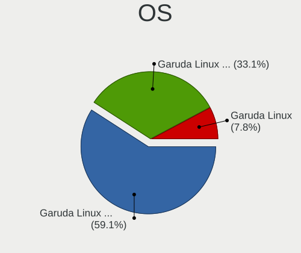

| Name                 | Notebooks | Percent |
|----------------------|-----------|---------|
| Garuda Linux Soaring | 350       | 59.12%  |
| Garuda Linux Rolling | 196       | 33.11%  |
| Garuda Linux         | 46        | 7.77%   |

OS Family
---------

OS without a version

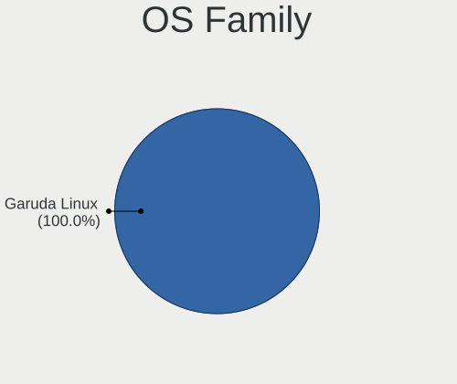

| Name         | Notebooks | Percent |
|--------------|-----------|---------|
| Garuda Linux | 583       | 100%    |

Kernel
------

Version of the Linux kernel

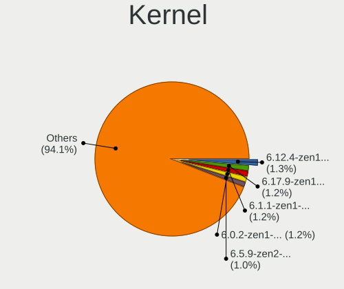

| Version             | Notebooks | Percent |
|---------------------|-----------|---------|
| 6.12.4-zen1-1-zen   | 9         | 1.32%   |
| 6.17.9-zen1-1-zen   | 8         | 1.18%   |
| 6.1.1-zen1-1-zen    | 8         | 1.18%   |
| 6.0.2-zen1-1-zen    | 8         | 1.18%   |
| 6.5.9-zen2-1-zen    | 7         | 1.03%   |
| 6.16.7-zen1-1-zen   | 7         | 1.03%   |
| 6.15.4-zen2-1-zen   | 7         | 1.03%   |
| 6.10.6-zen1-1-zen   | 7         | 1.03%   |
| 6.4.12-zen1-1-zen   | 6         | 0.88%   |
| 6.2.13-zen-1-zen    | 6         | 0.88%   |
| 6.16.8-zen3-1-zen   | 6         | 0.88%   |
| 6.14.9-zen1-1-zen   | 6         | 0.88%   |
| 6.13.8-zen1-1-zen   | 6         | 0.88%   |
| 6.13.5-zen1-1-zen   | 6         | 0.88%   |
| 6.11.5-zen1-1-zen   | 6         | 0.88%   |
| 5.17.9-zen1-1-zen   | 6         | 0.88%   |
| 6.9.5-zen1-1-zen    | 5         | 0.74%   |
| 6.9.3-zen1-1-zen    | 5         | 0.74%   |
| 6.8.9-zen1-2-zen    | 5         | 0.74%   |
| 6.8.7-zen1-2-zen    | 5         | 0.74%   |
| 6.6.8-zen1-1-zen    | 5         | 0.74%   |
| 6.18.2-zen2-1-zen   | 5         | 0.74%   |
| 6.17.8-zen1-1-zen   | 5         | 0.74%   |
| 6.15.8-zen1-1-zen   | 5         | 0.74%   |
| 6.12.8-zen1-1-zen   | 5         | 0.74%   |
| 6.12.10-zen1-1-zen  | 5         | 0.74%   |
| 6.11.8-zen1-2-zen   | 5         | 0.74%   |
| 6.11.6-zen1-1-zen   | 5         | 0.74%   |
| 6.10.10-zen1-1-zen  | 5         | 0.74%   |
| 6.9.8-zen1-1-zen    | 4         | 0.59%   |
| 6.8.4-zen1-1-zen    | 4         | 0.59%   |
| 6.8.1-zen1-1-zen    | 4         | 0.59%   |
| 6.7.6-zen1-1-zen    | 4         | 0.59%   |
| 6.7.0-zen3-1-zen    | 4         | 0.59%   |
| 6.6.2-zen1-1-zen    | 4         | 0.59%   |
| 6.4.11-zen2-1-zen   | 4         | 0.59%   |
| 6.15.9-zen1-1.1-zen | 4         | 0.59%   |
| 6.15.6-zen1-1-zen   | 4         | 0.59%   |
| 6.14.6-zen1-1-zen   | 4         | 0.59%   |
| 6.10.8-zen1-1-zen   | 4         | 0.59%   |

Kernel Family
-------------

Linux kernel without a distro release

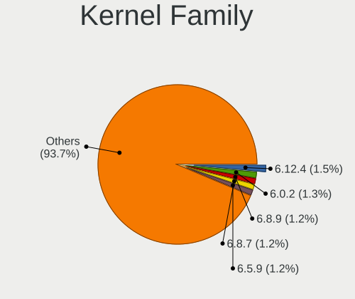

| Version | Notebooks | Percent |
|---------|-----------|---------|
| 6.12.4  | 10        | 1.47%   |
| 6.0.2   | 9         | 1.32%   |
| 6.8.9   | 8         | 1.18%   |
| 6.8.7   | 8         | 1.18%   |
| 6.5.9   | 8         | 1.18%   |
| 6.17.9  | 8         | 1.18%   |
| 6.16.8  | 8         | 1.18%   |
| 6.1.1   | 8         | 1.18%   |
| 6.16.7  | 7         | 1.03%   |
| 6.15.4  | 7         | 1.03%   |
| 6.13.5  | 7         | 1.03%   |
| 6.10.6  | 7         | 1.03%   |
| 6.9.5   | 6         | 0.88%   |
| 6.9.3   | 6         | 0.88%   |
| 6.6.8   | 6         | 0.88%   |
| 6.4.12  | 6         | 0.88%   |
| 6.2.13  | 6         | 0.88%   |
| 6.17.8  | 6         | 0.88%   |
| 6.15.9  | 6         | 0.88%   |
| 6.14.9  | 6         | 0.88%   |
| 6.13.8  | 6         | 0.88%   |
| 6.11.5  | 6         | 0.88%   |
| 5.17.9  | 6         | 0.88%   |
| 6.18.2  | 5         | 0.74%   |
| 6.15.8  | 5         | 0.74%   |
| 6.14.4  | 5         | 0.74%   |
| 6.12.8  | 5         | 0.74%   |
| 6.12.10 | 5         | 0.74%   |
| 6.11.8  | 5         | 0.74%   |
| 6.11.6  | 5         | 0.74%   |
| 6.10.10 | 5         | 0.74%   |
| 6.1.9   | 5         | 0.74%   |
| 6.0.10  | 5         | 0.74%   |
| 6.9.8   | 4         | 0.59%   |
| 6.8.4   | 4         | 0.59%   |
| 6.8.1   | 4         | 0.59%   |
| 6.7.6   | 4         | 0.59%   |
| 6.7.0   | 4         | 0.59%   |
| 6.6.3   | 4         | 0.59%   |
| 6.6.2   | 4         | 0.59%   |

Kernel Major Ver.
-----------------

Linux kernel major version

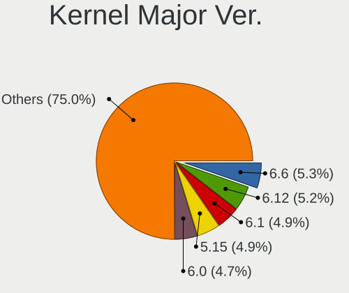

| Version | Notebooks | Percent |
|---------|-----------|---------|
| 6.6     | 35        | 5.33%   |
| 6.12    | 34        | 5.18%   |
| 6.1     | 32        | 4.87%   |
| 5.15    | 32        | 4.87%   |
| 6.0     | 31        | 4.72%   |
| 6.8     | 28        | 4.26%   |
| 6.17    | 28        | 4.26%   |
| 6.15    | 28        | 4.26%   |
| 6.9     | 27        | 4.11%   |
| 6.14    | 26        | 3.96%   |
| 6.13    | 24        | 3.65%   |
| 6.11    | 24        | 3.65%   |
| 6.4     | 23        | 3.5%    |
| 6.2     | 23        | 3.5%    |
| 6.10    | 23        | 3.5%    |
| 5.19    | 22        | 3.35%   |
| 6.16    | 21        | 3.2%    |
| 5.16    | 21        | 3.2%    |
| 5.10    | 20        | 3.04%   |
| 6.7     | 19        | 2.89%   |
| 6.5     | 19        | 2.89%   |
| 5.14    | 19        | 2.89%   |
| 5.18    | 18        | 2.74%   |
| 5.17    | 18        | 2.74%   |
| 6.3     | 13        | 1.98%   |
| 5.12    | 12        | 1.83%   |
| 5.11    | 12        | 1.83%   |
| 5.13    | 11        | 1.67%   |
| 6.18    | 8         | 1.22%   |
| 5.9     | 4         | 0.61%   |
| 5.6     | 1         | 0.15%   |
| 5.4     | 1         | 0.15%   |

Arch
----

OS architecture (x86_64, i586, etc.)

| Name   | Notebooks | Percent |
|--------|-----------|---------|
| x86_64 | 583       | 100%    |

DE
--

Desktop Environment

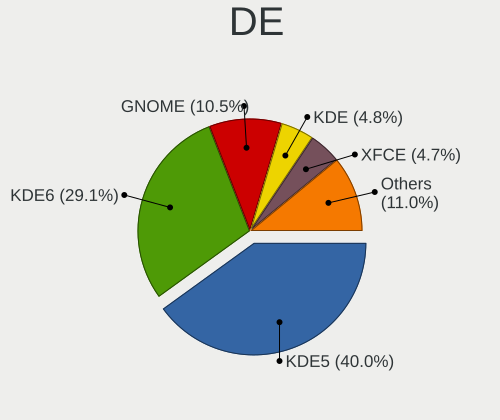

| Name              | Notebooks | Percent |
|-------------------|-----------|---------|
| KDE5              | 241       | 40.03%  |
| KDE6              | 175       | 29.07%  |
| GNOME             | 63        | 10.47%  |
| KDE               | 29        | 4.82%   |
| XFCE              | 28        | 4.65%   |
| X-Cinnamon        | 17        | 2.82%   |
| Hyprland          | 11        | 1.83%   |
| sway              | 9         | 1.5%    |
| Deepin            | 5         | 0.83%   |
| i3                | 4         | 0.66%   |
| Cinnamon          | 4         | 0.66%   |
| Unknown           | 4         | 0.66%   |
| qtile-default     | 3         | 0.5%    |
| qtile             | 2         | 0.33%   |
| Yaru:ubuntu:GNOME | 1         | 0.17%   |
| Unity             | 1         | 0.17%   |
| niri              | 1         | 0.17%   |
| MATE              | 1         | 0.17%   |
| LXQt              | 1         | 0.17%   |
| COSMIC            | 1         | 0.17%   |
| awesome           | 1         | 0.17%   |

Display Server
--------------

X11 or Wayland

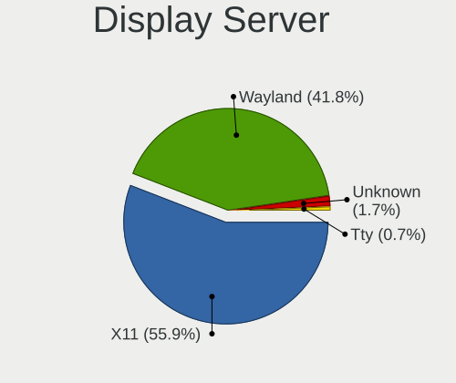

| Name    | Notebooks | Percent |
|---------|-----------|---------|
| X11     | 333       | 55.87%  |
| Wayland | 249       | 41.78%  |
| Unknown | 10        | 1.68%   |
| Tty     | 4         | 0.67%   |

Display Manager
---------------

SDDM, LightDM, etc.

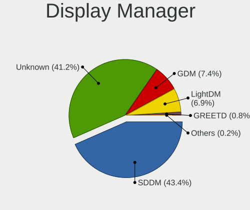

| Name    | Notebooks | Percent |
|---------|-----------|---------|
| SDDM    | 257       | 43.41%  |
| Unknown | 244       | 41.22%  |
| GDM     | 44        | 7.43%   |
| LightDM | 41        | 6.93%   |
| GREETD  | 5         | 0.84%   |
| EMPTTY  | 1         | 0.17%   |

OS Lang
-------

Language

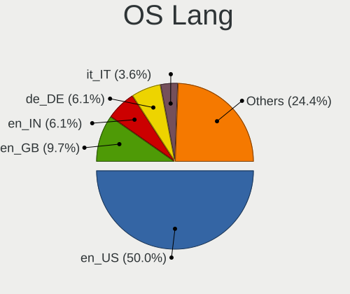

| Lang    | Notebooks | Percent |
|---------|-----------|---------|
| en_US   | 293       | 50%     |
| en_GB   | 57        | 9.73%   |
| en_IN   | 36        | 6.14%   |
| de_DE   | 36        | 6.14%   |
| it_IT   | 21        | 3.58%   |
| en_CA   | 19        | 3.24%   |
| pt_BR   | 14        | 2.39%   |
| pl_PL   | 13        | 2.22%   |
| es_MX   | 11        | 1.88%   |
| ru_RU   | 10        | 1.71%   |
| fr_FR   | 10        | 1.71%   |
| tr_TR   | 8         | 1.37%   |
| es_ES   | 8         | 1.37%   |
| en_ZA   | 5         | 0.85%   |
| nl_NL   | 4         | 0.68%   |
| es_CO   | 3         | 0.51%   |
| en_DK   | 3         | 0.51%   |
| de_AT   | 3         | 0.51%   |
| zh_CN   | 2         | 0.34%   |
| sv_SE   | 2         | 0.34%   |
| fi_FI   | 2         | 0.34%   |
| es_EC   | 2         | 0.34%   |
| es_CR   | 2         | 0.34%   |
| es_AR   | 2         | 0.34%   |
| en_AU   | 2         | 0.34%   |
| en_AG   | 2         | 0.34%   |
| Unknown | 2         | 0.34%   |
| vi_VN   | 1         | 0.17%   |
| uk_UA   | 1         | 0.17%   |
| ko_KR   | 1         | 0.17%   |
| ja_JP   | 1         | 0.17%   |
| hu_HU   | 1         | 0.17%   |
| fr_CA   | 1         | 0.17%   |
| es_VE   | 1         | 0.17%   |
| es_PE   | 1         | 0.17%   |
| es_BO   | 1         | 0.17%   |
| en_NG   | 1         | 0.17%   |
| el_GR   | 1         | 0.17%   |
| da_DK   | 1         | 0.17%   |
| cs_CZ   | 1         | 0.17%   |

Boot Mode
---------

EFI or BIOS

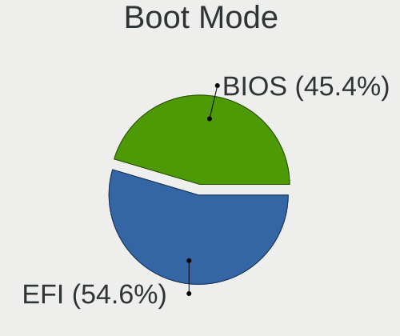

| Mode | Notebooks | Percent |
|------|-----------|---------|
| EFI  | 322       | 54.58%  |
| BIOS | 268       | 45.42%  |

Filesystem
----------

Type of filesystem

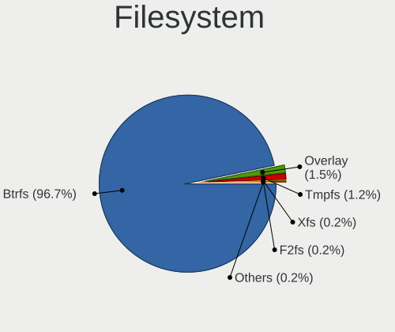

| Type    | Notebooks | Percent |
|---------|-----------|---------|
| Btrfs   | 565       | 96.75%  |
| Overlay | 9         | 1.54%   |
| Tmpfs   | 7         | 1.2%    |
| XXXXX   | 1         | 0.17%   |
| Xfs     | 1         | 0.17%   |
| F2fs    | 1         | 0.17%   |

Part. scheme
------------

Scheme of partitioning

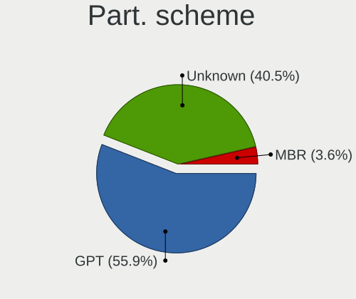

| Type    | Notebooks | Percent |
|---------|-----------|---------|
| GPT     | 330       | 55.93%  |
| Unknown | 239       | 40.51%  |
| MBR     | 21        | 3.56%   |

Dual Boot with Linux/BSD
------------------------

Hosting more than one Linux/BSD

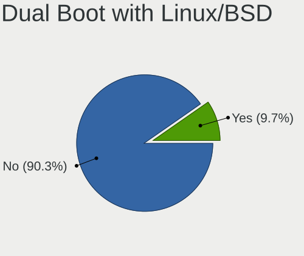

| Dual boot | Notebooks | Percent |
|-----------|-----------|---------|
| No        | 533       | 90.34%  |
| Yes       | 57        | 9.66%   |

Dual Boot (Win)
---------------

Hosting Linux and Windows

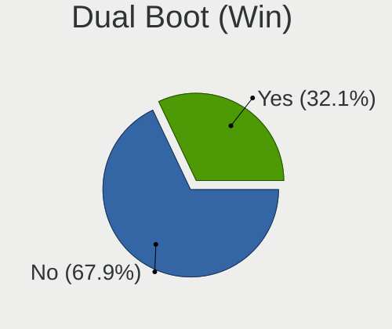

| Dual boot | Notebooks | Percent |
|-----------|-----------|---------|
| No        | 434       | 73.68%  |
| Yes       | 155       | 26.32%  |

Board
-----

Vendor
------

Motherboard manufacturer

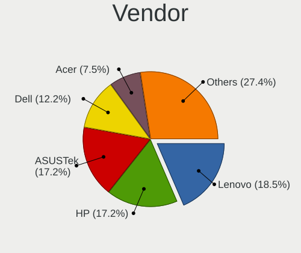

| Name                 | Notebooks | Percent |
|----------------------|-----------|---------|
| Lenovo               | 108       | 18.52%  |
| Hewlett-Packard      | 100       | 17.15%  |
| ASUSTek Computer     | 100       | 17.15%  |
| Dell                 | 71        | 12.18%  |
| Acer                 | 44        | 7.55%   |
| MSI                  | 28        | 4.8%    |
| Apple                | 15        | 2.57%   |
| HUAWEI               | 10        | 1.72%   |
| Samsung Electronics  | 9         | 1.54%   |
| Toshiba              | 8         | 1.37%   |
| Notebook             | 7         | 1.2%    |
| Alienware            | 7         | 1.2%    |
| Unknown              | 7         | 1.2%    |
| Razer                | 6         | 1.03%   |
| Gigabyte Technology  | 4         | 0.69%   |
| Fujitsu              | 4         | 0.69%   |
| Framework            | 4         | 0.69%   |
| Medion               | 3         | 0.51%   |
| HONOR                | 3         | 0.51%   |
| Google               | 3         | 0.51%   |
| XIAOMI               | 2         | 0.34%   |
| TUXEDO               | 2         | 0.34%   |
| Sony                 | 2         | 0.34%   |
| Schenker             | 2         | 0.34%   |
| Monster              | 2         | 0.34%   |
| Infinix              | 2         | 0.34%   |
| GPU Company          | 2         | 0.34%   |
| GPD                  | 2         | 0.34%   |
| Chuwi                | 2         | 0.34%   |
| Casper               | 2         | 0.34%   |
| Valve                | 1         | 0.17%   |
| Timi                 | 1         | 0.17%   |
| TECNO Mobile Limited | 1         | 0.17%   |
| Standard             | 1         | 0.17%   |
| PEAQ                 | 1         | 0.17%   |
| PC Specialist        | 1         | 0.17%   |
| Panasonic            | 1         | 0.17%   |
| OriginPC             | 1         | 0.17%   |
| MOTION               | 1         | 0.17%   |
| MobileDemand         | 1         | 0.17%   |

Model
-----

Motherboard model

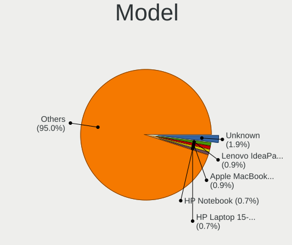

| Name                                        | Notebooks | Percent |
|---------------------------------------------|-----------|---------|
| Unknown                                     | 11        | 1.89%   |
| Lenovo IdeaPad Gaming 3 15ARH05 82EY        | 5         | 0.86%   |
| Apple MacBookPro9,2                         | 5         | 0.86%   |
| HP Notebook                                 | 4         | 0.69%   |
| HP Laptop 15-da0xxx                         | 4         | 0.69%   |
| Framework Laptop 16 (AMD Ryzen 7040 Series) | 3         | 0.51%   |
| Dell Latitude E5470                         | 3         | 0.51%   |
| Dell Inspiron 15 7000 Gaming                | 3         | 0.51%   |
| ASUS VivoBook_ASUSLaptop X1504ZA_X1504ZA    | 3         | 0.51%   |
| ASUS Vivobook Go E1504FA_E1504FA            | 3         | 0.51%   |
| XIAOMI Redmi Book Pro 15 2023               | 2         | 0.34%   |
| Razer Blade                                 | 2         | 0.34%   |
| Notebook P7xxDM2(-G)                        | 2         | 0.34%   |
| Lenovo ThinkPad X1 Carbon 6th 20KGS0JT00    | 2         | 0.34%   |
| Lenovo ThinkPad W530 24474KG                | 2         | 0.34%   |
| Lenovo Legion 5 15IMH05H 81Y6               | 2         | 0.34%   |
| Lenovo Legion 5 15ACH6H 82JU                | 2         | 0.34%   |
| Lenovo IdeaPad Slim 1-14AST-05 81VS         | 2         | 0.34%   |
| Lenovo IdeaPad Gaming 3 15ACH6 82K2         | 2         | 0.34%   |
| Lenovo IdeaPad 3 15ITL05 81X8               | 2         | 0.34%   |
| Lenovo IdeaPad 3 15IIL05 81WE               | 2         | 0.34%   |
| Lenovo IdeaPad 3 15ADA05 81W1               | 2         | 0.34%   |
| HUAWEI HVY-WXX9                             | 2         | 0.34%   |
| HP Victus by Gaming Laptop 15-fb0xxx        | 2         | 0.34%   |
| HP ProBook 640 G1                           | 2         | 0.34%   |
| HP ProBook 450 G4                           | 2         | 0.34%   |
| HP Pavilion Notebook                        | 2         | 0.34%   |
| HP Pavilion Laptop 15-cc1xx                 | 2         | 0.34%   |
| HP Pavilion Gaming Laptop 15-dk0xxx         | 2         | 0.34%   |
| HP Pavilion Gaming Laptop 15-cx0xxx         | 2         | 0.34%   |
| HP Pavilion dv6                             | 2         | 0.34%   |
| HP OMEN Laptop 15-en0xxx                    | 2         | 0.34%   |
| HP OMEN by Laptop 15-dh1xxx                 | 2         | 0.34%   |
| HP Laptop 15-fd0xxx                         | 2         | 0.34%   |
| HP Laptop 15-ef2xxx                         | 2         | 0.34%   |
| HP Laptop 15-ef0xxx                         | 2         | 0.34%   |
| HP Laptop 15-dy2xxx                         | 2         | 0.34%   |
| Gigabyte G5 MD                              | 2         | 0.34%   |
| Dell XPS 15 9500                            | 2         | 0.34%   |
| Dell Latitude E6430                         | 2         | 0.34%   |

Model Family
------------

Motherboard model prefix

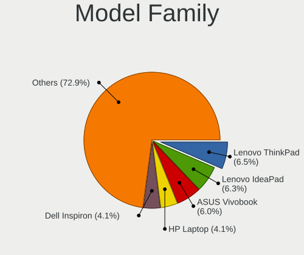

| Name                 | Notebooks | Percent |
|----------------------|-----------|---------|
| Lenovo ThinkPad      | 38        | 6.52%   |
| Lenovo IdeaPad       | 37        | 6.35%   |
| ASUS Vivobook        | 35        | 6%      |
| HP Laptop            | 24        | 4.12%   |
| Dell Inspiron        | 24        | 4.12%   |
| ASUS ROG             | 23        | 3.95%   |
| Dell Latitude        | 21        | 3.6%    |
| HP Pavilion          | 20        | 3.43%   |
| Acer Aspire          | 20        | 3.43%   |
| ASUS ASUS            | 17        | 2.92%   |
| Lenovo Legion        | 16        | 2.74%   |
| Acer Nitro           | 12        | 2.06%   |
| HP OMEN              | 11        | 1.89%   |
| Unknown              | 11        | 1.89%   |
| HP EliteBook         | 10        | 1.72%   |
| HP Victus            | 9         | 1.54%   |
| Toshiba Satellite    | 8         | 1.37%   |
| HP ProBook           | 8         | 1.37%   |
| Dell Precision       | 8         | 1.37%   |
| Dell XPS             | 7         | 1.2%    |
| Apple MacBookPro9    | 7         | 1.2%    |
| Razer Blade          | 6         | 1.03%   |
| Acer Swift           | 6         | 1.03%   |
| Dell Vostro          | 5         | 0.86%   |
| HP Notebook          | 4         | 0.69%   |
| Framework Laptop     | 4         | 0.69%   |
| Dell G15             | 4         | 0.69%   |
| ASUS TUF             | 4         | 0.69%   |
| MSI Stealth          | 3         | 0.51%   |
| Lenovo LOQ           | 3         | 0.51%   |
| HP ZBook             | 3         | 0.51%   |
| Gigabyte G5          | 3         | 0.51%   |
| Fujitsu LIFEBOOK     | 3         | 0.51%   |
| ASUS Zenbook         | 3         | 0.51%   |
| Acer Predator        | 3         | 0.51%   |
| XIAOMI Redmi         | 2         | 0.34%   |
| Notebook P7xxDM2(-G) | 2         | 0.34%   |
| MSI Modern           | 2         | 0.34%   |
| MSI GF63             | 2         | 0.34%   |
| Monster TULPAR       | 2         | 0.34%   |

MFG Year
--------

Motherboard manufacture year

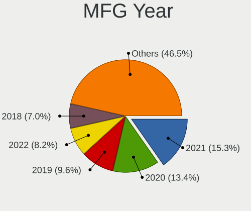

| Year    | Notebooks | Percent |
|---------|-----------|---------|
| 2021    | 89        | 15.27%  |
| 2020    | 78        | 13.38%  |
| 2019    | 56        | 9.61%   |
| 2022    | 48        | 8.23%   |
| 2018    | 41        | 7.03%   |
| 2017    | 39        | 6.69%   |
| 2023    | 35        | 6%      |
| 2016    | 31        | 5.32%   |
| 2012    | 29        | 4.97%   |
| 2013    | 28        | 4.8%    |
| 2024    | 23        | 3.95%   |
| 2014    | 23        | 3.95%   |
| 2011    | 18        | 3.09%   |
| 2015    | 17        | 2.92%   |
| 2010    | 7         | 1.2%    |
| 2025    | 6         | 1.03%   |
| 2008    | 6         | 1.03%   |
| 2009    | 5         | 0.86%   |
| 2007    | 3         | 0.51%   |
| Unknown | 1         | 0.17%   |

Form Factor
-----------

Physical design of the computer

| Name     | Notebooks | Percent |
|----------|-----------|---------|
| Notebook | 583       | 100%    |

Secure Boot
-----------

Enabled or disabled

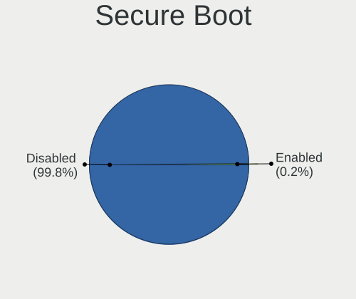

| State    | Notebooks | Percent |
|----------|-----------|---------|
| Disabled | 583       | 99.83%  |
| Enabled  | 1         | 0.17%   |

Coreboot
--------

Have coreboot on board

| Used | Notebooks | Percent |
|------|-----------|---------|
| No   | 580       | 99.49%  |
| Yes  | 3         | 0.51%   |

RAM Size
--------

Total RAM memory

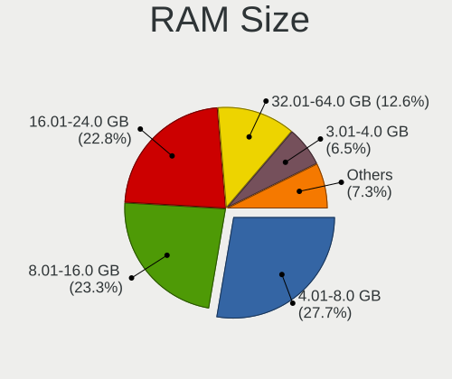

| Size in GB  | Notebooks | Percent |
|-------------|-----------|---------|
| 4.01-8.0    | 163       | 27.67%  |
| 8.01-16.0   | 137       | 23.26%  |
| 16.01-24.0  | 134       | 22.75%  |
| 32.01-64.0  | 74        | 12.56%  |
| 3.01-4.0    | 38        | 6.45%   |
| 24.01-32.0  | 21        | 3.57%   |
| 64.01-256.0 | 21        | 3.57%   |
| 2.01-3.0    | 1         | 0.17%   |

RAM Used
--------

Used RAM memory

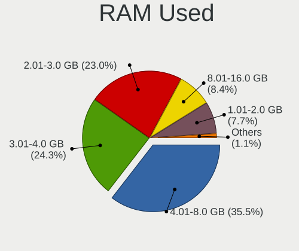

| Used GB    | Notebooks | Percent |
|------------|-----------|---------|
| 4.01-8.0   | 225       | 35.49%  |
| 3.01-4.0   | 154       | 24.29%  |
| 2.01-3.0   | 146       | 23.03%  |
| 8.01-16.0  | 53        | 8.36%   |
| 1.01-2.0   | 49        | 7.73%   |
| 24.01-32.0 | 2         | 0.32%   |
| 16.01-24.0 | 2         | 0.32%   |
| 0.51-1.0   | 2         | 0.32%   |
| 32.01-64.0 | 1         | 0.16%   |

Total Drives
------------

Number of drives on board

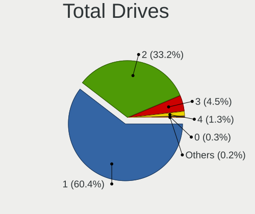

| Drives | Notebooks | Percent |
|--------|-----------|---------|
| 1      | 362       | 60.43%  |
| 2      | 199       | 33.22%  |
| 3      | 27        | 4.51%   |
| 4      | 8         | 1.34%   |
| 0      | 2         | 0.33%   |
| 10     | 1         | 0.17%   |

Has CD-ROM
----------

Has CD-ROM on board

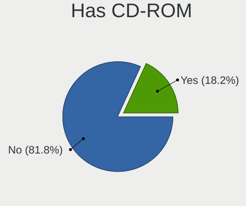

| Presented | Notebooks | Percent |
|-----------|-----------|---------|
| No        | 482       | 81.83%  |
| Yes       | 107       | 18.17%  |

Has Ethernet
------------

Has Ethernet on board

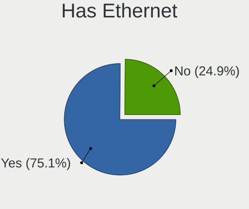

| Presented | Notebooks | Percent |
|-----------|-----------|---------|
| Yes       | 441       | 75.38%  |
| No        | 144       | 24.62%  |

Has WiFi
--------

Has WiFi module

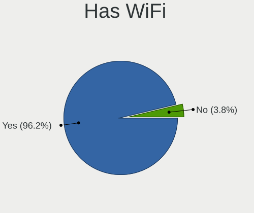

| Presented | Notebooks | Percent |
|-----------|-----------|---------|
| Yes       | 562       | 96.23%  |
| No        | 22        | 3.77%   |

Has Bluetooth
-------------

Has Bluetooth module

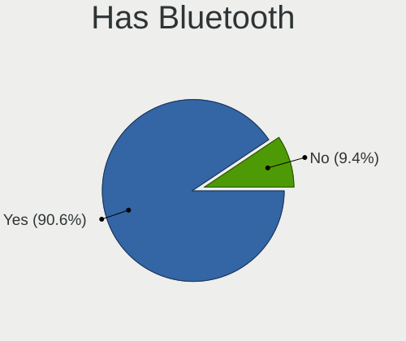

| Presented | Notebooks | Percent |
|-----------|-----------|---------|
| Yes       | 532       | 90.63%  |
| No        | 55        | 9.37%   |

Location
--------

Country
-------

Geographic location (country)

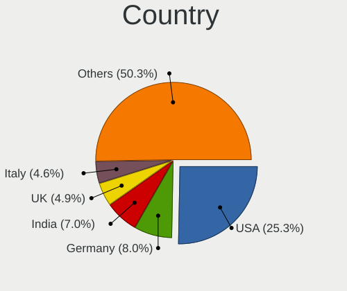

| Country      | Notebooks | Percent |
|--------------|-----------|---------|
| USA          | 149       | 25.3%   |
| Germany      | 47        | 7.98%   |
| India        | 41        | 6.96%   |
| UK           | 29        | 4.92%   |
| Italy        | 27        | 4.58%   |
| Canada       | 25        | 4.24%   |
| Poland       | 21        | 3.57%   |
| Brazil       | 20        | 3.4%    |
| France       | 16        | 2.72%   |
| Turkey       | 15        | 2.55%   |
| Spain        | 13        | 2.21%   |
| Mexico       | 13        | 2.21%   |
| Russia       | 10        | 1.7%    |
| Romania      | 10        | 1.7%    |
| Netherlands  | 9         | 1.53%   |
| South Africa | 8         | 1.36%   |
| Indonesia    | 6         | 1.02%   |
| Greece       | 6         | 1.02%   |
| Austria      | 6         | 1.02%   |
| Australia    | 6         | 1.02%   |
| Vietnam      | 5         | 0.85%   |
| Sweden       | 5         | 0.85%   |
| Czechia      | 5         | 0.85%   |
| Colombia     | 5         | 0.85%   |
| Belgium      | 5         | 0.85%   |
| Hungary      | 4         | 0.68%   |
| Denmark      | 4         | 0.68%   |
| Switzerland  | 3         | 0.51%   |
| Pakistan     | 3         | 0.51%   |
| Finland      | 3         | 0.51%   |
| Ecuador      | 3         | 0.51%   |
| China        | 3         | 0.51%   |
| Bulgaria     | 3         | 0.51%   |
| Bangladesh   | 3         | 0.51%   |
| Argentina    | 3         | 0.51%   |
| Tunisia      | 2         | 0.34%   |
| Slovenia     | 2         | 0.34%   |
| Singapore    | 2         | 0.34%   |
| Serbia       | 2         | 0.34%   |
| Peru         | 2         | 0.34%   |

City
----

Geographic location (city)

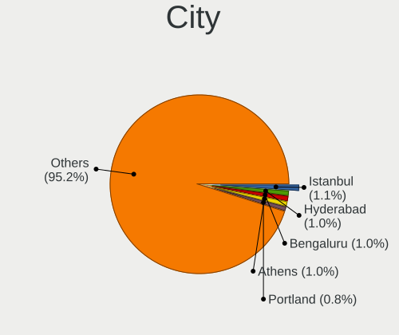

| City              | Notebooks | Percent |
|-------------------|-----------|---------|
| Istanbul          | 7         | 1.13%   |
| Hyderabad         | 6         | 0.97%   |
| Bengaluru         | 6         | 0.97%   |
| Athens            | 6         | 0.97%   |
| Portland          | 5         | 0.81%   |
| Los Angeles       | 5         | 0.81%   |
| Berlin            | 5         | 0.81%   |
| Warsaw            | 4         | 0.65%   |
| Valencia          | 4         | 0.65%   |
| Sydney            | 4         | 0.65%   |
| Prague            | 4         | 0.65%   |
| Mumbai            | 4         | 0.65%   |
| Mississauga       | 4         | 0.65%   |
| Milan             | 4         | 0.65%   |
| London            | 4         | 0.65%   |
| Jacksonville      | 4         | 0.65%   |
| Ho Chi Minh City  | 4         | 0.65%   |
| Frankfurt am Main | 4         | 0.65%   |
| Dortmund          | 4         | 0.65%   |
| Chicago           | 4         | 0.65%   |
| Cape Town         | 4         | 0.65%   |
| Toronto           | 3         | 0.48%   |
| San Jose          | 3         | 0.48%   |
| Poznan            | 3         | 0.48%   |
| Paris             | 3         | 0.48%   |
| New York          | 3         | 0.48%   |
| New Glasgow       | 3         | 0.48%   |
| Moscow            | 3         | 0.48%   |
| Düsseldorf       | 3         | 0.48%   |
| Drums             | 3         | 0.48%   |
| Copenhagen        | 3         | 0.48%   |
| Chennai           | 3         | 0.48%   |
| Budapest          | 3         | 0.48%   |
| Bucharest         | 3         | 0.48%   |
| Amsterdam         | 3         | 0.48%   |
| Zagreb            | 2         | 0.32%   |
| Wroclaw           | 2         | 0.32%   |
| Vienna            | 2         | 0.32%   |
| Turin             | 2         | 0.32%   |
| Tunis             | 2         | 0.32%   |

Drives
------

Drive Vendor
------------

Hard drive vendors

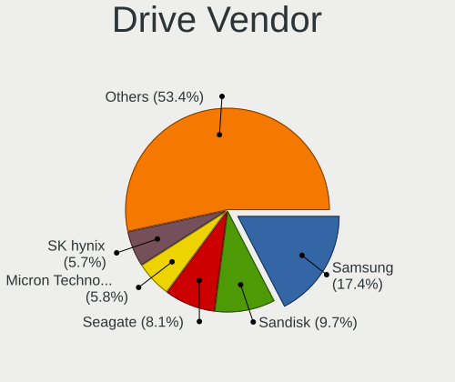

| Vendor                         | Notebooks | Drives | Percent |
|--------------------------------|-----------|--------|---------|
| Samsung Electronics            | 144       | 182    | 17.39%  |
| Sandisk                        | 80        | 98     | 9.66%   |
| Seagate                        | 67        | 80     | 8.09%   |
| Micron Technology              | 48        | 56     | 5.8%    |
| SK hynix                       | 47        | 61     | 5.68%   |
| WDC                            | 41        | 45     | 4.95%   |
| Toshiba                        | 41        | 52     | 4.95%   |
| Intel                          | 39        | 46     | 4.71%   |
| Unknown                        | 35        | 44     | 4.23%   |
| Kingston                       | 24        | 25     | 2.9%    |
| HGST                           | 21        | 23     | 2.54%   |
| Phison Electronics             | 18        | 22     | 2.17%   |
| Crucial                        | 17        | 22     | 2.05%   |
| Kingston Technology Company    | 16        | 18     | 1.93%   |
| KIOXIA                         | 13        | 19     | 1.57%   |
| Hitachi                        | 13        | 14     | 1.57%   |
| Micron/Crucial Technology      | 10        | 11     | 1.21%   |
| Silicon Motion                 | 9         | 9      | 1.09%   |
| SPCC                           | 7         | 8      | 0.85%   |
| MAXIO Technology (Hangzhou)    | 7         | 9      | 0.85%   |
| ADATA Technology               | 7         | 10     | 0.85%   |
| SABRENT                        | 6         | 8      | 0.72%   |
| A-DATA Technology              | 6         | 9      | 0.72%   |
| Shenzhen Longsys Electronics   | 5         | 5      | 0.6%    |
| PNY                            | 5         | 5      | 0.6%    |
| LITEON                         | 5         | 5      | 0.6%    |
| Apple                          | 5         | 7      | 0.6%    |
| Phison                         | 4         | 4      | 0.48%   |
| China                          | 4         | 4      | 0.48%   |
| Realtek Semiconductor          | 3         | 3      | 0.36%   |
| JMicron Technology             | 3         | 3      | 0.36%   |
| Hewlett-Packard                | 3         | 3      | 0.36%   |
| GOODRAM                        | 3         | 3      | 0.36%   |
| Corsair                        | 3         | 3      | 0.36%   |
| Unknown                        | 3         | 4      | 0.36%   |
| Union Memory (Shenzhen)        | 2         | 2      | 0.24%   |
| Transcend                      | 2         | 2      | 0.24%   |
| Solid State Storage Technology | 2         | 2      | 0.24%   |
| Solid State Storage            | 2         | 2      | 0.24%   |
| Patriot                        | 2         | 16     | 0.24%   |

Drive Model
-----------

Hard drive models

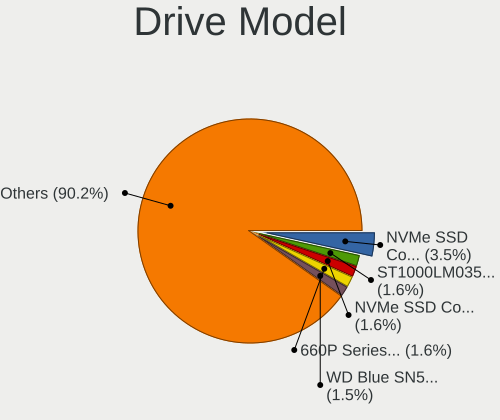

| Model                                                              | Notebooks | Percent |
|--------------------------------------------------------------------|-----------|---------|
| Samsung NVMe SSD Controller SM981/PM981/PM983 1TB                  | 30        | 3.46%   |
| Seagate ST1000LM035-1RK172 1TB                                     | 14        | 1.61%   |
| Samsung NVMe SSD Controller PM9A1/PM9A3/980PRO 1TB                 | 14        | 1.61%   |
| Intel SSD 660P Series 512GB                                        | 14        | 1.61%   |
| Sandisk WD Blue SN550 NVMe SSD 1024GB                              | 13        | 1.5%    |
| Seagate ST1000LM049-2GH172 1TB                                     | 9         | 1.04%   |
| HGST HTS721010A9E630 1TB                                           | 9         | 1.04%   |
| Unknown MMC Card  64GB                                             | 8         | 0.92%   |
| Seagate ST1000LM024 HN-M101MBB 1TB                                 | 8         | 0.92%   |
| Intel SSDPEKNU512GZ 512GB                                          | 8         | 0.92%   |
| Phison E12 NVMe Controller 1TB                                     | 7         | 0.81%   |
| Toshiba MQ04ABF100 1TB                                             | 6         | 0.69%   |
| Toshiba MQ01ABD100 1TB                                             | 6         | 0.69%   |
| Sandisk WD Black SN750 / PC SN730 NVMe SSD 500GB                   | 6         | 0.69%   |
| Samsung SSD 860 EVO 1TB                                            | 6         | 0.69%   |
| Samsung NVMe SSD Drive 1TB                                         | 6         | 0.69%   |
| SABRENT Disk 4TB                                                   | 6         | 0.69%   |
| Phison E16 PCIe4 NVMe Controller 1TB                               | 6         | 0.69%   |
| Seagate ST1000LM014-1EJ164 1TB                                     | 5         | 0.58%   |
| Micron 2400_MTFDKBA512QFM 512GB                                    | 5         | 0.58%   |
| Kingston Company OM3PDP3 NVMe SSD 256GB                            | 5         | 0.58%   |
| Kingston SKC3000D2048G 2TB                                         | 5         | 0.58%   |
| WDC WD10JPVX-22JC3T0 1TB                                           | 4         | 0.46%   |
| Unknown SD/MMC/MS PRO 2GB                                          | 4         | 0.46%   |
| Unknown MMC Card  128GB                                            | 4         | 0.46%   |
| Toshiba XG6 NVMe SSD Controller 1024GB                             | 4         | 0.46%   |
| SK hynix BC501 NVMe Solid State Drive 512GB                        | 4         | 0.46%   |
| Samsung SSD 870 EVO 1TB                                            | 4         | 0.46%   |
| Samsung SSD 860 EVO 500GB                                          | 4         | 0.46%   |
| Samsung PSSD T7 500GB                                              | 4         | 0.46%   |
| Samsung NVMe SSD Controller SM961/PM961/SM963 1024GB               | 4         | 0.46%   |
| Micron/Crucial P2 NVMe PCIe SSD 2TB                                | 4         | 0.46%   |
| MAXIO (Hangzhou) NVMe SSD Controller MAP1202 2TB                   | 4         | 0.46%   |
| Kingston SA400S37240G 240GB SSD                                    | 4         | 0.46%   |
| HGST HTS725050A7E630 500GB                                         | 4         | 0.46%   |
| ADATA XPG SX8200 Pro PCIe Gen3x4 M.2 2280 Solid State Drive 1024GB | 4         | 0.46%   |
| Unknown MMC Card  512GB                                            | 3         | 0.35%   |
| Toshiba MQ04ABD200 2TB                                             | 3         | 0.35%   |
| Toshiba MQ01ABF050 500GB                                           | 3         | 0.35%   |
| SPCC Solid State Disk 512GB                                        | 3         | 0.35%   |

HDD Vendor
----------

Hard disk drive vendors

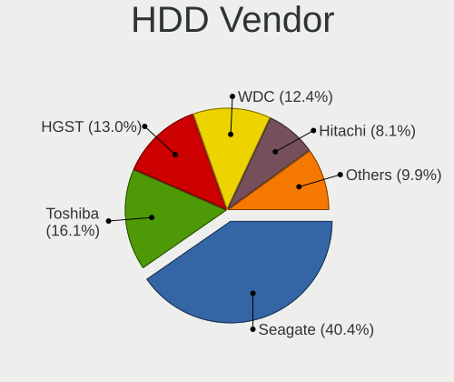

| Vendor              | Notebooks | Drives | Percent |
|---------------------|-----------|--------|---------|
| Seagate             | 65        | 75     | 40.37%  |
| Toshiba             | 26        | 30     | 16.15%  |
| HGST                | 21        | 23     | 13.04%  |
| WDC                 | 20        | 22     | 12.42%  |
| Hitachi             | 13        | 14     | 8.07%   |
| Unknown             | 4         | 6      | 2.48%   |
| JMicron Technology  | 2         | 2      | 1.24%   |
| JetFlash            | 2         | 2      | 1.24%   |
| T-FORCE             | 1         | 1      | 0.62%   |
| SSK                 | 1         | 1      | 0.62%   |
| SATAFIRM            | 1         | 1      | 0.62%   |
| Samsung Electronics | 1         | 1      | 0.62%   |
| KESU                | 1         | 1      | 0.62%   |
| Initio              | 1         | 1      | 0.62%   |
| ASMT                | 1         | 2      | 0.62%   |
| Apple               | 1         | 2      | 0.62%   |

SSD Vendor
----------

Solid state drive vendors

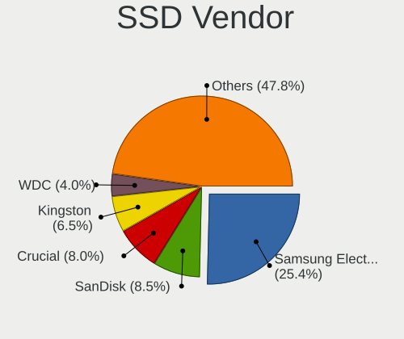

| Vendor              | Notebooks | Drives | Percent |
|---------------------|-----------|--------|---------|
| Samsung Electronics | 51        | 58     | 25.37%  |
| SanDisk             | 17        | 25     | 8.46%   |
| Crucial             | 16        | 21     | 7.96%   |
| Kingston            | 13        | 14     | 6.47%   |
| WDC                 | 8         | 10     | 3.98%   |
| SK hynix            | 8         | 11     | 3.98%   |
| Micron Technology   | 8         | 9      | 3.98%   |
| SPCC                | 6         | 7      | 2.99%   |
| SABRENT             | 6         | 8      | 2.99%   |
| A-DATA Technology   | 6         | 9      | 2.99%   |
| PNY                 | 5         | 5      | 2.49%   |
| LITEON              | 5         | 5      | 2.49%   |
| China               | 4         | 4      | 1.99%   |
| Toshiba             | 3         | 3      | 1.49%   |
| Hewlett-Packard     | 3         | 3      | 1.49%   |
| GOODRAM             | 3         | 3      | 1.49%   |
| Patriot             | 2         | 16     | 1%      |
| LITEONIT            | 2         | 2      | 1%      |
| FORESEE             | 2         | 2      | 1%      |
| Apple               | 2         | 2      | 1%      |
| Unknown             | 2         | 3      | 1%      |
| XrayDisk            | 1         | 1      | 0.5%    |
| X12                 | 1         | 1      | 0.5%    |
| WODPOSIT            | 1         | 2      | 0.5%    |
| WDC WDS             | 1         | 1      | 0.5%    |
| VisionTek           | 1         | 2      | 0.5%    |
| UDSS                | 1         | 1      | 0.5%    |
| Transcend           | 1         | 1      | 0.5%    |
| Team                | 1         | 1      | 0.5%    |
| TCSUNBOW            | 1         | 2      | 0.5%    |
| TAMMUZ              | 1         | 2      | 0.5%    |
| PNY CS90            | 1         | 1      | 0.5%    |
| Pioneer             | 1         | 1      | 0.5%    |
| OWC                 | 1         | 1      | 0.5%    |
| Netac               | 1         | 1      | 0.5%    |
| Neo Forza           | 1         | 2      | 0.5%    |
| Mushkin             | 1         | 1      | 0.5%    |
| Lexar               | 1         | 1      | 0.5%    |
| KIOXIA-EXCERIA      | 1         | 1      | 0.5%    |
| KIOXIA-E            | 1         | 1      | 0.5%    |

Drive Kind
----------

HDD or SSD

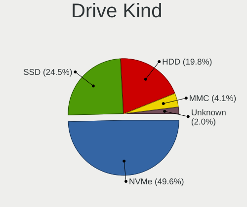

| Kind    | Notebooks | Drives | Percent |
|---------|-----------|--------|---------|
| NVMe    | 376       | 517    | 49.6%   |
| SSD     | 186       | 255    | 24.54%  |
| HDD     | 150       | 184    | 19.79%  |
| MMC     | 31        | 36     | 4.09%   |
| Unknown | 15        | 19     | 1.98%   |

Drive Connector
---------------

SATA, SAS, NVMe, etc.

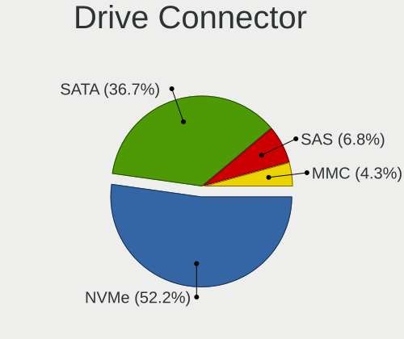

| Type | Notebooks | Drives | Percent |
|------|-----------|--------|---------|
| NVMe | 376       | 516    | 52.22%  |
| SATA | 264       | 384    | 36.67%  |
| SAS  | 49        | 75     | 6.81%   |
| MMC  | 31        | 36     | 4.31%   |

Drive Size
----------

Size of hard drive

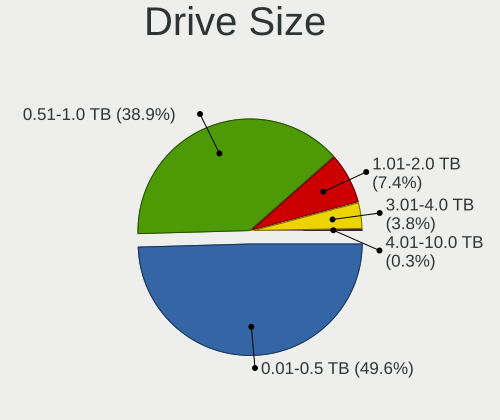

| Size in TB | Notebooks | Drives | Percent |
|------------|-----------|--------|---------|
| 0.01-0.5   | 168       | 221    | 49.56%  |
| 0.51-1.0   | 132       | 168    | 38.94%  |
| 1.01-2.0   | 25        | 33     | 7.37%   |
| 3.01-4.0   | 13        | 16     | 3.83%   |
| 4.01-10.0  | 1         | 1      | 0.29%   |

Space Total
-----------

Amount of disk space available on the file system

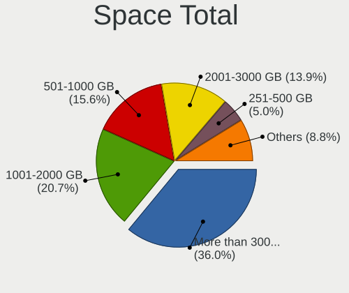

| Size in GB     | Notebooks | Percent |
|----------------|-----------|---------|
| More than 3000 | 217       | 35.99%  |
| 1001-2000      | 125       | 20.73%  |
| 501-1000       | 94        | 15.59%  |
| 2001-3000      | 84        | 13.93%  |
| 251-500        | 30        | 4.98%   |
| Unknown        | 27        | 4.48%   |
| 1-20           | 20        | 3.32%   |
| 101-250        | 6         | 1%      |

Space Used
----------

Amount of used disk space

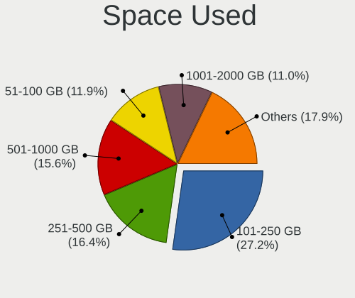

| Used GB        | Notebooks | Percent |
|----------------|-----------|---------|
| 101-250        | 169       | 27.21%  |
| 251-500        | 102       | 16.43%  |
| 501-1000       | 97        | 15.62%  |
| 51-100         | 74        | 11.92%  |
| 1001-2000      | 68        | 10.95%  |
| More than 3000 | 39        | 6.28%   |
| Unknown        | 27        | 4.35%   |
| 2001-3000      | 25        | 4.03%   |
| 1-20           | 18        | 2.9%    |
| 0              | 2         | 0.32%   |

Malfunc. Drives
---------------

Drive models with a malfunction

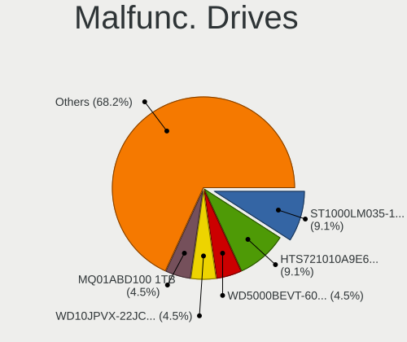

| Model                                 | Notebooks | Drives | Percent |
|---------------------------------------|-----------|--------|---------|
| Seagate ST1000LM035-1RK172 1TB        | 2         | 2      | 9.09%   |
| HGST HTS721010A9E630 1TB              | 2         | 2      | 9.09%   |
| WDC WD5000BEVT-60A0RT0 500GB          | 1         | 1      | 4.55%   |
| WDC WD10JPVX-22JC3T0 1TB              | 1         | 1      | 4.55%   |
| Toshiba MQ01ABD100 1TB                | 1         | 1      | 4.55%   |
| SK hynix PC711 HFS512GDE9X073N 512GB  | 1         | 1      | 4.55%   |
| SK hynix PC711 HFS001TDE9X073N 1TB    | 1         | 3      | 4.55%   |
| Seagate ST500LT012-1DG142 500GB       | 1         | 1      | 4.55%   |
| Seagate ST1000LM049-2GH172 1TB        | 1         | 1      | 4.55%   |
| Seagate ST1000LM048-2E7172 1TB        | 1         | 1      | 4.55%   |
| Seagate ST1000LM014-1EJ164 1TB        | 1         | 1      | 4.55%   |
| SanDisk SSD PLUS 1000GB               | 1         | 1      | 4.55%   |
| Samsung Electronics SSD 860 EVO 500GB | 1         | 1      | 4.55%   |
| Kingston SH103S3240G 240GB SSD        | 1         | 1      | 4.55%   |
| Hitachi HUA722020ALA331 2TB           | 1         | 1      | 4.55%   |
| Hitachi HTS547575A9E384 752GB         | 1         | 1      | 4.55%   |
| Hitachi HTS542525K9SA00 250GB         | 1         | 1      | 4.55%   |
| HGST HTS725050A7E630 500GB            | 1         | 1      | 4.55%   |
| HGST HTS541075A9E680 752GB            | 1         | 1      | 4.55%   |
| Crucial CT525MX300SSD1 528GB          | 1         | 1      | 4.55%   |

Malfunc. Drive Vendor
---------------------

Vendors of faulty drives

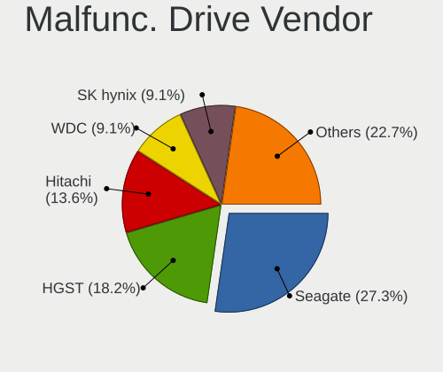

| Vendor              | Notebooks | Drives | Percent |
|---------------------|-----------|--------|---------|
| Seagate             | 6         | 6      | 27.27%  |
| HGST                | 4         | 4      | 18.18%  |
| Hitachi             | 3         | 3      | 13.64%  |
| WDC                 | 2         | 2      | 9.09%   |
| SK hynix            | 2         | 4      | 9.09%   |
| Toshiba             | 1         | 1      | 4.55%   |
| SanDisk             | 1         | 1      | 4.55%   |
| Samsung Electronics | 1         | 1      | 4.55%   |
| Kingston            | 1         | 1      | 4.55%   |
| Crucial             | 1         | 1      | 4.55%   |

Malfunc. HDD Vendor
-------------------

Vendors of faulty HDD drives

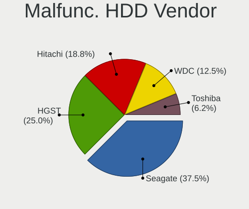

| Vendor  | Notebooks | Drives | Percent |
|---------|-----------|--------|---------|
| Seagate | 6         | 6      | 37.5%   |
| HGST    | 4         | 4      | 25%     |
| Hitachi | 3         | 3      | 18.75%  |
| WDC     | 2         | 2      | 12.5%   |
| Toshiba | 1         | 1      | 6.25%   |

Malfunc. Drive Kind
-------------------

Kinds of faulty drives

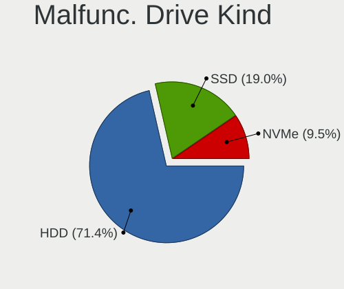

| Kind | Notebooks | Drives | Percent |
|------|-----------|--------|---------|
| HDD  | 15        | 16     | 71.43%  |
| SSD  | 4         | 4      | 19.05%  |
| NVMe | 2         | 4      | 9.52%   |

Failed Drives
-------------

Failed drive models

Zero info for selected period =(

Failed Drive Vendor
-------------------

Failed drive vendors

Zero info for selected period =(

Drive Status
------------

Number of failed and malfunc. drives

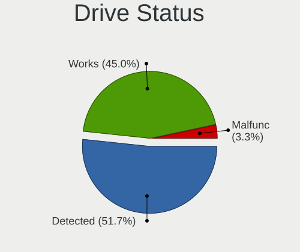

| Status   | Notebooks | Drives | Percent |
|----------|-----------|--------|---------|
| Detected | 325       | 558    | 51.67%  |
| Works    | 283       | 429    | 44.99%  |
| Malfunc  | 21        | 24     | 3.34%   |

Storage controller
------------------

Storage Vendor
--------------

Storage controller vendors

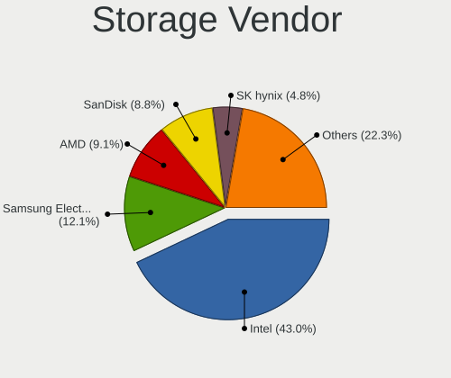

| Vendor                         | Notebooks | Percent |
|--------------------------------|-----------|---------|
| Intel                          | 351       | 42.96%  |
| Samsung Electronics            | 99        | 12.12%  |
| AMD                            | 74        | 9.06%   |
| SanDisk                        | 72        | 8.81%   |
| SK hynix                       | 39        | 4.77%   |
| Micron Technology              | 39        | 4.77%   |
| Phison Electronics             | 26        | 3.18%   |
| Kingston Technology Company    | 26        | 3.18%   |
| Toshiba America Info Systems   | 14        | 1.71%   |
| KIOXIA                         | 13        | 1.59%   |
| Micron/Crucial Technology      | 11        | 1.35%   |
| Silicon Motion                 | 9         | 1.1%    |
| MAXIO Technology (Hangzhou)    | 7         | 0.86%   |
| ADATA Technology               | 7         | 0.86%   |
| Solid State Storage Technology | 5         | 0.61%   |
| Shenzhen Longsys Electronics   | 5         | 0.61%   |
| Union Memory (Shenzhen)        | 4         | 0.49%   |
| Solidigm                       | 3         | 0.37%   |
| Realtek Semiconductor          | 3         | 0.37%   |
| Apple                          | 2         | 0.24%   |
| Yangtze Memory Technologies    | 1         | 0.12%   |
| Transcend                      | 1         | 0.12%   |
| Nvidia                         | 1         | 0.12%   |
| Marvell Technology Group       | 1         | 0.12%   |
| Lenovo                         | 1         | 0.12%   |
| INNOGRIT                       | 1         | 0.12%   |
| Biwin Storage Technology       | 1         | 0.12%   |
| ASMedia Technology             | 1         | 0.12%   |

Storage Model
-------------

Storage controller models

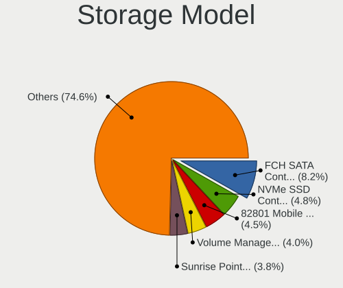

| Model                                                                          | Notebooks | Percent |
|--------------------------------------------------------------------------------|-----------|---------|
| AMD FCH SATA Controller [AHCI mode]                                            | 71        | 8.19%   |
| Samsung NVMe SSD Controller SM981/PM981/PM983                                  | 42        | 4.84%   |
| Intel 82801 Mobile SATA Controller [RAID mode]                                 | 39        | 4.5%    |
| Intel Volume Management Device NVMe RAID Controller                            | 35        | 4.04%   |
| Intel Sunrise Point-LP SATA Controller [AHCI mode]                             | 33        | 3.81%   |
| Intel 7 Series Chipset Family 6-port SATA Controller [AHCI mode]               | 29        | 3.34%   |
| Intel Cannon Lake Mobile PCH SATA AHCI Controller                              | 25        | 2.88%   |
| SanDisk Ultra 3D / WD PC SN530, IX SN530, Blue SN550 NVMe SSD (DRAM-less)      | 23        | 2.65%   |
| Samsung NVMe SSD Controller 980 (DRAM-less)                                    | 22        | 2.54%   |
| Intel SSD 660P Series                                                          | 18        | 2.08%   |
| Intel HM170/QM170 Chipset SATA Controller [AHCI Mode]                          | 16        | 1.85%   |
| SK hynix Gold P31/BC711/PC711 NVMe Solid State Drive                           | 15        | 1.73%   |
| Samsung NVMe SSD Controller PM9A1/PM9A3/980PRO                                 | 15        | 1.73%   |
| Intel Tiger Lake-LP SATA Controller                                            | 15        | 1.73%   |
| Intel 8 Series SATA Controller 1 [AHCI mode]                                   | 15        | 1.73%   |
| Intel 400 Series Chipset Family SATA AHCI Controller                           | 14        | 1.61%   |
| Intel Wildcat Point-LP SATA Controller [AHCI Mode]                             | 13        | 1.5%    |
| Intel SSD 670p Series [Keystone Harbor]                                        | 13        | 1.5%    |
| Intel 8 Series/C220 Series Chipset Family 6-port SATA Controller 1 [AHCI mode] | 12        | 1.38%   |
| Intel 6 Series/C200 Series Chipset Family 6 port Mobile SATA AHCI Controller   | 12        | 1.38%   |
| Phison E12 NVMe Controller                                                     | 11        | 1.27%   |
| SanDisk WD SN560/SN740/SN770/SN5000 NVMe SSD                                   | 10        | 1.15%   |
| Samsung NVMe SSD Controller PM9B1 (DRAM-less)                                  | 10        | 1.15%   |
| Intel Q170/Q150/B150/H170/H110/Z170/CM236 Chipset SATA Controller [AHCI Mode]  | 10        | 1.15%   |
| SK hynix BC501 NVMe Solid State Drive                                          | 9         | 1.04%   |
| Intel Comet Lake SATA AHCI Controller                                          | 9         | 1.04%   |
| Micron 2450 NVMe SSD [HendrixV] (DRAM-less)                                    | 8         | 0.92%   |
| Micron 2400 NVMe SSD (DRAM-less)                                               | 8         | 0.92%   |
| KIOXIA NVMe SSD Controller BG4 (DRAM-less)                                     | 8         | 0.92%   |
| Intel Tiger Lake SATA AHCI Controller                                          | 8         | 0.92%   |
| Intel RST Volume Management Device Controller                                  | 8         | 0.92%   |
| Intel Celeron/Pentium Silver Processor SATA Controller                         | 8         | 0.92%   |
| SanDisk Extreme Pro / WD Black SN750 / PC SN730 / Red SN700 NVMe SSD           | 7         | 0.81%   |
| Micron 3400 NVMe SSD [Hendrix]                                                 | 7         | 0.81%   |
| Intel Ice Lake-LP SATA Controller [AHCI mode]                                  | 7         | 0.81%   |
| Phison E16 PCIe4 NVMe Controller                                               | 6         | 0.69%   |
| Micron/Crucial P2 [Nick P2] / P3 / P3 Plus NVMe PCIe SSD (DRAM-less)           | 6         | 0.69%   |
| Kingston Company KC3000/FURY Renegade NVMe SSD [E18]                           | 6         | 0.69%   |
| Toshiba America Info Systems XG6 NVMe SSD Controller                           | 5         | 0.58%   |
| SK hynix Platinum P41/PC801 NVMe Solid State Drive                             | 5         | 0.58%   |

Storage Kind
------------

Kind of storage controller (IDE, SATA, NVMe, SAS, ...)

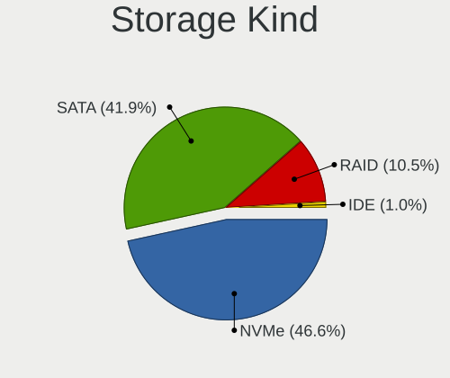

| Kind | Notebooks | Percent |
|------|-----------|---------|
| NVMe | 373       | 46.57%  |
| SATA | 336       | 41.95%  |
| RAID | 84        | 10.49%  |
| IDE  | 8         | 1%      |

Processor
---------

CPU Vendor
----------

Processor vendors

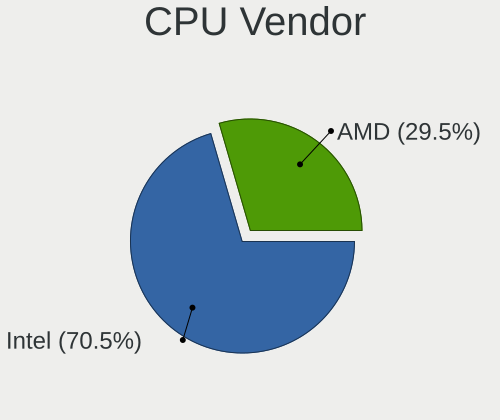

| Vendor | Notebooks | Percent |
|--------|-----------|---------|
| Intel  | 411       | 70.5%   |
| AMD    | 172       | 29.5%   |

CPU Model
---------

Processor models

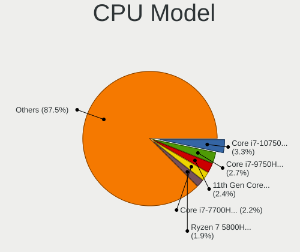

| Model                                         | Notebooks | Percent |
|-----------------------------------------------|-----------|---------|
| Intel Core i7-10750H CPU @ 2.60GHz            | 19        | 3.26%   |
| Intel Core i7-9750H CPU @ 2.60GHz             | 16        | 2.74%   |
| Intel 11th Gen Core i5-1135G7 @ 2.40GHz       | 14        | 2.4%    |
| Intel Core i7-7700HQ CPU @ 2.80GHz            | 13        | 2.23%   |
| AMD Ryzen 7 5800H with Radeon Graphics        | 11        | 1.89%   |
| AMD Ryzen 7 4800H with Radeon Graphics        | 11        | 1.89%   |
| AMD Ryzen 5 5500U with Radeon Graphics        | 10        | 1.72%   |
| Intel Core i7-8750H CPU @ 2.20GHz             | 8         | 1.37%   |
| Intel Core i7-8550U CPU @ 1.80GHz             | 8         | 1.37%   |
| Intel Core i5-3210M CPU @ 2.50GHz             | 8         | 1.37%   |
| Intel 12th Gen Core i7-12700H                 | 8         | 1.37%   |
| AMD Ryzen 5 5600H with Radeon Graphics        | 8         | 1.37%   |
| AMD Ryzen 5 3500U with Radeon Vega Mobile Gfx | 8         | 1.37%   |
| Intel Core i3-1005G1 CPU @ 1.20GHz            | 7         | 1.2%    |
| AMD Ryzen 7 7840HS w/ Radeon 780M Graphics    | 7         | 1.2%    |
| AMD Ryzen 5 3550H with Radeon Vega Mobile Gfx | 7         | 1.2%    |
| Intel Core i7-6700HQ CPU @ 2.60GHz            | 6         | 1.03%   |
| Intel Core i5-7200U CPU @ 2.50GHz             | 6         | 1.03%   |
| Intel Core i5-6200U CPU @ 2.30GHz             | 6         | 1.03%   |
| Intel 11th Gen Core i7-11800H @ 2.30GHz       | 6         | 1.03%   |
| Intel 11th Gen Core i5-11400H @ 2.70GHz       | 6         | 1.03%   |
| Intel 11th Gen Core i3-1115G4 @ 3.00GHz       | 6         | 1.03%   |
| AMD Ryzen 5 4600H with Radeon Graphics        | 6         | 1.03%   |
| Intel Core i5-9300H CPU @ 2.40GHz             | 5         | 0.86%   |
| AMD Ryzen 9 5900HS with Radeon Graphics       | 5         | 0.86%   |
| AMD Ryzen 7 6800H with Radeon Graphics        | 5         | 0.86%   |
| AMD Ryzen 5 7520U with Radeon Graphics        | 5         | 0.86%   |
| Intel Core i7-7500U CPU @ 2.70GHz             | 4         | 0.69%   |
| Intel Core i7-4600U CPU @ 2.10GHz             | 4         | 0.69%   |
| Intel Core i5-8350U CPU @ 1.70GHz             | 4         | 0.69%   |
| Intel Core i5-8265U CPU @ 1.60GHz             | 4         | 0.69%   |
| Intel Core i5-4210U CPU @ 1.70GHz             | 4         | 0.69%   |
| Intel Core i5-2520M CPU @ 2.50GHz             | 4         | 0.69%   |
| Intel Core i5-10210U CPU @ 1.60GHz            | 4         | 0.69%   |
| Intel Core i3-5005U CPU @ 2.00GHz             | 4         | 0.69%   |
| Intel Core i3-2350M CPU @ 2.30GHz             | 4         | 0.69%   |
| Intel 12th Gen Core i5-12450H                 | 4         | 0.69%   |
| Intel 11th Gen Core i7-1165G7 @ 2.80GHz       | 4         | 0.69%   |
| AMD Ryzen 7 PRO 4750U with Radeon Graphics    | 4         | 0.69%   |
| AMD Ryzen 7 3700U with Radeon Vega Mobile Gfx | 4         | 0.69%   |

CPU Model Family
----------------

Processor model prefix

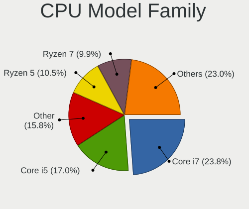

| Model                   | Notebooks | Percent |
|-------------------------|-----------|---------|
| Intel Core i7           | 139       | 23.84%  |
| Intel Core i5           | 99        | 16.98%  |
| Other                   | 92        | 15.78%  |
| AMD Ryzen 5             | 61        | 10.46%  |
| AMD Ryzen 7             | 58        | 9.95%   |
| Intel Core i3           | 34        | 5.83%   |
| AMD Ryzen 9             | 15        | 2.57%   |
| Intel Celeron           | 13        | 2.23%   |
| Intel Pentium           | 7         | 1.2%    |
| Intel Core i9           | 7         | 1.2%    |
| Intel Core              | 7         | 1.2%    |
| AMD Ryzen 3             | 7         | 1.2%    |
| Intel Core 2 Duo        | 6         | 1.03%   |
| AMD Ryzen 7 PRO         | 6         | 1.03%   |
| AMD A8                  | 6         | 1.03%   |
| AMD A6                  | 5         | 0.86%   |
| Intel Xeon              | 3         | 0.51%   |
| Intel Pentium Silver    | 3         | 0.51%   |
| AMD A4                  | 3         | 0.51%   |
| AMD A10                 | 3         | 0.51%   |
| Intel Pentium Dual-Core | 2         | 0.34%   |
| Intel Core m3           | 2         | 0.34%   |
| AMD Athlon              | 2         | 0.34%   |
| AMD Turion              | 1         | 0.17%   |
| AMD FX                  | 1         | 0.17%   |
| AMD E                   | 1         | 0.17%   |

CPU Cores
---------

Number of processor cores

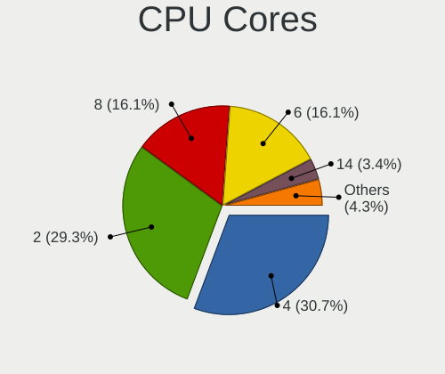

| Number | Notebooks | Percent |
|--------|-----------|---------|
| 4      | 179       | 30.7%   |
| 2      | 171       | 29.33%  |
| 8      | 94        | 16.12%  |
| 6      | 94        | 16.12%  |
| 14     | 20        | 3.43%   |
| 10     | 11        | 1.89%   |
| 24     | 5         | 0.86%   |
| 16     | 4         | 0.69%   |
| 12     | 3         | 0.51%   |
| 1      | 2         | 0.34%   |

CPU Sockets
-----------

Number of sockets

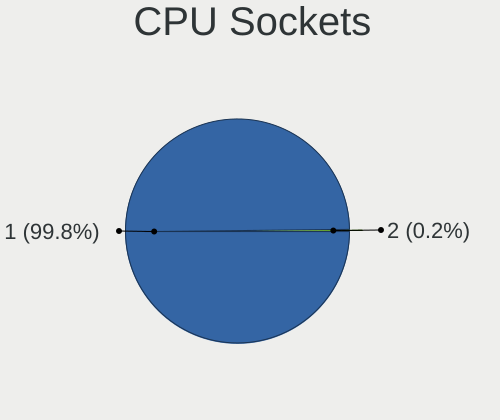

| Number | Notebooks | Percent |
|--------|-----------|---------|
| 1      | 582       | 99.83%  |
| 2      | 1         | 0.17%   |

CPU Threads
-----------

Threads per core (Hyper-Threading)

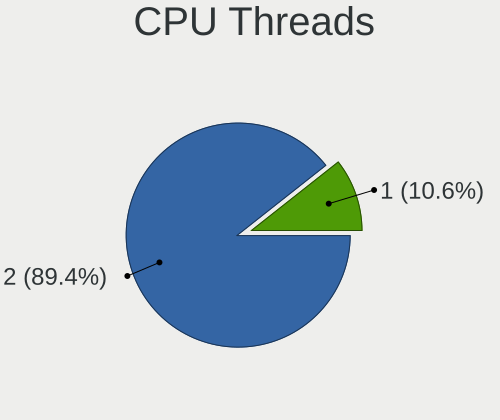

| Number | Notebooks | Percent |
|--------|-----------|---------|
| 2      | 521       | 89.37%  |
| 1      | 62        | 10.63%  |

CPU Op-Modes
------------

CPU Operation Modes (32-bit, 64-bit)

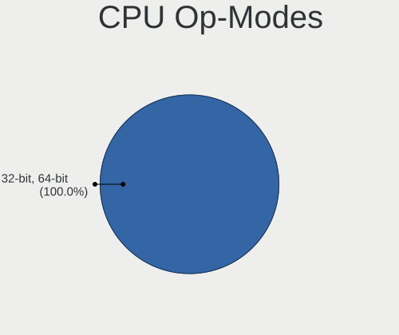

| Op mode        | Notebooks | Percent |
|----------------|-----------|---------|
| 32-bit, 64-bit | 583       | 100%    |

CPU Microcode
-------------

Microcode number

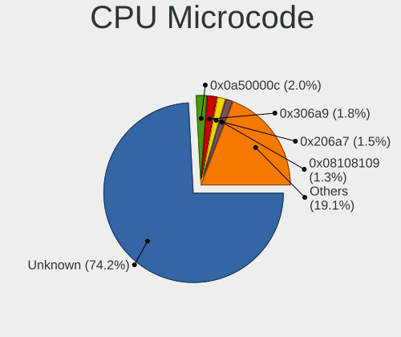

| Number     | Notebooks | Percent |
|------------|-----------|---------|
| Unknown    | 442       | 74.16%  |
| 0x0a50000c | 12        | 2.01%   |
| 0x306a9    | 11        | 1.85%   |
| 0x206a7    | 9         | 1.51%   |
| 0x08108109 | 8         | 1.34%   |
| 0x806c1    | 7         | 1.17%   |
| 0xa0652    | 6         | 1.01%   |
| 0x906ea    | 6         | 1.01%   |
| 0x08600106 | 6         | 1.01%   |
| 0x906e9    | 5         | 0.84%   |
| 0x806ea    | 5         | 0.84%   |
| 0x806e9    | 5         | 0.84%   |
| 0x506e3    | 4         | 0.67%   |
| 0x306c3    | 4         | 0.67%   |
| 0x08600103 | 4         | 0.67%   |
| 0x806ec    | 3         | 0.5%    |
| 0x406e3    | 3         | 0.5%    |
| 0x40651    | 3         | 0.5%    |
| 0x0a50000d | 3         | 0.5%    |
| 0x0a404102 | 3         | 0.5%    |
| 0x08a00008 | 3         | 0.5%    |
| 0x08608103 | 3         | 0.5%    |
| 0x08600104 | 3         | 0.5%    |
| 0x08108102 | 3         | 0.5%    |
| 0x06006705 | 3         | 0.5%    |
| 0x906a3    | 2         | 0.34%   |
| 0x106e5    | 2         | 0.34%   |
| 0x0a704103 | 2         | 0.34%   |
| 0x0a601203 | 2         | 0.34%   |
| 0x0a50000b | 2         | 0.34%   |
| 0x08101007 | 2         | 0.34%   |
| 0xa0660    | 1         | 0.17%   |
| 0x806d1    | 1         | 0.17%   |
| 0x706e5    | 1         | 0.17%   |
| 0x706a8    | 1         | 0.17%   |
| 0x706a1    | 1         | 0.17%   |
| 0x506c9    | 1         | 0.17%   |
| 0x406c4    | 1         | 0.17%   |
| 0x306d4    | 1         | 0.17%   |
| 0x20655    | 1         | 0.17%   |

CPU Microarch
-------------

Microarchitecture

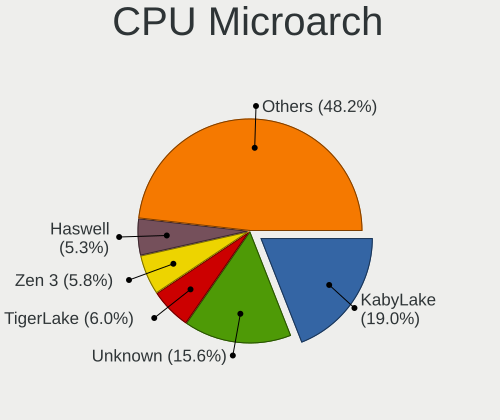

| Name              | Notebooks | Percent |
|-------------------|-----------|---------|
| KabyLake          | 111       | 19.04%  |
| Unknown           | 91        | 15.61%  |
| TigerLake         | 35        | 6%      |
| Zen 3             | 34        | 5.83%   |
| Haswell           | 31        | 5.32%   |
| IvyBridge         | 30        | 5.15%   |
| CometLake         | 30        | 5.15%   |
| Zen 2             | 29        | 4.97%   |
| Skylake           | 29        | 4.97%   |
| Zen+              | 28        | 4.8%    |
| Alderlake Hybrid  | 23        | 3.95%   |
| SandyBridge       | 21        | 3.6%    |
| Broadwell         | 16        | 2.74%   |
| IceLake           | 13        | 2.23%   |
| Goldmont plus     | 8         | 1.37%   |
| Excavator         | 8         | 1.37%   |
| Penryn            | 7         | 1.2%    |
| Westmere          | 6         | 1.03%   |
| Puma              | 5         | 0.86%   |
| Zen               | 4         | 0.69%   |
| Meteorlake Hybrid | 4         | 0.69%   |
| Goldmont          | 4         | 0.69%   |
| Silvermont        | 3         | 0.51%   |
| Piledriver        | 3         | 0.51%   |
| Steamroller       | 2         | 0.34%   |
| Nehalem           | 2         | 0.34%   |
| Lunarlake Hybrid  | 1         | 0.17%   |
| K8 & K10 hybrid   | 1         | 0.17%   |
| K10 Llano         | 1         | 0.17%   |
| Jaguar            | 1         | 0.17%   |
| Core              | 1         | 0.17%   |
| Bobcat            | 1         | 0.17%   |

Graphics
--------

GPU Vendor
----------

Vendors of graphics cards

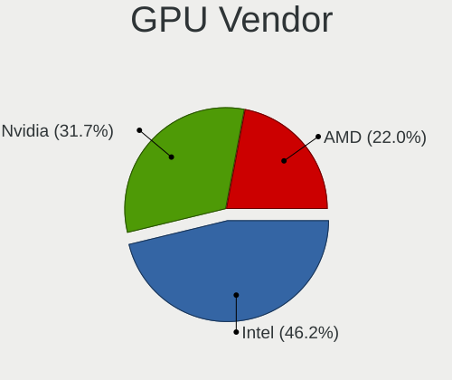

| Vendor | Notebooks | Percent |
|--------|-----------|---------|
| Intel  | 386       | 46.23%  |
| Nvidia | 265       | 31.74%  |
| AMD    | 184       | 22.04%  |

GPU Model
---------

Graphics card models

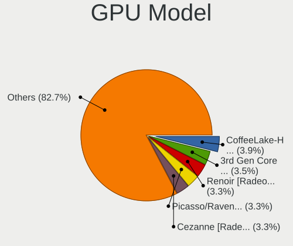

| Model                                                                     | Notebooks | Percent |
|---------------------------------------------------------------------------|-----------|---------|
| Intel CoffeeLake-H GT2 [UHD Graphics 630]                                 | 33        | 3.88%   |
| Intel 3rd Gen Core processor Graphics Controller                          | 30        | 3.53%   |
| AMD Renoir [Radeon Vega Series / Radeon Vega Mobile Series]               | 28        | 3.29%   |
| AMD Picasso/Raven 2 [Radeon Vega Series / Radeon Vega Mobile Series]      | 28        | 3.29%   |
| AMD Cezanne [Radeon Vega Series / Radeon Vega Mobile Series]              | 28        | 3.29%   |
| Nvidia TU117M [GeForce GTX 1650 Mobile / Max-Q]                           | 27        | 3.18%   |
| Intel TigerLake-LP GT2 [Iris Xe Graphics]                                 | 26        | 3.06%   |
| Intel CometLake-H GT2 [UHD Graphics]                                      | 25        | 2.94%   |
| Nvidia GA106M [GeForce RTX 3060 Mobile / Max-Q]                           | 21        | 2.47%   |
| Intel 2nd Generation Core Processor Family Integrated Graphics Controller | 20        | 2.35%   |
| Intel Kaby Lake-R GT2 [UHD Graphics 620]                                  | 19        | 2.24%   |
| Intel Kaby Lake-H GT2 [HD Graphics 630]                                   | 18        | 2.12%   |
| Intel Haswell-ULT Integrated Graphics Controller                          | 17        | 2%      |
| AMD Rembrandt [Radeon 680M]                                               | 17        | 2%      |
| Intel TigerLake-H GT1 [UHD Graphics]                                      | 15        | 1.76%   |
| Intel Kaby Lake-U GT2 [HD Graphics 620]                                   | 14        | 1.65%   |
| Intel Broadwell-U GT2 [HD Graphics 5500]                                  | 14        | 1.65%   |
| AMD Lucienne                                                              | 14        | 1.65%   |
| Nvidia TU116M [GeForce GTX 1660 Ti Mobile]                                | 12        | 1.41%   |
| Intel Skylake-U GT2 [HD Graphics 520]                                     | 12        | 1.41%   |
| Intel Alder Lake-P GT2 [Iris Xe Graphics]                                 | 12        | 1.41%   |
| Intel 4th Gen Core Processor Integrated Graphics Controller               | 12        | 1.41%   |
| Nvidia GA107M [GeForce RTX 3050 Mobile]                                   | 11        | 1.29%   |
| Nvidia TU117M [GeForce GTX 1650 Ti Mobile]                                | 10        | 1.18%   |
| Nvidia GP107M [GeForce GTX 1050 Mobile]                                   | 10        | 1.18%   |
| Intel Iris Plus Graphics G1 (Ice Lake)                                    | 10        | 1.18%   |
| Nvidia GP107M [GeForce GTX 1050 Ti Mobile]                                | 9         | 1.06%   |
| Nvidia GA104M [GeForce RTX 3070 Mobile / Max-Q]                           | 9         | 1.06%   |
| Intel Tiger Lake-LP GT2 [UHD Graphics G4]                                 | 9         | 1.06%   |
| Intel Skylake-H GT2 [HD Graphics 530]                                     | 9         | 1.06%   |
| AMD Phoenix1                                                              | 9         | 1.06%   |
| Nvidia GP106M [GeForce GTX 1060 Mobile]                                   | 8         | 0.94%   |
| Nvidia AD107M [GeForce RTX 4060 Max-Q / Mobile]                           | 8         | 0.94%   |
| Nvidia AD107M [GeForce RTX 4050 Max-Q / Mobile]                           | 8         | 0.94%   |
| Intel Raptor Lake-P [Iris Xe Graphics]                                    | 8         | 0.94%   |
| Intel CometLake-U GT2 [UHD Graphics]                                      | 8         | 0.94%   |
| Intel Raptor Lake-S UHD Graphics                                          | 7         | 0.82%   |
| Nvidia TU106M [GeForce RTX 2060 Mobile]                                   | 6         | 0.71%   |
| Nvidia GA107M [GeForce RTX 3050 Ti Mobile]                                | 6         | 0.71%   |
| Intel WhiskeyLake-U GT2 [UHD Graphics 620]                                | 6         | 0.71%   |

GPU Combo
---------

Combinations of graphics cards

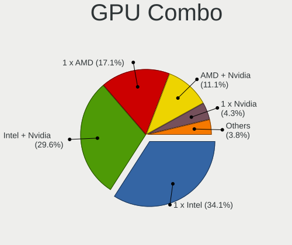

| Name               | Notebooks | Percent |
|--------------------|-----------|---------|
| 1 x Intel          | 199       | 34.08%  |
| Intel + Nvidia     | 173       | 29.62%  |
| 1 x AMD            | 100       | 17.12%  |
| AMD + Nvidia       | 65        | 11.13%  |
| 1 x Nvidia         | 25        | 4.28%   |
| Intel + AMD        | 10        | 1.71%   |
| 2 x AMD            | 9         | 1.54%   |
| Intel + 2 x Nvidia | 2         | 0.34%   |
| 2 x Intel          | 1         | 0.17%   |

GPU Driver
----------

Free vs proprietary

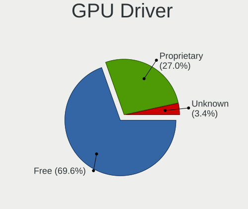

| Driver      | Notebooks | Percent |
|-------------|-----------|---------|
| Free        | 407       | 69.57%  |
| Proprietary | 158       | 27.01%  |
| Unknown     | 20        | 3.42%   |

GPU Memory
----------

Total video memory

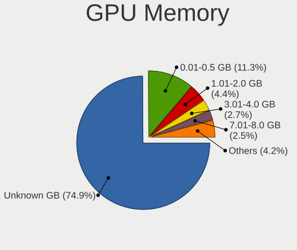

| Size in GB | Notebooks | Percent |
|------------|-----------|---------|
| Unknown    | 445       | 74.92%  |
| 0.01-0.5   | 67        | 11.28%  |
| 1.01-2.0   | 26        | 4.38%   |
| 3.01-4.0   | 16        | 2.69%   |
| 7.01-8.0   | 15        | 2.53%   |
| 5.01-6.0   | 14        | 2.36%   |
| 0.51-1.0   | 8         | 1.35%   |
| 8.01-16.0  | 3         | 0.51%   |

Monitor
-------

Monitor Vendor
--------------

Monitor vendors

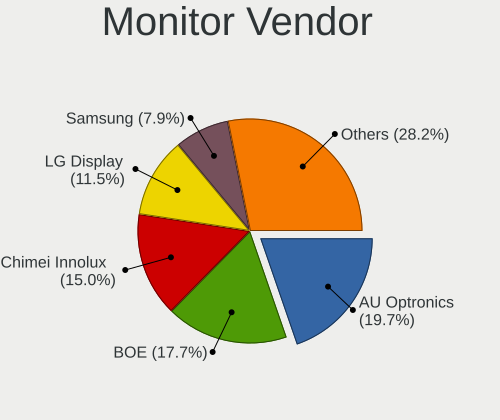

| Vendor                  | Notebooks | Percent |
|-------------------------|-----------|---------|
| AU Optronics            | 135       | 19.71%  |
| BOE                     | 121       | 17.66%  |
| Chimei Innolux          | 103       | 15.04%  |
| LG Display              | 79        | 11.53%  |
| Samsung Electronics     | 54        | 7.88%   |
| PANDA                   | 22        | 3.21%   |
| Sharp                   | 19        | 2.77%   |
| Dell                    | 17        | 2.48%   |
| Apple                   | 15        | 2.19%   |
| Lenovo                  | 12        | 1.75%   |
| Goldstar                | 10        | 1.46%   |
| Acer                    | 9         | 1.31%   |
| Hewlett-Packard         | 8         | 1.17%   |
| TMX                     | 5         | 0.73%   |
| Philips                 | 4         | 0.58%   |
| Mi                      | 4         | 0.58%   |
| AOC                     | 4         | 0.58%   |
| Sony                    | 3         | 0.44%   |
| MSI                     | 3         | 0.44%   |
| InfoVision              | 3         | 0.44%   |
| HKC                     | 3         | 0.44%   |
| CSW                     | 3         | 0.44%   |
| CSO                     | 3         | 0.44%   |
| Chi Mei Optoelectronics | 3         | 0.44%   |
| BenQ                    | 3         | 0.44%   |
| ASUSTek Computer        | 3         | 0.44%   |
| Vizio                   | 2         | 0.29%   |
| ViewSonic               | 2         | 0.29%   |
| Tianma XM               | 2         | 0.29%   |
| STA                     | 2         | 0.29%   |
| LGD                     | 2         | 0.29%   |
| Valve                   | 1         | 0.15%   |
| TMA                     | 1         | 0.15%   |
| SDC                     | 1         | 0.15%   |
| Pixio                   | 1         | 0.15%   |
| Philco                  | 1         | 0.15%   |
| Panasonic               | 1         | 0.15%   |
| OUT                     | 1         | 0.15%   |
| Onkyo                   | 1         | 0.15%   |
| OFI                     | 1         | 0.15%   |

Monitor Model
-------------

Monitor models

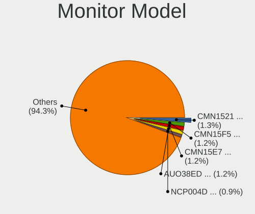

| Model                                                                 | Notebooks | Percent |
|-----------------------------------------------------------------------|-----------|---------|
| Chimei Innolux LCD Monitor CMN1521 1920x1080 344x193mm 15.5-inch      | 9         | 1.3%    |
| Chimei Innolux LCD Monitor CMN15F5 1920x1080 344x193mm 15.5-inch      | 8         | 1.16%   |
| Chimei Innolux LCD Monitor CMN15E7 1920x1080 344x193mm 15.5-inch      | 8         | 1.16%   |
| AU Optronics LCD Monitor AUO38ED 1920x1080 344x193mm 15.5-inch        | 8         | 1.16%   |
| PANDA LCD Monitor NCP004D 1920x1080 344x194mm 15.5-inch               | 6         | 0.87%   |
| Samsung Electronics LCD Monitor SDC4161 1920x1080 344x194mm 15.5-inch | 5         | 0.72%   |
| Chimei Innolux LCD Monitor CMN1540 2560x1440 344x193mm 15.5-inch      | 4         | 0.58%   |
| Chimei Innolux LCD Monitor CMN14E5 1920x1080 309x173mm 13.9-inch      | 4         | 0.58%   |
| BOE LCD Monitor BOE0700 1920x1080 344x194mm 15.5-inch                 | 4         | 0.58%   |
| AU Optronics LCD Monitor AUOAF90 1920x1080 344x193mm 15.5-inch        | 4         | 0.58%   |
| AU Optronics LCD Monitor AUO21ED 1920x1080 344x193mm 15.5-inch        | 4         | 0.58%   |
| Mi Monitor XMI3444 3440x1440 797x334mm 34.0-inch                      | 3         | 0.43%   |
| LG Display LCD Monitor LGD0690 2560x1440 344x194mm 15.5-inch          | 3         | 0.43%   |
| LG Display LCD Monitor LGD05FE 1920x1080 344x194mm 15.5-inch          | 3         | 0.43%   |
| Chimei Innolux LCD Monitor CMN1618 1920x1200 344x215mm 16.0-inch      | 3         | 0.43%   |
| Chimei Innolux LCD Monitor CMN15C4 1920x1080 344x193mm 15.5-inch      | 3         | 0.43%   |
| BOE LCD Monitor BOE0BC9 2560x1600 345x215mm 16.0-inch                 | 3         | 0.43%   |
| BOE LCD Monitor BOE06A4 1366x768 344x194mm 15.5-inch                  | 3         | 0.43%   |
| AU Optronics LCD Monitor AUO45EC 1366x768 344x193mm 15.5-inch         | 3         | 0.43%   |
| AU Optronics LCD Monitor AUO403D 1920x1080 309x174mm 14.0-inch        | 3         | 0.43%   |
| AU Optronics LCD Monitor AUO133D 1920x1080 309x173mm 13.9-inch        | 3         | 0.43%   |
| Apple LCD Monitor APP9CC3 1280x800 286x179mm 13.3-inch                | 3         | 0.43%   |
| Vizio D24-D1 VIZ1005 1920x1080 521x293mm 23.5-inch                    | 2         | 0.29%   |
| TMX TL156MDMP31-0 TMX2005 3200x2000 336x210mm 15.6-inch               | 2         | 0.29%   |
| Tianma XM LCD Monitor TLX1388 3000x2000 293x196mm 13.9-inch           | 2         | 0.29%   |
| Sharp LQ156M1JW09 SHP14D3 1920x1080 344x194mm 15.5-inch               | 2         | 0.29%   |
| Sharp LQ134N1JW52 SHP151E 1920x1200 288x180mm 13.4-inch               | 2         | 0.29%   |
| Sharp LCD Monitor SHP14BA 1920x1080 344x194mm 15.5-inch               | 2         | 0.29%   |
| Samsung Electronics LCD Monitor SEC544B 1600x900 382x214mm 17.2-inch  | 2         | 0.29%   |
| Samsung Electronics LCD Monitor SEC5448 1920x1080 344x194mm 15.5-inch | 2         | 0.29%   |
| Samsung Electronics LCD Monitor SDC4C48 1920x1080 293x165mm 13.2-inch | 2         | 0.29%   |
| Samsung Electronics LCD Monitor SDC4171 2880x1800 302x189mm 14.0-inch | 2         | 0.29%   |
| Samsung Electronics C27F390 SAM0D32 1920x1080 598x336mm 27.0-inch     | 2         | 0.29%   |
| PANDA LCD Monitor NCP0046 1920x1080 344x194mm 15.5-inch               | 2         | 0.29%   |
| PANDA LCD Monitor NCP0036 1920x1080 344x194mm 15.5-inch               | 2         | 0.29%   |
| PANDA LCD Monitor NCP002D 1920x1080 344x194mm 15.5-inch               | 2         | 0.29%   |
| LG Display LCD Monitor LGD05E5 1920x1080 344x194mm 15.5-inch          | 2         | 0.29%   |
| LG Display LCD Monitor LGD056D 1920x1080 382x215mm 17.3-inch          | 2         | 0.29%   |
| LG Display LCD Monitor LGD0563 1920x1080 344x194mm 15.5-inch          | 2         | 0.29%   |
| LG Display LCD Monitor LGD0493 1366x768 344x194mm 15.5-inch           | 2         | 0.29%   |

Monitor Resolution
------------------

Monitor screen resolution

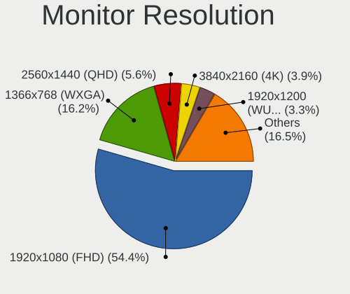

| Resolution         | Notebooks | Percent |
|--------------------|-----------|---------|
| 1920x1080 (FHD)    | 349       | 54.45%  |
| 1366x768 (WXGA)    | 104       | 16.22%  |
| 2560x1440 (QHD)    | 36        | 5.62%   |
| 3840x2160 (4K)     | 25        | 3.9%    |
| 1920x1200 (WUXGA)  | 21        | 3.28%   |
| 1600x900 (HD+)     | 20        | 3.12%   |
| 2560x1600          | 19        | 2.96%   |
| 2880x1800          | 10        | 1.56%   |
| 1680x1050 (WSXGA+) | 8         | 1.25%   |
| 1280x800 (WXGA)    | 8         | 1.25%   |
| 3440x1440          | 6         | 0.94%   |
| 1440x900 (WXGA+)   | 4         | 0.62%   |
| 3840x2400          | 3         | 0.47%   |
| 3200x2000          | 2         | 0.31%   |
| 3000x2000          | 2         | 0.31%   |
| 2256x1504          | 2         | 0.31%   |
| 2160x1440          | 2         | 0.31%   |
| 1280x720 (HD)      | 2         | 0.31%   |
| 1280x1024 (SXGA)   | 2         | 0.31%   |
| 800x1280           | 1         | 0.16%   |
| 3520x1080          | 1         | 0.16%   |
| 3200x1800 (QHD+)   | 1         | 0.16%   |
| 2944x1840          | 1         | 0.16%   |
| 2880x1620          | 1         | 0.16%   |
| 2880x1440          | 1         | 0.16%   |
| 2560x1080          | 1         | 0.16%   |
| 2520x1680          | 1         | 0.16%   |
| 2240x1400          | 1         | 0.16%   |
| 1920x540           | 1         | 0.16%   |
| 1680x945           | 1         | 0.16%   |
| 1600x1200          | 1         | 0.16%   |
| 1360x768           | 1         | 0.16%   |
| 1280x768           | 1         | 0.16%   |
| 1024x768 (XGA)     | 1         | 0.16%   |
| Unknown            | 1         | 0.16%   |

Monitor Diagonal
----------------

Diagonal size in inches

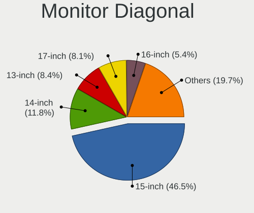

| Inches  | Notebooks | Percent |
|---------|-----------|---------|
| 15      | 316       | 46.54%  |
| 14      | 80        | 11.78%  |
| 13      | 57        | 8.39%   |
| 17      | 55        | 8.1%    |
| 16      | 37        | 5.45%   |
| 27      | 26        | 3.83%   |
| 24      | 17        | 2.5%    |
| 31      | 11        | 1.62%   |
| 23      | 11        | 1.62%   |
| 21      | 10        | 1.47%   |
| 18      | 9         | 1.33%   |
| Unknown | 9         | 1.33%   |
| 34      | 5         | 0.74%   |
| 19      | 4         | 0.59%   |
| 12      | 4         | 0.59%   |
| 11      | 4         | 0.59%   |
| 20      | 3         | 0.44%   |
| 84      | 2         | 0.29%   |
| 72      | 2         | 0.29%   |
| 54      | 2         | 0.29%   |
| 40      | 2         | 0.29%   |
| 22      | 2         | 0.29%   |
| 85      | 1         | 0.15%   |
| 65      | 1         | 0.15%   |
| 52      | 1         | 0.15%   |
| 43      | 1         | 0.15%   |
| 35      | 1         | 0.15%   |
| 32      | 1         | 0.15%   |
| 29      | 1         | 0.15%   |
| 28      | 1         | 0.15%   |
| 26      | 1         | 0.15%   |
| 25      | 1         | 0.15%   |
| 7       | 1         | 0.15%   |

Monitor Width
-------------

Physical width

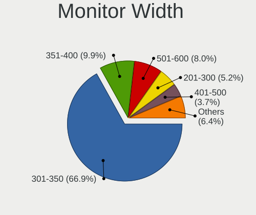

| Width in mm | Notebooks | Percent |
|-------------|-----------|---------|
| 301-350     | 453       | 66.91%  |
| 351-400     | 67        | 9.9%    |
| 501-600     | 54        | 7.98%   |
| 201-300     | 35        | 5.17%   |
| 401-500     | 25        | 3.69%   |
| 601-700     | 14        | 2.07%   |
| Unknown     | 9         | 1.33%   |
| 701-800     | 6         | 0.89%   |
| 1501-2000   | 5         | 0.74%   |
| 1001-1500   | 4         | 0.59%   |
| 801-900     | 3         | 0.44%   |
| 901-1000    | 1         | 0.15%   |
| 1-100       | 1         | 0.15%   |

Aspect Ratio
------------

Proportional relationship between the width and the height

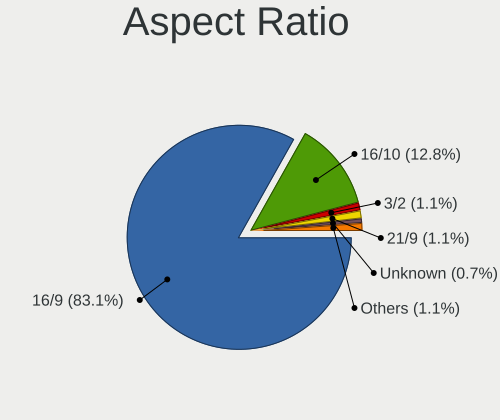

| Ratio   | Notebooks | Percent |
|---------|-----------|---------|
| 16/9    | 508       | 83.14%  |
| 16/10   | 78        | 12.77%  |
| 3/2     | 7         | 1.15%   |
| 21/9    | 7         | 1.15%   |
| Unknown | 4         | 0.65%   |
| 4/3     | 3         | 0.49%   |
| 5/4     | 2         | 0.33%   |
| 2.00    | 1         | 0.16%   |
| 0.62    | 1         | 0.16%   |

Monitor Area
------------

Area in inch²

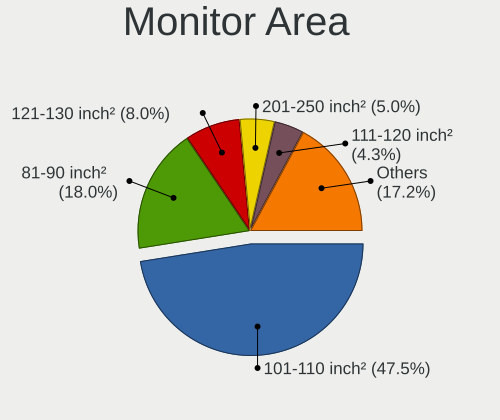

| Area in inch² | Notebooks | Percent |
|----------------|-----------|---------|
| 101-110        | 321       | 47.49%  |
| 81-90          | 122       | 18.05%  |
| 121-130        | 54        | 7.99%   |
| 201-250        | 34        | 5.03%   |
| 111-120        | 29        | 4.29%   |
| 301-350        | 27        | 3.99%   |
| 351-500        | 19        | 2.81%   |
| 71-80          | 13        | 1.92%   |
| More than 1000 | 9         | 1.33%   |
| Unknown        | 9         | 1.33%   |
| 151-200        | 8         | 1.18%   |
| 141-150        | 8         | 1.18%   |
| 251-300        | 6         | 0.89%   |
| 61-70          | 4         | 0.59%   |
| 51-60          | 4         | 0.59%   |
| 501-1000       | 3         | 0.44%   |
| 91-100         | 3         | 0.44%   |
| 131-140        | 2         | 0.3%    |
| 1-40           | 1         | 0.15%   |

Pixel Density
-------------

Pixels per inch

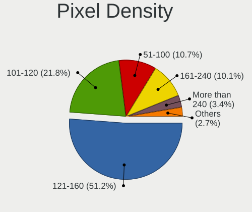

| Density       | Notebooks | Percent |
|---------------|-----------|---------|
| 121-160       | 343       | 51.19%  |
| 101-120       | 146       | 21.79%  |
| 51-100        | 72        | 10.75%  |
| 161-240       | 68        | 10.15%  |
| More than 240 | 23        | 3.43%   |
| 1-50          | 9         | 1.34%   |
| Unknown       | 9         | 1.34%   |

Multiple Monitors
-----------------

Total monitors connected

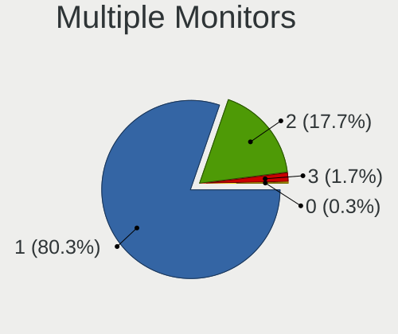

| Total | Notebooks | Percent |
|-------|-----------|---------|
| 1     | 476       | 80.27%  |
| 2     | 105       | 17.71%  |
| 3     | 10        | 1.69%   |
| 0     | 2         | 0.34%   |

Network
-------

Net Controller Vendor
---------------------

Controller vendors

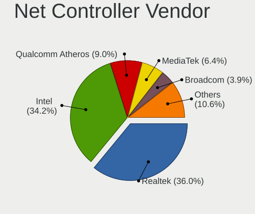

| Vendor                                 | Notebooks | Percent |
|----------------------------------------|-----------|---------|
| Realtek Semiconductor                  | 343       | 35.95%  |
| Intel                                  | 326       | 34.17%  |
| Qualcomm Atheros                       | 86        | 9.01%   |
| MediaTek                               | 61        | 6.39%   |
| Broadcom                               | 37        | 3.88%   |
| TP-Link                                | 10        | 1.05%   |
| Samsung Electronics                    | 10        | 1.05%   |
| Shenzhen Goodix Technology             | 8         | 0.84%   |
| Xiaomi                                 | 6         | 0.63%   |
| Ralink Technology                      | 6         | 0.63%   |
| DisplayLink                            | 6         | 0.63%   |
| Sierra Wireless                        | 5         | 0.52%   |
| Qualcomm                               | 5         | 0.52%   |
| ASIX Electronics                       | 5         | 0.52%   |
| Dell                                   | 4         | 0.42%   |
| NetGear                                | 3         | 0.31%   |
| Lenovo                                 | 3         | 0.31%   |
| Wacom                                  | 2         | 0.21%   |
| Qualcomm Technologies                  | 2         | 0.21%   |
| Huawei Technologies                    | 2         | 0.21%   |
| Google                                 | 2         | 0.21%   |
| Ericsson Business Mobile Networks      | 2         | 0.21%   |
| Broadcom Limited                       | 2         | 0.21%   |
| ASUSTek Computer                       | 2         | 0.21%   |
| Unknown                                | 2         | 0.21%   |
| ZyXEL Communications                   | 1         | 0.1%    |
| ZTE WCDMA Technologies MSM             | 1         | 0.1%    |
| Sony Ericsson Mobile Communications AB | 1         | 0.1%    |
| Ralink                                 | 1         | 0.1%    |
| QinHeng Electronics                    | 1         | 0.1%    |
| OnePlus Technology (Shenzhen)          | 1         | 0.1%    |
| Nvidia                                 | 1         | 0.1%    |
| Motorola PCS                           | 1         | 0.1%    |
| Microsoft                              | 1         | 0.1%    |
| Marvell Technology Group               | 1         | 0.1%    |
| ICS Advent                             | 1         | 0.1%    |
| Hewlett-Packard                        | 1         | 0.1%    |
| Edimax Technology                      | 1         | 0.1%    |
| Dresden Elektronik                     | 1         | 0.1%    |

Net Controller Model
--------------------

Controller models

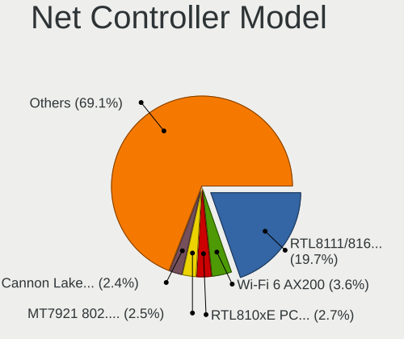

| Model                                                                  | Notebooks | Percent |
|------------------------------------------------------------------------|-----------|---------|
| Realtek RTL8111/8168/8211/8411 PCI Express Gigabit Ethernet Controller | 217       | 19.66%  |
| Intel Wi-Fi 6 AX200                                                    | 40        | 3.62%   |
| Realtek RTL810xE PCI Express Fast Ethernet controller                  | 30        | 2.72%   |
| MediaTek MT7921 802.11ax PCIe Wireless Network Adapter [Filogic 330]   | 28        | 2.54%   |
| Intel Cannon Lake PCH CNVi WiFi                                        | 26        | 2.36%   |
| Intel Wi-Fi 6 AX201                                                    | 25        | 2.26%   |
| Intel Comet Lake PCH CNVi WiFi                                         | 25        | 2.26%   |
| Realtek RTL8822CE 802.11ac PCIe Wireless Network Adapter               | 24        | 2.17%   |
| Realtek RTL8821CE 802.11ac PCIe Wireless Network Adapter               | 23        | 2.08%   |
| Qualcomm Atheros QCA6174 802.11ac Wireless Network Adapter             | 22        | 1.99%   |
| Intel Wireless 8265 / 8275                                             | 19        | 1.72%   |
| Intel Alder Lake-P PCH CNVi WiFi                                       | 19        | 1.72%   |
| Intel Wireless 7265                                                    | 17        | 1.54%   |
| Intel 82579LM Gigabit Network Connection (Lewisville)                  | 17        | 1.54%   |
| Realtek RTL8125 2.5GbE Controller                                      | 15        | 1.36%   |
| Realtek RTL8852BE PCIe 802.11ax Wireless Network Controller            | 14        | 1.27%   |
| Qualcomm Atheros QCA9377 802.11ac Wireless Network Adapter             | 14        | 1.27%   |
| Intel Wireless 7260                                                    | 14        | 1.27%   |
| MediaTek MT7922 802.11ax PCI Express Wireless Network Adapter          | 13        | 1.18%   |
| Qualcomm Atheros QCA9565 / AR9565 Wireless Network Adapter             | 12        | 1.09%   |
| MediaTek MT7902 802.11ax PCIe Wireless Network Adapter [Filogic 310]   | 12        | 1.09%   |
| Intel Wireless 3165                                                    | 12        | 1.09%   |
| Intel Wi-Fi 6E(802.11ax) AX210/AX1675* 2x2 [Typhoon Peak]              | 12        | 1.09%   |
| Realtek RTL8153 Gigabit Ethernet Adapter                               | 11        | 1%      |
| Intel Wireless 8260                                                    | 11        | 1%      |
| Intel Tiger Lake PCH CNVi WiFi                                         | 10        | 0.91%   |
| Realtek Killer E2600 GbE Controller                                    | 8         | 0.72%   |
| Intel Ice Lake-LP PCH CNVi WiFi                                        | 8         | 0.72%   |
| Intel Centrino Advanced-N 6205 [Taylor Peak]                           | 8         | 0.72%   |
| Broadcom NetXtreme BCM57765 Gigabit Ethernet PCIe                      | 8         | 0.72%   |
| Broadcom BCM4331 802.11a/b/g/n                                         | 8         | 0.72%   |
| Shenzhen Goodix Fingerprint Reader                                     | 7         | 0.63%   |
| Samsung GT-I9070 (network tethering, USB debugging enabled)            | 7         | 0.63%   |
| Realtek RTL8822BE 802.11a/b/g/n/ac WiFi adapter                        | 7         | 0.63%   |
| Qualcomm Atheros Killer E2500 Gigabit Ethernet Controller              | 7         | 0.63%   |
| Qualcomm Atheros Killer E2400 Gigabit Ethernet Controller              | 7         | 0.63%   |
| Intel Ethernet Connection (4) I219-LM                                  | 7         | 0.63%   |
| Intel Comet Lake PCH-LP CNVi WiFi                                      | 7         | 0.63%   |
| Realtek RTL8723DE Wireless Network Adapter                             | 6         | 0.54%   |
| Realtek RTL8723BE PCIe Wireless Network Adapter                        | 6         | 0.54%   |

Wireless Vendor
---------------

Wireless vendors

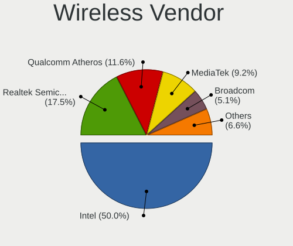

| Vendor                | Notebooks | Percent |
|-----------------------|-----------|---------|
| Intel                 | 303       | 50%     |
| Realtek Semiconductor | 106       | 17.49%  |
| Qualcomm Atheros      | 70        | 11.55%  |
| MediaTek              | 56        | 9.24%   |
| Broadcom              | 31        | 5.12%   |
| TP-Link               | 9         | 1.49%   |
| Ralink Technology     | 6         | 0.99%   |
| Sierra Wireless       | 5         | 0.83%   |
| NetGear               | 3         | 0.5%    |
| Wacom                 | 2         | 0.33%   |
| Qualcomm              | 2         | 0.33%   |
| Dell                  | 2         | 0.33%   |
| Broadcom Limited      | 2         | 0.33%   |
| ASUSTek Computer      | 2         | 0.33%   |
| Unknown               | 2         | 0.33%   |
| ZyXEL Communications  | 1         | 0.17%   |
| Ralink                | 1         | 0.17%   |
| Qualcomm Technologies | 1         | 0.17%   |
| Hewlett-Packard       | 1         | 0.17%   |
| Edimax Technology     | 1         | 0.17%   |

Wireless Model
--------------

Wireless models

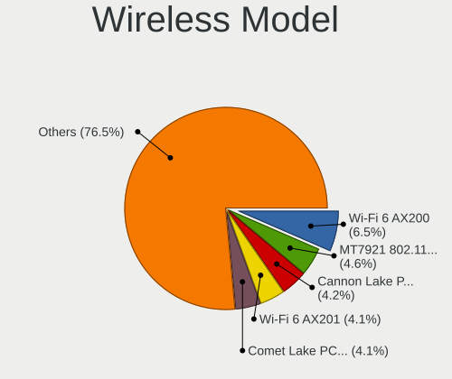

| Model                                                                | Notebooks | Percent |
|----------------------------------------------------------------------|-----------|---------|
| Intel Wi-Fi 6 AX200                                                  | 40        | 6.54%   |
| MediaTek MT7921 802.11ax PCIe Wireless Network Adapter [Filogic 330] | 28        | 4.58%   |
| Intel Cannon Lake PCH CNVi WiFi                                      | 26        | 4.25%   |
| Intel Wi-Fi 6 AX201                                                  | 25        | 4.08%   |
| Intel Comet Lake PCH CNVi WiFi                                       | 25        | 4.08%   |
| Realtek RTL8822CE 802.11ac PCIe Wireless Network Adapter             | 24        | 3.92%   |
| Realtek RTL8821CE 802.11ac PCIe Wireless Network Adapter             | 23        | 3.76%   |
| Qualcomm Atheros QCA6174 802.11ac Wireless Network Adapter           | 22        | 3.59%   |
| Intel Wireless 8265 / 8275                                           | 19        | 3.1%    |
| Intel Wireless 7265                                                  | 17        | 2.78%   |
| Qualcomm Atheros QCA9377 802.11ac Wireless Network Adapter           | 14        | 2.29%   |
| Intel Wireless 7260                                                  | 14        | 2.29%   |
| Realtek RTL8852BE PCIe 802.11ax Wireless Network Controller          | 13        | 2.12%   |
| Qualcomm Atheros QCA9565 / AR9565 Wireless Network Adapter           | 12        | 1.96%   |
| MediaTek MT7902 802.11ax PCIe Wireless Network Adapter [Filogic 310] | 12        | 1.96%   |
| Intel Wireless 3165                                                  | 12        | 1.96%   |
| Intel Wi-Fi 6E(802.11ax) AX210/AX1675* 2x2 [Typhoon Peak]            | 12        | 1.96%   |
| Intel Alder Lake-P PCH CNVi WiFi                                     | 12        | 1.96%   |
| Intel Wireless 8260                                                  | 11        | 1.8%    |
| MediaTek MT7922 802.11ax PCI Express Wireless Network Adapter        | 10        | 1.63%   |
| Intel Tiger Lake PCH CNVi WiFi                                       | 10        | 1.63%   |
| Intel Ice Lake-LP PCH CNVi WiFi                                      | 8         | 1.31%   |
| Intel Centrino Advanced-N 6205 [Taylor Peak]                         | 8         | 1.31%   |
| Broadcom BCM4331 802.11a/b/g/n                                       | 8         | 1.31%   |
| Realtek RTL8822BE 802.11a/b/g/n/ac WiFi adapter                      | 7         | 1.14%   |
| Intel Comet Lake PCH-LP CNVi WiFi                                    | 7         | 1.14%   |
| Realtek RTL8723DE Wireless Network Adapter                           | 6         | 0.98%   |
| Realtek RTL8723BE PCIe Wireless Network Adapter                      | 6         | 0.98%   |
| Qualcomm Atheros AR9485 Wireless Network Adapter                     | 6         | 0.98%   |
| Qualcomm Atheros AR9462 Wireless Network Adapter                     | 6         | 0.98%   |
| Intel Wireless 3160                                                  | 6         | 0.98%   |
| Realtek RTL8852AE 802.11ax PCIe Wireless Network Adapter             | 5         | 0.82%   |
| Intel Wi-Fi 5(802.11ac) Wireless-AC 9x6x [Thunder Peak]              | 5         | 0.82%   |
| Broadcom BCM43142 802.11b/g/n                                        | 5         | 0.82%   |
| Realtek RTL88x2bu [AC1200 Techkey]                                   | 4         | 0.65%   |
| Realtek RTL8821AE 802.11ac PCIe Wireless Network Adapter             | 4         | 0.65%   |
| Qualcomm Atheros AR9285 Wireless Network Adapter (PCI-Express)       | 4         | 0.65%   |
| Intel Dual Band Wireless-AC 3168NGW [Stone Peak]                     | 4         | 0.65%   |
| Intel Centrino Ultimate-N 6300                                       | 4         | 0.65%   |
| Intel Centrino Advanced-N 6235                                       | 4         | 0.65%   |

Ethernet Vendor
---------------

Ethernet vendors

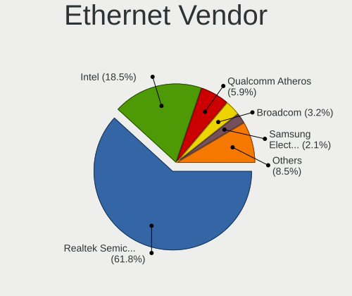

| Vendor                                 | Notebooks | Percent |
|----------------------------------------|-----------|---------|
| Realtek Semiconductor                  | 291       | 61.78%  |
| Intel                                  | 87        | 18.47%  |
| Qualcomm Atheros                       | 28        | 5.94%   |
| Broadcom                               | 15        | 3.18%   |
| Samsung Electronics                    | 10        | 2.12%   |
| Xiaomi                                 | 6         | 1.27%   |
| MediaTek                               | 6         | 1.27%   |
| DisplayLink                            | 6         | 1.27%   |
| ASIX Electronics                       | 5         | 1.06%   |
| Lenovo                                 | 3         | 0.64%   |
| Qualcomm                               | 2         | 0.42%   |
| Google                                 | 2         | 0.42%   |
| ZTE WCDMA Technologies MSM             | 1         | 0.21%   |
| TP-Link                                | 1         | 0.21%   |
| Sony Ericsson Mobile Communications AB | 1         | 0.21%   |
| Qualcomm Technologies                  | 1         | 0.21%   |
| QinHeng Electronics                    | 1         | 0.21%   |
| Nvidia                                 | 1         | 0.21%   |
| Motorola PCS                           | 1         | 0.21%   |
| Microsoft                              | 1         | 0.21%   |
| Marvell Technology Group               | 1         | 0.21%   |
| ICS Advent                             | 1         | 0.21%   |

Ethernet Model
--------------

Ethernet models

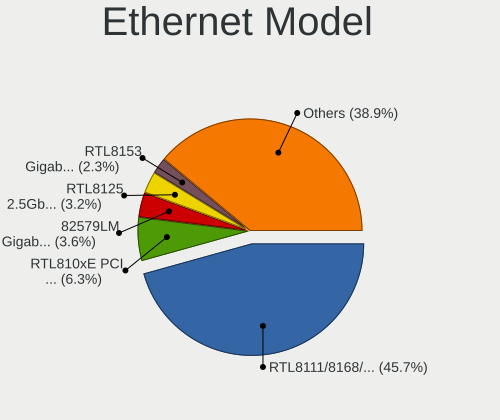

| Model                                                                  | Notebooks | Percent |
|------------------------------------------------------------------------|-----------|---------|
| Realtek RTL8111/8168/8211/8411 PCI Express Gigabit Ethernet Controller | 217       | 45.68%  |
| Realtek RTL810xE PCI Express Fast Ethernet controller                  | 30        | 6.32%   |
| Intel 82579LM Gigabit Network Connection (Lewisville)                  | 17        | 3.58%   |
| Realtek RTL8125 2.5GbE Controller                                      | 15        | 3.16%   |
| Realtek RTL8153 Gigabit Ethernet Adapter                               | 11        | 2.32%   |
| Realtek Killer E2600 GbE Controller                                    | 8         | 1.68%   |
| Broadcom NetXtreme BCM57765 Gigabit Ethernet PCIe                      | 8         | 1.68%   |
| Samsung GT-I9070 (network tethering, USB debugging enabled)            | 7         | 1.47%   |
| Qualcomm Atheros Killer E2500 Gigabit Ethernet Controller              | 7         | 1.47%   |
| Qualcomm Atheros Killer E2400 Gigabit Ethernet Controller              | 7         | 1.47%   |
| Intel Ethernet Connection (4) I219-LM                                  | 7         | 1.47%   |
| Intel Alder Lake-P PCH CNVi WiFi                                       | 7         | 1.47%   |
| Realtek Killer E3000 2.5GbE Controller                                 | 6         | 1.26%   |
| Qualcomm Atheros QCA8171 Gigabit Ethernet                              | 5         | 1.05%   |
| Intel Ethernet Connection I217-LM                                      | 5         | 1.05%   |
| Intel 82577LM Gigabit Network Connection                               | 5         | 1.05%   |
| Xiaomi Mi/Redmi series (RNDIS)                                         | 4         | 0.84%   |
| Intel Ethernet Connection I218-LM                                      | 4         | 0.84%   |
| Intel Ethernet Connection (2) I219-LM                                  | 4         | 0.84%   |
| ASIX AX88179 Gigabit Ethernet                                          | 4         | 0.84%   |
| Samsung Galaxy series, misc. (tethering mode)                          | 3         | 0.63%   |
| Realtek RTL8152 Fast Ethernet Adapter                                  | 3         | 0.63%   |
| Qualcomm Atheros QCA8172 Fast Ethernet                                 | 3         | 0.63%   |
| MediaTek MT7922 802.11ax PCI Express Wireless Network Adapter          | 3         | 0.63%   |
| MediaTek Infinix HOT 50i                                               | 3         | 0.63%   |
| Intel Raptor Lake PCH CNVi WiFi                                        | 3         | 0.63%   |
| Intel Ethernet Connection I219-LM                                      | 3         | 0.63%   |
| Intel Ethernet Connection (7) I219-LM                                  | 3         | 0.63%   |
| Intel Ethernet Connection (5) I219-LM                                  | 3         | 0.63%   |
| Intel Ethernet Connection (3) I218-LM                                  | 3         | 0.63%   |
| Xiaomi Mi/Redmi series (RNDIS + ADB)                                   | 2         | 0.42%   |
| Qualcomm Atheros AR8152 v2.0 Fast Ethernet                             | 2         | 0.42%   |
| Qualcomm Atheros AR8151 v2.0 Gigabit Ethernet                          | 2         | 0.42%   |
| Lenovo ThinkPad Lan                                                    | 2         | 0.42%   |
| Intel Ethernet Controller I225-V                                       | 2         | 0.42%   |
| Intel Ethernet Connection (6) I219-LM                                  | 2         | 0.42%   |
| Intel Ethernet Connection (13) I219-V                                  | 2         | 0.42%   |
| Intel BE201 320MHz                                                     | 2         | 0.42%   |
| Google Pixel 9a                                                        | 2         | 0.42%   |
| Broadcom NetLink BCM5787M Gigabit Ethernet PCI Express                 | 2         | 0.42%   |

Net Controller Kind
-------------------

Ethernet, WiFi or modem

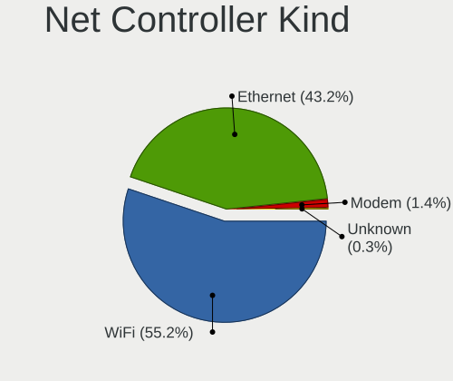

| Kind     | Notebooks | Percent |
|----------|-----------|---------|
| WiFi     | 562       | 55.15%  |
| Ethernet | 440       | 43.18%  |
| Modem    | 14        | 1.37%   |
| Unknown  | 3         | 0.29%   |

Used Controller
---------------

Currently used network controller

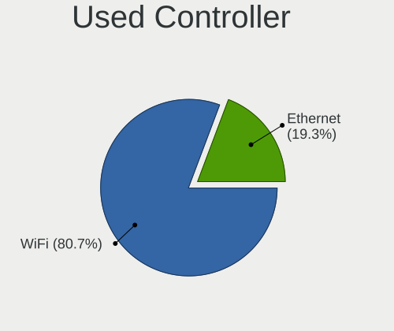

| Kind     | Notebooks | Percent |
|----------|-----------|---------|
| WiFi     | 486       | 80.73%  |
| Ethernet | 116       | 19.27%  |

NICs
----

Total network controllers on board

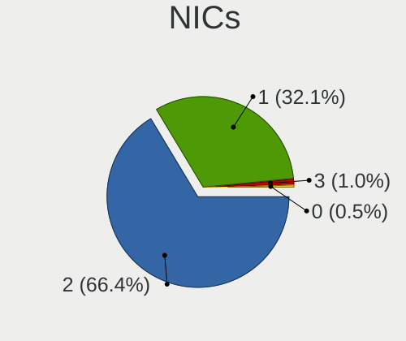

| Total | Notebooks | Percent |
|-------|-----------|---------|
| 2     | 387       | 66.38%  |
| 1     | 187       | 32.08%  |
| 3     | 6         | 1.03%   |
| 0     | 3         | 0.51%   |

IPv6
----

IPv6 vs IPv4

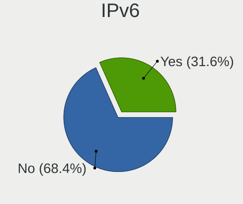

| Used | Notebooks | Percent |
|------|-----------|---------|
| No   | 406       | 68.35%  |
| Yes  | 188       | 31.65%  |

Bluetooth
---------

Bluetooth Vendor
----------------

Controller vendors

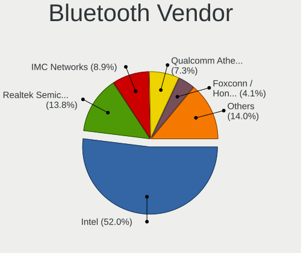

| Vendor                          | Notebooks | Percent |
|---------------------------------|-----------|---------|
| Intel                           | 279       | 51.96%  |
| Realtek Semiconductor           | 74        | 13.78%  |
| IMC Networks                    | 48        | 8.94%   |
| Qualcomm Atheros Communications | 39        | 7.26%   |
| Foxconn / Hon Hai               | 22        | 4.1%    |
| Lite-On Technology              | 17        | 3.17%   |
| Broadcom                        | 14        | 2.61%   |
| Apple                           | 11        | 2.05%   |
| MediaTek                        | 9         | 1.68%   |
| Realtek                         | 4         | 0.74%   |
| Dell                            | 4         | 0.74%   |
| Cambridge Silicon Radio         | 4         | 0.74%   |
| Hewlett-Packard                 | 3         | 0.56%   |
| Toshiba                         | 2         | 0.37%   |
| USI                             | 1         | 0.19%   |
| TP-Link                         | 1         | 0.19%   |
| Opticis                         | 1         | 0.19%   |
| Belkin Components               | 1         | 0.19%   |
| ASUSTek Computer                | 1         | 0.19%   |
| Alps Electric                   | 1         | 0.19%   |
| AboCom Systems                  | 1         | 0.19%   |

Bluetooth Model
---------------

Controller models

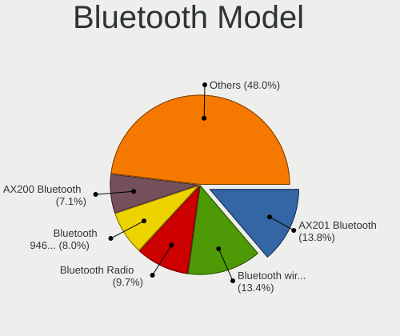

| Model                                               | Notebooks | Percent |
|-----------------------------------------------------|-----------|---------|
| Intel AX201 Bluetooth                               | 74        | 13.78%  |
| Intel Bluetooth wireless interface                  | 72        | 13.41%  |
| Realtek Bluetooth Radio                             | 52        | 9.68%   |
| Intel Bluetooth 9460/9560 Jefferson Peak (JfP)      | 43        | 8.01%   |
| Intel AX200 Bluetooth                               | 38        | 7.08%   |
| IMC Networks Wireless_Device                        | 33        | 6.15%   |
| Intel Bluetooth Device                              | 23        | 4.28%   |
| Qualcomm Atheros  Bluetooth Device                  | 18        | 3.35%   |
| Realtek  Bluetooth 4.2 Adapter                      | 15        | 2.79%   |
| Intel AX210 Bluetooth                               | 12        | 2.23%   |
| IMC Networks Bluetooth Radio                        | 11        | 2.05%   |
| Qualcomm Atheros QCA61x4 Bluetooth 4.0              | 10        | 1.86%   |
| MediaTek Wireless_Device                            | 8         | 1.49%   |
| Intel Centrino Bluetooth Wireless Transceiver       | 7         | 1.3%    |
| Foxconn / Hon Hai Bluetooth Device                  | 7         | 1.3%    |
| Apple Bluetooth USB Host Controller                 | 7         | 1.3%    |
| Foxconn / Hon Hai Wireless_Device                   | 6         | 1.12%   |
| Lite-On Bluetooth Device                            | 5         | 0.93%   |
| Intel Wireless-AC 9260 Bluetooth Adapter            | 5         | 0.93%   |
| Foxconn / Hon Hai MediaTek Bluetooth Adapter        | 5         | 0.93%   |
| Realtek Bluetooth Radio                             | 4         | 0.74%   |
| Qualcomm Atheros AR9462 Bluetooth                   | 4         | 0.74%   |
| Qualcomm Atheros AR3012 Bluetooth 4.0               | 4         | 0.74%   |
| Lite-On Wireless_Device                             | 4         | 0.74%   |
| Lite-On Qualcomm Atheros QCA9377 Bluetooth          | 4         | 0.74%   |
| Intel Wireless-AC 3168 Bluetooth                    | 4         | 0.74%   |
| Cambridge Silicon Radio Bluetooth Dongle (HCI mode) | 4         | 0.74%   |
| Apple Bluetooth Host Controller                     | 4         | 0.74%   |
| Realtek RTL8822BE Bluetooth 4.2 Adapter             | 3         | 0.56%   |
| Realtek RTL8821A Bluetooth                          | 3         | 0.56%   |
| Dell DW375 Bluetooth Module                         | 3         | 0.56%   |
| Broadcom HP Portable Bumble Bee                     | 3         | 0.56%   |
| Lite-On Bluetooth Radio                             | 2         | 0.37%   |
| Lite-On Atheros AR3012 Bluetooth                    | 2         | 0.37%   |
| IMC Networks Bluetooth Device                       | 2         | 0.37%   |
| HP Broadcom 2070 Bluetooth Combo                    | 2         | 0.37%   |
| Broadcom BCM20702 Bluetooth 4.0 [ThinkPad]          | 2         | 0.37%   |
| Broadcom BCM2045B (BDC-2.1)                         | 2         | 0.37%   |
| USI Bluetooth Device                                | 1         | 0.19%   |
| TP-Link TP-T@- UB500 Adapter                        | 1         | 0.19%   |

Sound
-----

Sound Vendor
------------

Sound card vendors

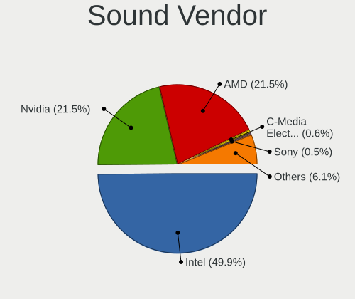

| Vendor                      | Notebooks | Percent |
|-----------------------------|-----------|---------|
| Intel                       | 409       | 49.88%  |
| Nvidia                      | 176       | 21.46%  |
| AMD                         | 176       | 21.46%  |
| C-Media Electronics         | 5         | 0.61%   |
| Sony                        | 4         | 0.49%   |
| Logitech                    | 4         | 0.49%   |
| Corsair                     | 4         | 0.49%   |
| Realtek Semiconductor       | 3         | 0.37%   |
| JMTek                       | 3         | 0.37%   |
| GN Netcom                   | 3         | 0.37%   |
| Texas Instruments           | 2         | 0.24%   |
| SteelSeries ApS             | 2         | 0.24%   |
| Samsung Electronics         | 2         | 0.24%   |
| RODE Microphones            | 2         | 0.24%   |
| Lenovo                      | 2         | 0.24%   |
| Kingston Technology         | 2         | 0.24%   |
| Generalplus Technology      | 2         | 0.24%   |
| Turtle Beach                | 1         | 0.12%   |
| Syntek                      | 1         | 0.12%   |
| Sonata                      | 1         | 0.12%   |
| ShenZhen Maono Technology   | 1         | 0.12%   |
| Sennheiser Communications   | 1         | 0.12%   |
| Roland                      | 1         | 0.12%   |
| Razer USA                   | 1         | 0.12%   |
| Phison Electronics          | 1         | 0.12%   |
| Micro Star International    | 1         | 0.12%   |
| M-Audio                     | 1         | 0.12%   |
| LE XIAN                     | 1         | 0.12%   |
| Jieli Technology            | 1         | 0.12%   |
| Huawei Technologies         | 1         | 0.12%   |
| FX200                       | 1         | 0.12%   |
| FiiO Electronics Technology | 1         | 0.12%   |
| Dell                        | 1         | 0.12%   |
| Conexant Systems            | 1         | 0.12%   |
| ASUSTek Computer            | 1         | 0.12%   |
| Apple                       | 1         | 0.12%   |

Sound Model
-----------

Sound card models

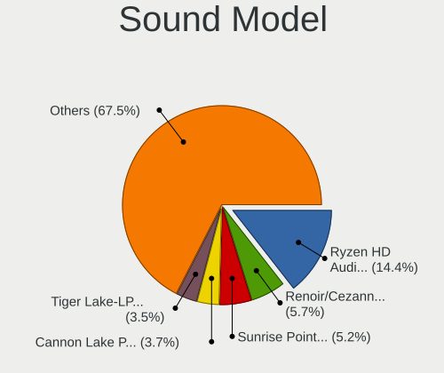

| Model                                                                      | Notebooks | Percent |
|----------------------------------------------------------------------------|-----------|---------|
| AMD Ryzen HD Audio Controller                                              | 146       | 14.44%  |
| AMD Renoir/Cezanne HDMI/DP Audio Controller                                | 58        | 5.74%   |
| Intel Sunrise Point-LP HD Audio                                            | 53        | 5.24%   |
| Intel Cannon Lake PCH cAVS                                                 | 37        | 3.66%   |
| Intel Tiger Lake-LP Smart Sound Technology Audio Controller                | 35        | 3.46%   |
| Intel 7 Series/C216 Chipset Family High Definition Audio Controller        | 33        | 3.26%   |
| AMD Radeon High Definition Audio Controller                                | 33        | 3.26%   |
| Intel Comet Lake PCH cAVS                                                  | 29        | 2.87%   |
| AMD Raven/Raven2/Fenghuang HDMI/DP Audio Controller                        | 28        | 2.77%   |
| Intel Alder Lake PCH-P High Definition Audio Controller                    | 26        | 2.57%   |
| Nvidia TU107 GeForce GTX 1650 High Definition Audio Controller             | 22        | 2.18%   |
| Intel CM238 HD Audio Controller                                            | 20        | 1.98%   |
| Nvidia GA106 High Definition Audio Controller                              | 19        | 1.88%   |
| Nvidia GA104 High Definition Audio Controller                              | 19        | 1.88%   |
| Intel 6 Series/C200 Series Chipset Family High Definition Audio Controller | 18        | 1.78%   |
| Nvidia GA107 High Definition Audio Controller                              | 17        | 1.68%   |
| Nvidia AD107 High Definition Audio Controller                              | 17        | 1.68%   |
| Intel Haswell-ULT HD Audio Controller                                      | 17        | 1.68%   |
| Intel 8 Series HD Audio Controller                                         | 17        | 1.68%   |
| Intel Wildcat Point-LP High Definition Audio Controller                    | 16        | 1.58%   |
| Intel Broadwell-U Audio Controller                                         | 16        | 1.58%   |
| Intel Tiger Lake-H HD Audio Controller                                     | 15        | 1.48%   |
| Intel 100 Series/C230 Series Chipset Family HD Audio Controller            | 15        | 1.48%   |
| Nvidia TU106 High Definition Audio Controller                              | 14        | 1.38%   |
| Intel 8 Series/C220 Series Chipset High Definition Audio Controller        | 14        | 1.38%   |
| Intel Xeon E3-1200 v3/4th Gen Core Processor HD Audio Controller           | 12        | 1.19%   |
| AMD FCH Azalia Controller                                                  | 12        | 1.19%   |
| Nvidia TU116 High Definition Audio Controller                              | 11        | 1.09%   |
| Nvidia GP107GL High Definition Audio Controller                            | 10        | 0.99%   |
| Intel Ice Lake-LP Smart Sound Technology Audio Controller                  | 10        | 0.99%   |
| Intel Raptor Lake-P/U/H cAVS                                               | 9         | 0.89%   |
| Intel Comet Lake PCH-LP cAVS                                               | 9         | 0.89%   |
| AMD Kabini HDMI/DP Audio                                                   | 9         | 0.89%   |
| Nvidia GP106 High Definition Audio Controller                              | 8         | 0.79%   |
| Intel Raptor Lake High Definition Audio Controller                         | 8         | 0.79%   |
| Intel Celeron/Pentium Silver Processor High Definition Audio               | 8         | 0.79%   |
| Intel 5 Series/3400 Series Chipset High Definition Audio                   | 8         | 0.79%   |
| AMD Family 15h (Models 60h-6fh) Audio Controller                           | 8         | 0.79%   |
| Nvidia GK107 HDMI Audio Controller                                         | 6         | 0.59%   |
| Intel Cannon Point-LP High Definition Audio Controller                     | 6         | 0.59%   |

Memory
------

Memory Vendor
-------------

Memory module vendors

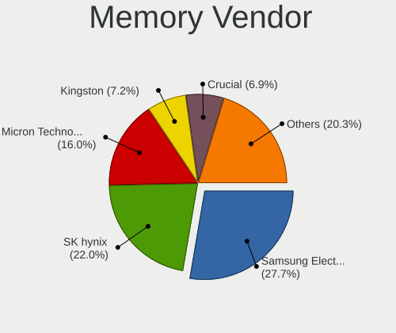

| Vendor              | Notebooks | Percent |
|---------------------|-----------|---------|
| Samsung Electronics | 116       | 27.68%  |
| SK hynix            | 92        | 21.96%  |
| Micron Technology   | 67        | 15.99%  |
| Kingston            | 30        | 7.16%   |
| Crucial             | 29        | 6.92%   |
| Ramaxel Technology  | 11        | 2.63%   |
| A-DATA Technology   | 10        | 2.39%   |
| Corsair             | 8         | 1.91%   |
| Unknown             | 7         | 1.67%   |
| Unknown             | 6         | 1.43%   |
| Unknown (ABCD)      | 5         | 1.19%   |
| Nanya Technology    | 5         | 1.19%   |
| Smart               | 3         | 0.72%   |
| G.Skill             | 3         | 0.72%   |
| Elpida              | 3         | 0.72%   |
| Transcend           | 2         | 0.48%   |
| Team                | 2         | 0.48%   |
| Patriot             | 2         | 0.48%   |
| Hewlett-Packard     | 2         | 0.48%   |
| GOODRAM             | 2         | 0.48%   |
| Wilk                | 1         | 0.24%   |
| Unknown (B98C)      | 1         | 0.24%   |
| Unknown (0x0CAB)    | 1         | 0.24%   |
| Toshiba             | 1         | 0.24%   |
| Timetec             | 1         | 0.24%   |
| Smart Brazil        | 1         | 0.24%   |
| Sesame              | 1         | 0.24%   |
| PNY                 | 1         | 0.24%   |
| Kimtigo             | 1         | 0.24%   |
| CSX                 | 1         | 0.24%   |
| Avant               | 1         | 0.24%   |
| Apacer              | 1         | 0.24%   |
| AMD                 | 1         | 0.24%   |
| 48spaces            | 1         | 0.24%   |

Memory Model
------------

Memory module models

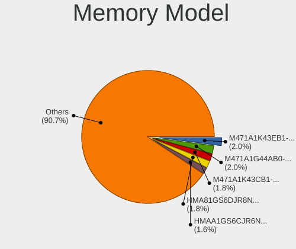

| Model                                                            | Notebooks | Percent |
|------------------------------------------------------------------|-----------|---------|
| Samsung RAM M471A1K43EB1-CWE 8GB SODIMM DDR4 3200MT/s            | 9         | 2.04%   |
| Samsung RAM M471A1G44AB0-CWE 8GiB SODIMM DDR4 3200MT/s           | 9         | 2.04%   |
| SK hynix RAM HMA81GS6DJR8N-XN 8GB SODIMM DDR4 3200MT/s           | 8         | 1.81%   |
| Samsung RAM M471A1K43CB1-CTD 8GB SODIMM DDR4 3200MT/s            | 8         | 1.81%   |
| SK hynix RAM HMAA1GS6CJR6N-XN 8GB SODIMM DDR4 3200MT/s           | 7         | 1.59%   |
| Unknown                                                          | 7         | 1.59%   |
| SK hynix RAM HMA81GS6AFR8N-UH 8GB SODIMM DDR4 2667MT/s           | 6         | 1.36%   |
| Samsung RAM M471A1K43DB1-CWE 8GB SODIMM DDR4 3200MT/s            | 6         | 1.36%   |
| Micron RAM 8ATF1G64HZ-3G2J1 8GB SODIMM DDR4 3200MT/s             | 6         | 1.36%   |
| Micron RAM 4ATF1G64HZ-3G2E2 8GB SODIMM DDR4 3200MT/s             | 6         | 1.36%   |
| Unknown (ABCD) RAM 123456789012345678 2GB SODIMM LPDDR4 2400MT/s | 5         | 1.13%   |
| Samsung RAM M471A5244CB0-CWE 4GB SODIMM DDR4 3200MT/s            | 5         | 1.13%   |
| Samsung RAM M425R1GB4BB0-CQKOL 8GB SODIMM DDR5 4800MT/s          | 5         | 1.13%   |
| SK hynix RAM HMA81GS6JJR8N-VK 8GB SODIMM DDR4 2667MT/s           | 4         | 0.91%   |
| SK hynix RAM H9JCNNNCP3MLYR-N6E 4GB SODIMM LPDDR5 6400MT/s       | 4         | 0.91%   |
| Samsung RAM M471B5173EB0-YK0 4GB SODIMM DDR3 1600MT/s            | 4         | 0.91%   |
| Samsung RAM M471B1G73DB0-YK0 8GB SODIMM DDR3 1600MT/s            | 4         | 0.91%   |
| Samsung RAM M471A5244CB0-CTD 4GB SODIMM DDR4 3266MT/s            | 4         | 0.91%   |
| Samsung RAM M425R2GA3BB0-CQKOL 16GB SODIMM DDR5 4800MT/s         | 4         | 0.91%   |
| Micron RAM 4ATF1G64HZ-3G2F1 8GB SODIMM DDR4 3200MT/s             | 4         | 0.91%   |
| Micron RAM 4ATF1G64HZ-3G2E1 8GB Row Of Chips DDR4 3200MT/s       | 4         | 0.91%   |
| SK hynix RAM HMT41GS6BFR8A-PB 8GB SODIMM DDR3 2667MT/s           | 3         | 0.68%   |
| SK hynix RAM HMT41GS6AFR8A-PB 8GB SODIMM DDR3 1600MT/s           | 3         | 0.68%   |
| SK hynix RAM HMA851S6DJR6N-XN 4GB SODIMM DDR4 3200MT/s           | 3         | 0.68%   |
| Samsung RAM M471A1G44AB0-CWE 8GB Row Of Chips DDR4 3200MT/s      | 3         | 0.68%   |
| Micron RAM Module 8GB SODIMM DDR3 1333MT/s                       | 3         | 0.68%   |
| Micron RAM 4ATF51264HZ-2G6E1 4GB SODIMM DDR4 2667MT/s            | 3         | 0.68%   |
| Crucial RAM CT51264BF160B.C16F 4GB SODIMM DDR3 4199MT/s          | 3         | 0.68%   |
| A-DATA RAM Module 16GB SODIMM DDR4 2667MT/s                      | 3         | 0.68%   |
| SK hynix RAM Module 2GB SODIMM DDR3 1600MT/s                     | 2         | 0.45%   |
| SK hynix RAM HMT451S6MFR8A-PB 4GB SODIMM DDR3 1600MT/s           | 2         | 0.45%   |
| SK hynix RAM HMT451S6BFR8A-PB 4GB SODIMM DDR3 1600MT/s           | 2         | 0.45%   |
| SK hynix RAM HMT425S6AFR6A-PB 2GB SODIMM DDR3 3200MT/s           | 2         | 0.45%   |
| SK hynix RAM HMT351S6EFR8A-PB 4GB SODIMM DDR3 1600MT/s           | 2         | 0.45%   |
| SK hynix RAM HMT351S6BFR8C-H9 4GB SODIMM DDR3 1333MT/s           | 2         | 0.45%   |
| SK hynix RAM HMAG68EXNSA051N 8GB SODIMM DDR4 3200MT/s            | 2         | 0.45%   |
| SK hynix RAM HMA851S6CJR6N-VK 4GB SODIMM DDR4 2667MT/s           | 2         | 0.45%   |
| SK hynix RAM HMA82GS6AFR8N-UH 16GB SODIMM DDR4 2667MT/s          | 2         | 0.45%   |
| SK hynix RAM HMA81GS6CJR8N-XN 8GB SODIMM DDR4 3200MT/s           | 2         | 0.45%   |
| SK hynix RAM HMA41GS6AFR8N-TF 8GB SODIMM DDR4 2667MT/s           | 2         | 0.45%   |

Memory Kind
-----------

Memory module kinds

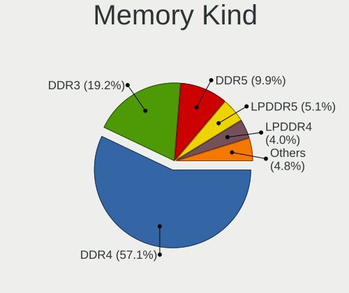

| Kind   | Notebooks | Percent |
|--------|-----------|---------|
| DDR4   | 202       | 57.06%  |
| DDR3   | 68        | 19.21%  |
| DDR5   | 35        | 9.89%   |
| LPDDR5 | 18        | 5.08%   |
| LPDDR4 | 14        | 3.95%   |
| LPDDR3 | 8         | 2.26%   |
| SDRAM  | 5         | 1.41%   |
| DDR2   | 4         | 1.13%   |

Memory Form Factor
------------------

Physical design of the memory module

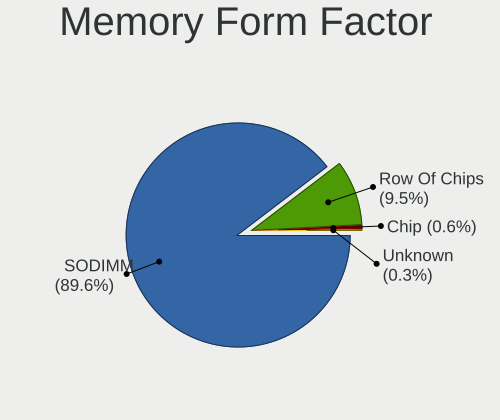

| Name         | Notebooks | Percent |
|--------------|-----------|---------|
| SODIMM       | 320       | 89.64%  |
| Row Of Chips | 34        | 9.52%   |
| Chip         | 2         | 0.56%   |
| Unknown      | 1         | 0.28%   |

Memory Size
-----------

Memory module size

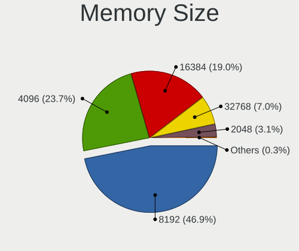

| Size  | Notebooks | Percent |
|-------|-----------|---------|
| 8192  | 180       | 46.88%  |
| 4096  | 91        | 23.7%   |
| 16384 | 73        | 19.01%  |
| 32768 | 27        | 7.03%   |
| 2048  | 12        | 3.13%   |
| 12288 | 1         | 0.26%   |

Memory Speed
------------

Memory module speed

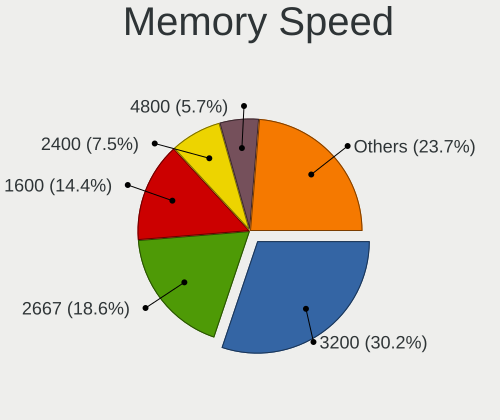

| Speed | Notebooks | Percent |
|-------|-----------|---------|
| 3200  | 117       | 30.15%  |
| 2667  | 72        | 18.56%  |
| 1600  | 56        | 14.43%  |
| 2400  | 29        | 7.47%   |
| 4800  | 22        | 5.67%   |
| 2133  | 15        | 3.87%   |
| 5600  | 13        | 3.35%   |
| 6400  | 9         | 2.32%   |
| 1333  | 7         | 1.8%    |
| 4266  | 6         | 1.55%   |
| 1334  | 6         | 1.55%   |
| 4199  | 5         | 1.29%   |
| 7500  | 4         | 1.03%   |
| 3266  | 4         | 1.03%   |
| 8400  | 3         | 0.77%   |
| 1867  | 3         | 0.77%   |
| 7467  | 2         | 0.52%   |
| 4267  | 2         | 0.52%   |
| 2933  | 2         | 0.52%   |
| 800   | 2         | 0.52%   |
| 667   | 2         | 0.52%   |
| 8533  | 1         | 0.26%   |
| 5500  | 1         | 0.26%   |
| 3733  | 1         | 0.26%   |
| 3000  | 1         | 0.26%   |
| 2267  | 1         | 0.26%   |
| 1866  | 1         | 0.26%   |
| 1066  | 1         | 0.26%   |

Printers & scanners
-------------------

Printer Vendor
--------------

Printer device vendors

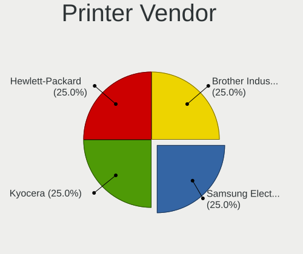

| Vendor              | Notebooks | Percent |
|---------------------|-----------|---------|
| Samsung Electronics | 1         | 25%     |
| Kyocera             | 1         | 25%     |
| Hewlett-Packard     | 1         | 25%     |
| Brother Industries  | 1         | 25%     |

Printer Model
-------------

Printer device models

| Model                           | Notebooks | Percent |
|---------------------------------|-----------|---------|
| Samsung M337x 387x 407x Series  | 1         | 25%     |
| Kyocera FS-1030D printer        | 1         | 25%     |
| HP LaserJet 200 colorMFP M275nw | 1         | 25%     |
| Brother HL-1210W series         | 1         | 25%     |

Scanner Vendor
--------------

Scanner device vendors

Zero info for selected period =(

Scanner Model
-------------

Scanner device models

Zero info for selected period =(

Camera
------

Camera Vendor
-------------

Camera device vendors

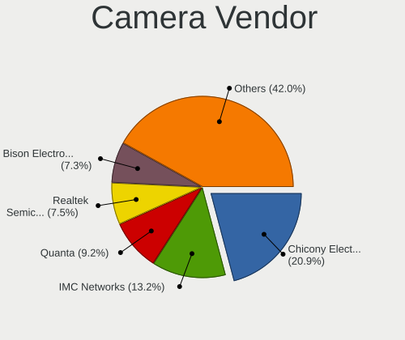

| Vendor                                 | Notebooks | Percent |
|----------------------------------------|-----------|---------|
| Chicony Electronics                    | 109       | 20.88%  |
| IMC Networks                           | 69        | 13.22%  |
| Quanta                                 | 48        | 9.2%    |
| Realtek Semiconductor                  | 39        | 7.47%   |
| Bison Electronics                      | 38        | 7.28%   |
| Microdia                               | 34        | 6.51%   |
| Luxvisions Innotech Limited            | 26        | 4.98%   |
| Sunplus Innovation Technology          | 21        | 4.02%   |
| Sonix Technology                       | 18        | 3.45%   |
| Cheng Uei Precision Industry (Foxlink) | 16        | 3.07%   |
| Apple                                  | 13        | 2.49%   |
| Syntek                                 | 12        | 2.3%    |
| ShineTech                              | 9         | 1.72%   |
| Lite-On Technology                     | 9         | 1.72%   |
| Suyin                                  | 8         | 1.53%   |
| Logitech                               | 7         | 1.34%   |
| SunplusIT                              | 6         | 1.15%   |
| Silicon Motion                         | 6         | 1.15%   |
| Alcor Micro                            | 4         | 0.77%   |
| Samsung Electronics                    | 3         | 0.57%   |
| Shine-optics                           | 2         | 0.38%   |
| Primax Electronics                     | 2         | 0.38%   |
| OPPO Electronics                       | 2         | 0.38%   |
| Microsoft                              | 2         | 0.38%   |
| Lenovo                                 | 2         | 0.38%   |
| Acer                                   | 2         | 0.38%   |
| WaveRider Communications               | 1         | 0.19%   |
| Tobii Technology AB                    | 1         | 0.19%   |
| KYE Systems (Mouse Systems)            | 1         | 0.19%   |
| Jiangxi Shinetech Optical              | 1         | 0.19%   |
| Intel                                  | 1         | 0.19%   |
| Importek                               | 1         | 0.19%   |
| icSpring                               | 1         | 0.19%   |
| Genesys Logic                          | 1         | 0.19%   |
| GEMBIRD                                | 1         | 0.19%   |
| Foxlink                                | 1         | 0.19%   |
| DX-231115-J                            | 1         | 0.19%   |
| DigiTech                               | 1         | 0.19%   |
| Creative Technology                    | 1         | 0.19%   |
| BillionPixels                          | 1         | 0.19%   |

Camera Model
------------

Camera device models

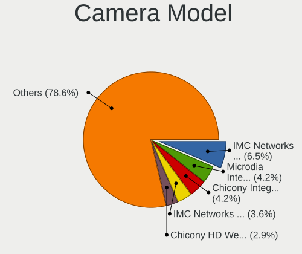

| Model                                                | Notebooks | Percent |
|------------------------------------------------------|-----------|---------|
| IMC Networks USB2.0 HD UVC WebCam                    | 34        | 6.49%   |
| Microdia Integrated_Webcam_HD                        | 22        | 4.2%    |
| Chicony Integrated Camera                            | 22        | 4.2%    |
| IMC Networks Integrated Camera                       | 19        | 3.63%   |
| Chicony HD Webcam                                    | 15        | 2.86%   |
| Sonix USB2.0 HD UVC WebCam                           | 13        | 2.48%   |
| Realtek Integrated_Webcam_HD                         | 11        | 2.1%    |
| Bison HD Webcam                                      | 11        | 2.1%    |
| Syntek Integrated Camera                             | 10        | 1.91%   |
| Sunplus Integrated_Webcam_HD                         | 9         | 1.72%   |
| ShineTech USB2.0 HD UVC WebCam                       | 9         | 1.72%   |
| Quanta HD User Facing                                | 9         | 1.72%   |
| Luxvisions Innotech Limited HP Wide Vision HD Camera | 9         | 1.72%   |
| Luxvisions Innotech Limited HP TrueVision HD Camera  | 8         | 1.53%   |
| Chicony HP Wide Vision HD Camera                     | 8         | 1.53%   |
| Apple FaceTime HD Camera                             | 8         | 1.53%   |
| Chicony HD User Facing                               | 7         | 1.34%   |
| Chicony EasyCamera                                   | 7         | 1.34%   |
| Bison Integrated Camera                              | 7         | 1.34%   |
| Quanta HP Wide Vision HD Camera                      | 6         | 1.15%   |
| Luxvisions Innotech Limited Integrated Camera        | 6         | 1.15%   |
| Quanta USB2.0 HD UVC WebCam                          | 5         | 0.95%   |
| Quanta HP TrueVision HD Camera                       | 5         | 0.95%   |
| Chicony Chicony USB2.0 Camera                        | 5         | 0.95%   |
| Apple iPhone 5/5C/5S/6/SE/7/8/X                      | 4         | 0.76%   |
| Samsung Galaxy series, misc. (MTP mode)              | 3         | 0.57%   |
| Realtek USB Camera                                   | 3         | 0.57%   |
| Realtek Integrated Webcam HD                         | 3         | 0.57%   |
| Realtek HP Truevision HD                             | 3         | 0.57%   |
| Quanta HP HD Camera                                  | 3         | 0.57%   |
| Quanta HD Webcam                                     | 3         | 0.57%   |
| Quanta HD Camera                                     | 3         | 0.57%   |
| Quanta ACER HD User Facing                           | 3         | 0.57%   |
| Logitech HD Pro Webcam C920                          | 3         | 0.57%   |
| Lite-On HP Wide Vision HD Camera                     | 3         | 0.57%   |
| Lite-On HP HD Camera                                 | 3         | 0.57%   |
| IMC Networks USB2.0 VGA UVC WebCam                   | 3         | 0.57%   |
| IMC Networks USB2.0 UVC HD Webcam                    | 3         | 0.57%   |
| IMC Networks HD Camera                               | 3         | 0.57%   |
| Chicony USB 2.0 Camera                               | 3         | 0.57%   |

Security
--------

Fingerprint Vendor
------------------

Fingerprint sensor vendors

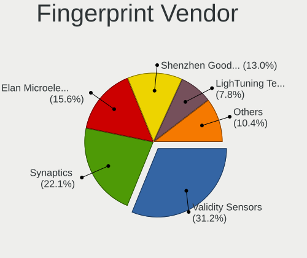

| Vendor                             | Notebooks | Percent |
|------------------------------------|-----------|---------|
| Validity Sensors                   | 24        | 31.17%  |
| Synaptics                          | 17        | 22.08%  |
| Elan Microelectronics              | 12        | 15.58%  |
| Shenzhen Goodix Technology         | 10        | 12.99%  |
| LighTuning Technology              | 6         | 7.79%   |
| AuthenTec                          | 5         | 6.49%   |
| Focal-systems.Corp                 | 2         | 2.6%    |
| Realtek USB2.0 Finger Print Bridge | 1         | 1.3%    |

Fingerprint Model
-----------------

Fingerprint sensor models

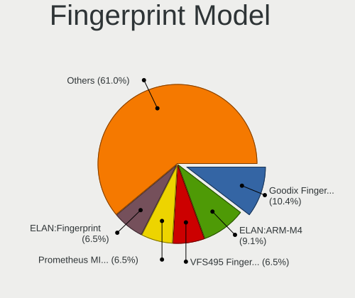

| Model                                                                      | Notebooks | Percent |
|----------------------------------------------------------------------------|-----------|---------|
| Shenzhen Goodix  Fingerprint Device                                        | 8         | 10.39%  |
| Elan ELAN:ARM-M4                                                           | 7         | 9.09%   |
| Validity Sensors VFS495 Fingerprint Reader                                 | 5         | 6.49%   |
| Synaptics Prometheus MIS Touch Fingerprint Reader                          | 5         | 6.49%   |
| Elan ELAN:Fingerprint                                                      | 5         | 6.49%   |
| LighTuning EgisTec Touch Fingerprint Sensor                                | 4         | 5.19%   |
| Validity Sensors VFS 5011 fingerprint sensor                               | 3         | 3.9%    |
| Validity Sensors Synaptics WBDI                                            | 3         | 3.9%    |
| Synaptics Metallica MIS Touch Fingerprint Reader                           | 3         | 3.9%    |
| Validity Sensors VFS7500 Touch Fingerprint Sensor                          | 2         | 2.6%    |
| Validity Sensors VFS5011 Fingerprint Reader                                | 2         | 2.6%    |
| Validity Sensors VFS471 Fingerprint Reader                                 | 2         | 2.6%    |
| Validity Sensors Fingerprint scanner                                       | 2         | 2.6%    |
| Synaptics WBDI Device                                                      | 2         | 2.6%    |
| LighTuning ES603 Swipe Fingerprint Sensor                                  | 2         | 2.6%    |
| Focal-systems.Corp FT9201Fingerprint.                                      | 2         | 2.6%    |
| AuthenTec AES2810                                                          | 2         | 2.6%    |
| Validity Sensors VFS7552 Touch Fingerprint Sensor                          | 1         | 1.3%    |
| Validity Sensors VFS491                                                    | 1         | 1.3%    |
| Validity Sensors VFS451 Fingerprint Reader                                 | 1         | 1.3%    |
| Validity Sensors Synaptics VFS7552 Touch Fingerprint Sensor with PurePrint | 1         | 1.3%    |
| Validity Sensors Swipe Fingerprint Sensor                                  | 1         | 1.3%    |
| Synaptics WBDI Fingerprint Reader USB 086                                  | 1         | 1.3%    |
| Synaptics WBDI                                                             | 1         | 1.3%    |
| Synaptics UWP WBDI Device                                                  | 1         | 1.3%    |
| Synaptics TouchPad                                                         | 1         | 1.3%    |
| Synaptics  WBDI Fingerprint Reader - USB 052                               | 1         | 1.3%    |
| Synaptics FS7604 Touch Fingerprint Sensor with PurePrint                   | 1         | 1.3%    |
| Synaptics Fingerprint reader [HP G6]                                       | 1         | 1.3%    |
| Shenzhen Goodix Fingerprint Reader                                         | 1         | 1.3%    |
| Shenzhen Goodix FingerPrint                                                | 1         | 1.3%    |
| Realtek USB2.0 Finger Print Bridge FocalTech Fingerprint Device            | 1         | 1.3%    |
| AuthenTec Fingerprint Sensor                                               | 1         | 1.3%    |
| AuthenTec AES2550 Fingerprint Sensor                                       | 1         | 1.3%    |
| AuthenTec AES1660 Fingerprint Sensor                                       | 1         | 1.3%    |

Chipcard Vendor
---------------

Chipcard module vendors

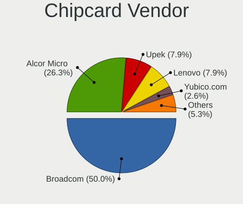

| Vendor           | Notebooks | Percent |
|------------------|-----------|---------|
| Broadcom         | 19        | 50%     |
| Alcor Micro      | 10        | 26.32%  |
| Upek             | 3         | 7.89%   |
| Lenovo           | 3         | 7.89%   |
| Yubico.com       | 1         | 2.63%   |
| Thetis           | 1         | 2.63%   |
| SCM Microsystems | 1         | 2.63%   |

Chipcard Model
--------------

Chipcard module models

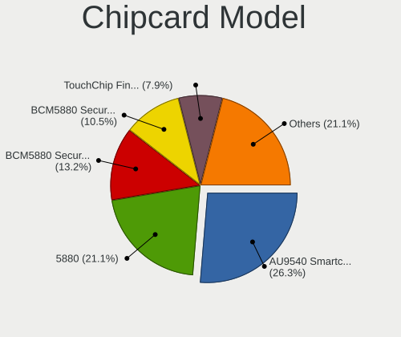

| Model                                                                        | Notebooks | Percent |
|------------------------------------------------------------------------------|-----------|---------|
| Alcor Micro AU9540 Smartcard Reader                                          | 10        | 26.32%  |
| Broadcom 5880                                                                | 8         | 21.05%  |
| Broadcom BCM5880 Secure Applications Processor                               | 5         | 13.16%  |
| Broadcom BCM5880 Secure Applications Processor with fingerprint swipe sensor | 4         | 10.53%  |
| Upek TouchChip Fingerprint Coprocessor (WBF advanced mode)                   | 3         | 7.89%   |
| Lenovo Integrated Smart Card Reader                                          | 3         | 7.89%   |
| Yubico.com Yubikey 4/5 U2F+CCID                                              | 1         | 2.63%   |
| Thetis Security Key(FE25)                                                    | 1         | 2.63%   |
| SCM Microsystems SCR3500 C Contact Reader                                    | 1         | 2.63%   |
| Broadcom BCM58200 ControlVault 3 (FingerPrint sensor + Contacted SmartCard)  | 1         | 2.63%   |
| Broadcom 58200                                                               | 1         | 2.63%   |

Unsupported
-----------

Unsupported Devices
-------------------

Total unsupported devices on board

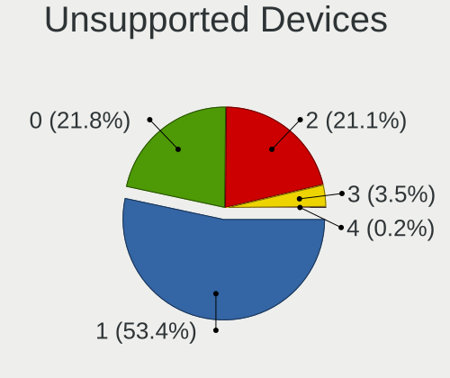

| Total | Notebooks | Percent |
|-------|-----------|---------|
| 1     | 318       | 53.36%  |
| 0     | 130       | 21.81%  |
| 2     | 126       | 21.14%  |
| 3     | 21        | 3.52%   |
| 4     | 1         | 0.17%   |

Unsupported Device Types
------------------------

Types of unsupported devices

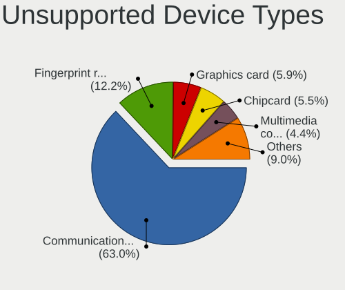

| Type                     | Notebooks | Percent |
|--------------------------|-----------|---------|
| Communication controller | 398       | 62.97%  |
| Fingerprint reader       | 77        | 12.18%  |
| Graphics card            | 37        | 5.85%   |
| Chipcard                 | 35        | 5.54%   |
| Multimedia controller    | 28        | 4.43%   |
| Net/wireless             | 27        | 4.27%   |
| Camera                   | 11        | 1.74%   |
| Net/ethernet             | 6         | 0.95%   |
| Storage                  | 4         | 0.63%   |
| Network                  | 3         | 0.47%   |
| Bluetooth                | 2         | 0.32%   |
| Wireless                 | 1         | 0.16%   |
| Sound                    | 1         | 0.16%   |
| Modem                    | 1         | 0.16%   |
| Card reader              | 1         | 0.16%   |

