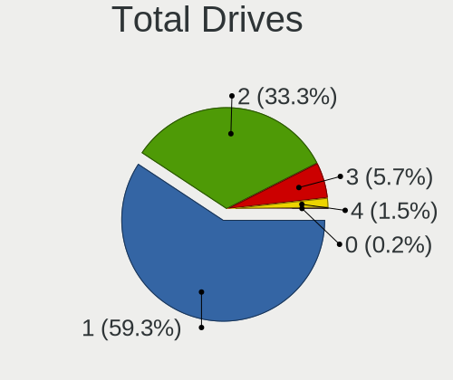
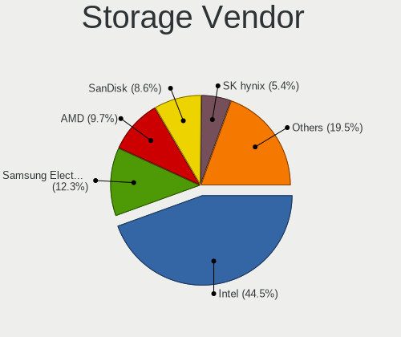
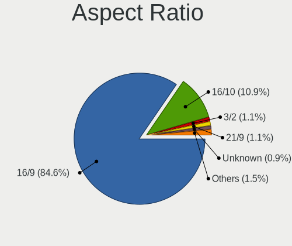
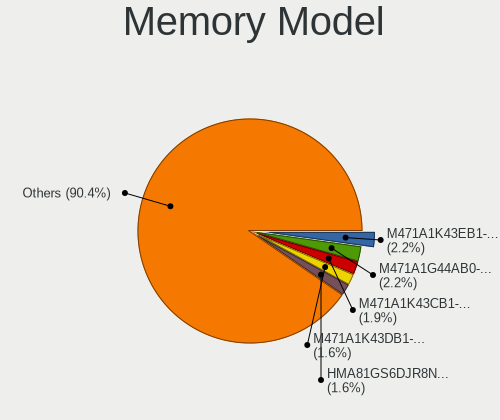

Garuda Linux - Tested Hardware & Statistics (Notebooks)
-------------------------------------------------------

A project to collect tested hardware configurations for Garuda Linux.

Anyone can contribute to this report by the [hw-probe](https://github.com/linuxhw/hw-probe) tool:

    sudo -E hw-probe -all -upload

Please submit a probe of your configuration if it's not presented on the page or is rare.

Full-feature report is available here: https://linux-hardware.org/?view=trends

Contents
--------

* [ Test Cases ](#test-cases)

* [ System ](#system)
  - [ Kernel                   ](#kernel)
  - [ Kernel Family            ](#kernel-family)
  - [ Kernel Major Ver.        ](#kernel-major-ver)
  - [ Arch                     ](#arch)
  - [ DE                       ](#de)
  - [ Display Server           ](#display-server)
  - [ Display Manager          ](#display-manager)
  - [ OS Lang                  ](#os-lang)
  - [ Boot Mode                ](#boot-mode)
  - [ Filesystem               ](#filesystem)
  - [ Part. scheme             ](#part-scheme)
  - [ Dual Boot with Linux/BSD ](#dual-boot-with-linuxbsd)
  - [ Dual Boot (Win)          ](#dual-boot-win)

* [ Board ](#board)
  - [ Vendor                   ](#vendor)
  - [ Model                    ](#model)
  - [ Model Family             ](#model-family)
  - [ MFG Year                 ](#mfg-year)
  - [ Form Factor              ](#form-factor)
  - [ Secure Boot              ](#secure-boot)
  - [ Coreboot                 ](#coreboot)
  - [ RAM Size                 ](#ram-size)
  - [ RAM Used                 ](#ram-used)
  - [ Total Drives             ](#total-drives)
  - [ Has CD-ROM               ](#has-cd-rom)
  - [ Has Ethernet             ](#has-ethernet)
  - [ Has WiFi                 ](#has-wifi)
  - [ Has Bluetooth            ](#has-bluetooth)

* [ Location ](#location)
  - [ Country                  ](#country)
  - [ City                     ](#city)

* [ Drives ](#drives)
  - [ Drive Vendor             ](#drive-vendor)
  - [ Drive Model              ](#drive-model)
  - [ HDD Vendor               ](#hdd-vendor)
  - [ SSD Vendor               ](#ssd-vendor)
  - [ Drive Kind               ](#drive-kind)
  - [ Drive Connector          ](#drive-connector)
  - [ Drive Size               ](#drive-size)
  - [ Space Total              ](#space-total)
  - [ Space Used               ](#space-used)
  - [ Malfunc. Drives          ](#malfunc-drives)
  - [ Malfunc. Drive Vendor    ](#malfunc-drive-vendor)
  - [ Malfunc. HDD Vendor      ](#malfunc-hdd-vendor)
  - [ Malfunc. Drive Kind      ](#malfunc-drive-kind)
  - [ Failed Drives            ](#failed-drives)
  - [ Failed Drive Vendor      ](#failed-drive-vendor)
  - [ Drive Status             ](#drive-status)

* [ Storage controller ](#storage-controller)
  - [ Storage Vendor           ](#storage-vendor)
  - [ Storage Model            ](#storage-model)
  - [ Storage Kind             ](#storage-kind)

* [ Processor ](#processor)
  - [ CPU Vendor               ](#cpu-vendor)
  - [ CPU Model                ](#cpu-model)
  - [ CPU Model Family         ](#cpu-model-family)
  - [ CPU Cores                ](#cpu-cores)
  - [ CPU Sockets              ](#cpu-sockets)
  - [ CPU Threads              ](#cpu-threads)
  - [ CPU Op-Modes             ](#cpu-op-modes)
  - [ CPU Microcode            ](#cpu-microcode)
  - [ CPU Microarch            ](#cpu-microarch)

* [ Graphics ](#graphics)
  - [ GPU Vendor               ](#gpu-vendor)
  - [ GPU Model                ](#gpu-model)
  - [ GPU Combo                ](#gpu-combo)
  - [ GPU Driver               ](#gpu-driver)
  - [ GPU Memory               ](#gpu-memory)

* [ Monitor ](#monitor)
  - [ Monitor Vendor           ](#monitor-vendor)
  - [ Monitor Model            ](#monitor-model)
  - [ Monitor Resolution       ](#monitor-resolution)
  - [ Monitor Diagonal         ](#monitor-diagonal)
  - [ Monitor Width            ](#monitor-width)
  - [ Aspect Ratio             ](#aspect-ratio)
  - [ Monitor Area             ](#monitor-area)
  - [ Pixel Density            ](#pixel-density)
  - [ Multiple Monitors        ](#multiple-monitors)

* [ Network ](#network)
  - [ Net Controller Vendor    ](#net-controller-vendor)
  - [ Net Controller Model     ](#net-controller-model)
  - [ Wireless Vendor          ](#wireless-vendor)
  - [ Wireless Model           ](#wireless-model)
  - [ Ethernet Vendor          ](#ethernet-vendor)
  - [ Ethernet Model           ](#ethernet-model)
  - [ Net Controller Kind      ](#net-controller-kind)
  - [ Used Controller          ](#used-controller)
  - [ NICs                     ](#nics)
  - [ IPv6                     ](#ipv6)

* [ Bluetooth ](#bluetooth)
  - [ Bluetooth Vendor         ](#bluetooth-vendor)
  - [ Bluetooth Model          ](#bluetooth-model)

* [ Sound ](#sound)
  - [ Sound Vendor             ](#sound-vendor)
  - [ Sound Model              ](#sound-model)

* [ Memory ](#memory)
  - [ Memory Vendor            ](#memory-vendor)
  - [ Memory Model             ](#memory-model)
  - [ Memory Kind              ](#memory-kind)
  - [ Memory Form Factor       ](#memory-form-factor)
  - [ Memory Size              ](#memory-size)
  - [ Memory Speed             ](#memory-speed)

* [ Printers & scanners ](#printers--scanners)
  - [ Printer Vendor           ](#printer-vendor)
  - [ Printer Model            ](#printer-model)
  - [ Scanner Vendor           ](#scanner-vendor)
  - [ Scanner Model            ](#scanner-model)

* [ Camera ](#camera)
  - [ Camera Vendor            ](#camera-vendor)
  - [ Camera Model             ](#camera-model)

* [ Security ](#security)
  - [ Fingerprint Vendor       ](#fingerprint-vendor)
  - [ Fingerprint Model        ](#fingerprint-model)
  - [ Chipcard Vendor          ](#chipcard-vendor)
  - [ Chipcard Model           ](#chipcard-model)

* [ Unsupported ](#unsupported)
  - [ Unsupported Devices      ](#unsupported-devices)
  - [ Unsupported Device Types ](#unsupported-device-types)

Test Cases
----------

| Vendor        | Model                       | Probe                                                      | Date         |
|---------------|-----------------------------|------------------------------------------------------------|--------------|
| HP            | Pavilion Gaming Laptop 1... | [499191c566](https://linux-hardware.org/?probe=499191c566) | Feb 18, 2022 |
| Lenovo        | IdeaPad S340-14API 81NB     | [25da470504](https://linux-hardware.org/?probe=25da470504) | Feb 14, 2022 |
| Lenovo        | ThinkPad T530 24296KG       | [9940aacd34](https://linux-hardware.org/?probe=9940aacd34) | Feb 13, 2022 |
| Razer         | Blade 14 - RZ09-0370        | [e3fd65aa29](https://linux-hardware.org/?probe=e3fd65aa29) | Feb 13, 2022 |
| Lenovo        | ThinkBook 14-IIL 20SL       | [52eb1d5693](https://linux-hardware.org/?probe=52eb1d5693) | Feb 11, 2022 |
| HONOR         | HLYL-WXX9                   | [9cb5307823](https://linux-hardware.org/?probe=9cb5307823) | Feb 06, 2022 |
| Lenovo        | IdeaPad Gaming 3 15ARH05... | [7c19747b0a](https://linux-hardware.org/?probe=7c19747b0a) | Feb 05, 2022 |
| MSI           | GF63 Thin 9SC               | [2e3070dc30](https://linux-hardware.org/?probe=2e3070dc30) | Feb 04, 2022 |
| Dell          | Latitude 5480               | [c96d03d27f](https://linux-hardware.org/?probe=c96d03d27f) | Feb 03, 2022 |
| Lenovo        | ThinkPad P1 20MDS00P00      | [4ff53df600](https://linux-hardware.org/?probe=4ff53df600) | Feb 02, 2022 |
| ASUSTek       | VivoBook_ASUSLaptop X513... | [387da722fe](https://linux-hardware.org/?probe=387da722fe) | Feb 02, 2022 |
| HP            | Laptop 15s-gr0xxx           | [5943c38ac0](https://linux-hardware.org/?probe=5943c38ac0) | Feb 01, 2022 |
| Lenovo        | ThinkPad T440p 20AWS58F0... | [0497eabcf7](https://linux-hardware.org/?probe=0497eabcf7) | Jan 28, 2022 |
| Lenovo        | ThinkPad T440p 20AWS58F0... | [e7efa96c01](https://linux-hardware.org/?probe=e7efa96c01) | Jan 28, 2022 |
| Lenovo        | IdeaPad 5 Pro 16ACH6 82L... | [9091cc83ba](https://linux-hardware.org/?probe=9091cc83ba) | Jan 26, 2022 |
| Lenovo        | Unknown                     | [b78e96aff8](https://linux-hardware.org/?probe=b78e96aff8) | Jan 22, 2022 |
| Dell          | Inspiron 15-3567            | [af6171a374](https://linux-hardware.org/?probe=af6171a374) | Jan 22, 2022 |
| MSI           | GP75 Leopard 9SD            | [6935c7fc83](https://linux-hardware.org/?probe=6935c7fc83) | Jan 17, 2022 |
| Lenovo        | Yoga Slim 7 14ARE05 82A2    | [10f53d4021](https://linux-hardware.org/?probe=10f53d4021) | Jan 09, 2022 |
| Lenovo        | IdeaPad 110-15ACL 80TJ      | [a338d9f2d1](https://linux-hardware.org/?probe=a338d9f2d1) | Jan 08, 2022 |
| Unknown       | Unknown                     | [b75e231fb3](https://linux-hardware.org/?probe=b75e231fb3) | Jan 08, 2022 |
| Lenovo        | Legion 5 15IMH05H 81Y6      | [34d2cd6d9c](https://linux-hardware.org/?probe=34d2cd6d9c) | Jan 08, 2022 |
| HP            | OMEN Laptop 15-en1xxx       | [9ad04f3022](https://linux-hardware.org/?probe=9ad04f3022) | Jan 07, 2022 |
| Lenovo        | Legion 5 15IMH05H 81Y6      | [c4db605668](https://linux-hardware.org/?probe=c4db605668) | Jan 06, 2022 |
| Dell          | Precision M4500             | [2504901038](https://linux-hardware.org/?probe=2504901038) | Jan 04, 2022 |
| HP            | Pavilion 14                 | [34167c8022](https://linux-hardware.org/?probe=34167c8022) | Jan 04, 2022 |
| HP            | Pavilion Laptop 15z-eh10... | [29b9cb755b](https://linux-hardware.org/?probe=29b9cb755b) | Dec 25, 2021 |
| Dell          | G15 5515                    | [7e8108b3c2](https://linux-hardware.org/?probe=7e8108b3c2) | Dec 24, 2021 |
| GPU Compan... | GWTN156-11                  | [3700827ecd](https://linux-hardware.org/?probe=3700827ecd) | Dec 19, 2021 |
| ASUSTek       | X550CC                      | [c7147f0bf8](https://linux-hardware.org/?probe=c7147f0bf8) | Dec 16, 2021 |
| ASUSTek       | X550CC                      | [f8a99e7645](https://linux-hardware.org/?probe=f8a99e7645) | Dec 16, 2021 |
| Razer         | Blade 14 - RZ09-0370        | [c3144c3e22](https://linux-hardware.org/?probe=c3144c3e22) | Dec 13, 2021 |
| HP            | Pavilion Laptop 15-eh0xx... | [df628cbd13](https://linux-hardware.org/?probe=df628cbd13) | Dec 12, 2021 |
| Acer          | Aspire F5-573G              | [a49a5a129c](https://linux-hardware.org/?probe=a49a5a129c) | Dec 07, 2021 |
| HP            | Laptop 15-dy2xxx            | [f499f9a375](https://linux-hardware.org/?probe=f499f9a375) | Dec 06, 2021 |
| HP            | Laptop 15-dy2xxx            | [e6b9de389b](https://linux-hardware.org/?probe=e6b9de389b) | Dec 06, 2021 |
| Acer          | TravelMate 5720             | [8ce02488c4](https://linux-hardware.org/?probe=8ce02488c4) | Dec 06, 2021 |
| Acer          | TravelMate 5720             | [b68e789e42](https://linux-hardware.org/?probe=b68e789e42) | Dec 06, 2021 |
| Acer          | Aspire A515-51G             | [6ee6a2bc49](https://linux-hardware.org/?probe=6ee6a2bc49) | Nov 30, 2021 |
| Acer          | Nitro AN715-52              | [2b74aabc3a](https://linux-hardware.org/?probe=2b74aabc3a) | Nov 29, 2021 |
| Lenovo        | IdeaPad 330-15ARR 81D2      | [b5b437249c](https://linux-hardware.org/?probe=b5b437249c) | Nov 29, 2021 |
| ASUSTek       | K53SD                       | [b2826b96f2](https://linux-hardware.org/?probe=b2826b96f2) | Nov 24, 2021 |
| HP            | Pavilion Laptop 15-eh0xx... | [fac556ebbe](https://linux-hardware.org/?probe=fac556ebbe) | Nov 24, 2021 |
| Dell          | XPS 15 7590                 | [63f386f998](https://linux-hardware.org/?probe=63f386f998) | Nov 23, 2021 |
| HP            | Pavilion Laptop 15-eh0xx... | [bbb0689dea](https://linux-hardware.org/?probe=bbb0689dea) | Nov 21, 2021 |
| Dell          | Latitude E5570              | [48ea4215ad](https://linux-hardware.org/?probe=48ea4215ad) | Nov 18, 2021 |
| Lenovo        | ThinkPad W530 24474KG       | [1ea5d23a86](https://linux-hardware.org/?probe=1ea5d23a86) | Nov 17, 2021 |
| Lenovo        | Legion S7 15ACH6 82K8       | [2713c3bae1](https://linux-hardware.org/?probe=2713c3bae1) | Nov 16, 2021 |
| Apple         | MacBookPro9,2               | [2c8fef35c1](https://linux-hardware.org/?probe=2c8fef35c1) | Nov 14, 2021 |
| HP            | Pavilion Laptop 15-eh0xx... | [d74b03de25](https://linux-hardware.org/?probe=d74b03de25) | Nov 13, 2021 |
| Lenovo        | ThinkPad W530 24474KG       | [6584d17e10](https://linux-hardware.org/?probe=6584d17e10) | Nov 09, 2021 |
| HP            | EliteBook 840 G8 Noteboo... | [ed9cd44b17](https://linux-hardware.org/?probe=ed9cd44b17) | Nov 08, 2021 |
| HP            | ProBook 640 G1              | [acb5ceea62](https://linux-hardware.org/?probe=acb5ceea62) | Nov 05, 2021 |
| ASUSTek       | ASUS EXPERTBOOK P2451FB_... | [976bcf4121](https://linux-hardware.org/?probe=976bcf4121) | Nov 04, 2021 |
| Lenovo        | G510 20238                  | [60fa5ff04c](https://linux-hardware.org/?probe=60fa5ff04c) | Oct 28, 2021 |
| Panasonic     | CF-191HYAX1M                | [1aed5aedc2](https://linux-hardware.org/?probe=1aed5aedc2) | Oct 25, 2021 |
| Dell          | XPS 13 9350                 | [dde814d7ca](https://linux-hardware.org/?probe=dde814d7ca) | Oct 25, 2021 |
| Samsung       | 300V3A/300V4A/300V5A/200... | [d8167a915b](https://linux-hardware.org/?probe=d8167a915b) | Oct 17, 2021 |
| Lenovo        | ThinkPad T510 4384WB4       | [4a54d7fd48](https://linux-hardware.org/?probe=4a54d7fd48) | Oct 16, 2021 |
| Lenovo        | ThinkPad W530 24474KG       | [64fd7ae16c](https://linux-hardware.org/?probe=64fd7ae16c) | Oct 11, 2021 |
| Acer          | Nitro AN515-44              | [5070a2bdc7](https://linux-hardware.org/?probe=5070a2bdc7) | Oct 10, 2021 |
| Acer          | Aspire E5-523               | [30036170b1](https://linux-hardware.org/?probe=30036170b1) | Oct 05, 2021 |
| Acer          | Aspire E5-523               | [841a71eac1](https://linux-hardware.org/?probe=841a71eac1) | Oct 04, 2021 |
| Acer          | Aspire E3-111               | [45a0e8618a](https://linux-hardware.org/?probe=45a0e8618a) | Sep 28, 2021 |
| Acer          | Aspire E3-111               | [f0100402ec](https://linux-hardware.org/?probe=f0100402ec) | Sep 28, 2021 |
| Notebook      | P7xxDM2                     | [284ab5f28e](https://linux-hardware.org/?probe=284ab5f28e) | Sep 28, 2021 |
| Acer          | Aspire V3-572P              | [3eecfd13ad](https://linux-hardware.org/?probe=3eecfd13ad) | Sep 25, 2021 |
| Chuwi         | GemiBook Pro                | [10b47851d2](https://linux-hardware.org/?probe=10b47851d2) | Sep 25, 2021 |
| Lenovo        | IdeaPad S340-15API 81NC     | [2e3e323c0d](https://linux-hardware.org/?probe=2e3e323c0d) | Sep 21, 2021 |
| Acer          | Swift SF114-32              | [91a1652ef2](https://linux-hardware.org/?probe=91a1652ef2) | Sep 18, 2021 |
| ASUSTek       | ASUS TUF Gaming A15 FA50... | [0b9ee7a59d](https://linux-hardware.org/?probe=0b9ee7a59d) | Sep 12, 2021 |
| Razer         | Blade                       | [1ce95784c0](https://linux-hardware.org/?probe=1ce95784c0) | Sep 05, 2021 |
| Razer         | Blade                       | [58a2a48dc4](https://linux-hardware.org/?probe=58a2a48dc4) | Sep 05, 2021 |
| Samsung       | 550XCJ/550XCR               | [85fa26ea9e](https://linux-hardware.org/?probe=85fa26ea9e) | Aug 31, 2021 |
| ASUSTek       | ASUS TUF Gaming A15 FA50... | [b9a6b71efc](https://linux-hardware.org/?probe=b9a6b71efc) | Aug 28, 2021 |
| Google        | Kindred                     | [ac298188ae](https://linux-hardware.org/?probe=ac298188ae) | Aug 13, 2021 |
| Acer          | Aspire E1-522               | [4ec8d56e38](https://linux-hardware.org/?probe=4ec8d56e38) | Aug 13, 2021 |
| Acer          | Aspire E1-522               | [c8892394cf](https://linux-hardware.org/?probe=c8892394cf) | Aug 13, 2021 |
| HP            | ProBook 650 G2              | [ca250625bd](https://linux-hardware.org/?probe=ca250625bd) | Aug 11, 2021 |
| HP            | ProBook 650 G2              | [7705938f1f](https://linux-hardware.org/?probe=7705938f1f) | Aug 11, 2021 |
| HP            | EliteBook 845 G7 Noteboo... | [c505820537](https://linux-hardware.org/?probe=c505820537) | Aug 04, 2021 |
| ASUSTek       | G750JZ                      | [f35df8640b](https://linux-hardware.org/?probe=f35df8640b) | Aug 02, 2021 |
| Lenovo        | IdeaPad Slim 1-14AST-05 ... | [d25176b845](https://linux-hardware.org/?probe=d25176b845) | Jul 30, 2021 |
| Lenovo        | IdeaPad Slim 1-14AST-05 ... | [0340b4c57f](https://linux-hardware.org/?probe=0340b4c57f) | Jul 30, 2021 |
| Lenovo        | Legion 5 Pro 16ACH6H 82J... | [e134bae415](https://linux-hardware.org/?probe=e134bae415) | Jul 29, 2021 |
| ASUSTek       | X550ZE                      | [e436ae3019](https://linux-hardware.org/?probe=e436ae3019) | Jul 23, 2021 |
| ASUSTek       | X550ZE                      | [49cd19882f](https://linux-hardware.org/?probe=49cd19882f) | Jul 23, 2021 |
| Lenovo        | Legion 5 Pro 16ACH6H 82J... | [83c21e1a99](https://linux-hardware.org/?probe=83c21e1a99) | Jul 21, 2021 |
| Notebook      | W54_W550SU2                 | [b026148da5](https://linux-hardware.org/?probe=b026148da5) | Jul 15, 2021 |
| Dell          | Inspiron 3501               | [f72a03865c](https://linux-hardware.org/?probe=f72a03865c) | Jul 11, 2021 |
| HP            | Pavilion Laptop 14-dv0xx... | [c65f4896a2](https://linux-hardware.org/?probe=c65f4896a2) | Jul 11, 2021 |
| Sony          | VPCSB1C5E                   | [2878014d7a](https://linux-hardware.org/?probe=2878014d7a) | Jul 11, 2021 |
| Sony          | VPCSB1C5E                   | [4cfb82cbfe](https://linux-hardware.org/?probe=4cfb82cbfe) | Jul 11, 2021 |
| Lenovo        | LEGION 5 15IMH05 82AU       | [cab06ed3ed](https://linux-hardware.org/?probe=cab06ed3ed) | Jul 01, 2021 |
| HP            | Pavilion Gaming Laptop 1... | [cc5fd0194e](https://linux-hardware.org/?probe=cc5fd0194e) | Jun 26, 2021 |
| Lenovo        | IdeaPad Gaming 3 15ARH05... | [11e99b82d5](https://linux-hardware.org/?probe=11e99b82d5) | Jun 22, 2021 |
| Dell          | Inspiron N5050              | [92ae7459b4](https://linux-hardware.org/?probe=92ae7459b4) | Jun 20, 2021 |
| PC Special... | GK5NPFO                     | [38b9682492](https://linux-hardware.org/?probe=38b9682492) | Jun 11, 2021 |
| PC Special... | GK5NPFO                     | [47a7837795](https://linux-hardware.org/?probe=47a7837795) | Jun 11, 2021 |
| Lenovo        | IdeaPad Gaming 3 15ARH05... | [abd01e8eac](https://linux-hardware.org/?probe=abd01e8eac) | Jun 09, 2021 |
| Dell          | Inspiron 5570               | [a93d77d45b](https://linux-hardware.org/?probe=a93d77d45b) | Jun 06, 2021 |
| ASUSTek       | TUF Gaming FX505DT_FX505... | [f794ea73e4](https://linux-hardware.org/?probe=f794ea73e4) | May 28, 2021 |
| MSI           | GE72VR 6RF                  | [faea47290a](https://linux-hardware.org/?probe=faea47290a) | May 26, 2021 |
| Lenovo        | IdeaPad 3 15ADA05 81W1      | [e7fda6091a](https://linux-hardware.org/?probe=e7fda6091a) | May 26, 2021 |
| Lenovo        | IdeaPad 3 15ADA05 81W1      | [d2a26e0f30](https://linux-hardware.org/?probe=d2a26e0f30) | May 26, 2021 |
| HP            | EliteBook 8540p             | [ffc46c9472](https://linux-hardware.org/?probe=ffc46c9472) | May 14, 2021 |
| Alienware     | 17 R3                       | [f9ee772f9e](https://linux-hardware.org/?probe=f9ee772f9e) | May 05, 2021 |
| Lenovo        | IdeaPad Slim 1-14AST-05 ... | [d9bf75c99c](https://linux-hardware.org/?probe=d9bf75c99c) | Apr 23, 2021 |
| Lenovo        | IdeaPad Gaming 3 15ARH05... | [22931f83cc](https://linux-hardware.org/?probe=22931f83cc) | Apr 20, 2021 |
| Lenovo        | IdeaPad Slim 1-14AST-05 ... | [25808be952](https://linux-hardware.org/?probe=25808be952) | Apr 19, 2021 |
| Lenovo        | IdeaPad Gaming 3 15ARH05... | [3c7f354ce4](https://linux-hardware.org/?probe=3c7f354ce4) | Apr 19, 2021 |
| Lenovo        | IdeaPad Slim 1-14AST-05 ... | [d97babb331](https://linux-hardware.org/?probe=d97babb331) | Apr 18, 2021 |
| ASUSTek       | GL503VM                     | [743ff3a2aa](https://linux-hardware.org/?probe=743ff3a2aa) | Apr 18, 2021 |
| Medion        | P861X                       | [109599a6f6](https://linux-hardware.org/?probe=109599a6f6) | Apr 15, 2021 |
| Medion        | P861X                       | [ae05cea55d](https://linux-hardware.org/?probe=ae05cea55d) | Apr 15, 2021 |
| Medion        | E7419 MD60025               | [4deb77ef82](https://linux-hardware.org/?probe=4deb77ef82) | Apr 10, 2021 |
| ASUSTek       | ROG Strix G512LW_G512LW     | [2012ac3d84](https://linux-hardware.org/?probe=2012ac3d84) | Apr 07, 2021 |
| Dell          | Inspiron 5755               | [ae6589874e](https://linux-hardware.org/?probe=ae6589874e) | Apr 07, 2021 |
| Acer          | Nitro AN515-44              | [9f68dee6f5](https://linux-hardware.org/?probe=9f68dee6f5) | Apr 04, 2021 |
| HP            | Pavilion Gaming Laptop 1... | [2af0a44c72](https://linux-hardware.org/?probe=2af0a44c72) | Apr 04, 2021 |
| Medion        | E7419 MD60025               | [938494cf89](https://linux-hardware.org/?probe=938494cf89) | Mar 31, 2021 |
| Lenovo        | ThinkPad T470 20HD000RUS    | [751dd3bb74](https://linux-hardware.org/?probe=751dd3bb74) | Mar 19, 2021 |
| Dell          | Inspiron 15 7000 Gaming     | [1e6cbeb181](https://linux-hardware.org/?probe=1e6cbeb181) | Mar 17, 2021 |
| Acer          | Nitro AN515-54              | [b4580812c2](https://linux-hardware.org/?probe=b4580812c2) | Mar 15, 2021 |
| Dell          | XPS L702X                   | [e3af15a170](https://linux-hardware.org/?probe=e3af15a170) | Mar 09, 2021 |
| Dell          | XPS L702X                   | [7fb3f476cf](https://linux-hardware.org/?probe=7fb3f476cf) | Mar 09, 2021 |
| HP            | EliteBook 8540p             | [3741826c9a](https://linux-hardware.org/?probe=3741826c9a) | Mar 08, 2021 |
| HP            | OMEN Laptop 15-en0xxx       | [29784f5b45](https://linux-hardware.org/?probe=29784f5b45) | Feb 23, 2021 |
| HP            | EliteBook 8540p             | [c7e8878f7b](https://linux-hardware.org/?probe=c7e8878f7b) | Feb 18, 2021 |
| Lenovo        | ThinkPad T440p 20AWS4RC0... | [3e146ba45b](https://linux-hardware.org/?probe=3e146ba45b) | Feb 18, 2021 |
| ASUSTek       | TUF Gaming FX505DD_FX505... | [de3199a457](https://linux-hardware.org/?probe=de3199a457) | Feb 17, 2021 |
| HP            | EliteBook 8540p             | [9dececac24](https://linux-hardware.org/?probe=9dececac24) | Feb 11, 2021 |
| HP            | EliteBook 8540p             | [92487a475d](https://linux-hardware.org/?probe=92487a475d) | Feb 06, 2021 |
| HP            | EliteBook 8540p             | [23cece38ed](https://linux-hardware.org/?probe=23cece38ed) | Feb 02, 2021 |
| HP            | OMEN by HP Laptop 15-dc1... | [1bdd227b6f](https://linux-hardware.org/?probe=1bdd227b6f) | Feb 02, 2021 |
| Dell          | Latitude E6520              | [24cbaa1c59](https://linux-hardware.org/?probe=24cbaa1c59) | Jan 30, 2021 |
| HP            | Pavilion Laptop 15-cs0xx... | [793615c0de](https://linux-hardware.org/?probe=793615c0de) | Jan 30, 2021 |
| Lenovo        | ThinkPad T470s 20HGS0B90... | [dfb9858a8f](https://linux-hardware.org/?probe=dfb9858a8f) | Jan 29, 2021 |
| HP            | EliteBook 8540p             | [dd3793c498](https://linux-hardware.org/?probe=dd3793c498) | Jan 28, 2021 |
| Dell          | XPS 15 9500                 | [11b9018ef1](https://linux-hardware.org/?probe=11b9018ef1) | Jan 23, 2021 |
| HP            | EliteBook 8540p             | [c504347399](https://linux-hardware.org/?probe=c504347399) | Jan 23, 2021 |
| HP            | EliteBook 8540p             | [643af77934](https://linux-hardware.org/?probe=643af77934) | Jan 18, 2021 |
| HP            | Compaq 6735b                | [84a4616a8d](https://linux-hardware.org/?probe=84a4616a8d) | Jan 18, 2021 |
| Fujitsu Si... | ESPRIMO Mobile D9500        | [9703bdf4f6](https://linux-hardware.org/?probe=9703bdf4f6) | Jan 12, 2021 |
| HP            | EliteBook 8540p             | [86c3c2d1d3](https://linux-hardware.org/?probe=86c3c2d1d3) | Jan 12, 2021 |
| Unknown       | Unknown                     | [09f3ac6567](https://linux-hardware.org/?probe=09f3ac6567) | Jan 11, 2021 |
| HP            | EliteBook 8540p             | [ad733c377c](https://linux-hardware.org/?probe=ad733c377c) | Jan 09, 2021 |
| HP            | EliteBook 8540p             | [d4206bf424](https://linux-hardware.org/?probe=d4206bf424) | Jan 07, 2021 |
| HP            | EliteBook 8540p             | [a5612ca66a](https://linux-hardware.org/?probe=a5612ca66a) | Jan 07, 2021 |
| Dell          | Latitude E6430              | [2e0ef916c6](https://linux-hardware.org/?probe=2e0ef916c6) | Jan 03, 2021 |
| HP            | OMEN by HP Laptop 15-dc1... | [d28d862d9f](https://linux-hardware.org/?probe=d28d862d9f) | Dec 28, 2020 |
| Dell          | Inspiron 15 7000 Gaming     | [1d461bb9db](https://linux-hardware.org/?probe=1d461bb9db) | Dec 25, 2020 |
| Unknown       | Unknown                     | [ce7f267835](https://linux-hardware.org/?probe=ce7f267835) | Dec 23, 2020 |
| Toshiba       | Satellite C55-A             | [43dbeef737](https://linux-hardware.org/?probe=43dbeef737) | Dec 22, 2020 |
| Notebook      | N85_N87,HJ,HJ1,HK1          | [b02c7cd17e](https://linux-hardware.org/?probe=b02c7cd17e) | Dec 19, 2020 |
| HP            | Laptop 17-ak0xx             | [e63bb99c0a](https://linux-hardware.org/?probe=e63bb99c0a) | Nov 30, 2020 |
| Lenovo        | ThinkPad T14 Gen 1 20UDS... | [05a70db99a](https://linux-hardware.org/?probe=05a70db99a) | Nov 22, 2020 |
| Dell          | Inspiron 15 7000 Gaming     | [1ff8a24823](https://linux-hardware.org/?probe=1ff8a24823) | Nov 18, 2020 |
| Dell          | Latitude E6430              | [760e7ca474](https://linux-hardware.org/?probe=760e7ca474) | Nov 02, 2020 |
| Samsung       | 350V5C/351V5C/3540VC/344... | [4a3037422e](https://linux-hardware.org/?probe=4a3037422e) | Sep 04, 2020 |
| HP            | 450                         | [edeb9f6780](https://linux-hardware.org/?probe=edeb9f6780) | Apr 25, 2020 |

System
------

Kernel
------

Version of the Linux kernel

| Version                     | Notebooks | Percent |
|-----------------------------|-----------|---------|
| 5.14.14-zen1-1-zen          | 4         | 3.33%   |
| 5.13.13-zen1-1-zen          | 4         | 3.33%   |
| 5.16.4-zen1-1-zen           | 3         | 2.5%    |
| 5.16.2-zen1-1-zen           | 3         | 2.5%    |
| 5.15.6-zen2-1-zen           | 3         | 2.5%    |
| 5.15.2-zen1-1-zen           | 3         | 2.5%    |
| 5.15.12-zen1-1-zen          | 3         | 2.5%    |
| 5.14.6-zen1-1-zen           | 3         | 2.5%    |
| 5.13.9-zen1-1-zen           | 3         | 2.5%    |
| 5.11.11-zen1-1-zen          | 3         | 2.5%    |
| 5.10.1-103-tkg-bmq          | 3         | 2.5%    |
| 5.16.8-arch1-1              | 2         | 1.67%   |
| 5.16.5-zen1-1-zen           | 2         | 1.67%   |
| 5.16.1-zen1-1-zen           | 2         | 1.67%   |
| 5.15.5-zen1-1-zen           | 2         | 1.67%   |
| 5.15.4-zen1-1-zen           | 2         | 1.67%   |
| 5.15.13-zen1-1-zen          | 2         | 1.67%   |
| 5.14.9-zen2-1-zen           | 2         | 1.67%   |
| 5.14.15-zen1-1-zen          | 2         | 1.67%   |
| 5.13.5-zen1-1-zen           | 2         | 1.67%   |
| 5.12.9-zen1-1-zen           | 2         | 1.67%   |
| 5.12.15-zen1-1-zen          | 2         | 1.67%   |
| 5.11.16-zen1-1-zen          | 2         | 1.67%   |
| 5.10.2-104-tkg-bmq          | 2         | 1.67%   |
| 5.10.15-120-tkg-bmq         | 2         | 1.67%   |
| 5.10.10-115-tkg-bmq         | 2         | 1.67%   |
| 5.9.9-zen1-1-zen            | 1         | 0.83%   |
| 5.9.8-zen1-1-zen            | 1         | 0.83%   |
| 5.9.2-zen1-1-zen            | 1         | 0.83%   |
| 5.9.10-zen1-1-zen           | 1         | 0.83%   |
| 5.6.6-zen1-1-zen            | 1         | 0.83%   |
| 5.4.97-120-tkg-bmq          | 1         | 0.83%   |
| 5.16.9-zen1-1-zen           | 1         | 0.83%   |
| 5.16.0-rc5-1-mainline-anbox | 1         | 0.83%   |
| 5.15.7-zen1-1-zen           | 1         | 0.83%   |
| 5.15.7-arch1-1              | 1         | 0.83%   |
| 5.15.3-zen1-1-zen           | 1         | 0.83%   |
| 5.15.22-1-lts               | 1         | 0.83%   |
| 5.15.19-1-lts               | 1         | 0.83%   |
| 5.15.18-1-lts               | 1         | 0.83%   |
| 5.15.11-zen1-1-zen          | 1         | 0.83%   |
| 5.15.11-230-tkg-cfs         | 1         | 0.83%   |
| 5.15.10-zen1-1-zen          | 1         | 0.83%   |
| 5.14.8-zen1-1-zen           | 1         | 0.83%   |
| 5.14.7-zen1-1-zen           | 1         | 0.83%   |
| 5.14.5-zen2-1-zen           | 1         | 0.83%   |
| 5.14.2-zen1-2-zen           | 1         | 0.83%   |
| 5.14.12-zen1-1-zen          | 1         | 0.83%   |
| 5.14.11-arch1-1             | 1         | 0.83%   |
| 5.13.4-zen1-1-zen           | 1         | 0.83%   |
| 5.13.1-zen1-1-zen           | 1         | 0.83%   |
| 5.12.9-164-tkg-muqss        | 1         | 0.83%   |
| 5.12.8-zen1-1-zen           | 1         | 0.83%   |
| 5.12.7-zen1-1-zen           | 1         | 0.83%   |
| 5.12.6-xanmod1-1            | 1         | 0.83%   |
| 5.12.2-153-tkg-bmq          | 1         | 0.83%   |
| 5.12.14-zen1-1-zen          | 1         | 0.83%   |
| 5.12.13-zen1-1-zen          | 1         | 0.83%   |
| 5.12.12-AMD-znver2          | 1         | 0.83%   |
| 5.11.7-zen1-1-zen           | 1         | 0.83%   |

Kernel Family
-------------

Linux kernel without a distro release

| Version | Notebooks | Percent |
|---------|-----------|---------|
| 5.14.14 | 4         | 3.33%   |
| 5.13.13 | 4         | 3.33%   |
| 5.11.11 | 4         | 3.33%   |
| 5.16.4  | 3         | 2.5%    |
| 5.16.2  | 3         | 2.5%    |
| 5.15.6  | 3         | 2.5%    |
| 5.15.2  | 3         | 2.5%    |
| 5.15.12 | 3         | 2.5%    |
| 5.14.6  | 3         | 2.5%    |
| 5.13.9  | 3         | 2.5%    |
| 5.12.9  | 3         | 2.5%    |
| 5.10.15 | 3         | 2.5%    |
| 5.10.1  | 3         | 2.5%    |
| 5.16.8  | 2         | 1.67%   |
| 5.16.5  | 2         | 1.67%   |
| 5.16.1  | 2         | 1.67%   |
| 5.15.7  | 2         | 1.67%   |
| 5.15.5  | 2         | 1.67%   |
| 5.15.4  | 2         | 1.67%   |
| 5.15.13 | 2         | 1.67%   |
| 5.15.11 | 2         | 1.67%   |
| 5.14.9  | 2         | 1.67%   |
| 5.14.15 | 2         | 1.67%   |
| 5.13.5  | 2         | 1.67%   |
| 5.12.15 | 2         | 1.67%   |
| 5.11.6  | 2         | 1.67%   |
| 5.11.16 | 2         | 1.67%   |
| 5.10.4  | 2         | 1.67%   |
| 5.10.2  | 2         | 1.67%   |
| 5.10.12 | 2         | 1.67%   |
| 5.10.10 | 2         | 1.67%   |
| 5.9.9   | 1         | 0.83%   |
| 5.9.8   | 1         | 0.83%   |
| 5.9.2   | 1         | 0.83%   |
| 5.9.10  | 1         | 0.83%   |
| 5.6.6   | 1         | 0.83%   |
| 5.4.97  | 1         | 0.83%   |
| 5.16.9  | 1         | 0.83%   |
| 5.16.0  | 1         | 0.83%   |
| 5.15.3  | 1         | 0.83%   |
| 5.15.22 | 1         | 0.83%   |
| 5.15.19 | 1         | 0.83%   |
| 5.15.18 | 1         | 0.83%   |
| 5.15.10 | 1         | 0.83%   |
| 5.14.8  | 1         | 0.83%   |
| 5.14.7  | 1         | 0.83%   |
| 5.14.5  | 1         | 0.83%   |
| 5.14.2  | 1         | 0.83%   |
| 5.14.12 | 1         | 0.83%   |
| 5.14.11 | 1         | 0.83%   |
| 5.13.4  | 1         | 0.83%   |
| 5.13.1  | 1         | 0.83%   |
| 5.12.8  | 1         | 0.83%   |
| 5.12.7  | 1         | 0.83%   |
| 5.12.6  | 1         | 0.83%   |
| 5.12.2  | 1         | 0.83%   |
| 5.12.14 | 1         | 0.83%   |
| 5.12.13 | 1         | 0.83%   |
| 5.12.12 | 1         | 0.83%   |
| 5.11.7  | 1         | 0.83%   |

Kernel Major Ver.
-----------------

Linux kernel major version

| Version | Notebooks | Percent |
|---------|-----------|---------|
| 5.15    | 24        | 20.69%  |
| 5.10    | 20        | 17.24%  |
| 5.14    | 17        | 14.66%  |
| 5.16    | 14        | 12.07%  |
| 5.12    | 12        | 10.34%  |
| 5.11    | 12        | 10.34%  |
| 5.13    | 11        | 9.48%   |
| 5.9     | 4         | 3.45%   |
| 5.6     | 1         | 0.86%   |
| 5.4     | 1         | 0.86%   |

Arch
----

OS architecture (x86_64, i586, etc.)

| Name   | Notebooks | Percent |
|--------|-----------|---------|
| x86_64 | 109       | 100%    |

DE
--

Desktop Environment

| Name              | Notebooks | Percent |
|-------------------|-----------|---------|
| KDE5              | 65        | 59.09%  |
| GNOME             | 16        | 14.55%  |
| KDE               | 12        | 10.91%  |
| XFCE              | 8         | 7.27%   |
| X-Cinnamon        | 2         | 1.82%   |
| sway              | 2         | 1.82%   |
| Deepin            | 2         | 1.82%   |
| Yaru:ubuntu:GNOME | 1         | 0.91%   |
| MATE              | 1         | 0.91%   |
| i3                | 1         | 0.91%   |

Display Server
--------------

X11 or Wayland

| Name    | Notebooks | Percent |
|---------|-----------|---------|
| X11     | 102       | 93.58%  |
| Wayland | 5         | 4.59%   |
| Tty     | 1         | 0.92%   |
| Unknown | 1         | 0.92%   |

Display Manager
---------------

SDDM, LightDM, etc.

| Name    | Notebooks | Percent |
|---------|-----------|---------|
| SDDM    | 61        | 55.45%  |
| Unknown | 27        | 24.55%  |
| LightDM | 11        | 10%     |
| GDM     | 10        | 9.09%   |
| GREETD  | 1         | 0.91%   |

OS Lang
-------

Language

| Lang    | Notebooks | Percent |
|---------|-----------|---------|
| en_US   | 51        | 46.36%  |
| en_GB   | 15        | 13.64%  |
| en_IN   | 10        | 9.09%   |
| it_IT   | 6         | 5.45%   |
| de_DE   | 6         | 5.45%   |
| pt_BR   | 3         | 2.73%   |
| ru_RU   | 2         | 1.82%   |
| pl_PL   | 2         | 1.82%   |
| fi_FI   | 2         | 1.82%   |
| es_MX   | 2         | 1.82%   |
| es_CO   | 2         | 1.82%   |
| tr_TR   | 1         | 0.91%   |
| sv_SE   | 1         | 0.91%   |
| nl_NL   | 1         | 0.91%   |
| ko_KR   | 1         | 0.91%   |
| es_VE   | 1         | 0.91%   |
| es_ES   | 1         | 0.91%   |
| en_ZA   | 1         | 0.91%   |
| de_AT   | 1         | 0.91%   |
| Unknown | 1         | 0.91%   |

Boot Mode
---------

EFI or BIOS

| Mode | Notebooks | Percent |
|------|-----------|---------|
| EFI  | 80        | 72.73%  |
| BIOS | 30        | 27.27%  |

Filesystem
----------

Type of filesystem

| Type  | Notebooks | Percent |
|-------|-----------|---------|
| Btrfs | 108       | 99.08%  |
| F2fs  | 1         | 0.92%   |

Part. scheme
------------

Scheme of partitioning

| Type    | Notebooks | Percent |
|---------|-----------|---------|
| GPT     | 76        | 69.72%  |
| Unknown | 24        | 22.02%  |
| MBR     | 9         | 8.26%   |

Dual Boot with Linux/BSD
------------------------

Hosting more than one Linux/BSD

| Dual boot | Notebooks | Percent |
|-----------|-----------|---------|
| No        | 101       | 92.66%  |
| Yes       | 8         | 7.34%   |

Dual Boot (Win)
---------------

Hosting Linux and Windows

| Dual boot | Notebooks | Percent |
|-----------|-----------|---------|
| No        | 71        | 65.14%  |
| Yes       | 38        | 34.86%  |

Board
-----

Vendor
------

Motherboard manufacturer

| Name                | Notebooks | Percent |
|---------------------|-----------|---------|
| Lenovo              | 28        | 25.69%  |
| Hewlett-Packard     | 18        | 16.51%  |
| Dell                | 16        | 14.68%  |
| ASUSTek Computer    | 11        | 10.09%  |
| Acer                | 11        | 10.09%  |
| Notebook            | 3         | 2.75%   |
| MSI                 | 3         | 2.75%   |
| Samsung Electronics | 2         | 1.83%   |
| Razer               | 2         | 1.83%   |
| Medion              | 2         | 1.83%   |
| Unknown             | 2         | 1.83%   |
| Toshiba             | 1         | 0.92%   |
| Sony                | 1         | 0.92%   |
| PC Specialist       | 1         | 0.92%   |
| Panasonic           | 1         | 0.92%   |
| HONOR               | 1         | 0.92%   |
| GPU Company         | 1         | 0.92%   |
| Google              | 1         | 0.92%   |
| Fujitsu Siemens     | 1         | 0.92%   |
| Chuwi               | 1         | 0.92%   |
| Apple               | 1         | 0.92%   |
| Alienware           | 1         | 0.92%   |

Model
-----

Motherboard model

| Name                                       | Notebooks | Percent |
|--------------------------------------------|-----------|---------|
| Lenovo IdeaPad Gaming 3 15ARH05 82EY       | 3         | 2.75%   |
| Unknown                                    | 3         | 2.75%   |
| Lenovo ThinkPad W530 24474KG               | 2         | 1.83%   |
| HP Pavilion Gaming Laptop 15-cx0xxx        | 2         | 1.83%   |
| Dell Inspiron 15 7000 Gaming               | 2         | 1.83%   |
| Acer Nitro AN515-44                        | 2         | 1.83%   |
| Toshiba Satellite C55-A                    | 1         | 0.92%   |
| Sony VPCSB1C5E                             | 1         | 0.92%   |
| Samsung 550XCJ/550XCR                      | 1         | 0.92%   |
| Samsung 300V3A/300V4A/300V5A/200A4B/200A5B | 1         | 0.92%   |
| Razer Blade 14 - RZ09-0370                 | 1         | 0.92%   |
| Razer Blade                                | 1         | 0.92%   |
| PC Specialist GK5NPFO                      | 1         | 0.92%   |
| Panasonic CF-191HYAX1M                     | 1         | 0.92%   |
| Notebook W54_W550SU2                       | 1         | 0.92%   |
| Notebook P7xxDM2(-G)                       | 1         | 0.92%   |
| Notebook N85_N87,HJ,HJ1,HK1                | 1         | 0.92%   |
| MSI GP75 Leopard 9SD                       | 1         | 0.92%   |
| MSI GF63 Thin 9SC                          | 1         | 0.92%   |
| MSI GE72VR 6RF                             | 1         | 0.92%   |
| Medion P861X                               | 1         | 0.92%   |
| Medion E7419 MD60025                       | 1         | 0.92%   |
| Lenovo Yoga Slim 7 14ARE05 82A2            | 1         | 0.92%   |
| Lenovo ThinkPad T530 24296KG               | 1         | 0.92%   |
| Lenovo ThinkPad T510 4384WB4               | 1         | 0.92%   |
| Lenovo ThinkPad T470s 20HGS0B900           | 1         | 0.92%   |
| Lenovo ThinkPad T470 20HD000RUS            | 1         | 0.92%   |
| Lenovo ThinkPad T440p 20AWS58F00           | 1         | 0.92%   |
| Lenovo ThinkPad T440p 20AWS4RC00           | 1         | 0.92%   |
| Lenovo ThinkPad T14 Gen 1 20UDS00N00       | 1         | 0.92%   |
| Lenovo ThinkPad P1 20MDS00P00              | 1         | 0.92%   |
| Lenovo ThinkBook 14-IIL 20SL               | 1         | 0.92%   |
| Lenovo Legion S7 15ACH6 82K8               | 1         | 0.92%   |
| Lenovo Legion 5 Pro 16ACH6H 82JQ           | 1         | 0.92%   |
| Lenovo Legion 5 15IMH05H 81Y6              | 1         | 0.92%   |
| Lenovo LEGION 5 15IMH05 82AU               | 1         | 0.92%   |
| Lenovo IdeaPad Slim 1-14AST-05 81VS        | 1         | 0.92%   |
| Lenovo IdeaPad S340-15API 81NC             | 1         | 0.92%   |
| Lenovo IdeaPad S340-14API 81NB             | 1         | 0.92%   |
| Lenovo IdeaPad 5 Pro 16ACH6 82L5           | 1         | 0.92%   |
| Lenovo IdeaPad 330-15ARR 81D2              | 1         | 0.92%   |
| Lenovo IdeaPad 3 15ADA05 81W1              | 1         | 0.92%   |
| Lenovo IdeaPad 110-15ACL 80TJ              | 1         | 0.92%   |
| Lenovo G510 20238                          | 1         | 0.92%   |
| HONOR HLYL-WXX9                            | 1         | 0.92%   |
| HP ProBook 640 G1                          | 1         | 0.92%   |
| HP Pavilion Laptop 15z-eh100               | 1         | 0.92%   |
| HP Pavilion Laptop 15-eh0xxx               | 1         | 0.92%   |
| HP Pavilion Laptop 15-cs0xxx               | 1         | 0.92%   |
| HP Pavilion Gaming Laptop 15-dk0xxx        | 1         | 0.92%   |
| HP Pavilion 14                             | 1         | 0.92%   |
| HP OMEN Laptop 15-en1xxx                   | 1         | 0.92%   |
| HP OMEN Laptop 15-en0xxx                   | 1         | 0.92%   |
| HP OMEN by HP Laptop 15-dc1xxx             | 1         | 0.92%   |
| HP Laptop 17-ak0xx                         | 1         | 0.92%   |
| HP Laptop 15s-gr0xxx                       | 1         | 0.92%   |
| HP Laptop 15-dy2xxx                        | 1         | 0.92%   |
| HP EliteBook 8540p                         | 1         | 0.92%   |
| HP EliteBook 845 G7 Notebook PC            | 1         | 0.92%   |
| HP Compaq 6735b                            | 1         | 0.92%   |

Model Family
------------

Motherboard model prefix

| Name                    | Notebooks | Percent |
|-------------------------|-----------|---------|
| Lenovo ThinkPad         | 10        | 9.17%   |
| Lenovo IdeaPad          | 10        | 9.17%   |
| HP Pavilion             | 7         | 6.42%   |
| Dell Inspiron           | 7         | 6.42%   |
| Acer Aspire             | 5         | 4.59%   |
| Lenovo LEGION           | 4         | 3.67%   |
| Dell XPS                | 4         | 3.67%   |
| Dell Latitude           | 4         | 3.67%   |
| Acer Nitro              | 4         | 3.67%   |
| HP OMEN                 | 3         | 2.75%   |
| HP Laptop               | 3         | 2.75%   |
| Unknown                 | 3         | 2.75%   |
| Razer Blade             | 2         | 1.83%   |
| HP EliteBook            | 2         | 1.83%   |
| ASUS TUF                | 2         | 1.83%   |
| ASUS ASUS               | 2         | 1.83%   |
| Toshiba Satellite       | 1         | 0.92%   |
| Sony VPCSB1C5E          | 1         | 0.92%   |
| Samsung 550XCJ          | 1         | 0.92%   |
| Samsung 300V3A          | 1         | 0.92%   |
| PC Specialist GK5NPFO   | 1         | 0.92%   |
| Panasonic CF-191HYAX1M  | 1         | 0.92%   |
| Notebook W54            | 1         | 0.92%   |
| Notebook P7xxDM2(-G)    | 1         | 0.92%   |
| Notebook N85            | 1         | 0.92%   |
| MSI GP75                | 1         | 0.92%   |
| MSI GF63                | 1         | 0.92%   |
| MSI GE72VR              | 1         | 0.92%   |
| Medion P861X            | 1         | 0.92%   |
| Medion E7419            | 1         | 0.92%   |
| Lenovo Yoga             | 1         | 0.92%   |
| Lenovo ThinkBook        | 1         | 0.92%   |
| Lenovo G510             | 1         | 0.92%   |
| HONOR HLYL-WXX9         | 1         | 0.92%   |
| HP ProBook              | 1         | 0.92%   |
| HP Compaq               | 1         | 0.92%   |
| HP 450                  | 1         | 0.92%   |
| GPU Company GWTN156-11  | 1         | 0.92%   |
| Google Kindred          | 1         | 0.92%   |
| Fujitsu Siemens ESPRIMO | 1         | 0.92%   |
| Dell Precision          | 1         | 0.92%   |
| Chuwi GemiBook          | 1         | 0.92%   |
| ASUS X550ZE             | 1         | 0.92%   |
| ASUS X550CC             | 1         | 0.92%   |
| ASUS VivoBook           | 1         | 0.92%   |
| ASUS ROG                | 1         | 0.92%   |
| ASUS K53SD              | 1         | 0.92%   |
| ASUS GL503VM            | 1         | 0.92%   |
| ASUS G750JZ             | 1         | 0.92%   |
| Apple MacBookPro9       | 1         | 0.92%   |
| Alienware 17            | 1         | 0.92%   |
| Acer TravelMate         | 1         | 0.92%   |
| Acer Swift              | 1         | 0.92%   |

MFG Year
--------

Motherboard manufacture year

| Year | Notebooks | Percent |
|------|-----------|---------|
| 2020 | 23        | 21.1%   |
| 2021 | 13        | 11.93%  |
| 2019 | 13        | 11.93%  |
| 2017 | 10        | 9.17%   |
| 2016 | 10        | 9.17%   |
| 2018 | 8         | 7.34%   |
| 2013 | 8         | 7.34%   |
| 2012 | 7         | 6.42%   |
| 2014 | 5         | 4.59%   |
| 2011 | 5         | 4.59%   |
| 2010 | 2         | 1.83%   |
| 2009 | 2         | 1.83%   |
| 2007 | 2         | 1.83%   |
| 2008 | 1         | 0.92%   |

Form Factor
-----------

Physical design of the computer

| Name     | Notebooks | Percent |
|----------|-----------|---------|
| Notebook | 109       | 100%    |

Secure Boot
-----------

Enabled or disabled

| State    | Notebooks | Percent |
|----------|-----------|---------|
| Disabled | 109       | 100%    |

Coreboot
--------

Have coreboot on board

| Used | Notebooks | Percent |
|------|-----------|---------|
| No   | 108       | 99.08%  |
| Yes  | 1         | 0.92%   |

RAM Size
--------

Total RAM memory

| Size in GB | Notebooks | Percent |
|------------|-----------|---------|
| 4.01-8.0   | 32        | 29.09%  |
| 16.01-24.0 | 29        | 26.36%  |
| 8.01-16.0  | 28        | 25.45%  |
| 3.01-4.0   | 11        | 10%     |
| 32.01-64.0 | 6         | 5.45%   |
| 24.01-32.0 | 3         | 2.73%   |
| 2.01-3.0   | 1         | 0.91%   |

RAM Used
--------

Used RAM memory

| Used GB   | Notebooks | Percent |
|-----------|-----------|---------|
| 4.01-8.0  | 36        | 30.77%  |
| 2.01-3.0  | 32        | 27.35%  |
| 3.01-4.0  | 31        | 26.5%   |
| 1.01-2.0  | 9         | 7.69%   |
| 8.01-16.0 | 8         | 6.84%   |
| 0.51-1.0  | 1         | 0.85%   |

Total Drives
------------

Number of drives on board

| Drives | Notebooks | Percent |
|--------|-----------|---------|
| 1      | 64        | 57.14%  |
| 2      | 37        | 33.04%  |
| 3      | 10        | 8.93%   |
| 4      | 1         | 0.89%   |

Has CD-ROM
----------

Has CD-ROM on board

| Presented | Notebooks | Percent |
|-----------|-----------|---------|
| No        | 81        | 72.97%  |
| Yes       | 30        | 27.03%  |

Has Ethernet
------------

Has Ethernet on board

| Presented | Notebooks | Percent |
|-----------|-----------|---------|
| Yes       | 87        | 79.82%  |
| No        | 22        | 20.18%  |

Has WiFi
--------

Has WiFi module

| Presented | Notebooks | Percent |
|-----------|-----------|---------|
| Yes       | 107       | 98.17%  |
| No        | 2         | 1.83%   |

Has Bluetooth
-------------

Has Bluetooth module

| Presented | Notebooks | Percent |
|-----------|-----------|---------|
| Yes       | 96        | 88.07%  |
| No        | 13        | 11.93%  |

Location
--------

Country
-------

Geographic location (country)

| Country      | Notebooks | Percent |
|--------------|-----------|---------|
| USA          | 27        | 24.55%  |
| India        | 10        | 9.09%   |
| Germany      | 10        | 9.09%   |
| UK           | 9         | 8.18%   |
| Italy        | 8         | 7.27%   |
| Poland       | 4         | 3.64%   |
| Brazil       | 4         | 3.64%   |
| Romania      | 3         | 2.73%   |
| Mexico       | 3         | 2.73%   |
| Finland      | 3         | 2.73%   |
| Sweden       | 2         | 1.82%   |
| Spain        | 2         | 1.82%   |
| Russia       | 2         | 1.82%   |
| Netherlands  | 2         | 1.82%   |
| Colombia     | 2         | 1.82%   |
| Canada       | 2         | 1.82%   |
| Venezuela    | 1         | 0.91%   |
| Turkey       | 1         | 0.91%   |
| Switzerland  | 1         | 0.91%   |
| South Korea  | 1         | 0.91%   |
| South Africa | 1         | 0.91%   |
| Singapore    | 1         | 0.91%   |
| Serbia       | 1         | 0.91%   |
| Luxembourg   | 1         | 0.91%   |
| Kuwait       | 1         | 0.91%   |
| Kenya        | 1         | 0.91%   |
| Hungary      | 1         | 0.91%   |
| France       | 1         | 0.91%   |
| Czechia      | 1         | 0.91%   |
| China        | 1         | 0.91%   |
| Belgium      | 1         | 0.91%   |
| Bahrain      | 1         | 0.91%   |
| Austria      | 1         | 0.91%   |

City
----

Geographic location (city)

| City                 | Notebooks | Percent |
|----------------------|-----------|---------|
| London               | 3         | 2.63%   |
| Helsinki             | 2         | 1.75%   |
| Bryansk              | 2         | 1.75%   |
| Berlin               | 2         | 1.75%   |
| Winston-Salem        | 1         | 0.88%   |
| Welwyn Garden City   | 1         | 0.88%   |
| Warsaw               | 1         | 0.88%   |
| Vufflens-la-Ville    | 1         | 0.88%   |
| Viganello            | 1         | 0.88%   |
| Vienna               | 1         | 0.88%   |
| Valenzano            | 1         | 0.88%   |
| Turku                | 1         | 0.88%   |
| Turin                | 1         | 0.88%   |
| Tucson               | 1         | 0.88%   |
| Toronto              | 1         | 0.88%   |
| Timioara        | 1         | 0.88%   |
| Spring Hill          | 1         | 0.88%   |
| Spitalfields         | 1         | 0.88%   |
| Southampton          | 1         | 0.88%   |
| Singapore            | 1         | 0.88%   |
| Sighetu Marmaiei | 1         | 0.88%   |
| San Jose             | 1         | 0.88%   |
| San Francisco        | 1         | 0.88%   |
| Reno                 | 1         | 0.88%   |
| Qalali               | 1         | 0.88%   |
| Pune                 | 1         | 0.88%   |
| Puebla City          | 1         | 0.88%   |
| Poznan               | 1         | 0.88%   |
| Pompano Beach        | 1         | 0.88%   |
| Pitalito             | 1         | 0.88%   |
| Palmer               | 1         | 0.88%   |
| Oxford               | 1         | 0.88%   |
| Owings Mills         | 1         | 0.88%   |
| New Delhi            | 1         | 0.88%   |
| Nairobi              | 1         | 0.88%   |
| Mnster           | 1         | 0.88%   |
| Mostoles             | 1         | 0.88%   |
| Montreal             | 1         | 0.88%   |
| Milan                | 1         | 0.88%   |
| Mexico City          | 1         | 0.88%   |
| Manning              | 1         | 0.88%   |
| Malatya              | 1         | 0.88%   |
| Luxembourg           | 1         | 0.88%   |
| Lucknow              | 1         | 0.88%   |
| Lochristi            | 1         | 0.88%   |
| Leyton               | 1         | 0.88%   |
| Leesville            | 1         | 0.88%   |
| Lancaster            | 1         | 0.88%   |
| Kuwait City          | 1         | 0.88%   |
| Koszalin             | 1         | 0.88%   |
| Kolkata              | 1         | 0.88%   |
| Kirkland             | 1         | 0.88%   |
| Imbersago            | 1         | 0.88%   |
| Ilhus            | 1         | 0.88%   |
| Hyderabad            | 1         | 0.88%   |
| Huntsville           | 1         | 0.88%   |
| Hloubetin            | 1         | 0.88%   |
| Hillsdale            | 1         | 0.88%   |
| Highland Park        | 1         | 0.88%   |
| Hammaro              | 1         | 0.88%   |

Drives
------

Drive Vendor
------------

Hard drive vendors

| Vendor                    | Notebooks | Drives | Percent |
|---------------------------|-----------|--------|---------|
| Samsung Electronics       | 28        | 35     | 17.39%  |
| Seagate                   | 20        | 21     | 12.42%  |
| WDC                       | 16        | 17     | 9.94%   |
| SK Hynix                  | 11        | 12     | 6.83%   |
| SanDisk                   | 9         | 12     | 5.59%   |
| Unknown                   | 8         | 8      | 4.97%   |
| Toshiba                   | 8         | 10     | 4.97%   |
| HGST                      | 8         | 8      | 4.97%   |
| Kingston                  | 5         | 5      | 3.11%   |
| Intel                     | 5         | 6      | 3.11%   |
| Crucial                   | 5         | 8      | 3.11%   |
| Micron Technology         | 3         | 3      | 1.86%   |
| Hitachi                   | 3         | 3      | 1.86%   |
| Corsair                   | 3         | 3      | 1.86%   |
| Union Memory (Shenzhen)   | 2         | 2      | 1.24%   |
| Phison                    | 2         | 2      | 1.24%   |
| KIOXIA                    | 2         | 3      | 1.24%   |
| China                     | 2         | 2      | 1.24%   |
| WDC WDS                   | 1         | 1      | 0.62%   |
| VisionTek                 | 1         | 2      | 0.62%   |
| UMIS                      | 1         | 1      | 0.62%   |
| SSSTC                     | 1         | 1      | 0.62%   |
| SPCC                      | 1         | 1      | 0.62%   |
| Silicon Motion            | 1         | 1      | 0.62%   |
| ShanDianZhe               | 1         | 1      | 0.62%   |
| SABRENT                   | 1         | 2      | 0.62%   |
| PNY CS90                  | 1         | 1      | 0.62%   |
| PNY                       | 1         | 1      | 0.62%   |
| Phison Electronics        | 1         | 1      | 0.62%   |
| Netac                     | 1         | 1      | 0.62%   |
| Mushkin                   | 1         | 1      | 0.62%   |
| Micron/Crucial Technology | 1         | 1      | 0.62%   |
| LITEONIT                  | 1         | 1      | 0.62%   |
| LITEON                    | 1         | 1      | 0.62%   |
| Lenovo                    | 1         | 1      | 0.62%   |
| KIOXIA-EXCERIA            | 1         | 1      | 0.62%   |
| FORESEE                   | 1         | 1      | 0.62%   |
| ASMT                      | 1         | 1      | 0.62%   |
| A-DATA Technology         | 1         | 1      | 0.62%   |

Drive Model
-----------

Hard drive models

| Model                                        | Notebooks | Percent |
|----------------------------------------------|-----------|---------|
| Seagate ST1000LM049-2GH172 1TB               | 5         | 2.98%   |
| Seagate ST1000LM035-1RK172 1TB               | 5         | 2.98%   |
| Samsung NVMe SSD Drive 1TB                   | 4         | 2.38%   |
| Toshiba MQ01ABD100 1TB                       | 3         | 1.79%   |
| Samsung SSD 860 EVO 1TB                      | 3         | 1.79%   |
| HGST HTS721010A9E630 1TB                     | 3         | 1.79%   |
| WDC PC SN530 SDBPNPZ-512G-1006 512GB         | 2         | 1.19%   |
| Unknown MMC Card  16GB                       | 2         | 1.19%   |
| SK Hynix SC311 SATA 256GB SSD                | 2         | 1.19%   |
| Seagate ST1000LM024 HN-M101MBB 1TB           | 2         | 1.19%   |
| Seagate ST1000LM014-1EJ164 1TB               | 2         | 1.19%   |
| Samsung SSD 870 QVO 1TB                      | 2         | 1.19%   |
| Samsung SSD 870 EVO 500GB                    | 2         | 1.19%   |
| Samsung SM963 2.5" NVMe PCIe SSD 256GB       | 2         | 1.19%   |
| Samsung MZYLF128HCHP-000L2 128GB SSD         | 2         | 1.19%   |
| KIOXIA NVMe SSD Drive 512GB                  | 2         | 1.19%   |
| Intel SSDPEKNW010T8 1TB                      | 2         | 1.19%   |
| HGST HTS725050A7E630 500GB                   | 2         | 1.19%   |
| Corsair Force MP300 960GB                    | 2         | 1.19%   |
| WDC WDS240G2G0B-00EPW0 240GB SSD             | 1         | 0.6%    |
| WDC WDS120G2G0A-00JH30 120GB SSD             | 1         | 0.6%    |
| WDC WDS 500G2B0B-00YS70 500GB SSD            | 1         | 0.6%    |
| WDC WDBNCE5000PNC 500GB SSD                  | 1         | 0.6%    |
| WDC WD5000LPVX-22V0TT0 500GB                 | 1         | 0.6%    |
| WDC WD5000LPCX-24VHAT0 500GB                 | 1         | 0.6%    |
| WDC WD5000BEVT-60A0RT0 500GB                 | 1         | 0.6%    |
| WDC WD10JPVX-11JC3T0 1TB                     | 1         | 0.6%    |
| WDC PC SN730 SDBPNTY-1T00-1006 1TB           | 1         | 0.6%    |
| WDC PC SN530 SDBPNPZ-512G-1014 512GB         | 1         | 0.6%    |
| WDC PC SN530 SDBPNPZ-256G-1014 256GB         | 1         | 0.6%    |
| WDC PC SN530 SDBPNPZ-256G-1006 256GB         | 1         | 0.6%    |
| WDC PC SN520 SDAPNUW-256G-1002 256GB         | 1         | 0.6%    |
| WDC PC SN520 SDAPNUW-128G-1006 128GB         | 1         | 0.6%    |
| WDC PC SN520 SDAPMUW-512G-1101 512GB         | 1         | 0.6%    |
| VisionTek SSD 120GB                          | 1         | 0.6%    |
| Unknown SL64G  64GB                          | 1         | 0.6%    |
| Unknown SF256  256GB                         | 1         | 0.6%    |
| Unknown SD/MMC/MS PRO 64GB                   | 1         | 0.6%    |
| Unknown MMC128  128GB                        | 1         | 0.6%    |
| Unknown DA4128  128GB                        | 1         | 0.6%    |
| Unknown APPSD  16GB                          | 1         | 0.6%    |
| Union Memory (Shenzhen) NVMe SSD Drive 256GB | 1         | 0.6%    |
| Union Memory (Shenzhen) NVMe SSD Drive 128GB | 1         | 0.6%    |
| UMIS RPFTJ256PDD2MWX 256GB                   | 1         | 0.6%    |
| Toshiba THNSNJ128G8NY 128GB SSD              | 1         | 0.6%    |
| Toshiba MQ02ABD100H 1TB                      | 1         | 0.6%    |
| Toshiba KXG60ZNV1T02 NVMe KIOXIA 1024GB      | 1         | 0.6%    |
| Toshiba KBG40ZNT512G MEMORY 512GB            | 1         | 0.6%    |
| Toshiba KBG30ZMV256G 256GB                   | 1         | 0.6%    |
| SSSTC CA5-8D512 512GB                        | 1         | 0.6%    |
| SPCC M.2 PCIe SSD 512GB                      | 1         | 0.6%    |
| SK Hynix SKHynix_HFS512GDE9X084N 512GB       | 1         | 0.6%    |
| SK Hynix SKHynix_HFS512GD9TNG-L3A0B 512GB    | 1         | 0.6%    |
| SK Hynix SKHynix_HFS001TDE9X084N 1TB         | 1         | 0.6%    |
| SK Hynix NVMe SSD Drive 512GB                | 1         | 0.6%    |
| SK Hynix HFM512GDHTNG-8310A 512GB            | 1         | 0.6%    |
| SK Hynix HFM256GDJTNG-8310A 256GB            | 1         | 0.6%    |
| SK Hynix HFM128GDJTNG-8310A 128GB            | 1         | 0.6%    |
| SK Hynix BC711 NVMe 256GB                    | 1         | 0.6%    |
| SK Hynix BC511 NVMe 256GB                    | 1         | 0.6%    |

HDD Vendor
----------

Hard disk drive vendors

| Vendor  | Notebooks | Drives | Percent |
|---------|-----------|--------|---------|
| Seagate | 19        | 19     | 46.34%  |
| HGST    | 8         | 8      | 19.51%  |
| WDC     | 4         | 4      | 9.76%   |
| Toshiba | 4         | 6      | 9.76%   |
| Hitachi | 3         | 3      | 7.32%   |
| Unknown | 1         | 1      | 2.44%   |
| SABRENT | 1         | 2      | 2.44%   |
| ASMT    | 1         | 1      | 2.44%   |

SSD Vendor
----------

Solid state drive vendors

| Vendor              | Notebooks | Drives | Percent |
|---------------------|-----------|--------|---------|
| Samsung Electronics | 15        | 18     | 31.91%  |
| SanDisk             | 5         | 8      | 10.64%  |
| Crucial             | 4         | 7      | 8.51%   |
| WDC                 | 3         | 4      | 6.38%   |
| Kingston            | 3         | 3      | 6.38%   |
| SK Hynix            | 2         | 2      | 4.26%   |
| China               | 2         | 2      | 4.26%   |
| WDC WDS             | 1         | 1      | 2.13%   |
| VisionTek           | 1         | 2      | 2.13%   |
| Toshiba             | 1         | 1      | 2.13%   |
| PNY CS90            | 1         | 1      | 2.13%   |
| PNY                 | 1         | 1      | 2.13%   |
| Netac               | 1         | 1      | 2.13%   |
| Mushkin             | 1         | 1      | 2.13%   |
| LITEONIT            | 1         | 1      | 2.13%   |
| LITEON              | 1         | 1      | 2.13%   |
| KIOXIA-EXCERIA      | 1         | 1      | 2.13%   |
| FORESEE             | 1         | 1      | 2.13%   |
| Corsair             | 1         | 1      | 2.13%   |
| A-DATA Technology   | 1         | 1      | 2.13%   |

Drive Kind
----------

HDD or SSD

| Kind    | Notebooks | Drives | Percent |
|---------|-----------|--------|---------|
| NVMe    | 55        | 70     | 37.41%  |
| SSD     | 43        | 58     | 29.25%  |
| HDD     | 38        | 44     | 25.85%  |
| MMC     | 8         | 8      | 5.44%   |
| Unknown | 3         | 3      | 2.04%   |

Drive Connector
---------------

SATA, SAS, NVMe, etc.

| Type | Notebooks | Drives | Percent |
|------|-----------|--------|---------|
| SATA | 67        | 92     | 47.86%  |
| NVMe | 55        | 70     | 39.29%  |
| SAS  | 10        | 13     | 7.14%   |
| MMC  | 8         | 8      | 5.71%   |

Drive Size
----------

Size of hard drive

| Size in TB | Notebooks | Drives | Percent |
|------------|-----------|--------|---------|
| 0.01-0.5   | 43        | 51     | 51.19%  |
| 0.51-1.0   | 38        | 48     | 45.24%  |
| 1.01-2.0   | 3         | 3      | 3.57%   |

Space Total
-----------

Amount of disk space available on the file system

| Size in GB     | Notebooks | Percent |
|----------------|-----------|---------|
| More than 3000 | 38        | 34.55%  |
| 1001-2000      | 24        | 21.82%  |
| 501-1000       | 20        | 18.18%  |
| 2001-3000      | 13        | 11.82%  |
| Unknown        | 7         | 6.36%   |
| 251-500        | 5         | 4.55%   |
| 1-20           | 2         | 1.82%   |
| 101-250        | 1         | 0.91%   |

Space Used
----------

Amount of used disk space

| Used GB        | Notebooks | Percent |
|----------------|-----------|---------|
| 101-250        | 34        | 29.57%  |
| 251-500        | 22        | 19.13%  |
| 51-100         | 16        | 13.91%  |
| 1001-2000      | 15        | 13.04%  |
| 501-1000       | 15        | 13.04%  |
| Unknown        | 7         | 6.09%   |
| 2001-3000      | 3         | 2.61%   |
| 1-20           | 2         | 1.74%   |
| More than 3000 | 1         | 0.87%   |

Malfunc. Drives
---------------

Drive models with a malfunction

| Model                          | Notebooks | Drives | Percent |
|--------------------------------|-----------|--------|---------|
| WDC WD5000BEVT-60A0RT0 500GB   | 1         | 1      | 12.5%   |
| Seagate ST1000LM048-2E7172 1TB | 1         | 1      | 12.5%   |
| Seagate ST1000LM014-1EJ164 1TB | 1         | 1      | 12.5%   |
| Hitachi HTS547575A9E384 752GB  | 1         | 1      | 12.5%   |
| Hitachi HTS542525K9SA00 250GB  | 1         | 1      | 12.5%   |
| HGST HTS725050A7E630 500GB     | 1         | 1      | 12.5%   |
| HGST HTS721010A9E630 1TB       | 1         | 1      | 12.5%   |
| HGST HTS541075A9E680 752GB     | 1         | 1      | 12.5%   |

Malfunc. Drive Vendor
---------------------

Vendors of faulty drives

| Vendor  | Notebooks | Drives | Percent |
|---------|-----------|--------|---------|
| HGST    | 3         | 3      | 37.5%   |
| Seagate | 2         | 2      | 25%     |
| Hitachi | 2         | 2      | 25%     |
| WDC     | 1         | 1      | 12.5%   |

Malfunc. HDD Vendor
-------------------

Vendors of faulty HDD drives

| Vendor  | Notebooks | Drives | Percent |
|---------|-----------|--------|---------|
| HGST    | 3         | 3      | 37.5%   |
| Seagate | 2         | 2      | 25%     |
| Hitachi | 2         | 2      | 25%     |
| WDC     | 1         | 1      | 12.5%   |

Malfunc. Drive Kind
-------------------

Kinds of faulty drives

| Kind | Notebooks | Drives | Percent |
|------|-----------|--------|---------|
| HDD  | 8         | 8      | 100%    |

Failed Drives
-------------

Failed drive models

Zero info for selected period =(

Failed Drive Vendor
-------------------

Failed drive vendors

Zero info for selected period =(

Drive Status
------------

Number of failed and malfunc. drives

| Status   | Notebooks | Drives | Percent |
|----------|-----------|--------|---------|
| Works    | 69        | 96     | 55.65%  |
| Detected | 47        | 79     | 37.9%   |
| Malfunc  | 8         | 8      | 6.45%   |

Storage controller
------------------

Storage Vendor
--------------

Storage controller vendors

| Vendor                         | Notebooks | Percent |
|--------------------------------|-----------|---------|
| Intel                          | 72        | 48%     |
| AMD                            | 20        | 13.33%  |
| Samsung Electronics            | 14        | 9.33%   |
| Sandisk                        | 12        | 8%      |
| SK Hynix                       | 9         | 6%      |
| Phison Electronics             | 6         | 4%      |
| Union Memory (Shenzhen)        | 3         | 2%      |
| Toshiba America Info Systems   | 2         | 1.33%   |
| Micron/Crucial Technology      | 2         | 1.33%   |
| Micron Technology              | 2         | 1.33%   |
| KIOXIA                         | 2         | 1.33%   |
| Kingston Technology Company    | 2         | 1.33%   |
| Solid State Storage Technology | 1         | 0.67%   |
| Silicon Motion                 | 1         | 0.67%   |
| Nvidia                         | 1         | 0.67%   |
| Lenovo                         | 1         | 0.67%   |

Storage Model
-------------

Storage controller models

| Model                                                                                  | Notebooks | Percent |
|----------------------------------------------------------------------------------------|-----------|---------|
| AMD FCH SATA Controller [AHCI mode]                                                    | 19        | 12.26%  |
| Samsung NVMe SSD Controller SM981/PM981/PM983                                          | 9         | 5.81%   |
| Intel 82801 Mobile SATA Controller [RAID mode]                                         | 9         | 5.81%   |
| Intel 7 Series Chipset Family 6-port SATA Controller [AHCI mode]                       | 9         | 5.81%   |
| Sandisk WD Blue SN550 NVMe SSD                                                         | 7         | 4.52%   |
| Intel Sunrise Point-LP SATA Controller [AHCI mode]                                     | 7         | 4.52%   |
| Intel Cannon Lake Mobile PCH SATA AHCI Controller                                      | 6         | 3.87%   |
| Intel 8 Series/C220 Series Chipset Family 6-port SATA Controller 1 [AHCI mode]         | 5         | 3.23%   |
| SK Hynix BC501 NVMe Solid State Drive                                                  | 4         | 2.58%   |
| Phison E12 NVMe Controller                                                             | 4         | 2.58%   |
| Intel SSD 660P Series                                                                  | 4         | 2.58%   |
| Union Memory (Shenzhen) Non-Volatile memory controller                                 | 3         | 1.94%   |
| SK Hynix Gold P31 SSD                                                                  | 3         | 1.94%   |
| Samsung NVMe SSD Controller 980                                                        | 3         | 1.94%   |
| Intel HM170/QM170 Chipset SATA Controller [AHCI Mode]                                  | 3         | 1.94%   |
| Intel Comet Lake SATA AHCI Controller                                                  | 3         | 1.94%   |
| Intel Celeron/Pentium Silver Processor SATA Controller                                 | 3         | 1.94%   |
| Intel 8 Series SATA Controller 1 [AHCI mode]                                           | 3         | 1.94%   |
| Intel 6 Series/C200 Series Chipset Family 6 port Mobile SATA AHCI Controller           | 3         | 1.94%   |
| Intel 5 Series/3400 Series Chipset 6 port SATA AHCI Controller                         | 3         | 1.94%   |
| Intel 400 Series Chipset Family SATA AHCI Controller                                   | 3         | 1.94%   |
| Sandisk WD Blue SN500 / PC SN520 NVMe SSD                                              | 2         | 1.29%   |
| Phison NVMe Storage Controller                                                         | 2         | 1.29%   |
| Micron/Crucial P2 NVMe PCIe SSD                                                        | 2         | 1.29%   |
| Micron Non-Volatile memory controller                                                  | 2         | 1.29%   |
| KIOXIA Non-Volatile memory controller                                                  | 2         | 1.29%   |
| Intel Volume Management Device NVMe RAID Controller                                    | 2         | 1.29%   |
| Intel Tiger Lake-LP SATA Controller [AHCI mode]                                        | 2         | 1.29%   |
| Intel Q170/Q150/B150/H170/H110/Z170/CM236 Chipset SATA Controller [AHCI Mode]          | 2         | 1.29%   |
| Intel 82801HM/HEM (ICH8M/ICH8M-E) IDE Controller                                       | 2         | 1.29%   |
| Toshiba America Info Systems XG6 NVMe SSD Controller                                   | 1         | 0.65%   |
| Toshiba America Info Systems BG3 NVMe SSD Controller                                   | 1         | 0.65%   |
| Solid State Storage Non-Volatile memory controller                                     | 1         | 0.65%   |
| SK Hynix Non-Volatile memory controller                                                | 1         | 0.65%   |
| SK Hynix BC511                                                                         | 1         | 0.65%   |
| Silicon Motion SM2263EN/SM2263XT SSD Controller                                        | 1         | 0.65%   |
| Sandisk WD Black SN750 / PC SN730 NVMe SSD                                             | 1         | 0.65%   |
| Sandisk WD Black 2018/SN750 / PC SN720 NVMe SSD                                        | 1         | 0.65%   |
| Sandisk PC SN520 NVMe SSD                                                              | 1         | 0.65%   |
| Samsung NVMe SSD Controller SM961/PM961/SM963                                          | 1         | 0.65%   |
| Samsung NVMe SSD Controller SM951/PM951                                                | 1         | 0.65%   |
| Nvidia MCP79 AHCI Controller                                                           | 1         | 0.65%   |
| Lenovo Non-Volatile memory controller                                                  | 1         | 0.65%   |
| Kingston Company U-SNS8154P3 NVMe SSD                                                  | 1         | 0.65%   |
| Kingston Company A2000 NVMe SSD                                                        | 1         | 0.65%   |
| Intel Non-Volatile memory controller                                                   | 1         | 0.65%   |
| Intel Ice Lake-LP SATA Controller [AHCI mode]                                          | 1         | 0.65%   |
| Intel Celeron N3350/Pentium N4200/Atom E3900 Series SATA AHCI Controller               | 1         | 0.65%   |
| Intel Atom Processor E3800 Series SATA AHCI Controller                                 | 1         | 0.65%   |
| Intel 82801HM/HEM (ICH8M/ICH8M-E) SATA Controller [IDE mode]                           | 1         | 0.65%   |
| Intel 82801HM/HEM (ICH8M/ICH8M-E) SATA Controller [AHCI mode]                          | 1         | 0.65%   |
| Intel 6 Series/C200 Series Chipset Family Mobile SATA Controller (IDE mode, ports 4-5) | 1         | 0.65%   |
| Intel 6 Series/C200 Series Chipset Family Mobile SATA Controller (IDE mode, ports 0-3) | 1         | 0.65%   |
| AMD SB7x0/SB8x0/SB9x0 SATA Controller [AHCI mode]                                      | 1         | 0.65%   |

Storage Kind
------------

Kind of storage controller (IDE, SATA, NVMe, SAS, ...)

| Kind | Notebooks | Percent |
|------|-----------|---------|
| SATA | 77        | 53.1%   |
| NVMe | 54        | 37.24%  |
| RAID | 11        | 7.59%   |
| IDE  | 3         | 2.07%   |

Processor
---------

CPU Vendor
----------

Processor vendors

| Vendor | Notebooks | Percent |
|--------|-----------|---------|
| Intel  | 76        | 69.72%  |
| AMD    | 33        | 30.28%  |

CPU Model
---------

Processor models

| Model                                         | Notebooks | Percent |
|-----------------------------------------------|-----------|---------|
| AMD Ryzen 7 4800H with Radeon Graphics        | 6         | 5.5%    |
| Intel Core i7-7700HQ CPU @ 2.80GHz            | 5         | 4.59%   |
| Intel Core i7-10750H CPU @ 2.60GHz            | 5         | 4.59%   |
| Intel Core i7-9750H CPU @ 2.60GHz             | 4         | 3.67%   |
| AMD Ryzen 7 5800H with Radeon Graphics        | 4         | 3.67%   |
| Intel Core i7-8550U CPU @ 1.80GHz             | 3         | 2.75%   |
| Intel Core i5-9300H CPU @ 2.40GHz             | 3         | 2.75%   |
| Intel Core i3-2350M CPU @ 2.30GHz             | 3         | 2.75%   |
| Intel Core i7-7500U CPU @ 2.70GHz             | 2         | 1.83%   |
| Intel Core i7-6700HQ CPU @ 2.60GHz            | 2         | 1.83%   |
| Intel Core i7-3630QM CPU @ 2.40GHz            | 2         | 1.83%   |
| Intel Core i7-3520M CPU @ 2.90GHz             | 2         | 1.83%   |
| Intel Core i5-4300M CPU @ 2.60GHz             | 2         | 1.83%   |
| Intel Core i5-4210U CPU @ 1.70GHz             | 2         | 1.83%   |
| Intel Core i5-4210M CPU @ 2.60GHz             | 2         | 1.83%   |
| Intel Core i5-10210U CPU @ 1.60GHz            | 2         | 1.83%   |
| AMD Ryzen 7 PRO 4750U with Radeon Graphics    | 2         | 1.83%   |
| AMD Ryzen 7 3700U with Radeon Vega Mobile Gfx | 2         | 1.83%   |
| AMD Ryzen 5 4600H with Radeon Graphics        | 2         | 1.83%   |
| AMD Ryzen 5 3550H with Radeon Vega Mobile Gfx | 2         | 1.83%   |
| AMD Ryzen 5 3500U with Radeon Vega Mobile Gfx | 2         | 1.83%   |
| Intel Pentium Silver N5030 CPU @ 1.10GHz      | 1         | 0.92%   |
| Intel Pentium Silver N5000 CPU @ 1.10GHz      | 1         | 0.92%   |
| Intel Pentium Dual-Core CPU T4400 @ 2.20GHz   | 1         | 0.92%   |
| Intel Pentium CPU 4405U @ 2.10GHz             | 1         | 0.92%   |
| Intel Pentium CPU 2020M @ 2.40GHz             | 1         | 0.92%   |
| Intel Core m3-8100Y CPU @ 1.10GHz             | 1         | 0.92%   |
| Intel Core i7-8850H CPU @ 2.60GHz             | 1         | 0.92%   |
| Intel Core i7-7820HQ CPU @ 2.90GHz            | 1         | 0.92%   |
| Intel Core i7-7700 CPU @ 3.60GHz              | 1         | 0.92%   |
| Intel Core i7-7600U CPU @ 2.80GHz             | 1         | 0.92%   |
| Intel Core i7-6600U CPU @ 2.60GHz             | 1         | 0.92%   |
| Intel Core i7-4700HQ CPU @ 2.40GHz            | 1         | 0.92%   |
| Intel Core i7-4510U CPU @ 2.00GHz             | 1         | 0.92%   |
| Intel Core i7-2760QM CPU @ 2.40GHz            | 1         | 0.92%   |
| Intel Core i7-2620M CPU @ 2.70GHz             | 1         | 0.92%   |
| Intel Core i7 CPU Q 840 @ 1.87GHz             | 1         | 0.92%   |
| Intel Core i7 CPU Q 720 @ 1.60GHz             | 1         | 0.92%   |
| Intel Core i5-8300H CPU @ 2.30GHz             | 1         | 0.92%   |
| Intel Core i5-7300U CPU @ 2.60GHz             | 1         | 0.92%   |
| Intel Core i5-6200U CPU @ 2.30GHz             | 1         | 0.92%   |
| Intel Core i5-3340M CPU @ 2.70GHz             | 1         | 0.92%   |
| Intel Core i5-3320M CPU @ 2.60GHz             | 1         | 0.92%   |
| Intel Core i5-3230M CPU @ 2.60GHz             | 1         | 0.92%   |
| Intel Core i5-2520M CPU @ 2.50GHz             | 1         | 0.92%   |
| Intel Core i5 CPU M 520 @ 2.40GHz             | 1         | 0.92%   |
| Intel Core i3-6006U CPU @ 2.00GHz             | 1         | 0.92%   |
| Intel Core i3-2365M CPU @ 1.40GHz             | 1         | 0.92%   |
| Intel Core i3-1005G1 CPU @ 1.20GHz            | 1         | 0.92%   |
| Intel Core 2 Duo CPU T8300 @ 2.40GHz          | 1         | 0.92%   |
| Intel Core 2 Duo CPU T8100 @ 2.10GHz          | 1         | 0.92%   |
| Intel Celeron J4125 CPU @ 2.00GHz             | 1         | 0.92%   |
| Intel Celeron CPU N2830 @ 2.16GHz             | 1         | 0.92%   |
| Intel Celeron CPU J3455 @ 1.50GHz             | 1         | 0.92%   |
| Intel Celeron CPU 5205U @ 1.90GHz             | 1         | 0.92%   |
| Intel 11th Gen Core i7-1165G7 @ 2.80GHz       | 1         | 0.92%   |
| Intel 11th Gen Core i5-1135G7 @ 2.40GHz       | 1         | 0.92%   |
| Intel 11th Gen Core i3-1125G4 @ 2.00GHz       | 1         | 0.92%   |
| AMD Turion X2 Ultra DualCore Mobile ZM-84     | 1         | 0.92%   |
| AMD Ryzen 9 5900HX with Radeon Graphics       | 1         | 0.92%   |

CPU Model Family
----------------

Processor model prefix

| Model                   | Notebooks | Percent |
|-------------------------|-----------|---------|
| Intel Core i7           | 36        | 33.03%  |
| Intel Core i5           | 19        | 17.43%  |
| AMD Ryzen 7             | 13        | 11.93%  |
| AMD Ryzen 5             | 10        | 9.17%   |
| Intel Core i3           | 6         | 5.5%    |
| Other                   | 5         | 4.59%   |
| Intel Celeron           | 4         | 3.67%   |
| Intel Pentium Silver    | 2         | 1.83%   |
| Intel Pentium           | 2         | 1.83%   |
| Intel Core 2 Duo        | 2         | 1.83%   |
| AMD Ryzen 7 PRO         | 2         | 1.83%   |
| Intel Pentium Dual-Core | 1         | 0.92%   |
| Intel Core m3           | 1         | 0.92%   |
| AMD Turion              | 1         | 0.92%   |
| AMD Ryzen 9             | 1         | 0.92%   |
| AMD A8                  | 1         | 0.92%   |
| AMD A6                  | 1         | 0.92%   |
| AMD A4                  | 1         | 0.92%   |
| AMD A10                 | 1         | 0.92%   |

CPU Cores
---------

Number of processor cores

| Number | Notebooks | Percent |
|--------|-----------|---------|
| 4      | 41        | 37.61%  |
| 2      | 39        | 35.78%  |
| 6      | 15        | 13.76%  |
| 8      | 14        | 12.84%  |

CPU Sockets
-----------

Number of sockets

| Number | Notebooks | Percent |
|--------|-----------|---------|
| 1      | 109       | 100%    |

CPU Threads
-----------

Threads per core (Hyper-Threading)

| Number | Notebooks | Percent |
|--------|-----------|---------|
| 2      | 92        | 84.4%   |
| 1      | 17        | 15.6%   |

CPU Op-Modes
------------

CPU Operation Modes (32-bit, 64-bit)

| Op mode        | Notebooks | Percent |
|----------------|-----------|---------|
| 32-bit, 64-bit | 109       | 100%    |

CPU Microcode
-------------

Microcode number

| Number     | Notebooks | Percent |
|------------|-----------|---------|
| Unknown    | 36        | 32.14%  |
| 0x906ea    | 6         | 5.36%   |
| 0x306a9    | 6         | 5.36%   |
| 0x906e9    | 5         | 4.46%   |
| 0x206a7    | 5         | 4.46%   |
| 0x306c3    | 4         | 3.57%   |
| 0x0a50000c | 4         | 3.57%   |
| 0x08600103 | 4         | 3.57%   |
| 0xa0652    | 3         | 2.68%   |
| 0x806e9    | 3         | 2.68%   |
| 0x08600104 | 3         | 2.68%   |
| 0x08108102 | 3         | 2.68%   |
| 0x806ec    | 2         | 1.79%   |
| 0x806ea    | 2         | 1.79%   |
| 0x506e3    | 2         | 1.79%   |
| 0x40651    | 2         | 1.79%   |
| 0x106e5    | 2         | 1.79%   |
| 0x08600106 | 2         | 1.79%   |
| 0x08108109 | 2         | 1.79%   |
| 0x06006705 | 2         | 1.79%   |
| 0xa0660    | 1         | 0.89%   |
| 0x806c1    | 1         | 0.89%   |
| 0x706e5    | 1         | 0.89%   |
| 0x706a8    | 1         | 0.89%   |
| 0x706a1    | 1         | 0.89%   |
| 0x506c9    | 1         | 0.89%   |
| 0x406e3    | 1         | 0.89%   |
| 0x20655    | 1         | 0.89%   |
| 0x1067a    | 1         | 0.89%   |
| 0x10676    | 1         | 0.89%   |
| 0x0a50000b | 1         | 0.89%   |
| 0x08608103 | 1         | 0.89%   |
| 0x08101007 | 1         | 0.89%   |
| 0x0700010f | 1         | 0.89%   |

CPU Microarch
-------------

Microarchitecture

| Name            | Notebooks | Percent |
|-----------------|-----------|---------|
| KabyLake        | 26        | 23.85%  |
| Zen 2           | 12        | 11.01%  |
| IvyBridge       | 8         | 7.34%   |
| Haswell         | 8         | 7.34%   |
| SandyBridge     | 7         | 6.42%   |
| Zen+            | 6         | 5.5%    |
| Zen 3           | 6         | 5.5%    |
| Skylake         | 6         | 5.5%    |
| CometLake       | 6         | 5.5%    |
| TigerLake       | 3         | 2.75%   |
| Penryn          | 3         | 2.75%   |
| Goldmont plus   | 3         | 2.75%   |
| Puma            | 2         | 1.83%   |
| Nehalem         | 2         | 1.83%   |
| Excavator       | 2         | 1.83%   |
| Zen             | 1         | 0.92%   |
| Westmere        | 1         | 0.92%   |
| Steamroller     | 1         | 0.92%   |
| Silvermont      | 1         | 0.92%   |
| K8 & K10 hybrid | 1         | 0.92%   |
| Jaguar          | 1         | 0.92%   |
| IceLake         | 1         | 0.92%   |
| Goldmont        | 1         | 0.92%   |
| Unknown         | 1         | 0.92%   |

Graphics
--------

GPU Vendor
----------

Vendors of graphics cards

| Vendor | Notebooks | Percent |
|--------|-----------|---------|
| Intel  | 68        | 43.31%  |
| Nvidia | 53        | 33.76%  |
| AMD    | 36        | 22.93%  |

GPU Model
---------

Graphics card models

| Model                                                                     | Notebooks | Percent |
|---------------------------------------------------------------------------|-----------|---------|
| AMD Renoir                                                                | 12        | 7.32%   |
| Intel CoffeeLake-H GT2 [UHD Graphics 630]                                 | 8         | 4.88%   |
| Intel 3rd Gen Core processor Graphics Controller                          | 8         | 4.88%   |
| Intel 2nd Generation Core Processor Family Integrated Graphics Controller | 7         | 4.27%   |
| AMD Picasso/Raven 2 [Radeon Vega Series / Radeon Vega Mobile Series]      | 6         | 3.66%   |
| AMD Cezanne                                                               | 6         | 3.66%   |
| Nvidia TU117M [GeForce GTX 1650 Mobile / Max-Q]                           | 5         | 3.05%   |
| Nvidia TU116M [GeForce GTX 1660 Ti Mobile]                                | 5         | 3.05%   |
| Nvidia GA106M [GeForce RTX 3060 Mobile / Max-Q]                           | 5         | 3.05%   |
| Intel HD Graphics 630                                                     | 5         | 3.05%   |
| Intel 4th Gen Core Processor Integrated Graphics Controller               | 5         | 3.05%   |
| Nvidia TU117M [GeForce GTX 1650 Ti Mobile]                                | 4         | 2.44%   |
| Intel HD Graphics 620                                                     | 4         | 2.44%   |
| Intel CometLake-H GT2 [UHD Graphics]                                      | 4         | 2.44%   |
| Nvidia TU117M                                                             | 3         | 1.83%   |
| Nvidia GP107M [GeForce GTX 1050 Ti Mobile]                                | 3         | 1.83%   |
| Nvidia GP107M [GeForce GTX 1050 Mobile]                                   | 3         | 1.83%   |
| Nvidia GP106M [GeForce GTX 1060 Mobile]                                   | 3         | 1.83%   |
| Intel UHD Graphics 620                                                    | 3         | 1.83%   |
| Intel Skylake GT2 [HD Graphics 520]                                       | 3         | 1.83%   |
| Intel Haswell-ULT Integrated Graphics Controller                          | 3         | 1.83%   |
| Nvidia GK107GLM [Quadro K1000M]                                           | 2         | 1.22%   |
| Intel TigerLake-LP GT2 [Iris Xe Graphics]                                 | 2         | 1.22%   |
| Intel Mobile GM965/GL960 Integrated Graphics Controller (secondary)       | 2         | 1.22%   |
| Intel Mobile GM965/GL960 Integrated Graphics Controller (primary)         | 2         | 1.22%   |
| Intel HD Graphics 530                                                     | 2         | 1.22%   |
| Intel GeminiLake [UHD Graphics 605]                                       | 2         | 1.22%   |
| Intel CometLake-U GT2 [UHD Graphics]                                      | 2         | 1.22%   |
| AMD Stoney [Radeon R2/R3/R4/R5 Graphics]                                  | 2         | 1.22%   |
| Nvidia TU116M [GeForce GTX 1650 Ti Mobile]                                | 1         | 0.61%   |
| Nvidia TU106M [GeForce RTX 2070 Mobile / Max-Q Refresh]                   | 1         | 0.61%   |
| Nvidia GT218M [NVS 3100M]                                                 | 1         | 0.61%   |
| Nvidia GT215GLM [Quadro FX 1800M]                                         | 1         | 0.61%   |
| Nvidia Graphics Device                                                    | 1         | 0.61%   |
| Nvidia GP108M [GeForce MX150]                                             | 1         | 0.61%   |
| Nvidia GP107M [GeForce GTX 1050 3 GB Max-Q]                               | 1         | 0.61%   |
| Nvidia GP107GLM [Quadro P2000 Mobile]                                     | 1         | 0.61%   |
| Nvidia GP104BM [GeForce GTX 1070 Mobile]                                  | 1         | 0.61%   |
| Nvidia GM204M [GeForce GTX 970M]                                          | 1         | 0.61%   |
| Nvidia GM204 [GeForce GTX 980]                                            | 1         | 0.61%   |
| Nvidia GM204 [GeForce GTX 970]                                            | 1         | 0.61%   |
| Nvidia GM108M [GeForce MX110]                                             | 1         | 0.61%   |
| Nvidia GM108M [GeForce 940MX]                                             | 1         | 0.61%   |
| Nvidia GM108M [GeForce 840M]                                              | 1         | 0.61%   |
| Nvidia GM107M [GeForce GTX 950M]                                          | 1         | 0.61%   |
| Nvidia GK104M [GeForce GTX 880M]                                          | 1         | 0.61%   |
| Nvidia GF119M [GeForce 610M]                                              | 1         | 0.61%   |
| Nvidia GF117M [GeForce 610M/710M/810M/820M / GT 620M/625M/630M/720M]      | 1         | 0.61%   |
| Nvidia GF106M [GeForce GT 550M]                                           | 1         | 0.61%   |
| Nvidia GF106GLM [Quadro 2000M]                                            | 1         | 0.61%   |
| Nvidia GA107M [GeForce RTX 3050 Mobile]                                   | 1         | 0.61%   |
| Nvidia C79 [GeForce 9100M G]                                              | 1         | 0.61%   |
| Intel UHD Graphics 615                                                    | 1         | 0.61%   |
| Intel Tiger Lake UHD Graphics                                             | 1         | 0.61%   |
| Intel Iris Plus Graphics G1 (Ice Lake)                                    | 1         | 0.61%   |
| Intel HD Graphics 510                                                     | 1         | 0.61%   |
| Intel HD Graphics 500                                                     | 1         | 0.61%   |
| Intel GeminiLake [UHD Graphics 600]                                       | 1         | 0.61%   |
| Intel Comet Lake UHD Graphics                                             | 1         | 0.61%   |
| Intel Atom Processor Z36xxx/Z37xxx Series Graphics & Display              | 1         | 0.61%   |

GPU Combo
---------

Combinations of graphics cards

| Name               | Notebooks | Percent |
|--------------------|-----------|---------|
| 1 x Intel          | 35        | 32.11%  |
| Intel + Nvidia     | 28        | 25.69%  |
| 1 x AMD            | 16        | 14.68%  |
| AMD + Nvidia       | 15        | 13.76%  |
| 1 x Nvidia         | 8         | 7.34%   |
| Intel + AMD        | 3         | 2.75%   |
| 2 x AMD            | 2         | 1.83%   |
| Intel + 2 x Nvidia | 2         | 1.83%   |

GPU Driver
----------

Free vs proprietary

| Driver      | Notebooks | Percent |
|-------------|-----------|---------|
| Free        | 71        | 64.55%  |
| Proprietary | 39        | 35.45%  |

GPU Memory
----------

Total video memory

| Size in GB | Notebooks | Percent |
|------------|-----------|---------|
| Unknown    | 71        | 63.39%  |
| 0.01-0.5   | 19        | 16.96%  |
| 1.01-2.0   | 10        | 8.93%   |
| 3.01-4.0   | 5         | 4.46%   |
| 5.01-6.0   | 4         | 3.57%   |
| 0.51-1.0   | 2         | 1.79%   |
| 7.01-8.0   | 1         | 0.89%   |

Monitor
-------

Monitor Vendor
--------------

Monitor vendors

| Vendor                  | Notebooks | Percent |
|-------------------------|-----------|---------|
| AU Optronics            | 28        | 22.76%  |
| LG Display              | 21        | 17.07%  |
| BOE                     | 16        | 13.01%  |
| Chimei Innolux          | 14        | 11.38%  |
| Samsung Electronics     | 8         | 6.5%    |
| PANDA                   | 7         | 5.69%   |
| Sharp                   | 5         | 4.07%   |
| Lenovo                  | 4         | 3.25%   |
| Dell                    | 2         | 1.63%   |
| CSO                     | 2         | 1.63%   |
| Acer                    | 2         | 1.63%   |
| Sony                    | 1         | 0.81%   |
| Philips                 | 1         | 0.81%   |
| Mi                      | 1         | 0.81%   |
| InfoVision              | 1         | 0.81%   |
| Hewlett-Packard         | 1         | 0.81%   |
| Goldstar                | 1         | 0.81%   |
| G-Story                 | 1         | 0.81%   |
| Eizo                    | 1         | 0.81%   |
| CPT                     | 1         | 0.81%   |
| Chi Mei Optoelectronics | 1         | 0.81%   |
| BenQ                    | 1         | 0.81%   |
| ASUSTek Computer        | 1         | 0.81%   |
| Apple                   | 1         | 0.81%   |
| AOC                     | 1         | 0.81%   |

Monitor Model
-------------

Monitor models

| Model                                                                 | Notebooks | Percent |
|-----------------------------------------------------------------------|-----------|---------|
| AU Optronics LCD Monitor AUO21ED 1920x1080 344x194mm 15.5-inch        | 4         | 3.25%   |
| Samsung Electronics LCD Monitor SEC544B 1600x900 382x214mm 17.2-inch  | 2         | 1.63%   |
| PANDA LCD Monitor NCP004D 1920x1080 344x194mm 15.5-inch               | 2         | 1.63%   |
| PANDA LCD Monitor NCP0036 1920x1080 344x194mm 15.5-inch               | 2         | 1.63%   |
| Lenovo LCD Monitor LEN40B1 1600x900 345x194mm 15.6-inch               | 2         | 1.63%   |
| Chimei Innolux LCD Monitor CMN15C4 1920x1080 344x193mm 15.5-inch      | 2         | 1.63%   |
| BOE LCD Monitor BOE0812 1920x1080 344x194mm 15.5-inch                 | 2         | 1.63%   |
| BOE LCD Monitor BOE07A1 1920x1080 344x193mm 15.5-inch                 | 2         | 1.63%   |
| AU Optronics LCD Monitor AUO82ED 1920x1080 344x193mm 15.5-inch        | 2         | 1.63%   |
| AU Optronics LCD Monitor AUO38ED 1920x1080 344x193mm 15.5-inch        | 2         | 1.63%   |
| AU Optronics LCD Monitor AUO203D 1920x1080 309x174mm 14.0-inch        | 2         | 1.63%   |
| Sony TV SNYA301 1920x1080 1600x900mm 72.3-inch                        | 1         | 0.81%   |
| Sharp LQ156M1JW09 SHP14D3 1920x1080 344x194mm 15.5-inch               | 1         | 0.81%   |
| Sharp LQ140M1JW49 SHP1523 1920x1080 309x174mm 14.0-inch               | 1         | 0.81%   |
| Sharp LCD Monitor SHP14D0 3840x2400 336x210mm 15.6-inch               | 1         | 0.81%   |
| Sharp LCD Monitor SHP14BA 1920x1080 344x194mm 15.5-inch               | 1         | 0.81%   |
| Sharp LCD Monitor SHP144A 3200x1800 294x165mm 13.3-inch               | 1         | 0.81%   |
| Samsung Electronics T22B300 SAM092D 1920x1080 477x268mm 21.5-inch     | 1         | 0.81%   |
| Samsung Electronics LCD Monitor SEC5448 1920x1080 344x194mm 15.5-inch | 1         | 0.81%   |
| Samsung Electronics LCD Monitor SEC324A 1366x768 344x194mm 15.5-inch  | 1         | 0.81%   |
| Samsung Electronics LCD Monitor SEC314B 1600x900 344x194mm 15.5-inch  | 1         | 0.81%   |
| Samsung Electronics LCD Monitor SDC4C48 1920x1080 293x165mm 13.2-inch | 1         | 0.81%   |
| Samsung Electronics LCD Monitor SAM0669 1920x1080                     | 1         | 0.81%   |
| Philips 272P4 PHL08C5 2560x1440 597x336mm 27.0-inch                   | 1         | 0.81%   |
| PANDA LM156LF1L03 NCP001C 1920x1080 344x194mm 15.5-inch               | 1         | 0.81%   |
| PANDA LCD Monitor NCP0035 1920x1080 344x194mm 15.5-inch               | 1         | 0.81%   |
| PANDA LCD Monitor NCP002D 1920x1080 344x194mm 15.5-inch               | 1         | 0.81%   |
| Mi Monitor XMI3444 3440x1440 797x334mm 34.0-inch                      | 1         | 0.81%   |
| LG Display LCD Monitor LGD065A 1920x1080 344x194mm 15.5-inch          | 1         | 0.81%   |
| LG Display LCD Monitor LGD062E 1920x1080 344x194mm 15.5-inch          | 1         | 0.81%   |
| LG Display LCD Monitor LGD05FE 1920x1080 344x194mm 15.5-inch          | 1         | 0.81%   |
| LG Display LCD Monitor LGD05EC 1920x1080 309x174mm 14.0-inch          | 1         | 0.81%   |
| LG Display LCD Monitor LGD05E5 1920x1080 344x194mm 15.5-inch          | 1         | 0.81%   |
| LG Display LCD Monitor LGD0533 1920x1080 344x194mm 15.5-inch          | 1         | 0.81%   |
| LG Display LCD Monitor LGD04D4 3840x2160 344x194mm 15.5-inch          | 1         | 0.81%   |
| LG Display LCD Monitor LGD04AF 1366x768 344x194mm 15.5-inch           | 1         | 0.81%   |
| LG Display LCD Monitor LGD046D 1920x1080 309x174mm 14.0-inch          | 1         | 0.81%   |
| LG Display LCD Monitor LGD046A 1366x768 344x194mm 15.5-inch           | 1         | 0.81%   |
| LG Display LCD Monitor LGD0469 1920x1080 382x215mm 17.3-inch          | 1         | 0.81%   |
| LG Display LCD Monitor LGD045E 1366x768 310x174mm 14.0-inch           | 1         | 0.81%   |
| LG Display LCD Monitor LGD045C 1366x768 345x194mm 15.6-inch           | 1         | 0.81%   |
| LG Display LCD Monitor LGD03FE 1920x1080 345x194mm 15.6-inch          | 1         | 0.81%   |
| LG Display LCD Monitor LGD03F8 1366x768 345x194mm 15.6-inch           | 1         | 0.81%   |
| LG Display LCD Monitor LGD03F1 1600x900 309x174mm 14.0-inch           | 1         | 0.81%   |
| LG Display LCD Monitor LGD03DB 1366x768 345x194mm 15.6-inch           | 1         | 0.81%   |
| LG Display LCD Monitor LGD0385 1366x768 309x174mm 14.0-inch           | 1         | 0.81%   |
| LG Display LCD Monitor LGD0384 1366x768 344x194mm 15.5-inch           | 1         | 0.81%   |
| LG Display LCD Monitor LGD02DC 1366x768 344x194mm 15.5-inch           | 1         | 0.81%   |
| LG Display LCD Monitor LGD01AF 1680x1050 331x207mm 15.4-inch          | 1         | 0.81%   |
| Lenovo LEN L27q-10 LEN65CE 2560x1440 597x336mm 27.0-inch              | 1         | 0.81%   |
| Lenovo LCD Monitor LEN40B0 1366x768 344x194mm 15.5-inch               | 1         | 0.81%   |
| InfoVision LCD Monitor IVO061F 1920x1080 344x194mm 15.5-inch          | 1         | 0.81%   |
| Hewlett-Packard Z23i HWP3090 1920x1080 509x286mm 23.0-inch            | 1         | 0.81%   |
| Goldstar Ultra HD GSM5B08 3840x2160 600x340mm 27.2-inch               | 1         | 0.81%   |
| G-Story GSW56TB-HDMI GSV1560 1920x1080 345x194mm 15.6-inch            | 1         | 0.81%   |
| Eizo L885 ENC1705 1600x1200 408x306mm 20.1-inch                       | 1         | 0.81%   |
| Dell U2412M DELA07A 1920x1200 518x324mm 24.1-inch                     | 1         | 0.81%   |
| Dell 2208WFP DEL403B 1680x1050 473x296mm 22.0-inch                    | 1         | 0.81%   |
| CSO LCD Monitor CSO1601 2560x1600 345x215mm 16.0-inch                 | 1         | 0.81%   |
| CSO LCD Monitor CSO1600 2560x1600 345x215mm 16.0-inch                 | 1         | 0.81%   |

Monitor Resolution
------------------

Monitor screen resolution

| Resolution         | Notebooks | Percent |
|--------------------|-----------|---------|
| 1920x1080 (FHD)    | 66        | 56.9%   |
| 1366x768 (WXGA)    | 19        | 16.38%  |
| 1600x900 (HD+)     | 8         | 6.9%    |
| 2560x1440 (QHD)    | 4         | 3.45%   |
| 3840x2160 (4K)     | 3         | 2.59%   |
| 1680x1050 (WSXGA+) | 3         | 2.59%   |
| 2560x1600          | 2         | 1.72%   |
| 1280x800 (WXGA)    | 2         | 1.72%   |
| 3840x2400          | 1         | 0.86%   |
| 3440x1440          | 1         | 0.86%   |
| 3200x1800 (QHD+)   | 1         | 0.86%   |
| 2256x1504          | 1         | 0.86%   |
| 2160x1440          | 1         | 0.86%   |
| 1920x1200 (WUXGA)  | 1         | 0.86%   |
| 1680x945           | 1         | 0.86%   |
| 1600x1200          | 1         | 0.86%   |
| 1440x900 (WXGA+)   | 1         | 0.86%   |

Monitor Diagonal
----------------

Diagonal size in inches

| Inches  | Notebooks | Percent |
|---------|-----------|---------|
| 15      | 68        | 55.74%  |
| 14      | 14        | 11.48%  |
| 13      | 9         | 7.38%   |
| 17      | 8         | 6.56%   |
| 27      | 4         | 3.28%   |
| 23      | 3         | 2.46%   |
| 18      | 3         | 2.46%   |
| 16      | 3         | 2.46%   |
| 22      | 2         | 1.64%   |
| 21      | 2         | 1.64%   |
| 72      | 1         | 0.82%   |
| 34      | 1         | 0.82%   |
| 24      | 1         | 0.82%   |
| 20      | 1         | 0.82%   |
| 11      | 1         | 0.82%   |
| Unknown | 1         | 0.82%   |

Monitor Width
-------------

Physical width

| Width in mm | Notebooks | Percent |
|-------------|-----------|---------|
| 301-350     | 89        | 72.95%  |
| 351-400     | 9         | 7.38%   |
| 501-600     | 8         | 6.56%   |
| 401-500     | 8         | 6.56%   |
| 201-300     | 5         | 4.1%    |
| 701-800     | 1         | 0.82%   |
| 1501-2000   | 1         | 0.82%   |
| Unknown     | 1         | 0.82%   |

Aspect Ratio
------------

Proportional relationship between the width and the height

| Ratio | Notebooks | Percent |
|-------|-----------|---------|
| 16/9  | 100       | 87.72%  |
| 16/10 | 10        | 8.77%   |
| 3/2   | 2         | 1.75%   |
| 4/3   | 1         | 0.88%   |
| 21/9  | 1         | 0.88%   |

Monitor Area
------------

Area in inch

| Area in inch | Notebooks | Percent |
|----------------|-----------|---------|
| 101-110        | 68        | 55.74%  |
| 81-90          | 21        | 17.21%  |
| 121-130        | 8         | 6.56%   |
| 201-250        | 6         | 4.92%   |
| 301-350        | 4         | 3.28%   |
| 141-150        | 3         | 2.46%   |
| 71-80          | 2         | 1.64%   |
| 151-200        | 2         | 1.64%   |
| 111-120        | 2         | 1.64%   |
| More than 1000 | 1         | 0.82%   |
| 51-60          | 1         | 0.82%   |
| 351-500        | 1         | 0.82%   |
| 251-300        | 1         | 0.82%   |
| 91-100         | 1         | 0.82%   |
| Unknown        | 1         | 0.82%   |

Pixel Density
-------------

Pixels per inch

| Density       | Notebooks | Percent |
|---------------|-----------|---------|
| 121-160       | 67        | 56.3%   |
| 101-120       | 29        | 24.37%  |
| 51-100        | 12        | 10.08%  |
| 161-240       | 5         | 4.2%    |
| More than 240 | 4         | 3.36%   |
| 1-50          | 1         | 0.84%   |
| Unknown       | 1         | 0.84%   |

Multiple Monitors
-----------------

Total monitors connected

| Total | Notebooks | Percent |
|-------|-----------|---------|
| 1     | 89        | 80.18%  |
| 2     | 21        | 18.92%  |
| 0     | 1         | 0.9%    |

Network
-------

Net Controller Vendor
---------------------

Controller vendors

| Vendor                            | Notebooks | Percent |
|-----------------------------------|-----------|---------|
| Realtek Semiconductor             | 65        | 36.72%  |
| Intel                             | 57        | 32.2%   |
| Qualcomm Atheros                  | 29        | 16.38%  |
| Broadcom                          | 8         | 4.52%   |
| MediaTek                          | 3         | 1.69%   |
| Samsung Electronics               | 2         | 1.13%   |
| Xiaomi                            | 1         | 0.56%   |
| Wacom                             | 1         | 0.56%   |
| TP-Link                           | 1         | 0.56%   |
| Ralink Technology                 | 1         | 0.56%   |
| Qualcomm                          | 1         | 0.56%   |
| Nvidia                            | 1         | 0.56%   |
| NetGear                           | 1         | 0.56%   |
| Lenovo                            | 1         | 0.56%   |
| Ericsson Business Mobile Networks | 1         | 0.56%   |
| DisplayLink                       | 1         | 0.56%   |
| Dell                              | 1         | 0.56%   |
| ASUSTek Computer                  | 1         | 0.56%   |
| ASIX Electronics                  | 1         | 0.56%   |

Net Controller Model
--------------------

Controller models

| Model                                                                   | Notebooks | Percent |
|-------------------------------------------------------------------------|-----------|---------|
| Realtek RTL8111/8168/8411 PCI Express Gigabit Ethernet Controller       | 44        | 21.05%  |
| Intel Wi-Fi 6 AX200                                                     | 12        | 5.74%   |
| Qualcomm Atheros QCA6174 802.11ac Wireless Network Adapter              | 8         | 3.83%   |
| Realtek RTL8821CE 802.11ac PCIe Wireless Network Adapter                | 6         | 2.87%   |
| Realtek RTL810xE PCI Express Fast Ethernet controller                   | 6         | 2.87%   |
| Qualcomm Atheros QCA9377 802.11ac Wireless Network Adapter              | 6         | 2.87%   |
| Intel Cannon Lake PCH CNVi WiFi                                         | 6         | 2.87%   |
| Intel 82579LM Gigabit Network Connection (Lewisville)                   | 6         | 2.87%   |
| Qualcomm Atheros QCA9565 / AR9565 Wireless Network Adapter              | 5         | 2.39%   |
| Intel Wireless 3165                                                     | 5         | 2.39%   |
| Intel Comet Lake PCH CNVi WiFi                                          | 5         | 2.39%   |
| Realtek RTL8822BE 802.11a/b/g/n/ac WiFi adapter                         | 4         | 1.91%   |
| Qualcomm Atheros Killer E2400 Gigabit Ethernet Controller               | 4         | 1.91%   |
| Intel Wireless 8265 / 8275                                              | 4         | 1.91%   |
| Intel Wireless 7260                                                     | 4         | 1.91%   |
| Realtek RTL8153 Gigabit Ethernet Adapter                                | 3         | 1.44%   |
| Realtek Killer E2600 Gigabit Ethernet Controller                        | 3         | 1.44%   |
| Intel Comet Lake PCH-LP CNVi WiFi                                       | 3         | 1.44%   |
| Intel Centrino Advanced-N 6200                                          | 3         | 1.44%   |
| Intel 82577LM Gigabit Network Connection                                | 3         | 1.44%   |
| Samsung GT-I9070 (network tethering, USB debugging enabled)             | 2         | 0.96%   |
| Realtek RTL8852AE 802.11ax PCIe Wireless Network Adapter                | 2         | 0.96%   |
| Realtek RTL8822CE 802.11ac PCIe Wireless Network Adapter                | 2         | 0.96%   |
| Qualcomm Atheros QCA8171 Gigabit Ethernet                               | 2         | 0.96%   |
| Qualcomm Atheros AR9485 Wireless Network Adapter                        | 2         | 0.96%   |
| Qualcomm Atheros AR9462 Wireless Network Adapter                        | 2         | 0.96%   |
| MEDIATEK MT7921 802.11ax PCI Express Wireless Network Adapter           | 2         | 0.96%   |
| Intel Ethernet Connection I217-LM                                       | 2         | 0.96%   |
| Intel Ethernet Connection (4) I219-LM                                   | 2         | 0.96%   |
| Intel Centrino Ultimate-N 6300                                          | 2         | 0.96%   |
| Broadcom NetLink BCM5787M Gigabit Ethernet PCI Express                  | 2         | 0.96%   |
| Broadcom BCM4313 802.11bgn Wireless Network Adapter                     | 2         | 0.96%   |
| Xiaomi Mi/Redmi series (RNDIS)                                          | 1         | 0.48%   |
| Wacom ACK-40401 [Wireless Accessory Kit]                                | 1         | 0.48%   |
| TP-Link TL WN823N RTL8192EU                                             | 1         | 0.48%   |
| Realtek RTL88x2bu [AC1200 Techkey]                                      | 1         | 0.48%   |
| Realtek RTL8821AE 802.11ac PCIe Wireless Network Adapter                | 1         | 0.48%   |
| Realtek RTL8723DE Wireless Network Adapter                              | 1         | 0.48%   |
| Realtek RTL8191SEvB Wireless LAN Controller                             | 1         | 0.48%   |
| Realtek RTL8191SEvA Wireless LAN Controller                             | 1         | 0.48%   |
| Realtek 802.11n WLAN Adapter                                            | 1         | 0.48%   |
| Ralink MT7610U ("Archer T2U" 2.4G+5G WLAN Adapter                       | 1         | 0.48%   |
| Qualcomm Atheros QCA8172 Fast Ethernet                                  | 1         | 0.48%   |
| Qualcomm Atheros AR9285 Wireless Network Adapter (PCI-Express)          | 1         | 0.48%   |
| Qualcomm Atheros AR8151 v2.0 Gigabit Ethernet                           | 1         | 0.48%   |
| Qualcomm Atheros AR242x / AR542x Wireless Network Adapter (PCI-Express) | 1         | 0.48%   |
| Qualcomm 8920FT CD-ROM                                                  | 1         | 0.48%   |
| Nvidia MCP79 Ethernet                                                   | 1         | 0.48%   |
| NetGear A6100 AC600 DB Wireless Adapter [Realtek RTL8811AU]             | 1         | 0.48%   |
| MediaTek WiFi                                                           | 1         | 0.48%   |
| Lenovo ThinkPad Lan                                                     | 1         | 0.48%   |
| Intel Wireless 8260                                                     | 1         | 0.48%   |
| Intel Wi-Fi 6 AX210/AX211/AX411 160MHz                                  | 1         | 0.48%   |
| Intel Wi-Fi 6 AX201                                                     | 1         | 0.48%   |
| Intel PRO/Wireless 4965 AG or AGN [Kedron] Network Connection           | 1         | 0.48%   |
| Intel Ice Lake-LP PCH CNVi WiFi                                         | 1         | 0.48%   |
| Intel Gemini Lake PCH CNVi WiFi                                         | 1         | 0.48%   |
| Intel Ethernet Connection I219-LM                                       | 1         | 0.48%   |
| Intel Ethernet Connection I217-V                                        | 1         | 0.48%   |
| Intel Ethernet Connection (7) I219-LM                                   | 1         | 0.48%   |

Wireless Vendor
---------------

Wireless vendors

| Vendor                | Notebooks | Percent |
|-----------------------|-----------|---------|
| Intel                 | 54        | 47.37%  |
| Qualcomm Atheros      | 25        | 21.93%  |
| Realtek Semiconductor | 19        | 16.67%  |
| Broadcom              | 7         | 6.14%   |
| MEDIATEK              | 3         | 2.63%   |
| Wacom                 | 1         | 0.88%   |
| TP-Link               | 1         | 0.88%   |
| Ralink Technology     | 1         | 0.88%   |
| NetGear               | 1         | 0.88%   |
| Dell                  | 1         | 0.88%   |
| ASUSTek Computer      | 1         | 0.88%   |

Wireless Model
--------------

Wireless models

| Model                                                                   | Notebooks | Percent |
|-------------------------------------------------------------------------|-----------|---------|
| Intel Wi-Fi 6 AX200                                                     | 12        | 10.43%  |
| Qualcomm Atheros QCA6174 802.11ac Wireless Network Adapter              | 8         | 6.96%   |
| Realtek RTL8821CE 802.11ac PCIe Wireless Network Adapter                | 6         | 5.22%   |
| Qualcomm Atheros QCA9377 802.11ac Wireless Network Adapter              | 6         | 5.22%   |
| Intel Cannon Lake PCH CNVi WiFi                                         | 6         | 5.22%   |
| Qualcomm Atheros QCA9565 / AR9565 Wireless Network Adapter              | 5         | 4.35%   |
| Intel Wireless 3165                                                     | 5         | 4.35%   |
| Intel Comet Lake PCH CNVi WiFi                                          | 5         | 4.35%   |
| Realtek RTL8822BE 802.11a/b/g/n/ac WiFi adapter                         | 4         | 3.48%   |
| Intel Wireless 8265 / 8275                                              | 4         | 3.48%   |
| Intel Wireless 7260                                                     | 4         | 3.48%   |
| Intel Comet Lake PCH-LP CNVi WiFi                                       | 3         | 2.61%   |
| Intel Centrino Advanced-N 6200                                          | 3         | 2.61%   |
| Realtek RTL8852AE 802.11ax PCIe Wireless Network Adapter                | 2         | 1.74%   |
| Realtek RTL8822CE 802.11ac PCIe Wireless Network Adapter                | 2         | 1.74%   |
| Qualcomm Atheros AR9485 Wireless Network Adapter                        | 2         | 1.74%   |
| Qualcomm Atheros AR9462 Wireless Network Adapter                        | 2         | 1.74%   |
| MEDIATEK MT7921 802.11ax PCI Express Wireless Network Adapter           | 2         | 1.74%   |
| Intel Centrino Ultimate-N 6300                                          | 2         | 1.74%   |
| Broadcom BCM4313 802.11bgn Wireless Network Adapter                     | 2         | 1.74%   |
| Wacom ACK-40401 [Wireless Accessory Kit]                                | 1         | 0.87%   |
| TP-Link TL WN823N RTL8192EU                                             | 1         | 0.87%   |
| Realtek RTL88x2bu [AC1200 Techkey]                                      | 1         | 0.87%   |
| Realtek RTL8821AE 802.11ac PCIe Wireless Network Adapter                | 1         | 0.87%   |
| Realtek RTL8723DE Wireless Network Adapter                              | 1         | 0.87%   |
| Realtek RTL8191SEvB Wireless LAN Controller                             | 1         | 0.87%   |
| Realtek RTL8191SEvA Wireless LAN Controller                             | 1         | 0.87%   |
| Realtek 802.11n WLAN Adapter                                            | 1         | 0.87%   |
| Ralink MT7610U ("Archer T2U" 2.4G+5G WLAN Adapter                       | 1         | 0.87%   |
| Qualcomm Atheros AR9285 Wireless Network Adapter (PCI-Express)          | 1         | 0.87%   |
| Qualcomm Atheros AR242x / AR542x Wireless Network Adapter (PCI-Express) | 1         | 0.87%   |
| NetGear A6100 AC600 DB Wireless Adapter [Realtek RTL8811AU]             | 1         | 0.87%   |
| MediaTek WiFi                                                           | 1         | 0.87%   |
| Intel Wireless 8260                                                     | 1         | 0.87%   |
| Intel Wi-Fi 6 AX210/AX211/AX411 160MHz                                  | 1         | 0.87%   |
| Intel Wi-Fi 6 AX201                                                     | 1         | 0.87%   |
| Intel PRO/Wireless 4965 AG or AGN [Kedron] Network Connection           | 1         | 0.87%   |
| Intel Ice Lake-LP PCH CNVi WiFi                                         | 1         | 0.87%   |
| Intel Gemini Lake PCH CNVi WiFi                                         | 1         | 0.87%   |
| Intel Centrino Wireless-N 130                                           | 1         | 0.87%   |
| Intel Centrino Wireless-N 100                                           | 1         | 0.87%   |
| Intel Centrino Advanced-N 6235                                          | 1         | 0.87%   |
| Intel Centrino Advanced-N 6205 [Taylor Peak]                            | 1         | 0.87%   |
| Dell DW5811e Snapdragon X7 LTE                                    | 1         | 0.87%   |
| Broadcom BCM4350 802.11ac Wireless Network Adapter                      | 1         | 0.87%   |
| Broadcom BCM4331 802.11a/b/g/n                                          | 1         | 0.87%   |
| Broadcom BCM43228 802.11a/b/g/n                                         | 1         | 0.87%   |
| Broadcom BCM4322 802.11a/b/g/n Wireless LAN Controller                  | 1         | 0.87%   |
| Broadcom BCM43142 802.11b/g/n                                           | 1         | 0.87%   |
| ASUS AC51 802.11a/b/g/n/ac Wireless Adapter [Mediatek MT7610U]          | 1         | 0.87%   |

Ethernet Vendor
---------------

Ethernet vendors

| Vendor                | Notebooks | Percent |
|-----------------------|-----------|---------|
| Realtek Semiconductor | 56        | 60.22%  |
| Intel                 | 18        | 19.35%  |
| Qualcomm Atheros      | 8         | 8.6%    |
| Broadcom              | 3         | 3.23%   |
| Samsung Electronics   | 2         | 2.15%   |
| Xiaomi                | 1         | 1.08%   |
| Qualcomm              | 1         | 1.08%   |
| Nvidia                | 1         | 1.08%   |
| Lenovo                | 1         | 1.08%   |
| DisplayLink           | 1         | 1.08%   |
| ASIX Electronics      | 1         | 1.08%   |

Ethernet Model
--------------

Ethernet models

| Model                                                             | Notebooks | Percent |
|-------------------------------------------------------------------|-----------|---------|
| Realtek RTL8111/8168/8411 PCI Express Gigabit Ethernet Controller | 44        | 47.31%  |
| Realtek RTL810xE PCI Express Fast Ethernet controller             | 6         | 6.45%   |
| Intel 82579LM Gigabit Network Connection (Lewisville)             | 6         | 6.45%   |
| Qualcomm Atheros Killer E2400 Gigabit Ethernet Controller         | 4         | 4.3%    |
| Realtek RTL8153 Gigabit Ethernet Adapter                          | 3         | 3.23%   |
| Realtek Killer E2600 Gigabit Ethernet Controller                  | 3         | 3.23%   |
| Intel 82577LM Gigabit Network Connection                          | 3         | 3.23%   |
| Samsung GT-I9070 (network tethering, USB debugging enabled)       | 2         | 2.15%   |
| Qualcomm Atheros QCA8171 Gigabit Ethernet                         | 2         | 2.15%   |
| Intel Ethernet Connection I217-LM                                 | 2         | 2.15%   |
| Intel Ethernet Connection (4) I219-LM                             | 2         | 2.15%   |
| Broadcom NetLink BCM5787M Gigabit Ethernet PCI Express            | 2         | 2.15%   |
| Xiaomi Mi/Redmi series (RNDIS)                                    | 1         | 1.08%   |
| Qualcomm Atheros QCA8172 Fast Ethernet                            | 1         | 1.08%   |
| Qualcomm Atheros AR8151 v2.0 Gigabit Ethernet                     | 1         | 1.08%   |
| Qualcomm 8920FT CD-ROM                                            | 1         | 1.08%   |
| Nvidia MCP79 Ethernet                                             | 1         | 1.08%   |
| Lenovo ThinkPad Lan                                               | 1         | 1.08%   |
| Intel Ethernet Connection I219-LM                                 | 1         | 1.08%   |
| Intel Ethernet Connection I217-V                                  | 1         | 1.08%   |
| Intel Ethernet Connection (7) I219-LM                             | 1         | 1.08%   |
| Intel Ethernet Connection (5) I219-LM                             | 1         | 1.08%   |
| Intel Ethernet Connection (10) I219-V                             | 1         | 1.08%   |
| DisplayLink Dell D1000 USB3.0 Dock                                | 1         | 1.08%   |
| Broadcom NetXtreme BCM57765 Gigabit Ethernet PCIe                 | 1         | 1.08%   |
| ASIX AX88179 Gigabit Ethernet                                     | 1         | 1.08%   |

Net Controller Kind
-------------------

Ethernet, WiFi or modem

| Kind     | Notebooks | Percent |
|----------|-----------|---------|
| WiFi     | 107       | 54.87%  |
| Ethernet | 87        | 44.62%  |
| Modem    | 1         | 0.51%   |

Used Controller
---------------

Currently used network controller

| Kind     | Notebooks | Percent |
|----------|-----------|---------|
| WiFi     | 90        | 74.38%  |
| Ethernet | 31        | 25.62%  |

NICs
----

Total network controllers on board

| Total | Notebooks | Percent |
|-------|-----------|---------|
| 2     | 80        | 73.39%  |
| 1     | 27        | 24.77%  |
| 3     | 1         | 0.92%   |
| 0     | 1         | 0.92%   |

IPv6
----

IPv6 vs IPv4

| Used | Notebooks | Percent |
|------|-----------|---------|
| No   | 85        | 77.27%  |
| Yes  | 25        | 22.73%  |

Bluetooth
---------

Bluetooth Vendor
----------------

Controller vendors

| Vendor                          | Notebooks | Percent |
|---------------------------------|-----------|---------|
| Intel                           | 43        | 43.88%  |
| Qualcomm Atheros Communications | 17        | 17.35%  |
| Realtek Semiconductor           | 13        | 13.27%  |
| IMC Networks                    | 6         | 6.12%   |
| Lite-On Technology              | 4         | 4.08%   |
| Broadcom                        | 4         | 4.08%   |
| Qualcomm Atheros                | 2         | 2.04%   |
| Hewlett-Packard                 | 2         | 2.04%   |
| Foxconn / Hon Hai               | 2         | 2.04%   |
| Dell                            | 2         | 2.04%   |
| Realtek                         | 1         | 1.02%   |
| Cambridge Silicon Radio         | 1         | 1.02%   |
| Apple                           | 1         | 1.02%   |

Bluetooth Model
---------------

Controller models

| Model                                                                               | Notebooks | Percent |
|-------------------------------------------------------------------------------------|-----------|---------|
| Intel Bluetooth Device                                                              | 16        | 16.33%  |
| Qualcomm Atheros  Bluetooth Device                                                  | 14        | 14.29%  |
| Intel AX200 Bluetooth                                                               | 12        | 12.24%  |
| Intel Bluetooth wireless interface                                                  | 7         | 7.14%   |
| Intel AX201 Bluetooth                                                               | 7         | 7.14%   |
| Realtek  Bluetooth 4.2 Adapter                                                      | 6         | 6.12%   |
| Realtek Bluetooth Radio                                                             | 6         | 6.12%   |
| Qualcomm Atheros AR3012 Bluetooth 4.0                                               | 2         | 2.04%   |
| Lite-On Bluetooth Device                                                            | 2         | 2.04%   |
| Lite-On Atheros AR3012 Bluetooth                                                    | 2         | 2.04%   |
| IMC Networks Wireless_Device                                                        | 2         | 2.04%   |
| IMC Networks Bluetooth Radio                                                        | 2         | 2.04%   |
| Realtek RTL8821A Bluetooth                                                          | 1         | 1.02%   |
| Realtek Bluetooth Radio                                                             | 1         | 1.02%   |
| Qualcomm Atheros Bluetooth USB Host Controller                                      | 1         | 1.02%   |
| Qualcomm Atheros AR9462 Bluetooth                                                   | 1         | 1.02%   |
| Qualcomm Atheros AR3011 Bluetooth                                                   | 1         | 1.02%   |
| Intel Centrino Bluetooth Wireless Transceiver                                       | 1         | 1.02%   |
| IMC Networks Bluetooth Device                                                       | 1         | 1.02%   |
| IMC Networks Atheros AR3012 Bluetooth 4.0 Adapter                                   | 1         | 1.02%   |
| HP Broadcom 2070 Bluetooth Combo                                                    | 1         | 1.02%   |
| HP Bluetooth 2.0 Interface [Broadcom BCM2045]                                       | 1         | 1.02%   |
| Foxconn / Hon Hai Foxconn T77H114 BCM2070 [Single-Chip Bluetooth 2.1 + EDR Adapter] | 1         | 1.02%   |
| Foxconn / Hon Hai Bluetooth Device                                                  | 1         | 1.02%   |
| Dell DW375 Bluetooth Module                                                         | 1         | 1.02%   |
| Dell BCM20702A0                                                                     | 1         | 1.02%   |
| Cambridge Silicon Radio Bluetooth Dongle (HCI mode)                                 | 1         | 1.02%   |
| Broadcom HP Portable Bumble Bee                                                     | 1         | 1.02%   |
| Broadcom BCM43142A0 Bluetooth Device                                                | 1         | 1.02%   |
| Broadcom BCM2045B (BDC-2.1)                                                         | 1         | 1.02%   |
| Broadcom BCM2045A0                                                                  | 1         | 1.02%   |
| Apple Bluetooth USB Host Controller                                                 | 1         | 1.02%   |

Sound
-----

Sound Vendor
------------

Sound card vendors

| Vendor              | Notebooks | Percent |
|---------------------|-----------|---------|
| Intel               | 75        | 53.96%  |
| AMD                 | 33        | 23.74%  |
| Nvidia              | 24        | 17.27%  |
| Turtle Beach        | 1         | 0.72%   |
| RODE Microphones    | 1         | 0.72%   |
| Phison Electronics  | 1         | 0.72%   |
| JMTek               | 1         | 0.72%   |
| Huawei Technologies | 1         | 0.72%   |
| GN Netcom           | 1         | 0.72%   |
| Corsair             | 1         | 0.72%   |

Sound Model
-----------

Sound card models

| Model                                                                      | Notebooks | Percent |
|----------------------------------------------------------------------------|-----------|---------|
| AMD Family 17h/19h HD Audio Controller                                     | 26        | 15.48%  |
| Intel Sunrise Point-LP HD Audio                                            | 12        | 7.14%   |
| Intel Cannon Lake PCH cAVS                                                 | 9         | 5.36%   |
| Intel 7 Series/C216 Chipset Family High Definition Audio Controller        | 9         | 5.36%   |
| AMD Renoir Radeon High Definition Audio Controller                         | 8         | 4.76%   |
| Intel CM238 HD Audio Controller                                            | 6         | 3.57%   |
| Intel 6 Series/C200 Series Chipset Family High Definition Audio Controller | 6         | 3.57%   |
| Nvidia TU107 GeForce GTX 1650 High Definition Audio Controller             | 5         | 2.98%   |
| Intel Xeon E3-1200 v3/4th Gen Core Processor HD Audio Controller           | 5         | 2.98%   |
| Intel Comet Lake PCH cAVS                                                  | 5         | 2.98%   |
| Intel 8 Series/C220 Series Chipset High Definition Audio Controller        | 5         | 2.98%   |
| AMD Raven/Raven2/Fenghuang HDMI/DP Audio Controller                        | 5         | 2.98%   |
| Nvidia TU116 High Definition Audio Controller                              | 4         | 2.38%   |
| AMD FCH Azalia Controller                                                  | 4         | 2.38%   |
| Nvidia GP107GL High Definition Audio Controller                            | 3         | 1.79%   |
| Nvidia Audio device                                                        | 3         | 1.79%   |
| Intel Tiger Lake-LP Smart Sound Technology Audio Controller                | 3         | 1.79%   |
| Intel Haswell-ULT HD Audio Controller                                      | 3         | 1.79%   |
| Intel Comet Lake PCH-LP cAVS                                               | 3         | 1.79%   |
| Intel Celeron/Pentium Silver Processor High Definition Audio               | 3         | 1.79%   |
| Intel 8 Series HD Audio Controller                                         | 3         | 1.79%   |
| Intel 5 Series/3400 Series Chipset High Definition Audio                   | 3         | 1.79%   |
| Intel 100 Series/C230 Series Chipset Family HD Audio Controller            | 3         | 1.79%   |
| AMD Kabini HDMI/DP Audio                                                   | 3         | 1.79%   |
| Nvidia High Definition Audio Controller                                    | 2         | 1.19%   |
| Nvidia GM204 High Definition Audio Controller                              | 2         | 1.19%   |
| Nvidia GK107 HDMI Audio Controller                                         | 2         | 1.19%   |
| Nvidia GF106 High Definition Audio Controller                              | 2         | 1.19%   |
| Intel 82801H (ICH8 Family) HD Audio Controller                             | 2         | 1.19%   |
| AMD High Definition Audio Controller                                       | 2         | 1.19%   |
| AMD Family 15h (Models 60h-6fh) Audio Controller                           | 2         | 1.19%   |
| Turtle Beach Ear Force P11 Headset                                         | 1         | 0.6%    |
| RODE Microphones RODE NT-USB                                               | 1         | 0.6%    |
| Phison Electronics SoundYou Voyage                                         | 1         | 0.6%    |
| Nvidia MCP79 High Definition Audio                                         | 1         | 0.6%    |
| Nvidia GP106 High Definition Audio Controller                              | 1         | 0.6%    |
| Nvidia GP104 High Definition Audio Controller                              | 1         | 0.6%    |
| JMTek USB PnP Audio Device                                                 | 1         | 0.6%    |
| Intel Ice Lake-LP Smart Sound Technology Audio Controller                  | 1         | 0.6%    |
| Intel Celeron N3350/Pentium N4200/Atom E3900 Series Audio Cluster          | 1         | 0.6%    |
| Intel Atom Processor Z36xxx/Z37xxx Series High Definition Audio Controller | 1         | 0.6%    |
| Huawei Technologies Baseus GAMO D05                                        | 1         | 0.6%    |
| GN Netcom Jabra EVOLVE 20 SE MS                                            | 1         | 0.6%    |
| Corsair HS70 Pro Wireless Gaming Headset                                   | 1         | 0.6%    |
| AMD SBx00 Azalia (Intel HDA)                                               | 1         | 0.6%    |
| AMD Kaveri HDMI/DP Audio Controller                                        | 1         | 0.6%    |

Memory
------

Memory Vendor
-------------

Memory module vendors

| Vendor              | Notebooks | Percent |
|---------------------|-----------|---------|
| Samsung Electronics | 29        | 28.16%  |
| SK Hynix            | 21        | 20.39%  |
| Micron Technology   | 12        | 11.65%  |
| Crucial             | 11        | 10.68%  |
| Unknown             | 4         | 3.88%   |
| Ramaxel Technology  | 4         | 3.88%   |
| Kingston            | 4         | 3.88%   |
| Corsair             | 3         | 2.91%   |
| A-DATA Technology   | 3         | 2.91%   |
| Unknown (ABCD)      | 2         | 1.94%   |
| Smart               | 2         | 1.94%   |
| Nanya Technology    | 2         | 1.94%   |
| Transcend           | 1         | 0.97%   |
| Patriot             | 1         | 0.97%   |
| G.Skill             | 1         | 0.97%   |
| CSX                 | 1         | 0.97%   |
| Avant               | 1         | 0.97%   |
| 48spaces            | 1         | 0.97%   |

Memory Model
------------

Memory module models

| Model                                                            | Notebooks | Percent |
|------------------------------------------------------------------|-----------|---------|
| SK Hynix RAM HMA81GS6DJR8N-XN 8192MB SODIMM DDR4 3200MT/s        | 4         | 3.7%    |
| Samsung RAM M471A1K43CB1-CTD 8192MB SODIMM DDR4 2667MT/s         | 4         | 3.7%    |
| Samsung RAM M471A1K43DB1-CWE 8GB SODIMM DDR4 3200MT/s            | 3         | 2.78%   |
| Samsung RAM M471A1G44AB0-CWE 8GB SODIMM DDR4 3200MT/s            | 3         | 2.78%   |
| Samsung RAM M471A1G44AB0-CWE 8GB Row Of Chips DDR4 3200MT/s      | 3         | 2.78%   |
| Unknown (ABCD) RAM 123456789012345678 2GB SODIMM LPDDR4 2400MT/s | 2         | 1.85%   |
| SK Hynix RAM HMT351S6CFR8C-PB 4GB SODIMM DDR3 1600MT/s           | 2         | 1.85%   |
| SK Hynix RAM HMA81GS6AFR8N-UH 8192MB SODIMM DDR4 2667MT/s        | 2         | 1.85%   |
| Samsung RAM M471B5173EB0-YK0 4GB SODIMM DDR3 1600MT/s            | 2         | 1.85%   |
| Samsung RAM M471B1G73QH0-YK0 8GB SODIMM DDR3 2667MT/s            | 2         | 1.85%   |
| Samsung RAM M471B1G73DB0-YK0 8GB SODIMM DDR3 1600MT/s            | 2         | 1.85%   |
| Samsung RAM M471A5244CB0-CTD 4096MB SODIMM DDR4 3266MT/s         | 2         | 1.85%   |
| Samsung RAM M471A1K43EB1-CWE 8GB SODIMM DDR4 3200MT/s            | 2         | 1.85%   |
| Nanya RAM NT4GC64B8HG0NS-DI 4GB SODIMM DDR3 1600MT/s             | 2         | 1.85%   |
| Unknown RAM Module 8GB SODIMM DDR4 2667MT/s                      | 1         | 0.93%   |
| Unknown RAM Module 4GB SODIMM DDR4 2667MT/s                      | 1         | 0.93%   |
| Unknown RAM Module 4GB SODIMM DDR4 2400MT/s                      | 1         | 0.93%   |
| Unknown RAM Module 2GB SODIMM DDR2 667MT/s                       | 1         | 0.93%   |
| Transcend RAM JM2666HSE-16G 16384MB SODIMM DDR4 2667MT/s         | 1         | 0.93%   |
| Smart RAM SMS4WEC8C1K0446FCG 8GB SODIMM DDR4 3200MT/s            | 1         | 0.93%   |
| Smart RAM SMS4TDC3C0K0446SCG 4GB DDR4 2667MT/s                   | 1         | 0.93%   |
| SK Hynix RAM Module 4GB Row Of Chips LPDDR3 1333MT/s             | 1         | 0.93%   |
| SK Hynix RAM HMT451S6MFR8A-PB 4GB SODIMM DDR3 1600MT/s           | 1         | 0.93%   |
| SK Hynix RAM HMT425S6AFR6A-PB 2GB SODIMM DDR3 1600MT/s           | 1         | 0.93%   |
| SK Hynix RAM HMT41GS6AFR8A-PB 8GB SODIMM DDR3 1600MT/s           | 1         | 0.93%   |
| SK Hynix RAM HMAA1GS6CMR6N-VK 8GB Row Of Chips DDR4 2667MT/s     | 1         | 0.93%   |
| SK Hynix RAM HMA851S6DJR6N-XN 4GB SODIMM DDR4 3200MT/s           | 1         | 0.93%   |
| SK Hynix RAM HMA851S6CJR6N-VK 4GB SODIMM DDR4 2667MT/s           | 1         | 0.93%   |
| SK Hynix RAM HMA851S6CJR6N-VK 4GB Row Of Chips DDR4 1866MT/s     | 1         | 0.93%   |
| SK Hynix RAM HMA82GS6AFR8N-UH 16GB SODIMM DDR4 2667MT/s          | 1         | 0.93%   |
| SK Hynix RAM HMA81GS6JJR8N-VK 8192MB SODIMM DDR4 2667MT/s        | 1         | 0.93%   |
| SK Hynix RAM HMA81GS6DJR8N-XN 8GB SODIMM DDR4 3200MT/s           | 1         | 0.93%   |
| SK Hynix RAM HMA81GS6CJR8N-XN 8192MB SODIMM DDR4 3200MT/s        | 1         | 0.93%   |
| SK Hynix RAM HMA81GS6CJR8N-VK 8GB SODIMM DDR4 2667MT/s           | 1         | 0.93%   |
| SK Hynix RAM HMA41GS6AFR8N-TF 8GB SODIMM DDR4 2667MT/s           | 1         | 0.93%   |
| Samsung RAM Module 16GB SODIMM DDR4 3200MT/s                     | 1         | 0.93%   |
| Samsung RAM M471B5773DH0-CH9 2GB SODIMM DDR3 1600MT/s            | 1         | 0.93%   |
| Samsung RAM M471B5273DH0-YH9 4GB SODIMM DDR3 1600MT/s            | 1         | 0.93%   |
| Samsung RAM M471B5273DH0-CH9 4GB SODIMM DDR3 1334MT/s            | 1         | 0.93%   |
| Samsung RAM M471A5244CB0-CWE 4GB SODIMM DDR4 3200MT/s            | 1         | 0.93%   |
| Samsung RAM M471A5244BB0-CRC 4GB SODIMM DDR4 2667MT/s            | 1         | 0.93%   |
| Samsung RAM M471A2K43CB1-CTD 16GB SODIMM DDR4 2667MT/s           | 1         | 0.93%   |
| Samsung RAM M471A2K43CB1-CRC 16GB SODIMM DDR4 2667MT/s           | 1         | 0.93%   |
| Samsung RAM M471A1K43DB1-CTD 8GB SODIMM DDR4 2667MT/s            | 1         | 0.93%   |
| Ramaxel RAM RMT3170ME68F9F1600 4096MB SODIMM DDR3 1600MT/s       | 1         | 0.93%   |
| Ramaxel RAM RMSA3310MJ86H9F-3200 4GB Row Of Chips DDR4 3200MT/s  | 1         | 0.93%   |
| Ramaxel RAM RMSA3270ME86H9F-2666 4096MB SODIMM DDR4 2667MT/s     | 1         | 0.93%   |
| Ramaxel RAM RMSA3260ME78HAF-2666 8GB SODIMM DDR4 2667MT/s        | 1         | 0.93%   |
| Patriot RAM PSD38G16002S 8GB SODIMM DDR3 1600MT/s                | 1         | 0.93%   |
| Micron RAM MT8KTF51264HZ-1G6 4GB SODIMM DDR3 1600MT/s            | 1         | 0.93%   |
| Micron RAM MT53E1G32D4NQ-046WTE 8GB Row Of Chips LPDDR4 4266MT/s | 1         | 0.93%   |
| Micron RAM 8ATF2G64HZ-3G2E2 16GB SODIMM DDR4 3200MT/s            | 1         | 0.93%   |
| Micron RAM 8ATF1G64HZ-3G2J1 8192MB SODIMM DDR4 3200MT/s          | 1         | 0.93%   |
| Micron RAM 8ATF1G64HZ-2G6E1 8GB SODIMM DDR4 2667MT/s             | 1         | 0.93%   |
| Micron RAM 8ATF1G64HDZ-2G3B1 8GB SODIMM DDR4 2400MT/s            | 1         | 0.93%   |
| Micron RAM 4ATF51264HZ-2G6E1 4GB SODIMM DDR4 2667MT/s            | 1         | 0.93%   |
| Micron RAM 4ATF51264HZ-2G6E! 4GB SODIMM DDR4 2400MT/s            | 1         | 0.93%   |
| Micron RAM 4ATF51264HZ-2G3B1 4GB SODIMM DDR4 2400MT/s            | 1         | 0.93%   |
| Micron RAM 4ATF1G64HZ-3G2E2 8GB SODIMM DDR4 3200MT/s             | 1         | 0.93%   |
| Micron RAM 16ATF2G64HZ-2G6E1 16GB SODIMM DDR4 2667MT/s           | 1         | 0.93%   |

Memory Kind
-----------

Memory module kinds

| Kind   | Notebooks | Percent |
|--------|-----------|---------|
| DDR4   | 55        | 64.71%  |
| DDR3   | 24        | 28.24%  |
| LPDDR4 | 3         | 3.53%   |
| DDR2   | 2         | 2.35%   |
| LPDDR3 | 1         | 1.18%   |

Memory Form Factor
------------------

Physical design of the memory module

| Name         | Notebooks | Percent |
|--------------|-----------|---------|
| SODIMM       | 78        | 89.66%  |
| Row Of Chips | 8         | 9.2%    |
| Unknown      | 1         | 1.15%   |

Memory Size
-----------

Memory module size

| Size  | Notebooks | Percent |
|-------|-----------|---------|
| 8192  | 50        | 53.76%  |
| 4096  | 28        | 30.11%  |
| 16384 | 11        | 11.83%  |
| 2048  | 4         | 4.3%    |

Memory Speed
------------

Memory module speed

| Speed | Notebooks | Percent |
|-------|-----------|---------|
| 2667  | 27        | 28.72%  |
| 3200  | 25        | 26.6%   |
| 1600  | 19        | 20.21%  |
| 2400  | 10        | 10.64%  |
| 1334  | 3         | 3.19%   |
| 3266  | 2         | 2.13%   |
| 1333  | 2         | 2.13%   |
| 4266  | 1         | 1.06%   |
| 2133  | 1         | 1.06%   |
| 1867  | 1         | 1.06%   |
| 1866  | 1         | 1.06%   |
| 800   | 1         | 1.06%   |
| 667   | 1         | 1.06%   |

Printers & scanners
-------------------

Printer Vendor
--------------

Printer device vendors

| Vendor              | Notebooks | Percent |
|---------------------|-----------|---------|
| Samsung Electronics | 1         | 33.33%  |
| Kyocera             | 1         | 33.33%  |
| Hewlett-Packard     | 1         | 33.33%  |

Printer Model
-------------

Printer device models

| Model                           | Notebooks | Percent |
|---------------------------------|-----------|---------|
| Samsung M337x 387x 407x Series  | 1         | 33.33%  |
| Kyocera FS-1030D printer        | 1         | 33.33%  |
| HP LaserJet 200 colorMFP M275nw | 1         | 33.33%  |

Scanner Vendor
--------------

Scanner device vendors

Zero info for selected period =(

Scanner Model
-------------

Scanner device models

Zero info for selected period =(

Camera
------

Camera Vendor
-------------

Camera device vendors

| Vendor                                 | Notebooks | Percent |
|----------------------------------------|-----------|---------|
| Chicony Electronics                    | 29        | 28.71%  |
| IMC Networks                           | 12        | 11.88%  |
| Microdia                               | 10        | 9.9%    |
| Realtek Semiconductor                  | 8         | 7.92%   |
| Acer                                   | 6         | 5.94%   |
| Quanta                                 | 5         | 4.95%   |
| Sunplus Innovation Technology          | 4         | 3.96%   |
| Syntek                                 | 3         | 2.97%   |
| Cheng Uei Precision Industry (Foxlink) | 3         | 2.97%   |
| Apple                                  | 3         | 2.97%   |
| Suyin                                  | 2         | 1.98%   |
| Silicon Motion                         | 2         | 1.98%   |
| Microsoft                              | 2         | 1.98%   |
| Luxvisions Innotech Limited            | 2         | 1.98%   |
| Lite-On Technology                     | 2         | 1.98%   |
| WaveRider Communications               | 1         | 0.99%   |
| Sonix Technology                       | 1         | 0.99%   |
| Samsung Electronics                    | 1         | 0.99%   |
| Logitech                               | 1         | 0.99%   |
| Lenovo                                 | 1         | 0.99%   |
| Importek                               | 1         | 0.99%   |
| Genesys Logic                          | 1         | 0.99%   |
| DJKANA1BIF866I                         | 1         | 0.99%   |

Camera Model
------------

Camera device models

| Model                                                                      | Notebooks | Percent |
|----------------------------------------------------------------------------|-----------|---------|
| Microdia Integrated_Webcam_HD                                              | 7         | 6.86%   |
| IMC Networks Integrated Camera                                             | 6         | 5.88%   |
| Chicony Integrated Camera                                                  | 6         | 5.88%   |
| IMC Networks USB2.0 HD UVC WebCam                                          | 5         | 4.9%    |
| Chicony HD WebCam                                                          | 4         | 3.92%   |
| Chicony HD User Facing                                                     | 4         | 3.92%   |
| Syntek Integrated Camera                                                   | 3         | 2.94%   |
| Sunplus Integrated_Webcam_HD                                               | 2         | 1.96%   |
| Quanta HP Wide Vision HD Camera                                            | 2         | 1.96%   |
| Luxvisions Innotech Limited HP TrueVision HD Camera                        | 2         | 1.96%   |
| Lite-On HP Wide Vision HD Camera                                           | 2         | 1.96%   |
| Chicony USB 2.0 Camera                                                     | 2         | 1.96%   |
| Chicony HP Wide Vision HD Camera                                           | 2         | 1.96%   |
| Chicony EasyCamera                                                         | 2         | 1.96%   |
| Apple iPhone 5/5C/5S/6/SE                                                  | 2         | 1.96%   |
| Acer Integrated Camera                                                     | 2         | 1.96%   |
| WaveRider USB 2.0 Camera                                                   | 1         | 0.98%   |
| Suyin Integrated_Webcam_HD                                                 | 1         | 0.98%   |
| Suyin Acer CrystalEye Webcam                                               | 1         | 0.98%   |
| Sunplus MTD Camera                                                         | 1         | 0.98%   |
| Sunplus Integrated Webcam                                                  | 1         | 0.98%   |
| Sonix USB2.0 HD UVC WebCam                                                 | 1         | 0.98%   |
| Silicon Motion WebCam SCB-1100N                                            | 1         | 0.98%   |
| Silicon Motion Web Camera                                                  | 1         | 0.98%   |
| Samsung Galaxy A5 (MTP)                                                    | 1         | 0.98%   |
| Realtek USB Camera                                                         | 1         | 0.98%   |
| Realtek Lenovo EasyCamera                                                  | 1         | 0.98%   |
| Realtek Integrated Webcam                                                  | 1         | 0.98%   |
| Realtek HP "Truevision HD" laptop camera                                   | 1         | 0.98%   |
| Realtek HD WebCam                                                          | 1         | 0.98%   |
| Realtek EasyCamera                                                         | 1         | 0.98%   |
| Realtek Built-In Video Camera                                              | 1         | 0.98%   |
| Realtek Acer 640 x 480 laptop camera                                       | 1         | 0.98%   |
| Quanta WEBCAM                                                              | 1         | 0.98%   |
| Quanta HD User Facing                                                      | 1         | 0.98%   |
| Quanta HD Camera                                                           | 1         | 0.98%   |
| Microsoft Modern Webcam                                                    | 1         | 0.98%   |
| Microsoft LifeCam HD-3000                                                  | 1         | 0.98%   |
| Microdia Webcam Vitade AF                                                  | 1         | 0.98%   |
| Microdia PC Microscope camera                                              | 1         | 0.98%   |
| Microdia HP Integrated Webcam                                              | 1         | 0.98%   |
| Logitech Webcam Pro 9000                                                   | 1         | 0.98%   |
| Lenovo Integrated Webcam [R5U877]                                          | 1         | 0.98%   |
| Importek TOSHIBA Web Camera - HD                                           | 1         | 0.98%   |
| IMC Networks USB2.0 UVC HD Webcam                                          | 1         | 0.98%   |
| Genesys Logic USB 2.0 Camera                                               | 1         | 0.98%   |
| DJKANA1BIF866I HP Wide Vision HD Camera                                    | 1         | 0.98%   |
| Chicony USB2.0 VGA UVC WebCam                                              | 1         | 0.98%   |
| Chicony USB2.0 HD UVC WebCam                                               | 1         | 0.98%   |
| Chicony USB2.0 Camera                                                      | 1         | 0.98%   |
| Chicony Integrated Camera [ThinkPad]                                       | 1         | 0.98%   |
| Chicony HP Webcam [2 MP Macro]                                             | 1         | 0.98%   |
| Chicony HP Truevision HD                                                   | 1         | 0.98%   |
| Chicony HP HD Webcam                                                       | 1         | 0.98%   |
| Chicony HD WebCam (Acer)                                                   | 1         | 0.98%   |
| Chicony CKF7037 HP webcam                                                  | 1         | 0.98%   |
| Cheng Uei Precision Industry (Foxlink) HP Wide Vision HD Integrated Webcam | 1         | 0.98%   |
| Cheng Uei Precision Industry (Foxlink) HP Wide Vision HD Camera            | 1         | 0.98%   |
| Cheng Uei Precision Industry (Foxlink) HP TrueVision HD Camera             | 1         | 0.98%   |
| Apple FaceTime HD Camera                                                   | 1         | 0.98%   |

Security
--------

Fingerprint Vendor
------------------

Fingerprint sensor vendors

| Vendor                     | Notebooks | Percent |
|----------------------------|-----------|---------|
| Validity Sensors           | 5         | 29.41%  |
| Synaptics                  | 4         | 23.53%  |
| Shenzhen Goodix Technology | 4         | 23.53%  |
| LighTuning Technology      | 2         | 11.76%  |
| AuthenTec                  | 2         | 11.76%  |

Fingerprint Model
-----------------

Fingerprint sensor models

| Model                                             | Notebooks | Percent |
|---------------------------------------------------|-----------|---------|
| Validity Sensors Synaptics WBDI                   | 2         | 11.76%  |
| Shenzhen Goodix  FingerPrint Device               | 2         | 11.76%  |
| Validity Sensors VFS495 Fingerprint Reader        | 1         | 5.88%   |
| Validity Sensors VFS451 Fingerprint Reader        | 1         | 5.88%   |
| Validity Sensors VFS 5011 fingerprint sensor      | 1         | 5.88%   |
| Synaptics WBDI Device                             | 1         | 5.88%   |
| Synaptics  WBDI Fingerprint Reader - USB 052      | 1         | 5.88%   |
| Synaptics Prometheus MIS Touch Fingerprint Reader | 1         | 5.88%   |
| Synaptics Metallica MIS Touch Fingerprint Reader  | 1         | 5.88%   |
| Shenzhen Goodix Fingerprint Reader                | 1         | 5.88%   |
| Shenzhen Goodix FingerPrint                       | 1         | 5.88%   |
| LighTuning ES603 Swipe Fingerprint Sensor         | 1         | 5.88%   |
| LighTuning EgisTec Touch Fingerprint Sensor       | 1         | 5.88%   |
| AuthenTec AES2810                                 | 1         | 5.88%   |
| AuthenTec AES1660 Fingerprint Sensor              | 1         | 5.88%   |

Chipcard Vendor
---------------

Chipcard module vendors

| Vendor      | Notebooks | Percent |
|-------------|-----------|---------|
| Broadcom    | 5         | 62.5%   |
| Upek        | 1         | 12.5%   |
| Lenovo      | 1         | 12.5%   |
| Alcor Micro | 1         | 12.5%   |

Chipcard Model
--------------

Chipcard module models

| Model                                                                        | Notebooks | Percent |
|------------------------------------------------------------------------------|-----------|---------|
| Broadcom BCM5880 Secure Applications Processor                               | 2         | 25%     |
| Broadcom 5880                                                                | 2         | 25%     |
| Upek TouchChip Fingerprint Coprocessor (WBF advanced mode)                   | 1         | 12.5%   |
| Lenovo Integrated Smart Card Reader                                          | 1         | 12.5%   |
| Broadcom BCM5880 Secure Applications Processor with fingerprint swipe sensor | 1         | 12.5%   |
| Alcor Micro AU9540 Smartcard Reader                                          | 1         | 12.5%   |

Unsupported
-----------

Unsupported Devices
-------------------

Total unsupported devices on board

| Total | Notebooks | Percent |
|-------|-----------|---------|
| 1     | 53        | 48.18%  |
| 0     | 29        | 26.36%  |
| 2     | 24        | 21.82%  |
| 3     | 3         | 2.73%   |
| 4     | 1         | 0.91%   |

Unsupported Device Types
------------------------

Types of unsupported devices

| Type                     | Notebooks | Percent |
|--------------------------|-----------|---------|
| Communication controller | 70        | 60.34%  |
| Fingerprint reader       | 17        | 14.66%  |
| Chipcard                 | 8         | 6.9%    |
| Graphics card            | 7         | 6.03%   |
| Net/wireless             | 4         | 3.45%   |
| Net/ethernet             | 4         | 3.45%   |
| Multimedia controller    | 2         | 1.72%   |
| Wireless                 | 1         | 0.86%   |
| Storage                  | 1         | 0.86%   |
| Camera                   | 1         | 0.86%   |
| Bluetooth                | 1         | 0.86%   |

