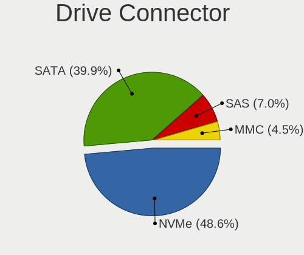
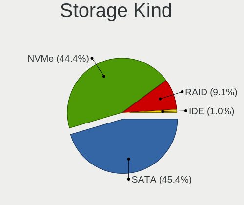
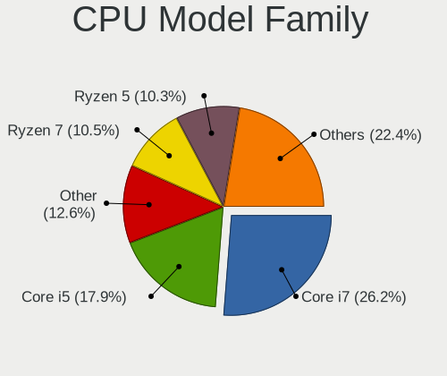
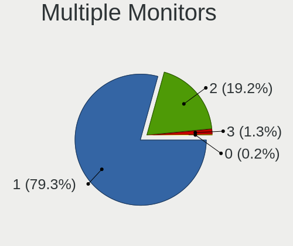
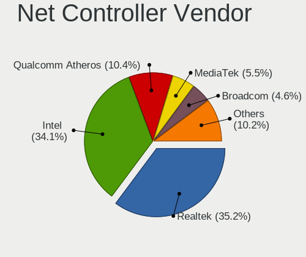
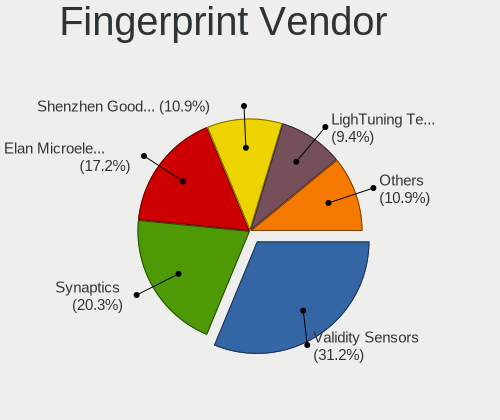
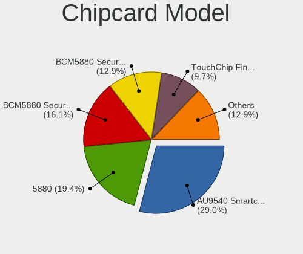

Garuda - Tested Hardware & Statistics (Notebooks)
-------------------------------------------------

A project to collect tested hardware configurations for Garuda.

Anyone can contribute to this report by the [hw-probe](https://github.com/linuxhw/hw-probe) tool:

    sudo -E hw-probe -all -upload

Please submit a probe of your configuration if it's not presented on the page or is rare.

Full-feature report is available here: https://linux-hardware.org/?view=trends

Contents
--------

* [ Test Cases ](#test-cases)

* [ System ](#system)
  - [ Kernel                   ](#kernel)
  - [ Kernel Family            ](#kernel-family)
  - [ Kernel Major Ver.        ](#kernel-major-ver)
  - [ Arch                     ](#arch)
  - [ DE                       ](#de)
  - [ Display Server           ](#display-server)
  - [ Display Manager          ](#display-manager)
  - [ OS Lang                  ](#os-lang)
  - [ Boot Mode                ](#boot-mode)
  - [ Filesystem               ](#filesystem)
  - [ Part. scheme             ](#part-scheme)
  - [ Dual Boot with Linux/BSD ](#dual-boot-with-linuxbsd)
  - [ Dual Boot (Win)          ](#dual-boot-win)

* [ Board ](#board)
  - [ Vendor                   ](#vendor)
  - [ Model                    ](#model)
  - [ Model Family             ](#model-family)
  - [ MFG Year                 ](#mfg-year)
  - [ Form Factor              ](#form-factor)
  - [ Secure Boot              ](#secure-boot)
  - [ Coreboot                 ](#coreboot)
  - [ RAM Size                 ](#ram-size)
  - [ RAM Used                 ](#ram-used)
  - [ Total Drives             ](#total-drives)
  - [ Has CD-ROM               ](#has-cd-rom)
  - [ Has Ethernet             ](#has-ethernet)
  - [ Has WiFi                 ](#has-wifi)
  - [ Has Bluetooth            ](#has-bluetooth)

* [ Location ](#location)
  - [ Country                  ](#country)
  - [ City                     ](#city)

* [ Drives ](#drives)
  - [ Drive Vendor             ](#drive-vendor)
  - [ Drive Model              ](#drive-model)
  - [ HDD Vendor               ](#hdd-vendor)
  - [ SSD Vendor               ](#ssd-vendor)
  - [ Drive Kind               ](#drive-kind)
  - [ Drive Connector          ](#drive-connector)
  - [ Drive Size               ](#drive-size)
  - [ Space Total              ](#space-total)
  - [ Space Used               ](#space-used)
  - [ Malfunc. Drives          ](#malfunc-drives)
  - [ Malfunc. Drive Vendor    ](#malfunc-drive-vendor)
  - [ Malfunc. HDD Vendor      ](#malfunc-hdd-vendor)
  - [ Malfunc. Drive Kind      ](#malfunc-drive-kind)
  - [ Failed Drives            ](#failed-drives)
  - [ Failed Drive Vendor      ](#failed-drive-vendor)
  - [ Drive Status             ](#drive-status)

* [ Storage controller ](#storage-controller)
  - [ Storage Vendor           ](#storage-vendor)
  - [ Storage Model            ](#storage-model)
  - [ Storage Kind             ](#storage-kind)

* [ Processor ](#processor)
  - [ CPU Vendor               ](#cpu-vendor)
  - [ CPU Model                ](#cpu-model)
  - [ CPU Model Family         ](#cpu-model-family)
  - [ CPU Cores                ](#cpu-cores)
  - [ CPU Sockets              ](#cpu-sockets)
  - [ CPU Threads              ](#cpu-threads)
  - [ CPU Op-Modes             ](#cpu-op-modes)
  - [ CPU Microcode            ](#cpu-microcode)
  - [ CPU Microarch            ](#cpu-microarch)

* [ Graphics ](#graphics)
  - [ GPU Vendor               ](#gpu-vendor)
  - [ GPU Model                ](#gpu-model)
  - [ GPU Combo                ](#gpu-combo)
  - [ GPU Driver               ](#gpu-driver)
  - [ GPU Memory               ](#gpu-memory)

* [ Monitor ](#monitor)
  - [ Monitor Vendor           ](#monitor-vendor)
  - [ Monitor Model            ](#monitor-model)
  - [ Monitor Resolution       ](#monitor-resolution)
  - [ Monitor Diagonal         ](#monitor-diagonal)
  - [ Monitor Width            ](#monitor-width)
  - [ Aspect Ratio             ](#aspect-ratio)
  - [ Monitor Area             ](#monitor-area)
  - [ Pixel Density            ](#pixel-density)
  - [ Multiple Monitors        ](#multiple-monitors)

* [ Network ](#network)
  - [ Net Controller Vendor    ](#net-controller-vendor)
  - [ Net Controller Model     ](#net-controller-model)
  - [ Wireless Vendor          ](#wireless-vendor)
  - [ Wireless Model           ](#wireless-model)
  - [ Ethernet Vendor          ](#ethernet-vendor)
  - [ Ethernet Model           ](#ethernet-model)
  - [ Net Controller Kind      ](#net-controller-kind)
  - [ Used Controller          ](#used-controller)
  - [ NICs                     ](#nics)
  - [ IPv6                     ](#ipv6)

* [ Bluetooth ](#bluetooth)
  - [ Bluetooth Vendor         ](#bluetooth-vendor)
  - [ Bluetooth Model          ](#bluetooth-model)

* [ Sound ](#sound)
  - [ Sound Vendor             ](#sound-vendor)
  - [ Sound Model              ](#sound-model)

* [ Memory ](#memory)
  - [ Memory Vendor            ](#memory-vendor)
  - [ Memory Model             ](#memory-model)
  - [ Memory Kind              ](#memory-kind)
  - [ Memory Form Factor       ](#memory-form-factor)
  - [ Memory Size              ](#memory-size)
  - [ Memory Speed             ](#memory-speed)

* [ Printers & scanners ](#printers--scanners)
  - [ Printer Vendor           ](#printer-vendor)
  - [ Printer Model            ](#printer-model)
  - [ Scanner Vendor           ](#scanner-vendor)
  - [ Scanner Model            ](#scanner-model)

* [ Camera ](#camera)
  - [ Camera Vendor            ](#camera-vendor)
  - [ Camera Model             ](#camera-model)

* [ Security ](#security)
  - [ Fingerprint Vendor       ](#fingerprint-vendor)
  - [ Fingerprint Model        ](#fingerprint-model)
  - [ Chipcard Vendor          ](#chipcard-vendor)
  - [ Chipcard Model           ](#chipcard-model)

* [ Unsupported ](#unsupported)
  - [ Unsupported Devices      ](#unsupported-devices)
  - [ Unsupported Device Types ](#unsupported-device-types)

Test Cases
----------

| Vendor        | Model                       | Probe                                                      | Date         |
|---------------|-----------------------------|------------------------------------------------------------|--------------|
| HP            | Pavilion Laptop 15-eh0xx... | [df628cbd13](https://linux-hardware.org/?probe=df628cbd13) | Dec 12, 2021 |
| Acer          | Aspire F5-573G              | [a49a5a129c](https://linux-hardware.org/?probe=a49a5a129c) | Dec 07, 2021 |
| HP            | Laptop 15-dy2xxx            | [f499f9a375](https://linux-hardware.org/?probe=f499f9a375) | Dec 06, 2021 |
| HP            | Laptop 15-dy2xxx            | [e6b9de389b](https://linux-hardware.org/?probe=e6b9de389b) | Dec 06, 2021 |
| Lenovo        | ThinkPad W530 24474KG       | [1ea5d23a86](https://linux-hardware.org/?probe=1ea5d23a86) | Nov 17, 2021 |
| HP            | Pavilion Laptop 15-eh0xx... | [d74b03de25](https://linux-hardware.org/?probe=d74b03de25) | Nov 13, 2021 |
| HP            | EliteBook 840 G8 Noteboo... | [ed9cd44b17](https://linux-hardware.org/?probe=ed9cd44b17) | Nov 08, 2021 |
| Dell          | XPS 13 9350                 | [dde814d7ca](https://linux-hardware.org/?probe=dde814d7ca) | Oct 25, 2021 |
| Lenovo        | ThinkPad W530 24474KG       | [64fd7ae16c](https://linux-hardware.org/?probe=64fd7ae16c) | Oct 11, 2021 |
| Lenovo        | IdeaPad Slim 1-14AST-05 ... | [0340b4c57f](https://linux-hardware.org/?probe=0340b4c57f) | Jul 30, 2021 |
| ASUSTek       | X550ZE                      | [e436ae3019](https://linux-hardware.org/?probe=e436ae3019) | Jul 23, 2021 |
| ASUSTek       | X550ZE                      | [49cd19882f](https://linux-hardware.org/?probe=49cd19882f) | Jul 23, 2021 |
| Sony          | VPCSB1C5E                   | [2878014d7a](https://linux-hardware.org/?probe=2878014d7a) | Jul 11, 2021 |
| Sony          | VPCSB1C5E                   | [4cfb82cbfe](https://linux-hardware.org/?probe=4cfb82cbfe) | Jul 11, 2021 |
| Lenovo        | IdeaPad Gaming 3 15ARH05... | [11e99b82d5](https://linux-hardware.org/?probe=11e99b82d5) | Jun 22, 2021 |
| Dell          | Inspiron N5050              | [92ae7459b4](https://linux-hardware.org/?probe=92ae7459b4) | Jun 20, 2021 |
| Lenovo        | IdeaPad Gaming 3 15ARH05... | [abd01e8eac](https://linux-hardware.org/?probe=abd01e8eac) | Jun 09, 2021 |
| Lenovo        | IdeaPad 3 15ADA05 81W1      | [d2a26e0f30](https://linux-hardware.org/?probe=d2a26e0f30) | May 26, 2021 |
| Lenovo        | IdeaPad Gaming 3 15ARH05... | [22931f83cc](https://linux-hardware.org/?probe=22931f83cc) | Apr 20, 2021 |
| Lenovo        | IdeaPad Gaming 3 15ARH05... | [3c7f354ce4](https://linux-hardware.org/?probe=3c7f354ce4) | Apr 19, 2021 |
| ASUSTek       | GL503VM                     | [743ff3a2aa](https://linux-hardware.org/?probe=743ff3a2aa) | Apr 18, 2021 |
| Medion        | P861X                       | [109599a6f6](https://linux-hardware.org/?probe=109599a6f6) | Apr 15, 2021 |
| Medion        | P861X                       | [ae05cea55d](https://linux-hardware.org/?probe=ae05cea55d) | Apr 15, 2021 |
| Medion        | E7419 MD60025               | [4deb77ef82](https://linux-hardware.org/?probe=4deb77ef82) | Apr 10, 2021 |
| Medion        | E7419 MD60025               | [938494cf89](https://linux-hardware.org/?probe=938494cf89) | Mar 31, 2021 |
| Lenovo        | ThinkPad T470 20HD000RUS    | [751dd3bb74](https://linux-hardware.org/?probe=751dd3bb74) | Mar 19, 2021 |
| HP            | Pavilion Laptop 15-cs0xx... | [793615c0de](https://linux-hardware.org/?probe=793615c0de) | Jan 30, 2021 |
| HP            | Compaq 6735b                | [84a4616a8d](https://linux-hardware.org/?probe=84a4616a8d) | Jan 18, 2021 |
| Fujitsu Si... | ESPRIMO Mobile D9500        | [9703bdf4f6](https://linux-hardware.org/?probe=9703bdf4f6) | Jan 12, 2021 |
| Unknown       | Unknown                     | [09f3ac6567](https://linux-hardware.org/?probe=09f3ac6567) | Jan 11, 2021 |
| Dell          | Latitude E6430              | [2e0ef916c6](https://linux-hardware.org/?probe=2e0ef916c6) | Jan 03, 2021 |
| Dell          | Inspiron 15 7000 Gaming     | [1d461bb9db](https://linux-hardware.org/?probe=1d461bb9db) | Dec 25, 2020 |
| Unknown       | Unknown                     | [ce7f267835](https://linux-hardware.org/?probe=ce7f267835) | Dec 23, 2020 |
| HP            | Laptop 17-ak0xx             | [e63bb99c0a](https://linux-hardware.org/?probe=e63bb99c0a) | Nov 30, 2020 |
| Lenovo        | ThinkPad T14 Gen 1 20UDS... | [05a70db99a](https://linux-hardware.org/?probe=05a70db99a) | Nov 22, 2020 |
| Dell          | Inspiron 15 7000 Gaming     | [1ff8a24823](https://linux-hardware.org/?probe=1ff8a24823) | Nov 18, 2020 |
| Dell          | Latitude E6430              | [760e7ca474](https://linux-hardware.org/?probe=760e7ca474) | Nov 02, 2020 |
| HP            | 450                         | [edeb9f6780](https://linux-hardware.org/?probe=edeb9f6780) | Apr 25, 2020 |

System
------

Kernel
------

Version of the Linux kernel

| Version              | Notebooks | Percent |
|----------------------|-----------|---------|
| 5.15.6-zen2-1-zen    | 2         | 7.41%   |
| 5.9.9-zen1-1-zen     | 1         | 3.7%    |
| 5.9.8-zen1-1-zen     | 1         | 3.7%    |
| 5.9.2-zen1-1-zen     | 1         | 3.7%    |
| 5.9.10-zen1-1-zen    | 1         | 3.7%    |
| 5.6.6-zen1-1-zen     | 1         | 3.7%    |
| 5.15.2-zen1-1-zen    | 1         | 3.7%    |
| 5.14.9-zen2-1-zen    | 1         | 3.7%    |
| 5.14.14-zen1-1-zen   | 1         | 3.7%    |
| 5.13.4-zen1-1-zen    | 1         | 3.7%    |
| 5.13.1-zen1-1-zen    | 1         | 3.7%    |
| 5.12.9-164-tkg-muqss | 1         | 3.7%    |
| 5.12.8-zen1-1-zen    | 1         | 3.7%    |
| 5.12.12-AMD-znver2   | 1         | 3.7%    |
| 5.11.7-zen1-1-zen    | 1         | 3.7%    |
| 5.11.2-zen1-1-zen    | 1         | 3.7%    |
| 5.11.15-zen1-2-zen   | 1         | 3.7%    |
| 5.11.12-zen1-1-zen   | 1         | 3.7%    |
| 5.11.11-zen1-1-zen   | 1         | 3.7%    |
| 5.10.7-111-tkg-bmq   | 1         | 3.7%    |
| 5.10.6-110-tkg-bmq   | 1         | 3.7%    |
| 5.10.4-zen2-1-zen    | 1         | 3.7%    |
| 5.10.30-1-lts        | 1         | 3.7%    |
| 5.10.2-104-tkg-bmq   | 1         | 3.7%    |
| 5.10.10-115-tkg-bmq  | 1         | 3.7%    |
| 5.10.1-103-tkg-bmq   | 1         | 3.7%    |

Kernel Family
-------------

Linux kernel without a distro release

| Version | Notebooks | Percent |
|---------|-----------|---------|
| 5.15.6  | 2         | 7.41%   |
| 5.9.9   | 1         | 3.7%    |
| 5.9.8   | 1         | 3.7%    |
| 5.9.2   | 1         | 3.7%    |
| 5.9.10  | 1         | 3.7%    |
| 5.6.6   | 1         | 3.7%    |
| 5.15.2  | 1         | 3.7%    |
| 5.14.9  | 1         | 3.7%    |
| 5.14.14 | 1         | 3.7%    |
| 5.13.4  | 1         | 3.7%    |
| 5.13.1  | 1         | 3.7%    |
| 5.12.9  | 1         | 3.7%    |
| 5.12.8  | 1         | 3.7%    |
| 5.12.12 | 1         | 3.7%    |
| 5.11.7  | 1         | 3.7%    |
| 5.11.2  | 1         | 3.7%    |
| 5.11.15 | 1         | 3.7%    |
| 5.11.12 | 1         | 3.7%    |
| 5.11.11 | 1         | 3.7%    |
| 5.10.7  | 1         | 3.7%    |
| 5.10.6  | 1         | 3.7%    |
| 5.10.4  | 1         | 3.7%    |
| 5.10.30 | 1         | 3.7%    |
| 5.10.2  | 1         | 3.7%    |
| 5.10.10 | 1         | 3.7%    |
| 5.10.1  | 1         | 3.7%    |

Kernel Major Ver.
-----------------

Linux kernel major version

| Version | Notebooks | Percent |
|---------|-----------|---------|
| 5.10    | 7         | 26.92%  |
| 5.9     | 4         | 15.38%  |
| 5.11    | 4         | 15.38%  |
| 5.15    | 3         | 11.54%  |
| 5.12    | 3         | 11.54%  |
| 5.14    | 2         | 7.69%   |
| 5.13    | 2         | 7.69%   |
| 5.6     | 1         | 3.85%   |

Arch
----

OS architecture (x86_64, i586, etc.)

| Name   | Notebooks | Percent |
|--------|-----------|---------|
| x86_64 | 22        | 100%    |

DE
--

Desktop Environment

| Name       | Notebooks | Percent |
|------------|-----------|---------|
| KDE        | 10        | 45.45%  |
| GNOME      | 4         | 18.18%  |
| XFCE       | 3         | 13.64%  |
| KDE5       | 3         | 13.64%  |
| X-Cinnamon | 1         | 4.55%   |
| MATE       | 1         | 4.55%   |

Display Server
--------------

X11 or Wayland

| Name | Notebooks | Percent |
|------|-----------|---------|
| X11  | 22        | 100%    |

Display Manager
---------------

SDDM, LightDM, etc.

| Name    | Notebooks | Percent |
|---------|-----------|---------|
| Unknown | 22        | 100%    |

OS Lang
-------

Language

| Lang  | Notebooks | Percent |
|-------|-----------|---------|
| en_US | 8         | 36.36%  |
| de_DE | 4         | 18.18%  |
| it_IT | 2         | 9.09%   |
| fi_FI | 2         | 9.09%   |
| en_GB | 2         | 9.09%   |
| pt_BR | 1         | 4.55%   |
| nl_NL | 1         | 4.55%   |
| ko_KR | 1         | 4.55%   |
| en_IN | 1         | 4.55%   |

Boot Mode
---------

EFI or BIOS

| Mode | Notebooks | Percent |
|------|-----------|---------|
| BIOS | 19        | 82.61%  |
| EFI  | 4         | 17.39%  |

Filesystem
----------

Type of filesystem

| Type  | Notebooks | Percent |
|-------|-----------|---------|
| Btrfs | 22        | 100%    |

Part. scheme
------------

Scheme of partitioning

| Type    | Notebooks | Percent |
|---------|-----------|---------|
| Unknown | 22        | 100%    |

Dual Boot with Linux/BSD
------------------------

Hosting more than one Linux/BSD

| Dual boot | Notebooks | Percent |
|-----------|-----------|---------|
| No        | 22        | 100%    |

Dual Boot (Win)
---------------

Hosting Linux and Windows

| Dual boot | Notebooks | Percent |
|-----------|-----------|---------|
| No        | 22        | 100%    |

Board
-----

Vendor
------

Motherboard manufacturer

| Name             | Notebooks | Percent |
|------------------|-----------|---------|
| Lenovo           | 5         | 22.73%  |
| Hewlett-Packard  | 5         | 22.73%  |
| Dell             | 4         | 18.18%  |
| Medion           | 2         | 9.09%   |
| ASUSTek Computer | 2         | 9.09%   |
| Sony             | 1         | 4.55%   |
| Fujitsu Siemens  | 1         | 4.55%   |
| Acer             | 1         | 4.55%   |
| Unknown          | 1         | 4.55%   |

Model
-----

Motherboard model

| Name                                 | Notebooks | Percent |
|--------------------------------------|-----------|---------|
| Lenovo IdeaPad Gaming 3 15ARH05 82EY | 2         | 9.09%   |
| Sony VPCSB1C5E                       | 1         | 4.55%   |
| Medion P861X                         | 1         | 4.55%   |
| Medion E7419 MD60025                 | 1         | 4.55%   |
| Lenovo ThinkPad W530 24474KG         | 1         | 4.55%   |
| Lenovo ThinkPad T470 20HD000RUS      | 1         | 4.55%   |
| Lenovo ThinkPad T14 Gen 1 20UDS00N00 | 1         | 4.55%   |
| HP Pavilion Laptop 15-cs0xxx         | 1         | 4.55%   |
| HP Laptop 17-ak0xx                   | 1         | 4.55%   |
| HP Laptop 15-dy2xxx                  | 1         | 4.55%   |
| HP Compaq 6735b                      | 1         | 4.55%   |
| HP 450                               | 1         | 4.55%   |
| Fujitsu Siemens ESPRIMO Mobile D9500 | 1         | 4.55%   |
| Dell XPS 13 9350                     | 1         | 4.55%   |
| Dell Latitude E6430                  | 1         | 4.55%   |
| Dell Inspiron N5050                  | 1         | 4.55%   |
| Dell Inspiron 15 7000 Gaming         | 1         | 4.55%   |
| ASUS X550ZE                          | 1         | 4.55%   |
| ASUS GL503VM                         | 1         | 4.55%   |
| Acer Aspire F5-573G                  | 1         | 4.55%   |
| Unknown                              | 1         | 4.55%   |

Model Family
------------

Motherboard model prefix

| Name                    | Notebooks | Percent |
|-------------------------|-----------|---------|
| Lenovo ThinkPad         | 3         | 13.64%  |
| Lenovo IdeaPad          | 2         | 9.09%   |
| HP Laptop               | 2         | 9.09%   |
| Dell Inspiron           | 2         | 9.09%   |
| Sony VPCSB1C5E          | 1         | 4.55%   |
| Medion P861X            | 1         | 4.55%   |
| Medion E7419            | 1         | 4.55%   |
| HP Pavilion             | 1         | 4.55%   |
| HP Compaq               | 1         | 4.55%   |
| HP 450                  | 1         | 4.55%   |
| Fujitsu Siemens ESPRIMO | 1         | 4.55%   |
| Dell XPS                | 1         | 4.55%   |
| Dell Latitude           | 1         | 4.55%   |
| ASUS X550ZE             | 1         | 4.55%   |
| ASUS GL503VM            | 1         | 4.55%   |
| Acer Aspire             | 1         | 4.55%   |
| Unknown                 | 1         | 4.55%   |

MFG Year
--------

Motherboard manufacture year

| Year | Notebooks | Percent |
|------|-----------|---------|
| 2020 | 6         | 27.27%  |
| 2019 | 4         | 18.18%  |
| 2016 | 2         | 9.09%   |
| 2012 | 2         | 9.09%   |
| 2009 | 2         | 9.09%   |
| 2021 | 1         | 4.55%   |
| 2018 | 1         | 4.55%   |
| 2017 | 1         | 4.55%   |
| 2015 | 1         | 4.55%   |
| 2013 | 1         | 4.55%   |
| 2008 | 1         | 4.55%   |

Form Factor
-----------

Physical design of the computer

| Name     | Notebooks | Percent |
|----------|-----------|---------|
| Notebook | 22        | 100%    |

Secure Boot
-----------

Enabled or disabled

| State    | Notebooks | Percent |
|----------|-----------|---------|
| Disabled | 22        | 100%    |

Coreboot
--------

Have coreboot on board

| Used | Notebooks | Percent |
|------|-----------|---------|
| No   | 22        | 100%    |

RAM Size
--------

Total RAM memory

| Size in GB | Notebooks | Percent |
|------------|-----------|---------|
| 8.01-16.0  | 7         | 31.82%  |
| 4.01-8.0   | 5         | 22.73%  |
| 16.01-24.0 | 4         | 18.18%  |
| 3.01-4.0   | 3         | 13.64%  |
| 24.01-32.0 | 2         | 9.09%   |
| 2.01-3.0   | 1         | 4.55%   |

RAM Used
--------

Used RAM memory

| Used GB   | Notebooks | Percent |
|-----------|-----------|---------|
| 2.01-3.0  | 9         | 34.62%  |
| 3.01-4.0  | 8         | 30.77%  |
| 8.01-16.0 | 4         | 15.38%  |
| 4.01-8.0  | 3         | 11.54%  |
| 1.01-2.0  | 2         | 7.69%   |

Total Drives
------------

Number of drives on board

| Drives | Notebooks | Percent |
|--------|-----------|---------|
| 1      | 13        | 54.17%  |
| 2      | 8         | 33.33%  |
| 3      | 3         | 12.5%   |

Has CD-ROM
----------

Has CD-ROM on board

| Presented | Notebooks | Percent |
|-----------|-----------|---------|
| No        | 15        | 62.5%   |
| Yes       | 9         | 37.5%   |

Has Ethernet
------------

Has Ethernet on board

| Presented | Notebooks | Percent |
|-----------|-----------|---------|
| Yes       | 19        | 86.36%  |
| No        | 3         | 13.64%  |

Has WiFi
--------

Has WiFi module

| Presented | Notebooks | Percent |
|-----------|-----------|---------|
| Yes       | 21        | 95.45%  |
| No        | 1         | 4.55%   |

Has Bluetooth
-------------

Has Bluetooth module

| Presented | Notebooks | Percent |
|-----------|-----------|---------|
| Yes       | 20        | 90.91%  |
| No        | 2         | 9.09%   |

Location
--------

Country
-------

Geographic location (country)

| Country     | Notebooks | Percent |
|-------------|-----------|---------|
| USA         | 5         | 22.73%  |
| Germany     | 4         | 18.18%  |
| UK          | 2         | 9.09%   |
| Italy       | 2         | 9.09%   |
| Finland     | 2         | 9.09%   |
| South Korea | 1         | 4.55%   |
| Netherlands | 1         | 4.55%   |
| Mexico      | 1         | 4.55%   |
| India       | 1         | 4.55%   |
| Canada      | 1         | 4.55%   |
| Brazil      | 1         | 4.55%   |
| Bahrain     | 1         | 4.55%   |

City
----

Geographic location (city)

| City               | Notebooks | Percent |
|--------------------|-----------|---------|
| Helsinki           | 2         | 8.33%   |
| Winston-Salem      | 1         | 4.17%   |
| Valenzano          | 1         | 4.17%   |
| Toronto            | 1         | 4.17%   |
| Spitalfields       | 1         | 4.17%   |
| Qalali             | 1         | 4.17%   |
| Mexico City        | 1         | 4.17%   |
| Kirkland           | 1         | 4.17%   |
| Ilhéus            | 1         | 4.17%   |
| Hillsdale          | 1         | 4.17%   |
| Halle              | 1         | 4.17%   |
| Guwahati           | 1         | 4.17%   |
| Groningen          | 1         | 4.17%   |
| Glendale           | 1         | 4.17%   |
| Fort Lauderdale    | 1         | 4.17%   |
| Busan              | 1         | 4.17%   |
| Burg bei Magdeburg | 1         | 4.17%   |
| Bonnybridge        | 1         | 4.17%   |
| Bologna            | 1         | 4.17%   |
| Bodenheim          | 1         | 4.17%   |
| Bielefeld          | 1         | 4.17%   |
| Berlin             | 1         | 4.17%   |
| Alheim             | 1         | 4.17%   |

Drives
------

Drive Vendor
------------

Hard drive vendors

| Vendor              | Notebooks | Drives | Percent |
|---------------------|-----------|--------|---------|
| Samsung Electronics | 9         | 12     | 28.13%  |
| Toshiba             | 3         | 5      | 9.38%   |
| Seagate             | 3         | 3      | 9.38%   |
| WDC                 | 2         | 3      | 6.25%   |
| SanDisk             | 2         | 5      | 6.25%   |
| KIOXIA              | 2         | 3      | 6.25%   |
| Kingston            | 2         | 2      | 6.25%   |
| HGST                | 2         | 2      | 6.25%   |
| WDC WDS             | 1         | 1      | 3.13%   |
| Unknown             | 1         | 1      | 3.13%   |
| ShanDianZhe         | 1         | 1      | 3.13%   |
| SABRENT             | 1         | 2      | 3.13%   |
| Phison              | 1         | 1      | 3.13%   |
| Micron Technology   | 1         | 1      | 3.13%   |
| Hitachi             | 1         | 1      | 3.13%   |

Drive Model
-----------

Hard drive models

| Model                                | Notebooks | Percent |
|--------------------------------------|-----------|---------|
| Toshiba MQ01ABD100 1TB               | 2         | 5.71%   |
| Samsung SSD 860 EVO 1TB              | 2         | 5.71%   |
| Samsung NVMe SSD Drive 256GB         | 2         | 5.71%   |
| Samsung MZYLF128HCHP-000L2 128GB SSD | 2         | 5.71%   |
| KIOXIA NVMe SSD Drive 512GB          | 2         | 5.71%   |
| WDC WDS240G2G0B-00EPW0 240GB SSD     | 1         | 2.86%   |
| WDC WDS120G2G0A-00JH30 120GB SSD     | 1         | 2.86%   |
| WDC WDS 500G2B0B-00YS70 500GB SSD    | 1         | 2.86%   |
| Unknown MMC Card  16GB               | 1         | 2.86%   |
| Toshiba MQ02ABD100H 1TB              | 1         | 2.86%   |
| ShanDianZhe 128G                     | 1         | 2.86%   |
| Seagate ST500LM000-1EJ162 500GB      | 1         | 2.86%   |
| Seagate ST1000LM024 HN-M101MBB 1TB   | 1         | 2.86%   |
| Seagate ST1000LM014-1EJ164 1TB       | 1         | 2.86%   |
| SanDisk SSD PLUS 120GB               | 1         | 2.86%   |
| SanDisk SDSSDH31000G 1TB             | 1         | 2.86%   |
| Sandisk NVMe SSD Drive 500GB         | 1         | 2.86%   |
| Samsung SSD 870 QVO 1TB              | 1         | 2.86%   |
| Samsung SSD 860 EVO M.2 500GB        | 1         | 2.86%   |
| Samsung SSD 860 EVO 500GB            | 1         | 2.86%   |
| Samsung NVMe SSD Drive 500GB         | 1         | 2.86%   |
| Samsung NVMe SSD Drive 1TB           | 1         | 2.86%   |
| SABRENT Disk 500GB                   | 1         | 2.86%   |
| Phison NVMe SSD Drive 512GB          | 1         | 2.86%   |
| Micron NVMe SSD Drive 256GB          | 1         | 2.86%   |
| Kingston RBU-SNS8151S396GG 96GB SSD  | 1         | 2.86%   |
| Kingston NVMe SSD Drive 250GB        | 1         | 2.86%   |
| Hitachi HTS545050B9SA00 500GB        | 1         | 2.86%   |
| HGST HTS725050A7E630 500GB           | 1         | 2.86%   |
| HGST HTS721010A9E630 1TB             | 1         | 2.86%   |

HDD Vendor
----------

Hard disk drive vendors

| Vendor  | Notebooks | Drives | Percent |
|---------|-----------|--------|---------|
| Toshiba | 3         | 5      | 30%     |
| Seagate | 3         | 3      | 30%     |
| HGST    | 2         | 2      | 20%     |
| SABRENT | 1         | 2      | 10%     |
| Hitachi | 1         | 1      | 10%     |

SSD Vendor
----------

Solid state drive vendors

| Vendor              | Notebooks | Drives | Percent |
|---------------------|-----------|--------|---------|
| Samsung Electronics | 6         | 8      | 54.55%  |
| WDC                 | 2         | 3      | 18.18%  |
| WDC WDS             | 1         | 1      | 9.09%   |
| SanDisk             | 1         | 4      | 9.09%   |
| Kingston            | 1         | 1      | 9.09%   |

Drive Kind
----------

HDD or SSD

| Kind    | Notebooks | Drives | Percent |
|---------|-----------|--------|---------|
| NVMe    | 10        | 11     | 33.33%  |
| SSD     | 9         | 17     | 30%     |
| HDD     | 9         | 13     | 30%     |
| MMC     | 1         | 1      | 3.33%   |
| Unknown | 1         | 1      | 3.33%   |

Drive Connector
---------------

SATA, SAS, NVMe, etc.

| Type | Notebooks | Drives | Percent |
|------|-----------|--------|---------|
| SATA | 16        | 27     | 53.33%  |
| NVMe | 10        | 11     | 33.33%  |
| SAS  | 3         | 4      | 10%     |
| MMC  | 1         | 1      | 3.33%   |

Drive Size
----------

Size of hard drive

| Size in TB | Notebooks | Drives | Percent |
|------------|-----------|--------|---------|
| 0.01-0.5   | 11        | 16     | 55%     |
| 0.51-1.0   | 9         | 14     | 45%     |

Space Total
-----------

Amount of disk space available on the file system

| Size in GB     | Notebooks | Percent |
|----------------|-----------|---------|
| 501-1000       | 8         | 34.78%  |
| 2001-3000      | 6         | 26.09%  |
| More than 3000 | 4         | 17.39%  |
| 1001-2000      | 4         | 17.39%  |
| 251-500        | 1         | 4.35%   |

Space Used
----------

Amount of used disk space

| Used GB   | Notebooks | Percent |
|-----------|-----------|---------|
| 101-250   | 10        | 40%     |
| 251-500   | 4         | 16%     |
| 501-1000  | 4         | 16%     |
| 51-100    | 4         | 16%     |
| 1001-2000 | 3         | 12%     |

Malfunc. Drives
---------------

Drive models with a malfunction

Zero info for selected period =(

Malfunc. Drive Vendor
---------------------

Vendors of faulty drives

Zero info for selected period =(

Malfunc. HDD Vendor
-------------------

Vendors of faulty HDD drives

Zero info for selected period =(

Malfunc. Drive Kind
-------------------

Kinds of faulty drives

Zero info for selected period =(

Failed Drives
-------------

Failed drive models

Zero info for selected period =(

Failed Drive Vendor
-------------------

Failed drive vendors

Zero info for selected period =(

Drive Status
------------

Number of failed and malfunc. drives

| Status   | Notebooks | Drives | Percent |
|----------|-----------|--------|---------|
| Detected | 24        | 43     | 100%    |

Storage controller
------------------

Storage Vendor
--------------

Storage controller vendors

| Vendor                      | Notebooks | Percent |
|-----------------------------|-----------|---------|
| Intel                       | 14        | 50%     |
| AMD                         | 5         | 17.86%  |
| Samsung Electronics         | 4         | 14.29%  |
| Sandisk                     | 1         | 3.57%   |
| Phison Electronics          | 1         | 3.57%   |
| Nvidia                      | 1         | 3.57%   |
| KIOXIA                      | 1         | 3.57%   |
| Kingston Technology Company | 1         | 3.57%   |

Storage Model
-------------

Storage controller models

| Model                                                                        | Notebooks | Percent |
|------------------------------------------------------------------------------|-----------|---------|
| Intel Sunrise Point-LP SATA Controller [AHCI mode]                           | 4         | 13.79%  |
| AMD FCH SATA Controller [AHCI mode]                                          | 4         | 13.79%  |
| Intel 82801 Mobile SATA Controller [RAID mode]                               | 3         | 10.34%  |
| Intel 7 Series Chipset Family 6-port SATA Controller [AHCI mode]             | 3         | 10.34%  |
| Samsung NVMe SSD Controller SM981/PM981/PM983                                | 2         | 6.9%    |
| Sandisk WD Black 2018/SN750 / PC SN720 NVMe SSD                              | 1         | 3.45%   |
| Samsung NVMe SSD Controller SM951/PM951                                      | 1         | 3.45%   |
| Samsung NVMe SSD Controller 980                                              | 1         | 3.45%   |
| Phison E12 NVMe Controller                                                   | 1         | 3.45%   |
| Nvidia MCP79 AHCI Controller                                                 | 1         | 3.45%   |
| KIOXIA Non-Volatile memory controller                                        | 1         | 3.45%   |
| Kingston Company A2000 NVMe SSD                                              | 1         | 3.45%   |
| Intel Volume Management Device NVMe RAID Controller                          | 1         | 3.45%   |
| Intel Celeron N3350/Pentium N4200/Atom E3900 Series SATA AHCI Controller     | 1         | 3.45%   |
| Intel 82801HM/HEM (ICH8M/ICH8M-E) SATA Controller [IDE mode]                 | 1         | 3.45%   |
| Intel 82801HM/HEM (ICH8M/ICH8M-E) IDE Controller                             | 1         | 3.45%   |
| Intel 6 Series/C200 Series Chipset Family 6 port Mobile SATA AHCI Controller | 1         | 3.45%   |
| AMD SB7x0/SB8x0/SB9x0 SATA Controller [AHCI mode]                            | 1         | 3.45%   |

Storage Kind
------------

Kind of storage controller (IDE, SATA, NVMe, SAS, ...)

| Kind | Notebooks | Percent |
|------|-----------|---------|
| SATA | 15        | 53.57%  |
| NVMe | 8         | 28.57%  |
| RAID | 4         | 14.29%  |
| IDE  | 1         | 3.57%   |

Processor
---------

CPU Vendor
----------

Processor vendors

| Vendor | Notebooks | Percent |
|--------|-----------|---------|
| Intel  | 16        | 72.73%  |
| AMD    | 6         | 27.27%  |

CPU Model
---------

Processor models

| Model                                           | Notebooks | Percent |
|-------------------------------------------------|-----------|---------|
| Intel Core i7-7700HQ CPU @ 2.80GHz              | 2         | 9.09%   |
| Intel Pentium Dual-Core CPU T4400 @ 2.20GHz     | 1         | 4.55%   |
| Intel Pentium CPU 4405U @ 2.10GHz               | 1         | 4.55%   |
| Intel Pentium CPU 2020M @ 2.40GHz               | 1         | 4.55%   |
| Intel Core i7-8550U CPU @ 1.80GHz               | 1         | 4.55%   |
| Intel Core i7-7500U CPU @ 2.70GHz               | 1         | 4.55%   |
| Intel Core i7-3630QM CPU @ 2.40GHz              | 1         | 4.55%   |
| Intel Core i5-7300U CPU @ 2.60GHz               | 1         | 4.55%   |
| Intel Core i5-6200U CPU @ 2.30GHz               | 1         | 4.55%   |
| Intel Core i5-3340M CPU @ 2.70GHz               | 1         | 4.55%   |
| Intel Core i5-2520M CPU @ 2.50GHz               | 1         | 4.55%   |
| Intel Core i3-2350M CPU @ 2.30GHz               | 1         | 4.55%   |
| Intel Core 2 Duo CPU T8300 @ 2.40GHz            | 1         | 4.55%   |
| Intel Celeron CPU J3455 @ 1.50GHz               | 1         | 4.55%   |
| Intel 11th Gen Core i3-1125G4 @ 2.00GHz         | 1         | 4.55%   |
| AMD Turion X2 Ultra DualCore Mobile ZM-84       | 1         | 4.55%   |
| AMD Ryzen 7 PRO 4750U with Radeon Graphics      | 1         | 4.55%   |
| AMD Ryzen 7 4800H with Radeon Graphics          | 1         | 4.55%   |
| AMD Ryzen 5 4600H with Radeon Graphics          | 1         | 4.55%   |
| AMD A9-9420 RADEON R5, 5 COMPUTE CORES 2C+3G    | 1         | 4.55%   |
| AMD A10-7400P Radeon R6, 10 Compute Cores 4C+6G | 1         | 4.55%   |

CPU Model Family
----------------

Processor model prefix

| Model                   | Notebooks | Percent |
|-------------------------|-----------|---------|
| Intel Core i7           | 5         | 22.73%  |
| Intel Core i5           | 4         | 18.18%  |
| Other                   | 2         | 9.09%   |
| Intel Pentium           | 2         | 9.09%   |
| Intel Pentium Dual-Core | 1         | 4.55%   |
| Intel Core i3           | 1         | 4.55%   |
| Intel Core 2 Duo        | 1         | 4.55%   |
| Intel Celeron           | 1         | 4.55%   |
| AMD Turion              | 1         | 4.55%   |
| AMD Ryzen 7 PRO         | 1         | 4.55%   |
| AMD Ryzen 7             | 1         | 4.55%   |
| AMD Ryzen 5             | 1         | 4.55%   |
| AMD A10                 | 1         | 4.55%   |

CPU Cores
---------

Number of processor cores

| Number | Notebooks | Percent |
|--------|-----------|---------|
| 2      | 13        | 59.09%  |
| 4      | 6         | 27.27%  |
| 8      | 2         | 9.09%   |
| 6      | 1         | 4.55%   |

CPU Sockets
-----------

Number of sockets

| Number | Notebooks | Percent |
|--------|-----------|---------|
| 1      | 22        | 100%    |

CPU Threads
-----------

Threads per core (Hyper-Threading)

| Number | Notebooks | Percent |
|--------|-----------|---------|
| 2      | 16        | 72.73%  |
| 1      | 6         | 27.27%  |

CPU Op-Modes
------------

CPU Operation Modes (32-bit, 64-bit)

| Op mode        | Notebooks | Percent |
|----------------|-----------|---------|
| 32-bit, 64-bit | 22        | 100%    |

CPU Microcode
-------------

Microcode number

| Number     | Notebooks | Percent |
|------------|-----------|---------|
| Unknown    | 17        | 70.83%  |
| 0x906e9    | 1         | 4.17%   |
| 0x506c9    | 1         | 4.17%   |
| 0x306a9    | 1         | 4.17%   |
| 0x1067a    | 1         | 4.17%   |
| 0x08600106 | 1         | 4.17%   |
| 0x08600104 | 1         | 4.17%   |
| 0x06006705 | 1         | 4.17%   |

CPU Microarch
-------------

Microarchitecture

| Name            | Notebooks | Percent |
|-----------------|-----------|---------|
| KabyLake        | 5         | 22.73%  |
| Zen 2           | 3         | 13.64%  |
| IvyBridge       | 3         | 13.64%  |
| Skylake         | 2         | 9.09%   |
| SandyBridge     | 2         | 9.09%   |
| Penryn          | 2         | 9.09%   |
| TigerLake       | 1         | 4.55%   |
| Steamroller     | 1         | 4.55%   |
| K8 & K10 hybrid | 1         | 4.55%   |
| Goldmont        | 1         | 4.55%   |
| Excavator       | 1         | 4.55%   |

Graphics
--------

GPU Vendor
----------

Vendors of graphics cards

| Vendor | Notebooks | Percent |
|--------|-----------|---------|
| Intel  | 14        | 48.28%  |
| Nvidia | 8         | 27.59%  |
| AMD    | 7         | 24.14%  |

GPU Model
---------

Graphics card models

| Model                                                                     | Notebooks | Percent |
|---------------------------------------------------------------------------|-----------|---------|
| Intel 3rd Gen Core processor Graphics Controller                          | 3         | 9.68%   |
| AMD Renoir                                                                | 3         | 9.68%   |
| Intel HD Graphics 620                                                     | 2         | 6.45%   |
| Intel 2nd Generation Core Processor Family Integrated Graphics Controller | 2         | 6.45%   |
| Nvidia TU117M [GeForce GTX 1650 Ti Mobile]                                | 1         | 3.23%   |
| Nvidia TU117M                                                             | 1         | 3.23%   |
| Nvidia GP108M [GeForce MX150]                                             | 1         | 3.23%   |
| Nvidia GP107M [GeForce GTX 1050 Ti Mobile]                                | 1         | 3.23%   |
| Nvidia GP106M [GeForce GTX 1060 Mobile]                                   | 1         | 3.23%   |
| Nvidia GM107M [GeForce GTX 950M]                                          | 1         | 3.23%   |
| Nvidia GK107GLM [Quadro K1000M]                                           | 1         | 3.23%   |
| Nvidia C79 [GeForce 9100M G]                                              | 1         | 3.23%   |
| Intel UHD Graphics 620                                                    | 1         | 3.23%   |
| Intel Tiger Lake UHD Graphics                                             | 1         | 3.23%   |
| Intel Skylake GT2 [HD Graphics 520]                                       | 1         | 3.23%   |
| Intel Mobile GM965/GL960 Integrated Graphics Controller (secondary)       | 1         | 3.23%   |
| Intel Mobile GM965/GL960 Integrated Graphics Controller (primary)         | 1         | 3.23%   |
| Intel HD Graphics 630                                                     | 1         | 3.23%   |
| Intel HD Graphics 510                                                     | 1         | 3.23%   |
| Intel HD Graphics 500                                                     | 1         | 3.23%   |
| AMD Whistler [Radeon HD 6630M/6650M/6750M/7670M/7690M]                    | 1         | 3.23%   |
| AMD Stoney [Radeon R2/R3/R4/R5 Graphics]                                  | 1         | 3.23%   |
| AMD RS780M [Mobility Radeon HD 3200]                                      | 1         | 3.23%   |
| AMD Kaveri [Radeon R6 Graphics]                                           | 1         | 3.23%   |
| AMD Jet PRO [Radeon R5 M230 / R7 M260DX / Radeon 520 Mobile]              | 1         | 3.23%   |

GPU Combo
---------

Combinations of graphics cards

| Name           | Notebooks | Percent |
|----------------|-----------|---------|
| 1 x Intel      | 9         | 40.91%  |
| Intel + Nvidia | 4         | 18.18%  |
| 1 x AMD        | 3         | 13.64%  |
| 1 x Nvidia     | 2         | 9.09%   |
| AMD + Nvidia   | 2         | 9.09%   |
| 2 x AMD        | 1         | 4.55%   |
| Intel + AMD    | 1         | 4.55%   |

GPU Driver
----------

Free vs proprietary

| Driver      | Notebooks | Percent |
|-------------|-----------|---------|
| Free        | 18        | 81.82%  |
| Proprietary | 4         | 18.18%  |

GPU Memory
----------

Total video memory

| Size in GB | Notebooks | Percent |
|------------|-----------|---------|
| Unknown    | 19        | 86.36%  |
| 0.01-0.5   | 2         | 9.09%   |
| 3.01-4.0   | 1         | 4.55%   |

Monitor
-------

Monitor Vendor
--------------

Monitor vendors

| Vendor                  | Notebooks | Percent |
|-------------------------|-----------|---------|
| LG Display              | 5         | 19.23%  |
| AU Optronics            | 5         | 19.23%  |
| Chimei Innolux          | 3         | 11.54%  |
| Samsung Electronics     | 2         | 7.69%   |
| BOE                     | 2         | 7.69%   |
| Sony                    | 1         | 3.85%   |
| Sharp                   | 1         | 3.85%   |
| PANDA                   | 1         | 3.85%   |
| Lenovo                  | 1         | 3.85%   |
| Dell                    | 1         | 3.85%   |
| CPT                     | 1         | 3.85%   |
| Chi Mei Optoelectronics | 1         | 3.85%   |
| ASUSTek Computer        | 1         | 3.85%   |
| Acer                    | 1         | 3.85%   |

Monitor Model
-------------

Monitor models

| Model                                                                    | Notebooks | Percent |
|--------------------------------------------------------------------------|-----------|---------|
| Sony TV SNYA301 1920x1080 1600x900mm 72.3-inch                           | 1         | 3.85%   |
| Sharp LCD Monitor SHP144A 3200x1800 294x165mm 13.3-inch                  | 1         | 3.85%   |
| Samsung Electronics T22B300 SAM092D 1920x1080 477x268mm 21.5-inch        | 1         | 3.85%   |
| Samsung Electronics LCD Monitor SEC314B 1680x945 409x230mm 18.5-inch     | 1         | 3.85%   |
| PANDA LM156LF1L03 NCP001C 1920x1080 344x194mm 15.5-inch                  | 1         | 3.85%   |
| LG Display LCD Monitor LGD062E 1920x1080 344x194mm 15.5-inch             | 1         | 3.85%   |
| LG Display LCD Monitor LGD05E5 1920x1080 344x194mm 15.5-inch             | 1         | 3.85%   |
| LG Display LCD Monitor LGD045C 1366x768 350x190mm 15.7-inch              | 1         | 3.85%   |
| LG Display LCD Monitor LGD0385 1366x768 309x174mm 14.0-inch              | 1         | 3.85%   |
| LG Display LCD Monitor LGD01AF 1680x1050 331x207mm 15.4-inch             | 1         | 3.85%   |
| Lenovo LCD Monitor LEN40B1 1600x900 344x194mm 15.5-inch                  | 1         | 3.85%   |
| Dell U2412M DELA07A 1920x1200 518x324mm 24.1-inch                        | 1         | 3.85%   |
| CPT LCD Monitor CPT1464 1440x900 331x207mm 15.4-inch                     | 1         | 3.85%   |
| Chimei Innolux LCD Monitor CMN1746 1600x900 382x214mm 17.2-inch          | 1         | 3.85%   |
| Chimei Innolux LCD Monitor CMN15C4 1920x1080 344x193mm 15.5-inch         | 1         | 3.85%   |
| Chimei Innolux LCD Monitor CMN14C9 1920x1080 309x173mm 13.9-inch         | 1         | 3.85%   |
| Chi Mei Optoelectronics LCD Monitor CMO15A7 1366x768 350x190mm 15.7-inch | 1         | 3.85%   |
| BOE LCD Monitor BOE08E8 1920x1080 344x194mm 15.5-inch                    | 1         | 3.85%   |
| BOE LCD Monitor BOE0610 1920x1080 344x193mm 15.5-inch                    | 1         | 3.85%   |
| AU Optronics LCD Monitor AUO573D 1920x1080 309x174mm 14.0-inch           | 1         | 3.85%   |
| AU Optronics LCD Monitor AUO45ED 1920x1080 344x193mm 15.5-inch           | 1         | 3.85%   |
| AU Optronics LCD Monitor AUO21ED 1920x1080 344x194mm 15.5-inch           | 1         | 3.85%   |
| AU Optronics LCD Monitor AUO193C 1366x768 309x173mm 13.9-inch            | 1         | 3.85%   |
| AU Optronics LCD Monitor AUO109D 1920x1080 381x214mm 17.2-inch           | 1         | 3.85%   |
| ASUSTek Computer VZ229 AUS22CC 1920x1080 476x268mm 21.5-inch             | 1         | 3.85%   |
| Acer P223W ACR0016 1680x1050 474x296mm 22.0-inch                         | 1         | 3.85%   |

Monitor Resolution
------------------

Monitor screen resolution

| Resolution         | Notebooks | Percent |
|--------------------|-----------|---------|
| 1920x1080 (FHD)    | 11        | 47.83%  |
| 1366x768 (WXGA)    | 4         | 17.39%  |
| 1680x1050 (WSXGA+) | 2         | 8.7%    |
| 1600x900 (HD+)     | 2         | 8.7%    |
| 3200x1800 (QHD+)   | 1         | 4.35%   |
| 1920x1200 (WUXGA)  | 1         | 4.35%   |
| 1680x945           | 1         | 4.35%   |
| 1440x900 (WXGA+)   | 1         | 4.35%   |

Monitor Diagonal
----------------

Diagonal size in inches

| Inches | Notebooks | Percent |
|--------|-----------|---------|
| 15     | 13        | 50%     |
| 13     | 3         | 11.54%  |
| 21     | 2         | 7.69%   |
| 17     | 2         | 7.69%   |
| 14     | 2         | 7.69%   |
| 72     | 1         | 3.85%   |
| 24     | 1         | 3.85%   |
| 22     | 1         | 3.85%   |
| 18     | 1         | 3.85%   |

Monitor Width
-------------

Physical width

| Width in mm | Notebooks | Percent |
|-------------|-----------|---------|
| 301-350     | 17        | 65.38%  |
| 401-500     | 4         | 15.38%  |
| 351-400     | 2         | 7.69%   |
| 501-600     | 1         | 3.85%   |
| 201-300     | 1         | 3.85%   |
| 1501-2000   | 1         | 3.85%   |

Aspect Ratio
------------

Proportional relationship between the width and the height

| Ratio | Notebooks | Percent |
|-------|-----------|---------|
| 16/9  | 19        | 82.61%  |
| 16/10 | 4         | 17.39%  |

Monitor Area
------------

Area in inch²

| Area in inch² | Notebooks | Percent |
|----------------|-----------|---------|
| 101-110        | 13        | 50%     |
| 81-90          | 4         | 15.38%  |
| 201-250        | 2         | 7.69%   |
| 121-130        | 2         | 7.69%   |
| More than 1000 | 1         | 3.85%   |
| 71-80          | 1         | 3.85%   |
| 251-300        | 1         | 3.85%   |
| 151-200        | 1         | 3.85%   |
| 141-150        | 1         | 3.85%   |

Pixel Density
-------------

Pixels per inch

| Density       | Notebooks | Percent |
|---------------|-----------|---------|
| 121-160       | 12        | 46.15%  |
| 101-120       | 8         | 30.77%  |
| 51-100        | 4         | 15.38%  |
| More than 240 | 1         | 3.85%   |
| 1-50          | 1         | 3.85%   |

Multiple Monitors
-----------------

Total monitors connected

| Total | Notebooks | Percent |
|-------|-----------|---------|
| 1     | 17        | 73.91%  |
| 2     | 6         | 26.09%  |

Network
-------

Net Controller Vendor
---------------------

Controller vendors

| Vendor                | Notebooks | Percent |
|-----------------------|-----------|---------|
| Realtek Semiconductor | 16        | 45.71%  |
| Qualcomm Atheros      | 7         | 20%     |
| Intel                 | 7         | 20%     |
| Broadcom              | 3         | 8.57%   |
| Ralink Technology     | 1         | 2.86%   |
| Nvidia                | 1         | 2.86%   |

Net Controller Model
--------------------

Controller models

| Model                                                             | Notebooks | Percent |
|-------------------------------------------------------------------|-----------|---------|
| Realtek RTL8111/8168/8411 PCI Express Gigabit Ethernet Controller | 13        | 31.71%  |
| Realtek RTL8821CE 802.11ac PCIe Wireless Network Adapter          | 2         | 4.88%   |
| Qualcomm Atheros QCA9565 / AR9565 Wireless Network Adapter        | 2         | 4.88%   |
| Qualcomm Atheros QCA6174 802.11ac Wireless Network Adapter        | 2         | 4.88%   |
| Intel Wireless 8265 / 8275                                        | 2         | 4.88%   |
| Intel 82579LM Gigabit Network Connection (Lewisville)             | 2         | 4.88%   |
| Realtek RTL8822CE 802.11ac PCIe Wireless Network Adapter          | 1         | 2.44%   |
| Realtek RTL8723DE Wireless Network Adapter                        | 1         | 2.44%   |
| Realtek RTL8191SEvB Wireless LAN Controller                       | 1         | 2.44%   |
| Realtek RTL810xE PCI Express Fast Ethernet controller             | 1         | 2.44%   |
| Ralink MT7610U ("Archer T2U" 2.4G+5G WLAN Adapter                 | 1         | 2.44%   |
| Qualcomm Atheros QCA9377 802.11ac Wireless Network Adapter        | 1         | 2.44%   |
| Qualcomm Atheros AR9485 Wireless Network Adapter                  | 1         | 2.44%   |
| Qualcomm Atheros AR9285 Wireless Network Adapter (PCI-Express)    | 1         | 2.44%   |
| Nvidia MCP79 Ethernet                                             | 1         | 2.44%   |
| Intel Wireless 3165                                               | 1         | 2.44%   |
| Intel Wi-Fi 6 AX200                                               | 1         | 2.44%   |
| Intel PRO/Wireless 4965 AG or AGN [Kedron] Network Connection     | 1         | 2.44%   |
| Intel Ethernet Connection (4) I219-LM                             | 1         | 2.44%   |
| Intel Centrino Ultimate-N 6300                                    | 1         | 2.44%   |
| Broadcom NetLink BCM5787M Gigabit Ethernet PCI Express            | 1         | 2.44%   |
| Broadcom BCM4350 802.11ac Wireless Network Adapter                | 1         | 2.44%   |
| Broadcom BCM4322 802.11a/b/g/n Wireless LAN Controller            | 1         | 2.44%   |
| Broadcom BCM4313 802.11bgn Wireless Network Adapter               | 1         | 2.44%   |

Wireless Vendor
---------------

Wireless vendors

| Vendor                | Notebooks | Percent |
|-----------------------|-----------|---------|
| Qualcomm Atheros      | 7         | 31.82%  |
| Intel                 | 6         | 27.27%  |
| Realtek Semiconductor | 5         | 22.73%  |
| Broadcom              | 3         | 13.64%  |
| Ralink Technology     | 1         | 4.55%   |

Wireless Model
--------------

Wireless models

| Model                                                          | Notebooks | Percent |
|----------------------------------------------------------------|-----------|---------|
| Realtek RTL8821CE 802.11ac PCIe Wireless Network Adapter       | 2         | 9.09%   |
| Qualcomm Atheros QCA9565 / AR9565 Wireless Network Adapter     | 2         | 9.09%   |
| Qualcomm Atheros QCA6174 802.11ac Wireless Network Adapter     | 2         | 9.09%   |
| Intel Wireless 8265 / 8275                                     | 2         | 9.09%   |
| Realtek RTL8822CE 802.11ac PCIe Wireless Network Adapter       | 1         | 4.55%   |
| Realtek RTL8723DE Wireless Network Adapter                     | 1         | 4.55%   |
| Realtek RTL8191SEvB Wireless LAN Controller                    | 1         | 4.55%   |
| Ralink MT7610U ("Archer T2U" 2.4G+5G WLAN Adapter              | 1         | 4.55%   |
| Qualcomm Atheros QCA9377 802.11ac Wireless Network Adapter     | 1         | 4.55%   |
| Qualcomm Atheros AR9485 Wireless Network Adapter               | 1         | 4.55%   |
| Qualcomm Atheros AR9285 Wireless Network Adapter (PCI-Express) | 1         | 4.55%   |
| Intel Wireless 3165                                            | 1         | 4.55%   |
| Intel Wi-Fi 6 AX200                                            | 1         | 4.55%   |
| Intel PRO/Wireless 4965 AG or AGN [Kedron] Network Connection  | 1         | 4.55%   |
| Intel Centrino Ultimate-N 6300                                 | 1         | 4.55%   |
| Broadcom BCM4350 802.11ac Wireless Network Adapter             | 1         | 4.55%   |
| Broadcom BCM4322 802.11a/b/g/n Wireless LAN Controller         | 1         | 4.55%   |
| Broadcom BCM4313 802.11bgn Wireless Network Adapter            | 1         | 4.55%   |

Ethernet Vendor
---------------

Ethernet vendors

| Vendor                | Notebooks | Percent |
|-----------------------|-----------|---------|
| Realtek Semiconductor | 14        | 73.68%  |
| Intel                 | 3         | 15.79%  |
| Nvidia                | 1         | 5.26%   |
| Broadcom              | 1         | 5.26%   |

Ethernet Model
--------------

Ethernet models

| Model                                                             | Notebooks | Percent |
|-------------------------------------------------------------------|-----------|---------|
| Realtek RTL8111/8168/8411 PCI Express Gigabit Ethernet Controller | 13        | 68.42%  |
| Intel 82579LM Gigabit Network Connection (Lewisville)             | 2         | 10.53%  |
| Realtek RTL810xE PCI Express Fast Ethernet controller             | 1         | 5.26%   |
| Nvidia MCP79 Ethernet                                             | 1         | 5.26%   |
| Intel Ethernet Connection (4) I219-LM                             | 1         | 5.26%   |
| Broadcom NetLink BCM5787M Gigabit Ethernet PCI Express            | 1         | 5.26%   |

Net Controller Kind
-------------------

Ethernet, WiFi or modem

| Kind     | Notebooks | Percent |
|----------|-----------|---------|
| WiFi     | 21        | 52.5%   |
| Ethernet | 19        | 47.5%   |

Used Controller
---------------

Currently used network controller

| Kind     | Notebooks | Percent |
|----------|-----------|---------|
| WiFi     | 19        | 55.88%  |
| Ethernet | 15        | 44.12%  |

NICs
----

Total network controllers on board

| Total | Notebooks | Percent |
|-------|-----------|---------|
| 2     | 17        | 77.27%  |
| 1     | 4         | 18.18%  |
| 3     | 1         | 4.55%   |

IPv6
----

IPv6 vs IPv4

| Used | Notebooks | Percent |
|------|-----------|---------|
| No   | 15        | 68.18%  |
| Yes  | 7         | 31.82%  |

Bluetooth
---------

Bluetooth Vendor
----------------

Controller vendors

| Vendor                          | Notebooks | Percent |
|---------------------------------|-----------|---------|
| Qualcomm Atheros Communications | 6         | 28.57%  |
| Realtek Semiconductor           | 4         | 19.05%  |
| Intel                           | 4         | 19.05%  |
| Lite-On Technology              | 1         | 4.76%   |
| IMC Networks                    | 1         | 4.76%   |
| Hewlett-Packard                 | 1         | 4.76%   |
| Foxconn / Hon Hai               | 1         | 4.76%   |
| Dell                            | 1         | 4.76%   |
| Cambridge Silicon Radio         | 1         | 4.76%   |
| Broadcom                        | 1         | 4.76%   |

Bluetooth Model
---------------

Controller models

| Model                                                                               | Notebooks | Percent |
|-------------------------------------------------------------------------------------|-----------|---------|
| Qualcomm Atheros  Bluetooth Device                                                  | 3         | 14.29%  |
| Realtek  Bluetooth 4.2 Adapter                                                      | 2         | 9.52%   |
| Realtek Bluetooth Radio                                                             | 2         | 9.52%   |
| Intel Bluetooth Device                                                              | 2         | 9.52%   |
| Qualcomm Atheros Bluetooth                                                          | 1         | 4.76%   |
| Qualcomm Atheros AR9462 Bluetooth                                                   | 1         | 4.76%   |
| Qualcomm Atheros AR3011 Bluetooth                                                   | 1         | 4.76%   |
| Lite-On Qualcomm Atheros QCA9377 Bluetooth                                          | 1         | 4.76%   |
| Intel Bluetooth wireless interface                                                  | 1         | 4.76%   |
| Intel AX200 Bluetooth                                                               | 1         | 4.76%   |
| IMC Networks Bluetooth Device                                                       | 1         | 4.76%   |
| HP Bluetooth 2.0 Interface [Broadcom BCM2045]                                       | 1         | 4.76%   |
| Foxconn / Hon Hai Foxconn T77H114 BCM2070 [Single-Chip Bluetooth 2.1 + EDR Adapter] | 1         | 4.76%   |
| Dell BCM20702A0 Bluetooth Module                                                    | 1         | 4.76%   |
| Cambridge Silicon Radio Bluetooth Dongle (HCI mode)                                 | 1         | 4.76%   |
| Broadcom BCM2045A0                                                                  | 1         | 4.76%   |

Sound
-----

Sound Vendor
------------

Sound card vendors

| Vendor             | Notebooks | Percent |
|--------------------|-----------|---------|
| Intel              | 15        | 51.72%  |
| AMD                | 6         | 20.69%  |
| Nvidia             | 5         | 17.24%  |
| Turtle Beach       | 1         | 3.45%   |
| Phison Electronics | 1         | 3.45%   |
| JMTek              | 1         | 3.45%   |

Sound Model
-----------

Sound card models

| Model                                                                      | Notebooks | Percent |
|----------------------------------------------------------------------------|-----------|---------|
| Intel Sunrise Point-LP HD Audio                                            | 5         | 15.63%  |
| Intel 7 Series/C216 Chipset Family High Definition Audio Controller        | 3         | 9.38%   |
| AMD Family 17h (Models 10h-1fh) HD Audio Controller                        | 3         | 9.38%   |
| Nvidia TU107 GeForce GTX 1650 High Definition Audio Controller             | 2         | 6.25%   |
| Intel CM238 HD Audio Controller                                            | 2         | 6.25%   |
| Intel 6 Series/C200 Series Chipset Family High Definition Audio Controller | 2         | 6.25%   |
| Turtle Beach Ear Force P11 Headset                                         | 1         | 3.13%   |
| Phison Electronics SoundYou Voyage                                         | 1         | 3.13%   |
| Nvidia MCP79 High Definition Audio                                         | 1         | 3.13%   |
| Nvidia GP106 High Definition Audio Controller                              | 1         | 3.13%   |
| Nvidia GK107 HDMI Audio Controller                                         | 1         | 3.13%   |
| JMTek USB PnP Audio Device                                                 | 1         | 3.13%   |
| Intel Tiger Lake-LP Smart Sound Technology Audio Controller                | 1         | 3.13%   |
| Intel Celeron N3350/Pentium N4200/Atom E3900 Series Audio Cluster          | 1         | 3.13%   |
| Intel 82801H (ICH8 Family) HD Audio Controller                             | 1         | 3.13%   |
| AMD SBx00 Azalia (Intel HDA)                                               | 1         | 3.13%   |
| AMD Renoir Radeon High Definition Audio Controller                         | 1         | 3.13%   |
| AMD Kaveri HDMI/DP Audio Controller                                        | 1         | 3.13%   |
| AMD High Definition Audio Controller                                       | 1         | 3.13%   |
| AMD FCH Azalia Controller                                                  | 1         | 3.13%   |
| AMD Family 15h (Models 60h-6fh) Audio Controller                           | 1         | 3.13%   |

Memory
------

Memory Vendor
-------------

Memory module vendors

| Vendor   | Notebooks | Percent |
|----------|-----------|---------|
| 48spaces | 1         | 100%    |

Memory Model
------------

Memory module models

| Model                                                                     | Notebooks | Percent |
|---------------------------------------------------------------------------|-----------|---------|
| 48spaces RAM 48594D503132355336344350382D53362020 2GB SODIMM DDR2 800MT/s | 1         | 100%    |

Memory Kind
-----------

Memory module kinds

| Kind | Notebooks | Percent |
|------|-----------|---------|
| DDR2 | 1         | 100%    |

Memory Form Factor
------------------

Physical design of the memory module

| Name   | Notebooks | Percent |
|--------|-----------|---------|
| SODIMM | 1         | 100%    |

Memory Size
-----------

Memory module size

| Size | Notebooks | Percent |
|------|-----------|---------|
| 2048 | 1         | 100%    |

Memory Speed
------------

Memory module speed

| Speed | Notebooks | Percent |
|-------|-----------|---------|
| 800   | 1         | 100%    |

Printers & scanners
-------------------

Printer Vendor
--------------

Printer device vendors

| Vendor          | Notebooks | Percent |
|-----------------|-----------|---------|
| Kyocera         | 1         | 50%     |
| Hewlett-Packard | 1         | 50%     |

Printer Model
-------------

Printer device models

| Model                           | Notebooks | Percent |
|---------------------------------|-----------|---------|
| Kyocera FS-1030D printer        | 1         | 50%     |
| HP LaserJet 200 colorMFP M275nw | 1         | 50%     |

Scanner Vendor
--------------

Scanner device vendors

Zero info for selected period =(

Scanner Model
-------------

Scanner device models

Zero info for selected period =(

Camera
------

Camera Vendor
-------------

Camera device vendors

| Vendor                                 | Notebooks | Percent |
|----------------------------------------|-----------|---------|
| Chicony Electronics                    | 6         | 28.57%  |
| Realtek Semiconductor                  | 3         | 14.29%  |
| IMC Networks                           | 3         | 14.29%  |
| Microdia                               | 2         | 9.52%   |
| WaveRider Communications               | 1         | 4.76%   |
| Sunplus Innovation Technology          | 1         | 4.76%   |
| Samsung Electronics                    | 1         | 4.76%   |
| Logitech                               | 1         | 4.76%   |
| Genesys Logic                          | 1         | 4.76%   |
| DLEQNA1G4FA2WJ                         | 1         | 4.76%   |
| Cheng Uei Precision Industry (Foxlink) | 1         | 4.76%   |

Camera Model
------------

Camera device models

| Model                                                          | Notebooks | Percent |
|----------------------------------------------------------------|-----------|---------|
| IMC Networks Integrated Camera                                 | 2         | 9.52%   |
| WaveRider USB 2.0 Camera                                       | 1         | 4.76%   |
| Sunplus USB2.0 Camera                                          | 1         | 4.76%   |
| Samsung Galaxy A5 (MTP)                                        | 1         | 4.76%   |
| Realtek Integrated Webcam                                      | 1         | 4.76%   |
| Realtek HD WebCam                                              | 1         | 4.76%   |
| Realtek Built-In Video Camera                                  | 1         | 4.76%   |
| Microdia Integrated Webcam HD                                  | 1         | 4.76%   |
| Microdia HP Integrated Webcam                                  | 1         | 4.76%   |
| Logitech Webcam Pro 9000                                       | 1         | 4.76%   |
| IMC Networks USB2.0 HD UVC WebCam                              | 1         | 4.76%   |
| Genesys Logic USB 2.0 Camera                                   | 1         | 4.76%   |
| DLEQNA1G4FA2WJ HP TrueVision HD Camera                         | 1         | 4.76%   |
| Chicony USB2.0 VGA UVC WebCam                                  | 1         | 4.76%   |
| Chicony USB2.0 Camera                                          | 1         | 4.76%   |
| Chicony Integrated Camera                                      | 1         | 4.76%   |
| Chicony HP Wide Vision HD Camera                               | 1         | 4.76%   |
| Chicony HP Truevision HD                                       | 1         | 4.76%   |
| Chicony CKF7037 HP webcam                                      | 1         | 4.76%   |
| Cheng Uei Precision Industry (Foxlink) HP TrueVision HD Camera | 1         | 4.76%   |

Security
--------

Fingerprint Vendor
------------------

Fingerprint sensor vendors

| Vendor           | Notebooks | Percent |
|------------------|-----------|---------|
| AuthenTec        | 2         | 50%     |
| Validity Sensors | 1         | 25%     |
| Synaptics        | 1         | 25%     |

Fingerprint Model
-----------------

Fingerprint sensor models

| Model                                             | Notebooks | Percent |
|---------------------------------------------------|-----------|---------|
| Validity Sensors Synaptics WBDI                   | 1         | 25%     |
| Synaptics Prometheus MIS Touch Fingerprint Reader | 1         | 25%     |
| AuthenTec AES2810                                 | 1         | 25%     |
| AuthenTec AES1660 Fingerprint Sensor              | 1         | 25%     |

Chipcard Vendor
---------------

Chipcard module vendors

| Vendor   | Notebooks | Percent |
|----------|-----------|---------|
| Broadcom | 1         | 100%    |

Chipcard Model
--------------

Chipcard module models

| Model                                                                        | Notebooks | Percent |
|------------------------------------------------------------------------------|-----------|---------|
| Broadcom BCM5880 Secure Applications Processor with fingerprint swipe sensor | 1         | 100%    |

Unsupported
-----------

Unsupported Devices
-------------------

Total unsupported devices on board

| Total | Notebooks | Percent |
|-------|-----------|---------|
| 1     | 13        | 59.09%  |
| 2     | 5         | 22.73%  |
| 0     | 4         | 18.18%  |

Unsupported Device Types
------------------------

Types of unsupported devices

| Type                     | Notebooks | Percent |
|--------------------------|-----------|---------|
| Communication controller | 14        | 58.33%  |
| Fingerprint reader       | 4         | 16.67%  |
| Net/ethernet             | 2         | 8.33%   |
| Multimedia controller    | 2         | 8.33%   |
| Graphics card            | 1         | 4.17%   |
| Chipcard                 | 1         | 4.17%   |

