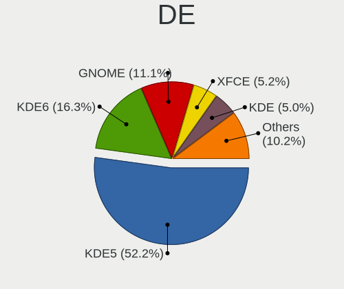
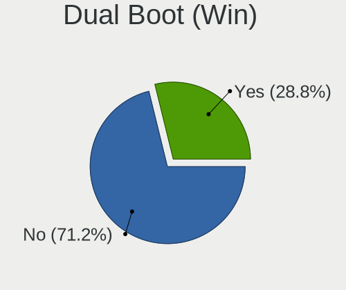
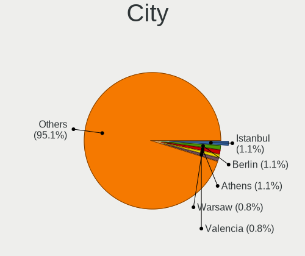
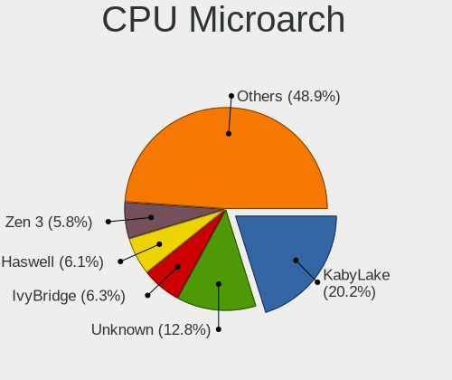
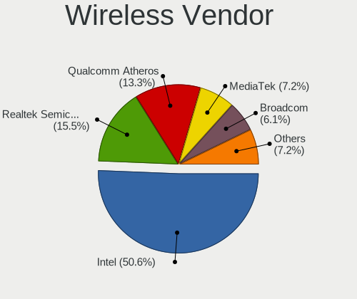
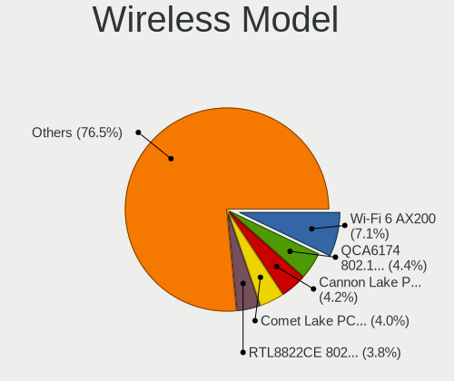
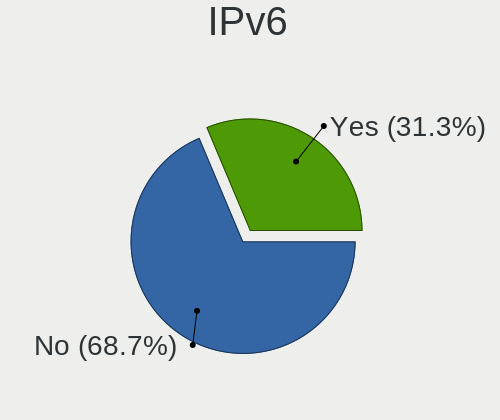
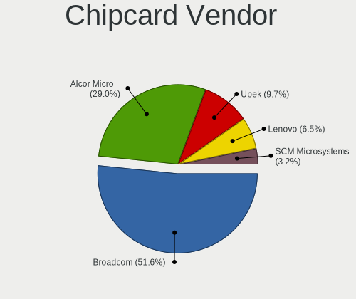

Garuda Linux - Tested Hardware & Statistics (Notebooks)
-------------------------------------------------------

A project to collect tested hardware configurations for Garuda Linux.

Anyone can contribute to this report by the [hw-probe](https://github.com/linuxhw/hw-probe) tool:

    sudo -E hw-probe -all -upload

Please contribute! Especially if your hardware is rare.

Contents
--------

* [ Test Cases ](#test-cases)

* [ System ](#system)
  - [ OS                       ](#os)
  - [ OS Family                ](#os-family)
  - [ Kernel                   ](#kernel)
  - [ Kernel Family            ](#kernel-family)
  - [ Kernel Major Ver.        ](#kernel-major-ver)
  - [ Arch                     ](#arch)
  - [ DE                       ](#de)
  - [ Display Server           ](#display-server)
  - [ Display Manager          ](#display-manager)
  - [ OS Lang                  ](#os-lang)
  - [ Boot Mode                ](#boot-mode)
  - [ Filesystem               ](#filesystem)
  - [ Part. scheme             ](#part-scheme)
  - [ Dual Boot with Linux/BSD ](#dual-boot-with-linuxbsd)
  - [ Dual Boot (Win)          ](#dual-boot-win)

* [ Board ](#board)
  - [ Vendor                   ](#vendor)
  - [ Model                    ](#model)
  - [ Model Family             ](#model-family)
  - [ MFG Year                 ](#mfg-year)
  - [ Form Factor              ](#form-factor)
  - [ Secure Boot              ](#secure-boot)
  - [ Coreboot                 ](#coreboot)
  - [ RAM Size                 ](#ram-size)
  - [ RAM Used                 ](#ram-used)
  - [ Total Drives             ](#total-drives)
  - [ Has CD-ROM               ](#has-cd-rom)
  - [ Has Ethernet             ](#has-ethernet)
  - [ Has WiFi                 ](#has-wifi)
  - [ Has Bluetooth            ](#has-bluetooth)

* [ Location ](#location)
  - [ Country                  ](#country)
  - [ City                     ](#city)

* [ Drives ](#drives)
  - [ Drive Vendor             ](#drive-vendor)
  - [ Drive Model              ](#drive-model)
  - [ HDD Vendor               ](#hdd-vendor)
  - [ SSD Vendor               ](#ssd-vendor)
  - [ Drive Kind               ](#drive-kind)
  - [ Drive Connector          ](#drive-connector)
  - [ Drive Size               ](#drive-size)
  - [ Space Total              ](#space-total)
  - [ Space Used               ](#space-used)
  - [ Malfunc. Drives          ](#malfunc-drives)
  - [ Malfunc. Drive Vendor    ](#malfunc-drive-vendor)
  - [ Malfunc. HDD Vendor      ](#malfunc-hdd-vendor)
  - [ Malfunc. Drive Kind      ](#malfunc-drive-kind)
  - [ Failed Drives            ](#failed-drives)
  - [ Failed Drive Vendor      ](#failed-drive-vendor)
  - [ Drive Status             ](#drive-status)

* [ Storage controller ](#storage-controller)
  - [ Storage Vendor           ](#storage-vendor)
  - [ Storage Model            ](#storage-model)
  - [ Storage Kind             ](#storage-kind)

* [ Processor ](#processor)
  - [ CPU Vendor               ](#cpu-vendor)
  - [ CPU Model                ](#cpu-model)
  - [ CPU Model Family         ](#cpu-model-family)
  - [ CPU Cores                ](#cpu-cores)
  - [ CPU Sockets              ](#cpu-sockets)
  - [ CPU Threads              ](#cpu-threads)
  - [ CPU Op-Modes             ](#cpu-op-modes)
  - [ CPU Microcode            ](#cpu-microcode)
  - [ CPU Microarch            ](#cpu-microarch)

* [ Graphics ](#graphics)
  - [ GPU Vendor               ](#gpu-vendor)
  - [ GPU Model                ](#gpu-model)
  - [ GPU Combo                ](#gpu-combo)
  - [ GPU Driver               ](#gpu-driver)
  - [ GPU Memory               ](#gpu-memory)

* [ Monitor ](#monitor)
  - [ Monitor Vendor           ](#monitor-vendor)
  - [ Monitor Model            ](#monitor-model)
  - [ Monitor Resolution       ](#monitor-resolution)
  - [ Monitor Diagonal         ](#monitor-diagonal)
  - [ Monitor Width            ](#monitor-width)
  - [ Aspect Ratio             ](#aspect-ratio)
  - [ Monitor Area             ](#monitor-area)
  - [ Pixel Density            ](#pixel-density)
  - [ Multiple Monitors        ](#multiple-monitors)

* [ Network ](#network)
  - [ Net Controller Vendor    ](#net-controller-vendor)
  - [ Net Controller Model     ](#net-controller-model)
  - [ Wireless Vendor          ](#wireless-vendor)
  - [ Wireless Model           ](#wireless-model)
  - [ Ethernet Vendor          ](#ethernet-vendor)
  - [ Ethernet Model           ](#ethernet-model)
  - [ Net Controller Kind      ](#net-controller-kind)
  - [ Used Controller          ](#used-controller)
  - [ NICs                     ](#nics)
  - [ IPv6                     ](#ipv6)

* [ Bluetooth ](#bluetooth)
  - [ Bluetooth Vendor         ](#bluetooth-vendor)
  - [ Bluetooth Model          ](#bluetooth-model)

* [ Sound ](#sound)
  - [ Sound Vendor             ](#sound-vendor)
  - [ Sound Model              ](#sound-model)

* [ Memory ](#memory)
  - [ Memory Vendor            ](#memory-vendor)
  - [ Memory Model             ](#memory-model)
  - [ Memory Kind              ](#memory-kind)
  - [ Memory Form Factor       ](#memory-form-factor)
  - [ Memory Size              ](#memory-size)
  - [ Memory Speed             ](#memory-speed)

* [ Printers & scanners ](#printers--scanners)
  - [ Printer Vendor           ](#printer-vendor)
  - [ Printer Model            ](#printer-model)
  - [ Scanner Vendor           ](#scanner-vendor)
  - [ Scanner Model            ](#scanner-model)

* [ Camera ](#camera)
  - [ Camera Vendor            ](#camera-vendor)
  - [ Camera Model             ](#camera-model)

* [ Security ](#security)
  - [ Fingerprint Vendor       ](#fingerprint-vendor)
  - [ Fingerprint Model        ](#fingerprint-model)
  - [ Chipcard Vendor          ](#chipcard-vendor)
  - [ Chipcard Model           ](#chipcard-model)

* [ Unsupported ](#unsupported)
  - [ Unsupported Devices      ](#unsupported-devices)
  - [ Unsupported Device Types ](#unsupported-device-types)

Test Cases
----------

Total: 380

| Vendor        | Model                       | Probe                                                      | Date         |
|---------------|-----------------------------|------------------------------------------------------------|--------------|
| ASUSTek       | ZenBook UX331FA_UX331FA     | [8c4d9c62b5](https://linux-hardware.org/?probe=8c4d9c62b5) | Jun 10, 2023 |
| Lenovo        | ThinkPad X1 Carbon 7th 2... | [2e6901471f](https://linux-hardware.org/?probe=2e6901471f) | Jun 10, 2023 |
| Apple         | MacBookPro14,1              | [f73406fa5d](https://linux-hardware.org/?probe=f73406fa5d) | Jun 04, 2023 |
| Apple         | MacBookPro14,1              | [1c2d6e0e5e](https://linux-hardware.org/?probe=1c2d6e0e5e) | Jun 04, 2023 |
| Lenovo        | IdeaPad S145-15AST 81N3     | [7f0cf2e62d](https://linux-hardware.org/?probe=7f0cf2e62d) | Jun 01, 2023 |
| HP            | Notebook                    | [10ab4427b5](https://linux-hardware.org/?probe=10ab4427b5) | May 29, 2023 |
| Dell          | Precision 5520              | [c7097157ab](https://linux-hardware.org/?probe=c7097157ab) | May 28, 2023 |
| Apple         | MacBookPro9,2               | [88d77ec57e](https://linux-hardware.org/?probe=88d77ec57e) | May 21, 2023 |
| MICROBYTE     | ezbook                      | [aacd79e1c7](https://linux-hardware.org/?probe=aacd79e1c7) | May 20, 2023 |
| Acer          | Extensa 215-52              | [83f139d228](https://linux-hardware.org/?probe=83f139d228) | May 15, 2023 |
| Gigabyte      | G5 MD                       | [ad5fd46d55](https://linux-hardware.org/?probe=ad5fd46d55) | May 14, 2023 |
| HP            | OMEN by Laptop              | [8b187d1291](https://linux-hardware.org/?probe=8b187d1291) | May 11, 2023 |
| Acer          | Aspire 5750G                | [6b908b35cc](https://linux-hardware.org/?probe=6b908b35cc) | May 08, 2023 |
| MSI           | GL75 9SD                    | [522594401b](https://linux-hardware.org/?probe=522594401b) | May 07, 2023 |
| Acer          | Extensa 215-52              | [d4d069aa0c](https://linux-hardware.org/?probe=d4d069aa0c) | May 04, 2023 |
| Lenovo        | ThinkPad W520 42824UU       | [c8474ef15e](https://linux-hardware.org/?probe=c8474ef15e) | May 01, 2023 |
| Monster       | TULPAR T5 V21.7             | [1e942ee672](https://linux-hardware.org/?probe=1e942ee672) | Apr 28, 2023 |
| MSI           | Stealth 15M B12UE           | [312db1147a](https://linux-hardware.org/?probe=312db1147a) | Apr 26, 2023 |
| Apple         | MacBookPro9,2               | [f48b78bda1](https://linux-hardware.org/?probe=f48b78bda1) | Apr 23, 2023 |
| MSI           | Stealth 15M B12UE           | [7631901c7a](https://linux-hardware.org/?probe=7631901c7a) | Apr 20, 2023 |
| ASUSTek       | VivoBook_ASUSLaptop X170... | [a76057a8be](https://linux-hardware.org/?probe=a76057a8be) | Apr 19, 2023 |
| Sony          | SVF1521Q1EW                 | [4be523b9a9](https://linux-hardware.org/?probe=4be523b9a9) | Apr 18, 2023 |
| Lenovo        | IdeaPad 3 15ITL05 81X8      | [7c35c1ba82](https://linux-hardware.org/?probe=7c35c1ba82) | Apr 15, 2023 |
| HUAWEI        | HVY-WXX9                    | [e6b0deb213](https://linux-hardware.org/?probe=e6b0deb213) | Apr 14, 2023 |
| ASUSTek       | ASUS TUF Gaming F15 FX50... | [b6f721687e](https://linux-hardware.org/?probe=b6f721687e) | Apr 06, 2023 |
| ASUSTek       | ASUS TUF Gaming F15 FX50... | [0c0196b199](https://linux-hardware.org/?probe=0c0196b199) | Apr 04, 2023 |
| HP            | Pavilion 15                 | [d928981385](https://linux-hardware.org/?probe=d928981385) | Apr 02, 2023 |
| HP            | Pavilion 15                 | [bc5dd02c14](https://linux-hardware.org/?probe=bc5dd02c14) | Apr 02, 2023 |
| Lenovo        | Legion R9000P ARH7H 82RG    | [300fe5d1b2](https://linux-hardware.org/?probe=300fe5d1b2) | Mar 24, 2023 |
| Lenovo        | Legion R9000P ARH7H 82RG    | [8291e7598a](https://linux-hardware.org/?probe=8291e7598a) | Mar 24, 2023 |
| ASUSTek       | VivoBook_ASUSLaptop X513... | [946646a961](https://linux-hardware.org/?probe=946646a961) | Mar 22, 2023 |
| HP            | EliteBook 8560w             | [f886dec5e7](https://linux-hardware.org/?probe=f886dec5e7) | Mar 22, 2023 |
| HP            | ZBook 15 G5                 | [83ddb49a8a](https://linux-hardware.org/?probe=83ddb49a8a) | Mar 21, 2023 |
| Samsung       | R530/R730                   | [9cd7e18a6d](https://linux-hardware.org/?probe=9cd7e18a6d) | Mar 21, 2023 |
| Samsung       | R530/R730                   | [87292d633d](https://linux-hardware.org/?probe=87292d633d) | Mar 21, 2023 |
| HP            | Laptop 15-dy2xxx            | [e0317127ea](https://linux-hardware.org/?probe=e0317127ea) | Mar 20, 2023 |
| HP            | EliteBook 8560w             | [da8abe8a8e](https://linux-hardware.org/?probe=da8abe8a8e) | Mar 19, 2023 |
| ASUSTek       | GL753VE                     | [13c8ab8634](https://linux-hardware.org/?probe=13c8ab8634) | Mar 18, 2023 |
| Gigabyte      | G5 KD                       | [a3234542a9](https://linux-hardware.org/?probe=a3234542a9) | Mar 17, 2023 |
| HP            | EliteBook 8560w             | [8bab1523ae](https://linux-hardware.org/?probe=8bab1523ae) | Mar 16, 2023 |
| HP            | EliteBook 8560w             | [02015c3c38](https://linux-hardware.org/?probe=02015c3c38) | Mar 15, 2023 |
| Lenovo        | V15-IIL 82C5                | [da8c40d88c](https://linux-hardware.org/?probe=da8c40d88c) | Mar 11, 2023 |
| Acer          | Aspire A515-46              | [f43d0b8fa2](https://linux-hardware.org/?probe=f43d0b8fa2) | Mar 06, 2023 |
| Acer          | Aspire E5-575G              | [b2fa34d832](https://linux-hardware.org/?probe=b2fa34d832) | Feb 27, 2023 |
| Lenovo        | ThinkPad T14s Gen 3 21CQ... | [277834a459](https://linux-hardware.org/?probe=277834a459) | Feb 24, 2023 |
| HP            | Unknown                     | [06f5e98fdd](https://linux-hardware.org/?probe=06f5e98fdd) | Feb 20, 2023 |
| MSI           | GE75 Raider 9SE             | [0cf7067e58](https://linux-hardware.org/?probe=0cf7067e58) | Feb 18, 2023 |
| Dell          | Precision 7710              | [3db09e931e](https://linux-hardware.org/?probe=3db09e931e) | Feb 15, 2023 |
| Dell          | Precision 7710              | [ed02038c00](https://linux-hardware.org/?probe=ed02038c00) | Feb 15, 2023 |
| MobileDema... | xTablet T1200               | [905b6efd7a](https://linux-hardware.org/?probe=905b6efd7a) | Feb 12, 2023 |
| Acer          | Aspire A715-41G             | [92b7a6f08d](https://linux-hardware.org/?probe=92b7a6f08d) | Feb 11, 2023 |
| ASUSTek       | VivoBook_ASUSLaptop X513... | [59271934a3](https://linux-hardware.org/?probe=59271934a3) | Feb 10, 2023 |
| Lenovo        | ThinkPad P14s Gen 1 20Y1... | [d26fa55616](https://linux-hardware.org/?probe=d26fa55616) | Feb 10, 2023 |
| HP            | EliteBook 8560w             | [5140856482](https://linux-hardware.org/?probe=5140856482) | Feb 06, 2023 |
| HP            | EliteBook 8560w             | [62c1d53a4a](https://linux-hardware.org/?probe=62c1d53a4a) | Feb 06, 2023 |
| HP            | Unknown                     | [b1dacc0d29](https://linux-hardware.org/?probe=b1dacc0d29) | Feb 04, 2023 |
| HP            | Dev One Notebook PC         | [2c6c4d9777](https://linux-hardware.org/?probe=2c6c4d9777) | Feb 04, 2023 |
| HP            | Dev One Notebook PC         | [683f389938](https://linux-hardware.org/?probe=683f389938) | Feb 04, 2023 |
| MSI           | Stealth 15M B12UE           | [6bb85ebe8a](https://linux-hardware.org/?probe=6bb85ebe8a) | Feb 02, 2023 |
| Standard      | Unknown                     | [d9a5e68741](https://linux-hardware.org/?probe=d9a5e68741) | Jan 25, 2023 |
| HP            | Pavilion dv6                | [0c262643a2](https://linux-hardware.org/?probe=0c262643a2) | Jan 23, 2023 |
| MSI           | Stealth 15M B12UE           | [5c24095f67](https://linux-hardware.org/?probe=5c24095f67) | Jan 23, 2023 |
| HP            | Pavilion dv6                | [25269a9baa](https://linux-hardware.org/?probe=25269a9baa) | Jan 23, 2023 |
| Sony          | SVF1521Q1EW                 | [1e8cceb35b](https://linux-hardware.org/?probe=1e8cceb35b) | Jan 23, 2023 |
| MSI           | Stealth 15M B12UE           | [c3c2743dd0](https://linux-hardware.org/?probe=c3c2743dd0) | Jan 22, 2023 |
| HP            | Pavilion dv6                | [b71b30c5e1](https://linux-hardware.org/?probe=b71b30c5e1) | Jan 22, 2023 |
| MSI           | Stealth 15M B12UE           | [a24b19a2e7](https://linux-hardware.org/?probe=a24b19a2e7) | Jan 21, 2023 |
| Unknown       | Unknown                     | [39bd375140](https://linux-hardware.org/?probe=39bd375140) | Jan 19, 2023 |
| HP            | ProBook 6570b               | [919b330a89](https://linux-hardware.org/?probe=919b330a89) | Jan 15, 2023 |
| HP            | OMEN by Laptop 16-b0xxx     | [06fc7ee349](https://linux-hardware.org/?probe=06fc7ee349) | Jan 10, 2023 |
| Acer          | Aspire A515-46              | [1ba0c80baf](https://linux-hardware.org/?probe=1ba0c80baf) | Jan 09, 2023 |
| Lenovo        | ThinkPad Edge E540 20C60... | [774902b83f](https://linux-hardware.org/?probe=774902b83f) | Jan 09, 2023 |
| HP            | ProBook 6570b               | [71e645c6db](https://linux-hardware.org/?probe=71e645c6db) | Jan 08, 2023 |
| Lenovo        | G570 4334                   | [c3162b7bfa](https://linux-hardware.org/?probe=c3162b7bfa) | Jan 07, 2023 |
| Lenovo        | G570 4334                   | [8d0c80e474](https://linux-hardware.org/?probe=8d0c80e474) | Jan 07, 2023 |
| HP            | ProBook 6570b               | [6db7bfdd12](https://linux-hardware.org/?probe=6db7bfdd12) | Jan 07, 2023 |
| Dell          | G15 5515                    | [f5a10999c3](https://linux-hardware.org/?probe=f5a10999c3) | Jan 06, 2023 |
| HP            | ProBook 6570b               | [32d96991fd](https://linux-hardware.org/?probe=32d96991fd) | Jan 06, 2023 |
| ASUSTek       | Zenbook UM5401QAB_UM5401... | [c0a7ecae1a](https://linux-hardware.org/?probe=c0a7ecae1a) | Jan 03, 2023 |
| Gigabyte      | G5 MD                       | [901f1e43f0](https://linux-hardware.org/?probe=901f1e43f0) | Dec 31, 2022 |
| Gigabyte      | G5 MD                       | [631ee5c81c](https://linux-hardware.org/?probe=631ee5c81c) | Dec 31, 2022 |
| MSI           | Stealth 15M B12UE           | [45ef7b8ac9](https://linux-hardware.org/?probe=45ef7b8ac9) | Dec 30, 2022 |
| Acer          | Aspire F5-572G              | [71168d8107](https://linux-hardware.org/?probe=71168d8107) | Dec 29, 2022 |
| HP            | Compaq CQ58                 | [e18b58bbde](https://linux-hardware.org/?probe=e18b58bbde) | Dec 26, 2022 |
| HP            | Compaq CQ58                 | [7e0cac17f6](https://linux-hardware.org/?probe=7e0cac17f6) | Dec 26, 2022 |
| ASUSTek       | Zenbook UM5401QAB_UM5401... | [0de58e9b07](https://linux-hardware.org/?probe=0de58e9b07) | Dec 26, 2022 |
| HONOR         | BOD-WXX9                    | [894521b876](https://linux-hardware.org/?probe=894521b876) | Dec 25, 2022 |
| HP            | Dev One Notebook PC         | [0e92e9aaf2](https://linux-hardware.org/?probe=0e92e9aaf2) | Dec 23, 2022 |
| Acer          | Nitro AN515-45              | [5cc9050d12](https://linux-hardware.org/?probe=5cc9050d12) | Dec 22, 2022 |
| Alienware     | m15 R7                      | [56fbeff19d](https://linux-hardware.org/?probe=56fbeff19d) | Dec 18, 2022 |
| HP            | Pavilion Laptop 15-eg0xx... | [016e7d7ef2](https://linux-hardware.org/?probe=016e7d7ef2) | Dec 16, 2022 |
| Lenovo        | IdeaPad L340-17API 81LY     | [b262201707](https://linux-hardware.org/?probe=b262201707) | Dec 10, 2022 |
| HP            | Victus by Laptop 16-e1xx... | [0247b424ca](https://linux-hardware.org/?probe=0247b424ca) | Dec 04, 2022 |
| Dell          | Latitude E5450              | [eced7855f2](https://linux-hardware.org/?probe=eced7855f2) | Dec 03, 2022 |
| Dell          | Latitude E7450              | [2df62b206f](https://linux-hardware.org/?probe=2df62b206f) | Dec 03, 2022 |
| Dell          | XPS 13 9360                 | [93aed684b7](https://linux-hardware.org/?probe=93aed684b7) | Dec 03, 2022 |
| Standard      | Unknown                     | [43891b2653](https://linux-hardware.org/?probe=43891b2653) | Dec 02, 2022 |
| ASUSTek       | ROG Strix G513IC_G513IC     | [c9ccbe1018](https://linux-hardware.org/?probe=c9ccbe1018) | Dec 01, 2022 |
| Kogan         | KAL11C250SB                 | [9ca4f71bb9](https://linux-hardware.org/?probe=9ca4f71bb9) | Nov 26, 2022 |
| HP            | EliteBook 840 G5            | [8967d04a19](https://linux-hardware.org/?probe=8967d04a19) | Nov 25, 2022 |
| HP            | 250 G6 Notebook PC          | [8f1bec4fe9](https://linux-hardware.org/?probe=8f1bec4fe9) | Nov 24, 2022 |
| ASUSTek       | X541UV                      | [74aca760f1](https://linux-hardware.org/?probe=74aca760f1) | Nov 17, 2022 |
| MSI           | Modern 14 B4MW              | [967a4c4e4d](https://linux-hardware.org/?probe=967a4c4e4d) | Nov 17, 2022 |
| Lenovo        | IdeaPad 5 Pro 16ARH7 82S... | [5c079d3e41](https://linux-hardware.org/?probe=5c079d3e41) | Nov 17, 2022 |
| HP            | Laptop 15s-eq0xxx           | [e48c737ed6](https://linux-hardware.org/?probe=e48c737ed6) | Nov 17, 2022 |
| Lenovo        | Legion 5 15ACH6H 82JU       | [68db7ff193](https://linux-hardware.org/?probe=68db7ff193) | Nov 16, 2022 |
| Lenovo        | IdeaPad Gaming 3 15ARH05... | [217544b651](https://linux-hardware.org/?probe=217544b651) | Nov 11, 2022 |
| Dell          | Precision 3571              | [6f845855a5](https://linux-hardware.org/?probe=6f845855a5) | Nov 08, 2022 |
| ASUSTek       | ROG Strix G513IC_G513IC     | [27fcb50d7a](https://linux-hardware.org/?probe=27fcb50d7a) | Nov 07, 2022 |
| Lenovo        | ThinkPad E14 20RA000WMH     | [bf3f9b3384](https://linux-hardware.org/?probe=bf3f9b3384) | Nov 07, 2022 |
| ASUSTek       | ROG Strix G513IC_G513IC     | [1fd362dd3c](https://linux-hardware.org/?probe=1fd362dd3c) | Nov 06, 2022 |
| HP            | ProBook 640 G1              | [8641947cf9](https://linux-hardware.org/?probe=8641947cf9) | Nov 05, 2022 |
| Unknown       | Unknown                     | [7cd5f4c280](https://linux-hardware.org/?probe=7cd5f4c280) | Nov 05, 2022 |
| Unknown       | Unknown                     | [d808be6d90](https://linux-hardware.org/?probe=d808be6d90) | Oct 31, 2022 |
| Dell          | Inspiron 7737               | [727b48a339](https://linux-hardware.org/?probe=727b48a339) | Oct 25, 2022 |
| Lenovo        | IdeaPad Z500 20202          | [68aeedffa7](https://linux-hardware.org/?probe=68aeedffa7) | Oct 24, 2022 |
| ASUSTek       | VivoBook_ASUSLaptop X340... | [2f761b8c2f](https://linux-hardware.org/?probe=2f761b8c2f) | Oct 21, 2022 |
| ASUSTek       | VivoBook_ASUSLaptop M350... | [ef7b367052](https://linux-hardware.org/?probe=ef7b367052) | Oct 21, 2022 |
| Acer          | Aspire A515-51G             | [d607def641](https://linux-hardware.org/?probe=d607def641) | Oct 20, 2022 |
| ASUSTek       | VivoBook_ASUSLaptop X515... | [5fa4e96f1c](https://linux-hardware.org/?probe=5fa4e96f1c) | Oct 18, 2022 |
| ASUSTek       | X555LAB                     | [b0fb3c2590](https://linux-hardware.org/?probe=b0fb3c2590) | Oct 18, 2022 |
| Gigabyte      | G5 MD                       | [fd8b812638](https://linux-hardware.org/?probe=fd8b812638) | Oct 13, 2022 |
| Dell          | XPS 15 9500                 | [e744ed6ac6](https://linux-hardware.org/?probe=e744ed6ac6) | Oct 12, 2022 |
| HP            | ProBook 640 G1              | [06fbfa78a5](https://linux-hardware.org/?probe=06fbfa78a5) | Oct 11, 2022 |
| Acer          | Swift SF314-42              | [e009be07a6](https://linux-hardware.org/?probe=e009be07a6) | Oct 11, 2022 |
| Lenovo        | ThinkBook 14-IIL 20SL       | [4bb56ef4e6](https://linux-hardware.org/?probe=4bb56ef4e6) | Oct 06, 2022 |
| HP            | ZBook 15 G5                 | [ae7f5753fd](https://linux-hardware.org/?probe=ae7f5753fd) | Oct 05, 2022 |
| HP            | Notebook                    | [6b7215bcba](https://linux-hardware.org/?probe=6b7215bcba) | Sep 29, 2022 |
| ASUSTek       | VivoBook_ASUSLaptop X512... | [89c48e7d5a](https://linux-hardware.org/?probe=89c48e7d5a) | Sep 27, 2022 |
| ASUSTek       | VivoBook_ASUSLaptop X512... | [b39aefdcda](https://linux-hardware.org/?probe=b39aefdcda) | Sep 27, 2022 |
| Fujitsu       | FMVA1200G                   | [e91d3af852](https://linux-hardware.org/?probe=e91d3af852) | Sep 27, 2022 |
| Acer          | Aspire V5-552P              | [46395f51b5](https://linux-hardware.org/?probe=46395f51b5) | Sep 27, 2022 |
| Razer         | Blade 14 - RZ09-0370        | [a5e00e04bd](https://linux-hardware.org/?probe=a5e00e04bd) | Sep 25, 2022 |
| HP            | Notebook                    | [f4e47792c1](https://linux-hardware.org/?probe=f4e47792c1) | Sep 24, 2022 |
| Dell          | Precision 7510              | [5f94678049](https://linux-hardware.org/?probe=5f94678049) | Sep 23, 2022 |
| Lenovo        | G505s 20255                 | [671c1cb6c4](https://linux-hardware.org/?probe=671c1cb6c4) | Sep 21, 2022 |
| ASUSTek       | ROG Zephyrus G15 GA503QR... | [44a3455d48](https://linux-hardware.org/?probe=44a3455d48) | Sep 17, 2022 |
| HP            | ProBook 470 G5              | [b15d9e1fe4](https://linux-hardware.org/?probe=b15d9e1fe4) | Sep 16, 2022 |
| Acer          | Swift SF314-54              | [c3b076c416](https://linux-hardware.org/?probe=c3b076c416) | Sep 15, 2022 |
| Lenovo        | ThinkPad X1 Carbon 2nd 2... | [1cf1136fb8](https://linux-hardware.org/?probe=1cf1136fb8) | Sep 13, 2022 |
| Dell          | Inspiron 5548               | [341b48f953](https://linux-hardware.org/?probe=341b48f953) | Sep 12, 2022 |
| Lenovo        | ThinkPad L15 Gen 2 20X30... | [c1c2e05a86](https://linux-hardware.org/?probe=c1c2e05a86) | Sep 11, 2022 |
| ASUSTek       | ROG Strix G533QS_G533QS     | [c2f25bcea8](https://linux-hardware.org/?probe=c2f25bcea8) | Sep 08, 2022 |
| HP            | Victus by Gaming Laptop ... | [1a8681a1f5](https://linux-hardware.org/?probe=1a8681a1f5) | Sep 07, 2022 |
| ASUSTek       | ROG Strix G533QS_G533QS     | [4adadf9e6a](https://linux-hardware.org/?probe=4adadf9e6a) | Sep 06, 2022 |
| Acer          | Aspire E5-573G              | [cfb1abc54b](https://linux-hardware.org/?probe=cfb1abc54b) | Sep 03, 2022 |
| ASUSTek       | VivoBook_ASUSLaptop X515... | [87fac1a064](https://linux-hardware.org/?probe=87fac1a064) | Sep 02, 2022 |
| HP            | Laptop 15-da0xxx            | [2c79168e77](https://linux-hardware.org/?probe=2c79168e77) | Sep 01, 2022 |
| HP            | Laptop 15-da0xxx            | [40482ce9a3](https://linux-hardware.org/?probe=40482ce9a3) | Sep 01, 2022 |
| ASUSTek       | VivoBook_ASUSLaptop X513... | [c63d9bede8](https://linux-hardware.org/?probe=c63d9bede8) | Aug 27, 2022 |
| ASUSTek       | VivoBook_ASUSLaptop X513... | [a4a7c87b06](https://linux-hardware.org/?probe=a4a7c87b06) | Aug 27, 2022 |
| Unknown       | Unknown                     | [7bc56eb3d4](https://linux-hardware.org/?probe=7bc56eb3d4) | Aug 25, 2022 |
| HP            | Notebook                    | [bd5bad0b49](https://linux-hardware.org/?probe=bd5bad0b49) | Aug 21, 2022 |
| MSI           | Sword 15 A11UD              | [ca0fbaa451](https://linux-hardware.org/?probe=ca0fbaa451) | Aug 19, 2022 |
| MSI           | Sword 15 A11UD              | [565a6f9022](https://linux-hardware.org/?probe=565a6f9022) | Aug 19, 2022 |
| ASUSTek       | VivoBook_ASUSLaptop X340... | [f095219c78](https://linux-hardware.org/?probe=f095219c78) | Aug 19, 2022 |
| Acer          | Aspire A515-51G             | [f0e405bc07](https://linux-hardware.org/?probe=f0e405bc07) | Aug 13, 2022 |
| Samsung       | 340XAA/350XAA/550XAA        | [3ad1413aaa](https://linux-hardware.org/?probe=3ad1413aaa) | Aug 13, 2022 |
| Samsung       | 340XAA/350XAA/550XAA        | [abb938b917](https://linux-hardware.org/?probe=abb938b917) | Aug 10, 2022 |
| Acer          | Aspire 5740                 | [8090e74c22](https://linux-hardware.org/?probe=8090e74c22) | Aug 10, 2022 |
| Dell          | XPS 13 9370                 | [53efca63c3](https://linux-hardware.org/?probe=53efca63c3) | Aug 10, 2022 |
| Acer          | Aspire 5740                 | [1934c32bc7](https://linux-hardware.org/?probe=1934c32bc7) | Aug 09, 2022 |
| ASUSTek       | GL752VW                     | [9ff6515c13](https://linux-hardware.org/?probe=9ff6515c13) | Aug 07, 2022 |
| Dell          | Latitude E6420              | [c13142690c](https://linux-hardware.org/?probe=c13142690c) | Aug 04, 2022 |
| Dell          | Latitude E5450              | [b7618f5c14](https://linux-hardware.org/?probe=b7618f5c14) | Jul 31, 2022 |
| HP            | OMEN by Laptop 15-dh1xxx    | [b44feede78](https://linux-hardware.org/?probe=b44feede78) | Jul 30, 2022 |
| Razer         | Blade 17 (Mid 2021) - RZ... | [0b73c72c74](https://linux-hardware.org/?probe=0b73c72c74) | Jul 19, 2022 |
| HP            | Pavilion dv6                | [fcb28ad60c](https://linux-hardware.org/?probe=fcb28ad60c) | Jul 05, 2022 |
| HP            | Pavilion dv6                | [31941e5972](https://linux-hardware.org/?probe=31941e5972) | Jul 05, 2022 |
| ASUSTek       | ROG Strix G533QS_G533QS     | [7d6a8718a8](https://linux-hardware.org/?probe=7d6a8718a8) | Jul 05, 2022 |
| Lenovo        | IdeaPad S340-14API 81NB     | [dc6e8358f8](https://linux-hardware.org/?probe=dc6e8358f8) | Jul 04, 2022 |
| ASUSTek       | ROG Strix G513IC_G513IC     | [77f0b32727](https://linux-hardware.org/?probe=77f0b32727) | Jun 30, 2022 |
| HP            | 15 Notebook PC              | [5bf5fec549](https://linux-hardware.org/?probe=5bf5fec549) | Jun 27, 2022 |
| HP            | 15 Notebook PC              | [b88589b731](https://linux-hardware.org/?probe=b88589b731) | Jun 27, 2022 |
| Unknown       | Unknown                     | [7c08b4e995](https://linux-hardware.org/?probe=7c08b4e995) | Jun 26, 2022 |
| HP            | Laptop 15-ef0xxx            | [f0cf5e0f30](https://linux-hardware.org/?probe=f0cf5e0f30) | Jun 18, 2022 |
| ASUSTek       | VivoBook_ASUSLaptop X340... | [5fb74a78d8](https://linux-hardware.org/?probe=5fb74a78d8) | Jun 17, 2022 |
| Lenovo        | IdeaPad Z480                | [1e34fa546d](https://linux-hardware.org/?probe=1e34fa546d) | Jun 15, 2022 |
| ASUSTek       | ROG Strix G533QS_G533QS     | [0c1e336ddc](https://linux-hardware.org/?probe=0c1e336ddc) | Jun 11, 2022 |
| Acer          | Swift SF315-41              | [389e13e580](https://linux-hardware.org/?probe=389e13e580) | Jun 03, 2022 |
| Lenovo        | IdeaPad 320-14ISK 80XG      | [83cb6d1fe4](https://linux-hardware.org/?probe=83cb6d1fe4) | Jun 01, 2022 |
| Lenovo        | IdeaPad Gaming 3 15ARH05... | [959728c7eb](https://linux-hardware.org/?probe=959728c7eb) | May 29, 2022 |
| Lenovo        | Z50-70 20354                | [cd40cf2e16](https://linux-hardware.org/?probe=cd40cf2e16) | May 28, 2022 |
| Dell          | Latitude E6420              | [425a9e4f0d](https://linux-hardware.org/?probe=425a9e4f0d) | May 26, 2022 |
| HP            | Laptop 15-ef0xxx            | [a214740f99](https://linux-hardware.org/?probe=a214740f99) | May 25, 2022 |
| Dell          | Latitude E5450              | [7d23576abb](https://linux-hardware.org/?probe=7d23576abb) | May 23, 2022 |
| Dell          | Latitude E5450              | [f0c746ba9e](https://linux-hardware.org/?probe=f0c746ba9e) | May 23, 2022 |
| Lenovo        | ThinkBook 14-IIL 20SL       | [36a8a2a0ee](https://linux-hardware.org/?probe=36a8a2a0ee) | May 23, 2022 |
| HUAWEI        | BOHB-WAX9                   | [c0c592bdd7](https://linux-hardware.org/?probe=c0c592bdd7) | May 22, 2022 |
| Unknown       | Unknown                     | [114aa0b977](https://linux-hardware.org/?probe=114aa0b977) | May 22, 2022 |
| Dell          | XPS 13 9370                 | [c7f7168362](https://linux-hardware.org/?probe=c7f7168362) | May 18, 2022 |
| Razer         | Blade                       | [0e1cc80117](https://linux-hardware.org/?probe=0e1cc80117) | May 07, 2022 |
| Unknown       | Unknown                     | [bd151331c1](https://linux-hardware.org/?probe=bd151331c1) | May 04, 2022 |
| ASUSTek       | VivoBook_ASUSLaptop X421... | [c8d977cf63](https://linux-hardware.org/?probe=c8d977cf63) | May 02, 2022 |
| Lenovo        | ThinkPad S3 Yoga 14 20DM... | [5d0f1a15e1](https://linux-hardware.org/?probe=5d0f1a15e1) | Apr 30, 2022 |
| HP            | Laptop 15-bs0xx             | [3ce5eb80eb](https://linux-hardware.org/?probe=3ce5eb80eb) | Apr 22, 2022 |
| Razer         | Blade 14 - RZ09-0370        | [51eac6f63f](https://linux-hardware.org/?probe=51eac6f63f) | Apr 21, 2022 |
| Dell          | Latitude E7250              | [fa677cf244](https://linux-hardware.org/?probe=fa677cf244) | Apr 21, 2022 |
| ASUSTek       | ROG Flow X13 GV301QH_GV3... | [6db9a3dea0](https://linux-hardware.org/?probe=6db9a3dea0) | Apr 18, 2022 |
| MSI           | GF63 Thin 10SC              | [e5e0f208d9](https://linux-hardware.org/?probe=e5e0f208d9) | Apr 14, 2022 |
| MSI           | GF63 Thin 10SC              | [b5beb1add9](https://linux-hardware.org/?probe=b5beb1add9) | Apr 14, 2022 |
| Lenovo        | ThinkPad X1 Carbon 4th 2... | [7204116754](https://linux-hardware.org/?probe=7204116754) | Apr 14, 2022 |
| ASUSTek       | ROG Flow X13 GV301QH_GV3... | [fcfc2b41a7](https://linux-hardware.org/?probe=fcfc2b41a7) | Apr 10, 2022 |
| Unknown       | Unknown                     | [ba87ebf29f](https://linux-hardware.org/?probe=ba87ebf29f) | Apr 08, 2022 |
| HUAWEI        | CREM-WXX9                   | [2803fbf2ab](https://linux-hardware.org/?probe=2803fbf2ab) | Apr 06, 2022 |
| MSI           | GE75 Raider 9SE             | [658e58fcab](https://linux-hardware.org/?probe=658e58fcab) | Apr 06, 2022 |
| MSI           | GE75 Raider 9SE             | [67966ea318](https://linux-hardware.org/?probe=67966ea318) | Apr 04, 2022 |
| Casper        | EXCALIBUR G770              | [dc11ff8996](https://linux-hardware.org/?probe=dc11ff8996) | Apr 01, 2022 |
| Casper        | EXCALIBUR G770              | [4a0436ece5](https://linux-hardware.org/?probe=4a0436ece5) | Apr 01, 2022 |
| Dell          | Latitude E7250              | [a33f627737](https://linux-hardware.org/?probe=a33f627737) | Mar 30, 2022 |
| Unknown       | Unknown                     | [f339c6f710](https://linux-hardware.org/?probe=f339c6f710) | Mar 29, 2022 |
| ASUSTek       | VivoBook_ASUSLaptop X515... | [58c7c253ca](https://linux-hardware.org/?probe=58c7c253ca) | Mar 28, 2022 |
| MSI           | GS76 Stealth 11UG           | [d05ccc7f12](https://linux-hardware.org/?probe=d05ccc7f12) | Mar 28, 2022 |
| Apple         | MacBookPro12,1              | [066b026c69](https://linux-hardware.org/?probe=066b026c69) | Mar 28, 2022 |
| MSI           | GE63 Raider RGB 8RE         | [df2ffaa70a](https://linux-hardware.org/?probe=df2ffaa70a) | Mar 25, 2022 |
| HUAWEI        | HVY-WXX9                    | [ddcbb702c6](https://linux-hardware.org/?probe=ddcbb702c6) | Mar 17, 2022 |
| HUAWEI        | HVY-WXX9                    | [d54d90820a](https://linux-hardware.org/?probe=d54d90820a) | Mar 17, 2022 |
| Toshiba       | Satellite E45DW-C           | [2b815d9219](https://linux-hardware.org/?probe=2b815d9219) | Mar 12, 2022 |
| Lenovo        | Legion 7 15IMH05 81YT       | [94786f0b30](https://linux-hardware.org/?probe=94786f0b30) | Mar 02, 2022 |
| HP            | Pavilion Gaming Laptop 1... | [499191c566](https://linux-hardware.org/?probe=499191c566) | Feb 18, 2022 |
| Lenovo        | IdeaPad S340-14API 81NB     | [25da470504](https://linux-hardware.org/?probe=25da470504) | Feb 14, 2022 |
| Unknown       | Unknown                     | [df78a2fff6](https://linux-hardware.org/?probe=df78a2fff6) | Feb 14, 2022 |
| Lenovo        | ThinkPad T530 24296KG       | [9940aacd34](https://linux-hardware.org/?probe=9940aacd34) | Feb 13, 2022 |
| Razer         | Blade 14 - RZ09-0370        | [e3fd65aa29](https://linux-hardware.org/?probe=e3fd65aa29) | Feb 13, 2022 |
| Lenovo        | ThinkBook 14-IIL 20SL       | [52eb1d5693](https://linux-hardware.org/?probe=52eb1d5693) | Feb 11, 2022 |
| HONOR         | HLYL-WXX9                   | [9cb5307823](https://linux-hardware.org/?probe=9cb5307823) | Feb 06, 2022 |
| Unknown       | Unknown                     | [e4beeac4a1](https://linux-hardware.org/?probe=e4beeac4a1) | Feb 06, 2022 |
| Lenovo        | IdeaPad Gaming 3 15ARH05... | [7c19747b0a](https://linux-hardware.org/?probe=7c19747b0a) | Feb 05, 2022 |
| MSI           | GF63 Thin 9SC               | [2e3070dc30](https://linux-hardware.org/?probe=2e3070dc30) | Feb 04, 2022 |
| Dell          | Latitude 5480               | [c96d03d27f](https://linux-hardware.org/?probe=c96d03d27f) | Feb 03, 2022 |
| Lenovo        | ThinkPad P1 20MDS00P00      | [4ff53df600](https://linux-hardware.org/?probe=4ff53df600) | Feb 02, 2022 |
| ASUSTek       | VivoBook_ASUSLaptop X513... | [387da722fe](https://linux-hardware.org/?probe=387da722fe) | Feb 02, 2022 |
| HP            | Laptop 15s-gr0xxx           | [5943c38ac0](https://linux-hardware.org/?probe=5943c38ac0) | Feb 01, 2022 |
| Lenovo        | ThinkPad T440p 20AWS58F0... | [0497eabcf7](https://linux-hardware.org/?probe=0497eabcf7) | Jan 28, 2022 |
| Lenovo        | ThinkPad T440p 20AWS58F0... | [e7efa96c01](https://linux-hardware.org/?probe=e7efa96c01) | Jan 28, 2022 |
| Unknown       | Unknown                     | [aa0e21b159](https://linux-hardware.org/?probe=aa0e21b159) | Jan 27, 2022 |
| Lenovo        | IdeaPad 5 Pro 16ACH6 82L... | [9091cc83ba](https://linux-hardware.org/?probe=9091cc83ba) | Jan 26, 2022 |
| Lenovo        | Unknown                     | [b78e96aff8](https://linux-hardware.org/?probe=b78e96aff8) | Jan 22, 2022 |
| Dell          | Inspiron 15-3567            | [af6171a374](https://linux-hardware.org/?probe=af6171a374) | Jan 22, 2022 |
| MSI           | GP75 Leopard 9SD            | [6935c7fc83](https://linux-hardware.org/?probe=6935c7fc83) | Jan 17, 2022 |
| Lenovo        | Yoga Slim 7 14ARE05 82A2    | [10f53d4021](https://linux-hardware.org/?probe=10f53d4021) | Jan 09, 2022 |
| Lenovo        | IdeaPad 110-15ACL 80TJ      | [a338d9f2d1](https://linux-hardware.org/?probe=a338d9f2d1) | Jan 08, 2022 |
| Unknown       | Unknown                     | [b75e231fb3](https://linux-hardware.org/?probe=b75e231fb3) | Jan 08, 2022 |
| Lenovo        | Legion 5 15IMH05H 81Y6      | [34d2cd6d9c](https://linux-hardware.org/?probe=34d2cd6d9c) | Jan 08, 2022 |
| HP            | OMEN Laptop 15-en1xxx       | [9ad04f3022](https://linux-hardware.org/?probe=9ad04f3022) | Jan 07, 2022 |
| Lenovo        | Legion 5 15IMH05H 81Y6      | [c4db605668](https://linux-hardware.org/?probe=c4db605668) | Jan 06, 2022 |
| Dell          | Precision M4500             | [2504901038](https://linux-hardware.org/?probe=2504901038) | Jan 04, 2022 |
| HP            | Pavilion 14                 | [34167c8022](https://linux-hardware.org/?probe=34167c8022) | Jan 04, 2022 |
| HP            | Pavilion Laptop 15z-eh10... | [29b9cb755b](https://linux-hardware.org/?probe=29b9cb755b) | Dec 25, 2021 |
| Dell          | G15 5515                    | [7e8108b3c2](https://linux-hardware.org/?probe=7e8108b3c2) | Dec 24, 2021 |
| GPU Compan... | GWTN156-11                  | [3700827ecd](https://linux-hardware.org/?probe=3700827ecd) | Dec 19, 2021 |
| ASUSTek       | X550CC                      | [c7147f0bf8](https://linux-hardware.org/?probe=c7147f0bf8) | Dec 16, 2021 |
| ASUSTek       | X550CC                      | [f8a99e7645](https://linux-hardware.org/?probe=f8a99e7645) | Dec 16, 2021 |
| Razer         | Blade 14 - RZ09-0370        | [c3144c3e22](https://linux-hardware.org/?probe=c3144c3e22) | Dec 13, 2021 |
| HP            | Pavilion Laptop 15-eh0xx... | [df628cbd13](https://linux-hardware.org/?probe=df628cbd13) | Dec 12, 2021 |
| Acer          | Aspire F5-573G              | [a49a5a129c](https://linux-hardware.org/?probe=a49a5a129c) | Dec 07, 2021 |
| HP            | Laptop 15-dy2xxx            | [f499f9a375](https://linux-hardware.org/?probe=f499f9a375) | Dec 06, 2021 |
| HP            | Laptop 15-dy2xxx            | [e6b9de389b](https://linux-hardware.org/?probe=e6b9de389b) | Dec 06, 2021 |
| Acer          | TravelMate 5720             | [8ce02488c4](https://linux-hardware.org/?probe=8ce02488c4) | Dec 06, 2021 |
| Acer          | TravelMate 5720             | [b68e789e42](https://linux-hardware.org/?probe=b68e789e42) | Dec 06, 2021 |
| Acer          | Aspire A515-51G             | [6ee6a2bc49](https://linux-hardware.org/?probe=6ee6a2bc49) | Nov 30, 2021 |
| Acer          | Nitro AN715-52              | [2b74aabc3a](https://linux-hardware.org/?probe=2b74aabc3a) | Nov 29, 2021 |
| Lenovo        | IdeaPad 330-15ARR 81D2      | [b5b437249c](https://linux-hardware.org/?probe=b5b437249c) | Nov 29, 2021 |
| Unknown       | Unknown                     | [0b1d816eff](https://linux-hardware.org/?probe=0b1d816eff) | Nov 28, 2021 |
| ASUSTek       | K53SD                       | [b2826b96f2](https://linux-hardware.org/?probe=b2826b96f2) | Nov 24, 2021 |
| HP            | Pavilion Laptop 15-eh0xx... | [fac556ebbe](https://linux-hardware.org/?probe=fac556ebbe) | Nov 24, 2021 |
| Dell          | XPS 15 7590                 | [63f386f998](https://linux-hardware.org/?probe=63f386f998) | Nov 23, 2021 |
| HP            | Pavilion Laptop 15-eh0xx... | [bbb0689dea](https://linux-hardware.org/?probe=bbb0689dea) | Nov 21, 2021 |
| Dell          | Latitude E5570              | [48ea4215ad](https://linux-hardware.org/?probe=48ea4215ad) | Nov 18, 2021 |
| Lenovo        | ThinkPad W530 24474KG       | [1ea5d23a86](https://linux-hardware.org/?probe=1ea5d23a86) | Nov 17, 2021 |
| Lenovo        | Legion S7 15ACH6 82K8       | [2713c3bae1](https://linux-hardware.org/?probe=2713c3bae1) | Nov 16, 2021 |
| Apple         | MacBookPro9,2               | [2c8fef35c1](https://linux-hardware.org/?probe=2c8fef35c1) | Nov 14, 2021 |
| HP            | Pavilion Laptop 15-eh0xx... | [d74b03de25](https://linux-hardware.org/?probe=d74b03de25) | Nov 13, 2021 |
| Lenovo        | ThinkPad W530 24474KG       | [6584d17e10](https://linux-hardware.org/?probe=6584d17e10) | Nov 09, 2021 |
| HP            | EliteBook 840 G8 Noteboo... | [ed9cd44b17](https://linux-hardware.org/?probe=ed9cd44b17) | Nov 08, 2021 |
| HP            | ProBook 640 G1              | [acb5ceea62](https://linux-hardware.org/?probe=acb5ceea62) | Nov 05, 2021 |
| ASUSTek       | ASUS EXPERTBOOK P2451FB_... | [976bcf4121](https://linux-hardware.org/?probe=976bcf4121) | Nov 04, 2021 |
| Unknown       | Unknown                     | [86f08832c0](https://linux-hardware.org/?probe=86f08832c0) | Oct 31, 2021 |
| Lenovo        | G510 20238                  | [60fa5ff04c](https://linux-hardware.org/?probe=60fa5ff04c) | Oct 28, 2021 |
| Panasonic     | CF-191HYAX1M                | [1aed5aedc2](https://linux-hardware.org/?probe=1aed5aedc2) | Oct 25, 2021 |
| Dell          | XPS 13 9350                 | [dde814d7ca](https://linux-hardware.org/?probe=dde814d7ca) | Oct 25, 2021 |
| Samsung       | 300V3A/300V4A/300V5A/200... | [d8167a915b](https://linux-hardware.org/?probe=d8167a915b) | Oct 17, 2021 |
| Unknown       | Unknown                     | [ff6b763448](https://linux-hardware.org/?probe=ff6b763448) | Oct 16, 2021 |
| Lenovo        | ThinkPad T510 4384WB4       | [4a54d7fd48](https://linux-hardware.org/?probe=4a54d7fd48) | Oct 16, 2021 |
| Lenovo        | ThinkPad W530 24474KG       | [64fd7ae16c](https://linux-hardware.org/?probe=64fd7ae16c) | Oct 11, 2021 |
| Acer          | Nitro AN515-44              | [5070a2bdc7](https://linux-hardware.org/?probe=5070a2bdc7) | Oct 10, 2021 |
| Acer          | Aspire E5-523               | [30036170b1](https://linux-hardware.org/?probe=30036170b1) | Oct 05, 2021 |
| Acer          | Aspire E5-523               | [841a71eac1](https://linux-hardware.org/?probe=841a71eac1) | Oct 04, 2021 |
| Acer          | Aspire E3-111               | [45a0e8618a](https://linux-hardware.org/?probe=45a0e8618a) | Sep 28, 2021 |
| Acer          | Aspire E3-111               | [f0100402ec](https://linux-hardware.org/?probe=f0100402ec) | Sep 28, 2021 |
| Notebook      | P7xxDM2(-G)                 | [284ab5f28e](https://linux-hardware.org/?probe=284ab5f28e) | Sep 28, 2021 |
| Acer          | Aspire V3-572P              | [3eecfd13ad](https://linux-hardware.org/?probe=3eecfd13ad) | Sep 25, 2021 |
| Chuwi         | GemiBook Pro                | [10b47851d2](https://linux-hardware.org/?probe=10b47851d2) | Sep 25, 2021 |
| Lenovo        | IdeaPad S340-15API 81NC     | [2e3e323c0d](https://linux-hardware.org/?probe=2e3e323c0d) | Sep 21, 2021 |
| Acer          | Swift SF114-32              | [91a1652ef2](https://linux-hardware.org/?probe=91a1652ef2) | Sep 18, 2021 |
| ASUSTek       | ASUS TUF Gaming A15 FA50... | [0b9ee7a59d](https://linux-hardware.org/?probe=0b9ee7a59d) | Sep 12, 2021 |
| Razer         | Blade                       | [1ce95784c0](https://linux-hardware.org/?probe=1ce95784c0) | Sep 05, 2021 |
| Razer         | Blade                       | [58a2a48dc4](https://linux-hardware.org/?probe=58a2a48dc4) | Sep 05, 2021 |
| Samsung       | 550XCJ/550XCR               | [85fa26ea9e](https://linux-hardware.org/?probe=85fa26ea9e) | Aug 31, 2021 |
| ASUSTek       | ASUS TUF Gaming A15 FA50... | [b9a6b71efc](https://linux-hardware.org/?probe=b9a6b71efc) | Aug 28, 2021 |
| Google        | Kindred                     | [ac298188ae](https://linux-hardware.org/?probe=ac298188ae) | Aug 13, 2021 |
| Acer          | Aspire E1-522               | [4ec8d56e38](https://linux-hardware.org/?probe=4ec8d56e38) | Aug 13, 2021 |
| Acer          | Aspire E1-522               | [c8892394cf](https://linux-hardware.org/?probe=c8892394cf) | Aug 13, 2021 |
| HP            | ProBook 650 G2              | [ca250625bd](https://linux-hardware.org/?probe=ca250625bd) | Aug 11, 2021 |
| HP            | ProBook 650 G2              | [7705938f1f](https://linux-hardware.org/?probe=7705938f1f) | Aug 11, 2021 |
| Unknown       | Unknown                     | [a919fef17f](https://linux-hardware.org/?probe=a919fef17f) | Aug 07, 2021 |
| HP            | EliteBook 845 G7 Noteboo... | [c505820537](https://linux-hardware.org/?probe=c505820537) | Aug 04, 2021 |
| ASUSTek       | G750JZ                      | [f35df8640b](https://linux-hardware.org/?probe=f35df8640b) | Aug 02, 2021 |
| Lenovo        | IdeaPad Slim 1-14AST-05 ... | [d25176b845](https://linux-hardware.org/?probe=d25176b845) | Jul 30, 2021 |
| Lenovo        | IdeaPad Slim 1-14AST-05 ... | [0340b4c57f](https://linux-hardware.org/?probe=0340b4c57f) | Jul 30, 2021 |
| Lenovo        | Legion 5 Pro 16ACH6H 82J... | [e134bae415](https://linux-hardware.org/?probe=e134bae415) | Jul 29, 2021 |
| ASUSTek       | X550ZE                      | [e436ae3019](https://linux-hardware.org/?probe=e436ae3019) | Jul 23, 2021 |
| ASUSTek       | X550ZE                      | [49cd19882f](https://linux-hardware.org/?probe=49cd19882f) | Jul 23, 2021 |
| Lenovo        | Legion 5 Pro 16ACH6H 82J... | [83c21e1a99](https://linux-hardware.org/?probe=83c21e1a99) | Jul 21, 2021 |
| Notebook      | W54_W550SU2                 | [b026148da5](https://linux-hardware.org/?probe=b026148da5) | Jul 15, 2021 |
| Dell          | Inspiron 3501               | [f72a03865c](https://linux-hardware.org/?probe=f72a03865c) | Jul 11, 2021 |
| HP            | Pavilion Laptop 14-dv0xx... | [c65f4896a2](https://linux-hardware.org/?probe=c65f4896a2) | Jul 11, 2021 |
| Sony          | VPCSB1C5E                   | [2878014d7a](https://linux-hardware.org/?probe=2878014d7a) | Jul 11, 2021 |
| Sony          | VPCSB1C5E                   | [4cfb82cbfe](https://linux-hardware.org/?probe=4cfb82cbfe) | Jul 11, 2021 |
| Lenovo        | Legion 5 15IMH05 82AU       | [cab06ed3ed](https://linux-hardware.org/?probe=cab06ed3ed) | Jul 01, 2021 |
| HP            | Pavilion Gaming Laptop 1... | [cc5fd0194e](https://linux-hardware.org/?probe=cc5fd0194e) | Jun 26, 2021 |
| Lenovo        | IdeaPad Gaming 3 15ARH05... | [11e99b82d5](https://linux-hardware.org/?probe=11e99b82d5) | Jun 22, 2021 |
| Dell          | Inspiron N5050              | [92ae7459b4](https://linux-hardware.org/?probe=92ae7459b4) | Jun 20, 2021 |
| PC Special... | GK5NPFO                     | [38b9682492](https://linux-hardware.org/?probe=38b9682492) | Jun 11, 2021 |
| PC Special... | GK5NPFO                     | [47a7837795](https://linux-hardware.org/?probe=47a7837795) | Jun 11, 2021 |
| Lenovo        | IdeaPad Gaming 3 15ARH05... | [abd01e8eac](https://linux-hardware.org/?probe=abd01e8eac) | Jun 09, 2021 |
| Dell          | Inspiron 5570               | [a93d77d45b](https://linux-hardware.org/?probe=a93d77d45b) | Jun 06, 2021 |
| ASUSTek       | TUF Gaming FX505DT_FX505... | [f794ea73e4](https://linux-hardware.org/?probe=f794ea73e4) | May 28, 2021 |
| MSI           | GE72VR 6RF                  | [faea47290a](https://linux-hardware.org/?probe=faea47290a) | May 26, 2021 |
| Lenovo        | IdeaPad 3 15ADA05 81W1      | [e7fda6091a](https://linux-hardware.org/?probe=e7fda6091a) | May 26, 2021 |
| Lenovo        | IdeaPad 3 15ADA05 81W1      | [d2a26e0f30](https://linux-hardware.org/?probe=d2a26e0f30) | May 26, 2021 |
| HP            | EliteBook 8540p             | [ffc46c9472](https://linux-hardware.org/?probe=ffc46c9472) | May 14, 2021 |
| Alienware     | 17 R3                       | [f9ee772f9e](https://linux-hardware.org/?probe=f9ee772f9e) | May 05, 2021 |
| Lenovo        | IdeaPad Slim 1-14AST-05 ... | [d9bf75c99c](https://linux-hardware.org/?probe=d9bf75c99c) | Apr 23, 2021 |
| Lenovo        | IdeaPad Gaming 3 15ARH05... | [22931f83cc](https://linux-hardware.org/?probe=22931f83cc) | Apr 20, 2021 |
| Lenovo        | IdeaPad Slim 1-14AST-05 ... | [25808be952](https://linux-hardware.org/?probe=25808be952) | Apr 19, 2021 |
| Lenovo        | IdeaPad Gaming 3 15ARH05... | [3c7f354ce4](https://linux-hardware.org/?probe=3c7f354ce4) | Apr 19, 2021 |
| Lenovo        | IdeaPad Slim 1-14AST-05 ... | [d97babb331](https://linux-hardware.org/?probe=d97babb331) | Apr 18, 2021 |
| ASUSTek       | GL503VM                     | [743ff3a2aa](https://linux-hardware.org/?probe=743ff3a2aa) | Apr 18, 2021 |
| Medion        | P861X                       | [109599a6f6](https://linux-hardware.org/?probe=109599a6f6) | Apr 15, 2021 |
| Medion        | P861X                       | [ae05cea55d](https://linux-hardware.org/?probe=ae05cea55d) | Apr 15, 2021 |
| Medion        | E7419 MD60025               | [4deb77ef82](https://linux-hardware.org/?probe=4deb77ef82) | Apr 10, 2021 |
| ASUSTek       | ROG Strix G512LW_G512LW     | [2012ac3d84](https://linux-hardware.org/?probe=2012ac3d84) | Apr 07, 2021 |
| Dell          | Inspiron 5755               | [ae6589874e](https://linux-hardware.org/?probe=ae6589874e) | Apr 07, 2021 |
| Acer          | Nitro AN515-44              | [9f68dee6f5](https://linux-hardware.org/?probe=9f68dee6f5) | Apr 04, 2021 |
| HP            | Pavilion Gaming Laptop 1... | [2af0a44c72](https://linux-hardware.org/?probe=2af0a44c72) | Apr 04, 2021 |
| Medion        | E7419 MD60025               | [938494cf89](https://linux-hardware.org/?probe=938494cf89) | Mar 31, 2021 |
| Lenovo        | ThinkPad T470 20HD000RUS    | [751dd3bb74](https://linux-hardware.org/?probe=751dd3bb74) | Mar 19, 2021 |
| Dell          | Inspiron 15 7000 Gaming     | [1e6cbeb181](https://linux-hardware.org/?probe=1e6cbeb181) | Mar 17, 2021 |
| Acer          | Nitro AN515-54              | [b4580812c2](https://linux-hardware.org/?probe=b4580812c2) | Mar 15, 2021 |
| Dell          | System XPS L702X            | [e3af15a170](https://linux-hardware.org/?probe=e3af15a170) | Mar 09, 2021 |
| Dell          | System XPS L702X            | [7fb3f476cf](https://linux-hardware.org/?probe=7fb3f476cf) | Mar 09, 2021 |
| HP            | EliteBook 8540p             | [3741826c9a](https://linux-hardware.org/?probe=3741826c9a) | Mar 08, 2021 |
| HP            | OMEN Laptop 15-en0xxx       | [29784f5b45](https://linux-hardware.org/?probe=29784f5b45) | Feb 23, 2021 |
| HP            | EliteBook 8540p             | [c7e8878f7b](https://linux-hardware.org/?probe=c7e8878f7b) | Feb 18, 2021 |
| Lenovo        | ThinkPad T440p 20AWS4RC0... | [3e146ba45b](https://linux-hardware.org/?probe=3e146ba45b) | Feb 18, 2021 |
| ASUSTek       | TUF Gaming FX505DD_FX505... | [de3199a457](https://linux-hardware.org/?probe=de3199a457) | Feb 17, 2021 |
| HP            | EliteBook 8540p             | [92487a475d](https://linux-hardware.org/?probe=92487a475d) | Feb 06, 2021 |
| HP            | OMEN by Laptop 15-dc1xxx    | [1bdd227b6f](https://linux-hardware.org/?probe=1bdd227b6f) | Feb 02, 2021 |
| Dell          | Latitude E6520              | [24cbaa1c59](https://linux-hardware.org/?probe=24cbaa1c59) | Jan 30, 2021 |
| HP            | Pavilion Laptop 15-cs0xx... | [793615c0de](https://linux-hardware.org/?probe=793615c0de) | Jan 30, 2021 |
| Lenovo        | ThinkPad T470s 20HGS0B90... | [dfb9858a8f](https://linux-hardware.org/?probe=dfb9858a8f) | Jan 29, 2021 |
| HP            | EliteBook 8540p             | [dd3793c498](https://linux-hardware.org/?probe=dd3793c498) | Jan 28, 2021 |
| Dell          | XPS 15 9500                 | [11b9018ef1](https://linux-hardware.org/?probe=11b9018ef1) | Jan 23, 2021 |
| HP            | Compaq 6735b                | [84a4616a8d](https://linux-hardware.org/?probe=84a4616a8d) | Jan 18, 2021 |
| Fujitsu Si... | ESPRIMO Mobile D9500        | [9703bdf4f6](https://linux-hardware.org/?probe=9703bdf4f6) | Jan 12, 2021 |
| Unknown       | Unknown                     | [09f3ac6567](https://linux-hardware.org/?probe=09f3ac6567) | Jan 11, 2021 |
| HP            | EliteBook 8540p             | [a5612ca66a](https://linux-hardware.org/?probe=a5612ca66a) | Jan 07, 2021 |
| Dell          | Latitude E6430              | [2e0ef916c6](https://linux-hardware.org/?probe=2e0ef916c6) | Jan 03, 2021 |
| HP            | OMEN by Laptop 15-dc1xxx    | [d28d862d9f](https://linux-hardware.org/?probe=d28d862d9f) | Dec 28, 2020 |
| Dell          | Inspiron 15 7000 Gaming     | [1d461bb9db](https://linux-hardware.org/?probe=1d461bb9db) | Dec 25, 2020 |
| Unknown       | Unknown                     | [ce7f267835](https://linux-hardware.org/?probe=ce7f267835) | Dec 23, 2020 |
| Toshiba       | Satellite C55-A             | [43dbeef737](https://linux-hardware.org/?probe=43dbeef737) | Dec 22, 2020 |
| Notebook      | N85_N87,HJ,HJ1,HK1          | [b02c7cd17e](https://linux-hardware.org/?probe=b02c7cd17e) | Dec 19, 2020 |
| HP            | Laptop 17-ak0xx             | [e63bb99c0a](https://linux-hardware.org/?probe=e63bb99c0a) | Nov 30, 2020 |
| Lenovo        | ThinkPad T14 Gen 1 20UDS... | [05a70db99a](https://linux-hardware.org/?probe=05a70db99a) | Nov 22, 2020 |
| Dell          | Inspiron 15 7000 Gaming     | [1ff8a24823](https://linux-hardware.org/?probe=1ff8a24823) | Nov 18, 2020 |
| Dell          | Latitude E6430              | [760e7ca474](https://linux-hardware.org/?probe=760e7ca474) | Nov 02, 2020 |
| Samsung       | 350V5C/351V5C/3540VC/344... | [4a3037422e](https://linux-hardware.org/?probe=4a3037422e) | Sep 04, 2020 |
| HP            | 450                         | [edeb9f6780](https://linux-hardware.org/?probe=edeb9f6780) | Apr 25, 2020 |

System
------

OS
--

Installed operating systems

| Name                 | Notebooks | Percent |
|----------------------|-----------|---------|
| Garuda Linux Soaring | 175       | 70.56%  |
| Garuda Linux         | 46        | 18.55%  |
| Garuda Linux Rolling | 27        | 10.89%  |

OS Family
---------

OS without a version

| Name         | Notebooks | Percent |
|--------------|-----------|---------|
| Garuda Linux | 244       | 100%    |

Kernel
------

Version of the Linux kernel

| Version            | Notebooks | Percent |
|--------------------|-----------|---------|
| 6.1.1-zen1-1-zen   | 8         | 2.73%   |
| 6.0.2-zen1-1-zen   | 8         | 2.73%   |
| 5.17.9-zen1-1-zen  | 6         | 2.05%   |
| 6.1.7-zen1-1-zen   | 4         | 1.37%   |
| 6.0.9-zen1-1-zen   | 4         | 1.37%   |
| 6.0.6-zen1-1-zen   | 4         | 1.37%   |
| 6.0.10-zen2-1-zen  | 4         | 1.37%   |
| 5.16.16-zen1-1-zen | 4         | 1.37%   |
| 5.14.14-zen1-1-zen | 4         | 1.37%   |
| 5.13.13-zen1-1-zen | 4         | 1.37%   |
| 6.2.12-zen1-1-zen  | 3         | 1.02%   |
| 6.1.11-zen1-1-zen  | 3         | 1.02%   |
| 6.0.8-zen1-1-zen   | 3         | 1.02%   |
| 5.19.7-zen2-1-zen  | 3         | 1.02%   |
| 5.19.13-zen1-1-zen | 3         | 1.02%   |
| 5.19.10-zen1-1-zen | 3         | 1.02%   |
| 5.18.16-zen1-1-zen | 3         | 1.02%   |
| 5.17.3-zen1-1-zen  | 3         | 1.02%   |
| 5.17.1-zen1-1-zen  | 3         | 1.02%   |
| 5.16.4-zen1-1-zen  | 3         | 1.02%   |
| 5.16.2-zen1-1-zen  | 3         | 1.02%   |
| 5.15.6-zen2-1-zen  | 3         | 1.02%   |
| 5.15.2-zen1-1-zen  | 3         | 1.02%   |
| 5.15.12-zen1-1-zen | 3         | 1.02%   |
| 5.14.6-zen1-1-zen  | 3         | 1.02%   |
| 5.13.9-zen1-1-zen  | 3         | 1.02%   |
| 5.11.11-zen1-1-zen | 3         | 1.02%   |
| 5.10.1-103-tkg-bmq | 3         | 1.02%   |
| 6.3.1-zen2-1-zen   | 2         | 0.68%   |
| 6.3.1-zen1-1-zen   | 2         | 0.68%   |
| 6.2.9-zen1-1-zen   | 2         | 0.68%   |
| 6.2.7-zen1-1-zen   | 2         | 0.68%   |
| 6.2.5-zen1-1-zen   | 2         | 0.68%   |
| 6.2.13-zen-1-zen   | 2         | 0.68%   |
| 6.2.10-zen1-1-zen  | 2         | 0.68%   |
| 6.1.9-zen1-2-zen   | 2         | 0.68%   |
| 6.1.9-zen1-1-zen   | 2         | 0.68%   |
| 6.0.12-zen1-1-zen  | 2         | 0.68%   |
| 5.19.3-zen1-1-zen  | 2         | 0.68%   |
| 5.19.2-zen1-1-zen  | 2         | 0.68%   |

Kernel Family
-------------

Linux kernel without a distro release

| Version | Notebooks | Percent |
|---------|-----------|---------|
| 6.0.2   | 9         | 3.07%   |
| 6.1.1   | 8         | 2.73%   |
| 5.17.9  | 6         | 2.05%   |
| 6.1.9   | 5         | 1.71%   |
| 6.0.10  | 5         | 1.71%   |
| 5.17.1  | 5         | 1.71%   |
| 6.3.1   | 4         | 1.37%   |
| 6.1.7   | 4         | 1.37%   |
| 6.0.9   | 4         | 1.37%   |
| 6.0.8   | 4         | 1.37%   |
| 6.0.6   | 4         | 1.37%   |
| 5.19.7  | 4         | 1.37%   |
| 5.18.16 | 4         | 1.37%   |
| 5.17.5  | 4         | 1.37%   |
| 5.17.3  | 4         | 1.37%   |
| 5.16.2  | 4         | 1.37%   |
| 5.16.16 | 4         | 1.37%   |
| 5.14.14 | 4         | 1.37%   |
| 5.13.13 | 4         | 1.37%   |
| 5.11.11 | 4         | 1.37%   |
| 6.2.7   | 3         | 1.02%   |
| 6.2.12  | 3         | 1.02%   |
| 6.1.11  | 3         | 1.02%   |
| 5.19.2  | 3         | 1.02%   |
| 5.19.13 | 3         | 1.02%   |
| 5.19.10 | 3         | 1.02%   |
| 5.18.3  | 3         | 1.02%   |
| 5.16.5  | 3         | 1.02%   |
| 5.16.4  | 3         | 1.02%   |
| 5.15.6  | 3         | 1.02%   |
| 5.15.5  | 3         | 1.02%   |
| 5.15.2  | 3         | 1.02%   |
| 5.15.12 | 3         | 1.02%   |
| 5.14.6  | 3         | 1.02%   |
| 5.13.9  | 3         | 1.02%   |
| 5.12.9  | 3         | 1.02%   |
| 5.10.15 | 3         | 1.02%   |
| 5.10.1  | 3         | 1.02%   |
| 6.2.9   | 2         | 0.68%   |
| 6.2.5   | 2         | 0.68%   |

Kernel Major Ver.
-----------------

Linux kernel major version

| Version | Notebooks | Percent |
|---------|-----------|---------|
| 5.15    | 33        | 11.79%  |
| 6.0     | 32        | 11.43%  |
| 6.1     | 25        | 8.93%   |
| 5.19    | 23        | 8.21%   |
| 5.16    | 22        | 7.86%   |
| 5.14    | 20        | 7.14%   |
| 5.10    | 20        | 7.14%   |
| 5.17    | 19        | 6.79%   |
| 6.2     | 18        | 6.43%   |
| 5.18    | 18        | 6.43%   |
| 5.13    | 12        | 4.29%   |
| 5.12    | 12        | 4.29%   |
| 5.11    | 12        | 4.29%   |
| 6.3     | 8         | 2.86%   |
| 5.9     | 4         | 1.43%   |
| 5.6     | 1         | 0.36%   |
| 5.4     | 1         | 0.36%   |

Arch
----

OS architecture (x86_64, i586, etc.)

| Name   | Notebooks | Percent |
|--------|-----------|---------|
| x86_64 | 244       | 100%    |

DE
--

Desktop Environment

| Name              | Notebooks | Percent |
|-------------------|-----------|---------|
| KDE5              | 169       | 68.42%  |
| GNOME             | 29        | 11.74%  |
| XFCE              | 13        | 5.26%   |
| KDE               | 12        | 4.86%   |
| X-Cinnamon        | 8         | 3.24%   |
| sway              | 5         | 2.02%   |
| qtile-default     | 2         | 0.81%   |
| Deepin            | 2         | 0.81%   |
| Yaru:ubuntu:GNOME | 1         | 0.4%    |
| Unity             | 1         | 0.4%    |
| qtile             | 1         | 0.4%    |
| MATE              | 1         | 0.4%    |
| i3                | 1         | 0.4%    |
| awesome           | 1         | 0.4%    |
| Unknown           | 1         | 0.4%    |

Display Server
--------------

X11 or Wayland

| Name    | Notebooks | Percent |
|---------|-----------|---------|
| X11     | 218       | 88.26%  |
| Wayland | 19        | 7.69%   |
| Unknown | 6         | 2.43%   |
| Tty     | 4         | 1.62%   |

Display Manager
---------------

SDDM, LightDM, etc.

| Name    | Notebooks | Percent |
|---------|-----------|---------|
| SDDM    | 129       | 52.02%  |
| Unknown | 74        | 29.84%  |
| LightDM | 24        | 9.68%   |
| GDM     | 18        | 7.26%   |
| GREETD  | 3         | 1.21%   |

OS Lang
-------

Language

| Lang    | Notebooks | Percent |
|---------|-----------|---------|
| en_US   | 122       | 49.59%  |
| en_GB   | 27        | 10.98%  |
| en_IN   | 19        | 7.72%   |
| de_DE   | 16        | 6.5%    |
| it_IT   | 10        | 4.07%   |
| pt_BR   | 6         | 2.44%   |
| en_CA   | 6         | 2.44%   |
| pl_PL   | 4         | 1.63%   |
| tr_TR   | 3         | 1.22%   |
| ru_RU   | 3         | 1.22%   |
| nl_NL   | 3         | 1.22%   |
| es_MX   | 3         | 1.22%   |
| fi_FI   | 2         | 0.81%   |
| es_ES   | 2         | 0.81%   |
| es_EC   | 2         | 0.81%   |
| es_CO   | 2         | 0.81%   |
| en_ZA   | 2         | 0.81%   |
| en_DK   | 2         | 0.81%   |
| en_AG   | 2         | 0.81%   |
| de_AT   | 2         | 0.81%   |
| zh_CN   | 1         | 0.41%   |
| uk_UA   | 1         | 0.41%   |
| sv_SE   | 1         | 0.41%   |
| ko_KR   | 1         | 0.41%   |
| ja_JP   | 1         | 0.41%   |
| fr_FR   | 1         | 0.41%   |
| es_VE   | 1         | 0.41%   |
| Unknown | 1         | 0.41%   |

Boot Mode
---------

EFI or BIOS

| Mode | Notebooks | Percent |
|------|-----------|---------|
| EFI  | 160       | 64.78%  |
| BIOS | 87        | 35.22%  |

Filesystem
----------

Type of filesystem

| Type    | Notebooks | Percent |
|---------|-----------|---------|
| Btrfs   | 235       | 96.31%  |
| Overlay | 6         | 2.46%   |
| XXXXX   | 1         | 0.41%   |
| Xfs     | 1         | 0.41%   |
| F2fs    | 1         | 0.41%   |

Part. scheme
------------

Scheme of partitioning

| Type    | Notebooks | Percent |
|---------|-----------|---------|
| GPT     | 161       | 65.45%  |
| Unknown | 73        | 29.67%  |
| MBR     | 12        | 4.88%   |

Dual Boot with Linux/BSD
------------------------

Hosting more than one Linux/BSD

| Dual boot | Notebooks | Percent |
|-----------|-----------|---------|
| No        | 223       | 90.28%  |
| Yes       | 24        | 9.72%   |

Dual Boot (Win)
---------------

Hosting Linux and Windows

| Dual boot | Notebooks | Percent |
|-----------|-----------|---------|
| No        | 167       | 67.34%  |
| Yes       | 81        | 32.66%  |

Board
-----

Vendor
------

Motherboard manufacturer

| Name                | Notebooks | Percent |
|---------------------|-----------|---------|
| Lenovo              | 53        | 21.72%  |
| Hewlett-Packard     | 44        | 18.03%  |
| ASUSTek Computer    | 33        | 13.52%  |
| Dell                | 30        | 12.3%   |
| Acer                | 25        | 10.25%  |
| MSI                 | 11        | 4.51%   |
| Apple               | 5         | 2.05%   |
| Samsung Electronics | 4         | 1.64%   |
| Unknown             | 4         | 1.64%   |
| Razer               | 3         | 1.23%   |
| Notebook            | 3         | 1.23%   |
| HUAWEI              | 3         | 1.23%   |
| Gigabyte Technology | 3         | 1.23%   |
| Toshiba             | 2         | 0.82%   |
| Sony                | 2         | 0.82%   |
| Medion              | 2         | 0.82%   |
| HONOR               | 2         | 0.82%   |
| Alienware           | 2         | 0.82%   |
| Standard            | 1         | 0.41%   |
| PC Specialist       | 1         | 0.41%   |
| Panasonic           | 1         | 0.41%   |
| Monster             | 1         | 0.41%   |
| MobileDemand        | 1         | 0.41%   |
| MICROBYTE           | 1         | 0.41%   |
| Kogan               | 1         | 0.41%   |
| GPU Company         | 1         | 0.41%   |
| Google              | 1         | 0.41%   |
| Fujitsu Siemens     | 1         | 0.41%   |
| Fujitsu             | 1         | 0.41%   |
| Chuwi               | 1         | 0.41%   |
| Casper              | 1         | 0.41%   |

Model
-----

Motherboard model

| Name                                       | Notebooks | Percent |
|--------------------------------------------|-----------|---------|
| Unknown                                    | 7         | 2.87%   |
| Lenovo IdeaPad Gaming 3 15ARH05 82EY       | 5         | 2.05%   |
| Apple MacBookPro9,2                        | 3         | 1.23%   |
| Lenovo ThinkPad W530 24474KG               | 2         | 0.82%   |
| HUAWEI HVY-WXX9                            | 2         | 0.82%   |
| HP ProBook 640 G1                          | 2         | 0.82%   |
| HP Pavilion Gaming Laptop 15-cx0xxx        | 2         | 0.82%   |
| HP Pavilion dv6                            | 2         | 0.82%   |
| HP Notebook                                | 2         | 0.82%   |
| HP Laptop 15-dy2xxx                        | 2         | 0.82%   |
| Gigabyte G5 MD                             | 2         | 0.82%   |
| Dell XPS 15 9500                           | 2         | 0.82%   |
| Dell Latitude E6420                        | 2         | 0.82%   |
| Dell Inspiron 15 7000 Gaming               | 2         | 0.82%   |
| ASUS ROG Flow X13 GV301QH_GV301QH          | 2         | 0.82%   |
| Acer Nitro AN515-44                        | 2         | 0.82%   |
| Acer Aspire A515-51G                       | 2         | 0.82%   |
| Toshiba Satellite E45DW-C                  | 1         | 0.41%   |
| Toshiba Satellite C55-A                    | 1         | 0.41%   |
| Sony VPCSB1C5E                             | 1         | 0.41%   |
| Sony SVF1521Q1EW                           | 1         | 0.41%   |
| Samsung R530/R730                          | 1         | 0.41%   |
| Samsung 550XCJ/550XCR                      | 1         | 0.41%   |
| Samsung 340XAA/350XAA/550XAA               | 1         | 0.41%   |
| Samsung 300V3A/300V4A/300V5A/200A4B/200A5B | 1         | 0.41%   |
| Razer Blade 17 (Mid 2021) - RZ09-0406      | 1         | 0.41%   |
| Razer Blade 14 - RZ09-0370                 | 1         | 0.41%   |
| Razer Blade                                | 1         | 0.41%   |
| PC Specialist GK5NPFO                      | 1         | 0.41%   |
| Panasonic CF-191HYAX1M                     | 1         | 0.41%   |
| Notebook W54_W550SU2                       | 1         | 0.41%   |
| Notebook P7xxDM2(-G)                       | 1         | 0.41%   |
| Notebook N85_N87,HJ,HJ1,HK1                | 1         | 0.41%   |
| MSI Sword 15 A11UD                         | 1         | 0.41%   |
| MSI Stealth 15M B12UE                      | 1         | 0.41%   |
| MSI Modern 14 B4MW                         | 1         | 0.41%   |
| MSI GS76 Stealth 11UG                      | 1         | 0.41%   |
| MSI GP75 Leopard 9SD                       | 1         | 0.41%   |
| MSI GL75 9SD                               | 1         | 0.41%   |
| MSI GF63 Thin 9SC                          | 1         | 0.41%   |

Model Family
------------

Motherboard model prefix

| Name                   | Notebooks | Percent |
|------------------------|-----------|---------|
| Lenovo ThinkPad        | 19        | 7.79%   |
| Lenovo IdeaPad         | 19        | 7.79%   |
| Acer Aspire            | 14        | 5.74%   |
| HP Pavilion            | 11        | 4.51%   |
| ASUS VivoBook          | 11        | 4.51%   |
| Dell Latitude          | 9         | 3.69%   |
| Dell Inspiron          | 9         | 3.69%   |
| HP Laptop              | 8         | 3.28%   |
| Lenovo Legion          | 7         | 2.87%   |
| Unknown                | 7         | 2.87%   |
| HP OMEN                | 6         | 2.46%   |
| Dell XPS               | 6         | 2.46%   |
| ASUS ROG               | 6         | 2.46%   |
| Acer Nitro             | 5         | 2.05%   |
| HP EliteBook           | 4         | 1.64%   |
| Dell Precision         | 4         | 1.64%   |
| Acer Swift             | 4         | 1.64%   |
| Razer Blade            | 3         | 1.23%   |
| HP ProBook             | 3         | 1.23%   |
| Gigabyte G5            | 3         | 1.23%   |
| ASUS ASUS              | 3         | 1.23%   |
| Apple MacBookPro9      | 3         | 1.23%   |
| Toshiba Satellite      | 2         | 0.82%   |
| MSI GF63               | 2         | 0.82%   |
| HUAWEI HVY-WXX9        | 2         | 0.82%   |
| HP Victus              | 2         | 0.82%   |
| HP Notebook            | 2         | 0.82%   |
| HP Compaq              | 2         | 0.82%   |
| ASUS Zenbook           | 2         | 0.82%   |
| ASUS TUF               | 2         | 0.82%   |
| Sony VPCSB1C5E         | 1         | 0.41%   |
| Sony SVF1521Q1EW       | 1         | 0.41%   |
| Samsung R530           | 1         | 0.41%   |
| Samsung 550XCJ         | 1         | 0.41%   |
| Samsung 340XAA         | 1         | 0.41%   |
| Samsung 300V3A         | 1         | 0.41%   |
| PC Specialist GK5NPFO  | 1         | 0.41%   |
| Panasonic CF-191HYAX1M | 1         | 0.41%   |
| Notebook W54           | 1         | 0.41%   |
| Notebook P7xxDM2(-G)   | 1         | 0.41%   |

MFG Year
--------

Motherboard manufacture year

| Year | Notebooks | Percent |
|------|-----------|---------|
| 2020 | 48        | 19.67%  |
| 2021 | 42        | 17.21%  |
| 2019 | 22        | 9.02%   |
| 2018 | 18        | 7.38%   |
| 2017 | 18        | 7.38%   |
| 2016 | 16        | 6.56%   |
| 2013 | 14        | 5.74%   |
| 2012 | 13        | 5.33%   |
| 2014 | 12        | 4.92%   |
| 2011 | 11        | 4.51%   |
| 2022 | 10        | 4.1%    |
| 2015 | 9         | 3.69%   |
| 2009 | 4         | 1.64%   |
| 2008 | 3         | 1.23%   |
| 2010 | 2         | 0.82%   |
| 2007 | 2         | 0.82%   |

Form Factor
-----------

Physical design of the computer

| Name     | Notebooks | Percent |
|----------|-----------|---------|
| Notebook | 244       | 100%    |

Secure Boot
-----------

Enabled or disabled

| State    | Notebooks | Percent |
|----------|-----------|---------|
| Disabled | 244       | 100%    |

Coreboot
--------

Have coreboot on board

| Used | Notebooks | Percent |
|------|-----------|---------|
| No   | 243       | 99.59%  |
| Yes  | 1         | 0.41%   |

RAM Size
--------

Total RAM memory

| Size in GB  | Notebooks | Percent |
|-------------|-----------|---------|
| 4.01-8.0    | 76        | 30.77%  |
| 8.01-16.0   | 62        | 25.1%   |
| 16.01-24.0  | 56        | 22.67%  |
| 32.01-64.0  | 22        | 8.91%   |
| 3.01-4.0    | 21        | 8.5%    |
| 24.01-32.0  | 6         | 2.43%   |
| 64.01-256.0 | 3         | 1.21%   |
| 2.01-3.0    | 1         | 0.4%    |

RAM Used
--------

Used RAM memory

| Used GB    | Notebooks | Percent |
|------------|-----------|---------|
| 4.01-8.0   | 83        | 31.09%  |
| 3.01-4.0   | 71        | 26.59%  |
| 2.01-3.0   | 67        | 25.09%  |
| 1.01-2.0   | 23        | 8.61%   |
| 8.01-16.0  | 21        | 7.87%   |
| 32.01-64.0 | 1         | 0.37%   |
| 0.51-1.0   | 1         | 0.37%   |

Total Drives
------------

Number of drives on board

| Drives | Notebooks | Percent |
|--------|-----------|---------|
| 1      | 150       | 59.52%  |
| 2      | 82        | 32.54%  |
| 3      | 17        | 6.75%   |
| 4      | 2         | 0.79%   |
| 0      | 1         | 0.4%    |

Has CD-ROM
----------

Has CD-ROM on board

| Presented | Notebooks | Percent |
|-----------|-----------|---------|
| No        | 189       | 76.52%  |
| Yes       | 58        | 23.48%  |

Has Ethernet
------------

Has Ethernet on board

| Presented | Notebooks | Percent |
|-----------|-----------|---------|
| Yes       | 180       | 73.47%  |
| No        | 65        | 26.53%  |

Has WiFi
--------

Has WiFi module

| Presented | Notebooks | Percent |
|-----------|-----------|---------|
| Yes       | 241       | 98.37%  |
| No        | 4         | 1.63%   |

Has Bluetooth
-------------

Has Bluetooth module

| Presented | Notebooks | Percent |
|-----------|-----------|---------|
| Yes       | 217       | 88.57%  |
| No        | 28        | 11.43%  |

Location
--------

Country
-------

Geographic location (country)

| Country            | Notebooks | Percent |
|--------------------|-----------|---------|
| USA                | 68        | 27.53%  |
| Germany            | 25        | 10.12%  |
| India              | 20        | 8.1%    |
| UK                 | 16        | 6.48%   |
| Italy              | 13        | 5.26%   |
| Canada             | 11        | 4.45%   |
| Poland             | 10        | 4.05%   |
| Brazil             | 9         | 3.64%   |
| Spain              | 5         | 2.02%   |
| Netherlands        | 5         | 2.02%   |
| Mexico             | 5         | 2.02%   |
| Turkey             | 4         | 1.62%   |
| Romania            | 4         | 1.62%   |
| Switzerland        | 3         | 1.21%   |
| South Africa       | 3         | 1.21%   |
| Russia             | 3         | 1.21%   |
| France             | 3         | 1.21%   |
| Finland            | 3         | 1.21%   |
| Denmark            | 3         | 1.21%   |
| Belgium            | 3         | 1.21%   |
| Sweden             | 2         | 0.81%   |
| Singapore          | 2         | 0.81%   |
| Japan              | 2         | 0.81%   |
| Ecuador            | 2         | 0.81%   |
| Colombia           | 2         | 0.81%   |
| China              | 2         | 0.81%   |
| Venezuela          | 1         | 0.4%    |
| Tunisia            | 1         | 0.4%    |
| Thailand           | 1         | 0.4%    |
| St Kitts and Nevis | 1         | 0.4%    |
| South Korea        | 1         | 0.4%    |
| Slovenia           | 1         | 0.4%    |
| Serbia             | 1         | 0.4%    |
| Portugal           | 1         | 0.4%    |
| Oman               | 1         | 0.4%    |
| Luxembourg         | 1         | 0.4%    |
| Latvia             | 1         | 0.4%    |
| Kuwait             | 1         | 0.4%    |
| Kenya              | 1         | 0.4%    |
| Indonesia          | 1         | 0.4%    |

City
----

Geographic location (city)

| City               | Notebooks | Percent |
|--------------------|-----------|---------|
| London             | 4         | 1.53%   |
| Warsaw             | 3         | 1.15%   |
| Mumbai             | 3         | 1.15%   |
| Frankfurt am Main  | 3         | 1.15%   |
| Dsseldorf        | 3         | 1.15%   |
| Copenhagen         | 3         | 1.15%   |
| Cape Town          | 3         | 1.15%   |
| Berlin             | 3         | 1.15%   |
| Wroclaw            | 2         | 0.76%   |
| Valencia           | 2         | 0.76%   |
| Turin              | 2         | 0.76%   |
| Toronto            | 2         | 0.76%   |
| Singapore          | 2         | 0.76%   |
| San Jose           | 2         | 0.76%   |
| Portland           | 2         | 0.76%   |
| Peterborough       | 2         | 0.76%   |
| Noida              | 2         | 0.76%   |
| New York           | 2         | 0.76%   |
| Mississauga        | 2         | 0.76%   |
| Milan              | 2         | 0.76%   |
| Los Angeles        | 2         | 0.76%   |
| Lancaster          | 2         | 0.76%   |
| Kansas City        | 2         | 0.76%   |
| Hyderabad          | 2         | 0.76%   |
| Helsinki           | 2         | 0.76%   |
| Germantown         | 2         | 0.76%   |
| Delhi              | 2         | 0.76%   |
| Chennai            | 2         | 0.76%   |
| Big Bend           | 2         | 0.76%   |
| Bengaluru          | 2         | 0.76%   |
| Belo Horizonte     | 2         | 0.76%   |
| Zafra              | 1         | 0.38%   |
| Winston-Salem      | 1         | 0.38%   |
| Welwyn Garden City | 1         | 0.38%   |
| Wasilla            | 1         | 0.38%   |
| Vancouver          | 1         | 0.38%   |
| Utrecht            | 1         | 0.38%   |
| Tustin             | 1         | 0.38%   |
| Turku              | 1         | 0.38%   |
| Tunis              | 1         | 0.38%   |

Drives
------

Drive Vendor
------------

Hard drive vendors

| Vendor                      | Notebooks | Drives | Percent |
|-----------------------------|-----------|--------|---------|
| Samsung Electronics         | 61        | 96     | 17.43%  |
| Seagate                     | 39        | 53     | 11.14%  |
| WDC                         | 29        | 32     | 8.29%   |
| SanDisk                     | 28        | 34     | 8%      |
| SK hynix                    | 26        | 36     | 7.43%   |
| Intel                       | 16        | 21     | 4.57%   |
| Unknown                     | 15        | 16     | 4.29%   |
| Toshiba                     | 15        | 18     | 4.29%   |
| HGST                        | 12        | 12     | 3.43%   |
| Crucial                     | 10        | 13     | 2.86%   |
| Micron Technology           | 9         | 11     | 2.57%   |
| Phison Electronics          | 8         | 10     | 2.29%   |
| Kingston                    | 8         | 8      | 2.29%   |
| Hitachi                     | 7         | 7      | 2%      |
| KIOXIA                      | 6         | 8      | 1.71%   |
| SPCC                        | 4         | 4      | 1.14%   |
| Silicon Motion              | 4         | 4      | 1.14%   |
| PNY                         | 3         | 3      | 0.86%   |
| Phison                      | 3         | 3      | 0.86%   |
| LITEON                      | 3         | 3      | 0.86%   |
| Kingston Technology Company | 3         | 3      | 0.86%   |
| Corsair                     | 3         | 3      | 0.86%   |
| A-DATA Technology           | 3         | 4      | 0.86%   |
| Union Memory (Shenzhen)     | 2         | 2      | 0.57%   |
| SABRENT                     | 2         | 4      | 0.57%   |
| Micron/Crucial Technology   | 2         | 2      | 0.57%   |
| JMicron Technology          | 2         | 2      | 0.57%   |
| Intenso                     | 2         | 2      | 0.57%   |
| FORESEE                     | 2         | 2      | 0.57%   |
| China                       | 2         | 2      | 0.57%   |
| Yangtze Memory Technologies | 1         | 1      | 0.29%   |
| WODPOSIT                    | 1         | 2      | 0.29%   |
| WDC WDS                     | 1         | 1      | 0.29%   |
| VisionTek                   | 1         | 2      | 0.29%   |
| UMIS                        | 1         | 2      | 0.29%   |
| Transcend                   | 1         | 1      | 0.29%   |
| SSSTC                       | 1         | 1      | 0.29%   |
| ShanDianZhe                 | 1         | 1      | 0.29%   |
| SATAFIRM                    | 1         | 1      | 0.29%   |
| PNY CS90                    | 1         | 1      | 0.29%   |

Drive Model
-----------

Hard drive models

| Model                                               | Notebooks | Percent |
|-----------------------------------------------------|-----------|---------|
| Seagate ST1000LM035-1RK172 1TB                      | 8         | 2.17%   |
| Samsung NVMe SSD Controller SM981/PM981/PM983 256GB | 8         | 2.17%   |
| Seagate ST1000LM024 HN-M101MBB 1TB                  | 7         | 1.9%    |
| Samsung NVMe SSD Drive 1TB                          | 6         | 1.63%   |
| Seagate ST1000LM049-2GH172 1TB                      | 5         | 1.36%   |
| HGST HTS721010A9E630 1TB                            | 5         | 1.36%   |
| Toshiba MQ01ABD100 1TB                              | 4         | 1.08%   |
| Samsung SSD 860 EVO 1TB                             | 4         | 1.08%   |
| Samsung NVMe SSD Controller PM9A1/PM9A3/980PRO 1TB  | 4         | 1.08%   |
| Phison E16 PCIe4 NVMe Controller 1TB                | 4         | 1.08%   |
| Intel SSDPEKNU512GZ 512GB                           | 4         | 1.08%   |
| Intel SSD 660P Series 512GB                         | 4         | 1.08%   |
| WDC WD10JPVX-22JC3T0 1TB                            | 3         | 0.81%   |
| Unknown MMC Card  64GB                              | 3         | 0.81%   |
| Seagate ST2000LM015-2E8174 2TB                      | 3         | 0.81%   |
| Seagate ST1000LM014-1EJ164 1TB                      | 3         | 0.81%   |
| Sandisk WD Blue SN550 NVMe SSD 512GB                | 3         | 0.81%   |
| Sandisk WD Black SN750 / PC SN730 NVMe SSD 256GB    | 3         | 0.81%   |
| Crucial CT500MX500SSD1 500GB                        | 3         | 0.81%   |
| WDC WDBNCE5000PNC 500GB SSD                         | 2         | 0.54%   |
| WDC PC SN530 SDBPNPZ-512G-1006 512GB                | 2         | 0.54%   |
| Unknown MMC Card  16GB                              | 2         | 0.54%   |
| Toshiba MQ01ABD075 752GB                            | 2         | 0.54%   |
| SPCC Solid State Disk 512GB                         | 2         | 0.54%   |
| SK hynix SC311 SATA 256GB SSD                       | 2         | 0.54%   |
| SK hynix NVMe SSD Drive 512GB                       | 2         | 0.54%   |
| SK hynix HFM512GD3JX013N 512GB                      | 2         | 0.54%   |
| SK hynix HFM001TD3JX013N 1TB                        | 2         | 0.54%   |
| Seagate ST1000LM048-2E7172 1TB                      | 2         | 0.54%   |
| SanDisk X400 M.2 2280 128GB SSD                     | 2         | 0.54%   |
| SanDisk SSD PLUS 1000GB                             | 2         | 0.54%   |
| SanDisk NVMe SSD Drive 512GB                        | 2         | 0.54%   |
| SanDisk NVMe SSD Drive 256GB                        | 2         | 0.54%   |
| Samsung SSD 980 1TB                                 | 2         | 0.54%   |
| Samsung SSD 870 QVO 1TB                             | 2         | 0.54%   |
| Samsung SSD 870 EVO 500GB                           | 2         | 0.54%   |
| Samsung SSD 860 EVO 500GB                           | 2         | 0.54%   |
| Samsung NVMe SSD Drive 256GB                        | 2         | 0.54%   |
| Samsung MZYLF128HCHP-000L2 128GB SSD                | 2         | 0.54%   |
| Samsung MZVLQ512HALU-00000 512GB                    | 2         | 0.54%   |

HDD Vendor
----------

Hard disk drive vendors

| Vendor              | Notebooks | Drives | Percent |
|---------------------|-----------|--------|---------|
| Seagate             | 38        | 51     | 48.72%  |
| HGST                | 12        | 12     | 15.38%  |
| WDC                 | 10        | 12     | 12.82%  |
| Toshiba             | 9         | 11     | 11.54%  |
| Hitachi             | 7         | 7      | 8.97%   |
| Unknown             | 1         | 1      | 1.28%   |
| Samsung Electronics | 1         | 1      | 1.28%   |

SSD Vendor
----------

Solid state drive vendors

| Vendor              | Notebooks | Drives | Percent |
|---------------------|-----------|--------|---------|
| Samsung Electronics | 26        | 30     | 25%     |
| SanDisk             | 12        | 17     | 11.54%  |
| Crucial             | 9         | 12     | 8.65%   |
| WDC                 | 6         | 7      | 5.77%   |
| SK hynix            | 5         | 7      | 4.81%   |
| Kingston            | 5         | 5      | 4.81%   |
| Micron Technology   | 4         | 5      | 3.85%   |
| SPCC                | 3         | 3      | 2.88%   |
| PNY                 | 3         | 3      | 2.88%   |
| LITEON              | 3         | 3      | 2.88%   |
| A-DATA Technology   | 3         | 4      | 2.88%   |
| Toshiba             | 2         | 2      | 1.92%   |
| SABRENT             | 2         | 4      | 1.92%   |
| FORESEE             | 2         | 2      | 1.92%   |
| China               | 2         | 2      | 1.92%   |
| WODPOSIT            | 1         | 2      | 0.96%   |
| WDC WDS             | 1         | 1      | 0.96%   |
| VisionTek           | 1         | 2      | 0.96%   |
| Transcend           | 1         | 1      | 0.96%   |
| SATAFIRM            | 1         | 1      | 0.96%   |
| PNY CS90            | 1         | 1      | 0.96%   |
| Patriot             | 1         | 1      | 0.96%   |
| OWC                 | 1         | 1      | 0.96%   |
| Netac               | 1         | 1      | 0.96%   |
| Mushkin             | 1         | 1      | 0.96%   |
| LITEONIT            | 1         | 1      | 0.96%   |
| KIOXIA-EXCERIA      | 1         | 1      | 0.96%   |
| JMicron Technology  | 1         | 1      | 0.96%   |
| Intenso             | 1         | 1      | 0.96%   |
| Corsair             | 1         | 1      | 0.96%   |
| ASMT                | 1         | 1      | 0.96%   |
| Unknown             | 1         | 1      | 0.96%   |

Drive Kind
----------

HDD or SSD

| Kind    | Notebooks | Drives | Percent |
|---------|-----------|--------|---------|
| NVMe    | 134       | 203    | 41.36%  |
| SSD     | 97        | 125    | 29.94%  |
| HDD     | 73        | 95     | 22.53%  |
| MMC     | 15        | 16     | 4.63%   |
| Unknown | 5         | 5      | 1.54%   |

Drive Connector
---------------

SATA, SAS, NVMe, etc.

| Type | Notebooks | Drives | Percent |
|------|-----------|--------|---------|
| SATA | 137       | 201    | 44.77%  |
| NVMe | 134       | 203    | 43.79%  |
| SAS  | 20        | 24     | 6.54%   |
| MMC  | 15        | 16     | 4.9%    |

Drive Size
----------

Size of hard drive

| Size in TB | Notebooks | Drives | Percent |
|------------|-----------|--------|---------|
| 0.01-0.5   | 87        | 105    | 51.48%  |
| 0.51-1.0   | 68        | 88     | 40.24%  |
| 1.01-2.0   | 10        | 21     | 5.92%   |
| 3.01-4.0   | 2         | 2      | 1.18%   |
| 10.01-20.0 | 2         | 4      | 1.18%   |

Space Total
-----------

Amount of disk space available on the file system

| Size in GB     | Notebooks | Percent |
|----------------|-----------|---------|
| More than 3000 | 96        | 37.94%  |
| 1001-2000      | 50        | 19.76%  |
| 501-1000       | 48        | 18.97%  |
| 2001-3000      | 22        | 8.7%    |
| Unknown        | 12        | 4.74%   |
| 251-500        | 11        | 4.35%   |
| 1-20           | 11        | 4.35%   |
| 101-250        | 3         | 1.19%   |

Space Used
----------

Amount of used disk space

| Used GB        | Notebooks | Percent |
|----------------|-----------|---------|
| 101-250        | 71        | 27.2%   |
| 251-500        | 43        | 16.48%  |
| 501-1000       | 41        | 15.71%  |
| 51-100         | 32        | 12.26%  |
| 1001-2000      | 31        | 11.88%  |
| More than 3000 | 12        | 4.6%    |
| Unknown        | 12        | 4.6%    |
| 1-20           | 11        | 4.21%   |
| 2001-3000      | 8         | 3.07%   |

Malfunc. Drives
---------------

Drive models with a malfunction

| Model                                 | Notebooks | Drives | Percent |
|---------------------------------------|-----------|--------|---------|
| HGST HTS721010A9E630 1TB              | 2         | 2      | 11.76%  |
| WDC WD5000BEVT-60A0RT0 500GB          | 1         | 1      | 5.88%   |
| WDC WD10JPVX-22JC3T0 1TB              | 1         | 1      | 5.88%   |
| SK hynix PC711 HFS512GDE9X073N 512GB  | 1         | 1      | 5.88%   |
| SK hynix PC711 HFS001TDE9X073N 1TB    | 1         | 2      | 5.88%   |
| Seagate ST500LT012-1DG142 500GB       | 1         | 1      | 5.88%   |
| Seagate ST1000LM048-2E7172 1TB        | 1         | 1      | 5.88%   |
| Seagate ST1000LM035-1RK172 1TB        | 1         | 1      | 5.88%   |
| Seagate ST1000LM014-1EJ164 1TB        | 1         | 1      | 5.88%   |
| SanDisk SSD PLUS 1000GB               | 1         | 1      | 5.88%   |
| Samsung Electronics SSD 980 1TB       | 1         | 6      | 5.88%   |
| Samsung Electronics SSD 960 EVO 250GB | 1         | 5      | 5.88%   |
| Hitachi HTS547575A9E384 752GB         | 1         | 1      | 5.88%   |
| Hitachi HTS542525K9SA00 250GB         | 1         | 1      | 5.88%   |
| HGST HTS725050A7E630 500GB            | 1         | 1      | 5.88%   |
| HGST HTS541075A9E680 752GB            | 1         | 1      | 5.88%   |

Malfunc. Drive Vendor
---------------------

Vendors of faulty drives

| Vendor              | Notebooks | Drives | Percent |
|---------------------|-----------|--------|---------|
| Seagate             | 4         | 4      | 25%     |
| HGST                | 4         | 4      | 25%     |
| WDC                 | 2         | 2      | 12.5%   |
| SK hynix            | 2         | 3      | 12.5%   |
| Hitachi             | 2         | 2      | 12.5%   |
| SanDisk             | 1         | 1      | 6.25%   |
| Samsung Electronics | 1         | 11     | 6.25%   |

Malfunc. HDD Vendor
-------------------

Vendors of faulty HDD drives

| Vendor  | Notebooks | Drives | Percent |
|---------|-----------|--------|---------|
| Seagate | 4         | 4      | 33.33%  |
| HGST    | 4         | 4      | 33.33%  |
| WDC     | 2         | 2      | 16.67%  |
| Hitachi | 2         | 2      | 16.67%  |

Malfunc. Drive Kind
-------------------

Kinds of faulty drives

| Kind | Notebooks | Drives | Percent |
|------|-----------|--------|---------|
| HDD  | 12        | 12     | 75%     |
| NVMe | 3         | 14     | 18.75%  |
| SSD  | 1         | 1      | 6.25%   |

Failed Drives
-------------

Failed drive models

Zero info for selected period =(

Failed Drive Vendor
-------------------

Failed drive vendors

Zero info for selected period =(

Drive Status
------------

Number of failed and malfunc. drives

| Status   | Notebooks | Drives | Percent |
|----------|-----------|--------|---------|
| Works    | 139       | 224    | 50.36%  |
| Detected | 121       | 193    | 43.84%  |
| Malfunc  | 16        | 27     | 5.8%    |

Storage controller
------------------

Storage Vendor
--------------

Storage controller vendors

| Vendor                         | Notebooks | Percent |
|--------------------------------|-----------|---------|
| Intel                          | 159       | 47.6%   |
| AMD                            | 43        | 12.87%  |
| Samsung Electronics            | 35        | 10.48%  |
| SanDisk                        | 26        | 7.78%   |
| SK hynix                       | 21        | 6.29%   |
| Phison Electronics             | 14        | 4.19%   |
| KIOXIA                         | 6         | 1.8%    |
| Kingston Technology Company    | 6         | 1.8%    |
| Silicon Motion                 | 4         | 1.2%    |
| Micron Technology              | 4         | 1.2%    |
| Union Memory (Shenzhen)        | 3         | 0.9%    |
| Toshiba America Info Systems   | 3         | 0.9%    |
| Micron/Crucial Technology      | 3         | 0.9%    |
| Yangtze Memory Technologies    | 1         | 0.3%    |
| Solid State Storage Technology | 1         | 0.3%    |
| Nvidia                         | 1         | 0.3%    |
| Lenovo                         | 1         | 0.3%    |
| ASMedia Technology             | 1         | 0.3%    |
| Apple                          | 1         | 0.3%    |
| ADATA Technology               | 1         | 0.3%    |

Storage Model
-------------

Storage controller models

| Model                                                                          | Notebooks | Percent |
|--------------------------------------------------------------------------------|-----------|---------|
| AMD FCH SATA Controller [AHCI mode]                                            | 42        | 11.83%  |
| Samsung NVMe SSD Controller SM981/PM981/PM983                                  | 20        | 5.63%   |
| Intel 82801 Mobile SATA Controller [RAID mode]                                 | 20        | 5.63%   |
| Intel Sunrise Point-LP SATA Controller [AHCI mode]                             | 19        | 5.35%   |
| Intel 7 Series Chipset Family 6-port SATA Controller [AHCI mode]               | 17        | 4.79%   |
| Intel Volume Management Device NVMe RAID Controller                            | 13        | 3.66%   |
| SanDisk WD Blue SN550 NVMe SSD                                                 | 11        | 3.1%    |
| SK hynix Gold P31/PC711 NVMe Solid State Drive                                 | 10        | 2.82%   |
| Samsung NVMe SSD Controller 980                                                | 10        | 2.82%   |
| Intel Cannon Lake Mobile PCH SATA AHCI Controller                              | 9         | 2.54%   |
| Intel SSD 660P Series                                                          | 8         | 2.25%   |
| Intel 8 Series/C220 Series Chipset Family 6-port SATA Controller 1 [AHCI mode] | 7         | 1.97%   |
| Intel 8 Series SATA Controller 1 [AHCI mode]                                   | 7         | 1.97%   |
| Intel 6 Series/C200 Series Chipset Family 6 port Mobile SATA AHCI Controller   | 7         | 1.97%   |
| SK hynix BC501 NVMe Solid State Drive                                          | 6         | 1.69%   |
| Phison E12 NVMe Controller                                                     | 6         | 1.69%   |
| KIOXIA NVMe SSD Controller BG4                                                 | 6         | 1.69%   |
| Intel HM170/QM170 Chipset SATA Controller [AHCI Mode]                          | 6         | 1.69%   |
| Intel 400 Series Chipset Family SATA AHCI Controller                           | 6         | 1.69%   |
| SanDisk WD Blue SN500 / PC SN520 NVMe SSD                                      | 5         | 1.41%   |
| Samsung NVMe SSD Controller PM9A1/PM9A3/980PRO                                 | 5         | 1.41%   |
| Intel Wildcat Point-LP SATA Controller [AHCI Mode]                             | 5         | 1.41%   |
| Intel Comet Lake SATA AHCI Controller                                          | 5         | 1.41%   |
| Intel 500 Series Chipset Family SATA AHCI Controller                           | 5         | 1.41%   |
| SanDisk WD Black SN750 / PC SN730 NVMe SSD                                     | 4         | 1.13%   |
| Phison E16 PCIe4 NVMe Controller                                               | 4         | 1.13%   |
| Micron NVMe Storage Controller                                                 | 4         | 1.13%   |
| Intel Tiger Lake-LP SATA Controller                                            | 4         | 1.13%   |
| Intel Non-Volatile memory controller                                           | 4         | 1.13%   |
| Union Memory (Shenzhen) Non-Volatile memory controller                         | 3         | 0.85%   |
| Samsung NVMe SSD Controller SM961/PM961/SM963                                  | 3         | 0.85%   |
| Micron/Crucial P2 NVMe PCIe SSD                                                | 3         | 0.85%   |
| Intel Q170/Q150/B150/H170/H110/Z170/CM236 Chipset SATA Controller [AHCI Mode]  | 3         | 0.85%   |
| Intel Ice Lake-LP SATA Controller [AHCI mode]                                  | 3         | 0.85%   |
| Intel Celeron/Pentium Silver Processor SATA Controller                         | 3         | 0.85%   |
| Intel Celeron N3350/Pentium N4200/Atom E3900 Series SATA AHCI Controller       | 3         | 0.85%   |
| Intel 5 Series/3400 Series Chipset 6 port SATA AHCI Controller                 | 3         | 0.85%   |
| Toshiba America Info Systems BG3 NVMe SSD Controller                           | 2         | 0.56%   |
| SK hynix Non-Volatile memory controller                                        | 2         | 0.56%   |
| Silicon Motion SM2263EN/SM2263XT SSD Controller                                | 2         | 0.56%   |

Storage Kind
------------

Kind of storage controller (IDE, SATA, NVMe, SAS, ...)

| Kind | Notebooks | Percent |
|------|-----------|---------|
| SATA | 163       | 49.24%  |
| NVMe | 131       | 39.58%  |
| RAID | 33        | 9.97%   |
| IDE  | 4         | 1.21%   |

Processor
---------

CPU Vendor
----------

Processor vendors

| Vendor | Notebooks | Percent |
|--------|-----------|---------|
| Intel  | 170       | 69.67%  |
| AMD    | 74        | 30.33%  |

CPU Model
---------

Processor models

| Model                                         | Notebooks | Percent |
|-----------------------------------------------|-----------|---------|
| Intel Core i7-10750H CPU @ 2.60GHz            | 9         | 3.67%   |
| AMD Ryzen 7 5800H with Radeon Graphics        | 8         | 3.27%   |
| AMD Ryzen 7 4800H with Radeon Graphics        | 8         | 3.27%   |
| Intel Core i7-9750H CPU @ 2.60GHz             | 6         | 2.45%   |
| Intel Core i7-7700HQ CPU @ 2.80GHz            | 6         | 2.45%   |
| Intel 11th Gen Core i5-1135G7 @ 2.40GHz       | 6         | 2.45%   |
| Intel Core i7-8550U CPU @ 1.80GHz             | 5         | 2.04%   |
| Intel Core i5-6200U CPU @ 2.30GHz             | 5         | 2.04%   |
| AMD Ryzen 5 4600H with Radeon Graphics        | 5         | 2.04%   |
| Intel Core i7-6700HQ CPU @ 2.60GHz            | 4         | 1.63%   |
| Intel Core i5-3210M CPU @ 2.50GHz             | 4         | 1.63%   |
| Intel Core i3-2350M CPU @ 2.30GHz             | 4         | 1.63%   |
| Intel Core i3-1005G1 CPU @ 1.20GHz            | 4         | 1.63%   |
| Intel 11th Gen Core i5-11400H @ 2.70GHz       | 4         | 1.63%   |
| AMD Ryzen 7 3700U with Radeon Vega Mobile Gfx | 4         | 1.63%   |
| AMD Ryzen 5 5600H with Radeon Graphics        | 4         | 1.63%   |
| AMD Ryzen 5 3500U with Radeon Vega Mobile Gfx | 4         | 1.63%   |
| Intel Core i5-9300H CPU @ 2.40GHz             | 3         | 1.22%   |
| Intel Core i5-7200U CPU @ 2.50GHz             | 3         | 1.22%   |
| Intel Core i5-4300M CPU @ 2.60GHz             | 3         | 1.22%   |
| Intel Core i5-4210M CPU @ 2.60GHz             | 3         | 1.22%   |
| Intel Core i5-2520M CPU @ 2.50GHz             | 3         | 1.22%   |
| Intel 11th Gen Core i7-11800H @ 2.30GHz       | 3         | 1.22%   |
| AMD Ryzen 7 PRO 4750U with Radeon Graphics    | 3         | 1.22%   |
| AMD Ryzen 5 5500U with Radeon Graphics        | 3         | 1.22%   |
| AMD Ryzen 5 3550H with Radeon Vega Mobile Gfx | 3         | 1.22%   |
| Intel Core i7-8850H CPU @ 2.60GHz             | 2         | 0.82%   |
| Intel Core i7-7820HQ CPU @ 2.90GHz            | 2         | 0.82%   |
| Intel Core i7-7500U CPU @ 2.70GHz             | 2         | 0.82%   |
| Intel Core i7-6600U CPU @ 2.60GHz             | 2         | 0.82%   |
| Intel Core i7-5600U CPU @ 2.60GHz             | 2         | 0.82%   |
| Intel Core i7-4510U CPU @ 2.00GHz             | 2         | 0.82%   |
| Intel Core i7-3630QM CPU @ 2.40GHz            | 2         | 0.82%   |
| Intel Core i7-3520M CPU @ 2.90GHz             | 2         | 0.82%   |
| Intel Core i7-2760QM CPU @ 2.40GHz            | 2         | 0.82%   |
| Intel Core i5-4210U CPU @ 1.70GHz             | 2         | 0.82%   |
| Intel Core i5-3337U CPU @ 1.80GHz             | 2         | 0.82%   |
| Intel Core i5-10210U CPU @ 1.60GHz            | 2         | 0.82%   |
| Intel Core i3-8130U CPU @ 2.20GHz             | 2         | 0.82%   |
| Intel Core i3-6006U CPU @ 2.00GHz             | 2         | 0.82%   |

CPU Model Family
----------------

Processor model prefix

| Model                   | Notebooks | Percent |
|-------------------------|-----------|---------|
| Intel Core i7           | 63        | 25.82%  |
| Intel Core i5           | 46        | 18.85%  |
| Other                   | 25        | 10.25%  |
| AMD Ryzen 7             | 25        | 10.25%  |
| AMD Ryzen 5             | 24        | 9.84%   |
| Intel Core i3           | 19        | 7.79%   |
| Intel Celeron           | 8         | 3.28%   |
| AMD Ryzen 7 PRO         | 5         | 2.05%   |
| AMD Ryzen 9             | 4         | 1.64%   |
| AMD A8                  | 4         | 1.64%   |
| Intel Pentium           | 3         | 1.23%   |
| AMD A6                  | 3         | 1.23%   |
| Intel Pentium Silver    | 2         | 0.82%   |
| Intel Pentium Dual-Core | 2         | 0.82%   |
| Intel Core 2 Duo        | 2         | 0.82%   |
| AMD Ryzen 3             | 2         | 0.82%   |
| AMD A10                 | 2         | 0.82%   |
| Intel Xeon              | 1         | 0.41%   |
| Intel Core m3           | 1         | 0.41%   |
| AMD Turion              | 1         | 0.41%   |
| AMD FX                  | 1         | 0.41%   |
| AMD A4                  | 1         | 0.41%   |

CPU Cores
---------

Number of processor cores

| Number | Notebooks | Percent |
|--------|-----------|---------|
| 2      | 93        | 38.11%  |
| 4      | 74        | 30.33%  |
| 6      | 38        | 15.57%  |
| 8      | 36        | 14.75%  |
| 14     | 2         | 0.82%   |
| 12     | 1         | 0.41%   |

CPU Sockets
-----------

Number of sockets

| Number | Notebooks | Percent |
|--------|-----------|---------|
| 1      | 244       | 100%    |

CPU Threads
-----------

Threads per core (Hyper-Threading)

| Number | Notebooks | Percent |
|--------|-----------|---------|
| 2      | 215       | 88.11%  |
| 1      | 29        | 11.89%  |

CPU Op-Modes
------------

CPU Operation Modes (32-bit, 64-bit)

| Op mode        | Notebooks | Percent |
|----------------|-----------|---------|
| 32-bit, 64-bit | 244       | 100%    |

CPU Microcode
-------------

Microcode number

| Number     | Notebooks | Percent |
|------------|-----------|---------|
| Unknown    | 121       | 47.64%  |
| 0x0a50000c | 11        | 4.33%   |
| 0x306a9    | 10        | 3.94%   |
| 0x206a7    | 8         | 3.15%   |
| 0x806c1    | 7         | 2.76%   |
| 0x08108109 | 7         | 2.76%   |
| 0xa0652    | 6         | 2.36%   |
| 0x906ea    | 6         | 2.36%   |
| 0x906e9    | 5         | 1.97%   |
| 0x806ea    | 5         | 1.97%   |
| 0x08600106 | 5         | 1.97%   |
| 0x806e9    | 4         | 1.57%   |
| 0x506e3    | 4         | 1.57%   |
| 0x306c3    | 4         | 1.57%   |
| 0x08600103 | 4         | 1.57%   |
| 0x406e3    | 3         | 1.18%   |
| 0x40651    | 3         | 1.18%   |
| 0x08600104 | 3         | 1.18%   |
| 0x08108102 | 3         | 1.18%   |
| 0x06006705 | 3         | 1.18%   |
| 0x906a3    | 2         | 0.79%   |
| 0x806ec    | 2         | 0.79%   |
| 0x106e5    | 2         | 0.79%   |
| 0x0a50000b | 2         | 0.79%   |
| 0x0a404102 | 2         | 0.79%   |
| 0x08608103 | 2         | 0.79%   |
| 0x08101007 | 2         | 0.79%   |
| 0xa0660    | 1         | 0.39%   |
| 0x806d1    | 1         | 0.39%   |
| 0x706e5    | 1         | 0.39%   |
| 0x706a8    | 1         | 0.39%   |
| 0x706a1    | 1         | 0.39%   |
| 0x506c9    | 1         | 0.39%   |
| 0x406c4    | 1         | 0.39%   |
| 0x306d4    | 1         | 0.39%   |
| 0x20655    | 1         | 0.39%   |
| 0x20652    | 1         | 0.39%   |
| 0x1067a    | 1         | 0.39%   |
| 0x10676    | 1         | 0.39%   |
| 0x0a20120a | 1         | 0.39%   |

CPU Microarch
-------------

Microarchitecture

| Name             | Notebooks | Percent |
|------------------|-----------|---------|
| KabyLake         | 45        | 18.37%  |
| Zen 2            | 20        | 8.16%   |
| Zen 3            | 18        | 7.35%   |
| Skylake          | 17        | 6.94%   |
| IvyBridge        | 16        | 6.53%   |
| SandyBridge      | 15        | 6.12%   |
| Unknown          | 15        | 6.12%   |
| Zen+             | 14        | 5.71%   |
| Haswell          | 14        | 5.71%   |
| CometLake        | 12        | 4.9%    |
| TigerLake        | 11        | 4.49%   |
| Broadwell        | 8         | 3.27%   |
| IceLake          | 6         | 2.45%   |
| Excavator        | 5         | 2.04%   |
| Puma             | 4         | 1.63%   |
| Penryn           | 4         | 1.63%   |
| Goldmont plus    | 3         | 1.22%   |
| Goldmont         | 3         | 1.22%   |
| Zen              | 2         | 0.82%   |
| Westmere         | 2         | 0.82%   |
| Silvermont       | 2         | 0.82%   |
| Piledriver       | 2         | 0.82%   |
| Nehalem          | 2         | 0.82%   |
| Alderlake Hybrid | 2         | 0.82%   |
| Steamroller      | 1         | 0.41%   |
| K8 & K10 hybrid  | 1         | 0.41%   |
| Jaguar           | 1         | 0.41%   |

Graphics
--------

GPU Vendor
----------

Vendors of graphics cards

| Vendor | Notebooks | Percent |
|--------|-----------|---------|
| Intel  | 161       | 45.1%   |
| Nvidia | 116       | 32.49%  |
| AMD    | 80        | 22.41%  |

GPU Model
---------

Graphics card models

| Model                                                                         | Notebooks | Percent |
|-------------------------------------------------------------------------------|-----------|---------|
| AMD Renoir                                                                    | 20        | 5.48%   |
| AMD Cezanne [Radeon Vega Series / Radeon Vega Mobile Series]                  | 17        | 4.66%   |
| Intel 3rd Gen Core processor Graphics Controller                              | 16        | 4.38%   |
| Intel 2nd Generation Core Processor Family Integrated Graphics Controller     | 14        | 3.84%   |
| AMD Picasso/Raven 2 [Radeon Vega Series / Radeon Vega Mobile Series]          | 13        | 3.56%   |
| Intel CoffeeLake-H GT2 [UHD Graphics 630]                                     | 12        | 3.29%   |
| Nvidia GA106M [GeForce RTX 3060 Mobile / Max-Q]                               | 10        | 2.74%   |
| Intel CometLake-H GT2 [UHD Graphics]                                          | 10        | 2.74%   |
| Nvidia TU117M [GeForce GTX 1650 Mobile / Max-Q]                               | 9         | 2.47%   |
| Intel UHD Graphics 620                                                        | 9         | 2.47%   |
| Intel TigerLake-LP GT2 [Iris Xe Graphics]                                     | 9         | 2.47%   |
| Intel TigerLake-H GT1 [UHD Graphics]                                          | 9         | 2.47%   |
| Intel Skylake GT2 [HD Graphics 520]                                           | 8         | 2.19%   |
| Nvidia TU117M [GeForce GTX 1650 Ti Mobile]                                    | 7         | 1.92%   |
| Intel HD Graphics 630                                                         | 7         | 1.92%   |
| Intel HD Graphics 620                                                         | 7         | 1.92%   |
| Intel HD Graphics 5500                                                        | 7         | 1.92%   |
| Intel Haswell-ULT Integrated Graphics Controller                              | 7         | 1.92%   |
| Intel 4th Gen Core Processor Integrated Graphics Controller                   | 7         | 1.92%   |
| Nvidia TU117M                                                                 | 6         | 1.64%   |
| Nvidia TU116M [GeForce GTX 1660 Ti Mobile]                                    | 6         | 1.64%   |
| Nvidia GA104M [GeForce RTX 3070 Mobile / Max-Q]                               | 5         | 1.37%   |
| Intel HD Graphics 530                                                         | 5         | 1.37%   |
| Nvidia GP107M [GeForce GTX 1050 Ti Mobile]                                    | 4         | 1.1%    |
| Nvidia GP106M [GeForce GTX 1060 Mobile]                                       | 4         | 1.1%    |
| Nvidia GA107M [GeForce RTX 3050 Ti Mobile]                                    | 4         | 1.1%    |
| Nvidia GA107M [GeForce RTX 3050 Mobile]                                       | 4         | 1.1%    |
| Intel Iris Plus Graphics G1 (Ice Lake)                                        | 4         | 1.1%    |
| Intel CometLake-U GT2 [UHD Graphics]                                          | 4         | 1.1%    |
| AMD Rembrandt [Radeon 680M]                                                   | 4         | 1.1%    |
| Nvidia GP107M [GeForce GTX 1050 Mobile]                                       | 3         | 0.82%   |
| Nvidia GM108M [GeForce 840M]                                                  | 3         | 0.82%   |
| Nvidia GM107M [GeForce GTX 950M]                                              | 3         | 0.82%   |
| Nvidia GK208M [GeForce GT 740M]                                               | 3         | 0.82%   |
| Nvidia GA104M [GeForce RTX 3080 Mobile / Max-Q 8GB/16GB]                      | 3         | 0.82%   |
| Intel HD Graphics 500                                                         | 3         | 0.82%   |
| Intel Alder Lake-P Integrated Graphics Controller                             | 3         | 0.82%   |
| AMD Sun XT [Radeon HD 8670A/8670M/8690M / R5 M330 / M430 / Radeon 520 Mobile] | 3         | 0.82%   |
| AMD Stoney [Radeon R2/R3/R4/R5 Graphics]                                      | 3         | 0.82%   |
| AMD Mullins [Radeon R4/R5 Graphics]                                           | 3         | 0.82%   |

GPU Combo
---------

Combinations of graphics cards

| Name               | Notebooks | Percent |
|--------------------|-----------|---------|
| 1 x Intel          | 79        | 32.24%  |
| Intel + Nvidia     | 73        | 29.8%   |
| 1 x AMD            | 40        | 16.33%  |
| AMD + Nvidia       | 31        | 12.65%  |
| 1 x Nvidia         | 10        | 4.08%   |
| Intel + AMD        | 6         | 2.45%   |
| 2 x AMD            | 3         | 1.22%   |
| Intel + 2 x Nvidia | 2         | 0.82%   |
| 2 x Intel          | 1         | 0.41%   |

GPU Driver
----------

Free vs proprietary

| Driver      | Notebooks | Percent |
|-------------|-----------|---------|
| Free        | 160       | 64.52%  |
| Proprietary | 88        | 35.48%  |

GPU Memory
----------

Total video memory

| Size in GB | Notebooks | Percent |
|------------|-----------|---------|
| Unknown    | 181       | 71.26%  |
| 0.01-0.5   | 34        | 13.39%  |
| 1.01-2.0   | 17        | 6.69%   |
| 5.01-6.0   | 6         | 2.36%   |
| 3.01-4.0   | 6         | 2.36%   |
| 0.51-1.0   | 5         | 1.97%   |
| 7.01-8.0   | 4         | 1.57%   |
| 8.01-16.0  | 1         | 0.39%   |

Monitor
-------

Monitor Vendor
--------------

Monitor vendors

| Vendor                  | Notebooks | Percent |
|-------------------------|-----------|---------|
| AU Optronics            | 55        | 19.03%  |
| Chimei Innolux          | 42        | 14.53%  |
| BOE                     | 41        | 14.19%  |
| LG Display              | 38        | 13.15%  |
| Samsung Electronics     | 26        | 9%      |
| PANDA                   | 13        | 4.5%    |
| Sharp                   | 12        | 4.15%   |
| Dell                    | 8         | 2.77%   |
| Lenovo                  | 6         | 2.08%   |
| Goldstar                | 6         | 2.08%   |
| Apple                   | 5         | 1.73%   |
| InfoVision              | 3         | 1.04%   |
| CSO                     | 3         | 1.04%   |
| Chi Mei Optoelectronics | 3         | 1.04%   |
| AOC                     | 3         | 1.04%   |
| Acer                    | 3         | 1.04%   |
| ViewSonic               | 2         | 0.69%   |
| Sony                    | 2         | 0.69%   |
| Philips                 | 2         | 0.69%   |
| Mi                      | 2         | 0.69%   |
| BenQ                    | 2         | 0.69%   |
| Vizio                   | 1         | 0.35%   |
| OUT                     | 1         | 0.35%   |
| MStar                   | 1         | 0.35%   |
| LGD                     | 1         | 0.35%   |
| InnoLux Display         | 1         | 0.35%   |
| HKC                     | 1         | 0.35%   |
| Hewlett-Packard         | 1         | 0.35%   |
| G-Story                 | 1         | 0.35%   |
| Eizo                    | 1         | 0.35%   |
| CTO                     | 1         | 0.35%   |
| CPT                     | 1         | 0.35%   |
| ASUSTek Computer        | 1         | 0.35%   |

Monitor Model
-------------

Monitor models

| Model                                                                 | Notebooks | Percent |
|-----------------------------------------------------------------------|-----------|---------|
| Chimei Innolux LCD Monitor CMN15E7 1920x1080 344x193mm 15.5-inch      | 4         | 1.38%   |
| AU Optronics LCD Monitor AUO38ED 1920x1080 344x193mm 15.5-inch        | 4         | 1.38%   |
| AU Optronics LCD Monitor AUO21ED 1920x1080 344x194mm 15.5-inch        | 4         | 1.38%   |
| Samsung Electronics LCD Monitor SDC4161 1920x1080 344x194mm 15.5-inch | 3         | 1.03%   |
| PANDA LCD Monitor NCP004D 1920x1080 344x194mm 15.5-inch               | 3         | 1.03%   |
| Chimei Innolux LCD Monitor CMN15F5 1920x1080 344x193mm 15.5-inch      | 3         | 1.03%   |
| Chimei Innolux LCD Monitor CMN15C4 1920x1080 344x193mm 15.5-inch      | 3         | 1.03%   |
| AU Optronics LCD Monitor AUOAF90 1920x1080 344x193mm 15.5-inch        | 3         | 1.03%   |
| Sharp LQ134N1JW52 SHP151E 1920x1200 288x180mm 13.4-inch               | 2         | 0.69%   |
| Samsung Electronics LCD Monitor SEC544B 1600x900 310x174mm 14.0-inch  | 2         | 0.69%   |
| Samsung Electronics LCD Monitor SDC4C48 1920x1080 239x134mm 10.8-inch | 2         | 0.69%   |
| PANDA LCD Monitor NCP0036 1920x1080 344x194mm 15.5-inch               | 2         | 0.69%   |
| Mi Monitor XMI3444 3440x1440 797x334mm 34.0-inch                      | 2         | 0.69%   |
| LG Display LCD Monitor LGD046D 1920x1080 309x174mm 14.0-inch          | 2         | 0.69%   |
| LG Display LCD Monitor LGD045E 1366x768 310x174mm 14.0-inch           | 2         | 0.69%   |
| LG Display LCD Monitor LGD02DC 1366x768 344x194mm 15.5-inch           | 2         | 0.69%   |
| Lenovo LCD Monitor LEN40B1 1600x900 345x194mm 15.6-inch               | 2         | 0.69%   |
| Chimei Innolux LCD Monitor CMN15E3 1920x1080 344x193mm 15.5-inch      | 2         | 0.69%   |
| Chimei Innolux LCD Monitor CMN1521 1920x1080 344x193mm 15.5-inch      | 2         | 0.69%   |
| BOE LCD Monitor BOE0878 1920x1080 355x200mm 16.0-inch                 | 2         | 0.69%   |
| BOE LCD Monitor BOE0812 1920x1080 344x194mm 15.5-inch                 | 2         | 0.69%   |
| BOE LCD Monitor BOE07A1 1920x1080 344x193mm 15.5-inch                 | 2         | 0.69%   |
| BOE LCD Monitor BOE0700 1920x1080 344x194mm 15.5-inch                 | 2         | 0.69%   |
| BOE LCD Monitor BOE0610 1920x1080 344x193mm 15.5-inch                 | 2         | 0.69%   |
| AU Optronics LCD Monitor AUOD1ED 1920x1080 344x193mm 15.5-inch        | 2         | 0.69%   |
| AU Optronics LCD Monitor AUO82ED 1920x1080 344x193mm 15.5-inch        | 2         | 0.69%   |
| AU Optronics LCD Monitor AUO403D 1920x1080 309x173mm 13.9-inch        | 2         | 0.69%   |
| AU Optronics LCD Monitor AUO203D 1920x1080 309x174mm 14.0-inch        | 2         | 0.69%   |
| AU Optronics LCD Monitor AUO193C 1366x768 310x170mm 13.9-inch         | 2         | 0.69%   |
| Apple LCD Monitor APP9CC3 1280x800 286x179mm 13.3-inch                | 2         | 0.69%   |
| Vizio D32x-D1 VIZ1005 1920x1080 698x392mm 31.5-inch                   | 1         | 0.34%   |
| ViewSonic VX3276-QHD VSCE635 2560x1440 698x393mm 31.5-inch            | 1         | 0.34%   |
| ViewSonic VA2406M-LED VSC2B3E 1920x1080 521x293mm 23.5-inch           | 1         | 0.34%   |
| ViewSonic LCD Monitor VA2406M-LED 3520x1080                           | 1         | 0.34%   |
| Sony TV SNYA301 1920x1080                                             | 1         | 0.34%   |
| Sony TV *30 SNYB905 3840x2160 952x535mm 43.0-inch                     | 1         | 0.34%   |
| Sharp LQ156M1JW25 SHP152C 1920x1080 344x194mm 15.5-inch               | 1         | 0.34%   |
| Sharp LQ156M1JW09 SHP14D3 1920x1080 344x194mm 15.5-inch               | 1         | 0.34%   |
| Sharp LQ140M1JW49 SHP1523 1920x1080 309x174mm 14.0-inch               | 1         | 0.34%   |
| Sharp LCD Monitor SHP14D1 1920x1200 336x210mm 15.6-inch               | 1         | 0.34%   |

Monitor Resolution
------------------

Monitor screen resolution

| Resolution         | Notebooks | Percent |
|--------------------|-----------|---------|
| 1920x1080 (FHD)    | 151       | 55.51%  |
| 1366x768 (WXGA)    | 47        | 17.28%  |
| 3840x2160 (4K)     | 12        | 4.41%   |
| 2560x1440 (QHD)    | 12        | 4.41%   |
| 1600x900 (HD+)     | 12        | 4.41%   |
| 2560x1600          | 6         | 2.21%   |
| 1920x1200 (WUXGA)  | 5         | 1.84%   |
| 1680x1050 (WSXGA+) | 4         | 1.47%   |
| 1280x800 (WXGA)    | 4         | 1.47%   |
| 3440x1440          | 3         | 1.1%    |
| 2880x1800          | 3         | 1.1%    |
| 3840x2400          | 1         | 0.37%   |
| 3520x1080          | 1         | 0.37%   |
| 3200x1800 (QHD+)   | 1         | 0.37%   |
| 2880x1440          | 1         | 0.37%   |
| 2560x1080          | 1         | 0.37%   |
| 2256x1504          | 1         | 0.37%   |
| 2160x1440          | 1         | 0.37%   |
| 1680x945           | 1         | 0.37%   |
| 1600x1200          | 1         | 0.37%   |
| 1440x900 (WXGA+)   | 1         | 0.37%   |
| 1280x768           | 1         | 0.37%   |
| 1280x720 (HD)      | 1         | 0.37%   |
| Unknown            | 1         | 0.37%   |

Monitor Diagonal
----------------

Diagonal size in inches

| Inches  | Notebooks | Percent |
|---------|-----------|---------|
| 15      | 145       | 50.35%  |
| 14      | 34        | 11.81%  |
| 13      | 24        | 8.33%   |
| 17      | 19        | 6.6%    |
| 27      | 10        | 3.47%   |
| 16      | 10        | 3.47%   |
| 24      | 5         | 1.74%   |
| 23      | 5         | 1.74%   |
| 21      | 5         | 1.74%   |
| 31      | 4         | 1.39%   |
| 18      | 4         | 1.39%   |
| 34      | 3         | 1.04%   |
| Unknown | 3         | 1.04%   |
| 43      | 2         | 0.69%   |
| 22      | 2         | 0.69%   |
| 20      | 2         | 0.69%   |
| 11      | 2         | 0.69%   |
| 85      | 1         | 0.35%   |
| 72      | 1         | 0.35%   |
| 54      | 1         | 0.35%   |
| 52      | 1         | 0.35%   |
| 47      | 1         | 0.35%   |
| 40      | 1         | 0.35%   |
| 35      | 1         | 0.35%   |
| 28      | 1         | 0.35%   |
| 12      | 1         | 0.35%   |

Monitor Width
-------------

Physical width

| Width in mm | Notebooks | Percent |
|-------------|-----------|---------|
| 301-350     | 192       | 67.13%  |
| 351-400     | 24        | 8.39%   |
| 501-600     | 20        | 6.99%   |
| 201-300     | 17        | 5.94%   |
| 401-500     | 13        | 4.55%   |
| 601-700     | 5         | 1.75%   |
| 701-800     | 3         | 1.05%   |
| 1001-1500   | 3         | 1.05%   |
| Unknown     | 3         | 1.05%   |
| 801-900     | 2         | 0.7%    |
| 1501-2000   | 2         | 0.7%    |
| 901-1000    | 2         | 0.7%    |

Aspect Ratio
------------

Proportional relationship between the width and the height

| Ratio   | Notebooks | Percent |
|---------|-----------|---------|
| 16/9    | 223       | 86.43%  |
| 16/10   | 25        | 9.69%   |
| 21/9    | 4         | 1.55%   |
| 4/3     | 2         | 0.78%   |
| 3/2     | 2         | 0.78%   |
| 2.00    | 1         | 0.39%   |
| Unknown | 1         | 0.39%   |

Monitor Area
------------

Area in inch

| Area in inch | Notebooks | Percent |
|----------------|-----------|---------|
| 101-110        | 148       | 51.57%  |
| 81-90          | 49        | 17.07%  |
| 121-130        | 19        | 6.62%   |
| 201-250        | 15        | 5.23%   |
| 301-350        | 10        | 3.48%   |
| 351-500        | 9         | 3.14%   |
| 71-80          | 8         | 2.79%   |
| 111-120        | 5         | 1.74%   |
| More than 1000 | 4         | 1.39%   |
| 141-150        | 4         | 1.39%   |
| 501-1000       | 4         | 1.39%   |
| Unknown        | 3         | 1.05%   |
| 51-60          | 2         | 0.7%    |
| 251-300        | 2         | 0.7%    |
| 151-200        | 2         | 0.7%    |
| 61-70          | 1         | 0.35%   |
| 131-140        | 1         | 0.35%   |
| 91-100         | 1         | 0.35%   |

Pixel Density
-------------

Pixels per inch

| Density       | Notebooks | Percent |
|---------------|-----------|---------|
| 121-160       | 146       | 51.59%  |
| 101-120       | 69        | 24.38%  |
| 51-100        | 31        | 10.95%  |
| 161-240       | 20        | 7.07%   |
| More than 240 | 9         | 3.18%   |
| 1-50          | 5         | 1.77%   |
| Unknown       | 3         | 1.06%   |

Multiple Monitors
-----------------

Total monitors connected

| Total | Notebooks | Percent |
|-------|-----------|---------|
| 1     | 195       | 77.69%  |
| 2     | 55        | 21.91%  |
| 0     | 1         | 0.4%    |

Network
-------

Net Controller Vendor
---------------------

Controller vendors

| Vendor                            | Notebooks | Percent |
|-----------------------------------|-----------|---------|
| Realtek Semiconductor             | 142       | 35.86%  |
| Intel                             | 139       | 35.1%   |
| Qualcomm Atheros                  | 50        | 12.63%  |
| Broadcom                          | 19        | 4.8%    |
| MediaTek                          | 13        | 3.28%   |
| TP-Link                           | 4         | 1.01%   |
| Samsung Electronics               | 4         | 1.01%   |
| Qualcomm                          | 3         | 0.76%   |
| Wacom                             | 2         | 0.51%   |
| Ralink Technology                 | 2         | 0.51%   |
| NetGear                           | 2         | 0.51%   |
| DisplayLink                       | 2         | 0.51%   |
| ASUSTek Computer                  | 2         | 0.51%   |
| ZTE WCDMA Technologies MSM        | 1         | 0.25%   |
| Xiaomi                            | 1         | 0.25%   |
| Sierra Wireless                   | 1         | 0.25%   |
| Shenzhen Goodix Technology        | 1         | 0.25%   |
| OnePlus Technology (Shenzhen)     | 1         | 0.25%   |
| Nvidia                            | 1         | 0.25%   |
| Motorola PCS                      | 1         | 0.25%   |
| Marvell Technology Group          | 1         | 0.25%   |
| Lenovo                            | 1         | 0.25%   |
| Ericsson Business Mobile Networks | 1         | 0.25%   |
| Dell                              | 1         | 0.25%   |
| ASIX Electronics                  | 1         | 0.25%   |

Net Controller Model
--------------------

Controller models

| Model                                                             | Notebooks | Percent |
|-------------------------------------------------------------------|-----------|---------|
| Realtek RTL8111/8168/8411 PCI Express Gigabit Ethernet Controller | 89        | 19.52%  |
| Intel Wi-Fi 6 AX200                                               | 28        | 6.14%   |
| Realtek RTL810xE PCI Express Fast Ethernet controller             | 16        | 3.51%   |
| Realtek RTL8821CE 802.11ac PCIe Wireless Network Adapter          | 11        | 2.41%   |
| Qualcomm Atheros QCA9377 802.11ac Wireless Network Adapter        | 11        | 2.41%   |
| Qualcomm Atheros QCA6174 802.11ac Wireless Network Adapter        | 11        | 2.41%   |
| Intel 82579LM Gigabit Network Connection (Lewisville)             | 11        | 2.41%   |
| Intel Comet Lake PCH CNVi WiFi                                    | 10        | 2.19%   |
| Intel Cannon Lake PCH CNVi WiFi                                   | 10        | 2.19%   |
| Realtek RTL8822CE 802.11ac PCIe Wireless Network Adapter          | 9         | 1.97%   |
| MediaTek MT7921 802.11ax PCI Express Wireless Network Adapter     | 9         | 1.97%   |
| Intel Wireless 8265 / 8275                                        | 9         | 1.97%   |
| Intel Wireless 7265                                               | 9         | 1.97%   |
| Qualcomm Atheros QCA9565 / AR9565 Wireless Network Adapter        | 7         | 1.54%   |
| Intel Wireless 7260                                               | 7         | 1.54%   |
| Intel Wireless 3165                                               | 6         | 1.32%   |
| Intel Wi-Fi 6 AX201                                               | 6         | 1.32%   |
| Intel Tiger Lake PCH CNVi WiFi                                    | 6         | 1.32%   |
| Realtek RTL8153 Gigabit Ethernet Adapter                          | 5         | 1.1%    |
| Qualcomm Atheros AR9485 Wireless Network Adapter                  | 5         | 1.1%    |
| Intel Wi-Fi 6 AX210/AX211/AX411 160MHz                            | 5         | 1.1%    |
| Intel Comet Lake PCH-LP CNVi WiFi                                 | 5         | 1.1%    |
| Realtek RTL8822BE 802.11a/b/g/n/ac WiFi adapter                   | 4         | 0.88%   |
| Realtek Killer E2600 Gigabit Ethernet Controller                  | 4         | 0.88%   |
| Qualcomm Atheros Killer E2400 Gigabit Ethernet Controller         | 4         | 0.88%   |
| Intel Wireless 8260                                               | 4         | 0.88%   |
| Samsung GT-I9070 (network tethering, USB debugging enabled)       | 3         | 0.66%   |
| Realtek RTL8821AE 802.11ac PCIe Wireless Network Adapter          | 3         | 0.66%   |
| Realtek RTL8125 2.5GbE Controller                                 | 3         | 0.66%   |
| Qualcomm Atheros QCA8171 Gigabit Ethernet                         | 3         | 0.66%   |
| Qualcomm Atheros AR9462 Wireless Network Adapter                  | 3         | 0.66%   |
| Qualcomm Atheros AR9285 Wireless Network Adapter (PCI-Express)    | 3         | 0.66%   |
| Intel Ice Lake-LP PCH CNVi WiFi                                   | 3         | 0.66%   |
| Intel Ethernet Connection I217-LM                                 | 3         | 0.66%   |
| Intel Ethernet Connection (4) I219-LM                             | 3         | 0.66%   |
| Intel Ethernet Connection (3) I218-LM                             | 3         | 0.66%   |
| Intel Dual Band Wireless-AC 3168NGW [Stone Peak]                  | 3         | 0.66%   |
| Intel Centrino Ultimate-N 6300                                    | 3         | 0.66%   |
| Intel Centrino Advanced-N 6200                                    | 3         | 0.66%   |
| Intel Alder Lake-P PCH CNVi WiFi                                  | 3         | 0.66%   |

Wireless Vendor
---------------

Wireless vendors

| Vendor                | Notebooks | Percent |
|-----------------------|-----------|---------|
| Intel                 | 134       | 51.74%  |
| Qualcomm Atheros      | 43        | 16.6%   |
| Realtek Semiconductor | 38        | 14.67%  |
| Broadcom              | 16        | 6.18%   |
| MediaTek              | 13        | 5.02%   |
| TP-Link               | 4         | 1.54%   |
| Wacom                 | 2         | 0.77%   |
| Ralink Technology     | 2         | 0.77%   |
| NetGear               | 2         | 0.77%   |
| ASUSTek Computer      | 2         | 0.77%   |
| Sierra Wireless       | 1         | 0.39%   |
| Qualcomm              | 1         | 0.39%   |
| Dell                  | 1         | 0.39%   |

Wireless Model
--------------

Wireless models

| Model                                                          | Notebooks | Percent |
|----------------------------------------------------------------|-----------|---------|
| Intel Wi-Fi 6 AX200                                            | 28        | 10.69%  |
| Realtek RTL8821CE 802.11ac PCIe Wireless Network Adapter       | 11        | 4.2%    |
| Qualcomm Atheros QCA9377 802.11ac Wireless Network Adapter     | 11        | 4.2%    |
| Qualcomm Atheros QCA6174 802.11ac Wireless Network Adapter     | 11        | 4.2%    |
| Intel Comet Lake PCH CNVi WiFi                                 | 10        | 3.82%   |
| Intel Cannon Lake PCH CNVi WiFi                                | 10        | 3.82%   |
| Realtek RTL8822CE 802.11ac PCIe Wireless Network Adapter       | 9         | 3.44%   |
| MediaTek MT7921 802.11ax PCI Express Wireless Network Adapter  | 9         | 3.44%   |
| Intel Wireless 8265 / 8275                                     | 9         | 3.44%   |
| Intel Wireless 7265                                            | 9         | 3.44%   |
| Qualcomm Atheros QCA9565 / AR9565 Wireless Network Adapter     | 7         | 2.67%   |
| Intel Wireless 7260                                            | 7         | 2.67%   |
| Intel Wireless 3165                                            | 6         | 2.29%   |
| Intel Wi-Fi 6 AX201                                            | 6         | 2.29%   |
| Intel Tiger Lake PCH CNVi WiFi                                 | 6         | 2.29%   |
| Qualcomm Atheros AR9485 Wireless Network Adapter               | 5         | 1.91%   |
| Intel Wi-Fi 6 AX210/AX211/AX411 160MHz                         | 5         | 1.91%   |
| Intel Comet Lake PCH-LP CNVi WiFi                              | 5         | 1.91%   |
| Realtek RTL8822BE 802.11a/b/g/n/ac WiFi adapter                | 4         | 1.53%   |
| Intel Wireless 8260                                            | 4         | 1.53%   |
| Realtek RTL8821AE 802.11ac PCIe Wireless Network Adapter       | 3         | 1.15%   |
| Qualcomm Atheros AR9462 Wireless Network Adapter               | 3         | 1.15%   |
| Qualcomm Atheros AR9285 Wireless Network Adapter (PCI-Express) | 3         | 1.15%   |
| Intel Ice Lake-LP PCH CNVi WiFi                                | 3         | 1.15%   |
| Intel Dual Band Wireless-AC 3168NGW [Stone Peak]               | 3         | 1.15%   |
| Intel Centrino Ultimate-N 6300                                 | 3         | 1.15%   |
| Intel Centrino Advanced-N 6200                                 | 3         | 1.15%   |
| Intel Alder Lake-P PCH CNVi WiFi                               | 3         | 1.15%   |
| Broadcom BCM4331 802.11a/b/g/n                                 | 3         | 1.15%   |
| Broadcom BCM43142 802.11b/g/n                                  | 3         | 1.15%   |
| Broadcom BCM4313 802.11bgn Wireless Network Adapter            | 3         | 1.15%   |
| Wacom ACK-40401 [Wireless Accessory Kit]                       | 2         | 0.76%   |
| TP-Link TL-WN823N v2/v3 [Realtek RTL8192EU]                    | 2         | 0.76%   |
| Realtek RTL88x2bu [AC1200 Techkey]                             | 2         | 0.76%   |
| Realtek RTL8852AE 802.11ax PCIe Wireless Network Adapter       | 2         | 0.76%   |
| Realtek RTL8723DE Wireless Network Adapter                     | 2         | 0.76%   |
| Realtek RTL8723BE PCIe Wireless Network Adapter                | 2         | 0.76%   |
| Intel PRO/Wireless 4965 AG or AGN [Kedron] Network Connection  | 2         | 0.76%   |
| Intel Centrino Wireless-N 2230                                 | 2         | 0.76%   |
| Intel Centrino Advanced-N 6235                                 | 2         | 0.76%   |

Ethernet Vendor
---------------

Ethernet vendors

| Vendor                     | Notebooks | Percent |
|----------------------------|-----------|---------|
| Realtek Semiconductor      | 120       | 64.17%  |
| Intel                      | 36        | 19.25%  |
| Qualcomm Atheros           | 13        | 6.95%   |
| Broadcom                   | 7         | 3.74%   |
| Qualcomm                   | 2         | 1.07%   |
| DisplayLink                | 2         | 1.07%   |
| ZTE WCDMA Technologies MSM | 1         | 0.53%   |
| Xiaomi                     | 1         | 0.53%   |
| Samsung Electronics        | 1         | 0.53%   |
| Nvidia                     | 1         | 0.53%   |
| Marvell Technology Group   | 1         | 0.53%   |
| Lenovo                     | 1         | 0.53%   |
| ASIX Electronics           | 1         | 0.53%   |

Ethernet Model
--------------

Ethernet models

| Model                                                             | Notebooks | Percent |
|-------------------------------------------------------------------|-----------|---------|
| Realtek RTL8111/8168/8411 PCI Express Gigabit Ethernet Controller | 89        | 47.59%  |
| Realtek RTL810xE PCI Express Fast Ethernet controller             | 16        | 8.56%   |
| Intel 82579LM Gigabit Network Connection (Lewisville)             | 11        | 5.88%   |
| Realtek RTL8153 Gigabit Ethernet Adapter                          | 5         | 2.67%   |
| Realtek Killer E2600 Gigabit Ethernet Controller                  | 4         | 2.14%   |
| Qualcomm Atheros Killer E2400 Gigabit Ethernet Controller         | 4         | 2.14%   |
| Realtek RTL8125 2.5GbE Controller                                 | 3         | 1.6%    |
| Qualcomm Atheros QCA8171 Gigabit Ethernet                         | 3         | 1.6%    |
| Intel Ethernet Connection I217-LM                                 | 3         | 1.6%    |
| Intel Ethernet Connection (4) I219-LM                             | 3         | 1.6%    |
| Intel Ethernet Connection (3) I218-LM                             | 3         | 1.6%    |
| Intel 82577LM Gigabit Network Connection                          | 3         | 1.6%    |
| Broadcom NetXtreme BCM57765 Gigabit Ethernet PCIe                 | 3         | 1.6%    |
| Realtek Killer E3000 2.5GbE Controller                            | 2         | 1.07%   |
| Qualcomm Atheros QCA8172 Fast Ethernet                            | 2         | 1.07%   |
| Qualcomm Atheros Killer E2500 Gigabit Ethernet Controller         | 2         | 1.07%   |
| Intel Ethernet Connection I219-LM                                 | 2         | 1.07%   |
| Intel Ethernet Connection (7) I219-LM                             | 2         | 1.07%   |
| Intel Ethernet Connection (2) I219-LM                             | 2         | 1.07%   |
| Broadcom NetLink BCM5787M Gigabit Ethernet PCI Express            | 2         | 1.07%   |
| ZTE WCDMA MSM ZTE WCDMA MSM                                       | 1         | 0.53%   |
| Xiaomi Mi/Redmi series (RNDIS)                                    | 1         | 0.53%   |
| Samsung Galaxy series, misc. (tethering mode)                     | 1         | 0.53%   |
| Realtek RTL8152 Fast Ethernet Adapter                             | 1         | 0.53%   |
| Qualcomm Redmi Note 9 Pro                                         | 1         | 0.53%   |
| Qualcomm Fairphone 4 5G                                           | 1         | 0.53%   |
| Qualcomm Atheros AR8152 v2.0 Fast Ethernet                        | 1         | 0.53%   |
| Qualcomm Atheros AR8151 v2.0 Gigabit Ethernet                     | 1         | 0.53%   |
| Nvidia MCP79 Ethernet                                             | 1         | 0.53%   |
| Marvell Group 88E8040 PCI-E Fast Ethernet Controller              | 1         | 0.53%   |
| Lenovo ThinkPad Lan                                               | 1         | 0.53%   |
| Intel I211 Gigabit Network Connection                             | 1         | 0.53%   |
| Intel Ethernet Connection I218-LM                                 | 1         | 0.53%   |
| Intel Ethernet Connection I217-V                                  | 1         | 0.53%   |
| Intel Ethernet Connection (5) I219-LM                             | 1         | 0.53%   |
| Intel Ethernet Connection (14) I219-V                             | 1         | 0.53%   |
| Intel Ethernet Connection (10) I219-V                             | 1         | 0.53%   |
| Intel 82579V Gigabit Network Connection                           | 1         | 0.53%   |
| DisplayLink USB3.0 5K Graphic Docking                             | 1         | 0.53%   |
| DisplayLink Dell D1000 USB3.0 Dock                                | 1         | 0.53%   |

Net Controller Kind
-------------------

Ethernet, WiFi or modem

| Kind     | Notebooks | Percent |
|----------|-----------|---------|
| WiFi     | 241       | 56.31%  |
| Ethernet | 180       | 42.06%  |
| Modem    | 4         | 0.93%   |
| Unknown  | 3         | 0.7%    |

Used Controller
---------------

Currently used network controller

| Kind     | Notebooks | Percent |
|----------|-----------|---------|
| WiFi     | 211       | 84.06%  |
| Ethernet | 39        | 15.54%  |
| Modem    | 1         | 0.4%    |

NICs
----

Total network controllers on board

| Total | Notebooks | Percent |
|-------|-----------|---------|
| 2     | 166       | 67.48%  |
| 1     | 76        | 30.89%  |
| 3     | 3         | 1.22%   |
| 0     | 1         | 0.41%   |

IPv6
----

IPv6 vs IPv4

| Used | Notebooks | Percent |
|------|-----------|---------|
| No   | 180       | 72.29%  |
| Yes  | 69        | 27.71%  |

Bluetooth
---------

Bluetooth Vendor
----------------

Controller vendors

| Vendor                          | Notebooks | Percent |
|---------------------------------|-----------|---------|
| Intel                           | 116       | 52.73%  |
| Realtek Semiconductor           | 27        | 12.27%  |
| Qualcomm Atheros Communications | 23        | 10.45%  |
| IMC Networks                    | 13        | 5.91%   |
| Foxconn / Hon Hai               | 9         | 4.09%   |
| Lite-On Technology              | 8         | 3.64%   |
| Broadcom                        | 7         | 3.18%   |
| Apple                           | 4         | 1.82%   |
| Cambridge Silicon Radio         | 3         | 1.36%   |
| Hewlett-Packard                 | 2         | 0.91%   |
| Dell                            | 2         | 0.91%   |
| USI                             | 1         | 0.45%   |
| Realtek                         | 1         | 0.45%   |
| MediaTek                        | 1         | 0.45%   |
| Edimax Technology               | 1         | 0.45%   |
| ASUSTek Computer                | 1         | 0.45%   |
| AboCom Systems                  | 1         | 0.45%   |

Bluetooth Model
---------------

Controller models

| Model                                                                               | Notebooks | Percent |
|-------------------------------------------------------------------------------------|-----------|---------|
| Intel Bluetooth wireless interface                                                  | 32        | 14.55%  |
| Intel AX200 Bluetooth                                                               | 26        | 11.82%  |
| Intel AX201 Bluetooth                                                               | 25        | 11.36%  |
| Intel Bluetooth 9460/9560 Jefferson Peak (JfP)                                      | 18        | 8.18%   |
| Realtek Bluetooth Radio                                                             | 16        | 7.27%   |
| Qualcomm Atheros  Bluetooth Device                                                  | 11        | 5%      |
| Realtek  Bluetooth 4.2 Adapter                                                      | 8         | 3.64%   |
| Qualcomm Atheros QCA61x4 Bluetooth 4.0                                              | 6         | 2.73%   |
| IMC Networks Wireless_Device                                                        | 6         | 2.73%   |
| Intel AX210 Bluetooth                                                               | 5         | 2.27%   |
| IMC Networks Bluetooth Radio                                                        | 5         | 2.27%   |
| Lite-On Qualcomm Atheros QCA9377 Bluetooth                                          | 4         | 1.82%   |
| Intel Centrino Bluetooth Wireless Transceiver                                       | 4         | 1.82%   |
| Foxconn / Hon Hai Bluetooth Device                                                  | 4         | 1.82%   |
| Intel Wireless-AC 3168 Bluetooth                                                    | 3         | 1.36%   |
| Cambridge Silicon Radio Bluetooth Dongle (HCI mode)                                 | 3         | 1.36%   |
| Apple Bluetooth USB Host Controller                                                 | 3         | 1.36%   |
| Realtek RTL8821A Bluetooth                                                          | 2         | 0.91%   |
| Qualcomm Atheros AR9462 Bluetooth                                                   | 2         | 0.91%   |
| Qualcomm Atheros AR3012 Bluetooth 4.0                                               | 2         | 0.91%   |
| Lite-On Atheros AR3012 Bluetooth                                                    | 2         | 0.91%   |
| Intel Bluetooth Device                                                              | 2         | 0.91%   |
| Foxconn / Hon Hai MediaTek Bluetooth Adapter                                        | 2         | 0.91%   |
| Broadcom BCM2045B (BDC-2.1)                                                         | 2         | 0.91%   |
| USI Bluetooth Device                                                                | 1         | 0.45%   |
| Realtek RTL8822BE Bluetooth 4.2 Adapter                                             | 1         | 0.45%   |
| Realtek Bluetooth Radio                                                             | 1         | 0.45%   |
| Qualcomm Atheros Bluetooth                                                          | 1         | 0.45%   |
| Qualcomm Atheros AR3011 Bluetooth                                                   | 1         | 0.45%   |
| MediaTek MT7630e Bluetooth Adapter                                                  | 1         | 0.45%   |
| Lite-On Wireless_Device                                                             | 1         | 0.45%   |
| Lite-On Bluetooth Device                                                            | 1         | 0.45%   |
| Intel Wireless-AC 9260 Bluetooth Adapter                                            | 1         | 0.45%   |
| IMC Networks Bluetooth Device                                                       | 1         | 0.45%   |
| IMC Networks Atheros AR3012 Bluetooth 4.0 Adapter                                   | 1         | 0.45%   |
| HP Broadcom 2070 Bluetooth Combo                                                    | 1         | 0.45%   |
| HP Bluetooth 2.0 Interface [Broadcom BCM2045]                                       | 1         | 0.45%   |
| Foxconn / Hon Hai Wireless_Device                                                   | 1         | 0.45%   |
| Foxconn / Hon Hai Foxconn T77H114 BCM2070 [Single-Chip Bluetooth 2.1 + EDR Adapter] | 1         | 0.45%   |
| Foxconn / Hon Hai BCM43142A0                                                        | 1         | 0.45%   |

Sound
-----

Sound Vendor
------------

Sound card vendors

| Vendor                | Notebooks | Percent |
|-----------------------|-----------|---------|
| Intel                 | 169       | 52.32%  |
| AMD                   | 74        | 22.91%  |
| Nvidia                | 63        | 19.5%   |
| RODE Microphones      | 2         | 0.62%   |
| Logitech              | 2         | 0.62%   |
| Corsair               | 2         | 0.62%   |
| C-Media Electronics   | 2         | 0.62%   |
| Turtle Beach          | 1         | 0.31%   |
| Sony                  | 1         | 0.31%   |
| Realtek Semiconductor | 1         | 0.31%   |
| Phison Electronics    | 1         | 0.31%   |
| JMTek                 | 1         | 0.31%   |
| Huawei Technologies   | 1         | 0.31%   |
| GN Netcom             | 1         | 0.31%   |
| DSEA A/S              | 1         | 0.31%   |
| BR23                  | 1         | 0.31%   |

Sound Model
-----------

Sound card models

| Model                                                                      | Notebooks | Percent |
|----------------------------------------------------------------------------|-----------|---------|
| AMD Family 17h/19h HD Audio Controller                                     | 58        | 14.43%  |
| Intel Sunrise Point-LP HD Audio                                            | 29        | 7.21%   |
| AMD Renoir Radeon High Definition Audio Controller                         | 24        | 5.97%   |
| Intel 7 Series/C216 Chipset Family High Definition Audio Controller        | 19        | 4.73%   |
| Intel Cannon Lake PCH cAVS                                                 | 13        | 3.23%   |
| AMD Raven/Raven2/Fenghuang HDMI/DP Audio Controller                        | 13        | 3.23%   |
| Intel 6 Series/C200 Series Chipset Family High Definition Audio Controller | 12        | 2.99%   |
| Intel Tiger Lake-LP Smart Sound Technology Audio Controller                | 11        | 2.74%   |
| Intel Comet Lake PCH cAVS                                                  | 11        | 2.74%   |
| Nvidia TU107 GeForce GTX 1650 High Definition Audio Controller             | 10        | 2.49%   |
| Nvidia GA104 High Definition Audio Controller                              | 9         | 2.24%   |
| Intel Tiger Lake-H HD Audio Controller                                     | 9         | 2.24%   |
| Nvidia GA106 High Definition Audio Controller                              | 8         | 1.99%   |
| Intel Wildcat Point-LP High Definition Audio Controller                    | 8         | 1.99%   |
| Intel CM238 HD Audio Controller                                            | 8         | 1.99%   |
| Intel Broadwell-U Audio Controller                                         | 8         | 1.99%   |
| AMD FCH Azalia Controller                                                  | 8         | 1.99%   |
| Intel Xeon E3-1200 v3/4th Gen Core Processor HD Audio Controller           | 7         | 1.74%   |
| Intel Haswell-ULT HD Audio Controller                                      | 7         | 1.74%   |
| Intel 8 Series/C220 Series Chipset High Definition Audio Controller        | 7         | 1.74%   |
| Intel 8 Series HD Audio Controller                                         | 7         | 1.74%   |
| Intel 100 Series/C230 Series Chipset Family HD Audio Controller            | 7         | 1.74%   |
| AMD Kabini HDMI/DP Audio                                                   | 7         | 1.74%   |
| Nvidia TU116 High Definition Audio Controller                              | 5         | 1.24%   |
| Nvidia Audio device                                                        | 5         | 1.24%   |
| Intel Comet Lake PCH-LP cAVS                                               | 5         | 1.24%   |
| AMD Family 15h (Models 60h-6fh) Audio Controller                           | 5         | 1.24%   |
| Nvidia GP107GL High Definition Audio Controller                            | 4         | 1%      |
| Intel Ice Lake-LP Smart Sound Technology Audio Controller                  | 4         | 1%      |
| Intel 5 Series/3400 Series Chipset High Definition Audio                   | 4         | 1%      |
| AMD Rembrandt Radeon High Definition Audio Controller                      | 4         | 1%      |
| Nvidia GM204 High Definition Audio Controller                              | 3         | 0.75%   |
| Nvidia GF108 High Definition Audio Controller                              | 3         | 0.75%   |
| Intel Celeron/Pentium Silver Processor High Definition Audio               | 3         | 0.75%   |
| Intel Celeron N3350/Pentium N4200/Atom E3900 Series Audio Cluster          | 3         | 0.75%   |
| Intel Alder Lake PCH-P High Definition Audio Controller                    | 3         | 0.75%   |
| AMD High Definition Audio Controller                                       | 3         | 0.75%   |
| RODE Microphones RODE NT-USB                                               | 2         | 0.5%    |
| Nvidia TU106 High Definition Audio Controller                              | 2         | 0.5%    |
| Nvidia High Definition Audio Controller                                    | 2         | 0.5%    |

Memory
------

Memory Vendor
-------------

Memory module vendors

| Vendor              | Notebooks | Percent |
|---------------------|-----------|---------|
| Samsung Electronics | 60        | 27.91%  |
| SK hynix            | 49        | 22.79%  |
| Micron Technology   | 28        | 13.02%  |
| Crucial             | 17        | 7.91%   |
| Kingston            | 12        | 5.58%   |
| Ramaxel Technology  | 8         | 3.72%   |
| A-DATA Technology   | 6         | 2.79%   |
| Unknown             | 5         | 2.33%   |
| Nanya Technology    | 5         | 2.33%   |
| Corsair             | 5         | 2.33%   |
| Unknown (ABCD)      | 3         | 1.4%    |
| Smart               | 3         | 1.4%    |
| Transcend           | 2         | 0.93%   |
| Wilk                | 1         | 0.47%   |
| Timetec             | 1         | 0.47%   |
| Team                | 1         | 0.47%   |
| PNY                 | 1         | 0.47%   |
| Patriot             | 1         | 0.47%   |
| GOODRAM             | 1         | 0.47%   |
| G.Skill             | 1         | 0.47%   |
| Elpida              | 1         | 0.47%   |
| CSX                 | 1         | 0.47%   |
| Avant               | 1         | 0.47%   |
| 48spaces            | 1         | 0.47%   |
| Unknown             | 1         | 0.47%   |

Memory Model
------------

Memory module models

| Model                                                            | Notebooks | Percent |
|------------------------------------------------------------------|-----------|---------|
| Samsung RAM M471A1G44AB0-CWE 8GB SODIMM DDR4 3200MT/s            | 7         | 3.1%    |
| SK hynix RAM HMA81GS6DJR8N-XN 8GB SODIMM DDR4 3200MT/s           | 6         | 2.65%   |
| Samsung RAM M471A1K43CB1-CTD 8GB SODIMM DDR4 2667MT/s            | 6         | 2.65%   |
| Samsung RAM M471A1K43EB1-CWE 8GB SODIMM DDR4 3200MT/s            | 5         | 2.21%   |
| Samsung RAM M471A1K43DB1-CWE 8GB SODIMM DDR4 3200MT/s            | 4         | 1.77%   |
| Unknown (ABCD) RAM 123456789012345678 2GB SODIMM LPDDR4 2400MT/s | 3         | 1.33%   |
| SK hynix RAM HMT41GS6AFR8A-PB 8GB SODIMM DDR3 1600MT/s           | 3         | 1.33%   |
| Samsung RAM M471B5173EB0-YK0 4GB SODIMM DDR3 1600MT/s            | 3         | 1.33%   |
| Samsung RAM M471B1G73DB0-YK0 8GB SODIMM DDR3 1600MT/s            | 3         | 1.33%   |
| Samsung RAM M471A5244CB0-CWE 4GB SODIMM DDR4 3200MT/s            | 3         | 1.33%   |
| Samsung RAM M471A5244CB0-CTD 4GB SODIMM DDR4 3266MT/s            | 3         | 1.33%   |
| Samsung RAM M471A1G44AB0-CWE 8GB Row Of Chips DDR4 3200MT/s      | 3         | 1.33%   |
| Crucial RAM CT51264BF160B.C16F 4GB SODIMM DDR3 1600MT/s          | 3         | 1.33%   |
| SK hynix RAM HMT451S6MFR8A-PB 4096MB SODIMM DDR3 1600MT/s        | 2         | 0.88%   |
| SK hynix RAM HMT41GS6BFR8A-PB 8GB SODIMM DDR3 1600MT/s           | 2         | 0.88%   |
| SK hynix RAM HMT351S6EFR8A-PB 4GB SODIMM DDR3 1600MT/s           | 2         | 0.88%   |
| SK hynix RAM HMT351S6CFR8C-PB 4GB SODIMM DDR3 1600MT/s           | 2         | 0.88%   |
| SK hynix RAM HMA851S6DJR6N-XN 4GB SODIMM DDR4 3200MT/s           | 2         | 0.88%   |
| SK hynix RAM HMA82GS6AFR8N-UH 16GB SODIMM DDR4 2667MT/s          | 2         | 0.88%   |
| SK hynix RAM HMA81GS6AFR8N-UH 8GB SODIMM DDR4 2667MT/s           | 2         | 0.88%   |
| SK hynix RAM HMA41GS6AFR8N-TF 8GB SODIMM DDR4 2667MT/s           | 2         | 0.88%   |
| Samsung RAM M471B1G73QH0-YK0 8GB SODIMM DDR3 1867MT/s            | 2         | 0.88%   |
| Samsung RAM M471A5244CB0-CRC 4GB SODIMM DDR4 2667MT/s            | 2         | 0.88%   |
| Samsung RAM M471A1K43DB1-CTD 8GB SODIMM DDR4 2667MT/s            | 2         | 0.88%   |
| Ramaxel RAM RMSA3260ME78HAF-2666 8GB SODIMM DDR4 2667MT/s        | 2         | 0.88%   |
| Nanya RAM NT8GA64D88CX3S-JR 8GB SODIMM DDR4 3200MT/s             | 2         | 0.88%   |
| Nanya RAM NT4GC64B8HG0NS-DI 4GB SODIMM DDR3 1600MT/s             | 2         | 0.88%   |
| Micron RAM Module 8GB SODIMM DDR4 3200MT/s                       | 2         | 0.88%   |
| Micron RAM 8ATF1G64HZ-3G2J1 8GB SODIMM DDR4 3200MT/s             | 2         | 0.88%   |
| Micron RAM 4ATF51264HZ-2G6E1 4GB SODIMM DDR4 2667MT/s            | 2         | 0.88%   |
| Micron RAM 4ATF1G64HZ-3G2E2 8GB SODIMM DDR4 3200MT/s             | 2         | 0.88%   |
| Micron RAM 4ATF1G64HZ-3G2E1 8GB Row Of Chips DDR4 3200MT/s       | 2         | 0.88%   |
| Corsair RAM CMSO4GX3M1A1333C9 4GB SODIMM DDR3 1334MT/s           | 2         | 0.88%   |
| A-DATA RAM Module 16GB SODIMM DDR4 3200MT/s                      | 2         | 0.88%   |
| Wilk RAM GR3200S464L22/16G 16GB SODIMM DDR4 3200MT/s             | 1         | 0.44%   |
| Unknown RAM Module 8GB SODIMM DDR4 2667MT/s                      | 1         | 0.44%   |
| Unknown RAM Module 4GB SODIMM DDR4 2667MT/s                      | 1         | 0.44%   |
| Unknown RAM Module 4GB SODIMM DDR4 2400MT/s                      | 1         | 0.44%   |
| Unknown RAM Module 4GB SODIMM DDR2 800MT/s                       | 1         | 0.44%   |
| Unknown RAM Module 2GB SODIMM DDR2 667MT/s                       | 1         | 0.44%   |

Memory Kind
-----------

Memory module kinds

| Kind   | Notebooks | Percent |
|--------|-----------|---------|
| DDR4   | 113       | 63.48%  |
| DDR3   | 45        | 25.28%  |
| LPDDR4 | 9         | 5.06%   |
| LPDDR3 | 4         | 2.25%   |
| DDR5   | 3         | 1.69%   |
| DDR2   | 3         | 1.69%   |
| LPDDR5 | 1         | 0.56%   |

Memory Form Factor
------------------

Physical design of the memory module

| Name         | Notebooks | Percent |
|--------------|-----------|---------|
| SODIMM       | 165       | 90.66%  |
| Row Of Chips | 14        | 7.69%   |
| DIMM         | 1         | 0.55%   |
| Chip         | 1         | 0.55%   |
| Unknown      | 1         | 0.55%   |

Memory Size
-----------

Memory module size

| Size  | Notebooks | Percent |
|-------|-----------|---------|
| 8192  | 97        | 49.24%  |
| 4096  | 60        | 30.46%  |
| 16384 | 33        | 16.75%  |
| 2048  | 5         | 2.54%   |
| 32768 | 2         | 1.02%   |

Memory Speed
------------

Memory module speed

| Speed | Notebooks | Percent |
|-------|-----------|---------|
| 3200  | 58        | 29.74%  |
| 2667  | 43        | 22.05%  |
| 1600  | 38        | 19.49%  |
| 2400  | 20        | 10.26%  |
| 2133  | 7         | 3.59%   |
| 1334  | 6         | 3.08%   |
| 4266  | 4         | 2.05%   |
| 4800  | 3         | 1.54%   |
| 3266  | 3         | 1.54%   |
| 1867  | 2         | 1.03%   |
| 1333  | 2         | 1.03%   |
| 800   | 2         | 1.03%   |
| 667   | 2         | 1.03%   |
| 8400  | 1         | 0.51%   |
| 6400  | 1         | 0.51%   |
| 3733  | 1         | 0.51%   |
| 2933  | 1         | 0.51%   |
| 1866  | 1         | 0.51%   |

Printers & scanners
-------------------

Printer Vendor
--------------

Printer device vendors

| Vendor              | Notebooks | Percent |
|---------------------|-----------|---------|
| Samsung Electronics | 1         | 33.33%  |
| Kyocera             | 1         | 33.33%  |
| Hewlett-Packard     | 1         | 33.33%  |

Printer Model
-------------

Printer device models

| Model                           | Notebooks | Percent |
|---------------------------------|-----------|---------|
| Samsung M337x 387x 407x Series  | 1         | 33.33%  |
| Kyocera FS-1030D printer        | 1         | 33.33%  |
| HP LaserJet 200 colorMFP M275nw | 1         | 33.33%  |

Scanner Vendor
--------------

Scanner device vendors

Zero info for selected period =(

Scanner Model
-------------

Scanner device models

Zero info for selected period =(

Camera
------

Camera Vendor
-------------

Camera device vendors

| Vendor                                 | Notebooks | Percent |
|----------------------------------------|-----------|---------|
| Chicony Electronics                    | 54        | 24.22%  |
| IMC Networks                           | 31        | 13.9%   |
| Quanta                                 | 17        | 7.62%   |
| Microdia                               | 16        | 7.17%   |
| Realtek Semiconductor                  | 14        | 6.28%   |
| Sunplus Innovation Technology          | 13        | 5.83%   |
| Acer                                   | 9         | 4.04%   |
| Syntek                                 | 8         | 3.59%   |
| Luxvisions Innotech Limited            | 8         | 3.59%   |
| Cheng Uei Precision Industry (Foxlink) | 8         | 3.59%   |
| Bison Electronics                      | 8         | 3.59%   |
| Suyin                                  | 5         | 2.24%   |
| Logitech                               | 5         | 2.24%   |
| Apple                                  | 5         | 2.24%   |
| Silicon Motion                         | 3         | 1.35%   |
| Lite-On Technology                     | 3         | 1.35%   |
| Sonix Technology                       | 2         | 0.9%    |
| Primax Electronics                     | 2         | 0.9%    |
| Microsoft                              | 2         | 0.9%    |
| Alcor Micro                            | 2         | 0.9%    |
| WaveRider Communications               | 1         | 0.45%   |
| Samsung Electronics                    | 1         | 0.45%   |
| Lenovo                                 | 1         | 0.45%   |
| Importek                               | 1         | 0.45%   |
| Genesys Logic                          | 1         | 0.45%   |
| GEMBIRD                                | 1         | 0.45%   |
| DigiTech                               | 1         | 0.45%   |
| Creative Technology                    | 1         | 0.45%   |

Camera Model
------------

Camera device models

| Model                                                           | Notebooks | Percent |
|-----------------------------------------------------------------|-----------|---------|
| IMC Networks USB2.0 HD UVC WebCam                               | 15        | 6.7%    |
| Chicony HD WebCam                                               | 11        | 4.91%   |
| IMC Networks Integrated Camera                                  | 10        | 4.46%   |
| Microdia Integrated_Webcam_HD                                   | 9         | 4.02%   |
| Chicony Integrated Camera                                       | 7         | 3.13%   |
| Syntek Integrated Camera                                        | 6         | 2.68%   |
| Sunplus Integrated_Webcam_HD                                    | 6         | 2.68%   |
| Quanta HD User Facing                                           | 5         | 2.23%   |
| Acer HD Webcam                                                  | 5         | 2.23%   |
| Realtek Integrated_Webcam_HD                                    | 4         | 1.79%   |
| Luxvisions Innotech Limited HP TrueVision HD Camera             | 4         | 1.79%   |
| Chicony USB2.0 Camera                                           | 4         | 1.79%   |
| Chicony HP Wide Vision HD Camera                                | 4         | 1.79%   |
| Chicony HD User Facing                                          | 4         | 1.79%   |
| Bison Integrated Camera                                         | 4         | 1.79%   |
| Quanta HP Wide Vision HD Camera                                 | 3         | 1.34%   |
| Luxvisions Innotech Limited HP Wide Vision HD Camera            | 3         | 1.34%   |
| Logitech HD Pro Webcam C920                                     | 3         | 1.34%   |
| Apple FaceTime HD Camera                                        | 3         | 1.34%   |
| Sonix USB2.0 HD UVC WebCam                                      | 2         | 0.89%   |
| Silicon Motion Web Camera                                       | 2         | 0.89%   |
| Realtek HP Truevision HD                                        | 2         | 0.89%   |
| Quanta HD Camera                                                | 2         | 0.89%   |
| Primax HP HD Webcam [Fixed]                                     | 2         | 0.89%   |
| Microdia Webcam Vitade AF                                       | 2         | 0.89%   |
| Lite-On HP Wide Vision HD Camera                                | 2         | 0.89%   |
| IMC Networks USB2.0 VGA UVC WebCam                              | 2         | 0.89%   |
| IMC Networks HD Camera                                          | 2         | 0.89%   |
| Chicony USB2.0 VGA UVC WebCam                                   | 2         | 0.89%   |
| Chicony USB2.0 HD UVC WebCam                                    | 2         | 0.89%   |
| Chicony USB 2.0 Camera                                          | 2         | 0.89%   |
| Chicony Lenovo EasyCamera                                       | 2         | 0.89%   |
| Chicony HP Truevision HD                                        | 2         | 0.89%   |
| Chicony EasyCamera                                              | 2         | 0.89%   |
| Cheng Uei Precision Industry (Foxlink) HP Wide Vision HD Camera | 2         | 0.89%   |
| Cheng Uei Precision Industry (Foxlink) HP Webcam                | 2         | 0.89%   |
| Apple iPhone 5/5C/5S/6/SE/7/8/X                                 | 2         | 0.89%   |
| WaveRider USB 2.0 Camera                                        | 1         | 0.45%   |
| Syntek Lenovo EasyCamera                                        | 1         | 0.45%   |
| Syntek EasyCamera                                               | 1         | 0.45%   |

Security
--------

Fingerprint Vendor
------------------

Fingerprint sensor vendors

| Vendor                     | Notebooks | Percent |
|----------------------------|-----------|---------|
| Validity Sensors           | 13        | 33.33%  |
| Elan Microelectronics      | 8         | 20.51%  |
| Synaptics                  | 6         | 15.38%  |
| Shenzhen Goodix Technology | 5         | 12.82%  |
| LighTuning Technology      | 4         | 10.26%  |
| AuthenTec                  | 2         | 5.13%   |
| Focal-systems.Corp         | 1         | 2.56%   |

Fingerprint Model
-----------------

Fingerprint sensor models

| Model                                                                      | Notebooks | Percent |
|----------------------------------------------------------------------------|-----------|---------|
| Elan ELAN:ARM-M4                                                           | 5         | 12.82%  |
| Synaptics Prometheus MIS Touch Fingerprint Reader                          | 3         | 7.69%   |
| Shenzhen Goodix  FingerPrint Device                                        | 3         | 7.69%   |
| LighTuning EgisTec Touch Fingerprint Sensor                                | 3         | 7.69%   |
| Elan ELAN:Fingerprint                                                      | 3         | 7.69%   |
| Validity Sensors VFS 5011 fingerprint sensor                               | 2         | 5.13%   |
| Validity Sensors Synaptics WBDI                                            | 2         | 5.13%   |
| Validity Sensors Fingerprint scanner                                       | 2         | 5.13%   |
| Validity Sensors VFS7500 Touch Fingerprint Sensor                          | 1         | 2.56%   |
| Validity Sensors VFS5011 Fingerprint Reader                                | 1         | 2.56%   |
| Validity Sensors VFS495 Fingerprint Reader                                 | 1         | 2.56%   |
| Validity Sensors VFS491                                                    | 1         | 2.56%   |
| Validity Sensors VFS471 Fingerprint Reader                                 | 1         | 2.56%   |
| Validity Sensors VFS451 Fingerprint Reader                                 | 1         | 2.56%   |
| Validity Sensors Synaptics VFS7552 Touch Fingerprint Sensor with PurePrint | 1         | 2.56%   |
| Synaptics WBDI Device                                                      | 1         | 2.56%   |
| Synaptics  WBDI Fingerprint Reader - USB 052                               | 1         | 2.56%   |
| Synaptics Metallica MIS Touch Fingerprint Reader                           | 1         | 2.56%   |
| Shenzhen Goodix Fingerprint Reader                                         | 1         | 2.56%   |
| Shenzhen Goodix FingerPrint                                                | 1         | 2.56%   |
| LighTuning ES603 Swipe Fingerprint Sensor                                  | 1         | 2.56%   |
| Focal-systems.Corp FT9201Fingerprint.                                      | 1         | 2.56%   |
| AuthenTec AES2810                                                          | 1         | 2.56%   |
| AuthenTec AES1660 Fingerprint Sensor                                       | 1         | 2.56%   |

Chipcard Vendor
---------------

Chipcard module vendors

| Vendor           | Notebooks | Percent |
|------------------|-----------|---------|
| Broadcom         | 11        | 61.11%  |
| Alcor Micro      | 4         | 22.22%  |
| Upek             | 1         | 5.56%   |
| SCM Microsystems | 1         | 5.56%   |
| Lenovo           | 1         | 5.56%   |

Chipcard Model
--------------

Chipcard module models

| Model                                                                        | Notebooks | Percent |
|------------------------------------------------------------------------------|-----------|---------|
| Broadcom BCM5880 Secure Applications Processor                               | 4         | 22.22%  |
| Broadcom 5880                                                                | 4         | 22.22%  |
| Alcor Micro AU9540 Smartcard Reader                                          | 4         | 22.22%  |
| Broadcom BCM5880 Secure Applications Processor with fingerprint swipe sensor | 3         | 16.67%  |
| Upek TouchChip Fingerprint Coprocessor (WBF advanced mode)                   | 1         | 5.56%   |
| SCM Microsystems SCR3500 C Contact Reader                                    | 1         | 5.56%   |
| Lenovo Integrated Smart Card Reader                                          | 1         | 5.56%   |

Unsupported
-----------

Unsupported Devices
-------------------

Total unsupported devices on board

| Total | Notebooks | Percent |
|-------|-----------|---------|
| 1     | 125       | 50%     |
| 2     | 58        | 23.2%   |
| 0     | 57        | 22.8%   |
| 3     | 9         | 3.6%    |
| 4     | 1         | 0.4%    |

Unsupported Device Types
------------------------

Types of unsupported devices

| Type                     | Notebooks | Percent |
|--------------------------|-----------|---------|
| Communication controller | 166       | 60.14%  |
| Fingerprint reader       | 39        | 14.13%  |
| Graphics card            | 20        | 7.25%   |
| Chipcard                 | 17        | 6.16%   |
| Multimedia controller    | 9         | 3.26%   |
| Net/wireless             | 8         | 2.9%    |
| Net/ethernet             | 5         | 1.81%   |
| Camera                   | 4         | 1.45%   |
| Storage                  | 3         | 1.09%   |
| Network                  | 2         | 0.72%   |
| Bluetooth                | 2         | 0.72%   |
| Wireless                 | 1         | 0.36%   |

