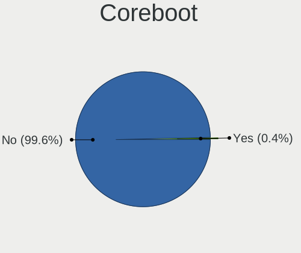
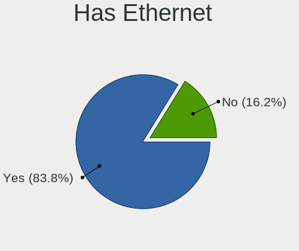
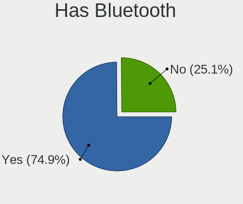
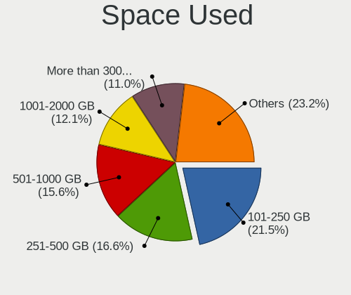
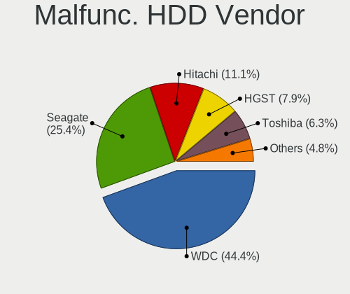
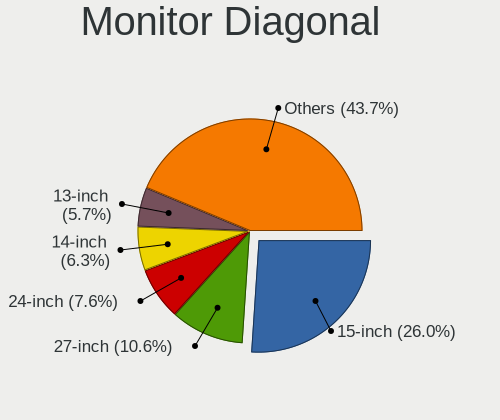
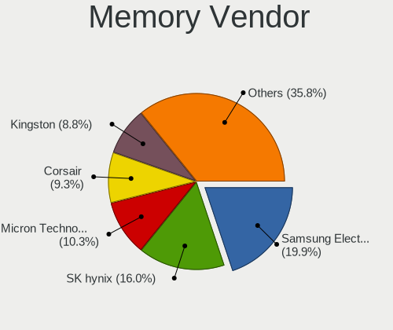
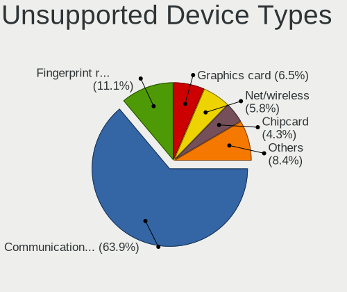

Garuda Linux - Tested Hardware & Statistics
-------------------------------------------

A project to collect tested hardware configurations for Garuda Linux.

Anyone can contribute to this report by the [hw-probe](https://github.com/linuxhw/hw-probe) tool:

    sudo -E hw-probe -all -upload

Please submit a probe of your configuration if it's not presented on the page or is rare.

This is a report for all computer types. See also reports for [desktops](/Dist/Garuda_Linux/Desktop/README.md) and [notebooks](/Dist/Garuda_Linux/Notebook/README.md).

Full-feature report is available here: https://linux-hardware.org/?view=trends

Contents
--------

* [ Test Cases ](#test-cases)

* [ System ](#system)
  - [ Kernel                   ](#kernel)
  - [ Kernel Family            ](#kernel-family)
  - [ Kernel Major Ver.        ](#kernel-major-ver)
  - [ Arch                     ](#arch)
  - [ DE                       ](#de)
  - [ Display Server           ](#display-server)
  - [ Display Manager          ](#display-manager)
  - [ OS Lang                  ](#os-lang)
  - [ Boot Mode                ](#boot-mode)
  - [ Filesystem               ](#filesystem)
  - [ Part. scheme             ](#part-scheme)
  - [ Dual Boot with Linux/BSD ](#dual-boot-with-linuxbsd)
  - [ Dual Boot (Win)          ](#dual-boot-win)

* [ Board ](#board)
  - [ Vendor                   ](#vendor)
  - [ Model                    ](#model)
  - [ Model Family             ](#model-family)
  - [ MFG Year                 ](#mfg-year)
  - [ Form Factor              ](#form-factor)
  - [ Secure Boot              ](#secure-boot)
  - [ Coreboot                 ](#coreboot)
  - [ RAM Size                 ](#ram-size)
  - [ RAM Used                 ](#ram-used)
  - [ Total Drives             ](#total-drives)
  - [ Has CD-ROM               ](#has-cd-rom)
  - [ Has Ethernet             ](#has-ethernet)
  - [ Has WiFi                 ](#has-wifi)
  - [ Has Bluetooth            ](#has-bluetooth)

* [ Location ](#location)
  - [ Country                  ](#country)
  - [ City                     ](#city)

* [ Drives ](#drives)
  - [ Drive Vendor             ](#drive-vendor)
  - [ Drive Model              ](#drive-model)
  - [ HDD Vendor               ](#hdd-vendor)
  - [ SSD Vendor               ](#ssd-vendor)
  - [ Drive Kind               ](#drive-kind)
  - [ Drive Connector          ](#drive-connector)
  - [ Drive Size               ](#drive-size)
  - [ Space Total              ](#space-total)
  - [ Space Used               ](#space-used)
  - [ Malfunc. Drives          ](#malfunc-drives)
  - [ Malfunc. Drive Vendor    ](#malfunc-drive-vendor)
  - [ Malfunc. HDD Vendor      ](#malfunc-hdd-vendor)
  - [ Malfunc. Drive Kind      ](#malfunc-drive-kind)
  - [ Failed Drives            ](#failed-drives)
  - [ Failed Drive Vendor      ](#failed-drive-vendor)
  - [ Drive Status             ](#drive-status)

* [ Storage controller ](#storage-controller)
  - [ Storage Vendor           ](#storage-vendor)
  - [ Storage Model            ](#storage-model)
  - [ Storage Kind             ](#storage-kind)

* [ Processor ](#processor)
  - [ CPU Vendor               ](#cpu-vendor)
  - [ CPU Model                ](#cpu-model)
  - [ CPU Model Family         ](#cpu-model-family)
  - [ CPU Cores                ](#cpu-cores)
  - [ CPU Sockets              ](#cpu-sockets)
  - [ CPU Threads              ](#cpu-threads)
  - [ CPU Op-Modes             ](#cpu-op-modes)
  - [ CPU Microcode            ](#cpu-microcode)
  - [ CPU Microarch            ](#cpu-microarch)

* [ Graphics ](#graphics)
  - [ GPU Vendor               ](#gpu-vendor)
  - [ GPU Model                ](#gpu-model)
  - [ GPU Combo                ](#gpu-combo)
  - [ GPU Driver               ](#gpu-driver)
  - [ GPU Memory               ](#gpu-memory)

* [ Monitor ](#monitor)
  - [ Monitor Vendor           ](#monitor-vendor)
  - [ Monitor Model            ](#monitor-model)
  - [ Monitor Resolution       ](#monitor-resolution)
  - [ Monitor Diagonal         ](#monitor-diagonal)
  - [ Monitor Width            ](#monitor-width)
  - [ Aspect Ratio             ](#aspect-ratio)
  - [ Monitor Area             ](#monitor-area)
  - [ Pixel Density            ](#pixel-density)
  - [ Multiple Monitors        ](#multiple-monitors)

* [ Network ](#network)
  - [ Net Controller Vendor    ](#net-controller-vendor)
  - [ Net Controller Model     ](#net-controller-model)
  - [ Wireless Vendor          ](#wireless-vendor)
  - [ Wireless Model           ](#wireless-model)
  - [ Ethernet Vendor          ](#ethernet-vendor)
  - [ Ethernet Model           ](#ethernet-model)
  - [ Net Controller Kind      ](#net-controller-kind)
  - [ Used Controller          ](#used-controller)
  - [ NICs                     ](#nics)
  - [ IPv6                     ](#ipv6)

* [ Bluetooth ](#bluetooth)
  - [ Bluetooth Vendor         ](#bluetooth-vendor)
  - [ Bluetooth Model          ](#bluetooth-model)

* [ Sound ](#sound)
  - [ Sound Vendor             ](#sound-vendor)
  - [ Sound Model              ](#sound-model)

* [ Memory ](#memory)
  - [ Memory Vendor            ](#memory-vendor)
  - [ Memory Model             ](#memory-model)
  - [ Memory Kind              ](#memory-kind)
  - [ Memory Form Factor       ](#memory-form-factor)
  - [ Memory Size              ](#memory-size)
  - [ Memory Speed             ](#memory-speed)

* [ Printers & scanners ](#printers--scanners)
  - [ Printer Vendor           ](#printer-vendor)
  - [ Printer Model            ](#printer-model)
  - [ Scanner Vendor           ](#scanner-vendor)
  - [ Scanner Model            ](#scanner-model)

* [ Camera ](#camera)
  - [ Camera Vendor            ](#camera-vendor)
  - [ Camera Model             ](#camera-model)

* [ Security ](#security)
  - [ Fingerprint Vendor       ](#fingerprint-vendor)
  - [ Fingerprint Model        ](#fingerprint-model)
  - [ Chipcard Vendor          ](#chipcard-vendor)
  - [ Chipcard Model           ](#chipcard-model)

* [ Unsupported ](#unsupported)
  - [ Unsupported Devices      ](#unsupported-devices)
  - [ Unsupported Device Types ](#unsupported-device-types)

Test Cases
----------

| Vendor        | Model                       | Form-Factor | Probe                                                      | Date         |
|---------------|-----------------------------|-------------|------------------------------------------------------------|--------------|
| Gigabyte      | MFLP3AP-00\2.x              | Desktop     | [b7441a0e94](https://linux-hardware.org/?probe=b7441a0e94) | Jan 31, 2022 |
| Lenovo        | ThinkPad T440p 20AWS58F0... | Notebook    | [0497eabcf7](https://linux-hardware.org/?probe=0497eabcf7) | Jan 28, 2022 |
| Lenovo        | ThinkPad T440p 20AWS58F0... | Notebook    | [e7efa96c01](https://linux-hardware.org/?probe=e7efa96c01) | Jan 28, 2022 |
| ASRock        | X470 Taichi                 | Desktop     | [aa0e21b159](https://linux-hardware.org/?probe=aa0e21b159) | Jan 27, 2022 |
| Gigabyte      | B85-HD3                     | Desktop     | [ad70601774](https://linux-hardware.org/?probe=ad70601774) | Jan 26, 2022 |
| Lenovo        | IdeaPad 5 Pro 16ACH6 82L... | Notebook    | [9091cc83ba](https://linux-hardware.org/?probe=9091cc83ba) | Jan 26, 2022 |
| Lenovo        | Unknown                     | Notebook    | [b78e96aff8](https://linux-hardware.org/?probe=b78e96aff8) | Jan 22, 2022 |
| Dell          | Inspiron 15-3567            | Notebook    | [af6171a374](https://linux-hardware.org/?probe=af6171a374) | Jan 22, 2022 |
| ASRock        | X470 Taichi                 | Desktop     | [2227a23892](https://linux-hardware.org/?probe=2227a23892) | Jan 20, 2022 |
| MSI           | GP75 Leopard 9SD            | Notebook    | [6935c7fc83](https://linux-hardware.org/?probe=6935c7fc83) | Jan 17, 2022 |
| ASRock        | 970M Pro3                   | Desktop     | [402a4f960e](https://linux-hardware.org/?probe=402a4f960e) | Jan 17, 2022 |
| ASRock        | X470 Taichi                 | Desktop     | [6261484b31](https://linux-hardware.org/?probe=6261484b31) | Jan 17, 2022 |
| ASUSTek       | ROG Maximus X CODE          | Desktop     | [8fac80f31d](https://linux-hardware.org/?probe=8fac80f31d) | Jan 16, 2022 |
| Gigabyte      | AB350-Gaming 3-CF           | Desktop     | [9fab263b02](https://linux-hardware.org/?probe=9fab263b02) | Jan 11, 2022 |
| MSI           | Z270 GAMING M5              | Desktop     | [02d70182fd](https://linux-hardware.org/?probe=02d70182fd) | Jan 10, 2022 |
| Lenovo        | Yoga Slim 7 14ARE05 82A2    | Notebook    | [10f53d4021](https://linux-hardware.org/?probe=10f53d4021) | Jan 09, 2022 |
| Lenovo        | IdeaPad 110-15ACL 80TJ      | Notebook    | [a338d9f2d1](https://linux-hardware.org/?probe=a338d9f2d1) | Jan 08, 2022 |
| Gigabyte      | AB350-Gaming 3-CF           | Desktop     | [8a1167daea](https://linux-hardware.org/?probe=8a1167daea) | Jan 08, 2022 |
| Unknown       | Unknown                     | Notebook    | [b75e231fb3](https://linux-hardware.org/?probe=b75e231fb3) | Jan 08, 2022 |
| ASUSTek       | TUF GAMING X570-PLUS        | Desktop     | [1a4570a458](https://linux-hardware.org/?probe=1a4570a458) | Jan 08, 2022 |
| Lenovo        | Legion 5 15IMH05H 81Y6      | Notebook    | [34d2cd6d9c](https://linux-hardware.org/?probe=34d2cd6d9c) | Jan 08, 2022 |
| Pegatron      | 2AD5                        | Desktop     | [91ee5ba1df](https://linux-hardware.org/?probe=91ee5ba1df) | Jan 08, 2022 |
| HP            | OMEN Laptop 15-en1xxx       | Notebook    | [9ad04f3022](https://linux-hardware.org/?probe=9ad04f3022) | Jan 07, 2022 |
| Gigabyte      | B460M DS3H                  | Desktop     | [40f4de9da7](https://linux-hardware.org/?probe=40f4de9da7) | Jan 07, 2022 |
| Lenovo        | Legion 5 15IMH05H 81Y6      | Notebook    | [c4db605668](https://linux-hardware.org/?probe=c4db605668) | Jan 06, 2022 |
| Dell          | Precision M4500             | Notebook    | [2504901038](https://linux-hardware.org/?probe=2504901038) | Jan 04, 2022 |
| HP            | Pavilion 14                 | Notebook    | [34167c8022](https://linux-hardware.org/?probe=34167c8022) | Jan 04, 2022 |
| ASRock        | X470 Taichi                 | Desktop     | [37dc48f3f3](https://linux-hardware.org/?probe=37dc48f3f3) | Jan 02, 2022 |
| ASRock        | X470 Taichi                 | Desktop     | [f506cf2d37](https://linux-hardware.org/?probe=f506cf2d37) | Jan 02, 2022 |
| HP            | Pavilion Laptop 15z-eh10... | Notebook    | [29b9cb755b](https://linux-hardware.org/?probe=29b9cb755b) | Dec 25, 2021 |
| Dell          | G15 5515                    | Notebook    | [7e8108b3c2](https://linux-hardware.org/?probe=7e8108b3c2) | Dec 24, 2021 |
| Gigabyte      | B550 AORUS PRO AC           | Desktop     | [1b62246b10](https://linux-hardware.org/?probe=1b62246b10) | Dec 21, 2021 |
| GPU Compan... | GWTN156-11                  | Notebook    | [3700827ecd](https://linux-hardware.org/?probe=3700827ecd) | Dec 19, 2021 |
| ASRock        | X470 Taichi                 | Desktop     | [8d397e7af8](https://linux-hardware.org/?probe=8d397e7af8) | Dec 19, 2021 |
| ASUSTek       | X550CC                      | Notebook    | [c7147f0bf8](https://linux-hardware.org/?probe=c7147f0bf8) | Dec 16, 2021 |
| ASUSTek       | X550CC                      | Notebook    | [f8a99e7645](https://linux-hardware.org/?probe=f8a99e7645) | Dec 16, 2021 |
| ASUSTek       | TUF GAMING X570-PLUS        | Desktop     | [9e73346fb8](https://linux-hardware.org/?probe=9e73346fb8) | Dec 15, 2021 |
| Razer         | Blade 14 - RZ09-0370        | Notebook    | [c3144c3e22](https://linux-hardware.org/?probe=c3144c3e22) | Dec 13, 2021 |
| Gigabyte      | X570 AORUS ELITE WIFI       | Desktop     | [196b460373](https://linux-hardware.org/?probe=196b460373) | Dec 13, 2021 |
| HP            | Pavilion Laptop 15-eh0xx... | Notebook    | [df628cbd13](https://linux-hardware.org/?probe=df628cbd13) | Dec 12, 2021 |
| ASRock        | H77M-ITX                    | Desktop     | [5e98a2fce2](https://linux-hardware.org/?probe=5e98a2fce2) | Dec 11, 2021 |
| ASRock        | B450M Pro4                  | Desktop     | [e4fb1e4fe4](https://linux-hardware.org/?probe=e4fb1e4fe4) | Dec 09, 2021 |
| Lenovo        | ThinkStation S20 4105O1U    | Desktop     | [731c890641](https://linux-hardware.org/?probe=731c890641) | Dec 08, 2021 |
| Acer          | Aspire F5-573G              | Notebook    | [a49a5a129c](https://linux-hardware.org/?probe=a49a5a129c) | Dec 07, 2021 |
| HP            | Laptop 15-dy2xxx            | Notebook    | [f499f9a375](https://linux-hardware.org/?probe=f499f9a375) | Dec 06, 2021 |
| ASUSTek       | TUF GAMING X570-PLUS        | Desktop     | [f0df07c0e4](https://linux-hardware.org/?probe=f0df07c0e4) | Dec 06, 2021 |
| HP            | Laptop 15-dy2xxx            | Notebook    | [e6b9de389b](https://linux-hardware.org/?probe=e6b9de389b) | Dec 06, 2021 |
| Acer          | TravelMate 5720             | Notebook    | [8ce02488c4](https://linux-hardware.org/?probe=8ce02488c4) | Dec 06, 2021 |
| Acer          | TravelMate 5720             | Notebook    | [b68e789e42](https://linux-hardware.org/?probe=b68e789e42) | Dec 06, 2021 |
| Acer          | Aspire TC-895 V:1.0         | Desktop     | [c743459a71](https://linux-hardware.org/?probe=c743459a71) | Dec 04, 2021 |
| ASUSTek       | H87M-E                      | Desktop     | [2b4abcf54f](https://linux-hardware.org/?probe=2b4abcf54f) | Dec 02, 2021 |
| ASUSTek       | H87M-E                      | Desktop     | [72cf0ed74d](https://linux-hardware.org/?probe=72cf0ed74d) | Dec 02, 2021 |
| Lenovo        | ThinkStation S20 4105O1U    | Desktop     | [f031548aac](https://linux-hardware.org/?probe=f031548aac) | Dec 01, 2021 |
| Lenovo        | ThinkStation S20 4105O1U    | Desktop     | [48f73af82d](https://linux-hardware.org/?probe=48f73af82d) | Nov 30, 2021 |
| Acer          | Aspire A515-51G             | Notebook    | [6ee6a2bc49](https://linux-hardware.org/?probe=6ee6a2bc49) | Nov 30, 2021 |
| Acer          | Nitro AN715-52              | Notebook    | [2b74aabc3a](https://linux-hardware.org/?probe=2b74aabc3a) | Nov 29, 2021 |
| Lenovo        | IdeaPad 330-15ARR 81D2      | Notebook    | [b5b437249c](https://linux-hardware.org/?probe=b5b437249c) | Nov 29, 2021 |
| ASRock        | X470 Taichi                 | Desktop     | [0b1d816eff](https://linux-hardware.org/?probe=0b1d816eff) | Nov 28, 2021 |
| ASRock        | X470 Taichi                 | Desktop     | [dd3bc71908](https://linux-hardware.org/?probe=dd3bc71908) | Nov 26, 2021 |
| ASUSTek       | K53SD                       | Notebook    | [b2826b96f2](https://linux-hardware.org/?probe=b2826b96f2) | Nov 24, 2021 |
| HP            | Pavilion Laptop 15-eh0xx... | Notebook    | [fac556ebbe](https://linux-hardware.org/?probe=fac556ebbe) | Nov 24, 2021 |
| Dell          | XPS 15 7590                 | Notebook    | [63f386f998](https://linux-hardware.org/?probe=63f386f998) | Nov 23, 2021 |
| HP            | Pavilion Laptop 15-eh0xx... | Notebook    | [bbb0689dea](https://linux-hardware.org/?probe=bbb0689dea) | Nov 21, 2021 |
| Dell          | Latitude E5570              | Notebook    | [48ea4215ad](https://linux-hardware.org/?probe=48ea4215ad) | Nov 18, 2021 |
| Lenovo        | ThinkPad W530 24474KG       | Notebook    | [1ea5d23a86](https://linux-hardware.org/?probe=1ea5d23a86) | Nov 17, 2021 |
| Lenovo        | Legion S7 15ACH6 82K8       | Notebook    | [2713c3bae1](https://linux-hardware.org/?probe=2713c3bae1) | Nov 16, 2021 |
| Apple         | MacBookPro9,2               | Notebook    | [2c8fef35c1](https://linux-hardware.org/?probe=2c8fef35c1) | Nov 14, 2021 |
| HP            | ENVY x360 Convertible 13... | Convertible | [f455ee4572](https://linux-hardware.org/?probe=f455ee4572) | Nov 14, 2021 |
| ASRock        | X470 Taichi                 | Desktop     | [0f3490892c](https://linux-hardware.org/?probe=0f3490892c) | Nov 14, 2021 |
| ASUSTek       | Rampage IV EXTREME          | Desktop     | [50999d4796](https://linux-hardware.org/?probe=50999d4796) | Nov 14, 2021 |
| HP            | Pavilion Laptop 15-eh0xx... | Notebook    | [d74b03de25](https://linux-hardware.org/?probe=d74b03de25) | Nov 13, 2021 |
| Lenovo        | ThinkPad W530 24474KG       | Notebook    | [6584d17e10](https://linux-hardware.org/?probe=6584d17e10) | Nov 09, 2021 |
| HP            | EliteBook 840 G8 Noteboo... | Notebook    | [ed9cd44b17](https://linux-hardware.org/?probe=ed9cd44b17) | Nov 08, 2021 |
| HP            | ProBook 640 G1              | Notebook    | [acb5ceea62](https://linux-hardware.org/?probe=acb5ceea62) | Nov 05, 2021 |
| ASUSTek       | TUF GAMING X570-PLUS        | Desktop     | [cd295bb56c](https://linux-hardware.org/?probe=cd295bb56c) | Nov 04, 2021 |
| ASUSTek       | ASUS EXPERTBOOK P2451FB_... | Notebook    | [976bcf4121](https://linux-hardware.org/?probe=976bcf4121) | Nov 04, 2021 |
| ASRock        | X470 Taichi                 | Desktop     | [5ae2157abe](https://linux-hardware.org/?probe=5ae2157abe) | Nov 04, 2021 |
| ASRock        | X470 Taichi                 | Desktop     | [86f08832c0](https://linux-hardware.org/?probe=86f08832c0) | Oct 31, 2021 |
| ASRock        | X470 Taichi                 | Desktop     | [e153488f12](https://linux-hardware.org/?probe=e153488f12) | Oct 28, 2021 |
| Lenovo        | G510 20238                  | Notebook    | [60fa5ff04c](https://linux-hardware.org/?probe=60fa5ff04c) | Oct 28, 2021 |
| ASUSTek       | P8B75-M                     | Desktop     | [2130c28d33](https://linux-hardware.org/?probe=2130c28d33) | Oct 27, 2021 |
| Panasonic     | CF-191HYAX1M                | Notebook    | [1aed5aedc2](https://linux-hardware.org/?probe=1aed5aedc2) | Oct 25, 2021 |
| Dell          | XPS 13 9350                 | Notebook    | [dde814d7ca](https://linux-hardware.org/?probe=dde814d7ca) | Oct 25, 2021 |
| Apple         | Mac-FC02E91DDD3FA6A4 iMa... | All in one  | [5154b1932f](https://linux-hardware.org/?probe=5154b1932f) | Oct 24, 2021 |
| ASRock        | X470 Taichi                 | Desktop     | [ec046ac486](https://linux-hardware.org/?probe=ec046ac486) | Oct 24, 2021 |
| MSI           | Z77A-G43                    | Desktop     | [3bd9604ae7](https://linux-hardware.org/?probe=3bd9604ae7) | Oct 20, 2021 |
| MSI           | B460M PRO-VDH WIFI          | Desktop     | [76071ec77b](https://linux-hardware.org/?probe=76071ec77b) | Oct 19, 2021 |
| ASRock        | X470 Taichi                 | Desktop     | [9b9f21a8eb](https://linux-hardware.org/?probe=9b9f21a8eb) | Oct 19, 2021 |
| MSI           | B450M-A PRO MAX             | Desktop     | [4148046f02](https://linux-hardware.org/?probe=4148046f02) | Oct 17, 2021 |
| Samsung       | 300V3A/300V4A/300V5A/200... | Notebook    | [d8167a915b](https://linux-hardware.org/?probe=d8167a915b) | Oct 17, 2021 |
| ASRock        | X470 Taichi                 | Desktop     | [ff6b763448](https://linux-hardware.org/?probe=ff6b763448) | Oct 16, 2021 |
| Lenovo        | ThinkPad T510 4384WB4       | Notebook    | [4a54d7fd48](https://linux-hardware.org/?probe=4a54d7fd48) | Oct 16, 2021 |
| Lenovo        | ThinkPad W530 24474KG       | Notebook    | [64fd7ae16c](https://linux-hardware.org/?probe=64fd7ae16c) | Oct 11, 2021 |
| Acer          | Nitro AN515-44              | Notebook    | [5070a2bdc7](https://linux-hardware.org/?probe=5070a2bdc7) | Oct 10, 2021 |
| Acer          | Aspire E5-523               | Notebook    | [30036170b1](https://linux-hardware.org/?probe=30036170b1) | Oct 05, 2021 |
| Acer          | Aspire E5-523               | Notebook    | [841a71eac1](https://linux-hardware.org/?probe=841a71eac1) | Oct 04, 2021 |
| Acer          | Aspire E3-111               | Notebook    | [45a0e8618a](https://linux-hardware.org/?probe=45a0e8618a) | Sep 28, 2021 |
| Acer          | Aspire E3-111               | Notebook    | [f0100402ec](https://linux-hardware.org/?probe=f0100402ec) | Sep 28, 2021 |
| ASRock        | X470 Taichi                 | Desktop     | [1963eb2e26](https://linux-hardware.org/?probe=1963eb2e26) | Sep 28, 2021 |
| Notebook      | P7xxDM2                     | Notebook    | [284ab5f28e](https://linux-hardware.org/?probe=284ab5f28e) | Sep 28, 2021 |
| Acer          | Aspire V3-572P              | Notebook    | [3eecfd13ad](https://linux-hardware.org/?probe=3eecfd13ad) | Sep 25, 2021 |
| Chuwi         | GemiBook Pro                | Notebook    | [10b47851d2](https://linux-hardware.org/?probe=10b47851d2) | Sep 25, 2021 |
| Lenovo        | IdeaPad S340-15API 81NC     | Notebook    | [2e3e323c0d](https://linux-hardware.org/?probe=2e3e323c0d) | Sep 21, 2021 |
| Acer          | Swift SF114-32              | Notebook    | [91a1652ef2](https://linux-hardware.org/?probe=91a1652ef2) | Sep 18, 2021 |
| Fujitsu       | D3120-A1 S26361-D3120-A1    | Desktop     | [fdd8f9dd8e](https://linux-hardware.org/?probe=fdd8f9dd8e) | Sep 17, 2021 |
| Fujitsu       | D3120-A1 S26361-D3120-A1    | Desktop     | [ab3ad8009e](https://linux-hardware.org/?probe=ab3ad8009e) | Sep 16, 2021 |
| ASUSTek       | PRIME B450M-K               | Desktop     | [b8b49f201f](https://linux-hardware.org/?probe=b8b49f201f) | Sep 14, 2021 |
| ASUSTek       | ASUS TUF Gaming A15 FA50... | Notebook    | [0b9ee7a59d](https://linux-hardware.org/?probe=0b9ee7a59d) | Sep 12, 2021 |
| Fujitsu       | LIFEBOOK T936               | Convertible | [646d26abf7](https://linux-hardware.org/?probe=646d26abf7) | Sep 08, 2021 |
| Razer         | Blade                       | Notebook    | [1ce95784c0](https://linux-hardware.org/?probe=1ce95784c0) | Sep 05, 2021 |
| Razer         | Blade                       | Notebook    | [58a2a48dc4](https://linux-hardware.org/?probe=58a2a48dc4) | Sep 05, 2021 |
| Fujitsu       | LIFEBOOK T936               | Convertible | [e4593929ff](https://linux-hardware.org/?probe=e4593929ff) | Sep 05, 2021 |
| Samsung       | 550XCJ/550XCR               | Notebook    | [85fa26ea9e](https://linux-hardware.org/?probe=85fa26ea9e) | Aug 31, 2021 |
| ASUSTek       | ASUS TUF Gaming A15 FA50... | Notebook    | [b9a6b71efc](https://linux-hardware.org/?probe=b9a6b71efc) | Aug 28, 2021 |
| MSI           | H310M PRO-VDH PLUS          | Desktop     | [65fcfef06f](https://linux-hardware.org/?probe=65fcfef06f) | Aug 27, 2021 |
| Alienware     | 0TYR0X A00                  | Desktop     | [5ea23ebfb2](https://linux-hardware.org/?probe=5ea23ebfb2) | Aug 19, 2021 |
| ASRock        | X399 Professional Gaming    | Desktop     | [bb53a385c3](https://linux-hardware.org/?probe=bb53a385c3) | Aug 19, 2021 |
| ASRock        | X470 Taichi                 | Desktop     | [c18bca5109](https://linux-hardware.org/?probe=c18bca5109) | Aug 16, 2021 |
| Google        | Kindred                     | Notebook    | [ac298188ae](https://linux-hardware.org/?probe=ac298188ae) | Aug 13, 2021 |
| Acer          | Aspire E1-522               | Notebook    | [4ec8d56e38](https://linux-hardware.org/?probe=4ec8d56e38) | Aug 13, 2021 |
| Acer          | Aspire E1-522               | Notebook    | [c8892394cf](https://linux-hardware.org/?probe=c8892394cf) | Aug 13, 2021 |
| HP            | ProBook 650 G2              | Notebook    | [ca250625bd](https://linux-hardware.org/?probe=ca250625bd) | Aug 11, 2021 |
| HP            | ProBook 650 G2              | Notebook    | [7705938f1f](https://linux-hardware.org/?probe=7705938f1f) | Aug 11, 2021 |
| Medion        | H110H4-EM2                  | Desktop     | [f4e01958e5](https://linux-hardware.org/?probe=f4e01958e5) | Aug 10, 2021 |
| ASRock        | X470 Taichi                 | Desktop     | [a919fef17f](https://linux-hardware.org/?probe=a919fef17f) | Aug 07, 2021 |
| MSI           | Z97 MPOWER                  | Desktop     | [dee7d3af4a](https://linux-hardware.org/?probe=dee7d3af4a) | Aug 06, 2021 |
| MSI           | Z97 MPOWER                  | Desktop     | [f30e5a3a86](https://linux-hardware.org/?probe=f30e5a3a86) | Aug 06, 2021 |
| HP            | EliteBook 845 G7 Noteboo... | Notebook    | [c505820537](https://linux-hardware.org/?probe=c505820537) | Aug 04, 2021 |
| Acer          | IPMBW-BR                    | All in one  | [a2ef77ad47](https://linux-hardware.org/?probe=a2ef77ad47) | Aug 03, 2021 |
| ASUSTek       | G750JZ                      | Notebook    | [f35df8640b](https://linux-hardware.org/?probe=f35df8640b) | Aug 02, 2021 |
| Lenovo        | IdeaPad Slim 1-14AST-05 ... | Notebook    | [d25176b845](https://linux-hardware.org/?probe=d25176b845) | Jul 30, 2021 |
| Lenovo        | IdeaPad Slim 1-14AST-05 ... | Notebook    | [0340b4c57f](https://linux-hardware.org/?probe=0340b4c57f) | Jul 30, 2021 |
| Lenovo        | Legion 5 Pro 16ACH6H 82J... | Notebook    | [e134bae415](https://linux-hardware.org/?probe=e134bae415) | Jul 29, 2021 |
| ASUSTek       | X550ZE                      | Notebook    | [e436ae3019](https://linux-hardware.org/?probe=e436ae3019) | Jul 23, 2021 |
| ASUSTek       | X550ZE                      | Notebook    | [49cd19882f](https://linux-hardware.org/?probe=49cd19882f) | Jul 23, 2021 |
| HP            | Spectre x360 Convertible... | Convertible | [cfaf6bb9ab](https://linux-hardware.org/?probe=cfaf6bb9ab) | Jul 21, 2021 |
| Lenovo        | Legion 5 Pro 16ACH6H 82J... | Notebook    | [83c21e1a99](https://linux-hardware.org/?probe=83c21e1a99) | Jul 21, 2021 |
| Notebook      | W54_W550SU2                 | Notebook    | [b026148da5](https://linux-hardware.org/?probe=b026148da5) | Jul 15, 2021 |
| Dell          | Inspiron 3501               | Notebook    | [f72a03865c](https://linux-hardware.org/?probe=f72a03865c) | Jul 11, 2021 |
| HP            | Pavilion Laptop 14-dv0xx... | Notebook    | [c65f4896a2](https://linux-hardware.org/?probe=c65f4896a2) | Jul 11, 2021 |
| Sony          | VPCSB1C5E                   | Notebook    | [2878014d7a](https://linux-hardware.org/?probe=2878014d7a) | Jul 11, 2021 |
| Sony          | VPCSB1C5E                   | Notebook    | [4cfb82cbfe](https://linux-hardware.org/?probe=4cfb82cbfe) | Jul 11, 2021 |
| ASUSTek       | ROG STRIX B550-F GAMING     | Desktop     | [826edd51bc](https://linux-hardware.org/?probe=826edd51bc) | Jul 07, 2021 |
| Lenovo        | LEGION 5 15IMH05 82AU       | Notebook    | [cab06ed3ed](https://linux-hardware.org/?probe=cab06ed3ed) | Jul 01, 2021 |
| Gigabyte      | X470 AORUS ULTRA GAMING-... | Desktop     | [aa05cca9b7](https://linux-hardware.org/?probe=aa05cca9b7) | Jun 30, 2021 |
| Biostar       | H310MHP                     | Desktop     | [0d3f648f3e](https://linux-hardware.org/?probe=0d3f648f3e) | Jun 30, 2021 |
| HP            | Pavilion Gaming Laptop 1... | Notebook    | [cc5fd0194e](https://linux-hardware.org/?probe=cc5fd0194e) | Jun 26, 2021 |
| Lenovo        | SHARKBAY SDK0E50510 WIN     | Desktop     | [fb3d7de63c](https://linux-hardware.org/?probe=fb3d7de63c) | Jun 26, 2021 |
| MSI           | A320M-HDV R4.0              | Desktop     | [486775a989](https://linux-hardware.org/?probe=486775a989) | Jun 23, 2021 |
| MSI           | A320M-HDV R4.0              | Desktop     | [4629f86f56](https://linux-hardware.org/?probe=4629f86f56) | Jun 22, 2021 |
| MSI           | A320M-HDV R4.0              | Desktop     | [69dea4e3cf](https://linux-hardware.org/?probe=69dea4e3cf) | Jun 22, 2021 |
| MSI           | A320M-HDV R4.0              | Desktop     | [2fd89c951e](https://linux-hardware.org/?probe=2fd89c951e) | Jun 22, 2021 |
| Lenovo        | IdeaPad Gaming 3 15ARH05... | Notebook    | [11e99b82d5](https://linux-hardware.org/?probe=11e99b82d5) | Jun 22, 2021 |
| MSI           | X370 GAMING PRO CARBON      | Desktop     | [9ead1e1bb5](https://linux-hardware.org/?probe=9ead1e1bb5) | Jun 22, 2021 |
| ASUSTek       | ROG STRIX B550-F GAMING     | Desktop     | [8144c83b50](https://linux-hardware.org/?probe=8144c83b50) | Jun 22, 2021 |
| Dell          | Inspiron N5050              | Notebook    | [92ae7459b4](https://linux-hardware.org/?probe=92ae7459b4) | Jun 20, 2021 |
| ASUSTek       | ROG STRIX B550-F GAMING     | Desktop     | [8a7a518013](https://linux-hardware.org/?probe=8a7a518013) | Jun 15, 2021 |
| ASUSTek       | ROG STRIX B550-F GAMING     | Desktop     | [376c0ff95d](https://linux-hardware.org/?probe=376c0ff95d) | Jun 15, 2021 |
| Gigabyte      | B550I AORUS PRO AX          | Desktop     | [34801a2f74](https://linux-hardware.org/?probe=34801a2f74) | Jun 12, 2021 |
| PC Special... | GK5NPFO                     | Notebook    | [38b9682492](https://linux-hardware.org/?probe=38b9682492) | Jun 11, 2021 |
| PC Special... | GK5NPFO                     | Notebook    | [47a7837795](https://linux-hardware.org/?probe=47a7837795) | Jun 11, 2021 |
| Lenovo        | IdeaPad Gaming 3 15ARH05... | Notebook    | [abd01e8eac](https://linux-hardware.org/?probe=abd01e8eac) | Jun 09, 2021 |
| Dell          | Inspiron 5570               | Notebook    | [a93d77d45b](https://linux-hardware.org/?probe=a93d77d45b) | Jun 06, 2021 |
| ASUSTek       | TUF Gaming FX505DT_FX505... | Notebook    | [f794ea73e4](https://linux-hardware.org/?probe=f794ea73e4) | May 28, 2021 |
| MSI           | GE72VR 6RF                  | Notebook    | [faea47290a](https://linux-hardware.org/?probe=faea47290a) | May 26, 2021 |
| Lenovo        | IdeaPad 3 15ADA05 81W1      | Notebook    | [e7fda6091a](https://linux-hardware.org/?probe=e7fda6091a) | May 26, 2021 |
| Lenovo        | IdeaPad 3 15ADA05 81W1      | Notebook    | [d2a26e0f30](https://linux-hardware.org/?probe=d2a26e0f30) | May 26, 2021 |
| ASUSTek       | ROG CROSSHAIR VII HERO      | Desktop     | [51e1e33185](https://linux-hardware.org/?probe=51e1e33185) | May 20, 2021 |
| MSI           | B350M GAMING PRO            | Desktop     | [c04e6666e7](https://linux-hardware.org/?probe=c04e6666e7) | May 20, 2021 |
| Dell          | 0D28YY A02                  | Desktop     | [14edf3bd00](https://linux-hardware.org/?probe=14edf3bd00) | May 16, 2021 |
| HP            | EliteBook 8540p             | Notebook    | [ffc46c9472](https://linux-hardware.org/?probe=ffc46c9472) | May 14, 2021 |
| Acer          | Spin SP513-54N              | Convertible | [aa8934716b](https://linux-hardware.org/?probe=aa8934716b) | May 13, 2021 |
| Gigabyte      | A320M-S2H-CF                | Desktop     | [066f815622](https://linux-hardware.org/?probe=066f815622) | May 12, 2021 |
| HP            | 844C                        | Desktop     | [29f7cf64ce](https://linux-hardware.org/?probe=29f7cf64ce) | May 06, 2021 |
| HP            | 844C                        | Desktop     | [0534f06ec4](https://linux-hardware.org/?probe=0534f06ec4) | May 06, 2021 |
| Alienware     | 17 R3                       | Notebook    | [f9ee772f9e](https://linux-hardware.org/?probe=f9ee772f9e) | May 05, 2021 |
| ASUSTek       | PRIME Z590-A                | Desktop     | [cb3058760e](https://linux-hardware.org/?probe=cb3058760e) | May 04, 2021 |
| Gigabyte      | P67A-UD3-B3                 | Desktop     | [08ea956bfa](https://linux-hardware.org/?probe=08ea956bfa) | Apr 24, 2021 |
| Lenovo        | IdeaPad Slim 1-14AST-05 ... | Notebook    | [d9bf75c99c](https://linux-hardware.org/?probe=d9bf75c99c) | Apr 23, 2021 |
| Lenovo        | IdeaPad Gaming 3 15ARH05... | Notebook    | [22931f83cc](https://linux-hardware.org/?probe=22931f83cc) | Apr 20, 2021 |
| Lenovo        | IdeaPad Slim 1-14AST-05 ... | Notebook    | [25808be952](https://linux-hardware.org/?probe=25808be952) | Apr 19, 2021 |
| Lenovo        | IdeaPad Gaming 3 15ARH05... | Notebook    | [3c7f354ce4](https://linux-hardware.org/?probe=3c7f354ce4) | Apr 19, 2021 |
| Lenovo        | IdeaPad Slim 1-14AST-05 ... | Notebook    | [d97babb331](https://linux-hardware.org/?probe=d97babb331) | Apr 18, 2021 |
| ASUSTek       | GL503VM                     | Notebook    | [743ff3a2aa](https://linux-hardware.org/?probe=743ff3a2aa) | Apr 18, 2021 |
| Medion        | P861X                       | Notebook    | [109599a6f6](https://linux-hardware.org/?probe=109599a6f6) | Apr 15, 2021 |
| Medion        | P861X                       | Notebook    | [ae05cea55d](https://linux-hardware.org/?probe=ae05cea55d) | Apr 15, 2021 |
| Medion        | E7419 MD60025               | Notebook    | [4deb77ef82](https://linux-hardware.org/?probe=4deb77ef82) | Apr 10, 2021 |
| MSI           | Z87 MPOWER                  | Desktop     | [ff6aa3811c](https://linux-hardware.org/?probe=ff6aa3811c) | Apr 08, 2021 |
| ASUSTek       | ROG Strix G512LW_G512LW     | Notebook    | [2012ac3d84](https://linux-hardware.org/?probe=2012ac3d84) | Apr 07, 2021 |
| Dell          | Inspiron 5755               | Notebook    | [ae6589874e](https://linux-hardware.org/?probe=ae6589874e) | Apr 07, 2021 |
| HP            | 2B3B                        | All in one  | [1a5d2c36ec](https://linux-hardware.org/?probe=1a5d2c36ec) | Apr 06, 2021 |
| Acer          | Nitro AN515-44              | Notebook    | [9f68dee6f5](https://linux-hardware.org/?probe=9f68dee6f5) | Apr 04, 2021 |
| HP            | Pavilion Gaming Laptop 1... | Notebook    | [2af0a44c72](https://linux-hardware.org/?probe=2af0a44c72) | Apr 04, 2021 |
| ASRock        | AB350M-HDV                  | Desktop     | [23502edac5](https://linux-hardware.org/?probe=23502edac5) | Apr 01, 2021 |
| ASRock        | AB350M-HDV                  | Desktop     | [8cc9da4310](https://linux-hardware.org/?probe=8cc9da4310) | Apr 01, 2021 |
| ASRock        | AB350M-HDV                  | Desktop     | [13b2fdddc0](https://linux-hardware.org/?probe=13b2fdddc0) | Apr 01, 2021 |
| Dell          | 07KY25 A01                  | Desktop     | [8c4f2f9922](https://linux-hardware.org/?probe=8c4f2f9922) | Mar 31, 2021 |
| Medion        | E7419 MD60025               | Notebook    | [938494cf89](https://linux-hardware.org/?probe=938494cf89) | Mar 31, 2021 |
| Dell          | 07KY25 A01                  | Desktop     | [1b9efb1b29](https://linux-hardware.org/?probe=1b9efb1b29) | Mar 24, 2021 |
| Lenovo        | ThinkPad T470 20HD000RUS    | Notebook    | [751dd3bb74](https://linux-hardware.org/?probe=751dd3bb74) | Mar 19, 2021 |
| Gigabyte      | B450 AORUS M                | Desktop     | [097a0d616c](https://linux-hardware.org/?probe=097a0d616c) | Mar 18, 2021 |
| Gigabyte      | B450 AORUS M                | Desktop     | [22054ffd75](https://linux-hardware.org/?probe=22054ffd75) | Mar 18, 2021 |
| Dell          | Inspiron 15 7000 Gaming     | Notebook    | [1e6cbeb181](https://linux-hardware.org/?probe=1e6cbeb181) | Mar 17, 2021 |
| Acer          | Nitro AN515-54              | Notebook    | [b4580812c2](https://linux-hardware.org/?probe=b4580812c2) | Mar 15, 2021 |
| HP            | 2AF7                        | Desktop     | [e0639ea4a5](https://linux-hardware.org/?probe=e0639ea4a5) | Mar 11, 2021 |
| HP            | 2AF7                        | Desktop     | [fb8d76722c](https://linux-hardware.org/?probe=fb8d76722c) | Mar 11, 2021 |
| Dell          | XPS L702X                   | Notebook    | [e3af15a170](https://linux-hardware.org/?probe=e3af15a170) | Mar 09, 2021 |
| Dell          | XPS L702X                   | Notebook    | [7fb3f476cf](https://linux-hardware.org/?probe=7fb3f476cf) | Mar 09, 2021 |
| HP            | EliteBook 8540p             | Notebook    | [3741826c9a](https://linux-hardware.org/?probe=3741826c9a) | Mar 08, 2021 |
| ASUSTek       | ROG STRIX B550-F GAMING     | Desktop     | [c1f22a7521](https://linux-hardware.org/?probe=c1f22a7521) | Mar 05, 2021 |
| Gigabyte      | GA-MA790FXT-UD5P            | Desktop     | [404dab2464](https://linux-hardware.org/?probe=404dab2464) | Feb 27, 2021 |
| HP            | OMEN Laptop 15-en0xxx       | Notebook    | [29784f5b45](https://linux-hardware.org/?probe=29784f5b45) | Feb 23, 2021 |
| ASRock        | FM2A88X Extreme6+           | Desktop     | [13f9fc2ef3](https://linux-hardware.org/?probe=13f9fc2ef3) | Feb 18, 2021 |
| HP            | EliteBook 8540p             | Notebook    | [c7e8878f7b](https://linux-hardware.org/?probe=c7e8878f7b) | Feb 18, 2021 |
| ASUSTek       | ROG STRIX B550-F GAMING     | Desktop     | [2e19f3b1af](https://linux-hardware.org/?probe=2e19f3b1af) | Feb 18, 2021 |
| ASUSTek       | ROG STRIX B550-F GAMING     | Desktop     | [51244d0897](https://linux-hardware.org/?probe=51244d0897) | Feb 18, 2021 |
| Lenovo        | ThinkPad T440p 20AWS4RC0... | Notebook    | [3e146ba45b](https://linux-hardware.org/?probe=3e146ba45b) | Feb 18, 2021 |
| ASUSTek       | TUF Gaming FX505DD_FX505... | Notebook    | [de3199a457](https://linux-hardware.org/?probe=de3199a457) | Feb 17, 2021 |
| Dell          | 0C2KJT A00                  | Desktop     | [f821a0035b](https://linux-hardware.org/?probe=f821a0035b) | Feb 12, 2021 |
| HP            | EliteBook 8540p             | Notebook    | [9dececac24](https://linux-hardware.org/?probe=9dececac24) | Feb 11, 2021 |
| ASUSTek       | PRIME B360M-K               | Desktop     | [b73941c431](https://linux-hardware.org/?probe=b73941c431) | Feb 08, 2021 |
| HP            | EliteBook 8540p             | Notebook    | [92487a475d](https://linux-hardware.org/?probe=92487a475d) | Feb 06, 2021 |
| HP            | EliteBook 8540p             | Notebook    | [23cece38ed](https://linux-hardware.org/?probe=23cece38ed) | Feb 02, 2021 |
| HP            | OMEN by HP Laptop 15-dc1... | Notebook    | [1bdd227b6f](https://linux-hardware.org/?probe=1bdd227b6f) | Feb 02, 2021 |
| HP            | 1825                        | Desktop     | [3b6b80db46](https://linux-hardware.org/?probe=3b6b80db46) | Jan 31, 2021 |
| HP            | 1825                        | Desktop     | [1df894dea4](https://linux-hardware.org/?probe=1df894dea4) | Jan 31, 2021 |
| Dell          | Latitude E6520              | Notebook    | [24cbaa1c59](https://linux-hardware.org/?probe=24cbaa1c59) | Jan 30, 2021 |
| HP            | Pavilion Laptop 15-cs0xx... | Notebook    | [793615c0de](https://linux-hardware.org/?probe=793615c0de) | Jan 30, 2021 |
| Lenovo        | ThinkPad T470s 20HGS0B90... | Notebook    | [dfb9858a8f](https://linux-hardware.org/?probe=dfb9858a8f) | Jan 29, 2021 |
| HP            | EliteBook 8540p             | Notebook    | [dd3793c498](https://linux-hardware.org/?probe=dd3793c498) | Jan 28, 2021 |
| ASRock        | X470 Master SLI             | Desktop     | [36eaf717e9](https://linux-hardware.org/?probe=36eaf717e9) | Jan 26, 2021 |
| ASRock        | X470 Master SLI             | Desktop     | [b1be9375c0](https://linux-hardware.org/?probe=b1be9375c0) | Jan 24, 2021 |
| ASUSTek       | ROG STRIX X570-E GAMING     | Desktop     | [7332b50f98](https://linux-hardware.org/?probe=7332b50f98) | Jan 24, 2021 |
| Dell          | XPS 15 9500                 | Notebook    | [11b9018ef1](https://linux-hardware.org/?probe=11b9018ef1) | Jan 23, 2021 |
| HP            | EliteBook 8540p             | Notebook    | [c504347399](https://linux-hardware.org/?probe=c504347399) | Jan 23, 2021 |
| ASUSTek       | PRIME H270-PLUS             | Desktop     | [3f895b585b](https://linux-hardware.org/?probe=3f895b585b) | Jan 22, 2021 |
| HP            | EliteBook 8540p             | Notebook    | [643af77934](https://linux-hardware.org/?probe=643af77934) | Jan 18, 2021 |
| Lenovo        | SHARKBAY 0B98401 PRO        | Desktop     | [61976e9745](https://linux-hardware.org/?probe=61976e9745) | Jan 18, 2021 |
| HP            | Compaq 6735b                | Notebook    | [84a4616a8d](https://linux-hardware.org/?probe=84a4616a8d) | Jan 18, 2021 |
| Fujitsu Si... | ESPRIMO Mobile D9500        | Notebook    | [9703bdf4f6](https://linux-hardware.org/?probe=9703bdf4f6) | Jan 12, 2021 |
| HP            | EliteBook 8540p             | Notebook    | [86c3c2d1d3](https://linux-hardware.org/?probe=86c3c2d1d3) | Jan 12, 2021 |
| Unknown       | Unknown                     | Notebook    | [09f3ac6567](https://linux-hardware.org/?probe=09f3ac6567) | Jan 11, 2021 |
| MSI           | X399 SLI PLUS               | Desktop     | [e392838a54](https://linux-hardware.org/?probe=e392838a54) | Jan 10, 2021 |
| HP            | EliteBook 8540p             | Notebook    | [ad733c377c](https://linux-hardware.org/?probe=ad733c377c) | Jan 09, 2021 |
| ASUSTek       | CM5671                      | Desktop     | [069344a54e](https://linux-hardware.org/?probe=069344a54e) | Jan 07, 2021 |
| HP            | EliteBook 8540p             | Notebook    | [d4206bf424](https://linux-hardware.org/?probe=d4206bf424) | Jan 07, 2021 |
| HP            | EliteBook 8540p             | Notebook    | [a5612ca66a](https://linux-hardware.org/?probe=a5612ca66a) | Jan 07, 2021 |
| MSI           | B85-G43 GAMING              | Desktop     | [8fe013f04a](https://linux-hardware.org/?probe=8fe013f04a) | Jan 04, 2021 |
| Dell          | Latitude E6430              | Notebook    | [2e0ef916c6](https://linux-hardware.org/?probe=2e0ef916c6) | Jan 03, 2021 |
| ASRock        | G41M-VS3                    | Desktop     | [e1217b1871](https://linux-hardware.org/?probe=e1217b1871) | Jan 02, 2021 |
| HP            | OMEN by HP Laptop 15-dc1... | Notebook    | [d28d862d9f](https://linux-hardware.org/?probe=d28d862d9f) | Dec 28, 2020 |
| Dell          | Inspiron 15 7000 Gaming     | Notebook    | [1d461bb9db](https://linux-hardware.org/?probe=1d461bb9db) | Dec 25, 2020 |
| Pegatron      | 2AC2A                       | Desktop     | [436a2ca3ce](https://linux-hardware.org/?probe=436a2ca3ce) | Dec 25, 2020 |
| Pegatron      | 2AC2A                       | Desktop     | [2df3b195c6](https://linux-hardware.org/?probe=2df3b195c6) | Dec 25, 2020 |
| Unknown       | Unknown                     | Notebook    | [ce7f267835](https://linux-hardware.org/?probe=ce7f267835) | Dec 23, 2020 |
| Toshiba       | Satellite C55-A             | Notebook    | [43dbeef737](https://linux-hardware.org/?probe=43dbeef737) | Dec 22, 2020 |
| ASUSTek       | PRIME Z370-P                | Desktop     | [35365be0e8](https://linux-hardware.org/?probe=35365be0e8) | Dec 19, 2020 |
| Notebook      | N85_N87,HJ,HJ1,HK1          | Notebook    | [b02c7cd17e](https://linux-hardware.org/?probe=b02c7cd17e) | Dec 19, 2020 |
| MSI           | Z390-A PRO                  | Desktop     | [ea7a52fdac](https://linux-hardware.org/?probe=ea7a52fdac) | Dec 16, 2020 |
| ASUSTek       | ROG STRIX B550-F GAMING     | Desktop     | [62a5c95d51](https://linux-hardware.org/?probe=62a5c95d51) | Dec 14, 2020 |
| HP            | 8643 SMVB                   | Desktop     | [dccfba36f1](https://linux-hardware.org/?probe=dccfba36f1) | Dec 06, 2020 |
| Gigabyte      | B450 AORUS ELITE            | Desktop     | [2a35d394f9](https://linux-hardware.org/?probe=2a35d394f9) | Dec 04, 2020 |
| MSI           | Z390-A PRO                  | Desktop     | [05e3eb32c9](https://linux-hardware.org/?probe=05e3eb32c9) | Dec 03, 2020 |
| HP            | Laptop 17-ak0xx             | Notebook    | [e63bb99c0a](https://linux-hardware.org/?probe=e63bb99c0a) | Nov 30, 2020 |
| MSI           | Z390-A PRO                  | Desktop     | [dc6ea9bfb8](https://linux-hardware.org/?probe=dc6ea9bfb8) | Nov 29, 2020 |
| ASUSTek       | M5A97 LE R2.0               | Desktop     | [d4b3f84c86](https://linux-hardware.org/?probe=d4b3f84c86) | Nov 28, 2020 |
| Lenovo        | ThinkPad T14 Gen 1 20UDS... | Notebook    | [05a70db99a](https://linux-hardware.org/?probe=05a70db99a) | Nov 22, 2020 |
| Gigabyte      | B450 AORUS M                | Desktop     | [a3d68dc126](https://linux-hardware.org/?probe=a3d68dc126) | Nov 19, 2020 |
| Gigabyte      | B450 AORUS M                | Desktop     | [d9faeae0d4](https://linux-hardware.org/?probe=d9faeae0d4) | Nov 19, 2020 |
| Gigabyte      | X570 AORUS PRO WIFI         | Desktop     | [11c79940a4](https://linux-hardware.org/?probe=11c79940a4) | Nov 19, 2020 |
| Dell          | Inspiron 15 7000 Gaming     | Notebook    | [1ff8a24823](https://linux-hardware.org/?probe=1ff8a24823) | Nov 18, 2020 |
| HP            | 18E7                        | Desktop     | [f84cbfd465](https://linux-hardware.org/?probe=f84cbfd465) | Nov 10, 2020 |
| Gigabyte      | X570 AORUS PRO WIFI         | Desktop     | [79608bd849](https://linux-hardware.org/?probe=79608bd849) | Nov 06, 2020 |
| Dell          | Latitude E6430              | Notebook    | [760e7ca474](https://linux-hardware.org/?probe=760e7ca474) | Nov 02, 2020 |
| ASUSTek       | ROG STRIX B550-F GAMING     | Desktop     | [e80ddac12f](https://linux-hardware.org/?probe=e80ddac12f) | Nov 02, 2020 |
| ASUSTek       | ROG STRIX B550-F GAMING     | Desktop     | [876b039494](https://linux-hardware.org/?probe=876b039494) | Nov 01, 2020 |
| Gigabyte      | X570 AORUS PRO WIFI         | Desktop     | [428abb1a9b](https://linux-hardware.org/?probe=428abb1a9b) | Oct 31, 2020 |
| Gigabyte      | X570 AORUS PRO WIFI         | Desktop     | [4e573bc6ff](https://linux-hardware.org/?probe=4e573bc6ff) | Oct 28, 2020 |
| MSI           | MPG B550 GAMING EDGE WIF... | Desktop     | [4b9d2b77cb](https://linux-hardware.org/?probe=4b9d2b77cb) | Oct 26, 2020 |
| ASUSTek       | PRIME X399-A                | Desktop     | [b7772d9ff8](https://linux-hardware.org/?probe=b7772d9ff8) | Oct 13, 2020 |
| Dell          | 0R6JMP A00                  | Desktop     | [c4cbec5b80](https://linux-hardware.org/?probe=c4cbec5b80) | Oct 11, 2020 |
| OEM           | Unknown                     | Desktop     | [2e7a212437](https://linux-hardware.org/?probe=2e7a212437) | Sep 26, 2020 |
| Lenovo        | Board                       | Desktop     | [c08fed8ecb](https://linux-hardware.org/?probe=c08fed8ecb) | Sep 11, 2020 |
| Samsung       | 350V5C/351V5C/3540VC/344... | Notebook    | [4a3037422e](https://linux-hardware.org/?probe=4a3037422e) | Sep 04, 2020 |
| ASUSTek       | Maximus VIII FORMULA        | Desktop     | [7b8babe846](https://linux-hardware.org/?probe=7b8babe846) | Aug 27, 2020 |
| ASUSTek       | Maximus VIII FORMULA        | Desktop     | [e8a88c2b81](https://linux-hardware.org/?probe=e8a88c2b81) | Aug 12, 2020 |
| ASUSTek       | Maximus VIII FORMULA        | Desktop     | [7380887fb8](https://linux-hardware.org/?probe=7380887fb8) | Aug 09, 2020 |
| ASUSTek       | Maximus VIII FORMULA        | Desktop     | [faac6d06ac](https://linux-hardware.org/?probe=faac6d06ac) | Aug 09, 2020 |
| ASUSTek       | Maximus VIII FORMULA        | Desktop     | [73462df387](https://linux-hardware.org/?probe=73462df387) | Aug 07, 2020 |
| HP            | 450                         | Notebook    | [edeb9f6780](https://linux-hardware.org/?probe=edeb9f6780) | Apr 25, 2020 |

System
------

Kernel
------

Version of the Linux kernel

| Version                     | Computers | Percent |
|-----------------------------|-----------|---------|
| 5.15.2-zen1-1-zen           | 7         | 3.41%   |
| 5.14.14-zen1-1-zen          | 6         | 2.93%   |
| 5.15.13-zen1-1-zen          | 5         | 2.44%   |
| 5.15.12-zen1-1-zen          | 5         | 2.44%   |
| 5.13.9-zen1-1-zen           | 5         | 2.44%   |
| 5.11.16-zen1-1-zen          | 5         | 2.44%   |
| 5.11.11-zen1-1-zen          | 5         | 2.44%   |
| 5.16.2-zen1-1-zen           | 4         | 1.95%   |
| 5.15.7-zen1-1-zen           | 4         | 1.95%   |
| 5.15.6-zen2-1-zen           | 4         | 1.95%   |
| 5.13.13-zen1-1-zen          | 4         | 1.95%   |
| 5.10.4-107-tkg-bmq          | 4         | 1.95%   |
| 5.10.1-103-tkg-bmq          | 4         | 1.95%   |
| 5.9.10-zen1-1-zen           | 3         | 1.46%   |
| 5.9.1-zen2-1-zen            | 3         | 1.46%   |
| 5.15.5-zen1-1-zen           | 3         | 1.46%   |
| 5.15.10-zen1-1-zen          | 3         | 1.46%   |
| 5.14.6-zen1-1-zen           | 3         | 1.46%   |
| 5.14.15-zen1-1-zen          | 3         | 1.46%   |
| 5.10.8-112-tkg-bmq          | 3         | 1.46%   |
| 5.10.2-104-tkg-bmq          | 3         | 1.46%   |
| 5.10.15-120-tkg-bmq         | 3         | 1.46%   |
| 5.10.10-115-tkg-bmq         | 3         | 1.46%   |
| 5.9.8-zen1-1-zen            | 2         | 0.98%   |
| 5.9.2-zen1-1-zen            | 2         | 0.98%   |
| 5.9.11-zen2-1-zen           | 2         | 0.98%   |
| 5.8.14-zen1-1-zen           | 2         | 0.98%   |
| 5.16.1-zen1-1-zen           | 2         | 0.98%   |
| 5.16.0-zen1-1-zen           | 2         | 0.98%   |
| 5.15.4-zen1-1-zen           | 2         | 0.98%   |
| 5.14.9-zen2-1-zen           | 2         | 0.98%   |
| 5.14.12-zen1-1-zen          | 2         | 0.98%   |
| 5.13.5-zen1-1-zen           | 2         | 0.98%   |
| 5.13.12-zen1-1-zen          | 2         | 0.98%   |
| 5.12.9-zen1-1-zen           | 2         | 0.98%   |
| 5.12.7-zen1-1-zen           | 2         | 0.98%   |
| 5.12.4-zen1-2-zen           | 2         | 0.98%   |
| 5.12.2-153-tkg-bmq          | 2         | 0.98%   |
| 5.12.15-zen1-1-zen          | 2         | 0.98%   |
| 5.12.14-zen1-1-zen          | 2         | 0.98%   |
| 5.12.13-zen1-1-zen          | 2         | 0.98%   |
| 5.12.12-AMD-znver2          | 2         | 0.98%   |
| 5.11.6-zen1-1-zen           | 2         | 0.98%   |
| 5.10.7-111-tkg-bmq          | 2         | 0.98%   |
| 5.9.9-zen1-1-zen            | 1         | 0.49%   |
| 5.9.6-zen1-1-zen            | 1         | 0.49%   |
| 5.9.4-zen1-1-zen            | 1         | 0.49%   |
| 5.9.14-99-tkg-bmq           | 1         | 0.49%   |
| 5.8.5-zen1-1-zen            | 1         | 0.49%   |
| 5.8.10-zen1-1-zen           | 1         | 0.49%   |
| 5.8.0-xanmod1-1-xanmod      | 1         | 0.49%   |
| 5.6.6-zen1-1-zen            | 1         | 0.49%   |
| 5.4.97-120-tkg-bmq          | 1         | 0.49%   |
| 5.16.4-zen1-1-zen           | 1         | 0.49%   |
| 5.16.0-rc5-1-mainline-anbox | 1         | 0.49%   |
| 5.15.7-arch1-1              | 1         | 0.49%   |
| 5.15.6-225-tkg-pds          | 1         | 0.49%   |
| 5.15.3-zen1-1-zen           | 1         | 0.49%   |
| 5.15.11-zen1-1-zen          | 1         | 0.49%   |
| 5.15.11-230-tkg-cfs         | 1         | 0.49%   |

Kernel Family
-------------

Linux kernel without a distro release

| Version | Computers | Percent |
|---------|-----------|---------|
| 5.15.2  | 7         | 3.41%   |
| 5.14.14 | 6         | 2.93%   |
| 5.11.11 | 6         | 2.93%   |
| 5.10.4  | 6         | 2.93%   |
| 5.15.7  | 5         | 2.44%   |
| 5.15.6  | 5         | 2.44%   |
| 5.15.13 | 5         | 2.44%   |
| 5.15.12 | 5         | 2.44%   |
| 5.13.9  | 5         | 2.44%   |
| 5.11.16 | 5         | 2.44%   |
| 5.16.2  | 4         | 1.95%   |
| 5.15.10 | 4         | 1.95%   |
| 5.13.13 | 4         | 1.95%   |
| 5.12.13 | 4         | 1.95%   |
| 5.10.15 | 4         | 1.95%   |
| 5.10.1  | 4         | 1.95%   |
| 5.9.10  | 3         | 1.46%   |
| 5.9.1   | 3         | 1.46%   |
| 5.16.0  | 3         | 1.46%   |
| 5.15.5  | 3         | 1.46%   |
| 5.14.6  | 3         | 1.46%   |
| 5.14.15 | 3         | 1.46%   |
| 5.14.12 | 3         | 1.46%   |
| 5.12.9  | 3         | 1.46%   |
| 5.12.12 | 3         | 1.46%   |
| 5.11.6  | 3         | 1.46%   |
| 5.10.8  | 3         | 1.46%   |
| 5.10.2  | 3         | 1.46%   |
| 5.10.10 | 3         | 1.46%   |
| 5.9.8   | 2         | 0.98%   |
| 5.9.2   | 2         | 0.98%   |
| 5.9.11  | 2         | 0.98%   |
| 5.8.14  | 2         | 0.98%   |
| 5.16.1  | 2         | 0.98%   |
| 5.15.4  | 2         | 0.98%   |
| 5.15.11 | 2         | 0.98%   |
| 5.14.9  | 2         | 0.98%   |
| 5.14.5  | 2         | 0.98%   |
| 5.14.11 | 2         | 0.98%   |
| 5.13.5  | 2         | 0.98%   |
| 5.13.4  | 2         | 0.98%   |
| 5.13.19 | 2         | 0.98%   |
| 5.13.12 | 2         | 0.98%   |
| 5.12.7  | 2         | 0.98%   |
| 5.12.4  | 2         | 0.98%   |
| 5.12.2  | 2         | 0.98%   |
| 5.12.15 | 2         | 0.98%   |
| 5.12.14 | 2         | 0.98%   |
| 5.11.0  | 2         | 0.98%   |
| 5.10.7  | 2         | 0.98%   |
| 5.10.12 | 2         | 0.98%   |
| 5.9.9   | 1         | 0.49%   |
| 5.9.6   | 1         | 0.49%   |
| 5.9.4   | 1         | 0.49%   |
| 5.9.14  | 1         | 0.49%   |
| 5.8.5   | 1         | 0.49%   |
| 5.8.10  | 1         | 0.49%   |
| 5.8.0   | 1         | 0.49%   |
| 5.6.6   | 1         | 0.49%   |
| 5.4.97  | 1         | 0.49%   |

Kernel Major Ver.
-----------------

Linux kernel major version

| Version | Computers | Percent |
|---------|-----------|---------|
| 5.15    | 38        | 19.59%  |
| 5.10    | 36        | 18.56%  |
| 5.14    | 24        | 12.37%  |
| 5.12    | 23        | 11.86%  |
| 5.11    | 23        | 11.86%  |
| 5.13    | 20        | 10.31%  |
| 5.9     | 13        | 6.7%    |
| 5.16    | 10        | 5.15%   |
| 5.8     | 5         | 2.58%   |
| 5.6     | 1         | 0.52%   |
| 5.4     | 1         | 0.52%   |

Arch
----

OS architecture (x86_64, i586, etc.)

| Name   | Computers | Percent |
|--------|-----------|---------|
| x86_64 | 183       | 100%    |

DE
--

Desktop Environment

| Name              | Computers | Percent |
|-------------------|-----------|---------|
| KDE5              | 107       | 57.53%  |
| KDE               | 34        | 18.28%  |
| GNOME             | 24        | 12.9%   |
| XFCE              | 9         | 4.84%   |
| X-Cinnamon        | 2         | 1.08%   |
| sway              | 2         | 1.08%   |
| i3                | 2         | 1.08%   |
| Deepin            | 2         | 1.08%   |
| Yaru:ubuntu:GNOME | 1         | 0.54%   |
| MATE              | 1         | 0.54%   |
| LXQt              | 1         | 0.54%   |
| Unknown           | 1         | 0.54%   |

Display Server
--------------

X11 or Wayland

| Name    | Computers | Percent |
|---------|-----------|---------|
| X11     | 176       | 96.17%  |
| Wayland | 5         | 2.73%   |
| Tty     | 1         | 0.55%   |
| Unknown | 1         | 0.55%   |

Display Manager
---------------

SDDM, LightDM, etc.

| Name    | Computers | Percent |
|---------|-----------|---------|
| SDDM    | 88        | 47.83%  |
| Unknown | 72        | 39.13%  |
| LightDM | 14        | 7.61%   |
| GDM     | 9         | 4.89%   |
| GREETD  | 1         | 0.54%   |

OS Lang
-------

Language

| Lang    | Computers | Percent |
|---------|-----------|---------|
| en_US   | 89        | 48.37%  |
| en_GB   | 20        | 10.87%  |
| de_DE   | 14        | 7.61%   |
| en_IN   | 8         | 4.35%   |
| it_IT   | 6         | 3.26%   |
| ru_RU   | 4         | 2.17%   |
| pt_BR   | 4         | 2.17%   |
| es_ES   | 4         | 2.17%   |
| nl_NL   | 3         | 1.63%   |
| es_MX   | 3         | 1.63%   |
| sv_SE   | 2         | 1.09%   |
| pl_PL   | 2         | 1.09%   |
| fr_FR   | 2         | 1.09%   |
| fr_BE   | 2         | 1.09%   |
| fi_FI   | 2         | 1.09%   |
| es_VE   | 2         | 1.09%   |
| es_CO   | 2         | 1.09%   |
| en_ZA   | 2         | 1.09%   |
| en_CA   | 2         | 1.09%   |
| en_AU   | 2         | 1.09%   |
| sk_SK   | 1         | 0.54%   |
| nb_NO   | 1         | 0.54%   |
| ko_KR   | 1         | 0.54%   |
| iu_CA   | 1         | 0.54%   |
| es_AR   | 1         | 0.54%   |
| el_GR   | 1         | 0.54%   |
| de_AT   | 1         | 0.54%   |
| da_DK   | 1         | 0.54%   |
| Unknown | 1         | 0.54%   |

Boot Mode
---------

EFI or BIOS

| Mode | Computers | Percent |
|------|-----------|---------|
| EFI  | 116       | 63.04%  |
| BIOS | 68        | 36.96%  |

Filesystem
----------

Type of filesystem

| Type  | Computers | Percent |
|-------|-----------|---------|
| Btrfs | 180       | 98.36%  |
| Ext4  | 2         | 1.09%   |
| F2fs  | 1         | 0.55%   |

Part. scheme
------------

Scheme of partitioning

| Type    | Computers | Percent |
|---------|-----------|---------|
| GPT     | 105       | 57.07%  |
| Unknown | 68        | 36.96%  |
| MBR     | 11        | 5.98%   |

Dual Boot with Linux/BSD
------------------------

Hosting more than one Linux/BSD

| Dual boot | Computers | Percent |
|-----------|-----------|---------|
| No        | 166       | 89.25%  |
| Yes       | 20        | 10.75%  |

Dual Boot (Win)
---------------

Hosting Linux and Windows

| Dual boot | Computers | Percent |
|-----------|-----------|---------|
| No        | 127       | 69.02%  |
| Yes       | 57        | 30.98%  |

Board
-----

Vendor
------

Motherboard manufacturer

| Name                | Computers | Percent |
|---------------------|-----------|---------|
| ASUSTek Computer    | 30        | 16.39%  |
| Lenovo              | 27        | 14.75%  |
| Hewlett-Packard     | 24        | 13.11%  |
| Dell                | 20        | 10.93%  |
| MSI                 | 15        | 8.2%    |
| Gigabyte Technology | 15        | 8.2%    |
| Acer                | 14        | 7.65%   |
| ASRock              | 8         | 4.37%   |
| Notebook            | 3         | 1.64%   |
| Medion              | 3         | 1.64%   |
| Samsung Electronics | 2         | 1.09%   |
| Razer               | 2         | 1.09%   |
| Pegatron            | 2         | 1.09%   |
| Fujitsu             | 2         | 1.09%   |
| Apple               | 2         | 1.09%   |
| Alienware           | 2         | 1.09%   |
| Unknown             | 2         | 1.09%   |
| Toshiba             | 1         | 0.55%   |
| Sony                | 1         | 0.55%   |
| PC Specialist       | 1         | 0.55%   |
| Panasonic           | 1         | 0.55%   |
| OEM                 | 1         | 0.55%   |
| GPU Company         | 1         | 0.55%   |
| Google              | 1         | 0.55%   |
| Fujitsu Siemens     | 1         | 0.55%   |
| Chuwi               | 1         | 0.55%   |
| Biostar             | 1         | 0.55%   |

Model
-----

Motherboard model

| Name                                       | Computers | Percent |
|--------------------------------------------|-----------|---------|
| Unknown                                    | 4         | 2.19%   |
| ASUS TUF GAMING X570-PLUS                  | 3         | 1.64%   |
| Lenovo ThinkPad W530 24474KG               | 2         | 1.09%   |
| Lenovo IdeaPad Gaming 3 15ARH05 82EY       | 2         | 1.09%   |
| Gigabyte AB350-Gaming 3                    | 2         | 1.09%   |
| Dell Inspiron 3668                         | 2         | 1.09%   |
| Dell Inspiron 15 7000 Gaming               | 2         | 1.09%   |
| ASUS ROG STRIX B550-F GAMING               | 2         | 1.09%   |
| Acer Nitro AN515-44                        | 2         | 1.09%   |
| Toshiba Satellite C55-A                    | 1         | 0.55%   |
| Sony VPCSB1C5E                             | 1         | 0.55%   |
| Samsung 550XCJ/550XCR                      | 1         | 0.55%   |
| Samsung 300V3A/300V4A/300V5A/200A4B/200A5B | 1         | 0.55%   |
| Razer Blade 14 - RZ09-0370                 | 1         | 0.55%   |
| Razer Blade                                | 1         | 0.55%   |
| Pegatron p7-1030                           | 1         | 0.55%   |
| Pegatron h9-1301es                         | 1         | 0.55%   |
| PC Specialist GK5NPFO                      | 1         | 0.55%   |
| Panasonic CF-191HYAX1M                     | 1         | 0.55%   |
| Notebook W54_W550SU2                       | 1         | 0.55%   |
| Notebook P7xxDM2(-G)                       | 1         | 0.55%   |
| Notebook N85_N87,HJ,HJ1,HK1                | 1         | 0.55%   |
| MSI MS-7C91                                | 1         | 0.55%   |
| MSI MS-7C83                                | 1         | 0.55%   |
| MSI MS-7C52                                | 1         | 0.55%   |
| MSI MS-7C09                                | 1         | 0.55%   |
| MSI MS-7B98                                | 1         | 0.55%   |
| MSI MS-7B09                                | 1         | 0.55%   |
| MSI MS-7A78                                | 1         | 0.55%   |
| MSI MS-7A39                                | 1         | 0.55%   |
| MSI MS-7A32                                | 1         | 0.55%   |
| MSI MS-7818                                | 1         | 0.55%   |
| MSI MS-7816                                | 1         | 0.55%   |
| MSI MS-7758                                | 1         | 0.55%   |
| MSI GP75 Leopard 9SD                       | 1         | 0.55%   |
| MSI GE72VR 6RF                             | 1         | 0.55%   |
| MSI A320M-HDV R4.0                         | 1         | 0.55%   |
| Medion P861X                               | 1         | 0.55%   |
| Medion E7419 MD60025                       | 1         | 0.55%   |
| Medion Akoya P5238 F/C395                  | 1         | 0.55%   |
| Lenovo Yoga Slim 7 14ARE05 82A2            | 1         | 0.55%   |
| Lenovo ThinkStation S20 4105O1U            | 1         | 0.55%   |
| Lenovo ThinkPad T510 4384WB4               | 1         | 0.55%   |
| Lenovo ThinkPad T470s 20HGS0B900           | 1         | 0.55%   |
| Lenovo ThinkPad T470 20HD000RUS            | 1         | 0.55%   |
| Lenovo ThinkPad T440p 20AWS58F00           | 1         | 0.55%   |
| Lenovo ThinkPad T440p 20AWS4RC00           | 1         | 0.55%   |
| Lenovo ThinkPad T14 Gen 1 20UDS00N00       | 1         | 0.55%   |
| Lenovo ThinkCentre M93p 10A90048US         | 1         | 0.55%   |
| Lenovo ThinkCentre M93p 10A90016US         | 1         | 0.55%   |
| Lenovo ThinkCentre M91p 7033CG1            | 1         | 0.55%   |
| Lenovo Legion S7 15ACH6 82K8               | 1         | 0.55%   |
| Lenovo Legion 5 Pro 16ACH6H 82JQ           | 1         | 0.55%   |
| Lenovo Legion 5 15IMH05H 81Y6              | 1         | 0.55%   |
| Lenovo LEGION 5 15IMH05 82AU               | 1         | 0.55%   |
| Lenovo IdeaPad Slim 1-14AST-05 81VS        | 1         | 0.55%   |
| Lenovo IdeaPad S340-15API 81NC             | 1         | 0.55%   |
| Lenovo IdeaPad 5 Pro 16ACH6 82L5           | 1         | 0.55%   |
| Lenovo IdeaPad 330-15ARR 81D2              | 1         | 0.55%   |
| Lenovo IdeaPad 3 15ADA05 81W1              | 1         | 0.55%   |

Model Family
------------

Motherboard model prefix

| Name                   | Computers | Percent |
|------------------------|-----------|---------|
| Dell Inspiron          | 11        | 6.01%   |
| Lenovo ThinkPad        | 8         | 4.37%   |
| Lenovo IdeaPad         | 8         | 4.37%   |
| HP Pavilion            | 7         | 3.83%   |
| Acer Aspire            | 7         | 3.83%   |
| ASUS ROG               | 6         | 3.28%   |
| ASUS PRIME             | 6         | 3.28%   |
| ASUS TUF               | 5         | 2.73%   |
| Lenovo Legion          | 4         | 2.19%   |
| Dell XPS               | 4         | 2.19%   |
| Acer Nitro             | 4         | 2.19%   |
| Unknown                | 4         | 2.19%   |
| Lenovo ThinkCentre     | 3         | 1.64%   |
| HP OMEN                | 3         | 1.64%   |
| Dell Latitude          | 3         | 1.64%   |
| Razer Blade            | 2         | 1.09%   |
| HP Laptop              | 2         | 1.09%   |
| HP EliteBook           | 2         | 1.09%   |
| Gigabyte X570          | 2         | 1.09%   |
| Gigabyte B450          | 2         | 1.09%   |
| Gigabyte AB350-Gaming  | 2         | 1.09%   |
| ASUS ASUS              | 2         | 1.09%   |
| ASRock X470            | 2         | 1.09%   |
| Toshiba Satellite      | 1         | 0.55%   |
| Sony VPCSB1C5E         | 1         | 0.55%   |
| Samsung 550XCJ         | 1         | 0.55%   |
| Samsung 300V3A         | 1         | 0.55%   |
| Pegatron p7-1030       | 1         | 0.55%   |
| Pegatron h9-1301es     | 1         | 0.55%   |
| PC Specialist GK5NPFO  | 1         | 0.55%   |
| Panasonic CF-191HYAX1M | 1         | 0.55%   |
| Notebook W54           | 1         | 0.55%   |
| Notebook P7xxDM2(-G)   | 1         | 0.55%   |
| Notebook N85           | 1         | 0.55%   |
| MSI MS-7C91            | 1         | 0.55%   |
| MSI MS-7C83            | 1         | 0.55%   |
| MSI MS-7C52            | 1         | 0.55%   |
| MSI MS-7C09            | 1         | 0.55%   |
| MSI MS-7B98            | 1         | 0.55%   |
| MSI MS-7B09            | 1         | 0.55%   |
| MSI MS-7A78            | 1         | 0.55%   |
| MSI MS-7A39            | 1         | 0.55%   |
| MSI MS-7A32            | 1         | 0.55%   |
| MSI MS-7818            | 1         | 0.55%   |
| MSI MS-7816            | 1         | 0.55%   |
| MSI MS-7758            | 1         | 0.55%   |
| MSI GP75               | 1         | 0.55%   |
| MSI GE72VR             | 1         | 0.55%   |
| MSI A320M-HDV          | 1         | 0.55%   |
| Medion P861X           | 1         | 0.55%   |
| Medion E7419           | 1         | 0.55%   |
| Medion Akoya           | 1         | 0.55%   |
| Lenovo Yoga            | 1         | 0.55%   |
| Lenovo ThinkStation    | 1         | 0.55%   |
| Lenovo G510            | 1         | 0.55%   |
| HP Spectre             | 1         | 0.55%   |
| HP ProDesk             | 1         | 0.55%   |
| HP ProBook             | 1         | 0.55%   |
| HP ENVY                | 1         | 0.55%   |
| HP EliteDesk           | 1         | 0.55%   |

MFG Year
--------

Motherboard manufacture year

| Year | Computers | Percent |
|------|-----------|---------|
| 2020 | 31        | 16.94%  |
| 2019 | 24        | 13.11%  |
| 2017 | 21        | 11.48%  |
| 2018 | 20        | 10.93%  |
| 2021 | 15        | 8.2%    |
| 2013 | 15        | 8.2%    |
| 2016 | 13        | 7.1%    |
| 2012 | 11        | 6.01%   |
| 2011 | 9         | 4.92%   |
| 2014 | 8         | 4.37%   |
| 2010 | 6         | 3.28%   |
| 2015 | 4         | 2.19%   |
| 2009 | 3         | 1.64%   |
| 2007 | 2         | 1.09%   |
| 2008 | 1         | 0.55%   |

Form Factor
-----------

Physical design of the computer

| Name        | Computers | Percent |
|-------------|-----------|---------|
| Notebook    | 98        | 53.55%  |
| Desktop     | 78        | 42.62%  |
| Convertible | 4         | 2.19%   |
| All in one  | 3         | 1.64%   |

Secure Boot
-----------

Enabled or disabled

| State    | Computers | Percent |
|----------|-----------|---------|
| Disabled | 183       | 100%    |

Coreboot
--------

Have coreboot on board

| Used | Computers | Percent |
|------|-----------|---------|
| No   | 182       | 99.45%  |
| Yes  | 1         | 0.55%   |

RAM Size
--------

Total RAM memory

| Size in GB  | Computers | Percent |
|-------------|-----------|---------|
| 16.01-24.0  | 49        | 26.63%  |
| 8.01-16.0   | 45        | 24.46%  |
| 4.01-8.0    | 37        | 20.11%  |
| 32.01-64.0  | 28        | 15.22%  |
| 3.01-4.0    | 13        | 7.07%   |
| 24.01-32.0  | 9         | 4.89%   |
| 64.01-256.0 | 2         | 1.09%   |
| 2.01-3.0    | 1         | 0.54%   |

RAM Used
--------

Used RAM memory

| Used GB    | Computers | Percent |
|------------|-----------|---------|
| 4.01-8.0   | 65        | 33.85%  |
| 3.01-4.0   | 44        | 22.92%  |
| 2.01-3.0   | 44        | 22.92%  |
| 8.01-16.0  | 23        | 11.98%  |
| 1.01-2.0   | 12        | 6.25%   |
| 16.01-24.0 | 3         | 1.56%   |
| 0.51-1.0   | 1         | 0.52%   |

Total Drives
------------

Number of drives on board

| Drives | Computers | Percent |
|--------|-----------|---------|
| 1      | 75        | 39.89%  |
| 2      | 61        | 32.45%  |
| 3      | 26        | 13.83%  |
| 4      | 14        | 7.45%   |
| 5      | 6         | 3.19%   |
| 9      | 3         | 1.6%    |
| 6      | 3         | 1.6%    |

Has CD-ROM
----------

Has CD-ROM on board

| Presented | Computers | Percent |
|-----------|-----------|---------|
| No        | 134       | 72.04%  |
| Yes       | 52        | 27.96%  |

Has Ethernet
------------

Has Ethernet on board

| Presented | Computers | Percent |
|-----------|-----------|---------|
| Yes       | 159       | 86.89%  |
| No        | 24        | 13.11%  |

Has WiFi
--------

Has WiFi module

| Presented | Computers | Percent |
|-----------|-----------|---------|
| Yes       | 147       | 79.03%  |
| No        | 39        | 20.97%  |

Has Bluetooth
-------------

Has Bluetooth module

| Presented | Computers | Percent |
|-----------|-----------|---------|
| Yes       | 128       | 69.57%  |
| No        | 56        | 30.43%  |

Location
--------

Country
-------

Geographic location (country)

| Country      | Computers | Percent |
|--------------|-----------|---------|
| USA          | 57        | 30.98%  |
| Germany      | 18        | 9.78%   |
| UK           | 14        | 7.61%   |
| India        | 9         | 4.89%   |
| Italy        | 8         | 4.35%   |
| Spain        | 5         | 2.72%   |
| Russia       | 5         | 2.72%   |
| Romania      | 5         | 2.72%   |
| Brazil       | 5         | 2.72%   |
| Sweden       | 4         | 2.17%   |
| Netherlands  | 4         | 2.17%   |
| Mexico       | 4         | 2.17%   |
| Canada       | 4         | 2.17%   |
| France       | 3         | 1.63%   |
| Finland      | 3         | 1.63%   |
| Belgium      | 3         | 1.63%   |
| Venezuela    | 2         | 1.09%   |
| South Africa | 2         | 1.09%   |
| Puerto Rico  | 2         | 1.09%   |
| Poland       | 2         | 1.09%   |
| Colombia     | 2         | 1.09%   |
| Australia    | 2         | 1.09%   |
| Switzerland  | 1         | 0.54%   |
| South Korea  | 1         | 0.54%   |
| Slovakia     | 1         | 0.54%   |
| Serbia       | 1         | 0.54%   |
| Philippines  | 1         | 0.54%   |
| Norway       | 1         | 0.54%   |
| Luxembourg   | 1         | 0.54%   |
| Lithuania    | 1         | 0.54%   |
| Latvia       | 1         | 0.54%   |
| Kuwait       | 1         | 0.54%   |
| Kenya        | 1         | 0.54%   |
| Iceland      | 1         | 0.54%   |
| Hungary      | 1         | 0.54%   |
| Greece       | 1         | 0.54%   |
| Denmark      | 1         | 0.54%   |
| Czechia      | 1         | 0.54%   |
| China        | 1         | 0.54%   |
| Chile        | 1         | 0.54%   |
| Bahrain      | 1         | 0.54%   |
| Austria      | 1         | 0.54%   |
| Argentina    | 1         | 0.54%   |

City
----

Geographic location (city)

| City                   | Computers | Percent |
|------------------------|-----------|---------|
| London                 | 4         | 2.12%   |
| San Jose               | 2         | 1.06%   |
| Puebla City            | 2         | 1.06%   |
| Milan                  | 2         | 1.06%   |
| Kingsport              | 2         | 1.06%   |
| Helsinki               | 2         | 1.06%   |
| Groningen              | 2         | 1.06%   |
| Chicago                | 2         | 1.06%   |
| Cape Town              | 2         | 1.06%   |
| Bryansk                | 2         | 1.06%   |
| Berlin                 | 2         | 1.06%   |
| Winston-Salem          | 1         | 0.53%   |
| Windermere             | 1         | 0.53%   |
| West Des Moines        | 1         | 0.53%   |
| Welwyn Garden City     | 1         | 0.53%   |
| Warsaw                 | 1         | 0.53%   |
| Vufflens-la-Ville      | 1         | 0.53%   |
| Volzhskiy              | 1         | 0.53%   |
| Volgograd              | 1         | 0.53%   |
| Viganello              | 1         | 0.53%   |
| Vienna                 | 1         | 0.53%   |
| Valenzano              | 1         | 0.53%   |
| Valence                | 1         | 0.53%   |
| Turku                  | 1         | 0.53%   |
| Turin                  | 1         | 0.53%   |
| Tucson                 | 1         | 0.53%   |
| Toronto                | 1         | 0.53%   |
| Toms River             | 1         | 0.53%   |
| Timioara             | 1         | 0.53%   |
| Timi?oara             | 1         | 0.53%   |
| Tekoa                  | 1         | 0.53%   |
| Tampa                  | 1         | 0.53%   |
| Sydney                 | 1         | 0.53%   |
| Stuttgart              | 1         | 0.53%   |
| Stockton-on-Tees       | 1         | 0.53%   |
| Stockholm              | 1         | 0.53%   |
| Stavropol              | 1         | 0.53%   |
| St Louis               | 1         | 0.53%   |
| Spring Hill            | 1         | 0.53%   |
| Spitalfields           | 1         | 0.53%   |
| Southampton            | 1         | 0.53%   |
| Sighetu Marma??iei     | 1         | 0.53%   |
| Shreveport             | 1         | 0.53%   |
| Satu Mare              | 1         | 0.53%   |
| Sarasota               | 1         | 0.53%   |
| Santa Cruz de Tenerife | 1         | 0.53%   |
| Santa Clara            | 1         | 0.53%   |
| San Juan               | 1         | 0.53%   |
| San Francisco          | 1         | 0.53%   |
| Salto da Divisa        | 1         | 0.53%   |
| Saint-Maur-des-Foss?s | 1         | 0.53%   |
| Riga                   | 1         | 0.53%   |
| Reno                   | 1         | 0.53%   |
| Regina                 | 1         | 0.53%   |
| Qalali                 | 1         | 0.53%   |
| Pune                   | 1         | 0.53%   |
| Portland               | 1         | 0.53%   |
| Pompano Beach          | 1         | 0.53%   |
| Pitalito               | 1         | 0.53%   |
| Perth                  | 1         | 0.53%   |

Drives
------

Drive Vendor
------------

Hard drive vendors

| Vendor                    | Computers | Drives | Percent |
|---------------------------|-----------|--------|---------|
| Samsung Electronics       | 61        | 103    | 17.84%  |
| Seagate                   | 53        | 72     | 15.5%   |
| WDC                       | 50        | 60     | 14.62%  |
| Toshiba                   | 23        | 27     | 6.73%   |
| SanDisk                   | 17        | 22     | 4.97%   |
| Crucial                   | 17        | 24     | 4.97%   |
| Kingston                  | 15        | 21     | 4.39%   |
| SK Hynix                  | 12        | 13     | 3.51%   |
| Unknown                   | 9         | 9      | 2.63%   |
| Phison                    | 7         | 8      | 2.05%   |
| Hitachi                   | 7         | 7      | 2.05%   |
| HGST                      | 7         | 7      | 2.05%   |
| SPCC                      | 5         | 5      | 1.46%   |
| Intel                     | 5         | 7      | 1.46%   |
| Micron Technology         | 4         | 4      | 1.17%   |
| Corsair                   | 4         | 7      | 1.17%   |
| China                     | 4         | 6      | 1.17%   |
| A-DATA Technology         | 4         | 7      | 1.17%   |
| XPG                       | 3         | 4      | 0.88%   |
| Transcend                 | 2         | 2      | 0.58%   |
| Silicon Motion            | 2         | 2      | 0.58%   |
| PNY                       | 2         | 2      | 0.58%   |
| Mushkin                   | 2         | 2      | 0.58%   |
| Micron/Crucial Technology | 2         | 3      | 0.58%   |
| LITEONIT                  | 2         | 2      | 0.58%   |
| KIOXIA                    | 2         | 3      | 0.58%   |
| WDC WDS                   | 1         | 1      | 0.29%   |
| WD MediaMax               | 1         | 1      | 0.29%   |
| VisionTek                 | 1         | 2      | 0.29%   |
| USB30                     | 1         | 2      | 0.29%   |
| Union Memory (Shenzhen)   | 1         | 1      | 0.29%   |
| TO Exter                  | 1         | 1      | 0.29%   |
| ShanDianZhe               | 1         | 1      | 0.29%   |
| SABRENT                   | 1         | 2      | 0.29%   |
| QUMO                      | 1         | 1      | 0.29%   |
| PNY CS90                  | 1         | 1      | 0.29%   |
| Phison Electronics        | 1         | 1      | 0.29%   |
| Netac                     | 1         | 1      | 0.29%   |
| LITEON                    | 1         | 1      | 0.29%   |
| Lenovo                    | 1         | 1      | 0.29%   |
| KIOXIA-EXCERIA            | 1         | 1      | 0.29%   |
| Inateck                   | 1         | 1      | 0.29%   |
| HS-SSD-E100               | 1         | 1      | 0.29%   |
| FORESEE                   | 1         | 1      | 0.29%   |
| EMTEC                     | 1         | 1      | 0.29%   |
| ASMedia                   | 1         | 2      | 0.29%   |
| Unknown                   | 1         | 1      | 0.29%   |

Drive Model
-----------

Hard drive models

| Model                                | Computers | Percent |
|--------------------------------------|-----------|---------|
| Samsung NVMe SSD Drive 1TB           | 7         | 1.83%   |
| Samsung SSD 970 EVO Plus 500GB       | 5         | 1.31%   |
| Crucial CT1000MX500SSD1 1TB          | 5         | 1.31%   |
| Seagate ST1000LM035-1RK172 1TB       | 4         | 1.04%   |
| Samsung SSD 860 EVO 500GB            | 4         | 1.04%   |
| Samsung SSD 860 EVO 1TB              | 4         | 1.04%   |
| Samsung NVMe SSD Drive 500GB         | 4         | 1.04%   |
| Toshiba MQ01ABD100 1TB               | 3         | 0.78%   |
| Toshiba DT01ACA100 1TB               | 3         | 0.78%   |
| Seagate ST2000DM008-2FR102 2TB       | 3         | 0.78%   |
| Seagate ST1000LM049-2GH172 1TB       | 3         | 0.78%   |
| Seagate ST1000LM024 HN-M101MBB 1TB   | 3         | 0.78%   |
| Seagate ST1000DM010-2EP102 1TB       | 3         | 0.78%   |
| Seagate Portable 5TB                 | 3         | 0.78%   |
| SanDisk SSD PLUS 1000GB              | 3         | 0.78%   |
| Sandisk NVMe SSD Drive 500GB         | 3         | 0.78%   |
| Samsung SSD 850 EVO 250GB            | 3         | 0.78%   |
| Kingston SA400S37240G 240GB SSD      | 3         | 0.78%   |
| XPG NVMe SSD Drive 512GB             | 2         | 0.52%   |
| WDC WDS240G2G0A-00JH30 240GB SSD     | 2         | 0.52%   |
| WDC WDS120G2G0A-00JH30 120GB SSD     | 2         | 0.52%   |
| WDC WD20EARX-00PASB0 2TB             | 2         | 0.52%   |
| WDC WD10EZEX-08WN4A0 1TB             | 2         | 0.52%   |
| Toshiba HDWD110 1TB                  | 2         | 0.52%   |
| SPCC Solid State Disk 512GB          | 2         | 0.52%   |
| SK Hynix NVMe SSD Drive 512GB        | 2         | 0.52%   |
| Seagate ST4000DM004-2CV104 4TB       | 2         | 0.52%   |
| Seagate ST3320820AS 320GB            | 2         | 0.52%   |
| Seagate ST2000DM001-1ER164 2TB       | 2         | 0.52%   |
| Seagate ST2000DL003-9VT166 2TB       | 2         | 0.52%   |
| Seagate ST1000LM014-1EJ164 1TB       | 2         | 0.52%   |
| Seagate Expansion Desk 8TB           | 2         | 0.52%   |
| Seagate Expansion 1TB                | 2         | 0.52%   |
| Sandisk NVMe SSD Drive 1TB           | 2         | 0.52%   |
| Samsung SSD 970 EVO 250GB            | 2         | 0.52%   |
| Samsung SSD 870 QVO 1TB              | 2         | 0.52%   |
| Samsung SSD 870 EVO 500GB            | 2         | 0.52%   |
| Samsung SSD 850 EVO 500GB            | 2         | 0.52%   |
| Samsung NVMe SSD Drive 256GB         | 2         | 0.52%   |
| Samsung NVMe SSD Drive 250GB         | 2         | 0.52%   |
| Samsung MZYLF128HCHP-000L2 128GB SSD | 2         | 0.52%   |
| Phison NVMe SSD Drive 2TB            | 2         | 0.52%   |
| Micron/Crucial NVMe SSD Drive 1TB    | 2         | 0.52%   |
| KIOXIA NVMe SSD Drive 512GB          | 2         | 0.52%   |
| Kingston SV300S37A120G 120GB SSD     | 2         | 0.52%   |
| Kingston SA400S37120G 120GB SSD      | 2         | 0.52%   |
| Intel SSDPEKNW010T8 1TB              | 2         | 0.52%   |
| HGST HTS721010A9E630 1TB             | 2         | 0.52%   |
| Crucial CT1000P1SSD8 1TB             | 2         | 0.52%   |
| Corsair Force MP300 960GB            | 2         | 0.52%   |
| XPG SPECTRIX S20G 1TB                | 1         | 0.26%   |
| WDC WDS500G2X0C-00L350 500GB         | 1         | 0.26%   |
| WDC WDS500G2B0A-00SM50 500GB SSD     | 1         | 0.26%   |
| WDC WDS240G2G0B-00EPW0 240GB SSD     | 1         | 0.26%   |
| WDC WDS120G1G0A-00SS50 120GB SSD     | 1         | 0.26%   |
| WDC WDS100T2B0C-00PXH0 1TB           | 1         | 0.26%   |
| WDC WDS100T1X0E-00AFY0 1TB           | 1         | 0.26%   |
| WDC WDS 500G2B0B-00YS70 500GB SSD    | 1         | 0.26%   |
| WDC WDBNCE5000PNC 500GB SSD          | 1         | 0.26%   |
| WDC WD800BEVS-07RST0 80GB            | 1         | 0.26%   |

HDD Vendor
----------

Hard disk drive vendors

| Vendor              | Computers | Drives | Percent |
|---------------------|-----------|--------|---------|
| Seagate             | 50        | 67     | 41.32%  |
| WDC                 | 33        | 40     | 27.27%  |
| Toshiba             | 17        | 20     | 14.05%  |
| Hitachi             | 7         | 7      | 5.79%   |
| HGST                | 7         | 7      | 5.79%   |
| Samsung Electronics | 4         | 4      | 3.31%   |
| Unknown             | 1         | 1      | 0.83%   |
| TO Exter            | 1         | 1      | 0.83%   |
| Inateck             | 1         | 1      | 0.83%   |

SSD Vendor
----------

Solid state drive vendors

| Vendor              | Computers | Drives | Percent |
|---------------------|-----------|--------|---------|
| Samsung Electronics | 31        | 43     | 27.68%  |
| Crucial             | 13        | 18     | 11.61%  |
| Kingston            | 12        | 18     | 10.71%  |
| SanDisk             | 10        | 14     | 8.93%   |
| WDC                 | 8         | 9      | 7.14%   |
| SPCC                | 4         | 4      | 3.57%   |
| China               | 4         | 6      | 3.57%   |
| A-DATA Technology   | 4         | 7      | 3.57%   |
| Transcend           | 2         | 2      | 1.79%   |
| Toshiba             | 2         | 3      | 1.79%   |
| SK Hynix            | 2         | 2      | 1.79%   |
| Mushkin             | 2         | 2      | 1.79%   |
| LITEONIT            | 2         | 2      | 1.79%   |
| WDC WDS             | 1         | 1      | 0.89%   |
| VisionTek           | 1         | 2      | 0.89%   |
| USB30               | 1         | 2      | 0.89%   |
| Unknown             | 1         | 1      | 0.89%   |
| SABRENT             | 1         | 2      | 0.89%   |
| QUMO                | 1         | 1      | 0.89%   |
| PNY CS90            | 1         | 1      | 0.89%   |
| PNY                 | 1         | 1      | 0.89%   |
| Netac               | 1         | 1      | 0.89%   |
| Micron Technology   | 1         | 1      | 0.89%   |
| LITEON              | 1         | 1      | 0.89%   |
| KIOXIA-EXCERIA      | 1         | 1      | 0.89%   |
| FORESEE             | 1         | 1      | 0.89%   |
| EMTEC               | 1         | 1      | 0.89%   |
| Corsair             | 1         | 1      | 0.89%   |
| ASMedia             | 1         | 2      | 0.89%   |

Drive Kind
----------

HDD or SSD

| Kind    | Computers | Drives | Percent |
|---------|-----------|--------|---------|
| SSD     | 93        | 150    | 31.96%  |
| HDD     | 93        | 148    | 31.96%  |
| NVMe    | 87        | 138    | 29.9%   |
| Unknown | 11        | 11     | 3.78%   |
| MMC     | 7         | 7      | 2.41%   |

Drive Connector
---------------

SATA, SAS, NVMe, etc.

| Type | Computers | Drives | Percent |
|------|-----------|--------|---------|
| SATA | 136       | 270    | 53.75%  |
| NVMe | 87        | 138    | 34.39%  |
| SAS  | 23        | 39     | 9.09%   |
| MMC  | 7         | 7      | 2.77%   |

Drive Size
----------

Size of hard drive

| Size in TB | Computers | Drives | Percent |
|------------|-----------|--------|---------|
| 0.01-0.5   | 89        | 135    | 42.38%  |
| 0.51-1.0   | 78        | 103    | 37.14%  |
| 1.01-2.0   | 25        | 36     | 11.9%   |
| 3.01-4.0   | 6         | 7      | 2.86%   |
| 4.01-10.0  | 6         | 7      | 2.86%   |
| 2.01-3.0   | 5         | 9      | 2.38%   |
| 10.01-20.0 | 1         | 1      | 0.48%   |

Space Total
-----------

Amount of disk space available on the file system

| Size in GB     | Computers | Percent |
|----------------|-----------|---------|
| More than 3000 | 69        | 37.5%   |
| 1001-2000      | 37        | 20.11%  |
| 501-1000       | 28        | 15.22%  |
| 2001-3000      | 26        | 14.13%  |
| 251-500        | 11        | 5.98%   |
| Unknown        | 9         | 4.89%   |
| 101-250        | 2         | 1.09%   |
| 1-20           | 2         | 1.09%   |

Space Used
----------

Amount of used disk space

| Used GB        | Computers | Percent |
|----------------|-----------|---------|
| 101-250        | 45        | 23.44%  |
| 251-500        | 35        | 18.23%  |
| 1001-2000      | 29        | 15.1%   |
| 501-1000       | 25        | 13.02%  |
| 51-100         | 22        | 11.46%  |
| 2001-3000      | 11        | 5.73%   |
| More than 3000 | 10        | 5.21%   |
| Unknown        | 9         | 4.69%   |
| 21-50          | 3         | 1.56%   |
| 1-20           | 3         | 1.56%   |

Malfunc. Drives
---------------

Drive models with a malfunction

| Model                                 | Computers | Drives | Percent |
|---------------------------------------|-----------|--------|---------|
| WDC WD5000BEVT-60A0RT0 500GB          | 1         | 1      | 5.88%   |
| WDC WD5000AAKS-00E4A0 500GB           | 1         | 1      | 5.88%   |
| WDC WD30EZRX-00DC0B0 3TB              | 1         | 1      | 5.88%   |
| WDC WD20EARX-00PASB0 2TB              | 1         | 1      | 5.88%   |
| WDC WD10EZEX-60ZF5A0 1TB              | 1         | 1      | 5.88%   |
| WDC WD10EADS-00M2B0 1TB               | 1         | 1      | 5.88%   |
| Seagate ST9250827AS 250GB             | 1         | 1      | 5.88%   |
| Seagate ST1000LM048-2E7172 1TB        | 1         | 1      | 5.88%   |
| Seagate ST1000LM014-1EJ164 1TB        | 1         | 1      | 5.88%   |
| Samsung Electronics SSD 960 EVO 250GB | 1         | 6      | 5.88%   |
| Kingston SV300S37A120G 120GB SSD      | 1         | 1      | 5.88%   |
| Kingston SH103S3240G 240GB SSD        | 1         | 1      | 5.88%   |
| Hitachi HTS547575A9E384 752GB         | 1         | 1      | 5.88%   |
| Hitachi HTS543216L9A300 160GB         | 1         | 1      | 5.88%   |
| Hitachi HTS542525K9SA00 250GB         | 1         | 1      | 5.88%   |
| HGST HTS541075A9E680 752GB            | 1         | 1      | 5.88%   |
| Crucial CT960M500SSD1 960GB           | 1         | 1      | 5.88%   |

Malfunc. Drive Vendor
---------------------

Vendors of faulty drives

| Vendor              | Computers | Drives | Percent |
|---------------------|-----------|--------|---------|
| WDC                 | 6         | 6      | 35.29%  |
| Seagate             | 3         | 3      | 17.65%  |
| Hitachi             | 3         | 3      | 17.65%  |
| Kingston            | 2         | 2      | 11.76%  |
| Samsung Electronics | 1         | 6      | 5.88%   |
| HGST                | 1         | 1      | 5.88%   |
| Crucial             | 1         | 1      | 5.88%   |

Malfunc. HDD Vendor
-------------------

Vendors of faulty HDD drives

| Vendor  | Computers | Drives | Percent |
|---------|-----------|--------|---------|
| WDC     | 6         | 6      | 46.15%  |
| Seagate | 3         | 3      | 23.08%  |
| Hitachi | 3         | 3      | 23.08%  |
| HGST    | 1         | 1      | 7.69%   |

Malfunc. Drive Kind
-------------------

Kinds of faulty drives

| Kind | Computers | Drives | Percent |
|------|-----------|--------|---------|
| HDD  | 13        | 13     | 76.47%  |
| SSD  | 3         | 3      | 17.65%  |
| NVMe | 1         | 6      | 5.88%   |

Failed Drives
-------------

Failed drive models

Zero info for selected period =(

Failed Drive Vendor
-------------------

Failed drive vendors

Zero info for selected period =(

Drive Status
------------

Number of failed and malfunc. drives

| Status   | Computers | Drives | Percent |
|----------|-----------|--------|---------|
| Works    | 101       | 208    | 46.76%  |
| Detected | 98        | 224    | 45.37%  |
| Malfunc  | 17        | 22     | 7.87%   |

Storage controller
------------------

Storage Vendor
--------------

Storage controller vendors

| Vendor                       | Computers | Percent |
|------------------------------|-----------|---------|
| Intel                        | 111       | 41.73%  |
| AMD                          | 55        | 20.68%  |
| Samsung Electronics          | 32        | 12.03%  |
| Sandisk                      | 16        | 6.02%   |
| Phison Electronics           | 12        | 4.51%   |
| SK Hynix                     | 10        | 3.76%   |
| Micron/Crucial Technology    | 5         | 1.88%   |
| ASMedia Technology           | 4         | 1.5%    |
| Toshiba America Info Systems | 3         | 1.13%   |
| Kingston Technology Company  | 3         | 1.13%   |
| Union Memory (Shenzhen)      | 2         | 0.75%   |
| Silicon Motion               | 2         | 0.75%   |
| Micron Technology            | 2         | 0.75%   |
| KIOXIA                       | 2         | 0.75%   |
| ADATA Technology             | 2         | 0.75%   |
| Realtek Semiconductor        | 1         | 0.38%   |
| Nvidia                       | 1         | 0.38%   |
| Marvell Technology Group     | 1         | 0.38%   |
| Lenovo                       | 1         | 0.38%   |
| JMicron Technology           | 1         | 0.38%   |

Storage Model
-------------

Storage controller models

| Model                                                                          | Computers | Percent |
|--------------------------------------------------------------------------------|-----------|---------|
| AMD FCH SATA Controller [AHCI mode]                                            | 43        | 14.19%  |
| Samsung NVMe SSD Controller SM981/PM981/PM983                                  | 25        | 8.25%   |
| Intel 8 Series/C220 Series Chipset Family 6-port SATA Controller 1 [AHCI mode] | 14        | 4.62%   |
| AMD 400 Series Chipset SATA Controller                                         | 11        | 3.63%   |
| Phison E12 NVMe Controller                                                     | 9         | 2.97%   |
| Intel 82801 Mobile SATA Controller [RAID mode]                                 | 9         | 2.97%   |
| Intel Sunrise Point-LP SATA Controller [AHCI mode]                             | 8         | 2.64%   |
| Intel 7 Series Chipset Family 6-port SATA Controller [AHCI mode]               | 8         | 2.64%   |
| Sandisk WD Blue SN550 NVMe SSD                                                 | 7         | 2.31%   |
| Samsung NVMe SSD Controller SM961/PM961/SM963                                  | 5         | 1.65%   |
| Intel Q170/Q150/B150/H170/H110/Z170/CM236 Chipset SATA Controller [AHCI Mode]  | 5         | 1.65%   |
| Intel Cannon Lake Mobile PCH SATA AHCI Controller                              | 5         | 1.65%   |
| Intel 200 Series PCH SATA controller [AHCI mode]                               | 5         | 1.65%   |
| AMD Starship/Matisse Chipset SATA Controller [AHCI mode]                       | 5         | 1.65%   |
| SK Hynix BC501 NVMe Solid State Drive                                          | 4         | 1.32%   |
| Sandisk WD Black 2018/SN750 / PC SN720 NVMe SSD                                | 4         | 1.32%   |
| Samsung NVMe SSD Controller 980                                                | 4         | 1.32%   |
| Intel Cannon Lake PCH SATA AHCI Controller                                     | 4         | 1.32%   |
| Intel 7 Series/C210 Series Chipset Family 6-port SATA Controller [AHCI mode]   | 4         | 1.32%   |
| Intel 6 Series/C200 Series Chipset Family 6 port Desktop SATA AHCI Controller  | 4         | 1.32%   |
| Intel 400 Series Chipset Family SATA AHCI Controller                           | 4         | 1.32%   |
| ASMedia ASM1062 Serial ATA Controller                                          | 4         | 1.32%   |
| SK Hynix Gold P31 SSD                                                          | 3         | 0.99%   |
| Sandisk WD Black SN750 / PC SN730 NVMe SSD                                     | 3         | 0.99%   |
| Micron/Crucial P2 NVMe PCIe SSD                                                | 3         | 0.99%   |
| Intel HM170/QM170 Chipset SATA Controller [AHCI Mode]                          | 3         | 0.99%   |
| Intel Comet Lake SATA AHCI Controller                                          | 3         | 0.99%   |
| Intel Celeron/Pentium Silver Processor SATA Controller                         | 3         | 0.99%   |
| Intel 8 Series SATA Controller 1 [AHCI mode]                                   | 3         | 0.99%   |
| Intel 6 Series/C200 Series Chipset Family 6 port Mobile SATA AHCI Controller   | 3         | 0.99%   |
| Intel 5 Series/3400 Series Chipset 6 port SATA AHCI Controller                 | 3         | 0.99%   |
| AMD X399 Series Chipset SATA Controller                                        | 3         | 0.99%   |
| AMD SB7x0/SB8x0/SB9x0 SATA Controller [AHCI mode]                              | 3         | 0.99%   |
| AMD SB7x0/SB8x0/SB9x0 IDE Controller                                           | 3         | 0.99%   |
| AMD 300 Series Chipset SATA Controller                                         | 3         | 0.99%   |
| Union Memory (Shenzhen) Non-Volatile memory controller                         | 2         | 0.66%   |
| Toshiba America Info Systems XG6 NVMe SSD Controller                           | 2         | 0.66%   |
| SK Hynix BC511                                                                 | 2         | 0.66%   |
| Silicon Motion SM2263EN/SM2263XT SSD Controller                                | 2         | 0.66%   |
| Samsung NVMe SSD Controller SM951/PM951                                        | 2         | 0.66%   |
| Phison NVMe Storage Controller                                                 | 2         | 0.66%   |
| Micron/Crucial NVMe Controller                                                 | 2         | 0.66%   |
| Micron Non-Volatile memory controller                                          | 2         | 0.66%   |
| KIOXIA Non-Volatile memory controller                                          | 2         | 0.66%   |
| Kingston Company A2000 NVMe SSD                                                | 2         | 0.66%   |
| Intel Volume Management Device NVMe RAID Controller                            | 2         | 0.66%   |
| Intel SSD 660P Series                                                          | 2         | 0.66%   |
| Intel SATA Controller [RAID mode]                                              | 2         | 0.66%   |
| Intel PROSet/Wireless WiFi Software extension                                  | 2         | 0.66%   |
| Intel 82801HM/HEM (ICH8M/ICH8M-E) IDE Controller                               | 2         | 0.66%   |
| AMD SB7x0/SB8x0/SB9x0 SATA Controller [IDE mode]                               | 2         | 0.66%   |
| AMD FCH SATA Controller D                                                      | 2         | 0.66%   |
| ADATA XPG SX8200 Pro PCIe Gen3x4 M.2 2280 Solid State Drive                    | 2         | 0.66%   |
| Toshiba America Info Systems BG3 NVMe SSD Controller                           | 1         | 0.33%   |
| SK Hynix Non-Volatile memory controller                                        | 1         | 0.33%   |
| Sandisk WD PC SN810 / Black SN850 NVMe SSD                                     | 1         | 0.33%   |
| Sandisk WD Blue SN500 / PC SN520 NVMe SSD                                      | 1         | 0.33%   |
| Sandisk PC SN520 NVMe SSD                                                      | 1         | 0.33%   |
| Samsung NVMe SSD Controller PM9A1/PM9A3/980PRO                                 | 1         | 0.33%   |
| Realtek Realtek Non-Volatile memory controller                                 | 1         | 0.33%   |

Storage Kind
------------

Kind of storage controller (IDE, SATA, NVMe, SAS, ...)

| Kind | Computers | Percent |
|------|-----------|---------|
| SATA | 144       | 56.25%  |
| NVMe | 87        | 33.98%  |
| RAID | 14        | 5.47%   |
| IDE  | 11        | 4.3%    |

Processor
---------

CPU Vendor
----------

Processor vendors

| Vendor | Computers | Percent |
|--------|-----------|---------|
| Intel  | 116       | 63.39%  |
| AMD    | 67        | 36.61%  |

CPU Model
---------

Processor models

| Model                                         | Computers | Percent |
|-----------------------------------------------|-----------|---------|
| Intel Core i7-7700HQ CPU @ 2.80GHz            | 5         | 2.73%   |
| Intel Core i7-10750H CPU @ 2.60GHz            | 5         | 2.73%   |
| AMD Ryzen 7 4800H with Radeon Graphics        | 5         | 2.73%   |
| AMD Ryzen 7 3700X 8-Core Processor            | 5         | 2.73%   |
| Intel Core i7-9750H CPU @ 2.60GHz             | 4         | 2.19%   |
| AMD Ryzen 7 5800H with Radeon Graphics        | 4         | 2.19%   |
| Intel Core i3-2350M CPU @ 2.30GHz             | 3         | 1.64%   |
| AMD Ryzen 5 3600 6-Core Processor             | 3         | 1.64%   |
| Intel Core i7-8550U CPU @ 1.80GHz             | 2         | 1.09%   |
| Intel Core i7-7500U CPU @ 2.70GHz             | 2         | 1.09%   |
| Intel Core i7-6700HQ CPU @ 2.60GHz            | 2         | 1.09%   |
| Intel Core i7-4790 CPU @ 3.60GHz              | 2         | 1.09%   |
| Intel Core i7-3630QM CPU @ 2.40GHz            | 2         | 1.09%   |
| Intel Core i5-9300H CPU @ 2.40GHz             | 2         | 1.09%   |
| Intel Core i5-4590 CPU @ 3.30GHz              | 2         | 1.09%   |
| Intel Core i5-4300M CPU @ 2.60GHz             | 2         | 1.09%   |
| Intel Core i5-4210U CPU @ 1.70GHz             | 2         | 1.09%   |
| Intel Core i5-4210M CPU @ 2.60GHz             | 2         | 1.09%   |
| Intel Core i5-10210U CPU @ 1.60GHz            | 2         | 1.09%   |
| Intel Core i3-7100 CPU @ 3.90GHz              | 2         | 1.09%   |
| Intel Core i3-2100 CPU @ 3.10GHz              | 2         | 1.09%   |
| AMD Ryzen 9 3900X 12-Core Processor           | 2         | 1.09%   |
| AMD Ryzen 7 PRO 4750U with Radeon Graphics    | 2         | 1.09%   |
| AMD Ryzen 7 5800X 8-Core Processor            | 2         | 1.09%   |
| AMD Ryzen 7 3700U with Radeon Vega Mobile Gfx | 2         | 1.09%   |
| AMD Ryzen 7 2700X Eight-Core Processor        | 2         | 1.09%   |
| AMD Ryzen 5 3550H with Radeon Vega Mobile Gfx | 2         | 1.09%   |
| AMD Ryzen 5 2600 Six-Core Processor           | 2         | 1.09%   |
| AMD Ryzen 5 2400G with Radeon Vega Graphics   | 2         | 1.09%   |
| AMD Ryzen 3 3200G with Radeon Vega Graphics   | 2         | 1.09%   |
| AMD FX-8350 Eight-Core Processor              | 2         | 1.09%   |
| Intel Xeon CPU W3550 @ 3.07GHz                | 1         | 0.55%   |
| Intel Xeon CPU E5-1680 v2 @ 3.00GHz           | 1         | 0.55%   |
| Intel Pentium Silver N5030 CPU @ 1.10GHz      | 1         | 0.55%   |
| Intel Pentium Silver N5000 CPU @ 1.10GHz      | 1         | 0.55%   |
| Intel Pentium Dual-Core CPU T4400 @ 2.20GHz   | 1         | 0.55%   |
| Intel Pentium Dual-Core CPU E6600 @ 3.06GHz   | 1         | 0.55%   |
| Intel Pentium CPU 4405U @ 2.10GHz             | 1         | 0.55%   |
| Intel Pentium CPU 2020M @ 2.40GHz             | 1         | 0.55%   |
| Intel Core m3-8100Y CPU @ 1.10GHz             | 1         | 0.55%   |
| Intel Core i7-8700K CPU @ 3.70GHz             | 1         | 0.55%   |
| Intel Core i7-7700K CPU @ 4.20GHz             | 1         | 0.55%   |
| Intel Core i7-7700 CPU @ 3.60GHz              | 1         | 0.55%   |
| Intel Core i7-7600U CPU @ 2.80GHz             | 1         | 0.55%   |
| Intel Core i7-6700K CPU @ 4.00GHz             | 1         | 0.55%   |
| Intel Core i7-6600U CPU @ 2.60GHz             | 1         | 0.55%   |
| Intel Core i7-4790K CPU @ 4.00GHz             | 1         | 0.55%   |
| Intel Core i7-4770K CPU @ 3.50GHz             | 1         | 0.55%   |
| Intel Core i7-4770 CPU @ 3.40GHz              | 1         | 0.55%   |
| Intel Core i7-4700HQ CPU @ 2.40GHz            | 1         | 0.55%   |
| Intel Core i7-4510U CPU @ 2.00GHz             | 1         | 0.55%   |
| Intel Core i7-3770K CPU @ 3.50GHz             | 1         | 0.55%   |
| Intel Core i7-3520M CPU @ 2.90GHz             | 1         | 0.55%   |
| Intel Core i7-2760QM CPU @ 2.40GHz            | 1         | 0.55%   |
| Intel Core i7-2620M CPU @ 2.70GHz             | 1         | 0.55%   |
| Intel Core i7-2600K CPU @ 3.40GHz             | 1         | 0.55%   |
| Intel Core i7-1065G7 CPU @ 1.30GHz            | 1         | 0.55%   |
| Intel Core i7 CPU Q 840 @ 1.87GHz             | 1         | 0.55%   |
| Intel Core i7 CPU Q 720 @ 1.60GHz             | 1         | 0.55%   |
| Intel Core i5-9600KF CPU @ 3.70GHz            | 1         | 0.55%   |

CPU Model Family
----------------

Processor model prefix

| Model                   | Computers | Percent |
|-------------------------|-----------|---------|
| Intel Core i7           | 43        | 23.5%   |
| Intel Core i5           | 36        | 19.67%  |
| AMD Ryzen 7             | 23        | 12.57%  |
| AMD Ryzen 5             | 19        | 10.38%  |
| Intel Core i3           | 15        | 8.2%    |
| Other                   | 6         | 3.28%   |
| Intel Celeron           | 6         | 3.28%   |
| AMD Ryzen 9             | 4         | 2.19%   |
| AMD Ryzen Threadripper  | 3         | 1.64%   |
| AMD Ryzen 3             | 3         | 1.64%   |
| Intel Xeon              | 2         | 1.09%   |
| Intel Pentium Silver    | 2         | 1.09%   |
| Intel Pentium Dual-Core | 2         | 1.09%   |
| Intel Pentium           | 2         | 1.09%   |
| Intel Core 2 Duo        | 2         | 1.09%   |
| AMD Ryzen 7 PRO         | 2         | 1.09%   |
| AMD FX                  | 2         | 1.09%   |
| AMD A4                  | 2         | 1.09%   |
| AMD A10                 | 2         | 1.09%   |
| Intel Core m3           | 1         | 0.55%   |
| Intel Core 2 Quad       | 1         | 0.55%   |
| AMD Turion              | 1         | 0.55%   |
| AMD Phenom II X4        | 1         | 0.55%   |
| AMD Phenom II X2        | 1         | 0.55%   |
| AMD A8                  | 1         | 0.55%   |
| AMD A6                  | 1         | 0.55%   |

CPU Cores
---------

Number of processor cores

| Number | Computers | Percent |
|--------|-----------|---------|
| 4      | 70        | 38.25%  |
| 2      | 50        | 27.32%  |
| 6      | 32        | 17.49%  |
| 8      | 25        | 13.66%  |
| 12     | 4         | 2.19%   |
| 24     | 1         | 0.55%   |
| 16     | 1         | 0.55%   |

CPU Sockets
-----------

Number of sockets

| Number | Computers | Percent |
|--------|-----------|---------|
| 1      | 183       | 100%    |

CPU Threads
-----------

Threads per core (Hyper-Threading)

| Number | Computers | Percent |
|--------|-----------|---------|
| 2      | 140       | 76.5%   |
| 1      | 43        | 23.5%   |

CPU Op-Modes
------------

CPU Operation Modes (32-bit, 64-bit)

| Op mode        | Computers | Percent |
|----------------|-----------|---------|
| 32-bit, 64-bit | 183       | 100%    |

CPU Microcode
-------------

Microcode number

| Number     | Computers | Percent |
|------------|-----------|---------|
| Unknown    | 76        | 40.43%  |
| 0x306c3    | 9         | 4.79%   |
| 0x306a9    | 8         | 4.26%   |
| 0x206a7    | 8         | 4.26%   |
| 0x906ea    | 7         | 3.72%   |
| 0x08701021 | 6         | 3.19%   |
| 0x906e9    | 5         | 2.66%   |
| 0x0800820d | 5         | 2.66%   |
| 0x506e3    | 4         | 2.13%   |
| 0x0a50000c | 4         | 2.13%   |
| 0x08600103 | 4         | 2.13%   |
| 0xa0652    | 3         | 1.6%    |
| 0x806e9    | 3         | 1.6%    |
| 0x08108102 | 3         | 1.6%    |
| 0x806ec    | 2         | 1.06%   |
| 0x806c1    | 2         | 1.06%   |
| 0x40651    | 2         | 1.06%   |
| 0x106e5    | 2         | 1.06%   |
| 0x1067a    | 2         | 1.06%   |
| 0x08600106 | 2         | 1.06%   |
| 0x08108109 | 2         | 1.06%   |
| 0x08001137 | 2         | 1.06%   |
| 0x06006705 | 2         | 1.06%   |
| 0xa0660    | 1         | 0.53%   |
| 0xa0653    | 1         | 0.53%   |
| 0x906ed    | 1         | 0.53%   |
| 0x906ec    | 1         | 0.53%   |
| 0x906eb    | 1         | 0.53%   |
| 0x806ea    | 1         | 0.53%   |
| 0x706a8    | 1         | 0.53%   |
| 0x706a1    | 1         | 0.53%   |
| 0x506c9    | 1         | 0.53%   |
| 0x406e3    | 1         | 0.53%   |
| 0x20655    | 1         | 0.53%   |
| 0x106a5    | 1         | 0.53%   |
| 0x10676    | 1         | 0.53%   |
| 0x0a50000b | 1         | 0.53%   |
| 0x0a201016 | 1         | 0.53%   |
| 0x08701013 | 1         | 0.53%   |
| 0x08608103 | 1         | 0.53%   |
| 0x08600104 | 1         | 0.53%   |
| 0x08101016 | 1         | 0.53%   |
| 0x0810100b | 1         | 0.53%   |
| 0x08101007 | 1         | 0.53%   |
| 0x07030105 | 1         | 0.53%   |
| 0x0700010f | 1         | 0.53%   |
| 0x06003106 | 1         | 0.53%   |
| 0x06000852 | 1         | 0.53%   |

CPU Microarch
-------------

Microarchitecture

| Name            | Computers | Percent |
|-----------------|-----------|---------|
| KabyLake        | 35        | 19.13%  |
| Zen 2           | 22        | 12.02%  |
| Haswell         | 17        | 9.29%   |
| Zen+            | 14        | 7.65%   |
| IvyBridge       | 13        | 7.1%    |
| SandyBridge     | 12        | 6.56%   |
| Zen 3           | 9         | 4.92%   |
| Skylake         | 9         | 4.92%   |
| CometLake       | 9         | 4.92%   |
| Zen             | 8         | 4.37%   |
| Penryn          | 5         | 2.73%   |
| TigerLake       | 3         | 1.64%   |
| Puma            | 3         | 1.64%   |
| Nehalem         | 3         | 1.64%   |
| Goldmont plus   | 3         | 1.64%   |
| Westmere        | 2         | 1.09%   |
| Steamroller     | 2         | 1.09%   |
| Silvermont      | 2         | 1.09%   |
| Piledriver      | 2         | 1.09%   |
| K10             | 2         | 1.09%   |
| Excavator       | 2         | 1.09%   |
| Unknown         | 2         | 1.09%   |
| K8 & K10 hybrid | 1         | 0.55%   |
| Jaguar          | 1         | 0.55%   |
| IceLake         | 1         | 0.55%   |
| Goldmont        | 1         | 0.55%   |

Graphics
--------

GPU Vendor
----------

Vendors of graphics cards

| Vendor | Computers | Percent |
|--------|-----------|---------|
| Nvidia | 90        | 38.14%  |
| Intel  | 83        | 35.17%  |
| AMD    | 63        | 26.69%  |

GPU Model
---------

Graphics card models

| Model                                                                       | Computers | Percent |
|-----------------------------------------------------------------------------|-----------|---------|
| AMD Renoir                                                                  | 10        | 4.1%    |
| Intel 2nd Generation Core Processor Family Integrated Graphics Controller   | 9         | 3.69%   |
| Intel Xeon E3-1200 v3/4th Gen Core Processor Integrated Graphics Controller | 7         | 2.87%   |
| Intel 3rd Gen Core processor Graphics Controller                            | 7         | 2.87%   |
| AMD Picasso/Raven 2 [Radeon Vega Series / Radeon Vega Mobile Series]        | 7         | 2.87%   |
| Intel HD Graphics 630                                                       | 6         | 2.46%   |
| Intel CoffeeLake-H GT2 [UHD Graphics 630]                                   | 6         | 2.46%   |
| AMD Ellesmere [Radeon RX 470/480/570/570X/580/580X/590]                     | 6         | 2.46%   |
| AMD Cezanne                                                                 | 6         | 2.46%   |
| Nvidia TU116M [GeForce GTX 1660 Ti Mobile]                                  | 5         | 2.05%   |
| Nvidia GA106M [GeForce RTX 3060 Mobile / Max-Q]                             | 5         | 2.05%   |
| Intel HD Graphics 620                                                       | 5         | 2.05%   |
| Intel 4th Gen Core Processor Integrated Graphics Controller                 | 5         | 2.05%   |
| Nvidia TU117M [GeForce GTX 1650 Ti Mobile]                                  | 4         | 1.64%   |
| Nvidia TU117M [GeForce GTX 1650 Mobile / Max-Q]                             | 4         | 1.64%   |
| Intel Skylake GT2 [HD Graphics 520]                                         | 4         | 1.64%   |
| Intel CometLake-H GT2 [UHD Graphics]                                        | 4         | 1.64%   |
| AMD Vega 10 XL/XT [Radeon RX Vega 56/64]                                    | 4         | 1.64%   |
| Nvidia TU104 [GeForce RTX 2080 Rev. A]                                      | 3         | 1.23%   |
| Nvidia GP107M [GeForce GTX 1050 Ti Mobile]                                  | 3         | 1.23%   |
| Nvidia GP106M [GeForce GTX 1060 Mobile]                                     | 3         | 1.23%   |
| Intel Haswell-ULT Integrated Graphics Controller                            | 3         | 1.23%   |
| AMD Raven Ridge [Radeon Vega Series / Radeon Vega Mobile Series]            | 3         | 1.23%   |
| AMD Navi 10 [Radeon RX 5600 OEM/5600 XT / 5700/5700 XT]                     | 3         | 1.23%   |
| Nvidia TU117M                                                               | 2         | 0.82%   |
| Nvidia TU116 [GeForce GTX 1650 SUPER]                                       | 2         | 0.82%   |
| Nvidia GT218 [GeForce 210]                                                  | 2         | 0.82%   |
| Nvidia GP107M [GeForce GTX 1050 Mobile]                                     | 2         | 0.82%   |
| Nvidia GP107 [GeForce GTX 1050]                                             | 2         | 0.82%   |
| Nvidia GP104 [GeForce GTX 1080]                                             | 2         | 0.82%   |
| Nvidia GP104 [GeForce GTX 1070 Ti]                                          | 2         | 0.82%   |
| Nvidia GP102 [GeForce GTX 1080 Ti]                                          | 2         | 0.82%   |
| Nvidia GM206 [GeForce GTX 960]                                              | 2         | 0.82%   |
| Nvidia GM204 [GeForce GTX 980]                                              | 2         | 0.82%   |
| Nvidia GM204 [GeForce GTX 970]                                              | 2         | 0.82%   |
| Nvidia GK208B [GeForce GT 710]                                              | 2         | 0.82%   |
| Nvidia GK107GLM [Quadro K1000M]                                             | 2         | 0.82%   |
| Nvidia GK106 [GeForce GTX 660]                                              | 2         | 0.82%   |
| Intel UHD Graphics 620                                                      | 2         | 0.82%   |
| Intel TigerLake-LP GT2 [Iris Xe Graphics]                                   | 2         | 0.82%   |
| Intel Mobile GM965/GL960 Integrated Graphics Controller (secondary)         | 2         | 0.82%   |
| Intel Mobile GM965/GL960 Integrated Graphics Controller (primary)           | 2         | 0.82%   |
| Intel HD Graphics 530                                                       | 2         | 0.82%   |
| Intel HD Graphics 510                                                       | 2         | 0.82%   |
| Intel GeminiLake [UHD Graphics 605]                                         | 2         | 0.82%   |
| Intel CometLake-U GT2 [UHD Graphics]                                        | 2         | 0.82%   |
| AMD Stoney [Radeon R2/R3/R4/R5 Graphics]                                    | 2         | 0.82%   |
| AMD Navi 21 [Radeon RX 6800/6800 XT / 6900 XT]                              | 2         | 0.82%   |
| AMD Mullins [Radeon R3 Graphics]                                            | 2         | 0.82%   |
| Nvidia TU116M [GeForce GTX 1650 Ti Mobile]                                  | 1         | 0.41%   |
| Nvidia TU116 [GeForce GTX 1660 SUPER]                                       | 1         | 0.41%   |
| Nvidia TU106M [GeForce RTX 2070 Mobile / Max-Q Refresh]                     | 1         | 0.41%   |
| Nvidia TU106 [GeForce RTX 2060 Rev. A]                                      | 1         | 0.41%   |
| Nvidia TU104 [GeForce RTX 2080]                                             | 1         | 0.41%   |
| Nvidia TU104 [GeForce RTX 2070 SUPER]                                       | 1         | 0.41%   |
| Nvidia GT218M [NVS 3100M]                                                   | 1         | 0.41%   |
| Nvidia GT215GLM [Quadro FX 1800M]                                           | 1         | 0.41%   |
| Nvidia Graphics Device                                                      | 1         | 0.41%   |
| Nvidia GP108M [GeForce MX150]                                               | 1         | 0.41%   |
| Nvidia GP108 [GeForce GT 1030]                                              | 1         | 0.41%   |

GPU Combo
---------

Combinations of graphics cards

| Name               | Computers | Percent |
|--------------------|-----------|---------|
| 1 x Intel          | 46        | 25.14%  |
| 1 x Nvidia         | 43        | 23.5%   |
| 1 x AMD            | 41        | 22.4%   |
| Intel + Nvidia     | 28        | 15.3%   |
| AMD + Nvidia       | 16        | 8.74%   |
| Intel + AMD        | 4         | 2.19%   |
| 2 x Nvidia         | 2         | 1.09%   |
| 2 x AMD            | 2         | 1.09%   |
| Intel + 2 x Nvidia | 1         | 0.55%   |

GPU Driver
----------

Free vs proprietary

| Driver      | Computers | Percent |
|-------------|-----------|---------|
| Free        | 114       | 61.96%  |
| Proprietary | 70        | 38.04%  |

GPU Memory
----------

Total video memory

| Size in GB | Computers | Percent |
|------------|-----------|---------|
| Unknown    | 95        | 51.08%  |
| 1.01-2.0   | 19        | 10.22%  |
| 0.01-0.5   | 19        | 10.22%  |
| 7.01-8.0   | 15        | 8.06%   |
| 3.01-4.0   | 15        | 8.06%   |
| 5.01-6.0   | 8         | 4.3%    |
| 0.51-1.0   | 8         | 4.3%    |
| 8.01-16.0  | 4         | 2.15%   |
| 2.01-3.0   | 2         | 1.08%   |
| 16.01-24.0 | 1         | 0.54%   |

Monitor
-------

Monitor Vendor
--------------

Monitor vendors

| Vendor                  | Computers | Percent |
|-------------------------|-----------|---------|
| Samsung Electronics     | 27        | 12.39%  |
| AU Optronics            | 25        | 11.47%  |
| LG Display              | 20        | 9.17%   |
| Dell                    | 14        | 6.42%   |
| Chimei Innolux          | 13        | 5.96%   |
| BOE                     | 13        | 5.96%   |
| Acer                    | 12        | 5.5%    |
| Goldstar                | 10        | 4.59%   |
| BenQ                    | 8         | 3.67%   |
| PANDA                   | 7         | 3.21%   |
| AOC                     | 7         | 3.21%   |
| Unknown                 | 6         | 2.75%   |
| Sharp                   | 6         | 2.75%   |
| Hewlett-Packard         | 6         | 2.75%   |
| Ancor Communications    | 5         | 2.29%   |
| Lenovo                  | 4         | 1.83%   |
| ASUSTek Computer        | 4         | 1.83%   |
| Sony                    | 3         | 1.38%   |
| Vizio                   | 2         | 0.92%   |
| Philips                 | 2         | 0.92%   |
| MSI                     | 2         | 0.92%   |
| Iiyama                  | 2         | 0.92%   |
| CSO                     | 2         | 0.92%   |
| Apple                   | 2         | 0.92%   |
| ONN                     | 1         | 0.46%   |
| MiTAC                   | 1         | 0.46%   |
| Mi                      | 1         | 0.46%   |
| LG Electronics          | 1         | 0.46%   |
| Lenovo Group Limited    | 1         | 0.46%   |
| Insignia                | 1         | 0.46%   |
| InfoVision              | 1         | 0.46%   |
| HPN                     | 1         | 0.46%   |
| HKC                     | 1         | 0.46%   |
| G-Story                 | 1         | 0.46%   |
| Fujitsu Siemens         | 1         | 0.46%   |
| Eizo                    | 1         | 0.46%   |
| CPT                     | 1         | 0.46%   |
| Chi Mei Optoelectronics | 1         | 0.46%   |
| AOpen                   | 1         | 0.46%   |
| Alba                    | 1         | 0.46%   |

Monitor Model
-------------

Monitor models

| Model                                                                  | Computers | Percent |
|------------------------------------------------------------------------|-----------|---------|
| Samsung Electronics C24F390 SAM0D2C 1920x1080 521x293mm 23.5-inch      | 3         | 1.34%   |
| AU Optronics LCD Monitor AUO21ED 1920x1080 344x193mm 15.5-inch         | 3         | 1.34%   |
| Samsung Electronics LCD Monitor SEC544B 1600x900 344x194mm 15.5-inch   | 2         | 0.89%   |
| PANDA LCD Monitor NCP004D 1920x1080 344x194mm 15.5-inch                | 2         | 0.89%   |
| PANDA LCD Monitor NCP0036 1920x1080 340x190mm 15.3-inch                | 2         | 0.89%   |
| Goldstar LG FULL HD GSM5B55 1920x1080 480x270mm 21.7-inch              | 2         | 0.89%   |
| Dell U2412M DELA07A 1920x1200 518x324mm 24.1-inch                      | 2         | 0.89%   |
| Dell 1909W DELA03C 1440x900 408x255mm 18.9-inch                        | 2         | 0.89%   |
| Chimei Innolux LCD Monitor CMN15C4 1920x1080 344x193mm 15.5-inch       | 2         | 0.89%   |
| BOE LCD Monitor BOE0812 1920x1080 344x194mm 15.5-inch                  | 2         | 0.89%   |
| AU Optronics LCD Monitor AUO82ED 1920x1080 344x193mm 15.5-inch         | 2         | 0.89%   |
| AU Optronics LCD Monitor AUO38ED 1920x1080 344x193mm 15.5-inch         | 2         | 0.89%   |
| Ancor Communications ASUS PB287Q ACI28A3 3840x2160 621x341mm 27.9-inch | 2         | 0.89%   |
| Acer XB271HU ACR0490 2560x1440 598x336mm 27.0-inch                     | 2         | 0.89%   |
| Acer X223W ACR0009 1680x1050 473x296mm 22.0-inch                       | 2         | 0.89%   |
| Vizio P502ui-B1E VIZ1013 3840x2160 1095x616mm 49.5-inch                | 1         | 0.45%   |
| Vizio E320-A0 VIZ0095 1366x768 700x390mm 31.5-inch                     | 1         | 0.45%   |
| Unknown LCD Monitor XXX AAA 1366x768                                   | 1         | 0.45%   |
| Unknown LCD Monitor SAMSUNG 3840x2160                                  | 1         | 0.45%   |
| Unknown LCD Monitor SAMSUNG                                            | 1         | 0.45%   |
| Unknown LCD Monitor RJT HDMI                                           | 1         | 0.45%   |
| Unknown LCD Monitor LHC 32-QHD-144-C 4480x1440                         | 1         | 0.45%   |
| Unknown LCD Monitor Hitachi/HINT W240D DVI                             | 1         | 0.45%   |
| Sony TV SNYA301 1920x1080 1600x900mm 72.3-inch                         | 1         | 0.45%   |
| Sony TV SNY1802 1920x1080 1600x900mm 72.3-inch                         | 1         | 0.45%   |
| Sony TV SNY0801 1360x768 1600x900mm 72.3-inch                          | 1         | 0.45%   |
| Sharp LQ156M1JW09 SHP14D3 1920x1080 344x194mm 15.5-inch                | 1         | 0.45%   |
| Sharp LQ140M1JW49 SHP1523 1920x1080 309x174mm 14.0-inch                | 1         | 0.45%   |
| Sharp LQ133T1JW17 SHP1409 2560x1440 294x165mm 13.3-inch                | 1         | 0.45%   |
| Sharp LCD Monitor SHP14D0 3840x2400 336x210mm 15.6-inch                | 1         | 0.45%   |
| Sharp LCD Monitor SHP14BA 1920x1080 344x194mm 15.5-inch                | 1         | 0.45%   |
| Sharp LCD Monitor SHP144A 3200x1800 294x165mm 13.3-inch                | 1         | 0.45%   |
| Samsung Electronics U28E850 SAM0CCB 3840x2160 607x345mm 27.5-inch      | 1         | 0.45%   |
| Samsung Electronics T24E390 SAM0C20 1920x1080 521x293mm 23.5-inch      | 1         | 0.45%   |
| Samsung Electronics T22B300 SAM092D 1920x1080 477x268mm 21.5-inch      | 1         | 0.45%   |
| Samsung Electronics SyncMaster SAM00BB 1280x1024 376x301mm 19.0-inch   | 1         | 0.45%   |
| Samsung Electronics S24E450 SAM0CA0 1920x1080 531x299mm 24.0-inch      | 1         | 0.45%   |
| Samsung Electronics LU28R55 SAM1016 3840x2160 632x360mm 28.6-inch      | 1         | 0.45%   |
| Samsung Electronics LCD Monitor SyncMaster 3840x1080                   | 1         | 0.45%   |
| Samsung Electronics LCD Monitor SyncMaster 1920x1080                   | 1         | 0.45%   |
| Samsung Electronics LCD Monitor SEC5448 1920x1080 344x194mm 15.5-inch  | 1         | 0.45%   |
| Samsung Electronics LCD Monitor SEC324A 1366x768 344x194mm 15.5-inch   | 1         | 0.45%   |
| Samsung Electronics LCD Monitor SEC314B 1600x900 344x194mm 15.5-inch   | 1         | 0.45%   |
| Samsung Electronics LCD Monitor SDC4C48 1920x1080 293x165mm 13.2-inch  | 1         | 0.45%   |
| Samsung Electronics LCD Monitor SDC4143 3840x2160 344x194mm 15.5-inch  | 1         | 0.45%   |
| Samsung Electronics LCD Monitor SAM0FBE 3840x2160 950x540mm 43.0-inch  | 1         | 0.45%   |
| Samsung Electronics LCD Monitor SAM0B7C 1920x1080 700x390mm 31.5-inch  | 1         | 0.45%   |
| Samsung Electronics LCD Monitor SAM0B30 1920x1080 885x498mm 40.0-inch  | 1         | 0.45%   |
| Samsung Electronics LCD Monitor SAM0A7A 1920x1080 1060x626mm 48.5-inch | 1         | 0.45%   |
| Samsung Electronics LCD Monitor SAM0669 1920x1080                      | 1         | 0.45%   |
| Samsung Electronics LCD Monitor SAM0659 1920x1080                      | 1         | 0.45%   |
| Samsung Electronics LCD Monitor C32R50x 3840x1080                      | 1         | 0.45%   |
| Samsung Electronics LCD Monitor C32R50x                                | 1         | 0.45%   |
| Samsung Electronics LCD Monitor C27F390 3840x1080                      | 1         | 0.45%   |
| Samsung Electronics LCD Monitor C27F390 1920x1080                      | 1         | 0.45%   |
| Samsung Electronics C49HG9x SAM0E5E 3840x1080 1200x340mm 49.1-inch     | 1         | 0.45%   |
| Samsung Electronics C27F591 SAM0D37 1920x1080 598x336mm 27.0-inch      | 1         | 0.45%   |
| Philips LCD Monitor 221E 1920x1080                                     | 1         | 0.45%   |
| Philips 272P4 PHL08C5 2560x1440 597x336mm 27.0-inch                    | 1         | 0.45%   |
| PANDA LM156LF1L03 NCP001C 1920x1080 344x194mm 15.5-inch                | 1         | 0.45%   |

Monitor Resolution
------------------

Monitor screen resolution

| Resolution         | Computers | Percent |
|--------------------|-----------|---------|
| 1920x1080 (FHD)    | 99        | 47.37%  |
| 1366x768 (WXGA)    | 22        | 10.53%  |
| 3840x2160 (4K)     | 14        | 6.7%    |
| 2560x1440 (QHD)    | 11        | 5.26%   |
| 1600x900 (HD+)     | 11        | 5.26%   |
| Unknown            | 8         | 3.83%   |
| 3840x1080          | 5         | 2.39%   |
| 1680x1050 (WSXGA+) | 5         | 2.39%   |
| 3440x1440          | 4         | 1.91%   |
| 2560x1080          | 4         | 1.91%   |
| 1440x900 (WXGA+)   | 4         | 1.91%   |
| 7680x2160          | 2         | 0.96%   |
| 2560x1600          | 2         | 0.96%   |
| 2256x1504          | 2         | 0.96%   |
| 1920x1200 (WUXGA)  | 2         | 0.96%   |
| 1360x768           | 2         | 0.96%   |
| 1280x800 (WXGA)    | 2         | 0.96%   |
| 1280x1024 (SXGA)   | 2         | 0.96%   |
| 4480x1440          | 1         | 0.48%   |
| 3840x2400          | 1         | 0.48%   |
| 3840x1200          | 1         | 0.48%   |
| 3200x1800 (QHD+)   | 1         | 0.48%   |
| 2160x1440          | 1         | 0.48%   |
| 2048x1152          | 1         | 0.48%   |
| 1680x945           | 1         | 0.48%   |
| 1600x1200          | 1         | 0.48%   |

Monitor Diagonal
----------------

Diagonal size in inches

| Inches  | Computers | Percent |
|---------|-----------|---------|
| 15      | 62        | 29.52%  |
| 27      | 20        | 9.52%   |
| Unknown | 20        | 9.52%   |
| 23      | 14        | 6.67%   |
| 24      | 12        | 5.71%   |
| 14      | 12        | 5.71%   |
| 13      | 11        | 5.24%   |
| 17      | 9         | 4.29%   |
| 22      | 6         | 2.86%   |
| 21      | 6         | 2.86%   |
| 19      | 6         | 2.86%   |
| 34      | 5         | 2.38%   |
| 72      | 3         | 1.43%   |
| 49      | 3         | 1.43%   |
| 40      | 3         | 1.43%   |
| 31      | 3         | 1.43%   |
| 20      | 3         | 1.43%   |
| 18      | 3         | 1.43%   |
| 28      | 2         | 0.95%   |
| 16      | 2         | 0.95%   |
| 48      | 1         | 0.48%   |
| 43      | 1         | 0.48%   |
| 33      | 1         | 0.48%   |
| 25      | 1         | 0.48%   |
| 11      | 1         | 0.48%   |

Monitor Width
-------------

Physical width

| Width in mm | Computers | Percent |
|-------------|-----------|---------|
| 301-350     | 81        | 39.13%  |
| 501-600     | 42        | 20.29%  |
| 401-500     | 22        | 10.63%  |
| Unknown     | 20        | 9.66%   |
| 351-400     | 9         | 4.35%   |
| 601-700     | 8         | 3.86%   |
| 201-300     | 8         | 3.86%   |
| 701-800     | 6         | 2.9%    |
| 1001-1500   | 4         | 1.93%   |
| 801-900     | 3         | 1.45%   |
| 1501-2000   | 3         | 1.45%   |
| 901-1000    | 1         | 0.48%   |

Aspect Ratio
------------

Proportional relationship between the width and the height

| Ratio   | Computers | Percent |
|---------|-----------|---------|
| 16/9    | 143       | 74.09%  |
| 16/10   | 18        | 9.33%   |
| Unknown | 18        | 9.33%   |
| 21/9    | 6         | 3.11%   |
| 3/2     | 3         | 1.55%   |
| 5/4     | 2         | 1.04%   |
| 32/9    | 2         | 1.04%   |
| 4/3     | 1         | 0.52%   |

Monitor Area
------------

Area in inch

| Area in inch | Computers | Percent |
|----------------|-----------|---------|
| 101-110        | 61        | 29.47%  |
| 201-250        | 30        | 14.49%  |
| 301-350        | 20        | 9.66%   |
| Unknown        | 20        | 9.66%   |
| 81-90          | 19        | 9.18%   |
| 351-500        | 10        | 4.83%   |
| 151-200        | 10        | 4.83%   |
| 121-130        | 8         | 3.86%   |
| 251-300        | 6         | 2.9%    |
| 501-1000       | 6         | 2.9%    |
| More than 1000 | 5         | 2.42%   |
| 71-80          | 4         | 1.93%   |
| 141-150        | 4         | 1.93%   |
| 111-120        | 2         | 0.97%   |
| 51-60          | 1         | 0.48%   |
| 91-100         | 1         | 0.48%   |

Pixel Density
-------------

Pixels per inch

| Density       | Computers | Percent |
|---------------|-----------|---------|
| 121-160       | 62        | 31.47%  |
| 51-100        | 55        | 27.92%  |
| 101-120       | 42        | 21.32%  |
| Unknown       | 20        | 10.15%  |
| 161-240       | 9         | 4.57%   |
| 1-50          | 5         | 2.54%   |
| More than 240 | 4         | 2.03%   |

Multiple Monitors
-----------------

Total monitors connected

| Total | Computers | Percent |
|-------|-----------|---------|
| 1     | 133       | 72.28%  |
| 2     | 43        | 23.37%  |
| 3     | 6         | 3.26%   |
| 0     | 2         | 1.09%   |

Network
-------

Net Controller Vendor
---------------------

Controller vendors

| Vendor                | Computers | Percent |
|-----------------------|-----------|---------|
| Realtek Semiconductor | 107       | 36.77%  |
| Intel                 | 94        | 32.3%   |
| Qualcomm Atheros      | 36        | 12.37%  |
| Broadcom              | 13        | 4.47%   |
| Ralink Technology     | 5         | 1.72%   |
| NetGear               | 5         | 1.72%   |
| TP-Link               | 3         | 1.03%   |
| Samsung Electronics   | 3         | 1.03%   |
| MEDIATEK              | 3         | 1.03%   |
| Linksys               | 3         | 1.03%   |
| Ralink                | 2         | 0.69%   |
| DisplayLink           | 2         | 0.69%   |
| ASIX Electronics      | 2         | 0.69%   |
| Xiaomi                | 1         | 0.34%   |
| Wacom                 | 1         | 0.34%   |
| Qualcomm              | 1         | 0.34%   |
| Nvidia                | 1         | 0.34%   |
| Microsoft             | 1         | 0.34%   |
| Lenovo                | 1         | 0.34%   |
| InterBiometrics       | 1         | 0.34%   |
| Holtek Semiconductor  | 1         | 0.34%   |
| Broadcom Limited      | 1         | 0.34%   |
| Belkin Components     | 1         | 0.34%   |
| ASUSTek Computer      | 1         | 0.34%   |
| Aquantia              | 1         | 0.34%   |
| Accton Technology     | 1         | 0.34%   |

Net Controller Model
--------------------

Controller models

| Model                                                               | Computers | Percent |
|---------------------------------------------------------------------|-----------|---------|
| Realtek RTL8111/8168/8411 PCI Express Gigabit Ethernet Controller   | 78        | 23.56%  |
| Intel Wi-Fi 6 AX200                                                 | 17        | 5.14%   |
| Intel I211 Gigabit Network Connection                               | 11        | 3.32%   |
| Realtek RTL8821CE 802.11ac PCIe Wireless Network Adapter            | 8         | 2.42%   |
| Realtek RTL810xE PCI Express Fast Ethernet controller               | 7         | 2.11%   |
| Qualcomm Atheros QCA9565 / AR9565 Wireless Network Adapter          | 7         | 2.11%   |
| Qualcomm Atheros QCA6174 802.11ac Wireless Network Adapter          | 7         | 2.11%   |
| Intel 82579LM Gigabit Network Connection (Lewisville)               | 7         | 2.11%   |
| Qualcomm Atheros QCA9377 802.11ac Wireless Network Adapter          | 6         | 1.81%   |
| Intel Ethernet Connection I217-LM                                   | 6         | 1.81%   |
| Intel Dual Band Wireless-AC 3168NGW [Stone Peak]                    | 6         | 1.81%   |
| Realtek RTL8822BE 802.11a/b/g/n/ac WiFi adapter                     | 5         | 1.51%   |
| Intel Wireless-AC 9260                                              | 5         | 1.51%   |
| Intel Wireless 3165                                                 | 5         | 1.51%   |
| Intel Comet Lake PCH CNVi WiFi                                      | 5         | 1.51%   |
| Realtek RTL8125 2.5GbE Controller                                   | 4         | 1.21%   |
| Realtek Killer E2600 Gigabit Ethernet Controller                    | 4         | 1.21%   |
| Qualcomm Atheros Killer E2400 Gigabit Ethernet Controller           | 4         | 1.21%   |
| Intel Wireless 7260                                                 | 4         | 1.21%   |
| Intel Cannon Lake PCH CNVi WiFi                                     | 4         | 1.21%   |
| Ralink RT2870/RT3070 Wireless Adapter                               | 3         | 0.91%   |
| Intel Wireless 8265 / 8275                                          | 3         | 0.91%   |
| Intel Ethernet Controller I225-V                                    | 3         | 0.91%   |
| Intel Comet Lake PCH-LP CNVi WiFi                                   | 3         | 0.91%   |
| Intel Centrino Advanced-N 6200                                      | 3         | 0.91%   |
| Intel 82577LM Gigabit Network Connection                            | 3         | 0.91%   |
| TP-Link TL-WN823N v2/v3 [Realtek RTL8192EU]                         | 2         | 0.6%    |
| Samsung GT-I9070 (network tethering, USB debugging enabled)         | 2         | 0.6%    |
| Realtek RTL88x2bu [AC1200 Techkey]                                  | 2         | 0.6%    |
| Realtek RTL8852AE 802.11ax PCIe Wireless Network Adapter            | 2         | 0.6%    |
| Realtek RTL8153 Gigabit Ethernet Adapter                            | 2         | 0.6%    |
| Qualcomm Atheros QCA8171 Gigabit Ethernet                           | 2         | 0.6%    |
| Qualcomm Atheros Killer E220x Gigabit Ethernet Controller           | 2         | 0.6%    |
| Qualcomm Atheros AR9485 Wireless Network Adapter                    | 2         | 0.6%    |
| Qualcomm Atheros AR9462 Wireless Network Adapter                    | 2         | 0.6%    |
| NetGear A6210                                                       | 2         | 0.6%    |
| Linksys AE6000 802.11a/b/g/n/ac Wireless Adapter [MediaTek MT7610U] | 2         | 0.6%    |
| Intel Wireless 8260                                                 | 2         | 0.6%    |
| Intel Wi-Fi 6 AX210/AX211/AX411 160MHz                              | 2         | 0.6%    |
| Intel Wi-Fi 6 AX201                                                 | 2         | 0.6%    |
| Intel Ethernet Connection I219-LM                                   | 2         | 0.6%    |
| Intel Ethernet Connection (4) I219-LM                               | 2         | 0.6%    |
| Intel Ethernet Connection (2) I219-V                                | 2         | 0.6%    |
| Intel Centrino Ultimate-N 6300                                      | 2         | 0.6%    |
| Broadcom NetLink BCM5787M Gigabit Ethernet PCI Express              | 2         | 0.6%    |
| Broadcom BCM4313 802.11bgn Wireless Network Adapter                 | 2         | 0.6%    |
| ASIX AX88179 Gigabit Ethernet                                       | 2         | 0.6%    |
| Xiaomi Mi/Redmi series (RNDIS)                                      | 1         | 0.3%    |
| Wacom ACK-40401 [Wireless Accessory Kit]                            | 1         | 0.3%    |
| TP-Link Archer T9UH v1 [Realtek RTL8814AU]                          | 1         | 0.3%    |
| Samsung Galaxy series, misc. (tethering mode)                       | 1         | 0.3%    |
| Realtek RTL8822CE 802.11ac PCIe Wireless Network Adapter            | 1         | 0.3%    |
| Realtek RTL8821AE 802.11ac PCIe Wireless Network Adapter            | 1         | 0.3%    |
| Realtek RTL8723DE Wireless Network Adapter                          | 1         | 0.3%    |
| Realtek RTL8191SU 802.11n WLAN Adapter                              | 1         | 0.3%    |
| Realtek RTL8191SEvB Wireless LAN Controller                         | 1         | 0.3%    |
| Realtek RTL8191SEvA Wireless LAN Controller                         | 1         | 0.3%    |
| Realtek RTL8188RU 802.11n WLAN Adapter                              | 1         | 0.3%    |
| Realtek RTL8188EUS 802.11n Wireless Network Adapter                 | 1         | 0.3%    |
| Realtek RTL8188EE Wireless Network Adapter                          | 1         | 0.3%    |

Wireless Vendor
---------------

Wireless vendors

| Vendor                | Computers | Percent |
|-----------------------|-----------|---------|
| Intel                 | 72        | 45.28%  |
| Qualcomm Atheros      | 27        | 16.98%  |
| Realtek Semiconductor | 26        | 16.35%  |
| Broadcom              | 9         | 5.66%   |
| Ralink Technology     | 5         | 3.14%   |
| NetGear               | 5         | 3.14%   |
| TP-Link               | 3         | 1.89%   |
| Linksys               | 3         | 1.89%   |
| Ralink                | 2         | 1.26%   |
| MEDIATEK              | 2         | 1.26%   |
| Wacom                 | 1         | 0.63%   |
| Microsoft             | 1         | 0.63%   |
| Broadcom Limited      | 1         | 0.63%   |
| ASUSTek Computer      | 1         | 0.63%   |
| Accton Technology     | 1         | 0.63%   |

Wireless Model
--------------

Wireless models

| Model                                                                     | Computers | Percent |
|---------------------------------------------------------------------------|-----------|---------|
| Intel Wi-Fi 6 AX200                                                       | 17        | 10.63%  |
| Realtek RTL8821CE 802.11ac PCIe Wireless Network Adapter                  | 8         | 5%      |
| Qualcomm Atheros QCA9565 / AR9565 Wireless Network Adapter                | 7         | 4.38%   |
| Qualcomm Atheros QCA6174 802.11ac Wireless Network Adapter                | 7         | 4.38%   |
| Qualcomm Atheros QCA9377 802.11ac Wireless Network Adapter                | 6         | 3.75%   |
| Intel Dual Band Wireless-AC 3168NGW [Stone Peak]                          | 6         | 3.75%   |
| Realtek RTL8822BE 802.11a/b/g/n/ac WiFi adapter                           | 5         | 3.13%   |
| Intel Wireless-AC 9260                                                    | 5         | 3.13%   |
| Intel Wireless 3165                                                       | 5         | 3.13%   |
| Intel Comet Lake PCH CNVi WiFi                                            | 5         | 3.13%   |
| Intel Wireless 7260                                                       | 4         | 2.5%    |
| Intel Cannon Lake PCH CNVi WiFi                                           | 4         | 2.5%    |
| Ralink RT2870/RT3070 Wireless Adapter                                     | 3         | 1.88%   |
| Intel Wireless 8265 / 8275                                                | 3         | 1.88%   |
| Intel Comet Lake PCH-LP CNVi WiFi                                         | 3         | 1.88%   |
| Intel Centrino Advanced-N 6200                                            | 3         | 1.88%   |
| TP-Link TL-WN823N v2/v3 [Realtek RTL8192EU]                               | 2         | 1.25%   |
| Realtek RTL88x2bu [AC1200 Techkey]                                        | 2         | 1.25%   |
| Realtek RTL8852AE 802.11ax PCIe Wireless Network Adapter                  | 2         | 1.25%   |
| Qualcomm Atheros AR9485 Wireless Network Adapter                          | 2         | 1.25%   |
| Qualcomm Atheros AR9462 Wireless Network Adapter                          | 2         | 1.25%   |
| NetGear A6210                                                             | 2         | 1.25%   |
| Linksys AE6000 802.11a/b/g/n/ac Wireless Adapter [MediaTek MT7610U]       | 2         | 1.25%   |
| Intel Wireless 8260                                                       | 2         | 1.25%   |
| Intel Wi-Fi 6 AX210/AX211/AX411 160MHz                                    | 2         | 1.25%   |
| Intel Wi-Fi 6 AX201                                                       | 2         | 1.25%   |
| Intel Centrino Ultimate-N 6300                                            | 2         | 1.25%   |
| Broadcom BCM4313 802.11bgn Wireless Network Adapter                       | 2         | 1.25%   |
| Wacom ACK-40401 [Wireless Accessory Kit]                                  | 1         | 0.63%   |
| TP-Link Archer T9UH v1 [Realtek RTL8814AU]                                | 1         | 0.63%   |
| Realtek RTL8822CE 802.11ac PCIe Wireless Network Adapter                  | 1         | 0.63%   |
| Realtek RTL8821AE 802.11ac PCIe Wireless Network Adapter                  | 1         | 0.63%   |
| Realtek RTL8723DE Wireless Network Adapter                                | 1         | 0.63%   |
| Realtek RTL8191SU 802.11n WLAN Adapter                                    | 1         | 0.63%   |
| Realtek RTL8191SEvB Wireless LAN Controller                               | 1         | 0.63%   |
| Realtek RTL8191SEvA Wireless LAN Controller                               | 1         | 0.63%   |
| Realtek RTL8188RU 802.11n WLAN Adapter                                    | 1         | 0.63%   |
| Realtek RTL8188EUS 802.11n Wireless Network Adapter                       | 1         | 0.63%   |
| Realtek RTL8188EE Wireless Network Adapter                                | 1         | 0.63%   |
| Realtek 802.11n WLAN Adapter                                              | 1         | 0.63%   |
| Ralink Wireless Adapter Canyon CN-WF511                                   | 1         | 0.63%   |
| Ralink MT7610U ("Archer T2U" 2.4G+5G WLAN Adapter                         | 1         | 0.63%   |
| Ralink MT7601U Wireless Adapter                                           | 1         | 0.63%   |
| Ralink RT5390R 802.11bgn PCIe Wireless Network Adapter                    | 1         | 0.63%   |
| Qualcomm Atheros AR9285 Wireless Network Adapter (PCI-Express)            | 1         | 0.63%   |
| Qualcomm Atheros AR9227 Wireless Network Adapter                          | 1         | 0.63%   |
| Qualcomm Atheros AR242x / AR542x Wireless Network Adapter (PCI-Express)   | 1         | 0.63%   |
| NetGear WNDA3100v1 802.11abgn [Atheros AR9170+AR9104]                     | 1         | 0.63%   |
| NetGear Nighthawk A7000 802.11ac Wireless Adapter AC1900 [Realtek 8814AU] | 1         | 0.63%   |
| NetGear A6100 AC600 DB Wireless Adapter [Realtek RTL8811AU]               | 1         | 0.63%   |
| Microsoft Wireless XBox Controller Dongle                                 | 1         | 0.63%   |
| MediaTek WiFi                                                             | 1         | 0.63%   |
| MEDIATEK MT7921 802.11ax PCI Express Wireless Network Adapter             | 1         | 0.63%   |
| Linksys WUSB54GC v1 802.11g Adapter [Ralink RT73]                         | 1         | 0.63%   |
| Intel Wireless 7265                                                       | 1         | 0.63%   |
| Intel PRO/Wireless 4965 AG or AGN [Kedron] Network Connection             | 1         | 0.63%   |
| Intel Ice Lake-LP PCH CNVi WiFi                                           | 1         | 0.63%   |
| Intel Gemini Lake PCH CNVi WiFi                                           | 1         | 0.63%   |
| Intel Centrino Wireless-N 2230                                            | 1         | 0.63%   |
| Intel Centrino Wireless-N 130                                             | 1         | 0.63%   |

Ethernet Vendor
---------------

Ethernet vendors

| Vendor                | Computers | Percent |
|-----------------------|-----------|---------|
| Realtek Semiconductor | 95        | 56.21%  |
| Intel                 | 40        | 23.67%  |
| Qualcomm Atheros      | 14        | 8.28%   |
| Broadcom              | 6         | 3.55%   |
| Samsung Electronics   | 3         | 1.78%   |
| DisplayLink           | 2         | 1.18%   |
| ASIX Electronics      | 2         | 1.18%   |
| Xiaomi                | 1         | 0.59%   |
| Qualcomm              | 1         | 0.59%   |
| Nvidia                | 1         | 0.59%   |
| MediaTek              | 1         | 0.59%   |
| Lenovo                | 1         | 0.59%   |
| Belkin Components     | 1         | 0.59%   |
| Aquantia              | 1         | 0.59%   |

Ethernet Model
--------------

Ethernet models

| Model                                                             | Computers | Percent |
|-------------------------------------------------------------------|-----------|---------|
| Realtek RTL8111/8168/8411 PCI Express Gigabit Ethernet Controller | 78        | 46.15%  |
| Intel I211 Gigabit Network Connection                             | 11        | 6.51%   |
| Realtek RTL810xE PCI Express Fast Ethernet controller             | 7         | 4.14%   |
| Intel 82579LM Gigabit Network Connection (Lewisville)             | 7         | 4.14%   |
| Intel Ethernet Connection I217-LM                                 | 6         | 3.55%   |
| Realtek RTL8125 2.5GbE Controller                                 | 4         | 2.37%   |
| Realtek Killer E2600 Gigabit Ethernet Controller                  | 4         | 2.37%   |
| Qualcomm Atheros Killer E2400 Gigabit Ethernet Controller         | 4         | 2.37%   |
| Intel Ethernet Controller I225-V                                  | 3         | 1.78%   |
| Intel 82577LM Gigabit Network Connection                          | 3         | 1.78%   |
| Samsung GT-I9070 (network tethering, USB debugging enabled)       | 2         | 1.18%   |
| Realtek RTL8153 Gigabit Ethernet Adapter                          | 2         | 1.18%   |
| Qualcomm Atheros QCA8171 Gigabit Ethernet                         | 2         | 1.18%   |
| Qualcomm Atheros Killer E220x Gigabit Ethernet Controller         | 2         | 1.18%   |
| Intel Ethernet Connection I219-LM                                 | 2         | 1.18%   |
| Intel Ethernet Connection (4) I219-LM                             | 2         | 1.18%   |
| Intel Ethernet Connection (2) I219-V                              | 2         | 1.18%   |
| Broadcom NetLink BCM5787M Gigabit Ethernet PCI Express            | 2         | 1.18%   |
| ASIX AX88179 Gigabit Ethernet                                     | 2         | 1.18%   |
| Xiaomi Mi/Redmi series (RNDIS)                                    | 1         | 0.59%   |
| Samsung Galaxy series, misc. (tethering mode)                     | 1         | 0.59%   |
| Qualcomm U673C                                                    | 1         | 0.59%   |
| Qualcomm Atheros QCA8172 Fast Ethernet                            | 1         | 0.59%   |
| Qualcomm Atheros Killer E2500 Gigabit Ethernet Controller         | 1         | 0.59%   |
| Qualcomm Atheros AR8161 Gigabit Ethernet                          | 1         | 0.59%   |
| Qualcomm Atheros AR8152 v2.0 Fast Ethernet                        | 1         | 0.59%   |
| Qualcomm Atheros AR8151 v2.0 Gigabit Ethernet                     | 1         | 0.59%   |
| Qualcomm Atheros AR8121/AR8113/AR8114 Gigabit or Fast Ethernet    | 1         | 0.59%   |
| Nvidia MCP79 Ethernet                                             | 1         | 0.59%   |
| MediaTek Infinix HOT 10T                                          | 1         | 0.59%   |
| Lenovo ThinkPad Lan                                               | 1         | 0.59%   |
| Intel Ethernet Connection I217-V                                  | 1         | 0.59%   |
| Intel Ethernet Connection (7) I219-V                              | 1         | 0.59%   |
| Intel Ethernet Connection (10) I219-V                             | 1         | 0.59%   |
| Intel 82579V Gigabit Network Connection                           | 1         | 0.59%   |
| DisplayLink ThinkPad USB 3.0 Dock                                 | 1         | 0.59%   |
| DisplayLink Dell D1000 USB3.0 Dock                                | 1         | 0.59%   |
| Broadcom NetXtreme BCM57766 Gigabit Ethernet PCIe                 | 1         | 0.59%   |
| Broadcom NetXtreme BCM57765 Gigabit Ethernet PCIe                 | 1         | 0.59%   |
| Broadcom NetXtreme BCM5755 Gigabit Ethernet PCI Express           | 1         | 0.59%   |
| Broadcom NetLink BCM57788 Gigabit Ethernet PCIe                   | 1         | 0.59%   |
| Belkin Components F5D5050 100Mbps Ethernet                        | 1         | 0.59%   |
| Aquantia AQC107 NBase-T/IEEE 802.3bz Ethernet Controller [AQtion] | 1         | 0.59%   |

Net Controller Kind
-------------------

Ethernet, WiFi or modem

| Kind     | Computers | Percent |
|----------|-----------|---------|
| Ethernet | 159       | 51.79%  |
| WiFi     | 146       | 47.56%  |
| Modem    | 1         | 0.33%   |
| Unknown  | 1         | 0.33%   |

Used Controller
---------------

Currently used network controller

| Kind     | Computers | Percent |
|----------|-----------|---------|
| WiFi     | 115       | 53.74%  |
| Ethernet | 99        | 46.26%  |

NICs
----

Total network controllers on board

| Total | Computers | Percent |
|-------|-----------|---------|
| 2     | 102       | 55.43%  |
| 1     | 75        | 40.76%  |
| 3     | 3         | 1.63%   |
| 0     | 3         | 1.63%   |
| 4     | 1         | 0.54%   |

IPv6
----

IPv6 vs IPv4

| Used | Computers | Percent |
|------|-----------|---------|
| No   | 149       | 80.98%  |
| Yes  | 35        | 19.02%  |

Bluetooth
---------

Bluetooth Vendor
----------------

Controller vendors

| Vendor                          | Computers | Percent |
|---------------------------------|-----------|---------|
| Intel                           | 60        | 46.51%  |
| Qualcomm Atheros Communications | 22        | 17.05%  |
| Realtek Semiconductor           | 14        | 10.85%  |
| Cambridge Silicon Radio         | 7         | 5.43%   |
| IMC Networks                    | 5         | 3.88%   |
| Broadcom                        | 5         | 3.88%   |
| Lite-On Technology              | 4         | 3.1%    |
| ASUSTek Computer                | 3         | 2.33%   |
| Hewlett-Packard                 | 2         | 1.55%   |
| Foxconn / Hon Hai               | 2         | 1.55%   |
| Dell                            | 2         | 1.55%   |
| Apple                           | 2         | 1.55%   |
| Dynex                           | 1         | 0.78%   |

Bluetooth Model
---------------

Controller models

| Model                                                                               | Computers | Percent |
|-------------------------------------------------------------------------------------|-----------|---------|
| Intel Bluetooth Device                                                              | 34        | 26.36%  |
| Qualcomm Atheros  Bluetooth Device                                                  | 11        | 8.53%   |
| Realtek  Bluetooth 4.2 Adapter                                                      | 7         | 5.43%   |
| Intel Bluetooth 9460/9560 Jefferson Peak (JfP)                                      | 7         | 5.43%   |
| Cambridge Silicon Radio Bluetooth Dongle (HCI mode)                                 | 7         | 5.43%   |
| Realtek Bluetooth Radio                                                             | 6         | 4.65%   |
| Intel Wireless-AC 3168 Bluetooth                                                    | 6         | 4.65%   |
| Qualcomm Atheros QCA61x4 Bluetooth 4.0                                              | 5         | 3.88%   |
| Intel Wireless-AC 9260 Bluetooth Adapter                                            | 5         | 3.88%   |
| Intel Bluetooth wireless interface                                                  | 4         | 3.1%    |
| Qualcomm Atheros AR3012 Bluetooth 4.0                                               | 2         | 1.55%   |
| Qualcomm Atheros AR3011 Bluetooth                                                   | 2         | 1.55%   |
| Lite-On Qualcomm Atheros QCA9377 Bluetooth                                          | 2         | 1.55%   |
| Lite-On Atheros AR3012 Bluetooth                                                    | 2         | 1.55%   |
| Intel Centrino Bluetooth Wireless Transceiver                                       | 2         | 1.55%   |
| IMC Networks Bluetooth Radio                                                        | 2         | 1.55%   |
| ASUS Bluetooth Radio                                                                | 2         | 1.55%   |
| Apple Bluetooth USB Host Controller                                                 | 2         | 1.55%   |
| Realtek RTL8821A Bluetooth                                                          | 1         | 0.78%   |
| Qualcomm Atheros Bluetooth USB Host Controller                                      | 1         | 0.78%   |
| Qualcomm Atheros AR9462 Bluetooth                                                   | 1         | 0.78%   |
| Intel Centrino Advanced-N 6230 Bluetooth adapter                                    | 1         | 0.78%   |
| Intel AX210 Bluetooth                                                               | 1         | 0.78%   |
| IMC Networks Wireless_Device                                                        | 1         | 0.78%   |
| IMC Networks Bluetooth Device                                                       | 1         | 0.78%   |
| IMC Networks Atheros AR3012 Bluetooth 4.0 Adapter                                   | 1         | 0.78%   |
| HP Broadcom 2070 Bluetooth Combo                                                    | 1         | 0.78%   |
| HP Bluetooth 2.0 Interface [Broadcom BCM2045]                                       | 1         | 0.78%   |
| Foxconn / Hon Hai Foxconn T77H114 BCM2070 [Single-Chip Bluetooth 2.1 + EDR Adapter] | 1         | 0.78%   |
| Foxconn / Hon Hai Bluetooth Device                                                  | 1         | 0.78%   |
| Dynex Bluetooth 4.0 Adapter [Broadcom, 1.12, BCM20702A0]                            | 1         | 0.78%   |
| Dell DW375 Bluetooth Module                                                         | 1         | 0.78%   |
| Dell BCM20702A0 Bluetooth Module                                                    | 1         | 0.78%   |
| Broadcom HP Portable Bumble Bee                                                     | 1         | 0.78%   |
| Broadcom BCM43142A0 Bluetooth Device                                                | 1         | 0.78%   |
| Broadcom BCM20702A0 Bluetooth 4.0                                                   | 1         | 0.78%   |
| Broadcom BCM2045B (BDC-2.1)                                                         | 1         | 0.78%   |
| Broadcom BCM2045A0                                                                  | 1         | 0.78%   |
| ASUS Broadcom BCM20702A0 Bluetooth                                                  | 1         | 0.78%   |

Sound
-----

Sound Vendor
------------

Sound card vendors

| Vendor                    | Computers | Percent |
|---------------------------|-----------|---------|
| Intel                     | 114       | 39.18%  |
| AMD                       | 75        | 25.77%  |
| Nvidia                    | 62        | 21.31%  |
| C-Media Electronics       | 7         | 2.41%   |
| Logitech                  | 6         | 2.06%   |
| Sony                      | 2         | 0.69%   |
| Sennheiser Communications | 2         | 0.69%   |
| JMTek                     | 2         | 0.69%   |
| Creative Labs             | 2         | 0.69%   |
| Yamaha                    | 1         | 0.34%   |
| Turtle Beach              | 1         | 0.34%   |
| Trust                     | 1         | 0.34%   |
| Texas Instruments         | 1         | 0.34%   |
| Tenx Technology           | 1         | 0.34%   |
| SteelSeries ApS           | 1         | 0.34%   |
| RODE Microphones          | 1         | 0.34%   |
| Plantronics               | 1         | 0.34%   |
| Phison Electronics        | 1         | 0.34%   |
| Huawei Technologies       | 1         | 0.34%   |
| Hewlett-Packard           | 1         | 0.34%   |
| GN Netcom                 | 1         | 0.34%   |
| Generalplus Technology    | 1         | 0.34%   |
| Focusrite-Novation        | 1         | 0.34%   |
| EVGA                      | 1         | 0.34%   |
| DigiTech                  | 1         | 0.34%   |
| Creative Technology       | 1         | 0.34%   |
| Corsair                   | 1         | 0.34%   |
| Blue Microphones          | 1         | 0.34%   |

Sound Model
-----------

Sound card models

| Model                                                                      | Computers | Percent |
|----------------------------------------------------------------------------|-----------|---------|
| AMD Family 17h (Models 10h-1fh) HD Audio Controller                        | 27        | 7.85%   |
| AMD Starship/Matisse HD Audio Controller                                   | 15        | 4.36%   |
| Intel Sunrise Point-LP HD Audio                                            | 13        | 3.78%   |
| Intel 7 Series/C216 Chipset Family High Definition Audio Controller        | 13        | 3.78%   |
| Intel Xeon E3-1200 v3/4th Gen Core Processor HD Audio Controller           | 12        | 3.49%   |
| Intel 8 Series/C220 Series Chipset High Definition Audio Controller        | 12        | 3.49%   |
| Intel Cannon Lake PCH cAVS                                                 | 11        | 3.2%    |
| Intel 6 Series/C200 Series Chipset Family High Definition Audio Controller | 11        | 3.2%    |
| AMD Family 17h (Models 00h-0fh) HD Audio Controller                        | 11        | 3.2%    |
| AMD Raven/Raven2/Fenghuang HDMI/DP Audio Controller                        | 8         | 2.33%   |
| Nvidia TU116 High Definition Audio Controller                              | 7         | 2.03%   |
| Intel 100 Series/C230 Series Chipset Family HD Audio Controller            | 7         | 2.03%   |
| AMD Renoir Radeon High Definition Audio Controller                         | 7         | 2.03%   |
| Nvidia GP104 High Definition Audio Controller                              | 6         | 1.74%   |
| Intel 200 Series PCH HD Audio                                              | 6         | 1.74%   |
| AMD Ellesmere HDMI Audio [Radeon RX 470/480 / 570/580/590]                 | 6         | 1.74%   |
| Nvidia TU104 HD Audio Controller                                           | 5         | 1.45%   |
| Intel Comet Lake PCH cAVS                                                  | 5         | 1.45%   |
| Intel CM238 HD Audio Controller                                            | 5         | 1.45%   |
| AMD SBx00 Azalia (Intel HDA)                                               | 5         | 1.45%   |
| AMD FCH Azalia Controller                                                  | 5         | 1.45%   |
| Nvidia TU107 GeForce GTX 1650 High Definition Audio Controller             | 4         | 1.16%   |
| Nvidia High Definition Audio Controller                                    | 4         | 1.16%   |
| Nvidia GP107GL High Definition Audio Controller                            | 4         | 1.16%   |
| Nvidia GM204 High Definition Audio Controller                              | 4         | 1.16%   |
| Intel 5 Series/3400 Series Chipset High Definition Audio                   | 4         | 1.16%   |
| AMD Vega 10 HDMI Audio [Radeon Vega 56/64]                                 | 4         | 1.16%   |
| AMD Kabini HDMI/DP Audio                                                   | 4         | 1.16%   |
| Nvidia GP106 High Definition Audio Controller                              | 3         | 0.87%   |
| Nvidia GK208 HDMI/DP Audio Controller                                      | 3         | 0.87%   |
| Nvidia GK107 HDMI Audio Controller                                         | 3         | 0.87%   |
| Nvidia GK106 HDMI Audio Controller                                         | 3         | 0.87%   |
| Nvidia Audio device                                                        | 3         | 0.87%   |
| Intel Tiger Lake-LP Smart Sound Technology Audio Controller                | 3         | 0.87%   |
| Intel Haswell-ULT HD Audio Controller                                      | 3         | 0.87%   |
| Intel Comet Lake PCH-V cAVS                                                | 3         | 0.87%   |
| Intel Comet Lake PCH-LP cAVS                                               | 3         | 0.87%   |
| Intel Celeron/Pentium Silver Processor High Definition Audio               | 3         | 0.87%   |
| Intel 8 Series HD Audio Controller                                         | 3         | 0.87%   |
| C-Media Electronics USB Audio Device                                       | 3         | 0.87%   |
| AMD Oland/Hainan/Cape Verde/Pitcairn HDMI Audio [Radeon HD 7000 Series]    | 3         | 0.87%   |
| AMD Navi 21 HDMI Audio [Radeon RX 6800/6800 XT / 6900 XT]                  | 3         | 0.87%   |
| AMD Navi 10 HDMI Audio                                                     | 3         | 0.87%   |
| Nvidia GP102 HDMI Audio Controller                                         | 2         | 0.58%   |
| Nvidia GM206 High Definition Audio Controller                              | 2         | 0.58%   |
| Nvidia GF106 High Definition Audio Controller                              | 2         | 0.58%   |
| Nvidia GA102 High Definition Audio Controller                              | 2         | 0.58%   |
| Logitech G933 Wireless Headset Dongle                                      | 2         | 0.58%   |
| JMTek USB PnP Audio Device                                                 | 2         | 0.58%   |
| Intel 82801JI (ICH10 Family) HD Audio Controller                           | 2         | 0.58%   |
| Intel 82801H (ICH8 Family) HD Audio Controller                             | 2         | 0.58%   |
| Creative Labs Sound Core3D [Sound Blaster Recon3D / Z-Series]              | 2         | 0.58%   |
| AMD High Definition Audio Controller                                       | 2         | 0.58%   |
| AMD Family 15h (Models 60h-6fh) Audio Controller                           | 2         | 0.58%   |
| Yamaha Steinberg UR22mkII                                                  | 1         | 0.29%   |
| Turtle Beach Ear Force P11 Headset                                         | 1         | 0.29%   |
| Trust GXT 363 headset                                                      | 1         | 0.29%   |
| Texas Instruments PCM2902 Audio Codec                                      | 1         | 0.29%   |
| Tenx Technology USB AUDIO                                                  | 1         | 0.29%   |
| SteelSeries ApS SteelSeries Arctis 1 Wireless                              | 1         | 0.29%   |

Memory
------

Memory Vendor
-------------

Memory module vendors

| Vendor              | Computers | Percent |
|---------------------|-----------|---------|
| Samsung Electronics | 31        | 22.46%  |
| SK Hynix            | 22        | 15.94%  |
| Crucial             | 15        | 10.87%  |
| Micron Technology   | 10        | 7.25%   |
| Corsair             | 10        | 7.25%   |
| G.Skill             | 8         | 5.8%    |
| Unknown             | 7         | 5.07%   |
| Patriot             | 6         | 4.35%   |
| Kingston            | 6         | 4.35%   |
| Ramaxel Technology  | 4         | 2.9%    |
| Team                | 3         | 2.17%   |
| A-DATA Technology   | 3         | 2.17%   |
| Unknown (ABCD)      | 2         | 1.45%   |
| Smart               | 2         | 1.45%   |
| Nanya Technology    | 2         | 1.45%   |
| Transcend           | 1         | 0.72%   |
| TIMETEC             | 1         | 0.72%   |
| Elpida              | 1         | 0.72%   |
| CSX                 | 1         | 0.72%   |
| Avant               | 1         | 0.72%   |
| Apacer              | 1         | 0.72%   |
| 48spaces            | 1         | 0.72%   |

Memory Model
------------

Memory module models

| Model                                                            | Computers | Percent |
|------------------------------------------------------------------|-----------|---------|
| SK Hynix RAM HMA81GS6DJR8N-XN 8GB SODIMM DDR4 3200MT/s           | 4         | 2.65%   |
| Samsung RAM M471B1G73QH0-YK0 8192MB SODIMM DDR3 2667MT/s         | 3         | 1.99%   |
| Samsung RAM M471A5244CB0-CTD 4GB SODIMM DDR4 3266MT/s            | 3         | 1.99%   |
| Samsung RAM M471A1K43DB1-CWE 8GB SODIMM DDR4 3200MT/s            | 3         | 1.99%   |
| Samsung RAM M471A1K43CB1-CTD 8GB SODIMM DDR4 2667MT/s            | 3         | 1.99%   |
| Samsung RAM M471A1G44AB0-CWE 8GB Row Of Chips DDR4 3200MT/s      | 3         | 1.99%   |
| G.Skill RAM F4-3200C16-16GVK 16GB DIMM DDR4 3600MT/s             | 3         | 1.99%   |
| Corsair RAM CMK16GX4M2B3000C15 8192MB DIMM DDR4 2400MT/s         | 3         | 1.99%   |
| Unknown (ABCD) RAM 123456789012345678 4GB SODIMM LPDDR3 2400MT/s | 2         | 1.32%   |
| SK Hynix RAM HMT351U6CFR8C-PB 4GB DIMM DDR3 1800MT/s             | 2         | 1.32%   |
| SK Hynix RAM HMT351S6CFR8C-PB 4GB SODIMM DDR3 1600MT/s           | 2         | 1.32%   |
| SK Hynix RAM HMA81GU6AFR8N-UH 8GB DIMM DDR4 2400MT/s             | 2         | 1.32%   |
| SK Hynix RAM HMA81GS6AFR8N-UH 8192MB SODIMM DDR4 2667MT/s        | 2         | 1.32%   |
| Samsung RAM M471B5173EB0-YK0 4GB SODIMM DDR3 1600MT/s            | 2         | 1.32%   |
| Samsung RAM M471B1G73DB0-YK0 8GB SODIMM DDR3 1600MT/s            | 2         | 1.32%   |
| Samsung RAM M471A1K43EB1-CWE 8192MB SODIMM DDR4 3200MT/s         | 2         | 1.32%   |
| Samsung RAM M471A1G44AB0-CWE 8192MB SODIMM DDR4 3200MT/s         | 2         | 1.32%   |
| Patriot RAM 2666 C16 Series 8GB DIMM DDR4 2667MT/s               | 2         | 1.32%   |
| Nanya RAM NT4GC64B8HG0NS-DI 4GB SODIMM DDR3 1600MT/s             | 2         | 1.32%   |
| Corsair RAM CMK32GX4M4B3200C16 8GB DIMM DDR4 3600MT/s            | 2         | 1.32%   |
| Unknown RAM Module 8GB SODIMM DDR4 2667MT/s                      | 1         | 0.66%   |
| Unknown RAM Module 8GB DIMM 1333MT/s                             | 1         | 0.66%   |
| Unknown RAM Module 4GB SODIMM DDR4 2667MT/s                      | 1         | 0.66%   |
| Unknown RAM Module 4GB SODIMM DDR4 2400MT/s                      | 1         | 0.66%   |
| Unknown RAM Module 4GB DIMM 1066MT/s                             | 1         | 0.66%   |
| Unknown RAM Module 2GB SODIMM DDR2 667MT/s                       | 1         | 0.66%   |
| Unknown RAM Module 1GB DIMM 1066MT/s                             | 1         | 0.66%   |
| Unknown RAM 3000 C16 Series 8192MB DIMM DDR4 2133MT/s            | 1         | 0.66%   |
| Transcend RAM JM2666HSE-16G 16384MB SODIMM DDR4 2667MT/s         | 1         | 0.66%   |
| TIMETEC RAM SD3-1866 8GB SODIMM DDR3 1866MT/s                    | 1         | 0.66%   |
| Team RAM TEAMGROUP-UD4-3200 16384MB DIMM DDR4 3200MT/s           | 1         | 0.66%   |
| Team RAM TEAMGROUP-UD4-3000 8GB DIMM DDR4 3067MT/s               | 1         | 0.66%   |
| Team RAM TEAMGROUP-SD4-2133 8GB SODIMM DDR4 2133MT/s             | 1         | 0.66%   |
| Smart RAM SMS4WEC8C1K0446FCG 8GB SODIMM DDR4 3200MT/s            | 1         | 0.66%   |
| Smart RAM SMS4TDC3C0K0446SCG 4096MB DDR4 2667MT/s                | 1         | 0.66%   |
| SK Hynix RAM Module 4GB Row Of Chips LPDDR3 1333MT/s             | 1         | 0.66%   |
| SK Hynix RAM HMT451S6MFR8A-PB 4GB SODIMM DDR3 1600MT/s           | 1         | 0.66%   |
| SK Hynix RAM HMT425S6AFR6A-PB 2GB SODIMM DDR3 1600MT/s           | 1         | 0.66%   |
| SK Hynix RAM HMT41GU6BFR8C-PB 8GB DIMM DDR3 1600MT/s             | 1         | 0.66%   |
| SK Hynix RAM HMT41GS6AFR8A-PB 8GB SODIMM DDR3 1600MT/s           | 1         | 0.66%   |
| SK Hynix RAM HMA851S6DJR6N-XN 4GB SODIMM DDR4 3200MT/s           | 1         | 0.66%   |
| SK Hynix RAM HMA851S6CJR6N-VK 4GB Row Of Chips DDR4 1866MT/s     | 1         | 0.66%   |
| SK Hynix RAM HMA82GS6AFR8N-UH 16GB SODIMM DDR4 2667MT/s          | 1         | 0.66%   |
| SK Hynix RAM HMA81GS6JJR8N-VK 8192MB SODIMM DDR4 2667MT/s        | 1         | 0.66%   |
| SK Hynix RAM HMA81GS6CJR8N-VK 8GB SODIMM DDR4 2667MT/s           | 1         | 0.66%   |
| SK Hynix RAM HMA41GS6AFR8N-TF 8192MB SODIMM DDR4 2667MT/s        | 1         | 0.66%   |
| Samsung RAM Module 8GB DIMM DDR4 2666MT/s                        | 1         | 0.66%   |
| Samsung RAM Module 16GB SODIMM DDR4 3200MT/s                     | 1         | 0.66%   |
| Samsung RAM M471B5773DH0-CH9 2GB SODIMM DDR3 1600MT/s            | 1         | 0.66%   |
| Samsung RAM M471B5273DH0-YH9 4GB SODIMM DDR3 1600MT/s            | 1         | 0.66%   |
| Samsung RAM M471B5273DH0-CH9 4GB SODIMM DDR3 1334MT/s            | 1         | 0.66%   |
| Samsung RAM M471A5244CB0-CWE 4GB SODIMM DDR4 3200MT/s            | 1         | 0.66%   |
| Samsung RAM M471A5244BB0-CRC 4096MB SODIMM DDR4 2667MT/s         | 1         | 0.66%   |
| Samsung RAM M471A2K43CB1-CRC 16GB SODIMM DDR4 2667MT/s           | 1         | 0.66%   |
| Samsung RAM M471A1K43DB1-CTD 8GB SODIMM DDR4 2667MT/s            | 1         | 0.66%   |
| Samsung RAM M379B5273DH0-YK0 4GB DIMM DDR3 1600MT/s              | 1         | 0.66%   |
| Samsung RAM M379B5273DH0-YK 4GB DIMM DDR3 1600MT/s               | 1         | 0.66%   |
| Samsung RAM M378B5273DH0-CK0 4GB DIMM DDR3 2200MT/s              | 1         | 0.66%   |
| Samsung RAM M378B1G73QH0-CK0 8GB DIMM DDR3 1600MT/s              | 1         | 0.66%   |
| Ramaxel RAM RMT3170ME68F9F1600 4096MB SODIMM DDR3 1600MT/s       | 1         | 0.66%   |

Memory Kind
-----------

Memory module kinds

| Kind    | Computers | Percent |
|---------|-----------|---------|
| DDR4    | 75        | 64.66%  |
| DDR3    | 33        | 28.45%  |
| LPDDR4  | 3         | 2.59%   |
| DDR2    | 2         | 1.72%   |
| Unknown | 2         | 1.72%   |
| LPDDR3  | 1         | 0.86%   |

Memory Form Factor
------------------

Physical design of the memory module

| Name         | Computers | Percent |
|--------------|-----------|---------|
| SODIMM       | 74        | 62.71%  |
| DIMM         | 36        | 30.51%  |
| Row Of Chips | 7         | 5.93%   |
| Unknown      | 1         | 0.85%   |

Memory Size
-----------

Memory module size

| Size  | Computers | Percent |
|-------|-----------|---------|
| 8192  | 69        | 52.27%  |
| 4096  | 36        | 27.27%  |
| 16384 | 19        | 14.39%  |
| 2048  | 5         | 3.79%   |
| 32768 | 2         | 1.52%   |
| 1024  | 1         | 0.76%   |

Memory Speed
------------

Memory module speed

| Speed | Computers | Percent |
|-------|-----------|---------|
| 3200  | 27        | 20.3%   |
| 2667  | 25        | 18.8%   |
| 1600  | 24        | 18.05%  |
| 2400  | 15        | 11.28%  |
| 3600  | 10        | 7.52%   |
| 2133  | 4         | 3.01%   |
| 3466  | 3         | 2.26%   |
| 3266  | 3         | 2.26%   |
| 1334  | 3         | 2.26%   |
| 1333  | 3         | 2.26%   |
| 2666  | 2         | 1.5%    |
| 1866  | 2         | 1.5%    |
| 1800  | 2         | 1.5%    |
| 4266  | 1         | 0.75%   |
| 4200  | 1         | 0.75%   |
| 3866  | 1         | 0.75%   |
| 3067  | 1         | 0.75%   |
| 2933  | 1         | 0.75%   |
| 2200  | 1         | 0.75%   |
| 1867  | 1         | 0.75%   |
| 1066  | 1         | 0.75%   |
| 800   | 1         | 0.75%   |
| 667   | 1         | 0.75%   |

Printers & scanners
-------------------

Printer Vendor
--------------

Printer device vendors

| Vendor              | Computers | Percent |
|---------------------|-----------|---------|
| Hewlett-Packard     | 3         | 42.86%  |
| Samsung Electronics | 1         | 14.29%  |
| Kyocera             | 1         | 14.29%  |
| Fuji Xerox          | 1         | 14.29%  |
| Brother Industries  | 1         | 14.29%  |

Printer Model
-------------

Printer device models

| Model                            | Computers | Percent |
|----------------------------------|-----------|---------|
| Samsung M337x 387x 407x Series   | 1         | 14.29%  |
| Kyocera FS-1030D printer         | 1         | 14.29%  |
| HP OfficeJet Pro 8020 series     | 1         | 14.29%  |
| HP LaserJet 200 colorMFP M275nw  | 1         | 14.29%  |
| HP DeskJet Plus 4100 series      | 1         | 14.29%  |
| Fuji Xerox DocuPrint CM315/318 z | 1         | 14.29%  |
| Brother HL-5370DW series         | 1         | 14.29%  |

Scanner Vendor
--------------

Scanner device vendors

Zero info for selected period =(

Scanner Model
-------------

Scanner device models

Zero info for selected period =(

Camera
------

Camera Vendor
-------------

Camera device vendors

| Vendor                                 | Computers | Percent |
|----------------------------------------|-----------|---------|
| Chicony Electronics                    | 30        | 26.09%  |
| Realtek Semiconductor                  | 10        | 8.7%    |
| IMC Networks                           | 10        | 8.7%    |
| Microdia                               | 9         | 7.83%   |
| Logitech                               | 9         | 7.83%   |
| Quanta                                 | 5         | 4.35%   |
| Microsoft                              | 5         | 4.35%   |
| Sunplus Innovation Technology          | 4         | 3.48%   |
| Apple                                  | 4         | 3.48%   |
| Acer                                   | 4         | 3.48%   |
| Suyin                                  | 3         | 2.61%   |
| Cheng Uei Precision Industry (Foxlink) | 3         | 2.61%   |
| Syntek                                 | 2         | 1.74%   |
| Silicon Motion                         | 2         | 1.74%   |
| Luxvisions Innotech Limited            | 2         | 1.74%   |
| Lite-On Technology                     | 2         | 1.74%   |
| Jieli Technology                       | 2         | 1.74%   |
| Z-Star Microelectronics                | 1         | 0.87%   |
| WaveRider Communications               | 1         | 0.87%   |
| Sonix Technology                       | 1         | 0.87%   |
| Samsung Electronics                    | 1         | 0.87%   |
| Razer USA                              | 1         | 0.87%   |
| MacroSilicon                           | 1         | 0.87%   |
| Lenovo                                 | 1         | 0.87%   |
| Importek                               | 1         | 0.87%   |
| Genesys Logic                          | 1         | 0.87%   |

Camera Model
------------

Camera device models

| Model                                                | Computers | Percent |
|------------------------------------------------------|-----------|---------|
| Microdia Integrated_Webcam_HD                        | 6         | 5.22%   |
| IMC Networks Integrated Camera                       | 5         | 4.35%   |
| Chicony Integrated Camera                            | 5         | 4.35%   |
| Chicony HD WebCam                                    | 5         | 4.35%   |
| IMC Networks USB2.0 HD UVC WebCam                    | 4         | 3.48%   |
| Chicony HD User Facing                               | 4         | 3.48%   |
| Syntek Integrated Camera                             | 2         | 1.74%   |
| Sunplus Integrated_Webcam_HD                         | 2         | 1.74%   |
| Quanta HP Wide Vision HD Camera                      | 2         | 1.74%   |
| Microsoft LifeCam HD-5000                            | 2         | 1.74%   |
| Microsoft LifeCam HD-3000                            | 2         | 1.74%   |
| Logitech Webcam C930e                                | 2         | 1.74%   |
| Logitech Webcam C270                                 | 2         | 1.74%   |
| Logitech HD Webcam C910                              | 2         | 1.74%   |
| Lite-On HP Wide Vision HD Camera                     | 2         | 1.74%   |
| Jieli USB PHY 2.0                                    | 2         | 1.74%   |
| Chicony USB 2.0 Camera                               | 2         | 1.74%   |
| Chicony HP Wide Vision HD Camera                     | 2         | 1.74%   |
| Chicony EasyCamera                                   | 2         | 1.74%   |
| Apple iPhone 5/5C/5S/6/SE                            | 2         | 1.74%   |
| Z-Star A4 TECH USB2.0 PC Camera J                    | 1         | 0.87%   |
| WaveRider USB 2.0 Camera                             | 1         | 0.87%   |
| Suyin Integrated_Webcam_HD                           | 1         | 0.87%   |
| Suyin HP Integrated Webcam                           | 1         | 0.87%   |
| Suyin Acer CrystalEye Webcam                         | 1         | 0.87%   |
| Sunplus USB2.0 Camera                                | 1         | 0.87%   |
| Sunplus MTD Camera                                   | 1         | 0.87%   |
| Sonix USB2.0 HD UVC WebCam                           | 1         | 0.87%   |
| Silicon Motion WebCam SCB-1100N                      | 1         | 0.87%   |
| Silicon Motion Web Camera                            | 1         | 0.87%   |
| Samsung Galaxy A5 (MTP)                              | 1         | 0.87%   |
| Realtek USB Camera                                   | 1         | 0.87%   |
| Realtek Lenovo EasyCamera                            | 1         | 0.87%   |
| Realtek Integrated Webcam                            | 1         | 0.87%   |
| Realtek HP "Truevision HD" laptop camera             | 1         | 0.87%   |
| Realtek HD WebCam                                    | 1         | 0.87%   |
| Realtek Full HD webcam                               | 1         | 0.87%   |
| Realtek FJ Camera                                    | 1         | 0.87%   |
| Realtek EasyCamera                                   | 1         | 0.87%   |
| Realtek Built-In Video Camera                        | 1         | 0.87%   |
| Realtek Acer 640 x 480 laptop camera                 | 1         | 0.87%   |
| Razer USA Razer Kiyo Pro                             | 1         | 0.87%   |
| Quanta WEBCAM                                        | 1         | 0.87%   |
| Quanta HP True Vision HD Camera                      | 1         | 0.87%   |
| Quanta HD User Facing                                | 1         | 0.87%   |
| Microsoft Xbox NUI Camera                            | 1         | 0.87%   |
| Microdia Webcam Vitade AF                            | 1         | 0.87%   |
| Microdia PC Microscope camera                        | 1         | 0.87%   |
| Microdia HP Integrated Webcam                        | 1         | 0.87%   |
| MacroSilicon MiraBox Capture                         | 1         | 0.87%   |
| Luxvisions Innotech Limited HP Wide Vision HD Camera | 1         | 0.87%   |
| Luxvisions Innotech Limited HP TrueVision HD Camera  | 1         | 0.87%   |
| Logitech Webcam Pro 9000                             | 1         | 0.87%   |
| Logitech Webcam C925e                                | 1         | 0.87%   |
| Logitech HD Webcam C510                              | 1         | 0.87%   |
| Lenovo Integrated Webcam [R5U877]                    | 1         | 0.87%   |
| Importek TOSHIBA Web Camera - HD                     | 1         | 0.87%   |
| IMC Networks USB2.0 UVC HD Webcam                    | 1         | 0.87%   |
| Genesys Logic USB 2.0 Camera                         | 1         | 0.87%   |
| Chicony USB2.0 VGA UVC WebCam                        | 1         | 0.87%   |

Security
--------

Fingerprint Vendor
------------------

Fingerprint sensor vendors

| Vendor                     | Computers | Percent |
|----------------------------|-----------|---------|
| Validity Sensors           | 6         | 35.29%  |
| Synaptics                  | 5         | 29.41%  |
| Shenzhen Goodix Technology | 2         | 11.76%  |
| LighTuning Technology      | 2         | 11.76%  |
| AuthenTec                  | 2         | 11.76%  |

Fingerprint Model
-----------------

Fingerprint sensor models

| Model                                             | Computers | Percent |
|---------------------------------------------------|-----------|---------|
| Validity Sensors Synaptics WBDI                   | 2         | 11.76%  |
| Unknown                                           | 2         | 11.76%  |
| Validity Sensors VFS495 Fingerprint Reader        | 1         | 5.88%   |
| Validity Sensors VFS451 Fingerprint Reader        | 1         | 5.88%   |
| Validity Sensors VFS 5011 fingerprint sensor      | 1         | 5.88%   |
| Validity Sensors Swipe Fingerprint Sensor         | 1         | 5.88%   |
| Synaptics WBDI Device                             | 1         | 5.88%   |
| Synaptics  WBDI Fingerprint Reader - USB 052      | 1         | 5.88%   |
| Synaptics Prometheus MIS Touch Fingerprint Reader | 1         | 5.88%   |
| Shenzhen Goodix  FingerPrint Device               | 1         | 5.88%   |
| Shenzhen Goodix FingerPrint                       | 1         | 5.88%   |
| LighTuning ES603 Swipe Fingerprint Sensor         | 1         | 5.88%   |
| LighTuning EgisTec Touch Fingerprint Sensor       | 1         | 5.88%   |
| AuthenTec AES2810                                 | 1         | 5.88%   |
| AuthenTec AES1660 Fingerprint Sensor              | 1         | 5.88%   |

Chipcard Vendor
---------------

Chipcard module vendors

| Vendor      | Computers | Percent |
|-------------|-----------|---------|
| Broadcom    | 4         | 50%     |
| Upek        | 1         | 12.5%   |
| O2 Micro    | 1         | 12.5%   |
| Lenovo      | 1         | 12.5%   |
| Alcor Micro | 1         | 12.5%   |

Chipcard Model
--------------

Chipcard module models

| Model                                                                        | Computers | Percent |
|------------------------------------------------------------------------------|-----------|---------|
| Broadcom BCM5880 Secure Applications Processor                               | 2         | 25%     |
| Upek TouchChip Fingerprint Coprocessor (WBF advanced mode)                   | 1         | 12.5%   |
| O2 Micro OZ776 CCID Smartcard Reader                                         | 1         | 12.5%   |
| Lenovo Integrated Smart Card Reader                                          | 1         | 12.5%   |
| Broadcom BCM5880 Secure Applications Processor with fingerprint swipe sensor | 1         | 12.5%   |
| Broadcom 5880                                                                | 1         | 12.5%   |
| Alcor Micro AU9540 Smartcard Reader                                          | 1         | 12.5%   |

Unsupported
-----------

Unsupported Devices
-------------------

Total unsupported devices on board

| Total | Computers | Percent |
|-------|-----------|---------|
| 1     | 89        | 48.11%  |
| 0     | 65        | 35.14%  |
| 2     | 26        | 14.05%  |
| 3     | 5         | 2.7%    |

Unsupported Device Types
------------------------

Types of unsupported devices

| Type                     | Computers | Percent |
|--------------------------|-----------|---------|
| Communication controller | 105       | 66.04%  |
| Fingerprint reader       | 17        | 10.69%  |
| Net/wireless             | 9         | 5.66%   |
| Graphics card            | 9         | 5.66%   |
| Chipcard                 | 8         | 5.03%   |
| Net/ethernet             | 5         | 3.14%   |
| Multimedia controller    | 2         | 1.26%   |
| Wireless                 | 1         | 0.63%   |
| Storage                  | 1         | 0.63%   |
| Camera                   | 1         | 0.63%   |
| Bluetooth                | 1         | 0.63%   |

