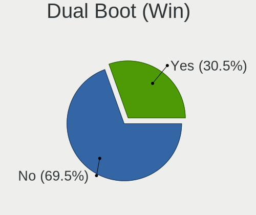
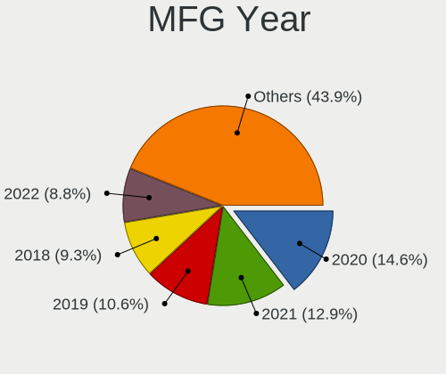
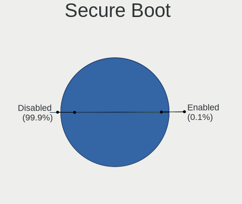
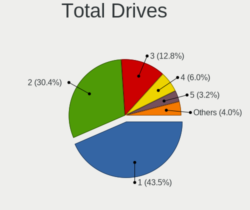
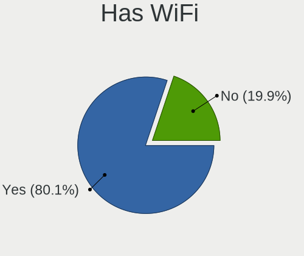
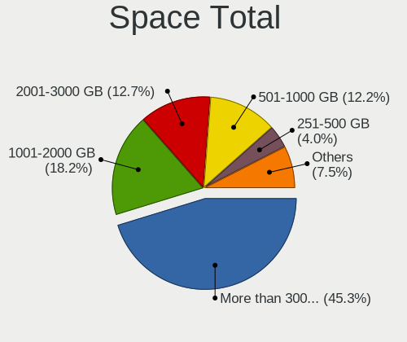
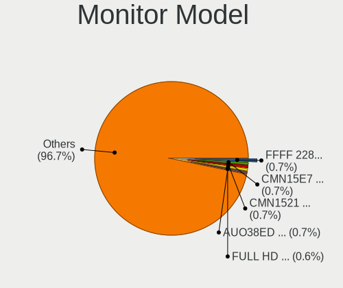
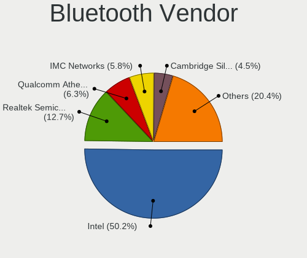

Garuda Linux - Tested Hardware & Statistics
-------------------------------------------

A project to collect tested hardware configurations for Garuda Linux.

Anyone can contribute to this report by the [hw-probe](https://github.com/linuxhw/hw-probe) tool:

    sudo -E hw-probe -all -upload

Please contribute! Especially if your hardware is rare.

This is a report for all computer types. See also reports for [desktops](/Dist/Garuda_Linux/Desktop/README.md) and [notebooks](/Dist/Garuda_Linux/Notebook/README.md).

Contents
--------

* [ Test Cases ](#test-cases)

* [ System ](#system)
  - [ OS                       ](#os)
  - [ OS Family                ](#os-family)
  - [ Kernel                   ](#kernel)
  - [ Kernel Family            ](#kernel-family)
  - [ Kernel Major Ver.        ](#kernel-major-ver)
  - [ Arch                     ](#arch)
  - [ DE                       ](#de)
  - [ Display Server           ](#display-server)
  - [ Display Manager          ](#display-manager)
  - [ OS Lang                  ](#os-lang)
  - [ Boot Mode                ](#boot-mode)
  - [ Filesystem               ](#filesystem)
  - [ Part. scheme             ](#part-scheme)
  - [ Dual Boot with Linux/BSD ](#dual-boot-with-linuxbsd)
  - [ Dual Boot (Win)          ](#dual-boot-win)

* [ Board ](#board)
  - [ Vendor                   ](#vendor)
  - [ Model                    ](#model)
  - [ Model Family             ](#model-family)
  - [ MFG Year                 ](#mfg-year)
  - [ Form Factor              ](#form-factor)
  - [ Secure Boot              ](#secure-boot)
  - [ Coreboot                 ](#coreboot)
  - [ RAM Size                 ](#ram-size)
  - [ RAM Used                 ](#ram-used)
  - [ Total Drives             ](#total-drives)
  - [ Has CD-ROM               ](#has-cd-rom)
  - [ Has Ethernet             ](#has-ethernet)
  - [ Has WiFi                 ](#has-wifi)
  - [ Has Bluetooth            ](#has-bluetooth)

* [ Location ](#location)
  - [ Country                  ](#country)
  - [ City                     ](#city)

* [ Drives ](#drives)
  - [ Drive Vendor             ](#drive-vendor)
  - [ Drive Model              ](#drive-model)
  - [ HDD Vendor               ](#hdd-vendor)
  - [ SSD Vendor               ](#ssd-vendor)
  - [ Drive Kind               ](#drive-kind)
  - [ Drive Connector          ](#drive-connector)
  - [ Drive Size               ](#drive-size)
  - [ Space Total              ](#space-total)
  - [ Space Used               ](#space-used)
  - [ Malfunc. Drives          ](#malfunc-drives)
  - [ Malfunc. Drive Vendor    ](#malfunc-drive-vendor)
  - [ Malfunc. HDD Vendor      ](#malfunc-hdd-vendor)
  - [ Malfunc. Drive Kind      ](#malfunc-drive-kind)
  - [ Failed Drives            ](#failed-drives)
  - [ Failed Drive Vendor      ](#failed-drive-vendor)
  - [ Drive Status             ](#drive-status)

* [ Storage controller ](#storage-controller)
  - [ Storage Vendor           ](#storage-vendor)
  - [ Storage Model            ](#storage-model)
  - [ Storage Kind             ](#storage-kind)

* [ Processor ](#processor)
  - [ CPU Vendor               ](#cpu-vendor)
  - [ CPU Model                ](#cpu-model)
  - [ CPU Model Family         ](#cpu-model-family)
  - [ CPU Cores                ](#cpu-cores)
  - [ CPU Sockets              ](#cpu-sockets)
  - [ CPU Threads              ](#cpu-threads)
  - [ CPU Op-Modes             ](#cpu-op-modes)
  - [ CPU Microcode            ](#cpu-microcode)
  - [ CPU Microarch            ](#cpu-microarch)

* [ Graphics ](#graphics)
  - [ GPU Vendor               ](#gpu-vendor)
  - [ GPU Model                ](#gpu-model)
  - [ GPU Combo                ](#gpu-combo)
  - [ GPU Driver               ](#gpu-driver)
  - [ GPU Memory               ](#gpu-memory)

* [ Monitor ](#monitor)
  - [ Monitor Vendor           ](#monitor-vendor)
  - [ Monitor Model            ](#monitor-model)
  - [ Monitor Resolution       ](#monitor-resolution)
  - [ Monitor Diagonal         ](#monitor-diagonal)
  - [ Monitor Width            ](#monitor-width)
  - [ Aspect Ratio             ](#aspect-ratio)
  - [ Monitor Area             ](#monitor-area)
  - [ Pixel Density            ](#pixel-density)
  - [ Multiple Monitors        ](#multiple-monitors)

* [ Network ](#network)
  - [ Net Controller Vendor    ](#net-controller-vendor)
  - [ Net Controller Model     ](#net-controller-model)
  - [ Wireless Vendor          ](#wireless-vendor)
  - [ Wireless Model           ](#wireless-model)
  - [ Ethernet Vendor          ](#ethernet-vendor)
  - [ Ethernet Model           ](#ethernet-model)
  - [ Net Controller Kind      ](#net-controller-kind)
  - [ Used Controller          ](#used-controller)
  - [ NICs                     ](#nics)
  - [ IPv6                     ](#ipv6)

* [ Bluetooth ](#bluetooth)
  - [ Bluetooth Vendor         ](#bluetooth-vendor)
  - [ Bluetooth Model          ](#bluetooth-model)

* [ Sound ](#sound)
  - [ Sound Vendor             ](#sound-vendor)
  - [ Sound Model              ](#sound-model)

* [ Memory ](#memory)
  - [ Memory Vendor            ](#memory-vendor)
  - [ Memory Model             ](#memory-model)
  - [ Memory Kind              ](#memory-kind)
  - [ Memory Form Factor       ](#memory-form-factor)
  - [ Memory Size              ](#memory-size)
  - [ Memory Speed             ](#memory-speed)

* [ Printers & scanners ](#printers--scanners)
  - [ Printer Vendor           ](#printer-vendor)
  - [ Printer Model            ](#printer-model)
  - [ Scanner Vendor           ](#scanner-vendor)
  - [ Scanner Model            ](#scanner-model)

* [ Camera ](#camera)
  - [ Camera Vendor            ](#camera-vendor)
  - [ Camera Model             ](#camera-model)

* [ Security ](#security)
  - [ Fingerprint Vendor       ](#fingerprint-vendor)
  - [ Fingerprint Model        ](#fingerprint-model)
  - [ Chipcard Vendor          ](#chipcard-vendor)
  - [ Chipcard Model           ](#chipcard-model)

* [ Unsupported ](#unsupported)
  - [ Unsupported Devices      ](#unsupported-devices)
  - [ Unsupported Device Types ](#unsupported-device-types)

Test Cases
----------

Total: 438

| Vendor        | Model                       | Form-Factor | Probe                                                      | Date         |
|---------------|-----------------------------|-------------|------------------------------------------------------------|--------------|
| Gigabyte      | B550 AORUS ELITE V2         | Desktop     | [541e327f0f](https://linux-hardware.org/?probe=541e327f0f) | Oct 01, 2022 |
| HP            | Notebook                    | Notebook    | [6b7215bcba](https://linux-hardware.org/?probe=6b7215bcba) | Sep 29, 2022 |
| ASUSTek       | VivoBook_ASUSLaptop X512... | Notebook    | [89c48e7d5a](https://linux-hardware.org/?probe=89c48e7d5a) | Sep 27, 2022 |
| ASUSTek       | VivoBook_ASUSLaptop X512... | Notebook    | [b39aefdcda](https://linux-hardware.org/?probe=b39aefdcda) | Sep 27, 2022 |
| Fujitsu       | FMVA1200G                   | Notebook    | [e91d3af852](https://linux-hardware.org/?probe=e91d3af852) | Sep 27, 2022 |
| Acer          | Aspire V5-552P              | Notebook    | [46395f51b5](https://linux-hardware.org/?probe=46395f51b5) | Sep 27, 2022 |
| Razer         | Blade 14 - RZ09-0370        | Notebook    | [a5e00e04bd](https://linux-hardware.org/?probe=a5e00e04bd) | Sep 25, 2022 |
| HP            | Notebook                    | Notebook    | [f4e47792c1](https://linux-hardware.org/?probe=f4e47792c1) | Sep 24, 2022 |
| Dell          | Precision 7510              | Notebook    | [5f94678049](https://linux-hardware.org/?probe=5f94678049) | Sep 23, 2022 |
| Lenovo        | G505s 20255                 | Notebook    | [671c1cb6c4](https://linux-hardware.org/?probe=671c1cb6c4) | Sep 21, 2022 |
| ASUSTek       | PRIME X570-P                | Desktop     | [6647dc20ac](https://linux-hardware.org/?probe=6647dc20ac) | Sep 21, 2022 |
| ASUSTek       | TUF Gaming X570-PLUS        | Desktop     | [9d0697ec96](https://linux-hardware.org/?probe=9d0697ec96) | Sep 20, 2022 |
| ASUSTek       | ROG Zephyrus G15 GA503QR... | Notebook    | [44a3455d48](https://linux-hardware.org/?probe=44a3455d48) | Sep 17, 2022 |
| HP            | ProBook 470 G5              | Notebook    | [b15d9e1fe4](https://linux-hardware.org/?probe=b15d9e1fe4) | Sep 16, 2022 |
| Acer          | Swift SF314-54              | Notebook    | [c3b076c416](https://linux-hardware.org/?probe=c3b076c416) | Sep 15, 2022 |
| Lenovo        | ThinkPad X1 Carbon 2nd 2... | Notebook    | [1cf1136fb8](https://linux-hardware.org/?probe=1cf1136fb8) | Sep 13, 2022 |
| Dell          | Inspiron 5548               | Notebook    | [341b48f953](https://linux-hardware.org/?probe=341b48f953) | Sep 12, 2022 |
| Lenovo        | ThinkPad L15 Gen 2 20X30... | Notebook    | [c1c2e05a86](https://linux-hardware.org/?probe=c1c2e05a86) | Sep 11, 2022 |
| ASRock        | A320M-HDV R4.0              | Desktop     | [afbb849b02](https://linux-hardware.org/?probe=afbb849b02) | Sep 11, 2022 |
| ASRock        | A320M-HDV R4.0              | Desktop     | [5e98f641f1](https://linux-hardware.org/?probe=5e98f641f1) | Sep 11, 2022 |
| ASUSTek       | ROG Strix G533QS_G533QS     | Notebook    | [c2f25bcea8](https://linux-hardware.org/?probe=c2f25bcea8) | Sep 08, 2022 |
| HP            | Victus by Gaming Laptop ... | Notebook    | [1a8681a1f5](https://linux-hardware.org/?probe=1a8681a1f5) | Sep 07, 2022 |
| ASUSTek       | ROG Strix G533QS_G533QS     | Notebook    | [4adadf9e6a](https://linux-hardware.org/?probe=4adadf9e6a) | Sep 06, 2022 |
| Acer          | Aspire E5-573G              | Notebook    | [cfb1abc54b](https://linux-hardware.org/?probe=cfb1abc54b) | Sep 03, 2022 |
| ASUSTek       | VivoBook_ASUSLaptop X515... | Notebook    | [87fac1a064](https://linux-hardware.org/?probe=87fac1a064) | Sep 02, 2022 |
| ASUSTek       | ROG CROSSHAIR VIII HERO     | Desktop     | [ac65980e25](https://linux-hardware.org/?probe=ac65980e25) | Sep 02, 2022 |
| HP            | Laptop 15-da0xxx            | Notebook    | [2c79168e77](https://linux-hardware.org/?probe=2c79168e77) | Sep 01, 2022 |
| HP            | Laptop 15-da0xxx            | Notebook    | [40482ce9a3](https://linux-hardware.org/?probe=40482ce9a3) | Sep 01, 2022 |
| Gigabyte      | F2A88XM-HD3                 | Desktop     | [44e355eb93](https://linux-hardware.org/?probe=44e355eb93) | Aug 30, 2022 |
| ASUSTek       | VivoBook_ASUSLaptop X513... | Notebook    | [c63d9bede8](https://linux-hardware.org/?probe=c63d9bede8) | Aug 27, 2022 |
| ASUSTek       | VivoBook_ASUSLaptop X513... | Notebook    | [a4a7c87b06](https://linux-hardware.org/?probe=a4a7c87b06) | Aug 27, 2022 |
| ASRock        | X470 Taichi                 | Desktop     | [7bc56eb3d4](https://linux-hardware.org/?probe=7bc56eb3d4) | Aug 25, 2022 |
| ASUSTek       | ROG Flow Z13 GZ301ZE_GZ3... | Tablet      | [f9fbb00a0b](https://linux-hardware.org/?probe=f9fbb00a0b) | Aug 23, 2022 |
| HP            | Notebook                    | Notebook    | [bd5bad0b49](https://linux-hardware.org/?probe=bd5bad0b49) | Aug 21, 2022 |
| MSI           | B450 TOMAHAWK MAX II        | Desktop     | [57f1970999](https://linux-hardware.org/?probe=57f1970999) | Aug 20, 2022 |
| MSI           | Sword 15 A11UD              | Notebook    | [ca0fbaa451](https://linux-hardware.org/?probe=ca0fbaa451) | Aug 19, 2022 |
| MSI           | Sword 15 A11UD              | Notebook    | [565a6f9022](https://linux-hardware.org/?probe=565a6f9022) | Aug 19, 2022 |
| ASUSTek       | VivoBook_ASUSLaptop X340... | Notebook    | [f095219c78](https://linux-hardware.org/?probe=f095219c78) | Aug 19, 2022 |
| ASUSTek       | PRIME X570-P                | Desktop     | [fc5923b017](https://linux-hardware.org/?probe=fc5923b017) | Aug 15, 2022 |
| ASUSTek       | PRIME X570-P                | Desktop     | [e53bbe7c1b](https://linux-hardware.org/?probe=e53bbe7c1b) | Aug 14, 2022 |
| Acer          | Aspire A515-51G             | Notebook    | [9d271daa54](https://linux-hardware.org/?probe=9d271daa54) | Aug 13, 2022 |
| Acer          | Aspire A515-51G             | Notebook    | [f0e405bc07](https://linux-hardware.org/?probe=f0e405bc07) | Aug 13, 2022 |
| Samsung       | 340XAA/350XAA/550XAA        | Notebook    | [3ad1413aaa](https://linux-hardware.org/?probe=3ad1413aaa) | Aug 13, 2022 |
| MSI           | A68HM-E33 V2                | Desktop     | [762f08a697](https://linux-hardware.org/?probe=762f08a697) | Aug 13, 2022 |
| ASRock        | A520M-HDV                   | Desktop     | [f23bdacb56](https://linux-hardware.org/?probe=f23bdacb56) | Aug 11, 2022 |
| ASUSTek       | ROG Strix G533QS_G533QS     | Notebook    | [27eb779b2a](https://linux-hardware.org/?probe=27eb779b2a) | Aug 11, 2022 |
| Samsung       | 340XAA/350XAA/550XAA        | Notebook    | [abb938b917](https://linux-hardware.org/?probe=abb938b917) | Aug 10, 2022 |
| Acer          | Aspire 5740                 | Notebook    | [8090e74c22](https://linux-hardware.org/?probe=8090e74c22) | Aug 10, 2022 |
| Dell          | XPS 13 9370                 | Notebook    | [53efca63c3](https://linux-hardware.org/?probe=53efca63c3) | Aug 10, 2022 |
| Acer          | Aspire 5740                 | Notebook    | [1934c32bc7](https://linux-hardware.org/?probe=1934c32bc7) | Aug 09, 2022 |
| ASUSTek       | GL752VW                     | Notebook    | [9ff6515c13](https://linux-hardware.org/?probe=9ff6515c13) | Aug 07, 2022 |
| Dell          | Latitude E6420              | Notebook    | [c13142690c](https://linux-hardware.org/?probe=c13142690c) | Aug 04, 2022 |
| Microsoft     | Surface with Windows 8 P... | Tablet      | [822e93c1db](https://linux-hardware.org/?probe=822e93c1db) | Aug 02, 2022 |
| ASUSTek       | Maximus IX FORMULA          | Desktop     | [2212732244](https://linux-hardware.org/?probe=2212732244) | Aug 01, 2022 |
| Dell          | Latitude E5450              | Notebook    | [b7618f5c14](https://linux-hardware.org/?probe=b7618f5c14) | Jul 31, 2022 |
| Dell          | Latitude E5450              | Notebook    | [2c6979fb39](https://linux-hardware.org/?probe=2c6979fb39) | Jul 31, 2022 |
| HP            | OMEN by Laptop 15-dh1xxx    | Notebook    | [b44feede78](https://linux-hardware.org/?probe=b44feede78) | Jul 30, 2022 |
| MSI           | B450M PRO-VDH MAX           | Desktop     | [941092ee95](https://linux-hardware.org/?probe=941092ee95) | Jul 26, 2022 |
| MSI           | B450 TOMAHAWK MAX II        | Desktop     | [dfe6047aa7](https://linux-hardware.org/?probe=dfe6047aa7) | Jul 21, 2022 |
| Gigabyte      | X570 AORUS PRO WIFI         | Desktop     | [f9996d6494](https://linux-hardware.org/?probe=f9996d6494) | Jul 21, 2022 |
| Razer         | Blade 17 (Mid 2021) - RZ... | Notebook    | [0b73c72c74](https://linux-hardware.org/?probe=0b73c72c74) | Jul 19, 2022 |
| HP            | ENVY x360 Convertible 13... | Convertible | [0687ecd744](https://linux-hardware.org/?probe=0687ecd744) | Jul 14, 2022 |
| ASUSTek       | ZenBook UX564EH_Q528EH      | Convertible | [e8770aea50](https://linux-hardware.org/?probe=e8770aea50) | Jul 14, 2022 |
| Lenovo        | Yoga 6 13ALC6 82ND          | Convertible | [f44445fbe2](https://linux-hardware.org/?probe=f44445fbe2) | Jul 13, 2022 |
| HP            | Elite x2 1012 G2            | Tablet      | [9ade46617e](https://linux-hardware.org/?probe=9ade46617e) | Jul 06, 2022 |
| HP            | Pavilion dv6                | Notebook    | [fcb28ad60c](https://linux-hardware.org/?probe=fcb28ad60c) | Jul 05, 2022 |
| HP            | Pavilion dv6                | Notebook    | [31941e5972](https://linux-hardware.org/?probe=31941e5972) | Jul 05, 2022 |
| ASUSTek       | ROG Strix G533QS_G533QS     | Notebook    | [7d6a8718a8](https://linux-hardware.org/?probe=7d6a8718a8) | Jul 05, 2022 |
| Lenovo        | IdeaPad S340-14API 81NB     | Notebook    | [dc6e8358f8](https://linux-hardware.org/?probe=dc6e8358f8) | Jul 04, 2022 |
| Lenovo        | IdeaPad S340-14API 81NB     | Notebook    | [7d5ee550de](https://linux-hardware.org/?probe=7d5ee550de) | Jul 04, 2022 |
| ASUSTek       | ROG STRIX X570-E GAMING     | Desktop     | [92fe4c2ff3](https://linux-hardware.org/?probe=92fe4c2ff3) | Jul 03, 2022 |
| ASUSTek       | PRIME B550-PLUS AC-HES      | Desktop     | [dde2246ae8](https://linux-hardware.org/?probe=dde2246ae8) | Jul 01, 2022 |
| ASUSTek       | ROG Strix G513IC_G513IC     | Notebook    | [77f0b32727](https://linux-hardware.org/?probe=77f0b32727) | Jun 30, 2022 |
| HP            | 15 Notebook PC              | Notebook    | [5bf5fec549](https://linux-hardware.org/?probe=5bf5fec549) | Jun 27, 2022 |
| HP            | 15 Notebook PC              | Notebook    | [b88589b731](https://linux-hardware.org/?probe=b88589b731) | Jun 27, 2022 |
| Unknown       | Unknown                     | Notebook    | [7c08b4e995](https://linux-hardware.org/?probe=7c08b4e995) | Jun 26, 2022 |
| ASRock        | Z87M Extreme4               | Desktop     | [06504aecc5](https://linux-hardware.org/?probe=06504aecc5) | Jun 24, 2022 |
| Gigabyte      | Z77X-UD3H                   | Desktop     | [7d7828a253](https://linux-hardware.org/?probe=7d7828a253) | Jun 23, 2022 |
| MSI           | B550-A PRO                  | Desktop     | [a7a76f04f9](https://linux-hardware.org/?probe=a7a76f04f9) | Jun 19, 2022 |
| HP            | Laptop 15-ef0xxx            | Notebook    | [f0cf5e0f30](https://linux-hardware.org/?probe=f0cf5e0f30) | Jun 18, 2022 |
| ASUSTek       | VivoBook_ASUSLaptop X340... | Notebook    | [5fb74a78d8](https://linux-hardware.org/?probe=5fb74a78d8) | Jun 17, 2022 |
| Lenovo        | IdeaPad Z480                | Notebook    | [1e34fa546d](https://linux-hardware.org/?probe=1e34fa546d) | Jun 15, 2022 |
| MSI           | B450M MORTAR MAX            | Desktop     | [e1f785770e](https://linux-hardware.org/?probe=e1f785770e) | Jun 11, 2022 |
| ASUSTek       | ROG Strix G533QS_G533QS     | Notebook    | [0c1e336ddc](https://linux-hardware.org/?probe=0c1e336ddc) | Jun 11, 2022 |
| Lenovo        | IdeaPad C340-15IML 81TL     | Convertible | [042c11425c](https://linux-hardware.org/?probe=042c11425c) | Jun 10, 2022 |
| T-bao         | MINI PC V1.0                | Desktop     | [8108463ab7](https://linux-hardware.org/?probe=8108463ab7) | Jun 09, 2022 |
| ASRock        | Z87M Extreme4               | Desktop     | [5ca7bb09b0](https://linux-hardware.org/?probe=5ca7bb09b0) | Jun 05, 2022 |
| Acer          | Swift SF315-41              | Notebook    | [389e13e580](https://linux-hardware.org/?probe=389e13e580) | Jun 03, 2022 |
| Lenovo        | IdeaPad 320-14ISK 80XG      | Notebook    | [83cb6d1fe4](https://linux-hardware.org/?probe=83cb6d1fe4) | Jun 01, 2022 |
| Lenovo        | IdeaPad Gaming 3 15ARH05... | Notebook    | [959728c7eb](https://linux-hardware.org/?probe=959728c7eb) | May 29, 2022 |
| Lenovo        | Z50-70 20354                | Notebook    | [cd40cf2e16](https://linux-hardware.org/?probe=cd40cf2e16) | May 28, 2022 |
| Dell          | Latitude E6420              | Notebook    | [425a9e4f0d](https://linux-hardware.org/?probe=425a9e4f0d) | May 26, 2022 |
| HP            | Laptop 15-ef0xxx            | Notebook    | [a214740f99](https://linux-hardware.org/?probe=a214740f99) | May 25, 2022 |
| Dell          | Latitude E5450              | Notebook    | [7d23576abb](https://linux-hardware.org/?probe=7d23576abb) | May 23, 2022 |
| Dell          | Latitude E5450              | Notebook    | [f0c746ba9e](https://linux-hardware.org/?probe=f0c746ba9e) | May 23, 2022 |
| Lenovo        | ThinkBook 14-IIL 20SL       | Notebook    | [36a8a2a0ee](https://linux-hardware.org/?probe=36a8a2a0ee) | May 23, 2022 |
| HP            | ENVY x360 Convertible 13... | Convertible | [914eca828e](https://linux-hardware.org/?probe=914eca828e) | May 22, 2022 |
| HUAWEI        | BOHB-WAX9                   | Notebook    | [c0c592bdd7](https://linux-hardware.org/?probe=c0c592bdd7) | May 22, 2022 |
| ASRock        | X470 Taichi                 | Desktop     | [114aa0b977](https://linux-hardware.org/?probe=114aa0b977) | May 22, 2022 |
| Dell          | XPS 13 9370                 | Notebook    | [c7f7168362](https://linux-hardware.org/?probe=c7f7168362) | May 18, 2022 |
| Samsung       | 730QDA                      | Convertible | [c46de205cd](https://linux-hardware.org/?probe=c46de205cd) | May 17, 2022 |
| Lenovo        | 3716 SDK0T76463 WIN 3422... | Desktop     | [cd15058963](https://linux-hardware.org/?probe=cd15058963) | May 16, 2022 |
| Lenovo        | 3716 SDK0T76463 WIN 3422... | Desktop     | [4043d7e26a](https://linux-hardware.org/?probe=4043d7e26a) | May 11, 2022 |
| Razer         | Blade                       | Notebook    | [0e1cc80117](https://linux-hardware.org/?probe=0e1cc80117) | May 07, 2022 |
| Gigabyte      | B450 I AORUS PRO WIFI-CF    | Desktop     | [8c34e423f4](https://linux-hardware.org/?probe=8c34e423f4) | May 04, 2022 |
| ASRock        | X470 Taichi                 | Desktop     | [bd151331c1](https://linux-hardware.org/?probe=bd151331c1) | May 04, 2022 |
| ASUSTek       | VivoBook_ASUSLaptop X421... | Notebook    | [c8d977cf63](https://linux-hardware.org/?probe=c8d977cf63) | May 02, 2022 |
| Lenovo        | ThinkPad S3 Yoga 14 20DM... | Notebook    | [5d0f1a15e1](https://linux-hardware.org/?probe=5d0f1a15e1) | Apr 30, 2022 |
| Dell          | 0WR7PY A01                  | Desktop     | [66c6e57421](https://linux-hardware.org/?probe=66c6e57421) | Apr 23, 2022 |
| HP            | Laptop 15-bs0xx             | Notebook    | [3ce5eb80eb](https://linux-hardware.org/?probe=3ce5eb80eb) | Apr 22, 2022 |
| ASRock        | B550M Pro4                  | Desktop     | [b82721163b](https://linux-hardware.org/?probe=b82721163b) | Apr 22, 2022 |
| Razer         | Blade 14 - RZ09-0370        | Notebook    | [51eac6f63f](https://linux-hardware.org/?probe=51eac6f63f) | Apr 21, 2022 |
| Dell          | Latitude E7250              | Notebook    | [fa677cf244](https://linux-hardware.org/?probe=fa677cf244) | Apr 21, 2022 |
| ASRock        | X99X Killer                 | Desktop     | [c6d6bddd17](https://linux-hardware.org/?probe=c6d6bddd17) | Apr 18, 2022 |
| ASUSTek       | ROG Flow X13 GV301QH_GV3... | Notebook    | [6db9a3dea0](https://linux-hardware.org/?probe=6db9a3dea0) | Apr 18, 2022 |
| ASUSTek       | Z97-P                       | Desktop     | [bf54ec19d0](https://linux-hardware.org/?probe=bf54ec19d0) | Apr 16, 2022 |
| MSI           | GF63 Thin 10SC              | Notebook    | [e5e0f208d9](https://linux-hardware.org/?probe=e5e0f208d9) | Apr 14, 2022 |
| MSI           | GF63 Thin 10SC              | Notebook    | [b5beb1add9](https://linux-hardware.org/?probe=b5beb1add9) | Apr 14, 2022 |
| Lenovo        | ThinkPad X1 Carbon 4th 2... | Notebook    | [7204116754](https://linux-hardware.org/?probe=7204116754) | Apr 14, 2022 |
| ASRock        | X99X Killer                 | Desktop     | [3be92995ff](https://linux-hardware.org/?probe=3be92995ff) | Apr 11, 2022 |
| ASUSTek       | ROG Flow X13 GV301QH_GV3... | Notebook    | [fcfc2b41a7](https://linux-hardware.org/?probe=fcfc2b41a7) | Apr 10, 2022 |
| ASRock        | X470 Taichi                 | Desktop     | [ba87ebf29f](https://linux-hardware.org/?probe=ba87ebf29f) | Apr 08, 2022 |
| ASUSTek       | P8B75-M                     | Desktop     | [808661699f](https://linux-hardware.org/?probe=808661699f) | Apr 07, 2022 |
| HUAWEI        | CREM-WXX9                   | Notebook    | [2803fbf2ab](https://linux-hardware.org/?probe=2803fbf2ab) | Apr 06, 2022 |
| MSI           | GE75 Raider 9SE             | Notebook    | [658e58fcab](https://linux-hardware.org/?probe=658e58fcab) | Apr 06, 2022 |
| MSI           | GE75 Raider 9SE             | Notebook    | [67966ea318](https://linux-hardware.org/?probe=67966ea318) | Apr 04, 2022 |
| HP            | 8433 11                     | Desktop     | [30c5d1d62f](https://linux-hardware.org/?probe=30c5d1d62f) | Apr 03, 2022 |
| ASUSTek       | ZenBook UX363EA_UX371EA     | Convertible | [c092681184](https://linux-hardware.org/?probe=c092681184) | Apr 03, 2022 |
| MSI           | B450-A PRO MAX              | Desktop     | [a47ab656ab](https://linux-hardware.org/?probe=a47ab656ab) | Apr 01, 2022 |
| Gigabyte      | B550 GAMING X V2            | Desktop     | [3d37374fae](https://linux-hardware.org/?probe=3d37374fae) | Apr 01, 2022 |
| Casper        | EXCALIBUR G770              | Notebook    | [dc11ff8996](https://linux-hardware.org/?probe=dc11ff8996) | Apr 01, 2022 |
| Casper        | EXCALIBUR G770              | Notebook    | [4a0436ece5](https://linux-hardware.org/?probe=4a0436ece5) | Apr 01, 2022 |
| ASUSTek       | A68HM-PLUS                  | Desktop     | [cd6ebcba97](https://linux-hardware.org/?probe=cd6ebcba97) | Mar 31, 2022 |
| Dell          | Latitude E7250              | Notebook    | [a33f627737](https://linux-hardware.org/?probe=a33f627737) | Mar 30, 2022 |
| ASRock        | X470 Taichi                 | Desktop     | [f339c6f710](https://linux-hardware.org/?probe=f339c6f710) | Mar 29, 2022 |
| ASUSTek       | VivoBook_ASUSLaptop X515... | Notebook    | [58c7c253ca](https://linux-hardware.org/?probe=58c7c253ca) | Mar 28, 2022 |
| MSI           | GS76 Stealth 11UG           | Notebook    | [d05ccc7f12](https://linux-hardware.org/?probe=d05ccc7f12) | Mar 28, 2022 |
| Apple         | MacBookPro12,1              | Notebook    | [066b026c69](https://linux-hardware.org/?probe=066b026c69) | Mar 28, 2022 |
| MSI           | GE63 Raider RGB 8RE         | Notebook    | [df2ffaa70a](https://linux-hardware.org/?probe=df2ffaa70a) | Mar 25, 2022 |
| ASUSTek       | ROG CROSSHAIR VIII HERO     | Desktop     | [fc5cdc4595](https://linux-hardware.org/?probe=fc5cdc4595) | Mar 23, 2022 |
| HUAWEI        | HVY-WXX9                    | Notebook    | [ddcbb702c6](https://linux-hardware.org/?probe=ddcbb702c6) | Mar 17, 2022 |
| HUAWEI        | HVY-WXX9                    | Notebook    | [d54d90820a](https://linux-hardware.org/?probe=d54d90820a) | Mar 17, 2022 |
| MSI           | MPG B550 GAMING CARBON W... | Desktop     | [c1a26607fd](https://linux-hardware.org/?probe=c1a26607fd) | Mar 13, 2022 |
| Toshiba       | Satellite E45DW-C           | Notebook    | [2b815d9219](https://linux-hardware.org/?probe=2b815d9219) | Mar 12, 2022 |
| MSI           | MAG B550 TOMAHAWK           | Desktop     | [95b7c99a5a](https://linux-hardware.org/?probe=95b7c99a5a) | Mar 08, 2022 |
| ASRock        | B450 Gaming K4              | Desktop     | [504b20acce](https://linux-hardware.org/?probe=504b20acce) | Mar 04, 2022 |
| Lenovo        | Legion 7 15IMH05 81YT       | Notebook    | [94786f0b30](https://linux-hardware.org/?probe=94786f0b30) | Mar 02, 2022 |
| ASUSTek       | TUF Gaming X570-PLUS        | Desktop     | [336ddc137d](https://linux-hardware.org/?probe=336ddc137d) | Mar 01, 2022 |
| ASUSTek       | A68HM-PLUS                  | Desktop     | [edfa6eb6e3](https://linux-hardware.org/?probe=edfa6eb6e3) | Feb 28, 2022 |
| ASUSTek       | ProArt X570-CREATOR WIFI    | Desktop     | [abc925b917](https://linux-hardware.org/?probe=abc925b917) | Feb 26, 2022 |
| ASUSTek       | M4A89TD PRO USB3            | Desktop     | [66c0fc8423](https://linux-hardware.org/?probe=66c0fc8423) | Feb 26, 2022 |
| HP            | Spectre x360 Convertible... | Convertible | [b4c8253286](https://linux-hardware.org/?probe=b4c8253286) | Feb 23, 2022 |
| Apple         | Mac-031AEE4D24BFF0B1 Mac... | Mini pc     | [a88902a823](https://linux-hardware.org/?probe=a88902a823) | Feb 18, 2022 |
| HP            | Pavilion Gaming Laptop 1... | Notebook    | [499191c566](https://linux-hardware.org/?probe=499191c566) | Feb 18, 2022 |
| Lenovo        | IdeaPad S340-14API 81NB     | Notebook    | [25da470504](https://linux-hardware.org/?probe=25da470504) | Feb 14, 2022 |
| ASRock        | X470 Taichi                 | Desktop     | [df78a2fff6](https://linux-hardware.org/?probe=df78a2fff6) | Feb 14, 2022 |
| Lenovo        | ThinkPad T530 24296KG       | Notebook    | [9940aacd34](https://linux-hardware.org/?probe=9940aacd34) | Feb 13, 2022 |
| Razer         | Blade 14 - RZ09-0370        | Notebook    | [e3fd65aa29](https://linux-hardware.org/?probe=e3fd65aa29) | Feb 13, 2022 |
| HP            | 8767 A                      | Desktop     | [e048574911](https://linux-hardware.org/?probe=e048574911) | Feb 12, 2022 |
| ASUSTek       | ROG Maximus XII FORMULA     | Desktop     | [a63d909e46](https://linux-hardware.org/?probe=a63d909e46) | Feb 12, 2022 |
| HP            | 8767 A                      | Desktop     | [6cb1e6b72f](https://linux-hardware.org/?probe=6cb1e6b72f) | Feb 12, 2022 |
| ASUSTek       | ROG Maximus XII FORMULA     | Desktop     | [885617bdda](https://linux-hardware.org/?probe=885617bdda) | Feb 12, 2022 |
| Lenovo        | ThinkBook 14-IIL 20SL       | Notebook    | [52eb1d5693](https://linux-hardware.org/?probe=52eb1d5693) | Feb 11, 2022 |
| ASRock        | B450M Pro4                  | Desktop     | [0d80dc8143](https://linux-hardware.org/?probe=0d80dc8143) | Feb 11, 2022 |
| HP            | 86F3 00100                  | All in one  | [6dc9aa1e88](https://linux-hardware.org/?probe=6dc9aa1e88) | Feb 10, 2022 |
| HP            | ENVY x360 Convertible 13... | Convertible | [3c46e807da](https://linux-hardware.org/?probe=3c46e807da) | Feb 09, 2022 |
| Lenovo        | 31900058 STD                | Desktop     | [03540e9cb2](https://linux-hardware.org/?probe=03540e9cb2) | Feb 07, 2022 |
| HONOR         | HLYL-WXX9                   | Notebook    | [9cb5307823](https://linux-hardware.org/?probe=9cb5307823) | Feb 06, 2022 |
| ASRock        | X470 Taichi                 | Desktop     | [e4beeac4a1](https://linux-hardware.org/?probe=e4beeac4a1) | Feb 06, 2022 |
| Lenovo        | IdeaPad Gaming 3 15ARH05... | Notebook    | [7c19747b0a](https://linux-hardware.org/?probe=7c19747b0a) | Feb 05, 2022 |
| MSI           | GF63 Thin 9SC               | Notebook    | [2e3070dc30](https://linux-hardware.org/?probe=2e3070dc30) | Feb 04, 2022 |
| Dell          | Latitude 5480               | Notebook    | [c96d03d27f](https://linux-hardware.org/?probe=c96d03d27f) | Feb 03, 2022 |
| Lenovo        | ThinkPad P1 20MDS00P00      | Notebook    | [4ff53df600](https://linux-hardware.org/?probe=4ff53df600) | Feb 02, 2022 |
| ASUSTek       | VivoBook_ASUSLaptop X513... | Notebook    | [387da722fe](https://linux-hardware.org/?probe=387da722fe) | Feb 02, 2022 |
| HP            | Laptop 15s-gr0xxx           | Notebook    | [5943c38ac0](https://linux-hardware.org/?probe=5943c38ac0) | Feb 01, 2022 |
| Gigabyte      | MFLP3AP-00\2.x              | Desktop     | [b7441a0e94](https://linux-hardware.org/?probe=b7441a0e94) | Jan 31, 2022 |
| Lenovo        | ThinkPad T440p 20AWS58F0... | Notebook    | [0497eabcf7](https://linux-hardware.org/?probe=0497eabcf7) | Jan 28, 2022 |
| Lenovo        | ThinkPad T440p 20AWS58F0... | Notebook    | [e7efa96c01](https://linux-hardware.org/?probe=e7efa96c01) | Jan 28, 2022 |
| ASRock        | X470 Taichi                 | Desktop     | [aa0e21b159](https://linux-hardware.org/?probe=aa0e21b159) | Jan 27, 2022 |
| Gigabyte      | B85-HD3                     | Desktop     | [ad70601774](https://linux-hardware.org/?probe=ad70601774) | Jan 26, 2022 |
| Lenovo        | IdeaPad 5 Pro 16ACH6 82L... | Notebook    | [9091cc83ba](https://linux-hardware.org/?probe=9091cc83ba) | Jan 26, 2022 |
| Lenovo        | Unknown                     | Notebook    | [b78e96aff8](https://linux-hardware.org/?probe=b78e96aff8) | Jan 22, 2022 |
| Dell          | Inspiron 15-3567            | Notebook    | [af6171a374](https://linux-hardware.org/?probe=af6171a374) | Jan 22, 2022 |
| MSI           | GP75 Leopard 9SD            | Notebook    | [6935c7fc83](https://linux-hardware.org/?probe=6935c7fc83) | Jan 17, 2022 |
| ASRock        | 970M Pro3                   | Desktop     | [402a4f960e](https://linux-hardware.org/?probe=402a4f960e) | Jan 17, 2022 |
| ASUSTek       | ROG Maximus X CODE          | Desktop     | [8fac80f31d](https://linux-hardware.org/?probe=8fac80f31d) | Jan 16, 2022 |
| Gigabyte      | AB350-Gaming 3-CF           | Desktop     | [9fab263b02](https://linux-hardware.org/?probe=9fab263b02) | Jan 11, 2022 |
| MSI           | Z270 GAMING M5              | Desktop     | [02d70182fd](https://linux-hardware.org/?probe=02d70182fd) | Jan 10, 2022 |
| Lenovo        | Yoga Slim 7 14ARE05 82A2    | Notebook    | [10f53d4021](https://linux-hardware.org/?probe=10f53d4021) | Jan 09, 2022 |
| Lenovo        | IdeaPad 110-15ACL 80TJ      | Notebook    | [a338d9f2d1](https://linux-hardware.org/?probe=a338d9f2d1) | Jan 08, 2022 |
| Gigabyte      | AB350-Gaming 3-CF           | Desktop     | [8a1167daea](https://linux-hardware.org/?probe=8a1167daea) | Jan 08, 2022 |
| Unknown       | Unknown                     | Notebook    | [b75e231fb3](https://linux-hardware.org/?probe=b75e231fb3) | Jan 08, 2022 |
| ASUSTek       | TUF Gaming X570-PLUS        | Desktop     | [1a4570a458](https://linux-hardware.org/?probe=1a4570a458) | Jan 08, 2022 |
| Lenovo        | Legion 5 15IMH05H 81Y6      | Notebook    | [34d2cd6d9c](https://linux-hardware.org/?probe=34d2cd6d9c) | Jan 08, 2022 |
| Pegatron      | 2AD5                        | Desktop     | [91ee5ba1df](https://linux-hardware.org/?probe=91ee5ba1df) | Jan 08, 2022 |
| HP            | OMEN Laptop 15-en1xxx       | Notebook    | [9ad04f3022](https://linux-hardware.org/?probe=9ad04f3022) | Jan 07, 2022 |
| Gigabyte      | B460M DS3H                  | Desktop     | [40f4de9da7](https://linux-hardware.org/?probe=40f4de9da7) | Jan 07, 2022 |
| Lenovo        | Legion 5 15IMH05H 81Y6      | Notebook    | [c4db605668](https://linux-hardware.org/?probe=c4db605668) | Jan 06, 2022 |
| Dell          | Precision M4500             | Notebook    | [2504901038](https://linux-hardware.org/?probe=2504901038) | Jan 04, 2022 |
| HP            | Pavilion 14                 | Notebook    | [34167c8022](https://linux-hardware.org/?probe=34167c8022) | Jan 04, 2022 |
| HP            | Pavilion Laptop 15z-eh10... | Notebook    | [29b9cb755b](https://linux-hardware.org/?probe=29b9cb755b) | Dec 25, 2021 |
| Dell          | G15 5515                    | Notebook    | [7e8108b3c2](https://linux-hardware.org/?probe=7e8108b3c2) | Dec 24, 2021 |
| Gigabyte      | B550 AORUS PRO AC           | Desktop     | [1b62246b10](https://linux-hardware.org/?probe=1b62246b10) | Dec 21, 2021 |
| GPU Compan... | GWTN156-11                  | Notebook    | [3700827ecd](https://linux-hardware.org/?probe=3700827ecd) | Dec 19, 2021 |
| ASUSTek       | X550CC                      | Notebook    | [c7147f0bf8](https://linux-hardware.org/?probe=c7147f0bf8) | Dec 16, 2021 |
| ASUSTek       | X550CC                      | Notebook    | [f8a99e7645](https://linux-hardware.org/?probe=f8a99e7645) | Dec 16, 2021 |
| ASUSTek       | TUF Gaming X570-PLUS        | Desktop     | [9e73346fb8](https://linux-hardware.org/?probe=9e73346fb8) | Dec 15, 2021 |
| Razer         | Blade 14 - RZ09-0370        | Notebook    | [c3144c3e22](https://linux-hardware.org/?probe=c3144c3e22) | Dec 13, 2021 |
| Gigabyte      | X570 AORUS ELITE WIFI       | Desktop     | [196b460373](https://linux-hardware.org/?probe=196b460373) | Dec 13, 2021 |
| HP            | Pavilion Laptop 15-eh0xx... | Notebook    | [df628cbd13](https://linux-hardware.org/?probe=df628cbd13) | Dec 12, 2021 |
| ASRock        | H77M-ITX                    | Desktop     | [5e98a2fce2](https://linux-hardware.org/?probe=5e98a2fce2) | Dec 11, 2021 |
| ASRock        | B450M Pro4                  | Desktop     | [e4fb1e4fe4](https://linux-hardware.org/?probe=e4fb1e4fe4) | Dec 09, 2021 |
| Lenovo        | ThinkStation S20 4105O1U    | Desktop     | [731c890641](https://linux-hardware.org/?probe=731c890641) | Dec 08, 2021 |
| Acer          | Aspire F5-573G              | Notebook    | [a49a5a129c](https://linux-hardware.org/?probe=a49a5a129c) | Dec 07, 2021 |
| HP            | Laptop 15-dy2xxx            | Notebook    | [f499f9a375](https://linux-hardware.org/?probe=f499f9a375) | Dec 06, 2021 |
| ASUSTek       | TUF Gaming X570-PLUS        | Desktop     | [f0df07c0e4](https://linux-hardware.org/?probe=f0df07c0e4) | Dec 06, 2021 |
| HP            | Laptop 15-dy2xxx            | Notebook    | [e6b9de389b](https://linux-hardware.org/?probe=e6b9de389b) | Dec 06, 2021 |
| Acer          | TravelMate 5720             | Notebook    | [8ce02488c4](https://linux-hardware.org/?probe=8ce02488c4) | Dec 06, 2021 |
| Acer          | TravelMate 5720             | Notebook    | [b68e789e42](https://linux-hardware.org/?probe=b68e789e42) | Dec 06, 2021 |
| Acer          | Aspire TC-895 V:1.0         | Desktop     | [c743459a71](https://linux-hardware.org/?probe=c743459a71) | Dec 04, 2021 |
| ASUSTek       | H87M-E                      | Desktop     | [2b4abcf54f](https://linux-hardware.org/?probe=2b4abcf54f) | Dec 02, 2021 |
| ASUSTek       | H87M-E                      | Desktop     | [72cf0ed74d](https://linux-hardware.org/?probe=72cf0ed74d) | Dec 02, 2021 |
| Lenovo        | ThinkStation S20 4105O1U    | Desktop     | [f031548aac](https://linux-hardware.org/?probe=f031548aac) | Dec 01, 2021 |
| Lenovo        | ThinkStation S20 4105O1U    | Desktop     | [48f73af82d](https://linux-hardware.org/?probe=48f73af82d) | Nov 30, 2021 |
| Acer          | Aspire A515-51G             | Notebook    | [6ee6a2bc49](https://linux-hardware.org/?probe=6ee6a2bc49) | Nov 30, 2021 |
| Acer          | Nitro AN715-52              | Notebook    | [2b74aabc3a](https://linux-hardware.org/?probe=2b74aabc3a) | Nov 29, 2021 |
| Lenovo        | IdeaPad 330-15ARR 81D2      | Notebook    | [b5b437249c](https://linux-hardware.org/?probe=b5b437249c) | Nov 29, 2021 |
| ASRock        | X470 Taichi                 | Desktop     | [0b1d816eff](https://linux-hardware.org/?probe=0b1d816eff) | Nov 28, 2021 |
| ASUSTek       | K53SD                       | Notebook    | [b2826b96f2](https://linux-hardware.org/?probe=b2826b96f2) | Nov 24, 2021 |
| HP            | Pavilion Laptop 15-eh0xx... | Notebook    | [fac556ebbe](https://linux-hardware.org/?probe=fac556ebbe) | Nov 24, 2021 |
| Dell          | XPS 15 7590                 | Notebook    | [63f386f998](https://linux-hardware.org/?probe=63f386f998) | Nov 23, 2021 |
| HP            | Pavilion Laptop 15-eh0xx... | Notebook    | [bbb0689dea](https://linux-hardware.org/?probe=bbb0689dea) | Nov 21, 2021 |
| Dell          | Latitude E5570              | Notebook    | [48ea4215ad](https://linux-hardware.org/?probe=48ea4215ad) | Nov 18, 2021 |
| Lenovo        | ThinkPad W530 24474KG       | Notebook    | [1ea5d23a86](https://linux-hardware.org/?probe=1ea5d23a86) | Nov 17, 2021 |
| Lenovo        | Legion S7 15ACH6 82K8       | Notebook    | [2713c3bae1](https://linux-hardware.org/?probe=2713c3bae1) | Nov 16, 2021 |
| Apple         | MacBookPro9,2               | Notebook    | [2c8fef35c1](https://linux-hardware.org/?probe=2c8fef35c1) | Nov 14, 2021 |
| HP            | ENVY x360 Convertible 13... | Convertible | [f455ee4572](https://linux-hardware.org/?probe=f455ee4572) | Nov 14, 2021 |
| ASUSTek       | Rampage IV EXTREME          | Desktop     | [50999d4796](https://linux-hardware.org/?probe=50999d4796) | Nov 14, 2021 |
| HP            | Pavilion Laptop 15-eh0xx... | Notebook    | [d74b03de25](https://linux-hardware.org/?probe=d74b03de25) | Nov 13, 2021 |
| Lenovo        | ThinkPad W530 24474KG       | Notebook    | [6584d17e10](https://linux-hardware.org/?probe=6584d17e10) | Nov 09, 2021 |
| HP            | EliteBook 840 G8 Noteboo... | Notebook    | [ed9cd44b17](https://linux-hardware.org/?probe=ed9cd44b17) | Nov 08, 2021 |
| HP            | ProBook 640 G1              | Notebook    | [acb5ceea62](https://linux-hardware.org/?probe=acb5ceea62) | Nov 05, 2021 |
| ASUSTek       | TUF Gaming X570-PLUS        | Desktop     | [cd295bb56c](https://linux-hardware.org/?probe=cd295bb56c) | Nov 04, 2021 |
| ASUSTek       | ASUS EXPERTBOOK P2451FB_... | Notebook    | [976bcf4121](https://linux-hardware.org/?probe=976bcf4121) | Nov 04, 2021 |
| ASRock        | X470 Taichi                 | Desktop     | [86f08832c0](https://linux-hardware.org/?probe=86f08832c0) | Oct 31, 2021 |
| Lenovo        | G510 20238                  | Notebook    | [60fa5ff04c](https://linux-hardware.org/?probe=60fa5ff04c) | Oct 28, 2021 |
| ASUSTek       | P8B75-M                     | Desktop     | [2130c28d33](https://linux-hardware.org/?probe=2130c28d33) | Oct 27, 2021 |
| Panasonic     | CF-191HYAX1M                | Notebook    | [1aed5aedc2](https://linux-hardware.org/?probe=1aed5aedc2) | Oct 25, 2021 |
| Dell          | XPS 13 9350                 | Notebook    | [dde814d7ca](https://linux-hardware.org/?probe=dde814d7ca) | Oct 25, 2021 |
| Apple         | Mac-FC02E91DDD3FA6A4 iMa... | All in one  | [5154b1932f](https://linux-hardware.org/?probe=5154b1932f) | Oct 24, 2021 |
| MSI           | Z77A-G43                    | Desktop     | [3bd9604ae7](https://linux-hardware.org/?probe=3bd9604ae7) | Oct 20, 2021 |
| MSI           | B460M PRO-VDH WIFI          | Desktop     | [76071ec77b](https://linux-hardware.org/?probe=76071ec77b) | Oct 19, 2021 |
| MSI           | B450M-A PRO MAX             | Desktop     | [4148046f02](https://linux-hardware.org/?probe=4148046f02) | Oct 17, 2021 |
| Samsung       | 300V3A/300V4A/300V5A/200... | Notebook    | [d8167a915b](https://linux-hardware.org/?probe=d8167a915b) | Oct 17, 2021 |
| ASRock        | X470 Taichi                 | Desktop     | [ff6b763448](https://linux-hardware.org/?probe=ff6b763448) | Oct 16, 2021 |
| Lenovo        | ThinkPad T510 4384WB4       | Notebook    | [4a54d7fd48](https://linux-hardware.org/?probe=4a54d7fd48) | Oct 16, 2021 |
| Lenovo        | ThinkPad W530 24474KG       | Notebook    | [64fd7ae16c](https://linux-hardware.org/?probe=64fd7ae16c) | Oct 11, 2021 |
| Acer          | Nitro AN515-44              | Notebook    | [5070a2bdc7](https://linux-hardware.org/?probe=5070a2bdc7) | Oct 10, 2021 |
| Acer          | Aspire E5-523               | Notebook    | [30036170b1](https://linux-hardware.org/?probe=30036170b1) | Oct 05, 2021 |
| Acer          | Aspire E5-523               | Notebook    | [841a71eac1](https://linux-hardware.org/?probe=841a71eac1) | Oct 04, 2021 |
| Acer          | Aspire E3-111               | Notebook    | [45a0e8618a](https://linux-hardware.org/?probe=45a0e8618a) | Sep 28, 2021 |
| Acer          | Aspire E3-111               | Notebook    | [f0100402ec](https://linux-hardware.org/?probe=f0100402ec) | Sep 28, 2021 |
| Notebook      | P7xxDM2(-G)                 | Notebook    | [284ab5f28e](https://linux-hardware.org/?probe=284ab5f28e) | Sep 28, 2021 |
| Acer          | Aspire V3-572P              | Notebook    | [3eecfd13ad](https://linux-hardware.org/?probe=3eecfd13ad) | Sep 25, 2021 |
| Chuwi         | GemiBook Pro                | Notebook    | [10b47851d2](https://linux-hardware.org/?probe=10b47851d2) | Sep 25, 2021 |
| Lenovo        | IdeaPad S340-15API 81NC     | Notebook    | [2e3e323c0d](https://linux-hardware.org/?probe=2e3e323c0d) | Sep 21, 2021 |
| Acer          | Swift SF114-32              | Notebook    | [91a1652ef2](https://linux-hardware.org/?probe=91a1652ef2) | Sep 18, 2021 |
| Fujitsu       | D3120-A1 S26361-D3120-A1    | Desktop     | [fdd8f9dd8e](https://linux-hardware.org/?probe=fdd8f9dd8e) | Sep 17, 2021 |
| Fujitsu       | D3120-A1 S26361-D3120-A1    | Desktop     | [ab3ad8009e](https://linux-hardware.org/?probe=ab3ad8009e) | Sep 16, 2021 |
| ASUSTek       | PRIME B450M-K               | Desktop     | [b8b49f201f](https://linux-hardware.org/?probe=b8b49f201f) | Sep 14, 2021 |
| ASUSTek       | ASUS TUF Gaming A15 FA50... | Notebook    | [0b9ee7a59d](https://linux-hardware.org/?probe=0b9ee7a59d) | Sep 12, 2021 |
| Fujitsu       | LIFEBOOK T936               | Convertible | [646d26abf7](https://linux-hardware.org/?probe=646d26abf7) | Sep 08, 2021 |
| Razer         | Blade                       | Notebook    | [1ce95784c0](https://linux-hardware.org/?probe=1ce95784c0) | Sep 05, 2021 |
| Razer         | Blade                       | Notebook    | [58a2a48dc4](https://linux-hardware.org/?probe=58a2a48dc4) | Sep 05, 2021 |
| Fujitsu       | LIFEBOOK T936               | Convertible | [e4593929ff](https://linux-hardware.org/?probe=e4593929ff) | Sep 05, 2021 |
| Samsung       | 550XCJ/550XCR               | Notebook    | [85fa26ea9e](https://linux-hardware.org/?probe=85fa26ea9e) | Aug 31, 2021 |
| ASUSTek       | ASUS TUF Gaming A15 FA50... | Notebook    | [b9a6b71efc](https://linux-hardware.org/?probe=b9a6b71efc) | Aug 28, 2021 |
| MSI           | H310M PRO-VDH PLUS          | Desktop     | [65fcfef06f](https://linux-hardware.org/?probe=65fcfef06f) | Aug 27, 2021 |
| Alienware     | 0TYR0X A00                  | Desktop     | [5ea23ebfb2](https://linux-hardware.org/?probe=5ea23ebfb2) | Aug 19, 2021 |
| ASRock        | X399 Professional Gaming    | Desktop     | [bb53a385c3](https://linux-hardware.org/?probe=bb53a385c3) | Aug 19, 2021 |
| Google        | Kindred                     | Notebook    | [ac298188ae](https://linux-hardware.org/?probe=ac298188ae) | Aug 13, 2021 |
| Acer          | Aspire E1-522               | Notebook    | [4ec8d56e38](https://linux-hardware.org/?probe=4ec8d56e38) | Aug 13, 2021 |
| Acer          | Aspire E1-522               | Notebook    | [c8892394cf](https://linux-hardware.org/?probe=c8892394cf) | Aug 13, 2021 |
| HP            | ProBook 650 G2              | Notebook    | [ca250625bd](https://linux-hardware.org/?probe=ca250625bd) | Aug 11, 2021 |
| HP            | ProBook 650 G2              | Notebook    | [7705938f1f](https://linux-hardware.org/?probe=7705938f1f) | Aug 11, 2021 |
| Medion        | H110H4-EM2                  | Desktop     | [f4e01958e5](https://linux-hardware.org/?probe=f4e01958e5) | Aug 10, 2021 |
| ASRock        | X470 Taichi                 | Desktop     | [a919fef17f](https://linux-hardware.org/?probe=a919fef17f) | Aug 07, 2021 |
| MSI           | Z97 MPOWER                  | Desktop     | [dee7d3af4a](https://linux-hardware.org/?probe=dee7d3af4a) | Aug 06, 2021 |
| MSI           | Z97 MPOWER                  | Desktop     | [f30e5a3a86](https://linux-hardware.org/?probe=f30e5a3a86) | Aug 06, 2021 |
| HP            | EliteBook 845 G7 Noteboo... | Notebook    | [c505820537](https://linux-hardware.org/?probe=c505820537) | Aug 04, 2021 |
| Acer          | IPMBW-BR                    | All in one  | [a2ef77ad47](https://linux-hardware.org/?probe=a2ef77ad47) | Aug 03, 2021 |
| ASUSTek       | G750JZ                      | Notebook    | [f35df8640b](https://linux-hardware.org/?probe=f35df8640b) | Aug 02, 2021 |
| Lenovo        | IdeaPad Slim 1-14AST-05 ... | Notebook    | [d25176b845](https://linux-hardware.org/?probe=d25176b845) | Jul 30, 2021 |
| Lenovo        | IdeaPad Slim 1-14AST-05 ... | Notebook    | [0340b4c57f](https://linux-hardware.org/?probe=0340b4c57f) | Jul 30, 2021 |
| Lenovo        | Legion 5 Pro 16ACH6H 82J... | Notebook    | [e134bae415](https://linux-hardware.org/?probe=e134bae415) | Jul 29, 2021 |
| ASUSTek       | X550ZE                      | Notebook    | [e436ae3019](https://linux-hardware.org/?probe=e436ae3019) | Jul 23, 2021 |
| ASUSTek       | X550ZE                      | Notebook    | [49cd19882f](https://linux-hardware.org/?probe=49cd19882f) | Jul 23, 2021 |
| HP            | Spectre x360 Convertible... | Convertible | [cfaf6bb9ab](https://linux-hardware.org/?probe=cfaf6bb9ab) | Jul 21, 2021 |
| Lenovo        | Legion 5 Pro 16ACH6H 82J... | Notebook    | [83c21e1a99](https://linux-hardware.org/?probe=83c21e1a99) | Jul 21, 2021 |
| Notebook      | W54_W550SU2                 | Notebook    | [b026148da5](https://linux-hardware.org/?probe=b026148da5) | Jul 15, 2021 |
| Dell          | Inspiron 3501               | Notebook    | [f72a03865c](https://linux-hardware.org/?probe=f72a03865c) | Jul 11, 2021 |
| HP            | Pavilion Laptop 14-dv0xx... | Notebook    | [c65f4896a2](https://linux-hardware.org/?probe=c65f4896a2) | Jul 11, 2021 |
| Sony          | VPCSB1C5E                   | Notebook    | [2878014d7a](https://linux-hardware.org/?probe=2878014d7a) | Jul 11, 2021 |
| Sony          | VPCSB1C5E                   | Notebook    | [4cfb82cbfe](https://linux-hardware.org/?probe=4cfb82cbfe) | Jul 11, 2021 |
| ASUSTek       | ROG STRIX B550-F GAMING     | Desktop     | [826edd51bc](https://linux-hardware.org/?probe=826edd51bc) | Jul 07, 2021 |
| Lenovo        | Legion 5 15IMH05 82AU       | Notebook    | [cab06ed3ed](https://linux-hardware.org/?probe=cab06ed3ed) | Jul 01, 2021 |
| Gigabyte      | X470 AORUS ULTRA GAMING-... | Desktop     | [aa05cca9b7](https://linux-hardware.org/?probe=aa05cca9b7) | Jun 30, 2021 |
| Biostar       | H310MHP                     | Desktop     | [0d3f648f3e](https://linux-hardware.org/?probe=0d3f648f3e) | Jun 30, 2021 |
| HP            | Pavilion Gaming Laptop 1... | Notebook    | [cc5fd0194e](https://linux-hardware.org/?probe=cc5fd0194e) | Jun 26, 2021 |
| Lenovo        | SHARKBAY SDK0E50510 WIN     | Desktop     | [fb3d7de63c](https://linux-hardware.org/?probe=fb3d7de63c) | Jun 26, 2021 |
| MSI           | A320M-HDV R4.0              | Desktop     | [486775a989](https://linux-hardware.org/?probe=486775a989) | Jun 23, 2021 |
| MSI           | A320M-HDV R4.0              | Desktop     | [4629f86f56](https://linux-hardware.org/?probe=4629f86f56) | Jun 22, 2021 |
| MSI           | A320M-HDV R4.0              | Desktop     | [69dea4e3cf](https://linux-hardware.org/?probe=69dea4e3cf) | Jun 22, 2021 |
| MSI           | A320M-HDV R4.0              | Desktop     | [2fd89c951e](https://linux-hardware.org/?probe=2fd89c951e) | Jun 22, 2021 |
| Lenovo        | IdeaPad Gaming 3 15ARH05... | Notebook    | [11e99b82d5](https://linux-hardware.org/?probe=11e99b82d5) | Jun 22, 2021 |
| MSI           | X370 GAMING PRO CARBON      | Desktop     | [9ead1e1bb5](https://linux-hardware.org/?probe=9ead1e1bb5) | Jun 22, 2021 |
| ASUSTek       | ROG STRIX B550-F GAMING     | Desktop     | [8144c83b50](https://linux-hardware.org/?probe=8144c83b50) | Jun 22, 2021 |
| Dell          | Inspiron N5050              | Notebook    | [92ae7459b4](https://linux-hardware.org/?probe=92ae7459b4) | Jun 20, 2021 |
| ASUSTek       | ROG STRIX B550-F GAMING     | Desktop     | [376c0ff95d](https://linux-hardware.org/?probe=376c0ff95d) | Jun 15, 2021 |
| Gigabyte      | B550I AORUS PRO AX          | Desktop     | [34801a2f74](https://linux-hardware.org/?probe=34801a2f74) | Jun 12, 2021 |
| PC Special... | GK5NPFO                     | Notebook    | [38b9682492](https://linux-hardware.org/?probe=38b9682492) | Jun 11, 2021 |
| PC Special... | GK5NPFO                     | Notebook    | [47a7837795](https://linux-hardware.org/?probe=47a7837795) | Jun 11, 2021 |
| Lenovo        | IdeaPad Gaming 3 15ARH05... | Notebook    | [abd01e8eac](https://linux-hardware.org/?probe=abd01e8eac) | Jun 09, 2021 |
| Dell          | Inspiron 5570               | Notebook    | [a93d77d45b](https://linux-hardware.org/?probe=a93d77d45b) | Jun 06, 2021 |
| ASUSTek       | TUF Gaming FX505DT_FX505... | Notebook    | [f794ea73e4](https://linux-hardware.org/?probe=f794ea73e4) | May 28, 2021 |
| MSI           | GE72VR 6RF                  | Notebook    | [faea47290a](https://linux-hardware.org/?probe=faea47290a) | May 26, 2021 |
| Lenovo        | IdeaPad 3 15ADA05 81W1      | Notebook    | [e7fda6091a](https://linux-hardware.org/?probe=e7fda6091a) | May 26, 2021 |
| Lenovo        | IdeaPad 3 15ADA05 81W1      | Notebook    | [d2a26e0f30](https://linux-hardware.org/?probe=d2a26e0f30) | May 26, 2021 |
| ASUSTek       | ROG CROSSHAIR VII HERO      | Desktop     | [51e1e33185](https://linux-hardware.org/?probe=51e1e33185) | May 20, 2021 |
| MSI           | B350M GAMING PRO            | Desktop     | [c04e6666e7](https://linux-hardware.org/?probe=c04e6666e7) | May 20, 2021 |
| Dell          | 0D28YY A02                  | Desktop     | [14edf3bd00](https://linux-hardware.org/?probe=14edf3bd00) | May 16, 2021 |
| HP            | EliteBook 8540p             | Notebook    | [ffc46c9472](https://linux-hardware.org/?probe=ffc46c9472) | May 14, 2021 |
| Acer          | Spin SP513-54N              | Convertible | [aa8934716b](https://linux-hardware.org/?probe=aa8934716b) | May 13, 2021 |
| Gigabyte      | A320M-S2H-CF                | Desktop     | [066f815622](https://linux-hardware.org/?probe=066f815622) | May 12, 2021 |
| HP            | 844C                        | Desktop     | [29f7cf64ce](https://linux-hardware.org/?probe=29f7cf64ce) | May 06, 2021 |
| HP            | 844C                        | Desktop     | [0534f06ec4](https://linux-hardware.org/?probe=0534f06ec4) | May 06, 2021 |
| Alienware     | 17 R3                       | Notebook    | [f9ee772f9e](https://linux-hardware.org/?probe=f9ee772f9e) | May 05, 2021 |
| ASUSTek       | PRIME Z590-A                | Desktop     | [cb3058760e](https://linux-hardware.org/?probe=cb3058760e) | May 04, 2021 |
| Gigabyte      | P67A-UD3-B3                 | Desktop     | [08ea956bfa](https://linux-hardware.org/?probe=08ea956bfa) | Apr 24, 2021 |
| Lenovo        | IdeaPad Slim 1-14AST-05 ... | Notebook    | [d9bf75c99c](https://linux-hardware.org/?probe=d9bf75c99c) | Apr 23, 2021 |
| Lenovo        | IdeaPad Gaming 3 15ARH05... | Notebook    | [22931f83cc](https://linux-hardware.org/?probe=22931f83cc) | Apr 20, 2021 |
| Lenovo        | IdeaPad Slim 1-14AST-05 ... | Notebook    | [25808be952](https://linux-hardware.org/?probe=25808be952) | Apr 19, 2021 |
| Lenovo        | IdeaPad Gaming 3 15ARH05... | Notebook    | [3c7f354ce4](https://linux-hardware.org/?probe=3c7f354ce4) | Apr 19, 2021 |
| Lenovo        | IdeaPad Slim 1-14AST-05 ... | Notebook    | [d97babb331](https://linux-hardware.org/?probe=d97babb331) | Apr 18, 2021 |
| ASUSTek       | GL503VM                     | Notebook    | [743ff3a2aa](https://linux-hardware.org/?probe=743ff3a2aa) | Apr 18, 2021 |
| Medion        | P861X                       | Notebook    | [109599a6f6](https://linux-hardware.org/?probe=109599a6f6) | Apr 15, 2021 |
| Medion        | P861X                       | Notebook    | [ae05cea55d](https://linux-hardware.org/?probe=ae05cea55d) | Apr 15, 2021 |
| Medion        | E7419 MD60025               | Notebook    | [4deb77ef82](https://linux-hardware.org/?probe=4deb77ef82) | Apr 10, 2021 |
| MSI           | Z87 MPOWER                  | Desktop     | [ff6aa3811c](https://linux-hardware.org/?probe=ff6aa3811c) | Apr 08, 2021 |
| ASUSTek       | ROG Strix G512LW_G512LW     | Notebook    | [2012ac3d84](https://linux-hardware.org/?probe=2012ac3d84) | Apr 07, 2021 |
| Dell          | Inspiron 5755               | Notebook    | [ae6589874e](https://linux-hardware.org/?probe=ae6589874e) | Apr 07, 2021 |
| HP            | 2B3B                        | All in one  | [1a5d2c36ec](https://linux-hardware.org/?probe=1a5d2c36ec) | Apr 06, 2021 |
| Acer          | Nitro AN515-44              | Notebook    | [9f68dee6f5](https://linux-hardware.org/?probe=9f68dee6f5) | Apr 04, 2021 |
| HP            | Pavilion Gaming Laptop 1... | Notebook    | [2af0a44c72](https://linux-hardware.org/?probe=2af0a44c72) | Apr 04, 2021 |
| ASRock        | AB350M-HDV                  | Desktop     | [23502edac5](https://linux-hardware.org/?probe=23502edac5) | Apr 01, 2021 |
| ASRock        | AB350M-HDV                  | Desktop     | [13b2fdddc0](https://linux-hardware.org/?probe=13b2fdddc0) | Apr 01, 2021 |
| Dell          | 07KY25 A01                  | Desktop     | [8c4f2f9922](https://linux-hardware.org/?probe=8c4f2f9922) | Mar 31, 2021 |
| Medion        | E7419 MD60025               | Notebook    | [938494cf89](https://linux-hardware.org/?probe=938494cf89) | Mar 31, 2021 |
| Dell          | 07KY25 A01                  | Desktop     | [1b9efb1b29](https://linux-hardware.org/?probe=1b9efb1b29) | Mar 24, 2021 |
| Lenovo        | ThinkPad T470 20HD000RUS    | Notebook    | [751dd3bb74](https://linux-hardware.org/?probe=751dd3bb74) | Mar 19, 2021 |
| Gigabyte      | B450 AORUS M                | Desktop     | [097a0d616c](https://linux-hardware.org/?probe=097a0d616c) | Mar 18, 2021 |
| Gigabyte      | B450 AORUS M                | Desktop     | [22054ffd75](https://linux-hardware.org/?probe=22054ffd75) | Mar 18, 2021 |
| Dell          | Inspiron 15 7000 Gaming     | Notebook    | [1e6cbeb181](https://linux-hardware.org/?probe=1e6cbeb181) | Mar 17, 2021 |
| Acer          | Nitro AN515-54              | Notebook    | [b4580812c2](https://linux-hardware.org/?probe=b4580812c2) | Mar 15, 2021 |
| HP            | 2AF7                        | Desktop     | [e0639ea4a5](https://linux-hardware.org/?probe=e0639ea4a5) | Mar 11, 2021 |
| HP            | 2AF7                        | Desktop     | [fb8d76722c](https://linux-hardware.org/?probe=fb8d76722c) | Mar 11, 2021 |
| Dell          | System XPS L702X            | Notebook    | [e3af15a170](https://linux-hardware.org/?probe=e3af15a170) | Mar 09, 2021 |
| Dell          | System XPS L702X            | Notebook    | [7fb3f476cf](https://linux-hardware.org/?probe=7fb3f476cf) | Mar 09, 2021 |
| HP            | EliteBook 8540p             | Notebook    | [3741826c9a](https://linux-hardware.org/?probe=3741826c9a) | Mar 08, 2021 |
| ASUSTek       | ROG STRIX B550-F GAMING     | Desktop     | [c1f22a7521](https://linux-hardware.org/?probe=c1f22a7521) | Mar 05, 2021 |
| Gigabyte      | GA-MA790FXT-UD5P            | Desktop     | [404dab2464](https://linux-hardware.org/?probe=404dab2464) | Feb 27, 2021 |
| HP            | OMEN Laptop 15-en0xxx       | Notebook    | [29784f5b45](https://linux-hardware.org/?probe=29784f5b45) | Feb 23, 2021 |
| ASRock        | FM2A88X Extreme6+           | Desktop     | [13f9fc2ef3](https://linux-hardware.org/?probe=13f9fc2ef3) | Feb 18, 2021 |
| HP            | EliteBook 8540p             | Notebook    | [c7e8878f7b](https://linux-hardware.org/?probe=c7e8878f7b) | Feb 18, 2021 |
| ASUSTek       | ROG STRIX B550-F GAMING     | Desktop     | [2e19f3b1af](https://linux-hardware.org/?probe=2e19f3b1af) | Feb 18, 2021 |
| Lenovo        | ThinkPad T440p 20AWS4RC0... | Notebook    | [3e146ba45b](https://linux-hardware.org/?probe=3e146ba45b) | Feb 18, 2021 |
| ASUSTek       | TUF Gaming FX505DD_FX505... | Notebook    | [de3199a457](https://linux-hardware.org/?probe=de3199a457) | Feb 17, 2021 |
| Dell          | 0C2KJT A00                  | Desktop     | [f821a0035b](https://linux-hardware.org/?probe=f821a0035b) | Feb 12, 2021 |
| ASUSTek       | PRIME B360M-K               | Desktop     | [b73941c431](https://linux-hardware.org/?probe=b73941c431) | Feb 08, 2021 |
| HP            | EliteBook 8540p             | Notebook    | [92487a475d](https://linux-hardware.org/?probe=92487a475d) | Feb 06, 2021 |
| HP            | OMEN by Laptop 15-dc1xxx    | Notebook    | [1bdd227b6f](https://linux-hardware.org/?probe=1bdd227b6f) | Feb 02, 2021 |
| HP            | 1825                        | Desktop     | [3b6b80db46](https://linux-hardware.org/?probe=3b6b80db46) | Jan 31, 2021 |
| HP            | 1825                        | Desktop     | [1df894dea4](https://linux-hardware.org/?probe=1df894dea4) | Jan 31, 2021 |
| Dell          | Latitude E6520              | Notebook    | [24cbaa1c59](https://linux-hardware.org/?probe=24cbaa1c59) | Jan 30, 2021 |
| HP            | Pavilion Laptop 15-cs0xx... | Notebook    | [793615c0de](https://linux-hardware.org/?probe=793615c0de) | Jan 30, 2021 |
| Lenovo        | ThinkPad T470s 20HGS0B90... | Notebook    | [dfb9858a8f](https://linux-hardware.org/?probe=dfb9858a8f) | Jan 29, 2021 |
| HP            | EliteBook 8540p             | Notebook    | [dd3793c498](https://linux-hardware.org/?probe=dd3793c498) | Jan 28, 2021 |
| ASRock        | X470 Master SLI             | Desktop     | [36eaf717e9](https://linux-hardware.org/?probe=36eaf717e9) | Jan 26, 2021 |
| ASRock        | X470 Master SLI             | Desktop     | [b1be9375c0](https://linux-hardware.org/?probe=b1be9375c0) | Jan 24, 2021 |
| ASUSTek       | ROG STRIX X570-E GAMING     | Desktop     | [7332b50f98](https://linux-hardware.org/?probe=7332b50f98) | Jan 24, 2021 |
| Dell          | XPS 15 9500                 | Notebook    | [11b9018ef1](https://linux-hardware.org/?probe=11b9018ef1) | Jan 23, 2021 |
| ASUSTek       | PRIME H270-PLUS             | Desktop     | [3f895b585b](https://linux-hardware.org/?probe=3f895b585b) | Jan 22, 2021 |
| Lenovo        | SHARKBAY 0B98401 PRO        | Desktop     | [61976e9745](https://linux-hardware.org/?probe=61976e9745) | Jan 18, 2021 |
| HP            | Compaq 6735b                | Notebook    | [84a4616a8d](https://linux-hardware.org/?probe=84a4616a8d) | Jan 18, 2021 |
| Fujitsu Si... | ESPRIMO Mobile D9500        | Notebook    | [9703bdf4f6](https://linux-hardware.org/?probe=9703bdf4f6) | Jan 12, 2021 |
| Unknown       | Unknown                     | Notebook    | [09f3ac6567](https://linux-hardware.org/?probe=09f3ac6567) | Jan 11, 2021 |
| MSI           | X399 SLI PLUS               | Desktop     | [e392838a54](https://linux-hardware.org/?probe=e392838a54) | Jan 10, 2021 |
| ASUSTek       | CM5671                      | Desktop     | [069344a54e](https://linux-hardware.org/?probe=069344a54e) | Jan 07, 2021 |
| HP            | EliteBook 8540p             | Notebook    | [a5612ca66a](https://linux-hardware.org/?probe=a5612ca66a) | Jan 07, 2021 |
| MSI           | B85-G43 GAMING              | Desktop     | [8fe013f04a](https://linux-hardware.org/?probe=8fe013f04a) | Jan 04, 2021 |
| Dell          | Latitude E6430              | Notebook    | [2e0ef916c6](https://linux-hardware.org/?probe=2e0ef916c6) | Jan 03, 2021 |
| ASRock        | G41M-VS3                    | Desktop     | [e1217b1871](https://linux-hardware.org/?probe=e1217b1871) | Jan 02, 2021 |
| HP            | OMEN by Laptop 15-dc1xxx    | Notebook    | [d28d862d9f](https://linux-hardware.org/?probe=d28d862d9f) | Dec 28, 2020 |
| Dell          | Inspiron 15 7000 Gaming     | Notebook    | [1d461bb9db](https://linux-hardware.org/?probe=1d461bb9db) | Dec 25, 2020 |
| Pegatron      | 2AC2A                       | Desktop     | [436a2ca3ce](https://linux-hardware.org/?probe=436a2ca3ce) | Dec 25, 2020 |
| Pegatron      | 2AC2A                       | Desktop     | [2df3b195c6](https://linux-hardware.org/?probe=2df3b195c6) | Dec 25, 2020 |
| Unknown       | Unknown                     | Notebook    | [ce7f267835](https://linux-hardware.org/?probe=ce7f267835) | Dec 23, 2020 |
| Toshiba       | Satellite C55-A             | Notebook    | [43dbeef737](https://linux-hardware.org/?probe=43dbeef737) | Dec 22, 2020 |
| ASUSTek       | PRIME Z370-P                | Desktop     | [35365be0e8](https://linux-hardware.org/?probe=35365be0e8) | Dec 19, 2020 |
| Notebook      | N85_N87,HJ,HJ1,HK1          | Notebook    | [b02c7cd17e](https://linux-hardware.org/?probe=b02c7cd17e) | Dec 19, 2020 |
| MSI           | Z390-A PRO                  | Desktop     | [ea7a52fdac](https://linux-hardware.org/?probe=ea7a52fdac) | Dec 16, 2020 |
| ASUSTek       | ROG STRIX B550-F GAMING     | Desktop     | [62a5c95d51](https://linux-hardware.org/?probe=62a5c95d51) | Dec 14, 2020 |
| HP            | 8643 SMVB                   | Desktop     | [dccfba36f1](https://linux-hardware.org/?probe=dccfba36f1) | Dec 06, 2020 |
| Gigabyte      | B450 AORUS ELITE            | Desktop     | [2a35d394f9](https://linux-hardware.org/?probe=2a35d394f9) | Dec 04, 2020 |
| MSI           | Z390-A PRO                  | Desktop     | [05e3eb32c9](https://linux-hardware.org/?probe=05e3eb32c9) | Dec 03, 2020 |
| HP            | Laptop 17-ak0xx             | Notebook    | [e63bb99c0a](https://linux-hardware.org/?probe=e63bb99c0a) | Nov 30, 2020 |
| MSI           | Z390-A PRO                  | Desktop     | [dc6ea9bfb8](https://linux-hardware.org/?probe=dc6ea9bfb8) | Nov 29, 2020 |
| ASUSTek       | M5A97 LE R2.0               | Desktop     | [d4b3f84c86](https://linux-hardware.org/?probe=d4b3f84c86) | Nov 28, 2020 |
| Lenovo        | ThinkPad T14 Gen 1 20UDS... | Notebook    | [05a70db99a](https://linux-hardware.org/?probe=05a70db99a) | Nov 22, 2020 |
| Gigabyte      | B450 AORUS M                | Desktop     | [a3d68dc126](https://linux-hardware.org/?probe=a3d68dc126) | Nov 19, 2020 |
| Gigabyte      | B450 AORUS M                | Desktop     | [d9faeae0d4](https://linux-hardware.org/?probe=d9faeae0d4) | Nov 19, 2020 |
| Gigabyte      | X570 AORUS PRO WIFI         | Desktop     | [11c79940a4](https://linux-hardware.org/?probe=11c79940a4) | Nov 19, 2020 |
| Dell          | Inspiron 15 7000 Gaming     | Notebook    | [1ff8a24823](https://linux-hardware.org/?probe=1ff8a24823) | Nov 18, 2020 |
| HP            | 18E7                        | Desktop     | [f84cbfd465](https://linux-hardware.org/?probe=f84cbfd465) | Nov 10, 2020 |
| Gigabyte      | X570 AORUS PRO WIFI         | Desktop     | [79608bd849](https://linux-hardware.org/?probe=79608bd849) | Nov 06, 2020 |
| Dell          | Latitude E6430              | Notebook    | [760e7ca474](https://linux-hardware.org/?probe=760e7ca474) | Nov 02, 2020 |
| ASUSTek       | ROG STRIX B550-F GAMING     | Desktop     | [e80ddac12f](https://linux-hardware.org/?probe=e80ddac12f) | Nov 02, 2020 |
| ASUSTek       | ROG STRIX B550-F GAMING     | Desktop     | [876b039494](https://linux-hardware.org/?probe=876b039494) | Nov 01, 2020 |
| Gigabyte      | X570 AORUS PRO WIFI         | Desktop     | [4e573bc6ff](https://linux-hardware.org/?probe=4e573bc6ff) | Oct 28, 2020 |
| MSI           | MPG B550 GAMING EDGE WIF... | Desktop     | [4b9d2b77cb](https://linux-hardware.org/?probe=4b9d2b77cb) | Oct 26, 2020 |
| ASUSTek       | PRIME X399-A                | Desktop     | [b7772d9ff8](https://linux-hardware.org/?probe=b7772d9ff8) | Oct 13, 2020 |
| Dell          | 0R6JMP A00                  | Desktop     | [c4cbec5b80](https://linux-hardware.org/?probe=c4cbec5b80) | Oct 11, 2020 |
| OEM           | Unknown                     | Desktop     | [2e7a212437](https://linux-hardware.org/?probe=2e7a212437) | Sep 26, 2020 |
| Lenovo        | ThinkCentre M91p 7033CG1    | Desktop     | [c08fed8ecb](https://linux-hardware.org/?probe=c08fed8ecb) | Sep 11, 2020 |
| Samsung       | 350V5C/351V5C/3540VC/344... | Notebook    | [4a3037422e](https://linux-hardware.org/?probe=4a3037422e) | Sep 04, 2020 |
| ASUSTek       | Maximus VIII FORMULA        | Desktop     | [7b8babe846](https://linux-hardware.org/?probe=7b8babe846) | Aug 27, 2020 |
| ASUSTek       | Maximus VIII FORMULA        | Desktop     | [73462df387](https://linux-hardware.org/?probe=73462df387) | Aug 07, 2020 |
| HP            | 450                         | Notebook    | [edeb9f6780](https://linux-hardware.org/?probe=edeb9f6780) | Apr 25, 2020 |

System
------

OS
--

Installed operating systems

| Name                 | Computers | Percent |
|----------------------|-----------|---------|
| Garuda Linux Soaring | 191       | 62.83%  |
| Garuda Linux         | 108       | 35.53%  |
| Garuda Linux Rolling | 5         | 1.64%   |

OS Family
---------

OS without a version

| Name         | Computers | Percent |
|--------------|-----------|---------|
| Garuda Linux | 300       | 100%    |

Kernel
------

Version of the Linux kernel

| Version            | Computers | Percent |
|--------------------|-----------|---------|
| 5.17.1-zen1-1-zen  | 9         | 2.59%   |
| 5.15.2-zen1-1-zen  | 7         | 2.01%   |
| 5.14.14-zen1-1-zen | 7         | 2.01%   |
| 5.17.9-zen1-1-zen  | 6         | 1.72%   |
| 5.16.4-zen1-1-zen  | 6         | 1.72%   |
| 5.18.16-zen1-1-zen | 5         | 1.44%   |
| 5.15.7-zen1-1-zen  | 5         | 1.44%   |
| 5.15.13-zen1-1-zen | 5         | 1.44%   |
| 5.15.12-zen1-1-zen | 5         | 1.44%   |
| 5.13.9-zen1-1-zen  | 5         | 1.44%   |
| 5.13.13-zen1-1-zen | 5         | 1.44%   |
| 5.11.16-zen1-1-zen | 5         | 1.44%   |
| 5.11.11-zen1-1-zen | 5         | 1.44%   |
| 5.19.7-zen2-1-zen  | 4         | 1.15%   |
| 5.18.6-zen1-1-zen  | 4         | 1.15%   |
| 5.18.12-zen1-1-zen | 4         | 1.15%   |
| 5.18.1-zen1-1-zen  | 4         | 1.15%   |
| 5.17.3-zen1-1-zen  | 4         | 1.15%   |
| 5.16.2-zen1-1-zen  | 4         | 1.15%   |
| 5.16.16-zen1-1-zen | 4         | 1.15%   |
| 5.15.6-zen2-1-zen  | 4         | 1.15%   |
| 5.10.4-107-tkg-bmq | 4         | 1.15%   |
| 5.10.1-103-tkg-bmq | 4         | 1.15%   |
| 5.9.10-zen1-1-zen  | 3         | 0.86%   |
| 5.9.1-zen2-1-zen   | 3         | 0.86%   |
| 5.19.5-zen1-1-zen  | 3         | 0.86%   |
| 5.19.2-zen1-1-zen  | 3         | 0.86%   |
| 5.19.10-zen1-1-zen | 3         | 0.86%   |
| 5.18.3-zen1-1-zen  | 3         | 0.86%   |
| 5.18.14-zen1-1-zen | 3         | 0.86%   |
| 5.17.5-zen1-1-zen  | 3         | 0.86%   |
| 5.16.5-zen1-1-zen  | 3         | 0.86%   |
| 5.16.14-zen1-1-zen | 3         | 0.86%   |
| 5.16.11-zen1-1-zen | 3         | 0.86%   |
| 5.15.5-zen1-1-zen  | 3         | 0.86%   |
| 5.15.10-zen1-1-zen | 3         | 0.86%   |
| 5.14.6-zen1-1-zen  | 3         | 0.86%   |
| 5.14.15-zen1-1-zen | 3         | 0.86%   |
| 5.10.8-112-tkg-bmq | 3         | 0.86%   |
| 5.10.2-104-tkg-bmq | 3         | 0.86%   |

Kernel Family
-------------

Linux kernel without a distro release

| Version | Computers | Percent |
|---------|-----------|---------|
| 5.17.1  | 11        | 3.16%   |
| 5.18.16 | 7         | 2.01%   |
| 5.15.2  | 7         | 2.01%   |
| 5.14.14 | 7         | 2.01%   |
| 5.17.9  | 6         | 1.72%   |
| 5.17.5  | 6         | 1.72%   |
| 5.17.3  | 6         | 1.72%   |
| 5.16.4  | 6         | 1.72%   |
| 5.15.7  | 6         | 1.72%   |
| 5.11.11 | 6         | 1.72%   |
| 5.10.4  | 6         | 1.72%   |
| 5.19.7  | 5         | 1.44%   |
| 5.16.5  | 5         | 1.44%   |
| 5.16.2  | 5         | 1.44%   |
| 5.15.13 | 5         | 1.44%   |
| 5.15.12 | 5         | 1.44%   |
| 5.13.9  | 5         | 1.44%   |
| 5.13.13 | 5         | 1.44%   |
| 5.11.16 | 5         | 1.44%   |
| 5.19.2  | 4         | 1.15%   |
| 5.18.6  | 4         | 1.15%   |
| 5.18.3  | 4         | 1.15%   |
| 5.18.12 | 4         | 1.15%   |
| 5.18.1  | 4         | 1.15%   |
| 5.16.8  | 4         | 1.15%   |
| 5.16.16 | 4         | 1.15%   |
| 5.15.6  | 4         | 1.15%   |
| 5.15.5  | 4         | 1.15%   |
| 5.12.13 | 4         | 1.15%   |
| 5.10.15 | 4         | 1.15%   |
| 5.10.1  | 4         | 1.15%   |
| 5.9.10  | 3         | 0.86%   |
| 5.9.1   | 3         | 0.86%   |
| 5.19.5  | 3         | 0.86%   |
| 5.19.10 | 3         | 0.86%   |
| 5.18.5  | 3         | 0.86%   |
| 5.18.14 | 3         | 0.86%   |
| 5.16.14 | 3         | 0.86%   |
| 5.16.11 | 3         | 0.86%   |
| 5.16.10 | 3         | 0.86%   |

Kernel Major Ver.
-----------------

Linux kernel major version

| Version | Computers | Percent |
|---------|-----------|---------|
| 5.15    | 47        | 14.07%  |
| 5.16    | 41        | 12.28%  |
| 5.18    | 36        | 10.78%  |
| 5.10    | 36        | 10.78%  |
| 5.17    | 31        | 9.28%   |
| 5.19    | 28        | 8.38%   |
| 5.14    | 27        | 8.08%   |
| 5.12    | 23        | 6.89%   |
| 5.11    | 23        | 6.89%   |
| 5.13    | 21        | 6.29%   |
| 5.9     | 13        | 3.89%   |
| 5.8     | 5         | 1.5%    |
| 6.0     | 1         | 0.3%    |
| 5.6     | 1         | 0.3%    |
| 5.4     | 1         | 0.3%    |

Arch
----

OS architecture (x86_64, i586, etc.)

| Name   | Computers | Percent |
|--------|-----------|---------|
| x86_64 | 300       | 100%    |

DE
--

Desktop Environment

| Name              | Computers | Percent |
|-------------------|-----------|---------|
| KDE5              | 194       | 63.61%  |
| GNOME             | 41        | 13.44%  |
| KDE               | 34        | 11.15%  |
| XFCE              | 10        | 3.28%   |
| X-Cinnamon        | 6         | 1.97%   |
| sway              | 5         | 1.64%   |
| Deepin            | 3         | 0.98%   |
| qtile-default     | 2         | 0.66%   |
| i3                | 2         | 0.66%   |
| Unknown           | 2         | 0.66%   |
| Yaru:ubuntu:GNOME | 1         | 0.33%   |
| MATE              | 1         | 0.33%   |
| LXQt              | 1         | 0.33%   |
| Cinnamon          | 1         | 0.33%   |
| Budgie            | 1         | 0.33%   |
| awesome           | 1         | 0.33%   |

Display Server
--------------

X11 or Wayland

| Name    | Computers | Percent |
|---------|-----------|---------|
| X11     | 274       | 90.13%  |
| Wayland | 21        | 6.91%   |
| Unknown | 6         | 1.97%   |
| Tty     | 3         | 0.99%   |

Display Manager
---------------

SDDM, LightDM, etc.

| Name    | Computers | Percent |
|---------|-----------|---------|
| SDDM    | 146       | 48.18%  |
| Unknown | 111       | 36.63%  |
| LightDM | 25        | 8.25%   |
| GDM     | 18        | 5.94%   |
| GREETD  | 3         | 0.99%   |

OS Lang
-------

Language

| Lang    | Computers | Percent |
|---------|-----------|---------|
| en_US   | 152       | 50.17%  |
| en_GB   | 32        | 10.56%  |
| de_DE   | 22        | 7.26%   |
| en_IN   | 16        | 5.28%   |
| it_IT   | 10        | 3.3%    |
| pt_BR   | 8         | 2.64%   |
| en_CA   | 7         | 2.31%   |
| es_ES   | 6         | 1.98%   |
| ru_RU   | 5         | 1.65%   |
| es_MX   | 4         | 1.32%   |
| en_AU   | 4         | 1.32%   |
| pl_PL   | 3         | 0.99%   |
| nl_NL   | 3         | 0.99%   |
| sv_SE   | 2         | 0.66%   |
| fr_FR   | 2         | 0.66%   |
| fr_BE   | 2         | 0.66%   |
| fi_FI   | 2         | 0.66%   |
| es_VE   | 2         | 0.66%   |
| es_CO   | 2         | 0.66%   |
| en_ZA   | 2         | 0.66%   |
| uk_UA   | 1         | 0.33%   |
| tr_TR   | 1         | 0.33%   |
| sk_SK   | 1         | 0.33%   |
| nl_BE   | 1         | 0.33%   |
| nb_NO   | 1         | 0.33%   |
| ko_KR   | 1         | 0.33%   |
| ja_JP   | 1         | 0.33%   |
| iu_CA   | 1         | 0.33%   |
| es_EC   | 1         | 0.33%   |
| es_AR   | 1         | 0.33%   |
| en_DK   | 1         | 0.33%   |
| en_DE   | 1         | 0.33%   |
| en_AG   | 1         | 0.33%   |
| el_GR   | 1         | 0.33%   |
| de_AT   | 1         | 0.33%   |
| da_DK   | 1         | 0.33%   |
| Unknown | 1         | 0.33%   |

Boot Mode
---------

EFI or BIOS

| Mode | Computers | Percent |
|------|-----------|---------|
| EFI  | 188       | 62.25%  |
| BIOS | 114       | 37.75%  |

Filesystem
----------

Type of filesystem

| Type    | Computers | Percent |
|---------|-----------|---------|
| Btrfs   | 293       | 97.67%  |
| Overlay | 3         | 1%      |
| Ext4    | 2         | 0.67%   |
| XXXXX   | 1         | 0.33%   |
| F2fs    | 1         | 0.33%   |

Part. scheme
------------

Scheme of partitioning

| Type    | Computers | Percent |
|---------|-----------|---------|
| GPT     | 178       | 58.94%  |
| Unknown | 110       | 36.42%  |
| MBR     | 14        | 4.64%   |

Dual Boot with Linux/BSD
------------------------

Hosting more than one Linux/BSD

| Dual boot | Computers | Percent |
|-----------|-----------|---------|
| No        | 263       | 86.23%  |
| Yes       | 42        | 13.77%  |

Dual Boot (Win)
---------------

Hosting Linux and Windows

| Dual boot | Computers | Percent |
|-----------|-----------|---------|
| No        | 207       | 68.09%  |
| Yes       | 97        | 31.91%  |

Board
-----

Vendor
------

Motherboard manufacturer

| Name                | Computers | Percent |
|---------------------|-----------|---------|
| ASUSTek Computer    | 57        | 19%     |
| Lenovo              | 46        | 15.33%  |
| Hewlett-Packard     | 40        | 13.33%  |
| MSI                 | 29        | 9.67%   |
| Dell                | 29        | 9.67%   |
| Gigabyte Technology | 21        | 7%      |
| Acer                | 20        | 6.67%   |
| ASRock              | 14        | 4.67%   |
| Samsung Electronics | 4         | 1.33%   |
| Apple               | 4         | 1.33%   |
| Razer               | 3         | 1%      |
| Notebook            | 3         | 1%      |
| Medion              | 3         | 1%      |
| Fujitsu             | 3         | 1%      |
| Unknown             | 3         | 1%      |
| Toshiba             | 2         | 0.67%   |
| Pegatron            | 2         | 0.67%   |
| HUAWEI              | 2         | 0.67%   |
| Alienware           | 2         | 0.67%   |
| T-bao               | 1         | 0.33%   |
| Sony                | 1         | 0.33%   |
| PC Specialist       | 1         | 0.33%   |
| Panasonic           | 1         | 0.33%   |
| OEM                 | 1         | 0.33%   |
| Microsoft           | 1         | 0.33%   |
| HONOR               | 1         | 0.33%   |
| GPU Company         | 1         | 0.33%   |
| Google              | 1         | 0.33%   |
| Fujitsu Siemens     | 1         | 0.33%   |
| Chuwi               | 1         | 0.33%   |
| Casper              | 1         | 0.33%   |
| Biostar             | 1         | 0.33%   |

Model
-----

Motherboard model

| Name                                       | Computers | Percent |
|--------------------------------------------|-----------|---------|
| Unknown                                    | 5         | 1.67%   |
| Lenovo IdeaPad Gaming 3 15ARH05 82EY       | 4         | 1.33%   |
| ASUS TUF Gaming X570-PLUS                  | 4         | 1.33%   |
| MSI MS-7C91                                | 2         | 0.67%   |
| Lenovo ThinkPad W530 24474KG               | 2         | 0.67%   |
| HP Pavilion Gaming Laptop 15-cx0xxx        | 2         | 0.67%   |
| HP Notebook                                | 2         | 0.67%   |
| Gigabyte X570 AORUS PRO WIFI               | 2         | 0.67%   |
| Gigabyte AB350-Gaming 3                    | 2         | 0.67%   |
| Dell Latitude E6420                        | 2         | 0.67%   |
| Dell Inspiron 3668                         | 2         | 0.67%   |
| Dell Inspiron 15 7000 Gaming               | 2         | 0.67%   |
| ASUS ROG STRIX X570-E GAMING               | 2         | 0.67%   |
| ASUS ROG STRIX B550-F GAMING               | 2         | 0.67%   |
| ASUS ROG Flow X13 GV301QH_GV301QH          | 2         | 0.67%   |
| ASUS All Series                            | 2         | 0.67%   |
| Acer Nitro AN515-44                        | 2         | 0.67%   |
| Acer Aspire A515-51G                       | 2         | 0.67%   |
| Toshiba Satellite E45DW-C                  | 1         | 0.33%   |
| Toshiba Satellite C55-A                    | 1         | 0.33%   |
| T-bao MINI PC                              | 1         | 0.33%   |
| Sony VPCSB1C5E                             | 1         | 0.33%   |
| Samsung 730QDA                             | 1         | 0.33%   |
| Samsung 550XCJ/550XCR                      | 1         | 0.33%   |
| Samsung 340XAA/350XAA/550XAA               | 1         | 0.33%   |
| Samsung 300V3A/300V4A/300V5A/200A4B/200A5B | 1         | 0.33%   |
| Razer Blade 17 (Mid 2021) - RZ09-0406      | 1         | 0.33%   |
| Razer Blade 14 - RZ09-0370                 | 1         | 0.33%   |
| Razer Blade                                | 1         | 0.33%   |
| Pegatron p7-1030                           | 1         | 0.33%   |
| Pegatron h9-1301es                         | 1         | 0.33%   |
| PC Specialist GK5NPFO                      | 1         | 0.33%   |
| Panasonic CF-191HYAX1M                     | 1         | 0.33%   |
| Notebook W54_W550SU2                       | 1         | 0.33%   |
| Notebook P7xxDM2(-G)                       | 1         | 0.33%   |
| Notebook N85_N87,HJ,HJ1,HK1                | 1         | 0.33%   |
| MSI Sword 15 A11UD                         | 1         | 0.33%   |
| MSI MS-7C90                                | 1         | 0.33%   |
| MSI MS-7C83                                | 1         | 0.33%   |
| MSI MS-7C56                                | 1         | 0.33%   |

Model Family
------------

Motherboard model prefix

| Name                  | Computers | Percent |
|-----------------------|-----------|---------|
| ASUS ROG              | 15        | 5%      |
| Lenovo ThinkPad       | 14        | 4.67%   |
| Lenovo IdeaPad        | 14        | 4.67%   |
| Dell Inspiron         | 12        | 4%      |
| HP Pavilion           | 11        | 3.67%   |
| Acer Aspire           | 11        | 3.67%   |
| Dell Latitude         | 8         | 2.67%   |
| ASUS VivoBook         | 8         | 2.67%   |
| ASUS PRIME            | 8         | 2.67%   |
| Lenovo Legion         | 6         | 2%      |
| HP Laptop             | 6         | 2%      |
| ASUS TUF              | 6         | 2%      |
| Unknown               | 5         | 1.67%   |
| HP OMEN               | 4         | 1.33%   |
| Dell XPS              | 4         | 1.33%   |
| Acer Nitro            | 4         | 1.33%   |
| Razer Blade           | 3         | 1%      |
| Lenovo ThinkCentre    | 3         | 1%      |
| Gigabyte X570         | 3         | 1%      |
| Gigabyte B550         | 3         | 1%      |
| Gigabyte B450         | 3         | 1%      |
| Acer Swift            | 3         | 1%      |
| Toshiba Satellite     | 2         | 0.67%   |
| MSI MS-7C91           | 2         | 0.67%   |
| MSI GF63              | 2         | 0.67%   |
| Lenovo Yoga           | 2         | 0.67%   |
| HP Notebook           | 2         | 0.67%   |
| HP ENVY               | 2         | 0.67%   |
| HP EliteBook          | 2         | 0.67%   |
| Gigabyte AB350-Gaming | 2         | 0.67%   |
| Dell Precision        | 2         | 0.67%   |
| Dell OptiPlex         | 2         | 0.67%   |
| ASUS Maximus          | 2         | 0.67%   |
| ASUS ASUS             | 2         | 0.67%   |
| ASUS All              | 2         | 0.67%   |
| ASRock X470           | 2         | 0.67%   |
| T-bao MINI            | 1         | 0.33%   |
| Sony VPCSB1C5E        | 1         | 0.33%   |
| Samsung 730QDA        | 1         | 0.33%   |
| Samsung 550XCJ        | 1         | 0.33%   |

MFG Year
--------

Motherboard manufacture year

| Year | Computers | Percent |
|------|-----------|---------|
| 2020 | 55        | 18.33%  |
| 2021 | 39        | 13%     |
| 2019 | 37        | 12.33%  |
| 2018 | 31        | 10.33%  |
| 2017 | 28        | 9.33%   |
| 2013 | 20        | 6.67%   |
| 2014 | 18        | 6%      |
| 2016 | 16        | 5.33%   |
| 2012 | 15        | 5%      |
| 2015 | 11        | 3.67%   |
| 2011 | 11        | 3.67%   |
| 2010 | 6         | 2%      |
| 2009 | 5         | 1.67%   |
| 2022 | 4         | 1.33%   |
| 2008 | 2         | 0.67%   |
| 2007 | 2         | 0.67%   |

Form Factor
-----------

Physical design of the computer

| Name        | Computers | Percent |
|-------------|-----------|---------|
| Notebook    | 168       | 56%     |
| Desktop     | 115       | 38.33%  |
| Convertible | 9         | 3%      |
| All in one  | 4         | 1.33%   |
| Tablet      | 3         | 1%      |
| Mini pc     | 1         | 0.33%   |

Secure Boot
-----------

Enabled or disabled

| State    | Computers | Percent |
|----------|-----------|---------|
| Disabled | 300       | 100%    |

Coreboot
--------

Have coreboot on board

| Used | Computers | Percent |
|------|-----------|---------|
| No   | 299       | 99.67%  |
| Yes  | 1         | 0.33%   |

RAM Size
--------

Total RAM memory

| Size in GB  | Computers | Percent |
|-------------|-----------|---------|
| 16.01-24.0  | 80        | 26.4%   |
| 4.01-8.0    | 72        | 23.76%  |
| 8.01-16.0   | 64        | 21.12%  |
| 32.01-64.0  | 48        | 15.84%  |
| 3.01-4.0    | 18        | 5.94%   |
| 24.01-32.0  | 13        | 4.29%   |
| 64.01-256.0 | 7         | 2.31%   |
| 2.01-3.0    | 1         | 0.33%   |

RAM Used
--------

Used RAM memory

| Used GB    | Computers | Percent |
|------------|-----------|---------|
| 4.01-8.0   | 120       | 37.38%  |
| 3.01-4.0   | 74        | 23.05%  |
| 2.01-3.0   | 72        | 22.43%  |
| 8.01-16.0  | 30        | 9.35%   |
| 1.01-2.0   | 17        | 5.3%    |
| 16.01-24.0 | 6         | 1.87%   |
| 32.01-64.0 | 1         | 0.31%   |
| 0.51-1.0   | 1         | 0.31%   |

Total Drives
------------

Number of drives on board

| Drives | Computers | Percent |
|--------|-----------|---------|
| 1      | 136       | 44.01%  |
| 2      | 87        | 28.16%  |
| 3      | 42        | 13.59%  |
| 4      | 22        | 7.12%   |
| 5      | 12        | 3.88%   |
| 6      | 4         | 1.29%   |
| 9      | 3         | 0.97%   |
| 14     | 1         | 0.32%   |
| 7      | 1         | 0.32%   |
| 0      | 1         | 0.32%   |

Has CD-ROM
----------

Has CD-ROM on board

| Presented | Computers | Percent |
|-----------|-----------|---------|
| No        | 226       | 74.34%  |
| Yes       | 78        | 25.66%  |

Has Ethernet
------------

Has Ethernet on board

| Presented | Computers | Percent |
|-----------|-----------|---------|
| Yes       | 253       | 84.05%  |
| No        | 48        | 15.95%  |

Has WiFi
--------

Has WiFi module

| Presented | Computers | Percent |
|-----------|-----------|---------|
| Yes       | 247       | 81.25%  |
| No        | 57        | 18.75%  |

Has Bluetooth
-------------

Has Bluetooth module

| Presented | Computers | Percent |
|-----------|-----------|---------|
| Yes       | 222       | 73.27%  |
| No        | 81        | 26.73%  |

Location
--------

Country
-------

Geographic location (country)

| Country      | Computers | Percent |
|--------------|-----------|---------|
| USA          | 93        | 30.79%  |
| Germany      | 31        | 10.26%  |
| UK           | 20        | 6.62%   |
| India        | 17        | 5.63%   |
| Italy        | 15        | 4.97%   |
| Canada       | 12        | 3.97%   |
| Brazil       | 11        | 3.64%   |
| Poland       | 9         | 2.98%   |
| Netherlands  | 7         | 2.32%   |
| Spain        | 6         | 1.99%   |
| Russia       | 6         | 1.99%   |
| Romania      | 6         | 1.99%   |
| Mexico       | 6         | 1.99%   |
| Sweden       | 5         | 1.66%   |
| Belgium      | 5         | 1.66%   |
| France       | 4         | 1.32%   |
| Australia    | 4         | 1.32%   |
| Finland      | 3         | 0.99%   |
| Denmark      | 3         | 0.99%   |
| Venezuela    | 2         | 0.66%   |
| Turkey       | 2         | 0.66%   |
| South Africa | 2         | 0.66%   |
| Puerto Rico  | 2         | 0.66%   |
| Latvia       | 2         | 0.66%   |
| Kuwait       | 2         | 0.66%   |
| Colombia     | 2         | 0.66%   |
| Ukraine      | 1         | 0.33%   |
| Switzerland  | 1         | 0.33%   |
| South Korea  | 1         | 0.33%   |
| Slovenia     | 1         | 0.33%   |
| Slovakia     | 1         | 0.33%   |
| Singapore    | 1         | 0.33%   |
| Serbia       | 1         | 0.33%   |
| Philippines  | 1         | 0.33%   |
| Oman         | 1         | 0.33%   |
| Norway       | 1         | 0.33%   |
| Luxembourg   | 1         | 0.33%   |
| Lithuania    | 1         | 0.33%   |
| Kenya        | 1         | 0.33%   |
| Japan        | 1         | 0.33%   |

City
----

Geographic location (city)

| City              | Computers | Percent |
|-------------------|-----------|---------|
| London            | 5         | 1.58%   |
| Berlin            | 5         | 1.58%   |
| Milan             | 4         | 1.27%   |
| San Jose          | 3         | 0.95%   |
| Portland          | 3         | 0.95%   |
| Dallas            | 3         | 0.95%   |
| Chicago           | 3         | 0.95%   |
| Wroclaw           | 2         | 0.63%   |
| Wasmes            | 2         | 0.63%   |
| Warsaw            | 2         | 0.63%   |
| Turin             | 2         | 0.63%   |
| Toronto           | 2         | 0.63%   |
| Timioara        | 2         | 0.63%   |
| Sydney            | 2         | 0.63%   |
| Seattle           | 2         | 0.63%   |
| Sao Paulo         | 2         | 0.63%   |
| Riga              | 2         | 0.63%   |
| Pune              | 2         | 0.63%   |
| Puebla City       | 2         | 0.63%   |
| Peterborough      | 2         | 0.63%   |
| Oklahoma City     | 2         | 0.63%   |
| Mumbai            | 2         | 0.63%   |
| Montreal          | 2         | 0.63%   |
| Melbourne         | 2         | 0.63%   |
| Kuwait City       | 2         | 0.63%   |
| Kingsport         | 2         | 0.63%   |
| Helsinki          | 2         | 0.63%   |
| Hamburg           | 2         | 0.63%   |
| Frankfurt am Main | 2         | 0.63%   |
| Florence          | 2         | 0.63%   |
| Dsseldorf       | 2         | 0.63%   |
| Dortmund          | 2         | 0.63%   |
| Denver            | 2         | 0.63%   |
| Delhi             | 2         | 0.63%   |
| Copenhagen        | 2         | 0.63%   |
| Cologne           | 2         | 0.63%   |
| Chennai           | 2         | 0.63%   |
| Cape Town         | 2         | 0.63%   |
| Calenzano         | 2         | 0.63%   |
| York              | 1         | 0.32%   |

Drives
------

Drive Vendor
------------

Hard drive vendors

| Vendor                      | Computers | Drives | Percent |
|-----------------------------|-----------|--------|---------|
| Samsung Electronics         | 93        | 164    | 16.94%  |
| WDC                         | 84        | 112    | 15.3%   |
| Seagate                     | 80        | 113    | 14.57%  |
| Toshiba                     | 30        | 35     | 5.46%   |
| SanDisk                     | 29        | 38     | 5.28%   |
| Crucial                     | 24        | 34     | 4.37%   |
| Kingston                    | 21        | 29     | 3.83%   |
| SK hynix                    | 20        | 27     | 3.64%   |
| Intel                       | 16        | 20     | 2.91%   |
| Unknown                     | 13        | 13     | 2.37%   |
| Hitachi                     | 12        | 12     | 2.19%   |
| HGST                        | 12        | 12     | 2.19%   |
| Phison                      | 9         | 10     | 1.64%   |
| Silicon Motion              | 8         | 8      | 1.46%   |
| Micron Technology           | 7         | 7      | 1.28%   |
| A-DATA Technology           | 7         | 10     | 1.28%   |
| PNY                         | 6         | 6      | 1.09%   |
| SPCC                        | 5         | 5      | 0.91%   |
| KIOXIA                      | 4         | 6      | 0.73%   |
| Corsair                     | 4         | 7      | 0.73%   |
| China                       | 4         | 6      | 0.73%   |
| XPG                         | 3         | 4      | 0.55%   |
| OCZ                         | 3         | 3      | 0.55%   |
| Micron/Crucial Technology   | 3         | 5      | 0.55%   |
| LITEON                      | 3         | 3      | 0.55%   |
| Union Memory (Shenzhen)     | 2         | 2      | 0.36%   |
| Transcend                   | 2         | 2      | 0.36%   |
| Team                        | 2         | 3      | 0.36%   |
| Mushkin                     | 2         | 2      | 0.36%   |
| LITEONIT                    | 2         | 2      | 0.36%   |
| Intenso                     | 2         | 3      | 0.36%   |
| Emtec                       | 2         | 3      | 0.36%   |
| Unknown                     | 2         | 2      | 0.36%   |
| Yangtze Memory Technologies | 1         | 1      | 0.18%   |
| WODPOSIT                    | 1         | 2      | 0.18%   |
| WDC WDS                     | 1         | 1      | 0.18%   |
| WD MediaMax                 | 1         | 1      | 0.18%   |
| VisionTek                   | 1         | 2      | 0.18%   |
| USB30                       | 1         | 2      | 0.18%   |
| UMIS                        | 1         | 2      | 0.18%   |

Drive Model
-----------

Hard drive models

| Model                                               | Computers | Percent |
|-----------------------------------------------------|-----------|---------|
| Samsung NVMe SSD Drive 1TB                          | 11        | 1.76%   |
| Seagate ST1000LM035-1RK172 1TB                      | 8         | 1.28%   |
| Samsung SSD 970 EVO Plus 500GB                      | 6         | 0.96%   |
| Samsung SSD 860 EVO 500GB                           | 6         | 0.96%   |
| Samsung SSD 860 EVO 1TB                             | 6         | 0.96%   |
| Samsung SSD 850 EVO 250GB                           | 6         | 0.96%   |
| Crucial CT1000MX500SSD1 1TB                         | 6         | 0.96%   |
| Seagate ST2000DM008-2FR102 2TB                      | 5         | 0.8%    |
| Seagate ST1000LM049-2GH172 1TB                      | 5         | 0.8%    |
| Seagate ST1000LM024 HN-M101MBB 1TB                  | 5         | 0.8%    |
| Samsung NVMe SSD Drive 500GB                        | 5         | 0.8%    |
| Seagate ST1000DM010-2EP102 1TB                      | 4         | 0.64%   |
| SanDisk SSD PLUS 1000GB                             | 4         | 0.64%   |
| SanDisk NVMe SSD Drive 1TB                          | 4         | 0.64%   |
| Samsung NVMe SSD Drive 1024GB                       | 4         | 0.64%   |
| Samsung NVMe SSD Controller SM981/PM981/PM983 256GB | 4         | 0.64%   |
| HGST HTS721010A9E630 1TB                            | 4         | 0.64%   |
| WDC WD10EZEX-60WN4A0 1TB                            | 3         | 0.48%   |
| WDC WD10EZEX-08WN4A0 1TB                            | 3         | 0.48%   |
| Toshiba MQ01ABD100 1TB                              | 3         | 0.48%   |
| Toshiba DT01ACA100 1TB                              | 3         | 0.48%   |
| SK hynix NVMe SSD Drive 512GB                       | 3         | 0.48%   |
| Seagate ST4000DM004-2CV104 4TB                      | 3         | 0.48%   |
| Seagate ST3000DM001-1ER166 3TB                      | 3         | 0.48%   |
| Seagate ST2000DL003-9VT166 2TB                      | 3         | 0.48%   |
| Seagate Portable 2TB                                | 3         | 0.48%   |
| Seagate Expansion Desk 2TB                          | 3         | 0.48%   |
| SanDisk NVMe SSD Drive 512GB                        | 3         | 0.48%   |
| SanDisk NVMe SSD Drive 500GB                        | 3         | 0.48%   |
| Samsung SSD 970 EVO 250GB                           | 3         | 0.48%   |
| Samsung SSD 870 EVO 500GB                           | 3         | 0.48%   |
| Samsung SSD 860 EVO 250GB                           | 3         | 0.48%   |
| Samsung SSD 850 EVO 500GB                           | 3         | 0.48%   |
| PNY ELITE PSSD 240GB                                | 3         | 0.48%   |
| Micron/Crucial NVMe SSD Drive 1TB                   | 3         | 0.48%   |
| Kingston SA400S37240G 240GB SSD                     | 3         | 0.48%   |
| Intel SSDPEKNU512GZ 512GB                           | 3         | 0.48%   |
| Crucial CT500MX500SSD1 500GB                        | 3         | 0.48%   |
| XPG NVMe SSD Drive 512GB                            | 2         | 0.32%   |
| WDC WDS500G2B0C-00PXH0 500GB                        | 2         | 0.32%   |

HDD Vendor
----------

Hard disk drive vendors

| Vendor              | Computers | Drives | Percent |
|---------------------|-----------|--------|---------|
| Seagate             | 77        | 108    | 42.08%  |
| WDC                 | 54        | 78     | 29.51%  |
| Toshiba             | 20        | 23     | 10.93%  |
| Hitachi             | 12        | 12     | 6.56%   |
| HGST                | 12        | 12     | 6.56%   |
| Samsung Electronics | 4         | 4      | 2.19%   |
| Unknown             | 1         | 1      | 0.55%   |
| Intenso             | 1         | 2      | 0.55%   |
| Inateck             | 1         | 1      | 0.55%   |
| Apple               | 1         | 1      | 0.55%   |

SSD Vendor
----------

Solid state drive vendors

| Vendor              | Computers | Drives | Percent |
|---------------------|-----------|--------|---------|
| Samsung Electronics | 46        | 67     | 26.44%  |
| Crucial             | 19        | 27     | 10.92%  |
| Kingston            | 16        | 22     | 9.2%    |
| SanDisk             | 14        | 21     | 8.05%   |
| WDC                 | 13        | 14     | 7.47%   |
| A-DATA Technology   | 7         | 10     | 4.02%   |
| PNY                 | 5         | 5      | 2.87%   |
| Toshiba             | 4         | 6      | 2.3%    |
| SPCC                | 4         | 4      | 2.3%    |
| SK hynix            | 4         | 5      | 2.3%    |
| China               | 4         | 6      | 2.3%    |
| OCZ                 | 3         | 3      | 1.72%   |
| LITEON              | 3         | 3      | 1.72%   |
| Transcend           | 2         | 2      | 1.15%   |
| Team                | 2         | 3      | 1.15%   |
| Mushkin             | 2         | 2      | 1.15%   |
| Micron Technology   | 2         | 2      | 1.15%   |
| LITEONIT            | 2         | 2      | 1.15%   |
| Emtec               | 2         | 3      | 1.15%   |
| WODPOSIT            | 1         | 2      | 0.57%   |
| WDC WDS             | 1         | 1      | 0.57%   |
| VisionTek           | 1         | 2      | 0.57%   |
| USB30               | 1         | 2      | 0.57%   |
| Unknown             | 1         | 1      | 0.57%   |
| TO Exter            | 1         | 1      | 0.57%   |
| T-FORCE             | 1         | 1      | 0.57%   |
| Qumo                | 1         | 1      | 0.57%   |
| PNY CS90            | 1         | 1      | 0.57%   |
| Plextor             | 1         | 1      | 0.57%   |
| Netac               | 1         | 1      | 0.57%   |
| KIOXIA-EXCERIA      | 1         | 1      | 0.57%   |
| Intenso             | 1         | 1      | 0.57%   |
| HS-SSD-C100         | 1         | 1      | 0.57%   |
| FORESEE             | 1         | 1      | 0.57%   |
| Corsair             | 1         | 1      | 0.57%   |
| ASMT                | 1         | 1      | 0.57%   |
| ASMedia             | 1         | 2      | 0.57%   |
| ADATA SU            | 1         | 1      | 0.57%   |
| Unknown             | 1         | 1      | 0.57%   |

Drive Kind
----------

HDD or SSD

| Kind    | Computers | Drives | Percent |
|---------|-----------|--------|---------|
| NVMe    | 158       | 253    | 33.83%  |
| HDD     | 145       | 242    | 31.05%  |
| SSD     | 142       | 231    | 30.41%  |
| MMC     | 11        | 11     | 2.36%   |
| Unknown | 11        | 11     | 2.36%   |

Drive Connector
---------------

SATA, SAS, NVMe, etc.

| Type | Computers | Drives | Percent |
|------|-----------|--------|---------|
| SATA | 209       | 436    | 50.98%  |
| NVMe | 157       | 250    | 38.29%  |
| SAS  | 33        | 51     | 8.05%   |
| MMC  | 11        | 11     | 2.68%   |

Drive Size
----------

Size of hard drive

| Size in TB | Computers | Drives | Percent |
|------------|-----------|--------|---------|
| 0.01-0.5   | 137       | 217    | 42.02%  |
| 0.51-1.0   | 114       | 153    | 34.97%  |
| 1.01-2.0   | 46        | 65     | 14.11%  |
| 3.01-4.0   | 11        | 13     | 3.37%   |
| 2.01-3.0   | 10        | 16     | 3.07%   |
| 4.01-10.0  | 6         | 6      | 1.84%   |
| 10.01-20.0 | 2         | 3      | 0.61%   |

Space Total
-----------

Amount of disk space available on the file system

| Size in GB     | Computers | Percent |
|----------------|-----------|---------|
| More than 3000 | 124       | 40.52%  |
| 1001-2000      | 60        | 19.61%  |
| 501-1000       | 51        | 16.67%  |
| 2001-3000      | 35        | 11.44%  |
| 251-500        | 16        | 5.23%   |
| Unknown        | 12        | 3.92%   |
| 1-20           | 5         | 1.63%   |
| 101-250        | 3         | 0.98%   |

Space Used
----------

Amount of used disk space

| Used GB        | Computers | Percent |
|----------------|-----------|---------|
| 101-250        | 70        | 22.08%  |
| 251-500        | 62        | 19.56%  |
| 501-1000       | 50        | 15.77%  |
| 1001-2000      | 43        | 13.56%  |
| 51-100         | 32        | 10.09%  |
| 2001-3000      | 20        | 6.31%   |
| More than 3000 | 19        | 5.99%   |
| Unknown        | 12        | 3.79%   |
| 1-20           | 6         | 1.89%   |
| 21-50          | 3         | 0.95%   |

Malfunc. Drives
---------------

Drive models with a malfunction

| Model                                 | Computers | Drives | Percent |
|---------------------------------------|-----------|--------|---------|
| WDC WD5000BEVT-60A0RT0 500GB          | 1         | 1      | 2.94%   |
| WDC WD5000AAKS-00E4A0 500GB           | 1         | 1      | 2.94%   |
| WDC WD30EZRX-00DC0B0 3TB              | 1         | 1      | 2.94%   |
| WDC WD20EARX-00PASB0 2TB              | 1         | 1      | 2.94%   |
| WDC WD10EZEX-60ZF5A0 1TB              | 1         | 1      | 2.94%   |
| WDC WD10EARS-00Y5B1 1TB               | 1         | 1      | 2.94%   |
| WDC WD10EALX-009BA0 1TB               | 1         | 1      | 2.94%   |
| WDC WD10EADS-22M2B0 1TB               | 1         | 1      | 2.94%   |
| WDC WD10EADS-00M2B0 1TB               | 1         | 1      | 2.94%   |
| SK hynix PC711 HFS512GDE9X073N 512GB  | 1         | 1      | 2.94%   |
| Seagate ST9250827AS 250GB             | 1         | 1      | 2.94%   |
| Seagate ST500LT012-1DG142 500GB       | 1         | 1      | 2.94%   |
| Seagate ST4000DM004-2CV104 4TB        | 1         | 1      | 2.94%   |
| Seagate ST2000LM003 HN-M201RAD 2TB    | 1         | 1      | 2.94%   |
| Seagate ST2000DL003-9VT166 2TB        | 1         | 1      | 2.94%   |
| Seagate ST1000LM048-2E7172 1TB        | 1         | 1      | 2.94%   |
| Seagate ST1000LM035-1RK172 1TB        | 1         | 1      | 2.94%   |
| Seagate ST1000LM014-1EJ164 1TB        | 1         | 1      | 2.94%   |
| SanDisk SD6SF1M128G1022I 128GB SSD    | 1         | 1      | 2.94%   |
| Samsung Electronics SSD 980 1TB       | 1         | 4      | 2.94%   |
| Samsung Electronics SSD 960 EVO 250GB | 1         | 5      | 2.94%   |
| OCZ TRION100 480GB SSD                | 1         | 1      | 2.94%   |
| Kingston SV300S37A120G 120GB SSD      | 1         | 1      | 2.94%   |
| Kingston SH103S3240G 240GB SSD        | 1         | 1      | 2.94%   |
| Hitachi HTS547575A9E384 752GB         | 1         | 1      | 2.94%   |
| Hitachi HTS543216L9A300 160GB         | 1         | 1      | 2.94%   |
| Hitachi HTS542525K9SA00 250GB         | 1         | 1      | 2.94%   |
| HGST HTS725050A7E630 500GB            | 1         | 1      | 2.94%   |
| HGST HTS721010A9E630 1TB              | 1         | 1      | 2.94%   |
| HGST HTS541075A9E680 752GB            | 1         | 1      | 2.94%   |
| Hewlett-Packard SSD EX900 500GB       | 1         | 1      | 2.94%   |
| Crucial CT960M500SSD1 960GB           | 1         | 1      | 2.94%   |
| Apple HDD HTS545050A7E362 500GB       | 1         | 1      | 2.94%   |
| A-DATA Technology SU800 1TB SSD       | 1         | 1      | 2.94%   |

Malfunc. Drive Vendor
---------------------

Vendors of faulty drives

| Vendor              | Computers | Drives | Percent |
|---------------------|-----------|--------|---------|
| WDC                 | 9         | 9      | 27.27%  |
| Seagate             | 8         | 8      | 24.24%  |
| Hitachi             | 3         | 3      | 9.09%   |
| HGST                | 3         | 3      | 9.09%   |
| Kingston            | 2         | 2      | 6.06%   |
| SK hynix            | 1         | 1      | 3.03%   |
| SanDisk             | 1         | 1      | 3.03%   |
| Samsung Electronics | 1         | 9      | 3.03%   |
| OCZ                 | 1         | 1      | 3.03%   |
| Hewlett-Packard     | 1         | 1      | 3.03%   |
| Crucial             | 1         | 1      | 3.03%   |
| Apple               | 1         | 1      | 3.03%   |
| A-DATA Technology   | 1         | 1      | 3.03%   |

Malfunc. HDD Vendor
-------------------

Vendors of faulty HDD drives

| Vendor  | Computers | Drives | Percent |
|---------|-----------|--------|---------|
| WDC     | 9         | 9      | 37.5%   |
| Seagate | 8         | 8      | 33.33%  |
| Hitachi | 3         | 3      | 12.5%   |
| HGST    | 3         | 3      | 12.5%   |
| Apple   | 1         | 1      | 4.17%   |

Malfunc. Drive Kind
-------------------

Kinds of faulty drives

| Kind | Computers | Drives | Percent |
|------|-----------|--------|---------|
| HDD  | 23        | 24     | 71.88%  |
| SSD  | 6         | 6      | 18.75%  |
| NVMe | 3         | 11     | 9.38%   |

Failed Drives
-------------

Failed drive models

Zero info for selected period =(

Failed Drive Vendor
-------------------

Failed drive vendors

Zero info for selected period =(

Drive Status
------------

Number of failed and malfunc. drives

| Status   | Computers | Drives | Percent |
|----------|-----------|--------|---------|
| Detected | 160       | 370    | 45.71%  |
| Works    | 159       | 337    | 45.43%  |
| Malfunc  | 31        | 41     | 8.86%   |

Storage controller
------------------

Storage Vendor
--------------

Storage controller vendors

| Vendor                         | Computers | Percent |
|--------------------------------|-----------|---------|
| Intel                          | 169       | 38.85%  |
| AMD                            | 96        | 22.07%  |
| Samsung Electronics            | 51        | 11.72%  |
| SanDisk                        | 31        | 7.13%   |
| SK hynix                       | 16        | 3.68%   |
| Phison Electronics             | 14        | 3.22%   |
| Silicon Motion                 | 10        | 2.3%    |
| Micron/Crucial Technology      | 7         | 1.61%   |
| Kingston Technology Company    | 6         | 1.38%   |
| Toshiba America Info Systems   | 5         | 1.15%   |
| ASMedia Technology             | 5         | 1.15%   |
| Union Memory (Shenzhen)        | 4         | 0.92%   |
| Micron Technology              | 4         | 0.92%   |
| Marvell Technology Group       | 3         | 0.69%   |
| KIOXIA                         | 3         | 0.69%   |
| JMicron Technology             | 2         | 0.46%   |
| ADATA Technology               | 2         | 0.46%   |
| Yangtze Memory Technologies    | 1         | 0.23%   |
| Solid State Storage Technology | 1         | 0.23%   |
| Shenzhen Longsys Electronics   | 1         | 0.23%   |
| Realtek Semiconductor          | 1         | 0.23%   |
| Nvidia                         | 1         | 0.23%   |
| MAXIO Technology (Hangzhou)    | 1         | 0.23%   |
| Lenovo                         | 1         | 0.23%   |

Storage Model
-------------

Storage controller models

| Model                                                                          | Computers | Percent |
|--------------------------------------------------------------------------------|-----------|---------|
| AMD FCH SATA Controller [AHCI mode]                                            | 70        | 14.2%   |
| Samsung NVMe SSD Controller SM981/PM981/PM983                                  | 40        | 8.11%   |
| AMD 400 Series Chipset SATA Controller                                         | 17        | 3.45%   |
| Intel Sunrise Point-LP SATA Controller [AHCI mode]                             | 16        | 3.25%   |
| Intel 82801 Mobile SATA Controller [RAID mode]                                 | 16        | 3.25%   |
| Intel 8 Series/C220 Series Chipset Family 6-port SATA Controller 1 [AHCI mode] | 16        | 3.25%   |
| SanDisk WD Blue SN550 NVMe SSD                                                 | 14        | 2.84%   |
| AMD 500 Series Chipset SATA Controller                                         | 14        | 2.84%   |
| Intel 7 Series Chipset Family 6-port SATA Controller [AHCI mode]               | 12        | 2.43%   |
| Phison E12 NVMe Controller                                                     | 10        | 2.03%   |
| Intel SSD 660P Series                                                          | 8         | 1.62%   |
| Intel Cannon Lake Mobile PCH SATA AHCI Controller                              | 8         | 1.62%   |
| Samsung NVMe SSD Controller 980                                                | 7         | 1.42%   |
| Intel Volume Management Device NVMe RAID Controller                            | 7         | 1.42%   |
| Intel Q170/Q150/B150/H170/H110/Z170/CM236 Chipset SATA Controller [AHCI Mode]  | 7         | 1.42%   |
| SK hynix Gold P31 SSD                                                          | 6         | 1.22%   |
| SK hynix BC501 NVMe Solid State Drive                                          | 6         | 1.22%   |
| Intel Non-Volatile memory controller                                           | 6         | 1.22%   |
| Intel 400 Series Chipset Family SATA AHCI Controller                           | 6         | 1.22%   |
| Intel 200 Series PCH SATA controller [AHCI mode]                               | 6         | 1.22%   |
| Silicon Motion SM2263EN/SM2263XT SSD Controller                                | 5         | 1.01%   |
| Samsung NVMe SSD Controller SM961/PM961/SM963                                  | 5         | 1.01%   |
| Intel Comet Lake SATA AHCI Controller                                          | 5         | 1.01%   |
| Intel 8 Series SATA Controller 1 [AHCI mode]                                   | 5         | 1.01%   |
| Intel 7 Series/C210 Series Chipset Family 6-port SATA Controller [AHCI mode]   | 5         | 1.01%   |
| ASMedia ASM1062 Serial ATA Controller                                          | 5         | 1.01%   |
| Union Memory (Shenzhen) Non-Volatile memory controller                         | 4         | 0.81%   |
| Silicon Motion SM2262/SM2262EN SSD Controller                                  | 4         | 0.81%   |
| SanDisk WD Blue SN500 / PC SN520 NVMe SSD                                      | 4         | 0.81%   |
| SanDisk WD Black SN750 / PC SN730 NVMe SSD                                     | 4         | 0.81%   |
| SanDisk WD Black 2018/SN750 / PC SN720 NVMe SSD                                | 4         | 0.81%   |
| SanDisk Non-Volatile memory controller                                         | 4         | 0.81%   |
| Samsung NVMe SSD Controller PM9A1/PM9A3/980PRO                                 | 4         | 0.81%   |
| Micron/Crucial P2 NVMe PCIe SSD                                                | 4         | 0.81%   |
| Micron Non-Volatile memory controller                                          | 4         | 0.81%   |
| Intel Wildcat Point-LP SATA Controller [AHCI Mode]                             | 4         | 0.81%   |
| Intel HM170/QM170 Chipset SATA Controller [AHCI Mode]                          | 4         | 0.81%   |
| Intel Cannon Lake PCH SATA AHCI Controller                                     | 4         | 0.81%   |
| Intel 6 Series/C200 Series Chipset Family 6 port Mobile SATA AHCI Controller   | 4         | 0.81%   |
| Intel 6 Series/C200 Series Chipset Family 6 port Desktop SATA AHCI Controller  | 4         | 0.81%   |

Storage Kind
------------

Kind of storage controller (IDE, SATA, NVMe, SAS, ...)

| Kind | Computers | Percent |
|------|-----------|---------|
| SATA | 224       | 52.96%  |
| NVMe | 156       | 36.88%  |
| RAID | 30        | 7.09%   |
| IDE  | 13        | 3.07%   |

Processor
---------

CPU Vendor
----------

Processor vendors

| Vendor | Computers | Percent |
|--------|-----------|---------|
| Intel  | 180       | 60%     |
| AMD    | 120       | 40%     |

CPU Model
---------

Processor models

| Model                                         | Computers | Percent |
|-----------------------------------------------|-----------|---------|
| Intel Core i7-10750H CPU @ 2.60GHz            | 8         | 2.66%   |
| AMD Ryzen 7 4800H with Radeon Graphics        | 8         | 2.66%   |
| AMD Ryzen 7 3700X 8-Core Processor            | 6         | 1.99%   |
| Intel Core i7-9750H CPU @ 2.60GHz             | 5         | 1.66%   |
| Intel Core i7-8550U CPU @ 1.80GHz             | 5         | 1.66%   |
| Intel Core i7-7700HQ CPU @ 2.80GHz            | 5         | 1.66%   |
| AMD Ryzen 9 3900X 12-Core Processor           | 5         | 1.66%   |
| AMD Ryzen 7 5800H with Radeon Graphics        | 5         | 1.66%   |
| AMD Ryzen 5 3600 6-Core Processor             | 5         | 1.66%   |
| AMD Ryzen 5 3500U with Radeon Vega Mobile Gfx | 5         | 1.66%   |
| Intel Core i3-2350M CPU @ 2.30GHz             | 4         | 1.33%   |
| Intel 11th Gen Core i7-1165G7 @ 2.80GHz       | 4         | 1.33%   |
| Intel Core i7-6700HQ CPU @ 2.60GHz            | 3         | 1%      |
| Intel Core i7-4790 CPU @ 3.60GHz              | 3         | 1%      |
| Intel Core i5-9300H CPU @ 2.40GHz             | 3         | 1%      |
| Intel Core i5-6200U CPU @ 2.30GHz             | 3         | 1%      |
| Intel Core i5-2520M CPU @ 2.50GHz             | 3         | 1%      |
| Intel 11th Gen Core i5-1135G7 @ 2.40GHz       | 3         | 1%      |
| AMD Ryzen 9 5950X 16-Core Processor           | 3         | 1%      |
| AMD Ryzen 7 3700U with Radeon Vega Mobile Gfx | 3         | 1%      |
| AMD Ryzen 7 2700X Eight-Core Processor        | 3         | 1%      |
| AMD Ryzen 5 5600X 6-Core Processor            | 3         | 1%      |
| AMD Ryzen 5 4600H with Radeon Graphics        | 3         | 1%      |
| AMD Ryzen 5 3400G with Radeon Vega Graphics   | 3         | 1%      |
| Intel Core i7-7700K CPU @ 4.20GHz             | 2         | 0.66%   |
| Intel Core i7-7500U CPU @ 2.70GHz             | 2         | 0.66%   |
| Intel Core i7-6600U CPU @ 2.60GHz             | 2         | 0.66%   |
| Intel Core i7-3630QM CPU @ 2.40GHz            | 2         | 0.66%   |
| Intel Core i7-3520M CPU @ 2.90GHz             | 2         | 0.66%   |
| Intel Core i5-7200U CPU @ 2.50GHz             | 2         | 0.66%   |
| Intel Core i5-4590 CPU @ 3.30GHz              | 2         | 0.66%   |
| Intel Core i5-4300M CPU @ 2.60GHz             | 2         | 0.66%   |
| Intel Core i5-4210U CPU @ 1.70GHz             | 2         | 0.66%   |
| Intel Core i5-4210M CPU @ 2.60GHz             | 2         | 0.66%   |
| Intel Core i5-3210M CPU @ 2.50GHz             | 2         | 0.66%   |
| Intel Core i5-10210U CPU @ 1.60GHz            | 2         | 0.66%   |
| Intel Core i3-8130U CPU @ 2.20GHz             | 2         | 0.66%   |
| Intel Core i3-7100 CPU @ 3.90GHz              | 2         | 0.66%   |
| Intel Core i3-6006U CPU @ 2.00GHz             | 2         | 0.66%   |
| Intel Core i3-2100 CPU @ 3.10GHz              | 2         | 0.66%   |

CPU Model Family
----------------

Processor model prefix

| Model                   | Computers | Percent |
|-------------------------|-----------|---------|
| Intel Core i7           | 64        | 21.33%  |
| Intel Core i5           | 54        | 18%     |
| AMD Ryzen 7             | 37        | 12.33%  |
| AMD Ryzen 5             | 37        | 12.33%  |
| Intel Core i3           | 25        | 8.33%   |
| Other                   | 17        | 5.67%   |
| AMD Ryzen 9             | 13        | 4.33%   |
| Intel Celeron           | 7         | 2.33%   |
| AMD Ryzen 3             | 6         | 2%      |
| AMD A8                  | 5         | 1.67%   |
| Intel Xeon              | 4         | 1.33%   |
| AMD A10                 | 4         | 1.33%   |
| AMD Ryzen Threadripper  | 3         | 1%      |
| AMD FX                  | 3         | 1%      |
| Intel Pentium Silver    | 2         | 0.67%   |
| Intel Pentium Dual-Core | 2         | 0.67%   |
| Intel Pentium           | 2         | 0.67%   |
| Intel Core 2 Duo        | 2         | 0.67%   |
| AMD Ryzen 7 PRO         | 2         | 0.67%   |
| AMD A4                  | 2         | 0.67%   |
| Intel Core m3           | 1         | 0.33%   |
| Intel Core i9           | 1         | 0.33%   |
| Intel Core 2 Quad       | 1         | 0.33%   |
| AMD Turion              | 1         | 0.33%   |
| AMD Phenom II X6        | 1         | 0.33%   |
| AMD Phenom II X4        | 1         | 0.33%   |
| AMD Phenom II X2        | 1         | 0.33%   |
| AMD Athlon X4           | 1         | 0.33%   |
| AMD A6                  | 1         | 0.33%   |

CPU Cores
---------

Number of processor cores

| Number | Computers | Percent |
|--------|-----------|---------|
| 4      | 103       | 34.33%  |
| 2      | 87        | 29%     |
| 6      | 51        | 17%     |
| 8      | 45        | 15%     |
| 12     | 7         | 2.33%   |
| 16     | 4         | 1.33%   |
| 24     | 1         | 0.33%   |
| 14     | 1         | 0.33%   |
| 10     | 1         | 0.33%   |

CPU Sockets
-----------

Number of sockets

| Number | Computers | Percent |
|--------|-----------|---------|
| 1      | 300       | 100%    |

CPU Threads
-----------

Threads per core (Hyper-Threading)

| Number | Computers | Percent |
|--------|-----------|---------|
| 2      | 250       | 83.33%  |
| 1      | 50        | 16.67%  |

CPU Op-Modes
------------

CPU Operation Modes (32-bit, 64-bit)

| Op mode        | Computers | Percent |
|----------------|-----------|---------|
| 32-bit, 64-bit | 300       | 100%    |

CPU Microcode
-------------

Microcode number

| Number     | Computers | Percent |
|------------|-----------|---------|
| Unknown    | 131       | 42.67%  |
| 0x306a9    | 13        | 4.23%   |
| 0x306c3    | 11        | 3.58%   |
| 0x906ea    | 9         | 2.93%   |
| 0x0a50000c | 9         | 2.93%   |
| 0x08701021 | 9         | 2.93%   |
| 0x08108109 | 9         | 2.93%   |
| 0x806c1    | 8         | 2.61%   |
| 0x206a7    | 8         | 2.61%   |
| 0x906e9    | 6         | 1.95%   |
| 0x0800820d | 6         | 1.95%   |
| 0xa0652    | 5         | 1.63%   |
| 0x506e3    | 5         | 1.63%   |
| 0x08600106 | 5         | 1.63%   |
| 0x806ea    | 4         | 1.3%    |
| 0x08600103 | 4         | 1.3%    |
| 0x806e9    | 3         | 0.98%   |
| 0x406e3    | 3         | 0.98%   |
| 0x08608103 | 3         | 0.98%   |
| 0x08600104 | 3         | 0.98%   |
| 0x08108102 | 3         | 0.98%   |
| 0x806ec    | 2         | 0.65%   |
| 0x40651    | 2         | 0.65%   |
| 0x106e5    | 2         | 0.65%   |
| 0x1067a    | 2         | 0.65%   |
| 0x0a50000b | 2         | 0.65%   |
| 0x0810100b | 2         | 0.65%   |
| 0x08101007 | 2         | 0.65%   |
| 0x08001137 | 2         | 0.65%   |
| 0x06006705 | 2         | 0.65%   |
| 0xa0660    | 1         | 0.33%   |
| 0xa0655    | 1         | 0.33%   |
| 0xa0653    | 1         | 0.33%   |
| 0x906ed    | 1         | 0.33%   |
| 0x906ec    | 1         | 0.33%   |
| 0x906eb    | 1         | 0.33%   |
| 0x806d1    | 1         | 0.33%   |
| 0x706e5    | 1         | 0.33%   |
| 0x706a8    | 1         | 0.33%   |
| 0x706a1    | 1         | 0.33%   |

CPU Microarch
-------------

Microarchitecture

| Name            | Computers | Percent |
|-----------------|-----------|---------|
| KabyLake        | 51        | 16.94%  |
| Zen 2           | 36        | 11.96%  |
| Zen+            | 25        | 8.31%   |
| Zen 3           | 25        | 8.31%   |
| Haswell         | 22        | 7.31%   |
| IvyBridge       | 19        | 6.31%   |
| Skylake         | 15        | 4.98%   |
| SandyBridge     | 15        | 4.98%   |
| CometLake       | 15        | 4.98%   |
| Zen             | 10        | 3.32%   |
| TigerLake       | 10        | 3.32%   |
| Broadwell       | 7         | 2.33%   |
| Unknown         | 7         | 2.33%   |
| Piledriver      | 5         | 1.66%   |
| Penryn          | 5         | 1.66%   |
| Steamroller     | 4         | 1.33%   |
| Puma            | 4         | 1.33%   |
| IceLake         | 4         | 1.33%   |
| Excavator       | 4         | 1.33%   |
| Westmere        | 3         | 1%      |
| Silvermont      | 3         | 1%      |
| Nehalem         | 3         | 1%      |
| K10             | 3         | 1%      |
| Goldmont plus   | 3         | 1%      |
| K8 & K10 hybrid | 1         | 0.33%   |
| Jaguar          | 1         | 0.33%   |
| Goldmont        | 1         | 0.33%   |

Graphics
--------

GPU Vendor
----------

Vendors of graphics cards

| Vendor | Computers | Percent |
|--------|-----------|---------|
| Intel  | 142       | 36.13%  |
| Nvidia | 136       | 34.61%  |
| AMD    | 115       | 29.26%  |

GPU Model
---------

Graphics card models

| Model                                                                       | Computers | Percent |
|-----------------------------------------------------------------------------|-----------|---------|
| AMD Renoir                                                                  | 16        | 3.95%   |
| AMD Picasso/Raven 2 [Radeon Vega Series / Radeon Vega Mobile Series]        | 15        | 3.7%    |
| AMD Ellesmere [Radeon RX 470/480/570/570X/580/580X/590]                     | 13        | 3.21%   |
| Intel 2nd Generation Core Processor Family Integrated Graphics Controller   | 12        | 2.96%   |
| AMD Cezanne                                                                 | 12        | 2.96%   |
| Intel 3rd Gen Core processor Graphics Controller                            | 11        | 2.72%   |
| Intel CoffeeLake-H GT2 [UHD Graphics 630]                                   | 10        | 2.47%   |
| Nvidia TU117M [GeForce GTX 1650 Mobile / Max-Q]                             | 9         | 2.22%   |
| Intel TigerLake-LP GT2 [Iris Xe Graphics]                                   | 9         | 2.22%   |
| Intel Xeon E3-1200 v3/4th Gen Core Processor Integrated Graphics Controller | 8         | 1.98%   |
| Intel UHD Graphics 620                                                      | 8         | 1.98%   |
| Intel CometLake-H GT2 [UHD Graphics]                                        | 8         | 1.98%   |
| Intel Skylake GT2 [HD Graphics 520]                                         | 7         | 1.73%   |
| Intel HD Graphics 630                                                       | 7         | 1.73%   |
| Intel HD Graphics 620                                                       | 7         | 1.73%   |
| Nvidia TU117M                                                               | 6         | 1.48%   |
| Nvidia TU117M [GeForce GTX 1650 Ti Mobile]                                  | 5         | 1.23%   |
| Nvidia TU116M [GeForce GTX 1660 Ti Mobile]                                  | 5         | 1.23%   |
| Nvidia GA106M [GeForce RTX 3060 Mobile / Max-Q]                             | 5         | 1.23%   |
| Intel HD Graphics 5500                                                      | 5         | 1.23%   |
| Intel Haswell-ULT Integrated Graphics Controller                            | 5         | 1.23%   |
| Intel 4th Gen Core Processor Integrated Graphics Controller                 | 5         | 1.23%   |
| AMD Vega 10 XL/XT [Radeon RX Vega 56/64]                                    | 5         | 1.23%   |
| AMD Raven Ridge [Radeon Vega Series / Radeon Vega Mobile Series]            | 5         | 1.23%   |
| AMD Navi 22 [Radeon RX 6700/6700 XT/6750 XT / 6800M]                        | 5         | 1.23%   |
| AMD Navi 10 [Radeon RX 5600 OEM/5600 XT / 5700/5700 XT]                     | 5         | 1.23%   |
| Nvidia GP106M [GeForce GTX 1060 Mobile]                                     | 4         | 0.99%   |
| Nvidia GM204 [GeForce GTX 970]                                              | 4         | 0.99%   |
| Intel CometLake-U GT2 [UHD Graphics]                                        | 4         | 0.99%   |
| AMD Navi 21 [Radeon RX 6800/6800 XT / 6900 XT]                              | 4         | 0.99%   |
| Nvidia TU104 [GeForce RTX 2080 Rev. A]                                      | 3         | 0.74%   |
| Nvidia GP107M [GeForce GTX 1050 Ti Mobile]                                  | 3         | 0.74%   |
| Nvidia GP107M [GeForce GTX 1050 Mobile]                                     | 3         | 0.74%   |
| Nvidia GP104 [GeForce GTX 1080]                                             | 3         | 0.74%   |
| Nvidia GP104 [GeForce GTX 1070]                                             | 3         | 0.74%   |
| Nvidia GM204 [GeForce GTX 980]                                              | 3         | 0.74%   |
| Nvidia GM108M [GeForce 840M]                                                | 3         | 0.74%   |
| Nvidia GA104M [GeForce RTX 3080 Mobile / Max-Q 8GB/16GB]                    | 3         | 0.74%   |
| Intel TigerLake-H GT1 [UHD Graphics]                                        | 3         | 0.74%   |
| Intel HD Graphics 530                                                       | 3         | 0.74%   |

GPU Combo
---------

Combinations of graphics cards

| Name               | Computers | Percent |
|--------------------|-----------|---------|
| 1 x AMD            | 81        | 26.73%  |
| 1 x Intel          | 75        | 24.75%  |
| 1 x Nvidia         | 56        | 18.48%  |
| Intel + Nvidia     | 51        | 16.83%  |
| AMD + Nvidia       | 25        | 8.25%   |
| Intel + AMD        | 6         | 1.98%   |
| 2 x AMD            | 5         | 1.65%   |
| 2 x Nvidia         | 2         | 0.66%   |
| Intel + 2 x Nvidia | 2         | 0.66%   |

GPU Driver
----------

Free vs proprietary

| Driver      | Computers | Percent |
|-------------|-----------|---------|
| Free        | 193       | 63.49%  |
| Proprietary | 111       | 36.51%  |

GPU Memory
----------

Total video memory

| Size in GB | Computers | Percent |
|------------|-----------|---------|
| Unknown    | 172       | 55.66%  |
| 0.01-0.5   | 35        | 11.33%  |
| 1.01-2.0   | 27        | 8.74%   |
| 7.01-8.0   | 24        | 7.77%   |
| 3.01-4.0   | 19        | 6.15%   |
| 5.01-6.0   | 11        | 3.56%   |
| 0.51-1.0   | 10        | 3.24%   |
| 8.01-16.0  | 8         | 2.59%   |
| 2.01-3.0   | 2         | 0.65%   |
| 16.01-24.0 | 1         | 0.32%   |

Monitor
-------

Monitor Vendor
--------------

Monitor vendors

| Vendor               | Computers | Percent |
|----------------------|-----------|---------|
| Samsung Electronics  | 47        | 12.84%  |
| AU Optronics         | 45        | 12.3%   |
| BOE                  | 32        | 8.74%   |
| LG Display           | 29        | 7.92%   |
| Chimei Innolux       | 28        | 7.65%   |
| Dell                 | 21        | 5.74%   |
| Acer                 | 18        | 4.92%   |
| Goldstar             | 16        | 4.37%   |
| AOC                  | 13        | 3.55%   |
| Hewlett-Packard      | 11        | 3.01%   |
| Sharp                | 10        | 2.73%   |
| BenQ                 | 10        | 2.73%   |
| PANDA                | 9         | 2.46%   |
| Ancor Communications | 8         | 2.19%   |
| Unknown              | 6         | 1.64%   |
| Philips              | 5         | 1.37%   |
| Lenovo               | 5         | 1.37%   |
| ASUSTek Computer     | 5         | 1.37%   |
| Sony                 | 4         | 1.09%   |
| Gigabyte Technology  | 4         | 1.09%   |
| MSI                  | 3         | 0.82%   |
| Apple                | 3         | 0.82%   |
| Vizio                | 2         | 0.55%   |
| NEC Computers        | 2         | 0.55%   |
| Mi                   | 2         | 0.55%   |
| InfoVision           | 2         | 0.55%   |
| Iiyama               | 2         | 0.55%   |
| CSO                  | 2         | 0.55%   |
| Xiaomi               | 1         | 0.27%   |
| ViewSonic            | 1         | 0.27%   |
| Toshiba              | 1         | 0.27%   |
| ONN                  | 1         | 0.27%   |
| MStar                | 1         | 0.27%   |
| MiTAC                | 1         | 0.27%   |
| Microstep            | 1         | 0.27%   |
| LTM                  | 1         | 0.27%   |
| LG Electronics       | 1         | 0.27%   |
| Lenovo Group Limited | 1         | 0.27%   |
| Insignia             | 1         | 0.27%   |
| HPN                  | 1         | 0.27%   |

Monitor Model
-------------

Monitor models

| Model                                                                  | Computers | Percent |
|------------------------------------------------------------------------|-----------|---------|
| Chimei Innolux LCD Monitor CMN15E7 1920x1080 344x193mm 15.5-inch       | 4         | 1.05%   |
| AU Optronics LCD Monitor AUO21ED 1920x1080 344x193mm 15.5-inch         | 4         | 1.05%   |
| Samsung Electronics C24F390 SAM0D2C 1920x1080 521x293mm 23.5-inch      | 3         | 0.79%   |
| Goldstar FULL HD GSM5B55 1920x1080 480x270mm 21.7-inch                 | 3         | 0.79%   |
| AU Optronics LCD Monitor AUO38ED 1920x1080 344x193mm 15.5-inch         | 3         | 0.79%   |
| Sharp LQ134N1JW52 SHP151E 1920x1200 290x180mm 13.4-inch                | 2         | 0.52%   |
| Samsung Electronics S34J55x SAM0F72 1720x1440                          | 2         | 0.52%   |
| Samsung Electronics LCD Monitor SEC544B 1600x900 382x215mm 17.3-inch   | 2         | 0.52%   |
| Samsung Electronics C32F391 SAM0D34 1920x1080 698x393mm 31.5-inch      | 2         | 0.52%   |
| Philips PHL 276E8V PHLC18F 3840x2160 597x336mm 27.0-inch               | 2         | 0.52%   |
| PANDA LCD Monitor NCP004D 1920x1080 344x194mm 15.5-inch                | 2         | 0.52%   |
| PANDA LCD Monitor NCP0036 1920x1080 344x194mm 15.5-inch                | 2         | 0.52%   |
| Mi Monitor XMI3444 3440x1440 797x334mm 34.0-inch                       | 2         | 0.52%   |
| LG Display LCD Monitor LGD046D 1920x1080 309x174mm 14.0-inch           | 2         | 0.52%   |
| Lenovo LCD Monitor LEN40B1 1600x900 345x194mm 15.6-inch                | 2         | 0.52%   |
| Dell U2412M DELA07A 1920x1200 518x324mm 24.1-inch                      | 2         | 0.52%   |
| Dell 1909W DELA03C 1440x900 408x255mm 18.9-inch                        | 2         | 0.52%   |
| Chimei Innolux LCD Monitor CMN15F5 1920x1080 344x193mm 15.5-inch       | 2         | 0.52%   |
| Chimei Innolux LCD Monitor CMN15C4 1920x1080 344x193mm 15.5-inch       | 2         | 0.52%   |
| BOE LCD Monitor BOE0878 1920x1080 355x200mm 16.0-inch                  | 2         | 0.52%   |
| BOE LCD Monitor BOE0812 1920x1080 344x194mm 15.5-inch                  | 2         | 0.52%   |
| BOE LCD Monitor BOE07A1 1920x1080 344x193mm 15.5-inch                  | 2         | 0.52%   |
| BOE LCD Monitor BOE0700 1920x1080 344x194mm 15.5-inch                  | 2         | 0.52%   |
| BOE LCD Monitor BOE0610 1920x1080 344x193mm 15.5-inch                  | 2         | 0.52%   |
| AU Optronics LCD Monitor AUO82ED 1920x1080 344x193mm 15.5-inch         | 2         | 0.52%   |
| AU Optronics LCD Monitor AUO403D 1920x1080 309x174mm 14.0-inch         | 2         | 0.52%   |
| AU Optronics LCD Monitor AUO203D 1920x1080 309x174mm 14.0-inch         | 2         | 0.52%   |
| AU Optronics LCD Monitor AUO193C 1366x768 309x173mm 13.9-inch          | 2         | 0.52%   |
| AOC Q32G1WG4 AOC3201 2560x1440 697x393mm 31.5-inch                     | 2         | 0.52%   |
| Ancor Communications ASUS PB287Q ACI28A3 3840x2160 620x340mm 27.8-inch | 2         | 0.52%   |
| Acer XB271HU ACR0490 2560x1440 600x340mm 27.2-inch                     | 2         | 0.52%   |
| Acer X223W ACR0009 1680x1050 473x296mm 22.0-inch                       | 2         | 0.52%   |
| Xiaomi Mi TV XMD009A 3440x1440 480x270mm 21.7-inch                     | 1         | 0.26%   |
| Vizio P502ui-B1E VIZ1013 3840x2160 1095x616mm 49.5-inch                | 1         | 0.26%   |
| Vizio D24h-C1 VIZ0095 1360x768 521x293mm 23.5-inch                     | 1         | 0.26%   |
| ViewSonic VX2270 SERIES VSCE02C 1920x1080 476x267mm 21.5-inch          | 1         | 0.26%   |
| Unknown LCD Monitor XXX AAA 1366x768                                   | 1         | 0.26%   |
| Unknown LCD Monitor SAMSUNG 3840x2160                                  | 1         | 0.26%   |
| Unknown LCD Monitor SAMSUNG                                            | 1         | 0.26%   |
| Unknown LCD Monitor RJT HDMI                                           | 1         | 0.26%   |

Monitor Resolution
------------------

Monitor screen resolution

| Resolution         | Computers | Percent |
|--------------------|-----------|---------|
| 1920x1080 (FHD)    | 175       | 50.14%  |
| 1366x768 (WXGA)    | 38        | 10.89%  |
| 3840x2160 (4K)     | 29        | 8.31%   |
| 2560x1440 (QHD)    | 15        | 4.3%    |
| 1600x900 (HD+)     | 15        | 4.3%    |
| 3440x1440          | 9         | 2.58%   |
| 1680x1050 (WSXGA+) | 9         | 2.58%   |
| Unknown            | 9         | 2.58%   |
| 1920x1200 (WUXGA)  | 6         | 1.72%   |
| 3840x1080          | 5         | 1.43%   |
| 2560x1080          | 5         | 1.43%   |
| 2560x1600          | 4         | 1.15%   |
| 1440x900 (WXGA+)   | 4         | 1.15%   |
| 1280x1024 (SXGA)   | 4         | 1.15%   |
| 7680x2160          | 2         | 0.57%   |
| 2256x1504          | 2         | 0.57%   |
| 1360x768           | 2         | 0.57%   |
| 1280x800 (WXGA)    | 2         | 0.57%   |
| 9600x2160          | 1         | 0.29%   |
| 4480x1440          | 1         | 0.29%   |
| 3840x2400          | 1         | 0.29%   |
| 3840x1200          | 1         | 0.29%   |
| 3200x1800 (QHD+)   | 1         | 0.29%   |
| 2880x1800          | 1         | 0.29%   |
| 2880x1440          | 1         | 0.29%   |
| 2736x1824          | 1         | 0.29%   |
| 2160x1440          | 1         | 0.29%   |
| 2048x1152          | 1         | 0.29%   |
| 1920x540           | 1         | 0.29%   |
| 1680x945           | 1         | 0.29%   |
| 1600x1200          | 1         | 0.29%   |
| 1280x720 (HD)      | 1         | 0.29%   |

Monitor Diagonal
----------------

Diagonal size in inches

| Inches  | Computers | Percent |
|---------|-----------|---------|
| 15      | 105       | 29.41%  |
| 27      | 39        | 10.92%  |
| 24      | 26        | 7.28%   |
| 14      | 26        | 7.28%   |
| Unknown | 25        | 7%      |
| 13      | 22        | 6.16%   |
| 23      | 19        | 5.32%   |
| 17      | 14        | 3.92%   |
| 21      | 10        | 2.8%    |
| 34      | 9         | 2.52%   |
| 22      | 8         | 2.24%   |
| 19      | 8         | 2.24%   |
| 31      | 7         | 1.96%   |
| 20      | 5         | 1.4%    |
| 72      | 4         | 1.12%   |
| 18      | 4         | 1.12%   |
| 16      | 4         | 1.12%   |
| 49      | 3         | 0.84%   |
| 40      | 3         | 0.84%   |
| 54      | 2         | 0.56%   |
| 43      | 2         | 0.56%   |
| 28      | 2         | 0.56%   |
| 12      | 2         | 0.56%   |
| 85      | 1         | 0.28%   |
| 52      | 1         | 0.28%   |
| 48      | 1         | 0.28%   |
| 47      | 1         | 0.28%   |
| 33      | 1         | 0.28%   |
| 32      | 1         | 0.28%   |
| 25      | 1         | 0.28%   |
| 11      | 1         | 0.28%   |

Monitor Width
-------------

Physical width

| Width in mm | Computers | Percent |
|-------------|-----------|---------|
| 301-350     | 142       | 40.46%  |
| 501-600     | 75        | 21.37%  |
| 401-500     | 31        | 8.83%   |
| Unknown     | 25        | 7.12%   |
| 351-400     | 18        | 5.13%   |
| 201-300     | 17        | 4.84%   |
| 601-700     | 14        | 3.99%   |
| 701-800     | 11        | 3.13%   |
| 1001-1500   | 8         | 2.28%   |
| 1501-2000   | 5         | 1.42%   |
| 801-900     | 3         | 0.85%   |
| 901-1000    | 2         | 0.57%   |

Aspect Ratio
------------

Proportional relationship between the width and the height

| Ratio   | Computers | Percent |
|---------|-----------|---------|
| 16/9    | 247       | 76.95%  |
| 16/10   | 30        | 9.35%   |
| Unknown | 21        | 6.54%   |
| 21/9    | 10        | 3.12%   |
| 5/4     | 4         | 1.25%   |
| 3/2     | 4         | 1.25%   |
| 32/9    | 3         | 0.93%   |
| 4/3     | 1         | 0.31%   |
| 2.00    | 1         | 0.31%   |

Monitor Area
------------

Area in inch

| Area in inch | Computers | Percent |
|----------------|-----------|---------|
| 101-110        | 106       | 30.2%   |
| 201-250        | 50        | 14.25%  |
| 301-350        | 39        | 11.11%  |
| 81-90          | 38        | 10.83%  |
| Unknown        | 25        | 7.12%   |
| 351-500        | 19        | 5.41%   |
| 151-200        | 13        | 3.7%    |
| 121-130        | 13        | 3.7%    |
| More than 1000 | 10        | 2.85%   |
| 71-80          | 10        | 2.85%   |
| 251-300        | 9         | 2.56%   |
| 501-1000       | 8         | 2.28%   |
| 141-150        | 5         | 1.42%   |
| 61-70          | 2         | 0.57%   |
| 111-120        | 2         | 0.57%   |
| 51-60          | 1         | 0.28%   |
| 91-100         | 1         | 0.28%   |

Pixel Density
-------------

Pixels per inch

| Density       | Computers | Percent |
|---------------|-----------|---------|
| 121-160       | 114       | 33.83%  |
| 51-100        | 92        | 27.3%   |
| 101-120       | 68        | 20.18%  |
| Unknown       | 25        | 7.42%   |
| 161-240       | 19        | 5.64%   |
| 1-50          | 10        | 2.97%   |
| More than 240 | 9         | 2.67%   |

Multiple Monitors
-----------------

Total monitors connected

| Total | Computers | Percent |
|-------|-----------|---------|
| 1     | 215       | 70.26%  |
| 2     | 76        | 24.84%  |
| 3     | 11        | 3.59%   |
| 0     | 4         | 1.31%   |

Network
-------

Net Controller Vendor
---------------------

Controller vendors

| Vendor                            | Computers | Percent |
|-----------------------------------|-----------|---------|
| Realtek Semiconductor             | 180       | 37.97%  |
| Intel                             | 155       | 32.7%   |
| Qualcomm Atheros                  | 52        | 10.97%  |
| Broadcom                          | 18        | 3.8%    |
| MediaTek                          | 9         | 1.9%    |
| TP-Link                           | 6         | 1.27%   |
| Ralink Technology                 | 6         | 1.27%   |
| NetGear                           | 6         | 1.27%   |
| Samsung Electronics               | 4         | 0.84%   |
| ASIX Electronics                  | 4         | 0.84%   |
| Microsoft                         | 3         | 0.63%   |
| Linksys                           | 3         | 0.63%   |
| Aquantia                          | 3         | 0.63%   |
| Ralink                            | 2         | 0.42%   |
| Qualcomm                          | 2         | 0.42%   |
| OnePlus Technology (Shenzhen)     | 2         | 0.42%   |
| DisplayLink                       | 2         | 0.42%   |
| ASUSTek Computer                  | 2         | 0.42%   |
| ZTE WCDMA Technologies MSM        | 1         | 0.21%   |
| Xiaomi                            | 1         | 0.21%   |
| Wacom                             | 1         | 0.21%   |
| Sierra Wireless                   | 1         | 0.21%   |
| Nvidia                            | 1         | 0.21%   |
| Lenovo                            | 1         | 0.21%   |
| InterBiometrics                   | 1         | 0.21%   |
| Holtek Semiconductor              | 1         | 0.21%   |
| Google                            | 1         | 0.21%   |
| Ericsson Business Mobile Networks | 1         | 0.21%   |
| Dell                              | 1         | 0.21%   |
| Broadcom Limited                  | 1         | 0.21%   |
| Belkin Components                 | 1         | 0.21%   |
| Alteon Networks                   | 1         | 0.21%   |
| Accton Technology                 | 1         | 0.21%   |

Net Controller Model
--------------------

Controller models

| Model                                                             | Computers | Percent |
|-------------------------------------------------------------------|-----------|---------|
| Realtek RTL8111/8168/8411 PCI Express Gigabit Ethernet Controller | 127       | 23.18%  |
| Intel Wi-Fi 6 AX200                                               | 27        | 4.93%   |
| Realtek RTL8821CE 802.11ac PCIe Wireless Network Adapter          | 16        | 2.92%   |
| Intel I211 Gigabit Network Connection                             | 15        | 2.74%   |
| Realtek RTL810xE PCI Express Fast Ethernet controller             | 12        | 2.19%   |
| Qualcomm Atheros QCA6174 802.11ac Wireless Network Adapter        | 11        | 2.01%   |
| Intel 82579LM Gigabit Network Connection (Lewisville)             | 11        | 2.01%   |
| Realtek RTL8125 2.5GbE Controller                                 | 10        | 1.82%   |
| Intel Comet Lake PCH CNVi WiFi                                    | 10        | 1.82%   |
| Qualcomm Atheros QCA9565 / AR9565 Wireless Network Adapter        | 9         | 1.64%   |
| Intel Wireless 7265                                               | 9         | 1.64%   |
| Qualcomm Atheros QCA9377 802.11ac Wireless Network Adapter        | 8         | 1.46%   |
| Intel Cannon Lake PCH CNVi WiFi                                   | 8         | 1.46%   |
| Realtek RTL8822BE 802.11a/b/g/n/ac WiFi adapter                   | 7         | 1.28%   |
| Intel Wireless-AC 9260                                            | 7         | 1.28%   |
| Intel Wireless 8265 / 8275                                        | 7         | 1.28%   |
| Intel Dual Band Wireless-AC 3168NGW [Stone Peak]                  | 7         | 1.28%   |
| Realtek RTL8153 Gigabit Ethernet Adapter                          | 6         | 1.09%   |
| Intel Wi-Fi 6 AX210/AX211/AX411 160MHz                            | 6         | 1.09%   |
| Intel Wi-Fi 6 AX201                                               | 6         | 1.09%   |
| Intel Ethernet Controller I225-V                                  | 6         | 1.09%   |
| Intel Ethernet Connection I217-LM                                 | 6         | 1.09%   |
| Realtek RTL8822CE 802.11ac PCIe Wireless Network Adapter          | 5         | 0.91%   |
| MediaTek MT7921 802.11ax PCI Express Wireless Network Adapter     | 5         | 0.91%   |
| Intel Wireless 8260                                               | 5         | 0.91%   |
| Intel Wireless 7260                                               | 5         | 0.91%   |
| Intel Wireless 3165                                               | 5         | 0.91%   |
| Intel Comet Lake PCH-LP CNVi WiFi                                 | 5         | 0.91%   |
| Realtek RTL8852AE 802.11ax PCIe Wireless Network Adapter          | 4         | 0.73%   |
| Realtek Killer E2600 Gigabit Ethernet Controller                  | 4         | 0.73%   |
| Qualcomm Atheros Killer E2400 Gigabit Ethernet Controller         | 4         | 0.73%   |
| TP-Link TL-WN823N v2/v3 [Realtek RTL8192EU]                       | 3         | 0.55%   |
| Realtek RTL8821AE 802.11ac PCIe Wireless Network Adapter          | 3         | 0.55%   |
| Ralink RT2870/RT3070 Wireless Adapter                             | 3         | 0.55%   |
| Qualcomm Atheros QCA8171 Gigabit Ethernet                         | 3         | 0.55%   |
| Qualcomm Atheros Killer E2500 Gigabit Ethernet Controller         | 3         | 0.55%   |
| Qualcomm Atheros Killer E220x Gigabit Ethernet Controller         | 3         | 0.55%   |
| Qualcomm Atheros AR9485 Wireless Network Adapter                  | 3         | 0.55%   |
| Qualcomm Atheros AR9462 Wireless Network Adapter                  | 3         | 0.55%   |
| Intel Ice Lake-LP PCH CNVi WiFi                                   | 3         | 0.55%   |

Wireless Vendor
---------------

Wireless vendors

| Vendor                | Computers | Percent |
|-----------------------|-----------|---------|
| Intel                 | 128       | 48.12%  |
| Realtek Semiconductor | 48        | 18.05%  |
| Qualcomm Atheros      | 38        | 14.29%  |
| Broadcom              | 13        | 4.89%   |
| MediaTek              | 7         | 2.63%   |
| Ralink Technology     | 6         | 2.26%   |
| NetGear               | 6         | 2.26%   |
| TP-Link               | 5         | 1.88%   |
| Microsoft             | 3         | 1.13%   |
| Linksys               | 3         | 1.13%   |
| Ralink                | 2         | 0.75%   |
| ASUSTek Computer      | 2         | 0.75%   |
| Wacom                 | 1         | 0.38%   |
| Sierra Wireless       | 1         | 0.38%   |
| Dell                  | 1         | 0.38%   |
| Broadcom Limited      | 1         | 0.38%   |
| Accton Technology     | 1         | 0.38%   |

Wireless Model
--------------

Wireless models

| Model                                                               | Computers | Percent |
|---------------------------------------------------------------------|-----------|---------|
| Intel Wi-Fi 6 AX200                                                 | 27        | 10.07%  |
| Realtek RTL8821CE 802.11ac PCIe Wireless Network Adapter            | 16        | 5.97%   |
| Qualcomm Atheros QCA6174 802.11ac Wireless Network Adapter          | 11        | 4.1%    |
| Intel Comet Lake PCH CNVi WiFi                                      | 10        | 3.73%   |
| Qualcomm Atheros QCA9565 / AR9565 Wireless Network Adapter          | 9         | 3.36%   |
| Intel Wireless 7265                                                 | 9         | 3.36%   |
| Qualcomm Atheros QCA9377 802.11ac Wireless Network Adapter          | 8         | 2.99%   |
| Intel Cannon Lake PCH CNVi WiFi                                     | 8         | 2.99%   |
| Realtek RTL8822BE 802.11a/b/g/n/ac WiFi adapter                     | 7         | 2.61%   |
| Intel Wireless-AC 9260                                              | 7         | 2.61%   |
| Intel Wireless 8265 / 8275                                          | 7         | 2.61%   |
| Intel Dual Band Wireless-AC 3168NGW [Stone Peak]                    | 7         | 2.61%   |
| Intel Wi-Fi 6 AX210/AX211/AX411 160MHz                              | 6         | 2.24%   |
| Intel Wi-Fi 6 AX201                                                 | 6         | 2.24%   |
| Realtek RTL8822CE 802.11ac PCIe Wireless Network Adapter            | 5         | 1.87%   |
| MediaTek MT7921 802.11ax PCI Express Wireless Network Adapter       | 5         | 1.87%   |
| Intel Wireless 8260                                                 | 5         | 1.87%   |
| Intel Wireless 7260                                                 | 5         | 1.87%   |
| Intel Wireless 3165                                                 | 5         | 1.87%   |
| Intel Comet Lake PCH-LP CNVi WiFi                                   | 5         | 1.87%   |
| Realtek RTL8852AE 802.11ax PCIe Wireless Network Adapter            | 4         | 1.49%   |
| TP-Link TL-WN823N v2/v3 [Realtek RTL8192EU]                         | 3         | 1.12%   |
| Realtek RTL8821AE 802.11ac PCIe Wireless Network Adapter            | 3         | 1.12%   |
| Ralink RT2870/RT3070 Wireless Adapter                               | 3         | 1.12%   |
| Qualcomm Atheros AR9485 Wireless Network Adapter                    | 3         | 1.12%   |
| Qualcomm Atheros AR9462 Wireless Network Adapter                    | 3         | 1.12%   |
| Intel Ice Lake-LP PCH CNVi WiFi                                     | 3         | 1.12%   |
| Intel Centrino Advanced-N 6200                                      | 3         | 1.12%   |
| Broadcom BCM4313 802.11bgn Wireless Network Adapter                 | 3         | 1.12%   |
| Realtek RTL8188EUS 802.11n Wireless Network Adapter                 | 2         | 0.75%   |
| Realtek RTL8188EE Wireless Network Adapter                          | 2         | 0.75%   |
| Realtek 802.11ac NIC                                                | 2         | 0.75%   |
| Ralink MT7601U Wireless Adapter                                     | 2         | 0.75%   |
| NetGear A6210                                                       | 2         | 0.75%   |
| Microsoft XBOX ACC                                                  | 2         | 0.75%   |
| Linksys AE6000 802.11a/b/g/n/ac Wireless Adapter [MediaTek MT7610U] | 2         | 0.75%   |
| Intel PRO/Wireless 4965 AG or AGN [Kedron] Network Connection       | 2         | 0.75%   |
| Intel Centrino Ultimate-N 6300                                      | 2         | 0.75%   |
| Intel Centrino Advanced-N 6205 [Taylor Peak]                        | 2         | 0.75%   |
| Broadcom BCM4331 802.11a/b/g/n                                      | 2         | 0.75%   |

Ethernet Vendor
---------------

Ethernet vendors

| Vendor                        | Computers | Percent |
|-------------------------------|-----------|---------|
| Realtek Semiconductor         | 159       | 58.03%  |
| Intel                         | 61        | 22.26%  |
| Qualcomm Atheros              | 20        | 7.3%    |
| Broadcom                      | 8         | 2.92%   |
| Samsung Electronics           | 4         | 1.46%   |
| ASIX Electronics              | 4         | 1.46%   |
| Aquantia                      | 3         | 1.09%   |
| Qualcomm                      | 2         | 0.73%   |
| MediaTek                      | 2         | 0.73%   |
| DisplayLink                   | 2         | 0.73%   |
| ZTE WCDMA Technologies MSM    | 1         | 0.36%   |
| Xiaomi                        | 1         | 0.36%   |
| TP-Link                       | 1         | 0.36%   |
| OnePlus Technology (Shenzhen) | 1         | 0.36%   |
| Nvidia                        | 1         | 0.36%   |
| Lenovo                        | 1         | 0.36%   |
| Google                        | 1         | 0.36%   |
| Belkin Components             | 1         | 0.36%   |
| Alteon Networks               | 1         | 0.36%   |

Ethernet Model
--------------

Ethernet models

| Model                                                             | Computers | Percent |
|-------------------------------------------------------------------|-----------|---------|
| Realtek RTL8111/8168/8411 PCI Express Gigabit Ethernet Controller | 127       | 46.01%  |
| Intel I211 Gigabit Network Connection                             | 15        | 5.43%   |
| Realtek RTL810xE PCI Express Fast Ethernet controller             | 12        | 4.35%   |
| Intel 82579LM Gigabit Network Connection (Lewisville)             | 11        | 3.99%   |
| Realtek RTL8125 2.5GbE Controller                                 | 10        | 3.62%   |
| Realtek RTL8153 Gigabit Ethernet Adapter                          | 6         | 2.17%   |
| Intel Ethernet Controller I225-V                                  | 6         | 2.17%   |
| Intel Ethernet Connection I217-LM                                 | 6         | 2.17%   |
| Realtek Killer E2600 Gigabit Ethernet Controller                  | 4         | 1.45%   |
| Qualcomm Atheros Killer E2400 Gigabit Ethernet Controller         | 4         | 1.45%   |
| Qualcomm Atheros QCA8171 Gigabit Ethernet                         | 3         | 1.09%   |
| Qualcomm Atheros Killer E2500 Gigabit Ethernet Controller         | 3         | 1.09%   |
| Qualcomm Atheros Killer E220x Gigabit Ethernet Controller         | 3         | 1.09%   |
| Intel Ethernet Connection I219-LM                                 | 3         | 1.09%   |
| Intel Ethernet Connection (2) I219-V                              | 3         | 1.09%   |
| Intel 82577LM Gigabit Network Connection                          | 3         | 1.09%   |
| ASIX AX88179 Gigabit Ethernet                                     | 3         | 1.09%   |
| Samsung GT-I9070 (network tethering, USB debugging enabled)       | 2         | 0.72%   |
| Samsung Galaxy series, misc. (tethering mode)                     | 2         | 0.72%   |
| Qualcomm Atheros QCA8172 Fast Ethernet                            | 2         | 0.72%   |
| Qualcomm Atheros AR8161 Gigabit Ethernet                          | 2         | 0.72%   |
| Intel Ethernet Connection I217-V                                  | 2         | 0.72%   |
| Intel Ethernet Connection (4) I219-LM                             | 2         | 0.72%   |
| Intel Ethernet Connection (3) I218-LM                             | 2         | 0.72%   |
| Broadcom NetXtreme BCM57766 Gigabit Ethernet PCIe                 | 2         | 0.72%   |
| Broadcom NetLink BCM5787M Gigabit Ethernet PCI Express            | 2         | 0.72%   |
| Aquantia AQC107 NBase-T/IEEE 802.3bz Ethernet Controller [AQtion] | 2         | 0.72%   |
| ZTE WCDMA MSM ZTE WCDMA MSM                                       | 1         | 0.36%   |
| Xiaomi Mi/Redmi series (RNDIS)                                    | 1         | 0.36%   |
| TP-Link UE300 10/100/1000 LAN (ethernet mode) [Realtek RTL8153]   | 1         | 0.36%   |
| Realtek RTL-8100/8101L/8139 PCI Fast Ethernet Adapter             | 1         | 0.36%   |
| Realtek Killer E3000 2.5GbE Controller                            | 1         | 0.36%   |
| Qualcomm Redmi 5 Plus                                             | 1         | 0.36%   |
| Qualcomm Mobile Router                                            | 1         | 0.36%   |
| Qualcomm Atheros AR8152 v2.0 Fast Ethernet                        | 1         | 0.36%   |
| Qualcomm Atheros AR8151 v2.0 Gigabit Ethernet                     | 1         | 0.36%   |
| Qualcomm Atheros AR8121/AR8113/AR8114 Gigabit or Fast Ethernet    | 1         | 0.36%   |
| OnePlus (Shenzhen) OnePlus                                        | 1         | 0.36%   |
| Nvidia MCP79 Ethernet                                             | 1         | 0.36%   |
| MediaTek TECNO POVA 2                                             | 1         | 0.36%   |

Net Controller Kind
-------------------

Ethernet, WiFi or modem

| Kind     | Computers | Percent |
|----------|-----------|---------|
| Ethernet | 252       | 50.2%   |
| WiFi     | 246       | 49%     |
| Modem    | 2         | 0.4%    |
| Unknown  | 2         | 0.4%    |

Used Controller
---------------

Currently used network controller

| Kind     | Computers | Percent |
|----------|-----------|---------|
| WiFi     | 185       | 60.66%  |
| Ethernet | 120       | 39.34%  |

NICs
----

Total network controllers on board

| Total | Computers | Percent |
|-------|-----------|---------|
| 2     | 165       | 54.82%  |
| 1     | 122       | 40.53%  |
| 3     | 9         | 2.99%   |
| 0     | 4         | 1.33%   |
| 4     | 1         | 0.33%   |

IPv6
----

IPv6 vs IPv4

| Used | Computers | Percent |
|------|-----------|---------|
| No   | 234       | 76.97%  |
| Yes  | 70        | 23.03%  |

Bluetooth
---------

Bluetooth Vendor
----------------

Controller vendors

| Vendor                          | Computers | Percent |
|---------------------------------|-----------|---------|
| Intel                           | 111       | 49.33%  |
| Realtek Semiconductor           | 32        | 14.22%  |
| Qualcomm Atheros Communications | 25        | 11.11%  |
| IMC Networks                    | 11        | 4.89%   |
| Cambridge Silicon Radio         | 11        | 4.89%   |
| Foxconn / Hon Hai               | 7         | 3.11%   |
| Broadcom                        | 7         | 3.11%   |
| Lite-On Technology              | 5         | 2.22%   |
| ASUSTek Computer                | 4         | 1.78%   |
| Apple                           | 4         | 1.78%   |
| Hewlett-Packard                 | 2         | 0.89%   |
| Dell                            | 2         | 0.89%   |
| Realtek                         | 1         | 0.44%   |
| Edimax Technology               | 1         | 0.44%   |
| Dynex                           | 1         | 0.44%   |
| AboCom Systems                  | 1         | 0.44%   |

Bluetooth Model
---------------

Controller models

| Model                                                                               | Computers | Percent |
|-------------------------------------------------------------------------------------|-----------|---------|
| Intel Bluetooth wireless interface                                                  | 27        | 12%     |
| Intel AX200 Bluetooth                                                               | 27        | 12%     |
| Realtek Bluetooth Radio                                                             | 19        | 8.44%   |
| Intel AX201 Bluetooth                                                               | 19        | 8.44%   |
| Intel Bluetooth 9460/9560 Jefferson Peak (JfP)                                      | 15        | 6.67%   |
| Realtek  Bluetooth 4.2 Adapter                                                      | 12        | 5.33%   |
| Qualcomm Atheros  Bluetooth Device                                                  | 12        | 5.33%   |
| Cambridge Silicon Radio Bluetooth Dongle (HCI mode)                                 | 11        | 4.89%   |
| Intel Wireless-AC 9260 Bluetooth Adapter                                            | 7         | 3.11%   |
| Intel Wireless-AC 3168 Bluetooth                                                    | 7         | 3.11%   |
| Qualcomm Atheros QCA61x4 Bluetooth 4.0                                              | 6         | 2.67%   |
| Intel AX210 Bluetooth                                                               | 5         | 2.22%   |
| IMC Networks Bluetooth Radio                                                        | 5         | 2.22%   |
| IMC Networks Wireless_Device                                                        | 4         | 1.78%   |
| Foxconn / Hon Hai Bluetooth Device                                                  | 4         | 1.78%   |
| Apple Bluetooth USB Host Controller                                                 | 3         | 1.33%   |
| Qualcomm Atheros AR9462 Bluetooth                                                   | 2         | 0.89%   |
| Qualcomm Atheros AR3012 Bluetooth 4.0                                               | 2         | 0.89%   |
| Qualcomm Atheros AR3011 Bluetooth                                                   | 2         | 0.89%   |
| Lite-On Qualcomm Atheros QCA9377 Bluetooth                                          | 2         | 0.89%   |
| Lite-On Atheros AR3012 Bluetooth                                                    | 2         | 0.89%   |
| Intel Centrino Bluetooth Wireless Transceiver                                       | 2         | 0.89%   |
| Foxconn / Hon Hai Wireless_Device                                                   | 2         | 0.89%   |
| Broadcom BCM20702A0 Bluetooth 4.0                                                   | 2         | 0.89%   |
| ASUS Bluetooth Radio                                                                | 2         | 0.89%   |
| Realtek RTL8822BE Bluetooth 4.2 Adapter                                             | 1         | 0.44%   |
| Realtek Bluetooth Radio                                                             | 1         | 0.44%   |
| Qualcomm Atheros Bluetooth                                                          | 1         | 0.44%   |
| Lite-On Bluetooth Device                                                            | 1         | 0.44%   |
| Intel Centrino Advanced-N 6230 Bluetooth adapter                                    | 1         | 0.44%   |
| Intel Bluetooth Device                                                              | 1         | 0.44%   |
| IMC Networks Bluetooth Device                                                       | 1         | 0.44%   |
| IMC Networks Atheros AR3012 Bluetooth 4.0 Adapter                                   | 1         | 0.44%   |
| HP Broadcom 2070 Bluetooth Combo                                                    | 1         | 0.44%   |
| HP Bluetooth 2.0 Interface [Broadcom BCM2045]                                       | 1         | 0.44%   |
| Foxconn / Hon Hai Foxconn T77H114 BCM2070 [Single-Chip Bluetooth 2.1 + EDR Adapter] | 1         | 0.44%   |
| Edimax Bluetooth Adapter                                                            | 1         | 0.44%   |
| Dynex BCM20702A0                                                                    | 1         | 0.44%   |
| Dell DW375 Bluetooth Module                                                         | 1         | 0.44%   |
| Dell BCM20702A0 Bluetooth Module                                                    | 1         | 0.44%   |

Sound
-----

Sound Vendor
------------

Sound card vendors

| Vendor                    | Computers | Percent |
|---------------------------|-----------|---------|
| Intel                     | 179       | 38.41%  |
| AMD                       | 129       | 27.68%  |
| Nvidia                    | 94        | 20.17%  |
| C-Media Electronics       | 11        | 2.36%   |
| Logitech                  | 8         | 1.72%   |
| Sony                      | 3         | 0.64%   |
| Kingston Technology       | 3         | 0.64%   |
| JMTek                     | 3         | 0.64%   |
| Blue Microphones          | 3         | 0.64%   |
| Trust                     | 2         | 0.43%   |
| Sennheiser Communications | 2         | 0.43%   |
| RODE Microphones          | 2         | 0.43%   |
| Generalplus Technology    | 2         | 0.43%   |
| Creative Technology       | 2         | 0.43%   |
| Creative Labs             | 2         | 0.43%   |
| Corsair                   | 2         | 0.43%   |
| Yamaha                    | 1         | 0.21%   |
| Turtle Beach              | 1         | 0.21%   |
| Texas Instruments         | 1         | 0.21%   |
| Tenx Technology           | 1         | 0.21%   |
| SteelSeries ApS           | 1         | 0.21%   |
| ROCCAT                    | 1         | 0.21%   |
| Realtek Semiconductor     | 1         | 0.21%   |
| Plantronics               | 1         | 0.21%   |
| Phison Electronics        | 1         | 0.21%   |
| Huawei Technologies       | 1         | 0.21%   |
| Hewlett-Packard           | 1         | 0.21%   |
| Harman International      | 1         | 0.21%   |
| GN Netcom                 | 1         | 0.21%   |
| Focusrite-Novation        | 1         | 0.21%   |
| EVGA                      | 1         | 0.21%   |
| DigiTech                  | 1         | 0.21%   |
| BR25                      | 1         | 0.21%   |
| Audio-Technica            | 1         | 0.21%   |
| Alesis                    | 1         | 0.21%   |

Sound Model
-----------

Sound card models

| Model                                                                      | Computers | Percent |
|----------------------------------------------------------------------------|-----------|---------|
| AMD Family 17h/19h HD Audio Controller                                     | 53        | 9.12%   |
| AMD Starship/Matisse HD Audio Controller                                   | 31        | 5.34%   |
| Intel Sunrise Point-LP HD Audio                                            | 25        | 4.3%    |
| AMD Renoir Radeon High Definition Audio Controller                         | 21        | 3.61%   |
| Intel 7 Series/C216 Chipset Family High Definition Audio Controller        | 20        | 3.44%   |
| AMD Raven/Raven2/Fenghuang HDMI/DP Audio Controller                        | 18        | 3.1%    |
| Intel Cannon Lake PCH cAVS                                                 | 15        | 2.58%   |
| Intel Xeon E3-1200 v3/4th Gen Core Processor HD Audio Controller           | 14        | 2.41%   |
| Intel 8 Series/C220 Series Chipset High Definition Audio Controller        | 14        | 2.41%   |
| Intel 6 Series/C200 Series Chipset Family High Definition Audio Controller | 13        | 2.24%   |
| AMD Family 17h (Models 00h-0fh) HD Audio Controller                        | 13        | 2.24%   |
| AMD Ellesmere HDMI Audio [Radeon RX 470/480 / 570/580/590]                 | 13        | 2.24%   |
| Intel Comet Lake PCH cAVS                                                  | 11        | 1.89%   |
| AMD FCH Azalia Controller                                                  | 11        | 1.89%   |
| Intel Tiger Lake-LP Smart Sound Technology Audio Controller                | 10        | 1.72%   |
| AMD Navi 21/23 HDMI/DP Audio Controller                                    | 10        | 1.72%   |
| Nvidia TU107 GeForce GTX 1650 High Definition Audio Controller             | 9         | 1.55%   |
| Nvidia GP104 High Definition Audio Controller                              | 9         | 1.55%   |
| Intel 100 Series/C230 Series Chipset Family HD Audio Controller            | 9         | 1.55%   |
| Nvidia TU116 High Definition Audio Controller                              | 8         | 1.38%   |
| Nvidia GM204 High Definition Audio Controller                              | 7         | 1.2%    |
| Intel 200 Series PCH HD Audio                                              | 7         | 1.2%    |
| AMD Kabini HDMI/DP Audio                                                   | 7         | 1.2%    |
| Nvidia TU104 HD Audio Controller                                           | 6         | 1.03%   |
| Nvidia GP107GL High Definition Audio Controller                            | 6         | 1.03%   |
| Nvidia GA104 High Definition Audio Controller                              | 6         | 1.03%   |
| Intel Wildcat Point-LP High Definition Audio Controller                    | 6         | 1.03%   |
| Intel CM238 HD Audio Controller                                            | 6         | 1.03%   |
| Intel Broadwell-U Audio Controller                                         | 6         | 1.03%   |
| AMD SBx00 Azalia (Intel HDA)                                               | 6         | 1.03%   |
| Nvidia GP106 High Definition Audio Controller                              | 5         | 0.86%   |
| Nvidia GA106 High Definition Audio Controller                              | 5         | 0.86%   |
| Intel Haswell-ULT HD Audio Controller                                      | 5         | 0.86%   |
| Intel Comet Lake PCH-LP cAVS                                               | 5         | 0.86%   |
| Intel 8 Series HD Audio Controller                                         | 5         | 0.86%   |
| Intel 5 Series/3400 Series Chipset High Definition Audio                   | 5         | 0.86%   |
| C-Media Electronics USB Audio Device                                       | 5         | 0.86%   |
| AMD Vega 10 HDMI Audio [Radeon Vega 56/64]                                 | 5         | 0.86%   |
| AMD Navi 10 HDMI Audio                                                     | 5         | 0.86%   |
| Nvidia High Definition Audio Controller                                    | 4         | 0.69%   |

Memory
------

Memory Vendor
-------------

Memory module vendors

| Vendor              | Computers | Percent |
|---------------------|-----------|---------|
| Samsung Electronics | 56        | 24.56%  |
| SK hynix            | 36        | 15.79%  |
| Micron Technology   | 22        | 9.65%   |
| G.Skill             | 19        | 8.33%   |
| Crucial             | 19        | 8.33%   |
| Corsair             | 14        | 6.14%   |
| Kingston            | 13        | 5.7%    |
| Unknown             | 7         | 3.07%   |
| Ramaxel Technology  | 7         | 3.07%   |
| Patriot             | 7         | 3.07%   |
| A-DATA Technology   | 6         | 2.63%   |
| Team                | 4         | 1.75%   |
| Smart               | 3         | 1.32%   |
| Nanya Technology    | 3         | 1.32%   |
| Unknown (ABCD)      | 2         | 0.88%   |
| Timetec             | 2         | 0.88%   |
| Elpida              | 2         | 0.88%   |
| Transcend           | 1         | 0.44%   |
| CSX                 | 1         | 0.44%   |
| Avant               | 1         | 0.44%   |
| Apacer              | 1         | 0.44%   |
| 48spaces            | 1         | 0.44%   |
| Unknown             | 1         | 0.44%   |

Memory Model
------------

Memory module models

| Model                                                            | Computers | Percent |
|------------------------------------------------------------------|-----------|---------|
| Samsung RAM M471A1G44AB0-CWE 8GB SODIMM DDR4 3200MT/s            | 7         | 2.83%   |
| SK hynix RAM HMA81GS6DJR8N-XN 8GB SODIMM DDR4 3200MT/s           | 6         | 2.43%   |
| G.Skill RAM F4-3200C16-16GVK 16GB DIMM DDR4 3600MT/s             | 6         | 2.43%   |
| Samsung RAM M471A1K43DB1-CWE 8192MB SODIMM DDR4 3200MT/s         | 5         | 2.02%   |
| Samsung RAM M471A1K43CB1-CTD 8GB SODIMM DDR4 2667MT/s            | 5         | 2.02%   |
| Samsung RAM M471A5244CB0-CTD 4GB SODIMM DDR4 3266MT/s            | 4         | 1.62%   |
| Samsung RAM M471B5173EB0-YK0 4GB SODIMM DDR3 1600MT/s            | 3         | 1.21%   |
| Samsung RAM M471B1G73QH0-YK0 8192MB SODIMM DDR3 1600MT/s         | 3         | 1.21%   |
| Samsung RAM M471B1G73DB0-YK0 8GB SODIMM DDR3 1600MT/s            | 3         | 1.21%   |
| Samsung RAM M471A1K43EB1-CWE 8GB SODIMM DDR4 3200MT/s            | 3         | 1.21%   |
| Samsung RAM M471A1G44AB0-CWE 8GB Row Of Chips DDR4 3200MT/s      | 3         | 1.21%   |
| G.Skill RAM F4-3000C16-8GISB 8GB DIMM DDR4 3200MT/s              | 3         | 1.21%   |
| Corsair RAM CMK16GX4M2B3000C15 8GB DIMM DDR4 3200MT/s            | 3         | 1.21%   |
| Unknown (ABCD) RAM 123456789012345678 1GB SODIMM LPDDR4 2400MT/s | 2         | 0.81%   |
| SK hynix RAM HMT451S6MFR8A-PB 4GB SODIMM DDR3 1600MT/s           | 2         | 0.81%   |
| SK hynix RAM HMT41GS6AFR8A-PB 8GB SODIMM DDR3 1600MT/s           | 2         | 0.81%   |
| SK hynix RAM HMT351U6CFR8C-PB 4GB DIMM DDR3 1800MT/s             | 2         | 0.81%   |
| SK hynix RAM HMT351S6CFR8C-PB 4GB SODIMM DDR3 1600MT/s           | 2         | 0.81%   |
| SK hynix RAM HMA81GU6AFR8N-UH 8GB DIMM DDR4 2400MT/s             | 2         | 0.81%   |
| SK hynix RAM HMA81GS6AFR8N-UH 8192MB SODIMM DDR4 2667MT/s        | 2         | 0.81%   |
| Samsung RAM M471A5244CB0-CWE 4GB SODIMM DDR4 3200MT/s            | 2         | 0.81%   |
| Samsung RAM M471A5244CB0-CRC 4GB SODIMM DDR4 2667MT/s            | 2         | 0.81%   |
| Patriot RAM 2666 C16 Series 16384MB DIMM DDR4 2667MT/s           | 2         | 0.81%   |
| Nanya RAM NT4GC64B8HG0NS-DI 4GB SODIMM DDR3 1600MT/s             | 2         | 0.81%   |
| Micron RAM Module 8GB SODIMM DDR4 3200MT/s                       | 2         | 0.81%   |
| Micron RAM 8ATF1G64HZ-3G2J1 8GB SODIMM DDR4 3200MT/s             | 2         | 0.81%   |
| Micron RAM 4ATF51264HZ-2G6E1 4GB SODIMM DDR4 2667MT/s            | 2         | 0.81%   |
| G.Skill RAM F4-3600C16-16GVKC 16GB DIMM DDR4 3866MT/s            | 2         | 0.81%   |
| Crucial RAM CT51264BF160B.C16F 4096MB SODIMM DDR3 1600MT/s       | 2         | 0.81%   |
| Corsair RAM CMSO4GX3M1A1333C9 4GB SODIMM DDR3 1334MT/s           | 2         | 0.81%   |
| Corsair RAM CMK32GX4M4B3200C16 8GB DIMM DDR4 3600MT/s            | 2         | 0.81%   |
| Corsair RAM CMK16GX4M2B3200C16 8GB DIMM DDR4 3600MT/s            | 2         | 0.81%   |
| Unknown RAM Module 8GB SODIMM DDR4 2667MT/s                      | 1         | 0.4%    |
| Unknown RAM Module 8GB DIMM 1333MT/s                             | 1         | 0.4%    |
| Unknown RAM Module 4GB SODIMM DDR4 2667MT/s                      | 1         | 0.4%    |
| Unknown RAM Module 4GB SODIMM DDR4 2400MT/s                      | 1         | 0.4%    |
| Unknown RAM Module 4GB DIMM 1066MT/s                             | 1         | 0.4%    |
| Unknown RAM Module 2GB SODIMM DDR2 667MT/s                       | 1         | 0.4%    |
| Unknown RAM Module 1GB DIMM 1066MT/s                             | 1         | 0.4%    |
| Unknown RAM 3000 C16 Series 8192MB DIMM DDR4 2133MT/s            | 1         | 0.4%    |

Memory Kind
-----------

Memory module kinds

| Kind    | Computers | Percent |
|---------|-----------|---------|
| DDR4    | 129       | 66.15%  |
| DDR3    | 52        | 26.67%  |
| LPDDR4  | 6         | 3.08%   |
| LPDDR3  | 3         | 1.54%   |
| Unknown | 3         | 1.54%   |
| DDR2    | 2         | 1.03%   |

Memory Form Factor
------------------

Physical design of the memory module

| Name         | Computers | Percent |
|--------------|-----------|---------|
| SODIMM       | 125       | 63.13%  |
| DIMM         | 58        | 29.29%  |
| Row Of Chips | 13        | 6.57%   |
| Chip         | 1         | 0.51%   |
| Unknown      | 1         | 0.51%   |

Memory Size
-----------

Memory module size

| Size  | Computers | Percent |
|-------|-----------|---------|
| 8192  | 110       | 50.69%  |
| 4096  | 60        | 27.65%  |
| 16384 | 37        | 17.05%  |
| 2048  | 6         | 2.76%   |
| 32768 | 3         | 1.38%   |
| 1024  | 1         | 0.46%   |

Memory Speed
------------

Memory module speed

| Speed | Computers | Percent |
|-------|-----------|---------|
| 3200  | 55        | 25.11%  |
| 1600  | 40        | 18.26%  |
| 2667  | 36        | 16.44%  |
| 2400  | 21        | 9.59%   |
| 3600  | 16        | 7.31%   |
| 2133  | 6         | 2.74%   |
| 3466  | 4         | 1.83%   |
| 3266  | 4         | 1.83%   |
| 1334  | 4         | 1.83%   |
| 4266  | 3         | 1.37%   |
| 2666  | 3         | 1.37%   |
| 1867  | 3         | 1.37%   |
| 1333  | 3         | 1.37%   |
| 3866  | 2         | 0.91%   |
| 1866  | 2         | 0.91%   |
| 1800  | 2         | 0.91%   |
| 800   | 2         | 0.91%   |
| 667   | 2         | 0.91%   |
| 8400  | 1         | 0.46%   |
| 4267  | 1         | 0.46%   |
| 4200  | 1         | 0.46%   |
| 4000  | 1         | 0.46%   |
| 3733  | 1         | 0.46%   |
| 3067  | 1         | 0.46%   |
| 3000  | 1         | 0.46%   |
| 2933  | 1         | 0.46%   |
| 2200  | 1         | 0.46%   |
| 1200  | 1         | 0.46%   |
| 1066  | 1         | 0.46%   |

Printers & scanners
-------------------

Printer Vendor
--------------

Printer device vendors

| Vendor              | Computers | Percent |
|---------------------|-----------|---------|
| Hewlett-Packard     | 3         | 33.33%  |
| Dymo-CoStar         | 2         | 22.22%  |
| Samsung Electronics | 1         | 11.11%  |
| Kyocera             | 1         | 11.11%  |
| Fuji Xerox          | 1         | 11.11%  |
| Brother Industries  | 1         | 11.11%  |

Printer Model
-------------

Printer device models

| Model                            | Computers | Percent |
|----------------------------------|-----------|---------|
| Dymo-CoStar LabelWriter 450      | 2         | 22.22%  |
| Samsung M337x 387x 407x Series   | 1         | 11.11%  |
| Kyocera FS-1030D printer         | 1         | 11.11%  |
| HP OfficeJet Pro 8020 series     | 1         | 11.11%  |
| HP LaserJet 200 colorMFP M275nw  | 1         | 11.11%  |
| HP DeskJet Plus 4100 series      | 1         | 11.11%  |
| Fuji Xerox DocuPrint CM315/318 z | 1         | 11.11%  |
| Brother HL-5370DW series         | 1         | 11.11%  |

Scanner Vendor
--------------

Scanner device vendors

Zero info for selected period =(

Scanner Model
-------------

Scanner device models

Zero info for selected period =(

Camera
------

Camera Vendor
-------------

Camera device vendors

| Vendor                                 | Computers | Percent |
|----------------------------------------|-----------|---------|
| Chicony Electronics                    | 42        | 21.43%  |
| IMC Networks                           | 25        | 12.76%  |
| Logitech                               | 20        | 10.2%   |
| Microdia                               | 13        | 6.63%   |
| Acer                                   | 12        | 6.12%   |
| Sunplus Innovation Technology          | 11        | 5.61%   |
| Realtek Semiconductor                  | 11        | 5.61%   |
| Quanta                                 | 10        | 5.1%    |
| Syntek                                 | 7         | 3.57%   |
| Microsoft                              | 7         | 3.57%   |
| Cheng Uei Precision Industry (Foxlink) | 6         | 3.06%   |
| Suyin                                  | 5         | 2.55%   |
| Luxvisions Innotech Limited            | 4         | 2.04%   |
| Apple                                  | 4         | 2.04%   |
| Silicon Motion                         | 3         | 1.53%   |
| Lite-On Technology                     | 3         | 1.53%   |
| Jieli Technology                       | 2         | 1.02%   |
| Z-Star Microelectronics                | 1         | 0.51%   |
| WaveRider Communications               | 1         | 0.51%   |
| Unknown                                | 1         | 0.51%   |
| Sonix Technology                       | 1         | 0.51%   |
| Samsung Electronics                    | 1         | 0.51%   |
| Razer USA                              | 1         | 0.51%   |
| MacroSilicon                           | 1         | 0.51%   |
| Lenovo                                 | 1         | 0.51%   |
| Importek                               | 1         | 0.51%   |
| Genesys Logic                          | 1         | 0.51%   |
| Creative Technology                    | 1         | 0.51%   |

Camera Model
------------

Camera device models

| Model                                               | Computers | Percent |
|-----------------------------------------------------|-----------|---------|
| IMC Networks USB2.0 HD UVC WebCam                   | 13        | 6.57%   |
| Chicony HD WebCam                                   | 8         | 4.04%   |
| Microdia Integrated_Webcam_HD                       | 7         | 3.54%   |
| IMC Networks Integrated Camera                      | 7         | 3.54%   |
| Chicony Integrated Camera                           | 7         | 3.54%   |
| Syntek Integrated Camera                            | 5         | 2.53%   |
| Sunplus Integrated_Webcam_HD                        | 4         | 2.02%   |
| Logitech HD Pro Webcam C920                         | 4         | 2.02%   |
| Chicony HP Wide Vision HD Camera                    | 4         | 2.02%   |
| Chicony HD User Facing                              | 4         | 2.02%   |
| Acer HD Webcam                                      | 4         | 2.02%   |
| Quanta HP Wide Vision HD Camera                     | 3         | 1.52%   |
| Luxvisions Innotech Limited HP TrueVision HD Camera | 3         | 1.52%   |
| Logitech Webcam C270                                | 3         | 1.52%   |
| Logitech BRIO Ultra HD Webcam                       | 3         | 1.52%   |
| Lite-On HP Wide Vision HD Camera                    | 3         | 1.52%   |
| Acer Integrated Camera                              | 3         | 1.52%   |
| Silicon Motion Web Camera                           | 2         | 1.01%   |
| Microsoft LifeCam HD-5000                           | 2         | 1.01%   |
| Microsoft LifeCam HD-3000                           | 2         | 1.01%   |
| Microdia Webcam Vitade AF                           | 2         | 1.01%   |
| Logitech Webcam C930e                               | 2         | 1.01%   |
| Logitech HD Webcam C910                             | 2         | 1.01%   |
| Logitech C922 Pro Stream Webcam                     | 2         | 1.01%   |
| Jieli USB PHY 2.0                                   | 2         | 1.01%   |
| IMC Networks HD Camera                              | 2         | 1.01%   |
| Chicony USB2.0 HD UVC WebCam                        | 2         | 1.01%   |
| Chicony USB 2.0 Camera                              | 2         | 1.01%   |
| Chicony HP Truevision HD                            | 2         | 1.01%   |
| Chicony EasyCamera                                  | 2         | 1.01%   |
| Cheng Uei Precision Industry (Foxlink) HP Webcam    | 2         | 1.01%   |
| Apple iPhone5/5C/5S/6                               | 2         | 1.01%   |
| Z-Star A4 TECH USB2.0 PC Camera J                   | 1         | 0.51%   |
| WaveRider USB Live camera                           | 1         | 0.51%   |
| Unknown 720p HD Camera                              | 1         | 0.51%   |
| Syntek Lenovo EasyCamera                            | 1         | 0.51%   |
| Syntek EasyCamera                                   | 1         | 0.51%   |
| Suyin Integrated_Webcam_HD                          | 1         | 0.51%   |
| Suyin HP Truevision HD                              | 1         | 0.51%   |
| Suyin HP Integrated Webcam                          | 1         | 0.51%   |

Security
--------

Fingerprint Vendor
------------------

Fingerprint sensor vendors

| Vendor                     | Computers | Percent |
|----------------------------|-----------|---------|
| Validity Sensors           | 9         | 24.32%  |
| Synaptics                  | 9         | 24.32%  |
| Elan Microelectronics      | 6         | 16.22%  |
| Shenzhen Goodix Technology | 5         | 13.51%  |
| LighTuning Technology      | 4         | 10.81%  |
| AuthenTec                  | 2         | 5.41%   |
| Samsung Electronics        | 1         | 2.7%    |
| Focal-systems.Corp         | 1         | 2.7%    |

Fingerprint Model
-----------------

Fingerprint sensor models

| Model                                             | Computers | Percent |
|---------------------------------------------------|-----------|---------|
| Unknown                                           | 4         | 10.81%  |
| Shenzhen Goodix  FingerPrint Device               | 3         | 8.11%   |
| LighTuning EgisTec Touch Fingerprint Sensor       | 3         | 8.11%   |
| Elan ELAN:Fingerprint                             | 3         | 8.11%   |
| Elan ELAN:ARM-M4                                  | 3         | 8.11%   |
| Validity Sensors VFS 5011 fingerprint sensor      | 2         | 5.41%   |
| Validity Sensors Synaptics WBDI                   | 2         | 5.41%   |
| Synaptics Prometheus MIS Touch Fingerprint Reader | 2         | 5.41%   |
| Validity Sensors VFS7500 Touch Fingerprint Sensor | 1         | 2.7%    |
| Validity Sensors VFS495 Fingerprint Reader        | 1         | 2.7%    |
| Validity Sensors VFS451 Fingerprint Reader        | 1         | 2.7%    |
| Validity Sensors Swipe Fingerprint Sensor         | 1         | 2.7%    |
| Validity Sensors Fingerprint scanner              | 1         | 2.7%    |
| Synaptics WBDI Device                             | 1         | 2.7%    |
| Synaptics  WBDI Fingerprint Reader - USB 052      | 1         | 2.7%    |
| Synaptics Metallica MIS Touch Fingerprint Reader  | 1         | 2.7%    |
| Shenzhen Goodix Fingerprint Reader                | 1         | 2.7%    |
| Shenzhen Goodix FingerPrint                       | 1         | 2.7%    |
| Samsung Fingerprint Sensor Device - 730B          | 1         | 2.7%    |
| LighTuning ES603 Swipe Fingerprint Sensor         | 1         | 2.7%    |
| Focal-systems.Corp FT9201Fingerprint.             | 1         | 2.7%    |
| AuthenTec AES2810                                 | 1         | 2.7%    |
| AuthenTec AES1660 Fingerprint Sensor              | 1         | 2.7%    |

Chipcard Vendor
---------------

Chipcard module vendors

| Vendor           | Computers | Percent |
|------------------|-----------|---------|
| Broadcom         | 10        | 62.5%   |
| Alcor Micro      | 2         | 12.5%   |
| Upek             | 1         | 6.25%   |
| SCM Microsystems | 1         | 6.25%   |
| O2 Micro         | 1         | 6.25%   |
| Lenovo           | 1         | 6.25%   |

Chipcard Model
--------------

Chipcard module models

| Model                                                                        | Computers | Percent |
|------------------------------------------------------------------------------|-----------|---------|
| Broadcom BCM5880 Secure Applications Processor                               | 4         | 25%     |
| Broadcom BCM5880 Secure Applications Processor with fingerprint swipe sensor | 3         | 18.75%  |
| Broadcom 5880                                                                | 3         | 18.75%  |
| Alcor Micro AU9540 Smartcard Reader                                          | 2         | 12.5%   |
| Upek TouchChip Fingerprint Coprocessor (WBF advanced mode)                   | 1         | 6.25%   |
| SCM Microsystems SCR3500 C Contact Reader                                    | 1         | 6.25%   |
| O2 Micro OZ776 CCID Smartcard Reader                                         | 1         | 6.25%   |
| Lenovo Integrated Smart Card Reader                                          | 1         | 6.25%   |

Unsupported
-----------

Unsupported Devices
-------------------

Total unsupported devices on board

| Total | Computers | Percent |
|-------|-----------|---------|
| 1     | 142       | 46.25%  |
| 0     | 103       | 33.55%  |
| 2     | 51        | 16.61%  |
| 3     | 10        | 3.26%   |
| 4     | 1         | 0.33%   |

Unsupported Device Types
------------------------

Types of unsupported devices

| Type                     | Computers | Percent |
|--------------------------|-----------|---------|
| Communication controller | 168       | 60.43%  |
| Fingerprint reader       | 37        | 13.31%  |
| Graphics card            | 17        | 6.12%   |
| Net/wireless             | 15        | 5.4%    |
| Chipcard                 | 15        | 5.4%    |
| Net/ethernet             | 7         | 2.52%   |
| Camera                   | 7         | 2.52%   |
| Multimedia controller    | 5         | 1.8%    |
| Storage                  | 3         | 1.08%   |
| Wireless                 | 1         | 0.36%   |
| Unassigned class         | 1         | 0.36%   |
| Network                  | 1         | 0.36%   |
| Bluetooth                | 1         | 0.36%   |

