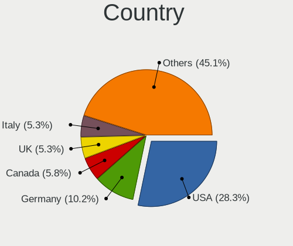
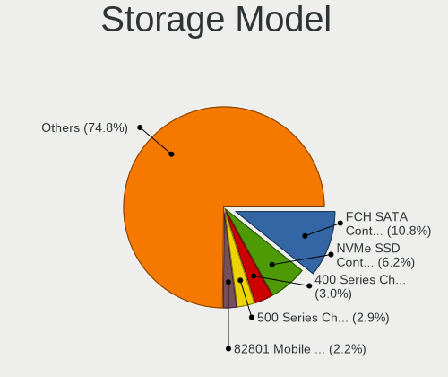
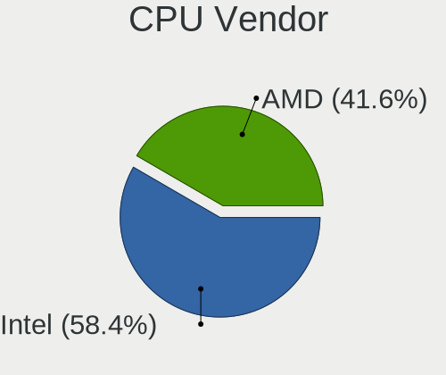
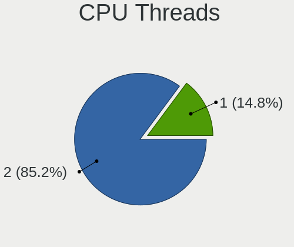
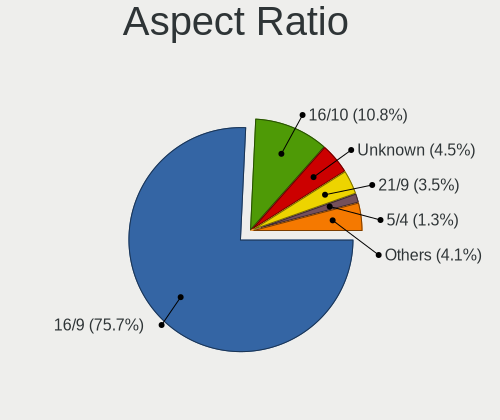
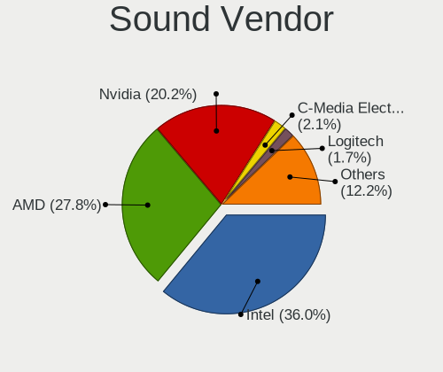

Garuda Linux - Tested Hardware & Statistics
-------------------------------------------

A project to collect tested hardware configurations for Garuda Linux.

Anyone can contribute to this report by the [hw-probe](https://github.com/linuxhw/hw-probe) tool:

    sudo -E hw-probe -all -upload

Please submit a probe of your configuration if it's not presented on the page or is rare.

This is a report for all computer types. See also reports for [desktops](/Dist/Garuda_Linux/Desktop/README.md) and [notebooks](/Dist/Garuda_Linux/Notebook/README.md).

Full-feature report is available here: https://linux-hardware.org/?view=trends

Contents
--------

* [ Test Cases ](#test-cases)

* [ System ](#system)
  - [ Kernel                   ](#kernel)
  - [ Kernel Family            ](#kernel-family)
  - [ Kernel Major Ver.        ](#kernel-major-ver)
  - [ Arch                     ](#arch)
  - [ DE                       ](#de)
  - [ Display Server           ](#display-server)
  - [ Display Manager          ](#display-manager)
  - [ OS Lang                  ](#os-lang)
  - [ Boot Mode                ](#boot-mode)
  - [ Filesystem               ](#filesystem)
  - [ Part. scheme             ](#part-scheme)
  - [ Dual Boot with Linux/BSD ](#dual-boot-with-linuxbsd)
  - [ Dual Boot (Win)          ](#dual-boot-win)

* [ Board ](#board)
  - [ Vendor                   ](#vendor)
  - [ Model                    ](#model)
  - [ Model Family             ](#model-family)
  - [ MFG Year                 ](#mfg-year)
  - [ Form Factor              ](#form-factor)
  - [ Secure Boot              ](#secure-boot)
  - [ Coreboot                 ](#coreboot)
  - [ RAM Size                 ](#ram-size)
  - [ RAM Used                 ](#ram-used)
  - [ Total Drives             ](#total-drives)
  - [ Has CD-ROM               ](#has-cd-rom)
  - [ Has Ethernet             ](#has-ethernet)
  - [ Has WiFi                 ](#has-wifi)
  - [ Has Bluetooth            ](#has-bluetooth)

* [ Location ](#location)
  - [ Country                  ](#country)
  - [ City                     ](#city)

* [ Drives ](#drives)
  - [ Drive Vendor             ](#drive-vendor)
  - [ Drive Model              ](#drive-model)
  - [ HDD Vendor               ](#hdd-vendor)
  - [ SSD Vendor               ](#ssd-vendor)
  - [ Drive Kind               ](#drive-kind)
  - [ Drive Connector          ](#drive-connector)
  - [ Drive Size               ](#drive-size)
  - [ Space Total              ](#space-total)
  - [ Space Used               ](#space-used)
  - [ Malfunc. Drives          ](#malfunc-drives)
  - [ Malfunc. Drive Vendor    ](#malfunc-drive-vendor)
  - [ Malfunc. HDD Vendor      ](#malfunc-hdd-vendor)
  - [ Malfunc. Drive Kind      ](#malfunc-drive-kind)
  - [ Failed Drives            ](#failed-drives)
  - [ Failed Drive Vendor      ](#failed-drive-vendor)
  - [ Drive Status             ](#drive-status)

* [ Storage controller ](#storage-controller)
  - [ Storage Vendor           ](#storage-vendor)
  - [ Storage Model            ](#storage-model)
  - [ Storage Kind             ](#storage-kind)

* [ Processor ](#processor)
  - [ CPU Vendor               ](#cpu-vendor)
  - [ CPU Model                ](#cpu-model)
  - [ CPU Model Family         ](#cpu-model-family)
  - [ CPU Cores                ](#cpu-cores)
  - [ CPU Sockets              ](#cpu-sockets)
  - [ CPU Threads              ](#cpu-threads)
  - [ CPU Op-Modes             ](#cpu-op-modes)
  - [ CPU Microcode            ](#cpu-microcode)
  - [ CPU Microarch            ](#cpu-microarch)

* [ Graphics ](#graphics)
  - [ GPU Vendor               ](#gpu-vendor)
  - [ GPU Model                ](#gpu-model)
  - [ GPU Combo                ](#gpu-combo)
  - [ GPU Driver               ](#gpu-driver)
  - [ GPU Memory               ](#gpu-memory)

* [ Monitor ](#monitor)
  - [ Monitor Vendor           ](#monitor-vendor)
  - [ Monitor Model            ](#monitor-model)
  - [ Monitor Resolution       ](#monitor-resolution)
  - [ Monitor Diagonal         ](#monitor-diagonal)
  - [ Monitor Width            ](#monitor-width)
  - [ Aspect Ratio             ](#aspect-ratio)
  - [ Monitor Area             ](#monitor-area)
  - [ Pixel Density            ](#pixel-density)
  - [ Multiple Monitors        ](#multiple-monitors)

* [ Network ](#network)
  - [ Net Controller Vendor    ](#net-controller-vendor)
  - [ Net Controller Model     ](#net-controller-model)
  - [ Wireless Vendor          ](#wireless-vendor)
  - [ Wireless Model           ](#wireless-model)
  - [ Ethernet Vendor          ](#ethernet-vendor)
  - [ Ethernet Model           ](#ethernet-model)
  - [ Net Controller Kind      ](#net-controller-kind)
  - [ Used Controller          ](#used-controller)
  - [ NICs                     ](#nics)
  - [ IPv6                     ](#ipv6)

* [ Bluetooth ](#bluetooth)
  - [ Bluetooth Vendor         ](#bluetooth-vendor)
  - [ Bluetooth Model          ](#bluetooth-model)

* [ Sound ](#sound)
  - [ Sound Vendor             ](#sound-vendor)
  - [ Sound Model              ](#sound-model)

* [ Memory ](#memory)
  - [ Memory Vendor            ](#memory-vendor)
  - [ Memory Model             ](#memory-model)
  - [ Memory Kind              ](#memory-kind)
  - [ Memory Form Factor       ](#memory-form-factor)
  - [ Memory Size              ](#memory-size)
  - [ Memory Speed             ](#memory-speed)

* [ Printers & scanners ](#printers--scanners)
  - [ Printer Vendor           ](#printer-vendor)
  - [ Printer Model            ](#printer-model)
  - [ Scanner Vendor           ](#scanner-vendor)
  - [ Scanner Model            ](#scanner-model)

* [ Camera ](#camera)
  - [ Camera Vendor            ](#camera-vendor)
  - [ Camera Model             ](#camera-model)

* [ Security ](#security)
  - [ Fingerprint Vendor       ](#fingerprint-vendor)
  - [ Fingerprint Model        ](#fingerprint-model)
  - [ Chipcard Vendor          ](#chipcard-vendor)
  - [ Chipcard Model           ](#chipcard-model)

* [ Unsupported ](#unsupported)
  - [ Unsupported Devices      ](#unsupported-devices)
  - [ Unsupported Device Types ](#unsupported-device-types)

Test Cases
----------

| Vendor        | Model                       | Form-Factor | Probe                                                      | Date         |
|---------------|-----------------------------|-------------|------------------------------------------------------------|--------------|
| ASUSTek       | TUF GAMING X570-PLUS        | Desktop     | [9e73346fb8](https://linux-hardware.org/?probe=9e73346fb8) | Dec 15, 2021 |
| Gigabyte      | X570 AORUS ELITE WIFI       | Desktop     | [196b460373](https://linux-hardware.org/?probe=196b460373) | Dec 13, 2021 |
| HP            | Pavilion Laptop 15-eh0xx... | Notebook    | [df628cbd13](https://linux-hardware.org/?probe=df628cbd13) | Dec 12, 2021 |
| ASRock        | B450M Pro4                  | Desktop     | [e4fb1e4fe4](https://linux-hardware.org/?probe=e4fb1e4fe4) | Dec 09, 2021 |
| Lenovo        | ThinkStation S20 4105O1U    | Desktop     | [731c890641](https://linux-hardware.org/?probe=731c890641) | Dec 08, 2021 |
| Acer          | Aspire F5-573G              | Notebook    | [a49a5a129c](https://linux-hardware.org/?probe=a49a5a129c) | Dec 07, 2021 |
| HP            | Laptop 15-dy2xxx            | Notebook    | [f499f9a375](https://linux-hardware.org/?probe=f499f9a375) | Dec 06, 2021 |
| ASUSTek       | TUF GAMING X570-PLUS        | Desktop     | [f0df07c0e4](https://linux-hardware.org/?probe=f0df07c0e4) | Dec 06, 2021 |
| HP            | Laptop 15-dy2xxx            | Notebook    | [e6b9de389b](https://linux-hardware.org/?probe=e6b9de389b) | Dec 06, 2021 |
| Acer          | Aspire TC-895 V:1.0         | Desktop     | [c743459a71](https://linux-hardware.org/?probe=c743459a71) | Dec 04, 2021 |
| ASUSTek       | H87M-E                      | Desktop     | [2b4abcf54f](https://linux-hardware.org/?probe=2b4abcf54f) | Dec 02, 2021 |
| ASUSTek       | H87M-E                      | Desktop     | [72cf0ed74d](https://linux-hardware.org/?probe=72cf0ed74d) | Dec 02, 2021 |
| Lenovo        | ThinkStation S20 4105O1U    | Desktop     | [f031548aac](https://linux-hardware.org/?probe=f031548aac) | Dec 01, 2021 |
| Lenovo        | ThinkStation S20 4105O1U    | Desktop     | [48f73af82d](https://linux-hardware.org/?probe=48f73af82d) | Nov 30, 2021 |
| Lenovo        | ThinkPad W530 24474KG       | Notebook    | [1ea5d23a86](https://linux-hardware.org/?probe=1ea5d23a86) | Nov 17, 2021 |
| ASUSTek       | Rampage IV EXTREME          | Desktop     | [50999d4796](https://linux-hardware.org/?probe=50999d4796) | Nov 14, 2021 |
| HP            | Pavilion Laptop 15-eh0xx... | Notebook    | [d74b03de25](https://linux-hardware.org/?probe=d74b03de25) | Nov 13, 2021 |
| HP            | EliteBook 840 G8 Noteboo... | Notebook    | [ed9cd44b17](https://linux-hardware.org/?probe=ed9cd44b17) | Nov 08, 2021 |
| ASUSTek       | TUF GAMING X570-PLUS        | Desktop     | [cd295bb56c](https://linux-hardware.org/?probe=cd295bb56c) | Nov 04, 2021 |
| ASUSTek       | P8B75-M                     | Desktop     | [2130c28d33](https://linux-hardware.org/?probe=2130c28d33) | Oct 27, 2021 |
| Dell          | XPS 13 9350                 | Notebook    | [dde814d7ca](https://linux-hardware.org/?probe=dde814d7ca) | Oct 25, 2021 |
| Lenovo        | ThinkPad W530 24474KG       | Notebook    | [64fd7ae16c](https://linux-hardware.org/?probe=64fd7ae16c) | Oct 11, 2021 |
| ASUSTek       | PRIME B450M-K               | Desktop     | [b8b49f201f](https://linux-hardware.org/?probe=b8b49f201f) | Sep 14, 2021 |
| Fujitsu       | LIFEBOOK T936               | Convertible | [646d26abf7](https://linux-hardware.org/?probe=646d26abf7) | Sep 08, 2021 |
| MSI           | H310M PRO-VDH PLUS          | Desktop     | [65fcfef06f](https://linux-hardware.org/?probe=65fcfef06f) | Aug 27, 2021 |
| Medion        | H110H4-EM2                  | Desktop     | [f4e01958e5](https://linux-hardware.org/?probe=f4e01958e5) | Aug 10, 2021 |
| MSI           | Z97 MPOWER                  | Desktop     | [dee7d3af4a](https://linux-hardware.org/?probe=dee7d3af4a) | Aug 06, 2021 |
| MSI           | Z97 MPOWER                  | Desktop     | [f30e5a3a86](https://linux-hardware.org/?probe=f30e5a3a86) | Aug 06, 2021 |
| Acer          | IPMBW-BR                    | All in one  | [a2ef77ad47](https://linux-hardware.org/?probe=a2ef77ad47) | Aug 03, 2021 |
| Lenovo        | IdeaPad Slim 1-14AST-05 ... | Notebook    | [0340b4c57f](https://linux-hardware.org/?probe=0340b4c57f) | Jul 30, 2021 |
| ASUSTek       | X550ZE                      | Notebook    | [e436ae3019](https://linux-hardware.org/?probe=e436ae3019) | Jul 23, 2021 |
| ASUSTek       | X550ZE                      | Notebook    | [49cd19882f](https://linux-hardware.org/?probe=49cd19882f) | Jul 23, 2021 |
| Sony          | VPCSB1C5E                   | Notebook    | [2878014d7a](https://linux-hardware.org/?probe=2878014d7a) | Jul 11, 2021 |
| Sony          | VPCSB1C5E                   | Notebook    | [4cfb82cbfe](https://linux-hardware.org/?probe=4cfb82cbfe) | Jul 11, 2021 |
| ASUSTek       | ROG STRIX B550-F GAMING     | Desktop     | [826edd51bc](https://linux-hardware.org/?probe=826edd51bc) | Jul 07, 2021 |
| Gigabyte      | X470 AORUS ULTRA GAMING-... | Desktop     | [aa05cca9b7](https://linux-hardware.org/?probe=aa05cca9b7) | Jun 30, 2021 |
| MSI           | A320M-HDV R4.0              | Desktop     | [486775a989](https://linux-hardware.org/?probe=486775a989) | Jun 23, 2021 |
| MSI           | A320M-HDV R4.0              | Desktop     | [4629f86f56](https://linux-hardware.org/?probe=4629f86f56) | Jun 22, 2021 |
| MSI           | A320M-HDV R4.0              | Desktop     | [69dea4e3cf](https://linux-hardware.org/?probe=69dea4e3cf) | Jun 22, 2021 |
| MSI           | A320M-HDV R4.0              | Desktop     | [2fd89c951e](https://linux-hardware.org/?probe=2fd89c951e) | Jun 22, 2021 |
| Lenovo        | IdeaPad Gaming 3 15ARH05... | Notebook    | [11e99b82d5](https://linux-hardware.org/?probe=11e99b82d5) | Jun 22, 2021 |
| MSI           | X370 GAMING PRO CARBON      | Desktop     | [9ead1e1bb5](https://linux-hardware.org/?probe=9ead1e1bb5) | Jun 22, 2021 |
| ASUSTek       | ROG STRIX B550-F GAMING     | Desktop     | [8144c83b50](https://linux-hardware.org/?probe=8144c83b50) | Jun 22, 2021 |
| Dell          | Inspiron N5050              | Notebook    | [92ae7459b4](https://linux-hardware.org/?probe=92ae7459b4) | Jun 20, 2021 |
| ASUSTek       | ROG STRIX B550-F GAMING     | Desktop     | [8a7a518013](https://linux-hardware.org/?probe=8a7a518013) | Jun 15, 2021 |
| ASUSTek       | ROG STRIX B550-F GAMING     | Desktop     | [376c0ff95d](https://linux-hardware.org/?probe=376c0ff95d) | Jun 15, 2021 |
| Lenovo        | IdeaPad Gaming 3 15ARH05... | Notebook    | [abd01e8eac](https://linux-hardware.org/?probe=abd01e8eac) | Jun 09, 2021 |
| Lenovo        | IdeaPad 3 15ADA05 81W1      | Notebook    | [d2a26e0f30](https://linux-hardware.org/?probe=d2a26e0f30) | May 26, 2021 |
| Dell          | 0D28YY A02                  | Desktop     | [14edf3bd00](https://linux-hardware.org/?probe=14edf3bd00) | May 16, 2021 |
| Acer          | Spin SP513-54N              | Convertible | [aa8934716b](https://linux-hardware.org/?probe=aa8934716b) | May 13, 2021 |
| Gigabyte      | A320M-S2H-CF                | Desktop     | [066f815622](https://linux-hardware.org/?probe=066f815622) | May 12, 2021 |
| Lenovo        | IdeaPad Gaming 3 15ARH05... | Notebook    | [22931f83cc](https://linux-hardware.org/?probe=22931f83cc) | Apr 20, 2021 |
| Lenovo        | IdeaPad Gaming 3 15ARH05... | Notebook    | [3c7f354ce4](https://linux-hardware.org/?probe=3c7f354ce4) | Apr 19, 2021 |
| ASUSTek       | GL503VM                     | Notebook    | [743ff3a2aa](https://linux-hardware.org/?probe=743ff3a2aa) | Apr 18, 2021 |
| Medion        | P861X                       | Notebook    | [109599a6f6](https://linux-hardware.org/?probe=109599a6f6) | Apr 15, 2021 |
| Medion        | P861X                       | Notebook    | [ae05cea55d](https://linux-hardware.org/?probe=ae05cea55d) | Apr 15, 2021 |
| Medion        | E7419 MD60025               | Notebook    | [4deb77ef82](https://linux-hardware.org/?probe=4deb77ef82) | Apr 10, 2021 |
| Medion        | E7419 MD60025               | Notebook    | [938494cf89](https://linux-hardware.org/?probe=938494cf89) | Mar 31, 2021 |
| Lenovo        | ThinkPad T470 20HD000RUS    | Notebook    | [751dd3bb74](https://linux-hardware.org/?probe=751dd3bb74) | Mar 19, 2021 |
| Gigabyte      | B450 AORUS M                | Desktop     | [22054ffd75](https://linux-hardware.org/?probe=22054ffd75) | Mar 18, 2021 |
| HP            | 2AF7                        | Desktop     | [e0639ea4a5](https://linux-hardware.org/?probe=e0639ea4a5) | Mar 11, 2021 |
| HP            | 2AF7                        | Desktop     | [fb8d76722c](https://linux-hardware.org/?probe=fb8d76722c) | Mar 11, 2021 |
| Gigabyte      | GA-MA790FXT-UD5P            | Desktop     | [404dab2464](https://linux-hardware.org/?probe=404dab2464) | Feb 27, 2021 |
| Dell          | 0C2KJT A00                  | Desktop     | [f821a0035b](https://linux-hardware.org/?probe=f821a0035b) | Feb 12, 2021 |
| HP            | Pavilion Laptop 15-cs0xx... | Notebook    | [793615c0de](https://linux-hardware.org/?probe=793615c0de) | Jan 30, 2021 |
| Lenovo        | SHARKBAY 0B98401 PRO        | Desktop     | [61976e9745](https://linux-hardware.org/?probe=61976e9745) | Jan 18, 2021 |
| HP            | Compaq 6735b                | Notebook    | [84a4616a8d](https://linux-hardware.org/?probe=84a4616a8d) | Jan 18, 2021 |
| Fujitsu Si... | ESPRIMO Mobile D9500        | Notebook    | [9703bdf4f6](https://linux-hardware.org/?probe=9703bdf4f6) | Jan 12, 2021 |
| Unknown       | Unknown                     | Notebook    | [09f3ac6567](https://linux-hardware.org/?probe=09f3ac6567) | Jan 11, 2021 |
| ASUSTek       | CM5671                      | Desktop     | [069344a54e](https://linux-hardware.org/?probe=069344a54e) | Jan 07, 2021 |
| MSI           | B85-G43 GAMING              | Desktop     | [8fe013f04a](https://linux-hardware.org/?probe=8fe013f04a) | Jan 04, 2021 |
| Dell          | Latitude E6430              | Notebook    | [2e0ef916c6](https://linux-hardware.org/?probe=2e0ef916c6) | Jan 03, 2021 |
| ASRock        | G41M-VS3                    | Desktop     | [e1217b1871](https://linux-hardware.org/?probe=e1217b1871) | Jan 02, 2021 |
| Dell          | Inspiron 15 7000 Gaming     | Notebook    | [1d461bb9db](https://linux-hardware.org/?probe=1d461bb9db) | Dec 25, 2020 |
| Pegatron      | 2AC2A                       | Desktop     | [436a2ca3ce](https://linux-hardware.org/?probe=436a2ca3ce) | Dec 25, 2020 |
| Pegatron      | 2AC2A                       | Desktop     | [2df3b195c6](https://linux-hardware.org/?probe=2df3b195c6) | Dec 25, 2020 |
| Unknown       | Unknown                     | Notebook    | [ce7f267835](https://linux-hardware.org/?probe=ce7f267835) | Dec 23, 2020 |
| ASUSTek       | PRIME Z370-P                | Desktop     | [35365be0e8](https://linux-hardware.org/?probe=35365be0e8) | Dec 19, 2020 |
| HP            | 8643 SMVB                   | Desktop     | [dccfba36f1](https://linux-hardware.org/?probe=dccfba36f1) | Dec 06, 2020 |
| Gigabyte      | B450 AORUS ELITE            | Desktop     | [2a35d394f9](https://linux-hardware.org/?probe=2a35d394f9) | Dec 04, 2020 |
| HP            | Laptop 17-ak0xx             | Notebook    | [e63bb99c0a](https://linux-hardware.org/?probe=e63bb99c0a) | Nov 30, 2020 |
| Lenovo        | ThinkPad T14 Gen 1 20UDS... | Notebook    | [05a70db99a](https://linux-hardware.org/?probe=05a70db99a) | Nov 22, 2020 |
| Gigabyte      | B450 AORUS M                | Desktop     | [d9faeae0d4](https://linux-hardware.org/?probe=d9faeae0d4) | Nov 19, 2020 |
| Gigabyte      | X570 AORUS PRO WIFI         | Desktop     | [11c79940a4](https://linux-hardware.org/?probe=11c79940a4) | Nov 19, 2020 |
| Dell          | Inspiron 15 7000 Gaming     | Notebook    | [1ff8a24823](https://linux-hardware.org/?probe=1ff8a24823) | Nov 18, 2020 |
| HP            | 18E7                        | Desktop     | [f84cbfd465](https://linux-hardware.org/?probe=f84cbfd465) | Nov 10, 2020 |
| Gigabyte      | X570 AORUS PRO WIFI         | Desktop     | [79608bd849](https://linux-hardware.org/?probe=79608bd849) | Nov 06, 2020 |
| Dell          | Latitude E6430              | Notebook    | [760e7ca474](https://linux-hardware.org/?probe=760e7ca474) | Nov 02, 2020 |
| ASUSTek       | ROG STRIX B550-F GAMING     | Desktop     | [876b039494](https://linux-hardware.org/?probe=876b039494) | Nov 01, 2020 |
| Gigabyte      | X570 AORUS PRO WIFI         | Desktop     | [428abb1a9b](https://linux-hardware.org/?probe=428abb1a9b) | Oct 31, 2020 |
| Gigabyte      | X570 AORUS PRO WIFI         | Desktop     | [4e573bc6ff](https://linux-hardware.org/?probe=4e573bc6ff) | Oct 28, 2020 |
| MSI           | MPG B550 GAMING EDGE WIF... | Desktop     | [4b9d2b77cb](https://linux-hardware.org/?probe=4b9d2b77cb) | Oct 26, 2020 |
| ASUSTek       | PRIME X399-A                | Desktop     | [b7772d9ff8](https://linux-hardware.org/?probe=b7772d9ff8) | Oct 13, 2020 |
| Dell          | 0R6JMP A00                  | Desktop     | [c4cbec5b80](https://linux-hardware.org/?probe=c4cbec5b80) | Oct 11, 2020 |
| OEM           | Unknown                     | Desktop     | [2e7a212437](https://linux-hardware.org/?probe=2e7a212437) | Sep 26, 2020 |
| Lenovo        | Board                       | Desktop     | [c08fed8ecb](https://linux-hardware.org/?probe=c08fed8ecb) | Sep 11, 2020 |
| HP            | 450                         | Notebook    | [edeb9f6780](https://linux-hardware.org/?probe=edeb9f6780) | Apr 25, 2020 |

System
------

Kernel
------

Version of the Linux kernel

| Version               | Computers | Percent |
|-----------------------|-----------|---------|
| 5.15.2-zen1-1-zen     | 4         | 5.88%   |
| 5.15.6-zen2-1-zen     | 3         | 4.41%   |
| 5.9.10-zen1-1-zen     | 2         | 2.94%   |
| 5.9.1-zen2-1-zen      | 2         | 2.94%   |
| 5.8.14-zen1-1-zen     | 2         | 2.94%   |
| 5.15.7-zen1-1-zen     | 2         | 2.94%   |
| 5.14.14-zen1-1-zen    | 2         | 2.94%   |
| 5.13.9-zen1-1-zen     | 2         | 2.94%   |
| 5.12.12-AMD-znver2    | 2         | 2.94%   |
| 5.10.7-111-tkg-bmq    | 2         | 2.94%   |
| 5.10.4-107-tkg-bmq    | 2         | 2.94%   |
| 5.10.2-104-tkg-bmq    | 2         | 2.94%   |
| 5.10.1-103-tkg-bmq    | 2         | 2.94%   |
| 5.9.9-zen1-1-zen      | 1         | 1.47%   |
| 5.9.8-zen1-1-zen      | 1         | 1.47%   |
| 5.9.6-zen1-1-zen      | 1         | 1.47%   |
| 5.9.4-zen1-1-zen      | 1         | 1.47%   |
| 5.9.2-zen1-1-zen      | 1         | 1.47%   |
| 5.9.11-zen2-1-zen     | 1         | 1.47%   |
| 5.8.5-zen1-1-zen      | 1         | 1.47%   |
| 5.8.10-zen1-1-zen     | 1         | 1.47%   |
| 5.6.6-zen1-1-zen      | 1         | 1.47%   |
| 5.15.5-zen1-1-zen     | 1         | 1.47%   |
| 5.14.9-zen2-1-zen     | 1         | 1.47%   |
| 5.14.15-zen1-1-zen    | 1         | 1.47%   |
| 5.13.6-zen1-1-zen     | 1         | 1.47%   |
| 5.13.4-zen1-1-zen     | 1         | 1.47%   |
| 5.13.13-zen1-1-zen    | 1         | 1.47%   |
| 5.13.12-zen1-1-zen    | 1         | 1.47%   |
| 5.13.1-zen1-1-zen     | 1         | 1.47%   |
| 5.12.9-164-tkg-muqss  | 1         | 1.47%   |
| 5.12.8-zen1-1-zen     | 1         | 1.47%   |
| 5.12.3-zen1-1-zen     | 1         | 1.47%   |
| 5.12.2-153-tkg-bmq    | 1         | 1.47%   |
| 5.12.14-zen1-1-zen    | 1         | 1.47%   |
| 5.12.13-170-tkg-muqss | 1         | 1.47%   |
| 5.12.12-zen1-1-zen    | 1         | 1.47%   |
| 5.12.10-zen1-1-zen    | 1         | 1.47%   |
| 5.11.7-zen1-1-zen     | 1         | 1.47%   |
| 5.11.5-zen1-1-zen     | 1         | 1.47%   |
| 5.11.2-zen1-1-zen     | 1         | 1.47%   |
| 5.11.16-zen1-1-zen    | 1         | 1.47%   |
| 5.11.15-zen1-2-zen    | 1         | 1.47%   |
| 5.11.12-zen1-1-zen    | 1         | 1.47%   |
| 5.11.11-zen1-1-zen    | 1         | 1.47%   |
| 5.11.1-127-tkg-bmq    | 1         | 1.47%   |
| 5.10.6-110-tkg-bmq    | 1         | 1.47%   |
| 5.10.4-zen2-1-zen     | 1         | 1.47%   |
| 5.10.30-1-lts         | 1         | 1.47%   |
| 5.10.3-zen1-1-zen     | 1         | 1.47%   |
| 5.10.15-120-tkg-bmq   | 1         | 1.47%   |
| 5.10.10-115-tkg-bmq   | 1         | 1.47%   |

Kernel Family
-------------

Linux kernel without a distro release

| Version | Computers | Percent |
|---------|-----------|---------|
| 5.15.2  | 4         | 5.88%   |
| 5.15.6  | 3         | 4.41%   |
| 5.12.12 | 3         | 4.41%   |
| 5.10.4  | 3         | 4.41%   |
| 5.9.10  | 2         | 2.94%   |
| 5.9.1   | 2         | 2.94%   |
| 5.8.14  | 2         | 2.94%   |
| 5.15.7  | 2         | 2.94%   |
| 5.14.14 | 2         | 2.94%   |
| 5.13.9  | 2         | 2.94%   |
| 5.10.7  | 2         | 2.94%   |
| 5.10.2  | 2         | 2.94%   |
| 5.10.1  | 2         | 2.94%   |
| 5.9.9   | 1         | 1.47%   |
| 5.9.8   | 1         | 1.47%   |
| 5.9.6   | 1         | 1.47%   |
| 5.9.4   | 1         | 1.47%   |
| 5.9.2   | 1         | 1.47%   |
| 5.9.11  | 1         | 1.47%   |
| 5.8.5   | 1         | 1.47%   |
| 5.8.10  | 1         | 1.47%   |
| 5.6.6   | 1         | 1.47%   |
| 5.15.5  | 1         | 1.47%   |
| 5.14.9  | 1         | 1.47%   |
| 5.14.15 | 1         | 1.47%   |
| 5.13.6  | 1         | 1.47%   |
| 5.13.4  | 1         | 1.47%   |
| 5.13.13 | 1         | 1.47%   |
| 5.13.12 | 1         | 1.47%   |
| 5.13.1  | 1         | 1.47%   |
| 5.12.9  | 1         | 1.47%   |
| 5.12.8  | 1         | 1.47%   |
| 5.12.3  | 1         | 1.47%   |
| 5.12.2  | 1         | 1.47%   |
| 5.12.14 | 1         | 1.47%   |
| 5.12.13 | 1         | 1.47%   |
| 5.12.10 | 1         | 1.47%   |
| 5.11.7  | 1         | 1.47%   |
| 5.11.5  | 1         | 1.47%   |
| 5.11.2  | 1         | 1.47%   |
| 5.11.16 | 1         | 1.47%   |
| 5.11.15 | 1         | 1.47%   |
| 5.11.12 | 1         | 1.47%   |
| 5.11.11 | 1         | 1.47%   |
| 5.11.1  | 1         | 1.47%   |
| 5.10.6  | 1         | 1.47%   |
| 5.10.30 | 1         | 1.47%   |
| 5.10.3  | 1         | 1.47%   |
| 5.10.15 | 1         | 1.47%   |
| 5.10.10 | 1         | 1.47%   |

Kernel Major Ver.
-----------------

Linux kernel major version

| Version | Computers | Percent |
|---------|-----------|---------|
| 5.10    | 14        | 21.54%  |
| 5.15    | 10        | 15.38%  |
| 5.9     | 9         | 13.85%  |
| 5.12    | 9         | 13.85%  |
| 5.13    | 7         | 10.77%  |
| 5.11    | 7         | 10.77%  |
| 5.8     | 4         | 6.15%   |
| 5.14    | 4         | 6.15%   |
| 5.6     | 1         | 1.54%   |

Arch
----

OS architecture (x86_64, i586, etc.)

| Name   | Computers | Percent |
|--------|-----------|---------|
| x86_64 | 61        | 100%    |

DE
--

Desktop Environment

| Name       | Computers | Percent |
|------------|-----------|---------|
| KDE        | 30        | 49.18%  |
| GNOME      | 12        | 19.67%  |
| KDE5       | 11        | 18.03%  |
| XFCE       | 4         | 6.56%   |
| X-Cinnamon | 1         | 1.64%   |
| MATE       | 1         | 1.64%   |
| LXQt       | 1         | 1.64%   |
| Unknown    | 1         | 1.64%   |

Display Server
--------------

X11 or Wayland

| Name    | Computers | Percent |
|---------|-----------|---------|
| X11     | 60        | 98.36%  |
| Wayland | 1         | 1.64%   |

Display Manager
---------------

SDDM, LightDM, etc.

| Name    | Computers | Percent |
|---------|-----------|---------|
| Unknown | 61        | 100%    |

OS Lang
-------

Language

| Lang  | Computers | Percent |
|-------|-----------|---------|
| en_US | 29        | 47.54%  |
| de_DE | 8         | 13.11%  |
| nl_NL | 3         | 4.92%   |
| en_GB | 3         | 4.92%   |
| pt_BR | 2         | 3.28%   |
| it_IT | 2         | 3.28%   |
| fi_FI | 2         | 3.28%   |
| en_IN | 2         | 3.28%   |
| en_CA | 2         | 3.28%   |
| en_AU | 2         | 3.28%   |
| ko_KR | 1         | 1.64%   |
| iu_CA | 1         | 1.64%   |
| fr_BE | 1         | 1.64%   |
| es_VE | 1         | 1.64%   |
| es_MX | 1         | 1.64%   |
| en_ZA | 1         | 1.64%   |

Boot Mode
---------

EFI or BIOS

| Mode | Computers | Percent |
|------|-----------|---------|
| BIOS | 48        | 77.42%  |
| EFI  | 14        | 22.58%  |

Filesystem
----------

Type of filesystem

| Type  | Computers | Percent |
|-------|-----------|---------|
| Btrfs | 60        | 98.36%  |
| Ext4  | 1         | 1.64%   |

Part. scheme
------------

Scheme of partitioning

| Type    | Computers | Percent |
|---------|-----------|---------|
| Unknown | 60        | 96.77%  |
| MBR     | 1         | 1.61%   |
| GPT     | 1         | 1.61%   |

Dual Boot with Linux/BSD
------------------------

Hosting more than one Linux/BSD

| Dual boot | Computers | Percent |
|-----------|-----------|---------|
| No        | 61        | 98.39%  |
| Yes       | 1         | 1.61%   |

Dual Boot (Win)
---------------

Hosting Linux and Windows

| Dual boot | Computers | Percent |
|-----------|-----------|---------|
| No        | 61        | 98.39%  |
| Yes       | 1         | 1.61%   |

Board
-----

Vendor
------

Motherboard manufacturer

| Name                | Computers | Percent |
|---------------------|-----------|---------|
| ASUSTek Computer    | 12        | 19.67%  |
| Lenovo              | 8         | 13.11%  |
| Hewlett-Packard     | 8         | 13.11%  |
| Dell                | 7         | 11.48%  |
| Gigabyte Technology | 6         | 9.84%   |
| MSI                 | 5         | 8.2%    |
| Acer                | 4         | 6.56%   |
| Medion              | 3         | 4.92%   |
| ASRock              | 2         | 3.28%   |
| Sony                | 1         | 1.64%   |
| Pegatron            | 1         | 1.64%   |
| OEM                 | 1         | 1.64%   |
| Fujitsu Siemens     | 1         | 1.64%   |
| Fujitsu             | 1         | 1.64%   |
| Unknown             | 1         | 1.64%   |

Model
-----

Motherboard model

| Name                                 | Computers | Percent |
|--------------------------------------|-----------|---------|
| Lenovo IdeaPad Gaming 3 15ARH05 82EY | 2         | 3.28%   |
| ASUS TUF GAMING X570-PLUS            | 2         | 3.28%   |
| Unknown                              | 2         | 3.28%   |
| Sony VPCSB1C5E                       | 1         | 1.64%   |
| Pegatron p7-1030                     | 1         | 1.64%   |
| MSI MS-7C91                          | 1         | 1.64%   |
| MSI MS-7C09                          | 1         | 1.64%   |
| MSI MS-7A32                          | 1         | 1.64%   |
| MSI MS-7816                          | 1         | 1.64%   |
| MSI A320M-HDV R4.0                   | 1         | 1.64%   |
| Medion P861X                         | 1         | 1.64%   |
| Medion E7419 MD60025                 | 1         | 1.64%   |
| Medion Akoya P5238 F/C395            | 1         | 1.64%   |
| Lenovo ThinkStation S20 4105O1U      | 1         | 1.64%   |
| Lenovo ThinkPad W530 24474KG         | 1         | 1.64%   |
| Lenovo ThinkPad T470 20HD000RUS      | 1         | 1.64%   |
| Lenovo ThinkPad T14 Gen 1 20UDS00N00 | 1         | 1.64%   |
| Lenovo ThinkCentre M93p 10A90016US   | 1         | 1.64%   |
| Lenovo ThinkCentre M91p 7033CG1      | 1         | 1.64%   |
| HP ProDesk 600 G1 SFF                | 1         | 1.64%   |
| HP Pavilion Laptop 15-cs0xxx         | 1         | 1.64%   |
| HP Laptop 17-ak0xx                   | 1         | 1.64%   |
| HP Laptop 15-dy2xxx                  | 1         | 1.64%   |
| HP Desktop M01-F0xxx                 | 1         | 1.64%   |
| HP Compaq 6735b                      | 1         | 1.64%   |
| HP 500-439                           | 1         | 1.64%   |
| HP 450                               | 1         | 1.64%   |
| Gigabyte X570 AORUS PRO WIFI         | 1         | 1.64%   |
| Gigabyte X570 AORUS ELITE WIFI       | 1         | 1.64%   |
| Gigabyte X470 AORUS ULTRA GAMING     | 1         | 1.64%   |
| Gigabyte GA-MA790FXT-UD5P            | 1         | 1.64%   |
| Gigabyte B450 AORUS ELITE            | 1         | 1.64%   |
| Gigabyte A320M-S2H                   | 1         | 1.64%   |
| Fujitsu Siemens ESPRIMO Mobile D9500 | 1         | 1.64%   |
| Fujitsu LIFEBOOK T936                | 1         | 1.64%   |
| Dell XPS 13 9350                     | 1         | 1.64%   |
| Dell OptiPlex 790                    | 1         | 1.64%   |
| Dell Latitude E6430                  | 1         | 1.64%   |
| Dell Inspiron N5050                  | 1         | 1.64%   |
| Dell Inspiron 580                    | 1         | 1.64%   |
| Dell Inspiron 3670                   | 1         | 1.64%   |
| Dell Inspiron 15 7000 Gaming         | 1         | 1.64%   |
| ASUS X550ZE                          | 1         | 1.64%   |
| ASUS ROG STRIX B550-F GAMING         | 1         | 1.64%   |
| ASUS Rampage IV EXTREME              | 1         | 1.64%   |
| ASUS PRIME Z370-P                    | 1         | 1.64%   |
| ASUS PRIME X399-A                    | 1         | 1.64%   |
| ASUS PRIME B450M-K                   | 1         | 1.64%   |
| ASUS P8B75-M                         | 1         | 1.64%   |
| ASUS GL503VM                         | 1         | 1.64%   |
| ASUS CM5671                          | 1         | 1.64%   |
| ASUS All Series                      | 1         | 1.64%   |
| ASRock G41M-VS3                      | 1         | 1.64%   |
| ASRock B450M Pro4                    | 1         | 1.64%   |
| Acer Spin SP513-54N                  | 1         | 1.64%   |
| Acer Aspire ZC-700G                  | 1         | 1.64%   |
| Acer Aspire TC-895                   | 1         | 1.64%   |
| Acer Aspire F5-573G                  | 1         | 1.64%   |

Model Family
------------

Motherboard model prefix

| Name                      | Computers | Percent |
|---------------------------|-----------|---------|
| Dell Inspiron             | 4         | 6.56%   |
| Lenovo ThinkPad           | 3         | 4.92%   |
| ASUS PRIME                | 3         | 4.92%   |
| Acer Aspire               | 3         | 4.92%   |
| Lenovo ThinkCentre        | 2         | 3.28%   |
| Lenovo IdeaPad            | 2         | 3.28%   |
| HP Laptop                 | 2         | 3.28%   |
| Gigabyte X570             | 2         | 3.28%   |
| ASUS TUF                  | 2         | 3.28%   |
| Unknown                   | 2         | 3.28%   |
| Sony VPCSB1C5E            | 1         | 1.64%   |
| Pegatron p7-1030          | 1         | 1.64%   |
| MSI MS-7C91               | 1         | 1.64%   |
| MSI MS-7C09               | 1         | 1.64%   |
| MSI MS-7A32               | 1         | 1.64%   |
| MSI MS-7816               | 1         | 1.64%   |
| MSI A320M-HDV             | 1         | 1.64%   |
| Medion P861X              | 1         | 1.64%   |
| Medion E7419              | 1         | 1.64%   |
| Medion Akoya              | 1         | 1.64%   |
| Lenovo ThinkStation       | 1         | 1.64%   |
| HP ProDesk                | 1         | 1.64%   |
| HP Pavilion               | 1         | 1.64%   |
| HP Desktop                | 1         | 1.64%   |
| HP Compaq                 | 1         | 1.64%   |
| HP 500-439                | 1         | 1.64%   |
| HP 450                    | 1         | 1.64%   |
| Gigabyte X470             | 1         | 1.64%   |
| Gigabyte GA-MA790FXT-UD5P | 1         | 1.64%   |
| Gigabyte B450             | 1         | 1.64%   |
| Gigabyte A320M-S2H        | 1         | 1.64%   |
| Fujitsu Siemens ESPRIMO   | 1         | 1.64%   |
| Fujitsu LIFEBOOK          | 1         | 1.64%   |
| Dell XPS                  | 1         | 1.64%   |
| Dell OptiPlex             | 1         | 1.64%   |
| Dell Latitude             | 1         | 1.64%   |
| ASUS X550ZE               | 1         | 1.64%   |
| ASUS ROG                  | 1         | 1.64%   |
| ASUS Rampage              | 1         | 1.64%   |
| ASUS P8B75-M              | 1         | 1.64%   |
| ASUS GL503VM              | 1         | 1.64%   |
| ASUS CM5671               | 1         | 1.64%   |
| ASUS All                  | 1         | 1.64%   |
| ASRock G41M-VS3           | 1         | 1.64%   |
| ASRock B450M              | 1         | 1.64%   |
| Acer Spin                 | 1         | 1.64%   |

MFG Year
--------

Motherboard manufacture year

| Year | Computers | Percent |
|------|-----------|---------|
| 2020 | 15        | 24.59%  |
| 2019 | 10        | 16.39%  |
| 2021 | 6         | 9.84%   |
| 2016 | 4         | 6.56%   |
| 2014 | 4         | 6.56%   |
| 2011 | 4         | 6.56%   |
| 2013 | 3         | 4.92%   |
| 2010 | 3         | 4.92%   |
| 2009 | 3         | 4.92%   |
| 2018 | 2         | 3.28%   |
| 2017 | 2         | 3.28%   |
| 2015 | 2         | 3.28%   |
| 2012 | 2         | 3.28%   |
| 2008 | 1         | 1.64%   |

Form Factor
-----------

Physical design of the computer

| Name        | Computers | Percent |
|-------------|-----------|---------|
| Desktop     | 36        | 59.02%  |
| Notebook    | 22        | 36.07%  |
| Convertible | 2         | 3.28%   |
| All in one  | 1         | 1.64%   |

Secure Boot
-----------

Enabled or disabled

| State    | Computers | Percent |
|----------|-----------|---------|
| Disabled | 61        | 100%    |

Coreboot
--------

Have coreboot on board

| Used | Computers | Percent |
|------|-----------|---------|
| No   | 61        | 100%    |

RAM Size
--------

Total RAM memory

| Size in GB  | Computers | Percent |
|-------------|-----------|---------|
| 8.01-16.0   | 18        | 29.51%  |
| 16.01-24.0  | 16        | 26.23%  |
| 4.01-8.0    | 9         | 14.75%  |
| 32.01-64.0  | 8         | 13.11%  |
| 3.01-4.0    | 5         | 8.2%    |
| 24.01-32.0  | 3         | 4.92%   |
| 2.01-3.0    | 1         | 1.64%   |
| 64.01-256.0 | 1         | 1.64%   |

RAM Used
--------

Used RAM memory

| Used GB   | Computers | Percent |
|-----------|-----------|---------|
| 3.01-4.0  | 19        | 29.23%  |
| 4.01-8.0  | 17        | 26.15%  |
| 2.01-3.0  | 16        | 24.62%  |
| 8.01-16.0 | 8         | 12.31%  |
| 1.01-2.0  | 5         | 7.69%   |

Total Drives
------------

Number of drives on board

| Drives | Computers | Percent |
|--------|-----------|---------|
| 2      | 24        | 38.1%   |
| 1      | 21        | 33.33%  |
| 3      | 8         | 12.7%   |
| 5      | 3         | 4.76%   |
| 4      | 3         | 4.76%   |
| 9      | 2         | 3.17%   |
| 6      | 2         | 3.17%   |

Has CD-ROM
----------

Has CD-ROM on board

| Presented | Computers | Percent |
|-----------|-----------|---------|
| No        | 38        | 60.32%  |
| Yes       | 25        | 39.68%  |

Has Ethernet
------------

Has Ethernet on board

| Presented | Computers | Percent |
|-----------|-----------|---------|
| Yes       | 57        | 93.44%  |
| No        | 4         | 6.56%   |

Has WiFi
--------

Has WiFi module

| Presented | Computers | Percent |
|-----------|-----------|---------|
| Yes       | 44        | 72.13%  |
| No        | 17        | 27.87%  |

Has Bluetooth
-------------

Has Bluetooth module

| Presented | Computers | Percent |
|-----------|-----------|---------|
| Yes       | 35        | 57.38%  |
| No        | 26        | 42.62%  |

Location
--------

Country
-------

Geographic location (country)

| Country      | Computers | Percent |
|--------------|-----------|---------|
| USA          | 19        | 31.15%  |
| Germany      | 8         | 13.11%  |
| Canada       | 4         | 6.56%   |
| Netherlands  | 3         | 4.92%   |
| Italy        | 3         | 4.92%   |
| UK           | 2         | 3.28%   |
| Puerto Rico  | 2         | 3.28%   |
| Mexico       | 2         | 3.28%   |
| India        | 2         | 3.28%   |
| Finland      | 2         | 3.28%   |
| Brazil       | 2         | 3.28%   |
| Australia    | 2         | 3.28%   |
| Venezuela    | 1         | 1.64%   |
| Sweden       | 1         | 1.64%   |
| South Korea  | 1         | 1.64%   |
| South Africa | 1         | 1.64%   |
| Romania      | 1         | 1.64%   |
| Philippines  | 1         | 1.64%   |
| Iceland      | 1         | 1.64%   |
| France       | 1         | 1.64%   |
| Belgium      | 1         | 1.64%   |
| Bahrain      | 1         | 1.64%   |

City
----

Geographic location (city)

| City                  | Computers | Percent |
|-----------------------|-----------|---------|
| Kingsport             | 2         | 3.17%   |
| Helsinki              | 2         | 3.17%   |
| Groningen             | 2         | 3.17%   |
| Winston-Salem         | 1         | 1.59%   |
| Valenzano             | 1         | 1.59%   |
| Valence               | 1         | 1.59%   |
| Toronto               | 1         | 1.59%   |
| Tekoa                 | 1         | 1.59%   |
| Sydney                | 1         | 1.59%   |
| Stockholm             | 1         | 1.59%   |
| St Louis              | 1         | 1.59%   |
| Spitalfields          | 1         | 1.59%   |
| Shreveport            | 1         | 1.59%   |
| Satu Mare             | 1         | 1.59%   |
| Sarasota              | 1         | 1.59%   |
| Santa Clara           | 1         | 1.59%   |
| San Juan              | 1         | 1.59%   |
| Salto da Divisa       | 1         | 1.59%   |
| Regina                | 1         | 1.59%   |
| Qalali                | 1         | 1.59%   |
| Puebla City           | 1         | 1.59%   |
| Portland              | 1         | 1.59%   |
| Oklahoma City         | 1         | 1.59%   |
| Norman                | 1         | 1.59%   |
| Nijmegen              | 1         | 1.59%   |
| Naranjito             | 1         | 1.59%   |
| Mumbai                | 1         | 1.59%   |
| Milan                 | 1         | 1.59%   |
| Mexico City           | 1         | 1.59%   |
| Ludwigshafen am Rhein | 1         | 1.59%   |
| Leichlingen           | 1         | 1.59%   |
| La Verne              | 1         | 1.59%   |
| Kitchener             | 1         | 1.59%   |
| Kirkland              | 1         | 1.59%   |
| Karlsruhe             | 1         | 1.59%   |
| Jonesboro             | 1         | 1.59%   |
| Jemappes              | 1         | 1.59%   |
| Ilhéus               | 1         | 1.59%   |
| Hillsdale             | 1         | 1.59%   |
| Hamburg               | 1         | 1.59%   |
| Halle                 | 1         | 1.59%   |
| Guwahati              | 1         | 1.59%   |
| Glendale              | 1         | 1.59%   |
| Garðabaer            | 1         | 1.59%   |
| Fort St. John         | 1         | 1.59%   |
| Fort Lauderdale       | 1         | 1.59%   |
| De Pere               | 1         | 1.59%   |
| Croydon               | 1         | 1.59%   |
| Chicago               | 1         | 1.59%   |
| Catia La Mar          | 1         | 1.59%   |
| Cape Town             | 1         | 1.59%   |
| Cagayan de Oro        | 1         | 1.59%   |
| Busan                 | 1         | 1.59%   |
| Burg bei Magdeburg    | 1         | 1.59%   |
| Bonnybridge           | 1         | 1.59%   |
| Bologna               | 1         | 1.59%   |
| Bodenheim             | 1         | 1.59%   |
| Bielefeld             | 1         | 1.59%   |
| Berlin                | 1         | 1.59%   |
| Alheim                | 1         | 1.59%   |

Drives
------

Drive Vendor
------------

Hard drive vendors

| Vendor                    | Computers | Drives | Percent |
|---------------------------|-----------|--------|---------|
| Samsung Electronics       | 24        | 31     | 19.51%  |
| Seagate                   | 22        | 32     | 17.89%  |
| WDC                       | 15        | 19     | 12.2%   |
| Toshiba                   | 10        | 12     | 8.13%   |
| Sandisk                   | 7         | 12     | 5.69%   |
| Kingston                  | 7         | 12     | 5.69%   |
| Phison                    | 5         | 6      | 4.07%   |
| Hitachi                   | 3         | 3      | 2.44%   |
| HGST                      | 3         | 3      | 2.44%   |
| XPG                       | 2         | 3      | 1.63%   |
| Unknown                   | 2         | 2      | 1.63%   |
| SK Hynix                  | 2         | 2      | 1.63%   |
| KIOXIA                    | 2         | 3      | 1.63%   |
| Crucial                   | 2         | 2      | 1.63%   |
| China                     | 2         | 4      | 1.63%   |
| A-DATA Technology         | 2         | 5      | 1.63%   |
| WDC WDS                   | 1         | 1      | 0.81%   |
| WD MediaMax               | 1         | 1      | 0.81%   |
| Transcend                 | 1         | 1      | 0.81%   |
| SPCC                      | 1         | 1      | 0.81%   |
| Silicon Motion            | 1         | 1      | 0.81%   |
| ShanDianZhe               | 1         | 1      | 0.81%   |
| SABRENT                   | 1         | 2      | 0.81%   |
| Micron/Crucial Technology | 1         | 2      | 0.81%   |
| Micron Technology         | 1         | 1      | 0.81%   |
| Intel                     | 1         | 1      | 0.81%   |
| HS-SSD-E100               | 1         | 1      | 0.81%   |
| ASMedia                   | 1         | 2      | 0.81%   |
| Unknown                   | 1         | 1      | 0.81%   |

Drive Model
-----------

Hard drive models

| Model                                | Computers | Percent |
|--------------------------------------|-----------|---------|
| Samsung NVMe SSD Drive 1TB           | 4         | 2.86%   |
| Sandisk NVMe SSD Drive 500GB         | 3         | 2.14%   |
| Samsung NVMe SSD Drive 500GB         | 3         | 2.14%   |
| XPG NVMe SSD Drive 512GB             | 2         | 1.43%   |
| WDC WDS120G2G0A-00JH30 120GB SSD     | 2         | 1.43%   |
| WDC WD10EZEX-08WN4A0 1TB             | 2         | 1.43%   |
| Toshiba MQ01ABD100 1TB               | 2         | 1.43%   |
| Seagate ST2000DM008-2FR102 2TB       | 2         | 1.43%   |
| Seagate ST1000DM010-2EP102 1TB       | 2         | 1.43%   |
| Samsung SSD 860 EVO 500GB            | 2         | 1.43%   |
| Samsung SSD 860 EVO 1TB              | 2         | 1.43%   |
| Samsung NVMe SSD Drive 256GB         | 2         | 1.43%   |
| Samsung NVMe SSD Drive 250GB         | 2         | 1.43%   |
| Samsung MZYLF128HCHP-000L2 128GB SSD | 2         | 1.43%   |
| Phison NVMe SSD Drive 2TB            | 2         | 1.43%   |
| KIOXIA NVMe SSD Drive 512GB          | 2         | 1.43%   |
| WDC WDS240G2G0B-00EPW0 240GB SSD     | 1         | 0.71%   |
| WDC WDS240G2G0A-00JH30 240GB SSD     | 1         | 0.71%   |
| WDC WDS 500G2B0B-00YS70 500GB SSD    | 1         | 0.71%   |
| WDC WD6400AAKS-75A7B2 640GB          | 1         | 0.71%   |
| WDC WD4001FAEX-00MJRA0 4TB           | 1         | 0.71%   |
| WDC WD3200AAKS-75L9A0 320GB          | 1         | 0.71%   |
| WDC WD3200AAJS-55B4A0 320GB          | 1         | 0.71%   |
| WDC WD30EFRX-68EUZN0 3TB             | 1         | 0.71%   |
| WDC WD2500AAKX-75U6AA0 250GB         | 1         | 0.71%   |
| WDC WD20PURZ-85GU6Y0 2TB             | 1         | 0.71%   |
| WDC WD20EARX-00PASB0 2TB             | 1         | 0.71%   |
| WDC WD2000F9YZ-09N20L1 2TB           | 1         | 0.71%   |
| WDC WD10EZEX-08RKKA0 1TB             | 1         | 0.71%   |
| WDC WD10EARS-00Y5B1 1TB              | 1         | 0.71%   |
| WDC WD10 EACS-32D6B1 1TB             | 1         | 0.71%   |
| WD MediaMax WL500GSA6454G 497GB      | 1         | 0.71%   |
| Unknown SDEZS25-240G-Z01 240GB       | 1         | 0.71%   |
| Unknown MMC Card  16GB               | 1         | 0.71%   |
| Transcend TS120GSSD220S 120GB        | 1         | 0.71%   |
| Toshiba MQ02ABD100H 1TB              | 1         | 0.71%   |
| Toshiba MQ01ABF032 320GB             | 1         | 0.71%   |
| Toshiba MK7575GSX 752GB              | 1         | 0.71%   |
| Toshiba KBG30ZMS128G 128GB NVMe SSD  | 1         | 0.71%   |
| Toshiba HDWE140 4TB                  | 1         | 0.71%   |
| Toshiba HDWD120 2TB                  | 1         | 0.71%   |
| Toshiba HDWD110 1TB                  | 1         | 0.71%   |
| Toshiba DT01ACA300 3TB               | 1         | 0.71%   |
| SPCC Solid State Disk 256GB          | 1         | 0.71%   |
| SK Hynix SHGS31-500GS-2 500GB SSD    | 1         | 0.71%   |
| SK Hynix NVMe SSD Drive 512GB        | 1         | 0.71%   |
| Silicon Motion NVMe SSD Drive 512GB  | 1         | 0.71%   |
| ShanDianZhe 128G                     | 1         | 0.71%   |
| Seagate ST8000NM0055-1RM112 8TB      | 1         | 0.71%   |
| Seagate ST8000DM004-2CX188 8TB       | 1         | 0.71%   |
| Seagate ST750LX003-1AC154 752GB      | 1         | 0.71%   |
| Seagate ST500LM000-1EJ162 500GB      | 1         | 0.71%   |
| Seagate ST4000DM004-2CV104 4TB       | 1         | 0.71%   |
| Seagate ST3500413AS 500GB            | 1         | 0.71%   |
| Seagate ST3500312CS 500GB            | 1         | 0.71%   |
| Seagate ST3320820AS 320GB            | 1         | 0.71%   |
| Seagate ST3320620AS 320GB            | 1         | 0.71%   |
| Seagate ST330006 51NS 3TB            | 1         | 0.71%   |
| Seagate ST31000528AS 1TB             | 1         | 0.71%   |
| Seagate ST3000DM 001-1E6166 3TB      | 1         | 0.71%   |

HDD Vendor
----------

Hard disk drive vendors

| Vendor              | Computers | Drives | Percent |
|---------------------|-----------|--------|---------|
| Seagate             | 20        | 30     | 40%     |
| WDC                 | 11        | 14     | 22%     |
| Toshiba             | 9         | 11     | 18%     |
| Samsung Electronics | 3         | 3      | 6%      |
| Hitachi             | 3         | 3      | 6%      |
| HGST                | 3         | 3      | 6%      |
| SABRENT             | 1         | 2      | 2%      |

SSD Vendor
----------

Solid state drive vendors

| Vendor              | Computers | Drives | Percent |
|---------------------|-----------|--------|---------|
| Samsung Electronics | 13        | 16     | 34.21%  |
| Kingston            | 5         | 10     | 13.16%  |
| WDC                 | 4         | 5      | 10.53%  |
| SanDisk             | 4         | 8      | 10.53%  |
| Crucial             | 2         | 2      | 5.26%   |
| China               | 2         | 4      | 5.26%   |
| A-DATA Technology   | 2         | 5      | 5.26%   |
| WDC WDS             | 1         | 1      | 2.63%   |
| Unknown             | 1         | 1      | 2.63%   |
| Transcend           | 1         | 1      | 2.63%   |
| SPCC                | 1         | 1      | 2.63%   |
| SK Hynix            | 1         | 1      | 2.63%   |
| ASMedia             | 1         | 2      | 2.63%   |

Drive Kind
----------

HDD or SSD

| Kind    | Computers | Drives | Percent |
|---------|-----------|--------|---------|
| HDD     | 37        | 66     | 36.27%  |
| SSD     | 32        | 57     | 31.37%  |
| NVMe    | 27        | 37     | 26.47%  |
| Unknown | 5         | 6      | 4.9%    |
| MMC     | 1         | 1      | 0.98%   |

Drive Connector
---------------

SATA, SAS, NVMe, etc.

| Type | Computers | Drives | Percent |
|------|-----------|--------|---------|
| SATA | 51        | 108    | 57.95%  |
| NVMe | 27        | 37     | 30.68%  |
| SAS  | 9         | 21     | 10.23%  |
| MMC  | 1         | 1      | 1.14%   |

Drive Size
----------

Size of hard drive

| Size in TB | Computers | Drives | Percent |
|------------|-----------|--------|---------|
| 0.01-0.5   | 35        | 59     | 41.18%  |
| 0.51-1.0   | 29        | 38     | 34.12%  |
| 1.01-2.0   | 10        | 11     | 11.76%  |
| 4.01-10.0  | 4         | 5      | 4.71%   |
| 3.01-4.0   | 3         | 3      | 3.53%   |
| 2.01-3.0   | 3         | 6      | 3.53%   |
| 10.01-20.0 | 1         | 1      | 1.18%   |

Space Total
-----------

Amount of disk space available on the file system

| Size in GB     | Computers | Percent |
|----------------|-----------|---------|
| More than 3000 | 19        | 30.65%  |
| 2001-3000      | 14        | 22.58%  |
| 501-1000       | 14        | 22.58%  |
| 1001-2000      | 10        | 16.13%  |
| 251-500        | 4         | 6.45%   |
| 101-250        | 1         | 1.61%   |

Space Used
----------

Amount of used disk space

| Used GB        | Computers | Percent |
|----------------|-----------|---------|
| 101-250        | 18        | 28.13%  |
| 251-500        | 11        | 17.19%  |
| 51-100         | 10        | 15.63%  |
| 501-1000       | 9         | 14.06%  |
| 1001-2000      | 6         | 9.38%   |
| More than 3000 | 5         | 7.81%   |
| 2001-3000      | 3         | 4.69%   |
| 21-50          | 2         | 3.13%   |

Malfunc. Drives
---------------

Drive models with a malfunction

Zero info for selected period =(

Malfunc. Drive Vendor
---------------------

Vendors of faulty drives

Zero info for selected period =(

Malfunc. HDD Vendor
-------------------

Vendors of faulty HDD drives

Zero info for selected period =(

Malfunc. Drive Kind
-------------------

Kinds of faulty drives

Zero info for selected period =(

Failed Drives
-------------

Failed drive models

Zero info for selected period =(

Failed Drive Vendor
-------------------

Failed drive vendors

Zero info for selected period =(

Drive Status
------------

Number of failed and malfunc. drives

| Status   | Computers | Drives | Percent |
|----------|-----------|--------|---------|
| Detected | 64        | 163    | 96.97%  |
| Works    | 2         | 4      | 3.03%   |

Storage controller
------------------

Storage Vendor
--------------

Storage controller vendors

| Vendor                       | Computers | Percent |
|------------------------------|-----------|---------|
| Intel                        | 35        | 41.18%  |
| AMD                          | 22        | 25.88%  |
| Samsung Electronics          | 9         | 10.59%  |
| Phison Electronics           | 4         | 4.71%   |
| Sandisk                      | 3         | 3.53%   |
| Kingston Technology Company  | 2         | 2.35%   |
| ADATA Technology             | 2         | 2.35%   |
| Toshiba America Info Systems | 1         | 1.18%   |
| SK Hynix                     | 1         | 1.18%   |
| Silicon Motion               | 1         | 1.18%   |
| Nvidia                       | 1         | 1.18%   |
| Marvell Technology Group     | 1         | 1.18%   |
| KIOXIA                       | 1         | 1.18%   |
| JMicron Technology           | 1         | 1.18%   |
| ASMedia Technology           | 1         | 1.18%   |

Storage Model
-------------

Storage controller models

| Model                                                                                   | Computers | Percent |
|-----------------------------------------------------------------------------------------|-----------|---------|
| AMD FCH SATA Controller [AHCI mode]                                                     | 17        | 16.19%  |
| Samsung NVMe SSD Controller SM981/PM981/PM983                                           | 7         | 6.67%   |
| Intel Sunrise Point-LP SATA Controller [AHCI mode]                                      | 5         | 4.76%   |
| Intel 8 Series/C220 Series Chipset Family 6-port SATA Controller 1 [AHCI mode]          | 5         | 4.76%   |
| AMD 400 Series Chipset SATA Controller                                                  | 5         | 4.76%   |
| Phison E12 NVMe Controller                                                              | 4         | 3.81%   |
| Sandisk WD Black 2018/SN750 / PC SN720 NVMe SSD                                         | 3         | 2.86%   |
| Intel 82801 Mobile SATA Controller [RAID mode]                                          | 3         | 2.86%   |
| Intel 7 Series Chipset Family 6-port SATA Controller [AHCI mode]                        | 3         | 2.86%   |
| Kingston Company A2000 NVMe SSD                                                         | 2         | 1.9%    |
| Intel 6 Series/C200 Series Chipset Family 6 port Desktop SATA AHCI Controller           | 2         | 1.9%    |
| Intel 200 Series PCH SATA controller [AHCI mode]                                        | 2         | 1.9%    |
| AMD Starship/Matisse Chipset SATA Controller [AHCI mode]                                | 2         | 1.9%    |
| AMD SB7x0/SB8x0/SB9x0 SATA Controller [IDE mode]                                        | 2         | 1.9%    |
| AMD SB7x0/SB8x0/SB9x0 IDE Controller                                                    | 2         | 1.9%    |
| AMD FCH SATA Controller D                                                               | 2         | 1.9%    |
| ADATA XPG SX8200 Pro PCIe Gen3x4 M.2 2280 Solid State Drive                             | 2         | 1.9%    |
| Toshiba America Info Systems BG3 NVMe SSD Controller                                    | 1         | 0.95%   |
| SK Hynix BC511                                                                          | 1         | 0.95%   |
| Silicon Motion SM2263EN/SM2263XT SSD Controller                                         | 1         | 0.95%   |
| Sandisk WD Black SN750 / PC SN730 NVMe SSD                                              | 1         | 0.95%   |
| Samsung NVMe SSD Controller SM961/PM961/SM963                                           | 1         | 0.95%   |
| Samsung NVMe SSD Controller SM951/PM951                                                 | 1         | 0.95%   |
| Samsung NVMe SSD Controller 980                                                         | 1         | 0.95%   |
| Nvidia MCP79 AHCI Controller                                                            | 1         | 0.95%   |
| Marvell Group 88SE9215 PCIe 2.0 x1 4-port SATA 6 Gb/s Controller                        | 1         | 0.95%   |
| KIOXIA Non-Volatile memory controller                                                   | 1         | 0.95%   |
| JMicron JMB363 SATA/IDE Controller                                                      | 1         | 0.95%   |
| Intel Volume Management Device NVMe RAID Controller                                     | 1         | 0.95%   |
| Intel Q170/Q150/B150/H170/H110/Z170/CM236 Chipset SATA Controller [AHCI Mode]           | 1         | 0.95%   |
| Intel PROSet/Wireless WiFi Software extension                                           | 1         | 0.95%   |
| Intel NM10/ICH7 Family SATA Controller [IDE mode]                                       | 1         | 0.95%   |
| Intel Celeron N3350/Pentium N4200/Atom E3900 Series SATA AHCI Controller                | 1         | 0.95%   |
| Intel Cannon Lake PCH SATA AHCI Controller                                              | 1         | 0.95%   |
| Intel C600/X79 series chipset 6-Port SATA AHCI Controller                               | 1         | 0.95%   |
| Intel Atom/Celeron/Pentium Processor x5-E8000/J3xxx/N3xxx Series SATA Controller        | 1         | 0.95%   |
| Intel 82801JI (ICH10 Family) SATA AHCI Controller                                       | 1         | 0.95%   |
| Intel 82801JI (ICH10 Family) 4 port SATA IDE Controller #1                              | 1         | 0.95%   |
| Intel 82801JI (ICH10 Family) 2 port SATA IDE Controller #2                              | 1         | 0.95%   |
| Intel 82801HM/HEM (ICH8M/ICH8M-E) SATA Controller [IDE mode]                            | 1         | 0.95%   |
| Intel 82801HM/HEM (ICH8M/ICH8M-E) IDE Controller                                        | 1         | 0.95%   |
| Intel 82801G (ICH7 Family) IDE Controller                                               | 1         | 0.95%   |
| Intel 7 Series/C210 Series Chipset Family 4-port SATA Controller [IDE mode]             | 1         | 0.95%   |
| Intel 7 Series/C210 Series Chipset Family 2-port SATA Controller [IDE mode]             | 1         | 0.95%   |
| Intel 6 Series/C200 Series Chipset Family Desktop SATA Controller (IDE mode, ports 4-5) | 1         | 0.95%   |
| Intel 6 Series/C200 Series Chipset Family Desktop SATA Controller (IDE mode, ports 0-3) | 1         | 0.95%   |
| Intel 6 Series/C200 Series Chipset Family 6 port Mobile SATA AHCI Controller            | 1         | 0.95%   |
| Intel 5 Series/3400 Series Chipset 4 port SATA IDE Controller                           | 1         | 0.95%   |
| Intel 300 Series Chipset Family SATA RAID Controller                                    | 1         | 0.95%   |
| ASMedia ASM1062 Serial ATA Controller                                                   | 1         | 0.95%   |
| AMD X399 Series Chipset SATA Controller                                                 | 1         | 0.95%   |
| AMD X370 Series Chipset SATA Controller                                                 | 1         | 0.95%   |
| AMD SB7x0/SB8x0/SB9x0 SATA Controller [AHCI mode]                                       | 1         | 0.95%   |
| AMD RS690 PCI to PCI Bridge (PCI Express Port 2)                                        | 1         | 0.95%   |

Storage Kind
------------

Kind of storage controller (IDE, SATA, NVMe, SAS, ...)

| Kind | Computers | Percent |
|------|-----------|---------|
| SATA | 48        | 57.14%  |
| NVMe | 23        | 27.38%  |
| IDE  | 8         | 9.52%   |
| RAID | 5         | 5.95%   |

Processor
---------

CPU Vendor
----------

Processor vendors

| Vendor | Computers | Percent |
|--------|-----------|---------|
| Intel  | 38        | 62.3%   |
| AMD    | 23        | 37.7%   |

CPU Model
---------

Processor models

| Model                                           | Computers | Percent |
|-------------------------------------------------|-----------|---------|
| AMD Ryzen 7 3700X 8-Core Processor              | 3         | 4.92%   |
| Intel Core i7-7700HQ CPU @ 2.80GHz              | 2         | 3.28%   |
| Intel Core i5-4590 CPU @ 3.30GHz                | 2         | 3.28%   |
| Intel Core i3-2100 CPU @ 3.10GHz                | 2         | 3.28%   |
| AMD Ryzen 3 3200G with Radeon Vega Graphics     | 2         | 3.28%   |
| Intel Xeon CPU W3550 @ 3.07GHz                  | 1         | 1.64%   |
| Intel Xeon CPU E5-1680 v2 @ 3.00GHz             | 1         | 1.64%   |
| Intel Pentium Dual-Core CPU T4400 @ 2.20GHz     | 1         | 1.64%   |
| Intel Pentium Dual-Core CPU E6600 @ 3.06GHz     | 1         | 1.64%   |
| Intel Pentium CPU 4405U @ 2.10GHz               | 1         | 1.64%   |
| Intel Pentium CPU 2020M @ 2.40GHz               | 1         | 1.64%   |
| Intel Core i7-8550U CPU @ 1.80GHz               | 1         | 1.64%   |
| Intel Core i7-7500U CPU @ 2.70GHz               | 1         | 1.64%   |
| Intel Core i7-4790K CPU @ 4.00GHz               | 1         | 1.64%   |
| Intel Core i7-4770 CPU @ 3.40GHz                | 1         | 1.64%   |
| Intel Core i7-3630QM CPU @ 2.40GHz              | 1         | 1.64%   |
| Intel Core i7-1065G7 CPU @ 1.30GHz              | 1         | 1.64%   |
| Intel Core i5-9600KF CPU @ 3.70GHz              | 1         | 1.64%   |
| Intel Core i5-9600K CPU @ 3.70GHz               | 1         | 1.64%   |
| Intel Core i5-9400 CPU @ 2.90GHz                | 1         | 1.64%   |
| Intel Core i5-7400 CPU @ 3.00GHz                | 1         | 1.64%   |
| Intel Core i5-7300U CPU @ 2.60GHz               | 1         | 1.64%   |
| Intel Core i5-6300U CPU @ 2.40GHz               | 1         | 1.64%   |
| Intel Core i5-6200U CPU @ 2.30GHz               | 1         | 1.64%   |
| Intel Core i5-4460 CPU @ 3.20GHz                | 1         | 1.64%   |
| Intel Core i5-3470 CPU @ 3.20GHz                | 1         | 1.64%   |
| Intel Core i5-3340M CPU @ 2.70GHz               | 1         | 1.64%   |
| Intel Core i5-2520M CPU @ 2.50GHz               | 1         | 1.64%   |
| Intel Core i5-2400 CPU @ 3.10GHz                | 1         | 1.64%   |
| Intel Core i5-10400 CPU @ 2.90GHz               | 1         | 1.64%   |
| Intel Core i3-2350M CPU @ 2.30GHz               | 1         | 1.64%   |
| Intel Core i3 CPU 550 @ 3.20GHz                 | 1         | 1.64%   |
| Intel Core 2 Quad CPU Q9300 @ 2.50GHz           | 1         | 1.64%   |
| Intel Core 2 Duo CPU T8300 @ 2.40GHz            | 1         | 1.64%   |
| Intel Celeron CPU J3455 @ 1.50GHz               | 1         | 1.64%   |
| Intel Celeron CPU J3160 @ 1.60GHz               | 1         | 1.64%   |
| Intel 11th Gen Core i3-1125G4 @ 2.00GHz         | 1         | 1.64%   |
| AMD Turion X2 Ultra DualCore Mobile ZM-84       | 1         | 1.64%   |
| AMD Ryzen Threadripper 2970WX 24-Core Processor | 1         | 1.64%   |
| AMD Ryzen 9 3900X 12-Core Processor             | 1         | 1.64%   |
| AMD Ryzen 7 PRO 4750U with Radeon Graphics      | 1         | 1.64%   |
| AMD Ryzen 7 5800X 8-Core Processor              | 1         | 1.64%   |
| AMD Ryzen 7 4800H with Radeon Graphics          | 1         | 1.64%   |
| AMD Ryzen 7 2700X Eight-Core Processor          | 1         | 1.64%   |
| AMD Ryzen 7 1800X Eight-Core Processor          | 1         | 1.64%   |
| AMD Ryzen 5 4600H with Radeon Graphics          | 1         | 1.64%   |
| AMD Ryzen 5 3600 6-Core Processor               | 1         | 1.64%   |
| AMD Ryzen 5 2600 Six-Core Processor             | 1         | 1.64%   |
| AMD Ryzen 5 2400G with Radeon Vega Graphics     | 1         | 1.64%   |
| AMD Ryzen 5 1600X Six-Core Processor            | 1         | 1.64%   |
| AMD Ryzen 3 2300X Quad-Core Processor           | 1         | 1.64%   |
| AMD Phenom II X4 965 Processor                  | 1         | 1.64%   |
| AMD Phenom II X2 555 Processor                  | 1         | 1.64%   |
| AMD A9-9420 RADEON R5, 5 COMPUTE CORES 2C+3G    | 1         | 1.64%   |
| AMD A10-7400P Radeon R6, 10 Compute Cores 4C+6G | 1         | 1.64%   |

CPU Model Family
----------------

Processor model prefix

| Model                   | Computers | Percent |
|-------------------------|-----------|---------|
| Intel Core i5           | 15        | 24.59%  |
| Intel Core i7           | 8         | 13.11%  |
| AMD Ryzen 7             | 7         | 11.48%  |
| AMD Ryzen 5             | 5         | 8.2%    |
| Intel Core i3           | 4         | 6.56%   |
| AMD Ryzen 3             | 3         | 4.92%   |
| Other                   | 2         | 3.28%   |
| Intel Xeon              | 2         | 3.28%   |
| Intel Pentium Dual-Core | 2         | 3.28%   |
| Intel Pentium           | 2         | 3.28%   |
| Intel Celeron           | 2         | 3.28%   |
| Intel Core 2 Quad       | 1         | 1.64%   |
| Intel Core 2 Duo        | 1         | 1.64%   |
| AMD Turion              | 1         | 1.64%   |
| AMD Ryzen Threadripper  | 1         | 1.64%   |
| AMD Ryzen 9             | 1         | 1.64%   |
| AMD Ryzen 7 PRO         | 1         | 1.64%   |
| AMD Phenom II X4        | 1         | 1.64%   |
| AMD Phenom II X2        | 1         | 1.64%   |
| AMD A10                 | 1         | 1.64%   |

CPU Cores
---------

Number of processor cores

| Number | Computers | Percent |
|--------|-----------|---------|
| 4      | 23        | 37.7%   |
| 2      | 19        | 31.15%  |
| 8      | 9         | 14.75%  |
| 6      | 8         | 13.11%  |
| 24     | 1         | 1.64%   |
| 12     | 1         | 1.64%   |

CPU Sockets
-----------

Number of sockets

| Number | Computers | Percent |
|--------|-----------|---------|
| 1      | 61        | 100%    |

CPU Threads
-----------

Threads per core (Hyper-Threading)

| Number | Computers | Percent |
|--------|-----------|---------|
| 2      | 38        | 62.3%   |
| 1      | 23        | 37.7%   |

CPU Op-Modes
------------

CPU Operation Modes (32-bit, 64-bit)

| Op mode        | Computers | Percent |
|----------------|-----------|---------|
| 32-bit, 64-bit | 61        | 100%    |

CPU Microcode
-------------

Microcode number

| Number     | Computers | Percent |
|------------|-----------|---------|
| Unknown    | 45        | 70.31%  |
| 0x306c3    | 2         | 3.13%   |
| 0x1067a    | 2         | 3.13%   |
| 0x08701021 | 2         | 3.13%   |
| 0x0800820d | 2         | 3.13%   |
| 0x906ed    | 1         | 1.56%   |
| 0x906ec    | 1         | 1.56%   |
| 0x906e9    | 1         | 1.56%   |
| 0x506c9    | 1         | 1.56%   |
| 0x306a9    | 1         | 1.56%   |
| 0x206a7    | 1         | 1.56%   |
| 0x106a5    | 1         | 1.56%   |
| 0x08600106 | 1         | 1.56%   |
| 0x08600104 | 1         | 1.56%   |
| 0x08101016 | 1         | 1.56%   |
| 0x06006705 | 1         | 1.56%   |

CPU Microarch
-------------

Microarchitecture

| Name            | Computers | Percent |
|-----------------|-----------|---------|
| KabyLake        | 9         | 14.75%  |
| Zen 2           | 8         | 13.11%  |
| Zen+            | 6         | 9.84%   |
| SandyBridge     | 5         | 8.2%    |
| IvyBridge       | 5         | 8.2%    |
| Haswell         | 5         | 8.2%    |
| Penryn          | 4         | 6.56%   |
| Zen             | 3         | 4.92%   |
| Skylake         | 3         | 4.92%   |
| K10             | 2         | 3.28%   |
| Zen 3           | 1         | 1.64%   |
| Westmere        | 1         | 1.64%   |
| TigerLake       | 1         | 1.64%   |
| Steamroller     | 1         | 1.64%   |
| Silvermont      | 1         | 1.64%   |
| Nehalem         | 1         | 1.64%   |
| K8 & K10 hybrid | 1         | 1.64%   |
| IceLake         | 1         | 1.64%   |
| Goldmont        | 1         | 1.64%   |
| Excavator       | 1         | 1.64%   |
| CometLake       | 1         | 1.64%   |

Graphics
--------

GPU Vendor
----------

Vendors of graphics cards

| Vendor | Computers | Percent |
|--------|-----------|---------|
| Intel  | 28        | 38.36%  |
| Nvidia | 25        | 34.25%  |
| AMD    | 20        | 27.4%   |

GPU Model
---------

Graphics card models

| Model                                                                                    | Computers | Percent |
|------------------------------------------------------------------------------------------|-----------|---------|
| Intel Xeon E3-1200 v3/4th Gen Core Processor Integrated Graphics Controller              | 5         | 6.58%   |
| Intel 2nd Generation Core Processor Family Integrated Graphics Controller                | 4         | 5.26%   |
| Intel 3rd Gen Core processor Graphics Controller                                         | 3         | 3.95%   |
| AMD Renoir                                                                               | 3         | 3.95%   |
| AMD Ellesmere [Radeon RX 470/480/570/570X/580/580X/590]                                  | 3         | 3.95%   |
| Intel Skylake GT2 [HD Graphics 520]                                                      | 2         | 2.63%   |
| Intel HD Graphics 620                                                                    | 2         | 2.63%   |
| AMD Vega 10 XL/XT [Radeon RX Vega 56/64]                                                 | 2         | 2.63%   |
| AMD Picasso/Raven 2 [Radeon Vega Series / Radeon Vega Mobile Series]                     | 2         | 2.63%   |
| Nvidia TU117M [GeForce GTX 1650 Ti Mobile]                                               | 1         | 1.32%   |
| Nvidia TU117M                                                                            | 1         | 1.32%   |
| Nvidia TU116 [GeForce GTX 1660 SUPER]                                                    | 1         | 1.32%   |
| Nvidia TU116 [GeForce GTX 1650 SUPER]                                                    | 1         | 1.32%   |
| Nvidia TU104 [GeForce RTX 2080]                                                          | 1         | 1.32%   |
| Nvidia TU104 [GeForce RTX 2070 SUPER]                                                    | 1         | 1.32%   |
| Nvidia GP108M [GeForce MX150]                                                            | 1         | 1.32%   |
| Nvidia GP108 [GeForce GT 1030]                                                           | 1         | 1.32%   |
| Nvidia GP107M [GeForce GTX 1050 Ti Mobile]                                               | 1         | 1.32%   |
| Nvidia GP107 [GeForce GTX 1050]                                                          | 1         | 1.32%   |
| Nvidia GP107 [GeForce GTX 1050 Ti]                                                       | 1         | 1.32%   |
| Nvidia GP106M [GeForce GTX 1060 Mobile]                                                  | 1         | 1.32%   |
| Nvidia GP106 [GeForce GTX 1060 3GB]                                                      | 1         | 1.32%   |
| Nvidia GP104 [GeForce GTX 1070]                                                          | 1         | 1.32%   |
| Nvidia GP104 [GeForce GTX 1070 Ti]                                                       | 1         | 1.32%   |
| Nvidia GP102 [GeForce GTX 1080 Ti]                                                       | 1         | 1.32%   |
| Nvidia GM204 [GeForce GTX 980]                                                           | 1         | 1.32%   |
| Nvidia GM204 [GeForce GTX 970]                                                           | 1         | 1.32%   |
| Nvidia GM107M [GeForce GTX 950M]                                                         | 1         | 1.32%   |
| Nvidia GK208 [GeForce GT 635]                                                            | 1         | 1.32%   |
| Nvidia GK107GLM [Quadro K1000M]                                                          | 1         | 1.32%   |
| Nvidia GK106 [GeForce GTX 660]                                                           | 1         | 1.32%   |
| Nvidia GK104 [GeForce GTX 760]                                                           | 1         | 1.32%   |
| Nvidia GF119 [GeForce GT 520]                                                            | 1         | 1.32%   |
| Nvidia GF108 [GeForce GT 630]                                                            | 1         | 1.32%   |
| Nvidia C79 [GeForce 9100M G]                                                             | 1         | 1.32%   |
| Intel UHD Graphics 620                                                                   | 1         | 1.32%   |
| Intel Tiger Lake UHD Graphics                                                            | 1         | 1.32%   |
| Intel Mobile GM965/GL960 Integrated Graphics Controller (secondary)                      | 1         | 1.32%   |
| Intel Mobile GM965/GL960 Integrated Graphics Controller (primary)                        | 1         | 1.32%   |
| Intel Iris Plus Graphics G7                                                              | 1         | 1.32%   |
| Intel HD Graphics 630                                                                    | 1         | 1.32%   |
| Intel HD Graphics 510                                                                    | 1         | 1.32%   |
| Intel HD Graphics 500                                                                    | 1         | 1.32%   |
| Intel Core Processor Integrated Graphics Controller                                      | 1         | 1.32%   |
| Intel CometLake-S GT2 [UHD Graphics 630]                                                 | 1         | 1.32%   |
| Intel CoffeeLake-S GT2 [UHD Graphics 630]                                                | 1         | 1.32%   |
| Intel Atom/Celeron/Pentium Processor x5-E8000/J3xxx/N3xxx Integrated Graphics Controller | 1         | 1.32%   |
| Intel 4 Series Chipset Integrated Graphics Controller                                    | 1         | 1.32%   |
| AMD Whistler [Radeon HD 6630M/6650M/6750M/7670M/7690M]                                   | 1         | 1.32%   |
| AMD Stoney [Radeon R2/R3/R4/R5 Graphics]                                                 | 1         | 1.32%   |
| AMD RS780M [Mobility Radeon HD 3200]                                                     | 1         | 1.32%   |
| AMD RS780L [Radeon 3000]                                                                 | 1         | 1.32%   |
| AMD Raven Ridge [Radeon Vega Series / Radeon Vega Mobile Series]                         | 1         | 1.32%   |
| AMD Oland XT [Radeon HD 8670 / R5 340X OEM / R7 250/350/350X OEM]                        | 1         | 1.32%   |
| AMD Navi 22 [Radeon RX 6700/6700 XT / 6800M]                                             | 1         | 1.32%   |
| AMD Kaveri [Radeon R6 Graphics]                                                          | 1         | 1.32%   |
| AMD Jet PRO [Radeon R5 M230 / R7 M260DX / Radeon 520 Mobile]                             | 1         | 1.32%   |
| AMD Curacao XT / Trinidad XT [Radeon R7 370 / R9 270X/370X]                              | 1         | 1.32%   |
| AMD Barts PRO [Radeon HD 6850]                                                           | 1         | 1.32%   |

GPU Combo
---------

Combinations of graphics cards

| Name           | Computers | Percent |
|----------------|-----------|---------|
| 1 x Intel      | 19        | 31.15%  |
| 1 x Nvidia     | 17        | 27.87%  |
| 1 x AMD        | 15        | 24.59%  |
| Intel + Nvidia | 4         | 6.56%   |
| AMD + Nvidia   | 3         | 4.92%   |
| 2 x Nvidia     | 1         | 1.64%   |
| 2 x AMD        | 1         | 1.64%   |
| Intel + AMD    | 1         | 1.64%   |

GPU Driver
----------

Free vs proprietary

| Driver      | Computers | Percent |
|-------------|-----------|---------|
| Free        | 44        | 72.13%  |
| Proprietary | 17        | 27.87%  |

GPU Memory
----------

Total video memory

| Size in GB | Computers | Percent |
|------------|-----------|---------|
| Unknown    | 40        | 64.52%  |
| 1.01-2.0   | 7         | 11.29%  |
| 3.01-4.0   | 5         | 8.06%   |
| 7.01-8.0   | 4         | 6.45%   |
| 0.01-0.5   | 2         | 3.23%   |
| 5.01-6.0   | 1         | 1.61%   |
| 2.01-3.0   | 1         | 1.61%   |
| 8.01-16.0  | 1         | 1.61%   |
| 0.51-1.0   | 1         | 1.61%   |

Monitor
-------

Monitor Vendor
--------------

Monitor vendors

| Vendor                  | Computers | Percent |
|-------------------------|-----------|---------|
| Samsung Electronics     | 11        | 15.71%  |
| Dell                    | 6         | 8.57%   |
| Acer                    | 6         | 8.57%   |
| LG Display              | 5         | 7.14%   |
| AU Optronics            | 5         | 7.14%   |
| Unknown                 | 4         | 5.71%   |
| AOC                     | 4         | 5.71%   |
| Chimei Innolux          | 3         | 4.29%   |
| BOE                     | 3         | 4.29%   |
| BenQ                    | 3         | 4.29%   |
| Vizio                   | 2         | 2.86%   |
| Sony                    | 2         | 2.86%   |
| Sharp                   | 2         | 2.86%   |
| Hewlett-Packard         | 2         | 2.86%   |
| Goldstar                | 2         | 2.86%   |
| ASUSTek Computer        | 2         | 2.86%   |
| Philips                 | 1         | 1.43%   |
| PANDA                   | 1         | 1.43%   |
| Lenovo                  | 1         | 1.43%   |
| Insignia                | 1         | 1.43%   |
| HPN                     | 1         | 1.43%   |
| CPT                     | 1         | 1.43%   |
| Chi Mei Optoelectronics | 1         | 1.43%   |
| Ancor Communications    | 1         | 1.43%   |

Monitor Model
-------------

Monitor models

| Model                                                                    | Computers | Percent |
|--------------------------------------------------------------------------|-----------|---------|
| Samsung Electronics C24F390 SAM0D2C 1920x1080 520x290mm 23.4-inch        | 2         | 2.74%   |
| Vizio P502ui-B1E VIZ1013 3840x2160 1095x616mm 49.5-inch                  | 1         | 1.37%   |
| Vizio D28h-C1 VIZ0095 1360x768 607x345mm 27.5-inch                       | 1         | 1.37%   |
| Unknown LCD Monitor XXX AAA 1366x768                                     | 1         | 1.37%   |
| Unknown LCD Monitor SAMSUNG                                              | 1         | 1.37%   |
| Unknown LCD Monitor RJT HDMI                                             | 1         | 1.37%   |
| Unknown LCD Monitor LHC 32-QHD-144-C 4480x1440                           | 1         | 1.37%   |
| Sony TV SNYA301 1920x1080 1600x900mm 72.3-inch                           | 1         | 1.37%   |
| Sony TV SNY1802 1920x1080 1600x900mm 72.3-inch                           | 1         | 1.37%   |
| Sharp LQ133T1JW17 SHP1409 2560x1440 294x165mm 13.3-inch                  | 1         | 1.37%   |
| Sharp LCD Monitor SHP144A 3200x1800 294x165mm 13.3-inch                  | 1         | 1.37%   |
| Samsung Electronics U28E850 SAM0CCB 3840x2160 607x345mm 27.5-inch        | 1         | 1.37%   |
| Samsung Electronics T24E390 SAM0C20 1920x1080 521x293mm 23.5-inch        | 1         | 1.37%   |
| Samsung Electronics T22B300 SAM092D 1920x1080 477x268mm 21.5-inch        | 1         | 1.37%   |
| Samsung Electronics LCD Monitor SyncMaster 3840x1080                     | 1         | 1.37%   |
| Samsung Electronics LCD Monitor SyncMaster 1920x1080                     | 1         | 1.37%   |
| Samsung Electronics LCD Monitor SEC314B 1680x945 409x230mm 18.5-inch     | 1         | 1.37%   |
| Samsung Electronics LCD Monitor SAM0B7C 1920x1080 886x498mm 40.0-inch    | 1         | 1.37%   |
| Samsung Electronics LCD Monitor C32R50x 3840x1080                        | 1         | 1.37%   |
| Samsung Electronics LCD Monitor C32R50x                                  | 1         | 1.37%   |
| Samsung Electronics LCD Monitor C27F390 3840x1080                        | 1         | 1.37%   |
| Samsung Electronics LCD Monitor C27F390 1920x1080                        | 1         | 1.37%   |
| Philips LCD Monitor 221E 1920x1080                                       | 1         | 1.37%   |
| PANDA LM156LF1L03 NCP001C 1920x1080 344x194mm 15.5-inch                  | 1         | 1.37%   |
| LG Display LCD Monitor LGD062E 1920x1080 344x194mm 15.5-inch             | 1         | 1.37%   |
| LG Display LCD Monitor LGD05E5 1920x1080 344x194mm 15.5-inch             | 1         | 1.37%   |
| LG Display LCD Monitor LGD045C 1366x768 350x190mm 15.7-inch              | 1         | 1.37%   |
| LG Display LCD Monitor LGD0385 1366x768 309x174mm 14.0-inch              | 1         | 1.37%   |
| LG Display LCD Monitor LGD01AF 1680x1050 331x207mm 15.4-inch             | 1         | 1.37%   |
| Lenovo LCD Monitor LEN40B1 1600x900 344x194mm 15.5-inch                  | 1         | 1.37%   |
| Insignia NS32D200NA14 BBY32D2 1680x1050 698x392mm 31.5-inch              | 1         | 1.37%   |
| HPN LCD Monitor HP Z27 7680x2160                                         | 1         | 1.37%   |
| HPN LCD Monitor HP Z27                                                   | 1         | 1.37%   |
| Hewlett-Packard 27o HPN342B 1920x1080 600x340mm 27.2-inch                | 1         | 1.37%   |
| Hewlett-Packard 24f HPN3545 1920x1080 527x296mm 23.8-inch                | 1         | 1.37%   |
| Goldstar FULL HD GSM5B55 1920x1080 480x270mm 21.7-inch                   | 1         | 1.37%   |
| Goldstar E2050 GSM4EAD 1600x900 443x249mm 20.0-inch                      | 1         | 1.37%   |
| Dell U2412M DELA07A 1920x1200 518x324mm 24.1-inch                        | 1         | 1.37%   |
| Dell ST2310 DELF01D 1920x1080 510x287mm 23.0-inch                        | 1         | 1.37%   |
| Dell SE2717H/HX DELD0A1 1920x1080 600x340mm 27.2-inch                    | 1         | 1.37%   |
| Dell LCD Monitor S2422HG 1920x1080                                       | 1         | 1.37%   |
| Dell IN2030M DELF03C 1600x900 443x249mm 20.0-inch                        | 1         | 1.37%   |
| Dell D3218HN DEL200B 1920x1080 698x393mm 31.5-inch                       | 1         | 1.37%   |
| CPT LCD Monitor CPT1464 1440x900 331x207mm 15.4-inch                     | 1         | 1.37%   |
| Chimei Innolux LCD Monitor CMN1746 1600x900 382x214mm 17.2-inch          | 1         | 1.37%   |
| Chimei Innolux LCD Monitor CMN15C4 1920x1080 344x193mm 15.5-inch         | 1         | 1.37%   |
| Chimei Innolux LCD Monitor CMN14C9 1920x1080 309x173mm 13.9-inch         | 1         | 1.37%   |
| Chi Mei Optoelectronics LCD Monitor CMO15A7 1366x768 350x190mm 15.7-inch | 1         | 1.37%   |
| BOE LCD Monitor BOE08E8 1920x1080 344x194mm 15.5-inch                    | 1         | 1.37%   |
| BOE LCD Monitor BOE08BC 2256x1504 285x190mm 13.5-inch                    | 1         | 1.37%   |
| BOE LCD Monitor BOE0610 1920x1080 344x193mm 15.5-inch                    | 1         | 1.37%   |
| BenQ LCD Monitor M2700HD                                                 | 1         | 1.37%   |
| BenQ LCD Monitor GL2780                                                  | 1         | 1.37%   |
| BenQ LCD Monitor G922HDL 1366x768                                        | 1         | 1.37%   |
| AU Optronics LCD Monitor AUO573D 1920x1080 309x174mm 14.0-inch           | 1         | 1.37%   |
| AU Optronics LCD Monitor AUO45ED 1920x1080 344x193mm 15.5-inch           | 1         | 1.37%   |
| AU Optronics LCD Monitor AUO21ED 1920x1080 344x194mm 15.5-inch           | 1         | 1.37%   |
| AU Optronics LCD Monitor AUO193C 1366x768 309x173mm 13.9-inch            | 1         | 1.37%   |
| AU Optronics LCD Monitor AUO109D 1920x1080 381x214mm 17.2-inch           | 1         | 1.37%   |
| ASUSTek Computer VZ229 AUS22CC 1920x1080 476x268mm 21.5-inch             | 1         | 1.37%   |

Monitor Resolution
------------------

Monitor screen resolution

| Resolution         | Computers | Percent |
|--------------------|-----------|---------|
| 1920x1080 (FHD)    | 29        | 42.65%  |
| 1366x768 (WXGA)    | 7         | 10.29%  |
| Unknown            | 6         | 8.82%   |
| 1600x900 (HD+)     | 5         | 7.35%   |
| 3840x2160 (4K)     | 4         | 5.88%   |
| 3840x1080          | 3         | 4.41%   |
| 1680x1050 (WSXGA+) | 3         | 4.41%   |
| 7680x2160          | 2         | 2.94%   |
| 4480x1440          | 1         | 1.47%   |
| 3200x1800 (QHD+)   | 1         | 1.47%   |
| 2560x1440 (QHD)    | 1         | 1.47%   |
| 2560x1080          | 1         | 1.47%   |
| 2256x1504          | 1         | 1.47%   |
| 1920x1200 (WUXGA)  | 1         | 1.47%   |
| 1680x945           | 1         | 1.47%   |
| 1440x900 (WXGA+)   | 1         | 1.47%   |
| 1360x768           | 1         | 1.47%   |

Monitor Diagonal
----------------

Diagonal size in inches

| Inches  | Computers | Percent |
|---------|-----------|---------|
| 15      | 13        | 20.31%  |
| Unknown | 13        | 20.31%  |
| 23      | 5         | 7.81%   |
| 13      | 5         | 7.81%   |
| 27      | 4         | 6.25%   |
| 24      | 4         | 6.25%   |
| 31      | 3         | 4.69%   |
| 21      | 3         | 4.69%   |
| 72      | 2         | 3.13%   |
| 22      | 2         | 3.13%   |
| 20      | 2         | 3.13%   |
| 17      | 2         | 3.13%   |
| 14      | 2         | 3.13%   |
| 49      | 1         | 1.56%   |
| 40      | 1         | 1.56%   |
| 19      | 1         | 1.56%   |
| 18      | 1         | 1.56%   |

Monitor Width
-------------

Physical width

| Width in mm | Computers | Percent |
|-------------|-----------|---------|
| 301-350     | 17        | 26.98%  |
| Unknown     | 13        | 20.63%  |
| 501-600     | 11        | 17.46%  |
| 401-500     | 9         | 14.29%  |
| 601-700     | 4         | 6.35%   |
| 201-300     | 3         | 4.76%   |
| 351-400     | 2         | 3.17%   |
| 1501-2000   | 2         | 3.17%   |
| 801-900     | 1         | 1.59%   |
| 1001-1500   | 1         | 1.59%   |

Aspect Ratio
------------

Proportional relationship between the width and the height

| Ratio   | Computers | Percent |
|---------|-----------|---------|
| 16/9    | 39        | 67.24%  |
| Unknown | 13        | 22.41%  |
| 16/10   | 5         | 8.62%   |
| 3/2     | 1         | 1.72%   |

Monitor Area
------------

Area in inch²

| Area in inch² | Computers | Percent |
|----------------|-----------|---------|
| 101-110        | 13        | 20.63%  |
| Unknown        | 13        | 20.63%  |
| 201-250        | 11        | 17.46%  |
| 81-90          | 5         | 7.94%   |
| 301-350        | 4         | 6.35%   |
| 151-200        | 4         | 6.35%   |
| More than 1000 | 3         | 4.76%   |
| 351-500        | 3         | 4.76%   |
| 71-80          | 2         | 3.17%   |
| 121-130        | 2         | 3.17%   |
| 251-300        | 1         | 1.59%   |
| 141-150        | 1         | 1.59%   |
| 501-1000       | 1         | 1.59%   |

Pixel Density
-------------

Pixels per inch

| Density       | Computers | Percent |
|---------------|-----------|---------|
| 51-100        | 22        | 35.48%  |
| 121-160       | 13        | 20.97%  |
| Unknown       | 13        | 20.97%  |
| 101-120       | 9         | 14.52%  |
| 1-50          | 2         | 3.23%   |
| 161-240       | 2         | 3.23%   |
| More than 240 | 1         | 1.61%   |

Multiple Monitors
-----------------

Total monitors connected

| Total | Computers | Percent |
|-------|-----------|---------|
| 1     | 45        | 72.58%  |
| 2     | 15        | 24.19%  |
| 3     | 1         | 1.61%   |
| 0     | 1         | 1.61%   |

Network
-------

Net Controller Vendor
---------------------

Controller vendors

| Vendor                | Computers | Percent |
|-----------------------|-----------|---------|
| Realtek Semiconductor | 38        | 39.58%  |
| Intel                 | 27        | 28.13%  |
| Qualcomm Atheros      | 10        | 10.42%  |
| Broadcom              | 7         | 7.29%   |
| Ralink Technology     | 3         | 3.13%   |
| TP-Link               | 2         | 2.08%   |
| NetGear               | 2         | 2.08%   |
| Linksys               | 2         | 2.08%   |
| Samsung Electronics   | 1         | 1.04%   |
| Nvidia                | 1         | 1.04%   |
| Holtek Semiconductor  | 1         | 1.04%   |
| Belkin Components     | 1         | 1.04%   |
| Accton Technology     | 1         | 1.04%   |

Net Controller Model
--------------------

Controller models

| Model                                                               | Computers | Percent |
|---------------------------------------------------------------------|-----------|---------|
| Realtek RTL8111/8168/8411 PCI Express Gigabit Ethernet Controller   | 31        | 28.7%   |
| Intel I211 Gigabit Network Connection                               | 5         | 4.63%   |
| Intel 82579LM Gigabit Network Connection (Lewisville)               | 4         | 3.7%    |
| Realtek RTL8821CE 802.11ac PCIe Wireless Network Adapter            | 3         | 2.78%   |
| Intel Wireless-AC 9260                                              | 3         | 2.78%   |
| Intel Wi-Fi 6 AX200                                                 | 3         | 2.78%   |
| Realtek RTL810xE PCI Express Fast Ethernet controller               | 2         | 1.85%   |
| Qualcomm Atheros QCA9565 / AR9565 Wireless Network Adapter          | 2         | 1.85%   |
| Qualcomm Atheros QCA6174 802.11ac Wireless Network Adapter          | 2         | 1.85%   |
| NetGear A6210                                                       | 2         | 1.85%   |
| Linksys AE6000 802.11a/b/g/n/ac Wireless Adapter [MediaTek MT7610U] | 2         | 1.85%   |
| Intel Wireless 8265 / 8275                                          | 2         | 1.85%   |
| Intel Ethernet Connection I217-LM                                   | 2         | 1.85%   |
| TP-Link TL-WN823N v2/v3 [Realtek RTL8192EU]                         | 1         | 0.93%   |
| TP-Link Archer T9UH v1 [Realtek RTL8814AU]                          | 1         | 0.93%   |
| Samsung Galaxy series, misc. (tethering mode)                       | 1         | 0.93%   |
| Realtek RTL88x2bu [AC1200 Techkey]                                  | 1         | 0.93%   |
| Realtek RTL8822CE 802.11ac PCIe Wireless Network Adapter            | 1         | 0.93%   |
| Realtek RTL8723DE Wireless Network Adapter                          | 1         | 0.93%   |
| Realtek RTL8191SU 802.11n WLAN Adapter                              | 1         | 0.93%   |
| Realtek RTL8191SEvB Wireless LAN Controller                         | 1         | 0.93%   |
| Realtek RTL8188RU 802.11n WLAN Adapter                              | 1         | 0.93%   |
| Realtek RTL8188EUS 802.11n Wireless Network Adapter                 | 1         | 0.93%   |
| Realtek RTL8125 2.5GbE Controller                                   | 1         | 0.93%   |
| Ralink RT2870/RT3070 Wireless Adapter                               | 1         | 0.93%   |
| Ralink MT7610U ("Archer T2U" 2.4G+5G WLAN Adapter                   | 1         | 0.93%   |
| Ralink MT7601U Wireless Adapter                                     | 1         | 0.93%   |
| Qualcomm Atheros QCA9377 802.11ac Wireless Network Adapter          | 1         | 0.93%   |
| Qualcomm Atheros Killer E220x Gigabit Ethernet Controller           | 1         | 0.93%   |
| Qualcomm Atheros AR9485 Wireless Network Adapter                    | 1         | 0.93%   |
| Qualcomm Atheros AR9285 Wireless Network Adapter (PCI-Express)      | 1         | 0.93%   |
| Qualcomm Atheros AR9227 Wireless Network Adapter                    | 1         | 0.93%   |
| Qualcomm Atheros AR8152 v2.0 Fast Ethernet                          | 1         | 0.93%   |
| Qualcomm Atheros AR8121/AR8113/AR8114 Gigabit or Fast Ethernet      | 1         | 0.93%   |
| Nvidia MCP79 Ethernet                                               | 1         | 0.93%   |
| Intel Wireless 8260                                                 | 1         | 0.93%   |
| Intel Wireless 7265                                                 | 1         | 0.93%   |
| Intel Wireless 3165                                                 | 1         | 0.93%   |
| Intel PRO/Wireless 4965 AG or AGN [Kedron] Network Connection       | 1         | 0.93%   |
| Intel Ice Lake-LP PCH CNVi WiFi                                     | 1         | 0.93%   |
| Intel Ethernet Controller I225-V                                    | 1         | 0.93%   |
| Intel Ethernet Connection I219-LM                                   | 1         | 0.93%   |
| Intel Ethernet Connection (4) I219-LM                               | 1         | 0.93%   |
| Intel Dual Band Wireless-AC 3168NGW [Stone Peak]                    | 1         | 0.93%   |
| Intel Centrino Ultimate-N 6300                                      | 1         | 0.93%   |
| Intel Centrino Advanced-N 6205 [Taylor Peak]                        | 1         | 0.93%   |
| Intel 82579V Gigabit Network Connection                             | 1         | 0.93%   |
| Holtek SKILLER SGM1                                                 | 1         | 0.93%   |
| Broadcom NetXtreme BCM5755 Gigabit Ethernet PCI Express             | 1         | 0.93%   |
| Broadcom Network controller                                         | 1         | 0.93%   |
| Broadcom NetLink BCM5787M Gigabit Ethernet PCI Express              | 1         | 0.93%   |
| Broadcom NetLink BCM57788 Gigabit Ethernet PCIe                     | 1         | 0.93%   |
| Broadcom BCM4352 802.11ac Wireless Network Adapter                  | 1         | 0.93%   |
| Broadcom BCM4350 802.11ac Wireless Network Adapter                  | 1         | 0.93%   |
| Broadcom BCM4322 802.11a/b/g/n Wireless LAN Controller              | 1         | 0.93%   |
| Broadcom BCM4313 802.11bgn Wireless Network Adapter                 | 1         | 0.93%   |
| Belkin Components F5D5050 100Mbps Ethernet                          | 1         | 0.93%   |
| Accton SMCWUSB-G 802.11bg                                           | 1         | 0.93%   |

Wireless Vendor
---------------

Wireless vendors

| Vendor                | Computers | Percent |
|-----------------------|-----------|---------|
| Intel                 | 16        | 32.65%  |
| Realtek Semiconductor | 10        | 20.41%  |
| Qualcomm Atheros      | 8         | 16.33%  |
| Broadcom              | 5         | 10.2%   |
| Ralink Technology     | 3         | 6.12%   |
| TP-Link               | 2         | 4.08%   |
| NetGear               | 2         | 4.08%   |
| Linksys               | 2         | 4.08%   |
| Accton Technology     | 1         | 2.04%   |

Wireless Model
--------------

Wireless models

| Model                                                               | Computers | Percent |
|---------------------------------------------------------------------|-----------|---------|
| Realtek RTL8821CE 802.11ac PCIe Wireless Network Adapter            | 3         | 6.12%   |
| Intel Wireless-AC 9260                                              | 3         | 6.12%   |
| Intel Wi-Fi 6 AX200                                                 | 3         | 6.12%   |
| Qualcomm Atheros QCA9565 / AR9565 Wireless Network Adapter          | 2         | 4.08%   |
| Qualcomm Atheros QCA6174 802.11ac Wireless Network Adapter          | 2         | 4.08%   |
| NetGear A6210                                                       | 2         | 4.08%   |
| Linksys AE6000 802.11a/b/g/n/ac Wireless Adapter [MediaTek MT7610U] | 2         | 4.08%   |
| Intel Wireless 8265 / 8275                                          | 2         | 4.08%   |
| TP-Link TL-WN823N v2/v3 [Realtek RTL8192EU]                         | 1         | 2.04%   |
| TP-Link Archer T9UH v1 [Realtek RTL8814AU]                          | 1         | 2.04%   |
| Realtek RTL88x2bu [AC1200 Techkey]                                  | 1         | 2.04%   |
| Realtek RTL8822CE 802.11ac PCIe Wireless Network Adapter            | 1         | 2.04%   |
| Realtek RTL8723DE Wireless Network Adapter                          | 1         | 2.04%   |
| Realtek RTL8191SU 802.11n WLAN Adapter                              | 1         | 2.04%   |
| Realtek RTL8191SEvB Wireless LAN Controller                         | 1         | 2.04%   |
| Realtek RTL8188RU 802.11n WLAN Adapter                              | 1         | 2.04%   |
| Realtek RTL8188EUS 802.11n Wireless Network Adapter                 | 1         | 2.04%   |
| Ralink RT2870/RT3070 Wireless Adapter                               | 1         | 2.04%   |
| Ralink MT7610U ("Archer T2U" 2.4G+5G WLAN Adapter                   | 1         | 2.04%   |
| Ralink MT7601U Wireless Adapter                                     | 1         | 2.04%   |
| Qualcomm Atheros QCA9377 802.11ac Wireless Network Adapter          | 1         | 2.04%   |
| Qualcomm Atheros AR9485 Wireless Network Adapter                    | 1         | 2.04%   |
| Qualcomm Atheros AR9285 Wireless Network Adapter (PCI-Express)      | 1         | 2.04%   |
| Qualcomm Atheros AR9227 Wireless Network Adapter                    | 1         | 2.04%   |
| Intel Wireless 8260                                                 | 1         | 2.04%   |
| Intel Wireless 7265                                                 | 1         | 2.04%   |
| Intel Wireless 3165                                                 | 1         | 2.04%   |
| Intel PRO/Wireless 4965 AG or AGN [Kedron] Network Connection       | 1         | 2.04%   |
| Intel Ice Lake-LP PCH CNVi WiFi                                     | 1         | 2.04%   |
| Intel Dual Band Wireless-AC 3168NGW [Stone Peak]                    | 1         | 2.04%   |
| Intel Centrino Ultimate-N 6300                                      | 1         | 2.04%   |
| Intel Centrino Advanced-N 6205 [Taylor Peak]                        | 1         | 2.04%   |
| Broadcom Network controller                                         | 1         | 2.04%   |
| Broadcom BCM4352 802.11ac Wireless Network Adapter                  | 1         | 2.04%   |
| Broadcom BCM4350 802.11ac Wireless Network Adapter                  | 1         | 2.04%   |
| Broadcom BCM4322 802.11a/b/g/n Wireless LAN Controller              | 1         | 2.04%   |
| Broadcom BCM4313 802.11bgn Wireless Network Adapter                 | 1         | 2.04%   |
| Accton SMCWUSB-G 802.11bg                                           | 1         | 2.04%   |

Ethernet Vendor
---------------

Ethernet vendors

| Vendor                | Computers | Percent |
|-----------------------|-----------|---------|
| Realtek Semiconductor | 34        | 58.62%  |
| Intel                 | 15        | 25.86%  |
| Qualcomm Atheros      | 3         | 5.17%   |
| Broadcom              | 3         | 5.17%   |
| Samsung Electronics   | 1         | 1.72%   |
| Nvidia                | 1         | 1.72%   |
| Belkin Components     | 1         | 1.72%   |

Ethernet Model
--------------

Ethernet models

| Model                                                             | Computers | Percent |
|-------------------------------------------------------------------|-----------|---------|
| Realtek RTL8111/8168/8411 PCI Express Gigabit Ethernet Controller | 31        | 53.45%  |
| Intel I211 Gigabit Network Connection                             | 5         | 8.62%   |
| Intel 82579LM Gigabit Network Connection (Lewisville)             | 4         | 6.9%    |
| Realtek RTL810xE PCI Express Fast Ethernet controller             | 2         | 3.45%   |
| Intel Ethernet Connection I217-LM                                 | 2         | 3.45%   |
| Samsung Galaxy series, misc. (tethering mode)                     | 1         | 1.72%   |
| Realtek RTL8125 2.5GbE Controller                                 | 1         | 1.72%   |
| Qualcomm Atheros Killer E220x Gigabit Ethernet Controller         | 1         | 1.72%   |
| Qualcomm Atheros AR8152 v2.0 Fast Ethernet                        | 1         | 1.72%   |
| Qualcomm Atheros AR8121/AR8113/AR8114 Gigabit or Fast Ethernet    | 1         | 1.72%   |
| Nvidia MCP79 Ethernet                                             | 1         | 1.72%   |
| Intel Ethernet Controller I225-V                                  | 1         | 1.72%   |
| Intel Ethernet Connection I219-LM                                 | 1         | 1.72%   |
| Intel Ethernet Connection (4) I219-LM                             | 1         | 1.72%   |
| Intel 82579V Gigabit Network Connection                           | 1         | 1.72%   |
| Broadcom NetXtreme BCM5755 Gigabit Ethernet PCI Express           | 1         | 1.72%   |
| Broadcom NetLink BCM5787M Gigabit Ethernet PCI Express            | 1         | 1.72%   |
| Broadcom NetLink BCM57788 Gigabit Ethernet PCIe                   | 1         | 1.72%   |
| Belkin Components F5D5050 100Mbps Ethernet                        | 1         | 1.72%   |

Net Controller Kind
-------------------

Ethernet, WiFi or modem

| Kind     | Computers | Percent |
|----------|-----------|---------|
| Ethernet | 57        | 55.88%  |
| WiFi     | 44        | 43.14%  |
| Unknown  | 1         | 0.98%   |

Used Controller
---------------

Currently used network controller

| Kind     | Computers | Percent |
|----------|-----------|---------|
| Ethernet | 52        | 56.52%  |
| WiFi     | 40        | 43.48%  |

NICs
----

Total network controllers on board

| Total | Computers | Percent |
|-------|-----------|---------|
| 2     | 30        | 49.18%  |
| 1     | 29        | 47.54%  |
| 3     | 1         | 1.64%   |
| 0     | 1         | 1.64%   |

IPv6
----

IPv6 vs IPv4

| Used | Computers | Percent |
|------|-----------|---------|
| No   | 47        | 77.05%  |
| Yes  | 14        | 22.95%  |

Bluetooth
---------

Bluetooth Vendor
----------------

Controller vendors

| Vendor                          | Computers | Percent |
|---------------------------------|-----------|---------|
| Intel                           | 13        | 36.11%  |
| Qualcomm Atheros Communications | 8         | 22.22%  |
| Realtek Semiconductor           | 5         | 13.89%  |
| Cambridge Silicon Radio         | 4         | 11.11%  |
| Lite-On Technology              | 1         | 2.78%   |
| IMC Networks                    | 1         | 2.78%   |
| Hewlett-Packard                 | 1         | 2.78%   |
| Foxconn / Hon Hai               | 1         | 2.78%   |
| Dell                            | 1         | 2.78%   |
| Broadcom                        | 1         | 2.78%   |

Bluetooth Model
---------------

Controller models

| Model                                                                               | Computers | Percent |
|-------------------------------------------------------------------------------------|-----------|---------|
| Qualcomm Atheros  Bluetooth Device                                                  | 4         | 11.11%  |
| Intel Bluetooth Device                                                              | 4         | 11.11%  |
| Cambridge Silicon Radio Bluetooth Dongle (HCI mode)                                 | 4         | 11.11%  |
| Realtek  Bluetooth 4.2 Adapter                                                      | 3         | 8.33%   |
| Intel Wireless-AC 9260 Bluetooth Adapter                                            | 3         | 8.33%   |
| Intel AX200 Bluetooth                                                               | 3         | 8.33%   |
| Realtek Bluetooth Radio                                                             | 2         | 5.56%   |
| Qualcomm Atheros AR3011 Bluetooth                                                   | 2         | 5.56%   |
| Intel Bluetooth wireless interface                                                  | 2         | 5.56%   |
| Qualcomm Atheros Bluetooth                                                          | 1         | 2.78%   |
| Qualcomm Atheros AR9462 Bluetooth                                                   | 1         | 2.78%   |
| Lite-On Qualcomm Atheros QCA9377 Bluetooth                                          | 1         | 2.78%   |
| Intel Wireless-AC 3168 Bluetooth                                                    | 1         | 2.78%   |
| IMC Networks Bluetooth Device                                                       | 1         | 2.78%   |
| HP Bluetooth 2.0 Interface [Broadcom BCM2045]                                       | 1         | 2.78%   |
| Foxconn / Hon Hai Foxconn T77H114 BCM2070 [Single-Chip Bluetooth 2.1 + EDR Adapter] | 1         | 2.78%   |
| Dell BCM20702A0 Bluetooth Module                                                    | 1         | 2.78%   |
| Broadcom BCM2045A0                                                                  | 1         | 2.78%   |

Sound
-----

Sound Vendor
------------

Sound card vendors

| Vendor                 | Computers | Percent |
|------------------------|-----------|---------|
| Intel                  | 38        | 36.89%  |
| AMD                    | 25        | 24.27%  |
| Nvidia                 | 22        | 21.36%  |
| Logitech               | 2         | 1.94%   |
| JMTek                  | 2         | 1.94%   |
| Turtle Beach           | 1         | 0.97%   |
| Trust                  | 1         | 0.97%   |
| Tenx Technology        | 1         | 0.97%   |
| SteelSeries ApS        | 1         | 0.97%   |
| Sony                   | 1         | 0.97%   |
| Plantronics            | 1         | 0.97%   |
| Phison Electronics     | 1         | 0.97%   |
| Hewlett-Packard        | 1         | 0.97%   |
| Generalplus Technology | 1         | 0.97%   |
| EVGA                   | 1         | 0.97%   |
| DigiTech               | 1         | 0.97%   |
| Creative Labs          | 1         | 0.97%   |
| C-Media Electronics    | 1         | 0.97%   |
| Blue Microphones       | 1         | 0.97%   |

Sound Model
-----------

Sound card models

| Model                                                                                             | Computers | Percent |
|---------------------------------------------------------------------------------------------------|-----------|---------|
| Intel Sunrise Point-LP HD Audio                                                                   | 6         | 5%      |
| AMD Starship/Matisse HD Audio Controller                                                          | 6         | 5%      |
| AMD Family 17h (Models 10h-1fh) HD Audio Controller                                               | 6         | 5%      |
| Intel Xeon E3-1200 v3/4th Gen Core Processor HD Audio Controller                                  | 5         | 4.17%   |
| Intel 8 Series/C220 Series Chipset High Definition Audio Controller                               | 5         | 4.17%   |
| Intel 6 Series/C200 Series Chipset Family High Definition Audio Controller                        | 5         | 4.17%   |
| AMD Family 17h (Models 00h-0fh) HD Audio Controller                                               | 5         | 4.17%   |
| Intel 7 Series/C216 Chipset Family High Definition Audio Controller                               | 4         | 3.33%   |
| AMD SBx00 Azalia (Intel HDA)                                                                      | 3         | 2.5%    |
| AMD Raven/Raven2/Fenghuang HDMI/DP Audio Controller                                               | 3         | 2.5%    |
| AMD Ellesmere HDMI Audio [Radeon RX 470/480 / 570/580/590]                                        | 3         | 2.5%    |
| Nvidia TU116 High Definition Audio Controller                                                     | 2         | 1.67%   |
| Nvidia TU107 GeForce GTX 1650 High Definition Audio Controller                                    | 2         | 1.67%   |
| Nvidia TU104 HD Audio Controller                                                                  | 2         | 1.67%   |
| Nvidia GP107GL High Definition Audio Controller                                                   | 2         | 1.67%   |
| Nvidia GP106 High Definition Audio Controller                                                     | 2         | 1.67%   |
| Nvidia GP104 High Definition Audio Controller                                                     | 2         | 1.67%   |
| Nvidia GM204 High Definition Audio Controller                                                     | 2         | 1.67%   |
| JMTek USB PnP Audio Device                                                                        | 2         | 1.67%   |
| Intel CM238 HD Audio Controller                                                                   | 2         | 1.67%   |
| Intel 82801JI (ICH10 Family) HD Audio Controller                                                  | 2         | 1.67%   |
| Intel 200 Series PCH HD Audio                                                                     | 2         | 1.67%   |
| AMD Vega 10 HDMI Audio [Radeon Vega 56/64]                                                        | 2         | 1.67%   |
| AMD Oland/Hainan/Cape Verde/Pitcairn HDMI Audio [Radeon HD 7000 Series]                           | 2         | 1.67%   |
| Turtle Beach Ear Force P11 Headset                                                                | 1         | 0.83%   |
| Trust GXT 363 headset                                                                             | 1         | 0.83%   |
| Tenx Technology USB AUDIO                                                                         | 1         | 0.83%   |
| SteelSeries ApS SteelSeries Arctis 1 Wireless                                                     | 1         | 0.83%   |
| Sony DualShock 4 [CUH-ZCT2x]                                                                      | 1         | 0.83%   |
| Plantronics Blackwire 3220 Series                                                                 | 1         | 0.83%   |
| Phison Electronics SoundYou Voyage                                                                | 1         | 0.83%   |
| Nvidia MCP79 High Definition Audio                                                                | 1         | 0.83%   |
| Nvidia GP108 High Definition Audio Controller                                                     | 1         | 0.83%   |
| Nvidia GP102 HDMI Audio Controller                                                                | 1         | 0.83%   |
| Nvidia GK208 HDMI/DP Audio Controller                                                             | 1         | 0.83%   |
| Nvidia GK107 HDMI Audio Controller                                                                | 1         | 0.83%   |
| Nvidia GK106 HDMI Audio Controller                                                                | 1         | 0.83%   |
| Nvidia GK104 HDMI Audio Controller                                                                | 1         | 0.83%   |
| Nvidia GF119 HDMI Audio Controller                                                                | 1         | 0.83%   |
| Nvidia GF108 High Definition Audio Controller                                                     | 1         | 0.83%   |
| Logitech Headset H390                                                                             | 1         | 0.83%   |
| Logitech Blue Snowball                                                                            | 1         | 0.83%   |
| Intel Tiger Lake-LP Smart Sound Technology Audio Controller                                       | 1         | 0.83%   |
| Intel NM10/ICH7 Family High Definition Audio Controller                                           | 1         | 0.83%   |
| Intel Ice Lake-LP Smart Sound Technology Audio Controller                                         | 1         | 0.83%   |
| Intel Comet Lake PCH-V cAVS                                                                       | 1         | 0.83%   |
| Intel Celeron N3350/Pentium N4200/Atom E3900 Series Audio Cluster                                 | 1         | 0.83%   |
| Intel Cannon Lake PCH cAVS                                                                        | 1         | 0.83%   |
| Intel C600/X79 series chipset High Definition Audio Controller                                    | 1         | 0.83%   |
| Intel Atom/Celeron/Pentium Processor x5-E8000/J3xxx/N3xxx Series High Definition Audio Controller | 1         | 0.83%   |
| Intel 82801H (ICH8 Family) HD Audio Controller                                                    | 1         | 0.83%   |
| Intel 5 Series/3400 Series Chipset High Definition Audio                                          | 1         | 0.83%   |
| Intel 100 Series/C230 Series Chipset Family HD Audio Controller                                   | 1         | 0.83%   |
| Hewlett-Packard S101 Speaker Bar                                                                  | 1         | 0.83%   |
| Generalplus Technology USB Audio Device                                                           | 1         | 0.83%   |
| EVGA NU Audio                                                                                     | 1         | 0.83%   |
| DigiTech Lexicon Alpha                                                                            | 1         | 0.83%   |
| Creative Labs Sound Core3D [Sound Blaster Recon3D / Z-Series]                                     | 1         | 0.83%   |
| C-Media Electronics Audio Adapter (Unitek Y-247A)                                                 | 1         | 0.83%   |
| Blue Microphones Yeti Stereo Microphone                                                           | 1         | 0.83%   |

Memory
------

Memory Vendor
-------------

Memory module vendors

| Vendor            | Computers | Percent |
|-------------------|-----------|---------|
| Unknown           | 1         | 33.33%  |
| A-DATA Technology | 1         | 33.33%  |
| 48spaces          | 1         | 33.33%  |

Memory Model
------------

Memory module models

| Model                                                                     | Computers | Percent |
|---------------------------------------------------------------------------|-----------|---------|
| Unknown RAM Module 4GB DIMM 1066MT/s                                      | 1         | 25%     |
| Unknown RAM Module 1GB DIMM 1066MT/s                                      | 1         | 25%     |
| A-DATA RAM DDR4 3000 8GB DIMM DDR4 3600MT/s                               | 1         | 25%     |
| 48spaces RAM 48594D503132355336344350382D53362020 2GB SODIMM DDR2 800MT/s | 1         | 25%     |

Memory Kind
-----------

Memory module kinds

| Kind    | Computers | Percent |
|---------|-----------|---------|
| DDR4    | 1         | 33.33%  |
| DDR2    | 1         | 33.33%  |
| Unknown | 1         | 33.33%  |

Memory Form Factor
------------------

Physical design of the memory module

| Name   | Computers | Percent |
|--------|-----------|---------|
| DIMM   | 2         | 66.67%  |
| SODIMM | 1         | 33.33%  |

Memory Size
-----------

Memory module size

| Size  | Computers | Percent |
|-------|-----------|---------|
| 16384 | 1         | 25%     |
| 4096  | 1         | 25%     |
| 2048  | 1         | 25%     |
| 1024  | 1         | 25%     |

Memory Speed
------------

Memory module speed

| Speed | Computers | Percent |
|-------|-----------|---------|
| 3600  | 1         | 33.33%  |
| 1066  | 1         | 33.33%  |
| 800   | 1         | 33.33%  |

Printers & scanners
-------------------

Printer Vendor
--------------

Printer device vendors

| Vendor             | Computers | Percent |
|--------------------|-----------|---------|
| Hewlett-Packard    | 2         | 40%     |
| Kyocera            | 1         | 20%     |
| Fuji Xerox         | 1         | 20%     |
| Brother Industries | 1         | 20%     |

Printer Model
-------------

Printer device models

| Model                            | Computers | Percent |
|----------------------------------|-----------|---------|
| Kyocera FS-1030D printer         | 1         | 20%     |
| HP LaserJet 200 colorMFP M275nw  | 1         | 20%     |
| HP DeskJet Plus 4100 series      | 1         | 20%     |
| Fuji Xerox DocuPrint CM315/318 z | 1         | 20%     |
| Brother HL-5370DW series         | 1         | 20%     |

Scanner Vendor
--------------

Scanner device vendors

Zero info for selected period =(

Scanner Model
-------------

Scanner device models

Zero info for selected period =(

Camera
------

Camera Vendor
-------------

Camera device vendors

| Vendor                                 | Computers | Percent |
|----------------------------------------|-----------|---------|
| Chicony Electronics                    | 8         | 28.57%  |
| Realtek Semiconductor                  | 5         | 17.86%  |
| Logitech                               | 3         | 10.71%  |
| IMC Networks                           | 3         | 10.71%  |
| Microdia                               | 2         | 7.14%   |
| WaveRider Communications               | 1         | 3.57%   |
| Sunplus Innovation Technology          | 1         | 3.57%   |
| Samsung Electronics                    | 1         | 3.57%   |
| Jieli Technology                       | 1         | 3.57%   |
| Genesys Logic                          | 1         | 3.57%   |
| DLEQNA1G4FA2WJ                         | 1         | 3.57%   |
| Cheng Uei Precision Industry (Foxlink) | 1         | 3.57%   |

Camera Model
------------

Camera device models

| Model                                                          | Computers | Percent |
|----------------------------------------------------------------|-----------|---------|
| IMC Networks Integrated Camera                                 | 2         | 7.14%   |
| WaveRider USB 2.0 Camera                                       | 1         | 3.57%   |
| Sunplus USB2.0 Camera                                          | 1         | 3.57%   |
| Samsung Galaxy A5 (MTP)                                        | 1         | 3.57%   |
| Realtek Integrated Webcam                                      | 1         | 3.57%   |
| Realtek HD WebCam                                              | 1         | 3.57%   |
| Realtek Full HD webcam                                         | 1         | 3.57%   |
| Realtek FJ Camera                                              | 1         | 3.57%   |
| Realtek Built-In Video Camera                                  | 1         | 3.57%   |
| Microdia Integrated Webcam HD                                  | 1         | 3.57%   |
| Microdia HP Integrated Webcam                                  | 1         | 3.57%   |
| Logitech Webcam Pro 9000                                       | 1         | 3.57%   |
| Logitech Webcam C270                                           | 1         | 3.57%   |
| Logitech HD Webcam C910                                        | 1         | 3.57%   |
| Jieli USB PHY 2.0                                              | 1         | 3.57%   |
| IMC Networks USB2.0 HD UVC WebCam                              | 1         | 3.57%   |
| Genesys Logic USB 2.0 Camera                                   | 1         | 3.57%   |
| DLEQNA1G4FA2WJ HP TrueVision HD Camera                         | 1         | 3.57%   |
| Chicony USB2.0 VGA UVC WebCam                                  | 1         | 3.57%   |
| Chicony USB2.0 FHD Camera                                      | 1         | 3.57%   |
| Chicony USB2.0 Camera                                          | 1         | 3.57%   |
| Chicony Integrated Camera                                      | 1         | 3.57%   |
| Chicony HP Wide Vision HD Camera                               | 1         | 3.57%   |
| Chicony HP Truevision HD                                       | 1         | 3.57%   |
| Chicony HD WebCam                                              | 1         | 3.57%   |
| Chicony CKF7037 HP webcam                                      | 1         | 3.57%   |
| Cheng Uei Precision Industry (Foxlink) HP TrueVision HD Camera | 1         | 3.57%   |

Security
--------

Fingerprint Vendor
------------------

Fingerprint sensor vendors

| Vendor           | Computers | Percent |
|------------------|-----------|---------|
| Validity Sensors | 2         | 40%     |
| AuthenTec        | 2         | 40%     |
| Synaptics        | 1         | 20%     |

Fingerprint Model
-----------------

Fingerprint sensor models

| Model                                             | Computers | Percent |
|---------------------------------------------------|-----------|---------|
| Validity Sensors Synaptics WBDI                   | 1         | 20%     |
| Validity Sensors Swipe Fingerprint Sensor         | 1         | 20%     |
| Synaptics Prometheus MIS Touch Fingerprint Reader | 1         | 20%     |
| AuthenTec AES2810                                 | 1         | 20%     |
| AuthenTec AES1660 Fingerprint Sensor              | 1         | 20%     |

Chipcard Vendor
---------------

Chipcard module vendors

| Vendor   | Computers | Percent |
|----------|-----------|---------|
| O2 Micro | 1         | 50%     |
| Broadcom | 1         | 50%     |

Chipcard Model
--------------

Chipcard module models

| Model                                                                        | Computers | Percent |
|------------------------------------------------------------------------------|-----------|---------|
| O2 Micro OZ776 CCID Smartcard Reader                                         | 1         | 50%     |
| Broadcom BCM5880 Secure Applications Processor with fingerprint swipe sensor | 1         | 50%     |

Unsupported
-----------

Unsupported Devices
-------------------

Total unsupported devices on board

| Total | Computers | Percent |
|-------|-----------|---------|
| 1     | 29        | 47.54%  |
| 0     | 24        | 39.34%  |
| 2     | 7         | 11.48%  |
| 3     | 1         | 1.64%   |

Unsupported Device Types
------------------------

Types of unsupported devices

| Type                     | Computers | Percent |
|--------------------------|-----------|---------|
| Communication controller | 32        | 66.67%  |
| Fingerprint reader       | 5         | 10.42%  |
| Net/wireless             | 3         | 6.25%   |
| Net/ethernet             | 2         | 4.17%   |
| Multimedia controller    | 2         | 4.17%   |
| Graphics card            | 2         | 4.17%   |
| Chipcard                 | 2         | 4.17%   |

