Gentoo - Tested Hardware & Statistics
-------------------------------------

A project to collect tested hardware configurations for Gentoo.

Anyone can contribute to this report by the [hw-probe](https://github.com/linuxhw/hw-probe) tool:

    sudo -E hw-probe -all -upload

Please contribute! Especially if your hardware is rare.

This is a report for all computer types. See also reports for [desktops](/Dist/Gentoo/Desktop/README.md) and [notebooks](/Dist/Gentoo/Notebook/README.md).

Contents
--------

* [ Test Cases ](#test-cases)

* [ System ](#system)
  - [ OS                       ](#os)
  - [ OS Family                ](#os-family)
  - [ Kernel                   ](#kernel)
  - [ Kernel Family            ](#kernel-family)
  - [ Kernel Major Ver.        ](#kernel-major-ver)
  - [ Arch                     ](#arch)
  - [ DE                       ](#de)
  - [ Display Server           ](#display-server)
  - [ Display Manager          ](#display-manager)
  - [ OS Lang                  ](#os-lang)
  - [ Boot Mode                ](#boot-mode)
  - [ Filesystem               ](#filesystem)
  - [ Part. scheme             ](#part-scheme)
  - [ Dual Boot with Linux/BSD ](#dual-boot-with-linuxbsd)
  - [ Dual Boot (Win)          ](#dual-boot-win)

* [ Board ](#board)
  - [ Vendor                   ](#vendor)
  - [ Model                    ](#model)
  - [ Model Family             ](#model-family)
  - [ MFG Year                 ](#mfg-year)
  - [ Form Factor              ](#form-factor)
  - [ Secure Boot              ](#secure-boot)
  - [ Coreboot                 ](#coreboot)
  - [ RAM Size                 ](#ram-size)
  - [ RAM Used                 ](#ram-used)
  - [ Total Drives             ](#total-drives)
  - [ Has CD-ROM               ](#has-cd-rom)
  - [ Has Ethernet             ](#has-ethernet)
  - [ Has WiFi                 ](#has-wifi)
  - [ Has Bluetooth            ](#has-bluetooth)

* [ Location ](#location)
  - [ Country                  ](#country)
  - [ City                     ](#city)

* [ Drives ](#drives)
  - [ Drive Vendor             ](#drive-vendor)
  - [ Drive Model              ](#drive-model)
  - [ HDD Vendor               ](#hdd-vendor)
  - [ SSD Vendor               ](#ssd-vendor)
  - [ Drive Kind               ](#drive-kind)
  - [ Drive Connector          ](#drive-connector)
  - [ Drive Size               ](#drive-size)
  - [ Space Total              ](#space-total)
  - [ Space Used               ](#space-used)
  - [ Malfunc. Drives          ](#malfunc-drives)
  - [ Malfunc. Drive Vendor    ](#malfunc-drive-vendor)
  - [ Malfunc. HDD Vendor      ](#malfunc-hdd-vendor)
  - [ Malfunc. Drive Kind      ](#malfunc-drive-kind)
  - [ Failed Drives            ](#failed-drives)
  - [ Failed Drive Vendor      ](#failed-drive-vendor)
  - [ Drive Status             ](#drive-status)

* [ Storage controller ](#storage-controller)
  - [ Storage Vendor           ](#storage-vendor)
  - [ Storage Model            ](#storage-model)
  - [ Storage Kind             ](#storage-kind)

* [ Processor ](#processor)
  - [ CPU Vendor               ](#cpu-vendor)
  - [ CPU Model                ](#cpu-model)
  - [ CPU Model Family         ](#cpu-model-family)
  - [ CPU Cores                ](#cpu-cores)
  - [ CPU Sockets              ](#cpu-sockets)
  - [ CPU Threads              ](#cpu-threads)
  - [ CPU Op-Modes             ](#cpu-op-modes)
  - [ CPU Microcode            ](#cpu-microcode)
  - [ CPU Microarch            ](#cpu-microarch)

* [ Graphics ](#graphics)
  - [ GPU Vendor               ](#gpu-vendor)
  - [ GPU Model                ](#gpu-model)
  - [ GPU Combo                ](#gpu-combo)
  - [ GPU Driver               ](#gpu-driver)
  - [ GPU Memory               ](#gpu-memory)

* [ Monitor ](#monitor)
  - [ Monitor Vendor           ](#monitor-vendor)
  - [ Monitor Model            ](#monitor-model)
  - [ Monitor Resolution       ](#monitor-resolution)
  - [ Monitor Diagonal         ](#monitor-diagonal)
  - [ Monitor Width            ](#monitor-width)
  - [ Aspect Ratio             ](#aspect-ratio)
  - [ Monitor Area             ](#monitor-area)
  - [ Pixel Density            ](#pixel-density)
  - [ Multiple Monitors        ](#multiple-monitors)

* [ Network ](#network)
  - [ Net Controller Vendor    ](#net-controller-vendor)
  - [ Net Controller Model     ](#net-controller-model)
  - [ Wireless Vendor          ](#wireless-vendor)
  - [ Wireless Model           ](#wireless-model)
  - [ Ethernet Vendor          ](#ethernet-vendor)
  - [ Ethernet Model           ](#ethernet-model)
  - [ Net Controller Kind      ](#net-controller-kind)
  - [ Used Controller          ](#used-controller)
  - [ NICs                     ](#nics)
  - [ IPv6                     ](#ipv6)

* [ Bluetooth ](#bluetooth)
  - [ Bluetooth Vendor         ](#bluetooth-vendor)
  - [ Bluetooth Model          ](#bluetooth-model)

* [ Sound ](#sound)
  - [ Sound Vendor             ](#sound-vendor)
  - [ Sound Model              ](#sound-model)

* [ Memory ](#memory)
  - [ Memory Vendor            ](#memory-vendor)
  - [ Memory Model             ](#memory-model)
  - [ Memory Kind              ](#memory-kind)
  - [ Memory Form Factor       ](#memory-form-factor)
  - [ Memory Size              ](#memory-size)
  - [ Memory Speed             ](#memory-speed)

* [ Printers & scanners ](#printers--scanners)
  - [ Printer Vendor           ](#printer-vendor)
  - [ Printer Model            ](#printer-model)
  - [ Scanner Vendor           ](#scanner-vendor)
  - [ Scanner Model            ](#scanner-model)

* [ Camera ](#camera)
  - [ Camera Vendor            ](#camera-vendor)
  - [ Camera Model             ](#camera-model)

* [ Security ](#security)
  - [ Fingerprint Vendor       ](#fingerprint-vendor)
  - [ Fingerprint Model        ](#fingerprint-model)
  - [ Chipcard Vendor          ](#chipcard-vendor)
  - [ Chipcard Model           ](#chipcard-model)

* [ Unsupported ](#unsupported)
  - [ Unsupported Devices      ](#unsupported-devices)
  - [ Unsupported Device Types ](#unsupported-device-types)

Test Cases
----------

Total: 4413

| Vendor        | Model                       | Form-Factor | Probe                                                      | Date         |
|---------------|-----------------------------|-------------|------------------------------------------------------------|--------------|
| MSI           | MAG X570 TOMAHAWK WIFI      | Desktop     | [070189938e](https://linux-hardware.org/?probe=070189938e) | Jan 03, 2026 |
| MSI           | MAG X570 TOMAHAWK WIFI      | Desktop     | [3b7f9b3274](https://linux-hardware.org/?probe=3b7f9b3274) | Jan 01, 2026 |
| ASUSTek       | TUF Gaming B550-PLUS        | Desktop     | [265e1560dc](https://linux-hardware.org/?probe=265e1560dc) | Jan 01, 2026 |
| MSI           | Summit 13 AI+ Evo A2VMTG    | Notebook    | [6732bc5ce3](https://linux-hardware.org/?probe=6732bc5ce3) | Dec 31, 2025 |
| Framework     | Laptop 16 (AMD Ryzen AI ... | Notebook    | [60f5f16d4a](https://linux-hardware.org/?probe=60f5f16d4a) | Dec 30, 2025 |
| Samsung       | 300E5EV/300E4EV/270E5EV/... | Notebook    | [cf1a1daf4f](https://linux-hardware.org/?probe=cf1a1daf4f) | Dec 30, 2025 |
| Framework     | Laptop 16 (AMD Ryzen AI ... | Notebook    | [cc166057ba](https://linux-hardware.org/?probe=cc166057ba) | Dec 30, 2025 |
| ASUSTek       | ASUS TUF Gaming F15 FX50... | Notebook    | [c86fe255b1](https://linux-hardware.org/?probe=c86fe255b1) | Dec 30, 2025 |
| ASUSTek       | M3A78-CM                    | Desktop     | [75925c45c0](https://linux-hardware.org/?probe=75925c45c0) | Dec 30, 2025 |
| Acer          | Iconia W1-810               | Tablet      | [a639e68d09](https://linux-hardware.org/?probe=a639e68d09) | Dec 29, 2025 |
| Gigabyte      | A520 AORUS ELITE            | Desktop     | [6379bcbea1](https://linux-hardware.org/?probe=6379bcbea1) | Dec 29, 2025 |
| ASUSTek       | ROG CROSSHAIR VIII HERO     | Desktop     | [7fcf32812d](https://linux-hardware.org/?probe=7fcf32812d) | Dec 28, 2025 |
| HP            | ProBook 4 G1iR 16 inch N... | Notebook    | [39dd8c7be1](https://linux-hardware.org/?probe=39dd8c7be1) | Dec 28, 2025 |
| Gigabyte      | AB350-Gaming-CF             | Desktop     | [9bd6063c3f](https://linux-hardware.org/?probe=9bd6063c3f) | Dec 28, 2025 |
| Shanghai H... | ADB20                       | Mini pc     | [9c0728bf4f](https://linux-hardware.org/?probe=9c0728bf4f) | Dec 27, 2025 |
| Shanghai H... | ADB20                       | Mini pc     | [52fab14502](https://linux-hardware.org/?probe=52fab14502) | Dec 26, 2025 |
| Shanghai H... | ADB20                       | Mini pc     | [a02dac4d95](https://linux-hardware.org/?probe=a02dac4d95) | Dec 26, 2025 |
| ASUSTek       | ProArt X670E-CREATOR WIF... | Desktop     | [89f8f6059d](https://linux-hardware.org/?probe=89f8f6059d) | Dec 24, 2025 |
| ASUSTek       | Pro WS W790E-SAGE SE        | Desktop     | [145a2b9a46](https://linux-hardware.org/?probe=145a2b9a46) | Dec 23, 2025 |
| Lenovo        | ThinkPad P14s Gen 6 AMD ... | Notebook    | [4333cd8e05](https://linux-hardware.org/?probe=4333cd8e05) | Dec 21, 2025 |
| MSI           | MAG X570 TOMAHAWK WIFI      | Desktop     | [13d3f5d638](https://linux-hardware.org/?probe=13d3f5d638) | Dec 20, 2025 |
| Supermicro    | X9DR3-F                     | Server      | [8081fa77c8](https://linux-hardware.org/?probe=8081fa77c8) | Dec 19, 2025 |
| Unknown       | Apple MacBook Air (13-in... | Notebook    | [23bfcbd48a](https://linux-hardware.org/?probe=23bfcbd48a) | Dec 18, 2025 |
| Pegatron      | 2ACE                        | Desktop     | [ff1bd8db7d](https://linux-hardware.org/?probe=ff1bd8db7d) | Dec 17, 2025 |
| Gigabyte      | Q370M D3H GSM PLUS          | Desktop     | [ec583b1478](https://linux-hardware.org/?probe=ec583b1478) | Dec 17, 2025 |
| HP            | Laptop 15s-eq2xxx           | Notebook    | [59befe72c7](https://linux-hardware.org/?probe=59befe72c7) | Dec 16, 2025 |
| Lenovo        | V15 G5 IRL 83GW             | Notebook    | [2a032d96b5](https://linux-hardware.org/?probe=2a032d96b5) | Dec 16, 2025 |
| ASUSTek       | M3A78-CM                    | Desktop     | [eba4003383](https://linux-hardware.org/?probe=eba4003383) | Dec 15, 2025 |
| ASUSTek       | ASUS TUF Gaming F15 FX50... | Notebook    | [d3177a072d](https://linux-hardware.org/?probe=d3177a072d) | Dec 15, 2025 |
| Micro Comp... | MS-R1                       | Soc         | [f2de0fa9ec](https://linux-hardware.org/?probe=f2de0fa9ec) | Dec 14, 2025 |
| Lenovo        | IdeaPad 3 15ALC6 82KU       | Notebook    | [6c10af5541](https://linux-hardware.org/?probe=6c10af5541) | Dec 12, 2025 |
| Lenovo        | 0B98401 PRO                 | Desktop     | [28f83b305b](https://linux-hardware.org/?probe=28f83b305b) | Dec 12, 2025 |
| Acer          | Iconia W1-810               | Tablet      | [f58ea97041](https://linux-hardware.org/?probe=f58ea97041) | Dec 12, 2025 |
| Dell          | XPS 15 9530                 | Notebook    | [9f0a211066](https://linux-hardware.org/?probe=9f0a211066) | Dec 11, 2025 |
| MSI           | Summit 13 AI+ Evo A2VMTG    | Notebook    | [961e9ac11d](https://linux-hardware.org/?probe=961e9ac11d) | Dec 10, 2025 |
| Lenovo        | ThinkPad E14 Gen 2 20TA0... | Notebook    | [a02578bd61](https://linux-hardware.org/?probe=a02578bd61) | Dec 10, 2025 |
| Gigabyte      | Q370M D3H GSM PLUS          | Desktop     | [e379b2b452](https://linux-hardware.org/?probe=e379b2b452) | Dec 09, 2025 |
| ASUSTek       | ROG CROSSHAIR X670E HERO    | Desktop     | [53590e9d66](https://linux-hardware.org/?probe=53590e9d66) | Dec 09, 2025 |
| Gigabyte      | X870E AORUS PRO             | Desktop     | [7c2df5bee2](https://linux-hardware.org/?probe=7c2df5bee2) | Dec 09, 2025 |
| Raspberry ... | Raspberry Pi Zero W Rev ... | Soc         | [8a9d306c8e](https://linux-hardware.org/?probe=8a9d306c8e) | Dec 08, 2025 |
| Gigabyte      | X570S AORUS ELITE AX        | Desktop     | [cd9f248de8](https://linux-hardware.org/?probe=cd9f248de8) | Dec 08, 2025 |
| ASUSTek       | ROG ZENITH II EXTREME       | Desktop     | [db8fa7e68a](https://linux-hardware.org/?probe=db8fa7e68a) | Dec 07, 2025 |
| Gigabyte      | B550 GAMING X V2            | Desktop     | [4bed2fa02a](https://linux-hardware.org/?probe=4bed2fa02a) | Dec 07, 2025 |
| ASUSTek       | TUF Gaming X670E-PLUS WI... | Desktop     | [c2561aed5c](https://linux-hardware.org/?probe=c2561aed5c) | Dec 07, 2025 |
| Gigabyte      | X570S AORUS ELITE AX        | Desktop     | [838f3d2abe](https://linux-hardware.org/?probe=838f3d2abe) | Dec 07, 2025 |
| Lenovo        | ThinkPad P14s Gen 2a 21A... | Notebook    | [b78f25285d](https://linux-hardware.org/?probe=b78f25285d) | Dec 06, 2025 |
| MSI           | MEG Z790 GODLIKE MAX        | Desktop     | [317f8e1915](https://linux-hardware.org/?probe=317f8e1915) | Dec 06, 2025 |
| ASUSTek       | ASUS Vivobook S 16 S3607... | Notebook    | [e2570b6879](https://linux-hardware.org/?probe=e2570b6879) | Dec 06, 2025 |
| ASUSTek       | PRIME X570-P                | Desktop     | [a591df307c](https://linux-hardware.org/?probe=a591df307c) | Dec 06, 2025 |
| Dell          | 0KJCC5 A00                  | Desktop     | [08890ea5f5](https://linux-hardware.org/?probe=08890ea5f5) | Dec 06, 2025 |
| Lenovo        | ThinkPad X13 Gen 3 21CNS... | Notebook    | [aa08b863d9](https://linux-hardware.org/?probe=aa08b863d9) | Dec 05, 2025 |
| Lenovo        | ThinkPad X13 Gen 3 21CNS... | Notebook    | [e97328340f](https://linux-hardware.org/?probe=e97328340f) | Dec 05, 2025 |
| Lenovo        | Yoga 7 16ARP8 83BS          | Convertible | [dbdd9fc058](https://linux-hardware.org/?probe=dbdd9fc058) | Dec 05, 2025 |
| MSI           | MAG Z790 TOMAHAWK WIFI D... | Desktop     | [2bec9073fe](https://linux-hardware.org/?probe=2bec9073fe) | Dec 04, 2025 |
| SLIMBOOK      | EVO15-A8                    | Notebook    | [d25993dbbc](https://linux-hardware.org/?probe=d25993dbbc) | Dec 04, 2025 |
| Lenovo        | V110-17IKB 80V2             | Notebook    | [354fd365db](https://linux-hardware.org/?probe=354fd365db) | Dec 04, 2025 |
| ASUSTek       | Z87-PLUS                    | Desktop     | [9efb0026cd](https://linux-hardware.org/?probe=9efb0026cd) | Dec 03, 2025 |
| ASUSTek       | Maximus VI HERO             | Desktop     | [c45b24e101](https://linux-hardware.org/?probe=c45b24e101) | Dec 03, 2025 |
| ASUSTek       | ROG STRIX X870E-E GAMING... | Desktop     | [73b305eb93](https://linux-hardware.org/?probe=73b305eb93) | Dec 03, 2025 |
| Shanghai H... | ADB20                       | Mini pc     | [ca714288e3](https://linux-hardware.org/?probe=ca714288e3) | Dec 03, 2025 |
| Shanghai H... | ADB20                       | Mini pc     | [bd649cc6ef](https://linux-hardware.org/?probe=bd649cc6ef) | Dec 03, 2025 |
| Lenovo        | ThinkPad P14s Gen 6 AMD ... | Notebook    | [7965f42fbd](https://linux-hardware.org/?probe=7965f42fbd) | Dec 03, 2025 |
| MSI           | MAG X570 TOMAHAWK WIFI      | Desktop     | [953334b85b](https://linux-hardware.org/?probe=953334b85b) | Dec 02, 2025 |
| ASUSTek       | PRIME X570-P                | Desktop     | [ef2751df64](https://linux-hardware.org/?probe=ef2751df64) | Dec 02, 2025 |
| Star Labs     | StarLite                    | Tablet      | [fa32fbf575](https://linux-hardware.org/?probe=fa32fbf575) | Dec 01, 2025 |
| Gigabyte      | A520 AORUS ELITE            | Desktop     | [acb1ade629](https://linux-hardware.org/?probe=acb1ade629) | Dec 01, 2025 |
| Lenovo        | ThinkPad P16 Gen 3 21RQC... | Notebook    | [51087a01b3](https://linux-hardware.org/?probe=51087a01b3) | Nov 30, 2025 |
| Gigabyte      | AB350-Gaming-CF             | Desktop     | [51f6fbfb90](https://linux-hardware.org/?probe=51f6fbfb90) | Nov 30, 2025 |
| ASUSTek       | ProArt X870E-CREATOR WIF... | Desktop     | [aa4b20df98](https://linux-hardware.org/?probe=aa4b20df98) | Nov 30, 2025 |
| Lenovo        | ThinkPad P14s Gen 2a 21A... | Notebook    | [f0fd9039bd](https://linux-hardware.org/?probe=f0fd9039bd) | Nov 28, 2025 |
| Gigabyte      | X870E AORUS PRO             | Desktop     | [743657cd79](https://linux-hardware.org/?probe=743657cd79) | Nov 28, 2025 |
| MSI           | MAG X570 TOMAHAWK WIFI      | Desktop     | [3d1a4ad416](https://linux-hardware.org/?probe=3d1a4ad416) | Nov 26, 2025 |
| ASUSTek       | M3A78-CM                    | Desktop     | [5f6aff4b57](https://linux-hardware.org/?probe=5f6aff4b57) | Nov 25, 2025 |
| Intel         | X99-P4 V8.2                 | Desktop     | [fb65be4b0e](https://linux-hardware.org/?probe=fb65be4b0e) | Nov 24, 2025 |
| Gigabyte      | A520 AORUS ELITE            | Desktop     | [89a97bd132](https://linux-hardware.org/?probe=89a97bd132) | Nov 24, 2025 |
| MSI           | B550-A PRO[CEC]             | Desktop     | [170de63186](https://linux-hardware.org/?probe=170de63186) | Nov 24, 2025 |
| Intel         | X99-P4 V8.2                 | Desktop     | [70cfcafc9d](https://linux-hardware.org/?probe=70cfcafc9d) | Nov 24, 2025 |
| Lenovo        | ThinkPad P14s Gen 2a 21A... | Notebook    | [cd135cb308](https://linux-hardware.org/?probe=cd135cb308) | Nov 23, 2025 |
| Gigabyte      | AB350-Gaming-CF             | Desktop     | [f6a98f49c9](https://linux-hardware.org/?probe=f6a98f49c9) | Nov 23, 2025 |
| Apple         | MacBookPro11,1              | Notebook    | [5b91331678](https://linux-hardware.org/?probe=5b91331678) | Nov 20, 2025 |
| Lenovo        | LOQ 15IRH8 82XV             | Notebook    | [a0263903ca](https://linux-hardware.org/?probe=a0263903ca) | Nov 20, 2025 |
| Lenovo        | ThinkPad T14 Gen 1 20UDS... | Notebook    | [40349a193b](https://linux-hardware.org/?probe=40349a193b) | Nov 19, 2025 |
| ASUSTek       | NUC14RVBU7 60AS0080-MB2A... | Mini pc     | [a0f79d3acf](https://linux-hardware.org/?probe=a0f79d3acf) | Nov 19, 2025 |
| Gigabyte      | EP45-DS4                    | Desktop     | [8b52405c01](https://linux-hardware.org/?probe=8b52405c01) | Nov 18, 2025 |
| Raspberry ... | Raspberry Pi 3 Model B R... | Soc         | [faf17bb907](https://linux-hardware.org/?probe=faf17bb907) | Nov 17, 2025 |
| Lenovo        | ThinkPad X13s Gen 1 21BY... | Notebook    | [15ca84aad6](https://linux-hardware.org/?probe=15ca84aad6) | Nov 16, 2025 |
| ASUSTek       | ROG CROSSHAIR X870E APEX    | Desktop     | [26915cd7bc](https://linux-hardware.org/?probe=26915cd7bc) | Nov 15, 2025 |
| Lenovo        | ThinkPad T14p Gen 3 21RU... | Notebook    | [44c4575610](https://linux-hardware.org/?probe=44c4575610) | Nov 15, 2025 |
| Lenovo        | ThinkPad P14s Gen 6 AMD ... | Notebook    | [cfd967f8ca](https://linux-hardware.org/?probe=cfd967f8ca) | Nov 14, 2025 |
| MSI           | MAG X570 TOMAHAWK WIFI      | Desktop     | [3cef2e377c](https://linux-hardware.org/?probe=3cef2e377c) | Nov 13, 2025 |
| HP            | 859B                        | Desktop     | [145250b2b3](https://linux-hardware.org/?probe=145250b2b3) | Nov 12, 2025 |
| ASUSTek       | M3A78-CM                    | Desktop     | [3887785966](https://linux-hardware.org/?probe=3887785966) | Nov 11, 2025 |
| Lenovo        | IdeaPad 100-15IBY 80MJ      | Notebook    | [dad9db710d](https://linux-hardware.org/?probe=dad9db710d) | Nov 11, 2025 |
| ASUSTek       | ROG Strix G731GW_G731GW     | Notebook    | [6d51deb31b](https://linux-hardware.org/?probe=6d51deb31b) | Nov 11, 2025 |
| ASUSTek       | ASUS TUF Gaming F15 FX50... | Notebook    | [6e9a3fa78d](https://linux-hardware.org/?probe=6e9a3fa78d) | Nov 10, 2025 |
| Gigabyte      | A520 AORUS ELITE            | Desktop     | [c25bd14824](https://linux-hardware.org/?probe=c25bd14824) | Nov 10, 2025 |
| Gigabyte      | AB350-Gaming-CF             | Desktop     | [540c7ebf65](https://linux-hardware.org/?probe=540c7ebf65) | Nov 09, 2025 |
| Raspberry ... | Raspberry Pi Zero W Rev ... | Soc         | [aa87b5966f](https://linux-hardware.org/?probe=aa87b5966f) | Nov 08, 2025 |
| Lenovo        | V15 G5 IRL 83GW             | Notebook    | [3de3bb8def](https://linux-hardware.org/?probe=3de3bb8def) | Nov 07, 2025 |
| Lenovo        | V15 G5 IRL 83GW             | Notebook    | [63c32cd98f](https://linux-hardware.org/?probe=63c32cd98f) | Nov 07, 2025 |
| Gigabyte      | EP35-DS3L                   | Desktop     | [feac77a9de](https://linux-hardware.org/?probe=feac77a9de) | Nov 05, 2025 |
| HP            | Compaq nc8430 (EM741AV)     | Notebook    | [cfed7a98f6](https://linux-hardware.org/?probe=cfed7a98f6) | Nov 05, 2025 |
| HONOR         | NMH-WDX9                    | Notebook    | [f215a8fe63](https://linux-hardware.org/?probe=f215a8fe63) | Nov 04, 2025 |
| Dell          | 0KJCC5 A00                  | Desktop     | [7e6b623004](https://linux-hardware.org/?probe=7e6b623004) | Nov 04, 2025 |
| Acer          | Veriton X2631G V:1.0        | Desktop     | [04732c7f93](https://linux-hardware.org/?probe=04732c7f93) | Nov 04, 2025 |
| Getac         | S410G3                      | Notebook    | [5c051cd849](https://linux-hardware.org/?probe=5c051cd849) | Nov 04, 2025 |
| ASUSTek       | ROG CROSSHAIR X870E HERO    | Desktop     | [22ab0c5da4](https://linux-hardware.org/?probe=22ab0c5da4) | Nov 03, 2025 |
| Dell          | Inspiron 14 5430            | Notebook    | [d92e19038b](https://linux-hardware.org/?probe=d92e19038b) | Nov 03, 2025 |
| MSI           | MAG X570 TOMAHAWK WIFI      | Desktop     | [362b3ed0ba](https://linux-hardware.org/?probe=362b3ed0ba) | Nov 03, 2025 |
| Gigabyte      | A520 AORUS ELITE            | Desktop     | [3887b113b4](https://linux-hardware.org/?probe=3887b113b4) | Nov 03, 2025 |
| Lenovo        | ThinkPad X240 20AL00C6MD    | Notebook    | [f99b3988bd](https://linux-hardware.org/?probe=f99b3988bd) | Nov 02, 2025 |
| Gigabyte      | AB350-Gaming-CF             | Desktop     | [353e4f3c25](https://linux-hardware.org/?probe=353e4f3c25) | Nov 02, 2025 |
| ASUSTek       | ROG STRIX B550-A GAMING     | Desktop     | [45164b6ebb](https://linux-hardware.org/?probe=45164b6ebb) | Oct 31, 2025 |
| ASUSTek       | M3A78-CM                    | Desktop     | [da0eb09a9c](https://linux-hardware.org/?probe=da0eb09a9c) | Oct 30, 2025 |
| Gigabyte      | X670E AORUS MASTER          | Desktop     | [fc9d2dcf93](https://linux-hardware.org/?probe=fc9d2dcf93) | Oct 30, 2025 |
| Gigabyte      | X570 AORUS ELITE            | Desktop     | [d7a2b9dc8e](https://linux-hardware.org/?probe=d7a2b9dc8e) | Oct 30, 2025 |
| Gigabyte      | B550I AORUS PRO AX          | Desktop     | [d0184ef110](https://linux-hardware.org/?probe=d0184ef110) | Oct 28, 2025 |
| SLIMBOOK      | EVO15-A8                    | Notebook    | [5380745d5c](https://linux-hardware.org/?probe=5380745d5c) | Oct 27, 2025 |
| HP            | Compaq nc8430 (EM741AV)     | Notebook    | [e04f7413ab](https://linux-hardware.org/?probe=e04f7413ab) | Oct 27, 2025 |
| Supermicro    | X10SLH-F/X10SLM+-F          | Server      | [caa71a1a72](https://linux-hardware.org/?probe=caa71a1a72) | Oct 27, 2025 |
| Supermicro    | X10SLH-F/X10SLM+-F          | Server      | [ab91b6f3f3](https://linux-hardware.org/?probe=ab91b6f3f3) | Oct 27, 2025 |
| Gigabyte      | X570 AORUS ELITE            | Desktop     | [bb735a9267](https://linux-hardware.org/?probe=bb735a9267) | Oct 27, 2025 |
| HP            | Compaq nc8430 (EM741AV)     | Notebook    | [2e1266fe8f](https://linux-hardware.org/?probe=2e1266fe8f) | Oct 26, 2025 |
| HP            | 81C7 MVB 0B                 | Server      | [f6214904da](https://linux-hardware.org/?probe=f6214904da) | Oct 24, 2025 |
| TUXEDO        | InfinityBook Pro AMD Gen... | Notebook    | [79a912fa90](https://linux-hardware.org/?probe=79a912fa90) | Oct 22, 2025 |
| ASUSTek       | ROG STRIX B850-I GAMING ... | Desktop     | [f1d67f2360](https://linux-hardware.org/?probe=f1d67f2360) | Oct 20, 2025 |
| ASUSTek       | ROG Flow Z13 GZ302EA_GZ3... | Tablet      | [cb354fd5ea](https://linux-hardware.org/?probe=cb354fd5ea) | Oct 20, 2025 |
| Lenovo        | ThinkPad T14 Gen 5 21MDS... | Notebook    | [1b3b06c36d](https://linux-hardware.org/?probe=1b3b06c36d) | Oct 19, 2025 |
| Acer          | Aspire A315-44P             | Notebook    | [56ae26452e](https://linux-hardware.org/?probe=56ae26452e) | Oct 19, 2025 |
| Gigabyte      | AB350-Gaming-CF             | Desktop     | [a1b9bd25c6](https://linux-hardware.org/?probe=a1b9bd25c6) | Oct 19, 2025 |
| Raspberry ... | Raspberry Pi 3 Model B R... | Soc         | [e0599f0e63](https://linux-hardware.org/?probe=e0599f0e63) | Oct 18, 2025 |
| Gigabyte      | Z77X-UD5H                   | Desktop     | [13c725d06c](https://linux-hardware.org/?probe=13c725d06c) | Oct 17, 2025 |
| Gigabyte      | Z77X-UD5H                   | Desktop     | [993c850850](https://linux-hardware.org/?probe=993c850850) | Oct 17, 2025 |
| Gigabyte      | Z77X-UD5H                   | Desktop     | [4e78f3c202](https://linux-hardware.org/?probe=4e78f3c202) | Oct 17, 2025 |
| Lenovo        | ThinkPad P15 Gen 1 20ST0... | Notebook    | [cfb2d34ace](https://linux-hardware.org/?probe=cfb2d34ace) | Oct 16, 2025 |
| ASUSTek       | M3A78-CM                    | Desktop     | [2673dfcbda](https://linux-hardware.org/?probe=2673dfcbda) | Oct 15, 2025 |
| ASUSTek       | VivoBook_ASUSLaptop X509... | Notebook    | [58f6897d56](https://linux-hardware.org/?probe=58f6897d56) | Oct 15, 2025 |
| MSI           | MAG X570 TOMAHAWK WIFI      | Desktop     | [9bcf07d438](https://linux-hardware.org/?probe=9bcf07d438) | Oct 14, 2025 |
| MSI           | 970 GAMING                  | Desktop     | [7fdfd932ea](https://linux-hardware.org/?probe=7fdfd932ea) | Oct 14, 2025 |
| MSI           | 970 GAMING                  | Desktop     | [c199963d17](https://linux-hardware.org/?probe=c199963d17) | Oct 14, 2025 |
| Gigabyte      | A520 AORUS ELITE            | Desktop     | [99299a534d](https://linux-hardware.org/?probe=99299a534d) | Oct 13, 2025 |
| Gigabyte      | AB350-Gaming-CF             | Desktop     | [7936497368](https://linux-hardware.org/?probe=7936497368) | Oct 12, 2025 |
| ASRock        | B550 PG Velocita            | Desktop     | [496af6c8c1](https://linux-hardware.org/?probe=496af6c8c1) | Oct 11, 2025 |
| MSI           | MAG X570 TOMAHAWK WIFI      | Desktop     | [9c61b3722d](https://linux-hardware.org/?probe=9c61b3722d) | Oct 11, 2025 |
| SLIMBOOK      | EVO15-A8                    | Notebook    | [740ff6a30f](https://linux-hardware.org/?probe=740ff6a30f) | Oct 10, 2025 |
| ASRockRack    | ALTRAD8UD-1L2T              | Server      | [7b5bd75194](https://linux-hardware.org/?probe=7b5bd75194) | Oct 09, 2025 |
| Raspberry ... | Raspberry Pi Zero W Rev ... | Soc         | [a6d8b96ed2](https://linux-hardware.org/?probe=a6d8b96ed2) | Oct 09, 2025 |
| ASRockRack    | ALTRAD8UD-1L2T              | Server      | [b9b73acd86](https://linux-hardware.org/?probe=b9b73acd86) | Oct 09, 2025 |
| Framework     | Laptop 13 (AMD Ryzen 704... | Notebook    | [ab9e196470](https://linux-hardware.org/?probe=ab9e196470) | Oct 08, 2025 |
| ASUSTek       | PRIME B450M-A               | Desktop     | [0297840b50](https://linux-hardware.org/?probe=0297840b50) | Oct 08, 2025 |
| Gigabyte      | X570 AORUS ELITE            | Desktop     | [f4770542a4](https://linux-hardware.org/?probe=f4770542a4) | Oct 06, 2025 |
| ASUSTek       | M3A78-CM                    | Desktop     | [f02cb81bec](https://linux-hardware.org/?probe=f02cb81bec) | Oct 06, 2025 |
| Gigabyte      | A520 AORUS ELITE            | Desktop     | [91bdb12ebe](https://linux-hardware.org/?probe=91bdb12ebe) | Oct 06, 2025 |
| Dell          | Latitude E6540              | Notebook    | [0fef688c80](https://linux-hardware.org/?probe=0fef688c80) | Oct 05, 2025 |
| Lenovo        | 1038 SDK0Q40104 WIN 3305... | Server      | [efa8f75224](https://linux-hardware.org/?probe=efa8f75224) | Oct 05, 2025 |
| MSI           | MAG X870 TOMAHAWK WIFI      | Desktop     | [ae8264d5d8](https://linux-hardware.org/?probe=ae8264d5d8) | Oct 04, 2025 |
| Getac         | S410G3                      | Notebook    | [17dfce2ac2](https://linux-hardware.org/?probe=17dfce2ac2) | Oct 04, 2025 |
| Unknown       | Unknown                     | Soc         | [fedcbbf9d4](https://linux-hardware.org/?probe=fedcbbf9d4) | Oct 03, 2025 |
| Lenovo        | ThinkPad P1 20MD003MUS      | Notebook    | [a4311ac2f2](https://linux-hardware.org/?probe=a4311ac2f2) | Oct 03, 2025 |
| HP            | EliteBook 830 G6            | Notebook    | [86eec4b77e](https://linux-hardware.org/?probe=86eec4b77e) | Sep 30, 2025 |
| HP            | EliteBook 830 G6            | Notebook    | [7470868939](https://linux-hardware.org/?probe=7470868939) | Sep 30, 2025 |
| ASUSTek       | M3A78-CM                    | Desktop     | [7ddc835923](https://linux-hardware.org/?probe=7ddc835923) | Sep 29, 2025 |
| HP            | 2000                        | Notebook    | [abeb42090a](https://linux-hardware.org/?probe=abeb42090a) | Sep 29, 2025 |
| MSI           | MAG X570 TOMAHAWK WIFI      | Desktop     | [33a2ffe100](https://linux-hardware.org/?probe=33a2ffe100) | Sep 29, 2025 |
| Gigabyte      | A520 AORUS ELITE            | Desktop     | [47ac65f741](https://linux-hardware.org/?probe=47ac65f741) | Sep 29, 2025 |
| Gigabyte      | AB350-Gaming-CF             | Desktop     | [ccbe5fb075](https://linux-hardware.org/?probe=ccbe5fb075) | Sep 28, 2025 |
| Acer          | Nitro AN515-52              | Notebook    | [26b6290bd4](https://linux-hardware.org/?probe=26b6290bd4) | Sep 26, 2025 |
| ASUSTek       | TUF Gaming X570-PLUS        | Desktop     | [62c8bbe78e](https://linux-hardware.org/?probe=62c8bbe78e) | Sep 23, 2025 |
| Gigabyte      | A520 AORUS ELITE            | Desktop     | [4e79e4f6c2](https://linux-hardware.org/?probe=4e79e4f6c2) | Sep 22, 2025 |
| AZW           | EQ                          | Mini pc     | [b7b76db83e](https://linux-hardware.org/?probe=b7b76db83e) | Sep 22, 2025 |
| MSI           | MAG X570 TOMAHAWK WIFI      | Desktop     | [f602c868c4](https://linux-hardware.org/?probe=f602c868c4) | Sep 21, 2025 |
| Gigabyte      | B550M DS3H                  | Desktop     | [3fab698fa5](https://linux-hardware.org/?probe=3fab698fa5) | Sep 21, 2025 |
| Gigabyte      | B550M DS3H                  | Desktop     | [d17ddf5a41](https://linux-hardware.org/?probe=d17ddf5a41) | Sep 21, 2025 |
| Gigabyte      | AB350-Gaming-CF             | Desktop     | [2d0db00a38](https://linux-hardware.org/?probe=2d0db00a38) | Sep 21, 2025 |
| Acer          | Aspire 5750                 | Notebook    | [1ad1a8b09e](https://linux-hardware.org/?probe=1ad1a8b09e) | Sep 20, 2025 |
| ASUSTek       | ROG STRIX Z490-E GAMING     | Desktop     | [341bd7edab](https://linux-hardware.org/?probe=341bd7edab) | Sep 18, 2025 |
| Raspberry ... | Raspberry Pi 3 Model B R... | Soc         | [55b71c6805](https://linux-hardware.org/?probe=55b71c6805) | Sep 18, 2025 |
| Gigabyte      | X870 AORUS ELITE WIFI7 I... | Desktop     | [49ecb96352](https://linux-hardware.org/?probe=49ecb96352) | Sep 17, 2025 |
| Lenovo        | ThinkPad S3 20QC000DCD      | Notebook    | [6472032027](https://linux-hardware.org/?probe=6472032027) | Sep 17, 2025 |
| Lenovo        | ThinkPad L16 Gen 1 21L8S... | Notebook    | [d72d61a727](https://linux-hardware.org/?probe=d72d61a727) | Sep 17, 2025 |
| Lenovo        | ThinkPad S3 20QC000DCD      | Notebook    | [0d82d2e808](https://linux-hardware.org/?probe=0d82d2e808) | Sep 16, 2025 |
| MSI           | B650M GAMING PLUS WIFI      | Desktop     | [ad04bedf0b](https://linux-hardware.org/?probe=ad04bedf0b) | Sep 16, 2025 |
| Gigabyte      | A520 AORUS ELITE            | Desktop     | [8020428a0b](https://linux-hardware.org/?probe=8020428a0b) | Sep 15, 2025 |
| Lenovo        | ThinkPad X260 20F5S16B00    | Notebook    | [f5919c0b3f](https://linux-hardware.org/?probe=f5919c0b3f) | Sep 15, 2025 |
| ASUSTek       | ROG STRIX X870E-E GAMING... | Desktop     | [673315b571](https://linux-hardware.org/?probe=673315b571) | Sep 15, 2025 |
| Gigabyte      | G5 KD                       | Notebook    | [6dc323bf24](https://linux-hardware.org/?probe=6dc323bf24) | Sep 14, 2025 |
| Acer          | Nitro AN515-58              | Notebook    | [c4450a41b5](https://linux-hardware.org/?probe=c4450a41b5) | Sep 14, 2025 |
| Radxa Comp... | Orion O6                    | Soc         | [1c21e7cc90](https://linux-hardware.org/?probe=1c21e7cc90) | Sep 14, 2025 |
| ASRock        | N68C-GS UCC                 | Desktop     | [5ab92d5d62](https://linux-hardware.org/?probe=5ab92d5d62) | Sep 14, 2025 |
| ASUSTek       | ROG CROSSHAIR VIII HERO     | Desktop     | [86bec0eb74](https://linux-hardware.org/?probe=86bec0eb74) | Sep 14, 2025 |
| MSI           | B650M GAMING PLUS WIFI      | Desktop     | [7f0ec9bf71](https://linux-hardware.org/?probe=7f0ec9bf71) | Sep 12, 2025 |
| Toshiba       | Satellite A215              | Notebook    | [5fe328420f](https://linux-hardware.org/?probe=5fe328420f) | Sep 12, 2025 |
| MSI           | CR600                       | Notebook    | [1f9f92e493](https://linux-hardware.org/?probe=1f9f92e493) | Sep 11, 2025 |
| ASUSTek       | M3A78-CM                    | Desktop     | [9f1a396c47](https://linux-hardware.org/?probe=9f1a396c47) | Sep 10, 2025 |
| ASUSTek       | ROG Maximus XII HERO        | Desktop     | [dbb2bb2f53](https://linux-hardware.org/?probe=dbb2bb2f53) | Sep 10, 2025 |
| Lenovo        | ThinkPad L16 Gen 1 21L8S... | Notebook    | [67429e00fa](https://linux-hardware.org/?probe=67429e00fa) | Sep 09, 2025 |
| Raspberry ... | Raspberry Pi Zero W Rev ... | Soc         | [c90063d19c](https://linux-hardware.org/?probe=c90063d19c) | Sep 09, 2025 |
| Gigabyte      | Z690 AORUS ULTRA            | Desktop     | [32561a818a](https://linux-hardware.org/?probe=32561a818a) | Sep 08, 2025 |
| AZW           | EQ                          | Mini pc     | [1525822b45](https://linux-hardware.org/?probe=1525822b45) | Sep 08, 2025 |
| Gigabyte      | AB350-Gaming-CF             | Desktop     | [57470693f1](https://linux-hardware.org/?probe=57470693f1) | Sep 07, 2025 |
| Unknown       | Unknown                     | Notebook    | [0687959697](https://linux-hardware.org/?probe=0687959697) | Sep 06, 2025 |
| Lenovo        | Legion R7000 APH9 83EG      | Notebook    | [451919781b](https://linux-hardware.org/?probe=451919781b) | Sep 06, 2025 |
| Gigabyte      | B650E AORUS MASTER          | Desktop     | [22827dfe9e](https://linux-hardware.org/?probe=22827dfe9e) | Sep 06, 2025 |
| Gigabyte      | B650E AORUS MASTER          | Desktop     | [bb15a00cc9](https://linux-hardware.org/?probe=bb15a00cc9) | Sep 06, 2025 |
| ASUSTek       | ROG Strix G513QY_G513QY     | Notebook    | [23a62e71ee](https://linux-hardware.org/?probe=23a62e71ee) | Sep 05, 2025 |
| Techvision    | TVI7309X B0                 | Desktop     | [02a19bbca5](https://linux-hardware.org/?probe=02a19bbca5) | Sep 03, 2025 |
| Unknown       | V1.0                        | Desktop     | [859e9dcd50](https://linux-hardware.org/?probe=859e9dcd50) | Sep 03, 2025 |
| Dell          | Inspiron 15 3520            | Notebook    | [f886f63dad](https://linux-hardware.org/?probe=f886f63dad) | Sep 02, 2025 |
| Gigabyte      | A520 AORUS ELITE            | Desktop     | [db74ca3c74](https://linux-hardware.org/?probe=db74ca3c74) | Sep 01, 2025 |
| Lenovo        | ThinkPad X13 Gen 4 21J3S... | Notebook    | [e4a8f7cc6a](https://linux-hardware.org/?probe=e4a8f7cc6a) | Aug 29, 2025 |
| Avell High... | G1713/C55 Fox               | Notebook    | [11455ec684](https://linux-hardware.org/?probe=11455ec684) | Aug 29, 2025 |
| ASUSTek       | M3A78-CM                    | Desktop     | [1bc4e25626](https://linux-hardware.org/?probe=1bc4e25626) | Aug 29, 2025 |
| Unknown       | Unknown                     | Desktop     | [b63d3c0b2b](https://linux-hardware.org/?probe=b63d3c0b2b) | Aug 28, 2025 |
| Unknown       | Unknown                     | Desktop     | [1310b96c43](https://linux-hardware.org/?probe=1310b96c43) | Aug 28, 2025 |
| MSI           | MPG X870E CARBON WIFI       | Desktop     | [f35e1e500e](https://linux-hardware.org/?probe=f35e1e500e) | Aug 27, 2025 |
| ASUSTek       | ROG Zephyrus G14 GA401QC... | Notebook    | [4769d68eb5](https://linux-hardware.org/?probe=4769d68eb5) | Aug 27, 2025 |
| Gigabyte      | B560M AORUS ELITE           | Desktop     | [b8e0d56814](https://linux-hardware.org/?probe=b8e0d56814) | Aug 26, 2025 |
| Lenovo        | ThinkPad L13 Yoga Gen 4 ... | Convertible | [c2a4cda90d](https://linux-hardware.org/?probe=c2a4cda90d) | Aug 25, 2025 |
| HP            | ProBook 430 G7              | Notebook    | [b2e06ad0d4](https://linux-hardware.org/?probe=b2e06ad0d4) | Aug 25, 2025 |
| HP            | ProBook 430 G7              | Notebook    | [8530198967](https://linux-hardware.org/?probe=8530198967) | Aug 25, 2025 |
| Acer          | TP-SW3-016-13YY             | Notebook    | [f02cb4e528](https://linux-hardware.org/?probe=f02cb4e528) | Aug 25, 2025 |
| Gigabyte      | AB350-Gaming-CF             | Desktop     | [50cbfadf1e](https://linux-hardware.org/?probe=50cbfadf1e) | Aug 24, 2025 |
| Gigabyte      | H61M-DS2                    | Desktop     | [05d28fba0d](https://linux-hardware.org/?probe=05d28fba0d) | Aug 22, 2025 |
| Lenovo        | ThinkPad P14s Gen 2a 21A... | Notebook    | [d10f0a9176](https://linux-hardware.org/?probe=d10f0a9176) | Aug 22, 2025 |
| Gigabyte      | X870E AORUS ELITE WIFI7 ... | Desktop     | [057659ddd2](https://linux-hardware.org/?probe=057659ddd2) | Aug 21, 2025 |
| Lenovo        | IdeaPad 3 17ADA05 81W2      | Notebook    | [6fbea8da7b](https://linux-hardware.org/?probe=6fbea8da7b) | Aug 20, 2025 |
| Raspberry ... | Raspberry Pi 3 Model B R... | Soc         | [0d9351c344](https://linux-hardware.org/?probe=0d9351c344) | Aug 19, 2025 |
| Lenovo        | ThinkPad T14 Gen 2i 20W1... | Notebook    | [844c6cfb32](https://linux-hardware.org/?probe=844c6cfb32) | Aug 17, 2025 |
| Chuwi         | MiniBook X                  | Notebook    | [196d464000](https://linux-hardware.org/?probe=196d464000) | Aug 17, 2025 |
| Lenovo        | ThinkPad E14 Gen 5 21JK0... | Notebook    | [51c10eb030](https://linux-hardware.org/?probe=51c10eb030) | Aug 17, 2025 |
| Lenovo        | ThinkPad E14 Gen 5 21JK0... | Notebook    | [d2846fa957](https://linux-hardware.org/?probe=d2846fa957) | Aug 16, 2025 |
| Lenovo        | ThinkPad X1 Carbon Gen 1... | Notebook    | [89c129bba7](https://linux-hardware.org/?probe=89c129bba7) | Aug 16, 2025 |
| Huanan        | X11D-16D V1.0               | Server      | [233b6da4af](https://linux-hardware.org/?probe=233b6da4af) | Aug 16, 2025 |
| ASUSTek       | H170-PRO                    | Desktop     | [c5feda8b47](https://linux-hardware.org/?probe=c5feda8b47) | Aug 14, 2025 |
| ASUSTek       | H170-PRO                    | Desktop     | [def3cc8a74](https://linux-hardware.org/?probe=def3cc8a74) | Aug 14, 2025 |
| Lenovo        | Legion 5 Pro 16ACH6H 82J... | Notebook    | [e47f9af923](https://linux-hardware.org/?probe=e47f9af923) | Aug 14, 2025 |
| Gigabyte      | X570 AORUS PRO              | Desktop     | [75cc550836](https://linux-hardware.org/?probe=75cc550836) | Aug 13, 2025 |
| Toshiba       | TECRA X40-E                 | Notebook    | [d068cf562b](https://linux-hardware.org/?probe=d068cf562b) | Aug 10, 2025 |
| Framework     | Laptop 13 (AMD Ryzen AI ... | Notebook    | [2b5f407bca](https://linux-hardware.org/?probe=2b5f407bca) | Aug 10, 2025 |
| SU            | ARB19DH                     | Mini pc     | [7dc969b4b5](https://linux-hardware.org/?probe=7dc969b4b5) | Aug 10, 2025 |
| ASUSTek       | ROG CROSSHAIR X870E APEX    | Desktop     | [6c398aa273](https://linux-hardware.org/?probe=6c398aa273) | Aug 10, 2025 |
| Acer          | Aspire 6930G                | Notebook    | [f8585c40b2](https://linux-hardware.org/?probe=f8585c40b2) | Aug 10, 2025 |
| Raspberry ... | Raspberry Pi Zero W Rev ... | Soc         | [71927cff2b](https://linux-hardware.org/?probe=71927cff2b) | Aug 10, 2025 |
| Gigabyte      | B550 AORUS PRO V2           | Desktop     | [674558c9fa](https://linux-hardware.org/?probe=674558c9fa) | Aug 10, 2025 |
| Lenovo        | LOQ 15ARP9 83JC             | Notebook    | [6456684640](https://linux-hardware.org/?probe=6456684640) | Aug 10, 2025 |
| Dell          | XPS 17 9720                 | Notebook    | [a690681552](https://linux-hardware.org/?probe=a690681552) | Aug 09, 2025 |
| Gigabyte      | Z390 GAMING X-CF            | Desktop     | [f994d67a50](https://linux-hardware.org/?probe=f994d67a50) | Aug 08, 2025 |
| ASUSTek       | TUF Gaming B550M-PLUS       | Desktop     | [cc191335fe](https://linux-hardware.org/?probe=cc191335fe) | Aug 08, 2025 |
| System76      | Darter Pro                  | Notebook    | [1cae8a3449](https://linux-hardware.org/?probe=1cae8a3449) | Aug 08, 2025 |
| Gigabyte      | Z390 GAMING X-CF            | Desktop     | [1914b0426e](https://linux-hardware.org/?probe=1914b0426e) | Aug 07, 2025 |
| MSI           | MAG X570S TOMAHAWK MAX W... | Desktop     | [72f0c4494c](https://linux-hardware.org/?probe=72f0c4494c) | Aug 07, 2025 |
| ASUSTek       | ROG STRIX X870E-E GAMING... | Desktop     | [aab1ade995](https://linux-hardware.org/?probe=aab1ade995) | Aug 07, 2025 |
| ASUSTek       | ROG STRIX X870E-E GAMING... | Desktop     | [0983b0957f](https://linux-hardware.org/?probe=0983b0957f) | Aug 07, 2025 |
| Lenovo        | G575 20081                  | Notebook    | [6791e4f4f7](https://linux-hardware.org/?probe=6791e4f4f7) | Aug 06, 2025 |
| MSI           | MPG Z790 EDGE TI MAX WIF... | Desktop     | [8d989011fe](https://linux-hardware.org/?probe=8d989011fe) | Aug 05, 2025 |
| Gigabyte      | X570 AORUS ELITE            | Desktop     | [ee4a600716](https://linux-hardware.org/?probe=ee4a600716) | Aug 03, 2025 |
| Gigabyte      | X570 AORUS ELITE            | Desktop     | [28ae238572](https://linux-hardware.org/?probe=28ae238572) | Aug 03, 2025 |
| ASUSTek       | B760M-AYW WIFI D4           | Desktop     | [c78829e688](https://linux-hardware.org/?probe=c78829e688) | Aug 03, 2025 |
| HP            | Pavilion Notebook           | Notebook    | [dd79c1e480](https://linux-hardware.org/?probe=dd79c1e480) | Aug 03, 2025 |
| ASRock        | X570 Taichi Razer Editio... | Desktop     | [5f0bed2ccd](https://linux-hardware.org/?probe=5f0bed2ccd) | Aug 01, 2025 |
| ASRock        | A520M-HDVP/DASH             | Desktop     | [98dee583c7](https://linux-hardware.org/?probe=98dee583c7) | Jul 31, 2025 |
| Dell          | XPS 15 9530                 | Notebook    | [94cbb8ec0b](https://linux-hardware.org/?probe=94cbb8ec0b) | Jul 31, 2025 |
| Dell          | XPS 15 9530                 | Notebook    | [9d76d7c608](https://linux-hardware.org/?probe=9d76d7c608) | Jul 31, 2025 |
| ASUSTek       | ROG Strix G513QY_G513QY     | Notebook    | [0a953c2138](https://linux-hardware.org/?probe=0a953c2138) | Jul 31, 2025 |
| ASRock        | B850M Steel Legend WiFi     | Desktop     | [52d249a144](https://linux-hardware.org/?probe=52d249a144) | Jul 31, 2025 |
| MSI           | MAG X670E TOMAHAWK WIFI     | Desktop     | [ac7f4b13b7](https://linux-hardware.org/?probe=ac7f4b13b7) | Jul 30, 2025 |
| Dell          | 0MGK50 A02                  | Desktop     | [a70662075f](https://linux-hardware.org/?probe=a70662075f) | Jul 30, 2025 |
| System76      | Gazelle                     | Notebook    | [c5fe3b6b68](https://linux-hardware.org/?probe=c5fe3b6b68) | Jul 29, 2025 |
| MSI           | Z390-A PRO                  | Desktop     | [26ac0790d4](https://linux-hardware.org/?probe=26ac0790d4) | Jul 29, 2025 |
| Lenovo        | Legion 7 16IRX9 83FD        | Notebook    | [15e653cc8d](https://linux-hardware.org/?probe=15e653cc8d) | Jul 29, 2025 |
| Lenovo        | ThinkBook 16p Gen 2 20YM    | Notebook    | [9dd430c7ff](https://linux-hardware.org/?probe=9dd430c7ff) | Jul 29, 2025 |
| Framework     | Laptop 13 (AMD Ryzen AI ... | Notebook    | [c40401a347](https://linux-hardware.org/?probe=c40401a347) | Jul 28, 2025 |
| Dell          | Precision 5680              | Notebook    | [9758d2e875](https://linux-hardware.org/?probe=9758d2e875) | Jul 27, 2025 |
| Dell          | Precision M3800             | Notebook    | [46810094f2](https://linux-hardware.org/?probe=46810094f2) | Jul 27, 2025 |
| MSI           | MAG X570 TOMAHAWK WIFI      | Desktop     | [6f163126e4](https://linux-hardware.org/?probe=6f163126e4) | Jul 23, 2025 |
| Lenovo        | ThinkPad T470s 20HGS0W10... | Notebook    | [b1bc64f97d](https://linux-hardware.org/?probe=b1bc64f97d) | Jul 23, 2025 |
| MSI           | B450M MORTAR                | Desktop     | [3262b158c2](https://linux-hardware.org/?probe=3262b158c2) | Jul 22, 2025 |
| UGREEN        | DXP8800 Plus                | Desktop     | [cca93f6f37](https://linux-hardware.org/?probe=cca93f6f37) | Jul 21, 2025 |
| UGREEN        | DXP8800 Plus                | Desktop     | [33e1396941](https://linux-hardware.org/?probe=33e1396941) | Jul 21, 2025 |
| Supermicro    | X10SL7-F                    | Server      | [9e88467553](https://linux-hardware.org/?probe=9e88467553) | Jul 21, 2025 |
| ASUSTek       | TUF Gaming X570-PLUS        | Desktop     | [f33811f1e0](https://linux-hardware.org/?probe=f33811f1e0) | Jul 21, 2025 |
| Gigabyte      | A520 AORUS ELITE            | Desktop     | [1635878b4b](https://linux-hardware.org/?probe=1635878b4b) | Jul 21, 2025 |
| Gigabyte      | X870E AORUS ELITE WIFI7     | Desktop     | [a5c8e6b671](https://linux-hardware.org/?probe=a5c8e6b671) | Jul 20, 2025 |
| ASUSTek       | ProArt X670E-CREATOR WIF... | Desktop     | [d82f66168e](https://linux-hardware.org/?probe=d82f66168e) | Jul 20, 2025 |
| Gigabyte      | GA-MA770T-UD3               | Desktop     | [268141e96d](https://linux-hardware.org/?probe=268141e96d) | Jul 20, 2025 |
| Acer          | Aspire V5-552G              | Notebook    | [d1e5407d3b](https://linux-hardware.org/?probe=d1e5407d3b) | Jul 20, 2025 |
| Gigabyte      | AB350-Gaming-CF             | Desktop     | [045a138205](https://linux-hardware.org/?probe=045a138205) | Jul 20, 2025 |
| Raspberry ... | Raspberry Pi 3 Model B R... | Soc         | [0a6fbd6df2](https://linux-hardware.org/?probe=0a6fbd6df2) | Jul 19, 2025 |
| Lenovo        | ThinkBook 16 G7+ ASP 21Q... | Notebook    | [cb57b19032](https://linux-hardware.org/?probe=cb57b19032) | Jul 19, 2025 |
| HP            | 8704                        | Desktop     | [ecb751d964](https://linux-hardware.org/?probe=ecb751d964) | Jul 18, 2025 |
| Lenovo        | Yoga 7 16ARP8 83BS          | Convertible | [5d98513dea](https://linux-hardware.org/?probe=5d98513dea) | Jul 18, 2025 |
| AZW           | SER V01                     | Mini pc     | [b502610e2f](https://linux-hardware.org/?probe=b502610e2f) | Jul 18, 2025 |
| AZW           | SER V01                     | Mini pc     | [f81a65762b](https://linux-hardware.org/?probe=f81a65762b) | Jul 18, 2025 |
| MSI           | Katana 17 B13VGK            | Notebook    | [6fe0e9fba7](https://linux-hardware.org/?probe=6fe0e9fba7) | Jul 16, 2025 |
| ASUSTek       | M3A78-CM                    | Desktop     | [2cbd7c311f](https://linux-hardware.org/?probe=2cbd7c311f) | Jul 16, 2025 |
| ASRock        | B550M Pro4                  | Desktop     | [1eb365135d](https://linux-hardware.org/?probe=1eb365135d) | Jul 16, 2025 |
| MSI           | Creator X299                | Desktop     | [db03a17ee6](https://linux-hardware.org/?probe=db03a17ee6) | Jul 16, 2025 |
| Lenovo        | ThinkBook 16 G6 ABP 21KK    | Notebook    | [46c8a419cc](https://linux-hardware.org/?probe=46c8a419cc) | Jul 15, 2025 |
| Lenovo        | ThinkBook 16 G6 ABP 21KK    | Notebook    | [a7234c1ad4](https://linux-hardware.org/?probe=a7234c1ad4) | Jul 15, 2025 |
| Lenovo        | ThinkPad L13 Yoga Gen 2 ... | Convertible | [52ea4c7000](https://linux-hardware.org/?probe=52ea4c7000) | Jul 14, 2025 |
| Lenovo        | ThinkPad L13 Yoga Gen 2 ... | Convertible | [f7f288c457](https://linux-hardware.org/?probe=f7f288c457) | Jul 14, 2025 |
| Lenovo        | Legion Pro 5 16IRX10 83N... | Notebook    | [88d61a2e06](https://linux-hardware.org/?probe=88d61a2e06) | Jul 14, 2025 |
| Gigabyte      | A520 AORUS ELITE            | Desktop     | [2ed5ff0761](https://linux-hardware.org/?probe=2ed5ff0761) | Jul 14, 2025 |
| ASRock        | B550M Pro4                  | Desktop     | [e7365e245b](https://linux-hardware.org/?probe=e7365e245b) | Jul 13, 2025 |
| Dell          | Inspiron 5579               | Notebook    | [08b7efe3ce](https://linux-hardware.org/?probe=08b7efe3ce) | Jul 12, 2025 |
| Dell          | Inspiron 5579               | Notebook    | [f864520765](https://linux-hardware.org/?probe=f864520765) | Jul 12, 2025 |
| HUAWEI        | NBD-WXX9                    | Notebook    | [d3602fb21c](https://linux-hardware.org/?probe=d3602fb21c) | Jul 12, 2025 |
| Lenovo        | Legion Pro 5 16IRX10 83N... | Notebook    | [b3889cd24f](https://linux-hardware.org/?probe=b3889cd24f) | Jul 12, 2025 |
| ASUSTek       | ROG STRIX X570-E GAMING     | Desktop     | [7dedeaef0b](https://linux-hardware.org/?probe=7dedeaef0b) | Jul 12, 2025 |
| Gigabyte      | X570S AORUS MASTER          | Desktop     | [367422053d](https://linux-hardware.org/?probe=367422053d) | Jul 10, 2025 |
| Raspberry ... | Raspberry Pi Zero W Rev ... | Soc         | [5737788721](https://linux-hardware.org/?probe=5737788721) | Jul 10, 2025 |
| Lenovo        | ThinkPad T14 Gen 1 20S1S... | Notebook    | [f4409ac4b6](https://linux-hardware.org/?probe=f4409ac4b6) | Jul 09, 2025 |
| Lenovo        | ThinkPad T14 Gen 1 20S1S... | Notebook    | [5064d95840](https://linux-hardware.org/?probe=5064d95840) | Jul 09, 2025 |
| ASUSTek       | ASUS Vivobook S 15 M5506... | Notebook    | [487c86b70a](https://linux-hardware.org/?probe=487c86b70a) | Jul 08, 2025 |
| Alienware     | m17 R5 AMD                  | Notebook    | [d49d0fc4a0](https://linux-hardware.org/?probe=d49d0fc4a0) | Jul 08, 2025 |
| ASUSTek       | Pro WS TRX50-SAGE WIFI      | Desktop     | [9af509a468](https://linux-hardware.org/?probe=9af509a468) | Jul 08, 2025 |
| ASUSTek       | TUF Gaming B550-PRO         | Desktop     | [6b02b9326b](https://linux-hardware.org/?probe=6b02b9326b) | Jul 07, 2025 |
| ASUSTek       | ASUS TUF Gaming A15 FA50... | Notebook    | [982a1368d0](https://linux-hardware.org/?probe=982a1368d0) | Jul 07, 2025 |
| ASUSTek       | ASUS TUF Gaming A15 FA50... | Notebook    | [316b0b68c1](https://linux-hardware.org/?probe=316b0b68c1) | Jul 07, 2025 |
| ASUSTek       | Vivobook Go E1504FA_E150... | Notebook    | [59bb770ca0](https://linux-hardware.org/?probe=59bb770ca0) | Jul 07, 2025 |
| Lenovo        | ThinkPad T14 Gen 5 21MCC... | Notebook    | [07dfe1a241](https://linux-hardware.org/?probe=07dfe1a241) | Jul 07, 2025 |
| Gigabyte      | A520 AORUS ELITE            | Desktop     | [82e5742e7a](https://linux-hardware.org/?probe=82e5742e7a) | Jul 07, 2025 |
| Lenovo        | Yoga 2 Pro 20266            | Notebook    | [6d768eeb31](https://linux-hardware.org/?probe=6d768eeb31) | Jul 06, 2025 |
| Lenovo        | ThinkPad T14 Gen 5 21MCC... | Notebook    | [b4758f774e](https://linux-hardware.org/?probe=b4758f774e) | Jul 06, 2025 |
| HP            | 81C7 MVB 0B                 | Server      | [caa15a382d](https://linux-hardware.org/?probe=caa15a382d) | Jul 05, 2025 |
| ASRock        | Z270 Extreme4               | Desktop     | [c8fe1562c8](https://linux-hardware.org/?probe=c8fe1562c8) | Jul 04, 2025 |
| Lenovo        | ThinkPad P14s Gen 2a 21A... | Notebook    | [18ba9ebbff](https://linux-hardware.org/?probe=18ba9ebbff) | Jul 04, 2025 |
| MSI           | PRO B650-P WIFI             | Desktop     | [da7f1077a2](https://linux-hardware.org/?probe=da7f1077a2) | Jul 03, 2025 |
| HUAWEI        | W515 PGUV-WBY0              | Soc         | [3b38d67db2](https://linux-hardware.org/?probe=3b38d67db2) | Jul 03, 2025 |
| Lenovo        | Yoga 2 Pro 20266            | Notebook    | [ee572e22f0](https://linux-hardware.org/?probe=ee572e22f0) | Jul 02, 2025 |
| ASUSTek       | ProArt X870E-CREATOR WIF... | Desktop     | [31fe7a5845](https://linux-hardware.org/?probe=31fe7a5845) | Jul 02, 2025 |
| Dell          | Precision 5680              | Notebook    | [c80763fa0f](https://linux-hardware.org/?probe=c80763fa0f) | Jul 02, 2025 |
| Lenovo        | IdeaPad 1 15ALC7 82R4       | Notebook    | [a0dbc3db3f](https://linux-hardware.org/?probe=a0dbc3db3f) | Jul 02, 2025 |
| Dell          | Precision M3800             | Notebook    | [bec1a911de](https://linux-hardware.org/?probe=bec1a911de) | Jul 01, 2025 |
| HP            | Pro Tablet 608 G1           | Notebook    | [c0bccd05fc](https://linux-hardware.org/?probe=c0bccd05fc) | Jun 29, 2025 |
| HP            | EliteBook 1040 14 inch G... | Notebook    | [57c8323fd8](https://linux-hardware.org/?probe=57c8323fd8) | Jun 29, 2025 |
| Gigabyte      | AB350-Gaming-CF             | Desktop     | [d7edde223e](https://linux-hardware.org/?probe=d7edde223e) | Jun 29, 2025 |
| Dell          | 072T6D A05                  | Server      | [a76171b5aa](https://linux-hardware.org/?probe=a76171b5aa) | Jun 28, 2025 |
| Unknown       | HX90                        | Desktop     | [09c07e62e5](https://linux-hardware.org/?probe=09c07e62e5) | Jun 27, 2025 |
| Samsung       | 960XFG                      | Notebook    | [7b9458dce9](https://linux-hardware.org/?probe=7b9458dce9) | Jun 23, 2025 |
| Gigabyte      | AB350-Gaming-CF             | Desktop     | [cf0b3f0d6d](https://linux-hardware.org/?probe=cf0b3f0d6d) | Jun 22, 2025 |
| ASUSTek       | ASUS TUF Gaming A15 FA50... | Notebook    | [8f9798a68a](https://linux-hardware.org/?probe=8f9798a68a) | Jun 22, 2025 |
| HP            | OMEN by Laptop 17-cb1xxx    | Notebook    | [d9ba749ce3](https://linux-hardware.org/?probe=d9ba749ce3) | Jun 20, 2025 |
| HP            | EliteBook 840 G6            | Notebook    | [874e4215ed](https://linux-hardware.org/?probe=874e4215ed) | Jun 19, 2025 |
| Raspberry ... | Raspberry Pi 3 Model B R... | Soc         | [087866ebda](https://linux-hardware.org/?probe=087866ebda) | Jun 19, 2025 |
| HP            | EliteBook 1040 14 inch G... | Notebook    | [b7af34df11](https://linux-hardware.org/?probe=b7af34df11) | Jun 17, 2025 |
| MSI           | MAG X570S TOMAHAWK MAX W... | Desktop     | [6f88333723](https://linux-hardware.org/?probe=6f88333723) | Jun 17, 2025 |
| ASUSTek       | ProArt X870E-CREATOR WIF... | Desktop     | [666ba12861](https://linux-hardware.org/?probe=666ba12861) | Jun 17, 2025 |
| ASUSTek       | M5A88-V EVO                 | Desktop     | [ea36c9e98e](https://linux-hardware.org/?probe=ea36c9e98e) | Jun 16, 2025 |
| ASRock        | Z270 Extreme4               | Desktop     | [f101717ca7](https://linux-hardware.org/?probe=f101717ca7) | Jun 14, 2025 |
| Dell          | XPS 13 9305                 | Notebook    | [f545b6c3fc](https://linux-hardware.org/?probe=f545b6c3fc) | Jun 13, 2025 |
| ASUSTek       | M5A99X EVO R2.0             | Desktop     | [dc1904c693](https://linux-hardware.org/?probe=dc1904c693) | Jun 11, 2025 |
| Lenovo        | ThinkPad X390 Yoga 20NQS... | Convertible | [772b76580c](https://linux-hardware.org/?probe=772b76580c) | Jun 11, 2025 |
| Framework     | Laptop 13 (AMD Ryzen AI ... | Notebook    | [8efa856d54](https://linux-hardware.org/?probe=8efa856d54) | Jun 11, 2025 |
| ASUSTek       | ProArt X870E-CREATOR WIF... | Desktop     | [ce984542bd](https://linux-hardware.org/?probe=ce984542bd) | Jun 10, 2025 |
| Raspberry ... | Raspberry Pi Zero W Rev ... | Soc         | [336636685f](https://linux-hardware.org/?probe=336636685f) | Jun 10, 2025 |
| ASUSTek       | VivoBook 15_ASUS Laptop ... | Notebook    | [9a9ae97ef6](https://linux-hardware.org/?probe=9a9ae97ef6) | Jun 07, 2025 |
| GreatWall     | GW-XXXXXX-XXX               | Notebook    | [9a5319bf98](https://linux-hardware.org/?probe=9a5319bf98) | Jun 06, 2025 |
| MSI           | X470 GAMING PLUS            | Desktop     | [e6d3b3e303](https://linux-hardware.org/?probe=e6d3b3e303) | Jun 05, 2025 |
| MSI           | X470 GAMING PLUS            | Desktop     | [4ee8f9e77d](https://linux-hardware.org/?probe=4ee8f9e77d) | Jun 05, 2025 |
| ASRock        | Z890I Nova WiFi             | Desktop     | [88850a8261](https://linux-hardware.org/?probe=88850a8261) | Jun 04, 2025 |
| ASUSTek       | M3A78-CM                    | Desktop     | [2eb9643066](https://linux-hardware.org/?probe=2eb9643066) | Jun 03, 2025 |
| Gigabyte      | A520 AORUS ELITE            | Desktop     | [624947fbf4](https://linux-hardware.org/?probe=624947fbf4) | Jun 02, 2025 |
| Gigabyte      | AB350-Gaming-CF             | Desktop     | [899a3f6c1e](https://linux-hardware.org/?probe=899a3f6c1e) | Jun 01, 2025 |
| ASUSTek       | M5A78L-M/USB3               | Desktop     | [e91c3f5199](https://linux-hardware.org/?probe=e91c3f5199) | May 31, 2025 |
| Acer          | Nitro AN17-51               | Notebook    | [2478dca362](https://linux-hardware.org/?probe=2478dca362) | May 31, 2025 |
| ASUSTek       | ASUS TUF Gaming A15 FA50... | Notebook    | [d7649b5718](https://linux-hardware.org/?probe=d7649b5718) | May 27, 2025 |
| Supermicro    | X8SIE                       | Desktop     | [4d6891f3b2](https://linux-hardware.org/?probe=4d6891f3b2) | May 26, 2025 |
| Gigabyte      | A520 AORUS ELITE            | Desktop     | [bb9c47d29b](https://linux-hardware.org/?probe=bb9c47d29b) | May 26, 2025 |
| Notebook      | NHx0DB,DE                   | Notebook    | [40a22fe02d](https://linux-hardware.org/?probe=40a22fe02d) | May 25, 2025 |
| GreatWall     | GW-XXXXXX-XXX               | Notebook    | [a16873ab1f](https://linux-hardware.org/?probe=a16873ab1f) | May 25, 2025 |
| Alienware     | m16 R1 AMD                  | Notebook    | [af7d8d4d8b](https://linux-hardware.org/?probe=af7d8d4d8b) | May 25, 2025 |
| ASRock        | X870 Steel Legend WiFi      | Desktop     | [fbf9edbb47](https://linux-hardware.org/?probe=fbf9edbb47) | May 24, 2025 |
| Lenovo        | 1064 SDK0T76528 WIN 3556... | Desktop     | [892e50aaff](https://linux-hardware.org/?probe=892e50aaff) | May 23, 2025 |
| ASUSTek       | M3A78-CM                    | Desktop     | [49386a0a20](https://linux-hardware.org/?probe=49386a0a20) | May 21, 2025 |
| ASUSTek       | ROG Strix G814JV_G814JV     | Notebook    | [778a266b3b](https://linux-hardware.org/?probe=778a266b3b) | May 20, 2025 |
| Raspberry ... | Raspberry Pi 3 Model B R... | Soc         | [bf3378a4c7](https://linux-hardware.org/?probe=bf3378a4c7) | May 20, 2025 |
| ASUSTek       | ROG STRIX B850-I GAMING ... | Desktop     | [8014c8b8d6](https://linux-hardware.org/?probe=8014c8b8d6) | May 19, 2025 |
| Gigabyte      | B450 AORUS M                | Desktop     | [47b373bcb0](https://linux-hardware.org/?probe=47b373bcb0) | May 17, 2025 |
| ASRock        | AM1H-ITX                    | Desktop     | [916f18bceb](https://linux-hardware.org/?probe=916f18bceb) | May 17, 2025 |
| HP            | 81C6 MVB 0C                 | Server      | [9355414166](https://linux-hardware.org/?probe=9355414166) | May 17, 2025 |
| Lenovo        | ThinkBook 14 G4+ ARA 21D... | Notebook    | [1a5f82c714](https://linux-hardware.org/?probe=1a5f82c714) | May 17, 2025 |
| MSI           | MAG X570S TOMAHAWK MAX W... | Desktop     | [6ef68ebeeb](https://linux-hardware.org/?probe=6ef68ebeeb) | May 17, 2025 |
| ASUSTek       | ROG STRIX B850-I GAMING ... | Desktop     | [a2950fa615](https://linux-hardware.org/?probe=a2950fa615) | May 16, 2025 |
| THUNDEROBO... | 911AirD                     | Notebook    | [f63afc60f8](https://linux-hardware.org/?probe=f63afc60f8) | May 15, 2025 |
| ASRock        | X870E Taichi                | Desktop     | [9b32a14113](https://linux-hardware.org/?probe=9b32a14113) | May 15, 2025 |
| Gigabyte      | B450 AORUS M                | Desktop     | [bddd60e552](https://linux-hardware.org/?probe=bddd60e552) | May 15, 2025 |
| Gigabyte      | AB350-Gaming-CF             | Desktop     | [5bb087b29c](https://linux-hardware.org/?probe=5bb087b29c) | May 11, 2025 |
| Raspberry ... | Raspberry Pi Zero W Rev ... | Soc         | [6797abd40a](https://linux-hardware.org/?probe=6797abd40a) | May 11, 2025 |
| ASRock        | X870E Taichi                | Desktop     | [db24bbedcf](https://linux-hardware.org/?probe=db24bbedcf) | May 11, 2025 |
| Lenovo        | ThinkPad T14 Gen 2i 20W0... | Notebook    | [d5f0bef208](https://linux-hardware.org/?probe=d5f0bef208) | May 10, 2025 |
| ASUSTek       | ProArt B650-CREATOR         | Desktop     | [cc406b80ab](https://linux-hardware.org/?probe=cc406b80ab) | May 10, 2025 |
| HP            | ProBook 445 14 inch G9 N... | Notebook    | [2f716d5eba](https://linux-hardware.org/?probe=2f716d5eba) | May 08, 2025 |
| ASRock        | Z890I Nova WiFi             | Desktop     | [56465ba699](https://linux-hardware.org/?probe=56465ba699) | May 08, 2025 |
| Gigabyte      | X570 AORUS ELITE            | Desktop     | [e27fad3886](https://linux-hardware.org/?probe=e27fad3886) | May 07, 2025 |
| ASUSTek       | ROG Maximus Z790 HERO       | Desktop     | [015adc083f](https://linux-hardware.org/?probe=015adc083f) | May 07, 2025 |
| MSI           | B150 PC MATE                | Desktop     | [30d609dc71](https://linux-hardware.org/?probe=30d609dc71) | May 07, 2025 |
| Lenovo        | ThinkPad T14 Gen 3 21CGS... | Notebook    | [8818350692](https://linux-hardware.org/?probe=8818350692) | May 06, 2025 |
| Lenovo        | ThinkPad T14 Gen 3 21CGS... | Notebook    | [c30de4d76c](https://linux-hardware.org/?probe=c30de4d76c) | May 06, 2025 |
| ASUSTek       | ASUS TUF Gaming A15 FA50... | Notebook    | [bea4596863](https://linux-hardware.org/?probe=bea4596863) | May 06, 2025 |
| HP            | OmniBook Ultra Flip Lapt... | Convertible | [e84d432fdc](https://linux-hardware.org/?probe=e84d432fdc) | May 05, 2025 |
| ASUSTek       | M3A78-CM                    | Desktop     | [0161461aea](https://linux-hardware.org/?probe=0161461aea) | May 05, 2025 |
| Gigabyte      | A520 AORUS ELITE            | Desktop     | [daa5f91421](https://linux-hardware.org/?probe=daa5f91421) | May 05, 2025 |
| Dell          | Vostro 3590                 | Notebook    | [bdb8517258](https://linux-hardware.org/?probe=bdb8517258) | May 04, 2025 |
| ASRock        | X570 Taichi                 | Desktop     | [739f87a4e4](https://linux-hardware.org/?probe=739f87a4e4) | May 03, 2025 |
| HP            | OmniBook Ultra Laptop 14... | Notebook    | [f765efa675](https://linux-hardware.org/?probe=f765efa675) | May 02, 2025 |
| ASRock        | B550M Steel Legend          | Desktop     | [c23f62d544](https://linux-hardware.org/?probe=c23f62d544) | May 01, 2025 |
| MSI           | MPG X870E CARBON WIFI       | Desktop     | [b61d44c6d9](https://linux-hardware.org/?probe=b61d44c6d9) | May 01, 2025 |
| Gigabyte      | X570 AORUS ELITE            | Desktop     | [d6e888a08e](https://linux-hardware.org/?probe=d6e888a08e) | Apr 30, 2025 |
| Unknown       | Unknown                     | Desktop     | [2770ada6e5](https://linux-hardware.org/?probe=2770ada6e5) | Apr 30, 2025 |
| MSI           | B450-A PRO                  | Desktop     | [b99e31ab9a](https://linux-hardware.org/?probe=b99e31ab9a) | Apr 28, 2025 |
| HP            | Pavilion Notebook           | Notebook    | [793904776d](https://linux-hardware.org/?probe=793904776d) | Apr 28, 2025 |
| Gigabyte      | A520 AORUS ELITE            | Desktop     | [5dd9f218ca](https://linux-hardware.org/?probe=5dd9f218ca) | Apr 28, 2025 |
| ASUSTek       | ROG STRIX B850-I GAMING ... | Desktop     | [2a1d78606e](https://linux-hardware.org/?probe=2a1d78606e) | Apr 26, 2025 |
| ARDOR GAMI... | RAGE R16-R7ND403            | Notebook    | [85d8a31be4](https://linux-hardware.org/?probe=85d8a31be4) | Apr 24, 2025 |
| HP            | EliteBook 830 G8 Noteboo... | Notebook    | [c318ad512f](https://linux-hardware.org/?probe=c318ad512f) | Apr 23, 2025 |
| HP            | Pavilion Notebook           | Notebook    | [a115694383](https://linux-hardware.org/?probe=a115694383) | Apr 23, 2025 |
| Gigabyte      | X570 AORUS ELITE            | Desktop     | [666686aefa](https://linux-hardware.org/?probe=666686aefa) | Apr 21, 2025 |
| ASUSTek       | PRIME N100I-D D4            | Desktop     | [04d2643b9f](https://linux-hardware.org/?probe=04d2643b9f) | Apr 21, 2025 |
| Dell          | Latitude 7450               | Notebook    | [0dccb85c80](https://linux-hardware.org/?probe=0dccb85c80) | Apr 21, 2025 |
| Gigabyte      | AB350-Gaming-CF             | Desktop     | [71fb0a5d40](https://linux-hardware.org/?probe=71fb0a5d40) | Apr 20, 2025 |
| Raspberry ... | Raspberry Pi 3 Model B R... | Soc         | [28190dd022](https://linux-hardware.org/?probe=28190dd022) | Apr 20, 2025 |
| ASRock        | B850M Steel Legend WiFi     | Desktop     | [d0f33a3bcf](https://linux-hardware.org/?probe=d0f33a3bcf) | Apr 20, 2025 |
| Alienware     | 0VDT73 A00                  | Notebook    | [f72c4958b4](https://linux-hardware.org/?probe=f72c4958b4) | Apr 17, 2025 |
| Lenovo        | 1064 SDK0T76528 WIN 3556... | Desktop     | [dda80eeaf6](https://linux-hardware.org/?probe=dda80eeaf6) | Apr 17, 2025 |
| ASUSTek       | PRIME X570-PRO              | Desktop     | [b5024ab9e3](https://linux-hardware.org/?probe=b5024ab9e3) | Apr 16, 2025 |
| ASUSTek       | Maximus VI HERO             | Desktop     | [32fdeaedbe](https://linux-hardware.org/?probe=32fdeaedbe) | Apr 15, 2025 |
| ASUSTek       | ROG STRIX Z490-E GAMING     | Desktop     | [ce52cb233e](https://linux-hardware.org/?probe=ce52cb233e) | Apr 12, 2025 |
| Gigabyte      | X570 AORUS ELITE            | Desktop     | [f2d2246c95](https://linux-hardware.org/?probe=f2d2246c95) | Apr 11, 2025 |
| Lenovo        | 1064 SDK0T76528 WIN 3556... | Desktop     | [fdf4358b98](https://linux-hardware.org/?probe=fdf4358b98) | Apr 11, 2025 |
| Raspberry ... | Raspberry Pi Zero W Rev ... | Soc         | [fd56b562d6](https://linux-hardware.org/?probe=fd56b562d6) | Apr 11, 2025 |
| Lenovo        | ThinkPad T14s Gen 4 21F6... | Notebook    | [b38a806d15](https://linux-hardware.org/?probe=b38a806d15) | Apr 10, 2025 |
| ASRock        | B850M Pro RS WiFi           | Desktop     | [bc65bc7185](https://linux-hardware.org/?probe=bc65bc7185) | Apr 09, 2025 |
| ASUSTek       | M3A78-CM                    | Desktop     | [2816e12dbe](https://linux-hardware.org/?probe=2816e12dbe) | Apr 08, 2025 |
| ARDOR GAMI... | RAGE R16-R7ND403            | Notebook    | [a9e15c4586](https://linux-hardware.org/?probe=a9e15c4586) | Apr 07, 2025 |
| MSI           | PRO B760M-P DDR4            | Desktop     | [c98e5045df](https://linux-hardware.org/?probe=c98e5045df) | Apr 06, 2025 |
| Gigabyte      | AB350-Gaming-CF             | Desktop     | [1c9d709a9e](https://linux-hardware.org/?probe=1c9d709a9e) | Apr 06, 2025 |
| MSI           | PRO Z690-A WIFI DDR4        | Desktop     | [38a459fb61](https://linux-hardware.org/?probe=38a459fb61) | Apr 06, 2025 |
| MSI           | PRO Z690-A WIFI DDR4        | Desktop     | [7bfac6c55e](https://linux-hardware.org/?probe=7bfac6c55e) | Apr 06, 2025 |
| Lenovo        | Yoga 530-14IKB 81EK         | Convertible | [b836df684e](https://linux-hardware.org/?probe=b836df684e) | Apr 04, 2025 |
| TUXEDO        | InfinityBook Pro 14 Gen6    | Notebook    | [ec2eb24aed](https://linux-hardware.org/?probe=ec2eb24aed) | Apr 03, 2025 |
| ASRock        | B850M Steel Legend WiFi     | Desktop     | [3530c483c1](https://linux-hardware.org/?probe=3530c483c1) | Apr 03, 2025 |
| Lenovo        | ThinkPad P14s Gen 2a 21A... | Notebook    | [78b2c363d0](https://linux-hardware.org/?probe=78b2c363d0) | Apr 02, 2025 |
| MSI           | MAG X870 TOMAHAWK WIFI      | Desktop     | [a145128ea6](https://linux-hardware.org/?probe=a145128ea6) | Apr 01, 2025 |
| MSI           | MAG X870 TOMAHAWK WIFI      | Desktop     | [f453141342](https://linux-hardware.org/?probe=f453141342) | Apr 01, 2025 |
| Intel         | ID70 V114                   | Desktop     | [7425ef958a](https://linux-hardware.org/?probe=7425ef958a) | Mar 31, 2025 |
| ASUSTek       | M3A78-CM                    | Desktop     | [105cb42c7e](https://linux-hardware.org/?probe=105cb42c7e) | Mar 31, 2025 |
| HP            | 8719                        | Desktop     | [04c37a04c8](https://linux-hardware.org/?probe=04c37a04c8) | Mar 31, 2025 |
| HP            | 8719                        | Desktop     | [724fc68298](https://linux-hardware.org/?probe=724fc68298) | Mar 31, 2025 |
| Lenovo        | ThinkPad P14s Gen 1 20Y1... | Notebook    | [7ce5642c35](https://linux-hardware.org/?probe=7ce5642c35) | Mar 31, 2025 |
| Gigabyte      | A520 AORUS ELITE            | Desktop     | [9767921379](https://linux-hardware.org/?probe=9767921379) | Mar 30, 2025 |
| Gigabyte      | AB350-Gaming-CF             | Desktop     | [48b6aad84c](https://linux-hardware.org/?probe=48b6aad84c) | Mar 30, 2025 |
| ASUSTek       | TUF Gaming X570-PLUS        | Desktop     | [e101877f97](https://linux-hardware.org/?probe=e101877f97) | Mar 29, 2025 |
| ASUSTek       | ROG STRIX X870E-E GAMING... | Desktop     | [ce7e1bf202](https://linux-hardware.org/?probe=ce7e1bf202) | Mar 28, 2025 |
| HUAWEI        | MCLF-XX                     | Notebook    | [4aa5a96875](https://linux-hardware.org/?probe=4aa5a96875) | Mar 28, 2025 |
| Lenovo        | ThinkPad E15 Gen 2 20T80... | Notebook    | [c1aa8713bd](https://linux-hardware.org/?probe=c1aa8713bd) | Mar 27, 2025 |
| MSI           | GE66 Raider 11UE            | Notebook    | [023eb1bcbf](https://linux-hardware.org/?probe=023eb1bcbf) | Mar 25, 2025 |
| ASUSTek       | ROG Maximus XIII APEX       | Desktop     | [e43a226a01](https://linux-hardware.org/?probe=e43a226a01) | Mar 24, 2025 |
| Gigabyte      | A520 AORUS ELITE            | Desktop     | [b58ce5c495](https://linux-hardware.org/?probe=b58ce5c495) | Mar 23, 2025 |
| ASUSTek       | ROG CROSSHAIR VIII HERO     | Desktop     | [bae897179c](https://linux-hardware.org/?probe=bae897179c) | Mar 22, 2025 |
| ASUSTek       | ROG CROSSHAIR VIII HERO     | Desktop     | [78280f4190](https://linux-hardware.org/?probe=78280f4190) | Mar 22, 2025 |
| ASRockRack    | X470D4U                     | Desktop     | [80cccb0147](https://linux-hardware.org/?probe=80cccb0147) | Mar 22, 2025 |
| Raspberry ... | Raspberry Pi 3 Model B R... | Soc         | [b927c45d65](https://linux-hardware.org/?probe=b927c45d65) | Mar 21, 2025 |
| ASUSTek       | M3A78-CM                    | Desktop     | [649e123966](https://linux-hardware.org/?probe=649e123966) | Mar 20, 2025 |
| ASUSTek       | ROG Maximus XIII APEX       | Desktop     | [4a9f58c603](https://linux-hardware.org/?probe=4a9f58c603) | Mar 20, 2025 |
| MSI           | GE66 Raider 11UE            | Notebook    | [f2a9bab07d](https://linux-hardware.org/?probe=f2a9bab07d) | Mar 20, 2025 |
| ASUSTek       | Rampage V EXTREME           | Desktop     | [fa261a138c](https://linux-hardware.org/?probe=fa261a138c) | Mar 20, 2025 |
| Lenovo        | Yoga C940-14IIL 81Q9        | Convertible | [3d1f20d606](https://linux-hardware.org/?probe=3d1f20d606) | Mar 19, 2025 |
| Fujitsu       | D3531-A1 S26361-D3531-A1    | Desktop     | [391e0c724b](https://linux-hardware.org/?probe=391e0c724b) | Mar 18, 2025 |
| Lenovo        | ThinkPad P14s Gen 2a 21A... | Notebook    | [9a946fd7ae](https://linux-hardware.org/?probe=9a946fd7ae) | Mar 18, 2025 |
| ASUSTek       | ASUS Zenbook 14 UX3405MA... | Notebook    | [fa49120270](https://linux-hardware.org/?probe=fa49120270) | Mar 18, 2025 |
| ASRock        | X670E Pro RS                | Desktop     | [023bcc1064](https://linux-hardware.org/?probe=023bcc1064) | Mar 17, 2025 |
| ASUSTek       | ASUS Zenbook 14 UX3405MA... | Notebook    | [ab146b9d48](https://linux-hardware.org/?probe=ab146b9d48) | Mar 17, 2025 |
| ASUSTek       | ASUS TUF Gaming A15 FA50... | Notebook    | [66286b7037](https://linux-hardware.org/?probe=66286b7037) | Mar 16, 2025 |
| Gigabyte      | AB350-Gaming-CF             | Desktop     | [efc45f2068](https://linux-hardware.org/?probe=efc45f2068) | Mar 16, 2025 |
| Gigabyte      | A520 AORUS ELITE            | Desktop     | [6e6fbc6cdc](https://linux-hardware.org/?probe=6e6fbc6cdc) | Mar 16, 2025 |
| MSI           | MAG X870 TOMAHAWK WIFI      | Desktop     | [8757b36ec4](https://linux-hardware.org/?probe=8757b36ec4) | Mar 15, 2025 |
| Supermicro    | X9DRi-LN4+/X9DR3-LN4+       | Server      | [4845a6f851](https://linux-hardware.org/?probe=4845a6f851) | Mar 14, 2025 |
| ARDOR GAMI... | RAGE R16-R7ND403            | Notebook    | [4910d543ac](https://linux-hardware.org/?probe=4910d543ac) | Mar 13, 2025 |
| Gigabyte      | MZ32-AR0-00 01000100        | Server      | [eaf1d19911](https://linux-hardware.org/?probe=eaf1d19911) | Mar 12, 2025 |
| HP            | OMEN by Laptop 16-c0xxx     | Notebook    | [969d002c4e](https://linux-hardware.org/?probe=969d002c4e) | Mar 12, 2025 |
| Fujitsu       | CELSIUS H760                | Notebook    | [50fd1624d2](https://linux-hardware.org/?probe=50fd1624d2) | Mar 12, 2025 |
| Raspberry ... | Raspberry Pi Zero W Rev ... | Soc         | [36be2825f8](https://linux-hardware.org/?probe=36be2825f8) | Mar 12, 2025 |
| ASUSTek       | M3A78-CM                    | Desktop     | [3fc184aef9](https://linux-hardware.org/?probe=3fc184aef9) | Mar 10, 2025 |
| ASUSTek       | P8P67 DELUXE                | Desktop     | [fa15ac9a7f](https://linux-hardware.org/?probe=fa15ac9a7f) | Mar 10, 2025 |
| Lenovo        | ThinkPad T14 Gen 5 21MCS... | Notebook    | [2864de1320](https://linux-hardware.org/?probe=2864de1320) | Mar 10, 2025 |
| ASUSTek       | ROG STRIX Z490-E GAMING     | Desktop     | [779a3ac58e](https://linux-hardware.org/?probe=779a3ac58e) | Mar 10, 2025 |
| Gigabyte      | A520 AORUS ELITE            | Desktop     | [6a4b503ae4](https://linux-hardware.org/?probe=6a4b503ae4) | Mar 09, 2025 |
| Lenovo        | LOQ 15ARP9 83JC             | Notebook    | [5dd20773e6](https://linux-hardware.org/?probe=5dd20773e6) | Mar 09, 2025 |
| Gigabyte      | AB350-Gaming-CF             | Desktop     | [bf98b08921](https://linux-hardware.org/?probe=bf98b08921) | Mar 09, 2025 |
| Dell          | Inspiron 15 3520            | Notebook    | [45ae9c44d4](https://linux-hardware.org/?probe=45ae9c44d4) | Mar 08, 2025 |
| Lenovo        | ThinkPad P14s Gen 2a 21A... | Notebook    | [435901f036](https://linux-hardware.org/?probe=435901f036) | Mar 07, 2025 |
| Lenovo        | ThinkPad P14s Gen 2a 21A... | Notebook    | [7f1233b9a4](https://linux-hardware.org/?probe=7f1233b9a4) | Mar 07, 2025 |
| ASRock        | B450 Pro4 R2.0              | Desktop     | [459e193b6d](https://linux-hardware.org/?probe=459e193b6d) | Mar 05, 2025 |
| ASUSTek       | ZenBook UX363EA_UX371EA     | Convertible | [58f14c61ab](https://linux-hardware.org/?probe=58f14c61ab) | Mar 05, 2025 |
| Unknown       | Unknown                     | Desktop     | [c358e97a1d](https://linux-hardware.org/?probe=c358e97a1d) | Mar 03, 2025 |
| ASUSTek       | ASUS TUF Gaming A15 FA50... | Notebook    | [4b5c00de80](https://linux-hardware.org/?probe=4b5c00de80) | Mar 02, 2025 |
| ASRock        | Z270M-ITX/ac                | Desktop     | [73117d30a1](https://linux-hardware.org/?probe=73117d30a1) | Mar 01, 2025 |
| Dell          | Precision 5680              | Notebook    | [db7b90a441](https://linux-hardware.org/?probe=db7b90a441) | Feb 28, 2025 |
| Dell          | Precision 5680              | Notebook    | [326c3a0bd9](https://linux-hardware.org/?probe=326c3a0bd9) | Feb 28, 2025 |
| Apple         | MacBookPro16,1              | Notebook    | [6adf1ff2cf](https://linux-hardware.org/?probe=6adf1ff2cf) | Feb 26, 2025 |
| Gigabyte      | X870E AORUS ELITE WIFI7     | Desktop     | [11934115e9](https://linux-hardware.org/?probe=11934115e9) | Feb 26, 2025 |
| HP            | EliteBook 830 G6            | Notebook    | [8e1630b034](https://linux-hardware.org/?probe=8e1630b034) | Feb 25, 2025 |
| ASRock        | J4105M                      | Desktop     | [862bd6a845](https://linux-hardware.org/?probe=862bd6a845) | Feb 25, 2025 |
| HP            | Spectre x360 Convertible... | Convertible | [ab1fc73b54](https://linux-hardware.org/?probe=ab1fc73b54) | Feb 24, 2025 |
| Lenovo        | ThinkPad P14s Gen 3 21AK... | Notebook    | [1cb9594d09](https://linux-hardware.org/?probe=1cb9594d09) | Feb 24, 2025 |
| HP            | Pro Tablet 608 G1           | Notebook    | [6b677f2ac1](https://linux-hardware.org/?probe=6b677f2ac1) | Feb 24, 2025 |
| ASRock        | AB350 Gaming-ITX/ac         | Desktop     | [6853360aca](https://linux-hardware.org/?probe=6853360aca) | Feb 24, 2025 |
| ASRock        | X370 Professional Gaming    | Desktop     | [693d6e7413](https://linux-hardware.org/?probe=693d6e7413) | Feb 24, 2025 |
| Supermicro    | X9DRi-LN4+/X9DR3-LN4+       | Server      | [57d5c28de7](https://linux-hardware.org/?probe=57d5c28de7) | Feb 24, 2025 |
| Lenovo        | IdeaPad 1 15IJL7 82LX       | Notebook    | [b599604a8a](https://linux-hardware.org/?probe=b599604a8a) | Feb 24, 2025 |
| Gigabyte      | B650 AORUS ELITE AX         | Desktop     | [9fa1cc75c7](https://linux-hardware.org/?probe=9fa1cc75c7) | Feb 22, 2025 |
| Acer          | Aspire A317-54              | Notebook    | [3b50ce56ce](https://linux-hardware.org/?probe=3b50ce56ce) | Feb 22, 2025 |
| Orange Pi     | 5 Plus                      | Soc         | [cb8274509c](https://linux-hardware.org/?probe=cb8274509c) | Feb 22, 2025 |
| Orange Pi     | 5 Plus                      | Soc         | [8223d35d11](https://linux-hardware.org/?probe=8223d35d11) | Feb 22, 2025 |
| Raspberry ... | Raspberry Pi 3 Model B R... | Soc         | [d94a81d806](https://linux-hardware.org/?probe=d94a81d806) | Feb 21, 2025 |
| Gigabyte      | B650 GAMING X AX V2         | Desktop     | [130dab7d1d](https://linux-hardware.org/?probe=130dab7d1d) | Feb 21, 2025 |
| Gigabyte      | Z590 UD                     | Desktop     | [a68ccbb93c](https://linux-hardware.org/?probe=a68ccbb93c) | Feb 18, 2025 |
| Lenovo        | Legion 5 Pro 16ACH6H 82J... | Notebook    | [a2a26cf4ef](https://linux-hardware.org/?probe=a2a26cf4ef) | Feb 17, 2025 |
| System76      | Darter Pro                  | Notebook    | [2a6a3b9377](https://linux-hardware.org/?probe=2a6a3b9377) | Feb 17, 2025 |
| ASUSTek       | ASUS TUF Gaming F15 FX50... | Notebook    | [15c046cc53](https://linux-hardware.org/?probe=15c046cc53) | Feb 16, 2025 |
| Lenovo        | IdeaPad 5 Pro 16ACH6 82L... | Notebook    | [f67ad3136b](https://linux-hardware.org/?probe=f67ad3136b) | Feb 16, 2025 |
| Unknown       | Unknown                     | Desktop     | [dcb5f55c59](https://linux-hardware.org/?probe=dcb5f55c59) | Feb 15, 2025 |
| Unknown       | Unknown                     | Desktop     | [123db4e59e](https://linux-hardware.org/?probe=123db4e59e) | Feb 15, 2025 |
| BANGHO        | MAX L4                      | Notebook    | [0a636026cf](https://linux-hardware.org/?probe=0a636026cf) | Feb 14, 2025 |
| MSI           | PRO Z690-A DDR4             | Desktop     | [1a483a59b0](https://linux-hardware.org/?probe=1a483a59b0) | Feb 12, 2025 |
| Raspberry ... | Raspberry Pi Zero W Rev ... | Soc         | [b0b9c439d9](https://linux-hardware.org/?probe=b0b9c439d9) | Feb 12, 2025 |
| ASUSTek       | ROG CROSSHAIR X870E HERO    | Desktop     | [f33d19cfe0](https://linux-hardware.org/?probe=f33d19cfe0) | Feb 12, 2025 |
| Lenovo        | ThinkPad X380 Yoga 20LJS... | Convertible | [e1360e812a](https://linux-hardware.org/?probe=e1360e812a) | Feb 11, 2025 |
| ASRock        | X870E Taichi Lite           | Desktop     | [3bbd0ab790](https://linux-hardware.org/?probe=3bbd0ab790) | Feb 11, 2025 |
| MSI           | PRO Z690-A                  | Desktop     | [fa55de15d1](https://linux-hardware.org/?probe=fa55de15d1) | Feb 10, 2025 |
| HP            | 1998                        | Desktop     | [07e753eb98](https://linux-hardware.org/?probe=07e753eb98) | Feb 10, 2025 |
| ASUSTek       | ROG Strix G733PZ_G733PZ     | Notebook    | [e41c8b0d99](https://linux-hardware.org/?probe=e41c8b0d99) | Feb 08, 2025 |
| Gigabyte      | B550 AORUS PRO AX           | Desktop     | [d64105b3be](https://linux-hardware.org/?probe=d64105b3be) | Feb 08, 2025 |
| ASUSTek       | ROG Strix G733PZ_G733PZ     | Notebook    | [473e635932](https://linux-hardware.org/?probe=473e635932) | Feb 08, 2025 |
| HP            | 1589                        | Desktop     | [ff09907853](https://linux-hardware.org/?probe=ff09907853) | Feb 07, 2025 |
| Gigabyte      | B760M DS3H DDR4             | Desktop     | [f5bd7c99f9](https://linux-hardware.org/?probe=f5bd7c99f9) | Feb 06, 2025 |
| Gigabyte      | Z370P D3-CF                 | Desktop     | [38d1c9400b](https://linux-hardware.org/?probe=38d1c9400b) | Feb 05, 2025 |
| Lenovo        | ThinkPad T440p              | Notebook    | [895fc82e54](https://linux-hardware.org/?probe=895fc82e54) | Feb 05, 2025 |
| Dell          | Precision 3591              | Notebook    | [e94c66dabb](https://linux-hardware.org/?probe=e94c66dabb) | Feb 04, 2025 |
| Dell          | Precision 5690              | Notebook    | [bdeaa53234](https://linux-hardware.org/?probe=bdeaa53234) | Feb 03, 2025 |
| Gigabyte      | X870 AORUS ELITE WIFI7      | Desktop     | [68a3d02f13](https://linux-hardware.org/?probe=68a3d02f13) | Feb 03, 2025 |
| Acer          | Aspire ES1-131              | Notebook    | [189e780fc5](https://linux-hardware.org/?probe=189e780fc5) | Feb 02, 2025 |
| Acer          | Aspire ES1-131              | Notebook    | [5f95bc1832](https://linux-hardware.org/?probe=5f95bc1832) | Feb 02, 2025 |
| ASUSTek       | M3A78-CM                    | Desktop     | [7f9bd90d66](https://linux-hardware.org/?probe=7f9bd90d66) | Feb 01, 2025 |
| ASRock        | X870 Steel Legend WiFi      | Desktop     | [8ae1840bfb](https://linux-hardware.org/?probe=8ae1840bfb) | Feb 01, 2025 |
| HP            | ProBook 455 15.6 inch G1... | Notebook    | [b88feb7fe5](https://linux-hardware.org/?probe=b88feb7fe5) | Jan 31, 2025 |
| Gigabyte      | X870E AORUS MASTER          | Desktop     | [3cd8074db7](https://linux-hardware.org/?probe=3cd8074db7) | Jan 31, 2025 |
| Gigabyte      | X870E AORUS MASTER          | Desktop     | [015392d070](https://linux-hardware.org/?probe=015392d070) | Jan 31, 2025 |
| ARDOR GAMI... | RAGE R16-R7ND403            | Notebook    | [7715fe9e03](https://linux-hardware.org/?probe=7715fe9e03) | Jan 30, 2025 |
| ASUSTek       | TUF Gaming B550-PRO         | Desktop     | [beb9971b11](https://linux-hardware.org/?probe=beb9971b11) | Jan 29, 2025 |
| Gigabyte      | X870E AORUS PRO             | Desktop     | [f515d987a3](https://linux-hardware.org/?probe=f515d987a3) | Jan 29, 2025 |
| Dell          | XPS 17 9710                 | Notebook    | [f81f6d3c08](https://linux-hardware.org/?probe=f81f6d3c08) | Jan 29, 2025 |
| ASUSTek       | PRIME B550M-K               | Desktop     | [372d87070e](https://linux-hardware.org/?probe=372d87070e) | Jan 29, 2025 |
| Gigabyte      | X870 AORUS ELITE WIFI7      | Desktop     | [6263879b03](https://linux-hardware.org/?probe=6263879b03) | Jan 28, 2025 |
| ASUSTek       | PRIME B760-PLUS             | Desktop     | [9b7735150e](https://linux-hardware.org/?probe=9b7735150e) | Jan 28, 2025 |
| Dell          | XPS 15 9510                 | Notebook    | [fcbf148dd0](https://linux-hardware.org/?probe=fcbf148dd0) | Jan 28, 2025 |
| Dell          | XPS 15 9510                 | Notebook    | [e552bdd7c3](https://linux-hardware.org/?probe=e552bdd7c3) | Jan 28, 2025 |
| Gigabyte      | Z68X-UD3-B3                 | Desktop     | [099cb14015](https://linux-hardware.org/?probe=099cb14015) | Jan 28, 2025 |
| MSI           | MPG X570 GAMING PLUS        | Desktop     | [e9ea62e8a9](https://linux-hardware.org/?probe=e9ea62e8a9) | Jan 28, 2025 |
| Gigabyte      | X570S AORUS ELITE AX        | Desktop     | [452b36a94e](https://linux-hardware.org/?probe=452b36a94e) | Jan 28, 2025 |
| MSI           | MPG X570 GAMING PLUS        | Desktop     | [1e089cef6f](https://linux-hardware.org/?probe=1e089cef6f) | Jan 27, 2025 |
| Gigabyte      | Z590 UD                     | Desktop     | [e11b74c511](https://linux-hardware.org/?probe=e11b74c511) | Jan 26, 2025 |
| Lenovo        | ThinkPad T14 Gen 5 21MCS... | Notebook    | [0819155de0](https://linux-hardware.org/?probe=0819155de0) | Jan 26, 2025 |
| Gigabyte      | A520 AORUS ELITE            | Desktop     | [eb593319ac](https://linux-hardware.org/?probe=eb593319ac) | Jan 26, 2025 |
| Gigabyte      | AB350-Gaming-CF             | Desktop     | [94e1714f24](https://linux-hardware.org/?probe=94e1714f24) | Jan 26, 2025 |
| Gigabyte      | Z590 UD                     | Desktop     | [870de064d5](https://linux-hardware.org/?probe=870de064d5) | Jan 24, 2025 |
| Raspberry ... | Raspberry Pi 5 Model B R... | Soc         | [2a1fb3d6d8](https://linux-hardware.org/?probe=2a1fb3d6d8) | Jan 24, 2025 |
| Raspberry ... | Raspberry Pi 3 Model B R... | Soc         | [eddb37a5b6](https://linux-hardware.org/?probe=eddb37a5b6) | Jan 24, 2025 |
| MSI           | B650 GAMING PLUS WIFI       | Desktop     | [ca80280e54](https://linux-hardware.org/?probe=ca80280e54) | Jan 23, 2025 |
| Intel         | S1200RP G62251-407          | Server      | [fe1fc29528](https://linux-hardware.org/?probe=fe1fc29528) | Jan 22, 2025 |
| ASUSTek       | M3A78-CM                    | Desktop     | [88625736e3](https://linux-hardware.org/?probe=88625736e3) | Jan 22, 2025 |
| MSI           | B350 TOMAHAWK               | Desktop     | [87496cea66](https://linux-hardware.org/?probe=87496cea66) | Jan 21, 2025 |
| Gigabyte      | X570 AORUS ELITE            | Desktop     | [01329d0405](https://linux-hardware.org/?probe=01329d0405) | Jan 21, 2025 |
| HP            | ENVY x360 Convertible 15... | Convertible | [0f7d4dde9a](https://linux-hardware.org/?probe=0f7d4dde9a) | Jan 21, 2025 |
| ARDOR GAMI... | RAGE R16-R7ND403            | Notebook    | [da704bedd3](https://linux-hardware.org/?probe=da704bedd3) | Jan 20, 2025 |
| HP            | Pavilion Notebook           | Notebook    | [ef80dc841c](https://linux-hardware.org/?probe=ef80dc841c) | Jan 20, 2025 |
| IP3 Tech      | JB20B                       | Desktop     | [ae7953405a](https://linux-hardware.org/?probe=ae7953405a) | Jan 20, 2025 |
| HP            | ENVY x360 Convertible 15... | Convertible | [30723a6e16](https://linux-hardware.org/?probe=30723a6e16) | Jan 20, 2025 |
| Lenovo        | ThinkPad E15 Gen 2 20T9S... | Notebook    | [f26820d7bf](https://linux-hardware.org/?probe=f26820d7bf) | Jan 20, 2025 |
| IP3 Tech      | JB20B                       | Desktop     | [e935436761](https://linux-hardware.org/?probe=e935436761) | Jan 19, 2025 |
| ASUSTek       | STRIX X99 GAMING            | Desktop     | [14c04c5cc0](https://linux-hardware.org/?probe=14c04c5cc0) | Jan 19, 2025 |
| Gigabyte      | AB350-Gaming-CF             | Desktop     | [999b765cdc](https://linux-hardware.org/?probe=999b765cdc) | Jan 19, 2025 |
| Gigabyte      | B550 AORUS PRO AC           | Desktop     | [5487642c52](https://linux-hardware.org/?probe=5487642c52) | Jan 17, 2025 |
| ASUSTek       | ASUS TUF Gaming A17 FA70... | Notebook    | [ef582030d0](https://linux-hardware.org/?probe=ef582030d0) | Jan 17, 2025 |
| Gigabyte      | Z590 UD                     | Desktop     | [e5309d7819](https://linux-hardware.org/?probe=e5309d7819) | Jan 17, 2025 |
| Gigabyte      | A520 AORUS ELITE            | Desktop     | [fbed2edbdd](https://linux-hardware.org/?probe=fbed2edbdd) | Jan 17, 2025 |
| HP            | 1589                        | Desktop     | [fd8e752476](https://linux-hardware.org/?probe=fd8e752476) | Jan 15, 2025 |
| Raspberry ... | Raspberry Pi Zero W Rev ... | Soc         | [3777e0cc86](https://linux-hardware.org/?probe=3777e0cc86) | Jan 15, 2025 |
| Dell          | Precision 7680              | Notebook    | [4e2f61e8d6](https://linux-hardware.org/?probe=4e2f61e8d6) | Jan 14, 2025 |
| Dell          | Precision 7680              | Notebook    | [a546e4c73c](https://linux-hardware.org/?probe=a546e4c73c) | Jan 14, 2025 |
| Gigabyte      | TRX50 AERO D                | Desktop     | [1ca79c4d5c](https://linux-hardware.org/?probe=1ca79c4d5c) | Jan 12, 2025 |
| ASUSTek       | H61M-F                      | Desktop     | [b47ef8a245](https://linux-hardware.org/?probe=b47ef8a245) | Jan 12, 2025 |
| Gigabyte      | TRX50 AERO D                | Desktop     | [7e3f3bcd3e](https://linux-hardware.org/?probe=7e3f3bcd3e) | Jan 12, 2025 |
| ASRock        | X870 Steel Legend WiFi      | Desktop     | [01b1ae56a4](https://linux-hardware.org/?probe=01b1ae56a4) | Jan 12, 2025 |
| Gigabyte      | AB350-Gaming-CF             | Desktop     | [437e6eefff](https://linux-hardware.org/?probe=437e6eefff) | Jan 12, 2025 |
| ASUSTek       | Pro WS W790E-SAGE SE        | Desktop     | [28105ed148](https://linux-hardware.org/?probe=28105ed148) | Jan 12, 2025 |
| Gigabyte      | X570 AORUS ELITE WIFI       | Desktop     | [8fc3d33c0c](https://linux-hardware.org/?probe=8fc3d33c0c) | Jan 11, 2025 |
| Bosgame       | ARB37                       | Desktop     | [2874fa61bc](https://linux-hardware.org/?probe=2874fa61bc) | Jan 11, 2025 |
| Gigabyte      | TRX50 AERO D                | Desktop     | [6ecc5e0f73](https://linux-hardware.org/?probe=6ecc5e0f73) | Jan 10, 2025 |
| Gigabyte      | A520 AORUS ELITE            | Desktop     | [0a170353ac](https://linux-hardware.org/?probe=0a170353ac) | Jan 10, 2025 |
| ASUSTek       | ZenBook UX363EA_UX371EA     | Convertible | [047e30e960](https://linux-hardware.org/?probe=047e30e960) | Jan 09, 2025 |
| ASUSTek       | M3A78-CM                    | Desktop     | [589747c246](https://linux-hardware.org/?probe=589747c246) | Jan 08, 2025 |
| Fujitsu       | D3171-A1 S26361-D3171-A1    | Desktop     | [9167e2df37](https://linux-hardware.org/?probe=9167e2df37) | Jan 08, 2025 |
| ASUSTek       | ROG STRIX X870E-E GAMING... | Desktop     | [082ec0500f](https://linux-hardware.org/?probe=082ec0500f) | Jan 07, 2025 |
| Raspberry ... | Raspberry Pi Zero W Rev ... | Soc         | [91b731126d](https://linux-hardware.org/?probe=91b731126d) | Jan 06, 2025 |
| Gigabyte      | AB350-Gaming-CF             | Desktop     | [a23fc83edd](https://linux-hardware.org/?probe=a23fc83edd) | Jan 06, 2025 |
| Gigabyte      | A520 AORUS ELITE            | Desktop     | [69ff87b949](https://linux-hardware.org/?probe=69ff87b949) | Jan 06, 2025 |
| Raspberry ... | Raspberry Pi 3 Model B R... | Soc         | [0e3c0b424a](https://linux-hardware.org/?probe=0e3c0b424a) | Jan 06, 2025 |
| Raspberry ... | Raspberry Pi 5 Model B R... | Soc         | [350133d7c8](https://linux-hardware.org/?probe=350133d7c8) | Jan 06, 2025 |
| Bosgame       | ARB37                       | Desktop     | [8785fe342f](https://linux-hardware.org/?probe=8785fe342f) | Jan 05, 2025 |
| ASUSTek       | PRIME B550-PLUS             | Desktop     | [16b25c18dc](https://linux-hardware.org/?probe=16b25c18dc) | Jan 05, 2025 |
| Gigabyte      | AB350-Gaming-CF             | Desktop     | [a30979996f](https://linux-hardware.org/?probe=a30979996f) | Jan 05, 2025 |
| ASUSTek       | ROG STRIX B550-F GAMING     | Desktop     | [ce85824476](https://linux-hardware.org/?probe=ce85824476) | Jan 03, 2025 |
| Gigabyte      | A520 AORUS ELITE            | Desktop     | [1657c963c8](https://linux-hardware.org/?probe=1657c963c8) | Jan 03, 2025 |
| Gigabyte      | X570 AORUS ELITE WIFI       | Desktop     | [8e803141dc](https://linux-hardware.org/?probe=8e803141dc) | Jan 03, 2025 |
| ASUSTek       | ZenBook UX363EA_UX371EA     | Convertible | [34bd4fc419](https://linux-hardware.org/?probe=34bd4fc419) | Jan 02, 2025 |
| Gigabyte      | Z590 UD                     | Desktop     | [d5f41f9b13](https://linux-hardware.org/?probe=d5f41f9b13) | Jan 02, 2025 |
| SLIMBOOK      | Executive                   | Notebook    | [026c2a5e39](https://linux-hardware.org/?probe=026c2a5e39) | Jan 01, 2025 |
| SLIMBOOK      | Executive                   | Notebook    | [8fa336f525](https://linux-hardware.org/?probe=8fa336f525) | Jan 01, 2025 |
| ASUSTek       | ASUS TUF Gaming A15 FA50... | Notebook    | [b80f1b130f](https://linux-hardware.org/?probe=b80f1b130f) | Jan 01, 2025 |
| ASRock        | B650M Pro RS                | Desktop     | [fcdef3ad86](https://linux-hardware.org/?probe=fcdef3ad86) | Jan 01, 2025 |
| ASUSTek       | TUF Gaming B550-PLUS        | Desktop     | [f18654747e](https://linux-hardware.org/?probe=f18654747e) | Jan 01, 2025 |
| Dell          | 02C2CP A03                  | Server      | [44126f8d86](https://linux-hardware.org/?probe=44126f8d86) | Dec 31, 2024 |
| Gigabyte      | X570S UD                    | Desktop     | [ce0d2a6968](https://linux-hardware.org/?probe=ce0d2a6968) | Dec 30, 2024 |
| Gigabyte      | Z68X-UD3-B3                 | Desktop     | [519bca1a90](https://linux-hardware.org/?probe=519bca1a90) | Dec 30, 2024 |
| ASUSTek       | M3A78-CM                    | Desktop     | [b6e983be67](https://linux-hardware.org/?probe=b6e983be67) | Dec 30, 2024 |
| ASUSTek       | ASUS TUF Gaming A17 FA70... | Notebook    | [bf9d85f7a5](https://linux-hardware.org/?probe=bf9d85f7a5) | Dec 29, 2024 |
| Dell          | Latitude 7420               | Notebook    | [981db9e71b](https://linux-hardware.org/?probe=981db9e71b) | Dec 29, 2024 |
| Gigabyte      | AB350-Gaming-CF             | Desktop     | [be4f4fabfe](https://linux-hardware.org/?probe=be4f4fabfe) | Dec 29, 2024 |
| Dell          | Latitude 7420               | Notebook    | [58cca2986e](https://linux-hardware.org/?probe=58cca2986e) | Dec 28, 2024 |
| ASUSTek       | ROG STRIX Z390-F GAMING     | Desktop     | [62c4f7de88](https://linux-hardware.org/?probe=62c4f7de88) | Dec 27, 2024 |
| Gigabyte      | A520 AORUS ELITE            | Desktop     | [6a5261adb3](https://linux-hardware.org/?probe=6a5261adb3) | Dec 27, 2024 |
| HP            | 158B                        | Desktop     | [c9a23e32f8](https://linux-hardware.org/?probe=c9a23e32f8) | Dec 27, 2024 |
| Lenovo        | ThinkBook 15 G4 ABA 21DL    | Notebook    | [e5724d5492](https://linux-hardware.org/?probe=e5724d5492) | Dec 26, 2024 |
| System76      | Darter Pro                  | Notebook    | [5aa9da4e1e](https://linux-hardware.org/?probe=5aa9da4e1e) | Dec 25, 2024 |
| Infinix       | YL51A5                      | Notebook    | [661efe13d8](https://linux-hardware.org/?probe=661efe13d8) | Dec 25, 2024 |
| Lenovo        | ThinkPad T14 Gen 3 21AJS... | Notebook    | [729549a358](https://linux-hardware.org/?probe=729549a358) | Dec 25, 2024 |
| Acer          | Aspire A517-52G             | Notebook    | [57e5324151](https://linux-hardware.org/?probe=57e5324151) | Dec 24, 2024 |
| Oracle        | ASSY,MOTHERBOARD,1U         | Server      | [067a495d60](https://linux-hardware.org/?probe=067a495d60) | Dec 24, 2024 |
| Infinix       | YL51A5                      | Notebook    | [f57db5b2dd](https://linux-hardware.org/?probe=f57db5b2dd) | Dec 23, 2024 |
| Gigabyte      | B650 AORUS ELITE AX         | Desktop     | [31b0aab1bb](https://linux-hardware.org/?probe=31b0aab1bb) | Dec 23, 2024 |
| ASUSTek       | ROG STRIX B650E-E GAMING... | Desktop     | [33885a73d2](https://linux-hardware.org/?probe=33885a73d2) | Dec 23, 2024 |
| Lenovo        | IdeaPad 5 15ALC05 82LN      | Notebook    | [bf0860ac14](https://linux-hardware.org/?probe=bf0860ac14) | Dec 22, 2024 |
| Gigabyte      | X570S UD                    | Desktop     | [78d70c2d5f](https://linux-hardware.org/?probe=78d70c2d5f) | Dec 22, 2024 |
| ASRock        | X870 Steel Legend WiFi      | Desktop     | [559e3e1bee](https://linux-hardware.org/?probe=559e3e1bee) | Dec 22, 2024 |
| Lenovo        | IdeaPad 5 15ALC05 82LN      | Notebook    | [c2dcf0826e](https://linux-hardware.org/?probe=c2dcf0826e) | Dec 22, 2024 |
| Gigabyte      | B650M AORUS ELITE AX ICE    | Desktop     | [2cfcbe46ea](https://linux-hardware.org/?probe=2cfcbe46ea) | Dec 22, 2024 |
| Notebook      | W510LU                      | Notebook    | [040c49871b](https://linux-hardware.org/?probe=040c49871b) | Dec 22, 2024 |
| Acer          | TravelMate B113             | Notebook    | [e4b7bfda97](https://linux-hardware.org/?probe=e4b7bfda97) | Dec 21, 2024 |
| Lenovo        | Yoga 14sARH 2021 82LB       | Notebook    | [f7b8a3e850](https://linux-hardware.org/?probe=f7b8a3e850) | Dec 20, 2024 |
| HP            | EliteBook 655 15.6 inch ... | Notebook    | [0c453f6750](https://linux-hardware.org/?probe=0c453f6750) | Dec 17, 2024 |
| Lenovo        | Yoga 14sARH 2021 82LB       | Notebook    | [df7c4252e6](https://linux-hardware.org/?probe=df7c4252e6) | Dec 17, 2024 |
| Lenovo        | 1064 SDK0T76528 WIN 3556... | Desktop     | [5feee3480f](https://linux-hardware.org/?probe=5feee3480f) | Dec 16, 2024 |
| ASUSTek       | ROG STRIX X670E-E GAMING... | Desktop     | [008bed58fb](https://linux-hardware.org/?probe=008bed58fb) | Dec 16, 2024 |
| Lenovo        | ThinkPad T14 Gen 3 21CGS... | Notebook    | [d9a6f919aa](https://linux-hardware.org/?probe=d9a6f919aa) | Dec 15, 2024 |
| Lenovo        | ThinkPad T14s Gen 6 21N1... | Notebook    | [179774f835](https://linux-hardware.org/?probe=179774f835) | Dec 15, 2024 |
| HP            | Pavilion Notebook           | Notebook    | [29c7464484](https://linux-hardware.org/?probe=29c7464484) | Dec 15, 2024 |
| Lenovo        | ThinkPad P16 Gen 1 21D60... | Notebook    | [20b25571a7](https://linux-hardware.org/?probe=20b25571a7) | Dec 15, 2024 |
| Lenovo        | ThinkPad E15 Gen 2 20T80... | Notebook    | [5f3e27d2af](https://linux-hardware.org/?probe=5f3e27d2af) | Dec 13, 2024 |
| Lenovo        | Legion R9000P2021H 82JQ     | Notebook    | [a0c8f35a1b](https://linux-hardware.org/?probe=a0c8f35a1b) | Dec 13, 2024 |
| Lenovo        | ThinkPad E15 Gen 2 20T80... | Notebook    | [934762c6f1](https://linux-hardware.org/?probe=934762c6f1) | Dec 13, 2024 |
| HP            | Pavilion Notebook           | Notebook    | [f654786871](https://linux-hardware.org/?probe=f654786871) | Dec 10, 2024 |
| NEC Comput... | MS-7479VS                   | Desktop     | [9d1c2d403f](https://linux-hardware.org/?probe=9d1c2d403f) | Dec 09, 2024 |
| ASUSTek       | ASUS TUF Gaming A16 FA61... | Notebook    | [46003b41c5](https://linux-hardware.org/?probe=46003b41c5) | Dec 01, 2024 |
| ASUSTek       | M3A78-CM                    | Desktop     | [85e53c34b3](https://linux-hardware.org/?probe=85e53c34b3) | Nov 30, 2024 |
| Unknown       | Unknown                     | Desktop     | [31c95ec85b](https://linux-hardware.org/?probe=31c95ec85b) | Nov 29, 2024 |
| Gigabyte      | A520 AORUS ELITE            | Desktop     | [e56783540e](https://linux-hardware.org/?probe=e56783540e) | Nov 28, 2024 |
| Lenovo        | 1046 SDK0T08861 WIN 3305... | Desktop     | [5e2284eebc](https://linux-hardware.org/?probe=5e2284eebc) | Nov 28, 2024 |
| Unknown       | Unknown                     | Other       | [ffee17182f](https://linux-hardware.org/?probe=ffee17182f) | Nov 28, 2024 |
| Gigabyte      | X570 UD                     | Desktop     | [2ee977e0d6](https://linux-hardware.org/?probe=2ee977e0d6) | Nov 25, 2024 |
| ASUSTek       | ROG STRIX Z490-F GAMING     | Desktop     | [c7f9d667fa](https://linux-hardware.org/?probe=c7f9d667fa) | Nov 25, 2024 |
| Packard Be... | Cuba MS-7301                | Desktop     | [010d6ec397](https://linux-hardware.org/?probe=010d6ec397) | Nov 24, 2024 |
| Gigabyte      | AB350-Gaming-CF             | Desktop     | [9e3eafcb80](https://linux-hardware.org/?probe=9e3eafcb80) | Nov 24, 2024 |
| Unknown       | Unknown                     | Notebook    | [8b21315b42](https://linux-hardware.org/?probe=8b21315b42) | Nov 22, 2024 |
| Gigabyte      | A520 AORUS ELITE            | Desktop     | [4cf05e32d9](https://linux-hardware.org/?probe=4cf05e32d9) | Nov 21, 2024 |
| Lenovo        | IdeaPad 5 15ABA7 82SG       | Notebook    | [5a37374d2d](https://linux-hardware.org/?probe=5a37374d2d) | Nov 21, 2024 |
| Lenovo        | K14 Gen 1 21CUS0DF00        | Notebook    | [b795d20e32](https://linux-hardware.org/?probe=b795d20e32) | Nov 21, 2024 |
| Lenovo        | Legion Y540-15IRH-PG0 81... | Notebook    | [69bd15be2f](https://linux-hardware.org/?probe=69bd15be2f) | Nov 21, 2024 |
| Lenovo        | Legion Y540-15IRH-PG0 81... | Notebook    | [4a27f42d36](https://linux-hardware.org/?probe=4a27f42d36) | Nov 21, 2024 |
| ASUSTek       | M3A78-CM                    | Desktop     | [59ecdcf045](https://linux-hardware.org/?probe=59ecdcf045) | Nov 20, 2024 |
| HP            | Pavilion Notebook           | Notebook    | [8fe35fac83](https://linux-hardware.org/?probe=8fe35fac83) | Nov 20, 2024 |
| Lenovo        | ThinkPad X1 Carbon Gen 1... | Notebook    | [9152187c33](https://linux-hardware.org/?probe=9152187c33) | Nov 19, 2024 |
| Lenovo        | ThinkPad X1 Carbon Gen 1... | Notebook    | [b8690cc594](https://linux-hardware.org/?probe=b8690cc594) | Nov 19, 2024 |
| HUAWEI        | BoDE-WXX9                   | Notebook    | [245b79e2e3](https://linux-hardware.org/?probe=245b79e2e3) | Nov 18, 2024 |
| MSI           | B450 TOMAHAWK MAX           | Desktop     | [036d7dee4d](https://linux-hardware.org/?probe=036d7dee4d) | Nov 18, 2024 |
| ASRock        | B550M Steel Legend          | Desktop     | [12b473d08e](https://linux-hardware.org/?probe=12b473d08e) | Nov 18, 2024 |
| ASUSTek       | PRIME H410M-CS              | Desktop     | [51e9a88fad](https://linux-hardware.org/?probe=51e9a88fad) | Nov 18, 2024 |
| Gigabyte      | X670E AORUS PRO X           | Desktop     | [2d5582b3a9](https://linux-hardware.org/?probe=2d5582b3a9) | Nov 18, 2024 |
| Gigabyte      | X870E AORUS ELITE WIFI7     | Desktop     | [791be084eb](https://linux-hardware.org/?probe=791be084eb) | Nov 17, 2024 |
| ASRock        | X870 Steel Legend WiFi      | Desktop     | [3cf57595f8](https://linux-hardware.org/?probe=3cf57595f8) | Nov 17, 2024 |
| Gigabyte      | AB350-Gaming-CF             | Desktop     | [dbd0ddb0d5](https://linux-hardware.org/?probe=dbd0ddb0d5) | Nov 17, 2024 |
| ASUSTek       | TUF Gaming X670E-PLUS       | Desktop     | [784e2dcbb8](https://linux-hardware.org/?probe=784e2dcbb8) | Nov 16, 2024 |
| ASRock        | X870 Steel Legend WiFi      | Desktop     | [2aeb096089](https://linux-hardware.org/?probe=2aeb096089) | Nov 15, 2024 |
| MSI           | MAG X570 TOMAHAWK WIFI      | Desktop     | [f05f3326c4](https://linux-hardware.org/?probe=f05f3326c4) | Nov 15, 2024 |
| Lenovo        | 80TV                        | Notebook    | [040e0f4702](https://linux-hardware.org/?probe=040e0f4702) | Nov 14, 2024 |
| Dell          | Precision 7780              | Notebook    | [340952c964](https://linux-hardware.org/?probe=340952c964) | Nov 13, 2024 |
| MSI           | B450 GAMING PLUS            | Desktop     | [531b796280](https://linux-hardware.org/?probe=531b796280) | Nov 13, 2024 |
| ASUSTek       | ASUS TUF Gaming A15 FA50... | Notebook    | [6af60a9a17](https://linux-hardware.org/?probe=6af60a9a17) | Nov 12, 2024 |
| ASUSTek       | TUF Gaming B550-PRO         | Desktop     | [6b464926ac](https://linux-hardware.org/?probe=6b464926ac) | Nov 12, 2024 |
| ASUSTek       | TUF Gaming B550-PRO         | Desktop     | [105c091b25](https://linux-hardware.org/?probe=105c091b25) | Nov 12, 2024 |
| Apple         | MacBookPro16,2              | Notebook    | [1a7115becf](https://linux-hardware.org/?probe=1a7115becf) | Nov 12, 2024 |
| Apple         | MacBookPro16,2              | Notebook    | [612dc6bdf9](https://linux-hardware.org/?probe=612dc6bdf9) | Nov 12, 2024 |
| Dell          | Inspiron 5575               | Notebook    | [12ffcf5b54](https://linux-hardware.org/?probe=12ffcf5b54) | Nov 11, 2024 |
| Unknown       | Unknown                     | Notebook    | [cd1bdc1144](https://linux-hardware.org/?probe=cd1bdc1144) | Nov 10, 2024 |
| ASUSTek       | PRIME N100I-D D4            | Desktop     | [78a212d959](https://linux-hardware.org/?probe=78a212d959) | Nov 10, 2024 |
| HP            | Presario CQ56               | Notebook    | [7a1356748b](https://linux-hardware.org/?probe=7a1356748b) | Nov 10, 2024 |
| ASUSTek       | ASUS TUF Dash F15 FX517Z... | Notebook    | [1032f0a1e6](https://linux-hardware.org/?probe=1032f0a1e6) | Nov 08, 2024 |
| Acer          | Aspire T3-710 V:1.1         | Desktop     | [366203bce9](https://linux-hardware.org/?probe=366203bce9) | Nov 07, 2024 |
| Gigabyte      | H110M-H-CF                  | Desktop     | [f9621cdfb7](https://linux-hardware.org/?probe=f9621cdfb7) | Nov 06, 2024 |
| HUAWEI        | BoDE-WXX9                   | Notebook    | [f840e8b969](https://linux-hardware.org/?probe=f840e8b969) | Nov 06, 2024 |
| Lenovo        | Legion Slim 5 16ARP9 83E... | Notebook    | [cdbdaae023](https://linux-hardware.org/?probe=cdbdaae023) | Nov 06, 2024 |
| MSI           | B450 GAMING PRO CARBON A... | Desktop     | [8fba40657f](https://linux-hardware.org/?probe=8fba40657f) | Nov 05, 2024 |
| MSI           | S3661                       | Server      | [31f1b7dda2](https://linux-hardware.org/?probe=31f1b7dda2) | Nov 03, 2024 |
| Lenovo        | ThinkPad E15 Gen 2 20T80... | Notebook    | [09d355ac60](https://linux-hardware.org/?probe=09d355ac60) | Nov 02, 2024 |
| Gigabyte      | Z77X-D3H                    | Desktop     | [566d913cf0](https://linux-hardware.org/?probe=566d913cf0) | Oct 31, 2024 |
| Gigabyte      | B360M-D3P-WG-CF             | Desktop     | [221fc17cd6](https://linux-hardware.org/?probe=221fc17cd6) | Oct 29, 2024 |
| ASRock        | AM1H-ITX                    | Desktop     | [539c9b8d9d](https://linux-hardware.org/?probe=539c9b8d9d) | Oct 26, 2024 |
| Fujitsu       | D3233-A1 S26361-D3233-A1    | Desktop     | [bd388dcc0d](https://linux-hardware.org/?probe=bd388dcc0d) | Oct 23, 2024 |
| Dell          | XPS 15 9510                 | Notebook    | [c7a7356d98](https://linux-hardware.org/?probe=c7a7356d98) | Oct 22, 2024 |
| MSI           | Z170A GAMING M7             | Desktop     | [2a0282544c](https://linux-hardware.org/?probe=2a0282544c) | Oct 21, 2024 |
| Razer         | Blade 16 - RZ09-0483        | Notebook    | [87977c5666](https://linux-hardware.org/?probe=87977c5666) | Oct 21, 2024 |
| Supermicro    | X10SRM-FA                   | Server      | [36da660b8b](https://linux-hardware.org/?probe=36da660b8b) | Oct 20, 2024 |
| Lenovo        | ThinkPad E15 Gen 2 20T80... | Notebook    | [c36ba63903](https://linux-hardware.org/?probe=c36ba63903) | Oct 19, 2024 |
| ASRock        | A520M-ITX/ac                | Desktop     | [257fe67fab](https://linux-hardware.org/?probe=257fe67fab) | Oct 19, 2024 |
| ASUSTek       | Unknown                     | Notebook    | [054ba0e2b8](https://linux-hardware.org/?probe=054ba0e2b8) | Oct 19, 2024 |
| Lenovo        | ThinkPad T490s 20NX006PP... | Notebook    | [76d91a459e](https://linux-hardware.org/?probe=76d91a459e) | Oct 18, 2024 |
| Intel         | D510MO AAE76523-401         | Desktop     | [ef9733928f](https://linux-hardware.org/?probe=ef9733928f) | Oct 18, 2024 |
| ZOTAC         | H67ITX-C-E 02/03/05         | Desktop     | [19badd34b0](https://linux-hardware.org/?probe=19badd34b0) | Oct 18, 2024 |
| ASUSTek       | M4A88T-I DELUXE             | Desktop     | [4160c3040f](https://linux-hardware.org/?probe=4160c3040f) | Oct 18, 2024 |
| ASUSTek       | SABERTOOTH X58              | Desktop     | [d4240e52c9](https://linux-hardware.org/?probe=d4240e52c9) | Oct 18, 2024 |
| Unknown       | Unknown                     | Desktop     | [638bf77d29](https://linux-hardware.org/?probe=638bf77d29) | Oct 18, 2024 |
| ZOTAC         | H67ITX-C-E 02/03/05         | Desktop     | [8dbae4a350](https://linux-hardware.org/?probe=8dbae4a350) | Oct 18, 2024 |
| Unknown       | Unknown                     | Desktop     | [7d0ffc9b7a](https://linux-hardware.org/?probe=7d0ffc9b7a) | Oct 18, 2024 |
| Dell          | Inspiron 5755               | Notebook    | [c6b4c797c3](https://linux-hardware.org/?probe=c6b4c797c3) | Oct 18, 2024 |
| Gigabyte      | Z77X-D3H                    | Desktop     | [3113b0c26d](https://linux-hardware.org/?probe=3113b0c26d) | Oct 17, 2024 |
| ASRock        | AM1H-ITX                    | Desktop     | [10a64a5356](https://linux-hardware.org/?probe=10a64a5356) | Oct 17, 2024 |
| HP            | ProBook 450 G5              | Notebook    | [9d602e9f72](https://linux-hardware.org/?probe=9d602e9f72) | Oct 16, 2024 |
| Gigabyte      | A520 AORUS ELITE            | Desktop     | [81109786c2](https://linux-hardware.org/?probe=81109786c2) | Oct 16, 2024 |
| ASUSTek       | M3A78-CM                    | Desktop     | [e907b8b549](https://linux-hardware.org/?probe=e907b8b549) | Oct 15, 2024 |
| HP            | EliteBook 845 14 inch G9... | Notebook    | [8d0969ee93](https://linux-hardware.org/?probe=8d0969ee93) | Oct 15, 2024 |
| Micro Comp... | V3                          | Tablet      | [084c53ef65](https://linux-hardware.org/?probe=084c53ef65) | Oct 15, 2024 |
| ASRock        | A520M-ITX/ac                | Desktop     | [f0ccf0627b](https://linux-hardware.org/?probe=f0ccf0627b) | Oct 15, 2024 |
| ASRock        | X570 Taichi                 | Desktop     | [b3b87cb7d2](https://linux-hardware.org/?probe=b3b87cb7d2) | Oct 15, 2024 |
| Micro Comp... | V3                          | Tablet      | [2cb4915224](https://linux-hardware.org/?probe=2cb4915224) | Oct 13, 2024 |
| HP            | EliteBook 830 G6            | Notebook    | [61ea3349af](https://linux-hardware.org/?probe=61ea3349af) | Oct 13, 2024 |
| Gigabyte      | AB350-Gaming-CF             | Desktop     | [82eace1ca4](https://linux-hardware.org/?probe=82eace1ca4) | Oct 13, 2024 |
| Fujitsu       | CELSIUS H760                | Notebook    | [8ea6d75c59](https://linux-hardware.org/?probe=8ea6d75c59) | Oct 12, 2024 |
| ASUSTek       | ROG STRIX Z790-E GAMING ... | Desktop     | [75722e8358](https://linux-hardware.org/?probe=75722e8358) | Oct 12, 2024 |
| Gigabyte      | A520 AORUS ELITE            | Desktop     | [b56aeb805e](https://linux-hardware.org/?probe=b56aeb805e) | Oct 09, 2024 |
| Fujitsu       | CELSIUS H760                | Notebook    | [9a9b415ad2](https://linux-hardware.org/?probe=9a9b415ad2) | Oct 08, 2024 |
| ASUSTek       | M3A78-CM                    | Desktop     | [2161de6ffe](https://linux-hardware.org/?probe=2161de6ffe) | Oct 07, 2024 |
| ASRock        | AM1H-ITX                    | Desktop     | [def75bd40a](https://linux-hardware.org/?probe=def75bd40a) | Oct 06, 2024 |
| HP            | EliteBook 655 15.6 inch ... | Notebook    | [0f7fd9789d](https://linux-hardware.org/?probe=0f7fd9789d) | Oct 06, 2024 |
| Gigabyte      | AB350-Gaming-CF             | Desktop     | [ffd0b1b3b6](https://linux-hardware.org/?probe=ffd0b1b3b6) | Oct 06, 2024 |
| Lenovo        | ThinkPad T14 Gen 2i 20W0... | Notebook    | [49227f1fdf](https://linux-hardware.org/?probe=49227f1fdf) | Oct 05, 2024 |
| Lenovo        | IdeaPad S145-15API 81UT     | Notebook    | [76c9e1e6ac](https://linux-hardware.org/?probe=76c9e1e6ac) | Oct 04, 2024 |
| Lenovo        | ThinkPad T14s Gen 1 20T1... | Notebook    | [12beb6c4e0](https://linux-hardware.org/?probe=12beb6c4e0) | Oct 03, 2024 |
| ASRock        | X570 Phantom Gaming 4       | Desktop     | [9d2d98c84b](https://linux-hardware.org/?probe=9d2d98c84b) | Oct 03, 2024 |
| ASRock        | AM1H-ITX                    | Desktop     | [71d49b6fb4](https://linux-hardware.org/?probe=71d49b6fb4) | Oct 03, 2024 |
| ASUSTek       | Zenbook UX3402ZA_UX3402Z... | Notebook    | [158af06788](https://linux-hardware.org/?probe=158af06788) | Oct 03, 2024 |
| Acer          | Aspire E5-553G              | Notebook    | [d98fc4f350](https://linux-hardware.org/?probe=d98fc4f350) | Oct 03, 2024 |
| Dell          | Latitude 7420               | Convertible | [d7d9b90f83](https://linux-hardware.org/?probe=d7d9b90f83) | Oct 02, 2024 |
| Framework     | Laptop 13 (AMD Ryzen AI ... | Notebook    | [03b3d6efd2](https://linux-hardware.org/?probe=03b3d6efd2) | Oct 01, 2024 |
| Framework     | Laptop 13 (AMD Ryzen AI ... | Notebook    | [4d7ba010e0](https://linux-hardware.org/?probe=4d7ba010e0) | Oct 01, 2024 |
| ASRock        | B650E Taichi Lite           | Desktop     | [5ab1034596](https://linux-hardware.org/?probe=5ab1034596) | Sep 29, 2024 |
| MSI           | Z97 MPOWER                  | Desktop     | [f21872219a](https://linux-hardware.org/?probe=f21872219a) | Sep 28, 2024 |
| MSI           | Z97 MPOWER                  | Desktop     | [7a05a56f63](https://linux-hardware.org/?probe=7a05a56f63) | Sep 28, 2024 |
| Lenovo        | ThinkBook 14 G5+ APO 21J... | Notebook    | [6fa64ce393](https://linux-hardware.org/?probe=6fa64ce393) | Sep 28, 2024 |
| Dell          | 0F4Y1M A02                  | Desktop     | [906a276432](https://linux-hardware.org/?probe=906a276432) | Sep 27, 2024 |
| Acer          | Nitro AN515-46              | Notebook    | [2b5852e0fe](https://linux-hardware.org/?probe=2b5852e0fe) | Sep 25, 2024 |
| MSI           | B450 GAMING PRO CARBON A... | Desktop     | [d6e03c48eb](https://linux-hardware.org/?probe=d6e03c48eb) | Sep 24, 2024 |
| Unknown       | Unknown                     | Desktop     | [fdddcae4d3](https://linux-hardware.org/?probe=fdddcae4d3) | Sep 24, 2024 |
| MSI           | B650M GAMING PLUS WIFI      | Desktop     | [44a5096641](https://linux-hardware.org/?probe=44a5096641) | Sep 23, 2024 |
| MSI           | B450 GAMING PRO CARBON A... | Desktop     | [9019ddb539](https://linux-hardware.org/?probe=9019ddb539) | Sep 22, 2024 |
| Gigabyte      | X570 AORUS ELITE            | Desktop     | [482aeffacc](https://linux-hardware.org/?probe=482aeffacc) | Sep 22, 2024 |
| Lenovo        | ThinkBook 15 G4 ABA 21DL    | Notebook    | [4e3912d4f2](https://linux-hardware.org/?probe=4e3912d4f2) | Sep 22, 2024 |
| Framework     | Laptop 13 (AMD Ryzen 704... | Notebook    | [38ed006558](https://linux-hardware.org/?probe=38ed006558) | Sep 20, 2024 |
| ASUSTek       | ASUS TUF Gaming A16 FA61... | Notebook    | [541d66dc10](https://linux-hardware.org/?probe=541d66dc10) | Sep 19, 2024 |
| Gigabyte      | A520 AORUS ELITE            | Desktop     | [0a745449f5](https://linux-hardware.org/?probe=0a745449f5) | Sep 18, 2024 |
| Shenzhen M... | HPBSD                       | Mini pc     | [e8593e10ef](https://linux-hardware.org/?probe=e8593e10ef) | Sep 17, 2024 |
| Framework     | Laptop 13 (AMD Ryzen 704... | Notebook    | [fa9e5beb1c](https://linux-hardware.org/?probe=fa9e5beb1c) | Sep 16, 2024 |
| Lenovo        | Legion R7000 2020 82B6      | Notebook    | [6f7f645005](https://linux-hardware.org/?probe=6f7f645005) | Sep 16, 2024 |
| HP            | 1589                        | Desktop     | [cd86420d3e](https://linux-hardware.org/?probe=cd86420d3e) | Sep 15, 2024 |
| ASUSTek       | M3A78-CM                    | Desktop     | [9d6023b0d5](https://linux-hardware.org/?probe=9d6023b0d5) | Sep 15, 2024 |
| Gigabyte      | B550 AORUS ELITE AX V2      | Desktop     | [cc99554541](https://linux-hardware.org/?probe=cc99554541) | Sep 14, 2024 |
| HP            | Presario CQ56               | Notebook    | [ed024f67d9](https://linux-hardware.org/?probe=ed024f67d9) | Sep 13, 2024 |
| Apple         | MacBookPro11,4              | Notebook    | [60b8339c3a](https://linux-hardware.org/?probe=60b8339c3a) | Sep 12, 2024 |
| HP            | Presario CQ56               | Notebook    | [e9ffe0cf3a](https://linux-hardware.org/?probe=e9ffe0cf3a) | Sep 11, 2024 |
| Lenovo        | IdeaPad Slim 5 14ABR8 82... | Notebook    | [9333a17b1f](https://linux-hardware.org/?probe=9333a17b1f) | Sep 11, 2024 |
| Lenovo        | IdeaPad Slim 5 14ABR8 82... | Notebook    | [630b6c1179](https://linux-hardware.org/?probe=630b6c1179) | Sep 11, 2024 |
| ASUSTek       | ROG CROSSHAIR VIII HERO     | Desktop     | [7afc6efd27](https://linux-hardware.org/?probe=7afc6efd27) | Sep 11, 2024 |
| Lenovo        | ThinkPad X1 Carbon Gen 1... | Notebook    | [4c190d8f8d](https://linux-hardware.org/?probe=4c190d8f8d) | Sep 10, 2024 |
| ASUSTek       | N551JW                      | Notebook    | [350a0f8841](https://linux-hardware.org/?probe=350a0f8841) | Sep 10, 2024 |
| Dell          | Latitude 5540               | Notebook    | [d5b6727481](https://linux-hardware.org/?probe=d5b6727481) | Sep 09, 2024 |
| Lenovo        | 3102 SDK0J40697 WIN 3305... | Desktop     | [080a971480](https://linux-hardware.org/?probe=080a971480) | Sep 08, 2024 |
| Gigabyte      | AB350-Gaming-CF             | Desktop     | [4ff0f01eb1](https://linux-hardware.org/?probe=4ff0f01eb1) | Sep 08, 2024 |
| Gigabyte      | A520 AORUS ELITE            | Desktop     | [4fd5cdbf41](https://linux-hardware.org/?probe=4fd5cdbf41) | Sep 07, 2024 |
| HP            | 8767 A                      | Desktop     | [65ef489177](https://linux-hardware.org/?probe=65ef489177) | Sep 07, 2024 |
| HP            | 8767 A                      | Desktop     | [5e38429f92](https://linux-hardware.org/?probe=5e38429f92) | Sep 07, 2024 |
| ASUSTek       | ROG STRIX Z490-F GAMING     | Desktop     | [0d129c2fb7](https://linux-hardware.org/?probe=0d129c2fb7) | Sep 07, 2024 |
| Dell          | Latitude 5540               | Notebook    | [c0efdf9b57](https://linux-hardware.org/?probe=c0efdf9b57) | Sep 07, 2024 |
| Lenovo        | ThinkPad P16 Gen 1 21D60... | Notebook    | [7f8463e7df](https://linux-hardware.org/?probe=7f8463e7df) | Sep 07, 2024 |
| Acer          | Aspire ES1-572              | Notebook    | [78f470444b](https://linux-hardware.org/?probe=78f470444b) | Sep 06, 2024 |
| Lenovo        | IdeaPad S145-15API 81UT     | Notebook    | [bb53f353b7](https://linux-hardware.org/?probe=bb53f353b7) | Sep 06, 2024 |
| Gigabyte      | B85M-HD3 R4                 | Desktop     | [ca88901f71](https://linux-hardware.org/?probe=ca88901f71) | Sep 06, 2024 |
| HP            | Pavilion Laptop 15-cw1xx... | Notebook    | [d8463507ba](https://linux-hardware.org/?probe=d8463507ba) | Sep 06, 2024 |
| MSI           | MAG X670E TOMAHAWK WIFI     | Desktop     | [96d387e932](https://linux-hardware.org/?probe=96d387e932) | Sep 06, 2024 |
| Lenovo        | ThinkPad P16 Gen 1 21D60... | Notebook    | [f49e870a06](https://linux-hardware.org/?probe=f49e870a06) | Sep 06, 2024 |
| Unknown       | Unknown                     | Desktop     | [efbfdc8ad3](https://linux-hardware.org/?probe=efbfdc8ad3) | Sep 05, 2024 |
| ASUSTek       | M4A88T-I DELUXE             | Desktop     | [970aae698a](https://linux-hardware.org/?probe=970aae698a) | Sep 05, 2024 |
| MSI           | B650M PROJECT ZERO          | Desktop     | [ca4eeb43e3](https://linux-hardware.org/?probe=ca4eeb43e3) | Sep 04, 2024 |
| Lenovo        | 1064 SDK0T76528 WIN 3556... | Desktop     | [25f0609915](https://linux-hardware.org/?probe=25f0609915) | Sep 04, 2024 |
| ASUSTek       | ZenBook UX425UA_UM425UA     | Notebook    | [01532850b4](https://linux-hardware.org/?probe=01532850b4) | Sep 04, 2024 |
| ASUSTek       | ROG CROSSHAIR VIII HERO     | Desktop     | [b78ceccaaf](https://linux-hardware.org/?probe=b78ceccaaf) | Sep 04, 2024 |
| Lenovo        | 1064 SDK0T76528 WIN 3556... | Desktop     | [bc4bc8eedc](https://linux-hardware.org/?probe=bc4bc8eedc) | Sep 03, 2024 |
| ASUSTek       | ASUS TUF Gaming A16 FA61... | Notebook    | [34778061ba](https://linux-hardware.org/?probe=34778061ba) | Sep 02, 2024 |
| ASUSTek       | ROG STRIX X570-E GAMING     | Desktop     | [236ca10d6e](https://linux-hardware.org/?probe=236ca10d6e) | Sep 02, 2024 |
| MSI           | B450 GAMING PLUS            | Desktop     | [7d68c9f2ad](https://linux-hardware.org/?probe=7d68c9f2ad) | Sep 02, 2024 |
| Lenovo        | ThinkPad T14 Gen 3 21CGS... | Notebook    | [f76edee790](https://linux-hardware.org/?probe=f76edee790) | Sep 01, 2024 |
| Dell          | Precision 7540              | Notebook    | [c2661e531c](https://linux-hardware.org/?probe=c2661e531c) | Sep 01, 2024 |
| MSI           | B450 GAMING PLUS            | Desktop     | [2816eae760](https://linux-hardware.org/?probe=2816eae760) | Sep 01, 2024 |
| Gigabyte      | AB350-Gaming-CF             | Desktop     | [3ab0eeaab8](https://linux-hardware.org/?probe=3ab0eeaab8) | Sep 01, 2024 |
| ASUSTek       | M3A78-CM                    | Desktop     | [ce39d1f006](https://linux-hardware.org/?probe=ce39d1f006) | Aug 30, 2024 |
| HP            | 1589                        | Desktop     | [352493ca6b](https://linux-hardware.org/?probe=352493ca6b) | Aug 28, 2024 |
| ASUSTek       | ASUS Zenbook S 16 UM5606... | Notebook    | [c62daa5e9a](https://linux-hardware.org/?probe=c62daa5e9a) | Aug 28, 2024 |
| ASUSTek       | PRIME X670E-PRO WIFI        | Desktop     | [da1c879511](https://linux-hardware.org/?probe=da1c879511) | Aug 27, 2024 |
| ASUSTek       | TUF Gaming X570-PLUS        | Desktop     | [ff5b9c88a4](https://linux-hardware.org/?probe=ff5b9c88a4) | Aug 25, 2024 |
| MSI           | H67MA-E35                   | Desktop     | [7b15665f68](https://linux-hardware.org/?probe=7b15665f68) | Aug 24, 2024 |
| Lenovo        | ThinkPad E15 Gen 4 21EDC... | Notebook    | [5fd9e885bc](https://linux-hardware.org/?probe=5fd9e885bc) | Aug 24, 2024 |
| Lenovo        | ThinkPad E15 Gen 4 21EDC... | Notebook    | [9fff9d0f5e](https://linux-hardware.org/?probe=9fff9d0f5e) | Aug 24, 2024 |
| Lenovo        | ThinkPad T480s 20L8S2SX0... | Notebook    | [c4fbbfec90](https://linux-hardware.org/?probe=c4fbbfec90) | Aug 23, 2024 |
| ASUSTek       | ROG CROSSHAIR X670E HERO    | Desktop     | [b37107a7dc](https://linux-hardware.org/?probe=b37107a7dc) | Aug 23, 2024 |
| Lenovo        | Legion 5 15ARH05 82B5       | Notebook    | [dc8af29759](https://linux-hardware.org/?probe=dc8af29759) | Aug 23, 2024 |
| ASUSTek       | ROG Maximus Z790 HERO       | Desktop     | [67add3495a](https://linux-hardware.org/?probe=67add3495a) | Aug 21, 2024 |
| Lenovo        | ThinkBook 15 G2 ITL 20VE    | Notebook    | [807f37ac9f](https://linux-hardware.org/?probe=807f37ac9f) | Aug 20, 2024 |
| Lenovo        | ThinkBook 15 G2 ITL 20VE    | Notebook    | [9b0a5d476c](https://linux-hardware.org/?probe=9b0a5d476c) | Aug 19, 2024 |
| Lenovo        | ThinkBook 16 G6 IRL 21KH    | Notebook    | [30973be0c7](https://linux-hardware.org/?probe=30973be0c7) | Aug 19, 2024 |
| ASUSTek       | M3A78-CM                    | Desktop     | [66b2492618](https://linux-hardware.org/?probe=66b2492618) | Aug 19, 2024 |
| Lenovo        | ThinkBook 16 G6 IRL 21KH    | Notebook    | [6d5345fe36](https://linux-hardware.org/?probe=6d5345fe36) | Aug 19, 2024 |
| Gigabyte      | A520 AORUS ELITE            | Desktop     | [9055a30f37](https://linux-hardware.org/?probe=9055a30f37) | Aug 19, 2024 |
| MSI           | MAG X670E TOMAHAWK WIFI     | Desktop     | [154da62650](https://linux-hardware.org/?probe=154da62650) | Aug 18, 2024 |
| Gigabyte      | AB350-Gaming-CF             | Desktop     | [3657572932](https://linux-hardware.org/?probe=3657572932) | Aug 18, 2024 |
| ASUSTek       | ROG STRIX B550-A GAMING     | Desktop     | [238c382370](https://linux-hardware.org/?probe=238c382370) | Aug 17, 2024 |
| MSI           | B650M PROJECT ZERO          | Desktop     | [dd27c0e6c4](https://linux-hardware.org/?probe=dd27c0e6c4) | Aug 17, 2024 |
| ASUSTek       | ProArt X670E-CREATOR WIF... | Desktop     | [02426e639f](https://linux-hardware.org/?probe=02426e639f) | Aug 17, 2024 |
| ASUSTek       | PRIME X670E-PRO WIFI        | Desktop     | [6500ad6c92](https://linux-hardware.org/?probe=6500ad6c92) | Aug 16, 2024 |
| ASUSTek       | ROG CROSSHAIR VIII DARK ... | Desktop     | [3c402af2c0](https://linux-hardware.org/?probe=3c402af2c0) | Aug 15, 2024 |
| ASUSTek       | PRIME B550-PLUS             | Desktop     | [9c9ab9111f](https://linux-hardware.org/?probe=9c9ab9111f) | Aug 15, 2024 |
| MECHREVO      | Yilong15Pro Series GM5HG... | Notebook    | [73293d35ce](https://linux-hardware.org/?probe=73293d35ce) | Aug 13, 2024 |
| Lenovo        | 1064 SDK0T76528 WIN 3556... | Desktop     | [39ec887366](https://linux-hardware.org/?probe=39ec887366) | Aug 13, 2024 |
| Hungaro Fl... | Navon Loop 360              | Notebook    | [be1fe0bb77](https://linux-hardware.org/?probe=be1fe0bb77) | Aug 13, 2024 |
| ASUSTek       | ROG STRIX Z590-E GAMING ... | Desktop     | [192943e056](https://linux-hardware.org/?probe=192943e056) | Aug 13, 2024 |
| Gigabyte      | A520 AORUS ELITE            | Desktop     | [4eaf371a57](https://linux-hardware.org/?probe=4eaf371a57) | Aug 12, 2024 |
| Gigabyte      | AB350-Gaming-CF             | Desktop     | [21829d21d1](https://linux-hardware.org/?probe=21829d21d1) | Aug 11, 2024 |
| Dell          | 0KWVT8 A02                  | Desktop     | [fb36ea4f54](https://linux-hardware.org/?probe=fb36ea4f54) | Aug 09, 2024 |
| ASUSTek       | ASUS TUF Gaming A16 FA61... | Notebook    | [29f0a04e06](https://linux-hardware.org/?probe=29f0a04e06) | Aug 08, 2024 |
| Lenovo        | 1064 SDK0T76528 WIN 3556... | Desktop     | [af392a3a32](https://linux-hardware.org/?probe=af392a3a32) | Aug 08, 2024 |
| HP            | 88A0                        | Mini pc     | [3a021b6ab2](https://linux-hardware.org/?probe=3a021b6ab2) | Aug 08, 2024 |
| JINGSHA       | X99-D8I                     | Desktop     | [562c50431e](https://linux-hardware.org/?probe=562c50431e) | Aug 07, 2024 |
| Gigabyte      | B560M DS3H                  | Desktop     | [aca2673eac](https://linux-hardware.org/?probe=aca2673eac) | Aug 06, 2024 |
| HP            | 82FF                        | Desktop     | [5e2a2a2a1c](https://linux-hardware.org/?probe=5e2a2a2a1c) | Aug 06, 2024 |
| Lenovo        | Legion 5 15ITH6H 82JH       | Notebook    | [ca1e6f7786](https://linux-hardware.org/?probe=ca1e6f7786) | Aug 04, 2024 |
| HP            | 82FF                        | Desktop     | [a3345e146c](https://linux-hardware.org/?probe=a3345e146c) | Aug 04, 2024 |
| Lenovo        | ThinkBook 14s-IWL 20RM      | Notebook    | [d3a556fd2e](https://linux-hardware.org/?probe=d3a556fd2e) | Aug 03, 2024 |
| Lenovo        | ThinkPad X390 Yoga 20NQS... | Convertible | [136ac491dd](https://linux-hardware.org/?probe=136ac491dd) | Aug 03, 2024 |
| Medion        | Erazer X6603 MD60599        | Notebook    | [ac7cfb3b96](https://linux-hardware.org/?probe=ac7cfb3b96) | Aug 03, 2024 |
| Gigabyte      | X570 AORUS ELITE            | Desktop     | [79839e7d37](https://linux-hardware.org/?probe=79839e7d37) | Aug 03, 2024 |
| Lenovo        | ThinkPad P52 20M9001NMX     | Notebook    | [a06c67958c](https://linux-hardware.org/?probe=a06c67958c) | Aug 01, 2024 |
| Lenovo        | ThinkPad T61p 8889AU5       | Notebook    | [e06a1aad9c](https://linux-hardware.org/?probe=e06a1aad9c) | Aug 01, 2024 |
| Fujitsu       | D4129-A1 S26361-D4129-A1... | Server      | [5fb0c3a747](https://linux-hardware.org/?probe=5fb0c3a747) | Aug 01, 2024 |
| ASUSTek       | ROG CROSSHAIR X670E HERO    | Desktop     | [aba2b2aa75](https://linux-hardware.org/?probe=aba2b2aa75) | Aug 01, 2024 |
| IBM           | ThinkPad T43 26686ZU        | Notebook    | [df281b21fd](https://linux-hardware.org/?probe=df281b21fd) | Aug 01, 2024 |
| ASUSTek       | ROG CROSSHAIR X670E HERO    | Desktop     | [4d1efa726b](https://linux-hardware.org/?probe=4d1efa726b) | Aug 01, 2024 |
| ASUSTek       | PRIME H310M-A R2.0          | Desktop     | [e6f84db5ca](https://linux-hardware.org/?probe=e6f84db5ca) | Jul 31, 2024 |
| Lenovo        | IdeaPad S145-15AST 81N3     | Notebook    | [c685cf8914](https://linux-hardware.org/?probe=c685cf8914) | Jul 31, 2024 |
| MSI           | Z390-A PRO                  | Desktop     | [14a0b2f8a3](https://linux-hardware.org/?probe=14a0b2f8a3) | Jul 30, 2024 |
| System76      | Gazelle                     | Notebook    | [a28ba867b4](https://linux-hardware.org/?probe=a28ba867b4) | Jul 30, 2024 |
| Quanta        | S210-X12MS 31S2MMB0040      | Server      | [725468d1bb](https://linux-hardware.org/?probe=725468d1bb) | Jul 29, 2024 |
| ASUSTek       | M3A78-CM                    | Desktop     | [ec2dd1e8b9](https://linux-hardware.org/?probe=ec2dd1e8b9) | Jul 29, 2024 |
| Lenovo        | ThinkBook 14 G5+ APO 21J... | Notebook    | [a37ede4515](https://linux-hardware.org/?probe=a37ede4515) | Jul 28, 2024 |
| ASUSTek       | ASUS TUF Gaming A17 FA70... | Notebook    | [920a38bb99](https://linux-hardware.org/?probe=920a38bb99) | Jul 27, 2024 |
| ASUSTek       | PRIME X670E-PRO WIFI        | Desktop     | [18004f81b1](https://linux-hardware.org/?probe=18004f81b1) | Jul 27, 2024 |
| MSI           | MAG Z790 TOMAHAWK WIFI      | Desktop     | [c5cf2e46b0](https://linux-hardware.org/?probe=c5cf2e46b0) | Jul 26, 2024 |
| ASUSTek       | ASUS EXPERTBOOK B7402FEA... | Convertible | [222f98dc52](https://linux-hardware.org/?probe=222f98dc52) | Jul 25, 2024 |
| Gigabyte      | F2A88XM-D3H                 | Desktop     | [aec89ce184](https://linux-hardware.org/?probe=aec89ce184) | Jul 23, 2024 |
| Gigabyte      | H110M-H-CF                  | Desktop     | [eac05e9202](https://linux-hardware.org/?probe=eac05e9202) | Jul 21, 2024 |
| ASUSTek       | TUF Gaming Z790-PLUS WIF... | Desktop     | [ba284448d2](https://linux-hardware.org/?probe=ba284448d2) | Jul 20, 2024 |
| HP            | EliteBook 655 15.6 inch ... | Notebook    | [cd443f27fb](https://linux-hardware.org/?probe=cd443f27fb) | Jul 20, 2024 |
| Fujitsu       | CELSIUS H760                | Notebook    | [0e1e7b37d2](https://linux-hardware.org/?probe=0e1e7b37d2) | Jul 20, 2024 |
| HP            | 8594                        | Desktop     | [c9a6e01799](https://linux-hardware.org/?probe=c9a6e01799) | Jul 19, 2024 |
| Fujitsu       | D3313-A1 S26361-D3313-A1    | Desktop     | [77026eec6b](https://linux-hardware.org/?probe=77026eec6b) | Jul 18, 2024 |
| Fujitsu       | D3313-A1 S26361-D3313-A1    | Desktop     | [33ef38ca68](https://linux-hardware.org/?probe=33ef38ca68) | Jul 18, 2024 |
| Lenovo        | IdeaPad 3 14ALC6 82KT       | Notebook    | [43296730af](https://linux-hardware.org/?probe=43296730af) | Jul 18, 2024 |
| HP            | Victus by Gaming Laptop ... | Notebook    | [526990eabc](https://linux-hardware.org/?probe=526990eabc) | Jul 17, 2024 |
| Lenovo        | ThinkPad E14 Gen 3 20Y70... | Notebook    | [c217549233](https://linux-hardware.org/?probe=c217549233) | Jul 17, 2024 |
| ASUSTek       | P6X58D-E                    | Desktop     | [b4230fd990](https://linux-hardware.org/?probe=b4230fd990) | Jul 16, 2024 |
| Unknown       | WD MyCloud Ex2 Ultra        | Desktop     | [3d6f4f8206](https://linux-hardware.org/?probe=3d6f4f8206) | Jul 14, 2024 |
| ASRock        | AM1H-ITX                    | Desktop     | [fe1e6daa74](https://linux-hardware.org/?probe=fe1e6daa74) | Jul 14, 2024 |
| Gigabyte      | AB350-Gaming-CF             | Desktop     | [5e04444171](https://linux-hardware.org/?probe=5e04444171) | Jul 14, 2024 |
| MECHREVO      | WUJIE14 PRO                 | Notebook    | [305c283665](https://linux-hardware.org/?probe=305c283665) | Jul 13, 2024 |
| HP            | ProBook 450 G5              | Notebook    | [8f856ab7a5](https://linux-hardware.org/?probe=8f856ab7a5) | Jul 11, 2024 |
| HP            | ProBook 450 G5              | Notebook    | [daaf621587](https://linux-hardware.org/?probe=daaf621587) | Jul 11, 2024 |
| Lenovo        | Yoga 520-14IKB 80X8         | Convertible | [f332aac21a](https://linux-hardware.org/?probe=f332aac21a) | Jul 11, 2024 |
| Lenovo        | ThinkPad P52 20M9001FSP     | Notebook    | [efb953cae4](https://linux-hardware.org/?probe=efb953cae4) | Jul 10, 2024 |
| Gigabyte      | A520 AORUS ELITE            | Desktop     | [65fea3f878](https://linux-hardware.org/?probe=65fea3f878) | Jul 09, 2024 |
| Gigabyte      | X570 AORUS ELITE            | Desktop     | [583da8f3ba](https://linux-hardware.org/?probe=583da8f3ba) | Jul 08, 2024 |
| ASUSTek       | M3A78-CM                    | Desktop     | [1ba69a0bc6](https://linux-hardware.org/?probe=1ba69a0bc6) | Jul 08, 2024 |
| ASUSTek       | ROG Zephyrus G14 GA401II... | Notebook    | [70831ae4a2](https://linux-hardware.org/?probe=70831ae4a2) | Jul 07, 2024 |
| Lenovo        | ThinkPad P52 20M9001FSP     | Notebook    | [2442c78c2c](https://linux-hardware.org/?probe=2442c78c2c) | Jul 07, 2024 |
| Gigabyte      | AB350-Gaming-CF             | Desktop     | [3a334f0b19](https://linux-hardware.org/?probe=3a334f0b19) | Jul 07, 2024 |
| HP            | ProBook 450 G5              | Notebook    | [4b7d710ea7](https://linux-hardware.org/?probe=4b7d710ea7) | Jul 06, 2024 |
| Lenovo        | ThinkPad P52 20M9001FSP     | Notebook    | [298263f7c2](https://linux-hardware.org/?probe=298263f7c2) | Jul 06, 2024 |
| Lenovo        | ThinkPad P52 20M9001FSP     | Notebook    | [e137922184](https://linux-hardware.org/?probe=e137922184) | Jul 06, 2024 |
| Lenovo        | ThinkPad T480 20L5CTO1WW    | Notebook    | [f3f50ce879](https://linux-hardware.org/?probe=f3f50ce879) | Jul 05, 2024 |
| Lenovo        | ThinkPad T480 20L5CTO1WW    | Notebook    | [e474ecc123](https://linux-hardware.org/?probe=e474ecc123) | Jul 03, 2024 |
| ASUSTek       | ROG STRIX Z390-E GAMING     | Desktop     | [0827775bcb](https://linux-hardware.org/?probe=0827775bcb) | Jul 03, 2024 |
| ASUSTek       | N552VW                      | Notebook    | [bc0cf9c1a7](https://linux-hardware.org/?probe=bc0cf9c1a7) | Jul 03, 2024 |
| Supermicro    | C7Z270-CG-L                 | Server      | [cc3baa3638](https://linux-hardware.org/?probe=cc3baa3638) | Jul 03, 2024 |
| Notebook      | NS5x_NS7xPU                 | Notebook    | [c2033b5625](https://linux-hardware.org/?probe=c2033b5625) | Jul 02, 2024 |
| Notebook      | NS5x_NS7xPU                 | Notebook    | [809371ad85](https://linux-hardware.org/?probe=809371ad85) | Jul 02, 2024 |
| Gigabyte      | A520 AORUS ELITE            | Desktop     | [d89d44cd1d](https://linux-hardware.org/?probe=d89d44cd1d) | Jul 02, 2024 |
| ASUSTek       | ASUS TUF Gaming A15 FA50... | Notebook    | [c77d74a7d7](https://linux-hardware.org/?probe=c77d74a7d7) | Jul 01, 2024 |
| MSI           | MAG B460 TORPEDO            | Desktop     | [070bd1ea81](https://linux-hardware.org/?probe=070bd1ea81) | Jul 01, 2024 |
| ASUSTek       | ROG Zephyrus G14 GA401II... | Notebook    | [8732c453e6](https://linux-hardware.org/?probe=8732c453e6) | Jun 30, 2024 |
| Lenovo        | ThinkBook 16 G6 ABP 21KK    | Notebook    | [77fc74f4e0](https://linux-hardware.org/?probe=77fc74f4e0) | Jun 29, 2024 |
| ASUSTek       | ASUS EXPERTBOOK B5402CVA... | Notebook    | [4c063dac58](https://linux-hardware.org/?probe=4c063dac58) | Jun 29, 2024 |
| Gigabyte      | X399 AORUS PRO-CF           | Desktop     | [6bf41ddb51](https://linux-hardware.org/?probe=6bf41ddb51) | Jun 27, 2024 |
| Lenovo        | ThinkPad E15 Gen 2 20T80... | Notebook    | [213cb740d8](https://linux-hardware.org/?probe=213cb740d8) | Jun 27, 2024 |
| ASUSTek       | M3A78-CM                    | Desktop     | [8ecf83f014](https://linux-hardware.org/?probe=8ecf83f014) | Jun 27, 2024 |
| Unknown       | Unknown                     | Desktop     | [1810652556](https://linux-hardware.org/?probe=1810652556) | Jun 26, 2024 |
| Acer          | Iconia W1-810               | Tablet      | [47ac9c9778](https://linux-hardware.org/?probe=47ac9c9778) | Jun 26, 2024 |
| ASRock        | X670E Steel Legend          | Desktop     | [c5f9ed95aa](https://linux-hardware.org/?probe=c5f9ed95aa) | Jun 25, 2024 |
| Unknown       | Unknown                     | Soc         | [f4ad561b15](https://linux-hardware.org/?probe=f4ad561b15) | Jun 25, 2024 |
| HP            | ProBook 450 G5              | Notebook    | [b1f36bec52](https://linux-hardware.org/?probe=b1f36bec52) | Jun 24, 2024 |
| ASRock        | B550M Phantom Gaming 4      | Desktop     | [55cfe8a68f](https://linux-hardware.org/?probe=55cfe8a68f) | Jun 23, 2024 |
| ASUSTek       | ROG ZENITH EXTREME          | Desktop     | [919d8fe115](https://linux-hardware.org/?probe=919d8fe115) | Jun 22, 2024 |
| ASUSTek       | Zenbook UM5302TA_UM5302T... | Notebook    | [17f4e262fd](https://linux-hardware.org/?probe=17f4e262fd) | Jun 21, 2024 |
| Framework     | Laptop 13 (AMD Ryzen 704... | Notebook    | [1af5d8fe00](https://linux-hardware.org/?probe=1af5d8fe00) | Jun 21, 2024 |
| Framework     | Laptop 13 (AMD Ryzen 704... | Notebook    | [e3ff5d9150](https://linux-hardware.org/?probe=e3ff5d9150) | Jun 20, 2024 |
| Dell          | G5 5505                     | Notebook    | [cbb67be71d](https://linux-hardware.org/?probe=cbb67be71d) | Jun 20, 2024 |
| Dell          | G5 5505                     | Notebook    | [abe05faed2](https://linux-hardware.org/?probe=abe05faed2) | Jun 20, 2024 |
| ASUSTek       | ROG STRIX B650E-F GAMING... | Desktop     | [4bd56e0b9a](https://linux-hardware.org/?probe=4bd56e0b9a) | Jun 20, 2024 |
| Framework     | Laptop (13th Gen Intel C... | Notebook    | [fc951c3404](https://linux-hardware.org/?probe=fc951c3404) | Jun 19, 2024 |
| ASUSTek       | ROG ZENITH EXTREME          | Desktop     | [a20bd7b48e](https://linux-hardware.org/?probe=a20bd7b48e) | Jun 19, 2024 |
| HP            | 8767 A                      | Desktop     | [6f6960b747](https://linux-hardware.org/?probe=6f6960b747) | Jun 19, 2024 |
| ASUSTek       | ROG STRIX B450-F GAMING     | Desktop     | [d4a9a39751](https://linux-hardware.org/?probe=d4a9a39751) | Jun 18, 2024 |
| Dell          | G15 5510                    | Notebook    | [b0f24c0066](https://linux-hardware.org/?probe=b0f24c0066) | Jun 18, 2024 |
| ASUSTek       | ROG STRIX B450-F GAMING     | Desktop     | [d6c343d95f](https://linux-hardware.org/?probe=d6c343d95f) | Jun 17, 2024 |
| ASUSTek       | ROG CROSSHAIR VIII HERO     | Desktop     | [2a2ea78d33](https://linux-hardware.org/?probe=2a2ea78d33) | Jun 16, 2024 |
| Lenovo        | ThinkPad T14 Gen 5 21MLC... | Notebook    | [49d72a5f4b](https://linux-hardware.org/?probe=49d72a5f4b) | Jun 16, 2024 |
| HP            | 8767 A                      | Desktop     | [1c48f5c6e7](https://linux-hardware.org/?probe=1c48f5c6e7) | Jun 15, 2024 |
| HP            | Pavilion g6                 | Notebook    | [db63ae9673](https://linux-hardware.org/?probe=db63ae9673) | Jun 15, 2024 |
| METAPHYUNI    | MetawillBook03              | Notebook    | [c73de233b1](https://linux-hardware.org/?probe=c73de233b1) | Jun 15, 2024 |
| Dell          | Inspiron 5575               | Notebook    | [0f8633e1d7](https://linux-hardware.org/?probe=0f8633e1d7) | Jun 14, 2024 |
| Gigabyte      | X470 AORUS ULTRA GAMING-... | Desktop     | [0a0fbc89cd](https://linux-hardware.org/?probe=0a0fbc89cd) | Jun 14, 2024 |
| ASUSTek       | K73SV                       | Notebook    | [fe3d43721f](https://linux-hardware.org/?probe=fe3d43721f) | Jun 14, 2024 |
| MSI           | MAG B550 TOMAHAWK           | Desktop     | [d805f48d25](https://linux-hardware.org/?probe=d805f48d25) | Jun 13, 2024 |
| HP            | Presario CQ56               | Notebook    | [636aa7c066](https://linux-hardware.org/?probe=636aa7c066) | Jun 12, 2024 |
| Lenovo        | ThinkPad T420 4180MY4       | Notebook    | [aa3d4ecd94](https://linux-hardware.org/?probe=aa3d4ecd94) | Jun 12, 2024 |
| Metabox       | Flo L140MU                  | Notebook    | [ad826eb0d8](https://linux-hardware.org/?probe=ad826eb0d8) | Jun 12, 2024 |
| Lenovo        | ThinkPad T14 Gen 5 21MLC... | Notebook    | [92591f5665](https://linux-hardware.org/?probe=92591f5665) | Jun 12, 2024 |
| System76      | Darter Pro                  | Notebook    | [a136e2b202](https://linux-hardware.org/?probe=a136e2b202) | Jun 11, 2024 |
| Dell          | Inspiron 5575               | Notebook    | [aa0b04cbac](https://linux-hardware.org/?probe=aa0b04cbac) | Jun 10, 2024 |
| ASUSTek       | PRIME B550M-A               | Desktop     | [4d2d75e2c0](https://linux-hardware.org/?probe=4d2d75e2c0) | Jun 10, 2024 |
| Acer          | Swift SF314-41              | Notebook    | [509b9a1c19](https://linux-hardware.org/?probe=509b9a1c19) | Jun 10, 2024 |
| Lenovo        | ThinkPad Z13 Gen 2 21JVC... | Notebook    | [9cc2682605](https://linux-hardware.org/?probe=9cc2682605) | Jun 07, 2024 |
| Gigabyte      | 990FXA-UD3                  | Desktop     | [b4160762bc](https://linux-hardware.org/?probe=b4160762bc) | Jun 06, 2024 |
| ASRock        | X399 Taichi                 | Desktop     | [44be905080](https://linux-hardware.org/?probe=44be905080) | Jun 06, 2024 |
| Samsung       | 960XFG                      | Notebook    | [f4a1e3bf2c](https://linux-hardware.org/?probe=f4a1e3bf2c) | Jun 05, 2024 |
| HP            | 21D0                        | Desktop     | [f49c2233d4](https://linux-hardware.org/?probe=f49c2233d4) | Jun 04, 2024 |
| Supermicro    | X10SRL-FB                   | Server      | [cff09c5796](https://linux-hardware.org/?probe=cff09c5796) | Jun 04, 2024 |
| ASUSTek       | ROG Zephyrus G14 GA401II... | Notebook    | [4e4564be77](https://linux-hardware.org/?probe=4e4564be77) | Jun 03, 2024 |
| MSI           | PRO B650M-B                 | Desktop     | [b047d64d6b](https://linux-hardware.org/?probe=b047d64d6b) | Jun 03, 2024 |
| Gigabyte      | B450M DS3H V2               | Desktop     | [0941f7e44b](https://linux-hardware.org/?probe=0941f7e44b) | Jun 03, 2024 |
| Lenovo        | LOQ 15IRH8 82XV             | Notebook    | [e871284456](https://linux-hardware.org/?probe=e871284456) | Jun 02, 2024 |
| ASUSTek       | Z87-A                       | Desktop     | [8369e2db54](https://linux-hardware.org/?probe=8369e2db54) | May 30, 2024 |
| Lenovo        | ThinkPad L14 Gen 1 20U50... | Notebook    | [4edc936b2e](https://linux-hardware.org/?probe=4edc936b2e) | May 30, 2024 |
| Lenovo        | ThinkPad X1 Carbon Gen 1... | Notebook    | [67491fabd0](https://linux-hardware.org/?probe=67491fabd0) | May 29, 2024 |
| Unknown       | Unknown                     | Desktop     | [41a25b4e63](https://linux-hardware.org/?probe=41a25b4e63) | May 28, 2024 |
| Acer          | TravelMate P214-52          | Notebook    | [0aa25ddb6e](https://linux-hardware.org/?probe=0aa25ddb6e) | May 27, 2024 |
| MSI           | B650M GAMING PLUS WIFI      | Desktop     | [9f93c36b50](https://linux-hardware.org/?probe=9f93c36b50) | May 26, 2024 |
| ASRock        | X570 Taichi                 | Desktop     | [d19b59b30d](https://linux-hardware.org/?probe=d19b59b30d) | May 26, 2024 |
| Lenovo        | Yoga C940-14IIL 81Q9        | Convertible | [e01e29fe11](https://linux-hardware.org/?probe=e01e29fe11) | May 24, 2024 |
| Dell          | XPS 15 9530                 | Notebook    | [5a3fa6b0eb](https://linux-hardware.org/?probe=5a3fa6b0eb) | May 23, 2024 |
| Dell          | XPS 15 9530                 | Notebook    | [ada9a3d65b](https://linux-hardware.org/?probe=ada9a3d65b) | May 23, 2024 |
| IT Channel... | NH50_70RH                   | Notebook    | [fa9c861ab1](https://linux-hardware.org/?probe=fa9c861ab1) | May 23, 2024 |
| HP            | Spectre x360 2-in-1 Lapt... | Convertible | [15eaeb09a7](https://linux-hardware.org/?probe=15eaeb09a7) | May 22, 2024 |
| ASUSTek       | ROG STRIX X570-F GAMING     | Desktop     | [2b8fd9a04d](https://linux-hardware.org/?probe=2b8fd9a04d) | May 20, 2024 |
| Lenovo        | ThinkPad T14 Gen 3 21CGS... | Notebook    | [0d53b0e564](https://linux-hardware.org/?probe=0d53b0e564) | May 20, 2024 |
| Lenovo        | ThinkPad T14 Gen 3 21CGS... | Notebook    | [4a56543c28](https://linux-hardware.org/?probe=4a56543c28) | May 20, 2024 |
| Acer          | Aspire E5-471G              | Notebook    | [6ad4e168d9](https://linux-hardware.org/?probe=6ad4e168d9) | May 20, 2024 |
| ASUSTek       | ROG STRIX X670E-F GAMING... | Desktop     | [c6c7b48a86](https://linux-hardware.org/?probe=c6c7b48a86) | May 20, 2024 |
| Lenovo        | ThinkBook 14s-IWL 20RM      | Notebook    | [46287cb68e](https://linux-hardware.org/?probe=46287cb68e) | May 20, 2024 |
| Gigabyte      | 970A-DS3P FX                | Desktop     | [4a56bdefd8](https://linux-hardware.org/?probe=4a56bdefd8) | May 19, 2024 |
| Lenovo        | SHARKBAY 0B98401 PRO        | Desktop     | [9ed668e403](https://linux-hardware.org/?probe=9ed668e403) | May 18, 2024 |
| Gigabyte      | 970A-DS3P FX                | Desktop     | [466e43656c](https://linux-hardware.org/?probe=466e43656c) | May 17, 2024 |
| HP            | Pavilion Laptop 15-cw1xx... | Notebook    | [a2aeeeee5c](https://linux-hardware.org/?probe=a2aeeeee5c) | May 16, 2024 |
| HP            | Pavilion Laptop 15-cw1xx... | Notebook    | [2498e9e756](https://linux-hardware.org/?probe=2498e9e756) | May 16, 2024 |
| HP            | EliteBook Revolve 810 G3    | Notebook    | [8ccb97aff0](https://linux-hardware.org/?probe=8ccb97aff0) | May 14, 2024 |
| HP            | EliteBook Revolve 810 G3    | Notebook    | [2f521108d8](https://linux-hardware.org/?probe=2f521108d8) | May 14, 2024 |

...

See full list of test cases in the file [Test_Cases.md](</Dist/Gentoo/All/Test_Cases.md>).

System
------

OS
--

Installed operating systems

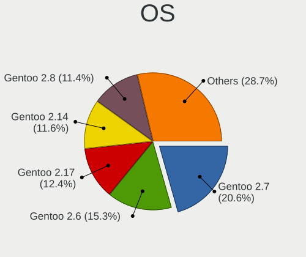

| Name           | Computers | Percent |
|----------------|-----------|---------|
| Gentoo 2.7     | 556       | 20.62%  |
| Gentoo 2.6     | 413       | 15.32%  |
| Gentoo 2.17    | 333       | 12.35%  |
| Gentoo 2.14    | 314       | 11.65%  |
| Gentoo 2.8     | 306       | 11.35%  |
| Gentoo 2.13    | 241       | 8.94%   |
| Gentoo 2.15    | 215       | 7.97%   |
| Gentoo 2.9     | 160       | 5.93%   |
| Gentoo 2.18    | 97        | 3.6%    |
| Gentoo 2.4.1   | 14        | 0.52%   |
| Gentoo         | 13        | 0.48%   |
| Gentoo 2.3     | 9         | 0.33%   |
| Gentoo 2.2     | 7         | 0.26%   |
| Gentoo 23      | 3         | 0.11%   |
| Gentoo 1       | 3         | 0.11%   |
| Gentoo 22.0.1  | 2         | 0.07%   |
| Gentoo 20.04   | 2         | 0.07%   |
| Gentoo 2.16    | 2         | 0.07%   |
| Gentoo Pelikan | 1         | 0.04%   |
| Gentoo 22      | 1         | 0.04%   |
| Gentoo 2022    | 1         | 0.04%   |
| Gentoo 2.1     | 1         | 0.04%   |
| Gentoo 13.0    | 1         | 0.04%   |
| Gentoo 0.5     | 1         | 0.04%   |

OS Family
---------

OS without a version

| Name   | Computers | Percent |
|--------|-----------|---------|
| Gentoo | 2260      | 100%    |

Kernel
------

Version of the Linux kernel

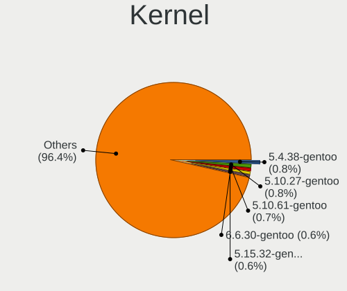

| Version                  | Computers | Percent |
|--------------------------|-----------|---------|
| 5.4.38-gentoo            | 26        | 0.83%   |
| 5.10.27-gentoo           | 25        | 0.79%   |
| 5.10.61-gentoo           | 23        | 0.73%   |
| 6.6.30-gentoo            | 20        | 0.64%   |
| 5.15.32-gentoo-r1        | 18        | 0.57%   |
| 6.1.57-gentoo            | 17        | 0.54%   |
| 5.15.80-gentoo           | 17        | 0.54%   |
| 6.6.13-gentoo            | 15        | 0.48%   |
| 6.12.34-gentoo-dist      | 15        | 0.48%   |
| 6.1.57-gentoo-x86_64     | 15        | 0.48%   |
| 6.1.19-gentoo-x86_64     | 15        | 0.48%   |
| 6.1.19-gentoo            | 15        | 0.48%   |
| 6.1.12-gentoo            | 15        | 0.48%   |
| 5.4.97-gentoo            | 15        | 0.48%   |
| 5.4.80-gentoo-r1         | 15        | 0.48%   |
| 5.4.48-gentoo            | 15        | 0.48%   |
| 5.15.80-gentoo-x86_64    | 15        | 0.48%   |
| 5.10.76-gentoo-r1        | 15        | 0.48%   |
| 5.4.28-gentoo            | 14        | 0.44%   |
| 5.15.75-gentoo-x86_64    | 13        | 0.41%   |
| 5.10.61-gentoo-x86_64    | 13        | 0.41%   |
| 5.10.27-gentoo-x86_64    | 13        | 0.41%   |
| 6.6.21-gentoo            | 12        | 0.38%   |
| 6.12.31-gentoo           | 12        | 0.38%   |
| 5.15.59-gentoo-x86_64    | 12        | 0.38%   |
| 5.15.32-gentoo-r1-x86_64 | 12        | 0.38%   |
| 5.10.52-gentoo           | 12        | 0.38%   |
| 6.6.30-gentoo-x86_64     | 11        | 0.35%   |
| 6.6.30-gentoo-dist       | 11        | 0.35%   |
| 6.6.13-gentoo-x86_64     | 11        | 0.35%   |
| 6.12.41-gentoo           | 11        | 0.35%   |
| 6.1.53-gentoo-r1         | 11        | 0.35%   |
| 5.7.0-gentoo             | 11        | 0.35%   |
| 5.4.60-gentoo            | 11        | 0.35%   |
| 5.15.88-gentoo           | 11        | 0.35%   |
| 6.1.67-gentoo            | 10        | 0.32%   |
| 5.4.38-gentoo-x86_64     | 10        | 0.32%   |
| 6.6.67-gentoo            | 9         | 0.29%   |
| 6.6.52-gentoo            | 9         | 0.29%   |
| 6.6.21-gentoo-x86_64     | 9         | 0.29%   |

Kernel Family
-------------

Linux kernel without a distro release

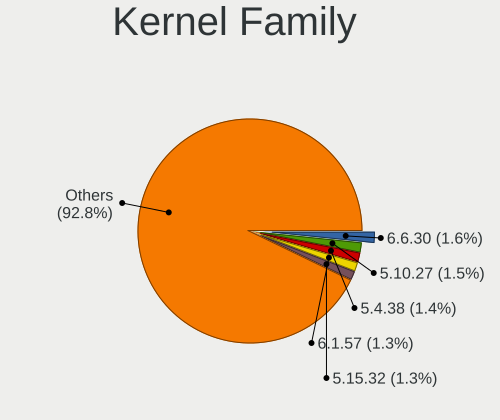

| Version | Computers | Percent |
|---------|-----------|---------|
| 6.6.30  | 51        | 1.62%   |
| 5.10.27 | 46        | 1.46%   |
| 5.4.38  | 45        | 1.43%   |
| 6.1.57  | 42        | 1.34%   |
| 5.15.32 | 41        | 1.31%   |
| 5.10.61 | 39        | 1.24%   |
| 6.1.19  | 38        | 1.21%   |
| 6.6.13  | 37        | 1.18%   |
| 6.6.21  | 35        | 1.11%   |
| 6.1.12  | 34        | 1.08%   |
| 5.15.80 | 34        | 1.08%   |
| 5.4.48  | 33        | 1.05%   |
| 5.10.76 | 32        | 1.02%   |
| 5.15.75 | 31        | 0.99%   |
| 6.6.47  | 28        | 0.89%   |
| 6.12.31 | 28        | 0.89%   |
| 5.4.97  | 26        | 0.83%   |
| 6.6.67  | 25        | 0.8%    |
| 6.12.41 | 25        | 0.8%    |
| 6.12.21 | 25        | 0.8%    |
| 6.1.31  | 25        | 0.8%    |
| 5.4.28  | 25        | 0.8%    |
| 5.15.59 | 25        | 0.8%    |
| 5.15.52 | 24        | 0.76%   |
| 5.10.52 | 24        | 0.76%   |
| 6.1.67  | 23        | 0.73%   |
| 6.1.41  | 23        | 0.73%   |
| 5.15.41 | 23        | 0.73%   |
| 5.4.80  | 22        | 0.7%    |
| 6.12.34 | 21        | 0.67%   |
| 5.15.11 | 20        | 0.64%   |
| 6.1.53  | 19        | 0.6%    |
| 6.1.46  | 19        | 0.6%    |
| 6.12.58 | 18        | 0.57%   |
| 6.12.16 | 18        | 0.57%   |
| 6.6.62  | 17        | 0.54%   |
| 6.6.52  | 17        | 0.54%   |
| 5.4.66  | 17        | 0.54%   |
| 5.15.88 | 17        | 0.54%   |
| 5.15.72 | 17        | 0.54%   |

Kernel Major Ver.
-----------------

Linux kernel major version

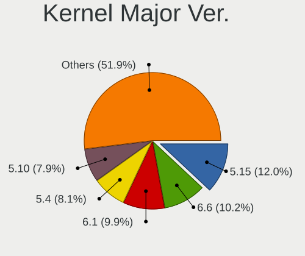

| Version | Computers | Percent |
|---------|-----------|---------|
| 5.15    | 341       | 11.98%  |
| 6.6     | 289       | 10.15%  |
| 6.1     | 281       | 9.87%   |
| 5.4     | 231       | 8.12%   |
| 5.10    | 226       | 7.94%   |
| 6.12    | 190       | 6.68%   |
| 4.19    | 67        | 2.35%   |
| 5.6     | 64        | 2.25%   |
| 5.9     | 58        | 2.04%   |
| 6.2     | 55        | 1.93%   |
| 5.8     | 54        | 1.9%    |
| 5.16    | 52        | 1.83%   |
| 5.14    | 50        | 1.76%   |
| 5.7     | 49        | 1.72%   |
| 5.17    | 47        | 1.65%   |
| 6.0     | 46        | 1.62%   |
| 6.4     | 43        | 1.51%   |
| 6.5     | 42        | 1.48%   |
| 6.3     | 42        | 1.48%   |
| 5.11    | 42        | 1.48%   |
| 5.18    | 41        | 1.44%   |
| 5.19    | 37        | 1.3%    |
| 6.17    | 36        | 1.26%   |
| 5.13    | 36        | 1.26%   |
| 6.11    | 35        | 1.23%   |
| 6.8     | 33        | 1.16%   |
| 6.13    | 31        | 1.09%   |
| 6.15    | 30        | 1.05%   |
| 5.12    | 30        | 1.05%   |
| 6.16    | 29        | 1.02%   |
| 6.10    | 29        | 1.02%   |
| 6.9     | 28        | 0.98%   |
| 6.7     | 28        | 0.98%   |
| 6.14    | 26        | 0.91%   |
| 4.14    | 18        | 0.63%   |
| 5.5     | 17        | 0.6%    |
| 6.18    | 13        | 0.46%   |
| 5.2     | 12        | 0.42%   |
| 5.1     | 10        | 0.35%   |
| 5.3     | 9         | 0.32%   |

Arch
----

OS architecture (x86_64, i586, etc.)

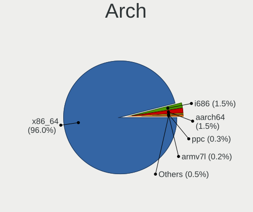

| Name        | Computers | Percent |
|-------------|-----------|---------|
| x86_64      | 2170      | 96.02%  |
| i686        | 34        | 1.5%    |
| aarch64     | 33        | 1.46%   |
| ppc         | 7         | 0.31%   |
| armv7l      | 4         | 0.18%   |
| armv6l      | 4         | 0.18%   |
| riscv64     | 2         | 0.09%   |
| loongarch64 | 2         | 0.09%   |
| armv5tel    | 2         | 0.09%   |
| ppc64le     | 1         | 0.04%   |
| ppc64       | 1         | 0.04%   |

DE
--

Desktop Environment

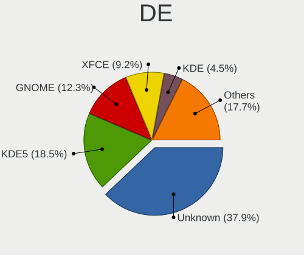

| Name               | Computers | Percent |
|--------------------|-----------|---------|
| Unknown            | 934       | 37.91%  |
| KDE5               | 457       | 18.55%  |
| GNOME              | 302       | 12.26%  |
| XFCE               | 226       | 9.17%   |
| KDE                | 110       | 4.46%   |
| KDE6               | 100       | 4.06%   |
| MATE               | 59        | 2.39%   |
| Hyprland           | 40        | 1.62%   |
| DWM                | 38        | 1.54%   |
| LXQt               | 35        | 1.42%   |
| sway               | 27        | 1.1%    |
| i3                 | 20        | 0.81%   |
| X-Cinnamon         | 19        | 0.77%   |
| Enlightenment      | 14        | 0.57%   |
| LXDE               | 12        | 0.49%   |
| Cinnamon           | 10        | 0.41%   |
| Xsession           | 8         | 0.32%   |
| awesome            | 7         | 0.28%   |
| niri               | 6         | 0.24%   |
| openbox            | 4         | 0.16%   |
| bspwm              | 4         | 0.16%   |
| Trinity            | 3         | 0.12%   |
| GNOME Classic      | 3         | 0.12%   |
| Unity              | 2         | 0.08%   |
| LeftWM             | 2         | 0.08%   |
| i3-with-shmlog     | 2         | 0.08%   |
| fluxbox            | 2         | 0.08%   |
| dwl                | 2         | 0.08%   |
| COSMIC             | 2         | 0.08%   |
| xmonad             | 1         | 0.04%   |
| X-Generic          | 1         | 0.04%   |
| wlroots            | 1         | 0.04%   |
| sussy_bspwm        | 1         | 0.04%   |
| ratpoison          | 1         | 0.04%   |
| qt5ct              | 1         | 0.04%   |
| LXQt:labwc:wlroots | 1         | 0.04%   |
| labwc:wlroots      | 1         | 0.04%   |
| ICEWM              | 1         | 0.04%   |
| GNOME Flashback    | 1         | 0.04%   |
| fvwm               | 1         | 0.04%   |

Display Server
--------------

X11 or Wayland

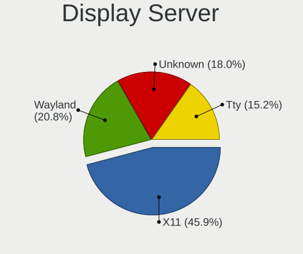

| Name    | Computers | Percent |
|---------|-----------|---------|
| X11     | 1132      | 45.9%   |
| Wayland | 514       | 20.84%  |
| Unknown | 444       | 18%     |
| Tty     | 376       | 15.25%  |

Display Manager
---------------

SDDM, LightDM, etc.

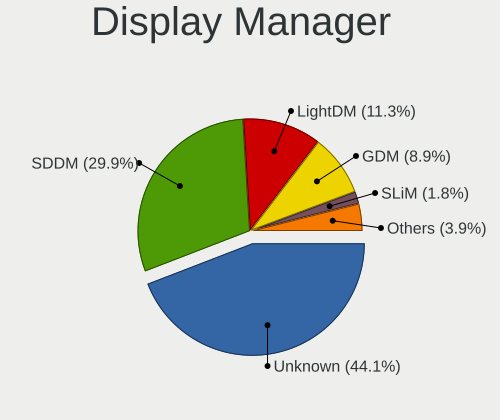

| Name    | Computers | Percent |
|---------|-----------|---------|
| Unknown | 1054      | 44.14%  |
| SDDM    | 714       | 29.9%   |
| LightDM | 271       | 11.35%  |
| GDM     | 213       | 8.92%   |
| SLiM    | 42        | 1.76%   |
| XDM     | 37        | 1.55%   |
| LXDM    | 22        | 0.92%   |
| GREETD  | 21        | 0.88%   |
| TDM     | 7         | 0.29%   |
| Ly      | 5         | 0.21%   |
| KDM     | 1         | 0.04%   |
| GDM3    | 1         | 0.04%   |

OS Lang
-------

Language

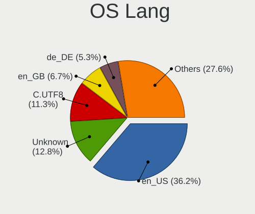

| Lang       | Computers | Percent |
|------------|-----------|---------|
| en_US      | 862       | 36.22%  |
| Unknown    | 304       | 12.77%  |
| C.UTF8     | 270       | 11.34%  |
| en_GB      | 159       | 6.68%   |
| de_DE      | 127       | 5.34%   |
| ru_RU      | 89        | 3.74%   |
| C          | 84        | 3.53%   |
| fr_FR      | 55        | 2.31%   |
| cs_CZ      | 41        | 1.72%   |
| it_IT      | 35        | 1.47%   |
| es_ES      | 31        | 1.3%    |
| pl_PL      | 27        | 1.13%   |
| en_CA      | 26        | 1.09%   |
| en_AU      | 23        | 0.97%   |
| zh_CN      | 19        | 0.8%    |
| pt_BR      | 18        | 0.76%   |
| en_IE      | 14        | 0.59%   |
| sv_SE      | 10        | 0.42%   |
| POSIX      | 8         | 0.34%   |
| ja_JP      | 8         | 0.34%   |
| uk_UA      | 7         | 0.29%   |
| ru_RU.UTF8 | 7         | 0.29%   |
| nl_NL      | 7         | 0.29%   |
| fr_CA      | 7         | 0.29%   |
| fi_FI      | 7         | 0.29%   |
| es_MX      | 7         | 0.29%   |
| es_AR      | 7         | 0.29%   |
| en_US.UTF8 | 7         | 0.29%   |
| de_CH      | 7         | 0.29%   |
| ca_ES      | 7         | 0.29%   |
| nl_BE      | 6         | 0.25%   |
| en_DK      | 6         | 0.25%   |
| el_GR      | 6         | 0.25%   |
| es_CL      | 5         | 0.21%   |
| en_ZA      | 5         | 0.21%   |
| zh_TW      | 4         | 0.17%   |
| ro_RO      | 3         | 0.13%   |
| hu_HU      | 3         | 0.13%   |
| tr_TR      | 2         | 0.08%   |
| ru_UA      | 2         | 0.08%   |

Boot Mode
---------

EFI or BIOS

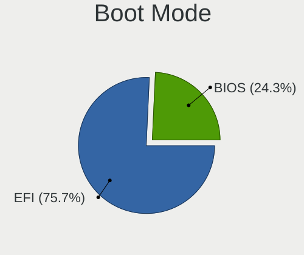

| Mode | Computers | Percent |
|------|-----------|---------|
| EFI  | 1751      | 75.74%  |
| BIOS | 561       | 24.26%  |

Filesystem
----------

Type of filesystem

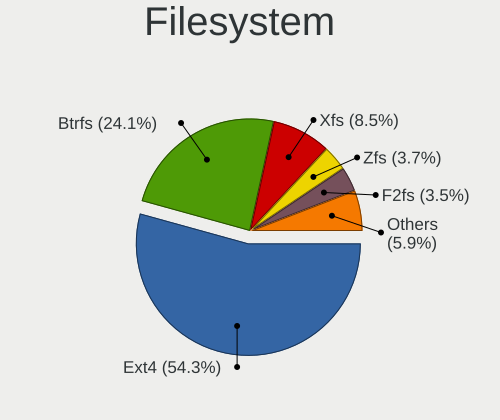

| Type     | Computers | Percent |
|----------|-----------|---------|
| Ext4     | 1258      | 54.29%  |
| Btrfs    | 559       | 24.13%  |
| Xfs      | 197       | 8.5%    |
| Zfs      | 85        | 3.67%   |
| F2fs     | 82        | 3.54%   |
| Unknown  | 46        | 1.99%   |
| XXXXXXX  | 25        | 1.08%   |
| Reiserfs | 17        | 0.73%   |
| Overlay  | 17        | 0.73%   |
| Bcachefs | 15        | 0.65%   |
| Jfs      | 5         | 0.22%   |
| Ext3     | 5         | 0.22%   |
| XXX      | 2         | 0.09%   |
| Ext2     | 2         | 0.09%   |
| XXX4     | 1         | 0.04%   |
| Xtrfs    | 1         | 0.04%   |

Part. scheme
------------

Scheme of partitioning

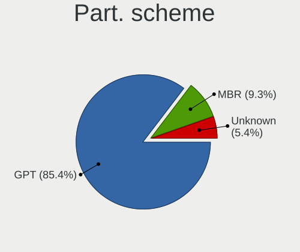

| Type    | Computers | Percent |
|---------|-----------|---------|
| GPT     | 1956      | 85.38%  |
| MBR     | 212       | 9.25%   |
| Unknown | 123       | 5.37%   |

Dual Boot with Linux/BSD
------------------------

Hosting more than one Linux/BSD

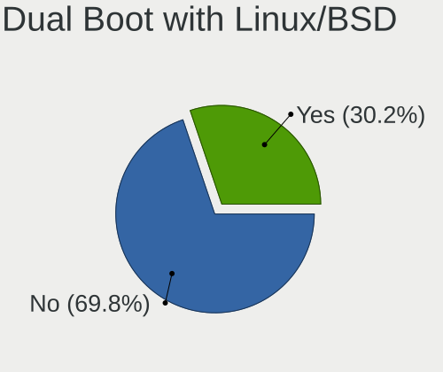

| Dual boot | Computers | Percent |
|-----------|-----------|---------|
| No        | 1661      | 69.82%  |
| Yes       | 718       | 30.18%  |

Dual Boot (Win)
---------------

Hosting Linux and Windows

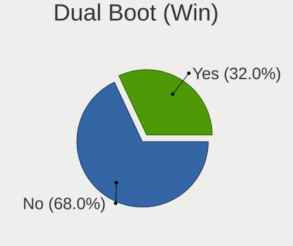

| Dual boot | Computers | Percent |
|-----------|-----------|---------|
| No        | 1580      | 68.02%  |
| Yes       | 743       | 31.98%  |

Board
-----

Vendor
------

Motherboard manufacturer

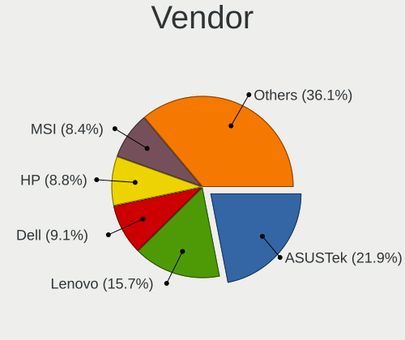

| Name                          | Computers | Percent |
|-------------------------------|-----------|---------|
| ASUSTek Computer              | 496       | 21.95%  |
| Lenovo                        | 354       | 15.66%  |
| Dell                          | 205       | 9.07%   |
| Hewlett-Packard               | 199       | 8.81%   |
| MSI                           | 190       | 8.41%   |
| Gigabyte Technology           | 168       | 7.43%   |
| ASRock                        | 130       | 5.75%   |
| Acer                          | 73        | 3.23%   |
| Unknown                       | 47        | 2.08%   |
| Intel                         | 34        | 1.5%    |
| Apple                         | 32        | 1.42%   |
| Supermicro                    | 30        | 1.33%   |
| Raspberry Pi Foundation       | 20        | 0.88%   |
| Fujitsu                       | 18        | 0.8%    |
| HUAWEI                        | 16        | 0.71%   |
| Framework                     | 16        | 0.71%   |
| Samsung Electronics           | 13        | 0.58%   |
| Timi                          | 12        | 0.53%   |
| Toshiba                       | 11        | 0.49%   |
| TUXEDO                        | 9         | 0.4%    |
| Notebook                      | 8         | 0.35%   |
| ASRockRack                    | 8         | 0.35%   |
| System76                      | 7         | 0.31%   |
| Razer                         | 7         | 0.31%   |
| Alienware                     | 7         | 0.31%   |
| IBM                           | 6         | 0.27%   |
| Google                        | 6         | 0.27%   |
| TYAN Computer                 | 4         | 0.18%   |
| Star Labs                     | 4         | 0.18%   |
| Medion                        | 4         | 0.18%   |
| Chuwi                         | 4         | 0.18%   |
| Tekram Technology             | 3         | 0.13%   |
| Sony                          | 3         | 0.13%   |
| Shanghai Hub Union Industural | 3         | 0.13%   |
| Positivo                      | 3         | 0.13%   |
| Pegatron                      | 3         | 0.13%   |
| Huanan                        | 3         | 0.13%   |
| Foxconn                       | 3         | 0.13%   |
| BESSTAR Tech                  | 3         | 0.13%   |
| ZOTAC                         | 2         | 0.09%   |

Model
-----

Motherboard model

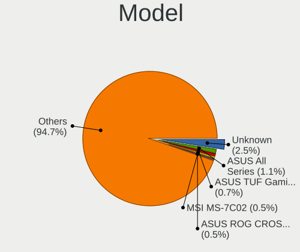

| Name                                       | Computers | Percent |
|--------------------------------------------|-----------|---------|
| Unknown                                    | 56        | 2.48%   |
| ASUS All Series                            | 25        | 1.11%   |
| ASUS TUF Gaming X570-PLUS                  | 16        | 0.71%   |
| MSI MS-7C02                                | 11        | 0.49%   |
| ASUS ROG CROSSHAIR VIII HERO               | 11        | 0.49%   |
| Supermicro Super Server                    | 10        | 0.44%   |
| ASUS ROG STRIX X570-E GAMING               | 9         | 0.4%    |
| ASUS PRIME X570-PRO                        | 9         | 0.4%    |
| ASUS TUF Gaming B550-PLUS                  | 8         | 0.35%   |
| MSI MS-7B86                                | 7         | 0.31%   |
| ASUS PRIME X570-P                          | 7         | 0.31%   |
| ASUS PRIME X470-PRO                        | 7         | 0.31%   |
| ASRock B450 Pro4                           | 7         | 0.31%   |
| MSI MS-7C91                                | 6         | 0.27%   |
| MSI MS-7C37                                | 6         | 0.27%   |
| MSI MS-7A38                                | 6         | 0.27%   |
| Framework Laptop 13 (AMD Ryzen 7040Series) | 6         | 0.27%   |
| Dell XPS 15 9570                           | 6         | 0.27%   |
| ASUS ROG Strix G513QY_G513QY               | 6         | 0.27%   |
| ASUS ROG STRIX B450-F GAMING               | 6         | 0.27%   |
| ASUS PRIME X370-PRO                        | 6         | 0.27%   |
| ASRock X570 Taichi                         | 6         | 0.27%   |
| ASRock B550M Steel Legend                  | 6         | 0.27%   |
| MSI MS-7D25                                | 5         | 0.22%   |
| MSI MS-7C35                                | 5         | 0.22%   |
| MSI MS-7B89                                | 5         | 0.22%   |
| MSI MS-7B79                                | 5         | 0.22%   |
| HP Pavilion Notebook                       | 5         | 0.22%   |
| HP OMEN by Laptop                          | 5         | 0.22%   |
| Gigabyte X570 AORUS ELITE                  | 5         | 0.22%   |
| Dell XPS 17 9710                           | 5         | 0.22%   |
| Dell XPS 13 9310                           | 5         | 0.22%   |
| ASUS ROG STRIX B550-F GAMING               | 5         | 0.22%   |
| ASUS ROG CROSSHAIR VIII DARK HERO          | 5         | 0.22%   |
| ASUS PRIME B450M-A                         | 5         | 0.22%   |
| MSI MS-7C84                                | 4         | 0.18%   |
| MSI MS-7C56                                | 4         | 0.18%   |
| MSI MS-7693                                | 4         | 0.18%   |
| HP Z420 Workstation                        | 4         | 0.18%   |
| HP Pavilion Gaming Laptop 15-ec1xxx        | 4         | 0.18%   |

Model Family
------------

Motherboard model prefix

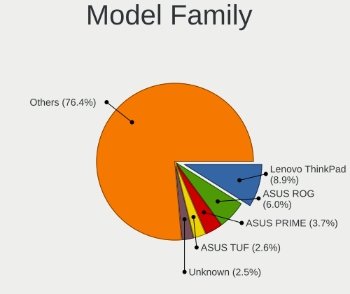

| Name                | Computers | Percent |
|---------------------|-----------|---------|
| Lenovo ThinkPad     | 202       | 8.94%   |
| ASUS ROG            | 135       | 5.97%   |
| ASUS PRIME          | 83        | 3.67%   |
| ASUS TUF            | 58        | 2.57%   |
| Unknown             | 56        | 2.48%   |
| Dell XPS            | 52        | 2.3%    |
| Dell Latitude       | 52        | 2.3%    |
| Acer Aspire         | 43        | 1.9%    |
| Lenovo IdeaPad      | 40        | 1.77%   |
| Dell Precision      | 39        | 1.73%   |
| HP EliteBook        | 35        | 1.55%   |
| Lenovo Legion       | 32        | 1.42%   |
| HP Pavilion         | 30        | 1.33%   |
| ASUS All            | 25        | 1.11%   |
| Dell Inspiron       | 24        | 1.06%   |
| HP Laptop           | 23        | 1.02%   |
| Lenovo Yoga         | 22        | 0.97%   |
| ASUS VivoBook       | 21        | 0.93%   |
| RPi Raspberry       | 20        | 0.88%   |
| ASUS ASUS           | 20        | 0.88%   |
| HP OMEN             | 17        | 0.75%   |
| Gigabyte X570       | 17        | 0.75%   |
| ASRock X570         | 17        | 0.75%   |
| Framework Laptop    | 16        | 0.71%   |
| HP ProBook          | 15        | 0.66%   |
| Dell OptiPlex       | 14        | 0.62%   |
| Lenovo ThinkBook    | 13        | 0.58%   |
| ASUS ZenBook        | 13        | 0.58%   |
| MSI MS-7C02         | 11        | 0.49%   |
| Acer Nitro          | 11        | 0.49%   |
| Supermicro Super    | 10        | 0.44%   |
| ASUS ProArt         | 10        | 0.44%   |
| ASRock B550M        | 10        | 0.44%   |
| Lenovo ThinkStation | 9         | 0.4%    |
| Gigabyte B450M      | 9         | 0.4%    |
| Gigabyte B450       | 9         | 0.4%    |
| ASRock X370         | 9         | 0.4%    |
| ASRock B450         | 9         | 0.4%    |
| Acer Swift          | 9         | 0.4%    |
| Toshiba Satellite   | 8         | 0.35%   |

MFG Year
--------

Motherboard manufacture year

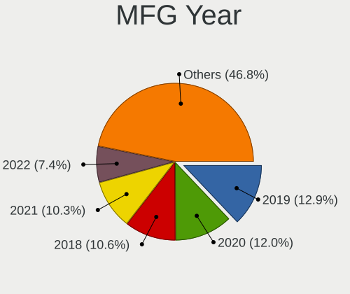

| Year    | Computers | Percent |
|---------|-----------|---------|
| 2019    | 292       | 12.92%  |
| 2020    | 271       | 11.99%  |
| 2018    | 239       | 10.58%  |
| 2021    | 232       | 10.27%  |
| 2022    | 168       | 7.43%   |
| 2023    | 131       | 5.8%    |
| 2017    | 114       | 5.04%   |
| 2015    | 94        | 4.16%   |
| 2012    | 93        | 4.12%   |
| 2013    | 86        | 3.81%   |
| 2024    | 77        | 3.41%   |
| 2014    | 77        | 3.41%   |
| 2016    | 76        | 3.36%   |
| 2011    | 61        | 2.7%    |
| 2010    | 53        | 2.35%   |
| Unknown | 48        | 2.12%   |
| 2008    | 40        | 1.77%   |
| 2009    | 37        | 1.64%   |
| 2025    | 28        | 1.24%   |
| 2007    | 16        | 0.71%   |
| 2006    | 8         | 0.35%   |
| 2005    | 6         | 0.27%   |
| 2004    | 5         | 0.22%   |
| 2003    | 4         | 0.18%   |
| 2000    | 3         | 0.13%   |
| 2002    | 1         | 0.04%   |

Form Factor
-----------

Physical design of the computer

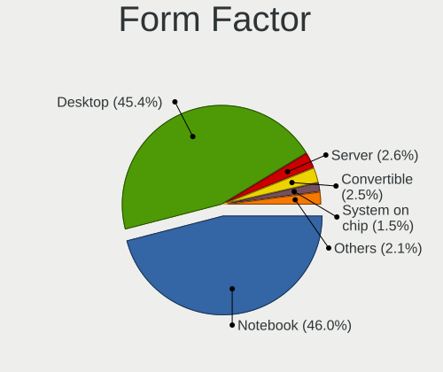

| Name           | Computers | Percent |
|----------------|-----------|---------|
| Notebook       | 1039      | 45.97%  |
| Desktop        | 1025      | 45.35%  |
| Server         | 59        | 2.61%   |
| Convertible    | 56        | 2.48%   |
| System on chip | 34        | 1.5%    |
| Mini pc        | 28        | 1.24%   |
| Tablet         | 9         | 0.4%    |
| All in one     | 7         | 0.31%   |
| Other          | 1         | 0.04%   |
| Phone          | 1         | 0.04%   |
| Stick pc       | 1         | 0.04%   |

Secure Boot
-----------

Enabled or disabled

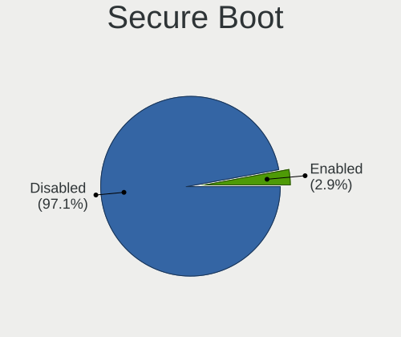

| State    | Computers | Percent |
|----------|-----------|---------|
| Disabled | 2209      | 97.1%   |
| Enabled  | 66        | 2.9%    |

Coreboot
--------

Have coreboot on board

| Used | Computers | Percent |
|------|-----------|---------|
| No   | 2243      | 99.25%  |
| Yes  | 17        | 0.75%   |

RAM Size
--------

Total RAM memory

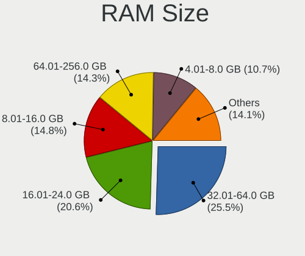

| Size in GB      | Computers | Percent |
|-----------------|-----------|---------|
| 32.01-64.0      | 596       | 25.48%  |
| 16.01-24.0      | 483       | 20.65%  |
| 8.01-16.0       | 347       | 14.84%  |
| 64.01-256.0     | 334       | 14.28%  |
| 4.01-8.0        | 250       | 10.69%  |
| 24.01-32.0      | 117       | 5%      |
| 3.01-4.0        | 106       | 4.53%   |
| 1.01-2.0        | 33        | 1.41%   |
| 0.51-1.0        | 26        | 1.11%   |
| 2.01-3.0        | 24        | 1.03%   |
| More than 256.0 | 13        | 0.56%   |
| 0.01-0.5        | 10        | 0.43%   |

RAM Used
--------

Used RAM memory

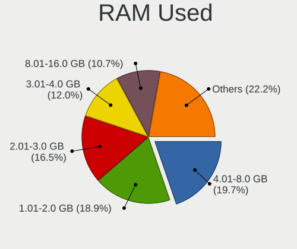

| Used GB     | Computers | Percent |
|-------------|-----------|---------|
| 4.01-8.0    | 545       | 19.75%  |
| 1.01-2.0    | 522       | 18.91%  |
| 2.01-3.0    | 455       | 16.49%  |
| 3.01-4.0    | 331       | 11.99%  |
| 8.01-16.0   | 295       | 10.69%  |
| 0.51-1.0    | 234       | 8.48%   |
| 0.01-0.5    | 215       | 7.79%   |
| 16.01-24.0  | 94        | 3.41%   |
| 32.01-64.0  | 36        | 1.3%    |
| 24.01-32.0  | 23        | 0.83%   |
| 64.01-256.0 | 7         | 0.25%   |
| 0           | 3         | 0.11%   |

Total Drives
------------

Number of drives on board

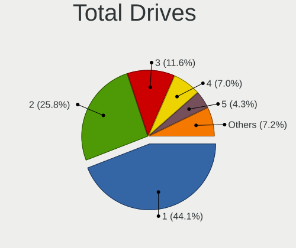

| Drives | Computers | Percent |
|--------|-----------|---------|
| 1      | 1053      | 44.1%   |
| 2      | 617       | 25.84%  |
| 3      | 277       | 11.6%   |
| 4      | 166       | 6.95%   |
| 5      | 103       | 4.31%   |
| 6      | 59        | 2.47%   |
| 7      | 41        | 1.72%   |
| 8      | 19        | 0.8%    |
| 0      | 13        | 0.54%   |
| 9      | 10        | 0.42%   |
| 10     | 9         | 0.38%   |
| 13     | 5         | 0.21%   |
| 12     | 4         | 0.17%   |
| 21     | 2         | 0.08%   |
| 11     | 2         | 0.08%   |
| 34     | 1         | 0.04%   |
| 31     | 1         | 0.04%   |
| 26     | 1         | 0.04%   |
| 22     | 1         | 0.04%   |
| 19     | 1         | 0.04%   |
| 18     | 1         | 0.04%   |
| 17     | 1         | 0.04%   |
| 14     | 1         | 0.04%   |

Has CD-ROM
----------

Has CD-ROM on board

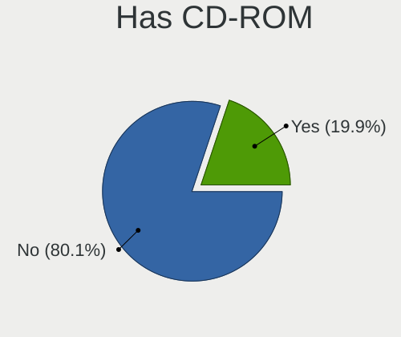

| Presented | Computers | Percent |
|-----------|-----------|---------|
| No        | 1845      | 80.11%  |
| Yes       | 458       | 19.89%  |

Has Ethernet
------------

Has Ethernet on board

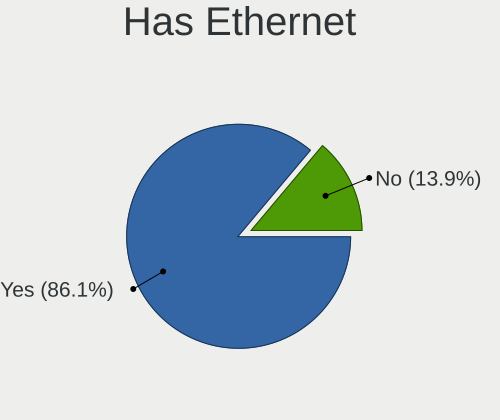

| Presented | Computers | Percent |
|-----------|-----------|---------|
| Yes       | 1962      | 86.13%  |
| No        | 316       | 13.87%  |

Has WiFi
--------

Has WiFi module

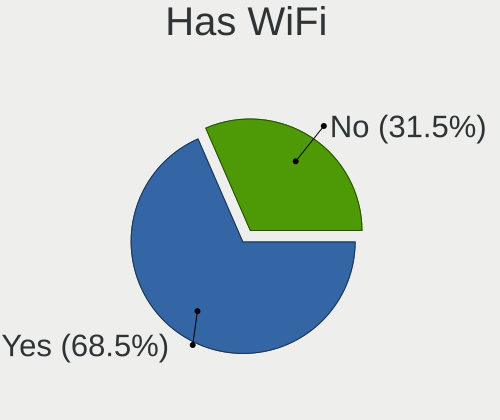

| Presented | Computers | Percent |
|-----------|-----------|---------|
| Yes       | 1557      | 68.47%  |
| No        | 717       | 31.53%  |

Has Bluetooth
-------------

Has Bluetooth module

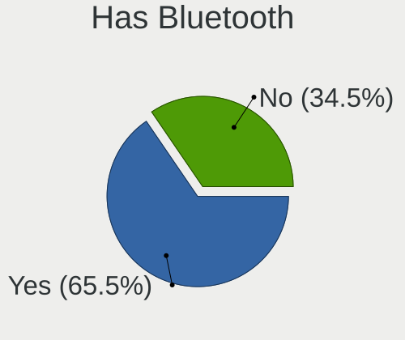

| Presented | Computers | Percent |
|-----------|-----------|---------|
| Yes       | 1505      | 65.46%  |
| No        | 794       | 34.54%  |

Location
--------

Country
-------

Geographic location (country)

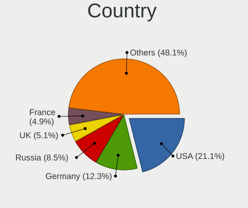

| Country         | Computers | Percent |
|-----------------|-----------|---------|
| USA             | 484       | 21.09%  |
| Germany         | 283       | 12.33%  |
| Russia          | 194       | 8.45%   |
| UK              | 117       | 5.1%    |
| France          | 112       | 4.88%   |
| Canada          | 82        | 3.57%   |
| Poland          | 77        | 3.36%   |
| Czechia         | 73        | 3.18%   |
| Spain           | 70        | 3.05%   |
| China           | 67        | 2.92%   |
| Italy           | 58        | 2.53%   |
| Sweden          | 48        | 2.09%   |
| Netherlands     | 45        | 1.96%   |
| Australia       | 43        | 1.87%   |
| Finland         | 38        | 1.66%   |
| Brazil          | 35        | 1.53%   |
| Switzerland     | 28        | 1.22%   |
| Ukraine         | 27        | 1.18%   |
| Belgium         | 27        | 1.18%   |
| India           | 22        | 0.96%   |
| Turkey          | 21        | 0.92%   |
| Romania         | 20        | 0.87%   |
| Greece          | 20        | 0.87%   |
| Japan           | 19        | 0.83%   |
| Mexico          | 18        | 0.78%   |
| Austria         | 18        | 0.78%   |
| Norway          | 14        | 0.61%   |
| Hungary         | 14        | 0.61%   |
| Hong Kong       | 14        | 0.61%   |
| Belarus         | 13        | 0.57%   |
| Argentina       | 13        | 0.57%   |
| Slovakia        | 9         | 0.39%   |
| Portugal        | 9         | 0.39%   |
| Ireland         | 9         | 0.39%   |
| Indonesia       | 9         | 0.39%   |
| Taiwan          | 8         | 0.35%   |
| South Africa    | 8         | 0.35%   |
| Chile           | 8         | 0.35%   |
| Bulgaria        | 8         | 0.35%   |
| The Netherlands | 7         | 0.31%   |

City
----

Geographic location (city)

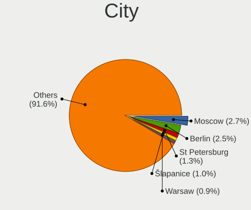

| City              | Computers | Percent |
|-------------------|-----------|---------|
| Moscow            | 69        | 2.71%   |
| Berlin            | 63        | 2.48%   |
| St Petersburg     | 33        | 1.3%    |
| Šlapanice        | 25        | 0.98%   |
| Warsaw            | 23        | 0.9%    |
| Paris             | 23        | 0.9%    |
| Amsterdam         | 21        | 0.83%   |
| Athens            | 19        | 0.75%   |
| Sydney            | 18        | 0.71%   |
| Munich            | 16        | 0.63%   |
| Los Angeles       | 16        | 0.63%   |
| Frankfurt am Main | 16        | 0.63%   |
| Cieszyn           | 16        | 0.63%   |
| Stockholm         | 15        | 0.59%   |
| Prague            | 15        | 0.59%   |
| Helsinki          | 15        | 0.59%   |
| Vancouver         | 14        | 0.55%   |
| Seattle           | 13        | 0.51%   |
| New York          | 13        | 0.51%   |
| Kyiv              | 13        | 0.51%   |
| Bucharest         | 13        | 0.51%   |
| Milan             | 12        | 0.47%   |
| London            | 12        | 0.47%   |
| Beijing           | 12        | 0.47%   |
| Vladivostok       | 11        | 0.43%   |
| Vienna            | 11        | 0.43%   |
| Barcelona         | 11        | 0.43%   |
| Melbourne         | 10        | 0.39%   |
| Madrid            | 10        | 0.39%   |
| Guangzhou         | 10        | 0.39%   |
| Toulouse          | 9         | 0.35%   |
| Minsk             | 9         | 0.35%   |
| Istanbul          | 9         | 0.35%   |
| Bothell           | 9         | 0.35%   |
| Zurich            | 8         | 0.31%   |
| Wuelfrath         | 8         | 0.31%   |
| Toronto           | 8         | 0.31%   |
| Dublin            | 8         | 0.31%   |
| Central           | 8         | 0.31%   |
| Swansea           | 7         | 0.28%   |

Drives
------

Drive Vendor
------------

Hard drive vendors

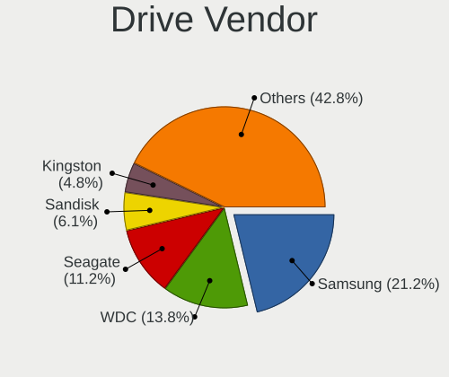

| Vendor                       | Computers | Drives | Percent |
|------------------------------|-----------|--------|---------|
| Samsung Electronics          | 842       | 1786   | 21.25%  |
| WDC                          | 548       | 1278   | 13.83%  |
| Seagate                      | 445       | 1016   | 11.23%  |
| Sandisk                      | 242       | 376    | 6.11%   |
| Kingston                     | 191       | 275    | 4.82%   |
| Toshiba                      | 174       | 357    | 4.39%   |
| Intel                        | 164       | 276    | 4.14%   |
| SK hynix                     | 122       | 165    | 3.08%   |
| Crucial                      | 119       | 220    | 3%      |
| Unknown                      | 102       | 169    | 2.57%   |
| Micron Technology            | 83        | 120    | 2.09%   |
| Phison Electronics           | 75        | 107    | 1.89%   |
| Hitachi                      | 73        | 259    | 1.84%   |
| HGST                         | 68        | 117    | 1.72%   |
| Micron/Crucial Technology    | 49        | 81     | 1.24%   |
| A-DATA Technology            | 49        | 71     | 1.24%   |
| KIOXIA                       | 48        | 62     | 1.21%   |
| Kingston Technology Company  | 39        | 48     | 0.98%   |
| Silicon Motion               | 25        | 33     | 0.63%   |
| Phison                       | 25        | 38     | 0.63%   |
| China                        | 23        | 68     | 0.58%   |
| ADATA Technology             | 23        | 31     | 0.58%   |
| Corsair                      | 22        | 41     | 0.56%   |
| OCZ                          | 21        | 30     | 0.53%   |
| Realtek Semiconductor        | 17        | 27     | 0.43%   |
| MAXIO Technology (Hangzhou)  | 17        | 23     | 0.43%   |
| Apple                        | 17        | 21     | 0.43%   |
| Transcend                    | 15        | 20     | 0.38%   |
| Patriot                      | 12        | 20     | 0.3%    |
| GOODRAM                      | 12        | 129    | 0.3%    |
| SPCC                         | 11        | 13     | 0.28%   |
| Shenzhen Longsys Electronics | 11        | 19     | 0.28%   |
| Fujitsu                      | 11        | 15     | 0.28%   |
| Yangtze Memory Technologies  | 10        | 12     | 0.25%   |
| PNY                          | 10        | 20     | 0.25%   |
| Hewlett-Packard              | 10        | 25     | 0.25%   |
| Unknown                      | 10        | 11     | 0.25%   |
| Team                         | 9         | 17     | 0.23%   |
| XPG                          | 7         | 14     | 0.18%   |
| Verbatim                     | 7         | 7      | 0.18%   |

Drive Model
-----------

Hard drive models

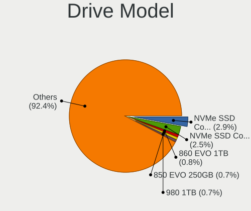

| Model                                                 | Computers | Percent |
|-------------------------------------------------------|-----------|---------|
| Samsung NVMe SSD Controller SM981/PM981/PM983 1TB     | 137       | 2.89%   |
| Samsung NVMe SSD Controller PM9A1/PM9A3/980PRO 1TB    | 117       | 2.47%   |
| Samsung SSD 860 EVO 1TB                               | 39        | 0.82%   |
| Samsung SSD 850 EVO 250GB                             | 35        | 0.74%   |
| Samsung SSD 980 1TB                                   | 33        | 0.7%    |
| Samsung SSD 860 EVO 500GB                             | 31        | 0.65%   |
| Samsung SSD 850 EVO 500GB                             | 30        | 0.63%   |
| Kingston SA400S37240G 240GB SSD                       | 29        | 0.61%   |
| WDC WD30EFRX-68EUZN0 3TB                              | 27        | 0.57%   |
| Seagate ST2000DM008-2FR102 2TB                        | 27        | 0.57%   |
| HGST HTS721010A9E630 1TB                              | 27        | 0.57%   |
| Micron/Crucial P2 NVMe PCIe SSD 2TB                   | 26        | 0.55%   |
| Samsung SSD 860 EVO 250GB                             | 25        | 0.53%   |
| Crucial CT1000MX500SSD1 1TB                           | 25        | 0.53%   |
| Seagate ST1000DM010-2EP102 1TB                        | 23        | 0.49%   |
| Seagate ST4000DM004-2CV104 4TB                        | 22        | 0.46%   |
| Unknown MMC Card  32GB                                | 21        | 0.44%   |
| Sandisk WD Black SN750 / PC SN730 NVMe SSD 500GB      | 21        | 0.44%   |
| Samsung NVMe SSD Controller SM961/PM961/SM963 1024GB  | 21        | 0.44%   |
| Kingston SA400S37480G 480GB SSD                       | 21        | 0.44%   |
| Intel SSD 660P Series 512GB                           | 21        | 0.44%   |
| Sandisk WD Blue SN550 NVMe SSD 1024GB                 | 20        | 0.42%   |
| Phison E12 NVMe Controller 1TB                        | 20        | 0.42%   |
| Samsung SSD 970 EVO Plus 500GB                        | 19        | 0.4%    |
| WDC WD10EZEX-08WN4A0 1TB                              | 18        | 0.38%   |
| Seagate ST2000DM001-1ER164 2TB                        | 18        | 0.38%   |
| Samsung SSD 870 EVO 1TB                               | 18        | 0.38%   |
| Silicon Motion SM2263EN/SM2263XT SSD Controller 512GB | 17        | 0.36%   |
| Crucial CT500MX500SSD1 500GB                          | 17        | 0.36%   |
| Unknown MMC Card  128GB                               | 16        | 0.34%   |
| Unknown MMC Card  64GB                                | 15        | 0.32%   |
| Seagate ST500DM002-1BD142 500GB                       | 15        | 0.32%   |
| Seagate ST2000DM006-2DM164 2TB                        | 15        | 0.32%   |
| Samsung SSD 970 EVO Plus 1TB                          | 15        | 0.32%   |
| Samsung SSD 970 EVO 500GB                             | 15        | 0.32%   |
| Samsung SSD 840 EVO 120GB                             | 15        | 0.32%   |
| Phison E16 PCIe4 NVMe Controller 1TB                  | 15        | 0.32%   |
| WDC WDS500G2B0A-00SM50 500GB                          | 14        | 0.3%    |
| WDC WD20EFRX-68EUZN0 2TB                              | 14        | 0.3%    |
| Samsung SSD 990 PRO 2TB                               | 14        | 0.3%    |

HDD Vendor
----------

Hard disk drive vendors

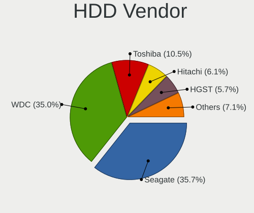

| Vendor              | Computers | Drives | Percent |
|---------------------|-----------|--------|---------|
| Seagate             | 428       | 985    | 35.67%  |
| WDC                 | 420       | 1047   | 35%     |
| Toshiba             | 126       | 296    | 10.5%   |
| Hitachi             | 73        | 259    | 6.08%   |
| HGST                | 68        | 117    | 5.67%   |
| Samsung Electronics | 32        | 49     | 2.67%   |
| Fujitsu             | 11        | 15     | 0.92%   |
| Unknown             | 6         | 7      | 0.5%    |
| IBM                 | 5         | 6      | 0.42%   |
| Hewlett-Packard     | 5         | 10     | 0.42%   |
| Maxtor              | 3         | 5      | 0.25%   |
| IBM/Hitachi         | 3         | 4      | 0.25%   |
| TO Exter            | 2         | 2      | 0.17%   |
| MDT                 | 2         | 2      | 0.17%   |
| LaCie               | 2         | 12     | 0.17%   |
| Apple               | 2         | 2      | 0.17%   |
| Unknown             | 2         | 2      | 0.17%   |
| Teleplan            | 1         | 4      | 0.08%   |
| SSK                 | 1         | 1      | 0.08%   |
| NETAPP              | 1         | 3      | 0.08%   |
| HGST HTS            | 1         | 1      | 0.08%   |
| FNK TECH            | 1         | 1      | 0.08%   |
| FC-1307             | 1         | 1      | 0.08%   |
| Dyconn H            | 1         | 1      | 0.08%   |
| ASMT                | 1         | 2      | 0.08%   |
| ASMedia             | 1         | 1      | 0.08%   |
| AFAYA               | 1         | 1      | 0.08%   |

SSD Vendor
----------

Solid state drive vendors

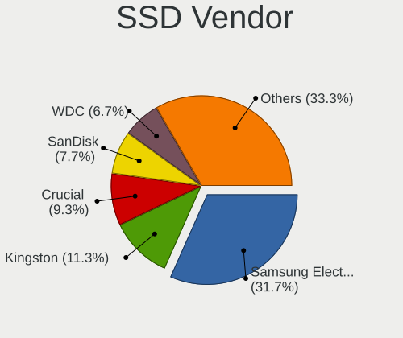

| Vendor              | Computers | Drives | Percent |
|---------------------|-----------|--------|---------|
| Samsung Electronics | 377       | 688    | 31.65%  |
| Kingston            | 134       | 185    | 11.25%  |
| Crucial             | 111       | 205    | 9.32%   |
| SanDisk             | 92        | 147    | 7.72%   |
| WDC                 | 80        | 116    | 6.72%   |
| Intel               | 48        | 71     | 4.03%   |
| A-DATA Technology   | 34        | 50     | 2.85%   |
| China               | 23        | 68     | 1.93%   |
| OCZ                 | 20        | 29     | 1.68%   |
| Micron Technology   | 18        | 28     | 1.51%   |
| Toshiba             | 15        | 18     | 1.26%   |
| SK hynix            | 15        | 19     | 1.26%   |
| Corsair             | 15        | 26     | 1.26%   |
| Transcend           | 13        | 18     | 1.09%   |
| GOODRAM             | 12        | 129    | 1.01%   |
| SPCC                | 10        | 12     | 0.84%   |
| Patriot             | 10        | 18     | 0.84%   |
| Apple               | 10        | 11     | 0.84%   |
| PNY                 | 9         | 19     | 0.76%   |
| Verbatim            | 7         | 7      | 0.59%   |
| Team                | 7         | 9      | 0.59%   |
| LITEONIT            | 7         | 9      | 0.59%   |
| Unknown             | 7         | 8      | 0.59%   |
| Plextor             | 6         | 6      | 0.5%    |
| Intenso             | 6         | 9      | 0.5%    |
| Netac               | 5         | 5      | 0.42%   |
| Mushkin             | 5         | 5      | 0.42%   |
| KingSpec            | 5         | 10     | 0.42%   |
| T-FORCE             | 4         | 9      | 0.34%   |
| Seagate             | 4         | 7      | 0.34%   |
| SABRENT             | 4         | 4      | 0.34%   |
| LITEON              | 4         | 9      | 0.34%   |
| Apacer              | 4         | 7      | 0.34%   |
| Smartbuy            | 3         | 3      | 0.25%   |
| Lexar               | 3         | 3      | 0.25%   |
| Kingchuxing         | 3         | 13     | 0.25%   |
| Hewlett-Packard     | 3         | 3      | 0.25%   |
| Dogfish             | 3         | 3      | 0.25%   |
| ASMT                | 3         | 4      | 0.25%   |
| MyDigitalSSD        | 2         | 2      | 0.17%   |

Drive Kind
----------

HDD or SSD

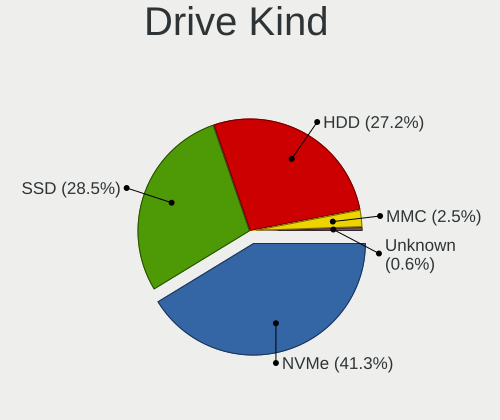

| Kind    | Computers | Drives | Percent |
|---------|-----------|--------|---------|
| NVMe    | 1397      | 2657   | 41.28%  |
| SSD     | 963       | 2078   | 28.46%  |
| HDD     | 921       | 2836   | 27.22%  |
| MMC     | 84        | 144    | 2.48%   |
| Unknown | 19        | 32     | 0.56%   |

Drive Connector
---------------

SATA, SAS, NVMe, etc.

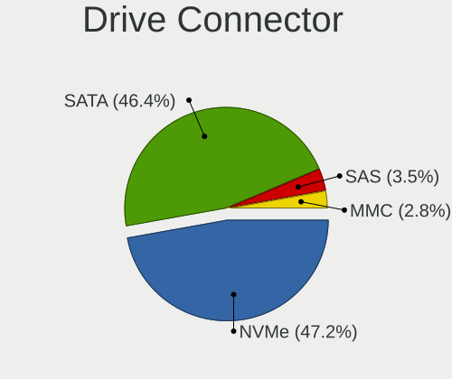

| Type | Computers | Drives | Percent |
|------|-----------|--------|---------|
| NVMe | 1396      | 2638   | 47.18%  |
| SATA | 1374      | 4796   | 46.43%  |
| SAS  | 105       | 169    | 3.55%   |
| MMC  | 84        | 144    | 2.84%   |

Drive Size
----------

Size of hard drive

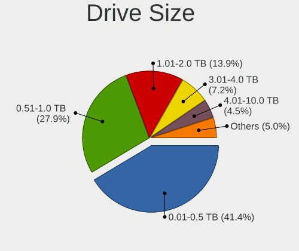

| Size in TB | Computers | Drives | Percent |
|------------|-----------|--------|---------|
| 0.01-0.5   | 892       | 1797   | 41.41%  |
| 0.51-1.0   | 601       | 1153   | 27.9%   |
| 1.01-2.0   | 300       | 701    | 13.93%  |
| 3.01-4.0   | 156       | 407    | 7.24%   |
| 4.01-10.0  | 98        | 389    | 4.55%   |
| 2.01-3.0   | 76        | 328    | 3.53%   |
| 10.01-20.0 | 30        | 138    | 1.39%   |
| 20.01-50.0 | 1         | 1      | 0.05%   |

Space Total
-----------

Amount of disk space available on the file system

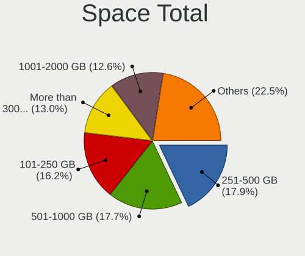

| Size in GB     | Computers | Percent |
|----------------|-----------|---------|
| 251-500        | 442       | 17.93%  |
| 501-1000       | 437       | 17.73%  |
| 101-250        | 400       | 16.23%  |
| More than 3000 | 320       | 12.98%  |
| 1001-2000      | 311       | 12.62%  |
| 1-20           | 141       | 5.72%   |
| Unknown        | 129       | 5.23%   |
| 2001-3000      | 128       | 5.19%   |
| 51-100         | 105       | 4.26%   |
| 21-50          | 52        | 2.11%   |

Space Used
----------

Amount of used disk space

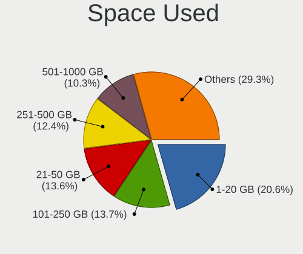

| Used GB        | Computers | Percent |
|----------------|-----------|---------|
| 1-20           | 538       | 20.6%   |
| 101-250        | 359       | 13.74%  |
| 21-50          | 355       | 13.59%  |
| 251-500        | 325       | 12.44%  |
| 501-1000       | 269       | 10.3%   |
| 51-100         | 238       | 9.11%   |
| 1001-2000      | 189       | 7.24%   |
| More than 3000 | 142       | 5.44%   |
| Unknown        | 129       | 4.94%   |
| 2001-3000      | 68        | 2.6%    |

Malfunc. Drives
---------------

Drive models with a malfunction

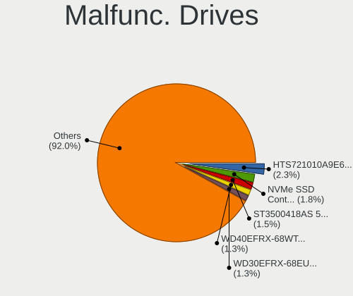

| Model                                                          | Computers | Drives | Percent |
|----------------------------------------------------------------|-----------|--------|---------|
| HGST HTS721010A9E630 1TB                                       | 9         | 10     | 2.26%   |
| Samsung Electronics NVMe SSD Controller PM9A1/PM9A3/980PRO 1TB | 7         | 9      | 1.75%   |
| Seagate ST3500418AS 500GB                                      | 6         | 7      | 1.5%    |
| WDC WD40EFRX-68WT0N0 4TB                                       | 5         | 15     | 1.25%   |
| WDC WD30EFRX-68EUZN0 3TB                                       | 5         | 10     | 1.25%   |
| WDC WD20EFRX-68EUZN0 2TB                                       | 5         | 10     | 1.25%   |
| Seagate ST500DM002-1BC142 500GB                                | 5         | 5      | 1.25%   |
| WDC WD20EFRX-68AX9N0 2TB                                       | 4         | 5      | 1%      |
| Seagate ST8000AS0002-1NA17Z 8TB                                | 4         | 16     | 1%      |
| Seagate ST500DM002-1BD142 500GB                                | 4         | 6      | 1%      |
| Seagate ST1000LM024 HN-M101MBB 1TB                             | 4         | 16     | 1%      |
| Samsung Electronics SSD 980 1TB                                | 4         | 4      | 1%      |
| Hitachi HDS722020ALA330 2TB                                    | 4         | 21     | 1%      |
| WDC WD5000BEVT-22ZAT0 500GB                                    | 3         | 3      | 0.75%   |
| WDC WD40EFRX-68N32N0 4TB                                       | 3         | 3      | 0.75%   |
| WDC WD30EFRX-68AX9N0 3TB                                       | 3         | 7      | 0.75%   |
| WDC WD20EZRZ-00Z5HB0 2TB                                       | 3         | 3      | 0.75%   |
| WDC WD2002FAEX-007BA0 2TB                                      | 3         | 3      | 0.75%   |
| Seagate ST4000DM000-1F2168 4TB                                 | 3         | 3      | 0.75%   |
| Samsung Electronics SSD 850 EVO 1TB                            | 3         | 3      | 0.75%   |
| Samsung Electronics HD103UJ 1TB                                | 3         | 4      | 0.75%   |
| Kingston Technology Company KC2000 NVMe SSD 250GB              | 3         | 3      | 0.75%   |
| Kingston RBU-SNS8350DES3128GP 128GB SSD                        | 3         | 3      | 0.75%   |
| IBM DJSA-220 12GB                                              | 3         | 3      | 0.75%   |
| HGST HTS725050A7E630 500GB                                     | 3         | 4      | 0.75%   |
| WDC WD60EFRX-68MYMN1 6TB                                       | 2         | 5      | 0.5%    |
| WDC WD20EZRX-00D8PB0 2TB                                       | 2         | 3      | 0.5%    |
| WDC WD20EARS-00MVWB0 2TB                                       | 2         | 2      | 0.5%    |
| WDC WD1600AAJS-75B4A0 160GB                                    | 2         | 2      | 0.5%    |
| WDC WD15EARS-00Z5B1 1TB                                        | 2         | 2      | 0.5%    |
| WDC WD10JPVX-75JC3T0 1TB                                       | 2         | 2      | 0.5%    |
| WDC WD10EZEX-08M2NA0 1TB                                       | 2         | 3      | 0.5%    |
| WDC WD Green 2.5 1000GB                                        | 2         | 2      | 0.5%    |
| Toshiba DT01ACA200 2TB                                         | 2         | 3      | 0.5%    |
| SK hynix HFS256G39TND-N210A 256GB SSD                          | 2         | 2      | 0.5%    |
| Seagate ST4000DM005-2DP166 4TB                                 | 2         | 2      | 0.5%    |
| Seagate ST31000340NS 1TB                                       | 2         | 3      | 0.5%    |
| Seagate ST3000DM001-9YN166 3TB                                 | 2         | 3      | 0.5%    |
| Seagate ST2000LX001-1RG174 2TB                                 | 2         | 2      | 0.5%    |
| Seagate ST2000DX002-2DV164 2TB                                 | 2         | 2      | 0.5%    |

Malfunc. Drive Vendor
---------------------

Vendors of faulty drives

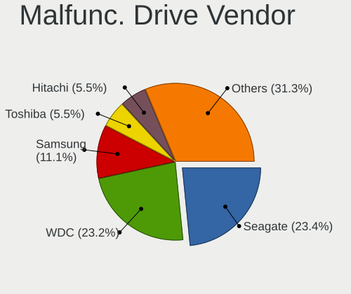

| Vendor                      | Computers | Drives | Percent |
|-----------------------------|-----------|--------|---------|
| Seagate                     | 89        | 143    | 23.42%  |
| WDC                         | 88        | 161    | 23.16%  |
| Samsung Electronics         | 42        | 65     | 11.05%  |
| Toshiba                     | 21        | 28     | 5.53%   |
| Hitachi                     | 21        | 40     | 5.53%   |
| HGST                        | 18        | 25     | 4.74%   |
| Intel                       | 13        | 15     | 3.42%   |
| SanDisk                     | 11        | 13     | 2.89%   |
| Kingston                    | 10        | 10     | 2.63%   |
| Crucial                     | 7         | 8      | 1.84%   |
| SK hynix                    | 6         | 9      | 1.58%   |
| A-DATA Technology           | 6         | 7      | 1.58%   |
| OCZ                         | 4         | 4      | 1.05%   |
| IBM                         | 4         | 4      | 1.05%   |
| Fujitsu                     | 4         | 4      | 1.05%   |
| Realtek Semiconductor       | 3         | 9      | 0.79%   |
| Kingston Technology Company | 3         | 3      | 0.79%   |
| China                       | 3         | 8      | 0.79%   |
| SPCC                        | 2         | 2      | 0.53%   |
| PNY                         | 2         | 4      | 0.53%   |
| Plextor                     | 2         | 2      | 0.53%   |
| MDT                         | 2         | 2      | 0.53%   |
| LITEON                      | 2         | 7      | 0.53%   |
| IBM/Hitachi                 | 2         | 2      | 0.53%   |
| Emtec                       | 2         | 3      | 0.53%   |
| Corsair                     | 2         | 5      | 0.53%   |
| ADATA Technology            | 2         | 2      | 0.53%   |
| Transcend                   | 1         | 1      | 0.26%   |
| Phison Electronics          | 1         | 1      | 0.26%   |
| Patriot                     | 1         | 1      | 0.26%   |
| Mushkin                     | 1         | 1      | 0.26%   |
| Maxtor                      | 1         | 3      | 0.26%   |
| HGST HTS                    | 1         | 1      | 0.26%   |
| Apple                       | 1         | 1      | 0.26%   |
| 2.5"                        | 1         | 1      | 0.26%   |
| Unknown                     | 1         | 1      | 0.26%   |

Malfunc. HDD Vendor
-------------------

Vendors of faulty HDD drives

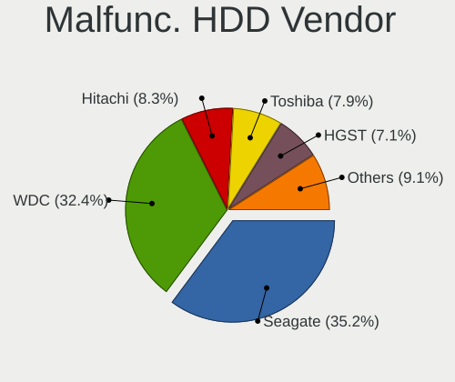

| Vendor              | Computers | Drives | Percent |
|---------------------|-----------|--------|---------|
| Seagate             | 89        | 143    | 35.18%  |
| WDC                 | 82        | 155    | 32.41%  |
| Hitachi             | 21        | 40     | 8.3%    |
| Toshiba             | 20        | 27     | 7.91%   |
| HGST                | 18        | 25     | 7.11%   |
| Samsung Electronics | 7         | 9      | 2.77%   |
| IBM                 | 4         | 4      | 1.58%   |
| Fujitsu             | 4         | 4      | 1.58%   |
| MDT                 | 2         | 2      | 0.79%   |
| IBM/Hitachi         | 2         | 2      | 0.79%   |
| Maxtor              | 1         | 3      | 0.4%    |
| HGST HTS            | 1         | 1      | 0.4%    |
| Apple               | 1         | 1      | 0.4%    |
| Unknown             | 1         | 1      | 0.4%    |

Malfunc. Drive Kind
-------------------

Kinds of faulty drives

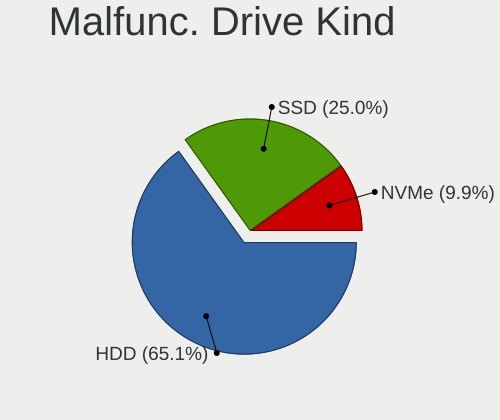

| Kind | Computers | Drives | Percent |
|------|-----------|--------|---------|
| HDD  | 237       | 417    | 65.11%  |
| SSD  | 91        | 128    | 25%     |
| NVMe | 36        | 51     | 9.89%   |

Failed Drives
-------------

Failed drive models

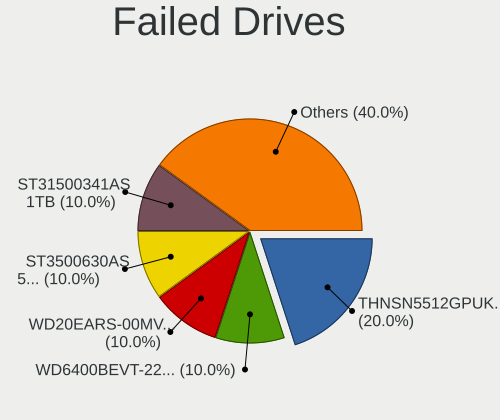

| Model                                                         | Computers | Drives | Percent |
|---------------------------------------------------------------|-----------|--------|---------|
| Toshiba THNSN5512GPUK NVMe 512GB                              | 2         | 2      | 18.18%  |
| WDC WD6400BEVT-22A0RT0 640GB                                  | 1         | 1      | 9.09%   |
| WDC WD20EARS-00MVWB0 2TB                                      | 1         | 2      | 9.09%   |
| Seagate ST3500630AS 500GB                                     | 1         | 2      | 9.09%   |
| Seagate ST31500341AS 1TB                                      | 1         | 1      | 9.09%   |
| Samsung Electronics SSD 980 1TB                               | 1         | 1      | 9.09%   |
| Samsung Electronics NVMe SSD Controller SM981/PM981/PM983 1TB | 1         | 1      | 9.09%   |
| Samsung Electronics MZ7LN256HCHP-00000 256GB SSD              | 1         | 2      | 9.09%   |
| Hitachi HTS723232L9A360 320GB                                 | 1         | 1      | 9.09%   |
| Hitachi HTS721010G9SA00 100GB                                 | 1         | 1      | 9.09%   |

Failed Drive Vendor
-------------------

Failed drive vendors

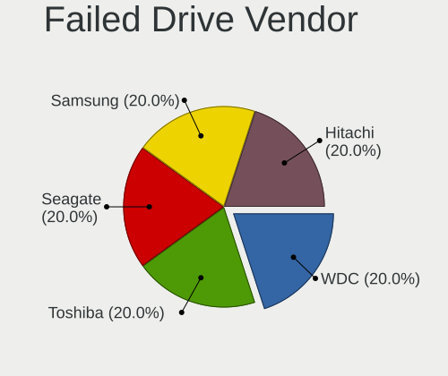

| Vendor              | Computers | Drives | Percent |
|---------------------|-----------|--------|---------|
| Samsung Electronics | 3         | 4      | 27.27%  |
| WDC                 | 2         | 3      | 18.18%  |
| Toshiba             | 2         | 2      | 18.18%  |
| Seagate             | 2         | 3      | 18.18%  |
| Hitachi             | 2         | 2      | 18.18%  |

Drive Status
------------

Number of failed and malfunc. drives

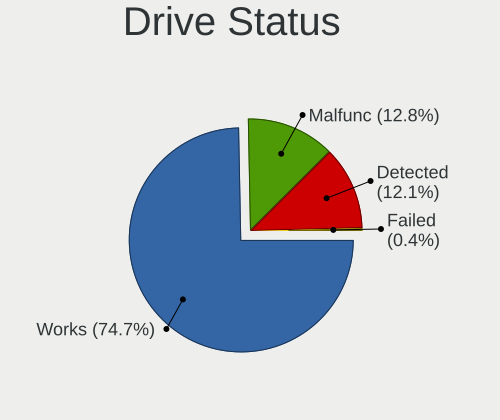

| Status   | Computers | Drives | Percent |
|----------|-----------|--------|---------|
| Works    | 2001      | 6443   | 74.69%  |
| Malfunc  | 344       | 596    | 12.84%  |
| Detected | 323       | 694    | 12.06%  |
| Failed   | 11        | 14     | 0.41%   |

Storage controller
------------------

Storage Vendor
--------------

Storage controller vendors

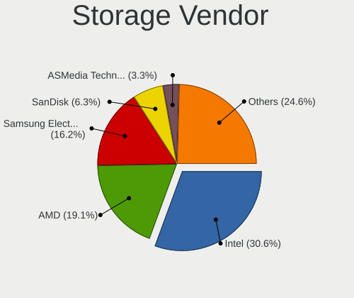

| Vendor                                  | Computers | Percent |
|-----------------------------------------|-----------|---------|
| Intel                                   | 1083      | 30.59%  |
| AMD                                     | 676       | 19.1%   |
| Samsung Electronics                     | 573       | 16.19%  |
| SanDisk                                 | 222       | 6.27%   |
| ASMedia Technology                      | 116       | 3.28%   |
| Phison Electronics                      | 108       | 3.05%   |
| SK hynix                                | 107       | 3.02%   |
| Kingston Technology Company             | 95        | 2.68%   |
| Micron Technology                       | 65        | 1.84%   |
| Micron/Crucial Technology               | 56        | 1.58%   |
| KIOXIA                                  | 50        | 1.41%   |
| Marvell Technology Group                | 41        | 1.16%   |
| ADATA Technology                        | 41        | 1.16%   |
| Toshiba America Info Systems            | 38        | 1.07%   |
| Silicon Motion                          | 30        | 0.85%   |
| Nvidia                                  | 25        | 0.71%   |
| JMicron Technology                      | 24        | 0.68%   |
| LSI Logic / Symbios Logic               | 21        | 0.59%   |
| Realtek Semiconductor                   | 20        | 0.56%   |
| Broadcom / LSI                          | 20        | 0.56%   |
| MAXIO Technology (Hangzhou)             | 18        | 0.51%   |
| Seagate Technology                      | 14        | 0.4%    |
| Yangtze Memory Technologies             | 11        | 0.31%   |
| Shenzhen Longsys Electronics            | 11        | 0.31%   |
| INNOGRIT                                | 9         | 0.25%   |
| Solid State Storage Technology          | 7         | 0.2%    |
| Adaptec                                 | 6         | 0.17%   |
| Silicon Image                           | 5         | 0.14%   |
| Lite-On Technology                      | 5         | 0.14%   |
| VIA Technologies                        | 4         | 0.11%   |
| Union Memory (Shenzhen)                 | 4         | 0.11%   |
| Solidigm                                | 4         | 0.11%   |
| Silicon Integrated Systems [SiS]        | 4         | 0.11%   |
| Shenzhen Unionmemory Information System | 4         | 0.11%   |
| Apple                                   | 4         | 0.11%   |
| Western Digital                         | 2         | 0.06%   |
| Loongson Technology                     | 2         | 0.06%   |
| Lenovo                                  | 2         | 0.06%   |
| Integrated Technology Express           | 2         | 0.06%   |
| Hewlett-Packard                         | 2         | 0.06%   |

Storage Model
-------------

Storage controller models

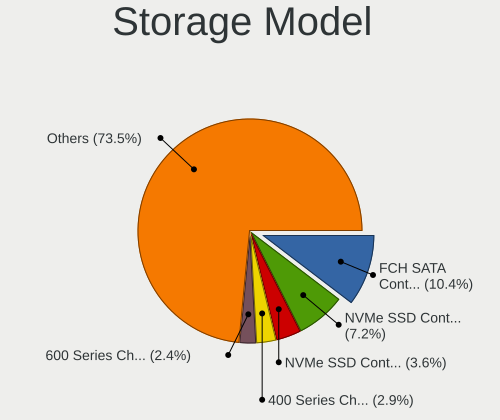

| Model                                                                          | Computers | Percent |
|--------------------------------------------------------------------------------|-----------|---------|
| AMD FCH SATA Controller [AHCI mode]                                            | 415       | 10.37%  |
| Samsung NVMe SSD Controller SM981/PM981/PM983                                  | 288       | 7.2%    |
| Samsung NVMe SSD Controller PM9A1/PM9A3/980PRO                                 | 146       | 3.65%   |
| AMD 400 Series Chipset SATA Controller                                         | 116       | 2.9%    |
| AMD 600 Series Chipset SATA Controller                                         | 96        | 2.4%    |
| ASMedia ASM1061/ASM1062 Serial ATA Controller                                  | 93        | 2.32%   |
| AMD 500 Series Chipset SATA Controller                                         | 81        | 2.02%   |
| Samsung NVMe SSD Controller 980 (DRAM-less)                                    | 75        | 1.87%   |
| Intel 8 Series/C220 Series Chipset Family 6-port SATA Controller 1 [AHCI mode] | 67        | 1.67%   |
| Intel Q170/Q150/B150/H170/H110/Z170/CM236 Chipset SATA Controller [AHCI Mode]  | 64        | 1.6%    |
| Intel Sunrise Point-LP SATA Controller [AHCI mode]                             | 61        | 1.52%   |
| Samsung NVMe SSD Controller SM961/PM961/SM963                                  | 57        | 1.42%   |
| Intel Volume Management Device NVMe RAID Controller                            | 57        | 1.42%   |
| Intel Cannon Lake Mobile PCH SATA AHCI Controller                              | 50        | 1.25%   |
| AMD SB7x0/SB8x0/SB9x0 SATA Controller [AHCI mode]                              | 50        | 1.25%   |
| SanDisk Extreme Pro / WD Black SN750 / PC SN730 / Red SN700 NVMe SSD           | 49        | 1.22%   |
| Intel 82801 Mobile SATA Controller [RAID mode]                                 | 45        | 1.12%   |
| Intel SSD 660P Series                                                          | 43        | 1.07%   |
| Intel Cannon Lake PCH SATA AHCI Controller                                     | 43        | 1.07%   |
| SK hynix Gold P31/BC711/PC711 NVMe Solid State Drive                           | 41        | 1.02%   |
| SanDisk Ultra 3D / WD PC SN530, IX SN530, Blue SN550 NVMe SSD (DRAM-less)      | 35        | 0.87%   |
| Samsung NVMe SSD Controller S4LV008[Pascal]                                    | 33        | 0.82%   |
| Intel HM170/QM170 Chipset SATA Controller [AHCI Mode]                          | 33        | 0.82%   |
| Intel Comet Lake SATA AHCI Controller                                          | 33        | 0.82%   |
| Phison E12 NVMe Controller                                                     | 32        | 0.8%    |
| Intel 200 Series PCH SATA controller [AHCI mode]                               | 32        | 0.8%    |
| Intel 7 Series Chipset Family 6-port SATA Controller [AHCI mode]               | 31        | 0.77%   |
| SanDisk WD SN560/SN740/SN770/SN5000 NVMe SSD                                   | 30        | 0.75%   |
| ADATA XPG SX8200 Pro PCIe Gen3x4 M.2 2280 Solid State Drive                    | 30        | 0.75%   |
| Micron/Crucial P2 [Nick P2] / P3 / P3 Plus NVMe PCIe SSD (DRAM-less)           | 29        | 0.72%   |
| Intel 7 Series/C210 Series Chipset Family 6-port SATA Controller [AHCI mode]   | 28        | 0.7%    |
| Intel 6 Series/C200 Series Chipset Family 6 port Mobile SATA AHCI Controller   | 28        | 0.7%    |
| Intel Alder Lake-S PCH SATA Controller [AHCI Mode]                             | 27        | 0.67%   |
| Intel 6 Series/C200 Series Chipset Family 6 port Desktop SATA AHCI Controller  | 27        | 0.67%   |
| Intel 500 Series Chipset Family SATA AHCI Controller                           | 26        | 0.65%   |
| SK hynix Platinum P41/PC801 NVMe Solid State Drive                             | 25        | 0.62%   |
| Phison E16 PCIe4 NVMe Controller                                               | 25        | 0.62%   |
| Intel SATA Controller [RAID Mode]                                              | 25        | 0.62%   |
| Intel C610/X99 series chipset sSATA Controller [AHCI mode]                     | 23        | 0.57%   |
| KIOXIA NVMe SSD Controller BG4 (DRAM-less)                                     | 22        | 0.55%   |

Storage Kind
------------

Kind of storage controller (IDE, SATA, NVMe, SAS, ...)

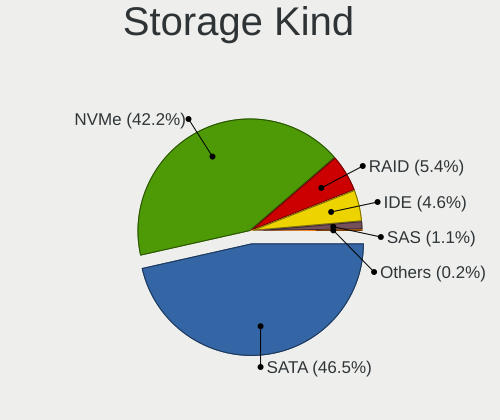

| Kind | Computers | Percent |
|------|-----------|---------|
| SATA | 1545      | 46.48%  |
| NVMe | 1402      | 42.18%  |
| RAID | 179       | 5.39%   |
| IDE  | 152       | 4.57%   |
| SAS  | 38        | 1.14%   |
| SCSI | 8         | 0.24%   |

Processor
---------

CPU Vendor
----------

Processor vendors

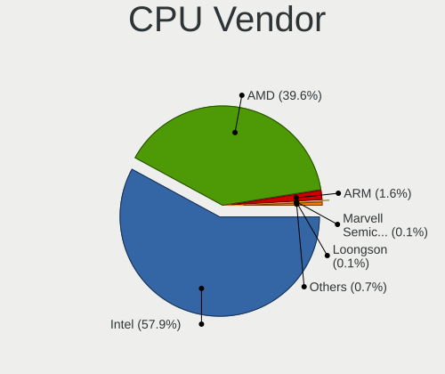

| Vendor                   | Computers | Percent |
|--------------------------|-----------|---------|
| Intel                    | 1309      | 57.92%  |
| AMD                      | 894       | 39.56%  |
| ARM                      | 37        | 1.64%   |
| Marvell Semiconductor    | 3         | 0.13%   |
| Loongson                 | 2         | 0.09%   |
| thead,c906               | 1         | 0.04%   |
| spacemit,x60             | 1         | 0.04%   |
| Qualcomm                 | 1         | 0.04%   |
| PowerNV C1P9S01 REV 1.01 | 1         | 0.04%   |
| PowerMac8,1              | 1         | 0.04%   |
| PowerMac3,6              | 1         | 0.04%   |
| PowerMac10,2             | 1         | 0.04%   |
| PowerBook6,7             | 1         | 0.04%   |
| PowerBook5,6             | 1         | 0.04%   |
| PowerBook5,5             | 1         | 0.04%   |
| PowerBook5,4             | 1         | 0.04%   |
| PowerBook3,4             | 1         | 0.04%   |
| Phytium                  | 1         | 0.04%   |
| CyrixInstead             | 1         | 0.04%   |
| Unknown                  | 1         | 0.04%   |

CPU Model
---------

Processor models

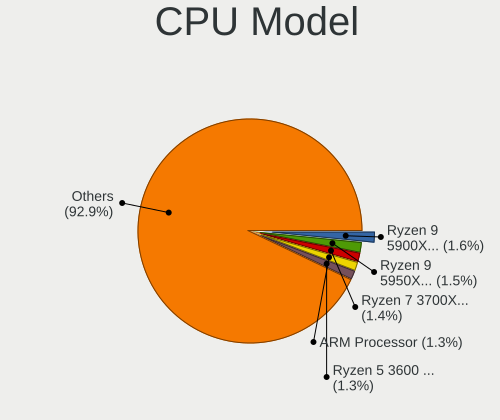

| Model                                         | Computers | Percent |
|-----------------------------------------------|-----------|---------|
| AMD Ryzen 9 5900X 12-Core Processor           | 36        | 1.58%   |
| AMD Ryzen 9 5950X 16-Core Processor           | 35        | 1.53%   |
| AMD Ryzen 7 3700X 8-Core Processor            | 31        | 1.36%   |
| ARM Processor                                 | 30        | 1.31%   |
| AMD Ryzen 5 3600 6-Core Processor             | 30        | 1.31%   |
| Intel Core i7-8750H CPU @ 2.20GHz             | 26        | 1.14%   |
| Intel Core i7-9750H CPU @ 2.60GHz             | 25        | 1.09%   |
| AMD Ryzen 9 3900X 12-Core Processor           | 24        | 1.05%   |
| AMD Ryzen 7 5800H with Radeon Graphics        | 24        | 1.05%   |
| Intel Core i7-8550U CPU @ 1.80GHz             | 22        | 0.96%   |
| Intel 11th Gen Core i7-1165G7 @ 2.80GHz       | 22        | 0.96%   |
| AMD Ryzen 5 5600X 6-Core Processor            | 22        | 0.96%   |
| AMD Ryzen 9 7950X 16-Core Processor           | 21        | 0.92%   |
| AMD Ryzen 7 2700X Eight-Core Processor        | 20        | 0.88%   |
| AMD Ryzen 9 3950X 16-Core Processor           | 19        | 0.83%   |
| Intel Core i7-6700HQ CPU @ 2.60GHz            | 18        | 0.79%   |
| Intel 11th Gen Core i5-1135G7 @ 2.40GHz       | 18        | 0.79%   |
| AMD Ryzen 7 4800H with Radeon Graphics        | 17        | 0.74%   |
| Intel Core i5-8250U CPU @ 1.60GHz             | 16        | 0.7%    |
| Intel Core i5-10210U CPU @ 1.60GHz            | 16        | 0.7%    |
| AMD Ryzen 5 2600 Six-Core Processor           | 16        | 0.7%    |
| Intel Core i5-8265U CPU @ 1.60GHz             | 15        | 0.66%   |
| Intel 12th Gen Core i7-12700H                 | 15        | 0.66%   |
| AMD Ryzen 7 PRO 4750U with Radeon Graphics    | 15        | 0.66%   |
| AMD Ryzen 7 5800X 8-Core Processor            | 15        | 0.66%   |
| Intel Core i7-8565U CPU @ 1.80GHz             | 14        | 0.61%   |
| Intel 11th Gen Core i7-11800H @ 2.30GHz       | 14        | 0.61%   |
| AMD Ryzen 7 3800X 8-Core Processor            | 14        | 0.61%   |
| AMD Ryzen 7 2700 Eight-Core Processor         | 14        | 0.61%   |
| Intel Core i7-6700K CPU @ 4.00GHz             | 13        | 0.57%   |
| Intel 11th Gen Core i7-1185G7 @ 3.00GHz       | 13        | 0.57%   |
| AMD Ryzen 9 9950X 16-Core Processor           | 13        | 0.57%   |
| AMD Ryzen 7 5700U with Radeon Graphics        | 13        | 0.57%   |
| AMD Ryzen 7 4700U with Radeon Graphics        | 13        | 0.57%   |
| Intel Core i9-9900K CPU @ 3.60GHz             | 12        | 0.53%   |
| Intel Core i7-7500U CPU @ 2.70GHz             | 12        | 0.53%   |
| AMD Ryzen 5 3500U with Radeon Vega Mobile Gfx | 12        | 0.53%   |
| AMD FX-8350 Eight-Core Processor              | 12        | 0.53%   |
| AMD Ryzen 9 7900X 12-Core Processor           | 11        | 0.48%   |
| AMD Ryzen 5 5500U with Radeon Graphics        | 11        | 0.48%   |

CPU Model Family
----------------

Processor model prefix

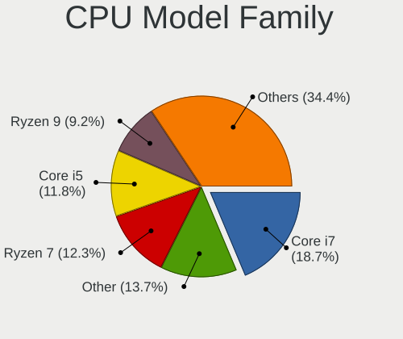

| Model                   | Computers | Percent |
|-------------------------|-----------|---------|
| Intel Core i7           | 424       | 18.65%  |
| Other                   | 312       | 13.73%  |
| AMD Ryzen 7             | 279       | 12.27%  |
| Intel Core i5           | 269       | 11.83%  |
| AMD Ryzen 9             | 208       | 9.15%   |
| AMD Ryzen 5             | 186       | 8.18%   |
| Intel Xeon              | 103       | 4.53%   |
| AMD Ryzen 7 PRO         | 49        | 2.16%   |
| Intel Core i3           | 39        | 1.72%   |
| Intel Celeron           | 39        | 1.72%   |
| Intel Core i9           | 35        | 1.54%   |
| AMD FX                  | 31        | 1.36%   |
| Intel Atom              | 30        | 1.32%   |
| Intel Core 2 Duo        | 26        | 1.14%   |
| Intel Pentium           | 22        | 0.97%   |
| AMD Ryzen 3             | 20        | 0.88%   |
| Intel Core              | 18        | 0.79%   |
| AMD Ryzen Threadripper  | 16        | 0.7%    |
| AMD Ryzen 5 PRO         | 12        | 0.53%   |
| AMD Phenom II X4        | 12        | 0.53%   |
| Intel Core 2 Quad       | 11        | 0.48%   |
| Intel Pentium M         | 10        | 0.44%   |
| AMD A6                  | 9         | 0.4%    |
| Intel Pentium 4         | 8         | 0.35%   |
| AMD EPYC                | 8         | 0.35%   |
| AMD A10                 | 7         | 0.31%   |
| AMD Phenom II X6        | 6         | 0.26%   |
| AMD E                   | 6         | 0.26%   |
| AMD Athlon              | 6         | 0.26%   |
| Intel Pentium Silver    | 5         | 0.22%   |
| Intel Core 2            | 5         | 0.22%   |
| ARM BCM                 | 5         | 0.22%   |
| Intel Xeon Gold         | 4         | 0.18%   |
| Intel Pentium III       | 4         | 0.18%   |
| AMD Sempron             | 4         | 0.18%   |
| AMD Athlon 64 X2        | 4         | 0.18%   |
| Intel Pentium Dual-Core | 3         | 0.13%   |
| Intel Core m3           | 3         | 0.13%   |
| AMD Athlon II X3        | 3         | 0.13%   |
| AMD A8                  | 3         | 0.13%   |

CPU Cores
---------

Number of processor cores

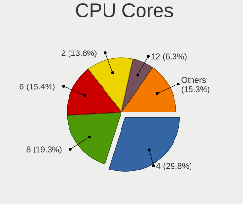

| Number  | Computers | Percent |
|---------|-----------|---------|
| 4       | 680       | 29.84%  |
| 8       | 440       | 19.31%  |
| 6       | 351       | 15.4%   |
| 2       | 315       | 13.82%  |
| 12      | 144       | 6.32%   |
| 16      | 143       | 6.27%   |
| 1       | 54        | 2.37%   |
| 14      | 46        | 2.02%   |
| 10      | 27        | 1.18%   |
| 24      | 20        | 0.88%   |
| Unknown | 19        | 0.83%   |
| 20      | 10        | 0.44%   |
| 32      | 7         | 0.31%   |
| 3       | 7         | 0.31%   |
| 44      | 3         | 0.13%   |
| 28      | 3         | 0.13%   |
| 18      | 3         | 0.13%   |
| 64      | 2         | 0.09%   |
| 36      | 2         | 0.09%   |
| 80      | 1         | 0.04%   |
| 40      | 1         | 0.04%   |
| 22      | 1         | 0.04%   |

CPU Sockets
-----------

Number of sockets

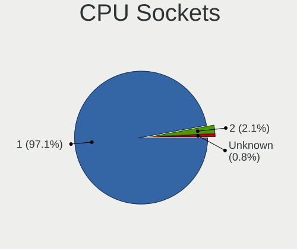

| Number  | Computers | Percent |
|---------|-----------|---------|
| 1       | 2197      | 97.08%  |
| 2       | 48        | 2.12%   |
| Unknown | 18        | 0.8%    |

CPU Threads
-----------

Threads per core (Hyper-Threading)

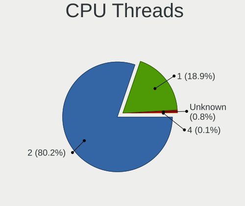

| Number  | Computers | Percent |
|---------|-----------|---------|
| 2       | 1825      | 80.22%  |
| 1       | 429       | 18.86%  |
| Unknown | 19        | 0.84%   |
| 4       | 2         | 0.09%   |

CPU Op-Modes
------------

CPU Operation Modes (32-bit, 64-bit)

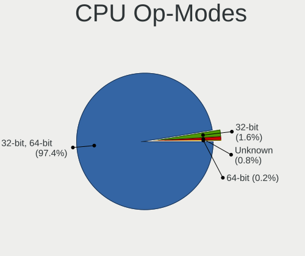

| Op mode        | Computers | Percent |
|----------------|-----------|---------|
| 32-bit, 64-bit | 2201      | 97.39%  |
| 32-bit         | 37        | 1.64%   |
| Unknown        | 18        | 0.8%    |
| 64-bit         | 4         | 0.18%   |

CPU Microcode
-------------

Microcode number

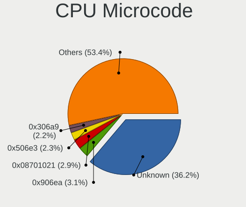

| Number     | Computers | Percent |
|------------|-----------|---------|
| Unknown    | 882       | 36.21%  |
| 0x906ea    | 76        | 3.12%   |
| 0x08701021 | 70        | 2.87%   |
| 0x506e3    | 55        | 2.26%   |
| 0x306a9    | 53        | 2.18%   |
| 0x806ec    | 49        | 2.01%   |
| 0x306c3    | 49        | 2.01%   |
| 0x0a50000c | 48        | 1.97%   |
| 0x0800820d | 45        | 1.85%   |
| 0x806c1    | 44        | 1.81%   |
| 0x906e9    | 40        | 1.64%   |
| 0x806ea    | 37        | 1.52%   |
| 0x08701013 | 37        | 1.52%   |
| 0x206a7    | 36        | 1.48%   |
| 0x08600106 | 34        | 1.4%    |
| 0x0a201016 | 31        | 1.27%   |
| 0x806e9    | 28        | 1.15%   |
| 0x906ed    | 26        | 1.07%   |
| 0x0a601203 | 26        | 1.07%   |
| 0x08108109 | 22        | 0.9%    |
| 0x08001138 | 22        | 0.9%    |
| 0x0a20120a | 21        | 0.86%   |
| 0x0a201009 | 21        | 0.86%   |
| 0xa0652    | 20        | 0.82%   |
| 0x40651    | 20        | 0.82%   |
| 0x806d1    | 19        | 0.78%   |
| 0x906a3    | 18        | 0.74%   |
| 0x406e3    | 17        | 0.7%    |
| 0x1067a    | 17        | 0.7%    |
| 0x0a404102 | 17        | 0.7%    |
| 0x0a50000d | 16        | 0.66%   |
| 0x08608103 | 16        | 0.66%   |
| 0x90672    | 14        | 0.57%   |
| 0x306f2    | 14        | 0.57%   |
| 0x306d4    | 14        | 0.57%   |
| 0x08600103 | 14        | 0.57%   |
| 0x08108102 | 14        | 0.57%   |
| 0x206c2    | 13        | 0.53%   |
| 0xa0671    | 12        | 0.49%   |
| 0x306e4    | 12        | 0.49%   |

CPU Microarch
-------------

Microarchitecture

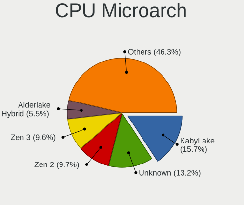

| Name              | Computers | Percent |
|-------------------|-----------|---------|
| KabyLake          | 360       | 15.74%  |
| Unknown           | 302       | 13.21%  |
| Zen 2             | 221       | 9.66%   |
| Zen 3             | 219       | 9.58%   |
| Alderlake Hybrid  | 125       | 5.47%   |
| Haswell           | 122       | 5.33%   |
| Zen+              | 107       | 4.68%   |
| Skylake           | 100       | 4.37%   |
| IvyBridge         | 80        | 3.5%    |
| SandyBridge       | 70        | 3.06%   |
| TigerLake         | 67        | 2.93%   |
| Icelake           | 58        | 2.54%   |
| CometLake         | 57        | 2.49%   |
| Zen               | 46        | 2.01%   |
| Broadwell         | 41        | 1.79%   |
| Penryn            | 31        | 1.36%   |
| Silvermont        | 29        | 1.27%   |
| Westmere          | 28        | 1.22%   |
| Piledriver        | 28        | 1.22%   |
| K10               | 25        | 1.09%   |
| P6                | 19        | 0.83%   |
| Core              | 19        | 0.83%   |
| Bonnell           | 18        | 0.79%   |
| Goldmont plus     | 13        | 0.57%   |
| Nehalem           | 12        | 0.52%   |
| Meteorlake Hybrid | 11        | 0.48%   |
| K8 Hammer         | 10        | 0.44%   |
| NetBurst          | 9         | 0.39%   |
| Excavator         | 8         | 0.35%   |
| Gracemont         | 7         | 0.31%   |
| Bulldozer         | 7         | 0.31%   |
| Bobcat            | 7         | 0.31%   |
| Steamroller       | 6         | 0.26%   |
| Jaguar            | 5         | 0.22%   |
| Goldmont          | 5         | 0.22%   |
| Tremont           | 4         | 0.17%   |
| Lunarlake Hybrid  | 4         | 0.17%   |
| K10 Llano         | 3         | 0.13%   |
| Puma              | 2         | 0.09%   |
| Sapphire Rapids   | 1         | 0.04%   |

Graphics
--------

GPU Vendor
----------

Vendors of graphics cards

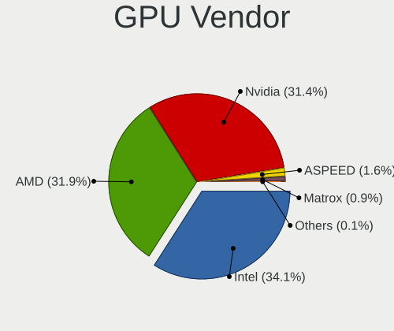

| Vendor                           | Computers | Percent |
|----------------------------------|-----------|---------|
| Intel                            | 913       | 34.09%  |
| AMD                              | 855       | 31.93%  |
| Nvidia                           | 840       | 31.37%  |
| ASPEED Technology                | 42        | 1.57%   |
| Matrox Electronics Systems       | 24        | 0.9%    |
| Silicon Integrated Systems [SiS] | 2         | 0.07%   |
| Loongson Technology              | 2         | 0.07%   |

GPU Model
---------

Graphics card models

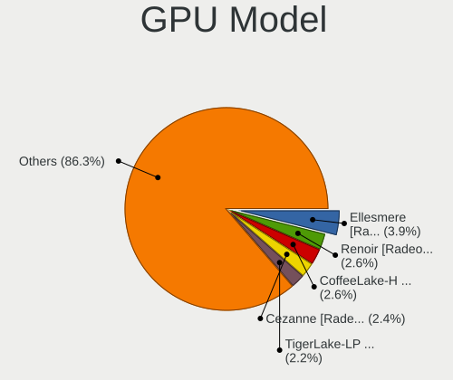

| Model                                                                       | Computers | Percent |
|-----------------------------------------------------------------------------|-----------|---------|
| AMD Ellesmere [Radeon RX 470/480/570/570X/580/580X/590]                     | 111       | 3.94%   |
| AMD Renoir [Radeon Vega Series / Radeon Vega Mobile Series]                 | 73        | 2.59%   |
| Intel CoffeeLake-H GT2 [UHD Graphics 630]                                   | 72        | 2.56%   |
| AMD Cezanne [Radeon Vega Series / Radeon Vega Mobile Series]                | 67        | 2.38%   |
| Intel TigerLake-LP GT2 [Iris Xe Graphics]                                   | 63        | 2.24%   |
| Intel Kaby Lake-R GT2 [UHD Graphics 620]                                    | 57        | 2.02%   |
| AMD Raphael                                                                 | 52        | 1.85%   |
| Intel 2nd Generation Core Processor Family Integrated Graphics Controller   | 48        | 1.7%    |
| AMD Picasso/Raven 2 [Radeon Vega Series / Radeon Vega Mobile Series]        | 45        | 1.6%    |
| AMD Navi 22 [Radeon RX 6700/6700 XT/6750 XT / 6800M/6850M XT]               | 43        | 1.53%   |
| AMD Navi 10 [Radeon RX 5600 OEM/5600 XT / 5700/5700 XT]                     | 43        | 1.53%   |
| ASPEED Technology ASPEED Graphics Family                                    | 42        | 1.49%   |
| Intel WhiskeyLake-U GT2 [UHD Graphics 620]                                  | 37        | 1.31%   |
| Intel CometLake-U GT2 [UHD Graphics]                                        | 33        | 1.17%   |
| Intel Alder Lake-P GT2 [Iris Xe Graphics]                                   | 32        | 1.14%   |
| AMD Rembrandt [Radeon 680M]                                                 | 32        | 1.14%   |
| Nvidia TU117M [GeForce GTX 1650 Mobile / Max-Q]                             | 31        | 1.1%    |
| Intel Raptor Lake-P [Iris Xe Graphics]                                      | 28        | 0.99%   |
| Intel Kaby Lake-U GT2 [HD Graphics 620]                                     | 27        | 0.96%   |
| AMD Navi 21 [Radeon RX 6800/6800 XT / 6900 XT]                              | 26        | 0.92%   |
| AMD Lucienne                                                                | 26        | 0.92%   |
| Intel TigerLake-H GT1 [UHD Graphics]                                        | 25        | 0.89%   |
| Intel Haswell-ULT Integrated Graphics Controller                            | 25        | 0.89%   |
| Intel 3rd Gen Core processor Graphics Controller                            | 25        | 0.89%   |
| AMD Granite Ridge [Radeon Graphics]                                         | 24        | 0.85%   |
| Intel Skylake-H GT2 [HD Graphics 530]                                       | 23        | 0.82%   |
| Intel CoffeeLake-S GT2 [UHD Graphics 630]                                   | 23        | 0.82%   |
| AMD Navi 23 [Radeon RX 6600/6600 XT/6600M]                                  | 23        | 0.82%   |
| Nvidia GA106M [GeForce RTX 3060 Mobile / Max-Q]                             | 21        | 0.75%   |
| AMD Vega 10 XL/XT [Radeon RX Vega 56/64]                                    | 21        | 0.75%   |
| AMD Phoenix1                                                                | 21        | 0.75%   |
| AMD Navi 31 [Radeon RX 7900 XT/7900 XTX/7900 GRE/7900M]                     | 21        | 0.75%   |
| Intel Xeon E3-1200 v3/4th Gen Core Processor Integrated Graphics Controller | 20        | 0.71%   |
| Intel Skylake-U GT2 [HD Graphics 520]                                       | 20        | 0.71%   |
| Intel 4th Gen Core Processor Integrated Graphics Controller                 | 20        | 0.71%   |
| Intel CometLake-H GT2 [UHD Graphics]                                        | 19        | 0.67%   |
| Nvidia GP106 [GeForce GTX 1060 6GB]                                         | 18        | 0.64%   |
| Nvidia GM206 [GeForce GTX 960]                                              | 18        | 0.64%   |
| Intel Skylake-S GT2 [HD Graphics 530]                                       | 18        | 0.64%   |
| Intel Kaby Lake-H GT2 [HD Graphics 630]                                     | 18        | 0.64%   |

GPU Combo
---------

Combinations of graphics cards

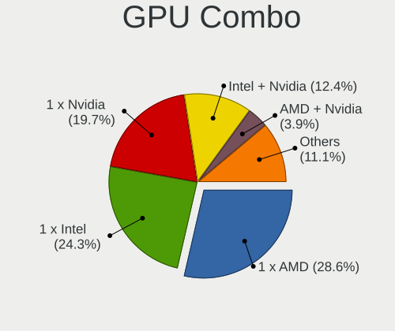

| Name                        | Computers | Percent |
|-----------------------------|-----------|---------|
| 1 x AMD                     | 660       | 28.6%   |
| 1 x Intel                   | 560       | 24.26%  |
| 1 x Nvidia                  | 455       | 19.71%  |
| Intel + Nvidia              | 287       | 12.44%  |
| AMD + Nvidia                | 89        | 3.86%   |
| 2 x AMD                     | 70        | 3.03%   |
| Other                       | 48        | 2.08%   |
| Intel + AMD                 | 34        | 1.47%   |
| 1 x ASPEED                  | 33        | 1.43%   |
| 2 x Intel                   | 20        | 0.87%   |
| 1 x Matrox                  | 19        | 0.82%   |
| 2 x Nvidia                  | 10        | 0.43%   |
| Nvidia + ASPEED             | 4         | 0.17%   |
| AMD + ASPEED                | 4         | 0.17%   |
| AMD + Matrox                | 3         | 0.13%   |
| 1 x SiS                     | 2         | 0.09%   |
| Nvidia + Matrox             | 2         | 0.09%   |
| Intel + 2 x AMD             | 2         | 0.09%   |
| AMD + Loongson Technology   | 2         | 0.09%   |
| 2 x AMD + 1 x Nvidia        | 1         | 0.04%   |
| Intel + 2 x Nvidia          | 1         | 0.04%   |
| Intel + Nvidia + 1 x ASPEED | 1         | 0.04%   |
| Intel + AMD + 1 x Nvidia    | 1         | 0.04%   |

GPU Driver
----------

Free vs proprietary

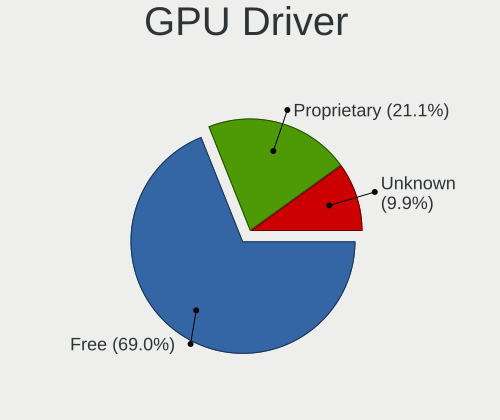

| Driver      | Computers | Percent |
|-------------|-----------|---------|
| Free        | 1611      | 68.96%  |
| Proprietary | 493       | 21.1%   |
| Unknown     | 232       | 9.93%   |

GPU Memory
----------

Total video memory

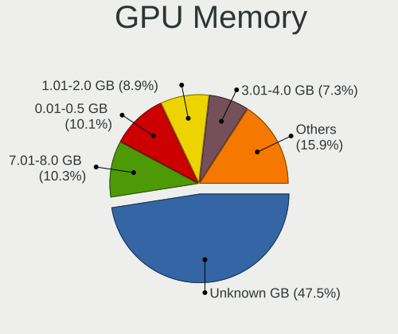

| Size in GB | Computers | Percent |
|------------|-----------|---------|
| Unknown    | 1135      | 47.53%  |
| 7.01-8.0   | 246       | 10.3%   |
| 0.01-0.5   | 242       | 10.13%  |
| 1.01-2.0   | 212       | 8.88%   |
| 3.01-4.0   | 174       | 7.29%   |
| 8.01-16.0  | 142       | 5.95%   |
| 0.51-1.0   | 108       | 4.52%   |
| 5.01-6.0   | 77        | 3.22%   |
| 16.01-24.0 | 29        | 1.21%   |
| 2.01-3.0   | 19        | 0.8%    |
| 4.01-5.0   | 2         | 0.08%   |
| 24.01-32.0 | 2         | 0.08%   |

Monitor
-------

Monitor Vendor
--------------

Monitor vendors

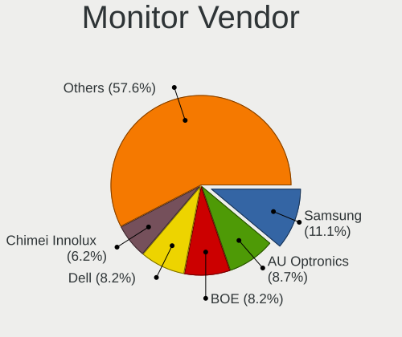

| Vendor                  | Computers | Percent |
|-------------------------|-----------|---------|
| Samsung Electronics     | 292       | 11.08%  |
| AU Optronics            | 229       | 8.69%   |
| BOE                     | 217       | 8.23%   |
| Dell                    | 216       | 8.19%   |
| Chimei Innolux          | 164       | 6.22%   |
| Goldstar                | 156       | 5.92%   |
| LG Display              | 147       | 5.58%   |
| BenQ                    | 84        | 3.19%   |
| AOC                     | 82        | 3.11%   |
| Acer                    | 82        | 3.11%   |
| Hewlett-Packard         | 78        | 2.96%   |
| Ancor Communications    | 69        | 2.62%   |
| Sharp                   | 67        | 2.54%   |
| ASUSTek Computer        | 64        | 2.43%   |
| Lenovo                  | 57        | 2.16%   |
| Philips                 | 53        | 2.01%   |
| Iiyama                  | 51        | 1.93%   |
| ViewSonic               | 48        | 1.82%   |
| Apple                   | 37        | 1.4%    |
| Eizo                    | 25        | 0.95%   |
| Chi Mei Optoelectronics | 24        | 0.91%   |
| MSI                     | 22        | 0.83%   |
| Gigabyte Technology     | 22        | 0.83%   |
| CSO                     | 18        | 0.68%   |
| PANDA                   | 17        | 0.64%   |
| Unknown                 | 14        | 0.53%   |
| LG Electronics          | 14        | 0.53%   |
| InfoVision              | 13        | 0.49%   |
| Fujitsu Siemens         | 13        | 0.49%   |
| Sony                    | 11        | 0.42%   |
| Mi                      | 11        | 0.42%   |
| CSOT                    | 11        | 0.42%   |
| Sceptre Tech            | 10        | 0.38%   |
| Unknown                 | 9         | 0.34%   |
| Toshiba                 | 8         | 0.3%    |
| NEC Computers           | 8         | 0.3%    |
| Idek Iiyama             | 8         | 0.3%    |
| HannStar                | 7         | 0.27%   |
| TMX                     | 6         | 0.23%   |
| RTK                     | 6         | 0.23%   |

Monitor Model
-------------

Monitor models

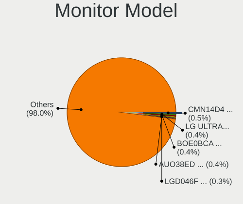

| Model                                                                    | Computers | Percent |
|--------------------------------------------------------------------------|-----------|---------|
| Chimei Innolux LCD Monitor CMN14D4 1920x1080 309x173mm 13.9-inch         | 14        | 0.5%    |
| Goldstar LG ULTRAWIDE GSM59F1 2560x1080 670x280mm 28.6-inch              | 12        | 0.43%   |
| BOE LCD Monitor BOE0BCA 2256x1504 285x190mm 13.5-inch                    | 10        | 0.36%   |
| AU Optronics LCD Monitor AUO38ED 1920x1080 344x193mm 15.5-inch           | 10        | 0.36%   |
| LG Display LCD Monitor LGD046F 1920x1080 344x194mm 15.5-inch             | 9         | 0.32%   |
| Chimei Innolux LCD Monitor CMN1747 1920x1080 381x214mm 17.2-inch         | 9         | 0.32%   |
| AOC 24G2W1G3 AOC2402 1920x1080 527x296mm 23.8-inch                       | 9         | 0.32%   |
| Unknown                                                                  | 9         | 0.32%   |
| Samsung Electronics U28E590 SAM0C4D 3840x2160 607x345mm 27.5-inch        | 8         | 0.29%   |
| Iiyama PL2473HD IVM6107 1920x1080 521x293mm 23.5-inch                    | 8         | 0.29%   |
| Unknown LCD Monitor FFFF 2288x1287 2550x2550mm 142.0-inch                | 7         | 0.25%   |
| Goldstar LG IPS FULLHD GSM5AB8 1920x1080 480x270mm 21.7-inch             | 7         | 0.25%   |
| Goldstar HDR 4K GSM7707 3840x2160 600x340mm 27.2-inch                    | 7         | 0.25%   |
| Dell U2412M DELA07A 1920x1200 518x324mm 24.1-inch                        | 7         | 0.25%   |
| BenQ PD3200U BNQ8025 3840x2160 708x399mm 32.0-inch                       | 7         | 0.25%   |
| AU Optronics LCD Monitor AUO403D 1920x1080 309x174mm 14.0-inch           | 7         | 0.25%   |
| AU Optronics LCD Monitor AUO243D 1920x1080 309x173mm 13.9-inch           | 7         | 0.25%   |
| AU Optronics LCD Monitor AUO21ED 1920x1080 344x193mm 15.5-inch           | 7         | 0.25%   |
| Samsung Electronics C24F390 SAM0D2C 1920x1080 521x293mm 23.5-inch        | 6         | 0.21%   |
| Iiyama PL2409HD IVM560C 1920x1080 521x293mm 23.5-inch                    | 6         | 0.21%   |
| Goldstar L227W GSM566E 1680x1050 474x296mm 22.0-inch                     | 6         | 0.21%   |
| Fujitsu Siemens P24W-6 IPS FUS07EA 1920x1200 518x324mm 24.1-inch         | 6         | 0.21%   |
| Dell U2715H DELD066 2560x1440 597x336mm 27.0-inch                        | 6         | 0.21%   |
| Dell P2418D DELD0C1 2560x1440 526x296mm 23.8-inch                        | 6         | 0.21%   |
| Sharp LCD Monitor SHP148D 3840x2160 344x194mm 15.5-inch                  | 5         | 0.18%   |
| Sceptre Tech C305W-2560UN SPT0C0D 2560x1080 690x291mm 29.5-inch          | 5         | 0.18%   |
| LG Display LCD Monitor LGD05E5 1920x1080 344x194mm 15.5-inch             | 5         | 0.18%   |
| LG Display LCD Monitor LGD0521 1920x1080 309x174mm 14.0-inch             | 5         | 0.18%   |
| Goldstar Ultra HD GSM5B09 3840x2160 600x340mm 27.2-inch                  | 5         | 0.18%   |
| Goldstar HDR 4K GSM7706 3840x2160 600x340mm 27.2-inch                    | 5         | 0.18%   |
| Goldstar FULL HD GSM5B55 1920x1080 480x270mm 21.7-inch                   | 5         | 0.18%   |
| Chimei Innolux LCD Monitor CMN1521 1920x1080 344x193mm 15.5-inch         | 5         | 0.18%   |
| Chi Mei Optoelectronics LCD Monitor CMO15A2 1366x768 344x193mm 15.5-inch | 5         | 0.18%   |
| BOE LCD Monitor BOE0700 1920x1080 344x194mm 15.5-inch                    | 5         | 0.18%   |
| AU Optronics LCD Monitor AUO573D 1920x1080 309x174mm 14.0-inch           | 5         | 0.18%   |
| ASUSTek Computer VG27A AUS2722 2560x1440 597x336mm 27.0-inch             | 5         | 0.18%   |
| ViewSonic VX3276-QHD VSCE635 2560x1440 698x393mm 31.5-inch               | 4         | 0.14%   |
| ViewSonic VX2458 series VSC0437 1920x1080 521x293mm 23.5-inch            | 4         | 0.14%   |
| TMX TL156MDMP11-0 TMX1560 3200x2000 336x210mm 15.6-inch                  | 4         | 0.14%   |
| Sharp LQ156M1JW01 SHP14C3 1920x1080 344x194mm 15.5-inch                  | 4         | 0.14%   |

Monitor Resolution
------------------

Monitor screen resolution

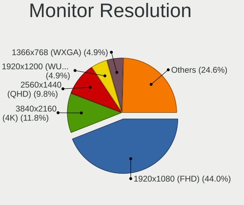

| Resolution         | Computers | Percent |
|--------------------|-----------|---------|
| 1920x1080 (FHD)    | 1092      | 44.03%  |
| 3840x2160 (4K)     | 292       | 11.77%  |
| 2560x1440 (QHD)    | 244       | 9.84%   |
| 1920x1200 (WUXGA)  | 121       | 4.88%   |
| 1366x768 (WXGA)    | 121       | 4.88%   |
| 3440x1440          | 55        | 2.22%   |
| 1280x1024 (SXGA)   | 55        | 2.22%   |
| 2560x1600          | 51        | 2.06%   |
| 1680x1050 (WSXGA+) | 48        | 1.94%   |
| 1600x900 (HD+)     | 42        | 1.69%   |
| Unknown            | 39        | 1.57%   |
| 2560x1080          | 35        | 1.41%   |
| 1440x900 (WXGA+)   | 29        | 1.17%   |
| 2880x1800          | 28        | 1.13%   |
| 3840x2400          | 25        | 1.01%   |
| 3840x1080          | 25        | 1.01%   |
| 1280x800 (WXGA)    | 17        | 0.69%   |
| 2256x1504          | 14        | 0.56%   |
| 1600x1200          | 9         | 0.36%   |
| 1360x768           | 8         | 0.32%   |
| 1024x600           | 8         | 0.32%   |
| 3200x2000          | 7         | 0.28%   |
| 2288x1287          | 7         | 0.28%   |
| 1920x540           | 7         | 0.28%   |
| 2160x1440          | 6         | 0.24%   |
| 3840x1200          | 5         | 0.2%    |
| 3200x1800 (QHD+)   | 5         | 0.2%    |
| 2048x1152          | 5         | 0.2%    |
| 1400x1050          | 5         | 0.2%    |
| 1024x768 (XGA)     | 5         | 0.2%    |
| 7680x2160          | 4         | 0.16%   |
| 3072x1920          | 4         | 0.16%   |
| 2160x1200          | 4         | 0.16%   |
| 1280x720 (HD)      | 4         | 0.16%   |
| 5760x2160          | 3         | 0.12%   |
| 3840x1600          | 3         | 0.12%   |
| 3456x2160          | 3         | 0.12%   |
| 2880x1620          | 3         | 0.12%   |
| 2240x1400          | 3         | 0.12%   |
| 1920x1280          | 3         | 0.12%   |

Monitor Diagonal
----------------

Diagonal size in inches

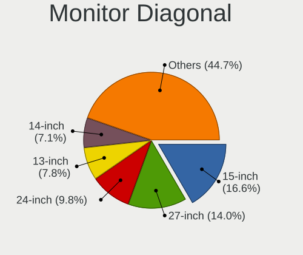

| Inches  | Computers | Percent |
|---------|-----------|---------|
| 15      | 434       | 16.61%  |
| 27      | 365       | 13.97%  |
| 24      | 257       | 9.84%   |
| 13      | 205       | 7.85%   |
| 14      | 185       | 7.08%   |
| 23      | 178       | 6.81%   |
| 21      | 128       | 4.9%    |
| 17      | 121       | 4.63%   |
| Unknown | 121       | 4.63%   |
| 31      | 88        | 3.37%   |
| 34      | 74        | 2.83%   |
| 16      | 65        | 2.49%   |
| 19      | 53        | 2.03%   |
| 12      | 35        | 1.34%   |
| 22      | 34        | 1.3%    |
| 32      | 27        | 1.03%   |
| 84      | 21        | 0.8%    |
| 18      | 20        | 0.77%   |
| 25      | 18        | 0.69%   |
| 20      | 18        | 0.69%   |
| 11      | 18        | 0.69%   |
| 26      | 17        | 0.65%   |
| 72      | 13        | 0.5%    |
| 48      | 12        | 0.46%   |
| 40      | 12        | 0.46%   |
| 54      | 10        | 0.38%   |
| 49      | 9         | 0.34%   |
| 142     | 7         | 0.27%   |
| 29      | 7         | 0.27%   |
| 28      | 7         | 0.27%   |
| 10      | 7         | 0.27%   |
| 63      | 5         | 0.19%   |
| 57      | 4         | 0.15%   |
| 42      | 4         | 0.15%   |
| 52      | 3         | 0.11%   |
| 37      | 3         | 0.11%   |
| 33      | 3         | 0.11%   |
| 8       | 3         | 0.11%   |
| 60      | 2         | 0.08%   |
| 58      | 2         | 0.08%   |

Monitor Width
-------------

Physical width

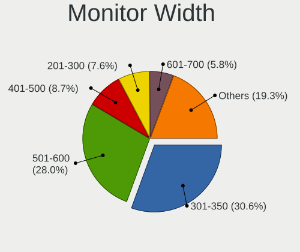

| Width in mm    | Computers | Percent |
|----------------|-----------|---------|
| 301-350        | 767       | 30.58%  |
| 501-600        | 701       | 27.95%  |
| 401-500        | 219       | 8.73%   |
| 201-300        | 191       | 7.62%   |
| 601-700        | 146       | 5.82%   |
| 351-400        | 139       | 5.54%   |
| Unknown        | 121       | 4.82%   |
| 701-800        | 103       | 4.11%   |
| 1001-1500      | 46        | 1.83%   |
| 1501-2000      | 36        | 1.44%   |
| 801-900        | 18        | 0.72%   |
| 901-1000       | 8         | 0.32%   |
| More than 2000 | 7         | 0.28%   |
| 101-200        | 4         | 0.16%   |
| 1-100          | 2         | 0.08%   |

Aspect Ratio
------------

Proportional relationship between the width and the height

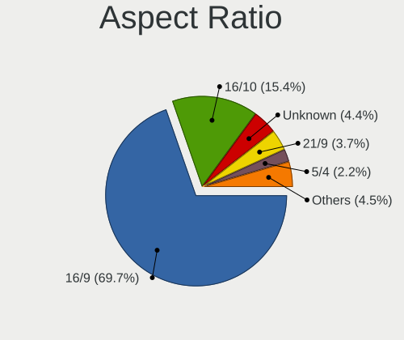

| Ratio   | Computers | Percent |
|---------|-----------|---------|
| 16/9    | 1580      | 69.66%  |
| 16/10   | 350       | 15.43%  |
| Unknown | 99        | 4.37%   |
| 21/9    | 85        | 3.75%   |
| 5/4     | 51        | 2.25%   |
| 3/2     | 37        | 1.63%   |
| 32/9    | 26        | 1.15%   |
| 4/3     | 21        | 0.93%   |
| 1.00    | 8         | 0.35%   |
| 6/5     | 3         | 0.13%   |
| 0.89    | 2         | 0.09%   |
| 3.40    | 1         | 0.04%   |
| 3.20    | 1         | 0.04%   |
| 0.71    | 1         | 0.04%   |
| 0.67    | 1         | 0.04%   |
| 0.62    | 1         | 0.04%   |
| 0.56    | 1         | 0.04%   |

Monitor Area
------------

Area in inch²

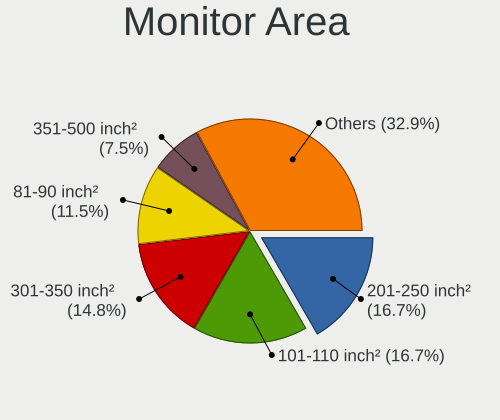

| Area in inch² | Computers | Percent |
|----------------|-----------|---------|
| 201-250        | 427       | 16.65%  |
| 101-110        | 427       | 16.65%  |
| 301-350        | 380       | 14.82%  |
| 81-90          | 294       | 11.47%  |
| 351-500        | 193       | 7.53%   |
| 251-300        | 127       | 4.95%   |
| Unknown        | 121       | 4.72%   |
| 151-200        | 101       | 3.94%   |
| 71-80          | 95        | 3.71%   |
| 121-130        | 85        | 3.32%   |
| More than 1000 | 69        | 2.69%   |
| 111-120        | 68        | 2.65%   |
| 501-1000       | 49        | 1.91%   |
| 141-150        | 44        | 1.72%   |
| 61-70          | 31        | 1.21%   |
| 51-60          | 20        | 0.78%   |
| 131-140        | 10        | 0.39%   |
| 91-100         | 10        | 0.39%   |
| 41-50          | 7         | 0.27%   |
| 1-40           | 6         | 0.23%   |

Pixel Density
-------------

Pixels per inch

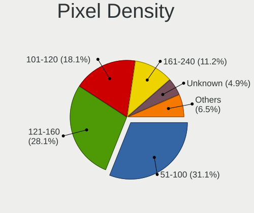

| Density       | Computers | Percent |
|---------------|-----------|---------|
| 51-100        | 765       | 31.06%  |
| 121-160       | 693       | 28.14%  |
| 101-120       | 446       | 18.11%  |
| 161-240       | 277       | 11.25%  |
| Unknown       | 121       | 4.91%   |
| More than 240 | 108       | 4.38%   |
| 1-50          | 53        | 2.15%   |

Multiple Monitors
-----------------

Total monitors connected

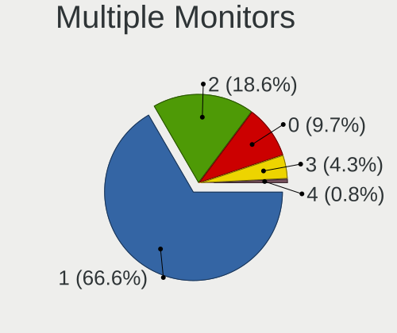

| Total | Computers | Percent |
|-------|-----------|---------|
| 1     | 1590      | 66.64%  |
| 2     | 443       | 18.57%  |
| 0     | 231       | 9.68%   |
| 3     | 103       | 4.32%   |
| 4     | 19        | 0.8%    |

Network
-------

Net Controller Vendor
---------------------

Controller vendors

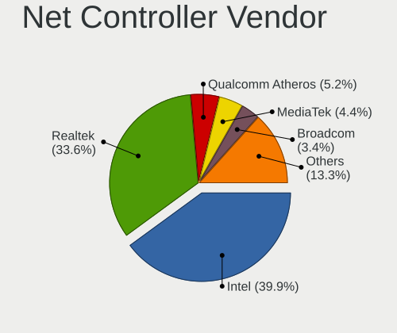

| Vendor                            | Computers | Percent |
|-----------------------------------|-----------|---------|
| Intel                             | 1356      | 39.94%  |
| Realtek Semiconductor             | 1142      | 33.64%  |
| Qualcomm Atheros                  | 176       | 5.18%   |
| MediaTek                          | 151       | 4.45%   |
| Broadcom                          | 117       | 3.45%   |
| ASIX Electronics                  | 40        | 1.18%   |
| Aquantia                          | 38        | 1.12%   |
| Qualcomm                          | 26        | 0.77%   |
| Nvidia                            | 21        | 0.62%   |
| Marvell Technology Group          | 21        | 0.62%   |
| Lenovo                            | 21        | 0.62%   |
| TP-Link                           | 16        | 0.47%   |
| Shenzhen Goodix Technology        | 16        | 0.47%   |
| Qualcomm Technologies             | 14        | 0.41%   |
| Broadcom Limited                  | 14        | 0.41%   |
| Apple                             | 12        | 0.35%   |
| Sierra Wireless                   | 11        | 0.32%   |
| Ralink Technology                 | 11        | 0.32%   |
| Microsoft                         | 11        | 0.32%   |
| Qualcomm Atheros Communications   | 10        | 0.29%   |
| Dell                              | 10        | 0.29%   |
| Xiaomi                            | 8         | 0.24%   |
| Microchip Technology              | 8         | 0.24%   |
| Samsung Electronics               | 7         | 0.21%   |
| Ralink                            | 7         | 0.21%   |
| Mellanox Technologies             | 7         | 0.21%   |
| Google                            | 7         | 0.21%   |
| Fibocom                           | 7         | 0.21%   |
| ICS Advent                        | 6         | 0.18%   |
| Ericsson Business Mobile Networks | 5         | 0.15%   |
| D-Link System                     | 5         | 0.15%   |
| American Megatrends               | 5         | 0.15%   |
| QinHeng Electronics               | 4         | 0.12%   |
| NetGear                           | 4         | 0.12%   |
| Huawei Technologies               | 4         | 0.12%   |
| ZTE WCDMA Technologies MSM        | 3         | 0.09%   |
| Sigma Designs                     | 3         | 0.09%   |
| Raspberry Pi                      | 3         | 0.09%   |
| OpenMoko                          | 3         | 0.09%   |
| DisplayLink                       | 3         | 0.09%   |

Net Controller Model
--------------------

Controller models

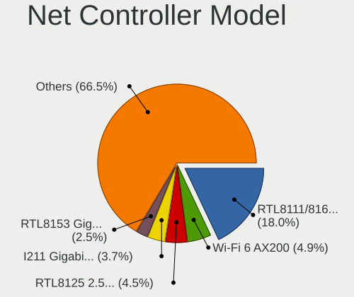

| Model                                                                  | Computers | Percent |
|------------------------------------------------------------------------|-----------|---------|
| Realtek RTL8111/8168/8211/8411 PCI Express Gigabit Ethernet Controller | 732       | 17.97%  |
| Intel Wi-Fi 6 AX200                                                    | 201       | 4.93%   |
| Realtek RTL8125 2.5GbE Controller                                      | 182       | 4.47%   |
| Intel I211 Gigabit Network Connection                                  | 150       | 3.68%   |
| Realtek RTL8153 Gigabit Ethernet Adapter                               | 101       | 2.48%   |
| Intel Wi-Fi 6E(802.11ax) AX210/AX1675* 2x2 [Typhoon Peak]              | 79        | 1.94%   |
| Intel Wireless 8265 / 8275                                             | 76        | 1.87%   |
| Intel Ethernet Controller I225-V                                       | 70        | 1.72%   |
| MediaTek MT7922 802.11ax PCI Express Wireless Network Adapter          | 61        | 1.5%    |
| Intel Cannon Lake PCH CNVi WiFi                                        | 55        | 1.35%   |
| Intel Wi-Fi 6 AX201                                                    | 54        | 1.33%   |
| Intel I210 Gigabit Network Connection                                  | 47        | 1.15%   |
| Intel 82579LM Gigabit Network Connection (Lewisville)                  | 43        | 1.06%   |
| Realtek RTL8822CE 802.11ac PCIe Wireless Network Adapter               | 41        | 1.01%   |
| Realtek RTL810xE PCI Express Fast Ethernet controller                  | 38        | 0.93%   |
| Intel Ethernet Connection (2) I219-V                                   | 38        | 0.93%   |
| MediaTek MT7921 802.11ax PCIe Wireless Network Adapter [Filogic 330]   | 37        | 0.91%   |
| Realtek RTL8821CE 802.11ac PCIe Wireless Network Adapter               | 36        | 0.88%   |
| Intel Alder Lake-P PCH CNVi WiFi                                       | 36        | 0.88%   |
| Intel Wi-Fi 5(802.11ac) Wireless-AC 9x6x [Thunder Peak]                | 35        | 0.86%   |
| Intel Ethernet Connection (7) I219-V                                   | 34        | 0.83%   |
| Intel Raptor Lake PCH CNVi WiFi                                        | 33        | 0.81%   |
| Intel Wireless 7265                                                    | 32        | 0.79%   |
| Intel Comet Lake PCH-LP CNVi WiFi                                      | 32        | 0.79%   |
| Intel Comet Lake PCH CNVi WiFi                                         | 32        | 0.79%   |
| Intel Wireless 8260                                                    | 31        | 0.76%   |
| Intel Wireless 7260                                                    | 31        | 0.76%   |
| Qualcomm Atheros QCA6174 802.11ac Wireless Network Adapter             | 29        | 0.71%   |
| Intel 82574L Gigabit Network Connection                                | 28        | 0.69%   |
| Intel Cannon Point-LP CNVi [Wireless-AC]                               | 27        | 0.66%   |
| Intel Ethernet Connection (4) I219-LM                                  | 26        | 0.64%   |
| Intel Dual Band Wireless-AC 3168NGW [Stone Peak]                       | 25        | 0.61%   |
| Intel Ethernet Connection (2) I219-LM                                  | 24        | 0.59%   |
| Intel Tiger Lake PCH CNVi WiFi                                         | 23        | 0.56%   |
| ASIX AX88179 Gigabit Ethernet                                          | 23        | 0.56%   |
| Qualcomm Atheros QCA9377 802.11ac Wireless Network Adapter             | 22        | 0.54%   |
| Intel I350 Gigabit Network Connection                                  | 22        | 0.54%   |
| Realtek RTL8852AE 802.11ax PCIe Wireless Network Adapter               | 21        | 0.52%   |
| Qualcomm QCNFA765 Wireless Network Adapter                             | 21        | 0.52%   |
| Intel Wireless 3165                                                    | 21        | 0.52%   |

Wireless Vendor
---------------

Wireless vendors

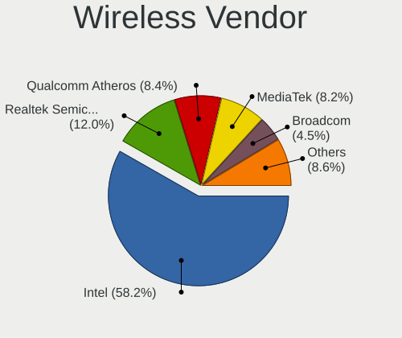

| Vendor                                | Computers | Percent |
|---------------------------------------|-----------|---------|
| Intel                                 | 951       | 58.24%  |
| Realtek Semiconductor                 | 196       | 12%     |
| Qualcomm Atheros                      | 137       | 8.39%   |
| MediaTek                              | 134       | 8.21%   |
| Broadcom                              | 74        | 4.53%   |
| Qualcomm                              | 25        | 1.53%   |
| TP-Link                               | 12        | 0.73%   |
| Sierra Wireless                       | 11        | 0.67%   |
| Ralink Technology                     | 11        | 0.67%   |
| Microsoft                             | 11        | 0.67%   |
| Qualcomm Atheros Communications       | 10        | 0.61%   |
| Broadcom Limited                      | 9         | 0.55%   |
| Qualcomm Technologies                 | 8         | 0.49%   |
| Ralink                                | 7         | 0.43%   |
| Fibocom                               | 7         | 0.43%   |
| Dell                                  | 7         | 0.43%   |
| NetGear                               | 4         | 0.24%   |
| D-Link System                         | 3         | 0.18%   |
| D-Link                                | 3         | 0.18%   |
| ASUSTek Computer                      | 3         | 0.18%   |
| Wilocity                              | 2         | 0.12%   |
| Edimax Technology                     | 2         | 0.12%   |
| Texas Instruments                     | 1         | 0.06%   |
| Senao                                 | 1         | 0.06%   |
| Quectel Wireless Solutions            | 1         | 0.06%   |
| Cisco Aironet Wireless Communications | 1         | 0.06%   |
| BUFFALO                               | 1         | 0.06%   |
| AVM                                   | 1         | 0.06%   |

Wireless Model
--------------

Wireless models

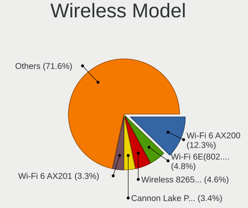

| Model                                                                           | Computers | Percent |
|---------------------------------------------------------------------------------|-----------|---------|
| Intel Wi-Fi 6 AX200                                                             | 201       | 12.26%  |
| Intel Wi-Fi 6E(802.11ax) AX210/AX1675* 2x2 [Typhoon Peak]                       | 79        | 4.82%   |
| Intel Wireless 8265 / 8275                                                      | 76        | 4.63%   |
| Intel Cannon Lake PCH CNVi WiFi                                                 | 55        | 3.35%   |
| Intel Wi-Fi 6 AX201                                                             | 54        | 3.29%   |
| MediaTek MT7922 802.11ax PCI Express Wireless Network Adapter                   | 52        | 3.17%   |
| Realtek RTL8822CE 802.11ac PCIe Wireless Network Adapter                        | 41        | 2.5%    |
| MediaTek MT7921 802.11ax PCIe Wireless Network Adapter [Filogic 330]            | 37        | 2.26%   |
| Realtek RTL8821CE 802.11ac PCIe Wireless Network Adapter                        | 36        | 2.2%    |
| Intel Wi-Fi 5(802.11ac) Wireless-AC 9x6x [Thunder Peak]                         | 35        | 2.13%   |
| Intel Wireless 7265                                                             | 32        | 1.95%   |
| Intel Raptor Lake PCH CNVi WiFi                                                 | 32        | 1.95%   |
| Intel Comet Lake PCH-LP CNVi WiFi                                               | 32        | 1.95%   |
| Intel Comet Lake PCH CNVi WiFi                                                  | 32        | 1.95%   |
| Intel Wireless 8260                                                             | 31        | 1.89%   |
| Intel Wireless 7260                                                             | 31        | 1.89%   |
| Qualcomm Atheros QCA6174 802.11ac Wireless Network Adapter                      | 29        | 1.77%   |
| Intel Cannon Point-LP CNVi [Wireless-AC]                                        | 27        | 1.65%   |
| Intel Dual Band Wireless-AC 3168NGW [Stone Peak]                                | 25        | 1.52%   |
| Intel Tiger Lake PCH CNVi WiFi                                                  | 23        | 1.4%    |
| Intel Alder Lake-P PCH CNVi WiFi                                                | 23        | 1.4%    |
| Qualcomm Atheros QCA9377 802.11ac Wireless Network Adapter                      | 22        | 1.34%   |
| Realtek RTL8852AE 802.11ax PCIe Wireless Network Adapter                        | 21        | 1.28%   |
| Qualcomm QCNFA765 Wireless Network Adapter                                      | 21        | 1.28%   |
| Intel Wireless 3165                                                             | 21        | 1.28%   |
| Intel Centrino Advanced-N 6205 [Taylor Peak]                                    | 20        | 1.22%   |
| MediaTek MT7921K (RZ608) Wi-Fi 6E 80MHz                                         | 16        | 0.98%   |
| Realtek RTL8852BE PCIe 802.11ax Wireless Network Controller                     | 15        | 0.91%   |
| Realtek RTL8822BE 802.11a/b/g/n/ac WiFi adapter                                 | 15        | 0.91%   |
| Intel 700 Series Chipset CNVi WiFi                                              | 15        | 0.91%   |
| Qualcomm Atheros AR9485 Wireless Network Adapter                                | 14        | 0.85%   |
| Qualcomm Atheros AR9285 Wireless Network Adapter (PCI-Express)                  | 14        | 0.85%   |
| Broadcom BCM4360 802.11ac Dual Band Wireless Network Adapter                    | 13        | 0.79%   |
| Qualcomm Atheros AR9462 Wireless Network Adapter                                | 12        | 0.73%   |
| Qualcomm Atheros AR93xx Wireless Network Adapter                                | 11        | 0.67%   |
| Intel Ice Lake-LP PCH CNVi WiFi                                                 | 11        | 0.67%   |
| Realtek RTL8723BE PCIe Wireless Network Adapter                                 | 10        | 0.61%   |
| MediaTek MT7925 802.11be 160MHz 2x2 PCIe Wireless Network Adapter [Filogic 360] | 10        | 0.61%   |
| Broadcom BCM4313 802.11bgn Wireless Network Adapter                             | 10        | 0.61%   |
| Qualcomm Atheros AR9271 802.11n                                                 | 9         | 0.55%   |

Ethernet Vendor
---------------

Ethernet vendors

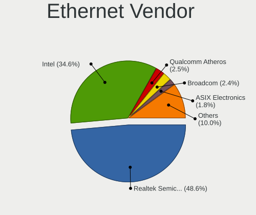

| Vendor                                 | Computers | Percent |
|----------------------------------------|-----------|---------|
| Realtek Semiconductor                  | 1076      | 48.58%  |
| Intel                                  | 767       | 34.63%  |
| Qualcomm Atheros                       | 56        | 2.53%   |
| Broadcom                               | 54        | 2.44%   |
| ASIX Electronics                       | 40        | 1.81%   |
| Aquantia                               | 38        | 1.72%   |
| Nvidia                                 | 21        | 0.95%   |
| Marvell Technology Group               | 21        | 0.95%   |
| Lenovo                                 | 21        | 0.95%   |
| MediaTek                               | 15        | 0.68%   |
| Apple                                  | 12        | 0.54%   |
| Xiaomi                                 | 8         | 0.36%   |
| Microchip Technology                   | 8         | 0.36%   |
| Samsung Electronics                    | 6         | 0.27%   |
| Qualcomm Technologies                  | 6         | 0.27%   |
| Mellanox Technologies                  | 6         | 0.27%   |
| ICS Advent                             | 6         | 0.27%   |
| Google                                 | 6         | 0.27%   |
| Broadcom Limited                       | 5         | 0.23%   |
| American Megatrends                    | 5         | 0.23%   |
| TP-Link                                | 4         | 0.18%   |
| DisplayLink                            | 3         | 0.14%   |
| Silicon Integrated Systems [SiS]       | 2         | 0.09%   |
| Raspberry Pi                           | 2         | 0.09%   |
| QLogic                                 | 2         | 0.09%   |
| Loongson Technology                    | 2         | 0.09%   |
| Huawei Technologies                    | 2         | 0.09%   |
| D-Link System                          | 2         | 0.09%   |
| 3Com                                   | 2         | 0.09%   |
| ZTE WCDMA Technologies MSM             | 1         | 0.05%   |
| VIA Technologies                       | 1         | 0.05%   |
| Suzhou Motorcomm Electronic Technology | 1         | 0.05%   |
| Qualcomm                               | 1         | 0.05%   |
| Nokia Mobile Phones                    | 1         | 0.05%   |
| NetXen Incorporated                    | 1         | 0.05%   |
| Motorola PCS                           | 1         | 0.05%   |
| Motorcomm Microelectronics.            | 1         | 0.05%   |
| JMicron Technology                     | 1         | 0.05%   |
| Insyde Software                        | 1         | 0.05%   |
| HMD Global                             | 1         | 0.05%   |

Ethernet Model
--------------

Ethernet models

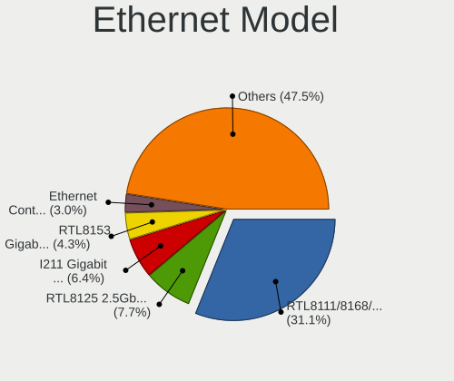

| Model                                                                           | Computers | Percent |
|---------------------------------------------------------------------------------|-----------|---------|
| Realtek RTL8111/8168/8211/8411 PCI Express Gigabit Ethernet Controller          | 732       | 31.11%  |
| Realtek RTL8125 2.5GbE Controller                                               | 182       | 7.73%   |
| Intel I211 Gigabit Network Connection                                           | 150       | 6.37%   |
| Realtek RTL8153 Gigabit Ethernet Adapter                                        | 101       | 4.29%   |
| Intel Ethernet Controller I225-V                                                | 70        | 2.97%   |
| Intel I210 Gigabit Network Connection                                           | 47        | 2%      |
| Intel 82579LM Gigabit Network Connection (Lewisville)                           | 43        | 1.83%   |
| Realtek RTL810xE PCI Express Fast Ethernet controller                           | 38        | 1.61%   |
| Intel Ethernet Connection (2) I219-V                                            | 38        | 1.61%   |
| Intel Ethernet Connection (7) I219-V                                            | 34        | 1.44%   |
| Intel 82574L Gigabit Network Connection                                         | 28        | 1.19%   |
| Intel Ethernet Connection (4) I219-LM                                           | 26        | 1.1%    |
| Intel Ethernet Connection (2) I219-LM                                           | 24        | 1.02%   |
| ASIX AX88179 Gigabit Ethernet                                                   | 23        | 0.98%   |
| Intel I350 Gigabit Network Connection                                           | 22        | 0.93%   |
| Intel Ethernet Controller I226-V                                                | 21        | 0.89%   |
| Intel Ethernet Connection I217-LM                                               | 20        | 0.85%   |
| Intel Ethernet Connection (7) I219-LM                                           | 17        | 0.72%   |
| Intel Ethernet Connection (2) I218-V                                            | 16        | 0.68%   |
| Realtek RTL8126 5GbE Controller                                                 | 14        | 0.59%   |
| Intel Ethernet Connection (4) I219-V                                            | 14        | 0.59%   |
| Qualcomm Atheros Killer E2400 Gigabit Ethernet Controller                       | 13        | 0.55%   |
| Intel Ethernet Connection (6) I219-V                                            | 13        | 0.55%   |
| Intel Alder Lake-P PCH CNVi WiFi                                                | 13        | 0.55%   |
| Intel 82599ES 10-Gigabit SFI/SFP+ Network Connection                            | 12        | 0.51%   |
| Intel 82579V Gigabit Network Connection                                         | 12        | 0.51%   |
| Realtek USB 10/100/1G/2.5 LAN                                                   | 11        | 0.47%   |
| Realtek Killer E3000 2.5GbE Controller                                          | 11        | 0.47%   |
| Aquantia AQtion AQC113CS NBase-T/IEEE 802.3an Ethernet Controller [Antigua 10G] | 11        | 0.47%   |
| Aquantia AQtion AQC107 NBase-T/IEEE 802.3an Ethernet Controller [Atlantic 10G]  | 11        | 0.47%   |
| Lenovo USB-C Dock Ethernet                                                      | 10        | 0.42%   |
| Qualcomm Atheros AR8151 v2.0 Gigabit Ethernet                                   | 9         | 0.38%   |
| MediaTek MT7922 802.11ax PCI Express Wireless Network Adapter                   | 9         | 0.38%   |
| Realtek RTL8169 PCI Gigabit Ethernet Controller                                 | 8         | 0.34%   |
| Realtek RTL-8100/8101L/8139 PCI Fast Ethernet Adapter                           | 8         | 0.34%   |
| Realtek Killer E2600 GbE Controller                                             | 8         | 0.34%   |
| Qualcomm Atheros Killer E2500 Gigabit Ethernet Controller                       | 8         | 0.34%   |
| Qualcomm Atheros Killer E220x Gigabit Ethernet Controller                       | 8         | 0.34%   |
| Marvell Group 88E8056 PCI-E Gigabit Ethernet Controller                         | 8         | 0.34%   |
| Intel Ethernet Connection I218-LM                                               | 8         | 0.34%   |

Net Controller Kind
-------------------

Ethernet, WiFi or modem

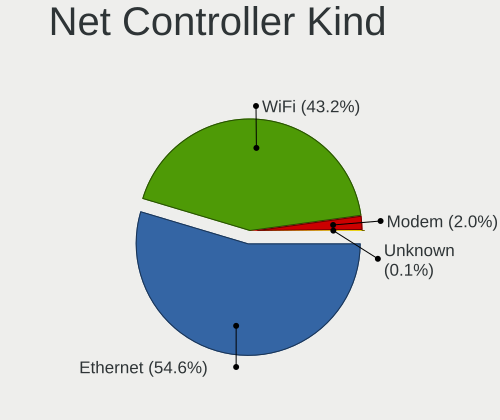

| Kind     | Computers | Percent |
|----------|-----------|---------|
| Ethernet | 1963      | 54.62%  |
| WiFi     | 1553      | 43.21%  |
| Modem    | 73        | 2.03%   |
| Unknown  | 5         | 0.14%   |

Used Controller
---------------

Currently used network controller

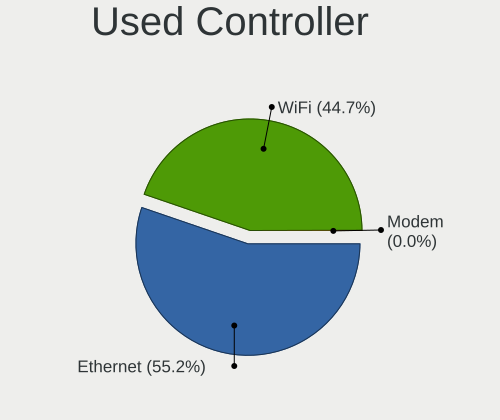

| Kind     | Computers | Percent |
|----------|-----------|---------|
| Ethernet | 1300      | 55.25%  |
| WiFi     | 1052      | 44.71%  |
| Modem    | 1         | 0.04%   |

NICs
----

Total network controllers on board

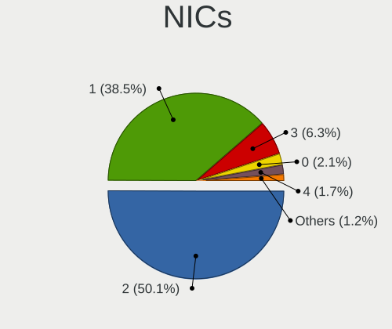

| Total | Computers | Percent |
|-------|-----------|---------|
| 2     | 1147      | 50.07%  |
| 1     | 883       | 38.54%  |
| 3     | 145       | 6.33%   |
| 0     | 48        | 2.1%    |
| 4     | 40        | 1.75%   |
| 5     | 12        | 0.52%   |
| 6     | 7         | 0.31%   |
| 7     | 3         | 0.13%   |
| 8     | 2         | 0.09%   |
| 12    | 1         | 0.04%   |
| 11    | 1         | 0.04%   |
| 10    | 1         | 0.04%   |
| 9     | 1         | 0.04%   |

IPv6
----

IPv6 vs IPv4

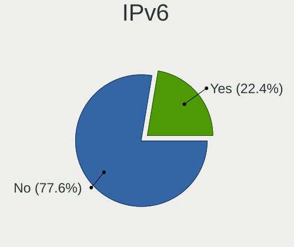

| Used | Computers | Percent |
|------|-----------|---------|
| No   | 1822      | 77.63%  |
| Yes  | 525       | 22.37%  |

Bluetooth
---------

Bluetooth Vendor
----------------

Controller vendors

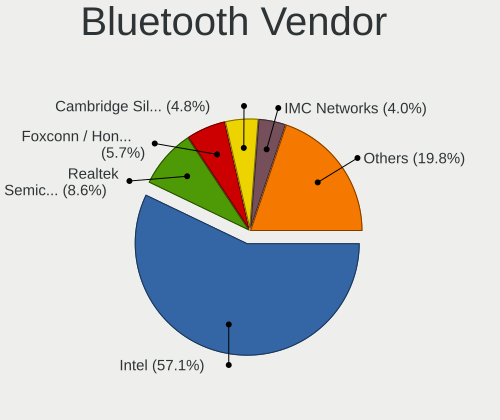

| Vendor                          | Computers | Percent |
|---------------------------------|-----------|---------|
| Intel                           | 879       | 57.12%  |
| Realtek Semiconductor           | 132       | 8.58%   |
| Foxconn / Hon Hai               | 88        | 5.72%   |
| Cambridge Silicon Radio         | 74        | 4.81%   |
| IMC Networks                    | 61        | 3.96%   |
| MediaTek                        | 55        | 3.57%   |
| Qualcomm Atheros Communications | 38        | 2.47%   |
| Apple                           | 38        | 2.47%   |
| Broadcom                        | 36        | 2.34%   |
| ASUSTek Computer                | 33        | 2.14%   |
| Lite-On Technology              | 31        | 2.01%   |
| USI                             | 15        | 0.97%   |
| Dell                            | 9         | 0.58%   |
| Realtek                         | 8         | 0.52%   |
| TP-Link                         | 6         | 0.39%   |
| Hewlett-Packard                 | 6         | 0.39%   |
| Toshiba                         | 5         | 0.32%   |
| HTC (High Tech Computer)        | 4         | 0.26%   |
| Foxconn International           | 3         | 0.19%   |
| Belkin Components               | 3         | 0.19%   |
| Edimax Technology               | 2         | 0.13%   |
| Chicony Electronics             | 2         | 0.13%   |
| Roper                           | 1         | 0.06%   |
| Ralink Technology               | 1         | 0.06%   |
| Opticis                         | 1         | 0.06%   |
| Micro Star International        | 1         | 0.06%   |
| Dynex                           | 1         | 0.06%   |
| Askey Computer                  | 1         | 0.06%   |
| Alps Electric                   | 1         | 0.06%   |
| AICSemi                         | 1         | 0.06%   |
| Actiontec Electronics           | 1         | 0.06%   |
| Actions                         | 1         | 0.06%   |
| Unknown                         | 1         | 0.06%   |

Bluetooth Model
---------------

Controller models

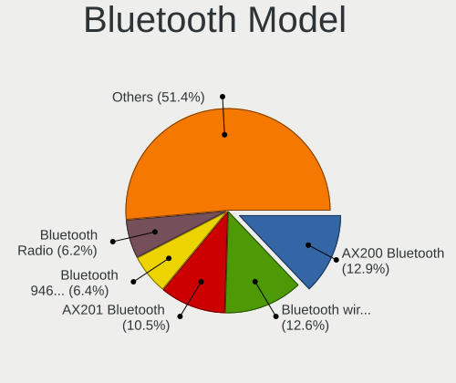

| Model                                                                | Computers | Percent |
|----------------------------------------------------------------------|-----------|---------|
| Intel AX200 Bluetooth                                                | 199       | 12.91%  |
| Intel Bluetooth wireless interface                                   | 194       | 12.58%  |
| Intel AX201 Bluetooth                                                | 162       | 10.51%  |
| Intel Bluetooth 9460/9560 Jefferson Peak (JfP)                       | 99        | 6.42%   |
| Realtek Bluetooth Radio                                              | 95        | 6.16%   |
| Intel Bluetooth Device                                               | 81        | 5.25%   |
| Intel AX210 Bluetooth                                                | 74        | 4.8%    |
| Cambridge Silicon Radio Bluetooth Dongle (HCI mode)                  | 74        | 4.8%    |
| MediaTek Wireless_Device                                             | 55        | 3.57%   |
| Foxconn / Hon Hai Wireless_Device                                    | 42        | 2.72%   |
| Intel Wireless-AC 9260 Bluetooth Adapter                             | 36        | 2.33%   |
| IMC Networks Wireless_Device                                         | 32        | 2.08%   |
| Foxconn / Hon Hai Bluetooth Device                                   | 25        | 1.62%   |
| Intel Wireless-AC 3168 Bluetooth                                     | 23        | 1.49%   |
| Apple Bluetooth Host Controller                                      | 22        | 1.43%   |
| IMC Networks Bluetooth Radio                                         | 21        | 1.36%   |
| Realtek  Bluetooth 4.2 Adapter                                       | 20        | 1.3%    |
| USI Bluetooth Device                                                 | 15        | 0.97%   |
| Foxconn / Hon Hai MediaTek Bluetooth Adapter                         | 14        | 0.91%   |
| Qualcomm Atheros  Bluetooth Device                                   | 13        | 0.84%   |
| ASUS Broadcom BCM20702A0 Bluetooth                                   | 13        | 0.84%   |
| Intel Centrino Bluetooth Wireless Transceiver                        | 11        | 0.71%   |
| Qualcomm Atheros QCA61x4 Bluetooth 4.0                               | 10        | 0.65%   |
| Lite-On Bluetooth Device                                             | 10        | 0.65%   |
| Realtek Bluetooth Radio                                              | 8         | 0.52%   |
| Broadcom BCM20702A0 Bluetooth 4.0                                    | 8         | 0.52%   |
| Realtek RTL8822BE Bluetooth 4.2 Adapter                              | 7         | 0.45%   |
| Lite-On Atheros AR3012 Bluetooth                                     | 7         | 0.45%   |
| TP-Link TP-T@- UB500 Adapter                                         | 6         | 0.39%   |
| Realtek RTL8723B Bluetooth                                           | 6         | 0.39%   |
| Lite-On Qualcomm Atheros QCA9377 Bluetooth                           | 6         | 0.39%   |
| IMC Networks Bluetooth Device                                        | 6         | 0.39%   |
| Apple Built-in Bluetooth 2.0+EDR HCI                                 | 6         | 0.39%   |
| Qualcomm Atheros AR3012 Bluetooth 4.0                                | 5         | 0.32%   |
| Broadcom BCM2045B (BDC-2.1)                                          | 5         | 0.32%   |
| Qualcomm Atheros Bluetooth USB Host Controller                       | 4         | 0.26%   |
| Qualcomm Atheros AR3011 Bluetooth                                    | 4         | 0.26%   |
| Lite-On Wireless_Device                                              | 4         | 0.26%   |
| HTC (High Tech Computer) Vive Hub Bluetooth 4.1 (Broadcom BCM920703) | 4         | 0.26%   |
| HP Bluetooth 2.0 Interface [Broadcom BCM2045]                        | 4         | 0.26%   |

Sound
-----

Sound Vendor
------------

Sound card vendors

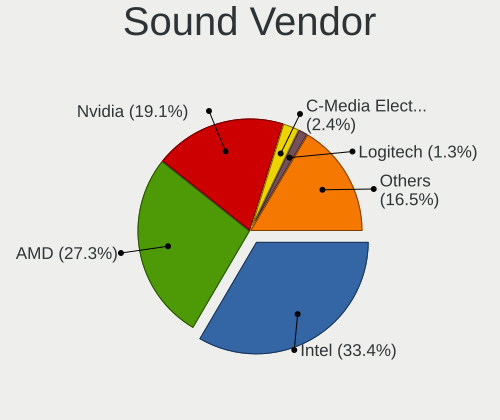

| Vendor                               | Computers | Percent |
|--------------------------------------|-----------|---------|
| Intel                                | 1196      | 33.45%  |
| AMD                                  | 975       | 27.27%  |
| Nvidia                               | 683       | 19.1%   |
| C-Media Electronics                  | 85        | 2.38%   |
| Logitech                             | 48        | 1.34%   |
| ASUSTek Computer                     | 39        | 1.09%   |
| Creative Labs                        | 29        | 0.81%   |
| SteelSeries ApS                      | 28        | 0.78%   |
| Realtek Semiconductor                | 27        | 0.76%   |
| Lenovo                               | 26        | 0.73%   |
| Creative Technology                  | 23        | 0.64%   |
| Razer USA                            | 19        | 0.53%   |
| Kingston Technology                  | 19        | 0.53%   |
| Focusrite-Novation                   | 19        | 0.53%   |
| Texas Instruments                    | 18        | 0.5%    |
| Plantronics                          | 16        | 0.45%   |
| Micro Star International             | 16        | 0.45%   |
| GN Netcom                            | 15        | 0.42%   |
| JMTek                                | 14        | 0.39%   |
| Generalplus Technology               | 11        | 0.31%   |
| Thesycon Systemsoftware & Consulting | 10        | 0.28%   |
| DSEA A/S                             | 10        | 0.28%   |
| Blue Microphones                     | 10        | 0.28%   |
| Sony                                 | 9         | 0.25%   |
| Hewlett-Packard                      | 9         | 0.25%   |
| GYROCOM C&C                          | 8         | 0.22%   |
| BEHRINGER International              | 8         | 0.22%   |
| AudioQuest                           | 8         | 0.22%   |
| Samson Technologies                  | 7         | 0.2%    |
| RODE Microphones                     | 7         | 0.2%    |
| Corsair                              | 6         | 0.17%   |
| ASRock                               | 6         | 0.17%   |
| Yamaha                               | 5         | 0.14%   |
| XMOS                                 | 5         | 0.14%   |
| Dell                                 | 5         | 0.14%   |
| Comtrue                              | 5         | 0.14%   |
| Audient                              | 5         | 0.14%   |
| Trust                                | 4         | 0.11%   |
| Solid State Logic                    | 4         | 0.11%   |
| SAVITECH                             | 4         | 0.11%   |

Sound Model
-----------

Sound card models

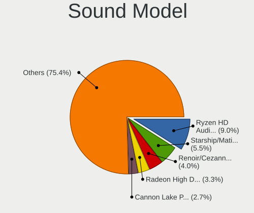

| Model                                                                      | Computers | Percent |
|----------------------------------------------------------------------------|-----------|---------|
| AMD Ryzen HD Audio Controller                                              | 397       | 9%      |
| AMD Starship/Matisse HD Audio Controller                                   | 241       | 5.46%   |
| AMD Renoir/Cezanne HDMI/DP Audio Controller                                | 177       | 4.01%   |
| AMD Radeon High Definition Audio Controller                                | 147       | 3.33%   |
| Intel Cannon Lake PCH cAVS                                                 | 121       | 2.74%   |
| AMD Ellesmere HDMI Audio [Radeon RX 470/480 / 570/580/590]                 | 115       | 2.61%   |
| Intel Sunrise Point-LP HD Audio                                            | 114       | 2.59%   |
| AMD Navi 21/23 HDMI/DP Audio Controller                                    | 105       | 2.38%   |
| AMD Family 17h (Models 00h-0fh) HD Audio Controller                        | 84        | 1.9%    |
| Intel Tiger Lake-LP Smart Sound Technology Audio Controller                | 67        | 1.52%   |
| Intel 100 Series/C230 Series Chipset Family HD Audio Controller            | 66        | 1.5%    |
| Intel 8 Series/C220 Series Chipset High Definition Audio Controller        | 60        | 1.36%   |
| Intel 7 Series/C216 Chipset Family High Definition Audio Controller        | 59        | 1.34%   |
| AMD Navi 10 HDMI Audio                                                     | 59        | 1.34%   |
| Intel 6 Series/C200 Series Chipset Family High Definition Audio Controller | 57        | 1.29%   |
| AMD Raven/Raven2/Fenghuang HDMI/DP Audio Controller                        | 56        | 1.27%   |
| AMD SBx00 Azalia (Intel HDA)                                               | 50        | 1.13%   |
| Nvidia GA104 High Definition Audio Controller                              | 49        | 1.11%   |
| Nvidia GP107GL High Definition Audio Controller                            | 47        | 1.07%   |
| Nvidia TU107 GeForce GTX 1650 High Definition Audio Controller             | 45        | 1.02%   |
| Nvidia TU106 High Definition Audio Controller                              | 45        | 1.02%   |
| Nvidia GP104 High Definition Audio Controller                              | 43        | 0.98%   |
| Intel Tiger Lake-H HD Audio Controller                                     | 43        | 0.98%   |
| Intel Comet Lake PCH cAVS                                                  | 42        | 0.95%   |
| Intel Raptor Lake-P/U/H cAVS                                               | 41        | 0.93%   |
| Intel Alder Lake PCH-P High Definition Audio Controller                    | 41        | 0.93%   |
| Intel Xeon E3-1200 v3/4th Gen Core Processor HD Audio Controller           | 39        | 0.88%   |
| Nvidia GP106 High Definition Audio Controller                              | 38        | 0.86%   |
| Intel Cannon Point-LP High Definition Audio Controller                     | 38        | 0.86%   |
| Nvidia GA106 High Definition Audio Controller                              | 37        | 0.84%   |
| AMD Navi 31 HDMI/DP Audio                                                  | 37        | 0.84%   |
| Nvidia TU116 High Definition Audio Controller                              | 36        | 0.82%   |
| Nvidia GA102 High Definition Audio Controller                              | 35        | 0.79%   |
| Intel Comet Lake PCH-LP cAVS                                               | 35        | 0.79%   |
| Nvidia TU104 HD Audio Controller                                           | 34        | 0.77%   |
| Intel 200 Series PCH HD Audio                                              | 34        | 0.77%   |
| ASUSTek Computer USB Audio                                                 | 29        | 0.66%   |
| Intel Alder Lake-S HD Audio Controller                                     | 28        | 0.63%   |
| Intel NM10/ICH7 Family High Definition Audio Controller                    | 27        | 0.61%   |
| Intel CM238 HD Audio Controller                                            | 27        | 0.61%   |

Memory
------

Memory Vendor
-------------

Memory module vendors

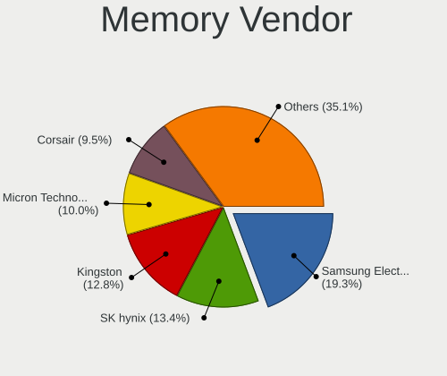

| Vendor                       | Computers | Percent |
|------------------------------|-----------|---------|
| Samsung Electronics          | 461       | 19.3%   |
| SK hynix                     | 320       | 13.39%  |
| Kingston                     | 306       | 12.81%  |
| Micron Technology            | 238       | 9.96%   |
| Corsair                      | 226       | 9.46%   |
| G.Skill                      | 204       | 8.54%   |
| Crucial                      | 179       | 7.49%   |
| Unknown                      | 165       | 6.91%   |
| Unknown                      | 49        | 2.05%   |
| A-DATA Technology            | 33        | 1.38%   |
| Team                         | 29        | 1.21%   |
| Ramaxel Technology           | 26        | 1.09%   |
| Patriot                      | 18        | 0.75%   |
| Elpida                       | 16        | 0.67%   |
| Transcend                    | 12        | 0.5%    |
| Nanya Technology             | 10        | 0.42%   |
| GOODRAM                      | 10        | 0.42%   |
| Unknown (ABCD)               | 6         | 0.25%   |
| AMD                          | 6         | 0.25%   |
| Avant                        | 4         | 0.17%   |
| Toshiba                      | 3         | 0.13%   |
| Timetec                      | 3         | 0.13%   |
| Patriot Memory (PDP Systems) | 3         | 0.13%   |
| Kllisre                      | 3         | 0.13%   |
| KINGBANK                     | 3         | 0.13%   |
| Apacer                       | 3         | 0.13%   |
| Silicon Power                | 2         | 0.08%   |
| Qimonda                      | 2         | 0.08%   |
| PUSKILL                      | 2         | 0.08%   |
| Neo Forza                    | 2         | 0.08%   |
| KLEVV                        | 2         | 0.08%   |
| Kimtigo                      | 2         | 0.08%   |
| Foxline                      | 2         | 0.08%   |
| Chun Well                    | 2         | 0.08%   |
| ChangXin Memory              | 2         | 0.08%   |
| Wilk                         | 1         | 0.04%   |
| Unknown (D386)               | 1         | 0.04%   |
| Unknown (89F7)               | 1         | 0.04%   |
| Unknown (0x5D00000000000000) | 1         | 0.04%   |
| Unknown (0x0B92)             | 1         | 0.04%   |

Memory Model
------------

Memory module models

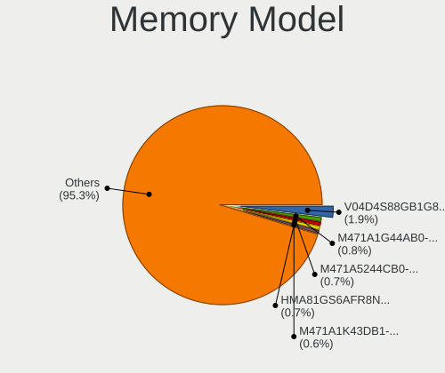

| Model                                                       | Computers | Percent |
|-------------------------------------------------------------|-----------|---------|
| Unknown                                                     | 49        | 1.92%   |
| Samsung RAM M471A1G44AB0-CWE 8GiB SODIMM DDR4 3200MT/s      | 20        | 0.78%   |
| SK hynix RAM HMA81GS6AFR8N-UH 8GB SODIMM DDR4 2667MT/s      | 17        | 0.67%   |
| Samsung RAM M471A5244CB0-CTD 4GB SODIMM DDR4 3266MT/s       | 17        | 0.67%   |
| SK hynix RAM HMAA1GS6CJR6N-XN 8GB SODIMM DDR4 3200MT/s      | 16        | 0.63%   |
| Samsung RAM M471A1K43DB1-CWE 8GB SODIMM DDR4 3200MT/s       | 16        | 0.63%   |
| Corsair RAM CMK32GX4M2B3200C16 16GB DIMM DDR4 3800MT/s      | 16        | 0.63%   |
| Corsair RAM CMK16GX4M2B3200C16 8GB DIMM DDR4 3600MT/s       | 16        | 0.63%   |
| Samsung RAM M471A1K43BB1-CRC 8GB SODIMM DDR4 2667MT/s       | 15        | 0.59%   |
| G.Skill RAM F5-6000J3040G32G 32GB DIMM DDR5 6200MT/s        | 15        | 0.59%   |
| Samsung RAM M471B5173DB0-YK0 4GB SODIMM DDR3 1600MT/s       | 13        | 0.51%   |
| G.Skill RAM F4-3200C16-16GVK 16GB DIMM DDR4 3600MT/s        | 13        | 0.51%   |
| Micron RAM 8ATF1G64HZ-3G2J1 8GB SODIMM DDR4 3200MT/s        | 12        | 0.47%   |
| Kingston RAM KHX3200C16D4/16GX 16GB DIMM DDR4 3600MT/s      | 12        | 0.47%   |
| Corsair RAM CMK64GX4M2E3200C16 32GB DIMM DDR4 3600MT/s      | 12        | 0.47%   |
| Samsung RAM M471A2K43DB1-CWE 16GB SODIMM DDR4 3200MT/s      | 11        | 0.43%   |
| Samsung RAM M471A2K43CB1-CTD 16GB SODIMM DDR4 8400MT/s      | 11        | 0.43%   |
| Samsung RAM M471A1K43EB1-CWE 8GB SODIMM DDR4 3200MT/s       | 11        | 0.43%   |
| G.Skill RAM F4-3200C16-8GVKB 8GB DIMM DDR4 4000MT/s         | 11        | 0.43%   |
| Corsair RAM CMK16GX4M2B3000C15 8GB DIMM DDR4 3600MT/s       | 11        | 0.43%   |
| SK hynix RAM HMA81GS6DJR8N-XN 8GB SODIMM DDR4 3200MT/s      | 10        | 0.39%   |
| Samsung RAM M471A1K43CB1-CTD 8GB SODIMM DDR4 3200MT/s       | 10        | 0.39%   |
| Micron RAM 8ATF1G64HZ-2G6E1 8GB SODIMM DDR4 2667MT/s        | 10        | 0.39%   |
| G.Skill RAM F5-6000J3636F16G 16GB DIMM DDR5 6400MT/s        | 10        | 0.39%   |
| G.Skill RAM F4-3600C16-16GTZNC 16GiB DIMM DDR4 3600MT/s     | 10        | 0.39%   |
| Corsair RAM CMK32GX4M2E3200C16 16GB DIMM DDR4 3600MT/s      | 10        | 0.39%   |
| SK hynix RAM HMAA2GS6CJR8N-XN 16GB SODIMM DDR4 3200MT/s     | 9         | 0.35%   |
| SK hynix RAM HMA41GS6AFR8N-TF 8GB SODIMM DDR4 2667MT/s      | 9         | 0.35%   |
| Samsung RAM M471A2K43DB1-CTD 16GB SODIMM DDR4 2667MT/s      | 9         | 0.35%   |
| Samsung RAM M471A2G44AM0-CWE 16GB SODIMM DDR4 3200MT/s      | 9         | 0.35%   |
| Samsung RAM M471A1G44AB0-CWE 8GB Row Of Chips DDR4 3200MT/s | 9         | 0.35%   |
| Kingston RAM KF3200C16D4/16GX 16GB DIMM DDR4 3733MT/s       | 9         | 0.35%   |
| Unknown RAM Module 1GB SODIMM DDR                           | 8         | 0.31%   |
| Team RAM TEAMGROUP-UD4-3200 8GB DIMM DDR4 3733MT/s          | 8         | 0.31%   |
| SK hynix RAM HMA81GS6JJR8N-VK 8GB SODIMM DDR4 2667MT/s      | 8         | 0.31%   |
| Samsung RAM M471B1G73DB0-YK0 8GB SODIMM DDR3 1600MT/s       | 8         | 0.31%   |
| Samsung RAM M471A1K43CB1-CRC 8GB SODIMM DDR4 8400MT/s       | 8         | 0.31%   |
| Samsung RAM M425R1GB4BB0-CQKOL 8GB SODIMM DDR5 4800MT/s     | 8         | 0.31%   |
| Micron RAM MTC4C10163S1SC48BA1 8GB SODIMM DDR5 4800MT/s     | 8         | 0.31%   |
| Micron RAM 4ATS2G64HZ-3G2B1 16GB SODIMM DDR4 3200MT/s       | 8         | 0.31%   |

Memory Kind
-----------

Memory module kinds

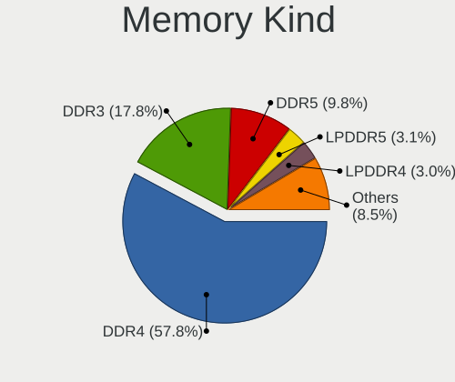

| Kind    | Computers | Percent |
|---------|-----------|---------|
| DDR4    | 1226      | 57.78%  |
| DDR3    | 377       | 17.77%  |
| DDR5    | 209       | 9.85%   |
| LPDDR5  | 65        | 3.06%   |
| LPDDR4  | 64        | 3.02%   |
| DDR2    | 60        | 2.83%   |
| Unknown | 43        | 2.03%   |
| SDRAM   | 29        | 1.37%   |
| LPDDR3  | 28        | 1.32%   |
| DDR     | 17        | 0.8%    |
| DRAM    | 4         | 0.19%   |

Memory Form Factor
------------------

Physical design of the memory module

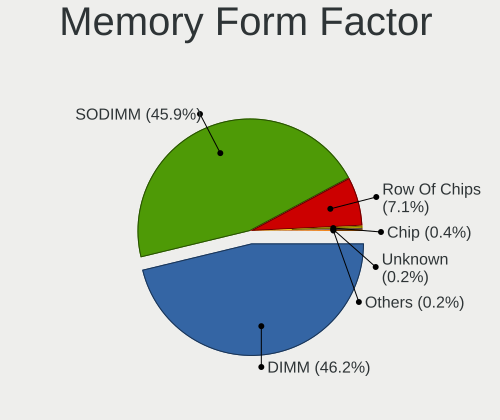

| Name            | Computers | Percent |
|-----------------|-----------|---------|
| DIMM            | 981       | 46.23%  |
| SODIMM          | 975       | 45.95%  |
| Row Of Chips    | 150       | 7.07%   |
| Chip            | 8         | 0.38%   |
| Unknown         | 4         | 0.19%   |
| RIMM            | 3         | 0.14%   |
| Proprietary Car | 1         | 0.05%   |

Memory Size
-----------

Memory module size

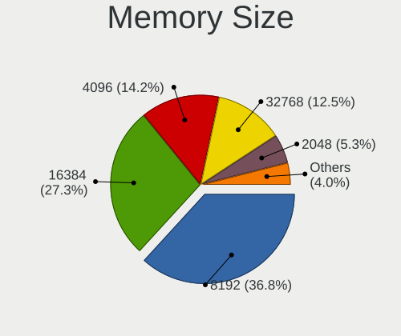

| Size  | Computers | Percent |
|-------|-----------|---------|
| 8192  | 846       | 36.78%  |
| 16384 | 629       | 27.35%  |
| 4096  | 326       | 14.17%  |
| 32768 | 287       | 12.48%  |
| 2048  | 121       | 5.26%   |
| 1024  | 46        | 2%      |
| 49152 | 19        | 0.83%   |
| 512   | 10        | 0.43%   |
| 65536 | 6         | 0.26%   |
| 256   | 5         | 0.22%   |
| 24576 | 3         | 0.13%   |
| 14336 | 1         | 0.04%   |
| 12288 | 1         | 0.04%   |

Memory Speed
------------

Memory module speed

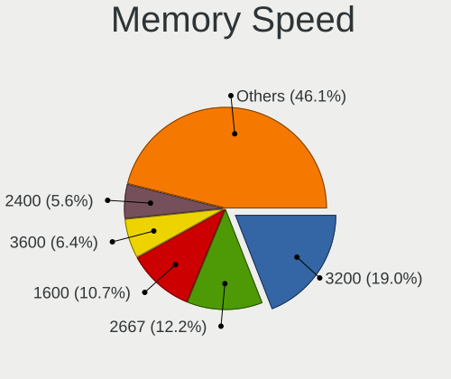

| Speed   | Computers | Percent |
|---------|-----------|---------|
| 3200    | 438       | 19.04%  |
| 2667    | 280       | 12.17%  |
| 1600    | 247       | 10.74%  |
| 3600    | 147       | 6.39%   |
| 2400    | 128       | 5.57%   |
| 2133    | 96        | 4.17%   |
| 1333    | 82        | 3.57%   |
| 5600    | 67        | 2.91%   |
| 4800    | 65        | 2.83%   |
| 6400    | 61        | 2.65%   |
| 3800    | 54        | 2.35%   |
| 3733    | 47        | 2.04%   |
| 667     | 39        | 1.7%    |
| 4267    | 36        | 1.57%   |
| 800     | 35        | 1.52%   |
| 3000    | 34        | 1.48%   |
| Unknown | 34        | 1.48%   |
| 6000    | 32        | 1.39%   |
| 4000    | 25        | 1.09%   |
| 1867    | 25        | 1.09%   |
| 8400    | 21        | 0.91%   |
| 2933    | 21        | 0.91%   |
| 3466    | 19        | 0.83%   |
| 3266    | 19        | 0.83%   |
| 2666    | 19        | 0.83%   |
| 3400    | 18        | 0.78%   |
| 6200    | 16        | 0.7%    |
| 3866    | 14        | 0.61%   |
| 1866    | 14        | 0.61%   |
| 1066    | 14        | 0.61%   |
| 1334    | 13        | 0.57%   |
| 7500    | 11        | 0.48%   |
| 1067    | 9         | 0.39%   |
| 3333    | 8         | 0.35%   |
| 2800    | 7         | 0.3%    |
| 2048    | 7         | 0.3%    |
| 400     | 6         | 0.26%   |
| 5200    | 5         | 0.22%   |
| 4266    | 5         | 0.22%   |
| 3100    | 5         | 0.22%   |

Printers & scanners
-------------------

Printer Vendor
--------------

Printer device vendors

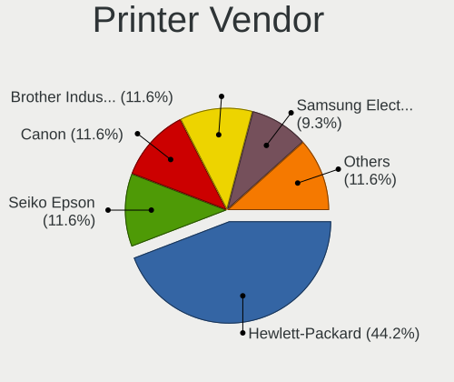

| Vendor                | Computers | Percent |
|-----------------------|-----------|---------|
| Hewlett-Packard       | 19        | 44.19%  |
| Seiko Epson           | 5         | 11.63%  |
| Canon                 | 5         | 11.63%  |
| Brother Industries    | 5         | 11.63%  |
| Samsung Electronics   | 4         | 9.3%    |
| Xiaomi                | 1         | 2.33%   |
| Prolific Technology   | 1         | 2.33%   |
| NXP Semiconductors    | 1         | 2.33%   |
| Lexmark International | 1         | 2.33%   |
| Konica Minolta        | 1         | 2.33%   |

Printer Model
-------------

Printer device models

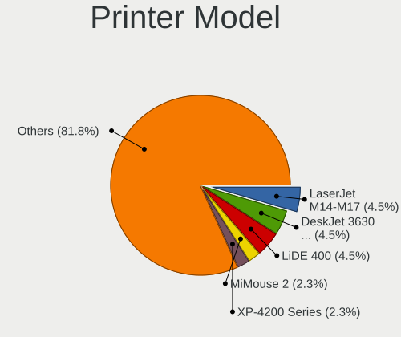

| Model                                 | Computers | Percent |
|---------------------------------------|-----------|---------|
| HP LaserJet M14-M17                   | 2         | 4.55%   |
| HP DeskJet 3630 series                | 2         | 4.55%   |
| Canon LiDE 400                        | 2         | 4.55%   |
| Xiaomi MiMouse 2                      | 1         | 2.27%   |
| Seiko Epson XP-4200 Series            | 1         | 2.27%   |
| Seiko Epson L3110 Series              | 1         | 2.27%   |
| Seiko Epson EPSON WF-3520 Series      | 1         | 2.27%   |
| Seiko Epson EPSON WF-2510 Series      | 1         | 2.27%   |
| Seiko Epson AL-M310DN                 | 1         | 2.27%   |
| Samsung ML-191x/ML-252x Laser Printer | 1         | 2.27%   |
| Samsung ML-1630 Series                | 1         | 2.27%   |
| Samsung CLP-325 Color Laser Printer   | 1         | 2.27%   |
| Samsung C460 Series                   | 1         | 2.27%   |
| Prolific PL2305 Parallel Port         | 1         | 2.27%   |
| NXP Semiconductors Elgin i8           | 1         | 2.27%   |
| Lexmark International Lexmark E352dn  | 1         | 2.27%   |
| Konica Minolta magicolor 1680MF scan  | 1         | 2.27%   |
| HP PhotoSmart 130                     | 1         | 2.27%   |
| HP LaserJet P2055 series              | 1         | 2.27%   |
| HP LaserJet P1005                     | 1         | 2.27%   |
| HP LaserJet 3200                      | 1         | 2.27%   |
| HP LaserJet 1320                      | 1         | 2.27%   |
| HP LaserJet 1200                      | 1         | 2.27%   |
| HP LaserJet 1022                      | 1         | 2.27%   |
| HP LaserJet 1020                      | 1         | 2.27%   |
| HP LaserJet 1018                      | 1         | 2.27%   |
| HP LaserJet 1010                      | 1         | 2.27%   |
| HP HP Color LaserJet M452dn           | 1         | 2.27%   |
| HP ENVY 5540 series                   | 1         | 2.27%   |
| HP Deskjet D1500 series               | 1         | 2.27%   |
| HP Deskjet 9800                       | 1         | 2.27%   |
| HP DeskJet 5440                       | 1         | 2.27%   |
| HP Deskjet 2050 J510                  | 1         | 2.27%   |
| Canon PIXMA MG2900 Series             | 1         | 2.27%   |
| Canon LiDE 300                        | 1         | 2.27%   |
| Canon D530/D560                       | 1         | 2.27%   |
| Brother QL-500 label printer          | 1         | 2.27%   |
| Brother MFC-L2700DW                   | 1         | 2.27%   |
| Brother MFC-9340CDW                   | 1         | 2.27%   |
| Brother MFC-9130CW                    | 1         | 2.27%   |

Scanner Vendor
--------------

Scanner device vendors

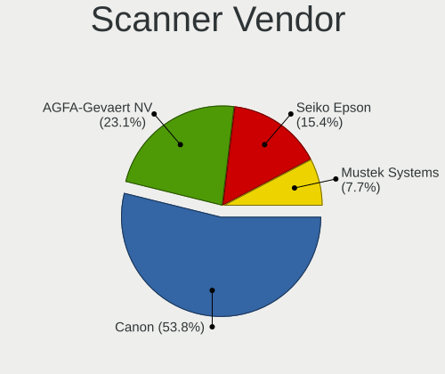

| Vendor          | Computers | Percent |
|-----------------|-----------|---------|
| Canon           | 7         | 53.85%  |
| AGFA-Gevaert NV | 3         | 23.08%  |
| Seiko Epson     | 2         | 15.38%  |
| Mustek Systems  | 1         | 7.69%   |

Scanner Model
-------------

Scanner device models

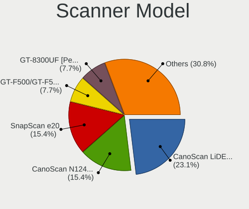

| Model                                                    | Computers | Percent |
|----------------------------------------------------------|-----------|---------|
| Canon CanoScan LiDE 110                                  | 3         | 23.08%  |
| Canon CanoScan N1240U/LiDE 30                            | 2         | 15.38%  |
| AGFA-Gevaert NV SnapScan e20                             | 2         | 15.38%  |
| Seiko Epson GT-F500/GT-F550 [Perfection 2480/2580 PHOTO] | 1         | 7.69%   |
| Seiko Epson GT-8300UF [Perfection 1660 PHOTO]            | 1         | 7.69%   |
| Mustek Systems BearPaw 2448 TA Pro                       | 1         | 7.69%   |
| Canon CanoScan LiDE 600F                                 | 1         | 7.69%   |
| Canon CanoScan LiDE 220                                  | 1         | 7.69%   |
| AGFA-Gevaert NV SnapScan 1212U (?)                       | 1         | 7.69%   |

Camera
------

Camera Vendor
-------------

Camera device vendors

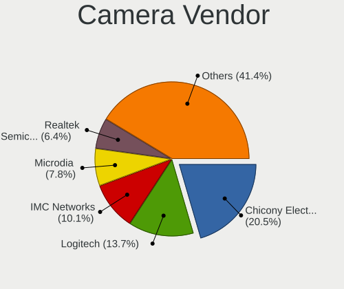

| Vendor                                 | Computers | Percent |
|----------------------------------------|-----------|---------|
| Chicony Electronics                    | 261       | 20.49%  |
| Logitech                               | 175       | 13.74%  |
| IMC Networks                           | 129       | 10.13%  |
| Microdia                               | 100       | 7.85%   |
| Realtek Semiconductor                  | 82        | 6.44%   |
| Bison Electronics                      | 74        | 5.81%   |
| Sunplus Innovation Technology          | 58        | 4.55%   |
| Quanta                                 | 57        | 4.47%   |
| Luxvisions Innotech Limited            | 39        | 3.06%   |
| Syntek                                 | 30        | 2.35%   |
| Lite-On Technology                     | 29        | 2.28%   |
| Cheng Uei Precision Industry (Foxlink) | 29        | 2.28%   |
| Apple                                  | 22        | 1.73%   |
| Samsung Electronics                    | 18        | 1.41%   |
| Sonix Technology                       | 17        | 1.33%   |
| MacroSilicon                           | 11        | 0.86%   |
| Z-Star Microelectronics                | 8         | 0.63%   |
| Microsoft                              | 8         | 0.63%   |
| Generalplus Technology                 | 7         | 0.55%   |
| Suyin                                  | 6         | 0.47%   |
| Razer USA                              | 6         | 0.47%   |
| kingcome                               | 5         | 0.39%   |
| Elgato Systems                         | 5         | 0.39%   |
| Creative Technology                    | 5         | 0.39%   |
| SunplusIT                              | 4         | 0.31%   |
| Silicon Motion                         | 4         | 0.31%   |
| ShineTech                              | 4         | 0.31%   |
| DigiTech                               | 4         | 0.31%   |
| ARC International                      | 4         | 0.31%   |
| Alcor Micro                            | 4         | 0.31%   |
| Valve Software                         | 3         | 0.24%   |
| Framework                              | 3         | 0.24%   |
| Cubeternet                             | 3         | 0.24%   |
| AVerMedia Technologies                 | 3         | 0.24%   |
| Acer                                   | 3         | 0.24%   |
| Xiaomi                                 | 2         | 0.16%   |
| Shenzhen Kingcome Optoelectronic       | 2         | 0.16%   |
| Ricoh                                  | 2         | 0.16%   |
| LG Electronics                         | 2         | 0.16%   |
| Lenovo                                 | 2         | 0.16%   |

Camera Model
------------

Camera device models

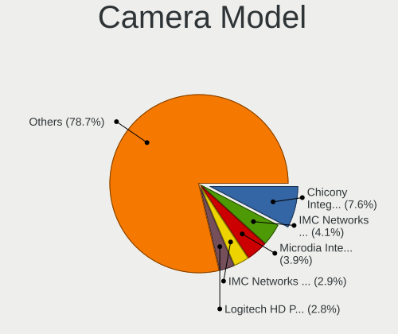

| Model                                             | Computers | Percent |
|---------------------------------------------------|-----------|---------|
| Chicony Integrated Camera                         | 99        | 7.64%   |
| IMC Networks Integrated Camera                    | 53        | 4.09%   |
| Microdia Integrated_Webcam_HD                     | 51        | 3.94%   |
| IMC Networks USB2.0 HD UVC WebCam                 | 37        | 2.86%   |
| Logitech HD Pro Webcam C920                       | 36        | 2.78%   |
| Logitech Webcam C270                              | 32        | 2.47%   |
| Bison Integrated Camera                           | 29        | 2.24%   |
| Realtek Integrated_Webcam_HD                      | 28        | 2.16%   |
| Syntek Integrated Camera                          | 24        | 1.85%   |
| Chicony HD Webcam                                 | 21        | 1.62%   |
| Samsung Galaxy series, misc. (MTP mode)           | 18        | 1.39%   |
| Logitech C922 Pro Stream Webcam                   | 16        | 1.24%   |
| Sunplus Integrated_Webcam_HD                      | 13        | 1%      |
| Logitech BRIO Ultra HD Webcam                     | 13        | 1%      |
| Chicony HP HD Camera                              | 13        | 1%      |
| Sonix USB2.0 HD UVC WebCam                        | 11        | 0.85%   |
| Microdia USB 2.0 Camera                           | 11        | 0.85%   |
| Luxvisions Innotech Limited Integrated Camera     | 11        | 0.85%   |
| Logitech C920 PRO HD Webcam                       | 11        | 0.85%   |
| Chicony Chicony USB2.0 Camera                     | 11        | 0.85%   |
| Quanta HD User Facing                             | 10        | 0.77%   |
| Luxvisions Innotech Limited Integrated RGB Camera | 10        | 0.77%   |
| Lite-On Integrated Camera                         | 10        | 0.77%   |
| Chicony Integrated IR Camera                      | 10        | 0.77%   |
| Realtek Laptop Camera                             | 9         | 0.69%   |
| Quanta HP Wide Vision HD Camera                   | 9         | 0.69%   |
| Logitech Webcam C310                              | 9         | 0.69%   |
| MacroSilicon USB Video                            | 8         | 0.62%   |
| Chicony Integrated Camera (1280x720@30)           | 8         | 0.62%   |
| Chicony HD User Facing                            | 8         | 0.62%   |
| Bison SunplusIT Integrated Camera                 | 8         | 0.62%   |
| Luxvisions Innotech Limited HP HD Camera          | 7         | 0.54%   |
| Logitech HD Webcam C525                           | 7         | 0.54%   |
| Lite-On HP HD Camera                              | 7         | 0.54%   |
| Chicony Lenovo EasyCamera                         | 7         | 0.54%   |
| Sunplus HD WebCam                                 | 6         | 0.46%   |
| Realtek Integrated Webcam HD                      | 6         | 0.46%   |
| Microdia Webcam Vitade AF                         | 6         | 0.46%   |
| Microdia Integrated_Webcam_FHD                    | 6         | 0.46%   |
| Microdia Camera                                   | 6         | 0.46%   |

Security
--------

Fingerprint Vendor
------------------

Fingerprint sensor vendors

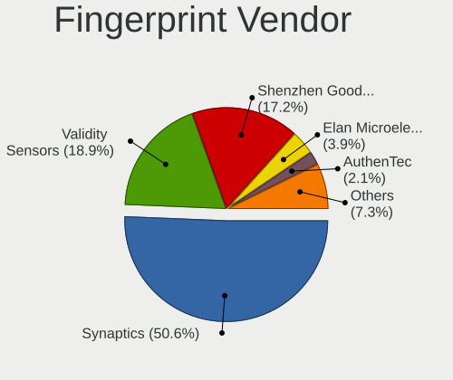

| Vendor                             | Computers | Percent |
|------------------------------------|-----------|---------|
| Synaptics                          | 118       | 50.64%  |
| Validity Sensors                   | 44        | 18.88%  |
| Shenzhen Goodix Technology         | 40        | 17.17%  |
| Elan Microelectronics              | 9         | 3.86%   |
| AuthenTec                          | 5         | 2.15%   |
| STMicroelectronics                 | 4         | 1.72%   |
| LighTuning Technology              | 4         | 1.72%   |
| DigitalPersona                     | 4         | 1.72%   |
| Upek                               | 3         | 1.29%   |
| Samsung Electronics                | 1         | 0.43%   |
| Realtek USB2.0 Finger Print Bridge | 1         | 0.43%   |

Fingerprint Model
-----------------

Fingerprint sensor models

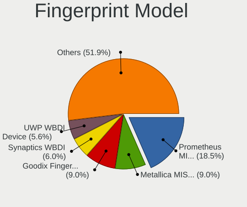

| Model                                                                      | Computers | Percent |
|----------------------------------------------------------------------------|-----------|---------|
| Synaptics Prometheus MIS Touch Fingerprint Reader                          | 43        | 18.45%  |
| Synaptics Metallica MIS Touch Fingerprint Reader                           | 21        | 9.01%   |
| Shenzhen Goodix  FingerPrint Device                                        | 21        | 9.01%   |
| Validity Sensors Synaptics WBDI                                            | 14        | 6.01%   |
| Synaptics UWP WBDI Device                                                  | 13        | 5.58%   |
| Shenzhen Goodix Fingerprint Reader                                         | 13        | 5.58%   |
| Validity Sensors VFS495 Fingerprint Reader                                 | 9         | 3.86%   |
| Synaptics WBDI                                                             | 9         | 3.86%   |
| Validity Sensors VFS 5011 fingerprint sensor                               | 7         | 3%      |
| Elan ELAN:Fingerprint                                                      | 7         | 3%      |
| Synaptics FS7604 Touch Fingerprint Sensor with PurePrint                   | 6         | 2.58%   |
| Shenzhen Goodix FingerPrint                                                | 6         | 2.58%   |
| Synaptics  FS7604 Touch Fingerprint Sensor with PurePrint                  | 5         | 2.15%   |
| Synaptics Prometheus Fingerprint Reader                                    | 5         | 2.15%   |
| Synaptics Fingerprint reader [HP G6]                                       | 5         | 2.15%   |
| Validity Sensors Fingerprint scanner                                       | 4         | 1.72%   |
| STMicroelectronics Fingerprint Reader                                      | 4         | 1.72%   |
| DigitalPersona Fingerprint Reader                                          | 4         | 1.72%   |
| Validity Sensors VFS5011 Fingerprint Reader                                | 3         | 1.29%   |
| Upek Biometric Touchchip/Touchstrip Fingerprint Sensor                     | 3         | 1.29%   |
| Synaptics  WBDI                                                            | 3         | 1.29%   |
| LighTuning EgisTec Touch Fingerprint Sensor                                | 3         | 1.29%   |
| AuthenTec AES2501 Fingerprint Sensor                                       | 3         | 1.29%   |
| Validity Sensors VFS7552 Touch Fingerprint Sensor                          | 2         | 0.86%   |
| Validity Sensors VFS491                                                    | 2         | 0.86%   |
| Synaptics UWP WBDI                                                         | 2         | 0.86%   |
| Synaptics Metallica MOH Touch Fingerprint Reader                           | 2         | 0.86%   |
| Elan ELAN:ARM-M4                                                           | 2         | 0.86%   |
| Unknown                                                                    | 2         | 0.86%   |
| Validity Sensors VFS7500 Touch Fingerprint Sensor                          | 1         | 0.43%   |
| Validity Sensors VFS471 Fingerprint Reader                                 | 1         | 0.43%   |
| Validity Sensors Synaptics VFS7552 Touch Fingerprint Sensor with PurePrint | 1         | 0.43%   |
| Synaptics WBDI Device                                                      | 1         | 0.43%   |
| Synaptics TouchPad                                                         | 1         | 0.43%   |
| Samsung Fingerprint Sensor Device - 730B                                   | 1         | 0.43%   |
| Realtek USB2.0 Finger Print Bridge FocalTech Fingerprint Device            | 1         | 0.43%   |
| LighTuning ES603 Swipe Fingerprint Sensor                                  | 1         | 0.43%   |
| AuthenTec Fingerprint Sensor                                               | 1         | 0.43%   |
| AuthenTec AES2550 Fingerprint Sensor                                       | 1         | 0.43%   |

Chipcard Vendor
---------------

Chipcard module vendors

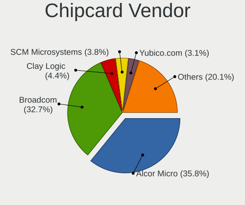

| Vendor                            | Computers | Percent |
|-----------------------------------|-----------|---------|
| Alcor Micro                       | 57        | 35.85%  |
| Broadcom                          | 52        | 32.7%   |
| Clay Logic                        | 7         | 4.4%    |
| SCM Microsystems                  | 6         | 3.77%   |
| Yubico.com                        | 5         | 3.14%   |
| Upek                              | 5         | 3.14%   |
| O2 Micro                          | 5         | 3.14%   |
| Gemalto (was Gemplus)             | 4         | 2.52%   |
| Advanced Card Systems             | 4         | 2.52%   |
| Hewlett-Packard                   | 2         | 1.26%   |
| VASCO Data Security International | 1         | 0.63%   |
| Purism, SPC                       | 1         | 0.63%   |
| OmniKey                           | 1         | 0.63%   |
| Microchip Technology              | 1         | 0.63%   |
| Lenovo                            | 1         | 0.63%   |
| Fujitsu Siemens Computers         | 1         | 0.63%   |
| Free Software Initiative of Japan | 1         | 0.63%   |
| Feitian Technologies              | 1         | 0.63%   |
| Chicony Electronics               | 1         | 0.63%   |
| Bit4id                            | 1         | 0.63%   |
| Aladdin Knowledge Systems         | 1         | 0.63%   |
| Aktiv                             | 1         | 0.63%   |

Chipcard Model
--------------

Chipcard module models

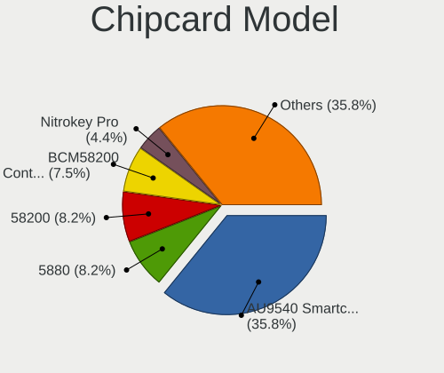

| Model                                                                        | Computers | Percent |
|------------------------------------------------------------------------------|-----------|---------|
| Alcor Micro AU9540 Smartcard Reader                                          | 57        | 35.85%  |
| Broadcom 5880                                                                | 13        | 8.18%   |
| Broadcom 58200                                                               | 13        | 8.18%   |
| Broadcom BCM58200 ControlVault 3 (FingerPrint sensor + Contacted SmartCard)  | 12        | 7.55%   |
| Clay Logic Nitrokey Pro                                                      | 7         | 4.4%    |
| Broadcom BCM5880 Secure Applications Processor with fingerprint swipe sensor | 7         | 4.4%    |
| SCM Microsystems SCR331-LC1 / SCR3310 SmartCard Reader                       | 6         | 3.77%   |
| Broadcom BCM5880 Secure Applications Processor                               | 6         | 3.77%   |
| Upek TouchChip Fingerprint Coprocessor (WBF advanced mode)                   | 5         | 3.14%   |
| O2 Micro OZ776 CCID Smartcard Reader                                         | 4         | 2.52%   |
| Yubico.com Yubikey 4/5 U2F+CCID                                              | 3         | 1.89%   |
| Gemalto (was Gemplus) GemPC Twin SmartCard Reader                            | 3         | 1.89%   |
| Advanced Card Systems ACR122U                                                | 3         | 1.89%   |
| Yubico.com Yubikey 4/5 CCID                                                  | 2         | 1.26%   |
| Hewlett-Packard SC Keyboard - Apollo (Liteon)                                | 2         | 1.26%   |
| VASCO Data Security International DIGIPASS 870                               | 1         | 0.63%   |
| Purism, SPC Librem Key                                                       | 1         | 0.63%   |
| OmniKey CardMan 3021 / 3121                                                  | 1         | 0.63%   |
| O2 Micro Oz776 SmartCard Reader                                              | 1         | 0.63%   |
| Microchip Technology SMSC USX101x Reader                                     | 1         | 0.63%   |
| Lenovo Integrated Smart Card Reader                                          | 1         | 0.63%   |
| Gemalto (was Gemplus) eToken 5110+ FIPS                                      | 1         | 0.63%   |
| Fujitsu Siemens Computers SmartCard Reader 2A                                | 1         | 0.63%   |
| Free Software Initiative of Japan Gnuk Token                                 | 1         | 0.63%   |
| Feitian Technologies FIDO CCID KB                                            | 1         | 0.63%   |
| Chicony Electronics HP Skylab USB Smartcard Keyboard                         | 1         | 0.63%   |
| Broadcom BCM5880 Secure Applications Processor with fingerprint touch sensor | 1         | 0.63%   |
| Bit4id miniLector-s                                                          | 1         | 0.63%   |
| Aladdin Knowledge Systems Token JC                                           | 1         | 0.63%   |
| Aktiv Rutoken lite                                                           | 1         | 0.63%   |
| Advanced Card Systems ACR38 SmartCard Reader                                 | 1         | 0.63%   |

Unsupported
-----------

Unsupported Devices
-------------------

Total unsupported devices on board

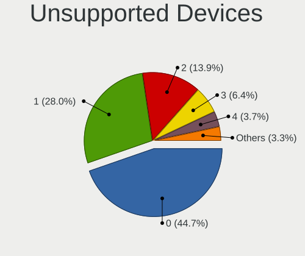

| Total | Computers | Percent |
|-------|-----------|---------|
| 0     | 1134      | 44.68%  |
| 1     | 710       | 27.97%  |
| 2     | 353       | 13.91%  |
| 3     | 163       | 6.42%   |
| 4     | 93        | 3.66%   |
| 5     | 54        | 2.13%   |
| 6     | 24        | 0.95%   |
| 7     | 5         | 0.2%    |
| 8     | 2         | 0.08%   |

Unsupported Device Types
------------------------

Types of unsupported devices

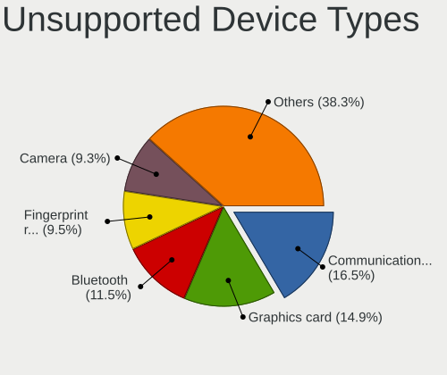

| Type                     | Computers | Percent |
|--------------------------|-----------|---------|
| Communication controller | 399       | 16.51%  |
| Graphics card            | 360       | 14.9%   |
| Bluetooth                | 279       | 11.55%  |
| Fingerprint reader       | 229       | 9.48%   |
| Camera                   | 224       | 9.27%   |
| Net/wireless             | 202       | 8.36%   |
| Chipcard                 | 124       | 5.13%   |
| Multimedia controller    | 115       | 4.76%   |
| Sound                    | 107       | 4.43%   |
| Card reader              | 92        | 3.81%   |
| Network                  | 52        | 2.15%   |
| Net/ethernet             | 44        | 1.82%   |
| Unassigned class         | 39        | 1.61%   |
| Firewire controller      | 35        | 1.45%   |
| Modem                    | 27        | 1.12%   |
| Storage/ide              | 26        | 1.08%   |
| Storage/ata              | 23        | 0.95%   |
| Storage/raid             | 11        | 0.46%   |
| Tv card                  | 8         | 0.33%   |
| Storage/nvme             | 7         | 0.29%   |
| Storage                  | 6         | 0.25%   |
| Dvb card                 | 4         | 0.17%   |
| Wireless                 | 2         | 0.08%   |
| Unclassified device      | 1         | 0.04%   |

