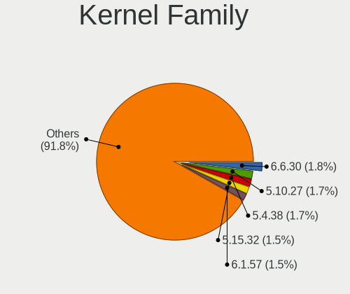
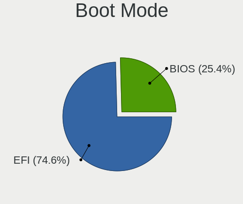
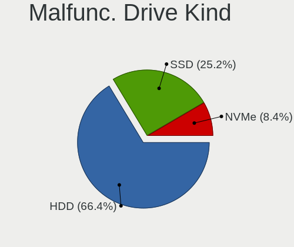
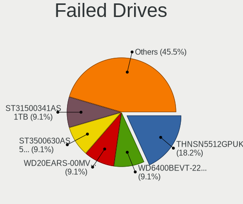
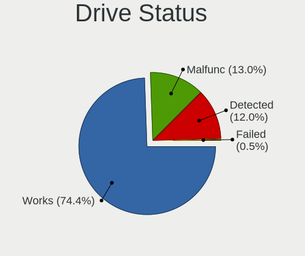
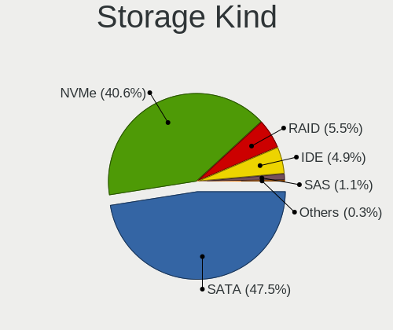
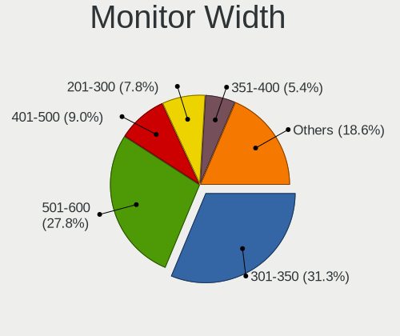
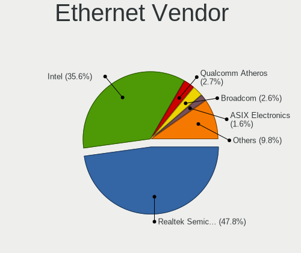
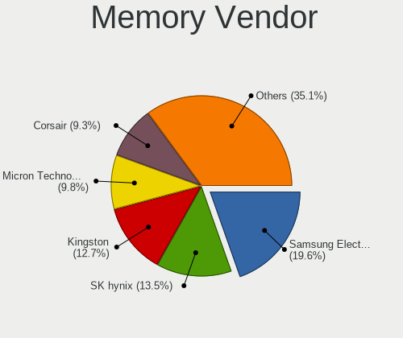

Gentoo - Tested Hardware & Statistics
-------------------------------------

A project to collect tested hardware configurations for Gentoo.

Anyone can contribute to this report by the [hw-probe](https://github.com/linuxhw/hw-probe) tool:

    sudo -E hw-probe -all -upload

Please contribute! Especially if your hardware is rare.

This is a report for all computer types. See also reports for [desktops](/Dist/Gentoo/Desktop/README.md) and [notebooks](/Dist/Gentoo/Notebook/README.md).

Contents
--------

* [ Test Cases ](#test-cases)

* [ System ](#system)
  - [ OS                       ](#os)
  - [ OS Family                ](#os-family)
  - [ Kernel                   ](#kernel)
  - [ Kernel Family            ](#kernel-family)
  - [ Kernel Major Ver.        ](#kernel-major-ver)
  - [ Arch                     ](#arch)
  - [ DE                       ](#de)
  - [ Display Server           ](#display-server)
  - [ Display Manager          ](#display-manager)
  - [ OS Lang                  ](#os-lang)
  - [ Boot Mode                ](#boot-mode)
  - [ Filesystem               ](#filesystem)
  - [ Part. scheme             ](#part-scheme)
  - [ Dual Boot with Linux/BSD ](#dual-boot-with-linuxbsd)
  - [ Dual Boot (Win)          ](#dual-boot-win)

* [ Board ](#board)
  - [ Vendor                   ](#vendor)
  - [ Model                    ](#model)
  - [ Model Family             ](#model-family)
  - [ MFG Year                 ](#mfg-year)
  - [ Form Factor              ](#form-factor)
  - [ Secure Boot              ](#secure-boot)
  - [ Coreboot                 ](#coreboot)
  - [ RAM Size                 ](#ram-size)
  - [ RAM Used                 ](#ram-used)
  - [ Total Drives             ](#total-drives)
  - [ Has CD-ROM               ](#has-cd-rom)
  - [ Has Ethernet             ](#has-ethernet)
  - [ Has WiFi                 ](#has-wifi)
  - [ Has Bluetooth            ](#has-bluetooth)

* [ Location ](#location)
  - [ Country                  ](#country)
  - [ City                     ](#city)

* [ Drives ](#drives)
  - [ Drive Vendor             ](#drive-vendor)
  - [ Drive Model              ](#drive-model)
  - [ HDD Vendor               ](#hdd-vendor)
  - [ SSD Vendor               ](#ssd-vendor)
  - [ Drive Kind               ](#drive-kind)
  - [ Drive Connector          ](#drive-connector)
  - [ Drive Size               ](#drive-size)
  - [ Space Total              ](#space-total)
  - [ Space Used               ](#space-used)
  - [ Malfunc. Drives          ](#malfunc-drives)
  - [ Malfunc. Drive Vendor    ](#malfunc-drive-vendor)
  - [ Malfunc. HDD Vendor      ](#malfunc-hdd-vendor)
  - [ Malfunc. Drive Kind      ](#malfunc-drive-kind)
  - [ Failed Drives            ](#failed-drives)
  - [ Failed Drive Vendor      ](#failed-drive-vendor)
  - [ Drive Status             ](#drive-status)

* [ Storage controller ](#storage-controller)
  - [ Storage Vendor           ](#storage-vendor)
  - [ Storage Model            ](#storage-model)
  - [ Storage Kind             ](#storage-kind)

* [ Processor ](#processor)
  - [ CPU Vendor               ](#cpu-vendor)
  - [ CPU Model                ](#cpu-model)
  - [ CPU Model Family         ](#cpu-model-family)
  - [ CPU Cores                ](#cpu-cores)
  - [ CPU Sockets              ](#cpu-sockets)
  - [ CPU Threads              ](#cpu-threads)
  - [ CPU Op-Modes             ](#cpu-op-modes)
  - [ CPU Microcode            ](#cpu-microcode)
  - [ CPU Microarch            ](#cpu-microarch)

* [ Graphics ](#graphics)
  - [ GPU Vendor               ](#gpu-vendor)
  - [ GPU Model                ](#gpu-model)
  - [ GPU Combo                ](#gpu-combo)
  - [ GPU Driver               ](#gpu-driver)
  - [ GPU Memory               ](#gpu-memory)

* [ Monitor ](#monitor)
  - [ Monitor Vendor           ](#monitor-vendor)
  - [ Monitor Model            ](#monitor-model)
  - [ Monitor Resolution       ](#monitor-resolution)
  - [ Monitor Diagonal         ](#monitor-diagonal)
  - [ Monitor Width            ](#monitor-width)
  - [ Aspect Ratio             ](#aspect-ratio)
  - [ Monitor Area             ](#monitor-area)
  - [ Pixel Density            ](#pixel-density)
  - [ Multiple Monitors        ](#multiple-monitors)

* [ Network ](#network)
  - [ Net Controller Vendor    ](#net-controller-vendor)
  - [ Net Controller Model     ](#net-controller-model)
  - [ Wireless Vendor          ](#wireless-vendor)
  - [ Wireless Model           ](#wireless-model)
  - [ Ethernet Vendor          ](#ethernet-vendor)
  - [ Ethernet Model           ](#ethernet-model)
  - [ Net Controller Kind      ](#net-controller-kind)
  - [ Used Controller          ](#used-controller)
  - [ NICs                     ](#nics)
  - [ IPv6                     ](#ipv6)

* [ Bluetooth ](#bluetooth)
  - [ Bluetooth Vendor         ](#bluetooth-vendor)
  - [ Bluetooth Model          ](#bluetooth-model)

* [ Sound ](#sound)
  - [ Sound Vendor             ](#sound-vendor)
  - [ Sound Model              ](#sound-model)

* [ Memory ](#memory)
  - [ Memory Vendor            ](#memory-vendor)
  - [ Memory Model             ](#memory-model)
  - [ Memory Kind              ](#memory-kind)
  - [ Memory Form Factor       ](#memory-form-factor)
  - [ Memory Size              ](#memory-size)
  - [ Memory Speed             ](#memory-speed)

* [ Printers & scanners ](#printers--scanners)
  - [ Printer Vendor           ](#printer-vendor)
  - [ Printer Model            ](#printer-model)
  - [ Scanner Vendor           ](#scanner-vendor)
  - [ Scanner Model            ](#scanner-model)

* [ Camera ](#camera)
  - [ Camera Vendor            ](#camera-vendor)
  - [ Camera Model             ](#camera-model)

* [ Security ](#security)
  - [ Fingerprint Vendor       ](#fingerprint-vendor)
  - [ Fingerprint Model        ](#fingerprint-model)
  - [ Chipcard Vendor          ](#chipcard-vendor)
  - [ Chipcard Model           ](#chipcard-model)

* [ Unsupported ](#unsupported)
  - [ Unsupported Devices      ](#unsupported-devices)
  - [ Unsupported Device Types ](#unsupported-device-types)

Test Cases
----------

Total: 2817

| Vendor        | Model                       | Form-Factor | Probe                                                      | Date         |
|---------------|-----------------------------|-------------|------------------------------------------------------------|--------------|
| ASUSTek       | ROG STRIX X570-E GAMING     | Desktop     | [4fe5238f21](https://linux-hardware.org/?probe=4fe5238f21) | Aug 12, 2023 |
| A-DATA Tec... | XENIA 15                    | Notebook    | [73f0314b31](https://linux-hardware.org/?probe=73f0314b31) | Aug 12, 2023 |
| A-DATA Tec... | XENIA 15                    | Notebook    | [d1a19f992d](https://linux-hardware.org/?probe=d1a19f992d) | Aug 12, 2023 |
| Lenovo        | Yoga 7 16ARP8 83BS          | Convertible | [5712d7b72d](https://linux-hardware.org/?probe=5712d7b72d) | Aug 11, 2023 |
| ASUSTek       | ROG Strix G513QY_G513QY     | Notebook    | [46ae462027](https://linux-hardware.org/?probe=46ae462027) | Aug 11, 2023 |
| HP            | EliteBook 8540w             | Notebook    | [2df5a4bd58](https://linux-hardware.org/?probe=2df5a4bd58) | Aug 11, 2023 |
| HP            | EliteBook 8540w             | Notebook    | [1bf7b69b0f](https://linux-hardware.org/?probe=1bf7b69b0f) | Aug 11, 2023 |
| Gigabyte      | B650 AORUS PRO AX           | Desktop     | [5cbfb27db2](https://linux-hardware.org/?probe=5cbfb27db2) | Aug 11, 2023 |
| Gigabyte      | B650 AORUS PRO AX           | Desktop     | [72b375ad38](https://linux-hardware.org/?probe=72b375ad38) | Aug 11, 2023 |
| NEC Comput... | 312C                        | Desktop     | [770ffcfcf5](https://linux-hardware.org/?probe=770ffcfcf5) | Aug 10, 2023 |
| ASUSTek       | M3A78-CM                    | Desktop     | [a5e0e043cb](https://linux-hardware.org/?probe=a5e0e043cb) | Aug 09, 2023 |
| MSI           | 970A-G43 PLUS               | Desktop     | [133d4b58c9](https://linux-hardware.org/?probe=133d4b58c9) | Aug 08, 2023 |
| Gigabyte      | Z370P D3-CF                 | Desktop     | [ed5ccc8efb](https://linux-hardware.org/?probe=ed5ccc8efb) | Aug 08, 2023 |
| ASUSTek       | M3A78-CM                    | Desktop     | [93e4fee7df](https://linux-hardware.org/?probe=93e4fee7df) | Aug 08, 2023 |
| Apple         | MacBookPro10,1              | Notebook    | [ed97e2ea3e](https://linux-hardware.org/?probe=ed97e2ea3e) | Aug 08, 2023 |
| Gigabyte      | AB350-Gaming-CF             | Desktop     | [fb8e926bd4](https://linux-hardware.org/?probe=fb8e926bd4) | Aug 07, 2023 |
| ASUSTek       | VivoBook_ASUSLaptop X415... | Notebook    | [1d6bf926f6](https://linux-hardware.org/?probe=1d6bf926f6) | Aug 05, 2023 |
| ASUSTek       | TUF Gaming X670E-PLUS       | Desktop     | [584974f252](https://linux-hardware.org/?probe=584974f252) | Aug 05, 2023 |
| HP            | Laptop 15-ra0xx             | Notebook    | [41b594c2c7](https://linux-hardware.org/?probe=41b594c2c7) | Aug 05, 2023 |
| HP            | Laptop 15-ra0xx             | Notebook    | [ae42e537d2](https://linux-hardware.org/?probe=ae42e537d2) | Aug 05, 2023 |
| HP            | Laptop 15-ra0xx             | Notebook    | [51f2c38666](https://linux-hardware.org/?probe=51f2c38666) | Aug 05, 2023 |
| Lenovo        | ThinkPad Yoga 370 20JJS0... | Convertible | [570728a351](https://linux-hardware.org/?probe=570728a351) | Aug 05, 2023 |
| Medion        | B360H4-EM V1.0              | Desktop     | [18146f8bc9](https://linux-hardware.org/?probe=18146f8bc9) | Aug 04, 2023 |
| Lenovo        | Yoga 2 13 20344             | Notebook    | [767b492aa4](https://linux-hardware.org/?probe=767b492aa4) | Aug 03, 2023 |
| Lenovo        | Yoga 2 13 20344             | Notebook    | [47ca08e0d1](https://linux-hardware.org/?probe=47ca08e0d1) | Aug 03, 2023 |
| ASUSTek       | M3A78-CM                    | Desktop     | [9be3b9bb83](https://linux-hardware.org/?probe=9be3b9bb83) | Aug 02, 2023 |
| ASUSTek       | ROG Zephyrus G14 GA401II... | Notebook    | [839698eb4c](https://linux-hardware.org/?probe=839698eb4c) | Aug 01, 2023 |
| ASUSTek       | M3A78-CM                    | Desktop     | [5d63b469f8](https://linux-hardware.org/?probe=5d63b469f8) | Aug 01, 2023 |
| HP            | 2B47                        | Desktop     | [06373794be](https://linux-hardware.org/?probe=06373794be) | Aug 01, 2023 |
| Alienware     | x17 R1                      | Notebook    | [bcdf52a63e](https://linux-hardware.org/?probe=bcdf52a63e) | Aug 01, 2023 |
| Gigabyte      | H510M H                     | Desktop     | [51541062dc](https://linux-hardware.org/?probe=51541062dc) | Jul 31, 2023 |
| ASRock        | X570 Phantom Gaming X       | Desktop     | [4e2e9f1f7f](https://linux-hardware.org/?probe=4e2e9f1f7f) | Jul 31, 2023 |
| Gigabyte      | B650 AORUS PRO AX           | Desktop     | [23c9c57a00](https://linux-hardware.org/?probe=23c9c57a00) | Jul 30, 2023 |
| Pine Micro... | Pine64 RockPro64 v2.1       | Soc         | [f9b68dbdc9](https://linux-hardware.org/?probe=f9b68dbdc9) | Jul 30, 2023 |
| ASUSTek       | ROG STRIX X570-F GAMING     | Desktop     | [436e1e4e01](https://linux-hardware.org/?probe=436e1e4e01) | Jul 29, 2023 |
| Lenovo        | 1036 SDK0Q40112 WIN 3305... | Desktop     | [731b8aed1b](https://linux-hardware.org/?probe=731b8aed1b) | Jul 29, 2023 |
| Lenovo        | Legion Y530-15ICH-1060 8... | Notebook    | [451cbfaee5](https://linux-hardware.org/?probe=451cbfaee5) | Jul 29, 2023 |
| ASRock        | AM1H-ITX                    | Desktop     | [24b2f4274d](https://linux-hardware.org/?probe=24b2f4274d) | Jul 29, 2023 |
| Apple         | MacBookPro12,1              | Notebook    | [bc3cb3cbfd](https://linux-hardware.org/?probe=bc3cb3cbfd) | Jul 28, 2023 |
| ASUSTek       | PRIME X570-P                | Desktop     | [7e6ad75fc4](https://linux-hardware.org/?probe=7e6ad75fc4) | Jul 28, 2023 |
| ASRock        | X570 PG Velocita            | Desktop     | [ba2f93d0af](https://linux-hardware.org/?probe=ba2f93d0af) | Jul 28, 2023 |
| ASUSTek       | PRIME X299-DELUXE           | Desktop     | [27da4128a7](https://linux-hardware.org/?probe=27da4128a7) | Jul 28, 2023 |
| MSI           | TRX40 PRO 10G               | Desktop     | [6391114079](https://linux-hardware.org/?probe=6391114079) | Jul 28, 2023 |
| ASUSTek       | ROG STRIX B450-F GAMING     | Desktop     | [60d9839bbe](https://linux-hardware.org/?probe=60d9839bbe) | Jul 27, 2023 |
| Gigabyte      | B650M AORUS ELITE AX        | Desktop     | [4895ec9de1](https://linux-hardware.org/?probe=4895ec9de1) | Jul 27, 2023 |
| HP            | EliteBook 8540w             | Notebook    | [96a30f2f21](https://linux-hardware.org/?probe=96a30f2f21) | Jul 27, 2023 |
| ASUSTek       | ROG STRIX B450-F GAMING     | Desktop     | [45149f899d](https://linux-hardware.org/?probe=45149f899d) | Jul 26, 2023 |
| Lenovo        | Yoga 14sACH 2021 82MS       | Notebook    | [3cb74490f6](https://linux-hardware.org/?probe=3cb74490f6) | Jul 25, 2023 |
| Gateway       | MS-7399                     | Desktop     | [904775a387](https://linux-hardware.org/?probe=904775a387) | Jul 25, 2023 |
| ASUSTek       | TUF Gaming FX705GD_FX705... | Notebook    | [c73107bcac](https://linux-hardware.org/?probe=c73107bcac) | Jul 25, 2023 |
| ASUSTek       | TUF Gaming FX705GD_FX705... | Notebook    | [1aeabb238f](https://linux-hardware.org/?probe=1aeabb238f) | Jul 25, 2023 |
| ASUSTek       | M3A78-CM                    | Desktop     | [290a0dd297](https://linux-hardware.org/?probe=290a0dd297) | Jul 25, 2023 |
| Dell          | XPS 15 9520                 | Notebook    | [54377b2911](https://linux-hardware.org/?probe=54377b2911) | Jul 25, 2023 |
| ASUSTek       | M3A78-CM                    | Desktop     | [a2fcdf6c36](https://linux-hardware.org/?probe=a2fcdf6c36) | Jul 24, 2023 |
| A-DATA Tec... | XENIA 15                    | Notebook    | [21edb88f94](https://linux-hardware.org/?probe=21edb88f94) | Jul 23, 2023 |
| HP            | 255 G6 Notebook PC          | Notebook    | [5c5147b82d](https://linux-hardware.org/?probe=5c5147b82d) | Jul 23, 2023 |
| A-DATA Tec... | XENIA 15                    | Notebook    | [9c64742080](https://linux-hardware.org/?probe=9c64742080) | Jul 23, 2023 |
| Foxconn       | TPS01                       | Desktop     | [d8e4cab1b8](https://linux-hardware.org/?probe=d8e4cab1b8) | Jul 21, 2023 |
| Gigabyte      | Z590 UD                     | Desktop     | [8504edcacf](https://linux-hardware.org/?probe=8504edcacf) | Jul 21, 2023 |
| ASUSTek       | PRIME X370-PRO              | Desktop     | [4884c4b183](https://linux-hardware.org/?probe=4884c4b183) | Jul 18, 2023 |
| HP            | ProBook 450 G5              | Notebook    | [3dfd41fda9](https://linux-hardware.org/?probe=3dfd41fda9) | Jul 17, 2023 |
| HP            | ProBook 450 G5              | Notebook    | [c5bee4d8fe](https://linux-hardware.org/?probe=c5bee4d8fe) | Jul 17, 2023 |
| MSI           | X370 XPOWER GAMING TITAN... | Desktop     | [aac317ef80](https://linux-hardware.org/?probe=aac317ef80) | Jul 17, 2023 |
| HP            | ProBook 440 G7              | Notebook    | [48cf81576d](https://linux-hardware.org/?probe=48cf81576d) | Jul 17, 2023 |
| MSI           | MPG Z490 GAMING EDGE WIF... | Desktop     | [cda9e7abe9](https://linux-hardware.org/?probe=cda9e7abe9) | Jul 17, 2023 |
| Gigabyte      | AB350-Gaming-CF             | Desktop     | [f4936b2064](https://linux-hardware.org/?probe=f4936b2064) | Jul 17, 2023 |
| Dell          | 0GY6Y8 A02                  | Desktop     | [8d8d1d6cbf](https://linux-hardware.org/?probe=8d8d1d6cbf) | Jul 17, 2023 |
| HP            | EliteBook 8540w             | Notebook    | [b86a3c24df](https://linux-hardware.org/?probe=b86a3c24df) | Jul 16, 2023 |
| MSI           | MPG Z490 GAMING EDGE WIF... | Desktop     | [1f1b7763a5](https://linux-hardware.org/?probe=1f1b7763a5) | Jul 14, 2023 |
| Lenovo        | IdeaPadFlex 5 14ITL05 82... | Convertible | [c8179fd349](https://linux-hardware.org/?probe=c8179fd349) | Jul 14, 2023 |
| ASUSTek       | VivoBook_ASUSLaptop TP34... | Convertible | [be7dcafaba](https://linux-hardware.org/?probe=be7dcafaba) | Jul 14, 2023 |
| Lenovo        | ThinkPad P15 Gen 1 20SUS... | Notebook    | [a5cdc8bb58](https://linux-hardware.org/?probe=a5cdc8bb58) | Jul 13, 2023 |
| HP            | EliteBook 8540w             | Notebook    | [26c6ceb0a6](https://linux-hardware.org/?probe=26c6ceb0a6) | Jul 13, 2023 |
| HP            | ZBook Studio 16 inch G9 ... | Notebook    | [0d54b47098](https://linux-hardware.org/?probe=0d54b47098) | Jul 12, 2023 |
| Fujitsu       | LIFEBOOK T939               | Convertible | [4d1ecd77ad](https://linux-hardware.org/?probe=4d1ecd77ad) | Jul 11, 2023 |
| Lenovo        | ThinkPad T430 2344BZU       | Notebook    | [2a37881afa](https://linux-hardware.org/?probe=2a37881afa) | Jul 11, 2023 |
| Apple         | MacBookPro11,1              | Notebook    | [7256e6a7b2](https://linux-hardware.org/?probe=7256e6a7b2) | Jul 11, 2023 |
| ASUSTek       | M3A78-CM                    | Desktop     | [ab32a0e447](https://linux-hardware.org/?probe=ab32a0e447) | Jul 11, 2023 |
| ASUSTek       | M3A78-CM                    | Desktop     | [38420a6afe](https://linux-hardware.org/?probe=38420a6afe) | Jul 10, 2023 |
| Gigabyte      | AB350-Gaming-CF             | Desktop     | [14c6f3f286](https://linux-hardware.org/?probe=14c6f3f286) | Jul 10, 2023 |
| Lenovo        | Yoga C940-14IIL 81Q9        | Convertible | [89dc06fa6d](https://linux-hardware.org/?probe=89dc06fa6d) | Jul 09, 2023 |
| ASRock        | Z390 Extreme4               | Desktop     | [cf9ad63ff9](https://linux-hardware.org/?probe=cf9ad63ff9) | Jul 09, 2023 |
| ASRock        | Z390 Extreme4               | Desktop     | [306eaba8f1](https://linux-hardware.org/?probe=306eaba8f1) | Jul 09, 2023 |
| ASUSTek       | ROG STRIX Z590-F GAMING ... | Desktop     | [0b6dcc1ea9](https://linux-hardware.org/?probe=0b6dcc1ea9) | Jul 09, 2023 |
| Dell          | XPS 15 7590                 | Notebook    | [ca41a9886a](https://linux-hardware.org/?probe=ca41a9886a) | Jul 09, 2023 |
| MSI           | MAG B560 TORPEDO            | Desktop     | [4b611c264e](https://linux-hardware.org/?probe=4b611c264e) | Jul 08, 2023 |
| ASUSTek       | PRIME J4005I-C              | Desktop     | [8cccaeb0ed](https://linux-hardware.org/?probe=8cccaeb0ed) | Jul 08, 2023 |
| HP            | EliteBook 8540w             | Notebook    | [a760e46715](https://linux-hardware.org/?probe=a760e46715) | Jul 08, 2023 |
| Fujitsu       | LIFEBOOK U758               | Notebook    | [eaa8bbf9da](https://linux-hardware.org/?probe=eaa8bbf9da) | Jul 07, 2023 |
| HP            | EliteBook 8540w             | Notebook    | [1a53ce97b8](https://linux-hardware.org/?probe=1a53ce97b8) | Jul 07, 2023 |
| ASUSTek       | ROG STRIX X670E-F GAMING... | Desktop     | [9a6e78196d](https://linux-hardware.org/?probe=9a6e78196d) | Jul 06, 2023 |
| Lenovo        | ThinkPad Yoga 370 20JJS0... | Convertible | [b4b26d2f53](https://linux-hardware.org/?probe=b4b26d2f53) | Jul 06, 2023 |
| HP            | ZBook Studio 16 inch G9 ... | Notebook    | [84b5d3ce3c](https://linux-hardware.org/?probe=84b5d3ce3c) | Jul 06, 2023 |
| Gigabyte      | GA-MA770T-UD3P              | Desktop     | [348b9a4a73](https://linux-hardware.org/?probe=348b9a4a73) | Jul 05, 2023 |
| Aierben       | NA17                        | Desktop     | [462b502bab](https://linux-hardware.org/?probe=462b502bab) | Jul 05, 2023 |
| Lenovo        | ThinkPad Yoga 370 20JJS0... | Convertible | [f4fdc8a532](https://linux-hardware.org/?probe=f4fdc8a532) | Jul 05, 2023 |
| MSI           | B450 GAMING PRO CARBON A... | Desktop     | [49bcd116ba](https://linux-hardware.org/?probe=49bcd116ba) | Jul 04, 2023 |
| ASUSTek       | M3A78-CM                    | Desktop     | [67281face4](https://linux-hardware.org/?probe=67281face4) | Jul 03, 2023 |
| Gigabyte      | AB350-Gaming-CF             | Desktop     | [f928781025](https://linux-hardware.org/?probe=f928781025) | Jul 03, 2023 |
| Jumper        | EZbook                      | Notebook    | [735e20e770](https://linux-hardware.org/?probe=735e20e770) | Jul 02, 2023 |
| Lenovo        | IdeaPad 5 15ABA7 82SG       | Notebook    | [68daff498d](https://linux-hardware.org/?probe=68daff498d) | Jul 02, 2023 |
| Lenovo        | IdeaPad 5 15ABA7 82SG       | Notebook    | [f587b9a46c](https://linux-hardware.org/?probe=f587b9a46c) | Jul 02, 2023 |
| HP            | EliteBook 8540w             | Notebook    | [465b44efff](https://linux-hardware.org/?probe=465b44efff) | Jul 01, 2023 |
| HP            | EliteBook 8540w             | Notebook    | [826e649d7a](https://linux-hardware.org/?probe=826e649d7a) | Jul 01, 2023 |
| ASUSTek       | TUF Gaming X570-PLUS        | Desktop     | [a0ac212cac](https://linux-hardware.org/?probe=a0ac212cac) | Jul 01, 2023 |
| Gigabyte      | Z390 AORUS MASTER-CF        | Desktop     | [0f0e96b03c](https://linux-hardware.org/?probe=0f0e96b03c) | Jul 01, 2023 |
| Raspberry ... | Raspberry Pi                | Soc         | [a0fdd16a9e](https://linux-hardware.org/?probe=a0fdd16a9e) | Jul 01, 2023 |
| Dell          | Inspiron 16 5625            | Notebook    | [bf36f89d32](https://linux-hardware.org/?probe=bf36f89d32) | Jul 01, 2023 |
| ASRock        | X570 Taichi                 | Desktop     | [af8af2c7e8](https://linux-hardware.org/?probe=af8af2c7e8) | Jun 30, 2023 |
| Dell          | Inspiron 16 5625            | Notebook    | [cbbe256fa2](https://linux-hardware.org/?probe=cbbe256fa2) | Jun 30, 2023 |
| ASUSTek       | ASUS TUF Gaming F15 FX50... | Notebook    | [5873d04afe](https://linux-hardware.org/?probe=5873d04afe) | Jun 29, 2023 |
| ASUSTek       | PRIME X299-DELUXE           | Desktop     | [4df7190c46](https://linux-hardware.org/?probe=4df7190c46) | Jun 29, 2023 |
| ASUSTek       | PRIME X299-DELUXE           | Desktop     | [6388cc47ae](https://linux-hardware.org/?probe=6388cc47ae) | Jun 29, 2023 |
| Lenovo        | ThinkPad P14s Gen 3 21J5... | Notebook    | [2d16f5be74](https://linux-hardware.org/?probe=2d16f5be74) | Jun 29, 2023 |
| HP            | Spectre x360 2-in-1 Lapt... | Convertible | [c7a5d0ef6c](https://linux-hardware.org/?probe=c7a5d0ef6c) | Jun 29, 2023 |
| Intel         | NUC11PABi5 M68265-501       | Mini pc     | [b6c0bd1df6](https://linux-hardware.org/?probe=b6c0bd1df6) | Jun 28, 2023 |
| Intel         | NUC11PABi5 M68265-501       | Mini pc     | [498d9375d4](https://linux-hardware.org/?probe=498d9375d4) | Jun 28, 2023 |
| ASUSTek       | ROG STRIX X670E-F GAMING... | Desktop     | [8619447305](https://linux-hardware.org/?probe=8619447305) | Jun 27, 2023 |
| ASUSTek       | ROG STRIX X670E-F GAMING... | Desktop     | [bddefdfb2c](https://linux-hardware.org/?probe=bddefdfb2c) | Jun 27, 2023 |
| HP            | EliteBook 8540w             | Notebook    | [d675031e74](https://linux-hardware.org/?probe=d675031e74) | Jun 26, 2023 |
| Lenovo        | ThinkPad X1 Extreme 2nd ... | Notebook    | [178ed56625](https://linux-hardware.org/?probe=178ed56625) | Jun 26, 2023 |
| ASUSTek       | M3A78-CM                    | Desktop     | [e55023fb8b](https://linux-hardware.org/?probe=e55023fb8b) | Jun 26, 2023 |
| Gigabyte      | AB350-Gaming-CF             | Desktop     | [0b72aec1b9](https://linux-hardware.org/?probe=0b72aec1b9) | Jun 26, 2023 |
| HP            | EliteBook 8540w             | Notebook    | [37e828b0b6](https://linux-hardware.org/?probe=37e828b0b6) | Jun 24, 2023 |
| HP            | EliteBook 8540w             | Notebook    | [e1678729ff](https://linux-hardware.org/?probe=e1678729ff) | Jun 23, 2023 |
| HP            | EliteBook 8540w             | Notebook    | [094d8e8ecf](https://linux-hardware.org/?probe=094d8e8ecf) | Jun 22, 2023 |
| ASRock        | J3160M                      | Desktop     | [0521c9a5a7](https://linux-hardware.org/?probe=0521c9a5a7) | Jun 22, 2023 |
| HP            | EliteBook 8540w             | Notebook    | [a013e4866a](https://linux-hardware.org/?probe=a013e4866a) | Jun 22, 2023 |
| Lenovo        | ThinkPad P14s Gen 3 21J5... | Notebook    | [12153cd235](https://linux-hardware.org/?probe=12153cd235) | Jun 21, 2023 |
| HP            | EliteBook 8540w             | Notebook    | [6c766e53cb](https://linux-hardware.org/?probe=6c766e53cb) | Jun 21, 2023 |
| HP            | EliteBook 8540w             | Notebook    | [91e2324734](https://linux-hardware.org/?probe=91e2324734) | Jun 20, 2023 |
| HP            | EliteBook 8540w             | Notebook    | [cd78108f1f](https://linux-hardware.org/?probe=cd78108f1f) | Jun 19, 2023 |
| ASUSTek       | X555LJ                      | Notebook    | [e65deab189](https://linux-hardware.org/?probe=e65deab189) | Jun 19, 2023 |
| ASUSTek       | M3A78-CM                    | Desktop     | [22d8476417](https://linux-hardware.org/?probe=22d8476417) | Jun 19, 2023 |
| Gigabyte      | AB350-Gaming-CF             | Desktop     | [e2fc6bb607](https://linux-hardware.org/?probe=e2fc6bb607) | Jun 19, 2023 |
| Lenovo        | ThinkPad P15 Gen 1 20SUS... | Notebook    | [4d509da42f](https://linux-hardware.org/?probe=4d509da42f) | Jun 18, 2023 |
| ASUSTek       | ROG STRIX X670E-F GAMING... | Desktop     | [8e26542f2d](https://linux-hardware.org/?probe=8e26542f2d) | Jun 17, 2023 |
| HP            | ENVY m6                     | Notebook    | [2776e20c0a](https://linux-hardware.org/?probe=2776e20c0a) | Jun 17, 2023 |
| HP            | EliteBook 8540w             | Notebook    | [eb29f214f3](https://linux-hardware.org/?probe=eb29f214f3) | Jun 17, 2023 |
| Dell          | Precision 5530              | Notebook    | [29ec4c7e1d](https://linux-hardware.org/?probe=29ec4c7e1d) | Jun 16, 2023 |
| ASUSTek       | PRIME X570-P                | Desktop     | [1f5163e415](https://linux-hardware.org/?probe=1f5163e415) | Jun 16, 2023 |
| HP            | Pavilion dv6                | Notebook    | [7e699d65f7](https://linux-hardware.org/?probe=7e699d65f7) | Jun 16, 2023 |
| Dell          | Precision 5530              | Notebook    | [cff5125fb6](https://linux-hardware.org/?probe=cff5125fb6) | Jun 16, 2023 |
| HP            | EliteBook 8540w             | Notebook    | [a7728ed657](https://linux-hardware.org/?probe=a7728ed657) | Jun 16, 2023 |
| HP            | EliteBook 8540w             | Notebook    | [03c8eed64b](https://linux-hardware.org/?probe=03c8eed64b) | Jun 16, 2023 |
| HP            | Victus by Laptop 16-e0xx... | Notebook    | [ec46ef5f36](https://linux-hardware.org/?probe=ec46ef5f36) | Jun 15, 2023 |
| HP            | EliteBook 8540w             | Notebook    | [9b08f8189d](https://linux-hardware.org/?probe=9b08f8189d) | Jun 15, 2023 |
| Google        | Nightfury                   | Notebook    | [02badb166b](https://linux-hardware.org/?probe=02badb166b) | Jun 14, 2023 |
| MSI           | MEG X570 UNIFY              | Desktop     | [deeef80345](https://linux-hardware.org/?probe=deeef80345) | Jun 13, 2023 |
| ASUSTek       | M3A78-CM                    | Desktop     | [ad01f2c38d](https://linux-hardware.org/?probe=ad01f2c38d) | Jun 13, 2023 |
| ASUSTek       | ROG G703GI_G7BI             | Notebook    | [fc0318992c](https://linux-hardware.org/?probe=fc0318992c) | Jun 12, 2023 |
| ASUSTek       | M3A78-CM                    | Desktop     | [273795ce3d](https://linux-hardware.org/?probe=273795ce3d) | Jun 12, 2023 |
| Gigabyte      | AB350-Gaming-CF             | Desktop     | [8a9a32ba11](https://linux-hardware.org/?probe=8a9a32ba11) | Jun 12, 2023 |
| Lenovo        | Yoga 2 13 20344             | Notebook    | [eab5787d6a](https://linux-hardware.org/?probe=eab5787d6a) | Jun 11, 2023 |
| ASUSTek       | ROG G703GI_G7BI             | Notebook    | [272de7ad6b](https://linux-hardware.org/?probe=272de7ad6b) | Jun 11, 2023 |
| ASUSTek       | TUF Gaming B650M-PLUS WI... | Desktop     | [153ae28a9e](https://linux-hardware.org/?probe=153ae28a9e) | Jun 11, 2023 |
| ASUSTek       | ROG STRIX X670E-F GAMING... | Desktop     | [6f6440cf1e](https://linux-hardware.org/?probe=6f6440cf1e) | Jun 10, 2023 |
| ASUSTek       | ROG STRIX X670E-F GAMING... | Desktop     | [4cb72d56f7](https://linux-hardware.org/?probe=4cb72d56f7) | Jun 10, 2023 |
| ASUSTek       | TUF Gaming B650M-PLUS WI... | Desktop     | [26262445d4](https://linux-hardware.org/?probe=26262445d4) | Jun 09, 2023 |
| Lenovo        | Legion 5 15ACH6H 82JU       | Notebook    | [8632ddc565](https://linux-hardware.org/?probe=8632ddc565) | Jun 09, 2023 |
| Panasonic     | CF-53ASCZGFG                | Notebook    | [39e04925ee](https://linux-hardware.org/?probe=39e04925ee) | Jun 08, 2023 |
| Gigabyte      | B550M AORUS ELITE           | Desktop     | [87f789c059](https://linux-hardware.org/?probe=87f789c059) | Jun 07, 2023 |
| MSI           | MAG B550 TOMAHAWK           | Desktop     | [96256dca48](https://linux-hardware.org/?probe=96256dca48) | Jun 07, 2023 |
| ASUSTek       | PRIME B550M-A               | Desktop     | [e7c8a1c727](https://linux-hardware.org/?probe=e7c8a1c727) | Jun 06, 2023 |
| ASUSTek       | M3A78-CM                    | Desktop     | [50304f8088](https://linux-hardware.org/?probe=50304f8088) | Jun 06, 2023 |
| Acer          | Swift SF314-511             | Notebook    | [60bf4b0442](https://linux-hardware.org/?probe=60bf4b0442) | Jun 05, 2023 |
| ASUSTek       | M3A78-CM                    | Desktop     | [1df787c227](https://linux-hardware.org/?probe=1df787c227) | Jun 05, 2023 |
| Dell          | Precision 5530              | Notebook    | [8b4e10b85a](https://linux-hardware.org/?probe=8b4e10b85a) | Jun 05, 2023 |
| Gigabyte      | AB350-Gaming-CF             | Desktop     | [580ae6529e](https://linux-hardware.org/?probe=580ae6529e) | Jun 05, 2023 |
| Lenovo        | Yoga C940-15IRH 81TE        | Convertible | [4d71226d7c](https://linux-hardware.org/?probe=4d71226d7c) | Jun 04, 2023 |
| MSI           | MAG B550 TOMAHAWK           | Desktop     | [d7ae224bea](https://linux-hardware.org/?probe=d7ae224bea) | Jun 04, 2023 |
| Apple         | MacBookPro11,1              | Notebook    | [4192000802](https://linux-hardware.org/?probe=4192000802) | Jun 04, 2023 |
| Apple         | MacBookPro11,1              | Notebook    | [168fa7f541](https://linux-hardware.org/?probe=168fa7f541) | Jun 04, 2023 |
| ASUSTek       | ROG STRIX B650E-F GAMING... | Desktop     | [72fc2eea56](https://linux-hardware.org/?probe=72fc2eea56) | Jun 03, 2023 |
| ASRock        | X670E Steel Legend          | Desktop     | [c1cfe9f08d](https://linux-hardware.org/?probe=c1cfe9f08d) | Jun 02, 2023 |
| Dell          | Precision 5530              | Notebook    | [151584f5aa](https://linux-hardware.org/?probe=151584f5aa) | Jun 02, 2023 |
| Gigabyte      | B550M AORUS ELITE           | Desktop     | [9faf2de183](https://linux-hardware.org/?probe=9faf2de183) | Jun 01, 2023 |
| ASUSTek       | ROG STRIX X570-E GAMING     | Desktop     | [d2ce08a746](https://linux-hardware.org/?probe=d2ce08a746) | May 30, 2023 |
| ASUSTek       | M3A78-CM                    | Desktop     | [1df34e179b](https://linux-hardware.org/?probe=1df34e179b) | May 30, 2023 |
| Pegatron      | 2ACE                        | Desktop     | [fd6056dba8](https://linux-hardware.org/?probe=fd6056dba8) | May 29, 2023 |
| Gigabyte      | AB350-Gaming-CF             | Desktop     | [edfe02a7ae](https://linux-hardware.org/?probe=edfe02a7ae) | May 29, 2023 |
| MSI           | GE76 Raider 11UH            | Notebook    | [64a17da7a3](https://linux-hardware.org/?probe=64a17da7a3) | May 28, 2023 |
| ASUSTek       | ROG STRIX Z590-F GAMING ... | Desktop     | [2bb14772ce](https://linux-hardware.org/?probe=2bb14772ce) | May 28, 2023 |
| Lenovo        | 1036 SDK0Q40112 WIN 3305... | Desktop     | [5384efc9d9](https://linux-hardware.org/?probe=5384efc9d9) | May 28, 2023 |
| MSI           | Z590-A PRO                  | Desktop     | [39f6ad44fe](https://linux-hardware.org/?probe=39f6ad44fe) | May 28, 2023 |
| Supermicro    | H12SSL-CT                   | Server      | [00dea5aed8](https://linux-hardware.org/?probe=00dea5aed8) | May 28, 2023 |
| Lenovo        | 1036 SDK0Q40112 WIN 3305... | Desktop     | [f7a170dd7d](https://linux-hardware.org/?probe=f7a170dd7d) | May 28, 2023 |
| ASUSTek       | ROG Strix G513QY_G513QY     | Notebook    | [5162ff793e](https://linux-hardware.org/?probe=5162ff793e) | May 27, 2023 |
| Lenovo        | ThinkPad X13 Gen 3 21CM0... | Notebook    | [f4889c41be](https://linux-hardware.org/?probe=f4889c41be) | May 27, 2023 |
| Gigabyte      | Z690 AORUS MASTER           | Desktop     | [95231653d0](https://linux-hardware.org/?probe=95231653d0) | May 26, 2023 |
| ASUSTek       | ROG Strix G513QY_G513QY     | Notebook    | [8962578738](https://linux-hardware.org/?probe=8962578738) | May 26, 2023 |
| Lenovo        | ThinkPad T14 Gen 2i 20W1... | Notebook    | [852932c13b](https://linux-hardware.org/?probe=852932c13b) | May 26, 2023 |
| HP            | Pavilion Notebook           | Notebook    | [08eec5e6ca](https://linux-hardware.org/?probe=08eec5e6ca) | May 26, 2023 |
| ASRock        | X670E Taichi                | Desktop     | [6c74d47711](https://linux-hardware.org/?probe=6c74d47711) | May 25, 2023 |
| Fanless Mi... | PCG02 GLE                   | Stick pc    | [d44b92320b](https://linux-hardware.org/?probe=d44b92320b) | May 25, 2023 |
| Acer          | Aspire A515-45G             | Notebook    | [99bcbfbb2a](https://linux-hardware.org/?probe=99bcbfbb2a) | May 25, 2023 |
| MSI           | PRO X670-P WIFI             | Desktop     | [aa919fe5b3](https://linux-hardware.org/?probe=aa919fe5b3) | May 25, 2023 |
| Intel         | NUC13ANBi5 M89647-202       | Mini pc     | [a3798147d9](https://linux-hardware.org/?probe=a3798147d9) | May 25, 2023 |
| Intel         | NUC13ANBi5 M89647-202       | Mini pc     | [f2655b5798](https://linux-hardware.org/?probe=f2655b5798) | May 24, 2023 |
| ASUSTek       | M3A78-CM                    | Desktop     | [654aa3909f](https://linux-hardware.org/?probe=654aa3909f) | May 24, 2023 |
| ASUSTek       | PRIME B550-PLUS             | Desktop     | [41ca623e3c](https://linux-hardware.org/?probe=41ca623e3c) | May 24, 2023 |
| ASRock        | Z170 OC Formula             | Desktop     | [d7a354fa41](https://linux-hardware.org/?probe=d7a354fa41) | May 24, 2023 |
| ASUSTek       | M3A78-CM                    | Desktop     | [e4f2e7ecb6](https://linux-hardware.org/?probe=e4f2e7ecb6) | May 23, 2023 |
| Gigabyte      | 970A-DS3P FX                | Desktop     | [9063693561](https://linux-hardware.org/?probe=9063693561) | May 23, 2023 |
| HP            | EliteBook 8570w             | Notebook    | [35a7542634](https://linux-hardware.org/?probe=35a7542634) | May 23, 2023 |
| ASUSTek       | ROG Zephyrus G14 GA401II... | Notebook    | [cd94cacffb](https://linux-hardware.org/?probe=cd94cacffb) | May 23, 2023 |
| Gigabyte      | X670E AORUS MASTER          | Desktop     | [7ad8de5a40](https://linux-hardware.org/?probe=7ad8de5a40) | May 22, 2023 |
| Gigabyte      | X670E AORUS MASTER          | Desktop     | [e0611754f3](https://linux-hardware.org/?probe=e0611754f3) | May 22, 2023 |
| ASUSTek       | ROG Zephyrus G14 GA401II... | Notebook    | [c720d7e316](https://linux-hardware.org/?probe=c720d7e316) | May 22, 2023 |
| Lenovo        | IdeaPadFlex 5 16ALC7 82R... | Convertible | [c956e9cbab](https://linux-hardware.org/?probe=c956e9cbab) | May 22, 2023 |
| Gigabyte      | AB350-Gaming-CF             | Desktop     | [e7af79968d](https://linux-hardware.org/?probe=e7af79968d) | May 22, 2023 |
| Foxconn       | TPS01                       | Desktop     | [385129d471](https://linux-hardware.org/?probe=385129d471) | May 21, 2023 |
| Gigabyte      | X670E AORUS MASTER          | Desktop     | [46697ea0e2](https://linux-hardware.org/?probe=46697ea0e2) | May 20, 2023 |
| Foxconn       | TPS01                       | Desktop     | [853284b818](https://linux-hardware.org/?probe=853284b818) | May 20, 2023 |
| Gigabyte      | X570S AORUS ELITE AX        | Desktop     | [7c52ccb596](https://linux-hardware.org/?probe=7c52ccb596) | May 20, 2023 |
| Gigabyte      | X570 AORUS ELITE            | Desktop     | [22ef34bb50](https://linux-hardware.org/?probe=22ef34bb50) | May 20, 2023 |
| ASUSTek       | ROG Maximus Z690 HERO       | Desktop     | [f051e7f6da](https://linux-hardware.org/?probe=f051e7f6da) | May 20, 2023 |
| MSI           | B450 GAMING PRO CARBON A... | Desktop     | [8bd01d7d16](https://linux-hardware.org/?probe=8bd01d7d16) | May 19, 2023 |
| ASUSTek       | ROG Maximus Z690 HERO       | Desktop     | [3f5ffac86c](https://linux-hardware.org/?probe=3f5ffac86c) | May 19, 2023 |
| ASUSTek       | ROG Strix G513QY_G513QY     | Notebook    | [7c4f12c4ed](https://linux-hardware.org/?probe=7c4f12c4ed) | May 18, 2023 |
| Gigabyte      | X670E AORUS MASTER          | Desktop     | [beacb75b2c](https://linux-hardware.org/?probe=beacb75b2c) | May 18, 2023 |
| TYAN Compu... | S2505T                      | Desktop     | [a17c60c707](https://linux-hardware.org/?probe=a17c60c707) | May 16, 2023 |
| ASUSTek       | P6X58D PREMIUM              | Desktop     | [9257bb2c1a](https://linux-hardware.org/?probe=9257bb2c1a) | May 16, 2023 |
| ASUSTek       | Z87-PLUS                    | Desktop     | [4160bd4f84](https://linux-hardware.org/?probe=4160bd4f84) | May 16, 2023 |
| ASUSTek       | Maximus VI HERO             | Desktop     | [6d60b321b1](https://linux-hardware.org/?probe=6d60b321b1) | May 16, 2023 |
| ASUSTek       | P6X58D PREMIUM              | Desktop     | [a13951a75b](https://linux-hardware.org/?probe=a13951a75b) | May 16, 2023 |
| Gigabyte      | 970A-DS3P FX                | Desktop     | [b25434cdf3](https://linux-hardware.org/?probe=b25434cdf3) | May 15, 2023 |
| HUAWEI        | NBLK-WAX9X                  | Notebook    | [2b6c863711](https://linux-hardware.org/?probe=2b6c863711) | May 15, 2023 |
| ASUSTek       | ROG Strix G513QY_G513QY     | Notebook    | [4b1b35b4ec](https://linux-hardware.org/?probe=4b1b35b4ec) | May 15, 2023 |
| ASUSTek       | M3A78-CM                    | Desktop     | [4a352d010e](https://linux-hardware.org/?probe=4a352d010e) | May 15, 2023 |
| Gigabyte      | AB350-Gaming-CF             | Desktop     | [0aa84055bf](https://linux-hardware.org/?probe=0aa84055bf) | May 15, 2023 |
| Gigabyte      | 970A-DS3P FX                | Desktop     | [7fe35591e7](https://linux-hardware.org/?probe=7fe35591e7) | May 14, 2023 |
| Fujitsu       | CELSIUS H760                | Notebook    | [5e6faf68dd](https://linux-hardware.org/?probe=5e6faf68dd) | May 14, 2023 |
| Foxconn       | nT-330i                     | Desktop     | [b95166587e](https://linux-hardware.org/?probe=b95166587e) | May 14, 2023 |
| MSI           | MAG Z390 TOMAHAWK           | Desktop     | [334b015373](https://linux-hardware.org/?probe=334b015373) | May 14, 2023 |
| Gigabyte      | 970A-DS3P FX                | Desktop     | [4e208c9155](https://linux-hardware.org/?probe=4e208c9155) | May 14, 2023 |
| Lenovo        | ThinkPad X1 Extreme 2nd ... | Notebook    | [4b3b94a776](https://linux-hardware.org/?probe=4b3b94a776) | May 14, 2023 |
| Unknown       | Unknown                     | Desktop     | [e172257a22](https://linux-hardware.org/?probe=e172257a22) | May 13, 2023 |
| Fujitsu       | CELSIUS H760                | Notebook    | [7bb1e2b54e](https://linux-hardware.org/?probe=7bb1e2b54e) | May 13, 2023 |
| Supermicro    | X10SL7-F                    | Server      | [1cf183101b](https://linux-hardware.org/?probe=1cf183101b) | May 13, 2023 |
| HUAWEI        | CREM-WXX9                   | Notebook    | [b1b041ac47](https://linux-hardware.org/?probe=b1b041ac47) | May 12, 2023 |
| ASUSTek       | M3A78-CM                    | Desktop     | [9f88d81e33](https://linux-hardware.org/?probe=9f88d81e33) | May 12, 2023 |
| Lenovo        | ThinkPad E15 Gen 2 20T9S... | Notebook    | [870c85a9ac](https://linux-hardware.org/?probe=870c85a9ac) | May 12, 2023 |
| HUAWEI        | CREM-WXX9                   | Notebook    | [847d86e573](https://linux-hardware.org/?probe=847d86e573) | May 11, 2023 |
| ASUSTek       | ROG Zephyrus G14 GA401II... | Notebook    | [d3655e5453](https://linux-hardware.org/?probe=d3655e5453) | May 11, 2023 |
| MSI           | MEG X570 UNIFY              | Desktop     | [721f9583d7](https://linux-hardware.org/?probe=721f9583d7) | May 11, 2023 |
| ASUSTek       | TUF Gaming X570-PLUS        | Desktop     | [9cbcc36a48](https://linux-hardware.org/?probe=9cbcc36a48) | May 11, 2023 |
| ASUSTek       | TUF Gaming X570-PLUS        | Desktop     | [0ae43bcc58](https://linux-hardware.org/?probe=0ae43bcc58) | May 11, 2023 |
| MSI           | MAG B550 TOMAHAWK           | Desktop     | [49ad1e2075](https://linux-hardware.org/?probe=49ad1e2075) | May 09, 2023 |
| ASUSTek       | M3A78-CM                    | Desktop     | [afe5236688](https://linux-hardware.org/?probe=afe5236688) | May 08, 2023 |
| MSI           | H81M-P33                    | Desktop     | [b5c0679341](https://linux-hardware.org/?probe=b5c0679341) | May 08, 2023 |
| Gigabyte      | Z390 GAMING X-CF            | Desktop     | [aa2af0a4bc](https://linux-hardware.org/?probe=aa2af0a4bc) | May 08, 2023 |
| Gigabyte      | Z390 GAMING X-CF            | Desktop     | [bfd53a8d28](https://linux-hardware.org/?probe=bfd53a8d28) | May 08, 2023 |
| Gigabyte      | AB350-Gaming-CF             | Desktop     | [a8e82695ee](https://linux-hardware.org/?probe=a8e82695ee) | May 08, 2023 |
| ASUSTek       | TUF Gaming X570-PLUS        | Desktop     | [c88845ae9b](https://linux-hardware.org/?probe=c88845ae9b) | May 06, 2023 |
| Unknown       | Unknown                     | Notebook    | [82281ca3d5](https://linux-hardware.org/?probe=82281ca3d5) | May 06, 2023 |
| ASUSTek       | M4A89GTD-PRO/USB3           | Desktop     | [5d774e899c](https://linux-hardware.org/?probe=5d774e899c) | May 06, 2023 |
| ASUSTek       | M3A78-CM                    | Desktop     | [6aa9a8317d](https://linux-hardware.org/?probe=6aa9a8317d) | May 04, 2023 |
| ASUSTek       | ROG Maximus Z690 HERO       | Desktop     | [61cde0d9b2](https://linux-hardware.org/?probe=61cde0d9b2) | May 04, 2023 |
| ASRock        | X570 Taichi                 | Desktop     | [063e548538](https://linux-hardware.org/?probe=063e548538) | May 03, 2023 |
| HUAWEI        | CREM-WXX9                   | Notebook    | [8ebf347e24](https://linux-hardware.org/?probe=8ebf347e24) | May 03, 2023 |
| Acer          | Swift SF314-41              | Notebook    | [520066013b](https://linux-hardware.org/?probe=520066013b) | May 03, 2023 |
| HP            | 1589                        | Desktop     | [c817b08584](https://linux-hardware.org/?probe=c817b08584) | May 02, 2023 |
| HP            | EliteBook 840 G3            | Notebook    | [6f015f949c](https://linux-hardware.org/?probe=6f015f949c) | May 02, 2023 |
| ASRock        | X670E Pro RS                | Desktop     | [a17449f761](https://linux-hardware.org/?probe=a17449f761) | May 02, 2023 |
| HP            | 1589                        | Desktop     | [890241aeb6](https://linux-hardware.org/?probe=890241aeb6) | May 02, 2023 |
| ASRock        | B550M-ITX/ac                | Desktop     | [77ef33da62](https://linux-hardware.org/?probe=77ef33da62) | May 02, 2023 |
| ASRock        | B550M-ITX/ac                | Desktop     | [1c158dca0e](https://linux-hardware.org/?probe=1c158dca0e) | May 02, 2023 |
| ASUSTek       | TUF Gaming X570-PLUS        | Desktop     | [2a2bf698ed](https://linux-hardware.org/?probe=2a2bf698ed) | May 01, 2023 |
| Gigabyte      | AB350-Gaming-CF             | Desktop     | [c03693e806](https://linux-hardware.org/?probe=c03693e806) | May 01, 2023 |
| ASUSTek       | ROG Zephyrus G14 GA401II... | Notebook    | [70e92668aa](https://linux-hardware.org/?probe=70e92668aa) | Apr 30, 2023 |
| ASUSTek       | ROG STRIX Z590-F GAMING ... | Desktop     | [a158a30802](https://linux-hardware.org/?probe=a158a30802) | Apr 29, 2023 |
| Lenovo        | ThinkPad X13 Gen 3 21CM0... | Notebook    | [eeb1550b82](https://linux-hardware.org/?probe=eeb1550b82) | Apr 29, 2023 |
| ASUSTek       | ROG Maximus Z690 HERO       | Desktop     | [855bed0070](https://linux-hardware.org/?probe=855bed0070) | Apr 28, 2023 |
| HP            | G62                         | Notebook    | [e5ae199298](https://linux-hardware.org/?probe=e5ae199298) | Apr 28, 2023 |
| ASUSTek       | N550JX                      | Notebook    | [790f73f0bd](https://linux-hardware.org/?probe=790f73f0bd) | Apr 28, 2023 |
| Dell          | Inspiron N5010              | Notebook    | [78b4f0cd2f](https://linux-hardware.org/?probe=78b4f0cd2f) | Apr 27, 2023 |
| ASUSTek       | CM6330_CM6630_CM6730_CM6... | Desktop     | [f3b21405ff](https://linux-hardware.org/?probe=f3b21405ff) | Apr 27, 2023 |
| TUXEDO        | Polaris AMD Gen3 (CZN)      | Notebook    | [ca568572da](https://linux-hardware.org/?probe=ca568572da) | Apr 26, 2023 |
| Acer          | Aspire A315-35              | Notebook    | [33fac6ec40](https://linux-hardware.org/?probe=33fac6ec40) | Apr 26, 2023 |
| HP            | Pavilion Gaming Laptop 1... | Notebook    | [a16e963c10](https://linux-hardware.org/?probe=a16e963c10) | Apr 26, 2023 |
| HP            | Pavilion Gaming Laptop 1... | Notebook    | [8bc0a29b23](https://linux-hardware.org/?probe=8bc0a29b23) | Apr 26, 2023 |
| HP            | EliteBook 840 G3            | Notebook    | [1413437b1f](https://linux-hardware.org/?probe=1413437b1f) | Apr 26, 2023 |
| ASUSTek       | PRIME Z490-A                | Desktop     | [a48c247194](https://linux-hardware.org/?probe=a48c247194) | Apr 26, 2023 |
| ASUSTek       | PRIME Z490-A                | Desktop     | [11844fed4d](https://linux-hardware.org/?probe=11844fed4d) | Apr 25, 2023 |
| ASRock        | B550M Pro4                  | Desktop     | [b53354af62](https://linux-hardware.org/?probe=b53354af62) | Apr 25, 2023 |
| HUAWEI        | CREM-WXX9                   | Notebook    | [fe2d361db9](https://linux-hardware.org/?probe=fe2d361db9) | Apr 25, 2023 |
| MSI           | B450 GAMING PRO CARBON M... | Desktop     | [c78c7e9ec1](https://linux-hardware.org/?probe=c78c7e9ec1) | Apr 24, 2023 |
| Dell          | Precision 7770              | Notebook    | [e9208415d5](https://linux-hardware.org/?probe=e9208415d5) | Apr 24, 2023 |
| ASUSTek       | M3A78-CM                    | Desktop     | [7bbac9f9bf](https://linux-hardware.org/?probe=7bbac9f9bf) | Apr 24, 2023 |
| Gigabyte      | AB350-Gaming-CF             | Desktop     | [35c362eb4f](https://linux-hardware.org/?probe=35c362eb4f) | Apr 24, 2023 |
| Gigabyte      | X670E AORUS MASTER          | Desktop     | [0f7e30ded3](https://linux-hardware.org/?probe=0f7e30ded3) | Apr 23, 2023 |
| ASUSTek       | M3A78-CM                    | Desktop     | [f98c5f7d2e](https://linux-hardware.org/?probe=f98c5f7d2e) | Apr 23, 2023 |
| Gigabyte      | B460 HD3                    | Desktop     | [c9e3b1d5ea](https://linux-hardware.org/?probe=c9e3b1d5ea) | Apr 22, 2023 |
| Lenovo        | IdeaPad Yoga 13 20175       | Notebook    | [89b64bbfb6](https://linux-hardware.org/?probe=89b64bbfb6) | Apr 22, 2023 |
| Gigabyte      | X570S AORUS ELITE AX        | Desktop     | [80ead18196](https://linux-hardware.org/?probe=80ead18196) | Apr 21, 2023 |
| ASUSTek       | PRIME B650M-A AX            | Desktop     | [0f17162503](https://linux-hardware.org/?probe=0f17162503) | Apr 21, 2023 |
| HUAWEI        | NBLK-WAX9X                  | Notebook    | [3d88744f22](https://linux-hardware.org/?probe=3d88744f22) | Apr 20, 2023 |
| ASUSTek       | PRIME B650M-A AX            | Desktop     | [056db62b47](https://linux-hardware.org/?probe=056db62b47) | Apr 20, 2023 |
| Dell          | Latitude 7420               | Notebook    | [480290fd34](https://linux-hardware.org/?probe=480290fd34) | Apr 19, 2023 |
| Intel         | D510MO AAE76523-401         | Desktop     | [cf5c07a318](https://linux-hardware.org/?probe=cf5c07a318) | Apr 19, 2023 |
| ZOTAC         | H67ITX-C-E 02/03/05         | Desktop     | [27131cb048](https://linux-hardware.org/?probe=27131cb048) | Apr 19, 2023 |
| Unknown       | Unknown                     | Desktop     | [bac14fb22e](https://linux-hardware.org/?probe=bac14fb22e) | Apr 19, 2023 |
| ASUSTek       | SABERTOOTH X58              | Desktop     | [270e47ceb8](https://linux-hardware.org/?probe=270e47ceb8) | Apr 19, 2023 |
| ASUSTek       | PRIME H370M-PLUS            | Desktop     | [0a544df503](https://linux-hardware.org/?probe=0a544df503) | Apr 17, 2023 |
| ASUSTek       | ROG Maximus Z690 HERO       | Desktop     | [a70c93f2e7](https://linux-hardware.org/?probe=a70c93f2e7) | Apr 17, 2023 |
| ASUSTek       | ROG Strix G513RM_G513RM     | Notebook    | [21c928caeb](https://linux-hardware.org/?probe=21c928caeb) | Apr 17, 2023 |
| ASUSTek       | ASUS TUF Gaming F17 FX70... | Notebook    | [1c99075a1d](https://linux-hardware.org/?probe=1c99075a1d) | Apr 16, 2023 |
| Toshiba       | Satellite L850              | Notebook    | [2fd09b6ba5](https://linux-hardware.org/?probe=2fd09b6ba5) | Apr 16, 2023 |
| MAXDATA       | o.max_5xs                   | Notebook    | [cb90c411ca](https://linux-hardware.org/?probe=cb90c411ca) | Apr 16, 2023 |
| ASUSTek       | TUF Gaming X570-PLUS        | Desktop     | [cb21111c89](https://linux-hardware.org/?probe=cb21111c89) | Apr 16, 2023 |
| ASUSTek       | TUF Gaming B550-PLUS        | Desktop     | [3faf4e88e1](https://linux-hardware.org/?probe=3faf4e88e1) | Apr 16, 2023 |
| ASUSTek       | ROG Maximus Z690 HERO       | Desktop     | [962c5734bc](https://linux-hardware.org/?probe=962c5734bc) | Apr 15, 2023 |
| Gigabyte      | X670E AORUS MASTER          | Desktop     | [c8bf9d49d4](https://linux-hardware.org/?probe=c8bf9d49d4) | Apr 15, 2023 |
| HP            | OMEN by Laptop              | Notebook    | [8a1ef40351](https://linux-hardware.org/?probe=8a1ef40351) | Apr 15, 2023 |
| ASRock        | B450M Steel Legend          | Desktop     | [6b71471847](https://linux-hardware.org/?probe=6b71471847) | Apr 15, 2023 |
| HP            | ProLiant MicroServer Gen... | Desktop     | [d00ebfbc62](https://linux-hardware.org/?probe=d00ebfbc62) | Apr 14, 2023 |
| HP            | ProLiant MicroServer Gen... | Desktop     | [8b0e1ffa20](https://linux-hardware.org/?probe=8b0e1ffa20) | Apr 14, 2023 |
| HP            | ProLiant MicroServer Gen... | Desktop     | [3b2ac9206c](https://linux-hardware.org/?probe=3b2ac9206c) | Apr 14, 2023 |
| HP            | ProLiant MicroServer Gen... | Desktop     | [16ee5e0082](https://linux-hardware.org/?probe=16ee5e0082) | Apr 14, 2023 |
| HP            | ProLiant MicroServer Gen... | Desktop     | [1b21351033](https://linux-hardware.org/?probe=1b21351033) | Apr 14, 2023 |
| HP            | ProLiant MicroServer Gen... | Desktop     | [f6f55c801f](https://linux-hardware.org/?probe=f6f55c801f) | Apr 14, 2023 |
| Dell          | Inspiron 5415               | Notebook    | [83ec457b1d](https://linux-hardware.org/?probe=83ec457b1d) | Apr 14, 2023 |
| Dell          | Inspiron 5415               | Notebook    | [ccf77bf033](https://linux-hardware.org/?probe=ccf77bf033) | Apr 14, 2023 |
| ASUSTek       | P6X58D PREMIUM              | Desktop     | [7f20e3160b](https://linux-hardware.org/?probe=7f20e3160b) | Apr 13, 2023 |
| ASUSTek       | Z87-PLUS                    | Desktop     | [1b44c95410](https://linux-hardware.org/?probe=1b44c95410) | Apr 13, 2023 |
| ASUSTek       | Maximus VI HERO             | Desktop     | [f46283dc4c](https://linux-hardware.org/?probe=f46283dc4c) | Apr 13, 2023 |
| MAXDATA       | o.max_5xs                   | Notebook    | [81a407c1d5](https://linux-hardware.org/?probe=81a407c1d5) | Apr 13, 2023 |
| HUAWEI        | CREM-WXX9                   | Notebook    | [2ecd45a19e](https://linux-hardware.org/?probe=2ecd45a19e) | Apr 13, 2023 |
| Acer          | Aspire one                  | Notebook    | [481024a7cb](https://linux-hardware.org/?probe=481024a7cb) | Apr 12, 2023 |
| ASUSTek       | TUF Gaming X570-PLUS        | Desktop     | [f5241c853f](https://linux-hardware.org/?probe=f5241c853f) | Apr 12, 2023 |
| Dell          | Precision 7770              | Notebook    | [5091c10fa2](https://linux-hardware.org/?probe=5091c10fa2) | Apr 11, 2023 |
| ASRock        | X370 Gaming X               | Desktop     | [d829fac91c](https://linux-hardware.org/?probe=d829fac91c) | Apr 10, 2023 |
| ASRock        | X370 Gaming X               | Desktop     | [bd05976130](https://linux-hardware.org/?probe=bd05976130) | Apr 10, 2023 |
| ASUSTek       | M3A78-CM                    | Desktop     | [001091b5fd](https://linux-hardware.org/?probe=001091b5fd) | Apr 10, 2023 |
| Gigabyte      | AB350-Gaming-CF             | Desktop     | [34f1d57aec](https://linux-hardware.org/?probe=34f1d57aec) | Apr 10, 2023 |
| ASRock        | X370 Gaming X               | Desktop     | [0beaf2366c](https://linux-hardware.org/?probe=0beaf2366c) | Apr 09, 2023 |
| HUAWEI        | KPL-W0X                     | Notebook    | [2cf04d07fb](https://linux-hardware.org/?probe=2cf04d07fb) | Apr 09, 2023 |
| ASUSTek       | ROG STRIX X570-E GAMING     | Desktop     | [f85fdf6564](https://linux-hardware.org/?probe=f85fdf6564) | Apr 09, 2023 |
| Supermicro    | H12SSL-NT                   | Server      | [9384fef88d](https://linux-hardware.org/?probe=9384fef88d) | Apr 08, 2023 |
| HPE           | ProLiant MicroServer Gen... | Desktop     | [e378272577](https://linux-hardware.org/?probe=e378272577) | Apr 08, 2023 |
| ASUSTek       | PRIME B650M-A AX            | Desktop     | [97e76297c9](https://linux-hardware.org/?probe=97e76297c9) | Apr 08, 2023 |
| HP            | Laptop 17-cp0xxx            | Notebook    | [cb0b33006e](https://linux-hardware.org/?probe=cb0b33006e) | Apr 07, 2023 |
| ASUSTek       | M3A78-CM                    | Desktop     | [a71051ab5a](https://linux-hardware.org/?probe=a71051ab5a) | Apr 06, 2023 |
| ASUSTek       | TUF Gaming X570-PLUS        | Desktop     | [2fccbc61e2](https://linux-hardware.org/?probe=2fccbc61e2) | Apr 04, 2023 |
| ASUSTek       | ROG Zephyrus G14 GA401II... | Notebook    | [10e0075b35](https://linux-hardware.org/?probe=10e0075b35) | Apr 03, 2023 |
| Lenovo        | ThinkPad P14s Gen 2a 21A... | Notebook    | [3125aa5d21](https://linux-hardware.org/?probe=3125aa5d21) | Apr 03, 2023 |
| Gigabyte      | B450M DS3H V2               | Desktop     | [c59398619e](https://linux-hardware.org/?probe=c59398619e) | Apr 03, 2023 |
| ASUSTek       | M3A78-CM                    | Desktop     | [59bdd9d328](https://linux-hardware.org/?probe=59bdd9d328) | Apr 03, 2023 |
| Gigabyte      | AB350-Gaming-CF             | Desktop     | [79ec23e706](https://linux-hardware.org/?probe=79ec23e706) | Apr 03, 2023 |
| ASUSTek       | ROG CROSSHAIR VIII HERO     | Desktop     | [d19221e116](https://linux-hardware.org/?probe=d19221e116) | Apr 02, 2023 |
| ASUSTek       | ROG STRIX Z590-F GAMING ... | Desktop     | [58e2308d1e](https://linux-hardware.org/?probe=58e2308d1e) | Apr 02, 2023 |
| ASUSTek       | ROG Zephyrus G14 GA401II... | Notebook    | [92c94ff8a5](https://linux-hardware.org/?probe=92c94ff8a5) | Apr 02, 2023 |
| Lenovo        | ThinkPad T470p 20J7S25C0... | Notebook    | [c1f70c64ad](https://linux-hardware.org/?probe=c1f70c64ad) | Apr 01, 2023 |
| Dell          | XPS 15 9570                 | Notebook    | [7beef34820](https://linux-hardware.org/?probe=7beef34820) | Apr 01, 2023 |
| Gigabyte      | B150M-D2V DDR3-CF           | Desktop     | [3599b8e875](https://linux-hardware.org/?probe=3599b8e875) | Mar 31, 2023 |
| Dell          | XPS 13 9305                 | Notebook    | [9e60f40931](https://linux-hardware.org/?probe=9e60f40931) | Mar 30, 2023 |
| ASUSTek       | M3A78-CM                    | Desktop     | [7d0c0336c1](https://linux-hardware.org/?probe=7d0c0336c1) | Mar 27, 2023 |
| ASRock        | AM1H-ITX                    | Desktop     | [8f1dcf05eb](https://linux-hardware.org/?probe=8f1dcf05eb) | Mar 26, 2023 |
| ASRock        | X370 Gaming X               | Desktop     | [0a19e934c3](https://linux-hardware.org/?probe=0a19e934c3) | Mar 26, 2023 |
| Lenovo        | ThinkPad P51 20HHCTO1WW     | Notebook    | [85fb1a6778](https://linux-hardware.org/?probe=85fb1a6778) | Mar 26, 2023 |
| ASUSTek       | Maximus VIII HERO ALPHA     | Desktop     | [cc262bb41a](https://linux-hardware.org/?probe=cc262bb41a) | Mar 26, 2023 |
| ASUSTek       | TUF Gaming X670E-PLUS WI... | Desktop     | [f2b287b461](https://linux-hardware.org/?probe=f2b287b461) | Mar 25, 2023 |
| Acer          | Aspire A517-52G             | Notebook    | [ce3133a010](https://linux-hardware.org/?probe=ce3133a010) | Mar 25, 2023 |
| Gigabyte      | B150M-D2V DDR3-CF           | Desktop     | [276aa0b036](https://linux-hardware.org/?probe=276aa0b036) | Mar 25, 2023 |
| HPE           | ProLiant MicroServer Gen... | Desktop     | [72f90312db](https://linux-hardware.org/?probe=72f90312db) | Mar 25, 2023 |
| ASUSTek       | TUF Gaming X670E-PLUS WI... | Desktop     | [dac7782920](https://linux-hardware.org/?probe=dac7782920) | Mar 24, 2023 |
| HP            | EliteBook 745 G6            | Notebook    | [96fe7c184c](https://linux-hardware.org/?probe=96fe7c184c) | Mar 24, 2023 |
| HPE           | ProLiant MicroServer Gen... | Desktop     | [2c8daaa4f2](https://linux-hardware.org/?probe=2c8daaa4f2) | Mar 24, 2023 |
| Gigabyte      | X670E AORUS MASTER          | Desktop     | [4bf7fa5f9c](https://linux-hardware.org/?probe=4bf7fa5f9c) | Mar 23, 2023 |
| Dell          | Latitude 7480               | Notebook    | [35b30305ec](https://linux-hardware.org/?probe=35b30305ec) | Mar 23, 2023 |
| HP            | EliteBook 745 G6            | Notebook    | [caf636a252](https://linux-hardware.org/?probe=caf636a252) | Mar 22, 2023 |
| Lenovo        | ThinkPad X200 7459L61       | Notebook    | [42742477e3](https://linux-hardware.org/?probe=42742477e3) | Mar 22, 2023 |
| Lenovo        | ThinkPad T14 Gen 1 20S1S... | Notebook    | [644c9b9e55](https://linux-hardware.org/?probe=644c9b9e55) | Mar 21, 2023 |
| Lenovo        | ThinkPad T14 Gen 1 20S1S... | Notebook    | [06bd07f367](https://linux-hardware.org/?probe=06bd07f367) | Mar 21, 2023 |
| HP            | EliteBook 8570p             | Notebook    | [015c8dac04](https://linux-hardware.org/?probe=015c8dac04) | Mar 21, 2023 |
| ASUSTek       | M3A78-CM                    | Desktop     | [7b4a68e88a](https://linux-hardware.org/?probe=7b4a68e88a) | Mar 20, 2023 |
| ASUSTek       | ROG STRIX Z590-E GAMING ... | Desktop     | [f048ae8dec](https://linux-hardware.org/?probe=f048ae8dec) | Mar 19, 2023 |
| MSI           | 990FXA-GD80                 | Desktop     | [e79acda971](https://linux-hardware.org/?probe=e79acda971) | Mar 19, 2023 |
| ASRock        | X370 Gaming X               | Desktop     | [4f98540a7b](https://linux-hardware.org/?probe=4f98540a7b) | Mar 19, 2023 |
| Gigabyte      | Z77X-UD5H                   | Desktop     | [dc0a9ba834](https://linux-hardware.org/?probe=dc0a9ba834) | Mar 19, 2023 |
| HP            | ZBook 17 G3                 | Notebook    | [cb3b7c5bfb](https://linux-hardware.org/?probe=cb3b7c5bfb) | Mar 19, 2023 |
| Lenovo        | ThinkPad X1 Extreme 2nd ... | Notebook    | [135aa0e418](https://linux-hardware.org/?probe=135aa0e418) | Mar 18, 2023 |
| Supermicro    | X10SDV-4C-TLN2F             | Server      | [210b2e16e3](https://linux-hardware.org/?probe=210b2e16e3) | Mar 18, 2023 |
| Microsoft     | Surface Laptop 3            | Tablet      | [67c8f562e5](https://linux-hardware.org/?probe=67c8f562e5) | Mar 18, 2023 |
| Unknown       | Unknown                     | Notebook    | [d2af864fbb](https://linux-hardware.org/?probe=d2af864fbb) | Mar 17, 2023 |
| HPE           | ProLiant MicroServer Gen... | Desktop     | [7e11b106d7](https://linux-hardware.org/?probe=7e11b106d7) | Mar 17, 2023 |
| Lenovo        | Legion 5 Pro 16IAH7H 82R... | Notebook    | [d0ab04cac0](https://linux-hardware.org/?probe=d0ab04cac0) | Mar 16, 2023 |
| Star Labs     | StarBook                    | Notebook    | [0b249699ba](https://linux-hardware.org/?probe=0b249699ba) | Mar 16, 2023 |
| ASUSTek       | ProArt X670E-CREATOR WIF... | Desktop     | [fab37d7522](https://linux-hardware.org/?probe=fab37d7522) | Mar 16, 2023 |
| ASUSTek       | VivoBook_ASUSLaptop X571... | Notebook    | [b606e7c92f](https://linux-hardware.org/?probe=b606e7c92f) | Mar 16, 2023 |
| Gigabyte      | X470 AORUS ULTRA GAMING-... | Desktop     | [4d5bb23ec0](https://linux-hardware.org/?probe=4d5bb23ec0) | Mar 15, 2023 |
| ASUSTek       | M3A78-CM                    | Desktop     | [8c2507428d](https://linux-hardware.org/?probe=8c2507428d) | Mar 15, 2023 |
| ASRock        | H81M-HDS                    | Desktop     | [58f8534073](https://linux-hardware.org/?probe=58f8534073) | Mar 14, 2023 |
| Foxconn       | TPS01                       | Desktop     | [60ae6d3891](https://linux-hardware.org/?probe=60ae6d3891) | Mar 14, 2023 |
| Fujitsu Si... | D1547 S26361-D1547          | Desktop     | [95a9c8655d](https://linux-hardware.org/?probe=95a9c8655d) | Mar 14, 2023 |
| Dell          | Precision 7770              | Notebook    | [b13d6bed73](https://linux-hardware.org/?probe=b13d6bed73) | Mar 14, 2023 |
| Dell          | Precision 7770              | Notebook    | [38f84c4cfc](https://linux-hardware.org/?probe=38f84c4cfc) | Mar 14, 2023 |
| ASUSTek       | ROG STRIX B650E-F GAMING... | Desktop     | [06d54f03f9](https://linux-hardware.org/?probe=06d54f03f9) | Mar 13, 2023 |
| Unknown       | Unknown                     | Soc         | [211fbfe507](https://linux-hardware.org/?probe=211fbfe507) | Mar 13, 2023 |
| ASUSTek       | M3A78-CM                    | Desktop     | [a0590e6829](https://linux-hardware.org/?probe=a0590e6829) | Mar 13, 2023 |
| Gigabyte      | AB350-Gaming-CF             | Desktop     | [540bfa93eb](https://linux-hardware.org/?probe=540bfa93eb) | Mar 13, 2023 |
| ASUSTek       | ROG STRIX Z590-F GAMING ... | Desktop     | [3b52326a3e](https://linux-hardware.org/?probe=3b52326a3e) | Mar 12, 2023 |
| Samsung       | 950QDB                      | Convertible | [525ce83d74](https://linux-hardware.org/?probe=525ce83d74) | Mar 12, 2023 |
| HP            | Pavilion Laptop 15-cs0xx... | Notebook    | [e3c4587227](https://linux-hardware.org/?probe=e3c4587227) | Mar 12, 2023 |
| ASUSTek       | TUF Gaming B650M-PLUS WI... | Desktop     | [0932f02541](https://linux-hardware.org/?probe=0932f02541) | Mar 12, 2023 |
| Lenovo        | ThinkPad Edge E330 3354A... | Notebook    | [b343b9ea49](https://linux-hardware.org/?probe=b343b9ea49) | Mar 11, 2023 |
| Dell          | XPS 15 9570                 | Notebook    | [9d14bee09f](https://linux-hardware.org/?probe=9d14bee09f) | Mar 10, 2023 |
| HP            | Victus by Gaming Laptop ... | Notebook    | [a443422517](https://linux-hardware.org/?probe=a443422517) | Mar 10, 2023 |
| Dell          | Precision 7770              | Notebook    | [7d5207e1c1](https://linux-hardware.org/?probe=7d5207e1c1) | Mar 09, 2023 |
| ASRock        | AM1H-ITX                    | Desktop     | [a0eb3774fc](https://linux-hardware.org/?probe=a0eb3774fc) | Mar 09, 2023 |
| Dell          | Latitude E6540              | Notebook    | [3bf25841b3](https://linux-hardware.org/?probe=3bf25841b3) | Mar 09, 2023 |
| Supermicro    | X10DRi-LN4+                 | Desktop     | [4e805ce5a1](https://linux-hardware.org/?probe=4e805ce5a1) | Mar 08, 2023 |
| ASUSTek       | ROG STRIX X670E-E GAMING... | Desktop     | [87cbc99c85](https://linux-hardware.org/?probe=87cbc99c85) | Mar 08, 2023 |
| Lenovo        | ThinkPad X1 Extreme Gen ... | Notebook    | [ad6e1bbda5](https://linux-hardware.org/?probe=ad6e1bbda5) | Mar 08, 2023 |
| Lenovo        | ThinkPad X1 Extreme Gen ... | Notebook    | [e455dce9f3](https://linux-hardware.org/?probe=e455dce9f3) | Mar 07, 2023 |
| ASRock        | H170 Pro4                   | Desktop     | [7d749add31](https://linux-hardware.org/?probe=7d749add31) | Mar 07, 2023 |
| ASRock        | X570 Taichi                 | Desktop     | [4d48b829ca](https://linux-hardware.org/?probe=4d48b829ca) | Mar 07, 2023 |
| ASUSTek       | M3A78-CM                    | Desktop     | [397eb062bf](https://linux-hardware.org/?probe=397eb062bf) | Mar 07, 2023 |
| ASUSTek       | PRIME B450M-A               | Desktop     | [dee1b60a0d](https://linux-hardware.org/?probe=dee1b60a0d) | Mar 07, 2023 |
| Microsoft     | Surface Laptop 3            | Tablet      | [70eb1caef5](https://linux-hardware.org/?probe=70eb1caef5) | Mar 07, 2023 |
| Dell          | Precision 7770              | Notebook    | [dea25f9c87](https://linux-hardware.org/?probe=dea25f9c87) | Mar 07, 2023 |
| ASUSTek       | ROG STRIX X570-I GAMING     | Desktop     | [6493617e39](https://linux-hardware.org/?probe=6493617e39) | Mar 07, 2023 |
| Unknown       | Unknown                     | Desktop     | [ffd546b665](https://linux-hardware.org/?probe=ffd546b665) | Mar 07, 2023 |
| Supermicro    | X10DRi-LN4+                 | Desktop     | [d445859477](https://linux-hardware.org/?probe=d445859477) | Mar 07, 2023 |
| ASUSTek       | ROG STRIX X570-I GAMING     | Desktop     | [5f35f09385](https://linux-hardware.org/?probe=5f35f09385) | Mar 06, 2023 |
| Dell          | Precision 7770              | Notebook    | [aa1ff5150c](https://linux-hardware.org/?probe=aa1ff5150c) | Mar 06, 2023 |
| Gigabyte      | AB350-Gaming-CF             | Desktop     | [42edcf638d](https://linux-hardware.org/?probe=42edcf638d) | Mar 06, 2023 |
| Acer          | Aspire 7750G                | Notebook    | [f0cde07b9f](https://linux-hardware.org/?probe=f0cde07b9f) | Mar 05, 2023 |
| ASUSTek       | ROG STRIX X570-I GAMING     | Desktop     | [ccca18039f](https://linux-hardware.org/?probe=ccca18039f) | Mar 05, 2023 |
| MSI           | GS65 Stealth Thin 8RF       | Notebook    | [24373477d9](https://linux-hardware.org/?probe=24373477d9) | Mar 05, 2023 |
| ASUSTek       | M3A78-CM                    | Desktop     | [541a6200bc](https://linux-hardware.org/?probe=541a6200bc) | Mar 05, 2023 |
| IBM           | ThinkPad T41 23737JU        | Notebook    | [5495bd2109](https://linux-hardware.org/?probe=5495bd2109) | Mar 03, 2023 |
| Apple         | MacBookPro9,1               | Notebook    | [6553b59bfe](https://linux-hardware.org/?probe=6553b59bfe) | Mar 03, 2023 |
| ASUSTek       | ROG STRIX B450-F GAMING     | Desktop     | [9a42993edb](https://linux-hardware.org/?probe=9a42993edb) | Mar 03, 2023 |
| ASUSTek       | 1016P                       | Notebook    | [739984c8cf](https://linux-hardware.org/?probe=739984c8cf) | Mar 03, 2023 |
| MSI           | GS65 Stealth Thin 8RF       | Notebook    | [e8f0217102](https://linux-hardware.org/?probe=e8f0217102) | Mar 03, 2023 |
| Huanan        | X99-F8D V2.4                | Desktop     | [e260724901](https://linux-hardware.org/?probe=e260724901) | Mar 03, 2023 |
| MSI           | GS66 Stealth 10UE           | Notebook    | [4500ce221e](https://linux-hardware.org/?probe=4500ce221e) | Mar 02, 2023 |
| ASUSTek       | 1016P                       | Notebook    | [29798857a5](https://linux-hardware.org/?probe=29798857a5) | Mar 02, 2023 |
| ASUSTek       | ROG STRIX Z590-E GAMING ... | Desktop     | [8f8eaa9d53](https://linux-hardware.org/?probe=8f8eaa9d53) | Mar 01, 2023 |
| HP            | Laptop 17-ca1xxx            | Notebook    | [7f93c1a4e3](https://linux-hardware.org/?probe=7f93c1a4e3) | Feb 28, 2023 |
| Lenovo        | Legion 5P 15IMH05 82AW      | Notebook    | [0de52a6150](https://linux-hardware.org/?probe=0de52a6150) | Feb 28, 2023 |
| Acer          | Aspire A515-45G             | Notebook    | [5f8c1e2d90](https://linux-hardware.org/?probe=5f8c1e2d90) | Feb 28, 2023 |
| ASUSTek       | PRIME B450M-A               | Desktop     | [373f4f8123](https://linux-hardware.org/?probe=373f4f8123) | Feb 27, 2023 |
| MSI           | GS66 Stealth 10UE           | Notebook    | [f193cf790d](https://linux-hardware.org/?probe=f193cf790d) | Feb 27, 2023 |
| ASUSTek       | M3A78-CM                    | Desktop     | [aa86292f52](https://linux-hardware.org/?probe=aa86292f52) | Feb 27, 2023 |
| MSI           | GS66 Stealth 10UE           | Notebook    | [eba178253a](https://linux-hardware.org/?probe=eba178253a) | Feb 27, 2023 |
| Gigabyte      | AB350-Gaming-CF             | Desktop     | [f8d42c3767](https://linux-hardware.org/?probe=f8d42c3767) | Feb 27, 2023 |
| ASUSTek       | VivoBook_ASUSLaptop X509... | Notebook    | [54e5bda708](https://linux-hardware.org/?probe=54e5bda708) | Feb 26, 2023 |
| ASUSTek       | VivoBook_ASUSLaptop X509... | Notebook    | [83af08dd1d](https://linux-hardware.org/?probe=83af08dd1d) | Feb 26, 2023 |
| ASUSTek       | VivoBook_ASUSLaptop X509... | Notebook    | [c5a45c78fc](https://linux-hardware.org/?probe=c5a45c78fc) | Feb 26, 2023 |
| ASUSTek       | M3A78-CM                    | Desktop     | [cf1d88a388](https://linux-hardware.org/?probe=cf1d88a388) | Feb 26, 2023 |
| realme        | RMNBXXXX                    | Notebook    | [6ea10cb77a](https://linux-hardware.org/?probe=6ea10cb77a) | Feb 26, 2023 |
| Gigabyte      | B450 AORUS PRO-CF           | Desktop     | [7f2823a756](https://linux-hardware.org/?probe=7f2823a756) | Feb 26, 2023 |
| Gigabyte      | B450 AORUS PRO-CF           | Desktop     | [0b1c4036b1](https://linux-hardware.org/?probe=0b1c4036b1) | Feb 26, 2023 |
| Lenovo        | 1048 SDK0T08861 WIN 3305... | Desktop     | [e6b48cdec4](https://linux-hardware.org/?probe=e6b48cdec4) | Feb 26, 2023 |
| ASRock        | AM1H-ITX                    | Desktop     | [2029821da8](https://linux-hardware.org/?probe=2029821da8) | Feb 25, 2023 |
| Valve         | Jupiter                     | Notebook    | [3ad0d92361](https://linux-hardware.org/?probe=3ad0d92361) | Feb 25, 2023 |
| ASRock        | X370 Professional Gaming    | Desktop     | [cff46cb07b](https://linux-hardware.org/?probe=cff46cb07b) | Feb 24, 2023 |
| MSI           | GS66 Stealth 10UE           | Notebook    | [3382fa1bad](https://linux-hardware.org/?probe=3382fa1bad) | Feb 24, 2023 |
| MSI           | Vector GP66 12UEO           | Notebook    | [9b6bf9479e](https://linux-hardware.org/?probe=9b6bf9479e) | Feb 24, 2023 |
| MSI           | GS66 Stealth 10UE           | Notebook    | [ffcf782944](https://linux-hardware.org/?probe=ffcf782944) | Feb 23, 2023 |
| ASUSTek       | ASUS EXPERTBOOK B3402FBA... | Convertible | [cede8b490a](https://linux-hardware.org/?probe=cede8b490a) | Feb 22, 2023 |
| ASUSTek       | P10S-I Series               | Desktop     | [f2049b8af1](https://linux-hardware.org/?probe=f2049b8af1) | Feb 21, 2023 |
| ASUSTek       | P10S-I Series               | Desktop     | [ec5a8efdcd](https://linux-hardware.org/?probe=ec5a8efdcd) | Feb 21, 2023 |
| HP            | Victus by Gaming Laptop ... | Notebook    | [6a44442cfc](https://linux-hardware.org/?probe=6a44442cfc) | Feb 21, 2023 |
| Gigabyte      | Z590 UD                     | Desktop     | [a8da25537c](https://linux-hardware.org/?probe=a8da25537c) | Feb 21, 2023 |
| HP            | Pavilion Notebook           | Notebook    | [da640089bd](https://linux-hardware.org/?probe=da640089bd) | Feb 21, 2023 |
| Alienware     | 17                          | Notebook    | [848d5cd7e9](https://linux-hardware.org/?probe=848d5cd7e9) | Feb 20, 2023 |
| Dell          | Precision 7770              | Notebook    | [d8db6fecdd](https://linux-hardware.org/?probe=d8db6fecdd) | Feb 20, 2023 |
| Gigabyte      | AB350-Gaming-CF             | Desktop     | [cc8a99e630](https://linux-hardware.org/?probe=cc8a99e630) | Feb 20, 2023 |
| Valve         | Jupiter                     | Notebook    | [c9c9830572](https://linux-hardware.org/?probe=c9c9830572) | Feb 19, 2023 |
| ASUSTek       | M3A78-CM                    | Desktop     | [7b0fb49186](https://linux-hardware.org/?probe=7b0fb49186) | Feb 19, 2023 |
| ASUSTek       | ROG Strix G732LXS_G732LX... | Notebook    | [6424058c59](https://linux-hardware.org/?probe=6424058c59) | Feb 19, 2023 |
| ASUSTek       | PRIME H570M-PLUS            | Desktop     | [4fac3ddf27](https://linux-hardware.org/?probe=4fac3ddf27) | Feb 19, 2023 |
| ASUSTek       | TUF Gaming Z690-PLUS D4     | Desktop     | [e2facdc650](https://linux-hardware.org/?probe=e2facdc650) | Feb 19, 2023 |
| ASUSTek       | Strix 17 GL703GE            | Notebook    | [48ca6dc3eb](https://linux-hardware.org/?probe=48ca6dc3eb) | Feb 19, 2023 |
| ASUSTek       | ROG STRIX X570-E GAMING     | Desktop     | [84e946f098](https://linux-hardware.org/?probe=84e946f098) | Feb 18, 2023 |
| Gigabyte      | B650 AORUS PRO AX           | Desktop     | [a526504d18](https://linux-hardware.org/?probe=a526504d18) | Feb 18, 2023 |
| MSI           | MAG B550 TOMAHAWK           | Desktop     | [46289356fa](https://linux-hardware.org/?probe=46289356fa) | Feb 18, 2023 |
| ASUSTek       | TUF Gaming B550-PRO         | Desktop     | [fa6a3fe6e3](https://linux-hardware.org/?probe=fa6a3fe6e3) | Feb 17, 2023 |
| Unknown       | Unknown                     | Notebook    | [7d36f8eee5](https://linux-hardware.org/?probe=7d36f8eee5) | Feb 16, 2023 |
| Lenovo        | IdeaPad 100-15IBD 80QQ      | Notebook    | [39b9facc37](https://linux-hardware.org/?probe=39b9facc37) | Feb 16, 2023 |
| MSI           | GS66 Stealth 10UE           | Notebook    | [587bd9e282](https://linux-hardware.org/?probe=587bd9e282) | Feb 16, 2023 |
| ASUSTek       | M3A78-CM                    | Desktop     | [2c0799202c](https://linux-hardware.org/?probe=2c0799202c) | Feb 15, 2023 |
| Timi          | RedmiBook Pro 15S           | Notebook    | [991db4f096](https://linux-hardware.org/?probe=991db4f096) | Feb 14, 2023 |
| MSI           | Vector GP66 12UEO           | Notebook    | [040bddeff8](https://linux-hardware.org/?probe=040bddeff8) | Feb 14, 2023 |
| Unknown       | Unknown                     | Notebook    | [1f80b65b37](https://linux-hardware.org/?probe=1f80b65b37) | Feb 13, 2023 |
| Unknown       | Unknown                     | Notebook    | [8b28eb095c](https://linux-hardware.org/?probe=8b28eb095c) | Feb 13, 2023 |
| ASUSTek       | M3A78-CM                    | Desktop     | [e474459ee0](https://linux-hardware.org/?probe=e474459ee0) | Feb 13, 2023 |
| Dell          | XPS 15 9520                 | Notebook    | [1263022267](https://linux-hardware.org/?probe=1263022267) | Feb 13, 2023 |
| HP            | Pavilion Notebook           | Notebook    | [94ca7f3e34](https://linux-hardware.org/?probe=94ca7f3e34) | Feb 13, 2023 |
| Timi          | RedmiBook Pro 15S           | Notebook    | [6a952f7024](https://linux-hardware.org/?probe=6a952f7024) | Feb 13, 2023 |
| Timi          | RedmiBook Pro 15S           | Notebook    | [e8ba753fae](https://linux-hardware.org/?probe=e8ba753fae) | Feb 13, 2023 |
| Gigabyte      | AB350-Gaming-CF             | Desktop     | [7eb2b7e26f](https://linux-hardware.org/?probe=7eb2b7e26f) | Feb 13, 2023 |
| ASUSTek       | M3A78-CM                    | Desktop     | [36a0d5221f](https://linux-hardware.org/?probe=36a0d5221f) | Feb 13, 2023 |
| Apple         | MacBookPro10,2              | Notebook    | [aedfc67444](https://linux-hardware.org/?probe=aedfc67444) | Feb 12, 2023 |
| Unknown       | Unknown                     | Notebook    | [e0fd4c1db9](https://linux-hardware.org/?probe=e0fd4c1db9) | Feb 11, 2023 |
| MSI           | PRO Z690-A WIFI DDR4        | Desktop     | [95337ab460](https://linux-hardware.org/?probe=95337ab460) | Feb 11, 2023 |
| ASUSTek       | TUF Gaming X570-PLUS_BR     | Desktop     | [12c06a594d](https://linux-hardware.org/?probe=12c06a594d) | Feb 10, 2023 |
| Supermicro    | H11SSL-i                    | Server      | [ba881ed411](https://linux-hardware.org/?probe=ba881ed411) | Feb 10, 2023 |
| ASUSTek       | TUF Gaming X570-PLUS        | Desktop     | [469eaa6fba](https://linux-hardware.org/?probe=469eaa6fba) | Feb 10, 2023 |
| ASUSTek       | ROG STRIX Z690-G GAMING ... | Desktop     | [1423d5ac1b](https://linux-hardware.org/?probe=1423d5ac1b) | Feb 10, 2023 |
| ASUSTek       | ROG STRIX Z690-G GAMING ... | Desktop     | [bb589c5e58](https://linux-hardware.org/?probe=bb589c5e58) | Feb 10, 2023 |
| Gigabyte      | B650 AORUS PRO AX           | Desktop     | [4998be684f](https://linux-hardware.org/?probe=4998be684f) | Feb 10, 2023 |
| MSI           | MAG B550 TOMAHAWK           | Desktop     | [2cfb05371e](https://linux-hardware.org/?probe=2cfb05371e) | Feb 09, 2023 |
| MSI           | MAG B550 TOMAHAWK           | Desktop     | [4468518165](https://linux-hardware.org/?probe=4468518165) | Feb 09, 2023 |
| Apple         | MacBookPro10,2              | Notebook    | [85b07c179c](https://linux-hardware.org/?probe=85b07c179c) | Feb 09, 2023 |
| Apple         | MacBookPro10,2              | Notebook    | [238c7a2c08](https://linux-hardware.org/?probe=238c7a2c08) | Feb 09, 2023 |
| MSI           | X370 XPOWER GAMING TITAN... | Desktop     | [f09cd898c8](https://linux-hardware.org/?probe=f09cd898c8) | Feb 09, 2023 |
| ASUSTek       | M3A78-CM                    | Desktop     | [c71dba27f2](https://linux-hardware.org/?probe=c71dba27f2) | Feb 08, 2023 |
| ASRock        | B550M Steel Legend          | Desktop     | [83b847229c](https://linux-hardware.org/?probe=83b847229c) | Feb 08, 2023 |
| Dell          | Precision 7770              | Notebook    | [69b0982ad7](https://linux-hardware.org/?probe=69b0982ad7) | Feb 08, 2023 |
| Dell          | Precision 7770              | Notebook    | [28ba6f72d0](https://linux-hardware.org/?probe=28ba6f72d0) | Feb 07, 2023 |
| Dell          | Precision 7770              | Notebook    | [d05aabf7a5](https://linux-hardware.org/?probe=d05aabf7a5) | Feb 06, 2023 |
| Valve         | Jupiter                     | Notebook    | [42a3945648](https://linux-hardware.org/?probe=42a3945648) | Feb 06, 2023 |
| Gigabyte      | B150M-D2V DDR3-CF           | Desktop     | [bc0593280c](https://linux-hardware.org/?probe=bc0593280c) | Feb 05, 2023 |
| Lenovo        | ThinkPad E14 Gen 4 21EBC... | Notebook    | [2ac999e9b0](https://linux-hardware.org/?probe=2ac999e9b0) | Feb 05, 2023 |
| Valve         | Jupiter                     | Notebook    | [5f77ae27c2](https://linux-hardware.org/?probe=5f77ae27c2) | Feb 04, 2023 |
| Radxa         | ROCK 5B                     | Soc         | [78a631609d](https://linux-hardware.org/?probe=78a631609d) | Feb 04, 2023 |
| Gigabyte      | B150M-D2V DDR3-CF           | Desktop     | [e12e1d2598](https://linux-hardware.org/?probe=e12e1d2598) | Feb 04, 2023 |
| MSI           | PRO X670-P WIFI             | Desktop     | [be3ef90301](https://linux-hardware.org/?probe=be3ef90301) | Feb 04, 2023 |
| Lenovo        | ThinkPad T570 W10DG 20JX... | Notebook    | [37d0cc301b](https://linux-hardware.org/?probe=37d0cc301b) | Feb 03, 2023 |
| ASUSTek       | PRIME X570-P                | Desktop     | [a8dcc6b4c1](https://linux-hardware.org/?probe=a8dcc6b4c1) | Feb 03, 2023 |
| Lenovo        | ThinkPad T570 W10DG 20JX... | Notebook    | [a08ee9b387](https://linux-hardware.org/?probe=a08ee9b387) | Feb 03, 2023 |
| Dell          | Precision 7770              | Notebook    | [20f6b87742](https://linux-hardware.org/?probe=20f6b87742) | Feb 03, 2023 |
| Gigabyte      | X570 AORUS MASTER           | Desktop     | [0cf18835cc](https://linux-hardware.org/?probe=0cf18835cc) | Feb 02, 2023 |
| HP            | Victus by Laptop 16-e0xx... | Notebook    | [80921f3386](https://linux-hardware.org/?probe=80921f3386) | Feb 01, 2023 |
| ASUSTek       | GL702VT                     | Notebook    | [83abe24c59](https://linux-hardware.org/?probe=83abe24c59) | Feb 01, 2023 |
| MSI           | GP60 2PE                    | Notebook    | [a1bb8934a0](https://linux-hardware.org/?probe=a1bb8934a0) | Feb 01, 2023 |
| Lenovo        | ThinkPad T16 Gen 1 21CH0... | Notebook    | [78eeec802b](https://linux-hardware.org/?probe=78eeec802b) | Feb 01, 2023 |
| ASUSTek       | ROG STRIX X570-E GAMING     | Desktop     | [9fb41ee5bc](https://linux-hardware.org/?probe=9fb41ee5bc) | Feb 01, 2023 |
| ASUSTek       | ROG STRIX X570-E GAMING     | Desktop     | [4bb9990abe](https://linux-hardware.org/?probe=4bb9990abe) | Feb 01, 2023 |
| Lenovo        | IdeaPad 5 15ARE05 81YQ      | Notebook    | [396877a008](https://linux-hardware.org/?probe=396877a008) | Jan 31, 2023 |
| Sony          | PCG-GRT230(UC)              | Notebook    | [0a7c76da78](https://linux-hardware.org/?probe=0a7c76da78) | Jan 30, 2023 |
| Gigabyte      | AB350-Gaming-CF             | Desktop     | [5a2c721748](https://linux-hardware.org/?probe=5a2c721748) | Jan 30, 2023 |
| ASUSTek       | ProArt B550-CREATOR         | Desktop     | [c93e84b79b](https://linux-hardware.org/?probe=c93e84b79b) | Jan 29, 2023 |
| Google        | Helios                      | Notebook    | [c8b5d0660b](https://linux-hardware.org/?probe=c8b5d0660b) | Jan 28, 2023 |
| Lenovo        | IdeaPad S145-15IWL 81MV     | Notebook    | [f71299a9c6](https://linux-hardware.org/?probe=f71299a9c6) | Jan 27, 2023 |
| ASUSTek       | PRIME Z390-A                | Desktop     | [a30690db0c](https://linux-hardware.org/?probe=a30690db0c) | Jan 27, 2023 |
| ASUSTek       | M3A78-CM                    | Desktop     | [9001ac4e36](https://linux-hardware.org/?probe=9001ac4e36) | Jan 27, 2023 |
| Gigabyte      | Z370P D3-CF                 | Desktop     | [90f37ac742](https://linux-hardware.org/?probe=90f37ac742) | Jan 26, 2023 |
| Gigabyte      | Z370P D3-CF                 | Desktop     | [e524d7c4d9](https://linux-hardware.org/?probe=e524d7c4d9) | Jan 26, 2023 |
| Dell          | XPS 9320                    | Notebook    | [a1040b4a3f](https://linux-hardware.org/?probe=a1040b4a3f) | Jan 26, 2023 |
| Dell          | Latitude 5530               | Notebook    | [b365359e5f](https://linux-hardware.org/?probe=b365359e5f) | Jan 24, 2023 |
| Lenovo        | 1030 SDK0Q40104 WIN 3305... | Desktop     | [6a876fb2b4](https://linux-hardware.org/?probe=6a876fb2b4) | Jan 23, 2023 |
| Lenovo        | 1030 SDK0Q40104 WIN 3305... | Desktop     | [287d005187](https://linux-hardware.org/?probe=287d005187) | Jan 23, 2023 |
| Gigabyte      | AB350-Gaming-CF             | Desktop     | [c2f89a9e58](https://linux-hardware.org/?probe=c2f89a9e58) | Jan 23, 2023 |
| Dell          | Precision 7770              | Notebook    | [47044d362f](https://linux-hardware.org/?probe=47044d362f) | Jan 22, 2023 |
| Lenovo        | Legion 5 Pro 16ACH6H 82J... | Notebook    | [2f02d895e2](https://linux-hardware.org/?probe=2f02d895e2) | Jan 22, 2023 |
| HP            | Victus by Gaming Laptop ... | Notebook    | [92280be854](https://linux-hardware.org/?probe=92280be854) | Jan 22, 2023 |
| Lenovo        | ThinkPad T470s 20HGS27Y0... | Notebook    | [e1678320fc](https://linux-hardware.org/?probe=e1678320fc) | Jan 22, 2023 |
| Gigabyte      | B150M-D2V DDR3-CF           | Desktop     | [69bf20ee28](https://linux-hardware.org/?probe=69bf20ee28) | Jan 21, 2023 |
| Gigabyte      | B150M-D2V DDR3-CF           | Desktop     | [dfd88e113a](https://linux-hardware.org/?probe=dfd88e113a) | Jan 21, 2023 |
| Dell          | XPS 9320                    | Notebook    | [ebe686793d](https://linux-hardware.org/?probe=ebe686793d) | Jan 21, 2023 |
| Dell          | XPS 9320                    | Notebook    | [706152a268](https://linux-hardware.org/?probe=706152a268) | Jan 21, 2023 |
| Dell          | XPS 17 9700                 | Notebook    | [d37b338c87](https://linux-hardware.org/?probe=d37b338c87) | Jan 21, 2023 |
| Dell          | XPS 17 9700                 | Notebook    | [413cd3b7cf](https://linux-hardware.org/?probe=413cd3b7cf) | Jan 21, 2023 |
| Lenovo        | ThinkPad X1 Titanium Gen... | Convertible | [69f4adcf81](https://linux-hardware.org/?probe=69f4adcf81) | Jan 20, 2023 |
| ASUSTek       | M3A78-CM                    | Desktop     | [1f935f0c7b](https://linux-hardware.org/?probe=1f935f0c7b) | Jan 20, 2023 |
| ASUSTek       | VivoBook_ASUSLaptop X515... | Notebook    | [6c2dd878d0](https://linux-hardware.org/?probe=6c2dd878d0) | Jan 19, 2023 |
| ASUSTek       | ROG Maximus XIII HERO       | Desktop     | [0e8d25f649](https://linux-hardware.org/?probe=0e8d25f649) | Jan 19, 2023 |
| ASUSTek       | PRIME H570M-PLUS            | Desktop     | [4932579d3e](https://linux-hardware.org/?probe=4932579d3e) | Jan 19, 2023 |
| ASUSTek       | VivoBook_ASUSLaptop X515... | Notebook    | [5f73278ca0](https://linux-hardware.org/?probe=5f73278ca0) | Jan 19, 2023 |
| ASUSTek       | ROG Maximus XIII HERO       | Desktop     | [a1b3ac9ccc](https://linux-hardware.org/?probe=a1b3ac9ccc) | Jan 19, 2023 |
| ASUSTek       | TUF Gaming Z690-PLUS D4     | Desktop     | [b11a63e25d](https://linux-hardware.org/?probe=b11a63e25d) | Jan 19, 2023 |
| ASUSTek       | ROG Strix G732LXS_G732LX... | Notebook    | [753a61e1de](https://linux-hardware.org/?probe=753a61e1de) | Jan 19, 2023 |
| HP            | Pavilion Gaming Laptop 1... | Notebook    | [7aa00b2d9f](https://linux-hardware.org/?probe=7aa00b2d9f) | Jan 19, 2023 |
| ASUSTek       | ROG Strix G732LXS_G732LX... | Notebook    | [b14d57e1a3](https://linux-hardware.org/?probe=b14d57e1a3) | Jan 19, 2023 |
| Dell          | Precision 7720              | Notebook    | [9a00916b91](https://linux-hardware.org/?probe=9a00916b91) | Jan 19, 2023 |
| ASUSTek       | TUF Gaming FX505DT_FX505... | Notebook    | [0770f064de](https://linux-hardware.org/?probe=0770f064de) | Jan 19, 2023 |
| Schenker      | XMG PRO (E22)               | Notebook    | [475e812e56](https://linux-hardware.org/?probe=475e812e56) | Jan 19, 2023 |
| ASRock        | AM1H-ITX                    | Desktop     | [7427c997d7](https://linux-hardware.org/?probe=7427c997d7) | Jan 18, 2023 |
| Dell          | Latitude 5410               | Notebook    | [da523f9f4c](https://linux-hardware.org/?probe=da523f9f4c) | Jan 18, 2023 |
| Lenovo        | ThinkPad X1 Titanium Gen... | Convertible | [b4e1da9857](https://linux-hardware.org/?probe=b4e1da9857) | Jan 17, 2023 |
| ASUSTek       | TUF Gaming B660M-PLUS WI... | Desktop     | [d78fd14781](https://linux-hardware.org/?probe=d78fd14781) | Jan 17, 2023 |
| HP            | Pavilion Gaming Laptop 1... | Notebook    | [d6b6c22af1](https://linux-hardware.org/?probe=d6b6c22af1) | Jan 17, 2023 |
| ASUSTek       | X99-A/USB                   | Desktop     | [0d5c9f7a33](https://linux-hardware.org/?probe=0d5c9f7a33) | Jan 16, 2023 |
| Dell          | Precision 7720              | Notebook    | [f8e1c53257](https://linux-hardware.org/?probe=f8e1c53257) | Jan 16, 2023 |
| MSI           | Bravo 15 B5DD               | Notebook    | [8e35281ea5](https://linux-hardware.org/?probe=8e35281ea5) | Jan 16, 2023 |
| Acer          | Predator PH315-51           | Notebook    | [0b2ae38776](https://linux-hardware.org/?probe=0b2ae38776) | Jan 16, 2023 |
| ASUSTek       | ROG CROSSHAIR VII HERO      | Desktop     | [5e6192ed2b](https://linux-hardware.org/?probe=5e6192ed2b) | Jan 16, 2023 |
| Gigabyte      | AB350-Gaming-CF             | Desktop     | [94ba7a4ca6](https://linux-hardware.org/?probe=94ba7a4ca6) | Jan 16, 2023 |
| Gigabyte      | B450M DS3H-CF               | Desktop     | [25cf332260](https://linux-hardware.org/?probe=25cf332260) | Jan 15, 2023 |
| Gigabyte      | B450M DS3H-CF               | Desktop     | [3f12fad87c](https://linux-hardware.org/?probe=3f12fad87c) | Jan 15, 2023 |
| Lenovo        | ThinkPad X1 Titanium Gen... | Convertible | [ca74e79834](https://linux-hardware.org/?probe=ca74e79834) | Jan 15, 2023 |
| ASUSTek       | M3A78-CM                    | Desktop     | [eeeb041ca6](https://linux-hardware.org/?probe=eeeb041ca6) | Jan 13, 2023 |
| MSI           | MPG B550 GAMING EDGE WIF... | Desktop     | [306315e4d8](https://linux-hardware.org/?probe=306315e4d8) | Jan 12, 2023 |
| Lenovo        | Legion Y540-15IRH-PG0 81... | Notebook    | [4fe502c977](https://linux-hardware.org/?probe=4fe502c977) | Jan 10, 2023 |
| Gigabyte      | AB350-Gaming-CF             | Desktop     | [aac6fb4537](https://linux-hardware.org/?probe=aac6fb4537) | Jan 09, 2023 |
| Google        | Sasuke                      | Notebook    | [aa3a09aaef](https://linux-hardware.org/?probe=aa3a09aaef) | Jan 07, 2023 |
| ASUSTek       | PRIME B460M-A               | Desktop     | [b5dd8ee9f3](https://linux-hardware.org/?probe=b5dd8ee9f3) | Jan 07, 2023 |
| Timi          | Mi Laptop Pro 15            | Notebook    | [7ea6f8ee94](https://linux-hardware.org/?probe=7ea6f8ee94) | Jan 06, 2023 |
| Dell          | 0J3C2F A02                  | Desktop     | [0944e31ade](https://linux-hardware.org/?probe=0944e31ade) | Jan 06, 2023 |
| Lenovo        | Legion 5 Pro 16IAH7H 82R... | Notebook    | [659196ed95](https://linux-hardware.org/?probe=659196ed95) | Jan 06, 2023 |
| HP            | 212A                        | Desktop     | [21acb67653](https://linux-hardware.org/?probe=21acb67653) | Jan 06, 2023 |
| Lenovo        | ThinkPad T480 20L6S04Q00    | Notebook    | [0dbae6cda4](https://linux-hardware.org/?probe=0dbae6cda4) | Jan 06, 2023 |
| Lenovo        | ThinkPad T480 20L6S04Q00    | Notebook    | [bca9343f96](https://linux-hardware.org/?probe=bca9343f96) | Jan 06, 2023 |
| ASUSTek       | M3A78-CM                    | Desktop     | [bb78c165c7](https://linux-hardware.org/?probe=bb78c165c7) | Jan 06, 2023 |
| Lenovo        | Legion 5 Pro 16IAH7H 82R... | Notebook    | [40a6c7370b](https://linux-hardware.org/?probe=40a6c7370b) | Jan 05, 2023 |
| Acer          | TravelMate B115-M           | Notebook    | [c39cf71ff8](https://linux-hardware.org/?probe=c39cf71ff8) | Jan 05, 2023 |
| ASRock        | AM1H-ITX                    | Desktop     | [3b32e784a3](https://linux-hardware.org/?probe=3b32e784a3) | Jan 03, 2023 |
| Dell          | Precision 7720              | Notebook    | [59813a7461](https://linux-hardware.org/?probe=59813a7461) | Jan 03, 2023 |
| Gigabyte      | AB350-Gaming-CF             | Desktop     | [92052e9c47](https://linux-hardware.org/?probe=92052e9c47) | Jan 02, 2023 |
| Supermicro    | H12SSL-NT                   | Server      | [954e228bd5](https://linux-hardware.org/?probe=954e228bd5) | Dec 31, 2022 |
| Dell          | 0TWFTR A02                  | All in one  | [5f63c2fd15](https://linux-hardware.org/?probe=5f63c2fd15) | Dec 31, 2022 |
| Phoenix       | 945GM                       | Desktop     | [d391eaf6e2](https://linux-hardware.org/?probe=d391eaf6e2) | Dec 31, 2022 |
| Raspberry ... | Raspberry Pi                | Soc         | [a5030d74d4](https://linux-hardware.org/?probe=a5030d74d4) | Dec 31, 2022 |
| HP            | ProLiant DL360p Gen8        | Server      | [9b6998f35c](https://linux-hardware.org/?probe=9b6998f35c) | Dec 31, 2022 |
| Lenovo        | ThinkPad W540 20BG0033RT    | Notebook    | [5cfa12cec1](https://linux-hardware.org/?probe=5cfa12cec1) | Dec 31, 2022 |
| Lenovo        | Legion Y540-15IRH-PG0 81... | Notebook    | [4b130212a2](https://linux-hardware.org/?probe=4b130212a2) | Dec 30, 2022 |
| Lenovo        | Legion Y540-15IRH-PG0 81... | Notebook    | [0c7ced8708](https://linux-hardware.org/?probe=0c7ced8708) | Dec 30, 2022 |
| Lenovo        | IdeaPad Gaming 3 15ACH6 ... | Notebook    | [bd53b75b7b](https://linux-hardware.org/?probe=bd53b75b7b) | Dec 30, 2022 |
| ASUSTek       | M3A78-CM                    | Desktop     | [9a05e8c413](https://linux-hardware.org/?probe=9a05e8c413) | Dec 30, 2022 |
| Unknown       | Freecom Silverstore HNCN... | Desktop     | [723fbcd23f](https://linux-hardware.org/?probe=723fbcd23f) | Dec 29, 2022 |
| Dell          | Precision 7720              | Notebook    | [56db0ab146](https://linux-hardware.org/?probe=56db0ab146) | Dec 28, 2022 |
| Dell          | Precision 7720              | Notebook    | [e94a7bb989](https://linux-hardware.org/?probe=e94a7bb989) | Dec 28, 2022 |
| Dell          | G3 3500                     | Notebook    | [78e803b44e](https://linux-hardware.org/?probe=78e803b44e) | Dec 28, 2022 |
| HP            | Pavilion Aero Laptop 13-... | Notebook    | [03cca95360](https://linux-hardware.org/?probe=03cca95360) | Dec 27, 2022 |
| System76      | Darter Pro                  | Notebook    | [c5aebaaece](https://linux-hardware.org/?probe=c5aebaaece) | Dec 27, 2022 |
| Dell          | G5 5505                     | Notebook    | [87f62bee87](https://linux-hardware.org/?probe=87f62bee87) | Dec 26, 2022 |
| Supermicro    | X10SL7-F                    | Server      | [9c75de7af7](https://linux-hardware.org/?probe=9c75de7af7) | Dec 26, 2022 |
| Gigabyte      | AB350-Gaming-CF             | Desktop     | [5d2498f405](https://linux-hardware.org/?probe=5d2498f405) | Dec 26, 2022 |
| Star Labs     | StarLite                    | Notebook    | [0d27e6f7ee](https://linux-hardware.org/?probe=0d27e6f7ee) | Dec 25, 2022 |
| ASUSTek       | SABERTOOTH 990FX            | Desktop     | [d759e5fe02](https://linux-hardware.org/?probe=d759e5fe02) | Dec 25, 2022 |
| HP            | Pavilion Laptop 15-cs0xx... | Notebook    | [77390ced3c](https://linux-hardware.org/?probe=77390ced3c) | Dec 24, 2022 |
| Supermicro    | X10DSC+                     | Desktop     | [cf559d5e84](https://linux-hardware.org/?probe=cf559d5e84) | Dec 24, 2022 |
| Dell          | Vostro 5490                 | Notebook    | [f694fa24c8](https://linux-hardware.org/?probe=f694fa24c8) | Dec 23, 2022 |
| Lenovo        | ThinkPad T16 Gen 1 21CHC... | Notebook    | [0c1d9b9b28](https://linux-hardware.org/?probe=0c1d9b9b28) | Dec 23, 2022 |
| Lenovo        | ThinkPad X1 Carbon Gen 1... | Notebook    | [25cbb2c39a](https://linux-hardware.org/?probe=25cbb2c39a) | Dec 23, 2022 |
| Lenovo        | ThinkPad T16 Gen 1 21CHC... | Notebook    | [000660b461](https://linux-hardware.org/?probe=000660b461) | Dec 23, 2022 |
| ASUSTek       | M3A78-CM                    | Desktop     | [0277928378](https://linux-hardware.org/?probe=0277928378) | Dec 23, 2022 |
| HP            | 250 G7 Notebook PC          | Notebook    | [ec6b0e70a2](https://linux-hardware.org/?probe=ec6b0e70a2) | Dec 21, 2022 |
| Supermicro    | X10SRL-FB                   | Server      | [5fd1a2d6e1](https://linux-hardware.org/?probe=5fd1a2d6e1) | Dec 21, 2022 |
| HP            | 0980h                       | Desktop     | [d54665c87c](https://linux-hardware.org/?probe=d54665c87c) | Dec 21, 2022 |
| Lenovo        | ThinkPad T16 Gen 1 21CHC... | Notebook    | [638667a90f](https://linux-hardware.org/?probe=638667a90f) | Dec 20, 2022 |
| Dell          | Inspiron 15 7000 Gaming     | Notebook    | [b9aed745da](https://linux-hardware.org/?probe=b9aed745da) | Dec 20, 2022 |
| HP            | 0980h                       | Desktop     | [3faf0c7996](https://linux-hardware.org/?probe=3faf0c7996) | Dec 20, 2022 |
| Dell          | Inspiron 15 7000 Gaming     | Notebook    | [c7cea6dd19](https://linux-hardware.org/?probe=c7cea6dd19) | Dec 20, 2022 |
| HP            | 83E9                        | Desktop     | [02e854bd7c](https://linux-hardware.org/?probe=02e854bd7c) | Dec 20, 2022 |
| Dell          | Inspiron 15 3511            | Notebook    | [3d33008fb2](https://linux-hardware.org/?probe=3d33008fb2) | Dec 19, 2022 |
| HP            | 0B4Ch D                     | Desktop     | [2318fda45f](https://linux-hardware.org/?probe=2318fda45f) | Dec 19, 2022 |
| Gigabyte      | AB350-Gaming-CF             | Desktop     | [70a0e2a296](https://linux-hardware.org/?probe=70a0e2a296) | Dec 19, 2022 |
| Lenovo        | Legion 5 Pro 16IAH7H 82R... | Notebook    | [e0f5a5db4c](https://linux-hardware.org/?probe=e0f5a5db4c) | Dec 18, 2022 |
| Lenovo        | ThinkPad T470p 20J7S25C0... | Notebook    | [3dc497faf1](https://linux-hardware.org/?probe=3dc497faf1) | Dec 18, 2022 |
| Lenovo        | Legion 5 Pro 16IAH7H 82R... | Notebook    | [f15a27fd5e](https://linux-hardware.org/?probe=f15a27fd5e) | Dec 17, 2022 |
| HP            | 83E9                        | Desktop     | [cdf4ff19a6](https://linux-hardware.org/?probe=cdf4ff19a6) | Dec 17, 2022 |
| MSI           | MPG X570 GAMING EDGE WIF... | Desktop     | [d8774d83a7](https://linux-hardware.org/?probe=d8774d83a7) | Dec 16, 2022 |
| HP            | 83E9                        | Desktop     | [53f1974d93](https://linux-hardware.org/?probe=53f1974d93) | Dec 16, 2022 |
| ASUSTek       | M3A78-CM                    | Desktop     | [1860105d14](https://linux-hardware.org/?probe=1860105d14) | Dec 16, 2022 |
| Gigabyte      | B550M AORUS ELITE           | Desktop     | [3807037a5c](https://linux-hardware.org/?probe=3807037a5c) | Dec 15, 2022 |
| Acer          | Predator PH315-51           | Notebook    | [34676168fa](https://linux-hardware.org/?probe=34676168fa) | Dec 14, 2022 |
| Acer          | Predator PH315-51           | Notebook    | [0f9b4ae170](https://linux-hardware.org/?probe=0f9b4ae170) | Dec 14, 2022 |
| HP            | 212A                        | Desktop     | [c21bb6d20d](https://linux-hardware.org/?probe=c21bb6d20d) | Dec 14, 2022 |
| Gigabyte      | B550M DS3H                  | Desktop     | [8370a57760](https://linux-hardware.org/?probe=8370a57760) | Dec 12, 2022 |
| Gigabyte      | B650 AORUS PRO AX           | Desktop     | [b7374c7211](https://linux-hardware.org/?probe=b7374c7211) | Dec 12, 2022 |
| Supermicro    | H12SSL-NT                   | Server      | [82bfec7c72](https://linux-hardware.org/?probe=82bfec7c72) | Dec 12, 2022 |
| Gigabyte      | AB350-Gaming-CF             | Desktop     | [177dded9e0](https://linux-hardware.org/?probe=177dded9e0) | Dec 12, 2022 |
| HUAWEI        | NBLB-WAX9N                  | Notebook    | [7541ce9ac6](https://linux-hardware.org/?probe=7541ce9ac6) | Dec 11, 2022 |
| MSI           | K9N2 Diamond                | Desktop     | [0a42d5e656](https://linux-hardware.org/?probe=0a42d5e656) | Dec 11, 2022 |
| Star Labs     | StarLite                    | Notebook    | [0d83c191fa](https://linux-hardware.org/?probe=0d83c191fa) | Dec 10, 2022 |
| Gigabyte      | B550M DS3H                  | Desktop     | [6dd02812db](https://linux-hardware.org/?probe=6dd02812db) | Dec 10, 2022 |
| HP            | ProBook 6570b               | Notebook    | [073546a981](https://linux-hardware.org/?probe=073546a981) | Dec 10, 2022 |
| Supermicro    | H12SSL-NT                   | Server      | [afb0183c71](https://linux-hardware.org/?probe=afb0183c71) | Dec 10, 2022 |
| Star Labs     | StarLite                    | Notebook    | [4446ba1d6a](https://linux-hardware.org/?probe=4446ba1d6a) | Dec 10, 2022 |
| HP            | 0B4Ch D                     | Desktop     | [bede7701b9](https://linux-hardware.org/?probe=bede7701b9) | Dec 08, 2022 |
| Google        | Eve                         | Notebook    | [d78558c833](https://linux-hardware.org/?probe=d78558c833) | Dec 08, 2022 |
| ASUSTek       | PRIME X470-PRO              | Desktop     | [26f56cc499](https://linux-hardware.org/?probe=26f56cc499) | Dec 08, 2022 |
| Google        | Eve                         | Notebook    | [92d1d03fed](https://linux-hardware.org/?probe=92d1d03fed) | Dec 08, 2022 |
| Gigabyte      | B650 AORUS PRO AX           | Desktop     | [15f27b7ac6](https://linux-hardware.org/?probe=15f27b7ac6) | Dec 08, 2022 |
| ASUSTek       | ROG STRIX X670E-F GAMING... | Desktop     | [15d7102174](https://linux-hardware.org/?probe=15d7102174) | Dec 08, 2022 |
| ASUSTek       | ROG STRIX X670E-F GAMING... | Desktop     | [52525a1058](https://linux-hardware.org/?probe=52525a1058) | Dec 08, 2022 |
| ASRock        | AB350M                      | Desktop     | [95a14fd558](https://linux-hardware.org/?probe=95a14fd558) | Dec 07, 2022 |
| Gigabyte      | Z370P D3-CF                 | Desktop     | [13ac8bc162](https://linux-hardware.org/?probe=13ac8bc162) | Dec 06, 2022 |
| Samsung       | 950QED                      | Convertible | [396d57bb34](https://linux-hardware.org/?probe=396d57bb34) | Dec 06, 2022 |
| Gigabyte      | Z370P D3-CF                 | Desktop     | [c3510d4787](https://linux-hardware.org/?probe=c3510d4787) | Dec 06, 2022 |
| MSI           | MPG X570 GAMING PLUS        | Desktop     | [ccf3e1f074](https://linux-hardware.org/?probe=ccf3e1f074) | Dec 05, 2022 |
| MSI           | MPG X570 GAMING PLUS        | Desktop     | [60b1be0a32](https://linux-hardware.org/?probe=60b1be0a32) | Dec 05, 2022 |
| Gigabyte      | B650M DS3H                  | Desktop     | [73b49404f9](https://linux-hardware.org/?probe=73b49404f9) | Dec 05, 2022 |
| Toshiba       | Satellite L50-B             | Notebook    | [6d92129c25](https://linux-hardware.org/?probe=6d92129c25) | Dec 05, 2022 |
| HUAWEI        | NBLB-WAX9N                  | Notebook    | [9fec7bdfdc](https://linux-hardware.org/?probe=9fec7bdfdc) | Dec 04, 2022 |
| ASUSTek       | PRIME X570-PRO              | Desktop     | [22fc01fd20](https://linux-hardware.org/?probe=22fc01fd20) | Dec 04, 2022 |
| ASUSTek       | M3A78-CM                    | Desktop     | [84a50cd483](https://linux-hardware.org/?probe=84a50cd483) | Dec 03, 2022 |
| ASUSTek       | PRIME B450M-A               | Desktop     | [debbc3f9ff](https://linux-hardware.org/?probe=debbc3f9ff) | Dec 03, 2022 |
| ASUSTek       | P8Z68-V PRO                 | Desktop     | [2adb8631b0](https://linux-hardware.org/?probe=2adb8631b0) | Dec 03, 2022 |
| HP            | G62                         | Notebook    | [494d9e65e4](https://linux-hardware.org/?probe=494d9e65e4) | Dec 03, 2022 |
| Pegatron      | 2AC2                        | Desktop     | [29d43d4af8](https://linux-hardware.org/?probe=29d43d4af8) | Dec 03, 2022 |
| ASUSTek       | TUF Gaming X570-PLUS        | Desktop     | [ee24c782fa](https://linux-hardware.org/?probe=ee24c782fa) | Dec 02, 2022 |
| Dell          | Inspiron 3501               | Notebook    | [f9379c4ffb](https://linux-hardware.org/?probe=f9379c4ffb) | Dec 01, 2022 |
| Unknown       | Unknown                     | Notebook    | [dceef2a9d5](https://linux-hardware.org/?probe=dceef2a9d5) | Dec 01, 2022 |
| Pegatron      | 2AC2                        | Desktop     | [3d92c6cbc8](https://linux-hardware.org/?probe=3d92c6cbc8) | Dec 01, 2022 |
| HP            | EliteBook 820 G3            | Notebook    | [d313455fa8](https://linux-hardware.org/?probe=d313455fa8) | Dec 01, 2022 |
| HP            | EliteBook 820 G3            | Notebook    | [31b9efe771](https://linux-hardware.org/?probe=31b9efe771) | Dec 01, 2022 |
| Lenovo        | ThinkBook 14s-IWL 20RM      | Notebook    | [d77cb5ebb0](https://linux-hardware.org/?probe=d77cb5ebb0) | Nov 30, 2022 |
| ASUSTek       | TUF Gaming X570-PLUS        | Desktop     | [e3f55c7b9d](https://linux-hardware.org/?probe=e3f55c7b9d) | Nov 28, 2022 |
| ASUSTek       | TUF Gaming X570-PLUS        | Desktop     | [54407c7caa](https://linux-hardware.org/?probe=54407c7caa) | Nov 28, 2022 |
| Gigabyte      | AB350-Gaming-CF             | Desktop     | [6bf87b9885](https://linux-hardware.org/?probe=6bf87b9885) | Nov 28, 2022 |
| HUAWEI        | KLVL-WXX9                   | Notebook    | [af7d162434](https://linux-hardware.org/?probe=af7d162434) | Nov 28, 2022 |
| HP            | 86EE                        | All in one  | [8533afb703](https://linux-hardware.org/?probe=8533afb703) | Nov 27, 2022 |
| Gigabyte      | Z370P D3-CF                 | Desktop     | [02c62a5eb8](https://linux-hardware.org/?probe=02c62a5eb8) | Nov 27, 2022 |
| Gigabyte      | Z370P D3-CF                 | Desktop     | [6206268283](https://linux-hardware.org/?probe=6206268283) | Nov 27, 2022 |
| Apple         | Mac-F221BEC8                | Desktop     | [f2fe1d140e](https://linux-hardware.org/?probe=f2fe1d140e) | Nov 26, 2022 |
| Acer          | Swift SF314-57              | Notebook    | [ba4ed6c5f4](https://linux-hardware.org/?probe=ba4ed6c5f4) | Nov 26, 2022 |
| ASUSTek       | M3A78-CM                    | Desktop     | [1bd15590c9](https://linux-hardware.org/?probe=1bd15590c9) | Nov 25, 2022 |
| Razer         | Blade Pro                   | Notebook    | [dabfd64904](https://linux-hardware.org/?probe=dabfd64904) | Nov 25, 2022 |
| MSI           | TRX40 PRO WIFI              | Desktop     | [3617f324a2](https://linux-hardware.org/?probe=3617f324a2) | Nov 24, 2022 |
| Lenovo        | Yoga Slim 7 Pro 14IAH7 8... | Notebook    | [fa4e2d1d61](https://linux-hardware.org/?probe=fa4e2d1d61) | Nov 23, 2022 |
| HUAWEI        | BOHB-WAX9                   | Notebook    | [b0d3226df4](https://linux-hardware.org/?probe=b0d3226df4) | Nov 21, 2022 |
| ASUSTek       | ROG STRIX X470-F GAMING     | Desktop     | [c150f785ea](https://linux-hardware.org/?probe=c150f785ea) | Nov 21, 2022 |
| ASUSTek       | ROG STRIX X470-F GAMING     | Desktop     | [4f36ecd91b](https://linux-hardware.org/?probe=4f36ecd91b) | Nov 19, 2022 |
| ASUSTek       | TUF Gaming X570-PRO         | Desktop     | [f58f70b732](https://linux-hardware.org/?probe=f58f70b732) | Nov 19, 2022 |
| Gigabyte      | X570 AORUS MASTER           | Desktop     | [16fc755db2](https://linux-hardware.org/?probe=16fc755db2) | Nov 19, 2022 |
| HUAWEI        | BOHB-WAX9                   | Notebook    | [8ffb460b9e](https://linux-hardware.org/?probe=8ffb460b9e) | Nov 19, 2022 |
| ASUSTek       | ROG Maximus XI HERO         | Desktop     | [ea05374336](https://linux-hardware.org/?probe=ea05374336) | Nov 19, 2022 |
| Unknown       | QNAP TS-221                 | Desktop     | [b9ff535a3f](https://linux-hardware.org/?probe=b9ff535a3f) | Nov 18, 2022 |
| ASUSTek       | M3A78-CM                    | Desktop     | [74a3983b1e](https://linux-hardware.org/?probe=74a3983b1e) | Nov 18, 2022 |
| ASUSTek       | ROG CROSSHAIR VIII FORMU... | Desktop     | [45fbc31f55](https://linux-hardware.org/?probe=45fbc31f55) | Nov 17, 2022 |
| ASUSTek       | ROG CROSSHAIR VIII FORMU... | Desktop     | [a5eb8c6aaa](https://linux-hardware.org/?probe=a5eb8c6aaa) | Nov 17, 2022 |
| Dell          | Inspiron N5010              | Notebook    | [8a94d169c5](https://linux-hardware.org/?probe=8a94d169c5) | Nov 17, 2022 |
| Dell          | Inspiron N5010              | Notebook    | [fbe52d681e](https://linux-hardware.org/?probe=fbe52d681e) | Nov 17, 2022 |
| HP            | Pavilion Aero Laptop 13-... | Notebook    | [5fd36e3d66](https://linux-hardware.org/?probe=5fd36e3d66) | Nov 17, 2022 |
| HP            | Pavilion Aero Laptop 13-... | Notebook    | [62b2a72fa9](https://linux-hardware.org/?probe=62b2a72fa9) | Nov 16, 2022 |
| Unknown       | Unknown                     | Notebook    | [f3222cf843](https://linux-hardware.org/?probe=f3222cf843) | Nov 16, 2022 |
| Unknown       | Unknown                     | Notebook    | [9217d900c4](https://linux-hardware.org/?probe=9217d900c4) | Nov 16, 2022 |
| Lenovo        | G50-30 80G0                 | Notebook    | [b870eb1d72](https://linux-hardware.org/?probe=b870eb1d72) | Nov 15, 2022 |
| MSI           | MEG X570 GODLIKE            | Desktop     | [de10599614](https://linux-hardware.org/?probe=de10599614) | Nov 15, 2022 |
| ASUSTek       | X510UNR                     | Notebook    | [dea1636b05](https://linux-hardware.org/?probe=dea1636b05) | Nov 15, 2022 |
| ASUSTek       | X510UNR                     | Notebook    | [9ed613b632](https://linux-hardware.org/?probe=9ed613b632) | Nov 15, 2022 |
| ASUSTek       | PRIME X570-PRO              | Desktop     | [642a889fcc](https://linux-hardware.org/?probe=642a889fcc) | Nov 14, 2022 |
| Lenovo        | Yoga Slim 7 Pro 14IAH7 8... | Notebook    | [1798f04a0b](https://linux-hardware.org/?probe=1798f04a0b) | Nov 14, 2022 |
| ASUSTek       | ROG Zephyrus M16 GU603ZM... | Notebook    | [346303c711](https://linux-hardware.org/?probe=346303c711) | Nov 14, 2022 |
| Lenovo        | Yoga Slim 7 Pro 14IAH7 8... | Notebook    | [64fb474239](https://linux-hardware.org/?probe=64fb474239) | Nov 14, 2022 |
| Gigabyte      | AB350-Gaming-CF             | Desktop     | [7f21362848](https://linux-hardware.org/?probe=7f21362848) | Nov 14, 2022 |
| MSI           | GT72 2QD                    | Notebook    | [cbd0b88f5f](https://linux-hardware.org/?probe=cbd0b88f5f) | Nov 14, 2022 |
| MSI           | GT72 2QD                    | Notebook    | [0e9a1a51a5](https://linux-hardware.org/?probe=0e9a1a51a5) | Nov 14, 2022 |
| Lenovo        | ThinkPad S2 3rd Gen 20L1... | Notebook    | [2e29461f3b](https://linux-hardware.org/?probe=2e29461f3b) | Nov 13, 2022 |
| Apple         | Mac-F221BEC8                | Desktop     | [cd18d68895](https://linux-hardware.org/?probe=cd18d68895) | Nov 13, 2022 |
| Supermicro    | X10DRT-P                    | Server      | [a56f11112b](https://linux-hardware.org/?probe=a56f11112b) | Nov 13, 2022 |
| Lenovo        | V15 G2 ALC 82KD             | Notebook    | [fa18a7779e](https://linux-hardware.org/?probe=fa18a7779e) | Nov 13, 2022 |
| Lenovo        | Yoga 6 13ARE05 82FN         | Convertible | [9d91de9f87](https://linux-hardware.org/?probe=9d91de9f87) | Nov 12, 2022 |
| Lenovo        | Yoga 6 13ARE05 82FN         | Convertible | [da754cf27a](https://linux-hardware.org/?probe=da754cf27a) | Nov 11, 2022 |
| ASUSTek       | ROG Strix G513QY_G513QY     | Notebook    | [9db585ddc5](https://linux-hardware.org/?probe=9db585ddc5) | Nov 11, 2022 |
| HP            | Pavilion Gaming Laptop 1... | Notebook    | [332cc61ddc](https://linux-hardware.org/?probe=332cc61ddc) | Nov 11, 2022 |
| ASUSTek       | PRIME Z370-P II             | Desktop     | [7a41c26bea](https://linux-hardware.org/?probe=7a41c26bea) | Nov 09, 2022 |
| Dell          | Precision 5540              | Notebook    | [2d459a448d](https://linux-hardware.org/?probe=2d459a448d) | Nov 09, 2022 |
| Acer          | Nitro AN515-58              | Notebook    | [9f4cb2a547](https://linux-hardware.org/?probe=9f4cb2a547) | Nov 09, 2022 |
| Toshiba       | Satellite L50-B             | Notebook    | [8939445388](https://linux-hardware.org/?probe=8939445388) | Nov 09, 2022 |
| Toshiba       | Satellite L50-B             | Notebook    | [420aaf8ede](https://linux-hardware.org/?probe=420aaf8ede) | Nov 09, 2022 |
| ASUSTek       | M3A78-CM                    | Desktop     | [a8f533624d](https://linux-hardware.org/?probe=a8f533624d) | Nov 08, 2022 |
| Dell          | G3 3500                     | Notebook    | [d3ae8a9d72](https://linux-hardware.org/?probe=d3ae8a9d72) | Nov 07, 2022 |
| Gigabyte      | AB350-Gaming-CF             | Desktop     | [159ca02eca](https://linux-hardware.org/?probe=159ca02eca) | Nov 07, 2022 |
| Lenovo        | ThinkPad X1 Carbon 7th 2... | Notebook    | [972094820e](https://linux-hardware.org/?probe=972094820e) | Nov 07, 2022 |
| ASRock        | B550 Extreme4               | Desktop     | [16154018bb](https://linux-hardware.org/?probe=16154018bb) | Nov 06, 2022 |
| Lenovo        | ThinkPad L14 Gen 1 20U50... | Notebook    | [d238949b9f](https://linux-hardware.org/?probe=d238949b9f) | Nov 06, 2022 |
| Unknown       | X79-P3                      | Desktop     | [f069ed7bd9](https://linux-hardware.org/?probe=f069ed7bd9) | Nov 04, 2022 |
| MSI           | H310M PRO-VDH PLUS          | Desktop     | [7b65a89d4f](https://linux-hardware.org/?probe=7b65a89d4f) | Nov 04, 2022 |
| ASUSTek       | ROG Maximus XI HERO         | Desktop     | [9a7d0e6d37](https://linux-hardware.org/?probe=9a7d0e6d37) | Nov 03, 2022 |
| ASUSTek       | ROG Maximus XI HERO         | Desktop     | [81a04d40a3](https://linux-hardware.org/?probe=81a04d40a3) | Nov 03, 2022 |
| Lenovo        | ThinkPad S2 3rd Gen 20L1... | Notebook    | [dda5d2dd10](https://linux-hardware.org/?probe=dda5d2dd10) | Nov 03, 2022 |
| Gigabyte      | Z370 AORUS Ultra Gaming-... | Desktop     | [953e399168](https://linux-hardware.org/?probe=953e399168) | Nov 03, 2022 |
| Lenovo        | ThinkPad S2 3rd Gen 20L1... | Notebook    | [c0f68304d1](https://linux-hardware.org/?probe=c0f68304d1) | Nov 03, 2022 |
| Acer          | Nitro AN515-43              | Notebook    | [8ca3bfde82](https://linux-hardware.org/?probe=8ca3bfde82) | Nov 02, 2022 |
| ASUSTek       | N55SF                       | Notebook    | [02af74ebb6](https://linux-hardware.org/?probe=02af74ebb6) | Nov 02, 2022 |
| Dell          | G3 3500                     | Notebook    | [c595a16f59](https://linux-hardware.org/?probe=c595a16f59) | Nov 02, 2022 |
| ASRock        | N68C-GS UCC                 | Desktop     | [9430ecf81c](https://linux-hardware.org/?probe=9430ecf81c) | Nov 02, 2022 |
| Lenovo        | ThinkPad S2 3rd Gen 20L1... | Notebook    | [48c0ef6251](https://linux-hardware.org/?probe=48c0ef6251) | Nov 02, 2022 |
| ASUSTek       | M3A78-CM                    | Desktop     | [5f81698e9a](https://linux-hardware.org/?probe=5f81698e9a) | Nov 02, 2022 |
| Lenovo        | ThinkPad S2 3rd Gen 20L1... | Notebook    | [1cc623c804](https://linux-hardware.org/?probe=1cc623c804) | Nov 01, 2022 |
| Lenovo        | ThinkPad E15 Gen 2 20T80... | Notebook    | [310895b721](https://linux-hardware.org/?probe=310895b721) | Nov 01, 2022 |
| MSI           | MEG X570 UNIFY              | Desktop     | [1a88842782](https://linux-hardware.org/?probe=1a88842782) | Nov 01, 2022 |
| Gigabyte      | X570 AORUS ELITE            | Desktop     | [966eb5bb18](https://linux-hardware.org/?probe=966eb5bb18) | Oct 31, 2022 |
| Gigabyte      | X570 AORUS ELITE            | Desktop     | [860f45c4c1](https://linux-hardware.org/?probe=860f45c4c1) | Oct 31, 2022 |
| Gigabyte      | AB350-Gaming-CF             | Desktop     | [c085788e44](https://linux-hardware.org/?probe=c085788e44) | Oct 31, 2022 |
| Lenovo        | ThinkPad Z16 Gen 1 21D4C... | Notebook    | [2e39c3ce92](https://linux-hardware.org/?probe=2e39c3ce92) | Oct 30, 2022 |
| Acidanther... | Mac-AA95B1DDAB278B95 iMa... | All in one  | [33df9c20bf](https://linux-hardware.org/?probe=33df9c20bf) | Oct 30, 2022 |
| Acidanther... | Mac-AA95B1DDAB278B95 iMa... | All in one  | [c63ee0d1b7](https://linux-hardware.org/?probe=c63ee0d1b7) | Oct 30, 2022 |
| Dell          | Vostro 5490                 | Notebook    | [057163f0e4](https://linux-hardware.org/?probe=057163f0e4) | Oct 29, 2022 |
| Lenovo        | ThinkPad E15 Gen 2 20T9S... | Notebook    | [42fcb880db](https://linux-hardware.org/?probe=42fcb880db) | Oct 29, 2022 |
| Lenovo        | ThinkPad E15 Gen 2 20T9S... | Notebook    | [242fbb2c79](https://linux-hardware.org/?probe=242fbb2c79) | Oct 29, 2022 |
| ASUSTek       | ROG STRIX X570-E GAMING     | Desktop     | [98fe919d0e](https://linux-hardware.org/?probe=98fe919d0e) | Oct 29, 2022 |
| ASUSTek       | ROG STRIX X570-E GAMING     | Desktop     | [9a6e9239e1](https://linux-hardware.org/?probe=9a6e9239e1) | Oct 29, 2022 |
| Lenovo        | ThinkPad E15 Gen 2 20T9S... | Notebook    | [7800fc7b5b](https://linux-hardware.org/?probe=7800fc7b5b) | Oct 29, 2022 |
| Gigabyte      | X570 AORUS ELITE            | Desktop     | [836d9e4de1](https://linux-hardware.org/?probe=836d9e4de1) | Oct 29, 2022 |
| Gigabyte      | X570 AORUS ELITE            | Desktop     | [b7b7481628](https://linux-hardware.org/?probe=b7b7481628) | Oct 29, 2022 |
| Acer          | AOD257                      | Notebook    | [d3efba72cc](https://linux-hardware.org/?probe=d3efba72cc) | Oct 28, 2022 |
| Dell          | Vostro 5490                 | Notebook    | [ac6587adbb](https://linux-hardware.org/?probe=ac6587adbb) | Oct 27, 2022 |
| Acer          | AOD257                      | Notebook    | [c399f9db2b](https://linux-hardware.org/?probe=c399f9db2b) | Oct 27, 2022 |
| HUAWEI        | NBLK-WAX9X                  | Notebook    | [a44f774778](https://linux-hardware.org/?probe=a44f774778) | Oct 27, 2022 |
| Dell          | Precision 5570              | Notebook    | [d74abc314b](https://linux-hardware.org/?probe=d74abc314b) | Oct 25, 2022 |
| MSI           | B450M PRO-VDH MAX           | Desktop     | [c1ce4e70e0](https://linux-hardware.org/?probe=c1ce4e70e0) | Oct 25, 2022 |
| ASUSTek       | PRIME B550M-A               | Desktop     | [64e6199c96](https://linux-hardware.org/?probe=64e6199c96) | Oct 25, 2022 |
| HP            | Pavilion Notebook           | Notebook    | [35cf015c33](https://linux-hardware.org/?probe=35cf015c33) | Oct 25, 2022 |
| ASUSTek       | ROG STRIX X670E-E GAMING... | Desktop     | [cc2fc1e863](https://linux-hardware.org/?probe=cc2fc1e863) | Oct 24, 2022 |
| ASUSTek       | ROG Strix G513QY_G513QY     | Notebook    | [9115752bd4](https://linux-hardware.org/?probe=9115752bd4) | Oct 24, 2022 |
| Apple         | MacBookPro8,1               | Notebook    | [aaad9f52d4](https://linux-hardware.org/?probe=aaad9f52d4) | Oct 24, 2022 |
| ASUSTek       | M3A78-CM                    | Desktop     | [ce77ed764b](https://linux-hardware.org/?probe=ce77ed764b) | Oct 24, 2022 |
| Gigabyte      | AB350-Gaming-CF             | Desktop     | [d18380bf4c](https://linux-hardware.org/?probe=d18380bf4c) | Oct 24, 2022 |
| Gigabyte      | TRX40 DESIGNARE             | Desktop     | [16f90b14dc](https://linux-hardware.org/?probe=16f90b14dc) | Oct 22, 2022 |
| ASUSTek       | TUF Gaming X570-PLUS        | Desktop     | [b89b177dd7](https://linux-hardware.org/?probe=b89b177dd7) | Oct 22, 2022 |
| Lenovo        | Yoga C940-14IIL 81Q9        | Convertible | [80032ce2ea](https://linux-hardware.org/?probe=80032ce2ea) | Oct 22, 2022 |
| Huanan        | X99-F8 GAMING V2.0          | Desktop     | [7bc7482286](https://linux-hardware.org/?probe=7bc7482286) | Oct 21, 2022 |
| Apple         | MacBookPro8,1               | Notebook    | [f3890a4db1](https://linux-hardware.org/?probe=f3890a4db1) | Oct 21, 2022 |
| HP            | EliteBook 840 G7 Noteboo... | Notebook    | [cb901021a7](https://linux-hardware.org/?probe=cb901021a7) | Oct 21, 2022 |
| Lenovo        | ThinkPad R500 2714CTO       | Notebook    | [77de0f71bd](https://linux-hardware.org/?probe=77de0f71bd) | Oct 21, 2022 |
| Gigabyte      | G5 KD                       | Notebook    | [c0f91f7282](https://linux-hardware.org/?probe=c0f91f7282) | Oct 20, 2022 |
| Gigabyte      | G5 KD                       | Notebook    | [35db9f3cd8](https://linux-hardware.org/?probe=35db9f3cd8) | Oct 19, 2022 |
| Gigabyte      | F2A88XM-DS2                 | Desktop     | [d066cccd5a](https://linux-hardware.org/?probe=d066cccd5a) | Oct 19, 2022 |
| Notebook      | NS50_70MU                   | Notebook    | [0f13ae1769](https://linux-hardware.org/?probe=0f13ae1769) | Oct 19, 2022 |
| Lenovo        | ThinkPad R500 2714CTO       | Notebook    | [e480e5d6ae](https://linux-hardware.org/?probe=e480e5d6ae) | Oct 18, 2022 |
| Lenovo        | IdeaPad S145-15IWL 81MV     | Notebook    | [4644a299f3](https://linux-hardware.org/?probe=4644a299f3) | Oct 18, 2022 |
| Dell          | Precision 7760              | Notebook    | [44b60a4fcf](https://linux-hardware.org/?probe=44b60a4fcf) | Oct 18, 2022 |
| ASRock        | X670E Steel Legend          | Desktop     | [2b0983acd6](https://linux-hardware.org/?probe=2b0983acd6) | Oct 18, 2022 |
| MSI           | B450M PRO-VDH MAX           | Desktop     | [71ab3d919c](https://linux-hardware.org/?probe=71ab3d919c) | Oct 18, 2022 |
| Sony          | PCG-GRT230(UC)              | Notebook    | [b33a31225b](https://linux-hardware.org/?probe=b33a31225b) | Oct 18, 2022 |
| HP            | Laptop 14-dk1xxx            | Notebook    | [caf126d0af](https://linux-hardware.org/?probe=caf126d0af) | Oct 18, 2022 |
| Lenovo        | IdeaPad S145-15IWL 81MV     | Notebook    | [41d3e4e97d](https://linux-hardware.org/?probe=41d3e4e97d) | Oct 17, 2022 |
| ASUSTek       | TUF Gaming FX705GD_FX705... | Notebook    | [6243f8cdb8](https://linux-hardware.org/?probe=6243f8cdb8) | Oct 17, 2022 |
| Dell          | G3 3500                     | Notebook    | [64698d52bb](https://linux-hardware.org/?probe=64698d52bb) | Oct 17, 2022 |
| Dell          | G3 3500                     | Notebook    | [902fc2d51b](https://linux-hardware.org/?probe=902fc2d51b) | Oct 17, 2022 |
| HP            | EliteBook 840 G7 Noteboo... | Notebook    | [926d661756](https://linux-hardware.org/?probe=926d661756) | Oct 17, 2022 |
| ASUSTek       | M3A78-CM                    | Desktop     | [e8377da07e](https://linux-hardware.org/?probe=e8377da07e) | Oct 17, 2022 |
| Dell          | XPS 15 7590                 | Notebook    | [f60fd55235](https://linux-hardware.org/?probe=f60fd55235) | Oct 16, 2022 |
| Supermicro    | X10SL7-F                    | Server      | [8bfcad8486](https://linux-hardware.org/?probe=8bfcad8486) | Oct 16, 2022 |
| ASUSTek       | ROG CROSSHAIR VIII DARK ... | Desktop     | [d2b5d08432](https://linux-hardware.org/?probe=d2b5d08432) | Oct 15, 2022 |
| Gigabyte      | Z370 AORUS Gaming 5-CF      | Desktop     | [843e47e886](https://linux-hardware.org/?probe=843e47e886) | Oct 14, 2022 |
| Dell          | G3 3500                     | Notebook    | [f7cc47bb67](https://linux-hardware.org/?probe=f7cc47bb67) | Oct 13, 2022 |
| MSI           | Pulse GL66 11UGK            | Notebook    | [d71c1d033a](https://linux-hardware.org/?probe=d71c1d033a) | Oct 13, 2022 |
| MSI           | Pulse GL66 11UGK            | Notebook    | [07783bd6a7](https://linux-hardware.org/?probe=07783bd6a7) | Oct 13, 2022 |
| ASUSTek       | M4A89GTD-PRO/USB3           | Desktop     | [f57f16d11b](https://linux-hardware.org/?probe=f57f16d11b) | Oct 13, 2022 |
| ASUSTek       | M4A89GTD-PRO/USB3           | Desktop     | [55e6578ade](https://linux-hardware.org/?probe=55e6578ade) | Oct 13, 2022 |
| Gigabyte      | H81M-H                      | Desktop     | [63731688d0](https://linux-hardware.org/?probe=63731688d0) | Oct 13, 2022 |
| HP            | EliteBook 830 G6            | Notebook    | [0dc42d7e5e](https://linux-hardware.org/?probe=0dc42d7e5e) | Oct 12, 2022 |
| Notebook      | NS5x_NS7xPU                 | Notebook    | [b35f6c63de](https://linux-hardware.org/?probe=b35f6c63de) | Oct 12, 2022 |
| HP            | 2B26 A01                    | All in one  | [dec1b9e40f](https://linux-hardware.org/?probe=dec1b9e40f) | Oct 12, 2022 |
| HP            | 2B26 A01                    | All in one  | [3a0980d3d4](https://linux-hardware.org/?probe=3a0980d3d4) | Oct 12, 2022 |
| ASUSTek       | ROG Flow X13 GV301RE_GV3... | Convertible | [c88027a227](https://linux-hardware.org/?probe=c88027a227) | Oct 11, 2022 |
| IBM           | ThinkPad T42 2373K1U        | Notebook    | [934a3226e9](https://linux-hardware.org/?probe=934a3226e9) | Oct 11, 2022 |
| Lenovo        | IdeaPad 5 15ITL05 82FG      | Notebook    | [1ae81569dd](https://linux-hardware.org/?probe=1ae81569dd) | Oct 11, 2022 |
| ASUSTek       | ROG STRIX X670E-I GAMING... | Desktop     | [11fb952122](https://linux-hardware.org/?probe=11fb952122) | Oct 10, 2022 |
| Intel Clie... | LAPBC710                    | Notebook    | [42b7bc6ee4](https://linux-hardware.org/?probe=42b7bc6ee4) | Oct 10, 2022 |
| ASUSTek       | M3A78-CM                    | Desktop     | [b04149c5ea](https://linux-hardware.org/?probe=b04149c5ea) | Oct 10, 2022 |
| Gigabyte      | AB350-Gaming-CF             | Desktop     | [d7bcf0afa3](https://linux-hardware.org/?probe=d7bcf0afa3) | Oct 09, 2022 |
| HP            | EliteBook 845 G7 Noteboo... | Notebook    | [99d95e9424](https://linux-hardware.org/?probe=99d95e9424) | Oct 09, 2022 |
| Valve         | Jupiter                     | Notebook    | [1c71987bd5](https://linux-hardware.org/?probe=1c71987bd5) | Oct 08, 2022 |
| MSI           | X470 GAMING PLUS            | Desktop     | [cbac2de735](https://linux-hardware.org/?probe=cbac2de735) | Oct 08, 2022 |
| Intel Clie... | LAPBC710                    | Notebook    | [bacb30816f](https://linux-hardware.org/?probe=bacb30816f) | Oct 07, 2022 |
| ASUSTek       | ProArt Studiobook H7600Z... | Notebook    | [5db7aac5d3](https://linux-hardware.org/?probe=5db7aac5d3) | Oct 07, 2022 |
| HP            | Laptop 15-ra0xx             | Notebook    | [d81190b4e7](https://linux-hardware.org/?probe=d81190b4e7) | Oct 06, 2022 |
| ASUSTek       | T101HA                      | Tablet      | [237fe18fcd](https://linux-hardware.org/?probe=237fe18fcd) | Oct 05, 2022 |
| Alienware     | x14                         | Notebook    | [ad37874de1](https://linux-hardware.org/?probe=ad37874de1) | Oct 05, 2022 |
| Quanta        | S210-X12MS 31S2MMB0040      | Server      | [73fb38c162](https://linux-hardware.org/?probe=73fb38c162) | Oct 05, 2022 |
| Lenovo        | ThinkPad T430 2344BZU       | Notebook    | [ae4533cfd6](https://linux-hardware.org/?probe=ae4533cfd6) | Oct 03, 2022 |
| ASUSTek       | M3A78-CM                    | Desktop     | [6437ed8b0e](https://linux-hardware.org/?probe=6437ed8b0e) | Oct 03, 2022 |
| ASUSTek       | ROG Maximus XIII APEX       | Desktop     | [ae88619ae9](https://linux-hardware.org/?probe=ae88619ae9) | Oct 03, 2022 |
| MSI           | GE66 Raider 11UE            | Notebook    | [0eb2e22fc1](https://linux-hardware.org/?probe=0eb2e22fc1) | Oct 03, 2022 |
| Gigabyte      | AB350-Gaming-CF             | Desktop     | [60bab6fe12](https://linux-hardware.org/?probe=60bab6fe12) | Oct 02, 2022 |
| Sony          | PCG-GRT230(UC)              | Notebook    | [cab24d4c04](https://linux-hardware.org/?probe=cab24d4c04) | Oct 01, 2022 |
| ASUSTek       | Zenbook UM5302TA_UM5302T... | Notebook    | [1cfda531dd](https://linux-hardware.org/?probe=1cfda531dd) | Oct 01, 2022 |
| HP            | Laptop 15s-eq2xxx           | Notebook    | [6d9c960574](https://linux-hardware.org/?probe=6d9c960574) | Sep 28, 2022 |
| HP            | EliteBook 8770w             | Notebook    | [e5ec559da4](https://linux-hardware.org/?probe=e5ec559da4) | Sep 28, 2022 |
| HP            | Laptop 14-dk1xxx            | Notebook    | [4479784a2e](https://linux-hardware.org/?probe=4479784a2e) | Sep 28, 2022 |
| HP            | Laptop 14-dk1xxx            | Notebook    | [d0808e8abe](https://linux-hardware.org/?probe=d0808e8abe) | Sep 27, 2022 |
| ASUSTek       | ROG STRIX Z590-E GAMING ... | Desktop     | [b3b8d3e04f](https://linux-hardware.org/?probe=b3b8d3e04f) | Sep 26, 2022 |
| ASUSTek       | ROG STRIX Z590-E GAMING ... | Desktop     | [9795d4f9aa](https://linux-hardware.org/?probe=9795d4f9aa) | Sep 26, 2022 |
| ASUSTek       | M3A78-CM                    | Desktop     | [6d3f575c3d](https://linux-hardware.org/?probe=6d3f575c3d) | Sep 26, 2022 |
| Sony          | PCG-GRT230(UC)              | Notebook    | [af843c265c](https://linux-hardware.org/?probe=af843c265c) | Sep 26, 2022 |
| Gigabyte      | AB350-Gaming-CF             | Desktop     | [c447921f07](https://linux-hardware.org/?probe=c447921f07) | Sep 25, 2022 |
| Lenovo        | ThinkPad P73 20QRS0G700     | Notebook    | [b32a413aa9](https://linux-hardware.org/?probe=b32a413aa9) | Sep 25, 2022 |
| Lenovo        | Yoga 310-11IAP 80U2         | Convertible | [6c8a53f608](https://linux-hardware.org/?probe=6c8a53f608) | Sep 25, 2022 |
| Lenovo        | ThinkPad P73 20QRS0G700     | Notebook    | [6ea4c40a80](https://linux-hardware.org/?probe=6ea4c40a80) | Sep 25, 2022 |
| ASRock        | J3160M                      | Desktop     | [c9cc54f48e](https://linux-hardware.org/?probe=c9cc54f48e) | Sep 25, 2022 |
| HP            | EliteBook 830 G6            | Notebook    | [cdbc7c7949](https://linux-hardware.org/?probe=cdbc7c7949) | Sep 25, 2022 |
| Supermicro    | H11SSL-i                    | Server      | [dd3ce003e4](https://linux-hardware.org/?probe=dd3ce003e4) | Sep 25, 2022 |
| HP            | EliteBook 830 G6            | Notebook    | [907383d255](https://linux-hardware.org/?probe=907383d255) | Sep 25, 2022 |
| Matsushita... | CF-29LTQGZBM                | Notebook    | [29f52f862c](https://linux-hardware.org/?probe=29f52f862c) | Sep 24, 2022 |
| Acer          | Predator PH315-51           | Notebook    | [24ae1f3fb8](https://linux-hardware.org/?probe=24ae1f3fb8) | Sep 23, 2022 |
| Lenovo        | ThinkPad E15 Gen 2 20T80... | Notebook    | [de7c138e21](https://linux-hardware.org/?probe=de7c138e21) | Sep 22, 2022 |
| Lenovo        | ThinkPad L580 20LWCTO1WW    | Notebook    | [a80367f777](https://linux-hardware.org/?probe=a80367f777) | Sep 21, 2022 |
| ASUSTek       | ROG STRIX X570-I GAMING     | Desktop     | [d22f082243](https://linux-hardware.org/?probe=d22f082243) | Sep 21, 2022 |
| ASUSTek       | ROG STRIX X570-I GAMING     | Desktop     | [e4f1a8245a](https://linux-hardware.org/?probe=e4f1a8245a) | Sep 21, 2022 |
| ASUSTek       | AM1M-A                      | Desktop     | [a6e61a9993](https://linux-hardware.org/?probe=a6e61a9993) | Sep 19, 2022 |
| ASUSTek       | M3A78-CM                    | Desktop     | [eb1c0556c3](https://linux-hardware.org/?probe=eb1c0556c3) | Sep 19, 2022 |
| Gigabyte      | AB350-Gaming-CF             | Desktop     | [5a9ab0de04](https://linux-hardware.org/?probe=5a9ab0de04) | Sep 18, 2022 |
| System76      | Gazelle Professional        | Notebook    | [95f19a0c4c](https://linux-hardware.org/?probe=95f19a0c4c) | Sep 18, 2022 |
| ASUSTek       | ROG STRIX B550-F GAMING     | Desktop     | [d4d8cc3f34](https://linux-hardware.org/?probe=d4d8cc3f34) | Sep 16, 2022 |
| Dell          | G7 7588                     | Notebook    | [583c4a4c91](https://linux-hardware.org/?probe=583c4a4c91) | Sep 16, 2022 |
| Gigabyte      | Z590 UD                     | Desktop     | [475ed7f917](https://linux-hardware.org/?probe=475ed7f917) | Sep 15, 2022 |
| ASUSTek       | ROG STRIX B450-F GAMING     | Desktop     | [7ad1180946](https://linux-hardware.org/?probe=7ad1180946) | Sep 14, 2022 |
| Timi          | TM1604                      | Notebook    | [80f52c9545](https://linux-hardware.org/?probe=80f52c9545) | Sep 14, 2022 |
| HUAWEI        | KLVL-WXX9                   | Notebook    | [7bc7cbca76](https://linux-hardware.org/?probe=7bc7cbca76) | Sep 12, 2022 |
| ASUSTek       | M3A78-CM                    | Desktop     | [225bd59ba7](https://linux-hardware.org/?probe=225bd59ba7) | Sep 12, 2022 |
| Gigabyte      | AB350-Gaming-CF             | Desktop     | [ed5273b278](https://linux-hardware.org/?probe=ed5273b278) | Sep 11, 2022 |
| Intel         | X79G V2.x                   | Desktop     | [3cb7aa6549](https://linux-hardware.org/?probe=3cb7aa6549) | Sep 11, 2022 |
| MSI           | B450M MORTAR                | Desktop     | [2e0d41f272](https://linux-hardware.org/?probe=2e0d41f272) | Sep 10, 2022 |
| MSI           | B450M MORTAR                | Desktop     | [06ee689632](https://linux-hardware.org/?probe=06ee689632) | Sep 10, 2022 |
| ASUSTek       | ROG CROSSHAIR VIII HERO     | Desktop     | [5cfe072b9c](https://linux-hardware.org/?probe=5cfe072b9c) | Sep 10, 2022 |
| ASRock        | Z390 Phantom Gaming 4S      | Desktop     | [146e7ebf49](https://linux-hardware.org/?probe=146e7ebf49) | Sep 08, 2022 |
| Gigabyte      | B660 GAMING X AX DDR4       | Desktop     | [3d12a72937](https://linux-hardware.org/?probe=3d12a72937) | Sep 06, 2022 |
| MSI           | B450 TOMAHAWK MAX II        | Desktop     | [cc1fde17e8](https://linux-hardware.org/?probe=cc1fde17e8) | Sep 06, 2022 |
| Dell          | Latitude D410               | Notebook    | [6782e0a28f](https://linux-hardware.org/?probe=6782e0a28f) | Sep 05, 2022 |
| Acer          | Swift SF314-42              | Notebook    | [12fbd247f5](https://linux-hardware.org/?probe=12fbd247f5) | Sep 05, 2022 |
| Gigabyte      | AB350-Gaming-CF             | Desktop     | [1d90e3b685](https://linux-hardware.org/?probe=1d90e3b685) | Sep 05, 2022 |
| Lenovo        | ThinkPad T14 Gen 3 21AH0... | Notebook    | [88392a79f5](https://linux-hardware.org/?probe=88392a79f5) | Sep 04, 2022 |
| win elemen... | MoreFine S500+              | Notebook    | [d02a951b89](https://linux-hardware.org/?probe=d02a951b89) | Sep 04, 2022 |
| Lenovo        | ThinkPad E15 Gen 2 20T80... | Notebook    | [8320ded55c](https://linux-hardware.org/?probe=8320ded55c) | Sep 02, 2022 |
| Lenovo        | ThinkPad E15 Gen 2 20T80... | Notebook    | [e16313490d](https://linux-hardware.org/?probe=e16313490d) | Sep 01, 2022 |
| Toshiba       | Satellite C850D-118         | Notebook    | [1950f0aeac](https://linux-hardware.org/?probe=1950f0aeac) | Aug 31, 2022 |
| ASUSTek       | M3A78-CM                    | Desktop     | [d146908413](https://linux-hardware.org/?probe=d146908413) | Aug 31, 2022 |
| Toshiba       | Satellite C850D-118         | Notebook    | [07000e4194](https://linux-hardware.org/?probe=07000e4194) | Aug 30, 2022 |
| Lenovo        | ThinkPad P50 20EQS33R0J     | Notebook    | [72f6962ac8](https://linux-hardware.org/?probe=72f6962ac8) | Aug 30, 2022 |
| ASRock        | X370 Gaming X               | Desktop     | [e915bb3a8c](https://linux-hardware.org/?probe=e915bb3a8c) | Aug 29, 2022 |
| win elemen... | MoreFine S500+              | Notebook    | [5a51c31ac9](https://linux-hardware.org/?probe=5a51c31ac9) | Aug 29, 2022 |
| Eluktronic... | MAX-17                      | Notebook    | [627ecbeb36](https://linux-hardware.org/?probe=627ecbeb36) | Aug 29, 2022 |
| Dell          | Precision 3570              | Notebook    | [7f7a44c923](https://linux-hardware.org/?probe=7f7a44c923) | Aug 29, 2022 |
| Timi          | A35                         | Notebook    | [df50ea1876](https://linux-hardware.org/?probe=df50ea1876) | Aug 29, 2022 |
| Gigabyte      | AB350-Gaming-CF             | Desktop     | [499889da7e](https://linux-hardware.org/?probe=499889da7e) | Aug 28, 2022 |
| ASRock        | X370 Gaming X               | Desktop     | [489691c2e3](https://linux-hardware.org/?probe=489691c2e3) | Aug 28, 2022 |
| Lenovo        | ThinkPad L15 Gen 2a 20X7... | Notebook    | [f30320f76e](https://linux-hardware.org/?probe=f30320f76e) | Aug 27, 2022 |
| Lenovo        | 3716 SDK0R32862 WIN 3258... | Desktop     | [7e810b23be](https://linux-hardware.org/?probe=7e810b23be) | Aug 26, 2022 |
| Lenovo        | ThinkBook 13s G2 ITL 20V... | Notebook    | [cf7da7df12](https://linux-hardware.org/?probe=cf7da7df12) | Aug 26, 2022 |
| Lenovo        | ThinkBook 13s G2 ITL 20V... | Notebook    | [76db86107b](https://linux-hardware.org/?probe=76db86107b) | Aug 26, 2022 |
| Lenovo        | Yoga S940-14IWL 81Q7        | Notebook    | [416e5db831](https://linux-hardware.org/?probe=416e5db831) | Aug 26, 2022 |
| Lenovo        | ThinkPad Yoga 460 20EMCT... | Convertible | [73c79e8944](https://linux-hardware.org/?probe=73c79e8944) | Aug 25, 2022 |
| Gigabyte      | Z77X-D3H                    | Desktop     | [294fe7d6c8](https://linux-hardware.org/?probe=294fe7d6c8) | Aug 24, 2022 |
| Gigabyte      | Z77X-D3H                    | Desktop     | [2952e542e1](https://linux-hardware.org/?probe=2952e542e1) | Aug 24, 2022 |
| ASUSTek       | TUF Gaming X570-PLUS        | Desktop     | [0df091061c](https://linux-hardware.org/?probe=0df091061c) | Aug 24, 2022 |
| ASUSTek       | M3A78-CM                    | Desktop     | [d22f756c4c](https://linux-hardware.org/?probe=d22f756c4c) | Aug 24, 2022 |
| ASUSTek       | TUF Gaming X570-PLUS        | Desktop     | [0c80683e2a](https://linux-hardware.org/?probe=0c80683e2a) | Aug 23, 2022 |
| Gigabyte      | AB350-Gaming-CF             | Desktop     | [f38202db0d](https://linux-hardware.org/?probe=f38202db0d) | Aug 21, 2022 |
| MSI           | Z590-A PRO                  | Desktop     | [8445aa0041](https://linux-hardware.org/?probe=8445aa0041) | Aug 20, 2022 |
| Timi          | A35                         | Notebook    | [cf89c68d08](https://linux-hardware.org/?probe=cf89c68d08) | Aug 19, 2022 |
| IBM           | 2722BDG                     | Notebook    | [e0fe2162a3](https://linux-hardware.org/?probe=e0fe2162a3) | Aug 18, 2022 |
| ASUSTek       | M3A78-CM                    | Desktop     | [1ea309e90c](https://linux-hardware.org/?probe=1ea309e90c) | Aug 17, 2022 |
| Gigabyte      | B450 GAMING X               | Desktop     | [80760b8e4b](https://linux-hardware.org/?probe=80760b8e4b) | Aug 16, 2022 |
| Dell          | G3 3500                     | Notebook    | [6a860d7c0f](https://linux-hardware.org/?probe=6a860d7c0f) | Aug 15, 2022 |
| Gigabyte      | AB350-Gaming-CF             | Desktop     | [48637ddb10](https://linux-hardware.org/?probe=48637ddb10) | Aug 14, 2022 |
| Purism        | Librem 15 v4                | Notebook    | [4448709e50](https://linux-hardware.org/?probe=4448709e50) | Aug 13, 2022 |
| Purism        | Librem 15 v4                | Notebook    | [9e76f9e7ff](https://linux-hardware.org/?probe=9e76f9e7ff) | Aug 13, 2022 |
| HP            | EliteBook 845 14 inch G9... | Notebook    | [ee6f495403](https://linux-hardware.org/?probe=ee6f495403) | Aug 13, 2022 |
| HP            | EliteBook 845 14 inch G9... | Notebook    | [289850f128](https://linux-hardware.org/?probe=289850f128) | Aug 13, 2022 |
| MSI           | B450 TOMAHAWK               | Desktop     | [8d95c82a1d](https://linux-hardware.org/?probe=8d95c82a1d) | Aug 12, 2022 |
| Timi          | A35                         | Notebook    | [944f3f0942](https://linux-hardware.org/?probe=944f3f0942) | Aug 12, 2022 |
| Lenovo        | ThinkPad L15 Gen 2a 20X7... | Notebook    | [166edbd7db](https://linux-hardware.org/?probe=166edbd7db) | Aug 12, 2022 |
| MSI           | B450 GAMING PRO CARBON A... | Desktop     | [7d7ceef044](https://linux-hardware.org/?probe=7d7ceef044) | Aug 12, 2022 |
| Acer          | Swift SF314-512             | Notebook    | [c374f64c25](https://linux-hardware.org/?probe=c374f64c25) | Aug 11, 2022 |
| Notebook      | N141CU                      | Notebook    | [4d96f7358c](https://linux-hardware.org/?probe=4d96f7358c) | Aug 10, 2022 |
| Acer          | Swift SF314-512             | Notebook    | [0c23760c27](https://linux-hardware.org/?probe=0c23760c27) | Aug 10, 2022 |
| Unknown       | QNAP TS-221                 | Desktop     | [8d3f7ca9cf](https://linux-hardware.org/?probe=8d3f7ca9cf) | Aug 10, 2022 |
| ASUSTek       | PRIME Z390-A                | Desktop     | [2781a13b80](https://linux-hardware.org/?probe=2781a13b80) | Aug 10, 2022 |
| ASUSTek       | ASUS TUF Gaming F17 FX70... | Notebook    | [9b228ae787](https://linux-hardware.org/?probe=9b228ae787) | Aug 10, 2022 |
| ASUSTek       | ASUS TUF Gaming F17 FX70... | Notebook    | [9f2e51f185](https://linux-hardware.org/?probe=9f2e51f185) | Aug 10, 2022 |
| ASRock        | P67 Extreme4 Gen3           | Desktop     | [b94e1be5ab](https://linux-hardware.org/?probe=b94e1be5ab) | Aug 09, 2022 |
| Lenovo        | Legion 5 Pro 16ACH6H 82J... | Notebook    | [0e7d0b5d33](https://linux-hardware.org/?probe=0e7d0b5d33) | Aug 09, 2022 |
| ASUSTek       | M3A78-CM                    | Desktop     | [1f10876798](https://linux-hardware.org/?probe=1f10876798) | Aug 08, 2022 |
| Microsoft     | Surface Go 3                | Tablet      | [f97852a196](https://linux-hardware.org/?probe=f97852a196) | Aug 08, 2022 |
| Lenovo        | ThinkPad Z16 Gen 1 21D40... | Notebook    | [78f846e0e5](https://linux-hardware.org/?probe=78f846e0e5) | Aug 08, 2022 |
| Gigabyte      | AB350-Gaming-CF             | Desktop     | [ac538e23dc](https://linux-hardware.org/?probe=ac538e23dc) | Aug 07, 2022 |
| Microsoft     | Surface Go 3                | Tablet      | [ca880d8154](https://linux-hardware.org/?probe=ca880d8154) | Aug 06, 2022 |
| ASUSTek       | TUF B450M-PLUS GAMING       | Desktop     | [3e7a65077d](https://linux-hardware.org/?probe=3e7a65077d) | Aug 06, 2022 |
| ASUSTek       | VivoBook_ASUSLaptop X421... | Notebook    | [2ff6a7fe85](https://linux-hardware.org/?probe=2ff6a7fe85) | Aug 06, 2022 |
| ASUSTek       | VivoBook_ASUSLaptop X421... | Notebook    | [d54acf14ff](https://linux-hardware.org/?probe=d54acf14ff) | Aug 06, 2022 |
| Toshiba       | NB100                       | Notebook    | [b91ee9b36b](https://linux-hardware.org/?probe=b91ee9b36b) | Aug 05, 2022 |
| HUAWEI        | HVY-WXX9                    | Notebook    | [019849a487](https://linux-hardware.org/?probe=019849a487) | Aug 04, 2022 |
| Gigabyte      | B450 GAMING X               | Desktop     | [b875ef6dbf](https://linux-hardware.org/?probe=b875ef6dbf) | Aug 04, 2022 |
| Lenovo        | ThinkPad T14 Gen 1 20S1S... | Notebook    | [4caa777a81](https://linux-hardware.org/?probe=4caa777a81) | Aug 04, 2022 |
| Pine Micro... | Pine64 PinePhonePro         | Phone       | [f14436327b](https://linux-hardware.org/?probe=f14436327b) | Aug 04, 2022 |
| Samsung       | 700G7C                      | Notebook    | [cd554f5d17](https://linux-hardware.org/?probe=cd554f5d17) | Aug 03, 2022 |
| ASUSTek       | ROG STRIX X570-E GAMING     | Desktop     | [3db1e1ee37](https://linux-hardware.org/?probe=3db1e1ee37) | Aug 03, 2022 |
| Fujitsu       | LIFEBOOK U758               | Notebook    | [fa1566785a](https://linux-hardware.org/?probe=fa1566785a) | Aug 03, 2022 |
| Pine Micro... | Pine64 PinePhonePro         | Phone       | [2cea7378e8](https://linux-hardware.org/?probe=2cea7378e8) | Aug 03, 2022 |
| Gigabyte      | B550M DS3H                  | Desktop     | [69188053f5](https://linux-hardware.org/?probe=69188053f5) | Aug 02, 2022 |
| ASRock        | B75M-GL R2.0                | Desktop     | [eed9f05678](https://linux-hardware.org/?probe=eed9f05678) | Aug 01, 2022 |
| Fanless Mi... | PCG02 GLE                   | Stick pc    | [19d2273e6b](https://linux-hardware.org/?probe=19d2273e6b) | Aug 01, 2022 |
| ASUSTek       | ROG Maximus Z690 EXTREME    | Desktop     | [effa59ed64](https://linux-hardware.org/?probe=effa59ed64) | Aug 01, 2022 |
| ASRock        | B550M Steel Legend          | Desktop     | [0ac4f27d0f](https://linux-hardware.org/?probe=0ac4f27d0f) | Jul 31, 2022 |
| ASUSTek       | TUF Gaming X570-PLUS        | Desktop     | [f22250f00c](https://linux-hardware.org/?probe=f22250f00c) | Jul 31, 2022 |
| TUXEDO        | InfinityBook Pro 14 Gen6    | Notebook    | [de9a854095](https://linux-hardware.org/?probe=de9a854095) | Jul 31, 2022 |
| ASUSTek       | M3A78-CM                    | Desktop     | [1051593809](https://linux-hardware.org/?probe=1051593809) | Jul 31, 2022 |
| Gigabyte      | 970A-DS3                    | Desktop     | [78f00bd2aa](https://linux-hardware.org/?probe=78f00bd2aa) | Jul 30, 2022 |
| Razer         | Blade 15 Studio Edition ... | Notebook    | [359f708604](https://linux-hardware.org/?probe=359f708604) | Jul 30, 2022 |
| Lenovo        | 1046 SDK0T08861 WIN 3305... | Desktop     | [d3d824f468](https://linux-hardware.org/?probe=d3d824f468) | Jul 29, 2022 |
| MSI           | B450M MORTAR                | Desktop     | [29a26324b9](https://linux-hardware.org/?probe=29a26324b9) | Jul 29, 2022 |
| ASUSTek       | ROG G703GI_G7BI             | Notebook    | [88a326be83](https://linux-hardware.org/?probe=88a326be83) | Jul 28, 2022 |
| Dell          | XPS 15 9570                 | Notebook    | [e7f56631b1](https://linux-hardware.org/?probe=e7f56631b1) | Jul 27, 2022 |
| Supermicro    | X10SRL-FB                   | Server      | [a8dc9cfc07](https://linux-hardware.org/?probe=a8dc9cfc07) | Jul 27, 2022 |
| Intel         | D54250WYK H13922-303        | Desktop     | [5ff32931fa](https://linux-hardware.org/?probe=5ff32931fa) | Jul 27, 2022 |
| MSI           | MPG Z390 GAMING PRO CARB... | Desktop     | [dc7eff27cf](https://linux-hardware.org/?probe=dc7eff27cf) | Jul 26, 2022 |
| Dell          | XPS 15 9570                 | Notebook    | [f3972b3a7d](https://linux-hardware.org/?probe=f3972b3a7d) | Jul 26, 2022 |
| Timi          | Mi Laptop Pro 15 2020       | Notebook    | [5455e664e0](https://linux-hardware.org/?probe=5455e664e0) | Jul 26, 2022 |
| HP            | EliteBook 845 G7 Noteboo... | Notebook    | [b15fb90c18](https://linux-hardware.org/?probe=b15fb90c18) | Jul 26, 2022 |
| ASRock        | X399 Taichi                 | Desktop     | [d2eb8a032b](https://linux-hardware.org/?probe=d2eb8a032b) | Jul 26, 2022 |
| ASUSTek       | ROG Maximus XI HERO         | Desktop     | [c98fed5f84](https://linux-hardware.org/?probe=c98fed5f84) | Jul 25, 2022 |
| ASUSTek       | ROG Maximus Z690 EXTREME    | Desktop     | [dae325b47b](https://linux-hardware.org/?probe=dae325b47b) | Jul 25, 2022 |
| Dell          | 0FKD45 A03                  | Server      | [0caba2e4b0](https://linux-hardware.org/?probe=0caba2e4b0) | Jul 25, 2022 |
| HP            | OMEN by Laptop 16-c0xxx     | Notebook    | [8f46b7dcca](https://linux-hardware.org/?probe=8f46b7dcca) | Jul 25, 2022 |
| HP            | Laptop 17-ca1xxx            | Notebook    | [64dad58b71](https://linux-hardware.org/?probe=64dad58b71) | Jul 25, 2022 |
| ASUSTek       | ROG Zephyrus G14 GA402RJ... | Notebook    | [6302f1ee8b](https://linux-hardware.org/?probe=6302f1ee8b) | Jul 25, 2022 |
| ASUSTek       | M3A78-CM                    | Desktop     | [e1e16aa154](https://linux-hardware.org/?probe=e1e16aa154) | Jul 25, 2022 |
| Gigabyte      | AB350-Gaming-CF             | Desktop     | [153acd77c2](https://linux-hardware.org/?probe=153acd77c2) | Jul 24, 2022 |
| ASRock        | AM1H-ITX                    | Desktop     | [a15c82ba0c](https://linux-hardware.org/?probe=a15c82ba0c) | Jul 24, 2022 |

...

See full list of test cases in the file [Test_Cases.md](</Dist/Gentoo/All/Test_Cases.md>).

System
------

OS
--

Installed operating systems

| Name           | Computers | Percent |
|----------------|-----------|---------|
| Gentoo 2.7     | 556       | 32.14%  |
| Gentoo 2.6     | 413       | 23.87%  |
| Gentoo 2.8     | 306       | 17.69%  |
| Gentoo 2.13    | 232       | 13.41%  |
| Gentoo 2.9     | 159       | 9.19%   |
| Gentoo 2.4.1   | 14        | 0.81%   |
| Gentoo 2.14    | 11        | 0.64%   |
| Gentoo         | 11        | 0.64%   |
| Gentoo 2.3     | 9         | 0.52%   |
| Gentoo 2.2     | 7         | 0.4%    |
| Gentoo 1       | 3         | 0.17%   |
| Gentoo 23      | 2         | 0.12%   |
| Gentoo 22.0.1  | 2         | 0.12%   |
| Gentoo Pelikan | 1         | 0.06%   |
| Gentoo 22      | 1         | 0.06%   |
| Gentoo 2022    | 1         | 0.06%   |
| Gentoo 2.1     | 1         | 0.06%   |
| Gentoo 13.0    | 1         | 0.06%   |

OS Family
---------

OS without a version

| Name   | Computers | Percent |
|--------|-----------|---------|
| Gentoo | 1511      | 100%    |

Kernel
------

Version of the Linux kernel

| Version                  | Computers | Percent |
|--------------------------|-----------|---------|
| 5.4.38-gentoo            | 26        | 1.28%   |
| 5.10.27-gentoo           | 25        | 1.23%   |
| 5.10.61-gentoo           | 23        | 1.13%   |
| 5.15.32-gentoo-r1        | 18        | 0.89%   |
| 6.1.12-gentoo            | 16        | 0.79%   |
| 5.15.80-gentoo-x86_64    | 16        | 0.79%   |
| 5.15.80-gentoo           | 16        | 0.79%   |
| 6.1.19-gentoo-x86_64     | 15        | 0.74%   |
| 5.4.80-gentoo-r1         | 15        | 0.74%   |
| 5.4.48-gentoo            | 15        | 0.74%   |
| 5.4.97-gentoo            | 14        | 0.69%   |
| 5.4.28-gentoo            | 14        | 0.69%   |
| 5.10.76-gentoo-r1        | 14        | 0.69%   |
| 6.1.19-gentoo            | 13        | 0.64%   |
| 5.15.75-gentoo-x86_64    | 13        | 0.64%   |
| 5.10.61-gentoo-x86_64    | 13        | 0.64%   |
| 5.10.27-gentoo-x86_64    | 13        | 0.64%   |
| 5.15.59-gentoo-x86_64    | 12        | 0.59%   |
| 5.15.32-gentoo-r1-x86_64 | 12        | 0.59%   |
| 5.10.52-gentoo           | 12        | 0.59%   |
| 5.7.0-gentoo             | 11        | 0.54%   |
| 5.4.60-gentoo            | 11        | 0.54%   |
| 5.15.88-gentoo           | 11        | 0.54%   |
| 5.4.38-gentoo-x86_64     | 10        | 0.49%   |
| 6.1.12-gentoo-x86_64     | 9         | 0.44%   |
| 5.15.75-gentoo           | 9         | 0.44%   |
| 5.15.59-gentoo           | 9         | 0.44%   |
| 5.15.52-gentoo-x86_64    | 9         | 0.44%   |
| 5.15.52-gentoo           | 9         | 0.44%   |
| 5.15.41-gentoo-x86_64    | 9         | 0.44%   |
| 5.10.76-gentoo-r1-x86_64 | 9         | 0.44%   |
| 6.1.31-gentoo-dist       | 8         | 0.39%   |
| 5.6.15-gentoo            | 8         | 0.39%   |
| 5.4.66-gentoo            | 8         | 0.39%   |
| 5.4.48-gentoo-x86_64     | 8         | 0.39%   |
| 5.15.69-gentoo           | 8         | 0.39%   |
| 5.15.41-gentoo           | 8         | 0.39%   |
| 4.19.86-gentoo           | 8         | 0.39%   |
| 6.1.31-gentoo            | 7         | 0.34%   |
| 6.1.28-gentoo            | 7         | 0.34%   |

Kernel Family
-------------

Linux kernel without a distro release

| Version | Computers | Percent |
|---------|-----------|---------|
| 5.10.27 | 46        | 2.27%   |
| 5.4.38  | 45        | 2.22%   |
| 5.15.32 | 41        | 2.02%   |
| 5.10.61 | 39        | 1.92%   |
| 6.1.19  | 36        | 1.78%   |
| 6.1.12  | 35        | 1.73%   |
| 5.15.80 | 34        | 1.68%   |
| 5.4.48  | 33        | 1.63%   |
| 5.10.76 | 32        | 1.58%   |
| 5.15.75 | 30        | 1.48%   |
| 5.15.59 | 26        | 1.28%   |
| 5.4.97  | 25        | 1.23%   |
| 5.4.28  | 25        | 1.23%   |
| 6.1.31  | 24        | 1.18%   |
| 5.15.52 | 24        | 1.18%   |
| 5.10.52 | 24        | 1.18%   |
| 5.15.41 | 23        | 1.13%   |
| 5.4.80  | 22        | 1.08%   |
| 5.15.11 | 19        | 0.94%   |
| 5.4.66  | 17        | 0.84%   |
| 5.15.88 | 17        | 0.84%   |
| 5.6.15  | 16        | 0.79%   |
| 5.4.60  | 16        | 0.79%   |
| 5.17.1  | 16        | 0.79%   |
| 5.15.72 | 16        | 0.79%   |
| 5.15.69 | 16        | 0.79%   |
| 6.1.38  | 15        | 0.74%   |
| 5.7.0   | 15        | 0.74%   |
| 5.15.23 | 15        | 0.74%   |
| 5.4.72  | 13        | 0.64%   |
| 4.19.97 | 13        | 0.64%   |
| 6.2.11  | 12        | 0.59%   |
| 6.0.0   | 12        | 0.59%   |
| 5.9.11  | 12        | 0.59%   |
| 5.19.0  | 12        | 0.59%   |
| 5.15.74 | 12        | 0.59%   |
| 5.15.26 | 12        | 0.59%   |
| 5.15.10 | 12        | 0.59%   |
| 6.1.41  | 11        | 0.54%   |
| 6.3.1   | 10        | 0.49%   |

Kernel Major Ver.
-----------------

Linux kernel major version

| Version | Computers | Percent |
|---------|-----------|---------|
| 5.15    | 334       | 17.93%  |
| 5.4     | 230       | 12.35%  |
| 5.10    | 226       | 12.13%  |
| 6.1     | 176       | 9.45%   |
| 4.19    | 66        | 3.54%   |
| 5.6     | 64        | 3.44%   |
| 5.9     | 58        | 3.11%   |
| 6.2     | 54        | 2.9%    |
| 5.8     | 54        | 2.9%    |
| 5.7     | 49        | 2.63%   |
| 5.17    | 49        | 2.63%   |
| 5.16    | 49        | 2.63%   |
| 5.14    | 49        | 2.63%   |
| 6.0     | 45        | 2.42%   |
| 5.18    | 41        | 2.2%    |
| 5.11    | 41        | 2.2%    |
| 6.3     | 40        | 2.15%   |
| 5.19    | 36        | 1.93%   |
| 5.13    | 36        | 1.93%   |
| 5.12    | 30        | 1.61%   |
| 6.4     | 23        | 1.23%   |
| 5.5     | 17        | 0.91%   |
| 4.14    | 17        | 0.91%   |
| 5.2     | 12        | 0.64%   |
| 5.1     | 10        | 0.54%   |
| 5.3     | 9         | 0.48%   |
| 5.0     | 9         | 0.48%   |
| 4.9     | 8         | 0.43%   |
| 4.4     | 8         | 0.43%   |
| 4.18    | 7         | 0.38%   |
| 4.6     | 3         | 0.16%   |
| 4.12    | 3         | 0.16%   |
| 4.20    | 2         | 0.11%   |
| 4.10    | 2         | 0.11%   |
| 6.5     | 1         | 0.05%   |
| 4.5     | 1         | 0.05%   |
| 4.16    | 1         | 0.05%   |
| 4.13    | 1         | 0.05%   |
| 4.1     | 1         | 0.05%   |
| 3.18    | 1         | 0.05%   |

Arch
----

OS architecture (x86_64, i586, etc.)

| Name     | Computers | Percent |
|----------|-----------|---------|
| x86_64   | 1448      | 95.83%  |
| i686     | 31        | 2.05%   |
| aarch64  | 14        | 0.93%   |
| ppc      | 7         | 0.46%   |
| armv7l   | 3         | 0.2%    |
| armv6l   | 3         | 0.2%    |
| armv5tel | 2         | 0.13%   |
| riscv64  | 1         | 0.07%   |
| ppc64le  | 1         | 0.07%   |
| ppc64    | 1         | 0.07%   |

DE
--

Desktop Environment

| Name           | Computers | Percent |
|----------------|-----------|---------|
| Unknown        | 686       | 42.16%  |
| KDE5           | 353       | 21.7%   |
| GNOME          | 200       | 12.29%  |
| XFCE           | 144       | 8.85%   |
| KDE            | 60        | 3.69%   |
| MATE           | 41        | 2.52%   |
| DWM            | 25        | 1.54%   |
| LXQt           | 17        | 1.04%   |
| sway           | 14        | 0.86%   |
| i3             | 12        | 0.74%   |
| X-Cinnamon     | 10        | 0.61%   |
| Enlightenment  | 8         | 0.49%   |
| LXDE           | 7         | 0.43%   |
| Hyprland       | 7         | 0.43%   |
| XSession       | 6         | 0.37%   |
| Cinnamon       | 6         | 0.37%   |
| awesome        | 6         | 0.37%   |
| openbox        | 4         | 0.25%   |
| bspwm          | 4         | 0.25%   |
| Trinity        | 3         | 0.18%   |
| Unity          | 2         | 0.12%   |
| GNOME Classic  | 2         | 0.12%   |
| xmonad         | 1         | 0.06%   |
| X-Generic      | 1         | 0.06%   |
| sussy_bspwm    | 1         | 0.06%   |
| ratpoison      | 1         | 0.06%   |
| qt5ct          | 1         | 0.06%   |
| LeftWM         | 1         | 0.06%   |
| ICEWM          | 1         | 0.06%   |
| i3-with-shmlog | 1         | 0.06%   |
| fvwm           | 1         | 0.06%   |
| fluxbox        | 1         | 0.06%   |

Display Server
--------------

X11 or Wayland

| Name    | Computers | Percent |
|---------|-----------|---------|
| X11     | 869       | 53.31%  |
| Unknown | 309       | 18.96%  |
| Tty     | 251       | 15.4%   |
| Wayland | 201       | 12.33%  |

Display Manager
---------------

SDDM, LightDM, etc.

| Name    | Computers | Percent |
|---------|-----------|---------|
| Unknown | 760       | 47.92%  |
| SDDM    | 416       | 26.23%  |
| LightDM | 175       | 11.03%  |
| GDM     | 143       | 9.02%   |
| XDM     | 27        | 1.7%    |
| SLiM    | 27        | 1.7%    |
| LXDM    | 19        | 1.2%    |
| GREETD  | 10        | 0.63%   |
| TDM     | 7         | 0.44%   |
| KDM     | 1         | 0.06%   |
| GDM3    | 1         | 0.06%   |

OS Lang
-------

Language

| Lang       | Computers | Percent |
|------------|-----------|---------|
| en_US      | 588       | 36.96%  |
| Unknown    | 235       | 14.77%  |
| C.UTF8     | 146       | 9.18%   |
| en_GB      | 102       | 6.41%   |
| de_DE      | 99        | 6.22%   |
| ru_RU      | 67        | 4.21%   |
| C          | 42        | 2.64%   |
| fr_FR      | 30        | 1.89%   |
| es_ES      | 23        | 1.45%   |
| it_IT      | 22        | 1.38%   |
| en_CA      | 22        | 1.38%   |
| cs_CZ      | 19        | 1.19%   |
| en_AU      | 18        | 1.13%   |
| pl_PL      | 16        | 1.01%   |
| pt_BR      | 11        | 0.69%   |
| zh_CN      | 10        | 0.63%   |
| en_IE      | 9         | 0.57%   |
| sv_SE      | 7         | 0.44%   |
| nl_NL      | 7         | 0.44%   |
| ru_RU.UTF8 | 6         | 0.38%   |
| POSIX      | 6         | 0.38%   |
| en_US.UTF8 | 6         | 0.38%   |
| el_GR      | 6         | 0.38%   |
| nl_BE      | 5         | 0.31%   |
| ja_JP      | 5         | 0.31%   |
| fi_FI      | 5         | 0.31%   |
| ca_ES      | 5         | 0.31%   |
| uk_UA      | 4         | 0.25%   |
| fr_CA      | 4         | 0.25%   |
| es_AR      | 4         | 0.25%   |
| de_CH      | 4         | 0.25%   |
| zh_TW      | 3         | 0.19%   |
| ro_RO      | 3         | 0.19%   |
| es_MX      | 3         | 0.19%   |
| en_ZA      | 3         | 0.19%   |
| ru_UA      | 2         | 0.13%   |
| pt_PT      | 2         | 0.13%   |
| mi_NZ      | 2         | 0.13%   |
| ko_KR      | 2         | 0.13%   |
| fr_BE      | 2         | 0.13%   |

Boot Mode
---------

EFI or BIOS

| Mode | Computers | Percent |
|------|-----------|---------|
| EFI  | 1107      | 71.74%  |
| BIOS | 436       | 28.26%  |

Filesystem
----------

Type of filesystem

| Type     | Computers | Percent |
|----------|-----------|---------|
| Ext4     | 920       | 59.51%  |
| Btrfs    | 357       | 23.09%  |
| Xfs      | 61        | 3.95%   |
| Zfs      | 55        | 3.56%   |
| F2fs     | 55        | 3.56%   |
| Unknown  | 46        | 2.98%   |
| XXXXXXX  | 21        | 1.36%   |
| Reiserfs | 17        | 1.1%    |
| Overlay  | 3         | 0.19%   |
| Jfs      | 3         | 0.19%   |
| Ext3     | 3         | 0.19%   |
| XXX      | 2         | 0.13%   |
| Xtrfs    | 1         | 0.06%   |
| Ext2     | 1         | 0.06%   |
| Bcachefs | 1         | 0.06%   |

Part. scheme
------------

Scheme of partitioning

| Type    | Computers | Percent |
|---------|-----------|---------|
| GPT     | 1274      | 83.05%  |
| MBR     | 176       | 11.47%  |
| Unknown | 84        | 5.48%   |

Dual Boot with Linux/BSD
------------------------

Hosting more than one Linux/BSD

| Dual boot | Computers | Percent |
|-----------|-----------|---------|
| No        | 1070      | 67.55%  |
| Yes       | 514       | 32.45%  |

Dual Boot (Win)
---------------

Hosting Linux and Windows

| Dual boot | Computers | Percent |
|-----------|-----------|---------|
| No        | 1034      | 66.62%  |
| Yes       | 518       | 33.38%  |

Board
-----

Vendor
------

Motherboard manufacturer

| Name                    | Computers | Percent |
|-------------------------|-----------|---------|
| ASUSTek Computer        | 341       | 22.57%  |
| Lenovo                  | 222       | 14.69%  |
| Dell                    | 144       | 9.53%   |
| Hewlett-Packard         | 136       | 9%      |
| MSI                     | 129       | 8.54%   |
| Gigabyte Technology     | 102       | 6.75%   |
| ASRock                  | 91        | 6.02%   |
| Acer                    | 48        | 3.18%   |
| Intel                   | 29        | 1.92%   |
| Unknown                 | 29        | 1.92%   |
| Apple                   | 27        | 1.79%   |
| Supermicro              | 21        | 1.39%   |
| Raspberry Pi Foundation | 14        | 0.93%   |
| HUAWEI                  | 12        | 0.79%   |
| Fujitsu                 | 12        | 0.79%   |
| Timi                    | 11        | 0.73%   |
| Samsung Electronics     | 11        | 0.73%   |
| Toshiba                 | 9         | 0.6%    |
| TUXEDO                  | 7         | 0.46%   |
| Razer                   | 5         | 0.33%   |
| IBM                     | 5         | 0.33%   |
| Google                  | 5         | 0.33%   |
| ASRockRack              | 5         | 0.33%   |
| TYAN Computer           | 4         | 0.26%   |
| Notebook                | 4         | 0.26%   |
| Alienware               | 4         | 0.26%   |
| Tekram Technology       | 3         | 0.2%    |
| System76                | 3         | 0.2%    |
| Sony                    | 3         | 0.2%    |
| Pegatron                | 3         | 0.2%    |
| Medion                  | 3         | 0.2%    |
| Foxconn                 | 3         | 0.2%    |
| ZOTAC                   | 2         | 0.13%   |
| win element             | 2         | 0.13%   |
| Valve                   | 2         | 0.13%   |
| Star Labs               | 2         | 0.13%   |
| Schenker                | 2         | 0.13%   |
| Purism                  | 2         | 0.13%   |
| Positivo                | 2         | 0.13%   |
| Pine Microsystems       | 2         | 0.13%   |

Model
-----

Motherboard model

| Name                                  | Computers | Percent |
|---------------------------------------|-----------|---------|
| Unknown                               | 36        | 2.38%   |
| ASUS All Series                       | 21        | 1.39%   |
| ASUS TUF Gaming X570-PLUS             | 12        | 0.79%   |
| Supermicro Super Server               | 9         | 0.6%    |
| ASUS PRIME X570-PRO                   | 8         | 0.53%   |
| ASUS ROG STRIX X570-E GAMING          | 7         | 0.46%   |
| ASUS PRIME X470-PRO                   | 7         | 0.46%   |
| MSI MS-7C02                           | 6         | 0.4%    |
| MSI MS-7A38                           | 6         | 0.4%    |
| Dell XPS 15 9570                      | 6         | 0.4%    |
| ASUS ROG Strix G513QY_G513QY          | 6         | 0.4%    |
| ASUS PRIME X370-PRO                   | 6         | 0.4%    |
| MSI MS-7C37                           | 5         | 0.33%   |
| MSI MS-7C35                           | 5         | 0.33%   |
| HP Pavilion Notebook                  | 5         | 0.33%   |
| HP OMEN by Laptop                     | 5         | 0.33%   |
| ASUS TUF Gaming B550-PLUS             | 5         | 0.33%   |
| ASUS ROG STRIX B450-F GAMING          | 5         | 0.33%   |
| ASUS ROG CROSSHAIR VIII HERO          | 5         | 0.33%   |
| ASUS PRIME X570-P                     | 5         | 0.33%   |
| ASRock B450 Pro4                      | 5         | 0.33%   |
| MSI MS-7C91                           | 4         | 0.26%   |
| MSI MS-7B89                           | 4         | 0.26%   |
| MSI MS-7B86                           | 4         | 0.26%   |
| MSI MS-7B79                           | 4         | 0.26%   |
| HP Pavilion Gaming Laptop 15-ec1xxx   | 4         | 0.26%   |
| HP Laptop 14-dk1xxx                   | 4         | 0.26%   |
| Dell XPS 17 9710                      | 4         | 0.26%   |
| Dell XPS 15 7590                      | 4         | 0.26%   |
| Dell XPS 13 9310                      | 4         | 0.26%   |
| ASUS Z170 PRO GAMING                  | 4         | 0.26%   |
| ASUS ROG Zephyrus G14 GA401II_GA401II | 4         | 0.26%   |
| ASUS ROG STRIX B550-F GAMING          | 4         | 0.26%   |
| ASUS ROG CROSSHAIR VIII DARK HERO     | 4         | 0.26%   |
| ASUS ROG CROSSHAIR VII HERO           | 4         | 0.26%   |
| ASUS PRIME B450M-A                    | 4         | 0.26%   |
| ASUS M4A89GTD-PRO/USB3                | 4         | 0.26%   |
| ASRock X570 Taichi                    | 4         | 0.26%   |
| ASRock B550M Steel Legend             | 4         | 0.26%   |
| TYAN S7025                            | 3         | 0.2%    |

Model Family
------------

Motherboard model prefix

| Name              | Computers | Percent |
|-------------------|-----------|---------|
| Lenovo ThinkPad   | 125       | 8.27%   |
| ASUS ROG          | 88        | 5.82%   |
| ASUS PRIME        | 58        | 3.84%   |
| ASUS TUF          | 42        | 2.78%   |
| Dell XPS          | 41        | 2.71%   |
| Dell Latitude     | 41        | 2.71%   |
| Unknown           | 36        | 2.38%   |
| Acer Aspire       | 28        | 1.85%   |
| Lenovo IdeaPad    | 26        | 1.72%   |
| HP Pavilion       | 26        | 1.72%   |
| Lenovo Legion     | 25        | 1.65%   |
| HP EliteBook      | 22        | 1.46%   |
| ASUS All          | 21        | 1.39%   |
| Dell Inspiron     | 19        | 1.26%   |
| Lenovo Yoga       | 17        | 1.13%   |
| Dell Precision    | 17        | 1.13%   |
| HP Laptop         | 15        | 0.99%   |
| RPi Raspberry     | 14        | 0.93%   |
| ASRock X570       | 13        | 0.86%   |
| HP OMEN           | 12        | 0.79%   |
| Gigabyte X570     | 11        | 0.73%   |
| HP ProBook        | 10        | 0.66%   |
| Dell OptiPlex     | 10        | 0.66%   |
| ASUS VivoBook     | 10        | 0.66%   |
| Supermicro Super  | 9         | 0.6%    |
| Gigabyte B450M    | 8         | 0.53%   |
| Gigabyte B450     | 8         | 0.53%   |
| ASUS ZenBook      | 8         | 0.53%   |
| ASRock X370       | 8         | 0.53%   |
| Acer Swift        | 8         | 0.53%   |
| Toshiba Satellite | 7         | 0.46%   |
| HP ZBook          | 7         | 0.46%   |
| HP ProLiant       | 7         | 0.46%   |
| Acer Nitro        | 7         | 0.46%   |
| Timi RedmiBook    | 6         | 0.4%    |
| MSI MS-7C02       | 6         | 0.4%    |
| MSI MS-7A38       | 6         | 0.4%    |
| HP ENVY           | 6         | 0.4%    |
| HP Compaq         | 6         | 0.4%    |
| ASUS ASUS         | 6         | 0.4%    |

MFG Year
--------

Motherboard manufacture year

| Year    | Computers | Percent |
|---------|-----------|---------|
| 2019    | 238       | 15.75%  |
| 2020    | 207       | 13.7%   |
| 2018    | 191       | 12.64%  |
| 2021    | 160       | 10.59%  |
| 2017    | 95        | 6.29%   |
| 2022    | 77        | 5.1%    |
| 2015    | 72        | 4.77%   |
| 2012    | 71        | 4.7%    |
| 2016    | 59        | 3.9%    |
| 2014    | 58        | 3.84%   |
| 2013    | 58        | 3.84%   |
| 2011    | 49        | 3.24%   |
| 2010    | 43        | 2.85%   |
| 2008    | 31        | 2.05%   |
| Unknown | 30        | 1.99%   |
| 2009    | 29        | 1.92%   |
| 2007    | 10        | 0.66%   |
| 2023    | 8         | 0.53%   |
| 2006    | 7         | 0.46%   |
| 2005    | 5         | 0.33%   |
| 2004    | 5         | 0.33%   |
| 2003    | 4         | 0.26%   |
| 2000    | 3         | 0.2%    |
| 2002    | 1         | 0.07%   |

Form Factor
-----------

Physical design of the computer

| Name           | Computers | Percent |
|----------------|-----------|---------|
| Notebook       | 704       | 46.59%  |
| Desktop        | 685       | 45.33%  |
| Server         | 39        | 2.58%   |
| Convertible    | 37        | 2.45%   |
| System on chip | 18        | 1.19%   |
| Mini pc        | 16        | 1.06%   |
| All in one     | 7         | 0.46%   |
| Tablet         | 3         | 0.2%    |
| Phone          | 1         | 0.07%   |
| Stick pc       | 1         | 0.07%   |

Secure Boot
-----------

Enabled or disabled

| State    | Computers | Percent |
|----------|-----------|---------|
| Disabled | 1488      | 98.15%  |
| Enabled  | 28        | 1.85%   |

Coreboot
--------

Have coreboot on board

| Used | Computers | Percent |
|------|-----------|---------|
| No   | 1499      | 99.21%  |
| Yes  | 12        | 0.79%   |

RAM Size
--------

Total RAM memory

| Size in GB      | Computers | Percent |
|-----------------|-----------|---------|
| 32.01-64.0      | 370       | 23.81%  |
| 16.01-24.0      | 368       | 23.68%  |
| 8.01-16.0       | 237       | 15.25%  |
| 4.01-8.0        | 187       | 12.03%  |
| 64.01-256.0     | 167       | 10.75%  |
| 3.01-4.0        | 84        | 5.41%   |
| 24.01-32.0      | 62        | 3.99%   |
| 1.01-2.0        | 29        | 1.87%   |
| 0.51-1.0        | 20        | 1.29%   |
| 2.01-3.0        | 19        | 1.22%   |
| 0.01-0.5        | 8         | 0.51%   |
| More than 256.0 | 3         | 0.19%   |

RAM Used
--------

Used RAM memory

| Used GB     | Computers | Percent |
|-------------|-----------|---------|
| 1.01-2.0    | 364       | 20.08%  |
| 4.01-8.0    | 340       | 18.75%  |
| 2.01-3.0    | 308       | 16.99%  |
| 3.01-4.0    | 202       | 11.14%  |
| 8.01-16.0   | 188       | 10.37%  |
| 0.01-0.5    | 176       | 9.71%   |
| 0.51-1.0    | 156       | 8.6%    |
| 16.01-24.0  | 45        | 2.48%   |
| 32.01-64.0  | 15        | 0.83%   |
| 24.01-32.0  | 12        | 0.66%   |
| 64.01-256.0 | 4         | 0.22%   |
| 0           | 3         | 0.17%   |

Total Drives
------------

Number of drives on board

| Drives | Computers | Percent |
|--------|-----------|---------|
| 1      | 697       | 43.78%  |
| 2      | 413       | 25.94%  |
| 3      | 186       | 11.68%  |
| 4      | 107       | 6.72%   |
| 5      | 77        | 4.84%   |
| 6      | 36        | 2.26%   |
| 7      | 29        | 1.82%   |
| 8      | 13        | 0.82%   |
| 0      | 12        | 0.75%   |
| 9      | 5         | 0.31%   |
| 13     | 4         | 0.25%   |
| 10     | 4         | 0.25%   |
| 12     | 3         | 0.19%   |
| 21     | 2         | 0.13%   |
| 26     | 1         | 0.06%   |
| 18     | 1         | 0.06%   |
| 17     | 1         | 0.06%   |
| 11     | 1         | 0.06%   |

Has CD-ROM
----------

Has CD-ROM on board

| Presented | Computers | Percent |
|-----------|-----------|---------|
| No        | 1202      | 78.36%  |
| Yes       | 332       | 21.64%  |

Has Ethernet
------------

Has Ethernet on board

| Presented | Computers | Percent |
|-----------|-----------|---------|
| Yes       | 1313      | 86.21%  |
| No        | 210       | 13.79%  |

Has WiFi
--------

Has WiFi module

| Presented | Computers | Percent |
|-----------|-----------|---------|
| Yes       | 1039      | 68.36%  |
| No        | 481       | 31.64%  |

Has Bluetooth
-------------

Has Bluetooth module

| Presented | Computers | Percent |
|-----------|-----------|---------|
| Yes       | 962       | 62.71%  |
| No        | 572       | 37.29%  |

Location
--------

Country
-------

Geographic location (country)

| Country      | Computers | Percent |
|--------------|-----------|---------|
| USA          | 323       | 21.1%   |
| Germany      | 218       | 14.24%  |
| Russia       | 134       | 8.75%   |
| UK           | 79        | 5.16%   |
| France       | 67        | 4.38%   |
| Canada       | 60        | 3.92%   |
| Spain        | 50        | 3.27%   |
| Poland       | 47        | 3.07%   |
| China        | 45        | 2.94%   |
| Czechia      | 35        | 2.29%   |
| Australia    | 34        | 2.22%   |
| Sweden       | 33        | 2.16%   |
| Italy        | 33        | 2.16%   |
| Netherlands  | 31        | 2.02%   |
| Finland      | 28        | 1.83%   |
| Ukraine      | 22        | 1.44%   |
| Brazil       | 20        | 1.31%   |
| Switzerland  | 18        | 1.18%   |
| Greece       | 16        | 1.05%   |
| Belgium      | 16        | 1.05%   |
| Mexico       | 13        | 0.85%   |
| Japan        | 12        | 0.78%   |
| Austria      | 12        | 0.78%   |
| Romania      | 11        | 0.72%   |
| Norway       | 11        | 0.72%   |
| Turkey       | 10        | 0.65%   |
| Belarus      | 10        | 0.65%   |
| India        | 9         | 0.59%   |
| Hungary      | 9         | 0.59%   |
| Hong Kong    | 9         | 0.59%   |
| Taiwan       | 7         | 0.46%   |
| Slovakia     | 7         | 0.46%   |
| Argentina    | 7         | 0.46%   |
| Portugal     | 6         | 0.39%   |
| Vietnam      | 5         | 0.33%   |
| South Africa | 5         | 0.33%   |
| Slovenia     | 5         | 0.33%   |
| New Zealand  | 5         | 0.33%   |
| Denmark      | 5         | 0.33%   |
| Lithuania    | 4         | 0.26%   |

City
----

Geographic location (city)

| City              | Computers | Percent |
|-------------------|-----------|---------|
| Berlin            | 54        | 3.21%   |
| Moscow            | 46        | 2.73%   |
| St Petersburg     | 20        | 1.19%   |
| Sydney            | 17        | 1.01%   |
| Athens            | 16        | 0.95%   |
| Warsaw            | 15        | 0.89%   |
| Munich            | 14        | 0.83%   |
| Paris             | 13        | 0.77%   |
| Helsinki          | 13        | 0.77%   |
| Vancouver         | 12        | 0.71%   |
| Los Angeles       | 12        | 0.71%   |
| Frankfurt am Main | 12        | 0.71%   |
| Amsterdam         | 11        | 0.65%   |
| Milan             | 10        | 0.59%   |
| Kyiv              | 10        | 0.59%   |
| Cieszyn           | 10        | 0.59%   |
| Vladivostok       | 9         | 0.53%   |
| Prague            | 9         | 0.53%   |
| Guangzhou         | 9         | 0.53%   |
| Wuelfrath         | 8         | 0.48%   |
| Seattle           | 8         | 0.48%   |
| Melbourne         | 8         | 0.48%   |
| Oulu              | 7         | 0.42%   |
| Ottawa            | 7         | 0.42%   |
| Minsk             | 7         | 0.42%   |
| Beijing           | 7         | 0.42%   |
| Barcelona         | 7         | 0.42%   |
| Zurich            | 6         | 0.36%   |
| Woolwich          | 6         | 0.36%   |
| Weatherford       | 6         | 0.36%   |
| Vienna            | 6         | 0.36%   |
| Stockholm         | 6         | 0.36%   |
| Sterling          | 6         | 0.36%   |
| Sao Paulo         | 6         | 0.36%   |
| Perth             | 6         | 0.36%   |
| New York          | 6         | 0.36%   |
| Manitowoc         | 6         | 0.36%   |
| London            | 6         | 0.36%   |
| Hamburg           | 6         | 0.36%   |
| Dienheim          | 6         | 0.36%   |

Drives
------

Drive Vendor
------------

Hard drive vendors

| Vendor                      | Computers | Drives | Percent |
|-----------------------------|-----------|--------|---------|
| Samsung Electronics         | 574       | 1178   | 22.06%  |
| WDC                         | 426       | 954    | 16.37%  |
| Seagate                     | 316       | 684    | 12.14%  |
| SanDisk                     | 133       | 190    | 5.11%   |
| Kingston                    | 127       | 178    | 4.88%   |
| Toshiba                     | 124       | 209    | 4.77%   |
| Intel                       | 115       | 188    | 4.42%   |
| Crucial                     | 80        | 143    | 3.07%   |
| SK hynix                    | 71        | 86     | 2.73%   |
| Unknown                     | 67        | 95     | 2.57%   |
| Hitachi                     | 60        | 164    | 2.31%   |
| HGST                        | 58        | 95     | 2.23%   |
| A-DATA Technology           | 39        | 56     | 1.5%    |
| Micron Technology           | 38        | 50     | 1.46%   |
| Phison Electronics          | 27        | 36     | 1.04%   |
| Phison                      | 21        | 32     | 0.81%   |
| KIOXIA                      | 20        | 26     | 0.77%   |
| Corsair                     | 18        | 33     | 0.69%   |
| OCZ                         | 17        | 25     | 0.65%   |
| Kingston Technology Company | 14        | 15     | 0.54%   |
| China                       | 14        | 37     | 0.54%   |
| Micron/Crucial Technology   | 11        | 15     | 0.42%   |
| Apple                       | 11        | 13     | 0.42%   |
| Silicon Motion              | 10        | 17     | 0.38%   |
| GOODRAM                     | 10        | 52     | 0.38%   |
| Transcend                   | 8         | 13     | 0.31%   |
| PNY                         | 8         | 12     | 0.31%   |
| XPG                         | 7         | 14     | 0.27%   |
| Realtek Semiconductor       | 7         | 15     | 0.27%   |
| Plextor                     | 7         | 8      | 0.27%   |
| Patriot                     | 7         | 11     | 0.27%   |
| Fujitsu                     | 7         | 10     | 0.27%   |
| ADATA Technology            | 7         | 9      | 0.27%   |
| SPCC                        | 6         | 6      | 0.23%   |
| Mushkin                     | 6         | 6      | 0.23%   |
| LITEONIT                    | 6         | 8      | 0.23%   |
| Team                        | 5         | 12     | 0.19%   |
| LITEON                      | 5         | 8      | 0.19%   |
| IBM                         | 5         | 6      | 0.19%   |
| Apacer                      | 5         | 7      | 0.19%   |

Drive Model
-----------

Hard drive models

| Model                                               | Computers | Percent |
|-----------------------------------------------------|-----------|---------|
| Samsung NVMe SSD Controller SM981/PM981/PM983 500GB | 64        | 2.04%   |
| Samsung NVMe SSD Controller PM9A1/PM9A3/980PRO 1TB  | 45        | 1.43%   |
| Samsung SSD 860 EVO 1TB                             | 30        | 0.96%   |
| Samsung SSD 850 EVO 250GB                           | 29        | 0.92%   |
| HGST HTS721010A9E630 1TB                            | 25        | 0.8%    |
| Samsung SSD 860 EVO 500GB                           | 24        | 0.77%   |
| WDC WD30EFRX-68EUZN0 3TB                            | 22        | 0.7%    |
| Samsung SSD 850 EVO 500GB                           | 22        | 0.7%    |
| Kingston SA400S37240G 240GB SSD                     | 22        | 0.7%    |
| Samsung SSD 980 1TB                                 | 20        | 0.64%   |
| Samsung SSD 970 EVO Plus 500GB                      | 19        | 0.61%   |
| Samsung SSD 860 EVO 250GB                           | 19        | 0.61%   |
| Seagate ST1000DM010-2EP102 1TB                      | 18        | 0.57%   |
| Samsung SSD 970 EVO Plus 1TB                        | 15        | 0.48%   |
| Samsung SSD 970 EVO 500GB                           | 15        | 0.48%   |
| Seagate ST4000DM004-2CV104 4TB                      | 14        | 0.45%   |
| WDC WD10EZEX-08WN4A0 1TB                            | 13        | 0.41%   |
| Unknown MMC Card  32GB                              | 13        | 0.41%   |
| Seagate ST2000DM008-2FR102 2TB                      | 13        | 0.41%   |
| Seagate ST2000DM001-1ER164 2TB                      | 13        | 0.41%   |
| Samsung SSD 970 EVO 250GB                           | 13        | 0.41%   |
| Samsung SSD 970 EVO 1TB                             | 13        | 0.41%   |
| Kingston SA400S37480G 480GB SSD                     | 13        | 0.41%   |
| Crucial CT1000MX500SSD1 1TB                         | 13        | 0.41%   |
| Seagate ST500DM002-1BD142 500GB                     | 12        | 0.38%   |
| Sandisk WD Blue SN550 NVMe SSD 250GB                | 12        | 0.38%   |
| Samsung SSD 980 PRO 1TB                             | 12        | 0.38%   |
| WDC WDS500G2B0A-00SM50 500GB SSD                    | 11        | 0.35%   |
| WDC WD40EZRZ-00GXCB0 4TB                            | 11        | 0.35%   |
| Seagate ST2000DM006-2DM164 2TB                      | 11        | 0.35%   |
| Sandisk WD Black SN750 / PC SN730 NVMe SSD 1024GB   | 11        | 0.35%   |
| Samsung SSD 970 PRO 512GB                           | 11        | 0.35%   |
| Samsung SSD 870 EVO 1TB                             | 11        | 0.35%   |
| Samsung SSD 840 EVO 250GB                           | 11        | 0.35%   |
| Samsung SSD 840 EVO 120GB                           | 11        | 0.35%   |
| Kingston SA400S37120G 120GB SSD                     | 11        | 0.35%   |
| Intel SSDPEKNW010T8 1TB                             | 11        | 0.35%   |
| WDC WD20EFRX-68EUZN0 2TB                            | 10        | 0.32%   |
| Unknown MMC Card  128GB                             | 10        | 0.32%   |
| Toshiba DT01ACA100 1TB                              | 10        | 0.32%   |

HDD Vendor
----------

Hard disk drive vendors

| Vendor              | Computers | Drives | Percent |
|---------------------|-----------|--------|---------|
| WDC                 | 321       | 768    | 35.91%  |
| Seagate             | 307       | 668    | 34.34%  |
| Toshiba             | 84        | 157    | 9.4%    |
| Hitachi             | 60        | 164    | 6.71%   |
| HGST                | 58        | 95     | 6.49%   |
| Samsung Electronics | 28        | 42     | 3.13%   |
| Fujitsu             | 7         | 10     | 0.78%   |
| IBM                 | 5         | 6      | 0.56%   |
| Unknown             | 4         | 5      | 0.45%   |
| IBM/Hitachi         | 3         | 4      | 0.34%   |
| MDT                 | 2         | 2      | 0.22%   |
| Maxtor              | 2         | 2      | 0.22%   |
| LaCie               | 2         | 12     | 0.22%   |
| ASMT                | 2         | 3      | 0.22%   |
| Apple               | 2         | 2      | 0.22%   |
| Teleplan            | 1         | 3      | 0.11%   |
| HGST HTS            | 1         | 1      | 0.11%   |
| Hewlett-Packard     | 1         | 2      | 0.11%   |
| FNK TECH            | 1         | 1      | 0.11%   |
| Dyconn H            | 1         | 1      | 0.11%   |
| ASMedia             | 1         | 1      | 0.11%   |
| AFAYA               | 1         | 1      | 0.11%   |

SSD Vendor
----------

Solid state drive vendors

| Vendor              | Computers | Drives | Percent |
|---------------------|-----------|--------|---------|
| Samsung Electronics | 278       | 501    | 32.94%  |
| Kingston            | 94        | 132    | 11.14%  |
| SanDisk             | 76        | 117    | 9%      |
| Crucial             | 72        | 128    | 8.53%   |
| WDC                 | 51        | 71     | 6.04%   |
| Intel               | 38        | 50     | 4.5%    |
| A-DATA Technology   | 25        | 36     | 2.96%   |
| OCZ                 | 16        | 24     | 1.9%    |
| Micron Technology   | 16        | 26     | 1.9%    |
| China               | 14        | 37     | 1.66%   |
| SK hynix            | 13        | 14     | 1.54%   |
| Toshiba             | 11        | 13     | 1.3%    |
| Corsair             | 11        | 18     | 1.3%    |
| GOODRAM             | 10        | 52     | 1.18%   |
| Transcend           | 7         | 12     | 0.83%   |
| PNY                 | 7         | 11     | 0.83%   |
| Apple               | 7         | 8      | 0.83%   |
| Plextor             | 6         | 6      | 0.71%   |
| LITEONIT            | 6         | 8      | 0.71%   |
| SPCC                | 5         | 5      | 0.59%   |
| Patriot             | 5         | 9      | 0.59%   |
| Mushkin             | 5         | 5      | 0.59%   |
| Team                | 4         | 6      | 0.47%   |
| Intenso             | 4         | 5      | 0.47%   |
| T-FORCE             | 3         | 8      | 0.36%   |
| Seagate             | 3         | 6      | 0.36%   |
| Netac               | 3         | 3      | 0.36%   |
| Dogfish             | 3         | 3      | 0.36%   |
| Apacer              | 3         | 5      | 0.36%   |
| TO Exter            | 2         | 2      | 0.24%   |
| Smartbuy            | 2         | 2      | 0.24%   |
| MyDigitalSSD        | 2         | 2      | 0.24%   |
| LITEON              | 2         | 3      | 0.24%   |
| Linux               | 2         | 2      | 0.24%   |
| KingSpec            | 2         | 3      | 0.24%   |
| KingDian            | 2         | 2      | 0.24%   |
| ADROITLARK          | 2         | 3      | 0.24%   |
| Unknown             | 2         | 3      | 0.24%   |
| Zheino              | 1         | 1      | 0.12%   |
| XrayDisk            | 1         | 1      | 0.12%   |

Drive Kind
----------

HDD or SSD

| Kind    | Computers | Drives | Percent |
|---------|-----------|--------|---------|
| NVMe    | 818       | 1442   | 36.08%  |
| HDD     | 693       | 1950   | 30.57%  |
| SSD     | 689       | 1379   | 30.39%  |
| MMC     | 59        | 84     | 2.6%    |
| Unknown | 8         | 11     | 0.35%   |

Drive Connector
---------------

SATA, SAS, NVMe, etc.

| Type | Computers | Drives | Percent |
|------|-----------|--------|---------|
| SATA | 1019      | 3252   | 52.34%  |
| NVMe | 817       | 1440   | 41.96%  |
| MMC  | 59        | 84     | 3.03%   |
| SAS  | 52        | 90     | 2.67%   |

Drive Size
----------

Size of hard drive

| Size in TB | Computers | Drives | Percent |
|------------|-----------|--------|---------|
| 0.01-0.5   | 686       | 1321   | 43.45%  |
| 0.51-1.0   | 454       | 805    | 28.75%  |
| 1.01-2.0   | 199       | 465    | 12.6%   |
| 3.01-4.0   | 103       | 234    | 6.52%   |
| 4.01-10.0  | 63        | 261    | 3.99%   |
| 2.01-3.0   | 56        | 192    | 3.55%   |
| 10.01-20.0 | 17        | 50     | 1.08%   |
| 20.01-50.0 | 1         | 1      | 0.06%   |

Space Total
-----------

Amount of disk space available on the file system

| Size in GB     | Computers | Percent |
|----------------|-----------|---------|
| 251-500        | 316       | 19.26%  |
| 101-250        | 292       | 17.79%  |
| 501-1000       | 277       | 16.88%  |
| 1001-2000      | 195       | 11.88%  |
| More than 3000 | 184       | 11.21%  |
| Unknown        | 92        | 5.61%   |
| 2001-3000      | 86        | 5.24%   |
| 51-100         | 85        | 5.18%   |
| 1-20           | 76        | 4.63%   |
| 21-50          | 38        | 2.32%   |

Space Used
----------

Amount of used disk space

| Used GB        | Computers | Percent |
|----------------|-----------|---------|
| 1-20           | 355       | 20.6%   |
| 21-50          | 244       | 14.16%  |
| 101-250        | 243       | 14.1%   |
| 251-500        | 216       | 12.54%  |
| 51-100         | 167       | 9.69%   |
| 501-1000       | 160       | 9.29%   |
| 1001-2000      | 115       | 6.67%   |
| Unknown        | 92        | 5.34%   |
| More than 3000 | 87        | 5.05%   |
| 2001-3000      | 44        | 2.55%   |

Malfunc. Drives
---------------

Drive models with a malfunction

| Model                                        | Computers | Drives | Percent |
|----------------------------------------------|-----------|--------|---------|
| HGST HTS721010A9E630 1TB                     | 7         | 8      | 2.41%   |
| Seagate ST3500418AS 500GB                    | 6         | 7      | 2.06%   |
| WDC WD40EFRX-68WT0N0 4TB                     | 4         | 14     | 1.37%   |
| Seagate ST500DM002-1BD142 500GB              | 4         | 4      | 1.37%   |
| Seagate ST500DM002-1BC142 500GB              | 4         | 4      | 1.37%   |
| Seagate ST1000LM024 HN-M101MBB 1TB           | 4         | 8      | 1.37%   |
| WDC WD30EFRX-68EUZN0 3TB                     | 3         | 4      | 1.03%   |
| WDC WD30EFRX-68AX9N0 3TB                     | 3         | 7      | 1.03%   |
| WDC WD2002FAEX-007BA0 2TB                    | 3         | 3      | 1.03%   |
| Seagate ST8000AS0002-1NA17Z 8TB              | 3         | 15     | 1.03%   |
| Samsung Electronics SSD 980 1TB              | 3         | 3      | 1.03%   |
| Samsung Electronics SSD 850 EVO 1TB          | 3         | 3      | 1.03%   |
| Kingston RBU-SNS8350DES3128GP 128GB SSD      | 3         | 3      | 1.03%   |
| IBM DJSA-220 12GB                            | 3         | 3      | 1.03%   |
| WDC WD60EFRX-68MYMN1 6TB                     | 2         | 5      | 0.69%   |
| WDC WD5000BEVT-22ZAT0 500GB                  | 2         | 2      | 0.69%   |
| WDC WD40EFRX-68N32N0 4TB                     | 2         | 2      | 0.69%   |
| WDC WD20EZRX-00D8PB0 2TB                     | 2         | 3      | 0.69%   |
| WDC WD20EFRX-68EUZN0 2TB                     | 2         | 5      | 0.69%   |
| WDC WD20EARS-00MVWB0 2TB                     | 2         | 2      | 0.69%   |
| WDC WD1600AAJS-75B4A0 160GB                  | 2         | 2      | 0.69%   |
| WDC WD15EARS-00Z5B1 1TB                      | 2         | 2      | 0.69%   |
| WDC WD10JPVX-75JC3T0 1TB                     | 2         | 2      | 0.69%   |
| Toshiba DT01ACA200 2TB                       | 2         | 2      | 0.69%   |
| SK hynix HFS256G39TND-N210A 256GB SSD        | 2         | 2      | 0.69%   |
| Seagate ST4000DM000-1F2168 4TB               | 2         | 2      | 0.69%   |
| Seagate ST31000340NS 1TB                     | 2         | 3      | 0.69%   |
| Seagate ST3000DM001-9YN166 3TB               | 2         | 3      | 0.69%   |
| Seagate ST2000LX001-1RG174 2TB               | 2         | 2      | 0.69%   |
| Seagate ST2000DX002-2DV164 2TB               | 2         | 2      | 0.69%   |
| Seagate ST2000DL003-9VT166 2TB               | 2         | 3      | 0.69%   |
| Seagate ST1000NM0011 1TB                     | 2         | 6      | 0.69%   |
| SanDisk SSD PLUS 480GB                       | 2         | 2      | 0.69%   |
| SanDisk SSD PLUS 1000GB                      | 2         | 2      | 0.69%   |
| SanDisk SD9SN8W-128G-1006 128GB SSD          | 2         | 2      | 0.69%   |
| Samsung Electronics SSD 870 EVO 500GB        | 2         | 3      | 0.69%   |
| Samsung Electronics SSD 870 EVO 1TB          | 2         | 9      | 0.69%   |
| Samsung Electronics SSD 840 PRO Series 512GB | 2         | 4      | 0.69%   |
| Samsung Electronics SP2504C 250GB            | 2         | 2      | 0.69%   |
| Samsung Electronics HD103UJ 1TB              | 2         | 2      | 0.69%   |

Malfunc. Drive Vendor
---------------------

Vendors of faulty drives

| Vendor                      | Computers | Drives | Percent |
|-----------------------------|-----------|--------|---------|
| Seagate                     | 64        | 100    | 23.1%   |
| WDC                         | 62        | 115    | 22.38%  |
| Samsung Electronics         | 32        | 52     | 11.55%  |
| Toshiba                     | 16        | 18     | 5.78%   |
| Hitachi                     | 16        | 32     | 5.78%   |
| HGST                        | 13        | 15     | 4.69%   |
| SanDisk                     | 9         | 11     | 3.25%   |
| Intel                       | 8         | 9      | 2.89%   |
| Crucial                     | 7         | 7      | 2.53%   |
| SK hynix                    | 6         | 8      | 2.17%   |
| Kingston                    | 6         | 6      | 2.17%   |
| IBM                         | 4         | 4      | 1.44%   |
| Fujitsu                     | 4         | 4      | 1.44%   |
| Realtek Semiconductor       | 3         | 9      | 1.08%   |
| OCZ                         | 3         | 3      | 1.08%   |
| PNY                         | 2         | 2      | 0.72%   |
| Plextor                     | 2         | 2      | 0.72%   |
| MDT                         | 2         | 2      | 0.72%   |
| IBM/Hitachi                 | 2         | 2      | 0.72%   |
| Corsair                     | 2         | 5      | 0.72%   |
| China                       | 2         | 3      | 0.72%   |
| A-DATA Technology           | 2         | 2      | 0.72%   |
| Transcend                   | 1         | 1      | 0.36%   |
| SPCC                        | 1         | 1      | 0.36%   |
| Mushkin                     | 1         | 1      | 0.36%   |
| Maxtor                      | 1         | 1      | 0.36%   |
| LITEON                      | 1         | 2      | 0.36%   |
| Kingston Technology Company | 1         | 1      | 0.36%   |
| HGST HTS                    | 1         | 1      | 0.36%   |
| Emtec                       | 1         | 2      | 0.36%   |
| Apple                       | 1         | 1      | 0.36%   |
| 2.5"                        | 1         | 1      | 0.36%   |

Malfunc. HDD Vendor
-------------------

Vendors of faulty HDD drives

| Vendor              | Computers | Drives | Percent |
|---------------------|-----------|--------|---------|
| Seagate             | 64        | 100    | 33.68%  |
| WDC                 | 61        | 114    | 32.11%  |
| Hitachi             | 16        | 32     | 8.42%   |
| Toshiba             | 15        | 17     | 7.89%   |
| HGST                | 13        | 15     | 6.84%   |
| Samsung Electronics | 6         | 7      | 3.16%   |
| IBM                 | 4         | 4      | 2.11%   |
| Fujitsu             | 4         | 4      | 2.11%   |
| MDT                 | 2         | 2      | 1.05%   |
| IBM/Hitachi         | 2         | 2      | 1.05%   |
| Maxtor              | 1         | 1      | 0.53%   |
| HGST HTS            | 1         | 1      | 0.53%   |
| Apple               | 1         | 1      | 0.53%   |

Malfunc. Drive Kind
-------------------

Kinds of faulty drives

| Kind | Computers | Drives | Percent |
|------|-----------|--------|---------|
| HDD  | 179       | 300    | 67.29%  |
| SSD  | 65        | 88     | 24.44%  |
| NVMe | 22        | 35     | 8.27%   |

Failed Drives
-------------

Failed drive models

| Model                                            | Computers | Drives | Percent |
|--------------------------------------------------|-----------|--------|---------|
| Toshiba THNSN5512GPUK NVMe 512GB                 | 2         | 2      | 22.22%  |
| WDC WD6400BEVT-22A0RT0 640GB                     | 1         | 1      | 11.11%  |
| WDC WD20EARS-00MVWB0 2TB                         | 1         | 2      | 11.11%  |
| Seagate ST3500630AS 500GB                        | 1         | 2      | 11.11%  |
| Seagate ST31500341AS 1TB                         | 1         | 1      | 11.11%  |
| Samsung Electronics SSD 980 1TB                  | 1         | 1      | 11.11%  |
| Samsung Electronics MZ7LN256HCHP-00000 256GB SSD | 1         | 2      | 11.11%  |
| Hitachi HTS721010G9SA00 100GB                    | 1         | 1      | 11.11%  |

Failed Drive Vendor
-------------------

Failed drive vendors

| Vendor              | Computers | Drives | Percent |
|---------------------|-----------|--------|---------|
| WDC                 | 2         | 3      | 22.22%  |
| Toshiba             | 2         | 2      | 22.22%  |
| Seagate             | 2         | 3      | 22.22%  |
| Samsung Electronics | 2         | 3      | 22.22%  |
| Hitachi             | 1         | 1      | 11.11%  |

Drive Status
------------

Number of failed and malfunc. drives

| Status   | Computers | Drives | Percent |
|----------|-----------|--------|---------|
| Works    | 1316      | 4001   | 73.4%   |
| Malfunc  | 254       | 423    | 14.17%  |
| Detected | 214       | 430    | 11.94%  |
| Failed   | 9         | 12     | 0.5%    |

Storage controller
------------------

Storage Vendor
--------------

Storage controller vendors

| Vendor                           | Computers | Percent |
|----------------------------------|-----------|---------|
| Intel                            | 789       | 34.82%  |
| AMD                              | 445       | 19.64%  |
| Samsung Electronics              | 370       | 16.33%  |
| SanDisk                          | 130       | 5.74%   |
| ASMedia Technology               | 73        | 3.22%   |
| SK hynix                         | 58        | 2.56%   |
| Phison Electronics               | 57        | 2.52%   |
| Kingston Technology Company      | 48        | 2.12%   |
| Toshiba America Info Systems     | 34        | 1.5%    |
| Marvell Technology Group         | 31        | 1.37%   |
| ADATA Technology                 | 24        | 1.06%   |
| Nvidia                           | 23        | 1.02%   |
| Micron Technology                | 23        | 1.02%   |
| KIOXIA                           | 22        | 0.97%   |
| Micron/Crucial Technology        | 18        | 0.79%   |
| JMicron Technology               | 18        | 0.79%   |
| Silicon Motion                   | 15        | 0.66%   |
| Broadcom / LSI                   | 15        | 0.66%   |
| LSI Logic / Symbios Logic        | 12        | 0.53%   |
| Realtek Semiconductor            | 10        | 0.44%   |
| Seagate Technology               | 6         | 0.26%   |
| Adaptec                          | 6         | 0.26%   |
| Silicon Image                    | 5         | 0.22%   |
| Solid State Storage Technology   | 4         | 0.18%   |
| INNOGRIT                         | 4         | 0.18%   |
| Silicon Integrated Systems [SiS] | 3         | 0.13%   |
| MAXIO Technology (Hangzhou)      | 3         | 0.13%   |
| Lite-On Technology               | 3         | 0.13%   |
| VIA Technologies                 | 2         | 0.09%   |
| Union Memory (Shenzhen)          | 2         | 0.09%   |
| Lenovo                           | 2         | 0.09%   |
| Hewlett-Packard                  | 2         | 0.09%   |
| Apple                            | 2         | 0.09%   |
| 3ware                            | 2         | 0.09%   |
| Yangtze Memory Technologies      | 1         | 0.04%   |
| OCZ Technology Group             | 1         | 0.04%   |
| Lite-On IT Corp. / Plextor       | 1         | 0.04%   |
| Integrated Technology Express    | 1         | 0.04%   |
| Broadcom                         | 1         | 0.04%   |

Storage Model
-------------

Storage controller models

| Model                                                                          | Computers | Percent |
|--------------------------------------------------------------------------------|-----------|---------|
| AMD FCH SATA Controller [AHCI mode]                                            | 341       | 13.24%  |
| Samsung NVMe SSD Controller SM981/PM981/PM983                                  | 221       | 8.58%   |
| AMD 400 Series Chipset SATA Controller                                         | 96        | 3.73%   |
| Samsung NVMe SSD Controller PM9A1/PM9A3/980PRO                                 | 75        | 2.91%   |
| ASMedia ASM1062 Serial ATA Controller                                          | 65        | 2.52%   |
| Intel Q170/Q150/B150/H170/H110/Z170/CM236 Chipset SATA Controller [AHCI Mode]  | 56        | 2.17%   |
| Intel Sunrise Point-LP SATA Controller [AHCI mode]                             | 51        | 1.98%   |
| Intel 8 Series/C220 Series Chipset Family 6-port SATA Controller 1 [AHCI mode] | 47        | 1.82%   |
| Samsung NVMe SSD Controller SM961/PM961/SM963                                  | 46        | 1.79%   |
| Samsung NVMe SSD Controller 980                                                | 45        | 1.75%   |
| Intel Cannon Lake Mobile PCH SATA AHCI Controller                              | 42        | 1.63%   |
| AMD SB7x0/SB8x0/SB9x0 SATA Controller [AHCI mode]                              | 41        | 1.59%   |
| AMD 500 Series Chipset SATA Controller                                         | 41        | 1.59%   |
| SanDisk WD Black SN750 / PC SN730 NVMe SSD                                     | 40        | 1.55%   |
| Intel 82801 Mobile SATA Controller [RAID mode]                                 | 35        | 1.36%   |
| Intel Volume Management Device NVMe RAID Controller                            | 34        | 1.32%   |
| Intel SSD 660P Series                                                          | 34        | 1.32%   |
| Intel Cannon Lake PCH SATA AHCI Controller                                     | 30        | 1.16%   |
| Intel HM170/QM170 Chipset SATA Controller [AHCI Mode]                          | 29        | 1.13%   |
| Intel 7 Series Chipset Family 6-port SATA Controller [AHCI mode]               | 29        | 1.13%   |
| SanDisk WD Blue SN550 NVMe SSD                                                 | 28        | 1.09%   |
| SK hynix Gold P31/BC711/PC711 NVMe Solid State Drive                           | 27        | 1.05%   |
| Intel Comet Lake SATA AHCI Controller                                          | 26        | 1.01%   |
| Intel 7 Series/C210 Series Chipset Family 6-port SATA Controller [AHCI mode]   | 23        | 0.89%   |
| Intel 6 Series/C200 Series Chipset Family 6 port Mobile SATA AHCI Controller   | 23        | 0.89%   |
| Intel 200 Series PCH SATA controller [AHCI mode]                               | 23        | 0.89%   |
| ADATA XPG SX8200 Pro PCIe Gen3x4 M.2 2280 Solid State Drive                    | 22        | 0.85%   |
| Phison E12 NVMe Controller                                                     | 20        | 0.78%   |
| AMD X370 Series Chipset SATA Controller                                        | 20        | 0.78%   |
| Intel 6 Series/C200 Series Chipset Family 6 port Desktop SATA AHCI Controller  | 19        | 0.74%   |
| Intel 500 Series Chipset Family SATA AHCI Controller                           | 19        | 0.74%   |
| Phison E16 PCIe4 NVMe Controller                                               | 18        | 0.7%    |
| Intel SSD DC P4101/Pro 7600p/760p/E 6100p Series                               | 18        | 0.7%    |
| KIOXIA NVMe SSD Controller BG4 (DRAM-less)                                     | 16        | 0.62%   |
| Intel 82801JI (ICH10 Family) SATA AHCI Controller                              | 16        | 0.62%   |
| Intel 8 Series SATA Controller 1 [AHCI mode]                                   | 16        | 0.62%   |
| SanDisk WD Black 2018/SN750 / PC SN720 NVMe SSD                                | 15        | 0.58%   |
| Intel 82801G (ICH7 Family) IDE Controller                                      | 15        | 0.58%   |
| Toshiba America Info Systems XG6 NVMe SSD Controller                           | 14        | 0.54%   |
| Kingston Company A2000 NVMe SSD                                                | 14        | 0.54%   |

Storage Kind
------------

Kind of storage controller (IDE, SATA, NVMe, SAS, ...)

| Kind | Computers | Percent |
|------|-----------|---------|
| SATA | 1090      | 50.09%  |
| NVMe | 824       | 37.87%  |
| IDE  | 122       | 5.61%   |
| RAID | 108       | 4.96%   |
| SAS  | 25        | 1.15%   |
| SCSI | 7         | 0.32%   |

Processor
---------

CPU Vendor
----------

Processor vendors

| Vendor                   | Computers | Percent |
|--------------------------|-----------|---------|
| Intel                    | 928       | 61.42%  |
| AMD                      | 551       | 36.47%  |
| ARM                      | 19        | 1.26%   |
| Marvell Semiconductor    | 3         | 0.2%    |
| thead,c906               | 1         | 0.07%   |
| PowerNV C1P9S01 REV 1.01 | 1         | 0.07%   |
| PowerMac8,1              | 1         | 0.07%   |
| PowerMac3,6              | 1         | 0.07%   |
| PowerMac10,2             | 1         | 0.07%   |
| PowerBook6,7             | 1         | 0.07%   |
| PowerBook5,6             | 1         | 0.07%   |
| PowerBook5,5             | 1         | 0.07%   |
| PowerBook5,4             | 1         | 0.07%   |
| PowerBook3,4             | 1         | 0.07%   |

CPU Model
---------

Processor models

| Model                                         | Computers | Percent |
|-----------------------------------------------|-----------|---------|
| AMD Ryzen 7 3700X 8-Core Processor            | 29        | 1.9%    |
| Intel Core i7-8750H CPU @ 2.20GHz             | 24        | 1.57%   |
| AMD Ryzen 5 3600 6-Core Processor             | 21        | 1.38%   |
| Intel Core i7-9750H CPU @ 2.60GHz             | 20        | 1.31%   |
| AMD Ryzen 5 5600X 6-Core Processor            | 19        | 1.25%   |
| AMD Ryzen 7 5800H with Radeon Graphics        | 18        | 1.18%   |
| AMD Ryzen 7 2700X Eight-Core Processor        | 18        | 1.18%   |
| Intel Core i7-8550U CPU @ 1.80GHz             | 17        | 1.12%   |
| AMD Ryzen 9 5950X 16-Core Processor           | 17        | 1.12%   |
| AMD Ryzen 9 5900X 12-Core Processor           | 17        | 1.12%   |
| AMD Ryzen 9 3900X 12-Core Processor           | 17        | 1.12%   |
| Intel Core i7-6700HQ CPU @ 2.60GHz            | 16        | 1.05%   |
| AMD Ryzen 9 3950X 16-Core Processor           | 15        | 0.98%   |
| Intel Core i5-8250U CPU @ 1.60GHz             | 14        | 0.92%   |
| Intel 11th Gen Core i7-1165G7 @ 2.80GHz       | 14        | 0.92%   |
| ARM Processor                                 | 14        | 0.92%   |
| AMD Ryzen 7 4800H with Radeon Graphics        | 14        | 0.92%   |
| Intel Core i7-8565U CPU @ 1.80GHz             | 13        | 0.85%   |
| Intel 11th Gen Core i5-1135G7 @ 2.40GHz       | 13        | 0.85%   |
| AMD Ryzen 7 3800X 8-Core Processor            | 13        | 0.85%   |
| AMD Ryzen 7 2700 Eight-Core Processor         | 13        | 0.85%   |
| Intel Core i7-7500U CPU @ 2.70GHz             | 12        | 0.79%   |
| Intel Core i5-8265U CPU @ 1.60GHz             | 12        | 0.79%   |
| AMD Ryzen 7 PRO 4750U with Radeon Graphics    | 12        | 0.79%   |
| AMD Ryzen 5 2600 Six-Core Processor           | 12        | 0.79%   |
| Intel Core i5-10210U CPU @ 1.60GHz            | 11        | 0.72%   |
| Intel 12th Gen Core i7-12700H                 | 11        | 0.72%   |
| Intel 11th Gen Core i7-11800H @ 2.30GHz       | 11        | 0.72%   |
| AMD Ryzen 7 4700U with Radeon Graphics        | 11        | 0.72%   |
| Intel Core i7-8700K CPU @ 3.70GHz             | 10        | 0.66%   |
| Intel Core i7-6700K CPU @ 4.00GHz             | 10        | 0.66%   |
| AMD Ryzen 7 5800X 8-Core Processor            | 10        | 0.66%   |
| AMD Ryzen 5 3500U with Radeon Vega Mobile Gfx | 10        | 0.66%   |
| Intel Core i9-9900K CPU @ 3.60GHz             | 9         | 0.59%   |
| Intel Core i7-7700HQ CPU @ 2.80GHz            | 9         | 0.59%   |
| Intel Core i7-10510U CPU @ 1.80GHz            | 9         | 0.59%   |
| AMD Ryzen 5 1600 Six-Core Processor           | 9         | 0.59%   |
| Intel 11th Gen Core i7-1185G7 @ 3.00GHz       | 8         | 0.52%   |
| AMD Ryzen 9 7900X 12-Core Processor           | 8         | 0.52%   |
| AMD Ryzen 9 5900HX with Radeon Graphics       | 8         | 0.52%   |

CPU Model Family
----------------

Processor model prefix

| Model                  | Computers | Percent |
|------------------------|-----------|---------|
| Intel Core i7          | 344       | 22.65%  |
| Intel Core i5          | 211       | 13.89%  |
| AMD Ryzen 7            | 179       | 11.78%  |
| Other                  | 146       | 9.61%   |
| AMD Ryzen 5            | 127       | 8.36%   |
| AMD Ryzen 9            | 99        | 6.52%   |
| Intel Xeon             | 71        | 4.67%   |
| AMD Ryzen 7 PRO        | 28        | 1.84%   |
| Intel Atom             | 26        | 1.71%   |
| Intel Core i9          | 25        | 1.65%   |
| Intel Celeron          | 25        | 1.65%   |
| Intel Core i3          | 23        | 1.51%   |
| AMD FX                 | 23        | 1.51%   |
| Intel Core 2 Duo       | 21        | 1.38%   |
| Intel Pentium          | 18        | 1.18%   |
| AMD Ryzen 3            | 16        | 1.05%   |
| AMD Phenom II X4       | 11        | 0.72%   |
| Intel Core 2 Quad      | 10        | 0.66%   |
| AMD Ryzen Threadripper | 10        | 0.66%   |
| Intel Pentium M        | 9         | 0.59%   |
| Intel Pentium 4        | 8         | 0.53%   |
| AMD Ryzen 5 PRO        | 8         | 0.53%   |
| AMD A6                 | 7         | 0.46%   |
| AMD Phenom II X6       | 6         | 0.39%   |
| AMD A10                | 5         | 0.33%   |
| Intel Pentium Silver   | 4         | 0.26%   |
| Intel Pentium III      | 4         | 0.26%   |
| ARM BCM                | 4         | 0.26%   |
| AMD Sempron            | 4         | 0.26%   |
| AMD EPYC               | 4         | 0.26%   |
| AMD Athlon             | 4         | 0.26%   |
| Intel Core m3          | 3         | 0.2%    |
| Intel Core 2           | 3         | 0.2%    |
| AMD E                  | 3         | 0.2%    |
| AMD Athlon II X3       | 3         | 0.2%    |
| AMD Athlon 64 X2       | 3         | 0.2%    |
| AMD A8                 | 3         | 0.2%    |
| Intel Genuine          | 2         | 0.13%   |
| Intel Core Duo         | 2         | 0.13%   |
| AMD E1                 | 2         | 0.13%   |

CPU Cores
---------

Number of processor cores

| Number  | Computers | Percent |
|---------|-----------|---------|
| 4       | 506       | 33.29%  |
| 8       | 287       | 18.88%  |
| 6       | 249       | 16.38%  |
| 2       | 244       | 16.05%  |
| 12      | 75        | 4.93%   |
| 16      | 53        | 3.49%   |
| 1       | 47        | 3.09%   |
| 14      | 17        | 1.12%   |
| Unknown | 12        | 0.79%   |
| 10      | 8         | 0.53%   |
| 3       | 7         | 0.46%   |
| 32      | 5         | 0.33%   |
| 28      | 2         | 0.13%   |
| 24      | 2         | 0.13%   |
| 20      | 2         | 0.13%   |
| 64      | 1         | 0.07%   |
| 44      | 1         | 0.07%   |
| 22      | 1         | 0.07%   |
| 18      | 1         | 0.07%   |

CPU Sockets
-----------

Number of sockets

| Number  | Computers | Percent |
|---------|-----------|---------|
| 1       | 1473      | 97.36%  |
| 2       | 29        | 1.92%   |
| Unknown | 11        | 0.73%   |

CPU Threads
-----------

Threads per core (Hyper-Threading)

| Number  | Computers | Percent |
|---------|-----------|---------|
| 2       | 1199      | 78.83%  |
| 1       | 309       | 20.32%  |
| Unknown | 12        | 0.79%   |
| 4       | 1         | 0.07%   |

CPU Op-Modes
------------

CPU Operation Modes (32-bit, 64-bit)

| Op mode        | Computers | Percent |
|----------------|-----------|---------|
| 32-bit, 64-bit | 1461      | 96.69%  |
| 32-bit         | 35        | 2.32%   |
| Unknown        | 15        | 0.99%   |

CPU Microcode
-------------

Microcode number

| Number     | Computers | Percent |
|------------|-----------|---------|
| Unknown    | 266       | 16.75%  |
| 0x906ea    | 72        | 4.53%   |
| 0x08701021 | 65        | 4.09%   |
| 0x506e3    | 55        | 3.46%   |
| 0x306a9    | 49        | 3.09%   |
| 0x306c3    | 46        | 2.9%    |
| 0x806ec    | 44        | 2.77%   |
| 0x0a50000c | 40        | 2.52%   |
| 0x0800820d | 40        | 2.52%   |
| 0x906e9    | 39        | 2.46%   |
| 0x806c1    | 38        | 2.39%   |
| 0x806ea    | 36        | 2.27%   |
| 0x08701013 | 35        | 2.2%    |
| 0x206a7    | 34        | 2.14%   |
| 0x08600106 | 31        | 1.95%   |
| 0x806e9    | 28        | 1.76%   |
| 0x0a201016 | 28        | 1.76%   |
| 0x906ed    | 25        | 1.57%   |
| 0x0a201009 | 20        | 1.26%   |
| 0x08108109 | 20        | 1.26%   |
| 0x08001138 | 20        | 1.26%   |
| 0xa0652    | 19        | 1.2%    |
| 0x806d1    | 19        | 1.2%    |
| 0x0a601203 | 19        | 1.2%    |
| 0x40651    | 18        | 1.13%   |
| 0x1067a    | 17        | 1.07%   |
| 0x906a3    | 16        | 1.01%   |
| 0x406e3    | 16        | 1.01%   |
| 0x08600103 | 14        | 0.88%   |
| 0x306d4    | 13        | 0.82%   |
| 0x206c2    | 13        | 0.82%   |
| 0x0a20120a | 13        | 0.82%   |
| 0x306f2    | 12        | 0.76%   |
| 0xa0671    | 11        | 0.69%   |
| 0xa0655    | 11        | 0.69%   |
| 0x90672    | 11        | 0.69%   |
| 0x08608103 | 11        | 0.69%   |
| 0x08108102 | 11        | 0.69%   |
| 0x306e4    | 10        | 0.63%   |
| 0x08600104 | 10        | 0.63%   |

CPU Microarch
-------------

Microarchitecture

| Name             | Computers | Percent |
|------------------|-----------|---------|
| KabyLake         | 289       | 18.99%  |
| Zen 2            | 181       | 11.89%  |
| Zen 3            | 123       | 8.08%   |
| Unknown          | 97        | 6.37%   |
| Haswell          | 90        | 5.91%   |
| Zen+             | 83        | 5.45%   |
| Skylake          | 82        | 5.39%   |
| IvyBridge        | 66        | 4.34%   |
| SandyBridge      | 49        | 3.22%   |
| TigerLake        | 43        | 2.83%   |
| CometLake        | 42        | 2.76%   |
| Zen              | 41        | 2.69%   |
| Icelake          | 40        | 2.63%   |
| Alderlake Hybrid | 40        | 2.63%   |
| Broadwell        | 28        | 1.84%   |
| Westmere         | 24        | 1.58%   |
| Penryn           | 24        | 1.58%   |
| K10              | 23        | 1.51%   |
| Silvermont       | 22        | 1.45%   |
| Piledriver       | 21        | 1.38%   |
| P6               | 18        | 1.18%   |
| Bonnell          | 17        | 1.12%   |
| Core             | 14        | 0.92%   |
| Nehalem          | 9         | 0.59%   |
| Goldmont plus    | 9         | 0.59%   |
| NetBurst         | 8         | 0.53%   |
| K8 Hammer        | 7         | 0.46%   |
| Steamroller      | 5         | 0.33%   |
| Bulldozer        | 5         | 0.33%   |
| Bobcat           | 5         | 0.33%   |
| Jaguar           | 4         | 0.26%   |
| Goldmont         | 4         | 0.26%   |
| Excavator        | 4         | 0.26%   |
| Puma             | 2         | 0.13%   |
| K10 Llano        | 2         | 0.13%   |
| Tremont          | 1         | 0.07%   |

Graphics
--------

GPU Vendor
----------

Vendors of graphics cards

| Vendor                           | Computers | Percent |
|----------------------------------|-----------|---------|
| Intel                            | 633       | 35.26%  |
| Nvidia                           | 591       | 32.92%  |
| AMD                              | 526       | 29.3%   |
| ASPEED Technology                | 28        | 1.56%   |
| Matrox Electronics Systems       | 16        | 0.89%   |
| Silicon Integrated Systems [SiS] | 1         | 0.06%   |

GPU Model
---------

Graphics card models

| Model                                                                       | Computers | Percent |
|-----------------------------------------------------------------------------|-----------|---------|
| AMD Ellesmere [Radeon RX 470/480/570/570X/580/580X/590]                     | 85        | 4.54%   |
| AMD Renoir                                                                  | 61        | 3.26%   |
| Intel CoffeeLake-H GT2 [UHD Graphics 630]                                   | 60        | 3.2%    |
| Intel UHD Graphics 620                                                      | 43        | 2.3%    |
| Intel TigerLake-LP GT2 [Iris Xe Graphics]                                   | 40        | 2.14%   |
| Intel 2nd Generation Core Processor Family Integrated Graphics Controller   | 40        | 2.14%   |
| AMD Cezanne [Radeon Vega Series / Radeon Vega Mobile Series]                | 39        | 2.08%   |
| Intel HD Graphics 530                                                       | 34        | 1.82%   |
| AMD Navi 10 [Radeon RX 5600 OEM/5600 XT / 5700/5700 XT]                     | 34        | 1.82%   |
| AMD Picasso/Raven 2 [Radeon Vega Series / Radeon Vega Mobile Series]        | 31        | 1.66%   |
| ASPEED Technology ASPEED Graphics Family                                    | 28        | 1.49%   |
| Intel WhiskeyLake-U GT2 [UHD Graphics 620]                                  | 27        | 1.44%   |
| Intel CometLake-U GT2 [UHD Graphics]                                        | 27        | 1.44%   |
| AMD Navi 22 [Radeon RX 6700/6700 XT/6750 XT / 6800M/6850M XT]               | 24        | 1.28%   |
| Intel HD Graphics 620                                                       | 23        | 1.23%   |
| Intel Alder Lake-P Integrated Graphics Controller                           | 23        | 1.23%   |
| Intel 3rd Gen Core processor Graphics Controller                            | 23        | 1.23%   |
| Intel HD Graphics 630                                                       | 20        | 1.07%   |
| AMD Vega 10 XL/XT [Radeon RX Vega 56/64]                                    | 20        | 1.07%   |
| Nvidia TU117M [GeForce GTX 1650 Mobile / Max-Q]                             | 19        | 1.01%   |
| Intel Haswell-ULT Integrated Graphics Controller                            | 19        | 1.01%   |
| Intel TigerLake-H GT1 [UHD Graphics]                                        | 18        | 0.96%   |
| Nvidia GA106M [GeForce RTX 3060 Mobile / Max-Q]                             | 17        | 0.91%   |
| AMD Raphael                                                                 | 17        | 0.91%   |
| Intel Skylake GT2 [HD Graphics 520]                                         | 16        | 0.85%   |
| Intel CometLake-H GT2 [UHD Graphics]                                        | 16        | 0.85%   |
| Nvidia GP107M [GeForce GTX 1050 Ti Mobile]                                  | 15        | 0.8%    |
| Nvidia GP106 [GeForce GTX 1060 6GB]                                         | 15        | 0.8%    |
| Intel Xeon E3-1200 v3/4th Gen Core Processor Integrated Graphics Controller | 15        | 0.8%    |
| Intel CoffeeLake-S GT2 [UHD Graphics 630]                                   | 15        | 0.8%    |
| Intel 4th Gen Core Processor Integrated Graphics Controller                 | 15        | 0.8%    |
| Nvidia GP102 [GeForce GTX 1080 Ti]                                          | 13        | 0.69%   |
| Nvidia GM206 [GeForce GTX 960]                                              | 13        | 0.69%   |
| AMD Navi 21 [Radeon RX 6800/6800 XT / 6900 XT]                              | 13        | 0.69%   |
| AMD Navi 14 [Radeon RX 5500/5500M / Pro 5500M]                              | 13        | 0.69%   |
| AMD Lucienne                                                                | 13        | 0.69%   |
| Nvidia GP107M [GeForce GTX 1050 Mobile]                                     | 12        | 0.64%   |
| Nvidia GP104 [GeForce GTX 1070]                                             | 12        | 0.64%   |
| Nvidia GM204 [GeForce GTX 970]                                              | 12        | 0.64%   |
| Intel HD Graphics 5500                                                      | 12        | 0.64%   |

GPU Combo
---------

Combinations of graphics cards

| Name                     | Computers | Percent |
|--------------------------|-----------|---------|
| 1 x AMD                  | 422       | 27.46%  |
| 1 x Intel                | 376       | 24.46%  |
| 1 x Nvidia               | 332       | 21.6%   |
| Intel + Nvidia           | 210       | 13.66%  |
| AMD + Nvidia             | 45        | 2.93%   |
| 2 x AMD                  | 35        | 2.28%   |
| Other                    | 27        | 1.76%   |
| 1 x ASPEED               | 25        | 1.63%   |
| Intel + AMD              | 24        | 1.56%   |
| 1 x Matrox               | 14        | 0.91%   |
| 2 x Intel                | 12        | 0.78%   |
| 2 x Nvidia               | 7         | 0.46%   |
| AMD + ASPEED             | 2         | 0.13%   |
| 1 x SiS                  | 1         | 0.07%   |
| Nvidia + Matrox          | 1         | 0.07%   |
| Nvidia + ASPEED          | 1         | 0.07%   |
| Intel + 2 x Nvidia       | 1         | 0.07%   |
| Intel + AMD + 1 x Nvidia | 1         | 0.07%   |
| AMD + Matrox             | 1         | 0.07%   |

GPU Driver
----------

Free vs proprietary

| Driver      | Computers | Percent |
|-------------|-----------|---------|
| Free        | 1069      | 68.75%  |
| Proprietary | 365       | 23.47%  |
| Unknown     | 121       | 7.78%   |

GPU Memory
----------

Total video memory

| Size in GB | Computers | Percent |
|------------|-----------|---------|
| Unknown    | 727       | 46.01%  |
| 7.01-8.0   | 182       | 11.52%  |
| 0.01-0.5   | 156       | 9.87%   |
| 1.01-2.0   | 145       | 9.18%   |
| 3.01-4.0   | 131       | 8.29%   |
| 0.51-1.0   | 78        | 4.94%   |
| 8.01-16.0  | 73        | 4.62%   |
| 5.01-6.0   | 59        | 3.73%   |
| 2.01-3.0   | 16        | 1.01%   |
| 16.01-24.0 | 11        | 0.7%    |
| 4.01-5.0   | 2         | 0.13%   |

Monitor
-------

Monitor Vendor
--------------

Monitor vendors

| Vendor                  | Computers | Percent |
|-------------------------|-----------|---------|
| Samsung Electronics     | 184       | 10.67%  |
| AU Optronics            | 155       | 8.99%   |
| Dell                    | 145       | 8.41%   |
| BOE                     | 132       | 7.65%   |
| LG Display              | 112       | 6.49%   |
| Chimei Innolux          | 106       | 6.14%   |
| Goldstar                | 85        | 4.93%   |
| AOC                     | 59        | 3.42%   |
| Ancor Communications    | 59        | 3.42%   |
| Hewlett-Packard         | 56        | 3.25%   |
| Sharp                   | 55        | 3.19%   |
| BenQ                    | 54        | 3.13%   |
| Acer                    | 52        | 3.01%   |
| ASUSTek Computer        | 39        | 2.26%   |
| Lenovo                  | 37        | 2.14%   |
| Iiyama                  | 36        | 2.09%   |
| ViewSonic               | 33        | 1.91%   |
| Philips                 | 32        | 1.86%   |
| Apple                   | 31        | 1.8%    |
| Eizo                    | 18        | 1.04%   |
| Chi Mei Optoelectronics | 17        | 0.99%   |
| PANDA                   | 12        | 0.7%    |
| LG Electronics          | 12        | 0.7%    |
| Gigabyte Technology     | 12        | 0.7%    |
| CSO                     | 12        | 0.7%    |
| Unknown                 | 11        | 0.64%   |
| MSI                     | 9         | 0.52%   |
| Fujitsu Siemens         | 9         | 0.52%   |
| Unknown                 | 7         | 0.41%   |
| Sony                    | 6         | 0.35%   |
| NEC Computers           | 6         | 0.35%   |
| InfoVision              | 6         | 0.35%   |
| Idek Iiyama             | 6         | 0.35%   |
| HannStar                | 6         | 0.35%   |
| Sceptre Tech            | 5         | 0.29%   |
| Panasonic               | 4         | 0.23%   |
| Mi                      | 4         | 0.23%   |
| Envision Peripherals    | 4         | 0.23%   |
| Toshiba                 | 3         | 0.17%   |
| TMX                     | 3         | 0.17%   |

Monitor Model
-------------

Monitor models

| Model                                                                 | Computers | Percent |
|-----------------------------------------------------------------------|-----------|---------|
| Chimei Innolux LCD Monitor CMN14D4 1920x1080 309x173mm 13.9-inch      | 9         | 0.49%   |
| AU Optronics LCD Monitor AUO38ED 1920x1080 344x193mm 15.5-inch        | 9         | 0.49%   |
| LG Display LCD Monitor LGD046F 1920x1080 344x194mm 15.5-inch          | 8         | 0.44%   |
| Iiyama PL2473HD IVM6107 1920x1080 521x293mm 23.5-inch                 | 8         | 0.44%   |
| Goldstar ULTRAWIDE GSM59F1 2560x1080 673x284mm 28.8-inch              | 8         | 0.44%   |
| Chimei Innolux LCD Monitor CMN1747 1920x1080 381x214mm 17.2-inch      | 7         | 0.38%   |
| AU Optronics LCD Monitor AUO21ED 1920x1080 344x194mm 15.5-inch        | 7         | 0.38%   |
| Unknown                                                               | 7         | 0.38%   |
| Samsung Electronics U28E590 SAM0C4D 3840x2160 607x345mm 27.5-inch     | 6         | 0.33%   |
| Iiyama PL2409HD IVM560C 1920x1080 521x293mm 23.5-inch                 | 6         | 0.33%   |
| Fujitsu Siemens P24W-6 IPS FUS07EA 1920x1200 518x324mm 24.1-inch      | 6         | 0.33%   |
| AU Optronics LCD Monitor AUO403D 1920x1080 309x174mm 14.0-inch        | 6         | 0.33%   |
| AU Optronics LCD Monitor AUO243D 1920x1080 309x173mm 13.9-inch        | 6         | 0.33%   |
| AOC 24B2W1 AOC2402 1920x1080 527x296mm 23.8-inch                      | 6         | 0.33%   |
| Sharp LCD Monitor SHP148D 3840x2160 344x194mm 15.5-inch               | 5         | 0.27%   |
| LG Display LCD Monitor LGD05E5 1920x1080 344x194mm 15.5-inch          | 5         | 0.27%   |
| Goldstar Ultra HD GSM5B09 3840x2160 600x340mm 27.2-inch               | 5         | 0.27%   |
| Dell U2715H DELD066 2560x1440 597x336mm 27.0-inch                     | 5         | 0.27%   |
| Dell P2418D DELD0C1 2560x1440 530x300mm 24.0-inch                     | 5         | 0.27%   |
| BenQ PD3200U BNQ8025 3840x2160 708x399mm 32.0-inch                    | 5         | 0.27%   |
| ASUSTek Computer VG27A AUS2722 2560x1440 597x336mm 27.0-inch          | 5         | 0.27%   |
| Unknown LCD Monitor FFFF 2288x1287 2550x2550mm 142.0-inch             | 4         | 0.22%   |
| Sceptre Tech C305W-2560UN SPT0C0D 2560x1080 690x291mm 29.5-inch       | 4         | 0.22%   |
| Samsung Electronics LCD Monitor SDCA029 3840x2160 344x194mm 15.5-inch | 4         | 0.22%   |
| Samsung Electronics C24F390 SAM0D2C 1920x1080 521x293mm 23.5-inch     | 4         | 0.22%   |
| MSI MAG274QRF-QD MSI3CA8 2560x1440 597x336mm 27.0-inch                | 4         | 0.22%   |
| LG Display LCD Monitor LGD0521 1920x1080 309x174mm 14.0-inch          | 4         | 0.22%   |
| Hewlett-Packard 22es HWP331B 1920x1080 476x268mm 21.5-inch            | 4         | 0.22%   |
| Goldstar LG IPS FULLHD GSM5AB8 1920x1080 480x270mm 21.7-inch          | 4         | 0.22%   |
| Envision Peripherals LCD2361 ENV2361 1920x1080 521x293mm 23.5-inch    | 4         | 0.22%   |
| Dell U2412M DELA07A 1920x1200 518x324mm 24.1-inch                     | 4         | 0.22%   |
| BOE LCD Monitor BOE0973 2560x1440 344x194mm 15.5-inch                 | 4         | 0.22%   |
| AOC 2460 AOC2460 1920x1080 531x299mm 24.0-inch                        | 4         | 0.22%   |
| Ancor Communications VS248 ACI2498 1920x1080 531x299mm 24.0-inch      | 4         | 0.22%   |
| Acer T232HL ACR041F 1920x1080 509x286mm 23.0-inch                     | 4         | 0.22%   |
| ViewSonic VX2450 SERIES VSCE226 1920x1080 525x297mm 23.7-inch         | 3         | 0.16%   |
| TMX TL156MDMP01-0 TMX1560 3200x2000 336x210mm 15.6-inch               | 3         | 0.16%   |
| Sharp LQ156M1JW01 SHP14C3 1920x1080 344x194mm 15.5-inch               | 3         | 0.16%   |
| Sharp LCD Monitor SHP1517 3840x2400 366x229mm 17.0-inch               | 3         | 0.16%   |
| Sharp LCD Monitor SHP14FA 3840x2400 288x180mm 13.4-inch               | 3         | 0.16%   |

Monitor Resolution
------------------

Monitor screen resolution

| Resolution         | Computers | Percent |
|--------------------|-----------|---------|
| 1920x1080 (FHD)    | 760       | 46.2%   |
| 2560x1440 (QHD)    | 161       | 9.79%   |
| 3840x2160 (4K)     | 158       | 9.6%    |
| 1366x768 (WXGA)    | 91        | 5.53%   |
| 1920x1200 (WUXGA)  | 54        | 3.28%   |
| 1680x1050 (WSXGA+) | 41        | 2.49%   |
| 1280x1024 (SXGA)   | 41        | 2.49%   |
| 3440x1440          | 39        | 2.37%   |
| 1600x900 (HD+)     | 34        | 2.07%   |
| Unknown            | 33        | 2.01%   |
| 2560x1600          | 24        | 1.46%   |
| 1440x900 (WXGA+)   | 24        | 1.46%   |
| 2560x1080          | 21        | 1.28%   |
| 3840x2400          | 19        | 1.16%   |
| 3840x1080          | 17        | 1.03%   |
| 1280x800 (WXGA)    | 13        | 0.79%   |
| 2880x1800          | 8         | 0.49%   |
| 1024x600           | 8         | 0.49%   |
| 1600x1200          | 7         | 0.43%   |
| 3840x1200          | 5         | 0.3%    |
| 2160x1440          | 5         | 0.3%    |
| 3200x1800 (QHD+)   | 4         | 0.24%   |
| 2288x1287          | 4         | 0.24%   |
| 2048x1152          | 4         | 0.24%   |
| 1360x768           | 4         | 0.24%   |
| 1024x768 (XGA)     | 4         | 0.24%   |
| 7680x2160          | 3         | 0.18%   |
| 3456x2160          | 3         | 0.18%   |
| 3200x2000          | 3         | 0.18%   |
| 2256x1504          | 3         | 0.18%   |
| 2160x1200          | 3         | 0.18%   |
| 1920x540           | 3         | 0.18%   |
| 1280x960           | 3         | 0.18%   |
| 1280x854           | 3         | 0.18%   |
| 800x1280           | 2         | 0.12%   |
| 5760x2160          | 2         | 0.12%   |
| 3072x1920          | 2         | 0.12%   |
| 2240x1400          | 2         | 0.12%   |
| 1920x1280          | 2         | 0.12%   |
| 1400x1050          | 2         | 0.12%   |

Monitor Diagonal
----------------

Diagonal size in inches

| Inches  | Computers | Percent |
|---------|-----------|---------|
| 15      | 313       | 18.3%   |
| 27      | 227       | 13.27%  |
| 24      | 159       | 9.3%    |
| 23      | 136       | 7.95%   |
| 13      | 134       | 7.84%   |
| 14      | 110       | 6.43%   |
| Unknown | 100       | 5.85%   |
| 17      | 90        | 5.26%   |
| 21      | 87        | 5.09%   |
| 34      | 50        | 2.92%   |
| 19      | 39        | 2.28%   |
| 31      | 32        | 1.87%   |
| 12      | 31        | 1.81%   |
| 22      | 27        | 1.58%   |
| 16      | 24        | 1.4%    |
| 25      | 16        | 0.94%   |
| 20      | 14        | 0.82%   |
| 11      | 13        | 0.76%   |
| 84      | 11        | 0.64%   |
| 32      | 11        | 0.64%   |
| 18      | 11        | 0.64%   |
| 10      | 7         | 0.41%   |
| 48      | 6         | 0.35%   |
| 40      | 6         | 0.35%   |
| 26      | 6         | 0.35%   |
| 72      | 5         | 0.29%   |
| 54      | 5         | 0.29%   |
| 29      | 5         | 0.29%   |
| 142     | 4         | 0.23%   |
| 49      | 4         | 0.23%   |
| 28      | 3         | 0.18%   |
| 8       | 3         | 0.18%   |
| 58      | 2         | 0.12%   |
| 47      | 2         | 0.12%   |
| 43      | 2         | 0.12%   |
| 42      | 2         | 0.12%   |
| 75      | 1         | 0.06%   |
| 65      | 1         | 0.06%   |
| 52      | 1         | 0.06%   |
| 50      | 1         | 0.06%   |

Monitor Width
-------------

Physical width

| Width in mm    | Computers | Percent |
|----------------|-----------|---------|
| 301-350        | 509       | 30.89%  |
| 501-600        | 454       | 27.55%  |
| 401-500        | 157       | 9.53%   |
| 201-300        | 133       | 8.07%   |
| Unknown        | 100       | 6.07%   |
| 351-400        | 99        | 6.01%   |
| 601-700        | 72        | 4.37%   |
| 701-800        | 62        | 3.76%   |
| 1001-1500      | 23        | 1.4%    |
| 1501-2000      | 17        | 1.03%   |
| 801-900        | 9         | 0.55%   |
| More than 2000 | 4         | 0.24%   |
| 901-1000       | 4         | 0.24%   |
| 101-200        | 3         | 0.18%   |
| 1-100          | 2         | 0.12%   |

Aspect Ratio
------------

Proportional relationship between the width and the height

| Ratio   | Computers | Percent |
|---------|-----------|---------|
| 16/9    | 1058      | 70.63%  |
| 16/10   | 203       | 13.55%  |
| Unknown | 84        | 5.61%   |
| 21/9    | 55        | 3.67%   |
| 5/4     | 38        | 2.54%   |
| 3/2     | 21        | 1.4%    |
| 4/3     | 15        | 1%      |
| 32/9    | 11        | 0.73%   |
| 1.00    | 5         | 0.33%   |
| 6/5     | 3         | 0.2%    |
| 3.40    | 1         | 0.07%   |
| 3.20    | 1         | 0.07%   |
| 0.67    | 1         | 0.07%   |
| 0.62    | 1         | 0.07%   |
| 0.31    | 1         | 0.07%   |

Monitor Area
------------

Area in inch

| Area in inch | Computers | Percent |
|----------------|-----------|---------|
| 101-110        | 312       | 18.52%  |
| 201-250        | 304       | 18.04%  |
| 301-350        | 231       | 13.71%  |
| 81-90          | 174       | 10.33%  |
| Unknown        | 100       | 5.93%   |
| 351-500        | 97        | 5.76%   |
| 251-300        | 81        | 4.81%   |
| 151-200        | 76        | 4.51%   |
| 71-80          | 69        | 4.09%   |
| 121-130        | 61        | 3.62%   |
| More than 1000 | 33        | 1.96%   |
| 141-150        | 29        | 1.72%   |
| 61-70          | 28        | 1.66%   |
| 111-120        | 25        | 1.48%   |
| 501-1000       | 23        | 1.36%   |
| 51-60          | 15        | 0.89%   |
| 131-140        | 9         | 0.53%   |
| 41-50          | 7         | 0.42%   |
| 91-100         | 6         | 0.36%   |
| 1-40           | 5         | 0.3%    |

Pixel Density
-------------

Pixels per inch

| Density       | Computers | Percent |
|---------------|-----------|---------|
| 51-100        | 506       | 31.31%  |
| 121-160       | 463       | 28.65%  |
| 101-120       | 303       | 18.75%  |
| 161-240       | 145       | 8.97%   |
| Unknown       | 100       | 6.19%   |
| More than 240 | 74        | 4.58%   |
| 1-50          | 25        | 1.55%   |

Multiple Monitors
-----------------

Total monitors connected

| Total | Computers | Percent |
|-------|-----------|---------|
| 1     | 1078      | 68.14%  |
| 2     | 294       | 18.58%  |
| 0     | 142       | 8.98%   |
| 3     | 57        | 3.6%    |
| 4     | 11        | 0.7%    |

Network
-------

Net Controller Vendor
---------------------

Controller vendors

| Vendor                            | Computers | Percent |
|-----------------------------------|-----------|---------|
| Intel                             | 943       | 42.65%  |
| Realtek Semiconductor             | 712       | 32.2%   |
| Qualcomm Atheros                  | 143       | 6.47%   |
| Broadcom                          | 91        | 4.12%   |
| MediaTek                          | 43        | 1.94%   |
| ASIX Electronics                  | 21        | 0.95%   |
| Aquantia                          | 21        | 0.95%   |
| Nvidia                            | 19        | 0.86%   |
| Marvell Technology Group          | 17        | 0.77%   |
| Lenovo                            | 13        | 0.59%   |
| TP-Link                           | 11        | 0.5%    |
| Qualcomm                          | 11        | 0.5%    |
| Broadcom Limited                  | 10        | 0.45%   |
| Apple                             | 10        | 0.45%   |
| Sierra Wireless                   | 9         | 0.41%   |
| Dell                              | 9         | 0.41%   |
| Qualcomm Atheros Communications   | 8         | 0.36%   |
| Microsoft                         | 8         | 0.36%   |
| Xiaomi                            | 6         | 0.27%   |
| Ralink                            | 6         | 0.27%   |
| Samsung Electronics               | 5         | 0.23%   |
| Ralink Technology                 | 5         | 0.23%   |
| Fibocom                           | 5         | 0.23%   |
| Ericsson Business Mobile Networks | 5         | 0.23%   |
| D-Link System                     | 4         | 0.18%   |
| Standard Microsystems             | 3         | 0.14%   |
| NetGear                           | 3         | 0.14%   |
| Microchip Technology              | 3         | 0.14%   |
| ICS Advent                        | 3         | 0.14%   |
| Huawei Technologies               | 3         | 0.14%   |
| D-Link                            | 3         | 0.14%   |
| ZTE WCDMA Technologies MSM        | 2         | 0.09%   |
| U-Blox                            | 2         | 0.09%   |
| STMicroelectronics                | 2         | 0.09%   |
| Silicon Integrated Systems [SiS]  | 2         | 0.09%   |
| Sigma Designs                     | 2         | 0.09%   |
| QLogic                            | 2         | 0.09%   |
| Prusa                             | 2         | 0.09%   |
| OpenMoko                          | 2         | 0.09%   |
| Netchip Technology                | 2         | 0.09%   |

Net Controller Model
--------------------

Controller models

| Model                                                             | Computers | Percent |
|-------------------------------------------------------------------|-----------|---------|
| Realtek RTL8111/8168/8411 PCI Express Gigabit Ethernet Controller | 510       | 19.12%  |
| Intel Wi-Fi 6 AX200                                               | 157       | 5.88%   |
| Intel I211 Gigabit Network Connection                             | 120       | 4.5%    |
| Realtek RTL8125 2.5GbE Controller                                 | 72        | 2.7%    |
| Intel Wireless 8265 / 8275                                        | 62        | 2.32%   |
| Realtek RTL8153 Gigabit Ethernet Adapter                          | 56        | 2.1%    |
| Intel Cannon Lake PCH CNVi WiFi                                   | 46        | 1.72%   |
| Intel Ethernet Controller I225-V                                  | 44        | 1.65%   |
| Intel Wi-Fi 6 AX210/AX211/AX411 160MHz                            | 36        | 1.35%   |
| Intel I210 Gigabit Network Connection                             | 36        | 1.35%   |
| Intel Wi-Fi 6 AX201                                               | 33        | 1.24%   |
| Intel 82579LM Gigabit Network Connection (Lewisville)             | 32        | 1.2%    |
| Realtek RTL8822CE 802.11ac PCIe Wireless Network Adapter          | 31        | 1.16%   |
| Intel Ethernet Connection (2) I219-V                              | 31        | 1.16%   |
| Intel Wireless-AC 9260                                            | 29        | 1.09%   |
| Intel Wireless 8260                                               | 28        | 1.05%   |
| Intel Wireless 7265                                               | 27        | 1.01%   |
| Intel Comet Lake PCH-LP CNVi WiFi                                 | 27        | 1.01%   |
| Realtek RTL810xE PCI Express Fast Ethernet controller             | 26        | 0.97%   |
| Intel Ethernet Connection (7) I219-V                              | 26        | 0.97%   |
| Intel 82574L Gigabit Network Connection                           | 25        | 0.94%   |
| Intel Ethernet Connection (2) I219-LM                             | 24        | 0.9%    |
| Qualcomm Atheros QCA6174 802.11ac Wireless Network Adapter        | 23        | 0.86%   |
| Intel Wireless 7260                                               | 23        | 0.86%   |
| Intel Comet Lake PCH CNVi WiFi                                    | 22        | 0.82%   |
| Realtek RTL8821CE 802.11ac PCIe Wireless Network Adapter          | 21        | 0.79%   |
| Intel Cannon Point-LP CNVi [Wireless-AC]                          | 21        | 0.79%   |
| Intel Alder Lake-P PCH CNVi WiFi                                  | 21        | 0.79%   |
| MediaTek MT7921 802.11ax PCI Express Wireless Network Adapter     | 20        | 0.75%   |
| Intel Ethernet Connection (4) I219-LM                             | 20        | 0.75%   |
| Intel Wireless 3165                                               | 19        | 0.71%   |
| Intel Centrino Advanced-N 6205 [Taylor Peak]                      | 18        | 0.67%   |
| Intel Tiger Lake PCH CNVi WiFi                                    | 16        | 0.6%    |
| Intel Dual Band Wireless-AC 3168NGW [Stone Peak]                  | 16        | 0.6%    |
| Intel I350 Gigabit Network Connection                             | 15        | 0.56%   |
| Qualcomm Atheros QCA9377 802.11ac Wireless Network Adapter        | 14        | 0.52%   |
| MediaTek MT7922 802.11ax PCI Express Wireless Network Adapter     | 14        | 0.52%   |
| Realtek RTL8852AE 802.11ax PCIe Wireless Network Adapter          | 13        | 0.49%   |
| Intel Ethernet Connection (2) I218-V                              | 13        | 0.49%   |
| Realtek RTL8822BE 802.11a/b/g/n/ac WiFi adapter                   | 12        | 0.45%   |

Wireless Vendor
---------------

Wireless vendors

| Vendor                                | Computers | Percent |
|---------------------------------------|-----------|---------|
| Intel                                 | 672       | 61.15%  |
| Realtek Semiconductor                 | 122       | 11.1%   |
| Qualcomm Atheros                      | 109       | 9.92%   |
| Broadcom                              | 60        | 5.46%   |
| MediaTek                              | 41        | 3.73%   |
| Qualcomm                              | 11        | 1%      |
| TP-Link                               | 9         | 0.82%   |
| Sierra Wireless                       | 9         | 0.82%   |
| Qualcomm Atheros Communications       | 8         | 0.73%   |
| Microsoft                             | 8         | 0.73%   |
| Dell                                  | 7         | 0.64%   |
| Broadcom Limited                      | 7         | 0.64%   |
| Ralink                                | 6         | 0.55%   |
| Ralink Technology                     | 5         | 0.45%   |
| Fibocom                               | 5         | 0.45%   |
| NetGear                               | 3         | 0.27%   |
| D-Link System                         | 3         | 0.27%   |
| D-Link                                | 3         | 0.27%   |
| Ericsson Business Mobile Networks     | 2         | 0.18%   |
| Wilocity                              | 1         | 0.09%   |
| Texas Instruments                     | 1         | 0.09%   |
| Senao                                 | 1         | 0.09%   |
| Quectel Wireless Solutions            | 1         | 0.09%   |
| Edimax Technology                     | 1         | 0.09%   |
| Cisco Aironet Wireless Communications | 1         | 0.09%   |
| BUFFALO                               | 1         | 0.09%   |
| AVM                                   | 1         | 0.09%   |
| ASUSTek Computer                      | 1         | 0.09%   |

Wireless Model
--------------

Wireless models

| Model                                                                   | Computers | Percent |
|-------------------------------------------------------------------------|-----------|---------|
| Intel Wi-Fi 6 AX200                                                     | 157       | 14.22%  |
| Intel Wireless 8265 / 8275                                              | 62        | 5.62%   |
| Intel Cannon Lake PCH CNVi WiFi                                         | 46        | 4.17%   |
| Intel Wi-Fi 6 AX210/AX211/AX411 160MHz                                  | 36        | 3.26%   |
| Intel Wi-Fi 6 AX201                                                     | 33        | 2.99%   |
| Realtek RTL8822CE 802.11ac PCIe Wireless Network Adapter                | 31        | 2.81%   |
| Intel Wireless-AC 9260                                                  | 29        | 2.63%   |
| Intel Wireless 8260                                                     | 28        | 2.54%   |
| Intel Wireless 7265                                                     | 27        | 2.45%   |
| Intel Comet Lake PCH-LP CNVi WiFi                                       | 27        | 2.45%   |
| Qualcomm Atheros QCA6174 802.11ac Wireless Network Adapter              | 23        | 2.08%   |
| Intel Wireless 7260                                                     | 23        | 2.08%   |
| Intel Comet Lake PCH CNVi WiFi                                          | 22        | 1.99%   |
| Realtek RTL8821CE 802.11ac PCIe Wireless Network Adapter                | 21        | 1.9%    |
| Intel Cannon Point-LP CNVi [Wireless-AC]                                | 21        | 1.9%    |
| Intel Alder Lake-P PCH CNVi WiFi                                        | 21        | 1.9%    |
| MediaTek MT7921 802.11ax PCI Express Wireless Network Adapter           | 20        | 1.81%   |
| Intel Wireless 3165                                                     | 19        | 1.72%   |
| Intel Centrino Advanced-N 6205 [Taylor Peak]                            | 18        | 1.63%   |
| Intel Tiger Lake PCH CNVi WiFi                                          | 16        | 1.45%   |
| Intel Dual Band Wireless-AC 3168NGW [Stone Peak]                        | 16        | 1.45%   |
| Qualcomm Atheros QCA9377 802.11ac Wireless Network Adapter              | 14        | 1.27%   |
| MediaTek MT7922 802.11ax PCI Express Wireless Network Adapter           | 14        | 1.27%   |
| Realtek RTL8852AE 802.11ax PCIe Wireless Network Adapter                | 13        | 1.18%   |
| Realtek RTL8822BE 802.11a/b/g/n/ac WiFi adapter                         | 12        | 1.09%   |
| Qualcomm Atheros AR9485 Wireless Network Adapter                        | 11        | 1%      |
| Qualcomm Atheros AR9285 Wireless Network Adapter (PCI-Express)          | 11        | 1%      |
| Broadcom BCM4360 802.11ac Wireless Network Adapter                      | 11        | 1%      |
| Qualcomm Atheros AR93xx Wireless Network Adapter                        | 10        | 0.91%   |
| Realtek RTL8723BE PCIe Wireless Network Adapter                         | 9         | 0.82%   |
| Qualcomm Atheros AR9462 Wireless Network Adapter                        | 9         | 0.82%   |
| Intel Ice Lake-LP PCH CNVi WiFi                                         | 9         | 0.82%   |
| Intel Alder Lake-S PCH CNVi WiFi                                        | 9         | 0.82%   |
| Broadcom BCM4313 802.11bgn Wireless Network Adapter                     | 9         | 0.82%   |
| Qualcomm Atheros AR242x / AR542x Wireless Network Adapter (PCI-Express) | 8         | 0.72%   |
| Intel Centrino Advanced-N 6235                                          | 8         | 0.72%   |
| Qualcomm QCNFA765 Wireless Network Adapter                              | 7         | 0.63%   |
| Qualcomm Atheros QCA9565 / AR9565 Wireless Network Adapter              | 7         | 0.63%   |
| Qualcomm Atheros AR9271 802.11n                                         | 7         | 0.63%   |
| Intel Wireless 3160                                                     | 7         | 0.63%   |

Ethernet Vendor
---------------

Ethernet vendors

| Vendor                           | Computers | Percent |
|----------------------------------|-----------|---------|
| Realtek Semiconductor            | 669       | 46.46%  |
| Intel                            | 535       | 37.15%  |
| Qualcomm Atheros                 | 47        | 3.26%   |
| Broadcom                         | 41        | 2.85%   |
| ASIX Electronics                 | 21        | 1.46%   |
| Aquantia                         | 21        | 1.46%   |
| Nvidia                           | 19        | 1.32%   |
| Marvell Technology Group         | 17        | 1.18%   |
| Lenovo                           | 13        | 0.9%    |
| Apple                            | 10        | 0.69%   |
| Xiaomi                           | 6         | 0.42%   |
| Standard Microsystems            | 3         | 0.21%   |
| Samsung Electronics              | 3         | 0.21%   |
| Microchip Technology             | 3         | 0.21%   |
| ICS Advent                       | 3         | 0.21%   |
| Broadcom Limited                 | 3         | 0.21%   |
| ZTE WCDMA Technologies MSM       | 2         | 0.14%   |
| TP-Link                          | 2         | 0.14%   |
| Silicon Integrated Systems [SiS] | 2         | 0.14%   |
| QLogic                           | 2         | 0.14%   |
| Google                           | 2         | 0.14%   |
| DisplayLink                      | 2         | 0.14%   |
| 3Com                             | 2         | 0.14%   |
| NetXen Incorporated              | 1         | 0.07%   |
| Mellanox Technologies            | 1         | 0.07%   |
| MediaTek                         | 1         | 0.07%   |
| JMicron Technology               | 1         | 0.07%   |
| Insyde Software                  | 1         | 0.07%   |
| Huawei Technologies              | 1         | 0.07%   |
| HMD Global                       | 1         | 0.07%   |
| Hewlett-Packard                  | 1         | 0.07%   |
| Gemtek                           | 1         | 0.07%   |
| Davicom Semiconductor            | 1         | 0.07%   |
| D-Link System                    | 1         | 0.07%   |
| American Megatrends              | 1         | 0.07%   |

Ethernet Model
--------------

Ethernet models

| Model                                                                         | Computers | Percent |
|-------------------------------------------------------------------------------|-----------|---------|
| Realtek RTL8111/8168/8411 PCI Express Gigabit Ethernet Controller             | 510       | 33.66%  |
| Intel I211 Gigabit Network Connection                                         | 120       | 7.92%   |
| Realtek RTL8125 2.5GbE Controller                                             | 72        | 4.75%   |
| Realtek RTL8153 Gigabit Ethernet Adapter                                      | 56        | 3.7%    |
| Intel Ethernet Controller I225-V                                              | 44        | 2.9%    |
| Intel I210 Gigabit Network Connection                                         | 36        | 2.38%   |
| Intel 82579LM Gigabit Network Connection (Lewisville)                         | 32        | 2.11%   |
| Intel Ethernet Connection (2) I219-V                                          | 31        | 2.05%   |
| Realtek RTL810xE PCI Express Fast Ethernet controller                         | 26        | 1.72%   |
| Intel Ethernet Connection (7) I219-V                                          | 26        | 1.72%   |
| Intel 82574L Gigabit Network Connection                                       | 25        | 1.65%   |
| Intel Ethernet Connection (2) I219-LM                                         | 24        | 1.58%   |
| Intel Ethernet Connection (4) I219-LM                                         | 20        | 1.32%   |
| Intel I350 Gigabit Network Connection                                         | 15        | 0.99%   |
| Intel Ethernet Connection (2) I218-V                                          | 13        | 0.86%   |
| Qualcomm Atheros Killer E2400 Gigabit Ethernet Controller                     | 12        | 0.79%   |
| Intel Ethernet Connection (4) I219-V                                          | 12        | 0.79%   |
| Intel Ethernet Connection I217-LM                                             | 11        | 0.73%   |
| Intel Ethernet Connection (7) I219-LM                                         | 10        | 0.66%   |
| Intel Ethernet Connection (6) I219-V                                          | 10        | 0.66%   |
| Intel 82599ES 10-Gigabit SFI/SFP+ Network Connection                          | 10        | 0.66%   |
| Intel 82579V Gigabit Network Connection                                       | 9         | 0.59%   |
| Aquantia AQC107 NBase-T/IEEE 802.3bz Ethernet Controller [AQtion]             | 9         | 0.59%   |
| Realtek Killer E3000 2.5GbE Controller                                        | 8         | 0.53%   |
| Qualcomm Atheros AR8151 v2.0 Gigabit Ethernet                                 | 8         | 0.53%   |
| ASIX AX88179 Gigabit Ethernet                                                 | 8         | 0.53%   |
| Qualcomm Atheros Killer E2500 Gigabit Ethernet Controller                     | 7         | 0.46%   |
| Qualcomm Atheros Killer E220x Gigabit Ethernet Controller                     | 7         | 0.46%   |
| Nvidia MCP77 Ethernet                                                         | 7         | 0.46%   |
| Intel Ethernet Connection I218-LM                                             | 7         | 0.46%   |
| Intel Ethernet Connection (5) I219-LM                                         | 7         | 0.46%   |
| Broadcom NetXtreme BCM57765 Gigabit Ethernet PCIe                             | 7         | 0.46%   |
| Xiaomi Mi/Redmi series (RNDIS)                                                | 6         | 0.4%    |
| Realtek RTL-8100/8101L/8139 PCI Fast Ethernet Adapter                         | 6         | 0.4%    |
| Intel Ethernet Connection I219-LM                                             | 6         | 0.4%    |
| Intel Ethernet Connection (10) I219-V                                         | 6         | 0.4%    |
| Intel 82571EB/82571GB Gigabit Ethernet Controller D0/D1 (copper applications) | 6         | 0.4%    |
| Apple UniNorth 2 GMAC (Sun GEM)                                               | 6         | 0.4%    |
| Realtek RTL8169 PCI Gigabit Ethernet Controller                               | 5         | 0.33%   |
| Realtek Killer E2600 Gigabit Ethernet Controller                              | 5         | 0.33%   |

Net Controller Kind
-------------------

Ethernet, WiFi or modem

| Kind     | Computers | Percent |
|----------|-----------|---------|
| Ethernet | 1313      | 54.78%  |
| WiFi     | 1037      | 43.26%  |
| Modem    | 45        | 1.88%   |
| Unknown  | 2         | 0.08%   |

Used Controller
---------------

Currently used network controller

| Kind     | Computers | Percent |
|----------|-----------|---------|
| Ethernet | 867       | 54.8%   |
| WiFi     | 715       | 45.2%   |

NICs
----

Total network controllers on board

| Total | Computers | Percent |
|-------|-----------|---------|
| 2     | 764       | 49.97%  |
| 1     | 605       | 39.57%  |
| 3     | 88        | 5.76%   |
| 0     | 29        | 1.9%    |
| 4     | 23        | 1.5%    |
| 6     | 7         | 0.46%   |
| 5     | 7         | 0.46%   |
| 8     | 2         | 0.13%   |
| 7     | 2         | 0.13%   |
| 12    | 1         | 0.07%   |
| 9     | 1         | 0.07%   |

IPv6
----

IPv6 vs IPv4

| Used | Computers | Percent |
|------|-----------|---------|
| No   | 1284      | 82.36%  |
| Yes  | 275       | 17.64%  |

Bluetooth
---------

Bluetooth Vendor
----------------

Controller vendors

| Vendor                          | Computers | Percent |
|---------------------------------|-----------|---------|
| Intel                           | 603       | 61.22%  |
| Realtek Semiconductor           | 79        | 8.02%   |
| Cambridge Silicon Radio         | 57        | 5.79%   |
| Apple                           | 35        | 3.55%   |
| IMC Networks                    | 30        | 3.05%   |
| Broadcom                        | 27        | 2.74%   |
| Qualcomm Atheros Communications | 26        | 2.64%   |
| Foxconn / Hon Hai               | 26        | 2.64%   |
| Lite-On Technology              | 22        | 2.23%   |
| ASUSTek Computer                | 22        | 2.23%   |
| MediaTek                        | 12        | 1.22%   |
| Realtek                         | 8         | 0.81%   |
| Dell                            | 8         | 0.81%   |
| USI                             | 5         | 0.51%   |
| Toshiba                         | 5         | 0.51%   |
| Hewlett-Packard                 | 4         | 0.41%   |
| HTC (High Tech Computer)        | 3         | 0.3%    |
| Belkin Components               | 3         | 0.3%    |
| Foxconn International           | 2         | 0.2%    |
| Ralink Technology               | 1         | 0.1%    |
| Opticis                         | 1         | 0.1%    |
| Edimax Technology               | 1         | 0.1%    |
| Dynex                           | 1         | 0.1%    |
| Chicony Electronics             | 1         | 0.1%    |
| Askey Computer                  | 1         | 0.1%    |
| Alps Electric                   | 1         | 0.1%    |
| Actiontec Electronics           | 1         | 0.1%    |

Bluetooth Model
---------------

Controller models

| Model                                                                | Computers | Percent |
|----------------------------------------------------------------------|-----------|---------|
| Intel Bluetooth wireless interface                                   | 160       | 16.23%  |
| Intel AX200 Bluetooth                                                | 158       | 16.02%  |
| Intel AX201 Bluetooth                                                | 95        | 9.63%   |
| Intel Bluetooth 9460/9560 Jefferson Peak (JfP)                       | 80        | 8.11%   |
| Cambridge Silicon Radio Bluetooth Dongle (HCI mode)                  | 57        | 5.78%   |
| Realtek Bluetooth Radio                                              | 52        | 5.27%   |
| Intel AX210 Bluetooth                                                | 33        | 3.35%   |
| Intel Wireless-AC 9260 Bluetooth Adapter                             | 30        | 3.04%   |
| Intel Bluetooth Device                                               | 22        | 2.23%   |
| Realtek  Bluetooth 4.2 Adapter                                       | 15        | 1.52%   |
| Intel Wireless-AC 3168 Bluetooth                                     | 15        | 1.52%   |
| IMC Networks Wireless_Device                                         | 15        | 1.52%   |
| Apple Bluetooth Host Controller                                      | 15        | 1.52%   |
| MediaTek Wireless_Device                                             | 12        | 1.22%   |
| Intel Centrino Bluetooth Wireless Transceiver                        | 10        | 1.01%   |
| IMC Networks Bluetooth Radio                                         | 10        | 1.01%   |
| ASUS Broadcom BCM20702A0 Bluetooth                                   | 9         | 0.91%   |
| Realtek 802.11ac WLAN Adapter                                        | 8         | 0.81%   |
| Foxconn / Hon Hai Bluetooth Device                                   | 8         | 0.81%   |
| Apple Bluetooth USB Host Controller                                  | 8         | 0.81%   |
| Qualcomm Atheros  Bluetooth Device                                   | 7         | 0.71%   |
| Qualcomm Atheros QCA61x4 Bluetooth 4.0                               | 7         | 0.71%   |
| Lite-On Bluetooth Device                                             | 7         | 0.71%   |
| Lite-On Atheros AR3012 Bluetooth                                     | 7         | 0.71%   |
| Foxconn / Hon Hai Wireless_Device                                    | 7         | 0.71%   |
| Realtek RTL8723B Bluetooth                                           | 6         | 0.61%   |
| Foxconn / Hon Hai MediaTek Bluetooth Adapter                         | 6         | 0.61%   |
| Broadcom BCM20702A0 Bluetooth 4.0                                    | 6         | 0.61%   |
| Apple Built-in Bluetooth 2.0+EDR HCI                                 | 6         | 0.61%   |
| USI Bluetooth Device                                                 | 5         | 0.51%   |
| Realtek RTL8822BE Bluetooth 4.2 Adapter                              | 5         | 0.51%   |
| Lite-On Qualcomm Atheros QCA9377 Bluetooth                           | 5         | 0.51%   |
| Qualcomm Atheros AR3012 Bluetooth 4.0                                | 4         | 0.41%   |
| IMC Networks Bluetooth Device                                        | 4         | 0.41%   |
| Broadcom HP Portable SoftSailing                                     | 4         | 0.41%   |
| Broadcom BCM20702 Bluetooth 4.0 [ThinkPad]                           | 4         | 0.41%   |
| Apple Bluetooth HCI                                                  | 4         | 0.41%   |
| Qualcomm Atheros Bluetooth USB Host Controller                       | 3         | 0.3%    |
| Qualcomm Atheros AR3011 Bluetooth                                    | 3         | 0.3%    |
| HTC (High Tech Computer) Vive Hub Bluetooth 4.1 (Broadcom BCM920703) | 3         | 0.3%    |

Sound
-----

Sound Vendor
------------

Sound card vendors

| Vendor                               | Computers | Percent |
|--------------------------------------|-----------|---------|
| Intel                                | 833       | 35.54%  |
| AMD                                  | 608       | 25.94%  |
| Nvidia                               | 464       | 19.8%   |
| C-Media Electronics                  | 60        | 2.56%   |
| Logitech                             | 31        | 1.32%   |
| Creative Labs                        | 23        | 0.98%   |
| ASUSTek Computer                     | 22        | 0.94%   |
| SteelSeries ApS                      | 17        | 0.73%   |
| Lenovo                               | 15        | 0.64%   |
| Creative Technology                  | 15        | 0.64%   |
| Realtek Semiconductor                | 14        | 0.6%    |
| Texas Instruments                    | 13        | 0.55%   |
| Razer USA                            | 11        | 0.47%   |
| JMTek                                | 11        | 0.47%   |
| Plantronics                          | 9         | 0.38%   |
| Kingston Technology                  | 9         | 0.38%   |
| Thesycon Systemsoftware & Consulting | 8         | 0.34%   |
| GYROCOM C&C                          | 8         | 0.34%   |
| Blue Microphones                     | 8         | 0.34%   |
| Focusrite-Novation                   | 7         | 0.3%    |
| AudioQuest                           | 7         | 0.3%    |
| GN Netcom                            | 6         | 0.26%   |
| Generalplus Technology               | 6         | 0.26%   |
| Corsair                              | 6         | 0.26%   |
| BEHRINGER International              | 6         | 0.26%   |
| Samson Technologies                  | 5         | 0.21%   |
| RODE Microphones                     | 5         | 0.21%   |
| Dell                                 | 5         | 0.21%   |
| Sony                                 | 4         | 0.17%   |
| Solid State Logic                    | 4         | 0.17%   |
| Sennheiser Communications            | 4         | 0.17%   |
| SAVITECH                             | 4         | 0.17%   |
| Micro Star International             | 4         | 0.17%   |
| DSEA A/S                             | 4         | 0.17%   |
| Yamaha                               | 3         | 0.13%   |
| Trust                                | 3         | 0.13%   |
| Silicon Integrated Systems [SiS]     | 3         | 0.13%   |
| Scarlett                             | 3         | 0.13%   |
| No brand                             | 3         | 0.13%   |
| Microsoft                            | 3         | 0.13%   |

Sound Model
-----------

Sound card models

| Model                                                                      | Computers | Percent |
|----------------------------------------------------------------------------|-----------|---------|
| AMD Family 17h/19h HD Audio Controller                                     | 192       | 6.77%   |
| AMD Starship/Matisse HD Audio Controller                                   | 169       | 5.96%   |
| AMD Renoir Radeon High Definition Audio Controller                         | 110       | 3.88%   |
| Intel Cannon Lake PCH cAVS                                                 | 98        | 3.45%   |
| Intel Sunrise Point-LP HD Audio                                            | 92        | 3.24%   |
| AMD Ellesmere HDMI Audio [Radeon RX 470/480 / 570/580/590]                 | 88        | 3.1%    |
| AMD Family 17h (Models 00h-0fh) HD Audio Controller                        | 74        | 2.61%   |
| Intel 100 Series/C230 Series Chipset Family HD Audio Controller            | 57        | 2.01%   |
| AMD Navi 21/23 HDMI/DP Audio Controller                                    | 53        | 1.87%   |
| Intel 7 Series/C216 Chipset Family High Definition Audio Controller        | 51        | 1.8%    |
| AMD Navi 10 HDMI Audio                                                     | 47        | 1.66%   |
| Intel Tiger Lake-LP Smart Sound Technology Audio Controller                | 43        | 1.52%   |
| Intel 6 Series/C200 Series Chipset Family High Definition Audio Controller | 43        | 1.52%   |
| AMD Raven/Raven2/Fenghuang HDMI/DP Audio Controller                        | 41        | 1.45%   |
| Intel 8 Series/C220 Series Chipset High Definition Audio Controller        | 40        | 1.41%   |
| AMD SBx00 Azalia (Intel HDA)                                               | 36        | 1.27%   |
| Nvidia TU107 GeForce GTX 1650 High Definition Audio Controller             | 34        | 1.2%    |
| Nvidia GP106 High Definition Audio Controller                              | 34        | 1.2%    |
| Nvidia TU106 High Definition Audio Controller                              | 33        | 1.16%   |
| Nvidia GP104 High Definition Audio Controller                              | 33        | 1.16%   |
| Nvidia GP107GL High Definition Audio Controller                            | 31        | 1.09%   |
| AMD Rembrandt Radeon High Definition Audio Controller                      | 30        | 1.06%   |
| Nvidia TU104 HD Audio Controller                                           | 29        | 1.02%   |
| Intel Tiger Lake-H HD Audio Controller                                     | 29        | 1.02%   |
| Intel Comet Lake PCH-LP cAVS                                               | 29        | 1.02%   |
| Intel Comet Lake PCH cAVS                                                  | 29        | 1.02%   |
| Intel Xeon E3-1200 v3/4th Gen Core Processor HD Audio Controller           | 28        | 0.99%   |
| Intel Cannon Point-LP High Definition Audio Controller                     | 28        | 0.99%   |
| Nvidia TU116 High Definition Audio Controller                              | 27        | 0.95%   |
| Nvidia GA106 High Definition Audio Controller                              | 27        | 0.95%   |
| Nvidia GA104 High Definition Audio Controller                              | 27        | 0.95%   |
| Intel NM10/ICH7 Family High Definition Audio Controller                    | 24        | 0.85%   |
| Intel CM238 HD Audio Controller                                            | 24        | 0.85%   |
| Intel Alder Lake PCH-P High Definition Audio Controller                    | 24        | 0.85%   |
| Intel 200 Series PCH HD Audio                                              | 23        | 0.81%   |
| Nvidia GA102 High Definition Audio Controller                              | 21        | 0.74%   |
| AMD Vega 10 HDMI Audio [Radeon Vega 56/64]                                 | 21        | 0.74%   |
| Intel 82801JI (ICH10 Family) HD Audio Controller                           | 20        | 0.7%    |
| Nvidia GM206 High Definition Audio Controller                              | 19        | 0.67%   |
| Intel Haswell-ULT HD Audio Controller                                      | 19        | 0.67%   |

Memory
------

Memory Vendor
-------------

Memory module vendors

| Vendor                       | Computers | Percent |
|------------------------------|-----------|---------|
| Samsung Electronics          | 319       | 19.95%  |
| Kingston                     | 220       | 13.76%  |
| SK hynix                     | 214       | 13.38%  |
| Corsair                      | 151       | 9.44%   |
| Micron Technology            | 147       | 9.19%   |
| G.Skill                      | 131       | 8.19%   |
| Unknown                      | 127       | 7.94%   |
| Crucial                      | 123       | 7.69%   |
| Ramaxel Technology           | 19        | 1.19%   |
| A-DATA Technology            | 19        | 1.19%   |
| Team                         | 16        | 1%      |
| Patriot                      | 14        | 0.88%   |
| Elpida                       | 12        | 0.75%   |
| Transcend                    | 10        | 0.63%   |
| Nanya Technology             | 10        | 0.63%   |
| Unknown                      | 9         | 0.56%   |
| GOODRAM                      | 8         | 0.5%    |
| Unknown (ABCD)               | 4         | 0.25%   |
| AMD                          | 4         | 0.25%   |
| Timetec                      | 3         | 0.19%   |
| Apacer                       | 3         | 0.19%   |
| Toshiba                      | 2         | 0.13%   |
| KLEVV                        | 2         | 0.13%   |
| Chun Well                    | 2         | 0.13%   |
| Avant                        | 2         | 0.13%   |
| Unknown (0x5D00000000000000) | 1         | 0.06%   |
| Thermaltake                  | 1         | 0.06%   |
| Teikon                       | 1         | 0.06%   |
| T-FORCE                      | 1         | 0.06%   |
| SGS/Thomson                  | 1         | 0.06%   |
| Saikano                      | 1         | 0.06%   |
| Qumo                         | 1         | 0.06%   |
| Qimonda                      | 1         | 0.06%   |
| PUSKILL                      | 1         | 0.06%   |
| PNY                          | 1         | 0.06%   |
| Patriot Memory (PDP Systems) | 1         | 0.06%   |
| Patriot Memory               | 1         | 0.06%   |
| Mushkin                      | 1         | 0.06%   |
| Magnum Tech                  | 1         | 0.06%   |
| Kllisre                      | 1         | 0.06%   |

Memory Model
------------

Memory module models

| Model                                                       | Computers | Percent |
|-------------------------------------------------------------|-----------|---------|
| SK hynix RAM HMA81GS6AFR8N-UH 8GB SODIMM DDR4 2667MT/s      | 14        | 0.82%   |
| Samsung RAM M471A1G44AB0-CWE 8GB SODIMM DDR4 3200MT/s       | 14        | 0.82%   |
| Corsair RAM CMK32GX4M2B3200C16 16384MB DIMM DDR4 3400MT/s   | 13        | 0.77%   |
| Samsung RAM M471A1K43BB1-CRC 8GB SODIMM DDR4 2667MT/s       | 12        | 0.71%   |
| Micron RAM 8ATF1G64HZ-3G2J1 8GB SODIMM DDR4 3200MT/s        | 12        | 0.71%   |
| Corsair RAM CMK16GX4M2B3200C16 8GB DIMM DDR4 3600MT/s       | 12        | 0.71%   |
| Samsung RAM M471A1K43DB1-CWE 8192MB SODIMM DDR4 3200MT/s    | 11        | 0.65%   |
| G.Skill RAM F4-3200C16-16GVK 16GB DIMM DDR4 3600MT/s        | 11        | 0.65%   |
| Samsung RAM M471A5244CB0-CTD 4GB SODIMM DDR4 3266MT/s       | 10        | 0.59%   |
| Samsung RAM M471A2K43DB1-CWE 16GB SODIMM DDR4 3200MT/s      | 10        | 0.59%   |
| SK hynix RAM HMAA1GS6CJR6N-XN 8GB SODIMM DDR4 3200MT/s      | 9         | 0.53%   |
| SK hynix RAM HMA81GS6DJR8N-XN 8GB SODIMM DDR4 3200MT/s      | 9         | 0.53%   |
| Samsung RAM M471B5173DB0-YK0 4GB SODIMM DDR3 1600MT/s       | 9         | 0.53%   |
| Samsung RAM M471A1K43CB1-CTD 8GB SODIMM DDR4 2667MT/s       | 9         | 0.53%   |
| Unknown                                                     | 9         | 0.53%   |
| Unknown RAM Module 1GB SODIMM DDR                           | 8         | 0.47%   |
| SK hynix RAM HMA41GS6AFR8N-TF 8GB SODIMM DDR4 2667MT/s      | 8         | 0.47%   |
| Samsung RAM M471B1G73DB0-YK0 8GB SODIMM DDR3 1600MT/s       | 8         | 0.47%   |
| Samsung RAM M471A2K43CB1-CTD 16GB SODIMM DDR4 8400MT/s      | 8         | 0.47%   |
| Samsung RAM M471A2G44AM0-CWE 16GB SODIMM DDR4 3200MT/s      | 8         | 0.47%   |
| Samsung RAM M471A1K43EB1-CWE 8GB SODIMM DDR4 3200MT/s       | 8         | 0.47%   |
| Samsung RAM M471A1G44AB0-CWE 8GB Row Of Chips DDR4 3200MT/s | 8         | 0.47%   |
| Micron RAM 8ATF1G64HZ-2G6E1 8GB SODIMM DDR4 2667MT/s        | 8         | 0.47%   |
| Kingston RAM KHX3200C16D4/16GX 16GB DIMM DDR4 3600MT/s      | 8         | 0.47%   |
| Corsair RAM CMK16GX4M2B3000C15 8GB DIMM DDR4 3533MT/s       | 8         | 0.47%   |
| SK hynix RAM HMA82GS6AFR8N-UH 16GB SODIMM DDR4 2667MT/s     | 7         | 0.41%   |
| Samsung RAM M471A2K43DB1-CTD 16GB SODIMM DDR4 2667MT/s      | 7         | 0.41%   |
| Micron RAM 4ATS2G64HZ-3G2B1 16GB SODIMM DDR4 3200MT/s       | 7         | 0.41%   |
| Kingston RAM KHX2666C16/8G 8GB DIMM DDR4 3466MT/s           | 7         | 0.41%   |
| Kingston RAM KHX1866C10D3/8G 8GB DIMM DDR3 2133MT/s         | 7         | 0.41%   |
| Corsair RAM CMK64GX4M2E3200C16 32GB DIMM DDR4 3200MT/s      | 7         | 0.41%   |
| SK hynix RAM HMA81GS6JJR8N-VK 8GB SODIMM DDR4 2667MT/s      | 6         | 0.35%   |
| Samsung RAM M471A1K43CB1-CRC 8GB SODIMM DDR4 2667MT/s       | 6         | 0.35%   |
| Samsung RAM M471A1G44AB0-CTD 8GB SODIMM DDR4 2667MT/s       | 6         | 0.35%   |
| Kingston RAM KF3200C16D4/16GX 16GB DIMM DDR4 3200MT/s       | 6         | 0.35%   |
| G.Skill RAM F5-6000J3636F16G 16GB DIMM DDR5 6400MT/s        | 6         | 0.35%   |
| G.Skill RAM F4-3600C16-16GTZNC 16GB DIMM DDR4 3600MT/s      | 6         | 0.35%   |
| G.Skill RAM F4-3200C16-8GVKB 8GB DIMM DDR4 3866MT/s         | 6         | 0.35%   |
| G.Skill RAM F4-3200C14-8GFX 8GB DIMM DDR4 3733MT/s          | 6         | 0.35%   |
| Unknown RAM Module 1024MB DIMM SDRAM                        | 5         | 0.29%   |

Memory Kind
-----------

Memory module kinds

| Kind    | Computers | Percent |
|---------|-----------|---------|
| DDR4    | 881       | 61.78%  |
| DDR3    | 305       | 21.39%  |
| DDR2    | 49        | 3.44%   |
| LPDDR4  | 42        | 2.95%   |
| DDR5    | 40        | 2.81%   |
| Unknown | 31        | 2.17%   |
| LPDDR3  | 27        | 1.89%   |
| SDRAM   | 19        | 1.33%   |
| DDR     | 16        | 1.12%   |
| LPDDR5  | 15        | 1.05%   |
| DRAM    | 1         | 0.07%   |

Memory Form Factor
------------------

Physical design of the memory module

| Name         | Computers | Percent |
|--------------|-----------|---------|
| DIMM         | 671       | 47.02%  |
| SODIMM       | 661       | 46.32%  |
| Row Of Chips | 86        | 6.03%   |
| Chip         | 6         | 0.42%   |
| Unknown      | 2         | 0.14%   |
| RIMM         | 1         | 0.07%   |

Memory Size
-----------

Memory module size

| Size  | Computers | Percent |
|-------|-----------|---------|
| 8192  | 628       | 40.97%  |
| 16384 | 393       | 25.64%  |
| 4096  | 246       | 16.05%  |
| 32768 | 120       | 7.83%   |
| 2048  | 95        | 6.2%    |
| 1024  | 38        | 2.48%   |
| 512   | 8         | 0.52%   |
| 256   | 5         | 0.33%   |

Memory Speed
------------

Memory module speed

| Speed   | Computers | Percent |
|---------|-----------|---------|
| 3200    | 289       | 18.77%  |
| 2667    | 225       | 14.61%  |
| 1600    | 187       | 12.14%  |
| 2400    | 99        | 6.43%   |
| 3600    | 88        | 5.71%   |
| 2133    | 83        | 5.39%   |
| 1333    | 68        | 4.42%   |
| 800     | 32        | 2.08%   |
| 667     | 32        | 2.08%   |
| 3000    | 29        | 1.88%   |
| Unknown | 27        | 1.75%   |
| 3733    | 26        | 1.69%   |
| 4267    | 25        | 1.62%   |
| 6400    | 24        | 1.56%   |
| 4800    | 24        | 1.56%   |
| 3400    | 22        | 1.43%   |
| 2933    | 21        | 1.36%   |
| 1867    | 21        | 1.36%   |
| 1334    | 16        | 1.04%   |
| 2666    | 15        | 0.97%   |
| 3800    | 14        | 0.91%   |
| 1866    | 13        | 0.84%   |
| 3266    | 12        | 0.78%   |
| 3466    | 11        | 0.71%   |
| 8400    | 10        | 0.65%   |
| 1066    | 10        | 0.65%   |
| 3866    | 9         | 0.58%   |
| 1067    | 9         | 0.58%   |
| 3533    | 8         | 0.52%   |
| 4000    | 7         | 0.45%   |
| 3666    | 7         | 0.45%   |
| 3534    | 6         | 0.39%   |
| 2800    | 6         | 0.39%   |
| 400     | 6         | 0.39%   |
| 6000    | 5         | 0.32%   |
| 3333    | 5         | 0.32%   |
| 3933    | 4         | 0.26%   |
| 2048    | 4         | 0.26%   |
| 533     | 4         | 0.26%   |
| 5200    | 3         | 0.19%   |

Printers & scanners
-------------------

Printer Vendor
--------------

Printer device vendors

| Vendor                | Computers | Percent |
|-----------------------|-----------|---------|
| Hewlett-Packard       | 12        | 40%     |
| Seiko Epson           | 4         | 13.33%  |
| Samsung Electronics   | 4         | 13.33%  |
| Brother Industries    | 4         | 13.33%  |
| Canon                 | 3         | 10%     |
| Xiaomi                | 1         | 3.33%   |
| Lexmark International | 1         | 3.33%   |
| Konica Minolta        | 1         | 3.33%   |

Printer Model
-------------

Printer device models

| Model                                 | Computers | Percent |
|---------------------------------------|-----------|---------|
| Canon LiDE 400                        | 2         | 6.67%   |
| Xiaomi MiMouse 2                      | 1         | 3.33%   |
| Seiko Epson XP-4200 Series            | 1         | 3.33%   |
| Seiko Epson WF-3520 Series            | 1         | 3.33%   |
| Seiko Epson WF-2510 Series            | 1         | 3.33%   |
| Seiko Epson AL-M310DN                 | 1         | 3.33%   |
| Samsung ML-191x/ML-252x Laser Printer | 1         | 3.33%   |
| Samsung ML-1630 Series                | 1         | 3.33%   |
| Samsung CLP-325 Color Laser Printer   | 1         | 3.33%   |
| Samsung C460 Series                   | 1         | 3.33%   |
| Lexmark International Lexmark E352dn  | 1         | 3.33%   |
| Konica Minolta magicolor 1680MF scan  | 1         | 3.33%   |
| HP PhotoSmart 130                     | 1         | 3.33%   |
| HP LaserJet P2055 series              | 1         | 3.33%   |
| HP LaserJet M14-M17                   | 1         | 3.33%   |
| HP LaserJet 3200                      | 1         | 3.33%   |
| HP LaserJet 1020                      | 1         | 3.33%   |
| HP LaserJet 1018                      | 1         | 3.33%   |
| HP LaserJet 1010                      | 1         | 3.33%   |
| HP Deskjet D1500 series               | 1         | 3.33%   |
| HP Deskjet 9800                       | 1         | 3.33%   |
| HP DeskJet 5440                       | 1         | 3.33%   |
| HP DeskJet 3630 series                | 1         | 3.33%   |
| HP Deskjet 2050 J510                  | 1         | 3.33%   |
| Canon CanoScan LiDE 300               | 1         | 3.33%   |
| Brother QL-500 label printer          | 1         | 3.33%   |
| Brother MFC-L2700DW                   | 1         | 3.33%   |
| Brother MFC-9340CDW                   | 1         | 3.33%   |
| Brother MFC-9130CW                    | 1         | 3.33%   |

Scanner Vendor
--------------

Scanner device vendors

| Vendor          | Computers | Percent |
|-----------------|-----------|---------|
| Canon           | 5         | 71.43%  |
| Mustek Systems  | 1         | 14.29%  |
| AGFA-Gevaert NV | 1         | 14.29%  |

Scanner Model
-------------

Scanner device models

| Model                              | Computers | Percent |
|------------------------------------|-----------|---------|
| Canon CanoScan N1240U/LiDE 30      | 2         | 28.57%  |
| Mustek Systems BearPaw 2448 TA Pro | 1         | 14.29%  |
| Canon CanoScan LiDE 600F           | 1         | 14.29%  |
| Canon CanoScan LiDE 220            | 1         | 14.29%  |
| Canon CanoScan LiDE 110            | 1         | 14.29%  |
| AGFA-Gevaert NV SnapScan e20       | 1         | 14.29%  |

Camera
------

Camera Vendor
-------------

Camera device vendors

| Vendor                                 | Computers | Percent |
|----------------------------------------|-----------|---------|
| Chicony Electronics                    | 168       | 20.19%  |
| Logitech                               | 110       | 13.22%  |
| IMC Networks                           | 89        | 10.7%   |
| Microdia                               | 76        | 9.13%   |
| Realtek Semiconductor                  | 53        | 6.37%   |
| Sunplus Innovation Technology          | 43        | 5.17%   |
| Quanta                                 | 36        | 4.33%   |
| Bison Electronics                      | 36        | 4.33%   |
| Lite-On Technology                     | 23        | 2.76%   |
| Cheng Uei Precision Industry (Foxlink) | 23        | 2.76%   |
| Apple                                  | 20        | 2.4%    |
| Luxvisions Innotech Limited            | 19        | 2.28%   |
| Acer                                   | 18        | 2.16%   |
| Syntek                                 | 17        | 2.04%   |
| Samsung Electronics                    | 13        | 1.56%   |
| Z-Star Microelectronics                | 8         | 0.96%   |
| Microsoft                              | 7         | 0.84%   |
| Suyin                                  | 4         | 0.48%   |
| MacroSilicon                           | 4         | 0.48%   |
| DigiTech                               | 4         | 0.48%   |
| Creative Technology                    | 4         | 0.48%   |
| Sonix Technology                       | 3         | 0.36%   |
| Silicon Motion                         | 3         | 0.36%   |
| Generalplus Technology                 | 3         | 0.36%   |
| AVerMedia Technologies                 | 3         | 0.36%   |
| ARC International                      | 3         | 0.36%   |
| SunplusIT                              | 2         | 0.24%   |
| Shenzhen Kingcome Optoelectronic       | 2         | 0.24%   |
| Razer USA                              | 2         | 0.24%   |
| LG Electronics                         | 2         | 0.24%   |
| KYE Systems (Mouse Systems)            | 2         | 0.24%   |
| Genesys Logic                          | 2         | 0.24%   |
| Elgato Systems                         | 2         | 0.24%   |
| Cubeternet                             | 2         | 0.24%   |
| Alcor Micro                            | 2         | 0.24%   |
| YGTek                                  | 1         | 0.12%   |
| Xiaomi                                 | 1         | 0.12%   |
| WaveRider Communications               | 1         | 0.12%   |
| Valve Software                         | 1         | 0.12%   |
| USB3.0 HD Audio Capture                | 1         | 0.12%   |

Camera Model
------------

Camera device models

| Model                                         | Computers | Percent |
|-----------------------------------------------|-----------|---------|
| Chicony Integrated Camera                     | 53        | 6.26%   |
| Microdia Integrated_Webcam_HD                 | 39        | 4.61%   |
| IMC Networks Integrated Camera                | 37        | 4.37%   |
| Logitech HD Pro Webcam C920                   | 29        | 3.43%   |
| IMC Networks USB2.0 HD UVC WebCam             | 24        | 2.84%   |
| Realtek Integrated_Webcam_HD                  | 22        | 2.6%    |
| Logitech Webcam C270                          | 18        | 2.13%   |
| Chicony HD WebCam                             | 16        | 1.89%   |
| Bison Integrated Camera                       | 15        | 1.77%   |
| Samsung Galaxy series, misc. (MTP mode)       | 13        | 1.54%   |
| Syntek Integrated Camera                      | 12        | 1.42%   |
| Sunplus Integrated_Webcam_HD                  | 12        | 1.42%   |
| Chicony HP HD Camera                          | 12        | 1.42%   |
| Acer Integrated Camera                        | 11        | 1.3%    |
| Microdia USB 2.0 Camera                       | 10        | 1.18%   |
| Logitech C922 Pro Stream Webcam               | 10        | 1.18%   |
| Lite-On Integrated Camera                     | 10        | 1.18%   |
| Chicony USB2.0 Camera                         | 9         | 1.06%   |
| Logitech Webcam C310                          | 8         | 0.95%   |
| Quanta HD User Facing                         | 7         | 0.83%   |
| Logitech BRIO Ultra HD Webcam                 | 7         | 0.83%   |
| Sunplus HD WebCam                             | 6         | 0.71%   |
| Realtek Integrated Webcam HD                  | 6         | 0.71%   |
| Quanta HP Wide Vision HD Camera               | 6         | 0.71%   |
| Chicony Lenovo EasyCamera                     | 6         | 0.71%   |
| Bison SunplusIT Integrated Camera             | 6         | 0.71%   |
| Apple FaceTime HD Camera                      | 6         | 0.71%   |
| Luxvisions Innotech Limited Integrated Camera | 5         | 0.59%   |
| Chicony Integrated IR Camera                  | 5         | 0.59%   |
| Chicony Integrated Camera (1280x720@30)       | 5         | 0.59%   |
| Chicony HD User Facing                        | 5         | 0.59%   |
| Apple iPhone 5/5C/5S/6/SE/7/8/X               | 5         | 0.59%   |
| Z-Star Venus USB2.0 Camera                    | 4         | 0.47%   |
| Sunplus HP Wide Vision HD                     | 4         | 0.47%   |
| Quanta RGB-IR Camera                          | 4         | 0.47%   |
| Quanta HD Webcam                              | 4         | 0.47%   |
| Microdia Laptop_Integrated_Webcam_HD          | 4         | 0.47%   |
| Microdia Integrated_Webcam_FHD                | 4         | 0.47%   |
| Microdia Integrated Webcam                    | 4         | 0.47%   |
| Microdia Camera                               | 4         | 0.47%   |

Security
--------

Fingerprint Vendor
------------------

Fingerprint sensor vendors

| Vendor                     | Computers | Percent |
|----------------------------|-----------|---------|
| Synaptics                  | 69        | 43.4%   |
| Validity Sensors           | 39        | 24.53%  |
| Shenzhen Goodix Technology | 26        | 16.35%  |
| Elan Microelectronics      | 8         | 5.03%   |
| STMicroelectronics         | 4         | 2.52%   |
| LighTuning Technology      | 4         | 2.52%   |
| AuthenTec                  | 4         | 2.52%   |
| DigitalPersona             | 3         | 1.89%   |
| Upek                       | 1         | 0.63%   |
| Samsung Electronics        | 1         | 0.63%   |

Fingerprint Model
-----------------

Fingerprint sensor models

| Model                                                     | Computers | Percent |
|-----------------------------------------------------------|-----------|---------|
| Synaptics Prometheus MIS Touch Fingerprint Reader         | 25        | 15.72%  |
| Synaptics Metallica MIS Touch Fingerprint Reader          | 15        | 9.43%   |
| Shenzhen Goodix  FingerPrint Device                       | 11        | 6.92%   |
| Validity Sensors Synaptics WBDI                           | 10        | 6.29%   |
| Validity Sensors VFS495 Fingerprint Reader                | 9         | 5.66%   |
| Shenzhen Goodix Fingerprint Reader                        | 9         | 5.66%   |
| Synaptics WBDI                                            | 8         | 5.03%   |
| Validity Sensors VFS 5011 fingerprint sensor              | 7         | 4.4%    |
| Shenzhen Goodix FingerPrint                               | 6         | 3.77%   |
| Elan ELAN:Fingerprint                                     | 6         | 3.77%   |
| Synaptics UWP WBDI Device                                 | 5         | 3.14%   |
| Validity Sensors Fingerprint scanner                      | 4         | 2.52%   |
| Synaptics  FS7604 Touch Fingerprint Sensor with PurePrint | 4         | 2.52%   |
| STMicroelectronics Fingerprint Reader                     | 4         | 2.52%   |
| Validity Sensors VFS5011 Fingerprint Reader               | 3         | 1.89%   |
| Synaptics FS7604 Touch Fingerprint Sensor with PurePrint  | 3         | 1.89%   |
| Synaptics Fingerprint reader [HP G6]                      | 3         | 1.89%   |
| LighTuning EgisTec Touch Fingerprint Sensor               | 3         | 1.89%   |
| DigitalPersona Fingerprint Reader                         | 3         | 1.89%   |
| Validity Sensors VFS7552 Touch Fingerprint Sensor         | 2         | 1.26%   |
| Validity Sensors VFS491                                   | 2         | 1.26%   |
| Elan ELAN:ARM-M4                                          | 2         | 1.26%   |
| AuthenTec AES2501 Fingerprint Sensor                      | 2         | 1.26%   |
| Unknown                                                   | 2         | 1.26%   |
| Validity Sensors VFS7500 Touch Fingerprint Sensor         | 1         | 0.63%   |
| Validity Sensors VFS471 Fingerprint Reader                | 1         | 0.63%   |
| Upek Biometric Touchchip/Touchstrip Fingerprint Sensor    | 1         | 0.63%   |
| Synaptics WBDI Device                                     | 1         | 0.63%   |
| Synaptics UWP WBDI                                        | 1         | 0.63%   |
| Synaptics  WBDI                                           | 1         | 0.63%   |
| Synaptics Metallica MOH Touch Fingerprint Reader          | 1         | 0.63%   |
| Samsung Fingerprint Sensor Device - 730B                  | 1         | 0.63%   |
| LighTuning ES603 Swipe Fingerprint Sensor                 | 1         | 0.63%   |
| AuthenTec Fingerprint Sensor                              | 1         | 0.63%   |
| AuthenTec AES2550 Fingerprint Sensor                      | 1         | 0.63%   |

Chipcard Vendor
---------------

Chipcard module vendors

| Vendor                            | Computers | Percent |
|-----------------------------------|-----------|---------|
| Alcor Micro                       | 39        | 34.82%  |
| Broadcom                          | 37        | 33.04%  |
| Upek                              | 5         | 4.46%   |
| Clay Logic                        | 5         | 4.46%   |
| Yubico.com                        | 4         | 3.57%   |
| SCM Microsystems                  | 4         | 3.57%   |
| O2 Micro                          | 4         | 3.57%   |
| Hewlett-Packard                   | 2         | 1.79%   |
| Gemalto (was Gemplus)             | 2         | 1.79%   |
| Advanced Card Systems             | 2         | 1.79%   |
| VASCO Data Security International | 1         | 0.89%   |
| Purism, SPC                       | 1         | 0.89%   |
| Microchip Technology              | 1         | 0.89%   |
| Free Software Initiative of Japan | 1         | 0.89%   |
| Feitian Technologies              | 1         | 0.89%   |
| Bit4id                            | 1         | 0.89%   |
| Aladdin Knowledge Systems         | 1         | 0.89%   |
| Aktiv                             | 1         | 0.89%   |

Chipcard Model
--------------

Chipcard module models

| Model                                                                        | Computers | Percent |
|------------------------------------------------------------------------------|-----------|---------|
| Alcor Micro AU9540 Smartcard Reader                                          | 39        | 34.82%  |
| Broadcom 58200                                                               | 14        | 12.5%   |
| Broadcom 5880                                                                | 12        | 10.71%  |
| Broadcom BCM5880 Secure Applications Processor with fingerprint swipe sensor | 6         | 5.36%   |
| Upek TouchChip Fingerprint Coprocessor (WBF advanced mode)                   | 5         | 4.46%   |
| Clay Logic Nitrokey Pro                                                      | 5         | 4.46%   |
| SCM Microsystems SCR331-LC1 / SCR3310 SmartCard Reader                       | 4         | 3.57%   |
| Broadcom BCM5880 Secure Applications Processor                               | 4         | 3.57%   |
| O2 Micro OZ776 CCID Smartcard Reader                                         | 3         | 2.68%   |
| Yubico.com Yubikey 4/5 U2F+CCID                                              | 2         | 1.79%   |
| Yubico.com Yubikey 4/5 CCID                                                  | 2         | 1.79%   |
| Hewlett-Packard SC Keyboard - Apollo (Liteon)                                | 2         | 1.79%   |
| Gemalto (was Gemplus) GemPC Twin SmartCard Reader                            | 2         | 1.79%   |
| VASCO Data Security International DIGIPASS 870                               | 1         | 0.89%   |
| Purism, SPC Librem Key                                                       | 1         | 0.89%   |
| O2 Micro Oz776 SmartCard Reader                                              | 1         | 0.89%   |
| Microchip Technology SMSC USX101x Reader                                     | 1         | 0.89%   |
| Free Software Initiative of Japan Gnuk Token                                 | 1         | 0.89%   |
| Feitian Technologies U2F CCID KB                                             | 1         | 0.89%   |
| Broadcom BCM5880 Secure Applications Processor with fingerprint touch sensor | 1         | 0.89%   |
| Bit4id miniLector-s                                                          | 1         | 0.89%   |
| Aladdin Knowledge Systems Token JC                                           | 1         | 0.89%   |
| Aktiv Rutoken lite                                                           | 1         | 0.89%   |
| Advanced Card Systems ACR38 SmartCard Reader                                 | 1         | 0.89%   |
| Advanced Card Systems ACR122U                                                | 1         | 0.89%   |

Unsupported
-----------

Unsupported Devices
-------------------

Total unsupported devices on board

| Total | Computers | Percent |
|-------|-----------|---------|
| 0     | 734       | 43.38%  |
| 1     | 469       | 27.72%  |
| 2     | 233       | 13.77%  |
| 3     | 122       | 7.21%   |
| 4     | 76        | 4.49%   |
| 5     | 33        | 1.95%   |
| 6     | 19        | 1.12%   |
| 7     | 5         | 0.3%    |
| 8     | 1         | 0.06%   |

Unsupported Device Types
------------------------

Types of unsupported devices

| Type                     | Computers | Percent |
|--------------------------|-----------|---------|
| Communication controller | 305       | 17.65%  |
| Graphics card            | 228       | 13.19%  |
| Bluetooth                | 214       | 12.38%  |
| Camera                   | 181       | 10.47%  |
| Fingerprint reader       | 157       | 9.09%   |
| Net/wireless             | 130       | 7.52%   |
| Chipcard                 | 85        | 4.92%   |
| Sound                    | 81        | 4.69%   |
| Multimedia controller    | 76        | 4.4%    |
| Card reader              | 74        | 4.28%   |
| Network                  | 32        | 1.85%   |
| Firewire controller      | 29        | 1.68%   |
| Net/ethernet             | 27        | 1.56%   |
| Unassigned class         | 23        | 1.33%   |
| Modem                    | 21        | 1.22%   |
| Storage/ide              | 19        | 1.1%    |
| Storage/ata              | 15        | 0.87%   |
| Storage/raid             | 8         | 0.46%   |
| Tv card                  | 7         | 0.41%   |
| Storage                  | 6         | 0.35%   |
| Storage/nvme             | 4         | 0.23%   |
| Dvb card                 | 4         | 0.23%   |
| Wireless                 | 1         | 0.06%   |
| Unclassified device      | 1         | 0.06%   |

