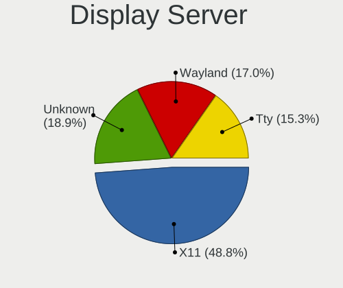
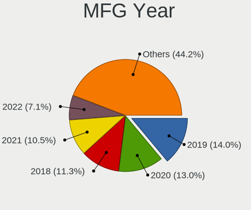
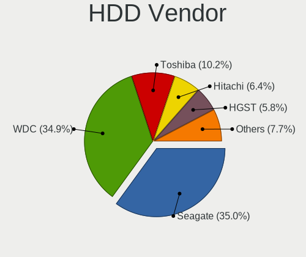
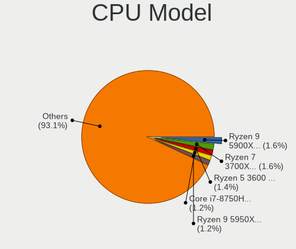
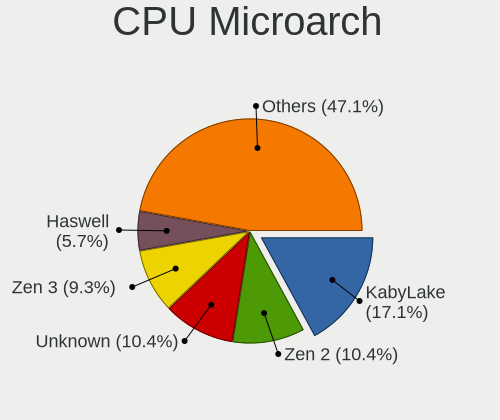
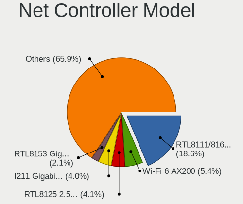

Gentoo - Tested Hardware & Statistics
-------------------------------------

A project to collect tested hardware configurations for Gentoo.

Anyone can contribute to this report by the [hw-probe](https://github.com/linuxhw/hw-probe) tool:

    sudo -E hw-probe -all -upload

Please contribute! Especially if your hardware is rare.

This is a report for all computer types. See also reports for [desktops](/Dist/Gentoo/Desktop/README.md) and [notebooks](/Dist/Gentoo/Notebook/README.md).

Contents
--------

* [ Test Cases ](#test-cases)

* [ System ](#system)
  - [ OS                       ](#os)
  - [ OS Family                ](#os-family)
  - [ Kernel                   ](#kernel)
  - [ Kernel Family            ](#kernel-family)
  - [ Kernel Major Ver.        ](#kernel-major-ver)
  - [ Arch                     ](#arch)
  - [ DE                       ](#de)
  - [ Display Server           ](#display-server)
  - [ Display Manager          ](#display-manager)
  - [ OS Lang                  ](#os-lang)
  - [ Boot Mode                ](#boot-mode)
  - [ Filesystem               ](#filesystem)
  - [ Part. scheme             ](#part-scheme)
  - [ Dual Boot with Linux/BSD ](#dual-boot-with-linuxbsd)
  - [ Dual Boot (Win)          ](#dual-boot-win)

* [ Board ](#board)
  - [ Vendor                   ](#vendor)
  - [ Model                    ](#model)
  - [ Model Family             ](#model-family)
  - [ MFG Year                 ](#mfg-year)
  - [ Form Factor              ](#form-factor)
  - [ Secure Boot              ](#secure-boot)
  - [ Coreboot                 ](#coreboot)
  - [ RAM Size                 ](#ram-size)
  - [ RAM Used                 ](#ram-used)
  - [ Total Drives             ](#total-drives)
  - [ Has CD-ROM               ](#has-cd-rom)
  - [ Has Ethernet             ](#has-ethernet)
  - [ Has WiFi                 ](#has-wifi)
  - [ Has Bluetooth            ](#has-bluetooth)

* [ Location ](#location)
  - [ Country                  ](#country)
  - [ City                     ](#city)

* [ Drives ](#drives)
  - [ Drive Vendor             ](#drive-vendor)
  - [ Drive Model              ](#drive-model)
  - [ HDD Vendor               ](#hdd-vendor)
  - [ SSD Vendor               ](#ssd-vendor)
  - [ Drive Kind               ](#drive-kind)
  - [ Drive Connector          ](#drive-connector)
  - [ Drive Size               ](#drive-size)
  - [ Space Total              ](#space-total)
  - [ Space Used               ](#space-used)
  - [ Malfunc. Drives          ](#malfunc-drives)
  - [ Malfunc. Drive Vendor    ](#malfunc-drive-vendor)
  - [ Malfunc. HDD Vendor      ](#malfunc-hdd-vendor)
  - [ Malfunc. Drive Kind      ](#malfunc-drive-kind)
  - [ Failed Drives            ](#failed-drives)
  - [ Failed Drive Vendor      ](#failed-drive-vendor)
  - [ Drive Status             ](#drive-status)

* [ Storage controller ](#storage-controller)
  - [ Storage Vendor           ](#storage-vendor)
  - [ Storage Model            ](#storage-model)
  - [ Storage Kind             ](#storage-kind)

* [ Processor ](#processor)
  - [ CPU Vendor               ](#cpu-vendor)
  - [ CPU Model                ](#cpu-model)
  - [ CPU Model Family         ](#cpu-model-family)
  - [ CPU Cores                ](#cpu-cores)
  - [ CPU Sockets              ](#cpu-sockets)
  - [ CPU Threads              ](#cpu-threads)
  - [ CPU Op-Modes             ](#cpu-op-modes)
  - [ CPU Microcode            ](#cpu-microcode)
  - [ CPU Microarch            ](#cpu-microarch)

* [ Graphics ](#graphics)
  - [ GPU Vendor               ](#gpu-vendor)
  - [ GPU Model                ](#gpu-model)
  - [ GPU Combo                ](#gpu-combo)
  - [ GPU Driver               ](#gpu-driver)
  - [ GPU Memory               ](#gpu-memory)

* [ Monitor ](#monitor)
  - [ Monitor Vendor           ](#monitor-vendor)
  - [ Monitor Model            ](#monitor-model)
  - [ Monitor Resolution       ](#monitor-resolution)
  - [ Monitor Diagonal         ](#monitor-diagonal)
  - [ Monitor Width            ](#monitor-width)
  - [ Aspect Ratio             ](#aspect-ratio)
  - [ Monitor Area             ](#monitor-area)
  - [ Pixel Density            ](#pixel-density)
  - [ Multiple Monitors        ](#multiple-monitors)

* [ Network ](#network)
  - [ Net Controller Vendor    ](#net-controller-vendor)
  - [ Net Controller Model     ](#net-controller-model)
  - [ Wireless Vendor          ](#wireless-vendor)
  - [ Wireless Model           ](#wireless-model)
  - [ Ethernet Vendor          ](#ethernet-vendor)
  - [ Ethernet Model           ](#ethernet-model)
  - [ Net Controller Kind      ](#net-controller-kind)
  - [ Used Controller          ](#used-controller)
  - [ NICs                     ](#nics)
  - [ IPv6                     ](#ipv6)

* [ Bluetooth ](#bluetooth)
  - [ Bluetooth Vendor         ](#bluetooth-vendor)
  - [ Bluetooth Model          ](#bluetooth-model)

* [ Sound ](#sound)
  - [ Sound Vendor             ](#sound-vendor)
  - [ Sound Model              ](#sound-model)

* [ Memory ](#memory)
  - [ Memory Vendor            ](#memory-vendor)
  - [ Memory Model             ](#memory-model)
  - [ Memory Kind              ](#memory-kind)
  - [ Memory Form Factor       ](#memory-form-factor)
  - [ Memory Size              ](#memory-size)
  - [ Memory Speed             ](#memory-speed)

* [ Printers & scanners ](#printers--scanners)
  - [ Printer Vendor           ](#printer-vendor)
  - [ Printer Model            ](#printer-model)
  - [ Scanner Vendor           ](#scanner-vendor)
  - [ Scanner Model            ](#scanner-model)

* [ Camera ](#camera)
  - [ Camera Vendor            ](#camera-vendor)
  - [ Camera Model             ](#camera-model)

* [ Security ](#security)
  - [ Fingerprint Vendor       ](#fingerprint-vendor)
  - [ Fingerprint Model        ](#fingerprint-model)
  - [ Chipcard Vendor          ](#chipcard-vendor)
  - [ Chipcard Model           ](#chipcard-model)

* [ Unsupported ](#unsupported)
  - [ Unsupported Devices      ](#unsupported-devices)
  - [ Unsupported Device Types ](#unsupported-device-types)

Test Cases
----------

Total: 2377

| Vendor        | Model                       | Form-Factor | Probe                                                      | Date         |
|---------------|-----------------------------|-------------|------------------------------------------------------------|--------------|
| HP            | Laptop 17-ca1xxx            | Notebook    | [7f93c1a4e3](https://linux-hardware.org/?probe=7f93c1a4e3) | Feb 28, 2023 |
| Lenovo        | Legion 5P 15IMH05 82AW      | Notebook    | [0de52a6150](https://linux-hardware.org/?probe=0de52a6150) | Feb 28, 2023 |
| Acer          | Aspire A515-45G             | Notebook    | [5f8c1e2d90](https://linux-hardware.org/?probe=5f8c1e2d90) | Feb 28, 2023 |
| ASUSTek       | PRIME B450M-A               | Desktop     | [373f4f8123](https://linux-hardware.org/?probe=373f4f8123) | Feb 27, 2023 |
| MSI           | GS66 Stealth 10UE           | Notebook    | [f193cf790d](https://linux-hardware.org/?probe=f193cf790d) | Feb 27, 2023 |
| ASUSTek       | M3A78-CM                    | Desktop     | [aa86292f52](https://linux-hardware.org/?probe=aa86292f52) | Feb 27, 2023 |
| MSI           | GS66 Stealth 10UE           | Notebook    | [eba178253a](https://linux-hardware.org/?probe=eba178253a) | Feb 27, 2023 |
| Gigabyte      | AB350-Gaming-CF             | Desktop     | [f8d42c3767](https://linux-hardware.org/?probe=f8d42c3767) | Feb 27, 2023 |
| ASUSTek       | VivoBook_ASUSLaptop X509... | Notebook    | [54e5bda708](https://linux-hardware.org/?probe=54e5bda708) | Feb 26, 2023 |
| ASUSTek       | VivoBook_ASUSLaptop X509... | Notebook    | [83af08dd1d](https://linux-hardware.org/?probe=83af08dd1d) | Feb 26, 2023 |
| ASUSTek       | VivoBook_ASUSLaptop X509... | Notebook    | [c5a45c78fc](https://linux-hardware.org/?probe=c5a45c78fc) | Feb 26, 2023 |
| ASUSTek       | M3A78-CM                    | Desktop     | [cf1d88a388](https://linux-hardware.org/?probe=cf1d88a388) | Feb 26, 2023 |
| realme        | RMNBXXXX                    | Notebook    | [6ea10cb77a](https://linux-hardware.org/?probe=6ea10cb77a) | Feb 26, 2023 |
| Gigabyte      | B450 AORUS PRO-CF           | Desktop     | [7f2823a756](https://linux-hardware.org/?probe=7f2823a756) | Feb 26, 2023 |
| Gigabyte      | B450 AORUS PRO-CF           | Desktop     | [0b1c4036b1](https://linux-hardware.org/?probe=0b1c4036b1) | Feb 26, 2023 |
| Lenovo        | 1048 SDK0T08861 WIN 3305... | Desktop     | [e6b48cdec4](https://linux-hardware.org/?probe=e6b48cdec4) | Feb 26, 2023 |
| ASRock        | AM1H-ITX                    | Desktop     | [2029821da8](https://linux-hardware.org/?probe=2029821da8) | Feb 25, 2023 |
| Valve         | Jupiter                     | Notebook    | [3ad0d92361](https://linux-hardware.org/?probe=3ad0d92361) | Feb 25, 2023 |
| ASRock        | X370 Professional Gaming    | Desktop     | [cff46cb07b](https://linux-hardware.org/?probe=cff46cb07b) | Feb 24, 2023 |
| MSI           | GS66 Stealth 10UE           | Notebook    | [3382fa1bad](https://linux-hardware.org/?probe=3382fa1bad) | Feb 24, 2023 |
| MSI           | Vector GP66 12UEO           | Notebook    | [9b6bf9479e](https://linux-hardware.org/?probe=9b6bf9479e) | Feb 24, 2023 |
| MSI           | GS66 Stealth 10UE           | Notebook    | [ffcf782944](https://linux-hardware.org/?probe=ffcf782944) | Feb 23, 2023 |
| ASUSTek       | ASUS EXPERTBOOK B3402FBA... | Convertible | [cede8b490a](https://linux-hardware.org/?probe=cede8b490a) | Feb 22, 2023 |
| ASUSTek       | P10S-I Series               | Desktop     | [f2049b8af1](https://linux-hardware.org/?probe=f2049b8af1) | Feb 21, 2023 |
| ASUSTek       | P10S-I Series               | Desktop     | [ec5a8efdcd](https://linux-hardware.org/?probe=ec5a8efdcd) | Feb 21, 2023 |
| HP            | Victus by Gaming Laptop ... | Notebook    | [6a44442cfc](https://linux-hardware.org/?probe=6a44442cfc) | Feb 21, 2023 |
| Gigabyte      | Z590 UD                     | Desktop     | [a8da25537c](https://linux-hardware.org/?probe=a8da25537c) | Feb 21, 2023 |
| HP            | Pavilion Notebook           | Notebook    | [da640089bd](https://linux-hardware.org/?probe=da640089bd) | Feb 21, 2023 |
| Alienware     | 17                          | Notebook    | [848d5cd7e9](https://linux-hardware.org/?probe=848d5cd7e9) | Feb 20, 2023 |
| Dell          | Precision 7770              | Notebook    | [d8db6fecdd](https://linux-hardware.org/?probe=d8db6fecdd) | Feb 20, 2023 |
| Gigabyte      | AB350-Gaming-CF             | Desktop     | [cc8a99e630](https://linux-hardware.org/?probe=cc8a99e630) | Feb 20, 2023 |
| Valve         | Jupiter                     | Notebook    | [c9c9830572](https://linux-hardware.org/?probe=c9c9830572) | Feb 19, 2023 |
| ASUSTek       | M3A78-CM                    | Desktop     | [7b0fb49186](https://linux-hardware.org/?probe=7b0fb49186) | Feb 19, 2023 |
| ASUSTek       | ROG Strix G732LXS_G732LX... | Notebook    | [6424058c59](https://linux-hardware.org/?probe=6424058c59) | Feb 19, 2023 |
| ASUSTek       | PRIME H570M-PLUS            | Desktop     | [4fac3ddf27](https://linux-hardware.org/?probe=4fac3ddf27) | Feb 19, 2023 |
| ASUSTek       | TUF Gaming Z690-PLUS D4     | Desktop     | [e2facdc650](https://linux-hardware.org/?probe=e2facdc650) | Feb 19, 2023 |
| ASUSTek       | Strix 17 GL703GE            | Notebook    | [48ca6dc3eb](https://linux-hardware.org/?probe=48ca6dc3eb) | Feb 19, 2023 |
| ASUSTek       | ROG STRIX X570-E GAMING     | Desktop     | [84e946f098](https://linux-hardware.org/?probe=84e946f098) | Feb 18, 2023 |
| Gigabyte      | B650 AORUS PRO AX           | Desktop     | [a526504d18](https://linux-hardware.org/?probe=a526504d18) | Feb 18, 2023 |
| MSI           | MAG B550 TOMAHAWK           | Desktop     | [46289356fa](https://linux-hardware.org/?probe=46289356fa) | Feb 18, 2023 |
| ASUSTek       | TUF Gaming B550-PRO         | Desktop     | [fa6a3fe6e3](https://linux-hardware.org/?probe=fa6a3fe6e3) | Feb 17, 2023 |
| Unknown       | Unknown                     | Notebook    | [7d36f8eee5](https://linux-hardware.org/?probe=7d36f8eee5) | Feb 16, 2023 |
| Lenovo        | IdeaPad 100-15IBD 80QQ      | Notebook    | [39b9facc37](https://linux-hardware.org/?probe=39b9facc37) | Feb 16, 2023 |
| MSI           | GS66 Stealth 10UE           | Notebook    | [587bd9e282](https://linux-hardware.org/?probe=587bd9e282) | Feb 16, 2023 |
| ASUSTek       | M3A78-CM                    | Desktop     | [2c0799202c](https://linux-hardware.org/?probe=2c0799202c) | Feb 15, 2023 |
| Timi          | RedmiBook Pro 15S           | Notebook    | [991db4f096](https://linux-hardware.org/?probe=991db4f096) | Feb 14, 2023 |
| MSI           | Vector GP66 12UEO           | Notebook    | [040bddeff8](https://linux-hardware.org/?probe=040bddeff8) | Feb 14, 2023 |
| Unknown       | Unknown                     | Notebook    | [1f80b65b37](https://linux-hardware.org/?probe=1f80b65b37) | Feb 13, 2023 |
| Unknown       | Unknown                     | Notebook    | [8b28eb095c](https://linux-hardware.org/?probe=8b28eb095c) | Feb 13, 2023 |
| ASUSTek       | M3A78-CM                    | Desktop     | [e474459ee0](https://linux-hardware.org/?probe=e474459ee0) | Feb 13, 2023 |
| Dell          | XPS 15 9520                 | Notebook    | [1263022267](https://linux-hardware.org/?probe=1263022267) | Feb 13, 2023 |
| HP            | Pavilion Notebook           | Notebook    | [94ca7f3e34](https://linux-hardware.org/?probe=94ca7f3e34) | Feb 13, 2023 |
| Timi          | RedmiBook Pro 15S           | Notebook    | [6a952f7024](https://linux-hardware.org/?probe=6a952f7024) | Feb 13, 2023 |
| Timi          | RedmiBook Pro 15S           | Notebook    | [e8ba753fae](https://linux-hardware.org/?probe=e8ba753fae) | Feb 13, 2023 |
| Gigabyte      | AB350-Gaming-CF             | Desktop     | [7eb2b7e26f](https://linux-hardware.org/?probe=7eb2b7e26f) | Feb 13, 2023 |
| ASUSTek       | M3A78-CM                    | Desktop     | [36a0d5221f](https://linux-hardware.org/?probe=36a0d5221f) | Feb 13, 2023 |
| Apple         | MacBookPro10,2              | Notebook    | [aedfc67444](https://linux-hardware.org/?probe=aedfc67444) | Feb 12, 2023 |
| Unknown       | Unknown                     | Notebook    | [e0fd4c1db9](https://linux-hardware.org/?probe=e0fd4c1db9) | Feb 11, 2023 |
| MSI           | PRO Z690-A WIFI DDR4        | Desktop     | [95337ab460](https://linux-hardware.org/?probe=95337ab460) | Feb 11, 2023 |
| ASUSTek       | TUF Gaming X570-PLUS_BR     | Desktop     | [12c06a594d](https://linux-hardware.org/?probe=12c06a594d) | Feb 10, 2023 |
| Supermicro    | H11SSL-i                    | Server      | [ba881ed411](https://linux-hardware.org/?probe=ba881ed411) | Feb 10, 2023 |
| ASUSTek       | TUF Gaming X570-PLUS        | Desktop     | [469eaa6fba](https://linux-hardware.org/?probe=469eaa6fba) | Feb 10, 2023 |
| ASUSTek       | ROG STRIX Z690-G GAMING ... | Desktop     | [1423d5ac1b](https://linux-hardware.org/?probe=1423d5ac1b) | Feb 10, 2023 |
| ASUSTek       | ROG STRIX Z690-G GAMING ... | Desktop     | [bb589c5e58](https://linux-hardware.org/?probe=bb589c5e58) | Feb 10, 2023 |
| Gigabyte      | B650 AORUS PRO AX           | Desktop     | [4998be684f](https://linux-hardware.org/?probe=4998be684f) | Feb 10, 2023 |
| MSI           | MAG B550 TOMAHAWK           | Desktop     | [2cfb05371e](https://linux-hardware.org/?probe=2cfb05371e) | Feb 09, 2023 |
| MSI           | MAG B550 TOMAHAWK           | Desktop     | [4468518165](https://linux-hardware.org/?probe=4468518165) | Feb 09, 2023 |
| Apple         | MacBookPro10,2              | Notebook    | [85b07c179c](https://linux-hardware.org/?probe=85b07c179c) | Feb 09, 2023 |
| Apple         | MacBookPro10,2              | Notebook    | [238c7a2c08](https://linux-hardware.org/?probe=238c7a2c08) | Feb 09, 2023 |
| MSI           | X370 XPOWER GAMING TITAN... | Desktop     | [f09cd898c8](https://linux-hardware.org/?probe=f09cd898c8) | Feb 09, 2023 |
| ASUSTek       | M3A78-CM                    | Desktop     | [c71dba27f2](https://linux-hardware.org/?probe=c71dba27f2) | Feb 08, 2023 |
| ASRock        | B550M Steel Legend          | Desktop     | [83b847229c](https://linux-hardware.org/?probe=83b847229c) | Feb 08, 2023 |
| Dell          | Precision 7770              | Notebook    | [69b0982ad7](https://linux-hardware.org/?probe=69b0982ad7) | Feb 08, 2023 |
| Dell          | Precision 7770              | Notebook    | [28ba6f72d0](https://linux-hardware.org/?probe=28ba6f72d0) | Feb 07, 2023 |
| Dell          | Precision 7770              | Notebook    | [d05aabf7a5](https://linux-hardware.org/?probe=d05aabf7a5) | Feb 06, 2023 |
| Valve         | Jupiter                     | Notebook    | [42a3945648](https://linux-hardware.org/?probe=42a3945648) | Feb 06, 2023 |
| Gigabyte      | B150M-D2V DDR3-CF           | Desktop     | [bc0593280c](https://linux-hardware.org/?probe=bc0593280c) | Feb 05, 2023 |
| Lenovo        | ThinkPad E14 Gen 4 21EBC... | Notebook    | [2ac999e9b0](https://linux-hardware.org/?probe=2ac999e9b0) | Feb 05, 2023 |
| Valve         | Jupiter                     | Notebook    | [5f77ae27c2](https://linux-hardware.org/?probe=5f77ae27c2) | Feb 04, 2023 |
| Radxa         | ROCK 5B                     | Soc         | [78a631609d](https://linux-hardware.org/?probe=78a631609d) | Feb 04, 2023 |
| Gigabyte      | B150M-D2V DDR3-CF           | Desktop     | [e12e1d2598](https://linux-hardware.org/?probe=e12e1d2598) | Feb 04, 2023 |
| MSI           | PRO X670-P WIFI             | Desktop     | [be3ef90301](https://linux-hardware.org/?probe=be3ef90301) | Feb 04, 2023 |
| Lenovo        | ThinkPad T570 W10DG 20JX... | Notebook    | [37d0cc301b](https://linux-hardware.org/?probe=37d0cc301b) | Feb 03, 2023 |
| ASUSTek       | PRIME X570-P                | Desktop     | [a8dcc6b4c1](https://linux-hardware.org/?probe=a8dcc6b4c1) | Feb 03, 2023 |
| Lenovo        | ThinkPad T570 W10DG 20JX... | Notebook    | [a08ee9b387](https://linux-hardware.org/?probe=a08ee9b387) | Feb 03, 2023 |
| Dell          | Precision 7770              | Notebook    | [20f6b87742](https://linux-hardware.org/?probe=20f6b87742) | Feb 03, 2023 |
| Gigabyte      | X570 AORUS MASTER           | Desktop     | [0cf18835cc](https://linux-hardware.org/?probe=0cf18835cc) | Feb 02, 2023 |
| HP            | Victus by Laptop 16-e0xx... | Notebook    | [80921f3386](https://linux-hardware.org/?probe=80921f3386) | Feb 01, 2023 |
| ASUSTek       | GL702VT                     | Notebook    | [83abe24c59](https://linux-hardware.org/?probe=83abe24c59) | Feb 01, 2023 |
| MSI           | GP60 2PE                    | Notebook    | [a1bb8934a0](https://linux-hardware.org/?probe=a1bb8934a0) | Feb 01, 2023 |
| Lenovo        | ThinkPad T16 Gen 1 21CH0... | Notebook    | [78eeec802b](https://linux-hardware.org/?probe=78eeec802b) | Feb 01, 2023 |
| ASUSTek       | ROG STRIX X570-E GAMING     | Desktop     | [9fb41ee5bc](https://linux-hardware.org/?probe=9fb41ee5bc) | Feb 01, 2023 |
| ASUSTek       | ROG STRIX X570-E GAMING     | Desktop     | [4bb9990abe](https://linux-hardware.org/?probe=4bb9990abe) | Feb 01, 2023 |
| Lenovo        | IdeaPad 5 15ARE05 81YQ      | Notebook    | [396877a008](https://linux-hardware.org/?probe=396877a008) | Jan 31, 2023 |
| Sony          | PCG-GRT230(UC)              | Notebook    | [0a7c76da78](https://linux-hardware.org/?probe=0a7c76da78) | Jan 30, 2023 |
| Gigabyte      | AB350-Gaming-CF             | Desktop     | [5a2c721748](https://linux-hardware.org/?probe=5a2c721748) | Jan 30, 2023 |
| ASUSTek       | ProArt B550-CREATOR         | Desktop     | [c93e84b79b](https://linux-hardware.org/?probe=c93e84b79b) | Jan 29, 2023 |
| Google        | Helios                      | Notebook    | [c8b5d0660b](https://linux-hardware.org/?probe=c8b5d0660b) | Jan 28, 2023 |
| Lenovo        | IdeaPad S145-15IWL 81MV     | Notebook    | [f71299a9c6](https://linux-hardware.org/?probe=f71299a9c6) | Jan 27, 2023 |
| ASUSTek       | PRIME Z390-A                | Desktop     | [a30690db0c](https://linux-hardware.org/?probe=a30690db0c) | Jan 27, 2023 |
| ASUSTek       | M3A78-CM                    | Desktop     | [9001ac4e36](https://linux-hardware.org/?probe=9001ac4e36) | Jan 27, 2023 |
| Gigabyte      | Z370P D3-CF                 | Desktop     | [90f37ac742](https://linux-hardware.org/?probe=90f37ac742) | Jan 26, 2023 |
| Gigabyte      | Z370P D3-CF                 | Desktop     | [e524d7c4d9](https://linux-hardware.org/?probe=e524d7c4d9) | Jan 26, 2023 |
| Dell          | XPS 9320                    | Notebook    | [a1040b4a3f](https://linux-hardware.org/?probe=a1040b4a3f) | Jan 26, 2023 |
| Dell          | Latitude 5530               | Notebook    | [b365359e5f](https://linux-hardware.org/?probe=b365359e5f) | Jan 24, 2023 |
| Lenovo        | 1030 SDK0Q40104 WIN 3305... | Desktop     | [6a876fb2b4](https://linux-hardware.org/?probe=6a876fb2b4) | Jan 23, 2023 |
| Lenovo        | 1030 SDK0Q40104 WIN 3305... | Desktop     | [287d005187](https://linux-hardware.org/?probe=287d005187) | Jan 23, 2023 |
| Gigabyte      | AB350-Gaming-CF             | Desktop     | [c2f89a9e58](https://linux-hardware.org/?probe=c2f89a9e58) | Jan 23, 2023 |
| Dell          | Precision 7770              | Notebook    | [47044d362f](https://linux-hardware.org/?probe=47044d362f) | Jan 22, 2023 |
| Lenovo        | Legion 5 Pro 16ACH6H 82J... | Notebook    | [2f02d895e2](https://linux-hardware.org/?probe=2f02d895e2) | Jan 22, 2023 |
| HP            | Victus by Gaming Laptop ... | Notebook    | [92280be854](https://linux-hardware.org/?probe=92280be854) | Jan 22, 2023 |
| Lenovo        | ThinkPad T470s 20HGS27Y0... | Notebook    | [e1678320fc](https://linux-hardware.org/?probe=e1678320fc) | Jan 22, 2023 |
| Gigabyte      | B150M-D2V DDR3-CF           | Desktop     | [69bf20ee28](https://linux-hardware.org/?probe=69bf20ee28) | Jan 21, 2023 |
| Gigabyte      | B150M-D2V DDR3-CF           | Desktop     | [dfd88e113a](https://linux-hardware.org/?probe=dfd88e113a) | Jan 21, 2023 |
| Dell          | XPS 9320                    | Notebook    | [ebe686793d](https://linux-hardware.org/?probe=ebe686793d) | Jan 21, 2023 |
| Dell          | XPS 9320                    | Notebook    | [706152a268](https://linux-hardware.org/?probe=706152a268) | Jan 21, 2023 |
| Dell          | XPS 17 9700                 | Notebook    | [d37b338c87](https://linux-hardware.org/?probe=d37b338c87) | Jan 21, 2023 |
| Dell          | XPS 17 9700                 | Notebook    | [413cd3b7cf](https://linux-hardware.org/?probe=413cd3b7cf) | Jan 21, 2023 |
| Lenovo        | ThinkPad X1 Titanium Gen... | Convertible | [69f4adcf81](https://linux-hardware.org/?probe=69f4adcf81) | Jan 20, 2023 |
| ASUSTek       | M3A78-CM                    | Desktop     | [1f935f0c7b](https://linux-hardware.org/?probe=1f935f0c7b) | Jan 20, 2023 |
| ASUSTek       | VivoBook_ASUSLaptop X515... | Notebook    | [6c2dd878d0](https://linux-hardware.org/?probe=6c2dd878d0) | Jan 19, 2023 |
| ASUSTek       | ROG Maximus XIII HERO       | Desktop     | [0e8d25f649](https://linux-hardware.org/?probe=0e8d25f649) | Jan 19, 2023 |
| ASUSTek       | PRIME H570M-PLUS            | Desktop     | [4932579d3e](https://linux-hardware.org/?probe=4932579d3e) | Jan 19, 2023 |
| ASUSTek       | VivoBook_ASUSLaptop X515... | Notebook    | [5f73278ca0](https://linux-hardware.org/?probe=5f73278ca0) | Jan 19, 2023 |
| ASUSTek       | ROG Maximus XIII HERO       | Desktop     | [a1b3ac9ccc](https://linux-hardware.org/?probe=a1b3ac9ccc) | Jan 19, 2023 |
| ASUSTek       | TUF Gaming Z690-PLUS D4     | Desktop     | [b11a63e25d](https://linux-hardware.org/?probe=b11a63e25d) | Jan 19, 2023 |
| ASUSTek       | ROG Strix G732LXS_G732LX... | Notebook    | [753a61e1de](https://linux-hardware.org/?probe=753a61e1de) | Jan 19, 2023 |
| HP            | Pavilion Gaming Laptop 1... | Notebook    | [7aa00b2d9f](https://linux-hardware.org/?probe=7aa00b2d9f) | Jan 19, 2023 |
| ASUSTek       | ROG Strix G732LXS_G732LX... | Notebook    | [b14d57e1a3](https://linux-hardware.org/?probe=b14d57e1a3) | Jan 19, 2023 |
| Dell          | Precision 7720              | Notebook    | [9a00916b91](https://linux-hardware.org/?probe=9a00916b91) | Jan 19, 2023 |
| ASUSTek       | TUF Gaming FX505DT_FX505... | Notebook    | [0770f064de](https://linux-hardware.org/?probe=0770f064de) | Jan 19, 2023 |
| Schenker      | XMG PRO (E22)               | Notebook    | [475e812e56](https://linux-hardware.org/?probe=475e812e56) | Jan 19, 2023 |
| ASRock        | AM1H-ITX                    | Desktop     | [7427c997d7](https://linux-hardware.org/?probe=7427c997d7) | Jan 18, 2023 |
| Dell          | Latitude 5410               | Notebook    | [da523f9f4c](https://linux-hardware.org/?probe=da523f9f4c) | Jan 18, 2023 |
| Lenovo        | ThinkPad X1 Titanium Gen... | Convertible | [b4e1da9857](https://linux-hardware.org/?probe=b4e1da9857) | Jan 17, 2023 |
| ASUSTek       | TUF Gaming B660M-PLUS WI... | Desktop     | [d78fd14781](https://linux-hardware.org/?probe=d78fd14781) | Jan 17, 2023 |
| HP            | Pavilion Gaming Laptop 1... | Notebook    | [d6b6c22af1](https://linux-hardware.org/?probe=d6b6c22af1) | Jan 17, 2023 |
| ASUSTek       | X99-A/USB                   | Desktop     | [0d5c9f7a33](https://linux-hardware.org/?probe=0d5c9f7a33) | Jan 16, 2023 |
| Dell          | Precision 7720              | Notebook    | [f8e1c53257](https://linux-hardware.org/?probe=f8e1c53257) | Jan 16, 2023 |
| MSI           | Bravo 15 B5DD               | Notebook    | [8e35281ea5](https://linux-hardware.org/?probe=8e35281ea5) | Jan 16, 2023 |
| Acer          | Predator PH315-51           | Notebook    | [0b2ae38776](https://linux-hardware.org/?probe=0b2ae38776) | Jan 16, 2023 |
| ASUSTek       | ROG CROSSHAIR VII HERO      | Desktop     | [5e6192ed2b](https://linux-hardware.org/?probe=5e6192ed2b) | Jan 16, 2023 |
| Gigabyte      | AB350-Gaming-CF             | Desktop     | [94ba7a4ca6](https://linux-hardware.org/?probe=94ba7a4ca6) | Jan 16, 2023 |
| Gigabyte      | B450M DS3H-CF               | Desktop     | [25cf332260](https://linux-hardware.org/?probe=25cf332260) | Jan 15, 2023 |
| Gigabyte      | B450M DS3H-CF               | Desktop     | [3f12fad87c](https://linux-hardware.org/?probe=3f12fad87c) | Jan 15, 2023 |
| Lenovo        | ThinkPad X1 Titanium Gen... | Convertible | [ca74e79834](https://linux-hardware.org/?probe=ca74e79834) | Jan 15, 2023 |
| ASUSTek       | M3A78-CM                    | Desktop     | [eeeb041ca6](https://linux-hardware.org/?probe=eeeb041ca6) | Jan 13, 2023 |
| MSI           | MPG B550 GAMING EDGE WIF... | Desktop     | [306315e4d8](https://linux-hardware.org/?probe=306315e4d8) | Jan 12, 2023 |
| Lenovo        | Legion Y540-15IRH-PG0 81... | Notebook    | [4fe502c977](https://linux-hardware.org/?probe=4fe502c977) | Jan 10, 2023 |
| Gigabyte      | AB350-Gaming-CF             | Desktop     | [aac6fb4537](https://linux-hardware.org/?probe=aac6fb4537) | Jan 09, 2023 |
| Google        | Sasuke                      | Notebook    | [aa3a09aaef](https://linux-hardware.org/?probe=aa3a09aaef) | Jan 07, 2023 |
| ASUSTek       | PRIME B460M-A               | Desktop     | [b5dd8ee9f3](https://linux-hardware.org/?probe=b5dd8ee9f3) | Jan 07, 2023 |
| Timi          | Mi Laptop Pro 15            | Notebook    | [7ea6f8ee94](https://linux-hardware.org/?probe=7ea6f8ee94) | Jan 06, 2023 |
| Dell          | 0J3C2F A02                  | Desktop     | [0944e31ade](https://linux-hardware.org/?probe=0944e31ade) | Jan 06, 2023 |
| Lenovo        | Legion 5 Pro 16IAH7H 82R... | Notebook    | [659196ed95](https://linux-hardware.org/?probe=659196ed95) | Jan 06, 2023 |
| HP            | 212A                        | Desktop     | [21acb67653](https://linux-hardware.org/?probe=21acb67653) | Jan 06, 2023 |
| Lenovo        | ThinkPad T480 20L6S04Q00    | Notebook    | [0dbae6cda4](https://linux-hardware.org/?probe=0dbae6cda4) | Jan 06, 2023 |
| Lenovo        | ThinkPad T480 20L6S04Q00    | Notebook    | [bca9343f96](https://linux-hardware.org/?probe=bca9343f96) | Jan 06, 2023 |
| ASUSTek       | M3A78-CM                    | Desktop     | [bb78c165c7](https://linux-hardware.org/?probe=bb78c165c7) | Jan 06, 2023 |
| Lenovo        | Legion 5 Pro 16IAH7H 82R... | Notebook    | [40a6c7370b](https://linux-hardware.org/?probe=40a6c7370b) | Jan 05, 2023 |
| Acer          | TravelMate B115-M           | Notebook    | [c39cf71ff8](https://linux-hardware.org/?probe=c39cf71ff8) | Jan 05, 2023 |
| ASRock        | AM1H-ITX                    | Desktop     | [3b32e784a3](https://linux-hardware.org/?probe=3b32e784a3) | Jan 03, 2023 |
| Dell          | Precision 7720              | Notebook    | [59813a7461](https://linux-hardware.org/?probe=59813a7461) | Jan 03, 2023 |
| Gigabyte      | AB350-Gaming-CF             | Desktop     | [92052e9c47](https://linux-hardware.org/?probe=92052e9c47) | Jan 02, 2023 |
| Supermicro    | H12SSL-NT                   | Server      | [954e228bd5](https://linux-hardware.org/?probe=954e228bd5) | Dec 31, 2022 |
| Dell          | 0TWFTR A02                  | All in one  | [5f63c2fd15](https://linux-hardware.org/?probe=5f63c2fd15) | Dec 31, 2022 |
| Phoenix       | 945GM                       | Desktop     | [d391eaf6e2](https://linux-hardware.org/?probe=d391eaf6e2) | Dec 31, 2022 |
| Raspberry ... | Raspberry Pi                | Soc         | [a5030d74d4](https://linux-hardware.org/?probe=a5030d74d4) | Dec 31, 2022 |
| HP            | ProLiant DL360p Gen8        | Server      | [9b6998f35c](https://linux-hardware.org/?probe=9b6998f35c) | Dec 31, 2022 |
| Lenovo        | ThinkPad W540 20BG0033RT    | Notebook    | [5cfa12cec1](https://linux-hardware.org/?probe=5cfa12cec1) | Dec 31, 2022 |
| Lenovo        | Legion Y540-15IRH-PG0 81... | Notebook    | [4b130212a2](https://linux-hardware.org/?probe=4b130212a2) | Dec 30, 2022 |
| Lenovo        | Legion Y540-15IRH-PG0 81... | Notebook    | [0c7ced8708](https://linux-hardware.org/?probe=0c7ced8708) | Dec 30, 2022 |
| Lenovo        | IdeaPad Gaming 3 15ACH6 ... | Notebook    | [bd53b75b7b](https://linux-hardware.org/?probe=bd53b75b7b) | Dec 30, 2022 |
| ASUSTek       | M3A78-CM                    | Desktop     | [9a05e8c413](https://linux-hardware.org/?probe=9a05e8c413) | Dec 30, 2022 |
| Unknown       | Freecom Silverstore HNCN... | Desktop     | [723fbcd23f](https://linux-hardware.org/?probe=723fbcd23f) | Dec 29, 2022 |
| Dell          | Precision 7720              | Notebook    | [56db0ab146](https://linux-hardware.org/?probe=56db0ab146) | Dec 28, 2022 |
| Dell          | Precision 7720              | Notebook    | [e94a7bb989](https://linux-hardware.org/?probe=e94a7bb989) | Dec 28, 2022 |
| Dell          | G3 3500                     | Notebook    | [78e803b44e](https://linux-hardware.org/?probe=78e803b44e) | Dec 28, 2022 |
| HP            | Pavilion Aero Laptop 13-... | Notebook    | [03cca95360](https://linux-hardware.org/?probe=03cca95360) | Dec 27, 2022 |
| System76      | Darter Pro                  | Notebook    | [c5aebaaece](https://linux-hardware.org/?probe=c5aebaaece) | Dec 27, 2022 |
| Dell          | G5 5505                     | Notebook    | [87f62bee87](https://linux-hardware.org/?probe=87f62bee87) | Dec 26, 2022 |
| Supermicro    | X10SL7-F                    | Server      | [9c75de7af7](https://linux-hardware.org/?probe=9c75de7af7) | Dec 26, 2022 |
| Gigabyte      | AB350-Gaming-CF             | Desktop     | [5d2498f405](https://linux-hardware.org/?probe=5d2498f405) | Dec 26, 2022 |
| Star Labs     | StarLite                    | Notebook    | [0d27e6f7ee](https://linux-hardware.org/?probe=0d27e6f7ee) | Dec 25, 2022 |
| ASUSTek       | SABERTOOTH 990FX            | Desktop     | [d759e5fe02](https://linux-hardware.org/?probe=d759e5fe02) | Dec 25, 2022 |
| HP            | Pavilion Laptop 15-cs0xx... | Notebook    | [77390ced3c](https://linux-hardware.org/?probe=77390ced3c) | Dec 24, 2022 |
| Supermicro    | X10DSC+                     | Desktop     | [cf559d5e84](https://linux-hardware.org/?probe=cf559d5e84) | Dec 24, 2022 |
| Dell          | Vostro 5490                 | Notebook    | [f694fa24c8](https://linux-hardware.org/?probe=f694fa24c8) | Dec 23, 2022 |
| Lenovo        | ThinkPad T16 Gen 1 21CHC... | Notebook    | [0c1d9b9b28](https://linux-hardware.org/?probe=0c1d9b9b28) | Dec 23, 2022 |
| Lenovo        | ThinkPad X1 Carbon Gen 1... | Notebook    | [25cbb2c39a](https://linux-hardware.org/?probe=25cbb2c39a) | Dec 23, 2022 |
| Acer          | Predator PH315-53           | Notebook    | [39e6254135](https://linux-hardware.org/?probe=39e6254135) | Dec 23, 2022 |
| Lenovo        | ThinkPad T16 Gen 1 21CHC... | Notebook    | [000660b461](https://linux-hardware.org/?probe=000660b461) | Dec 23, 2022 |
| ASUSTek       | M3A78-CM                    | Desktop     | [0277928378](https://linux-hardware.org/?probe=0277928378) | Dec 23, 2022 |
| HP            | 250 G7 Notebook PC          | Notebook    | [ec6b0e70a2](https://linux-hardware.org/?probe=ec6b0e70a2) | Dec 21, 2022 |
| Supermicro    | X10SRL-FB                   | Server      | [5fd1a2d6e1](https://linux-hardware.org/?probe=5fd1a2d6e1) | Dec 21, 2022 |
| HP            | 0980h                       | Desktop     | [d54665c87c](https://linux-hardware.org/?probe=d54665c87c) | Dec 21, 2022 |
| Lenovo        | ThinkPad T16 Gen 1 21CHC... | Notebook    | [638667a90f](https://linux-hardware.org/?probe=638667a90f) | Dec 20, 2022 |
| Dell          | Inspiron 15 7000 Gaming     | Notebook    | [b9aed745da](https://linux-hardware.org/?probe=b9aed745da) | Dec 20, 2022 |
| HP            | 0980h                       | Desktop     | [3faf0c7996](https://linux-hardware.org/?probe=3faf0c7996) | Dec 20, 2022 |
| Dell          | Inspiron 15 7000 Gaming     | Notebook    | [c7cea6dd19](https://linux-hardware.org/?probe=c7cea6dd19) | Dec 20, 2022 |
| HP            | 83E9                        | Desktop     | [02e854bd7c](https://linux-hardware.org/?probe=02e854bd7c) | Dec 20, 2022 |
| Dell          | Inspiron 15 3511            | Notebook    | [3d33008fb2](https://linux-hardware.org/?probe=3d33008fb2) | Dec 19, 2022 |
| HP            | 0B4Ch D                     | Desktop     | [2318fda45f](https://linux-hardware.org/?probe=2318fda45f) | Dec 19, 2022 |
| Gigabyte      | AB350-Gaming-CF             | Desktop     | [70a0e2a296](https://linux-hardware.org/?probe=70a0e2a296) | Dec 19, 2022 |
| Lenovo        | Legion 5 Pro 16IAH7H 82R... | Notebook    | [e0f5a5db4c](https://linux-hardware.org/?probe=e0f5a5db4c) | Dec 18, 2022 |
| Lenovo        | ThinkPad T470p 20J7S25C0... | Notebook    | [3dc497faf1](https://linux-hardware.org/?probe=3dc497faf1) | Dec 18, 2022 |
| Lenovo        | Legion 5 Pro 16IAH7H 82R... | Notebook    | [f15a27fd5e](https://linux-hardware.org/?probe=f15a27fd5e) | Dec 17, 2022 |
| HP            | 83E9                        | Desktop     | [cdf4ff19a6](https://linux-hardware.org/?probe=cdf4ff19a6) | Dec 17, 2022 |
| MSI           | MPG X570 GAMING EDGE WIF... | Desktop     | [d8774d83a7](https://linux-hardware.org/?probe=d8774d83a7) | Dec 16, 2022 |
| HP            | 83E9                        | Desktop     | [53f1974d93](https://linux-hardware.org/?probe=53f1974d93) | Dec 16, 2022 |
| ASUSTek       | M3A78-CM                    | Desktop     | [1860105d14](https://linux-hardware.org/?probe=1860105d14) | Dec 16, 2022 |
| Gigabyte      | B550M AORUS ELITE           | Desktop     | [3807037a5c](https://linux-hardware.org/?probe=3807037a5c) | Dec 15, 2022 |
| Acer          | Predator PH315-51           | Notebook    | [34676168fa](https://linux-hardware.org/?probe=34676168fa) | Dec 14, 2022 |
| Acer          | Predator PH315-51           | Notebook    | [0f9b4ae170](https://linux-hardware.org/?probe=0f9b4ae170) | Dec 14, 2022 |
| HP            | 212A                        | Desktop     | [c21bb6d20d](https://linux-hardware.org/?probe=c21bb6d20d) | Dec 14, 2022 |
| Gigabyte      | B550M DS3H                  | Desktop     | [8370a57760](https://linux-hardware.org/?probe=8370a57760) | Dec 12, 2022 |
| Gigabyte      | B650 AORUS PRO AX           | Desktop     | [b7374c7211](https://linux-hardware.org/?probe=b7374c7211) | Dec 12, 2022 |
| Supermicro    | H12SSL-NT                   | Server      | [82bfec7c72](https://linux-hardware.org/?probe=82bfec7c72) | Dec 12, 2022 |
| Gigabyte      | AB350-Gaming-CF             | Desktop     | [177dded9e0](https://linux-hardware.org/?probe=177dded9e0) | Dec 12, 2022 |
| HUAWEI        | NBLB-WAX9N                  | Notebook    | [7541ce9ac6](https://linux-hardware.org/?probe=7541ce9ac6) | Dec 11, 2022 |
| MSI           | K9N2 Diamond                | Desktop     | [0a42d5e656](https://linux-hardware.org/?probe=0a42d5e656) | Dec 11, 2022 |
| Star Labs     | StarLite                    | Notebook    | [0d83c191fa](https://linux-hardware.org/?probe=0d83c191fa) | Dec 10, 2022 |
| Gigabyte      | B550M DS3H                  | Desktop     | [6dd02812db](https://linux-hardware.org/?probe=6dd02812db) | Dec 10, 2022 |
| HP            | ProBook 6570b               | Notebook    | [073546a981](https://linux-hardware.org/?probe=073546a981) | Dec 10, 2022 |
| Supermicro    | H12SSL-NT                   | Server      | [afb0183c71](https://linux-hardware.org/?probe=afb0183c71) | Dec 10, 2022 |
| Star Labs     | StarLite                    | Notebook    | [4446ba1d6a](https://linux-hardware.org/?probe=4446ba1d6a) | Dec 10, 2022 |
| HP            | 0B4Ch D                     | Desktop     | [bede7701b9](https://linux-hardware.org/?probe=bede7701b9) | Dec 08, 2022 |
| Google        | Eve                         | Notebook    | [d78558c833](https://linux-hardware.org/?probe=d78558c833) | Dec 08, 2022 |
| ASUSTek       | PRIME X470-PRO              | Desktop     | [26f56cc499](https://linux-hardware.org/?probe=26f56cc499) | Dec 08, 2022 |
| Google        | Eve                         | Notebook    | [92d1d03fed](https://linux-hardware.org/?probe=92d1d03fed) | Dec 08, 2022 |
| Gigabyte      | B650 AORUS PRO AX           | Desktop     | [15f27b7ac6](https://linux-hardware.org/?probe=15f27b7ac6) | Dec 08, 2022 |
| ASUSTek       | ROG STRIX X670E-F GAMING... | Desktop     | [15d7102174](https://linux-hardware.org/?probe=15d7102174) | Dec 08, 2022 |
| ASUSTek       | ROG STRIX X670E-F GAMING... | Desktop     | [52525a1058](https://linux-hardware.org/?probe=52525a1058) | Dec 08, 2022 |
| ASRock        | AB350M                      | Desktop     | [95a14fd558](https://linux-hardware.org/?probe=95a14fd558) | Dec 07, 2022 |
| Gigabyte      | Z370P D3-CF                 | Desktop     | [13ac8bc162](https://linux-hardware.org/?probe=13ac8bc162) | Dec 06, 2022 |
| Samsung       | 950QED                      | Convertible | [396d57bb34](https://linux-hardware.org/?probe=396d57bb34) | Dec 06, 2022 |
| Gigabyte      | Z370P D3-CF                 | Desktop     | [c3510d4787](https://linux-hardware.org/?probe=c3510d4787) | Dec 06, 2022 |
| MSI           | MPG X570 GAMING PLUS        | Desktop     | [ccf3e1f074](https://linux-hardware.org/?probe=ccf3e1f074) | Dec 05, 2022 |
| MSI           | MPG X570 GAMING PLUS        | Desktop     | [60b1be0a32](https://linux-hardware.org/?probe=60b1be0a32) | Dec 05, 2022 |
| Gigabyte      | B650M DS3H                  | Desktop     | [73b49404f9](https://linux-hardware.org/?probe=73b49404f9) | Dec 05, 2022 |
| Toshiba       | Satellite L50-B             | Notebook    | [6d92129c25](https://linux-hardware.org/?probe=6d92129c25) | Dec 05, 2022 |
| HUAWEI        | NBLB-WAX9N                  | Notebook    | [9fec7bdfdc](https://linux-hardware.org/?probe=9fec7bdfdc) | Dec 04, 2022 |
| ASUSTek       | PRIME X570-PRO              | Desktop     | [22fc01fd20](https://linux-hardware.org/?probe=22fc01fd20) | Dec 04, 2022 |
| ASUSTek       | M3A78-CM                    | Desktop     | [84a50cd483](https://linux-hardware.org/?probe=84a50cd483) | Dec 03, 2022 |
| ASUSTek       | PRIME B450M-A               | Desktop     | [debbc3f9ff](https://linux-hardware.org/?probe=debbc3f9ff) | Dec 03, 2022 |
| ASUSTek       | P8Z68-V PRO                 | Desktop     | [2adb8631b0](https://linux-hardware.org/?probe=2adb8631b0) | Dec 03, 2022 |
| HP            | G62                         | Notebook    | [494d9e65e4](https://linux-hardware.org/?probe=494d9e65e4) | Dec 03, 2022 |
| Pegatron      | 2AC2                        | Desktop     | [29d43d4af8](https://linux-hardware.org/?probe=29d43d4af8) | Dec 03, 2022 |
| ASUSTek       | TUF Gaming X570-PLUS        | Desktop     | [ee24c782fa](https://linux-hardware.org/?probe=ee24c782fa) | Dec 02, 2022 |
| Dell          | Inspiron 3501               | Notebook    | [f9379c4ffb](https://linux-hardware.org/?probe=f9379c4ffb) | Dec 01, 2022 |
| Unknown       | Unknown                     | Notebook    | [dceef2a9d5](https://linux-hardware.org/?probe=dceef2a9d5) | Dec 01, 2022 |
| Pegatron      | 2AC2                        | Desktop     | [3d92c6cbc8](https://linux-hardware.org/?probe=3d92c6cbc8) | Dec 01, 2022 |
| HP            | EliteBook 820 G3            | Notebook    | [d313455fa8](https://linux-hardware.org/?probe=d313455fa8) | Dec 01, 2022 |
| HP            | EliteBook 820 G3            | Notebook    | [31b9efe771](https://linux-hardware.org/?probe=31b9efe771) | Dec 01, 2022 |
| Lenovo        | ThinkBook 14s-IWL 20RM      | Notebook    | [d77cb5ebb0](https://linux-hardware.org/?probe=d77cb5ebb0) | Nov 30, 2022 |
| ASUSTek       | TUF Gaming X570-PLUS        | Desktop     | [e3f55c7b9d](https://linux-hardware.org/?probe=e3f55c7b9d) | Nov 28, 2022 |
| ASUSTek       | TUF Gaming X570-PLUS        | Desktop     | [54407c7caa](https://linux-hardware.org/?probe=54407c7caa) | Nov 28, 2022 |
| Gigabyte      | AB350-Gaming-CF             | Desktop     | [6bf87b9885](https://linux-hardware.org/?probe=6bf87b9885) | Nov 28, 2022 |
| HUAWEI        | KLVL-WXX9                   | Notebook    | [af7d162434](https://linux-hardware.org/?probe=af7d162434) | Nov 28, 2022 |
| HP            | 86EE                        | All in one  | [8533afb703](https://linux-hardware.org/?probe=8533afb703) | Nov 27, 2022 |
| Gigabyte      | Z370P D3-CF                 | Desktop     | [02c62a5eb8](https://linux-hardware.org/?probe=02c62a5eb8) | Nov 27, 2022 |
| Gigabyte      | Z370P D3-CF                 | Desktop     | [6206268283](https://linux-hardware.org/?probe=6206268283) | Nov 27, 2022 |
| Apple         | Mac-F221BEC8                | Desktop     | [f2fe1d140e](https://linux-hardware.org/?probe=f2fe1d140e) | Nov 26, 2022 |
| Acer          | Swift SF314-57              | Notebook    | [ba4ed6c5f4](https://linux-hardware.org/?probe=ba4ed6c5f4) | Nov 26, 2022 |
| ASUSTek       | M3A78-CM                    | Desktop     | [1bd15590c9](https://linux-hardware.org/?probe=1bd15590c9) | Nov 25, 2022 |
| Razer         | Blade Pro                   | Notebook    | [dabfd64904](https://linux-hardware.org/?probe=dabfd64904) | Nov 25, 2022 |
| MSI           | TRX40 PRO WIFI              | Desktop     | [3617f324a2](https://linux-hardware.org/?probe=3617f324a2) | Nov 24, 2022 |
| Lenovo        | Yoga Slim 7 Pro 14IAH7 8... | Notebook    | [fa4e2d1d61](https://linux-hardware.org/?probe=fa4e2d1d61) | Nov 23, 2022 |
| HUAWEI        | BOHB-WAX9                   | Notebook    | [b0d3226df4](https://linux-hardware.org/?probe=b0d3226df4) | Nov 21, 2022 |
| ASUSTek       | ROG STRIX X470-F GAMING     | Desktop     | [c150f785ea](https://linux-hardware.org/?probe=c150f785ea) | Nov 21, 2022 |
| ASUSTek       | ROG STRIX X470-F GAMING     | Desktop     | [4f36ecd91b](https://linux-hardware.org/?probe=4f36ecd91b) | Nov 19, 2022 |
| ASUSTek       | TUF Gaming X570-PRO         | Desktop     | [f58f70b732](https://linux-hardware.org/?probe=f58f70b732) | Nov 19, 2022 |
| Gigabyte      | X570 AORUS MASTER           | Desktop     | [16fc755db2](https://linux-hardware.org/?probe=16fc755db2) | Nov 19, 2022 |
| HUAWEI        | BOHB-WAX9                   | Notebook    | [8ffb460b9e](https://linux-hardware.org/?probe=8ffb460b9e) | Nov 19, 2022 |
| ASUSTek       | ROG Maximus XI HERO         | Desktop     | [ea05374336](https://linux-hardware.org/?probe=ea05374336) | Nov 19, 2022 |
| Unknown       | QNAP TS-221                 | Desktop     | [b9ff535a3f](https://linux-hardware.org/?probe=b9ff535a3f) | Nov 18, 2022 |
| ASUSTek       | M3A78-CM                    | Desktop     | [74a3983b1e](https://linux-hardware.org/?probe=74a3983b1e) | Nov 18, 2022 |
| ASUSTek       | ROG CROSSHAIR VIII FORMU... | Desktop     | [45fbc31f55](https://linux-hardware.org/?probe=45fbc31f55) | Nov 17, 2022 |
| ASUSTek       | ROG CROSSHAIR VIII FORMU... | Desktop     | [a5eb8c6aaa](https://linux-hardware.org/?probe=a5eb8c6aaa) | Nov 17, 2022 |
| Dell          | Inspiron N5010              | Notebook    | [8a94d169c5](https://linux-hardware.org/?probe=8a94d169c5) | Nov 17, 2022 |
| Dell          | Inspiron N5010              | Notebook    | [fbe52d681e](https://linux-hardware.org/?probe=fbe52d681e) | Nov 17, 2022 |
| HP            | Pavilion Aero Laptop 13-... | Notebook    | [5fd36e3d66](https://linux-hardware.org/?probe=5fd36e3d66) | Nov 17, 2022 |
| HP            | Pavilion Aero Laptop 13-... | Notebook    | [62b2a72fa9](https://linux-hardware.org/?probe=62b2a72fa9) | Nov 16, 2022 |
| Unknown       | Unknown                     | Notebook    | [f3222cf843](https://linux-hardware.org/?probe=f3222cf843) | Nov 16, 2022 |
| Unknown       | Unknown                     | Notebook    | [9217d900c4](https://linux-hardware.org/?probe=9217d900c4) | Nov 16, 2022 |
| Lenovo        | G50-30 80G0                 | Notebook    | [b870eb1d72](https://linux-hardware.org/?probe=b870eb1d72) | Nov 15, 2022 |
| MSI           | MEG X570 GODLIKE            | Desktop     | [de10599614](https://linux-hardware.org/?probe=de10599614) | Nov 15, 2022 |
| ASUSTek       | X510UNR                     | Notebook    | [dea1636b05](https://linux-hardware.org/?probe=dea1636b05) | Nov 15, 2022 |
| ASUSTek       | X510UNR                     | Notebook    | [9ed613b632](https://linux-hardware.org/?probe=9ed613b632) | Nov 15, 2022 |
| ASUSTek       | PRIME X570-PRO              | Desktop     | [642a889fcc](https://linux-hardware.org/?probe=642a889fcc) | Nov 14, 2022 |
| Lenovo        | Yoga Slim 7 Pro 14IAH7 8... | Notebook    | [1798f04a0b](https://linux-hardware.org/?probe=1798f04a0b) | Nov 14, 2022 |
| ASUSTek       | ROG Zephyrus M16 GU603ZM... | Notebook    | [346303c711](https://linux-hardware.org/?probe=346303c711) | Nov 14, 2022 |
| Lenovo        | Yoga Slim 7 Pro 14IAH7 8... | Notebook    | [64fb474239](https://linux-hardware.org/?probe=64fb474239) | Nov 14, 2022 |
| Gigabyte      | AB350-Gaming-CF             | Desktop     | [7f21362848](https://linux-hardware.org/?probe=7f21362848) | Nov 14, 2022 |
| MSI           | GT72 2QD                    | Notebook    | [cbd0b88f5f](https://linux-hardware.org/?probe=cbd0b88f5f) | Nov 14, 2022 |
| MSI           | GT72 2QD                    | Notebook    | [0e9a1a51a5](https://linux-hardware.org/?probe=0e9a1a51a5) | Nov 14, 2022 |
| Lenovo        | ThinkPad S2 3rd Gen 20L1... | Notebook    | [2e29461f3b](https://linux-hardware.org/?probe=2e29461f3b) | Nov 13, 2022 |
| Apple         | Mac-F221BEC8                | Desktop     | [cd18d68895](https://linux-hardware.org/?probe=cd18d68895) | Nov 13, 2022 |
| Supermicro    | X10DRT-P                    | Server      | [a56f11112b](https://linux-hardware.org/?probe=a56f11112b) | Nov 13, 2022 |
| Lenovo        | V15 G2 ALC 82KD             | Notebook    | [fa18a7779e](https://linux-hardware.org/?probe=fa18a7779e) | Nov 13, 2022 |
| Lenovo        | Yoga 6 13ARE05 82FN         | Convertible | [9d91de9f87](https://linux-hardware.org/?probe=9d91de9f87) | Nov 12, 2022 |
| Lenovo        | Yoga 6 13ARE05 82FN         | Convertible | [da754cf27a](https://linux-hardware.org/?probe=da754cf27a) | Nov 11, 2022 |
| ASUSTek       | ROG Strix G513QY_G513QY     | Notebook    | [9db585ddc5](https://linux-hardware.org/?probe=9db585ddc5) | Nov 11, 2022 |
| HP            | Pavilion Gaming Laptop 1... | Notebook    | [332cc61ddc](https://linux-hardware.org/?probe=332cc61ddc) | Nov 11, 2022 |
| ASUSTek       | PRIME Z370-P II             | Desktop     | [7a41c26bea](https://linux-hardware.org/?probe=7a41c26bea) | Nov 09, 2022 |
| Dell          | Precision 5540              | Notebook    | [2d459a448d](https://linux-hardware.org/?probe=2d459a448d) | Nov 09, 2022 |
| Acer          | Nitro AN515-58              | Notebook    | [9f4cb2a547](https://linux-hardware.org/?probe=9f4cb2a547) | Nov 09, 2022 |
| Toshiba       | Satellite L50-B             | Notebook    | [8939445388](https://linux-hardware.org/?probe=8939445388) | Nov 09, 2022 |
| Toshiba       | Satellite L50-B             | Notebook    | [420aaf8ede](https://linux-hardware.org/?probe=420aaf8ede) | Nov 09, 2022 |
| ASUSTek       | M3A78-CM                    | Desktop     | [a8f533624d](https://linux-hardware.org/?probe=a8f533624d) | Nov 08, 2022 |
| Dell          | G3 3500                     | Notebook    | [d3ae8a9d72](https://linux-hardware.org/?probe=d3ae8a9d72) | Nov 07, 2022 |
| Gigabyte      | AB350-Gaming-CF             | Desktop     | [159ca02eca](https://linux-hardware.org/?probe=159ca02eca) | Nov 07, 2022 |
| Lenovo        | ThinkPad X1 Carbon 7th 2... | Notebook    | [972094820e](https://linux-hardware.org/?probe=972094820e) | Nov 07, 2022 |
| ASRock        | B550 Extreme4               | Desktop     | [16154018bb](https://linux-hardware.org/?probe=16154018bb) | Nov 06, 2022 |
| Lenovo        | ThinkPad L14 Gen 1 20U50... | Notebook    | [d238949b9f](https://linux-hardware.org/?probe=d238949b9f) | Nov 06, 2022 |
| Unknown       | X79-P3                      | Desktop     | [f069ed7bd9](https://linux-hardware.org/?probe=f069ed7bd9) | Nov 04, 2022 |
| MSI           | H310M PRO-VDH PLUS          | Desktop     | [7b65a89d4f](https://linux-hardware.org/?probe=7b65a89d4f) | Nov 04, 2022 |
| ASUSTek       | ROG Maximus XI HERO         | Desktop     | [9a7d0e6d37](https://linux-hardware.org/?probe=9a7d0e6d37) | Nov 03, 2022 |
| ASUSTek       | ROG Maximus XI HERO         | Desktop     | [81a04d40a3](https://linux-hardware.org/?probe=81a04d40a3) | Nov 03, 2022 |
| Lenovo        | ThinkPad S2 3rd Gen 20L1... | Notebook    | [dda5d2dd10](https://linux-hardware.org/?probe=dda5d2dd10) | Nov 03, 2022 |
| Gigabyte      | Z370 AORUS Ultra Gaming-... | Desktop     | [953e399168](https://linux-hardware.org/?probe=953e399168) | Nov 03, 2022 |
| Lenovo        | ThinkPad S2 3rd Gen 20L1... | Notebook    | [c0f68304d1](https://linux-hardware.org/?probe=c0f68304d1) | Nov 03, 2022 |
| Acer          | Nitro AN515-43              | Notebook    | [8ca3bfde82](https://linux-hardware.org/?probe=8ca3bfde82) | Nov 02, 2022 |
| ASUSTek       | N55SF                       | Notebook    | [02af74ebb6](https://linux-hardware.org/?probe=02af74ebb6) | Nov 02, 2022 |
| Dell          | G3 3500                     | Notebook    | [c595a16f59](https://linux-hardware.org/?probe=c595a16f59) | Nov 02, 2022 |
| ASRock        | N68C-GS UCC                 | Desktop     | [9430ecf81c](https://linux-hardware.org/?probe=9430ecf81c) | Nov 02, 2022 |
| Lenovo        | ThinkPad S2 3rd Gen 20L1... | Notebook    | [48c0ef6251](https://linux-hardware.org/?probe=48c0ef6251) | Nov 02, 2022 |
| ASUSTek       | M3A78-CM                    | Desktop     | [5f81698e9a](https://linux-hardware.org/?probe=5f81698e9a) | Nov 02, 2022 |
| Lenovo        | ThinkPad S2 3rd Gen 20L1... | Notebook    | [1cc623c804](https://linux-hardware.org/?probe=1cc623c804) | Nov 01, 2022 |
| Lenovo        | ThinkPad E15 Gen 2 20T80... | Notebook    | [310895b721](https://linux-hardware.org/?probe=310895b721) | Nov 01, 2022 |
| MSI           | MEG X570 UNIFY              | Desktop     | [1a88842782](https://linux-hardware.org/?probe=1a88842782) | Nov 01, 2022 |
| Gigabyte      | X570 AORUS ELITE            | Desktop     | [966eb5bb18](https://linux-hardware.org/?probe=966eb5bb18) | Oct 31, 2022 |
| Gigabyte      | X570 AORUS ELITE            | Desktop     | [860f45c4c1](https://linux-hardware.org/?probe=860f45c4c1) | Oct 31, 2022 |
| Gigabyte      | AB350-Gaming-CF             | Desktop     | [c085788e44](https://linux-hardware.org/?probe=c085788e44) | Oct 31, 2022 |
| Lenovo        | ThinkPad Z16 Gen 1 21D4C... | Notebook    | [2e39c3ce92](https://linux-hardware.org/?probe=2e39c3ce92) | Oct 30, 2022 |
| Acidanther... | Mac-AA95B1DDAB278B95 iMa... | All in one  | [33df9c20bf](https://linux-hardware.org/?probe=33df9c20bf) | Oct 30, 2022 |
| Acidanther... | Mac-AA95B1DDAB278B95 iMa... | All in one  | [c63ee0d1b7](https://linux-hardware.org/?probe=c63ee0d1b7) | Oct 30, 2022 |
| Dell          | Vostro 5490                 | Notebook    | [057163f0e4](https://linux-hardware.org/?probe=057163f0e4) | Oct 29, 2022 |
| Lenovo        | ThinkPad E15 Gen 2 20T9S... | Notebook    | [42fcb880db](https://linux-hardware.org/?probe=42fcb880db) | Oct 29, 2022 |
| Lenovo        | ThinkPad E15 Gen 2 20T9S... | Notebook    | [242fbb2c79](https://linux-hardware.org/?probe=242fbb2c79) | Oct 29, 2022 |
| ASUSTek       | ROG STRIX X570-E GAMING     | Desktop     | [98fe919d0e](https://linux-hardware.org/?probe=98fe919d0e) | Oct 29, 2022 |
| ASUSTek       | ROG STRIX X570-E GAMING     | Desktop     | [9a6e9239e1](https://linux-hardware.org/?probe=9a6e9239e1) | Oct 29, 2022 |
| Lenovo        | ThinkPad E15 Gen 2 20T9S... | Notebook    | [7800fc7b5b](https://linux-hardware.org/?probe=7800fc7b5b) | Oct 29, 2022 |
| Gigabyte      | X570 AORUS ELITE            | Desktop     | [836d9e4de1](https://linux-hardware.org/?probe=836d9e4de1) | Oct 29, 2022 |
| Gigabyte      | X570 AORUS ELITE            | Desktop     | [b7b7481628](https://linux-hardware.org/?probe=b7b7481628) | Oct 29, 2022 |
| Acer          | AOD257                      | Notebook    | [d3efba72cc](https://linux-hardware.org/?probe=d3efba72cc) | Oct 28, 2022 |
| Dell          | Vostro 5490                 | Notebook    | [ac6587adbb](https://linux-hardware.org/?probe=ac6587adbb) | Oct 27, 2022 |
| Acer          | AOD257                      | Notebook    | [c399f9db2b](https://linux-hardware.org/?probe=c399f9db2b) | Oct 27, 2022 |
| HUAWEI        | NBLK-WAX9X                  | Notebook    | [a44f774778](https://linux-hardware.org/?probe=a44f774778) | Oct 27, 2022 |
| Dell          | Precision 5570              | Notebook    | [d74abc314b](https://linux-hardware.org/?probe=d74abc314b) | Oct 25, 2022 |
| MSI           | B450M PRO-VDH MAX           | Desktop     | [c1ce4e70e0](https://linux-hardware.org/?probe=c1ce4e70e0) | Oct 25, 2022 |
| ASUSTek       | PRIME B550M-A               | Desktop     | [64e6199c96](https://linux-hardware.org/?probe=64e6199c96) | Oct 25, 2022 |
| HP            | Pavilion Notebook           | Notebook    | [35cf015c33](https://linux-hardware.org/?probe=35cf015c33) | Oct 25, 2022 |
| ASUSTek       | ROG STRIX X670E-E GAMING... | Desktop     | [cc2fc1e863](https://linux-hardware.org/?probe=cc2fc1e863) | Oct 24, 2022 |
| ASUSTek       | ROG Strix G513QY_G513QY     | Notebook    | [9115752bd4](https://linux-hardware.org/?probe=9115752bd4) | Oct 24, 2022 |
| Apple         | MacBookPro8,1               | Notebook    | [aaad9f52d4](https://linux-hardware.org/?probe=aaad9f52d4) | Oct 24, 2022 |
| ASUSTek       | M3A78-CM                    | Desktop     | [ce77ed764b](https://linux-hardware.org/?probe=ce77ed764b) | Oct 24, 2022 |
| Gigabyte      | AB350-Gaming-CF             | Desktop     | [d18380bf4c](https://linux-hardware.org/?probe=d18380bf4c) | Oct 24, 2022 |
| Gigabyte      | TRX40 DESIGNARE             | Desktop     | [16f90b14dc](https://linux-hardware.org/?probe=16f90b14dc) | Oct 22, 2022 |
| ASUSTek       | TUF Gaming X570-PLUS        | Desktop     | [b89b177dd7](https://linux-hardware.org/?probe=b89b177dd7) | Oct 22, 2022 |
| Lenovo        | Yoga C940-14IIL 81Q9        | Convertible | [80032ce2ea](https://linux-hardware.org/?probe=80032ce2ea) | Oct 22, 2022 |
| Huanan        | X99-F8 GAMING V2.0          | Desktop     | [7bc7482286](https://linux-hardware.org/?probe=7bc7482286) | Oct 21, 2022 |
| Apple         | MacBookPro8,1               | Notebook    | [f3890a4db1](https://linux-hardware.org/?probe=f3890a4db1) | Oct 21, 2022 |
| HP            | EliteBook 840 G7 Noteboo... | Notebook    | [cb901021a7](https://linux-hardware.org/?probe=cb901021a7) | Oct 21, 2022 |
| Lenovo        | ThinkPad R500 2714CTO       | Notebook    | [77de0f71bd](https://linux-hardware.org/?probe=77de0f71bd) | Oct 21, 2022 |
| Gigabyte      | G5 KD                       | Notebook    | [c0f91f7282](https://linux-hardware.org/?probe=c0f91f7282) | Oct 20, 2022 |
| Gigabyte      | G5 KD                       | Notebook    | [35db9f3cd8](https://linux-hardware.org/?probe=35db9f3cd8) | Oct 19, 2022 |
| Gigabyte      | F2A88XM-DS2                 | Desktop     | [d066cccd5a](https://linux-hardware.org/?probe=d066cccd5a) | Oct 19, 2022 |
| Notebook      | NS50_70MU                   | Notebook    | [0f13ae1769](https://linux-hardware.org/?probe=0f13ae1769) | Oct 19, 2022 |
| Lenovo        | ThinkPad R500 2714CTO       | Notebook    | [e480e5d6ae](https://linux-hardware.org/?probe=e480e5d6ae) | Oct 18, 2022 |
| Lenovo        | IdeaPad S145-15IWL 81MV     | Notebook    | [4644a299f3](https://linux-hardware.org/?probe=4644a299f3) | Oct 18, 2022 |
| Dell          | Precision 7760              | Notebook    | [44b60a4fcf](https://linux-hardware.org/?probe=44b60a4fcf) | Oct 18, 2022 |
| ASRock        | X670E Steel Legend          | Desktop     | [2b0983acd6](https://linux-hardware.org/?probe=2b0983acd6) | Oct 18, 2022 |
| MSI           | B450M PRO-VDH MAX           | Desktop     | [71ab3d919c](https://linux-hardware.org/?probe=71ab3d919c) | Oct 18, 2022 |
| Sony          | PCG-GRT230(UC)              | Notebook    | [b33a31225b](https://linux-hardware.org/?probe=b33a31225b) | Oct 18, 2022 |
| HP            | Laptop 14-dk1xxx            | Notebook    | [caf126d0af](https://linux-hardware.org/?probe=caf126d0af) | Oct 18, 2022 |
| Lenovo        | IdeaPad S145-15IWL 81MV     | Notebook    | [41d3e4e97d](https://linux-hardware.org/?probe=41d3e4e97d) | Oct 17, 2022 |
| ASUSTek       | TUF Gaming FX705GD_FX705... | Notebook    | [6243f8cdb8](https://linux-hardware.org/?probe=6243f8cdb8) | Oct 17, 2022 |
| Dell          | G3 3500                     | Notebook    | [64698d52bb](https://linux-hardware.org/?probe=64698d52bb) | Oct 17, 2022 |
| Dell          | G3 3500                     | Notebook    | [902fc2d51b](https://linux-hardware.org/?probe=902fc2d51b) | Oct 17, 2022 |
| HP            | EliteBook 840 G7 Noteboo... | Notebook    | [926d661756](https://linux-hardware.org/?probe=926d661756) | Oct 17, 2022 |
| ASUSTek       | M3A78-CM                    | Desktop     | [e8377da07e](https://linux-hardware.org/?probe=e8377da07e) | Oct 17, 2022 |
| Dell          | XPS 15 7590                 | Notebook    | [f60fd55235](https://linux-hardware.org/?probe=f60fd55235) | Oct 16, 2022 |
| Supermicro    | X10SL7-F                    | Server      | [8bfcad8486](https://linux-hardware.org/?probe=8bfcad8486) | Oct 16, 2022 |
| ASUSTek       | ROG CROSSHAIR VIII DARK ... | Desktop     | [d2b5d08432](https://linux-hardware.org/?probe=d2b5d08432) | Oct 15, 2022 |
| Gigabyte      | Z370 AORUS Gaming 5-CF      | Desktop     | [843e47e886](https://linux-hardware.org/?probe=843e47e886) | Oct 14, 2022 |
| Dell          | G3 3500                     | Notebook    | [f7cc47bb67](https://linux-hardware.org/?probe=f7cc47bb67) | Oct 13, 2022 |
| MSI           | Pulse GL66 11UGK            | Notebook    | [d71c1d033a](https://linux-hardware.org/?probe=d71c1d033a) | Oct 13, 2022 |
| MSI           | Pulse GL66 11UGK            | Notebook    | [07783bd6a7](https://linux-hardware.org/?probe=07783bd6a7) | Oct 13, 2022 |
| ASUSTek       | M4A89GTD-PRO/USB3           | Desktop     | [f57f16d11b](https://linux-hardware.org/?probe=f57f16d11b) | Oct 13, 2022 |
| ASUSTek       | M4A89GTD-PRO/USB3           | Desktop     | [55e6578ade](https://linux-hardware.org/?probe=55e6578ade) | Oct 13, 2022 |
| Gigabyte      | H81M-H                      | Desktop     | [63731688d0](https://linux-hardware.org/?probe=63731688d0) | Oct 13, 2022 |
| HP            | EliteBook 830 G6            | Notebook    | [0dc42d7e5e](https://linux-hardware.org/?probe=0dc42d7e5e) | Oct 12, 2022 |
| Notebook      | NS5x_NS7xPU                 | Notebook    | [b35f6c63de](https://linux-hardware.org/?probe=b35f6c63de) | Oct 12, 2022 |
| HP            | 2B26 A01                    | All in one  | [dec1b9e40f](https://linux-hardware.org/?probe=dec1b9e40f) | Oct 12, 2022 |
| HP            | 2B26 A01                    | All in one  | [3a0980d3d4](https://linux-hardware.org/?probe=3a0980d3d4) | Oct 12, 2022 |
| ASUSTek       | ROG Flow X13 GV301RE_GV3... | Convertible | [c88027a227](https://linux-hardware.org/?probe=c88027a227) | Oct 11, 2022 |
| IBM           | ThinkPad T42 2373K1U        | Notebook    | [934a3226e9](https://linux-hardware.org/?probe=934a3226e9) | Oct 11, 2022 |
| Lenovo        | IdeaPad 5 15ITL05 82FG      | Notebook    | [1ae81569dd](https://linux-hardware.org/?probe=1ae81569dd) | Oct 11, 2022 |
| ASUSTek       | ROG STRIX X670E-I GAMING... | Desktop     | [11fb952122](https://linux-hardware.org/?probe=11fb952122) | Oct 10, 2022 |
| Intel Clie... | LAPBC710                    | Notebook    | [42b7bc6ee4](https://linux-hardware.org/?probe=42b7bc6ee4) | Oct 10, 2022 |
| ASUSTek       | M3A78-CM                    | Desktop     | [b04149c5ea](https://linux-hardware.org/?probe=b04149c5ea) | Oct 10, 2022 |
| Gigabyte      | AB350-Gaming-CF             | Desktop     | [d7bcf0afa3](https://linux-hardware.org/?probe=d7bcf0afa3) | Oct 09, 2022 |
| HP            | EliteBook 845 G7 Noteboo... | Notebook    | [99d95e9424](https://linux-hardware.org/?probe=99d95e9424) | Oct 09, 2022 |
| Valve         | Jupiter                     | Notebook    | [1c71987bd5](https://linux-hardware.org/?probe=1c71987bd5) | Oct 08, 2022 |
| MSI           | X470 GAMING PLUS            | Desktop     | [cbac2de735](https://linux-hardware.org/?probe=cbac2de735) | Oct 08, 2022 |
| Intel Clie... | LAPBC710                    | Notebook    | [bacb30816f](https://linux-hardware.org/?probe=bacb30816f) | Oct 07, 2022 |
| ASUSTek       | ProArt Studiobook H7600Z... | Notebook    | [5db7aac5d3](https://linux-hardware.org/?probe=5db7aac5d3) | Oct 07, 2022 |
| HP            | Laptop 15-ra0xx             | Notebook    | [d81190b4e7](https://linux-hardware.org/?probe=d81190b4e7) | Oct 06, 2022 |
| ASUSTek       | T101HA                      | Tablet      | [237fe18fcd](https://linux-hardware.org/?probe=237fe18fcd) | Oct 05, 2022 |
| Alienware     | x14                         | Notebook    | [ad37874de1](https://linux-hardware.org/?probe=ad37874de1) | Oct 05, 2022 |
| Quanta        | S210-X12MS 31S2MMB0040      | Server      | [73fb38c162](https://linux-hardware.org/?probe=73fb38c162) | Oct 05, 2022 |
| Lenovo        | ThinkPad T430 2344BZU       | Notebook    | [ae4533cfd6](https://linux-hardware.org/?probe=ae4533cfd6) | Oct 03, 2022 |
| ASUSTek       | M3A78-CM                    | Desktop     | [6437ed8b0e](https://linux-hardware.org/?probe=6437ed8b0e) | Oct 03, 2022 |
| ASUSTek       | ROG Maximus XIII APEX       | Desktop     | [ae88619ae9](https://linux-hardware.org/?probe=ae88619ae9) | Oct 03, 2022 |
| MSI           | GE66 Raider 11UE            | Notebook    | [0eb2e22fc1](https://linux-hardware.org/?probe=0eb2e22fc1) | Oct 03, 2022 |
| Gigabyte      | AB350-Gaming-CF             | Desktop     | [60bab6fe12](https://linux-hardware.org/?probe=60bab6fe12) | Oct 02, 2022 |
| Sony          | PCG-GRT230(UC)              | Notebook    | [cab24d4c04](https://linux-hardware.org/?probe=cab24d4c04) | Oct 01, 2022 |
| ASUSTek       | Zenbook UM5302TA_UM5302T... | Notebook    | [1cfda531dd](https://linux-hardware.org/?probe=1cfda531dd) | Oct 01, 2022 |
| HP            | Laptop 15s-eq2xxx           | Notebook    | [6d9c960574](https://linux-hardware.org/?probe=6d9c960574) | Sep 28, 2022 |
| HP            | EliteBook 8770w             | Notebook    | [e5ec559da4](https://linux-hardware.org/?probe=e5ec559da4) | Sep 28, 2022 |
| HP            | Laptop 14-dk1xxx            | Notebook    | [4479784a2e](https://linux-hardware.org/?probe=4479784a2e) | Sep 28, 2022 |
| HP            | Laptop 14-dk1xxx            | Notebook    | [d0808e8abe](https://linux-hardware.org/?probe=d0808e8abe) | Sep 27, 2022 |
| ASUSTek       | ROG STRIX Z590-E GAMING ... | Desktop     | [b3b8d3e04f](https://linux-hardware.org/?probe=b3b8d3e04f) | Sep 26, 2022 |
| ASUSTek       | ROG STRIX Z590-E GAMING ... | Desktop     | [9795d4f9aa](https://linux-hardware.org/?probe=9795d4f9aa) | Sep 26, 2022 |
| ASUSTek       | M3A78-CM                    | Desktop     | [6d3f575c3d](https://linux-hardware.org/?probe=6d3f575c3d) | Sep 26, 2022 |
| Sony          | PCG-GRT230(UC)              | Notebook    | [af843c265c](https://linux-hardware.org/?probe=af843c265c) | Sep 26, 2022 |
| Gigabyte      | AB350-Gaming-CF             | Desktop     | [c447921f07](https://linux-hardware.org/?probe=c447921f07) | Sep 25, 2022 |
| Lenovo        | ThinkPad P73 20QRS0G700     | Notebook    | [b32a413aa9](https://linux-hardware.org/?probe=b32a413aa9) | Sep 25, 2022 |
| Lenovo        | Yoga 310-11IAP 80U2         | Convertible | [6c8a53f608](https://linux-hardware.org/?probe=6c8a53f608) | Sep 25, 2022 |
| Lenovo        | ThinkPad P73 20QRS0G700     | Notebook    | [6ea4c40a80](https://linux-hardware.org/?probe=6ea4c40a80) | Sep 25, 2022 |
| ASRock        | J3160M                      | Desktop     | [c9cc54f48e](https://linux-hardware.org/?probe=c9cc54f48e) | Sep 25, 2022 |
| HP            | EliteBook 830 G6            | Notebook    | [cdbc7c7949](https://linux-hardware.org/?probe=cdbc7c7949) | Sep 25, 2022 |
| Supermicro    | H11SSL-i                    | Server      | [dd3ce003e4](https://linux-hardware.org/?probe=dd3ce003e4) | Sep 25, 2022 |
| HP            | EliteBook 830 G6            | Notebook    | [907383d255](https://linux-hardware.org/?probe=907383d255) | Sep 25, 2022 |
| Matsushita... | CF-29LTQGZBM                | Notebook    | [29f52f862c](https://linux-hardware.org/?probe=29f52f862c) | Sep 24, 2022 |
| Acer          | Predator PH315-51           | Notebook    | [24ae1f3fb8](https://linux-hardware.org/?probe=24ae1f3fb8) | Sep 23, 2022 |
| Lenovo        | ThinkPad E15 Gen 2 20T80... | Notebook    | [de7c138e21](https://linux-hardware.org/?probe=de7c138e21) | Sep 22, 2022 |
| Lenovo        | ThinkPad L580 20LWCTO1WW    | Notebook    | [a80367f777](https://linux-hardware.org/?probe=a80367f777) | Sep 21, 2022 |
| ASUSTek       | ROG STRIX X570-I GAMING     | Desktop     | [d22f082243](https://linux-hardware.org/?probe=d22f082243) | Sep 21, 2022 |
| ASUSTek       | ROG STRIX X570-I GAMING     | Desktop     | [e4f1a8245a](https://linux-hardware.org/?probe=e4f1a8245a) | Sep 21, 2022 |
| ASUSTek       | AM1M-A                      | Desktop     | [a6e61a9993](https://linux-hardware.org/?probe=a6e61a9993) | Sep 19, 2022 |
| ASUSTek       | M3A78-CM                    | Desktop     | [eb1c0556c3](https://linux-hardware.org/?probe=eb1c0556c3) | Sep 19, 2022 |
| Gigabyte      | AB350-Gaming-CF             | Desktop     | [5a9ab0de04](https://linux-hardware.org/?probe=5a9ab0de04) | Sep 18, 2022 |
| System76      | Gazelle Professional        | Notebook    | [95f19a0c4c](https://linux-hardware.org/?probe=95f19a0c4c) | Sep 18, 2022 |
| ASUSTek       | ROG STRIX B550-F GAMING     | Desktop     | [d4d8cc3f34](https://linux-hardware.org/?probe=d4d8cc3f34) | Sep 16, 2022 |
| Dell          | G7 7588                     | Notebook    | [583c4a4c91](https://linux-hardware.org/?probe=583c4a4c91) | Sep 16, 2022 |
| Gigabyte      | Z590 UD                     | Desktop     | [475ed7f917](https://linux-hardware.org/?probe=475ed7f917) | Sep 15, 2022 |
| ASUSTek       | ROG STRIX B450-F GAMING     | Desktop     | [7ad1180946](https://linux-hardware.org/?probe=7ad1180946) | Sep 14, 2022 |
| Timi          | TM1604                      | Notebook    | [80f52c9545](https://linux-hardware.org/?probe=80f52c9545) | Sep 14, 2022 |
| HUAWEI        | KLVL-WXX9                   | Notebook    | [7bc7cbca76](https://linux-hardware.org/?probe=7bc7cbca76) | Sep 12, 2022 |
| ASUSTek       | M3A78-CM                    | Desktop     | [225bd59ba7](https://linux-hardware.org/?probe=225bd59ba7) | Sep 12, 2022 |
| Gigabyte      | AB350-Gaming-CF             | Desktop     | [ed5273b278](https://linux-hardware.org/?probe=ed5273b278) | Sep 11, 2022 |
| Intel         | X79G V2.x                   | Desktop     | [3cb7aa6549](https://linux-hardware.org/?probe=3cb7aa6549) | Sep 11, 2022 |
| MSI           | B450M MORTAR                | Desktop     | [2e0d41f272](https://linux-hardware.org/?probe=2e0d41f272) | Sep 10, 2022 |
| MSI           | B450M MORTAR                | Desktop     | [06ee689632](https://linux-hardware.org/?probe=06ee689632) | Sep 10, 2022 |
| ASUSTek       | ROG CROSSHAIR VIII HERO     | Desktop     | [5cfe072b9c](https://linux-hardware.org/?probe=5cfe072b9c) | Sep 10, 2022 |
| ASRock        | Z390 Phantom Gaming 4S      | Desktop     | [146e7ebf49](https://linux-hardware.org/?probe=146e7ebf49) | Sep 08, 2022 |
| Gigabyte      | B660 GAMING X AX DDR4       | Desktop     | [3d12a72937](https://linux-hardware.org/?probe=3d12a72937) | Sep 06, 2022 |
| MSI           | B450 TOMAHAWK MAX II        | Desktop     | [cc1fde17e8](https://linux-hardware.org/?probe=cc1fde17e8) | Sep 06, 2022 |
| Dell          | Latitude D410               | Notebook    | [6782e0a28f](https://linux-hardware.org/?probe=6782e0a28f) | Sep 05, 2022 |
| Acer          | Swift SF314-42              | Notebook    | [12fbd247f5](https://linux-hardware.org/?probe=12fbd247f5) | Sep 05, 2022 |
| Gigabyte      | AB350-Gaming-CF             | Desktop     | [1d90e3b685](https://linux-hardware.org/?probe=1d90e3b685) | Sep 05, 2022 |
| Lenovo        | ThinkPad T14 Gen 3 21AH0... | Notebook    | [88392a79f5](https://linux-hardware.org/?probe=88392a79f5) | Sep 04, 2022 |
| win elemen... | MoreFine S500+              | Notebook    | [d02a951b89](https://linux-hardware.org/?probe=d02a951b89) | Sep 04, 2022 |
| Lenovo        | ThinkPad E15 Gen 2 20T80... | Notebook    | [8320ded55c](https://linux-hardware.org/?probe=8320ded55c) | Sep 02, 2022 |
| Lenovo        | ThinkPad E15 Gen 2 20T80... | Notebook    | [e16313490d](https://linux-hardware.org/?probe=e16313490d) | Sep 01, 2022 |
| Toshiba       | Satellite C850D-118         | Notebook    | [1950f0aeac](https://linux-hardware.org/?probe=1950f0aeac) | Aug 31, 2022 |
| ASUSTek       | M3A78-CM                    | Desktop     | [d146908413](https://linux-hardware.org/?probe=d146908413) | Aug 31, 2022 |
| Toshiba       | Satellite C850D-118         | Notebook    | [07000e4194](https://linux-hardware.org/?probe=07000e4194) | Aug 30, 2022 |
| Lenovo        | ThinkPad P50 20EQS33R0J     | Notebook    | [72f6962ac8](https://linux-hardware.org/?probe=72f6962ac8) | Aug 30, 2022 |
| ASRock        | X370 Gaming X               | Desktop     | [e915bb3a8c](https://linux-hardware.org/?probe=e915bb3a8c) | Aug 29, 2022 |
| win elemen... | MoreFine S500+              | Notebook    | [5a51c31ac9](https://linux-hardware.org/?probe=5a51c31ac9) | Aug 29, 2022 |
| Eluktronic... | MAX-17                      | Notebook    | [627ecbeb36](https://linux-hardware.org/?probe=627ecbeb36) | Aug 29, 2022 |
| Dell          | Precision 3570              | Notebook    | [7f7a44c923](https://linux-hardware.org/?probe=7f7a44c923) | Aug 29, 2022 |
| Timi          | A35                         | Notebook    | [df50ea1876](https://linux-hardware.org/?probe=df50ea1876) | Aug 29, 2022 |
| Gigabyte      | AB350-Gaming-CF             | Desktop     | [499889da7e](https://linux-hardware.org/?probe=499889da7e) | Aug 28, 2022 |
| ASRock        | X370 Gaming X               | Desktop     | [489691c2e3](https://linux-hardware.org/?probe=489691c2e3) | Aug 28, 2022 |
| Lenovo        | ThinkPad L15 Gen 2a 20X7... | Notebook    | [f30320f76e](https://linux-hardware.org/?probe=f30320f76e) | Aug 27, 2022 |
| Lenovo        | 3716 SDK0R32862 WIN 3258... | Desktop     | [7e810b23be](https://linux-hardware.org/?probe=7e810b23be) | Aug 26, 2022 |
| Lenovo        | ThinkBook 13s G2 ITL 20V... | Notebook    | [cf7da7df12](https://linux-hardware.org/?probe=cf7da7df12) | Aug 26, 2022 |
| Lenovo        | ThinkBook 13s G2 ITL 20V... | Notebook    | [76db86107b](https://linux-hardware.org/?probe=76db86107b) | Aug 26, 2022 |
| Lenovo        | Yoga S940-14IWL 81Q7        | Notebook    | [416e5db831](https://linux-hardware.org/?probe=416e5db831) | Aug 26, 2022 |
| Lenovo        | ThinkPad Yoga 460 20EMCT... | Convertible | [73c79e8944](https://linux-hardware.org/?probe=73c79e8944) | Aug 25, 2022 |
| Gigabyte      | Z77X-D3H                    | Desktop     | [294fe7d6c8](https://linux-hardware.org/?probe=294fe7d6c8) | Aug 24, 2022 |
| Gigabyte      | Z77X-D3H                    | Desktop     | [2952e542e1](https://linux-hardware.org/?probe=2952e542e1) | Aug 24, 2022 |
| ASUSTek       | TUF Gaming X570-PLUS        | Desktop     | [0df091061c](https://linux-hardware.org/?probe=0df091061c) | Aug 24, 2022 |
| ASUSTek       | M3A78-CM                    | Desktop     | [d22f756c4c](https://linux-hardware.org/?probe=d22f756c4c) | Aug 24, 2022 |
| ASUSTek       | TUF Gaming X570-PLUS        | Desktop     | [0c80683e2a](https://linux-hardware.org/?probe=0c80683e2a) | Aug 23, 2022 |
| Gigabyte      | AB350-Gaming-CF             | Desktop     | [f38202db0d](https://linux-hardware.org/?probe=f38202db0d) | Aug 21, 2022 |
| MSI           | Z590-A PRO                  | Desktop     | [8445aa0041](https://linux-hardware.org/?probe=8445aa0041) | Aug 20, 2022 |
| Timi          | A35                         | Notebook    | [cf89c68d08](https://linux-hardware.org/?probe=cf89c68d08) | Aug 19, 2022 |
| IBM           | 2722BDG                     | Notebook    | [e0fe2162a3](https://linux-hardware.org/?probe=e0fe2162a3) | Aug 18, 2022 |
| ASUSTek       | M3A78-CM                    | Desktop     | [1ea309e90c](https://linux-hardware.org/?probe=1ea309e90c) | Aug 17, 2022 |
| Gigabyte      | B450 GAMING X               | Desktop     | [80760b8e4b](https://linux-hardware.org/?probe=80760b8e4b) | Aug 16, 2022 |
| Dell          | G3 3500                     | Notebook    | [6a860d7c0f](https://linux-hardware.org/?probe=6a860d7c0f) | Aug 15, 2022 |
| Gigabyte      | AB350-Gaming-CF             | Desktop     | [48637ddb10](https://linux-hardware.org/?probe=48637ddb10) | Aug 14, 2022 |
| Purism        | Librem 15 v4                | Notebook    | [4448709e50](https://linux-hardware.org/?probe=4448709e50) | Aug 13, 2022 |
| Purism        | Librem 15 v4                | Notebook    | [9e76f9e7ff](https://linux-hardware.org/?probe=9e76f9e7ff) | Aug 13, 2022 |
| HP            | EliteBook 845 14 inch G9... | Notebook    | [ee6f495403](https://linux-hardware.org/?probe=ee6f495403) | Aug 13, 2022 |
| HP            | EliteBook 845 14 inch G9... | Notebook    | [289850f128](https://linux-hardware.org/?probe=289850f128) | Aug 13, 2022 |
| MSI           | B450 TOMAHAWK               | Desktop     | [8d95c82a1d](https://linux-hardware.org/?probe=8d95c82a1d) | Aug 12, 2022 |
| Timi          | A35                         | Notebook    | [944f3f0942](https://linux-hardware.org/?probe=944f3f0942) | Aug 12, 2022 |
| Lenovo        | ThinkPad L15 Gen 2a 20X7... | Notebook    | [166edbd7db](https://linux-hardware.org/?probe=166edbd7db) | Aug 12, 2022 |
| MSI           | B450 GAMING PRO CARBON A... | Desktop     | [7d7ceef044](https://linux-hardware.org/?probe=7d7ceef044) | Aug 12, 2022 |
| Acer          | Swift SF314-512             | Notebook    | [c374f64c25](https://linux-hardware.org/?probe=c374f64c25) | Aug 11, 2022 |
| Notebook      | N141CU                      | Notebook    | [4d96f7358c](https://linux-hardware.org/?probe=4d96f7358c) | Aug 10, 2022 |
| Acer          | Swift SF314-512             | Notebook    | [0c23760c27](https://linux-hardware.org/?probe=0c23760c27) | Aug 10, 2022 |
| Unknown       | QNAP TS-221                 | Desktop     | [8d3f7ca9cf](https://linux-hardware.org/?probe=8d3f7ca9cf) | Aug 10, 2022 |
| ASUSTek       | PRIME Z390-A                | Desktop     | [2781a13b80](https://linux-hardware.org/?probe=2781a13b80) | Aug 10, 2022 |
| ASUSTek       | ASUS TUF Gaming F17 FX70... | Notebook    | [9b228ae787](https://linux-hardware.org/?probe=9b228ae787) | Aug 10, 2022 |
| ASUSTek       | ASUS TUF Gaming F17 FX70... | Notebook    | [9f2e51f185](https://linux-hardware.org/?probe=9f2e51f185) | Aug 10, 2022 |
| ASRock        | P67 Extreme4 Gen3           | Desktop     | [b94e1be5ab](https://linux-hardware.org/?probe=b94e1be5ab) | Aug 09, 2022 |
| Lenovo        | Legion 5 Pro 16ACH6H 82J... | Notebook    | [0e7d0b5d33](https://linux-hardware.org/?probe=0e7d0b5d33) | Aug 09, 2022 |
| ASUSTek       | M3A78-CM                    | Desktop     | [1f10876798](https://linux-hardware.org/?probe=1f10876798) | Aug 08, 2022 |
| Microsoft     | Surface Go 3                | Tablet      | [f97852a196](https://linux-hardware.org/?probe=f97852a196) | Aug 08, 2022 |
| Lenovo        | ThinkPad Z16 Gen 1 21D40... | Notebook    | [78f846e0e5](https://linux-hardware.org/?probe=78f846e0e5) | Aug 08, 2022 |
| Gigabyte      | AB350-Gaming-CF             | Desktop     | [ac538e23dc](https://linux-hardware.org/?probe=ac538e23dc) | Aug 07, 2022 |
| Microsoft     | Surface Go 3                | Tablet      | [ca880d8154](https://linux-hardware.org/?probe=ca880d8154) | Aug 06, 2022 |
| ASUSTek       | TUF B450M-PLUS GAMING       | Desktop     | [3e7a65077d](https://linux-hardware.org/?probe=3e7a65077d) | Aug 06, 2022 |
| ASUSTek       | VivoBook_ASUSLaptop X421... | Notebook    | [2ff6a7fe85](https://linux-hardware.org/?probe=2ff6a7fe85) | Aug 06, 2022 |
| ASUSTek       | VivoBook_ASUSLaptop X421... | Notebook    | [d54acf14ff](https://linux-hardware.org/?probe=d54acf14ff) | Aug 06, 2022 |
| Toshiba       | NB100                       | Notebook    | [b91ee9b36b](https://linux-hardware.org/?probe=b91ee9b36b) | Aug 05, 2022 |
| HUAWEI        | HVY-WXX9                    | Notebook    | [019849a487](https://linux-hardware.org/?probe=019849a487) | Aug 04, 2022 |
| Gigabyte      | B450 GAMING X               | Desktop     | [b875ef6dbf](https://linux-hardware.org/?probe=b875ef6dbf) | Aug 04, 2022 |
| Lenovo        | ThinkPad T14 Gen 1 20S1S... | Notebook    | [4caa777a81](https://linux-hardware.org/?probe=4caa777a81) | Aug 04, 2022 |
| Pine Micro... | Pine64 PinePhonePro         | Phone       | [f14436327b](https://linux-hardware.org/?probe=f14436327b) | Aug 04, 2022 |
| Samsung       | 700G7C                      | Notebook    | [cd554f5d17](https://linux-hardware.org/?probe=cd554f5d17) | Aug 03, 2022 |
| ASUSTek       | ROG STRIX X570-E GAMING     | Desktop     | [3db1e1ee37](https://linux-hardware.org/?probe=3db1e1ee37) | Aug 03, 2022 |
| Fujitsu       | LIFEBOOK U758               | Notebook    | [fa1566785a](https://linux-hardware.org/?probe=fa1566785a) | Aug 03, 2022 |
| Pine Micro... | Pine64 PinePhonePro         | Phone       | [2cea7378e8](https://linux-hardware.org/?probe=2cea7378e8) | Aug 03, 2022 |
| Gigabyte      | B550M DS3H                  | Desktop     | [69188053f5](https://linux-hardware.org/?probe=69188053f5) | Aug 02, 2022 |
| ASRock        | B75M-GL R2.0                | Desktop     | [eed9f05678](https://linux-hardware.org/?probe=eed9f05678) | Aug 01, 2022 |
| Fanless Mi... | PCG02 GLE                   | Stick pc    | [19d2273e6b](https://linux-hardware.org/?probe=19d2273e6b) | Aug 01, 2022 |
| ASUSTek       | ROG Maximus Z690 EXTREME    | Desktop     | [effa59ed64](https://linux-hardware.org/?probe=effa59ed64) | Aug 01, 2022 |
| ASRock        | B550M Steel Legend          | Desktop     | [0ac4f27d0f](https://linux-hardware.org/?probe=0ac4f27d0f) | Jul 31, 2022 |
| ASUSTek       | TUF Gaming X570-PLUS        | Desktop     | [f22250f00c](https://linux-hardware.org/?probe=f22250f00c) | Jul 31, 2022 |
| TUXEDO        | InfinityBook Pro 14 Gen6    | Notebook    | [de9a854095](https://linux-hardware.org/?probe=de9a854095) | Jul 31, 2022 |
| ASUSTek       | M3A78-CM                    | Desktop     | [1051593809](https://linux-hardware.org/?probe=1051593809) | Jul 31, 2022 |
| Gigabyte      | 970A-DS3                    | Desktop     | [78f00bd2aa](https://linux-hardware.org/?probe=78f00bd2aa) | Jul 30, 2022 |
| Razer         | Blade 15 Studio Edition ... | Notebook    | [359f708604](https://linux-hardware.org/?probe=359f708604) | Jul 30, 2022 |
| Lenovo        | 1046 SDK0T08861 WIN 3305... | Desktop     | [d3d824f468](https://linux-hardware.org/?probe=d3d824f468) | Jul 29, 2022 |
| MSI           | B450M MORTAR                | Desktop     | [29a26324b9](https://linux-hardware.org/?probe=29a26324b9) | Jul 29, 2022 |
| ASUSTek       | ROG G703GI_G7BI             | Notebook    | [88a326be83](https://linux-hardware.org/?probe=88a326be83) | Jul 28, 2022 |
| Dell          | XPS 15 9570                 | Notebook    | [e7f56631b1](https://linux-hardware.org/?probe=e7f56631b1) | Jul 27, 2022 |
| Supermicro    | X10SRL-FB                   | Server      | [a8dc9cfc07](https://linux-hardware.org/?probe=a8dc9cfc07) | Jul 27, 2022 |
| Intel         | D54250WYK H13922-303        | Desktop     | [5ff32931fa](https://linux-hardware.org/?probe=5ff32931fa) | Jul 27, 2022 |
| MSI           | MPG Z390 GAMING PRO CARB... | Desktop     | [dc7eff27cf](https://linux-hardware.org/?probe=dc7eff27cf) | Jul 26, 2022 |
| Dell          | XPS 15 9570                 | Notebook    | [f3972b3a7d](https://linux-hardware.org/?probe=f3972b3a7d) | Jul 26, 2022 |
| Timi          | Mi Laptop Pro 15 2020       | Notebook    | [5455e664e0](https://linux-hardware.org/?probe=5455e664e0) | Jul 26, 2022 |
| HP            | EliteBook 845 G7 Noteboo... | Notebook    | [b15fb90c18](https://linux-hardware.org/?probe=b15fb90c18) | Jul 26, 2022 |
| ASRock        | X399 Taichi                 | Desktop     | [d2eb8a032b](https://linux-hardware.org/?probe=d2eb8a032b) | Jul 26, 2022 |
| ASUSTek       | ROG Maximus XI HERO         | Desktop     | [c98fed5f84](https://linux-hardware.org/?probe=c98fed5f84) | Jul 25, 2022 |
| ASUSTek       | ROG Maximus Z690 EXTREME    | Desktop     | [dae325b47b](https://linux-hardware.org/?probe=dae325b47b) | Jul 25, 2022 |
| Dell          | 0FKD45 A03                  | Server      | [0caba2e4b0](https://linux-hardware.org/?probe=0caba2e4b0) | Jul 25, 2022 |
| HP            | OMEN by Laptop 16-c0xxx     | Notebook    | [8f46b7dcca](https://linux-hardware.org/?probe=8f46b7dcca) | Jul 25, 2022 |
| HP            | Laptop 17-ca1xxx            | Notebook    | [64dad58b71](https://linux-hardware.org/?probe=64dad58b71) | Jul 25, 2022 |
| ASUSTek       | ROG Zephyrus G14 GA402RJ... | Notebook    | [6302f1ee8b](https://linux-hardware.org/?probe=6302f1ee8b) | Jul 25, 2022 |
| ASUSTek       | M3A78-CM                    | Desktop     | [e1e16aa154](https://linux-hardware.org/?probe=e1e16aa154) | Jul 25, 2022 |
| Gigabyte      | AB350-Gaming-CF             | Desktop     | [153acd77c2](https://linux-hardware.org/?probe=153acd77c2) | Jul 24, 2022 |
| ASRock        | AM1H-ITX                    | Desktop     | [a15c82ba0c](https://linux-hardware.org/?probe=a15c82ba0c) | Jul 24, 2022 |
| TYAN Compu... | S7025                       | Server      | [844d96fcd7](https://linux-hardware.org/?probe=844d96fcd7) | Jul 22, 2022 |
| Unknown       | QNAP TS-221                 | Desktop     | [fb3741faab](https://linux-hardware.org/?probe=fb3741faab) | Jul 21, 2022 |
| ASRock        | X570 Taichi                 | Desktop     | [56d5853243](https://linux-hardware.org/?probe=56d5853243) | Jul 19, 2022 |
| MSI           | MEG X570 UNIFY              | Desktop     | [d3d26541f1](https://linux-hardware.org/?probe=d3d26541f1) | Jul 19, 2022 |
| Gigabyte      | AB350-Gaming-CF             | Desktop     | [8f2f1582e8](https://linux-hardware.org/?probe=8f2f1582e8) | Jul 17, 2022 |
| ASUSTek       | M3A78-CM                    | Desktop     | [056d74f1a9](https://linux-hardware.org/?probe=056d74f1a9) | Jul 17, 2022 |
| ASUSTek       | ROG STRIX B560-I GAMING ... | Desktop     | [e6b6d3b5e6](https://linux-hardware.org/?probe=e6b6d3b5e6) | Jul 16, 2022 |
| ASUSTek       | ROG STRIX B560-I GAMING ... | Desktop     | [93f8a4ce9f](https://linux-hardware.org/?probe=93f8a4ce9f) | Jul 16, 2022 |
| Gigabyte      | Z590 UD                     | Desktop     | [e9e0b50bbb](https://linux-hardware.org/?probe=e9e0b50bbb) | Jul 15, 2022 |
| Dell          | Latitude 5289               | Convertible | [a0844cdadd](https://linux-hardware.org/?probe=a0844cdadd) | Jul 15, 2022 |
| ASUSTek       | ROG G703GI_G7BI             | Notebook    | [4d636c74d3](https://linux-hardware.org/?probe=4d636c74d3) | Jul 14, 2022 |
| MSI           | Z87-G45 GAMING              | Desktop     | [8602f7246a](https://linux-hardware.org/?probe=8602f7246a) | Jul 12, 2022 |
| Lenovo        | ThinkPad X13 Yoga Gen 2 ... | Convertible | [0d6de2415e](https://linux-hardware.org/?probe=0d6de2415e) | Jul 11, 2022 |
| MSI           | GS63VR 6RF                  | Notebook    | [30ad17796f](https://linux-hardware.org/?probe=30ad17796f) | Jul 11, 2022 |
| Lenovo        | IdeaPad 100-15IBD 80QQ      | Notebook    | [94e9d2f65a](https://linux-hardware.org/?probe=94e9d2f65a) | Jul 10, 2022 |
| Lenovo        | G510 20238                  | Notebook    | [f67a64f833](https://linux-hardware.org/?probe=f67a64f833) | Jul 10, 2022 |
| Gigabyte      | B450 AORUS M                | Desktop     | [6d15b85193](https://linux-hardware.org/?probe=6d15b85193) | Jul 10, 2022 |
| Lenovo        | ThinkPad T14 Gen 2a 20XK... | Notebook    | [8f36480ad7](https://linux-hardware.org/?probe=8f36480ad7) | Jul 10, 2022 |
| Dell          | 0J3C2F A02                  | Desktop     | [dccb88852f](https://linux-hardware.org/?probe=dccb88852f) | Jul 10, 2022 |
| ASUSTek       | M3A78-CM                    | Desktop     | [0237c9df10](https://linux-hardware.org/?probe=0237c9df10) | Jul 10, 2022 |
| ASUSTek       | ROG STRIX B550-F GAMING     | Desktop     | [85dbd84c37](https://linux-hardware.org/?probe=85dbd84c37) | Jul 09, 2022 |
| Dell          | 0J3C2F A02                  | Desktop     | [aa87616696](https://linux-hardware.org/?probe=aa87616696) | Jul 09, 2022 |
| Dell          | Latitude D420               | Notebook    | [2e3ded5234](https://linux-hardware.org/?probe=2e3ded5234) | Jul 08, 2022 |
| MSI           | GS63VR 6RF                  | Notebook    | [097cc820d3](https://linux-hardware.org/?probe=097cc820d3) | Jul 08, 2022 |
| Lenovo        | G510 20238                  | Notebook    | [5bdfb575ae](https://linux-hardware.org/?probe=5bdfb575ae) | Jul 07, 2022 |
| ASUSTek       | VivoBook_ASUSLaptop M760... | Notebook    | [850003c6da](https://linux-hardware.org/?probe=850003c6da) | Jul 05, 2022 |
| Lenovo        | IdeaPad 3 15ALC6 82KU       | Notebook    | [1b94ade16a](https://linux-hardware.org/?probe=1b94ade16a) | Jul 05, 2022 |
| ASUSTek       | ROG CROSSHAIR VIII DARK ... | Desktop     | [685e3d36bc](https://linux-hardware.org/?probe=685e3d36bc) | Jul 04, 2022 |
| ASUSTek       | ROG CROSSHAIR VIII DARK ... | Desktop     | [b436712f17](https://linux-hardware.org/?probe=b436712f17) | Jul 04, 2022 |
| ASUSTek       | ROG Maximus XI HERO         | Desktop     | [d442c531e8](https://linux-hardware.org/?probe=d442c531e8) | Jul 03, 2022 |
| Gigabyte      | Z690 AORUS MASTER           | Desktop     | [cf8784ac23](https://linux-hardware.org/?probe=cf8784ac23) | Jul 03, 2022 |
| HP            | EliteBook 2560p             | Notebook    | [c1e5d91a40](https://linux-hardware.org/?probe=c1e5d91a40) | Jul 02, 2022 |
| Supermicro    | X10SRL-FB                   | Server      | [253c441703](https://linux-hardware.org/?probe=253c441703) | Jul 02, 2022 |
| Toshiba       | Satellite A200              | Notebook    | [d030e357db](https://linux-hardware.org/?probe=d030e357db) | Jul 02, 2022 |
| ASUSTek       | PRIME Z390-A                | Desktop     | [1af80d1cdb](https://linux-hardware.org/?probe=1af80d1cdb) | Jul 01, 2022 |
| Timi          | RedmiBook 13                | Notebook    | [fb3b3f37d5](https://linux-hardware.org/?probe=fb3b3f37d5) | Jun 30, 2022 |
| Dell          | Latitude D420               | Notebook    | [c531c131ec](https://linux-hardware.org/?probe=c531c131ec) | Jun 28, 2022 |
| ASUSTek       | M3A78-CM                    | Desktop     | [4c0fa03f61](https://linux-hardware.org/?probe=4c0fa03f61) | Jun 28, 2022 |
| ASUSTek       | X555LJ                      | Notebook    | [0c6dd4c77c](https://linux-hardware.org/?probe=0c6dd4c77c) | Jun 27, 2022 |
| Gigabyte      | AB350-Gaming-CF             | Desktop     | [79dca3a17c](https://linux-hardware.org/?probe=79dca3a17c) | Jun 26, 2022 |
| Fujitsu       | D3417-B2 S26361-D3417-B2    | Desktop     | [f03dcf744a](https://linux-hardware.org/?probe=f03dcf744a) | Jun 26, 2022 |
| Dell          | Precision 7550              | Notebook    | [4779d18806](https://linux-hardware.org/?probe=4779d18806) | Jun 24, 2022 |
| Gigabyte      | Z590 UD                     | Desktop     | [74060af6fc](https://linux-hardware.org/?probe=74060af6fc) | Jun 23, 2022 |
| Lenovo        | ThinkPad X13 Yoga Gen 2 ... | Convertible | [bab7d495b0](https://linux-hardware.org/?probe=bab7d495b0) | Jun 21, 2022 |
| AVITA         | NS14A6                      | Notebook    | [e3169acbbb](https://linux-hardware.org/?probe=e3169acbbb) | Jun 20, 2022 |
| Intel         | S5000XVN                    | Server      | [da50147a63](https://linux-hardware.org/?probe=da50147a63) | Jun 20, 2022 |
| Lenovo        | ThinkPad T460 20FMS421US    | Notebook    | [b290cf5fe0](https://linux-hardware.org/?probe=b290cf5fe0) | Jun 19, 2022 |
| Gigabyte      | AB350-Gaming-CF             | Desktop     | [2028b239fc](https://linux-hardware.org/?probe=2028b239fc) | Jun 19, 2022 |
| ASUSTek       | M3A78-CM                    | Desktop     | [20c198dd50](https://linux-hardware.org/?probe=20c198dd50) | Jun 19, 2022 |
| Lenovo        | ThinkPad T14 Gen 2a 20XK... | Notebook    | [27fd147a80](https://linux-hardware.org/?probe=27fd147a80) | Jun 19, 2022 |
| ASRock        | B450 Pro4                   | Desktop     | [9d03e8cba7](https://linux-hardware.org/?probe=9d03e8cba7) | Jun 18, 2022 |
| ASUSTek       | ROG Strix G513QY_G513QY     | Notebook    | [17b77e3069](https://linux-hardware.org/?probe=17b77e3069) | Jun 17, 2022 |
| Dell          | Inspiron 15 5510            | Notebook    | [286f8505c9](https://linux-hardware.org/?probe=286f8505c9) | Jun 17, 2022 |
| Dell          | G3 3500                     | Notebook    | [396a536231](https://linux-hardware.org/?probe=396a536231) | Jun 17, 2022 |
| ASUSTek       | TUF Gaming X570-PLUS        | Desktop     | [fe7fa5fe7a](https://linux-hardware.org/?probe=fe7fa5fe7a) | Jun 17, 2022 |
| ASUSTek       | ROG Zephyrus G14 GA401QC... | Notebook    | [6fa09c2dd0](https://linux-hardware.org/?probe=6fa09c2dd0) | Jun 16, 2022 |
| ASUSTek       | ROG Zephyrus G14 GA401QC... | Notebook    | [d3f9fd8f0c](https://linux-hardware.org/?probe=d3f9fd8f0c) | Jun 16, 2022 |
| ASUSTek       | M3A78-CM                    | Desktop     | [59350b295e](https://linux-hardware.org/?probe=59350b295e) | Jun 13, 2022 |
| Gigabyte      | AB350-Gaming-CF             | Desktop     | [223b882103](https://linux-hardware.org/?probe=223b882103) | Jun 12, 2022 |
| Lenovo        | ThinkPad A485 20MUCTO1WW    | Notebook    | [283958f1a4](https://linux-hardware.org/?probe=283958f1a4) | Jun 12, 2022 |
| HP            | OMEN by Laptop              | Notebook    | [7b531e1607](https://linux-hardware.org/?probe=7b531e1607) | Jun 09, 2022 |
| Dell          | XPS 13 9365                 | Convertible | [197f417cea](https://linux-hardware.org/?probe=197f417cea) | Jun 09, 2022 |
| ASUSTek       | ROG STRIX B450-F GAMING     | Desktop     | [80a6dc4a46](https://linux-hardware.org/?probe=80a6dc4a46) | Jun 09, 2022 |
| Dell          | XPS 13 9365                 | Convertible | [f237211ddb](https://linux-hardware.org/?probe=f237211ddb) | Jun 09, 2022 |
| Pegatron      | 2ACE                        | Desktop     | [838cad5bc2](https://linux-hardware.org/?probe=838cad5bc2) | Jun 06, 2022 |
| Dell          | 0KWVT8 A03                  | Desktop     | [5745c8b787](https://linux-hardware.org/?probe=5745c8b787) | Jun 06, 2022 |
| ASUSTek       | M3A78-CM                    | Desktop     | [fd5c0c6f83](https://linux-hardware.org/?probe=fd5c0c6f83) | Jun 06, 2022 |
| Gigabyte      | AB350-Gaming-CF             | Desktop     | [cb81a60917](https://linux-hardware.org/?probe=cb81a60917) | Jun 05, 2022 |
| Dell          | G3 3500                     | Notebook    | [edbd452524](https://linux-hardware.org/?probe=edbd452524) | Jun 05, 2022 |
| Unknown       | Unknown                     | Desktop     | [c6f9883076](https://linux-hardware.org/?probe=c6f9883076) | Jun 05, 2022 |
| HP            | OMEN by Laptop 15-dc0xxx    | Notebook    | [f2ca17eb5d](https://linux-hardware.org/?probe=f2ca17eb5d) | Jun 05, 2022 |
| Unknown       | Unknown                     | Desktop     | [4abb49be35](https://linux-hardware.org/?probe=4abb49be35) | Jun 04, 2022 |
| Lenovo        | ThinkPad T14 Gen 1 20S1S... | Notebook    | [0c1909c43b](https://linux-hardware.org/?probe=0c1909c43b) | Jun 03, 2022 |
| MSI           | X570-A PRO                  | Desktop     | [102ed915c5](https://linux-hardware.org/?probe=102ed915c5) | Jun 02, 2022 |
| Dell          | XPS 17 9710                 | Notebook    | [d17975e27b](https://linux-hardware.org/?probe=d17975e27b) | Jun 02, 2022 |
| HUAWEI        | BOHB-WAX9                   | Notebook    | [0a458659f6](https://linux-hardware.org/?probe=0a458659f6) | Jun 01, 2022 |
| Lenovo        | Legion Y540-15IRH 81SX      | Notebook    | [09fcdacb15](https://linux-hardware.org/?probe=09fcdacb15) | Jun 01, 2022 |
| Dell          | XPS 17 9710                 | Notebook    | [d33b756434](https://linux-hardware.org/?probe=d33b756434) | Jun 01, 2022 |
| ASUSTek       | TUF Gaming Z690-PLUS WIF... | Desktop     | [2c33cbbbe2](https://linux-hardware.org/?probe=2c33cbbbe2) | May 30, 2022 |
| Lenovo        | ThinkPad X1 Carbon 7th 2... | Notebook    | [6e43e1d4f1](https://linux-hardware.org/?probe=6e43e1d4f1) | May 30, 2022 |
| Gigabyte      | AB350-Gaming-CF             | Desktop     | [bd36f27f9b](https://linux-hardware.org/?probe=bd36f27f9b) | May 29, 2022 |
| Lenovo        | ThinkPad T14 Gen 1 20S1S... | Notebook    | [77989d3d20](https://linux-hardware.org/?probe=77989d3d20) | May 28, 2022 |
| Dell          | Inspiron 15 5510            | Notebook    | [641c79318b](https://linux-hardware.org/?probe=641c79318b) | May 27, 2022 |
| ASUSTek       | Z170-A                      | Desktop     | [86021dcc38](https://linux-hardware.org/?probe=86021dcc38) | May 27, 2022 |
| HP            | Pavilion Gaming Laptop 1... | Notebook    | [e879d3c292](https://linux-hardware.org/?probe=e879d3c292) | May 27, 2022 |
| ASUSTek       | ZenBook UX333FN_UX333FN     | Notebook    | [ecebcc6033](https://linux-hardware.org/?probe=ecebcc6033) | May 26, 2022 |
| ASUSTek       | 1005HA                      | Notebook    | [0948f30719](https://linux-hardware.org/?probe=0948f30719) | May 26, 2022 |
| ASUSTek       | Z170-A                      | Desktop     | [b8603fccc0](https://linux-hardware.org/?probe=b8603fccc0) | May 26, 2022 |
| ASUSTek       | 1005HA                      | Notebook    | [1d5fe9025a](https://linux-hardware.org/?probe=1d5fe9025a) | May 25, 2022 |
| MSI           | PRO Z690-A DDR4             | Desktop     | [38ac6de56d](https://linux-hardware.org/?probe=38ac6de56d) | May 25, 2022 |
| ASRock        | B450 Gaming K4              | Desktop     | [af256d7649](https://linux-hardware.org/?probe=af256d7649) | May 24, 2022 |
| Intel         | D54250WYK H13922-303        | Desktop     | [59eda31291](https://linux-hardware.org/?probe=59eda31291) | May 24, 2022 |
| ASUSTek       | M3A78-CM                    | Desktop     | [b253c6e007](https://linux-hardware.org/?probe=b253c6e007) | May 24, 2022 |
| Raspberry ... | Raspberry Pi                | Soc         | [add67dab1a](https://linux-hardware.org/?probe=add67dab1a) | May 24, 2022 |
| ASRockRack    | E3C232D2I                   | Desktop     | [0442460b97](https://linux-hardware.org/?probe=0442460b97) | May 24, 2022 |
| Unknown       | Unknown                     | Desktop     | [4e370a75aa](https://linux-hardware.org/?probe=4e370a75aa) | May 23, 2022 |
| Apple         | Mac-F221BEC8                | Desktop     | [e254f29ffd](https://linux-hardware.org/?probe=e254f29ffd) | May 23, 2022 |
| ASUSTek       | TUF Gaming B550-PLUS        | Desktop     | [93700a286d](https://linux-hardware.org/?probe=93700a286d) | May 23, 2022 |
| HP            | Laptop 14-dk1xxx            | Notebook    | [6f78dba14b](https://linux-hardware.org/?probe=6f78dba14b) | May 23, 2022 |
| ASUSTek       | Rampage V EXTREME           | Desktop     | [ce350dd874](https://linux-hardware.org/?probe=ce350dd874) | May 23, 2022 |
| Gigabyte      | AB350-Gaming-CF             | Desktop     | [f129f3b1d5](https://linux-hardware.org/?probe=f129f3b1d5) | May 22, 2022 |
| TUXEDO        | InfinityBook Pro 14 Gen6    | Notebook    | [32b5f99569](https://linux-hardware.org/?probe=32b5f99569) | May 22, 2022 |
| Acer          | Aspire E5-571G              | Notebook    | [8f47f3a71c](https://linux-hardware.org/?probe=8f47f3a71c) | May 22, 2022 |
| Supermicro    | H12SSL-NT                   | Server      | [6492614879](https://linux-hardware.org/?probe=6492614879) | May 21, 2022 |
| HP            | ProBook 430 G7              | Notebook    | [04a6359630](https://linux-hardware.org/?probe=04a6359630) | May 21, 2022 |
| Lenovo        | ThinkPad T460 20FMS421US    | Notebook    | [47297bafb5](https://linux-hardware.org/?probe=47297bafb5) | May 21, 2022 |
| Lenovo        | ThinkPad T460 20FMS421US    | Notebook    | [7b878500c1](https://linux-hardware.org/?probe=7b878500c1) | May 21, 2022 |
| MSI           | MS-7A34                     | Notebook    | [8956078328](https://linux-hardware.org/?probe=8956078328) | May 21, 2022 |
| ASUSTek       | ZenBook UX333FN_UX333FN     | Notebook    | [bdc04b3c5d](https://linux-hardware.org/?probe=bdc04b3c5d) | May 19, 2022 |
| ASUSTek       | PRIME X570-PRO              | Desktop     | [f7225b80ed](https://linux-hardware.org/?probe=f7225b80ed) | May 18, 2022 |
| ASUSTek       | PRIME X570-PRO              | Desktop     | [84a0dc5b83](https://linux-hardware.org/?probe=84a0dc5b83) | May 18, 2022 |
| TUXEDO        | Polaris AMD Gen3 (CZN)      | Notebook    | [a49d97c9e6](https://linux-hardware.org/?probe=a49d97c9e6) | May 17, 2022 |
| Raspberry ... | Raspberry Pi                | Soc         | [1dbb37fcd0](https://linux-hardware.org/?probe=1dbb37fcd0) | May 17, 2022 |
| ASUSTek       | M3A78-CM                    | Desktop     | [d5477b3bb9](https://linux-hardware.org/?probe=d5477b3bb9) | May 17, 2022 |
| ASUSTek       | PRIME Z690M-PLUS D4         | Desktop     | [818ee286b7](https://linux-hardware.org/?probe=818ee286b7) | May 17, 2022 |
| Dell          | Vostro 5568                 | Notebook    | [c7075dab69](https://linux-hardware.org/?probe=c7075dab69) | May 16, 2022 |
| HUAWEI        | HVY-WXX9                    | Notebook    | [0de514cd0b](https://linux-hardware.org/?probe=0de514cd0b) | May 16, 2022 |
| ASUSTek       | ROG Maximus XIII APEX       | Desktop     | [56fb967887](https://linux-hardware.org/?probe=56fb967887) | May 16, 2022 |
| HUAWEI        | NBLK-WAX9X                  | Notebook    | [f64f274146](https://linux-hardware.org/?probe=f64f274146) | May 16, 2022 |
| MSI           | GE66 Raider 11UE            | Notebook    | [d1a9527039](https://linux-hardware.org/?probe=d1a9527039) | May 16, 2022 |
| MSI           | GE66 Raider 11UE            | Notebook    | [d675d89c8a](https://linux-hardware.org/?probe=d675d89c8a) | May 16, 2022 |
| MSI           | MAG X570S TOMAHAWK MAX W... | Desktop     | [9afc74ed46](https://linux-hardware.org/?probe=9afc74ed46) | May 16, 2022 |
| MSI           | X570-A PRO                  | Desktop     | [28b47bc364](https://linux-hardware.org/?probe=28b47bc364) | May 15, 2022 |
| ASUSTek       | SABERTOOTH 990FX            | Desktop     | [49a3292018](https://linux-hardware.org/?probe=49a3292018) | May 15, 2022 |
| HP            | ZBook 15 G3                 | Notebook    | [020e862674](https://linux-hardware.org/?probe=020e862674) | May 15, 2022 |
| HP            | Pavilion ZV6100 (EE984EA... | Notebook    | [59c5dbcb22](https://linux-hardware.org/?probe=59c5dbcb22) | May 15, 2022 |
| ASUSTek       | Z8NR-D12                    | Desktop     | [e65adcd0da](https://linux-hardware.org/?probe=e65adcd0da) | May 14, 2022 |
| Dell          | 0J3C2F A02                  | Desktop     | [07e2cea31c](https://linux-hardware.org/?probe=07e2cea31c) | May 13, 2022 |
| Lenovo        | Legion 5 Pro 16ACH6H 82J... | Notebook    | [cf73bc12e8](https://linux-hardware.org/?probe=cf73bc12e8) | May 13, 2022 |
| Lenovo        | ThinkPad P73 20QSS09S00     | Notebook    | [8438c92818](https://linux-hardware.org/?probe=8438c92818) | May 12, 2022 |
| ASUSTek       | PRIME H370-PLUS             | Desktop     | [df570dd8e0](https://linux-hardware.org/?probe=df570dd8e0) | May 12, 2022 |
| Fanless Mi... | PCG02 GLE                   | Stick pc    | [8328bbecb9](https://linux-hardware.org/?probe=8328bbecb9) | May 12, 2022 |
| Gigabyte      | Z590 UD                     | Desktop     | [2fcf37c00a](https://linux-hardware.org/?probe=2fcf37c00a) | May 11, 2022 |
| HP            | Laptop 15s-eq0xxx           | Notebook    | [474578814d](https://linux-hardware.org/?probe=474578814d) | May 10, 2022 |
| Raspberry ... | Raspberry Pi                | Soc         | [5ccbf39183](https://linux-hardware.org/?probe=5ccbf39183) | May 10, 2022 |
| HP            | 8704                        | Desktop     | [b66f290b02](https://linux-hardware.org/?probe=b66f290b02) | May 09, 2022 |
| HP            | Pavilion Notebook           | Notebook    | [0f04e6b439](https://linux-hardware.org/?probe=0f04e6b439) | May 09, 2022 |
| Dell          | 0J3C2F A02                  | Desktop     | [bd6c3ca5b4](https://linux-hardware.org/?probe=bd6c3ca5b4) | May 09, 2022 |
| Gigabyte      | AB350-Gaming-CF             | Desktop     | [81aa293c77](https://linux-hardware.org/?probe=81aa293c77) | May 08, 2022 |
| HP            | 255 G8 Notebook PC          | Notebook    | [ee92f88374](https://linux-hardware.org/?probe=ee92f88374) | May 07, 2022 |
| Dell          | Inspiron 1525               | Notebook    | [67dbf0ac88](https://linux-hardware.org/?probe=67dbf0ac88) | May 05, 2022 |
| Lenovo        | ThinkPad T14 Gen 1 20UES... | Notebook    | [8919eebaa3](https://linux-hardware.org/?probe=8919eebaa3) | May 05, 2022 |
| ASRock        | A320M Pro4                  | Desktop     | [b51c7ae18b](https://linux-hardware.org/?probe=b51c7ae18b) | May 04, 2022 |
| ASUSTek       | TUF Gaming B550M-PLUS       | Desktop     | [48fa5d3b93](https://linux-hardware.org/?probe=48fa5d3b93) | May 04, 2022 |
| Gigabyte      | GA-970A-D3                  | Desktop     | [01369642f4](https://linux-hardware.org/?probe=01369642f4) | May 03, 2022 |
| Lenovo        | Yoga 2 13 20344             | Notebook    | [83ca73d4cd](https://linux-hardware.org/?probe=83ca73d4cd) | May 03, 2022 |
| Acer          | Aspire E5-571G              | Notebook    | [8df6782398](https://linux-hardware.org/?probe=8df6782398) | May 02, 2022 |
| Dell          | Precision 3520              | Notebook    | [caae9a5055](https://linux-hardware.org/?probe=caae9a5055) | May 02, 2022 |
| Lenovo        | Yoga 2 13 20344             | Notebook    | [fcca76f1e5](https://linux-hardware.org/?probe=fcca76f1e5) | May 01, 2022 |
| ASRock        | X370 Gaming X               | Desktop     | [b24677a908](https://linux-hardware.org/?probe=b24677a908) | May 01, 2022 |
| Lenovo        | ThinkPad Yoga 11e 20DAS0... | Notebook    | [55402e38ae](https://linux-hardware.org/?probe=55402e38ae) | May 01, 2022 |
| Lenovo        | ThinkPad Yoga 11e 20DAS0... | Notebook    | [df7b5507c1](https://linux-hardware.org/?probe=df7b5507c1) | Apr 30, 2022 |
| MSI           | MPG Z390 GAMING PRO CARB... | Desktop     | [07a115654d](https://linux-hardware.org/?probe=07a115654d) | Apr 30, 2022 |
| ASUSTek       | ROG STRIX X570-E GAMING     | Desktop     | [970d30df6d](https://linux-hardware.org/?probe=970d30df6d) | Apr 29, 2022 |
| HP            | ZBook 15 G3                 | Notebook    | [94d74e9b78](https://linux-hardware.org/?probe=94d74e9b78) | Apr 29, 2022 |
| ASRock        | A520M Pro4                  | Desktop     | [45630a42df](https://linux-hardware.org/?probe=45630a42df) | Apr 29, 2022 |
| Dell          | 0J37VM A00                  | Desktop     | [76f13aa200](https://linux-hardware.org/?probe=76f13aa200) | Apr 28, 2022 |
| Dell          | G3 3500                     | Notebook    | [e3f0210b87](https://linux-hardware.org/?probe=e3f0210b87) | Apr 24, 2022 |
| Dell          | XPS 15 9510                 | Notebook    | [a934bef382](https://linux-hardware.org/?probe=a934bef382) | Apr 24, 2022 |
| Lenovo        | ThinkPad X390 Yoga 20NN0... | Convertible | [3c1ff82bb0](https://linux-hardware.org/?probe=3c1ff82bb0) | Apr 24, 2022 |
| Dell          | XPS 15 9510                 | Notebook    | [b61b2af9eb](https://linux-hardware.org/?probe=b61b2af9eb) | Apr 23, 2022 |
| Gigabyte      | X570 AORUS ELITE WIFI       | Desktop     | [82b11931ed](https://linux-hardware.org/?probe=82b11931ed) | Apr 21, 2022 |
| ASUSTek       | ROG STRIX B550-F GAMING     | Desktop     | [6af0b2a3c9](https://linux-hardware.org/?probe=6af0b2a3c9) | Apr 21, 2022 |
| ASUSTek       | ZenBook UX333FN_UX333FN     | Notebook    | [8273c9ecb4](https://linux-hardware.org/?probe=8273c9ecb4) | Apr 20, 2022 |
| MSI           | Z390-A PRO                  | Desktop     | [4121c8fcc2](https://linux-hardware.org/?probe=4121c8fcc2) | Apr 20, 2022 |
| Lenovo        | ThinkPad X220 4291QT1       | Notebook    | [9ffcb6bf7a](https://linux-hardware.org/?probe=9ffcb6bf7a) | Apr 18, 2022 |
| ASUSTek       | TUF Gaming Z690-PLUS D4     | Desktop     | [fb3e0b6b22](https://linux-hardware.org/?probe=fb3e0b6b22) | Apr 18, 2022 |
| Lenovo        | 30D0 SDK0J40705 WIN 3425... | Desktop     | [fa96d5405d](https://linux-hardware.org/?probe=fa96d5405d) | Apr 17, 2022 |
| ASRockRack    | X470D4U                     | Desktop     | [1b9b990e65](https://linux-hardware.org/?probe=1b9b990e65) | Apr 17, 2022 |
| HP            | Pavilion Notebook           | Notebook    | [217905d42a](https://linux-hardware.org/?probe=217905d42a) | Apr 17, 2022 |
| Lenovo        | ThinkPad X220 4291QT1       | Notebook    | [00a23bc10c](https://linux-hardware.org/?probe=00a23bc10c) | Apr 17, 2022 |
| Apple         | Mac-F22C86C8                | Mini pc     | [47fc027d41](https://linux-hardware.org/?probe=47fc027d41) | Apr 17, 2022 |
| Apple         | Mac-F22C86C8                | Mini pc     | [9eac0ebbce](https://linux-hardware.org/?probe=9eac0ebbce) | Apr 17, 2022 |
| TUXEDO        | Pulse 15 Gen1               | Notebook    | [46dd37cb4b](https://linux-hardware.org/?probe=46dd37cb4b) | Apr 16, 2022 |
| Raspberry ... | Raspberry Pi 3 Model B P... | Soc         | [2a3f36f9c0](https://linux-hardware.org/?probe=2a3f36f9c0) | Apr 16, 2022 |
| Lenovo        | 30D0 SDK0J40705 WIN 3425... | Desktop     | [474bb81b18](https://linux-hardware.org/?probe=474bb81b18) | Apr 15, 2022 |
| Lenovo        | 30D0 SDK0J40705 WIN 3425... | Desktop     | [f6a1a50a75](https://linux-hardware.org/?probe=f6a1a50a75) | Apr 15, 2022 |
| ASUSTek       | ROG STRIX X470-F GAMING     | Desktop     | [d14605acc1](https://linux-hardware.org/?probe=d14605acc1) | Apr 15, 2022 |
| ASUSTek       | Z97-K/USB                   | Desktop     | [16aaadda77](https://linux-hardware.org/?probe=16aaadda77) | Apr 14, 2022 |
| Gigabyte      | B460 HD3                    | Desktop     | [c3c9ea3a20](https://linux-hardware.org/?probe=c3c9ea3a20) | Apr 14, 2022 |
| ASRock        | A320M-ITX                   | Desktop     | [eaf6bbd74e](https://linux-hardware.org/?probe=eaf6bbd74e) | Apr 13, 2022 |
| Acer          | Aspire VX5-591G             | Notebook    | [8d091affca](https://linux-hardware.org/?probe=8d091affca) | Apr 13, 2022 |
| ASUSTek       | PRIME H570M-PLUS            | Desktop     | [5e6ce90c93](https://linux-hardware.org/?probe=5e6ce90c93) | Apr 13, 2022 |
| MSI           | B450-A PRO MAX              | Desktop     | [cfd276f151](https://linux-hardware.org/?probe=cfd276f151) | Apr 13, 2022 |
| HP            | EliteBook 840 G1            | Notebook    | [5620bf468d](https://linux-hardware.org/?probe=5620bf468d) | Apr 13, 2022 |
| Dell          | 084YMW A05                  | Server      | [f08f5999ac](https://linux-hardware.org/?probe=f08f5999ac) | Apr 13, 2022 |
| Dell          | G5 5505                     | Notebook    | [ce1fc33387](https://linux-hardware.org/?probe=ce1fc33387) | Apr 13, 2022 |
| ASUSTek       | VivoBook_ASUS Laptop E21... | Notebook    | [dccdc2c9f5](https://linux-hardware.org/?probe=dccdc2c9f5) | Apr 12, 2022 |
| Gigabyte      | X570 AORUS ELITE WIFI       | Desktop     | [68dd0c90a1](https://linux-hardware.org/?probe=68dd0c90a1) | Apr 12, 2022 |
| MSI           | GE66 Raider 11UE            | Notebook    | [45472dad72](https://linux-hardware.org/?probe=45472dad72) | Apr 12, 2022 |
| HP            | ProBook 6570b               | Notebook    | [63d922ecdd](https://linux-hardware.org/?probe=63d922ecdd) | Apr 12, 2022 |
| ASUSTek       | ROG Maximus XIII APEX       | Desktop     | [7a26d3fc81](https://linux-hardware.org/?probe=7a26d3fc81) | Apr 12, 2022 |
| Raspberry ... | Raspberry Pi                | Soc         | [2202a95625](https://linux-hardware.org/?probe=2202a95625) | Apr 12, 2022 |
| HP            | ProBook 6570b               | Notebook    | [87414e70aa](https://linux-hardware.org/?probe=87414e70aa) | Apr 11, 2022 |
| HP            | Pavilion Notebook           | Notebook    | [51c96e48de](https://linux-hardware.org/?probe=51c96e48de) | Apr 10, 2022 |
| Dell          | Precision 7560              | Notebook    | [f8641cc115](https://linux-hardware.org/?probe=f8641cc115) | Apr 10, 2022 |
| Apple         | MacBookAir3,1               | Notebook    | [212412e4d5](https://linux-hardware.org/?probe=212412e4d5) | Apr 09, 2022 |
| ASRock        | Z390 Extreme4               | Desktop     | [1bd70fbd59](https://linux-hardware.org/?probe=1bd70fbd59) | Apr 09, 2022 |
| Gigabyte      | H470 HD3                    | Desktop     | [5ce5c54ecd](https://linux-hardware.org/?probe=5ce5c54ecd) | Apr 09, 2022 |
| ASRock        | Z390 Extreme4               | Desktop     | [ed2dd10e6e](https://linux-hardware.org/?probe=ed2dd10e6e) | Apr 09, 2022 |
| Apple         | MacBookPro11,3              | Notebook    | [18fb9eceac](https://linux-hardware.org/?probe=18fb9eceac) | Apr 09, 2022 |
| System76      | Gazelle                     | Notebook    | [9edcac1b2c](https://linux-hardware.org/?probe=9edcac1b2c) | Apr 09, 2022 |
| HUAWEI        | CREM-WXX9                   | Notebook    | [b7b2d796d9](https://linux-hardware.org/?probe=b7b2d796d9) | Apr 08, 2022 |
| MSI           | MAG B550 TORPEDO            | Desktop     | [ce26da001a](https://linux-hardware.org/?probe=ce26da001a) | Apr 07, 2022 |
| System76      | Gazelle                     | Notebook    | [e22baecee4](https://linux-hardware.org/?probe=e22baecee4) | Apr 07, 2022 |
| ASUSTek       | P6X58D-E                    | Desktop     | [68be7a767a](https://linux-hardware.org/?probe=68be7a767a) | Apr 07, 2022 |
| MSI           | GE66 Raider 11UE            | Notebook    | [30cd3d5d00](https://linux-hardware.org/?probe=30cd3d5d00) | Apr 06, 2022 |
| ASUSTek       | ROG Maximus XIII APEX       | Desktop     | [8aad15d96c](https://linux-hardware.org/?probe=8aad15d96c) | Apr 06, 2022 |
| Raspberry ... | Raspberry Pi                | Soc         | [d51c68f84e](https://linux-hardware.org/?probe=d51c68f84e) | Apr 05, 2022 |
| MSI           | MAG X570 TOMAHAWK WIFI      | Desktop     | [3f086610fc](https://linux-hardware.org/?probe=3f086610fc) | Apr 05, 2022 |
| ASUSTek       | TUF Gaming B550-PLUS        | Desktop     | [403a6830d9](https://linux-hardware.org/?probe=403a6830d9) | Apr 04, 2022 |
| ASUSTek       | ROG Maximus XIII APEX       | Desktop     | [5bcff46ee9](https://linux-hardware.org/?probe=5bcff46ee9) | Apr 04, 2022 |
| Timi          | A35                         | Notebook    | [90a30461d2](https://linux-hardware.org/?probe=90a30461d2) | Apr 03, 2022 |
| ASUSTek       | PRIME X570-PRO              | Desktop     | [368a64422d](https://linux-hardware.org/?probe=368a64422d) | Apr 03, 2022 |
| Gigabyte      | X570 GAMING X               | Desktop     | [348ccc5750](https://linux-hardware.org/?probe=348ccc5750) | Apr 01, 2022 |
| Gigabyte      | X570 GAMING X               | Desktop     | [32eabd9ac8](https://linux-hardware.org/?probe=32eabd9ac8) | Apr 01, 2022 |
| ASUSTek       | ROG Strix G733ZX_G733ZX     | Notebook    | [04f5858a30](https://linux-hardware.org/?probe=04f5858a30) | Apr 01, 2022 |
| Razer         | Blade 15 (2022) - RZ09-0... | Notebook    | [b47301d663](https://linux-hardware.org/?probe=b47301d663) | Mar 31, 2022 |
| ASRock        | Z170A-X1                    | Desktop     | [9e1cc71d24](https://linux-hardware.org/?probe=9e1cc71d24) | Mar 31, 2022 |
| MSI           | GE66 Raider 11UE            | Notebook    | [11ca55cd73](https://linux-hardware.org/?probe=11ca55cd73) | Mar 31, 2022 |
| MSI           | MAG B550M MORTAR            | Desktop     | [9ebb4c0fd3](https://linux-hardware.org/?probe=9ebb4c0fd3) | Mar 31, 2022 |
| Raspberry ... | Raspberry Pi                | Soc         | [5240890472](https://linux-hardware.org/?probe=5240890472) | Mar 29, 2022 |
| MSI           | GE66 Raider 11UE            | Notebook    | [27768b901a](https://linux-hardware.org/?probe=27768b901a) | Mar 28, 2022 |
| ASUSTek       | TUF Gaming X570-PLUS        | Desktop     | [6af3c57a8a](https://linux-hardware.org/?probe=6af3c57a8a) | Mar 24, 2022 |
| TUXEDO        | InfinityBook Pro 14 Gen6    | Notebook    | [801fa902d0](https://linux-hardware.org/?probe=801fa902d0) | Mar 24, 2022 |
| MSI           | GE66 Raider 11UE            | Notebook    | [69919648c7](https://linux-hardware.org/?probe=69919648c7) | Mar 24, 2022 |
| Gigabyte      | Z590 UD                     | Desktop     | [5cde1a4e83](https://linux-hardware.org/?probe=5cde1a4e83) | Mar 24, 2022 |
| Timi          | Mi Laptop Pro 15            | Notebook    | [33f98f8274](https://linux-hardware.org/?probe=33f98f8274) | Mar 23, 2022 |
| HP            | OMEN Laptop 15-en0xxx       | Notebook    | [4b3bd32143](https://linux-hardware.org/?probe=4b3bd32143) | Mar 23, 2022 |
| HP            | Pavilion ZV6100 (EE984EA... | Notebook    | [282dfe7eb0](https://linux-hardware.org/?probe=282dfe7eb0) | Mar 23, 2022 |
| ASUSTek       | ROG STRIX Z370-H GAMING     | Desktop     | [6dddf500c7](https://linux-hardware.org/?probe=6dddf500c7) | Mar 22, 2022 |
| Apple         | MacBookPro11,3              | Notebook    | [e39c413976](https://linux-hardware.org/?probe=e39c413976) | Mar 21, 2022 |
| MSI           | MAG B550M MORTAR            | Desktop     | [593bf6f937](https://linux-hardware.org/?probe=593bf6f937) | Mar 21, 2022 |
| Unknown       | Unknown                     | Soc         | [dad2f6c4ba](https://linux-hardware.org/?probe=dad2f6c4ba) | Mar 20, 2022 |
| HP            | EliteBook 850 G8 Noteboo... | Notebook    | [906f450dd5](https://linux-hardware.org/?probe=906f450dd5) | Mar 20, 2022 |
| BANGHO        | MAX G0101                   | Notebook    | [b40c195d54](https://linux-hardware.org/?probe=b40c195d54) | Mar 20, 2022 |
| Dell          | XPS 12-9Q33                 | Notebook    | [f4829632f8](https://linux-hardware.org/?probe=f4829632f8) | Mar 20, 2022 |
| ASUSTek       | Z170 PRO GAMING             | Desktop     | [6efb7791bb](https://linux-hardware.org/?probe=6efb7791bb) | Mar 19, 2022 |
| ASUSTek       | PRIME X299-DELUXE II        | Desktop     | [a2b06f49d3](https://linux-hardware.org/?probe=a2b06f49d3) | Mar 18, 2022 |
| ASUSTek       | PRIME X299-DELUXE II        | Desktop     | [9e32abccd6](https://linux-hardware.org/?probe=9e32abccd6) | Mar 18, 2022 |
| ASUSTek       | SABERTOOTH 990FX R2.0       | Desktop     | [3be092b600](https://linux-hardware.org/?probe=3be092b600) | Mar 18, 2022 |
| MSI           | MS-7A34                     | Notebook    | [27f8a2eb1f](https://linux-hardware.org/?probe=27f8a2eb1f) | Mar 18, 2022 |
| ASUSTek       | ROG STRIX Z390-E GAMING     | Desktop     | [70021af77a](https://linux-hardware.org/?probe=70021af77a) | Mar 15, 2022 |
| MSI           | B560M PRO-VDH WIFI          | Desktop     | [c15007b668](https://linux-hardware.org/?probe=c15007b668) | Mar 15, 2022 |
| Fanless Mi... | PCG02 GLE                   | Stick pc    | [adad5f6ce0](https://linux-hardware.org/?probe=adad5f6ce0) | Mar 15, 2022 |
| HP            | Victus by Laptop 16-e0xx... | Notebook    | [7c09492e3b](https://linux-hardware.org/?probe=7c09492e3b) | Mar 14, 2022 |
| HP            | Victus by Laptop 16-e0xx... | Notebook    | [f7e85dbf71](https://linux-hardware.org/?probe=f7e85dbf71) | Mar 14, 2022 |
| ASUSTek       | PRIME J4005I-C              | Desktop     | [707cb5ce3b](https://linux-hardware.org/?probe=707cb5ce3b) | Mar 14, 2022 |
| Intel         | DH61WW AAG23116-302         | Desktop     | [20682db2fa](https://linux-hardware.org/?probe=20682db2fa) | Mar 14, 2022 |
| Alienware     | 0TYR0X A00                  | Desktop     | [b82ab5d2d7](https://linux-hardware.org/?probe=b82ab5d2d7) | Mar 14, 2022 |
| Gigabyte      | B550 GAMING X V2            | Desktop     | [9bd0fc9e48](https://linux-hardware.org/?probe=9bd0fc9e48) | Mar 14, 2022 |
| Fanless Mi... | PCG02 GLE                   | Stick pc    | [6b45f989ae](https://linux-hardware.org/?probe=6b45f989ae) | Mar 13, 2022 |
| Lenovo        | Legion Y530-15ICH 81FV      | Notebook    | [624daf4b10](https://linux-hardware.org/?probe=624daf4b10) | Mar 12, 2022 |
| Lenovo        | Legion Y530-15ICH 81FV      | Notebook    | [3f58a0f2a4](https://linux-hardware.org/?probe=3f58a0f2a4) | Mar 11, 2022 |
| Framework     | Laptop                      | Notebook    | [8902c057fb](https://linux-hardware.org/?probe=8902c057fb) | Mar 10, 2022 |
| Dell          | 0J37VM A00                  | Desktop     | [a78d4c99e3](https://linux-hardware.org/?probe=a78d4c99e3) | Mar 09, 2022 |
| Lenovo        | IdeaPad C340-14IML 81TK     | Convertible | [7eea4038f0](https://linux-hardware.org/?probe=7eea4038f0) | Mar 09, 2022 |
| Lenovo        | IdeaPad C340-14IML 81TK     | Convertible | [fe3e35f15b](https://linux-hardware.org/?probe=fe3e35f15b) | Mar 09, 2022 |
| Framework     | Laptop                      | Notebook    | [e17db20b1c](https://linux-hardware.org/?probe=e17db20b1c) | Mar 08, 2022 |
| Lenovo        | 3136 SDK0J40697 WIN 3305... | Mini pc     | [b3ba67d085](https://linux-hardware.org/?probe=b3ba67d085) | Mar 08, 2022 |
| Lenovo        | Yoga C940-14IIL 81Q9        | Convertible | [d6d94816fc](https://linux-hardware.org/?probe=d6d94816fc) | Mar 08, 2022 |
| HP            | ENVY x360 Convertible 15... | Convertible | [f50abf2114](https://linux-hardware.org/?probe=f50abf2114) | Mar 08, 2022 |
| Timi          | RedmiBook Air 13            | Notebook    | [cb1fd6a511](https://linux-hardware.org/?probe=cb1fd6a511) | Mar 08, 2022 |
| Intel         | NUC10i7FNB K61360-302       | Mini pc     | [bc052daf77](https://linux-hardware.org/?probe=bc052daf77) | Mar 07, 2022 |
| Lenovo        | Legion Y740-17IRHg 81UJ     | Notebook    | [f89153c3e1](https://linux-hardware.org/?probe=f89153c3e1) | Mar 05, 2022 |
| Toshiba       | Satellite L50-C             | Notebook    | [0e6289a2ad](https://linux-hardware.org/?probe=0e6289a2ad) | Mar 04, 2022 |
| ASUSTek       | ROG STRIX B450-F GAMING     | Desktop     | [f1b0d6e847](https://linux-hardware.org/?probe=f1b0d6e847) | Mar 03, 2022 |
| ASRock        | A300M-STX                   | Desktop     | [d9c28765e7](https://linux-hardware.org/?probe=d9c28765e7) | Mar 03, 2022 |
| ASUSTek       | TUF Gaming X570-PRO         | Desktop     | [44656b1bd4](https://linux-hardware.org/?probe=44656b1bd4) | Mar 03, 2022 |
| Intel         | NUC11PABi7 K90104-305       | Mini pc     | [ca53435b36](https://linux-hardware.org/?probe=ca53435b36) | Mar 03, 2022 |
| ASUSTek       | TUF Gaming Z590-PLUS WIF... | Desktop     | [5c95114871](https://linux-hardware.org/?probe=5c95114871) | Mar 02, 2022 |
| ASUSTek       | TUF Gaming Z590-PLUS WIF... | Desktop     | [6931b9fe82](https://linux-hardware.org/?probe=6931b9fe82) | Mar 02, 2022 |
| ASUSTek       | TUF Gaming Z590-PLUS WIF... | Desktop     | [842379fc35](https://linux-hardware.org/?probe=842379fc35) | Mar 01, 2022 |
| Alienware     | 0TYR0X A00                  | Desktop     | [17eda5de26](https://linux-hardware.org/?probe=17eda5de26) | Feb 28, 2022 |
| ASUSTek       | ROG Zephyrus G14 GA401II... | Notebook    | [ee935ed8be](https://linux-hardware.org/?probe=ee935ed8be) | Feb 28, 2022 |
| Gigabyte      | AB350-Gaming-CF             | Desktop     | [875e06d62c](https://linux-hardware.org/?probe=875e06d62c) | Feb 27, 2022 |
| Intel         | NUC11PABi7 K90104-305       | Mini pc     | [c97a79e04f](https://linux-hardware.org/?probe=c97a79e04f) | Feb 27, 2022 |
| ASUSTek       | ZenBook UX450FDX_UX480FD    | Notebook    | [a7fbe4b7c8](https://linux-hardware.org/?probe=a7fbe4b7c8) | Feb 27, 2022 |
| ASUSTek       | PRIME X570-PRO              | Desktop     | [6d4c3afa7f](https://linux-hardware.org/?probe=6d4c3afa7f) | Feb 27, 2022 |
| Gigabyte      | Z590 UD                     | Desktop     | [a5242ed058](https://linux-hardware.org/?probe=a5242ed058) | Feb 26, 2022 |
| Lenovo        | Yoga Slim 7 14IIL05 82A1    | Notebook    | [0022f4a8cc](https://linux-hardware.org/?probe=0022f4a8cc) | Feb 26, 2022 |
| Gigabyte      | Z590 UD                     | Desktop     | [071dd25266](https://linux-hardware.org/?probe=071dd25266) | Feb 24, 2022 |
| Alienware     | 0TYR0X A00                  | Desktop     | [892e886901](https://linux-hardware.org/?probe=892e886901) | Feb 23, 2022 |
| Alienware     | 0TYR0X A00                  | Desktop     | [71cac3ebdd](https://linux-hardware.org/?probe=71cac3ebdd) | Feb 22, 2022 |
| Dell          | XPS 13 9365                 | Convertible | [cde7566ecb](https://linux-hardware.org/?probe=cde7566ecb) | Feb 22, 2022 |
| Dell          | XPS 17 9710                 | Notebook    | [302433b9e3](https://linux-hardware.org/?probe=302433b9e3) | Feb 21, 2022 |
| MSI           | MPG Z390 GAMING PRO CARB... | Desktop     | [6d5688db26](https://linux-hardware.org/?probe=6d5688db26) | Feb 21, 2022 |
| ASUSTek       | UX430UAR                    | Notebook    | [c7cd5ce50d](https://linux-hardware.org/?probe=c7cd5ce50d) | Feb 21, 2022 |
| ASUSTek       | ROG STRIX B450-F GAMING     | Desktop     | [160ecaffd8](https://linux-hardware.org/?probe=160ecaffd8) | Feb 21, 2022 |
| Dell          | XPS 13 9365                 | Convertible | [5dea4207b1](https://linux-hardware.org/?probe=5dea4207b1) | Feb 20, 2022 |
| Timi          | RedmiBook Pro 15S           | Notebook    | [1998552d88](https://linux-hardware.org/?probe=1998552d88) | Feb 20, 2022 |
| MSI           | H81I                        | Desktop     | [c556e9c713](https://linux-hardware.org/?probe=c556e9c713) | Feb 20, 2022 |
| MSI           | MPG Z390 GAMING PRO CARB... | Desktop     | [1429fd9ed5](https://linux-hardware.org/?probe=1429fd9ed5) | Feb 20, 2022 |
| Lenovo        | Legion R9000P2021H 82JQ     | Notebook    | [5c3eba73d5](https://linux-hardware.org/?probe=5c3eba73d5) | Feb 20, 2022 |
| Timi          | RedmiBook Pro 15S           | Notebook    | [8b0dc90a9e](https://linux-hardware.org/?probe=8b0dc90a9e) | Feb 19, 2022 |
| ASRock        | B450 Pro4                   | Desktop     | [859adc5b97](https://linux-hardware.org/?probe=859adc5b97) | Feb 19, 2022 |
| Lenovo        | Legion Y530-15ICH-1060 8... | Notebook    | [9df089b1ef](https://linux-hardware.org/?probe=9df089b1ef) | Feb 19, 2022 |
| ASUSTek       | ROG Maximus XIII APEX       | Desktop     | [eddf69336b](https://linux-hardware.org/?probe=eddf69336b) | Feb 18, 2022 |
| Gigabyte      | B460 HD3                    | Desktop     | [661166a163](https://linux-hardware.org/?probe=661166a163) | Feb 17, 2022 |
| ASUSTek       | PRIME B450M-K               | Desktop     | [6278830433](https://linux-hardware.org/?probe=6278830433) | Feb 17, 2022 |
| Dell          | XPS 17 9710                 | Notebook    | [018fa00447](https://linux-hardware.org/?probe=018fa00447) | Feb 17, 2022 |
| Dell          | XPS 13 9365                 | Convertible | [7737b54f68](https://linux-hardware.org/?probe=7737b54f68) | Feb 16, 2022 |
| HP            | ProBook 450 G6              | Notebook    | [e54664c1be](https://linux-hardware.org/?probe=e54664c1be) | Feb 15, 2022 |
| Dell          | XPS 13 9365                 | Convertible | [92456282bc](https://linux-hardware.org/?probe=92456282bc) | Feb 14, 2022 |
| Dell          | XPS 13 9310                 | Notebook    | [c1227bf037](https://linux-hardware.org/?probe=c1227bf037) | Feb 14, 2022 |
| YANYU         | H17SL                       | Desktop     | [0a6638d9c9](https://linux-hardware.org/?probe=0a6638d9c9) | Feb 14, 2022 |
| Dell          | Inspiron 5515               | Notebook    | [27dad40db4](https://linux-hardware.org/?probe=27dad40db4) | Feb 13, 2022 |
| Lenovo        | IdeaPad 100-15IBD 80QQ      | Notebook    | [8286f26e6e](https://linux-hardware.org/?probe=8286f26e6e) | Feb 12, 2022 |
| Supermicro    | X10SDV-2C-TP4F              | Server      | [e60ec405af](https://linux-hardware.org/?probe=e60ec405af) | Feb 12, 2022 |
| Dell          | Vostro 5490                 | Notebook    | [a8d3ef29f1](https://linux-hardware.org/?probe=a8d3ef29f1) | Feb 11, 2022 |
| ASUSTek       | ROG CROSSHAIR VIII DARK ... | Desktop     | [5836ccecc2](https://linux-hardware.org/?probe=5836ccecc2) | Feb 10, 2022 |
| Supermicro    | X10SDV-2C-TP4F              | Server      | [e761a368c3](https://linux-hardware.org/?probe=e761a368c3) | Feb 10, 2022 |
| MSI           | GS63VR 6RF                  | Notebook    | [c20c87027e](https://linux-hardware.org/?probe=c20c87027e) | Feb 10, 2022 |
| ASRock        | B450 Pro4                   | Desktop     | [9f05ddfb03](https://linux-hardware.org/?probe=9f05ddfb03) | Feb 08, 2022 |
| HUAWEI        | NBLK-WAX9X                  | Notebook    | [49cf4eba76](https://linux-hardware.org/?probe=49cf4eba76) | Feb 08, 2022 |
| Lenovo        | ThinkPad X13 Yoga Gen 2 ... | Convertible | [661baafcd7](https://linux-hardware.org/?probe=661baafcd7) | Feb 07, 2022 |
| Gigabyte      | AB350-Gaming-CF             | Desktop     | [68c1afd184](https://linux-hardware.org/?probe=68c1afd184) | Feb 06, 2022 |
| YANYU         | H17SL                       | Desktop     | [cd763ca612](https://linux-hardware.org/?probe=cd763ca612) | Feb 06, 2022 |
| ASUSTek       | 900                         | Notebook    | [88ce413793](https://linux-hardware.org/?probe=88ce413793) | Feb 06, 2022 |
| HP            | Pavilion Notebook           | Notebook    | [8f79e4d763](https://linux-hardware.org/?probe=8f79e4d763) | Feb 06, 2022 |
| Supermicro    | A1SRM-2758F                 | Desktop     | [33b8806332](https://linux-hardware.org/?probe=33b8806332) | Feb 05, 2022 |
| Lenovo        | Legion Y7000 2019 PG0 81... | Notebook    | [f79196e39c](https://linux-hardware.org/?probe=f79196e39c) | Feb 05, 2022 |
| ASUSTek       | ROG Maximus XIII APEX       | Desktop     | [59d4e2a5b2](https://linux-hardware.org/?probe=59d4e2a5b2) | Feb 04, 2022 |
| Gigabyte      | Z490 UD                     | Desktop     | [b571c22d4f](https://linux-hardware.org/?probe=b571c22d4f) | Feb 04, 2022 |
| Neousys Te... | NVS-8208 Rev. A1            | Server      | [4a717f6348](https://linux-hardware.org/?probe=4a717f6348) | Feb 02, 2022 |
| MSI           | MPG B550 GAMING PLUS        | Desktop     | [d424a8e145](https://linux-hardware.org/?probe=d424a8e145) | Feb 01, 2022 |
| MSI           | MPG B550 GAMING PLUS        | Desktop     | [89dbe92caf](https://linux-hardware.org/?probe=89dbe92caf) | Feb 01, 2022 |
| Neousys Te... | NVS-8208 Rev. A1            | Server      | [7f7720253e](https://linux-hardware.org/?probe=7f7720253e) | Feb 01, 2022 |
| Samsung       | RC530/RC730                 | Notebook    | [c4651bdbc6](https://linux-hardware.org/?probe=c4651bdbc6) | Jan 31, 2022 |
| Lenovo        | ThinkPad T480s 20L8S02E0... | Notebook    | [e35fffc0dd](https://linux-hardware.org/?probe=e35fffc0dd) | Jan 30, 2022 |
| HUAWEI        | NBLK-WAX9X                  | Notebook    | [2f36ebcc7e](https://linux-hardware.org/?probe=2f36ebcc7e) | Jan 30, 2022 |
| MSI           | GS63VR 6RF                  | Notebook    | [4873365af6](https://linux-hardware.org/?probe=4873365af6) | Jan 30, 2022 |
| ASUSTek       | PRIME B450M-K               | Desktop     | [f49f9dddd2](https://linux-hardware.org/?probe=f49f9dddd2) | Jan 29, 2022 |
| Dell          | Precision 7520              | Notebook    | [4cdcfc0e31](https://linux-hardware.org/?probe=4cdcfc0e31) | Jan 29, 2022 |
| Dell          | XPS 15 9570                 | Notebook    | [cd1ab231e7](https://linux-hardware.org/?probe=cd1ab231e7) | Jan 28, 2022 |
| Lenovo        | ThinkPad T480s 20L8S02E0... | Notebook    | [999e47c570](https://linux-hardware.org/?probe=999e47c570) | Jan 28, 2022 |
| ASRock        | AB350M Pro4                 | Desktop     | [6b7cf2d570](https://linux-hardware.org/?probe=6b7cf2d570) | Jan 27, 2022 |
| Lenovo        | Yoga S740-14IIL 81RS        | Notebook    | [c021622ad4](https://linux-hardware.org/?probe=c021622ad4) | Jan 27, 2022 |
| ASRock        | A88M-G                      | Desktop     | [bb3847af5e](https://linux-hardware.org/?probe=bb3847af5e) | Jan 27, 2022 |
| ASRock        | A88M-G                      | Desktop     | [7f86f91b8f](https://linux-hardware.org/?probe=7f86f91b8f) | Jan 27, 2022 |
| Timi          | RedmiBook 13                | Notebook    | [e20538f56a](https://linux-hardware.org/?probe=e20538f56a) | Jan 26, 2022 |
| Lenovo        | Legion 5P 15IMH05 82AW      | Notebook    | [1abbb329fa](https://linux-hardware.org/?probe=1abbb329fa) | Jan 26, 2022 |
| Gigabyte      | B450M S2H                   | Desktop     | [656da02110](https://linux-hardware.org/?probe=656da02110) | Jan 24, 2022 |
| Lenovo        | IdeaPad 5 15ITL05 82FG      | Notebook    | [a4f6a4a38e](https://linux-hardware.org/?probe=a4f6a4a38e) | Jan 24, 2022 |
| Lenovo        | IdeaPad 5 15ITL05 82FG      | Notebook    | [9e4f498056](https://linux-hardware.org/?probe=9e4f498056) | Jan 24, 2022 |
| Gigabyte      | B450M S2H                   | Desktop     | [1721bed3e1](https://linux-hardware.org/?probe=1721bed3e1) | Jan 24, 2022 |
| ASUSTek       | ROG STRIX B560-I GAMING ... | Desktop     | [db8b77c1ff](https://linux-hardware.org/?probe=db8b77c1ff) | Jan 23, 2022 |
| Dell          | XPS 15 9570                 | Notebook    | [1ccb1fd970](https://linux-hardware.org/?probe=1ccb1fd970) | Jan 23, 2022 |
| HUAWEI        | NBLK-WAX9X                  | Notebook    | [7e7edbe447](https://linux-hardware.org/?probe=7e7edbe447) | Jan 23, 2022 |
| HUAWEI        | HVY-WXX9                    | Notebook    | [3c430f09c4](https://linux-hardware.org/?probe=3c430f09c4) | Jan 23, 2022 |
| Raspberry ... | Raspberry Pi 3 Model B P... | Soc         | [ab4793dc5e](https://linux-hardware.org/?probe=ab4793dc5e) | Jan 22, 2022 |
| Raspberry ... | Raspberry Pi 3 Model B P... | Soc         | [7a52dda8cc](https://linux-hardware.org/?probe=7a52dda8cc) | Jan 22, 2022 |
| Gigabyte      | Z490 UD                     | Desktop     | [eac4639ad2](https://linux-hardware.org/?probe=eac4639ad2) | Jan 22, 2022 |
| MSI           | GE73 Raider RGB 8RF         | Notebook    | [a5a825a072](https://linux-hardware.org/?probe=a5a825a072) | Jan 22, 2022 |
| Lenovo        | ThinkPad 20FMCT01WW         | Notebook    | [4bd81196a0](https://linux-hardware.org/?probe=4bd81196a0) | Jan 21, 2022 |
| ASUSTek       | PRIME B450M-K               | Desktop     | [0799e18f8b](https://linux-hardware.org/?probe=0799e18f8b) | Jan 20, 2022 |
| ASRock        | 970 Pro3 R2.0               | Desktop     | [d1697052d6](https://linux-hardware.org/?probe=d1697052d6) | Jan 20, 2022 |
| Dell          | XPS 17 9710                 | Notebook    | [597fae9cb6](https://linux-hardware.org/?probe=597fae9cb6) | Jan 19, 2022 |
| Timi          | Mi Laptop Pro 15            | Notebook    | [65ce2eb070](https://linux-hardware.org/?probe=65ce2eb070) | Jan 19, 2022 |
| ASUSTek       | M5A97 LE R2.0               | Desktop     | [5f904131f5](https://linux-hardware.org/?probe=5f904131f5) | Jan 18, 2022 |
| Lenovo        | ThinkPad X1 Carbon 7th 2... | Notebook    | [d786a0b993](https://linux-hardware.org/?probe=d786a0b993) | Jan 17, 2022 |
| ASUSTek       | ROG Maximus XIII APEX       | Desktop     | [81642886bd](https://linux-hardware.org/?probe=81642886bd) | Jan 17, 2022 |
| Lenovo        | ThinkPad X1 Carbon 7th 2... | Notebook    | [6af6121c33](https://linux-hardware.org/?probe=6af6121c33) | Jan 17, 2022 |
| Apple         | MacBookPro6,2               | Notebook    | [93dfa22733](https://linux-hardware.org/?probe=93dfa22733) | Jan 17, 2022 |
| Lenovo        | Yoga C740-14IML 81TC        | Convertible | [1612c5ca91](https://linux-hardware.org/?probe=1612c5ca91) | Jan 17, 2022 |
| Dell          | Precision 3561              | Notebook    | [f5417a1852](https://linux-hardware.org/?probe=f5417a1852) | Jan 16, 2022 |
| ASRock        | AM1H-ITX                    | Desktop     | [d22612635e](https://linux-hardware.org/?probe=d22612635e) | Jan 16, 2022 |
| Lenovo        | Legion 5 Pro 16ACH6H 82J... | Notebook    | [2aa146518a](https://linux-hardware.org/?probe=2aa146518a) | Jan 16, 2022 |
| Gigabyte      | AX370-Gaming 3-CF           | Desktop     | [73773b7de6](https://linux-hardware.org/?probe=73773b7de6) | Jan 16, 2022 |
| Lenovo        | 0B98401 PRO                 | Desktop     | [a3711dfcf9](https://linux-hardware.org/?probe=a3711dfcf9) | Jan 15, 2022 |
| Lenovo        | 0B98401 PRO                 | Desktop     | [c973a9bc0d](https://linux-hardware.org/?probe=c973a9bc0d) | Jan 15, 2022 |
| Apple         | MacBookPro6,2               | Notebook    | [e69fb99ebf](https://linux-hardware.org/?probe=e69fb99ebf) | Jan 14, 2022 |
| Apple         | MacBookPro16,1              | Notebook    | [cdb65d6460](https://linux-hardware.org/?probe=cdb65d6460) | Jan 13, 2022 |
| TYAN Compu... | S7025                       | Server      | [c5f294d367](https://linux-hardware.org/?probe=c5f294d367) | Jan 12, 2022 |
| Acer          | Swift SF314-59              | Notebook    | [175b161d3f](https://linux-hardware.org/?probe=175b161d3f) | Jan 11, 2022 |
| Samsung       | 700T1C                      | Notebook    | [349d306d37](https://linux-hardware.org/?probe=349d306d37) | Jan 11, 2022 |
| Dell          | Inspiron 5402               | Notebook    | [6b764029b7](https://linux-hardware.org/?probe=6b764029b7) | Jan 11, 2022 |
| Dell          | Inspiron 5402               | Notebook    | [60f264617e](https://linux-hardware.org/?probe=60f264617e) | Jan 11, 2022 |
| Lenovo        | Legion R7000 2020 82B6      | Notebook    | [5f92f3376e](https://linux-hardware.org/?probe=5f92f3376e) | Jan 11, 2022 |
| Acer          | Nitro AN515-54              | Notebook    | [d46da820e0](https://linux-hardware.org/?probe=d46da820e0) | Jan 10, 2022 |
| HUAWEI        | HVY-WXX9                    | Notebook    | [f6376ab7d5](https://linux-hardware.org/?probe=f6376ab7d5) | Jan 10, 2022 |
| ASRock        | AM1H-ITX                    | Desktop     | [32aec4ead0](https://linux-hardware.org/?probe=32aec4ead0) | Jan 10, 2022 |
| Lenovo        | IdeaPadFlex 5 14ITL05 82... | Convertible | [dcf0799dd1](https://linux-hardware.org/?probe=dcf0799dd1) | Jan 10, 2022 |
| Lenovo        | IdeaPadFlex 5 14ITL05 82... | Convertible | [fb3838c0db](https://linux-hardware.org/?probe=fb3838c0db) | Jan 10, 2022 |
| ASRock        | Q1900-ITX                   | Desktop     | [a0983541e3](https://linux-hardware.org/?probe=a0983541e3) | Jan 08, 2022 |
| TUXEDO        | Pulse 15 Gen1               | Notebook    | [a519d3f9af](https://linux-hardware.org/?probe=a519d3f9af) | Jan 07, 2022 |
| ASUSTek       | ROG STRIX B560-I GAMING ... | Desktop     | [596fafa091](https://linux-hardware.org/?probe=596fafa091) | Jan 07, 2022 |
| HP            | Pavilion Gaming Laptop 1... | Notebook    | [639c7cbb68](https://linux-hardware.org/?probe=639c7cbb68) | Jan 06, 2022 |
| ASUSTek       | ROG STRIX B560-I GAMING ... | Desktop     | [d4b7cd87ac](https://linux-hardware.org/?probe=d4b7cd87ac) | Jan 05, 2022 |
| ASRock        | B550 Steel Legend           | Desktop     | [8107f2613f](https://linux-hardware.org/?probe=8107f2613f) | Jan 05, 2022 |
| ASRock        | B550 Steel Legend           | Desktop     | [704e9c09ad](https://linux-hardware.org/?probe=704e9c09ad) | Jan 05, 2022 |
| ASRock        | Q1900-ITX                   | Desktop     | [e7b19454b7](https://linux-hardware.org/?probe=e7b19454b7) | Jan 04, 2022 |
| Acer          | Aspire E5-571G              | Notebook    | [75edf90312](https://linux-hardware.org/?probe=75edf90312) | Jan 03, 2022 |
| ASUSTek       | ROG STRIX B560-I GAMING ... | Desktop     | [519b9f223e](https://linux-hardware.org/?probe=519b9f223e) | Jan 03, 2022 |
| ASUSTek       | ROG Zephyrus G14 GA401QE... | Notebook    | [0cf6f2102c](https://linux-hardware.org/?probe=0cf6f2102c) | Jan 03, 2022 |
| HP            | Pavilion Gaming Laptop 1... | Notebook    | [08b04c15d3](https://linux-hardware.org/?probe=08b04c15d3) | Jan 03, 2022 |
| MSI           | B450 TOMAHAWK MAX           | Desktop     | [87bdd946c8](https://linux-hardware.org/?probe=87bdd946c8) | Jan 02, 2022 |
| MSI           | B450 TOMAHAWK MAX           | Desktop     | [cd39962883](https://linux-hardware.org/?probe=cd39962883) | Jan 02, 2022 |
| Dell          | XPS 13 9365                 | Convertible | [6a1f7a20cf](https://linux-hardware.org/?probe=6a1f7a20cf) | Jan 02, 2022 |
| Dell          | XPS 13 9365                 | Convertible | [bd7de25478](https://linux-hardware.org/?probe=bd7de25478) | Jan 02, 2022 |
| Dell          | Precision 7560              | Notebook    | [158ff657e7](https://linux-hardware.org/?probe=158ff657e7) | Jan 02, 2022 |
| Timi          | RedmiBook 13                | Notebook    | [528d0d32b4](https://linux-hardware.org/?probe=528d0d32b4) | Jan 01, 2022 |
| Timi          | A35                         | Notebook    | [253959bb70](https://linux-hardware.org/?probe=253959bb70) | Dec 30, 2021 |
| Lenovo        | Legion Y740-17IRHg 81UJ     | Notebook    | [64743b9e56](https://linux-hardware.org/?probe=64743b9e56) | Dec 30, 2021 |
| TYAN Compu... | S7025                       | Server      | [4a4fe05b48](https://linux-hardware.org/?probe=4a4fe05b48) | Dec 27, 2021 |
| Dell          | XPS 17 9710                 | Notebook    | [ac139db0b3](https://linux-hardware.org/?probe=ac139db0b3) | Dec 27, 2021 |
| MSI           | Delta 15 A5EFK              | Notebook    | [e874b85848](https://linux-hardware.org/?probe=e874b85848) | Dec 26, 2021 |
| Lenovo        | ThinkPad T480s 20L7001MR... | Notebook    | [199482a1fe](https://linux-hardware.org/?probe=199482a1fe) | Dec 26, 2021 |
| HP            | Pavilion Gaming Laptop 1... | Notebook    | [913bb7bf0b](https://linux-hardware.org/?probe=913bb7bf0b) | Dec 25, 2021 |
| Timi          | A35                         | Notebook    | [66e9c6919d](https://linux-hardware.org/?probe=66e9c6919d) | Dec 24, 2021 |
| Gigabyte      | B450 AORUS PRO WIFI-CF      | Desktop     | [83ff6966e1](https://linux-hardware.org/?probe=83ff6966e1) | Dec 24, 2021 |
| Apple         | MacBook10,1                 | Notebook    | [4b98d2c8ba](https://linux-hardware.org/?probe=4b98d2c8ba) | Dec 24, 2021 |
| EVGA          | Z390 DARK                   | Desktop     | [7672395a1c](https://linux-hardware.org/?probe=7672395a1c) | Dec 24, 2021 |
| Dell          | Inspiron 15 5510            | Notebook    | [060d274be1](https://linux-hardware.org/?probe=060d274be1) | Dec 24, 2021 |
| Dell          | XPS 15 9570                 | Notebook    | [1695a19b52](https://linux-hardware.org/?probe=1695a19b52) | Dec 24, 2021 |
| Intel         | S1200RP G62251-406          | Server      | [986c6d1f51](https://linux-hardware.org/?probe=986c6d1f51) | Dec 24, 2021 |
| Lenovo        | Legion 5 15ACH6 82JW        | Notebook    | [2144a3a32c](https://linux-hardware.org/?probe=2144a3a32c) | Dec 23, 2021 |
| ASUSTek       | ROG Maximus XIII APEX       | Desktop     | [53288b1a8b](https://linux-hardware.org/?probe=53288b1a8b) | Dec 23, 2021 |
| Dell          | 0J3C2F A02                  | Desktop     | [a450e584b2](https://linux-hardware.org/?probe=a450e584b2) | Dec 22, 2021 |
| Dell          | Inspiron 15 5510            | Notebook    | [e4d91f5636](https://linux-hardware.org/?probe=e4d91f5636) | Dec 21, 2021 |
| Framework     | Laptop                      | Notebook    | [33bb6590a6](https://linux-hardware.org/?probe=33bb6590a6) | Dec 21, 2021 |
| Dell          | Inspiron 15 5510            | Notebook    | [2018752b06](https://linux-hardware.org/?probe=2018752b06) | Dec 21, 2021 |
| TYAN Compu... | S7025                       | Server      | [88ee246f4e](https://linux-hardware.org/?probe=88ee246f4e) | Dec 21, 2021 |
| Samsung       | 950QDB                      | Convertible | [1b6565f7a5](https://linux-hardware.org/?probe=1b6565f7a5) | Dec 21, 2021 |
| Samsung       | 950QDB                      | Convertible | [307042119a](https://linux-hardware.org/?probe=307042119a) | Dec 21, 2021 |
| Acer          | Aspire E5-571G              | Notebook    | [201e93fd24](https://linux-hardware.org/?probe=201e93fd24) | Dec 20, 2021 |
| Lenovo        | Legion 5 15ACH6 82JW        | Notebook    | [b03f7a8ab8](https://linux-hardware.org/?probe=b03f7a8ab8) | Dec 20, 2021 |
| Lenovo        | IdeaPad S145-15IWL 81S9     | Notebook    | [fbd0755545](https://linux-hardware.org/?probe=fbd0755545) | Dec 19, 2021 |
| Gigabyte      | B450 AORUS PRO WIFI-CF      | Desktop     | [d01abdcb39](https://linux-hardware.org/?probe=d01abdcb39) | Dec 19, 2021 |
| Dell          | Latitude 5420               | Notebook    | [f8313f07c4](https://linux-hardware.org/?probe=f8313f07c4) | Dec 18, 2021 |
| Samsung       | 700T1C                      | Notebook    | [f63266db56](https://linux-hardware.org/?probe=f63266db56) | Dec 18, 2021 |
| HP            | Pavilion Gaming Laptop 1... | Notebook    | [ce3508ebb4](https://linux-hardware.org/?probe=ce3508ebb4) | Dec 17, 2021 |
| Intel         | NUC8i7HVB J68196-504        | Mini pc     | [36ad5ef96a](https://linux-hardware.org/?probe=36ad5ef96a) | Dec 16, 2021 |
| BESSTAR Te... | ATB15                       | Server      | [783d1d7b6f](https://linux-hardware.org/?probe=783d1d7b6f) | Dec 16, 2021 |
| ASUSTek       | P5LD2-Deluxe                | Desktop     | [a2ee48eeb1](https://linux-hardware.org/?probe=a2ee48eeb1) | Dec 16, 2021 |
| HP            | EliteBook 830 G5            | Notebook    | [bf884733a1](https://linux-hardware.org/?probe=bf884733a1) | Dec 16, 2021 |
| Dell          | 0J3C2F A02                  | Desktop     | [b6d326beab](https://linux-hardware.org/?probe=b6d326beab) | Dec 16, 2021 |
| HP            | EliteBook 830 G5            | Notebook    | [61d4bff2bd](https://linux-hardware.org/?probe=61d4bff2bd) | Dec 15, 2021 |
| MSI           | Z87-G45 GAMING              | Desktop     | [882428b431](https://linux-hardware.org/?probe=882428b431) | Dec 15, 2021 |
| Lenovo        | ThinkPad E15 Gen 2 20T80... | Notebook    | [d94711b81b](https://linux-hardware.org/?probe=d94711b81b) | Dec 13, 2021 |

...

See full list of test cases in the file [Test_Cases.md](</Dist/Gentoo/All/Test_Cases.md>).

System
------

OS
--

Installed operating systems

| Name           | Computers | Percent |
|----------------|-----------|---------|
| Gentoo 2.7     | 555       | 37.17%  |
| Gentoo 2.6     | 412       | 27.6%   |
| Gentoo 2.8     | 306       | 20.5%   |
| Gentoo 2.9     | 149       | 9.98%   |
| Gentoo 2.13    | 20        | 1.34%   |
| Gentoo 2.4.1   | 14        | 0.94%   |
| Gentoo         | 11        | 0.74%   |
| Gentoo 2.3     | 9         | 0.6%    |
| Gentoo 2.2     | 7         | 0.47%   |
| Gentoo 1       | 3         | 0.2%    |
| Gentoo 22.0.1  | 2         | 0.13%   |
| Gentoo Pelikan | 1         | 0.07%   |
| Gentoo 22      | 1         | 0.07%   |
| Gentoo 2022    | 1         | 0.07%   |
| Gentoo 2.1     | 1         | 0.07%   |
| Gentoo 13.0    | 1         | 0.07%   |

OS Family
---------

OS without a version

| Name   | Computers | Percent |
|--------|-----------|---------|
| Gentoo | 1336      | 100%    |

Kernel
------

Version of the Linux kernel

| Version                  | Computers | Percent |
|--------------------------|-----------|---------|
| 5.4.38-gentoo            | 26        | 1.49%   |
| 5.10.27-gentoo           | 25        | 1.43%   |
| 5.10.61-gentoo           | 23        | 1.32%   |
| 5.15.32-gentoo-r1        | 18        | 1.03%   |
| 5.4.80-gentoo-r1         | 15        | 0.86%   |
| 5.4.48-gentoo            | 15        | 0.86%   |
| 5.15.80-gentoo-x86_64    | 15        | 0.86%   |
| 5.4.97-gentoo            | 14        | 0.8%    |
| 5.4.28-gentoo            | 14        | 0.8%    |
| 5.15.80-gentoo           | 14        | 0.8%    |
| 5.10.76-gentoo-r1        | 14        | 0.8%    |
| 5.15.75-gentoo-x86_64    | 13        | 0.74%   |
| 5.10.61-gentoo-x86_64    | 13        | 0.74%   |
| 5.10.27-gentoo-x86_64    | 13        | 0.74%   |
| 5.15.32-gentoo-r1-x86_64 | 12        | 0.69%   |
| 5.10.52-gentoo           | 12        | 0.69%   |
| 5.7.0-gentoo             | 11        | 0.63%   |
| 5.4.60-gentoo            | 11        | 0.63%   |
| 5.15.59-gentoo-x86_64    | 11        | 0.63%   |
| 5.4.38-gentoo-x86_64     | 10        | 0.57%   |
| 5.15.88-gentoo           | 9         | 0.52%   |
| 5.15.75-gentoo           | 9         | 0.52%   |
| 5.15.59-gentoo           | 9         | 0.52%   |
| 5.15.52-gentoo-x86_64    | 9         | 0.52%   |
| 5.15.52-gentoo           | 9         | 0.52%   |
| 5.15.41-gentoo-x86_64    | 9         | 0.52%   |
| 5.10.76-gentoo-r1-x86_64 | 9         | 0.52%   |
| 5.6.15-gentoo            | 8         | 0.46%   |
| 5.4.66-gentoo            | 8         | 0.46%   |
| 5.4.48-gentoo-x86_64     | 8         | 0.46%   |
| 5.15.69-gentoo           | 8         | 0.46%   |
| 5.15.41-gentoo           | 8         | 0.46%   |
| 4.19.86-gentoo           | 8         | 0.46%   |
| 6.1.12-gentoo            | 7         | 0.4%    |
| 5.4.97-gentoo-x86_64     | 7         | 0.4%    |
| 5.4.66-gentoo-x86_64     | 7         | 0.4%    |
| 5.17.1-gentoo-r1         | 7         | 0.4%    |
| 5.15.23-gentoo           | 7         | 0.4%    |
| 5.15.11-gentoo-x86_64    | 7         | 0.4%    |
| 4.19.97-gentoo           | 7         | 0.4%    |

Kernel Family
-------------

Linux kernel without a distro release

| Version | Computers | Percent |
|---------|-----------|---------|
| 5.10.27 | 46        | 2.64%   |
| 5.4.38  | 45        | 2.58%   |
| 5.15.32 | 41        | 2.35%   |
| 5.10.61 | 39        | 2.24%   |
| 5.4.48  | 33        | 1.89%   |
| 5.10.76 | 32        | 1.84%   |
| 5.15.80 | 31        | 1.78%   |
| 5.15.75 | 29        | 1.66%   |
| 5.4.97  | 25        | 1.43%   |
| 5.4.28  | 25        | 1.43%   |
| 5.15.59 | 24        | 1.38%   |
| 5.15.52 | 24        | 1.38%   |
| 5.15.41 | 23        | 1.32%   |
| 5.10.52 | 23        | 1.32%   |
| 5.4.80  | 22        | 1.26%   |
| 5.15.11 | 19        | 1.09%   |
| 5.4.66  | 17        | 0.98%   |
| 5.6.15  | 16        | 0.92%   |
| 5.4.60  | 16        | 0.92%   |
| 5.15.69 | 16        | 0.92%   |
| 5.7.0   | 15        | 0.86%   |
| 5.17.1  | 15        | 0.86%   |
| 5.15.23 | 15        | 0.86%   |
| 5.15.88 | 14        | 0.8%    |
| 5.15.72 | 14        | 0.8%    |
| 5.4.72  | 13        | 0.75%   |
| 4.19.97 | 13        | 0.75%   |
| 6.1.12  | 12        | 0.69%   |
| 6.0.0   | 12        | 0.69%   |
| 5.9.11  | 12        | 0.69%   |
| 5.19.0  | 12        | 0.69%   |
| 5.15.74 | 12        | 0.69%   |
| 5.15.26 | 12        | 0.69%   |
| 5.15.10 | 12        | 0.69%   |
| 6.1.7   | 10        | 0.57%   |
| 5.9.8   | 10        | 0.57%   |
| 5.8.0   | 10        | 0.57%   |
| 4.19.86 | 10        | 0.57%   |
| 5.16.0  | 9         | 0.52%   |
| 5.9.0   | 8         | 0.46%   |

Kernel Major Ver.
-----------------

Linux kernel major version

| Version | Computers | Percent |
|---------|-----------|---------|
| 5.15    | 321       | 19.86%  |
| 5.4     | 230       | 14.23%  |
| 5.10    | 224       | 13.86%  |
| 4.19    | 66        | 4.08%   |
| 5.6     | 64        | 3.96%   |
| 6.1     | 60        | 3.71%   |
| 5.9     | 58        | 3.59%   |
| 5.8     | 54        | 3.34%   |
| 5.7     | 49        | 3.03%   |
| 5.14    | 49        | 3.03%   |
| 5.16    | 48        | 2.97%   |
| 5.17    | 47        | 2.91%   |
| 6.0     | 45        | 2.78%   |
| 5.18    | 41        | 2.54%   |
| 5.11    | 41        | 2.54%   |
| 5.19    | 36        | 2.23%   |
| 5.13    | 36        | 2.23%   |
| 5.12    | 30        | 1.86%   |
| 5.5     | 17        | 1.05%   |
| 4.14    | 17        | 1.05%   |
| 5.2     | 12        | 0.74%   |
| 5.1     | 10        | 0.62%   |
| 5.3     | 9         | 0.56%   |
| 5.0     | 9         | 0.56%   |
| 4.9     | 8         | 0.5%    |
| 4.4     | 8         | 0.5%    |
| 4.18    | 7         | 0.43%   |
| 6.2     | 5         | 0.31%   |
| 4.6     | 3         | 0.19%   |
| 4.12    | 3         | 0.19%   |
| 4.20    | 2         | 0.12%   |
| 4.10    | 2         | 0.12%   |
| 4.5     | 1         | 0.06%   |
| 4.16    | 1         | 0.06%   |
| 4.13    | 1         | 0.06%   |
| 4.1     | 1         | 0.06%   |
| 3.18    | 1         | 0.06%   |

Arch
----

OS architecture (x86_64, i586, etc.)

| Name     | Computers | Percent |
|----------|-----------|---------|
| x86_64   | 1281      | 95.88%  |
| i686     | 26        | 1.95%   |
| aarch64  | 12        | 0.9%    |
| ppc      | 7         | 0.52%   |
| armv7l   | 3         | 0.22%   |
| armv6l   | 3         | 0.22%   |
| armv5tel | 2         | 0.15%   |
| ppc64le  | 1         | 0.07%   |
| ppc64    | 1         | 0.07%   |

DE
--

Desktop Environment

| Name           | Computers | Percent |
|----------------|-----------|---------|
| Unknown        | 619       | 43.23%  |
| KDE5           | 296       | 20.67%  |
| GNOME          | 179       | 12.5%   |
| XFCE           | 124       | 8.66%   |
| KDE            | 57        | 3.98%   |
| MATE           | 37        | 2.58%   |
| DWM            | 22        | 1.54%   |
| sway           | 13        | 0.91%   |
| LXQt           | 11        | 0.77%   |
| X-Cinnamon     | 10        | 0.7%    |
| Enlightenment  | 8         | 0.56%   |
| i3             | 7         | 0.49%   |
| LXDE           | 6         | 0.42%   |
| Cinnamon       | 6         | 0.42%   |
| Xsession       | 5         | 0.35%   |
| awesome        | 5         | 0.35%   |
| openbox        | 4         | 0.28%   |
| Hyprland       | 4         | 0.28%   |
| bspwm          | 4         | 0.28%   |
| Trinity        | 3         | 0.21%   |
| Unity          | 2         | 0.14%   |
| GNOME Classic  | 2         | 0.14%   |
| xmonad         | 1         | 0.07%   |
| sussy_bspwm    | 1         | 0.07%   |
| qt5ct          | 1         | 0.07%   |
| LeftWM         | 1         | 0.07%   |
| ICEWM          | 1         | 0.07%   |
| i3-with-shmlog | 1         | 0.07%   |
| fvwm           | 1         | 0.07%   |
| fluxbox        | 1         | 0.07%   |

Display Server
--------------

X11 or Wayland

| Name    | Computers | Percent |
|---------|-----------|---------|
| X11     | 787       | 55%     |
| Unknown | 282       | 19.71%  |
| Tty     | 213       | 14.88%  |
| Wayland | 149       | 10.41%  |

Display Manager
---------------

SDDM, LightDM, etc.

| Name    | Computers | Percent |
|---------|-----------|---------|
| Unknown | 686       | 48.97%  |
| SDDM    | 353       | 25.2%   |
| LightDM | 158       | 11.28%  |
| GDM     | 123       | 8.78%   |
| XDM     | 26        | 1.86%   |
| SLiM    | 23        | 1.64%   |
| LXDM    | 17        | 1.21%   |
| GREETD  | 7         | 0.5%    |
| TDM     | 6         | 0.43%   |
| KDM     | 1         | 0.07%   |
| GDM3    | 1         | 0.07%   |

OS Lang
-------

Language

| Lang       | Computers | Percent |
|------------|-----------|---------|
| en_US      | 516       | 36.83%  |
| Unknown    | 216       | 15.42%  |
| C.UTF8     | 121       | 8.64%   |
| de_DE      | 91        | 6.5%    |
| en_GB      | 85        | 6.07%   |
| ru_RU      | 62        | 4.43%   |
| C          | 33        | 2.36%   |
| fr_FR      | 27        | 1.93%   |
| es_ES      | 23        | 1.64%   |
| en_CA      | 22        | 1.57%   |
| it_IT      | 17        | 1.21%   |
| pl_PL      | 15        | 1.07%   |
| en_AU      | 15        | 1.07%   |
| cs_CZ      | 15        | 1.07%   |
| zh_CN      | 10        | 0.71%   |
| pt_BR      | 10        | 0.71%   |
| sv_SE      | 6         | 0.43%   |
| POSIX      | 6         | 0.43%   |
| nl_NL      | 6         | 0.43%   |
| en_US.UTF8 | 6         | 0.43%   |
| el_GR      | 6         | 0.43%   |
| ru_RU.UTF8 | 5         | 0.36%   |
| nl_BE      | 5         | 0.36%   |
| ja_JP      | 5         | 0.36%   |
| fi_FI      | 4         | 0.29%   |
| en_IE      | 4         | 0.29%   |
| de_CH      | 4         | 0.29%   |
| ca_ES      | 4         | 0.29%   |
| zh_TW      | 3         | 0.21%   |
| uk_UA      | 3         | 0.21%   |
| fr_CA      | 3         | 0.21%   |
| es_MX      | 3         | 0.21%   |
| es_AR      | 3         | 0.21%   |
| en_ZA      | 3         | 0.21%   |
| ru_UA      | 2         | 0.14%   |
| ro_RO      | 2         | 0.14%   |
| pt_PT      | 2         | 0.14%   |
| mi_NZ      | 2         | 0.14%   |
| ko_KR      | 2         | 0.14%   |
| es_CL      | 2         | 0.14%   |

Boot Mode
---------

EFI or BIOS

| Mode | Computers | Percent |
|------|-----------|---------|
| EFI  | 973       | 71.44%  |
| BIOS | 389       | 28.56%  |

Filesystem
----------

Type of filesystem

| Type     | Computers | Percent |
|----------|-----------|---------|
| Ext4     | 816       | 59.82%  |
| Btrfs    | 304       | 22.29%  |
| Xfs      | 55        | 4.03%   |
| Zfs      | 50        | 3.67%   |
| F2fs     | 48        | 3.52%   |
| Unknown  | 46        | 3.37%   |
| XXXXXXX  | 17        | 1.25%   |
| Reiserfs | 15        | 1.1%    |
| Overlay  | 3         | 0.22%   |
| Ext3     | 3         | 0.22%   |
| XXX      | 2         | 0.15%   |
| Jfs      | 2         | 0.15%   |
| Xtrfs    | 1         | 0.07%   |
| Ext2     | 1         | 0.07%   |
| Bcachefs | 1         | 0.07%   |

Part. scheme
------------

Scheme of partitioning

| Type    | Computers | Percent |
|---------|-----------|---------|
| GPT     | 1128      | 83.06%  |
| MBR     | 152       | 11.19%  |
| Unknown | 78        | 5.74%   |

Dual Boot with Linux/BSD
------------------------

Hosting more than one Linux/BSD

| Dual boot | Computers | Percent |
|-----------|-----------|---------|
| No        | 935       | 67.22%  |
| Yes       | 456       | 32.78%  |

Dual Boot (Win)
---------------

Hosting Linux and Windows

| Dual boot | Computers | Percent |
|-----------|-----------|---------|
| No        | 916       | 66.91%  |
| Yes       | 453       | 33.09%  |

Board
-----

Vendor
------

Motherboard manufacturer

| Name                    | Computers | Percent |
|-------------------------|-----------|---------|
| ASUSTek Computer        | 293       | 21.93%  |
| Lenovo                  | 200       | 14.97%  |
| Dell                    | 135       | 10.1%   |
| Hewlett-Packard         | 119       | 8.91%   |
| MSI                     | 117       | 8.76%   |
| Gigabyte Technology     | 89        | 6.66%   |
| ASRock                  | 81        | 6.06%   |
| Acer                    | 43        | 3.22%   |
| Intel                   | 26        | 1.95%   |
| Unknown                 | 25        | 1.87%   |
| Apple                   | 23        | 1.72%   |
| Supermicro              | 17        | 1.27%   |
| Raspberry Pi Foundation | 13        | 0.97%   |
| Timi                    | 11        | 0.82%   |
| Samsung Electronics     | 11        | 0.82%   |
| HUAWEI                  | 11        | 0.82%   |
| Fujitsu                 | 10        | 0.75%   |
| Toshiba                 | 8         | 0.6%    |
| TUXEDO                  | 7         | 0.52%   |
| Razer                   | 5         | 0.37%   |
| ASRockRack              | 5         | 0.37%   |
| Notebook                | 4         | 0.3%    |
| IBM                     | 4         | 0.3%    |
| Google                  | 4         | 0.3%    |
| TYAN Computer           | 3         | 0.22%   |
| Tekram Technology       | 3         | 0.22%   |
| System76                | 3         | 0.22%   |
| Sony                    | 3         | 0.22%   |
| Pegatron                | 3         | 0.22%   |
| Medion                  | 3         | 0.22%   |
| Alienware               | 3         | 0.22%   |
| win element             | 2         | 0.15%   |
| Valve                   | 2         | 0.15%   |
| Schenker                | 2         | 0.15%   |
| Purism                  | 2         | 0.15%   |
| Positivo                | 2         | 0.15%   |
| Framework               | 2         | 0.15%   |
| Foxconn                 | 2         | 0.15%   |
| Chuwi                   | 2         | 0.15%   |
| BESSTAR Tech            | 2         | 0.15%   |

Model
-----

Motherboard model

| Name                                    | Computers | Percent |
|-----------------------------------------|-----------|---------|
| Unknown                                 | 32        | 2.4%    |
| ASUS All Series                         | 19        | 1.42%   |
| ASUS TUF Gaming X570-PLUS               | 10        | 0.75%   |
| ASUS PRIME X570-PRO                     | 8         | 0.6%    |
| Supermicro Super Server                 | 7         | 0.52%   |
| ASUS PRIME X470-PRO                     | 7         | 0.52%   |
| MSI MS-7C02                             | 6         | 0.45%   |
| MSI MS-7A38                             | 6         | 0.45%   |
| ASUS ROG STRIX X570-E GAMING            | 6         | 0.45%   |
| MSI MS-7C37                             | 5         | 0.37%   |
| MSI MS-7C35                             | 5         | 0.37%   |
| HP Pavilion Notebook                    | 5         | 0.37%   |
| Dell XPS 15 9570                        | 5         | 0.37%   |
| ASUS PRIME X370-PRO                     | 5         | 0.37%   |
| ASRock B450 Pro4                        | 5         | 0.37%   |
| MSI MS-7C91                             | 4         | 0.3%    |
| MSI MS-7B89                             | 4         | 0.3%    |
| MSI MS-7B86                             | 4         | 0.3%    |
| MSI MS-7B79                             | 4         | 0.3%    |
| HP OMEN by Laptop                       | 4         | 0.3%    |
| HP Laptop 14-dk1xxx                     | 4         | 0.3%    |
| Dell XPS 17 9710                        | 4         | 0.3%    |
| Dell XPS 13 9310                        | 4         | 0.3%    |
| ASUS Z170 PRO GAMING                    | 4         | 0.3%    |
| ASUS TUF Gaming B550-PLUS               | 4         | 0.3%    |
| ASUS ROG Strix G513QY_G513QY            | 4         | 0.3%    |
| ASUS ROG STRIX B550-F GAMING            | 4         | 0.3%    |
| ASUS ROG STRIX B450-F GAMING            | 4         | 0.3%    |
| ASUS ROG CROSSHAIR VIII HERO            | 4         | 0.3%    |
| ASUS ROG CROSSHAIR VIII DARK HERO       | 4         | 0.3%    |
| ASUS ROG CROSSHAIR VII HERO             | 4         | 0.3%    |
| ASUS PRIME X570-P                       | 4         | 0.3%    |
| ASRock B550M Steel Legend               | 4         | 0.3%    |
| TYAN S7025                              | 3         | 0.22%   |
| Tekram P6B40-A4X-i440BX Rev             | 3         | 0.22%   |
| Supermicro X10SAE                       | 3         | 0.22%   |
| RPi Raspberry Pi Model B Rev 2          | 3         | 0.22%   |
| RPi Raspberry Pi 3 Model B Plus Rev 1.3 | 3         | 0.22%   |
| MSI MS-7C34                             | 3         | 0.22%   |
| MSI MS-7A34                             | 3         | 0.22%   |

Model Family
------------

Motherboard model prefix

| Name              | Computers | Percent |
|-------------------|-----------|---------|
| Lenovo ThinkPad   | 112       | 8.38%   |
| ASUS ROG          | 70        | 5.24%   |
| ASUS PRIME        | 49        | 3.67%   |
| Dell XPS          | 38        | 2.84%   |
| Dell Latitude     | 38        | 2.84%   |
| ASUS TUF          | 36        | 2.69%   |
| Unknown           | 32        | 2.4%    |
| Lenovo Legion     | 24        | 1.8%    |
| Lenovo IdeaPad    | 24        | 1.8%    |
| HP Pavilion       | 24        | 1.8%    |
| Acer Aspire       | 24        | 1.8%    |
| ASUS All          | 19        | 1.42%   |
| HP EliteBook      | 18        | 1.35%   |
| Dell Inspiron     | 18        | 1.35%   |
| Dell Precision    | 16        | 1.2%    |
| HP Laptop         | 14        | 1.05%   |
| RPi Raspberry     | 13        | 0.97%   |
| Lenovo Yoga       | 13        | 0.97%   |
| HP OMEN           | 11        | 0.82%   |
| Gigabyte X570     | 11        | 0.82%   |
| ASRock X570       | 10        | 0.75%   |
| HP ProBook        | 9         | 0.67%   |
| Dell OptiPlex     | 9         | 0.67%   |
| Gigabyte B450     | 8         | 0.6%    |
| ASUS ZenBook      | 8         | 0.6%    |
| ASRock X370       | 8         | 0.6%    |
| Supermicro Super  | 7         | 0.52%   |
| HP ProLiant       | 7         | 0.52%   |
| Gigabyte B450M    | 7         | 0.52%   |
| ASUS VivoBook     | 7         | 0.52%   |
| Acer Nitro        | 7         | 0.52%   |
| Toshiba Satellite | 6         | 0.45%   |
| Timi RedmiBook    | 6         | 0.45%   |
| MSI MS-7C02       | 6         | 0.45%   |
| MSI MS-7A38       | 6         | 0.45%   |
| HP Compaq         | 6         | 0.45%   |
| ASRock B450       | 6         | 0.45%   |
| Acer Swift        | 6         | 0.45%   |
| Razer Blade       | 5         | 0.37%   |
| MSI MS-7C37       | 5         | 0.37%   |

MFG Year
--------

Motherboard manufacture year

| Year    | Computers | Percent |
|---------|-----------|---------|
| 2019    | 221       | 16.54%  |
| 2020    | 191       | 14.3%   |
| 2018    | 170       | 12.72%  |
| 2021    | 135       | 10.1%   |
| 2017    | 88        | 6.59%   |
| 2015    | 68        | 5.09%   |
| 2012    | 59        | 4.42%   |
| 2016    | 56        | 4.19%   |
| 2014    | 54        | 4.04%   |
| 2022    | 51        | 3.82%   |
| 2013    | 51        | 3.82%   |
| 2011    | 45        | 3.37%   |
| 2010    | 35        | 2.62%   |
| 2008    | 28        | 2.1%    |
| Unknown | 27        | 2.02%   |
| 2009    | 26        | 1.95%   |
| 2007    | 9         | 0.67%   |
| 2006    | 7         | 0.52%   |
| 2005    | 5         | 0.37%   |
| 2004    | 4         | 0.3%    |
| 2003    | 3         | 0.22%   |
| 2000    | 3         | 0.22%   |

Form Factor
-----------

Physical design of the computer

| Name           | Computers | Percent |
|----------------|-----------|---------|
| Notebook       | 630       | 47.16%  |
| Desktop        | 600       | 44.91%  |
| Server         | 36        | 2.69%   |
| Convertible    | 30        | 2.25%   |
| System on chip | 15        | 1.12%   |
| Mini pc        | 14        | 1.05%   |
| All in one     | 7         | 0.52%   |
| Tablet         | 2         | 0.15%   |
| Phone          | 1         | 0.07%   |
| Stick pc       | 1         | 0.07%   |

Secure Boot
-----------

Enabled or disabled

| State    | Computers | Percent |
|----------|-----------|---------|
| Disabled | 1314      | 97.99%  |
| Enabled  | 27        | 2.01%   |

Coreboot
--------

Have coreboot on board

| Used | Computers | Percent |
|------|-----------|---------|
| No   | 1327      | 99.33%  |
| Yes  | 9         | 0.67%   |

RAM Size
--------

Total RAM memory

| Size in GB      | Computers | Percent |
|-----------------|-----------|---------|
| 32.01-64.0      | 334       | 24.33%  |
| 16.01-24.0      | 332       | 24.18%  |
| 8.01-16.0       | 211       | 15.37%  |
| 4.01-8.0        | 167       | 12.16%  |
| 64.01-256.0     | 138       | 10.05%  |
| 3.01-4.0        | 73        | 5.32%   |
| 24.01-32.0      | 49        | 3.57%   |
| 1.01-2.0        | 26        | 1.89%   |
| 0.51-1.0        | 19        | 1.38%   |
| 2.01-3.0        | 15        | 1.09%   |
| 0.01-0.5        | 7         | 0.51%   |
| More than 256.0 | 2         | 0.15%   |

RAM Used
--------

Used RAM memory

| Used GB     | Computers | Percent |
|-------------|-----------|---------|
| 1.01-2.0    | 327       | 20.72%  |
| 4.01-8.0    | 296       | 18.76%  |
| 2.01-3.0    | 262       | 16.6%   |
| 3.01-4.0    | 176       | 11.15%  |
| 8.01-16.0   | 162       | 10.27%  |
| 0.01-0.5    | 154       | 9.76%   |
| 0.51-1.0    | 131       | 8.3%    |
| 16.01-24.0  | 43        | 2.72%   |
| 32.01-64.0  | 12        | 0.76%   |
| 24.01-32.0  | 10        | 0.63%   |
| 64.01-256.0 | 3         | 0.19%   |
| 0           | 2         | 0.13%   |

Total Drives
------------

Number of drives on board

| Drives | Computers | Percent |
|--------|-----------|---------|
| 1      | 607       | 43.3%   |
| 2      | 373       | 26.6%   |
| 3      | 167       | 11.91%  |
| 4      | 92        | 6.56%   |
| 5      | 68        | 4.85%   |
| 6      | 32        | 2.28%   |
| 7      | 24        | 1.71%   |
| 8      | 11        | 0.78%   |
| 0      | 11        | 0.78%   |
| 9      | 5         | 0.36%   |
| 13     | 3         | 0.21%   |
| 12     | 3         | 0.21%   |
| 26     | 1         | 0.07%   |
| 21     | 1         | 0.07%   |
| 18     | 1         | 0.07%   |
| 17     | 1         | 0.07%   |
| 11     | 1         | 0.07%   |
| 10     | 1         | 0.07%   |

Has CD-ROM
----------

Has CD-ROM on board

| Presented | Computers | Percent |
|-----------|-----------|---------|
| No        | 1061      | 78.19%  |
| Yes       | 296       | 21.81%  |

Has Ethernet
------------

Has Ethernet on board

| Presented | Computers | Percent |
|-----------|-----------|---------|
| Yes       | 1162      | 86.39%  |
| No        | 183       | 13.61%  |

Has WiFi
--------

Has WiFi module

| Presented | Computers | Percent |
|-----------|-----------|---------|
| Yes       | 906       | 67.41%  |
| No        | 438       | 32.59%  |

Has Bluetooth
-------------

Has Bluetooth module

| Presented | Computers | Percent |
|-----------|-----------|---------|
| Yes       | 842       | 62.28%  |
| No        | 510       | 37.72%  |

Location
--------

Country
-------

Geographic location (country)

| Country      | Computers | Percent |
|--------------|-----------|---------|
| USA          | 273       | 20.21%  |
| Germany      | 201       | 14.88%  |
| Russia       | 125       | 9.25%   |
| UK           | 63        | 4.66%   |
| France       | 56        | 4.15%   |
| Canada       | 49        | 3.63%   |
| China        | 45        | 3.33%   |
| Spain        | 43        | 3.18%   |
| Poland       | 43        | 3.18%   |
| Czechia      | 31        | 2.29%   |
| Australia    | 31        | 2.29%   |
| Italy        | 29        | 2.15%   |
| Sweden       | 28        | 2.07%   |
| Netherlands  | 28        | 2.07%   |
| Finland      | 25        | 1.85%   |
| Ukraine      | 21        | 1.55%   |
| Brazil       | 17        | 1.26%   |
| Switzerland  | 16        | 1.18%   |
| Greece       | 16        | 1.18%   |
| Belgium      | 14        | 1.04%   |
| Mexico       | 13        | 0.96%   |
| Austria      | 12        | 0.89%   |
| Japan        | 11        | 0.81%   |
| Norway       | 10        | 0.74%   |
| India        | 10        | 0.74%   |
| Belarus      | 10        | 0.74%   |
| Turkey       | 9         | 0.67%   |
| Romania      | 9         | 0.67%   |
| Hong Kong    | 9         | 0.67%   |
| Hungary      | 7         | 0.52%   |
| Taiwan       | 6         | 0.44%   |
| Slovakia     | 6         | 0.44%   |
| Argentina    | 6         | 0.44%   |
| Slovenia     | 5         | 0.37%   |
| Portugal     | 5         | 0.37%   |
| New Zealand  | 5         | 0.37%   |
| South Africa | 4         | 0.3%    |
| Estonia      | 4         | 0.3%    |
| Denmark      | 4         | 0.3%    |
| Bulgaria     | 4         | 0.3%    |

City
----

Geographic location (city)

| City              | Computers | Percent |
|-------------------|-----------|---------|
| Berlin            | 49        | 3.34%   |
| Moscow            | 43        | 2.93%   |
| St Petersburg     | 19        | 1.3%    |
| Sydney            | 17        | 1.16%   |
| Athens            | 16        | 1.09%   |
| Warsaw            | 15        | 1.02%   |
| Munich            | 14        | 0.95%   |
| Los Angeles       | 12        | 0.82%   |
| Helsinki          | 11        | 0.75%   |
| Amsterdam         | 11        | 0.75%   |
| Kyiv              | 10        | 0.68%   |
| Prague            | 9         | 0.61%   |
| Paris             | 9         | 0.61%   |
| Guangzhou         | 9         | 0.61%   |
| Cieszyn           | 9         | 0.61%   |
| Wuelfrath         | 8         | 0.55%   |
| Vladivostok       | 8         | 0.55%   |
| Vancouver         | 8         | 0.55%   |
| Seattle           | 8         | 0.55%   |
| Milan             | 8         | 0.55%   |
| Melbourne         | 8         | 0.55%   |
| Frankfurt am Main | 8         | 0.55%   |
| Ottawa            | 7         | 0.48%   |
| Minsk             | 7         | 0.48%   |
| Beijing           | 7         | 0.48%   |
| Woolwich          | 6         | 0.41%   |
| Weatherford       | 6         | 0.41%   |
| Vienna            | 6         | 0.41%   |
| Oulu              | 6         | 0.41%   |
| New York          | 6         | 0.41%   |
| Manitowoc         | 6         | 0.41%   |
| Hamburg           | 6         | 0.41%   |
| Dienheim          | 6         | 0.41%   |
| Zurich            | 5         | 0.34%   |
| Yekaterinburg     | 5         | 0.34%   |
| Toronto           | 5         | 0.34%   |
| Swansea           | 5         | 0.34%   |
| Sao Paulo         | 5         | 0.34%   |
| San Jose          | 5         | 0.34%   |
| Ponetovice        | 5         | 0.34%   |

Drives
------

Drive Vendor
------------

Hard drive vendors

| Vendor                      | Computers | Drives | Percent |
|-----------------------------|-----------|--------|---------|
| Samsung Electronics         | 514       | 1018   | 22.65%  |
| WDC                         | 396       | 858    | 17.45%  |
| Seagate                     | 275       | 585    | 12.12%  |
| Kingston                    | 113       | 159    | 4.98%   |
| Toshiba                     | 108       | 175    | 4.76%   |
| Intel                       | 106       | 169    | 4.67%   |
| SanDisk                     | 105       | 147    | 4.63%   |
| Crucial                     | 65        | 107    | 2.86%   |
| SK hynix                    | 62        | 73     | 2.73%   |
| Unknown                     | 58        | 84     | 2.56%   |
| Hitachi                     | 57        | 135    | 2.51%   |
| HGST                        | 52        | 84     | 2.29%   |
| A-DATA Technology           | 35        | 51     | 1.54%   |
| Micron Technology           | 31        | 40     | 1.37%   |
| Phison                      | 19        | 29     | 0.84%   |
| KIOXIA                      | 18        | 23     | 0.79%   |
| Corsair                     | 18        | 33     | 0.79%   |
| Phison Electronics          | 15        | 18     | 0.66%   |
| OCZ                         | 14        | 19     | 0.62%   |
| GOODRAM                     | 8         | 32     | 0.35%   |
| China                       | 8         | 13     | 0.35%   |
| Apple                       | 8         | 10     | 0.35%   |
| Transcend                   | 7         | 12     | 0.31%   |
| Plextor                     | 7         | 8      | 0.31%   |
| Patriot                     | 7         | 11     | 0.31%   |
| Fujitsu                     | 7         | 10     | 0.31%   |
| XPG                         | 6         | 12     | 0.26%   |
| SPCC                        | 6         | 6      | 0.26%   |
| Silicon Motion              | 6         | 12     | 0.26%   |
| Mushkin                     | 6         | 6      | 0.26%   |
| Team                        | 5         | 12     | 0.22%   |
| PNY                         | 5         | 6      | 0.22%   |
| LITEONIT                    | 5         | 6      | 0.22%   |
| LITEON                      | 5         | 8      | 0.22%   |
| Kingston Technology Company | 5         | 5      | 0.22%   |
| IBM                         | 5         | 6      | 0.22%   |
| Apacer                      | 5         | 7      | 0.22%   |
| Realtek Semiconductor       | 4         | 9      | 0.18%   |
| KIOXIA-EXCERIA              | 4         | 8      | 0.18%   |
| T-FORCE                     | 3         | 9      | 0.13%   |

Drive Model
-----------

Hard drive models

| Model                                                | Computers | Percent |
|------------------------------------------------------|-----------|---------|
| Samsung NVMe SSD Controller SM981/PM981/PM983 250GB  | 38        | 1.38%   |
| Samsung SSD 850 EVO 250GB                            | 29        | 1.06%   |
| Samsung SSD 860 EVO 1TB                              | 27        | 0.98%   |
| Samsung NVMe SSD Controller PM9A1/PM9A3/980PRO 960GB | 25        | 0.91%   |
| HGST HTS721010A9E630 1TB                             | 24        | 0.87%   |
| Samsung SSD 860 EVO 500GB                            | 22        | 0.8%    |
| Samsung SSD 850 EVO 500GB                            | 22        | 0.8%    |
| WDC WD30EFRX-68EUZN0 3TB                             | 20        | 0.73%   |
| Kingston SA400S37240G 240GB SSD                      | 20        | 0.73%   |
| Samsung SSD 970 EVO Plus 500GB                       | 19        | 0.69%   |
| Samsung SSD 860 EVO 250GB                            | 19        | 0.69%   |
| Seagate ST1000DM010-2EP102 1TB                       | 15        | 0.55%   |
| Samsung SSD 980 1TB                                  | 15        | 0.55%   |
| Samsung SSD 970 EVO Plus 1TB                         | 15        | 0.55%   |
| Samsung SSD 970 EVO 500GB                            | 15        | 0.55%   |
| WDC WD10EZEX-08WN4A0 1TB                             | 13        | 0.47%   |
| Samsung SSD 970 EVO 250GB                            | 13        | 0.47%   |
| Samsung SSD 970 EVO 1TB                              | 13        | 0.47%   |
| Samsung SSD 980 PRO 1TB                              | 12        | 0.44%   |
| Unknown MMC Card  32GB                               | 11        | 0.4%    |
| Seagate ST500DM002-1BD142 500GB                      | 11        | 0.4%    |
| Samsung SSD 970 PRO 512GB                            | 11        | 0.4%    |
| Samsung SSD 840 EVO 120GB                            | 11        | 0.4%    |
| Intel SSDPEKNW010T8 1TB                              | 11        | 0.4%    |
| WDC WD20EFRX-68EUZN0 2TB                             | 10        | 0.36%   |
| Seagate ST4000DM004-2CV104 4TB                       | 10        | 0.36%   |
| Seagate ST3500418AS 500GB                            | 10        | 0.36%   |
| Seagate ST2000DM008-2FR102 2TB                       | 10        | 0.36%   |
| Seagate ST2000DM001-1ER164 2TB                       | 10        | 0.36%   |
| Samsung SSD 970 PRO 1TB                              | 10        | 0.36%   |
| Samsung SSD 970 EVO Plus 250GB                       | 10        | 0.36%   |
| Samsung SSD 850 EVO 1TB                              | 10        | 0.36%   |
| Samsung SSD 840 EVO 250GB                            | 10        | 0.36%   |
| Samsung MZVLB512HBJQ-000L2 512GB                     | 10        | 0.36%   |
| Kingston SA400S37480G 480GB SSD                      | 10        | 0.36%   |
| WDC WD40EZRZ-00GXCB0 4TB                             | 9         | 0.33%   |
| WDC WD40EFRX-68WT0N0 4TB                             | 9         | 0.33%   |
| Unknown MMC Card  64GB                               | 9         | 0.33%   |
| Unknown MMC Card  128GB                              | 9         | 0.33%   |
| Seagate ST2000DM006-2DM164 2TB                       | 9         | 0.33%   |

HDD Vendor
----------

Hard disk drive vendors

| Vendor              | Computers | Drives | Percent |
|---------------------|-----------|--------|---------|
| WDC                 | 293       | 678    | 36.76%  |
| Seagate             | 266       | 571    | 33.38%  |
| Toshiba             | 73        | 129    | 9.16%   |
| Hitachi             | 57        | 135    | 7.15%   |
| HGST                | 52        | 84     | 6.52%   |
| Samsung Electronics | 26        | 39     | 3.26%   |
| Fujitsu             | 7         | 10     | 0.88%   |
| IBM                 | 5         | 6      | 0.63%   |
| Unknown             | 3         | 4      | 0.38%   |
| IBM/Hitachi         | 3         | 4      | 0.38%   |
| MDT                 | 2         | 2      | 0.25%   |
| LaCie               | 2         | 12     | 0.25%   |
| Maxtor              | 1         | 1      | 0.13%   |
| HGST HTS            | 1         | 1      | 0.13%   |
| Hewlett-Packard     | 1         | 2      | 0.13%   |
| FNK TECH            | 1         | 1      | 0.13%   |
| Dyconn H            | 1         | 1      | 0.13%   |
| ASMedia             | 1         | 1      | 0.13%   |
| Apple               | 1         | 1      | 0.13%   |
| AFAYA               | 1         | 1      | 0.13%   |

SSD Vendor
----------

Solid state drive vendors

| Vendor              | Computers | Drives | Percent |
|---------------------|-----------|--------|---------|
| Samsung Electronics | 256       | 447    | 34.36%  |
| Kingston            | 83        | 118    | 11.14%  |
| SanDisk             | 68        | 101    | 9.13%   |
| Crucial             | 57        | 92     | 7.65%   |
| WDC                 | 47        | 65     | 6.31%   |
| Intel               | 36        | 45     | 4.83%   |
| A-DATA Technology   | 21        | 31     | 2.82%   |
| OCZ                 | 13        | 18     | 1.74%   |
| Micron Technology   | 13        | 20     | 1.74%   |
| SK hynix            | 12        | 13     | 1.61%   |
| Corsair             | 11        | 18     | 1.48%   |
| Toshiba             | 10        | 12     | 1.34%   |
| GOODRAM             | 8         | 32     | 1.07%   |
| China               | 8         | 13     | 1.07%   |
| Transcend           | 6         | 11     | 0.81%   |
| Plextor             | 6         | 6      | 0.81%   |
| SPCC                | 5         | 5      | 0.67%   |
| Patriot             | 5         | 9      | 0.67%   |
| Mushkin             | 5         | 5      | 0.67%   |
| LITEONIT            | 5         | 6      | 0.67%   |
| Apple               | 5         | 6      | 0.67%   |
| Team                | 4         | 6      | 0.54%   |
| PNY                 | 4         | 5      | 0.54%   |
| Seagate             | 3         | 6      | 0.4%    |
| Apacer              | 3         | 5      | 0.4%    |
| TO Exter            | 2         | 2      | 0.27%   |
| T-FORCE             | 2         | 7      | 0.27%   |
| Smartbuy            | 2         | 2      | 0.27%   |
| Netac               | 2         | 2      | 0.27%   |
| MyDigitalSSD        | 2         | 2      | 0.27%   |
| LITEON              | 2         | 3      | 0.27%   |
| Linux               | 2         | 2      | 0.27%   |
| KingDian            | 2         | 2      | 0.27%   |
| Intenso             | 2         | 3      | 0.27%   |
| Dogfish             | 2         | 2      | 0.27%   |
| Zheino              | 1         | 1      | 0.13%   |
| XrayDisk            | 1         | 1      | 0.13%   |
| Verbatim            | 1         | 1      | 0.13%   |
| Unknown             | 1         | 1      | 0.13%   |
| Super Talent        | 1         | 1      | 0.13%   |

Drive Kind
----------

HDD or SSD

| Kind    | Computers | Drives | Percent |
|---------|-----------|--------|---------|
| NVMe    | 716       | 1204   | 35.66%  |
| HDD     | 621       | 1683   | 30.93%  |
| SSD     | 613       | 1163   | 30.53%  |
| MMC     | 52        | 75     | 2.59%   |
| Unknown | 6         | 8      | 0.3%    |

Drive Connector
---------------

SATA, SAS, NVMe, etc.

| Type | Computers | Drives | Percent |
|------|-----------|--------|---------|
| SATA | 909       | 2785   | 52.91%  |
| NVMe | 715       | 1203   | 41.62%  |
| MMC  | 52        | 75     | 3.03%   |
| SAS  | 42        | 70     | 2.44%   |

Drive Size
----------

Size of hard drive

| Size in TB | Computers | Drives | Percent |
|------------|-----------|--------|---------|
| 0.01-0.5   | 619       | 1177   | 44.34%  |
| 0.51-1.0   | 402       | 664    | 28.8%   |
| 1.01-2.0   | 172       | 398    | 12.32%  |
| 3.01-4.0   | 84        | 189    | 6.02%   |
| 2.01-3.0   | 52        | 156    | 3.72%   |
| 4.01-10.0  | 52        | 221    | 3.72%   |
| 10.01-20.0 | 14        | 40     | 1%      |
| 20.01-50.0 | 1         | 1      | 0.07%   |

Space Total
-----------

Amount of disk space available on the file system

| Size in GB     | Computers | Percent |
|----------------|-----------|---------|
| 251-500        | 281       | 19.5%   |
| 101-250        | 261       | 18.11%  |
| 501-1000       | 238       | 16.52%  |
| 1001-2000      | 173       | 12.01%  |
| More than 3000 | 152       | 10.55%  |
| Unknown        | 85        | 5.9%    |
| 2001-3000      | 75        | 5.2%    |
| 51-100         | 74        | 5.14%   |
| 1-20           | 67        | 4.65%   |
| 21-50          | 35        | 2.43%   |

Space Used
----------

Amount of used disk space

| Used GB        | Computers | Percent |
|----------------|-----------|---------|
| 1-20           | 307       | 20.4%   |
| 101-250        | 216       | 14.35%  |
| 21-50          | 212       | 14.09%  |
| 251-500        | 190       | 12.62%  |
| 51-100         | 146       | 9.7%    |
| 501-1000       | 136       | 9.04%   |
| 1001-2000      | 101       | 6.71%   |
| Unknown        | 85        | 5.65%   |
| More than 3000 | 72        | 4.78%   |
| 2001-3000      | 40        | 2.66%   |

Malfunc. Drives
---------------

Drive models with a malfunction

| Model                                                   | Computers | Drives | Percent |
|---------------------------------------------------------|-----------|--------|---------|
| Seagate ST3500418AS 500GB                               | 6         | 7      | 2.27%   |
| HGST HTS721010A9E630 1TB                                | 6         | 7      | 2.27%   |
| WDC WD40EFRX-68WT0N0 4TB                                | 4         | 14     | 1.52%   |
| Seagate ST500DM002-1BD142 500GB                         | 4         | 4      | 1.52%   |
| WDC WD30EFRX-68AX9N0 3TB                                | 3         | 5      | 1.14%   |
| Seagate ST8000AS0002-1NA17Z 8TB                         | 3         | 15     | 1.14%   |
| Seagate ST500DM002-1BC142 500GB                         | 3         | 3      | 1.14%   |
| Seagate ST1000LM024 HN-M101MBB 1TB                      | 3         | 6      | 1.14%   |
| Samsung Electronics SSD 980 1TB                         | 3         | 3      | 1.14%   |
| Samsung Electronics SSD 850 EVO 1TB                     | 3         | 3      | 1.14%   |
| Kingston RBU-SNS8350DES3128GP 128GB SSD                 | 3         | 3      | 1.14%   |
| IBM DJSA-220 12GB                                       | 3         | 3      | 1.14%   |
| WDC WD60EFRX-68MYMN1 6TB                                | 2         | 5      | 0.76%   |
| WDC WD5000BEVT-22ZAT0 500GB                             | 2         | 2      | 0.76%   |
| WDC WD40EFRX-68N32N0 4TB                                | 2         | 2      | 0.76%   |
| WDC WD30EFRX-68EUZN0 3TB                                | 2         | 2      | 0.76%   |
| WDC WD20EZRX-00D8PB0 2TB                                | 2         | 3      | 0.76%   |
| WDC WD20EFRX-68EUZN0 2TB                                | 2         | 5      | 0.76%   |
| WDC WD20EARS-00MVWB0 2TB                                | 2         | 2      | 0.76%   |
| WDC WD2002FAEX-007BA0 2TB                               | 2         | 2      | 0.76%   |
| WDC WD1600AAJS-75B4A0 160GB                             | 2         | 2      | 0.76%   |
| WDC WD15EARS-00Z5B1 1TB                                 | 2         | 2      | 0.76%   |
| WDC WD10JPVX-75JC3T0 1TB                                | 2         | 2      | 0.76%   |
| SK hynix HFS256G39TND-N210A 256GB SSD                   | 2         | 2      | 0.76%   |
| Seagate ST4000DM000-1F2168 4TB                          | 2         | 2      | 0.76%   |
| Seagate ST31000340NS 1TB                                | 2         | 3      | 0.76%   |
| Seagate ST3000DM001-9YN166 3TB                          | 2         | 2      | 0.76%   |
| Seagate ST2000LX001-1RG174 2TB                          | 2         | 2      | 0.76%   |
| Seagate ST2000DL003-9VT166 2TB                          | 2         | 3      | 0.76%   |
| Seagate ST1000NM0011 1TB                                | 2         | 6      | 0.76%   |
| Seagate ST1000LM049-2GH172 1TB                          | 2         | 2      | 0.76%   |
| SanDisk SSD PLUS 1000GB                                 | 2         | 2      | 0.76%   |
| SanDisk SD9SN8W-128G-1006 128GB SSD                     | 2         | 2      | 0.76%   |
| Samsung Electronics SSD 870 EVO 500GB                   | 2         | 3      | 0.76%   |
| Samsung Electronics SSD 840 PRO Series 512GB            | 2         | 4      | 0.76%   |
| Samsung Electronics HD103UJ 1TB                         | 2         | 2      | 0.76%   |
| Realtek Semiconductor RTS5763DL NVMe SSD Controller 4TB | 2         | 3      | 0.76%   |
| MDT MD2000KS-00MJB0 200GB                               | 2         | 2      | 0.76%   |
| Hitachi HDS722020ALA330 2TB                             | 2         | 16     | 0.76%   |
| Crucial CT525MX300SSD1 528GB                            | 2         | 2      | 0.76%   |

Malfunc. Drive Vendor
---------------------

Vendors of faulty drives

| Vendor                      | Computers | Drives | Percent |
|-----------------------------|-----------|--------|---------|
| WDC                         | 59        | 107    | 23.6%   |
| Seagate                     | 58        | 90     | 23.2%   |
| Samsung Electronics         | 30        | 43     | 12%     |
| Hitachi                     | 16        | 31     | 6.4%    |
| Toshiba                     | 12        | 14     | 4.8%    |
| HGST                        | 10        | 12     | 4%      |
| SanDisk                     | 8         | 10     | 3.2%    |
| SK hynix                    | 6         | 6      | 2.4%    |
| Kingston                    | 6         | 6      | 2.4%    |
| Crucial                     | 6         | 6      | 2.4%    |
| Intel                       | 5         | 5      | 2%      |
| IBM                         | 4         | 4      | 1.6%    |
| Fujitsu                     | 4         | 4      | 1.6%    |
| Realtek Semiconductor       | 3         | 7      | 1.2%    |
| Plextor                     | 2         | 2      | 0.8%    |
| OCZ                         | 2         | 2      | 0.8%    |
| MDT                         | 2         | 2      | 0.8%    |
| IBM/Hitachi                 | 2         | 2      | 0.8%    |
| Corsair                     | 2         | 5      | 0.8%    |
| A-DATA Technology           | 2         | 2      | 0.8%    |
| Transcend                   | 1         | 1      | 0.4%    |
| SPCC                        | 1         | 1      | 0.4%    |
| PNY                         | 1         | 1      | 0.4%    |
| Mushkin                     | 1         | 1      | 0.4%    |
| Maxtor                      | 1         | 1      | 0.4%    |
| LITEON                      | 1         | 2      | 0.4%    |
| Kingston Technology Company | 1         | 1      | 0.4%    |
| HGST HTS                    | 1         | 1      | 0.4%    |
| EMTEC                       | 1         | 2      | 0.4%    |
| Apple                       | 1         | 1      | 0.4%    |
| 2.5"                        | 1         | 1      | 0.4%    |

Malfunc. HDD Vendor
-------------------

Vendors of faulty HDD drives

| Vendor              | Computers | Drives | Percent |
|---------------------|-----------|--------|---------|
| WDC                 | 58        | 106    | 33.53%  |
| Seagate             | 58        | 90     | 33.53%  |
| Hitachi             | 16        | 31     | 9.25%   |
| Toshiba             | 11        | 13     | 6.36%   |
| HGST                | 10        | 12     | 5.78%   |
| Samsung Electronics | 5         | 6      | 2.89%   |
| IBM                 | 4         | 4      | 2.31%   |
| Fujitsu             | 4         | 4      | 2.31%   |
| MDT                 | 2         | 2      | 1.16%   |
| IBM/Hitachi         | 2         | 2      | 1.16%   |
| Maxtor              | 1         | 1      | 0.58%   |
| HGST HTS            | 1         | 1      | 0.58%   |
| Apple               | 1         | 1      | 0.58%   |

Malfunc. Drive Kind
-------------------

Kinds of faulty drives

| Kind | Computers | Drives | Percent |
|------|-----------|--------|---------|
| HDD  | 164       | 273    | 67.77%  |
| SSD  | 56        | 69     | 23.14%  |
| NVMe | 22        | 31     | 9.09%   |

Failed Drives
-------------

Failed drive models

| Model                                            | Computers | Drives | Percent |
|--------------------------------------------------|-----------|--------|---------|
| Toshiba THNSN5512GPUK NVMe 512GB                 | 2         | 2      | 28.57%  |
| WDC WD6400BEVT-22A0RT0 640GB                     | 1         | 1      | 14.29%  |
| Seagate ST3500630AS 500GB                        | 1         | 2      | 14.29%  |
| Seagate ST31500341AS 1TB                         | 1         | 1      | 14.29%  |
| Samsung Electronics MZ7LN256HCHP-00000 256GB SSD | 1         | 2      | 14.29%  |
| Hitachi HTS721010G9SA00 100GB                    | 1         | 1      | 14.29%  |

Failed Drive Vendor
-------------------

Failed drive vendors

| Vendor              | Computers | Drives | Percent |
|---------------------|-----------|--------|---------|
| Toshiba             | 2         | 2      | 28.57%  |
| Seagate             | 2         | 3      | 28.57%  |
| WDC                 | 1         | 1      | 14.29%  |
| Samsung Electronics | 1         | 2      | 14.29%  |
| Hitachi             | 1         | 1      | 14.29%  |

Drive Status
------------

Number of failed and malfunc. drives

| Status   | Computers | Drives | Percent |
|----------|-----------|--------|---------|
| Works    | 1162      | 3381   | 73.27%  |
| Malfunc  | 230       | 373    | 14.5%   |
| Detected | 187       | 370    | 11.79%  |
| Failed   | 7         | 9      | 0.44%   |

Storage controller
------------------

Storage Vendor
--------------

Storage controller vendors

| Vendor                           | Computers | Percent |
|----------------------------------|-----------|---------|
| Intel                            | 705       | 35.59%  |
| AMD                              | 388       | 19.59%  |
| Samsung Electronics              | 327       | 16.51%  |
| SanDisk                          | 113       | 5.7%    |
| ASMedia Technology               | 62        | 3.13%   |
| SK hynix                         | 50        | 2.52%   |
| Phison Electronics               | 48        | 2.42%   |
| Kingston Technology Company      | 36        | 1.82%   |
| Toshiba America Info Systems     | 30        | 1.51%   |
| Marvell Technology Group         | 26        | 1.31%   |
| Nvidia                           | 21        | 1.06%   |
| KIOXIA                           | 20        | 1.01%   |
| ADATA Technology                 | 20        | 1.01%   |
| Micron Technology                | 19        | 0.96%   |
| JMicron Technology               | 15        | 0.76%   |
| Silicon Motion                   | 14        | 0.71%   |
| Micron/Crucial Technology        | 13        | 0.66%   |
| LSI Logic / Symbios Logic        | 12        | 0.61%   |
| Broadcom / LSI                   | 11        | 0.56%   |
| Realtek Semiconductor            | 7         | 0.35%   |
| Seagate Technology               | 6         | 0.3%    |
| Adaptec                          | 6         | 0.3%    |
| Solid State Storage Technology   | 4         | 0.2%    |
| Silicon Image                    | 4         | 0.2%    |
| Silicon Integrated Systems [SiS] | 3         | 0.15%   |
| Lite-On Technology               | 3         | 0.15%   |
| Union Memory (Shenzhen)          | 2         | 0.1%    |
| Lenovo                           | 2         | 0.1%    |
| INNOGRIT                         | 2         | 0.1%    |
| Hewlett-Packard                  | 2         | 0.1%    |
| Apple                            | 2         | 0.1%    |
| 3ware                            | 2         | 0.1%    |
| Yangtze Memory Technologies      | 1         | 0.05%   |
| VIA Technologies                 | 1         | 0.05%   |
| OCZ Technology Group             | 1         | 0.05%   |
| Lite-On IT Corp. / Plextor       | 1         | 0.05%   |
| Integrated Technology Express    | 1         | 0.05%   |
| Broadcom                         | 1         | 0.05%   |

Storage Model
-------------

Storage controller models

| Model                                                                          | Computers | Percent |
|--------------------------------------------------------------------------------|-----------|---------|
| AMD FCH SATA Controller [AHCI mode]                                            | 292       | 12.93%  |
| Samsung NVMe SSD Controller SM981/PM981/PM983                                  | 198       | 8.76%   |
| AMD 400 Series Chipset SATA Controller                                         | 89        | 3.94%   |
| Samsung NVMe SSD Controller PM9A1/PM9A3/980PRO                                 | 57        | 2.52%   |
| ASMedia ASM1062 Serial ATA Controller                                          | 56        | 2.48%   |
| Intel Q170/Q150/B150/H170/H110/Z170/CM236 Chipset SATA Controller [AHCI Mode]  | 53        | 2.35%   |
| Intel Sunrise Point-LP SATA Controller [AHCI mode]                             | 48        | 2.12%   |
| Samsung NVMe SSD Controller SM961/PM961/SM963                                  | 42        | 1.86%   |
| Intel 8 Series/C220 Series Chipset Family 6-port SATA Controller 1 [AHCI mode] | 40        | 1.77%   |
| Intel Cannon Lake Mobile PCH SATA AHCI Controller                              | 39        | 1.73%   |
| Samsung NVMe SSD Controller 980                                                | 38        | 1.68%   |
| SanDisk WD Black SN750 / PC SN730 NVMe SSD                                     | 37        | 1.64%   |
| AMD SB7x0/SB8x0/SB9x0 SATA Controller [AHCI mode]                              | 36        | 1.59%   |
| AMD 500 Series Chipset SATA Controller                                         | 35        | 1.55%   |
| Intel SSD 660P Series                                                          | 33        | 1.46%   |
| Intel 82801 Mobile SATA Controller [RAID mode]                                 | 32        | 1.42%   |
| Intel Volume Management Device NVMe RAID Controller                            | 29        | 1.28%   |
| Intel HM170/QM170 Chipset SATA Controller [AHCI Mode]                          | 26        | 1.15%   |
| Intel Cannon Lake PCH SATA AHCI Controller                                     | 24        | 1.06%   |
| SK hynix Gold P31/PC711 NVMe Solid State Drive                                 | 23        | 1.02%   |
| SanDisk WD Blue SN550 NVMe SSD                                                 | 22        | 0.97%   |
| Intel Comet Lake SATA AHCI Controller                                          | 22        | 0.97%   |
| Intel 7 Series/C210 Series Chipset Family 6-port SATA Controller [AHCI mode]   | 21        | 0.93%   |
| Intel 7 Series Chipset Family 6-port SATA Controller [AHCI mode]               | 21        | 0.93%   |
| Intel 200 Series PCH SATA controller [AHCI mode]                               | 21        | 0.93%   |
| Intel 6 Series/C200 Series Chipset Family 6 port Mobile SATA AHCI Controller   | 20        | 0.89%   |
| AMD X370 Series Chipset SATA Controller                                        | 19        | 0.84%   |
| Micron Non-Volatile memory controller                                          | 18        | 0.8%    |
| Intel 6 Series/C200 Series Chipset Family 6 port Desktop SATA AHCI Controller  | 18        | 0.8%    |
| ADATA XPG SX8200 Pro PCIe Gen3x4 M.2 2280 Solid State Drive                    | 18        | 0.8%    |
| SanDisk Non-Volatile memory controller                                         | 17        | 0.75%   |
| Phison E12 NVMe Controller                                                     | 17        | 0.75%   |
| Intel SSD Pro 7600p/760p/E 6100p Series                                        | 17        | 0.75%   |
| Intel 500 Series Chipset Family SATA AHCI Controller                           | 17        | 0.75%   |
| Phison E16 PCIe4 NVMe Controller                                               | 16        | 0.71%   |
| SanDisk WD Black 2018/SN750 / PC SN720 NVMe SSD                                | 15        | 0.66%   |
| KIOXIA NVMe SSD Controller BG4                                                 | 15        | 0.66%   |
| Intel 82801JI (ICH10 Family) SATA AHCI Controller                              | 15        | 0.66%   |
| Intel 8 Series SATA Controller 1 [AHCI mode]                                   | 15        | 0.66%   |
| Intel SATA Controller [RAID mode]                                              | 14        | 0.62%   |

Storage Kind
------------

Kind of storage controller (IDE, SATA, NVMe, SAS, ...)

| Kind | Computers | Percent |
|------|-----------|---------|
| SATA | 960       | 50.1%   |
| NVMe | 723       | 37.73%  |
| IDE  | 109       | 5.69%   |
| RAID | 97        | 5.06%   |
| SAS  | 20        | 1.04%   |
| SCSI | 7         | 0.37%   |

Processor
---------

CPU Vendor
----------

Processor vendors

| Vendor                   | Computers | Percent |
|--------------------------|-----------|---------|
| Intel                    | 823       | 61.6%   |
| AMD                      | 484       | 36.23%  |
| ARM                      | 17        | 1.27%   |
| Marvell Semiconductor    | 3         | 0.22%   |
| PowerNV C1P9S01 REV 1.01 | 1         | 0.07%   |
| PowerMac8,1              | 1         | 0.07%   |
| PowerMac3,6              | 1         | 0.07%   |
| PowerMac10,2             | 1         | 0.07%   |
| PowerBook6,7             | 1         | 0.07%   |
| PowerBook5,6             | 1         | 0.07%   |
| PowerBook5,5             | 1         | 0.07%   |
| PowerBook5,4             | 1         | 0.07%   |
| PowerBook3,4             | 1         | 0.07%   |

CPU Model
---------

Processor models

| Model                                         | Computers | Percent |
|-----------------------------------------------|-----------|---------|
| AMD Ryzen 7 3700X 8-Core Processor            | 26        | 1.93%   |
| Intel Core i7-8750H CPU @ 2.20GHz             | 21        | 1.56%   |
| AMD Ryzen 5 3600 6-Core Processor             | 20        | 1.49%   |
| Intel Core i7-9750H CPU @ 2.60GHz             | 18        | 1.34%   |
| AMD Ryzen 7 2700X Eight-Core Processor        | 18        | 1.34%   |
| Intel Core i7-8550U CPU @ 1.80GHz             | 17        | 1.26%   |
| Intel Core i7-6700HQ CPU @ 2.60GHz            | 16        | 1.19%   |
| AMD Ryzen 9 5950X 16-Core Processor           | 16        | 1.19%   |
| AMD Ryzen 9 5900X 12-Core Processor           | 16        | 1.19%   |
| AMD Ryzen 7 5800H with Radeon Graphics        | 16        | 1.19%   |
| AMD Ryzen 9 3950X 16-Core Processor           | 15        | 1.12%   |
| Intel Core i5-8250U CPU @ 1.60GHz             | 14        | 1.04%   |
| AMD Ryzen 7 4800H with Radeon Graphics        | 14        | 1.04%   |
| AMD Ryzen 5 5600X 6-Core Processor            | 14        | 1.04%   |
| Intel Core i7-8565U CPU @ 1.80GHz             | 13        | 0.97%   |
| AMD Ryzen 9 3900X 12-Core Processor           | 13        | 0.97%   |
| AMD Ryzen 7 2700 Eight-Core Processor         | 13        | 0.97%   |
| Intel Core i7-7500U CPU @ 2.70GHz             | 12        | 0.89%   |
| Intel Core i5-8265U CPU @ 1.60GHz             | 12        | 0.89%   |
| ARM Processor                                 | 12        | 0.89%   |
| AMD Ryzen 7 PRO 4750U with Radeon Graphics    | 12        | 0.89%   |
| AMD Ryzen 5 2600 Six-Core Processor           | 12        | 0.89%   |
| Intel 11th Gen Core i7-1165G7 @ 2.80GHz       | 11        | 0.82%   |
| Intel 11th Gen Core i5-1135G7 @ 2.40GHz       | 11        | 0.82%   |
| AMD Ryzen 7 4700U with Radeon Graphics        | 11        | 0.82%   |
| AMD Ryzen 7 3800X 8-Core Processor            | 11        | 0.82%   |
| Intel Core i5-10210U CPU @ 1.60GHz            | 10        | 0.74%   |
| AMD Ryzen 7 5800X 8-Core Processor            | 10        | 0.74%   |
| Intel Core i7-8700K CPU @ 3.70GHz             | 9         | 0.67%   |
| Intel Core i7-6700K CPU @ 4.00GHz             | 9         | 0.67%   |
| Intel Core i7-10510U CPU @ 1.80GHz            | 9         | 0.67%   |
| AMD Ryzen 5 3500U with Radeon Vega Mobile Gfx | 9         | 0.67%   |
| AMD Ryzen 5 1600 Six-Core Processor           | 9         | 0.67%   |
| Intel Core i9-9900K CPU @ 3.60GHz             | 8         | 0.59%   |
| Intel Core i7-7700HQ CPU @ 2.80GHz            | 8         | 0.59%   |
| Intel 12th Gen Core i7-12700H                 | 8         | 0.59%   |
| Intel 11th Gen Core i7-11800H @ 2.30GHz       | 8         | 0.59%   |
| AMD FX-8350 Eight-Core Processor              | 8         | 0.59%   |
| Intel Core i7-4790K CPU @ 4.00GHz             | 7         | 0.52%   |
| Intel Core i7-1065G7 CPU @ 1.30GHz            | 7         | 0.52%   |

CPU Model Family
----------------

Processor model prefix

| Model                  | Computers | Percent |
|------------------------|-----------|---------|
| Intel Core i7          | 314       | 23.4%   |
| Intel Core i5          | 189       | 14.08%  |
| AMD Ryzen 7            | 160       | 11.92%  |
| Other                  | 121       | 9.02%   |
| AMD Ryzen 5            | 111       | 8.27%   |
| AMD Ryzen 9            | 78        | 5.81%   |
| Intel Xeon             | 61        | 4.55%   |
| Intel Celeron          | 25        | 1.86%   |
| AMD Ryzen 7 PRO        | 25        | 1.86%   |
| Intel Core i9          | 21        | 1.56%   |
| AMD FX                 | 21        | 1.56%   |
| Intel Core 2 Duo       | 20        | 1.49%   |
| Intel Atom             | 20        | 1.49%   |
| Intel Core i3          | 19        | 1.42%   |
| Intel Pentium          | 16        | 1.19%   |
| AMD Ryzen 3            | 16        | 1.19%   |
| Intel Core 2 Quad      | 10        | 0.75%   |
| AMD Ryzen Threadripper | 9         | 0.67%   |
| AMD Phenom II X4       | 9         | 0.67%   |
| Intel Pentium M        | 8         | 0.6%    |
| AMD Ryzen 5 PRO        | 8         | 0.6%    |
| Intel Pentium 4        | 7         | 0.52%   |
| AMD Phenom II X6       | 6         | 0.45%   |
| AMD A6                 | 6         | 0.45%   |
| AMD A10                | 5         | 0.37%   |
| ARM BCM                | 4         | 0.3%    |
| AMD Sempron            | 4         | 0.3%    |
| AMD Athlon             | 4         | 0.3%    |
| Intel Pentium Silver   | 3         | 0.22%   |
| Intel Pentium III      | 3         | 0.22%   |
| Intel Core m3          | 3         | 0.22%   |
| Intel Core 2           | 3         | 0.22%   |
| AMD EPYC               | 3         | 0.22%   |
| AMD E                  | 3         | 0.22%   |
| AMD Athlon II X3       | 3         | 0.22%   |
| AMD Athlon 64 X2       | 3         | 0.22%   |
| AMD A8                 | 3         | 0.22%   |
| Intel Genuine          | 2         | 0.15%   |
| AMD E1                 | 2         | 0.15%   |
| Intel Xeon Silver      | 1         | 0.07%   |

CPU Cores
---------

Number of processor cores

| Number  | Computers | Percent |
|---------|-----------|---------|
| 4       | 461       | 34.33%  |
| 8       | 250       | 18.62%  |
| 6       | 222       | 16.53%  |
| 2       | 213       | 15.86%  |
| 12      | 60        | 4.47%   |
| 16      | 46        | 3.43%   |
| 1       | 43        | 3.2%    |
| 14      | 13        | 0.97%   |
| Unknown | 10        | 0.74%   |
| 3       | 7         | 0.52%   |
| 10      | 6         | 0.45%   |
| 32      | 4         | 0.3%    |
| 24      | 2         | 0.15%   |
| 20      | 2         | 0.15%   |
| 64      | 1         | 0.07%   |
| 28      | 1         | 0.07%   |
| 22      | 1         | 0.07%   |
| 18      | 1         | 0.07%   |

CPU Sockets
-----------

Number of sockets

| Number  | Computers | Percent |
|---------|-----------|---------|
| 1       | 1303      | 97.38%  |
| 2       | 26        | 1.94%   |
| Unknown | 9         | 0.67%   |

CPU Threads
-----------

Threads per core (Hyper-Threading)

| Number  | Computers | Percent |
|---------|-----------|---------|
| 2       | 1046      | 77.94%  |
| 1       | 285       | 21.24%  |
| Unknown | 10        | 0.75%   |
| 4       | 1         | 0.07%   |

CPU Op-Modes
------------

CPU Operation Modes (32-bit, 64-bit)

| Op mode        | Computers | Percent |
|----------------|-----------|---------|
| 32-bit, 64-bit | 1292      | 96.71%  |
| 32-bit         | 30        | 2.25%   |
| Unknown        | 14        | 1.05%   |

CPU Microcode
-------------

Microcode number

| Number     | Computers | Percent |
|------------|-----------|---------|
| Unknown    | 195       | 14.06%  |
| 0x906ea    | 64        | 4.61%   |
| 0x08701021 | 57        | 4.11%   |
| 0x506e3    | 52        | 3.75%   |
| 0x306c3    | 43        | 3.1%    |
| 0x306a9    | 43        | 3.1%    |
| 0x806ec    | 41        | 2.96%   |
| 0x0800820d | 39        | 2.81%   |
| 0x906e9    | 36        | 2.6%    |
| 0x806ea    | 36        | 2.6%    |
| 0x0a50000c | 35        | 2.52%   |
| 0x08701013 | 34        | 2.45%   |
| 0x206a7    | 32        | 2.31%   |
| 0x806c1    | 30        | 2.16%   |
| 0x08600106 | 30        | 2.16%   |
| 0x806e9    | 26        | 1.87%   |
| 0x0a201016 | 26        | 1.87%   |
| 0x906ed    | 21        | 1.51%   |
| 0x0a201009 | 20        | 1.44%   |
| 0x08001138 | 20        | 1.44%   |
| 0xa0652    | 19        | 1.37%   |
| 0x08108109 | 18        | 1.3%    |
| 0x1067a    | 17        | 1.23%   |
| 0x906a3    | 16        | 1.15%   |
| 0x806d1    | 16        | 1.15%   |
| 0x40651    | 16        | 1.15%   |
| 0x406e3    | 14        | 1.01%   |
| 0x08600103 | 14        | 1.01%   |
| 0x206c2    | 13        | 0.94%   |
| 0x306f2    | 12        | 0.87%   |
| 0x306d4    | 12        | 0.87%   |
| 0xa0671    | 11        | 0.79%   |
| 0x90672    | 11        | 0.79%   |
| 0x08108102 | 11        | 0.79%   |
| 0xa0655    | 10        | 0.72%   |
| 0x706e5    | 9         | 0.65%   |
| 0x306e4    | 9         | 0.65%   |
| 0x30678    | 9         | 0.65%   |
| 0x08608103 | 9         | 0.65%   |
| 0x806eb    | 8         | 0.58%   |

CPU Microarch
-------------

Microarchitecture

| Name             | Computers | Percent |
|------------------|-----------|---------|
| KabyLake         | 266       | 19.76%  |
| Zen 2            | 165       | 12.26%  |
| Zen 3            | 102       | 7.58%   |
| Haswell          | 81        | 6.02%   |
| Zen+             | 80        | 5.94%   |
| Skylake          | 74        | 5.5%    |
| Unknown          | 71        | 5.27%   |
| IvyBridge        | 55        | 4.09%   |
| SandyBridge      | 43        | 3.19%   |
| Zen              | 40        | 2.97%   |
| CometLake        | 37        | 2.75%   |
| TigerLake        | 35        | 2.6%    |
| IceLake          | 34        | 2.53%   |
| Alderlake Hybrid | 32        | 2.38%   |
| Broadwell        | 24        | 1.78%   |
| Westmere         | 22        | 1.63%   |
| Silvermont       | 22        | 1.63%   |
| Penryn           | 22        | 1.63%   |
| K10              | 20        | 1.49%   |
| Piledriver       | 19        | 1.41%   |
| P6               | 15        | 1.11%   |
| Core             | 14        | 1.04%   |
| Bonnell          | 11        | 0.82%   |
| Goldmont plus    | 9         | 0.67%   |
| Nehalem          | 8         | 0.59%   |
| NetBurst         | 7         | 0.52%   |
| K8 Hammer        | 7         | 0.52%   |
| Steamroller      | 5         | 0.37%   |
| Bulldozer        | 5         | 0.37%   |
| Bobcat           | 5         | 0.37%   |
| Jaguar           | 4         | 0.3%    |
| Goldmont         | 4         | 0.3%    |
| Excavator        | 3         | 0.22%   |
| Puma             | 2         | 0.15%   |
| K10 Llano        | 2         | 0.15%   |
| Tremont          | 1         | 0.07%   |

Graphics
--------

GPU Vendor
----------

Vendors of graphics cards

| Vendor                           | Computers | Percent |
|----------------------------------|-----------|---------|
| Intel                            | 559       | 35.38%  |
| Nvidia                           | 522       | 33.04%  |
| AMD                              | 459       | 29.05%  |
| ASPEED Technology                | 24        | 1.52%   |
| Matrox Electronics Systems       | 15        | 0.95%   |
| Silicon Integrated Systems [SiS] | 1         | 0.06%   |

GPU Model
---------

Graphics card models

| Model                                                                       | Computers | Percent |
|-----------------------------------------------------------------------------|-----------|---------|
| AMD Ellesmere [Radeon RX 470/480/570/570X/580/580X/590]                     | 77        | 4.7%    |
| AMD Renoir                                                                  | 57        | 3.48%   |
| Intel CoffeeLake-H GT2 [UHD Graphics 630]                                   | 53        | 3.24%   |
| Intel UHD Graphics 620                                                      | 43        | 2.63%   |
| Intel 2nd Generation Core Processor Family Integrated Graphics Controller   | 34        | 2.08%   |
| AMD Navi 10 [Radeon RX 5600 OEM/5600 XT / 5700/5700 XT]                     | 34        | 2.08%   |
| AMD Cezanne [Radeon Vega Series / Radeon Vega Mobile Series]                | 34        | 2.08%   |
| Intel TigerLake-LP GT2 [Iris Xe Graphics]                                   | 33        | 2.01%   |
| Intel HD Graphics 530                                                       | 31        | 1.89%   |
| AMD Picasso/Raven 2 [Radeon Vega Series / Radeon Vega Mobile Series]        | 30        | 1.83%   |
| Intel WhiskeyLake-U GT2 [UHD Graphics 620]                                  | 26        | 1.59%   |
| Intel CometLake-U GT2 [UHD Graphics]                                        | 24        | 1.47%   |
| ASPEED Technology ASPEED Graphics Family                                    | 24        | 1.47%   |
| Intel HD Graphics 620                                                       | 21        | 1.28%   |
| AMD Vega 10 XL/XT [Radeon RX Vega 56/64]                                    | 19        | 1.16%   |
| Intel HD Graphics 630                                                       | 18        | 1.1%    |
| Intel Alder Lake-P Integrated Graphics Controller                           | 18        | 1.1%    |
| Intel 3rd Gen Core processor Graphics Controller                            | 18        | 1.1%    |
| Intel Haswell-ULT Integrated Graphics Controller                            | 17        | 1.04%   |
| AMD Navi 22 [Radeon RX 6700/6700 XT/6750 XT / 6800M/6850M XT]               | 17        | 1.04%   |
| Intel CometLake-H GT2 [UHD Graphics]                                        | 16        | 0.98%   |
| Nvidia TU117M [GeForce GTX 1650 Mobile / Max-Q]                             | 15        | 0.92%   |
| Nvidia GA106M [GeForce RTX 3060 Mobile / Max-Q]                             | 15        | 0.92%   |
| Intel Skylake GT2 [HD Graphics 520]                                         | 15        | 0.92%   |
| Nvidia GP107M [GeForce GTX 1050 Ti Mobile]                                  | 14        | 0.85%   |
| Nvidia GP106 [GeForce GTX 1060 6GB]                                         | 14        | 0.85%   |
| Intel TigerLake-H GT1 [UHD Graphics]                                        | 14        | 0.85%   |
| Nvidia GP102 [GeForce GTX 1080 Ti]                                          | 13        | 0.79%   |
| Intel Xeon E3-1200 v3/4th Gen Core Processor Integrated Graphics Controller | 13        | 0.79%   |
| Intel CoffeeLake-S GT2 [UHD Graphics 630]                                   | 13        | 0.79%   |
| Intel 4th Gen Core Processor Integrated Graphics Controller                 | 13        | 0.79%   |
| Nvidia TU106M [GeForce RTX 2060 Mobile]                                     | 12        | 0.73%   |
| Nvidia GP104 [GeForce GTX 1070]                                             | 12        | 0.73%   |
| Nvidia GM206 [GeForce GTX 960]                                              | 12        | 0.73%   |
| Intel HD Graphics 5500                                                      | 12        | 0.73%   |
| Nvidia GP108M [GeForce MX150]                                               | 11        | 0.67%   |
| Nvidia GP107M [GeForce GTX 1050 Mobile]                                     | 11        | 0.67%   |
| Nvidia GM204 [GeForce GTX 970]                                              | 11        | 0.67%   |
| Intel Atom Processor Z36xxx/Z37xxx Series Graphics & Display                | 11        | 0.67%   |
| AMD Raven Ridge [Radeon Vega Series / Radeon Vega Mobile Series]            | 11        | 0.67%   |

GPU Combo
---------

Combinations of graphics cards

| Name                     | Computers | Percent |
|--------------------------|-----------|---------|
| 1 x AMD                  | 378       | 27.92%  |
| 1 x Intel                | 337       | 24.89%  |
| 1 x Nvidia               | 297       | 21.94%  |
| Intel + Nvidia           | 185       | 13.66%  |
| AMD + Nvidia             | 35        | 2.58%   |
| Other                    | 24        | 1.77%   |
| 2 x AMD                  | 24        | 1.77%   |
| 1 x ASPEED               | 21        | 1.55%   |
| Intel + AMD              | 19        | 1.4%    |
| 1 x Matrox               | 13        | 0.96%   |
| 2 x Intel                | 7         | 0.52%   |
| 2 x Nvidia               | 6         | 0.44%   |
| AMD + ASPEED             | 2         | 0.15%   |
| 1 x SiS                  | 1         | 0.07%   |
| Nvidia + Matrox          | 1         | 0.07%   |
| Nvidia + ASPEED          | 1         | 0.07%   |
| Intel + 2 x Nvidia       | 1         | 0.07%   |
| Intel + AMD + 1 x Nvidia | 1         | 0.07%   |
| AMD + Matrox             | 1         | 0.07%   |

GPU Driver
----------

Free vs proprietary

| Driver      | Computers | Percent |
|-------------|-----------|---------|
| Free        | 944       | 68.75%  |
| Proprietary | 326       | 23.74%  |
| Unknown     | 103       | 7.5%    |

GPU Memory
----------

Total video memory

| Size in GB | Computers | Percent |
|------------|-----------|---------|
| Unknown    | 642       | 46.02%  |
| 7.01-8.0   | 155       | 11.11%  |
| 0.01-0.5   | 142       | 10.18%  |
| 1.01-2.0   | 130       | 9.32%   |
| 3.01-4.0   | 119       | 8.53%   |
| 0.51-1.0   | 69        | 4.95%   |
| 8.01-16.0  | 61        | 4.37%   |
| 5.01-6.0   | 56        | 4.01%   |
| 2.01-3.0   | 15        | 1.08%   |
| 16.01-24.0 | 4         | 0.29%   |
| 4.01-5.0   | 2         | 0.14%   |

Monitor
-------

Monitor Vendor
--------------

Monitor vendors

| Vendor                  | Computers | Percent |
|-------------------------|-----------|---------|
| Samsung Electronics     | 164       | 10.56%  |
| AU Optronics            | 141       | 9.08%   |
| Dell                    | 132       | 8.5%    |
| BOE                     | 119       | 7.66%   |
| LG Display              | 102       | 6.57%   |
| Goldstar                | 92        | 5.92%   |
| Chimei Innolux          | 90        | 5.8%    |
| Hewlett-Packard         | 53        | 3.41%   |
| Ancor Communications    | 52        | 3.35%   |
| Sharp                   | 51        | 3.28%   |
| AOC                     | 50        | 3.22%   |
| BenQ                    | 49        | 3.16%   |
| Acer                    | 45        | 2.9%    |
| Iiyama                  | 34        | 2.19%   |
| Lenovo                  | 33        | 2.12%   |
| ViewSonic               | 32        | 2.06%   |
| Philips                 | 30        | 1.93%   |
| ASUSTek Computer        | 30        | 1.93%   |
| Apple                   | 27        | 1.74%   |
| Eizo                    | 16        | 1.03%   |
| Chi Mei Optoelectronics | 15        | 0.97%   |
| LG Electronics          | 12        | 0.77%   |
| CSO                     | 10        | 0.64%   |
| Unknown                 | 9         | 0.58%   |
| PANDA                   | 9         | 0.58%   |
| Fujitsu Siemens         | 9         | 0.58%   |
| MSI                     | 8         | 0.52%   |
| Gigabyte Technology     | 7         | 0.45%   |
| Sony                    | 6         | 0.39%   |
| NEC Computers           | 6         | 0.39%   |
| InfoVision              | 6         | 0.39%   |
| Idek Iiyama             | 6         | 0.39%   |
| HannStar                | 5         | 0.32%   |
| Unknown                 | 5         | 0.32%   |
| Sceptre Tech            | 4         | 0.26%   |
| Panasonic               | 4         | 0.26%   |
| Toshiba                 | 3         | 0.19%   |
| TMX                     | 3         | 0.19%   |
| RTK                     | 3         | 0.19%   |
| HVR                     | 3         | 0.19%   |

Monitor Model
-------------

Monitor models

| Model                                                                 | Computers | Percent |
|-----------------------------------------------------------------------|-----------|---------|
| Goldstar HDR 4K GSM7707 3840x2160 600x340mm 27.2-inch                 | 11        | 0.67%   |
| AU Optronics LCD Monitor AUO38ED 1920x1080 344x193mm 15.5-inch        | 9         | 0.55%   |
| Iiyama PL2473HD IVM6107 1920x1080 521x293mm 23.5-inch                 | 8         | 0.49%   |
| Chimei Innolux LCD Monitor CMN14D4 1920x1080 309x173mm 13.9-inch      | 8         | 0.49%   |
| LG Display LCD Monitor LGD046F 1920x1080 344x194mm 15.5-inch          | 7         | 0.43%   |
| Goldstar ULTRAWIDE GSM59F1 2560x1080 798x334mm 34.1-inch              | 7         | 0.43%   |
| Goldstar ULTRAGEAR GSM5B7F 2560x1440 597x336mm 27.0-inch              | 7         | 0.43%   |
| AU Optronics LCD Monitor AUO21ED 1920x1080 344x193mm 15.5-inch        | 7         | 0.43%   |
| Samsung Electronics U28E590 SAM0C4D 3840x2160 607x345mm 27.5-inch     | 6         | 0.37%   |
| Iiyama PL2409HD IVM560C 1920x1080 521x293mm 23.5-inch                 | 6         | 0.37%   |
| Fujitsu Siemens P24W-6 IPS FUS07EA 1920x1200 518x324mm 24.1-inch      | 6         | 0.37%   |
| AU Optronics LCD Monitor AUO61ED 1920x1080 344x193mm 15.5-inch        | 6         | 0.37%   |
| LG Display LCD Monitor LGD05E5 1920x1080 344x194mm 15.5-inch          | 5         | 0.31%   |
| Goldstar Ultra HD GSM5B09 3840x2160 600x340mm 27.2-inch               | 5         | 0.31%   |
| Dell U2715H DELD066 2560x1440 597x336mm 27.0-inch                     | 5         | 0.31%   |
| Dell P2418D DELD0C1 2560x1440 526x296mm 23.8-inch                     | 5         | 0.31%   |
| Chimei Innolux LCD Monitor CMN1747 1920x1080 381x214mm 17.2-inch      | 5         | 0.31%   |
| AU Optronics LCD Monitor AUO243D 1920x1080 309x173mm 13.9-inch        | 5         | 0.31%   |
| Unknown                                                               | 5         | 0.31%   |
| LG Display LCD Monitor LGD0521 1920x1080 309x174mm 14.0-inch          | 4         | 0.24%   |
| Hewlett-Packard 22es HWP331B 1920x1080 476x268mm 21.5-inch            | 4         | 0.24%   |
| Goldstar IPS FULLHD GSM5AB8 1920x1080 480x270mm 21.7-inch             | 4         | 0.24%   |
| AU Optronics LCD Monitor AUO403D 1920x1080 309x173mm 13.9-inch        | 4         | 0.24%   |
| Ancor Communications VS248 ACI2498 1920x1080 531x299mm 24.0-inch      | 4         | 0.24%   |
| Acer T232HL ACR041F 1920x1080 509x286mm 23.0-inch                     | 4         | 0.24%   |
| Unknown LCD Monitor FFFF 2288x1287 2550x2550mm 142.0-inch             | 3         | 0.18%   |
| TMX TL156MDMP01-0 TMX1560 3200x2000 336x210mm 15.6-inch               | 3         | 0.18%   |
| Sharp LQ156M1JW01 SHP14C3 1920x1080 344x194mm 15.5-inch               | 3         | 0.18%   |
| Sharp LCD Monitor SHP1517 3840x2400 366x229mm 17.0-inch               | 3         | 0.18%   |
| Sharp LCD Monitor SHP14FA 3840x2400 288x180mm 13.4-inch               | 3         | 0.18%   |
| Sharp LCD Monitor SHP14D6 3840x2400 366x229mm 17.0-inch               | 3         | 0.18%   |
| Sharp LCD Monitor SHP148D 3840x2160 344x194mm 15.5-inch               | 3         | 0.18%   |
| Sharp LCD Monitor SHP148B 3840x2160 294x165mm 13.3-inch               | 3         | 0.18%   |
| Sceptre Tech C305W-2560UN SPT0C0D 2560x1080 690x291mm 29.5-inch       | 3         | 0.18%   |
| Samsung Electronics U28E590 SAM0C4C 3840x2160 608x345mm 27.5-inch     | 3         | 0.18%   |
| Samsung Electronics SyncMaster SAM0584 2048x1152 510x290mm 23.1-inch  | 3         | 0.18%   |
| Samsung Electronics S24F350 SAM0D20 1920x1080 521x293mm 23.5-inch     | 3         | 0.18%   |
| Samsung Electronics LCD Monitor SEC3245 1366x768 344x194mm 15.5-inch  | 3         | 0.18%   |
| Samsung Electronics LCD Monitor SDCA029 3840x2160 344x194mm 15.5-inch | 3         | 0.18%   |
| Samsung Electronics LC49G95T SAM7053 2560x1440 1193x336mm 48.8-inch   | 3         | 0.18%   |

Monitor Resolution
------------------

Monitor screen resolution

| Resolution         | Computers | Percent |
|--------------------|-----------|---------|
| 1920x1080 (FHD)    | 695       | 47.21%  |
| 2560x1440 (QHD)    | 138       | 9.38%   |
| 3840x2160 (4K)     | 135       | 9.17%   |
| 1366x768 (WXGA)    | 84        | 5.71%   |
| 1920x1200 (WUXGA)  | 48        | 3.26%   |
| 1280x1024 (SXGA)   | 39        | 2.65%   |
| 1680x1050 (WSXGA+) | 36        | 2.45%   |
| 3440x1440          | 33        | 2.24%   |
| 1600x900 (HD+)     | 28        | 1.9%    |
| Unknown            | 28        | 1.9%    |
| 2560x1600          | 22        | 1.49%   |
| 1440x900 (WXGA+)   | 22        | 1.49%   |
| 3840x2400          | 18        | 1.22%   |
| 2560x1080          | 18        | 1.22%   |
| 3840x1080          | 16        | 1.09%   |
| 1280x800 (WXGA)    | 11        | 0.75%   |
| 2880x1800          | 6         | 0.41%   |
| 1024x600           | 6         | 0.41%   |
| 2160x1440          | 5         | 0.34%   |
| 1600x1200          | 5         | 0.34%   |
| 3840x1200          | 4         | 0.27%   |
| 3200x1800 (QHD+)   | 4         | 0.27%   |
| 2048x1152          | 4         | 0.27%   |
| 1360x768           | 4         | 0.27%   |
| 7680x2160          | 3         | 0.2%    |
| 3456x2160          | 3         | 0.2%    |
| 3200x2000          | 3         | 0.2%    |
| 2288x1287          | 3         | 0.2%    |
| 2160x1200          | 3         | 0.2%    |
| 1280x960           | 3         | 0.2%    |
| 1280x854           | 3         | 0.2%    |
| 800x1280           | 2         | 0.14%   |
| 2256x1504          | 2         | 0.14%   |
| 2240x1400          | 2         | 0.14%   |
| 1920x540           | 2         | 0.14%   |
| 1920x1280          | 2         | 0.14%   |
| 1400x1050          | 2         | 0.14%   |
| 1280x720 (HD)      | 2         | 0.14%   |
| 1024x768 (XGA)     | 2         | 0.14%   |
| 6720x2160          | 1         | 0.07%   |

Monitor Diagonal
----------------

Diagonal size in inches

| Inches  | Computers | Percent |
|---------|-----------|---------|
| 15      | 287       | 18.72%  |
| 27      | 209       | 13.63%  |
| 24      | 144       | 9.39%   |
| 23      | 128       | 8.35%   |
| 13      | 119       | 7.76%   |
| 14      | 97        | 6.33%   |
| Unknown | 87        | 5.68%   |
| 17      | 80        | 5.22%   |
| 21      | 79        | 5.15%   |
| 34      | 43        | 2.8%    |
| 19      | 36        | 2.35%   |
| 12      | 30        | 1.96%   |
| 22      | 24        | 1.57%   |
| 31      | 23        | 1.5%    |
| 16      | 19        | 1.24%   |
| 25      | 14        | 0.91%   |
| 11      | 13        | 0.85%   |
| 20      | 11        | 0.72%   |
| 18      | 10        | 0.65%   |
| 84      | 9         | 0.59%   |
| 32      | 8         | 0.52%   |
| 48      | 6         | 0.39%   |
| 72      | 5         | 0.33%   |
| 54      | 5         | 0.33%   |
| 40      | 5         | 0.33%   |
| 29      | 5         | 0.33%   |
| 26      | 5         | 0.33%   |
| 10      | 5         | 0.33%   |
| 49      | 4         | 0.26%   |
| 142     | 3         | 0.2%    |
| 8       | 3         | 0.2%    |
| 58      | 2         | 0.13%   |
| 47      | 2         | 0.13%   |
| 43      | 2         | 0.13%   |
| 28      | 2         | 0.13%   |
| 75      | 1         | 0.07%   |
| 65      | 1         | 0.07%   |
| 52      | 1         | 0.07%   |
| 50      | 1         | 0.07%   |
| 42      | 1         | 0.07%   |

Monitor Width
-------------

Physical width

| Width in mm    | Computers | Percent |
|----------------|-----------|---------|
| 301-350        | 460       | 31.1%   |
| 501-600        | 419       | 28.33%  |
| 401-500        | 140       | 9.47%   |
| 201-300        | 118       | 7.98%   |
| 351-400        | 90        | 6.09%   |
| Unknown        | 87        | 5.88%   |
| 601-700        | 60        | 4.06%   |
| 701-800        | 52        | 3.52%   |
| 1001-1500      | 23        | 1.56%   |
| 1501-2000      | 15        | 1.01%   |
| 801-900        | 6         | 0.41%   |
| More than 2000 | 3         | 0.2%    |
| 101-200        | 3         | 0.2%    |
| 901-1000       | 2         | 0.14%   |
| 1-100          | 1         | 0.07%   |

Aspect Ratio
------------

Proportional relationship between the width and the height

| Ratio   | Computers | Percent |
|---------|-----------|---------|
| 16/9    | 951       | 70.86%  |
| 16/10   | 180       | 13.41%  |
| Unknown | 74        | 5.51%   |
| 21/9    | 47        | 3.5%    |
| 5/4     | 37        | 2.76%   |
| 3/2     | 20        | 1.49%   |
| 4/3     | 11        | 0.82%   |
| 32/9    | 10        | 0.75%   |
| 1.00    | 4         | 0.3%    |
| 6/5     | 2         | 0.15%   |
| 0.62    | 2         | 0.15%   |
| 3.40    | 1         | 0.07%   |
| 3.20    | 1         | 0.07%   |
| 0.67    | 1         | 0.07%   |
| 0.31    | 1         | 0.07%   |

Monitor Area
------------

Area in inch

| Area in inch | Computers | Percent |
|----------------|-----------|---------|
| 101-110        | 286       | 18.94%  |
| 201-250        | 279       | 18.48%  |
| 301-350        | 212       | 14.04%  |
| 81-90          | 155       | 10.26%  |
| Unknown        | 87        | 5.76%   |
| 351-500        | 77        | 5.1%    |
| 251-300        | 75        | 4.97%   |
| 151-200        | 67        | 4.44%   |
| 71-80          | 60        | 3.97%   |
| 121-130        | 55        | 3.64%   |
| More than 1000 | 30        | 1.99%   |
| 61-70          | 27        | 1.79%   |
| 141-150        | 27        | 1.79%   |
| 111-120        | 20        | 1.32%   |
| 501-1000       | 19        | 1.26%   |
| 51-60          | 15        | 0.99%   |
| 131-140        | 6         | 0.4%    |
| 91-100         | 5         | 0.33%   |
| 41-50          | 4         | 0.26%   |
| 1-40           | 4         | 0.26%   |

Pixel Density
-------------

Pixels per inch

| Density       | Computers | Percent |
|---------------|-----------|---------|
| 51-100        | 456       | 31.49%  |
| 121-160       | 417       | 28.8%   |
| 101-120       | 268       | 18.51%  |
| 161-240       | 130       | 8.98%   |
| Unknown       | 87        | 6.01%   |
| More than 240 | 65        | 4.49%   |
| 1-50          | 25        | 1.73%   |

Multiple Monitors
-----------------

Total monitors connected

| Total | Computers | Percent |
|-------|-----------|---------|
| 1     | 944       | 67.72%  |
| 2     | 270       | 19.37%  |
| 0     | 124       | 8.9%    |
| 3     | 48        | 3.44%   |
| 4     | 8         | 0.57%   |

Network
-------

Net Controller Vendor
---------------------

Controller vendors

| Vendor                            | Computers | Percent |
|-----------------------------------|-----------|---------|
| Intel                             | 834       | 42.92%  |
| Realtek Semiconductor             | 635       | 32.68%  |
| Qualcomm Atheros                  | 130       | 6.69%   |
| Broadcom                          | 81        | 4.17%   |
| MediaTek                          | 26        | 1.34%   |
| Aquantia                          | 20        | 1.03%   |
| Nvidia                            | 17        | 0.87%   |
| ASIX Electronics                  | 17        | 0.87%   |
| Marvell Technology Group          | 16        | 0.82%   |
| Lenovo                            | 13        | 0.67%   |
| Apple                             | 10        | 0.51%   |
| TP-Link                           | 9         | 0.46%   |
| Qualcomm                          | 9         | 0.46%   |
| Dell                              | 8         | 0.41%   |
| Qualcomm Atheros Communications   | 7         | 0.36%   |
| Broadcom Limited                  | 7         | 0.36%   |
| Sierra Wireless                   | 6         | 0.31%   |
| Microsoft                         | 6         | 0.31%   |
| Ralink Technology                 | 5         | 0.26%   |
| Ralink                            | 5         | 0.26%   |
| Fibocom                           | 5         | 0.26%   |
| Ericsson Business Mobile Networks | 5         | 0.26%   |
| Samsung Electronics               | 4         | 0.21%   |
| D-Link System                     | 4         | 0.21%   |
| Standard Microsystems             | 3         | 0.15%   |
| Microchip Technology              | 3         | 0.15%   |
| Huawei Technologies               | 3         | 0.15%   |
| D-Link                            | 3         | 0.15%   |
| ZTE WCDMA Technologies MSM        | 2         | 0.1%    |
| Xiaomi                            | 2         | 0.1%    |
| STMicroelectronics                | 2         | 0.1%    |
| Silicon Integrated Systems [SiS]  | 2         | 0.1%    |
| Sigma Designs                     | 2         | 0.1%    |
| QLogic                            | 2         | 0.1%    |
| NetGear                           | 2         | 0.1%    |
| Netchip Technology                | 2         | 0.1%    |
| Metrologic Instruments            | 2         | 0.1%    |
| Google                            | 2         | 0.1%    |
| Dresden Elektronik                | 2         | 0.1%    |
| DisplayLink                       | 2         | 0.1%    |

Net Controller Model
--------------------

Controller models

| Model                                                             | Computers | Percent |
|-------------------------------------------------------------------|-----------|---------|
| Realtek RTL8111/8168/8411 PCI Express Gigabit Ethernet Controller | 465       | 19.86%  |
| Intel Wi-Fi 6 AX200                                               | 141       | 6.02%   |
| Intel I211 Gigabit Network Connection                             | 106       | 4.53%   |
| Intel Wireless 8265 / 8275                                        | 57        | 2.43%   |
| Realtek RTL8125 2.5GbE Controller                                 | 56        | 2.39%   |
| Realtek RTL8153 Gigabit Ethernet Adapter                          | 51        | 2.18%   |
| Intel Cannon Lake PCH CNVi WiFi                                   | 43        | 1.84%   |
| Intel I210 Gigabit Network Connection                             | 34        | 1.45%   |
| Intel Ethernet Controller I225-V                                  | 32        | 1.37%   |
| Realtek RTL8822CE 802.11ac PCIe Wireless Network Adapter          | 29        | 1.24%   |
| Intel Ethernet Connection (2) I219-V                              | 29        | 1.24%   |
| Intel Wi-Fi 6 AX201                                               | 28        | 1.2%    |
| Intel Wireless 7265                                               | 26        | 1.11%   |
| Intel 82579LM Gigabit Network Connection (Lewisville)             | 26        | 1.11%   |
| Realtek RTL810xE PCI Express Fast Ethernet controller             | 25        | 1.07%   |
| Intel 82574L Gigabit Network Connection                           | 25        | 1.07%   |
| Intel Wireless 8260                                               | 24        | 1.03%   |
| Intel Comet Lake PCH-LP CNVi WiFi                                 | 24        | 1.03%   |
| Intel Wireless-AC 9260                                            | 23        | 0.98%   |
| Intel Wi-Fi 6 AX210/AX211/AX411 160MHz                            | 23        | 0.98%   |
| Intel Wireless 7260                                               | 22        | 0.94%   |
| Qualcomm Atheros QCA6174 802.11ac Wireless Network Adapter        | 21        | 0.9%    |
| Intel Ethernet Connection (7) I219-V                              | 21        | 0.9%    |
| Intel Ethernet Connection (2) I219-LM                             | 21        | 0.9%    |
| Intel Comet Lake PCH CNVi WiFi                                    | 21        | 0.9%    |
| Intel Cannon Point-LP CNVi [Wireless-AC]                          | 20        | 0.85%   |
| Realtek RTL8821CE 802.11ac PCIe Wireless Network Adapter          | 19        | 0.81%   |
| Intel Ethernet Connection (4) I219-LM                             | 18        | 0.77%   |
| Intel Alder Lake-P PCH CNVi WiFi                                  | 18        | 0.77%   |
| Intel Wireless 3165                                               | 17        | 0.73%   |
| Intel Tiger Lake PCH CNVi WiFi                                    | 15        | 0.64%   |
| Intel Dual Band Wireless-AC 3168NGW [Stone Peak]                  | 15        | 0.64%   |
| MediaTek MT7921 802.11ax PCI Express Wireless Network Adapter     | 14        | 0.6%    |
| Intel Centrino Advanced-N 6205 [Taylor Peak]                      | 14        | 0.6%    |
| Qualcomm Atheros QCA9377 802.11ac Wireless Network Adapter        | 13        | 0.56%   |
| Intel I350 Gigabit Network Connection                             | 13        | 0.56%   |
| Intel Ethernet Connection (2) I218-V                              | 13        | 0.56%   |
| Realtek RTL8822BE 802.11a/b/g/n/ac WiFi adapter                   | 12        | 0.51%   |
| Qualcomm Atheros Killer E2400 Gigabit Ethernet Controller         | 12        | 0.51%   |
| Intel Ethernet Connection (4) I219-V                              | 12        | 0.51%   |

Wireless Vendor
---------------

Wireless vendors

| Vendor                            | Computers | Percent |
|-----------------------------------|-----------|---------|
| Intel                             | 596       | 62.47%  |
| Realtek Semiconductor             | 108       | 11.32%  |
| Qualcomm Atheros                  | 101       | 10.59%  |
| Broadcom                          | 53        | 5.56%   |
| MediaTek                          | 19        | 1.99%   |
| Qualcomm                          | 9         | 0.94%   |
| TP-Link                           | 8         | 0.84%   |
| Qualcomm Atheros Communications   | 7         | 0.73%   |
| Sierra Wireless                   | 6         | 0.63%   |
| Microsoft                         | 6         | 0.63%   |
| Dell                              | 6         | 0.63%   |
| Ralink Technology                 | 5         | 0.52%   |
| Ralink                            | 5         | 0.52%   |
| Fibocom                           | 5         | 0.52%   |
| Broadcom Limited                  | 4         | 0.42%   |
| D-Link System                     | 3         | 0.31%   |
| D-Link                            | 3         | 0.31%   |
| NetGear                           | 2         | 0.21%   |
| Ericsson Business Mobile Networks | 2         | 0.21%   |
| Texas Instruments                 | 1         | 0.1%    |
| Senao                             | 1         | 0.1%    |
| Quectel Wireless Solutions        | 1         | 0.1%    |
| Edimax Technology                 | 1         | 0.1%    |
| BUFFALO                           | 1         | 0.1%    |
| AVM                               | 1         | 0.1%    |

Wireless Model
--------------

Wireless models

| Model                                                                   | Computers | Percent |
|-------------------------------------------------------------------------|-----------|---------|
| Intel Wi-Fi 6 AX200                                                     | 141       | 14.72%  |
| Intel Wireless 8265 / 8275                                              | 57        | 5.95%   |
| Intel Cannon Lake PCH CNVi WiFi                                         | 43        | 4.49%   |
| Realtek RTL8822CE 802.11ac PCIe Wireless Network Adapter                | 29        | 3.03%   |
| Intel Wi-Fi 6 AX201                                                     | 28        | 2.92%   |
| Intel Wireless 7265                                                     | 26        | 2.71%   |
| Intel Wireless 8260                                                     | 24        | 2.51%   |
| Intel Comet Lake PCH-LP CNVi WiFi                                       | 24        | 2.51%   |
| Intel Wireless-AC 9260                                                  | 23        | 2.4%    |
| Intel Wi-Fi 6 AX210/AX211/AX411 160MHz                                  | 23        | 2.4%    |
| Intel Wireless 7260                                                     | 22        | 2.3%    |
| Qualcomm Atheros QCA6174 802.11ac Wireless Network Adapter              | 21        | 2.19%   |
| Intel Comet Lake PCH CNVi WiFi                                          | 21        | 2.19%   |
| Intel Cannon Point-LP CNVi [Wireless-AC]                                | 20        | 2.09%   |
| Realtek RTL8821CE 802.11ac PCIe Wireless Network Adapter                | 19        | 1.98%   |
| Intel Alder Lake-P PCH CNVi WiFi                                        | 18        | 1.88%   |
| Intel Wireless 3165                                                     | 17        | 1.77%   |
| Intel Tiger Lake PCH CNVi WiFi                                          | 15        | 1.57%   |
| Intel Dual Band Wireless-AC 3168NGW [Stone Peak]                        | 15        | 1.57%   |
| Intel Centrino Advanced-N 6205 [Taylor Peak]                            | 14        | 1.46%   |
| Qualcomm Atheros QCA9377 802.11ac Wireless Network Adapter              | 13        | 1.36%   |
| Realtek RTL8822BE 802.11a/b/g/n/ac WiFi adapter                         | 12        | 1.25%   |
| Qualcomm Atheros AR9485 Wireless Network Adapter                        | 11        | 1.15%   |
| Qualcomm Atheros AR9285 Wireless Network Adapter (PCI-Express)          | 11        | 1.15%   |
| Broadcom BCM4360 802.11ac Wireless Network Adapter                      | 11        | 1.15%   |
| Realtek RTL8852AE 802.11ax PCIe Wireless Network Adapter                | 10        | 1.04%   |
| Qualcomm Atheros AR93xx Wireless Network Adapter                        | 10        | 1.04%   |
| Qualcomm Atheros AR9462 Wireless Network Adapter                        | 9         | 0.94%   |
| MediaTek MT7921 802.11ax PCI Express Wireless Network Adapter           | 9         | 0.94%   |
| Realtek RTL8723BE PCIe Wireless Network Adapter                         | 8         | 0.84%   |
| Intel Ice Lake-LP PCH CNVi WiFi                                         | 8         | 0.84%   |
| Intel Alder Lake-S PCH CNVi WiFi                                        | 8         | 0.84%   |
| Qualcomm Atheros QCA9565 / AR9565 Wireless Network Adapter              | 7         | 0.73%   |
| Qualcomm Atheros AR242x / AR542x Wireless Network Adapter (PCI-Express) | 7         | 0.73%   |
| Intel Wireless 3160                                                     | 7         | 0.73%   |
| Intel Centrino Advanced-N 6235                                          | 7         | 0.73%   |
| Qualcomm Atheros AR9271 802.11n                                         | 6         | 0.63%   |
| Intel PRO/Wireless 2200BG [Calexico2] Network Connection                | 6         | 0.63%   |
| Broadcom BCM4331 802.11a/b/g/n                                          | 6         | 0.63%   |
| Broadcom BCM4313 802.11bgn Wireless Network Adapter                     | 6         | 0.63%   |

Ethernet Vendor
---------------

Ethernet vendors

| Vendor                           | Computers | Percent |
|----------------------------------|-----------|---------|
| Realtek Semiconductor            | 599       | 46.98%  |
| Intel                            | 463       | 36.31%  |
| Qualcomm Atheros                 | 41        | 3.22%   |
| Broadcom                         | 37        | 2.9%    |
| Aquantia                         | 20        | 1.57%   |
| Nvidia                           | 17        | 1.33%   |
| ASIX Electronics                 | 17        | 1.33%   |
| Marvell Technology Group         | 16        | 1.25%   |
| Lenovo                           | 13        | 1.02%   |
| Apple                            | 10        | 0.78%   |
| MediaTek                         | 6         | 0.47%   |
| Standard Microsystems            | 3         | 0.24%   |
| Samsung Electronics              | 3         | 0.24%   |
| Microchip Technology             | 3         | 0.24%   |
| Broadcom Limited                 | 3         | 0.24%   |
| ZTE WCDMA Technologies MSM       | 2         | 0.16%   |
| Xiaomi                           | 2         | 0.16%   |
| Silicon Integrated Systems [SiS] | 2         | 0.16%   |
| QLogic                           | 2         | 0.16%   |
| Google                           | 2         | 0.16%   |
| DisplayLink                      | 2         | 0.16%   |
| 3Com                             | 2         | 0.16%   |
| TP-Link                          | 1         | 0.08%   |
| NetXen Incorporated              | 1         | 0.08%   |
| JMicron Technology               | 1         | 0.08%   |
| Insyde Software                  | 1         | 0.08%   |
| ICS Advent                       | 1         | 0.08%   |
| Huawei Technologies              | 1         | 0.08%   |
| Gemtek                           | 1         | 0.08%   |
| Davicom Semiconductor            | 1         | 0.08%   |
| D-Link System                    | 1         | 0.08%   |
| American Megatrends              | 1         | 0.08%   |

Ethernet Model
--------------

Ethernet models

| Model                                                             | Computers | Percent |
|-------------------------------------------------------------------|-----------|---------|
| Realtek RTL8111/8168/8411 PCI Express Gigabit Ethernet Controller | 465       | 34.68%  |
| Intel I211 Gigabit Network Connection                             | 106       | 7.9%    |
| Realtek RTL8125 2.5GbE Controller                                 | 56        | 4.18%   |
| Realtek RTL8153 Gigabit Ethernet Adapter                          | 51        | 3.8%    |
| Intel I210 Gigabit Network Connection                             | 34        | 2.54%   |
| Intel Ethernet Controller I225-V                                  | 32        | 2.39%   |
| Intel Ethernet Connection (2) I219-V                              | 29        | 2.16%   |
| Intel 82579LM Gigabit Network Connection (Lewisville)             | 26        | 1.94%   |
| Realtek RTL810xE PCI Express Fast Ethernet controller             | 25        | 1.86%   |
| Intel 82574L Gigabit Network Connection                           | 25        | 1.86%   |
| Intel Ethernet Connection (7) I219-V                              | 21        | 1.57%   |
| Intel Ethernet Connection (2) I219-LM                             | 21        | 1.57%   |
| Intel Ethernet Connection (4) I219-LM                             | 18        | 1.34%   |
| Intel I350 Gigabit Network Connection                             | 13        | 0.97%   |
| Intel Ethernet Connection (2) I218-V                              | 13        | 0.97%   |
| Qualcomm Atheros Killer E2400 Gigabit Ethernet Controller         | 12        | 0.89%   |
| Intel Ethernet Connection (4) I219-V                              | 12        | 0.89%   |
| Intel Ethernet Connection I217-LM                                 | 10        | 0.75%   |
| Intel Ethernet Connection (7) I219-LM                             | 10        | 0.75%   |
| Intel Ethernet Connection (6) I219-V                              | 10        | 0.75%   |
| Aquantia AQC107 NBase-T/IEEE 802.3bz Ethernet Controller [AQtion] | 9         | 0.67%   |
| Intel 82599ES 10-Gigabit SFI/SFP+ Network Connection              | 8         | 0.6%    |
| Intel 82579V Gigabit Network Connection                           | 8         | 0.6%    |
| Qualcomm Atheros Killer E220x Gigabit Ethernet Controller         | 7         | 0.52%   |
| Nvidia MCP77 Ethernet                                             | 7         | 0.52%   |
| Intel Ethernet Connection I218-LM                                 | 7         | 0.52%   |
| Realtek RTL-8100/8101L/8139 PCI Fast Ethernet Adapter             | 6         | 0.45%   |
| Realtek Killer E2600 Gigabit Ethernet Controller                  | 6         | 0.45%   |
| Qualcomm Atheros AR8151 v2.0 Gigabit Ethernet                     | 6         | 0.45%   |
| Intel Ethernet Connection I219-LM                                 | 6         | 0.45%   |
| Broadcom NetXtreme BCM57765 Gigabit Ethernet PCIe                 | 6         | 0.45%   |
| Apple UniNorth 2 GMAC (Sun GEM)                                   | 6         | 0.45%   |
| Qualcomm Atheros Killer E2500 Gigabit Ethernet Controller         | 5         | 0.37%   |
| MediaTek MT7921 802.11ax PCI Express Wireless Network Adapter     | 5         | 0.37%   |
| Lenovo USB-C Dock Ethernet                                        | 5         | 0.37%   |
| Intel Ethernet Connection (5) I219-LM                             | 5         | 0.37%   |
| Intel Ethernet Connection (3) I218-LM                             | 5         | 0.37%   |
| Intel Ethernet Connection (14) I219-V                             | 5         | 0.37%   |
| Intel Ethernet Connection (10) I219-V                             | 5         | 0.37%   |
| Broadcom NetXtreme BCM5720 Gigabit Ethernet PCIe                  | 5         | 0.37%   |

Net Controller Kind
-------------------

Ethernet, WiFi or modem

| Kind     | Computers | Percent |
|----------|-----------|---------|
| Ethernet | 1162      | 55.18%  |
| WiFi     | 904       | 42.92%  |
| Modem    | 39        | 1.85%   |
| Unknown  | 1         | 0.05%   |

Used Controller
---------------

Currently used network controller

| Kind     | Computers | Percent |
|----------|-----------|---------|
| Ethernet | 765       | 54.6%   |
| WiFi     | 636       | 45.4%   |

NICs
----

Total network controllers on board

| Total | Computers | Percent |
|-------|-----------|---------|
| 2     | 673       | 49.89%  |
| 1     | 543       | 40.25%  |
| 3     | 74        | 5.49%   |
| 0     | 25        | 1.85%   |
| 4     | 19        | 1.41%   |
| 5     | 6         | 0.44%   |
| 6     | 5         | 0.37%   |
| 8     | 2         | 0.15%   |
| 12    | 1         | 0.07%   |
| 9     | 1         | 0.07%   |

IPv6
----

IPv6 vs IPv4

| Used | Computers | Percent |
|------|-----------|---------|
| No   | 1161      | 84.68%  |
| Yes  | 210       | 15.32%  |

Bluetooth
---------

Bluetooth Vendor
----------------

Controller vendors

| Vendor                          | Computers | Percent |
|---------------------------------|-----------|---------|
| Intel                           | 536       | 62.11%  |
| Realtek Semiconductor           | 66        | 7.65%   |
| Cambridge Silicon Radio         | 54        | 6.26%   |
| Apple                           | 31        | 3.59%   |
| Qualcomm Atheros Communications | 25        | 2.9%    |
| IMC Networks                    | 23        | 2.67%   |
| Broadcom                        | 22        | 2.55%   |
| Foxconn / Hon Hai               | 20        | 2.32%   |
| ASUSTek Computer                | 20        | 2.32%   |
| Lite-On Technology              | 19        | 2.2%    |
| Realtek                         | 8         | 0.93%   |
| Dell                            | 8         | 0.93%   |
| Toshiba                         | 5         | 0.58%   |
| MediaTek                        | 4         | 0.46%   |
| Hewlett-Packard                 | 4         | 0.46%   |
| USI                             | 3         | 0.35%   |
| HTC (High Tech Computer)        | 3         | 0.35%   |
| Belkin Components               | 3         | 0.35%   |
| Foxconn International           | 2         | 0.23%   |
| Ralink Technology               | 1         | 0.12%   |
| Opticis                         | 1         | 0.12%   |
| Edimax Technology               | 1         | 0.12%   |
| Dynex                           | 1         | 0.12%   |
| Chicony Electronics             | 1         | 0.12%   |
| Askey Computer                  | 1         | 0.12%   |
| Actiontec Electronics           | 1         | 0.12%   |

Bluetooth Model
---------------

Controller models

| Model                                                                | Computers | Percent |
|----------------------------------------------------------------------|-----------|---------|
| Intel Bluetooth wireless interface                                   | 147       | 17.01%  |
| Intel AX200 Bluetooth                                                | 142       | 16.44%  |
| Intel AX201 Bluetooth                                                | 86        | 9.95%   |
| Intel Bluetooth 9460/9560 Jefferson Peak (JfP)                       | 75        | 8.68%   |
| Cambridge Silicon Radio Bluetooth Dongle (HCI mode)                  | 54        | 6.25%   |
| Realtek Bluetooth Radio                                              | 41        | 4.75%   |
| Intel Wireless-AC 9260 Bluetooth Adapter                             | 24        | 2.78%   |
| Intel AX210 Bluetooth                                                | 23        | 2.66%   |
| Intel Bluetooth Device                                               | 18        | 2.08%   |
| Realtek  Bluetooth 4.2 Adapter                                       | 15        | 1.74%   |
| Intel Wireless-AC 3168 Bluetooth                                     | 14        | 1.62%   |
| Apple Bluetooth Host Controller                                      | 12        | 1.39%   |
| IMC Networks Wireless_Device                                         | 10        | 1.16%   |
| IMC Networks Bluetooth Radio                                         | 9         | 1.04%   |
| Foxconn / Hon Hai Wireless_Device                                    | 9         | 1.04%   |
| ASUS Broadcom BCM20702A0 Bluetooth                                   | 9         | 1.04%   |
| Realtek 802.11ac WLAN Adapter                                        | 8         | 0.93%   |
| Foxconn / Hon Hai Bluetooth Device                                   | 8         | 0.93%   |
| Qualcomm Atheros  Bluetooth Device                                   | 7         | 0.81%   |
| Qualcomm Atheros QCA61x4 Bluetooth 4.0                               | 7         | 0.81%   |
| Lite-On Atheros AR3012 Bluetooth                                     | 7         | 0.81%   |
| Intel Centrino Bluetooth Wireless Transceiver                        | 7         | 0.81%   |
| Apple Bluetooth USB Host Controller                                  | 7         | 0.81%   |
| Lite-On Bluetooth Device                                             | 6         | 0.69%   |
| Apple Built-in Bluetooth 2.0+EDR HCI                                 | 6         | 0.69%   |
| Realtek RTL8822BE Bluetooth 4.2 Adapter                              | 5         | 0.58%   |
| Realtek RTL8723B Bluetooth                                           | 5         | 0.58%   |
| Broadcom BCM20702A0 Bluetooth 4.0                                    | 5         | 0.58%   |
| Qualcomm Atheros AR3012 Bluetooth 4.0                                | 4         | 0.46%   |
| MediaTek Wireless_Device                                             | 4         | 0.46%   |
| Lite-On Qualcomm Atheros QCA9377 Bluetooth                           | 4         | 0.46%   |
| IMC Networks Bluetooth Device                                        | 4         | 0.46%   |
| Apple Bluetooth HCI                                                  | 4         | 0.46%   |
| USI Bluetooth Device                                                 | 3         | 0.35%   |
| Qualcomm Atheros Bluetooth USB Host Controller                       | 3         | 0.35%   |
| HTC (High Tech Computer) Vive Hub Bluetooth 4.1 (Broadcom BCM920703) | 3         | 0.35%   |
| HP Bluetooth 2.0 Interface [Broadcom BCM2045]                        | 3         | 0.35%   |
| Dell DW375 Bluetooth Module                                          | 3         | 0.35%   |
| Dell BCM20702A0 Bluetooth Module                                     | 3         | 0.35%   |
| Broadcom BCM20702 Bluetooth 4.0 [ThinkPad]                           | 3         | 0.35%   |

Sound
-----

Sound Vendor
------------

Sound card vendors

| Vendor                               | Computers | Percent |
|--------------------------------------|-----------|---------|
| Intel                                | 739       | 36%     |
| AMD                                  | 535       | 26.06%  |
| Nvidia                               | 407       | 19.82%  |
| C-Media Electronics                  | 48        | 2.34%   |
| Logitech                             | 27        | 1.32%   |
| Creative Labs                        | 19        | 0.93%   |
| SteelSeries ApS                      | 16        | 0.78%   |
| Creative Technology                  | 15        | 0.73%   |
| Realtek Semiconductor                | 14        | 0.68%   |
| Lenovo                               | 14        | 0.68%   |
| Texas Instruments                    | 13        | 0.63%   |
| ASUSTek Computer                     | 12        | 0.58%   |
| Razer USA                            | 9         | 0.44%   |
| Kingston Technology                  | 9         | 0.44%   |
| JMTek                                | 9         | 0.44%   |
| Focusrite-Novation                   | 9         | 0.44%   |
| Plantronics                          | 8         | 0.39%   |
| Blue Microphones                     | 8         | 0.39%   |
| GYROCOM C&C                          | 7         | 0.34%   |
| AudioQuest                           | 7         | 0.34%   |
| Thesycon Systemsoftware & Consulting | 6         | 0.29%   |
| GN Netcom                            | 6         | 0.29%   |
| Corsair                              | 6         | 0.29%   |
| BEHRINGER International              | 6         | 0.29%   |
| Samson Technologies                  | 5         | 0.24%   |
| RODE Microphones                     | 5         | 0.24%   |
| Generalplus Technology               | 5         | 0.24%   |
| DSEA A/S                             | 5         | 0.24%   |
| Dell                                 | 5         | 0.24%   |
| Trust                                | 3         | 0.15%   |
| Sony                                 | 3         | 0.15%   |
| Solid State Logic                    | 3         | 0.15%   |
| Silicon Integrated Systems [SiS]     | 3         | 0.15%   |
| SAVITECH                             | 3         | 0.15%   |
| FiiO Electronics Technology          | 3         | 0.15%   |
| Yamaha                               | 2         | 0.1%    |
| Sennheiser Communications            | 2         | 0.1%    |
| No brand                             | 2         | 0.1%    |
| Nektar                               | 2         | 0.1%    |
| Native Instruments                   | 2         | 0.1%    |

Sound Model
-----------

Sound card models

| Model                                                                      | Computers | Percent |
|----------------------------------------------------------------------------|-----------|---------|
| AMD Family 17h/19h HD Audio Controller                                     | 161       | 6.5%    |
| AMD Starship/Matisse HD Audio Controller                                   | 148       | 5.97%   |
| AMD Renoir Radeon High Definition Audio Controller                         | 96        | 3.88%   |
| Intel Sunrise Point-LP HD Audio                                            | 88        | 3.55%   |
| Intel Cannon Lake PCH cAVS                                                 | 85        | 3.43%   |
| AMD Ellesmere HDMI Audio [Radeon RX 470/480 / 570/580/590]                 | 80        | 3.23%   |
| AMD Family 17h (Models 00h-0fh) HD Audio Controller                        | 73        | 2.95%   |
| Intel 100 Series/C230 Series Chipset Family HD Audio Controller            | 53        | 2.14%   |
| AMD Navi 10 HDMI Audio                                                     | 45        | 1.82%   |
| Intel 7 Series/C216 Chipset Family High Definition Audio Controller        | 40        | 1.61%   |
| Intel 6 Series/C200 Series Chipset Family High Definition Audio Controller | 39        | 1.57%   |
| AMD Raven/Raven2/Fenghuang HDMI/DP Audio Controller                        | 39        | 1.57%   |
| AMD Navi 21/23 HDMI/DP Audio Controller                                    | 37        | 1.49%   |
| Intel Tiger Lake-LP Smart Sound Technology Audio Controller                | 35        | 1.41%   |
| Intel 8 Series/C220 Series Chipset High Definition Audio Controller        | 35        | 1.41%   |
| Nvidia TU106 High Definition Audio Controller                              | 33        | 1.33%   |
| Nvidia GP106 High Definition Audio Controller                              | 33        | 1.33%   |
| AMD SBx00 Azalia (Intel HDA)                                               | 32        | 1.29%   |
| Nvidia TU107 GeForce GTX 1650 High Definition Audio Controller             | 31        | 1.25%   |
| Nvidia GP107GL High Definition Audio Controller                            | 28        | 1.13%   |
| Intel Comet Lake PCH cAVS                                                  | 28        | 1.13%   |
| Nvidia GP104 High Definition Audio Controller                              | 27        | 1.09%   |
| Intel Cannon Point-LP High Definition Audio Controller                     | 27        | 1.09%   |
| Intel Xeon E3-1200 v3/4th Gen Core Processor HD Audio Controller           | 26        | 1.05%   |
| Intel Comet Lake PCH-LP cAVS                                               | 26        | 1.05%   |
| Nvidia TU104 HD Audio Controller                                           | 25        | 1.01%   |
| Intel Tiger Lake-H HD Audio Controller                                     | 24        | 0.97%   |
| Nvidia TU116 High Definition Audio Controller                              | 23        | 0.93%   |
| Nvidia GA106 High Definition Audio Controller                              | 23        | 0.93%   |
| Intel 200 Series PCH HD Audio                                              | 22        | 0.89%   |
| Intel CM238 HD Audio Controller                                            | 21        | 0.85%   |
| Nvidia GA104 High Definition Audio Controller                              | 20        | 0.81%   |
| AMD Vega 10 HDMI Audio [Radeon Vega 56/64]                                 | 20        | 0.81%   |
| Intel NM10/ICH7 Family High Definition Audio Controller                    | 19        | 0.77%   |
| Intel Alder Lake PCH-P High Definition Audio Controller                    | 19        | 0.77%   |
| Intel 82801JI (ICH10 Family) HD Audio Controller                           | 18        | 0.73%   |
| AMD FCH Azalia Controller                                                  | 18        | 0.73%   |
| Intel Haswell-ULT HD Audio Controller                                      | 17        | 0.69%   |
| Intel 8 Series HD Audio Controller                                         | 17        | 0.69%   |
| Nvidia GM206 High Definition Audio Controller                              | 16        | 0.65%   |

Memory
------

Memory Vendor
-------------

Memory module vendors

| Vendor                       | Computers | Percent |
|------------------------------|-----------|---------|
| Samsung Electronics          | 289       | 20.4%   |
| Kingston                     | 200       | 14.11%  |
| SK hynix                     | 191       | 13.48%  |
| Corsair                      | 129       | 9.1%    |
| Micron Technology            | 128       | 9.03%   |
| Unknown                      | 113       | 7.97%   |
| Crucial                      | 108       | 7.62%   |
| G.Skill                      | 104       | 7.34%   |
| Ramaxel Technology           | 19        | 1.34%   |
| A-DATA Technology            | 16        | 1.13%   |
| Team                         | 15        | 1.06%   |
| Patriot                      | 12        | 0.85%   |
| Unknown                      | 12        | 0.85%   |
| Transcend                    | 10        | 0.71%   |
| Elpida                       | 10        | 0.71%   |
| Nanya Technology             | 9         | 0.64%   |
| GOODRAM                      | 8         | 0.56%   |
| Unknown (ABCD)               | 4         | 0.28%   |
| AMD                          | 4         | 0.28%   |
| Timetec                      | 3         | 0.21%   |
| Apacer                       | 3         | 0.21%   |
| Toshiba                      | 2         | 0.14%   |
| KLEVV                        | 2         | 0.14%   |
| Avant                        | 2         | 0.14%   |
| Unknown (0x5D00000000000000) | 1         | 0.07%   |
| Thermaltake                  | 1         | 0.07%   |
| Teikon                       | 1         | 0.07%   |
| T-FORCE                      | 1         | 0.07%   |
| Saikano                      | 1         | 0.07%   |
| Qumo                         | 1         | 0.07%   |
| Qimonda                      | 1         | 0.07%   |
| PUSKILL                      | 1         | 0.07%   |
| PNY                          | 1         | 0.07%   |
| Patriot Memory (PDP Systems) | 1         | 0.07%   |
| Patriot Memory               | 1         | 0.07%   |
| Magnum Tech                  | 1         | 0.07%   |
| Kllisre                      | 1         | 0.07%   |
| Kimtigo                      | 1         | 0.07%   |
| Innodisk                     | 1         | 0.07%   |
| Hikvision                    | 1         | 0.07%   |

Memory Model
------------

Memory module models

| Model                                                       | Computers | Percent |
|-------------------------------------------------------------|-----------|---------|
| SK hynix RAM HMA81GS6AFR8N-UH 8GB SODIMM DDR4 2667MT/s      | 14        | 0.93%   |
| Samsung RAM M471A1G44AB0-CWE 8GB SODIMM DDR4 3200MT/s       | 12        | 0.8%    |
| Corsair RAM CMK32GX4M2B3200C16 16GB DIMM DDR4 3400MT/s      | 12        | 0.8%    |
| Unknown                                                     | 12        | 0.8%    |
| Samsung RAM M471A1K43DB1-CWE 8GB SODIMM DDR4 3200MT/s       | 11        | 0.73%   |
| Samsung RAM M471A5244CB0-CTD 4GB SODIMM DDR4 3266MT/s       | 10        | 0.66%   |
| Samsung RAM M471A2K43DB1-CWE 16GB SODIMM DDR4 3200MT/s      | 10        | 0.66%   |
| Samsung RAM M471A1K43BB1-CRC 8GB SODIMM DDR4 2667MT/s       | 10        | 0.66%   |
| Corsair RAM CMK16GX4M2B3200C16 8GB DIMM DDR4 3600MT/s       | 10        | 0.66%   |
| Samsung RAM M471B5173DB0-YK0 4GB SODIMM DDR3 1600MT/s       | 9         | 0.6%    |
| Samsung RAM M471A1K43CB1-CTD 8GB SODIMM DDR4 2667MT/s       | 9         | 0.6%    |
| Micron RAM 8ATF1G64HZ-3G2J1 8GB SODIMM DDR4 3200MT/s        | 9         | 0.6%    |
| G.Skill RAM F4-3200C16-16GVK 16GB DIMM DDR4 3600MT/s        | 9         | 0.6%    |
| SK hynix RAM HMA81GS6DJR8N-XN 8GB SODIMM DDR4 3200MT/s      | 8         | 0.53%   |
| SK hynix RAM HMA41GS6AFR8N-TF 8GB SODIMM DDR4 2667MT/s      | 8         | 0.53%   |
| Samsung RAM M471B1G73DB0-YK0 8192MB SODIMM DDR3 1600MT/s    | 8         | 0.53%   |
| Samsung RAM M471A1K43EB1-CWE 8GB SODIMM DDR4 3200MT/s       | 8         | 0.53%   |
| Samsung RAM M471A1G44AB0-CWE 8GB Row Of Chips DDR4 3200MT/s | 8         | 0.53%   |
| Micron RAM 8ATF1G64HZ-2G6E1 8GB SODIMM DDR4 2667MT/s        | 8         | 0.53%   |
| Kingston RAM KHX3200C16D4/16GX 16GB DIMM DDR4 3600MT/s      | 8         | 0.53%   |
| Unknown RAM Module 1GB SODIMM DDR                           | 7         | 0.46%   |
| SK hynix RAM HMA82GS6AFR8N-UH 16GB SODIMM DDR4 2667MT/s     | 7         | 0.46%   |
| Samsung RAM M471A2G44AM0-CWE 16GB SODIMM DDR4 3200MT/s      | 7         | 0.46%   |
| SK hynix RAM HMA81GS6JJR8N-VK 8GB SODIMM DDR4 2667MT/s      | 6         | 0.4%    |
| Samsung RAM M471A2K43DB1-CTD 16GB SODIMM DDR4 2667MT/s      | 6         | 0.4%    |
| Samsung RAM M471A2K43CB1-CTD 16GB SODIMM DDR4 8400MT/s      | 6         | 0.4%    |
| Samsung RAM M471A1K43CB1-CRC 8GB SODIMM DDR4 2667MT/s       | 6         | 0.4%    |
| Kingston RAM KHX2666C16/8G 8GB DIMM DDR4 3466MT/s           | 6         | 0.4%    |
| Kingston RAM KHX1866C10D3/8G 8GB DIMM DDR3 2133MT/s         | 6         | 0.4%    |
| G.Skill RAM F4-3600C16-16GTZNC 16GB DIMM DDR4 3600MT/s      | 6         | 0.4%    |
| Corsair RAM CMK64GX4M2E3200C16 32GB DIMM DDR4 3200MT/s      | 6         | 0.4%    |
| Corsair RAM CMK16GX4M2B3000C15 8GB DIMM DDR4 3200MT/s       | 6         | 0.4%    |
| Unknown RAM Module 1024MB DIMM SDRAM                        | 5         | 0.33%   |
| SK hynix RAM HMT451S6BFR8A-PB 4GB SODIMM DDR3 1600MT/s      | 5         | 0.33%   |
| SK hynix RAM HMT351S6CFR8C-PB 4GB SODIMM DDR3 1600MT/s      | 5         | 0.33%   |
| SK hynix RAM HMAA1GS6CJR6N-XN 8192MB SODIMM DDR4 3200MT/s   | 5         | 0.33%   |
| Samsung RAM M471A5244CB0-CWE 4GB SODIMM DDR4 3200MT/s       | 5         | 0.33%   |
| Samsung RAM M471A2K43CB1-CRC 16GB SODIMM DDR4 2667MT/s      | 5         | 0.33%   |
| Samsung RAM M471A1K43DB1-CTD 8GB SODIMM DDR4 2667MT/s       | 5         | 0.33%   |
| Samsung RAM M471A1K43BB0-CPB 8192MB SODIMM DDR4 2133MT/s    | 5         | 0.33%   |

Memory Kind
-----------

Memory module kinds

| Kind    | Computers | Percent |
|---------|-----------|---------|
| DDR4    | 790       | 62.65%  |
| DDR3    | 272       | 21.57%  |
| DDR2    | 43        | 3.41%   |
| LPDDR4  | 38        | 3.01%   |
| Unknown | 27        | 2.14%   |
| LPDDR3  | 26        | 2.06%   |
| DDR5    | 19        | 1.51%   |
| SDRAM   | 18        | 1.43%   |
| DDR     | 14        | 1.11%   |
| LPDDR5  | 13        | 1.03%   |
| DRAM    | 1         | 0.08%   |

Memory Form Factor
------------------

Physical design of the memory module

| Name         | Computers | Percent |
|--------------|-----------|---------|
| DIMM         | 589       | 46.71%  |
| SODIMM       | 586       | 46.47%  |
| Row Of Chips | 77        | 6.11%   |
| Chip         | 6         | 0.48%   |
| Unknown      | 2         | 0.16%   |
| RIMM         | 1         | 0.08%   |

Memory Size
-----------

Memory module size

| Size  | Computers | Percent |
|-------|-----------|---------|
| 8192  | 558       | 41.03%  |
| 16384 | 344       | 25.29%  |
| 4096  | 232       | 17.06%  |
| 32768 | 95        | 6.99%   |
| 2048  | 85        | 6.25%   |
| 1024  | 34        | 2.5%    |
| 512   | 7         | 0.51%   |
| 256   | 5         | 0.37%   |

Memory Speed
------------

Memory module speed

| Speed   | Computers | Percent |
|---------|-----------|---------|
| 3200    | 255       | 18.68%  |
| 2667    | 215       | 15.75%  |
| 1600    | 166       | 12.16%  |
| 2400    | 94        | 6.89%   |
| 2133    | 78        | 5.71%   |
| 3600    | 75        | 5.49%   |
| 1333    | 63        | 4.62%   |
| 3000    | 30        | 2.2%    |
| 667     | 30        | 2.2%    |
| 800     | 27        | 1.98%   |
| 3733    | 24        | 1.76%   |
| Unknown | 24        | 1.76%   |
| 4267    | 21        | 1.54%   |
| 3400    | 20        | 1.47%   |
| 1867    | 20        | 1.47%   |
| 2933    | 19        | 1.39%   |
| 4800    | 18        | 1.32%   |
| 3266    | 15        | 1.1%    |
| 1334    | 14        | 1.03%   |
| 3466    | 13        | 0.95%   |
| 2666    | 13        | 0.95%   |
| 6400    | 12        | 0.88%   |
| 3800    | 11        | 0.81%   |
| 1066    | 9         | 0.66%   |
| 8400    | 8         | 0.59%   |
| 3866    | 8         | 0.59%   |
| 1866    | 8         | 0.59%   |
| 1067    | 8         | 0.59%   |
| 2800    | 6         | 0.44%   |
| 400     | 6         | 0.44%   |
| 3333    | 5         | 0.37%   |
| 4266    | 4         | 0.29%   |
| 4000    | 4         | 0.29%   |
| 3666    | 4         | 0.29%   |
| 3534    | 4         | 0.29%   |
| 3100    | 3         | 0.22%   |
| 3066    | 3         | 0.22%   |
| 2048    | 3         | 0.22%   |
| 533     | 3         | 0.22%   |
| 6000    | 2         | 0.15%   |

Printers & scanners
-------------------

Printer Vendor
--------------

Printer device vendors

| Vendor                | Computers | Percent |
|-----------------------|-----------|---------|
| Hewlett-Packard       | 11        | 44%     |
| Seiko Epson           | 3         | 12%     |
| Samsung Electronics   | 3         | 12%     |
| Canon                 | 3         | 12%     |
| Brother Industries    | 2         | 8%      |
| Xiaomi                | 1         | 4%      |
| Lexmark International | 1         | 4%      |
| Konica Minolta        | 1         | 4%      |

Printer Model
-------------

Printer device models

| Model                                 | Computers | Percent |
|---------------------------------------|-----------|---------|
| Canon LiDE 400                        | 2         | 8%      |
| Xiaomi MiMouse 2                      | 1         | 4%      |
| Seiko Epson WF-3520 Series            | 1         | 4%      |
| Seiko Epson WF-2510 Series            | 1         | 4%      |
| Seiko Epson AL-M310DN                 | 1         | 4%      |
| Samsung ML-191x/ML-252x Laser Printer | 1         | 4%      |
| Samsung CLP-325 Color Laser Printer   | 1         | 4%      |
| Samsung C460 Series                   | 1         | 4%      |
| Lexmark International Lexmark E352dn  | 1         | 4%      |
| Konica Minolta magicolor 1680MF scan  | 1         | 4%      |
| HP PhotoSmart 130                     | 1         | 4%      |
| HP LaserJet P2055 series              | 1         | 4%      |
| HP LaserJet M14-M17                   | 1         | 4%      |
| HP LaserJet 3200                      | 1         | 4%      |
| HP LaserJet 1020                      | 1         | 4%      |
| HP LaserJet 1018                      | 1         | 4%      |
| HP LaserJet 1010                      | 1         | 4%      |
| HP Deskjet D1500 series               | 1         | 4%      |
| HP DeskJet 5440                       | 1         | 4%      |
| HP DeskJet 3630 series                | 1         | 4%      |
| HP Deskjet 2050 J510                  | 1         | 4%      |
| Canon CanoScan LiDE 300               | 1         | 4%      |
| Brother MFC-L2700DW                   | 1         | 4%      |
| Brother MFC-9130CW                    | 1         | 4%      |

Scanner Vendor
--------------

Scanner device vendors

| Vendor | Computers | Percent |
|--------|-----------|---------|
| Canon  | 5         | 100%    |

Scanner Model
-------------

Scanner device models

| Model                         | Computers | Percent |
|-------------------------------|-----------|---------|
| Canon CanoScan N1240U/LiDE 30 | 2         | 40%     |
| Canon CanoScan LiDE 600F      | 1         | 20%     |
| Canon CanoScan LiDE 220       | 1         | 20%     |
| Canon CanoScan LiDE 110       | 1         | 20%     |

Camera
------

Camera Vendor
-------------

Camera device vendors

| Vendor                                 | Computers | Percent |
|----------------------------------------|-----------|---------|
| Chicony Electronics                    | 148       | 20%     |
| Logitech                               | 95        | 12.84%  |
| IMC Networks                           | 84        | 11.35%  |
| Microdia                               | 66        | 8.92%   |
| Realtek Semiconductor                  | 52        | 7.03%   |
| Acer                                   | 49        | 6.62%   |
| Sunplus Innovation Technology          | 40        | 5.41%   |
| Quanta                                 | 29        | 3.92%   |
| Cheng Uei Precision Industry (Foxlink) | 23        | 3.11%   |
| Lite-On Technology                     | 21        | 2.84%   |
| Syntek                                 | 17        | 2.3%    |
| Apple                                  | 17        | 2.3%    |
| Luxvisions Innotech Limited            | 16        | 2.16%   |
| Samsung Electronics                    | 10        | 1.35%   |
| Z-Star Microelectronics                | 8         | 1.08%   |
| Microsoft                              | 4         | 0.54%   |
| MacroSilicon                           | 4         | 0.54%   |
| DigiTech                               | 4         | 0.54%   |
| Suyin                                  | 3         | 0.41%   |
| Generalplus Technology                 | 3         | 0.41%   |
| Creative Technology                    | 3         | 0.41%   |
| AVerMedia Technologies                 | 3         | 0.41%   |
| ARC International                      | 3         | 0.41%   |
| Unknown                                | 2         | 0.27%   |
| SunplusIT                              | 2         | 0.27%   |
| Silicon Motion                         | 2         | 0.27%   |
| Razer USA                              | 2         | 0.27%   |
| LG Electronics                         | 2         | 0.27%   |
| KYE Systems (Mouse Systems)            | 2         | 0.27%   |
| Genesys Logic                          | 2         | 0.27%   |
| Cubeternet                             | 2         | 0.27%   |
| Alcor Micro                            | 2         | 0.27%   |
| Xiaomi                                 | 1         | 0.14%   |
| WaveRider Communications               | 1         | 0.14%   |
| Valve Software                         | 1         | 0.14%   |
| USB3.0 HD Audio Capture                | 1         | 0.14%   |
| Sonix Technology                       | 1         | 0.14%   |
| SiGma Micro                            | 1         | 0.14%   |
| ShineTech                              | 1         | 0.14%   |
| Ruision                                | 1         | 0.14%   |

Camera Model
------------

Camera device models

| Model                                                | Computers | Percent |
|------------------------------------------------------|-----------|---------|
| Chicony Integrated Camera                            | 46        | 6.11%   |
| IMC Networks Integrated Camera                       | 36        | 4.78%   |
| Microdia Integrated_Webcam_HD                        | 35        | 4.65%   |
| Logitech HD Pro Webcam C920                          | 24        | 3.19%   |
| Realtek Integrated_Webcam_HD                         | 21        | 2.79%   |
| IMC Networks USB2.0 HD UVC WebCam                    | 21        | 2.79%   |
| Acer Integrated Camera                               | 21        | 2.79%   |
| Logitech Webcam C270                                 | 17        | 2.26%   |
| Chicony HD Webcam                                    | 16        | 2.12%   |
| Syntek Integrated Camera                             | 12        | 1.59%   |
| Sunplus Integrated_Webcam_HD                         | 11        | 1.46%   |
| Samsung Galaxy A5 (MTP)                              | 10        | 1.33%   |
| Chicony HP HD Camera                                 | 10        | 1.33%   |
| Lite-On Integrated Camera                            | 9         | 1.2%    |
| Chicony USB2.0 Camera                                | 9         | 1.2%    |
| Logitech Webcam C310                                 | 8         | 1.06%   |
| Sunplus HD WebCam                                    | 6         | 0.8%    |
| Realtek Integrated Webcam HD                         | 6         | 0.8%    |
| Quanta HP Wide Vision HD Camera                      | 6         | 0.8%    |
| Quanta HD User Facing                                | 6         | 0.8%    |
| Microdia CameraA                                     | 6         | 0.8%    |
| Logitech BRIO Ultra HD Webcam                        | 6         | 0.8%    |
| Acer SunplusIT Integrated Camera                     | 6         | 0.8%    |
| Logitech C922 Pro Stream Webcam                      | 5         | 0.66%   |
| IMC Networks ov9734_azurewave_camera                 | 5         | 0.66%   |
| Chicony Integrated Camera (1280x720@30)              | 5         | 0.66%   |
| Chicony HD User Facing                               | 5         | 0.66%   |
| Apple FaceTime HD Camera                             | 5         | 0.66%   |
| Z-Star Venus USB2.0 Camera                           | 4         | 0.53%   |
| Sunplus HP Wide Vision HD                            | 4         | 0.53%   |
| Quanta HD Webcam                                     | 4         | 0.53%   |
| Microdia Integrated Webcam                           | 4         | 0.53%   |
| MacroSilicon USB Video                               | 4         | 0.53%   |
| Luxvisions Innotech Limited HP Wide Vision HD Camera | 4         | 0.53%   |
| Luxvisions Innotech Limited HP TrueVision HD Camera  | 4         | 0.53%   |
| Logitech C920 PRO HD Webcam                          | 4         | 0.53%   |
| Lite-On TOSHIBA Web Camera - HD                      | 4         | 0.53%   |
| IMC Networks USB2.0 HD IR UVC WebCam                 | 4         | 0.53%   |
| Chicony ThinkPad T490 Webcam                         | 4         | 0.53%   |
| Chicony Lenovo EasyCamera                            | 4         | 0.53%   |

Security
--------

Fingerprint Vendor
------------------

Fingerprint sensor vendors

| Vendor                     | Computers | Percent |
|----------------------------|-----------|---------|
| Synaptics                  | 64        | 45.71%  |
| Validity Sensors           | 31        | 22.14%  |
| Shenzhen Goodix Technology | 22        | 15.71%  |
| Elan Microelectronics      | 8         | 5.71%   |
| STMicroelectronics         | 4         | 2.86%   |
| AuthenTec                  | 4         | 2.86%   |
| LighTuning Technology      | 3         | 2.14%   |
| DigitalPersona             | 2         | 1.43%   |
| Upek                       | 1         | 0.71%   |
| Samsung Electronics        | 1         | 0.71%   |

Fingerprint Model
-----------------

Fingerprint sensor models

| Model                                                      | Computers | Percent |
|------------------------------------------------------------|-----------|---------|
| Synaptics Prometheus MIS Touch Fingerprint Reader          | 24        | 17.14%  |
| Synaptics Metallica MIS Touch Fingerprint Reader           | 15        | 10.71%  |
| Unknown                                                    | 15        | 10.71%  |
| Shenzhen Goodix  Fingerprint Device                        | 9         | 6.43%   |
| Validity Sensors VFS495 Fingerprint Reader                 | 7         | 5%      |
| Validity Sensors VFS 5011 fingerprint sensor               | 7         | 5%      |
| Validity Sensors Synaptics WBDI                            | 7         | 5%      |
| Shenzhen Goodix Fingerprint Reader                         | 7         | 5%      |
| Shenzhen Goodix FingerPrint                                | 6         | 4.29%   |
| Elan ELAN:Fingerprint                                      | 6         | 4.29%   |
| Synaptics  FS7604 Touch Fingerprint Sensor with PurePrint  | 4         | 2.86%   |
| STMicroelectronics Fingerprint Reader                      | 4         | 2.86%   |
| Validity Sensors VFS5011 Fingerprint Reader                | 3         | 2.14%   |
| Synaptics  VFS7552 Touch Fingerprint Sensor with PurePrint | 3         | 2.14%   |
| Validity Sensors VFS7552 Touch Fingerprint Sensor          | 2         | 1.43%   |
| Validity Sensors Fingerprint scanner                       | 2         | 1.43%   |
| LighTuning EgisTec Touch Fingerprint Sensor                | 2         | 1.43%   |
| Elan ELAN:ARM-M4                                           | 2         | 1.43%   |
| DigitalPersona Fingerprint Reader                          | 2         | 1.43%   |
| AuthenTec AES2501 Fingerprint Sensor                       | 2         | 1.43%   |
| Validity Sensors VFS7500 Touch Fingerprint Sensor          | 1         | 0.71%   |
| Validity Sensors VFS491                                    | 1         | 0.71%   |
| Validity Sensors VFS471 Fingerprint Reader                 | 1         | 0.71%   |
| Upek Biometric Touchchip/Touchstrip Fingerprint Sensor     | 1         | 0.71%   |
| Synaptics WBDI Device                                      | 1         | 0.71%   |
| Synaptics  WBDI                                            | 1         | 0.71%   |
| Synaptics Metallica MOH Touch Fingerprint Reader           | 1         | 0.71%   |
| Samsung Fingerprint Sensor Device - 730B                   | 1         | 0.71%   |
| LighTuning ES603 Swipe Fingerprint Sensor                  | 1         | 0.71%   |
| AuthenTec Fingerprint Sensor                               | 1         | 0.71%   |
| AuthenTec AES2550 Fingerprint Sensor                       | 1         | 0.71%   |

Chipcard Vendor
---------------

Chipcard module vendors

| Vendor                            | Computers | Percent |
|-----------------------------------|-----------|---------|
| Alcor Micro                       | 36        | 36.36%  |
| Broadcom                          | 34        | 34.34%  |
| Upek                              | 4         | 4.04%   |
| SCM Microsystems                  | 4         | 4.04%   |
| Clay Logic                        | 4         | 4.04%   |
| Yubico.com                        | 3         | 3.03%   |
| O2 Micro                          | 3         | 3.03%   |
| Gemalto (was Gemplus)             | 2         | 2.02%   |
| Advanced Card Systems             | 2         | 2.02%   |
| VASCO Data Security International | 1         | 1.01%   |
| Purism, SPC                       | 1         | 1.01%   |
| Microchip Technology              | 1         | 1.01%   |
| Hewlett-Packard                   | 1         | 1.01%   |
| Feitian Technologies              | 1         | 1.01%   |
| Aladdin Knowledge Systems         | 1         | 1.01%   |
| Aktiv                             | 1         | 1.01%   |

Chipcard Model
--------------

Chipcard module models

| Model                                                                        | Computers | Percent |
|------------------------------------------------------------------------------|-----------|---------|
| Alcor Micro AU9540 Smartcard Reader                                          | 36        | 36.36%  |
| Broadcom 58200                                                               | 13        | 13.13%  |
| Broadcom 5880                                                                | 11        | 11.11%  |
| Broadcom BCM5880 Secure Applications Processor with fingerprint swipe sensor | 6         | 6.06%   |
| Upek TouchChip Fingerprint Coprocessor (WBF advanced mode)                   | 4         | 4.04%   |
| SCM Microsystems SCR331-LC1 / SCR3310 SmartCard Reader                       | 4         | 4.04%   |
| Clay Logic Nitrokey Pro                                                      | 4         | 4.04%   |
| Broadcom BCM5880 Secure Applications Processor                               | 4         | 4.04%   |
| Yubico.com Yubikey 4 U2F+CCID                                                | 2         | 2.02%   |
| O2 Micro OZ776 CCID Smartcard Reader                                         | 2         | 2.02%   |
| Gemalto (was Gemplus) GemPC Twin SmartCard Reader                            | 2         | 2.02%   |
| Yubico.com Yubikey 4/5 CCID                                                  | 1         | 1.01%   |
| VASCO Data Security International DIGIPASS 870                               | 1         | 1.01%   |
| Purism, SPC Librem Key                                                       | 1         | 1.01%   |
| O2 Micro Oz776 SmartCard Reader                                              | 1         | 1.01%   |
| Microchip Technology SMSC USX101x Reader                                     | 1         | 1.01%   |
| Hewlett-Packard SC Keyboard - Apollo (Liteon)                                | 1         | 1.01%   |
| Feitian Technologies U2F CCID KB                                             | 1         | 1.01%   |
| Aladdin Knowledge Systems Token JC                                           | 1         | 1.01%   |
| Aktiv Rutoken lite                                                           | 1         | 1.01%   |
| Advanced Card Systems ACR38 SmartCard Reader                                 | 1         | 1.01%   |
| Advanced Card Systems ACR122U                                                | 1         | 1.01%   |

Unsupported
-----------

Unsupported Devices
-------------------

Total unsupported devices on board

| Total | Computers | Percent |
|-------|-----------|---------|
| 0     | 644       | 43.69%  |
| 1     | 405       | 27.48%  |
| 2     | 201       | 13.64%  |
| 3     | 111       | 7.53%   |
| 4     | 65        | 4.41%   |
| 5     | 28        | 1.9%    |
| 6     | 15        | 1.02%   |
| 7     | 4         | 0.27%   |
| 8     | 1         | 0.07%   |

Unsupported Device Types
------------------------

Types of unsupported devices

| Type                     | Computers | Percent |
|--------------------------|-----------|---------|
| Communication controller | 284       | 18.62%  |
| Graphics card            | 192       | 12.59%  |
| Bluetooth                | 187       | 12.26%  |
| Camera                   | 166       | 10.89%  |
| Fingerprint reader       | 139       | 9.11%   |
| Net/wireless             | 105       | 6.89%   |
| Chipcard                 | 76        | 4.98%   |
| Card reader              | 71        | 4.66%   |
| Sound                    | 69        | 4.52%   |
| Multimedia controller    | 65        | 4.26%   |
| Network                  | 25        | 1.64%   |
| Firewire controller      | 25        | 1.64%   |
| Net/ethernet             | 22        | 1.44%   |
| Unassigned class         | 21        | 1.38%   |
| Modem                    | 19        | 1.25%   |
| Storage/ide              | 16        | 1.05%   |
| Storage/ata              | 13        | 0.85%   |
| Tv card                  | 7         | 0.46%   |
| Storage/raid             | 7         | 0.46%   |
| Storage                  | 6         | 0.39%   |
| Storage/nvme             | 4         | 0.26%   |
| Dvb card                 | 4         | 0.26%   |
| Wireless                 | 1         | 0.07%   |
| Unclassified device      | 1         | 0.07%   |

