Gentoo - Tested Hardware & Statistics (Desktops)
------------------------------------------------

A project to collect tested hardware configurations for Gentoo.

Anyone can contribute to this report by the [hw-probe](https://github.com/linuxhw/hw-probe) tool:

    sudo -E hw-probe -all -upload

Please contribute! Especially if your hardware is rare.

Contents
--------

* [ Test Cases ](#test-cases)

* [ System ](#system)
  - [ OS                       ](#os)
  - [ OS Family                ](#os-family)
  - [ Kernel                   ](#kernel)
  - [ Kernel Family            ](#kernel-family)
  - [ Kernel Major Ver.        ](#kernel-major-ver)
  - [ Arch                     ](#arch)
  - [ DE                       ](#de)
  - [ Display Server           ](#display-server)
  - [ Display Manager          ](#display-manager)
  - [ OS Lang                  ](#os-lang)
  - [ Boot Mode                ](#boot-mode)
  - [ Filesystem               ](#filesystem)
  - [ Part. scheme             ](#part-scheme)
  - [ Dual Boot with Linux/BSD ](#dual-boot-with-linuxbsd)
  - [ Dual Boot (Win)          ](#dual-boot-win)

* [ Board ](#board)
  - [ Vendor                   ](#vendor)
  - [ Model                    ](#model)
  - [ Model Family             ](#model-family)
  - [ MFG Year                 ](#mfg-year)
  - [ Form Factor              ](#form-factor)
  - [ Secure Boot              ](#secure-boot)
  - [ Coreboot                 ](#coreboot)
  - [ RAM Size                 ](#ram-size)
  - [ RAM Used                 ](#ram-used)
  - [ Total Drives             ](#total-drives)
  - [ Has CD-ROM               ](#has-cd-rom)
  - [ Has Ethernet             ](#has-ethernet)
  - [ Has WiFi                 ](#has-wifi)
  - [ Has Bluetooth            ](#has-bluetooth)

* [ Location ](#location)
  - [ Country                  ](#country)
  - [ City                     ](#city)

* [ Drives ](#drives)
  - [ Drive Vendor             ](#drive-vendor)
  - [ Drive Model              ](#drive-model)
  - [ HDD Vendor               ](#hdd-vendor)
  - [ SSD Vendor               ](#ssd-vendor)
  - [ Drive Kind               ](#drive-kind)
  - [ Drive Connector          ](#drive-connector)
  - [ Drive Size               ](#drive-size)
  - [ Space Total              ](#space-total)
  - [ Space Used               ](#space-used)
  - [ Malfunc. Drives          ](#malfunc-drives)
  - [ Malfunc. Drive Vendor    ](#malfunc-drive-vendor)
  - [ Malfunc. HDD Vendor      ](#malfunc-hdd-vendor)
  - [ Malfunc. Drive Kind      ](#malfunc-drive-kind)
  - [ Failed Drives            ](#failed-drives)
  - [ Failed Drive Vendor      ](#failed-drive-vendor)
  - [ Drive Status             ](#drive-status)

* [ Storage controller ](#storage-controller)
  - [ Storage Vendor           ](#storage-vendor)
  - [ Storage Model            ](#storage-model)
  - [ Storage Kind             ](#storage-kind)

* [ Processor ](#processor)
  - [ CPU Vendor               ](#cpu-vendor)
  - [ CPU Model                ](#cpu-model)
  - [ CPU Model Family         ](#cpu-model-family)
  - [ CPU Cores                ](#cpu-cores)
  - [ CPU Sockets              ](#cpu-sockets)
  - [ CPU Threads              ](#cpu-threads)
  - [ CPU Op-Modes             ](#cpu-op-modes)
  - [ CPU Microcode            ](#cpu-microcode)
  - [ CPU Microarch            ](#cpu-microarch)

* [ Graphics ](#graphics)
  - [ GPU Vendor               ](#gpu-vendor)
  - [ GPU Model                ](#gpu-model)
  - [ GPU Combo                ](#gpu-combo)
  - [ GPU Driver               ](#gpu-driver)
  - [ GPU Memory               ](#gpu-memory)

* [ Monitor ](#monitor)
  - [ Monitor Vendor           ](#monitor-vendor)
  - [ Monitor Model            ](#monitor-model)
  - [ Monitor Resolution       ](#monitor-resolution)
  - [ Monitor Diagonal         ](#monitor-diagonal)
  - [ Monitor Width            ](#monitor-width)
  - [ Aspect Ratio             ](#aspect-ratio)
  - [ Monitor Area             ](#monitor-area)
  - [ Pixel Density            ](#pixel-density)
  - [ Multiple Monitors        ](#multiple-monitors)

* [ Network ](#network)
  - [ Net Controller Vendor    ](#net-controller-vendor)
  - [ Net Controller Model     ](#net-controller-model)
  - [ Wireless Vendor          ](#wireless-vendor)
  - [ Wireless Model           ](#wireless-model)
  - [ Ethernet Vendor          ](#ethernet-vendor)
  - [ Ethernet Model           ](#ethernet-model)
  - [ Net Controller Kind      ](#net-controller-kind)
  - [ Used Controller          ](#used-controller)
  - [ NICs                     ](#nics)
  - [ IPv6                     ](#ipv6)

* [ Bluetooth ](#bluetooth)
  - [ Bluetooth Vendor         ](#bluetooth-vendor)
  - [ Bluetooth Model          ](#bluetooth-model)

* [ Sound ](#sound)
  - [ Sound Vendor             ](#sound-vendor)
  - [ Sound Model              ](#sound-model)

* [ Memory ](#memory)
  - [ Memory Vendor            ](#memory-vendor)
  - [ Memory Model             ](#memory-model)
  - [ Memory Kind              ](#memory-kind)
  - [ Memory Form Factor       ](#memory-form-factor)
  - [ Memory Size              ](#memory-size)
  - [ Memory Speed             ](#memory-speed)

* [ Printers & scanners ](#printers--scanners)
  - [ Printer Vendor           ](#printer-vendor)
  - [ Printer Model            ](#printer-model)
  - [ Scanner Vendor           ](#scanner-vendor)
  - [ Scanner Model            ](#scanner-model)

* [ Camera ](#camera)
  - [ Camera Vendor            ](#camera-vendor)
  - [ Camera Model             ](#camera-model)

* [ Security ](#security)
  - [ Fingerprint Vendor       ](#fingerprint-vendor)
  - [ Fingerprint Model        ](#fingerprint-model)
  - [ Chipcard Vendor          ](#chipcard-vendor)
  - [ Chipcard Model           ](#chipcard-model)

* [ Unsupported ](#unsupported)
  - [ Unsupported Devices      ](#unsupported-devices)
  - [ Unsupported Device Types ](#unsupported-device-types)

Test Cases
----------

Total: 2118

| Vendor        | Model                       | Probe                                                      | Date         |
|---------------|-----------------------------|------------------------------------------------------------|--------------|
| MSI           | MAG X570 TOMAHAWK WIFI      | [070189938e](https://linux-hardware.org/?probe=070189938e) | Jan 03, 2026 |
| MSI           | MAG X570 TOMAHAWK WIFI      | [3b7f9b3274](https://linux-hardware.org/?probe=3b7f9b3274) | Jan 01, 2026 |
| ASUSTek       | TUF Gaming B550-PLUS        | [265e1560dc](https://linux-hardware.org/?probe=265e1560dc) | Jan 01, 2026 |
| ASUSTek       | M3A78-CM                    | [75925c45c0](https://linux-hardware.org/?probe=75925c45c0) | Dec 30, 2025 |
| Gigabyte      | A520 AORUS ELITE            | [6379bcbea1](https://linux-hardware.org/?probe=6379bcbea1) | Dec 29, 2025 |
| ASUSTek       | ROG CROSSHAIR VIII HERO     | [7fcf32812d](https://linux-hardware.org/?probe=7fcf32812d) | Dec 28, 2025 |
| Gigabyte      | AB350-Gaming-CF             | [9bd6063c3f](https://linux-hardware.org/?probe=9bd6063c3f) | Dec 28, 2025 |
| ASUSTek       | ProArt X670E-CREATOR WIF... | [89f8f6059d](https://linux-hardware.org/?probe=89f8f6059d) | Dec 24, 2025 |
| ASUSTek       | Pro WS W790E-SAGE SE        | [145a2b9a46](https://linux-hardware.org/?probe=145a2b9a46) | Dec 23, 2025 |
| MSI           | MAG X570 TOMAHAWK WIFI      | [13d3f5d638](https://linux-hardware.org/?probe=13d3f5d638) | Dec 20, 2025 |
| Pegatron      | 2ACE                        | [ff1bd8db7d](https://linux-hardware.org/?probe=ff1bd8db7d) | Dec 17, 2025 |
| Gigabyte      | Q370M D3H GSM PLUS          | [ec583b1478](https://linux-hardware.org/?probe=ec583b1478) | Dec 17, 2025 |
| ASUSTek       | M3A78-CM                    | [eba4003383](https://linux-hardware.org/?probe=eba4003383) | Dec 15, 2025 |
| Lenovo        | 0B98401 PRO                 | [28f83b305b](https://linux-hardware.org/?probe=28f83b305b) | Dec 12, 2025 |
| Gigabyte      | Q370M D3H GSM PLUS          | [e379b2b452](https://linux-hardware.org/?probe=e379b2b452) | Dec 09, 2025 |
| ASUSTek       | ROG CROSSHAIR X670E HERO    | [53590e9d66](https://linux-hardware.org/?probe=53590e9d66) | Dec 09, 2025 |
| Gigabyte      | X870E AORUS PRO             | [7c2df5bee2](https://linux-hardware.org/?probe=7c2df5bee2) | Dec 09, 2025 |
| Gigabyte      | X570S AORUS ELITE AX        | [cd9f248de8](https://linux-hardware.org/?probe=cd9f248de8) | Dec 08, 2025 |
| ASUSTek       | ROG ZENITH II EXTREME       | [db8fa7e68a](https://linux-hardware.org/?probe=db8fa7e68a) | Dec 07, 2025 |
| Gigabyte      | B550 GAMING X V2            | [4bed2fa02a](https://linux-hardware.org/?probe=4bed2fa02a) | Dec 07, 2025 |
| ASUSTek       | TUF Gaming X670E-PLUS WI... | [c2561aed5c](https://linux-hardware.org/?probe=c2561aed5c) | Dec 07, 2025 |
| Gigabyte      | X570S AORUS ELITE AX        | [838f3d2abe](https://linux-hardware.org/?probe=838f3d2abe) | Dec 07, 2025 |
| MSI           | MEG Z790 GODLIKE MAX        | [317f8e1915](https://linux-hardware.org/?probe=317f8e1915) | Dec 06, 2025 |
| ASUSTek       | PRIME X570-P                | [a591df307c](https://linux-hardware.org/?probe=a591df307c) | Dec 06, 2025 |
| Dell          | 0KJCC5 A00                  | [08890ea5f5](https://linux-hardware.org/?probe=08890ea5f5) | Dec 06, 2025 |
| MSI           | MAG Z790 TOMAHAWK WIFI D... | [2bec9073fe](https://linux-hardware.org/?probe=2bec9073fe) | Dec 04, 2025 |
| ASUSTek       | Z87-PLUS                    | [9efb0026cd](https://linux-hardware.org/?probe=9efb0026cd) | Dec 03, 2025 |
| ASUSTek       | Maximus VI HERO             | [c45b24e101](https://linux-hardware.org/?probe=c45b24e101) | Dec 03, 2025 |
| ASUSTek       | ROG STRIX X870E-E GAMING... | [73b305eb93](https://linux-hardware.org/?probe=73b305eb93) | Dec 03, 2025 |
| MSI           | MAG X570 TOMAHAWK WIFI      | [953334b85b](https://linux-hardware.org/?probe=953334b85b) | Dec 02, 2025 |
| ASUSTek       | PRIME X570-P                | [ef2751df64](https://linux-hardware.org/?probe=ef2751df64) | Dec 02, 2025 |
| Gigabyte      | A520 AORUS ELITE            | [acb1ade629](https://linux-hardware.org/?probe=acb1ade629) | Dec 01, 2025 |
| Gigabyte      | AB350-Gaming-CF             | [51f6fbfb90](https://linux-hardware.org/?probe=51f6fbfb90) | Nov 30, 2025 |
| ASUSTek       | ProArt X870E-CREATOR WIF... | [aa4b20df98](https://linux-hardware.org/?probe=aa4b20df98) | Nov 30, 2025 |
| Gigabyte      | X870E AORUS PRO             | [743657cd79](https://linux-hardware.org/?probe=743657cd79) | Nov 28, 2025 |
| MSI           | MAG X570 TOMAHAWK WIFI      | [3d1a4ad416](https://linux-hardware.org/?probe=3d1a4ad416) | Nov 26, 2025 |
| ASUSTek       | M3A78-CM                    | [5f6aff4b57](https://linux-hardware.org/?probe=5f6aff4b57) | Nov 25, 2025 |
| Intel         | X99-P4 V8.2                 | [fb65be4b0e](https://linux-hardware.org/?probe=fb65be4b0e) | Nov 24, 2025 |
| Gigabyte      | A520 AORUS ELITE            | [89a97bd132](https://linux-hardware.org/?probe=89a97bd132) | Nov 24, 2025 |
| MSI           | B550-A PRO[CEC]             | [170de63186](https://linux-hardware.org/?probe=170de63186) | Nov 24, 2025 |
| Intel         | X99-P4 V8.2                 | [70cfcafc9d](https://linux-hardware.org/?probe=70cfcafc9d) | Nov 24, 2025 |
| Gigabyte      | AB350-Gaming-CF             | [f6a98f49c9](https://linux-hardware.org/?probe=f6a98f49c9) | Nov 23, 2025 |
| Gigabyte      | EP45-DS4                    | [8b52405c01](https://linux-hardware.org/?probe=8b52405c01) | Nov 18, 2025 |
| ASUSTek       | ROG CROSSHAIR X870E APEX    | [26915cd7bc](https://linux-hardware.org/?probe=26915cd7bc) | Nov 15, 2025 |
| MSI           | MAG X570 TOMAHAWK WIFI      | [3cef2e377c](https://linux-hardware.org/?probe=3cef2e377c) | Nov 13, 2025 |
| HP            | 859B                        | [145250b2b3](https://linux-hardware.org/?probe=145250b2b3) | Nov 12, 2025 |
| ASUSTek       | M3A78-CM                    | [3887785966](https://linux-hardware.org/?probe=3887785966) | Nov 11, 2025 |
| Gigabyte      | A520 AORUS ELITE            | [c25bd14824](https://linux-hardware.org/?probe=c25bd14824) | Nov 10, 2025 |
| Gigabyte      | AB350-Gaming-CF             | [540c7ebf65](https://linux-hardware.org/?probe=540c7ebf65) | Nov 09, 2025 |
| Gigabyte      | EP35-DS3L                   | [feac77a9de](https://linux-hardware.org/?probe=feac77a9de) | Nov 05, 2025 |
| Dell          | 0KJCC5 A00                  | [7e6b623004](https://linux-hardware.org/?probe=7e6b623004) | Nov 04, 2025 |
| Acer          | Veriton X2631G V:1.0        | [04732c7f93](https://linux-hardware.org/?probe=04732c7f93) | Nov 04, 2025 |
| ASUSTek       | ROG CROSSHAIR X870E HERO    | [22ab0c5da4](https://linux-hardware.org/?probe=22ab0c5da4) | Nov 03, 2025 |
| MSI           | MAG X570 TOMAHAWK WIFI      | [362b3ed0ba](https://linux-hardware.org/?probe=362b3ed0ba) | Nov 03, 2025 |
| Gigabyte      | A520 AORUS ELITE            | [3887b113b4](https://linux-hardware.org/?probe=3887b113b4) | Nov 03, 2025 |
| Gigabyte      | AB350-Gaming-CF             | [353e4f3c25](https://linux-hardware.org/?probe=353e4f3c25) | Nov 02, 2025 |
| ASUSTek       | ROG STRIX B550-A GAMING     | [45164b6ebb](https://linux-hardware.org/?probe=45164b6ebb) | Oct 31, 2025 |
| ASUSTek       | M3A78-CM                    | [da0eb09a9c](https://linux-hardware.org/?probe=da0eb09a9c) | Oct 30, 2025 |
| Gigabyte      | X670E AORUS MASTER          | [fc9d2dcf93](https://linux-hardware.org/?probe=fc9d2dcf93) | Oct 30, 2025 |
| Gigabyte      | X570 AORUS ELITE            | [d7a2b9dc8e](https://linux-hardware.org/?probe=d7a2b9dc8e) | Oct 30, 2025 |
| Gigabyte      | B550I AORUS PRO AX          | [d0184ef110](https://linux-hardware.org/?probe=d0184ef110) | Oct 28, 2025 |
| Gigabyte      | X570 AORUS ELITE            | [bb735a9267](https://linux-hardware.org/?probe=bb735a9267) | Oct 27, 2025 |
| ASUSTek       | ROG STRIX B850-I GAMING ... | [f1d67f2360](https://linux-hardware.org/?probe=f1d67f2360) | Oct 20, 2025 |
| Gigabyte      | AB350-Gaming-CF             | [a1b9bd25c6](https://linux-hardware.org/?probe=a1b9bd25c6) | Oct 19, 2025 |
| Gigabyte      | Z77X-UD5H                   | [13c725d06c](https://linux-hardware.org/?probe=13c725d06c) | Oct 17, 2025 |
| Gigabyte      | Z77X-UD5H                   | [993c850850](https://linux-hardware.org/?probe=993c850850) | Oct 17, 2025 |
| Gigabyte      | Z77X-UD5H                   | [4e78f3c202](https://linux-hardware.org/?probe=4e78f3c202) | Oct 17, 2025 |
| ASUSTek       | M3A78-CM                    | [2673dfcbda](https://linux-hardware.org/?probe=2673dfcbda) | Oct 15, 2025 |
| MSI           | MAG X570 TOMAHAWK WIFI      | [9bcf07d438](https://linux-hardware.org/?probe=9bcf07d438) | Oct 14, 2025 |
| MSI           | 970 GAMING                  | [7fdfd932ea](https://linux-hardware.org/?probe=7fdfd932ea) | Oct 14, 2025 |
| MSI           | 970 GAMING                  | [c199963d17](https://linux-hardware.org/?probe=c199963d17) | Oct 14, 2025 |
| Gigabyte      | A520 AORUS ELITE            | [99299a534d](https://linux-hardware.org/?probe=99299a534d) | Oct 13, 2025 |
| Gigabyte      | AB350-Gaming-CF             | [7936497368](https://linux-hardware.org/?probe=7936497368) | Oct 12, 2025 |
| ASRock        | B550 PG Velocita            | [496af6c8c1](https://linux-hardware.org/?probe=496af6c8c1) | Oct 11, 2025 |
| MSI           | MAG X570 TOMAHAWK WIFI      | [9c61b3722d](https://linux-hardware.org/?probe=9c61b3722d) | Oct 11, 2025 |
| ASUSTek       | PRIME B450M-A               | [0297840b50](https://linux-hardware.org/?probe=0297840b50) | Oct 08, 2025 |
| Gigabyte      | X570 AORUS ELITE            | [f4770542a4](https://linux-hardware.org/?probe=f4770542a4) | Oct 06, 2025 |
| ASUSTek       | M3A78-CM                    | [f02cb81bec](https://linux-hardware.org/?probe=f02cb81bec) | Oct 06, 2025 |
| Gigabyte      | A520 AORUS ELITE            | [91bdb12ebe](https://linux-hardware.org/?probe=91bdb12ebe) | Oct 06, 2025 |
| MSI           | MAG X870 TOMAHAWK WIFI      | [ae8264d5d8](https://linux-hardware.org/?probe=ae8264d5d8) | Oct 04, 2025 |
| ASUSTek       | M3A78-CM                    | [7ddc835923](https://linux-hardware.org/?probe=7ddc835923) | Sep 29, 2025 |
| MSI           | MAG X570 TOMAHAWK WIFI      | [33a2ffe100](https://linux-hardware.org/?probe=33a2ffe100) | Sep 29, 2025 |
| Gigabyte      | A520 AORUS ELITE            | [47ac65f741](https://linux-hardware.org/?probe=47ac65f741) | Sep 29, 2025 |
| Gigabyte      | AB350-Gaming-CF             | [ccbe5fb075](https://linux-hardware.org/?probe=ccbe5fb075) | Sep 28, 2025 |
| ASUSTek       | TUF Gaming X570-PLUS        | [62c8bbe78e](https://linux-hardware.org/?probe=62c8bbe78e) | Sep 23, 2025 |
| Gigabyte      | A520 AORUS ELITE            | [4e79e4f6c2](https://linux-hardware.org/?probe=4e79e4f6c2) | Sep 22, 2025 |
| MSI           | MAG X570 TOMAHAWK WIFI      | [f602c868c4](https://linux-hardware.org/?probe=f602c868c4) | Sep 21, 2025 |
| Gigabyte      | B550M DS3H                  | [3fab698fa5](https://linux-hardware.org/?probe=3fab698fa5) | Sep 21, 2025 |
| Gigabyte      | B550M DS3H                  | [d17ddf5a41](https://linux-hardware.org/?probe=d17ddf5a41) | Sep 21, 2025 |
| Gigabyte      | AB350-Gaming-CF             | [2d0db00a38](https://linux-hardware.org/?probe=2d0db00a38) | Sep 21, 2025 |
| ASUSTek       | ROG STRIX Z490-E GAMING     | [341bd7edab](https://linux-hardware.org/?probe=341bd7edab) | Sep 18, 2025 |
| Gigabyte      | X870 AORUS ELITE WIFI7 I... | [49ecb96352](https://linux-hardware.org/?probe=49ecb96352) | Sep 17, 2025 |
| MSI           | B650M GAMING PLUS WIFI      | [ad04bedf0b](https://linux-hardware.org/?probe=ad04bedf0b) | Sep 16, 2025 |
| Gigabyte      | A520 AORUS ELITE            | [8020428a0b](https://linux-hardware.org/?probe=8020428a0b) | Sep 15, 2025 |
| ASUSTek       | ROG STRIX X870E-E GAMING... | [673315b571](https://linux-hardware.org/?probe=673315b571) | Sep 15, 2025 |
| ASRock        | N68C-GS UCC                 | [5ab92d5d62](https://linux-hardware.org/?probe=5ab92d5d62) | Sep 14, 2025 |
| ASUSTek       | ROG CROSSHAIR VIII HERO     | [86bec0eb74](https://linux-hardware.org/?probe=86bec0eb74) | Sep 14, 2025 |
| MSI           | B650M GAMING PLUS WIFI      | [7f0ec9bf71](https://linux-hardware.org/?probe=7f0ec9bf71) | Sep 12, 2025 |
| ASUSTek       | M3A78-CM                    | [9f1a396c47](https://linux-hardware.org/?probe=9f1a396c47) | Sep 10, 2025 |
| ASUSTek       | ROG Maximus XII HERO        | [dbb2bb2f53](https://linux-hardware.org/?probe=dbb2bb2f53) | Sep 10, 2025 |
| Gigabyte      | Z690 AORUS ULTRA            | [32561a818a](https://linux-hardware.org/?probe=32561a818a) | Sep 08, 2025 |
| Gigabyte      | AB350-Gaming-CF             | [57470693f1](https://linux-hardware.org/?probe=57470693f1) | Sep 07, 2025 |
| Gigabyte      | B650E AORUS MASTER          | [22827dfe9e](https://linux-hardware.org/?probe=22827dfe9e) | Sep 06, 2025 |
| Gigabyte      | B650E AORUS MASTER          | [bb15a00cc9](https://linux-hardware.org/?probe=bb15a00cc9) | Sep 06, 2025 |
| Techvision    | TVI7309X B0                 | [02a19bbca5](https://linux-hardware.org/?probe=02a19bbca5) | Sep 03, 2025 |
| Unknown       | V1.0                        | [859e9dcd50](https://linux-hardware.org/?probe=859e9dcd50) | Sep 03, 2025 |
| Gigabyte      | A520 AORUS ELITE            | [db74ca3c74](https://linux-hardware.org/?probe=db74ca3c74) | Sep 01, 2025 |
| ASUSTek       | M3A78-CM                    | [1bc4e25626](https://linux-hardware.org/?probe=1bc4e25626) | Aug 29, 2025 |
| Unknown       | Unknown                     | [b63d3c0b2b](https://linux-hardware.org/?probe=b63d3c0b2b) | Aug 28, 2025 |
| Unknown       | Unknown                     | [1310b96c43](https://linux-hardware.org/?probe=1310b96c43) | Aug 28, 2025 |
| MSI           | MPG X870E CARBON WIFI       | [f35e1e500e](https://linux-hardware.org/?probe=f35e1e500e) | Aug 27, 2025 |
| Gigabyte      | B560M AORUS ELITE           | [b8e0d56814](https://linux-hardware.org/?probe=b8e0d56814) | Aug 26, 2025 |
| Gigabyte      | AB350-Gaming-CF             | [50cbfadf1e](https://linux-hardware.org/?probe=50cbfadf1e) | Aug 24, 2025 |
| Gigabyte      | H61M-DS2                    | [05d28fba0d](https://linux-hardware.org/?probe=05d28fba0d) | Aug 22, 2025 |
| Gigabyte      | X870E AORUS ELITE WIFI7 ... | [057659ddd2](https://linux-hardware.org/?probe=057659ddd2) | Aug 21, 2025 |
| ASUSTek       | H170-PRO                    | [c5feda8b47](https://linux-hardware.org/?probe=c5feda8b47) | Aug 14, 2025 |
| ASUSTek       | H170-PRO                    | [def3cc8a74](https://linux-hardware.org/?probe=def3cc8a74) | Aug 14, 2025 |
| Gigabyte      | X570 AORUS PRO              | [75cc550836](https://linux-hardware.org/?probe=75cc550836) | Aug 13, 2025 |
| ASUSTek       | ROG CROSSHAIR X870E APEX    | [6c398aa273](https://linux-hardware.org/?probe=6c398aa273) | Aug 10, 2025 |
| Gigabyte      | B550 AORUS PRO V2           | [674558c9fa](https://linux-hardware.org/?probe=674558c9fa) | Aug 10, 2025 |
| Gigabyte      | Z390 GAMING X-CF            | [f994d67a50](https://linux-hardware.org/?probe=f994d67a50) | Aug 08, 2025 |
| ASUSTek       | TUF Gaming B550M-PLUS       | [cc191335fe](https://linux-hardware.org/?probe=cc191335fe) | Aug 08, 2025 |
| Gigabyte      | Z390 GAMING X-CF            | [1914b0426e](https://linux-hardware.org/?probe=1914b0426e) | Aug 07, 2025 |
| MSI           | MAG X570S TOMAHAWK MAX W... | [72f0c4494c](https://linux-hardware.org/?probe=72f0c4494c) | Aug 07, 2025 |
| ASUSTek       | ROG STRIX X870E-E GAMING... | [aab1ade995](https://linux-hardware.org/?probe=aab1ade995) | Aug 07, 2025 |
| ASUSTek       | ROG STRIX X870E-E GAMING... | [0983b0957f](https://linux-hardware.org/?probe=0983b0957f) | Aug 07, 2025 |
| MSI           | MPG Z790 EDGE TI MAX WIF... | [8d989011fe](https://linux-hardware.org/?probe=8d989011fe) | Aug 05, 2025 |
| Gigabyte      | X570 AORUS ELITE            | [ee4a600716](https://linux-hardware.org/?probe=ee4a600716) | Aug 03, 2025 |
| Gigabyte      | X570 AORUS ELITE            | [28ae238572](https://linux-hardware.org/?probe=28ae238572) | Aug 03, 2025 |
| ASUSTek       | B760M-AYW WIFI D4           | [c78829e688](https://linux-hardware.org/?probe=c78829e688) | Aug 03, 2025 |
| ASRock        | X570 Taichi Razer Editio... | [5f0bed2ccd](https://linux-hardware.org/?probe=5f0bed2ccd) | Aug 01, 2025 |
| ASRock        | A520M-HDVP/DASH             | [98dee583c7](https://linux-hardware.org/?probe=98dee583c7) | Jul 31, 2025 |
| ASRock        | B850M Steel Legend WiFi     | [52d249a144](https://linux-hardware.org/?probe=52d249a144) | Jul 31, 2025 |
| MSI           | MAG X670E TOMAHAWK WIFI     | [ac7f4b13b7](https://linux-hardware.org/?probe=ac7f4b13b7) | Jul 30, 2025 |
| Dell          | 0MGK50 A02                  | [a70662075f](https://linux-hardware.org/?probe=a70662075f) | Jul 30, 2025 |
| MSI           | Z390-A PRO                  | [26ac0790d4](https://linux-hardware.org/?probe=26ac0790d4) | Jul 29, 2025 |
| MSI           | MAG X570 TOMAHAWK WIFI      | [6f163126e4](https://linux-hardware.org/?probe=6f163126e4) | Jul 23, 2025 |
| MSI           | B450M MORTAR                | [3262b158c2](https://linux-hardware.org/?probe=3262b158c2) | Jul 22, 2025 |
| UGREEN        | DXP8800 Plus                | [cca93f6f37](https://linux-hardware.org/?probe=cca93f6f37) | Jul 21, 2025 |
| UGREEN        | DXP8800 Plus                | [33e1396941](https://linux-hardware.org/?probe=33e1396941) | Jul 21, 2025 |
| ASUSTek       | TUF Gaming X570-PLUS        | [f33811f1e0](https://linux-hardware.org/?probe=f33811f1e0) | Jul 21, 2025 |
| Gigabyte      | A520 AORUS ELITE            | [1635878b4b](https://linux-hardware.org/?probe=1635878b4b) | Jul 21, 2025 |
| Gigabyte      | X870E AORUS ELITE WIFI7     | [a5c8e6b671](https://linux-hardware.org/?probe=a5c8e6b671) | Jul 20, 2025 |
| ASUSTek       | ProArt X670E-CREATOR WIF... | [d82f66168e](https://linux-hardware.org/?probe=d82f66168e) | Jul 20, 2025 |
| Gigabyte      | GA-MA770T-UD3               | [268141e96d](https://linux-hardware.org/?probe=268141e96d) | Jul 20, 2025 |
| Gigabyte      | AB350-Gaming-CF             | [045a138205](https://linux-hardware.org/?probe=045a138205) | Jul 20, 2025 |
| HP            | 8704                        | [ecb751d964](https://linux-hardware.org/?probe=ecb751d964) | Jul 18, 2025 |
| ASUSTek       | M3A78-CM                    | [2cbd7c311f](https://linux-hardware.org/?probe=2cbd7c311f) | Jul 16, 2025 |
| ASRock        | B550M Pro4                  | [1eb365135d](https://linux-hardware.org/?probe=1eb365135d) | Jul 16, 2025 |
| MSI           | Creator X299                | [db03a17ee6](https://linux-hardware.org/?probe=db03a17ee6) | Jul 16, 2025 |
| Gigabyte      | A520 AORUS ELITE            | [2ed5ff0761](https://linux-hardware.org/?probe=2ed5ff0761) | Jul 14, 2025 |
| ASRock        | B550M Pro4                  | [e7365e245b](https://linux-hardware.org/?probe=e7365e245b) | Jul 13, 2025 |
| ASUSTek       | ROG STRIX X570-E GAMING     | [7dedeaef0b](https://linux-hardware.org/?probe=7dedeaef0b) | Jul 12, 2025 |
| Gigabyte      | X570S AORUS MASTER          | [367422053d](https://linux-hardware.org/?probe=367422053d) | Jul 10, 2025 |
| ASUSTek       | Pro WS TRX50-SAGE WIFI      | [9af509a468](https://linux-hardware.org/?probe=9af509a468) | Jul 08, 2025 |
| ASUSTek       | TUF Gaming B550-PRO         | [6b02b9326b](https://linux-hardware.org/?probe=6b02b9326b) | Jul 07, 2025 |
| Gigabyte      | A520 AORUS ELITE            | [82e5742e7a](https://linux-hardware.org/?probe=82e5742e7a) | Jul 07, 2025 |
| ASRock        | Z270 Extreme4               | [c8fe1562c8](https://linux-hardware.org/?probe=c8fe1562c8) | Jul 04, 2025 |
| MSI           | PRO B650-P WIFI             | [da7f1077a2](https://linux-hardware.org/?probe=da7f1077a2) | Jul 03, 2025 |
| ASUSTek       | ProArt X870E-CREATOR WIF... | [31fe7a5845](https://linux-hardware.org/?probe=31fe7a5845) | Jul 02, 2025 |
| Gigabyte      | AB350-Gaming-CF             | [d7edde223e](https://linux-hardware.org/?probe=d7edde223e) | Jun 29, 2025 |
| Unknown       | HX90                        | [09c07e62e5](https://linux-hardware.org/?probe=09c07e62e5) | Jun 27, 2025 |
| Gigabyte      | AB350-Gaming-CF             | [cf0b3f0d6d](https://linux-hardware.org/?probe=cf0b3f0d6d) | Jun 22, 2025 |
| MSI           | MAG X570S TOMAHAWK MAX W... | [6f88333723](https://linux-hardware.org/?probe=6f88333723) | Jun 17, 2025 |
| ASUSTek       | ProArt X870E-CREATOR WIF... | [666ba12861](https://linux-hardware.org/?probe=666ba12861) | Jun 17, 2025 |
| ASUSTek       | M5A88-V EVO                 | [ea36c9e98e](https://linux-hardware.org/?probe=ea36c9e98e) | Jun 16, 2025 |
| ASRock        | Z270 Extreme4               | [f101717ca7](https://linux-hardware.org/?probe=f101717ca7) | Jun 14, 2025 |
| ASUSTek       | M5A99X EVO R2.0             | [dc1904c693](https://linux-hardware.org/?probe=dc1904c693) | Jun 11, 2025 |
| ASUSTek       | ProArt X870E-CREATOR WIF... | [ce984542bd](https://linux-hardware.org/?probe=ce984542bd) | Jun 10, 2025 |
| MSI           | X470 GAMING PLUS            | [e6d3b3e303](https://linux-hardware.org/?probe=e6d3b3e303) | Jun 05, 2025 |
| MSI           | X470 GAMING PLUS            | [4ee8f9e77d](https://linux-hardware.org/?probe=4ee8f9e77d) | Jun 05, 2025 |
| ASRock        | Z890I Nova WiFi             | [88850a8261](https://linux-hardware.org/?probe=88850a8261) | Jun 04, 2025 |
| ASUSTek       | M3A78-CM                    | [2eb9643066](https://linux-hardware.org/?probe=2eb9643066) | Jun 03, 2025 |
| Gigabyte      | A520 AORUS ELITE            | [624947fbf4](https://linux-hardware.org/?probe=624947fbf4) | Jun 02, 2025 |
| Gigabyte      | AB350-Gaming-CF             | [899a3f6c1e](https://linux-hardware.org/?probe=899a3f6c1e) | Jun 01, 2025 |
| ASUSTek       | M5A78L-M/USB3               | [e91c3f5199](https://linux-hardware.org/?probe=e91c3f5199) | May 31, 2025 |
| Supermicro    | X8SIE                       | [4d6891f3b2](https://linux-hardware.org/?probe=4d6891f3b2) | May 26, 2025 |
| Gigabyte      | A520 AORUS ELITE            | [bb9c47d29b](https://linux-hardware.org/?probe=bb9c47d29b) | May 26, 2025 |
| ASRock        | X870 Steel Legend WiFi      | [fbf9edbb47](https://linux-hardware.org/?probe=fbf9edbb47) | May 24, 2025 |
| Lenovo        | 1064 SDK0T76528 WIN 3556... | [892e50aaff](https://linux-hardware.org/?probe=892e50aaff) | May 23, 2025 |
| ASUSTek       | M3A78-CM                    | [49386a0a20](https://linux-hardware.org/?probe=49386a0a20) | May 21, 2025 |
| ASUSTek       | ROG STRIX B850-I GAMING ... | [8014c8b8d6](https://linux-hardware.org/?probe=8014c8b8d6) | May 19, 2025 |
| Gigabyte      | B450 AORUS M                | [47b373bcb0](https://linux-hardware.org/?probe=47b373bcb0) | May 17, 2025 |
| ASRock        | AM1H-ITX                    | [916f18bceb](https://linux-hardware.org/?probe=916f18bceb) | May 17, 2025 |
| MSI           | MAG X570S TOMAHAWK MAX W... | [6ef68ebeeb](https://linux-hardware.org/?probe=6ef68ebeeb) | May 17, 2025 |
| ASUSTek       | ROG STRIX B850-I GAMING ... | [a2950fa615](https://linux-hardware.org/?probe=a2950fa615) | May 16, 2025 |
| ASRock        | X870E Taichi                | [9b32a14113](https://linux-hardware.org/?probe=9b32a14113) | May 15, 2025 |
| Gigabyte      | B450 AORUS M                | [bddd60e552](https://linux-hardware.org/?probe=bddd60e552) | May 15, 2025 |
| Gigabyte      | AB350-Gaming-CF             | [5bb087b29c](https://linux-hardware.org/?probe=5bb087b29c) | May 11, 2025 |
| ASRock        | X870E Taichi                | [db24bbedcf](https://linux-hardware.org/?probe=db24bbedcf) | May 11, 2025 |
| ASUSTek       | ProArt B650-CREATOR         | [cc406b80ab](https://linux-hardware.org/?probe=cc406b80ab) | May 10, 2025 |
| ASRock        | Z890I Nova WiFi             | [56465ba699](https://linux-hardware.org/?probe=56465ba699) | May 08, 2025 |
| Gigabyte      | X570 AORUS ELITE            | [e27fad3886](https://linux-hardware.org/?probe=e27fad3886) | May 07, 2025 |
| ASUSTek       | ROG Maximus Z790 HERO       | [015adc083f](https://linux-hardware.org/?probe=015adc083f) | May 07, 2025 |
| MSI           | B150 PC MATE                | [30d609dc71](https://linux-hardware.org/?probe=30d609dc71) | May 07, 2025 |
| ASUSTek       | M3A78-CM                    | [0161461aea](https://linux-hardware.org/?probe=0161461aea) | May 05, 2025 |
| Gigabyte      | A520 AORUS ELITE            | [daa5f91421](https://linux-hardware.org/?probe=daa5f91421) | May 05, 2025 |
| ASRock        | X570 Taichi                 | [739f87a4e4](https://linux-hardware.org/?probe=739f87a4e4) | May 03, 2025 |
| ASRock        | B550M Steel Legend          | [c23f62d544](https://linux-hardware.org/?probe=c23f62d544) | May 01, 2025 |
| MSI           | MPG X870E CARBON WIFI       | [b61d44c6d9](https://linux-hardware.org/?probe=b61d44c6d9) | May 01, 2025 |
| Gigabyte      | X570 AORUS ELITE            | [d6e888a08e](https://linux-hardware.org/?probe=d6e888a08e) | Apr 30, 2025 |
| Unknown       | Unknown                     | [2770ada6e5](https://linux-hardware.org/?probe=2770ada6e5) | Apr 30, 2025 |
| MSI           | B450-A PRO                  | [b99e31ab9a](https://linux-hardware.org/?probe=b99e31ab9a) | Apr 28, 2025 |
| Gigabyte      | A520 AORUS ELITE            | [5dd9f218ca](https://linux-hardware.org/?probe=5dd9f218ca) | Apr 28, 2025 |
| ASUSTek       | ROG STRIX B850-I GAMING ... | [2a1d78606e](https://linux-hardware.org/?probe=2a1d78606e) | Apr 26, 2025 |
| Gigabyte      | X570 AORUS ELITE            | [666686aefa](https://linux-hardware.org/?probe=666686aefa) | Apr 21, 2025 |
| ASUSTek       | PRIME N100I-D D4            | [04d2643b9f](https://linux-hardware.org/?probe=04d2643b9f) | Apr 21, 2025 |
| Gigabyte      | AB350-Gaming-CF             | [71fb0a5d40](https://linux-hardware.org/?probe=71fb0a5d40) | Apr 20, 2025 |
| ASRock        | B850M Steel Legend WiFi     | [d0f33a3bcf](https://linux-hardware.org/?probe=d0f33a3bcf) | Apr 20, 2025 |
| Lenovo        | 1064 SDK0T76528 WIN 3556... | [dda80eeaf6](https://linux-hardware.org/?probe=dda80eeaf6) | Apr 17, 2025 |
| ASUSTek       | PRIME X570-PRO              | [b5024ab9e3](https://linux-hardware.org/?probe=b5024ab9e3) | Apr 16, 2025 |
| ASUSTek       | Maximus VI HERO             | [32fdeaedbe](https://linux-hardware.org/?probe=32fdeaedbe) | Apr 15, 2025 |
| ASUSTek       | ROG STRIX Z490-E GAMING     | [ce52cb233e](https://linux-hardware.org/?probe=ce52cb233e) | Apr 12, 2025 |
| Gigabyte      | X570 AORUS ELITE            | [f2d2246c95](https://linux-hardware.org/?probe=f2d2246c95) | Apr 11, 2025 |
| Lenovo        | 1064 SDK0T76528 WIN 3556... | [fdf4358b98](https://linux-hardware.org/?probe=fdf4358b98) | Apr 11, 2025 |
| ASRock        | B850M Pro RS WiFi           | [bc65bc7185](https://linux-hardware.org/?probe=bc65bc7185) | Apr 09, 2025 |
| ASUSTek       | M3A78-CM                    | [2816e12dbe](https://linux-hardware.org/?probe=2816e12dbe) | Apr 08, 2025 |
| MSI           | PRO B760M-P DDR4            | [c98e5045df](https://linux-hardware.org/?probe=c98e5045df) | Apr 06, 2025 |
| Gigabyte      | AB350-Gaming-CF             | [1c9d709a9e](https://linux-hardware.org/?probe=1c9d709a9e) | Apr 06, 2025 |
| MSI           | PRO Z690-A WIFI DDR4        | [38a459fb61](https://linux-hardware.org/?probe=38a459fb61) | Apr 06, 2025 |
| MSI           | PRO Z690-A WIFI DDR4        | [7bfac6c55e](https://linux-hardware.org/?probe=7bfac6c55e) | Apr 06, 2025 |
| ASRock        | B850M Steel Legend WiFi     | [3530c483c1](https://linux-hardware.org/?probe=3530c483c1) | Apr 03, 2025 |
| MSI           | MAG X870 TOMAHAWK WIFI      | [a145128ea6](https://linux-hardware.org/?probe=a145128ea6) | Apr 01, 2025 |
| MSI           | MAG X870 TOMAHAWK WIFI      | [f453141342](https://linux-hardware.org/?probe=f453141342) | Apr 01, 2025 |
| Intel         | ID70 V114                   | [7425ef958a](https://linux-hardware.org/?probe=7425ef958a) | Mar 31, 2025 |
| ASUSTek       | M3A78-CM                    | [105cb42c7e](https://linux-hardware.org/?probe=105cb42c7e) | Mar 31, 2025 |
| HP            | 8719                        | [04c37a04c8](https://linux-hardware.org/?probe=04c37a04c8) | Mar 31, 2025 |
| HP            | 8719                        | [724fc68298](https://linux-hardware.org/?probe=724fc68298) | Mar 31, 2025 |
| Gigabyte      | A520 AORUS ELITE            | [9767921379](https://linux-hardware.org/?probe=9767921379) | Mar 30, 2025 |
| Gigabyte      | AB350-Gaming-CF             | [48b6aad84c](https://linux-hardware.org/?probe=48b6aad84c) | Mar 30, 2025 |
| ASUSTek       | TUF Gaming X570-PLUS        | [e101877f97](https://linux-hardware.org/?probe=e101877f97) | Mar 29, 2025 |
| ASUSTek       | ROG STRIX X870E-E GAMING... | [ce7e1bf202](https://linux-hardware.org/?probe=ce7e1bf202) | Mar 28, 2025 |
| ASUSTek       | ROG Maximus XIII APEX       | [e43a226a01](https://linux-hardware.org/?probe=e43a226a01) | Mar 24, 2025 |
| Gigabyte      | A520 AORUS ELITE            | [b58ce5c495](https://linux-hardware.org/?probe=b58ce5c495) | Mar 23, 2025 |
| ASUSTek       | ROG CROSSHAIR VIII HERO     | [bae897179c](https://linux-hardware.org/?probe=bae897179c) | Mar 22, 2025 |
| ASUSTek       | ROG CROSSHAIR VIII HERO     | [78280f4190](https://linux-hardware.org/?probe=78280f4190) | Mar 22, 2025 |
| ASRockRack    | X470D4U                     | [80cccb0147](https://linux-hardware.org/?probe=80cccb0147) | Mar 22, 2025 |
| ASUSTek       | M3A78-CM                    | [649e123966](https://linux-hardware.org/?probe=649e123966) | Mar 20, 2025 |
| ASUSTek       | ROG Maximus XIII APEX       | [4a9f58c603](https://linux-hardware.org/?probe=4a9f58c603) | Mar 20, 2025 |
| ASUSTek       | Rampage V EXTREME           | [fa261a138c](https://linux-hardware.org/?probe=fa261a138c) | Mar 20, 2025 |
| Fujitsu       | D3531-A1 S26361-D3531-A1    | [391e0c724b](https://linux-hardware.org/?probe=391e0c724b) | Mar 18, 2025 |
| ASRock        | X670E Pro RS                | [023bcc1064](https://linux-hardware.org/?probe=023bcc1064) | Mar 17, 2025 |
| Gigabyte      | AB350-Gaming-CF             | [efc45f2068](https://linux-hardware.org/?probe=efc45f2068) | Mar 16, 2025 |
| Gigabyte      | A520 AORUS ELITE            | [6e6fbc6cdc](https://linux-hardware.org/?probe=6e6fbc6cdc) | Mar 16, 2025 |
| MSI           | MAG X870 TOMAHAWK WIFI      | [8757b36ec4](https://linux-hardware.org/?probe=8757b36ec4) | Mar 15, 2025 |
| ASUSTek       | M3A78-CM                    | [3fc184aef9](https://linux-hardware.org/?probe=3fc184aef9) | Mar 10, 2025 |
| ASUSTek       | P8P67 DELUXE                | [fa15ac9a7f](https://linux-hardware.org/?probe=fa15ac9a7f) | Mar 10, 2025 |
| ASUSTek       | ROG STRIX Z490-E GAMING     | [779a3ac58e](https://linux-hardware.org/?probe=779a3ac58e) | Mar 10, 2025 |
| Gigabyte      | A520 AORUS ELITE            | [6a4b503ae4](https://linux-hardware.org/?probe=6a4b503ae4) | Mar 09, 2025 |
| Gigabyte      | AB350-Gaming-CF             | [bf98b08921](https://linux-hardware.org/?probe=bf98b08921) | Mar 09, 2025 |
| ASRock        | B450 Pro4 R2.0              | [459e193b6d](https://linux-hardware.org/?probe=459e193b6d) | Mar 05, 2025 |
| Unknown       | Unknown                     | [c358e97a1d](https://linux-hardware.org/?probe=c358e97a1d) | Mar 03, 2025 |
| ASRock        | Z270M-ITX/ac                | [73117d30a1](https://linux-hardware.org/?probe=73117d30a1) | Mar 01, 2025 |
| Gigabyte      | X870E AORUS ELITE WIFI7     | [11934115e9](https://linux-hardware.org/?probe=11934115e9) | Feb 26, 2025 |
| ASRock        | J4105M                      | [862bd6a845](https://linux-hardware.org/?probe=862bd6a845) | Feb 25, 2025 |
| ASRock        | AB350 Gaming-ITX/ac         | [6853360aca](https://linux-hardware.org/?probe=6853360aca) | Feb 24, 2025 |
| ASRock        | X370 Professional Gaming    | [693d6e7413](https://linux-hardware.org/?probe=693d6e7413) | Feb 24, 2025 |
| Gigabyte      | B650 AORUS ELITE AX         | [9fa1cc75c7](https://linux-hardware.org/?probe=9fa1cc75c7) | Feb 22, 2025 |
| Gigabyte      | B650 GAMING X AX V2         | [130dab7d1d](https://linux-hardware.org/?probe=130dab7d1d) | Feb 21, 2025 |
| Gigabyte      | Z590 UD                     | [a68ccbb93c](https://linux-hardware.org/?probe=a68ccbb93c) | Feb 18, 2025 |
| Unknown       | Unknown                     | [dcb5f55c59](https://linux-hardware.org/?probe=dcb5f55c59) | Feb 15, 2025 |
| Unknown       | Unknown                     | [123db4e59e](https://linux-hardware.org/?probe=123db4e59e) | Feb 15, 2025 |
| MSI           | PRO Z690-A DDR4             | [1a483a59b0](https://linux-hardware.org/?probe=1a483a59b0) | Feb 12, 2025 |
| ASUSTek       | ROG CROSSHAIR X870E HERO    | [f33d19cfe0](https://linux-hardware.org/?probe=f33d19cfe0) | Feb 12, 2025 |
| ASRock        | X870E Taichi Lite           | [3bbd0ab790](https://linux-hardware.org/?probe=3bbd0ab790) | Feb 11, 2025 |
| MSI           | PRO Z690-A                  | [fa55de15d1](https://linux-hardware.org/?probe=fa55de15d1) | Feb 10, 2025 |
| HP            | 1998                        | [07e753eb98](https://linux-hardware.org/?probe=07e753eb98) | Feb 10, 2025 |
| Gigabyte      | B550 AORUS PRO AX           | [d64105b3be](https://linux-hardware.org/?probe=d64105b3be) | Feb 08, 2025 |
| HP            | 1589                        | [ff09907853](https://linux-hardware.org/?probe=ff09907853) | Feb 07, 2025 |
| Gigabyte      | B760M DS3H DDR4             | [f5bd7c99f9](https://linux-hardware.org/?probe=f5bd7c99f9) | Feb 06, 2025 |
| Gigabyte      | Z370P D3-CF                 | [38d1c9400b](https://linux-hardware.org/?probe=38d1c9400b) | Feb 05, 2025 |
| Gigabyte      | X870 AORUS ELITE WIFI7      | [68a3d02f13](https://linux-hardware.org/?probe=68a3d02f13) | Feb 03, 2025 |
| ASUSTek       | M3A78-CM                    | [7f9bd90d66](https://linux-hardware.org/?probe=7f9bd90d66) | Feb 01, 2025 |
| ASRock        | X870 Steel Legend WiFi      | [8ae1840bfb](https://linux-hardware.org/?probe=8ae1840bfb) | Feb 01, 2025 |
| Gigabyte      | X870E AORUS MASTER          | [3cd8074db7](https://linux-hardware.org/?probe=3cd8074db7) | Jan 31, 2025 |
| Gigabyte      | X870E AORUS MASTER          | [015392d070](https://linux-hardware.org/?probe=015392d070) | Jan 31, 2025 |
| ASUSTek       | TUF Gaming B550-PRO         | [beb9971b11](https://linux-hardware.org/?probe=beb9971b11) | Jan 29, 2025 |
| Gigabyte      | X870E AORUS PRO             | [f515d987a3](https://linux-hardware.org/?probe=f515d987a3) | Jan 29, 2025 |
| ASUSTek       | PRIME B550M-K               | [372d87070e](https://linux-hardware.org/?probe=372d87070e) | Jan 29, 2025 |
| Gigabyte      | X870 AORUS ELITE WIFI7      | [6263879b03](https://linux-hardware.org/?probe=6263879b03) | Jan 28, 2025 |
| ASUSTek       | PRIME B760-PLUS             | [9b7735150e](https://linux-hardware.org/?probe=9b7735150e) | Jan 28, 2025 |
| Gigabyte      | Z68X-UD3-B3                 | [099cb14015](https://linux-hardware.org/?probe=099cb14015) | Jan 28, 2025 |
| MSI           | MPG X570 GAMING PLUS        | [e9ea62e8a9](https://linux-hardware.org/?probe=e9ea62e8a9) | Jan 28, 2025 |
| Gigabyte      | X570S AORUS ELITE AX        | [452b36a94e](https://linux-hardware.org/?probe=452b36a94e) | Jan 28, 2025 |
| MSI           | MPG X570 GAMING PLUS        | [1e089cef6f](https://linux-hardware.org/?probe=1e089cef6f) | Jan 27, 2025 |
| Gigabyte      | Z590 UD                     | [e11b74c511](https://linux-hardware.org/?probe=e11b74c511) | Jan 26, 2025 |
| Gigabyte      | A520 AORUS ELITE            | [eb593319ac](https://linux-hardware.org/?probe=eb593319ac) | Jan 26, 2025 |
| Gigabyte      | AB350-Gaming-CF             | [94e1714f24](https://linux-hardware.org/?probe=94e1714f24) | Jan 26, 2025 |
| Gigabyte      | Z590 UD                     | [870de064d5](https://linux-hardware.org/?probe=870de064d5) | Jan 24, 2025 |
| MSI           | B650 GAMING PLUS WIFI       | [ca80280e54](https://linux-hardware.org/?probe=ca80280e54) | Jan 23, 2025 |
| ASUSTek       | M3A78-CM                    | [88625736e3](https://linux-hardware.org/?probe=88625736e3) | Jan 22, 2025 |
| MSI           | B350 TOMAHAWK               | [87496cea66](https://linux-hardware.org/?probe=87496cea66) | Jan 21, 2025 |
| Gigabyte      | X570 AORUS ELITE            | [01329d0405](https://linux-hardware.org/?probe=01329d0405) | Jan 21, 2025 |
| IP3 Tech      | JB20B                       | [ae7953405a](https://linux-hardware.org/?probe=ae7953405a) | Jan 20, 2025 |
| IP3 Tech      | JB20B                       | [e935436761](https://linux-hardware.org/?probe=e935436761) | Jan 19, 2025 |
| ASUSTek       | STRIX X99 GAMING            | [14c04c5cc0](https://linux-hardware.org/?probe=14c04c5cc0) | Jan 19, 2025 |
| Gigabyte      | AB350-Gaming-CF             | [999b765cdc](https://linux-hardware.org/?probe=999b765cdc) | Jan 19, 2025 |
| Gigabyte      | B550 AORUS PRO AC           | [5487642c52](https://linux-hardware.org/?probe=5487642c52) | Jan 17, 2025 |
| Gigabyte      | Z590 UD                     | [e5309d7819](https://linux-hardware.org/?probe=e5309d7819) | Jan 17, 2025 |
| Gigabyte      | A520 AORUS ELITE            | [fbed2edbdd](https://linux-hardware.org/?probe=fbed2edbdd) | Jan 17, 2025 |
| HP            | 1589                        | [fd8e752476](https://linux-hardware.org/?probe=fd8e752476) | Jan 15, 2025 |
| Gigabyte      | TRX50 AERO D                | [1ca79c4d5c](https://linux-hardware.org/?probe=1ca79c4d5c) | Jan 12, 2025 |
| ASUSTek       | H61M-F                      | [b47ef8a245](https://linux-hardware.org/?probe=b47ef8a245) | Jan 12, 2025 |
| Gigabyte      | TRX50 AERO D                | [7e3f3bcd3e](https://linux-hardware.org/?probe=7e3f3bcd3e) | Jan 12, 2025 |
| ASRock        | X870 Steel Legend WiFi      | [01b1ae56a4](https://linux-hardware.org/?probe=01b1ae56a4) | Jan 12, 2025 |
| Gigabyte      | AB350-Gaming-CF             | [437e6eefff](https://linux-hardware.org/?probe=437e6eefff) | Jan 12, 2025 |
| ASUSTek       | Pro WS W790E-SAGE SE        | [28105ed148](https://linux-hardware.org/?probe=28105ed148) | Jan 12, 2025 |
| Gigabyte      | X570 AORUS ELITE WIFI       | [8fc3d33c0c](https://linux-hardware.org/?probe=8fc3d33c0c) | Jan 11, 2025 |
| Bosgame       | ARB37                       | [2874fa61bc](https://linux-hardware.org/?probe=2874fa61bc) | Jan 11, 2025 |
| Gigabyte      | TRX50 AERO D                | [6ecc5e0f73](https://linux-hardware.org/?probe=6ecc5e0f73) | Jan 10, 2025 |
| Gigabyte      | A520 AORUS ELITE            | [0a170353ac](https://linux-hardware.org/?probe=0a170353ac) | Jan 10, 2025 |
| ASUSTek       | M3A78-CM                    | [589747c246](https://linux-hardware.org/?probe=589747c246) | Jan 08, 2025 |
| Fujitsu       | D3171-A1 S26361-D3171-A1    | [9167e2df37](https://linux-hardware.org/?probe=9167e2df37) | Jan 08, 2025 |
| ASUSTek       | ROG STRIX X870E-E GAMING... | [082ec0500f](https://linux-hardware.org/?probe=082ec0500f) | Jan 07, 2025 |
| Gigabyte      | AB350-Gaming-CF             | [a23fc83edd](https://linux-hardware.org/?probe=a23fc83edd) | Jan 06, 2025 |
| Gigabyte      | A520 AORUS ELITE            | [69ff87b949](https://linux-hardware.org/?probe=69ff87b949) | Jan 06, 2025 |
| Bosgame       | ARB37                       | [8785fe342f](https://linux-hardware.org/?probe=8785fe342f) | Jan 05, 2025 |
| ASUSTek       | PRIME B550-PLUS             | [16b25c18dc](https://linux-hardware.org/?probe=16b25c18dc) | Jan 05, 2025 |
| Gigabyte      | AB350-Gaming-CF             | [a30979996f](https://linux-hardware.org/?probe=a30979996f) | Jan 05, 2025 |
| ASUSTek       | ROG STRIX B550-F GAMING     | [ce85824476](https://linux-hardware.org/?probe=ce85824476) | Jan 03, 2025 |
| Gigabyte      | A520 AORUS ELITE            | [1657c963c8](https://linux-hardware.org/?probe=1657c963c8) | Jan 03, 2025 |
| Gigabyte      | X570 AORUS ELITE WIFI       | [8e803141dc](https://linux-hardware.org/?probe=8e803141dc) | Jan 03, 2025 |
| Gigabyte      | Z590 UD                     | [d5f41f9b13](https://linux-hardware.org/?probe=d5f41f9b13) | Jan 02, 2025 |
| ASRock        | B650M Pro RS                | [fcdef3ad86](https://linux-hardware.org/?probe=fcdef3ad86) | Jan 01, 2025 |
| ASUSTek       | TUF Gaming B550-PLUS        | [f18654747e](https://linux-hardware.org/?probe=f18654747e) | Jan 01, 2025 |
| Gigabyte      | X570S UD                    | [ce0d2a6968](https://linux-hardware.org/?probe=ce0d2a6968) | Dec 30, 2024 |
| Gigabyte      | Z68X-UD3-B3                 | [519bca1a90](https://linux-hardware.org/?probe=519bca1a90) | Dec 30, 2024 |
| ASUSTek       | M3A78-CM                    | [b6e983be67](https://linux-hardware.org/?probe=b6e983be67) | Dec 30, 2024 |
| Gigabyte      | AB350-Gaming-CF             | [be4f4fabfe](https://linux-hardware.org/?probe=be4f4fabfe) | Dec 29, 2024 |
| ASUSTek       | ROG STRIX Z390-F GAMING     | [62c4f7de88](https://linux-hardware.org/?probe=62c4f7de88) | Dec 27, 2024 |
| Gigabyte      | A520 AORUS ELITE            | [6a5261adb3](https://linux-hardware.org/?probe=6a5261adb3) | Dec 27, 2024 |
| HP            | 158B                        | [c9a23e32f8](https://linux-hardware.org/?probe=c9a23e32f8) | Dec 27, 2024 |
| Gigabyte      | B650 AORUS ELITE AX         | [31b0aab1bb](https://linux-hardware.org/?probe=31b0aab1bb) | Dec 23, 2024 |
| ASUSTek       | ROG STRIX B650E-E GAMING... | [33885a73d2](https://linux-hardware.org/?probe=33885a73d2) | Dec 23, 2024 |
| Gigabyte      | X570S UD                    | [78d70c2d5f](https://linux-hardware.org/?probe=78d70c2d5f) | Dec 22, 2024 |
| ASRock        | X870 Steel Legend WiFi      | [559e3e1bee](https://linux-hardware.org/?probe=559e3e1bee) | Dec 22, 2024 |
| Gigabyte      | B650M AORUS ELITE AX ICE    | [2cfcbe46ea](https://linux-hardware.org/?probe=2cfcbe46ea) | Dec 22, 2024 |
| Lenovo        | 1064 SDK0T76528 WIN 3556... | [5feee3480f](https://linux-hardware.org/?probe=5feee3480f) | Dec 16, 2024 |
| ASUSTek       | ROG STRIX X670E-E GAMING... | [008bed58fb](https://linux-hardware.org/?probe=008bed58fb) | Dec 16, 2024 |
| NEC Comput... | MS-7479VS                   | [9d1c2d403f](https://linux-hardware.org/?probe=9d1c2d403f) | Dec 09, 2024 |
| ASUSTek       | M3A78-CM                    | [85e53c34b3](https://linux-hardware.org/?probe=85e53c34b3) | Nov 30, 2024 |
| Unknown       | Unknown                     | [31c95ec85b](https://linux-hardware.org/?probe=31c95ec85b) | Nov 29, 2024 |
| Gigabyte      | A520 AORUS ELITE            | [e56783540e](https://linux-hardware.org/?probe=e56783540e) | Nov 28, 2024 |
| Lenovo        | 1046 SDK0T08861 WIN 3305... | [5e2284eebc](https://linux-hardware.org/?probe=5e2284eebc) | Nov 28, 2024 |
| Gigabyte      | X570 UD                     | [2ee977e0d6](https://linux-hardware.org/?probe=2ee977e0d6) | Nov 25, 2024 |
| ASUSTek       | ROG STRIX Z490-F GAMING     | [c7f9d667fa](https://linux-hardware.org/?probe=c7f9d667fa) | Nov 25, 2024 |
| Packard Be... | Cuba MS-7301                | [010d6ec397](https://linux-hardware.org/?probe=010d6ec397) | Nov 24, 2024 |
| Gigabyte      | AB350-Gaming-CF             | [9e3eafcb80](https://linux-hardware.org/?probe=9e3eafcb80) | Nov 24, 2024 |
| Gigabyte      | A520 AORUS ELITE            | [4cf05e32d9](https://linux-hardware.org/?probe=4cf05e32d9) | Nov 21, 2024 |
| ASUSTek       | M3A78-CM                    | [59ecdcf045](https://linux-hardware.org/?probe=59ecdcf045) | Nov 20, 2024 |
| MSI           | B450 TOMAHAWK MAX           | [036d7dee4d](https://linux-hardware.org/?probe=036d7dee4d) | Nov 18, 2024 |
| ASRock        | B550M Steel Legend          | [12b473d08e](https://linux-hardware.org/?probe=12b473d08e) | Nov 18, 2024 |
| ASUSTek       | PRIME H410M-CS              | [51e9a88fad](https://linux-hardware.org/?probe=51e9a88fad) | Nov 18, 2024 |
| Gigabyte      | X670E AORUS PRO X           | [2d5582b3a9](https://linux-hardware.org/?probe=2d5582b3a9) | Nov 18, 2024 |
| Gigabyte      | X870E AORUS ELITE WIFI7     | [791be084eb](https://linux-hardware.org/?probe=791be084eb) | Nov 17, 2024 |
| ASRock        | X870 Steel Legend WiFi      | [3cf57595f8](https://linux-hardware.org/?probe=3cf57595f8) | Nov 17, 2024 |
| Gigabyte      | AB350-Gaming-CF             | [dbd0ddb0d5](https://linux-hardware.org/?probe=dbd0ddb0d5) | Nov 17, 2024 |
| ASUSTek       | TUF Gaming X670E-PLUS       | [784e2dcbb8](https://linux-hardware.org/?probe=784e2dcbb8) | Nov 16, 2024 |
| ASRock        | X870 Steel Legend WiFi      | [2aeb096089](https://linux-hardware.org/?probe=2aeb096089) | Nov 15, 2024 |
| MSI           | MAG X570 TOMAHAWK WIFI      | [f05f3326c4](https://linux-hardware.org/?probe=f05f3326c4) | Nov 15, 2024 |
| MSI           | B450 GAMING PLUS            | [531b796280](https://linux-hardware.org/?probe=531b796280) | Nov 13, 2024 |
| ASUSTek       | TUF Gaming B550-PRO         | [6b464926ac](https://linux-hardware.org/?probe=6b464926ac) | Nov 12, 2024 |
| ASUSTek       | TUF Gaming B550-PRO         | [105c091b25](https://linux-hardware.org/?probe=105c091b25) | Nov 12, 2024 |
| ASUSTek       | PRIME N100I-D D4            | [78a212d959](https://linux-hardware.org/?probe=78a212d959) | Nov 10, 2024 |
| Acer          | Aspire T3-710 V:1.1         | [366203bce9](https://linux-hardware.org/?probe=366203bce9) | Nov 07, 2024 |
| Gigabyte      | H110M-H-CF                  | [f9621cdfb7](https://linux-hardware.org/?probe=f9621cdfb7) | Nov 06, 2024 |
| MSI           | B450 GAMING PRO CARBON A... | [8fba40657f](https://linux-hardware.org/?probe=8fba40657f) | Nov 05, 2024 |
| Gigabyte      | Z77X-D3H                    | [566d913cf0](https://linux-hardware.org/?probe=566d913cf0) | Oct 31, 2024 |
| Gigabyte      | B360M-D3P-WG-CF             | [221fc17cd6](https://linux-hardware.org/?probe=221fc17cd6) | Oct 29, 2024 |
| ASRock        | AM1H-ITX                    | [539c9b8d9d](https://linux-hardware.org/?probe=539c9b8d9d) | Oct 26, 2024 |
| Fujitsu       | D3233-A1 S26361-D3233-A1    | [bd388dcc0d](https://linux-hardware.org/?probe=bd388dcc0d) | Oct 23, 2024 |
| MSI           | Z170A GAMING M7             | [2a0282544c](https://linux-hardware.org/?probe=2a0282544c) | Oct 21, 2024 |
| ASRock        | A520M-ITX/ac                | [257fe67fab](https://linux-hardware.org/?probe=257fe67fab) | Oct 19, 2024 |
| Intel         | D510MO AAE76523-401         | [ef9733928f](https://linux-hardware.org/?probe=ef9733928f) | Oct 18, 2024 |
| ZOTAC         | H67ITX-C-E 02/03/05         | [19badd34b0](https://linux-hardware.org/?probe=19badd34b0) | Oct 18, 2024 |
| ASUSTek       | M4A88T-I DELUXE             | [4160c3040f](https://linux-hardware.org/?probe=4160c3040f) | Oct 18, 2024 |
| ASUSTek       | SABERTOOTH X58              | [d4240e52c9](https://linux-hardware.org/?probe=d4240e52c9) | Oct 18, 2024 |
| Unknown       | Unknown                     | [638bf77d29](https://linux-hardware.org/?probe=638bf77d29) | Oct 18, 2024 |
| ZOTAC         | H67ITX-C-E 02/03/05         | [8dbae4a350](https://linux-hardware.org/?probe=8dbae4a350) | Oct 18, 2024 |
| Unknown       | Unknown                     | [7d0ffc9b7a](https://linux-hardware.org/?probe=7d0ffc9b7a) | Oct 18, 2024 |
| Gigabyte      | Z77X-D3H                    | [3113b0c26d](https://linux-hardware.org/?probe=3113b0c26d) | Oct 17, 2024 |
| ASRock        | AM1H-ITX                    | [10a64a5356](https://linux-hardware.org/?probe=10a64a5356) | Oct 17, 2024 |
| Gigabyte      | A520 AORUS ELITE            | [81109786c2](https://linux-hardware.org/?probe=81109786c2) | Oct 16, 2024 |
| ASUSTek       | M3A78-CM                    | [e907b8b549](https://linux-hardware.org/?probe=e907b8b549) | Oct 15, 2024 |
| ASRock        | A520M-ITX/ac                | [f0ccf0627b](https://linux-hardware.org/?probe=f0ccf0627b) | Oct 15, 2024 |
| ASRock        | X570 Taichi                 | [b3b87cb7d2](https://linux-hardware.org/?probe=b3b87cb7d2) | Oct 15, 2024 |
| Gigabyte      | AB350-Gaming-CF             | [82eace1ca4](https://linux-hardware.org/?probe=82eace1ca4) | Oct 13, 2024 |
| ASUSTek       | ROG STRIX Z790-E GAMING ... | [75722e8358](https://linux-hardware.org/?probe=75722e8358) | Oct 12, 2024 |
| Gigabyte      | A520 AORUS ELITE            | [b56aeb805e](https://linux-hardware.org/?probe=b56aeb805e) | Oct 09, 2024 |
| ASUSTek       | M3A78-CM                    | [2161de6ffe](https://linux-hardware.org/?probe=2161de6ffe) | Oct 07, 2024 |
| ASRock        | AM1H-ITX                    | [def75bd40a](https://linux-hardware.org/?probe=def75bd40a) | Oct 06, 2024 |
| Gigabyte      | AB350-Gaming-CF             | [ffd0b1b3b6](https://linux-hardware.org/?probe=ffd0b1b3b6) | Oct 06, 2024 |
| ASRock        | X570 Phantom Gaming 4       | [9d2d98c84b](https://linux-hardware.org/?probe=9d2d98c84b) | Oct 03, 2024 |
| ASRock        | AM1H-ITX                    | [71d49b6fb4](https://linux-hardware.org/?probe=71d49b6fb4) | Oct 03, 2024 |
| ASRock        | B650E Taichi Lite           | [5ab1034596](https://linux-hardware.org/?probe=5ab1034596) | Sep 29, 2024 |
| MSI           | Z97 MPOWER                  | [f21872219a](https://linux-hardware.org/?probe=f21872219a) | Sep 28, 2024 |
| MSI           | Z97 MPOWER                  | [7a05a56f63](https://linux-hardware.org/?probe=7a05a56f63) | Sep 28, 2024 |
| Dell          | 0F4Y1M A02                  | [906a276432](https://linux-hardware.org/?probe=906a276432) | Sep 27, 2024 |
| MSI           | B450 GAMING PRO CARBON A... | [d6e03c48eb](https://linux-hardware.org/?probe=d6e03c48eb) | Sep 24, 2024 |
| Unknown       | Unknown                     | [fdddcae4d3](https://linux-hardware.org/?probe=fdddcae4d3) | Sep 24, 2024 |
| MSI           | B650M GAMING PLUS WIFI      | [44a5096641](https://linux-hardware.org/?probe=44a5096641) | Sep 23, 2024 |
| MSI           | B450 GAMING PRO CARBON A... | [9019ddb539](https://linux-hardware.org/?probe=9019ddb539) | Sep 22, 2024 |
| Gigabyte      | X570 AORUS ELITE            | [482aeffacc](https://linux-hardware.org/?probe=482aeffacc) | Sep 22, 2024 |
| Gigabyte      | A520 AORUS ELITE            | [0a745449f5](https://linux-hardware.org/?probe=0a745449f5) | Sep 18, 2024 |
| HP            | 1589                        | [cd86420d3e](https://linux-hardware.org/?probe=cd86420d3e) | Sep 15, 2024 |
| ASUSTek       | M3A78-CM                    | [9d6023b0d5](https://linux-hardware.org/?probe=9d6023b0d5) | Sep 15, 2024 |
| Gigabyte      | B550 AORUS ELITE AX V2      | [cc99554541](https://linux-hardware.org/?probe=cc99554541) | Sep 14, 2024 |
| ASUSTek       | ROG CROSSHAIR VIII HERO     | [7afc6efd27](https://linux-hardware.org/?probe=7afc6efd27) | Sep 11, 2024 |
| Lenovo        | 3102 SDK0J40697 WIN 3305... | [080a971480](https://linux-hardware.org/?probe=080a971480) | Sep 08, 2024 |
| Gigabyte      | AB350-Gaming-CF             | [4ff0f01eb1](https://linux-hardware.org/?probe=4ff0f01eb1) | Sep 08, 2024 |
| Gigabyte      | A520 AORUS ELITE            | [4fd5cdbf41](https://linux-hardware.org/?probe=4fd5cdbf41) | Sep 07, 2024 |
| HP            | 8767 A                      | [65ef489177](https://linux-hardware.org/?probe=65ef489177) | Sep 07, 2024 |
| HP            | 8767 A                      | [5e38429f92](https://linux-hardware.org/?probe=5e38429f92) | Sep 07, 2024 |
| ASUSTek       | ROG STRIX Z490-F GAMING     | [0d129c2fb7](https://linux-hardware.org/?probe=0d129c2fb7) | Sep 07, 2024 |
| Gigabyte      | B85M-HD3 R4                 | [ca88901f71](https://linux-hardware.org/?probe=ca88901f71) | Sep 06, 2024 |
| MSI           | MAG X670E TOMAHAWK WIFI     | [96d387e932](https://linux-hardware.org/?probe=96d387e932) | Sep 06, 2024 |
| Unknown       | Unknown                     | [efbfdc8ad3](https://linux-hardware.org/?probe=efbfdc8ad3) | Sep 05, 2024 |
| ASUSTek       | M4A88T-I DELUXE             | [970aae698a](https://linux-hardware.org/?probe=970aae698a) | Sep 05, 2024 |
| MSI           | B650M PROJECT ZERO          | [ca4eeb43e3](https://linux-hardware.org/?probe=ca4eeb43e3) | Sep 04, 2024 |
| Lenovo        | 1064 SDK0T76528 WIN 3556... | [25f0609915](https://linux-hardware.org/?probe=25f0609915) | Sep 04, 2024 |
| ASUSTek       | ROG CROSSHAIR VIII HERO     | [b78ceccaaf](https://linux-hardware.org/?probe=b78ceccaaf) | Sep 04, 2024 |
| Lenovo        | 1064 SDK0T76528 WIN 3556... | [bc4bc8eedc](https://linux-hardware.org/?probe=bc4bc8eedc) | Sep 03, 2024 |
| ASUSTek       | ROG STRIX X570-E GAMING     | [236ca10d6e](https://linux-hardware.org/?probe=236ca10d6e) | Sep 02, 2024 |
| MSI           | B450 GAMING PLUS            | [7d68c9f2ad](https://linux-hardware.org/?probe=7d68c9f2ad) | Sep 02, 2024 |
| MSI           | B450 GAMING PLUS            | [2816eae760](https://linux-hardware.org/?probe=2816eae760) | Sep 01, 2024 |
| Gigabyte      | AB350-Gaming-CF             | [3ab0eeaab8](https://linux-hardware.org/?probe=3ab0eeaab8) | Sep 01, 2024 |
| ASUSTek       | M3A78-CM                    | [ce39d1f006](https://linux-hardware.org/?probe=ce39d1f006) | Aug 30, 2024 |
| HP            | 1589                        | [352493ca6b](https://linux-hardware.org/?probe=352493ca6b) | Aug 28, 2024 |
| ASUSTek       | PRIME X670E-PRO WIFI        | [da1c879511](https://linux-hardware.org/?probe=da1c879511) | Aug 27, 2024 |
| ASUSTek       | TUF Gaming X570-PLUS        | [ff5b9c88a4](https://linux-hardware.org/?probe=ff5b9c88a4) | Aug 25, 2024 |
| MSI           | H67MA-E35                   | [7b15665f68](https://linux-hardware.org/?probe=7b15665f68) | Aug 24, 2024 |
| ASUSTek       | ROG CROSSHAIR X670E HERO    | [b37107a7dc](https://linux-hardware.org/?probe=b37107a7dc) | Aug 23, 2024 |
| ASUSTek       | ROG Maximus Z790 HERO       | [67add3495a](https://linux-hardware.org/?probe=67add3495a) | Aug 21, 2024 |
| ASUSTek       | M3A78-CM                    | [66b2492618](https://linux-hardware.org/?probe=66b2492618) | Aug 19, 2024 |
| Gigabyte      | A520 AORUS ELITE            | [9055a30f37](https://linux-hardware.org/?probe=9055a30f37) | Aug 19, 2024 |
| MSI           | MAG X670E TOMAHAWK WIFI     | [154da62650](https://linux-hardware.org/?probe=154da62650) | Aug 18, 2024 |
| Gigabyte      | AB350-Gaming-CF             | [3657572932](https://linux-hardware.org/?probe=3657572932) | Aug 18, 2024 |
| ASUSTek       | ROG STRIX B550-A GAMING     | [238c382370](https://linux-hardware.org/?probe=238c382370) | Aug 17, 2024 |
| MSI           | B650M PROJECT ZERO          | [dd27c0e6c4](https://linux-hardware.org/?probe=dd27c0e6c4) | Aug 17, 2024 |
| ASUSTek       | ProArt X670E-CREATOR WIF... | [02426e639f](https://linux-hardware.org/?probe=02426e639f) | Aug 17, 2024 |
| ASUSTek       | PRIME X670E-PRO WIFI        | [6500ad6c92](https://linux-hardware.org/?probe=6500ad6c92) | Aug 16, 2024 |
| ASUSTek       | ROG CROSSHAIR VIII DARK ... | [3c402af2c0](https://linux-hardware.org/?probe=3c402af2c0) | Aug 15, 2024 |
| ASUSTek       | PRIME B550-PLUS             | [9c9ab9111f](https://linux-hardware.org/?probe=9c9ab9111f) | Aug 15, 2024 |
| Lenovo        | 1064 SDK0T76528 WIN 3556... | [39ec887366](https://linux-hardware.org/?probe=39ec887366) | Aug 13, 2024 |
| ASUSTek       | ROG STRIX Z590-E GAMING ... | [192943e056](https://linux-hardware.org/?probe=192943e056) | Aug 13, 2024 |
| Gigabyte      | A520 AORUS ELITE            | [4eaf371a57](https://linux-hardware.org/?probe=4eaf371a57) | Aug 12, 2024 |
| Gigabyte      | AB350-Gaming-CF             | [21829d21d1](https://linux-hardware.org/?probe=21829d21d1) | Aug 11, 2024 |
| Dell          | 0KWVT8 A02                  | [fb36ea4f54](https://linux-hardware.org/?probe=fb36ea4f54) | Aug 09, 2024 |
| Lenovo        | 1064 SDK0T76528 WIN 3556... | [af392a3a32](https://linux-hardware.org/?probe=af392a3a32) | Aug 08, 2024 |
| JINGSHA       | X99-D8I                     | [562c50431e](https://linux-hardware.org/?probe=562c50431e) | Aug 07, 2024 |
| Gigabyte      | B560M DS3H                  | [aca2673eac](https://linux-hardware.org/?probe=aca2673eac) | Aug 06, 2024 |
| HP            | 82FF                        | [5e2a2a2a1c](https://linux-hardware.org/?probe=5e2a2a2a1c) | Aug 06, 2024 |
| HP            | 82FF                        | [a3345e146c](https://linux-hardware.org/?probe=a3345e146c) | Aug 04, 2024 |
| Gigabyte      | X570 AORUS ELITE            | [79839e7d37](https://linux-hardware.org/?probe=79839e7d37) | Aug 03, 2024 |
| ASUSTek       | ROG CROSSHAIR X670E HERO    | [aba2b2aa75](https://linux-hardware.org/?probe=aba2b2aa75) | Aug 01, 2024 |
| ASUSTek       | ROG CROSSHAIR X670E HERO    | [4d1efa726b](https://linux-hardware.org/?probe=4d1efa726b) | Aug 01, 2024 |
| ASUSTek       | PRIME H310M-A R2.0          | [e6f84db5ca](https://linux-hardware.org/?probe=e6f84db5ca) | Jul 31, 2024 |
| MSI           | Z390-A PRO                  | [14a0b2f8a3](https://linux-hardware.org/?probe=14a0b2f8a3) | Jul 30, 2024 |
| ASUSTek       | M3A78-CM                    | [ec2dd1e8b9](https://linux-hardware.org/?probe=ec2dd1e8b9) | Jul 29, 2024 |
| ASUSTek       | PRIME X670E-PRO WIFI        | [18004f81b1](https://linux-hardware.org/?probe=18004f81b1) | Jul 27, 2024 |
| MSI           | MAG Z790 TOMAHAWK WIFI      | [c5cf2e46b0](https://linux-hardware.org/?probe=c5cf2e46b0) | Jul 26, 2024 |
| Gigabyte      | F2A88XM-D3H                 | [aec89ce184](https://linux-hardware.org/?probe=aec89ce184) | Jul 23, 2024 |
| Gigabyte      | H110M-H-CF                  | [eac05e9202](https://linux-hardware.org/?probe=eac05e9202) | Jul 21, 2024 |
| ASUSTek       | TUF Gaming Z790-PLUS WIF... | [ba284448d2](https://linux-hardware.org/?probe=ba284448d2) | Jul 20, 2024 |
| HP            | 8594                        | [c9a6e01799](https://linux-hardware.org/?probe=c9a6e01799) | Jul 19, 2024 |
| Fujitsu       | D3313-A1 S26361-D3313-A1    | [77026eec6b](https://linux-hardware.org/?probe=77026eec6b) | Jul 18, 2024 |
| Fujitsu       | D3313-A1 S26361-D3313-A1    | [33ef38ca68](https://linux-hardware.org/?probe=33ef38ca68) | Jul 18, 2024 |
| ASUSTek       | P6X58D-E                    | [b4230fd990](https://linux-hardware.org/?probe=b4230fd990) | Jul 16, 2024 |
| Unknown       | WD MyCloud Ex2 Ultra        | [3d6f4f8206](https://linux-hardware.org/?probe=3d6f4f8206) | Jul 14, 2024 |
| ASRock        | AM1H-ITX                    | [fe1e6daa74](https://linux-hardware.org/?probe=fe1e6daa74) | Jul 14, 2024 |
| Gigabyte      | AB350-Gaming-CF             | [5e04444171](https://linux-hardware.org/?probe=5e04444171) | Jul 14, 2024 |
| Gigabyte      | A520 AORUS ELITE            | [65fea3f878](https://linux-hardware.org/?probe=65fea3f878) | Jul 09, 2024 |
| Gigabyte      | X570 AORUS ELITE            | [583da8f3ba](https://linux-hardware.org/?probe=583da8f3ba) | Jul 08, 2024 |
| ASUSTek       | M3A78-CM                    | [1ba69a0bc6](https://linux-hardware.org/?probe=1ba69a0bc6) | Jul 08, 2024 |
| Gigabyte      | AB350-Gaming-CF             | [3a334f0b19](https://linux-hardware.org/?probe=3a334f0b19) | Jul 07, 2024 |
| ASUSTek       | ROG STRIX Z390-E GAMING     | [0827775bcb](https://linux-hardware.org/?probe=0827775bcb) | Jul 03, 2024 |
| Gigabyte      | A520 AORUS ELITE            | [d89d44cd1d](https://linux-hardware.org/?probe=d89d44cd1d) | Jul 02, 2024 |
| MSI           | MAG B460 TORPEDO            | [070bd1ea81](https://linux-hardware.org/?probe=070bd1ea81) | Jul 01, 2024 |
| Gigabyte      | X399 AORUS PRO-CF           | [6bf41ddb51](https://linux-hardware.org/?probe=6bf41ddb51) | Jun 27, 2024 |
| ASUSTek       | M3A78-CM                    | [8ecf83f014](https://linux-hardware.org/?probe=8ecf83f014) | Jun 27, 2024 |
| Unknown       | Unknown                     | [1810652556](https://linux-hardware.org/?probe=1810652556) | Jun 26, 2024 |
| ASRock        | X670E Steel Legend          | [c5f9ed95aa](https://linux-hardware.org/?probe=c5f9ed95aa) | Jun 25, 2024 |
| ASRock        | B550M Phantom Gaming 4      | [55cfe8a68f](https://linux-hardware.org/?probe=55cfe8a68f) | Jun 23, 2024 |
| ASUSTek       | ROG ZENITH EXTREME          | [919d8fe115](https://linux-hardware.org/?probe=919d8fe115) | Jun 22, 2024 |
| ASUSTek       | ROG STRIX B650E-F GAMING... | [4bd56e0b9a](https://linux-hardware.org/?probe=4bd56e0b9a) | Jun 20, 2024 |
| ASUSTek       | ROG ZENITH EXTREME          | [a20bd7b48e](https://linux-hardware.org/?probe=a20bd7b48e) | Jun 19, 2024 |
| HP            | 8767 A                      | [6f6960b747](https://linux-hardware.org/?probe=6f6960b747) | Jun 19, 2024 |
| ASUSTek       | ROG STRIX B450-F GAMING     | [d4a9a39751](https://linux-hardware.org/?probe=d4a9a39751) | Jun 18, 2024 |
| ASUSTek       | ROG STRIX B450-F GAMING     | [d6c343d95f](https://linux-hardware.org/?probe=d6c343d95f) | Jun 17, 2024 |
| ASUSTek       | ROG CROSSHAIR VIII HERO     | [2a2ea78d33](https://linux-hardware.org/?probe=2a2ea78d33) | Jun 16, 2024 |
| HP            | 8767 A                      | [1c48f5c6e7](https://linux-hardware.org/?probe=1c48f5c6e7) | Jun 15, 2024 |
| Gigabyte      | X470 AORUS ULTRA GAMING-... | [0a0fbc89cd](https://linux-hardware.org/?probe=0a0fbc89cd) | Jun 14, 2024 |
| MSI           | MAG B550 TOMAHAWK           | [d805f48d25](https://linux-hardware.org/?probe=d805f48d25) | Jun 13, 2024 |
| ASUSTek       | PRIME B550M-A               | [4d2d75e2c0](https://linux-hardware.org/?probe=4d2d75e2c0) | Jun 10, 2024 |
| Gigabyte      | 990FXA-UD3                  | [b4160762bc](https://linux-hardware.org/?probe=b4160762bc) | Jun 06, 2024 |
| ASRock        | X399 Taichi                 | [44be905080](https://linux-hardware.org/?probe=44be905080) | Jun 06, 2024 |
| HP            | 21D0                        | [f49c2233d4](https://linux-hardware.org/?probe=f49c2233d4) | Jun 04, 2024 |
| MSI           | PRO B650M-B                 | [b047d64d6b](https://linux-hardware.org/?probe=b047d64d6b) | Jun 03, 2024 |
| Gigabyte      | B450M DS3H V2               | [0941f7e44b](https://linux-hardware.org/?probe=0941f7e44b) | Jun 03, 2024 |
| ASUSTek       | Z87-A                       | [8369e2db54](https://linux-hardware.org/?probe=8369e2db54) | May 30, 2024 |
| Unknown       | Unknown                     | [41a25b4e63](https://linux-hardware.org/?probe=41a25b4e63) | May 28, 2024 |
| MSI           | B650M GAMING PLUS WIFI      | [9f93c36b50](https://linux-hardware.org/?probe=9f93c36b50) | May 26, 2024 |
| ASRock        | X570 Taichi                 | [d19b59b30d](https://linux-hardware.org/?probe=d19b59b30d) | May 26, 2024 |
| ASUSTek       | ROG STRIX X570-F GAMING     | [2b8fd9a04d](https://linux-hardware.org/?probe=2b8fd9a04d) | May 20, 2024 |
| ASUSTek       | ROG STRIX X670E-F GAMING... | [c6c7b48a86](https://linux-hardware.org/?probe=c6c7b48a86) | May 20, 2024 |
| Gigabyte      | 970A-DS3P FX                | [4a56bdefd8](https://linux-hardware.org/?probe=4a56bdefd8) | May 19, 2024 |
| Lenovo        | SHARKBAY 0B98401 PRO        | [9ed668e403](https://linux-hardware.org/?probe=9ed668e403) | May 18, 2024 |
| Gigabyte      | 970A-DS3P FX                | [466e43656c](https://linux-hardware.org/?probe=466e43656c) | May 17, 2024 |
| ASUSTek       | M3A78-CM                    | [63ceb79864](https://linux-hardware.org/?probe=63ceb79864) | May 14, 2024 |
| Gigabyte      | A520 AORUS ELITE            | [70b6b20e82](https://linux-hardware.org/?probe=70b6b20e82) | May 13, 2024 |
| Gigabyte      | B550 AORUS PRO AC           | [e2203faeb8](https://linux-hardware.org/?probe=e2203faeb8) | May 12, 2024 |
| ASUSTek       | PRIME H510M-E               | [e387f4f112](https://linux-hardware.org/?probe=e387f4f112) | May 12, 2024 |
| ASUSTek       | ProArt B550-CREATOR         | [ffb594f38b](https://linux-hardware.org/?probe=ffb594f38b) | May 12, 2024 |
| ASRock        | B450 Pro4                   | [5eb9203577](https://linux-hardware.org/?probe=5eb9203577) | May 12, 2024 |
| Gigabyte      | AB350-Gaming-CF             | [c7d919bdb0](https://linux-hardware.org/?probe=c7d919bdb0) | May 12, 2024 |
| MSI           | B650M GAMING PLUS WIFI      | [8938e43462](https://linux-hardware.org/?probe=8938e43462) | May 09, 2024 |
| ASRock        | X399 Taichi                 | [c82214d90a](https://linux-hardware.org/?probe=c82214d90a) | May 09, 2024 |
| MSI           | Z170A GAMING M7             | [e1892a119b](https://linux-hardware.org/?probe=e1892a119b) | May 08, 2024 |
| MSI           | B650M GAMING PLUS WIFI      | [be715853f7](https://linux-hardware.org/?probe=be715853f7) | May 08, 2024 |
| Lenovo        | 3148 SDK0J40700 WIN 3258... | [b24f7286d2](https://linux-hardware.org/?probe=b24f7286d2) | May 07, 2024 |
| MSI           | B650M GAMING PLUS WIFI      | [afbc83ced8](https://linux-hardware.org/?probe=afbc83ced8) | May 06, 2024 |
| ASUSTek       | M3A78-CM                    | [0bcef3f207](https://linux-hardware.org/?probe=0bcef3f207) | May 06, 2024 |
| MSI           | MPG Z490 GAMING EDGE WIF... | [91fcd08046](https://linux-hardware.org/?probe=91fcd08046) | May 06, 2024 |
| Gigabyte      | A520 AORUS ELITE            | [8c70aa2f23](https://linux-hardware.org/?probe=8c70aa2f23) | May 05, 2024 |
| Gigabyte      | AB350-Gaming-CF             | [5510492a9b](https://linux-hardware.org/?probe=5510492a9b) | May 05, 2024 |
| HP            | 158B                        | [d5727d0cfb](https://linux-hardware.org/?probe=d5727d0cfb) | May 02, 2024 |
| ASUSTek       | M5A99FX PRO R2.0            | [9dcdf5a463](https://linux-hardware.org/?probe=9dcdf5a463) | Apr 29, 2024 |
| ASUSTek       | M3A78-CM                    | [cdc42c64dd](https://linux-hardware.org/?probe=cdc42c64dd) | Apr 22, 2024 |
| Gigabyte      | B75-D3V                     | [4ddc5c0d0d](https://linux-hardware.org/?probe=4ddc5c0d0d) | Apr 21, 2024 |
| MSI           | PRO B650M-P                 | [90165c7480](https://linux-hardware.org/?probe=90165c7480) | Apr 18, 2024 |
| ASUSTek       | ROG STRIX X670E-E GAMING... | [25c95d871e](https://linux-hardware.org/?probe=25c95d871e) | Apr 16, 2024 |
| ASUSTek       | ROG STRIX Z390-E GAMING     | [8a95e3759a](https://linux-hardware.org/?probe=8a95e3759a) | Apr 15, 2024 |
| ASUSTek       | PRIME X670-P                | [121abdd671](https://linux-hardware.org/?probe=121abdd671) | Apr 14, 2024 |
| Gigabyte      | B560M AORUS PRO             | [6e49d2f74b](https://linux-hardware.org/?probe=6e49d2f74b) | Apr 13, 2024 |
| HP            | 1589                        | [fd455c0623](https://linux-hardware.org/?probe=fd455c0623) | Apr 12, 2024 |
| ASUSTek       | P6X58D-E                    | [143efb64e8](https://linux-hardware.org/?probe=143efb64e8) | Apr 12, 2024 |
| Gigabyte      | AB350-Gaming-CF             | [f15f757ee9](https://linux-hardware.org/?probe=f15f757ee9) | Apr 11, 2024 |
| HP            | 1589                        | [bf38ba715e](https://linux-hardware.org/?probe=bf38ba715e) | Apr 10, 2024 |
| Gigabyte      | A520 AORUS ELITE            | [bef494961d](https://linux-hardware.org/?probe=bef494961d) | Apr 09, 2024 |
| ASUSTek       | ROG STRIX B450-F GAMING     | [44ed4afea3](https://linux-hardware.org/?probe=44ed4afea3) | Apr 09, 2024 |
| ASUSTek       | ROG STRIX X670E-E GAMING... | [6d013c64d2](https://linux-hardware.org/?probe=6d013c64d2) | Apr 08, 2024 |
| ASUSTek       | TUF Gaming B550-PLUS        | [e121ce9511](https://linux-hardware.org/?probe=e121ce9511) | Apr 06, 2024 |
| Gigabyte      | AB350-Gaming-CF             | [30921e196b](https://linux-hardware.org/?probe=30921e196b) | Apr 03, 2024 |
| ASUSTek       | X99-E                       | [f9f01b1a69](https://linux-hardware.org/?probe=f9f01b1a69) | Apr 03, 2024 |
| ASUSTek       | X99-E                       | [e87752dc61](https://linux-hardware.org/?probe=e87752dc61) | Apr 03, 2024 |
| MSI           | MPG Z490 GAMING EDGE WIF... | [ebc630507b](https://linux-hardware.org/?probe=ebc630507b) | Apr 02, 2024 |
| Gigabyte      | A520 AORUS ELITE            | [3186452a8d](https://linux-hardware.org/?probe=3186452a8d) | Apr 02, 2024 |
| ASUSTek       | ROG STRIX B650E-F GAMING... | [8a038a8035](https://linux-hardware.org/?probe=8a038a8035) | Mar 29, 2024 |
| MSI           | MPG B650 EDGE WIFI          | [bdd9102028](https://linux-hardware.org/?probe=bdd9102028) | Mar 27, 2024 |
| Unknown       | Unknown                     | [e4035a3519](https://linux-hardware.org/?probe=e4035a3519) | Mar 25, 2024 |
| ASUSTek       | M3A78-CM                    | [73b0c5faa2](https://linux-hardware.org/?probe=73b0c5faa2) | Mar 25, 2024 |
| ASUSTek       | P6X58D PREMIUM              | [3e42f1f6bb](https://linux-hardware.org/?probe=3e42f1f6bb) | Mar 24, 2024 |
| ASUSTek       | TUF Gaming B550M-PLUS WI... | [e4e9866823](https://linux-hardware.org/?probe=e4e9866823) | Mar 22, 2024 |
| ASRockRack    | X470D4U2/1N1                | [f406391d1a](https://linux-hardware.org/?probe=f406391d1a) | Mar 20, 2024 |
| MSI           | B550 GAMING GEN3            | [b3056c47f2](https://linux-hardware.org/?probe=b3056c47f2) | Mar 19, 2024 |
| Gigabyte      | Z590 UD                     | [e21d410d32](https://linux-hardware.org/?probe=e21d410d32) | Mar 18, 2024 |
| Colorful T... | CVN Z790M FROZEN D5 V20     | [05f6953852](https://linux-hardware.org/?probe=05f6953852) | Mar 17, 2024 |
| Gigabyte      | Z590 UD                     | [8f9fab87e6](https://linux-hardware.org/?probe=8f9fab87e6) | Mar 16, 2024 |
| ASRock        | N68C-GS UCC                 | [d723eedac0](https://linux-hardware.org/?probe=d723eedac0) | Mar 15, 2024 |
| Colorful T... | CVN Z790M FROZEN D5 V20     | [d43454b637](https://linux-hardware.org/?probe=d43454b637) | Mar 15, 2024 |
| MSI           | PRO B650-P WIFI             | [b8a3fe05f4](https://linux-hardware.org/?probe=b8a3fe05f4) | Mar 13, 2024 |
| Google        | Panther                     | [f2c3361edf](https://linux-hardware.org/?probe=f2c3361edf) | Mar 10, 2024 |
| transtec      | GE2 Series                  | [c6ff6cabae](https://linux-hardware.org/?probe=c6ff6cabae) | Mar 08, 2024 |
| transtec      | GE2 Series                  | [10d18de264](https://linux-hardware.org/?probe=10d18de264) | Mar 08, 2024 |
| HP            | 8767 A                      | [3775377131](https://linux-hardware.org/?probe=3775377131) | Mar 05, 2024 |
| HP            | 8767 A                      | [5903e66479](https://linux-hardware.org/?probe=5903e66479) | Mar 04, 2024 |
| ASRock        | N68C-GS UCC                 | [044465e0aa](https://linux-hardware.org/?probe=044465e0aa) | Mar 04, 2024 |
| Dell          | 042P49 A02                  | [f02e3ceba7](https://linux-hardware.org/?probe=f02e3ceba7) | Mar 02, 2024 |
| ASRock        | B450M Steel Legend          | [aad04111a4](https://linux-hardware.org/?probe=aad04111a4) | Mar 01, 2024 |
| ASUSTek       | PRIME B550M-A WIFI II       | [cce884f287](https://linux-hardware.org/?probe=cce884f287) | Mar 01, 2024 |
| ASUSTek       | ROG STRIX B450-F GAMING     | [9d279afdd2](https://linux-hardware.org/?probe=9d279afdd2) | Feb 29, 2024 |
| ASUSTek       | ROG STRIX B450-F GAMING     | [4e7241b44f](https://linux-hardware.org/?probe=4e7241b44f) | Feb 29, 2024 |
| ASUSTek       | PRIME H510M-E               | [32c850d7a0](https://linux-hardware.org/?probe=32c850d7a0) | Feb 28, 2024 |
| ASUSTek       | PRIME H510M-E               | [3ccf63844b](https://linux-hardware.org/?probe=3ccf63844b) | Feb 27, 2024 |
| Dell          | 0K240Y A01                  | [8ac39746cc](https://linux-hardware.org/?probe=8ac39746cc) | Feb 26, 2024 |
| Gigabyte      | AB350-Gaming-CF             | [f88143daa2](https://linux-hardware.org/?probe=f88143daa2) | Feb 26, 2024 |
| Fujitsu       | D3401-H1 S26361-D3401-H1    | [98c285762c](https://linux-hardware.org/?probe=98c285762c) | Feb 25, 2024 |
| Gigabyte      | A520 AORUS ELITE            | [2d34bf7198](https://linux-hardware.org/?probe=2d34bf7198) | Feb 23, 2024 |
| ASUSTek       | M3A78-CM                    | [9ff0ddca4e](https://linux-hardware.org/?probe=9ff0ddca4e) | Feb 23, 2024 |
| ASUSTek       | PRIME H510M-E               | [5e789b17a4](https://linux-hardware.org/?probe=5e789b17a4) | Feb 22, 2024 |
| ASUSTek       | PRIME H310M-E/BR            | [f3d1efb331](https://linux-hardware.org/?probe=f3d1efb331) | Feb 22, 2024 |
| Gigabyte      | AB350-Gaming-CF             | [acc39c2774](https://linux-hardware.org/?probe=acc39c2774) | Feb 19, 2024 |
| ASUSTek       | PRIME H510M-E               | [82ae92e9ec](https://linux-hardware.org/?probe=82ae92e9ec) | Feb 18, 2024 |
| Dell          | 0K240Y A01                  | [7987e39eb7](https://linux-hardware.org/?probe=7987e39eb7) | Feb 18, 2024 |
| ASUSTek       | PRIME H310M-E/BR            | [233bfc2f43](https://linux-hardware.org/?probe=233bfc2f43) | Feb 18, 2024 |
| Gigabyte      | A520 AORUS ELITE            | [95950fa2f0](https://linux-hardware.org/?probe=95950fa2f0) | Feb 16, 2024 |
| Unknown       | Unknown                     | [b579279ced](https://linux-hardware.org/?probe=b579279ced) | Feb 16, 2024 |
| Gigabyte      | X570 AORUS MASTER           | [04f68f7039](https://linux-hardware.org/?probe=04f68f7039) | Feb 16, 2024 |
| ASUSTek       | M3A78-CM                    | [c7fd8dfb5c](https://linux-hardware.org/?probe=c7fd8dfb5c) | Feb 14, 2024 |
| Gigabyte      | B550I AORUS PRO AX          | [8ec5fdc816](https://linux-hardware.org/?probe=8ec5fdc816) | Feb 12, 2024 |
| Gigabyte      | X670E AORUS MASTER          | [833f48af30](https://linux-hardware.org/?probe=833f48af30) | Feb 12, 2024 |
| Gigabyte      | X670E AORUS MASTER          | [35afc5314f](https://linux-hardware.org/?probe=35afc5314f) | Feb 12, 2024 |
| MSI           | B450 TOMAHAWK MAX           | [38cf6f3eff](https://linux-hardware.org/?probe=38cf6f3eff) | Feb 11, 2024 |
| ASRock        | B450 Pro4                   | [9c2f5e83e3](https://linux-hardware.org/?probe=9c2f5e83e3) | Feb 11, 2024 |
| MSI           | B450 TOMAHAWK MAX           | [b49ffe659b](https://linux-hardware.org/?probe=b49ffe659b) | Feb 11, 2024 |
| ASUSTek       | PRIME B650-PLUS             | [c7ab9b0fc5](https://linux-hardware.org/?probe=c7ab9b0fc5) | Feb 11, 2024 |
| ASUSTek       | PRIME B650-PLUS             | [847f271141](https://linux-hardware.org/?probe=847f271141) | Feb 11, 2024 |
| Gigabyte      | A520 AORUS ELITE            | [db94db2244](https://linux-hardware.org/?probe=db94db2244) | Feb 09, 2024 |
| ASUSTek       | Pro WS X570-ACE             | [40f5ce16c1](https://linux-hardware.org/?probe=40f5ce16c1) | Feb 08, 2024 |
| ASUSTek       | PRIME B550M-K               | [016a8ba655](https://linux-hardware.org/?probe=016a8ba655) | Feb 07, 2024 |
| ASUSTek       | M3A78-CM                    | [c2d2eb2434](https://linux-hardware.org/?probe=c2d2eb2434) | Feb 06, 2024 |
| ASUSTek       | TUF Gaming B550M-PLUS       | [671e98c249](https://linux-hardware.org/?probe=671e98c249) | Feb 06, 2024 |
| ASUSTek       | TUF Gaming B550-PLUS        | [12792a9fa5](https://linux-hardware.org/?probe=12792a9fa5) | Feb 06, 2024 |
| Gigabyte      | AB350-Gaming-CF             | [a6b7480c05](https://linux-hardware.org/?probe=a6b7480c05) | Feb 04, 2024 |
| Unknown       | Unknown                     | [48a88ebbfb](https://linux-hardware.org/?probe=48a88ebbfb) | Feb 04, 2024 |
| ASRock        | B550M Pro4                  | [66ad35082d](https://linux-hardware.org/?probe=66ad35082d) | Feb 04, 2024 |
| Gigabyte      | A520 AORUS ELITE            | [075ee0ca67](https://linux-hardware.org/?probe=075ee0ca67) | Feb 02, 2024 |
| MSI           | MAG B550M MORTAR            | [7ad6a0ecce](https://linux-hardware.org/?probe=7ad6a0ecce) | Jan 31, 2024 |
| Unknown       | Unknown                     | [4690cc047a](https://linux-hardware.org/?probe=4690cc047a) | Jan 30, 2024 |
| ASUSTek       | M5A78L-M/USB3               | [cc38ac2dfc](https://linux-hardware.org/?probe=cc38ac2dfc) | Jan 29, 2024 |
| Gigabyte      | AB350-Gaming-CF             | [8949a81c2e](https://linux-hardware.org/?probe=8949a81c2e) | Jan 29, 2024 |
| ASUSTek       | M5A78L-M/USB3               | [76a1ecf2ba](https://linux-hardware.org/?probe=76a1ecf2ba) | Jan 29, 2024 |
| ASUSTek       | M3A78-CM                    | [e17793cd71](https://linux-hardware.org/?probe=e17793cd71) | Jan 28, 2024 |
| ASUSTek       | PRIME B660-PLUS D4          | [19c619ae3f](https://linux-hardware.org/?probe=19c619ae3f) | Jan 27, 2024 |
| MSI           | MAG X570 TOMAHAWK WIFI      | [999ea9c685](https://linux-hardware.org/?probe=999ea9c685) | Jan 26, 2024 |
| Gigabyte      | A520 AORUS ELITE            | [9b7cbb57c7](https://linux-hardware.org/?probe=9b7cbb57c7) | Jan 26, 2024 |
| HP            | 1589                        | [d731924276](https://linux-hardware.org/?probe=d731924276) | Jan 25, 2024 |
| ASUSTek       | ROG STRIX X570-I GAMING     | [ff2fc44691](https://linux-hardware.org/?probe=ff2fc44691) | Jan 23, 2024 |
| Gigabyte      | B550 AORUS ELITE V2         | [13086bc4ce](https://linux-hardware.org/?probe=13086bc4ce) | Jan 19, 2024 |
| Gigabyte      | B650M D3HP                  | [fdc83ca691](https://linux-hardware.org/?probe=fdc83ca691) | Jan 18, 2024 |
| ASUSTek       | PRIME H610M-E D4            | [409e7e4e42](https://linux-hardware.org/?probe=409e7e4e42) | Jan 17, 2024 |
| Gigabyte      | X570 AORUS ELITE            | [ed6bfe4f8f](https://linux-hardware.org/?probe=ed6bfe4f8f) | Jan 16, 2024 |
| Dell          | 0VHRW1 A03                  | [668e361f20](https://linux-hardware.org/?probe=668e361f20) | Jan 15, 2024 |
| ASRock        | X399 Taichi                 | [e509920598](https://linux-hardware.org/?probe=e509920598) | Jan 14, 2024 |
| HP            | 1589                        | [194b5a119c](https://linux-hardware.org/?probe=194b5a119c) | Jan 13, 2024 |
| Dell          | 030VXY A01                  | [50a18e5eba](https://linux-hardware.org/?probe=50a18e5eba) | Jan 10, 2024 |
| ASUSTek       | ROG STRIX B560-A GAMING ... | [7bef06dee9](https://linux-hardware.org/?probe=7bef06dee9) | Jan 10, 2024 |
| Gigabyte      | Z590 UD                     | [6953296967](https://linux-hardware.org/?probe=6953296967) | Jan 10, 2024 |
| Gigabyte      | Z77X-UD5H                   | [ca5d4c7c00](https://linux-hardware.org/?probe=ca5d4c7c00) | Jan 07, 2024 |
| Gigabyte      | B550 AORUS PRO V2           | [3b6e799f22](https://linux-hardware.org/?probe=3b6e799f22) | Jan 06, 2024 |
| ASUSTek       | M3A78-CM                    | [7bf93755f2](https://linux-hardware.org/?probe=7bf93755f2) | Jan 04, 2024 |
| Gigabyte      | A520 AORUS ELITE            | [da0c7ff210](https://linux-hardware.org/?probe=da0c7ff210) | Jan 04, 2024 |
| ASUSTek       | P8H67-M                     | [06843ca788](https://linux-hardware.org/?probe=06843ca788) | Jan 04, 2024 |
| Gigabyte      | AB350-Gaming-CF             | [a0e025d32d](https://linux-hardware.org/?probe=a0e025d32d) | Jan 02, 2024 |
| ASUSTek       | ROG STRIX Z370-H GAMING     | [ee3998d501](https://linux-hardware.org/?probe=ee3998d501) | Jan 02, 2024 |
| ASUSTek       | PRIME B660-PLUS D4          | [0e7bbb6dea](https://linux-hardware.org/?probe=0e7bbb6dea) | Dec 30, 2023 |
| Gigabyte      | X79-UP4                     | [618dfee965](https://linux-hardware.org/?probe=618dfee965) | Dec 29, 2023 |
| Gigabyte      | A520 AORUS ELITE            | [619ddf5210](https://linux-hardware.org/?probe=619ddf5210) | Dec 27, 2023 |
| ASUSTek       | M3A78-CM                    | [983d2046a3](https://linux-hardware.org/?probe=983d2046a3) | Dec 27, 2023 |
| ASUSTek       | D500MD                      | [21870febdd](https://linux-hardware.org/?probe=21870febdd) | Dec 25, 2023 |
| Gigabyte      | AB350-Gaming-CF             | [47255f4ba3](https://linux-hardware.org/?probe=47255f4ba3) | Dec 25, 2023 |
| Fujitsu       | D3061-A1 S26361-D3061-A1    | [646b9af5a9](https://linux-hardware.org/?probe=646b9af5a9) | Dec 24, 2023 |
| MSI           | MPG B650 EDGE WIFI          | [8503d79f6c](https://linux-hardware.org/?probe=8503d79f6c) | Dec 24, 2023 |
| ASUSTek       | ROG STRIX X570-E GAMING     | [391ef34135](https://linux-hardware.org/?probe=391ef34135) | Dec 23, 2023 |
| ASUSTek       | M3A78-CM                    | [89fd7ee431](https://linux-hardware.org/?probe=89fd7ee431) | Dec 18, 2023 |
| Gigabyte      | A520 AORUS ELITE            | [3504b628f1](https://linux-hardware.org/?probe=3504b628f1) | Dec 18, 2023 |
| ASRock        | X399 Taichi                 | [877c79184e](https://linux-hardware.org/?probe=877c79184e) | Dec 18, 2023 |
| Gigabyte      | AB350-Gaming-CF             | [e0b7c61c9f](https://linux-hardware.org/?probe=e0b7c61c9f) | Dec 18, 2023 |
| ASRock        | X399 Taichi                 | [776cc9f3bb](https://linux-hardware.org/?probe=776cc9f3bb) | Dec 17, 2023 |
| MSI           | B450 TOMAHAWK               | [f02dc20ac0](https://linux-hardware.org/?probe=f02dc20ac0) | Dec 16, 2023 |
| HP            | 8592                        | [511feb6066](https://linux-hardware.org/?probe=511feb6066) | Dec 15, 2023 |
| HP            | 8592                        | [c5817452fd](https://linux-hardware.org/?probe=c5817452fd) | Dec 15, 2023 |
| Lenovo        | SHARKBAY SDK0E50510 WIN     | [ba4e95a15e](https://linux-hardware.org/?probe=ba4e95a15e) | Dec 13, 2023 |
| ASRock        | X399 Taichi                 | [8524c9dcd5](https://linux-hardware.org/?probe=8524c9dcd5) | Dec 13, 2023 |
| ASRock        | B650M PG Riptide            | [9b92833e92](https://linux-hardware.org/?probe=9b92833e92) | Dec 12, 2023 |
| Foxconn       | TPS01                       | [a417ff19ae](https://linux-hardware.org/?probe=a417ff19ae) | Dec 12, 2023 |
| Gigabyte      | A520 AORUS ELITE            | [e07d68d658](https://linux-hardware.org/?probe=e07d68d658) | Dec 11, 2023 |
| ASUSTek       | M3A78-CM                    | [8bf4107eed](https://linux-hardware.org/?probe=8bf4107eed) | Dec 11, 2023 |
| Gigabyte      | B450 AORUS ELITE            | [b87d7c1c10](https://linux-hardware.org/?probe=b87d7c1c10) | Dec 10, 2023 |
| ASUSTek       | ROG Maximus XI HERO         | [ba355033b7](https://linux-hardware.org/?probe=ba355033b7) | Dec 08, 2023 |
| ASUSTek       | PRIME B550-PLUS             | [d57960be0a](https://linux-hardware.org/?probe=d57960be0a) | Dec 05, 2023 |
| Gigabyte      | AB350-Gaming-CF             | [1fe1dc7462](https://linux-hardware.org/?probe=1fe1dc7462) | Dec 04, 2023 |
| Gigabyte      | 970A-DS3P FX                | [675f997c0b](https://linux-hardware.org/?probe=675f997c0b) | Dec 03, 2023 |
| Gigabyte      | 970A-DS3P FX                | [358a92be0d](https://linux-hardware.org/?probe=358a92be0d) | Dec 03, 2023 |
| ASUSTek       | ROG STRIX B450-F GAMING     | [426263e458](https://linux-hardware.org/?probe=426263e458) | Dec 03, 2023 |
| Lenovo        | 0B98401 PRO                 | [3f49a16307](https://linux-hardware.org/?probe=3f49a16307) | Dec 02, 2023 |
| ASRock        | A300M-STX                   | [7f49fad2c7](https://linux-hardware.org/?probe=7f49fad2c7) | Dec 02, 2023 |
| Gigabyte      | B150M-D2V DDR3-CF           | [fc87fb1112](https://linux-hardware.org/?probe=fc87fb1112) | Dec 01, 2023 |
| MSI           | MEG X570 UNIFY              | [f9175866ae](https://linux-hardware.org/?probe=f9175866ae) | Nov 30, 2023 |
| Loongson      | 3A6000-HV-7A2000-1w-EVB-... | [f16bc78368](https://linux-hardware.org/?probe=f16bc78368) | Nov 29, 2023 |
| Loongson      | 3A6000-HV-7A2000-1w-EVB-... | [879c59cf41](https://linux-hardware.org/?probe=879c59cf41) | Nov 29, 2023 |
| Gigabyte      | A520 AORUS ELITE            | [1d71979dbb](https://linux-hardware.org/?probe=1d71979dbb) | Nov 27, 2023 |
| MSI           | H310M PRO-VDH PLUS          | [68644f2689](https://linux-hardware.org/?probe=68644f2689) | Nov 27, 2023 |
| MSI           | H310M PRO-VDH PLUS          | [6fcbd9b64c](https://linux-hardware.org/?probe=6fcbd9b64c) | Nov 27, 2023 |
| Gigabyte      | AB350-Gaming-CF             | [2a04ec7adc](https://linux-hardware.org/?probe=2a04ec7adc) | Nov 27, 2023 |
| ASUSTek       | ROG STRIX Z590-F GAMING ... | [26b99168f7](https://linux-hardware.org/?probe=26b99168f7) | Nov 26, 2023 |
| Gigabyte      | B560M AORUS ELITE           | [9e8f9907bb](https://linux-hardware.org/?probe=9e8f9907bb) | Nov 24, 2023 |
| Gigabyte      | B560M AORUS ELITE           | [fde8cf07ef](https://linux-hardware.org/?probe=fde8cf07ef) | Nov 24, 2023 |
| Intel         | DH77EB AAG39073-304         | [c397c51bfb](https://linux-hardware.org/?probe=c397c51bfb) | Nov 24, 2023 |
| ASUSTek       | M3A78-CM                    | [4eae08c59f](https://linux-hardware.org/?probe=4eae08c59f) | Nov 22, 2023 |
| ASUSTek       | ROG STRIX B560-A GAMING ... | [2305a057a8](https://linux-hardware.org/?probe=2305a057a8) | Nov 22, 2023 |
| Gigabyte      | A520 AORUS ELITE            | [8d33a8020d](https://linux-hardware.org/?probe=8d33a8020d) | Nov 20, 2023 |
| Gigabyte      | AB350-Gaming-CF             | [ac6d14ae8d](https://linux-hardware.org/?probe=ac6d14ae8d) | Nov 20, 2023 |
| ASRock        | B550 Phantom Gaming 4       | [fc7f2d74b8](https://linux-hardware.org/?probe=fc7f2d74b8) | Nov 19, 2023 |
| MSI           | MPG B550 GAMING PLUS        | [a868498279](https://linux-hardware.org/?probe=a868498279) | Nov 18, 2023 |
| ASUSTek       | ROG STRIX B650E-F GAMING... | [477c710fe1](https://linux-hardware.org/?probe=477c710fe1) | Nov 15, 2023 |
| Gigabyte      | Z590 UD                     | [76092ba872](https://linux-hardware.org/?probe=76092ba872) | Nov 15, 2023 |
| ASUSTek       | TUF Gaming Z790-PLUS WIF... | [6a5b4cf051](https://linux-hardware.org/?probe=6a5b4cf051) | Nov 15, 2023 |
| ASUSTek       | P10S-I Series               | [f27cfbe5ca](https://linux-hardware.org/?probe=f27cfbe5ca) | Nov 15, 2023 |
| MSI           | MAG B550 TOMAHAWK MAX WI... | [1105d135a2](https://linux-hardware.org/?probe=1105d135a2) | Nov 14, 2023 |
| ASUSTek       | M3A78-CM                    | [8080101e6f](https://linux-hardware.org/?probe=8080101e6f) | Nov 13, 2023 |
| Gigabyte      | A520 AORUS ELITE            | [de369665dc](https://linux-hardware.org/?probe=de369665dc) | Nov 13, 2023 |
| Gigabyte      | AB350-Gaming-CF             | [9d2aeb3f90](https://linux-hardware.org/?probe=9d2aeb3f90) | Nov 13, 2023 |
| MSI           | MAG B550 TOMAHAWK MAX WI... | [ab65845e2f](https://linux-hardware.org/?probe=ab65845e2f) | Nov 12, 2023 |
| Medion        | B360H4-EM V1.0              | [3efb188b16](https://linux-hardware.org/?probe=3efb188b16) | Nov 12, 2023 |
| Gigabyte      | Z590 UD                     | [4c763ba78a](https://linux-hardware.org/?probe=4c763ba78a) | Nov 09, 2023 |
| ASUSTek       | PRIME Z270-P                | [1de1299edf](https://linux-hardware.org/?probe=1de1299edf) | Nov 08, 2023 |
| ASUSTek       | TUF Gaming B550-PLUS        | [7ecc25dda7](https://linux-hardware.org/?probe=7ecc25dda7) | Nov 08, 2023 |
| ASUSTek       | TUF Gaming B660M-PLUS D4    | [715aee0ee7](https://linux-hardware.org/?probe=715aee0ee7) | Nov 08, 2023 |
| ASUSTek       | Z10PA-D8 Series             | [b865e2f52d](https://linux-hardware.org/?probe=b865e2f52d) | Nov 07, 2023 |
| Gigabyte      | H110M-H-CF                  | [d0570de821](https://linux-hardware.org/?probe=d0570de821) | Nov 06, 2023 |
| Gigabyte      | H110M-H-CF                  | [29f3c0c25f](https://linux-hardware.org/?probe=29f3c0c25f) | Nov 06, 2023 |
| Gigabyte      | A520 AORUS ELITE            | [4d3a7373ae](https://linux-hardware.org/?probe=4d3a7373ae) | Nov 06, 2023 |
| Gigabyte      | AB350-Gaming-CF             | [ff44a3299b](https://linux-hardware.org/?probe=ff44a3299b) | Nov 06, 2023 |
| ASUSTek       | ROG STRIX Z370-H GAMING     | [8e8cfaa103](https://linux-hardware.org/?probe=8e8cfaa103) | Nov 05, 2023 |
| ASUSTek       | M3A78-CM                    | [0e493c7b85](https://linux-hardware.org/?probe=0e493c7b85) | Nov 03, 2023 |
| Gigabyte      | B450M DS3H-CF               | [fc6336fedd](https://linux-hardware.org/?probe=fc6336fedd) | Nov 02, 2023 |
| ASUSTek       | ROG STRIX X670E-E GAMING... | [40deedc435](https://linux-hardware.org/?probe=40deedc435) | Oct 31, 2023 |
| ASUSTek       | ROG STRIX X670E-E GAMING... | [57d643d36b](https://linux-hardware.org/?probe=57d643d36b) | Oct 31, 2023 |
| ASUSTek       | TUF Gaming B550-PLUS        | [7b6fe38982](https://linux-hardware.org/?probe=7b6fe38982) | Oct 31, 2023 |
| Gigabyte      | X570 AORUS ELITE            | [f6e8c279ef](https://linux-hardware.org/?probe=f6e8c279ef) | Oct 31, 2023 |
| ASUSTek       | ROG STRIX Z590-F GAMING ... | [af050c4fa2](https://linux-hardware.org/?probe=af050c4fa2) | Oct 29, 2023 |
| ASUSTek       | ROG STRIX X670E-F GAMING... | [bee59e348e](https://linux-hardware.org/?probe=bee59e348e) | Oct 28, 2023 |
| ASUSTek       | M3A78-CM                    | [54aa16ef1e](https://linux-hardware.org/?probe=54aa16ef1e) | Oct 27, 2023 |
| ASUSTek       | ROG STRIX X370-F GAMING     | [50b77f9f9e](https://linux-hardware.org/?probe=50b77f9f9e) | Oct 26, 2023 |
| SZMZ          | X99M-G2                     | [78bdbc6419](https://linux-hardware.org/?probe=78bdbc6419) | Oct 25, 2023 |
| HP            | 3397                        | [1344d9d38b](https://linux-hardware.org/?probe=1344d9d38b) | Oct 23, 2023 |
| ASUSTek       | PRIME X670E-PRO WIFI        | [9a65857d3c](https://linux-hardware.org/?probe=9a65857d3c) | Oct 23, 2023 |
| ASUSTek       | PRIME X670E-PRO WIFI        | [001c668695](https://linux-hardware.org/?probe=001c668695) | Oct 23, 2023 |
| Gigabyte      | A520 AORUS ELITE            | [def0406ec0](https://linux-hardware.org/?probe=def0406ec0) | Oct 23, 2023 |
| Unknown       | Unknown                     | [95d6dab241](https://linux-hardware.org/?probe=95d6dab241) | Oct 23, 2023 |
| Gigabyte      | AB350-Gaming-CF             | [6ef12aa776](https://linux-hardware.org/?probe=6ef12aa776) | Oct 23, 2023 |
| Dell          | 0J3C2F A02                  | [4b93c11bcb](https://linux-hardware.org/?probe=4b93c11bcb) | Oct 21, 2023 |
| ASUSTek       | PRIME X670E-PRO WIFI        | [62ae73f967](https://linux-hardware.org/?probe=62ae73f967) | Oct 21, 2023 |
| ASUSTek       | M3A78-CM                    | [e8d5f9186c](https://linux-hardware.org/?probe=e8d5f9186c) | Oct 20, 2023 |
| ASUSTek       | PRIME B660-PLUS D4          | [b677f99638](https://linux-hardware.org/?probe=b677f99638) | Oct 19, 2023 |
| MSI           | B450 TOMAHAWK               | [911d7f21e7](https://linux-hardware.org/?probe=911d7f21e7) | Oct 18, 2023 |
| ASRock        | H170 Pro4S                  | [e3960f114d](https://linux-hardware.org/?probe=e3960f114d) | Oct 18, 2023 |
| Dell          | 0MNPJ9 A03                  | [36e7a1e261](https://linux-hardware.org/?probe=36e7a1e261) | Oct 18, 2023 |
| Gigabyte      | Z590 UD                     | [1e2597a152](https://linux-hardware.org/?probe=1e2597a152) | Oct 17, 2023 |
| Gigabyte      | B450M DS3H-CF               | [acd4052588](https://linux-hardware.org/?probe=acd4052588) | Oct 16, 2023 |
| Gigabyte      | A520 AORUS ELITE            | [cc5a77d2c3](https://linux-hardware.org/?probe=cc5a77d2c3) | Oct 16, 2023 |
| Gigabyte      | Z590 UD                     | [65277f3f01](https://linux-hardware.org/?probe=65277f3f01) | Oct 16, 2023 |
| MSI           | MEG X570S ACE MAX           | [d3cf683bad](https://linux-hardware.org/?probe=d3cf683bad) | Oct 15, 2023 |
| Gigabyte      | X570S AORUS ELITE AX        | [f0f128becf](https://linux-hardware.org/?probe=f0f128becf) | Oct 09, 2023 |
| SZMZ          | X99M-G2                     | [212f394b32](https://linux-hardware.org/?probe=212f394b32) | Oct 09, 2023 |
| Gigabyte      | AB350-Gaming-CF             | [078d4619a6](https://linux-hardware.org/?probe=078d4619a6) | Oct 09, 2023 |
| SZMZ          | X99M-G2                     | [586d5eef76](https://linux-hardware.org/?probe=586d5eef76) | Oct 08, 2023 |
| Gigabyte      | B550 AORUS ELITE V2         | [6f6e394cdf](https://linux-hardware.org/?probe=6f6e394cdf) | Oct 05, 2023 |
| MSI           | PRO X670-P WIFI             | [c5d7f755ac](https://linux-hardware.org/?probe=c5d7f755ac) | Oct 05, 2023 |
| HP            | 1589                        | [75f8ba109d](https://linux-hardware.org/?probe=75f8ba109d) | Oct 04, 2023 |
| ASUSTek       | M3A78-CM                    | [27d781a357](https://linux-hardware.org/?probe=27d781a357) | Oct 04, 2023 |
| MSI           | MPG X570 GAMING PLUS        | [e705d58ab0](https://linux-hardware.org/?probe=e705d58ab0) | Oct 03, 2023 |
| MSI           | MPG X570 GAMING PLUS        | [d5de51003e](https://linux-hardware.org/?probe=d5de51003e) | Oct 03, 2023 |
| ASUSTek       | TUF Gaming B550-PLUS        | [8fd9631bea](https://linux-hardware.org/?probe=8fd9631bea) | Oct 03, 2023 |
| Gigabyte      | A520 AORUS ELITE            | [ea10bf8eab](https://linux-hardware.org/?probe=ea10bf8eab) | Oct 02, 2023 |
| Gigabyte      | AB350-Gaming-CF             | [cbd8df2f8a](https://linux-hardware.org/?probe=cbd8df2f8a) | Oct 02, 2023 |
| ASUSTek       | ROG STRIX B450-F GAMING     | [6fb4d2a754](https://linux-hardware.org/?probe=6fb4d2a754) | Oct 01, 2023 |
| ASUSTek       | PRIME X670-P                | [25c3794b84](https://linux-hardware.org/?probe=25c3794b84) | Oct 01, 2023 |
| ASUSTek       | PRIME B660-PLUS D4          | [ff0e651b1b](https://linux-hardware.org/?probe=ff0e651b1b) | Oct 01, 2023 |
| ASUSTek       | M3A78-CM                    | [4ef9eaaaba](https://linux-hardware.org/?probe=4ef9eaaaba) | Sep 27, 2023 |
| HP            | 1589                        | [1063a6e665](https://linux-hardware.org/?probe=1063a6e665) | Sep 27, 2023 |
| Supermicro    | X10SDE-DF                   | [c2ba80af3b](https://linux-hardware.org/?probe=c2ba80af3b) | Sep 26, 2023 |
| BESSTAR Te... | HM90                        | [a85d516a80](https://linux-hardware.org/?probe=a85d516a80) | Sep 25, 2023 |
| Gigabyte      | A520 AORUS ELITE            | [32a39c6a01](https://linux-hardware.org/?probe=32a39c6a01) | Sep 25, 2023 |
| Supermicro    | X10SDE-DF                   | [fb93d199f3](https://linux-hardware.org/?probe=fb93d199f3) | Sep 25, 2023 |
| Gigabyte      | AB350-Gaming-CF             | [4c68092d28](https://linux-hardware.org/?probe=4c68092d28) | Sep 25, 2023 |
| ASUSTek       | ROG STRIX B450-F GAMING     | [7d4c2dc8f6](https://linux-hardware.org/?probe=7d4c2dc8f6) | Sep 25, 2023 |
| MSI           | MPG Z790 CARBON WIFI        | [d17427680f](https://linux-hardware.org/?probe=d17427680f) | Sep 24, 2023 |
| MSI           | MPG Z790 CARBON WIFI        | [1c0c7815dd](https://linux-hardware.org/?probe=1c0c7815dd) | Sep 24, 2023 |
| Supermicro    | X10SDE-DF                   | [b0297cff82](https://linux-hardware.org/?probe=b0297cff82) | Sep 24, 2023 |
| Dell          | 0RY206                      | [11a31518a3](https://linux-hardware.org/?probe=11a31518a3) | Sep 20, 2023 |
| ASUSTek       | M3A78-CM                    | [0748266b0a](https://linux-hardware.org/?probe=0748266b0a) | Sep 19, 2023 |
| ASRock        | B85M                        | [8a3dc73931](https://linux-hardware.org/?probe=8a3dc73931) | Sep 18, 2023 |
| Gigabyte      | A520 AORUS ELITE            | [5680b32e39](https://linux-hardware.org/?probe=5680b32e39) | Sep 18, 2023 |
| ASUSTek       | PRIME B550M-K               | [524eb9d966](https://linux-hardware.org/?probe=524eb9d966) | Sep 17, 2023 |
| ASUSTek       | PRIME B550M-K               | [2f86649b91](https://linux-hardware.org/?probe=2f86649b91) | Sep 17, 2023 |
| ASUSTek       | ROG STRIX Z590-F GAMING ... | [cd5cabf48f](https://linux-hardware.org/?probe=cd5cabf48f) | Sep 16, 2023 |
| ASUSTek       | ROG STRIX X670E-F GAMING... | [d23a7d46f3](https://linux-hardware.org/?probe=d23a7d46f3) | Sep 15, 2023 |
| ASUSTek       | PRIME Z690-P WIFI D4        | [12f4431262](https://linux-hardware.org/?probe=12f4431262) | Sep 12, 2023 |
| Loongson      | 3A6000-HV-7A2000-1w-EVB-... | [0dabf67d5f](https://linux-hardware.org/?probe=0dabf67d5f) | Sep 11, 2023 |
| ASUSTek       | M3A78-CM                    | [77105eb7da](https://linux-hardware.org/?probe=77105eb7da) | Sep 11, 2023 |
| Gigabyte      | AB350-Gaming-CF             | [a25f4b1c5c](https://linux-hardware.org/?probe=a25f4b1c5c) | Sep 11, 2023 |
| ASUSTek       | PRIME N100I-D D4            | [ce24c28731](https://linux-hardware.org/?probe=ce24c28731) | Sep 10, 2023 |
| ASUSTek       | PRIME H310M-E/BR            | [87971ac772](https://linux-hardware.org/?probe=87971ac772) | Sep 09, 2023 |
| Gigabyte      | A520 AORUS ELITE            | [dffd28975a](https://linux-hardware.org/?probe=dffd28975a) | Sep 09, 2023 |
| Gigabyte      | B75M-D2V                    | [8f6631088b](https://linux-hardware.org/?probe=8f6631088b) | Sep 08, 2023 |
| HP            | 1589                        | [550b95765c](https://linux-hardware.org/?probe=550b95765c) | Sep 06, 2023 |
| Loongson      | 3A6000-HV-7A2000-1w-EVB-... | [48e1f16931](https://linux-hardware.org/?probe=48e1f16931) | Sep 05, 2023 |
| Gigabyte      | AB350-Gaming-CF             | [f51b98f4cd](https://linux-hardware.org/?probe=f51b98f4cd) | Sep 04, 2023 |
| ASUSTek       | ROG STRIX X670E-F GAMING... | [e6df46a4a8](https://linux-hardware.org/?probe=e6df46a4a8) | Sep 03, 2023 |
| Fujitsu       | D3061-A1 S26361-D3061-A1    | [32a90ea48e](https://linux-hardware.org/?probe=32a90ea48e) | Sep 02, 2023 |
| Gigabyte      | A520 AORUS ELITE            | [9f3df2894e](https://linux-hardware.org/?probe=9f3df2894e) | Sep 02, 2023 |
| HP            | 1589                        | [447cae1b4c](https://linux-hardware.org/?probe=447cae1b4c) | Sep 01, 2023 |
| Fujitsu       | D3061-A1 S26361-D3061-A1    | [f0e20e0089](https://linux-hardware.org/?probe=f0e20e0089) | Aug 31, 2023 |
| Loongson      | 3A6000-HV-7A2000-1w-EVB-... | [a99a5ccc55](https://linux-hardware.org/?probe=a99a5ccc55) | Aug 30, 2023 |
| Loongson      | 3A6000-HV-7A2000-1w-EVB-... | [ad154077da](https://linux-hardware.org/?probe=ad154077da) | Aug 28, 2023 |
| ASRock        | AB350M Pro4                 | [e3ca221ba9](https://linux-hardware.org/?probe=e3ca221ba9) | Aug 28, 2023 |
| Dell          | 0RY206                      | [fff4c01588](https://linux-hardware.org/?probe=fff4c01588) | Aug 27, 2023 |
| ASUSTek       | M3A78-CM                    | [e6e9efdb61](https://linux-hardware.org/?probe=e6e9efdb61) | Aug 26, 2023 |
| ASUSTek       | M3A78-CM                    | [1f69210d69](https://linux-hardware.org/?probe=1f69210d69) | Aug 25, 2023 |
| ASUSTek       | PRIME N100I-D D4            | [34ef0ea7ff](https://linux-hardware.org/?probe=34ef0ea7ff) | Aug 20, 2023 |
| ASUSTek       | PRIME N100I-D D4            | [101202101b](https://linux-hardware.org/?probe=101202101b) | Aug 19, 2023 |
| ASUSTek       | M3A78-CM                    | [d1af143bed](https://linux-hardware.org/?probe=d1af143bed) | Aug 19, 2023 |
| Huanan        | X99-F8D V2.4                | [8af741a2c4](https://linux-hardware.org/?probe=8af741a2c4) | Aug 19, 2023 |
| Dell          | 0GY6Y8 A02                  | [a4747bf8ea](https://linux-hardware.org/?probe=a4747bf8ea) | Aug 18, 2023 |
| ASUSTek       | M3A78-CM                    | [2173b6b2b0](https://linux-hardware.org/?probe=2173b6b2b0) | Aug 18, 2023 |
| Gigabyte      | Z77X-UD5H                   | [63a0a35452](https://linux-hardware.org/?probe=63a0a35452) | Aug 18, 2023 |
| Dell          | 0RY206                      | [f060a8a559](https://linux-hardware.org/?probe=f060a8a559) | Aug 14, 2023 |
| ASUSTek       | ROG STRIX X670E-F GAMING... | [dfae10b78d](https://linux-hardware.org/?probe=dfae10b78d) | Aug 14, 2023 |
| Gigabyte      | AB350-Gaming-CF             | [7ff2052c0f](https://linux-hardware.org/?probe=7ff2052c0f) | Aug 14, 2023 |
| ASUSTek       | TUF Gaming X570-PRO         | [23d9892448](https://linux-hardware.org/?probe=23d9892448) | Aug 13, 2023 |
| Gigabyte      | Z390 AORUS ELITE-CF         | [aa4c1f2237](https://linux-hardware.org/?probe=aa4c1f2237) | Aug 13, 2023 |
| Foxconn       | TPS01                       | [8e5b20544d](https://linux-hardware.org/?probe=8e5b20544d) | Aug 13, 2023 |
| AMD           | A690G M2+                   | [4179510c0b](https://linux-hardware.org/?probe=4179510c0b) | Aug 13, 2023 |
| MSI           | B450 TOMAHAWK MAX           | [231f8f9b37](https://linux-hardware.org/?probe=231f8f9b37) | Aug 13, 2023 |
| ASUSTek       | SABERTOOTH 990FX R2.0       | [ae8c13e17e](https://linux-hardware.org/?probe=ae8c13e17e) | Aug 12, 2023 |
| ASUSTek       | TUF Gaming X570-PRO         | [e280c00c8b](https://linux-hardware.org/?probe=e280c00c8b) | Aug 12, 2023 |
| ASUSTek       | ROG STRIX X570-E GAMING     | [4fe5238f21](https://linux-hardware.org/?probe=4fe5238f21) | Aug 12, 2023 |
| Gigabyte      | B650 AORUS PRO AX           | [5cbfb27db2](https://linux-hardware.org/?probe=5cbfb27db2) | Aug 11, 2023 |
| Gigabyte      | B650 AORUS PRO AX           | [72b375ad38](https://linux-hardware.org/?probe=72b375ad38) | Aug 11, 2023 |
| NEC Comput... | 312C                        | [770ffcfcf5](https://linux-hardware.org/?probe=770ffcfcf5) | Aug 10, 2023 |
| ASUSTek       | M3A78-CM                    | [a5e0e043cb](https://linux-hardware.org/?probe=a5e0e043cb) | Aug 09, 2023 |
| MSI           | 970A-G43 PLUS               | [133d4b58c9](https://linux-hardware.org/?probe=133d4b58c9) | Aug 08, 2023 |
| Gigabyte      | Z370P D3-CF                 | [ed5ccc8efb](https://linux-hardware.org/?probe=ed5ccc8efb) | Aug 08, 2023 |
| ASUSTek       | M3A78-CM                    | [93e4fee7df](https://linux-hardware.org/?probe=93e4fee7df) | Aug 08, 2023 |
| Gigabyte      | AB350-Gaming-CF             | [fb8e926bd4](https://linux-hardware.org/?probe=fb8e926bd4) | Aug 07, 2023 |
| ASUSTek       | TUF Gaming X670E-PLUS       | [584974f252](https://linux-hardware.org/?probe=584974f252) | Aug 05, 2023 |
| Medion        | B360H4-EM V1.0              | [18146f8bc9](https://linux-hardware.org/?probe=18146f8bc9) | Aug 04, 2023 |
| ASUSTek       | M3A78-CM                    | [9be3b9bb83](https://linux-hardware.org/?probe=9be3b9bb83) | Aug 02, 2023 |
| ASUSTek       | ROG STRIX B450-F GAMING     | [839698eb4c](https://linux-hardware.org/?probe=839698eb4c) | Aug 01, 2023 |
| ASUSTek       | M3A78-CM                    | [5d63b469f8](https://linux-hardware.org/?probe=5d63b469f8) | Aug 01, 2023 |
| HP            | 2B47                        | [06373794be](https://linux-hardware.org/?probe=06373794be) | Aug 01, 2023 |
| Gigabyte      | H510M H                     | [51541062dc](https://linux-hardware.org/?probe=51541062dc) | Jul 31, 2023 |
| ASRock        | X570 Phantom Gaming X       | [4e2e9f1f7f](https://linux-hardware.org/?probe=4e2e9f1f7f) | Jul 31, 2023 |
| Gigabyte      | B650 AORUS PRO AX           | [23c9c57a00](https://linux-hardware.org/?probe=23c9c57a00) | Jul 30, 2023 |
| ASUSTek       | ROG STRIX X570-F GAMING     | [436e1e4e01](https://linux-hardware.org/?probe=436e1e4e01) | Jul 29, 2023 |
| Lenovo        | 1036 SDK0Q40112 WIN 3305... | [731b8aed1b](https://linux-hardware.org/?probe=731b8aed1b) | Jul 29, 2023 |
| ASRock        | AM1H-ITX                    | [24b2f4274d](https://linux-hardware.org/?probe=24b2f4274d) | Jul 29, 2023 |
| ASUSTek       | PRIME X570-P                | [7e6ad75fc4](https://linux-hardware.org/?probe=7e6ad75fc4) | Jul 28, 2023 |
| ASRock        | X570 PG Velocita            | [ba2f93d0af](https://linux-hardware.org/?probe=ba2f93d0af) | Jul 28, 2023 |
| ASUSTek       | PRIME X299-DELUXE           | [27da4128a7](https://linux-hardware.org/?probe=27da4128a7) | Jul 28, 2023 |
| MSI           | TRX40 PRO 10G               | [6391114079](https://linux-hardware.org/?probe=6391114079) | Jul 28, 2023 |
| ASUSTek       | ROG STRIX B450-F GAMING     | [60d9839bbe](https://linux-hardware.org/?probe=60d9839bbe) | Jul 27, 2023 |
| Gigabyte      | B650M AORUS ELITE AX        | [4895ec9de1](https://linux-hardware.org/?probe=4895ec9de1) | Jul 27, 2023 |
| ASUSTek       | ROG STRIX B450-F GAMING     | [45149f899d](https://linux-hardware.org/?probe=45149f899d) | Jul 26, 2023 |
| Gateway       | MS-7399                     | [904775a387](https://linux-hardware.org/?probe=904775a387) | Jul 25, 2023 |
| ASUSTek       | M3A78-CM                    | [290a0dd297](https://linux-hardware.org/?probe=290a0dd297) | Jul 25, 2023 |
| ASUSTek       | M3A78-CM                    | [a2fcdf6c36](https://linux-hardware.org/?probe=a2fcdf6c36) | Jul 24, 2023 |
| Foxconn       | TPS01                       | [d8e4cab1b8](https://linux-hardware.org/?probe=d8e4cab1b8) | Jul 21, 2023 |
| Gigabyte      | Z590 UD                     | [8504edcacf](https://linux-hardware.org/?probe=8504edcacf) | Jul 21, 2023 |
| ASUSTek       | PRIME X370-PRO              | [4884c4b183](https://linux-hardware.org/?probe=4884c4b183) | Jul 18, 2023 |
| MSI           | X370 XPOWER GAMING TITAN... | [aac317ef80](https://linux-hardware.org/?probe=aac317ef80) | Jul 17, 2023 |
| MSI           | MPG Z490 GAMING EDGE WIF... | [cda9e7abe9](https://linux-hardware.org/?probe=cda9e7abe9) | Jul 17, 2023 |
| Gigabyte      | AB350-Gaming-CF             | [f4936b2064](https://linux-hardware.org/?probe=f4936b2064) | Jul 17, 2023 |
| Dell          | 0GY6Y8 A02                  | [8d8d1d6cbf](https://linux-hardware.org/?probe=8d8d1d6cbf) | Jul 17, 2023 |
| MSI           | MPG Z490 GAMING EDGE WIF... | [1f1b7763a5](https://linux-hardware.org/?probe=1f1b7763a5) | Jul 14, 2023 |
| ASUSTek       | M3A78-CM                    | [ab32a0e447](https://linux-hardware.org/?probe=ab32a0e447) | Jul 11, 2023 |
| ASUSTek       | M3A78-CM                    | [38420a6afe](https://linux-hardware.org/?probe=38420a6afe) | Jul 10, 2023 |
| Gigabyte      | AB350-Gaming-CF             | [14c6f3f286](https://linux-hardware.org/?probe=14c6f3f286) | Jul 10, 2023 |
| ASRock        | Z390 Extreme4               | [cf9ad63ff9](https://linux-hardware.org/?probe=cf9ad63ff9) | Jul 09, 2023 |
| ASRock        | Z390 Extreme4               | [306eaba8f1](https://linux-hardware.org/?probe=306eaba8f1) | Jul 09, 2023 |
| ASUSTek       | ROG STRIX Z590-F GAMING ... | [0b6dcc1ea9](https://linux-hardware.org/?probe=0b6dcc1ea9) | Jul 09, 2023 |
| MSI           | MAG B560 TORPEDO            | [4b611c264e](https://linux-hardware.org/?probe=4b611c264e) | Jul 08, 2023 |
| ASUSTek       | PRIME J4005I-C              | [8cccaeb0ed](https://linux-hardware.org/?probe=8cccaeb0ed) | Jul 08, 2023 |
| ASUSTek       | ROG STRIX X670E-F GAMING... | [9a6e78196d](https://linux-hardware.org/?probe=9a6e78196d) | Jul 06, 2023 |
| Gigabyte      | GA-MA770T-UD3P              | [348b9a4a73](https://linux-hardware.org/?probe=348b9a4a73) | Jul 05, 2023 |
| Aierben       | NA17                        | [462b502bab](https://linux-hardware.org/?probe=462b502bab) | Jul 05, 2023 |
| MSI           | B450 GAMING PRO CARBON A... | [49bcd116ba](https://linux-hardware.org/?probe=49bcd116ba) | Jul 04, 2023 |
| ASUSTek       | M3A78-CM                    | [67281face4](https://linux-hardware.org/?probe=67281face4) | Jul 03, 2023 |
| Gigabyte      | AB350-Gaming-CF             | [f928781025](https://linux-hardware.org/?probe=f928781025) | Jul 03, 2023 |
| ASUSTek       | TUF Gaming X570-PLUS        | [a0ac212cac](https://linux-hardware.org/?probe=a0ac212cac) | Jul 01, 2023 |
| Gigabyte      | Z390 AORUS MASTER-CF        | [0f0e96b03c](https://linux-hardware.org/?probe=0f0e96b03c) | Jul 01, 2023 |
| ASRock        | X570 Taichi                 | [af8af2c7e8](https://linux-hardware.org/?probe=af8af2c7e8) | Jun 30, 2023 |
| ASUSTek       | PRIME X299-DELUXE           | [4df7190c46](https://linux-hardware.org/?probe=4df7190c46) | Jun 29, 2023 |
| ASUSTek       | PRIME X299-DELUXE           | [6388cc47ae](https://linux-hardware.org/?probe=6388cc47ae) | Jun 29, 2023 |
| ASUSTek       | ROG STRIX X670E-F GAMING... | [8619447305](https://linux-hardware.org/?probe=8619447305) | Jun 27, 2023 |
| ASUSTek       | ROG STRIX X670E-F GAMING... | [bddefdfb2c](https://linux-hardware.org/?probe=bddefdfb2c) | Jun 27, 2023 |
| ASUSTek       | M3A78-CM                    | [e55023fb8b](https://linux-hardware.org/?probe=e55023fb8b) | Jun 26, 2023 |
| Gigabyte      | AB350-Gaming-CF             | [0b72aec1b9](https://linux-hardware.org/?probe=0b72aec1b9) | Jun 26, 2023 |
| ASRock        | J3160M                      | [0521c9a5a7](https://linux-hardware.org/?probe=0521c9a5a7) | Jun 22, 2023 |
| ASUSTek       | M3A78-CM                    | [22d8476417](https://linux-hardware.org/?probe=22d8476417) | Jun 19, 2023 |
| Gigabyte      | AB350-Gaming-CF             | [e2fc6bb607](https://linux-hardware.org/?probe=e2fc6bb607) | Jun 19, 2023 |
| ASUSTek       | ROG STRIX X670E-F GAMING... | [8e26542f2d](https://linux-hardware.org/?probe=8e26542f2d) | Jun 17, 2023 |
| ASUSTek       | PRIME X570-P                | [1f5163e415](https://linux-hardware.org/?probe=1f5163e415) | Jun 16, 2023 |
| MSI           | MEG X570 UNIFY              | [deeef80345](https://linux-hardware.org/?probe=deeef80345) | Jun 13, 2023 |
| ASUSTek       | M3A78-CM                    | [ad01f2c38d](https://linux-hardware.org/?probe=ad01f2c38d) | Jun 13, 2023 |
| ASUSTek       | M3A78-CM                    | [273795ce3d](https://linux-hardware.org/?probe=273795ce3d) | Jun 12, 2023 |
| Gigabyte      | AB350-Gaming-CF             | [8a9a32ba11](https://linux-hardware.org/?probe=8a9a32ba11) | Jun 12, 2023 |
| ASUSTek       | TUF Gaming B650M-PLUS WI... | [153ae28a9e](https://linux-hardware.org/?probe=153ae28a9e) | Jun 11, 2023 |
| ASUSTek       | ROG STRIX X670E-F GAMING... | [6f6440cf1e](https://linux-hardware.org/?probe=6f6440cf1e) | Jun 10, 2023 |
| ASUSTek       | ROG STRIX X670E-F GAMING... | [4cb72d56f7](https://linux-hardware.org/?probe=4cb72d56f7) | Jun 10, 2023 |
| ASUSTek       | TUF Gaming B650M-PLUS WI... | [26262445d4](https://linux-hardware.org/?probe=26262445d4) | Jun 09, 2023 |
| Gigabyte      | B550M AORUS ELITE           | [87f789c059](https://linux-hardware.org/?probe=87f789c059) | Jun 07, 2023 |
| MSI           | MAG B550 TOMAHAWK           | [96256dca48](https://linux-hardware.org/?probe=96256dca48) | Jun 07, 2023 |
| ASUSTek       | PRIME B550M-A               | [e7c8a1c727](https://linux-hardware.org/?probe=e7c8a1c727) | Jun 06, 2023 |
| ASUSTek       | M3A78-CM                    | [50304f8088](https://linux-hardware.org/?probe=50304f8088) | Jun 06, 2023 |
| ASUSTek       | M3A78-CM                    | [1df787c227](https://linux-hardware.org/?probe=1df787c227) | Jun 05, 2023 |
| Gigabyte      | AB350-Gaming-CF             | [580ae6529e](https://linux-hardware.org/?probe=580ae6529e) | Jun 05, 2023 |
| MSI           | MAG B550 TOMAHAWK           | [d7ae224bea](https://linux-hardware.org/?probe=d7ae224bea) | Jun 04, 2023 |
| ASUSTek       | ROG STRIX B650E-F GAMING... | [72fc2eea56](https://linux-hardware.org/?probe=72fc2eea56) | Jun 03, 2023 |
| ASRock        | X670E Steel Legend          | [c1cfe9f08d](https://linux-hardware.org/?probe=c1cfe9f08d) | Jun 02, 2023 |
| Gigabyte      | B550M AORUS ELITE           | [9faf2de183](https://linux-hardware.org/?probe=9faf2de183) | Jun 01, 2023 |
| ASUSTek       | ROG STRIX X570-E GAMING     | [d2ce08a746](https://linux-hardware.org/?probe=d2ce08a746) | May 30, 2023 |
| ASUSTek       | M3A78-CM                    | [1df34e179b](https://linux-hardware.org/?probe=1df34e179b) | May 30, 2023 |
| Pegatron      | 2ACE                        | [fd6056dba8](https://linux-hardware.org/?probe=fd6056dba8) | May 29, 2023 |
| Gigabyte      | AB350-Gaming-CF             | [edfe02a7ae](https://linux-hardware.org/?probe=edfe02a7ae) | May 29, 2023 |
| ASUSTek       | ROG STRIX Z590-F GAMING ... | [2bb14772ce](https://linux-hardware.org/?probe=2bb14772ce) | May 28, 2023 |
| Lenovo        | 1036 SDK0Q40112 WIN 3305... | [5384efc9d9](https://linux-hardware.org/?probe=5384efc9d9) | May 28, 2023 |
| MSI           | Z590-A PRO                  | [39f6ad44fe](https://linux-hardware.org/?probe=39f6ad44fe) | May 28, 2023 |
| Lenovo        | 1036 SDK0Q40112 WIN 3305... | [f7a170dd7d](https://linux-hardware.org/?probe=f7a170dd7d) | May 28, 2023 |
| Gigabyte      | Z690 AORUS MASTER           | [95231653d0](https://linux-hardware.org/?probe=95231653d0) | May 26, 2023 |
| ASRock        | X670E Taichi                | [6c74d47711](https://linux-hardware.org/?probe=6c74d47711) | May 25, 2023 |
| MSI           | PRO X670-P WIFI             | [aa919fe5b3](https://linux-hardware.org/?probe=aa919fe5b3) | May 25, 2023 |
| ASUSTek       | M3A78-CM                    | [654aa3909f](https://linux-hardware.org/?probe=654aa3909f) | May 24, 2023 |
| ASUSTek       | PRIME B550-PLUS             | [41ca623e3c](https://linux-hardware.org/?probe=41ca623e3c) | May 24, 2023 |
| ASRock        | Z170 OC Formula             | [d7a354fa41](https://linux-hardware.org/?probe=d7a354fa41) | May 24, 2023 |
| ASUSTek       | M3A78-CM                    | [e4f2e7ecb6](https://linux-hardware.org/?probe=e4f2e7ecb6) | May 23, 2023 |
| Gigabyte      | 970A-DS3P FX                | [9063693561](https://linux-hardware.org/?probe=9063693561) | May 23, 2023 |
| ASUSTek       | ROG STRIX B450-F GAMING     | [cd94cacffb](https://linux-hardware.org/?probe=cd94cacffb) | May 23, 2023 |
| Gigabyte      | X670E AORUS MASTER          | [7ad8de5a40](https://linux-hardware.org/?probe=7ad8de5a40) | May 22, 2023 |
| Gigabyte      | X670E AORUS MASTER          | [e0611754f3](https://linux-hardware.org/?probe=e0611754f3) | May 22, 2023 |
| ASUSTek       | ROG STRIX B450-F GAMING     | [c720d7e316](https://linux-hardware.org/?probe=c720d7e316) | May 22, 2023 |
| Gigabyte      | AB350-Gaming-CF             | [e7af79968d](https://linux-hardware.org/?probe=e7af79968d) | May 22, 2023 |
| Foxconn       | TPS01                       | [385129d471](https://linux-hardware.org/?probe=385129d471) | May 21, 2023 |
| Gigabyte      | X670E AORUS MASTER          | [46697ea0e2](https://linux-hardware.org/?probe=46697ea0e2) | May 20, 2023 |
| Foxconn       | TPS01                       | [853284b818](https://linux-hardware.org/?probe=853284b818) | May 20, 2023 |
| Gigabyte      | X570S AORUS ELITE AX        | [7c52ccb596](https://linux-hardware.org/?probe=7c52ccb596) | May 20, 2023 |
| Gigabyte      | X570 AORUS ELITE            | [22ef34bb50](https://linux-hardware.org/?probe=22ef34bb50) | May 20, 2023 |
| ASUSTek       | ROG Maximus Z690 HERO       | [f051e7f6da](https://linux-hardware.org/?probe=f051e7f6da) | May 20, 2023 |
| MSI           | B450 GAMING PRO CARBON A... | [8bd01d7d16](https://linux-hardware.org/?probe=8bd01d7d16) | May 19, 2023 |
| ASUSTek       | ROG Maximus Z690 HERO       | [3f5ffac86c](https://linux-hardware.org/?probe=3f5ffac86c) | May 19, 2023 |
| Gigabyte      | X670E AORUS MASTER          | [beacb75b2c](https://linux-hardware.org/?probe=beacb75b2c) | May 18, 2023 |
| TYAN Compu... | S2505T                      | [a17c60c707](https://linux-hardware.org/?probe=a17c60c707) | May 16, 2023 |
| ASUSTek       | P6X58D PREMIUM              | [9257bb2c1a](https://linux-hardware.org/?probe=9257bb2c1a) | May 16, 2023 |
| ASUSTek       | Z87-PLUS                    | [4160bd4f84](https://linux-hardware.org/?probe=4160bd4f84) | May 16, 2023 |
| ASUSTek       | Maximus VI HERO             | [6d60b321b1](https://linux-hardware.org/?probe=6d60b321b1) | May 16, 2023 |
| ASUSTek       | P6X58D PREMIUM              | [a13951a75b](https://linux-hardware.org/?probe=a13951a75b) | May 16, 2023 |
| Gigabyte      | 970A-DS3P FX                | [b25434cdf3](https://linux-hardware.org/?probe=b25434cdf3) | May 15, 2023 |
| ASUSTek       | M3A78-CM                    | [4a352d010e](https://linux-hardware.org/?probe=4a352d010e) | May 15, 2023 |
| Gigabyte      | AB350-Gaming-CF             | [0aa84055bf](https://linux-hardware.org/?probe=0aa84055bf) | May 15, 2023 |
| Gigabyte      | 970A-DS3P FX                | [7fe35591e7](https://linux-hardware.org/?probe=7fe35591e7) | May 14, 2023 |
| Foxconn       | nT-330i                     | [b95166587e](https://linux-hardware.org/?probe=b95166587e) | May 14, 2023 |
| MSI           | MAG Z390 TOMAHAWK           | [334b015373](https://linux-hardware.org/?probe=334b015373) | May 14, 2023 |
| Gigabyte      | 970A-DS3P FX                | [4e208c9155](https://linux-hardware.org/?probe=4e208c9155) | May 14, 2023 |
| Unknown       | Unknown                     | [e172257a22](https://linux-hardware.org/?probe=e172257a22) | May 13, 2023 |
| ASUSTek       | M3A78-CM                    | [9f88d81e33](https://linux-hardware.org/?probe=9f88d81e33) | May 12, 2023 |
| MSI           | MEG X570 UNIFY              | [721f9583d7](https://linux-hardware.org/?probe=721f9583d7) | May 11, 2023 |
| ASUSTek       | TUF Gaming X570-PLUS        | [9cbcc36a48](https://linux-hardware.org/?probe=9cbcc36a48) | May 11, 2023 |
| ASUSTek       | TUF Gaming X570-PLUS        | [0ae43bcc58](https://linux-hardware.org/?probe=0ae43bcc58) | May 11, 2023 |
| MSI           | MAG B550 TOMAHAWK           | [49ad1e2075](https://linux-hardware.org/?probe=49ad1e2075) | May 09, 2023 |
| ASUSTek       | M3A78-CM                    | [afe5236688](https://linux-hardware.org/?probe=afe5236688) | May 08, 2023 |
| MSI           | H81M-P33                    | [b5c0679341](https://linux-hardware.org/?probe=b5c0679341) | May 08, 2023 |
| Gigabyte      | Z390 GAMING X-CF            | [aa2af0a4bc](https://linux-hardware.org/?probe=aa2af0a4bc) | May 08, 2023 |
| Gigabyte      | Z390 GAMING X-CF            | [bfd53a8d28](https://linux-hardware.org/?probe=bfd53a8d28) | May 08, 2023 |
| Gigabyte      | AB350-Gaming-CF             | [a8e82695ee](https://linux-hardware.org/?probe=a8e82695ee) | May 08, 2023 |
| ASUSTek       | TUF Gaming X570-PLUS        | [c88845ae9b](https://linux-hardware.org/?probe=c88845ae9b) | May 06, 2023 |
| ASUSTek       | M4A89GTD-PRO/USB3           | [5d774e899c](https://linux-hardware.org/?probe=5d774e899c) | May 06, 2023 |
| ASUSTek       | M3A78-CM                    | [6aa9a8317d](https://linux-hardware.org/?probe=6aa9a8317d) | May 04, 2023 |
| ASUSTek       | ROG Maximus Z690 HERO       | [61cde0d9b2](https://linux-hardware.org/?probe=61cde0d9b2) | May 04, 2023 |
| ASRock        | X570 Taichi                 | [063e548538](https://linux-hardware.org/?probe=063e548538) | May 03, 2023 |
| HP            | 1589                        | [c817b08584](https://linux-hardware.org/?probe=c817b08584) | May 02, 2023 |
| ASRock        | X670E Pro RS                | [a17449f761](https://linux-hardware.org/?probe=a17449f761) | May 02, 2023 |
| HP            | 1589                        | [890241aeb6](https://linux-hardware.org/?probe=890241aeb6) | May 02, 2023 |
| ASRock        | B550M-ITX/ac                | [77ef33da62](https://linux-hardware.org/?probe=77ef33da62) | May 02, 2023 |
| ASRock        | B550M-ITX/ac                | [1c158dca0e](https://linux-hardware.org/?probe=1c158dca0e) | May 02, 2023 |
| ASUSTek       | TUF Gaming X570-PLUS        | [2a2bf698ed](https://linux-hardware.org/?probe=2a2bf698ed) | May 01, 2023 |
| Gigabyte      | AB350-Gaming-CF             | [c03693e806](https://linux-hardware.org/?probe=c03693e806) | May 01, 2023 |
| ASUSTek       | ROG STRIX B450-F GAMING     | [70e92668aa](https://linux-hardware.org/?probe=70e92668aa) | Apr 30, 2023 |
| ASUSTek       | ROG STRIX Z590-F GAMING ... | [a158a30802](https://linux-hardware.org/?probe=a158a30802) | Apr 29, 2023 |
| ASUSTek       | ROG Maximus Z690 HERO       | [855bed0070](https://linux-hardware.org/?probe=855bed0070) | Apr 28, 2023 |
| ASUSTek       | CM6330_CM6630_CM6730_CM6... | [f3b21405ff](https://linux-hardware.org/?probe=f3b21405ff) | Apr 27, 2023 |
| ASUSTek       | PRIME Z490-A                | [a48c247194](https://linux-hardware.org/?probe=a48c247194) | Apr 26, 2023 |
| ASUSTek       | PRIME Z490-A                | [11844fed4d](https://linux-hardware.org/?probe=11844fed4d) | Apr 25, 2023 |
| ASRock        | B550M Pro4                  | [b53354af62](https://linux-hardware.org/?probe=b53354af62) | Apr 25, 2023 |
| MSI           | B450 GAMING PRO CARBON M... | [c78c7e9ec1](https://linux-hardware.org/?probe=c78c7e9ec1) | Apr 24, 2023 |
| ASUSTek       | M3A78-CM                    | [7bbac9f9bf](https://linux-hardware.org/?probe=7bbac9f9bf) | Apr 24, 2023 |
| Gigabyte      | AB350-Gaming-CF             | [35c362eb4f](https://linux-hardware.org/?probe=35c362eb4f) | Apr 24, 2023 |
| Gigabyte      | X670E AORUS MASTER          | [0f7e30ded3](https://linux-hardware.org/?probe=0f7e30ded3) | Apr 23, 2023 |
| ASUSTek       | M3A78-CM                    | [f98c5f7d2e](https://linux-hardware.org/?probe=f98c5f7d2e) | Apr 23, 2023 |
| Gigabyte      | B460 HD3                    | [c9e3b1d5ea](https://linux-hardware.org/?probe=c9e3b1d5ea) | Apr 22, 2023 |
| Gigabyte      | X570S AORUS ELITE AX        | [80ead18196](https://linux-hardware.org/?probe=80ead18196) | Apr 21, 2023 |
| ASUSTek       | PRIME B650M-A AX            | [0f17162503](https://linux-hardware.org/?probe=0f17162503) | Apr 21, 2023 |
| ASUSTek       | PRIME B650M-A AX            | [056db62b47](https://linux-hardware.org/?probe=056db62b47) | Apr 20, 2023 |
| Intel         | D510MO AAE76523-401         | [cf5c07a318](https://linux-hardware.org/?probe=cf5c07a318) | Apr 19, 2023 |
| ZOTAC         | H67ITX-C-E 02/03/05         | [27131cb048](https://linux-hardware.org/?probe=27131cb048) | Apr 19, 2023 |
| Unknown       | Unknown                     | [bac14fb22e](https://linux-hardware.org/?probe=bac14fb22e) | Apr 19, 2023 |
| ASUSTek       | SABERTOOTH X58              | [270e47ceb8](https://linux-hardware.org/?probe=270e47ceb8) | Apr 19, 2023 |
| ASUSTek       | PRIME H370M-PLUS            | [0a544df503](https://linux-hardware.org/?probe=0a544df503) | Apr 17, 2023 |
| ASUSTek       | ROG Maximus Z690 HERO       | [a70c93f2e7](https://linux-hardware.org/?probe=a70c93f2e7) | Apr 17, 2023 |
| ASUSTek       | TUF Gaming X570-PLUS        | [cb21111c89](https://linux-hardware.org/?probe=cb21111c89) | Apr 16, 2023 |
| ASUSTek       | TUF Gaming B550-PLUS        | [3faf4e88e1](https://linux-hardware.org/?probe=3faf4e88e1) | Apr 16, 2023 |
| ASUSTek       | ROG Maximus Z690 HERO       | [962c5734bc](https://linux-hardware.org/?probe=962c5734bc) | Apr 15, 2023 |
| Gigabyte      | X670E AORUS MASTER          | [c8bf9d49d4](https://linux-hardware.org/?probe=c8bf9d49d4) | Apr 15, 2023 |
| ASRock        | B450M Steel Legend          | [6b71471847](https://linux-hardware.org/?probe=6b71471847) | Apr 15, 2023 |
| HP            | ProLiant MicroServer Gen... | [d00ebfbc62](https://linux-hardware.org/?probe=d00ebfbc62) | Apr 14, 2023 |
| HP            | ProLiant MicroServer Gen... | [8b0e1ffa20](https://linux-hardware.org/?probe=8b0e1ffa20) | Apr 14, 2023 |
| HP            | ProLiant MicroServer Gen... | [3b2ac9206c](https://linux-hardware.org/?probe=3b2ac9206c) | Apr 14, 2023 |
| HP            | ProLiant MicroServer Gen... | [16ee5e0082](https://linux-hardware.org/?probe=16ee5e0082) | Apr 14, 2023 |
| HP            | ProLiant MicroServer Gen... | [1b21351033](https://linux-hardware.org/?probe=1b21351033) | Apr 14, 2023 |
| HP            | ProLiant MicroServer Gen... | [f6f55c801f](https://linux-hardware.org/?probe=f6f55c801f) | Apr 14, 2023 |
| ASUSTek       | P6X58D PREMIUM              | [7f20e3160b](https://linux-hardware.org/?probe=7f20e3160b) | Apr 13, 2023 |
| ASUSTek       | Z87-PLUS                    | [1b44c95410](https://linux-hardware.org/?probe=1b44c95410) | Apr 13, 2023 |
| ASUSTek       | Maximus VI HERO             | [f46283dc4c](https://linux-hardware.org/?probe=f46283dc4c) | Apr 13, 2023 |
| ASUSTek       | TUF Gaming X570-PLUS        | [f5241c853f](https://linux-hardware.org/?probe=f5241c853f) | Apr 12, 2023 |
| ASRock        | X370 Gaming X               | [d829fac91c](https://linux-hardware.org/?probe=d829fac91c) | Apr 10, 2023 |
| ASRock        | X370 Gaming X               | [bd05976130](https://linux-hardware.org/?probe=bd05976130) | Apr 10, 2023 |
| ASUSTek       | M3A78-CM                    | [001091b5fd](https://linux-hardware.org/?probe=001091b5fd) | Apr 10, 2023 |
| Gigabyte      | AB350-Gaming-CF             | [34f1d57aec](https://linux-hardware.org/?probe=34f1d57aec) | Apr 10, 2023 |
| ASRock        | X370 Gaming X               | [0beaf2366c](https://linux-hardware.org/?probe=0beaf2366c) | Apr 09, 2023 |
| ASUSTek       | ROG STRIX X570-E GAMING     | [f85fdf6564](https://linux-hardware.org/?probe=f85fdf6564) | Apr 09, 2023 |

...

See full list of test cases in the file [Test_Cases.md](</Dist/Gentoo/Desktop/Test_Cases.md>).

System
------

OS
--

Installed operating systems

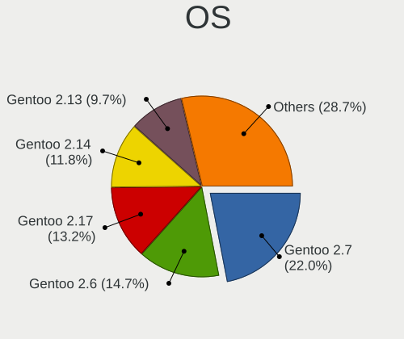

| Name          | Desktops | Percent |
|---------------|----------|---------|
| Gentoo 2.7    | 271      | 21.96%  |
| Gentoo 2.6    | 181      | 14.67%  |
| Gentoo 2.17   | 163      | 13.21%  |
| Gentoo 2.14   | 145      | 11.75%  |
| Gentoo 2.13   | 120      | 9.72%   |
| Gentoo 2.8    | 117      | 9.48%   |
| Gentoo 2.15   | 97       | 7.86%   |
| Gentoo 2.9    | 71       | 5.75%   |
| Gentoo 2.18   | 42       | 3.4%    |
| Gentoo 2.4.1  | 9        | 0.73%   |
| Gentoo 2.3    | 5        | 0.41%   |
| Gentoo        | 4        | 0.32%   |
| Gentoo 2.2    | 3        | 0.24%   |
| Gentoo 22.0.1 | 2        | 0.16%   |
| Gentoo 1      | 2        | 0.16%   |
| Gentoo 2.16   | 1        | 0.08%   |
| Gentoo 13.0   | 1        | 0.08%   |

OS Family
---------

OS without a version

| Name   | Desktops | Percent |
|--------|----------|---------|
| Gentoo | 1025     | 100%    |

Kernel
------

Version of the Linux kernel

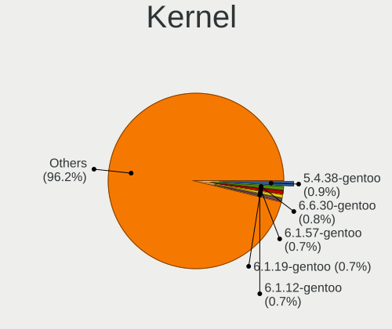

| Version               | Desktops | Percent |
|-----------------------|----------|---------|
| 5.4.38-gentoo         | 14       | 0.93%   |
| 6.6.30-gentoo         | 12       | 0.8%    |
| 6.1.57-gentoo         | 11       | 0.73%   |
| 6.1.19-gentoo         | 10       | 0.67%   |
| 6.1.12-gentoo         | 10       | 0.67%   |
| 5.15.80-gentoo        | 10       | 0.67%   |
| 6.6.13-gentoo         | 9        | 0.6%    |
| 6.1.53-gentoo-r1      | 9        | 0.6%    |
| 5.7.0-gentoo          | 9        | 0.6%    |
| 5.4.97-gentoo         | 9        | 0.6%    |
| 5.4.28-gentoo         | 9        | 0.6%    |
| 6.6.13-gentoo-x86_64  | 8        | 0.53%   |
| 6.12.41-gentoo        | 8        | 0.53%   |
| 6.1.41-gentoo         | 8        | 0.53%   |
| 5.15.32-gentoo-r1     | 8        | 0.53%   |
| 5.10.61-gentoo        | 8        | 0.53%   |
| 5.10.27-gentoo        | 8        | 0.53%   |
| 6.6.47-gentoo         | 7        | 0.47%   |
| 6.6.30-gentoo-x86_64  | 7        | 0.47%   |
| 6.6.21-gentoo         | 7        | 0.47%   |
| 6.1.67-gentoo         | 7        | 0.47%   |
| 6.1.57-gentoo-x86_64  | 7        | 0.47%   |
| 6.1.19-gentoo-x86_64  | 7        | 0.47%   |
| 5.4.38-gentoo-x86_64  | 7        | 0.47%   |
| 5.15.88-gentoo        | 7        | 0.47%   |
| 5.10.27-gentoo-x86_64 | 7        | 0.47%   |
| 6.12.34-gentoo-dist   | 6        | 0.4%    |
| 6.12.31-gentoo        | 6        | 0.4%    |
| 6.1.28-gentoo         | 6        | 0.4%    |
| 6.1.12-gentoo-x86_64  | 6        | 0.4%    |
| 5.4.60-gentoo         | 6        | 0.4%    |
| 5.15.59-gentoo        | 6        | 0.4%    |
| 5.15.23-gentoo        | 6        | 0.4%    |
| 5.10.61-gentoo-x86_64 | 6        | 0.4%    |
| 6.6.67-gentoo-dist    | 5        | 0.33%   |
| 6.6.67-gentoo         | 5        | 0.33%   |
| 6.6.62-gentoo         | 5        | 0.33%   |
| 6.6.52-gentoo         | 5        | 0.33%   |
| 6.6.30-gentoo-dist    | 5        | 0.33%   |
| 6.6.13-gentoo-dist    | 5        | 0.33%   |

Kernel Family
-------------

Linux kernel without a distro release

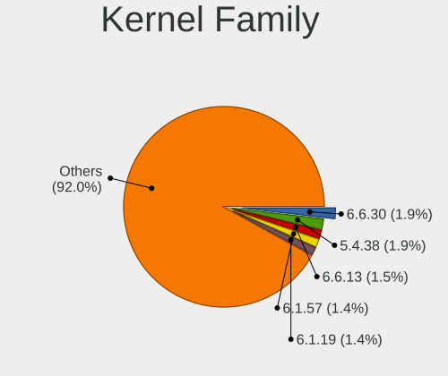

| Version | Desktops | Percent |
|---------|----------|---------|
| 6.6.30  | 28       | 1.87%   |
| 5.4.38  | 28       | 1.87%   |
| 6.6.13  | 22       | 1.47%   |
| 6.1.57  | 21       | 1.4%    |
| 6.1.19  | 21       | 1.4%    |
| 6.1.12  | 19       | 1.27%   |
| 5.15.32 | 19       | 1.27%   |
| 5.10.27 | 19       | 1.27%   |
| 6.6.47  | 16       | 1.07%   |
| 6.6.21  | 16       | 1.07%   |
| 5.10.61 | 16       | 1.07%   |
| 5.15.80 | 15       | 1%      |
| 6.6.67  | 14       | 0.94%   |
| 5.4.97  | 14       | 0.94%   |
| 5.4.28  | 14       | 0.94%   |
| 6.1.67  | 13       | 0.87%   |
| 5.7.0   | 13       | 0.87%   |
| 5.15.75 | 13       | 0.87%   |
| 6.12.31 | 12       | 0.8%    |
| 6.1.53  | 12       | 0.8%    |
| 6.1.41  | 12       | 0.8%    |
| 5.4.48  | 12       | 0.8%    |
| 5.15.52 | 12       | 0.8%    |
| 6.12.41 | 11       | 0.73%   |
| 6.12.16 | 11       | 0.73%   |
| 6.1.31  | 11       | 0.73%   |
| 5.6.15  | 11       | 0.73%   |
| 5.4.66  | 11       | 0.73%   |
| 5.15.41 | 11       | 0.73%   |
| 5.10.52 | 11       | 0.73%   |
| 6.6.58  | 10       | 0.67%   |
| 6.3.1   | 10       | 0.67%   |
| 5.15.59 | 10       | 0.67%   |
| 5.10.76 | 10       | 0.67%   |
| 6.6.62  | 9        | 0.6%    |
| 5.9.11  | 9        | 0.6%    |
| 5.4.80  | 9        | 0.6%    |
| 5.4.60  | 9        | 0.6%    |
| 5.17.1  | 9        | 0.6%    |
| 6.2.11  | 8        | 0.53%   |

Kernel Major Ver.
-----------------

Linux kernel major version

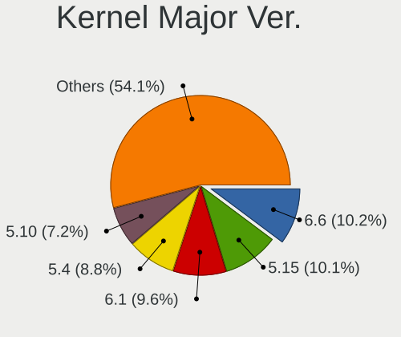

| Version | Desktops | Percent |
|---------|----------|---------|
| 6.6     | 136      | 10.21%  |
| 5.15    | 135      | 10.14%  |
| 6.1     | 128      | 9.61%   |
| 5.4     | 117      | 8.78%   |
| 5.10    | 96       | 7.21%   |
| 6.12    | 77       | 5.78%   |
| 5.6     | 38       | 2.85%   |
| 5.8     | 33       | 2.48%   |
| 5.9     | 29       | 2.18%   |
| 5.7     | 29       | 2.18%   |
| 6.3     | 28       | 2.1%    |
| 6.2     | 26       | 1.95%   |
| 4.19    | 26       | 1.95%   |
| 6.4     | 25       | 1.88%   |
| 5.14    | 24       | 1.8%    |
| 5.17    | 22       | 1.65%   |
| 5.11    | 21       | 1.58%   |
| 6.5     | 20       | 1.5%    |
| 6.17    | 20       | 1.5%    |
| 6.11    | 20       | 1.5%    |
| 6.10    | 20       | 1.5%    |
| 5.19    | 20       | 1.5%    |
| 5.13    | 19       | 1.43%   |
| 6.13    | 18       | 1.35%   |
| 6.15    | 17       | 1.28%   |
| 6.0     | 17       | 1.28%   |
| 6.14    | 16       | 1.2%    |
| 5.18    | 16       | 1.2%    |
| 5.16    | 16       | 1.2%    |
| 6.7     | 13       | 0.98%   |
| 6.16    | 13       | 0.98%   |
| 5.12    | 13       | 0.98%   |
| 6.8     | 12       | 0.9%    |
| 5.5     | 9        | 0.68%   |
| 4.14    | 9        | 0.68%   |
| 6.9     | 8        | 0.6%    |
| 5.2     | 8        | 0.6%    |
| 6.18    | 6        | 0.45%   |
| 5.0     | 6        | 0.45%   |
| 5.1     | 5        | 0.38%   |

Arch
----

OS architecture (x86_64, i586, etc.)

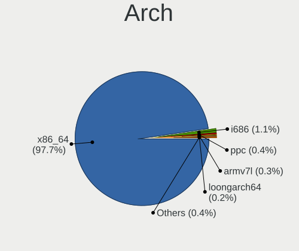

| Name        | Desktops | Percent |
|-------------|----------|---------|
| x86_64      | 1001     | 97.66%  |
| i686        | 11       | 1.07%   |
| ppc         | 4        | 0.39%   |
| armv7l      | 3        | 0.29%   |
| loongarch64 | 2        | 0.2%    |
| armv5tel    | 2        | 0.2%    |
| ppc64le     | 1        | 0.1%    |
| ppc64       | 1        | 0.1%    |

DE
--

Desktop Environment

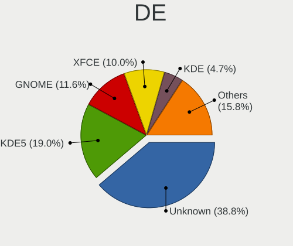

| Name               | Desktops | Percent |
|--------------------|----------|---------|
| Unknown            | 434      | 38.78%  |
| KDE5               | 213      | 19.03%  |
| GNOME              | 130      | 11.62%  |
| XFCE               | 112      | 10.01%  |
| KDE                | 53       | 4.74%   |
| KDE6               | 49       | 4.38%   |
| MATE               | 26       | 2.32%   |
| LXQt               | 15       | 1.34%   |
| Hyprland           | 15       | 1.34%   |
| i3                 | 12       | 1.07%   |
| X-Cinnamon         | 11       | 0.98%   |
| DWM                | 10       | 0.89%   |
| sway               | 8        | 0.71%   |
| Enlightenment      | 6        | 0.54%   |
| LXDE               | 5        | 0.45%   |
| Cinnamon           | 5        | 0.45%   |
| niri               | 3        | 0.27%   |
| awesome            | 2        | 0.18%   |
| XSession           | 1        | 0.09%   |
| wlroots            | 1        | 0.09%   |
| Unity              | 1        | 0.09%   |
| sussy_bspwm        | 1        | 0.09%   |
| openbox            | 1        | 0.09%   |
| LXQt:labwc:wlroots | 1        | 0.09%   |
| labwc:wlroots      | 1        | 0.09%   |
| i3-with-shmlog     | 1        | 0.09%   |
| GNOME Classic      | 1        | 0.09%   |
| e16-session        | 1        | 0.09%   |

Display Server
--------------

X11 or Wayland

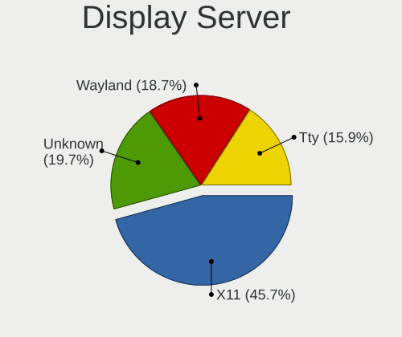

| Name    | Desktops | Percent |
|---------|----------|---------|
| X11     | 511      | 45.71%  |
| Unknown | 220      | 19.68%  |
| Wayland | 209      | 18.69%  |
| Tty     | 178      | 15.92%  |

Display Manager
---------------

SDDM, LightDM, etc.

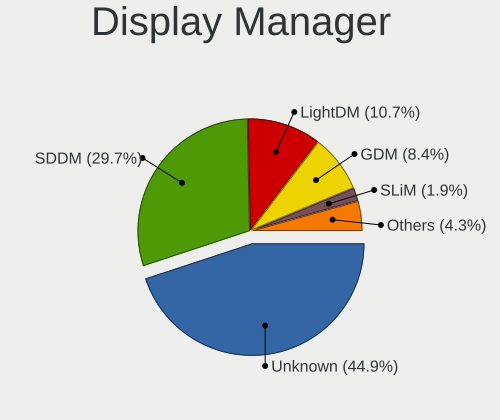

| Name    | Desktops | Percent |
|---------|----------|---------|
| Unknown | 488      | 44.94%  |
| SDDM    | 323      | 29.74%  |
| LightDM | 116      | 10.68%  |
| GDM     | 91       | 8.38%   |
| SLiM    | 21       | 1.93%   |
| XDM     | 18       | 1.66%   |
| LXDM    | 14       | 1.29%   |
| GREETD  | 11       | 1.01%   |
| TDM     | 2        | 0.18%   |
| Ly      | 2        | 0.18%   |

OS Lang
-------

Language

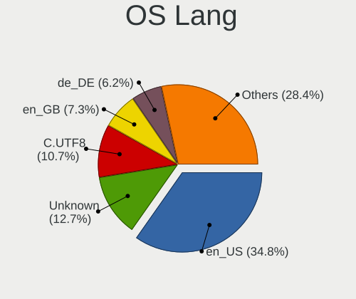

| Lang       | Desktops | Percent |
|------------|----------|---------|
| en_US      | 376      | 34.75%  |
| Unknown    | 137      | 12.66%  |
| C.UTF8     | 116      | 10.72%  |
| en_GB      | 79       | 7.3%    |
| de_DE      | 67       | 6.19%   |
| ru_RU      | 44       | 4.07%   |
| C          | 40       | 3.7%    |
| fr_FR      | 22       | 2.03%   |
| es_ES      | 19       | 1.76%   |
| en_CA      | 17       | 1.57%   |
| it_IT      | 15       | 1.39%   |
| pl_PL      | 14       | 1.29%   |
| cs_CZ      | 14       | 1.29%   |
| pt_BR      | 10       | 0.92%   |
| en_IE      | 9        | 0.83%   |
| sv_SE      | 7        | 0.65%   |
| ru_RU.UTF8 | 7        | 0.65%   |
| en_AU      | 6        | 0.55%   |
| zh_CN      | 5        | 0.46%   |
| fi_FI      | 5        | 0.46%   |
| en_DK      | 5        | 0.46%   |
| nl_NL      | 4        | 0.37%   |
| ja_JP      | 4        | 0.37%   |
| fr_CA      | 4        | 0.37%   |
| zh_TW      | 3        | 0.28%   |
| uk_UA      | 3        | 0.28%   |
| en_US.UTF8 | 3        | 0.28%   |
| ca_ES      | 3        | 0.28%   |
| ro_RO      | 2        | 0.18%   |
| pt_PT      | 2        | 0.18%   |
| nl_BE      | 2        | 0.18%   |
| es_MX      | 2        | 0.18%   |
| es_AR      | 2        | 0.18%   |
| en_ZA      | 2        | 0.18%   |
| de_CH      | 2        | 0.18%   |
| spanish    | 1        | 0.09%   |
| sl_SI      | 1        | 0.09%   |
| ru_UA      | 1        | 0.09%   |
| pt_PT@euro | 1        | 0.09%   |
| pt_BR.UTF8 | 1        | 0.09%   |

Boot Mode
---------

EFI or BIOS

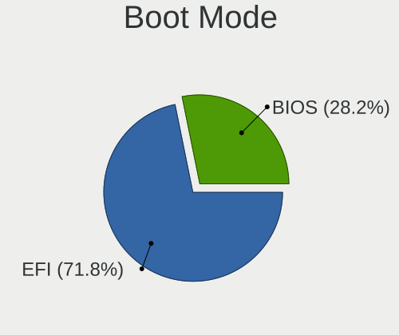

| Mode | Desktops | Percent |
|------|----------|---------|
| EFI  | 754      | 71.81%  |
| BIOS | 296      | 28.19%  |

Filesystem
----------

Type of filesystem

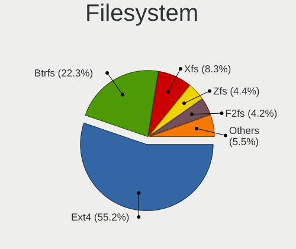

| Type     | Desktops | Percent |
|----------|----------|---------|
| Ext4     | 585      | 55.24%  |
| Btrfs    | 236      | 22.29%  |
| Xfs      | 88       | 8.31%   |
| Zfs      | 47       | 4.44%   |
| F2fs     | 45       | 4.25%   |
| Unknown  | 22       | 2.08%   |
| Reiserfs | 12       | 1.13%   |
| XXXXXXX  | 9        | 0.85%   |
| Overlay  | 4        | 0.38%   |
| Bcachefs | 4        | 0.38%   |
| XXX      | 2        | 0.19%   |
| Ext3     | 2        | 0.19%   |
| XXX4     | 1        | 0.09%   |
| Jfs      | 1        | 0.09%   |
| Ext2     | 1        | 0.09%   |

Part. scheme
------------

Scheme of partitioning

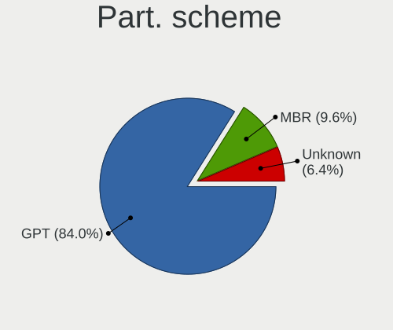

| Type    | Desktops | Percent |
|---------|----------|---------|
| GPT     | 874      | 83.96%  |
| MBR     | 100      | 9.61%   |
| Unknown | 67       | 6.44%   |

Dual Boot with Linux/BSD
------------------------

Hosting more than one Linux/BSD

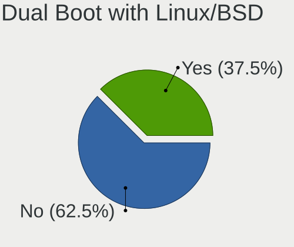

| Dual boot | Desktops | Percent |
|-----------|----------|---------|
| No        | 684      | 62.47%  |
| Yes       | 411      | 37.53%  |

Dual Boot (Win)
---------------

Hosting Linux and Windows

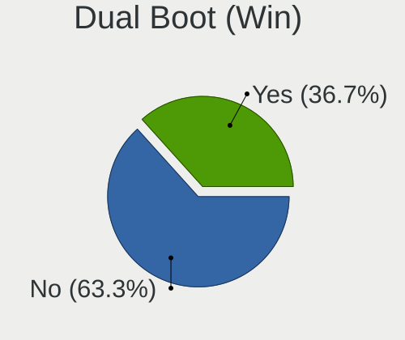

| Dual boot | Desktops | Percent |
|-----------|----------|---------|
| No        | 670      | 63.33%  |
| Yes       | 388      | 36.67%  |

Board
-----

Vendor
------

Motherboard manufacturer

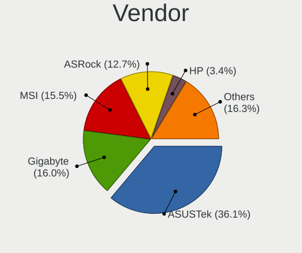

| Name                | Desktops | Percent |
|---------------------|----------|---------|
| ASUSTek Computer    | 370      | 36.1%   |
| Gigabyte Technology | 164      | 16%     |
| MSI                 | 159      | 15.51%  |
| ASRock              | 130      | 12.68%  |
| Hewlett-Packard     | 35       | 3.41%   |
| Unknown             | 30       | 2.93%   |
| Dell                | 26       | 2.54%   |
| Lenovo              | 16       | 1.56%   |
| Intel               | 14       | 1.37%   |
| Fujitsu             | 12       | 1.17%   |
| Acer                | 8        | 0.78%   |
| ASRockRack          | 7        | 0.68%   |
| Supermicro          | 5        | 0.49%   |
| Apple               | 4        | 0.39%   |
| Tekram Technology   | 3        | 0.29%   |
| Pegatron            | 3        | 0.29%   |
| Foxconn             | 3        | 0.29%   |
| Packard Bell        | 2        | 0.2%    |
| NEC Computers       | 2        | 0.2%    |
| Loongson            | 2        | 0.2%    |
| Huanan              | 2        | 0.2%    |
| BESSTAR Tech        | 2        | 0.2%    |
| ZOTAC               | 1        | 0.1%    |
| YANYU               | 1        | 0.1%    |
| UGREEN              | 1        | 0.1%    |
| TYAN Computer       | 1        | 0.1%    |
| transtec            | 1        | 0.1%    |
| Techvision          | 1        | 0.1%    |
| SZMZ                | 1        | 0.1%    |
| Sun Microsystems    | 1        | 0.1%    |
| Shuttle             | 1        | 0.1%    |
| QDI                 | 1        | 0.1%    |
| Phoenix             | 1        | 0.1%    |
| NZXT                | 1        | 0.1%    |
| Medion              | 1        | 0.1%    |
| JINGSHA             | 1        | 0.1%    |
| IP3 Tech            | 1        | 0.1%    |
| HPE                 | 1        | 0.1%    |
| Google              | 1        | 0.1%    |
| Gateway             | 1        | 0.1%    |

Model
-----

Motherboard model

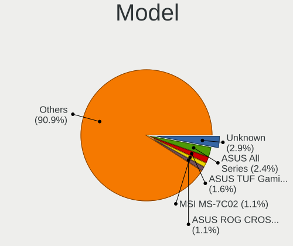

| Name                               | Desktops | Percent |
|------------------------------------|----------|---------|
| Unknown                            | 30       | 2.93%   |
| ASUS All Series                    | 25       | 2.44%   |
| ASUS TUF Gaming X570-PLUS          | 16       | 1.56%   |
| MSI MS-7C02                        | 11       | 1.07%   |
| ASUS ROG CROSSHAIR VIII HERO       | 11       | 1.07%   |
| ASUS ROG STRIX X570-E GAMING       | 9        | 0.88%   |
| ASUS PRIME X570-PRO                | 9        | 0.88%   |
| ASUS TUF Gaming B550-PLUS          | 8        | 0.78%   |
| MSI MS-7B86                        | 7        | 0.68%   |
| ASUS PRIME X570-P                  | 7        | 0.68%   |
| ASUS PRIME X470-PRO                | 7        | 0.68%   |
| ASRock B450 Pro4                   | 7        | 0.68%   |
| MSI MS-7C91                        | 6        | 0.59%   |
| MSI MS-7C37                        | 6        | 0.59%   |
| MSI MS-7A38                        | 6        | 0.59%   |
| ASUS ROG STRIX B450-F GAMING       | 6        | 0.59%   |
| ASUS PRIME X370-PRO                | 6        | 0.59%   |
| ASRock X570 Taichi                 | 6        | 0.59%   |
| ASRock B550M Steel Legend          | 6        | 0.59%   |
| MSI MS-7D25                        | 5        | 0.49%   |
| MSI MS-7C35                        | 5        | 0.49%   |
| MSI MS-7B89                        | 5        | 0.49%   |
| MSI MS-7B79                        | 5        | 0.49%   |
| Gigabyte X570 AORUS ELITE          | 5        | 0.49%   |
| ASUS ROG STRIX B550-F GAMING       | 5        | 0.49%   |
| ASUS ROG CROSSHAIR VIII DARK HERO  | 5        | 0.49%   |
| ASUS PRIME B450M-A                 | 5        | 0.49%   |
| MSI MS-7C84                        | 4        | 0.39%   |
| MSI MS-7C56                        | 4        | 0.39%   |
| MSI MS-7693                        | 4        | 0.39%   |
| HP Z420 Workstation                | 4        | 0.39%   |
| Gigabyte B450M DS3H                | 4        | 0.39%   |
| ASUS Z170 PRO GAMING               | 4        | 0.39%   |
| ASUS ROG STRIX X670E-E GAMING WIFI | 4        | 0.39%   |
| ASUS ROG STRIX X570-I GAMING       | 4        | 0.39%   |
| ASUS ROG STRIX X570-F GAMING       | 4        | 0.39%   |
| ASUS ROG STRIX B650E-F GAMING WIFI | 4        | 0.39%   |
| ASUS ROG CROSSHAIR VII HERO        | 4        | 0.39%   |
| ASUS ProArt X870E-CREATOR WIFI     | 4        | 0.39%   |
| ASUS P6X58D-E                      | 4        | 0.39%   |

Model Family
------------

Motherboard model prefix

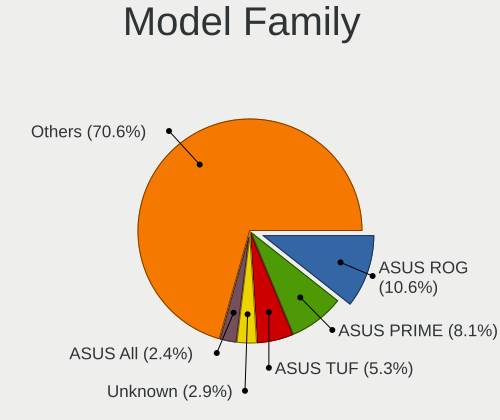

| Name                | Desktops | Percent |
|---------------------|----------|---------|
| ASUS ROG            | 109      | 10.63%  |
| ASUS PRIME          | 83       | 8.1%    |
| ASUS TUF            | 54       | 5.27%   |
| Unknown             | 30       | 2.93%   |
| ASUS All            | 25       | 2.44%   |
| Gigabyte X570       | 17       | 1.66%   |
| ASRock X570         | 17       | 1.66%   |
| Dell OptiPlex       | 12       | 1.17%   |
| MSI MS-7C02         | 11       | 1.07%   |
| ASRock B550M        | 10       | 0.98%   |
| Gigabyte B450M      | 9        | 0.88%   |
| Gigabyte B450       | 9        | 0.88%   |
| Dell Precision      | 9        | 0.88%   |
| ASUS ProArt         | 9        | 0.88%   |
| ASRock X370         | 9        | 0.88%   |
| ASRock B450         | 9        | 0.88%   |
| Lenovo ThinkStation | 8        | 0.78%   |
| Gigabyte B550       | 8        | 0.78%   |
| MSI MS-7B86         | 7        | 0.68%   |
| Gigabyte X870E      | 7        | 0.68%   |
| Acer Aspire         | 7        | 0.68%   |
| MSI MS-7C91         | 6        | 0.59%   |
| MSI MS-7C37         | 6        | 0.59%   |
| MSI MS-7A38         | 6        | 0.59%   |
| HP Compaq           | 6        | 0.59%   |
| Gigabyte B550M      | 6        | 0.59%   |
| Fujitsu ESPRIMO     | 6        | 0.59%   |
| ASRock X670E        | 6        | 0.59%   |
| MSI MS-7D25         | 5        | 0.49%   |
| MSI MS-7C35         | 5        | 0.49%   |
| MSI MS-7B89         | 5        | 0.49%   |
| MSI MS-7B79         | 5        | 0.49%   |
| Lenovo ThinkCentre  | 5        | 0.49%   |
| HP ProLiant         | 5        | 0.49%   |
| Gigabyte Z390       | 5        | 0.49%   |
| Gigabyte X570S      | 5        | 0.49%   |
| ASUS SABERTOOTH     | 5        | 0.49%   |
| ASRock B550         | 5        | 0.49%   |
| MSI MS-7C84         | 4        | 0.39%   |
| MSI MS-7C56         | 4        | 0.39%   |

MFG Year
--------

Motherboard manufacture year

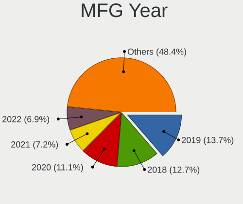

| Year    | Desktops | Percent |
|---------|----------|---------|
| 2019    | 140      | 13.66%  |
| 2018    | 130      | 12.68%  |
| 2020    | 114      | 11.12%  |
| 2021    | 74       | 7.22%   |
| 2022    | 71       | 6.93%   |
| 2017    | 58       | 5.66%   |
| 2015    | 52       | 5.07%   |
| 2013    | 49       | 4.78%   |
| 2012    | 48       | 4.68%   |
| 2024    | 41       | 4%      |
| 2023    | 37       | 3.61%   |
| 2016    | 36       | 3.51%   |
| 2010    | 31       | 3.02%   |
| 2009    | 30       | 2.93%   |
| 2014    | 27       | 2.63%   |
| 2011    | 27       | 2.63%   |
| 2008    | 19       | 1.85%   |
| Unknown | 16       | 1.56%   |
| 2007    | 8        | 0.78%   |
| 2025    | 7        | 0.68%   |
| 2000    | 3        | 0.29%   |
| 2005    | 2        | 0.2%    |
| 2004    | 2        | 0.2%    |
| 2003    | 2        | 0.2%    |
| 2002    | 1        | 0.1%    |

Form Factor
-----------

Physical design of the computer

| Name    | Desktops | Percent |
|---------|----------|---------|
| Desktop | 1025     | 100%    |

Secure Boot
-----------

Enabled or disabled

| State    | Desktops | Percent |
|----------|----------|---------|
| Disabled | 1001     | 96.9%   |
| Enabled  | 32       | 3.1%    |

Coreboot
--------

Have coreboot on board

| Used | Desktops | Percent |
|------|----------|---------|
| No   | 1024     | 99.9%   |
| Yes  | 1        | 0.1%    |

RAM Size
--------

Total RAM memory

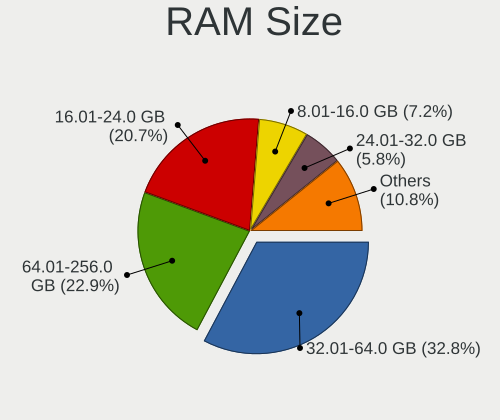

| Size in GB      | Desktops | Percent |
|-----------------|----------|---------|
| 32.01-64.0      | 347      | 32.77%  |
| 64.01-256.0     | 242      | 22.85%  |
| 16.01-24.0      | 219      | 20.68%  |
| 8.01-16.0       | 76       | 7.18%   |
| 24.01-32.0      | 61       | 5.76%   |
| 4.01-8.0        | 45       | 4.25%   |
| 3.01-4.0        | 33       | 3.12%   |
| 1.01-2.0        | 13       | 1.23%   |
| 0.51-1.0        | 9        | 0.85%   |
| 2.01-3.0        | 8        | 0.76%   |
| More than 256.0 | 4        | 0.38%   |
| 0.01-0.5        | 2        | 0.19%   |

RAM Used
--------

Used RAM memory

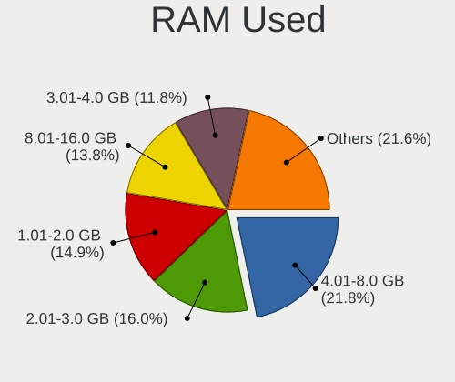

| Used GB     | Desktops | Percent |
|-------------|----------|---------|
| 4.01-8.0    | 278      | 21.8%   |
| 2.01-3.0    | 204      | 16%     |
| 1.01-2.0    | 190      | 14.9%   |
| 8.01-16.0   | 176      | 13.8%   |
| 3.01-4.0    | 151      | 11.84%  |
| 0.51-1.0    | 82       | 6.43%   |
| 0.01-0.5    | 81       | 6.35%   |
| 16.01-24.0  | 64       | 5.02%   |
| 32.01-64.0  | 25       | 1.96%   |
| 24.01-32.0  | 17       | 1.33%   |
| 64.01-256.0 | 5        | 0.39%   |
| 0           | 2        | 0.16%   |

Total Drives
------------

Number of drives on board

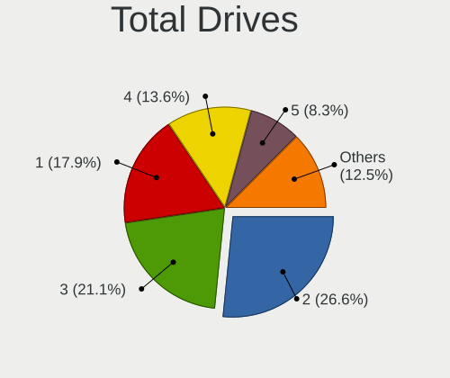

| Drives | Desktops | Percent |
|--------|----------|---------|
| 2      | 295      | 26.58%  |
| 3      | 234      | 21.08%  |
| 1      | 199      | 17.93%  |
| 4      | 151      | 13.6%   |
| 5      | 92       | 8.29%   |
| 6      | 54       | 4.86%   |
| 7      | 36       | 3.24%   |
| 8      | 16       | 1.44%   |
| 9      | 8        | 0.72%   |
| 10     | 7        | 0.63%   |
| 0      | 4        | 0.36%   |
| 13     | 3        | 0.27%   |
| 12     | 3        | 0.27%   |
| 11     | 2        | 0.18%   |
| 31     | 1        | 0.09%   |
| 21     | 1        | 0.09%   |
| 19     | 1        | 0.09%   |
| 18     | 1        | 0.09%   |
| 17     | 1        | 0.09%   |
| 14     | 1        | 0.09%   |

Has CD-ROM
----------

Has CD-ROM on board

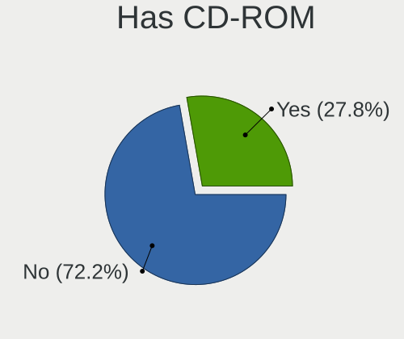

| Presented | Desktops | Percent |
|-----------|----------|---------|
| No        | 765      | 72.24%  |
| Yes       | 294      | 27.76%  |

Has Ethernet
------------

Has Ethernet on board

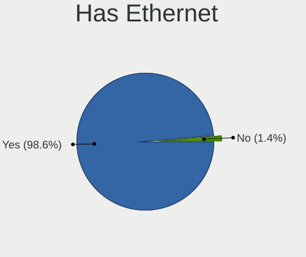

| Presented | Desktops | Percent |
|-----------|----------|---------|
| Yes       | 1012     | 98.64%  |
| No        | 14       | 1.36%   |

Has WiFi
--------

Has WiFi module

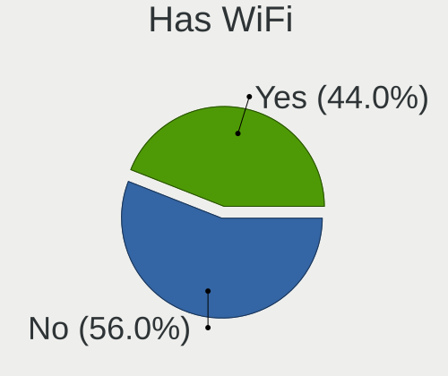

| Presented | Desktops | Percent |
|-----------|----------|---------|
| No        | 581      | 55.97%  |
| Yes       | 457      | 44.03%  |

Has Bluetooth
-------------

Has Bluetooth module

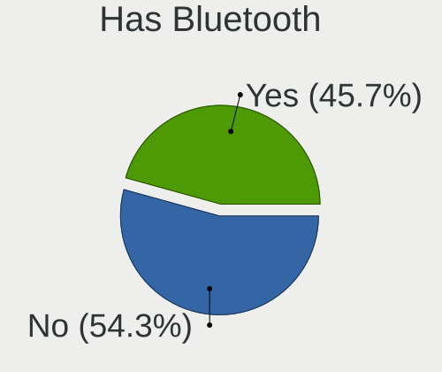

| Presented | Desktops | Percent |
|-----------|----------|---------|
| No        | 570      | 54.29%  |
| Yes       | 480      | 45.71%  |

Location
--------

Country
-------

Geographic location (country)

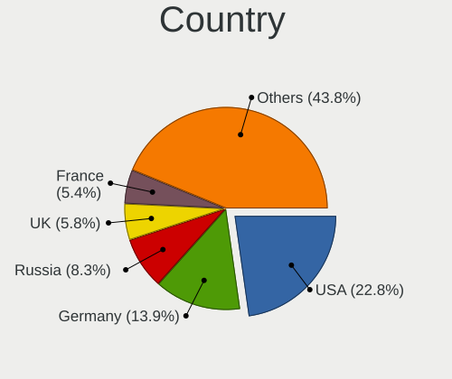

| Country      | Desktops | Percent |
|--------------|----------|---------|
| USA          | 235      | 22.77%  |
| Germany      | 143      | 13.86%  |
| Russia       | 86       | 8.33%   |
| UK           | 60       | 5.81%   |
| France       | 56       | 5.43%   |
| Canada       | 38       | 3.68%   |
| Poland       | 35       | 3.39%   |
| Spain        | 34       | 3.29%   |
| Sweden       | 27       | 2.62%   |
| Finland      | 25       | 2.42%   |
| Czechia      | 25       | 2.42%   |
| Italy        | 24       | 2.33%   |
| Brazil       | 20       | 1.94%   |
| Netherlands  | 16       | 1.55%   |
| China        | 15       | 1.45%   |
| Australia    | 14       | 1.36%   |
| Belgium      | 13       | 1.26%   |
| Ukraine      | 11       | 1.07%   |
| Switzerland  | 11       | 1.07%   |
| Japan        | 9        | 0.87%   |
| Greece       | 9        | 0.87%   |
| Norway       | 7        | 0.68%   |
| Mexico       | 7        | 0.68%   |
| India        | 7        | 0.68%   |
| Hungary      | 7        | 0.68%   |
| Austria      | 7        | 0.68%   |
| Argentina    | 7        | 0.68%   |
| Romania      | 6        | 0.58%   |
| Estonia      | 6        | 0.58%   |
| Denmark      | 6        | 0.58%   |
| Ireland      | 5        | 0.48%   |
| Belarus      | 5        | 0.48%   |
| Slovenia     | 4        | 0.39%   |
| Slovakia     | 4        | 0.39%   |
| Bulgaria     | 4        | 0.39%   |
| Vietnam      | 3        | 0.29%   |
| Taiwan       | 3        | 0.29%   |
| South Africa | 3        | 0.29%   |
| Israel       | 3        | 0.29%   |
| Turkey       | 2        | 0.19%   |

City
----

Geographic location (city)

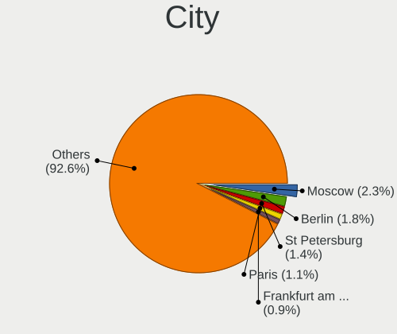

| City                 | Desktops | Percent |
|----------------------|----------|---------|
| Moscow               | 26       | 2.28%   |
| Berlin               | 21       | 1.84%   |
| St Petersburg        | 16       | 1.4%    |
| Paris                | 12       | 1.05%   |
| Frankfurt am Main    | 10       | 0.88%   |
| Warsaw               | 9        | 0.79%   |
| Helsinki             | 9        | 0.79%   |
| Cieszyn              | 9        | 0.79%   |
| Vladivostok          | 8        | 0.7%    |
| Šlapanice           | 8        | 0.7%    |
| Athens               | 8        | 0.7%    |
| Stockholm            | 7        | 0.61%   |
| Seattle              | 7        | 0.61%   |
| Los Angeles          | 7        | 0.61%   |
| Cologne              | 7        | 0.61%   |
| Vancouver            | 6        | 0.53%   |
| Oulu                 | 6        | 0.53%   |
| Ottawa               | 6        | 0.53%   |
| Munich               | 6        | 0.53%   |
| Zurich               | 5        | 0.44%   |
| Wuelfrath            | 5        | 0.44%   |
| Sydney               | 5        | 0.44%   |
| Swansea              | 5        | 0.44%   |
| Sterling             | 5        | 0.44%   |
| San Antonio          | 5        | 0.44%   |
| Portland             | 5        | 0.44%   |
| Milano               | 5        | 0.44%   |
| London               | 5        | 0.44%   |
| Freiburg im Breisgau | 5        | 0.44%   |
| Falkenstein          | 5        | 0.44%   |
| Dublin               | 5        | 0.44%   |
| Combrit              | 5        | 0.44%   |
| Bucharest            | 5        | 0.44%   |
| Wroclaw              | 4        | 0.35%   |
| Vienna               | 4        | 0.35%   |
| Toronto              | 4        | 0.35%   |
| Tallinn              | 4        | 0.35%   |
| Sofia                | 4        | 0.35%   |
| Sao Paulo            | 4        | 0.35%   |
| Ponetovice           | 4        | 0.35%   |

Drives
------

Drive Vendor
------------

Hard drive vendors

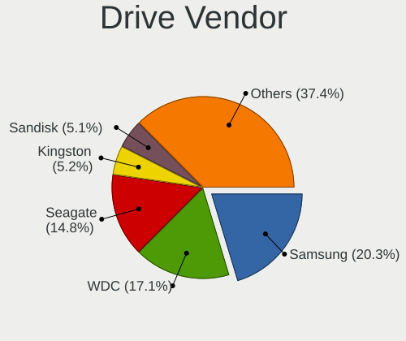

| Vendor                       | Desktops | Drives | Percent |
|------------------------------|----------|--------|---------|
| Samsung Electronics          | 469      | 1145   | 20.35%  |
| WDC                          | 395      | 981    | 17.14%  |
| Seagate                      | 341      | 794    | 14.79%  |
| Kingston                     | 120      | 180    | 5.21%   |
| Sandisk                      | 117      | 201    | 5.08%   |
| Toshiba                      | 100      | 245    | 4.34%   |
| Crucial                      | 88       | 175    | 3.82%   |
| Intel                        | 77       | 117    | 3.34%   |
| Phison Electronics           | 57       | 81     | 2.47%   |
| Hitachi                      | 54       | 236    | 2.34%   |
| A-DATA Technology            | 35       | 44     | 1.52%   |
| Micron/Crucial Technology    | 32       | 60     | 1.39%   |
| HGST                         | 31       | 60     | 1.34%   |
| Kingston Technology Company  | 23       | 25     | 1%      |
| Phison                       | 21       | 34     | 0.91%   |
| Corsair                      | 19       | 37     | 0.82%   |
| ADATA Technology             | 18       | 23     | 0.78%   |
| OCZ                          | 16       | 21     | 0.69%   |
| SK hynix                     | 15       | 25     | 0.65%   |
| Silicon Motion               | 15       | 23     | 0.65%   |
| Unknown                      | 14       | 20     | 0.61%   |
| China                        | 14       | 46     | 0.61%   |
| Realtek Semiconductor        | 13       | 22     | 0.56%   |
| Transcend                    | 12       | 14     | 0.52%   |
| Micron Technology            | 12       | 17     | 0.52%   |
| Patriot                      | 10       | 15     | 0.43%   |
| GOODRAM                      | 10       | 124    | 0.43%   |
| PNY                          | 9        | 18     | 0.39%   |
| SPCC                         | 8        | 10     | 0.35%   |
| Unknown                      | 8        | 8      | 0.35%   |
| Shenzhen Longsys Electronics | 7        | 13     | 0.3%    |
| MAXIO Technology (Hangzhou)  | 6        | 8      | 0.26%   |
| XPG                          | 5        | 11     | 0.22%   |
| Team                         | 5        | 12     | 0.22%   |
| Plextor                      | 5        | 6      | 0.22%   |
| IBM                          | 5        | 6      | 0.22%   |
| Hewlett-Packard              | 5        | 11     | 0.22%   |
| Apacer                       | 5        | 8      | 0.22%   |
| AMD                          | 5        | 7      | 0.22%   |
| Verbatim                     | 4        | 4      | 0.17%   |

Drive Model
-----------

Hard drive models

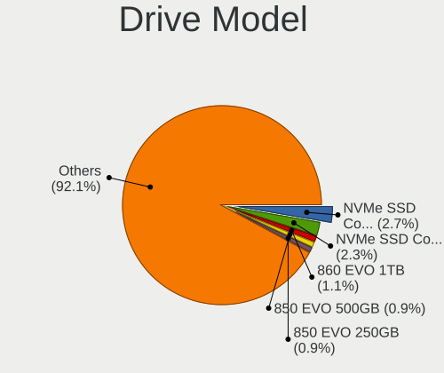

| Model                                                 | Desktops | Percent |
|-------------------------------------------------------|----------|---------|
| Samsung NVMe SSD Controller SM981/PM981/PM983 1TB     | 79       | 2.7%    |
| Samsung NVMe SSD Controller PM9A1/PM9A3/980PRO 1TB    | 67       | 2.29%   |
| Samsung SSD 860 EVO 1TB                               | 31       | 1.06%   |
| Samsung SSD 850 EVO 500GB                             | 27       | 0.92%   |
| Samsung SSD 850 EVO 250GB                             | 26       | 0.89%   |
| Seagate ST2000DM008-2FR102 2TB                        | 25       | 0.85%   |
| WDC WD30EFRX-68EUZN0 3TB                              | 24       | 0.82%   |
| Seagate ST1000DM010-2EP102 1TB                        | 23       | 0.79%   |
| Seagate ST4000DM004-2CV104 4TB                        | 22       | 0.75%   |
| Crucial CT1000MX500SSD1 1TB                           | 22       | 0.75%   |
| Samsung SSD 860 EVO 500GB                             | 21       | 0.72%   |
| Kingston SA400S37240G 240GB SSD                       | 20       | 0.68%   |
| Samsung SSD 980 1TB                                   | 19       | 0.65%   |
| Samsung SSD 860 EVO 250GB                             | 19       | 0.65%   |
| WDC WD10EZEX-08WN4A0 1TB                              | 18       | 0.61%   |
| Seagate ST2000DM001-1ER164 2TB                        | 17       | 0.58%   |
| Phison E12 NVMe Controller 1TB                        | 17       | 0.58%   |
| Micron/Crucial P2 NVMe PCIe SSD 2TB                   | 16       | 0.55%   |
| Kingston SA400S37480G 480GB SSD                       | 15       | 0.51%   |
| WDC WDS500G2B0A-00SM50 500GB                          | 14       | 0.48%   |
| Seagate ST500DM002-1BD142 500GB                       | 14       | 0.48%   |
| Seagate ST2000DM006-2DM164 2TB                        | 14       | 0.48%   |
| Samsung SSD 840 EVO 120GB                             | 14       | 0.48%   |
| Samsung NVMe SSD Controller SM961/PM961/SM963 1024GB  | 14       | 0.48%   |
| Samsung SSD 970 EVO Plus 500GB                        | 13       | 0.44%   |
| Samsung SSD 970 EVO 500GB                             | 13       | 0.44%   |
| Samsung SSD 870 EVO 1TB                               | 13       | 0.44%   |
| Phison E16 PCIe4 NVMe Controller 1TB                  | 13       | 0.44%   |
| Crucial CT500MX500SSD1 500GB                          | 13       | 0.44%   |
| WDC WD40EZRZ-00GXCB0 4TB                              | 12       | 0.41%   |
| WDC WD40EFRX-68N32N0 4TB                              | 12       | 0.41%   |
| Seagate ST3500418AS 500GB                             | 12       | 0.41%   |
| WDC WD40EFRX-68WT0N0 4TB                              | 11       | 0.38%   |
| WDC WD20EFRX-68EUZN0 2TB                              | 11       | 0.38%   |
| Toshiba DT01ACA100 1TB                                | 11       | 0.38%   |
| Sandisk WD_BLACK SN770 1TB                            | 11       | 0.38%   |
| Samsung SSD 980 PRO 1TB                               | 11       | 0.38%   |
| Samsung SSD 970 EVO Plus 1TB                          | 11       | 0.38%   |
| WDC WD20EARX-00PASB0 2TB                              | 10       | 0.34%   |
| Silicon Motion SM2263EN/SM2263XT SSD Controller 512GB | 10       | 0.34%   |

HDD Vendor
----------

Hard disk drive vendors

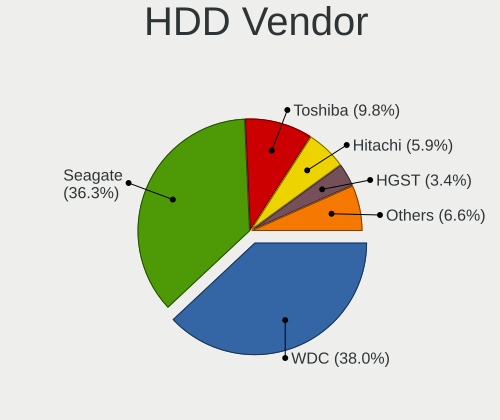

| Vendor              | Desktops | Drives | Percent |
|---------------------|----------|--------|---------|
| WDC                 | 349      | 882    | 38.02%  |
| Seagate             | 333      | 778    | 36.27%  |
| Toshiba             | 90       | 231    | 9.8%    |
| Hitachi             | 54       | 236    | 5.88%   |
| HGST                | 31       | 60     | 3.38%   |
| Samsung Electronics | 28       | 42     | 3.05%   |
| Unknown             | 6        | 7      | 0.65%   |
| IBM                 | 5        | 6      | 0.54%   |
| Maxtor              | 3        | 5      | 0.33%   |
| TO Exter            | 2        | 2      | 0.22%   |
| MDT                 | 2        | 2      | 0.22%   |
| LaCie               | 2        | 12     | 0.22%   |
| Hewlett-Packard     | 2        | 4      | 0.22%   |
| Fujitsu             | 2        | 3      | 0.22%   |
| Unknown             | 2        | 2      | 0.22%   |
| SSK                 | 1        | 1      | 0.11%   |
| NETAPP              | 1        | 3      | 0.11%   |
| FNK TECH            | 1        | 1      | 0.11%   |
| FC-1307             | 1        | 1      | 0.11%   |
| Dyconn H            | 1        | 1      | 0.11%   |
| ASMedia             | 1        | 1      | 0.11%   |
| AFAYA               | 1        | 1      | 0.11%   |

SSD Vendor
----------

Solid state drive vendors

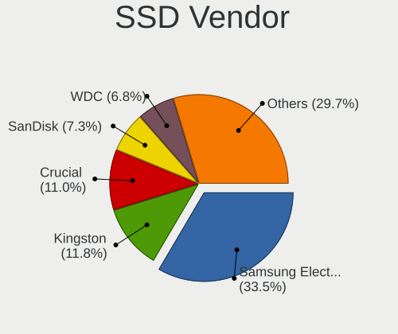

| Vendor              | Desktops | Drives | Percent |
|---------------------|----------|--------|---------|
| Samsung Electronics | 256      | 498    | 33.46%  |
| Kingston            | 90       | 124    | 11.76%  |
| Crucial             | 84       | 164    | 10.98%  |
| SanDisk             | 56       | 97     | 7.32%   |
| WDC                 | 52       | 63     | 6.8%    |
| Intel               | 28       | 45     | 3.66%   |
| A-DATA Technology   | 21       | 24     | 2.75%   |
| OCZ                 | 15       | 20     | 1.96%   |
| China               | 14       | 46     | 1.83%   |
| Corsair             | 13       | 23     | 1.7%    |
| Transcend           | 11       | 13     | 1.44%   |
| GOODRAM             | 10       | 124    | 1.31%   |
| PNY                 | 8        | 17     | 1.05%   |
| Patriot             | 8        | 13     | 1.05%   |
| Toshiba             | 7        | 9      | 0.92%   |
| SPCC                | 7        | 9      | 0.92%   |
| Unknown             | 5        | 5      | 0.65%   |
| Verbatim            | 4        | 4      | 0.52%   |
| T-FORCE             | 4        | 9      | 0.52%   |
| SABRENT             | 4        | 4      | 0.52%   |
| Plextor             | 4        | 4      | 0.52%   |
| Micron Technology   | 4        | 7      | 0.52%   |
| LITEONIT            | 4        | 5      | 0.52%   |
| Apacer              | 4        | 7      | 0.52%   |
| Team                | 3        | 4      | 0.39%   |
| Mushkin             | 3        | 3      | 0.39%   |
| KingSpec            | 3        | 6      | 0.39%   |
| Kingchuxing         | 3        | 13     | 0.39%   |
| Intenso             | 3        | 4      | 0.39%   |
| Netac               | 2        | 2      | 0.26%   |
| LITEON              | 2        | 2      | 0.26%   |
| Hewlett-Packard     | 2        | 2      | 0.26%   |
| Emtec               | 2        | 4      | 0.26%   |
| ASMT                | 2        | 2      | 0.26%   |
| AMD                 | 2        | 2      | 0.26%   |
| ADROITLARK          | 2        | 3      | 0.26%   |
| ZHITAI              | 1        | 3      | 0.13%   |
| V-GeN               | 1        | 2      | 0.13%   |
| Unknown             | 1        | 1      | 0.13%   |
| SSK SSD             | 1        | 1      | 0.13%   |

Drive Kind
----------

HDD or SSD

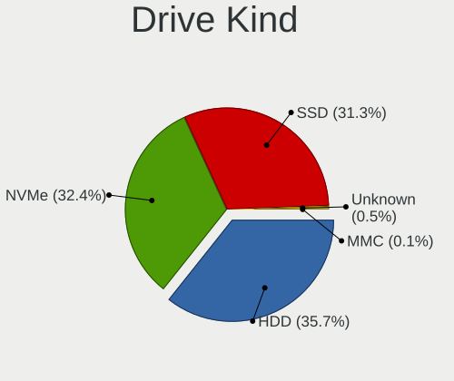

| Kind    | Desktops | Drives | Percent |
|---------|----------|--------|---------|
| HDD     | 670      | 2281   | 35.7%   |
| NVMe    | 609      | 1336   | 32.45%  |
| SSD     | 587      | 1433   | 31.27%  |
| Unknown | 10       | 16     | 0.53%   |
| MMC     | 1        | 2      | 0.05%   |

Drive Connector
---------------

SATA, SAS, NVMe, etc.

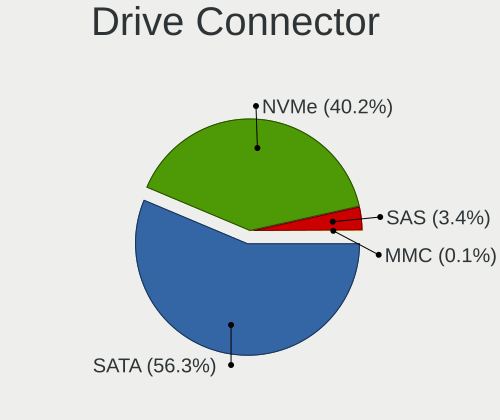

| Type | Desktops | Drives | Percent |
|------|----------|--------|---------|
| SATA | 854      | 3646   | 56.33%  |
| NVMe | 609      | 1332   | 40.17%  |
| SAS  | 52       | 88     | 3.43%   |
| MMC  | 1        | 2      | 0.07%   |

Drive Size
----------

Size of hard drive

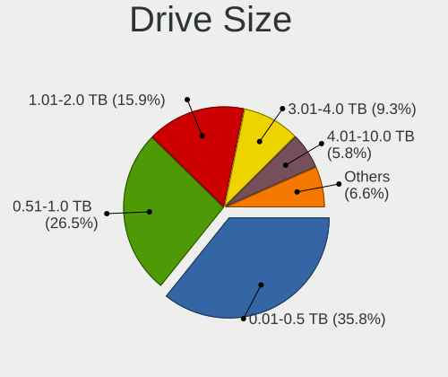

| Size in TB | Desktops | Drives | Percent |
|------------|----------|--------|---------|
| 0.01-0.5   | 541      | 1206   | 35.78%  |
| 0.51-1.0   | 401      | 852    | 26.52%  |
| 1.01-2.0   | 241      | 515    | 15.94%  |
| 3.01-4.0   | 141      | 359    | 9.33%   |
| 4.01-10.0  | 88       | 345    | 5.82%   |
| 2.01-3.0   | 70       | 300    | 4.63%   |
| 10.01-20.0 | 29       | 136    | 1.92%   |
| 20.01-50.0 | 1        | 1      | 0.07%   |

Space Total
-----------

Amount of disk space available on the file system

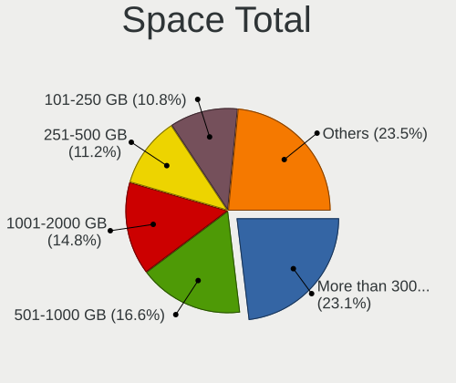

| Size in GB     | Desktops | Percent |
|----------------|----------|---------|
| More than 3000 | 260      | 23.11%  |
| 501-1000       | 187      | 16.62%  |
| 1001-2000      | 166      | 14.76%  |
| 251-500        | 126      | 11.2%   |
| 101-250        | 122      | 10.84%  |
| 2001-3000      | 97       | 8.62%   |
| 1-20           | 60       | 5.33%   |
| Unknown        | 53       | 4.71%   |
| 51-100         | 38       | 3.38%   |
| 21-50          | 16       | 1.42%   |

Space Used
----------

Amount of used disk space

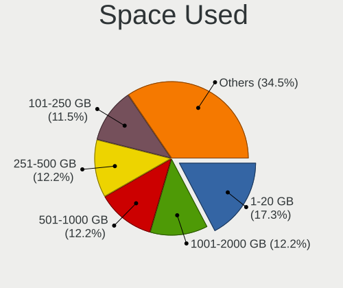

| Used GB        | Desktops | Percent |
|----------------|----------|---------|
| 1-20           | 204      | 17.3%   |
| 251-500        | 144      | 12.21%  |
| 1001-2000      | 144      | 12.21%  |
| 501-1000       | 144      | 12.21%  |
| 101-250        | 136      | 11.54%  |
| More than 3000 | 126      | 10.69%  |
| 21-50          | 96       | 8.14%   |
| 51-100         | 81       | 6.87%   |
| Unknown        | 53       | 4.5%    |
| 2001-3000      | 51       | 4.33%   |

Malfunc. Drives
---------------

Drive models with a malfunction

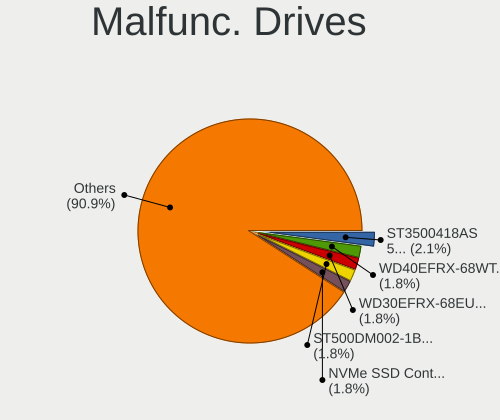

| Model                                                          | Desktops | Drives | Percent |
|----------------------------------------------------------------|----------|--------|---------|
| Seagate ST3500418AS 500GB                                      | 6        | 7      | 2.11%   |
| WDC WD40EFRX-68WT0N0 4TB                                       | 5        | 15     | 1.75%   |
| WDC WD30EFRX-68EUZN0 3TB                                       | 5        | 10     | 1.75%   |
| Seagate ST500DM002-1BC142 500GB                                | 5        | 5      | 1.75%   |
| Samsung Electronics NVMe SSD Controller PM9A1/PM9A3/980PRO 1TB | 5        | 6      | 1.75%   |
| Seagate ST8000AS0002-1NA17Z 8TB                                | 4        | 16     | 1.4%    |
| Seagate ST500DM002-1BD142 500GB                                | 4        | 6      | 1.4%    |
| Samsung Electronics SSD 980 1TB                                | 4        | 4      | 1.4%    |
| Hitachi HDS722020ALA330 2TB                                    | 4        | 21     | 1.4%    |
| WDC WD40EFRX-68N32N0 4TB                                       | 3        | 3      | 1.05%   |
| WDC WD30EFRX-68AX9N0 3TB                                       | 3        | 7      | 1.05%   |
| WDC WD20EZRZ-00Z5HB0 2TB                                       | 3        | 3      | 1.05%   |
| WDC WD20EFRX-68EUZN0 2TB                                       | 3        | 4      | 1.05%   |
| WDC WD20EFRX-68AX9N0 2TB                                       | 3        | 4      | 1.05%   |
| Seagate ST4000DM000-1F2168 4TB                                 | 3        | 3      | 1.05%   |
| Samsung Electronics HD103UJ 1TB                                | 3        | 4      | 1.05%   |
| IBM DJSA-220 12GB                                              | 3        | 3      | 1.05%   |
| WDC WD60EFRX-68MYMN1 6TB                                       | 2        | 5      | 0.7%    |
| WDC WD20EZRX-00D8PB0 2TB                                       | 2        | 3      | 0.7%    |
| WDC WD20EARS-00MVWB0 2TB                                       | 2        | 2      | 0.7%    |
| WDC WD2002FAEX-007BA0 2TB                                      | 2        | 2      | 0.7%    |
| WDC WD1600AAJS-75B4A0 160GB                                    | 2        | 2      | 0.7%    |
| WDC WD15EARS-00Z5B1 1TB                                        | 2        | 2      | 0.7%    |
| WDC WD Green 2.5 1000GB                                        | 2        | 2      | 0.7%    |
| Toshiba DT01ACA200 2TB                                         | 2        | 3      | 0.7%    |
| Seagate ST31000340NS 1TB                                       | 2        | 3      | 0.7%    |
| Seagate ST3000DM001-9YN166 3TB                                 | 2        | 3      | 0.7%    |
| Seagate ST2000DX002-2DV164 2TB                                 | 2        | 2      | 0.7%    |
| Seagate ST2000DL003-9VT166 2TB                                 | 2        | 3      | 0.7%    |
| Seagate ST1000NM0011 1TB                                       | 2        | 6      | 0.7%    |
| Seagate ST1000DM010-2EP102 1TB                                 | 2        | 4      | 0.7%    |
| SanDisk SSD PLUS 1000GB                                        | 2        | 2      | 0.7%    |
| Samsung Electronics SSD 870 EVO 500GB                          | 2        | 3      | 0.7%    |
| Samsung Electronics SSD 870 EVO 1TB                            | 2        | 9      | 0.7%    |
| Samsung Electronics SSD 840 PRO Series 512GB                   | 2        | 4      | 0.7%    |
| Samsung Electronics SP2504C 250GB                              | 2        | 2      | 0.7%    |
| MDT MD2000KS-00MJB0 200GB                                      | 2        | 2      | 0.7%    |
| Kingston Technology Company KC2000 NVMe SSD 250GB              | 2        | 2      | 0.7%    |
| Kingston SV100S2128G 128GB SSD                                 | 2        | 2      | 0.7%    |
| HGST HTS721010A9E630 1TB                                       | 2        | 2      | 0.7%    |

Malfunc. Drive Vendor
---------------------

Vendors of faulty drives

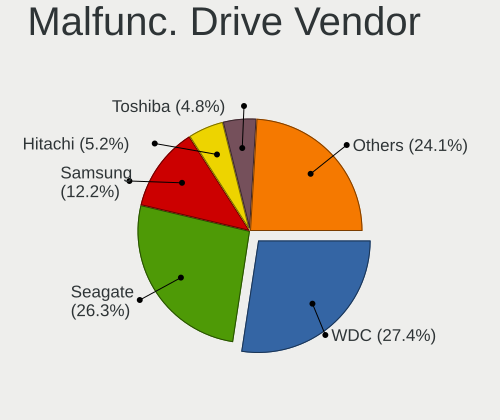

| Vendor                      | Desktops | Drives | Percent |
|-----------------------------|----------|--------|---------|
| WDC                         | 74       | 138    | 27.41%  |
| Seagate                     | 71       | 110    | 26.3%   |
| Samsung Electronics         | 33       | 54     | 12.22%  |
| Hitachi                     | 14       | 32     | 5.19%   |
| Toshiba                     | 13       | 19     | 4.81%   |
| SanDisk                     | 7        | 8      | 2.59%   |
| Kingston                    | 7        | 7      | 2.59%   |
| Crucial                     | 6        | 7      | 2.22%   |
| Intel                       | 5        | 7      | 1.85%   |
| HGST                        | 5        | 7      | 1.85%   |
| IBM                         | 4        | 4      | 1.48%   |
| OCZ                         | 3        | 3      | 1.11%   |
| China                       | 3        | 8      | 1.11%   |
| Realtek Semiconductor       | 2        | 7      | 0.74%   |
| PNY                         | 2        | 4      | 0.74%   |
| Plextor                     | 2        | 2      | 0.74%   |
| MDT                         | 2        | 2      | 0.74%   |
| Kingston Technology Company | 2        | 2      | 0.74%   |
| Emtec                       | 2        | 3      | 0.74%   |
| Corsair                     | 2        | 5      | 0.74%   |
| ADATA Technology            | 2        | 2      | 0.74%   |
| A-DATA Technology           | 2        | 2      | 0.74%   |
| Transcend                   | 1        | 1      | 0.37%   |
| SPCC                        | 1        | 1      | 0.37%   |
| Phison Electronics          | 1        | 1      | 0.37%   |
| Patriot                     | 1        | 1      | 0.37%   |
| Mushkin                     | 1        | 1      | 0.37%   |
| Maxtor                      | 1        | 3      | 0.37%   |
| Unknown                     | 1        | 1      | 0.37%   |

Malfunc. HDD Vendor
-------------------

Vendors of faulty HDD drives

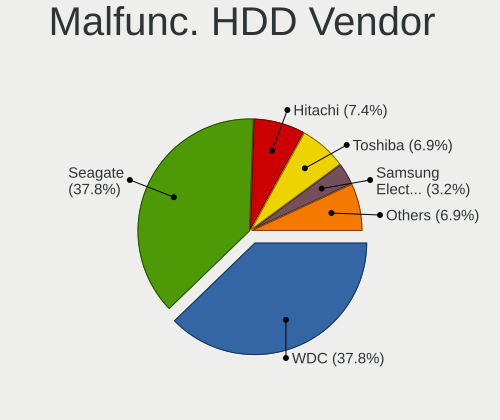

| Vendor              | Desktops | Drives | Percent |
|---------------------|----------|--------|---------|
| WDC                 | 71       | 135    | 37.77%  |
| Seagate             | 71       | 110    | 37.77%  |
| Hitachi             | 14       | 32     | 7.45%   |
| Toshiba             | 13       | 19     | 6.91%   |
| Samsung Electronics | 6        | 8      | 3.19%   |
| HGST                | 5        | 7      | 2.66%   |
| IBM                 | 4        | 4      | 2.13%   |
| MDT                 | 2        | 2      | 1.06%   |
| Maxtor              | 1        | 3      | 0.53%   |
| Unknown             | 1        | 1      | 0.53%   |

Malfunc. Drive Kind
-------------------

Kinds of faulty drives

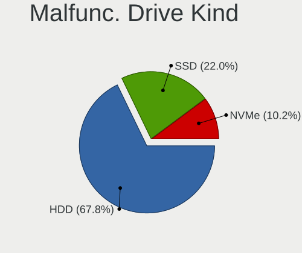

| Kind | Desktops | Drives | Percent |
|------|----------|--------|---------|
| HDD  | 173      | 321    | 67.84%  |
| SSD  | 56       | 85     | 21.96%  |
| NVMe | 26       | 36     | 10.2%   |

Failed Drives
-------------

Failed drive models

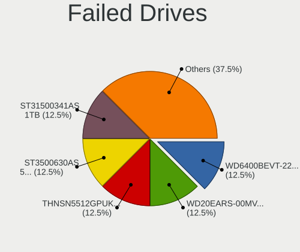

| Model                                                         | Desktops | Drives | Percent |
|---------------------------------------------------------------|----------|--------|---------|
| WDC WD6400BEVT-22A0RT0 640GB                                  | 1        | 1      | 12.5%   |
| WDC WD20EARS-00MVWB0 2TB                                      | 1        | 2      | 12.5%   |
| Toshiba THNSN5512GPUK NVMe 512GB                              | 1        | 1      | 12.5%   |
| Seagate ST3500630AS 500GB                                     | 1        | 2      | 12.5%   |
| Seagate ST31500341AS 1TB                                      | 1        | 1      | 12.5%   |
| Samsung Electronics NVMe SSD Controller SM981/PM981/PM983 1TB | 1        | 1      | 12.5%   |
| Samsung Electronics MZ7LN256HCHP-00000 256GB SSD              | 1        | 2      | 12.5%   |
| Hitachi HTS723232L9A360 320GB                                 | 1        | 1      | 12.5%   |

Failed Drive Vendor
-------------------

Failed drive vendors

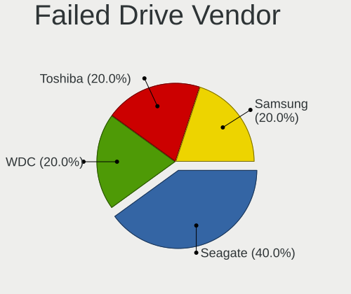

| Vendor              | Desktops | Drives | Percent |
|---------------------|----------|--------|---------|
| WDC                 | 2        | 3      | 25%     |
| Seagate             | 2        | 3      | 25%     |
| Samsung Electronics | 2        | 3      | 25%     |
| Toshiba             | 1        | 1      | 12.5%   |
| Hitachi             | 1        | 1      | 12.5%   |

Drive Status
------------

Number of failed and malfunc. drives

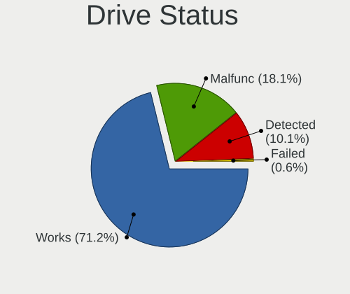

| Status   | Desktops | Drives | Percent |
|----------|----------|--------|---------|
| Works    | 936      | 4247   | 71.18%  |
| Malfunc  | 238      | 442    | 18.1%   |
| Detected | 133      | 368    | 10.11%  |
| Failed   | 8        | 11     | 0.61%   |

Storage controller
------------------

Storage Vendor
--------------

Storage controller vendors

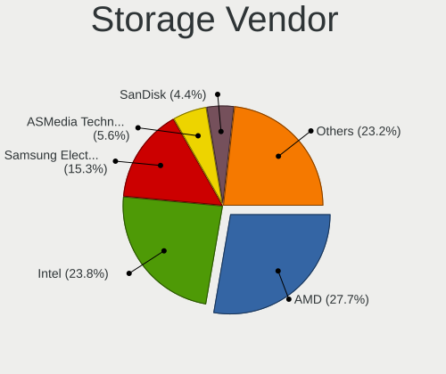

| Vendor                           | Desktops | Percent |
|----------------------------------|----------|---------|
| AMD                              | 536      | 27.7%   |
| Intel                            | 460      | 23.77%  |
| Samsung Electronics              | 296      | 15.3%   |
| ASMedia Technology               | 108      | 5.58%   |
| SanDisk                          | 86       | 4.44%   |
| Phison Electronics               | 86       | 4.44%   |
| Kingston Technology Company      | 52       | 2.69%   |
| Marvell Technology Group         | 41       | 2.12%   |
| Micron/Crucial Technology        | 37       | 1.91%   |
| ADATA Technology                 | 34       | 1.76%   |
| JMicron Technology               | 22       | 1.14%   |
| Nvidia                           | 21       | 1.09%   |
| Silicon Motion                   | 18       | 0.93%   |
| Realtek Semiconductor            | 16       | 0.83%   |
| SK hynix                         | 14       | 0.72%   |
| LSI Logic / Symbios Logic        | 12       | 0.62%   |
| Seagate Technology               | 11       | 0.57%   |
| Broadcom / LSI                   | 10       | 0.52%   |
| Micron Technology                | 8        | 0.41%   |
| Shenzhen Longsys Electronics     | 7        | 0.36%   |
| Toshiba America Info Systems     | 6        | 0.31%   |
| MAXIO Technology (Hangzhou)      | 6        | 0.31%   |
| INNOGRIT                         | 6        | 0.31%   |
| Adaptec                          | 6        | 0.31%   |
| Silicon Image                    | 5        | 0.26%   |
| VIA Technologies                 | 4        | 0.21%   |
| KIOXIA                           | 4        | 0.21%   |
| Yangtze Memory Technologies      | 3        | 0.16%   |
| Western Digital                  | 2        | 0.1%    |
| Solidigm                         | 2        | 0.1%    |
| Silicon Integrated Systems [SiS] | 2        | 0.1%    |
| Loongson Technology              | 2        | 0.1%    |
| Integrated Technology Express    | 2        | 0.1%    |
| 3ware                            | 2        | 0.1%    |
| TenaFe                           | 1        | 0.05%   |
| Solid State Storage Technology   | 1        | 0.05%   |
| Shenzhen Shichuangyi Electronics | 1        | 0.05%   |
| OCZ Technology Group             | 1        | 0.05%   |
| Lite-On Technology               | 1        | 0.05%   |
| Lite-On IT Corp. / Plextor       | 1        | 0.05%   |

Storage Model
-------------

Storage controller models

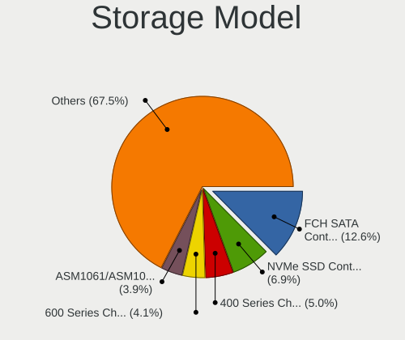

| Model                                                                          | Desktops | Percent |
|--------------------------------------------------------------------------------|----------|---------|
| AMD FCH SATA Controller [AHCI mode]                                            | 288      | 12.55%  |
| Samsung NVMe SSD Controller SM981/PM981/PM983                                  | 159      | 6.93%   |
| AMD 400 Series Chipset SATA Controller                                         | 115      | 5.01%   |
| AMD 600 Series Chipset SATA Controller                                         | 94       | 4.1%    |
| ASMedia ASM1061/ASM1062 Serial ATA Controller                                  | 89       | 3.88%   |
| Samsung NVMe SSD Controller PM9A1/PM9A3/980PRO                                 | 82       | 3.57%   |
| AMD 500 Series Chipset SATA Controller                                         | 81       | 3.53%   |
| Intel Q170/Q150/B150/H170/H110/Z170/CM236 Chipset SATA Controller [AHCI Mode]  | 51       | 2.22%   |
| AMD SB7x0/SB8x0/SB9x0 SATA Controller [AHCI mode]                              | 43       | 1.87%   |
| Intel Cannon Lake PCH SATA AHCI Controller                                     | 38       | 1.66%   |
| Samsung NVMe SSD Controller SM961/PM961/SM963                                  | 32       | 1.39%   |
| Intel 8 Series/C220 Series Chipset Family 6-port SATA Controller 1 [AHCI mode] | 31       | 1.35%   |
| Intel 200 Series PCH SATA controller [AHCI mode]                               | 31       | 1.35%   |
| Samsung NVMe SSD Controller 980 (DRAM-less)                                    | 30       | 1.31%   |
| Phison E12 NVMe Controller                                                     | 28       | 1.22%   |
| Intel Alder Lake-S PCH SATA Controller [AHCI Mode]                             | 27       | 1.18%   |
| Intel 7 Series/C210 Series Chipset Family 6-port SATA Controller [AHCI mode]   | 27       | 1.18%   |
| Intel 6 Series/C200 Series Chipset Family 6 port Desktop SATA AHCI Controller  | 26       | 1.13%   |
| ADATA XPG SX8200 Pro PCIe Gen3x4 M.2 2280 Solid State Drive                    | 26       | 1.13%   |
| Phison E16 PCIe4 NVMe Controller                                               | 23       | 1%      |
| Intel 500 Series Chipset Family SATA AHCI Controller                           | 23       | 1%      |
| AMD X370 Series Chipset SATA Controller                                        | 22       | 0.96%   |
| Samsung NVMe SSD Controller S4LV008[Pascal]                                    | 21       | 0.92%   |
| Intel SATA Controller [RAID mode]                                              | 21       | 0.92%   |
| Intel 82801JI (ICH10 Family) SATA AHCI Controller                              | 19       | 0.83%   |
| AMD SB7x0/SB8x0/SB9x0 IDE Controller                                           | 19       | 0.83%   |
| Micron/Crucial P2 [Nick P2] / P3 / P3 Plus NVMe PCIe SSD (DRAM-less)           | 18       | 0.78%   |
| Intel SSD 660P Series                                                          | 17       | 0.74%   |
| SanDisk WD SN560/SN740/SN770/SN5000 NVMe SSD                                   | 16       | 0.7%    |
| Kingston Company A2000 NVMe SSD [SM2263EN]                                     | 16       | 0.7%    |
| Intel C610/X99 series chipset 6-Port SATA Controller [AHCI mode]               | 15       | 0.65%   |
| SanDisk Extreme Pro / WD Black SN750 / PC SN730 / Red SN700 NVMe SSD           | 14       | 0.61%   |
| Intel Raptor Lake SATA AHCI Controller                                         | 14       | 0.61%   |
| Intel Comet Lake SATA AHCI Controller                                          | 14       | 0.61%   |
| Intel C610/X99 series chipset sSATA Controller [AHCI mode]                     | 14       | 0.61%   |
| Intel C600/X79 series chipset 6-Port SATA AHCI Controller                      | 14       | 0.61%   |
| Intel 9 Series Chipset Family SATA Controller [AHCI Mode]                      | 14       | 0.61%   |
| AMD 300 Series Chipset SATA Controller                                         | 14       | 0.61%   |
| Phison E18 PCIe4 NVMe Controller                                               | 13       | 0.57%   |
| Silicon Motion SM2263EN/SM2263XT (DRAM-less) NVMe SSD Controllers              | 12       | 0.52%   |

Storage Kind
------------

Kind of storage controller (IDE, SATA, NVMe, SAS, ...)

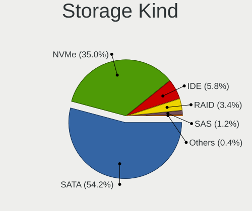

| Kind | Desktops | Percent |
|------|----------|---------|
| SATA | 944      | 54.16%  |
| NVMe | 610      | 35%     |
| IDE  | 101      | 5.79%   |
| RAID | 60       | 3.44%   |
| SAS  | 21       | 1.2%    |
| SCSI | 7        | 0.4%    |

Processor
---------

CPU Vendor
----------

Processor vendors

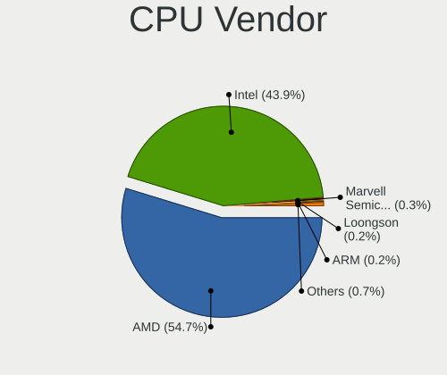

| Vendor                   | Desktops | Percent |
|--------------------------|----------|---------|
| AMD                      | 561      | 54.73%  |
| Intel                    | 450      | 43.9%   |
| Marvell Semiconductor    | 3        | 0.29%   |
| Loongson                 | 2        | 0.2%    |
| ARM                      | 2        | 0.2%    |
| PowerNV C1P9S01 REV 1.01 | 1        | 0.1%    |
| PowerMac8,1              | 1        | 0.1%    |
| PowerMac3,6              | 1        | 0.1%    |
| PowerMac10,2             | 1        | 0.1%    |
| PowerBook6,7             | 1        | 0.1%    |
| PowerBook5,5             | 1        | 0.1%    |
| CyrixInstead             | 1        | 0.1%    |

CPU Model
---------

Processor models

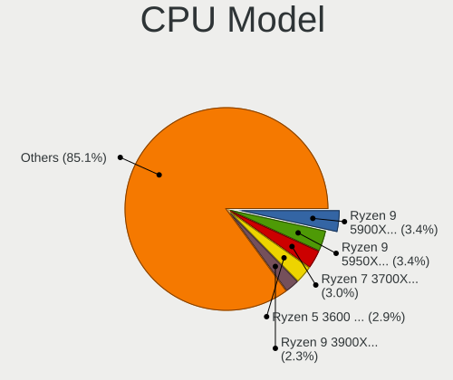

| Model                                  | Desktops | Percent |
|----------------------------------------|----------|---------|
| AMD Ryzen 9 5900X 12-Core Processor    | 36       | 3.45%   |
| AMD Ryzen 9 5950X 16-Core Processor    | 35       | 3.35%   |
| AMD Ryzen 7 3700X 8-Core Processor     | 31       | 2.97%   |
| AMD Ryzen 5 3600 6-Core Processor      | 30       | 2.87%   |
| AMD Ryzen 9 3900X 12-Core Processor    | 24       | 2.3%    |
| AMD Ryzen 5 5600X 6-Core Processor     | 22       | 2.11%   |
| AMD Ryzen 9 7950X 16-Core Processor    | 21       | 2.01%   |
| AMD Ryzen 7 2700X Eight-Core Processor | 20       | 1.92%   |
| AMD Ryzen 9 3950X 16-Core Processor    | 19       | 1.82%   |
| AMD Ryzen 5 2600 Six-Core Processor    | 16       | 1.53%   |
| AMD Ryzen 7 5800X 8-Core Processor     | 15       | 1.44%   |
| AMD Ryzen 7 3800X 8-Core Processor     | 14       | 1.34%   |
| AMD Ryzen 7 2700 Eight-Core Processor  | 14       | 1.34%   |
| Intel Core i7-6700K CPU @ 4.00GHz      | 13       | 1.25%   |
| AMD Ryzen 9 9950X 16-Core Processor    | 13       | 1.25%   |
| AMD FX-8350 Eight-Core Processor       | 12       | 1.15%   |
| Intel Core i9-9900K CPU @ 3.60GHz      | 11       | 1.05%   |
| Intel Core i7-8700K CPU @ 3.70GHz      | 10       | 0.96%   |
| AMD Ryzen 9 7900X 12-Core Processor    | 10       | 0.96%   |
| AMD Ryzen 7 5800X3D 8-Core Processor   | 10       | 0.96%   |
| AMD Ryzen 5 1600 Six-Core Processor    | 10       | 0.96%   |
| Intel Core i7-3770 CPU @ 3.40GHz       | 8        | 0.77%   |
| AMD Ryzen 9 9950X3D 16-Core Processor  | 8        | 0.77%   |
| AMD Ryzen 9 7950X3D 16-Core Processor  | 8        | 0.77%   |
| AMD Ryzen 7 5700G with Radeon Graphics | 8        | 0.77%   |
| Intel Core i7-7700K CPU @ 4.20GHz      | 7        | 0.67%   |
| Intel Core i7-4790K CPU @ 4.00GHz      | 7        | 0.67%   |
| AMD Ryzen 5 1600X Six-Core Processor   | 7        | 0.67%   |
| Intel Core i7-4790 CPU @ 3.60GHz       | 6        | 0.57%   |
| Intel Core i7-10700K CPU @ 3.80GHz     | 6        | 0.57%   |
| Intel Core i5-6500 CPU @ 3.20GHz       | 6        | 0.57%   |
| AMD Ryzen 7 7700X 8-Core Processor     | 6        | 0.57%   |
| AMD Ryzen 5 5600G with Radeon Graphics | 6        | 0.57%   |
| Intel Core i7-6700 CPU @ 3.40GHz       | 5        | 0.48%   |
| Intel Core i7-3770K CPU @ 3.50GHz      | 5        | 0.48%   |
| Intel Core i5-8400 CPU @ 2.80GHz       | 5        | 0.48%   |
| Intel Core i5-6400 CPU @ 2.70GHz       | 5        | 0.48%   |
| Intel Core i5-3470 CPU @ 3.20GHz       | 5        | 0.48%   |
| Intel 12th Gen Core i9-12900K          | 5        | 0.48%   |
| Intel 12th Gen Core i7-12700K          | 5        | 0.48%   |

CPU Model Family
----------------

Processor model prefix

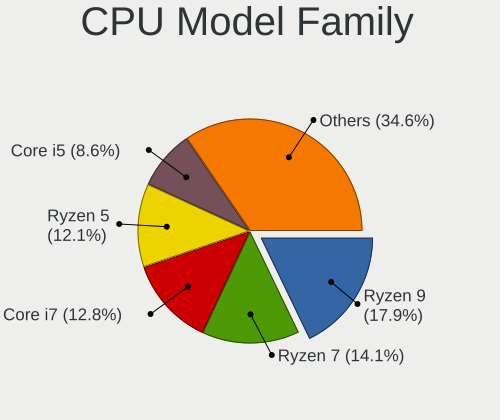

| Model                   | Desktops | Percent |
|-------------------------|----------|---------|
| AMD Ryzen 9             | 185      | 17.86%  |
| AMD Ryzen 7             | 146      | 14.09%  |
| Intel Core i7           | 133      | 12.84%  |
| AMD Ryzen 5             | 125      | 12.07%  |
| Intel Core i5           | 89       | 8.59%   |
| Other                   | 74       | 7.14%   |
| Intel Xeon              | 59       | 5.69%   |
| AMD FX                  | 30       | 2.9%    |
| Intel Core i9           | 22       | 2.12%   |
| Intel Core i3           | 19       | 1.83%   |
| AMD Ryzen Threadripper  | 16       | 1.54%   |
| Intel Celeron           | 13       | 1.25%   |
| Intel Atom              | 12       | 1.16%   |
| AMD Phenom II X4        | 12       | 1.16%   |
| Intel Pentium           | 11       | 1.06%   |
| Intel Core 2 Quad       | 10       | 0.97%   |
| AMD Ryzen 3             | 9        | 0.87%   |
| Intel Core 2 Duo        | 7        | 0.68%   |
| Intel Pentium 4         | 6        | 0.58%   |
| AMD Ryzen 7 PRO         | 6        | 0.58%   |
| AMD Phenom II X6        | 6        | 0.58%   |
| Intel Pentium III       | 4        | 0.39%   |
| AMD Sempron             | 4        | 0.39%   |
| AMD Athlon 64 X2        | 4        | 0.39%   |
| AMD A10                 | 4        | 0.39%   |
| Intel Core 2            | 3        | 0.29%   |
| AMD Ryzen 5 PRO         | 3        | 0.29%   |
| AMD Athlon II X3        | 3        | 0.29%   |
| AMD Athlon              | 3        | 0.29%   |
| AMD E                   | 2        | 0.19%   |
| Intel Pentium Dual-Core | 1        | 0.1%    |
| Intel Pentium Dual      | 1        | 0.1%    |
| Intel Pentium D         | 1        | 0.1%    |
| Intel Core 2 Extreme    | 1        | 0.1%    |
| Intel Core              | 1        | 0.1%    |
| ARM Marvell Armada      | 1        | 0.1%    |
| ARM Allwinner           | 1        | 0.1%    |
| AMD Turion II Neo       | 1        | 0.1%    |
| AMD Phenom              | 1        | 0.1%    |
| AMD Opteron             | 1        | 0.1%    |

CPU Cores
---------

Number of processor cores

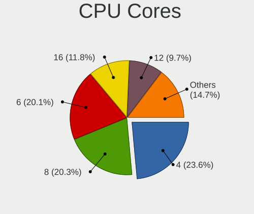

| Number  | Desktops | Percent |
|---------|----------|---------|
| 4       | 244      | 23.55%  |
| 8       | 210      | 20.27%  |
| 6       | 208      | 20.08%  |
| 16      | 122      | 11.78%  |
| 12      | 100      | 9.65%   |
| 2       | 76       | 7.34%   |
| 1       | 21       | 2.03%   |
| 24      | 12       | 1.16%   |
| 10      | 11       | 1.06%   |
| 3       | 7        | 0.68%   |
| 14      | 5        | 0.48%   |
| 20      | 4        | 0.39%   |
| 32      | 3        | 0.29%   |
| 28      | 3        | 0.29%   |
| Unknown | 3        | 0.29%   |
| 44      | 2        | 0.19%   |
| 18      | 2        | 0.19%   |
| 64      | 1        | 0.1%    |
| 36      | 1        | 0.1%    |
| 22      | 1        | 0.1%    |

CPU Sockets
-----------

Number of sockets

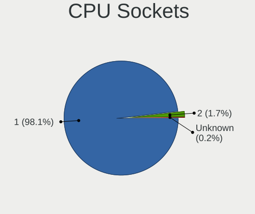

| Number  | Desktops | Percent |
|---------|----------|---------|
| 1       | 1006     | 98.15%  |
| 2       | 17       | 1.66%   |
| Unknown | 2        | 0.2%    |

CPU Threads
-----------

Threads per core (Hyper-Threading)

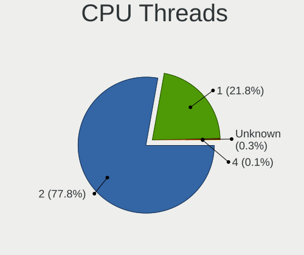

| Number  | Desktops | Percent |
|---------|----------|---------|
| 2       | 803      | 77.81%  |
| 1       | 225      | 21.8%   |
| Unknown | 3        | 0.29%   |
| 4       | 1        | 0.1%    |

CPU Op-Modes
------------

CPU Operation Modes (32-bit, 64-bit)

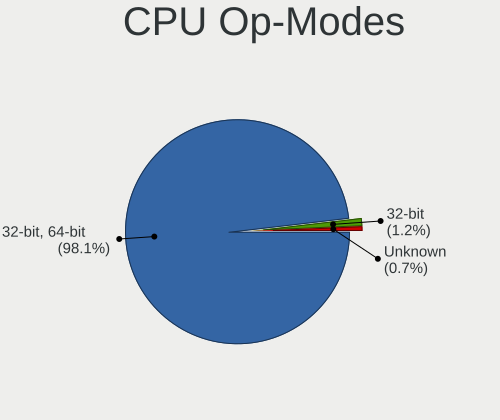

| Op mode        | Desktops | Percent |
|----------------|----------|---------|
| 32-bit, 64-bit | 1006     | 98.15%  |
| 32-bit         | 12       | 1.17%   |
| Unknown        | 7        | 0.68%   |

CPU Microcode
-------------

Microcode number

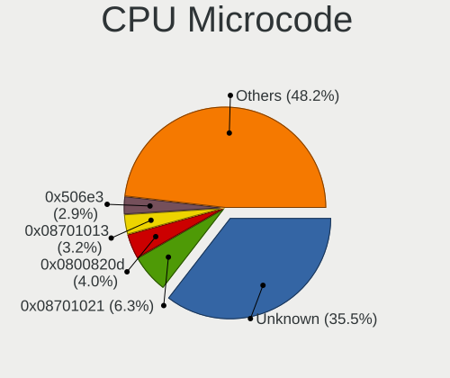

| Number     | Desktops | Percent |
|------------|----------|---------|
| Unknown    | 397      | 35.48%  |
| 0x08701021 | 70       | 6.26%   |
| 0x0800820d | 45       | 4.02%   |
| 0x08701013 | 36       | 3.22%   |
| 0x506e3    | 32       | 2.86%   |
| 0x0a201016 | 31       | 2.77%   |
| 0x306a9    | 27       | 2.41%   |
| 0x306c3    | 26       | 2.32%   |
| 0x0a601203 | 23       | 2.06%   |
| 0x906ea    | 22       | 1.97%   |
| 0x08001138 | 22       | 1.97%   |
| 0x0a20120a | 21       | 1.88%   |
| 0x0a201009 | 21       | 1.88%   |
| 0x906e9    | 18       | 1.61%   |
| 0x906ed    | 14       | 1.25%   |
| 0x90672    | 12       | 1.07%   |
| 0xa0655    | 11       | 0.98%   |
| 0x306f2    | 11       | 0.98%   |
| 0x1067a    | 11       | 0.98%   |
| 0x0a601206 | 11       | 0.98%   |
| 0xa0671    | 10       | 0.89%   |
| 0x306e4    | 9        | 0.8%    |
| 0x206a7    | 9        | 0.8%    |
| 0x206c2    | 8        | 0.71%   |
| 0x906ec    | 7        | 0.63%   |
| 0x406f1    | 6        | 0.54%   |
| 0x0a50000d | 6        | 0.54%   |
| 0x06000852 | 6        | 0.54%   |
| 0x06000822 | 6        | 0.54%   |
| 0xa0653    | 5        | 0.45%   |
| 0x50654    | 5        | 0.45%   |
| 0x0a201205 | 5        | 0.45%   |
| 0x08701030 | 5        | 0.45%   |
| 0x0800820b | 5        | 0.45%   |
| 0x010000c8 | 5        | 0.45%   |
| 0x00000000 | 5        | 0.45%   |
| 0x206d7    | 4        | 0.36%   |
| 0x106a5    | 4        | 0.36%   |
| 0x0a50000c | 4        | 0.36%   |
| 0x0a20120e | 4        | 0.36%   |

CPU Microarch
-------------

Microarchitecture

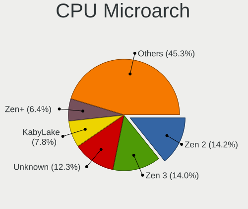

| Name             | Desktops | Percent |
|------------------|----------|---------|
| Zen 2            | 148      | 14.2%   |
| Zen 3            | 146      | 14.01%  |
| Unknown          | 128      | 12.28%  |
| KabyLake         | 81       | 7.77%   |
| Zen+             | 67       | 6.43%   |
| Haswell          | 57       | 5.47%   |
| Skylake          | 46       | 4.41%   |
| IvyBridge        | 44       | 4.22%   |
| Alderlake Hybrid | 39       | 3.74%   |
| Zen              | 37       | 3.55%   |
| CometLake        | 29       | 2.78%   |
| SandyBridge      | 28       | 2.69%   |
| Piledriver       | 27       | 2.59%   |
| K10              | 23       | 2.21%   |
| Broadwell        | 16       | 1.54%   |
| Penryn           | 15       | 1.44%   |
| Icelake          | 15       | 1.44%   |
| Nehalem          | 12       | 1.15%   |
| Westmere         | 11       | 1.06%   |
| Bonnell          | 10       | 0.96%   |
| Core             | 9        | 0.86%   |
| NetBurst         | 7        | 0.67%   |
| K8 Hammer        | 7        | 0.67%   |
| Bulldozer        | 7        | 0.67%   |
| Silvermont       | 6        | 0.58%   |
| P6               | 4        | 0.38%   |
| Jaguar           | 4        | 0.38%   |
| Gracemont        | 4        | 0.38%   |
| Tremont          | 2        | 0.19%   |
| Steamroller      | 2        | 0.19%   |
| Goldmont plus    | 2        | 0.19%   |
| Goldmont         | 2        | 0.19%   |
| Excavator        | 2        | 0.19%   |
| Bobcat           | 2        | 0.19%   |
| TigerLake        | 1        | 0.1%    |
| Sapphire Rapids  | 1        | 0.1%    |
| Lunarlake Hybrid | 1        | 0.1%    |

Graphics
--------

GPU Vendor
----------

Vendors of graphics cards

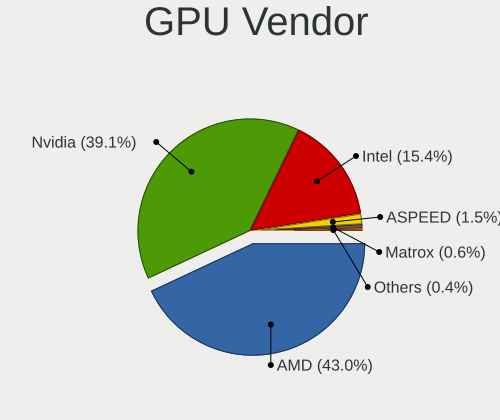

| Vendor                           | Desktops | Percent |
|----------------------------------|----------|---------|
| AMD                              | 485      | 43.03%  |
| Nvidia                           | 441      | 39.13%  |
| Intel                            | 173      | 15.35%  |
| ASPEED Technology                | 17       | 1.51%   |
| Matrox Electronics Systems       | 7        | 0.62%   |
| Silicon Integrated Systems [SiS] | 2        | 0.18%   |
| Loongson Technology              | 2        | 0.18%   |

GPU Model
---------

Graphics card models

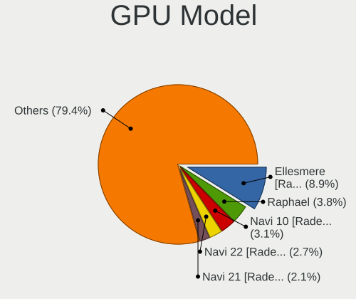

| Model                                                                       | Desktops | Percent |
|-----------------------------------------------------------------------------|----------|---------|
| AMD Ellesmere [Radeon RX 470/480/570/570X/580/580X/590]                     | 108      | 8.87%   |
| AMD Raphael                                                                 | 46       | 3.78%   |
| AMD Navi 10 [Radeon RX 5600 OEM/5600 XT / 5700/5700 XT]                     | 38       | 3.12%   |
| AMD Navi 22 [Radeon RX 6700/6700 XT/6750 XT / 6800M/6850M XT]               | 33       | 2.71%   |
| AMD Navi 21 [Radeon RX 6800/6800 XT / 6900 XT]                              | 26       | 2.13%   |
| AMD Granite Ridge [Radeon Graphics]                                         | 24       | 1.97%   |
| AMD Vega 10 XL/XT [Radeon RX Vega 56/64]                                    | 21       | 1.72%   |
| Intel CoffeeLake-S GT2 [UHD Graphics 630]                                   | 20       | 1.64%   |
| AMD Navi 31 [Radeon RX 7900 XT/7900 XTX/7900 GRE/7900M]                     | 20       | 1.64%   |
| AMD Navi 23 [Radeon RX 6600/6600 XT/6600M]                                  | 20       | 1.64%   |
| Intel Xeon E3-1200 v3/4th Gen Core Processor Integrated Graphics Controller | 19       | 1.56%   |
| Nvidia GP106 [GeForce GTX 1060 6GB]                                         | 18       | 1.48%   |
| Intel Skylake-S GT2 [HD Graphics 530]                                       | 18       | 1.48%   |
| Nvidia GM204 [GeForce GTX 970]                                              | 17       | 1.4%    |
| ASPEED Technology ASPEED Graphics Family                                    | 17       | 1.4%    |
| Nvidia GP107 [GeForce GTX 1050 Ti]                                          | 16       | 1.31%   |
| Nvidia GP102 [GeForce GTX 1080 Ti]                                          | 16       | 1.31%   |
| Nvidia GP104 [GeForce GTX 1070]                                             | 15       | 1.23%   |
| Nvidia GM206 [GeForce GTX 960]                                              | 15       | 1.23%   |
| Nvidia GA102 [GeForce RTX 3080 Ti]                                          | 14       | 1.15%   |
| AMD Cezanne [Radeon Vega Series / Radeon Vega Mobile Series]                | 14       | 1.15%   |
| Nvidia GK208B [GeForce GT 710]                                              | 13       | 1.07%   |
| Nvidia TU104 [GeForce RTX 2070 SUPER]                                       | 12       | 0.99%   |
| Nvidia GA102 [GeForce RTX 3090]                                             | 12       | 0.99%   |
| Intel 2nd Generation Core Processor Family Integrated Graphics Controller   | 11       | 0.9%    |
| Intel Xeon E3-1200 v2/3rd Gen Core processor Graphics Controller            | 10       | 0.82%   |
| AMD Lexa PRO [Radeon 540/540X/550/550X / RX 540X/550/550X]                  | 10       | 0.82%   |
| Nvidia TU117 [GeForce GTX 1650]                                             | 9        | 0.74%   |
| Nvidia GT218 [GeForce 210]                                                  | 9        | 0.74%   |
| Nvidia GM107 [GeForce GTX 750 Ti]                                           | 9        | 0.74%   |
| Nvidia GF119 [GeForce GT 610]                                               | 9        | 0.74%   |
| AMD Navi 14 [Radeon RX 5500/5500M / Pro 5500M]                              | 9        | 0.74%   |
| AMD Cedar [Radeon HD 5000/6000/7350/8350 Series]                            | 9        | 0.74%   |
| Nvidia TU116 [GeForce GTX 1660 SUPER]                                       | 8        | 0.66%   |
| Nvidia TU102 [GeForce RTX 2080 Ti Rev. A]                                   | 8        | 0.66%   |
| Nvidia GP104 [GeForce GTX 1080]                                             | 8        | 0.66%   |
| Intel CometLake-S GT2 [UHD Graphics 630]                                    | 8        | 0.66%   |
| Intel Alder Lake-S GT1 [UHD Graphics 770]                                   | 8        | 0.66%   |
| AMD Renoir [Radeon Vega Series / Radeon Vega Mobile Series]                 | 8        | 0.66%   |
| AMD Raven Ridge [Radeon Vega Series / Radeon Vega Mobile Series]            | 8        | 0.66%   |

GPU Combo
---------

Combinations of graphics cards

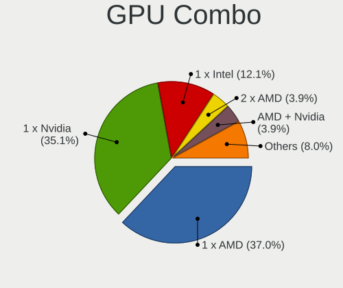

| Name                        | Desktops | Percent |
|-----------------------------|----------|---------|
| 1 x AMD                     | 392      | 37.02%  |
| 1 x Nvidia                  | 372      | 35.13%  |
| 1 x Intel                   | 128      | 12.09%  |
| 2 x AMD                     | 41       | 3.87%   |
| AMD + Nvidia                | 41       | 3.87%   |
| Intel + Nvidia              | 19       | 1.79%   |
| 1 x ASPEED                  | 14       | 1.32%   |
| Other                       | 10       | 0.94%   |
| Intel + AMD                 | 10       | 0.94%   |
| 2 x Nvidia                  | 9        | 0.85%   |
| 2 x Intel                   | 5        | 0.47%   |
| 1 x Matrox                  | 4        | 0.38%   |
| 1 x SiS                     | 2        | 0.19%   |
| Intel + 2 x AMD             | 2        | 0.19%   |
| AMD + Matrox                | 2        | 0.19%   |
| AMD + Loongson Technology   | 2        | 0.19%   |
| AMD + ASPEED                | 2        | 0.19%   |
| Nvidia + Matrox             | 1        | 0.09%   |
| Intel + 2 x Nvidia          | 1        | 0.09%   |
| Intel + Nvidia + 1 x ASPEED | 1        | 0.09%   |
| Intel + AMD + 1 x Nvidia    | 1        | 0.09%   |

GPU Driver
----------

Free vs proprietary

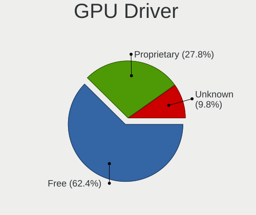

| Driver      | Desktops | Percent |
|-------------|----------|---------|
| Free        | 662      | 62.39%  |
| Proprietary | 295      | 27.8%   |
| Unknown     | 104      | 9.8%    |

GPU Memory
----------

Total video memory

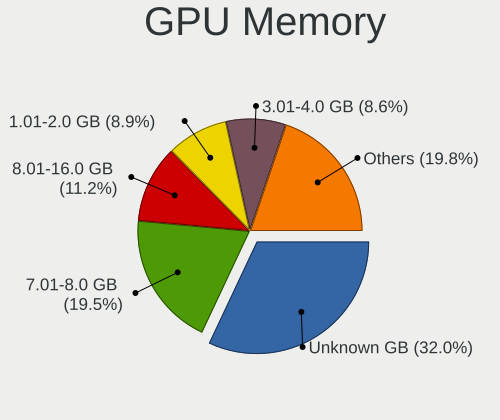

| Size in GB | Desktops | Percent |
|------------|----------|---------|
| Unknown    | 352      | 32%     |
| 7.01-8.0   | 214      | 19.45%  |
| 8.01-16.0  | 123      | 11.18%  |
| 1.01-2.0   | 98       | 8.91%   |
| 3.01-4.0   | 95       | 8.64%   |
| 0.01-0.5   | 74       | 6.73%   |
| 0.51-1.0   | 51       | 4.64%   |
| 5.01-6.0   | 48       | 4.36%   |
| 16.01-24.0 | 29       | 2.64%   |
| 2.01-3.0   | 12       | 1.09%   |
| 4.01-5.0   | 2        | 0.18%   |
| 24.01-32.0 | 2        | 0.18%   |

Monitor
-------

Monitor Vendor
--------------

Monitor vendors

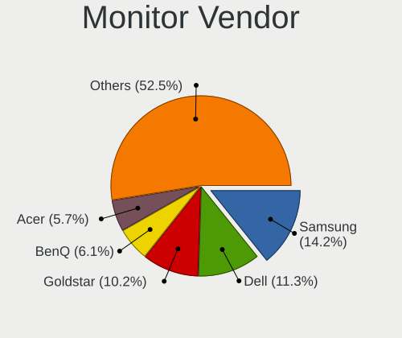

| Vendor                  | Desktops | Percent |
|-------------------------|----------|---------|
| Samsung Electronics     | 173      | 14.23%  |
| Dell                    | 137      | 11.27%  |
| Goldstar                | 124      | 10.2%   |
| BenQ                    | 74       | 6.09%   |
| Acer                    | 69       | 5.67%   |
| AOC                     | 65       | 5.35%   |
| Hewlett-Packard         | 59       | 4.85%   |
| Ancor Communications    | 58       | 4.77%   |
| ASUSTek Computer        | 50       | 4.11%   |
| Iiyama                  | 40       | 3.29%   |
| ViewSonic               | 38       | 3.13%   |
| Philips                 | 37       | 3.04%   |
| Lenovo                  | 25       | 2.06%   |
| Gigabyte Technology     | 19       | 1.56%   |
| MSI                     | 18       | 1.48%   |
| Eizo                    | 18       | 1.48%   |
| LG Electronics          | 14       | 1.15%   |
| Unknown                 | 12       | 0.99%   |
| Fujitsu Siemens         | 9        | 0.74%   |
| Sony                    | 8        | 0.66%   |
| Idek Iiyama             | 8        | 0.66%   |
| NEC Computers           | 6        | 0.49%   |
| Mi                      | 6        | 0.49%   |
| Apple                   | 6        | 0.49%   |
| Unknown                 | 6        | 0.49%   |
| Toshiba                 | 5        | 0.41%   |
| Chi Mei Optoelectronics | 5        | 0.41%   |
| BOE                     | 5        | 0.41%   |
| Yamaha                  | 4        | 0.33%   |
| UGD                     | 4        | 0.33%   |
| Sceptre Tech            | 4        | 0.33%   |
| INNOCN                  | 4        | 0.33%   |
| HJW                     | 4        | 0.33%   |
| HannStar                | 4        | 0.33%   |
| Envision Peripherals    | 4        | 0.33%   |
| Denver                  | 4        | 0.33%   |
| Chimei Innolux          | 4        | 0.33%   |
| Valve                   | 3        | 0.25%   |
| Panasonic               | 3        | 0.25%   |
| MStar                   | 3        | 0.25%   |

Monitor Model
-------------

Monitor models

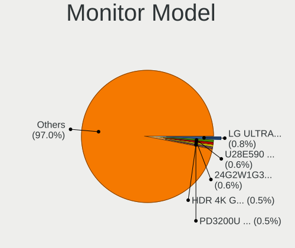

| Model                                                                    | Desktops | Percent |
|--------------------------------------------------------------------------|----------|---------|
| Goldstar LG ULTRAWIDE GSM59F1 2560x1080 670x280mm 28.6-inch              | 11       | 0.82%   |
| Samsung Electronics U28E590 SAM0C4D 3840x2160 607x345mm 27.5-inch        | 8        | 0.59%   |
| AOC 24G2W1G3 AOC2402 1920x1080 527x296mm 23.8-inch                       | 8        | 0.59%   |
| Goldstar HDR 4K GSM7707 3840x2160 600x340mm 27.2-inch                    | 7        | 0.52%   |
| BenQ PD3200U BNQ8025 3840x2160 708x399mm 32.0-inch                       | 7        | 0.52%   |
| Unknown LCD Monitor FFFF 2288x1287 2550x2550mm 142.0-inch                | 6        | 0.45%   |
| Samsung Electronics C24F390 SAM0D2C 1920x1080 521x293mm 23.5-inch        | 6        | 0.45%   |
| Iiyama PL2409HD IVM560C 1920x1080 521x293mm 23.5-inch                    | 6        | 0.45%   |
| Unknown                                                                  | 6        | 0.45%   |
| Iiyama PL2473HD IVM6107 1920x1080 521x293mm 23.5-inch                    | 5        | 0.37%   |
| Goldstar Ultra HD GSM5B09 3840x2160 600x340mm 27.2-inch                  | 5        | 0.37%   |
| Goldstar L227W GSM566E 1680x1050 474x296mm 22.0-inch                     | 5        | 0.37%   |
| Goldstar FULL HD GSM5B55 1920x1080 480x270mm 21.7-inch                   | 5        | 0.37%   |
| ViewSonic VX2458 series VSC0437 1920x1080 521x293mm 23.5-inch            | 4        | 0.3%    |
| Samsung Electronics LC49G95T SAM7053 3840x1080 1193x336mm 48.8-inch      | 4        | 0.3%    |
| Samsung Electronics C49RG9x SAM0F9C 3360x1440 1193x336mm 48.8-inch       | 4        | 0.3%    |
| Samsung Electronics C27HG7x SAM0E16 2560x1440 598x336mm 27.0-inch        | 4        | 0.3%    |
| LG Electronics LCD Monitor LG HDR 4K 7680x2160                           | 4        | 0.3%    |
| LG Electronics LCD Monitor LG HDR 4K                                     | 4        | 0.3%    |
| Goldstar ULTRAWIDE GSM76F9 2560x1080 531x298mm 24.0-inch                 | 4        | 0.3%    |
| Goldstar LG IPS FULLHD GSM5AB8 1920x1080 480x270mm 21.7-inch             | 4        | 0.3%    |
| Goldstar HDR 4K GSM7706 3840x2160 600x340mm 27.2-inch                    | 4        | 0.3%    |
| Goldstar 27GL850 GSM5B7F 2560x1440 597x336mm 27.0-inch                   | 4        | 0.3%    |
| Fujitsu Siemens P24W-6 IPS FUS07EA 1920x1200 518x324mm 24.1-inch         | 4        | 0.3%    |
| Envision Peripherals LCD2361 ENV2361 1920x1080 521x293mm 23.5-inch       | 4        | 0.3%    |
| Denver MO-HHS-32C LHCFFFF 1920x1080 699x393mm 31.6-inch                  | 4        | 0.3%    |
| Dell U2412M DELA07A 1920x1200 518x324mm 24.1-inch                        | 4        | 0.3%    |
| Dell P2418D DELD0C1 2560x1440 526x296mm 23.8-inch                        | 4        | 0.3%    |
| BenQ PD2700U BNQ802E 3840x2160 597x336mm 27.0-inch                       | 4        | 0.3%    |
| BenQ LCD BNQ801E 3840x2160 596x335mm 26.9-inch                           | 4        | 0.3%    |
| AOC G2460 AOC2460 1920x1080 531x299mm 24.0-inch                          | 4        | 0.3%    |
| Ancor Communications VS248 ACI2498 1920x1080 531x299mm 24.0-inch         | 4        | 0.3%    |
| Yamaha HTR-6064 YMH3169 1920x540                                         | 3        | 0.22%   |
| Valve Index HMD VLV91A8                                                  | 3        | 0.22%   |
| UGD Artist13.3pro UGD1302 1920x1080 294x165mm 13.3-inch                  | 3        | 0.22%   |
| Samsung Electronics U32H85x SAM0E3C 3840x2160 697x392mm 31.5-inch        | 3        | 0.22%   |
| Samsung Electronics SyncMaster SAM05E8 1920x1080                         | 3        | 0.22%   |
| Samsung Electronics SMS27A650 SAM082E 1920x1080 598x336mm 27.0-inch      | 3        | 0.22%   |
| Samsung Electronics S24F350 SAM0D20 1920x1080 521x293mm 23.5-inch        | 3        | 0.22%   |
| Samsung Electronics Odyssey G95NC SAM7476 3840x1080 1400x400mm 57.3-inch | 3        | 0.22%   |

Monitor Resolution
------------------

Monitor screen resolution

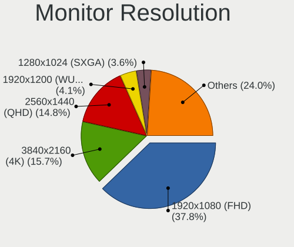

| Resolution         | Desktops | Percent |
|--------------------|----------|---------|
| 1920x1080 (FHD)    | 438      | 37.79%  |
| 3840x2160 (4K)     | 182      | 15.7%   |
| 2560x1440 (QHD)    | 172      | 14.84%  |
| 1920x1200 (WUXGA)  | 47       | 4.06%   |
| 1280x1024 (SXGA)   | 42       | 3.62%   |
| 3440x1440          | 41       | 3.54%   |
| 1680x1050 (WSXGA+) | 35       | 3.02%   |
| Unknown            | 34       | 2.93%   |
| 2560x1080          | 26       | 2.24%   |
| 3840x1080          | 23       | 1.98%   |
| 1440x900 (WXGA+)   | 16       | 1.38%   |
| 1600x900 (HD+)     | 14       | 1.21%   |
| 1366x768 (WXGA)    | 14       | 1.21%   |
| 2288x1287          | 6        | 0.52%   |
| 1360x768           | 6        | 0.52%   |
| 2560x1600          | 5        | 0.43%   |
| 1920x540           | 5        | 0.43%   |
| 1600x1200          | 5        | 0.43%   |
| 7680x2160          | 4        | 0.35%   |
| 3840x1200          | 4        | 0.35%   |
| 5760x2160          | 3        | 0.26%   |
| 2160x1200          | 3        | 0.26%   |
| 2048x1152          | 3        | 0.26%   |
| 1400x1050          | 3        | 0.26%   |
| 1280x960           | 3        | 0.26%   |
| 1280x720 (HD)      | 3        | 0.26%   |
| 1024x768 (XGA)     | 3        | 0.26%   |
| 3840x1600          | 2        | 0.17%   |
| 8320x1440          | 1        | 0.09%   |
| 6720x2160          | 1        | 0.09%   |
| 6400x2160          | 1        | 0.09%   |
| 6400x1440          | 1        | 0.09%   |
| 5120x1600          | 1        | 0.09%   |
| 4880x1080          | 1        | 0.09%   |
| 4000x2560          | 1        | 0.09%   |
| 3926x1440          | 1        | 0.09%   |
| 3640x1080          | 1        | 0.09%   |
| 3600x1200          | 1        | 0.09%   |
| 3600x1080          | 1        | 0.09%   |
| 3440x2880          | 1        | 0.09%   |

Monitor Diagonal
----------------

Diagonal size in inches

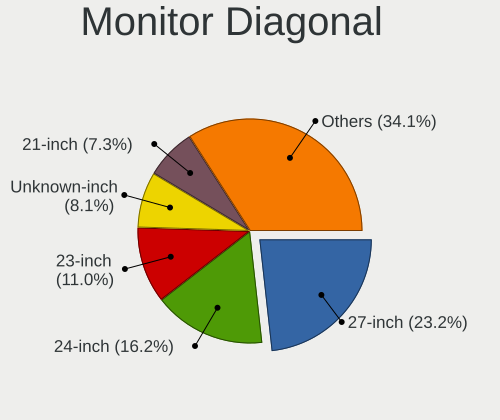

| Inches  | Desktops | Percent |
|---------|----------|---------|
| 27      | 279      | 23.25%  |
| 24      | 195      | 16.25%  |
| 23      | 132      | 11%     |
| Unknown | 97       | 8.08%   |
| 21      | 88       | 7.33%   |
| 31      | 62       | 5.17%   |
| 34      | 57       | 4.75%   |
| 19      | 39       | 3.25%   |
| 17      | 29       | 2.42%   |
| 22      | 27       | 2.25%   |
| 32      | 22       | 1.83%   |
| 26      | 15       | 1.25%   |
| 20      | 15       | 1.25%   |
| 84      | 14       | 1.17%   |
| 18      | 13       | 1.08%   |
| 25      | 12       | 1%      |
| 72      | 11       | 0.92%   |
| 48      | 11       | 0.92%   |
| 40      | 10       | 0.83%   |
| 15      | 10       | 0.83%   |
| 49      | 8        | 0.67%   |
| 54      | 7        | 0.58%   |
| 142     | 6        | 0.5%    |
| 14      | 5        | 0.42%   |
| 63      | 4        | 0.33%   |
| 42      | 4        | 0.33%   |
| 28      | 4        | 0.33%   |
| 13      | 4        | 0.33%   |
| 57      | 3        | 0.25%   |
| 60      | 2        | 0.17%   |
| 33      | 2        | 0.17%   |
| 11      | 2        | 0.17%   |
| 52      | 1        | 0.08%   |
| 50      | 1        | 0.08%   |
| 41      | 1        | 0.08%   |
| 38      | 1        | 0.08%   |
| 37      | 1        | 0.08%   |
| 36      | 1        | 0.08%   |
| 30      | 1        | 0.08%   |
| 29      | 1        | 0.08%   |

Monitor Width
-------------

Physical width

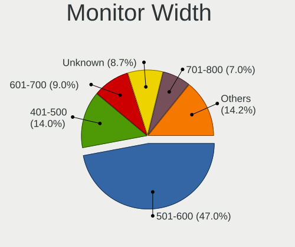

| Width in mm    | Desktops | Percent |
|----------------|----------|---------|
| 501-600        | 526      | 47.05%  |
| 401-500        | 157      | 14.04%  |
| 601-700        | 101      | 9.03%   |
| Unknown        | 97       | 8.68%   |
| 701-800        | 78       | 6.98%   |
| 301-350        | 37       | 3.31%   |
| 1001-1500      | 34       | 3.04%   |
| 351-400        | 29       | 2.59%   |
| 1501-2000      | 25       | 2.24%   |
| 801-900        | 13       | 1.16%   |
| 201-300        | 9        | 0.81%   |
| More than 2000 | 6        | 0.54%   |
| 901-1000       | 6        | 0.54%   |

Aspect Ratio
------------

Proportional relationship between the width and the height

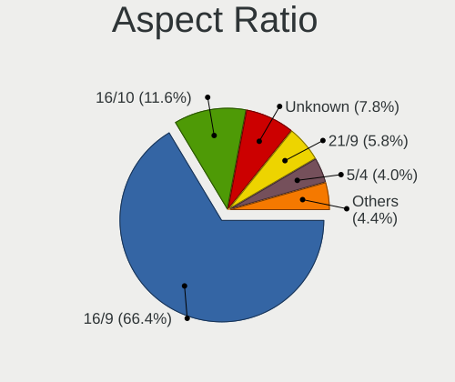

| Ratio   | Desktops | Percent |
|---------|----------|---------|
| 16/9    | 678      | 66.41%  |
| 16/10   | 118      | 11.56%  |
| Unknown | 80       | 7.84%   |
| 21/9    | 59       | 5.78%   |
| 5/4     | 41       | 4.02%   |
| 32/9    | 23       | 2.25%   |
| 4/3     | 11       | 1.08%   |
| 1.00    | 7        | 0.69%   |
| 3/2     | 2        | 0.2%    |
| 6/5     | 1        | 0.1%    |
| 0.89    | 1        | 0.1%    |

Monitor Area
------------

Area in inch²

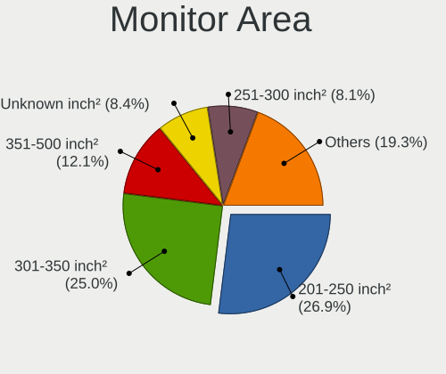

| Area in inch² | Desktops | Percent |
|----------------|----------|---------|
| 201-250        | 311      | 26.95%  |
| 301-350        | 289      | 25.04%  |
| 351-500        | 140      | 12.13%  |
| Unknown        | 97       | 8.41%   |
| 251-300        | 94       | 8.15%   |
| 151-200        | 74       | 6.41%   |
| More than 1000 | 47       | 4.07%   |
| 501-1000       | 38       | 3.29%   |
| 141-150        | 35       | 3.03%   |
| 101-110        | 7        | 0.61%   |
| 81-90          | 4        | 0.35%   |
| 71-80          | 4        | 0.35%   |
| 111-120        | 4        | 0.35%   |
| 121-130        | 3        | 0.26%   |
| 51-60          | 2        | 0.17%   |
| 131-140        | 2        | 0.17%   |
| 91-100         | 2        | 0.17%   |
| 41-50          | 1        | 0.09%   |

Pixel Density
-------------

Pixels per inch

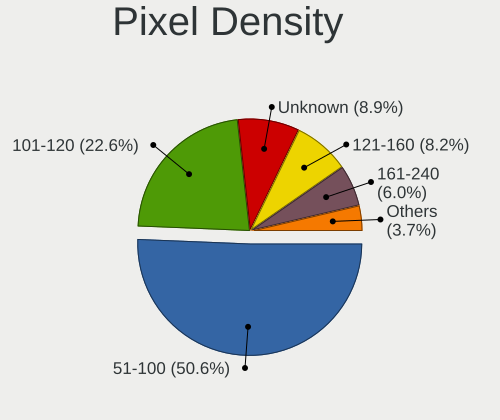

| Density       | Desktops | Percent |
|---------------|----------|---------|
| 51-100        | 551      | 50.64%  |
| 101-120       | 246      | 22.61%  |
| Unknown       | 97       | 8.92%   |
| 121-160       | 89       | 8.18%   |
| 161-240       | 65       | 5.97%   |
| 1-50          | 39       | 3.58%   |
| More than 240 | 1        | 0.09%   |

Multiple Monitors
-----------------

Total monitors connected

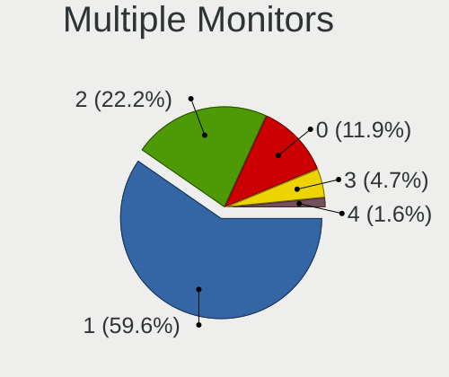

| Total | Desktops | Percent |
|-------|----------|---------|
| 1     | 650      | 59.63%  |
| 2     | 242      | 22.2%   |
| 0     | 130      | 11.93%  |
| 3     | 51       | 4.68%   |
| 4     | 17       | 1.56%   |

Network
-------

Net Controller Vendor
---------------------

Controller vendors

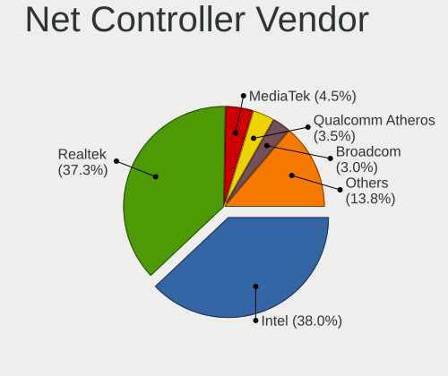

| Vendor                          | Desktops | Percent |
|---------------------------------|----------|---------|
| Intel                           | 578      | 37.95%  |
| Realtek Semiconductor           | 568      | 37.29%  |
| MediaTek                        | 68       | 4.46%   |
| Qualcomm Atheros                | 54       | 3.55%   |
| Broadcom                        | 45       | 2.95%   |
| Aquantia                        | 36       | 2.36%   |
| Nvidia                          | 18       | 1.18%   |
| ASIX Electronics                | 15       | 0.98%   |
| Marvell Technology Group        | 11       | 0.72%   |
| Microsoft                       | 10       | 0.66%   |
| TP-Link                         | 9        | 0.59%   |
| Qualcomm Technologies           | 9        | 0.59%   |
| Mellanox Technologies           | 7        | 0.46%   |
| Qualcomm Atheros Communications | 6        | 0.39%   |
| Apple                           | 6        | 0.39%   |
| Ralink Technology               | 5        | 0.33%   |
| Ralink                          | 5        | 0.33%   |
| QinHeng Electronics             | 4        | 0.26%   |
| Google                          | 4        | 0.26%   |
| Sigma Designs                   | 3        | 0.2%    |
| OpenMoko                        | 3        | 0.2%    |
| NetGear                         | 3        | 0.2%    |
| ICS Advent                      | 3        | 0.2%    |
| Huawei Technologies             | 3        | 0.2%    |
| DisplayLink                     | 3        | 0.2%    |
| D-Link System                   | 3        | 0.2%    |
| American Megatrends             | 3        | 0.2%    |
| Wilocity                        | 2        | 0.13%   |
| STMicroelectronics              | 2        | 0.13%   |
| Netchip Technology              | 2        | 0.13%   |
| Metrologic Instruments          | 2        | 0.13%   |
| Loongson Technology             | 2        | 0.13%   |
| Dresden Elektronik              | 2        | 0.13%   |
| D-Link                          | 2        | 0.13%   |
| Broadcom Limited                | 2        | 0.13%   |
| 3Com                            | 2        | 0.13%   |
| Xiaomi                          | 1        | 0.07%   |
| VIA Technologies                | 1        | 0.07%   |
| U-Blox                          | 1        | 0.07%   |
| Texas Instruments               | 1        | 0.07%   |

Net Controller Model
--------------------

Controller models

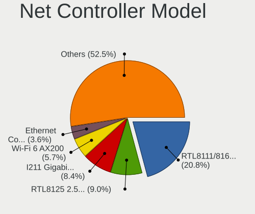

| Model                                                                           | Desktops | Percent |
|---------------------------------------------------------------------------------|----------|---------|
| Realtek RTL8111/8168/8211/8411 PCI Express Gigabit Ethernet Controller          | 372      | 20.83%  |
| Realtek RTL8125 2.5GbE Controller                                               | 161      | 9.01%   |
| Intel I211 Gigabit Network Connection                                           | 150      | 8.4%    |
| Intel Wi-Fi 6 AX200                                                             | 101      | 5.66%   |
| Intel Ethernet Controller I225-V                                                | 65       | 3.64%   |
| Intel Wi-Fi 6E(802.11ax) AX210/AX1675* 2x2 [Typhoon Peak]                       | 42       | 2.35%   |
| Intel Ethernet Connection (2) I219-V                                            | 37       | 2.07%   |
| Intel Ethernet Connection (7) I219-V                                            | 29       | 1.62%   |
| MediaTek MT7922 802.11ax PCI Express Wireless Network Adapter                   | 26       | 1.46%   |
| Intel 82574L Gigabit Network Connection                                         | 25       | 1.4%    |
| Intel Wi-Fi 5(802.11ac) Wireless-AC 9x6x [Thunder Peak]                         | 24       | 1.34%   |
| Intel 82579LM Gigabit Network Connection (Lewisville)                           | 20       | 1.12%   |
| Intel Dual Band Wireless-AC 3168NGW [Stone Peak]                                | 19       | 1.06%   |
| Intel Ethernet Controller I226-V                                                | 17       | 0.95%   |
| Intel I210 Gigabit Network Connection                                           | 16       | 0.9%    |
| Intel Ethernet Connection (2) I218-V                                            | 16       | 0.9%    |
| Realtek RTL8153 Gigabit Ethernet Adapter                                        | 14       | 0.78%   |
| MediaTek MT7921K (RZ608) Wi-Fi 6E 80MHz                                         | 14       | 0.78%   |
| Realtek RTL8126 5GbE Controller                                                 | 13       | 0.73%   |
| Intel 82599ES 10-Gigabit SFI/SFP+ Network Connection                            | 12       | 0.67%   |
| Intel Ethernet Connection (2) I219-LM                                           | 11       | 0.62%   |
| Intel Cannon Lake PCH CNVi WiFi                                                 | 11       | 0.62%   |
| Intel 82579V Gigabit Network Connection                                         | 11       | 0.62%   |
| Broadcom BCM4360 802.11ac Dual Band Wireless Network Adapter                    | 11       | 0.62%   |
| Aquantia AQtion AQC113CS NBase-T/IEEE 802.3an Ethernet Controller [Antigua 10G] | 11       | 0.62%   |
| Intel Comet Lake PCH CNVi WiFi                                                  | 10       | 0.56%   |
| Intel Alder Lake-S PCH CNVi WiFi                                                | 10       | 0.56%   |
| Aquantia AQtion AQC107 NBase-T/IEEE 802.3an Ethernet Controller [Atlantic 10G]  | 10       | 0.56%   |
| Qualcomm WCN785x Wi-Fi 7(802.11be) 320MHz 2x2 [FastConnect 7800]                | 9        | 0.5%    |
| Realtek RTL8812AE 802.11ac PCIe Wireless Network Adapter                        | 8        | 0.45%   |
| Qualcomm Atheros AR93xx Wireless Network Adapter                                | 8        | 0.45%   |
| MediaTek MT7925 802.11be 160MHz 2x2 PCIe Wireless Network Adapter [Filogic 360] | 8        | 0.45%   |
| Marvell Group 88E8056 PCI-E Gigabit Ethernet Controller                         | 8        | 0.45%   |
| Intel Ethernet Connection I217-V                                                | 8        | 0.45%   |
| Intel Ethernet Connection I217-LM                                               | 8        | 0.45%   |
| Intel 700 Series Chipset CNVi WiFi                                              | 8        | 0.45%   |
| ASIX AX88179 Gigabit Ethernet                                                   | 8        | 0.45%   |
| Realtek RTL8169 PCI Gigabit Ethernet Controller                                 | 7        | 0.39%   |
| Realtek Killer E3000 2.5GbE Controller                                          | 7        | 0.39%   |
| Nvidia MCP77 Ethernet                                                           | 7        | 0.39%   |

Wireless Vendor
---------------

Wireless vendors

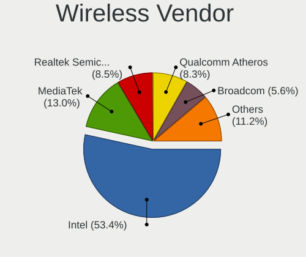

| Vendor                          | Desktops | Percent |
|---------------------------------|----------|---------|
| Intel                           | 258      | 53.42%  |
| MediaTek                        | 63       | 13.04%  |
| Realtek Semiconductor           | 41       | 8.49%   |
| Qualcomm Atheros                | 40       | 8.28%   |
| Broadcom                        | 27       | 5.59%   |
| Microsoft                       | 10       | 2.07%   |
| TP-Link                         | 9        | 1.86%   |
| Qualcomm Atheros Communications | 6        | 1.24%   |
| Ralink Technology               | 5        | 1.04%   |
| Ralink                          | 5        | 1.04%   |
| Qualcomm Technologies           | 5        | 1.04%   |
| NetGear                         | 3        | 0.62%   |
| Wilocity                        | 2        | 0.41%   |
| D-Link                          | 2        | 0.41%   |
| Broadcom Limited                | 2        | 0.41%   |
| Texas Instruments               | 1        | 0.21%   |
| Senao                           | 1        | 0.21%   |
| Edimax Technology               | 1        | 0.21%   |
| D-Link System                   | 1        | 0.21%   |
| ASUSTek Computer                | 1        | 0.21%   |

Wireless Model
--------------

Wireless models

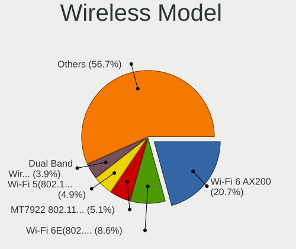

| Model                                                                           | Desktops | Percent |
|---------------------------------------------------------------------------------|----------|---------|
| Intel Wi-Fi 6 AX200                                                             | 101      | 20.74%  |
| Intel Wi-Fi 6E(802.11ax) AX210/AX1675* 2x2 [Typhoon Peak]                       | 42       | 8.62%   |
| MediaTek MT7922 802.11ax PCI Express Wireless Network Adapter                   | 25       | 5.13%   |
| Intel Wi-Fi 5(802.11ac) Wireless-AC 9x6x [Thunder Peak]                         | 24       | 4.93%   |
| Intel Dual Band Wireless-AC 3168NGW [Stone Peak]                                | 19       | 3.9%    |
| MediaTek MT7921K (RZ608) Wi-Fi 6E 80MHz                                         | 14       | 2.87%   |
| Intel Cannon Lake PCH CNVi WiFi                                                 | 11       | 2.26%   |
| Broadcom BCM4360 802.11ac Dual Band Wireless Network Adapter                    | 11       | 2.26%   |
| Intel Comet Lake PCH CNVi WiFi                                                  | 10       | 2.05%   |
| Realtek RTL8812AE 802.11ac PCIe Wireless Network Adapter                        | 8        | 1.64%   |
| Qualcomm Atheros AR93xx Wireless Network Adapter                                | 8        | 1.64%   |
| Intel 700 Series Chipset CNVi WiFi                                              | 8        | 1.64%   |
| MediaTek MT7927 802.11be 320MHz 2x2 PCIe Wireless Network Adapter [Filogic 380] | 7        | 1.44%   |
| Intel Wireless 8260                                                             | 7        | 1.44%   |
| Qualcomm Atheros AR9271 802.11n                                                 | 6        | 1.23%   |
| Qualcomm Atheros AR9485 Wireless Network Adapter                                | 6        | 1.23%   |
| Qualcomm Atheros AR9285 Wireless Network Adapter (PCI-Express)                  | 6        | 1.23%   |
| MediaTek MT7925 802.11be 160MHz 2x2 PCIe Wireless Network Adapter [Filogic 360] | 6        | 1.23%   |
| Intel Wireless 3165                                                             | 6        | 1.23%   |
| Intel Alder Lake-S PCH CNVi WiFi                                                | 6        | 1.23%   |
| Qualcomm WCN785x Wi-Fi 7(802.11be) 320MHz 2x2 [FastConnect 7800]                | 5        | 1.03%   |
| Microsoft Xbox Wireless Adapter for Windows                                     | 5        | 1.03%   |
| Intel Tiger Lake PCH CNVi WiFi                                                  | 5        | 1.03%   |
| Realtek RTL8821CE 802.11ac PCIe Wireless Network Adapter                        | 4        | 0.82%   |
| Qualcomm Atheros QCA6174 802.11ac Wireless Network Adapter                      | 4        | 0.82%   |
| Qualcomm Atheros AR9227 Wireless Network Adapter                                | 4        | 0.82%   |
| MediaTek MT7925 (RZ717) Wi-Fi 7 160MHz                                          | 4        | 0.82%   |
| MediaTek MT7921 802.11ax PCIe Wireless Network Adapter [Filogic 330]            | 4        | 0.82%   |
| Intel Wireless 8265 / 8275                                                      | 4        | 0.82%   |
| Intel Wireless 7265                                                             | 4        | 0.82%   |
| Intel Wireless 7260                                                             | 4        | 0.82%   |
| Broadcom Network controller                                                     | 4        | 0.82%   |
| TP-Link Archer T3U [Realtek RTL8812BU]                                          | 3        | 0.62%   |
| Realtek RTL88x2bu [AC1200 Techkey]                                              | 3        | 0.62%   |
| Realtek RTL8852CE PCIe 802.11ax Wireless Network Controller                     | 3        | 0.62%   |
| Realtek RTL8822CE 802.11ac PCIe Wireless Network Adapter                        | 3        | 0.62%   |
| Realtek RTL8822BE 802.11a/b/g/n/ac WiFi adapter                                 | 3        | 0.62%   |
| Realtek RTL8192EE PCIe Wireless Network Adapter                                 | 3        | 0.62%   |
| Realtek 802.11ac NIC                                                            | 3        | 0.62%   |
| Qualcomm Atheros AR928X Wireless Network Adapter (PCI-Express)                  | 3        | 0.62%   |

Ethernet Vendor
---------------

Ethernet vendors

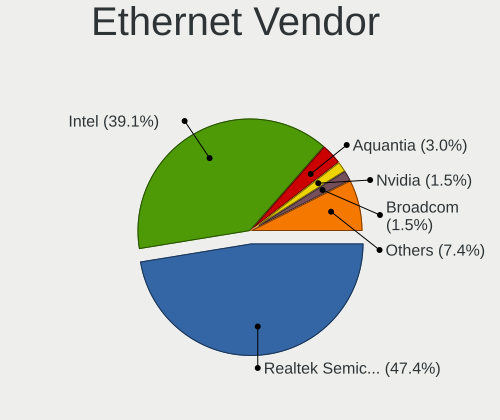

| Vendor                   | Desktops | Percent |
|--------------------------|----------|---------|
| Realtek Semiconductor    | 561      | 47.42%  |
| Intel                    | 462      | 39.05%  |
| Aquantia                 | 36       | 3.04%   |
| Nvidia                   | 18       | 1.52%   |
| Broadcom                 | 18       | 1.52%   |
| Qualcomm Atheros         | 16       | 1.35%   |
| ASIX Electronics         | 15       | 1.27%   |
| Marvell Technology Group | 11       | 0.93%   |
| Mellanox Technologies    | 6        | 0.51%   |
| Apple                    | 6        | 0.51%   |
| Qualcomm Technologies    | 4        | 0.34%   |
| MediaTek                 | 4        | 0.34%   |
| ICS Advent               | 3        | 0.25%   |
| Google                   | 3        | 0.25%   |
| DisplayLink              | 3        | 0.25%   |
| American Megatrends      | 3        | 0.25%   |
| Loongson Technology      | 2        | 0.17%   |
| D-Link System            | 2        | 0.17%   |
| 3Com                     | 2        | 0.17%   |
| Xiaomi                   | 1        | 0.08%   |
| VIA Technologies         | 1        | 0.08%   |
| Qualcomm                 | 1        | 0.08%   |
| QLogic                   | 1        | 0.08%   |
| Nokia Mobile Phones      | 1        | 0.08%   |
| Huawei Technologies      | 1        | 0.08%   |
| Hewlett-Packard          | 1        | 0.08%   |
| Davicom Semiconductor    | 1        | 0.08%   |

Ethernet Model
--------------

Ethernet models

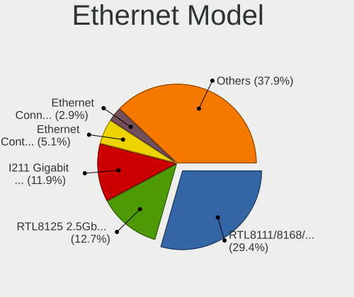

| Model                                                                           | Desktops | Percent |
|---------------------------------------------------------------------------------|----------|---------|
| Realtek RTL8111/8168/8211/8411 PCI Express Gigabit Ethernet Controller          | 372      | 29.43%  |
| Realtek RTL8125 2.5GbE Controller                                               | 161      | 12.74%  |
| Intel I211 Gigabit Network Connection                                           | 150      | 11.87%  |
| Intel Ethernet Controller I225-V                                                | 65       | 5.14%   |
| Intel Ethernet Connection (2) I219-V                                            | 37       | 2.93%   |
| Intel Ethernet Connection (7) I219-V                                            | 29       | 2.29%   |
| Intel 82574L Gigabit Network Connection                                         | 25       | 1.98%   |
| Intel 82579LM Gigabit Network Connection (Lewisville)                           | 20       | 1.58%   |
| Intel Ethernet Controller I226-V                                                | 17       | 1.34%   |
| Intel I210 Gigabit Network Connection                                           | 16       | 1.27%   |
| Intel Ethernet Connection (2) I218-V                                            | 16       | 1.27%   |
| Realtek RTL8153 Gigabit Ethernet Adapter                                        | 14       | 1.11%   |
| Realtek RTL8126 5GbE Controller                                                 | 13       | 1.03%   |
| Intel 82599ES 10-Gigabit SFI/SFP+ Network Connection                            | 12       | 0.95%   |
| Intel Ethernet Connection (2) I219-LM                                           | 11       | 0.87%   |
| Intel 82579V Gigabit Network Connection                                         | 11       | 0.87%   |
| Aquantia AQtion AQC113CS NBase-T/IEEE 802.3an Ethernet Controller [Antigua 10G] | 11       | 0.87%   |
| Aquantia AQtion AQC107 NBase-T/IEEE 802.3an Ethernet Controller [Atlantic 10G]  | 10       | 0.79%   |
| Marvell Group 88E8056 PCI-E Gigabit Ethernet Controller                         | 8        | 0.63%   |
| Intel Ethernet Connection I217-V                                                | 8        | 0.63%   |
| Intel Ethernet Connection I217-LM                                               | 8        | 0.63%   |
| ASIX AX88179 Gigabit Ethernet                                                   | 8        | 0.63%   |
| Realtek RTL8169 PCI Gigabit Ethernet Controller                                 | 7        | 0.55%   |
| Realtek Killer E3000 2.5GbE Controller                                          | 7        | 0.55%   |
| Nvidia MCP77 Ethernet                                                           | 7        | 0.55%   |
| Intel I350 Gigabit Network Connection                                           | 7        | 0.55%   |
| Intel 82571EB/82571GB Gigabit Ethernet Controller D0/D1 (copper applications)   | 7        | 0.55%   |
| Realtek RTL-8100/8101L/8139 PCI Fast Ethernet Adapter                           | 6        | 0.47%   |
| Nvidia MCP61 Ethernet                                                           | 5        | 0.4%    |
| Intel 82576 Gigabit Network Connection                                          | 5        | 0.4%    |
| Realtek Killer E2600 GbE Controller                                             | 4        | 0.32%   |
| Qualcomm WCN785x Wi-Fi 7(802.11be) 320MHz 2x2 [FastConnect 7800]                | 4        | 0.32%   |
| Qualcomm Atheros Killer E220x Gigabit Ethernet Controller                       | 4        | 0.32%   |
| Qualcomm Atheros AR8151 v2.0 Gigabit Ethernet                                   | 4        | 0.32%   |
| Mellanox MT27500 Family [ConnectX-3]                                            | 4        | 0.32%   |
| Intel Ethernet Connection (14) I219-V                                           | 4        | 0.32%   |
| Intel Ethernet Connection (11) I219-V                                           | 4        | 0.32%   |
| Intel Alder Lake-S PCH CNVi WiFi                                                | 4        | 0.32%   |
| Intel 82567LM-3 Gigabit Network Connection                                      | 4        | 0.32%   |
| Aquantia AQtion AQC113 NBase-T/IEEE 802.3an Ethernet Controller [Antigua 10G]   | 4        | 0.32%   |

Net Controller Kind
-------------------

Ethernet, WiFi or modem

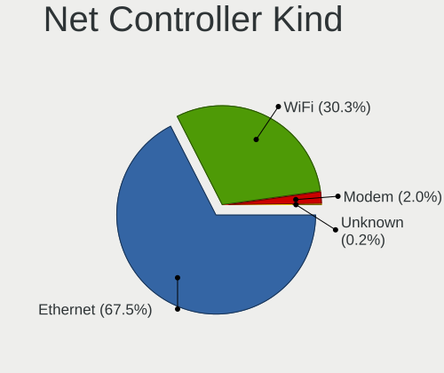

| Kind     | Desktops | Percent |
|----------|----------|---------|
| Ethernet | 1013     | 67.49%  |
| WiFi     | 455      | 30.31%  |
| Modem    | 30       | 2%      |
| Unknown  | 3        | 0.2%    |

Used Controller
---------------

Currently used network controller

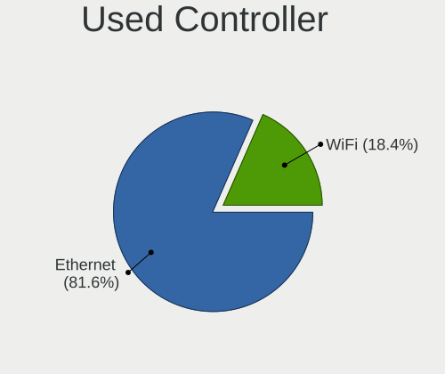

| Kind     | Desktops | Percent |
|----------|----------|---------|
| Ethernet | 859      | 81.58%  |
| WiFi     | 194      | 18.42%  |

NICs
----

Total network controllers on board

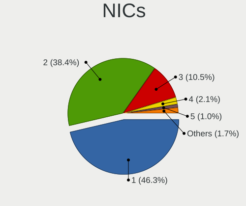

| Total | Desktops | Percent |
|-------|----------|---------|
| 1     | 487      | 46.34%  |
| 2     | 404      | 38.44%  |
| 3     | 110      | 10.47%  |
| 4     | 22       | 2.09%   |
| 5     | 10       | 0.95%   |
| 0     | 10       | 0.95%   |
| 6     | 3        | 0.29%   |
| 7     | 2        | 0.19%   |
| 12    | 1        | 0.1%    |
| 11    | 1        | 0.1%    |
| 9     | 1        | 0.1%    |

IPv6
----

IPv6 vs IPv4

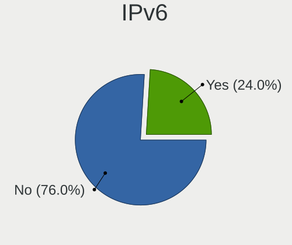

| Used | Desktops | Percent |
|------|----------|---------|
| No   | 812      | 75.96%  |
| Yes  | 257      | 24.04%  |

Bluetooth
---------

Bluetooth Vendor
----------------

Controller vendors

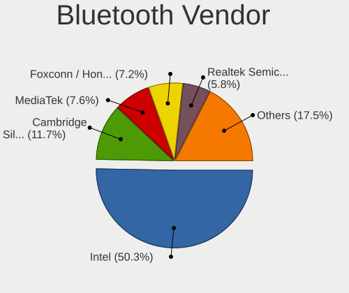

| Vendor                          | Desktops | Percent |
|---------------------------------|----------|---------|
| Intel                           | 253      | 50.3%   |
| Cambridge Silicon Radio         | 59       | 11.73%  |
| MediaTek                        | 38       | 7.55%   |
| Foxconn / Hon Hai               | 36       | 7.16%   |
| Realtek Semiconductor           | 29       | 5.77%   |
| ASUSTek Computer                | 27       | 5.37%   |
| Broadcom                        | 15       | 2.98%   |
| IMC Networks                    | 11       | 2.19%   |
| Apple                           | 11       | 2.19%   |
| Qualcomm Atheros Communications | 6        | 1.19%   |
| TP-Link                         | 5        | 0.99%   |
| HTC (High Tech Computer)        | 3        | 0.6%    |
| Belkin Components               | 3        | 0.6%    |
| Roper                           | 1        | 0.2%    |
| Lite-On Technology              | 1        | 0.2%    |
| Edimax Technology               | 1        | 0.2%    |
| Dynex                           | 1        | 0.2%    |
| AICSemi                         | 1        | 0.2%    |
| Actions                         | 1        | 0.2%    |
| Unknown                         | 1        | 0.2%    |

Bluetooth Model
---------------

Controller models

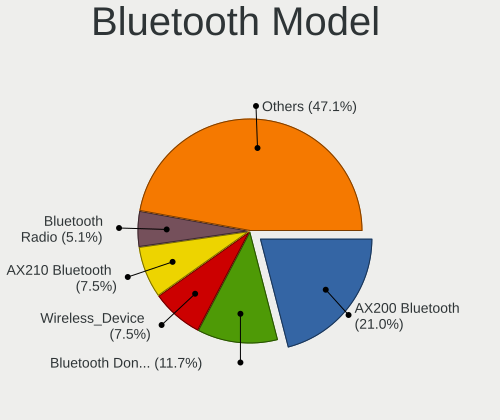

| Model                                                                | Desktops | Percent |
|----------------------------------------------------------------------|----------|---------|
| Intel AX200 Bluetooth                                                | 106      | 20.99%  |
| Cambridge Silicon Radio Bluetooth Dongle (HCI mode)                  | 59       | 11.68%  |
| MediaTek Wireless_Device                                             | 38       | 7.52%   |
| Intel AX210 Bluetooth                                                | 38       | 7.52%   |
| Realtek Bluetooth Radio                                              | 26       | 5.15%   |
| Intel Wireless-AC 9260 Bluetooth Adapter                             | 25       | 4.95%   |
| Intel Bluetooth wireless interface                                   | 24       | 4.75%   |
| Foxconn / Hon Hai Wireless_Device                                    | 23       | 4.55%   |
| Intel AX201 Bluetooth                                                | 22       | 4.36%   |
| Intel Wireless-AC 3168 Bluetooth                                     | 17       | 3.37%   |
| Intel Bluetooth 9460/9560 Jefferson Peak (JfP)                       | 12       | 2.38%   |
| Foxconn / Hon Hai Bluetooth Device                                   | 12       | 2.38%   |
| ASUS Broadcom BCM20702A0 Bluetooth                                   | 11       | 2.18%   |
| Intel Bluetooth Device                                               | 10       | 1.98%   |
| Broadcom BCM20702A0 Bluetooth 4.0                                    | 8        | 1.58%   |
| IMC Networks Wireless_Device                                         | 7        | 1.39%   |
| TP-Link TP-T@- UB500 Adapter                                         | 5        | 0.99%   |
| Apple Built-in Bluetooth 2.0+EDR HCI                                 | 5        | 0.99%   |
| IMC Networks Bluetooth Radio                                         | 4        | 0.79%   |
| Qualcomm Atheros Bluetooth USB Host Controller                       | 3        | 0.59%   |
| Qualcomm Atheros AR3011 Bluetooth                                    | 3        | 0.59%   |
| HTC (High Tech Computer) Vive Hub Bluetooth 4.1 (Broadcom BCM920703) | 3        | 0.59%   |
| ASUS Bluetooth Radio                                                 | 3        | 0.59%   |
| ASUS ASUS USB-BT500                                                  | 3        | 0.59%   |
| Apple Bluetooth Host Controller                                      | 3        | 0.59%   |
| Realtek  Bluetooth 4.2 Adapter                                       | 2        | 0.4%    |
| Realtek Bluetooth 5.4 Radio                                          | 2        | 0.4%    |
| Broadcom BCM920702 Bluetooth 4.0 Zero Touch Dongle                   | 2        | 0.4%    |
| Broadcom BCM2035 Bluetooth dongle                                    | 2        | 0.4%    |
| Belkin Components F8T065BF Mini Bluetooth 4.0 Adapter                | 2        | 0.4%    |
| ASUS Qualcomm Bluetooth 4.1                                          | 2        | 0.4%    |
| ASUS Bluetooth Device                                                | 2        | 0.4%    |
| ASUS Bluetooth Controller                                            | 2        | 0.4%    |
| ASUS BCM20702A0                                                      | 2        | 0.4%    |
| Roper Class 1 Bluetooth Dongle                                       | 1        | 0.2%    |
| Lite-On Bluetooth Device                                             | 1        | 0.2%    |
| Foxconn / Hon Hai Bluetooth USB Host Controller                      | 1        | 0.2%    |
| Edimax Bluetooth Device                                              | 1        | 0.2%    |
| Dynex Bluetooth 4.0 Adapter [Broadcom, 1.12, BCM20702A0]             | 1        | 0.2%    |
| Broadcom BCM92046DG-CL1ROM Bluetooth 2.1 Adapter                     | 1        | 0.2%    |

Sound
-----

Sound Vendor
------------

Sound card vendors

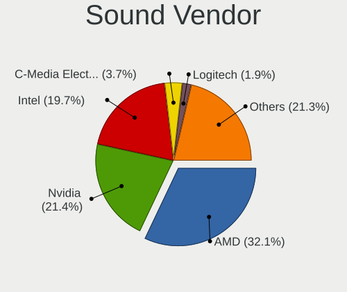

| Vendor                                       | Desktops | Percent |
|----------------------------------------------|----------|---------|
| AMD                                          | 632      | 32.06%  |
| Nvidia                                       | 421      | 21.36%  |
| Intel                                        | 389      | 19.74%  |
| C-Media Electronics                          | 72       | 3.65%   |
| Logitech                                     | 37       | 1.88%   |
| ASUSTek Computer                             | 35       | 1.78%   |
| Creative Labs                                | 29       | 1.47%   |
| SteelSeries ApS                              | 21       | 1.07%   |
| Focusrite-Novation                           | 18       | 0.91%   |
| Creative Technology                          | 18       | 0.91%   |
| Texas Instruments                            | 16       | 0.81%   |
| Micro Star International                     | 16       | 0.81%   |
| Kingston Technology                          | 14       | 0.71%   |
| Razer USA                                    | 12       | 0.61%   |
| JMTek                                        | 10       | 0.51%   |
| Generalplus Technology                       | 9        | 0.46%   |
| Thesycon Systemsoftware & Consulting         | 8        | 0.41%   |
| GN Netcom                                    | 8        | 0.41%   |
| Sony                                         | 7        | 0.36%   |
| Realtek Semiconductor                        | 7        | 0.36%   |
| Plantronics                                  | 7        | 0.36%   |
| BEHRINGER International                      | 7        | 0.36%   |
| Samson Technologies                          | 6        | 0.3%    |
| RODE Microphones                             | 6        | 0.3%    |
| GYROCOM C&C                                  | 6        | 0.3%    |
| Blue Microphones                             | 6        | 0.3%    |
| ASRock                                       | 6        | 0.3%    |
| Yamaha                                       | 5        | 0.25%   |
| Corsair                                      | 5        | 0.25%   |
| Comtrue                                      | 5        | 0.25%   |
| Audient                                      | 5        | 0.25%   |
| XMOS                                         | 4        | 0.2%    |
| Trust                                        | 4        | 0.2%    |
| Solid State Logic                            | 4        | 0.2%    |
| M-Audio                                      | 4        | 0.2%    |
| DSEA A/S                                     | 4        | 0.2%    |
| AudioQuest                                   | 4        | 0.2%    |
| AKAI Professional M.I.                       | 4        | 0.2%    |
| Zoran Co. Personal Media Division (Nogatech) | 3        | 0.15%   |
| Valve Software                               | 3        | 0.15%   |

Sound Model
-----------

Sound card models

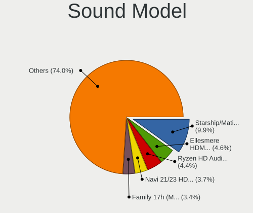

| Model                                                                      | Desktops | Percent |
|----------------------------------------------------------------------------|----------|---------|
| AMD Starship/Matisse HD Audio Controller                                   | 240      | 9.88%   |
| AMD Ellesmere HDMI Audio [Radeon RX 470/480 / 570/580/590]                 | 112      | 4.61%   |
| AMD Ryzen HD Audio Controller                                              | 107      | 4.41%   |
| AMD Navi 21/23 HDMI/DP Audio Controller                                    | 90       | 3.71%   |
| AMD Family 17h (Models 00h-0fh) HD Audio Controller                        | 83       | 3.42%   |
| AMD Radeon High Definition Audio Controller                                | 73       | 3.01%   |
| AMD Navi 10 HDMI Audio                                                     | 48       | 1.98%   |
| AMD SBx00 Azalia (Intel HDA)                                               | 42       | 1.73%   |
| Intel 100 Series/C230 Series Chipset Family HD Audio Controller            | 40       | 1.65%   |
| Intel Cannon Lake PCH cAVS                                                 | 36       | 1.48%   |
| Nvidia GA102 High Definition Audio Controller                              | 35       | 1.44%   |
| AMD Navi 31 HDMI/DP Audio                                                  | 34       | 1.4%    |
| Intel 200 Series PCH HD Audio                                              | 32       | 1.32%   |
| AMD Renoir/Cezanne HDMI/DP Audio Controller                                | 32       | 1.32%   |
| Nvidia GA104 High Definition Audio Controller                              | 30       | 1.24%   |
| ASUSTek Computer USB Audio                                                 | 29       | 1.19%   |
| Intel 8 Series/C220 Series Chipset High Definition Audio Controller        | 28       | 1.15%   |
| Nvidia GP104 High Definition Audio Controller                              | 27       | 1.11%   |
| Nvidia GP106 High Definition Audio Controller                              | 26       | 1.07%   |
| AMD Baffin HDMI/DP Audio [Radeon RX 550 640SP / RX 560/560X]               | 26       | 1.07%   |
| Nvidia GP107GL High Definition Audio Controller                            | 25       | 1.03%   |
| Intel Alder Lake-S HD Audio Controller                                     | 25       | 1.03%   |
| Intel 6 Series/C200 Series Chipset Family High Definition Audio Controller | 25       | 1.03%   |
| Nvidia TU116 High Definition Audio Controller                              | 24       | 0.99%   |
| Nvidia TU104 HD Audio Controller                                           | 24       | 0.99%   |
| Nvidia TU106 High Definition Audio Controller                              | 23       | 0.95%   |
| Intel 7 Series/C216 Chipset Family High Definition Audio Controller        | 23       | 0.95%   |
| AMD Vega 10 HDMI Audio [Radeon Vega 56/64]                                 | 22       | 0.91%   |
| Nvidia GM206 High Definition Audio Controller                              | 20       | 0.82%   |
| Nvidia GM204 High Definition Audio Controller                              | 20       | 0.82%   |
| Intel 82801JI (ICH10 Family) HD Audio Controller                           | 20       | 0.82%   |
| Nvidia GK208 HDMI/DP Audio Controller                                      | 19       | 0.78%   |
| Intel Xeon E3-1200 v3/4th Gen Core Processor HD Audio Controller           | 18       | 0.74%   |
| Intel C610/X99 series chipset HD Audio Controller                          | 18       | 0.74%   |
| AMD Oland/Hainan/Cape Verde/Pitcairn HDMI Audio [Radeon HD 7000 Series]    | 17       | 0.7%    |
| Nvidia GP102 HDMI Audio Controller                                         | 16       | 0.66%   |
| Nvidia GA106 High Definition Audio Controller                              | 16       | 0.66%   |
| Micro Star International USB Audio                                         | 16       | 0.66%   |
| Intel Comet Lake PCH cAVS                                                  | 16       | 0.66%   |
| Intel Tiger Lake-H HD Audio Controller                                     | 15       | 0.62%   |

Memory
------

Memory Vendor
-------------

Memory module vendors

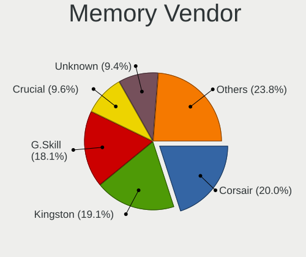

| Vendor                       | Desktops | Percent |
|------------------------------|----------|---------|
| Corsair                      | 208      | 20.02%  |
| Kingston                     | 198      | 19.06%  |
| G.Skill                      | 188      | 18.09%  |
| Crucial                      | 100      | 9.62%   |
| Unknown                      | 98       | 9.43%   |
| Samsung Electronics          | 53       | 5.1%    |
| SK hynix                     | 44       | 4.23%   |
| Micron Technology            | 38       | 3.66%   |
| Team                         | 17       | 1.64%   |
| Unknown                      | 17       | 1.64%   |
| Patriot                      | 12       | 1.15%   |
| A-DATA Technology            | 12       | 1.15%   |
| Goodram                      | 6        | 0.58%   |
| Transcend                    | 4        | 0.38%   |
| Nanya Technology             | 4        | 0.38%   |
| Toshiba                      | 3        | 0.29%   |
| Ramaxel Technology           | 3        | 0.29%   |
| KINGBANK                     | 3        | 0.29%   |
| Patriot Memory (PDP Systems) | 2        | 0.19%   |
| Kllisre                      | 2        | 0.19%   |
| Chun Well                    | 2        | 0.19%   |
| AMD                          | 2        | 0.19%   |
| Unknown (89F7)               | 1        | 0.1%    |
| Unknown (0x0B92)             | 1        | 0.1%    |
| Thermaltake                  | 1        | 0.1%    |
| T-FORCE                      | 1        | 0.1%    |
| SGS/Thomson                  | 1        | 0.1%    |
| Qumo                         | 1        | 0.1%    |
| PUSKILL                      | 1        | 0.1%    |
| PNY                          | 1        | 0.1%    |
| Patriot Memory               | 1        | 0.1%    |
| Mushkin                      | 1        | 0.1%    |
| KLEVV                        | 1        | 0.1%    |
| HPE                          | 1        | 0.1%    |
| Hikvision                    | 1        | 0.1%    |
| Hewlett-Packard              | 1        | 0.1%    |
| Golden Empire                | 1        | 0.1%    |
| Gold Key                     | 1        | 0.1%    |
| GLOWAY                       | 1        | 0.1%    |
| GeIL                         | 1        | 0.1%    |

Memory Model
------------

Memory module models

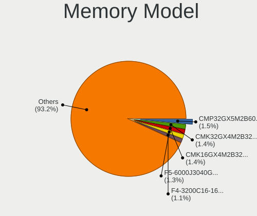

| Model                                                    | Desktops | Percent |
|----------------------------------------------------------|----------|---------|
| Unknown                                                  | 17       | 1.5%    |
| Corsair RAM CMK32GX4M2B3200C16 16GB DIMM DDR4 3800MT/s   | 16       | 1.41%   |
| Corsair RAM CMK16GX4M2B3200C16 8GB DIMM DDR4 3600MT/s    | 16       | 1.41%   |
| G.Skill RAM F5-6000J3040G32G 32GB DIMM DDR5 6200MT/s     | 15       | 1.32%   |
| G.Skill RAM F4-3200C16-16GVK 16GB DIMM DDR4 3600MT/s     | 13       | 1.15%   |
| Kingston RAM KHX3200C16D4/16GX 16GB DIMM DDR4 3600MT/s   | 12       | 1.06%   |
| Corsair RAM CMK64GX4M2E3200C16 32GB DIMM DDR4 3600MT/s   | 12       | 1.06%   |
| G.Skill RAM F4-3200C16-8GVKB 8GB DIMM DDR4 4000MT/s      | 11       | 0.97%   |
| Corsair RAM CMK16GX4M2B3000C15 8GB DIMM DDR4 3600MT/s    | 11       | 0.97%   |
| G.Skill RAM F5-6000J3636F16G 16GB DIMM DDR5 6400MT/s     | 10       | 0.88%   |
| G.Skill RAM F4-3600C16-16GTZNC 16GiB DIMM DDR4 3600MT/s  | 10       | 0.88%   |
| Corsair RAM CMK32GX4M2E3200C16 16GB DIMM DDR4 3600MT/s   | 10       | 0.88%   |
| Kingston RAM KF3200C16D4/16GX 16GB DIMM DDR4 3733MT/s    | 9        | 0.79%   |
| Kingston RAM KHX2666C16/8G 8GiB DIMM DDR4 3466MT/s       | 8        | 0.71%   |
| Kingston RAM KHX1866C10D3/8G 8GB DIMM DDR3 1867MT/s      | 8        | 0.71%   |
| Team RAM TEAMGROUP-UD4-3200 8GB DIMM DDR4 3733MT/s       | 7        | 0.62%   |
| G.Skill RAM F4-3200C16-8GIS 8GB DIMM DDR4 3600MT/s       | 6        | 0.53%   |
| G.Skill RAM F4-3200C14-8GFX 8GB DIMM DDR4 3800MT/s       | 6        | 0.53%   |
| Unknown RAM Module 1024MB DIMM SDRAM                     | 5        | 0.44%   |
| G.Skill RAM F5-6400J3239G32G 32GB DIMM DDR5 6400MT/s     | 5        | 0.44%   |
| G.Skill RAM F4-3200C16-8GTZR 8GB DIMM DDR4 3200MT/s      | 5        | 0.44%   |
| Corsair RAM CMK32GX4M2A2666C16 16GB DIMM DDR4 2667MT/s   | 5        | 0.44%   |
| Corsair RAM CMK16GX4M2D3600C18 8GB DIMM DDR4 4000MT/s    | 5        | 0.44%   |
| Corsair RAM CMK16GX4M2A2666C16 8GB DIMM DDR4 3400MT/s    | 5        | 0.44%   |
| Unknown RAM Module 4GB DIMM 1333MT/s                     | 4        | 0.35%   |
| Team RAM TEAMGROUP-UD4-3200 8GB DIMM DDR4 3800MT/s       | 4        | 0.35%   |
| Kingston RAM KHX3600C17D4/16GX 16GB DIMM DDR4 3800MT/s   | 4        | 0.35%   |
| Kingston RAM KHX3200C16D4/8GX 8GB DIMM DDR4 3733MT/s     | 4        | 0.35%   |
| Kingston RAM KHX3200C16D4/32GX 32GB DIMM DDR4 3200MT/s   | 4        | 0.35%   |
| Kingston RAM KHX2666C16/16G 16GB DIMM DDR4 3200MT/s      | 4        | 0.35%   |
| Kingston RAM KHX2666C15D4/8G 8GB DIMM DDR4 3200MT/s      | 4        | 0.35%   |
| Kingston RAM KHX1600C9D3/4GX 4GB DIMM DDR3 1867MT/s      | 4        | 0.35%   |
| Kingston RAM KF3600C16D4/16GX 16GB DIMM DDR4 3800MT/s    | 4        | 0.35%   |
| Kingston RAM KF3200C16D4/32GX 32GB DIMM DDR4 3933MT/s    | 4        | 0.35%   |
| Kingston RAM 9965745-002.A00G 16GB DIMM DDR4 3000MT/s    | 4        | 0.35%   |
| G.Skill RAM F4-3000C16-8GISB 8GB DIMM DDR4 3200MT/s      | 4        | 0.35%   |
| G.Skill RAM F4-3000C16-16GISB 16GB DIMM DDR4 3200MT/s    | 4        | 0.35%   |
| Crucial RAM BL16G32C16U4B.M16FE1 16GB DIMM DDR4 3800MT/s | 4        | 0.35%   |
| Corsair RAM CMW32GX4M2D3600C18 16GB DIMM DDR4 3600MT/s   | 4        | 0.35%   |
| Corsair RAM CMK64GX4M2D3600C18 32GB DIMM DDR4 3600MT/s   | 4        | 0.35%   |

Memory Kind
-----------

Memory module kinds

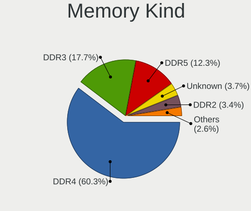

| Kind    | Desktops | Percent |
|---------|----------|---------|
| DDR4    | 581      | 60.33%  |
| DDR3    | 170      | 17.65%  |
| DDR5    | 118      | 12.25%  |
| Unknown | 36       | 3.74%   |
| DDR2    | 33       | 3.43%   |
| SDRAM   | 19       | 1.97%   |
| DDR     | 4        | 0.42%   |
| LPDDR5  | 1        | 0.1%    |
| DRAM    | 1        | 0.1%    |

Memory Form Factor
------------------

Physical design of the memory module

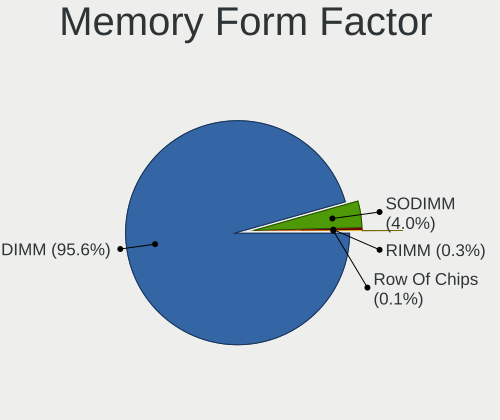

| Name         | Desktops | Percent |
|--------------|----------|---------|
| DIMM         | 917      | 95.62%  |
| SODIMM       | 38       | 3.96%   |
| RIMM         | 3        | 0.31%   |
| Row Of Chips | 1        | 0.1%    |

Memory Size
-----------

Memory module size

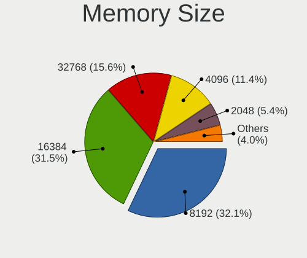

| Size  | Desktops | Percent |
|-------|----------|---------|
| 8192  | 332      | 32.11%  |
| 16384 | 326      | 31.53%  |
| 32768 | 161      | 15.57%  |
| 4096  | 118      | 11.41%  |
| 2048  | 56       | 5.42%   |
| 1024  | 18       | 1.74%   |
| 49152 | 14       | 1.35%   |
| 512   | 4        | 0.39%   |
| 65536 | 2        | 0.19%   |
| 24576 | 2        | 0.19%   |
| 256   | 1        | 0.1%    |

Memory Speed
------------

Memory module speed

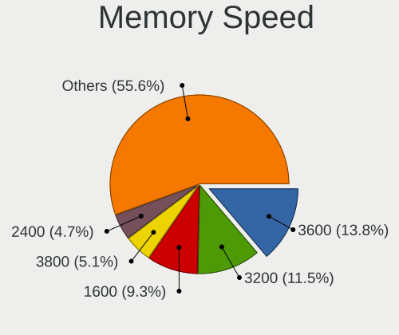

| Speed   | Desktops | Percent |
|---------|----------|---------|
| 3600    | 146      | 13.8%   |
| 3200    | 122      | 11.53%  |
| 1600    | 98       | 9.26%   |
| 3800    | 54       | 5.1%    |
| 2400    | 50       | 4.73%   |
| 2133    | 50       | 4.73%   |
| 1333    | 50       | 4.73%   |
| 3733    | 40       | 3.78%   |
| 2667    | 36       | 3.4%    |
| 3000    | 31       | 2.93%   |
| 6000    | 30       | 2.84%   |
| 800     | 28       | 2.65%   |
| 4000    | 25       | 2.36%   |
| 6400    | 23       | 2.17%   |
| 667     | 20       | 1.89%   |
| 4800    | 19       | 1.8%    |
| 3466    | 19       | 1.8%    |
| 3400    | 18       | 1.7%    |
| 5600    | 17       | 1.61%   |
| 6200    | 16       | 1.51%   |
| 3866    | 14       | 1.32%   |
| 2666    | 14       | 1.32%   |
| Unknown | 14       | 1.32%   |
| 1866    | 12       | 1.13%   |
| 2933    | 11       | 1.04%   |
| 1867    | 9        | 0.85%   |
| 3333    | 8        | 0.76%   |
| 1066    | 8        | 0.76%   |
| 2800    | 7        | 0.66%   |
| 3100    | 5        | 0.47%   |
| 2048    | 5        | 0.47%   |
| 5200    | 4        | 0.38%   |
| 3933    | 4        | 0.38%   |
| 3666    | 4        | 0.38%   |
| 3066    | 4        | 0.38%   |
| 1800    | 4        | 0.38%   |
| 400     | 4        | 0.38%   |
| 5000    | 3        | 0.28%   |
| 2134    | 3        | 0.28%   |
| 12800   | 2        | 0.19%   |

Printers & scanners
-------------------

Printer Vendor
--------------

Printer device vendors

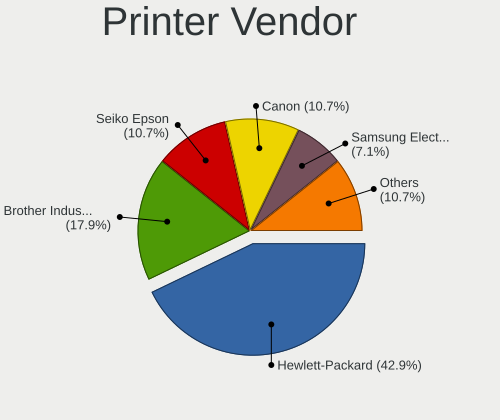

| Vendor                | Desktops | Percent |
|-----------------------|----------|---------|
| Hewlett-Packard       | 12       | 42.86%  |
| Brother Industries    | 5        | 17.86%  |
| Seiko Epson           | 3        | 10.71%  |
| Canon                 | 3        | 10.71%  |
| Samsung Electronics   | 2        | 7.14%   |
| Prolific Technology   | 1        | 3.57%   |
| NXP Semiconductors    | 1        | 3.57%   |
| Lexmark International | 1        | 3.57%   |

Printer Model
-------------

Printer device models

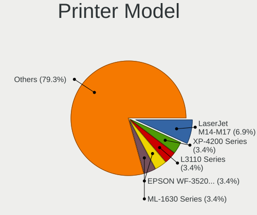

| Model                                | Desktops | Percent |
|--------------------------------------|----------|---------|
| HP LaserJet M14-M17                  | 2        | 6.9%    |
| Seiko Epson XP-4200 Series           | 1        | 3.45%   |
| Seiko Epson L3110 Series             | 1        | 3.45%   |
| Seiko Epson EPSON WF-3520 Series     | 1        | 3.45%   |
| Samsung ML-1630 Series               | 1        | 3.45%   |
| Samsung C460 Series                  | 1        | 3.45%   |
| Prolific PL2305 Parallel Port        | 1        | 3.45%   |
| NXP Semiconductors Elgin i8          | 1        | 3.45%   |
| Lexmark International Lexmark E352dn | 1        | 3.45%   |
| HP PhotoSmart 130                    | 1        | 3.45%   |
| HP LaserJet 1320                     | 1        | 3.45%   |
| HP LaserJet 1200                     | 1        | 3.45%   |
| HP LaserJet 1022                     | 1        | 3.45%   |
| HP LaserJet 1020                     | 1        | 3.45%   |
| HP LaserJet 1018                     | 1        | 3.45%   |
| HP LaserJet 1010                     | 1        | 3.45%   |
| HP HP Color LaserJet M452dn          | 1        | 3.45%   |
| HP ENVY 5540 series                  | 1        | 3.45%   |
| HP Deskjet 9800                      | 1        | 3.45%   |
| HP Deskjet 2050 J510                 | 1        | 3.45%   |
| Canon PIXMA MG2900 Series            | 1        | 3.45%   |
| Canon LiDE 400                       | 1        | 3.45%   |
| Canon D530/D560                      | 1        | 3.45%   |
| Brother QL-500 label printer         | 1        | 3.45%   |
| Brother MFC-L2700DW                  | 1        | 3.45%   |
| Brother MFC-9340CDW                  | 1        | 3.45%   |
| Brother MFC-9130CW                   | 1        | 3.45%   |
| Brother HL-L2370DW series            | 1        | 3.45%   |

Scanner Vendor
--------------

Scanner device vendors

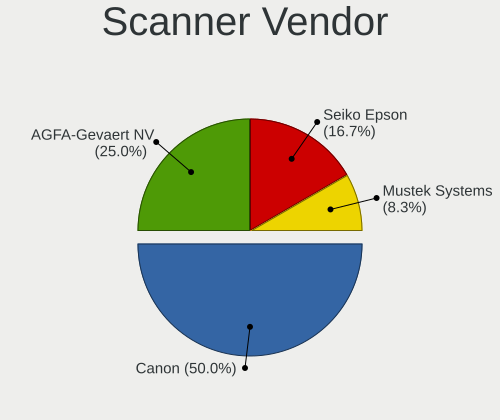

| Vendor          | Desktops | Percent |
|-----------------|----------|---------|
| Canon           | 6        | 50%     |
| AGFA-Gevaert NV | 3        | 25%     |
| Seiko Epson     | 2        | 16.67%  |
| Mustek Systems  | 1        | 8.33%   |

Scanner Model
-------------

Scanner device models

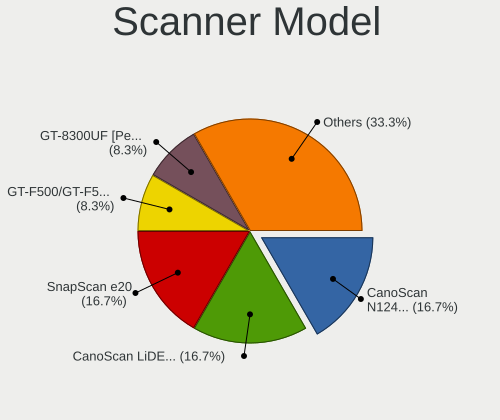

| Model                                                    | Desktops | Percent |
|----------------------------------------------------------|----------|---------|
| Canon CanoScan N1240U/LiDE 30                            | 2        | 16.67%  |
| Canon CanoScan LiDE 110                                  | 2        | 16.67%  |
| AGFA-Gevaert NV SnapScan e20                             | 2        | 16.67%  |
| Seiko Epson GT-F500/GT-F550 [Perfection 2480/2580 PHOTO] | 1        | 8.33%   |
| Seiko Epson GT-8300UF [Perfection 1660 PHOTO]            | 1        | 8.33%   |
| Mustek Systems BearPaw 2448 TA Pro                       | 1        | 8.33%   |
| Canon CanoScan LiDE 600F                                 | 1        | 8.33%   |
| Canon CanoScan LiDE 220                                  | 1        | 8.33%   |
| AGFA-Gevaert NV SnapScan 1212U (?)                       | 1        | 8.33%   |

Camera
------

Camera Vendor
-------------

Camera device vendors

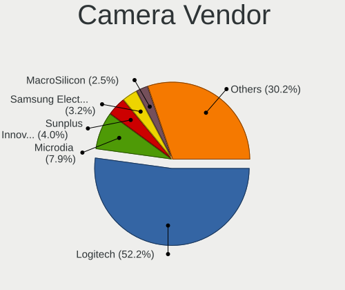

| Vendor                        | Desktops | Percent |
|-------------------------------|----------|---------|
| Logitech                      | 145      | 52.16%  |
| Microdia                      | 22       | 7.91%   |
| Sunplus Innovation Technology | 11       | 3.96%   |
| Samsung Electronics           | 9        | 3.24%   |
| MacroSilicon                  | 7        | 2.52%   |
| Generalplus Technology        | 7        | 2.52%   |
| Realtek Semiconductor         | 6        | 2.16%   |
| Z-Star Microelectronics       | 5        | 1.8%    |
| Razer USA                     | 5        | 1.8%    |
| Creative Technology           | 5        | 1.8%    |
| Chicony Electronics           | 5        | 1.8%    |
| Elgato Systems                | 4        | 1.44%   |
| ARC International             | 4        | 1.44%   |
| Valve Software                | 3        | 1.08%   |
| Microsoft                     | 3        | 1.08%   |
| AVerMedia Technologies        | 3        | 1.08%   |
| Apple                         | 3        | 1.08%   |
| Xiaomi                        | 2        | 0.72%   |
| GEMBIRD                       | 2        | 0.72%   |
| eMeet                         | 2        | 0.72%   |
| Cubeternet                    | 2        | 0.72%   |
| A4Tech                        | 2        | 0.72%   |
| Zhejiang Dahua Technology     | 1        | 0.36%   |
| YGTek                         | 1        | 0.36%   |
| webcam                        | 1        | 0.36%   |
| WaveRider Communications      | 1        | 0.36%   |
| Trust                         | 1        | 0.36%   |
| Tobii Technology AB           | 1        | 0.36%   |
| Sonix Technology              | 1        | 0.36%   |
| SiGma Micro                   | 1        | 0.36%   |
| Ruision                       | 1        | 0.36%   |
| Quanta                        | 1        | 0.36%   |
| Magic Control Technology      | 1        | 0.36%   |
| KYE Systems (Mouse Systems)   | 1        | 0.36%   |
| Jieli Technology              | 1        | 0.36%   |
| Intel                         | 1        | 0.36%   |
| Insta360                      | 1        | 0.36%   |
| HYGD-221208-J                 | 1        | 0.36%   |
| Huawei Technologies           | 1        | 0.36%   |
| Google                        | 1        | 0.36%   |

Camera Model
------------

Camera device models

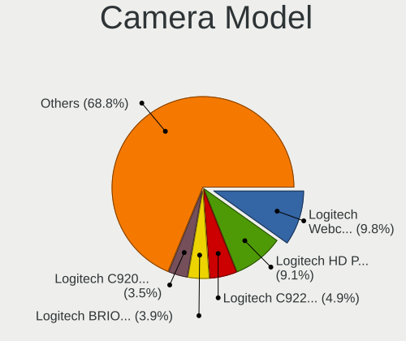

| Model                                       | Desktops | Percent |
|---------------------------------------------|----------|---------|
| Logitech Webcam C270                        | 28       | 9.82%   |
| Logitech HD Pro Webcam C920                 | 26       | 9.12%   |
| Logitech C922 Pro Stream Webcam             | 14       | 4.91%   |
| Logitech BRIO Ultra HD Webcam               | 11       | 3.86%   |
| Logitech C920 PRO HD Webcam                 | 10       | 3.51%   |
| Samsung Galaxy series, misc. (MTP mode)     | 9        | 3.16%   |
| Microdia USB 2.0 Camera                     | 8        | 2.81%   |
| Logitech Webcam C310                        | 7        | 2.46%   |
| Microdia Camera                             | 6        | 2.11%   |
| MacroSilicon USB Video                      | 6        | 2.11%   |
| Logitech HD Webcam C615                     | 6        | 2.11%   |
| Microdia Webcam Vitade AF                   | 5        | 1.75%   |
| Logitech StreamCam                          | 5        | 1.75%   |
| Logitech HD Webcam C525                     | 5        | 1.75%   |
| Logitech Webcam C930e                       | 4        | 1.4%    |
| Logitech B525 HD Webcam                     | 4        | 1.4%    |
| ARC International Camera                    | 4        | 1.4%    |
| Z-Star Venus USB2.0 Camera                  | 3        | 1.05%   |
| Valve Software 3D Camera                    | 3        | 1.05%   |
| Sunplus FULL HD webcam                      | 3        | 1.05%   |
| Realtek FULL HD 1080P Webcam                | 3        | 1.05%   |
| Razer USA Razer Kiyo Pro                    | 3        | 1.05%   |
| Logitech Webcam C200                        | 3        | 1.05%   |
| Logitech Logitech Webcam C925e              | 3        | 1.05%   |
| Logitech HD Webcam C510                     | 3        | 1.05%   |
| Logitech BRIO 4K Stream Edition             | 3        | 1.05%   |
| Generalplus WEB CAM                         | 3        | 1.05%   |
| Chicony HP 720p HD Monitor Webcam           | 3        | 1.05%   |
| Apple iPhone 5/5C/5S/6/SE/7/8/X             | 3        | 1.05%   |
| Z-Star A4 TECH USB2.0 PC Camera E           | 2        | 0.7%    |
| Xiaomi Redmi Note 10 Pro Max                | 2        | 0.7%    |
| Sunplus UHD Capture                         | 2        | 0.7%    |
| Sunplus NexiGo N940P 2K Webcam              | 2        | 0.7%    |
| Sunplus Integrated Camera                   | 2        | 0.7%    |
| Realtek USB Camera                          | 2        | 0.7%    |
| Razer USA Gaming Webcam [Kiyo]              | 2        | 0.7%    |
| Microsoft LifeCam Studio                    | 2        | 0.7%    |
| Microdia Defender G-Lens 2577 HD720p Camera | 2        | 0.7%    |
| MacroSilicon ShadowCast                     | 2        | 0.7%    |
| Logitech Webcam C170                        | 2        | 0.7%    |

Security
--------

Fingerprint Vendor
------------------

Fingerprint sensor vendors

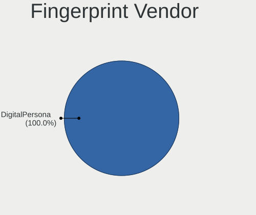

| Vendor         | Desktops | Percent |
|----------------|----------|---------|
| DigitalPersona | 4        | 100%    |

Fingerprint Model
-----------------

Fingerprint sensor models

| Model                             | Desktops | Percent |
|-----------------------------------|----------|---------|
| DigitalPersona Fingerprint Reader | 4        | 100%    |

Chipcard Vendor
---------------

Chipcard module vendors

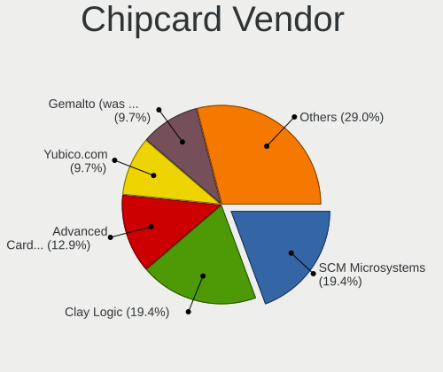

| Vendor                            | Desktops | Percent |
|-----------------------------------|----------|---------|
| SCM Microsystems                  | 6        | 19.35%  |
| Clay Logic                        | 6        | 19.35%  |
| Advanced Card Systems             | 4        | 12.9%   |
| Yubico.com                        | 3        | 9.68%   |
| Gemalto (was Gemplus)             | 3        | 9.68%   |
| Hewlett-Packard                   | 2        | 6.45%   |
| Alcor Micro                       | 2        | 6.45%   |
| VASCO Data Security International | 1        | 3.23%   |
| Fujitsu Siemens Computers         | 1        | 3.23%   |
| Chicony Electronics               | 1        | 3.23%   |
| Bit4id                            | 1        | 3.23%   |
| Aktiv                             | 1        | 3.23%   |

Chipcard Model
--------------

Chipcard module models

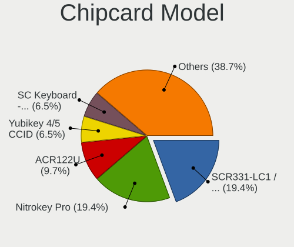

| Model                                                  | Desktops | Percent |
|--------------------------------------------------------|----------|---------|
| SCM Microsystems SCR331-LC1 / SCR3310 SmartCard Reader | 6        | 19.35%  |
| Clay Logic Nitrokey Pro                                | 6        | 19.35%  |
| Advanced Card Systems ACR122U                          | 3        | 9.68%   |
| Yubico.com Yubikey 4/5 CCID                            | 2        | 6.45%   |
| Hewlett-Packard SC Keyboard - Apollo (Liteon)          | 2        | 6.45%   |
| Gemalto (was Gemplus) GemPC Twin SmartCard Reader      | 2        | 6.45%   |
| Alcor Micro AU9540 Smartcard Reader                    | 2        | 6.45%   |
| Yubico.com Yubikey 4/5 U2F+CCID                        | 1        | 3.23%   |
| VASCO Data Security International DIGIPASS 870         | 1        | 3.23%   |
| Gemalto (was Gemplus) eToken 5110+ FIPS                | 1        | 3.23%   |
| Fujitsu Siemens Computers SmartCard Reader 2A          | 1        | 3.23%   |
| Chicony Electronics HP Skylab USB Smartcard Keyboard   | 1        | 3.23%   |
| Bit4id miniLector-s                                    | 1        | 3.23%   |
| Aktiv Rutoken lite                                     | 1        | 3.23%   |
| Advanced Card Systems ACR38 SmartCard Reader           | 1        | 3.23%   |

Unsupported
-----------

Unsupported Devices
-------------------

Total unsupported devices on board

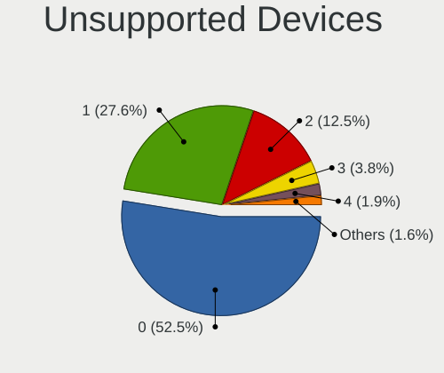

| Total | Desktops | Percent |
|-------|----------|---------|
| 0     | 601      | 52.53%  |
| 1     | 316      | 27.62%  |
| 2     | 143      | 12.5%   |
| 3     | 44       | 3.85%   |
| 4     | 22       | 1.92%   |
| 5     | 11       | 0.96%   |
| 6     | 5        | 0.44%   |
| 7     | 2        | 0.17%   |

Unsupported Device Types
------------------------

Types of unsupported devices

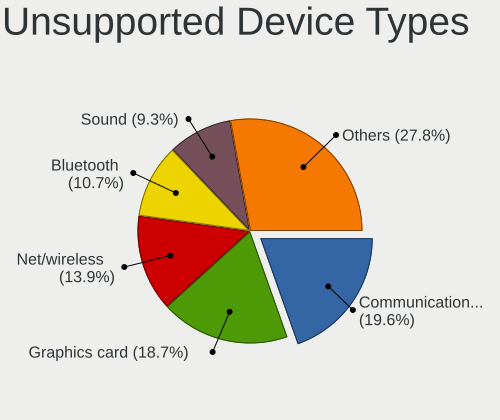

| Type                     | Desktops | Percent |
|--------------------------|----------|---------|
| Communication controller | 152      | 19.59%  |
| Graphics card            | 145      | 18.69%  |
| Net/wireless             | 108      | 13.92%  |
| Bluetooth                | 83       | 10.7%   |
| Sound                    | 72       | 9.28%   |
| Network                  | 30       | 3.87%   |
| Firewire controller      | 25       | 3.22%   |
| Unassigned class         | 23       | 2.96%   |
| Storage/ide              | 19       | 2.45%   |
| Net/ethernet             | 19       | 2.45%   |
| Camera                   | 19       | 2.45%   |
| Chipcard                 | 16       | 2.06%   |
| Multimedia controller    | 15       | 1.93%   |
| Storage/ata              | 11       | 1.42%   |
| Modem                    | 11       | 1.42%   |
| Storage/raid             | 9        | 1.16%   |
| Tv card                  | 5        | 0.64%   |
| Card reader              | 5        | 0.64%   |
| Fingerprint reader       | 4        | 0.52%   |
| Storage/nvme             | 3        | 0.39%   |
| Storage                  | 1        | 0.13%   |
| Dvb card                 | 1        | 0.13%   |

