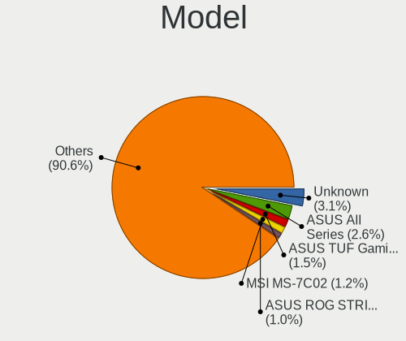
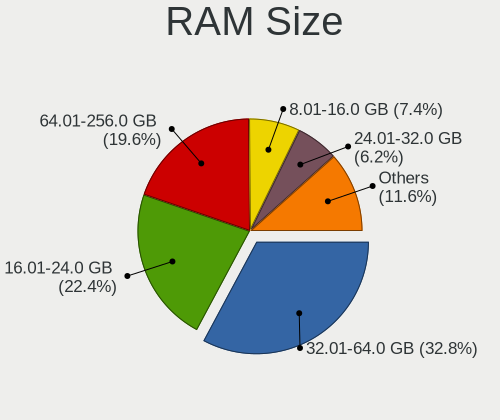
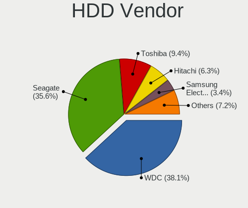
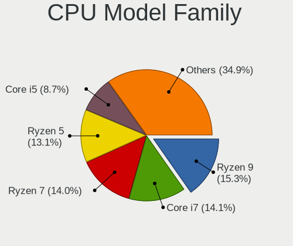
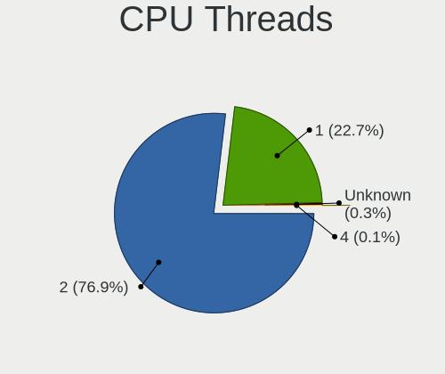
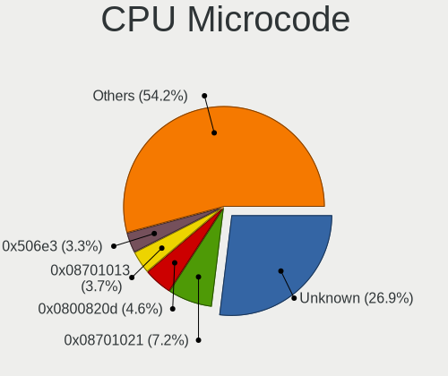
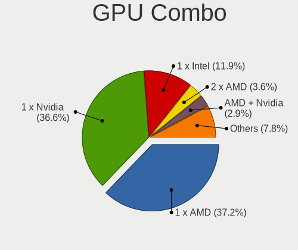
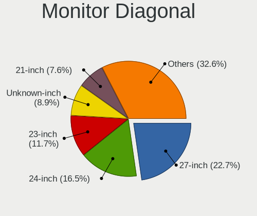
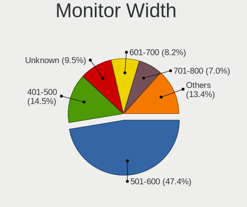
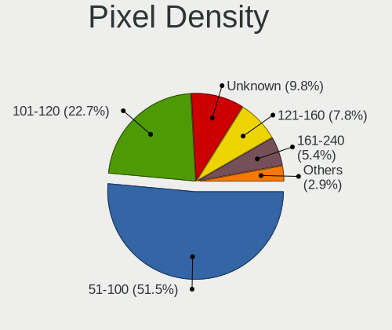

Gentoo - Tested Hardware & Statistics (Desktops)
------------------------------------------------

A project to collect tested hardware configurations for Gentoo.

Anyone can contribute to this report by the [hw-probe](https://github.com/linuxhw/hw-probe) tool:

    sudo -E hw-probe -all -upload

Please contribute! Especially if your hardware is rare.

Contents
--------

* [ Test Cases ](#test-cases)

* [ System ](#system)
  - [ OS                       ](#os)
  - [ OS Family                ](#os-family)
  - [ Kernel                   ](#kernel)
  - [ Kernel Family            ](#kernel-family)
  - [ Kernel Major Ver.        ](#kernel-major-ver)
  - [ Arch                     ](#arch)
  - [ DE                       ](#de)
  - [ Display Server           ](#display-server)
  - [ Display Manager          ](#display-manager)
  - [ OS Lang                  ](#os-lang)
  - [ Boot Mode                ](#boot-mode)
  - [ Filesystem               ](#filesystem)
  - [ Part. scheme             ](#part-scheme)
  - [ Dual Boot with Linux/BSD ](#dual-boot-with-linuxbsd)
  - [ Dual Boot (Win)          ](#dual-boot-win)

* [ Board ](#board)
  - [ Vendor                   ](#vendor)
  - [ Model                    ](#model)
  - [ Model Family             ](#model-family)
  - [ MFG Year                 ](#mfg-year)
  - [ Form Factor              ](#form-factor)
  - [ Secure Boot              ](#secure-boot)
  - [ Coreboot                 ](#coreboot)
  - [ RAM Size                 ](#ram-size)
  - [ RAM Used                 ](#ram-used)
  - [ Total Drives             ](#total-drives)
  - [ Has CD-ROM               ](#has-cd-rom)
  - [ Has Ethernet             ](#has-ethernet)
  - [ Has WiFi                 ](#has-wifi)
  - [ Has Bluetooth            ](#has-bluetooth)

* [ Location ](#location)
  - [ Country                  ](#country)
  - [ City                     ](#city)

* [ Drives ](#drives)
  - [ Drive Vendor             ](#drive-vendor)
  - [ Drive Model              ](#drive-model)
  - [ HDD Vendor               ](#hdd-vendor)
  - [ SSD Vendor               ](#ssd-vendor)
  - [ Drive Kind               ](#drive-kind)
  - [ Drive Connector          ](#drive-connector)
  - [ Drive Size               ](#drive-size)
  - [ Space Total              ](#space-total)
  - [ Space Used               ](#space-used)
  - [ Malfunc. Drives          ](#malfunc-drives)
  - [ Malfunc. Drive Vendor    ](#malfunc-drive-vendor)
  - [ Malfunc. HDD Vendor      ](#malfunc-hdd-vendor)
  - [ Malfunc. Drive Kind      ](#malfunc-drive-kind)
  - [ Failed Drives            ](#failed-drives)
  - [ Failed Drive Vendor      ](#failed-drive-vendor)
  - [ Drive Status             ](#drive-status)

* [ Storage controller ](#storage-controller)
  - [ Storage Vendor           ](#storage-vendor)
  - [ Storage Model            ](#storage-model)
  - [ Storage Kind             ](#storage-kind)

* [ Processor ](#processor)
  - [ CPU Vendor               ](#cpu-vendor)
  - [ CPU Model                ](#cpu-model)
  - [ CPU Model Family         ](#cpu-model-family)
  - [ CPU Cores                ](#cpu-cores)
  - [ CPU Sockets              ](#cpu-sockets)
  - [ CPU Threads              ](#cpu-threads)
  - [ CPU Op-Modes             ](#cpu-op-modes)
  - [ CPU Microcode            ](#cpu-microcode)
  - [ CPU Microarch            ](#cpu-microarch)

* [ Graphics ](#graphics)
  - [ GPU Vendor               ](#gpu-vendor)
  - [ GPU Model                ](#gpu-model)
  - [ GPU Combo                ](#gpu-combo)
  - [ GPU Driver               ](#gpu-driver)
  - [ GPU Memory               ](#gpu-memory)

* [ Monitor ](#monitor)
  - [ Monitor Vendor           ](#monitor-vendor)
  - [ Monitor Model            ](#monitor-model)
  - [ Monitor Resolution       ](#monitor-resolution)
  - [ Monitor Diagonal         ](#monitor-diagonal)
  - [ Monitor Width            ](#monitor-width)
  - [ Aspect Ratio             ](#aspect-ratio)
  - [ Monitor Area             ](#monitor-area)
  - [ Pixel Density            ](#pixel-density)
  - [ Multiple Monitors        ](#multiple-monitors)

* [ Network ](#network)
  - [ Net Controller Vendor    ](#net-controller-vendor)
  - [ Net Controller Model     ](#net-controller-model)
  - [ Wireless Vendor          ](#wireless-vendor)
  - [ Wireless Model           ](#wireless-model)
  - [ Ethernet Vendor          ](#ethernet-vendor)
  - [ Ethernet Model           ](#ethernet-model)
  - [ Net Controller Kind      ](#net-controller-kind)
  - [ Used Controller          ](#used-controller)
  - [ NICs                     ](#nics)
  - [ IPv6                     ](#ipv6)

* [ Bluetooth ](#bluetooth)
  - [ Bluetooth Vendor         ](#bluetooth-vendor)
  - [ Bluetooth Model          ](#bluetooth-model)

* [ Sound ](#sound)
  - [ Sound Vendor             ](#sound-vendor)
  - [ Sound Model              ](#sound-model)

* [ Memory ](#memory)
  - [ Memory Vendor            ](#memory-vendor)
  - [ Memory Model             ](#memory-model)
  - [ Memory Kind              ](#memory-kind)
  - [ Memory Form Factor       ](#memory-form-factor)
  - [ Memory Size              ](#memory-size)
  - [ Memory Speed             ](#memory-speed)

* [ Printers & scanners ](#printers--scanners)
  - [ Printer Vendor           ](#printer-vendor)
  - [ Printer Model            ](#printer-model)
  - [ Scanner Vendor           ](#scanner-vendor)
  - [ Scanner Model            ](#scanner-model)

* [ Camera ](#camera)
  - [ Camera Vendor            ](#camera-vendor)
  - [ Camera Model             ](#camera-model)

* [ Security ](#security)
  - [ Fingerprint Vendor       ](#fingerprint-vendor)
  - [ Fingerprint Model        ](#fingerprint-model)
  - [ Chipcard Vendor          ](#chipcard-vendor)
  - [ Chipcard Model           ](#chipcard-model)

* [ Unsupported ](#unsupported)
  - [ Unsupported Devices      ](#unsupported-devices)
  - [ Unsupported Device Types ](#unsupported-device-types)

Test Cases
----------

Total: 883

| Vendor        | Model                       | Probe                                                      | Date         |
|---------------|-----------------------------|------------------------------------------------------------|--------------|
| ASUSTek       | ROG STRIX Z590-E GAMING ... | [b3b8d3e04f](https://linux-hardware.org/?probe=b3b8d3e04f) | Sep 26, 2022 |
| ASUSTek       | ROG STRIX Z590-E GAMING ... | [9795d4f9aa](https://linux-hardware.org/?probe=9795d4f9aa) | Sep 26, 2022 |
| ASUSTek       | M3A78-CM                    | [6d3f575c3d](https://linux-hardware.org/?probe=6d3f575c3d) | Sep 26, 2022 |
| Gigabyte      | AB350-Gaming-CF             | [c447921f07](https://linux-hardware.org/?probe=c447921f07) | Sep 25, 2022 |
| ASRock        | J3160M                      | [c9cc54f48e](https://linux-hardware.org/?probe=c9cc54f48e) | Sep 25, 2022 |
| ASUSTek       | ROG STRIX X570-I GAMING     | [d22f082243](https://linux-hardware.org/?probe=d22f082243) | Sep 21, 2022 |
| ASUSTek       | ROG STRIX X570-I GAMING     | [e4f1a8245a](https://linux-hardware.org/?probe=e4f1a8245a) | Sep 21, 2022 |
| ASUSTek       | AM1M-A                      | [a6e61a9993](https://linux-hardware.org/?probe=a6e61a9993) | Sep 19, 2022 |
| ASUSTek       | M3A78-CM                    | [eb1c0556c3](https://linux-hardware.org/?probe=eb1c0556c3) | Sep 19, 2022 |
| Gigabyte      | AB350-Gaming-CF             | [5a9ab0de04](https://linux-hardware.org/?probe=5a9ab0de04) | Sep 18, 2022 |
| ASUSTek       | ROG STRIX B550-F GAMING     | [d4d8cc3f34](https://linux-hardware.org/?probe=d4d8cc3f34) | Sep 16, 2022 |
| Gigabyte      | Z590 UD                     | [475ed7f917](https://linux-hardware.org/?probe=475ed7f917) | Sep 15, 2022 |
| ASUSTek       | ROG STRIX B450-F GAMING     | [7ad1180946](https://linux-hardware.org/?probe=7ad1180946) | Sep 14, 2022 |
| ASUSTek       | M3A78-CM                    | [225bd59ba7](https://linux-hardware.org/?probe=225bd59ba7) | Sep 12, 2022 |
| Gigabyte      | AB350-Gaming-CF             | [ed5273b278](https://linux-hardware.org/?probe=ed5273b278) | Sep 11, 2022 |
| Intel         | X79G V2.x                   | [3cb7aa6549](https://linux-hardware.org/?probe=3cb7aa6549) | Sep 11, 2022 |
| MSI           | B450M MORTAR                | [2e0d41f272](https://linux-hardware.org/?probe=2e0d41f272) | Sep 10, 2022 |
| MSI           | B450M MORTAR                | [06ee689632](https://linux-hardware.org/?probe=06ee689632) | Sep 10, 2022 |
| ASUSTek       | ROG CROSSHAIR VIII HERO     | [5cfe072b9c](https://linux-hardware.org/?probe=5cfe072b9c) | Sep 10, 2022 |
| ASRock        | Z390 Phantom Gaming 4S      | [146e7ebf49](https://linux-hardware.org/?probe=146e7ebf49) | Sep 08, 2022 |
| Gigabyte      | B660 GAMING X AX DDR4       | [3d12a72937](https://linux-hardware.org/?probe=3d12a72937) | Sep 06, 2022 |
| MSI           | B450 TOMAHAWK MAX II        | [cc1fde17e8](https://linux-hardware.org/?probe=cc1fde17e8) | Sep 06, 2022 |
| Gigabyte      | AB350-Gaming-CF             | [1d90e3b685](https://linux-hardware.org/?probe=1d90e3b685) | Sep 05, 2022 |
| ASUSTek       | M3A78-CM                    | [d146908413](https://linux-hardware.org/?probe=d146908413) | Aug 31, 2022 |
| ASRock        | X370 Gaming X               | [e915bb3a8c](https://linux-hardware.org/?probe=e915bb3a8c) | Aug 29, 2022 |
| Gigabyte      | AB350-Gaming-CF             | [499889da7e](https://linux-hardware.org/?probe=499889da7e) | Aug 28, 2022 |
| ASRock        | X370 Gaming X               | [489691c2e3](https://linux-hardware.org/?probe=489691c2e3) | Aug 28, 2022 |
| Lenovo        | 3716 SDK0R32862 WIN 3258... | [7e810b23be](https://linux-hardware.org/?probe=7e810b23be) | Aug 26, 2022 |
| Gigabyte      | Z77X-D3H                    | [294fe7d6c8](https://linux-hardware.org/?probe=294fe7d6c8) | Aug 24, 2022 |
| Gigabyte      | Z77X-D3H                    | [2952e542e1](https://linux-hardware.org/?probe=2952e542e1) | Aug 24, 2022 |
| ASUSTek       | TUF Gaming X570-PLUS        | [0df091061c](https://linux-hardware.org/?probe=0df091061c) | Aug 24, 2022 |
| ASUSTek       | M3A78-CM                    | [d22f756c4c](https://linux-hardware.org/?probe=d22f756c4c) | Aug 24, 2022 |
| ASUSTek       | TUF Gaming X570-PLUS        | [0c80683e2a](https://linux-hardware.org/?probe=0c80683e2a) | Aug 23, 2022 |
| Gigabyte      | AB350-Gaming-CF             | [f38202db0d](https://linux-hardware.org/?probe=f38202db0d) | Aug 21, 2022 |
| MSI           | Z590-A PRO                  | [8445aa0041](https://linux-hardware.org/?probe=8445aa0041) | Aug 20, 2022 |
| ASUSTek       | M3A78-CM                    | [1ea309e90c](https://linux-hardware.org/?probe=1ea309e90c) | Aug 17, 2022 |
| Gigabyte      | B450 GAMING X               | [80760b8e4b](https://linux-hardware.org/?probe=80760b8e4b) | Aug 16, 2022 |
| Gigabyte      | AB350-Gaming-CF             | [48637ddb10](https://linux-hardware.org/?probe=48637ddb10) | Aug 14, 2022 |
| MSI           | B450 TOMAHAWK               | [8d95c82a1d](https://linux-hardware.org/?probe=8d95c82a1d) | Aug 12, 2022 |
| MSI           | B450 GAMING PRO CARBON A... | [7d7ceef044](https://linux-hardware.org/?probe=7d7ceef044) | Aug 12, 2022 |
| Unknown       | QNAP TS-221                 | [8d3f7ca9cf](https://linux-hardware.org/?probe=8d3f7ca9cf) | Aug 10, 2022 |
| ASUSTek       | PRIME Z390-A                | [2781a13b80](https://linux-hardware.org/?probe=2781a13b80) | Aug 10, 2022 |
| ASRock        | P67 Extreme4 Gen3           | [b94e1be5ab](https://linux-hardware.org/?probe=b94e1be5ab) | Aug 09, 2022 |
| ASUSTek       | M3A78-CM                    | [1f10876798](https://linux-hardware.org/?probe=1f10876798) | Aug 08, 2022 |
| Gigabyte      | AB350-Gaming-CF             | [ac538e23dc](https://linux-hardware.org/?probe=ac538e23dc) | Aug 07, 2022 |
| ASUSTek       | TUF B450M-PLUS GAMING       | [3e7a65077d](https://linux-hardware.org/?probe=3e7a65077d) | Aug 06, 2022 |
| Gigabyte      | B450 GAMING X               | [b875ef6dbf](https://linux-hardware.org/?probe=b875ef6dbf) | Aug 04, 2022 |
| ASUSTek       | ROG STRIX X570-E GAMING     | [3db1e1ee37](https://linux-hardware.org/?probe=3db1e1ee37) | Aug 03, 2022 |
| Gigabyte      | B550M DS3H                  | [69188053f5](https://linux-hardware.org/?probe=69188053f5) | Aug 02, 2022 |
| ASRock        | B75M-GL R2.0                | [eed9f05678](https://linux-hardware.org/?probe=eed9f05678) | Aug 01, 2022 |
| ASUSTek       | ROG Maximus Z690 EXTREME    | [effa59ed64](https://linux-hardware.org/?probe=effa59ed64) | Aug 01, 2022 |
| ASRock        | B550M Steel Legend          | [0ac4f27d0f](https://linux-hardware.org/?probe=0ac4f27d0f) | Jul 31, 2022 |
| ASUSTek       | TUF Gaming X570-PLUS        | [f22250f00c](https://linux-hardware.org/?probe=f22250f00c) | Jul 31, 2022 |
| ASUSTek       | M3A78-CM                    | [1051593809](https://linux-hardware.org/?probe=1051593809) | Jul 31, 2022 |
| Gigabyte      | 970A-DS3                    | [78f00bd2aa](https://linux-hardware.org/?probe=78f00bd2aa) | Jul 30, 2022 |
| Lenovo        | 1046 SDK0T08861 WIN 3305... | [d3d824f468](https://linux-hardware.org/?probe=d3d824f468) | Jul 29, 2022 |
| MSI           | B450M MORTAR                | [29a26324b9](https://linux-hardware.org/?probe=29a26324b9) | Jul 29, 2022 |
| Intel         | D54250WYK H13922-303        | [5ff32931fa](https://linux-hardware.org/?probe=5ff32931fa) | Jul 27, 2022 |
| MSI           | MPG Z390 GAMING PRO CARB... | [dc7eff27cf](https://linux-hardware.org/?probe=dc7eff27cf) | Jul 26, 2022 |
| ASRock        | X399 Taichi                 | [d2eb8a032b](https://linux-hardware.org/?probe=d2eb8a032b) | Jul 26, 2022 |
| ASUSTek       | ROG Maximus XI HERO         | [c98fed5f84](https://linux-hardware.org/?probe=c98fed5f84) | Jul 25, 2022 |
| ASUSTek       | ROG Maximus Z690 EXTREME    | [dae325b47b](https://linux-hardware.org/?probe=dae325b47b) | Jul 25, 2022 |
| ASUSTek       | M3A78-CM                    | [e1e16aa154](https://linux-hardware.org/?probe=e1e16aa154) | Jul 25, 2022 |
| Gigabyte      | AB350-Gaming-CF             | [153acd77c2](https://linux-hardware.org/?probe=153acd77c2) | Jul 24, 2022 |
| ASRock        | AM1H-ITX                    | [a15c82ba0c](https://linux-hardware.org/?probe=a15c82ba0c) | Jul 24, 2022 |
| Unknown       | QNAP TS-221                 | [fb3741faab](https://linux-hardware.org/?probe=fb3741faab) | Jul 21, 2022 |
| ASRock        | X570 Taichi                 | [56d5853243](https://linux-hardware.org/?probe=56d5853243) | Jul 19, 2022 |
| MSI           | MEG X570 UNIFY              | [d3d26541f1](https://linux-hardware.org/?probe=d3d26541f1) | Jul 19, 2022 |
| Gigabyte      | AB350-Gaming-CF             | [8f2f1582e8](https://linux-hardware.org/?probe=8f2f1582e8) | Jul 17, 2022 |
| ASUSTek       | M3A78-CM                    | [056d74f1a9](https://linux-hardware.org/?probe=056d74f1a9) | Jul 17, 2022 |
| ASUSTek       | ROG STRIX B560-I GAMING ... | [e6b6d3b5e6](https://linux-hardware.org/?probe=e6b6d3b5e6) | Jul 16, 2022 |
| ASUSTek       | ROG STRIX B560-I GAMING ... | [93f8a4ce9f](https://linux-hardware.org/?probe=93f8a4ce9f) | Jul 16, 2022 |
| Gigabyte      | Z590 UD                     | [e9e0b50bbb](https://linux-hardware.org/?probe=e9e0b50bbb) | Jul 15, 2022 |
| MSI           | Z87-G45 GAMING              | [8602f7246a](https://linux-hardware.org/?probe=8602f7246a) | Jul 12, 2022 |
| Gigabyte      | B450 AORUS M                | [6d15b85193](https://linux-hardware.org/?probe=6d15b85193) | Jul 10, 2022 |
| Dell          | 0J3C2F A02                  | [dccb88852f](https://linux-hardware.org/?probe=dccb88852f) | Jul 10, 2022 |
| ASUSTek       | M3A78-CM                    | [0237c9df10](https://linux-hardware.org/?probe=0237c9df10) | Jul 10, 2022 |
| ASUSTek       | ROG STRIX B550-F GAMING     | [85dbd84c37](https://linux-hardware.org/?probe=85dbd84c37) | Jul 09, 2022 |
| Dell          | 0J3C2F A02                  | [aa87616696](https://linux-hardware.org/?probe=aa87616696) | Jul 09, 2022 |
| ASUSTek       | ROG CROSSHAIR VIII DARK ... | [685e3d36bc](https://linux-hardware.org/?probe=685e3d36bc) | Jul 04, 2022 |
| ASUSTek       | ROG CROSSHAIR VIII DARK ... | [b436712f17](https://linux-hardware.org/?probe=b436712f17) | Jul 04, 2022 |
| ASUSTek       | ROG Maximus XI HERO         | [d442c531e8](https://linux-hardware.org/?probe=d442c531e8) | Jul 03, 2022 |
| Gigabyte      | Z690 AORUS MASTER           | [cf8784ac23](https://linux-hardware.org/?probe=cf8784ac23) | Jul 03, 2022 |
| ASUSTek       | PRIME Z390-A                | [1af80d1cdb](https://linux-hardware.org/?probe=1af80d1cdb) | Jul 01, 2022 |
| ASUSTek       | M3A78-CM                    | [4c0fa03f61](https://linux-hardware.org/?probe=4c0fa03f61) | Jun 28, 2022 |
| Gigabyte      | AB350-Gaming-CF             | [79dca3a17c](https://linux-hardware.org/?probe=79dca3a17c) | Jun 26, 2022 |
| Fujitsu       | D3417-B2 S26361-D3417-B2    | [f03dcf744a](https://linux-hardware.org/?probe=f03dcf744a) | Jun 26, 2022 |
| Gigabyte      | Z590 UD                     | [74060af6fc](https://linux-hardware.org/?probe=74060af6fc) | Jun 23, 2022 |
| Gigabyte      | AB350-Gaming-CF             | [2028b239fc](https://linux-hardware.org/?probe=2028b239fc) | Jun 19, 2022 |
| ASUSTek       | M3A78-CM                    | [20c198dd50](https://linux-hardware.org/?probe=20c198dd50) | Jun 19, 2022 |
| ASRock        | B450 Pro4                   | [9d03e8cba7](https://linux-hardware.org/?probe=9d03e8cba7) | Jun 18, 2022 |
| ASUSTek       | TUF Gaming X570-PLUS        | [fe7fa5fe7a](https://linux-hardware.org/?probe=fe7fa5fe7a) | Jun 17, 2022 |
| ASUSTek       | M3A78-CM                    | [59350b295e](https://linux-hardware.org/?probe=59350b295e) | Jun 13, 2022 |
| Gigabyte      | AB350-Gaming-CF             | [223b882103](https://linux-hardware.org/?probe=223b882103) | Jun 12, 2022 |
| ASUSTek       | ROG STRIX B450-F GAMING     | [80a6dc4a46](https://linux-hardware.org/?probe=80a6dc4a46) | Jun 09, 2022 |
| Pegatron      | 2ACE                        | [838cad5bc2](https://linux-hardware.org/?probe=838cad5bc2) | Jun 06, 2022 |
| Dell          | 0KWVT8 A03                  | [5745c8b787](https://linux-hardware.org/?probe=5745c8b787) | Jun 06, 2022 |
| ASUSTek       | M3A78-CM                    | [fd5c0c6f83](https://linux-hardware.org/?probe=fd5c0c6f83) | Jun 06, 2022 |
| Gigabyte      | AB350-Gaming-CF             | [cb81a60917](https://linux-hardware.org/?probe=cb81a60917) | Jun 05, 2022 |
| Unknown       | Unknown                     | [c6f9883076](https://linux-hardware.org/?probe=c6f9883076) | Jun 05, 2022 |
| Unknown       | Unknown                     | [4abb49be35](https://linux-hardware.org/?probe=4abb49be35) | Jun 04, 2022 |
| MSI           | X570-A PRO                  | [102ed915c5](https://linux-hardware.org/?probe=102ed915c5) | Jun 02, 2022 |
| ASUSTek       | TUF Gaming Z690-PLUS WIF... | [2c33cbbbe2](https://linux-hardware.org/?probe=2c33cbbbe2) | May 30, 2022 |
| Gigabyte      | AB350-Gaming-CF             | [bd36f27f9b](https://linux-hardware.org/?probe=bd36f27f9b) | May 29, 2022 |
| ASUSTek       | Z170-A                      | [86021dcc38](https://linux-hardware.org/?probe=86021dcc38) | May 27, 2022 |
| ASUSTek       | Z170-A                      | [b8603fccc0](https://linux-hardware.org/?probe=b8603fccc0) | May 26, 2022 |
| MSI           | PRO Z690-A DDR4             | [38ac6de56d](https://linux-hardware.org/?probe=38ac6de56d) | May 25, 2022 |
| ASRock        | B450 Gaming K4              | [af256d7649](https://linux-hardware.org/?probe=af256d7649) | May 24, 2022 |
| Intel         | D54250WYK H13922-303        | [59eda31291](https://linux-hardware.org/?probe=59eda31291) | May 24, 2022 |
| ASUSTek       | M3A78-CM                    | [b253c6e007](https://linux-hardware.org/?probe=b253c6e007) | May 24, 2022 |
| ASRockRack    | E3C232D2I                   | [0442460b97](https://linux-hardware.org/?probe=0442460b97) | May 24, 2022 |
| Unknown       | Unknown                     | [4e370a75aa](https://linux-hardware.org/?probe=4e370a75aa) | May 23, 2022 |
| Apple         | Mac-F221BEC8                | [e254f29ffd](https://linux-hardware.org/?probe=e254f29ffd) | May 23, 2022 |
| ASUSTek       | TUF Gaming B550-PLUS        | [93700a286d](https://linux-hardware.org/?probe=93700a286d) | May 23, 2022 |
| ASUSTek       | Rampage V EXTREME           | [ce350dd874](https://linux-hardware.org/?probe=ce350dd874) | May 23, 2022 |
| Gigabyte      | AB350-Gaming-CF             | [f129f3b1d5](https://linux-hardware.org/?probe=f129f3b1d5) | May 22, 2022 |
| ASUSTek       | PRIME X570-PRO              | [f7225b80ed](https://linux-hardware.org/?probe=f7225b80ed) | May 18, 2022 |
| ASUSTek       | PRIME X570-PRO              | [84a0dc5b83](https://linux-hardware.org/?probe=84a0dc5b83) | May 18, 2022 |
| ASUSTek       | M3A78-CM                    | [d5477b3bb9](https://linux-hardware.org/?probe=d5477b3bb9) | May 17, 2022 |
| ASUSTek       | PRIME Z690M-PLUS D4         | [818ee286b7](https://linux-hardware.org/?probe=818ee286b7) | May 17, 2022 |
| ASUSTek       | ROG Maximus XIII APEX       | [56fb967887](https://linux-hardware.org/?probe=56fb967887) | May 16, 2022 |
| MSI           | MAG X570S TOMAHAWK MAX W... | [9afc74ed46](https://linux-hardware.org/?probe=9afc74ed46) | May 16, 2022 |
| MSI           | X570-A PRO                  | [28b47bc364](https://linux-hardware.org/?probe=28b47bc364) | May 15, 2022 |
| ASUSTek       | SABERTOOTH 990FX            | [49a3292018](https://linux-hardware.org/?probe=49a3292018) | May 15, 2022 |
| ASUSTek       | Z8NR-D12                    | [e65adcd0da](https://linux-hardware.org/?probe=e65adcd0da) | May 14, 2022 |
| Dell          | 0J3C2F A02                  | [07e2cea31c](https://linux-hardware.org/?probe=07e2cea31c) | May 13, 2022 |
| ASUSTek       | PRIME H370-PLUS             | [df570dd8e0](https://linux-hardware.org/?probe=df570dd8e0) | May 12, 2022 |
| Gigabyte      | Z590 UD                     | [2fcf37c00a](https://linux-hardware.org/?probe=2fcf37c00a) | May 11, 2022 |
| HP            | 8704                        | [b66f290b02](https://linux-hardware.org/?probe=b66f290b02) | May 09, 2022 |
| Dell          | 0J3C2F A02                  | [bd6c3ca5b4](https://linux-hardware.org/?probe=bd6c3ca5b4) | May 09, 2022 |
| Gigabyte      | AB350-Gaming-CF             | [81aa293c77](https://linux-hardware.org/?probe=81aa293c77) | May 08, 2022 |
| ASRock        | A320M Pro4                  | [b51c7ae18b](https://linux-hardware.org/?probe=b51c7ae18b) | May 04, 2022 |
| ASUSTek       | TUF Gaming B550M-PLUS       | [48fa5d3b93](https://linux-hardware.org/?probe=48fa5d3b93) | May 04, 2022 |
| Gigabyte      | GA-970A-D3                  | [01369642f4](https://linux-hardware.org/?probe=01369642f4) | May 03, 2022 |
| ASRock        | X370 Gaming X               | [b24677a908](https://linux-hardware.org/?probe=b24677a908) | May 01, 2022 |
| MSI           | MPG Z390 GAMING PRO CARB... | [07a115654d](https://linux-hardware.org/?probe=07a115654d) | Apr 30, 2022 |
| ASUSTek       | ROG STRIX X570-E GAMING     | [970d30df6d](https://linux-hardware.org/?probe=970d30df6d) | Apr 29, 2022 |
| ASRock        | A520M Pro4                  | [45630a42df](https://linux-hardware.org/?probe=45630a42df) | Apr 29, 2022 |
| Dell          | 0J37VM A00                  | [76f13aa200](https://linux-hardware.org/?probe=76f13aa200) | Apr 28, 2022 |
| Gigabyte      | X570 AORUS ELITE WIFI       | [82b11931ed](https://linux-hardware.org/?probe=82b11931ed) | Apr 21, 2022 |
| ASUSTek       | ROG STRIX B550-F GAMING     | [6af0b2a3c9](https://linux-hardware.org/?probe=6af0b2a3c9) | Apr 21, 2022 |
| MSI           | Z390-A PRO                  | [4121c8fcc2](https://linux-hardware.org/?probe=4121c8fcc2) | Apr 20, 2022 |
| ASUSTek       | TUF Gaming Z690-PLUS D4     | [fb3e0b6b22](https://linux-hardware.org/?probe=fb3e0b6b22) | Apr 18, 2022 |
| Lenovo        | 30D0 SDK0J40705 WIN 3425... | [fa96d5405d](https://linux-hardware.org/?probe=fa96d5405d) | Apr 17, 2022 |
| ASRockRack    | X470D4U                     | [1b9b990e65](https://linux-hardware.org/?probe=1b9b990e65) | Apr 17, 2022 |
| Lenovo        | 30D0 SDK0J40705 WIN 3425... | [474bb81b18](https://linux-hardware.org/?probe=474bb81b18) | Apr 15, 2022 |
| Lenovo        | 30D0 SDK0J40705 WIN 3425... | [f6a1a50a75](https://linux-hardware.org/?probe=f6a1a50a75) | Apr 15, 2022 |
| ASUSTek       | ROG STRIX X470-F GAMING     | [d14605acc1](https://linux-hardware.org/?probe=d14605acc1) | Apr 15, 2022 |
| ASUSTek       | Z97-K/USB                   | [16aaadda77](https://linux-hardware.org/?probe=16aaadda77) | Apr 14, 2022 |
| Gigabyte      | B460 HD3                    | [c3c9ea3a20](https://linux-hardware.org/?probe=c3c9ea3a20) | Apr 14, 2022 |
| ASRock        | A320M-ITX                   | [eaf6bbd74e](https://linux-hardware.org/?probe=eaf6bbd74e) | Apr 13, 2022 |
| ASUSTek       | PRIME H570M-PLUS            | [5e6ce90c93](https://linux-hardware.org/?probe=5e6ce90c93) | Apr 13, 2022 |
| MSI           | B450-A PRO MAX              | [cfd276f151](https://linux-hardware.org/?probe=cfd276f151) | Apr 13, 2022 |
| Gigabyte      | X570 AORUS ELITE WIFI       | [68dd0c90a1](https://linux-hardware.org/?probe=68dd0c90a1) | Apr 12, 2022 |
| ASUSTek       | ROG Maximus XIII APEX       | [7a26d3fc81](https://linux-hardware.org/?probe=7a26d3fc81) | Apr 12, 2022 |
| ASRock        | Z390 Extreme4               | [1bd70fbd59](https://linux-hardware.org/?probe=1bd70fbd59) | Apr 09, 2022 |
| Gigabyte      | H470 HD3                    | [5ce5c54ecd](https://linux-hardware.org/?probe=5ce5c54ecd) | Apr 09, 2022 |
| ASRock        | Z390 Extreme4               | [ed2dd10e6e](https://linux-hardware.org/?probe=ed2dd10e6e) | Apr 09, 2022 |
| MSI           | MAG B550 TORPEDO            | [ce26da001a](https://linux-hardware.org/?probe=ce26da001a) | Apr 07, 2022 |
| ASUSTek       | P6X58D-E                    | [68be7a767a](https://linux-hardware.org/?probe=68be7a767a) | Apr 07, 2022 |
| ASUSTek       | ROG Maximus XIII APEX       | [8aad15d96c](https://linux-hardware.org/?probe=8aad15d96c) | Apr 06, 2022 |
| MSI           | MAG X570 TOMAHAWK WIFI      | [3f086610fc](https://linux-hardware.org/?probe=3f086610fc) | Apr 05, 2022 |
| ASUSTek       | TUF Gaming B550-PLUS        | [403a6830d9](https://linux-hardware.org/?probe=403a6830d9) | Apr 04, 2022 |
| ASUSTek       | ROG Maximus XIII APEX       | [5bcff46ee9](https://linux-hardware.org/?probe=5bcff46ee9) | Apr 04, 2022 |
| ASUSTek       | PRIME X570-PRO              | [368a64422d](https://linux-hardware.org/?probe=368a64422d) | Apr 03, 2022 |
| Gigabyte      | X570 GAMING X               | [348ccc5750](https://linux-hardware.org/?probe=348ccc5750) | Apr 01, 2022 |
| Gigabyte      | X570 GAMING X               | [32eabd9ac8](https://linux-hardware.org/?probe=32eabd9ac8) | Apr 01, 2022 |
| ASRock        | Z170A-X1                    | [9e1cc71d24](https://linux-hardware.org/?probe=9e1cc71d24) | Mar 31, 2022 |
| MSI           | MAG B550M MORTAR            | [9ebb4c0fd3](https://linux-hardware.org/?probe=9ebb4c0fd3) | Mar 31, 2022 |
| ASUSTek       | TUF Gaming X570-PLUS        | [6af3c57a8a](https://linux-hardware.org/?probe=6af3c57a8a) | Mar 24, 2022 |
| Gigabyte      | Z590 UD                     | [5cde1a4e83](https://linux-hardware.org/?probe=5cde1a4e83) | Mar 24, 2022 |
| ASUSTek       | ROG STRIX Z370-H GAMING     | [6dddf500c7](https://linux-hardware.org/?probe=6dddf500c7) | Mar 22, 2022 |
| MSI           | MAG B550M MORTAR            | [593bf6f937](https://linux-hardware.org/?probe=593bf6f937) | Mar 21, 2022 |
| ASUSTek       | Z170 PRO GAMING             | [6efb7791bb](https://linux-hardware.org/?probe=6efb7791bb) | Mar 19, 2022 |
| ASUSTek       | PRIME X299-DELUXE II        | [a2b06f49d3](https://linux-hardware.org/?probe=a2b06f49d3) | Mar 18, 2022 |
| ASUSTek       | PRIME X299-DELUXE II        | [9e32abccd6](https://linux-hardware.org/?probe=9e32abccd6) | Mar 18, 2022 |
| ASUSTek       | SABERTOOTH 990FX R2.0       | [3be092b600](https://linux-hardware.org/?probe=3be092b600) | Mar 18, 2022 |
| ASUSTek       | ROG STRIX Z390-E GAMING     | [70021af77a](https://linux-hardware.org/?probe=70021af77a) | Mar 15, 2022 |
| MSI           | B560M PRO-VDH WIFI          | [c15007b668](https://linux-hardware.org/?probe=c15007b668) | Mar 15, 2022 |
| ASUSTek       | PRIME J4005I-C              | [707cb5ce3b](https://linux-hardware.org/?probe=707cb5ce3b) | Mar 14, 2022 |
| Intel         | DH61WW AAG23116-302         | [20682db2fa](https://linux-hardware.org/?probe=20682db2fa) | Mar 14, 2022 |
| Alienware     | 0TYR0X A00                  | [b82ab5d2d7](https://linux-hardware.org/?probe=b82ab5d2d7) | Mar 14, 2022 |
| Gigabyte      | B550 GAMING X V2            | [9bd0fc9e48](https://linux-hardware.org/?probe=9bd0fc9e48) | Mar 14, 2022 |
| Dell          | 0J37VM A00                  | [a78d4c99e3](https://linux-hardware.org/?probe=a78d4c99e3) | Mar 09, 2022 |
| ASUSTek       | ROG STRIX B450-F GAMING     | [f1b0d6e847](https://linux-hardware.org/?probe=f1b0d6e847) | Mar 03, 2022 |
| ASRock        | A300M-STX                   | [d9c28765e7](https://linux-hardware.org/?probe=d9c28765e7) | Mar 03, 2022 |
| ASUSTek       | TUF Gaming X570-PRO         | [44656b1bd4](https://linux-hardware.org/?probe=44656b1bd4) | Mar 03, 2022 |
| ASUSTek       | TUF Gaming Z590-PLUS WIF... | [5c95114871](https://linux-hardware.org/?probe=5c95114871) | Mar 02, 2022 |
| ASUSTek       | TUF Gaming Z590-PLUS WIF... | [6931b9fe82](https://linux-hardware.org/?probe=6931b9fe82) | Mar 02, 2022 |
| ASUSTek       | TUF Gaming Z590-PLUS WIF... | [842379fc35](https://linux-hardware.org/?probe=842379fc35) | Mar 01, 2022 |
| Alienware     | 0TYR0X A00                  | [17eda5de26](https://linux-hardware.org/?probe=17eda5de26) | Feb 28, 2022 |
| Gigabyte      | AB350-Gaming-CF             | [875e06d62c](https://linux-hardware.org/?probe=875e06d62c) | Feb 27, 2022 |
| ASUSTek       | PRIME X570-PRO              | [6d4c3afa7f](https://linux-hardware.org/?probe=6d4c3afa7f) | Feb 27, 2022 |
| Gigabyte      | Z590 UD                     | [a5242ed058](https://linux-hardware.org/?probe=a5242ed058) | Feb 26, 2022 |
| Gigabyte      | Z590 UD                     | [071dd25266](https://linux-hardware.org/?probe=071dd25266) | Feb 24, 2022 |
| Alienware     | 0TYR0X A00                  | [892e886901](https://linux-hardware.org/?probe=892e886901) | Feb 23, 2022 |
| Alienware     | 0TYR0X A00                  | [71cac3ebdd](https://linux-hardware.org/?probe=71cac3ebdd) | Feb 22, 2022 |
| MSI           | MPG Z390 GAMING PRO CARB... | [6d5688db26](https://linux-hardware.org/?probe=6d5688db26) | Feb 21, 2022 |
| ASUSTek       | ROG STRIX B450-F GAMING     | [160ecaffd8](https://linux-hardware.org/?probe=160ecaffd8) | Feb 21, 2022 |
| MSI           | H81I                        | [c556e9c713](https://linux-hardware.org/?probe=c556e9c713) | Feb 20, 2022 |
| MSI           | MPG Z390 GAMING PRO CARB... | [1429fd9ed5](https://linux-hardware.org/?probe=1429fd9ed5) | Feb 20, 2022 |
| ASRock        | B450 Pro4                   | [859adc5b97](https://linux-hardware.org/?probe=859adc5b97) | Feb 19, 2022 |
| ASUSTek       | ROG Maximus XIII APEX       | [eddf69336b](https://linux-hardware.org/?probe=eddf69336b) | Feb 18, 2022 |
| Gigabyte      | B460 HD3                    | [661166a163](https://linux-hardware.org/?probe=661166a163) | Feb 17, 2022 |
| ASUSTek       | PRIME B450M-K               | [6278830433](https://linux-hardware.org/?probe=6278830433) | Feb 17, 2022 |
| YANYU         | H17SL                       | [0a6638d9c9](https://linux-hardware.org/?probe=0a6638d9c9) | Feb 14, 2022 |
| ASUSTek       | ROG CROSSHAIR VIII DARK ... | [5836ccecc2](https://linux-hardware.org/?probe=5836ccecc2) | Feb 10, 2022 |
| ASRock        | B450 Pro4                   | [9f05ddfb03](https://linux-hardware.org/?probe=9f05ddfb03) | Feb 08, 2022 |
| Gigabyte      | AB350-Gaming-CF             | [68c1afd184](https://linux-hardware.org/?probe=68c1afd184) | Feb 06, 2022 |
| YANYU         | H17SL                       | [cd763ca612](https://linux-hardware.org/?probe=cd763ca612) | Feb 06, 2022 |
| Supermicro    | A1SRM-2758F                 | [33b8806332](https://linux-hardware.org/?probe=33b8806332) | Feb 05, 2022 |
| ASUSTek       | ROG Maximus XIII APEX       | [59d4e2a5b2](https://linux-hardware.org/?probe=59d4e2a5b2) | Feb 04, 2022 |
| Gigabyte      | Z490 UD                     | [b571c22d4f](https://linux-hardware.org/?probe=b571c22d4f) | Feb 04, 2022 |
| MSI           | MPG B550 GAMING PLUS        | [d424a8e145](https://linux-hardware.org/?probe=d424a8e145) | Feb 01, 2022 |
| MSI           | MPG B550 GAMING PLUS        | [89dbe92caf](https://linux-hardware.org/?probe=89dbe92caf) | Feb 01, 2022 |
| ASUSTek       | PRIME B450M-K               | [f49f9dddd2](https://linux-hardware.org/?probe=f49f9dddd2) | Jan 29, 2022 |
| ASRock        | AB350M Pro4                 | [6b7cf2d570](https://linux-hardware.org/?probe=6b7cf2d570) | Jan 27, 2022 |
| ASRock        | A88M-G                      | [bb3847af5e](https://linux-hardware.org/?probe=bb3847af5e) | Jan 27, 2022 |
| ASRock        | A88M-G                      | [7f86f91b8f](https://linux-hardware.org/?probe=7f86f91b8f) | Jan 27, 2022 |
| Gigabyte      | B450M S2H                   | [656da02110](https://linux-hardware.org/?probe=656da02110) | Jan 24, 2022 |
| Gigabyte      | B450M S2H                   | [1721bed3e1](https://linux-hardware.org/?probe=1721bed3e1) | Jan 24, 2022 |
| ASUSTek       | ROG STRIX B560-I GAMING ... | [db8b77c1ff](https://linux-hardware.org/?probe=db8b77c1ff) | Jan 23, 2022 |
| Gigabyte      | Z490 UD                     | [eac4639ad2](https://linux-hardware.org/?probe=eac4639ad2) | Jan 22, 2022 |
| ASUSTek       | PRIME B450M-K               | [0799e18f8b](https://linux-hardware.org/?probe=0799e18f8b) | Jan 20, 2022 |
| ASRock        | 970 Pro3 R2.0               | [d1697052d6](https://linux-hardware.org/?probe=d1697052d6) | Jan 20, 2022 |
| ASUSTek       | M5A97 LE R2.0               | [5f904131f5](https://linux-hardware.org/?probe=5f904131f5) | Jan 18, 2022 |
| ASUSTek       | ROG Maximus XIII APEX       | [81642886bd](https://linux-hardware.org/?probe=81642886bd) | Jan 17, 2022 |
| ASRock        | AM1H-ITX                    | [d22612635e](https://linux-hardware.org/?probe=d22612635e) | Jan 16, 2022 |
| Gigabyte      | AX370-Gaming 3-CF           | [73773b7de6](https://linux-hardware.org/?probe=73773b7de6) | Jan 16, 2022 |
| Lenovo        | 0B98401 PRO                 | [a3711dfcf9](https://linux-hardware.org/?probe=a3711dfcf9) | Jan 15, 2022 |
| Lenovo        | 0B98401 PRO                 | [c973a9bc0d](https://linux-hardware.org/?probe=c973a9bc0d) | Jan 15, 2022 |
| ASRock        | AM1H-ITX                    | [32aec4ead0](https://linux-hardware.org/?probe=32aec4ead0) | Jan 10, 2022 |
| ASRock        | Q1900-ITX                   | [a0983541e3](https://linux-hardware.org/?probe=a0983541e3) | Jan 08, 2022 |
| ASUSTek       | ROG STRIX B560-I GAMING ... | [596fafa091](https://linux-hardware.org/?probe=596fafa091) | Jan 07, 2022 |
| ASUSTek       | ROG STRIX B560-I GAMING ... | [d4b7cd87ac](https://linux-hardware.org/?probe=d4b7cd87ac) | Jan 05, 2022 |
| ASRock        | B550 Steel Legend           | [8107f2613f](https://linux-hardware.org/?probe=8107f2613f) | Jan 05, 2022 |
| ASRock        | B550 Steel Legend           | [704e9c09ad](https://linux-hardware.org/?probe=704e9c09ad) | Jan 05, 2022 |
| ASRock        | Q1900-ITX                   | [e7b19454b7](https://linux-hardware.org/?probe=e7b19454b7) | Jan 04, 2022 |
| ASUSTek       | ROG STRIX B560-I GAMING ... | [519b9f223e](https://linux-hardware.org/?probe=519b9f223e) | Jan 03, 2022 |
| MSI           | B450 TOMAHAWK MAX           | [87bdd946c8](https://linux-hardware.org/?probe=87bdd946c8) | Jan 02, 2022 |
| MSI           | B450 TOMAHAWK MAX           | [cd39962883](https://linux-hardware.org/?probe=cd39962883) | Jan 02, 2022 |
| Gigabyte      | B450 AORUS PRO WIFI-CF      | [83ff6966e1](https://linux-hardware.org/?probe=83ff6966e1) | Dec 24, 2021 |
| EVGA          | Z390 DARK                   | [7672395a1c](https://linux-hardware.org/?probe=7672395a1c) | Dec 24, 2021 |
| ASUSTek       | ROG Maximus XIII APEX       | [53288b1a8b](https://linux-hardware.org/?probe=53288b1a8b) | Dec 23, 2021 |
| Dell          | 0J3C2F A02                  | [a450e584b2](https://linux-hardware.org/?probe=a450e584b2) | Dec 22, 2021 |
| Gigabyte      | B450 AORUS PRO WIFI-CF      | [d01abdcb39](https://linux-hardware.org/?probe=d01abdcb39) | Dec 19, 2021 |
| ASUSTek       | P5LD2-Deluxe                | [a2ee48eeb1](https://linux-hardware.org/?probe=a2ee48eeb1) | Dec 16, 2021 |
| Dell          | 0J3C2F A02                  | [b6d326beab](https://linux-hardware.org/?probe=b6d326beab) | Dec 16, 2021 |
| MSI           | Z87-G45 GAMING              | [882428b431](https://linux-hardware.org/?probe=882428b431) | Dec 15, 2021 |
| ASUSTek       | M3N78-EM                    | [bf180c5c33](https://linux-hardware.org/?probe=bf180c5c33) | Dec 11, 2021 |
| MSI           | B450 TOMAHAWK               | [4b39700892](https://linux-hardware.org/?probe=4b39700892) | Dec 09, 2021 |
| ASUSTek       | SABERTOOTH 990FX            | [87c78340f0](https://linux-hardware.org/?probe=87c78340f0) | Dec 07, 2021 |
| MSI           | MPG Z690 EDGE WIFI DDR4     | [b92f432637](https://linux-hardware.org/?probe=b92f432637) | Dec 07, 2021 |
| MSI           | MPG Z690 EDGE WIFI DDR4     | [d8f50aaa2e](https://linux-hardware.org/?probe=d8f50aaa2e) | Dec 07, 2021 |
| ASUSTek       | TUF B450-PLUS GAMING        | [6649bea1f8](https://linux-hardware.org/?probe=6649bea1f8) | Dec 04, 2021 |
| ASUSTek       | TUF B450-PLUS GAMING        | [723e2a158a](https://linux-hardware.org/?probe=723e2a158a) | Dec 03, 2021 |
| Dell          | 0J584C A00                  | [d443412bd4](https://linux-hardware.org/?probe=d443412bd4) | Dec 03, 2021 |
| ASRock        | H110M-HDV R3.0              | [e155882ffa](https://linux-hardware.org/?probe=e155882ffa) | Dec 02, 2021 |
| ASUSTek       | ROG CROSSHAIR VIII DARK ... | [b0329b0b3f](https://linux-hardware.org/?probe=b0329b0b3f) | Nov 25, 2021 |
| MSI           | MEG X570 UNIFY              | [4492677869](https://linux-hardware.org/?probe=4492677869) | Nov 24, 2021 |
| ASUSTek       | ROG Maximus XIII APEX       | [8145468390](https://linux-hardware.org/?probe=8145468390) | Nov 22, 2021 |
| Gigabyte      | AB350-Gaming 3-CF           | [89c87a0f8c](https://linux-hardware.org/?probe=89c87a0f8c) | Nov 21, 2021 |
| HP            | ProLiant ML150 G6           | [ddb6ba2a2b](https://linux-hardware.org/?probe=ddb6ba2a2b) | Nov 21, 2021 |
| Gigabyte      | 970A-DS3P                   | [f8501c9239](https://linux-hardware.org/?probe=f8501c9239) | Nov 21, 2021 |
| HP            | ProLiant ML150 G6           | [734028d2b9](https://linux-hardware.org/?probe=734028d2b9) | Nov 21, 2021 |
| ASUSTek       | ROG STRIX X570-E GAMING     | [e2c087b9c7](https://linux-hardware.org/?probe=e2c087b9c7) | Nov 21, 2021 |
| Intel         | DP35DP AAD81073-205         | [be9ba487cd](https://linux-hardware.org/?probe=be9ba487cd) | Nov 21, 2021 |
| Intel         | DP35DP AAD81073-205         | [d8c73031f1](https://linux-hardware.org/?probe=d8c73031f1) | Nov 20, 2021 |
| Gigabyte      | H310M S2H x.x               | [10578c9535](https://linux-hardware.org/?probe=10578c9535) | Nov 18, 2021 |
| Gigabyte      | A320M-S2H-CF                | [6d93d44cf9](https://linux-hardware.org/?probe=6d93d44cf9) | Nov 17, 2021 |
| Gigabyte      | B150M-HD3-CF                | [c35117afe2](https://linux-hardware.org/?probe=c35117afe2) | Nov 17, 2021 |
| ASUSTek       | PRIME X570-P                | [eafa22145d](https://linux-hardware.org/?probe=eafa22145d) | Nov 15, 2021 |
| ASUSTek       | TUF GAMING B550-PLUS        | [2900821ed3](https://linux-hardware.org/?probe=2900821ed3) | Nov 14, 2021 |
| ASUSTek       | ROG STRIX B550-F GAMING     | [4cfb74fb42](https://linux-hardware.org/?probe=4cfb74fb42) | Nov 14, 2021 |
| ASRock        | B550M Steel Legend          | [fada2e4c02](https://linux-hardware.org/?probe=fada2e4c02) | Nov 06, 2021 |
| ASUSTek       | TUF Gaming X570-PLUS        | [8cf09365a4](https://linux-hardware.org/?probe=8cf09365a4) | Nov 06, 2021 |
| ASUSTek       | TUF Gaming X570-PLUS        | [10faa36c81](https://linux-hardware.org/?probe=10faa36c81) | Nov 06, 2021 |
| ASUSTek       | ROG ZENITH II EXTREME       | [6f308039a8](https://linux-hardware.org/?probe=6f308039a8) | Nov 06, 2021 |
| ASUSTek       | P5LD2-Deluxe                | [d1dcf79c72](https://linux-hardware.org/?probe=d1dcf79c72) | Nov 05, 2021 |
| ASUSTek       | PRIME X570-P                | [3691e08d6d](https://linux-hardware.org/?probe=3691e08d6d) | Nov 03, 2021 |
| MSI           | H110M PRO-D                 | [cb3dcdd186](https://linux-hardware.org/?probe=cb3dcdd186) | Nov 02, 2021 |
| MSI           | H110M PRO-D                 | [b53420c26a](https://linux-hardware.org/?probe=b53420c26a) | Nov 02, 2021 |
| ASUSTek       | ROG STRIX B550-F GAMING     | [161865edb0](https://linux-hardware.org/?probe=161865edb0) | Oct 30, 2021 |
| ASUSTek       | ROG STRIX B550-F GAMING     | [a4806aa50f](https://linux-hardware.org/?probe=a4806aa50f) | Oct 30, 2021 |
| ASUSTek       | Z170-A                      | [aea7d9561e](https://linux-hardware.org/?probe=aea7d9561e) | Oct 29, 2021 |
| ASRock        | X370 Gaming X               | [0f4ae74d8e](https://linux-hardware.org/?probe=0f4ae74d8e) | Oct 29, 2021 |
| ASRock        | X370 Gaming X               | [f3f75352e4](https://linux-hardware.org/?probe=f3f75352e4) | Oct 29, 2021 |
| Gigabyte      | B460 HD3                    | [d3aa74a821](https://linux-hardware.org/?probe=d3aa74a821) | Oct 29, 2021 |
| ASRock        | B550M Steel Legend          | [df8ab9effb](https://linux-hardware.org/?probe=df8ab9effb) | Oct 28, 2021 |
| ASUSTek       | ROG CROSSHAIR VIII HERO     | [e9cc487951](https://linux-hardware.org/?probe=e9cc487951) | Oct 28, 2021 |
| HP            | 0B4Ch D                     | [eb0c052885](https://linux-hardware.org/?probe=eb0c052885) | Oct 26, 2021 |
| ASUSTek       | PRIME A520M-K               | [740c97fb1c](https://linux-hardware.org/?probe=740c97fb1c) | Oct 26, 2021 |
| ASUSTek       | M3A78-CM                    | [aa48dedaf3](https://linux-hardware.org/?probe=aa48dedaf3) | Oct 25, 2021 |
| Gigabyte      | X570 AORUS MASTER           | [58e3f9c07f](https://linux-hardware.org/?probe=58e3f9c07f) | Oct 23, 2021 |
| ASRock        | X570 Pro4                   | [ba339b925b](https://linux-hardware.org/?probe=ba339b925b) | Oct 21, 2021 |
| ASUSTek       | PRIME X570-PRO              | [7ffce9bbc2](https://linux-hardware.org/?probe=7ffce9bbc2) | Oct 21, 2021 |
| ASUSTek       | ROG CROSSHAIR VIII HERO     | [eb02a6d4d5](https://linux-hardware.org/?probe=eb02a6d4d5) | Oct 20, 2021 |
| ASUSTek       | PRIME X570-P                | [b37e349828](https://linux-hardware.org/?probe=b37e349828) | Oct 19, 2021 |
| ASUSTek       | ROG Maximus XIII APEX       | [21110235eb](https://linux-hardware.org/?probe=21110235eb) | Oct 18, 2021 |
| ASRock        | X370 Killer SLI/ac          | [2e4c1c4527](https://linux-hardware.org/?probe=2e4c1c4527) | Oct 17, 2021 |
| Fujitsu       | D3417-B2 S26361-D3417-B2    | [8b5c674cb9](https://linux-hardware.org/?probe=8b5c674cb9) | Oct 17, 2021 |
| Fujitsu       | D3401-H1 S26361-D3401-H1    | [38a6005914](https://linux-hardware.org/?probe=38a6005914) | Oct 15, 2021 |
| Fujitsu       | D3401-H1 S26361-D3401-H1    | [a6457a6f8e](https://linux-hardware.org/?probe=a6457a6f8e) | Oct 15, 2021 |
| ASUSTek       | ROG Maximus XIII APEX       | [5d6b978099](https://linux-hardware.org/?probe=5d6b978099) | Oct 14, 2021 |
| ASRock        | Z390 Extreme4               | [2da9a06ef2](https://linux-hardware.org/?probe=2da9a06ef2) | Oct 11, 2021 |
| MSI           | MEG X570 UNIFY              | [2e312a734f](https://linux-hardware.org/?probe=2e312a734f) | Oct 08, 2021 |
| Fujitsu       | D2812-A2 S26361-D2812-A2    | [8319b2b5c6](https://linux-hardware.org/?probe=8319b2b5c6) | Oct 08, 2021 |
| Gigabyte      | B450M DS3H V2               | [233f451319](https://linux-hardware.org/?probe=233f451319) | Oct 06, 2021 |
| HP            | 0B4Ch D                     | [02b5492901](https://linux-hardware.org/?probe=02b5492901) | Oct 06, 2021 |
| Fujitsu       | D2812-A2 S26361-D2812-A2    | [67fc73c11e](https://linux-hardware.org/?probe=67fc73c11e) | Oct 04, 2021 |
| Gigabyte      | Z87X-UD3H-CF                | [9901023f19](https://linux-hardware.org/?probe=9901023f19) | Oct 03, 2021 |
| MSI           | Z370-A PRO                  | [e7742aa472](https://linux-hardware.org/?probe=e7742aa472) | Oct 03, 2021 |
| MSI           | X470 GAMING PLUS MAX        | [5ce182d7ae](https://linux-hardware.org/?probe=5ce182d7ae) | Oct 01, 2021 |
| ASRock        | B550 Phantom Gaming 4       | [4044b3b3b2](https://linux-hardware.org/?probe=4044b3b3b2) | Oct 01, 2021 |
| ASUSTek       | PRIME B450-PLUS             | [6b625a8736](https://linux-hardware.org/?probe=6b625a8736) | Oct 01, 2021 |
| ASUSTek       | Maximus VIII HERO           | [1fce457ac6](https://linux-hardware.org/?probe=1fce457ac6) | Oct 01, 2021 |
| ASUSTek       | PRIME B450-PLUS             | [87f779767d](https://linux-hardware.org/?probe=87f779767d) | Oct 01, 2021 |
| Acer          | Aspire XC-780               | [f723ac396a](https://linux-hardware.org/?probe=f723ac396a) | Oct 01, 2021 |
| ASRock        | H170 Pro4                   | [a0d0f5002e](https://linux-hardware.org/?probe=a0d0f5002e) | Sep 29, 2021 |
| ASRock        | H170 Pro4                   | [5a3652f38b](https://linux-hardware.org/?probe=5a3652f38b) | Sep 29, 2021 |
| Gigabyte      | 990FXA-UD5                  | [c3bb6d3afa](https://linux-hardware.org/?probe=c3bb6d3afa) | Sep 29, 2021 |
| Dell          | 0J3C2F A02                  | [88104169a4](https://linux-hardware.org/?probe=88104169a4) | Sep 28, 2021 |
| ASUSTek       | TUF Gaming B450M-PLUS II    | [241866fa37](https://linux-hardware.org/?probe=241866fa37) | Sep 26, 2021 |
| ASRock        | X370 Professional Gaming    | [546f692061](https://linux-hardware.org/?probe=546f692061) | Sep 23, 2021 |
| Intel         | DG31PR AAD97573-205         | [2c022c21f0](https://linux-hardware.org/?probe=2c022c21f0) | Sep 22, 2021 |
| Tekram Tec... | P6B40-A4X-i440BX Rev        | [86d356f643](https://linux-hardware.org/?probe=86d356f643) | Sep 16, 2021 |
| ASUSTek       | ROG STRIX Z390-F GAMING     | [2f9b27ad89](https://linux-hardware.org/?probe=2f9b27ad89) | Sep 16, 2021 |
| Dell          | 0YJPT1 A00                  | [69d571e9f5](https://linux-hardware.org/?probe=69d571e9f5) | Sep 15, 2021 |
| Fujitsu       | D2812-A2 S26361-D2812-A2    | [308d39b0dc](https://linux-hardware.org/?probe=308d39b0dc) | Sep 15, 2021 |
| ASUSTek       | ROG STRIX B550-F GAMING     | [19555ed132](https://linux-hardware.org/?probe=19555ed132) | Sep 07, 2021 |
| ASRock        | B450M-HDV R4.0              | [78fc85808c](https://linux-hardware.org/?probe=78fc85808c) | Sep 05, 2021 |
| ASUSTek       | P5P41C                      | [e68f372c7b](https://linux-hardware.org/?probe=e68f372c7b) | Sep 05, 2021 |
| Tekram Tec... | P6B40-A4X-i440BX Rev        | [f63a2003ab](https://linux-hardware.org/?probe=f63a2003ab) | Sep 05, 2021 |
| Fujitsu       | D2812-A2 S26361-D2812-A2    | [40d01ef03e](https://linux-hardware.org/?probe=40d01ef03e) | Aug 31, 2021 |
| Packard Be... | FMCP7AM                     | [6872ae9fb4](https://linux-hardware.org/?probe=6872ae9fb4) | Aug 31, 2021 |
| Gigabyte      | EP43-DS3                    | [0eaf518e06](https://linux-hardware.org/?probe=0eaf518e06) | Aug 29, 2021 |
| Dell          | 0U1325                      | [0a58fab188](https://linux-hardware.org/?probe=0a58fab188) | Aug 28, 2021 |
| Fujitsu       | D2812-A2 S26361-D2812-A2    | [00b0f43680](https://linux-hardware.org/?probe=00b0f43680) | Aug 28, 2021 |
| Packard Be... | FMCP7AM                     | [07fb4f5678](https://linux-hardware.org/?probe=07fb4f5678) | Aug 28, 2021 |
| MSI           | MS-7369                     | [0c6668dee5](https://linux-hardware.org/?probe=0c6668dee5) | Aug 28, 2021 |
| Dell          | 0U1325                      | [1b5dfb4b59](https://linux-hardware.org/?probe=1b5dfb4b59) | Aug 28, 2021 |
| ASUSTek       | P9X79 WS                    | [0569365ea0](https://linux-hardware.org/?probe=0569365ea0) | Aug 26, 2021 |
| ASUSTek       | M4A89GTD-PRO/USB3           | [f521a0c69c](https://linux-hardware.org/?probe=f521a0c69c) | Aug 25, 2021 |
| MSI           | B450M PRO-M2 MAX            | [c09944da60](https://linux-hardware.org/?probe=c09944da60) | Aug 24, 2021 |
| ASUSTek       | ROG Maximus XIII APEX       | [c6aaf9451f](https://linux-hardware.org/?probe=c6aaf9451f) | Aug 22, 2021 |
| Gigabyte      | Z170-Gaming K3-CF           | [ae02b6e88b](https://linux-hardware.org/?probe=ae02b6e88b) | Aug 19, 2021 |
| ASUSTek       | P5P41C                      | [0eb4111089](https://linux-hardware.org/?probe=0eb4111089) | Aug 18, 2021 |
| NZXT          | N7 Z370                     | [4eb4c77752](https://linux-hardware.org/?probe=4eb4c77752) | Aug 18, 2021 |
| ASUSTek       | ROG STRIX B550-F GAMING     | [5ffe57957d](https://linux-hardware.org/?probe=5ffe57957d) | Aug 18, 2021 |
| NZXT          | N7 Z370                     | [40f0739800](https://linux-hardware.org/?probe=40f0739800) | Aug 17, 2021 |
| Tekram Tec... | P6B40-A4X-i440BX Rev        | [211803a510](https://linux-hardware.org/?probe=211803a510) | Aug 15, 2021 |
| MSI           | B550-A PRO                  | [b3ff3985c5](https://linux-hardware.org/?probe=b3ff3985c5) | Aug 13, 2021 |
| HP            | 158B                        | [d47aa82b20](https://linux-hardware.org/?probe=d47aa82b20) | Aug 12, 2021 |
| Unknown       | Unknown                     | [711599ea49](https://linux-hardware.org/?probe=711599ea49) | Aug 11, 2021 |
| Intel         | D525MW AAE93082-301         | [fc72f0a0ea](https://linux-hardware.org/?probe=fc72f0a0ea) | Aug 11, 2021 |
| ASUSTek       | PRIME X470-PRO              | [21b619d91b](https://linux-hardware.org/?probe=21b619d91b) | Aug 11, 2021 |
| ASUSTek       | ROG STRIX Z390-F GAMING     | [d74d9e37ce](https://linux-hardware.org/?probe=d74d9e37ce) | Aug 10, 2021 |
| Tekram Tec... | P6B40-A4X-i440BX Rev        | [33fffaf1c3](https://linux-hardware.org/?probe=33fffaf1c3) | Aug 07, 2021 |
| Gigabyte      | X570 AORUS ELITE            | [ef7a0635f4](https://linux-hardware.org/?probe=ef7a0635f4) | Aug 04, 2021 |
| ASUSTek       | P6T DELUXE V2               | [51a1b8132e](https://linux-hardware.org/?probe=51a1b8132e) | Aug 01, 2021 |
| ASUSTek       | ROG STRIX B550-E GAMING     | [754750effc](https://linux-hardware.org/?probe=754750effc) | Jul 31, 2021 |
| ASUSTek       | ROG STRIX B550-I GAMING     | [0f19cc3c0e](https://linux-hardware.org/?probe=0f19cc3c0e) | Jul 31, 2021 |
| Dell          | 09WH54 A00                  | [9885d45d4f](https://linux-hardware.org/?probe=9885d45d4f) | Jul 28, 2021 |
| ASUSTek       | TUF Gaming X570-PLUS        | [46b71409d7](https://linux-hardware.org/?probe=46b71409d7) | Jul 27, 2021 |
| ASUSTek       | ROG STRIX B550-F GAMING     | [c824226d1e](https://linux-hardware.org/?probe=c824226d1e) | Jul 26, 2021 |
| Gigabyte      | 990FXA-UD5                  | [5a32ec902e](https://linux-hardware.org/?probe=5a32ec902e) | Jul 22, 2021 |
| Gigabyte      | H110-D3-CF                  | [7d25217f50](https://linux-hardware.org/?probe=7d25217f50) | Jul 22, 2021 |
| Gigabyte      | B460 HD3                    | [a43624a24b](https://linux-hardware.org/?probe=a43624a24b) | Jul 18, 2021 |
| ASUSTek       | ROG STRIX Z390-E GAMING     | [9356542b15](https://linux-hardware.org/?probe=9356542b15) | Jul 12, 2021 |
| ASRock        | B550M Steel Legend          | [4d378eb681](https://linux-hardware.org/?probe=4d378eb681) | Jul 10, 2021 |
| MSI           | MEG X570 GODLIKE            | [517a612c58](https://linux-hardware.org/?probe=517a612c58) | Jul 10, 2021 |
| ASRock        | B550M Steel Legend          | [ab93056d13](https://linux-hardware.org/?probe=ab93056d13) | Jul 08, 2021 |
| MSI           | Z590-A PRO                  | [50d75ad77d](https://linux-hardware.org/?probe=50d75ad77d) | Jul 03, 2021 |
| ASUSTek       | PRIME X470-PRO              | [4ef1e3ccac](https://linux-hardware.org/?probe=4ef1e3ccac) | Jul 03, 2021 |
| ASUSTek       | TUF Gaming B550-PLUS        | [4e618f85f9](https://linux-hardware.org/?probe=4e618f85f9) | Jul 03, 2021 |
| ASUSTek       | ROG CROSSHAIR VIII HERO     | [a2acbde7fd](https://linux-hardware.org/?probe=a2acbde7fd) | Jul 02, 2021 |
| Intel         | DZ77BH-55K AAG39008-400     | [04692a4293](https://linux-hardware.org/?probe=04692a4293) | Jul 02, 2021 |
| MSI           | B450 TOMAHAWK               | [ac2a4b3aea](https://linux-hardware.org/?probe=ac2a4b3aea) | Jul 01, 2021 |
| ASUSTek       | ROG STRIX B550-F GAMING     | [b8cc7c380d](https://linux-hardware.org/?probe=b8cc7c380d) | Jun 28, 2021 |
| ASUSTek       | ROG STRIX B550-F GAMING     | [2831e5a8cf](https://linux-hardware.org/?probe=2831e5a8cf) | Jun 28, 2021 |
| ASUSTek       | ROG CROSSHAIR VIII HERO     | [d442a66371](https://linux-hardware.org/?probe=d442a66371) | Jun 27, 2021 |
| Apple         | Mac-F221BEC8                | [84bf6743c1](https://linux-hardware.org/?probe=84bf6743c1) | Jun 25, 2021 |
| Apple         | Mac-F221BEC8                | [ced7e0d00d](https://linux-hardware.org/?probe=ced7e0d00d) | Jun 25, 2021 |
| ASUSTek       | Rampage V EXTREME           | [4add1f32e4](https://linux-hardware.org/?probe=4add1f32e4) | Jun 23, 2021 |
| Unknown       | Unknown                     | [bb64d32fdf](https://linux-hardware.org/?probe=bb64d32fdf) | Jun 21, 2021 |
| ASUSTek       | PRIME TRX40-PRO             | [f0c7a3a628](https://linux-hardware.org/?probe=f0c7a3a628) | Jun 15, 2021 |
| ASUSTek       | P7P55D-E PRO                | [9a91c78c7a](https://linux-hardware.org/?probe=9a91c78c7a) | Jun 14, 2021 |
| ASUSTek       | STRIX Z270E GAMING          | [704bf0bba3](https://linux-hardware.org/?probe=704bf0bba3) | Jun 12, 2021 |
| MSI           | Z97 PC Mate                 | [73ece6c322](https://linux-hardware.org/?probe=73ece6c322) | Jun 02, 2021 |
| MSI           | B450 TOMAHAWK MAX           | [a04eb698f8](https://linux-hardware.org/?probe=a04eb698f8) | May 30, 2021 |
| Lenovo        | 3098 SDK0J40705 WIN 3425... | [2767965856](https://linux-hardware.org/?probe=2767965856) | May 27, 2021 |
| Lenovo        | 3098 SDK0J40705 WIN 3425... | [843f1d9b38](https://linux-hardware.org/?probe=843f1d9b38) | May 25, 2021 |
| Lenovo        | 3098 SDK0J40705 WIN 3425... | [5794d366c2](https://linux-hardware.org/?probe=5794d366c2) | May 25, 2021 |
| Gigabyte      | X570 AORUS ULTRA            | [49458a2df1](https://linux-hardware.org/?probe=49458a2df1) | May 24, 2021 |
| Gigabyte      | X570 AORUS ULTRA            | [73ff247804](https://linux-hardware.org/?probe=73ff247804) | May 24, 2021 |
| MSI           | X570-A PRO                  | [61a5d17b5b](https://linux-hardware.org/?probe=61a5d17b5b) | May 22, 2021 |
| MSI           | Z590-A PRO                  | [b74e96d4be](https://linux-hardware.org/?probe=b74e96d4be) | May 22, 2021 |
| Unknown       | Cubietech Cubieboard2       | [d777d4b535](https://linux-hardware.org/?probe=d777d4b535) | May 22, 2021 |
| ASUSTek       | ROG STRIX Z490-I GAMING     | [95fb77ceae](https://linux-hardware.org/?probe=95fb77ceae) | May 21, 2021 |
| ASUSTek       | PRIME B350-PLUS             | [1c2f94847e](https://linux-hardware.org/?probe=1c2f94847e) | May 20, 2021 |
| Apple         | Mac-F221BEC8                | [5104abb7a7](https://linux-hardware.org/?probe=5104abb7a7) | May 20, 2021 |
| HP            | 8643 SMVB                   | [b183baddef](https://linux-hardware.org/?probe=b183baddef) | May 19, 2021 |
| ASUSTek       | ROG CROSSHAIR VIII HERO     | [4f3165b957](https://linux-hardware.org/?probe=4f3165b957) | May 19, 2021 |
| MSI           | MAG X570 TOMAHAWK WIFI      | [2679a5931a](https://linux-hardware.org/?probe=2679a5931a) | May 19, 2021 |
| ASRock        | B450 Pro4                   | [7ae6a0f74b](https://linux-hardware.org/?probe=7ae6a0f74b) | May 18, 2021 |
| ASUSTek       | PRIME B450M-K               | [8110fad44d](https://linux-hardware.org/?probe=8110fad44d) | May 17, 2021 |
| MSI           | Z590-A PRO                  | [b2cc4333b0](https://linux-hardware.org/?probe=b2cc4333b0) | May 16, 2021 |
| ASUSTek       | PRIME X470-PRO              | [065d69be16](https://linux-hardware.org/?probe=065d69be16) | May 13, 2021 |
| ASUSTek       | P5LD2-Deluxe                | [46242d579f](https://linux-hardware.org/?probe=46242d579f) | May 09, 2021 |
| ASUSTek       | P5LD2-Deluxe                | [0b6b9eab78](https://linux-hardware.org/?probe=0b6b9eab78) | May 07, 2021 |
| ASUSTek       | P5LD2-Deluxe                | [70bb3aecd9](https://linux-hardware.org/?probe=70bb3aecd9) | May 05, 2021 |
| ASUSTek       | M3A78-CM                    | [e305a7301f](https://linux-hardware.org/?probe=e305a7301f) | May 05, 2021 |
| ASUSTek       | P5LD2-Deluxe                | [193ecc62cf](https://linux-hardware.org/?probe=193ecc62cf) | May 03, 2021 |
| QDI           | P4I865A                     | [a3df896b35](https://linux-hardware.org/?probe=a3df896b35) | May 03, 2021 |
| ASUSTek       | PRIME B450M-K               | [ae4420d3a9](https://linux-hardware.org/?probe=ae4420d3a9) | May 01, 2021 |
| ASUSTek       | PRIME Z270-A                | [aff27ae264](https://linux-hardware.org/?probe=aff27ae264) | Apr 29, 2021 |
| MSI           | MEG X570 UNIFY              | [fe32c3d470](https://linux-hardware.org/?probe=fe32c3d470) | Apr 29, 2021 |
| MSI           | MEG X570 UNIFY              | [ff1723016b](https://linux-hardware.org/?probe=ff1723016b) | Apr 27, 2021 |
| Unknown       | Freecom Silverstore HNCN... | [c54d9f2c0c](https://linux-hardware.org/?probe=c54d9f2c0c) | Apr 23, 2021 |
| Unknown       | Unknown                     | [160f692db0](https://linux-hardware.org/?probe=160f692db0) | Apr 23, 2021 |
| ASUSTek       | TUF B450-PRO GAMING         | [0db8148a33](https://linux-hardware.org/?probe=0db8148a33) | Apr 17, 2021 |
| ASUSTek       | TUF B450-PRO GAMING         | [5bc34889b8](https://linux-hardware.org/?probe=5bc34889b8) | Apr 17, 2021 |
| MSI           | H310M PRO-VD PLUS           | [de7b86720f](https://linux-hardware.org/?probe=de7b86720f) | Apr 10, 2021 |
| ASRock        | C2550D4I                    | [c881809c02](https://linux-hardware.org/?probe=c881809c02) | Apr 09, 2021 |
| ASRockRack    | E3C232D2I                   | [5f8788ee08](https://linux-hardware.org/?probe=5f8788ee08) | Apr 09, 2021 |
| ASUSTek       | PRIME H270M-PLUS            | [07427b8218](https://linux-hardware.org/?probe=07427b8218) | Apr 09, 2021 |
| ASUSTek       | PRIME X470-PRO              | [ab8b789fc2](https://linux-hardware.org/?probe=ab8b789fc2) | Apr 06, 2021 |
| Gigabyte      | B450M AORUS ELITE           | [62a8a899ed](https://linux-hardware.org/?probe=62a8a899ed) | Apr 05, 2021 |
| Gigabyte      | X570 AORUS XTREME           | [39f6ad5463](https://linux-hardware.org/?probe=39f6ad5463) | Apr 04, 2021 |
| ASUSTek       | ROG ZENITH II EXTREME       | [1f560968ab](https://linux-hardware.org/?probe=1f560968ab) | Apr 04, 2021 |
| ASUSTek       | PRIME X570-PRO              | [d51b8b7f04](https://linux-hardware.org/?probe=d51b8b7f04) | Apr 02, 2021 |
| MSI           | B450I GAMING PLUS AC        | [88b1b582b5](https://linux-hardware.org/?probe=88b1b582b5) | Apr 01, 2021 |
| ASUSTek       | P8H67-M PRO                 | [95722413a6](https://linux-hardware.org/?probe=95722413a6) | Mar 29, 2021 |
| Gigabyte      | B550M AORUS ELITE           | [65b87ee7d8](https://linux-hardware.org/?probe=65b87ee7d8) | Mar 29, 2021 |
| ASRock        | 970 Pro3 R2.0               | [58e2163a18](https://linux-hardware.org/?probe=58e2163a18) | Mar 29, 2021 |
| ASUSTek       | PRIME TRX40-PRO             | [f4da24790d](https://linux-hardware.org/?probe=f4da24790d) | Mar 27, 2021 |
| BESSTAR Te... | DMAF5 V1.0                  | [ea2ebcb877](https://linux-hardware.org/?probe=ea2ebcb877) | Mar 26, 2021 |
| ASRock        | Z68 Pro3                    | [8b7e56f2db](https://linux-hardware.org/?probe=8b7e56f2db) | Mar 25, 2021 |
| ASRock        | Z68 Pro3                    | [b0ddd79606](https://linux-hardware.org/?probe=b0ddd79606) | Mar 24, 2021 |
| ASUSTek       | M4N78-VM                    | [b3d61c6fbd](https://linux-hardware.org/?probe=b3d61c6fbd) | Mar 24, 2021 |
| MSI           | Z390-A PRO                  | [85f1a92a8a](https://linux-hardware.org/?probe=85f1a92a8a) | Mar 24, 2021 |
| Gigabyte      | Z490 AORUS MASTER           | [b89f0d11bd](https://linux-hardware.org/?probe=b89f0d11bd) | Mar 23, 2021 |
| Gigabyte      | Z490 AORUS MASTER           | [c17cb184a4](https://linux-hardware.org/?probe=c17cb184a4) | Mar 22, 2021 |
| Gigabyte      | Z390 GAMING X-CF            | [26b5c18aba](https://linux-hardware.org/?probe=26b5c18aba) | Mar 22, 2021 |
| ASUSTek       | ROG STRIX B550-I GAMING     | [63c58340d1](https://linux-hardware.org/?probe=63c58340d1) | Mar 20, 2021 |
| ASRock        | B450M Pro4                  | [41c48a20a2](https://linux-hardware.org/?probe=41c48a20a2) | Mar 19, 2021 |
| ASUSTek       | PRIME X470-PRO              | [c3f70afbd8](https://linux-hardware.org/?probe=c3f70afbd8) | Mar 18, 2021 |
| ASRock        | B450M Pro4                  | [b075ade19c](https://linux-hardware.org/?probe=b075ade19c) | Mar 18, 2021 |
| ASUSTek       | TUF Z270 MARK 1             | [003b473b29](https://linux-hardware.org/?probe=003b473b29) | Mar 17, 2021 |
| ASUSTek       | P5Q-E                       | [8e8d411ccb](https://linux-hardware.org/?probe=8e8d411ccb) | Mar 17, 2021 |
| ASUSTek       | B85M-E                      | [46c2411987](https://linux-hardware.org/?probe=46c2411987) | Mar 17, 2021 |
| ASRock        | X370 Professional Gaming    | [677c76f624](https://linux-hardware.org/?probe=677c76f624) | Mar 17, 2021 |
| ASUSTek       | Z170 PRO GAMING             | [fb88aba821](https://linux-hardware.org/?probe=fb88aba821) | Mar 17, 2021 |
| MSI           | B450I GAMING PLUS AC        | [3d16f2ffb4](https://linux-hardware.org/?probe=3d16f2ffb4) | Mar 16, 2021 |
| ASUSTek       | PRIME X570-P                | [01681dba78](https://linux-hardware.org/?probe=01681dba78) | Mar 14, 2021 |
| ASUSTek       | PRIME B350-PLUS             | [bf856bd378](https://linux-hardware.org/?probe=bf856bd378) | Mar 11, 2021 |
| MSI           | X570-A PRO                  | [c19dde029b](https://linux-hardware.org/?probe=c19dde029b) | Mar 06, 2021 |
| ASRock        | B550M Steel Legend          | [0c34f3246f](https://linux-hardware.org/?probe=0c34f3246f) | Mar 06, 2021 |
| ASRock        | B550M Steel Legend          | [fb91319fa1](https://linux-hardware.org/?probe=fb91319fa1) | Mar 06, 2021 |
| MSI           | B450 TOMAHAWK MAX           | [9f55c5ece0](https://linux-hardware.org/?probe=9f55c5ece0) | Mar 06, 2021 |
| ASRock        | B550M Steel Legend          | [4c28c6d22c](https://linux-hardware.org/?probe=4c28c6d22c) | Mar 03, 2021 |
| ASUSTek       | M5A99FX PRO R2.0            | [927ea68f9f](https://linux-hardware.org/?probe=927ea68f9f) | Mar 02, 2021 |
| ASUSTek       | M5A99FX PRO R2.0            | [413e1f3dd7](https://linux-hardware.org/?probe=413e1f3dd7) | Mar 02, 2021 |
| ASUSTek       | M5A99FX PRO R2.0            | [44904f3de6](https://linux-hardware.org/?probe=44904f3de6) | Mar 02, 2021 |
| ASUSTek       | M5A99FX PRO R2.0            | [6cd953f597](https://linux-hardware.org/?probe=6cd953f597) | Mar 02, 2021 |
| Gigabyte      | Z390 M GAMING-CF            | [d7a5611d8a](https://linux-hardware.org/?probe=d7a5611d8a) | Feb 23, 2021 |
| ASUSTek       | ROG STRIX B450-F GAMING     | [d854654bad](https://linux-hardware.org/?probe=d854654bad) | Feb 23, 2021 |
| MSI           | 970 GAMING                  | [062ccac9ff](https://linux-hardware.org/?probe=062ccac9ff) | Feb 22, 2021 |
| ASUSTek       | PRIME H470M-PLUS            | [0e4ce5d923](https://linux-hardware.org/?probe=0e4ce5d923) | Feb 22, 2021 |
| ASUSTek       | M3A78-CM                    | [ae309000e1](https://linux-hardware.org/?probe=ae309000e1) | Feb 22, 2021 |
| ASUSTek       | ROG ZENITH II EXTREME       | [ede7d0e26c](https://linux-hardware.org/?probe=ede7d0e26c) | Feb 21, 2021 |
| ASRock        | X370 Gaming X               | [97b686fad6](https://linux-hardware.org/?probe=97b686fad6) | Feb 21, 2021 |
| Gigabyte      | AB350-Gaming-CF             | [f9639ea950](https://linux-hardware.org/?probe=f9639ea950) | Feb 20, 2021 |
| Gigabyte      | Z97X-UD3H-CF                | [ac8250480a](https://linux-hardware.org/?probe=ac8250480a) | Feb 16, 2021 |
| MSI           | B450-A PRO                  | [211cb068ce](https://linux-hardware.org/?probe=211cb068ce) | Feb 16, 2021 |
| MSI           | MEG X570 UNIFY              | [8565fa7232](https://linux-hardware.org/?probe=8565fa7232) | Feb 15, 2021 |
| MSI           | B350M BAZOOKA               | [19cf6a4def](https://linux-hardware.org/?probe=19cf6a4def) | Feb 15, 2021 |
| ASUSTek       | P8Z68-V LX                  | [47dbd40dae](https://linux-hardware.org/?probe=47dbd40dae) | Feb 13, 2021 |
| ASUSTek       | PRIME H470M-PLUS            | [925a360f1f](https://linux-hardware.org/?probe=925a360f1f) | Feb 12, 2021 |
| ASRock        | AM1H-ITX                    | [a1c5772342](https://linux-hardware.org/?probe=a1c5772342) | Feb 03, 2021 |
| ASUSTek       | ROG STRIX X570-F GAMING     | [0d787440f2](https://linux-hardware.org/?probe=0d787440f2) | Feb 01, 2021 |
| ASUSTek       | PRIME B460-PLUS             | [ec933f8e8a](https://linux-hardware.org/?probe=ec933f8e8a) | Jan 31, 2021 |
| ASUSTek       | PRIME X570-P                | [d566b4292e](https://linux-hardware.org/?probe=d566b4292e) | Jan 30, 2021 |
| Gigabyte      | MZBSWAP-00                  | [970493cf1b](https://linux-hardware.org/?probe=970493cf1b) | Jan 29, 2021 |
| ASUSTek       | TUF Gaming X570-PLUS        | [6d86921fcf](https://linux-hardware.org/?probe=6d86921fcf) | Jan 26, 2021 |
| ASRock        | X370 Gaming X               | [8f0d93f4e1](https://linux-hardware.org/?probe=8f0d93f4e1) | Jan 25, 2021 |
| ASUSTek       | ROG Maximus XII HERO        | [1b3702adc5](https://linux-hardware.org/?probe=1b3702adc5) | Jan 25, 2021 |
| ASUSTek       | ROG Maximus XII HERO        | [8eb3edac54](https://linux-hardware.org/?probe=8eb3edac54) | Jan 24, 2021 |
| ASUSTek       | PRIME B460-PLUS             | [dc087e0399](https://linux-hardware.org/?probe=dc087e0399) | Jan 24, 2021 |
| ASUSTek       | PRIME B460-PLUS             | [de171f7a35](https://linux-hardware.org/?probe=de171f7a35) | Jan 24, 2021 |
| MSI           | Z170-A PRO                  | [6c8926dc8c](https://linux-hardware.org/?probe=6c8926dc8c) | Jan 23, 2021 |
| ASUSTek       | ROG Maximus XI HERO         | [23602ad020](https://linux-hardware.org/?probe=23602ad020) | Jan 20, 2021 |
| ASUSTek       | ROG ZENITH II EXTREME       | [b5f6cc5993](https://linux-hardware.org/?probe=b5f6cc5993) | Jan 19, 2021 |
| Gigabyte      | B450M DS3H-CF               | [8c1e988f7e](https://linux-hardware.org/?probe=8c1e988f7e) | Jan 18, 2021 |
| MSI           | MEG X570 GODLIKE            | [5964a40d34](https://linux-hardware.org/?probe=5964a40d34) | Jan 17, 2021 |
| ASUSTek       | ROG ZENITH II EXTREME       | [25fb58cc9f](https://linux-hardware.org/?probe=25fb58cc9f) | Jan 16, 2021 |
| Gigabyte      | Z170X-Gaming 3              | [e4ab17605e](https://linux-hardware.org/?probe=e4ab17605e) | Jan 13, 2021 |
| ASRock        | J3455-ITX                   | [89257face1](https://linux-hardware.org/?probe=89257face1) | Jan 12, 2021 |
| ASUSTek       | ROG STRIX X570-I GAMING     | [38332ee350](https://linux-hardware.org/?probe=38332ee350) | Jan 11, 2021 |
| HP            | 158B                        | [6bc73950dd](https://linux-hardware.org/?probe=6bc73950dd) | Jan 10, 2021 |
| ASRock        | B450 Pro4                   | [1b9975eef6](https://linux-hardware.org/?probe=1b9975eef6) | Jan 08, 2021 |
| ASRock        | X570 Steel Legend           | [48d53df339](https://linux-hardware.org/?probe=48d53df339) | Jan 08, 2021 |
| HP            | 1495                        | [ffb9d2f433](https://linux-hardware.org/?probe=ffb9d2f433) | Jan 08, 2021 |
| MSI           | 990FXA-GD80                 | [cc4b365068](https://linux-hardware.org/?probe=cc4b365068) | Jan 08, 2021 |
| ASRock        | B550M Steel Legend          | [a6b6bbef69](https://linux-hardware.org/?probe=a6b6bbef69) | Jan 07, 2021 |
| ASUSTek       | ROG STRIX B550-F GAMING     | [6d67af2066](https://linux-hardware.org/?probe=6d67af2066) | Jan 06, 2021 |
| ASRock        | AB350M Pro4                 | [b75dcb6545](https://linux-hardware.org/?probe=b75dcb6545) | Jan 05, 2021 |
| MSI           | MAG B550 TOMAHAWK           | [6f95de2b32](https://linux-hardware.org/?probe=6f95de2b32) | Jan 05, 2021 |
| ASUSTek       | P5Q-E                       | [7c04f61d39](https://linux-hardware.org/?probe=7c04f61d39) | Jan 04, 2021 |
| Gigabyte      | X570 I AORUS PRO WIFI       | [a011c9b38f](https://linux-hardware.org/?probe=a011c9b38f) | Jan 02, 2021 |
| Gigabyte      | X570 I AORUS PRO WIFI       | [182deb31fb](https://linux-hardware.org/?probe=182deb31fb) | Jan 02, 2021 |
| ASRock        | Q1900-ITX                   | [78f7e1012f](https://linux-hardware.org/?probe=78f7e1012f) | Jan 02, 2021 |
| ASRock        | 970 Pro3 R2.0               | [b83ea4b5b3](https://linux-hardware.org/?probe=b83ea4b5b3) | Jan 02, 2021 |
| ASRock        | AM1H-ITX                    | [2bd69bdc3e](https://linux-hardware.org/?probe=2bd69bdc3e) | Dec 27, 2020 |
| Gigabyte      | X470 AORUS ULTRA GAMING-... | [87e72db668](https://linux-hardware.org/?probe=87e72db668) | Dec 23, 2020 |
| MSI           | MAG X570 TOMAHAWK WIFI      | [d00787942f](https://linux-hardware.org/?probe=d00787942f) | Dec 22, 2020 |
| ASRock        | B550M Steel Legend          | [a733d01196](https://linux-hardware.org/?probe=a733d01196) | Dec 22, 2020 |
| ASRock        | B550M Steel Legend          | [bd927d4e12](https://linux-hardware.org/?probe=bd927d4e12) | Dec 22, 2020 |
| ASRock        | B550M Steel Legend          | [a41b1e7e12](https://linux-hardware.org/?probe=a41b1e7e12) | Dec 22, 2020 |
| Unknown       | Cubietech Cubieboard2       | [62e837d6a6](https://linux-hardware.org/?probe=62e837d6a6) | Dec 20, 2020 |
| ASRock        | X570 Taichi                 | [29d14ce28a](https://linux-hardware.org/?probe=29d14ce28a) | Dec 19, 2020 |
| MSI           | B350M BAZOOKA               | [4ceacadb9f](https://linux-hardware.org/?probe=4ceacadb9f) | Dec 17, 2020 |
| HP            | 3033h                       | [ff36d785e1](https://linux-hardware.org/?probe=ff36d785e1) | Dec 14, 2020 |
| ASRock        | X570 Phantom Gaming X       | [c1777903bd](https://linux-hardware.org/?probe=c1777903bd) | Dec 14, 2020 |
| ASRock        | H170M Pro4S                 | [debbcde352](https://linux-hardware.org/?probe=debbcde352) | Dec 11, 2020 |
| Acer          | Aspire TC-605               | [844d2c69e2](https://linux-hardware.org/?probe=844d2c69e2) | Dec 07, 2020 |
| MSI           | 970A SLI Krait Edition      | [1bec700189](https://linux-hardware.org/?probe=1bec700189) | Dec 07, 2020 |
| MSI           | 970A SLI Krait Edition      | [8d56de5850](https://linux-hardware.org/?probe=8d56de5850) | Dec 07, 2020 |
| Gigabyte      | GA-890GPA-UD3H              | [e8e2d0cdfc](https://linux-hardware.org/?probe=e8e2d0cdfc) | Dec 05, 2020 |
| Gigabyte      | B450 I AORUS PRO WIFI-CF    | [3dc100c9a1](https://linux-hardware.org/?probe=3dc100c9a1) | Dec 03, 2020 |
| MSI           | B450M PRO-VDH MAX           | [50917002e1](https://linux-hardware.org/?probe=50917002e1) | Dec 01, 2020 |
| MSI           | B450M PRO-VDH MAX           | [03753743e7](https://linux-hardware.org/?probe=03753743e7) | Nov 30, 2020 |
| Gigabyte      | EP45T-DS3                   | [45142a6931](https://linux-hardware.org/?probe=45142a6931) | Nov 30, 2020 |
| ASUSTek       | M4A89GTD-PRO/USB3           | [7eeb446aee](https://linux-hardware.org/?probe=7eeb446aee) | Nov 30, 2020 |
| ASUSTek       | P9X79 WS                    | [24cfa19ea6](https://linux-hardware.org/?probe=24cfa19ea6) | Nov 30, 2020 |
| ASUSTek       | ROG CROSSHAIR VIII HERO     | [ba86d65e42](https://linux-hardware.org/?probe=ba86d65e42) | Nov 27, 2020 |
| ASUSTek       | ROG CROSSHAIR VII HERO      | [78d68d35d8](https://linux-hardware.org/?probe=78d68d35d8) | Nov 26, 2020 |
| ASUSTek       | M5A97 EVO R2.0              | [35233c6000](https://linux-hardware.org/?probe=35233c6000) | Nov 26, 2020 |
| ASUSTek       | ROG CROSSHAIR VIII HERO     | [dcaf1f3521](https://linux-hardware.org/?probe=dcaf1f3521) | Nov 24, 2020 |
| ASUSTek       | P8Z77-V LX                  | [af91f8b0d0](https://linux-hardware.org/?probe=af91f8b0d0) | Nov 24, 2020 |
| MSI           | B350 GAMING PLUS            | [3e9e5d4c8d](https://linux-hardware.org/?probe=3e9e5d4c8d) | Nov 22, 2020 |
| MSI           | B350 GAMING PLUS            | [6692a5c759](https://linux-hardware.org/?probe=6692a5c759) | Nov 22, 2020 |
| ASUSTek       | PRIME TRX40-PRO             | [9b888a1a9c](https://linux-hardware.org/?probe=9b888a1a9c) | Nov 21, 2020 |
| MSI           | B450 TOMAHAWK MAX           | [a6ab09a54b](https://linux-hardware.org/?probe=a6ab09a54b) | Nov 19, 2020 |
| ASRock        | X570 Pro4                   | [963200e763](https://linux-hardware.org/?probe=963200e763) | Nov 18, 2020 |
| ASUSTek       | PRIME X370-PRO              | [04abcfd451](https://linux-hardware.org/?probe=04abcfd451) | Nov 18, 2020 |
| ASUSTek       | Z170 PRO GAMING             | [7ac134ec7a](https://linux-hardware.org/?probe=7ac134ec7a) | Nov 18, 2020 |
| ASUSTek       | PRIME X470-PRO              | [a4bdac2cea](https://linux-hardware.org/?probe=a4bdac2cea) | Nov 18, 2020 |
| Gigabyte      | X299 UD4 Pro-CF             | [d46b466047](https://linux-hardware.org/?probe=d46b466047) | Nov 15, 2020 |
| ASRock        | B450 Pro4                   | [c920df4f73](https://linux-hardware.org/?probe=c920df4f73) | Nov 13, 2020 |
| MSI           | Z97-G43                     | [5f93bb3faa](https://linux-hardware.org/?probe=5f93bb3faa) | Nov 13, 2020 |
| ASUSTek       | PRIME TRX40-PRO             | [2c09ef9780](https://linux-hardware.org/?probe=2c09ef9780) | Nov 10, 2020 |
| MSI           | B450-A PRO                  | [00aeeab6da](https://linux-hardware.org/?probe=00aeeab6da) | Nov 08, 2020 |
| MSI           | B450-A PRO                  | [cd67b65826](https://linux-hardware.org/?probe=cd67b65826) | Nov 06, 2020 |
| ASUSTek       | A88XM-A                     | [45cf973d9c](https://linux-hardware.org/?probe=45cf973d9c) | Oct 31, 2020 |
| MSI           | Z170-A PRO                  | [6f36f04e56](https://linux-hardware.org/?probe=6f36f04e56) | Oct 31, 2020 |
| ASUSTek       | TUF Gaming B460-PLUS        | [539bba5a4d](https://linux-hardware.org/?probe=539bba5a4d) | Oct 26, 2020 |
| ASRock        | AM1H-ITX                    | [4a6634694e](https://linux-hardware.org/?probe=4a6634694e) | Oct 25, 2020 |
| ASRock        | X370 Gaming X               | [7b50c1e794](https://linux-hardware.org/?probe=7b50c1e794) | Oct 25, 2020 |
| Gigabyte      | B450M DS3H-CF               | [e24f7d7cf7](https://linux-hardware.org/?probe=e24f7d7cf7) | Oct 24, 2020 |
| ASUSTek       | Z170 PRO GAMING             | [b7a16467ac](https://linux-hardware.org/?probe=b7a16467ac) | Oct 19, 2020 |
| ASUSTek       | EB1012G                     | [95a54c7d29](https://linux-hardware.org/?probe=95a54c7d29) | Oct 19, 2020 |
| ASUSTek       | PRIME X570-PRO              | [3a4156ad86](https://linux-hardware.org/?probe=3a4156ad86) | Oct 17, 2020 |
| MSI           | H110M PRO-VD PLUS           | [3264edefe8](https://linux-hardware.org/?probe=3264edefe8) | Oct 17, 2020 |
| MSI           | H110M PRO-VD PLUS           | [49f9ade50f](https://linux-hardware.org/?probe=49f9ade50f) | Oct 17, 2020 |
| Gigabyte      | H110M-S2V-CF                | [2fe8128b94](https://linux-hardware.org/?probe=2fe8128b94) | Oct 15, 2020 |
| ASUSTek       | TUF Gaming X570-PLUS        | [0ff8e9dda5](https://linux-hardware.org/?probe=0ff8e9dda5) | Oct 15, 2020 |
| ASUSTek       | TUF Gaming X570-PLUS        | [5f53a7b654](https://linux-hardware.org/?probe=5f53a7b654) | Oct 15, 2020 |
| HP            | 8643 SMVB                   | [b1ebd820ea](https://linux-hardware.org/?probe=b1ebd820ea) | Oct 14, 2020 |
| ASRock        | N3150-ITX                   | [50872ff699](https://linux-hardware.org/?probe=50872ff699) | Oct 14, 2020 |
| MSI           | Z370 PC PRO                 | [6fdfdd701e](https://linux-hardware.org/?probe=6fdfdd701e) | Oct 14, 2020 |
| Dell          | 0PC5F7 A02                  | [0b4436db73](https://linux-hardware.org/?probe=0b4436db73) | Oct 14, 2020 |
| Entroware     | Nyx                         | [e349c62572](https://linux-hardware.org/?probe=e349c62572) | Oct 14, 2020 |
| MSI           | B450 TOMAHAWK MAX           | [bb7e9817f3](https://linux-hardware.org/?probe=bb7e9817f3) | Oct 13, 2020 |
| ASUSTek       | H97M-PLUS                   | [979e26a9ff](https://linux-hardware.org/?probe=979e26a9ff) | Oct 13, 2020 |
| Gigabyte      | H110M-S2V-CF                | [e13bfd8911](https://linux-hardware.org/?probe=e13bfd8911) | Oct 13, 2020 |
| ASRock        | X570M Pro4                  | [11624f2e68](https://linux-hardware.org/?probe=11624f2e68) | Oct 12, 2020 |
| ASRock        | X370 Professional Gaming    | [2b432df0be](https://linux-hardware.org/?probe=2b432df0be) | Oct 12, 2020 |
| ASUSTek       | P6X58D PREMIUM              | [9b3c10083c](https://linux-hardware.org/?probe=9b3c10083c) | Oct 11, 2020 |
| MSI           | MEG X570 UNIFY              | [bc040e4fa3](https://linux-hardware.org/?probe=bc040e4fa3) | Oct 08, 2020 |
| ASRock        | X570 Phantom Gaming-ITX/... | [4c9fc71c64](https://linux-hardware.org/?probe=4c9fc71c64) | Oct 06, 2020 |
| ASRock        | X570 Phantom Gaming-ITX/... | [f3201a0e2c](https://linux-hardware.org/?probe=f3201a0e2c) | Oct 06, 2020 |
| MSI           | H310M PRO-VD PLUS           | [90021d6e51](https://linux-hardware.org/?probe=90021d6e51) | Oct 05, 2020 |
| ASUSTek       | H61M-K                      | [f813fe20d2](https://linux-hardware.org/?probe=f813fe20d2) | Oct 04, 2020 |
| MSI           | X370 XPOWER GAMING TITAN... | [f09de8f7dc](https://linux-hardware.org/?probe=f09de8f7dc) | Oct 01, 2020 |
| MSI           | X99A SLI PLUS               | [c77d27bdcd](https://linux-hardware.org/?probe=c77d27bdcd) | Sep 29, 2020 |
| Unknown       | Intel X79                   | [3849825892](https://linux-hardware.org/?probe=3849825892) | Sep 29, 2020 |
| ASUSTek       | PRIME X470-PRO              | [b048626385](https://linux-hardware.org/?probe=b048626385) | Sep 29, 2020 |
| ASUSTek       | PRIME X470-PRO              | [e26cc6bcb0](https://linux-hardware.org/?probe=e26cc6bcb0) | Sep 29, 2020 |
| ASUSTek       | Rampage V EXTREME           | [6cbcba7414](https://linux-hardware.org/?probe=6cbcba7414) | Sep 28, 2020 |
| ASUSTek       | P9X79                       | [662a97173c](https://linux-hardware.org/?probe=662a97173c) | Sep 28, 2020 |
| MSI           | 970A-G43                    | [f71dd78128](https://linux-hardware.org/?probe=f71dd78128) | Sep 27, 2020 |
| Gigabyte      | B450 AORUS PRO-CF           | [c8d28c60cd](https://linux-hardware.org/?probe=c8d28c60cd) | Sep 27, 2020 |
| ASRock        | Z170 OC Formula             | [b478607fef](https://linux-hardware.org/?probe=b478607fef) | Sep 26, 2020 |
| Gigabyte      | AB350-Gaming 3-CF           | [0997ff40b0](https://linux-hardware.org/?probe=0997ff40b0) | Sep 26, 2020 |
| MSI           | X99A SLI PLUS               | [d0cf13bbc8](https://linux-hardware.org/?probe=d0cf13bbc8) | Sep 26, 2020 |
| MSI           | B350 TOMAHAWK               | [00290a5d85](https://linux-hardware.org/?probe=00290a5d85) | Sep 26, 2020 |
| MSI           | B350 TOMAHAWK               | [449d8022e1](https://linux-hardware.org/?probe=449d8022e1) | Sep 26, 2020 |
| MSI           | X58 Pro-E                   | [1ecbc5ccba](https://linux-hardware.org/?probe=1ecbc5ccba) | Sep 25, 2020 |
| ASUSTek       | H81M-PLUS                   | [87f345b258](https://linux-hardware.org/?probe=87f345b258) | Sep 24, 2020 |
| Acer          | Aspire XC-710 V:1.1         | [644c742328](https://linux-hardware.org/?probe=644c742328) | Sep 23, 2020 |
| MSI           | B450M PRO-VDH PLUS          | [aac147ef3c](https://linux-hardware.org/?probe=aac147ef3c) | Sep 22, 2020 |
| ASRock        | AB350M Pro4                 | [6cd6f20aef](https://linux-hardware.org/?probe=6cd6f20aef) | Sep 22, 2020 |
| ASUSTek       | Z97-A                       | [5104e708b9](https://linux-hardware.org/?probe=5104e708b9) | Sep 20, 2020 |
| ASUSTek       | Z97-A                       | [6505c46aec](https://linux-hardware.org/?probe=6505c46aec) | Sep 19, 2020 |
| ASUSTek       | ROG STRIX X570-F GAMING     | [f2bdd44684](https://linux-hardware.org/?probe=f2bdd44684) | Sep 18, 2020 |
| ASUSTek       | ROG STRIX X570-F GAMING     | [15e4e278e8](https://linux-hardware.org/?probe=15e4e278e8) | Sep 18, 2020 |
| ASUSTek       | P5K-V                       | [04e5e2e796](https://linux-hardware.org/?probe=04e5e2e796) | Sep 17, 2020 |
| MSI           | B450 GAMING PLUS MAX        | [cc1af2a4aa](https://linux-hardware.org/?probe=cc1af2a4aa) | Sep 16, 2020 |
| ASRock        | 970A-G                      | [c76564a1e5](https://linux-hardware.org/?probe=c76564a1e5) | Sep 16, 2020 |
| Unknown       | Unknown                     | [23a8f5bbfb](https://linux-hardware.org/?probe=23a8f5bbfb) | Sep 14, 2020 |
| Unknown       | Unknown                     | [47de429737](https://linux-hardware.org/?probe=47de429737) | Sep 07, 2020 |
| MSI           | Z170A GAMING PRO            | [a23e1ab6f7](https://linux-hardware.org/?probe=a23e1ab6f7) | Sep 06, 2020 |
| MSI           | Z170A GAMING PRO            | [e12a573590](https://linux-hardware.org/?probe=e12a573590) | Sep 06, 2020 |
| ASUSTek       | ROG STRIX B450-F GAMING     | [a1cc53584d](https://linux-hardware.org/?probe=a1cc53584d) | Sep 05, 2020 |
| ASRock        | B450M-HDV R4.0              | [cf465b6ceb](https://linux-hardware.org/?probe=cf465b6ceb) | Sep 05, 2020 |
| MSI           | B450I GAMING PLUS AC        | [d3510ce4e2](https://linux-hardware.org/?probe=d3510ce4e2) | Sep 04, 2020 |
| ASRock        | B450M-HDV R4.0              | [34b84c17b7](https://linux-hardware.org/?probe=34b84c17b7) | Sep 04, 2020 |
| ASUSTek       | ROG Maximus XI HERO         | [4a62067798](https://linux-hardware.org/?probe=4a62067798) | Sep 03, 2020 |
| Gigabyte      | Z77X-UD5H                   | [ced4076cfe](https://linux-hardware.org/?probe=ced4076cfe) | Sep 03, 2020 |
| MSI           | B450M MORTAR MAX            | [aacb67377f](https://linux-hardware.org/?probe=aacb67377f) | Sep 03, 2020 |
| MSI           | B450M PRO-VDH MAX           | [3aacd1b61b](https://linux-hardware.org/?probe=3aacd1b61b) | Sep 03, 2020 |
| MSI           | Z97-G45 GAMING              | [e86bf6dfb8](https://linux-hardware.org/?probe=e86bf6dfb8) | Sep 03, 2020 |
| ASUSTek       | PRIME X370-PRO              | [4bf504d82b](https://linux-hardware.org/?probe=4bf504d82b) | Sep 03, 2020 |
| MSI           | X99A XPOWER GAMING TITAN... | [2c3ca5276b](https://linux-hardware.org/?probe=2c3ca5276b) | Sep 03, 2020 |
| MSI           | X470 GAMING PLUS            | [84aef475d9](https://linux-hardware.org/?probe=84aef475d9) | Sep 02, 2020 |
| ASUSTek       | Rampage V EXTREME           | [2669865bf9](https://linux-hardware.org/?probe=2669865bf9) | Aug 31, 2020 |
| ASUSTek       | M5A97                       | [8388fbe3b4](https://linux-hardware.org/?probe=8388fbe3b4) | Aug 31, 2020 |
| ASRock        | X570 Phantom Gaming-ITX/... | [804af7bd77](https://linux-hardware.org/?probe=804af7bd77) | Aug 29, 2020 |
| MSI           | Z77IA-E53                   | [bf99082e95](https://linux-hardware.org/?probe=bf99082e95) | Aug 28, 2020 |
| ASUSTek       | Z170-A                      | [af1f86e610](https://linux-hardware.org/?probe=af1f86e610) | Aug 25, 2020 |
| ASUSTek       | ROG CROSSHAIR VIII HERO     | [d17e5bf1f8](https://linux-hardware.org/?probe=d17e5bf1f8) | Aug 25, 2020 |
| ASUSTek       | PRIME X370-PRO              | [a0e30e712f](https://linux-hardware.org/?probe=a0e30e712f) | Aug 23, 2020 |
| Fujitsu       | D3401-H1 S26361-D3401-H1    | [7152566435](https://linux-hardware.org/?probe=7152566435) | Aug 23, 2020 |
| Supermicro    | A1SRM-2758F                 | [b91457fee4](https://linux-hardware.org/?probe=b91457fee4) | Aug 22, 2020 |
| Acer          | Aspire XC-710 V:1.1         | [1575c94669](https://linux-hardware.org/?probe=1575c94669) | Aug 20, 2020 |
| ASUSTek       | ROG STRIX X570-E GAMING     | [0230526040](https://linux-hardware.org/?probe=0230526040) | Aug 20, 2020 |
| Unknown       | Unknown                     | [41ab260322](https://linux-hardware.org/?probe=41ab260322) | Aug 20, 2020 |
| Unknown       | Unknown                     | [6a7fc0088c](https://linux-hardware.org/?probe=6a7fc0088c) | Aug 19, 2020 |
| MSI           | B350 GAMING PRO CARBON      | [762b0fed7b](https://linux-hardware.org/?probe=762b0fed7b) | Aug 18, 2020 |
| ASUSTek       | Z97-DELUXE                  | [766495711b](https://linux-hardware.org/?probe=766495711b) | Aug 17, 2020 |
| MSI           | B450M PRO-VDH PLUS          | [32ae11e70f](https://linux-hardware.org/?probe=32ae11e70f) | Aug 15, 2020 |
| Unknown       | Unknown                     | [3d3ed1b8ce](https://linux-hardware.org/?probe=3d3ed1b8ce) | Aug 15, 2020 |
| Unknown       | Unknown                     | [55f1b3cdce](https://linux-hardware.org/?probe=55f1b3cdce) | Aug 15, 2020 |
| ASUSTek       | PRIME X370-PRO              | [7d01f814d5](https://linux-hardware.org/?probe=7d01f814d5) | Aug 10, 2020 |
| MSI           | B450I GAMING PLUS AC        | [d6a59a4350](https://linux-hardware.org/?probe=d6a59a4350) | Aug 10, 2020 |
| ASUSTek       | ROG STRIX B550-F GAMING     | [cc14f627f3](https://linux-hardware.org/?probe=cc14f627f3) | Aug 07, 2020 |
| ASUSTek       | ROG STRIX B550-F GAMING     | [d76a630eb2](https://linux-hardware.org/?probe=d76a630eb2) | Aug 07, 2020 |
| ASUSTek       | P6X58D-E                    | [3db01937e1](https://linux-hardware.org/?probe=3db01937e1) | Aug 05, 2020 |
| Unknown       | Unknown                     | [978fcb3a51](https://linux-hardware.org/?probe=978fcb3a51) | Jul 31, 2020 |
| ASRock        | B85M-HDS                    | [7e7ad89d55](https://linux-hardware.org/?probe=7e7ad89d55) | Jul 29, 2020 |
| Fujitsu       | D3401-H1 S26361-D3401-H1    | [9f29db1cee](https://linux-hardware.org/?probe=9f29db1cee) | Jul 28, 2020 |
| ASUSTek       | Rampage V EXTREME           | [554fbd9b8d](https://linux-hardware.org/?probe=554fbd9b8d) | Jul 28, 2020 |
| ASRock        | X570M Pro4                  | [9d082a4d26](https://linux-hardware.org/?probe=9d082a4d26) | Jul 24, 2020 |
| ASRock        | X370 Taichi                 | [e08f62cb80](https://linux-hardware.org/?probe=e08f62cb80) | Jul 23, 2020 |
| Unknown       | Unknown                     | [3ab679a1a1](https://linux-hardware.org/?probe=3ab679a1a1) | Jul 22, 2020 |
| ASUSTek       | X99-M WS                    | [7a813c93b0](https://linux-hardware.org/?probe=7a813c93b0) | Jul 15, 2020 |
| Unknown       | Unknown                     | [d83097e656](https://linux-hardware.org/?probe=d83097e656) | Jul 13, 2020 |
| ASRock        | Z170 Pro4S                  | [71665893c0](https://linux-hardware.org/?probe=71665893c0) | Jul 08, 2020 |
| ASUSTek       | GRYPHON Z97                 | [e7b3ad7e11](https://linux-hardware.org/?probe=e7b3ad7e11) | Jul 07, 2020 |
| ASRock        | Z170 Pro4S                  | [2d7a70bd54](https://linux-hardware.org/?probe=2d7a70bd54) | Jul 06, 2020 |
| ASUSTek       | PRIME X570-PRO              | [ce72513578](https://linux-hardware.org/?probe=ce72513578) | Jul 06, 2020 |
| ASUSTek       | M5A97 R2.0                  | [9e43a872bf](https://linux-hardware.org/?probe=9e43a872bf) | Jul 03, 2020 |
| ASUSTek       | M5A97 R2.0                  | [cca87001ef](https://linux-hardware.org/?probe=cca87001ef) | Jul 03, 2020 |
| ASUSTek       | PRIME X570-PRO              | [dd3e957888](https://linux-hardware.org/?probe=dd3e957888) | Jul 03, 2020 |
| MSI           | B450M MORTAR MAX            | [856df3e013](https://linux-hardware.org/?probe=856df3e013) | Jul 01, 2020 |
| ASUSTek       | PRIME X570-P                | [d7dfd2a0d2](https://linux-hardware.org/?probe=d7dfd2a0d2) | Jun 30, 2020 |
| MSI           | MPG X570 GAMING PRO CARB... | [f54a86a6b4](https://linux-hardware.org/?probe=f54a86a6b4) | Jun 30, 2020 |
| ASRock        | Z68 Extreme4 Gen3           | [c9529f922d](https://linux-hardware.org/?probe=c9529f922d) | Jun 29, 2020 |
| Gigabyte      | GA-MA785GT-UD3H             | [911703286c](https://linux-hardware.org/?probe=911703286c) | Jun 29, 2020 |
| Gigabyte      | GA-MA785GT-UD3H             | [9ff481d661](https://linux-hardware.org/?probe=9ff481d661) | Jun 29, 2020 |
| ASRockRack    | C226M WS                    | [adb729fe45](https://linux-hardware.org/?probe=adb729fe45) | Jun 29, 2020 |
| ASUSTek       | Z170 PRO GAMING             | [12ca04e727](https://linux-hardware.org/?probe=12ca04e727) | Jun 27, 2020 |
| ASUSTek       | M3A78-CM                    | [32ad3b2344](https://linux-hardware.org/?probe=32ad3b2344) | Jun 27, 2020 |
| Dell          | 0NK70N A03                  | [19fb02ca4e](https://linux-hardware.org/?probe=19fb02ca4e) | Jun 25, 2020 |
| ASUSTek       | PRIME X370-A                | [a2df61648b](https://linux-hardware.org/?probe=a2df61648b) | Jun 24, 2020 |
| ASUSTek       | PRIME X570-P                | [16394021f5](https://linux-hardware.org/?probe=16394021f5) | Jun 21, 2020 |
| ASUSTek       | PRIME X570-P                | [392a2f214f](https://linux-hardware.org/?probe=392a2f214f) | Jun 20, 2020 |
| ASRock        | X370 Killer SLI             | [e68e55ff91](https://linux-hardware.org/?probe=e68e55ff91) | Jun 20, 2020 |
| Gigabyte      | H310M S2H x.x               | [7ec1b97719](https://linux-hardware.org/?probe=7ec1b97719) | Jun 20, 2020 |
| Gigabyte      | H310M S2H x.x               | [26018540a4](https://linux-hardware.org/?probe=26018540a4) | Jun 18, 2020 |
| ASUSTek       | ROG CROSSHAIR VIII HERO     | [a91b7a6ef3](https://linux-hardware.org/?probe=a91b7a6ef3) | Jun 16, 2020 |
| ASUSTek       | ROG CROSSHAIR VIII HERO     | [78a788e5aa](https://linux-hardware.org/?probe=78a788e5aa) | Jun 14, 2020 |
| ASUSTek       | CROSSHAIR VI HERO           | [d1c9757c3c](https://linux-hardware.org/?probe=d1c9757c3c) | Jun 11, 2020 |
| MSI           | Z97-G43                     | [1134683267](https://linux-hardware.org/?probe=1134683267) | Jun 11, 2020 |
| MSI           | X570-A PRO                  | [d330af6317](https://linux-hardware.org/?probe=d330af6317) | Jun 09, 2020 |
| ASUSTek       | Z170-A                      | [81dbec3df4](https://linux-hardware.org/?probe=81dbec3df4) | Jun 09, 2020 |
| ASRock        | B450 Pro4                   | [d57c4c6597](https://linux-hardware.org/?probe=d57c4c6597) | Jun 09, 2020 |
| ASUSTek       | CROSSHAIR VI HERO           | [40b9dbe4a5](https://linux-hardware.org/?probe=40b9dbe4a5) | Jun 08, 2020 |
| ASUSTek       | Z170 PRO GAMING             | [50cf5c19df](https://linux-hardware.org/?probe=50cf5c19df) | Jun 08, 2020 |
| ASRock        | X570 Extreme4               | [add6daf97a](https://linux-hardware.org/?probe=add6daf97a) | Jun 07, 2020 |
| ASUSTek       | UN65U                       | [12d0edec81](https://linux-hardware.org/?probe=12d0edec81) | Jun 07, 2020 |
| ASUSTek       | WS X299 SAGE                | [bfc9505d4b](https://linux-hardware.org/?probe=bfc9505d4b) | Jun 05, 2020 |
| MSI           | X470 GAMING PRO CARBON      | [9c7b7cde1e](https://linux-hardware.org/?probe=9c7b7cde1e) | Jun 04, 2020 |
| ASRock        | B150M Pro4                  | [d704cdc9e0](https://linux-hardware.org/?probe=d704cdc9e0) | Jun 04, 2020 |
| ASRock        | Z390 Extreme4               | [e64653b77c](https://linux-hardware.org/?probe=e64653b77c) | Jun 04, 2020 |
| ASRock        | X399 Taichi                 | [ff470637f1](https://linux-hardware.org/?probe=ff470637f1) | Jun 04, 2020 |
| ASRock        | X470 Gaming-ITX/ac          | [cb3e54a9ea](https://linux-hardware.org/?probe=cb3e54a9ea) | Jun 04, 2020 |
| ASUSTek       | PRIME B450M-A               | [38d7220c47](https://linux-hardware.org/?probe=38d7220c47) | Jun 04, 2020 |
| ASRock        | Z390 Extreme4               | [b379b98120](https://linux-hardware.org/?probe=b379b98120) | Jun 04, 2020 |
| ASUSTek       | ROG STRIX B350-F GAMING     | [7ec054401d](https://linux-hardware.org/?probe=7ec054401d) | Jun 04, 2020 |
| Gigabyte      | X570 AORUS XTREME           | [cf5cf7d297](https://linux-hardware.org/?probe=cf5cf7d297) | Jun 04, 2020 |
| ASUSTek       | P6X58D-E                    | [219e253757](https://linux-hardware.org/?probe=219e253757) | Jun 04, 2020 |
| ASUSTek       | PRIME X370-PRO              | [725e4103b2](https://linux-hardware.org/?probe=725e4103b2) | Jun 04, 2020 |
| Gigabyte      | B450 AORUS M                | [8311b78871](https://linux-hardware.org/?probe=8311b78871) | Jun 04, 2020 |
| MSI           | X470 GAMING PLUS            | [713a47cd93](https://linux-hardware.org/?probe=713a47cd93) | Jun 04, 2020 |
| ASUSTek       | PRIME X370-PRO              | [66b855cb1f](https://linux-hardware.org/?probe=66b855cb1f) | Jun 04, 2020 |
| ASUSTek       | P8H67-M PRO                 | [3eeead93cd](https://linux-hardware.org/?probe=3eeead93cd) | Jun 03, 2020 |
| Fujitsu       | D3401-H1 S26361-D3401-H1    | [19202ed9bc](https://linux-hardware.org/?probe=19202ed9bc) | Jun 03, 2020 |
| ASUSTek       | M5A97 EVO R2.0              | [781f2cda04](https://linux-hardware.org/?probe=781f2cda04) | Jun 03, 2020 |
| HP            | 3396                        | [59e4e46994](https://linux-hardware.org/?probe=59e4e46994) | Jun 03, 2020 |
| Acer          | Aspire X1800                | [f558e48348](https://linux-hardware.org/?probe=f558e48348) | Jun 03, 2020 |
| Intel         | DQ77MK AAG39642-302         | [dee8f8adaa](https://linux-hardware.org/?probe=dee8f8adaa) | Jun 03, 2020 |
| ASUSTek       | TUF B450M-PLUS GAMING       | [03524be236](https://linux-hardware.org/?probe=03524be236) | Jun 03, 2020 |
| ASUSTek       | ROG CROSSHAIR VII HERO      | [ed28ebb0ff](https://linux-hardware.org/?probe=ed28ebb0ff) | Jun 03, 2020 |
| ASUSTek       | Z170 PRO GAMING             | [4f2cd8d224](https://linux-hardware.org/?probe=4f2cd8d224) | Jun 03, 2020 |
| ASUSTek       | SABERTOOTH 990FX R2.0       | [452ae63632](https://linux-hardware.org/?probe=452ae63632) | Jun 03, 2020 |
| Intel         | DH77KC AAG39641-400         | [c70d57d5e5](https://linux-hardware.org/?probe=c70d57d5e5) | Jun 03, 2020 |
| ASRock        | X570 Creator                | [ae5e24adcc](https://linux-hardware.org/?probe=ae5e24adcc) | Jun 03, 2020 |
| ASRock        | X399 Taichi                 | [9c9844febe](https://linux-hardware.org/?probe=9c9844febe) | Jun 03, 2020 |
| ASUSTek       | ROG STRIX B450-F GAMING     | [656aaf0582](https://linux-hardware.org/?probe=656aaf0582) | Jun 03, 2020 |
| ASUSTek       | Z170 PRO GAMING             | [4b6b3bf141](https://linux-hardware.org/?probe=4b6b3bf141) | Jun 03, 2020 |
| ASUSTek       | Z170 PRO GAMING             | [e69d1396bf](https://linux-hardware.org/?probe=e69d1396bf) | Jun 03, 2020 |
| MSI           | X570-A PRO                  | [aeb2569425](https://linux-hardware.org/?probe=aeb2569425) | Jun 03, 2020 |
| ASUSTek       | TUF B450M-PRO GAMING        | [d3ffbfc9c0](https://linux-hardware.org/?probe=d3ffbfc9c0) | Jun 02, 2020 |
| MSI           | B450 TOMAHAWK MAX           | [0c26712766](https://linux-hardware.org/?probe=0c26712766) | Jun 02, 2020 |
| MSI           | B450 TOMAHAWK MAX           | [05f1955ea4](https://linux-hardware.org/?probe=05f1955ea4) | Jun 02, 2020 |
| Gigabyte      | B450 AORUS ELITE            | [5e8c7a8c37](https://linux-hardware.org/?probe=5e8c7a8c37) | Jun 01, 2020 |
| ASRock        | X570 Steel Legend           | [379b9c17e4](https://linux-hardware.org/?probe=379b9c17e4) | May 31, 2020 |
| ASUSTek       | Maximus VIII HERO           | [740ab53ee9](https://linux-hardware.org/?probe=740ab53ee9) | May 30, 2020 |
| Unknown       | Unknown                     | [dc54725d68](https://linux-hardware.org/?probe=dc54725d68) | May 29, 2020 |
| ASUSTek       | Rampage V EXTREME           | [27319b39dc](https://linux-hardware.org/?probe=27319b39dc) | May 29, 2020 |
| ASUSTek       | M5A97                       | [9fe1c71ec5](https://linux-hardware.org/?probe=9fe1c71ec5) | May 29, 2020 |
| ASUSTek       | Rampage V EXTREME           | [89abf0db25](https://linux-hardware.org/?probe=89abf0db25) | May 28, 2020 |
| ASUSTek       | M5A97                       | [012357c526](https://linux-hardware.org/?probe=012357c526) | May 28, 2020 |
| MSI           | X370 KRAIT GAMING           | [533865a273](https://linux-hardware.org/?probe=533865a273) | May 27, 2020 |
| Acer          | WMCP78M                     | [9e32f34f8e](https://linux-hardware.org/?probe=9e32f34f8e) | May 25, 2020 |
| ASUSTek       | E45M1-I DELUXE              | [58f57667ee](https://linux-hardware.org/?probe=58f57667ee) | May 25, 2020 |
| ASRock        | B450M-HDV R4.0              | [e0cde3f93b](https://linux-hardware.org/?probe=e0cde3f93b) | May 25, 2020 |
| Gigabyte      | GA-E350N-USB3               | [5c759bd365](https://linux-hardware.org/?probe=5c759bd365) | May 23, 2020 |
| ASUSTek       | P6TD DELUXE                 | [2a97c35b6b](https://linux-hardware.org/?probe=2a97c35b6b) | May 23, 2020 |
| Sun Micros... | Ultra 24 50                 | [2541d35bd4](https://linux-hardware.org/?probe=2541d35bd4) | May 23, 2020 |
| Gigabyte      | H370M D3H-CF                | [1f405a7557](https://linux-hardware.org/?probe=1f405a7557) | May 23, 2020 |
| HP            | 3648h                       | [14b2a01c1d](https://linux-hardware.org/?probe=14b2a01c1d) | May 23, 2020 |
| ASRockRack    | X470D4U                     | [09640a1376](https://linux-hardware.org/?probe=09640a1376) | May 23, 2020 |
| HP            | 0B54h D                     | [4ef026497f](https://linux-hardware.org/?probe=4ef026497f) | May 23, 2020 |
| Unknown       | Freecom Silverstore HNCN... | [7444781d69](https://linux-hardware.org/?probe=7444781d69) | May 22, 2020 |
| ASRock        | Z77 Extreme3                | [46d7fb23b0](https://linux-hardware.org/?probe=46d7fb23b0) | May 21, 2020 |
| Unknown       | Freecom Silverstore HNCN... | [149328faf5](https://linux-hardware.org/?probe=149328faf5) | May 21, 2020 |
| Foxconn       | nT-330i                     | [197956f2b4](https://linux-hardware.org/?probe=197956f2b4) | May 20, 2020 |
| ASUSTek       | M2N-CM DVI                  | [e2c38feac9](https://linux-hardware.org/?probe=e2c38feac9) | May 19, 2020 |
| Gigabyte      | B75M-D3H                    | [0e40b91fa8](https://linux-hardware.org/?probe=0e40b91fa8) | May 17, 2020 |
| MSI           | Z170A GAMING M3             | [369ce228c3](https://linux-hardware.org/?probe=369ce228c3) | May 16, 2020 |
| ASUSTek       | TUF X470-PLUS GAMING        | [ee3c36bba5](https://linux-hardware.org/?probe=ee3c36bba5) | May 13, 2020 |
| MSI           | B450 TOMAHAWK MAX           | [774f11394f](https://linux-hardware.org/?probe=774f11394f) | May 13, 2020 |
| Gigabyte      | M61SME-S2                   | [bd4b1dc757](https://linux-hardware.org/?probe=bd4b1dc757) | May 12, 2020 |
| Gigabyte      | A320M-S2H-CF                | [7d37b8ad19](https://linux-hardware.org/?probe=7d37b8ad19) | May 12, 2020 |
| Gigabyte      | X570 AORUS ELITE            | [4e05b9111b](https://linux-hardware.org/?probe=4e05b9111b) | May 12, 2020 |
| Pegatron      | NARRA5                      | [52991f9a5a](https://linux-hardware.org/?probe=52991f9a5a) | May 11, 2020 |
| Acer          | WMCP78M                     | [2b3ef19bab](https://linux-hardware.org/?probe=2b3ef19bab) | May 11, 2020 |
| ASUSTek       | Z97M-PLUS                   | [1523e8f4a8](https://linux-hardware.org/?probe=1523e8f4a8) | May 11, 2020 |
| HP            | 83C1                        | [8b7d6722b2](https://linux-hardware.org/?probe=8b7d6722b2) | May 11, 2020 |
| ASRock        | X370 Gaming K4              | [42ec09f78b](https://linux-hardware.org/?probe=42ec09f78b) | May 11, 2020 |
| ASRock        | X370 Gaming K4              | [6874d82c83](https://linux-hardware.org/?probe=6874d82c83) | May 11, 2020 |
| Gigabyte      | G31M-ES2L                   | [86a0177aac](https://linux-hardware.org/?probe=86a0177aac) | May 11, 2020 |
| Gigabyte      | B450M S2H                   | [d7cb6417b5](https://linux-hardware.org/?probe=d7cb6417b5) | May 11, 2020 |
| Dell          | 0X8DXD A00                  | [79c618a36d](https://linux-hardware.org/?probe=79c618a36d) | May 11, 2020 |
| Gigabyte      | G31M-ES2L                   | [8bca8a21eb](https://linux-hardware.org/?probe=8bca8a21eb) | May 11, 2020 |
| Dell          | 09PR9H A02                  | [a0f6d2eac4](https://linux-hardware.org/?probe=a0f6d2eac4) | May 11, 2020 |
| ASRock        | X470 Taichi                 | [8ca172b725](https://linux-hardware.org/?probe=8ca172b725) | May 11, 2020 |
| ASUSTek       | ROG CROSSHAIR VIII HERO     | [adac2225d4](https://linux-hardware.org/?probe=adac2225d4) | May 11, 2020 |
| ASUSTek       | STRIX H270F GAMING          | [c30a3e0ddd](https://linux-hardware.org/?probe=c30a3e0ddd) | May 11, 2020 |
| ASUSTek       | P8Z77-V LE PLUS             | [b3a2b9b3f7](https://linux-hardware.org/?probe=b3a2b9b3f7) | May 11, 2020 |
| ASUSTek       | P8B75-V                     | [05258aea35](https://linux-hardware.org/?probe=05258aea35) | May 11, 2020 |
| Gigabyte      | Z97P-D3                     | [9ee0d24e00](https://linux-hardware.org/?probe=9ee0d24e00) | May 10, 2020 |
| ASUSTek       | PRIME X470-PRO              | [0a33d02a42](https://linux-hardware.org/?probe=0a33d02a42) | May 10, 2020 |
| Unknown       | Unknown                     | [35a29512ac](https://linux-hardware.org/?probe=35a29512ac) | May 06, 2020 |
| ASRock        | M3A785GXH/128M              | [2c2e4ffd37](https://linux-hardware.org/?probe=2c2e4ffd37) | May 01, 2020 |
| ASUSTek       | ROG CROSSHAIR VII HERO      | [9fce6c2df1](https://linux-hardware.org/?probe=9fce6c2df1) | Apr 25, 2020 |
| ASUSTek       | PRIME B350-PLUS             | [963d9a7731](https://linux-hardware.org/?probe=963d9a7731) | Apr 22, 2020 |
| Gigabyte      | Z170X-Gaming 3              | [8625c51506](https://linux-hardware.org/?probe=8625c51506) | Apr 19, 2020 |
| MSI           | Z270 GAMING M5              | [1b4bf985a0](https://linux-hardware.org/?probe=1b4bf985a0) | Apr 18, 2020 |
| ASRock        | H170M-ITX/DL                | [1ad0702a1c](https://linux-hardware.org/?probe=1ad0702a1c) | Apr 13, 2020 |
| ASRock        | H170M-ITX/DL                | [9e7024131d](https://linux-hardware.org/?probe=9e7024131d) | Apr 13, 2020 |
| ASRock        | H170M-ITX/DL                | [19d2c5bdbe](https://linux-hardware.org/?probe=19d2c5bdbe) | Apr 13, 2020 |
| ASRock        | K10N780SLIX3-WiFi           | [93da818757](https://linux-hardware.org/?probe=93da818757) | Apr 11, 2020 |
| ASUSTek       | Rampage V EDITION 10        | [25c59807fb](https://linux-hardware.org/?probe=25c59807fb) | Apr 09, 2020 |
| ASUSTek       | Rampage V EDITION 10        | [175385911b](https://linux-hardware.org/?probe=175385911b) | Apr 09, 2020 |
| MSI           | X99A SLI PLUS               | [32d5183912](https://linux-hardware.org/?probe=32d5183912) | Apr 06, 2020 |
| ASUSTek       | CROSSHAIR VI HERO           | [baaff2d847](https://linux-hardware.org/?probe=baaff2d847) | Mar 30, 2020 |
| ASUSTek       | TUF Gaming X570-PLUS        | [22662aad4d](https://linux-hardware.org/?probe=22662aad4d) | Mar 26, 2020 |
| ASUSTek       | PRIME X570-PRO              | [61c4420d0e](https://linux-hardware.org/?probe=61c4420d0e) | Mar 22, 2020 |
| ASUSTek       | P5LD2-VM                    | [6dccd8d0e9](https://linux-hardware.org/?probe=6dccd8d0e9) | Mar 20, 2020 |
| ASUSTek       | M3A78-CM                    | [1e9b01c58c](https://linux-hardware.org/?probe=1e9b01c58c) | Mar 20, 2020 |
| ASRock        | Z68 Extreme4 Gen3           | [4514d59538](https://linux-hardware.org/?probe=4514d59538) | Mar 19, 2020 |
| ASRock        | Z68 Extreme4 Gen3           | [26c5187786](https://linux-hardware.org/?probe=26c5187786) | Mar 19, 2020 |
| ASUSTek       | B85M-G                      | [bfb2fb34f1](https://linux-hardware.org/?probe=bfb2fb34f1) | Mar 16, 2020 |
| ASUSTek       | PRIME X570-PRO              | [95eb08349e](https://linux-hardware.org/?probe=95eb08349e) | Mar 15, 2020 |
| ASUSTek       | PRIME X570-PRO              | [e30b449cc4](https://linux-hardware.org/?probe=e30b449cc4) | Mar 08, 2020 |
| ASRock        | Z170 OC Formula             | [189475c3f5](https://linux-hardware.org/?probe=189475c3f5) | Mar 04, 2020 |
| ASRock        | Z170 OC Formula             | [a405f01061](https://linux-hardware.org/?probe=a405f01061) | Mar 04, 2020 |
| Acer          | Aspire XC-885 V:1.1         | [ed91ab3535](https://linux-hardware.org/?probe=ed91ab3535) | Feb 29, 2020 |
| ASUSTek       | ROG CROSSHAIR VIII HERO     | [b417c8e979](https://linux-hardware.org/?probe=b417c8e979) | Feb 24, 2020 |
| ASUSTek       | PRIME Z370-A                | [7508b3bb88](https://linux-hardware.org/?probe=7508b3bb88) | Feb 22, 2020 |
| Gigabyte      | GA-990FXA-UD5               | [24bf705591](https://linux-hardware.org/?probe=24bf705591) | Feb 14, 2020 |
| ASUSTek       | ROG STRIX X470-F GAMING     | [3b1978d721](https://linux-hardware.org/?probe=3b1978d721) | Feb 11, 2020 |
| ASUSTek       | P8Z77-M PRO                 | [44e0ce8fc8](https://linux-hardware.org/?probe=44e0ce8fc8) | Jan 24, 2020 |
| ASUSTek       | ROG CROSSHAIR VIII HERO     | [169fe41d8b](https://linux-hardware.org/?probe=169fe41d8b) | Jan 20, 2020 |
| ASUSTek       | Rampage V EXTREME           | [d13687928d](https://linux-hardware.org/?probe=d13687928d) | Jan 17, 2020 |
| Medion        | B360H4-EM V1.0              | [42bebcc127](https://linux-hardware.org/?probe=42bebcc127) | Jan 11, 2020 |
| Medion        | B360H4-EM V1.0              | [c9d4bfd2a6](https://linux-hardware.org/?probe=c9d4bfd2a6) | Jan 11, 2020 |
| MSI           | X58 Pro-E                   | [a893a616e4](https://linux-hardware.org/?probe=a893a616e4) | Jan 10, 2020 |
| ASRock        | X399 Taichi                 | [5ab003017d](https://linux-hardware.org/?probe=5ab003017d) | Jan 09, 2020 |
| MSI           | B450M PRO-VDH PLUS          | [c609a0f7b0](https://linux-hardware.org/?probe=c609a0f7b0) | Jan 05, 2020 |
| ASRock        | B450 Pro4                   | [a09cfe8fa7](https://linux-hardware.org/?probe=a09cfe8fa7) | Dec 30, 2019 |
| Gigabyte      | GA-990FXA-UD3               | [746ed0f095](https://linux-hardware.org/?probe=746ed0f095) | Dec 29, 2019 |
| Dell          | 0F3KHR A00                  | [779b6b3344](https://linux-hardware.org/?probe=779b6b3344) | Dec 26, 2019 |
| ASUSTek       | ROG STRIX B450-I GAMING     | [878bf77ba1](https://linux-hardware.org/?probe=878bf77ba1) | Dec 05, 2019 |
| ASUSTek       | H110M-R                     | [0b7127611f](https://linux-hardware.org/?probe=0b7127611f) | Dec 04, 2019 |
| ASUSTek       | X99-PRO/USB                 | [a16a7137a3](https://linux-hardware.org/?probe=a16a7137a3) | Dec 03, 2019 |
| ASUSTek       | ROG STRIX B450-I GAMING     | [41a70f4103](https://linux-hardware.org/?probe=41a70f4103) | Dec 02, 2019 |
| MSI           | MPG Z390 GAMING PLUS        | [b903ad14bd](https://linux-hardware.org/?probe=b903ad14bd) | Nov 21, 2019 |
| Gigabyte      | GA-970-Gaming SLI-CF        | [5d68412263](https://linux-hardware.org/?probe=5d68412263) | Oct 01, 2019 |
| Gigabyte      | X399 AORUS Gaming 7         | [174ef29175](https://linux-hardware.org/?probe=174ef29175) | Aug 24, 2019 |
| ASUSTek       | PRIME X570-PRO              | [952e8b5ade](https://linux-hardware.org/?probe=952e8b5ade) | Aug 20, 2019 |
| ASUSTek       | P5LD2-VM                    | [e9e46f952b](https://linux-hardware.org/?probe=e9e46f952b) | Aug 15, 2019 |
| ASRock        | J4205-ITX                   | [633a8b8adf](https://linux-hardware.org/?probe=633a8b8adf) | Aug 14, 2019 |
| ASUSTek       | P8H61-M LX2 R2.0 R2.0       | [bed9b97265](https://linux-hardware.org/?probe=bed9b97265) | Aug 01, 2019 |
| ASUSTek       | Z170-A                      | [89f4bb64d7](https://linux-hardware.org/?probe=89f4bb64d7) | Jul 27, 2019 |
| ASUSTek       | Z170-A                      | [3fb755ed84](https://linux-hardware.org/?probe=3fb755ed84) | Jul 27, 2019 |
| Gigabyte      | B75M-D3H                    | [7d2057c89d](https://linux-hardware.org/?probe=7d2057c89d) | Jul 22, 2019 |
| HP            | ProLiant MicroServer Gen... | [fb66d16e30](https://linux-hardware.org/?probe=fb66d16e30) | Jun 17, 2019 |
| HP            | ProLiant MicroServer Gen... | [ba24031371](https://linux-hardware.org/?probe=ba24031371) | Jun 17, 2019 |
| HP            | ProLiant MicroServer Gen... | [ed6c08d9c8](https://linux-hardware.org/?probe=ed6c08d9c8) | Jun 17, 2019 |
| HP            | ProLiant MicroServer Gen... | [f4321ffaa5](https://linux-hardware.org/?probe=f4321ffaa5) | Jun 16, 2019 |
| HP            | ProLiant MicroServer Gen... | [0e62159093](https://linux-hardware.org/?probe=0e62159093) | Jun 16, 2019 |
| HP            | ProLiant MicroServer Gen... | [571441e6d4](https://linux-hardware.org/?probe=571441e6d4) | Jun 16, 2019 |
| HP            | ProLiant MicroServer Gen... | [7cf6d970ec](https://linux-hardware.org/?probe=7cf6d970ec) | Jun 16, 2019 |
| MSI           | B450M PRO-VDH PLUS          | [0d21f94b25](https://linux-hardware.org/?probe=0d21f94b25) | Jun 15, 2019 |
| Gigabyte      | 970A-UD3P                   | [0533339e4e](https://linux-hardware.org/?probe=0533339e4e) | Jun 05, 2019 |
| ASUSTek       | All Series                  | [a3bf15a0bb](https://linux-hardware.org/?probe=a3bf15a0bb) | May 21, 2019 |
| ASUSTek       | H97I-PLUS                   | [da88c70ab8](https://linux-hardware.org/?probe=da88c70ab8) | May 21, 2019 |
| ASRock        | X370 Professional Gaming    | [4bdd2cb29f](https://linux-hardware.org/?probe=4bdd2cb29f) | May 21, 2019 |
| ASRock        | X370 Professional Gaming    | [7f8dda505a](https://linux-hardware.org/?probe=7f8dda505a) | May 04, 2019 |
| ASUSTek       | H97I-PLUS                   | [e06c608ce2](https://linux-hardware.org/?probe=e06c608ce2) | Apr 20, 2019 |
| Foxconn       | ETON                        | [3a624021f2](https://linux-hardware.org/?probe=3a624021f2) | Apr 07, 2019 |
| Shuttle       | SH55J V10                   | [493f8f75a2](https://linux-hardware.org/?probe=493f8f75a2) | Mar 19, 2019 |
| HP            | ProLiant MicroServer Gen... | [f930bc123e](https://linux-hardware.org/?probe=f930bc123e) | Mar 19, 2019 |
| HP            | ProLiant MicroServer Gen... | [e2d3bb524c](https://linux-hardware.org/?probe=e2d3bb524c) | Mar 19, 2019 |
| MSI           | Z170A GAMING M5             | [d1ded92f20](https://linux-hardware.org/?probe=d1ded92f20) | Jan 22, 2019 |
| MSI           | Z170A GAMING M5             | [d90f3585da](https://linux-hardware.org/?probe=d90f3585da) | Jan 22, 2019 |
| Foxconn       | ETON                        | [0a48567e3d](https://linux-hardware.org/?probe=0a48567e3d) | Jan 19, 2019 |
| Foxconn       | ETON                        | [ee2e3cee37](https://linux-hardware.org/?probe=ee2e3cee37) | Jan 19, 2019 |
| ASUSTek       | H110M-R                     | [02243a34e9](https://linux-hardware.org/?probe=02243a34e9) | Jan 17, 2019 |
| ASUSTek       | H110M-R                     | [01a127d0a5](https://linux-hardware.org/?probe=01a127d0a5) | Jan 17, 2019 |
| ASUSTek       | Z170-A                      | [6c5c9c58a6](https://linux-hardware.org/?probe=6c5c9c58a6) | Jan 02, 2019 |
| ASUSTek       | Z170-A                      | [2600b6123e](https://linux-hardware.org/?probe=2600b6123e) | Nov 17, 2018 |
| ASUSTek       | B85M-E                      | [8321542cc3](https://linux-hardware.org/?probe=8321542cc3) | Oct 27, 2018 |
| ASUSTek       | X99-A/USB                   | [abb20b34f4](https://linux-hardware.org/?probe=abb20b34f4) | Oct 27, 2018 |
| ASUSTek       | P8Z77-V LK                  | [28e565d704](https://linux-hardware.org/?probe=28e565d704) | Oct 27, 2018 |
| ASUSTek       | P8Z77-V LK                  | [bb98a5c04e](https://linux-hardware.org/?probe=bb98a5c04e) | Oct 27, 2018 |
| Intel         | DH87RL AAG74240-402         | [8c48173c7b](https://linux-hardware.org/?probe=8c48173c7b) | Oct 26, 2018 |
| ASUSTek       | M5A97                       | [9cb0ac857a](https://linux-hardware.org/?probe=9cb0ac857a) | Oct 26, 2018 |
| ASUSTek       | Rampage V EXTREME           | [cca78b29d4](https://linux-hardware.org/?probe=cca78b29d4) | Oct 26, 2018 |
| Dell          | 0J3C2F A00                  | [d5a5261203](https://linux-hardware.org/?probe=d5a5261203) | Oct 26, 2018 |
| MSI           | B85M-E45                    | [a27e965ab5](https://linux-hardware.org/?probe=a27e965ab5) | Oct 26, 2018 |
| MSI           | B85M-E45                    | [92e6dd5745](https://linux-hardware.org/?probe=92e6dd5745) | Oct 26, 2018 |
| ASRock        | M3N78D                      | [2a34c16ab3](https://linux-hardware.org/?probe=2a34c16ab3) | Oct 19, 2018 |
| ASRock        | M3N78D                      | [f6fe2e1227](https://linux-hardware.org/?probe=f6fe2e1227) | Oct 12, 2018 |
| Gigabyte      | H77-DS3H                    | [740bf21a40](https://linux-hardware.org/?probe=740bf21a40) | Mar 24, 2018 |
| Gigabyte      | H77-DS3H                    | [455f8ed634](https://linux-hardware.org/?probe=455f8ed634) | Mar 24, 2018 |
| MSI           | 785GTM-E45                  | [9b75a42a1e](https://linux-hardware.org/?probe=9b75a42a1e) | Jan 13, 2018 |
| ASUSTek       | A88XM-E/USB                 | [71aba86389](https://linux-hardware.org/?probe=71aba86389) | Dec 17, 2017 |
| ASUSTek       | M4N78 PRO                   | [5226d38538](https://linux-hardware.org/?probe=5226d38538) | Dec 13, 2017 |
| ASUSTek       | P5KPL-AM                    | [08505850fa](https://linux-hardware.org/?probe=08505850fa) | Oct 22, 2017 |
| ASUSTek       | M2N68-AM SE2                | [ad71b3e918](https://linux-hardware.org/?probe=ad71b3e918) | Sep 25, 2017 |
| ASUSTek       | M2N68-AM SE2                | [1fb16c593e](https://linux-hardware.org/?probe=1fb16c593e) | Sep 25, 2017 |
| MSI           | 785GTM-E45                  | [400867cb6e](https://linux-hardware.org/?probe=400867cb6e) | Apr 15, 2017 |
| MSI           | 785GTM-E45                  | [b9bca139b4](https://linux-hardware.org/?probe=b9bca139b4) | Apr 15, 2017 |
| HP            | ProLiant MicroServer Gen... | [2d74ad691d](https://linux-hardware.org/?probe=2d74ad691d) | Jul 12, 2016 |
| HP            | ProLiant MicroServer        | [cf0d178690](https://linux-hardware.org/?probe=cf0d178690) | Mar 06, 2016 |
| HP            | ProLiant MicroServer Gen... | [0c1af5bc8c](https://linux-hardware.org/?probe=0c1af5bc8c) | Mar 06, 2016 |
| Shuttle       | SH55J V10                   | [45686e785e](https://linux-hardware.org/?probe=45686e785e) | Mar 06, 2016 |

...

See full list of test cases in the file [Test_Cases.md](</Dist/Gentoo/Desktop/Test_Cases.md>).

System
------

OS
--

Installed operating systems

| Name         | Desktops | Percent |
|--------------|----------|---------|
| Gentoo 2.7   | 271      | 47.38%  |
| Gentoo 2.6   | 181      | 31.64%  |
| Gentoo 2.8   | 96       | 16.78%  |
| Gentoo 2.4.1 | 9        | 1.57%   |
| Gentoo 2.3   | 5        | 0.87%   |
| Gentoo       | 4        | 0.7%    |
| Gentoo 2.2   | 3        | 0.52%   |
| Gentoo 1     | 2        | 0.35%   |
| Gentoo 13.0  | 1        | 0.17%   |

OS Family
---------

OS without a version

| Name   | Desktops | Percent |
|--------|----------|---------|
| Gentoo | 521      | 100%    |

Kernel
------

Version of the Linux kernel

| Version                  | Desktops | Percent |
|--------------------------|----------|---------|
| 5.4.38-gentoo            | 14       | 2.03%   |
| 5.7.0-gentoo             | 9        | 1.31%   |
| 5.4.97-gentoo            | 9        | 1.31%   |
| 5.4.28-gentoo            | 9        | 1.31%   |
| 5.15.32-gentoo-r1        | 8        | 1.16%   |
| 5.10.61-gentoo           | 8        | 1.16%   |
| 5.10.27-gentoo           | 8        | 1.16%   |
| 5.4.38-gentoo-x86_64     | 7        | 1.02%   |
| 5.10.27-gentoo-x86_64    | 7        | 1.02%   |
| 5.4.60-gentoo            | 6        | 0.87%   |
| 5.15.59-gentoo           | 6        | 0.87%   |
| 5.10.61-gentoo-x86_64    | 6        | 0.87%   |
| 5.6.15-gentoo            | 5        | 0.73%   |
| 5.6.11-gentoo            | 5        | 0.73%   |
| 5.4.80-gentoo-r1         | 5        | 0.73%   |
| 5.4.66-gentoo-x86_64     | 5        | 0.73%   |
| 5.4.66-gentoo            | 5        | 0.73%   |
| 5.4.48-gentoo            | 5        | 0.73%   |
| 5.15.52-gentoo-x86_64    | 5        | 0.73%   |
| 5.15.41-gentoo           | 5        | 0.73%   |
| 5.15.32-gentoo-r1-x86_64 | 5        | 0.73%   |
| 5.15.23-gentoo           | 5        | 0.73%   |
| 5.10.52-gentoo           | 5        | 0.73%   |
| 4.19.86-gentoo           | 5        | 0.73%   |
| 5.9.11-gentoo            | 4        | 0.58%   |
| 5.4.80-gentoo-r1-x86_64  | 4        | 0.58%   |
| 5.4.48-gentoo-x86_64     | 4        | 0.58%   |
| 5.17.1-gentoo-r1         | 4        | 0.58%   |
| 5.15.52-gentoo           | 4        | 0.58%   |
| 5.15.11-gentoo-x86_64    | 4        | 0.58%   |
| 5.15.11-gentoo           | 4        | 0.58%   |
| 5.10.76-gentoo-r1        | 4        | 0.58%   |
| 5.9.9-gentoo             | 3        | 0.44%   |
| 5.9.8-gentoo             | 3        | 0.44%   |
| 5.9.11                   | 3        | 0.44%   |
| 5.9.1-gentoo             | 3        | 0.44%   |
| 5.6.15-gentoo-x86_64     | 3        | 0.44%   |
| 5.4.97-gentoo-x86_64     | 3        | 0.44%   |
| 5.4.72-gentoo            | 3        | 0.44%   |
| 5.4.28-gentoo-x86_64     | 3        | 0.44%   |

Kernel Family
-------------

Linux kernel without a distro release

| Version | Desktops | Percent |
|---------|----------|---------|
| 5.4.38  | 28       | 4.06%   |
| 5.15.32 | 19       | 2.76%   |
| 5.10.27 | 19       | 2.76%   |
| 5.10.61 | 16       | 2.32%   |
| 5.4.97  | 14       | 2.03%   |
| 5.4.28  | 14       | 2.03%   |
| 5.7.0   | 13       | 1.89%   |
| 5.4.48  | 12       | 1.74%   |
| 5.15.52 | 12       | 1.74%   |
| 5.6.15  | 11       | 1.6%    |
| 5.4.66  | 11       | 1.6%    |
| 5.10.52 | 11       | 1.6%    |
| 5.10.76 | 10       | 1.45%   |
| 5.9.11  | 9        | 1.31%   |
| 5.4.80  | 9        | 1.31%   |
| 5.4.60  | 9        | 1.31%   |
| 5.15.41 | 9        | 1.31%   |
| 5.17.1  | 8        | 1.16%   |
| 5.15.59 | 8        | 1.16%   |
| 5.15.11 | 8        | 1.16%   |
| 4.19.86 | 7        | 1.02%   |
| 5.9.8   | 6        | 0.87%   |
| 5.8.10  | 6        | 0.87%   |
| 5.6.11  | 6        | 0.87%   |
| 5.4.72  | 6        | 0.87%   |
| 5.15.26 | 6        | 0.87%   |
| 5.15.23 | 6        | 0.87%   |
| 5.11.6  | 6        | 0.87%   |
| 5.6.14  | 5        | 0.73%   |
| 5.6.13  | 5        | 0.73%   |
| 5.19.0  | 5        | 0.73%   |
| 4.19.97 | 5        | 0.73%   |
| 5.9.0   | 4        | 0.58%   |
| 5.8.0   | 4        | 0.58%   |
| 5.6.0   | 4        | 0.58%   |
| 5.18.10 | 4        | 0.58%   |
| 5.17.0  | 4        | 0.58%   |
| 5.15.16 | 4        | 0.58%   |
| 5.14.14 | 4        | 0.58%   |
| 5.14.13 | 4        | 0.58%   |

Kernel Major Ver.
-----------------

Linux kernel major version

| Version | Desktops | Percent |
|---------|----------|---------|
| 5.4     | 117      | 18.11%  |
| 5.10    | 94       | 14.55%  |
| 5.15    | 80       | 12.38%  |
| 5.6     | 38       | 5.88%   |
| 5.8     | 33       | 5.11%   |
| 5.9     | 29       | 4.49%   |
| 5.7     | 29       | 4.49%   |
| 4.19    | 26       | 4.02%   |
| 5.14    | 23       | 3.56%   |
| 5.17    | 22       | 3.41%   |
| 5.11    | 20       | 3.1%    |
| 5.13    | 19       | 2.94%   |
| 5.18    | 16       | 2.48%   |
| 5.16    | 15       | 2.32%   |
| 5.19    | 13       | 2.01%   |
| 5.12    | 13       | 2.01%   |
| 5.5     | 9        | 1.39%   |
| 4.14    | 9        | 1.39%   |
| 5.2     | 8        | 1.24%   |
| 5.0     | 6        | 0.93%   |
| 5.1     | 5        | 0.77%   |
| 4.9     | 5        | 0.77%   |
| 4.18    | 4        | 0.62%   |
| 4.4     | 3        | 0.46%   |
| 5.3     | 2        | 0.31%   |
| 6.0     | 1        | 0.15%   |
| 4.6     | 1        | 0.15%   |
| 4.20    | 1        | 0.15%   |
| 4.16    | 1        | 0.15%   |
| 4.13    | 1        | 0.15%   |
| 4.12    | 1        | 0.15%   |
| 4.10    | 1        | 0.15%   |
| 3.18    | 1        | 0.15%   |

Arch
----

OS architecture (x86_64, i586, etc.)

| Name     | Desktops | Percent |
|----------|----------|---------|
| x86_64   | 504      | 96.74%  |
| i686     | 7        | 1.34%   |
| ppc      | 4        | 0.77%   |
| armv7l   | 2        | 0.38%   |
| armv5tel | 2        | 0.38%   |
| ppc64le  | 1        | 0.19%   |
| ppc64    | 1        | 0.19%   |

DE
--

Desktop Environment

| Name          | Desktops | Percent |
|---------------|----------|---------|
| Unknown       | 258      | 46.15%  |
| KDE5          | 112      | 20.04%  |
| GNOME         | 67       | 11.99%  |
| XFCE          | 48       | 8.59%   |
| KDE           | 30       | 5.37%   |
| MATE          | 15       | 2.68%   |
| DWM           | 6        | 1.07%   |
| X-Cinnamon    | 5        | 0.89%   |
| LXQt          | 3        | 0.54%   |
| i3            | 3        | 0.54%   |
| Enlightenment | 3        | 0.54%   |
| sway          | 2        | 0.36%   |
| Cinnamon      | 2        | 0.36%   |
| XSession      | 1        | 0.18%   |
| openbox       | 1        | 0.18%   |
| LXDE          | 1        | 0.18%   |
| GNOME Classic | 1        | 0.18%   |
| awesome       | 1        | 0.18%   |

Display Server
--------------

X11 or Wayland

| Name    | Desktops | Percent |
|---------|----------|---------|
| X11     | 310      | 55.56%  |
| Unknown | 124      | 22.22%  |
| Tty     | 87       | 15.59%  |
| Wayland | 37       | 6.63%   |

Display Manager
---------------

SDDM, LightDM, etc.

| Name    | Desktops | Percent |
|---------|----------|---------|
| Unknown | 288      | 52.75%  |
| SDDM    | 127      | 23.26%  |
| LightDM | 52       | 9.52%   |
| GDM     | 45       | 8.24%   |
| XDM     | 11       | 2.01%   |
| SLiM    | 11       | 2.01%   |
| LXDM    | 9        | 1.65%   |
| TDM     | 2        | 0.37%   |
| GREETD  | 1        | 0.18%   |

OS Lang
-------

Language

| Lang       | Desktops | Percent |
|------------|----------|---------|
| en_US      | 190      | 34.99%  |
| Unknown    | 91       | 16.76%  |
| en_GB      | 42       | 7.73%   |
| de_DE      | 39       | 7.18%   |
| C.UTF8     | 34       | 6.26%   |
| ru_RU      | 26       | 4.79%   |
| es_ES      | 14       | 2.58%   |
| C          | 14       | 2.58%   |
| en_CA      | 11       | 2.03%   |
| pl_PL      | 10       | 1.84%   |
| fr_FR      | 7        | 1.29%   |
| ru_RU.UTF8 | 5        | 0.92%   |
| sv_SE      | 4        | 0.74%   |
| pt_BR      | 4        | 0.74%   |
| fi_FI      | 4        | 0.74%   |
| cs_CZ      | 4        | 0.74%   |
| nl_NL      | 3        | 0.55%   |
| it_IT      | 3        | 0.55%   |
| en_US.UTF8 | 3        | 0.55%   |
| zh_TW      | 2        | 0.37%   |
| ro_RO      | 2        | 0.37%   |
| nl_BE      | 2        | 0.37%   |
| ja_JP      | 2        | 0.37%   |
| en_DK      | 2        | 0.37%   |
| en_AU      | 2        | 0.37%   |
| ca_ES      | 2        | 0.37%   |
| zh_CN      | 1        | 0.18%   |
| uk_UA      | 1        | 0.18%   |
| spanish    | 1        | 0.18%   |
| sl_SI      | 1        | 0.18%   |
| ru_UA      | 1        | 0.18%   |
| pt_PT      | 1        | 0.18%   |
| hu_HU      | 1        | 0.18%   |
| fr_FR.UTF8 | 1        | 0.18%   |
| fr_CA      | 1        | 0.18%   |
| et_EE      | 1        | 0.18%   |
| es_AR      | 1        | 0.18%   |
| en_ZA      | 1        | 0.18%   |
| en_NZ      | 1        | 0.18%   |
| en_IN      | 1        | 0.18%   |

Boot Mode
---------

EFI or BIOS

| Mode | Desktops | Percent |
|------|----------|---------|
| EFI  | 340      | 64.03%  |
| BIOS | 191      | 35.97%  |

Filesystem
----------

Type of filesystem

| Type     | Desktops | Percent |
|----------|----------|---------|
| Ext4     | 331      | 61.75%  |
| Btrfs    | 100      | 18.66%  |
| F2fs     | 24       | 4.48%   |
| Xfs      | 23       | 4.29%   |
| Zfs      | 22       | 4.1%    |
| Unknown  | 22       | 4.1%    |
| Reiserfs | 8        | 1.49%   |
| XXXXXXX  | 2        | 0.37%   |
| XXX      | 2        | 0.37%   |
| Jfs      | 1        | 0.19%   |
| Ext3     | 1        | 0.19%   |

Part. scheme
------------

Scheme of partitioning

| Type    | Desktops | Percent |
|---------|----------|---------|
| GPT     | 424      | 79.85%  |
| MBR     | 70       | 13.18%  |
| Unknown | 37       | 6.97%   |

Dual Boot with Linux/BSD
------------------------

Hosting more than one Linux/BSD

| Dual boot | Desktops | Percent |
|-----------|----------|---------|
| No        | 331      | 60.18%  |
| Yes       | 219      | 39.82%  |

Dual Boot (Win)
---------------

Hosting Linux and Windows

| Dual boot | Desktops | Percent |
|-----------|----------|---------|
| No        | 338      | 63.18%  |
| Yes       | 197      | 36.82%  |

Board
-----

Vendor
------

Motherboard manufacturer

| Name                | Desktops | Percent |
|---------------------|----------|---------|
| ASUSTek Computer    | 189      | 36.28%  |
| MSI                 | 85       | 16.31%  |
| ASRock              | 76       | 14.59%  |
| Gigabyte Technology | 72       | 13.82%  |
| Unknown             | 16       | 3.07%   |
| Hewlett-Packard     | 15       | 2.88%   |
| Dell                | 13       | 2.5%    |
| Intel               | 10       | 1.92%   |
| Fujitsu             | 7        | 1.34%   |
| Acer                | 6        | 1.15%   |
| Lenovo              | 5        | 0.96%   |
| ASRockRack          | 5        | 0.96%   |
| Tekram Technology   | 3        | 0.58%   |
| Apple               | 3        | 0.58%   |
| Pegatron            | 2        | 0.38%   |
| Foxconn             | 2        | 0.38%   |
| YANYU               | 1        | 0.19%   |
| Supermicro          | 1        | 0.19%   |
| Sun Microsystems    | 1        | 0.19%   |
| Shuttle             | 1        | 0.19%   |
| QDI                 | 1        | 0.19%   |
| Packard Bell        | 1        | 0.19%   |
| NZXT                | 1        | 0.19%   |
| Medion              | 1        | 0.19%   |
| EVGA                | 1        | 0.19%   |
| Entroware           | 1        | 0.19%   |
| BESSTAR Tech        | 1        | 0.19%   |
| Alienware           | 1        | 0.19%   |

Model
-----

Motherboard model

| Name                              | Desktops | Percent |
|-----------------------------------|----------|---------|
| ASUS All Series                   | 18       | 3.45%   |
| Unknown                           | 16       | 3.07%   |
| ASUS TUF Gaming X570-PLUS         | 7        | 1.34%   |
| ASUS PRIME X570-PRO               | 7        | 1.34%   |
| ASUS PRIME X470-PRO               | 7        | 1.34%   |
| MSI MS-7C02                       | 6        | 1.15%   |
| MSI MS-7C35                       | 5        | 0.96%   |
| ASUS PRIME X370-PRO               | 5        | 0.96%   |
| ASRock B450 Pro4                  | 5        | 0.96%   |
| MSI MS-7B89                       | 4        | 0.77%   |
| MSI MS-7B86                       | 4        | 0.77%   |
| MSI MS-7A38                       | 4        | 0.77%   |
| ASUS Z170 PRO GAMING              | 4        | 0.77%   |
| ASUS TUF GAMING B550-PLUS         | 4        | 0.77%   |
| ASUS ROG STRIX X570-E GAMING      | 4        | 0.77%   |
| ASUS ROG STRIX B550-F GAMING      | 4        | 0.77%   |
| ASUS ROG STRIX B450-F GAMING      | 4        | 0.77%   |
| ASUS ROG CROSSHAIR VIII HERO      | 4        | 0.77%   |
| ASRock B550M Steel Legend         | 4        | 0.77%   |
| Tekram P6B40-A4X-i440BX Rev       | 3        | 0.58%   |
| MSI MS-7C37                       | 3        | 0.58%   |
| MSI MS-7B79                       | 3        | 0.58%   |
| MSI MS-7693                       | 3        | 0.58%   |
| HP ProLiant MicroServer Gen8      | 3        | 0.58%   |
| Fujitsu D3401-H1                  | 3        | 0.58%   |
| ASUS ROG CROSSHAIR VIII DARK HERO | 3        | 0.58%   |
| ASUS ROG CROSSHAIR VII HERO       | 3        | 0.58%   |
| ASUS PRIME X570-P                 | 3        | 0.58%   |
| ASRock Z390 Extreme4              | 3        | 0.58%   |
| ASRock X399 Taichi                | 3        | 0.58%   |
| ASRock B450M-HDV R4.0             | 3        | 0.58%   |
| MSI MS-7D09                       | 2        | 0.38%   |
| MSI MS-7C91                       | 2        | 0.38%   |
| MSI MS-7C84                       | 2        | 0.38%   |
| MSI MS-7C56                       | 2        | 0.38%   |
| MSI MS-7C34                       | 2        | 0.38%   |
| MSI MS-7A34                       | 2        | 0.38%   |
| MSI MS-7885                       | 2        | 0.38%   |
| MSI MS-7549                       | 2        | 0.38%   |
| Gigabyte X570 AORUS XTREME        | 2        | 0.38%   |

Model Family
------------

Motherboard model prefix

| Name                    | Desktops | Percent |
|-------------------------|----------|---------|
| ASUS ROG                | 44       | 8.45%   |
| ASUS PRIME              | 41       | 7.87%   |
| ASUS TUF                | 26       | 4.99%   |
| ASUS All                | 18       | 3.45%   |
| Unknown                 | 16       | 3.07%   |
| ASRock X570             | 10       | 1.92%   |
| Gigabyte X570           | 9        | 1.73%   |
| Gigabyte B450           | 7        | 1.34%   |
| Dell OptiPlex           | 7        | 1.34%   |
| ASRock X370             | 7        | 1.34%   |
| MSI MS-7C02             | 6        | 1.15%   |
| Gigabyte B450M          | 6        | 1.15%   |
| ASRock B450             | 6        | 1.15%   |
| Acer Aspire             | 6        | 1.15%   |
| MSI MS-7C35             | 5        | 0.96%   |
| HP ProLiant             | 5        | 0.96%   |
| MSI MS-7B89             | 4        | 0.77%   |
| MSI MS-7B86             | 4        | 0.77%   |
| MSI MS-7A38             | 4        | 0.77%   |
| HP Compaq               | 4        | 0.77%   |
| ASUS Z170               | 4        | 0.77%   |
| ASUS M5A97              | 4        | 0.77%   |
| ASRock Z390             | 4        | 0.77%   |
| ASRock B550M            | 4        | 0.77%   |
| Tekram P6B40-A4X-i440BX | 3        | 0.58%   |
| MSI MS-7C37             | 3        | 0.58%   |
| MSI MS-7B79             | 3        | 0.58%   |
| MSI MS-7693             | 3        | 0.58%   |
| Lenovo ThinkCentre      | 3        | 0.58%   |
| Gigabyte AB350-Gaming   | 3        | 0.58%   |
| Fujitsu D3401-H1        | 3        | 0.58%   |
| Dell Precision          | 3        | 0.58%   |
| ASUS SABERTOOTH         | 3        | 0.58%   |
| ASUS P8Z77-V            | 3        | 0.58%   |
| ASRock X399             | 3        | 0.58%   |
| ASRock B450M-HDV        | 3        | 0.58%   |
| MSI MS-7D09             | 2        | 0.38%   |
| MSI MS-7C91             | 2        | 0.38%   |
| MSI MS-7C84             | 2        | 0.38%   |
| MSI MS-7C56             | 2        | 0.38%   |

MFG Year
--------

Motherboard manufacture year

| Year    | Desktops | Percent |
|---------|----------|---------|
| 2019    | 84       | 16.12%  |
| 2018    | 82       | 15.74%  |
| 2020    | 60       | 11.52%  |
| 2017    | 43       | 8.25%   |
| 2015    | 31       | 5.95%   |
| 2013    | 30       | 5.76%   |
| 2012    | 30       | 5.76%   |
| 2016    | 27       | 5.18%   |
| 2021    | 25       | 4.8%    |
| 2009    | 21       | 4.03%   |
| 2011    | 17       | 3.26%   |
| 2014    | 16       | 3.07%   |
| 2010    | 16       | 3.07%   |
| 2008    | 14       | 2.69%   |
| Unknown | 10       | 1.92%   |
| 2007    | 5        | 0.96%   |
| 2022    | 3        | 0.58%   |
| 2000    | 3        | 0.58%   |
| 2005    | 2        | 0.38%   |
| 2004    | 1        | 0.19%   |
| 2003    | 1        | 0.19%   |

Form Factor
-----------

Physical design of the computer

| Name    | Desktops | Percent |
|---------|----------|---------|
| Desktop | 521      | 100%    |

Secure Boot
-----------

Enabled or disabled

| State    | Desktops | Percent |
|----------|----------|---------|
| Disabled | 514      | 98.09%  |
| Enabled  | 10       | 1.91%   |

Coreboot
--------

Have coreboot on board

| Used | Desktops | Percent |
|------|----------|---------|
| No   | 521      | 100%    |

RAM Size
--------

Total RAM memory

| Size in GB  | Desktops | Percent |
|-------------|----------|---------|
| 32.01-64.0  | 182      | 33.89%  |
| 16.01-24.0  | 139      | 25.88%  |
| 64.01-256.0 | 79       | 14.71%  |
| 8.01-16.0   | 50       | 9.31%   |
| 4.01-8.0    | 23       | 4.28%   |
| 3.01-4.0    | 22       | 4.1%    |
| 24.01-32.0  | 20       | 3.72%   |
| 1.01-2.0    | 10       | 1.86%   |
| 0.51-1.0    | 8        | 1.49%   |
| 2.01-3.0    | 3        | 0.56%   |
| 0.01-0.5    | 1        | 0.19%   |

RAM Used
--------

Used RAM memory

| Used GB     | Desktops | Percent |
|-------------|----------|---------|
| 4.01-8.0    | 135      | 21.67%  |
| 2.01-3.0    | 105      | 16.85%  |
| 1.01-2.0    | 103      | 16.53%  |
| 8.01-16.0   | 79       | 12.68%  |
| 3.01-4.0    | 61       | 9.79%   |
| 0.01-0.5    | 56       | 8.99%   |
| 0.51-1.0    | 36       | 5.78%   |
| 16.01-24.0  | 31       | 4.98%   |
| 32.01-64.0  | 9        | 1.44%   |
| 24.01-32.0  | 5        | 0.8%    |
| 64.01-256.0 | 2        | 0.32%   |
| 0           | 1        | 0.16%   |

Total Drives
------------

Number of drives on board

| Drives | Desktops | Percent |
|--------|----------|---------|
| 2      | 156      | 27.76%  |
| 3      | 122      | 21.71%  |
| 1      | 99       | 17.62%  |
| 4      | 77       | 13.7%   |
| 5      | 50       | 8.9%    |
| 6      | 24       | 4.27%   |
| 7      | 17       | 3.02%   |
| 8      | 5        | 0.89%   |
| 9      | 3        | 0.53%   |
| 0      | 3        | 0.53%   |
| 18     | 1        | 0.18%   |
| 17     | 1        | 0.18%   |
| 13     | 1        | 0.18%   |
| 12     | 1        | 0.18%   |
| 11     | 1        | 0.18%   |
| 10     | 1        | 0.18%   |

Has CD-ROM
----------

Has CD-ROM on board

| Presented | Desktops | Percent |
|-----------|----------|---------|
| No        | 369      | 68.97%  |
| Yes       | 166      | 31.03%  |

Has Ethernet
------------

Has Ethernet on board

| Presented | Desktops | Percent |
|-----------|----------|---------|
| Yes       | 512      | 98.27%  |
| No        | 9        | 1.73%   |

Has WiFi
--------

Has WiFi module

| Presented | Desktops | Percent |
|-----------|----------|---------|
| No        | 329      | 62.19%  |
| Yes       | 200      | 37.81%  |

Has Bluetooth
-------------

Has Bluetooth module

| Presented | Desktops | Percent |
|-----------|----------|---------|
| No        | 327      | 61.93%  |
| Yes       | 201      | 38.07%  |

Location
--------

Country
-------

Geographic location (country)

| Country      | Desktops | Percent |
|--------------|----------|---------|
| USA          | 110      | 20.99%  |
| Germany      | 86       | 16.41%  |
| Russia       | 51       | 9.73%   |
| UK           | 32       | 6.11%   |
| Spain        | 24       | 4.58%   |
| Poland       | 19       | 3.63%   |
| Canada       | 19       | 3.63%   |
| France       | 18       | 3.44%   |
| Finland      | 16       | 3.05%   |
| Sweden       | 13       | 2.48%   |
| Ukraine      | 10       | 1.91%   |
| Czechia      | 9        | 1.72%   |
| Italy        | 8        | 1.53%   |
| Switzerland  | 7        | 1.34%   |
| Netherlands  | 7        | 1.34%   |
| Australia    | 7        | 1.34%   |
| China        | 6        | 1.15%   |
| Brazil       | 6        | 1.15%   |
| Belgium      | 6        | 1.15%   |
| Greece       | 5        | 0.95%   |
| Austria      | 5        | 0.95%   |
| Romania      | 4        | 0.76%   |
| Norway       | 4        | 0.76%   |
| Estonia      | 4        | 0.76%   |
| Belarus      | 4        | 0.76%   |
| Slovenia     | 3        | 0.57%   |
| Slovakia     | 3        | 0.57%   |
| Mexico       | 3        | 0.57%   |
| Japan        | 3        | 0.57%   |
| Hungary      | 3        | 0.57%   |
| Hong Kong    | 3        | 0.57%   |
| Argentina    | 3        | 0.57%   |
| Taiwan       | 2        | 0.38%   |
| Jamaica      | 2        | 0.38%   |
| Ireland      | 2        | 0.38%   |
| India        | 2        | 0.38%   |
| Denmark      | 2        | 0.38%   |
| Bulgaria     | 2        | 0.38%   |
| Tunisia      | 1        | 0.19%   |
| South Africa | 1        | 0.19%   |

City
----

Geographic location (city)

| City                 | Desktops | Percent |
|----------------------|----------|---------|
| Berlin               | 15       | 2.68%   |
| Moscow               | 13       | 2.33%   |
| St Petersburg        | 10       | 1.79%   |
| Warsaw               | 6        | 1.07%   |
| Vladivostok          | 6        | 1.07%   |
| Ottawa               | 6        | 1.07%   |
| Helsinki             | 6        | 1.07%   |
| Wuelfrath            | 5        | 0.89%   |
| Oulu                 | 5        | 0.89%   |
| Munich               | 5        | 0.89%   |
| Combrit              | 5        | 0.89%   |
| Athens               | 5        | 0.89%   |
| Zurich               | 4        | 0.72%   |
| Swansea              | 4        | 0.72%   |
| Ponetovice           | 4        | 0.72%   |
| Los Angeles          | 4        | 0.72%   |
| Kyiv                 | 4        | 0.72%   |
| Freiburg im Breisgau | 4        | 0.72%   |
| Falkenstein          | 4        | 0.72%   |
| Dienheim             | 4        | 0.72%   |
| Cieszyn              | 4        | 0.72%   |
| Woolwich             | 3        | 0.54%   |
| Vancouver            | 3        | 0.54%   |
| Tallinn              | 3        | 0.54%   |
| Sydney               | 3        | 0.54%   |
| Seattle              | 3        | 0.54%   |
| Sao Paulo            | 3        | 0.54%   |
| Nuremberg            | 3        | 0.54%   |
| Monroe               | 3        | 0.54%   |
| Manitowoc            | 3        | 0.54%   |
| Hamburg              | 3        | 0.54%   |
| Glen Ellyn           | 3        | 0.54%   |
| Frankfurt am Main    | 3        | 0.54%   |
| Bucharest            | 3        | 0.54%   |
| Yuen Long            | 2        | 0.36%   |
| Yekaterinburg        | 2        | 0.36%   |
| Winter Garden        | 2        | 0.36%   |
| Vigo                 | 2        | 0.36%   |
| Vienna               | 2        | 0.36%   |
| Vechelde             | 2        | 0.36%   |

Drives
------

Drive Vendor
------------

Hard drive vendors

| Vendor              | Desktops | Drives | Percent |
|---------------------|----------|--------|---------|
| Samsung Electronics | 234      | 531    | 21.23%  |
| WDC                 | 233      | 540    | 21.14%  |
| Seagate             | 180      | 386    | 16.33%  |
| Kingston            | 70       | 96     | 6.35%   |
| Toshiba             | 47       | 81     | 4.26%   |
| SanDisk             | 41       | 58     | 3.72%   |
| Crucial             | 40       | 68     | 3.63%   |
| Intel               | 38       | 55     | 3.45%   |
| Hitachi             | 38       | 91     | 3.45%   |
| A-DATA Technology   | 23       | 31     | 2.09%   |
| HGST                | 21       | 47     | 1.91%   |
| Phison              | 16       | 26     | 1.45%   |
| Corsair             | 15       | 28     | 1.36%   |
| OCZ                 | 9        | 9      | 0.82%   |
| GOODRAM             | 7        | 21     | 0.64%   |
| Unknown             | 6        | 8      | 0.54%   |
| Patriot             | 6        | 9      | 0.54%   |
| Transcend           | 5        | 7      | 0.45%   |
| Plextor             | 5        | 6      | 0.45%   |
| IBM                 | 5        | 6      | 0.45%   |
| XPG                 | 4        | 5      | 0.36%   |
| SPCC                | 4        | 4      | 0.36%   |
| PNY                 | 4        | 4      | 0.36%   |
| Mushkin             | 4        | 4      | 0.36%   |
| LITEONIT            | 3        | 3      | 0.27%   |
| Gigabyte Technology | 3        | 4      | 0.27%   |
| Apacer              | 3        | 4      | 0.27%   |
| TO Exter            | 2        | 2      | 0.18%   |
| Team                | 2        | 8      | 0.18%   |
| SK hynix            | 2        | 4      | 0.18%   |
| Micron Technology   | 2        | 3      | 0.18%   |
| MDT                 | 2        | 2      | 0.18%   |
| LaCie               | 2        | 12     | 0.18%   |
| KIOXIA-EXCERIA      | 2        | 3      | 0.18%   |
| Kingchuxing         | 2        | 7      | 0.18%   |
| Intenso             | 2        | 3      | 0.18%   |
| Hewlett-Packard     | 2        | 4      | 0.18%   |
| Smartbuy            | 1        | 1      | 0.09%   |
| Silicon Motion      | 1        | 6      | 0.09%   |
| OWC                 | 1        | 1      | 0.09%   |

Drive Model
-----------

Hard drive models

| Model                            | Desktops | Percent |
|----------------------------------|----------|---------|
| Samsung SSD 850 EVO 250GB        | 19       | 1.34%   |
| Samsung SSD 850 EVO 500GB        | 18       | 1.27%   |
| Samsung SSD 860 EVO 1TB          | 17       | 1.2%    |
| WDC WD30EFRX-68EUZN0 3TB         | 15       | 1.06%   |
| Samsung SSD 860 EVO 250GB        | 14       | 0.99%   |
| Samsung SSD 970 EVO Plus 500GB   | 13       | 0.91%   |
| Samsung SSD 970 EVO 500GB        | 13       | 0.91%   |
| Seagate ST1000DM010-2EP102 1TB   | 11       | 0.77%   |
| Samsung SSD 980 PRO 1TB          | 11       | 0.77%   |
| Samsung SSD 970 EVO Plus 1TB     | 11       | 0.77%   |
| Seagate ST2000DM001-1ER164 2TB   | 10       | 0.7%    |
| Samsung SSD 970 EVO 250GB        | 10       | 0.7%    |
| Samsung SSD 970 EVO 1TB          | 10       | 0.7%    |
| Samsung SSD 840 EVO 120GB        | 10       | 0.7%    |
| Kingston SA400S37240G 240GB SSD  | 10       | 0.7%    |
| WDC WD40EFRX-68WT0N0 4TB         | 9        | 0.63%   |
| WDC WD10EZEX-08WN4A0 1TB         | 9        | 0.63%   |
| Seagate ST500DM002-1BD142 500GB  | 9        | 0.63%   |
| Seagate ST4000DM004-2CV104 4TB   | 9        | 0.63%   |
| Seagate ST3500418AS 500GB        | 9        | 0.63%   |
| Samsung SSD 860 EVO 500GB        | 9        | 0.63%   |
| WDC WD40EZRZ-00GXCB0 4TB         | 8        | 0.56%   |
| Toshiba DT01ACA100 1TB           | 8        | 0.56%   |
| Seagate ST2000DM006-2DM164 2TB   | 8        | 0.56%   |
| Samsung SSD 840 EVO 250GB        | 8        | 0.56%   |
| WDC WDS500G2B0A-00SM50 500GB SSD | 7        | 0.49%   |
| WDC WD40EFRX-68N32N0 4TB         | 7        | 0.49%   |
| WDC WD20EZRX-00D8PB0 2TB         | 7        | 0.49%   |
| WDC WD20EFRX-68EUZN0 2TB         | 7        | 0.49%   |
| Seagate ST1000DM003-1CH162 1TB   | 7        | 0.49%   |
| Samsung SSD 970 PRO 512GB        | 7        | 0.49%   |
| Samsung SSD 960 EVO 500GB        | 7        | 0.49%   |
| Kingston SA400S37120G 120GB SSD  | 7        | 0.49%   |
| Crucial CT1000MX500SSD1 1TB      | 7        | 0.49%   |
| WDC WD2003FZEX-00Z4SA0 2TB       | 6        | 0.42%   |
| Seagate ST2000DM008-2FR102 2TB   | 6        | 0.42%   |
| Samsung SSD 970 PRO 1TB          | 6        | 0.42%   |
| Samsung SSD 970 EVO Plus 250GB   | 6        | 0.42%   |
| Samsung SSD 960 EVO 250GB        | 6        | 0.42%   |
| Samsung SSD 850 EVO 1TB          | 6        | 0.42%   |

HDD Vendor
----------

Hard disk drive vendors

| Vendor              | Desktops | Drives | Percent |
|---------------------|----------|--------|---------|
| WDC                 | 205      | 476    | 39.73%  |
| Seagate             | 175      | 379    | 33.91%  |
| Toshiba             | 42       | 73     | 8.14%   |
| Hitachi             | 38       | 91     | 7.36%   |
| Samsung Electronics | 21       | 30     | 4.07%   |
| HGST                | 21       | 47     | 4.07%   |
| IBM                 | 5        | 6      | 0.97%   |
| Unknown             | 3        | 4      | 0.58%   |
| MDT                 | 2        | 2      | 0.39%   |
| LaCie               | 2        | 12     | 0.39%   |
| Hewlett-Packard     | 1        | 2      | 0.19%   |
| Fujitsu             | 1        | 2      | 0.19%   |

SSD Vendor
----------

Solid state drive vendors

| Vendor              | Desktops | Drives | Percent |
|---------------------|----------|--------|---------|
| Samsung Electronics | 143      | 271    | 35.84%  |
| Kingston            | 56       | 72     | 14.04%  |
| SanDisk             | 37       | 54     | 9.27%   |
| Crucial             | 36       | 57     | 9.02%   |
| WDC                 | 24       | 28     | 6.02%   |
| Intel               | 17       | 22     | 4.26%   |
| Corsair             | 9        | 14     | 2.26%   |
| A-DATA Technology   | 9        | 11     | 2.26%   |
| OCZ                 | 8        | 8      | 2.01%   |
| GOODRAM             | 7        | 21     | 1.75%   |
| Transcend           | 4        | 6      | 1%      |
| Plextor             | 4        | 4      | 1%      |
| Patriot             | 4        | 7      | 1%      |
| Toshiba             | 3        | 4      | 0.75%   |
| SPCC                | 3        | 3      | 0.75%   |
| PNY                 | 3        | 3      | 0.75%   |
| Mushkin             | 3        | 3      | 0.75%   |
| LITEONIT            | 3        | 3      | 0.75%   |
| TO Exter            | 2        | 2      | 0.5%    |
| Micron Technology   | 2        | 3      | 0.5%    |
| Intenso             | 2        | 3      | 0.5%    |
| Apacer              | 2        | 3      | 0.5%    |
| Unknown             | 1        | 1      | 0.25%   |
| Team                | 1        | 2      | 0.25%   |
| Smartbuy            | 1        | 1      | 0.25%   |
| OWC                 | 1        | 1      | 0.25%   |
| OCZ-VERTEX          | 1        | 1      | 0.25%   |
| LITEON              | 1        | 1      | 0.25%   |
| Linux               | 1        | 1      | 0.25%   |
| Leven               | 1        | 2      | 0.25%   |
| KingDian            | 1        | 1      | 0.25%   |
| Kingchuxing         | 1        | 1      | 0.25%   |
| Hewlett-Packard     | 1        | 1      | 0.25%   |
| EMTEC               | 1        | 3      | 0.25%   |
| Dogfish             | 1        | 1      | 0.25%   |
| CT2000MX            | 1        | 1      | 0.25%   |
| China               | 1        | 1      | 0.25%   |
| ASMedia             | 1        | 1      | 0.25%   |
| AMD-RAID            | 1        | 2      | 0.25%   |
| AMD                 | 1        | 1      | 0.25%   |

Drive Kind
----------

HDD or SSD

| Kind    | Desktops | Drives | Percent |
|---------|----------|--------|---------|
| HDD     | 382      | 1124   | 40.34%  |
| SSD     | 314      | 625    | 33.16%  |
| NVMe    | 248      | 456    | 26.19%  |
| Unknown | 2        | 2      | 0.21%   |
| MMC     | 1        | 2      | 0.11%   |

Drive Connector
---------------

SATA, SAS, NVMe, etc.

| Type | Desktops | Drives | Percent |
|------|----------|--------|---------|
| SATA | 465      | 1716   | 63.52%  |
| NVMe | 248      | 456    | 33.88%  |
| SAS  | 18       | 35     | 2.46%   |
| MMC  | 1        | 2      | 0.14%   |

Drive Size
----------

Size of hard drive

| Size in TB | Desktops | Drives | Percent |
|------------|----------|--------|---------|
| 0.01-0.5   | 322      | 656    | 39.61%  |
| 0.51-1.0   | 218      | 389    | 26.81%  |
| 1.01-2.0   | 121      | 265    | 14.88%  |
| 3.01-4.0   | 67       | 155    | 8.24%   |
| 2.01-3.0   | 42       | 103    | 5.17%   |
| 4.01-10.0  | 36       | 163    | 4.43%   |
| 10.01-20.0 | 6        | 17     | 0.74%   |
| 20.01-50.0 | 1        | 1      | 0.12%   |

Space Total
-----------

Amount of disk space available on the file system

| Size in GB     | Desktops | Percent |
|----------------|----------|---------|
| More than 3000 | 104      | 18.28%  |
| 1001-2000      | 87       | 15.29%  |
| 501-1000       | 86       | 15.11%  |
| 251-500        | 78       | 13.71%  |
| 101-250        | 78       | 13.71%  |
| 2001-3000      | 56       | 9.84%   |
| Unknown        | 28       | 4.92%   |
| 51-100         | 22       | 3.87%   |
| 1-20           | 21       | 3.69%   |
| 21-50          | 9        | 1.58%   |

Space Used
----------

Amount of used disk space

| Used GB        | Desktops | Percent |
|----------------|----------|---------|
| 1-20           | 89       | 15.14%  |
| 101-250        | 80       | 13.61%  |
| 251-500        | 77       | 13.1%   |
| 1001-2000      | 70       | 11.9%   |
| 501-1000       | 70       | 11.9%   |
| 21-50          | 55       | 9.35%   |
| More than 3000 | 54       | 9.18%   |
| 51-100         | 39       | 6.63%   |
| Unknown        | 28       | 4.76%   |
| 2001-3000      | 26       | 4.42%   |

Malfunc. Drives
---------------

Drive models with a malfunction

| Model                                        | Desktops | Drives | Percent |
|----------------------------------------------|----------|--------|---------|
| Seagate ST3500418AS 500GB                    | 6        | 7      | 3.77%   |
| WDC WD40EFRX-68WT0N0 4TB                     | 4        | 14     | 2.52%   |
| Seagate ST8000AS0002-1NA17Z 8TB              | 3        | 15     | 1.89%   |
| Seagate ST500DM002-1BD142 500GB              | 3        | 3      | 1.89%   |
| Seagate ST500DM002-1BC142 500GB              | 3        | 3      | 1.89%   |
| IBM DJSA-220 12GB                            | 3        | 3      | 1.89%   |
| WDC WD60EFRX-68MYMN1 6TB                     | 2        | 5      | 1.26%   |
| WDC WD40EFRX-68N32N0 4TB                     | 2        | 2      | 1.26%   |
| WDC WD30EFRX-68AX9N0 3TB                     | 2        | 3      | 1.26%   |
| WDC WD20EZRX-00D8PB0 2TB                     | 2        | 3      | 1.26%   |
| WDC WD20EARS-00MVWB0 2TB                     | 2        | 2      | 1.26%   |
| WDC WD1600AAJS-75B4A0 160GB                  | 2        | 2      | 1.26%   |
| WDC WD15EARS-00Z5B1 1TB                      | 2        | 2      | 1.26%   |
| Seagate ST4000DM000-1F2168 4TB               | 2        | 2      | 1.26%   |
| Seagate ST31000340NS 1TB                     | 2        | 3      | 1.26%   |
| Seagate ST3000DM001-9YN166 3TB               | 2        | 2      | 1.26%   |
| Seagate ST2000DL003-9VT166 2TB               | 2        | 3      | 1.26%   |
| Seagate ST1000NM0011 1TB                     | 2        | 6      | 1.26%   |
| SanDisk SSD PLUS 1000GB                      | 2        | 2      | 1.26%   |
| Samsung Electronics SSD 870 EVO 500GB        | 2        | 3      | 1.26%   |
| Samsung Electronics SSD 840 PRO Series 512GB | 2        | 4      | 1.26%   |
| Samsung Electronics HD103UJ 1TB              | 2        | 2      | 1.26%   |
| MDT MD2000KS-00MJB0 200GB                    | 2        | 2      | 1.26%   |
| Hitachi HDS722020ALA330 2TB                  | 2        | 16     | 1.26%   |
| Crucial CT525MX300SSD1 528GB                 | 2        | 2      | 1.26%   |
| WDC WD80EFZX-68UW8N0 8TB                     | 1        | 2      | 0.63%   |
| WDC WD7501AALS-00J7B0 752GB                  | 1        | 1      | 0.63%   |
| WDC WD6400AAKS-65A7B2 640GB                  | 1        | 1      | 0.63%   |
| WDC WD60EFRX-68L0BN1 6TB                     | 1        | 18     | 0.63%   |
| WDC WD5000BEVT-22ZAT0 500GB                  | 1        | 1      | 0.63%   |
| WDC WD5000AZRX-00A8LB0 500GB                 | 1        | 1      | 0.63%   |
| WDC WD5000AAVS-22G9B1 500GB                  | 1        | 1      | 0.63%   |
| WDC WD5000AAKX-003CA0 500GB                  | 1        | 1      | 0.63%   |
| WDC WD5000AAKS-00UU3A0 500GB                 | 1        | 2      | 0.63%   |
| WDC WD4004FZWX-00GBGB0 4TB                   | 1        | 1      | 0.63%   |
| WDC WD30EFRX-68EUZN0 3TB                     | 1        | 1      | 0.63%   |
| WDC WD2502ABYS-02B7A0 256GB                  | 1        | 1      | 0.63%   |
| WDC WD20EZRZ-00Z5HB0 2TB                     | 1        | 1      | 0.63%   |
| WDC WD20EFRX-68EUZN0 2TB                     | 1        | 1      | 0.63%   |
| WDC WD20EFRX-68AX9N0 2TB                     | 1        | 1      | 0.63%   |

Malfunc. Drive Vendor
---------------------

Vendors of faulty drives

| Vendor              | Desktops | Drives | Percent |
|---------------------|----------|--------|---------|
| Seagate             | 43       | 70     | 28.86%  |
| WDC                 | 41       | 80     | 27.52%  |
| Samsung Electronics | 19       | 30     | 12.75%  |
| Hitachi             | 10       | 24     | 6.71%   |
| Toshiba             | 6        | 7      | 4.03%   |
| Crucial             | 5        | 5      | 3.36%   |
| SanDisk             | 4        | 5      | 2.68%   |
| IBM                 | 4        | 4      | 2.68%   |
| Kingston            | 3        | 3      | 2.01%   |
| Plextor             | 2        | 2      | 1.34%   |
| OCZ                 | 2        | 2      | 1.34%   |
| MDT                 | 2        | 2      | 1.34%   |
| HGST                | 2        | 3      | 1.34%   |
| Corsair             | 2        | 4      | 1.34%   |
| Transcend           | 1        | 1      | 0.67%   |
| Mushkin             | 1        | 1      | 0.67%   |
| Intel               | 1        | 1      | 0.67%   |
| EMTEC               | 1        | 2      | 0.67%   |

Malfunc. HDD Vendor
-------------------

Vendors of faulty HDD drives

| Vendor              | Desktops | Drives | Percent |
|---------------------|----------|--------|---------|
| Seagate             | 43       | 70     | 38.74%  |
| WDC                 | 41       | 80     | 36.94%  |
| Hitachi             | 10       | 24     | 9.01%   |
| Toshiba             | 6        | 7      | 5.41%   |
| IBM                 | 4        | 4      | 3.6%    |
| Samsung Electronics | 3        | 4      | 2.7%    |
| MDT                 | 2        | 2      | 1.8%    |
| HGST                | 2        | 3      | 1.8%    |

Malfunc. Drive Kind
-------------------

Kinds of faulty drives

| Kind | Desktops | Drives | Percent |
|------|----------|--------|---------|
| HDD  | 103      | 194    | 72.54%  |
| SSD  | 30       | 40     | 21.13%  |
| NVMe | 9        | 12     | 6.34%   |

Failed Drives
-------------

Failed drive models

| Model                                            | Desktops | Drives | Percent |
|--------------------------------------------------|----------|--------|---------|
| WDC WD6400BEVT-22A0RT0 640GB                     | 1        | 1      | 20%     |
| Toshiba THNSN5512GPUK NVMe 512GB                 | 1        | 1      | 20%     |
| Seagate ST3500630AS 500GB                        | 1        | 2      | 20%     |
| Seagate ST31500341AS 1TB                         | 1        | 1      | 20%     |
| Samsung Electronics MZ7LN256HCHP-00000 256GB SSD | 1        | 2      | 20%     |

Failed Drive Vendor
-------------------

Failed drive vendors

| Vendor              | Desktops | Drives | Percent |
|---------------------|----------|--------|---------|
| Seagate             | 2        | 3      | 40%     |
| WDC                 | 1        | 1      | 20%     |
| Toshiba             | 1        | 1      | 20%     |
| Samsung Electronics | 1        | 2      | 20%     |

Drive Status
------------

Number of failed and malfunc. drives

| Status   | Desktops | Drives | Percent |
|----------|----------|--------|---------|
| Works    | 470      | 1793   | 70.04%  |
| Malfunc  | 134      | 246    | 19.97%  |
| Detected | 62       | 163    | 9.24%   |
| Failed   | 5        | 7      | 0.75%   |

Storage controller
------------------

Storage Vendor
--------------

Storage controller vendors

| Vendor                           | Desktops | Percent |
|----------------------------------|----------|---------|
| AMD                              | 254      | 28.9%   |
| Intel                            | 243      | 27.65%  |
| Samsung Electronics              | 131      | 14.9%   |
| ASMedia Technology               | 50       | 5.69%   |
| Phison Electronics               | 30       | 3.41%   |
| SanDisk                          | 27       | 3.07%   |
| Marvell Technology Group         | 23       | 2.62%   |
| ADATA Technology                 | 17       | 1.93%   |
| Nvidia                           | 16       | 1.82%   |
| Kingston Technology Company      | 16       | 1.82%   |
| JMicron Technology               | 10       | 1.14%   |
| Micron/Crucial Technology        | 8        | 0.91%   |
| Silicon Motion                   | 7        | 0.8%    |
| LSI Logic / Symbios Logic        | 6        | 0.68%   |
| Broadcom / LSI                   | 6        | 0.68%   |
| Adaptec                          | 6        | 0.68%   |
| Toshiba America Info Systems     | 5        | 0.57%   |
| Seagate Technology               | 4        | 0.46%   |
| Silicon Image                    | 3        | 0.34%   |
| Realtek Semiconductor            | 3        | 0.34%   |
| SK hynix                         | 2        | 0.23%   |
| KIOXIA                           | 2        | 0.23%   |
| 3ware                            | 2        | 0.23%   |
| VIA Technologies                 | 1        | 0.11%   |
| Unknown                          | 1        | 0.11%   |
| Solid State Storage Technology   | 1        | 0.11%   |
| Silicon Integrated Systems [SiS] | 1        | 0.11%   |
| OCZ Technology Group             | 1        | 0.11%   |
| Lite-On IT Corp. / Plextor       | 1        | 0.11%   |
| Integrated Technology Express    | 1        | 0.11%   |
| Broadcom                         | 1        | 0.11%   |

Storage Model
-------------

Storage controller models

| Model                                                                          | Desktops | Percent |
|--------------------------------------------------------------------------------|----------|---------|
| AMD FCH SATA Controller [AHCI mode]                                            | 184      | 17.16%  |
| Samsung NVMe SSD Controller SM981/PM981/PM983                                  | 87       | 8.12%   |
| AMD 400 Series Chipset SATA Controller                                         | 79       | 7.37%   |
| ASMedia ASM1062 Serial ATA Controller                                          | 48       | 4.48%   |
| Intel Q170/Q150/B150/H170/H110/Z170/CM236 Chipset SATA Controller [AHCI Mode]  | 40       | 3.73%   |
| AMD SB7x0/SB8x0/SB9x0 SATA Controller [AHCI mode]                              | 31       | 2.89%   |
| AMD 500 Series Chipset SATA Controller                                         | 27       | 2.52%   |
| Samsung NVMe SSD Controller PM9A1/PM9A3/980PRO                                 | 21       | 1.96%   |
| Intel 7 Series/C210 Series Chipset Family 6-port SATA Controller [AHCI mode]   | 20       | 1.87%   |
| Samsung NVMe SSD Controller SM961/PM961/SM963                                  | 18       | 1.68%   |
| Intel Cannon Lake PCH SATA AHCI Controller                                     | 18       | 1.68%   |
| AMD X370 Series Chipset SATA Controller                                        | 18       | 1.68%   |
| ADATA XPG SX8200 Pro PCIe Gen3x4 M.2 2280 Solid State Drive                    | 17       | 1.59%   |
| Intel 8 Series/C220 Series Chipset Family 6-port SATA Controller 1 [AHCI mode] | 15       | 1.4%    |
| Intel 200 Series PCH SATA controller [AHCI mode]                               | 15       | 1.4%    |
| Intel 82801JI (ICH10 Family) SATA AHCI Controller                              | 14       | 1.31%   |
| Intel 6 Series/C200 Series Chipset Family 6 port Desktop SATA AHCI Controller  | 14       | 1.31%   |
| Phison E12 NVMe Controller                                                     | 13       | 1.21%   |
| Intel 9 Series Chipset Family SATA Controller [AHCI Mode]                      | 13       | 1.21%   |
| Intel SATA Controller [RAID mode]                                              | 12       | 1.12%   |
| AMD SB7x0/SB8x0/SB9x0 IDE Controller                                           | 12       | 1.12%   |
| Phison E16 PCIe4 NVMe Controller                                               | 11       | 1.03%   |
| AMD 300 Series Chipset SATA Controller                                         | 11       | 1.03%   |
| SanDisk WD Black 2018/SN750 / PC SN720 NVMe SSD                                | 10       | 0.93%   |
| Kingston Company A2000 NVMe SSD                                                | 10       | 0.93%   |
| Intel SSD 660P Series                                                          | 9        | 0.84%   |
| Intel 500 Series Chipset Family SATA AHCI Controller                           | 9        | 0.84%   |
| SanDisk WD Black SN750 / PC SN730 NVMe SSD                                     | 8        | 0.75%   |
| Samsung NVMe SSD Controller SM951/PM951                                        | 7        | 0.65%   |
| Samsung NVMe SSD Controller 980                                                | 7        | 0.65%   |
| Intel NM10/ICH7 Family SATA Controller [IDE mode]                              | 7        | 0.65%   |
| Intel Comet Lake SATA AHCI Controller                                          | 7        | 0.65%   |
| Intel Alder Lake-S PCH SATA Controller [AHCI Mode]                             | 7        | 0.65%   |
| Intel 82801G (ICH7 Family) IDE Controller                                      | 7        | 0.65%   |
| Nvidia MCP78S [GeForce 8200] IDE                                               | 6        | 0.56%   |
| Marvell Group 88SE9172 SATA 6Gb/s Controller                                   | 6        | 0.56%   |
| JMicron JMB363 SATA/IDE Controller                                             | 6        | 0.56%   |
| Intel C600/X79 series chipset 6-Port SATA AHCI Controller                      | 6        | 0.56%   |
| Silicon Motion SM2263EN/SM2263XT SSD Controller                                | 5        | 0.47%   |
| Intel C610/X99 series chipset sSATA Controller [AHCI mode]                     | 5        | 0.47%   |

Storage Kind
------------

Kind of storage controller (IDE, SATA, NVMe, SAS, ...)

| Kind | Desktops | Percent |
|------|----------|---------|
| SATA | 470      | 56.97%  |
| NVMe | 249      | 30.18%  |
| IDE  | 59       | 7.15%   |
| RAID | 31       | 3.76%   |
| SAS  | 9        | 1.09%   |
| SCSI | 7        | 0.85%   |

Processor
---------

CPU Vendor
----------

Processor vendors

| Vendor                   | Desktops | Percent |
|--------------------------|----------|---------|
| AMD                      | 269      | 51.63%  |
| Intel                    | 242      | 46.45%  |
| Marvell Semiconductor    | 3        | 0.58%   |
| PowerNV C1P9S01 REV 1.01 | 1        | 0.19%   |
| PowerMac8,1              | 1        | 0.19%   |
| PowerMac3,6              | 1        | 0.19%   |
| PowerMac10,2             | 1        | 0.19%   |
| PowerBook6,7             | 1        | 0.19%   |
| PowerBook5,5             | 1        | 0.19%   |
| ARM                      | 1        | 0.19%   |

CPU Model
---------

Processor models

| Model                                       | Desktops | Percent |
|---------------------------------------------|----------|---------|
| AMD Ryzen 7 3700X 8-Core Processor          | 23       | 4.36%   |
| AMD Ryzen 5 3600 6-Core Processor           | 19       | 3.61%   |
| AMD Ryzen 7 2700X Eight-Core Processor      | 16       | 3.04%   |
| AMD Ryzen 9 3950X 16-Core Processor         | 14       | 2.66%   |
| AMD Ryzen 9 3900X 12-Core Processor         | 13       | 2.47%   |
| AMD Ryzen 7 2700 Eight-Core Processor       | 12       | 2.28%   |
| AMD Ryzen 5 2600 Six-Core Processor         | 12       | 2.28%   |
| AMD Ryzen 9 5900X 12-Core Processor         | 11       | 2.09%   |
| AMD Ryzen 7 3800X 8-Core Processor          | 11       | 2.09%   |
| AMD Ryzen 5 5600X 6-Core Processor          | 11       | 2.09%   |
| AMD Ryzen 9 5950X 16-Core Processor         | 10       | 1.9%    |
| Intel Core i7-6700K CPU @ 4.00GHz           | 9        | 1.71%   |
| AMD Ryzen 5 1600 Six-Core Processor         | 9        | 1.71%   |
| AMD FX-8350 Eight-Core Processor            | 8        | 1.52%   |
| Intel Core i9-9900K CPU @ 3.60GHz           | 6        | 1.14%   |
| Intel Core i7-8700K CPU @ 3.70GHz           | 6        | 1.14%   |
| Intel Core i7-4790K CPU @ 4.00GHz           | 6        | 1.14%   |
| AMD Ryzen 7 5800X 8-Core Processor          | 6        | 1.14%   |
| AMD Ryzen 5 1600X Six-Core Processor        | 6        | 1.14%   |
| Intel Core i7-7700K CPU @ 4.20GHz           | 5        | 0.95%   |
| Intel Core i7-6700 CPU @ 3.40GHz            | 5        | 0.95%   |
| Intel Core i7-3770 CPU @ 3.40GHz            | 5        | 0.95%   |
| Intel Core i5-6500 CPU @ 3.20GHz            | 5        | 0.95%   |
| AMD Ryzen 7 1700 Eight-Core Processor       | 5        | 0.95%   |
| AMD Ryzen 3 2200G with Radeon Vega Graphics | 5        | 0.95%   |
| Intel Core i7-4790 CPU @ 3.60GHz            | 4        | 0.76%   |
| Intel Core i7-3770K CPU @ 3.50GHz           | 4        | 0.76%   |
| AMD Ryzen 7 1700X Eight-Core Processor      | 4        | 0.76%   |
| AMD Ryzen 5 3600X 6-Core Processor          | 4        | 0.76%   |
| AMD FX-6300 Six-Core Processor              | 4        | 0.76%   |
| Intel Pentium III (Katmai)                  | 3        | 0.57%   |
| Intel Pentium 4 CPU 3.20GHz                 | 3        | 0.57%   |
| Intel Core i7-9700K CPU @ 3.60GHz           | 3        | 0.57%   |
| Intel Core i7-7700 CPU @ 3.60GHz            | 3        | 0.57%   |
| Intel Core i7-5820K CPU @ 3.30GHz           | 3        | 0.57%   |
| Intel Core i7-2600 CPU @ 3.40GHz            | 3        | 0.57%   |
| Intel Core i5-9600K CPU @ 3.70GHz           | 3        | 0.57%   |
| Intel Core i5-6400 CPU @ 2.70GHz            | 3        | 0.57%   |
| Intel Core i5-3550 CPU @ 3.30GHz            | 3        | 0.57%   |
| Intel Core i5-3470 CPU @ 3.20GHz            | 3        | 0.57%   |

CPU Model Family
----------------

Processor model prefix

| Model                   | Desktops | Percent |
|-------------------------|----------|---------|
| Intel Core i7           | 86       | 16.38%  |
| AMD Ryzen 7             | 82       | 15.62%  |
| AMD Ryzen 5             | 71       | 13.52%  |
| Intel Core i5           | 55       | 10.48%  |
| AMD Ryzen 9             | 48       | 9.14%   |
| Other                   | 25       | 4.76%   |
| Intel Xeon              | 25       | 4.76%   |
| AMD FX                  | 21       | 4%      |
| Intel Core i9           | 9        | 1.71%   |
| Intel Core 2 Quad       | 9        | 1.71%   |
| Intel Celeron           | 8        | 1.52%   |
| AMD Phenom II X4        | 8        | 1.52%   |
| Intel Pentium           | 7        | 1.33%   |
| Intel Atom              | 7        | 1.33%   |
| AMD Ryzen Threadripper  | 7        | 1.33%   |
| AMD Ryzen 3             | 7        | 1.33%   |
| Intel Core 2 Duo        | 6        | 1.14%   |
| Intel Core i3           | 5        | 0.95%   |
| Intel Pentium 4         | 4        | 0.76%   |
| AMD Sempron             | 4        | 0.76%   |
| AMD Ryzen 7 PRO         | 4        | 0.76%   |
| Intel Pentium III       | 3        | 0.57%   |
| AMD Phenom II X6        | 3        | 0.57%   |
| AMD Athlon II X3        | 3        | 0.57%   |
| AMD Athlon 64 X2        | 3        | 0.57%   |
| AMD A10                 | 3        | 0.57%   |
| Intel Core 2            | 2        | 0.38%   |
| AMD E                   | 2        | 0.38%   |
| AMD Athlon              | 2        | 0.38%   |
| Intel Pentium Dual-Core | 1        | 0.19%   |
| ARM Allwinner           | 1        | 0.19%   |
| AMD Turion II Neo       | 1        | 0.19%   |
| AMD Ryzen 5 PRO         | 1        | 0.19%   |
| AMD Phenom              | 1        | 0.19%   |
| AMD Athlon X4           | 1        | 0.19%   |

CPU Cores
---------

Number of processor cores

| Number  | Desktops | Percent |
|---------|----------|---------|
| 4       | 157      | 29.96%  |
| 8       | 114      | 21.76%  |
| 6       | 110      | 20.99%  |
| 2       | 43       | 8.21%   |
| 12      | 36       | 6.87%   |
| 16      | 29       | 5.53%   |
| 1       | 17       | 3.24%   |
| 3       | 7        | 1.34%   |
| 10      | 3        | 0.57%   |
| Unknown | 3        | 0.57%   |
| 64      | 1        | 0.19%   |
| 24      | 1        | 0.19%   |
| 22      | 1        | 0.19%   |
| 18      | 1        | 0.19%   |
| 14      | 1        | 0.19%   |

CPU Sockets
-----------

Number of sockets

| Number  | Desktops | Percent |
|---------|----------|---------|
| 1       | 511      | 98.08%  |
| 2       | 8        | 1.54%   |
| Unknown | 2        | 0.38%   |

CPU Threads
-----------

Threads per core (Hyper-Threading)

| Number  | Desktops | Percent |
|---------|----------|---------|
| 2       | 378      | 72.14%  |
| 1       | 142      | 27.1%   |
| Unknown | 3        | 0.57%   |
| 4       | 1        | 0.19%   |

CPU Op-Modes
------------

CPU Operation Modes (32-bit, 64-bit)

| Op mode        | Desktops | Percent |
|----------------|----------|---------|
| 32-bit, 64-bit | 506      | 97.12%  |
| 32-bit         | 9        | 1.73%   |
| Unknown        | 6        | 1.15%   |

CPU Microcode
-------------

Microcode number

| Number     | Desktops | Percent |
|------------|----------|---------|
| Unknown    | 82       | 15.05%  |
| 0x08701021 | 50       | 9.17%   |
| 0x0800820d | 36       | 6.61%   |
| 0x08701013 | 33       | 6.06%   |
| 0x506e3    | 28       | 5.14%   |
| 0x306c3    | 22       | 4.04%   |
| 0x306a9    | 22       | 4.04%   |
| 0x08001138 | 20       | 3.67%   |
| 0x0a201016 | 18       | 3.3%    |
| 0x906e9    | 17       | 3.12%   |
| 0x0a201009 | 17       | 3.12%   |
| 0x1067a    | 11       | 2.02%   |
| 0xa0655    | 10       | 1.83%   |
| 0x906ea    | 10       | 1.83%   |
| 0x906ed    | 9        | 1.65%   |
| 0xa0671    | 8        | 1.47%   |
| 0x90672    | 7        | 1.28%   |
| 0x306f2    | 6        | 1.1%    |
| 0x306e4    | 6        | 1.1%    |
| 0x206c2    | 6        | 1.1%    |
| 0x206a7    | 6        | 1.1%    |
| 0x906ec    | 5        | 0.92%   |
| 0x06000822 | 5        | 0.92%   |
| 0x50654    | 4        | 0.73%   |
| 0x0a201204 | 4        | 0.73%   |
| 0x0810100b | 4        | 0.73%   |
| 0x0800820b | 4        | 0.73%   |
| 0x06000852 | 4        | 0.73%   |
| 0x010000c8 | 4        | 0.73%   |
| 0xa0653    | 3        | 0.55%   |
| 0x673      | 3        | 0.55%   |
| 0x106c2    | 3        | 0.55%   |
| 0x106a5    | 3        | 0.55%   |
| 0x08600106 | 3        | 0.55%   |
| 0x08301039 | 3        | 0.55%   |
| 0x08008206 | 3        | 0.55%   |
| 0x01000086 | 3        | 0.55%   |
| 0x00000000 | 3        | 0.55%   |
| 0xf43      | 2        | 0.37%   |
| 0x6f6      | 2        | 0.37%   |

CPU Microarch
-------------

Microarchitecture

| Name             | Desktops | Percent |
|------------------|----------|---------|
| Zen 2            | 96       | 18.25%  |
| Zen+             | 50       | 9.51%   |
| KabyLake         | 48       | 9.13%   |
| Zen 3            | 43       | 8.17%   |
| Haswell          | 34       | 6.46%   |
| Zen              | 32       | 6.08%   |
| Skylake          | 32       | 6.08%   |
| IvyBridge        | 30       | 5.7%    |
| Piledriver       | 18       | 3.42%   |
| Unknown          | 17       | 3.23%   |
| K10              | 15       | 2.85%   |
| Penryn           | 13       | 2.47%   |
| CometLake        | 13       | 2.47%   |
| SandyBridge      | 11       | 2.09%   |
| Nehalem          | 8        | 1.52%   |
| Westmere         | 7        | 1.33%   |
| Alderlake Hybrid | 7        | 1.33%   |
| Silvermont       | 6        | 1.14%   |
| Core             | 6        | 1.14%   |
| K8 Hammer        | 5        | 0.95%   |
| Icelake          | 5        | 0.95%   |
| Bulldozer        | 5        | 0.95%   |
| Bonnell          | 5        | 0.95%   |
| NetBurst         | 4        | 0.76%   |
| P6               | 3        | 0.57%   |
| Jaguar           | 3        | 0.57%   |
| Broadwell        | 3        | 0.57%   |
| Goldmont         | 2        | 0.38%   |
| Bobcat           | 2        | 0.38%   |
| Steamroller      | 1        | 0.19%   |
| Goldmont plus    | 1        | 0.19%   |
| Excavator        | 1        | 0.19%   |

Graphics
--------

GPU Vendor
----------

Vendors of graphics cards

| Vendor                           | Desktops | Percent |
|----------------------------------|----------|---------|
| AMD                              | 233      | 42.06%  |
| Nvidia                           | 227      | 40.97%  |
| Intel                            | 79       | 14.26%  |
| ASPEED Technology                | 9        | 1.62%   |
| Matrox Electronics Systems       | 5        | 0.9%    |
| Silicon Integrated Systems [SiS] | 1        | 0.18%   |

GPU Model
---------

Graphics card models

| Model                                                                       | Desktops | Percent |
|-----------------------------------------------------------------------------|----------|---------|
| AMD Ellesmere [Radeon RX 470/480/570/570X/580/580X/590]                     | 72       | 12.46%  |
| AMD Navi 10 [Radeon RX 5600 OEM/5600 XT / 5700/5700 XT]                     | 25       | 4.33%   |
| AMD Vega 10 XL/XT [Radeon RX Vega 56/64]                                    | 19       | 3.29%   |
| Nvidia GP102 [GeForce GTX 1080 Ti]                                          | 13       | 2.25%   |
| Nvidia GP106 [GeForce GTX 1060 6GB]                                         | 12       | 2.08%   |
| Nvidia GP104 [GeForce GTX 1070]                                             | 12       | 2.08%   |
| Nvidia GM204 [GeForce GTX 970]                                              | 11       | 1.9%    |
| Intel Xeon E3-1200 v3/4th Gen Core Processor Integrated Graphics Controller | 11       | 1.9%    |
| Intel HD Graphics 530                                                       | 11       | 1.9%    |
| Nvidia GK208B [GeForce GT 710]                                              | 10       | 1.73%   |
| Nvidia GM206 [GeForce GTX 960]                                              | 9        | 1.56%   |
| Intel CoffeeLake-S GT2 [UHD Graphics 630]                                   | 9        | 1.56%   |
| ASPEED Technology ASPEED Graphics Family                                    | 9        | 1.56%   |
| Nvidia GP107 [GeForce GTX 1050 Ti]                                          | 8        | 1.38%   |
| AMD Navi 21 [Radeon RX 6800/6800 XT / 6900 XT]                              | 8        | 1.38%   |
| Nvidia TU104 [GeForce RTX 2070 SUPER]                                       | 7        | 1.21%   |
| Intel Xeon E3-1200 v2/3rd Gen Core processor Graphics Controller            | 7        | 1.21%   |
| AMD Cedar [Radeon HD 5000/6000/7350/8350 Series]                            | 7        | 1.21%   |
| Nvidia GM107 [GeForce GTX 750 Ti]                                           | 6        | 1.04%   |
| AMD Raven Ridge [Radeon Vega Series / Radeon Vega Mobile Series]            | 6        | 1.04%   |
| Nvidia TU102 [GeForce RTX 2080 Ti Rev. A]                                   | 5        | 0.87%   |
| Nvidia GP106 [GeForce GTX 1060 3GB]                                         | 5        | 0.87%   |
| Nvidia GF119 [GeForce GT 610]                                               | 5        | 0.87%   |
| Nvidia GA102 [GeForce RTX 3090]                                             | 5        | 0.87%   |
| Intel 2nd Generation Core Processor Family Integrated Graphics Controller   | 5        | 0.87%   |
| AMD Baffin [Radeon RX 550 640SP / RX 560/560X]                              | 5        | 0.87%   |
| AMD Baffin [Radeon RX 460/560D / Pro 450/455/460/555/555X/560/560X]         | 5        | 0.87%   |
| Nvidia TU117 [GeForce GTX 1650]                                             | 4        | 0.69%   |
| Nvidia TU116 [GeForce GTX 1660 Ti]                                          | 4        | 0.69%   |
| Nvidia TU116 [GeForce GTX 1660 SUPER]                                       | 4        | 0.69%   |
| Nvidia TU106 [GeForce RTX 2070]                                             | 4        | 0.69%   |
| Nvidia GT218 [GeForce 210]                                                  | 4        | 0.69%   |
| Nvidia GP108 [GeForce GT 1030]                                              | 4        | 0.69%   |
| Nvidia GP104 [GeForce GTX 1080]                                             | 4        | 0.69%   |
| Intel IvyBridge GT2 [HD Graphics 4000]                                      | 4        | 0.69%   |
| Intel HD Graphics 630                                                       | 4        | 0.69%   |
| AMD Renoir                                                                  | 4        | 0.69%   |
| AMD Oland PRO [Radeon R7 240/340 / Radeon 520]                              | 4        | 0.69%   |
| AMD Navi 23 [Radeon RX 6600/6600 XT/6600M]                                  | 4        | 0.69%   |
| AMD Navi 22 [Radeon RX 6700/6700 XT/6750 XT / 6800M]                        | 4        | 0.69%   |

GPU Combo
---------

Combinations of graphics cards

| Name                     | Desktops | Percent |
|--------------------------|----------|---------|
| 1 x AMD                  | 210      | 39.62%  |
| 1 x Nvidia               | 203      | 38.3%   |
| 1 x Intel                | 62       | 11.7%   |
| AMD + Nvidia             | 11       | 2.08%   |
| Other                    | 8        | 1.51%   |
| 1 x ASPEED               | 8        | 1.51%   |
| 2 x AMD                  | 6        | 1.13%   |
| Intel + Nvidia           | 6        | 1.13%   |
| 2 x Nvidia               | 5        | 0.94%   |
| 1 x Matrox               | 3        | 0.57%   |
| Intel + AMD              | 3        | 0.57%   |
| 1 x SiS                  | 1        | 0.19%   |
| Nvidia + Matrox          | 1        | 0.19%   |
| Intel + AMD + 1 x Nvidia | 1        | 0.19%   |
| AMD + Matrox             | 1        | 0.19%   |
| AMD + ASPEED             | 1        | 0.19%   |

GPU Driver
----------

Free vs proprietary

| Driver      | Desktops | Percent |
|-------------|----------|---------|
| Free        | 329      | 61.27%  |
| Proprietary | 159      | 29.61%  |
| Unknown     | 49       | 9.12%   |

GPU Memory
----------

Total video memory

| Size in GB | Desktops | Percent |
|------------|----------|---------|
| Unknown    | 159      | 28.86%  |
| 7.01-8.0   | 126      | 22.87%  |
| 3.01-4.0   | 59       | 10.71%  |
| 1.01-2.0   | 58       | 10.53%  |
| 0.01-0.5   | 39       | 7.08%   |
| 0.51-1.0   | 36       | 6.53%   |
| 8.01-16.0  | 34       | 6.17%   |
| 5.01-6.0   | 27       | 4.9%    |
| 2.01-3.0   | 9        | 1.63%   |
| 16.01-24.0 | 3        | 0.54%   |
| 4.01-5.0   | 1        | 0.18%   |

Monitor
-------

Monitor Vendor
--------------

Monitor vendors

| Vendor                  | Desktops | Percent |
|-------------------------|----------|---------|
| Samsung Electronics     | 79       | 13.17%  |
| Dell                    | 76       | 12.67%  |
| Goldstar                | 65       | 10.83%  |
| Ancor Communications    | 39       | 6.5%    |
| BenQ                    | 37       | 6.17%   |
| AOC                     | 36       | 6%      |
| Hewlett-Packard         | 33       | 5.5%    |
| Iiyama                  | 24       | 4%      |
| Acer                    | 24       | 4%      |
| ViewSonic               | 22       | 3.67%   |
| Philips                 | 19       | 3.17%   |
| ASUSTek Computer        | 17       | 2.83%   |
| Lenovo                  | 14       | 2.33%   |
| Eizo                    | 10       | 1.67%   |
| LG Electronics          | 9        | 1.5%    |
| Unknown                 | 6        | 1%      |
| MSI                     | 6        | 1%      |
| Idek Iiyama             | 6        | 1%      |
| Fujitsu Siemens         | 6        | 1%      |
| NEC Computers           | 5        | 0.83%   |
| Apple                   | 5        | 0.83%   |
| Sony                    | 3        | 0.5%    |
| Panasonic               | 3        | 0.5%    |
| Gigabyte Technology     | 3        | 0.5%    |
| Envision Peripherals    | 3        | 0.5%    |
| AUS                     | 3        | 0.5%    |
| Unknown                 | 3        | 0.5%    |
| Yamaha                  | 2        | 0.33%   |
| Toshiba                 | 2        | 0.33%   |
| PNP                     | 2        | 0.33%   |
| KTC                     | 2        | 0.33%   |
| HVR                     | 2        | 0.33%   |
| Hitachi                 | 2        | 0.33%   |
| HannStar                | 2        | 0.33%   |
| Chi Mei Optoelectronics | 2        | 0.33%   |
| ___                     | 1        | 0.17%   |
| Vizio                   | 1        | 0.17%   |
| Vestel Elektronik       | 1        | 0.17%   |
| Valve                   | 1        | 0.17%   |
| Sunplus                 | 1        | 0.17%   |

Monitor Model
-------------

Monitor models

| Model                                                                 | Desktops | Percent |
|-----------------------------------------------------------------------|----------|---------|
| Goldstar HDR 4K GSM7707 3840x2160 600x340mm 27.2-inch                 | 7        | 1.05%   |
| Goldstar 27GL850 GSM5B7F 2560x1440 600x340mm 27.2-inch                | 7        | 1.05%   |
| Iiyama PL2409HD IVM560C 1920x1080 521x293mm 23.5-inch                 | 6        | 0.9%    |
| Goldstar ULTRAWIDE GSM59F1 2560x1080 673x284mm 28.8-inch              | 6        | 0.9%    |
| Samsung Electronics U28E590 SAM0C4D 3840x2160 607x345mm 27.5-inch     | 5        | 0.75%   |
| Iiyama PL2473HD IVM6107 1920x1080 521x293mm 23.5-inch                 | 5        | 0.75%   |
| Goldstar Ultra HD GSM5B09 3840x2160 600x340mm 27.2-inch               | 4        | 0.6%    |
| Fujitsu Siemens P24W-6 IPS FUS07EA 1920x1200 518x324mm 24.1-inch      | 4        | 0.6%    |
| Dell P2418D DELD0C1 2560x1440 526x296mm 23.8-inch                     | 4        | 0.6%    |
| LG Electronics LCD Monitor LG HDR 4K 7680x2160                        | 3        | 0.45%   |
| LG Electronics LCD Monitor LG HDR 4K                                  | 3        | 0.45%   |
| Goldstar ULTRAWIDE GSM76E4 3440x1440 800x335mm 34.1-inch              | 3        | 0.45%   |
| Envision Peripherals LCD2361 ENV2361 1920x1080 521x293mm 23.5-inch    | 3        | 0.45%   |
| BenQ PD3200U BNQ8025 3840x2160 708x399mm 32.0-inch                    | 3        | 0.45%   |
| BenQ LCD BNQ801E 3840x2160 596x335mm 26.9-inch                        | 3        | 0.45%   |
| Ancor Communications VS248 ACI2498 1920x1080 531x299mm 24.0-inch      | 3        | 0.45%   |
| Ancor Communications ASUS VS228 ACI22FD 1920x1080 476x268mm 21.5-inch | 3        | 0.45%   |
| Unknown                                                               | 3        | 0.45%   |
| Yamaha HTR-6064 YMH3169 1920x540                                      | 2        | 0.3%    |
| ViewSonic VX2458-mhd VSC0437 1920x1080 521x293mm 23.5-inch            | 2        | 0.3%    |
| Sony LCD Monitor TV  *00 3840x2160                                    | 2        | 0.3%    |
| Samsung Electronics U28E590 SAM0C4C 3840x2160 608x345mm 27.5-inch     | 2        | 0.3%    |
| Samsung Electronics SyncMaster SAM0584 2048x1152 510x290mm 23.1-inch  | 2        | 0.3%    |
| Samsung Electronics S24F350 SAM0D20 1920x1080 521x293mm 23.5-inch     | 2        | 0.3%    |
| Samsung Electronics S24B300 SAM08CC 1920x1080 521x293mm 23.5-inch     | 2        | 0.3%    |
| Samsung Electronics S22C350 SAM0A32 1920x1080 477x268mm 21.5-inch     | 2        | 0.3%    |
| Samsung Electronics LCD Monitor SAM0C39 1920x1080 885x498mm 40.0-inch | 2        | 0.3%    |
| Samsung Electronics LC49G95T SAM7053 3840x1080 1193x336mm 48.8-inch   | 2        | 0.3%    |
| Samsung Electronics CF791 SAM0DC4 3440x1440 797x333mm 34.0-inch       | 2        | 0.3%    |
| Samsung Electronics C49RG9x SAM0F9C 3840x1080 1193x336mm 48.8-inch    | 2        | 0.3%    |
| Samsung Electronics C49HG9x SAM0E5E 3840x1080 1196x336mm 48.9-inch    | 2        | 0.3%    |
| Samsung Electronics C24F390 SAM0D2C 1920x1080 521x293mm 23.5-inch     | 2        | 0.3%    |
| Philips PHL 246E9Q PHLC17C 1920x1080 527x296mm 23.8-inch              | 2        | 0.3%    |
| Philips PHL 242M8 PHLC214 1920x1080 527x296mm 23.8-inch               | 2        | 0.3%    |
| Philips 273ELH PHLC07D 1920x1080 598x336mm 27.0-inch                  | 2        | 0.3%    |
| Panasonic TV MEIA296 1920x1080 698x392mm 31.5-inch                    | 2        | 0.3%    |
| MSI Optix MAG27C MSI1462 1920x1080 598x336mm 27.0-inch                | 2        | 0.3%    |
| MSI MAG272QR MSI3CA8 2560x1440 597x336mm 27.0-inch                    | 2        | 0.3%    |
| Lenovo M14t LEN62A3 1920x1080 309x174mm 14.0-inch                     | 2        | 0.3%    |
| Lenovo LEN T22i-10 LEN61A9 1920x1080 476x268mm 21.5-inch              | 2        | 0.3%    |

Monitor Resolution
------------------

Monitor screen resolution

| Resolution         | Desktops | Percent |
|--------------------|----------|---------|
| 1920x1080 (FHD)    | 232      | 39.46%  |
| 2560x1440 (QHD)    | 85       | 14.46%  |
| 3840x2160 (4K)     | 66       | 11.22%  |
| 1920x1200 (WUXGA)  | 30       | 5.1%    |
| 1280x1024 (SXGA)   | 29       | 4.93%   |
| 3440x1440          | 22       | 3.74%   |
| 1680x1050 (WSXGA+) | 22       | 3.74%   |
| Unknown            | 21       | 3.57%   |
| 3840x1080          | 12       | 2.04%   |
| 2560x1080          | 10       | 1.7%    |
| 1440x900 (WXGA+)   | 9        | 1.53%   |
| 1600x900 (HD+)     | 8        | 1.36%   |
| 1366x768 (WXGA)    | 8        | 1.36%   |
| 1600x1200          | 4        | 0.68%   |
| 7680x2160          | 3        | 0.51%   |
| 1280x960           | 3        | 0.51%   |
| 3840x1200          | 2        | 0.34%   |
| 2160x1200          | 2        | 0.34%   |
| 2048x1152          | 2        | 0.34%   |
| 1920x540           | 2        | 0.34%   |
| 6720x2160          | 1        | 0.17%   |
| 6400x2160          | 1        | 0.17%   |
| 5760x2160          | 1        | 0.17%   |
| 5120x1600          | 1        | 0.17%   |
| 4880x1080          | 1        | 0.17%   |
| 4000x2560          | 1        | 0.17%   |
| 3926x1440          | 1        | 0.17%   |
| 3640x1080          | 1        | 0.17%   |
| 3600x1200          | 1        | 0.17%   |
| 3600x1080          | 1        | 0.17%   |
| 2560x1600          | 1        | 0.17%   |
| 2288x1287          | 1        | 0.17%   |
| 1400x1050          | 1        | 0.17%   |
| 1360x768           | 1        | 0.17%   |
| 1280x720 (HD)      | 1        | 0.17%   |
| 1024x768 (XGA)     | 1        | 0.17%   |

Monitor Diagonal
----------------

Diagonal size in inches

| Inches  | Desktops | Percent |
|---------|----------|---------|
| 27      | 132      | 22.37%  |
| 24      | 98       | 16.61%  |
| 23      | 84       | 14.24%  |
| Unknown | 63       | 10.68%  |
| 21      | 49       | 8.31%   |
| 34      | 26       | 4.41%   |
| 19      | 25       | 4.24%   |
| 17      | 17       | 2.88%   |
| 22      | 15       | 2.54%   |
| 31      | 10       | 1.69%   |
| 25      | 10       | 1.69%   |
| 20      | 9        | 1.53%   |
| 84      | 7        | 1.19%   |
| 32      | 7        | 1.19%   |
| 48      | 5        | 0.85%   |
| 18      | 5        | 0.85%   |
| 72      | 3        | 0.51%   |
| 49      | 3        | 0.51%   |
| 26      | 3        | 0.51%   |
| 15      | 3        | 0.51%   |
| 14      | 3        | 0.51%   |
| 54      | 2        | 0.34%   |
| 47      | 2        | 0.34%   |
| 40      | 2        | 0.34%   |
| 142     | 1        | 0.17%   |
| 50      | 1        | 0.17%   |
| 43      | 1        | 0.17%   |
| 33      | 1        | 0.17%   |
| 28      | 1        | 0.17%   |
| 12      | 1        | 0.17%   |
| 11      | 1        | 0.17%   |

Monitor Width
-------------

Physical width

| Width in mm    | Desktops | Percent |
|----------------|----------|---------|
| 501-600        | 273      | 48.84%  |
| 401-500        | 85       | 15.21%  |
| Unknown        | 63       | 11.27%  |
| 701-800        | 34       | 6.08%   |
| 601-700        | 33       | 5.9%    |
| 351-400        | 22       | 3.94%   |
| 301-350        | 19       | 3.4%    |
| 1001-1500      | 13       | 2.33%   |
| 1501-2000      | 10       | 1.79%   |
| 201-300        | 3        | 0.54%   |
| 801-900        | 2        | 0.36%   |
| More than 2000 | 1        | 0.18%   |
| 901-1000       | 1        | 0.18%   |

Aspect Ratio
------------

Proportional relationship between the width and the height

| Ratio   | Desktops | Percent |
|---------|----------|---------|
| 16/9    | 326      | 62.33%  |
| 16/10   | 69       | 13.19%  |
| Unknown | 55       | 10.52%  |
| 5/4     | 30       | 5.74%   |
| 21/9    | 26       | 4.97%   |
| 32/9    | 8        | 1.53%   |
| 4/3     | 6        | 1.15%   |
| 6/5     | 1        | 0.19%   |
| 3/2     | 1        | 0.19%   |
| 1.00    | 1        | 0.19%   |

Monitor Area
------------

Area in inch

| Area in inch | Desktops | Percent |
|----------------|----------|---------|
| 201-250        | 181      | 31.42%  |
| 301-350        | 132      | 22.92%  |
| Unknown        | 63       | 10.94%  |
| 251-300        | 53       | 9.2%    |
| 151-200        | 47       | 8.16%   |
| 351-500        | 45       | 7.81%   |
| 141-150        | 18       | 3.13%   |
| More than 1000 | 16       | 2.78%   |
| 501-1000       | 11       | 1.91%   |
| 101-110        | 3        | 0.52%   |
| 81-90          | 2        | 0.35%   |
| 131-140        | 2        | 0.35%   |
| 71-80          | 1        | 0.17%   |
| 51-60          | 1        | 0.17%   |
| 91-100         | 1        | 0.17%   |

Pixel Density
-------------

Pixels per inch

| Density | Desktops | Percent |
|---------|----------|---------|
| 51-100  | 283      | 52.31%  |
| 101-120 | 125      | 23.11%  |
| Unknown | 63       | 11.65%  |
| 121-160 | 35       | 6.47%   |
| 161-240 | 23       | 4.25%   |
| 1-50    | 12       | 2.22%   |

Multiple Monitors
-----------------

Total monitors connected

| Total | Desktops | Percent |
|-------|----------|---------|
| 1     | 336      | 61.31%  |
| 2     | 122      | 22.26%  |
| 0     | 64       | 11.68%  |
| 3     | 20       | 3.65%   |
| 4     | 6        | 1.09%   |

Network
-------

Net Controller Vendor
---------------------

Controller vendors

| Vendor                          | Desktops | Percent |
|---------------------------------|----------|---------|
| Intel                           | 296      | 41.51%  |
| Realtek Semiconductor           | 255      | 35.76%  |
| Qualcomm Atheros                | 35       | 4.91%   |
| Broadcom                        | 34       | 4.77%   |
| Aquantia                        | 15       | 2.1%    |
| Nvidia                          | 13       | 1.82%   |
| Marvell Technology Group        | 7        | 0.98%   |
| TP-Link                         | 5        | 0.7%    |
| ASIX Electronics                | 5        | 0.7%    |
| Apple                           | 5        | 0.7%    |
| Microsoft                       | 4        | 0.56%   |
| Ralink Technology               | 3        | 0.42%   |
| Qualcomm Atheros Communications | 3        | 0.42%   |
| MediaTek                        | 3        | 0.42%   |
| Netchip Technology              | 2        | 0.28%   |
| Metrologic Instruments          | 2        | 0.28%   |
| Huawei Technologies             | 2        | 0.28%   |
| DisplayLink                     | 2        | 0.28%   |
| D-Link System                   | 2        | 0.28%   |
| D-Link                          | 2        | 0.28%   |
| 3Com                            | 2        | 0.28%   |
| Texas Instruments               | 1        | 0.14%   |
| Sigma Designs                   | 1        | 0.14%   |
| Raspberry Pi                    | 1        | 0.14%   |
| Ralink                          | 1        | 0.14%   |
| QLogic                          | 1        | 0.14%   |
| Pulse-Eight                     | 1        | 0.14%   |
| OpenMoko                        | 1        | 0.14%   |
| Oculus VR                       | 1        | 0.14%   |
| NetGear                         | 1        | 0.14%   |
| Kyocera                         | 1        | 0.14%   |
| InterBiometrics                 | 1        | 0.14%   |
| Dresden Elektronik              | 1        | 0.14%   |
| Davicom Semiconductor           | 1        | 0.14%   |
| Broadcom Limited                | 1        | 0.14%   |
| Atmel                           | 1        | 0.14%   |
| American Megatrends             | 1        | 0.14%   |

Net Controller Model
--------------------

Controller models

| Model                                                                         | Desktops | Percent |
|-------------------------------------------------------------------------------|----------|---------|
| Realtek RTL8111/8168/8411 PCI Express Gigabit Ethernet Controller             | 206      | 24.58%  |
| Intel I211 Gigabit Network Connection                                         | 94       | 11.22%  |
| Intel Wi-Fi 6 AX200                                                           | 57       | 6.8%    |
| Realtek RTL8125 2.5GbE Controller                                             | 37       | 4.42%   |
| Intel Ethernet Connection (2) I219-V                                          | 27       | 3.22%   |
| Intel Ethernet Controller I225-V                                              | 21       | 2.51%   |
| Intel 82574L Gigabit Network Connection                                       | 20       | 2.39%   |
| Intel Ethernet Connection (7) I219-V                                          | 16       | 1.91%   |
| Intel Wireless-AC 9260                                                        | 12       | 1.43%   |
| Intel Ethernet Connection (2) I218-V                                          | 12       | 1.43%   |
| Intel I210 Gigabit Network Connection                                         | 10       | 1.19%   |
| Intel Ethernet Connection (2) I219-LM                                         | 10       | 1.19%   |
| Intel Dual Band Wireless-AC 3168NGW [Stone Peak]                              | 10       | 1.19%   |
| Intel 82579LM Gigabit Network Connection (Lewisville)                         | 9        | 1.07%   |
| Broadcom BCM4360 802.11ac Wireless Network Adapter                            | 9        | 1.07%   |
| Intel Cannon Lake PCH CNVi WiFi                                               | 8        | 0.95%   |
| Aquantia AQC107 NBase-T/IEEE 802.3bz Ethernet Controller [AQtion]             | 8        | 0.95%   |
| Qualcomm Atheros AR93xx Wireless Network Adapter                              | 7        | 0.84%   |
| Intel 82599ES 10-Gigabit SFI/SFP+ Network Connection                          | 7        | 0.84%   |
| Realtek RTL8153 Gigabit Ethernet Adapter                                      | 6        | 0.72%   |
| Nvidia MCP77 Ethernet                                                         | 6        | 0.72%   |
| Intel Wireless 8260                                                           | 6        | 0.72%   |
| Intel 82579V Gigabit Network Connection                                       | 6        | 0.72%   |
| Realtek RTL8812AE 802.11ac PCIe Wireless Network Adapter                      | 5        | 0.6%    |
| Qualcomm Atheros AR9285 Wireless Network Adapter (PCI-Express)                | 5        | 0.6%    |
| Intel Wi-Fi 6 AX210/AX211/AX411 160MHz                                        | 5        | 0.6%    |
| Intel Comet Lake PCH CNVi WiFi                                                | 5        | 0.6%    |
| Realtek RTL8169 PCI Gigabit Ethernet Controller                               | 4        | 0.48%   |
| Qualcomm Atheros AR9485 Wireless Network Adapter                              | 4        | 0.48%   |
| Qualcomm Atheros AR9227 Wireless Network Adapter                              | 4        | 0.48%   |
| Marvell Group 88E8056 PCI-E Gigabit Ethernet Controller                       | 4        | 0.48%   |
| Intel Tiger Lake PCH CNVi WiFi                                                | 4        | 0.48%   |
| Intel I350 Gigabit Network Connection                                         | 4        | 0.48%   |
| Intel 82571EB/82571GB Gigabit Ethernet Controller D0/D1 (copper applications) | 4        | 0.48%   |
| Intel 82567LM-3 Gigabit Network Connection                                    | 4        | 0.48%   |
| Apple UniNorth 2 GMAC (Sun GEM)                                               | 4        | 0.48%   |
| Realtek RTL8822BE 802.11a/b/g/n/ac WiFi adapter                               | 3        | 0.36%   |
| Realtek RTL-8100/8101L/8139 PCI Fast Ethernet Adapter                         | 3        | 0.36%   |
| Realtek Killer E2600 Gigabit Ethernet Controller                              | 3        | 0.36%   |
| Qualcomm Atheros Killer E220x Gigabit Ethernet Controller                     | 3        | 0.36%   |

Wireless Vendor
---------------

Wireless vendors

| Vendor                          | Desktops | Percent |
|---------------------------------|----------|---------|
| Intel                           | 123      | 58.57%  |
| Qualcomm Atheros                | 25       | 11.9%   |
| Broadcom                        | 23       | 10.95%  |
| Realtek Semiconductor           | 15       | 7.14%   |
| TP-Link                         | 5        | 2.38%   |
| Microsoft                       | 4        | 1.9%    |
| Ralink Technology               | 3        | 1.43%   |
| Qualcomm Atheros Communications | 3        | 1.43%   |
| MediaTek                        | 2        | 0.95%   |
| D-Link                          | 2        | 0.95%   |
| Texas Instruments               | 1        | 0.48%   |
| Ralink                          | 1        | 0.48%   |
| NetGear                         | 1        | 0.48%   |
| D-Link System                   | 1        | 0.48%   |
| Broadcom Limited                | 1        | 0.48%   |

Wireless Model
--------------

Wireless models

| Model                                                               | Desktops | Percent |
|---------------------------------------------------------------------|----------|---------|
| Intel Wi-Fi 6 AX200                                                 | 57       | 27.01%  |
| Intel Wireless-AC 9260                                              | 12       | 5.69%   |
| Intel Dual Band Wireless-AC 3168NGW [Stone Peak]                    | 10       | 4.74%   |
| Broadcom BCM4360 802.11ac Wireless Network Adapter                  | 9        | 4.27%   |
| Intel Cannon Lake PCH CNVi WiFi                                     | 8        | 3.79%   |
| Qualcomm Atheros AR93xx Wireless Network Adapter                    | 7        | 3.32%   |
| Intel Wireless 8260                                                 | 6        | 2.84%   |
| Realtek RTL8812AE 802.11ac PCIe Wireless Network Adapter            | 5        | 2.37%   |
| Qualcomm Atheros AR9285 Wireless Network Adapter (PCI-Express)      | 5        | 2.37%   |
| Intel Wi-Fi 6 AX210/AX211/AX411 160MHz                              | 5        | 2.37%   |
| Intel Comet Lake PCH CNVi WiFi                                      | 5        | 2.37%   |
| Qualcomm Atheros AR9485 Wireless Network Adapter                    | 4        | 1.9%    |
| Qualcomm Atheros AR9227 Wireless Network Adapter                    | 4        | 1.9%    |
| Intel Tiger Lake PCH CNVi WiFi                                      | 4        | 1.9%    |
| Realtek RTL8822BE 802.11a/b/g/n/ac WiFi adapter                     | 3        | 1.42%   |
| Qualcomm Atheros AR9271 802.11n                                     | 3        | 1.42%   |
| Intel Wireless 7260                                                 | 3        | 1.42%   |
| Intel PRO/Wireless 2200BG [Calexico2] Network Connection            | 3        | 1.42%   |
| Intel Alder Lake-S PCH CNVi WiFi                                    | 3        | 1.42%   |
| Broadcom BCM4322 802.11a/b/g/n Wireless LAN Controller              | 3        | 1.42%   |
| Broadcom BCM4306 802.11b/g Wireless LAN Controller                  | 3        | 1.42%   |
| TP-Link Archer T3U [Realtek RTL8812BU]                              | 2        | 0.95%   |
| TP-Link AC600 wireless Realtek RTL8811AU [Archer T2U Nano]          | 2        | 0.95%   |
| Realtek RTL8812AU 802.11a/b/g/n/ac 2T2R DB WLAN Adapter             | 2        | 0.95%   |
| Qualcomm Atheros AR5212/5213/2414 Wireless Network Adapter          | 2        | 0.95%   |
| Microsoft XBOX ACC                                                  | 2        | 0.95%   |
| MediaTek MT7921K (RZ608) Wi-Fi 6E 80MHz                             | 2        | 0.95%   |
| Intel Wireless 8265 / 8275                                          | 2        | 0.95%   |
| Intel Wireless 7265                                                 | 2        | 0.95%   |
| Broadcom Network controller                                         | 2        | 0.95%   |
| Broadcom BCM4352 802.11ac Wireless Network Adapter                  | 2        | 0.95%   |
| Broadcom BCM4318 [AirForce One 54g] 802.11g Wireless LAN Controller | 2        | 0.95%   |
| TP-Link Archer T2U PLUS [RTL8821AU]                                 | 1        | 0.47%   |
| Texas Instruments ACX 100 22Mbps Wireless Interface                 | 1        | 0.47%   |
| Realtek RTL8822CE 802.11ac PCIe Wireless Network Adapter            | 1        | 0.47%   |
| Realtek RTL8192EE PCIe Wireless Network Adapter                     | 1        | 0.47%   |
| Realtek RTL8192CE PCIe Wireless Network Adapter                     | 1        | 0.47%   |
| Realtek RTL8188SU 802.11n WLAN Adapter                              | 1        | 0.47%   |
| Realtek RTL8188FTV 802.11b/g/n 1T1R 2.4G WLAN Adapter               | 1        | 0.47%   |
| Ralink RT3072 Wireless Adapter                                      | 1        | 0.47%   |

Ethernet Vendor
---------------

Ethernet vendors

| Vendor                   | Desktops | Percent |
|--------------------------|----------|---------|
| Realtek Semiconductor    | 252      | 43.83%  |
| Intel                    | 246      | 42.78%  |
| Aquantia                 | 15       | 2.61%   |
| Nvidia                   | 13       | 2.26%   |
| Qualcomm Atheros         | 12       | 2.09%   |
| Broadcom                 | 11       | 1.91%   |
| Marvell Technology Group | 7        | 1.22%   |
| ASIX Electronics         | 5        | 0.87%   |
| Apple                    | 5        | 0.87%   |
| DisplayLink              | 2        | 0.35%   |
| 3Com                     | 2        | 0.35%   |
| QLogic                   | 1        | 0.17%   |
| MediaTek                 | 1        | 0.17%   |
| Davicom Semiconductor    | 1        | 0.17%   |
| D-Link System            | 1        | 0.17%   |
| American Megatrends      | 1        | 0.17%   |

Ethernet Model
--------------

Ethernet models

| Model                                                                         | Desktops | Percent |
|-------------------------------------------------------------------------------|----------|---------|
| Realtek RTL8111/8168/8411 PCI Express Gigabit Ethernet Controller             | 206      | 33.66%  |
| Intel I211 Gigabit Network Connection                                         | 94       | 15.36%  |
| Realtek RTL8125 2.5GbE Controller                                             | 37       | 6.05%   |
| Intel Ethernet Connection (2) I219-V                                          | 27       | 4.41%   |
| Intel Ethernet Controller I225-V                                              | 21       | 3.43%   |
| Intel 82574L Gigabit Network Connection                                       | 20       | 3.27%   |
| Intel Ethernet Connection (7) I219-V                                          | 16       | 2.61%   |
| Intel Ethernet Connection (2) I218-V                                          | 12       | 1.96%   |
| Intel I210 Gigabit Network Connection                                         | 10       | 1.63%   |
| Intel Ethernet Connection (2) I219-LM                                         | 10       | 1.63%   |
| Intel 82579LM Gigabit Network Connection (Lewisville)                         | 9        | 1.47%   |
| Aquantia AQC107 NBase-T/IEEE 802.3bz Ethernet Controller [AQtion]             | 8        | 1.31%   |
| Intel 82599ES 10-Gigabit SFI/SFP+ Network Connection                          | 7        | 1.14%   |
| Realtek RTL8153 Gigabit Ethernet Adapter                                      | 6        | 0.98%   |
| Nvidia MCP77 Ethernet                                                         | 6        | 0.98%   |
| Intel 82579V Gigabit Network Connection                                       | 6        | 0.98%   |
| Realtek RTL8169 PCI Gigabit Ethernet Controller                               | 4        | 0.65%   |
| Marvell Group 88E8056 PCI-E Gigabit Ethernet Controller                       | 4        | 0.65%   |
| Intel I350 Gigabit Network Connection                                         | 4        | 0.65%   |
| Intel 82571EB/82571GB Gigabit Ethernet Controller D0/D1 (copper applications) | 4        | 0.65%   |
| Intel 82567LM-3 Gigabit Network Connection                                    | 4        | 0.65%   |
| Apple UniNorth 2 GMAC (Sun GEM)                                               | 4        | 0.65%   |
| Realtek RTL-8100/8101L/8139 PCI Fast Ethernet Adapter                         | 3        | 0.49%   |
| Realtek Killer E2600 Gigabit Ethernet Controller                              | 3        | 0.49%   |
| Qualcomm Atheros Killer E220x Gigabit Ethernet Controller                     | 3        | 0.49%   |
| Qualcomm Atheros AR8151 v2.0 Gigabit Ethernet                                 | 3        | 0.49%   |
| Nvidia MCP61 Ethernet                                                         | 3        | 0.49%   |
| Intel Ethernet Connection I217-V                                              | 3        | 0.49%   |
| Intel Ethernet Connection (11) I219-V                                         | 3        | 0.49%   |
| Broadcom NetXtreme BCM5720 Gigabit Ethernet PCIe                              | 3        | 0.49%   |
| Realtek RTL810xE PCI Express Fast Ethernet controller                         | 2        | 0.33%   |
| Realtek Killer E3000 2.5GbE Controller                                        | 2        | 0.33%   |
| Qualcomm Atheros Killer E2500 Gigabit Ethernet Controller                     | 2        | 0.33%   |
| Qualcomm Atheros Killer E2400 Gigabit Ethernet Controller                     | 2        | 0.33%   |
| Nvidia MCP79 Ethernet                                                         | 2        | 0.33%   |
| Marvell Group 88E8053 PCI-E Gigabit Ethernet Controller                       | 2        | 0.33%   |
| Intel Ethernet Controller X710 for 10GbE SFP+                                 | 2        | 0.33%   |
| Intel Ethernet Connection I217-LM                                             | 2        | 0.33%   |
| Intel 82576 Gigabit Network Connection                                        | 2        | 0.33%   |
| Intel 82540EM Gigabit Ethernet Controller                                     | 2        | 0.33%   |

Net Controller Kind
-------------------

Ethernet, WiFi or modem

| Kind     | Desktops | Percent |
|----------|----------|---------|
| Ethernet | 512      | 70.62%  |
| WiFi     | 199      | 27.45%  |
| Modem    | 14       | 1.93%   |

Used Controller
---------------

Currently used network controller

| Kind     | Desktops | Percent |
|----------|----------|---------|
| Ethernet | 444      | 83.3%   |
| WiFi     | 89       | 16.7%   |

NICs
----

Total network controllers on board

| Total | Desktops | Percent |
|-------|----------|---------|
| 1     | 286      | 53.76%  |
| 2     | 174      | 32.71%  |
| 3     | 46       | 8.65%   |
| 4     | 10       | 1.88%   |
| 0     | 8        | 1.5%    |
| 5     | 5        | 0.94%   |
| 12    | 1        | 0.19%   |
| 9     | 1        | 0.19%   |
| 6     | 1        | 0.19%   |

IPv6
----

IPv6 vs IPv4

| Used | Desktops | Percent |
|------|----------|---------|
| No   | 467      | 87.29%  |
| Yes  | 68       | 12.71%  |

Bluetooth
---------

Bluetooth Vendor
----------------

Controller vendors

| Vendor                          | Desktops | Percent |
|---------------------------------|----------|---------|
| Intel                           | 122      | 58.1%   |
| Cambridge Silicon Radio         | 38       | 18.1%   |
| ASUSTek Computer                | 14       | 6.67%   |
| Apple                           | 10       | 4.76%   |
| Realtek Semiconductor           | 8        | 3.81%   |
| Broadcom                        | 7        | 3.33%   |
| Qualcomm Atheros Communications | 3        | 1.43%   |
| MediaTek                        | 2        | 0.95%   |
| HTC (High Tech Computer)        | 2        | 0.95%   |
| Belkin Components               | 2        | 0.95%   |
| Foxconn / Hon Hai               | 1        | 0.48%   |
| Dynex                           | 1        | 0.48%   |

Bluetooth Model
---------------

Controller models

| Model                                                                | Desktops | Percent |
|----------------------------------------------------------------------|----------|---------|
| Intel AX200 Bluetooth                                                | 62       | 29.52%  |
| Cambridge Silicon Radio Bluetooth Dongle (HCI mode)                  | 38       | 18.1%   |
| Intel Bluetooth wireless interface                                   | 14       | 6.67%   |
| Intel Wireless-AC 9260 Bluetooth Adapter                             | 12       | 5.71%   |
| Intel AX201 Bluetooth                                                | 11       | 5.24%   |
| Intel Wireless-AC 3168 Bluetooth                                     | 9        | 4.29%   |
| Intel Bluetooth 9460/9560 Jefferson Peak (JfP)                       | 8        | 3.81%   |
| ASUS Broadcom BCM20702A0 Bluetooth                                   | 8        | 3.81%   |
| Realtek Bluetooth Radio                                              | 7        | 3.33%   |
| Intel AX210 Bluetooth                                                | 5        | 2.38%   |
| Apple Built-in Bluetooth 2.0+EDR HCI                                 | 4        | 1.9%    |
| Qualcomm Atheros Bluetooth USB Host Controller                       | 2        | 0.95%   |
| MediaTek Wireless_Device                                             | 2        | 0.95%   |
| HTC (High Tech Computer) Vive Hub Bluetooth 4.1 (Broadcom BCM920703) | 2        | 0.95%   |
| Broadcom BCM920702 Bluetooth 4.0 Zero Touch Dongle                   | 2        | 0.95%   |
| Broadcom BCM20702A0 Bluetooth 4.0                                    | 2        | 0.95%   |
| ASUS Bluetooth Radio                                                 | 2        | 0.95%   |
| ASUS BCM20702A0                                                      | 2        | 0.95%   |
| Apple Bluetooth USB Host Controller                                  | 2        | 0.95%   |
| Realtek  Bluetooth 4.2 Adapter                                       | 1        | 0.48%   |
| Qualcomm Atheros AR3011 Bluetooth                                    | 1        | 0.48%   |
| Intel Bluetooth Device                                               | 1        | 0.48%   |
| Foxconn / Hon Hai Bluetooth USB Host Controller                      | 1        | 0.48%   |
| Dynex BCM20702A0                                                     | 1        | 0.48%   |
| Broadcom BCM20702A0                                                  | 1        | 0.48%   |
| Broadcom BCM2070 Bluetooth 2.1 + EDR                                 | 1        | 0.48%   |
| Broadcom BCM2035 Bluetooth dongle                                    | 1        | 0.48%   |
| Belkin Components F8T065BF Mini Bluetooth 4.0 Adapter                | 1        | 0.48%   |
| Belkin Components Bluetooth Device with trace filter                 | 1        | 0.48%   |
| ASUS Qualcomm Bluetooth 4.1                                          | 1        | 0.48%   |
| ASUS Broadcom BCM20702 Single-Chip Bluetooth 4.0 + LE                | 1        | 0.48%   |
| Apple Bluetooth Host Controller                                      | 1        | 0.48%   |
| Apple Bluetooth HCI MacBookPro (HID mode)                            | 1        | 0.48%   |
| Apple Bluetooth HCI                                                  | 1        | 0.48%   |
| Apple Bluetooth Device                                               | 1        | 0.48%   |

Sound
-----

Sound Vendor
------------

Sound card vendors

| Vendor                               | Desktops | Percent |
|--------------------------------------|----------|---------|
| AMD                                  | 309      | 32.98%  |
| Nvidia                               | 209      | 22.31%  |
| Intel                                | 200      | 21.34%  |
| C-Media Electronics                  | 36       | 3.84%   |
| Logitech                             | 17       | 1.81%   |
| Creative Labs                        | 16       | 1.71%   |
| Creative Technology                  | 11       | 1.17%   |
| Texas Instruments                    | 8        | 0.85%   |
| SteelSeries ApS                      | 8        | 0.85%   |
| Focusrite-Novation                   | 7        | 0.75%   |
| Razer USA                            | 6        | 0.64%   |
| ASUSTek Computer                     | 6        | 0.64%   |
| Thesycon Systemsoftware & Consulting | 5        | 0.53%   |
| Realtek Semiconductor                | 5        | 0.53%   |
| Kingston Technology                  | 5        | 0.53%   |
| JMTek                                | 5        | 0.53%   |
| GYROCOM C&C                          | 5        | 0.53%   |
| BEHRINGER International              | 5        | 0.53%   |
| RODE Microphones                     | 4        | 0.43%   |
| Corsair                              | 4        | 0.43%   |
| Blue Microphones                     | 4        | 0.43%   |
| AudioQuest                           | 4        | 0.43%   |
| Samson Technologies                  | 3        | 0.32%   |
| Plantronics                          | 3        | 0.32%   |
| GN Netcom                            | 3        | 0.32%   |
| Generalplus Technology               | 3        | 0.32%   |
| Yamaha                               | 2        | 0.21%   |
| Sony                                 | 2        | 0.21%   |
| Sennheiser Communications            | 2        | 0.21%   |
| SAVITECH                             | 2        | 0.21%   |
| Nektar                               | 2        | 0.21%   |
| Microsoft                            | 2        | 0.21%   |
| FiiO Electronics Technology          | 2        | 0.21%   |
| Dell                                 | 2        | 0.21%   |
| Audio-Technica                       | 2        | 0.21%   |
| Astro Gaming                         | 2        | 0.21%   |
| Valve Software                       | 1        | 0.11%   |
| Unknown                              | 1        | 0.11%   |
| Trust                                | 1        | 0.11%   |
| TEAC                                 | 1        | 0.11%   |

Sound Model
-----------

Sound card models

| Model                                                                      | Desktops | Percent |
|----------------------------------------------------------------------------|----------|---------|
| AMD Starship/Matisse HD Audio Controller                                   | 119      | 10.48%  |
| AMD Ellesmere HDMI Audio [Radeon RX 470/480 / 570/580/590]                 | 74       | 6.52%   |
| AMD Family 17h (Models 00h-0fh) HD Audio Controller                        | 69       | 6.08%   |
| Intel 100 Series/C230 Series Chipset Family HD Audio Controller            | 30       | 2.64%   |
| AMD Navi 10 HDMI Audio                                                     | 29       | 2.56%   |
| AMD SBx00 Azalia (Intel HDA)                                               | 26       | 2.29%   |
| Intel Cannon Lake PCH cAVS                                                 | 19       | 1.67%   |
| AMD Vega 10 HDMI Audio [Radeon Vega 56/64]                                 | 19       | 1.67%   |
| Nvidia GP106 High Definition Audio Controller                              | 18       | 1.59%   |
| Nvidia GP104 High Definition Audio Controller                              | 18       | 1.59%   |
| AMD Navi 21/23 HDMI/DP Audio Controller                                    | 18       | 1.59%   |
| AMD Family 17h/19h HD Audio Controller                                     | 17       | 1.5%    |
| Intel 200 Series PCH HD Audio                                              | 16       | 1.41%   |
| Intel 7 Series/C216 Chipset Family High Definition Audio Controller        | 15       | 1.32%   |
| AMD Baffin HDMI/DP Audio [Radeon RX 550 640SP / RX 560/560X]               | 15       | 1.32%   |
| Nvidia TU104 HD Audio Controller                                           | 13       | 1.15%   |
| Nvidia GP102 HDMI Audio Controller                                         | 13       | 1.15%   |
| Nvidia GM204 High Definition Audio Controller                              | 13       | 1.15%   |
| Nvidia GK208 HDMI/DP Audio Controller                                      | 13       | 1.15%   |
| Intel 82801JI (ICH10 Family) HD Audio Controller                           | 13       | 1.15%   |
| Intel 8 Series/C220 Series Chipset High Definition Audio Controller        | 13       | 1.15%   |
| AMD Oland/Hainan/Cape Verde/Pitcairn HDMI Audio [Radeon HD 7000 Series]    | 13       | 1.15%   |
| Nvidia TU106 High Definition Audio Controller                              | 12       | 1.06%   |
| Nvidia GM206 High Definition Audio Controller                              | 12       | 1.06%   |
| Intel 9 Series Chipset Family HD Audio Controller                          | 12       | 1.06%   |
| Intel 6 Series/C200 Series Chipset Family High Definition Audio Controller | 12       | 1.06%   |
| Nvidia GA102 High Definition Audio Controller                              | 11       | 0.97%   |
| Intel Xeon E3-1200 v3/4th Gen Core Processor HD Audio Controller           | 11       | 0.97%   |
| Nvidia TU116 High Definition Audio Controller                              | 10       | 0.88%   |
| Nvidia GP107GL High Definition Audio Controller                            | 10       | 0.88%   |
| Nvidia GM107 High Definition Audio Controller [GeForce 940MX]              | 9        | 0.79%   |
| AMD Raven/Raven2/Fenghuang HDMI/DP Audio Controller                        | 9        | 0.79%   |
| Intel NM10/ICH7 Family High Definition Audio Controller                    | 8        | 0.7%    |
| Intel Comet Lake PCH cAVS                                                  | 8        | 0.7%    |
| C-Media Electronics CMI8788 [Oxygen HD Audio]                              | 8        | 0.7%    |
| AMD Renoir Radeon High Definition Audio Controller                         | 8        | 0.7%    |
| Nvidia High Definition Audio Controller                                    | 7        | 0.62%   |
| Nvidia GA104 High Definition Audio Controller                              | 7        | 0.62%   |
| Intel Tiger Lake-H HD Audio Controller                                     | 7        | 0.62%   |
| Intel C610/X99 series chipset HD Audio Controller                          | 7        | 0.62%   |

Memory
------

Memory Vendor
-------------

Memory module vendors

| Vendor              | Desktops | Percent |
|---------------------|----------|---------|
| Kingston            | 108      | 20.53%  |
| Corsair             | 94       | 17.87%  |
| G.Skill             | 88       | 16.73%  |
| Unknown             | 67       | 12.74%  |
| Crucial             | 62       | 11.79%  |
| Samsung Electronics | 26       | 4.94%   |
| SK hynix            | 16       | 3.04%   |
| Micron Technology   | 13       | 2.47%   |
| Team                | 8        | 1.52%   |
| Patriot             | 8        | 1.52%   |
| GOODRAM             | 4        | 0.76%   |
| A-DATA Technology   | 4        | 0.76%   |
| Transcend           | 3        | 0.57%   |
| Nanya Technology    | 3        | 0.57%   |
| Unknown             | 3        | 0.57%   |
| Toshiba             | 2        | 0.38%   |
| Ramaxel Technology  | 2        | 0.38%   |
| AMD                 | 2        | 0.38%   |
| Thermaltake         | 1        | 0.19%   |
| T-FORCE             | 1        | 0.19%   |
| PUSKILL             | 1        | 0.19%   |
| Patriot Memory      | 1        | 0.19%   |
| Kllisre             | 1        | 0.19%   |
| KLEVV               | 1        | 0.19%   |
| Hewlett-Packard     | 1        | 0.19%   |
| Golden Empire       | 1        | 0.19%   |
| GeIL                | 1        | 0.19%   |
| Exceleram           | 1        | 0.19%   |
| Chun Well           | 1        | 0.19%   |
| Apacer              | 1        | 0.19%   |
| A Force             | 1        | 0.19%   |

Memory Model
------------

Memory module models

| Model                                                    | Desktops | Percent |
|----------------------------------------------------------|----------|---------|
| Corsair RAM CMK32GX4M2B3200C16 16GB DIMM DDR4 3400MT/s   | 11       | 1.93%   |
| Corsair RAM CMK16GX4M2B3200C16 8GB DIMM DDR4 3600MT/s    | 10       | 1.76%   |
| G.Skill RAM F4-3200C16-16GVK 16GB DIMM DDR4 3600MT/s     | 8        | 1.41%   |
| Kingston RAM KHX3200C16D4/16GX 16GB DIMM DDR4 3600MT/s   | 7        | 1.23%   |
| Kingston RAM KHX1866C10D3/8G 8GB DIMM DDR3 2133MT/s      | 6        | 1.05%   |
| Unknown RAM Module 1024MB DIMM SDRAM                     | 5        | 0.88%   |
| Kingston RAM KHX2666C16/8G 8GB DIMM DDR4 3466MT/s        | 5        | 0.88%   |
| G.Skill RAM F4-3600C16-16GTZNC 16GB DIMM DDR4 3600MT/s   | 5        | 0.88%   |
| G.Skill RAM F4-3200C14-8GFX 8GB DIMM DDR4 3733MT/s       | 5        | 0.88%   |
| Corsair RAM CMK16GX4M2B3000C15 8GB DIMM DDR4 3200MT/s    | 5        | 0.88%   |
| Kingston RAM KHX2666C16/16G 16384MB DIMM DDR4 3200MT/s   | 4        | 0.7%    |
| Kingston RAM KHX2666C15D4/8G 8GB DIMM DDR4 3200MT/s      | 4        | 0.7%    |
| Kingston RAM KHX1600C9D3/4GX 4GB DIMM DDR3 2400MT/s      | 4        | 0.7%    |
| G.Skill RAM F4-3200C16-8GVKB 8GB DIMM DDR4 3200MT/s      | 4        | 0.7%    |
| G.Skill RAM F4-3000C16-8GISB 8GB DIMM DDR4 3200MT/s      | 4        | 0.7%    |
| Corsair RAM CMK32GX4M2E3200C16 16GB DIMM DDR4 3200MT/s   | 4        | 0.7%    |
| Corsair RAM CMK32GX4M2B3000C15 16GB DIMM DDR4 3000MT/s   | 4        | 0.7%    |
| Corsair RAM CMK16GX4M2A2666C16 8GB DIMM DDR4 3400MT/s    | 4        | 0.7%    |
| Unknown RAM Module 8192MB DIMM DDR3 1333MT/s             | 3        | 0.53%   |
| Unknown RAM Module 512MB DIMM SDRAM                      | 3        | 0.53%   |
| Unknown RAM Module 2048MB DIMM DDR2 667MT/s              | 3        | 0.53%   |
| Unknown RAM Module 2048MB DIMM 1333MT/s                  | 3        | 0.53%   |
| Unknown RAM 3000 C16 Series 8192MB DIMM DDR4 2133MT/s    | 3        | 0.53%   |
| Kingston RAM KHX3200C16D4/8GX 8GB DIMM DDR4 3600MT/s     | 3        | 0.53%   |
| Kingston RAM KHX2666C16D4/16GX 16GB DIMM DDR4 2667MT/s   | 3        | 0.53%   |
| Kingston RAM KF3200C16D4/16GX 16GB DIMM DDR4 3200MT/s    | 3        | 0.53%   |
| Kingston RAM 9965745-002.A00G 16GB DIMM DDR4 3000MT/s    | 3        | 0.53%   |
| G.Skill RAM F4-3200C16-16GTZ 16GB DIMM DDR4 3200MT/s     | 3        | 0.53%   |
| G.Skill RAM F4-3200C14-8GTZ 8GB DIMM DDR4 3733MT/s       | 3        | 0.53%   |
| G.Skill RAM F4-3000C16-16GISB 16GB DIMM DDR4 3000MT/s    | 3        | 0.53%   |
| Crucial RAM CT8G4DFS824A.C8FE 8GB DIMM DDR4 3000MT/s     | 3        | 0.53%   |
| Crucial RAM CT4G4DFS8213.C8FAD11 4GB DIMM DDR4 2133MT/s  | 3        | 0.53%   |
| Crucial RAM BL16G36C16U4RL.M8FB1 16GB DIMM DDR4 4000MT/s | 3        | 0.53%   |
| Crucial RAM BL16G32C16U4B.M16FE 16GB DIMM DDR4 3200MT/s  | 3        | 0.53%   |
| Corsair RAM CMW32GX4M2C3200C16 16GB DIMM DDR4 3200MT/s   | 3        | 0.53%   |
| Corsair RAM CMK64GX4M2E3200C16 32GB DIMM DDR4 3200MT/s   | 3        | 0.53%   |
| Corsair RAM CMK32GX4M2A2666C16 16GB DIMM DDR4 3100MT/s   | 3        | 0.53%   |
| Corsair RAM CMK16GX4M2D3000C16 8GB DIMM DDR4 3200MT/s    | 3        | 0.53%   |
| Unknown                                                  | 3        | 0.53%   |
| Unknown RAM Module 8GB DIMM 1333MT/s                     | 2        | 0.35%   |

Memory Kind
-----------

Memory module kinds

| Kind    | Desktops | Percent |
|---------|----------|---------|
| DDR4    | 319      | 65.5%   |
| DDR3    | 110      | 22.59%  |
| DDR2    | 23       | 4.72%   |
| Unknown | 20       | 4.11%   |
| SDRAM   | 12       | 2.46%   |
| DDR     | 2        | 0.41%   |
| DDR5    | 1        | 0.21%   |

Memory Form Factor
------------------

Physical design of the memory module

| Name   | Desktops | Percent |
|--------|----------|---------|
| DIMM   | 475      | 97.94%  |
| SODIMM | 9        | 1.86%   |
| RIMM   | 1        | 0.21%   |

Memory Size
-----------

Memory module size

| Size  | Desktops | Percent |
|-------|----------|---------|
| 8192  | 208      | 39.39%  |
| 16384 | 151      | 28.6%   |
| 4096  | 76       | 14.39%  |
| 32768 | 39       | 7.39%   |
| 2048  | 38       | 7.2%    |
| 1024  | 13       | 2.46%   |
| 512   | 3        | 0.57%   |

Memory Speed
------------

Memory module speed

| Speed   | Desktops | Percent |
|---------|----------|---------|
| 3200    | 80       | 15.12%  |
| 3600    | 65       | 12.29%  |
| 1600    | 54       | 10.21%  |
| 1333    | 38       | 7.18%   |
| 2400    | 35       | 6.62%   |
| 2133    | 31       | 5.86%   |
| 3000    | 24       | 4.54%   |
| 2667    | 24       | 4.54%   |
| 3733    | 20       | 3.78%   |
| 800     | 20       | 3.78%   |
| 3400    | 19       | 3.59%   |
| 3466    | 15       | 2.84%   |
| 667     | 15       | 2.84%   |
| 2933    | 11       | 2.08%   |
| Unknown | 9        | 1.7%    |
| 2666    | 7        | 1.32%   |
| 1867    | 6        | 1.13%   |
| 3800    | 5        | 0.95%   |
| 1866    | 5        | 0.95%   |
| 1066    | 5        | 0.95%   |
| 4000    | 4        | 0.76%   |
| 3333    | 3        | 0.57%   |
| 3100    | 3        | 0.57%   |
| 3066    | 3        | 0.57%   |
| 2048    | 3        | 0.57%   |
| 3866    | 2        | 0.38%   |
| 3666    | 2        | 0.38%   |
| 3334    | 2        | 0.38%   |
| 2800    | 2        | 0.38%   |
| 2465    | 2        | 0.38%   |
| 2134    | 2        | 0.38%   |
| 400     | 2        | 0.38%   |
| 4800    | 1        | 0.19%   |
| 3500    | 1        | 0.19%   |
| 3467    | 1        | 0.19%   |
| 2866    | 1        | 0.19%   |
| 2733    | 1        | 0.19%   |
| 2197    | 1        | 0.19%   |
| 2132    | 1        | 0.19%   |
| 2000    | 1        | 0.19%   |

Printers & scanners
-------------------

Printer Vendor
--------------

Printer device vendors

| Vendor                | Desktops | Percent |
|-----------------------|----------|---------|
| Hewlett-Packard       | 6        | 50%     |
| Brother Industries    | 2        | 16.67%  |
| Seiko Epson           | 1        | 8.33%   |
| Samsung Electronics   | 1        | 8.33%   |
| Lexmark International | 1        | 8.33%   |
| Canon                 | 1        | 8.33%   |

Printer Model
-------------

Printer device models

| Model                                | Desktops | Percent |
|--------------------------------------|----------|---------|
| Seiko Epson WF-3520 Series           | 1        | 8.33%   |
| Samsung C460 Series                  | 1        | 8.33%   |
| Lexmark International Lexmark E352dn | 1        | 8.33%   |
| HP PhotoSmart 130                    | 1        | 8.33%   |
| HP LaserJet M14-M17                  | 1        | 8.33%   |
| HP LaserJet 1020                     | 1        | 8.33%   |
| HP LaserJet 1018                     | 1        | 8.33%   |
| HP LaserJet 1010                     | 1        | 8.33%   |
| HP Deskjet 2050 J510                 | 1        | 8.33%   |
| Canon LiDE 400                       | 1        | 8.33%   |
| Brother MFC-L2700DW                  | 1        | 8.33%   |
| Brother MFC-9130CW                   | 1        | 8.33%   |

Scanner Vendor
--------------

Scanner device vendors

| Vendor | Desktops | Percent |
|--------|----------|---------|
| Canon  | 5        | 100%    |

Scanner Model
-------------

Scanner device models

| Model                         | Desktops | Percent |
|-------------------------------|----------|---------|
| Canon CanoScan N1240U/LiDE 30 | 2        | 40%     |
| Canon CanoScan LiDE 600F      | 1        | 20%     |
| Canon CanoScan LiDE 220       | 1        | 20%     |
| Canon CanoScan LiDE 110       | 1        | 20%     |

Camera
------

Camera Vendor
-------------

Camera device vendors

| Vendor                        | Desktops | Percent |
|-------------------------------|----------|---------|
| Logitech                      | 72       | 59.5%   |
| Microdia                      | 8        | 6.61%   |
| Z-Star Microelectronics       | 5        | 4.13%   |
| Sunplus Innovation Technology | 4        | 3.31%   |
| Samsung Electronics           | 4        | 3.31%   |
| Creative Technology           | 3        | 2.48%   |
| Chicony Electronics           | 3        | 2.48%   |
| ARC International             | 3        | 2.48%   |
| Realtek Semiconductor         | 2        | 1.65%   |
| MacroSilicon                  | 2        | 1.65%   |
| AVerMedia Technologies        | 2        | 1.65%   |
| Apple                         | 2        | 1.65%   |
| YGTek                         | 1        | 0.83%   |
| Xiaomi                        | 1        | 0.83%   |
| Valve Software                | 1        | 0.83%   |
| SiGma Micro                   | 1        | 0.83%   |
| Ruision                       | 1        | 0.83%   |
| Razer USA                     | 1        | 0.83%   |
| KYE Systems (Mouse Systems)   | 1        | 0.83%   |
| Generalplus Technology        | 1        | 0.83%   |
| Cubeternet                    | 1        | 0.83%   |
| A4Tech                        | 1        | 0.83%   |
| 2M UVC CAMERA                 | 1        | 0.83%   |

Camera Model
------------

Camera device models

| Model                                       | Desktops | Percent |
|---------------------------------------------|----------|---------|
| Logitech HD Pro Webcam C920                 | 17       | 13.71%  |
| Logitech Webcam C270                        | 14       | 11.29%  |
| Logitech Webcam C310                        | 5        | 4.03%   |
| Logitech C922 Pro Stream Webcam             | 5        | 4.03%   |
| Logitech BRIO Ultra HD Webcam               | 5        | 4.03%   |
| Samsung Galaxy A5 (MTP)                     | 4        | 3.23%   |
| Z-Star Venus USB2.0 Camera                  | 3        | 2.42%   |
| Microdia CameraA                            | 3        | 2.42%   |
| Microdia Camera                             | 3        | 2.42%   |
| Logitech Webcam C925e                       | 3        | 2.42%   |
| Logitech B525 HD Webcam                     | 3        | 2.42%   |
| ARC International Camera                    | 3        | 2.42%   |
| Z-Star A4 TECH USB2.0 PC Camera E           | 2        | 1.61%   |
| MacroSilicon USB Video                      | 2        | 1.61%   |
| Logitech Webcam C930e                       | 2        | 1.61%   |
| Logitech Webcam C200                        | 2        | 1.61%   |
| Logitech HD Webcam C615                     | 2        | 1.61%   |
| Logitech HD Webcam C510                     | 2        | 1.61%   |
| Logitech C920 PRO HD Webcam                 | 2        | 1.61%   |
| Chicony Gateway Webcam                      | 2        | 1.61%   |
| AVerMedia USB Device                        | 2        | 1.61%   |
| Apple iPhone5/5C/5S/6                       | 2        | 1.61%   |
| YGTek Webcam                                | 1        | 0.81%   |
| Xiaomi POCO X3 Pro                          | 1        | 0.81%   |
| Valve Software 3D Camera                    | 1        | 0.81%   |
| Sunplus PAPALOOK_229AF                      | 1        | 0.81%   |
| Sunplus NexiGo N940 2K Webcam               | 1        | 0.81%   |
| Sunplus ezcap U3 capture                    | 1        | 0.81%   |
| Sunplus Canyon CNS-CWC5 Webcam              | 1        | 0.81%   |
| SiGma Micro Micro USB Web Camera            | 1        | 0.81%   |
| Ruision UVC Camera                          | 1        | 0.81%   |
| Realtek Streaming Webcam                    | 1        | 0.81%   |
| Realtek FULL HD 1080P Webcam                | 1        | 0.81%   |
| Razer USA Gaming Webcam [Kiyo]              | 1        | 0.81%   |
| Microdia Webcam Vitade AF                   | 1        | 0.81%   |
| Microdia Defender G-Lens 2577 HD720p Camera | 1        | 0.81%   |
| Logitech Webcam Pro 9000                    | 1        | 0.81%   |
| Logitech Webcam C920-C                      | 1        | 0.81%   |
| Logitech Webcam C300                        | 1        | 0.81%   |
| Logitech Webcam C170                        | 1        | 0.81%   |

Security
--------

Fingerprint Vendor
------------------

Fingerprint sensor vendors

| Vendor         | Desktops | Percent |
|----------------|----------|---------|
| DigitalPersona | 2        | 100%    |

Fingerprint Model
-----------------

Fingerprint sensor models

| Model                             | Desktops | Percent |
|-----------------------------------|----------|---------|
| DigitalPersona Fingerprint Reader | 2        | 100%    |

Chipcard Vendor
---------------

Chipcard module vendors

| Vendor                            | Desktops | Percent |
|-----------------------------------|----------|---------|
| Clay Logic                        | 4        | 36.36%  |
| Yubico.com                        | 1        | 9.09%   |
| VASCO Data Security International | 1        | 9.09%   |
| SCM Microsystems                  | 1        | 9.09%   |
| Hewlett-Packard                   | 1        | 9.09%   |
| Gemalto (was Gemplus)             | 1        | 9.09%   |
| Aktiv                             | 1        | 9.09%   |
| Advanced Card Systems             | 1        | 9.09%   |

Chipcard Model
--------------

Chipcard module models

| Model                                                  | Desktops | Percent |
|--------------------------------------------------------|----------|---------|
| Clay Logic Nitrokey Pro                                | 4        | 36.36%  |
| Yubico.com Yubikey 4/5 U2F+CCID                        | 1        | 9.09%   |
| VASCO Data Security International DIGIPASS 870         | 1        | 9.09%   |
| SCM Microsystems SCR331-LC1 / SCR3310 SmartCard Reader | 1        | 9.09%   |
| Hewlett-Packard SC Keyboard - Apollo (Liteon)          | 1        | 9.09%   |
| Gemalto (was Gemplus) GemPC Twin SmartCard Reader      | 1        | 9.09%   |
| Aktiv Rutoken lite                                     | 1        | 9.09%   |
| Advanced Card Systems ACR38 SmartCard Reader           | 1        | 9.09%   |

Unsupported
-----------

Unsupported Devices
-------------------

Total unsupported devices on board

| Total | Desktops | Percent |
|-------|----------|---------|
| 0     | 309      | 54.98%  |
| 1     | 167      | 29.72%  |
| 2     | 59       | 10.5%   |
| 3     | 20       | 3.56%   |
| 4     | 4        | 0.71%   |
| 5     | 2        | 0.36%   |
| 7     | 1        | 0.18%   |

Unsupported Device Types
------------------------

Types of unsupported devices

| Type                     | Desktops | Percent |
|--------------------------|----------|---------|
| Communication controller | 87       | 25.82%  |
| Graphics card            | 57       | 16.91%  |
| Sound                    | 40       | 11.87%  |
| Net/wireless             | 33       | 9.79%   |
| Bluetooth                | 33       | 9.79%   |
| Firewire controller      | 17       | 5.04%   |
| Network                  | 10       | 2.97%   |
| Camera                   | 10       | 2.97%   |
| Storage/ide              | 9        | 2.67%   |
| Unassigned class         | 8        | 2.37%   |
| Net/ethernet             | 6        | 1.78%   |
| Storage/raid             | 5        | 1.48%   |
| Multimedia controller    | 4        | 1.19%   |
| Chipcard                 | 4        | 1.19%   |
| Modem                    | 3        | 0.89%   |
| Tv card                  | 2        | 0.59%   |
| Storage/ata              | 2        | 0.59%   |
| Fingerprint reader       | 2        | 0.59%   |
| Card reader              | 2        | 0.59%   |
| Storage/nvme             | 1        | 0.3%    |
| Storage                  | 1        | 0.3%    |
| Dvb card                 | 1        | 0.3%    |

