Gentoo - Tested Hardware & Statistics (Desktops)
------------------------------------------------

A project to collect tested hardware configurations for Gentoo.

Anyone can contribute to this report by the [hw-probe](https://github.com/linuxhw/hw-probe) tool:

    sudo -E hw-probe -all -upload

Please contribute! Especially if your hardware is rare.

Contents
--------

* [ Test Cases ](#test-cases)

* [ System ](#system)
  - [ OS                       ](#os)
  - [ OS Family                ](#os-family)
  - [ Kernel                   ](#kernel)
  - [ Kernel Family            ](#kernel-family)
  - [ Kernel Major Ver.        ](#kernel-major-ver)
  - [ Arch                     ](#arch)
  - [ DE                       ](#de)
  - [ Display Server           ](#display-server)
  - [ Display Manager          ](#display-manager)
  - [ OS Lang                  ](#os-lang)
  - [ Boot Mode                ](#boot-mode)
  - [ Filesystem               ](#filesystem)
  - [ Part. scheme             ](#part-scheme)
  - [ Dual Boot with Linux/BSD ](#dual-boot-with-linuxbsd)
  - [ Dual Boot (Win)          ](#dual-boot-win)

* [ Board ](#board)
  - [ Vendor                   ](#vendor)
  - [ Model                    ](#model)
  - [ Model Family             ](#model-family)
  - [ MFG Year                 ](#mfg-year)
  - [ Form Factor              ](#form-factor)
  - [ Secure Boot              ](#secure-boot)
  - [ Coreboot                 ](#coreboot)
  - [ RAM Size                 ](#ram-size)
  - [ RAM Used                 ](#ram-used)
  - [ Total Drives             ](#total-drives)
  - [ Has CD-ROM               ](#has-cd-rom)
  - [ Has Ethernet             ](#has-ethernet)
  - [ Has WiFi                 ](#has-wifi)
  - [ Has Bluetooth            ](#has-bluetooth)

* [ Location ](#location)
  - [ Country                  ](#country)
  - [ City                     ](#city)

* [ Drives ](#drives)
  - [ Drive Vendor             ](#drive-vendor)
  - [ Drive Model              ](#drive-model)
  - [ HDD Vendor               ](#hdd-vendor)
  - [ SSD Vendor               ](#ssd-vendor)
  - [ Drive Kind               ](#drive-kind)
  - [ Drive Connector          ](#drive-connector)
  - [ Drive Size               ](#drive-size)
  - [ Space Total              ](#space-total)
  - [ Space Used               ](#space-used)
  - [ Malfunc. Drives          ](#malfunc-drives)
  - [ Malfunc. Drive Vendor    ](#malfunc-drive-vendor)
  - [ Malfunc. HDD Vendor      ](#malfunc-hdd-vendor)
  - [ Malfunc. Drive Kind      ](#malfunc-drive-kind)
  - [ Failed Drives            ](#failed-drives)
  - [ Failed Drive Vendor      ](#failed-drive-vendor)
  - [ Drive Status             ](#drive-status)

* [ Storage controller ](#storage-controller)
  - [ Storage Vendor           ](#storage-vendor)
  - [ Storage Model            ](#storage-model)
  - [ Storage Kind             ](#storage-kind)

* [ Processor ](#processor)
  - [ CPU Vendor               ](#cpu-vendor)
  - [ CPU Model                ](#cpu-model)
  - [ CPU Model Family         ](#cpu-model-family)
  - [ CPU Cores                ](#cpu-cores)
  - [ CPU Sockets              ](#cpu-sockets)
  - [ CPU Threads              ](#cpu-threads)
  - [ CPU Op-Modes             ](#cpu-op-modes)
  - [ CPU Microcode            ](#cpu-microcode)
  - [ CPU Microarch            ](#cpu-microarch)

* [ Graphics ](#graphics)
  - [ GPU Vendor               ](#gpu-vendor)
  - [ GPU Model                ](#gpu-model)
  - [ GPU Combo                ](#gpu-combo)
  - [ GPU Driver               ](#gpu-driver)
  - [ GPU Memory               ](#gpu-memory)

* [ Monitor ](#monitor)
  - [ Monitor Vendor           ](#monitor-vendor)
  - [ Monitor Model            ](#monitor-model)
  - [ Monitor Resolution       ](#monitor-resolution)
  - [ Monitor Diagonal         ](#monitor-diagonal)
  - [ Monitor Width            ](#monitor-width)
  - [ Aspect Ratio             ](#aspect-ratio)
  - [ Monitor Area             ](#monitor-area)
  - [ Pixel Density            ](#pixel-density)
  - [ Multiple Monitors        ](#multiple-monitors)

* [ Network ](#network)
  - [ Net Controller Vendor    ](#net-controller-vendor)
  - [ Net Controller Model     ](#net-controller-model)
  - [ Wireless Vendor          ](#wireless-vendor)
  - [ Wireless Model           ](#wireless-model)
  - [ Ethernet Vendor          ](#ethernet-vendor)
  - [ Ethernet Model           ](#ethernet-model)
  - [ Net Controller Kind      ](#net-controller-kind)
  - [ Used Controller          ](#used-controller)
  - [ NICs                     ](#nics)
  - [ IPv6                     ](#ipv6)

* [ Bluetooth ](#bluetooth)
  - [ Bluetooth Vendor         ](#bluetooth-vendor)
  - [ Bluetooth Model          ](#bluetooth-model)

* [ Sound ](#sound)
  - [ Sound Vendor             ](#sound-vendor)
  - [ Sound Model              ](#sound-model)

* [ Memory ](#memory)
  - [ Memory Vendor            ](#memory-vendor)
  - [ Memory Model             ](#memory-model)
  - [ Memory Kind              ](#memory-kind)
  - [ Memory Form Factor       ](#memory-form-factor)
  - [ Memory Size              ](#memory-size)
  - [ Memory Speed             ](#memory-speed)

* [ Printers & scanners ](#printers--scanners)
  - [ Printer Vendor           ](#printer-vendor)
  - [ Printer Model            ](#printer-model)
  - [ Scanner Vendor           ](#scanner-vendor)
  - [ Scanner Model            ](#scanner-model)

* [ Camera ](#camera)
  - [ Camera Vendor            ](#camera-vendor)
  - [ Camera Model             ](#camera-model)

* [ Security ](#security)
  - [ Fingerprint Vendor       ](#fingerprint-vendor)
  - [ Fingerprint Model        ](#fingerprint-model)
  - [ Chipcard Vendor          ](#chipcard-vendor)
  - [ Chipcard Model           ](#chipcard-model)

* [ Unsupported ](#unsupported)
  - [ Unsupported Devices      ](#unsupported-devices)
  - [ Unsupported Device Types ](#unsupported-device-types)

Test Cases
----------

Total: 1504

| Vendor        | Model                       | Probe                                                      | Date         |
|---------------|-----------------------------|------------------------------------------------------------|--------------|
| Gigabyte      | A520 AORUS ELITE            | [075ee0ca67](https://linux-hardware.org/?probe=075ee0ca67) | Feb 02, 2024 |
| MSI           | MAG B550M MORTAR            | [7ad6a0ecce](https://linux-hardware.org/?probe=7ad6a0ecce) | Jan 31, 2024 |
| Unknown       | Unknown                     | [4690cc047a](https://linux-hardware.org/?probe=4690cc047a) | Jan 30, 2024 |
| ASUSTek       | M5A78L-M/USB3               | [cc38ac2dfc](https://linux-hardware.org/?probe=cc38ac2dfc) | Jan 29, 2024 |
| Gigabyte      | AB350-Gaming-CF             | [8949a81c2e](https://linux-hardware.org/?probe=8949a81c2e) | Jan 29, 2024 |
| ASUSTek       | M5A78L-M/USB3               | [76a1ecf2ba](https://linux-hardware.org/?probe=76a1ecf2ba) | Jan 29, 2024 |
| ASUSTek       | M3A78-CM                    | [e17793cd71](https://linux-hardware.org/?probe=e17793cd71) | Jan 28, 2024 |
| ASUSTek       | PRIME B660-PLUS D4          | [19c619ae3f](https://linux-hardware.org/?probe=19c619ae3f) | Jan 27, 2024 |
| MSI           | MAG X570 TOMAHAWK WIFI      | [999ea9c685](https://linux-hardware.org/?probe=999ea9c685) | Jan 26, 2024 |
| Gigabyte      | A520 AORUS ELITE            | [9b7cbb57c7](https://linux-hardware.org/?probe=9b7cbb57c7) | Jan 26, 2024 |
| HP            | 1589                        | [d731924276](https://linux-hardware.org/?probe=d731924276) | Jan 25, 2024 |
| ASUSTek       | ROG STRIX X570-I GAMING     | [ff2fc44691](https://linux-hardware.org/?probe=ff2fc44691) | Jan 23, 2024 |
| Gigabyte      | B550 AORUS ELITE V2         | [13086bc4ce](https://linux-hardware.org/?probe=13086bc4ce) | Jan 19, 2024 |
| Gigabyte      | B650M D3HP                  | [fdc83ca691](https://linux-hardware.org/?probe=fdc83ca691) | Jan 18, 2024 |
| ASUSTek       | PRIME H610M-E D4            | [409e7e4e42](https://linux-hardware.org/?probe=409e7e4e42) | Jan 17, 2024 |
| Gigabyte      | X570 AORUS ELITE            | [ed6bfe4f8f](https://linux-hardware.org/?probe=ed6bfe4f8f) | Jan 16, 2024 |
| Dell          | 0VHRW1 A03                  | [668e361f20](https://linux-hardware.org/?probe=668e361f20) | Jan 15, 2024 |
| ASRock        | X399 Taichi                 | [e509920598](https://linux-hardware.org/?probe=e509920598) | Jan 14, 2024 |
| HP            | 1589                        | [194b5a119c](https://linux-hardware.org/?probe=194b5a119c) | Jan 13, 2024 |
| Dell          | 030VXY A01                  | [50a18e5eba](https://linux-hardware.org/?probe=50a18e5eba) | Jan 10, 2024 |
| ASUSTek       | ROG STRIX B560-A GAMING ... | [7bef06dee9](https://linux-hardware.org/?probe=7bef06dee9) | Jan 10, 2024 |
| Gigabyte      | Z590 UD                     | [6953296967](https://linux-hardware.org/?probe=6953296967) | Jan 10, 2024 |
| Gigabyte      | Z77X-UD5H                   | [ca5d4c7c00](https://linux-hardware.org/?probe=ca5d4c7c00) | Jan 07, 2024 |
| Gigabyte      | B550 AORUS PRO V2           | [3b6e799f22](https://linux-hardware.org/?probe=3b6e799f22) | Jan 06, 2024 |
| ASUSTek       | M3A78-CM                    | [7bf93755f2](https://linux-hardware.org/?probe=7bf93755f2) | Jan 04, 2024 |
| Gigabyte      | A520 AORUS ELITE            | [da0c7ff210](https://linux-hardware.org/?probe=da0c7ff210) | Jan 04, 2024 |
| ASUSTek       | P8H67-M                     | [06843ca788](https://linux-hardware.org/?probe=06843ca788) | Jan 04, 2024 |
| Gigabyte      | AB350-Gaming-CF             | [a0e025d32d](https://linux-hardware.org/?probe=a0e025d32d) | Jan 02, 2024 |
| ASUSTek       | ROG STRIX Z370-H GAMING     | [ee3998d501](https://linux-hardware.org/?probe=ee3998d501) | Jan 02, 2024 |
| ASUSTek       | PRIME B660-PLUS D4          | [0e7bbb6dea](https://linux-hardware.org/?probe=0e7bbb6dea) | Dec 30, 2023 |
| Gigabyte      | X79-UP4                     | [618dfee965](https://linux-hardware.org/?probe=618dfee965) | Dec 29, 2023 |
| Gigabyte      | A520 AORUS ELITE            | [619ddf5210](https://linux-hardware.org/?probe=619ddf5210) | Dec 27, 2023 |
| ASUSTek       | M3A78-CM                    | [983d2046a3](https://linux-hardware.org/?probe=983d2046a3) | Dec 27, 2023 |
| ASUSTek       | D500MD                      | [21870febdd](https://linux-hardware.org/?probe=21870febdd) | Dec 25, 2023 |
| Gigabyte      | AB350-Gaming-CF             | [47255f4ba3](https://linux-hardware.org/?probe=47255f4ba3) | Dec 25, 2023 |
| Fujitsu       | D3061-A1 S26361-D3061-A1    | [646b9af5a9](https://linux-hardware.org/?probe=646b9af5a9) | Dec 24, 2023 |
| MSI           | MPG B650 EDGE WIFI          | [8503d79f6c](https://linux-hardware.org/?probe=8503d79f6c) | Dec 24, 2023 |
| ASUSTek       | ROG STRIX X570-E GAMING     | [391ef34135](https://linux-hardware.org/?probe=391ef34135) | Dec 23, 2023 |
| ASUSTek       | M3A78-CM                    | [89fd7ee431](https://linux-hardware.org/?probe=89fd7ee431) | Dec 18, 2023 |
| Gigabyte      | A520 AORUS ELITE            | [3504b628f1](https://linux-hardware.org/?probe=3504b628f1) | Dec 18, 2023 |
| ASRock        | X399 Taichi                 | [877c79184e](https://linux-hardware.org/?probe=877c79184e) | Dec 18, 2023 |
| Gigabyte      | AB350-Gaming-CF             | [e0b7c61c9f](https://linux-hardware.org/?probe=e0b7c61c9f) | Dec 18, 2023 |
| ASRock        | X399 Taichi                 | [776cc9f3bb](https://linux-hardware.org/?probe=776cc9f3bb) | Dec 17, 2023 |
| MSI           | B450 TOMAHAWK               | [f02dc20ac0](https://linux-hardware.org/?probe=f02dc20ac0) | Dec 16, 2023 |
| HP            | 8592                        | [511feb6066](https://linux-hardware.org/?probe=511feb6066) | Dec 15, 2023 |
| HP            | 8592                        | [c5817452fd](https://linux-hardware.org/?probe=c5817452fd) | Dec 15, 2023 |
| Lenovo        | SHARKBAY SDK0E50510 WIN     | [ba4e95a15e](https://linux-hardware.org/?probe=ba4e95a15e) | Dec 13, 2023 |
| ASRock        | X399 Taichi                 | [8524c9dcd5](https://linux-hardware.org/?probe=8524c9dcd5) | Dec 13, 2023 |
| ASRock        | B650M PG Riptide            | [9b92833e92](https://linux-hardware.org/?probe=9b92833e92) | Dec 12, 2023 |
| Foxconn       | TPS01                       | [a417ff19ae](https://linux-hardware.org/?probe=a417ff19ae) | Dec 12, 2023 |
| Gigabyte      | A520 AORUS ELITE            | [e07d68d658](https://linux-hardware.org/?probe=e07d68d658) | Dec 11, 2023 |
| ASUSTek       | M3A78-CM                    | [8bf4107eed](https://linux-hardware.org/?probe=8bf4107eed) | Dec 11, 2023 |
| Gigabyte      | B450 AORUS ELITE            | [b87d7c1c10](https://linux-hardware.org/?probe=b87d7c1c10) | Dec 10, 2023 |
| ASUSTek       | ROG Maximus XI HERO         | [ba355033b7](https://linux-hardware.org/?probe=ba355033b7) | Dec 08, 2023 |
| ASUSTek       | PRIME B550-PLUS             | [d57960be0a](https://linux-hardware.org/?probe=d57960be0a) | Dec 05, 2023 |
| Gigabyte      | AB350-Gaming-CF             | [1fe1dc7462](https://linux-hardware.org/?probe=1fe1dc7462) | Dec 04, 2023 |
| Gigabyte      | 970A-DS3P FX                | [675f997c0b](https://linux-hardware.org/?probe=675f997c0b) | Dec 03, 2023 |
| Gigabyte      | 970A-DS3P FX                | [358a92be0d](https://linux-hardware.org/?probe=358a92be0d) | Dec 03, 2023 |
| Lenovo        | 0B98401 PRO                 | [3f49a16307](https://linux-hardware.org/?probe=3f49a16307) | Dec 02, 2023 |
| ASRock        | A300M-STX                   | [7f49fad2c7](https://linux-hardware.org/?probe=7f49fad2c7) | Dec 02, 2023 |
| Gigabyte      | B150M-D2V DDR3-CF           | [fc87fb1112](https://linux-hardware.org/?probe=fc87fb1112) | Dec 01, 2023 |
| MSI           | MEG X570 UNIFY              | [f9175866ae](https://linux-hardware.org/?probe=f9175866ae) | Nov 30, 2023 |
| Loongson      | 3A6000-HV-7A2000-1w-EVB-... | [f16bc78368](https://linux-hardware.org/?probe=f16bc78368) | Nov 29, 2023 |
| Loongson      | 3A6000-HV-7A2000-1w-EVB-... | [879c59cf41](https://linux-hardware.org/?probe=879c59cf41) | Nov 29, 2023 |
| Gigabyte      | A520 AORUS ELITE            | [1d71979dbb](https://linux-hardware.org/?probe=1d71979dbb) | Nov 27, 2023 |
| MSI           | H310M PRO-VDH PLUS          | [68644f2689](https://linux-hardware.org/?probe=68644f2689) | Nov 27, 2023 |
| MSI           | H310M PRO-VDH PLUS          | [6fcbd9b64c](https://linux-hardware.org/?probe=6fcbd9b64c) | Nov 27, 2023 |
| Gigabyte      | AB350-Gaming-CF             | [2a04ec7adc](https://linux-hardware.org/?probe=2a04ec7adc) | Nov 27, 2023 |
| ASUSTek       | ROG STRIX Z590-F GAMING ... | [26b99168f7](https://linux-hardware.org/?probe=26b99168f7) | Nov 26, 2023 |
| Gigabyte      | B560M AORUS ELITE           | [9e8f9907bb](https://linux-hardware.org/?probe=9e8f9907bb) | Nov 24, 2023 |
| Gigabyte      | B560M AORUS ELITE           | [fde8cf07ef](https://linux-hardware.org/?probe=fde8cf07ef) | Nov 24, 2023 |
| Intel         | DH77EB AAG39073-304         | [c397c51bfb](https://linux-hardware.org/?probe=c397c51bfb) | Nov 24, 2023 |
| ASUSTek       | M3A78-CM                    | [4eae08c59f](https://linux-hardware.org/?probe=4eae08c59f) | Nov 22, 2023 |
| ASUSTek       | ROG STRIX B560-A GAMING ... | [2305a057a8](https://linux-hardware.org/?probe=2305a057a8) | Nov 22, 2023 |
| Gigabyte      | A520 AORUS ELITE            | [8d33a8020d](https://linux-hardware.org/?probe=8d33a8020d) | Nov 20, 2023 |
| Gigabyte      | AB350-Gaming-CF             | [ac6d14ae8d](https://linux-hardware.org/?probe=ac6d14ae8d) | Nov 20, 2023 |
| ASRock        | B550 Phantom Gaming 4       | [fc7f2d74b8](https://linux-hardware.org/?probe=fc7f2d74b8) | Nov 19, 2023 |
| MSI           | MPG B550 GAMING PLUS        | [a868498279](https://linux-hardware.org/?probe=a868498279) | Nov 18, 2023 |
| ASUSTek       | ROG STRIX B650E-F GAMING... | [477c710fe1](https://linux-hardware.org/?probe=477c710fe1) | Nov 15, 2023 |
| Gigabyte      | Z590 UD                     | [76092ba872](https://linux-hardware.org/?probe=76092ba872) | Nov 15, 2023 |
| ASUSTek       | TUF Gaming Z790-PLUS WIF... | [6a5b4cf051](https://linux-hardware.org/?probe=6a5b4cf051) | Nov 15, 2023 |
| ASUSTek       | P10S-I Series               | [f27cfbe5ca](https://linux-hardware.org/?probe=f27cfbe5ca) | Nov 15, 2023 |
| MSI           | MAG B550 TOMAHAWK MAX WI... | [1105d135a2](https://linux-hardware.org/?probe=1105d135a2) | Nov 14, 2023 |
| ASUSTek       | M3A78-CM                    | [8080101e6f](https://linux-hardware.org/?probe=8080101e6f) | Nov 13, 2023 |
| Gigabyte      | A520 AORUS ELITE            | [de369665dc](https://linux-hardware.org/?probe=de369665dc) | Nov 13, 2023 |
| Gigabyte      | AB350-Gaming-CF             | [9d2aeb3f90](https://linux-hardware.org/?probe=9d2aeb3f90) | Nov 13, 2023 |
| MSI           | MAG B550 TOMAHAWK MAX WI... | [ab65845e2f](https://linux-hardware.org/?probe=ab65845e2f) | Nov 12, 2023 |
| Medion        | B360H4-EM V1.0              | [3efb188b16](https://linux-hardware.org/?probe=3efb188b16) | Nov 12, 2023 |
| Gigabyte      | Z590 UD                     | [4c763ba78a](https://linux-hardware.org/?probe=4c763ba78a) | Nov 09, 2023 |
| ASUSTek       | PRIME Z270-P                | [1de1299edf](https://linux-hardware.org/?probe=1de1299edf) | Nov 08, 2023 |
| ASUSTek       | TUF Gaming B550-PLUS        | [7ecc25dda7](https://linux-hardware.org/?probe=7ecc25dda7) | Nov 08, 2023 |
| ASUSTek       | TUF Gaming B660M-PLUS D4    | [715aee0ee7](https://linux-hardware.org/?probe=715aee0ee7) | Nov 08, 2023 |
| ASUSTek       | Z10PA-D8 Series             | [b865e2f52d](https://linux-hardware.org/?probe=b865e2f52d) | Nov 07, 2023 |
| Gigabyte      | H110M-H-CF                  | [d0570de821](https://linux-hardware.org/?probe=d0570de821) | Nov 06, 2023 |
| Gigabyte      | H110M-H-CF                  | [29f3c0c25f](https://linux-hardware.org/?probe=29f3c0c25f) | Nov 06, 2023 |
| Gigabyte      | A520 AORUS ELITE            | [4d3a7373ae](https://linux-hardware.org/?probe=4d3a7373ae) | Nov 06, 2023 |
| Gigabyte      | AB350-Gaming-CF             | [ff44a3299b](https://linux-hardware.org/?probe=ff44a3299b) | Nov 06, 2023 |
| ASUSTek       | ROG STRIX Z370-H GAMING     | [8e8cfaa103](https://linux-hardware.org/?probe=8e8cfaa103) | Nov 05, 2023 |
| ASUSTek       | M3A78-CM                    | [0e493c7b85](https://linux-hardware.org/?probe=0e493c7b85) | Nov 03, 2023 |
| Gigabyte      | B450M DS3H-CF               | [fc6336fedd](https://linux-hardware.org/?probe=fc6336fedd) | Nov 02, 2023 |
| ASUSTek       | ROG STRIX X670E-E GAMING... | [40deedc435](https://linux-hardware.org/?probe=40deedc435) | Oct 31, 2023 |
| ASUSTek       | ROG STRIX X670E-E GAMING... | [57d643d36b](https://linux-hardware.org/?probe=57d643d36b) | Oct 31, 2023 |
| ASUSTek       | TUF Gaming B550-PLUS        | [7b6fe38982](https://linux-hardware.org/?probe=7b6fe38982) | Oct 31, 2023 |
| Gigabyte      | X570 AORUS ELITE            | [f6e8c279ef](https://linux-hardware.org/?probe=f6e8c279ef) | Oct 31, 2023 |
| ASUSTek       | ROG STRIX Z590-F GAMING ... | [af050c4fa2](https://linux-hardware.org/?probe=af050c4fa2) | Oct 29, 2023 |
| ASUSTek       | ROG STRIX X670E-F GAMING... | [bee59e348e](https://linux-hardware.org/?probe=bee59e348e) | Oct 28, 2023 |
| ASUSTek       | M3A78-CM                    | [54aa16ef1e](https://linux-hardware.org/?probe=54aa16ef1e) | Oct 27, 2023 |
| ASUSTek       | ROG STRIX X370-F GAMING     | [50b77f9f9e](https://linux-hardware.org/?probe=50b77f9f9e) | Oct 26, 2023 |
| SZMZ          | X99M-G2                     | [78bdbc6419](https://linux-hardware.org/?probe=78bdbc6419) | Oct 25, 2023 |
| HP            | 3397                        | [1344d9d38b](https://linux-hardware.org/?probe=1344d9d38b) | Oct 23, 2023 |
| ASUSTek       | PRIME X670E-PRO WIFI        | [9a65857d3c](https://linux-hardware.org/?probe=9a65857d3c) | Oct 23, 2023 |
| ASUSTek       | PRIME X670E-PRO WIFI        | [001c668695](https://linux-hardware.org/?probe=001c668695) | Oct 23, 2023 |
| Gigabyte      | A520 AORUS ELITE            | [def0406ec0](https://linux-hardware.org/?probe=def0406ec0) | Oct 23, 2023 |
| Unknown       | Unknown                     | [95d6dab241](https://linux-hardware.org/?probe=95d6dab241) | Oct 23, 2023 |
| Gigabyte      | AB350-Gaming-CF             | [6ef12aa776](https://linux-hardware.org/?probe=6ef12aa776) | Oct 23, 2023 |
| Dell          | 0J3C2F A02                  | [4b93c11bcb](https://linux-hardware.org/?probe=4b93c11bcb) | Oct 21, 2023 |
| ASUSTek       | PRIME X670E-PRO WIFI        | [62ae73f967](https://linux-hardware.org/?probe=62ae73f967) | Oct 21, 2023 |
| ASUSTek       | M3A78-CM                    | [e8d5f9186c](https://linux-hardware.org/?probe=e8d5f9186c) | Oct 20, 2023 |
| ASUSTek       | PRIME B660-PLUS D4          | [b677f99638](https://linux-hardware.org/?probe=b677f99638) | Oct 19, 2023 |
| MSI           | B450 TOMAHAWK               | [911d7f21e7](https://linux-hardware.org/?probe=911d7f21e7) | Oct 18, 2023 |
| ASRock        | H170 Pro4S                  | [e3960f114d](https://linux-hardware.org/?probe=e3960f114d) | Oct 18, 2023 |
| Dell          | 0MNPJ9 A03                  | [36e7a1e261](https://linux-hardware.org/?probe=36e7a1e261) | Oct 18, 2023 |
| Gigabyte      | Z590 UD                     | [1e2597a152](https://linux-hardware.org/?probe=1e2597a152) | Oct 17, 2023 |
| Gigabyte      | B450M DS3H-CF               | [acd4052588](https://linux-hardware.org/?probe=acd4052588) | Oct 16, 2023 |
| Gigabyte      | A520 AORUS ELITE            | [cc5a77d2c3](https://linux-hardware.org/?probe=cc5a77d2c3) | Oct 16, 2023 |
| Gigabyte      | Z590 UD                     | [65277f3f01](https://linux-hardware.org/?probe=65277f3f01) | Oct 16, 2023 |
| MSI           | MEG X570S ACE MAX           | [d3cf683bad](https://linux-hardware.org/?probe=d3cf683bad) | Oct 15, 2023 |
| Gigabyte      | X570S AORUS ELITE AX        | [f0f128becf](https://linux-hardware.org/?probe=f0f128becf) | Oct 09, 2023 |
| SZMZ          | X99M-G2                     | [212f394b32](https://linux-hardware.org/?probe=212f394b32) | Oct 09, 2023 |
| Gigabyte      | AB350-Gaming-CF             | [078d4619a6](https://linux-hardware.org/?probe=078d4619a6) | Oct 09, 2023 |
| SZMZ          | X99M-G2                     | [586d5eef76](https://linux-hardware.org/?probe=586d5eef76) | Oct 08, 2023 |
| Gigabyte      | B550 AORUS ELITE V2         | [6f6e394cdf](https://linux-hardware.org/?probe=6f6e394cdf) | Oct 05, 2023 |
| MSI           | PRO X670-P WIFI             | [c5d7f755ac](https://linux-hardware.org/?probe=c5d7f755ac) | Oct 05, 2023 |
| HP            | 1589                        | [75f8ba109d](https://linux-hardware.org/?probe=75f8ba109d) | Oct 04, 2023 |
| ASUSTek       | M3A78-CM                    | [27d781a357](https://linux-hardware.org/?probe=27d781a357) | Oct 04, 2023 |
| MSI           | MPG X570 GAMING PLUS        | [e705d58ab0](https://linux-hardware.org/?probe=e705d58ab0) | Oct 03, 2023 |
| MSI           | MPG X570 GAMING PLUS        | [d5de51003e](https://linux-hardware.org/?probe=d5de51003e) | Oct 03, 2023 |
| ASUSTek       | TUF Gaming B550-PLUS        | [8fd9631bea](https://linux-hardware.org/?probe=8fd9631bea) | Oct 03, 2023 |
| Gigabyte      | A520 AORUS ELITE            | [ea10bf8eab](https://linux-hardware.org/?probe=ea10bf8eab) | Oct 02, 2023 |
| Gigabyte      | AB350-Gaming-CF             | [cbd8df2f8a](https://linux-hardware.org/?probe=cbd8df2f8a) | Oct 02, 2023 |
| ASUSTek       | PRIME X670-P                | [25c3794b84](https://linux-hardware.org/?probe=25c3794b84) | Oct 01, 2023 |
| ASUSTek       | PRIME B660-PLUS D4          | [ff0e651b1b](https://linux-hardware.org/?probe=ff0e651b1b) | Oct 01, 2023 |
| ASUSTek       | M3A78-CM                    | [4ef9eaaaba](https://linux-hardware.org/?probe=4ef9eaaaba) | Sep 27, 2023 |
| HP            | 1589                        | [1063a6e665](https://linux-hardware.org/?probe=1063a6e665) | Sep 27, 2023 |
| Supermicro    | X10SDE-DF                   | [c2ba80af3b](https://linux-hardware.org/?probe=c2ba80af3b) | Sep 26, 2023 |
| BESSTAR Te... | HM90                        | [a85d516a80](https://linux-hardware.org/?probe=a85d516a80) | Sep 25, 2023 |
| Gigabyte      | A520 AORUS ELITE            | [32a39c6a01](https://linux-hardware.org/?probe=32a39c6a01) | Sep 25, 2023 |
| Supermicro    | X10SDE-DF                   | [fb93d199f3](https://linux-hardware.org/?probe=fb93d199f3) | Sep 25, 2023 |
| Gigabyte      | AB350-Gaming-CF             | [4c68092d28](https://linux-hardware.org/?probe=4c68092d28) | Sep 25, 2023 |
| MSI           | MPG Z790 CARBON WIFI        | [d17427680f](https://linux-hardware.org/?probe=d17427680f) | Sep 24, 2023 |
| MSI           | MPG Z790 CARBON WIFI        | [1c0c7815dd](https://linux-hardware.org/?probe=1c0c7815dd) | Sep 24, 2023 |
| Supermicro    | X10SDE-DF                   | [b0297cff82](https://linux-hardware.org/?probe=b0297cff82) | Sep 24, 2023 |
| Dell          | 0RY206                      | [11a31518a3](https://linux-hardware.org/?probe=11a31518a3) | Sep 20, 2023 |
| ASUSTek       | M3A78-CM                    | [0748266b0a](https://linux-hardware.org/?probe=0748266b0a) | Sep 19, 2023 |
| ASRock        | B85M                        | [8a3dc73931](https://linux-hardware.org/?probe=8a3dc73931) | Sep 18, 2023 |
| Gigabyte      | A520 AORUS ELITE            | [5680b32e39](https://linux-hardware.org/?probe=5680b32e39) | Sep 18, 2023 |
| ASUSTek       | PRIME B550M-K               | [524eb9d966](https://linux-hardware.org/?probe=524eb9d966) | Sep 17, 2023 |
| ASUSTek       | PRIME B550M-K               | [2f86649b91](https://linux-hardware.org/?probe=2f86649b91) | Sep 17, 2023 |
| ASUSTek       | ROG STRIX Z590-F GAMING ... | [cd5cabf48f](https://linux-hardware.org/?probe=cd5cabf48f) | Sep 16, 2023 |
| ASUSTek       | ROG STRIX X670E-F GAMING... | [d23a7d46f3](https://linux-hardware.org/?probe=d23a7d46f3) | Sep 15, 2023 |
| ASUSTek       | PRIME Z690-P WIFI D4        | [12f4431262](https://linux-hardware.org/?probe=12f4431262) | Sep 12, 2023 |
| Loongson      | 3A6000-HV-7A2000-1w-EVB-... | [0dabf67d5f](https://linux-hardware.org/?probe=0dabf67d5f) | Sep 11, 2023 |
| ASUSTek       | M3A78-CM                    | [77105eb7da](https://linux-hardware.org/?probe=77105eb7da) | Sep 11, 2023 |
| Gigabyte      | AB350-Gaming-CF             | [a25f4b1c5c](https://linux-hardware.org/?probe=a25f4b1c5c) | Sep 11, 2023 |
| ASUSTek       | PRIME N100I-D D4            | [ce24c28731](https://linux-hardware.org/?probe=ce24c28731) | Sep 10, 2023 |
| ASUSTek       | PRIME H310M-E/BR            | [87971ac772](https://linux-hardware.org/?probe=87971ac772) | Sep 09, 2023 |
| Gigabyte      | A520 AORUS ELITE            | [dffd28975a](https://linux-hardware.org/?probe=dffd28975a) | Sep 09, 2023 |
| Gigabyte      | B75M-D2V                    | [8f6631088b](https://linux-hardware.org/?probe=8f6631088b) | Sep 08, 2023 |
| HP            | 1589                        | [550b95765c](https://linux-hardware.org/?probe=550b95765c) | Sep 06, 2023 |
| Loongson      | 3A6000-HV-7A2000-1w-EVB-... | [48e1f16931](https://linux-hardware.org/?probe=48e1f16931) | Sep 05, 2023 |
| Gigabyte      | AB350-Gaming-CF             | [f51b98f4cd](https://linux-hardware.org/?probe=f51b98f4cd) | Sep 04, 2023 |
| ASUSTek       | ROG STRIX X670E-F GAMING... | [e6df46a4a8](https://linux-hardware.org/?probe=e6df46a4a8) | Sep 03, 2023 |
| Fujitsu       | D3061-A1 S26361-D3061-A1    | [32a90ea48e](https://linux-hardware.org/?probe=32a90ea48e) | Sep 02, 2023 |
| Gigabyte      | A520 AORUS ELITE            | [9f3df2894e](https://linux-hardware.org/?probe=9f3df2894e) | Sep 02, 2023 |
| HP            | 1589                        | [447cae1b4c](https://linux-hardware.org/?probe=447cae1b4c) | Sep 01, 2023 |
| Fujitsu       | D3061-A1 S26361-D3061-A1    | [f0e20e0089](https://linux-hardware.org/?probe=f0e20e0089) | Aug 31, 2023 |
| Loongson      | 3A6000-HV-7A2000-1w-EVB-... | [a99a5ccc55](https://linux-hardware.org/?probe=a99a5ccc55) | Aug 30, 2023 |
| Loongson      | LS3A6000-7A2000-1w-EVB-V... | [ad154077da](https://linux-hardware.org/?probe=ad154077da) | Aug 28, 2023 |
| ASRock        | AB350M Pro4                 | [e3ca221ba9](https://linux-hardware.org/?probe=e3ca221ba9) | Aug 28, 2023 |
| Dell          | 0RY206                      | [fff4c01588](https://linux-hardware.org/?probe=fff4c01588) | Aug 27, 2023 |
| ASUSTek       | M3A78-CM                    | [e6e9efdb61](https://linux-hardware.org/?probe=e6e9efdb61) | Aug 26, 2023 |
| ASUSTek       | M3A78-CM                    | [1f69210d69](https://linux-hardware.org/?probe=1f69210d69) | Aug 25, 2023 |
| ASUSTek       | PRIME N100I-D D4            | [34ef0ea7ff](https://linux-hardware.org/?probe=34ef0ea7ff) | Aug 20, 2023 |
| ASUSTek       | PRIME N100I-D D4            | [101202101b](https://linux-hardware.org/?probe=101202101b) | Aug 19, 2023 |
| ASUSTek       | M3A78-CM                    | [d1af143bed](https://linux-hardware.org/?probe=d1af143bed) | Aug 19, 2023 |
| Huanan        | X99-F8D V2.4                | [8af741a2c4](https://linux-hardware.org/?probe=8af741a2c4) | Aug 19, 2023 |
| Dell          | 0GY6Y8 A02                  | [a4747bf8ea](https://linux-hardware.org/?probe=a4747bf8ea) | Aug 18, 2023 |
| ASUSTek       | M3A78-CM                    | [2173b6b2b0](https://linux-hardware.org/?probe=2173b6b2b0) | Aug 18, 2023 |
| Gigabyte      | Z77X-UD5H                   | [63a0a35452](https://linux-hardware.org/?probe=63a0a35452) | Aug 18, 2023 |
| Dell          | 0RY206                      | [f060a8a559](https://linux-hardware.org/?probe=f060a8a559) | Aug 14, 2023 |
| ASUSTek       | ROG STRIX X670E-F GAMING... | [dfae10b78d](https://linux-hardware.org/?probe=dfae10b78d) | Aug 14, 2023 |
| Gigabyte      | AB350-Gaming-CF             | [7ff2052c0f](https://linux-hardware.org/?probe=7ff2052c0f) | Aug 14, 2023 |
| ASUSTek       | TUF Gaming X570-PRO         | [23d9892448](https://linux-hardware.org/?probe=23d9892448) | Aug 13, 2023 |
| Gigabyte      | Z390 AORUS ELITE-CF         | [aa4c1f2237](https://linux-hardware.org/?probe=aa4c1f2237) | Aug 13, 2023 |
| Foxconn       | TPS01                       | [8e5b20544d](https://linux-hardware.org/?probe=8e5b20544d) | Aug 13, 2023 |
| AMD           | A690G M2+                   | [4179510c0b](https://linux-hardware.org/?probe=4179510c0b) | Aug 13, 2023 |
| MSI           | B450 TOMAHAWK MAX           | [231f8f9b37](https://linux-hardware.org/?probe=231f8f9b37) | Aug 13, 2023 |
| ASUSTek       | SABERTOOTH 990FX R2.0       | [ae8c13e17e](https://linux-hardware.org/?probe=ae8c13e17e) | Aug 12, 2023 |
| ASUSTek       | TUF Gaming X570-PRO         | [e280c00c8b](https://linux-hardware.org/?probe=e280c00c8b) | Aug 12, 2023 |
| ASUSTek       | ROG STRIX X570-E GAMING     | [4fe5238f21](https://linux-hardware.org/?probe=4fe5238f21) | Aug 12, 2023 |
| Gigabyte      | B650 AORUS PRO AX           | [5cbfb27db2](https://linux-hardware.org/?probe=5cbfb27db2) | Aug 11, 2023 |
| Gigabyte      | B650 AORUS PRO AX           | [72b375ad38](https://linux-hardware.org/?probe=72b375ad38) | Aug 11, 2023 |
| NEC Comput... | 312C                        | [770ffcfcf5](https://linux-hardware.org/?probe=770ffcfcf5) | Aug 10, 2023 |
| ASUSTek       | M3A78-CM                    | [a5e0e043cb](https://linux-hardware.org/?probe=a5e0e043cb) | Aug 09, 2023 |
| MSI           | 970A-G43 PLUS               | [133d4b58c9](https://linux-hardware.org/?probe=133d4b58c9) | Aug 08, 2023 |
| Gigabyte      | Z370P D3-CF                 | [ed5ccc8efb](https://linux-hardware.org/?probe=ed5ccc8efb) | Aug 08, 2023 |
| ASUSTek       | M3A78-CM                    | [93e4fee7df](https://linux-hardware.org/?probe=93e4fee7df) | Aug 08, 2023 |
| Gigabyte      | AB350-Gaming-CF             | [fb8e926bd4](https://linux-hardware.org/?probe=fb8e926bd4) | Aug 07, 2023 |
| ASUSTek       | TUF Gaming X670E-PLUS       | [584974f252](https://linux-hardware.org/?probe=584974f252) | Aug 05, 2023 |
| Medion        | B360H4-EM V1.0              | [18146f8bc9](https://linux-hardware.org/?probe=18146f8bc9) | Aug 04, 2023 |
| ASUSTek       | M3A78-CM                    | [9be3b9bb83](https://linux-hardware.org/?probe=9be3b9bb83) | Aug 02, 2023 |
| ASUSTek       | M3A78-CM                    | [5d63b469f8](https://linux-hardware.org/?probe=5d63b469f8) | Aug 01, 2023 |
| HP            | 2B47                        | [06373794be](https://linux-hardware.org/?probe=06373794be) | Aug 01, 2023 |
| Gigabyte      | H510M H                     | [51541062dc](https://linux-hardware.org/?probe=51541062dc) | Jul 31, 2023 |
| ASRock        | X570 Phantom Gaming X       | [4e2e9f1f7f](https://linux-hardware.org/?probe=4e2e9f1f7f) | Jul 31, 2023 |
| Gigabyte      | B650 AORUS PRO AX           | [23c9c57a00](https://linux-hardware.org/?probe=23c9c57a00) | Jul 30, 2023 |
| ASUSTek       | ROG STRIX X570-F GAMING     | [436e1e4e01](https://linux-hardware.org/?probe=436e1e4e01) | Jul 29, 2023 |
| Lenovo        | 1036 SDK0Q40112 WIN 3305... | [731b8aed1b](https://linux-hardware.org/?probe=731b8aed1b) | Jul 29, 2023 |
| ASRock        | AM1H-ITX                    | [24b2f4274d](https://linux-hardware.org/?probe=24b2f4274d) | Jul 29, 2023 |
| ASUSTek       | PRIME X570-P                | [7e6ad75fc4](https://linux-hardware.org/?probe=7e6ad75fc4) | Jul 28, 2023 |
| ASRock        | X570 PG Velocita            | [ba2f93d0af](https://linux-hardware.org/?probe=ba2f93d0af) | Jul 28, 2023 |
| ASUSTek       | PRIME X299-DELUXE           | [27da4128a7](https://linux-hardware.org/?probe=27da4128a7) | Jul 28, 2023 |
| MSI           | TRX40 PRO 10G               | [6391114079](https://linux-hardware.org/?probe=6391114079) | Jul 28, 2023 |
| ASUSTek       | ROG STRIX B450-F GAMING     | [60d9839bbe](https://linux-hardware.org/?probe=60d9839bbe) | Jul 27, 2023 |
| Gigabyte      | B650M AORUS ELITE AX        | [4895ec9de1](https://linux-hardware.org/?probe=4895ec9de1) | Jul 27, 2023 |
| ASUSTek       | ROG STRIX B450-F GAMING     | [45149f899d](https://linux-hardware.org/?probe=45149f899d) | Jul 26, 2023 |
| Gateway       | MS-7399                     | [904775a387](https://linux-hardware.org/?probe=904775a387) | Jul 25, 2023 |
| ASUSTek       | M3A78-CM                    | [290a0dd297](https://linux-hardware.org/?probe=290a0dd297) | Jul 25, 2023 |
| ASUSTek       | M3A78-CM                    | [a2fcdf6c36](https://linux-hardware.org/?probe=a2fcdf6c36) | Jul 24, 2023 |
| Foxconn       | TPS01                       | [d8e4cab1b8](https://linux-hardware.org/?probe=d8e4cab1b8) | Jul 21, 2023 |
| Gigabyte      | Z590 UD                     | [8504edcacf](https://linux-hardware.org/?probe=8504edcacf) | Jul 21, 2023 |
| ASUSTek       | PRIME X370-PRO              | [4884c4b183](https://linux-hardware.org/?probe=4884c4b183) | Jul 18, 2023 |
| MSI           | X370 XPOWER GAMING TITAN... | [aac317ef80](https://linux-hardware.org/?probe=aac317ef80) | Jul 17, 2023 |
| MSI           | MPG Z490 GAMING EDGE WIF... | [cda9e7abe9](https://linux-hardware.org/?probe=cda9e7abe9) | Jul 17, 2023 |
| Gigabyte      | AB350-Gaming-CF             | [f4936b2064](https://linux-hardware.org/?probe=f4936b2064) | Jul 17, 2023 |
| Dell          | 0GY6Y8 A02                  | [8d8d1d6cbf](https://linux-hardware.org/?probe=8d8d1d6cbf) | Jul 17, 2023 |
| MSI           | MPG Z490 GAMING EDGE WIF... | [1f1b7763a5](https://linux-hardware.org/?probe=1f1b7763a5) | Jul 14, 2023 |
| ASUSTek       | M3A78-CM                    | [ab32a0e447](https://linux-hardware.org/?probe=ab32a0e447) | Jul 11, 2023 |
| ASUSTek       | M3A78-CM                    | [38420a6afe](https://linux-hardware.org/?probe=38420a6afe) | Jul 10, 2023 |
| Gigabyte      | AB350-Gaming-CF             | [14c6f3f286](https://linux-hardware.org/?probe=14c6f3f286) | Jul 10, 2023 |
| ASRock        | Z390 Extreme4               | [cf9ad63ff9](https://linux-hardware.org/?probe=cf9ad63ff9) | Jul 09, 2023 |
| ASRock        | Z390 Extreme4               | [306eaba8f1](https://linux-hardware.org/?probe=306eaba8f1) | Jul 09, 2023 |
| ASUSTek       | ROG STRIX Z590-F GAMING ... | [0b6dcc1ea9](https://linux-hardware.org/?probe=0b6dcc1ea9) | Jul 09, 2023 |
| MSI           | MAG B560 TORPEDO            | [4b611c264e](https://linux-hardware.org/?probe=4b611c264e) | Jul 08, 2023 |
| ASUSTek       | PRIME J4005I-C              | [8cccaeb0ed](https://linux-hardware.org/?probe=8cccaeb0ed) | Jul 08, 2023 |
| ASUSTek       | ROG STRIX X670E-F GAMING... | [9a6e78196d](https://linux-hardware.org/?probe=9a6e78196d) | Jul 06, 2023 |
| Gigabyte      | GA-MA770T-UD3P              | [348b9a4a73](https://linux-hardware.org/?probe=348b9a4a73) | Jul 05, 2023 |
| Aierben       | NA17                        | [462b502bab](https://linux-hardware.org/?probe=462b502bab) | Jul 05, 2023 |
| MSI           | B450 GAMING PRO CARBON A... | [49bcd116ba](https://linux-hardware.org/?probe=49bcd116ba) | Jul 04, 2023 |
| ASUSTek       | M3A78-CM                    | [67281face4](https://linux-hardware.org/?probe=67281face4) | Jul 03, 2023 |
| Gigabyte      | AB350-Gaming-CF             | [f928781025](https://linux-hardware.org/?probe=f928781025) | Jul 03, 2023 |
| ASUSTek       | TUF Gaming X570-PLUS        | [a0ac212cac](https://linux-hardware.org/?probe=a0ac212cac) | Jul 01, 2023 |
| Gigabyte      | Z390 AORUS MASTER-CF        | [0f0e96b03c](https://linux-hardware.org/?probe=0f0e96b03c) | Jul 01, 2023 |
| ASRock        | X570 Taichi                 | [af8af2c7e8](https://linux-hardware.org/?probe=af8af2c7e8) | Jun 30, 2023 |
| ASUSTek       | PRIME X299-DELUXE           | [4df7190c46](https://linux-hardware.org/?probe=4df7190c46) | Jun 29, 2023 |
| ASUSTek       | PRIME X299-DELUXE           | [6388cc47ae](https://linux-hardware.org/?probe=6388cc47ae) | Jun 29, 2023 |
| ASUSTek       | ROG STRIX X670E-F GAMING... | [8619447305](https://linux-hardware.org/?probe=8619447305) | Jun 27, 2023 |
| ASUSTek       | ROG STRIX X670E-F GAMING... | [bddefdfb2c](https://linux-hardware.org/?probe=bddefdfb2c) | Jun 27, 2023 |
| ASUSTek       | M3A78-CM                    | [e55023fb8b](https://linux-hardware.org/?probe=e55023fb8b) | Jun 26, 2023 |
| Gigabyte      | AB350-Gaming-CF             | [0b72aec1b9](https://linux-hardware.org/?probe=0b72aec1b9) | Jun 26, 2023 |
| ASRock        | J3160M                      | [0521c9a5a7](https://linux-hardware.org/?probe=0521c9a5a7) | Jun 22, 2023 |
| ASUSTek       | M3A78-CM                    | [22d8476417](https://linux-hardware.org/?probe=22d8476417) | Jun 19, 2023 |
| Gigabyte      | AB350-Gaming-CF             | [e2fc6bb607](https://linux-hardware.org/?probe=e2fc6bb607) | Jun 19, 2023 |
| ASUSTek       | ROG STRIX X670E-F GAMING... | [8e26542f2d](https://linux-hardware.org/?probe=8e26542f2d) | Jun 17, 2023 |
| ASUSTek       | PRIME X570-P                | [1f5163e415](https://linux-hardware.org/?probe=1f5163e415) | Jun 16, 2023 |
| MSI           | MEG X570 UNIFY              | [deeef80345](https://linux-hardware.org/?probe=deeef80345) | Jun 13, 2023 |
| ASUSTek       | M3A78-CM                    | [ad01f2c38d](https://linux-hardware.org/?probe=ad01f2c38d) | Jun 13, 2023 |
| ASUSTek       | M3A78-CM                    | [273795ce3d](https://linux-hardware.org/?probe=273795ce3d) | Jun 12, 2023 |
| Gigabyte      | AB350-Gaming-CF             | [8a9a32ba11](https://linux-hardware.org/?probe=8a9a32ba11) | Jun 12, 2023 |
| ASUSTek       | TUF Gaming B650M-PLUS WI... | [153ae28a9e](https://linux-hardware.org/?probe=153ae28a9e) | Jun 11, 2023 |
| ASUSTek       | ROG STRIX X670E-F GAMING... | [6f6440cf1e](https://linux-hardware.org/?probe=6f6440cf1e) | Jun 10, 2023 |
| ASUSTek       | ROG STRIX X670E-F GAMING... | [4cb72d56f7](https://linux-hardware.org/?probe=4cb72d56f7) | Jun 10, 2023 |
| ASUSTek       | TUF Gaming B650M-PLUS WI... | [26262445d4](https://linux-hardware.org/?probe=26262445d4) | Jun 09, 2023 |
| Gigabyte      | B550M AORUS ELITE           | [87f789c059](https://linux-hardware.org/?probe=87f789c059) | Jun 07, 2023 |
| MSI           | MAG B550 TOMAHAWK           | [96256dca48](https://linux-hardware.org/?probe=96256dca48) | Jun 07, 2023 |
| ASUSTek       | PRIME B550M-A               | [e7c8a1c727](https://linux-hardware.org/?probe=e7c8a1c727) | Jun 06, 2023 |
| ASUSTek       | M3A78-CM                    | [50304f8088](https://linux-hardware.org/?probe=50304f8088) | Jun 06, 2023 |
| ASUSTek       | M3A78-CM                    | [1df787c227](https://linux-hardware.org/?probe=1df787c227) | Jun 05, 2023 |
| Gigabyte      | AB350-Gaming-CF             | [580ae6529e](https://linux-hardware.org/?probe=580ae6529e) | Jun 05, 2023 |
| MSI           | MAG B550 TOMAHAWK           | [d7ae224bea](https://linux-hardware.org/?probe=d7ae224bea) | Jun 04, 2023 |
| ASUSTek       | ROG STRIX B650E-F GAMING... | [72fc2eea56](https://linux-hardware.org/?probe=72fc2eea56) | Jun 03, 2023 |
| ASRock        | X670E Steel Legend          | [c1cfe9f08d](https://linux-hardware.org/?probe=c1cfe9f08d) | Jun 02, 2023 |
| Gigabyte      | B550M AORUS ELITE           | [9faf2de183](https://linux-hardware.org/?probe=9faf2de183) | Jun 01, 2023 |
| ASUSTek       | ROG STRIX X570-E GAMING     | [d2ce08a746](https://linux-hardware.org/?probe=d2ce08a746) | May 30, 2023 |
| ASUSTek       | M3A78-CM                    | [1df34e179b](https://linux-hardware.org/?probe=1df34e179b) | May 30, 2023 |
| Pegatron      | 2ACE                        | [fd6056dba8](https://linux-hardware.org/?probe=fd6056dba8) | May 29, 2023 |
| Gigabyte      | AB350-Gaming-CF             | [edfe02a7ae](https://linux-hardware.org/?probe=edfe02a7ae) | May 29, 2023 |
| ASUSTek       | ROG STRIX Z590-F GAMING ... | [2bb14772ce](https://linux-hardware.org/?probe=2bb14772ce) | May 28, 2023 |
| Lenovo        | 1036 SDK0Q40112 WIN 3305... | [5384efc9d9](https://linux-hardware.org/?probe=5384efc9d9) | May 28, 2023 |
| MSI           | Z590-A PRO                  | [39f6ad44fe](https://linux-hardware.org/?probe=39f6ad44fe) | May 28, 2023 |
| Lenovo        | 1036 SDK0Q40112 WIN 3305... | [f7a170dd7d](https://linux-hardware.org/?probe=f7a170dd7d) | May 28, 2023 |
| Gigabyte      | Z690 AORUS MASTER           | [95231653d0](https://linux-hardware.org/?probe=95231653d0) | May 26, 2023 |
| ASRock        | X670E Taichi                | [6c74d47711](https://linux-hardware.org/?probe=6c74d47711) | May 25, 2023 |
| MSI           | PRO X670-P WIFI             | [aa919fe5b3](https://linux-hardware.org/?probe=aa919fe5b3) | May 25, 2023 |
| ASUSTek       | M3A78-CM                    | [654aa3909f](https://linux-hardware.org/?probe=654aa3909f) | May 24, 2023 |
| ASUSTek       | PRIME B550-PLUS             | [41ca623e3c](https://linux-hardware.org/?probe=41ca623e3c) | May 24, 2023 |
| ASRock        | Z170 OC Formula             | [d7a354fa41](https://linux-hardware.org/?probe=d7a354fa41) | May 24, 2023 |
| ASUSTek       | M3A78-CM                    | [e4f2e7ecb6](https://linux-hardware.org/?probe=e4f2e7ecb6) | May 23, 2023 |
| Gigabyte      | 970A-DS3P FX                | [9063693561](https://linux-hardware.org/?probe=9063693561) | May 23, 2023 |
| Gigabyte      | X670E AORUS MASTER          | [7ad8de5a40](https://linux-hardware.org/?probe=7ad8de5a40) | May 22, 2023 |
| Gigabyte      | X670E AORUS MASTER          | [e0611754f3](https://linux-hardware.org/?probe=e0611754f3) | May 22, 2023 |
| Gigabyte      | AB350-Gaming-CF             | [e7af79968d](https://linux-hardware.org/?probe=e7af79968d) | May 22, 2023 |
| Foxconn       | TPS01                       | [385129d471](https://linux-hardware.org/?probe=385129d471) | May 21, 2023 |
| Gigabyte      | X670E AORUS MASTER          | [46697ea0e2](https://linux-hardware.org/?probe=46697ea0e2) | May 20, 2023 |
| Foxconn       | TPS01                       | [853284b818](https://linux-hardware.org/?probe=853284b818) | May 20, 2023 |
| Gigabyte      | X570S AORUS ELITE AX        | [7c52ccb596](https://linux-hardware.org/?probe=7c52ccb596) | May 20, 2023 |
| Gigabyte      | X570 AORUS ELITE            | [22ef34bb50](https://linux-hardware.org/?probe=22ef34bb50) | May 20, 2023 |
| ASUSTek       | ROG Maximus Z690 HERO       | [f051e7f6da](https://linux-hardware.org/?probe=f051e7f6da) | May 20, 2023 |
| MSI           | B450 GAMING PRO CARBON A... | [8bd01d7d16](https://linux-hardware.org/?probe=8bd01d7d16) | May 19, 2023 |
| ASUSTek       | ROG Maximus Z690 HERO       | [3f5ffac86c](https://linux-hardware.org/?probe=3f5ffac86c) | May 19, 2023 |
| Gigabyte      | X670E AORUS MASTER          | [beacb75b2c](https://linux-hardware.org/?probe=beacb75b2c) | May 18, 2023 |
| TYAN Compu... | S2505T                      | [a17c60c707](https://linux-hardware.org/?probe=a17c60c707) | May 16, 2023 |
| ASUSTek       | P6X58D PREMIUM              | [9257bb2c1a](https://linux-hardware.org/?probe=9257bb2c1a) | May 16, 2023 |
| ASUSTek       | Z87-PLUS                    | [4160bd4f84](https://linux-hardware.org/?probe=4160bd4f84) | May 16, 2023 |
| ASUSTek       | Maximus VI HERO             | [6d60b321b1](https://linux-hardware.org/?probe=6d60b321b1) | May 16, 2023 |
| ASUSTek       | P6X58D PREMIUM              | [a13951a75b](https://linux-hardware.org/?probe=a13951a75b) | May 16, 2023 |
| Gigabyte      | 970A-DS3P FX                | [b25434cdf3](https://linux-hardware.org/?probe=b25434cdf3) | May 15, 2023 |
| ASUSTek       | M3A78-CM                    | [4a352d010e](https://linux-hardware.org/?probe=4a352d010e) | May 15, 2023 |
| Gigabyte      | AB350-Gaming-CF             | [0aa84055bf](https://linux-hardware.org/?probe=0aa84055bf) | May 15, 2023 |
| Gigabyte      | 970A-DS3P FX                | [7fe35591e7](https://linux-hardware.org/?probe=7fe35591e7) | May 14, 2023 |
| Foxconn       | nT-330i                     | [b95166587e](https://linux-hardware.org/?probe=b95166587e) | May 14, 2023 |
| MSI           | MAG Z390 TOMAHAWK           | [334b015373](https://linux-hardware.org/?probe=334b015373) | May 14, 2023 |
| Gigabyte      | 970A-DS3P FX                | [4e208c9155](https://linux-hardware.org/?probe=4e208c9155) | May 14, 2023 |
| Unknown       | Unknown                     | [e172257a22](https://linux-hardware.org/?probe=e172257a22) | May 13, 2023 |
| ASUSTek       | M3A78-CM                    | [9f88d81e33](https://linux-hardware.org/?probe=9f88d81e33) | May 12, 2023 |
| MSI           | MEG X570 UNIFY              | [721f9583d7](https://linux-hardware.org/?probe=721f9583d7) | May 11, 2023 |
| ASUSTek       | TUF Gaming X570-PLUS        | [9cbcc36a48](https://linux-hardware.org/?probe=9cbcc36a48) | May 11, 2023 |
| ASUSTek       | TUF Gaming X570-PLUS        | [0ae43bcc58](https://linux-hardware.org/?probe=0ae43bcc58) | May 11, 2023 |
| MSI           | MAG B550 TOMAHAWK           | [49ad1e2075](https://linux-hardware.org/?probe=49ad1e2075) | May 09, 2023 |
| ASUSTek       | M3A78-CM                    | [afe5236688](https://linux-hardware.org/?probe=afe5236688) | May 08, 2023 |
| MSI           | H81M-P33                    | [b5c0679341](https://linux-hardware.org/?probe=b5c0679341) | May 08, 2023 |
| Gigabyte      | Z390 GAMING X-CF            | [aa2af0a4bc](https://linux-hardware.org/?probe=aa2af0a4bc) | May 08, 2023 |
| Gigabyte      | Z390 GAMING X-CF            | [bfd53a8d28](https://linux-hardware.org/?probe=bfd53a8d28) | May 08, 2023 |
| Gigabyte      | AB350-Gaming-CF             | [a8e82695ee](https://linux-hardware.org/?probe=a8e82695ee) | May 08, 2023 |
| ASUSTek       | TUF Gaming X570-PLUS        | [c88845ae9b](https://linux-hardware.org/?probe=c88845ae9b) | May 06, 2023 |
| ASUSTek       | M4A89GTD-PRO/USB3           | [5d774e899c](https://linux-hardware.org/?probe=5d774e899c) | May 06, 2023 |
| ASUSTek       | M3A78-CM                    | [6aa9a8317d](https://linux-hardware.org/?probe=6aa9a8317d) | May 04, 2023 |
| ASUSTek       | ROG Maximus Z690 HERO       | [61cde0d9b2](https://linux-hardware.org/?probe=61cde0d9b2) | May 04, 2023 |
| ASRock        | X570 Taichi                 | [063e548538](https://linux-hardware.org/?probe=063e548538) | May 03, 2023 |
| HP            | 1589                        | [c817b08584](https://linux-hardware.org/?probe=c817b08584) | May 02, 2023 |
| ASRock        | X670E Pro RS                | [a17449f761](https://linux-hardware.org/?probe=a17449f761) | May 02, 2023 |
| HP            | 1589                        | [890241aeb6](https://linux-hardware.org/?probe=890241aeb6) | May 02, 2023 |
| ASRock        | B550M-ITX/ac                | [77ef33da62](https://linux-hardware.org/?probe=77ef33da62) | May 02, 2023 |
| ASRock        | B550M-ITX/ac                | [1c158dca0e](https://linux-hardware.org/?probe=1c158dca0e) | May 02, 2023 |
| ASUSTek       | TUF Gaming X570-PLUS        | [2a2bf698ed](https://linux-hardware.org/?probe=2a2bf698ed) | May 01, 2023 |
| Gigabyte      | AB350-Gaming-CF             | [c03693e806](https://linux-hardware.org/?probe=c03693e806) | May 01, 2023 |
| ASUSTek       | ROG STRIX Z590-F GAMING ... | [a158a30802](https://linux-hardware.org/?probe=a158a30802) | Apr 29, 2023 |
| ASUSTek       | ROG Maximus Z690 HERO       | [855bed0070](https://linux-hardware.org/?probe=855bed0070) | Apr 28, 2023 |
| ASUSTek       | CM6330_CM6630_CM6730_CM6... | [f3b21405ff](https://linux-hardware.org/?probe=f3b21405ff) | Apr 27, 2023 |
| ASUSTek       | PRIME Z490-A                | [a48c247194](https://linux-hardware.org/?probe=a48c247194) | Apr 26, 2023 |
| ASUSTek       | PRIME Z490-A                | [11844fed4d](https://linux-hardware.org/?probe=11844fed4d) | Apr 25, 2023 |
| ASRock        | B550M Pro4                  | [b53354af62](https://linux-hardware.org/?probe=b53354af62) | Apr 25, 2023 |
| MSI           | B450 GAMING PRO CARBON M... | [c78c7e9ec1](https://linux-hardware.org/?probe=c78c7e9ec1) | Apr 24, 2023 |
| ASUSTek       | M3A78-CM                    | [7bbac9f9bf](https://linux-hardware.org/?probe=7bbac9f9bf) | Apr 24, 2023 |
| Gigabyte      | AB350-Gaming-CF             | [35c362eb4f](https://linux-hardware.org/?probe=35c362eb4f) | Apr 24, 2023 |
| Gigabyte      | X670E AORUS MASTER          | [0f7e30ded3](https://linux-hardware.org/?probe=0f7e30ded3) | Apr 23, 2023 |
| ASUSTek       | M3A78-CM                    | [f98c5f7d2e](https://linux-hardware.org/?probe=f98c5f7d2e) | Apr 23, 2023 |
| Gigabyte      | B460 HD3                    | [c9e3b1d5ea](https://linux-hardware.org/?probe=c9e3b1d5ea) | Apr 22, 2023 |
| Gigabyte      | X570S AORUS ELITE AX        | [80ead18196](https://linux-hardware.org/?probe=80ead18196) | Apr 21, 2023 |
| ASUSTek       | PRIME B650M-A AX            | [0f17162503](https://linux-hardware.org/?probe=0f17162503) | Apr 21, 2023 |
| ASUSTek       | PRIME B650M-A AX            | [056db62b47](https://linux-hardware.org/?probe=056db62b47) | Apr 20, 2023 |
| Intel         | D510MO AAE76523-401         | [cf5c07a318](https://linux-hardware.org/?probe=cf5c07a318) | Apr 19, 2023 |
| ZOTAC         | H67ITX-C-E 02/03/05         | [27131cb048](https://linux-hardware.org/?probe=27131cb048) | Apr 19, 2023 |
| Unknown       | Unknown                     | [bac14fb22e](https://linux-hardware.org/?probe=bac14fb22e) | Apr 19, 2023 |
| ASUSTek       | SABERTOOTH X58              | [270e47ceb8](https://linux-hardware.org/?probe=270e47ceb8) | Apr 19, 2023 |
| ASUSTek       | PRIME H370M-PLUS            | [0a544df503](https://linux-hardware.org/?probe=0a544df503) | Apr 17, 2023 |
| ASUSTek       | ROG Maximus Z690 HERO       | [a70c93f2e7](https://linux-hardware.org/?probe=a70c93f2e7) | Apr 17, 2023 |
| ASUSTek       | TUF Gaming X570-PLUS        | [cb21111c89](https://linux-hardware.org/?probe=cb21111c89) | Apr 16, 2023 |
| ASUSTek       | TUF Gaming B550-PLUS        | [3faf4e88e1](https://linux-hardware.org/?probe=3faf4e88e1) | Apr 16, 2023 |
| ASUSTek       | ROG Maximus Z690 HERO       | [962c5734bc](https://linux-hardware.org/?probe=962c5734bc) | Apr 15, 2023 |
| Gigabyte      | X670E AORUS MASTER          | [c8bf9d49d4](https://linux-hardware.org/?probe=c8bf9d49d4) | Apr 15, 2023 |
| ASRock        | B450M Steel Legend          | [6b71471847](https://linux-hardware.org/?probe=6b71471847) | Apr 15, 2023 |
| HP            | ProLiant MicroServer Gen... | [d00ebfbc62](https://linux-hardware.org/?probe=d00ebfbc62) | Apr 14, 2023 |
| HP            | ProLiant MicroServer Gen... | [8b0e1ffa20](https://linux-hardware.org/?probe=8b0e1ffa20) | Apr 14, 2023 |
| HP            | ProLiant MicroServer Gen... | [3b2ac9206c](https://linux-hardware.org/?probe=3b2ac9206c) | Apr 14, 2023 |
| HP            | ProLiant MicroServer Gen... | [16ee5e0082](https://linux-hardware.org/?probe=16ee5e0082) | Apr 14, 2023 |
| HP            | ProLiant MicroServer Gen... | [1b21351033](https://linux-hardware.org/?probe=1b21351033) | Apr 14, 2023 |
| HP            | ProLiant MicroServer Gen... | [f6f55c801f](https://linux-hardware.org/?probe=f6f55c801f) | Apr 14, 2023 |
| ASUSTek       | P6X58D PREMIUM              | [7f20e3160b](https://linux-hardware.org/?probe=7f20e3160b) | Apr 13, 2023 |
| ASUSTek       | Z87-PLUS                    | [1b44c95410](https://linux-hardware.org/?probe=1b44c95410) | Apr 13, 2023 |
| ASUSTek       | Maximus VI HERO             | [f46283dc4c](https://linux-hardware.org/?probe=f46283dc4c) | Apr 13, 2023 |
| ASUSTek       | TUF Gaming X570-PLUS        | [f5241c853f](https://linux-hardware.org/?probe=f5241c853f) | Apr 12, 2023 |
| ASRock        | X370 Gaming X               | [d829fac91c](https://linux-hardware.org/?probe=d829fac91c) | Apr 10, 2023 |
| ASRock        | X370 Gaming X               | [bd05976130](https://linux-hardware.org/?probe=bd05976130) | Apr 10, 2023 |
| ASUSTek       | M3A78-CM                    | [001091b5fd](https://linux-hardware.org/?probe=001091b5fd) | Apr 10, 2023 |
| Gigabyte      | AB350-Gaming-CF             | [34f1d57aec](https://linux-hardware.org/?probe=34f1d57aec) | Apr 10, 2023 |
| ASRock        | X370 Gaming X               | [0beaf2366c](https://linux-hardware.org/?probe=0beaf2366c) | Apr 09, 2023 |
| ASUSTek       | ROG STRIX X570-E GAMING     | [f85fdf6564](https://linux-hardware.org/?probe=f85fdf6564) | Apr 09, 2023 |
| HPE           | ProLiant MicroServer Gen... | [e378272577](https://linux-hardware.org/?probe=e378272577) | Apr 08, 2023 |
| ASUSTek       | PRIME B650M-A AX            | [97e76297c9](https://linux-hardware.org/?probe=97e76297c9) | Apr 08, 2023 |
| ASUSTek       | M3A78-CM                    | [a71051ab5a](https://linux-hardware.org/?probe=a71051ab5a) | Apr 06, 2023 |
| ASUSTek       | TUF Gaming X570-PLUS        | [2fccbc61e2](https://linux-hardware.org/?probe=2fccbc61e2) | Apr 04, 2023 |
| Gigabyte      | B450M DS3H V2               | [c59398619e](https://linux-hardware.org/?probe=c59398619e) | Apr 03, 2023 |
| ASUSTek       | M3A78-CM                    | [59bdd9d328](https://linux-hardware.org/?probe=59bdd9d328) | Apr 03, 2023 |
| Gigabyte      | AB350-Gaming-CF             | [79ec23e706](https://linux-hardware.org/?probe=79ec23e706) | Apr 03, 2023 |
| ASUSTek       | ROG CROSSHAIR VIII HERO     | [d19221e116](https://linux-hardware.org/?probe=d19221e116) | Apr 02, 2023 |
| ASUSTek       | ROG STRIX Z590-F GAMING ... | [58e2308d1e](https://linux-hardware.org/?probe=58e2308d1e) | Apr 02, 2023 |
| Gigabyte      | B150M-D2V DDR3-CF           | [3599b8e875](https://linux-hardware.org/?probe=3599b8e875) | Mar 31, 2023 |
| ASUSTek       | M3A78-CM                    | [7d0c0336c1](https://linux-hardware.org/?probe=7d0c0336c1) | Mar 27, 2023 |
| ASRock        | AM1H-ITX                    | [8f1dcf05eb](https://linux-hardware.org/?probe=8f1dcf05eb) | Mar 26, 2023 |
| ASRock        | X370 Gaming X               | [0a19e934c3](https://linux-hardware.org/?probe=0a19e934c3) | Mar 26, 2023 |
| ASUSTek       | Maximus VIII HERO ALPHA     | [cc262bb41a](https://linux-hardware.org/?probe=cc262bb41a) | Mar 26, 2023 |
| ASUSTek       | TUF Gaming X670E-PLUS WI... | [f2b287b461](https://linux-hardware.org/?probe=f2b287b461) | Mar 25, 2023 |
| Gigabyte      | B150M-D2V DDR3-CF           | [276aa0b036](https://linux-hardware.org/?probe=276aa0b036) | Mar 25, 2023 |
| HPE           | ProLiant MicroServer Gen... | [72f90312db](https://linux-hardware.org/?probe=72f90312db) | Mar 25, 2023 |
| ASUSTek       | TUF Gaming X670E-PLUS WI... | [dac7782920](https://linux-hardware.org/?probe=dac7782920) | Mar 24, 2023 |
| HPE           | ProLiant MicroServer Gen... | [2c8daaa4f2](https://linux-hardware.org/?probe=2c8daaa4f2) | Mar 24, 2023 |
| Gigabyte      | X670E AORUS MASTER          | [4bf7fa5f9c](https://linux-hardware.org/?probe=4bf7fa5f9c) | Mar 23, 2023 |
| ASUSTek       | M3A78-CM                    | [7b4a68e88a](https://linux-hardware.org/?probe=7b4a68e88a) | Mar 20, 2023 |
| ASUSTek       | ROG STRIX Z590-E GAMING ... | [f048ae8dec](https://linux-hardware.org/?probe=f048ae8dec) | Mar 19, 2023 |
| MSI           | 990FXA-GD80                 | [e79acda971](https://linux-hardware.org/?probe=e79acda971) | Mar 19, 2023 |
| ASRock        | X370 Gaming X               | [4f98540a7b](https://linux-hardware.org/?probe=4f98540a7b) | Mar 19, 2023 |
| Gigabyte      | Z77X-UD5H                   | [dc0a9ba834](https://linux-hardware.org/?probe=dc0a9ba834) | Mar 19, 2023 |
| HPE           | ProLiant MicroServer Gen... | [7e11b106d7](https://linux-hardware.org/?probe=7e11b106d7) | Mar 17, 2023 |
| ASUSTek       | ProArt X670E-CREATOR WIF... | [fab37d7522](https://linux-hardware.org/?probe=fab37d7522) | Mar 16, 2023 |
| Gigabyte      | X470 AORUS ULTRA GAMING-... | [4d5bb23ec0](https://linux-hardware.org/?probe=4d5bb23ec0) | Mar 15, 2023 |
| ASUSTek       | M3A78-CM                    | [8c2507428d](https://linux-hardware.org/?probe=8c2507428d) | Mar 15, 2023 |
| ASRock        | H81M-HDS                    | [58f8534073](https://linux-hardware.org/?probe=58f8534073) | Mar 14, 2023 |
| Foxconn       | TPS01                       | [60ae6d3891](https://linux-hardware.org/?probe=60ae6d3891) | Mar 14, 2023 |
| Fujitsu Si... | D1547 S26361-D1547          | [95a9c8655d](https://linux-hardware.org/?probe=95a9c8655d) | Mar 14, 2023 |
| ASUSTek       | ROG STRIX B650E-F GAMING... | [06d54f03f9](https://linux-hardware.org/?probe=06d54f03f9) | Mar 13, 2023 |
| ASUSTek       | M3A78-CM                    | [a0590e6829](https://linux-hardware.org/?probe=a0590e6829) | Mar 13, 2023 |
| Gigabyte      | AB350-Gaming-CF             | [540bfa93eb](https://linux-hardware.org/?probe=540bfa93eb) | Mar 13, 2023 |
| ASUSTek       | ROG STRIX Z590-F GAMING ... | [3b52326a3e](https://linux-hardware.org/?probe=3b52326a3e) | Mar 12, 2023 |
| ASUSTek       | TUF Gaming B650M-PLUS WI... | [0932f02541](https://linux-hardware.org/?probe=0932f02541) | Mar 12, 2023 |
| ASRock        | AM1H-ITX                    | [a0eb3774fc](https://linux-hardware.org/?probe=a0eb3774fc) | Mar 09, 2023 |
| Supermicro    | X10DRi-LN4+                 | [4e805ce5a1](https://linux-hardware.org/?probe=4e805ce5a1) | Mar 08, 2023 |
| ASUSTek       | ROG STRIX X670E-E GAMING... | [87cbc99c85](https://linux-hardware.org/?probe=87cbc99c85) | Mar 08, 2023 |
| ASRock        | H170 Pro4                   | [7d749add31](https://linux-hardware.org/?probe=7d749add31) | Mar 07, 2023 |
| ASRock        | X570 Taichi                 | [4d48b829ca](https://linux-hardware.org/?probe=4d48b829ca) | Mar 07, 2023 |
| ASUSTek       | M3A78-CM                    | [397eb062bf](https://linux-hardware.org/?probe=397eb062bf) | Mar 07, 2023 |
| ASUSTek       | PRIME B450M-A               | [dee1b60a0d](https://linux-hardware.org/?probe=dee1b60a0d) | Mar 07, 2023 |
| ASUSTek       | ROG STRIX X570-I GAMING     | [6493617e39](https://linux-hardware.org/?probe=6493617e39) | Mar 07, 2023 |
| Unknown       | Unknown                     | [ffd546b665](https://linux-hardware.org/?probe=ffd546b665) | Mar 07, 2023 |
| Supermicro    | X10DRi-LN4+                 | [d445859477](https://linux-hardware.org/?probe=d445859477) | Mar 07, 2023 |
| ASUSTek       | ROG STRIX X570-I GAMING     | [5f35f09385](https://linux-hardware.org/?probe=5f35f09385) | Mar 06, 2023 |
| Gigabyte      | AB350-Gaming-CF             | [42edcf638d](https://linux-hardware.org/?probe=42edcf638d) | Mar 06, 2023 |
| ASUSTek       | ROG STRIX X570-I GAMING     | [ccca18039f](https://linux-hardware.org/?probe=ccca18039f) | Mar 05, 2023 |
| ASUSTek       | M3A78-CM                    | [541a6200bc](https://linux-hardware.org/?probe=541a6200bc) | Mar 05, 2023 |
| ASUSTek       | ROG STRIX B450-F GAMING     | [9a42993edb](https://linux-hardware.org/?probe=9a42993edb) | Mar 03, 2023 |
| Huanan        | X99-F8D V2.4                | [e260724901](https://linux-hardware.org/?probe=e260724901) | Mar 03, 2023 |
| ASUSTek       | ROG STRIX Z590-E GAMING ... | [8f8eaa9d53](https://linux-hardware.org/?probe=8f8eaa9d53) | Mar 01, 2023 |
| ASUSTek       | PRIME B450M-A               | [373f4f8123](https://linux-hardware.org/?probe=373f4f8123) | Feb 27, 2023 |
| ASUSTek       | M3A78-CM                    | [aa86292f52](https://linux-hardware.org/?probe=aa86292f52) | Feb 27, 2023 |
| Gigabyte      | AB350-Gaming-CF             | [f8d42c3767](https://linux-hardware.org/?probe=f8d42c3767) | Feb 27, 2023 |
| ASUSTek       | M3A78-CM                    | [cf1d88a388](https://linux-hardware.org/?probe=cf1d88a388) | Feb 26, 2023 |
| Gigabyte      | B450 AORUS PRO-CF           | [7f2823a756](https://linux-hardware.org/?probe=7f2823a756) | Feb 26, 2023 |
| Gigabyte      | B450 AORUS PRO-CF           | [0b1c4036b1](https://linux-hardware.org/?probe=0b1c4036b1) | Feb 26, 2023 |
| Lenovo        | 1048 SDK0T08861 WIN 3305... | [e6b48cdec4](https://linux-hardware.org/?probe=e6b48cdec4) | Feb 26, 2023 |
| ASRock        | AM1H-ITX                    | [2029821da8](https://linux-hardware.org/?probe=2029821da8) | Feb 25, 2023 |
| ASRock        | X370 Professional Gaming    | [cff46cb07b](https://linux-hardware.org/?probe=cff46cb07b) | Feb 24, 2023 |
| ASUSTek       | P10S-I Series               | [f2049b8af1](https://linux-hardware.org/?probe=f2049b8af1) | Feb 21, 2023 |
| ASUSTek       | P10S-I Series               | [ec5a8efdcd](https://linux-hardware.org/?probe=ec5a8efdcd) | Feb 21, 2023 |
| Gigabyte      | Z590 UD                     | [a8da25537c](https://linux-hardware.org/?probe=a8da25537c) | Feb 21, 2023 |
| Gigabyte      | AB350-Gaming-CF             | [cc8a99e630](https://linux-hardware.org/?probe=cc8a99e630) | Feb 20, 2023 |
| ASUSTek       | M3A78-CM                    | [7b0fb49186](https://linux-hardware.org/?probe=7b0fb49186) | Feb 19, 2023 |
| ASUSTek       | PRIME H570M-PLUS            | [4fac3ddf27](https://linux-hardware.org/?probe=4fac3ddf27) | Feb 19, 2023 |
| ASUSTek       | TUF Gaming Z690-PLUS D4     | [e2facdc650](https://linux-hardware.org/?probe=e2facdc650) | Feb 19, 2023 |
| ASUSTek       | ROG STRIX X570-E GAMING     | [84e946f098](https://linux-hardware.org/?probe=84e946f098) | Feb 18, 2023 |
| Gigabyte      | B650 AORUS PRO AX           | [a526504d18](https://linux-hardware.org/?probe=a526504d18) | Feb 18, 2023 |
| MSI           | MAG B550 TOMAHAWK           | [46289356fa](https://linux-hardware.org/?probe=46289356fa) | Feb 18, 2023 |
| ASUSTek       | TUF Gaming B550-PRO         | [fa6a3fe6e3](https://linux-hardware.org/?probe=fa6a3fe6e3) | Feb 17, 2023 |
| ASUSTek       | M3A78-CM                    | [2c0799202c](https://linux-hardware.org/?probe=2c0799202c) | Feb 15, 2023 |
| ASUSTek       | M3A78-CM                    | [e474459ee0](https://linux-hardware.org/?probe=e474459ee0) | Feb 13, 2023 |
| Gigabyte      | AB350-Gaming-CF             | [7eb2b7e26f](https://linux-hardware.org/?probe=7eb2b7e26f) | Feb 13, 2023 |
| ASUSTek       | M3A78-CM                    | [36a0d5221f](https://linux-hardware.org/?probe=36a0d5221f) | Feb 13, 2023 |
| MSI           | PRO Z690-A WIFI DDR4        | [95337ab460](https://linux-hardware.org/?probe=95337ab460) | Feb 11, 2023 |
| ASUSTek       | TUF Gaming X570-PLUS_BR     | [12c06a594d](https://linux-hardware.org/?probe=12c06a594d) | Feb 10, 2023 |
| ASUSTek       | TUF Gaming X570-PLUS        | [469eaa6fba](https://linux-hardware.org/?probe=469eaa6fba) | Feb 10, 2023 |
| ASUSTek       | ROG STRIX Z690-G GAMING ... | [1423d5ac1b](https://linux-hardware.org/?probe=1423d5ac1b) | Feb 10, 2023 |
| ASUSTek       | ROG STRIX Z690-G GAMING ... | [bb589c5e58](https://linux-hardware.org/?probe=bb589c5e58) | Feb 10, 2023 |
| Gigabyte      | B650 AORUS PRO AX           | [4998be684f](https://linux-hardware.org/?probe=4998be684f) | Feb 10, 2023 |
| MSI           | MAG B550 TOMAHAWK           | [2cfb05371e](https://linux-hardware.org/?probe=2cfb05371e) | Feb 09, 2023 |
| MSI           | MAG B550 TOMAHAWK           | [4468518165](https://linux-hardware.org/?probe=4468518165) | Feb 09, 2023 |
| MSI           | X370 XPOWER GAMING TITAN... | [f09cd898c8](https://linux-hardware.org/?probe=f09cd898c8) | Feb 09, 2023 |
| ASUSTek       | M3A78-CM                    | [c71dba27f2](https://linux-hardware.org/?probe=c71dba27f2) | Feb 08, 2023 |
| ASRock        | B550M Steel Legend          | [83b847229c](https://linux-hardware.org/?probe=83b847229c) | Feb 08, 2023 |
| Gigabyte      | B150M-D2V DDR3-CF           | [bc0593280c](https://linux-hardware.org/?probe=bc0593280c) | Feb 05, 2023 |
| Gigabyte      | B150M-D2V DDR3-CF           | [e12e1d2598](https://linux-hardware.org/?probe=e12e1d2598) | Feb 04, 2023 |
| MSI           | PRO X670-P WIFI             | [be3ef90301](https://linux-hardware.org/?probe=be3ef90301) | Feb 04, 2023 |
| ASUSTek       | PRIME X570-P                | [a8dcc6b4c1](https://linux-hardware.org/?probe=a8dcc6b4c1) | Feb 03, 2023 |
| Gigabyte      | X570 AORUS MASTER           | [0cf18835cc](https://linux-hardware.org/?probe=0cf18835cc) | Feb 02, 2023 |
| ASUSTek       | ROG STRIX X570-E GAMING     | [9fb41ee5bc](https://linux-hardware.org/?probe=9fb41ee5bc) | Feb 01, 2023 |
| ASUSTek       | ROG STRIX X570-E GAMING     | [4bb9990abe](https://linux-hardware.org/?probe=4bb9990abe) | Feb 01, 2023 |
| Gigabyte      | AB350-Gaming-CF             | [5a2c721748](https://linux-hardware.org/?probe=5a2c721748) | Jan 30, 2023 |
| ASUSTek       | ProArt B550-CREATOR         | [c93e84b79b](https://linux-hardware.org/?probe=c93e84b79b) | Jan 29, 2023 |
| ASUSTek       | PRIME Z390-A                | [a30690db0c](https://linux-hardware.org/?probe=a30690db0c) | Jan 27, 2023 |
| ASUSTek       | M3A78-CM                    | [9001ac4e36](https://linux-hardware.org/?probe=9001ac4e36) | Jan 27, 2023 |
| Gigabyte      | Z370P D3-CF                 | [90f37ac742](https://linux-hardware.org/?probe=90f37ac742) | Jan 26, 2023 |
| Gigabyte      | Z370P D3-CF                 | [e524d7c4d9](https://linux-hardware.org/?probe=e524d7c4d9) | Jan 26, 2023 |
| Lenovo        | 1030 SDK0Q40104 WIN 3305... | [6a876fb2b4](https://linux-hardware.org/?probe=6a876fb2b4) | Jan 23, 2023 |
| Lenovo        | 1030 SDK0Q40104 WIN 3305... | [287d005187](https://linux-hardware.org/?probe=287d005187) | Jan 23, 2023 |
| Gigabyte      | AB350-Gaming-CF             | [c2f89a9e58](https://linux-hardware.org/?probe=c2f89a9e58) | Jan 23, 2023 |
| Gigabyte      | B150M-D2V DDR3-CF           | [69bf20ee28](https://linux-hardware.org/?probe=69bf20ee28) | Jan 21, 2023 |
| Gigabyte      | B150M-D2V DDR3-CF           | [dfd88e113a](https://linux-hardware.org/?probe=dfd88e113a) | Jan 21, 2023 |
| ASUSTek       | M3A78-CM                    | [1f935f0c7b](https://linux-hardware.org/?probe=1f935f0c7b) | Jan 20, 2023 |
| ASUSTek       | ROG Maximus XIII HERO       | [0e8d25f649](https://linux-hardware.org/?probe=0e8d25f649) | Jan 19, 2023 |
| ASUSTek       | PRIME H570M-PLUS            | [4932579d3e](https://linux-hardware.org/?probe=4932579d3e) | Jan 19, 2023 |
| ASUSTek       | ROG Maximus XIII HERO       | [a1b3ac9ccc](https://linux-hardware.org/?probe=a1b3ac9ccc) | Jan 19, 2023 |
| ASUSTek       | TUF Gaming Z690-PLUS D4     | [b11a63e25d](https://linux-hardware.org/?probe=b11a63e25d) | Jan 19, 2023 |
| ASRock        | AM1H-ITX                    | [7427c997d7](https://linux-hardware.org/?probe=7427c997d7) | Jan 18, 2023 |
| ASUSTek       | TUF Gaming B660M-PLUS WI... | [d78fd14781](https://linux-hardware.org/?probe=d78fd14781) | Jan 17, 2023 |
| ASUSTek       | X99-A/USB                   | [0d5c9f7a33](https://linux-hardware.org/?probe=0d5c9f7a33) | Jan 16, 2023 |
| ASUSTek       | ROG CROSSHAIR VII HERO      | [5e6192ed2b](https://linux-hardware.org/?probe=5e6192ed2b) | Jan 16, 2023 |
| Gigabyte      | AB350-Gaming-CF             | [94ba7a4ca6](https://linux-hardware.org/?probe=94ba7a4ca6) | Jan 16, 2023 |
| Gigabyte      | B450M DS3H-CF               | [25cf332260](https://linux-hardware.org/?probe=25cf332260) | Jan 15, 2023 |
| Gigabyte      | B450M DS3H-CF               | [3f12fad87c](https://linux-hardware.org/?probe=3f12fad87c) | Jan 15, 2023 |
| ASUSTek       | M3A78-CM                    | [eeeb041ca6](https://linux-hardware.org/?probe=eeeb041ca6) | Jan 13, 2023 |
| MSI           | MPG B550 GAMING EDGE WIF... | [306315e4d8](https://linux-hardware.org/?probe=306315e4d8) | Jan 12, 2023 |
| Gigabyte      | AB350-Gaming-CF             | [aac6fb4537](https://linux-hardware.org/?probe=aac6fb4537) | Jan 09, 2023 |
| ASUSTek       | PRIME B460M-A               | [b5dd8ee9f3](https://linux-hardware.org/?probe=b5dd8ee9f3) | Jan 07, 2023 |
| Dell          | 0J3C2F A02                  | [0944e31ade](https://linux-hardware.org/?probe=0944e31ade) | Jan 06, 2023 |
| HP            | 212A                        | [21acb67653](https://linux-hardware.org/?probe=21acb67653) | Jan 06, 2023 |
| ASUSTek       | M3A78-CM                    | [bb78c165c7](https://linux-hardware.org/?probe=bb78c165c7) | Jan 06, 2023 |
| ASRock        | AM1H-ITX                    | [3b32e784a3](https://linux-hardware.org/?probe=3b32e784a3) | Jan 03, 2023 |
| Gigabyte      | AB350-Gaming-CF             | [92052e9c47](https://linux-hardware.org/?probe=92052e9c47) | Jan 02, 2023 |
| Phoenix       | 945GM                       | [d391eaf6e2](https://linux-hardware.org/?probe=d391eaf6e2) | Dec 31, 2022 |
| ASUSTek       | M3A78-CM                    | [9a05e8c413](https://linux-hardware.org/?probe=9a05e8c413) | Dec 30, 2022 |
| Unknown       | Freecom Silverstore HNCN... | [723fbcd23f](https://linux-hardware.org/?probe=723fbcd23f) | Dec 29, 2022 |
| Gigabyte      | AB350-Gaming-CF             | [5d2498f405](https://linux-hardware.org/?probe=5d2498f405) | Dec 26, 2022 |
| ASUSTek       | SABERTOOTH 990FX            | [d759e5fe02](https://linux-hardware.org/?probe=d759e5fe02) | Dec 25, 2022 |
| Supermicro    | X10DSC+                     | [cf559d5e84](https://linux-hardware.org/?probe=cf559d5e84) | Dec 24, 2022 |
| ASUSTek       | M3A78-CM                    | [0277928378](https://linux-hardware.org/?probe=0277928378) | Dec 23, 2022 |
| HP            | 0980h                       | [d54665c87c](https://linux-hardware.org/?probe=d54665c87c) | Dec 21, 2022 |
| HP            | 0980h                       | [3faf0c7996](https://linux-hardware.org/?probe=3faf0c7996) | Dec 20, 2022 |
| HP            | 83E9                        | [02e854bd7c](https://linux-hardware.org/?probe=02e854bd7c) | Dec 20, 2022 |
| HP            | 0B4Ch D                     | [2318fda45f](https://linux-hardware.org/?probe=2318fda45f) | Dec 19, 2022 |
| Gigabyte      | AB350-Gaming-CF             | [70a0e2a296](https://linux-hardware.org/?probe=70a0e2a296) | Dec 19, 2022 |
| HP            | 83E9                        | [cdf4ff19a6](https://linux-hardware.org/?probe=cdf4ff19a6) | Dec 17, 2022 |
| MSI           | MPG X570 GAMING EDGE WIF... | [d8774d83a7](https://linux-hardware.org/?probe=d8774d83a7) | Dec 16, 2022 |
| HP            | 83E9                        | [53f1974d93](https://linux-hardware.org/?probe=53f1974d93) | Dec 16, 2022 |
| ASUSTek       | M3A78-CM                    | [1860105d14](https://linux-hardware.org/?probe=1860105d14) | Dec 16, 2022 |
| Gigabyte      | B550M AORUS ELITE           | [3807037a5c](https://linux-hardware.org/?probe=3807037a5c) | Dec 15, 2022 |
| HP            | 212A                        | [c21bb6d20d](https://linux-hardware.org/?probe=c21bb6d20d) | Dec 14, 2022 |
| Gigabyte      | B550M DS3H                  | [8370a57760](https://linux-hardware.org/?probe=8370a57760) | Dec 12, 2022 |
| Gigabyte      | B650 AORUS PRO AX           | [b7374c7211](https://linux-hardware.org/?probe=b7374c7211) | Dec 12, 2022 |
| Gigabyte      | AB350-Gaming-CF             | [177dded9e0](https://linux-hardware.org/?probe=177dded9e0) | Dec 12, 2022 |
| MSI           | K9N2 Diamond                | [0a42d5e656](https://linux-hardware.org/?probe=0a42d5e656) | Dec 11, 2022 |
| Gigabyte      | B550M DS3H                  | [6dd02812db](https://linux-hardware.org/?probe=6dd02812db) | Dec 10, 2022 |
| HP            | 0B4Ch D                     | [bede7701b9](https://linux-hardware.org/?probe=bede7701b9) | Dec 08, 2022 |
| ASUSTek       | PRIME X470-PRO              | [26f56cc499](https://linux-hardware.org/?probe=26f56cc499) | Dec 08, 2022 |
| Gigabyte      | B650 AORUS PRO AX           | [15f27b7ac6](https://linux-hardware.org/?probe=15f27b7ac6) | Dec 08, 2022 |
| ASUSTek       | ROG STRIX X670E-F GAMING... | [15d7102174](https://linux-hardware.org/?probe=15d7102174) | Dec 08, 2022 |
| ASUSTek       | ROG STRIX X670E-F GAMING... | [52525a1058](https://linux-hardware.org/?probe=52525a1058) | Dec 08, 2022 |
| ASRock        | AB350M                      | [95a14fd558](https://linux-hardware.org/?probe=95a14fd558) | Dec 07, 2022 |
| Gigabyte      | Z370P D3-CF                 | [13ac8bc162](https://linux-hardware.org/?probe=13ac8bc162) | Dec 06, 2022 |
| Gigabyte      | Z370P D3-CF                 | [c3510d4787](https://linux-hardware.org/?probe=c3510d4787) | Dec 06, 2022 |
| MSI           | MPG X570 GAMING PLUS        | [ccf3e1f074](https://linux-hardware.org/?probe=ccf3e1f074) | Dec 05, 2022 |
| MSI           | MPG X570 GAMING PLUS        | [60b1be0a32](https://linux-hardware.org/?probe=60b1be0a32) | Dec 05, 2022 |
| Gigabyte      | B650M DS3H                  | [73b49404f9](https://linux-hardware.org/?probe=73b49404f9) | Dec 05, 2022 |
| ASUSTek       | PRIME X570-PRO              | [22fc01fd20](https://linux-hardware.org/?probe=22fc01fd20) | Dec 04, 2022 |
| ASUSTek       | M3A78-CM                    | [84a50cd483](https://linux-hardware.org/?probe=84a50cd483) | Dec 03, 2022 |
| ASUSTek       | PRIME B450M-A               | [debbc3f9ff](https://linux-hardware.org/?probe=debbc3f9ff) | Dec 03, 2022 |
| ASUSTek       | P8Z68-V PRO                 | [2adb8631b0](https://linux-hardware.org/?probe=2adb8631b0) | Dec 03, 2022 |
| Pegatron      | 2AC2                        | [29d43d4af8](https://linux-hardware.org/?probe=29d43d4af8) | Dec 03, 2022 |
| ASUSTek       | TUF Gaming X570-PLUS        | [ee24c782fa](https://linux-hardware.org/?probe=ee24c782fa) | Dec 02, 2022 |
| Pegatron      | 2AC2                        | [3d92c6cbc8](https://linux-hardware.org/?probe=3d92c6cbc8) | Dec 01, 2022 |
| ASUSTek       | TUF Gaming X570-PLUS        | [e3f55c7b9d](https://linux-hardware.org/?probe=e3f55c7b9d) | Nov 28, 2022 |
| ASUSTek       | TUF Gaming X570-PLUS        | [54407c7caa](https://linux-hardware.org/?probe=54407c7caa) | Nov 28, 2022 |
| Gigabyte      | AB350-Gaming-CF             | [6bf87b9885](https://linux-hardware.org/?probe=6bf87b9885) | Nov 28, 2022 |
| Gigabyte      | Z370P D3-CF                 | [02c62a5eb8](https://linux-hardware.org/?probe=02c62a5eb8) | Nov 27, 2022 |
| Gigabyte      | Z370P D3-CF                 | [6206268283](https://linux-hardware.org/?probe=6206268283) | Nov 27, 2022 |
| Apple         | Mac-F221BEC8                | [f2fe1d140e](https://linux-hardware.org/?probe=f2fe1d140e) | Nov 26, 2022 |
| ASUSTek       | M3A78-CM                    | [1bd15590c9](https://linux-hardware.org/?probe=1bd15590c9) | Nov 25, 2022 |
| MSI           | TRX40 PRO WIFI              | [3617f324a2](https://linux-hardware.org/?probe=3617f324a2) | Nov 24, 2022 |
| ASUSTek       | ROG STRIX X470-F GAMING     | [c150f785ea](https://linux-hardware.org/?probe=c150f785ea) | Nov 21, 2022 |
| ASUSTek       | ROG STRIX X470-F GAMING     | [4f36ecd91b](https://linux-hardware.org/?probe=4f36ecd91b) | Nov 19, 2022 |
| ASUSTek       | TUF Gaming X570-PRO         | [f58f70b732](https://linux-hardware.org/?probe=f58f70b732) | Nov 19, 2022 |
| Gigabyte      | X570 AORUS MASTER           | [16fc755db2](https://linux-hardware.org/?probe=16fc755db2) | Nov 19, 2022 |
| ASUSTek       | ROG Maximus XI HERO         | [ea05374336](https://linux-hardware.org/?probe=ea05374336) | Nov 19, 2022 |
| Unknown       | QNAP TS-221                 | [b9ff535a3f](https://linux-hardware.org/?probe=b9ff535a3f) | Nov 18, 2022 |
| ASUSTek       | M3A78-CM                    | [74a3983b1e](https://linux-hardware.org/?probe=74a3983b1e) | Nov 18, 2022 |
| ASUSTek       | ROG CROSSHAIR VIII FORMU... | [45fbc31f55](https://linux-hardware.org/?probe=45fbc31f55) | Nov 17, 2022 |
| ASUSTek       | ROG CROSSHAIR VIII FORMU... | [a5eb8c6aaa](https://linux-hardware.org/?probe=a5eb8c6aaa) | Nov 17, 2022 |
| MSI           | MEG X570 GODLIKE            | [de10599614](https://linux-hardware.org/?probe=de10599614) | Nov 15, 2022 |
| ASUSTek       | PRIME X570-PRO              | [642a889fcc](https://linux-hardware.org/?probe=642a889fcc) | Nov 14, 2022 |
| Gigabyte      | AB350-Gaming-CF             | [7f21362848](https://linux-hardware.org/?probe=7f21362848) | Nov 14, 2022 |
| Apple         | Mac-F221BEC8                | [cd18d68895](https://linux-hardware.org/?probe=cd18d68895) | Nov 13, 2022 |
| ASUSTek       | PRIME Z370-P II             | [7a41c26bea](https://linux-hardware.org/?probe=7a41c26bea) | Nov 09, 2022 |
| ASUSTek       | M3A78-CM                    | [a8f533624d](https://linux-hardware.org/?probe=a8f533624d) | Nov 08, 2022 |
| Gigabyte      | AB350-Gaming-CF             | [159ca02eca](https://linux-hardware.org/?probe=159ca02eca) | Nov 07, 2022 |
| ASRock        | B550 Extreme4               | [16154018bb](https://linux-hardware.org/?probe=16154018bb) | Nov 06, 2022 |
| Unknown       | X79-P3                      | [f069ed7bd9](https://linux-hardware.org/?probe=f069ed7bd9) | Nov 04, 2022 |
| MSI           | H310M PRO-VDH PLUS          | [7b65a89d4f](https://linux-hardware.org/?probe=7b65a89d4f) | Nov 04, 2022 |
| ASUSTek       | ROG Maximus XI HERO         | [9a7d0e6d37](https://linux-hardware.org/?probe=9a7d0e6d37) | Nov 03, 2022 |
| ASUSTek       | ROG Maximus XI HERO         | [81a04d40a3](https://linux-hardware.org/?probe=81a04d40a3) | Nov 03, 2022 |
| Gigabyte      | Z370 AORUS Ultra Gaming-... | [953e399168](https://linux-hardware.org/?probe=953e399168) | Nov 03, 2022 |
| ASRock        | N68C-GS UCC                 | [9430ecf81c](https://linux-hardware.org/?probe=9430ecf81c) | Nov 02, 2022 |
| ASUSTek       | M3A78-CM                    | [5f81698e9a](https://linux-hardware.org/?probe=5f81698e9a) | Nov 02, 2022 |
| MSI           | MEG X570 UNIFY              | [1a88842782](https://linux-hardware.org/?probe=1a88842782) | Nov 01, 2022 |
| Gigabyte      | X570 AORUS ELITE            | [966eb5bb18](https://linux-hardware.org/?probe=966eb5bb18) | Oct 31, 2022 |
| Gigabyte      | X570 AORUS ELITE            | [860f45c4c1](https://linux-hardware.org/?probe=860f45c4c1) | Oct 31, 2022 |
| Gigabyte      | AB350-Gaming-CF             | [c085788e44](https://linux-hardware.org/?probe=c085788e44) | Oct 31, 2022 |
| ASUSTek       | ROG STRIX X570-E GAMING     | [98fe919d0e](https://linux-hardware.org/?probe=98fe919d0e) | Oct 29, 2022 |
| ASUSTek       | ROG STRIX X570-E GAMING     | [9a6e9239e1](https://linux-hardware.org/?probe=9a6e9239e1) | Oct 29, 2022 |
| Gigabyte      | X570 AORUS ELITE            | [836d9e4de1](https://linux-hardware.org/?probe=836d9e4de1) | Oct 29, 2022 |
| Gigabyte      | X570 AORUS ELITE            | [b7b7481628](https://linux-hardware.org/?probe=b7b7481628) | Oct 29, 2022 |
| MSI           | B450M PRO-VDH MAX           | [c1ce4e70e0](https://linux-hardware.org/?probe=c1ce4e70e0) | Oct 25, 2022 |
| ASUSTek       | PRIME B550M-A               | [64e6199c96](https://linux-hardware.org/?probe=64e6199c96) | Oct 25, 2022 |
| ASUSTek       | ROG STRIX X670E-E GAMING... | [cc2fc1e863](https://linux-hardware.org/?probe=cc2fc1e863) | Oct 24, 2022 |
| ASUSTek       | M3A78-CM                    | [ce77ed764b](https://linux-hardware.org/?probe=ce77ed764b) | Oct 24, 2022 |
| Gigabyte      | AB350-Gaming-CF             | [d18380bf4c](https://linux-hardware.org/?probe=d18380bf4c) | Oct 24, 2022 |
| Gigabyte      | TRX40 DESIGNARE             | [16f90b14dc](https://linux-hardware.org/?probe=16f90b14dc) | Oct 22, 2022 |
| ASUSTek       | TUF Gaming X570-PLUS        | [b89b177dd7](https://linux-hardware.org/?probe=b89b177dd7) | Oct 22, 2022 |
| Huanan        | X99-F8 GAMING V2.0          | [7bc7482286](https://linux-hardware.org/?probe=7bc7482286) | Oct 21, 2022 |
| Gigabyte      | F2A88XM-DS2                 | [d066cccd5a](https://linux-hardware.org/?probe=d066cccd5a) | Oct 19, 2022 |
| ASRock        | X670E Steel Legend          | [2b0983acd6](https://linux-hardware.org/?probe=2b0983acd6) | Oct 18, 2022 |
| MSI           | B450M PRO-VDH MAX           | [71ab3d919c](https://linux-hardware.org/?probe=71ab3d919c) | Oct 18, 2022 |
| ASUSTek       | M3A78-CM                    | [e8377da07e](https://linux-hardware.org/?probe=e8377da07e) | Oct 17, 2022 |
| ASUSTek       | ROG CROSSHAIR VIII DARK ... | [d2b5d08432](https://linux-hardware.org/?probe=d2b5d08432) | Oct 15, 2022 |
| Gigabyte      | Z370 AORUS Gaming 5-CF      | [843e47e886](https://linux-hardware.org/?probe=843e47e886) | Oct 14, 2022 |
| ASUSTek       | M4A89GTD-PRO/USB3           | [f57f16d11b](https://linux-hardware.org/?probe=f57f16d11b) | Oct 13, 2022 |
| ASUSTek       | M4A89GTD-PRO/USB3           | [55e6578ade](https://linux-hardware.org/?probe=55e6578ade) | Oct 13, 2022 |
| Gigabyte      | H81M-H                      | [63731688d0](https://linux-hardware.org/?probe=63731688d0) | Oct 13, 2022 |
| ASUSTek       | ROG STRIX X670E-I GAMING... | [11fb952122](https://linux-hardware.org/?probe=11fb952122) | Oct 10, 2022 |
| ASUSTek       | M3A78-CM                    | [b04149c5ea](https://linux-hardware.org/?probe=b04149c5ea) | Oct 10, 2022 |
| Gigabyte      | AB350-Gaming-CF             | [d7bcf0afa3](https://linux-hardware.org/?probe=d7bcf0afa3) | Oct 09, 2022 |
| MSI           | X470 GAMING PLUS            | [cbac2de735](https://linux-hardware.org/?probe=cbac2de735) | Oct 08, 2022 |
| ASUSTek       | M3A78-CM                    | [6437ed8b0e](https://linux-hardware.org/?probe=6437ed8b0e) | Oct 03, 2022 |
| ASUSTek       | ROG Maximus XIII APEX       | [ae88619ae9](https://linux-hardware.org/?probe=ae88619ae9) | Oct 03, 2022 |
| Gigabyte      | AB350-Gaming-CF             | [60bab6fe12](https://linux-hardware.org/?probe=60bab6fe12) | Oct 02, 2022 |
| ASUSTek       | ROG STRIX Z590-E GAMING ... | [b3b8d3e04f](https://linux-hardware.org/?probe=b3b8d3e04f) | Sep 26, 2022 |
| ASUSTek       | ROG STRIX Z590-E GAMING ... | [9795d4f9aa](https://linux-hardware.org/?probe=9795d4f9aa) | Sep 26, 2022 |
| ASUSTek       | M3A78-CM                    | [6d3f575c3d](https://linux-hardware.org/?probe=6d3f575c3d) | Sep 26, 2022 |
| Gigabyte      | AB350-Gaming-CF             | [c447921f07](https://linux-hardware.org/?probe=c447921f07) | Sep 25, 2022 |
| ASRock        | J3160M                      | [c9cc54f48e](https://linux-hardware.org/?probe=c9cc54f48e) | Sep 25, 2022 |
| ASUSTek       | ROG STRIX X570-I GAMING     | [d22f082243](https://linux-hardware.org/?probe=d22f082243) | Sep 21, 2022 |
| ASUSTek       | ROG STRIX X570-I GAMING     | [e4f1a8245a](https://linux-hardware.org/?probe=e4f1a8245a) | Sep 21, 2022 |
| ASUSTek       | AM1M-A                      | [a6e61a9993](https://linux-hardware.org/?probe=a6e61a9993) | Sep 19, 2022 |
| ASUSTek       | M3A78-CM                    | [eb1c0556c3](https://linux-hardware.org/?probe=eb1c0556c3) | Sep 19, 2022 |
| Gigabyte      | AB350-Gaming-CF             | [5a9ab0de04](https://linux-hardware.org/?probe=5a9ab0de04) | Sep 18, 2022 |
| ASUSTek       | ROG STRIX B550-F GAMING     | [d4d8cc3f34](https://linux-hardware.org/?probe=d4d8cc3f34) | Sep 16, 2022 |
| Gigabyte      | Z590 UD                     | [475ed7f917](https://linux-hardware.org/?probe=475ed7f917) | Sep 15, 2022 |
| ASUSTek       | ROG STRIX B450-F GAMING     | [7ad1180946](https://linux-hardware.org/?probe=7ad1180946) | Sep 14, 2022 |
| ASUSTek       | M3A78-CM                    | [225bd59ba7](https://linux-hardware.org/?probe=225bd59ba7) | Sep 12, 2022 |
| Gigabyte      | AB350-Gaming-CF             | [ed5273b278](https://linux-hardware.org/?probe=ed5273b278) | Sep 11, 2022 |
| Intel         | X79G V2.x                   | [3cb7aa6549](https://linux-hardware.org/?probe=3cb7aa6549) | Sep 11, 2022 |
| MSI           | B450M MORTAR                | [2e0d41f272](https://linux-hardware.org/?probe=2e0d41f272) | Sep 10, 2022 |
| MSI           | B450M MORTAR                | [06ee689632](https://linux-hardware.org/?probe=06ee689632) | Sep 10, 2022 |
| ASUSTek       | ROG CROSSHAIR VIII HERO     | [5cfe072b9c](https://linux-hardware.org/?probe=5cfe072b9c) | Sep 10, 2022 |
| ASRock        | Z390 Phantom Gaming 4S      | [146e7ebf49](https://linux-hardware.org/?probe=146e7ebf49) | Sep 08, 2022 |
| Gigabyte      | B660 GAMING X AX DDR4       | [3d12a72937](https://linux-hardware.org/?probe=3d12a72937) | Sep 06, 2022 |
| MSI           | B450 TOMAHAWK MAX II        | [cc1fde17e8](https://linux-hardware.org/?probe=cc1fde17e8) | Sep 06, 2022 |
| Gigabyte      | AB350-Gaming-CF             | [1d90e3b685](https://linux-hardware.org/?probe=1d90e3b685) | Sep 05, 2022 |
| ASUSTek       | M3A78-CM                    | [d146908413](https://linux-hardware.org/?probe=d146908413) | Aug 31, 2022 |
| ASRock        | X370 Gaming X               | [e915bb3a8c](https://linux-hardware.org/?probe=e915bb3a8c) | Aug 29, 2022 |
| Gigabyte      | AB350-Gaming-CF             | [499889da7e](https://linux-hardware.org/?probe=499889da7e) | Aug 28, 2022 |
| ASRock        | X370 Gaming X               | [489691c2e3](https://linux-hardware.org/?probe=489691c2e3) | Aug 28, 2022 |
| Lenovo        | 3716 SDK0R32862 WIN 3258... | [7e810b23be](https://linux-hardware.org/?probe=7e810b23be) | Aug 26, 2022 |
| Gigabyte      | Z77X-D3H                    | [294fe7d6c8](https://linux-hardware.org/?probe=294fe7d6c8) | Aug 24, 2022 |
| Gigabyte      | Z77X-D3H                    | [2952e542e1](https://linux-hardware.org/?probe=2952e542e1) | Aug 24, 2022 |
| ASUSTek       | TUF Gaming X570-PLUS        | [0df091061c](https://linux-hardware.org/?probe=0df091061c) | Aug 24, 2022 |
| ASUSTek       | M3A78-CM                    | [d22f756c4c](https://linux-hardware.org/?probe=d22f756c4c) | Aug 24, 2022 |
| ASUSTek       | TUF Gaming X570-PLUS        | [0c80683e2a](https://linux-hardware.org/?probe=0c80683e2a) | Aug 23, 2022 |
| Gigabyte      | AB350-Gaming-CF             | [f38202db0d](https://linux-hardware.org/?probe=f38202db0d) | Aug 21, 2022 |
| MSI           | Z590-A PRO                  | [8445aa0041](https://linux-hardware.org/?probe=8445aa0041) | Aug 20, 2022 |
| ASUSTek       | M3A78-CM                    | [1ea309e90c](https://linux-hardware.org/?probe=1ea309e90c) | Aug 17, 2022 |
| Gigabyte      | B450 GAMING X               | [80760b8e4b](https://linux-hardware.org/?probe=80760b8e4b) | Aug 16, 2022 |
| Gigabyte      | AB350-Gaming-CF             | [48637ddb10](https://linux-hardware.org/?probe=48637ddb10) | Aug 14, 2022 |
| MSI           | B450 TOMAHAWK               | [8d95c82a1d](https://linux-hardware.org/?probe=8d95c82a1d) | Aug 12, 2022 |
| MSI           | B450 GAMING PRO CARBON A... | [7d7ceef044](https://linux-hardware.org/?probe=7d7ceef044) | Aug 12, 2022 |
| Unknown       | QNAP TS-221                 | [8d3f7ca9cf](https://linux-hardware.org/?probe=8d3f7ca9cf) | Aug 10, 2022 |
| ASUSTek       | PRIME Z390-A                | [2781a13b80](https://linux-hardware.org/?probe=2781a13b80) | Aug 10, 2022 |
| ASRock        | P67 Extreme4 Gen3           | [b94e1be5ab](https://linux-hardware.org/?probe=b94e1be5ab) | Aug 09, 2022 |
| ASUSTek       | M3A78-CM                    | [1f10876798](https://linux-hardware.org/?probe=1f10876798) | Aug 08, 2022 |
| Gigabyte      | AB350-Gaming-CF             | [ac538e23dc](https://linux-hardware.org/?probe=ac538e23dc) | Aug 07, 2022 |
| ASUSTek       | TUF B450M-PLUS GAMING       | [3e7a65077d](https://linux-hardware.org/?probe=3e7a65077d) | Aug 06, 2022 |
| Gigabyte      | B450 GAMING X               | [b875ef6dbf](https://linux-hardware.org/?probe=b875ef6dbf) | Aug 04, 2022 |
| ASUSTek       | ROG STRIX X570-E GAMING     | [3db1e1ee37](https://linux-hardware.org/?probe=3db1e1ee37) | Aug 03, 2022 |
| Gigabyte      | B550M DS3H                  | [69188053f5](https://linux-hardware.org/?probe=69188053f5) | Aug 02, 2022 |
| ASRock        | B75M-GL R2.0                | [eed9f05678](https://linux-hardware.org/?probe=eed9f05678) | Aug 01, 2022 |
| ASUSTek       | ROG Maximus Z690 EXTREME    | [effa59ed64](https://linux-hardware.org/?probe=effa59ed64) | Aug 01, 2022 |
| ASRock        | B550M Steel Legend          | [0ac4f27d0f](https://linux-hardware.org/?probe=0ac4f27d0f) | Jul 31, 2022 |
| ASUSTek       | TUF Gaming X570-PLUS        | [f22250f00c](https://linux-hardware.org/?probe=f22250f00c) | Jul 31, 2022 |
| ASUSTek       | M3A78-CM                    | [1051593809](https://linux-hardware.org/?probe=1051593809) | Jul 31, 2022 |
| Gigabyte      | 970A-DS3                    | [78f00bd2aa](https://linux-hardware.org/?probe=78f00bd2aa) | Jul 30, 2022 |
| Lenovo        | 1046 SDK0T08861 WIN 3305... | [d3d824f468](https://linux-hardware.org/?probe=d3d824f468) | Jul 29, 2022 |
| MSI           | B450M MORTAR                | [29a26324b9](https://linux-hardware.org/?probe=29a26324b9) | Jul 29, 2022 |
| Intel         | D54250WYK H13922-303        | [5ff32931fa](https://linux-hardware.org/?probe=5ff32931fa) | Jul 27, 2022 |
| MSI           | MPG Z390 GAMING PRO CARB... | [dc7eff27cf](https://linux-hardware.org/?probe=dc7eff27cf) | Jul 26, 2022 |
| ASRock        | X399 Taichi                 | [d2eb8a032b](https://linux-hardware.org/?probe=d2eb8a032b) | Jul 26, 2022 |
| ASUSTek       | ROG Maximus XI HERO         | [c98fed5f84](https://linux-hardware.org/?probe=c98fed5f84) | Jul 25, 2022 |
| ASUSTek       | ROG Maximus Z690 EXTREME    | [dae325b47b](https://linux-hardware.org/?probe=dae325b47b) | Jul 25, 2022 |
| ASUSTek       | M3A78-CM                    | [e1e16aa154](https://linux-hardware.org/?probe=e1e16aa154) | Jul 25, 2022 |
| Gigabyte      | AB350-Gaming-CF             | [153acd77c2](https://linux-hardware.org/?probe=153acd77c2) | Jul 24, 2022 |
| ASRock        | AM1H-ITX                    | [a15c82ba0c](https://linux-hardware.org/?probe=a15c82ba0c) | Jul 24, 2022 |
| Unknown       | QNAP TS-221                 | [fb3741faab](https://linux-hardware.org/?probe=fb3741faab) | Jul 21, 2022 |
| ASRock        | X570 Taichi                 | [56d5853243](https://linux-hardware.org/?probe=56d5853243) | Jul 19, 2022 |
| MSI           | MEG X570 UNIFY              | [d3d26541f1](https://linux-hardware.org/?probe=d3d26541f1) | Jul 19, 2022 |
| Gigabyte      | AB350-Gaming-CF             | [8f2f1582e8](https://linux-hardware.org/?probe=8f2f1582e8) | Jul 17, 2022 |
| ASUSTek       | M3A78-CM                    | [056d74f1a9](https://linux-hardware.org/?probe=056d74f1a9) | Jul 17, 2022 |
| ASUSTek       | ROG STRIX B560-I GAMING ... | [e6b6d3b5e6](https://linux-hardware.org/?probe=e6b6d3b5e6) | Jul 16, 2022 |
| ASUSTek       | ROG STRIX B560-I GAMING ... | [93f8a4ce9f](https://linux-hardware.org/?probe=93f8a4ce9f) | Jul 16, 2022 |
| Gigabyte      | Z590 UD                     | [e9e0b50bbb](https://linux-hardware.org/?probe=e9e0b50bbb) | Jul 15, 2022 |
| MSI           | Z87-G45 GAMING              | [8602f7246a](https://linux-hardware.org/?probe=8602f7246a) | Jul 12, 2022 |
| Gigabyte      | B450 AORUS M                | [6d15b85193](https://linux-hardware.org/?probe=6d15b85193) | Jul 10, 2022 |
| Dell          | 0J3C2F A02                  | [dccb88852f](https://linux-hardware.org/?probe=dccb88852f) | Jul 10, 2022 |
| ASUSTek       | M3A78-CM                    | [0237c9df10](https://linux-hardware.org/?probe=0237c9df10) | Jul 10, 2022 |
| ASUSTek       | ROG STRIX B550-F GAMING     | [85dbd84c37](https://linux-hardware.org/?probe=85dbd84c37) | Jul 09, 2022 |
| Dell          | 0J3C2F A02                  | [aa87616696](https://linux-hardware.org/?probe=aa87616696) | Jul 09, 2022 |
| ASUSTek       | ROG CROSSHAIR VIII DARK ... | [685e3d36bc](https://linux-hardware.org/?probe=685e3d36bc) | Jul 04, 2022 |
| ASUSTek       | ROG CROSSHAIR VIII DARK ... | [b436712f17](https://linux-hardware.org/?probe=b436712f17) | Jul 04, 2022 |
| ASUSTek       | ROG Maximus XI HERO         | [d442c531e8](https://linux-hardware.org/?probe=d442c531e8) | Jul 03, 2022 |
| Gigabyte      | Z690 AORUS MASTER           | [cf8784ac23](https://linux-hardware.org/?probe=cf8784ac23) | Jul 03, 2022 |
| ASUSTek       | PRIME Z390-A                | [1af80d1cdb](https://linux-hardware.org/?probe=1af80d1cdb) | Jul 01, 2022 |
| ASUSTek       | M3A78-CM                    | [4c0fa03f61](https://linux-hardware.org/?probe=4c0fa03f61) | Jun 28, 2022 |
| Gigabyte      | AB350-Gaming-CF             | [79dca3a17c](https://linux-hardware.org/?probe=79dca3a17c) | Jun 26, 2022 |
| Fujitsu       | D3417-B2 S26361-D3417-B2    | [f03dcf744a](https://linux-hardware.org/?probe=f03dcf744a) | Jun 26, 2022 |
| Gigabyte      | Z590 UD                     | [74060af6fc](https://linux-hardware.org/?probe=74060af6fc) | Jun 23, 2022 |
| Gigabyte      | AB350-Gaming-CF             | [2028b239fc](https://linux-hardware.org/?probe=2028b239fc) | Jun 19, 2022 |
| ASUSTek       | M3A78-CM                    | [20c198dd50](https://linux-hardware.org/?probe=20c198dd50) | Jun 19, 2022 |
| ASRock        | B450 Pro4                   | [9d03e8cba7](https://linux-hardware.org/?probe=9d03e8cba7) | Jun 18, 2022 |
| ASUSTek       | TUF Gaming X570-PLUS        | [fe7fa5fe7a](https://linux-hardware.org/?probe=fe7fa5fe7a) | Jun 17, 2022 |
| ASUSTek       | M3A78-CM                    | [59350b295e](https://linux-hardware.org/?probe=59350b295e) | Jun 13, 2022 |
| Gigabyte      | AB350-Gaming-CF             | [223b882103](https://linux-hardware.org/?probe=223b882103) | Jun 12, 2022 |
| ASUSTek       | ROG STRIX B450-F GAMING     | [80a6dc4a46](https://linux-hardware.org/?probe=80a6dc4a46) | Jun 09, 2022 |
| Pegatron      | 2ACE                        | [838cad5bc2](https://linux-hardware.org/?probe=838cad5bc2) | Jun 06, 2022 |
| Dell          | 0KWVT8 A03                  | [5745c8b787](https://linux-hardware.org/?probe=5745c8b787) | Jun 06, 2022 |
| ASUSTek       | M3A78-CM                    | [fd5c0c6f83](https://linux-hardware.org/?probe=fd5c0c6f83) | Jun 06, 2022 |
| Gigabyte      | AB350-Gaming-CF             | [cb81a60917](https://linux-hardware.org/?probe=cb81a60917) | Jun 05, 2022 |
| Unknown       | Unknown                     | [c6f9883076](https://linux-hardware.org/?probe=c6f9883076) | Jun 05, 2022 |
| Unknown       | Unknown                     | [4abb49be35](https://linux-hardware.org/?probe=4abb49be35) | Jun 04, 2022 |
| MSI           | X570-A PRO                  | [102ed915c5](https://linux-hardware.org/?probe=102ed915c5) | Jun 02, 2022 |
| ASUSTek       | TUF Gaming Z690-PLUS WIF... | [2c33cbbbe2](https://linux-hardware.org/?probe=2c33cbbbe2) | May 30, 2022 |
| Gigabyte      | AB350-Gaming-CF             | [bd36f27f9b](https://linux-hardware.org/?probe=bd36f27f9b) | May 29, 2022 |
| ASUSTek       | Z170-A                      | [86021dcc38](https://linux-hardware.org/?probe=86021dcc38) | May 27, 2022 |
| ASUSTek       | Z170-A                      | [b8603fccc0](https://linux-hardware.org/?probe=b8603fccc0) | May 26, 2022 |
| MSI           | PRO Z690-A DDR4             | [38ac6de56d](https://linux-hardware.org/?probe=38ac6de56d) | May 25, 2022 |
| ASRock        | B450 Gaming K4              | [af256d7649](https://linux-hardware.org/?probe=af256d7649) | May 24, 2022 |
| Intel         | D54250WYK H13922-303        | [59eda31291](https://linux-hardware.org/?probe=59eda31291) | May 24, 2022 |
| ASUSTek       | M3A78-CM                    | [b253c6e007](https://linux-hardware.org/?probe=b253c6e007) | May 24, 2022 |
| ASRockRack    | E3C232D2I                   | [0442460b97](https://linux-hardware.org/?probe=0442460b97) | May 24, 2022 |
| Unknown       | Unknown                     | [4e370a75aa](https://linux-hardware.org/?probe=4e370a75aa) | May 23, 2022 |
| Apple         | Mac-F221BEC8                | [e254f29ffd](https://linux-hardware.org/?probe=e254f29ffd) | May 23, 2022 |
| ASUSTek       | TUF Gaming B550-PLUS        | [93700a286d](https://linux-hardware.org/?probe=93700a286d) | May 23, 2022 |
| ASUSTek       | Rampage V EXTREME           | [ce350dd874](https://linux-hardware.org/?probe=ce350dd874) | May 23, 2022 |
| Gigabyte      | AB350-Gaming-CF             | [f129f3b1d5](https://linux-hardware.org/?probe=f129f3b1d5) | May 22, 2022 |
| ASUSTek       | PRIME X570-PRO              | [f7225b80ed](https://linux-hardware.org/?probe=f7225b80ed) | May 18, 2022 |
| ASUSTek       | PRIME X570-PRO              | [84a0dc5b83](https://linux-hardware.org/?probe=84a0dc5b83) | May 18, 2022 |
| ASUSTek       | M3A78-CM                    | [d5477b3bb9](https://linux-hardware.org/?probe=d5477b3bb9) | May 17, 2022 |
| ASUSTek       | PRIME Z690M-PLUS D4         | [818ee286b7](https://linux-hardware.org/?probe=818ee286b7) | May 17, 2022 |
| ASUSTek       | ROG Maximus XIII APEX       | [56fb967887](https://linux-hardware.org/?probe=56fb967887) | May 16, 2022 |
| MSI           | MAG X570S TOMAHAWK MAX W... | [9afc74ed46](https://linux-hardware.org/?probe=9afc74ed46) | May 16, 2022 |
| MSI           | X570-A PRO                  | [28b47bc364](https://linux-hardware.org/?probe=28b47bc364) | May 15, 2022 |
| ASUSTek       | SABERTOOTH 990FX            | [49a3292018](https://linux-hardware.org/?probe=49a3292018) | May 15, 2022 |
| ASUSTek       | Z8NR-D12                    | [e65adcd0da](https://linux-hardware.org/?probe=e65adcd0da) | May 14, 2022 |
| Dell          | 0J3C2F A02                  | [07e2cea31c](https://linux-hardware.org/?probe=07e2cea31c) | May 13, 2022 |
| ASUSTek       | PRIME H370-PLUS             | [df570dd8e0](https://linux-hardware.org/?probe=df570dd8e0) | May 12, 2022 |
| Gigabyte      | Z590 UD                     | [2fcf37c00a](https://linux-hardware.org/?probe=2fcf37c00a) | May 11, 2022 |
| HP            | 8704                        | [b66f290b02](https://linux-hardware.org/?probe=b66f290b02) | May 09, 2022 |
| Dell          | 0J3C2F A02                  | [bd6c3ca5b4](https://linux-hardware.org/?probe=bd6c3ca5b4) | May 09, 2022 |
| Gigabyte      | AB350-Gaming-CF             | [81aa293c77](https://linux-hardware.org/?probe=81aa293c77) | May 08, 2022 |
| ASRock        | A320M Pro4                  | [b51c7ae18b](https://linux-hardware.org/?probe=b51c7ae18b) | May 04, 2022 |
| ASUSTek       | TUF Gaming B550M-PLUS       | [48fa5d3b93](https://linux-hardware.org/?probe=48fa5d3b93) | May 04, 2022 |
| Gigabyte      | GA-970A-D3                  | [01369642f4](https://linux-hardware.org/?probe=01369642f4) | May 03, 2022 |
| ASRock        | X370 Gaming X               | [b24677a908](https://linux-hardware.org/?probe=b24677a908) | May 01, 2022 |
| MSI           | MPG Z390 GAMING PRO CARB... | [07a115654d](https://linux-hardware.org/?probe=07a115654d) | Apr 30, 2022 |
| ASUSTek       | ROG STRIX X570-E GAMING     | [970d30df6d](https://linux-hardware.org/?probe=970d30df6d) | Apr 29, 2022 |
| ASRock        | A520M Pro4                  | [45630a42df](https://linux-hardware.org/?probe=45630a42df) | Apr 29, 2022 |
| Dell          | 0J37VM A00                  | [76f13aa200](https://linux-hardware.org/?probe=76f13aa200) | Apr 28, 2022 |
| Gigabyte      | X570 AORUS ELITE WIFI       | [82b11931ed](https://linux-hardware.org/?probe=82b11931ed) | Apr 21, 2022 |
| ASUSTek       | ROG STRIX B550-F GAMING     | [6af0b2a3c9](https://linux-hardware.org/?probe=6af0b2a3c9) | Apr 21, 2022 |
| MSI           | Z390-A PRO                  | [4121c8fcc2](https://linux-hardware.org/?probe=4121c8fcc2) | Apr 20, 2022 |
| ASUSTek       | TUF Gaming Z690-PLUS D4     | [fb3e0b6b22](https://linux-hardware.org/?probe=fb3e0b6b22) | Apr 18, 2022 |
| Lenovo        | 30D0 SDK0J40705 WIN 3425... | [fa96d5405d](https://linux-hardware.org/?probe=fa96d5405d) | Apr 17, 2022 |
| ASRockRack    | X470D4U                     | [1b9b990e65](https://linux-hardware.org/?probe=1b9b990e65) | Apr 17, 2022 |
| Lenovo        | 30D0 SDK0J40705 WIN 3425... | [474bb81b18](https://linux-hardware.org/?probe=474bb81b18) | Apr 15, 2022 |
| Lenovo        | 30D0 SDK0J40705 WIN 3425... | [f6a1a50a75](https://linux-hardware.org/?probe=f6a1a50a75) | Apr 15, 2022 |
| ASUSTek       | ROG STRIX X470-F GAMING     | [d14605acc1](https://linux-hardware.org/?probe=d14605acc1) | Apr 15, 2022 |
| ASUSTek       | Z97-K/USB                   | [16aaadda77](https://linux-hardware.org/?probe=16aaadda77) | Apr 14, 2022 |
| Gigabyte      | B460 HD3                    | [c3c9ea3a20](https://linux-hardware.org/?probe=c3c9ea3a20) | Apr 14, 2022 |
| ASRock        | A320M-ITX                   | [eaf6bbd74e](https://linux-hardware.org/?probe=eaf6bbd74e) | Apr 13, 2022 |
| ASUSTek       | PRIME H570M-PLUS            | [5e6ce90c93](https://linux-hardware.org/?probe=5e6ce90c93) | Apr 13, 2022 |
| MSI           | B450-A PRO MAX              | [cfd276f151](https://linux-hardware.org/?probe=cfd276f151) | Apr 13, 2022 |
| Gigabyte      | X570 AORUS ELITE WIFI       | [68dd0c90a1](https://linux-hardware.org/?probe=68dd0c90a1) | Apr 12, 2022 |
| ASUSTek       | ROG Maximus XIII APEX       | [7a26d3fc81](https://linux-hardware.org/?probe=7a26d3fc81) | Apr 12, 2022 |
| ASRock        | Z390 Extreme4               | [1bd70fbd59](https://linux-hardware.org/?probe=1bd70fbd59) | Apr 09, 2022 |
| Gigabyte      | H470 HD3                    | [5ce5c54ecd](https://linux-hardware.org/?probe=5ce5c54ecd) | Apr 09, 2022 |
| ASRock        | Z390 Extreme4               | [ed2dd10e6e](https://linux-hardware.org/?probe=ed2dd10e6e) | Apr 09, 2022 |
| MSI           | MAG B550 TORPEDO            | [ce26da001a](https://linux-hardware.org/?probe=ce26da001a) | Apr 07, 2022 |
| ASUSTek       | P6X58D-E                    | [68be7a767a](https://linux-hardware.org/?probe=68be7a767a) | Apr 07, 2022 |
| ASUSTek       | ROG Maximus XIII APEX       | [8aad15d96c](https://linux-hardware.org/?probe=8aad15d96c) | Apr 06, 2022 |
| MSI           | MAG X570 TOMAHAWK WIFI      | [3f086610fc](https://linux-hardware.org/?probe=3f086610fc) | Apr 05, 2022 |
| ASUSTek       | TUF Gaming B550-PLUS        | [403a6830d9](https://linux-hardware.org/?probe=403a6830d9) | Apr 04, 2022 |
| ASUSTek       | ROG Maximus XIII APEX       | [5bcff46ee9](https://linux-hardware.org/?probe=5bcff46ee9) | Apr 04, 2022 |
| ASUSTek       | PRIME X570-PRO              | [368a64422d](https://linux-hardware.org/?probe=368a64422d) | Apr 03, 2022 |
| Gigabyte      | X570 GAMING X               | [348ccc5750](https://linux-hardware.org/?probe=348ccc5750) | Apr 01, 2022 |
| Gigabyte      | X570 GAMING X               | [32eabd9ac8](https://linux-hardware.org/?probe=32eabd9ac8) | Apr 01, 2022 |
| ASRock        | Z170A-X1                    | [9e1cc71d24](https://linux-hardware.org/?probe=9e1cc71d24) | Mar 31, 2022 |
| MSI           | MAG B550M MORTAR            | [9ebb4c0fd3](https://linux-hardware.org/?probe=9ebb4c0fd3) | Mar 31, 2022 |
| ASUSTek       | TUF Gaming X570-PLUS        | [6af3c57a8a](https://linux-hardware.org/?probe=6af3c57a8a) | Mar 24, 2022 |
| Gigabyte      | Z590 UD                     | [5cde1a4e83](https://linux-hardware.org/?probe=5cde1a4e83) | Mar 24, 2022 |
| ASUSTek       | ROG STRIX Z370-H GAMING     | [6dddf500c7](https://linux-hardware.org/?probe=6dddf500c7) | Mar 22, 2022 |
| MSI           | MAG B550M MORTAR            | [593bf6f937](https://linux-hardware.org/?probe=593bf6f937) | Mar 21, 2022 |
| ASUSTek       | Z170 PRO GAMING             | [6efb7791bb](https://linux-hardware.org/?probe=6efb7791bb) | Mar 19, 2022 |
| ASUSTek       | PRIME X299-DELUXE II        | [a2b06f49d3](https://linux-hardware.org/?probe=a2b06f49d3) | Mar 18, 2022 |
| ASUSTek       | PRIME X299-DELUXE II        | [9e32abccd6](https://linux-hardware.org/?probe=9e32abccd6) | Mar 18, 2022 |
| ASUSTek       | SABERTOOTH 990FX R2.0       | [3be092b600](https://linux-hardware.org/?probe=3be092b600) | Mar 18, 2022 |
| ASUSTek       | ROG STRIX Z390-E GAMING     | [70021af77a](https://linux-hardware.org/?probe=70021af77a) | Mar 15, 2022 |
| MSI           | B560M PRO-VDH WIFI          | [c15007b668](https://linux-hardware.org/?probe=c15007b668) | Mar 15, 2022 |
| ASUSTek       | PRIME J4005I-C              | [707cb5ce3b](https://linux-hardware.org/?probe=707cb5ce3b) | Mar 14, 2022 |
| Intel         | DH61WW AAG23116-302         | [20682db2fa](https://linux-hardware.org/?probe=20682db2fa) | Mar 14, 2022 |
| Alienware     | 0TYR0X A00                  | [b82ab5d2d7](https://linux-hardware.org/?probe=b82ab5d2d7) | Mar 14, 2022 |
| Gigabyte      | B550 GAMING X V2            | [9bd0fc9e48](https://linux-hardware.org/?probe=9bd0fc9e48) | Mar 14, 2022 |
| Dell          | 0J37VM A00                  | [a78d4c99e3](https://linux-hardware.org/?probe=a78d4c99e3) | Mar 09, 2022 |
| ASUSTek       | ROG STRIX B450-F GAMING     | [f1b0d6e847](https://linux-hardware.org/?probe=f1b0d6e847) | Mar 03, 2022 |
| ASRock        | A300M-STX                   | [d9c28765e7](https://linux-hardware.org/?probe=d9c28765e7) | Mar 03, 2022 |
| ASUSTek       | TUF Gaming X570-PRO         | [44656b1bd4](https://linux-hardware.org/?probe=44656b1bd4) | Mar 03, 2022 |
| ASUSTek       | TUF Gaming Z590-PLUS WIF... | [5c95114871](https://linux-hardware.org/?probe=5c95114871) | Mar 02, 2022 |
| ASUSTek       | TUF Gaming Z590-PLUS WIF... | [6931b9fe82](https://linux-hardware.org/?probe=6931b9fe82) | Mar 02, 2022 |
| ASUSTek       | TUF Gaming Z590-PLUS WIF... | [842379fc35](https://linux-hardware.org/?probe=842379fc35) | Mar 01, 2022 |
| Alienware     | 0TYR0X A00                  | [17eda5de26](https://linux-hardware.org/?probe=17eda5de26) | Feb 28, 2022 |
| Gigabyte      | AB350-Gaming-CF             | [875e06d62c](https://linux-hardware.org/?probe=875e06d62c) | Feb 27, 2022 |
| ASUSTek       | PRIME X570-PRO              | [6d4c3afa7f](https://linux-hardware.org/?probe=6d4c3afa7f) | Feb 27, 2022 |
| Gigabyte      | Z590 UD                     | [a5242ed058](https://linux-hardware.org/?probe=a5242ed058) | Feb 26, 2022 |
| Gigabyte      | Z590 UD                     | [071dd25266](https://linux-hardware.org/?probe=071dd25266) | Feb 24, 2022 |
| Alienware     | 0TYR0X A00                  | [892e886901](https://linux-hardware.org/?probe=892e886901) | Feb 23, 2022 |
| Alienware     | 0TYR0X A00                  | [71cac3ebdd](https://linux-hardware.org/?probe=71cac3ebdd) | Feb 22, 2022 |
| MSI           | MPG Z390 GAMING PRO CARB... | [6d5688db26](https://linux-hardware.org/?probe=6d5688db26) | Feb 21, 2022 |
| ASUSTek       | ROG STRIX B450-F GAMING     | [160ecaffd8](https://linux-hardware.org/?probe=160ecaffd8) | Feb 21, 2022 |
| MSI           | H81I                        | [c556e9c713](https://linux-hardware.org/?probe=c556e9c713) | Feb 20, 2022 |
| MSI           | MPG Z390 GAMING PRO CARB... | [1429fd9ed5](https://linux-hardware.org/?probe=1429fd9ed5) | Feb 20, 2022 |
| ASRock        | B450 Pro4                   | [859adc5b97](https://linux-hardware.org/?probe=859adc5b97) | Feb 19, 2022 |
| ASUSTek       | ROG Maximus XIII APEX       | [eddf69336b](https://linux-hardware.org/?probe=eddf69336b) | Feb 18, 2022 |
| Gigabyte      | B460 HD3                    | [661166a163](https://linux-hardware.org/?probe=661166a163) | Feb 17, 2022 |
| ASUSTek       | PRIME B450M-K               | [6278830433](https://linux-hardware.org/?probe=6278830433) | Feb 17, 2022 |
| YANYU         | H17SL                       | [0a6638d9c9](https://linux-hardware.org/?probe=0a6638d9c9) | Feb 14, 2022 |
| ASUSTek       | ROG CROSSHAIR VIII DARK ... | [5836ccecc2](https://linux-hardware.org/?probe=5836ccecc2) | Feb 10, 2022 |
| ASRock        | B450 Pro4                   | [9f05ddfb03](https://linux-hardware.org/?probe=9f05ddfb03) | Feb 08, 2022 |
| Gigabyte      | AB350-Gaming-CF             | [68c1afd184](https://linux-hardware.org/?probe=68c1afd184) | Feb 06, 2022 |
| YANYU         | H17SL                       | [cd763ca612](https://linux-hardware.org/?probe=cd763ca612) | Feb 06, 2022 |
| Supermicro    | A1SRM-2758F                 | [33b8806332](https://linux-hardware.org/?probe=33b8806332) | Feb 05, 2022 |
| ASUSTek       | ROG Maximus XIII APEX       | [59d4e2a5b2](https://linux-hardware.org/?probe=59d4e2a5b2) | Feb 04, 2022 |
| Gigabyte      | Z490 UD                     | [b571c22d4f](https://linux-hardware.org/?probe=b571c22d4f) | Feb 04, 2022 |
| MSI           | MPG B550 GAMING PLUS        | [d424a8e145](https://linux-hardware.org/?probe=d424a8e145) | Feb 01, 2022 |
| MSI           | MPG B550 GAMING PLUS        | [89dbe92caf](https://linux-hardware.org/?probe=89dbe92caf) | Feb 01, 2022 |
| ASUSTek       | PRIME B450M-K               | [f49f9dddd2](https://linux-hardware.org/?probe=f49f9dddd2) | Jan 29, 2022 |
| ASRock        | AB350M Pro4                 | [6b7cf2d570](https://linux-hardware.org/?probe=6b7cf2d570) | Jan 27, 2022 |
| ASRock        | A88M-G                      | [bb3847af5e](https://linux-hardware.org/?probe=bb3847af5e) | Jan 27, 2022 |
| ASRock        | A88M-G                      | [7f86f91b8f](https://linux-hardware.org/?probe=7f86f91b8f) | Jan 27, 2022 |
| Gigabyte      | B450M S2H                   | [656da02110](https://linux-hardware.org/?probe=656da02110) | Jan 24, 2022 |
| Gigabyte      | B450M S2H                   | [1721bed3e1](https://linux-hardware.org/?probe=1721bed3e1) | Jan 24, 2022 |
| ASUSTek       | ROG STRIX B560-I GAMING ... | [db8b77c1ff](https://linux-hardware.org/?probe=db8b77c1ff) | Jan 23, 2022 |
| Gigabyte      | Z490 UD                     | [eac4639ad2](https://linux-hardware.org/?probe=eac4639ad2) | Jan 22, 2022 |
| ASUSTek       | PRIME B450M-K               | [0799e18f8b](https://linux-hardware.org/?probe=0799e18f8b) | Jan 20, 2022 |
| ASRock        | 970 Pro3 R2.0               | [d1697052d6](https://linux-hardware.org/?probe=d1697052d6) | Jan 20, 2022 |
| ASUSTek       | M5A97 LE R2.0               | [5f904131f5](https://linux-hardware.org/?probe=5f904131f5) | Jan 18, 2022 |
| ASUSTek       | ROG Maximus XIII APEX       | [81642886bd](https://linux-hardware.org/?probe=81642886bd) | Jan 17, 2022 |
| ASRock        | AM1H-ITX                    | [d22612635e](https://linux-hardware.org/?probe=d22612635e) | Jan 16, 2022 |
| Gigabyte      | AX370-Gaming 3-CF           | [73773b7de6](https://linux-hardware.org/?probe=73773b7de6) | Jan 16, 2022 |
| Lenovo        | 0B98401 PRO                 | [a3711dfcf9](https://linux-hardware.org/?probe=a3711dfcf9) | Jan 15, 2022 |
| Lenovo        | 0B98401 PRO                 | [c973a9bc0d](https://linux-hardware.org/?probe=c973a9bc0d) | Jan 15, 2022 |
| ASRock        | AM1H-ITX                    | [32aec4ead0](https://linux-hardware.org/?probe=32aec4ead0) | Jan 10, 2022 |
| ASRock        | Q1900-ITX                   | [a0983541e3](https://linux-hardware.org/?probe=a0983541e3) | Jan 08, 2022 |
| ASUSTek       | ROG STRIX B560-I GAMING ... | [596fafa091](https://linux-hardware.org/?probe=596fafa091) | Jan 07, 2022 |
| ASUSTek       | ROG STRIX B560-I GAMING ... | [d4b7cd87ac](https://linux-hardware.org/?probe=d4b7cd87ac) | Jan 05, 2022 |
| ASRock        | B550 Steel Legend           | [8107f2613f](https://linux-hardware.org/?probe=8107f2613f) | Jan 05, 2022 |
| ASRock        | B550 Steel Legend           | [704e9c09ad](https://linux-hardware.org/?probe=704e9c09ad) | Jan 05, 2022 |
| ASRock        | Q1900-ITX                   | [e7b19454b7](https://linux-hardware.org/?probe=e7b19454b7) | Jan 04, 2022 |
| ASUSTek       | ROG STRIX B560-I GAMING ... | [519b9f223e](https://linux-hardware.org/?probe=519b9f223e) | Jan 03, 2022 |
| MSI           | B450 TOMAHAWK MAX           | [87bdd946c8](https://linux-hardware.org/?probe=87bdd946c8) | Jan 02, 2022 |
| MSI           | B450 TOMAHAWK MAX           | [cd39962883](https://linux-hardware.org/?probe=cd39962883) | Jan 02, 2022 |
| Gigabyte      | B450 AORUS PRO WIFI-CF      | [83ff6966e1](https://linux-hardware.org/?probe=83ff6966e1) | Dec 24, 2021 |
| EVGA          | Z390 DARK                   | [7672395a1c](https://linux-hardware.org/?probe=7672395a1c) | Dec 24, 2021 |
| ASUSTek       | ROG Maximus XIII APEX       | [53288b1a8b](https://linux-hardware.org/?probe=53288b1a8b) | Dec 23, 2021 |
| Dell          | 0J3C2F A02                  | [a450e584b2](https://linux-hardware.org/?probe=a450e584b2) | Dec 22, 2021 |
| Gigabyte      | B450 AORUS PRO WIFI-CF      | [d01abdcb39](https://linux-hardware.org/?probe=d01abdcb39) | Dec 19, 2021 |
| ASUSTek       | P5LD2-Deluxe                | [a2ee48eeb1](https://linux-hardware.org/?probe=a2ee48eeb1) | Dec 16, 2021 |
| Dell          | 0J3C2F A02                  | [b6d326beab](https://linux-hardware.org/?probe=b6d326beab) | Dec 16, 2021 |
| MSI           | Z87-G45 GAMING              | [882428b431](https://linux-hardware.org/?probe=882428b431) | Dec 15, 2021 |
| ASUSTek       | M3N78-EM                    | [bf180c5c33](https://linux-hardware.org/?probe=bf180c5c33) | Dec 11, 2021 |
| MSI           | B450 TOMAHAWK               | [4b39700892](https://linux-hardware.org/?probe=4b39700892) | Dec 09, 2021 |
| ASUSTek       | SABERTOOTH 990FX            | [87c78340f0](https://linux-hardware.org/?probe=87c78340f0) | Dec 07, 2021 |
| MSI           | MPG Z690 EDGE WIFI DDR4     | [b92f432637](https://linux-hardware.org/?probe=b92f432637) | Dec 07, 2021 |
| MSI           | MPG Z690 EDGE WIFI DDR4     | [d8f50aaa2e](https://linux-hardware.org/?probe=d8f50aaa2e) | Dec 07, 2021 |
| ASUSTek       | TUF B450-PLUS GAMING        | [6649bea1f8](https://linux-hardware.org/?probe=6649bea1f8) | Dec 04, 2021 |
| ASUSTek       | TUF B450-PLUS GAMING        | [723e2a158a](https://linux-hardware.org/?probe=723e2a158a) | Dec 03, 2021 |
| Dell          | 0J584C A00                  | [d443412bd4](https://linux-hardware.org/?probe=d443412bd4) | Dec 03, 2021 |
| ASRock        | H110M-HDV R3.0              | [e155882ffa](https://linux-hardware.org/?probe=e155882ffa) | Dec 02, 2021 |
| ASUSTek       | ROG CROSSHAIR VIII DARK ... | [b0329b0b3f](https://linux-hardware.org/?probe=b0329b0b3f) | Nov 25, 2021 |
| MSI           | MEG X570 UNIFY              | [4492677869](https://linux-hardware.org/?probe=4492677869) | Nov 24, 2021 |
| ASUSTek       | ROG Maximus XIII APEX       | [8145468390](https://linux-hardware.org/?probe=8145468390) | Nov 22, 2021 |
| Gigabyte      | AB350-Gaming 3-CF           | [89c87a0f8c](https://linux-hardware.org/?probe=89c87a0f8c) | Nov 21, 2021 |
| HP            | ProLiant ML150 G6           | [ddb6ba2a2b](https://linux-hardware.org/?probe=ddb6ba2a2b) | Nov 21, 2021 |
| Gigabyte      | 970A-DS3P                   | [f8501c9239](https://linux-hardware.org/?probe=f8501c9239) | Nov 21, 2021 |
| HP            | ProLiant ML150 G6           | [734028d2b9](https://linux-hardware.org/?probe=734028d2b9) | Nov 21, 2021 |
| ASUSTek       | ROG STRIX X570-E GAMING     | [e2c087b9c7](https://linux-hardware.org/?probe=e2c087b9c7) | Nov 21, 2021 |
| Intel         | DP35DP AAD81073-205         | [be9ba487cd](https://linux-hardware.org/?probe=be9ba487cd) | Nov 21, 2021 |
| Intel         | DP35DP AAD81073-205         | [d8c73031f1](https://linux-hardware.org/?probe=d8c73031f1) | Nov 20, 2021 |
| Gigabyte      | H310M S2H x.x               | [10578c9535](https://linux-hardware.org/?probe=10578c9535) | Nov 18, 2021 |
| Gigabyte      | A320M-S2H-CF                | [6d93d44cf9](https://linux-hardware.org/?probe=6d93d44cf9) | Nov 17, 2021 |
| Gigabyte      | B150M-HD3-CF                | [c35117afe2](https://linux-hardware.org/?probe=c35117afe2) | Nov 17, 2021 |
| ASUSTek       | PRIME X570-P                | [eafa22145d](https://linux-hardware.org/?probe=eafa22145d) | Nov 15, 2021 |
| ASUSTek       | TUF GAMING B550-PLUS        | [2900821ed3](https://linux-hardware.org/?probe=2900821ed3) | Nov 14, 2021 |
| ASUSTek       | ROG STRIX B550-F GAMING     | [4cfb74fb42](https://linux-hardware.org/?probe=4cfb74fb42) | Nov 14, 2021 |
| ASRock        | B550M Steel Legend          | [fada2e4c02](https://linux-hardware.org/?probe=fada2e4c02) | Nov 06, 2021 |
| ASUSTek       | TUF Gaming X570-PLUS        | [8cf09365a4](https://linux-hardware.org/?probe=8cf09365a4) | Nov 06, 2021 |
| ASUSTek       | TUF Gaming X570-PLUS        | [10faa36c81](https://linux-hardware.org/?probe=10faa36c81) | Nov 06, 2021 |
| ASUSTek       | ROG ZENITH II EXTREME       | [6f308039a8](https://linux-hardware.org/?probe=6f308039a8) | Nov 06, 2021 |
| ASUSTek       | P5LD2-Deluxe                | [d1dcf79c72](https://linux-hardware.org/?probe=d1dcf79c72) | Nov 05, 2021 |
| ASUSTek       | PRIME X570-P                | [3691e08d6d](https://linux-hardware.org/?probe=3691e08d6d) | Nov 03, 2021 |
| MSI           | H110M PRO-D                 | [cb3dcdd186](https://linux-hardware.org/?probe=cb3dcdd186) | Nov 02, 2021 |
| MSI           | H110M PRO-D                 | [b53420c26a](https://linux-hardware.org/?probe=b53420c26a) | Nov 02, 2021 |
| ASUSTek       | ROG STRIX B550-F GAMING     | [161865edb0](https://linux-hardware.org/?probe=161865edb0) | Oct 30, 2021 |
| ASUSTek       | ROG STRIX B550-F GAMING     | [a4806aa50f](https://linux-hardware.org/?probe=a4806aa50f) | Oct 30, 2021 |
| ASUSTek       | Z170-A                      | [aea7d9561e](https://linux-hardware.org/?probe=aea7d9561e) | Oct 29, 2021 |
| ASRock        | X370 Gaming X               | [0f4ae74d8e](https://linux-hardware.org/?probe=0f4ae74d8e) | Oct 29, 2021 |
| ASRock        | X370 Gaming X               | [f3f75352e4](https://linux-hardware.org/?probe=f3f75352e4) | Oct 29, 2021 |
| Gigabyte      | B460 HD3                    | [d3aa74a821](https://linux-hardware.org/?probe=d3aa74a821) | Oct 29, 2021 |
| ASRock        | B550M Steel Legend          | [df8ab9effb](https://linux-hardware.org/?probe=df8ab9effb) | Oct 28, 2021 |
| ASUSTek       | ROG CROSSHAIR VIII HERO     | [e9cc487951](https://linux-hardware.org/?probe=e9cc487951) | Oct 28, 2021 |
| HP            | 0B4Ch D                     | [eb0c052885](https://linux-hardware.org/?probe=eb0c052885) | Oct 26, 2021 |
| ASUSTek       | PRIME A520M-K               | [740c97fb1c](https://linux-hardware.org/?probe=740c97fb1c) | Oct 26, 2021 |
| ASUSTek       | M3A78-CM                    | [aa48dedaf3](https://linux-hardware.org/?probe=aa48dedaf3) | Oct 25, 2021 |
| Gigabyte      | X570 AORUS MASTER           | [58e3f9c07f](https://linux-hardware.org/?probe=58e3f9c07f) | Oct 23, 2021 |
| ASRock        | X570 Pro4                   | [ba339b925b](https://linux-hardware.org/?probe=ba339b925b) | Oct 21, 2021 |
| ASUSTek       | PRIME X570-PRO              | [7ffce9bbc2](https://linux-hardware.org/?probe=7ffce9bbc2) | Oct 21, 2021 |
| ASUSTek       | ROG CROSSHAIR VIII HERO     | [eb02a6d4d5](https://linux-hardware.org/?probe=eb02a6d4d5) | Oct 20, 2021 |
| ASUSTek       | PRIME X570-P                | [b37e349828](https://linux-hardware.org/?probe=b37e349828) | Oct 19, 2021 |
| ASUSTek       | ROG Maximus XIII APEX       | [21110235eb](https://linux-hardware.org/?probe=21110235eb) | Oct 18, 2021 |
| ASRock        | X370 Killer SLI/ac          | [2e4c1c4527](https://linux-hardware.org/?probe=2e4c1c4527) | Oct 17, 2021 |
| Fujitsu       | D3417-B2 S26361-D3417-B2    | [8b5c674cb9](https://linux-hardware.org/?probe=8b5c674cb9) | Oct 17, 2021 |
| Fujitsu       | D3401-H1 S26361-D3401-H1    | [38a6005914](https://linux-hardware.org/?probe=38a6005914) | Oct 15, 2021 |
| Fujitsu       | D3401-H1 S26361-D3401-H1    | [a6457a6f8e](https://linux-hardware.org/?probe=a6457a6f8e) | Oct 15, 2021 |
| ASUSTek       | ROG Maximus XIII APEX       | [5d6b978099](https://linux-hardware.org/?probe=5d6b978099) | Oct 14, 2021 |
| ASRock        | Z390 Extreme4               | [2da9a06ef2](https://linux-hardware.org/?probe=2da9a06ef2) | Oct 11, 2021 |
| MSI           | MEG X570 UNIFY              | [2e312a734f](https://linux-hardware.org/?probe=2e312a734f) | Oct 08, 2021 |
| Fujitsu       | D2812-A2 S26361-D2812-A2    | [8319b2b5c6](https://linux-hardware.org/?probe=8319b2b5c6) | Oct 08, 2021 |
| Gigabyte      | B450M DS3H V2               | [233f451319](https://linux-hardware.org/?probe=233f451319) | Oct 06, 2021 |
| HP            | 0B4Ch D                     | [02b5492901](https://linux-hardware.org/?probe=02b5492901) | Oct 06, 2021 |
| Fujitsu       | D2812-A2 S26361-D2812-A2    | [67fc73c11e](https://linux-hardware.org/?probe=67fc73c11e) | Oct 04, 2021 |
| Gigabyte      | Z87X-UD3H-CF                | [9901023f19](https://linux-hardware.org/?probe=9901023f19) | Oct 03, 2021 |
| MSI           | Z370-A PRO                  | [e7742aa472](https://linux-hardware.org/?probe=e7742aa472) | Oct 03, 2021 |
| MSI           | X470 GAMING PLUS MAX        | [5ce182d7ae](https://linux-hardware.org/?probe=5ce182d7ae) | Oct 01, 2021 |
| ASRock        | B550 Phantom Gaming 4       | [4044b3b3b2](https://linux-hardware.org/?probe=4044b3b3b2) | Oct 01, 2021 |
| ASUSTek       | PRIME B450-PLUS             | [6b625a8736](https://linux-hardware.org/?probe=6b625a8736) | Oct 01, 2021 |
| ASUSTek       | Maximus VIII HERO           | [1fce457ac6](https://linux-hardware.org/?probe=1fce457ac6) | Oct 01, 2021 |
| ASUSTek       | PRIME B450-PLUS             | [87f779767d](https://linux-hardware.org/?probe=87f779767d) | Oct 01, 2021 |
| Acer          | Aspire XC-780               | [f723ac396a](https://linux-hardware.org/?probe=f723ac396a) | Oct 01, 2021 |
| ASRock        | H170 Pro4                   | [a0d0f5002e](https://linux-hardware.org/?probe=a0d0f5002e) | Sep 29, 2021 |
| ASRock        | H170 Pro4                   | [5a3652f38b](https://linux-hardware.org/?probe=5a3652f38b) | Sep 29, 2021 |
| Gigabyte      | 990FXA-UD5                  | [c3bb6d3afa](https://linux-hardware.org/?probe=c3bb6d3afa) | Sep 29, 2021 |
| Dell          | 0J3C2F A02                  | [88104169a4](https://linux-hardware.org/?probe=88104169a4) | Sep 28, 2021 |
| ASUSTek       | TUF Gaming B450M-PLUS II    | [241866fa37](https://linux-hardware.org/?probe=241866fa37) | Sep 26, 2021 |
| ASRock        | X370 Professional Gaming    | [546f692061](https://linux-hardware.org/?probe=546f692061) | Sep 23, 2021 |
| Intel         | DG31PR AAD97573-205         | [2c022c21f0](https://linux-hardware.org/?probe=2c022c21f0) | Sep 22, 2021 |
| Tekram Tec... | P6B40-A4X-i440BX Rev        | [86d356f643](https://linux-hardware.org/?probe=86d356f643) | Sep 16, 2021 |
| ASUSTek       | ROG STRIX Z390-F GAMING     | [2f9b27ad89](https://linux-hardware.org/?probe=2f9b27ad89) | Sep 16, 2021 |
| Dell          | 0YJPT1 A00                  | [69d571e9f5](https://linux-hardware.org/?probe=69d571e9f5) | Sep 15, 2021 |
| Fujitsu       | D2812-A2 S26361-D2812-A2    | [308d39b0dc](https://linux-hardware.org/?probe=308d39b0dc) | Sep 15, 2021 |
| ASUSTek       | ROG STRIX B550-F GAMING     | [19555ed132](https://linux-hardware.org/?probe=19555ed132) | Sep 07, 2021 |
| ASRock        | B450M-HDV R4.0              | [78fc85808c](https://linux-hardware.org/?probe=78fc85808c) | Sep 05, 2021 |
| ASUSTek       | P5P41C                      | [e68f372c7b](https://linux-hardware.org/?probe=e68f372c7b) | Sep 05, 2021 |
| Tekram Tec... | P6B40-A4X-i440BX Rev        | [f63a2003ab](https://linux-hardware.org/?probe=f63a2003ab) | Sep 05, 2021 |
| Fujitsu       | D2812-A2 S26361-D2812-A2    | [40d01ef03e](https://linux-hardware.org/?probe=40d01ef03e) | Aug 31, 2021 |
| Packard Be... | FMCP7AM                     | [6872ae9fb4](https://linux-hardware.org/?probe=6872ae9fb4) | Aug 31, 2021 |
| Gigabyte      | EP43-DS3                    | [0eaf518e06](https://linux-hardware.org/?probe=0eaf518e06) | Aug 29, 2021 |
| Dell          | 0U1325                      | [0a58fab188](https://linux-hardware.org/?probe=0a58fab188) | Aug 28, 2021 |
| Fujitsu       | D2812-A2 S26361-D2812-A2    | [00b0f43680](https://linux-hardware.org/?probe=00b0f43680) | Aug 28, 2021 |
| Packard Be... | FMCP7AM                     | [07fb4f5678](https://linux-hardware.org/?probe=07fb4f5678) | Aug 28, 2021 |
| MSI           | MS-7369                     | [0c6668dee5](https://linux-hardware.org/?probe=0c6668dee5) | Aug 28, 2021 |
| Dell          | 0U1325                      | [1b5dfb4b59](https://linux-hardware.org/?probe=1b5dfb4b59) | Aug 28, 2021 |
| ASUSTek       | P9X79 WS                    | [0569365ea0](https://linux-hardware.org/?probe=0569365ea0) | Aug 26, 2021 |
| ASUSTek       | M4A89GTD-PRO/USB3           | [f521a0c69c](https://linux-hardware.org/?probe=f521a0c69c) | Aug 25, 2021 |
| MSI           | B450M PRO-M2 MAX            | [c09944da60](https://linux-hardware.org/?probe=c09944da60) | Aug 24, 2021 |
| ASUSTek       | ROG Maximus XIII APEX       | [c6aaf9451f](https://linux-hardware.org/?probe=c6aaf9451f) | Aug 22, 2021 |
| Gigabyte      | Z170-Gaming K3-CF           | [ae02b6e88b](https://linux-hardware.org/?probe=ae02b6e88b) | Aug 19, 2021 |
| ASUSTek       | P5P41C                      | [0eb4111089](https://linux-hardware.org/?probe=0eb4111089) | Aug 18, 2021 |
| NZXT          | N7 Z370                     | [4eb4c77752](https://linux-hardware.org/?probe=4eb4c77752) | Aug 18, 2021 |
| ASUSTek       | ROG STRIX B550-F GAMING     | [5ffe57957d](https://linux-hardware.org/?probe=5ffe57957d) | Aug 18, 2021 |
| NZXT          | N7 Z370                     | [40f0739800](https://linux-hardware.org/?probe=40f0739800) | Aug 17, 2021 |
| Tekram Tec... | P6B40-A4X-i440BX Rev        | [211803a510](https://linux-hardware.org/?probe=211803a510) | Aug 15, 2021 |
| MSI           | B550-A PRO                  | [b3ff3985c5](https://linux-hardware.org/?probe=b3ff3985c5) | Aug 13, 2021 |
| HP            | 158B                        | [d47aa82b20](https://linux-hardware.org/?probe=d47aa82b20) | Aug 12, 2021 |
| Unknown       | Unknown                     | [711599ea49](https://linux-hardware.org/?probe=711599ea49) | Aug 11, 2021 |
| Intel         | D525MW AAE93082-301         | [fc72f0a0ea](https://linux-hardware.org/?probe=fc72f0a0ea) | Aug 11, 2021 |
| ASUSTek       | PRIME X470-PRO              | [21b619d91b](https://linux-hardware.org/?probe=21b619d91b) | Aug 11, 2021 |
| ASUSTek       | ROG STRIX Z390-F GAMING     | [d74d9e37ce](https://linux-hardware.org/?probe=d74d9e37ce) | Aug 10, 2021 |
| Tekram Tec... | P6B40-A4X-i440BX Rev        | [33fffaf1c3](https://linux-hardware.org/?probe=33fffaf1c3) | Aug 07, 2021 |
| Gigabyte      | X570 AORUS ELITE            | [ef7a0635f4](https://linux-hardware.org/?probe=ef7a0635f4) | Aug 04, 2021 |
| ASUSTek       | P6T DELUXE V2               | [51a1b8132e](https://linux-hardware.org/?probe=51a1b8132e) | Aug 01, 2021 |
| ASUSTek       | ROG STRIX B550-E GAMING     | [754750effc](https://linux-hardware.org/?probe=754750effc) | Jul 31, 2021 |
| ASUSTek       | ROG STRIX B550-I GAMING     | [0f19cc3c0e](https://linux-hardware.org/?probe=0f19cc3c0e) | Jul 31, 2021 |
| Dell          | 09WH54 A00                  | [9885d45d4f](https://linux-hardware.org/?probe=9885d45d4f) | Jul 28, 2021 |
| ASUSTek       | TUF Gaming X570-PLUS        | [46b71409d7](https://linux-hardware.org/?probe=46b71409d7) | Jul 27, 2021 |
| ASUSTek       | ROG STRIX B550-F GAMING     | [c824226d1e](https://linux-hardware.org/?probe=c824226d1e) | Jul 26, 2021 |
| Gigabyte      | 990FXA-UD5                  | [5a32ec902e](https://linux-hardware.org/?probe=5a32ec902e) | Jul 22, 2021 |
| Gigabyte      | H110-D3-CF                  | [7d25217f50](https://linux-hardware.org/?probe=7d25217f50) | Jul 22, 2021 |
| Gigabyte      | B460 HD3                    | [a43624a24b](https://linux-hardware.org/?probe=a43624a24b) | Jul 18, 2021 |
| ASUSTek       | ROG STRIX Z390-E GAMING     | [9356542b15](https://linux-hardware.org/?probe=9356542b15) | Jul 12, 2021 |
| ASRock        | B550M Steel Legend          | [4d378eb681](https://linux-hardware.org/?probe=4d378eb681) | Jul 10, 2021 |
| MSI           | MEG X570 GODLIKE            | [517a612c58](https://linux-hardware.org/?probe=517a612c58) | Jul 10, 2021 |
| ASRock        | B550M Steel Legend          | [ab93056d13](https://linux-hardware.org/?probe=ab93056d13) | Jul 08, 2021 |
| MSI           | Z590-A PRO                  | [50d75ad77d](https://linux-hardware.org/?probe=50d75ad77d) | Jul 03, 2021 |
| ASUSTek       | PRIME X470-PRO              | [4ef1e3ccac](https://linux-hardware.org/?probe=4ef1e3ccac) | Jul 03, 2021 |
| ASUSTek       | TUF Gaming B550-PLUS        | [4e618f85f9](https://linux-hardware.org/?probe=4e618f85f9) | Jul 03, 2021 |
| ASUSTek       | ROG CROSSHAIR VIII HERO     | [a2acbde7fd](https://linux-hardware.org/?probe=a2acbde7fd) | Jul 02, 2021 |
| Intel         | DZ77BH-55K AAG39008-400     | [04692a4293](https://linux-hardware.org/?probe=04692a4293) | Jul 02, 2021 |
| MSI           | B450 TOMAHAWK               | [ac2a4b3aea](https://linux-hardware.org/?probe=ac2a4b3aea) | Jul 01, 2021 |
| ASUSTek       | ROG STRIX B550-F GAMING     | [b8cc7c380d](https://linux-hardware.org/?probe=b8cc7c380d) | Jun 28, 2021 |
| ASUSTek       | ROG STRIX B550-F GAMING     | [2831e5a8cf](https://linux-hardware.org/?probe=2831e5a8cf) | Jun 28, 2021 |

...

See full list of test cases in the file [Test_Cases.md](</Dist/Gentoo/Desktop/Test_Cases.md>).

System
------

OS
--

Installed operating systems

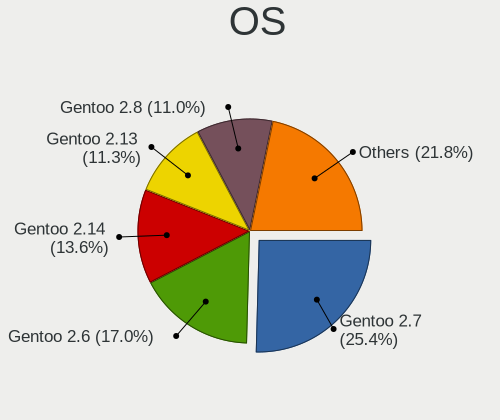

| Name          | Desktops | Percent |
|---------------|----------|---------|
| Gentoo 2.7    | 271      | 30.59%  |
| Gentoo 2.6    | 181      | 20.43%  |
| Gentoo 2.13   | 119      | 13.43%  |
| Gentoo 2.8    | 117      | 13.21%  |
| Gentoo 2.14   | 101      | 11.4%   |
| Gentoo 2.9    | 71       | 8.01%   |
| Gentoo 2.4.1  | 9        | 1.02%   |
| Gentoo 2.3    | 5        | 0.56%   |
| Gentoo        | 4        | 0.45%   |
| Gentoo 2.2    | 3        | 0.34%   |
| Gentoo 22.0.1 | 2        | 0.23%   |
| Gentoo 1      | 2        | 0.23%   |
| Gentoo 13.0   | 1        | 0.11%   |

OS Family
---------

OS without a version

| Name   | Desktops | Percent |
|--------|----------|---------|
| Gentoo | 760      | 100%    |

Kernel
------

Version of the Linux kernel

| Version                  | Desktops | Percent |
|--------------------------|----------|---------|
| 5.4.38-gentoo            | 14       | 1.29%   |
| 6.1.57-gentoo            | 10       | 0.92%   |
| 6.1.19-gentoo            | 10       | 0.92%   |
| 6.1.12-gentoo            | 10       | 0.92%   |
| 5.7.0-gentoo             | 9        | 0.83%   |
| 5.4.97-gentoo            | 9        | 0.83%   |
| 5.4.28-gentoo            | 9        | 0.83%   |
| 5.15.80-gentoo           | 9        | 0.83%   |
| 5.15.32-gentoo-r1        | 8        | 0.74%   |
| 5.10.61-gentoo           | 8        | 0.74%   |
| 5.10.27-gentoo           | 8        | 0.74%   |
| 6.1.53-gentoo-r1         | 7        | 0.65%   |
| 6.1.41-gentoo            | 7        | 0.65%   |
| 6.1.19-gentoo-x86_64     | 7        | 0.65%   |
| 5.4.38-gentoo-x86_64     | 7        | 0.65%   |
| 5.15.88-gentoo           | 7        | 0.65%   |
| 5.10.27-gentoo-x86_64    | 7        | 0.65%   |
| 6.1.67-gentoo            | 6        | 0.55%   |
| 6.1.57-gentoo-x86_64     | 6        | 0.55%   |
| 6.1.28-gentoo            | 6        | 0.55%   |
| 6.1.12-gentoo-x86_64     | 6        | 0.55%   |
| 5.4.60-gentoo            | 6        | 0.55%   |
| 5.15.59-gentoo           | 6        | 0.55%   |
| 5.15.23-gentoo           | 6        | 0.55%   |
| 5.10.61-gentoo-x86_64    | 6        | 0.55%   |
| 6.3.1-gentoo             | 5        | 0.46%   |
| 6.1.31-gentoo            | 5        | 0.46%   |
| 5.6.15-gentoo            | 5        | 0.46%   |
| 5.6.11-gentoo            | 5        | 0.46%   |
| 5.4.80-gentoo-r1         | 5        | 0.46%   |
| 5.4.66-gentoo-x86_64     | 5        | 0.46%   |
| 5.4.66-gentoo            | 5        | 0.46%   |
| 5.4.48-gentoo            | 5        | 0.46%   |
| 5.15.80-gentoo-x86_64    | 5        | 0.46%   |
| 5.15.75-gentoo-x86_64    | 5        | 0.46%   |
| 5.15.52-gentoo-x86_64    | 5        | 0.46%   |
| 5.15.41-gentoo           | 5        | 0.46%   |
| 5.15.32-gentoo-r1-x86_64 | 5        | 0.46%   |
| 5.10.52-gentoo           | 5        | 0.46%   |
| 4.19.86-gentoo           | 5        | 0.46%   |

Kernel Family
-------------

Linux kernel without a distro release

| Version | Desktops | Percent |
|---------|----------|---------|
| 5.4.38  | 28       | 2.59%   |
| 6.1.19  | 21       | 1.94%   |
| 6.1.57  | 19       | 1.76%   |
| 6.1.12  | 19       | 1.76%   |
| 5.15.32 | 19       | 1.76%   |
| 5.10.27 | 19       | 1.76%   |
| 5.10.61 | 16       | 1.48%   |
| 5.15.80 | 15       | 1.39%   |
| 5.4.97  | 14       | 1.29%   |
| 5.4.28  | 14       | 1.29%   |
| 5.7.0   | 13       | 1.2%    |
| 5.15.75 | 13       | 1.2%    |
| 5.4.48  | 12       | 1.11%   |
| 5.15.52 | 12       | 1.11%   |
| 6.1.67  | 11       | 1.02%   |
| 6.1.41  | 11       | 1.02%   |
| 6.1.31  | 11       | 1.02%   |
| 5.6.15  | 11       | 1.02%   |
| 5.4.66  | 11       | 1.02%   |
| 5.15.59 | 11       | 1.02%   |
| 5.15.41 | 11       | 1.02%   |
| 5.10.52 | 11       | 1.02%   |
| 6.3.1   | 10       | 0.92%   |
| 6.1.53  | 10       | 0.92%   |
| 5.10.76 | 10       | 0.92%   |
| 5.9.11  | 9        | 0.83%   |
| 5.4.80  | 9        | 0.83%   |
| 5.4.60  | 9        | 0.83%   |
| 5.17.1  | 9        | 0.83%   |
| 5.15.88 | 8        | 0.74%   |
| 5.15.11 | 8        | 0.74%   |
| 6.2.11  | 7        | 0.65%   |
| 6.1.27  | 7        | 0.65%   |
| 5.15.23 | 7        | 0.65%   |
| 4.19.86 | 7        | 0.65%   |
| 6.6.8   | 6        | 0.55%   |
| 6.4.10  | 6        | 0.55%   |
| 6.1.46  | 6        | 0.55%   |
| 6.1.28  | 6        | 0.55%   |
| 5.9.8   | 6        | 0.55%   |

Kernel Major Ver.
-----------------

Linux kernel major version

| Version | Desktops | Percent |
|---------|----------|---------|
| 5.15    | 133      | 13.7%   |
| 6.1     | 117      | 12.05%  |
| 5.4     | 117      | 12.05%  |
| 5.10    | 96       | 9.89%   |
| 5.6     | 38       | 3.91%   |
| 5.8     | 33       | 3.4%    |
| 5.9     | 29       | 2.99%   |
| 5.7     | 29       | 2.99%   |
| 6.3     | 27       | 2.78%   |
| 6.2     | 26       | 2.68%   |
| 4.19    | 26       | 2.68%   |
| 6.6     | 25       | 2.57%   |
| 6.4     | 25       | 2.57%   |
| 5.17    | 24       | 2.47%   |
| 5.14    | 24       | 2.47%   |
| 6.5     | 20       | 2.06%   |
| 5.19    | 20       | 2.06%   |
| 5.11    | 20       | 2.06%   |
| 5.13    | 19       | 1.96%   |
| 6.0     | 16       | 1.65%   |
| 5.18    | 16       | 1.65%   |
| 5.16    | 15       | 1.54%   |
| 5.12    | 13       | 1.34%   |
| 5.5     | 9        | 0.93%   |
| 4.14    | 9        | 0.93%   |
| 5.2     | 8        | 0.82%   |
| 5.0     | 6        | 0.62%   |
| 6.7     | 5        | 0.51%   |
| 5.1     | 5        | 0.51%   |
| 4.9     | 5        | 0.51%   |
| 4.18    | 4        | 0.41%   |
| 4.4     | 3        | 0.31%   |
| 5.3     | 2        | 0.21%   |
| 4.6     | 1        | 0.1%    |
| 4.20    | 1        | 0.1%    |
| 4.16    | 1        | 0.1%    |
| 4.13    | 1        | 0.1%    |
| 4.12    | 1        | 0.1%    |
| 4.10    | 1        | 0.1%    |
| 3.18    | 1        | 0.1%    |

Arch
----

OS architecture (x86_64, i586, etc.)

| Name        | Desktops | Percent |
|-------------|----------|---------|
| x86_64      | 739      | 97.24%  |
| i686        | 9        | 1.18%   |
| ppc         | 4        | 0.53%   |
| loongarch64 | 2        | 0.26%   |
| armv7l      | 2        | 0.26%   |
| armv5tel    | 2        | 0.26%   |
| ppc64le     | 1        | 0.13%   |
| ppc64       | 1        | 0.13%   |

DE
--

Desktop Environment

| Name          | Desktops | Percent |
|---------------|----------|---------|
| Unknown       | 339      | 41.29%  |
| KDE5          | 189      | 23.02%  |
| GNOME         | 100      | 12.18%  |
| XFCE          | 81       | 9.87%   |
| KDE           | 33       | 4.02%   |
| MATE          | 22       | 2.68%   |
| X-Cinnamon    | 9        | 1.1%    |
| i3            | 9        | 1.1%    |
| DWM           | 9        | 1.1%    |
| LXQt          | 6        | 0.73%   |
| Sway          | 5        | 0.61%   |
| Hyprland      | 4        | 0.49%   |
| Enlightenment | 3        | 0.37%   |
| Cinnamon      | 3        | 0.37%   |
| LXDE          | 2        | 0.24%   |
| awesome       | 2        | 0.24%   |
| XSession      | 1        | 0.12%   |
| Unity         | 1        | 0.12%   |
| sussy_bspwm   | 1        | 0.12%   |
| openbox       | 1        | 0.12%   |
| GNOME Classic | 1        | 0.12%   |

Display Server
--------------

X11 or Wayland

| Name    | Desktops | Percent |
|---------|----------|---------|
| X11     | 421      | 51.15%  |
| Unknown | 170      | 20.66%  |
| Tty     | 136      | 16.52%  |
| Wayland | 96       | 11.66%  |

Display Manager
---------------

SDDM, LightDM, etc.

| Name    | Desktops | Percent |
|---------|----------|---------|
| Unknown | 392      | 48.88%  |
| SDDM    | 204      | 25.44%  |
| LightDM | 90       | 11.22%  |
| GDM     | 71       | 8.85%   |
| SLiM    | 16       | 2%      |
| LXDM    | 13       | 1.62%   |
| XDM     | 11       | 1.37%   |
| GREETD  | 3        | 0.37%   |
| TDM     | 2        | 0.25%   |

OS Lang
-------

Language

| Lang       | Desktops | Percent |
|------------|----------|---------|
| en_US      | 285      | 35.71%  |
| Unknown    | 112      | 14.04%  |
| C.UTF8     | 70       | 8.77%   |
| en_GB      | 58       | 7.27%   |
| de_DE      | 54       | 6.77%   |
| ru_RU      | 33       | 4.14%   |
| C          | 23       | 2.88%   |
| es_ES      | 15       | 1.88%   |
| fr_FR      | 14       | 1.75%   |
| en_CA      | 13       | 1.63%   |
| pl_PL      | 10       | 1.25%   |
| it_IT      | 9        | 1.13%   |
| cs_CZ      | 8        | 1%      |
| ru_RU.UTF8 | 7        | 0.88%   |
| pt_BR      | 7        | 0.88%   |
| en_IE      | 6        | 0.75%   |
| sv_SE      | 5        | 0.63%   |
| fi_FI      | 5        | 0.63%   |
| nl_NL      | 4        | 0.5%    |
| en_AU      | 4        | 0.5%    |
| zh_TW      | 3        | 0.38%   |
| en_US.UTF8 | 3        | 0.38%   |
| ca_ES      | 3        | 0.38%   |
| zh_CN      | 2        | 0.25%   |
| uk_UA      | 2        | 0.25%   |
| ro_RO      | 2        | 0.25%   |
| pt_PT      | 2        | 0.25%   |
| nl_BE      | 2        | 0.25%   |
| ja_JP      | 2        | 0.25%   |
| fr_CA      | 2        | 0.25%   |
| es_AR      | 2        | 0.25%   |
| en_DK      | 2        | 0.25%   |
| de_CH      | 2        | 0.25%   |
| spanish    | 1        | 0.13%   |
| sl_SI      | 1        | 0.13%   |
| ru_UA      | 1        | 0.13%   |
| POSIX      | 1        | 0.13%   |
| pl_PL.UTF8 | 1        | 0.13%   |
| lt_LT      | 1        | 0.13%   |
| hu_HU      | 1        | 0.13%   |

Boot Mode
---------

EFI or BIOS

| Mode | Desktops | Percent |
|------|----------|---------|
| EFI  | 532      | 68.47%  |
| BIOS | 245      | 31.53%  |

Filesystem
----------

Type of filesystem

| Type     | Desktops | Percent |
|----------|----------|---------|
| Ext4     | 466      | 59.36%  |
| Btrfs    | 167      | 21.27%  |
| Xfs      | 40       | 5.1%    |
| F2fs     | 36       | 4.59%   |
| Zfs      | 31       | 3.95%   |
| Unknown  | 22       | 2.8%    |
| Reiserfs | 12       | 1.53%   |
| XXXXXXX  | 7        | 0.89%   |
| XXX      | 2        | 0.25%   |
| Jfs      | 1        | 0.13%   |
| Ext3     | 1        | 0.13%   |

Part. scheme
------------

Scheme of partitioning

| Type    | Desktops | Percent |
|---------|----------|---------|
| GPT     | 637      | 82.41%  |
| MBR     | 86       | 11.13%  |
| Unknown | 50       | 6.47%   |

Dual Boot with Linux/BSD
------------------------

Hosting more than one Linux/BSD

| Dual boot | Desktops | Percent |
|-----------|----------|---------|
| No        | 491      | 60.69%  |
| Yes       | 318      | 39.31%  |

Dual Boot (Win)
---------------

Hosting Linux and Windows

| Dual boot | Desktops | Percent |
|-----------|----------|---------|
| No        | 494      | 62.93%  |
| Yes       | 291      | 37.07%  |

Board
-----

Vendor
------

Motherboard manufacturer

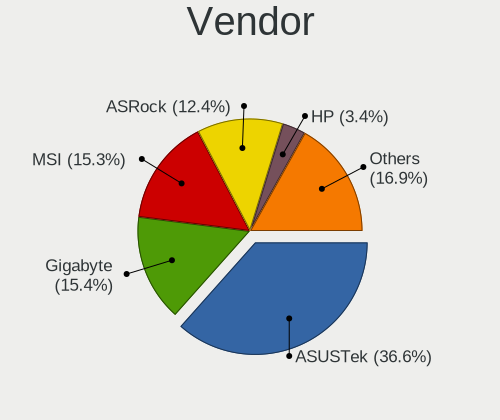

| Name                | Desktops | Percent |
|---------------------|----------|---------|
| ASUSTek Computer    | 282      | 37.11%  |
| MSI                 | 118      | 15.53%  |
| Gigabyte Technology | 115      | 15.13%  |
| ASRock              | 97       | 12.76%  |
| Hewlett-Packard     | 23       | 3.03%   |
| Unknown             | 22       | 2.89%   |
| Dell                | 19       | 2.5%    |
| Intel               | 12       | 1.58%   |
| Lenovo              | 10       | 1.32%   |
| Fujitsu             | 8        | 1.05%   |
| Acer                | 6        | 0.79%   |
| ASRockRack          | 5        | 0.66%   |
| Supermicro          | 4        | 0.53%   |
| Apple               | 4        | 0.53%   |
| Tekram Technology   | 3        | 0.39%   |
| Pegatron            | 3        | 0.39%   |
| Foxconn             | 3        | 0.39%   |
| Loongson            | 2        | 0.26%   |
| Huanan              | 2        | 0.26%   |
| BESSTAR Tech        | 2        | 0.26%   |
| ZOTAC               | 1        | 0.13%   |
| YANYU               | 1        | 0.13%   |
| TYAN Computer       | 1        | 0.13%   |
| SZMZ                | 1        | 0.13%   |
| Sun Microsystems    | 1        | 0.13%   |
| Shuttle             | 1        | 0.13%   |
| QDI                 | 1        | 0.13%   |
| Phoenix             | 1        | 0.13%   |
| Packard Bell        | 1        | 0.13%   |
| NZXT                | 1        | 0.13%   |
| NEC Computers       | 1        | 0.13%   |
| Medion              | 1        | 0.13%   |
| HPE                 | 1        | 0.13%   |
| Gateway             | 1        | 0.13%   |
| Fujitsu Siemens     | 1        | 0.13%   |
| EVGA                | 1        | 0.13%   |
| Entroware           | 1        | 0.13%   |
| AMD                 | 1        | 0.13%   |
| Alienware           | 1        | 0.13%   |
| Aierben             | 1        | 0.13%   |

Model
-----

Motherboard model

| Name                              | Desktops | Percent |
|-----------------------------------|----------|---------|
| Unknown                           | 22       | 2.89%   |
| ASUS All Series                   | 21       | 2.76%   |
| ASUS TUF Gaming X570-PLUS         | 12       | 1.58%   |
| MSI MS-7C02                       | 9        | 1.18%   |
| ASUS ROG STRIX X570-E GAMING      | 8        | 1.05%   |
| ASUS PRIME X570-PRO               | 8        | 1.05%   |
| ASUS PRIME X470-PRO               | 7        | 0.92%   |
| MSI MS-7A38                       | 6        | 0.79%   |
| ASUS TUF Gaming B550-PLUS         | 6        | 0.79%   |
| ASUS PRIME X370-PRO               | 6        | 0.79%   |
| MSI MS-7C91                       | 5        | 0.66%   |
| MSI MS-7C37                       | 5        | 0.66%   |
| MSI MS-7C35                       | 5        | 0.66%   |
| Gigabyte X570 AORUS ELITE         | 5        | 0.66%   |
| ASUS ROG STRIX B450-F GAMING      | 5        | 0.66%   |
| ASUS ROG CROSSHAIR VIII HERO      | 5        | 0.66%   |
| ASUS PRIME X570-P                 | 5        | 0.66%   |
| ASRock B450 Pro4                  | 5        | 0.66%   |
| MSI MS-7B89                       | 4        | 0.53%   |
| MSI MS-7B86                       | 4        | 0.53%   |
| MSI MS-7B79                       | 4        | 0.53%   |
| Gigabyte B450M DS3H               | 4        | 0.53%   |
| ASUS Z170 PRO GAMING              | 4        | 0.53%   |
| ASUS ROG STRIX X570-I GAMING      | 4        | 0.53%   |
| ASUS ROG STRIX B550-F GAMING      | 4        | 0.53%   |
| ASUS ROG CROSSHAIR VIII DARK HERO | 4        | 0.53%   |
| ASUS ROG CROSSHAIR VII HERO       | 4        | 0.53%   |
| ASUS PRIME B450M-A                | 4        | 0.53%   |
| ASUS M4A89GTD-PRO/USB3            | 4        | 0.53%   |
| ASRock X570 Taichi                | 4        | 0.53%   |
| ASRock X399 Taichi                | 4        | 0.53%   |
| ASRock B550M Steel Legend         | 4        | 0.53%   |
| Tekram P6B40-A4X-i440BX Rev       | 3        | 0.39%   |
| MSI MS-7C84                       | 3        | 0.39%   |
| MSI MS-7C56                       | 3        | 0.39%   |
| MSI MS-7C34                       | 3        | 0.39%   |
| MSI MS-7B85                       | 3        | 0.39%   |
| MSI MS-7693                       | 3        | 0.39%   |
| HP ProLiant MicroServer Gen8      | 3        | 0.39%   |
| Gigabyte X570S AORUS ELITE AX     | 3        | 0.39%   |

Model Family
------------

Motherboard model prefix

| Name                    | Desktops | Percent |
|-------------------------|----------|---------|
| ASUS ROG                | 75       | 9.87%   |
| ASUS PRIME              | 68       | 8.95%   |
| ASUS TUF                | 42       | 5.53%   |
| Unknown                 | 22       | 2.89%   |
| ASUS All                | 21       | 2.76%   |
| Gigabyte X570           | 13       | 1.71%   |
| ASRock X570             | 13       | 1.71%   |
| Dell OptiPlex           | 10       | 1.32%   |
| MSI MS-7C02             | 9        | 1.18%   |
| Gigabyte B450M          | 9        | 1.18%   |
| Gigabyte B450           | 8        | 1.05%   |
| ASRock X370             | 8        | 1.05%   |
| MSI MS-7A38             | 6        | 0.79%   |
| HP Compaq               | 6        | 0.79%   |
| ASRock B450             | 6        | 0.79%   |
| Acer Aspire             | 6        | 0.79%   |
| MSI MS-7C91             | 5        | 0.66%   |
| MSI MS-7C37             | 5        | 0.66%   |
| MSI MS-7C35             | 5        | 0.66%   |
| Lenovo ThinkStation     | 5        | 0.66%   |
| HP ProLiant             | 5        | 0.66%   |
| Gigabyte Z390           | 5        | 0.66%   |
| Gigabyte B550M          | 5        | 0.66%   |
| Dell Precision          | 5        | 0.66%   |
| ASUS SABERTOOTH         | 5        | 0.66%   |
| ASRock B550M            | 5        | 0.66%   |
| MSI MS-7B89             | 4        | 0.53%   |
| MSI MS-7B86             | 4        | 0.53%   |
| MSI MS-7B79             | 4        | 0.53%   |
| Lenovo ThinkCentre      | 4        | 0.53%   |
| Gigabyte B550           | 4        | 0.53%   |
| ASUS Z170               | 4        | 0.53%   |
| ASUS M5A97              | 4        | 0.53%   |
| ASUS M4A89GTD-PRO       | 4        | 0.53%   |
| ASRock Z390             | 4        | 0.53%   |
| ASRock X670E            | 4        | 0.53%   |
| ASRock X399             | 4        | 0.53%   |
| ASRock B550             | 4        | 0.53%   |
| Tekram P6B40-A4X-i440BX | 3        | 0.39%   |
| MSI MS-7C84             | 3        | 0.39%   |

MFG Year
--------

Motherboard manufacture year

| Year    | Desktops | Percent |
|---------|----------|---------|
| 2019    | 116      | 15.26%  |
| 2018    | 111      | 14.61%  |
| 2020    | 91       | 11.97%  |
| 2021    | 55       | 7.24%   |
| 2017    | 54       | 7.11%   |
| 2022    | 39       | 5.13%   |
| 2015    | 38       | 5%      |
| 2013    | 38       | 5%      |
| 2012    | 38       | 5%      |
| 2016    | 29       | 3.82%   |
| 2010    | 27       | 3.55%   |
| 2009    | 25       | 3.29%   |
| 2011    | 24       | 3.16%   |
| 2014    | 21       | 2.76%   |
| 2008    | 17       | 2.24%   |
| Unknown | 13       | 1.71%   |
| 2023    | 7        | 0.92%   |
| 2007    | 7        | 0.92%   |
| 2000    | 3        | 0.39%   |
| 2005    | 2        | 0.26%   |
| 2004    | 2        | 0.26%   |
| 2003    | 2        | 0.26%   |
| 2002    | 1        | 0.13%   |

Form Factor
-----------

Physical design of the computer

| Name    | Desktops | Percent |
|---------|----------|---------|
| Desktop | 760      | 100%    |

Secure Boot
-----------

Enabled or disabled

| State    | Desktops | Percent |
|----------|----------|---------|
| Disabled | 749      | 98.17%  |
| Enabled  | 14       | 1.83%   |

Coreboot
--------

Have coreboot on board

| Used | Desktops | Percent |
|------|----------|---------|
| No   | 760      | 100%    |

RAM Size
--------

Total RAM memory

| Size in GB      | Desktops | Percent |
|-----------------|----------|---------|
| 32.01-64.0      | 264      | 33.59%  |
| 16.01-24.0      | 186      | 23.66%  |
| 64.01-256.0     | 141      | 17.94%  |
| 8.01-16.0       | 58       | 7.38%   |
| 24.01-32.0      | 42       | 5.34%   |
| 4.01-8.0        | 35       | 4.45%   |
| 3.01-4.0        | 31       | 3.94%   |
| 1.01-2.0        | 13       | 1.65%   |
| 0.51-1.0        | 8        | 1.02%   |
| 2.01-3.0        | 5        | 0.64%   |
| More than 256.0 | 2        | 0.25%   |
| 0.01-0.5        | 1        | 0.13%   |

RAM Used
--------

Used RAM memory

| Used GB     | Desktops | Percent |
|-------------|----------|---------|
| 4.01-8.0    | 197      | 21.09%  |
| 2.01-3.0    | 161      | 17.24%  |
| 1.01-2.0    | 144      | 15.42%  |
| 8.01-16.0   | 122      | 13.06%  |
| 3.01-4.0    | 106      | 11.35%  |
| 0.01-0.5    | 71       | 7.6%    |
| 0.51-1.0    | 61       | 6.53%   |
| 16.01-24.0  | 45       | 4.82%   |
| 32.01-64.0  | 13       | 1.39%   |
| 24.01-32.0  | 9        | 0.96%   |
| 64.01-256.0 | 3        | 0.32%   |
| 0           | 2        | 0.21%   |

Total Drives
------------

Number of drives on board

| Drives | Desktops | Percent |
|--------|----------|---------|
| 2      | 220      | 26.67%  |
| 3      | 171      | 20.73%  |
| 1      | 148      | 17.94%  |
| 4      | 108      | 13.09%  |
| 5      | 75       | 9.09%   |
| 6      | 41       | 4.97%   |
| 7      | 28       | 3.39%   |
| 8      | 14       | 1.7%    |
| 9      | 4        | 0.48%   |
| 0      | 4        | 0.48%   |
| 13     | 2        | 0.24%   |
| 12     | 2        | 0.24%   |
| 10     | 2        | 0.24%   |
| 31     | 1        | 0.12%   |
| 21     | 1        | 0.12%   |
| 19     | 1        | 0.12%   |
| 18     | 1        | 0.12%   |
| 17     | 1        | 0.12%   |
| 11     | 1        | 0.12%   |

Has CD-ROM
----------

Has CD-ROM on board

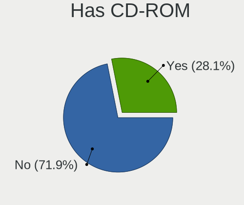

| Presented | Desktops | Percent |
|-----------|----------|---------|
| No        | 554      | 70.93%  |
| Yes       | 227      | 29.07%  |

Has Ethernet
------------

Has Ethernet on board

| Presented | Desktops | Percent |
|-----------|----------|---------|
| Yes       | 749      | 98.42%  |
| No        | 12       | 1.58%   |

Has WiFi
--------

Has WiFi module

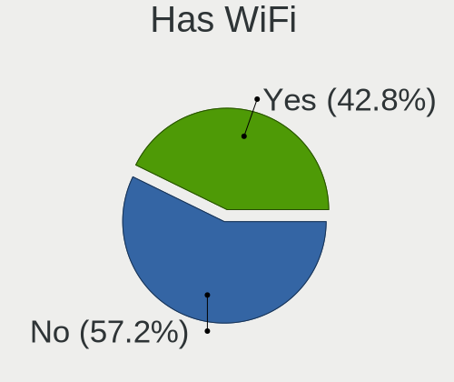

| Presented | Desktops | Percent |
|-----------|----------|---------|
| No        | 451      | 58.57%  |
| Yes       | 319      | 41.43%  |

Has Bluetooth
-------------

Has Bluetooth module

| Presented | Desktops | Percent |
|-----------|----------|---------|
| No        | 456      | 58.76%  |
| Yes       | 320      | 41.24%  |

Location
--------

Country
-------

Geographic location (country)

| Country      | Desktops | Percent |
|--------------|----------|---------|
| USA          | 175      | 22.85%  |
| Germany      | 114      | 14.88%  |
| Russia       | 66       | 8.62%   |
| UK           | 45       | 5.87%   |
| France       | 34       | 4.44%   |
| Spain        | 29       | 3.79%   |
| Canada       | 29       | 3.79%   |
| Poland       | 25       | 3.26%   |
| Finland      | 20       | 2.61%   |
| Sweden       | 18       | 2.35%   |
| Italy        | 15       | 1.96%   |
| Czechia      | 15       | 1.96%   |
| Brazil       | 13       | 1.7%    |
| Ukraine      | 11       | 1.44%   |
| China        | 11       | 1.44%   |
| Australia    | 11       | 1.44%   |
| Switzerland  | 9        | 1.17%   |
| Netherlands  | 9        | 1.17%   |
| Belgium      | 8        | 1.04%   |
| Greece       | 7        | 0.91%   |
| Austria      | 7        | 0.91%   |
| Hungary      | 6        | 0.78%   |
| Romania      | 5        | 0.65%   |
| Norway       | 5        | 0.65%   |
| Mexico       | 5        | 0.65%   |
| Japan        | 5        | 0.65%   |
| Belarus      | 5        | 0.65%   |
| Argentina    | 5        | 0.65%   |
| Slovakia     | 4        | 0.52%   |
| Ireland      | 4        | 0.52%   |
| Estonia      | 4        | 0.52%   |
| Denmark      | 4        | 0.52%   |
| Vietnam      | 3        | 0.39%   |
| Taiwan       | 3        | 0.39%   |
| Slovenia     | 3        | 0.39%   |
| Hong Kong    | 3        | 0.39%   |
| Bulgaria     | 3        | 0.39%   |
| Tunisia      | 2        | 0.26%   |
| South Africa | 2        | 0.26%   |
| Kazakhstan   | 2        | 0.26%   |

City
----

Geographic location (city)

| City                 | Desktops | Percent |
|----------------------|----------|---------|
| Berlin               | 19       | 2.26%   |
| Moscow               | 17       | 2.02%   |
| St Petersburg        | 12       | 1.43%   |
| Warsaw               | 8        | 0.95%   |
| Vladivostok          | 8        | 0.95%   |
| Paris                | 7        | 0.83%   |
| Helsinki             | 7        | 0.83%   |
| Frankfurt am Main    | 7        | 0.83%   |
| Athens               | 7        | 0.83%   |
| Oulu                 | 6        | 0.71%   |
| Ottawa               | 6        | 0.71%   |
| Munich               | 6        | 0.71%   |
| Los Angeles          | 6        | 0.71%   |
| Cieszyn              | 6        | 0.71%   |
| Zurich               | 5        | 0.59%   |
| Wuelfrath            | 5        | 0.59%   |
| Vancouver            | 5        | 0.59%   |
| Sydney               | 5        | 0.59%   |
| Seattle              | 5        | 0.59%   |
| Combrit              | 5        | 0.59%   |
| Vienna               | 4        | 0.48%   |
| Swansea              | 4        | 0.48%   |
| Sterling             | 4        | 0.48%   |
| Sao Paulo            | 4        | 0.48%   |
| Ponetovice           | 4        | 0.48%   |
| Kyiv                 | 4        | 0.48%   |
| Hamburg              | 4        | 0.48%   |
| Freiburg im Breisgau | 4        | 0.48%   |
| Falkenstein          | 4        | 0.48%   |
| Dublin               | 4        | 0.48%   |
| Dienheim             | 4        | 0.48%   |
| Cologne              | 4        | 0.48%   |
| Bucharest            | 4        | 0.48%   |
| Yekaterinburg        | 3        | 0.36%   |
| Woolwich             | 3        | 0.36%   |
| Vitkov               | 3        | 0.36%   |
| Ufa                  | 3        | 0.36%   |
| Tampere              | 3        | 0.36%   |
| Tallinn              | 3        | 0.36%   |
| Sofia                | 3        | 0.36%   |

Drives
------

Drive Vendor
------------

Hard drive vendors

| Vendor                      | Desktops | Drives | Percent |
|-----------------------------|----------|--------|---------|
| Samsung Electronics         | 345      | 831    | 20.55%  |
| WDC                         | 322      | 784    | 19.18%  |
| Seagate                     | 259      | 594    | 15.43%  |
| Kingston                    | 92       | 135    | 5.48%   |
| SanDisk                     | 78       | 120    | 4.65%   |
| Toshiba                     | 69       | 149    | 4.11%   |
| Crucial                     | 62       | 125    | 3.69%   |
| Intel                       | 57       | 83     | 3.39%   |
| Hitachi                     | 50       | 168    | 2.98%   |
| Phison Electronics          | 32       | 45     | 1.91%   |
| A-DATA Technology           | 30       | 39     | 1.79%   |
| HGST                        | 25       | 52     | 1.49%   |
| Phison                      | 18       | 30     | 1.07%   |
| Micron/Crucial Technology   | 16       | 20     | 0.95%   |
| Corsair                     | 16       | 30     | 0.95%   |
| OCZ                         | 13       | 17     | 0.77%   |
| Silicon Motion              | 10       | 17     | 0.6%    |
| China                       | 10       | 26     | 0.6%    |
| Unknown                     | 9        | 14     | 0.54%   |
| GOODRAM                     | 9        | 66     | 0.54%   |
| Kingston Technology Company | 8        | 8      | 0.48%   |
| Transcend                   | 7        | 9      | 0.42%   |
| Realtek Semiconductor       | 7        | 14     | 0.42%   |
| PNY                         | 7        | 11     | 0.42%   |
| SK hynix                    | 6        | 8      | 0.36%   |
| Patriot                     | 6        | 9      | 0.36%   |
| XPG                         | 5        | 11     | 0.3%    |
| SPCC                        | 5        | 7      | 0.3%    |
| Plextor                     | 5        | 6      | 0.3%    |
| Micron Technology           | 5        | 9      | 0.3%    |
| MAXIO Technology (Hangzhou) | 5        | 6      | 0.3%    |
| IBM                         | 5        | 6      | 0.3%    |
| ADATA Technology            | 5        | 6      | 0.3%    |
| Mushkin                     | 4        | 4      | 0.24%   |
| LITEONIT                    | 4        | 5      | 0.24%   |
| Apacer                      | 4        | 6      | 0.24%   |
| Unknown                     | 4        | 4      | 0.24%   |
| Yangtze Memory Technologies | 3        | 5      | 0.18%   |
| Team                        | 3        | 9      | 0.18%   |
| T-FORCE                     | 3        | 8      | 0.18%   |

Drive Model
-----------

Hard drive models

| Model                                                 | Desktops | Percent |
|-------------------------------------------------------|----------|---------|
| Samsung NVMe SSD Controller SM981/PM981/PM983 1TB     | 43       | 2%      |
| Samsung NVMe SSD Controller PM9A1/PM9A3/980PRO 2TB    | 31       | 1.44%   |
| Samsung SSD 860 EVO 1TB                               | 27       | 1.26%   |
| Samsung SSD 850 EVO 500GB                             | 24       | 1.12%   |
| Samsung SSD 850 EVO 250GB                             | 23       | 1.07%   |
| WDC WD30EFRX-68EUZN0 3TB                              | 20       | 0.93%   |
| Seagate ST1000DM010-2EP102 1TB                        | 19       | 0.88%   |
| Samsung SSD 860 EVO 250GB                             | 17       | 0.79%   |
| Seagate ST4000DM004-2CV104 4TB                        | 16       | 0.74%   |
| Samsung SSD 860 EVO 500GB                             | 16       | 0.74%   |
| WDC WD10EZEX-08WN4A0 1TB                              | 15       | 0.7%    |
| Samsung SSD 980 1TB                                   | 15       | 0.7%    |
| Kingston SA400S37240G 240GB SSD                       | 15       | 0.7%    |
| Crucial CT1000MX500SSD1 1TB                           | 14       | 0.65%   |
| Seagate ST500DM002-1BD142 500GB                       | 13       | 0.61%   |
| Seagate ST2000DM008-2FR102 2TB                        | 13       | 0.61%   |
| Seagate ST2000DM001-1ER164 2TB                        | 13       | 0.61%   |
| Samsung SSD 970 EVO Plus 500GB                        | 13       | 0.61%   |
| Samsung SSD 970 EVO 500GB                             | 13       | 0.61%   |
| WDC WDS500G2B0A-00SM50 500GB SSD                      | 12       | 0.56%   |
| WDC WD40EZRZ-00GXCB0 4TB                              | 11       | 0.51%   |
| Toshiba DT01ACA100 1TB                                | 11       | 0.51%   |
| Seagate ST2000DM006-2DM164 2TB                        | 11       | 0.51%   |
| Samsung SSD 980 PRO 1TB                               | 11       | 0.51%   |
| Samsung SSD 970 EVO Plus 1TB                          | 11       | 0.51%   |
| Kingston SA400S37480G 480GB SSD                       | 11       | 0.51%   |
| Seagate ST3500418AS 500GB                             | 10       | 0.47%   |
| Samsung SSD 970 EVO 250GB                             | 10       | 0.47%   |
| Samsung SSD 970 EVO 1TB                               | 10       | 0.47%   |
| Samsung SSD 840 EVO 120GB                             | 10       | 0.47%   |
| Samsung NVMe SSD Controller SM961/PM961/SM963 256GB   | 10       | 0.47%   |
| WDC WD40EFRX-68WT0N0 4TB                              | 9        | 0.42%   |
| WDC WD40EFRX-68N32N0 4TB                              | 9        | 0.42%   |
| Samsung SSD 840 EVO 250GB                             | 9        | 0.42%   |
| Phison E12 NVMe Controller 1TB                        | 9        | 0.42%   |
| Micron/Crucial P2 NVMe PCIe SSD 1TB                   | 9        | 0.42%   |
| Kingston SA400S37120G 120GB SSD                       | 9        | 0.42%   |
| WDC WD20EZRX-00D8PB0 2TB                              | 8        | 0.37%   |
| WDC WD20EFRX-68EUZN0 2TB                              | 8        | 0.37%   |
| Silicon Motion SM2263EN/SM2263XT SSD Controller 128GB | 8        | 0.37%   |

HDD Vendor
----------

Hard disk drive vendors

| Vendor              | Desktops | Drives | Percent |
|---------------------|----------|--------|---------|
| WDC                 | 286      | 702    | 39.34%  |
| Seagate             | 254      | 584    | 34.94%  |
| Toshiba             | 61       | 138    | 8.39%   |
| Hitachi             | 50       | 168    | 6.88%   |
| Samsung Electronics | 26       | 38     | 3.58%   |
| HGST                | 25       | 52     | 3.44%   |
| IBM                 | 5        | 6      | 0.69%   |
| Unknown             | 4        | 5      | 0.55%   |
| TO Exter            | 2        | 2      | 0.28%   |
| MDT                 | 2        | 2      | 0.28%   |
| Maxtor              | 2        | 2      | 0.28%   |
| LaCie               | 2        | 12     | 0.28%   |
| NETAPP              | 1        | 3      | 0.14%   |
| Hewlett-Packard     | 1        | 2      | 0.14%   |
| Fujitsu             | 1        | 2      | 0.14%   |
| FNK TECH            | 1        | 1      | 0.14%   |
| Dyconn H            | 1        | 1      | 0.14%   |
| ASMedia             | 1        | 1      | 0.14%   |
| AFAYA               | 1        | 1      | 0.14%   |
| Unknown             | 1        | 1      | 0.14%   |

SSD Vendor
----------

Solid state drive vendors

| Vendor              | Desktops | Drives | Percent |
|---------------------|----------|--------|---------|
| Samsung Electronics | 198      | 390    | 34.02%  |
| Kingston            | 74       | 104    | 12.71%  |
| Crucial             | 58       | 114    | 9.97%   |
| SanDisk             | 50       | 81     | 8.59%   |
| WDC                 | 39       | 46     | 6.7%    |
| Intel               | 22       | 31     | 3.78%   |
| A-DATA Technology   | 16       | 19     | 2.75%   |
| OCZ                 | 12       | 16     | 2.06%   |
| Corsair             | 10       | 16     | 1.72%   |
| China               | 10       | 26     | 1.72%   |
| GOODRAM             | 9        | 66     | 1.55%   |
| Transcend           | 6        | 8      | 1.03%   |
| PNY                 | 6        | 10     | 1.03%   |
| Toshiba             | 5        | 6      | 0.86%   |
| SPCC                | 4        | 6      | 0.69%   |
| Plextor             | 4        | 4      | 0.69%   |
| Patriot             | 4        | 7      | 0.69%   |
| Micron Technology   | 4        | 7      | 0.69%   |
| LITEONIT            | 4        | 5      | 0.69%   |
| T-FORCE             | 3        | 8      | 0.52%   |
| SABRENT             | 3        | 3      | 0.52%   |
| Mushkin             | 3        | 3      | 0.52%   |
| KingSpec            | 3        | 4      | 0.52%   |
| Apacer              | 3        | 5      | 0.52%   |
| Unknown             | 3        | 3      | 0.52%   |
| Verbatim            | 2        | 2      | 0.34%   |
| Team                | 2        | 3      | 0.34%   |
| Kingchuxing         | 2        | 7      | 0.34%   |
| Intenso             | 2        | 3      | 0.34%   |
| ADROITLARK          | 2        | 3      | 0.34%   |
| V-GeN               | 1        | 1      | 0.17%   |
| Unknown             | 1        | 1      | 0.17%   |
| Smartbuy            | 1        | 1      | 0.17%   |
| OWC                 | 1        | 1      | 0.17%   |
| OCZ-VERTEX          | 1        | 1      | 0.17%   |
| Netac               | 1        | 1      | 0.17%   |
| LITEON              | 1        | 1      | 0.17%   |
| Linux               | 1        | 1      | 0.17%   |
| Leven               | 1        | 2      | 0.17%   |
| Lenovo              | 1        | 1      | 0.17%   |

Drive Kind
----------

HDD or SSD

| Kind    | Desktops | Drives | Percent |
|---------|----------|--------|---------|
| HDD     | 529      | 1723   | 38.11%  |
| SSD     | 448      | 1040   | 32.28%  |
| NVMe    | 405      | 824    | 29.18%  |
| Unknown | 5        | 9      | 0.36%   |
| MMC     | 1        | 2      | 0.07%   |

Drive Connector
---------------

SATA, SAS, NVMe, etc.

| Type | Desktops | Drives | Percent |
|------|----------|--------|---------|
| SATA | 662      | 2711   | 60.18%  |
| NVMe | 405      | 824    | 36.82%  |
| SAS  | 32       | 61     | 2.91%   |
| MMC  | 1        | 2      | 0.09%   |

Drive Size
----------

Size of hard drive

| Size in TB | Desktops | Drives | Percent |
|------------|----------|--------|---------|
| 0.01-0.5   | 442      | 970    | 37.46%  |
| 0.51-1.0   | 317      | 631    | 26.86%  |
| 1.01-2.0   | 177      | 387    | 15%     |
| 3.01-4.0   | 107      | 265    | 9.07%   |
| 4.01-10.0  | 60       | 244    | 5.08%   |
| 2.01-3.0   | 58       | 202    | 4.92%   |
| 10.01-20.0 | 18       | 63     | 1.53%   |
| 20.01-50.0 | 1        | 1      | 0.08%   |

Space Total
-----------

Amount of disk space available on the file system

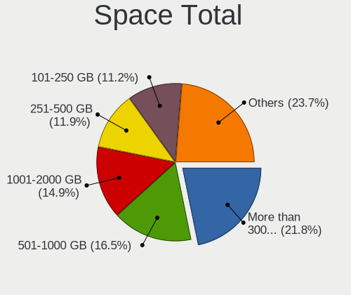

| Size in GB     | Desktops | Percent |
|----------------|----------|---------|
| More than 3000 | 179      | 21.49%  |
| 501-1000       | 137      | 16.45%  |
| 1001-2000      | 121      | 14.53%  |
| 251-500        | 105      | 12.61%  |
| 101-250        | 100      | 12%     |
| 2001-3000      | 70       | 8.4%    |
| Unknown        | 42       | 5.04%   |
| 1-20           | 34       | 4.08%   |
| 51-100         | 33       | 3.96%   |
| 21-50          | 12       | 1.44%   |

Space Used
----------

Amount of used disk space

| Used GB        | Desktops | Percent |
|----------------|----------|---------|
| 1-20           | 144      | 16.59%  |
| 101-250        | 112      | 12.9%   |
| 251-500        | 104      | 11.98%  |
| 501-1000       | 100      | 11.52%  |
| 1001-2000      | 99       | 11.41%  |
| More than 3000 | 88       | 10.14%  |
| 21-50          | 77       | 8.87%   |
| 51-100         | 64       | 7.37%   |
| Unknown        | 42       | 4.84%   |
| 2001-3000      | 38       | 4.38%   |

Malfunc. Drives
---------------

Drive models with a malfunction

| Model                                        | Desktops | Drives | Percent |
|----------------------------------------------|----------|--------|---------|
| Seagate ST3500418AS 500GB                    | 6        | 7      | 2.75%   |
| Seagate ST500DM002-1BC142 500GB              | 5        | 5      | 2.29%   |
| WDC WD40EFRX-68WT0N0 4TB                     | 4        | 14     | 1.83%   |
| Seagate ST500DM002-1BD142 500GB              | 4        | 4      | 1.83%   |
| Samsung Electronics SSD 980 1TB              | 4        | 4      | 1.83%   |
| WDC WD30EFRX-68EUZN0 3TB                     | 3        | 8      | 1.38%   |
| WDC WD30EFRX-68AX9N0 3TB                     | 3        | 7      | 1.38%   |
| Seagate ST8000AS0002-1NA17Z 8TB              | 3        | 15     | 1.38%   |
| IBM DJSA-220 12GB                            | 3        | 3      | 1.38%   |
| Hitachi HDS722020ALA330 2TB                  | 3        | 17     | 1.38%   |
| WDC WD60EFRX-68MYMN1 6TB                     | 2        | 5      | 0.92%   |
| WDC WD40EFRX-68N32N0 4TB                     | 2        | 2      | 0.92%   |
| WDC WD20EZRX-00D8PB0 2TB                     | 2        | 3      | 0.92%   |
| WDC WD20EARS-00MVWB0 2TB                     | 2        | 2      | 0.92%   |
| WDC WD2002FAEX-007BA0 2TB                    | 2        | 2      | 0.92%   |
| WDC WD1600AAJS-75B4A0 160GB                  | 2        | 2      | 0.92%   |
| WDC WD15EARS-00Z5B1 1TB                      | 2        | 2      | 0.92%   |
| Toshiba DT01ACA200 2TB                       | 2        | 2      | 0.92%   |
| Seagate ST4000DM000-1F2168 4TB               | 2        | 2      | 0.92%   |
| Seagate ST31000340NS 1TB                     | 2        | 3      | 0.92%   |
| Seagate ST3000DM001-9YN166 3TB               | 2        | 3      | 0.92%   |
| Seagate ST2000DX002-2DV164 2TB               | 2        | 2      | 0.92%   |
| Seagate ST2000DL003-9VT166 2TB               | 2        | 3      | 0.92%   |
| Seagate ST1000NM0011 1TB                     | 2        | 6      | 0.92%   |
| SanDisk SSD PLUS 1000GB                      | 2        | 2      | 0.92%   |
| Samsung Electronics SSD 870 EVO 500GB        | 2        | 3      | 0.92%   |
| Samsung Electronics SSD 870 EVO 1TB          | 2        | 9      | 0.92%   |
| Samsung Electronics SSD 840 PRO Series 512GB | 2        | 4      | 0.92%   |
| Samsung Electronics SP2504C 250GB            | 2        | 2      | 0.92%   |
| Samsung Electronics HD103UJ 1TB              | 2        | 2      | 0.92%   |
| MDT MD2000KS-00MJB0 200GB                    | 2        | 2      | 0.92%   |
| HGST HTS721010A9E630 1TB                     | 2        | 2      | 0.92%   |
| Crucial CT525MX300SSD1 528GB                 | 2        | 2      | 0.92%   |
| WDC WD80EFZX-68UW8N0 8TB                     | 1        | 2      | 0.46%   |
| WDC WD7501AALS-00J7B0 752GB                  | 1        | 1      | 0.46%   |
| WDC WD6400AAKS-65A7B2 640GB                  | 1        | 1      | 0.46%   |
| WDC WD6400AAKS-65A7B0 640GB                  | 1        | 1      | 0.46%   |
| WDC WD60PURZ-85ZUFY1 6TB                     | 1        | 1      | 0.46%   |
| WDC WD60EZRX-00MVLB1 6TB                     | 1        | 1      | 0.46%   |
| WDC WD60EFRX-68L0BN1 6TB                     | 1        | 18     | 0.46%   |

Malfunc. Drive Vendor
---------------------

Vendors of faulty drives

| Vendor                | Desktops | Drives | Percent |
|-----------------------|----------|--------|---------|
| Seagate               | 57       | 90     | 27.67%  |
| WDC                   | 54       | 106    | 26.21%  |
| Samsung Electronics   | 27       | 47     | 13.11%  |
| Hitachi               | 12       | 27     | 5.83%   |
| Toshiba               | 10       | 11     | 4.85%   |
| Crucial               | 6        | 6      | 2.91%   |
| SanDisk               | 5        | 6      | 2.43%   |
| Kingston              | 5        | 5      | 2.43%   |
| IBM                   | 4        | 4      | 1.94%   |
| Intel                 | 3        | 5      | 1.46%   |
| HGST                  | 3        | 4      | 1.46%   |
| Realtek Semiconductor | 2        | 7      | 0.97%   |
| PNY                   | 2        | 3      | 0.97%   |
| Plextor               | 2        | 2      | 0.97%   |
| OCZ                   | 2        | 2      | 0.97%   |
| MDT                   | 2        | 2      | 0.97%   |
| Corsair               | 2        | 5      | 0.97%   |
| China                 | 2        | 3      | 0.97%   |
| Transcend             | 1        | 1      | 0.49%   |
| Mushkin               | 1        | 1      | 0.49%   |
| Maxtor                | 1        | 1      | 0.49%   |
| Emtec                 | 1        | 2      | 0.49%   |
| A-DATA Technology     | 1        | 1      | 0.49%   |
| Unknown               | 1        | 1      | 0.49%   |

Malfunc. HDD Vendor
-------------------

Vendors of faulty HDD drives

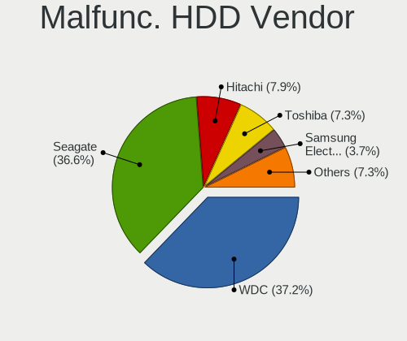

| Vendor              | Desktops | Drives | Percent |
|---------------------|----------|--------|---------|
| Seagate             | 57       | 90     | 38.26%  |
| WDC                 | 54       | 106    | 36.24%  |
| Hitachi             | 12       | 27     | 8.05%   |
| Toshiba             | 10       | 11     | 6.71%   |
| Samsung Electronics | 5        | 6      | 3.36%   |
| IBM                 | 4        | 4      | 2.68%   |
| HGST                | 3        | 4      | 2.01%   |
| MDT                 | 2        | 2      | 1.34%   |
| Maxtor              | 1        | 1      | 0.67%   |
| Unknown             | 1        | 1      | 0.67%   |

Malfunc. Drive Kind
-------------------

Kinds of faulty drives

| Kind | Desktops | Drives | Percent |
|------|----------|--------|---------|
| HDD  | 138      | 252    | 70.77%  |
| SSD  | 41       | 64     | 21.03%  |
| NVMe | 16       | 26     | 8.21%   |

Failed Drives
-------------

Failed drive models

| Model                                            | Desktops | Drives | Percent |
|--------------------------------------------------|----------|--------|---------|
| WDC WD6400BEVT-22A0RT0 640GB                     | 1        | 1      | 14.29%  |
| WDC WD20EARS-00MVWB0 2TB                         | 1        | 2      | 14.29%  |
| Toshiba THNSN5512GPUK NVMe 512GB                 | 1        | 1      | 14.29%  |
| Seagate ST3500630AS 500GB                        | 1        | 2      | 14.29%  |
| Seagate ST31500341AS 1TB                         | 1        | 1      | 14.29%  |
| Samsung Electronics MZ7LN256HCHP-00000 256GB SSD | 1        | 2      | 14.29%  |
| Hitachi HTS723232L9A360 320GB                    | 1        | 1      | 14.29%  |

Failed Drive Vendor
-------------------

Failed drive vendors

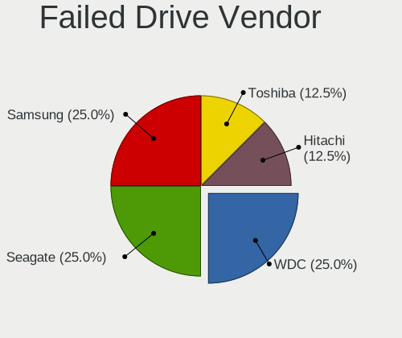

| Vendor              | Desktops | Drives | Percent |
|---------------------|----------|--------|---------|
| WDC                 | 2        | 3      | 28.57%  |
| Seagate             | 2        | 3      | 28.57%  |
| Toshiba             | 1        | 1      | 14.29%  |
| Samsung Electronics | 1        | 2      | 14.29%  |
| Hitachi             | 1        | 1      | 14.29%  |

Drive Status
------------

Number of failed and malfunc. drives

| Status   | Desktops | Drives | Percent |
|----------|----------|--------|---------|
| Works    | 691      | 2979   | 70.94%  |
| Malfunc  | 183      | 342    | 18.79%  |
| Detected | 93       | 267    | 9.55%   |
| Failed   | 7        | 10     | 0.72%   |

Storage controller
------------------

Storage Vendor
--------------

Storage controller vendors

| Vendor                           | Desktops | Percent |
|----------------------------------|----------|---------|
| AMD                              | 379      | 27.97%  |
| Intel                            | 352      | 25.98%  |
| Samsung Electronics              | 202      | 14.91%  |
| ASMedia Technology               | 75       | 5.54%   |
| Phison Electronics               | 59       | 4.35%   |
| SanDisk                          | 52       | 3.84%   |
| Marvell Technology Group         | 32       | 2.36%   |
| Kingston Technology Company      | 27       | 1.99%   |
| Nvidia                           | 21       | 1.55%   |
| Micron/Crucial Technology        | 21       | 1.55%   |
| ADATA Technology                 | 21       | 1.55%   |
| JMicron Technology               | 18       | 1.33%   |
| Silicon Motion                   | 13       | 0.96%   |
| Realtek Semiconductor            | 10       | 0.74%   |
| Broadcom / LSI                   | 9        | 0.66%   |
| LSI Logic / Symbios Logic        | 8        | 0.59%   |
| Toshiba America Info Systems     | 6        | 0.44%   |
| SK hynix                         | 6        | 0.44%   |
| Seagate Technology               | 6        | 0.44%   |
| Adaptec                          | 6        | 0.44%   |
| Silicon Image                    | 5        | 0.37%   |
| MAXIO Technology (Hangzhou)      | 5        | 0.37%   |
| Yangtze Memory Technologies      | 3        | 0.22%   |
| VIA Technologies                 | 3        | 0.22%   |
| INNOGRIT                         | 3        | 0.22%   |
| Loongson Technology              | 2        | 0.15%   |
| KIOXIA                           | 2        | 0.15%   |
| 3ware                            | 2        | 0.15%   |
| Solid State Storage Technology   | 1        | 0.07%   |
| Silicon Integrated Systems [SiS] | 1        | 0.07%   |
| OCZ Technology Group             | 1        | 0.07%   |
| Micron Technology                | 1        | 0.07%   |
| Lite-On IT Corp. / Plextor       | 1        | 0.07%   |
| Integrated Technology Express    | 1        | 0.07%   |
| Broadcom                         | 1        | 0.07%   |

Storage Model
-------------

Storage controller models

| Model                                                                          | Desktops | Percent |
|--------------------------------------------------------------------------------|----------|---------|
| AMD FCH SATA Controller [AHCI mode]                                            | 238      | 14.57%  |
| Samsung NVMe SSD Controller SM981/PM981/PM983                                  | 124      | 7.59%   |
| AMD 400 Series Chipset SATA Controller                                         | 98       | 6%      |
| ASMedia ASM1061/ASM1062 Serial ATA Controller                                  | 66       | 4.04%   |
| AMD 500 Series Chipset SATA Controller                                         | 51       | 3.12%   |
| Samsung NVMe SSD Controller PM9A1/PM9A3/980PRO                                 | 46       | 2.82%   |
| Intel Q170/Q150/B150/H170/H110/Z170/CM236 Chipset SATA Controller [AHCI Mode]  | 46       | 2.82%   |
| AMD SB7x0/SB8x0/SB9x0 SATA Controller [AHCI mode]                              | 38       | 2.33%   |
| Intel Cannon Lake PCH SATA AHCI Controller                                     | 31       | 1.9%    |
| AMD 600 Series Chipset SATA Controller                                         | 29       | 1.78%   |
| Samsung NVMe SSD Controller SM961/PM961/SM963                                  | 28       | 1.71%   |
| Intel 7 Series/C210 Series Chipset Family 6-port SATA Controller [AHCI mode]   | 25       | 1.53%   |
| Intel 200 Series PCH SATA controller [AHCI mode]                               | 25       | 1.53%   |
| Samsung NVMe SSD Controller 980 (DRAM-less)                                    | 24       | 1.47%   |
| Intel 8 Series/C220 Series Chipset Family 6-port SATA Controller 1 [AHCI mode] | 24       | 1.47%   |
| AMD X370 Series Chipset SATA Controller                                        | 21       | 1.29%   |
| Phison E12 NVMe Controller                                                     | 20       | 1.22%   |
| Intel 6 Series/C200 Series Chipset Family 6 port Desktop SATA AHCI Controller  | 20       | 1.22%   |
| Intel Alder Lake-S PCH SATA Controller [AHCI Mode]                             | 19       | 1.16%   |
| Intel 500 Series Chipset Family SATA AHCI Controller                           | 19       | 1.16%   |
| ADATA XPG SX8200 Pro PCIe Gen3x4 M.2 2280 Solid State Drive                    | 19       | 1.16%   |
| Phison E16 PCIe4 NVMe Controller                                               | 18       | 1.1%    |
| Intel SATA Controller [RAID mode]                                              | 16       | 0.98%   |
| Intel 82801JI (ICH10 Family) SATA AHCI Controller                              | 16       | 0.98%   |
| AMD SB7x0/SB8x0/SB9x0 IDE Controller                                           | 15       | 0.92%   |
| Intel SSD 660P Series                                                          | 14       | 0.86%   |
| Kingston Company A2000 NVMe SSD SM2263EN                                       | 13       | 0.8%    |
| Intel 9 Series Chipset Family SATA Controller [AHCI Mode]                      | 13       | 0.8%    |
| AMD 300 Series Chipset SATA Controller                                         | 13       | 0.8%    |
| Intel C600/X79 series chipset 6-Port SATA AHCI Controller                      | 12       | 0.73%   |
| SanDisk Extreme Pro / WD Black SN750 / PC SN730 / Red SN700 NVMe SSD           | 11       | 0.67%   |
| SanDisk Extreme Pro / WD Black 2018/SN750/PC SN720 NVMe SSD                    | 11       | 0.67%   |
| Micron/Crucial P2 [Nick P2] / P3 / P3 Plus NVMe PCIe SSD (DRAM-less)           | 11       | 0.67%   |
| Intel Volume Management Device NVMe RAID Controller                            | 11       | 0.67%   |
| Intel C610/X99 series chipset 6-Port SATA Controller [AHCI mode]               | 11       | 0.67%   |
| Silicon Motion SM2263EN/SM2263XT (DRAM-less) NVMe SSD Controllers              | 10       | 0.61%   |
| JMicron JMB363 SATA/IDE Controller                                             | 10       | 0.61%   |
| Intel Comet Lake SATA AHCI Controller                                          | 10       | 0.61%   |
| Marvell Group 88SE9172 SATA 6Gb/s Controller                                   | 9        | 0.55%   |
| Intel C610/X99 series chipset sSATA Controller [AHCI mode]                     | 9        | 0.55%   |

Storage Kind
------------

Kind of storage controller (IDE, SATA, NVMe, SAS, ...)

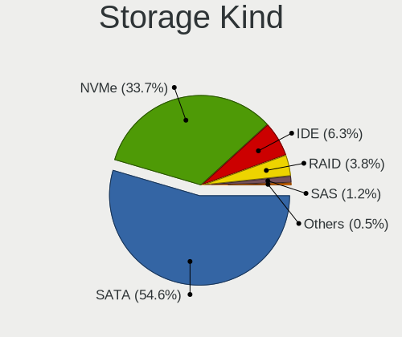

| Kind | Desktops | Percent |
|------|----------|---------|
| SATA | 701      | 55.77%  |
| NVMe | 406      | 32.3%   |
| IDE  | 80       | 6.36%   |
| RAID | 48       | 3.82%   |
| SAS  | 15       | 1.19%   |
| SCSI | 7        | 0.56%   |

Processor
---------

CPU Vendor
----------

Processor vendors

| Vendor                   | Desktops | Percent |
|--------------------------|----------|---------|
| AMD                      | 399      | 52.5%   |
| Intel                    | 349      | 45.92%  |
| Marvell Semiconductor    | 3        | 0.39%   |
| Loongson                 | 2        | 0.26%   |
| PowerNV C1P9S01 REV 1.01 | 1        | 0.13%   |
| PowerMac8,1              | 1        | 0.13%   |
| PowerMac3,6              | 1        | 0.13%   |
| PowerMac10,2             | 1        | 0.13%   |
| PowerBook6,7             | 1        | 0.13%   |
| PowerBook5,5             | 1        | 0.13%   |
| ARM                      | 1        | 0.13%   |

CPU Model
---------

Processor models

| Model                                       | Desktops | Percent |
|---------------------------------------------|----------|---------|
| AMD Ryzen 7 3700X 8-Core Processor          | 29       | 3.76%   |
| AMD Ryzen 9 5900X 12-Core Processor         | 23       | 2.98%   |
| AMD Ryzen 5 3600 6-Core Processor           | 22       | 2.85%   |
| AMD Ryzen 9 3900X 12-Core Processor         | 20       | 2.59%   |
| AMD Ryzen 5 5600X 6-Core Processor          | 20       | 2.59%   |
| AMD Ryzen 9 5950X 16-Core Processor         | 19       | 2.46%   |
| AMD Ryzen 7 2700X Eight-Core Processor      | 18       | 2.33%   |
| AMD Ryzen 9 3950X 16-Core Processor         | 15       | 1.94%   |
| AMD Ryzen 7 2700 Eight-Core Processor       | 13       | 1.68%   |
| AMD Ryzen 5 2600 Six-Core Processor         | 13       | 1.68%   |
| AMD Ryzen 7 5800X 8-Core Processor          | 12       | 1.55%   |
| AMD Ryzen 7 3800X 8-Core Processor          | 12       | 1.55%   |
| Intel Core i7-8700K CPU @ 3.70GHz           | 10       | 1.3%    |
| Intel Core i7-6700K CPU @ 4.00GHz           | 10       | 1.3%    |
| AMD Ryzen 9 7950X 16-Core Processor         | 10       | 1.3%    |
| AMD FX-8350 Eight-Core Processor            | 10       | 1.3%    |
| Intel Core i9-9900K CPU @ 3.60GHz           | 9        | 1.17%   |
| AMD Ryzen 5 1600 Six-Core Processor         | 9        | 1.17%   |
| Intel Core i7-3770 CPU @ 3.40GHz            | 8        | 1.04%   |
| AMD Ryzen 9 7900X 12-Core Processor         | 8        | 1.04%   |
| Intel Core i7-4790K CPU @ 4.00GHz           | 7        | 0.91%   |
| AMD Ryzen 5 1600X Six-Core Processor        | 7        | 0.91%   |
| Intel Core i7-7700K CPU @ 4.20GHz           | 6        | 0.78%   |
| Intel Core i7-6700 CPU @ 3.40GHz            | 5        | 0.65%   |
| Intel Core i7-4790 CPU @ 3.60GHz            | 5        | 0.65%   |
| Intel Core i5-6500 CPU @ 3.20GHz            | 5        | 0.65%   |
| AMD Ryzen 7 5800X3D 8-Core Processor        | 5        | 0.65%   |
| AMD Ryzen 7 1700X Eight-Core Processor      | 5        | 0.65%   |
| AMD Ryzen 7 1700 Eight-Core Processor       | 5        | 0.65%   |
| AMD Ryzen 3 2200G with Radeon Vega Graphics | 5        | 0.65%   |
| Intel Xeon CPU E3-1230 V2 @ 3.30GHz         | 4        | 0.52%   |
| Intel Core i9-10850K CPU @ 3.60GHz          | 4        | 0.52%   |
| Intel Core i7-7700 CPU @ 3.60GHz            | 4        | 0.52%   |
| Intel Core i7-3770K CPU @ 3.50GHz           | 4        | 0.52%   |
| Intel Core i7-2600 CPU @ 3.40GHz            | 4        | 0.52%   |
| Intel Core i7-10700K CPU @ 3.80GHz          | 4        | 0.52%   |
| Intel Core i5-9600K CPU @ 3.70GHz           | 4        | 0.52%   |
| Intel Core i5-8400 CPU @ 2.80GHz            | 4        | 0.52%   |
| Intel Core i5-6400 CPU @ 2.70GHz            | 4        | 0.52%   |
| Intel Core i5-3470 CPU @ 3.20GHz            | 4        | 0.52%   |

CPU Model Family
----------------

Processor model prefix

| Model                   | Desktops | Percent |
|-------------------------|----------|---------|
| Intel Core i7           | 114      | 14.84%  |
| AMD Ryzen 7             | 109      | 14.19%  |
| AMD Ryzen 9             | 101      | 13.15%  |
| AMD Ryzen 5             | 101      | 13.15%  |
| Intel Core i5           | 70       | 9.11%   |
| Other                   | 50       | 6.51%   |
| Intel Xeon              | 46       | 5.99%   |
| AMD FX                  | 25       | 3.26%   |
| Intel Core i9           | 14       | 1.82%   |
| Intel Atom              | 11       | 1.43%   |
| AMD Ryzen Threadripper  | 11       | 1.43%   |
| AMD Phenom II X4        | 11       | 1.43%   |
| Intel Pentium           | 10       | 1.3%    |
| Intel Core i3           | 10       | 1.3%    |
| Intel Core 2 Quad       | 9        | 1.17%   |
| AMD Ryzen 3             | 9        | 1.17%   |
| Intel Celeron           | 8        | 1.04%   |
| Intel Core 2 Duo        | 7        | 0.91%   |
| Intel Pentium 4         | 6        | 0.78%   |
| AMD Phenom II X6        | 6        | 0.78%   |
| AMD Ryzen 7 PRO         | 5        | 0.65%   |
| Intel Pentium III       | 4        | 0.52%   |
| AMD Sempron             | 4        | 0.52%   |
| AMD Athlon 64 X2        | 4        | 0.52%   |
| AMD Athlon II X3        | 3        | 0.39%   |
| AMD Athlon              | 3        | 0.39%   |
| AMD A10                 | 3        | 0.39%   |
| Intel Core 2            | 2        | 0.26%   |
| AMD Ryzen 5 PRO         | 2        | 0.26%   |
| AMD E                   | 2        | 0.26%   |
| Intel Pentium Dual-Core | 1        | 0.13%   |
| Intel Core 2 Extreme    | 1        | 0.13%   |
| ARM Allwinner           | 1        | 0.13%   |
| AMD Turion II Neo       | 1        | 0.13%   |
| AMD Phenom              | 1        | 0.13%   |
| AMD Athlon X4           | 1        | 0.13%   |
| AMD Athlon Dual Core    | 1        | 0.13%   |
| AMD A6                  | 1        | 0.13%   |

CPU Cores
---------

Number of processor cores

| Number  | Desktops | Percent |
|---------|----------|---------|
| 4       | 200      | 26.08%  |
| 6       | 169      | 22.03%  |
| 8       | 160      | 20.86%  |
| 12      | 71       | 9.26%   |
| 16      | 58       | 7.56%   |
| 2       | 58       | 7.56%   |
| 1       | 20       | 2.61%   |
| 10      | 8        | 1.04%   |
| 3       | 7        | 0.91%   |
| 24      | 3        | 0.39%   |
| Unknown | 3        | 0.39%   |
| 32      | 2        | 0.26%   |
| 28      | 2        | 0.26%   |
| 14      | 2        | 0.26%   |
| 64      | 1        | 0.13%   |
| 44      | 1        | 0.13%   |
| 22      | 1        | 0.13%   |
| 18      | 1        | 0.13%   |

CPU Sockets
-----------

Number of sockets

| Number  | Desktops | Percent |
|---------|----------|---------|
| 1       | 743      | 97.76%  |
| 2       | 15       | 1.97%   |
| Unknown | 2        | 0.26%   |

CPU Threads
-----------

Threads per core (Hyper-Threading)

| Number  | Desktops | Percent |
|---------|----------|---------|
| 2       | 582      | 76.08%  |
| 1       | 179      | 23.4%   |
| Unknown | 3        | 0.39%   |
| 4       | 1        | 0.13%   |

CPU Op-Modes
------------

CPU Operation Modes (32-bit, 64-bit)

| Op mode        | Desktops | Percent |
|----------------|----------|---------|
| 32-bit, 64-bit | 743      | 97.76%  |
| 32-bit         | 11       | 1.45%   |
| Unknown        | 6        | 0.79%   |

CPU Microcode
-------------

Microcode number

| Number     | Desktops | Percent |
|------------|----------|---------|
| Unknown    | 152      | 18.67%  |
| 0x08701021 | 67       | 8.23%   |
| 0x0800820d | 41       | 5.04%   |
| 0x08701013 | 34       | 4.18%   |
| 0x506e3    | 32       | 3.93%   |
| 0x0a201016 | 31       | 3.81%   |
| 0x306c3    | 26       | 3.19%   |
| 0x306a9    | 25       | 3.07%   |
| 0x0a601203 | 23       | 2.83%   |
| 0x906ea    | 21       | 2.58%   |
| 0x08001138 | 21       | 2.58%   |
| 0x0a201009 | 20       | 2.46%   |
| 0x0a20120a | 19       | 2.33%   |
| 0x906e9    | 18       | 2.21%   |
| 0x906ed    | 14       | 1.72%   |
| 0x90672    | 12       | 1.47%   |
| 0xa0655    | 11       | 1.35%   |
| 0x1067a    | 11       | 1.35%   |
| 0xa0671    | 10       | 1.23%   |
| 0x306f2    | 10       | 1.23%   |
| 0x306e4    | 9        | 1.11%   |
| 0x206a7    | 9        | 1.11%   |
| 0x206c2    | 8        | 0.98%   |
| 0x906ec    | 6        | 0.74%   |
| 0x406f1    | 6        | 0.74%   |
| 0x06000852 | 6        | 0.74%   |
| 0x06000822 | 6        | 0.74%   |
| 0xa0653    | 5        | 0.61%   |
| 0x50654    | 5        | 0.61%   |
| 0x0a601206 | 5        | 0.61%   |
| 0x0800820b | 5        | 0.61%   |
| 0x010000c8 | 5        | 0.61%   |
| 0x00000000 | 5        | 0.61%   |
| 0x206d7    | 4        | 0.49%   |
| 0x106a5    | 4        | 0.49%   |
| 0x0a50000d | 4        | 0.49%   |
| 0x0a50000c | 4        | 0.49%   |
| 0x0a201205 | 4        | 0.49%   |
| 0x0a201204 | 4        | 0.49%   |
| 0x08600106 | 4        | 0.49%   |

CPU Microarch
-------------

Microarchitecture

| Name             | Desktops | Percent |
|------------------|----------|---------|
| Zen 2            | 123      | 15.95%  |
| Zen 3            | 94       | 12.19%  |
| KabyLake         | 71       | 9.21%   |
| Zen+             | 58       | 7.52%   |
| Unknown          | 52       | 6.74%   |
| Haswell          | 45       | 5.84%   |
| Skylake          | 38       | 4.93%   |
| IvyBridge        | 38       | 4.93%   |
| Zen              | 36       | 4.67%   |
| Piledriver       | 23       | 2.98%   |
| SandyBridge      | 21       | 2.72%   |
| K10              | 21       | 2.72%   |
| Alderlake Hybrid | 21       | 2.72%   |
| CometLake        | 20       | 2.59%   |
| Penryn           | 14       | 1.82%   |
| Icelake          | 11       | 1.43%   |
| Westmere         | 10       | 1.3%    |
| Broadwell        | 10       | 1.3%    |
| Nehalem          | 9        | 1.17%   |
| Bonnell          | 9        | 1.17%   |
| K8 Hammer        | 7        | 0.91%   |
| Core             | 7        | 0.91%   |
| Silvermont       | 6        | 0.78%   |
| NetBurst         | 6        | 0.78%   |
| Bulldozer        | 5        | 0.65%   |
| P6               | 4        | 0.52%   |
| Jaguar           | 3        | 0.39%   |
| Goldmont         | 2        | 0.26%   |
| Bobcat           | 2        | 0.26%   |
| TigerLake        | 1        | 0.13%   |
| Steamroller      | 1        | 0.13%   |
| Gracemont        | 1        | 0.13%   |
| Goldmont plus    | 1        | 0.13%   |
| Excavator        | 1        | 0.13%   |

Graphics
--------

GPU Vendor
----------

Vendors of graphics cards

| Vendor                           | Desktops | Percent |
|----------------------------------|----------|---------|
| AMD                              | 349      | 42.46%  |
| Nvidia                           | 328      | 39.9%   |
| Intel                            | 122      | 14.84%  |
| ASPEED Technology                | 14       | 1.7%    |
| Matrox Electronics Systems       | 6        | 0.73%   |
| Loongson Technology              | 2        | 0.24%   |
| Silicon Integrated Systems [SiS] | 1        | 0.12%   |

GPU Model
---------

Graphics card models

| Model                                                                       | Desktops | Percent |
|-----------------------------------------------------------------------------|----------|---------|
| AMD Ellesmere [Radeon RX 470/480/570/570X/580/580X/590]                     | 92       | 10.54%  |
| AMD Navi 10 [Radeon RX 5600 OEM/5600 XT / 5700/5700 XT]                     | 33       | 3.78%   |
| AMD Raphael                                                                 | 24       | 2.75%   |
| AMD Navi 22 [Radeon RX 6700/6700 XT/6750 XT / 6800M/6850M XT]               | 22       | 2.52%   |
| AMD Vega 10 XL/XT [Radeon RX Vega 56/64]                                    | 20       | 2.29%   |
| AMD Navi 21 [Radeon RX 6800/6800 XT / 6900 XT]                              | 18       | 2.06%   |
| Intel CoffeeLake-S GT2 [UHD Graphics 630]                                   | 17       | 1.95%   |
| Nvidia GP106 [GeForce GTX 1060 6GB]                                         | 16       | 1.83%   |
| Intel Xeon E3-1200 v3/4th Gen Core Processor Integrated Graphics Controller | 15       | 1.72%   |
| ASPEED Technology ASPEED Graphics Family                                    | 14       | 1.6%    |
| Nvidia GP102 [GeForce GTX 1080 Ti]                                          | 13       | 1.49%   |
| Nvidia GM204 [GeForce GTX 970]                                              | 13       | 1.49%   |
| Intel HD Graphics 530                                                       | 13       | 1.49%   |
| Nvidia GP104 [GeForce GTX 1070]                                             | 12       | 1.37%   |
| Nvidia TU104 [GeForce RTX 2070 SUPER]                                       | 11       | 1.26%   |
| Nvidia GP107 [GeForce GTX 1050 Ti]                                          | 11       | 1.26%   |
| Nvidia GM206 [GeForce GTX 960]                                              | 11       | 1.26%   |
| Nvidia GK208B [GeForce GT 710]                                              | 11       | 1.26%   |
| AMD Navi 23 [Radeon RX 6600/6600 XT/6600M]                                  | 11       | 1.26%   |
| Nvidia GA102 [GeForce RTX 3080 Ti]                                          | 10       | 1.15%   |
| Nvidia GP104 [GeForce GTX 1080]                                             | 8        | 0.92%   |
| Nvidia GM107 [GeForce GTX 750 Ti]                                           | 8        | 0.92%   |
| Intel Xeon E3-1200 v2/3rd Gen Core processor Graphics Controller            | 8        | 0.92%   |
| Intel 2nd Generation Core Processor Family Integrated Graphics Controller   | 8        | 0.92%   |
| AMD Raven Ridge [Radeon Vega Series / Radeon Vega Mobile Series]            | 8        | 0.92%   |
| AMD Navi 14 [Radeon RX 5500/5500M / Pro 5500M]                              | 8        | 0.92%   |
| AMD Lexa PRO [Radeon 540/540X/550/550X / RX 540X/550/550X]                  | 8        | 0.92%   |
| AMD Cedar [Radeon HD 5000/6000/7350/8350 Series]                            | 8        | 0.92%   |
| Nvidia TU102 [GeForce RTX 2080 Ti Rev. A]                                   | 7        | 0.8%    |
| Nvidia GT218 [GeForce 210]                                                  | 7        | 0.8%    |
| Nvidia GF119 [GeForce GT 610]                                               | 7        | 0.8%    |
| Nvidia GA102 [GeForce RTX 3090]                                             | 7        | 0.8%    |
| Intel IvyBridge GT2 [HD Graphics 4000]                                      | 7        | 0.8%    |
| AMD Navi 31 [Radeon RX 7900 XT/7900 XTX/7900M]                              | 7        | 0.8%    |
| Nvidia TU117 [GeForce GTX 1650]                                             | 6        | 0.69%   |
| Nvidia TU116 [GeForce GTX 1660 SUPER]                                       | 6        | 0.69%   |
| Nvidia GP106 [GeForce GTX 1060 3GB]                                         | 6        | 0.69%   |
| Intel CometLake-S GT2 [UHD Graphics 630]                                    | 6        | 0.69%   |
| Intel AlderLake-S GT1                                                       | 6        | 0.69%   |
| AMD Renoir [Radeon RX Vega 6 (Ryzen 4000/5000 Mobile Series)]               | 6        | 0.69%   |

GPU Combo
---------

Combinations of graphics cards

| Name                      | Desktops | Percent |
|---------------------------|----------|---------|
| 1 x AMD                   | 302      | 38.62%  |
| 1 x Nvidia                | 286      | 36.57%  |
| 1 x Intel                 | 93       | 11.89%  |
| AMD + Nvidia              | 21       | 2.69%   |
| 2 x AMD                   | 20       | 2.56%   |
| 1 x ASPEED                | 13       | 1.66%   |
| Intel + Nvidia            | 12       | 1.53%   |
| Other                     | 8        | 1.02%   |
| 2 x Nvidia                | 7        | 0.9%    |
| Intel + AMD               | 7        | 0.9%    |
| 1 x Matrox                | 4        | 0.51%   |
| AMD + Loongson Technology | 2        | 0.26%   |
| 2 x Intel                 | 1        | 0.13%   |
| 1 x SiS                   | 1        | 0.13%   |
| Nvidia + Matrox           | 1        | 0.13%   |
| Intel + 2 x Nvidia        | 1        | 0.13%   |
| Intel + AMD + 1 x Nvidia  | 1        | 0.13%   |
| AMD + Matrox              | 1        | 0.13%   |
| AMD + ASPEED              | 1        | 0.13%   |

GPU Driver
----------

Free vs proprietary

| Driver      | Desktops | Percent |
|-------------|----------|---------|
| Free        | 484      | 61.58%  |
| Proprietary | 228      | 29.01%  |
| Unknown     | 74       | 9.41%   |

GPU Memory
----------

Total video memory

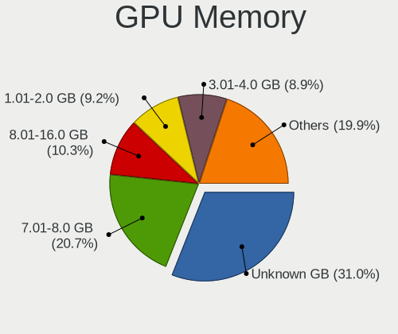

| Size in GB | Desktops | Percent |
|------------|----------|---------|
| Unknown    | 247      | 30.38%  |
| 7.01-8.0   | 179      | 22.02%  |
| 3.01-4.0   | 75       | 9.23%   |
| 1.01-2.0   | 75       | 9.23%   |
| 8.01-16.0  | 74       | 9.1%    |
| 0.01-0.5   | 55       | 6.77%   |
| 0.51-1.0   | 44       | 5.41%   |
| 5.01-6.0   | 39       | 4.8%    |
| 16.01-24.0 | 12       | 1.48%   |
| 2.01-3.0   | 11       | 1.35%   |
| 4.01-5.0   | 2        | 0.25%   |

Monitor
-------

Monitor Vendor
--------------

Monitor vendors

| Vendor               | Desktops | Percent |
|----------------------|----------|---------|
| Samsung Electronics  | 120      | 13.68%  |
| Dell                 | 103      | 11.74%  |
| Goldstar             | 80       | 9.12%   |
| BenQ                 | 54       | 6.16%   |
| AOC                  | 54       | 6.16%   |
| Ancor Communications | 52       | 5.93%   |
| Acer                 | 46       | 5.25%   |
| Hewlett-Packard      | 44       | 5.02%   |
| ASUSTek Computer     | 35       | 3.99%   |
| Iiyama               | 31       | 3.53%   |
| ViewSonic            | 29       | 3.31%   |
| Philips              | 29       | 3.31%   |
| Lenovo               | 22       | 2.51%   |
| Gigabyte Technology  | 13       | 1.48%   |
| LG Electronics       | 12       | 1.37%   |
| Eizo                 | 12       | 1.37%   |
| Unknown              | 11       | 1.25%   |
| Fujitsu Siemens      | 8        | 0.91%   |
| MSI                  | 7        | 0.8%    |
| NEC Computers        | 6        | 0.68%   |
| Idek Iiyama          | 6        | 0.68%   |
| Apple                | 6        | 0.68%   |
| Unknown              | 5        | 0.57%   |
| Envision Peripherals | 4        | 0.46%   |
| Chimei Innolux       | 4        | 0.46%   |
| Toshiba              | 3        | 0.34%   |
| Sony                 | 3        | 0.34%   |
| Panasonic            | 3        | 0.34%   |
| Mi                   | 3        | 0.34%   |
| HVR                  | 3        | 0.34%   |
| HJW                  | 3        | 0.34%   |
| HannStar             | 3        | 0.34%   |
| AUS                  | 3        | 0.34%   |
| Yamaha               | 2        | 0.23%   |
| Vizio                | 2        | 0.23%   |
| UGD                  | 2        | 0.23%   |
| Sceptre Tech         | 2        | 0.23%   |
| PNP                  | 2        | 0.23%   |
| Onkyo                | 2        | 0.23%   |
| MStar                | 2        | 0.23%   |

Monitor Model
-------------

Monitor models

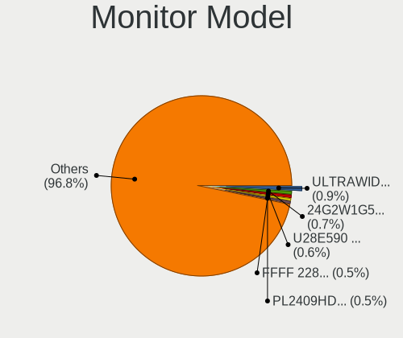

| Model                                                                   | Desktops | Percent |
|-------------------------------------------------------------------------|----------|---------|
| Goldstar ULTRAWIDE GSM59F1 2560x1080 673x284mm 28.8-inch                | 9        | 0.93%   |
| Samsung Electronics U28E590 SAM0C4D 3840x2160 607x345mm 27.5-inch       | 7        | 0.72%   |
| Iiyama PL2409HD IVM560C 1920x1080 521x293mm 23.5-inch                   | 6        | 0.62%   |
| Unknown LCD Monitor FFFF 2288x1287 2550x2550mm 142.0-inch               | 5        | 0.52%   |
| Samsung Electronics C24F390 SAM0D2C 1920x1080 521x293mm 23.5-inch       | 5        | 0.52%   |
| Iiyama PL2473HD IVM6107 1920x1080 521x293mm 23.5-inch                   | 5        | 0.52%   |
| Goldstar Ultra HD GSM5B09 3840x2160 600x340mm 27.2-inch                 | 5        | 0.52%   |
| BenQ PD3200U BNQ8025 3840x2160 708x399mm 32.0-inch                      | 5        | 0.52%   |
| AOC 24G2W1G4 AOC2402 1920x1080 527x296mm 23.8-inch                      | 5        | 0.52%   |
| Unknown                                                                 | 5        | 0.52%   |
| Samsung Electronics LC49G95T SAM7053 3840x1080 1193x336mm 48.8-inch     | 4        | 0.41%   |
| Fujitsu Siemens P24W-6 IPS FUS07EA 1920x1200 518x324mm 24.1-inch        | 4        | 0.41%   |
| Envision Peripherals LCD2361 ENV2361 1920x1080 521x293mm 23.5-inch      | 4        | 0.41%   |
| Dell P2418D DELD0C1 2560x1440 526x296mm 23.8-inch                       | 4        | 0.41%   |
| BenQ PD2700U BNQ802E 3840x2160 597x336mm 27.0-inch                      | 4        | 0.41%   |
| AOC 2460 AOC2460 1920x1080 531x299mm 24.0-inch                          | 4        | 0.41%   |
| Ancor Communications VS248 ACI2498 1920x1080 531x299mm 24.0-inch        | 4        | 0.41%   |
| ViewSonic VX2458-mhd VSC0437 1920x1080 521x293mm 23.5-inch              | 3        | 0.31%   |
| Samsung Electronics LCD Monitor SAM7003 3840x2160 1872x1053mm 84.6-inch | 3        | 0.31%   |
| Samsung Electronics C27HG7x SAM0E16 2560x1440 598x336mm 27.0-inch       | 3        | 0.31%   |
| LG Electronics LCD Monitor LG HDR 4K 7680x2160                          | 3        | 0.31%   |
| LG Electronics LCD Monitor LG HDR 4K                                    | 3        | 0.31%   |
| HVR HTC-VIVE HVRAA01 2160x1200                                          | 3        | 0.31%   |
| Hewlett-Packard LA2205 HWP2848 1680x1050 473x296mm 22.0-inch            | 3        | 0.31%   |
| Goldstar ULTRAWIDE GSM76F9 2560x1080 531x298mm 24.0-inch                | 3        | 0.31%   |
| Goldstar ULTRAWIDE GSM59F2 2560x1080 798x334mm 34.1-inch                | 3        | 0.31%   |
| Goldstar Ultra HD GSM5B08 3840x2160 600x340mm 27.2-inch                 | 3        | 0.31%   |
| Goldstar LG ULTRAWIDE GSM76E4 3440x1440 800x340mm 34.2-inch             | 3        | 0.31%   |
| Goldstar HDR 4K GSM7707 3840x2160 600x340mm 27.2-inch                   | 3        | 0.31%   |
| Goldstar FULL HD GSM5B55 1920x1080 480x270mm 21.7-inch                  | 3        | 0.31%   |
| Gigabyte Technology M32U GBT3204 3840x2160 697x392mm 31.5-inch          | 3        | 0.31%   |
| Eizo CS2731 ENC3069 2560x1440 597x336mm 27.0-inch                       | 3        | 0.31%   |
| Dell U2720Q DEL41B3 3840x2160 597x336mm 27.0-inch                       | 3        | 0.31%   |
| Chimei Innolux LCD Monitor CMN1747 1920x1080 381x214mm 17.2-inch        | 3        | 0.31%   |
| BenQ LCD BNQ801E 3840x2160 600x340mm 27.2-inch                          | 3        | 0.31%   |
| BenQ GL2450 BNQ78A5 1920x1080 531x298mm 24.0-inch                       | 3        | 0.31%   |
| AOC 24B1W1 AOC2401 1920x1080 527x296mm 23.8-inch                        | 3        | 0.31%   |
| AOC 2270W AOC2270 1920x1080 477x268mm 21.5-inch                         | 3        | 0.31%   |
| Ancor Communications ROG PG279Q ACI27EC 2560x1440 598x336mm 27.0-inch   | 3        | 0.31%   |
| Ancor Communications ASUS VS228 ACI22FD 1920x1080 476x268mm 21.5-inch   | 3        | 0.31%   |

Monitor Resolution
------------------

Monitor screen resolution

| Resolution         | Desktops | Percent |
|--------------------|----------|---------|
| 1920x1080 (FHD)    | 326      | 38.49%  |
| 2560x1440 (QHD)    | 117      | 13.81%  |
| 3840x2160 (4K)     | 112      | 13.22%  |
| 1280x1024 (SXGA)   | 38       | 4.49%   |
| 1920x1200 (WUXGA)  | 34       | 4.01%   |
| 3440x1440          | 30       | 3.54%   |
| 1680x1050 (WSXGA+) | 30       | 3.54%   |
| Unknown            | 30       | 3.54%   |
| 2560x1080          | 20       | 2.36%   |
| 3840x1080          | 16       | 1.89%   |
| 1366x768 (WXGA)    | 14       | 1.65%   |
| 1600x900 (HD+)     | 12       | 1.42%   |
| 1440x900 (WXGA+)   | 12       | 1.42%   |
| 2288x1287          | 5        | 0.59%   |
| 3840x1200          | 4        | 0.47%   |
| 1600x1200          | 4        | 0.47%   |
| 7680x2160          | 3        | 0.35%   |
| 2160x1200          | 3        | 0.35%   |
| 2048x1152          | 3        | 0.35%   |
| 1920x540           | 3        | 0.35%   |
| 1280x960           | 3        | 0.35%   |
| 1024x768 (XGA)     | 3        | 0.35%   |
| 5760x2160          | 2        | 0.24%   |
| 2560x1600          | 2        | 0.24%   |
| 1400x1050          | 2        | 0.24%   |
| 1360x768           | 2        | 0.24%   |
| 1280x720 (HD)      | 2        | 0.24%   |
| 6720x2160          | 1        | 0.12%   |
| 6400x2160          | 1        | 0.12%   |
| 6400x1440          | 1        | 0.12%   |
| 5120x1600          | 1        | 0.12%   |
| 4880x1080          | 1        | 0.12%   |
| 400x1280           | 1        | 0.12%   |
| 4000x2560          | 1        | 0.12%   |
| 3926x1440          | 1        | 0.12%   |
| 3840x1600          | 1        | 0.12%   |
| 3640x1080          | 1        | 0.12%   |
| 3600x1200          | 1        | 0.12%   |
| 3600x1080          | 1        | 0.12%   |
| 3440x2880          | 1        | 0.12%   |

Monitor Diagonal
----------------

Diagonal size in inches

| Inches  | Desktops | Percent |
|---------|----------|---------|
| 27      | 191      | 22.16%  |
| 24      | 136      | 15.78%  |
| 23      | 111      | 12.88%  |
| Unknown | 85       | 9.86%   |
| 21      | 70       | 8.12%   |
| 34      | 43       | 4.99%   |
| 19      | 31       | 3.6%    |
| 31      | 27       | 3.13%   |
| 17      | 26       | 3.02%   |
| 22      | 22       | 2.55%   |
| 32      | 12       | 1.39%   |
| 25      | 12       | 1.39%   |
| 20      | 12       | 1.39%   |
| 84      | 10       | 1.16%   |
| 18      | 9        | 1.04%   |
| 48      | 7        | 0.81%   |
| 40      | 7        | 0.81%   |
| 26      | 6        | 0.7%    |
| 142     | 5        | 0.58%   |
| 72      | 5        | 0.58%   |
| 54      | 5        | 0.58%   |
| 15      | 5        | 0.58%   |
| 49      | 4        | 0.46%   |
| 14      | 4        | 0.46%   |
| 42      | 3        | 0.35%   |
| 28      | 3        | 0.35%   |
| 11      | 2        | 0.23%   |
| 60      | 1        | 0.12%   |
| 50      | 1        | 0.12%   |
| 41      | 1        | 0.12%   |
| 38      | 1        | 0.12%   |
| 33      | 1        | 0.12%   |
| 29      | 1        | 0.12%   |
| 13      | 1        | 0.12%   |
| 12      | 1        | 0.12%   |
| 9       | 1        | 0.12%   |

Monitor Width
-------------

Physical width

| Width in mm    | Desktops | Percent |
|----------------|----------|---------|
| 501-600        | 378      | 46.61%  |
| 401-500        | 123      | 15.17%  |
| Unknown        | 85       | 10.48%  |
| 601-700        | 59       | 7.27%   |
| 701-800        | 56       | 6.91%   |
| 301-350        | 27       | 3.33%   |
| 351-400        | 26       | 3.21%   |
| 1001-1500      | 18       | 2.22%   |
| 1501-2000      | 15       | 1.85%   |
| 801-900        | 8        | 0.99%   |
| 201-300        | 7        | 0.86%   |
| More than 2000 | 5        | 0.62%   |
| 901-1000       | 4        | 0.49%   |

Aspect Ratio
------------

Proportional relationship between the width and the height

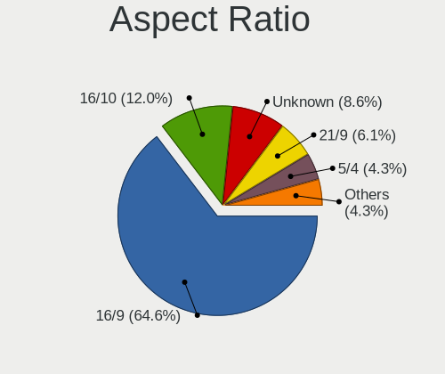

| Ratio   | Desktops | Percent |
|---------|----------|---------|
| 16/9    | 480      | 63.83%  |
| 16/10   | 91       | 12.1%   |
| Unknown | 72       | 9.57%   |
| 21/9    | 43       | 5.72%   |
| 5/4     | 37       | 4.92%   |
| 32/9    | 11       | 1.46%   |
| 4/3     | 9        | 1.2%    |
| 1.00    | 6        | 0.8%    |
| 6/5     | 1        | 0.13%   |
| 3/2     | 1        | 0.13%   |
| 0.31    | 1        | 0.13%   |

Monitor Area
------------

Area in inch

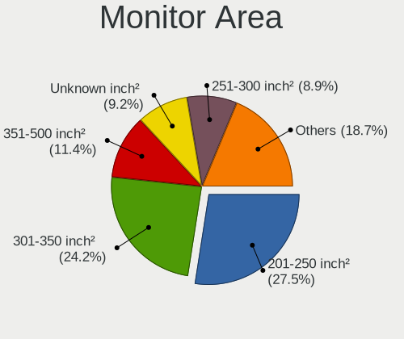

| Area in inch | Desktops | Percent |
|----------------|----------|---------|
| 201-250        | 247      | 29.55%  |
| 301-350        | 196      | 23.44%  |
| Unknown        | 85       | 10.17%  |
| 351-500        | 82       | 9.81%   |
| 251-300        | 68       | 8.13%   |
| 151-200        | 61       | 7.3%    |
| More than 1000 | 29       | 3.47%   |
| 141-150        | 28       | 3.35%   |
| 501-1000       | 21       | 2.51%   |
| 101-110        | 5        | 0.6%    |
| 121-130        | 3        | 0.36%   |
| 81-90          | 2        | 0.24%   |
| 71-80          | 2        | 0.24%   |
| 51-60          | 2        | 0.24%   |
| 131-140        | 2        | 0.24%   |
| 41-50          | 1        | 0.12%   |
| 111-120        | 1        | 0.12%   |
| 91-100         | 1        | 0.12%   |

Pixel Density
-------------

Pixels per inch

| Density | Desktops | Percent |
|---------|----------|---------|
| 51-100  | 399      | 51.48%  |
| 101-120 | 175      | 22.58%  |
| Unknown | 85       | 10.97%  |
| 121-160 | 58       | 7.48%   |
| 161-240 | 35       | 4.52%   |
| 1-50    | 23       | 2.97%   |

Multiple Monitors
-----------------

Total monitors connected

| Total | Desktops | Percent |
|-------|----------|---------|
| 1     | 484      | 60.42%  |
| 2     | 173      | 21.6%   |
| 0     | 98       | 12.23%  |
| 3     | 33       | 4.12%   |
| 4     | 13       | 1.62%   |

Network
-------

Net Controller Vendor
---------------------

Controller vendors

| Vendor                          | Desktops | Percent |
|---------------------------------|----------|---------|
| Intel                           | 442      | 41.04%  |
| Realtek Semiconductor           | 395      | 36.68%  |
| Qualcomm Atheros                | 44       | 4.09%   |
| Broadcom                        | 41       | 3.81%   |
| MediaTek                        | 22       | 2.04%   |
| Aquantia                        | 19       | 1.76%   |
| Nvidia                          | 18       | 1.67%   |
| Marvell Technology Group        | 8        | 0.74%   |
| Microsoft                       | 7        | 0.65%   |
| ASIX Electronics                | 7        | 0.65%   |
| TP-Link                         | 6        | 0.56%   |
| Qualcomm Atheros Communications | 6        | 0.56%   |
| Apple                           | 5        | 0.46%   |
| Ralink Technology               | 4        | 0.37%   |
| Ralink                          | 4        | 0.37%   |
| NetGear                         | 3        | 0.28%   |
| Huawei Technologies             | 3        | 0.28%   |
| STMicroelectronics              | 2        | 0.19%   |
| Sigma Designs                   | 2        | 0.19%   |
| OpenMoko                        | 2        | 0.19%   |
| Netchip Technology              | 2        | 0.19%   |
| Metrologic Instruments          | 2        | 0.19%   |
| Mellanox Technologies           | 2        | 0.19%   |
| Loongson Technology             | 2        | 0.19%   |
| Dresden Elektronik              | 2        | 0.19%   |
| DisplayLink                     | 2        | 0.19%   |
| D-Link System                   | 2        | 0.19%   |
| D-Link                          | 2        | 0.19%   |
| 3Com                            | 2        | 0.19%   |
| Wilocity                        | 1        | 0.09%   |
| U-Blox                          | 1        | 0.09%   |
| Texas Instruments               | 1        | 0.09%   |
| Senao                           | 1        | 0.09%   |
| Raspberry Pi                    | 1        | 0.09%   |
| QLogic                          | 1        | 0.09%   |
| QinHeng Electronics             | 1        | 0.09%   |
| Pulse-Eight                     | 1        | 0.09%   |
| Prusa                           | 1        | 0.09%   |
| Oculus VR                       | 1        | 0.09%   |
| Kyocera                         | 1        | 0.09%   |

Net Controller Model
--------------------

Controller models

| Model                                                                          | Desktops | Percent |
|--------------------------------------------------------------------------------|----------|---------|
| Realtek RTL8111/8168/8211/8411 PCI Express Gigabit Ethernet Controller         | 290      | 22.87%  |
| Intel I211 Gigabit Network Connection                                          | 125      | 9.86%   |
| Realtek RTL8125 2.5GbE Controller                                              | 84       | 6.62%   |
| Intel Wi-Fi 6 AX200                                                            | 81       | 6.39%   |
| Intel Ethernet Controller I225-V                                               | 43       | 3.39%   |
| Intel Ethernet Connection (2) I219-V                                           | 33       | 2.6%    |
| Intel Ethernet Connection (7) I219-V                                           | 25       | 1.97%   |
| Intel 82574L Gigabit Network Connection                                        | 23       | 1.81%   |
| Intel Wi-Fi 6E(802.11ax) AX210/AX1675* 2x2 [Typhoon Peak]                      | 22       | 1.74%   |
| Intel Wi-Fi 5(802.11ac) Wireless-AC 9x6x [Thunder Peak]                        | 20       | 1.58%   |
| Intel 82579LM Gigabit Network Connection (Lewisville)                          | 17       | 1.34%   |
| Intel I210 Gigabit Network Connection                                          | 14       | 1.1%    |
| Intel Dual Band Wireless-AC 3168NGW [Stone Peak]                               | 14       | 1.1%    |
| Intel Ethernet Connection (2) I218-V                                           | 13       | 1.03%   |
| Intel Ethernet Connection (2) I219-LM                                          | 11       | 0.87%   |
| Intel 82599ES 10-Gigabit SFI/SFP+ Network Connection                           | 11       | 0.87%   |
| MediaTek MT7922 802.11ax PCI Express Wireless Network Adapter                  | 10       | 0.79%   |
| MediaTek MT7921K (RZ608) Wi-Fi 6E 80MHz                                        | 10       | 0.79%   |
| Intel Cannon Lake PCH CNVi WiFi                                                | 10       | 0.79%   |
| Intel 82579V Gigabit Network Connection                                        | 10       | 0.79%   |
| Broadcom BCM4360 802.11ac Dual Band Wireless Network Adapter                   | 10       | 0.79%   |
| Intel Alder Lake-S PCH CNVi WiFi                                               | 9        | 0.71%   |
| Aquantia AQtion AQC107 NBase-T/IEEE 802.3an Ethernet Controller [Atlantic 10G] | 8        | 0.63%   |
| Realtek RTL8153 Gigabit Ethernet Adapter                                       | 7        | 0.55%   |
| Qualcomm Atheros AR93xx Wireless Network Adapter                               | 7        | 0.55%   |
| Nvidia MCP77 Ethernet                                                          | 7        | 0.55%   |
| Intel Wireless 8260                                                            | 7        | 0.55%   |
| Intel I350 Gigabit Network Connection                                          | 7        | 0.55%   |
| Intel 82571EB/82571GB Gigabit Ethernet Controller D0/D1 (copper applications)  | 7        | 0.55%   |
| Realtek RTL8812AE 802.11ac PCIe Wireless Network Adapter                       | 6        | 0.47%   |
| Realtek RTL8169 PCI Gigabit Ethernet Controller                                | 6        | 0.47%   |
| Qualcomm Atheros AR9271 802.11n                                                | 6        | 0.47%   |
| Qualcomm Atheros AR9285 Wireless Network Adapter (PCI-Express)                 | 6        | 0.47%   |
| Microsoft Xbox Wireless Adapter for Windows                                    | 6        | 0.47%   |
| Intel Ethernet Connection I217-V                                               | 6        | 0.47%   |
| Intel Comet Lake PCH CNVi WiFi                                                 | 6        | 0.47%   |
| Realtek RTL-8100/8101L/8139 PCI Fast Ethernet Adapter                          | 5        | 0.39%   |
| Realtek Killer E3000 2.5GbE Controller                                         | 5        | 0.39%   |
| Nvidia MCP61 Ethernet                                                          | 5        | 0.39%   |
| Marvell Group 88E8056 PCI-E Gigabit Ethernet Controller                        | 5        | 0.39%   |

Wireless Vendor
---------------

Wireless vendors

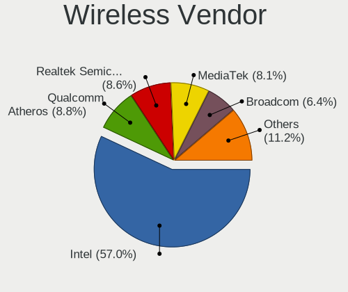

| Vendor                          | Desktops | Percent |
|---------------------------------|----------|---------|
| Intel                           | 194      | 57.57%  |
| Qualcomm Atheros                | 33       | 9.79%   |
| Realtek Semiconductor           | 27       | 8.01%   |
| Broadcom                        | 25       | 7.42%   |
| MediaTek                        | 21       | 6.23%   |
| Microsoft                       | 7        | 2.08%   |
| TP-Link                         | 6        | 1.78%   |
| Qualcomm Atheros Communications | 6        | 1.78%   |
| Ralink Technology               | 4        | 1.19%   |
| Ralink                          | 4        | 1.19%   |
| NetGear                         | 3        | 0.89%   |
| D-Link                          | 2        | 0.59%   |
| Wilocity                        | 1        | 0.3%    |
| Texas Instruments               | 1        | 0.3%    |
| Senao                           | 1        | 0.3%    |
| D-Link System                   | 1        | 0.3%    |
| Broadcom Limited                | 1        | 0.3%    |

Wireless Model
--------------

Wireless models

| Model                                                          | Desktops | Percent |
|----------------------------------------------------------------|----------|---------|
| Intel Wi-Fi 6 AX200                                            | 81       | 23.89%  |
| Intel Wi-Fi 6E(802.11ax) AX210/AX1675* 2x2 [Typhoon Peak]      | 22       | 6.49%   |
| Intel Wi-Fi 5(802.11ac) Wireless-AC 9x6x [Thunder Peak]        | 20       | 5.9%    |
| Intel Dual Band Wireless-AC 3168NGW [Stone Peak]               | 14       | 4.13%   |
| MediaTek MT7922 802.11ax PCI Express Wireless Network Adapter  | 10       | 2.95%   |
| MediaTek MT7921K (RZ608) Wi-Fi 6E 80MHz                        | 10       | 2.95%   |
| Intel Cannon Lake PCH CNVi WiFi                                | 10       | 2.95%   |
| Broadcom BCM4360 802.11ac Dual Band Wireless Network Adapter   | 10       | 2.95%   |
| Intel Alder Lake-S PCH CNVi WiFi                               | 9        | 2.65%   |
| Qualcomm Atheros AR93xx Wireless Network Adapter               | 7        | 2.06%   |
| Intel Wireless 8260                                            | 7        | 2.06%   |
| Realtek RTL8812AE 802.11ac PCIe Wireless Network Adapter       | 6        | 1.77%   |
| Qualcomm Atheros AR9271 802.11n                                | 6        | 1.77%   |
| Qualcomm Atheros AR9285 Wireless Network Adapter (PCI-Express) | 6        | 1.77%   |
| Microsoft Xbox Wireless Adapter for Windows                    | 6        | 1.77%   |
| Intel Comet Lake PCH CNVi WiFi                                 | 6        | 1.77%   |
| Intel Wireless 3165                                            | 5        | 1.47%   |
| Intel Tiger Lake PCH CNVi WiFi                                 | 5        | 1.47%   |
| Qualcomm Atheros AR9485 Wireless Network Adapter               | 4        | 1.18%   |
| Qualcomm Atheros AR9227 Wireless Network Adapter               | 4        | 1.18%   |
| Intel Wireless 7265                                            | 4        | 1.18%   |
| Realtek RTL88x2bu [AC1200 Techkey]                             | 3        | 0.88%   |
| Realtek RTL8852BE PCIe 802.11ax Wireless Network Controller    | 3        | 0.88%   |
| Realtek RTL8822BE 802.11a/b/g/n/ac WiFi adapter                | 3        | 0.88%   |
| Qualcomm Atheros AR5212/5213/2414 Wireless Network Adapter     | 3        | 0.88%   |
| Intel Wireless 7260                                            | 3        | 0.88%   |
| Intel PRO/Wireless 2200BG [Calexico2] Network Connection       | 3        | 0.88%   |
| Broadcom Network controller                                    | 3        | 0.88%   |
| Broadcom BCM4322 802.11a/b/g/n Wireless LAN Controller         | 3        | 0.88%   |
| Broadcom BCM4306 802.11b/g Wireless LAN Controller             | 3        | 0.88%   |
| TP-Link Archer T3U [Realtek RTL8812BU]                         | 2        | 0.59%   |
| TP-Link AC600 wireless Realtek RTL8811AU [Archer T2U Nano]     | 2        | 0.59%   |
| Realtek RTL8812AU 802.11a/b/g/n/ac 2T2R DB WLAN Adapter        | 2        | 0.59%   |
| Realtek RTL8192EE PCIe Wireless Network Adapter                | 2        | 0.59%   |
| Ralink MT7601U Wireless Adapter                                | 2        | 0.59%   |
| Qualcomm Atheros QCA6174 802.11ac Wireless Network Adapter     | 2        | 0.59%   |
| Qualcomm Atheros AR928X Wireless Network Adapter (PCI-Express) | 2        | 0.59%   |
| Qualcomm Atheros AR9287 Wireless Network Adapter (PCI-Express) | 2        | 0.59%   |
| Intel Wireless 8265 / 8275                                     | 2        | 0.59%   |
| Intel Raptor Lake-S PCH CNVi WiFi                              | 2        | 0.59%   |

Ethernet Vendor
---------------

Ethernet vendors

| Vendor                   | Desktops | Percent |
|--------------------------|----------|---------|
| Realtek Semiconductor    | 390      | 45.94%  |
| Intel                    | 358      | 42.17%  |
| Aquantia                 | 19       | 2.24%   |
| Nvidia                   | 18       | 2.12%   |
| Broadcom                 | 16       | 1.88%   |
| Qualcomm Atheros         | 13       | 1.53%   |
| Marvell Technology Group | 8        | 0.94%   |
| ASIX Electronics         | 7        | 0.82%   |
| Apple                    | 5        | 0.59%   |
| Loongson Technology      | 2        | 0.24%   |
| DisplayLink              | 2        | 0.24%   |
| 3Com                     | 2        | 0.24%   |
| QLogic                   | 1        | 0.12%   |
| Mellanox Technologies    | 1        | 0.12%   |
| MediaTek                 | 1        | 0.12%   |
| ICS Advent               | 1        | 0.12%   |
| Huawei Technologies      | 1        | 0.12%   |
| Hewlett-Packard          | 1        | 0.12%   |
| Davicom Semiconductor    | 1        | 0.12%   |
| D-Link System            | 1        | 0.12%   |
| American Megatrends      | 1        | 0.12%   |

Ethernet Model
--------------

Ethernet models

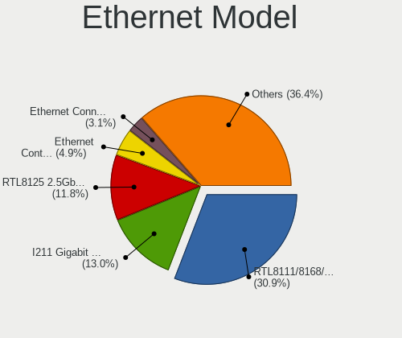

| Model                                                                           | Desktops | Percent |
|---------------------------------------------------------------------------------|----------|---------|
| Realtek RTL8111/8168/8211/8411 PCI Express Gigabit Ethernet Controller          | 290      | 32.08%  |
| Intel I211 Gigabit Network Connection                                           | 125      | 13.83%  |
| Realtek RTL8125 2.5GbE Controller                                               | 84       | 9.29%   |
| Intel Ethernet Controller I225-V                                                | 43       | 4.76%   |
| Intel Ethernet Connection (2) I219-V                                            | 33       | 3.65%   |
| Intel Ethernet Connection (7) I219-V                                            | 25       | 2.77%   |
| Intel 82574L Gigabit Network Connection                                         | 23       | 2.54%   |
| Intel 82579LM Gigabit Network Connection (Lewisville)                           | 17       | 1.88%   |
| Intel I210 Gigabit Network Connection                                           | 14       | 1.55%   |
| Intel Ethernet Connection (2) I218-V                                            | 13       | 1.44%   |
| Intel Ethernet Connection (2) I219-LM                                           | 11       | 1.22%   |
| Intel 82599ES 10-Gigabit SFI/SFP+ Network Connection                            | 11       | 1.22%   |
| Intel 82579V Gigabit Network Connection                                         | 10       | 1.11%   |
| Aquantia AQtion AQC107 NBase-T/IEEE 802.3an Ethernet Controller [Atlantic 10G]  | 8        | 0.88%   |
| Realtek RTL8153 Gigabit Ethernet Adapter                                        | 7        | 0.77%   |
| Nvidia MCP77 Ethernet                                                           | 7        | 0.77%   |
| Intel I350 Gigabit Network Connection                                           | 7        | 0.77%   |
| Intel 82571EB/82571GB Gigabit Ethernet Controller D0/D1 (copper applications)   | 7        | 0.77%   |
| Realtek RTL8169 PCI Gigabit Ethernet Controller                                 | 6        | 0.66%   |
| Intel Ethernet Connection I217-V                                                | 6        | 0.66%   |
| Realtek RTL-8100/8101L/8139 PCI Fast Ethernet Adapter                           | 5        | 0.55%   |
| Realtek Killer E3000 2.5GbE Controller                                          | 5        | 0.55%   |
| Nvidia MCP61 Ethernet                                                           | 5        | 0.55%   |
| Marvell Group 88E8056 PCI-E Gigabit Ethernet Controller                         | 5        | 0.55%   |
| Realtek Killer E2600 GbE Controller                                             | 4        | 0.44%   |
| Qualcomm Atheros AR8151 v2.0 Gigabit Ethernet                                   | 4        | 0.44%   |
| Intel 82567LM-3 Gigabit Network Connection                                      | 4        | 0.44%   |
| Aquantia AQtion AQC113CS NBase-T/IEEE 802.3an Ethernet Controller [Antigua 10G] | 4        | 0.44%   |
| Apple UniNorth 2 GMAC (Sun GEM)                                                 | 4        | 0.44%   |
| Realtek RTL810xE PCI Express Fast Ethernet controller                           | 3        | 0.33%   |
| Qualcomm Atheros Killer E220x Gigabit Ethernet Controller                       | 3        | 0.33%   |
| Nvidia MCP79 Ethernet                                                           | 3        | 0.33%   |
| Intel Ethernet Connection (2) I218-LM                                           | 3        | 0.33%   |
| Intel Ethernet Connection (11) I219-V                                           | 3        | 0.33%   |
| Intel 82576 Gigabit Network Connection                                          | 3        | 0.33%   |
| Intel 82575EB Gigabit Network Connection                                        | 3        | 0.33%   |
| Broadcom NetXtreme BCM5764M Gigabit Ethernet PCIe                               | 3        | 0.33%   |
| Broadcom NetXtreme BCM5720 Gigabit Ethernet PCIe                                | 3        | 0.33%   |
| Aquantia AQC111 NBase-T/IEEE 802.3bz Ethernet Controller [AQtion]               | 3        | 0.33%   |
| Aquantia AQC108 NBase-T/IEEE 802.3bz Ethernet Controller [AQtion]               | 3        | 0.33%   |

Net Controller Kind
-------------------

Ethernet, WiFi or modem

| Kind     | Desktops | Percent |
|----------|----------|---------|
| Ethernet | 749      | 68.78%  |
| WiFi     | 317      | 29.11%  |
| Modem    | 22       | 2.02%   |
| Unknown  | 1        | 0.09%   |

Used Controller
---------------

Currently used network controller

| Kind     | Desktops | Percent |
|----------|----------|---------|
| Ethernet | 641      | 82.07%  |
| WiFi     | 140      | 17.93%  |

NICs
----

Total network controllers on board

| Total | Desktops | Percent |
|-------|----------|---------|
| 1     | 386      | 49.61%  |
| 2     | 280      | 35.99%  |
| 3     | 74       | 9.51%   |
| 4     | 15       | 1.93%   |
| 0     | 9        | 1.16%   |
| 5     | 7        | 0.9%    |
| 6     | 3        | 0.39%   |
| 7     | 2        | 0.26%   |
| 12    | 1        | 0.13%   |
| 9     | 1        | 0.13%   |

IPv6
----

IPv6 vs IPv4

| Used | Desktops | Percent |
|------|----------|---------|
| No   | 634      | 80.25%  |
| Yes  | 156      | 19.75%  |

Bluetooth
---------

Bluetooth Vendor
----------------

Controller vendors

| Vendor                          | Desktops | Percent |
|---------------------------------|----------|---------|
| Intel                           | 190      | 56.72%  |
| Cambridge Silicon Radio         | 49       | 14.63%  |
| MediaTek                        | 18       | 5.37%   |
| ASUSTek Computer                | 18       | 5.37%   |
| Realtek Semiconductor           | 16       | 4.78%   |
| Broadcom                        | 12       | 3.58%   |
| Apple                           | 11       | 3.28%   |
| Foxconn / Hon Hai               | 5        | 1.49%   |
| Qualcomm Atheros Communications | 4        | 1.19%   |
| IMC Networks                    | 3        | 0.9%    |
| HTC (High Tech Computer)        | 3        | 0.9%    |
| Belkin Components               | 3        | 0.9%    |
| Edimax Technology               | 1        | 0.3%    |
| Dynex                           | 1        | 0.3%    |
| Actions                         | 1        | 0.3%    |

Bluetooth Model
---------------

Controller models

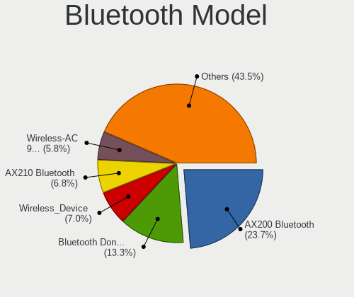

| Model                                                                | Desktops | Percent |
|----------------------------------------------------------------------|----------|---------|
| Intel AX200 Bluetooth                                                | 86       | 25.67%  |
| Cambridge Silicon Radio Bluetooth Dongle (HCI mode)                  | 49       | 14.63%  |
| Intel Wireless-AC 9260 Bluetooth Adapter                             | 21       | 6.27%   |
| Intel Bluetooth wireless interface                                   | 20       | 5.97%   |
| Intel AX210 Bluetooth                                                | 19       | 5.67%   |
| MediaTek Wireless_Device                                             | 18       | 5.37%   |
| Intel AX201 Bluetooth                                                | 17       | 5.07%   |
| Realtek Bluetooth Radio                                              | 15       | 4.48%   |
| Intel Wireless-AC 3168 Bluetooth                                     | 12       | 3.58%   |
| Intel Bluetooth 9460/9560 Jefferson Peak (JfP)                       | 11       | 3.28%   |
| ASUS Broadcom BCM20702A0 Bluetooth                                   | 8        | 2.39%   |
| Broadcom BCM20702A0 Bluetooth 4.0                                    | 7        | 2.09%   |
| Apple Built-in Bluetooth 2.0+EDR HCI                                 | 5        | 1.49%   |
| Intel Bluetooth Device                                               | 4        | 1.19%   |
| Foxconn / Hon Hai Wireless_Device                                    | 4        | 1.19%   |
| HTC (High Tech Computer) Vive Hub Bluetooth 4.1 (Broadcom BCM920703) | 3        | 0.9%    |
| ASUS Bluetooth Radio                                                 | 3        | 0.9%    |
| Apple Bluetooth Host Controller                                      | 3        | 0.9%    |
| Qualcomm Atheros Bluetooth USB Host Controller                       | 2        | 0.6%    |
| Qualcomm Atheros AR3011 Bluetooth                                    | 2        | 0.6%    |
| IMC Networks Bluetooth Radio                                         | 2        | 0.6%    |
| Broadcom BCM920702 Bluetooth 4.0 Zero Touch Dongle                   | 2        | 0.6%    |
| Belkin Components F8T065BF Mini Bluetooth 4.0 Adapter                | 2        | 0.6%    |
| ASUS BCM20702A0                                                      | 2        | 0.6%    |
| ASUS ASUS USB-BT500                                                  | 2        | 0.6%    |
| Realtek  Bluetooth 4.2 Adapter                                       | 1        | 0.3%    |
| IMC Networks Wireless_Device                                         | 1        | 0.3%    |
| Foxconn / Hon Hai Bluetooth USB Host Controller                      | 1        | 0.3%    |
| Edimax Bluetooth Adapter                                             | 1        | 0.3%    |
| Dynex Bluetooth 4.0 Adapter [Broadcom, 1.12, BCM20702A0]             | 1        | 0.3%    |
| Broadcom BCM20702A0                                                  | 1        | 0.3%    |
| Broadcom BCM2070 Bluetooth 2.1 + EDR                                 | 1        | 0.3%    |
| Broadcom BCM2035 Bluetooth dongle                                    | 1        | 0.3%    |
| Belkin Components Bluetooth Device with trace filter                 | 1        | 0.3%    |
| ASUS Qualcomm Bluetooth 4.1                                          | 1        | 0.3%    |
| ASUS Broadcom BCM20702 Single-Chip Bluetooth 4.0 + LE                | 1        | 0.3%    |
| ASUS Bluetooth Device                                                | 1        | 0.3%    |
| Apple Bluetooth HCI MacBookPro (HID mode)                            | 1        | 0.3%    |
| Apple Bluetooth HCI                                                  | 1        | 0.3%    |
| Apple Bluetooth Device                                               | 1        | 0.3%    |

Sound
-----

Sound Vendor
------------

Sound card vendors

| Vendor                               | Desktops | Percent |
|--------------------------------------|----------|---------|
| AMD                                  | 459      | 32.3%   |
| Nvidia                               | 308      | 21.67%  |
| Intel                                | 287      | 20.2%   |
| C-Media Electronics                  | 55       | 3.87%   |
| Logitech                             | 27       | 1.9%    |
| Creative Labs                        | 23       | 1.62%   |
| ASUSTek Computer                     | 23       | 1.62%   |
| SteelSeries ApS                      | 17       | 1.2%    |
| Texas Instruments                    | 13       | 0.91%   |
| Creative Technology                  | 12       | 0.84%   |
| Razer USA                            | 10       | 0.7%    |
| Kingston Technology                  | 10       | 0.7%    |
| Focusrite-Novation                   | 10       | 0.7%    |
| Micro Star International             | 8        | 0.56%   |
| JMTek                                | 8        | 0.56%   |
| Thesycon Systemsoftware & Consulting | 7        | 0.49%   |
| Plantronics                          | 6        | 0.42%   |
| GYROCOM C&C                          | 6        | 0.42%   |
| GN Netcom                            | 6        | 0.42%   |
| Realtek Semiconductor                | 5        | 0.35%   |
| Generalplus Technology               | 5        | 0.35%   |
| Corsair                              | 5        | 0.35%   |
| Blue Microphones                     | 5        | 0.35%   |
| BEHRINGER International              | 5        | 0.35%   |
| Sony                                 | 4        | 0.28%   |
| Solid State Logic                    | 4        | 0.28%   |
| Samson Technologies                  | 4        | 0.28%   |
| RODE Microphones                     | 4        | 0.28%   |
| AudioQuest                           | 4        | 0.28%   |
| Audient                              | 4        | 0.28%   |
| Yamaha                               | 3        | 0.21%   |
| Trust                                | 3        | 0.21%   |
| SAVITECH                             | 3        | 0.21%   |
| Microsoft                            | 3        | 0.21%   |
| TEAC                                 | 2        | 0.14%   |
| Sennheiser Communications            | 2        | 0.14%   |
| Nektar                               | 2        | 0.14%   |
| MAG Technology                       | 2        | 0.14%   |
| M-Audio                              | 2        | 0.14%   |
| Loongson Technology                  | 2        | 0.14%   |

Sound Model
-----------

Sound card models

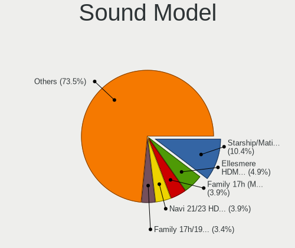

| Model                                                                      | Desktops | Percent |
|----------------------------------------------------------------------------|----------|---------|
| AMD Starship/Matisse HD Audio Controller                                   | 183      | 10.6%   |
| AMD Ellesmere HDMI Audio [Radeon RX 470/480 / 570/580/590]                 | 96       | 5.56%   |
| AMD Family 17h (Models 00h-0fh) HD Audio Controller                        | 76       | 4.4%    |
| AMD Navi 21/23 HDMI/DP Audio Controller                                    | 58       | 3.36%   |
| AMD Family 17h/19h HD Audio Controller                                     | 45       | 2.61%   |
| AMD Navi 10 HDMI Audio                                                     | 41       | 2.37%   |
| Intel 100 Series/C230 Series Chipset Family HD Audio Controller            | 35       | 2.03%   |
| AMD SBx00 Azalia (Intel HDA)                                               | 34       | 1.97%   |
| Intel Cannon Lake PCH cAVS                                                 | 29       | 1.68%   |
| Intel 200 Series PCH HD Audio                                              | 26       | 1.51%   |
| Nvidia GP106 High Definition Audio Controller                              | 24       | 1.39%   |
| AMD Rembrandt Radeon High Definition Audio Controller                      | 24       | 1.39%   |
| Nvidia GP104 High Definition Audio Controller                              | 23       | 1.33%   |
| Nvidia GA102 High Definition Audio Controller                              | 22       | 1.27%   |
| Nvidia TU104 HD Audio Controller                                           | 21       | 1.22%   |
| AMD Vega 10 HDMI Audio [Radeon Vega 56/64]                                 | 21       | 1.22%   |
| AMD Baffin HDMI/DP Audio [Radeon RX 550 640SP / RX 560/560X]               | 21       | 1.22%   |
| Nvidia GA104 High Definition Audio Controller                              | 20       | 1.16%   |
| Intel 8 Series/C220 Series Chipset High Definition Audio Controller        | 20       | 1.16%   |
| Intel 7 Series/C216 Chipset Family High Definition Audio Controller        | 20       | 1.16%   |
| Nvidia TU106 High Definition Audio Controller                              | 18       | 1.04%   |
| Intel 6 Series/C200 Series Chipset Family High Definition Audio Controller | 18       | 1.04%   |
| AMD Renoir Radeon High Definition Audio Controller                         | 18       | 1.04%   |
| Nvidia GP107GL High Definition Audio Controller                            | 17       | 0.98%   |
| Intel Alder Lake-S HD Audio Controller                                     | 17       | 0.98%   |
| Intel 82801JI (ICH10 Family) HD Audio Controller                           | 17       | 0.98%   |
| ASUSTek Computer USB Audio                                                 | 17       | 0.98%   |
| Nvidia GM204 High Definition Audio Controller                              | 16       | 0.93%   |
| AMD Oland/Hainan/Cape Verde/Pitcairn HDMI Audio [Radeon HD 7000 Series]    | 16       | 0.93%   |
| Nvidia GM206 High Definition Audio Controller                              | 15       | 0.87%   |
| Nvidia GK208 HDMI/DP Audio Controller                                      | 15       | 0.87%   |
| Nvidia TU116 High Definition Audio Controller                              | 14       | 0.81%   |
| Nvidia GP102 HDMI Audio Controller                                         | 13       | 0.75%   |
| Nvidia GA106 High Definition Audio Controller                              | 13       | 0.75%   |
| Intel Xeon E3-1200 v3/4th Gen Core Processor HD Audio Controller           | 13       | 0.75%   |
| Nvidia GM107 High Definition Audio Controller [GeForce 940MX]              | 12       | 0.69%   |
| Intel C610/X99 series chipset HD Audio Controller                          | 12       | 0.69%   |
| Intel 9 Series Chipset Family HD Audio Controller                          | 12       | 0.69%   |
| AMD Raven/Raven2/Fenghuang HDMI/DP Audio Controller                        | 12       | 0.69%   |
| Intel Tiger Lake-H HD Audio Controller                                     | 11       | 0.64%   |

Memory
------

Memory Vendor
-------------

Memory module vendors

| Vendor                       | Desktops | Percent |
|------------------------------|----------|---------|
| Kingston                     | 159      | 20.6%   |
| Corsair                      | 148      | 19.17%  |
| G.Skill                      | 134      | 17.36%  |
| Crucial                      | 83       | 10.75%  |
| Unknown                      | 80       | 10.36%  |
| Samsung Electronics          | 40       | 5.18%   |
| SK hynix                     | 28       | 3.63%   |
| Micron Technology            | 22       | 2.85%   |
| Team                         | 10       | 1.3%    |
| Patriot                      | 10       | 1.3%    |
| A-DATA Technology            | 8        | 1.04%   |
| Unknown                      | 7        | 0.91%   |
| Transcend                    | 4        | 0.52%   |
| Nanya Technology             | 4        | 0.52%   |
| GOODRAM                      | 4        | 0.52%   |
| Ramaxel Technology           | 3        | 0.39%   |
| Toshiba                      | 2        | 0.26%   |
| Chun Well                    | 2        | 0.26%   |
| AMD                          | 2        | 0.26%   |
| Unknown (0x0B92)             | 1        | 0.13%   |
| Thermaltake                  | 1        | 0.13%   |
| T-FORCE                      | 1        | 0.13%   |
| SGS/Thomson                  | 1        | 0.13%   |
| Qumo                         | 1        | 0.13%   |
| PUSKILL                      | 1        | 0.13%   |
| PNY                          | 1        | 0.13%   |
| Patriot Memory (PDP Systems) | 1        | 0.13%   |
| Patriot Memory               | 1        | 0.13%   |
| Mushkin                      | 1        | 0.13%   |
| Kllisre                      | 1        | 0.13%   |
| KLEVV                        | 1        | 0.13%   |
| HPE                          | 1        | 0.13%   |
| Hikvision                    | 1        | 0.13%   |
| Hewlett-Packard              | 1        | 0.13%   |
| Golden Empire                | 1        | 0.13%   |
| GeIL                         | 1        | 0.13%   |
| Foxline                      | 1        | 0.13%   |
| Exceleram                    | 1        | 0.13%   |
| Asgard                       | 1        | 0.13%   |
| Apacer                       | 1        | 0.13%   |

Memory Model
------------

Memory module models

| Model                                                  | Desktops | Percent |
|--------------------------------------------------------|----------|---------|
| Corsair RAM CMK32GX4M2B3200C16 16GB DIMM DDR4 3800MT/s | 13       | 1.54%   |
| Corsair RAM CMK16GX4M2B3200C16 8GB DIMM DDR4 3600MT/s  | 13       | 1.54%   |
| G.Skill RAM F4-3200C16-16GVK 16GB DIMM DDR4 3600MT/s   | 12       | 1.43%   |
| Kingston RAM KHX3200C16D4/16GX 16GB DIMM DDR4 3600MT/s | 10       | 1.19%   |
| Kingston RAM KHX2666C16/8G 8GB DIMM DDR4 3466MT/s      | 8        | 0.95%   |
| Kingston RAM KHX1866C10D3/8G 8GB DIMM DDR3 2133MT/s    | 8        | 0.95%   |
| G.Skill RAM F4-3200C16-8GVKB 8GB DIMM DDR4 3866MT/s    | 8        | 0.95%   |
| Corsair RAM CMK16GX4M2B3000C15 8GB DIMM DDR4 3533MT/s  | 8        | 0.95%   |
| Kingston RAM KF3200C16D4/16GX 16GB DIMM DDR4 3200MT/s  | 7        | 0.83%   |
| Corsair RAM CMK64GX4M2E3200C16 32GB DIMM DDR4 3200MT/s | 7        | 0.83%   |
| Unknown                                                | 7        | 0.83%   |
| G.Skill RAM F5-6000J3636F16G 16GB DIMM DDR5 6400MT/s   | 6        | 0.71%   |
| G.Skill RAM F4-3600C16-16GTZNC 16GB DIMM DDR4 3600MT/s | 6        | 0.71%   |
| G.Skill RAM F4-3200C14-8GFX 8GB DIMM DDR4 3733MT/s     | 6        | 0.71%   |
| Unknown RAM Module 1024MB DIMM SDRAM                   | 5        | 0.59%   |
| G.Skill RAM F4-3200C16-8GIS 8GB DIMM DDR4 3200MT/s     | 5        | 0.59%   |
| Corsair RAM CMK32GX4M2E3200C16 16GB DIMM DDR4 3534MT/s | 5        | 0.59%   |
| Kingston RAM KHX3200C16D4/8GX 8GB DIMM DDR4 3733MT/s   | 4        | 0.48%   |
| Kingston RAM KHX2666C16/16G 16GB DIMM DDR4 3200MT/s    | 4        | 0.48%   |
| Kingston RAM KHX2666C15D4/8G 8GB DIMM DDR4 3200MT/s    | 4        | 0.48%   |
| Kingston RAM KHX1600C9D3/4GX 4GB DIMM DDR3 1600MT/s    | 4        | 0.48%   |
| Kingston RAM KF3200C16D4/32GX 32GB DIMM DDR4 3933MT/s  | 4        | 0.48%   |
| G.Skill RAM F5-6000J3040G32G 32GB DIMM DDR5 6000MT/s   | 4        | 0.48%   |
| G.Skill RAM F4-3000C16-8GISB 8192MB DIMM DDR4 3200MT/s | 4        | 0.48%   |
| G.Skill RAM F4-3000C16-16GISB 16GB DIMM DDR4 3200MT/s  | 4        | 0.48%   |
| Corsair RAM CMK32GX4M2B3000C15 16GB DIMM DDR4 3000MT/s | 4        | 0.48%   |
| Corsair RAM CMK16GX4M2D3600C18 8GB DIMM DDR4 3600MT/s  | 4        | 0.48%   |
| Corsair RAM CMK16GX4M2A2666C16 8GB DIMM DDR4 3400MT/s  | 4        | 0.48%   |
| Unknown RAM Module 8GB DIMM DDR3 1333MT/s              | 3        | 0.36%   |
| Unknown RAM Module 8192MB DIMM DDR3 1333MT/s           | 3        | 0.36%   |
| Unknown RAM Module 512MB DIMM SDRAM                    | 3        | 0.36%   |
| Unknown RAM Module 2048MB DIMM DDR2 667MT/s            | 3        | 0.36%   |
| Unknown RAM Module 2048MB DIMM 1333MT/s                | 3        | 0.36%   |
| Unknown RAM 3000 C16 Series 8192MB DIMM DDR4 2133MT/s  | 3        | 0.36%   |
| Samsung RAM M378B5273DH0-CH9 4096MB DIMM DDR2 2133MT/s | 3        | 0.36%   |
| Kingston RAM KHX3600C17D4/16GX 16GB DIMM DDR4 3800MT/s | 3        | 0.36%   |
| Kingston RAM KHX3200C16D4/32GX 32GB DIMM DDR4 3200MT/s | 3        | 0.36%   |
| Kingston RAM KHX2666C16D4/16GX 16GB DIMM DDR4 3000MT/s | 3        | 0.36%   |
| Kingston RAM KF3600C18D4/16GX 16GB DIMM DDR4 3733MT/s  | 3        | 0.36%   |
| Kingston RAM 99U5471-020.A00LF 4GB DIMM DDR3 1600MT/s  | 3        | 0.36%   |

Memory Kind
-----------

Memory module kinds

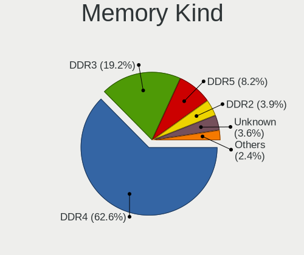

| Kind    | Desktops | Percent |
|---------|----------|---------|
| DDR4    | 461      | 64.66%  |
| DDR3    | 141      | 19.78%  |
| DDR5    | 35       | 4.91%   |
| DDR2    | 31       | 4.35%   |
| Unknown | 27       | 3.79%   |
| SDRAM   | 14       | 1.96%   |
| DDR     | 4        | 0.56%   |

Memory Form Factor
------------------

Physical design of the memory module

| Name   | Desktops | Percent |
|--------|----------|---------|
| DIMM   | 692      | 97.33%  |
| SODIMM | 18       | 2.53%   |
| RIMM   | 1        | 0.14%   |

Memory Size
-----------

Memory module size

| Size  | Desktops | Percent |
|-------|----------|---------|
| 8192  | 282      | 36.81%  |
| 16384 | 232      | 30.29%  |
| 4096  | 95       | 12.4%   |
| 32768 | 86       | 11.23%  |
| 2048  | 49       | 6.4%    |
| 1024  | 17       | 2.22%   |
| 512   | 4        | 0.52%   |
| 256   | 1        | 0.13%   |

Memory Speed
------------

Memory module speed

| Speed   | Desktops | Percent |
|---------|----------|---------|
| 3200    | 108      | 13.72%  |
| 3600    | 95       | 12.07%  |
| 1600    | 73       | 9.28%   |
| 2400    | 45       | 5.72%   |
| 1333    | 44       | 5.59%   |
| 2133    | 40       | 5.08%   |
| 3733    | 30       | 3.81%   |
| 3800    | 29       | 3.68%   |
| 2667    | 29       | 3.68%   |
| 3000    | 25       | 3.18%   |
| 800     | 25       | 3.18%   |
| 667     | 19       | 2.41%   |
| 2933    | 16       | 2.03%   |
| 2666    | 15       | 1.91%   |
| 3400    | 14       | 1.78%   |
| 3466    | 12       | 1.52%   |
| 1866    | 12       | 1.52%   |
| Unknown | 12       | 1.52%   |
| 3866    | 11       | 1.4%    |
| 4800    | 10       | 1.27%   |
| 6400    | 8        | 1.02%   |
| 4000    | 8        | 1.02%   |
| 3533    | 8        | 1.02%   |
| 1867    | 8        | 1.02%   |
| 6000    | 7        | 0.89%   |
| 3666    | 7        | 0.89%   |
| 3534    | 7        | 0.89%   |
| 2800    | 6        | 0.76%   |
| 1066    | 6        | 0.76%   |
| 5600    | 5        | 0.64%   |
| 3333    | 5        | 0.64%   |
| 3066    | 5        | 0.64%   |
| 2048    | 5        | 0.64%   |
| 5200    | 4        | 0.51%   |
| 3933    | 4        | 0.51%   |
| 1800    | 4        | 0.51%   |
| 400     | 4        | 0.51%   |
| 3100    | 3        | 0.38%   |
| 2134    | 3        | 0.38%   |
| 3334    | 2        | 0.25%   |

Printers & scanners
-------------------

Printer Vendor
--------------

Printer device vendors

| Vendor                | Desktops | Percent |
|-----------------------|----------|---------|
| Hewlett-Packard       | 8        | 42.11%  |
| Brother Industries    | 4        | 21.05%  |
| Seiko Epson           | 2        | 10.53%  |
| Samsung Electronics   | 2        | 10.53%  |
| Canon                 | 2        | 10.53%  |
| Lexmark International | 1        | 5.26%   |

Printer Model
-------------

Printer device models

| Model                                | Desktops | Percent |
|--------------------------------------|----------|---------|
| HP HP LaserJet M14-M17               | 2        | 10.53%  |
| Seiko Epson XP-4200 Series           | 1        | 5.26%   |
| Seiko Epson WF-3520 Series           | 1        | 5.26%   |
| Samsung ML-1630 Series               | 1        | 5.26%   |
| Samsung C460 Series                  | 1        | 5.26%   |
| Lexmark International Lexmark E352dn | 1        | 5.26%   |
| HP PhotoSmart 130                    | 1        | 5.26%   |
| HP LaserJet 1020                     | 1        | 5.26%   |
| HP LaserJet 1018                     | 1        | 5.26%   |
| HP LaserJet 1010                     | 1        | 5.26%   |
| HP Deskjet 9800                      | 1        | 5.26%   |
| HP Deskjet 2050 J510                 | 1        | 5.26%   |
| Canon PIXMA MG2900 Series            | 1        | 5.26%   |
| Canon LiDE 400                       | 1        | 5.26%   |
| Brother QL-500 label printer         | 1        | 5.26%   |
| Brother MFC-L2700DW                  | 1        | 5.26%   |
| Brother MFC-9340CDW                  | 1        | 5.26%   |
| Brother MFC-9130CW                   | 1        | 5.26%   |

Scanner Vendor
--------------

Scanner device vendors

| Vendor          | Desktops | Percent |
|-----------------|----------|---------|
| Canon           | 5        | 71.43%  |
| Mustek Systems  | 1        | 14.29%  |
| AGFA-Gevaert NV | 1        | 14.29%  |

Scanner Model
-------------

Scanner device models

| Model                              | Desktops | Percent |
|------------------------------------|----------|---------|
| Canon CanoScan N1240U/LiDE 30      | 2        | 28.57%  |
| Mustek Systems BearPaw 2448 TA Pro | 1        | 14.29%  |
| Canon CanoScan LiDE 600F           | 1        | 14.29%  |
| Canon CanoScan LiDE 220            | 1        | 14.29%  |
| Canon CanoScan LiDE 110            | 1        | 14.29%  |
| AGFA-Gevaert NV SnapScan e20       | 1        | 14.29%  |

Camera
------

Camera Vendor
-------------

Camera device vendors

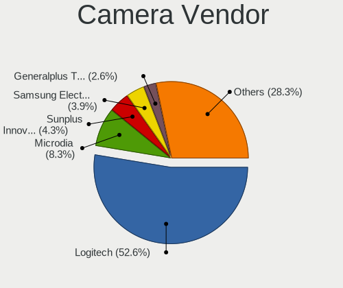

| Vendor                        | Desktops | Percent |
|-------------------------------|----------|---------|
| Logitech                      | 102      | 53.97%  |
| Microdia                      | 14       | 7.41%   |
| Samsung Electronics           | 9        | 4.76%   |
| Sunplus Innovation Technology | 8        | 4.23%   |
| Z-Star Microelectronics       | 5        | 2.65%   |
| Chicony Electronics           | 5        | 2.65%   |
| Realtek Semiconductor         | 4        | 2.12%   |
| Generalplus Technology        | 4        | 2.12%   |
| Creative Technology           | 4        | 2.12%   |
| ARC International             | 4        | 2.12%   |
| MacroSilicon                  | 3        | 1.59%   |
| AVerMedia Technologies        | 3        | 1.59%   |
| Apple                         | 3        | 1.59%   |
| Microsoft                     | 2        | 1.06%   |
| Elgato Systems                | 2        | 1.06%   |
| A4Tech                        | 2        | 1.06%   |
| YGTek                         | 1        | 0.53%   |
| Xiaomi                        | 1        | 0.53%   |
| webcamvendor                  | 1        | 0.53%   |
| WaveRider Communications      | 1        | 0.53%   |
| Valve Software                | 1        | 0.53%   |
| Trust                         | 1        | 0.53%   |
| SiGma Micro                   | 1        | 0.53%   |
| Ruision                       | 1        | 0.53%   |
| Razer USA                     | 1        | 0.53%   |
| Quanta                        | 1        | 0.53%   |
| KYE Systems (Mouse Systems)   | 1        | 0.53%   |
| Hy-UXGA(B5M2)-Camera          | 1        | 0.53%   |
| GEMBIRD                       | 1        | 0.53%   |
| Cubeternet                    | 1        | 0.53%   |
| Arkmicro Technologies         | 1        | 0.53%   |

Camera Model
------------

Camera device models

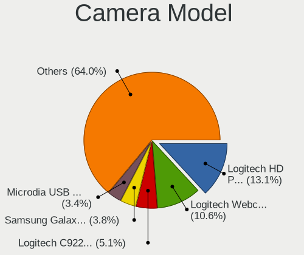

| Model                                   | Desktops | Percent |
|-----------------------------------------|----------|---------|
| Logitech Webcam C270                    | 24       | 12.31%  |
| Logitech HD Pro Webcam C920             | 21       | 10.77%  |
| Logitech C922 Pro Stream Webcam         | 10       | 5.13%   |
| Samsung Galaxy series, misc. (MTP mode) | 9        | 4.62%   |
| Microdia USB 2.0 Camera                 | 7        | 3.59%   |
| Logitech BRIO Ultra HD Webcam           | 7        | 3.59%   |
| Logitech Webcam C310                    | 6        | 3.08%   |
| Microdia Camera                         | 4        | 2.05%   |
| Logitech C920 PRO HD Webcam             | 4        | 2.05%   |
| ARC International Camera                | 4        | 2.05%   |
| Z-Star Venus USB2.0 Camera              | 3        | 1.54%   |
| Sunplus Full HD webcam                  | 3        | 1.54%   |
| MacroSilicon USB3. 0 capture            | 3        | 1.54%   |
| Logitech Webcam C925e                   | 3        | 1.54%   |
| Logitech HD Webcam C615                 | 3        | 1.54%   |
| Logitech HD Webcam C510                 | 3        | 1.54%   |
| Logitech B525 HD Webcam                 | 3        | 1.54%   |
| Chicony HP 720p HD Monitor Webcam       | 3        | 1.54%   |
| Apple iPhone 5/5C/5S/6/SE/7/8/X/XR      | 3        | 1.54%   |
| Z-Star A4 TECH USB2.0 PC Camera E       | 2        | 1.03%   |
| Sunplus FHD Capture                     | 2        | 1.03%   |
| Realtek FULL HD 1080P Webcam            | 2        | 1.03%   |
| Microdia Webcam Vitade AF               | 2        | 1.03%   |
| Logitech Webcam C930e                   | 2        | 1.03%   |
| Logitech Webcam C200                    | 2        | 1.03%   |
| Logitech Webcam C170                    | 2        | 1.03%   |
| Logitech StreamCam                      | 2        | 1.03%   |
| Logitech QuickCam Orbit/Sphere AF       | 2        | 1.03%   |
| Logitech HD Webcam C525                 | 2        | 1.03%   |
| Logitech BRIO 4K Stream Edition         | 2        | 1.03%   |
| Generalplus GENERAL WEBCAM              | 2        | 1.03%   |
| Chicony Gateway Webcam                  | 2        | 1.03%   |
| AVerMedia USB Device                    | 2        | 1.03%   |
| A4Tech USB Live camera                  | 2        | 1.03%   |
| YGTek Webcam                            | 1        | 0.51%   |
| Xiaomi Mi 11 Lite                       | 1        | 0.51%   |
| webcamvendor webcamproduct              | 1        | 0.51%   |
| WaveRider USB 2.0 Camera                | 1        | 0.51%   |
| Valve Software 3D Camera                | 1        | 0.51%   |
| Trust QHD Webcam                        | 1        | 0.51%   |

Security
--------

Fingerprint Vendor
------------------

Fingerprint sensor vendors

| Vendor         | Desktops | Percent |
|----------------|----------|---------|
| DigitalPersona | 3        | 100%    |

Fingerprint Model
-----------------

Fingerprint sensor models

| Model                             | Desktops | Percent |
|-----------------------------------|----------|---------|
| DigitalPersona Fingerprint Reader | 3        | 100%    |

Chipcard Vendor
---------------

Chipcard module vendors

| Vendor                            | Desktops | Percent |
|-----------------------------------|----------|---------|
| SCM Microsystems                  | 4        | 20%     |
| Clay Logic                        | 4        | 20%     |
| Yubico.com                        | 3        | 15%     |
| Hewlett-Packard                   | 2        | 10%     |
| Advanced Card Systems             | 2        | 10%     |
| VASCO Data Security International | 1        | 5%      |
| Gemalto (was Gemplus)             | 1        | 5%      |
| Bit4id                            | 1        | 5%      |
| Alcor Micro                       | 1        | 5%      |
| Aktiv                             | 1        | 5%      |

Chipcard Model
--------------

Chipcard module models

| Model                                                  | Desktops | Percent |
|--------------------------------------------------------|----------|---------|
| SCM Microsystems SCR331-LC1 / SCR3310 SmartCard Reader | 4        | 20%     |
| Clay Logic Nitrokey Pro                                | 4        | 20%     |
| Yubico.com Yubikey 4/5 CCID                            | 2        | 10%     |
| Hewlett-Packard SC Keyboard - Apollo (Liteon)          | 2        | 10%     |
| Yubico.com Yubikey 4/5 U2F+CCID                        | 1        | 5%      |
| VASCO Data Security International DIGIPASS 870         | 1        | 5%      |
| Gemalto (was Gemplus) GemPC Twin SmartCard Reader      | 1        | 5%      |
| Bit4id miniLector-s                                    | 1        | 5%      |
| Alcor Micro AU9540 Smartcard Reader                    | 1        | 5%      |
| Aktiv Rutoken lite                                     | 1        | 5%      |
| Advanced Card Systems ACR38 SmartCard Reader           | 1        | 5%      |
| Advanced Card Systems ACR122U                          | 1        | 5%      |

Unsupported
-----------

Unsupported Devices
-------------------

Total unsupported devices on board

| Total | Desktops | Percent |
|-------|----------|---------|
| 0     | 441      | 52.38%  |
| 1     | 239      | 28.38%  |
| 2     | 100      | 11.88%  |
| 3     | 37       | 4.39%   |
| 4     | 13       | 1.54%   |
| 5     | 6        | 0.71%   |
| 6     | 4        | 0.48%   |
| 7     | 2        | 0.24%   |

Unsupported Device Types
------------------------

Types of unsupported devices

| Type                     | Desktops | Percent |
|--------------------------|----------|---------|
| Communication controller | 127      | 22.36%  |
| Graphics card            | 103      | 18.13%  |
| Net/wireless             | 64       | 11.27%  |
| Bluetooth                | 64       | 11.27%  |
| Sound                    | 58       | 10.21%  |
| Firewire controller      | 21       | 3.7%    |
| Network                  | 19       | 3.35%   |
| Unassigned class         | 16       | 2.82%   |
| Storage/ide              | 16       | 2.82%   |
| Camera                   | 15       | 2.64%   |
| Net/ethernet             | 13       | 2.29%   |
| Multimedia controller    | 10       | 1.76%   |
| Chipcard                 | 10       | 1.76%   |
| Storage/raid             | 7        | 1.23%   |
| Storage/ata              | 5        | 0.88%   |
| Modem                    | 5        | 0.88%   |
| Tv card                  | 4        | 0.7%    |
| Card reader              | 4        | 0.7%    |
| Fingerprint reader       | 3        | 0.53%   |
| Storage/nvme             | 2        | 0.35%   |
| Storage                  | 1        | 0.18%   |
| Dvb card                 | 1        | 0.18%   |

