Gentoo - Tested Hardware & Statistics (Notebooks)
-------------------------------------------------

A project to collect tested hardware configurations for Gentoo.

Anyone can contribute to this report by the [hw-probe](https://github.com/linuxhw/hw-probe) tool:

    sudo -E hw-probe -all -upload

Please contribute! Especially if your hardware is rare.

Contents
--------

* [ Test Cases ](#test-cases)

* [ System ](#system)
  - [ OS                       ](#os)
  - [ OS Family                ](#os-family)
  - [ Kernel                   ](#kernel)
  - [ Kernel Family            ](#kernel-family)
  - [ Kernel Major Ver.        ](#kernel-major-ver)
  - [ Arch                     ](#arch)
  - [ DE                       ](#de)
  - [ Display Server           ](#display-server)
  - [ Display Manager          ](#display-manager)
  - [ OS Lang                  ](#os-lang)
  - [ Boot Mode                ](#boot-mode)
  - [ Filesystem               ](#filesystem)
  - [ Part. scheme             ](#part-scheme)
  - [ Dual Boot with Linux/BSD ](#dual-boot-with-linuxbsd)
  - [ Dual Boot (Win)          ](#dual-boot-win)

* [ Board ](#board)
  - [ Vendor                   ](#vendor)
  - [ Model                    ](#model)
  - [ Model Family             ](#model-family)
  - [ MFG Year                 ](#mfg-year)
  - [ Form Factor              ](#form-factor)
  - [ Secure Boot              ](#secure-boot)
  - [ Coreboot                 ](#coreboot)
  - [ RAM Size                 ](#ram-size)
  - [ RAM Used                 ](#ram-used)
  - [ Total Drives             ](#total-drives)
  - [ Has CD-ROM               ](#has-cd-rom)
  - [ Has Ethernet             ](#has-ethernet)
  - [ Has WiFi                 ](#has-wifi)
  - [ Has Bluetooth            ](#has-bluetooth)

* [ Location ](#location)
  - [ Country                  ](#country)
  - [ City                     ](#city)

* [ Drives ](#drives)
  - [ Drive Vendor             ](#drive-vendor)
  - [ Drive Model              ](#drive-model)
  - [ HDD Vendor               ](#hdd-vendor)
  - [ SSD Vendor               ](#ssd-vendor)
  - [ Drive Kind               ](#drive-kind)
  - [ Drive Connector          ](#drive-connector)
  - [ Drive Size               ](#drive-size)
  - [ Space Total              ](#space-total)
  - [ Space Used               ](#space-used)
  - [ Malfunc. Drives          ](#malfunc-drives)
  - [ Malfunc. Drive Vendor    ](#malfunc-drive-vendor)
  - [ Malfunc. HDD Vendor      ](#malfunc-hdd-vendor)
  - [ Malfunc. Drive Kind      ](#malfunc-drive-kind)
  - [ Failed Drives            ](#failed-drives)
  - [ Failed Drive Vendor      ](#failed-drive-vendor)
  - [ Drive Status             ](#drive-status)

* [ Storage controller ](#storage-controller)
  - [ Storage Vendor           ](#storage-vendor)
  - [ Storage Model            ](#storage-model)
  - [ Storage Kind             ](#storage-kind)

* [ Processor ](#processor)
  - [ CPU Vendor               ](#cpu-vendor)
  - [ CPU Model                ](#cpu-model)
  - [ CPU Model Family         ](#cpu-model-family)
  - [ CPU Cores                ](#cpu-cores)
  - [ CPU Sockets              ](#cpu-sockets)
  - [ CPU Threads              ](#cpu-threads)
  - [ CPU Op-Modes             ](#cpu-op-modes)
  - [ CPU Microcode            ](#cpu-microcode)
  - [ CPU Microarch            ](#cpu-microarch)

* [ Graphics ](#graphics)
  - [ GPU Vendor               ](#gpu-vendor)
  - [ GPU Model                ](#gpu-model)
  - [ GPU Combo                ](#gpu-combo)
  - [ GPU Driver               ](#gpu-driver)
  - [ GPU Memory               ](#gpu-memory)

* [ Monitor ](#monitor)
  - [ Monitor Vendor           ](#monitor-vendor)
  - [ Monitor Model            ](#monitor-model)
  - [ Monitor Resolution       ](#monitor-resolution)
  - [ Monitor Diagonal         ](#monitor-diagonal)
  - [ Monitor Width            ](#monitor-width)
  - [ Aspect Ratio             ](#aspect-ratio)
  - [ Monitor Area             ](#monitor-area)
  - [ Pixel Density            ](#pixel-density)
  - [ Multiple Monitors        ](#multiple-monitors)

* [ Network ](#network)
  - [ Net Controller Vendor    ](#net-controller-vendor)
  - [ Net Controller Model     ](#net-controller-model)
  - [ Wireless Vendor          ](#wireless-vendor)
  - [ Wireless Model           ](#wireless-model)
  - [ Ethernet Vendor          ](#ethernet-vendor)
  - [ Ethernet Model           ](#ethernet-model)
  - [ Net Controller Kind      ](#net-controller-kind)
  - [ Used Controller          ](#used-controller)
  - [ NICs                     ](#nics)
  - [ IPv6                     ](#ipv6)

* [ Bluetooth ](#bluetooth)
  - [ Bluetooth Vendor         ](#bluetooth-vendor)
  - [ Bluetooth Model          ](#bluetooth-model)

* [ Sound ](#sound)
  - [ Sound Vendor             ](#sound-vendor)
  - [ Sound Model              ](#sound-model)

* [ Memory ](#memory)
  - [ Memory Vendor            ](#memory-vendor)
  - [ Memory Model             ](#memory-model)
  - [ Memory Kind              ](#memory-kind)
  - [ Memory Form Factor       ](#memory-form-factor)
  - [ Memory Size              ](#memory-size)
  - [ Memory Speed             ](#memory-speed)

* [ Printers & scanners ](#printers--scanners)
  - [ Printer Vendor           ](#printer-vendor)
  - [ Printer Model            ](#printer-model)
  - [ Scanner Vendor           ](#scanner-vendor)
  - [ Scanner Model            ](#scanner-model)

* [ Camera ](#camera)
  - [ Camera Vendor            ](#camera-vendor)
  - [ Camera Model             ](#camera-model)

* [ Security ](#security)
  - [ Fingerprint Vendor       ](#fingerprint-vendor)
  - [ Fingerprint Model        ](#fingerprint-model)
  - [ Chipcard Vendor          ](#chipcard-vendor)
  - [ Chipcard Model           ](#chipcard-model)

* [ Unsupported ](#unsupported)
  - [ Unsupported Devices      ](#unsupported-devices)
  - [ Unsupported Device Types ](#unsupported-device-types)

Test Cases
----------

Total: 1295

| Vendor        | Model                       | Probe                                                      | Date         |
|---------------|-----------------------------|------------------------------------------------------------|--------------|
| A-DATA Tec... | XENIA 15                    | [73f0314b31](https://linux-hardware.org/?probe=73f0314b31) | Aug 12, 2023 |
| A-DATA Tec... | XENIA 15                    | [d1a19f992d](https://linux-hardware.org/?probe=d1a19f992d) | Aug 12, 2023 |
| ASUSTek       | ROG Strix G513QY_G513QY     | [46ae462027](https://linux-hardware.org/?probe=46ae462027) | Aug 11, 2023 |
| HP            | EliteBook 8540w             | [2df5a4bd58](https://linux-hardware.org/?probe=2df5a4bd58) | Aug 11, 2023 |
| HP            | EliteBook 8540w             | [1bf7b69b0f](https://linux-hardware.org/?probe=1bf7b69b0f) | Aug 11, 2023 |
| Apple         | MacBookPro10,1              | [ed97e2ea3e](https://linux-hardware.org/?probe=ed97e2ea3e) | Aug 08, 2023 |
| ASUSTek       | VivoBook_ASUSLaptop X415... | [1d6bf926f6](https://linux-hardware.org/?probe=1d6bf926f6) | Aug 05, 2023 |
| HP            | Laptop 15-ra0xx             | [41b594c2c7](https://linux-hardware.org/?probe=41b594c2c7) | Aug 05, 2023 |
| HP            | Laptop 15-ra0xx             | [ae42e537d2](https://linux-hardware.org/?probe=ae42e537d2) | Aug 05, 2023 |
| HP            | Laptop 15-ra0xx             | [51f2c38666](https://linux-hardware.org/?probe=51f2c38666) | Aug 05, 2023 |
| Lenovo        | Yoga 2 13 20344             | [767b492aa4](https://linux-hardware.org/?probe=767b492aa4) | Aug 03, 2023 |
| Lenovo        | Yoga 2 13 20344             | [47ca08e0d1](https://linux-hardware.org/?probe=47ca08e0d1) | Aug 03, 2023 |
| ASUSTek       | ROG Zephyrus G14 GA401II... | [839698eb4c](https://linux-hardware.org/?probe=839698eb4c) | Aug 01, 2023 |
| Alienware     | x17 R1                      | [bcdf52a63e](https://linux-hardware.org/?probe=bcdf52a63e) | Aug 01, 2023 |
| Lenovo        | Legion Y530-15ICH-1060 8... | [451cbfaee5](https://linux-hardware.org/?probe=451cbfaee5) | Jul 29, 2023 |
| Apple         | MacBookPro12,1              | [bc3cb3cbfd](https://linux-hardware.org/?probe=bc3cb3cbfd) | Jul 28, 2023 |
| HP            | EliteBook 8540w             | [96a30f2f21](https://linux-hardware.org/?probe=96a30f2f21) | Jul 27, 2023 |
| Lenovo        | Yoga 14sACH 2021 82MS       | [3cb74490f6](https://linux-hardware.org/?probe=3cb74490f6) | Jul 25, 2023 |
| ASUSTek       | TUF Gaming FX705GD_FX705... | [c73107bcac](https://linux-hardware.org/?probe=c73107bcac) | Jul 25, 2023 |
| ASUSTek       | TUF Gaming FX705GD_FX705... | [1aeabb238f](https://linux-hardware.org/?probe=1aeabb238f) | Jul 25, 2023 |
| Dell          | XPS 15 9520                 | [54377b2911](https://linux-hardware.org/?probe=54377b2911) | Jul 25, 2023 |
| A-DATA Tec... | XENIA 15                    | [21edb88f94](https://linux-hardware.org/?probe=21edb88f94) | Jul 23, 2023 |
| HP            | 255 G6 Notebook PC          | [5c5147b82d](https://linux-hardware.org/?probe=5c5147b82d) | Jul 23, 2023 |
| A-DATA Tec... | XENIA 15                    | [9c64742080](https://linux-hardware.org/?probe=9c64742080) | Jul 23, 2023 |
| HP            | ProBook 450 G5              | [3dfd41fda9](https://linux-hardware.org/?probe=3dfd41fda9) | Jul 17, 2023 |
| HP            | ProBook 450 G5              | [c5bee4d8fe](https://linux-hardware.org/?probe=c5bee4d8fe) | Jul 17, 2023 |
| HP            | ProBook 440 G7              | [48cf81576d](https://linux-hardware.org/?probe=48cf81576d) | Jul 17, 2023 |
| HP            | EliteBook 8540w             | [b86a3c24df](https://linux-hardware.org/?probe=b86a3c24df) | Jul 16, 2023 |
| Lenovo        | ThinkPad P15 Gen 1 20SUS... | [a5cdc8bb58](https://linux-hardware.org/?probe=a5cdc8bb58) | Jul 13, 2023 |
| HP            | EliteBook 8540w             | [26c6ceb0a6](https://linux-hardware.org/?probe=26c6ceb0a6) | Jul 13, 2023 |
| HP            | ZBook Studio 16 inch G9 ... | [0d54b47098](https://linux-hardware.org/?probe=0d54b47098) | Jul 12, 2023 |
| Lenovo        | ThinkPad T430 2344BZU       | [2a37881afa](https://linux-hardware.org/?probe=2a37881afa) | Jul 11, 2023 |
| Apple         | MacBookPro11,1              | [7256e6a7b2](https://linux-hardware.org/?probe=7256e6a7b2) | Jul 11, 2023 |
| Dell          | XPS 15 7590                 | [ca41a9886a](https://linux-hardware.org/?probe=ca41a9886a) | Jul 09, 2023 |
| HP            | EliteBook 8540w             | [a760e46715](https://linux-hardware.org/?probe=a760e46715) | Jul 08, 2023 |
| Fujitsu       | LIFEBOOK U758               | [eaa8bbf9da](https://linux-hardware.org/?probe=eaa8bbf9da) | Jul 07, 2023 |
| HP            | EliteBook 8540w             | [1a53ce97b8](https://linux-hardware.org/?probe=1a53ce97b8) | Jul 07, 2023 |
| HP            | ZBook Studio 16 inch G9 ... | [84b5d3ce3c](https://linux-hardware.org/?probe=84b5d3ce3c) | Jul 06, 2023 |
| Jumper        | EZbook                      | [735e20e770](https://linux-hardware.org/?probe=735e20e770) | Jul 02, 2023 |
| Lenovo        | IdeaPad 5 15ABA7 82SG       | [68daff498d](https://linux-hardware.org/?probe=68daff498d) | Jul 02, 2023 |
| Lenovo        | IdeaPad 5 15ABA7 82SG       | [f587b9a46c](https://linux-hardware.org/?probe=f587b9a46c) | Jul 02, 2023 |
| HP            | EliteBook 8540w             | [465b44efff](https://linux-hardware.org/?probe=465b44efff) | Jul 01, 2023 |
| HP            | EliteBook 8540w             | [826e649d7a](https://linux-hardware.org/?probe=826e649d7a) | Jul 01, 2023 |
| Dell          | Inspiron 16 5625            | [bf36f89d32](https://linux-hardware.org/?probe=bf36f89d32) | Jul 01, 2023 |
| Dell          | Inspiron 16 5625            | [cbbe256fa2](https://linux-hardware.org/?probe=cbbe256fa2) | Jun 30, 2023 |
| ASUSTek       | ASUS TUF Gaming F15 FX50... | [5873d04afe](https://linux-hardware.org/?probe=5873d04afe) | Jun 29, 2023 |
| Lenovo        | ThinkPad P14s Gen 3 21J5... | [2d16f5be74](https://linux-hardware.org/?probe=2d16f5be74) | Jun 29, 2023 |
| HP            | EliteBook 8540w             | [d675031e74](https://linux-hardware.org/?probe=d675031e74) | Jun 26, 2023 |
| Lenovo        | ThinkPad X1 Extreme 2nd ... | [178ed56625](https://linux-hardware.org/?probe=178ed56625) | Jun 26, 2023 |
| HP            | EliteBook 8540w             | [37e828b0b6](https://linux-hardware.org/?probe=37e828b0b6) | Jun 24, 2023 |
| HP            | EliteBook 8540w             | [e1678729ff](https://linux-hardware.org/?probe=e1678729ff) | Jun 23, 2023 |
| HP            | EliteBook 8540w             | [094d8e8ecf](https://linux-hardware.org/?probe=094d8e8ecf) | Jun 22, 2023 |
| HP            | EliteBook 8540w             | [a013e4866a](https://linux-hardware.org/?probe=a013e4866a) | Jun 22, 2023 |
| Lenovo        | ThinkPad P14s Gen 3 21J5... | [12153cd235](https://linux-hardware.org/?probe=12153cd235) | Jun 21, 2023 |
| HP            | EliteBook 8540w             | [6c766e53cb](https://linux-hardware.org/?probe=6c766e53cb) | Jun 21, 2023 |
| HP            | EliteBook 8540w             | [91e2324734](https://linux-hardware.org/?probe=91e2324734) | Jun 20, 2023 |
| HP            | EliteBook 8540w             | [cd78108f1f](https://linux-hardware.org/?probe=cd78108f1f) | Jun 19, 2023 |
| ASUSTek       | X555LJ                      | [e65deab189](https://linux-hardware.org/?probe=e65deab189) | Jun 19, 2023 |
| Lenovo        | ThinkPad P15 Gen 1 20SUS... | [4d509da42f](https://linux-hardware.org/?probe=4d509da42f) | Jun 18, 2023 |
| HP            | ENVY m6                     | [2776e20c0a](https://linux-hardware.org/?probe=2776e20c0a) | Jun 17, 2023 |
| HP            | EliteBook 8540w             | [eb29f214f3](https://linux-hardware.org/?probe=eb29f214f3) | Jun 17, 2023 |
| Dell          | Precision 5530              | [29ec4c7e1d](https://linux-hardware.org/?probe=29ec4c7e1d) | Jun 16, 2023 |
| HP            | Pavilion dv6                | [7e699d65f7](https://linux-hardware.org/?probe=7e699d65f7) | Jun 16, 2023 |
| Dell          | Precision 5530              | [cff5125fb6](https://linux-hardware.org/?probe=cff5125fb6) | Jun 16, 2023 |
| HP            | EliteBook 8540w             | [a7728ed657](https://linux-hardware.org/?probe=a7728ed657) | Jun 16, 2023 |
| HP            | EliteBook 8540w             | [03c8eed64b](https://linux-hardware.org/?probe=03c8eed64b) | Jun 16, 2023 |
| HP            | Victus by Laptop 16-e0xx... | [ec46ef5f36](https://linux-hardware.org/?probe=ec46ef5f36) | Jun 15, 2023 |
| HP            | EliteBook 8540w             | [9b08f8189d](https://linux-hardware.org/?probe=9b08f8189d) | Jun 15, 2023 |
| Google        | Nightfury                   | [02badb166b](https://linux-hardware.org/?probe=02badb166b) | Jun 14, 2023 |
| ASUSTek       | ROG G703GI_G7BI             | [fc0318992c](https://linux-hardware.org/?probe=fc0318992c) | Jun 12, 2023 |
| Lenovo        | Yoga 2 13 20344             | [eab5787d6a](https://linux-hardware.org/?probe=eab5787d6a) | Jun 11, 2023 |
| ASUSTek       | ROG G703GI_G7BI             | [272de7ad6b](https://linux-hardware.org/?probe=272de7ad6b) | Jun 11, 2023 |
| Lenovo        | Legion 5 15ACH6H 82JU       | [8632ddc565](https://linux-hardware.org/?probe=8632ddc565) | Jun 09, 2023 |
| Panasonic     | CF-53ASCZGFG                | [39e04925ee](https://linux-hardware.org/?probe=39e04925ee) | Jun 08, 2023 |
| Acer          | Swift SF314-511             | [60bf4b0442](https://linux-hardware.org/?probe=60bf4b0442) | Jun 05, 2023 |
| Dell          | Precision 5530              | [8b4e10b85a](https://linux-hardware.org/?probe=8b4e10b85a) | Jun 05, 2023 |
| Apple         | MacBookPro11,1              | [4192000802](https://linux-hardware.org/?probe=4192000802) | Jun 04, 2023 |
| Apple         | MacBookPro11,1              | [168fa7f541](https://linux-hardware.org/?probe=168fa7f541) | Jun 04, 2023 |
| Dell          | Precision 5530              | [151584f5aa](https://linux-hardware.org/?probe=151584f5aa) | Jun 02, 2023 |
| MSI           | GE76 Raider 11UH            | [64a17da7a3](https://linux-hardware.org/?probe=64a17da7a3) | May 28, 2023 |
| ASUSTek       | ROG Strix G513QY_G513QY     | [5162ff793e](https://linux-hardware.org/?probe=5162ff793e) | May 27, 2023 |
| Lenovo        | ThinkPad X13 Gen 3 21CM0... | [f4889c41be](https://linux-hardware.org/?probe=f4889c41be) | May 27, 2023 |
| ASUSTek       | ROG Strix G513QY_G513QY     | [8962578738](https://linux-hardware.org/?probe=8962578738) | May 26, 2023 |
| Lenovo        | ThinkPad T14 Gen 2i 20W1... | [852932c13b](https://linux-hardware.org/?probe=852932c13b) | May 26, 2023 |
| HP            | Pavilion Notebook           | [08eec5e6ca](https://linux-hardware.org/?probe=08eec5e6ca) | May 26, 2023 |
| Acer          | Aspire A515-45G             | [99bcbfbb2a](https://linux-hardware.org/?probe=99bcbfbb2a) | May 25, 2023 |
| HP            | EliteBook 8570w             | [35a7542634](https://linux-hardware.org/?probe=35a7542634) | May 23, 2023 |
| ASUSTek       | ROG Zephyrus G14 GA401II... | [cd94cacffb](https://linux-hardware.org/?probe=cd94cacffb) | May 23, 2023 |
| ASUSTek       | ROG Zephyrus G14 GA401II... | [c720d7e316](https://linux-hardware.org/?probe=c720d7e316) | May 22, 2023 |
| ASUSTek       | ROG Strix G513QY_G513QY     | [7c4f12c4ed](https://linux-hardware.org/?probe=7c4f12c4ed) | May 18, 2023 |
| HUAWEI        | NBLK-WAX9X                  | [2b6c863711](https://linux-hardware.org/?probe=2b6c863711) | May 15, 2023 |
| ASUSTek       | ROG Strix G513QY_G513QY     | [4b1b35b4ec](https://linux-hardware.org/?probe=4b1b35b4ec) | May 15, 2023 |
| Fujitsu       | CELSIUS H760                | [5e6faf68dd](https://linux-hardware.org/?probe=5e6faf68dd) | May 14, 2023 |
| Lenovo        | ThinkPad X1 Extreme 2nd ... | [4b3b94a776](https://linux-hardware.org/?probe=4b3b94a776) | May 14, 2023 |
| Fujitsu       | CELSIUS H760                | [7bb1e2b54e](https://linux-hardware.org/?probe=7bb1e2b54e) | May 13, 2023 |
| HUAWEI        | CREM-WXX9                   | [b1b041ac47](https://linux-hardware.org/?probe=b1b041ac47) | May 12, 2023 |
| Lenovo        | ThinkPad E15 Gen 2 20T9S... | [870c85a9ac](https://linux-hardware.org/?probe=870c85a9ac) | May 12, 2023 |
| HUAWEI        | CREM-WXX9                   | [847d86e573](https://linux-hardware.org/?probe=847d86e573) | May 11, 2023 |
| ASUSTek       | ROG Zephyrus G14 GA401II... | [d3655e5453](https://linux-hardware.org/?probe=d3655e5453) | May 11, 2023 |
| Unknown       | Unknown                     | [82281ca3d5](https://linux-hardware.org/?probe=82281ca3d5) | May 06, 2023 |
| HUAWEI        | CREM-WXX9                   | [8ebf347e24](https://linux-hardware.org/?probe=8ebf347e24) | May 03, 2023 |
| Acer          | Swift SF314-41              | [520066013b](https://linux-hardware.org/?probe=520066013b) | May 03, 2023 |
| HP            | EliteBook 840 G3            | [6f015f949c](https://linux-hardware.org/?probe=6f015f949c) | May 02, 2023 |
| ASUSTek       | ROG Zephyrus G14 GA401II... | [70e92668aa](https://linux-hardware.org/?probe=70e92668aa) | Apr 30, 2023 |
| Lenovo        | ThinkPad X13 Gen 3 21CM0... | [eeb1550b82](https://linux-hardware.org/?probe=eeb1550b82) | Apr 29, 2023 |
| HP            | G62                         | [e5ae199298](https://linux-hardware.org/?probe=e5ae199298) | Apr 28, 2023 |
| ASUSTek       | N550JX                      | [790f73f0bd](https://linux-hardware.org/?probe=790f73f0bd) | Apr 28, 2023 |
| Dell          | Inspiron N5010              | [78b4f0cd2f](https://linux-hardware.org/?probe=78b4f0cd2f) | Apr 27, 2023 |
| TUXEDO        | Polaris AMD Gen3 (CZN)      | [ca568572da](https://linux-hardware.org/?probe=ca568572da) | Apr 26, 2023 |
| Acer          | Aspire A315-35              | [33fac6ec40](https://linux-hardware.org/?probe=33fac6ec40) | Apr 26, 2023 |
| HP            | Pavilion Gaming Laptop 1... | [a16e963c10](https://linux-hardware.org/?probe=a16e963c10) | Apr 26, 2023 |
| HP            | Pavilion Gaming Laptop 1... | [8bc0a29b23](https://linux-hardware.org/?probe=8bc0a29b23) | Apr 26, 2023 |
| HP            | EliteBook 840 G3            | [1413437b1f](https://linux-hardware.org/?probe=1413437b1f) | Apr 26, 2023 |
| HUAWEI        | CREM-WXX9                   | [fe2d361db9](https://linux-hardware.org/?probe=fe2d361db9) | Apr 25, 2023 |
| Dell          | Precision 7770              | [e9208415d5](https://linux-hardware.org/?probe=e9208415d5) | Apr 24, 2023 |
| Lenovo        | IdeaPad Yoga 13 20175       | [89b64bbfb6](https://linux-hardware.org/?probe=89b64bbfb6) | Apr 22, 2023 |
| HUAWEI        | NBLK-WAX9X                  | [3d88744f22](https://linux-hardware.org/?probe=3d88744f22) | Apr 20, 2023 |
| Dell          | Latitude 7420               | [480290fd34](https://linux-hardware.org/?probe=480290fd34) | Apr 19, 2023 |
| ASUSTek       | ROG Strix G513RM_G513RM     | [21c928caeb](https://linux-hardware.org/?probe=21c928caeb) | Apr 17, 2023 |
| ASUSTek       | ASUS TUF Gaming F17 FX70... | [1c99075a1d](https://linux-hardware.org/?probe=1c99075a1d) | Apr 16, 2023 |
| Toshiba       | Satellite L850              | [2fd09b6ba5](https://linux-hardware.org/?probe=2fd09b6ba5) | Apr 16, 2023 |
| MAXDATA       | o.max_5xs                   | [cb90c411ca](https://linux-hardware.org/?probe=cb90c411ca) | Apr 16, 2023 |
| HP            | OMEN by Laptop              | [8a1ef40351](https://linux-hardware.org/?probe=8a1ef40351) | Apr 15, 2023 |
| Dell          | Inspiron 5415               | [83ec457b1d](https://linux-hardware.org/?probe=83ec457b1d) | Apr 14, 2023 |
| Dell          | Inspiron 5415               | [ccf77bf033](https://linux-hardware.org/?probe=ccf77bf033) | Apr 14, 2023 |
| MAXDATA       | o.max_5xs                   | [81a407c1d5](https://linux-hardware.org/?probe=81a407c1d5) | Apr 13, 2023 |
| HUAWEI        | CREM-WXX9                   | [2ecd45a19e](https://linux-hardware.org/?probe=2ecd45a19e) | Apr 13, 2023 |
| Acer          | Aspire one                  | [481024a7cb](https://linux-hardware.org/?probe=481024a7cb) | Apr 12, 2023 |
| Dell          | Precision 7770              | [5091c10fa2](https://linux-hardware.org/?probe=5091c10fa2) | Apr 11, 2023 |
| HUAWEI        | KPL-W0X                     | [2cf04d07fb](https://linux-hardware.org/?probe=2cf04d07fb) | Apr 09, 2023 |
| HP            | Laptop 17-cp0xxx            | [cb0b33006e](https://linux-hardware.org/?probe=cb0b33006e) | Apr 07, 2023 |
| ASUSTek       | ROG Zephyrus G14 GA401II... | [10e0075b35](https://linux-hardware.org/?probe=10e0075b35) | Apr 03, 2023 |
| Lenovo        | ThinkPad P14s Gen 2a 21A... | [3125aa5d21](https://linux-hardware.org/?probe=3125aa5d21) | Apr 03, 2023 |
| ASUSTek       | ROG Zephyrus G14 GA401II... | [92c94ff8a5](https://linux-hardware.org/?probe=92c94ff8a5) | Apr 02, 2023 |
| Lenovo        | ThinkPad T470p 20J7S25C0... | [c1f70c64ad](https://linux-hardware.org/?probe=c1f70c64ad) | Apr 01, 2023 |
| Dell          | XPS 15 9570                 | [7beef34820](https://linux-hardware.org/?probe=7beef34820) | Apr 01, 2023 |
| Dell          | XPS 13 9305                 | [9e60f40931](https://linux-hardware.org/?probe=9e60f40931) | Mar 30, 2023 |
| Lenovo        | ThinkPad P51 20HHCTO1WW     | [85fb1a6778](https://linux-hardware.org/?probe=85fb1a6778) | Mar 26, 2023 |
| Acer          | Aspire A517-52G             | [ce3133a010](https://linux-hardware.org/?probe=ce3133a010) | Mar 25, 2023 |
| HP            | EliteBook 745 G6            | [96fe7c184c](https://linux-hardware.org/?probe=96fe7c184c) | Mar 24, 2023 |
| Dell          | Latitude 7480               | [35b30305ec](https://linux-hardware.org/?probe=35b30305ec) | Mar 23, 2023 |
| HP            | EliteBook 745 G6            | [caf636a252](https://linux-hardware.org/?probe=caf636a252) | Mar 22, 2023 |
| Lenovo        | ThinkPad X200 7459L61       | [42742477e3](https://linux-hardware.org/?probe=42742477e3) | Mar 22, 2023 |
| Lenovo        | ThinkPad T14 Gen 1 20S1S... | [644c9b9e55](https://linux-hardware.org/?probe=644c9b9e55) | Mar 21, 2023 |
| Lenovo        | ThinkPad T14 Gen 1 20S1S... | [06bd07f367](https://linux-hardware.org/?probe=06bd07f367) | Mar 21, 2023 |
| HP            | EliteBook 8570p             | [015c8dac04](https://linux-hardware.org/?probe=015c8dac04) | Mar 21, 2023 |
| HP            | ZBook 17 G3                 | [cb3b7c5bfb](https://linux-hardware.org/?probe=cb3b7c5bfb) | Mar 19, 2023 |
| Lenovo        | ThinkPad X1 Extreme 2nd ... | [135aa0e418](https://linux-hardware.org/?probe=135aa0e418) | Mar 18, 2023 |
| Unknown       | Unknown                     | [d2af864fbb](https://linux-hardware.org/?probe=d2af864fbb) | Mar 17, 2023 |
| Lenovo        | Legion 5 Pro 16IAH7H 82R... | [d0ab04cac0](https://linux-hardware.org/?probe=d0ab04cac0) | Mar 16, 2023 |
| Star Labs     | StarBook                    | [0b249699ba](https://linux-hardware.org/?probe=0b249699ba) | Mar 16, 2023 |
| ASUSTek       | VivoBook_ASUSLaptop X571... | [b606e7c92f](https://linux-hardware.org/?probe=b606e7c92f) | Mar 16, 2023 |
| Dell          | Precision 7770              | [b13d6bed73](https://linux-hardware.org/?probe=b13d6bed73) | Mar 14, 2023 |
| Dell          | Precision 7770              | [38f84c4cfc](https://linux-hardware.org/?probe=38f84c4cfc) | Mar 14, 2023 |
| HP            | Pavilion Laptop 15-cs0xx... | [e3c4587227](https://linux-hardware.org/?probe=e3c4587227) | Mar 12, 2023 |
| Lenovo        | ThinkPad Edge E330 3354A... | [b343b9ea49](https://linux-hardware.org/?probe=b343b9ea49) | Mar 11, 2023 |
| Dell          | XPS 15 9570                 | [9d14bee09f](https://linux-hardware.org/?probe=9d14bee09f) | Mar 10, 2023 |
| HP            | Victus by Gaming Laptop ... | [a443422517](https://linux-hardware.org/?probe=a443422517) | Mar 10, 2023 |
| Dell          | Precision 7770              | [7d5207e1c1](https://linux-hardware.org/?probe=7d5207e1c1) | Mar 09, 2023 |
| Dell          | Latitude E6540              | [3bf25841b3](https://linux-hardware.org/?probe=3bf25841b3) | Mar 09, 2023 |
| Lenovo        | ThinkPad X1 Extreme Gen ... | [ad6e1bbda5](https://linux-hardware.org/?probe=ad6e1bbda5) | Mar 08, 2023 |
| Lenovo        | ThinkPad X1 Extreme Gen ... | [e455dce9f3](https://linux-hardware.org/?probe=e455dce9f3) | Mar 07, 2023 |
| Dell          | Precision 7770              | [dea25f9c87](https://linux-hardware.org/?probe=dea25f9c87) | Mar 07, 2023 |
| Dell          | Precision 7770              | [aa1ff5150c](https://linux-hardware.org/?probe=aa1ff5150c) | Mar 06, 2023 |
| Acer          | Aspire 7750G                | [f0cde07b9f](https://linux-hardware.org/?probe=f0cde07b9f) | Mar 05, 2023 |
| MSI           | GS65 Stealth Thin 8RF       | [24373477d9](https://linux-hardware.org/?probe=24373477d9) | Mar 05, 2023 |
| IBM           | ThinkPad T41 23737JU        | [5495bd2109](https://linux-hardware.org/?probe=5495bd2109) | Mar 03, 2023 |
| Apple         | MacBookPro9,1               | [6553b59bfe](https://linux-hardware.org/?probe=6553b59bfe) | Mar 03, 2023 |
| ASUSTek       | 1016P                       | [739984c8cf](https://linux-hardware.org/?probe=739984c8cf) | Mar 03, 2023 |
| MSI           | GS65 Stealth Thin 8RF       | [e8f0217102](https://linux-hardware.org/?probe=e8f0217102) | Mar 03, 2023 |
| MSI           | GS66 Stealth 10UE           | [4500ce221e](https://linux-hardware.org/?probe=4500ce221e) | Mar 02, 2023 |
| ASUSTek       | 1016P                       | [29798857a5](https://linux-hardware.org/?probe=29798857a5) | Mar 02, 2023 |
| HP            | Laptop 17-ca1xxx            | [7f93c1a4e3](https://linux-hardware.org/?probe=7f93c1a4e3) | Feb 28, 2023 |
| Lenovo        | Legion 5P 15IMH05 82AW      | [0de52a6150](https://linux-hardware.org/?probe=0de52a6150) | Feb 28, 2023 |
| Acer          | Aspire A515-45G             | [5f8c1e2d90](https://linux-hardware.org/?probe=5f8c1e2d90) | Feb 28, 2023 |
| MSI           | GS66 Stealth 10UE           | [f193cf790d](https://linux-hardware.org/?probe=f193cf790d) | Feb 27, 2023 |
| MSI           | GS66 Stealth 10UE           | [eba178253a](https://linux-hardware.org/?probe=eba178253a) | Feb 27, 2023 |
| ASUSTek       | VivoBook_ASUSLaptop X509... | [54e5bda708](https://linux-hardware.org/?probe=54e5bda708) | Feb 26, 2023 |
| ASUSTek       | VivoBook_ASUSLaptop X509... | [83af08dd1d](https://linux-hardware.org/?probe=83af08dd1d) | Feb 26, 2023 |
| ASUSTek       | VivoBook_ASUSLaptop X509... | [c5a45c78fc](https://linux-hardware.org/?probe=c5a45c78fc) | Feb 26, 2023 |
| realme        | RMNBXXXX                    | [6ea10cb77a](https://linux-hardware.org/?probe=6ea10cb77a) | Feb 26, 2023 |
| Valve         | Jupiter                     | [3ad0d92361](https://linux-hardware.org/?probe=3ad0d92361) | Feb 25, 2023 |
| MSI           | GS66 Stealth 10UE           | [3382fa1bad](https://linux-hardware.org/?probe=3382fa1bad) | Feb 24, 2023 |
| MSI           | Vector GP66 12UEO           | [9b6bf9479e](https://linux-hardware.org/?probe=9b6bf9479e) | Feb 24, 2023 |
| MSI           | GS66 Stealth 10UE           | [ffcf782944](https://linux-hardware.org/?probe=ffcf782944) | Feb 23, 2023 |
| HP            | Victus by Gaming Laptop ... | [6a44442cfc](https://linux-hardware.org/?probe=6a44442cfc) | Feb 21, 2023 |
| HP            | Pavilion Notebook           | [da640089bd](https://linux-hardware.org/?probe=da640089bd) | Feb 21, 2023 |
| Alienware     | 17                          | [848d5cd7e9](https://linux-hardware.org/?probe=848d5cd7e9) | Feb 20, 2023 |
| Dell          | Precision 7770              | [d8db6fecdd](https://linux-hardware.org/?probe=d8db6fecdd) | Feb 20, 2023 |
| Valve         | Jupiter                     | [c9c9830572](https://linux-hardware.org/?probe=c9c9830572) | Feb 19, 2023 |
| ASUSTek       | ROG Strix G732LXS_G732LX... | [6424058c59](https://linux-hardware.org/?probe=6424058c59) | Feb 19, 2023 |
| ASUSTek       | Strix 17 GL703GE            | [48ca6dc3eb](https://linux-hardware.org/?probe=48ca6dc3eb) | Feb 19, 2023 |
| Unknown       | Unknown                     | [7d36f8eee5](https://linux-hardware.org/?probe=7d36f8eee5) | Feb 16, 2023 |
| Lenovo        | IdeaPad 100-15IBD 80QQ      | [39b9facc37](https://linux-hardware.org/?probe=39b9facc37) | Feb 16, 2023 |
| MSI           | GS66 Stealth 10UE           | [587bd9e282](https://linux-hardware.org/?probe=587bd9e282) | Feb 16, 2023 |
| Timi          | RedmiBook Pro 15S           | [991db4f096](https://linux-hardware.org/?probe=991db4f096) | Feb 14, 2023 |
| MSI           | Vector GP66 12UEO           | [040bddeff8](https://linux-hardware.org/?probe=040bddeff8) | Feb 14, 2023 |
| Unknown       | Unknown                     | [1f80b65b37](https://linux-hardware.org/?probe=1f80b65b37) | Feb 13, 2023 |
| Unknown       | Unknown                     | [8b28eb095c](https://linux-hardware.org/?probe=8b28eb095c) | Feb 13, 2023 |
| Dell          | XPS 15 9520                 | [1263022267](https://linux-hardware.org/?probe=1263022267) | Feb 13, 2023 |
| HP            | Pavilion Notebook           | [94ca7f3e34](https://linux-hardware.org/?probe=94ca7f3e34) | Feb 13, 2023 |
| Timi          | RedmiBook Pro 15S           | [6a952f7024](https://linux-hardware.org/?probe=6a952f7024) | Feb 13, 2023 |
| Timi          | RedmiBook Pro 15S           | [e8ba753fae](https://linux-hardware.org/?probe=e8ba753fae) | Feb 13, 2023 |
| Apple         | MacBookPro10,2              | [aedfc67444](https://linux-hardware.org/?probe=aedfc67444) | Feb 12, 2023 |
| Unknown       | Unknown                     | [e0fd4c1db9](https://linux-hardware.org/?probe=e0fd4c1db9) | Feb 11, 2023 |
| Apple         | MacBookPro10,2              | [85b07c179c](https://linux-hardware.org/?probe=85b07c179c) | Feb 09, 2023 |
| Apple         | MacBookPro10,2              | [238c7a2c08](https://linux-hardware.org/?probe=238c7a2c08) | Feb 09, 2023 |
| Dell          | Precision 7770              | [69b0982ad7](https://linux-hardware.org/?probe=69b0982ad7) | Feb 08, 2023 |
| Dell          | Precision 7770              | [28ba6f72d0](https://linux-hardware.org/?probe=28ba6f72d0) | Feb 07, 2023 |
| Dell          | Precision 7770              | [d05aabf7a5](https://linux-hardware.org/?probe=d05aabf7a5) | Feb 06, 2023 |
| Valve         | Jupiter                     | [42a3945648](https://linux-hardware.org/?probe=42a3945648) | Feb 06, 2023 |
| Lenovo        | ThinkPad E14 Gen 4 21EBC... | [2ac999e9b0](https://linux-hardware.org/?probe=2ac999e9b0) | Feb 05, 2023 |
| Valve         | Jupiter                     | [5f77ae27c2](https://linux-hardware.org/?probe=5f77ae27c2) | Feb 04, 2023 |
| Lenovo        | ThinkPad T570 W10DG 20JX... | [37d0cc301b](https://linux-hardware.org/?probe=37d0cc301b) | Feb 03, 2023 |
| Lenovo        | ThinkPad T570 W10DG 20JX... | [a08ee9b387](https://linux-hardware.org/?probe=a08ee9b387) | Feb 03, 2023 |
| Dell          | Precision 7770              | [20f6b87742](https://linux-hardware.org/?probe=20f6b87742) | Feb 03, 2023 |
| HP            | Victus by Laptop 16-e0xx... | [80921f3386](https://linux-hardware.org/?probe=80921f3386) | Feb 01, 2023 |
| ASUSTek       | GL702VT                     | [83abe24c59](https://linux-hardware.org/?probe=83abe24c59) | Feb 01, 2023 |
| MSI           | GP60 2PE                    | [a1bb8934a0](https://linux-hardware.org/?probe=a1bb8934a0) | Feb 01, 2023 |
| Lenovo        | ThinkPad T16 Gen 1 21CH0... | [78eeec802b](https://linux-hardware.org/?probe=78eeec802b) | Feb 01, 2023 |
| Lenovo        | IdeaPad 5 15ARE05 81YQ      | [396877a008](https://linux-hardware.org/?probe=396877a008) | Jan 31, 2023 |
| Sony          | PCG-GRT230(UC)              | [0a7c76da78](https://linux-hardware.org/?probe=0a7c76da78) | Jan 30, 2023 |
| Google        | Helios                      | [c8b5d0660b](https://linux-hardware.org/?probe=c8b5d0660b) | Jan 28, 2023 |
| Lenovo        | IdeaPad S145-15IWL 81MV     | [f71299a9c6](https://linux-hardware.org/?probe=f71299a9c6) | Jan 27, 2023 |
| Dell          | XPS 9320                    | [a1040b4a3f](https://linux-hardware.org/?probe=a1040b4a3f) | Jan 26, 2023 |
| Dell          | Latitude 5530               | [b365359e5f](https://linux-hardware.org/?probe=b365359e5f) | Jan 24, 2023 |
| Dell          | Precision 7770              | [47044d362f](https://linux-hardware.org/?probe=47044d362f) | Jan 22, 2023 |
| Lenovo        | Legion 5 Pro 16ACH6H 82J... | [2f02d895e2](https://linux-hardware.org/?probe=2f02d895e2) | Jan 22, 2023 |
| HP            | Victus by Gaming Laptop ... | [92280be854](https://linux-hardware.org/?probe=92280be854) | Jan 22, 2023 |
| Lenovo        | ThinkPad T470s 20HGS27Y0... | [e1678320fc](https://linux-hardware.org/?probe=e1678320fc) | Jan 22, 2023 |
| Dell          | XPS 9320                    | [ebe686793d](https://linux-hardware.org/?probe=ebe686793d) | Jan 21, 2023 |
| Dell          | XPS 9320                    | [706152a268](https://linux-hardware.org/?probe=706152a268) | Jan 21, 2023 |
| Dell          | XPS 17 9700                 | [d37b338c87](https://linux-hardware.org/?probe=d37b338c87) | Jan 21, 2023 |
| Dell          | XPS 17 9700                 | [413cd3b7cf](https://linux-hardware.org/?probe=413cd3b7cf) | Jan 21, 2023 |
| ASUSTek       | VivoBook_ASUSLaptop X515... | [6c2dd878d0](https://linux-hardware.org/?probe=6c2dd878d0) | Jan 19, 2023 |
| ASUSTek       | VivoBook_ASUSLaptop X515... | [5f73278ca0](https://linux-hardware.org/?probe=5f73278ca0) | Jan 19, 2023 |
| ASUSTek       | ROG Strix G732LXS_G732LX... | [753a61e1de](https://linux-hardware.org/?probe=753a61e1de) | Jan 19, 2023 |
| HP            | Pavilion Gaming Laptop 1... | [7aa00b2d9f](https://linux-hardware.org/?probe=7aa00b2d9f) | Jan 19, 2023 |
| ASUSTek       | ROG Strix G732LXS_G732LX... | [b14d57e1a3](https://linux-hardware.org/?probe=b14d57e1a3) | Jan 19, 2023 |
| Dell          | Precision 7720              | [9a00916b91](https://linux-hardware.org/?probe=9a00916b91) | Jan 19, 2023 |
| ASUSTek       | TUF Gaming FX505DT_FX505... | [0770f064de](https://linux-hardware.org/?probe=0770f064de) | Jan 19, 2023 |
| Schenker      | XMG PRO (E22)               | [475e812e56](https://linux-hardware.org/?probe=475e812e56) | Jan 19, 2023 |
| Dell          | Latitude 5410               | [da523f9f4c](https://linux-hardware.org/?probe=da523f9f4c) | Jan 18, 2023 |
| HP            | Pavilion Gaming Laptop 1... | [d6b6c22af1](https://linux-hardware.org/?probe=d6b6c22af1) | Jan 17, 2023 |
| Dell          | Precision 7720              | [f8e1c53257](https://linux-hardware.org/?probe=f8e1c53257) | Jan 16, 2023 |
| MSI           | Bravo 15 B5DD               | [8e35281ea5](https://linux-hardware.org/?probe=8e35281ea5) | Jan 16, 2023 |
| Acer          | Predator PH315-51           | [0b2ae38776](https://linux-hardware.org/?probe=0b2ae38776) | Jan 16, 2023 |
| Lenovo        | Legion Y540-15IRH-PG0 81... | [4fe502c977](https://linux-hardware.org/?probe=4fe502c977) | Jan 10, 2023 |
| Google        | Sasuke                      | [aa3a09aaef](https://linux-hardware.org/?probe=aa3a09aaef) | Jan 07, 2023 |
| Timi          | Mi Laptop Pro 15            | [7ea6f8ee94](https://linux-hardware.org/?probe=7ea6f8ee94) | Jan 06, 2023 |
| Lenovo        | Legion 5 Pro 16IAH7H 82R... | [659196ed95](https://linux-hardware.org/?probe=659196ed95) | Jan 06, 2023 |
| Lenovo        | ThinkPad T480 20L6S04Q00    | [0dbae6cda4](https://linux-hardware.org/?probe=0dbae6cda4) | Jan 06, 2023 |
| Lenovo        | ThinkPad T480 20L6S04Q00    | [bca9343f96](https://linux-hardware.org/?probe=bca9343f96) | Jan 06, 2023 |
| Lenovo        | Legion 5 Pro 16IAH7H 82R... | [40a6c7370b](https://linux-hardware.org/?probe=40a6c7370b) | Jan 05, 2023 |
| Acer          | TravelMate B115-M           | [c39cf71ff8](https://linux-hardware.org/?probe=c39cf71ff8) | Jan 05, 2023 |
| Dell          | Precision 7720              | [59813a7461](https://linux-hardware.org/?probe=59813a7461) | Jan 03, 2023 |
| Lenovo        | ThinkPad W540 20BG0033RT    | [5cfa12cec1](https://linux-hardware.org/?probe=5cfa12cec1) | Dec 31, 2022 |
| Lenovo        | Legion Y540-15IRH-PG0 81... | [4b130212a2](https://linux-hardware.org/?probe=4b130212a2) | Dec 30, 2022 |
| Lenovo        | Legion Y540-15IRH-PG0 81... | [0c7ced8708](https://linux-hardware.org/?probe=0c7ced8708) | Dec 30, 2022 |
| Lenovo        | IdeaPad Gaming 3 15ACH6 ... | [bd53b75b7b](https://linux-hardware.org/?probe=bd53b75b7b) | Dec 30, 2022 |
| Dell          | Precision 7720              | [56db0ab146](https://linux-hardware.org/?probe=56db0ab146) | Dec 28, 2022 |
| Dell          | Precision 7720              | [e94a7bb989](https://linux-hardware.org/?probe=e94a7bb989) | Dec 28, 2022 |
| Dell          | G3 3500                     | [78e803b44e](https://linux-hardware.org/?probe=78e803b44e) | Dec 28, 2022 |
| HP            | Pavilion Aero Laptop 13-... | [03cca95360](https://linux-hardware.org/?probe=03cca95360) | Dec 27, 2022 |
| System76      | Darter Pro                  | [c5aebaaece](https://linux-hardware.org/?probe=c5aebaaece) | Dec 27, 2022 |
| Dell          | G5 5505                     | [87f62bee87](https://linux-hardware.org/?probe=87f62bee87) | Dec 26, 2022 |
| Star Labs     | StarLite                    | [0d27e6f7ee](https://linux-hardware.org/?probe=0d27e6f7ee) | Dec 25, 2022 |
| HP            | Pavilion Laptop 15-cs0xx... | [77390ced3c](https://linux-hardware.org/?probe=77390ced3c) | Dec 24, 2022 |
| Dell          | Vostro 5490                 | [f694fa24c8](https://linux-hardware.org/?probe=f694fa24c8) | Dec 23, 2022 |
| Lenovo        | ThinkPad T16 Gen 1 21CHC... | [0c1d9b9b28](https://linux-hardware.org/?probe=0c1d9b9b28) | Dec 23, 2022 |
| Lenovo        | ThinkPad X1 Carbon Gen 1... | [25cbb2c39a](https://linux-hardware.org/?probe=25cbb2c39a) | Dec 23, 2022 |
| Lenovo        | ThinkPad T16 Gen 1 21CHC... | [000660b461](https://linux-hardware.org/?probe=000660b461) | Dec 23, 2022 |
| HP            | 250 G7 Notebook PC          | [ec6b0e70a2](https://linux-hardware.org/?probe=ec6b0e70a2) | Dec 21, 2022 |
| Lenovo        | ThinkPad T16 Gen 1 21CHC... | [638667a90f](https://linux-hardware.org/?probe=638667a90f) | Dec 20, 2022 |
| Dell          | Inspiron 15 7000 Gaming     | [b9aed745da](https://linux-hardware.org/?probe=b9aed745da) | Dec 20, 2022 |
| Dell          | Inspiron 15 7000 Gaming     | [c7cea6dd19](https://linux-hardware.org/?probe=c7cea6dd19) | Dec 20, 2022 |
| Dell          | Inspiron 15 3511            | [3d33008fb2](https://linux-hardware.org/?probe=3d33008fb2) | Dec 19, 2022 |
| Lenovo        | Legion 5 Pro 16IAH7H 82R... | [e0f5a5db4c](https://linux-hardware.org/?probe=e0f5a5db4c) | Dec 18, 2022 |
| Lenovo        | ThinkPad T470p 20J7S25C0... | [3dc497faf1](https://linux-hardware.org/?probe=3dc497faf1) | Dec 18, 2022 |
| Lenovo        | Legion 5 Pro 16IAH7H 82R... | [f15a27fd5e](https://linux-hardware.org/?probe=f15a27fd5e) | Dec 17, 2022 |
| Acer          | Predator PH315-51           | [34676168fa](https://linux-hardware.org/?probe=34676168fa) | Dec 14, 2022 |
| Acer          | Predator PH315-51           | [0f9b4ae170](https://linux-hardware.org/?probe=0f9b4ae170) | Dec 14, 2022 |
| HUAWEI        | NBLB-WAX9N                  | [7541ce9ac6](https://linux-hardware.org/?probe=7541ce9ac6) | Dec 11, 2022 |
| Star Labs     | StarLite                    | [0d83c191fa](https://linux-hardware.org/?probe=0d83c191fa) | Dec 10, 2022 |
| HP            | ProBook 6570b               | [073546a981](https://linux-hardware.org/?probe=073546a981) | Dec 10, 2022 |
| Star Labs     | StarLite                    | [4446ba1d6a](https://linux-hardware.org/?probe=4446ba1d6a) | Dec 10, 2022 |
| Google        | Eve                         | [d78558c833](https://linux-hardware.org/?probe=d78558c833) | Dec 08, 2022 |
| Google        | Eve                         | [92d1d03fed](https://linux-hardware.org/?probe=92d1d03fed) | Dec 08, 2022 |
| Toshiba       | Satellite L50-B             | [6d92129c25](https://linux-hardware.org/?probe=6d92129c25) | Dec 05, 2022 |
| HUAWEI        | NBLB-WAX9N                  | [9fec7bdfdc](https://linux-hardware.org/?probe=9fec7bdfdc) | Dec 04, 2022 |
| HP            | G62                         | [494d9e65e4](https://linux-hardware.org/?probe=494d9e65e4) | Dec 03, 2022 |
| Dell          | Inspiron 3501               | [f9379c4ffb](https://linux-hardware.org/?probe=f9379c4ffb) | Dec 01, 2022 |
| Unknown       | Unknown                     | [dceef2a9d5](https://linux-hardware.org/?probe=dceef2a9d5) | Dec 01, 2022 |
| HP            | EliteBook 820 G3            | [d313455fa8](https://linux-hardware.org/?probe=d313455fa8) | Dec 01, 2022 |
| HP            | EliteBook 820 G3            | [31b9efe771](https://linux-hardware.org/?probe=31b9efe771) | Dec 01, 2022 |
| Lenovo        | ThinkBook 14s-IWL 20RM      | [d77cb5ebb0](https://linux-hardware.org/?probe=d77cb5ebb0) | Nov 30, 2022 |
| HUAWEI        | KLVL-WXX9                   | [af7d162434](https://linux-hardware.org/?probe=af7d162434) | Nov 28, 2022 |
| Acer          | Swift SF314-57              | [ba4ed6c5f4](https://linux-hardware.org/?probe=ba4ed6c5f4) | Nov 26, 2022 |
| Razer         | Blade Pro                   | [dabfd64904](https://linux-hardware.org/?probe=dabfd64904) | Nov 25, 2022 |
| Lenovo        | Yoga Slim 7 Pro 14IAH7 8... | [fa4e2d1d61](https://linux-hardware.org/?probe=fa4e2d1d61) | Nov 23, 2022 |
| HUAWEI        | BOHB-WAX9                   | [b0d3226df4](https://linux-hardware.org/?probe=b0d3226df4) | Nov 21, 2022 |
| HUAWEI        | BOHB-WAX9                   | [8ffb460b9e](https://linux-hardware.org/?probe=8ffb460b9e) | Nov 19, 2022 |
| Dell          | Inspiron N5010              | [8a94d169c5](https://linux-hardware.org/?probe=8a94d169c5) | Nov 17, 2022 |
| Dell          | Inspiron N5010              | [fbe52d681e](https://linux-hardware.org/?probe=fbe52d681e) | Nov 17, 2022 |
| HP            | Pavilion Aero Laptop 13-... | [5fd36e3d66](https://linux-hardware.org/?probe=5fd36e3d66) | Nov 17, 2022 |
| HP            | Pavilion Aero Laptop 13-... | [62b2a72fa9](https://linux-hardware.org/?probe=62b2a72fa9) | Nov 16, 2022 |
| Unknown       | Unknown                     | [f3222cf843](https://linux-hardware.org/?probe=f3222cf843) | Nov 16, 2022 |
| Unknown       | Unknown                     | [9217d900c4](https://linux-hardware.org/?probe=9217d900c4) | Nov 16, 2022 |
| Lenovo        | G50-30 80G0                 | [b870eb1d72](https://linux-hardware.org/?probe=b870eb1d72) | Nov 15, 2022 |
| ASUSTek       | X510UNR                     | [dea1636b05](https://linux-hardware.org/?probe=dea1636b05) | Nov 15, 2022 |
| ASUSTek       | X510UNR                     | [9ed613b632](https://linux-hardware.org/?probe=9ed613b632) | Nov 15, 2022 |
| Lenovo        | Yoga Slim 7 Pro 14IAH7 8... | [1798f04a0b](https://linux-hardware.org/?probe=1798f04a0b) | Nov 14, 2022 |
| ASUSTek       | ROG Zephyrus M16 GU603ZM... | [346303c711](https://linux-hardware.org/?probe=346303c711) | Nov 14, 2022 |
| Lenovo        | Yoga Slim 7 Pro 14IAH7 8... | [64fb474239](https://linux-hardware.org/?probe=64fb474239) | Nov 14, 2022 |
| MSI           | GT72 2QD                    | [cbd0b88f5f](https://linux-hardware.org/?probe=cbd0b88f5f) | Nov 14, 2022 |
| MSI           | GT72 2QD                    | [0e9a1a51a5](https://linux-hardware.org/?probe=0e9a1a51a5) | Nov 14, 2022 |
| Lenovo        | ThinkPad S2 3rd Gen 20L1... | [2e29461f3b](https://linux-hardware.org/?probe=2e29461f3b) | Nov 13, 2022 |
| Lenovo        | V15 G2 ALC 82KD             | [fa18a7779e](https://linux-hardware.org/?probe=fa18a7779e) | Nov 13, 2022 |
| ASUSTek       | ROG Strix G513QY_G513QY     | [9db585ddc5](https://linux-hardware.org/?probe=9db585ddc5) | Nov 11, 2022 |
| HP            | Pavilion Gaming Laptop 1... | [332cc61ddc](https://linux-hardware.org/?probe=332cc61ddc) | Nov 11, 2022 |
| Dell          | Precision 5540              | [2d459a448d](https://linux-hardware.org/?probe=2d459a448d) | Nov 09, 2022 |
| Acer          | Nitro AN515-58              | [9f4cb2a547](https://linux-hardware.org/?probe=9f4cb2a547) | Nov 09, 2022 |
| Toshiba       | Satellite L50-B             | [8939445388](https://linux-hardware.org/?probe=8939445388) | Nov 09, 2022 |
| Toshiba       | Satellite L50-B             | [420aaf8ede](https://linux-hardware.org/?probe=420aaf8ede) | Nov 09, 2022 |
| Dell          | G3 3500                     | [d3ae8a9d72](https://linux-hardware.org/?probe=d3ae8a9d72) | Nov 07, 2022 |
| Lenovo        | ThinkPad X1 Carbon 7th 2... | [972094820e](https://linux-hardware.org/?probe=972094820e) | Nov 07, 2022 |
| Lenovo        | ThinkPad L14 Gen 1 20U50... | [d238949b9f](https://linux-hardware.org/?probe=d238949b9f) | Nov 06, 2022 |
| Lenovo        | ThinkPad S2 3rd Gen 20L1... | [dda5d2dd10](https://linux-hardware.org/?probe=dda5d2dd10) | Nov 03, 2022 |
| Lenovo        | ThinkPad S2 3rd Gen 20L1... | [c0f68304d1](https://linux-hardware.org/?probe=c0f68304d1) | Nov 03, 2022 |
| Acer          | Nitro AN515-43              | [8ca3bfde82](https://linux-hardware.org/?probe=8ca3bfde82) | Nov 02, 2022 |
| ASUSTek       | N55SF                       | [02af74ebb6](https://linux-hardware.org/?probe=02af74ebb6) | Nov 02, 2022 |
| Dell          | G3 3500                     | [c595a16f59](https://linux-hardware.org/?probe=c595a16f59) | Nov 02, 2022 |
| Lenovo        | ThinkPad S2 3rd Gen 20L1... | [48c0ef6251](https://linux-hardware.org/?probe=48c0ef6251) | Nov 02, 2022 |
| Lenovo        | ThinkPad S2 3rd Gen 20L1... | [1cc623c804](https://linux-hardware.org/?probe=1cc623c804) | Nov 01, 2022 |
| Lenovo        | ThinkPad E15 Gen 2 20T80... | [310895b721](https://linux-hardware.org/?probe=310895b721) | Nov 01, 2022 |
| Lenovo        | ThinkPad Z16 Gen 1 21D4C... | [2e39c3ce92](https://linux-hardware.org/?probe=2e39c3ce92) | Oct 30, 2022 |
| Dell          | Vostro 5490                 | [057163f0e4](https://linux-hardware.org/?probe=057163f0e4) | Oct 29, 2022 |
| Lenovo        | ThinkPad E15 Gen 2 20T9S... | [42fcb880db](https://linux-hardware.org/?probe=42fcb880db) | Oct 29, 2022 |
| Lenovo        | ThinkPad E15 Gen 2 20T9S... | [242fbb2c79](https://linux-hardware.org/?probe=242fbb2c79) | Oct 29, 2022 |
| Lenovo        | ThinkPad E15 Gen 2 20T9S... | [7800fc7b5b](https://linux-hardware.org/?probe=7800fc7b5b) | Oct 29, 2022 |
| Acer          | AOD257                      | [d3efba72cc](https://linux-hardware.org/?probe=d3efba72cc) | Oct 28, 2022 |
| Dell          | Vostro 5490                 | [ac6587adbb](https://linux-hardware.org/?probe=ac6587adbb) | Oct 27, 2022 |
| Acer          | AOD257                      | [c399f9db2b](https://linux-hardware.org/?probe=c399f9db2b) | Oct 27, 2022 |
| HUAWEI        | NBLK-WAX9X                  | [a44f774778](https://linux-hardware.org/?probe=a44f774778) | Oct 27, 2022 |
| Dell          | Precision 5570              | [d74abc314b](https://linux-hardware.org/?probe=d74abc314b) | Oct 25, 2022 |
| HP            | Pavilion Notebook           | [35cf015c33](https://linux-hardware.org/?probe=35cf015c33) | Oct 25, 2022 |
| ASUSTek       | ROG Strix G513QY_G513QY     | [9115752bd4](https://linux-hardware.org/?probe=9115752bd4) | Oct 24, 2022 |
| Apple         | MacBookPro8,1               | [aaad9f52d4](https://linux-hardware.org/?probe=aaad9f52d4) | Oct 24, 2022 |
| Apple         | MacBookPro8,1               | [f3890a4db1](https://linux-hardware.org/?probe=f3890a4db1) | Oct 21, 2022 |
| HP            | EliteBook 840 G7 Noteboo... | [cb901021a7](https://linux-hardware.org/?probe=cb901021a7) | Oct 21, 2022 |
| Lenovo        | ThinkPad R500 2714CTO       | [77de0f71bd](https://linux-hardware.org/?probe=77de0f71bd) | Oct 21, 2022 |
| Gigabyte      | G5 KD                       | [c0f91f7282](https://linux-hardware.org/?probe=c0f91f7282) | Oct 20, 2022 |
| Gigabyte      | G5 KD                       | [35db9f3cd8](https://linux-hardware.org/?probe=35db9f3cd8) | Oct 19, 2022 |
| Notebook      | NS50_70MU                   | [0f13ae1769](https://linux-hardware.org/?probe=0f13ae1769) | Oct 19, 2022 |
| Lenovo        | ThinkPad R500 2714CTO       | [e480e5d6ae](https://linux-hardware.org/?probe=e480e5d6ae) | Oct 18, 2022 |
| Lenovo        | IdeaPad S145-15IWL 81MV     | [4644a299f3](https://linux-hardware.org/?probe=4644a299f3) | Oct 18, 2022 |
| Dell          | Precision 7760              | [44b60a4fcf](https://linux-hardware.org/?probe=44b60a4fcf) | Oct 18, 2022 |
| Sony          | PCG-GRT230(UC)              | [b33a31225b](https://linux-hardware.org/?probe=b33a31225b) | Oct 18, 2022 |
| HP            | Laptop 14-dk1xxx            | [caf126d0af](https://linux-hardware.org/?probe=caf126d0af) | Oct 18, 2022 |
| Lenovo        | IdeaPad S145-15IWL 81MV     | [41d3e4e97d](https://linux-hardware.org/?probe=41d3e4e97d) | Oct 17, 2022 |
| ASUSTek       | TUF Gaming FX705GD_FX705... | [6243f8cdb8](https://linux-hardware.org/?probe=6243f8cdb8) | Oct 17, 2022 |
| Dell          | G3 3500                     | [64698d52bb](https://linux-hardware.org/?probe=64698d52bb) | Oct 17, 2022 |
| Dell          | G3 3500                     | [902fc2d51b](https://linux-hardware.org/?probe=902fc2d51b) | Oct 17, 2022 |
| HP            | EliteBook 840 G7 Noteboo... | [926d661756](https://linux-hardware.org/?probe=926d661756) | Oct 17, 2022 |
| Dell          | XPS 15 7590                 | [f60fd55235](https://linux-hardware.org/?probe=f60fd55235) | Oct 16, 2022 |
| Dell          | G3 3500                     | [f7cc47bb67](https://linux-hardware.org/?probe=f7cc47bb67) | Oct 13, 2022 |
| MSI           | Pulse GL66 11UGK            | [d71c1d033a](https://linux-hardware.org/?probe=d71c1d033a) | Oct 13, 2022 |
| MSI           | Pulse GL66 11UGK            | [07783bd6a7](https://linux-hardware.org/?probe=07783bd6a7) | Oct 13, 2022 |
| HP            | EliteBook 830 G6            | [0dc42d7e5e](https://linux-hardware.org/?probe=0dc42d7e5e) | Oct 12, 2022 |
| Notebook      | NS5x_NS7xPU                 | [b35f6c63de](https://linux-hardware.org/?probe=b35f6c63de) | Oct 12, 2022 |
| IBM           | ThinkPad T42 2373K1U        | [934a3226e9](https://linux-hardware.org/?probe=934a3226e9) | Oct 11, 2022 |
| Lenovo        | IdeaPad 5 15ITL05 82FG      | [1ae81569dd](https://linux-hardware.org/?probe=1ae81569dd) | Oct 11, 2022 |
| Intel Clie... | LAPBC710                    | [42b7bc6ee4](https://linux-hardware.org/?probe=42b7bc6ee4) | Oct 10, 2022 |
| HP            | EliteBook 845 G7 Noteboo... | [99d95e9424](https://linux-hardware.org/?probe=99d95e9424) | Oct 09, 2022 |
| Valve         | Jupiter                     | [1c71987bd5](https://linux-hardware.org/?probe=1c71987bd5) | Oct 08, 2022 |
| Intel Clie... | LAPBC710                    | [bacb30816f](https://linux-hardware.org/?probe=bacb30816f) | Oct 07, 2022 |
| ASUSTek       | ProArt Studiobook H7600Z... | [5db7aac5d3](https://linux-hardware.org/?probe=5db7aac5d3) | Oct 07, 2022 |
| HP            | Laptop 15-ra0xx             | [d81190b4e7](https://linux-hardware.org/?probe=d81190b4e7) | Oct 06, 2022 |
| Alienware     | x14                         | [ad37874de1](https://linux-hardware.org/?probe=ad37874de1) | Oct 05, 2022 |
| Lenovo        | ThinkPad T430 2344BZU       | [ae4533cfd6](https://linux-hardware.org/?probe=ae4533cfd6) | Oct 03, 2022 |
| MSI           | GE66 Raider 11UE            | [0eb2e22fc1](https://linux-hardware.org/?probe=0eb2e22fc1) | Oct 03, 2022 |
| Sony          | PCG-GRT230(UC)              | [cab24d4c04](https://linux-hardware.org/?probe=cab24d4c04) | Oct 01, 2022 |
| ASUSTek       | Zenbook UM5302TA_UM5302T... | [1cfda531dd](https://linux-hardware.org/?probe=1cfda531dd) | Oct 01, 2022 |
| HP            | Laptop 15s-eq2xxx           | [6d9c960574](https://linux-hardware.org/?probe=6d9c960574) | Sep 28, 2022 |
| HP            | EliteBook 8770w             | [e5ec559da4](https://linux-hardware.org/?probe=e5ec559da4) | Sep 28, 2022 |
| HP            | Laptop 14-dk1xxx            | [4479784a2e](https://linux-hardware.org/?probe=4479784a2e) | Sep 28, 2022 |
| HP            | Laptop 14-dk1xxx            | [d0808e8abe](https://linux-hardware.org/?probe=d0808e8abe) | Sep 27, 2022 |
| Sony          | PCG-GRT230(UC)              | [af843c265c](https://linux-hardware.org/?probe=af843c265c) | Sep 26, 2022 |
| Lenovo        | ThinkPad P73 20QRS0G700     | [b32a413aa9](https://linux-hardware.org/?probe=b32a413aa9) | Sep 25, 2022 |
| Lenovo        | ThinkPad P73 20QRS0G700     | [6ea4c40a80](https://linux-hardware.org/?probe=6ea4c40a80) | Sep 25, 2022 |
| HP            | EliteBook 830 G6            | [cdbc7c7949](https://linux-hardware.org/?probe=cdbc7c7949) | Sep 25, 2022 |
| HP            | EliteBook 830 G6            | [907383d255](https://linux-hardware.org/?probe=907383d255) | Sep 25, 2022 |
| Matsushita... | CF-29LTQGZBM                | [29f52f862c](https://linux-hardware.org/?probe=29f52f862c) | Sep 24, 2022 |
| Acer          | Predator PH315-51           | [24ae1f3fb8](https://linux-hardware.org/?probe=24ae1f3fb8) | Sep 23, 2022 |
| Lenovo        | ThinkPad E15 Gen 2 20T80... | [de7c138e21](https://linux-hardware.org/?probe=de7c138e21) | Sep 22, 2022 |
| Lenovo        | ThinkPad L580 20LWCTO1WW    | [a80367f777](https://linux-hardware.org/?probe=a80367f777) | Sep 21, 2022 |
| System76      | Gazelle Professional        | [95f19a0c4c](https://linux-hardware.org/?probe=95f19a0c4c) | Sep 18, 2022 |
| Dell          | G7 7588                     | [583c4a4c91](https://linux-hardware.org/?probe=583c4a4c91) | Sep 16, 2022 |
| Timi          | TM1604                      | [80f52c9545](https://linux-hardware.org/?probe=80f52c9545) | Sep 14, 2022 |
| HUAWEI        | KLVL-WXX9                   | [7bc7cbca76](https://linux-hardware.org/?probe=7bc7cbca76) | Sep 12, 2022 |
| Dell          | Latitude D410               | [6782e0a28f](https://linux-hardware.org/?probe=6782e0a28f) | Sep 05, 2022 |
| Acer          | Swift SF314-42              | [12fbd247f5](https://linux-hardware.org/?probe=12fbd247f5) | Sep 05, 2022 |
| Lenovo        | ThinkPad T14 Gen 3 21AH0... | [88392a79f5](https://linux-hardware.org/?probe=88392a79f5) | Sep 04, 2022 |
| win elemen... | MoreFine S500+              | [d02a951b89](https://linux-hardware.org/?probe=d02a951b89) | Sep 04, 2022 |
| Lenovo        | ThinkPad E15 Gen 2 20T80... | [8320ded55c](https://linux-hardware.org/?probe=8320ded55c) | Sep 02, 2022 |
| Lenovo        | ThinkPad E15 Gen 2 20T80... | [e16313490d](https://linux-hardware.org/?probe=e16313490d) | Sep 01, 2022 |
| Toshiba       | Satellite C850D-118         | [1950f0aeac](https://linux-hardware.org/?probe=1950f0aeac) | Aug 31, 2022 |
| Toshiba       | Satellite C850D-118         | [07000e4194](https://linux-hardware.org/?probe=07000e4194) | Aug 30, 2022 |
| Lenovo        | ThinkPad P50 20EQS33R0J     | [72f6962ac8](https://linux-hardware.org/?probe=72f6962ac8) | Aug 30, 2022 |
| win elemen... | MoreFine S500+              | [5a51c31ac9](https://linux-hardware.org/?probe=5a51c31ac9) | Aug 29, 2022 |
| Eluktronic... | MAX-17                      | [627ecbeb36](https://linux-hardware.org/?probe=627ecbeb36) | Aug 29, 2022 |
| Dell          | Precision 3570              | [7f7a44c923](https://linux-hardware.org/?probe=7f7a44c923) | Aug 29, 2022 |
| Timi          | A35                         | [df50ea1876](https://linux-hardware.org/?probe=df50ea1876) | Aug 29, 2022 |
| Lenovo        | ThinkPad L15 Gen 2a 20X7... | [f30320f76e](https://linux-hardware.org/?probe=f30320f76e) | Aug 27, 2022 |
| Lenovo        | ThinkBook 13s G2 ITL 20V... | [cf7da7df12](https://linux-hardware.org/?probe=cf7da7df12) | Aug 26, 2022 |
| Lenovo        | ThinkBook 13s G2 ITL 20V... | [76db86107b](https://linux-hardware.org/?probe=76db86107b) | Aug 26, 2022 |
| Lenovo        | Yoga S940-14IWL 81Q7        | [416e5db831](https://linux-hardware.org/?probe=416e5db831) | Aug 26, 2022 |
| Timi          | A35                         | [cf89c68d08](https://linux-hardware.org/?probe=cf89c68d08) | Aug 19, 2022 |
| IBM           | 2722BDG                     | [e0fe2162a3](https://linux-hardware.org/?probe=e0fe2162a3) | Aug 18, 2022 |
| Dell          | G3 3500                     | [6a860d7c0f](https://linux-hardware.org/?probe=6a860d7c0f) | Aug 15, 2022 |
| Purism        | Librem 15 v4                | [4448709e50](https://linux-hardware.org/?probe=4448709e50) | Aug 13, 2022 |
| Purism        | Librem 15 v4                | [9e76f9e7ff](https://linux-hardware.org/?probe=9e76f9e7ff) | Aug 13, 2022 |
| HP            | EliteBook 845 14 inch G9... | [ee6f495403](https://linux-hardware.org/?probe=ee6f495403) | Aug 13, 2022 |
| HP            | EliteBook 845 14 inch G9... | [289850f128](https://linux-hardware.org/?probe=289850f128) | Aug 13, 2022 |
| Timi          | A35                         | [944f3f0942](https://linux-hardware.org/?probe=944f3f0942) | Aug 12, 2022 |
| Lenovo        | ThinkPad L15 Gen 2a 20X7... | [166edbd7db](https://linux-hardware.org/?probe=166edbd7db) | Aug 12, 2022 |
| Acer          | Swift SF314-512             | [c374f64c25](https://linux-hardware.org/?probe=c374f64c25) | Aug 11, 2022 |
| Notebook      | N141CU                      | [4d96f7358c](https://linux-hardware.org/?probe=4d96f7358c) | Aug 10, 2022 |
| Acer          | Swift SF314-512             | [0c23760c27](https://linux-hardware.org/?probe=0c23760c27) | Aug 10, 2022 |
| ASUSTek       | ASUS TUF Gaming F17 FX70... | [9b228ae787](https://linux-hardware.org/?probe=9b228ae787) | Aug 10, 2022 |
| ASUSTek       | ASUS TUF Gaming F17 FX70... | [9f2e51f185](https://linux-hardware.org/?probe=9f2e51f185) | Aug 10, 2022 |
| Lenovo        | Legion 5 Pro 16ACH6H 82J... | [0e7d0b5d33](https://linux-hardware.org/?probe=0e7d0b5d33) | Aug 09, 2022 |
| Lenovo        | ThinkPad Z16 Gen 1 21D40... | [78f846e0e5](https://linux-hardware.org/?probe=78f846e0e5) | Aug 08, 2022 |
| ASUSTek       | VivoBook_ASUSLaptop X421... | [2ff6a7fe85](https://linux-hardware.org/?probe=2ff6a7fe85) | Aug 06, 2022 |
| ASUSTek       | VivoBook_ASUSLaptop X421... | [d54acf14ff](https://linux-hardware.org/?probe=d54acf14ff) | Aug 06, 2022 |
| Toshiba       | NB100                       | [b91ee9b36b](https://linux-hardware.org/?probe=b91ee9b36b) | Aug 05, 2022 |
| HUAWEI        | HVY-WXX9                    | [019849a487](https://linux-hardware.org/?probe=019849a487) | Aug 04, 2022 |
| Lenovo        | ThinkPad T14 Gen 1 20S1S... | [4caa777a81](https://linux-hardware.org/?probe=4caa777a81) | Aug 04, 2022 |
| Samsung       | 700G7C                      | [cd554f5d17](https://linux-hardware.org/?probe=cd554f5d17) | Aug 03, 2022 |
| Fujitsu       | LIFEBOOK U758               | [fa1566785a](https://linux-hardware.org/?probe=fa1566785a) | Aug 03, 2022 |
| TUXEDO        | InfinityBook Pro 14 Gen6    | [de9a854095](https://linux-hardware.org/?probe=de9a854095) | Jul 31, 2022 |
| Razer         | Blade 15 Studio Edition ... | [359f708604](https://linux-hardware.org/?probe=359f708604) | Jul 30, 2022 |
| ASUSTek       | ROG G703GI_G7BI             | [88a326be83](https://linux-hardware.org/?probe=88a326be83) | Jul 28, 2022 |
| Dell          | XPS 15 9570                 | [e7f56631b1](https://linux-hardware.org/?probe=e7f56631b1) | Jul 27, 2022 |
| Dell          | XPS 15 9570                 | [f3972b3a7d](https://linux-hardware.org/?probe=f3972b3a7d) | Jul 26, 2022 |
| Timi          | Mi Laptop Pro 15 2020       | [5455e664e0](https://linux-hardware.org/?probe=5455e664e0) | Jul 26, 2022 |
| HP            | EliteBook 845 G7 Noteboo... | [b15fb90c18](https://linux-hardware.org/?probe=b15fb90c18) | Jul 26, 2022 |
| HP            | OMEN by Laptop 16-c0xxx     | [8f46b7dcca](https://linux-hardware.org/?probe=8f46b7dcca) | Jul 25, 2022 |
| HP            | Laptop 17-ca1xxx            | [64dad58b71](https://linux-hardware.org/?probe=64dad58b71) | Jul 25, 2022 |
| ASUSTek       | ROG Zephyrus G14 GA402RJ... | [6302f1ee8b](https://linux-hardware.org/?probe=6302f1ee8b) | Jul 25, 2022 |
| ASUSTek       | ROG G703GI_G7BI             | [4d636c74d3](https://linux-hardware.org/?probe=4d636c74d3) | Jul 14, 2022 |
| MSI           | GS63VR 6RF                  | [30ad17796f](https://linux-hardware.org/?probe=30ad17796f) | Jul 11, 2022 |
| Lenovo        | IdeaPad 100-15IBD 80QQ      | [94e9d2f65a](https://linux-hardware.org/?probe=94e9d2f65a) | Jul 10, 2022 |
| Lenovo        | G510 20238                  | [f67a64f833](https://linux-hardware.org/?probe=f67a64f833) | Jul 10, 2022 |
| Lenovo        | ThinkPad T14 Gen 2a 20XK... | [8f36480ad7](https://linux-hardware.org/?probe=8f36480ad7) | Jul 10, 2022 |
| Dell          | Latitude D420               | [2e3ded5234](https://linux-hardware.org/?probe=2e3ded5234) | Jul 08, 2022 |
| MSI           | GS63VR 6RF                  | [097cc820d3](https://linux-hardware.org/?probe=097cc820d3) | Jul 08, 2022 |
| Lenovo        | G510 20238                  | [5bdfb575ae](https://linux-hardware.org/?probe=5bdfb575ae) | Jul 07, 2022 |
| ASUSTek       | VivoBook_ASUSLaptop M760... | [850003c6da](https://linux-hardware.org/?probe=850003c6da) | Jul 05, 2022 |
| Lenovo        | IdeaPad 3 15ALC6 82KU       | [1b94ade16a](https://linux-hardware.org/?probe=1b94ade16a) | Jul 05, 2022 |
| HP            | EliteBook 2560p             | [c1e5d91a40](https://linux-hardware.org/?probe=c1e5d91a40) | Jul 02, 2022 |
| Toshiba       | Satellite A200              | [d030e357db](https://linux-hardware.org/?probe=d030e357db) | Jul 02, 2022 |
| Timi          | RedmiBook 13                | [fb3b3f37d5](https://linux-hardware.org/?probe=fb3b3f37d5) | Jun 30, 2022 |
| Dell          | Latitude D420               | [c531c131ec](https://linux-hardware.org/?probe=c531c131ec) | Jun 28, 2022 |
| ASUSTek       | X555LJ                      | [0c6dd4c77c](https://linux-hardware.org/?probe=0c6dd4c77c) | Jun 27, 2022 |
| Dell          | Precision 7550              | [4779d18806](https://linux-hardware.org/?probe=4779d18806) | Jun 24, 2022 |
| AVITA         | NS14A6                      | [e3169acbbb](https://linux-hardware.org/?probe=e3169acbbb) | Jun 20, 2022 |
| Lenovo        | ThinkPad T460 20FMS421US    | [b290cf5fe0](https://linux-hardware.org/?probe=b290cf5fe0) | Jun 19, 2022 |
| Lenovo        | ThinkPad T14 Gen 2a 20XK... | [27fd147a80](https://linux-hardware.org/?probe=27fd147a80) | Jun 19, 2022 |
| ASUSTek       | ROG Strix G513QY_G513QY     | [17b77e3069](https://linux-hardware.org/?probe=17b77e3069) | Jun 17, 2022 |
| Dell          | Inspiron 15 5510            | [286f8505c9](https://linux-hardware.org/?probe=286f8505c9) | Jun 17, 2022 |
| Dell          | G3 3500                     | [396a536231](https://linux-hardware.org/?probe=396a536231) | Jun 17, 2022 |
| ASUSTek       | ROG Zephyrus G14 GA401QC... | [6fa09c2dd0](https://linux-hardware.org/?probe=6fa09c2dd0) | Jun 16, 2022 |
| ASUSTek       | ROG Zephyrus G14 GA401QC... | [d3f9fd8f0c](https://linux-hardware.org/?probe=d3f9fd8f0c) | Jun 16, 2022 |
| Lenovo        | ThinkPad A485 20MUCTO1WW    | [283958f1a4](https://linux-hardware.org/?probe=283958f1a4) | Jun 12, 2022 |
| HP            | OMEN by Laptop              | [7b531e1607](https://linux-hardware.org/?probe=7b531e1607) | Jun 09, 2022 |
| Dell          | G3 3500                     | [edbd452524](https://linux-hardware.org/?probe=edbd452524) | Jun 05, 2022 |
| HP            | OMEN by Laptop 15-dc0xxx    | [f2ca17eb5d](https://linux-hardware.org/?probe=f2ca17eb5d) | Jun 05, 2022 |
| Lenovo        | ThinkPad T14 Gen 1 20S1S... | [0c1909c43b](https://linux-hardware.org/?probe=0c1909c43b) | Jun 03, 2022 |
| Dell          | XPS 17 9710                 | [d17975e27b](https://linux-hardware.org/?probe=d17975e27b) | Jun 02, 2022 |
| HUAWEI        | BOHB-WAX9                   | [0a458659f6](https://linux-hardware.org/?probe=0a458659f6) | Jun 01, 2022 |
| Lenovo        | Legion Y540-15IRH 81SX      | [09fcdacb15](https://linux-hardware.org/?probe=09fcdacb15) | Jun 01, 2022 |
| Dell          | XPS 17 9710                 | [d33b756434](https://linux-hardware.org/?probe=d33b756434) | Jun 01, 2022 |
| Lenovo        | ThinkPad X1 Carbon 7th 2... | [6e43e1d4f1](https://linux-hardware.org/?probe=6e43e1d4f1) | May 30, 2022 |
| Lenovo        | ThinkPad T14 Gen 1 20S1S... | [77989d3d20](https://linux-hardware.org/?probe=77989d3d20) | May 28, 2022 |
| Dell          | Inspiron 15 5510            | [641c79318b](https://linux-hardware.org/?probe=641c79318b) | May 27, 2022 |
| HP            | Pavilion Gaming Laptop 1... | [e879d3c292](https://linux-hardware.org/?probe=e879d3c292) | May 27, 2022 |
| ASUSTek       | ZenBook UX333FN_UX333FN     | [ecebcc6033](https://linux-hardware.org/?probe=ecebcc6033) | May 26, 2022 |
| ASUSTek       | 1005HA                      | [0948f30719](https://linux-hardware.org/?probe=0948f30719) | May 26, 2022 |
| ASUSTek       | 1005HA                      | [1d5fe9025a](https://linux-hardware.org/?probe=1d5fe9025a) | May 25, 2022 |
| HP            | Laptop 14-dk1xxx            | [6f78dba14b](https://linux-hardware.org/?probe=6f78dba14b) | May 23, 2022 |
| TUXEDO        | InfinityBook Pro 14 Gen6    | [32b5f99569](https://linux-hardware.org/?probe=32b5f99569) | May 22, 2022 |
| Acer          | Aspire E5-571G              | [8f47f3a71c](https://linux-hardware.org/?probe=8f47f3a71c) | May 22, 2022 |
| HP            | ProBook 430 G7              | [04a6359630](https://linux-hardware.org/?probe=04a6359630) | May 21, 2022 |
| Lenovo        | ThinkPad T460 20FMS421US    | [47297bafb5](https://linux-hardware.org/?probe=47297bafb5) | May 21, 2022 |
| Lenovo        | ThinkPad T460 20FMS421US    | [7b878500c1](https://linux-hardware.org/?probe=7b878500c1) | May 21, 2022 |
| MSI           | MS-7A34                     | [8956078328](https://linux-hardware.org/?probe=8956078328) | May 21, 2022 |
| ASUSTek       | ZenBook UX333FN_UX333FN     | [bdc04b3c5d](https://linux-hardware.org/?probe=bdc04b3c5d) | May 19, 2022 |
| TUXEDO        | Polaris AMD Gen3 (CZN)      | [a49d97c9e6](https://linux-hardware.org/?probe=a49d97c9e6) | May 17, 2022 |
| Dell          | Vostro 5568                 | [c7075dab69](https://linux-hardware.org/?probe=c7075dab69) | May 16, 2022 |
| HUAWEI        | HVY-WXX9                    | [0de514cd0b](https://linux-hardware.org/?probe=0de514cd0b) | May 16, 2022 |
| HUAWEI        | NBLK-WAX9X                  | [f64f274146](https://linux-hardware.org/?probe=f64f274146) | May 16, 2022 |
| MSI           | GE66 Raider 11UE            | [d1a9527039](https://linux-hardware.org/?probe=d1a9527039) | May 16, 2022 |
| MSI           | GE66 Raider 11UE            | [d675d89c8a](https://linux-hardware.org/?probe=d675d89c8a) | May 16, 2022 |
| HP            | ZBook 15 G3                 | [020e862674](https://linux-hardware.org/?probe=020e862674) | May 15, 2022 |
| HP            | Pavilion ZV6100 (EE984EA... | [59c5dbcb22](https://linux-hardware.org/?probe=59c5dbcb22) | May 15, 2022 |
| Lenovo        | Legion 5 Pro 16ACH6H 82J... | [cf73bc12e8](https://linux-hardware.org/?probe=cf73bc12e8) | May 13, 2022 |
| Lenovo        | ThinkPad P73 20QSS09S00     | [8438c92818](https://linux-hardware.org/?probe=8438c92818) | May 12, 2022 |
| HP            | Laptop 15s-eq0xxx           | [474578814d](https://linux-hardware.org/?probe=474578814d) | May 10, 2022 |
| HP            | Pavilion Notebook           | [0f04e6b439](https://linux-hardware.org/?probe=0f04e6b439) | May 09, 2022 |
| HP            | 255 G8 Notebook PC          | [ee92f88374](https://linux-hardware.org/?probe=ee92f88374) | May 07, 2022 |
| Dell          | Inspiron 1525               | [67dbf0ac88](https://linux-hardware.org/?probe=67dbf0ac88) | May 05, 2022 |
| Lenovo        | ThinkPad T14 Gen 1 20UES... | [8919eebaa3](https://linux-hardware.org/?probe=8919eebaa3) | May 05, 2022 |
| Lenovo        | Yoga 2 13 20344             | [83ca73d4cd](https://linux-hardware.org/?probe=83ca73d4cd) | May 03, 2022 |
| Acer          | Aspire E5-571G              | [8df6782398](https://linux-hardware.org/?probe=8df6782398) | May 02, 2022 |
| Dell          | Precision 3520              | [caae9a5055](https://linux-hardware.org/?probe=caae9a5055) | May 02, 2022 |
| Lenovo        | Yoga 2 13 20344             | [fcca76f1e5](https://linux-hardware.org/?probe=fcca76f1e5) | May 01, 2022 |
| Lenovo        | ThinkPad Yoga 11e 20DAS0... | [55402e38ae](https://linux-hardware.org/?probe=55402e38ae) | May 01, 2022 |
| Lenovo        | ThinkPad Yoga 11e 20DAS0... | [df7b5507c1](https://linux-hardware.org/?probe=df7b5507c1) | Apr 30, 2022 |
| HP            | ZBook 15 G3                 | [94d74e9b78](https://linux-hardware.org/?probe=94d74e9b78) | Apr 29, 2022 |
| Dell          | G3 3500                     | [e3f0210b87](https://linux-hardware.org/?probe=e3f0210b87) | Apr 24, 2022 |
| Dell          | XPS 15 9510                 | [a934bef382](https://linux-hardware.org/?probe=a934bef382) | Apr 24, 2022 |
| Dell          | XPS 15 9510                 | [b61b2af9eb](https://linux-hardware.org/?probe=b61b2af9eb) | Apr 23, 2022 |
| ASUSTek       | ZenBook UX333FN_UX333FN     | [8273c9ecb4](https://linux-hardware.org/?probe=8273c9ecb4) | Apr 20, 2022 |
| Lenovo        | ThinkPad X220 4291QT1       | [9ffcb6bf7a](https://linux-hardware.org/?probe=9ffcb6bf7a) | Apr 18, 2022 |
| HP            | Pavilion Notebook           | [217905d42a](https://linux-hardware.org/?probe=217905d42a) | Apr 17, 2022 |
| Lenovo        | ThinkPad X220 4291QT1       | [00a23bc10c](https://linux-hardware.org/?probe=00a23bc10c) | Apr 17, 2022 |
| TUXEDO        | Pulse 15 Gen1               | [46dd37cb4b](https://linux-hardware.org/?probe=46dd37cb4b) | Apr 16, 2022 |
| Acer          | Aspire VX5-591G             | [8d091affca](https://linux-hardware.org/?probe=8d091affca) | Apr 13, 2022 |
| HP            | EliteBook 840 G1            | [5620bf468d](https://linux-hardware.org/?probe=5620bf468d) | Apr 13, 2022 |
| Dell          | G5 5505                     | [ce1fc33387](https://linux-hardware.org/?probe=ce1fc33387) | Apr 13, 2022 |
| ASUSTek       | VivoBook_ASUS Laptop E21... | [dccdc2c9f5](https://linux-hardware.org/?probe=dccdc2c9f5) | Apr 12, 2022 |
| MSI           | GE66 Raider 11UE            | [45472dad72](https://linux-hardware.org/?probe=45472dad72) | Apr 12, 2022 |
| HP            | ProBook 6570b               | [63d922ecdd](https://linux-hardware.org/?probe=63d922ecdd) | Apr 12, 2022 |
| HP            | ProBook 6570b               | [87414e70aa](https://linux-hardware.org/?probe=87414e70aa) | Apr 11, 2022 |
| HP            | Pavilion Notebook           | [51c96e48de](https://linux-hardware.org/?probe=51c96e48de) | Apr 10, 2022 |
| Dell          | Precision 7560              | [f8641cc115](https://linux-hardware.org/?probe=f8641cc115) | Apr 10, 2022 |
| Apple         | MacBookAir3,1               | [212412e4d5](https://linux-hardware.org/?probe=212412e4d5) | Apr 09, 2022 |
| Apple         | MacBookPro11,3              | [18fb9eceac](https://linux-hardware.org/?probe=18fb9eceac) | Apr 09, 2022 |
| System76      | Gazelle                     | [9edcac1b2c](https://linux-hardware.org/?probe=9edcac1b2c) | Apr 09, 2022 |
| HUAWEI        | CREM-WXX9                   | [b7b2d796d9](https://linux-hardware.org/?probe=b7b2d796d9) | Apr 08, 2022 |
| System76      | Gazelle                     | [e22baecee4](https://linux-hardware.org/?probe=e22baecee4) | Apr 07, 2022 |
| MSI           | GE66 Raider 11UE            | [30cd3d5d00](https://linux-hardware.org/?probe=30cd3d5d00) | Apr 06, 2022 |
| Timi          | A35                         | [90a30461d2](https://linux-hardware.org/?probe=90a30461d2) | Apr 03, 2022 |
| ASUSTek       | ROG Strix G733ZX_G733ZX     | [04f5858a30](https://linux-hardware.org/?probe=04f5858a30) | Apr 01, 2022 |
| Razer         | Blade 15 (2022) - RZ09-0... | [b47301d663](https://linux-hardware.org/?probe=b47301d663) | Mar 31, 2022 |
| MSI           | GE66 Raider 11UE            | [11ca55cd73](https://linux-hardware.org/?probe=11ca55cd73) | Mar 31, 2022 |
| MSI           | GE66 Raider 11UE            | [27768b901a](https://linux-hardware.org/?probe=27768b901a) | Mar 28, 2022 |
| TUXEDO        | InfinityBook Pro 14 Gen6    | [801fa902d0](https://linux-hardware.org/?probe=801fa902d0) | Mar 24, 2022 |
| MSI           | GE66 Raider 11UE            | [69919648c7](https://linux-hardware.org/?probe=69919648c7) | Mar 24, 2022 |
| Timi          | Mi Laptop Pro 15            | [33f98f8274](https://linux-hardware.org/?probe=33f98f8274) | Mar 23, 2022 |
| HP            | OMEN Laptop 15-en0xxx       | [4b3bd32143](https://linux-hardware.org/?probe=4b3bd32143) | Mar 23, 2022 |
| HP            | Pavilion ZV6100 (EE984EA... | [282dfe7eb0](https://linux-hardware.org/?probe=282dfe7eb0) | Mar 23, 2022 |
| Apple         | MacBookPro11,3              | [e39c413976](https://linux-hardware.org/?probe=e39c413976) | Mar 21, 2022 |
| HP            | EliteBook 850 G8 Noteboo... | [906f450dd5](https://linux-hardware.org/?probe=906f450dd5) | Mar 20, 2022 |
| BANGHO        | MAX G0101                   | [b40c195d54](https://linux-hardware.org/?probe=b40c195d54) | Mar 20, 2022 |
| Dell          | XPS 12-9Q33                 | [f4829632f8](https://linux-hardware.org/?probe=f4829632f8) | Mar 20, 2022 |
| MSI           | MS-7A34                     | [27f8a2eb1f](https://linux-hardware.org/?probe=27f8a2eb1f) | Mar 18, 2022 |
| HP            | Victus by Laptop 16-e0xx... | [7c09492e3b](https://linux-hardware.org/?probe=7c09492e3b) | Mar 14, 2022 |
| HP            | Victus by Laptop 16-e0xx... | [f7e85dbf71](https://linux-hardware.org/?probe=f7e85dbf71) | Mar 14, 2022 |
| Lenovo        | Legion Y530-15ICH 81FV      | [624daf4b10](https://linux-hardware.org/?probe=624daf4b10) | Mar 12, 2022 |
| Lenovo        | Legion Y530-15ICH 81FV      | [3f58a0f2a4](https://linux-hardware.org/?probe=3f58a0f2a4) | Mar 11, 2022 |
| Framework     | Laptop                      | [8902c057fb](https://linux-hardware.org/?probe=8902c057fb) | Mar 10, 2022 |
| Framework     | Laptop                      | [e17db20b1c](https://linux-hardware.org/?probe=e17db20b1c) | Mar 08, 2022 |
| Timi          | RedmiBook Air 13            | [cb1fd6a511](https://linux-hardware.org/?probe=cb1fd6a511) | Mar 08, 2022 |
| Lenovo        | Legion Y740-17IRHg 81UJ     | [f89153c3e1](https://linux-hardware.org/?probe=f89153c3e1) | Mar 05, 2022 |
| Toshiba       | Satellite L50-C             | [0e6289a2ad](https://linux-hardware.org/?probe=0e6289a2ad) | Mar 04, 2022 |
| ASUSTek       | ROG Zephyrus G14 GA401II... | [ee935ed8be](https://linux-hardware.org/?probe=ee935ed8be) | Feb 28, 2022 |
| ASUSTek       | ZenBook UX450FDX_UX480FD    | [a7fbe4b7c8](https://linux-hardware.org/?probe=a7fbe4b7c8) | Feb 27, 2022 |
| Lenovo        | Yoga Slim 7 14IIL05 82A1    | [0022f4a8cc](https://linux-hardware.org/?probe=0022f4a8cc) | Feb 26, 2022 |
| Dell          | XPS 17 9710                 | [302433b9e3](https://linux-hardware.org/?probe=302433b9e3) | Feb 21, 2022 |
| ASUSTek       | UX430UAR                    | [c7cd5ce50d](https://linux-hardware.org/?probe=c7cd5ce50d) | Feb 21, 2022 |
| Timi          | RedmiBook Pro 15S           | [1998552d88](https://linux-hardware.org/?probe=1998552d88) | Feb 20, 2022 |
| Lenovo        | Legion R9000P2021H 82JQ     | [5c3eba73d5](https://linux-hardware.org/?probe=5c3eba73d5) | Feb 20, 2022 |
| Timi          | RedmiBook Pro 15S           | [8b0dc90a9e](https://linux-hardware.org/?probe=8b0dc90a9e) | Feb 19, 2022 |
| Lenovo        | Legion Y530-15ICH-1060 8... | [9df089b1ef](https://linux-hardware.org/?probe=9df089b1ef) | Feb 19, 2022 |
| Dell          | XPS 17 9710                 | [018fa00447](https://linux-hardware.org/?probe=018fa00447) | Feb 17, 2022 |
| HP            | ProBook 450 G6              | [e54664c1be](https://linux-hardware.org/?probe=e54664c1be) | Feb 15, 2022 |
| Dell          | XPS 13 9310                 | [c1227bf037](https://linux-hardware.org/?probe=c1227bf037) | Feb 14, 2022 |
| Dell          | Inspiron 5515               | [27dad40db4](https://linux-hardware.org/?probe=27dad40db4) | Feb 13, 2022 |
| Lenovo        | IdeaPad 100-15IBD 80QQ      | [8286f26e6e](https://linux-hardware.org/?probe=8286f26e6e) | Feb 12, 2022 |
| Dell          | Vostro 5490                 | [a8d3ef29f1](https://linux-hardware.org/?probe=a8d3ef29f1) | Feb 11, 2022 |
| MSI           | GS63VR 6RF                  | [c20c87027e](https://linux-hardware.org/?probe=c20c87027e) | Feb 10, 2022 |
| HUAWEI        | NBLK-WAX9X                  | [49cf4eba76](https://linux-hardware.org/?probe=49cf4eba76) | Feb 08, 2022 |
| ASUSTek       | 900                         | [88ce413793](https://linux-hardware.org/?probe=88ce413793) | Feb 06, 2022 |
| HP            | Pavilion Notebook           | [8f79e4d763](https://linux-hardware.org/?probe=8f79e4d763) | Feb 06, 2022 |
| Lenovo        | Legion Y7000 2019 PG0 81... | [f79196e39c](https://linux-hardware.org/?probe=f79196e39c) | Feb 05, 2022 |
| Samsung       | RC530/RC730                 | [c4651bdbc6](https://linux-hardware.org/?probe=c4651bdbc6) | Jan 31, 2022 |
| Lenovo        | ThinkPad T480s 20L8S02E0... | [e35fffc0dd](https://linux-hardware.org/?probe=e35fffc0dd) | Jan 30, 2022 |
| HUAWEI        | NBLK-WAX9X                  | [2f36ebcc7e](https://linux-hardware.org/?probe=2f36ebcc7e) | Jan 30, 2022 |
| MSI           | GS63VR 6RF                  | [4873365af6](https://linux-hardware.org/?probe=4873365af6) | Jan 30, 2022 |
| Dell          | Precision 7520              | [4cdcfc0e31](https://linux-hardware.org/?probe=4cdcfc0e31) | Jan 29, 2022 |
| Dell          | XPS 15 9570                 | [cd1ab231e7](https://linux-hardware.org/?probe=cd1ab231e7) | Jan 28, 2022 |
| Lenovo        | ThinkPad T480s 20L8S02E0... | [999e47c570](https://linux-hardware.org/?probe=999e47c570) | Jan 28, 2022 |
| Lenovo        | Yoga S740-14IIL 81RS        | [c021622ad4](https://linux-hardware.org/?probe=c021622ad4) | Jan 27, 2022 |
| Timi          | RedmiBook 13                | [e20538f56a](https://linux-hardware.org/?probe=e20538f56a) | Jan 26, 2022 |
| Lenovo        | Legion 5P 15IMH05 82AW      | [1abbb329fa](https://linux-hardware.org/?probe=1abbb329fa) | Jan 26, 2022 |
| Lenovo        | IdeaPad 5 15ITL05 82FG      | [a4f6a4a38e](https://linux-hardware.org/?probe=a4f6a4a38e) | Jan 24, 2022 |
| Lenovo        | IdeaPad 5 15ITL05 82FG      | [9e4f498056](https://linux-hardware.org/?probe=9e4f498056) | Jan 24, 2022 |
| Dell          | XPS 15 9570                 | [1ccb1fd970](https://linux-hardware.org/?probe=1ccb1fd970) | Jan 23, 2022 |
| HUAWEI        | NBLK-WAX9X                  | [7e7edbe447](https://linux-hardware.org/?probe=7e7edbe447) | Jan 23, 2022 |
| HUAWEI        | HVY-WXX9                    | [3c430f09c4](https://linux-hardware.org/?probe=3c430f09c4) | Jan 23, 2022 |
| MSI           | GE73 Raider RGB 8RF         | [a5a825a072](https://linux-hardware.org/?probe=a5a825a072) | Jan 22, 2022 |
| Lenovo        | ThinkPad 20FMCT01WW         | [4bd81196a0](https://linux-hardware.org/?probe=4bd81196a0) | Jan 21, 2022 |
| Dell          | XPS 17 9710                 | [597fae9cb6](https://linux-hardware.org/?probe=597fae9cb6) | Jan 19, 2022 |
| Timi          | Mi Laptop Pro 15            | [65ce2eb070](https://linux-hardware.org/?probe=65ce2eb070) | Jan 19, 2022 |
| Lenovo        | ThinkPad X1 Carbon 7th 2... | [d786a0b993](https://linux-hardware.org/?probe=d786a0b993) | Jan 17, 2022 |
| Lenovo        | ThinkPad X1 Carbon 7th 2... | [6af6121c33](https://linux-hardware.org/?probe=6af6121c33) | Jan 17, 2022 |
| Apple         | MacBookPro6,2               | [93dfa22733](https://linux-hardware.org/?probe=93dfa22733) | Jan 17, 2022 |
| Dell          | Precision 3561              | [f5417a1852](https://linux-hardware.org/?probe=f5417a1852) | Jan 16, 2022 |
| Lenovo        | Legion 5 Pro 16ACH6H 82J... | [2aa146518a](https://linux-hardware.org/?probe=2aa146518a) | Jan 16, 2022 |
| Apple         | MacBookPro6,2               | [e69fb99ebf](https://linux-hardware.org/?probe=e69fb99ebf) | Jan 14, 2022 |
| Apple         | MacBookPro16,1              | [cdb65d6460](https://linux-hardware.org/?probe=cdb65d6460) | Jan 13, 2022 |
| Acer          | Swift SF314-59              | [175b161d3f](https://linux-hardware.org/?probe=175b161d3f) | Jan 11, 2022 |
| Samsung       | 700T1C                      | [349d306d37](https://linux-hardware.org/?probe=349d306d37) | Jan 11, 2022 |
| Dell          | Inspiron 5402               | [6b764029b7](https://linux-hardware.org/?probe=6b764029b7) | Jan 11, 2022 |
| Dell          | Inspiron 5402               | [60f264617e](https://linux-hardware.org/?probe=60f264617e) | Jan 11, 2022 |
| Lenovo        | Legion R7000 2020 82B6      | [5f92f3376e](https://linux-hardware.org/?probe=5f92f3376e) | Jan 11, 2022 |
| Acer          | Nitro AN515-54              | [d46da820e0](https://linux-hardware.org/?probe=d46da820e0) | Jan 10, 2022 |
| HUAWEI        | HVY-WXX9                    | [f6376ab7d5](https://linux-hardware.org/?probe=f6376ab7d5) | Jan 10, 2022 |
| TUXEDO        | Pulse 15 Gen1               | [a519d3f9af](https://linux-hardware.org/?probe=a519d3f9af) | Jan 07, 2022 |
| HP            | Pavilion Gaming Laptop 1... | [639c7cbb68](https://linux-hardware.org/?probe=639c7cbb68) | Jan 06, 2022 |
| Acer          | Aspire E5-571G              | [75edf90312](https://linux-hardware.org/?probe=75edf90312) | Jan 03, 2022 |
| ASUSTek       | ROG Zephyrus G14 GA401QE... | [0cf6f2102c](https://linux-hardware.org/?probe=0cf6f2102c) | Jan 03, 2022 |
| HP            | Pavilion Gaming Laptop 1... | [08b04c15d3](https://linux-hardware.org/?probe=08b04c15d3) | Jan 03, 2022 |
| Dell          | Precision 7560              | [158ff657e7](https://linux-hardware.org/?probe=158ff657e7) | Jan 02, 2022 |
| Timi          | RedmiBook 13                | [528d0d32b4](https://linux-hardware.org/?probe=528d0d32b4) | Jan 01, 2022 |
| Timi          | A35                         | [253959bb70](https://linux-hardware.org/?probe=253959bb70) | Dec 30, 2021 |
| Lenovo        | Legion Y740-17IRHg 81UJ     | [64743b9e56](https://linux-hardware.org/?probe=64743b9e56) | Dec 30, 2021 |
| Dell          | XPS 17 9710                 | [ac139db0b3](https://linux-hardware.org/?probe=ac139db0b3) | Dec 27, 2021 |
| MSI           | Delta 15 A5EFK              | [e874b85848](https://linux-hardware.org/?probe=e874b85848) | Dec 26, 2021 |
| Lenovo        | ThinkPad T480s 20L7001MR... | [199482a1fe](https://linux-hardware.org/?probe=199482a1fe) | Dec 26, 2021 |
| HP            | Pavilion Gaming Laptop 1... | [913bb7bf0b](https://linux-hardware.org/?probe=913bb7bf0b) | Dec 25, 2021 |
| Timi          | A35                         | [66e9c6919d](https://linux-hardware.org/?probe=66e9c6919d) | Dec 24, 2021 |
| Apple         | MacBook10,1                 | [4b98d2c8ba](https://linux-hardware.org/?probe=4b98d2c8ba) | Dec 24, 2021 |
| Dell          | Inspiron 15 5510            | [060d274be1](https://linux-hardware.org/?probe=060d274be1) | Dec 24, 2021 |
| Dell          | XPS 15 9570                 | [1695a19b52](https://linux-hardware.org/?probe=1695a19b52) | Dec 24, 2021 |
| Lenovo        | Legion 5 15ACH6 82JW        | [2144a3a32c](https://linux-hardware.org/?probe=2144a3a32c) | Dec 23, 2021 |
| Dell          | Inspiron 15 5510            | [e4d91f5636](https://linux-hardware.org/?probe=e4d91f5636) | Dec 21, 2021 |
| Framework     | Laptop                      | [33bb6590a6](https://linux-hardware.org/?probe=33bb6590a6) | Dec 21, 2021 |
| Dell          | Inspiron 15 5510            | [2018752b06](https://linux-hardware.org/?probe=2018752b06) | Dec 21, 2021 |
| Acer          | Aspire E5-571G              | [201e93fd24](https://linux-hardware.org/?probe=201e93fd24) | Dec 20, 2021 |
| Lenovo        | Legion 5 15ACH6 82JW        | [b03f7a8ab8](https://linux-hardware.org/?probe=b03f7a8ab8) | Dec 20, 2021 |
| Lenovo        | IdeaPad S145-15IWL 81S9     | [fbd0755545](https://linux-hardware.org/?probe=fbd0755545) | Dec 19, 2021 |
| Dell          | Latitude 5420               | [f8313f07c4](https://linux-hardware.org/?probe=f8313f07c4) | Dec 18, 2021 |
| Samsung       | 700T1C                      | [f63266db56](https://linux-hardware.org/?probe=f63266db56) | Dec 18, 2021 |
| HP            | Pavilion Gaming Laptop 1... | [ce3508ebb4](https://linux-hardware.org/?probe=ce3508ebb4) | Dec 17, 2021 |
| HP            | EliteBook 830 G5            | [bf884733a1](https://linux-hardware.org/?probe=bf884733a1) | Dec 16, 2021 |
| HP            | EliteBook 830 G5            | [61d4bff2bd](https://linux-hardware.org/?probe=61d4bff2bd) | Dec 15, 2021 |
| Lenovo        | ThinkPad E15 Gen 2 20T80... | [d94711b81b](https://linux-hardware.org/?probe=d94711b81b) | Dec 13, 2021 |
| Dell          | XPS 17 9710                 | [ade9c0e3ec](https://linux-hardware.org/?probe=ade9c0e3ec) | Dec 13, 2021 |
| ASUSTek       | ROG Strix G513QY_G513QY     | [ee63a84605](https://linux-hardware.org/?probe=ee63a84605) | Dec 11, 2021 |
| Dell          | XPS 17 9710                 | [fd6cff7345](https://linux-hardware.org/?probe=fd6cff7345) | Dec 10, 2021 |
| ASUSTek       | VivoBook_ASUSLaptop X509... | [c62460798a](https://linux-hardware.org/?probe=c62460798a) | Dec 09, 2021 |
| Toshiba       | Satellite C850D-118         | [b15f2e2c92](https://linux-hardware.org/?probe=b15f2e2c92) | Dec 09, 2021 |
| Acer          | Aspire E5-571G              | [53fb790458](https://linux-hardware.org/?probe=53fb790458) | Dec 08, 2021 |
| ASUSTek       | ZenBook UX425QA_UM425QA     | [208868fbae](https://linux-hardware.org/?probe=208868fbae) | Dec 07, 2021 |
| ASUSTek       | X200MA                      | [c81483b4db](https://linux-hardware.org/?probe=c81483b4db) | Dec 04, 2021 |
| Samsung       | RC530/RC730                 | [6105853b97](https://linux-hardware.org/?probe=6105853b97) | Dec 04, 2021 |
| Dell          | Vostro 3500                 | [903f3e93ee](https://linux-hardware.org/?probe=903f3e93ee) | Dec 03, 2021 |
| Dell          | Vostro 3500                 | [7a8a79d813](https://linux-hardware.org/?probe=7a8a79d813) | Dec 02, 2021 |
| HP            | Laptop 15s-eq0xxx           | [86f5c0bc34](https://linux-hardware.org/?probe=86f5c0bc34) | Nov 30, 2021 |
| HP            | Laptop 15s-eq0xxx           | [e06c73ada9](https://linux-hardware.org/?probe=e06c73ada9) | Nov 29, 2021 |
| Lenovo        | IdeaPad 5 Pro 16ACH6 82L... | [ad15be0510](https://linux-hardware.org/?probe=ad15be0510) | Nov 29, 2021 |
| Lenovo        | Legion Y530-15ICH 81FV      | [baa3bf4a04](https://linux-hardware.org/?probe=baa3bf4a04) | Nov 27, 2021 |
| Timi          | A35                         | [d1461858c8](https://linux-hardware.org/?probe=d1461858c8) | Nov 27, 2021 |
| Toshiba       | Satellite C850D-118         | [db07af607f](https://linux-hardware.org/?probe=db07af607f) | Nov 26, 2021 |
| Lenovo        | Legion 5 Pro 16ACH6H 82J... | [8876123555](https://linux-hardware.org/?probe=8876123555) | Nov 26, 2021 |
| Timi          | A35                         | [ce66e74002](https://linux-hardware.org/?probe=ce66e74002) | Nov 25, 2021 |
| Lenovo        | Legion 7 15IMH05 81YT       | [1bb2b21d60](https://linux-hardware.org/?probe=1bb2b21d60) | Nov 24, 2021 |
| ASUSTek       | ASUS TUF Gaming F17 FX70... | [58684dd498](https://linux-hardware.org/?probe=58684dd498) | Nov 23, 2021 |
| Lenovo        | ThinkPad T470p 20J7S06Q0... | [6eca4a1be2](https://linux-hardware.org/?probe=6eca4a1be2) | Nov 22, 2021 |
| Lenovo        | ThinkPad T470p 20J7S06Q0... | [6c92c6ecbb](https://linux-hardware.org/?probe=6c92c6ecbb) | Nov 22, 2021 |
| SIEMENS       | SIMATIC Field PG M6         | [a0e1ef3935](https://linux-hardware.org/?probe=a0e1ef3935) | Nov 22, 2021 |
| HP            | Compaq 6730b (KE717AV)      | [71527b8152](https://linux-hardware.org/?probe=71527b8152) | Nov 21, 2021 |
| Samsung       | N150P/N210P/N220P           | [674bb00d63](https://linux-hardware.org/?probe=674bb00d63) | Nov 21, 2021 |
| Samsung       | N150P/N210P/N220P           | [47908fe107](https://linux-hardware.org/?probe=47908fe107) | Nov 21, 2021 |
| Acer          | Aspire A715-42G             | [3ea389d8ff](https://linux-hardware.org/?probe=3ea389d8ff) | Nov 21, 2021 |
| Acer          | Aspire A715-42G             | [19f48288ec](https://linux-hardware.org/?probe=19f48288ec) | Nov 20, 2021 |
| HP            | ProBook 430 G5              | [634b7c7102](https://linux-hardware.org/?probe=634b7c7102) | Nov 18, 2021 |
| Lenovo        | ThinkPad L14 Gen 1 20U50... | [cf48db68a3](https://linux-hardware.org/?probe=cf48db68a3) | Nov 18, 2021 |
| Lenovo        | ThinkPad T14 Gen 2i 20W0... | [05879919b0](https://linux-hardware.org/?probe=05879919b0) | Nov 17, 2021 |
| Lenovo        | ThinkPad T14 Gen 2i 20W0... | [5f0f191f13](https://linux-hardware.org/?probe=5f0f191f13) | Nov 16, 2021 |
| MOTILE        | M142                        | [d56931cbc6](https://linux-hardware.org/?probe=d56931cbc6) | Nov 15, 2021 |
| Lenovo        | Legion Y530-15ICH 81FV      | [5c55a759db](https://linux-hardware.org/?probe=5c55a759db) | Nov 13, 2021 |
| HP            | EliteBook 745 G6            | [a4bc523c79](https://linux-hardware.org/?probe=a4bc523c79) | Nov 12, 2021 |
| HP            | EliteBook 745 G6            | [faa7680568](https://linux-hardware.org/?probe=faa7680568) | Nov 12, 2021 |
| Lenovo        | ThinkPad E495 20NE000BGE    | [871e0a8d36](https://linux-hardware.org/?probe=871e0a8d36) | Nov 11, 2021 |
| Lenovo        | Yoga Slim 7 13ACN5 82CY     | [49148de6c4](https://linux-hardware.org/?probe=49148de6c4) | Nov 09, 2021 |
| Lenovo        | XiaoXin Chao7000-14IKBR ... | [531b838f59](https://linux-hardware.org/?probe=531b838f59) | Nov 09, 2021 |
| Lenovo        | XiaoXin Chao7000-14IKBR ... | [8ea29d23df](https://linux-hardware.org/?probe=8ea29d23df) | Nov 09, 2021 |
| Lenovo        | Legion 5 Pro 16ACH6H 82J... | [97e66fa893](https://linux-hardware.org/?probe=97e66fa893) | Nov 09, 2021 |
| ASUSTek       | 900                         | [b3f1475dcf](https://linux-hardware.org/?probe=b3f1475dcf) | Nov 08, 2021 |
| Lenovo        | Yoga Slim 7 13ACN5 82CY     | [efd3dadc76](https://linux-hardware.org/?probe=efd3dadc76) | Nov 08, 2021 |
| Dell          | Latitude E7440              | [96a92b3d98](https://linux-hardware.org/?probe=96a92b3d98) | Nov 04, 2021 |
| Samsung       | RC530/RC730                 | [a4d9d06231](https://linux-hardware.org/?probe=a4d9d06231) | Nov 02, 2021 |
| Dell          | Latitude 7490               | [ea64667f2c](https://linux-hardware.org/?probe=ea64667f2c) | Nov 01, 2021 |
| Dell          | Latitude 5520               | [49a6b5ef90](https://linux-hardware.org/?probe=49a6b5ef90) | Nov 01, 2021 |
| Purism        | librem_15v4                 | [f3e5eba0c2](https://linux-hardware.org/?probe=f3e5eba0c2) | Oct 31, 2021 |
| Purism        | librem_15v4                 | [c74129a618](https://linux-hardware.org/?probe=c74129a618) | Oct 31, 2021 |
| HP            | ProBook 455 G7              | [1719b2dc9d](https://linux-hardware.org/?probe=1719b2dc9d) | Oct 30, 2021 |
| ASUSTek       | X556URK                     | [212240b258](https://linux-hardware.org/?probe=212240b258) | Oct 29, 2021 |
| Dell          | Latitude E6530              | [fd1375d5f1](https://linux-hardware.org/?probe=fd1375d5f1) | Oct 28, 2021 |
| Dell          | Latitude E6530              | [f37394899f](https://linux-hardware.org/?probe=f37394899f) | Oct 28, 2021 |
| HP            | Pavilion Notebook           | [4b691f2884](https://linux-hardware.org/?probe=4b691f2884) | Oct 27, 2021 |
| Lenovo        | ThinkPad P1 Gen 3 20TJS2... | [6105164e23](https://linux-hardware.org/?probe=6105164e23) | Oct 26, 2021 |
| Lenovo        | ThinkPad E15 Gen 2 20T80... | [8a34d739fd](https://linux-hardware.org/?probe=8a34d739fd) | Oct 25, 2021 |
| Timi          | RedmiBook 13 R              | [18263076ea](https://linux-hardware.org/?probe=18263076ea) | Oct 14, 2021 |
| Lenovo        | ThinkBook 14p Gen 2 20YN    | [d2b877508b](https://linux-hardware.org/?probe=d2b877508b) | Oct 13, 2021 |
| Acer          | Aspire A515-55              | [437c8fb96b](https://linux-hardware.org/?probe=437c8fb96b) | Oct 12, 2021 |
| Lenovo        | IdeaPad 5 14ITL05 82FE      | [10d09b7d77](https://linux-hardware.org/?probe=10d09b7d77) | Oct 12, 2021 |
| Samsung       | 300V3A/300V4A/300V5A/200... | [d7a870e424](https://linux-hardware.org/?probe=d7a870e424) | Oct 11, 2021 |
| Acer          | TravelMate P648-M           | [03350be971](https://linux-hardware.org/?probe=03350be971) | Oct 11, 2021 |
| Lenovo        | Yoga 2 13 20344             | [7fbd3218a8](https://linux-hardware.org/?probe=7fbd3218a8) | Oct 11, 2021 |
| Acer          | TravelMate P648-M           | [6e6d3fe55c](https://linux-hardware.org/?probe=6e6d3fe55c) | Oct 10, 2021 |
| IBM           | ThinkPad T43 2668Z3S        | [67510cc1aa](https://linux-hardware.org/?probe=67510cc1aa) | Oct 10, 2021 |
| Timi          | RedmiBook 13 R              | [e6c38e5b79](https://linux-hardware.org/?probe=e6c38e5b79) | Oct 10, 2021 |
| ASUSTek       | ROG Strix G513QM_G513QM     | [a8ea4ccbef](https://linux-hardware.org/?probe=a8ea4ccbef) | Oct 06, 2021 |
| ASUSTek       | ROG Strix G513QM_G513QM     | [666f9cb875](https://linux-hardware.org/?probe=666f9cb875) | Oct 06, 2021 |
| Lenovo        | ThinkBook 14 G3 ACL 21A2    | [3ad4e11bac](https://linux-hardware.org/?probe=3ad4e11bac) | Oct 06, 2021 |
| Lenovo        | ThinkBook 14 G3 ACL 21A2    | [18a2385458](https://linux-hardware.org/?probe=18a2385458) | Oct 06, 2021 |
| Samsung       | RC530/RC730                 | [931664ed89](https://linux-hardware.org/?probe=931664ed89) | Oct 04, 2021 |
| Timi          | Mi Laptop Pro 15            | [e2057e68dd](https://linux-hardware.org/?probe=e2057e68dd) | Oct 03, 2021 |
| ASUSTek       | Unknown                     | [9b357ee9bb](https://linux-hardware.org/?probe=9b357ee9bb) | Oct 01, 2021 |
| Dell          | Inspiron 5415               | [a265f8ea5c](https://linux-hardware.org/?probe=a265f8ea5c) | Oct 01, 2021 |
| Lenovo        | Legion 5P 15IMH05 82AW      | [fbade9e61e](https://linux-hardware.org/?probe=fbade9e61e) | Oct 01, 2021 |
| ASUSTek       | X555LJ                      | [dea4201e98](https://linux-hardware.org/?probe=dea4201e98) | Oct 01, 2021 |
| Lenovo        | IdeaPad 5 14ARE05 81YM      | [27707fb954](https://linux-hardware.org/?probe=27707fb954) | Oct 01, 2021 |
| HP            | 255 G6 Notebook PC          | [9823c616ed](https://linux-hardware.org/?probe=9823c616ed) | Sep 30, 2021 |
| HP            | ProBook 430 G5              | [6ee2943500](https://linux-hardware.org/?probe=6ee2943500) | Sep 30, 2021 |
| Dell          | Inspiron 5577               | [f5ec85dd12](https://linux-hardware.org/?probe=f5ec85dd12) | Sep 29, 2021 |
| Dell          | Inspiron 5577               | [80e36f9785](https://linux-hardware.org/?probe=80e36f9785) | Sep 29, 2021 |
| Timi          | Mi Laptop Pro 15            | [de13c8f3fa](https://linux-hardware.org/?probe=de13c8f3fa) | Sep 29, 2021 |
| Lenovo        | ThinkPad X240 20AMS1LN00    | [71d301cc84](https://linux-hardware.org/?probe=71d301cc84) | Sep 26, 2021 |
| Lenovo        | ThinkPad X1 Extreme Gen ... | [116e97036b](https://linux-hardware.org/?probe=116e97036b) | Sep 25, 2021 |
| ASUSTek       | ROG Zephyrus G14 GA401II... | [8b939aae88](https://linux-hardware.org/?probe=8b939aae88) | Sep 25, 2021 |
| ASUSTek       | GX501VIK                    | [b36bf17cc2](https://linux-hardware.org/?probe=b36bf17cc2) | Sep 24, 2021 |
| Lenovo        | Yoga Slim 7 Pro 14IHU5 O... | [f40c18c3b8](https://linux-hardware.org/?probe=f40c18c3b8) | Sep 23, 2021 |
| Samsung       | RC530/RC730                 | [4aa6a34c0c](https://linux-hardware.org/?probe=4aa6a34c0c) | Sep 23, 2021 |
| Lenovo        | ThinkPad P1 Gen 4i 20Y3C... | [4698844ec0](https://linux-hardware.org/?probe=4698844ec0) | Sep 20, 2021 |
| Lenovo        | B51-80 80LM                 | [320ab41cbb](https://linux-hardware.org/?probe=320ab41cbb) | Sep 17, 2021 |
| HP            | OMEN by Laptop 15-dc0xxx    | [4c18c08616](https://linux-hardware.org/?probe=4c18c08616) | Sep 15, 2021 |
| HP            | OMEN by Laptop 15-dc0xxx    | [d406b31a3a](https://linux-hardware.org/?probe=d406b31a3a) | Sep 15, 2021 |
| ASUSTek       | ZenBook UX333FN_UX333FN     | [3d0115d011](https://linux-hardware.org/?probe=3d0115d011) | Sep 15, 2021 |
| Notebook      | P65xHP                      | [12a7ec2b86](https://linux-hardware.org/?probe=12a7ec2b86) | Sep 14, 2021 |
| Lenovo        | ThinkPad X1 Carbon Gen 9... | [b1c5ad62b3](https://linux-hardware.org/?probe=b1c5ad62b3) | Sep 13, 2021 |
| Dell          | Latitude 5410               | [97ed647d4c](https://linux-hardware.org/?probe=97ed647d4c) | Sep 10, 2021 |
| HP            | OMEN by Laptop 15-dc0xxx    | [9dcddb807d](https://linux-hardware.org/?probe=9dcddb807d) | Sep 10, 2021 |
| HP            | OMEN by Laptop 15-dc0xxx    | [572c0c5198](https://linux-hardware.org/?probe=572c0c5198) | Sep 10, 2021 |
| Lenovo        | ThinkPad P14s Gen 1 20Y1... | [36bf3dd55d](https://linux-hardware.org/?probe=36bf3dd55d) | Sep 09, 2021 |
| ASUSTek       | ZenBook UX425IA_U4700IA     | [fa970f7a80](https://linux-hardware.org/?probe=fa970f7a80) | Sep 08, 2021 |
| HP            | Pavilion g6                 | [1161032a20](https://linux-hardware.org/?probe=1161032a20) | Sep 08, 2021 |
| Dell          | Precision 7560              | [03d7773132](https://linux-hardware.org/?probe=03d7773132) | Sep 06, 2021 |
| ASUSTek       | ZenBook UX333FN_UX333FN     | [a629879646](https://linux-hardware.org/?probe=a629879646) | Sep 06, 2021 |
| ASUSTek       | X550ZA                      | [0d41969b6b](https://linux-hardware.org/?probe=0d41969b6b) | Sep 02, 2021 |
| Dell          | Latitude E6510              | [2ab208b5cd](https://linux-hardware.org/?probe=2ab208b5cd) | Sep 02, 2021 |
| HP            | 255 G6 Notebook PC          | [4f71a8ad02](https://linux-hardware.org/?probe=4f71a8ad02) | Sep 01, 2021 |
| HP            | ZBook 15 G3                 | [d6872bd9e9](https://linux-hardware.org/?probe=d6872bd9e9) | Sep 01, 2021 |
| Lenovo        | Legion 5P 15IMH05 82AW      | [f1b58d72ac](https://linux-hardware.org/?probe=f1b58d72ac) | Aug 31, 2021 |
| IBM           | ThinkPad T42 2373V4F        | [2362291c05](https://linux-hardware.org/?probe=2362291c05) | Aug 28, 2021 |
| IBM           | ThinkPad T43 2668Z3S        | [5a606b504c](https://linux-hardware.org/?probe=5a606b504c) | Aug 28, 2021 |
| IBM           | ThinkPad T43 2668Z3S        | [2af8736235](https://linux-hardware.org/?probe=2af8736235) | Aug 28, 2021 |
| ASUSTek       | ZenBook UX325EA_UX325EA     | [aabbe0dbcc](https://linux-hardware.org/?probe=aabbe0dbcc) | Aug 26, 2021 |
| ASUSTek       | ROG Strix G533QR_G533QR     | [cf76a62cf4](https://linux-hardware.org/?probe=cf76a62cf4) | Aug 26, 2021 |
| HP            | 255 G6 Notebook PC          | [b776f7f3b7](https://linux-hardware.org/?probe=b776f7f3b7) | Aug 26, 2021 |
| ASUSTek       | ROG Strix G533QR_G533QR     | [62ba09ac38](https://linux-hardware.org/?probe=62ba09ac38) | Aug 26, 2021 |
| Lenovo        | Legion 5P 15IMH05 82AW      | [994e94defa](https://linux-hardware.org/?probe=994e94defa) | Aug 26, 2021 |
| Lenovo        | ThinkPad X230 23259H1       | [fb125d2779](https://linux-hardware.org/?probe=fb125d2779) | Aug 25, 2021 |
| Dell          | Inspiron 5415               | [909e2cdc93](https://linux-hardware.org/?probe=909e2cdc93) | Aug 15, 2021 |
| Dell          | Inspiron 5415               | [63594290cf](https://linux-hardware.org/?probe=63594290cf) | Aug 11, 2021 |
| TUXEDO        | Book XC1711                 | [806e284c8a](https://linux-hardware.org/?probe=806e284c8a) | Aug 11, 2021 |
| Jumper        | EZpad                       | [da2436c208](https://linux-hardware.org/?probe=da2436c208) | Aug 11, 2021 |
| Jumper        | EZpad                       | [6215ba7396](https://linux-hardware.org/?probe=6215ba7396) | Aug 10, 2021 |
| ASUSTek       | ZenBook UX325EA_UX325EA     | [ddf6a2277a](https://linux-hardware.org/?probe=ddf6a2277a) | Aug 07, 2021 |
| MSI           | GF63 Thin 9SCSR             | [0fac51313a](https://linux-hardware.org/?probe=0fac51313a) | Aug 06, 2021 |
| Lenovo        | ThinkPad X1 Carbon Gen 9... | [30131c51fb](https://linux-hardware.org/?probe=30131c51fb) | Aug 05, 2021 |
| ASUSTek       | X510UR                      | [8e08727583](https://linux-hardware.org/?probe=8e08727583) | Aug 03, 2021 |
| TUXEDO        | Book_XA1510                 | [f4f777ed12](https://linux-hardware.org/?probe=f4f777ed12) | Aug 03, 2021 |
| Lenovo        | IdeaPad Z510 20287          | [380758e335](https://linux-hardware.org/?probe=380758e335) | Jul 28, 2021 |
| Lenovo        | IdeaPad Z510 20287          | [a5a11a0de1](https://linux-hardware.org/?probe=a5a11a0de1) | Jul 28, 2021 |
| Dell          | XPS 15 7590                 | [f22f34ea9a](https://linux-hardware.org/?probe=f22f34ea9a) | Jul 25, 2021 |
| Lenovo        | ThinkPad P14s Gen 1 20Y1... | [3de3129139](https://linux-hardware.org/?probe=3de3129139) | Jul 22, 2021 |
| Lenovo        | ThinkPad P14s Gen 1 20Y1... | [c6a7c7d9d8](https://linux-hardware.org/?probe=c6a7c7d9d8) | Jul 19, 2021 |
| Lenovo        | IdeaPad 100-15IBD 80QQ      | [236639a923](https://linux-hardware.org/?probe=236639a923) | Jul 16, 2021 |
| Lenovo        | ThinkPad T480 20L5000AMC    | [4b6bb5e980](https://linux-hardware.org/?probe=4b6bb5e980) | Jul 16, 2021 |
| Lenovo        | ThinkPad A485 20MUCTO1WW    | [483690e890](https://linux-hardware.org/?probe=483690e890) | Jul 14, 2021 |
| Dell          | Latitude E6430              | [3dc281ca01](https://linux-hardware.org/?probe=3dc281ca01) | Jul 13, 2021 |
| Dell          | XPS 13 9310                 | [6835266a32](https://linux-hardware.org/?probe=6835266a32) | Jul 10, 2021 |
| Dell          | Latitude E6430              | [f5a73f4d90](https://linux-hardware.org/?probe=f5a73f4d90) | Jul 09, 2021 |
| Dell          | Latitude E6430              | [8d685287ce](https://linux-hardware.org/?probe=8d685287ce) | Jul 09, 2021 |
| HP            | Pavilion Notebook           | [68c41ed42b](https://linux-hardware.org/?probe=68c41ed42b) | Jul 08, 2021 |
| HP            | Pavilion Notebook           | [5a6fca486a](https://linux-hardware.org/?probe=5a6fca486a) | Jul 08, 2021 |
| Acer          | Aspire A315-32              | [3a9edbefac](https://linux-hardware.org/?probe=3a9edbefac) | Jul 06, 2021 |
| Acer          | Aspire A315-32              | [09f71bed72](https://linux-hardware.org/?probe=09f71bed72) | Jul 06, 2021 |
| Samsung       | 300E4C/300E5C/300E7C        | [cbb60edb8c](https://linux-hardware.org/?probe=cbb60edb8c) | Jul 02, 2021 |
| Samsung       | 300E4C/300E5C/300E7C        | [26a655c4b4](https://linux-hardware.org/?probe=26a655c4b4) | Jul 02, 2021 |
| HP            | Pro Tablet 608 G1           | [c1a115b721](https://linux-hardware.org/?probe=c1a115b721) | Jun 28, 2021 |
| Lenovo        | Legion 7 15IMH05 81YT       | [5d9bde452b](https://linux-hardware.org/?probe=5d9bde452b) | Jun 27, 2021 |
| Razer         | Blade 15 Mid 2019-Base      | [69f9da2ac3](https://linux-hardware.org/?probe=69f9da2ac3) | Jun 26, 2021 |
| HUAWEI        | HN-WX9X                     | [c9180096a8](https://linux-hardware.org/?probe=c9180096a8) | Jun 26, 2021 |
| Apple         | MacBookPro8,3               | [1453a09197](https://linux-hardware.org/?probe=1453a09197) | Jun 25, 2021 |
| Apple         | MacBookPro8,3               | [94f589e95c](https://linux-hardware.org/?probe=94f589e95c) | Jun 25, 2021 |
| Lenovo        | ThinkPad T480 20L5000AMC    | [e1fe98a9de](https://linux-hardware.org/?probe=e1fe98a9de) | Jun 23, 2021 |
| Lenovo        | Legion 5 15IMH05 82AU       | [8ac09d11a4](https://linux-hardware.org/?probe=8ac09d11a4) | Jun 20, 2021 |
| Lenovo        | Legion 5 15IMH05 82AU       | [70c10f988f](https://linux-hardware.org/?probe=70c10f988f) | Jun 20, 2021 |
| Dell          | Latitude E7440              | [9302b47a78](https://linux-hardware.org/?probe=9302b47a78) | Jun 19, 2021 |
| MSI           | GS66 Stealth 10SFS          | [7535868db2](https://linux-hardware.org/?probe=7535868db2) | Jun 18, 2021 |
| MSI           | GS66 Stealth 10SFS          | [c095a4437c](https://linux-hardware.org/?probe=c095a4437c) | Jun 17, 2021 |
| HP            | Pavilion Notebook           | [8d612e77f2](https://linux-hardware.org/?probe=8d612e77f2) | Jun 14, 2021 |
| HP            | Pavilion ZV6100 (EE984EA... | [8d5844241c](https://linux-hardware.org/?probe=8d5844241c) | Jun 13, 2021 |
| HP            | Laptop 14-dk0xxx            | [9b07d82840](https://linux-hardware.org/?probe=9b07d82840) | Jun 12, 2021 |
| Acer          | Aspire A315-42              | [efab65cf1d](https://linux-hardware.org/?probe=efab65cf1d) | Jun 12, 2021 |
| Dell          | XPS 17 9700                 | [293537d794](https://linux-hardware.org/?probe=293537d794) | Jun 11, 2021 |
| Lenovo        | ThinkPad X390 20Q0000KRT    | [f1d0d2bda6](https://linux-hardware.org/?probe=f1d0d2bda6) | Jun 09, 2021 |
| Lenovo        | G50-30 80G0                 | [ab9da369c0](https://linux-hardware.org/?probe=ab9da369c0) | Jun 09, 2021 |
| Lenovo        | Legion Y530-15ICH 81FV      | [407abb051f](https://linux-hardware.org/?probe=407abb051f) | Jun 09, 2021 |
| Lenovo        | Legion Y530-15ICH 81FV      | [5e6aba1341](https://linux-hardware.org/?probe=5e6aba1341) | Jun 09, 2021 |
| Dell          | Inspiron 7375               | [7704e5289b](https://linux-hardware.org/?probe=7704e5289b) | Jun 07, 2021 |
| Lenovo        | ThinkPad L450 20DTS01R00    | [f8e58be450](https://linux-hardware.org/?probe=f8e58be450) | Jun 03, 2021 |
| Lenovo        | ThinkPad X390 20Q0000KRT    | [b571e885e2](https://linux-hardware.org/?probe=b571e885e2) | Jun 03, 2021 |
| HP            | EliteBook 855 G7 Noteboo... | [f3f3c323ab](https://linux-hardware.org/?probe=f3f3c323ab) | Jun 03, 2021 |
| Dell          | XPS 13 9300                 | [e85b21841c](https://linux-hardware.org/?probe=e85b21841c) | Jun 01, 2021 |
| Dell          | XPS 13 9300                 | [024ffa0922](https://linux-hardware.org/?probe=024ffa0922) | Jun 01, 2021 |
| Lenovo        | IdeaPad L340-15IRH Gamin... | [052b95ba1d](https://linux-hardware.org/?probe=052b95ba1d) | May 27, 2021 |
| Dell          | Inspiron 5415               | [bbf1e95976](https://linux-hardware.org/?probe=bbf1e95976) | May 27, 2021 |
| HUAWEI        | BOHK-WAX9X                  | [83d261308f](https://linux-hardware.org/?probe=83d261308f) | May 26, 2021 |
| Dell          | Inspiron 5415               | [abc4464787](https://linux-hardware.org/?probe=abc4464787) | May 26, 2021 |
| Dell          | Inspiron 5415               | [27c5c40e12](https://linux-hardware.org/?probe=27c5c40e12) | May 26, 2021 |
| Lenovo        | ThinkPad X230 2325BF1       | [0d334af224](https://linux-hardware.org/?probe=0d334af224) | May 26, 2021 |
| HP            | Pavilion Gaming Laptop 1... | [e1cf7f4599](https://linux-hardware.org/?probe=e1cf7f4599) | May 24, 2021 |
| Toshiba       | Satellite A200              | [455915e23a](https://linux-hardware.org/?probe=455915e23a) | May 21, 2021 |
| ASUSTek       | X550ZA                      | [aef8ea73d8](https://linux-hardware.org/?probe=aef8ea73d8) | May 20, 2021 |
| HUAWEI        | BOHK-WAX9X                  | [72904aba23](https://linux-hardware.org/?probe=72904aba23) | May 20, 2021 |
| Lenovo        | ThinkPad T14 Gen 1 20UD0... | [089c319771](https://linux-hardware.org/?probe=089c319771) | May 18, 2021 |
| Lenovo        | ThinkPad T61p 8891CTO       | [8a05529e0c](https://linux-hardware.org/?probe=8a05529e0c) | May 18, 2021 |
| Lenovo        | ThinkPad T61p 8891CTO       | [6daf66a738](https://linux-hardware.org/?probe=6daf66a738) | May 18, 2021 |
| Razer         | Blade 15 Base Model (Ear... | [2b97441fb1](https://linux-hardware.org/?probe=2b97441fb1) | May 17, 2021 |
| Lenovo        | IdeaPad 100-15IBD 80QQ      | [9a767f85c2](https://linux-hardware.org/?probe=9a767f85c2) | May 17, 2021 |
| HP            | EliteBook 855 G7 Noteboo... | [50b75a0212](https://linux-hardware.org/?probe=50b75a0212) | May 17, 2021 |
| Lenovo        | Yoga 2 13 20344             | [d75aff5a0a](https://linux-hardware.org/?probe=d75aff5a0a) | May 16, 2021 |
| Razer         | Blade 15 Base Model (Ear... | [f9420a7960](https://linux-hardware.org/?probe=f9420a7960) | May 16, 2021 |
| Samsung       | RC530/RC730                 | [1da22350d7](https://linux-hardware.org/?probe=1da22350d7) | May 15, 2021 |
| HP            | Unknown                     | [554d7cd528](https://linux-hardware.org/?probe=554d7cd528) | May 14, 2021 |
| Dell          | Inspiron 3135               | [2773a72a9b](https://linux-hardware.org/?probe=2773a72a9b) | May 10, 2021 |
| HP            | ProBook 445 G7              | [6c504fbdf0](https://linux-hardware.org/?probe=6c504fbdf0) | May 10, 2021 |
| HP            | Pavilion ZV6100 (EE984EA... | [5b8198d382](https://linux-hardware.org/?probe=5b8198d382) | May 08, 2021 |
| Dell          | Inspiron 3135               | [9bcfced245](https://linux-hardware.org/?probe=9bcfced245) | May 07, 2021 |
| Dell          | XPS 13 9310                 | [c3e8ad6826](https://linux-hardware.org/?probe=c3e8ad6826) | May 07, 2021 |
| HP            | Laptop 15-dw2xxx            | [0b4a5c33ef](https://linux-hardware.org/?probe=0b4a5c33ef) | May 06, 2021 |
| Dell          | G3 3500                     | [f6624959c4](https://linux-hardware.org/?probe=f6624959c4) | May 05, 2021 |
| HP            | Pavilion Gaming Laptop 1... | [1d95f1feca](https://linux-hardware.org/?probe=1d95f1feca) | May 02, 2021 |
| Toshiba       | NB100                       | [9540e0d0d5](https://linux-hardware.org/?probe=9540e0d0d5) | May 02, 2021 |
| Dell          | Inspiron 3542               | [aa72a49a15](https://linux-hardware.org/?probe=aa72a49a15) | Apr 30, 2021 |
| Lenovo        | ThinkPad P50 20EN0006UK     | [6f9d0f45bb](https://linux-hardware.org/?probe=6f9d0f45bb) | Apr 30, 2021 |
| Lenovo        | ThinkPad T14 Gen 1 20UD0... | [0bbb4df743](https://linux-hardware.org/?probe=0bbb4df743) | Apr 27, 2021 |
| Dell          | XPS 17 9700                 | [02dae8d8ba](https://linux-hardware.org/?probe=02dae8d8ba) | Apr 24, 2021 |
| Dell          | G3 3500                     | [d1a4723065](https://linux-hardware.org/?probe=d1a4723065) | Apr 20, 2021 |
| Dell          | G3 3500                     | [3295e38ea9](https://linux-hardware.org/?probe=3295e38ea9) | Apr 20, 2021 |
| Dell          | XPS 17 9700                 | [84387a75f7](https://linux-hardware.org/?probe=84387a75f7) | Apr 18, 2021 |
| ASUSTek       | ASUS TUF Gaming A15 FA50... | [b10d744c6c](https://linux-hardware.org/?probe=b10d744c6c) | Apr 18, 2021 |
| Lenovo        | ThinkPad P53 20QN001JUS     | [6d94f31cd6](https://linux-hardware.org/?probe=6d94f31cd6) | Apr 14, 2021 |
| Fujitsu       | LIFEBOOK T901               | [cb4c0ac9a9](https://linux-hardware.org/?probe=cb4c0ac9a9) | Apr 13, 2021 |
| TUXEDO        | N24_25BU                    | [32cc7aa6c2](https://linux-hardware.org/?probe=32cc7aa6c2) | Apr 12, 2021 |
| HP            | Pavilion Notebook           | [5159073240](https://linux-hardware.org/?probe=5159073240) | Apr 11, 2021 |
| HP            | Pavilion Notebook           | [99daea7567](https://linux-hardware.org/?probe=99daea7567) | Apr 11, 2021 |
| Dell          | G3 3500                     | [3510f864f1](https://linux-hardware.org/?probe=3510f864f1) | Apr 10, 2021 |
| HP            | OMEN by Laptop 15-dc1xxx    | [7c883d58c6](https://linux-hardware.org/?probe=7c883d58c6) | Apr 10, 2021 |
| ASUSTek       | ASUS TUF Gaming A15 FA50... | [7e5120fd67](https://linux-hardware.org/?probe=7e5120fd67) | Apr 06, 2021 |
| Dell          | Latitude X1                 | [a35f6c0969](https://linux-hardware.org/?probe=a35f6c0969) | Apr 05, 2021 |
| Dell          | Latitude 5480               | [a61529e37c](https://linux-hardware.org/?probe=a61529e37c) | Apr 03, 2021 |
| HP            | OMEN by Laptop 15-dc1xxx    | [66d76dda01](https://linux-hardware.org/?probe=66d76dda01) | Apr 03, 2021 |
| Dell          | Latitude X1                 | [1e053513e0](https://linux-hardware.org/?probe=1e053513e0) | Apr 03, 2021 |
| MSI           | GE62 6QD                    | [d76949a11c](https://linux-hardware.org/?probe=d76949a11c) | Apr 01, 2021 |
| ASUSTek       | N501VW                      | [46863f1f90](https://linux-hardware.org/?probe=46863f1f90) | Mar 24, 2021 |
| HP            | ProBook 430 G7              | [fbf317133b](https://linux-hardware.org/?probe=fbf317133b) | Mar 21, 2021 |
| ASUSTek       | 1000H                       | [eda3ceb029](https://linux-hardware.org/?probe=eda3ceb029) | Mar 18, 2021 |
| Dell          | XPS 13 9380                 | [a8f5a8232e](https://linux-hardware.org/?probe=a8f5a8232e) | Mar 17, 2021 |
| Lenovo        | IdeaPad 330-15IKB 81DE      | [65f8817baf](https://linux-hardware.org/?probe=65f8817baf) | Mar 17, 2021 |
| HP            | OMEN by Laptop 15-dc1xxx    | [b96252ab8f](https://linux-hardware.org/?probe=b96252ab8f) | Mar 15, 2021 |
| Lenovo        | ThinkBook 14 G2 ARE 20VF    | [aac20e8dce](https://linux-hardware.org/?probe=aac20e8dce) | Mar 15, 2021 |
| Lenovo        | ThinkPad T470s 20HFCTO1W... | [6c33ce2e79](https://linux-hardware.org/?probe=6c33ce2e79) | Mar 14, 2021 |
| Dell          | Inspiron 3537               | [66ce284547](https://linux-hardware.org/?probe=66ce284547) | Mar 14, 2021 |
| HP            | Laptop 15-bs1xx             | [bd1886f540](https://linux-hardware.org/?probe=bd1886f540) | Mar 14, 2021 |
| Lenovo        | ThinkPad T14 Gen 1 20S1S... | [14d6107700](https://linux-hardware.org/?probe=14d6107700) | Mar 13, 2021 |
| Lenovo        | ThinkPad T14 Gen 1 20S1S... | [3043c4c8ed](https://linux-hardware.org/?probe=3043c4c8ed) | Mar 13, 2021 |
| HP            | ZBook Power G7 Mobile Wo... | [edbe4b927f](https://linux-hardware.org/?probe=edbe4b927f) | Mar 12, 2021 |
| HP            | Laptop 15s-eq0xxx           | [ed79695034](https://linux-hardware.org/?probe=ed79695034) | Mar 12, 2021 |
| Dell          | Inspiron 3537               | [f85fc12bff](https://linux-hardware.org/?probe=f85fc12bff) | Mar 09, 2021 |
| Dell          | Latitude 5410               | [f7ff0d1881](https://linux-hardware.org/?probe=f7ff0d1881) | Mar 07, 2021 |
| ASUSTek       | ZenBook UX333FN_UX333FN     | [461b5d7b4b](https://linux-hardware.org/?probe=461b5d7b4b) | Mar 06, 2021 |
| Dell          | Latitude 5410               | [2f64a4536e](https://linux-hardware.org/?probe=2f64a4536e) | Mar 06, 2021 |
| ASUSTek       | ZenBook UX333FN_UX333FN     | [50a76385ba](https://linux-hardware.org/?probe=50a76385ba) | Mar 05, 2021 |
| Dell          | XPS 13 9310                 | [ebc962c6c8](https://linux-hardware.org/?probe=ebc962c6c8) | Mar 05, 2021 |
| Dell          | XPS 13 9310                 | [d7384efac7](https://linux-hardware.org/?probe=d7384efac7) | Mar 05, 2021 |
| HP            | Pavilion Gaming Laptop 1... | [eb357781c5](https://linux-hardware.org/?probe=eb357781c5) | Mar 04, 2021 |
| HP            | Pavilion Notebook           | [18e2e1ba5d](https://linux-hardware.org/?probe=18e2e1ba5d) | Mar 04, 2021 |
| Lenovo        | ThinkPad L14 Gen 1 20U50... | [ff0e82cc06](https://linux-hardware.org/?probe=ff0e82cc06) | Mar 03, 2021 |
| HP            | ProBook 450 G5              | [f343af14eb](https://linux-hardware.org/?probe=f343af14eb) | Mar 03, 2021 |
| Toshiba       | NB100                       | [7876cca0bb](https://linux-hardware.org/?probe=7876cca0bb) | Mar 03, 2021 |
| HP            | ProBook 450 G5              | [0cf52b6b45](https://linux-hardware.org/?probe=0cf52b6b45) | Mar 03, 2021 |
| ASUSTek       | ASUSPRO P2540FAC_P2540FA    | [723ba4e443](https://linux-hardware.org/?probe=723ba4e443) | Feb 28, 2021 |
| Lenovo        | ThinkPad X220 4286CTO       | [f9cf2ced7e](https://linux-hardware.org/?probe=f9cf2ced7e) | Feb 28, 2021 |
| Dell          | G3 3500                     | [784b943c30](https://linux-hardware.org/?probe=784b943c30) | Feb 28, 2021 |
| Lenovo        | Yoga Slim 7 14IIL05 82A1    | [f2ce82aade](https://linux-hardware.org/?probe=f2ce82aade) | Feb 27, 2021 |
| Lenovo        | Yoga Slim 7 14IIL05 82A1    | [83b0002691](https://linux-hardware.org/?probe=83b0002691) | Feb 27, 2021 |
| Lenovo        | ThinkPad P53 20QN001JUS     | [b8542f3302](https://linux-hardware.org/?probe=b8542f3302) | Feb 27, 2021 |
| Lenovo        | ThinkBook 14s-IWL 20RM      | [922d2a406f](https://linux-hardware.org/?probe=922d2a406f) | Feb 26, 2021 |
| Acer          | Nitro AN515-52              | [99ee0e5718](https://linux-hardware.org/?probe=99ee0e5718) | Feb 24, 2021 |
| Acer          | Nitro AN515-52              | [89497c0f27](https://linux-hardware.org/?probe=89497c0f27) | Feb 23, 2021 |
| TUXEDO        | Unknown                     | [ad91e37e92](https://linux-hardware.org/?probe=ad91e37e92) | Feb 22, 2021 |
| HP            | Pavilion Notebook           | [e6ea03de75](https://linux-hardware.org/?probe=e6ea03de75) | Feb 21, 2021 |
| HP            | EliteBook 820 G3            | [e9e3b904a9](https://linux-hardware.org/?probe=e9e3b904a9) | Feb 19, 2021 |
| HP            | ProBook 450 G5              | [757c263c73](https://linux-hardware.org/?probe=757c263c73) | Feb 17, 2021 |
| ASUSTek       | G2SV                        | [2dcd0e4e69](https://linux-hardware.org/?probe=2dcd0e4e69) | Feb 15, 2021 |
| ASUSTek       | G2SV                        | [5b8e446be1](https://linux-hardware.org/?probe=5b8e446be1) | Feb 15, 2021 |
| TUXEDO        | Unknown                     | [c1b424bc28](https://linux-hardware.org/?probe=c1b424bc28) | Feb 15, 2021 |
| Lenovo        | ThinkPad L14 Gen 1 20U50... | [418d6ee98e](https://linux-hardware.org/?probe=418d6ee98e) | Feb 13, 2021 |
| Lenovo        | ThinkPad L14 Gen 1 20U50... | [d2a976e336](https://linux-hardware.org/?probe=d2a976e336) | Feb 13, 2021 |
| HP            | OMEN by Laptop              | [d20f245092](https://linux-hardware.org/?probe=d20f245092) | Feb 13, 2021 |
| Acer          | Nitro AN515-53              | [66e023417c](https://linux-hardware.org/?probe=66e023417c) | Feb 13, 2021 |
| Lenovo        | ThinkPad T450 20BUS0370P    | [de910b3b6f](https://linux-hardware.org/?probe=de910b3b6f) | Feb 11, 2021 |
| HP            | EliteBook 820 G3            | [0dcb414448](https://linux-hardware.org/?probe=0dcb414448) | Feb 10, 2021 |
| Lenovo        | ThinkPad X390 20Q0CTO1WW    | [c77ec688d3](https://linux-hardware.org/?probe=c77ec688d3) | Feb 08, 2021 |
| HP            | Pavilion Laptop 15-cs0xx... | [d45ff60cd3](https://linux-hardware.org/?probe=d45ff60cd3) | Feb 08, 2021 |
| Lenovo        | ThinkPad X250 20CLS2B000    | [49814ed1ce](https://linux-hardware.org/?probe=49814ed1ce) | Feb 06, 2021 |
| Lenovo        | ThinkPad X1 Carbon 6th 2... | [d538017b75](https://linux-hardware.org/?probe=d538017b75) | Feb 04, 2021 |
| Lenovo        | ThinkPad T14 Gen 1 20UDC... | [1df927bea6](https://linux-hardware.org/?probe=1df927bea6) | Feb 03, 2021 |
| Lenovo        | ThinkPad X1 Carbon 6th 2... | [39c3dd1edd](https://linux-hardware.org/?probe=39c3dd1edd) | Feb 02, 2021 |
| Dell          | XPS 13 9370                 | [8e541c3c46](https://linux-hardware.org/?probe=8e541c3c46) | Feb 01, 2021 |
| HP            | Unknown                     | [437cd35d62](https://linux-hardware.org/?probe=437cd35d62) | Jan 28, 2021 |
| Chuwi         | UBook Pro                   | [d82fb9fdaf](https://linux-hardware.org/?probe=d82fb9fdaf) | Jan 26, 2021 |
| Google        | Peppy                       | [0b7e4ccb8e](https://linux-hardware.org/?probe=0b7e4ccb8e) | Jan 26, 2021 |
| HP            | Unknown                     | [db1b52d959](https://linux-hardware.org/?probe=db1b52d959) | Jan 19, 2021 |
| HP            | Pavilion Gaming Laptop 1... | [88cf2bc0f5](https://linux-hardware.org/?probe=88cf2bc0f5) | Jan 15, 2021 |
| Lenovo        | Unknown                     | [38c41d5178](https://linux-hardware.org/?probe=38c41d5178) | Jan 13, 2021 |
| IT Channel... | PA70ES                      | [f5671ea0b0](https://linux-hardware.org/?probe=f5671ea0b0) | Jan 11, 2021 |
| ASUSTek       | X555LJ                      | [1b20a57823](https://linux-hardware.org/?probe=1b20a57823) | Jan 10, 2021 |
| Lenovo        | Legion Y530-15ICH-1060 8... | [77af1025e7](https://linux-hardware.org/?probe=77af1025e7) | Jan 08, 2021 |
| HP            | Pavilion dm1                | [db518ed539](https://linux-hardware.org/?probe=db518ed539) | Jan 08, 2021 |
| Lenovo        | ThinkPad T480 20L5CTO1WW    | [ae395b2f7a](https://linux-hardware.org/?probe=ae395b2f7a) | Jan 06, 2021 |
| Lenovo        | Legion Y530-15ICH-1060 8... | [f3d55068a4](https://linux-hardware.org/?probe=f3d55068a4) | Jan 06, 2021 |
| ASUSTek       | A7V                         | [79a40b4127](https://linux-hardware.org/?probe=79a40b4127) | Jan 06, 2021 |
| Lenovo        | ThinkPad T480 20L5000WUS    | [d6cb8dec76](https://linux-hardware.org/?probe=d6cb8dec76) | Jan 05, 2021 |
| HP            | ZBook 15 G4                 | [46ee3cd25c](https://linux-hardware.org/?probe=46ee3cd25c) | Jan 04, 2021 |
| Lenovo        | ThinkPad T14 Gen 1 20UD0... | [367d882a57](https://linux-hardware.org/?probe=367d882a57) | Jan 04, 2021 |
| Lenovo        | IdeaPad Gaming 3 15ARH05... | [39cec3e63e](https://linux-hardware.org/?probe=39cec3e63e) | Jan 03, 2021 |
| Lenovo        | ThinkPad P73 20QRCTO1WW     | [4460990877](https://linux-hardware.org/?probe=4460990877) | Jan 02, 2021 |
| Lenovo        | ThinkPad P73 20QRCTO1WW     | [3f3cc6b9d6](https://linux-hardware.org/?probe=3f3cc6b9d6) | Jan 02, 2021 |
| Lenovo        | IdeaPad Gaming 3 15ARH05... | [96374442c4](https://linux-hardware.org/?probe=96374442c4) | Jan 02, 2021 |
| Unknown       | Unknown                     | [1eb453e2b1](https://linux-hardware.org/?probe=1eb453e2b1) | Jan 02, 2021 |
| Unknown       | Unknown                     | [fee86bed02](https://linux-hardware.org/?probe=fee86bed02) | Dec 31, 2020 |
| HP            | Pavilion Gaming Laptop 1... | [61ce6be19c](https://linux-hardware.org/?probe=61ce6be19c) | Dec 29, 2020 |
| HP            | Pavilion Notebook           | [4301611dfb](https://linux-hardware.org/?probe=4301611dfb) | Dec 28, 2020 |
| Dell          | XPS 13 9380                 | [021a0a73f4](https://linux-hardware.org/?probe=021a0a73f4) | Dec 27, 2020 |
| Lenovo        | ThinkPad T14 Gen 1 20UD0... | [8a19941ffe](https://linux-hardware.org/?probe=8a19941ffe) | Dec 26, 2020 |
| ASUSTek       | X550ZE                      | [8cf715c40b](https://linux-hardware.org/?probe=8cf715c40b) | Dec 23, 2020 |
| ASUSTek       | X550ZE                      | [e3e9f32f6d](https://linux-hardware.org/?probe=e3e9f32f6d) | Dec 23, 2020 |
| Toshiba       | NB100                       | [01daa00e87](https://linux-hardware.org/?probe=01daa00e87) | Dec 19, 2020 |
| Unknown       | Unknown                     | [bf1f9d4982](https://linux-hardware.org/?probe=bf1f9d4982) | Dec 17, 2020 |
| Unknown       | Unknown                     | [5f4a9f2dc3](https://linux-hardware.org/?probe=5f4a9f2dc3) | Dec 17, 2020 |
| Dell          | Latitude 7390               | [30de38003f](https://linux-hardware.org/?probe=30de38003f) | Dec 16, 2020 |
| Acer          | Swift SF314-42              | [6e2749f503](https://linux-hardware.org/?probe=6e2749f503) | Dec 16, 2020 |
| HP            | Laptop 15-bs0xx             | [6b216f692c](https://linux-hardware.org/?probe=6b216f692c) | Dec 15, 2020 |
| Dell          | XPS 15 7590                 | [4312c9878e](https://linux-hardware.org/?probe=4312c9878e) | Dec 14, 2020 |
| Lenovo        | ThinkPad X201 3249CTO       | [a4e14d24c6](https://linux-hardware.org/?probe=a4e14d24c6) | Dec 13, 2020 |
| Lenovo        | ThinkPad P52s 20LBS0FF00    | [4826998fda](https://linux-hardware.org/?probe=4826998fda) | Dec 12, 2020 |
| HP            | ProBook 430 G5              | [c9a8c10a8f](https://linux-hardware.org/?probe=c9a8c10a8f) | Dec 10, 2020 |
| Samsung       | RC530/RC730                 | [69c8fa5fee](https://linux-hardware.org/?probe=69c8fa5fee) | Dec 09, 2020 |
| MSI           | GF63 Thin 9SC               | [5a23e8cfc4](https://linux-hardware.org/?probe=5a23e8cfc4) | Dec 06, 2020 |
| Dell          | XPS 13 9370                 | [bd8f5aa7df](https://linux-hardware.org/?probe=bd8f5aa7df) | Dec 05, 2020 |
| HP            | Pavilion Notebook           | [193e7f8bf4](https://linux-hardware.org/?probe=193e7f8bf4) | Dec 01, 2020 |
| Toshiba       | NB100                       | [73e92718a9](https://linux-hardware.org/?probe=73e92718a9) | Dec 01, 2020 |
| HP            | Unknown                     | [6ecc666f9f](https://linux-hardware.org/?probe=6ecc666f9f) | Dec 01, 2020 |
| Lenovo        | ThinkPad P50 20EQS30D00     | [356758a7d8](https://linux-hardware.org/?probe=356758a7d8) | Nov 30, 2020 |
| Dell          | XPS 13 9370                 | [60ec1448d4](https://linux-hardware.org/?probe=60ec1448d4) | Nov 29, 2020 |
| Dell          | Latitude E5500              | [079101f502](https://linux-hardware.org/?probe=079101f502) | Nov 29, 2020 |
| Dell          | XPS 15 9570                 | [613707835e](https://linux-hardware.org/?probe=613707835e) | Nov 24, 2020 |
| HUAWEI        | BOHK-WAX9X                  | [23418fe6cc](https://linux-hardware.org/?probe=23418fe6cc) | Nov 19, 2020 |
| HP            | OMEN by Laptop 17-cb0xxx    | [43f7b0ed5e](https://linux-hardware.org/?probe=43f7b0ed5e) | Nov 16, 2020 |
| ASUSTek       | ROG Zephyrus G14 GA401II... | [49a0bab061](https://linux-hardware.org/?probe=49a0bab061) | Nov 15, 2020 |
| Lenovo        | Yoga 2 13 20344             | [5d53e48607](https://linux-hardware.org/?probe=5d53e48607) | Nov 15, 2020 |
| Lenovo        | Yoga 2 13 20344             | [a3a3bd1c26](https://linux-hardware.org/?probe=a3a3bd1c26) | Nov 14, 2020 |
| HP            | Pavilion Gaming Laptop 1... | [a175dbabc2](https://linux-hardware.org/?probe=a175dbabc2) | Nov 12, 2020 |
| Dell          | Latitude 5490               | [894bd38b38](https://linux-hardware.org/?probe=894bd38b38) | Nov 11, 2020 |
| Timi          | Mi Laptop Pro 15            | [28c7cf4458](https://linux-hardware.org/?probe=28c7cf4458) | Nov 11, 2020 |
| Timi          | Mi Laptop Pro 15            | [b4fbf1f2e6](https://linux-hardware.org/?probe=b4fbf1f2e6) | Nov 11, 2020 |
| HP            | EliteBook 820 G4            | [13e0c5e646](https://linux-hardware.org/?probe=13e0c5e646) | Nov 10, 2020 |
| Lenovo        | Legion 5 15ARH05H 82B1      | [3a052bbb91](https://linux-hardware.org/?probe=3a052bbb91) | Nov 09, 2020 |
| HP            | Pavilion Gaming Laptop 1... | [53efc559ad](https://linux-hardware.org/?probe=53efc559ad) | Nov 08, 2020 |
| Dell          | XPS 13 9360                 | [a6cf5e7036](https://linux-hardware.org/?probe=a6cf5e7036) | Nov 07, 2020 |
| Dell          | Latitude 7410               | [af066ad306](https://linux-hardware.org/?probe=af066ad306) | Nov 04, 2020 |
| Acer          | Nitro AN715-51              | [8cb76bb2f8](https://linux-hardware.org/?probe=8cb76bb2f8) | Nov 03, 2020 |
| Acer          | Nitro AN715-51              | [485080dff0](https://linux-hardware.org/?probe=485080dff0) | Nov 03, 2020 |
| Dell          | G3 3500                     | [fb7c201de0](https://linux-hardware.org/?probe=fb7c201de0) | Nov 01, 2020 |
| Acer          | Aspire E5-771G              | [9d967e969d](https://linux-hardware.org/?probe=9d967e969d) | Nov 01, 2020 |
| Lenovo        | ThinkPad P1 Gen 3 20THCT... | [ec44c959a4](https://linux-hardware.org/?probe=ec44c959a4) | Nov 01, 2020 |
| Lenovo        | Legion R7000P2020H 82GR     | [907de62181](https://linux-hardware.org/?probe=907de62181) | Oct 31, 2020 |
| Lenovo        | B51-80 80LM                 | [c40197b546](https://linux-hardware.org/?probe=c40197b546) | Oct 27, 2020 |
| Sony          | VPCSC41FM                   | [a7607a7b93](https://linux-hardware.org/?probe=a7607a7b93) | Oct 26, 2020 |
| HP            | Laptop 14-cf0xxx            | [5ae192d7e1](https://linux-hardware.org/?probe=5ae192d7e1) | Oct 26, 2020 |
| Lenovo        | ThinkPad X13 Gen 1 20UFC... | [ef90a9df54](https://linux-hardware.org/?probe=ef90a9df54) | Oct 25, 2020 |

...

See full list of test cases in the file [Test_Cases.md](</Dist/Gentoo/Notebook/Test_Cases.md>).

System
------

OS
--

Installed operating systems

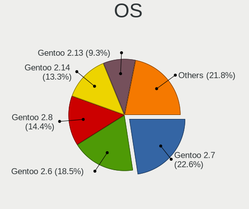

| Name           | Notebooks | Percent |
|----------------|-----------|---------|
| Gentoo 2.7     | 244       | 30.35%  |
| Gentoo 2.6     | 200       | 24.88%  |
| Gentoo 2.8     | 156       | 19.4%   |
| Gentoo 2.13    | 98        | 12.19%  |
| Gentoo 2.9     | 76        | 9.45%   |
| Gentoo         | 7         | 0.87%   |
| Gentoo 2.4.1   | 5         | 0.62%   |
| Gentoo 2.3     | 4         | 0.5%    |
| Gentoo 2.2     | 4         | 0.5%    |
| Gentoo 2.14    | 3         | 0.37%   |
| Gentoo 23      | 2         | 0.25%   |
| Gentoo Pelikan | 1         | 0.12%   |
| Gentoo 22      | 1         | 0.12%   |
| Gentoo 2022    | 1         | 0.12%   |
| Gentoo 2.1     | 1         | 0.12%   |
| Gentoo 1       | 1         | 0.12%   |

OS Family
---------

OS without a version

| Name   | Notebooks | Percent |
|--------|-----------|---------|
| Gentoo | 704       | 100%    |

Kernel
------

Version of the Linux kernel

| Version                  | Notebooks | Percent |
|--------------------------|-----------|---------|
| 5.10.27-gentoo           | 16        | 1.74%   |
| 5.10.61-gentoo           | 13        | 1.42%   |
| 5.4.38-gentoo            | 11        | 1.2%    |
| 5.15.80-gentoo-x86_64    | 10        | 1.09%   |
| 5.4.80-gentoo-r1         | 9         | 0.98%   |
| 5.4.48-gentoo            | 9         | 0.98%   |
| 5.15.32-gentoo-r1        | 9         | 0.98%   |
| 5.10.76-gentoo-r1        | 9         | 0.98%   |
| 6.1.19-gentoo-x86_64     | 7         | 0.76%   |
| 5.15.80-gentoo           | 7         | 0.76%   |
| 5.10.76-gentoo-r1-x86_64 | 7         | 0.76%   |
| 5.15.75-gentoo-x86_64    | 6         | 0.65%   |
| 5.15.59-gentoo-x86_64    | 6         | 0.65%   |
| 5.10.52-gentoo           | 6         | 0.65%   |
| 5.10.27-gentoo-x86_64    | 6         | 0.65%   |
| 6.1.12-gentoo-dist       | 5         | 0.54%   |
| 5.4.97-gentoo            | 5         | 0.54%   |
| 5.4.60-gentoo            | 5         | 0.54%   |
| 5.4.28-gentoo            | 5         | 0.54%   |
| 5.15.75-gentoo           | 5         | 0.54%   |
| 5.15.72-gentoo-x86_64    | 5         | 0.54%   |
| 5.15.72-gentoo           | 5         | 0.54%   |
| 5.15.52-gentoo           | 5         | 0.54%   |
| 5.15.32-gentoo-r1-x86_64 | 5         | 0.54%   |
| 5.10.61-gentoo-x86_64    | 5         | 0.54%   |
| 6.1.31-gentoo-dist       | 4         | 0.44%   |
| 6.1.19-gentoo            | 4         | 0.44%   |
| 6.1.12-gentoo            | 4         | 0.44%   |
| 5.8.0-gentoo-r1          | 4         | 0.44%   |
| 5.4.97-gentoo-x86_64     | 4         | 0.44%   |
| 5.4.48-gentoo-x86_64     | 4         | 0.44%   |
| 5.19.0-gentoo-x86_64     | 4         | 0.44%   |
| 5.15.88-gentoo-x86_64    | 4         | 0.44%   |
| 5.15.88-gentoo           | 4         | 0.44%   |
| 5.15.69-gentoo           | 4         | 0.44%   |
| 4.19.97-gentoo           | 4         | 0.44%   |
| 4.14.65-gentoo           | 4         | 0.44%   |
| 6.1.9-gentoo-x86_64      | 3         | 0.33%   |
| 6.1.7-gentoo             | 3         | 0.33%   |
| 6.1.41-gentoo-dist       | 3         | 0.33%   |

Kernel Family
-------------

Linux kernel without a distro release

| Version | Notebooks | Percent |
|---------|-----------|---------|
| 5.10.27 | 25        | 2.73%   |
| 5.10.76 | 21        | 2.29%   |
| 5.4.48  | 20        | 2.18%   |
| 5.10.61 | 19        | 2.07%   |
| 5.15.80 | 17        | 1.86%   |
| 5.15.32 | 17        | 1.86%   |
| 5.4.38  | 16        | 1.75%   |
| 6.1.19  | 15        | 1.64%   |
| 6.1.12  | 13        | 1.42%   |
| 5.15.75 | 13        | 1.42%   |
| 5.15.59 | 13        | 1.42%   |
| 5.15.72 | 12        | 1.31%   |
| 6.1.31  | 11        | 1.2%    |
| 5.4.97  | 11        | 1.2%    |
| 5.4.80  | 11        | 1.2%    |
| 5.4.28  | 11        | 1.2%    |
| 5.15.52 | 11        | 1.2%    |
| 5.10.52 | 11        | 1.2%    |
| 6.1.38  | 9         | 0.98%   |
| 5.15.11 | 9         | 0.98%   |
| 6.0.0   | 8         | 0.87%   |
| 5.15.88 | 8         | 0.87%   |
| 5.15.69 | 8         | 0.87%   |
| 5.15.41 | 8         | 0.87%   |
| 4.19.97 | 8         | 0.87%   |
| 5.4.72  | 7         | 0.76%   |
| 5.4.60  | 7         | 0.76%   |
| 5.19.0  | 7         | 0.76%   |
| 5.17.1  | 7         | 0.76%   |
| 5.16.0  | 7         | 0.76%   |
| 6.1.7   | 6         | 0.66%   |
| 5.4.66  | 6         | 0.66%   |
| 5.15.26 | 6         | 0.66%   |
| 5.15.23 | 6         | 0.66%   |
| 5.15.10 | 6         | 0.66%   |
| 6.2.11  | 5         | 0.55%   |
| 5.8.0   | 5         | 0.55%   |
| 5.15.74 | 5         | 0.55%   |
| 5.15.5  | 5         | 0.55%   |
| 5.15.13 | 5         | 0.55%   |

Kernel Major Ver.
-----------------

Linux kernel major version

| Version | Notebooks | Percent |
|---------|-----------|---------|
| 5.15    | 167       | 19.67%  |
| 5.10    | 110       | 12.96%  |
| 5.4     | 102       | 12.01%  |
| 6.1     | 84        | 9.89%   |
| 4.19    | 33        | 3.89%   |
| 6.2     | 25        | 2.94%   |
| 6.0     | 25        | 2.94%   |
| 5.17    | 25        | 2.94%   |
| 5.16    | 24        | 2.83%   |
| 5.9     | 23        | 2.71%   |
| 5.6     | 22        | 2.59%   |
| 5.14    | 22        | 2.59%   |
| 5.18    | 20        | 2.36%   |
| 5.8     | 19        | 2.24%   |
| 5.11    | 19        | 2.24%   |
| 5.12    | 17        | 2%      |
| 5.7     | 16        | 1.88%   |
| 5.19    | 16        | 1.88%   |
| 5.13    | 13        | 1.53%   |
| 6.3     | 11        | 1.3%    |
| 4.14    | 8         | 0.94%   |
| 6.4     | 7         | 0.82%   |
| 5.5     | 7         | 0.82%   |
| 5.3     | 5         | 0.59%   |
| 5.1     | 5         | 0.59%   |
| 4.4     | 5         | 0.59%   |
| 5.2     | 3         | 0.35%   |
| 4.9     | 3         | 0.35%   |
| 4.18    | 3         | 0.35%   |
| 5.0     | 2         | 0.24%   |
| 4.6     | 2         | 0.24%   |
| 4.12    | 2         | 0.24%   |
| 4.5     | 1         | 0.12%   |
| 4.20    | 1         | 0.12%   |
| 4.10    | 1         | 0.12%   |
| 4.1     | 1         | 0.12%   |

Arch
----

OS architecture (x86_64, i586, etc.)

| Name   | Notebooks | Percent |
|--------|-----------|---------|
| x86_64 | 679       | 96.45%  |
| i686   | 22        | 3.13%   |
| ppc    | 3         | 0.43%   |

DE
--

Desktop Environment

| Name           | Notebooks | Percent |
|----------------|-----------|---------|
| Unknown        | 308       | 40.63%  |
| KDE5           | 163       | 21.5%   |
| GNOME          | 94        | 12.4%   |
| XFCE           | 64        | 8.44%   |
| KDE            | 25        | 3.3%    |
| MATE           | 22        | 2.9%    |
| DWM            | 16        | 2.11%   |
| LXQt           | 11        | 1.45%   |
| sway           | 8         | 1.06%   |
| XSession       | 5         | 0.66%   |
| LXDE           | 5         | 0.66%   |
| i3             | 4         | 0.53%   |
| bspwm          | 4         | 0.53%   |
| awesome        | 4         | 0.53%   |
| X-Cinnamon     | 3         | 0.4%    |
| Trinity        | 3         | 0.4%    |
| openbox        | 3         | 0.4%    |
| Hyprland       | 3         | 0.4%    |
| Enlightenment  | 2         | 0.26%   |
| Cinnamon       | 2         | 0.26%   |
| xmonad         | 1         | 0.13%   |
| ratpoison      | 1         | 0.13%   |
| qt5ct          | 1         | 0.13%   |
| LeftWM         | 1         | 0.13%   |
| ICEWM          | 1         | 0.13%   |
| i3-with-shmlog | 1         | 0.13%   |
| GNOME Classic  | 1         | 0.13%   |
| fvwm           | 1         | 0.13%   |
| fluxbox        | 1         | 0.13%   |

Display Server
--------------

X11 or Wayland

| Name    | Notebooks | Percent |
|---------|-----------|---------|
| X11     | 427       | 56.41%  |
| Unknown | 114       | 15.06%  |
| Wayland | 108       | 14.27%  |
| Tty     | 108       | 14.27%  |

Display Manager
---------------

SDDM, LightDM, etc.

| Name    | Notebooks | Percent |
|---------|-----------|---------|
| Unknown | 333       | 45.18%  |
| SDDM    | 203       | 27.54%  |
| LightDM | 84        | 11.4%   |
| GDM     | 69        | 9.36%   |
| XDM     | 15        | 2.04%   |
| SLiM    | 13        | 1.76%   |
| LXDM    | 7         | 0.95%   |
| GREETD  | 6         | 0.81%   |
| TDM     | 5         | 0.68%   |
| KDM     | 1         | 0.14%   |
| GDM3    | 1         | 0.14%   |

OS Lang
-------

Language

| Lang       | Notebooks | Percent |
|------------|-----------|---------|
| en_US      | 284       | 38.07%  |
| Unknown    | 116       | 15.55%  |
| C.UTF8     | 67        | 8.98%   |
| en_GB      | 43        | 5.76%   |
| de_DE      | 37        | 4.96%   |
| ru_RU      | 35        | 4.69%   |
| fr_FR      | 17        | 2.28%   |
| C          | 17        | 2.28%   |
| it_IT      | 14        | 1.88%   |
| en_AU      | 12        | 1.61%   |
| cs_CZ      | 12        | 1.61%   |
| zh_CN      | 8         | 1.07%   |
| en_CA      | 8         | 1.07%   |
| es_ES      | 7         | 0.94%   |
| pl_PL      | 6         | 0.8%    |
| POSIX      | 5         | 0.67%   |
| el_GR      | 5         | 0.67%   |
| pt_BR      | 4         | 0.54%   |
| nl_NL      | 3         | 0.4%    |
| nl_BE      | 3         | 0.4%    |
| ja_JP      | 3         | 0.4%    |
| fr_CA      | 3         | 0.4%    |
| es_AR      | 3         | 0.4%    |
| uk_UA      | 2         | 0.27%   |
| mi_NZ      | 2         | 0.27%   |
| es_CL      | 2         | 0.27%   |
| en_ZA      | 2         | 0.27%   |
| en_US.UTF8 | 2         | 0.27%   |
| en_MX      | 2         | 0.27%   |
| en_IE      | 2         | 0.27%   |
| de_CH      | 2         | 0.27%   |
| ca_ES      | 2         | 0.27%   |
| zh_TW      | 1         | 0.13%   |
| tr_TR.UTF8 | 1         | 0.13%   |
| tr_TR      | 1         | 0.13%   |
| sv_SE      | 1         | 0.13%   |
| ru_UA      | 1         | 0.13%   |
| ro_RO      | 1         | 0.13%   |
| lt_LT      | 1         | 0.13%   |
| ko_KR      | 1         | 0.13%   |

Boot Mode
---------

EFI or BIOS

| Mode | Notebooks | Percent |
|------|-----------|---------|
| EFI  | 553       | 77.02%  |
| BIOS | 165       | 22.98%  |

Filesystem
----------

Type of filesystem

| Type     | Notebooks | Percent |
|----------|-----------|---------|
| Ext4     | 430       | 60.14%  |
| Btrfs    | 179       | 25.03%  |
| Xfs      | 25        | 3.5%    |
| Unknown  | 23        | 3.22%   |
| F2fs     | 19        | 2.66%   |
| Zfs      | 17        | 2.38%   |
| XXXXXXX  | 12        | 1.68%   |
| Reiserfs | 3         | 0.42%   |
| Jfs      | 2         | 0.28%   |
| Ext3     | 2         | 0.28%   |
| Overlay  | 1         | 0.14%   |
| Ext2     | 1         | 0.14%   |
| Bcachefs | 1         | 0.14%   |

Part. scheme
------------

Scheme of partitioning

| Type    | Notebooks | Percent |
|---------|-----------|---------|
| GPT     | 600       | 84.15%  |
| MBR     | 75        | 10.52%  |
| Unknown | 38        | 5.33%   |

Dual Boot with Linux/BSD
------------------------

Hosting more than one Linux/BSD

| Dual boot | Notebooks | Percent |
|-----------|-----------|---------|
| No        | 546       | 74.9%   |
| Yes       | 183       | 25.1%   |

Dual Boot (Win)
---------------

Hosting Linux and Windows

| Dual boot | Notebooks | Percent |
|-----------|-----------|---------|
| No        | 492       | 68.24%  |
| Yes       | 229       | 31.76%  |

Board
-----

Vendor
------

Motherboard manufacturer

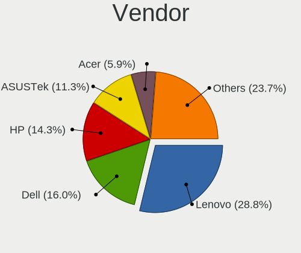

| Name                | Notebooks | Percent |
|---------------------|-----------|---------|
| Lenovo              | 195       | 27.7%   |
| Dell                | 120       | 17.05%  |
| Hewlett-Packard     | 103       | 14.63%  |
| ASUSTek Computer    | 77        | 10.94%  |
| Acer                | 42        | 5.97%   |
| MSI                 | 23        | 3.27%   |
| Apple               | 20        | 2.84%   |
| HUAWEI              | 12        | 1.7%    |
| Timi                | 11        | 1.56%   |
| Toshiba             | 9         | 1.28%   |
| Samsung Electronics | 8         | 1.14%   |
| TUXEDO              | 7         | 0.99%   |
| Unknown             | 7         | 0.99%   |
| Razer               | 5         | 0.71%   |
| IBM                 | 5         | 0.71%   |
| Google              | 5         | 0.71%   |
| Notebook            | 4         | 0.57%   |
| Fujitsu             | 4         | 0.57%   |
| System76            | 3         | 0.43%   |
| Sony                | 3         | 0.43%   |
| Alienware           | 3         | 0.43%   |
| win element         | 2         | 0.28%   |
| Valve               | 2         | 0.28%   |
| Star Labs           | 2         | 0.28%   |
| Schenker            | 2         | 0.28%   |
| Purism              | 2         | 0.28%   |
| Positivo            | 2         | 0.28%   |
| Medion              | 2         | 0.28%   |
| Jumper              | 2         | 0.28%   |
| Framework           | 2         | 0.28%   |
| Chuwi               | 2         | 0.28%   |
| XMG                 | 1         | 0.14%   |
| Wortmann AG         | 1         | 0.14%   |
| SIEMENS             | 1         | 0.14%   |
| Seco                | 1         | 0.14%   |
| realme              | 1         | 0.14%   |
| PC Specialist       | 1         | 0.14%   |
| Panasonic           | 1         | 0.14%   |
| MOTILE              | 1         | 0.14%   |
| MAXDATA             | 1         | 0.14%   |

Model
-----

Motherboard model

| Name                                  | Notebooks | Percent |
|---------------------------------------|-----------|---------|
| Unknown                               | 14        | 1.99%   |
| Dell XPS 15 9570                      | 6         | 0.85%   |
| ASUS ROG Strix G513QY_G513QY          | 6         | 0.85%   |
| HP Pavilion Notebook                  | 5         | 0.71%   |
| HP OMEN by Laptop                     | 5         | 0.71%   |
| HP Pavilion Gaming Laptop 15-ec1xxx   | 4         | 0.57%   |
| HP Laptop 14-dk1xxx                   | 4         | 0.57%   |
| Dell XPS 17 9710                      | 4         | 0.57%   |
| Dell XPS 15 7590                      | 4         | 0.57%   |
| Dell XPS 13 9310                      | 4         | 0.57%   |
| ASUS ROG Zephyrus G14 GA401II_GA401II | 4         | 0.57%   |
| Lenovo ThinkPad T14 Gen 1 20UD0013GE  | 3         | 0.43%   |
| Lenovo Legion Y530-15ICH 81FV         | 3         | 0.43%   |
| Lenovo Legion 5 Pro 16ACH6H 82JQ      | 3         | 0.43%   |
| Dell XPS 13 9370                      | 3         | 0.43%   |
| Dell XPS 13 9360                      | 3         | 0.43%   |
| Dell Latitude E7440                   | 3         | 0.43%   |
| Dell Latitude 7390                    | 3         | 0.43%   |
| win element MoreFine S500+            | 2         | 0.28%   |
| Valve Jupiter                         | 2         | 0.28%   |
| Toshiba Satellite C850D-118           | 2         | 0.28%   |
| Toshiba NB100                         | 2         | 0.28%   |
| Timi RedmiBook Pro 15S                | 2         | 0.28%   |
| Timi RedmiBook 13 R                   | 2         | 0.28%   |
| Sony PCG-GRT230(UC)                   | 2         | 0.28%   |
| MSI GS65 Stealth Thin 8RF             | 2         | 0.28%   |
| MSI GS63VR 6RF                        | 2         | 0.28%   |
| Lenovo Yoga 2 13 20344                | 2         | 0.28%   |
| Lenovo ThinkPad T480 20L5CTO1WW       | 2         | 0.28%   |
| Lenovo ThinkPad T470p 20J7S25C00      | 2         | 0.28%   |
| Lenovo ThinkPad P51 20HHCTO1WW        | 2         | 0.28%   |
| Lenovo ThinkPad E15 Gen 2 20T8000MPB  | 2         | 0.28%   |
| Lenovo Legion Y540-15IRH 81SX         | 2         | 0.28%   |
| Lenovo Legion R7000 2020 82B6         | 2         | 0.28%   |
| Lenovo IdeaPad 5 15ITL05 82FG         | 2         | 0.28%   |
| HUAWEI KLVL-WXX9                      | 2         | 0.28%   |
| HUAWEI BOHK-WAX9X                     | 2         | 0.28%   |
| HP Victus by Laptop 16-e0xxx          | 2         | 0.28%   |
| HP ProBook 455 G7                     | 2         | 0.28%   |
| HP Pavilion Laptop 15-cs0xxx          | 2         | 0.28%   |

Model Family
------------

Motherboard model prefix

| Name                 | Notebooks | Percent |
|----------------------|-----------|---------|
| Lenovo ThinkPad      | 119       | 16.9%   |
| Dell Latitude        | 40        | 5.68%   |
| Dell XPS             | 36        | 5.11%   |
| Lenovo IdeaPad       | 25        | 3.55%   |
| Lenovo Legion        | 24        | 3.41%   |
| HP Pavilion          | 23        | 3.27%   |
| HP EliteBook         | 22        | 3.13%   |
| Acer Aspire          | 22        | 3.13%   |
| Dell Inspiron        | 19        | 2.7%    |
| ASUS ROG             | 19        | 2.7%    |
| HP Laptop            | 15        | 2.13%   |
| Dell Precision       | 14        | 1.99%   |
| Unknown              | 14        | 1.99%   |
| HP OMEN              | 11        | 1.56%   |
| HP ProBook           | 10        | 1.42%   |
| Lenovo Yoga          | 9         | 1.28%   |
| ASUS VivoBook        | 9         | 1.28%   |
| ASUS ZenBook         | 8         | 1.14%   |
| Acer Swift           | 8         | 1.14%   |
| Toshiba Satellite    | 7         | 0.99%   |
| HP ZBook             | 7         | 0.99%   |
| Acer Nitro           | 7         | 0.99%   |
| Timi RedmiBook       | 6         | 0.85%   |
| Razer Blade          | 5         | 0.71%   |
| ASUS ASUS            | 5         | 0.71%   |
| Apple MacBookPro8    | 5         | 0.71%   |
| Lenovo ThinkBook     | 4         | 0.57%   |
| IBM ThinkPad         | 4         | 0.57%   |
| Timi Mi              | 3         | 0.43%   |
| HP Victus            | 3         | 0.43%   |
| HP 255               | 3         | 0.43%   |
| Fujitsu LIFEBOOK     | 3         | 0.43%   |
| Dell Vostro          | 3         | 0.43%   |
| Dell G5              | 3         | 0.43%   |
| Dell G3              | 3         | 0.43%   |
| ASUS TUF             | 3         | 0.43%   |
| Apple MacBookPro11   | 3         | 0.43%   |
| win element MoreFine | 2         | 0.28%   |
| Valve Jupiter        | 2         | 0.28%   |
| TUXEDO Book          | 2         | 0.28%   |

MFG Year
--------

Motherboard manufacture year

| Year    | Notebooks | Percent |
|---------|-----------|---------|
| 2020    | 115       | 16.34%  |
| 2019    | 106       | 15.06%  |
| 2021    | 96        | 13.64%  |
| 2018    | 77        | 10.94%  |
| 2022    | 41        | 5.82%   |
| 2017    | 41        | 5.82%   |
| 2014    | 36        | 5.11%   |
| 2012    | 34        | 4.83%   |
| 2015    | 29        | 4.12%   |
| 2016    | 27        | 3.84%   |
| 2011    | 25        | 3.55%   |
| 2013    | 18        | 2.56%   |
| 2010    | 17        | 2.41%   |
| 2008    | 14        | 1.99%   |
| 2006    | 7         | 0.99%   |
| 2009    | 4         | 0.57%   |
| Unknown | 4         | 0.57%   |
| 2007    | 3         | 0.43%   |
| 2005    | 3         | 0.43%   |
| 2004    | 3         | 0.43%   |
| 2023    | 2         | 0.28%   |
| 2003    | 2         | 0.28%   |

Form Factor
-----------

Physical design of the computer

| Name     | Notebooks | Percent |
|----------|-----------|---------|
| Notebook | 704       | 100%    |

Secure Boot
-----------

Enabled or disabled

| State    | Notebooks | Percent |
|----------|-----------|---------|
| Disabled | 693       | 98.16%  |
| Enabled  | 13        | 1.84%   |

Coreboot
--------

Have coreboot on board

| Used | Notebooks | Percent |
|------|-----------|---------|
| No   | 692       | 98.3%   |
| Yes  | 12        | 1.7%    |

RAM Size
--------

Total RAM memory

| Size in GB  | Notebooks | Percent |
|-------------|-----------|---------|
| 16.01-24.0  | 175       | 24.2%   |
| 8.01-16.0   | 159       | 21.99%  |
| 4.01-8.0    | 136       | 18.81%  |
| 32.01-64.0  | 113       | 15.63%  |
| 3.01-4.0    | 46        | 6.36%   |
| 64.01-256.0 | 29        | 4.01%   |
| 24.01-32.0  | 24        | 3.32%   |
| 1.01-2.0    | 16        | 2.21%   |
| 2.01-3.0    | 14        | 1.94%   |
| 0.51-1.0    | 8         | 1.11%   |
| 0.01-0.5    | 3         | 0.41%   |

RAM Used
--------

Used RAM memory

| Used GB    | Notebooks | Percent |
|------------|-----------|---------|
| 1.01-2.0   | 206       | 24.76%  |
| 2.01-3.0   | 141       | 16.95%  |
| 4.01-8.0   | 131       | 15.75%  |
| 3.01-4.0   | 99        | 11.9%   |
| 0.01-0.5   | 90        | 10.82%  |
| 0.51-1.0   | 88        | 10.58%  |
| 8.01-16.0  | 69        | 8.29%   |
| 16.01-24.0 | 5         | 0.6%    |
| 32.01-64.0 | 2         | 0.24%   |
| 24.01-32.0 | 1         | 0.12%   |

Total Drives
------------

Number of drives on board

| Drives | Notebooks | Percent |
|--------|-----------|---------|
| 1      | 499       | 68.54%  |
| 2      | 195       | 26.79%  |
| 3      | 25        | 3.43%   |
| 0      | 6         | 0.82%   |
| 4      | 3         | 0.41%   |

Has CD-ROM
----------

Has CD-ROM on board

| Presented | Notebooks | Percent |
|-----------|-----------|---------|
| No        | 598       | 84.23%  |
| Yes       | 112       | 15.77%  |

Has Ethernet
------------

Has Ethernet on board

| Presented | Notebooks | Percent |
|-----------|-----------|---------|
| Yes       | 554       | 77.59%  |
| No        | 160       | 22.41%  |

Has WiFi
--------

Has WiFi module

| Presented | Notebooks | Percent |
|-----------|-----------|---------|
| Yes       | 695       | 98.72%  |
| No        | 9         | 1.28%   |

Has Bluetooth
-------------

Has Bluetooth module

| Presented | Notebooks | Percent |
|-----------|-----------|---------|
| Yes       | 614       | 86.24%  |
| No        | 98        | 13.76%  |

Location
--------

Country
-------

Geographic location (country)

| Country      | Notebooks | Percent |
|--------------|-----------|---------|
| USA          | 138       | 19.25%  |
| Germany      | 86        | 11.99%  |
| Russia       | 62        | 8.65%   |
| France       | 36        | 5.02%   |
| China        | 32        | 4.46%   |
| Canada       | 31        | 4.32%   |
| UK           | 29        | 4.04%   |
| Poland       | 22        | 3.07%   |
| Italy        | 22        | 3.07%   |
| Czechia      | 21        | 2.93%   |
| Netherlands  | 19        | 2.65%   |
| Spain        | 18        | 2.51%   |
| Australia    | 17        | 2.37%   |
| Ukraine      | 11        | 1.53%   |
| Sweden       | 11        | 1.53%   |
| Turkey       | 10        | 1.39%   |
| Greece       | 10        | 1.39%   |
| Belgium      | 9         | 1.26%   |
| Brazil       | 8         | 1.12%   |
| Switzerland  | 7         | 0.98%   |
| Mexico       | 7         | 0.98%   |
| Japan        | 7         | 0.98%   |
| India        | 7         | 0.98%   |
| Finland      | 7         | 0.98%   |
| Romania      | 6         | 0.84%   |
| Norway       | 6         | 0.84%   |
| Hong Kong    | 6         | 0.84%   |
| Portugal     | 5         | 0.7%    |
| Belarus      | 5         | 0.7%    |
| Austria      | 5         | 0.7%    |
| Slovakia     | 4         | 0.56%   |
| New Zealand  | 4         | 0.56%   |
| Lithuania    | 4         | 0.56%   |
| Hungary      | 4         | 0.56%   |
| Argentina    | 4         | 0.56%   |
| Taiwan       | 3         | 0.42%   |
| South Africa | 3         | 0.42%   |
| Iran         | 3         | 0.42%   |
| Indonesia    | 3         | 0.42%   |
| Vietnam      | 2         | 0.28%   |

City
----

Geographic location (city)

| City              | Notebooks | Percent |
|-------------------|-----------|---------|
| Berlin            | 26        | 3.31%   |
| Moscow            | 21        | 2.67%   |
| Sydney            | 10        | 1.27%   |
| Athens            | 10        | 1.27%   |
| St Petersburg     | 9         | 1.15%   |
| Milan             | 8         | 1.02%   |
| Warsaw            | 7         | 0.89%   |
| Vancouver         | 7         | 0.89%   |
| Prague            | 7         | 0.89%   |
| Munich            | 7         | 0.89%   |
| Guangzhou         | 7         | 0.89%   |
| Amsterdam         | 7         | 0.89%   |
| Paris             | 6         | 0.76%   |
| Kyiv              | 6         | 0.76%   |
| Weatherford       | 5         | 0.64%   |
| Minsk             | 5         | 0.64%   |
| Los Angeles       | 5         | 0.64%   |
| New York          | 4         | 0.51%   |
| Melbourne         | 4         | 0.51%   |
| Istanbul          | 4         | 0.51%   |
| Helsinki          | 4         | 0.51%   |
| Frankfurt am Main | 4         | 0.51%   |
| Cieszyn           | 4         | 0.51%   |
| Beijing           | 4         | 0.51%   |
| Wuelfrath         | 3         | 0.38%   |
| Vilnius           | 3         | 0.38%   |
| Vienna            | 3         | 0.38%   |
| Taganrog          | 3         | 0.38%   |
| lapanice        | 3         | 0.38%   |
| Shenzhen          | 3         | 0.38%   |
| Seattle           | 3         | 0.38%   |
| San Jose          | 3         | 0.38%   |
| Rome              | 3         | 0.38%   |
| Pittsburgh        | 3         | 0.38%   |
| Perm              | 3         | 0.38%   |
| Oviedo            | 3         | 0.38%   |
| Omsk              | 3         | 0.38%   |
| Manitowoc         | 3         | 0.38%   |
| Madrid            | 3         | 0.38%   |
| London            | 3         | 0.38%   |

Drives
------

Drive Vendor
------------

Hard drive vendors

| Vendor                      | Notebooks | Drives | Percent |
|-----------------------------|-----------|--------|---------|
| Samsung Electronics         | 223       | 371    | 24.4%   |
| WDC                         | 108       | 149    | 11.82%  |
| SK hynix                    | 61        | 74     | 6.67%   |
| Sandisk                     | 61        | 82     | 6.67%   |
| Seagate                     | 60        | 84     | 6.56%   |
| Intel                       | 57        | 91     | 6.24%   |
| Toshiba                     | 49        | 57     | 5.36%   |
| Unknown                     | 35        | 45     | 3.83%   |
| Kingston                    | 32        | 40     | 3.5%    |
| HGST                        | 31        | 34     | 3.39%   |
| Micron Technology           | 28        | 34     | 3.06%   |
| Crucial                     | 17        | 21     | 1.86%   |
| KIOXIA                      | 15        | 20     | 1.64%   |
| Hitachi                     | 13        | 13     | 1.42%   |
| Apple                       | 10        | 12     | 1.09%   |
| Phison Electronics          | 9         | 10     | 0.98%   |
| A-DATA Technology           | 9         | 15     | 0.98%   |
| Kingston Technology Company | 8         | 9      | 0.88%   |
| China                       | 6         | 15     | 0.66%   |
| OCZ                         | 5         | 9      | 0.55%   |
| Fujitsu                     | 5         | 7      | 0.55%   |
| LITEON                      | 4         | 7      | 0.44%   |
| Phison                      | 3         | 3      | 0.33%   |
| Lenovo                      | 3         | 5      | 0.33%   |
| IBM/Hitachi                 | 3         | 4      | 0.33%   |
| XPG                         | 2         | 3      | 0.22%   |
| Transcend                   | 2         | 5      | 0.22%   |
| Plextor                     | 2         | 2      | 0.22%   |
| Netac                       | 2         | 2      | 0.22%   |
| MyDigitalSSD                | 2         | 2      | 0.22%   |
| Micron/Crucial Technology   | 2         | 4      | 0.22%   |
| LITEONIT                    | 2         | 3      | 0.22%   |
| KIOXIA-EXCERIA              | 2         | 5      | 0.22%   |
| Intenso                     | 2         | 2      | 0.22%   |
| GOODRAM                     | 2         | 2      | 0.22%   |
| Dogfish                     | 2         | 2      | 0.22%   |
| Zheino                      | 1         | 1      | 0.11%   |
| Yangtze Memory Technologies | 1         | 1      | 0.11%   |
| XrayDisk                    | 1         | 1      | 0.11%   |
| Union Memory                | 1         | 1      | 0.11%   |

Drive Model
-----------

Hard drive models

| Model                                               | Notebooks | Percent |
|-----------------------------------------------------|-----------|---------|
| Samsung NVMe SSD Controller SM981/PM981/PM983 500GB | 29        | 2.96%   |
| HGST HTS721010A9E630 1TB                            | 20        | 2.04%   |
| Samsung NVMe SSD Controller PM9A1/PM9A3/980PRO 1TB  | 19        | 1.94%   |
| Intel SSDPEKNW010T8 1TB                             | 10        | 1.02%   |
| Samsung SSD 980 1TB                                 | 9         | 0.92%   |
| Seagate ST1000LM035-1RK172 1TB                      | 8         | 0.82%   |
| Sandisk WD Black SN750 / PC SN730 NVMe SSD 1024GB   | 8         | 0.82%   |
| Samsung SSD 850 EVO 250GB                           | 8         | 0.82%   |
| Samsung MZVLB512HBJQ-000L2 512GB                    | 8         | 0.82%   |
| Intel SSDPEKNU512GZ 512GB                           | 8         | 0.82%   |
| Samsung SSD 860 EVO 500GB                           | 7         | 0.71%   |
| Seagate ST1000LM049-2GH172 1TB                      | 6         | 0.61%   |
| Sandisk WD Blue SN550 NVMe SSD 250GB                | 6         | 0.61%   |
| Samsung SSD 970 EVO Plus 500GB                      | 6         | 0.61%   |
| Samsung MZALQ512HALU-000L2 512GB                    | 6         | 0.61%   |
| WDC WDS500G2B0B-00YS70 500GB SSD                    | 5         | 0.51%   |
| Unknown MMC Card  32GB                              | 5         | 0.51%   |
| Unknown MMC Card  16GB                              | 5         | 0.51%   |
| Unknown MMC Card  128GB                             | 5         | 0.51%   |
| Toshiba MQ04ABF100 1TB                              | 5         | 0.51%   |
| SK hynix PC711 NVMe 1TB                             | 5         | 0.51%   |
| Seagate ST1000LM024 HN-M101MBB 1TB                  | 5         | 0.51%   |
| Samsung SSD 980 PRO 2TB                             | 5         | 0.51%   |
| Samsung NVMe SSD Drive 512GB                        | 5         | 0.51%   |
| Kingston SA400S37240G 240GB SSD                     | 5         | 0.51%   |
| Intel SSD 660P Series 1024GB                        | 5         | 0.51%   |
| HGST HTS541010A9E680 1TB                            | 5         | 0.51%   |
| WDC WDS100T2B0C-00PXH0 1TB                          | 4         | 0.41%   |
| WDC PC SN730 SDBQNTY-512G-1001 512GB                | 4         | 0.41%   |
| WDC PC SN730 SDBQNTY-1T00-1001 1TB                  | 4         | 0.41%   |
| Toshiba MQ01ABF050 500GB                            | 4         | 0.41%   |
| Toshiba MQ01ABD100 1TB                              | 4         | 0.41%   |
| Toshiba KXG50ZNV512G NVMe 512GB                     | 4         | 0.41%   |
| SK hynix BC501 NVMe Solid State Drive 512GB         | 4         | 0.41%   |
| Seagate ST2000LX001-1RG174 2TB                      | 4         | 0.41%   |
| Seagate ST2000LM015-2E8174 2TB                      | 4         | 0.41%   |
| Seagate ST1000LM048-2E7172 1TB                      | 4         | 0.41%   |
| Samsung SSD 970 EVO Plus 250GB                      | 4         | 0.41%   |
| Samsung SSD 870 EVO 1TB                             | 4         | 0.41%   |
| Samsung SSD 860 QVO 1TB                             | 4         | 0.41%   |

HDD Vendor
----------

Hard disk drive vendors

| Vendor              | Notebooks | Drives | Percent |
|---------------------|-----------|--------|---------|
| Seagate             | 57        | 81     | 31.84%  |
| WDC                 | 41        | 48     | 22.91%  |
| HGST                | 31        | 34     | 17.32%  |
| Toshiba             | 24        | 28     | 13.41%  |
| Hitachi             | 13        | 13     | 7.26%   |
| Fujitsu             | 5         | 7      | 2.79%   |
| IBM/Hitachi         | 3         | 4      | 1.68%   |
| Teleplan            | 1         | 3      | 0.56%   |
| Samsung Electronics | 1         | 2      | 0.56%   |
| HGST HTS            | 1         | 1      | 0.56%   |
| ASMT                | 1         | 2      | 0.56%   |
| Apple               | 1         | 1      | 0.56%   |

SSD Vendor
----------

Solid state drive vendors

| Vendor              | Notebooks | Drives | Percent |
|---------------------|-----------|--------|---------|
| Samsung Electronics | 81        | 121    | 30.11%  |
| SanDisk             | 30        | 41     | 11.15%  |
| Kingston            | 19        | 26     | 7.06%   |
| WDC                 | 16        | 29     | 5.95%   |
| Crucial             | 14        | 18     | 5.2%    |
| SK hynix            | 13        | 14     | 4.83%   |
| Intel               | 13        | 13     | 4.83%   |
| Micron Technology   | 9         | 14     | 3.35%   |
| A-DATA Technology   | 9         | 15     | 3.35%   |
| Apple               | 7         | 8      | 2.6%    |
| Toshiba             | 6         | 7      | 2.23%   |
| China               | 6         | 15     | 2.23%   |
| OCZ                 | 5         | 9      | 1.86%   |
| Transcend           | 2         | 5      | 0.74%   |
| Seagate             | 2         | 2      | 0.74%   |
| Plextor             | 2         | 2      | 0.74%   |
| Netac               | 2         | 2      | 0.74%   |
| MyDigitalSSD        | 2         | 2      | 0.74%   |
| LITEONIT            | 2         | 3      | 0.74%   |
| Intenso             | 2         | 2      | 0.74%   |
| GOODRAM             | 2         | 2      | 0.74%   |
| Dogfish             | 2         | 2      | 0.74%   |
| Zheino              | 1         | 1      | 0.37%   |
| XrayDisk            | 1         | 1      | 0.37%   |
| Star                | 1         | 1      | 0.37%   |
| SPCC                | 1         | 1      | 0.37%   |
| Smartbuy            | 1         | 1      | 0.37%   |
| ShanDianZhe         | 1         | 2      | 0.37%   |
| RevuAhn             | 1         | 1      | 0.37%   |
| PNY                 | 1         | 2      | 0.37%   |
| Phison              | 1         | 1      | 0.37%   |
| Mushkin             | 1         | 1      | 0.37%   |
| LITEON              | 1         | 2      | 0.37%   |
| Lite-On             | 1         | 1      | 0.37%   |
| Linux               | 1         | 1      | 0.37%   |
| Lexar               | 1         | 1      | 0.37%   |
| Lenovo              | 1         | 2      | 0.37%   |
| Kingmax             | 1         | 1      | 0.37%   |
| KingDian            | 1         | 1      | 0.37%   |
| Hoodisk             | 1         | 1      | 0.37%   |

Drive Kind
----------

HDD or SSD

| Kind    | Notebooks | Drives | Percent |
|---------|-----------|--------|---------|
| NVMe    | 406       | 637    | 47.26%  |
| SSD     | 244       | 381    | 28.41%  |
| HDD     | 172       | 224    | 20.02%  |
| MMC     | 34        | 42     | 3.96%   |
| Unknown | 3         | 5      | 0.35%   |

Drive Connector
---------------

SATA, SAS, NVMe, etc.

| Type | Notebooks | Drives | Percent |
|------|-----------|--------|---------|
| NVMe | 406       | 637    | 49.63%  |
| SATA | 360       | 585    | 44.01%  |
| MMC  | 34        | 42     | 4.16%   |
| SAS  | 18        | 25     | 2.2%    |

Drive Size
----------

Size of hard drive

| Size in TB | Notebooks | Drives | Percent |
|------------|-----------|--------|---------|
| 0.01-0.5   | 247       | 368    | 58.95%  |
| 0.51-1.0   | 151       | 202    | 36.04%  |
| 1.01-2.0   | 18        | 31     | 4.3%    |
| 3.01-4.0   | 2         | 3      | 0.48%   |
| 4.01-10.0  | 1         | 1      | 0.24%   |

Space Total
-----------

Amount of disk space available on the file system

| Size in GB     | Notebooks | Percent |
|----------------|-----------|---------|
| 251-500        | 192       | 25.33%  |
| 101-250        | 172       | 22.69%  |
| 501-1000       | 143       | 18.87%  |
| 1001-2000      | 75        | 9.89%   |
| 51-100         | 45        | 5.94%   |
| 1-20           | 39        | 5.15%   |
| Unknown        | 37        | 4.88%   |
| More than 3000 | 19        | 2.51%   |
| 21-50          | 19        | 2.51%   |
| 2001-3000      | 17        | 2.24%   |

Space Used
----------

Amount of used disk space

| Used GB        | Notebooks | Percent |
|----------------|-----------|---------|
| 1-20           | 197       | 24.38%  |
| 21-50          | 146       | 18.07%  |
| 101-250        | 124       | 15.35%  |
| 251-500        | 111       | 13.74%  |
| 51-100         | 97        | 12%     |
| 501-1000       | 64        | 7.92%   |
| Unknown        | 37        | 4.58%   |
| 1001-2000      | 23        | 2.85%   |
| 2001-3000      | 6         | 0.74%   |
| More than 3000 | 3         | 0.37%   |

Malfunc. Drives
---------------

Drive models with a malfunction

| Model                                                   | Notebooks | Drives | Percent |
|---------------------------------------------------------|-----------|--------|---------|
| HGST HTS721010A9E630 1TB                                | 6         | 7      | 7.69%   |
| Seagate ST1000LM024 HN-M101MBB 1TB                      | 3         | 7      | 3.85%   |
| Kingston RBU-SNS8350DES3128GP 128GB SSD                 | 3         | 3      | 3.85%   |
| WDC WD10JPVX-75JC3T0 1TB                                | 2         | 2      | 2.56%   |
| SK hynix HFS256G39TND-N210A 256GB SSD                   | 2         | 2      | 2.56%   |
| Seagate ST2000LX001-1RG174 2TB                          | 2         | 2      | 2.56%   |
| SanDisk SD9SN8W-128G-1006 128GB SSD                     | 2         | 2      | 2.56%   |
| Samsung Electronics SSD 850 EVO 1TB                     | 2         | 2      | 2.56%   |
| HGST HTS725050A7E630 500GB                              | 2         | 2      | 2.56%   |
| WDC WDS120G2G0B-00EPW0 120GB SSD                        | 1         | 1      | 1.28%   |
| WDC WD1600BEVS-22RST0 160GB                             | 1         | 1      | 1.28%   |
| WDC WD10SPZX-24Z10T0 1TB                                | 1         | 1      | 1.28%   |
| WDC WD10EZEX-08M2NA0 1TB                                | 1         | 2      | 1.28%   |
| Toshiba THNSNK256GVN8 M.2 2280 256GB SSD                | 1         | 1      | 1.28%   |
| Toshiba MQ02ABD100H 1TB                                 | 1         | 1      | 1.28%   |
| Toshiba MQ01ABF050 500GB                                | 1         | 1      | 1.28%   |
| Toshiba MK6008GAH 64GB                                  | 1         | 2      | 1.28%   |
| Toshiba MK5056GSY 500GB                                 | 1         | 1      | 1.28%   |
| Toshiba MK4026GAX 40GB                                  | 1         | 1      | 1.28%   |
| Toshiba MK1629GSG 160GB                                 | 1         | 1      | 1.28%   |
| SK hynix SH920 mSATA 256GB SSD                          | 1         | 1      | 1.28%   |
| SK hynix SC210 mSATA 128GB SSD                          | 1         | 1      | 1.28%   |
| SK hynix PC711 HFS512GDE9X073N 512GB                    | 1         | 2      | 1.28%   |
| SK hynix BC501 NVMe Solid State Drive 512GB             | 1         | 2      | 1.28%   |
| Seagate ST9750420AS 752GB                               | 1         | 1      | 1.28%   |
| Seagate ST9100824AS 100GB                               | 1         | 1      | 1.28%   |
| Seagate ST320LT007-9ZV142 320GB                         | 1         | 1      | 1.28%   |
| Seagate ST1000LM049-2GH172 1TB                          | 1         | 1      | 1.28%   |
| Seagate ST1000LM035-1RK172 1TB                          | 1         | 2      | 1.28%   |
| Seagate ST1000LM014-1EJ164 1TB                          | 1         | 1      | 1.28%   |
| SanDisk SSD PLUS 480GB                                  | 1         | 1      | 1.28%   |
| SanDisk SD9SN8W 128GB SSD                               | 1         | 1      | 1.28%   |
| SanDisk SD7SB2Q512G1001 512GB SSD                       | 1         | 1      | 1.28%   |
| Samsung Electronics SSD SM841 mSATA 512GB               | 1         | 1      | 1.28%   |
| Samsung Electronics SSD 870 EVO 2TB                     | 1         | 1      | 1.28%   |
| Samsung Electronics PM9A1 NVMe 2048GB                   | 1         | 1      | 1.28%   |
| Samsung Electronics HM160HC 160GB                       | 1         | 1      | 1.28%   |
| Realtek Semiconductor RTS5763DL NVMe SSD Controller 1TB | 1         | 2      | 1.28%   |
| OCZ VERTEX4 256GB SSD                                   | 1         | 1      | 1.28%   |
| LITEON CV8-8E128-HP 128GB SSD                           | 1         | 2      | 1.28%   |

Malfunc. Drive Vendor
---------------------

Vendors of faulty drives

| Vendor                      | Notebooks | Drives | Percent |
|-----------------------------|-----------|--------|---------|
| Seagate                     | 11        | 16     | 14.29%  |
| HGST                        | 11        | 12     | 14.29%  |
| Toshiba                     | 7         | 8      | 9.09%   |
| WDC                         | 6         | 7      | 7.79%   |
| SK hynix                    | 6         | 8      | 7.79%   |
| Samsung Electronics         | 6         | 6      | 7.79%   |
| Intel                       | 5         | 5      | 6.49%   |
| Hitachi                     | 5         | 5      | 6.49%   |
| SanDisk                     | 4         | 5      | 5.19%   |
| Kingston                    | 3         | 3      | 3.9%    |
| Fujitsu                     | 3         | 3      | 3.9%    |
| IBM/Hitachi                 | 2         | 2      | 2.6%    |
| A-DATA Technology           | 2         | 2      | 2.6%    |
| Realtek Semiconductor       | 1         | 2      | 1.3%    |
| OCZ                         | 1         | 1      | 1.3%    |
| LITEON                      | 1         | 2      | 1.3%    |
| Kingston Technology Company | 1         | 1      | 1.3%    |
| HGST HTS                    | 1         | 1      | 1.3%    |
| Crucial                     | 1         | 1      | 1.3%    |

Malfunc. HDD Vendor
-------------------

Vendors of faulty HDD drives

| Vendor              | Notebooks | Drives | Percent |
|---------------------|-----------|--------|---------|
| Seagate             | 11        | 16     | 24.44%  |
| HGST                | 11        | 12     | 24.44%  |
| Toshiba             | 6         | 7      | 13.33%  |
| WDC                 | 5         | 6      | 11.11%  |
| Hitachi             | 5         | 5      | 11.11%  |
| Fujitsu             | 3         | 3      | 6.67%   |
| IBM/Hitachi         | 2         | 2      | 4.44%   |
| Samsung Electronics | 1         | 1      | 2.22%   |
| HGST HTS            | 1         | 1      | 2.22%   |

Malfunc. Drive Kind
-------------------

Kinds of faulty drives

| Kind | Notebooks | Drives | Percent |
|------|-----------|--------|---------|
| HDD  | 45        | 53     | 58.44%  |
| SSD  | 25        | 27     | 32.47%  |
| NVMe | 7         | 10     | 9.09%   |

Failed Drives
-------------

Failed drive models

| Model                            | Notebooks | Drives | Percent |
|----------------------------------|-----------|--------|---------|
| Toshiba THNSN5512GPUK NVMe 512GB | 1         | 1      | 33.33%  |
| Samsung Electronics SSD 980 1TB  | 1         | 1      | 33.33%  |
| Hitachi HTS721010G9SA00 100GB    | 1         | 1      | 33.33%  |

Failed Drive Vendor
-------------------

Failed drive vendors

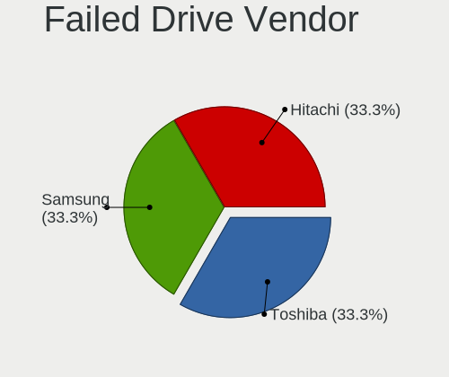

| Vendor              | Notebooks | Drives | Percent |
|---------------------|-----------|--------|---------|
| Toshiba             | 1         | 1      | 33.33%  |
| Samsung Electronics | 1         | 1      | 33.33%  |
| Hitachi             | 1         | 1      | 33.33%  |

Drive Status
------------

Number of failed and malfunc. drives

| Status   | Notebooks | Drives | Percent |
|----------|-----------|--------|---------|
| Works    | 596       | 1055   | 77.2%   |
| Detected | 98        | 141    | 12.69%  |
| Malfunc  | 75        | 90     | 9.72%   |
| Failed   | 3         | 3      | 0.39%   |

Storage controller
------------------

Storage Vendor
--------------

Storage controller vendors

| Vendor                           | Notebooks | Percent |
|----------------------------------|-----------|---------|
| Intel                            | 413       | 45.19%  |
| Samsung Electronics              | 163       | 17.83%  |
| AMD                              | 94        | 10.28%  |
| SanDisk                          | 77        | 8.42%   |
| SK hynix                         | 48        | 5.25%   |
| Toshiba America Info Systems     | 22        | 2.41%   |
| Kingston Technology Company      | 21        | 2.3%    |
| Micron Technology                | 19        | 2.08%   |
| KIOXIA                           | 15        | 1.64%   |
| Phison Electronics               | 11        | 1.2%    |
| Micron/Crucial Technology        | 4         | 0.44%   |
| Lite-On Technology               | 3         | 0.33%   |
| Union Memory (Shenzhen)          | 2         | 0.22%   |
| Solid State Storage Technology   | 2         | 0.22%   |
| Silicon Motion                   | 2         | 0.22%   |
| Silicon Integrated Systems [SiS] | 2         | 0.22%   |
| Nvidia                           | 2         | 0.22%   |
| Lenovo                           | 2         | 0.22%   |
| JMicron Technology               | 2         | 0.22%   |
| INNOGRIT                         | 2         | 0.22%   |
| Apple                            | 2         | 0.22%   |
| ADATA Technology                 | 2         | 0.22%   |
| Yangtze Memory Technologies      | 1         | 0.11%   |
| Seagate Technology               | 1         | 0.11%   |
| Realtek Semiconductor            | 1         | 0.11%   |
| MAXIO Technology (Hangzhou)      | 1         | 0.11%   |

Storage Model
-------------

Storage controller models

| Model                                                                          | Notebooks | Percent |
|--------------------------------------------------------------------------------|-----------|---------|
| Samsung NVMe SSD Controller SM981/PM981/PM983                                  | 92        | 9.56%   |
| AMD FCH SATA Controller [AHCI mode]                                            | 86        | 8.94%   |
| Intel Sunrise Point-LP SATA Controller [AHCI mode]                             | 48        | 4.99%   |
| Intel Cannon Lake Mobile PCH SATA AHCI Controller                              | 42        | 4.37%   |
| Samsung NVMe SSD Controller PM9A1/PM9A3/980PRO                                 | 33        | 3.43%   |
| Intel 82801 Mobile SATA Controller [RAID mode]                                 | 33        | 3.43%   |
| Intel 7 Series Chipset Family 6-port SATA Controller [AHCI mode]               | 29        | 3.01%   |
| SanDisk WD Black SN750 / PC SN730 NVMe SSD                                     | 27        | 2.81%   |
| Samsung NVMe SSD Controller 980                                                | 27        | 2.81%   |
| Intel HM170/QM170 Chipset SATA Controller [AHCI Mode]                          | 27        | 2.81%   |
| Intel Volume Management Device NVMe RAID Controller                            | 26        | 2.7%    |
| SK hynix Gold P31/BC711/PC711 NVMe Solid State Drive                           | 24        | 2.49%   |
| Intel 6 Series/C200 Series Chipset Family 6 port Mobile SATA AHCI Controller   | 23        | 2.39%   |
| Intel SSD 660P Series                                                          | 21        | 2.18%   |
| SanDisk WD Blue SN550 NVMe SSD                                                 | 19        | 1.98%   |
| Intel 8 Series/C220 Series Chipset Family 6-port SATA Controller 1 [AHCI mode] | 16        | 1.66%   |
| Samsung NVMe SSD Controller SM961/PM961/SM963                                  | 15        | 1.56%   |
| Intel 8 Series SATA Controller 1 [AHCI mode]                                   | 15        | 1.56%   |
| Intel Wildcat Point-LP SATA Controller [AHCI Mode]                             | 12        | 1.25%   |
| Intel Comet Lake SATA AHCI Controller                                          | 12        | 1.25%   |
| KIOXIA NVMe SSD Controller BG4 (DRAM-less)                                     | 11        | 1.14%   |
| Intel SSD DC P4101/Pro 7600p/760p/E 6100p Series                               | 11        | 1.14%   |
| Intel Q170/Q150/B150/H170/H110/Z170/CM236 Chipset SATA Controller [AHCI Mode]  | 11        | 1.14%   |
| Toshiba America Info Systems XG6 NVMe SSD Controller                           | 10        | 1.04%   |
| SK hynix BC501 NVMe Solid State Drive                                          | 10        | 1.04%   |
| Intel SSD 670p Series [Keystone Harbor]                                        | 10        | 1.04%   |
| Intel Cannon Point-LP SATA Controller [AHCI Mode]                              | 8         | 0.83%   |
| Intel 82801GBM/GHM (ICH7-M Family) SATA Controller [AHCI mode]                 | 8         | 0.83%   |
| Micron 2450 NVMe SSD [HendrixV] (DRAM-less)                                    | 7         | 0.73%   |
| Intel Atom Processor E3800 Series SATA AHCI Controller                         | 7         | 0.73%   |
| Intel 82801G (ICH7 Family) IDE Controller                                      | 7         | 0.73%   |
| Intel 400 Series Chipset Family SATA AHCI Controller                           | 7         | 0.73%   |
| SanDisk WD Blue SN500 / PC SN520 NVMe SSD                                      | 6         | 0.62%   |
| Micron 2200S NVMe SSD [Cassandra]                                              | 6         | 0.62%   |
| Intel Tiger Lake-LP SATA Controller                                            | 6         | 0.62%   |
| Intel 82801HM/HEM (ICH8M/ICH8M-E) SATA Controller [AHCI mode]                  | 6         | 0.62%   |
| Intel 82801HM/HEM (ICH8M/ICH8M-E) IDE Controller                               | 6         | 0.62%   |
| Intel 5 Series/3400 Series Chipset 6 port SATA AHCI Controller                 | 6         | 0.62%   |
| Toshiba America Info Systems XG5 NVMe SSD Controller                           | 5         | 0.52%   |
| Intel Celeron/Pentium Silver Processor SATA Controller                         | 5         | 0.52%   |

Storage Kind
------------

Kind of storage controller (IDE, SATA, NVMe, SAS, ...)

| Kind | Notebooks | Percent |
|------|-----------|---------|
| NVMe | 412       | 45.08%  |
| SATA | 407       | 44.53%  |
| RAID | 59        | 6.46%   |
| IDE  | 36        | 3.94%   |

Processor
---------

CPU Vendor
----------

Processor vendors

| Vendor       | Notebooks | Percent |
|--------------|-----------|---------|
| Intel        | 527       | 74.86%  |
| AMD          | 174       | 24.72%  |
| PowerBook5,6 | 1         | 0.14%   |
| PowerBook5,4 | 1         | 0.14%   |
| PowerBook3,4 | 1         | 0.14%   |

CPU Model
---------

Processor models

| Model                                         | Notebooks | Percent |
|-----------------------------------------------|-----------|---------|
| Intel Core i7-8750H CPU @ 2.20GHz             | 24        | 3.4%    |
| Intel Core i7-9750H CPU @ 2.60GHz             | 20        | 2.84%   |
| AMD Ryzen 7 5800H with Radeon Graphics        | 18        | 2.55%   |
| Intel Core i7-6700HQ CPU @ 2.60GHz            | 16        | 2.27%   |
| Intel Core i7-8550U CPU @ 1.80GHz             | 15        | 2.13%   |
| Intel Core i5-8250U CPU @ 1.60GHz             | 14        | 1.99%   |
| Intel Core i7-8565U CPU @ 1.80GHz             | 13        | 1.84%   |
| AMD Ryzen 7 4800H with Radeon Graphics        | 13        | 1.84%   |
| AMD Ryzen 7 PRO 4750U with Radeon Graphics    | 12        | 1.7%    |
| Intel Core i7-7500U CPU @ 2.70GHz             | 11        | 1.56%   |
| Intel 11th Gen Core i7-11800H @ 2.30GHz       | 11        | 1.56%   |
| Intel 11th Gen Core i5-1135G7 @ 2.40GHz       | 11        | 1.56%   |
| Intel 12th Gen Core i7-12700H                 | 10        | 1.42%   |
| AMD Ryzen 7 4700U with Radeon Graphics        | 10        | 1.42%   |
| AMD Ryzen 5 3500U with Radeon Vega Mobile Gfx | 10        | 1.42%   |
| Intel Core i7-7700HQ CPU @ 2.80GHz            | 9         | 1.28%   |
| Intel Core i5-8265U CPU @ 1.60GHz             | 9         | 1.28%   |
| Intel Core i5-10210U CPU @ 1.60GHz            | 8         | 1.13%   |
| Intel 11th Gen Core i7-1185G7 @ 3.00GHz       | 8         | 1.13%   |
| Intel 11th Gen Core i7-1165G7 @ 2.80GHz       | 8         | 1.13%   |
| AMD Ryzen 9 5900HX with Radeon Graphics       | 8         | 1.13%   |
| Intel Core i7-6820HQ CPU @ 2.70GHz            | 7         | 0.99%   |
| Intel Core i7-10510U CPU @ 1.80GHz            | 7         | 0.99%   |
| AMD Ryzen 7 5700U with Radeon Graphics        | 7         | 0.99%   |
| Intel Core i7-8650U CPU @ 1.90GHz             | 6         | 0.85%   |
| Intel Core i7-2670QM CPU @ 2.20GHz            | 6         | 0.85%   |
| Intel Core i5-9300H CPU @ 2.40GHz             | 6         | 0.85%   |
| Intel Core i5-8300H CPU @ 2.30GHz             | 6         | 0.85%   |
| AMD Ryzen 5 4600H with Radeon Graphics        | 6         | 0.85%   |
| Intel Core i7-10750H CPU @ 2.60GHz            | 5         | 0.71%   |
| Intel Core i7-10610U CPU @ 1.80GHz            | 5         | 0.71%   |
| Intel Core i5-8350U CPU @ 1.70GHz             | 5         | 0.71%   |
| Intel Core i5-6300U CPU @ 2.40GHz             | 5         | 0.71%   |
| Intel Core i5-5200U CPU @ 2.20GHz             | 5         | 0.71%   |
| Intel Core i5-3320M CPU @ 2.60GHz             | 5         | 0.71%   |
| Intel Core i5-2520M CPU @ 2.50GHz             | 5         | 0.71%   |
| Intel Atom CPU N270 @ 1.60GHz                 | 5         | 0.71%   |
| Intel 12th Gen Core i7-1260P                  | 5         | 0.71%   |
| AMD Ryzen 7 3700U with Radeon Vega Mobile Gfx | 5         | 0.71%   |
| AMD Ryzen 5 5600H with Radeon Graphics        | 5         | 0.71%   |

CPU Model Family
----------------

Processor model prefix

| Model                   | Notebooks | Percent |
|-------------------------|-----------|---------|
| Intel Core i7           | 223       | 31.68%  |
| Intel Core i5           | 129       | 18.32%  |
| Other                   | 82        | 11.65%  |
| AMD Ryzen 7             | 70        | 9.94%   |
| AMD Ryzen 5             | 33        | 4.69%   |
| AMD Ryzen 7 PRO         | 23        | 3.27%   |
| Intel Celeron           | 14        | 1.99%   |
| Intel Core i3           | 13        | 1.85%   |
| Intel Core 2 Duo        | 13        | 1.85%   |
| AMD Ryzen 9             | 13        | 1.85%   |
| Intel Atom              | 12        | 1.7%    |
| Intel Core i9           | 10        | 1.42%   |
| Intel Pentium M         | 9         | 1.28%   |
| Intel Pentium           | 8         | 1.14%   |
| AMD Ryzen 3             | 8         | 1.14%   |
| AMD A6                  | 6         | 0.85%   |
| Intel Xeon              | 5         | 0.71%   |
| AMD Ryzen 5 PRO         | 5         | 0.71%   |
| Intel Pentium Silver    | 3         | 0.43%   |
| Intel Core m3           | 3         | 0.43%   |
| AMD A8                  | 3         | 0.43%   |
| Intel Pentium 4         | 2         | 0.28%   |
| Intel Genuine           | 2         | 0.28%   |
| Intel Core Duo          | 2         | 0.28%   |
| AMD E1                  | 2         | 0.28%   |
| AMD Athlon II           | 2         | 0.28%   |
| Intel Core 2            | 1         | 0.14%   |
| Intel Celeron M         | 1         | 0.14%   |
| AMD Turion II Dual-Core | 1         | 0.14%   |
| AMD E                   | 1         | 0.14%   |
| AMD Athlon Neo X2       | 1         | 0.14%   |
| AMD Athlon 64           | 1         | 0.14%   |
| AMD Athlon              | 1         | 0.14%   |
| AMD A12                 | 1         | 0.14%   |
| AMD A10                 | 1         | 0.14%   |

CPU Cores
---------

Number of processor cores

| Number  | Notebooks | Percent |
|---------|-----------|---------|
| 4       | 267       | 37.93%  |
| 2       | 175       | 24.86%  |
| 8       | 122       | 17.33%  |
| 6       | 90        | 12.78%  |
| 1       | 24        | 3.41%   |
| 14      | 14        | 1.99%   |
| 12      | 7         | 0.99%   |
| 16      | 2         | 0.28%   |
| Unknown | 2         | 0.28%   |
| 10      | 1         | 0.14%   |

CPU Sockets
-----------

Number of sockets

| Number  | Notebooks | Percent |
|---------|-----------|---------|
| 1       | 702       | 99.72%  |
| Unknown | 2         | 0.28%   |

CPU Threads
-----------

Threads per core (Hyper-Threading)

| Number  | Notebooks | Percent |
|---------|-----------|---------|
| 2       | 598       | 84.58%  |
| 1       | 107       | 15.13%  |
| Unknown | 2         | 0.28%   |

CPU Op-Modes
------------

CPU Operation Modes (32-bit, 64-bit)

| Op mode        | Notebooks | Percent |
|----------------|-----------|---------|
| 32-bit, 64-bit | 677       | 96.16%  |
| 32-bit         | 24        | 3.41%   |
| Unknown        | 3         | 0.43%   |

CPU Microcode
-------------

Microcode number

| Number     | Notebooks | Percent |
|------------|-----------|---------|
| Unknown    | 110       | 15.07%  |
| 0x906ea    | 51        | 6.99%   |
| 0x806ec    | 36        | 4.93%   |
| 0x806ea    | 35        | 4.79%   |
| 0x0a50000c | 35        | 4.79%   |
| 0x806c1    | 29        | 3.97%   |
| 0x206a7    | 26        | 3.56%   |
| 0x306a9    | 24        | 3.29%   |
| 0x08600106 | 24        | 3.29%   |
| 0x506e3    | 22        | 3.01%   |
| 0x806e9    | 21        | 2.88%   |
| 0xa0652    | 19        | 2.6%    |
| 0x806d1    | 19        | 2.6%    |
| 0x906e9    | 18        | 2.47%   |
| 0x40651    | 17        | 2.33%   |
| 0x08108109 | 17        | 2.33%   |
| 0x906a3    | 15        | 2.05%   |
| 0x406e3    | 15        | 2.05%   |
| 0x08600103 | 14        | 1.92%   |
| 0x306d4    | 12        | 1.64%   |
| 0x306c3    | 12        | 1.64%   |
| 0x906ed    | 11        | 1.51%   |
| 0x08600104 | 10        | 1.37%   |
| 0x08108102 | 10        | 1.37%   |
| 0x30678    | 9         | 1.23%   |
| 0x08608103 | 9         | 1.23%   |
| 0x806eb    | 7         | 0.96%   |
| 0x706e5    | 6         | 0.82%   |
| 0x0a404102 | 6         | 0.82%   |
| 0x6d8      | 5         | 0.68%   |
| 0x20655    | 4         | 0.55%   |
| 0x1067a    | 4         | 0.55%   |
| 0x0a50000d | 4         | 0.55%   |
| 0x706a1    | 3         | 0.41%   |
| 0x6fb      | 3         | 0.41%   |
| 0x406c4    | 3         | 0.41%   |
| 0x106c2    | 3         | 0.41%   |
| 0x10676    | 3         | 0.41%   |
| 0x0a50000b | 3         | 0.41%   |
| 0x08600102 | 3         | 0.41%   |

CPU Microarch
-------------

Microarchitecture

| Name             | Notebooks | Percent |
|------------------|-----------|---------|
| KabyLake         | 202       | 28.61%  |
| Zen 2            | 56        | 7.93%   |
| Zen 3            | 43        | 6.09%   |
| Skylake          | 40        | 5.67%   |
| Haswell          | 36        | 5.1%    |
| TigerLake        | 34        | 4.82%   |
| Unknown          | 33        | 4.67%   |
| SandyBridge      | 31        | 4.39%   |
| Zen+             | 28        | 3.97%   |
| IvyBridge        | 28        | 3.97%   |
| Icelake          | 28        | 3.97%   |
| Alderlake Hybrid | 22        | 3.12%   |
| CometLake        | 21        | 2.97%   |
| Broadwell        | 15        | 2.12%   |
| P6               | 14        | 1.98%   |
| Silvermont       | 13        | 1.84%   |
| Westmere         | 8         | 1.13%   |
| Penryn           | 8         | 1.13%   |
| Bonnell          | 8         | 1.13%   |
| Core             | 6         | 0.85%   |
| Zen              | 5         | 0.71%   |
| Goldmont plus    | 5         | 0.71%   |
| Steamroller      | 3         | 0.42%   |
| Excavator        | 3         | 0.42%   |
| Bobcat           | 3         | 0.42%   |
| Puma             | 2         | 0.28%   |
| NetBurst         | 2         | 0.28%   |
| K8 Hammer        | 2         | 0.28%   |
| K10 Llano        | 2         | 0.28%   |
| K10              | 2         | 0.28%   |
| Tremont          | 1         | 0.14%   |
| Jaguar           | 1         | 0.14%   |
| Goldmont         | 1         | 0.14%   |

Graphics
--------

GPU Vendor
----------

Vendors of graphics cards

| Vendor | Notebooks | Percent |
|--------|-----------|---------|
| Intel  | 474       | 50.27%  |
| Nvidia | 272       | 28.84%  |
| AMD    | 197       | 20.89%  |

GPU Model
---------

Graphics card models

| Model                                                                         | Notebooks | Percent |
|-------------------------------------------------------------------------------|-----------|---------|
| Intel CoffeeLake-H GT2 [UHD Graphics 630]                                     | 59        | 6.05%   |
| AMD Renoir                                                                    | 52        | 5.33%   |
| Intel UHD Graphics 620                                                        | 41        | 4.2%    |
| AMD Cezanne [Radeon Vega Series / Radeon Vega Mobile Series]                  | 35        | 3.59%   |
| Intel TigerLake-LP GT2 [Iris Xe Graphics]                                     | 32        | 3.28%   |
| Intel 2nd Generation Core Processor Family Integrated Graphics Controller     | 31        | 3.18%   |
| AMD Picasso/Raven 2 [Radeon Vega Series / Radeon Vega Mobile Series]          | 28        | 2.87%   |
| Intel WhiskeyLake-U GT2 [UHD Graphics 620]                                    | 23        | 2.36%   |
| Intel 3rd Gen Core processor Graphics Controller                              | 23        | 2.36%   |
| Intel CometLake-U GT2 [UHD Graphics]                                          | 22        | 2.25%   |
| Intel HD Graphics 530                                                         | 21        | 2.15%   |
| Intel Alder Lake-P Integrated Graphics Controller                             | 20        | 2.05%   |
| Intel HD Graphics 620                                                         | 19        | 1.95%   |
| Nvidia TU117M [GeForce GTX 1650 Mobile / Max-Q]                               | 18        | 1.84%   |
| Intel TigerLake-H GT1 [UHD Graphics]                                          | 18        | 1.84%   |
| Intel Haswell-ULT Integrated Graphics Controller                              | 18        | 1.84%   |
| Nvidia GA106M [GeForce RTX 3060 Mobile / Max-Q]                               | 17        | 1.74%   |
| Intel CometLake-H GT2 [UHD Graphics]                                          | 16        | 1.64%   |
| Nvidia GP107M [GeForce GTX 1050 Ti Mobile]                                    | 15        | 1.54%   |
| Intel Skylake GT2 [HD Graphics 520]                                           | 15        | 1.54%   |
| Intel 4th Gen Core Processor Integrated Graphics Controller                   | 15        | 1.54%   |
| Intel HD Graphics 630                                                         | 13        | 1.33%   |
| Nvidia GP107M [GeForce GTX 1050 Mobile]                                       | 12        | 1.23%   |
| Intel HD Graphics 5500                                                        | 12        | 1.23%   |
| AMD Lucienne                                                                  | 11        | 1.13%   |
| Nvidia TU106M [GeForce RTX 2060 Mobile]                                       | 10        | 1.02%   |
| Nvidia GP108M [GeForce MX150]                                                 | 10        | 1.02%   |
| Nvidia GP106M [GeForce GTX 1060 Mobile]                                       | 10        | 1.02%   |
| AMD Rembrandt [Radeon 680M]                                                   | 10        | 1.02%   |
| Intel Atom Processor Z36xxx/Z37xxx Series Graphics & Display                  | 9         | 0.92%   |
| Nvidia TU116M [GeForce GTX 1660 Ti Mobile]                                    | 8         | 0.82%   |
| Nvidia GM107M [GeForce GTX 960M]                                              | 8         | 0.82%   |
| Intel Mobile 945GM/GMS/GME, 943/940GML Express Integrated Graphics Controller | 8         | 0.82%   |
| Nvidia TU117M                                                                 | 7         | 0.72%   |
| AMD Navi 22 [Radeon RX 6700/6700 XT/6750 XT / 6800M/6850M XT]                 | 7         | 0.72%   |
| Nvidia TU117M [GeForce GTX 1650 Ti Mobile]                                    | 6         | 0.61%   |
| Nvidia GM108M [GeForce 940MX]                                                 | 6         | 0.61%   |
| Nvidia GA104M [GeForce RTX 3070 Mobile / Max-Q]                               | 6         | 0.61%   |
| Intel Mobile 945GSE Express Integrated Graphics Controller                    | 6         | 0.61%   |
| Nvidia GM107GLM [Quadro M2000M]                                               | 5         | 0.51%   |

GPU Combo
---------

Combinations of graphics cards

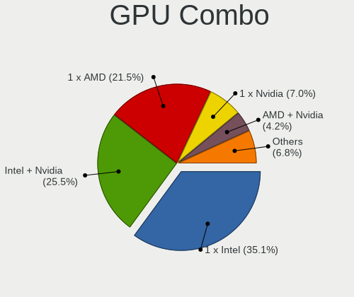

| Name           | Notebooks | Percent |
|----------------|-----------|---------|
| 1 x Intel      | 250       | 35.06%  |
| Intel + Nvidia | 196       | 27.49%  |
| 1 x AMD        | 136       | 19.07%  |
| 1 x Nvidia     | 57        | 7.99%   |
| AMD + Nvidia   | 24        | 3.37%   |
| 2 x AMD        | 20        | 2.81%   |
| Intel + AMD    | 18        | 2.52%   |
| 2 x Intel      | 11        | 1.54%   |
| 2 x Nvidia     | 1         | 0.14%   |

GPU Driver
----------

Free vs proprietary

| Driver      | Notebooks | Percent |
|-------------|-----------|---------|
| Free        | 555       | 76.55%  |
| Proprietary | 145       | 20%     |
| Unknown     | 25        | 3.45%   |

GPU Memory
----------

Total video memory

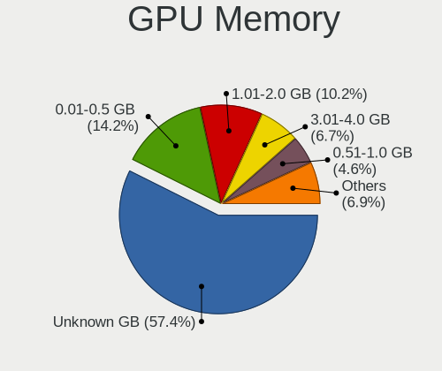

| Size in GB | Notebooks | Percent |
|------------|-----------|---------|
| Unknown    | 417       | 57.36%  |
| 0.01-0.5   | 95        | 13.07%  |
| 1.01-2.0   | 73        | 10.04%  |
| 3.01-4.0   | 57        | 7.84%   |
| 0.51-1.0   | 32        | 4.4%    |
| 5.01-6.0   | 19        | 2.61%   |
| 7.01-8.0   | 18        | 2.48%   |
| 8.01-16.0  | 12        | 1.65%   |
| 2.01-3.0   | 4         | 0.55%   |

Monitor
-------

Monitor Vendor
--------------

Monitor vendors

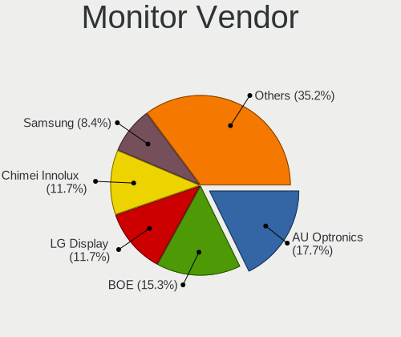

| Vendor                  | Notebooks | Percent |
|-------------------------|-----------|---------|
| AU Optronics            | 150       | 18.23%  |
| BOE                     | 118       | 14.34%  |
| LG Display              | 105       | 12.76%  |
| Chimei Innolux          | 93        | 11.3%   |
| Samsung Electronics     | 65        | 7.9%    |
| Sharp                   | 51        | 6.2%    |
| Dell                    | 37        | 4.5%    |
| Apple                   | 23        | 2.79%   |
| Lenovo                  | 16        | 1.94%   |
| Chi Mei Optoelectronics | 15        | 1.82%   |
| PANDA                   | 12        | 1.46%   |
| Hewlett-Packard         | 12        | 1.46%   |
| Goldstar                | 12        | 1.46%   |
| CSO                     | 12        | 1.46%   |
| AOC                     | 7         | 0.85%   |
| Acer                    | 7         | 0.85%   |
| Philips                 | 6         | 0.73%   |
| InfoVision              | 6         | 0.73%   |
| BenQ                    | 6         | 0.73%   |
| ASUSTek Computer        | 6         | 0.73%   |
| Iiyama                  | 5         | 0.61%   |
| Ancor Communications    | 5         | 0.61%   |
| Eizo                    | 4         | 0.49%   |
| ViewSonic               | 3         | 0.36%   |
| TMX                     | 3         | 0.36%   |
| Sony                    | 3         | 0.36%   |
| MSI                     | 3         | 0.36%   |
| Mi                      | 3         | 0.36%   |
| HannStar                | 3         | 0.36%   |
| LGD                     | 2         | 0.24%   |
| LG Philips              | 2         | 0.24%   |
| Gigabyte Technology     | 2         | 0.24%   |
| Fujitsu Siemens         | 2         | 0.24%   |
| CMN                     | 2         | 0.24%   |
| BOE Technology Group    | 2         | 0.24%   |
| Unknown                 | 2         | 0.24%   |
| Xiaomi                  | 1         | 0.12%   |
| WST                     | 1         | 0.12%   |
| Viotek                  | 1         | 0.12%   |
| Valve                   | 1         | 0.12%   |

Monitor Model
-------------

Monitor models

| Model                                                                    | Notebooks | Percent |
|--------------------------------------------------------------------------|-----------|---------|
| Chimei Innolux LCD Monitor CMN14D4 1920x1080 309x173mm 13.9-inch         | 9         | 1.08%   |
| AU Optronics LCD Monitor AUO38ED 1920x1080 344x193mm 15.5-inch           | 9         | 1.08%   |
| LG Display LCD Monitor LGD046F 1920x1080 344x194mm 15.5-inch             | 8         | 0.96%   |
| AU Optronics LCD Monitor AUO21ED 1920x1080 344x194mm 15.5-inch           | 7         | 0.84%   |
| AU Optronics LCD Monitor AUO243D 1920x1080 309x173mm 13.9-inch           | 6         | 0.72%   |
| Sharp LCD Monitor SHP148D 3840x2160 344x194mm 15.5-inch                  | 5         | 0.6%    |
| LG Display LCD Monitor LGD05E5 1920x1080 344x194mm 15.5-inch             | 5         | 0.6%    |
| AU Optronics LCD Monitor AUO403D 1920x1080 309x174mm 14.0-inch           | 5         | 0.6%    |
| Samsung Electronics LCD Monitor SDCA029 3840x2160 344x194mm 15.5-inch    | 4         | 0.48%   |
| LG Display LCD Monitor LGD0521 1920x1080 309x174mm 14.0-inch             | 4         | 0.48%   |
| BOE LCD Monitor BOE0973 2560x1440 344x194mm 15.5-inch                    | 4         | 0.48%   |
| TMX TL156MDMP01-0 TMX1560 3200x2000 336x210mm 15.6-inch                  | 3         | 0.36%   |
| Sharp LQ156M1JW01 SHP14C3 1920x1080 344x194mm 15.5-inch                  | 3         | 0.36%   |
| Sharp LCD Monitor SHP1517 3840x2400 366x229mm 17.0-inch                  | 3         | 0.36%   |
| Sharp LCD Monitor SHP14FA 3840x2400 288x180mm 13.4-inch                  | 3         | 0.36%   |
| Sharp LCD Monitor SHP14D6 3840x2400 366x229mm 17.0-inch                  | 3         | 0.36%   |
| Sharp LCD Monitor SHP148B 3840x2160 294x165mm 13.3-inch                  | 3         | 0.36%   |
| Samsung Electronics LCD Monitor SEC3245 1366x768 344x194mm 15.5-inch     | 3         | 0.36%   |
| PANDA LCD Monitor NCP0050 1920x1080 309x174mm 14.0-inch                  | 3         | 0.36%   |
| LG Display LCD Monitor LGD062C 1920x1080 309x174mm 14.0-inch             | 3         | 0.36%   |
| LG Display LCD Monitor LGD0608 1920x1080 477x269mm 21.6-inch             | 3         | 0.36%   |
| LG Display LCD Monitor LGD04A7 1920x1080 344x194mm 15.5-inch             | 3         | 0.36%   |
| Lenovo LCD Monitor LEN40BA 1920x1080 344x194mm 15.5-inch                 | 3         | 0.36%   |
| HannStar LCD Monitor HSD03E9 1024x600 220x129mm 10.0-inch                | 3         | 0.36%   |
| Dell U2715H DELD066 2560x1440 597x336mm 27.0-inch                        | 3         | 0.36%   |
| Dell U2414H DELA0A3 1920x1080 527x296mm 23.8-inch                        | 3         | 0.36%   |
| Chimei Innolux LCD Monitor CMN15F5 1920x1080 344x193mm 15.5-inch         | 3         | 0.36%   |
| Chimei Innolux LCD Monitor CMN1540 2560x1440 344x193mm 15.5-inch         | 3         | 0.36%   |
| Chimei Innolux LCD Monitor CMN14D5 1920x1080 309x173mm 13.9-inch         | 3         | 0.36%   |
| Chi Mei Optoelectronics LCD Monitor CMO15A2 1366x768 344x193mm 15.5-inch | 3         | 0.36%   |
| BOE LCD Monitor BOE0898 1920x1080 294x165mm 13.3-inch                    | 3         | 0.36%   |
| BOE LCD Monitor BOE0872 1920x1080 344x194mm 15.5-inch                    | 3         | 0.36%   |
| BOE LCD Monitor BOE082B 1920x1080 309x174mm 14.0-inch                    | 3         | 0.36%   |
| BOE LCD Monitor BOE0700 1920x1080 344x194mm 15.5-inch                    | 3         | 0.36%   |
| AU Optronics LCD Monitor AUO573D 1920x1080 310x170mm 13.9-inch           | 3         | 0.36%   |
| AU Optronics LCD Monitor AUO408D 1920x1080 309x174mm 14.0-inch           | 3         | 0.36%   |
| AU Optronics LCD Monitor AUO23ED 1920x1080 344x194mm 15.5-inch           | 3         | 0.36%   |
| AU Optronics LCD Monitor AUO2336 2560x1440 309x174mm 14.0-inch           | 3         | 0.36%   |
| AU Optronics LCD Monitor AUO109D 1920x1080 381x214mm 17.2-inch           | 3         | 0.36%   |
| AU Optronics LCD Monitor AUO106C 1366x768 277x156mm 12.5-inch            | 3         | 0.36%   |

Monitor Resolution
------------------

Monitor screen resolution

| Resolution         | Notebooks | Percent |
|--------------------|-----------|---------|
| 1920x1080 (FHD)    | 412       | 53.65%  |
| 1366x768 (WXGA)    | 79        | 10.29%  |
| 3840x2160 (4K)     | 48        | 6.25%   |
| 2560x1440 (QHD)    | 44        | 5.73%   |
| 1600x900 (HD+)     | 22        | 2.86%   |
| 2560x1600          | 20        | 2.6%    |
| 3840x2400          | 17        | 2.21%   |
| 1920x1200 (WUXGA)  | 17        | 2.21%   |
| 1280x800 (WXGA)    | 12        | 1.56%   |
| 1680x1050 (WSXGA+) | 11        | 1.43%   |
| 3440x1440          | 10        | 1.3%    |
| 1440x900 (WXGA+)   | 10        | 1.3%    |
| 2880x1800          | 8         | 1.04%   |
| 1024x600           | 8         | 1.04%   |
| 2160x1440          | 5         | 0.65%   |
| 1280x1024 (SXGA)   | 5         | 0.65%   |
| 3456x2160          | 3         | 0.39%   |
| 3200x2000          | 3         | 0.39%   |
| 3200x1800 (QHD+)   | 3         | 0.39%   |
| 1280x854           | 3         | 0.39%   |
| 800x1280           | 2         | 0.26%   |
| 3840x1080          | 2         | 0.26%   |
| 2256x1504          | 2         | 0.26%   |
| 2240x1400          | 2         | 0.26%   |
| 2048x1152          | 2         | 0.26%   |
| Unknown            | 2         | 0.26%   |
| 5040x1080          | 1         | 0.13%   |
| 3840x1200          | 1         | 0.13%   |
| 3840x1100          | 1         | 0.13%   |
| 3072x1920          | 1         | 0.13%   |
| 2560x1080          | 1         | 0.13%   |
| 2520x1680          | 1         | 0.13%   |
| 2400x1600          | 1         | 0.13%   |
| 2304x1440          | 1         | 0.13%   |
| 2288x1287          | 1         | 0.13%   |
| 1920x540           | 1         | 0.13%   |
| 1920x1280          | 1         | 0.13%   |
| 1600x1200          | 1         | 0.13%   |
| 1400x1050          | 1         | 0.13%   |
| 1360x768           | 1         | 0.13%   |

Monitor Diagonal
----------------

Diagonal size in inches

| Inches  | Notebooks | Percent |
|---------|-----------|---------|
| 15      | 297       | 36.22%  |
| 13      | 117       | 14.27%  |
| 14      | 99        | 12.07%  |
| 17      | 63        | 7.68%   |
| 27      | 43        | 5.24%   |
| 12      | 29        | 3.54%   |
| 24      | 27        | 3.29%   |
| 23      | 24        | 2.93%   |
| 16      | 21        | 2.56%   |
| 21      | 17        | 2.07%   |
| 34      | 11        | 1.34%   |
| 11      | 11        | 1.34%   |
| Unknown | 11        | 1.34%   |
| 22      | 6         | 0.73%   |
| 10      | 6         | 0.73%   |
| 19      | 5         | 0.61%   |
| 31      | 4         | 0.49%   |
| 25      | 4         | 0.49%   |
| 18      | 3         | 0.37%   |
| 8       | 3         | 0.37%   |
| 58      | 2         | 0.24%   |
| 40      | 2         | 0.24%   |
| 142     | 1         | 0.12%   |
| 75      | 1         | 0.12%   |
| 72      | 1         | 0.12%   |
| 65      | 1         | 0.12%   |
| 54      | 1         | 0.12%   |
| 52      | 1         | 0.12%   |
| 49      | 1         | 0.12%   |
| 43      | 1         | 0.12%   |
| 37      | 1         | 0.12%   |
| 29      | 1         | 0.12%   |
| 28      | 1         | 0.12%   |
| 26      | 1         | 0.12%   |
| 20      | 1         | 0.12%   |
| 7       | 1         | 0.12%   |
| 3       | 1         | 0.12%   |

Monitor Width
-------------

Physical width

| Width in mm    | Notebooks | Percent |
|----------------|-----------|---------|
| 301-350        | 459       | 56.67%  |
| 201-300        | 113       | 13.95%  |
| 501-600        | 88        | 10.86%  |
| 351-400        | 68        | 8.4%    |
| 401-500        | 32        | 3.95%   |
| 701-800        | 11        | 1.36%   |
| Unknown        | 11        | 1.36%   |
| 601-700        | 10        | 1.23%   |
| 1001-1500      | 7         | 0.86%   |
| 801-900        | 3         | 0.37%   |
| 101-200        | 3         | 0.37%   |
| 1501-2000      | 2         | 0.25%   |
| 1-100          | 2         | 0.25%   |
| More than 2000 | 1         | 0.12%   |

Aspect Ratio
------------

Proportional relationship between the width and the height

| Ratio   | Notebooks | Percent |
|---------|-----------|---------|
| 16/9    | 564       | 78.22%  |
| 16/10   | 103       | 14.29%  |
| 3/2     | 17        | 2.36%   |
| 21/9    | 12        | 1.66%   |
| Unknown | 9         | 1.25%   |
| 5/4     | 4         | 0.55%   |
| 4/3     | 4         | 0.55%   |
| 32/9    | 2         | 0.28%   |
| 6/5     | 1         | 0.14%   |
| 3.40    | 1         | 0.14%   |
| 3.20    | 1         | 0.14%   |
| 1.00    | 1         | 0.14%   |
| 0.67    | 1         | 0.14%   |
| 0.62    | 1         | 0.14%   |

Monitor Area
------------

Area in inch

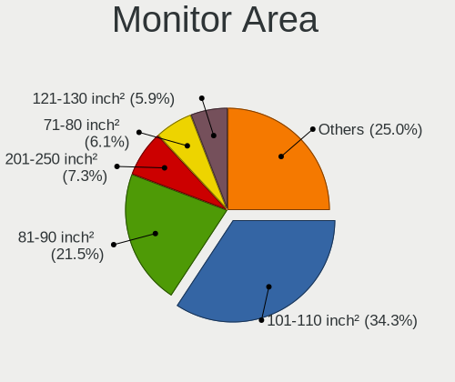

| Area in inch | Notebooks | Percent |
|----------------|-----------|---------|
| 101-110        | 296       | 36.1%   |
| 81-90          | 158       | 19.27%  |
| 71-80          | 58        | 7.07%   |
| 201-250        | 56        | 6.83%   |
| 121-130        | 54        | 6.59%   |
| 301-350        | 44        | 5.37%   |
| 61-70          | 27        | 3.29%   |
| 111-120        | 21        | 2.56%   |
| 351-500        | 16        | 1.95%   |
| 251-300        | 14        | 1.71%   |
| 51-60          | 12        | 1.46%   |
| 151-200        | 12        | 1.46%   |
| Unknown        | 11        | 1.34%   |
| More than 1000 | 8         | 0.98%   |
| 131-140        | 7         | 0.85%   |
| 41-50          | 6         | 0.73%   |
| 1-40           | 5         | 0.61%   |
| 141-150        | 5         | 0.61%   |
| 501-1000       | 5         | 0.61%   |
| 91-100         | 5         | 0.61%   |

Pixel Density
-------------

Pixels per inch

| Density       | Notebooks | Percent |
|---------------|-----------|---------|
| 121-160       | 383       | 47.64%  |
| 101-120       | 126       | 15.67%  |
| 51-100        | 108       | 13.43%  |
| 161-240       | 104       | 12.94%  |
| More than 240 | 65        | 8.08%   |
| Unknown       | 11        | 1.37%   |
| 1-50          | 7         | 0.87%   |

Multiple Monitors
-----------------

Total monitors connected

| Total | Notebooks | Percent |
|-------|-----------|---------|
| 1     | 562       | 76.36%  |
| 2     | 125       | 16.98%  |
| 0     | 28        | 3.8%    |
| 3     | 21        | 2.85%   |

Network
-------

Net Controller Vendor
---------------------

Controller vendors

| Vendor                                | Notebooks | Percent |
|---------------------------------------|-----------|---------|
| Intel                                 | 466       | 42.25%  |
| Realtek Semiconductor                 | 343       | 31.1%   |
| Qualcomm Atheros                      | 98        | 8.88%   |
| Broadcom                              | 41        | 3.72%   |
| MediaTek                              | 23        | 2.09%   |
| ASIX Electronics                      | 13        | 1.18%   |
| Lenovo                                | 12        | 1.09%   |
| Qualcomm                              | 11        | 1%      |
| Marvell Technology Group              | 9         | 0.82%   |
| Dell                                  | 9         | 0.82%   |
| Sierra Wireless                       | 7         | 0.63%   |
| Broadcom Limited                      | 7         | 0.63%   |
| Xiaomi                                | 6         | 0.54%   |
| TP-Link                               | 5         | 0.45%   |
| Samsung Electronics                   | 5         | 0.45%   |
| Fibocom                               | 5         | 0.45%   |
| Ericsson Business Mobile Networks     | 5         | 0.45%   |
| Apple                                 | 5         | 0.45%   |
| Qualcomm Atheros Communications       | 3         | 0.27%   |
| ZTE WCDMA Technologies MSM            | 2         | 0.18%   |
| Silicon Integrated Systems [SiS]      | 2         | 0.18%   |
| Ralink Technology                     | 2         | 0.18%   |
| Ralink                                | 2         | 0.18%   |
| ICS Advent                            | 2         | 0.18%   |
| D-Link System                         | 2         | 0.18%   |
| Shenzhen Goodix Technology            | 1         | 0.09%   |
| Prusa                                 | 1         | 0.09%   |
| Nvidia                                | 1         | 0.09%   |
| NetGear                               | 1         | 0.09%   |
| Microsoft                             | 1         | 0.09%   |
| JMicron Technology                    | 1         | 0.09%   |
| Huawei Technologies                   | 1         | 0.09%   |
| Google                                | 1         | 0.09%   |
| Gemtek                                | 1         | 0.09%   |
| Edimax Technology                     | 1         | 0.09%   |
| D-Link                                | 1         | 0.09%   |
| Cisco Aironet Wireless Communications | 1         | 0.09%   |
| BUFFALO                               | 1         | 0.09%   |
| AVM                                   | 1         | 0.09%   |
| ASUSTek Computer                      | 1         | 0.09%   |

Net Controller Model
--------------------

Controller models

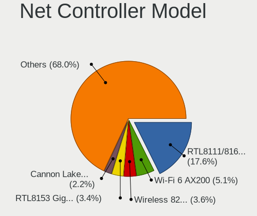

| Model                                                             | Notebooks | Percent |
|-------------------------------------------------------------------|-----------|---------|
| Realtek RTL8111/8168/8411 PCI Express Gigabit Ethernet Controller | 234       | 17.28%  |
| Intel Wi-Fi 6 AX200                                               | 79        | 5.83%   |
| Intel Wireless 8265 / 8275                                        | 53        | 3.91%   |
| Realtek RTL8153 Gigabit Ethernet Adapter                          | 42        | 3.1%    |
| Intel Cannon Lake PCH CNVi WiFi                                   | 36        | 2.66%   |
| Realtek RTL8822CE 802.11ac PCIe Wireless Network Adapter          | 27        | 1.99%   |
| Intel Wi-Fi 6 AX201                                               | 26        | 1.92%   |
| Intel Wireless 7265                                               | 24        | 1.77%   |
| Realtek RTL810xE PCI Express Fast Ethernet controller             | 23        | 1.7%    |
| Intel Comet Lake PCH-LP CNVi WiFi                                 | 22        | 1.62%   |
| Qualcomm Atheros QCA6174 802.11ac Wireless Network Adapter        | 21        | 1.55%   |
| Realtek RTL8821CE 802.11ac PCIe Wireless Network Adapter          | 20        | 1.48%   |
| Intel Wireless 7260                                               | 20        | 1.48%   |
| Intel 82579LM Gigabit Network Connection (Lewisville)             | 20        | 1.48%   |
| MediaTek MT7921 802.11ax PCI Express Wireless Network Adapter     | 19        | 1.4%    |
| Intel Wireless 8260                                               | 19        | 1.4%    |
| Intel Ethernet Connection (4) I219-LM                             | 19        | 1.4%    |
| Intel Alder Lake-P PCH CNVi WiFi                                  | 19        | 1.4%    |
| Intel Centrino Advanced-N 6205 [Taylor Peak]                      | 18        | 1.33%   |
| Intel Cannon Point-LP CNVi [Wireless-AC]                          | 18        | 1.33%   |
| Intel Wi-Fi 6 AX210/AX211/AX411 160MHz                            | 17        | 1.26%   |
| Intel Comet Lake PCH CNVi WiFi                                    | 16        | 1.18%   |
| Qualcomm Atheros QCA9377 802.11ac Wireless Network Adapter        | 13        | 0.96%   |
| Intel Wireless 3165                                               | 13        | 0.96%   |
| Intel Tiger Lake PCH CNVi WiFi                                    | 12        | 0.89%   |
| Intel Ethernet Connection (4) I219-V                              | 12        | 0.89%   |
| Realtek RTL8852AE 802.11ax PCIe Wireless Network Adapter          | 11        | 0.81%   |
| Qualcomm Atheros Killer E2400 Gigabit Ethernet Controller         | 10        | 0.74%   |
| Intel Ethernet Connection (6) I219-V                              | 10        | 0.74%   |
| Intel Ethernet Connection (2) I219-LM                             | 10        | 0.74%   |
| Realtek RTL8723BE PCIe Wireless Network Adapter                   | 9         | 0.66%   |
| Realtek RTL8125 2.5GbE Controller                                 | 8         | 0.59%   |
| Qualcomm Atheros AR9462 Wireless Network Adapter                  | 8         | 0.59%   |
| Intel Centrino Advanced-N 6235                                    | 8         | 0.59%   |
| Broadcom BCM4313 802.11bgn Wireless Network Adapter               | 8         | 0.59%   |
| ASIX AX88179 Gigabit Ethernet                                     | 8         | 0.59%   |
| Realtek RTL8822BE 802.11a/b/g/n/ac WiFi adapter                   | 7         | 0.52%   |
| Qualcomm QCNFA765 Wireless Network Adapter                        | 7         | 0.52%   |
| Qualcomm Atheros QCA9565 / AR9565 Wireless Network Adapter        | 7         | 0.52%   |
| Qualcomm Atheros AR9485 Wireless Network Adapter                  | 7         | 0.52%   |

Wireless Vendor
---------------

Wireless vendors

| Vendor                                | Notebooks | Percent |
|---------------------------------------|-----------|---------|
| Intel                                 | 454       | 61.77%  |
| Realtek Semiconductor                 | 93        | 12.65%  |
| Qualcomm Atheros                      | 75        | 10.2%   |
| Broadcom                              | 35        | 4.76%   |
| MediaTek                              | 22        | 2.99%   |
| Qualcomm                              | 11        | 1.5%    |
| Sierra Wireless                       | 7         | 0.95%   |
| Dell                                  | 7         | 0.95%   |
| Fibocom                               | 5         | 0.68%   |
| Broadcom Limited                      | 4         | 0.54%   |
| TP-Link                               | 3         | 0.41%   |
| Qualcomm Atheros Communications       | 3         | 0.41%   |
| Ralink Technology                     | 2         | 0.27%   |
| Ralink                                | 2         | 0.27%   |
| Ericsson Business Mobile Networks     | 2         | 0.27%   |
| D-Link System                         | 2         | 0.27%   |
| NetGear                               | 1         | 0.14%   |
| Microsoft                             | 1         | 0.14%   |
| Edimax Technology                     | 1         | 0.14%   |
| D-Link                                | 1         | 0.14%   |
| Cisco Aironet Wireless Communications | 1         | 0.14%   |
| BUFFALO                               | 1         | 0.14%   |
| AVM                                   | 1         | 0.14%   |
| ASUSTek Computer                      | 1         | 0.14%   |

Wireless Model
--------------

Wireless models

| Model                                                                   | Notebooks | Percent |
|-------------------------------------------------------------------------|-----------|---------|
| Intel Wi-Fi 6 AX200                                                     | 79        | 10.7%   |
| Intel Wireless 8265 / 8275                                              | 53        | 7.18%   |
| Intel Cannon Lake PCH CNVi WiFi                                         | 36        | 4.88%   |
| Realtek RTL8822CE 802.11ac PCIe Wireless Network Adapter                | 27        | 3.66%   |
| Intel Wi-Fi 6 AX201                                                     | 26        | 3.52%   |
| Intel Wireless 7265                                                     | 24        | 3.25%   |
| Intel Comet Lake PCH-LP CNVi WiFi                                       | 22        | 2.98%   |
| Qualcomm Atheros QCA6174 802.11ac Wireless Network Adapter              | 21        | 2.85%   |
| Realtek RTL8821CE 802.11ac PCIe Wireless Network Adapter                | 20        | 2.71%   |
| Intel Wireless 7260                                                     | 20        | 2.71%   |
| MediaTek MT7921 802.11ax PCI Express Wireless Network Adapter           | 19        | 2.57%   |
| Intel Wireless 8260                                                     | 19        | 2.57%   |
| Intel Alder Lake-P PCH CNVi WiFi                                        | 19        | 2.57%   |
| Intel Centrino Advanced-N 6205 [Taylor Peak]                            | 18        | 2.44%   |
| Intel Cannon Point-LP CNVi [Wireless-AC]                                | 18        | 2.44%   |
| Intel Wi-Fi 6 AX210/AX211/AX411 160MHz                                  | 17        | 2.3%    |
| Intel Comet Lake PCH CNVi WiFi                                          | 16        | 2.17%   |
| Qualcomm Atheros QCA9377 802.11ac Wireless Network Adapter              | 13        | 1.76%   |
| Intel Wireless 3165                                                     | 13        | 1.76%   |
| Intel Tiger Lake PCH CNVi WiFi                                          | 12        | 1.63%   |
| Realtek RTL8852AE 802.11ax PCIe Wireless Network Adapter                | 11        | 1.49%   |
| Realtek RTL8723BE PCIe Wireless Network Adapter                         | 9         | 1.22%   |
| Qualcomm Atheros AR9462 Wireless Network Adapter                        | 8         | 1.08%   |
| Intel Centrino Advanced-N 6235                                          | 8         | 1.08%   |
| Broadcom BCM4313 802.11bgn Wireless Network Adapter                     | 8         | 1.08%   |
| Realtek RTL8822BE 802.11a/b/g/n/ac WiFi adapter                         | 7         | 0.95%   |
| Qualcomm QCNFA765 Wireless Network Adapter                              | 7         | 0.95%   |
| Qualcomm Atheros QCA9565 / AR9565 Wireless Network Adapter              | 7         | 0.95%   |
| Qualcomm Atheros AR9485 Wireless Network Adapter                        | 7         | 0.95%   |
| Qualcomm Atheros AR242x / AR542x Wireless Network Adapter (PCI-Express) | 7         | 0.95%   |
| Intel Wireless-AC 9260                                                  | 7         | 0.95%   |
| Broadcom BCM4331 802.11a/b/g/n                                          | 7         | 0.95%   |
| Qualcomm Atheros AR9285 Wireless Network Adapter (PCI-Express)          | 6         | 0.81%   |
| Intel Wireless 3160                                                     | 5         | 0.68%   |
| Intel PRO/Wireless 3945ABG [Golan] Network Connection                   | 5         | 0.68%   |
| Intel Ice Lake-LP PCH CNVi WiFi                                         | 5         | 0.68%   |
| Realtek RTL8723DE Wireless Network Adapter                              | 4         | 0.54%   |
| Realtek RTL8188CE 802.11b/g/n WiFi Adapter                              | 4         | 0.54%   |
| Qualcomm QCA6390 Wireless Network Adapter                               | 4         | 0.54%   |
| Intel Centrino Ultimate-N 6300                                          | 4         | 0.54%   |

Ethernet Vendor
---------------

Ethernet vendors

| Vendor                           | Notebooks | Percent |
|----------------------------------|-----------|---------|
| Realtek Semiconductor            | 309       | 52.91%  |
| Intel                            | 160       | 27.4%   |
| Qualcomm Atheros                 | 34        | 5.82%   |
| Broadcom                         | 16        | 2.74%   |
| ASIX Electronics                 | 13        | 2.23%   |
| Lenovo                           | 12        | 2.05%   |
| Marvell Technology Group         | 9         | 1.54%   |
| Xiaomi                           | 6         | 1.03%   |
| Apple                            | 5         | 0.86%   |
| Samsung Electronics              | 3         | 0.51%   |
| Broadcom Limited                 | 3         | 0.51%   |
| ZTE WCDMA Technologies MSM       | 2         | 0.34%   |
| TP-Link                          | 2         | 0.34%   |
| Silicon Integrated Systems [SiS] | 2         | 0.34%   |
| ICS Advent                       | 2         | 0.34%   |
| Nvidia                           | 1         | 0.17%   |
| JMicron Technology               | 1         | 0.17%   |
| Huawei Technologies              | 1         | 0.17%   |
| Google                           | 1         | 0.17%   |
| Gemtek                           | 1         | 0.17%   |
| Aquantia                         | 1         | 0.17%   |

Ethernet Model
--------------

Ethernet models

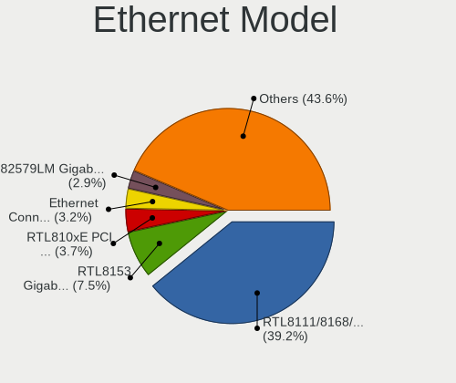

| Model                                                             | Notebooks | Percent |
|-------------------------------------------------------------------|-----------|---------|
| Realtek RTL8111/8168/8411 PCI Express Gigabit Ethernet Controller | 234       | 39.46%  |
| Realtek RTL8153 Gigabit Ethernet Adapter                          | 42        | 7.08%   |
| Realtek RTL810xE PCI Express Fast Ethernet controller             | 23        | 3.88%   |
| Intel 82579LM Gigabit Network Connection (Lewisville)             | 20        | 3.37%   |
| Intel Ethernet Connection (4) I219-LM                             | 19        | 3.2%    |
| Intel Ethernet Connection (4) I219-V                              | 12        | 2.02%   |
| Qualcomm Atheros Killer E2400 Gigabit Ethernet Controller         | 10        | 1.69%   |
| Intel Ethernet Connection (6) I219-V                              | 10        | 1.69%   |
| Intel Ethernet Connection (2) I219-LM                             | 10        | 1.69%   |
| Realtek RTL8125 2.5GbE Controller                                 | 8         | 1.35%   |
| ASIX AX88179 Gigabit Ethernet                                     | 8         | 1.35%   |
| Intel Ethernet Connection I218-LM                                 | 7         | 1.18%   |
| Intel Ethernet Connection (7) I219-LM                             | 7         | 1.18%   |
| Xiaomi Mi/Redmi series (RNDIS)                                    | 6         | 1.01%   |
| Intel Ethernet Connection I219-LM                                 | 6         | 1.01%   |
| Intel Ethernet Connection (5) I219-LM                             | 6         | 1.01%   |
| Broadcom NetXtreme BCM57765 Gigabit Ethernet PCIe                 | 6         | 1.01%   |
| Qualcomm Atheros Killer E2500 Gigabit Ethernet Controller         | 5         | 0.84%   |
| Intel Ethernet Connection I217-LM                                 | 5         | 0.84%   |
| Intel Ethernet Connection (3) I218-LM                             | 5         | 0.84%   |
| Intel 82577LM Gigabit Network Connection                          | 5         | 0.84%   |
| Qualcomm Atheros Killer E220x Gigabit Ethernet Controller         | 4         | 0.67%   |
| Qualcomm Atheros AR8151 v2.0 Gigabit Ethernet                     | 4         | 0.67%   |
| Marvell Group 88E8040 PCI-E Fast Ethernet Controller              | 4         | 0.67%   |
| Lenovo USB-C Dock Ethernet                                        | 4         | 0.67%   |
| Lenovo ThinkPad TBT 3 Dock                                        | 4         | 0.67%   |
| Intel I210 Gigabit Network Connection                             | 4         | 0.67%   |
| Intel Ethernet Connection (14) I219-LM                            | 4         | 0.67%   |
| Samsung Galaxy series, misc. (tethering mode)                     | 3         | 0.51%   |
| Realtek Killer E3000 2.5GbE Controller                            | 3         | 0.51%   |
| Intel Ethernet Connection I219-V                                  | 3         | 0.51%   |
| Intel Ethernet Connection (7) I219-V                              | 3         | 0.51%   |
| Intel Ethernet Connection (16) I219-LM                            | 3         | 0.51%   |
| Intel Ethernet Connection (14) I219-V                             | 3         | 0.51%   |
| Intel Ethernet Connection (13) I219-LM                            | 3         | 0.51%   |
| Intel Ethernet Connection (10) I219-V                             | 3         | 0.51%   |
| Intel Ethernet Connection (10) I219-LM                            | 3         | 0.51%   |
| Intel 82540EP Gigabit Ethernet Controller (Mobile)                | 3         | 0.51%   |
| TP-Link UE300 10/100/1000 LAN (ethernet mode) [Realtek RTL8153]   | 2         | 0.34%   |
| Silicon Integrated Systems [SiS] SiS900 PCI Fast Ethernet         | 2         | 0.34%   |

Net Controller Kind
-------------------

Ethernet, WiFi or modem

| Kind     | Notebooks | Percent |
|----------|-----------|---------|
| WiFi     | 695       | 54.64%  |
| Ethernet | 554       | 43.55%  |
| Modem    | 22        | 1.73%   |
| Unknown  | 1         | 0.08%   |

Used Controller
---------------

Currently used network controller

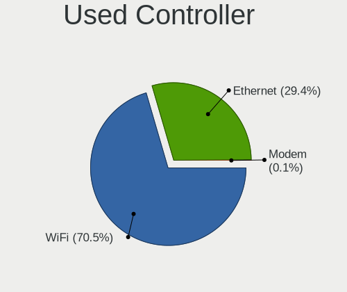

| Kind     | Notebooks | Percent |
|----------|-----------|---------|
| WiFi     | 548       | 70.8%   |
| Ethernet | 226       | 29.2%   |

NICs
----

Total network controllers on board

| Total | Notebooks | Percent |
|-------|-----------|---------|
| 2     | 472       | 66.86%  |
| 1     | 214       | 30.31%  |
| 3     | 17        | 2.41%   |
| 0     | 3         | 0.42%   |

IPv6
----

IPv6 vs IPv4

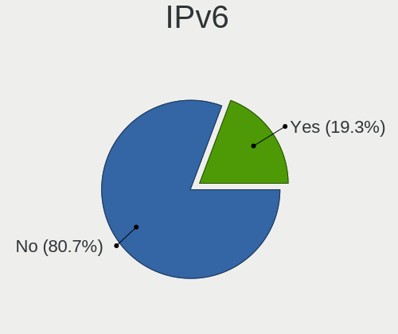

| Used | Notebooks | Percent |
|------|-----------|---------|
| No   | 603       | 83.29%  |
| Yes  | 121       | 16.71%  |

Bluetooth
---------

Bluetooth Vendor
----------------

Controller vendors

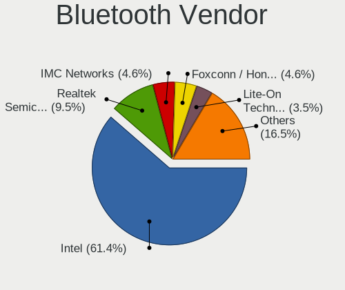

| Vendor                          | Notebooks | Percent |
|---------------------------------|-----------|---------|
| Intel                           | 389       | 63.05%  |
| Realtek Semiconductor           | 57        | 9.24%   |
| IMC Networks                    | 24        | 3.89%   |
| Qualcomm Atheros Communications | 22        | 3.57%   |
| Lite-On Technology              | 22        | 3.57%   |
| Foxconn / Hon Hai               | 20        | 3.24%   |
| Apple                           | 20        | 3.24%   |
| Broadcom                        | 16        | 2.59%   |
| Realtek                         | 8         | 1.3%    |
| Dell                            | 8         | 1.3%    |
| Cambridge Silicon Radio         | 7         | 1.13%   |
| USI                             | 5         | 0.81%   |
| Toshiba                         | 4         | 0.65%   |
| Hewlett-Packard                 | 4         | 0.65%   |
| ASUSTek Computer                | 3         | 0.49%   |
| Foxconn International           | 2         | 0.32%   |
| Ralink Technology               | 1         | 0.16%   |
| Opticis                         | 1         | 0.16%   |
| Chicony Electronics             | 1         | 0.16%   |
| Askey Computer                  | 1         | 0.16%   |
| Alps Electric                   | 1         | 0.16%   |
| Actiontec Electronics           | 1         | 0.16%   |

Bluetooth Model
---------------

Controller models

| Model                                               | Notebooks | Percent |
|-----------------------------------------------------|-----------|---------|
| Intel Bluetooth wireless interface                  | 130       | 21.04%  |
| Intel AX200 Bluetooth                               | 76        | 12.3%   |
| Intel AX201 Bluetooth                               | 67        | 10.84%  |
| Intel Bluetooth 9460/9560 Jefferson Peak (JfP)      | 63        | 10.19%  |
| Realtek Bluetooth Radio                             | 34        | 5.5%    |
| Intel AX210 Bluetooth                               | 17        | 2.75%   |
| Intel Bluetooth Device                              | 16        | 2.59%   |
| Apple Bluetooth Host Controller                     | 14        | 2.27%   |
| Realtek  Bluetooth 4.2 Adapter                      | 13        | 2.1%    |
| IMC Networks Wireless_Device                        | 11        | 1.78%   |
| Intel Centrino Bluetooth Wireless Transceiver       | 10        | 1.62%   |
| IMC Networks Bluetooth Radio                        | 9         | 1.46%   |
| Realtek 802.11ac WLAN Adapter                       | 8         | 1.29%   |
| Foxconn / Hon Hai Bluetooth Device                  | 8         | 1.29%   |
| Qualcomm Atheros  Bluetooth Device                  | 7         | 1.13%   |
| Qualcomm Atheros QCA61x4 Bluetooth 4.0              | 7         | 1.13%   |
| Lite-On Bluetooth Device                            | 7         | 1.13%   |
| Lite-On Atheros AR3012 Bluetooth                    | 7         | 1.13%   |
| Intel Wireless-AC 9260 Bluetooth Adapter            | 7         | 1.13%   |
| Cambridge Silicon Radio Bluetooth Dongle (HCI mode) | 7         | 1.13%   |
| Realtek RTL8723B Bluetooth                          | 6         | 0.97%   |
| Foxconn / Hon Hai MediaTek Bluetooth Adapter        | 6         | 0.97%   |
| USI Bluetooth Device                                | 5         | 0.81%   |
| Lite-On Qualcomm Atheros QCA9377 Bluetooth          | 5         | 0.81%   |
| Realtek RTL8822BE Bluetooth 4.2 Adapter             | 4         | 0.65%   |
| Qualcomm Atheros AR3012 Bluetooth 4.0               | 4         | 0.65%   |
| Broadcom HP Portable SoftSailing                    | 4         | 0.65%   |
| Broadcom BCM20702 Bluetooth 4.0 [ThinkPad]          | 4         | 0.65%   |
| Intel Wireless-AC 3168 Bluetooth                    | 3         | 0.49%   |
| IMC Networks Bluetooth Device                       | 3         | 0.49%   |
| HP Bluetooth 2.0 Interface [Broadcom BCM2045]       | 3         | 0.49%   |
| Dell DW375 Bluetooth Module                         | 3         | 0.49%   |
| Dell BCM20702A0 Bluetooth Module                    | 3         | 0.49%   |
| Apple Bluetooth USB Host Controller                 | 3         | 0.49%   |
| Apple Bluetooth HCI                                 | 3         | 0.49%   |
| Toshiba RT Bluetooth Radio                          | 2         | 0.32%   |
| Toshiba Integrated Bluetooth (Taiyo Yuden)          | 2         | 0.32%   |
| Qualcomm Atheros AR9462 Bluetooth                   | 2         | 0.32%   |
| Lite-On Wireless_Device                             | 2         | 0.32%   |
| Foxconn International BCM43142A0 Bluetooth module   | 2         | 0.32%   |

Sound
-----

Sound Vendor
------------

Sound card vendors

| Vendor                               | Notebooks | Percent |
|--------------------------------------|-----------|---------|
| Intel                                | 518       | 54.13%  |
| AMD                                  | 179       | 18.7%   |
| Nvidia                               | 172       | 17.97%  |
| Lenovo                               | 14        | 1.46%   |
| Realtek Semiconductor                | 8         | 0.84%   |
| C-Media Electronics                  | 7         | 0.73%   |
| Plantronics                          | 4         | 0.42%   |
| No brand                             | 3         | 0.31%   |
| Logitech                             | 3         | 0.31%   |
| Kingston Technology                  | 3         | 0.31%   |
| Dell                                 | 3         | 0.31%   |
| Blue Microphones                     | 3         | 0.31%   |
| Silicon Integrated Systems [SiS]     | 2         | 0.21%   |
| Sennheiser Communications            | 2         | 0.21%   |
| Razer USA                            | 2         | 0.21%   |
| Hewlett-Packard                      | 2         | 0.21%   |
| GYROCOM C&C                          | 2         | 0.21%   |
| GN Netcom                            | 2         | 0.21%   |
| Generalplus Technology               | 2         | 0.21%   |
| Creative Technology                  | 2         | 0.21%   |
| AudioQuest                           | 2         | 0.21%   |
| ASUSTek Computer                     | 2         | 0.21%   |
| Thesycon Systemsoftware & Consulting | 1         | 0.1%    |
| Texas Instruments                    | 1         | 0.1%    |
| Tdlasunnic                           | 1         | 0.1%    |
| Synaptics                            | 1         | 0.1%    |
| SteelSeries ApS                      | 1         | 0.1%    |
| Samson Technologies                  | 1         | 0.1%    |
| RODE Microphones                     | 1         | 0.1%    |
| LG Electronics                       | 1         | 0.1%    |
| JMTek                                | 1         | 0.1%    |
| iCreate Technologies                 | 1         | 0.1%    |
| FiiO Electronics Technology          | 1         | 0.1%    |
| EGO SYStems                          | 1         | 0.1%    |
| Corsair                              | 1         | 0.1%    |
| Behringer.......                     | 1         | 0.1%    |
| AVer Information                     | 1         | 0.1%    |
| Audio-Technica                       | 1         | 0.1%    |
| ATOLL Electronique                   | 1         | 0.1%    |
| Apple                                | 1         | 0.1%    |

Sound Model
-----------

Sound card models

| Model                                                                      | Notebooks | Percent |
|----------------------------------------------------------------------------|-----------|---------|
| AMD Family 17h/19h HD Audio Controller                                     | 148       | 12.71%  |
| AMD Renoir Radeon High Definition Audio Controller                         | 89        | 7.65%   |
| Intel Sunrise Point-LP HD Audio                                            | 82        | 7.04%   |
| Intel Cannon Lake PCH cAVS                                                 | 69        | 5.93%   |
| Intel Tiger Lake-LP Smart Sound Technology Audio Controller                | 34        | 2.92%   |
| Intel 7 Series/C216 Chipset Family High Definition Audio Controller        | 33        | 2.84%   |
| AMD Raven/Raven2/Fenghuang HDMI/DP Audio Controller                        | 30        | 2.58%   |
| Nvidia TU107 GeForce GTX 1650 High Definition Audio Controller             | 28        | 2.41%   |
| Intel 6 Series/C200 Series Chipset Family High Definition Audio Controller | 26        | 2.23%   |
| Intel Cannon Point-LP High Definition Audio Controller                     | 24        | 2.06%   |
| Intel Comet Lake PCH-LP cAVS                                               | 23        | 1.98%   |
| Intel 100 Series/C230 Series Chipset Family HD Audio Controller            | 23        | 1.98%   |
| Intel Tiger Lake-H HD Audio Controller                                     | 21        | 1.8%    |
| Intel CM238 HD Audio Controller                                            | 21        | 1.8%    |
| Intel Comet Lake PCH cAVS                                                  | 20        | 1.72%   |
| Intel Alder Lake PCH-P High Definition Audio Controller                    | 20        | 1.72%   |
| Intel 8 Series/C220 Series Chipset High Definition Audio Controller        | 19        | 1.63%   |
| Intel Haswell-ULT HD Audio Controller                                      | 18        | 1.55%   |
| Intel 8 Series HD Audio Controller                                         | 18        | 1.55%   |
| Nvidia GA106 High Definition Audio Controller                              | 17        | 1.46%   |
| Nvidia GP107GL High Definition Audio Controller                            | 16        | 1.37%   |
| Nvidia TU106 High Definition Audio Controller                              | 15        | 1.29%   |
| Intel Broadwell-U Audio Controller                                         | 15        | 1.29%   |
| Nvidia GA104 High Definition Audio Controller                              | 14        | 1.2%    |
| Intel Wildcat Point-LP High Definition Audio Controller                    | 14        | 1.2%    |
| Intel NM10/ICH7 Family High Definition Audio Controller                    | 14        | 1.2%    |
| Intel Xeon E3-1200 v3/4th Gen Core Processor HD Audio Controller           | 13        | 1.12%   |
| Nvidia TU116 High Definition Audio Controller                              | 12        | 1.03%   |
| Nvidia GP106 High Definition Audio Controller                              | 11        | 0.95%   |
| AMD Rembrandt Radeon High Definition Audio Controller                      | 11        | 0.95%   |
| Nvidia GP104 High Definition Audio Controller                              | 10        | 0.86%   |
| AMD Navi 21/23 HDMI/DP Audio Controller                                    | 10        | 0.86%   |
| AMD FCH Azalia Controller                                                  | 10        | 0.86%   |
| Nvidia TU104 HD Audio Controller                                           | 9         | 0.77%   |
| Realtek Semiconductor USB Audio                                            | 8         | 0.69%   |
| Intel Ice Lake-LP Smart Sound Technology Audio Controller                  | 8         | 0.69%   |
| Intel Atom Processor Z36xxx/Z37xxx Series High Definition Audio Controller | 8         | 0.69%   |
| Intel 5 Series/3400 Series Chipset High Definition Audio                   | 8         | 0.69%   |
| Nvidia GM107 High Definition Audio Controller [GeForce 940MX]              | 7         | 0.6%    |
| AMD Navi 10 HDMI Audio                                                     | 7         | 0.6%    |

Memory
------

Memory Vendor
-------------

Memory module vendors

| Vendor                       | Notebooks | Percent |
|------------------------------|-----------|---------|
| Samsung Electronics          | 255       | 31.99%  |
| SK hynix                     | 178       | 22.33%  |
| Micron Technology            | 108       | 13.55%  |
| Kingston                     | 65        | 8.16%   |
| Unknown                      | 44        | 5.52%   |
| Crucial                      | 41        | 5.14%   |
| Ramaxel Technology           | 13        | 1.63%   |
| Corsair                      | 12        | 1.51%   |
| A-DATA Technology            | 12        | 1.51%   |
| Elpida                       | 10        | 1.25%   |
| G.Skill                      | 8         | 1%      |
| Team                         | 7         | 0.88%   |
| Transcend                    | 6         | 0.75%   |
| Nanya Technology             | 6         | 0.75%   |
| Patriot                      | 5         | 0.63%   |
| GOODRAM                      | 4         | 0.5%    |
| Unknown                      | 4         | 0.5%    |
| Unknown (ABCD)               | 3         | 0.38%   |
| Timetec                      | 3         | 0.38%   |
| Apacer                       | 2         | 0.25%   |
| AMD                          | 2         | 0.25%   |
| Unknown (0x5D00000000000000) | 1         | 0.13%   |
| Teikon                       | 1         | 0.13%   |
| Saikano                      | 1         | 0.13%   |
| Magnum Tech                  | 1         | 0.13%   |
| KLEVV                        | 1         | 0.13%   |
| GSkill                       | 1         | 0.13%   |
| Goldkey                      | 1         | 0.13%   |
| Avant                        | 1         | 0.13%   |
| 48spaces                     | 1         | 0.13%   |

Memory Model
------------

Memory module models

| Model                                                        | Notebooks | Percent |
|--------------------------------------------------------------|-----------|---------|
| Samsung RAM M471A1G44AB0-CWE 8GB SODIMM DDR4 3200MT/s        | 14        | 1.68%   |
| SK hynix RAM HMA81GS6AFR8N-UH 8GB SODIMM DDR4 2667MT/s       | 12        | 1.44%   |
| Micron RAM 8ATF1G64HZ-3G2J1 8GB SODIMM DDR4 3200MT/s         | 12        | 1.44%   |
| Samsung RAM M471A1K43BB1-CRC 8GB SODIMM DDR4 2667MT/s        | 11        | 1.32%   |
| Samsung RAM M471A1K43DB1-CWE 8192MB SODIMM DDR4 3200MT/s     | 10        | 1.2%    |
| SK hynix RAM HMAA1GS6CJR6N-XN 8GB SODIMM DDR4 3200MT/s       | 9         | 1.08%   |
| SK hynix RAM HMA81GS6DJR8N-XN 8GB SODIMM DDR4 3200MT/s       | 9         | 1.08%   |
| Samsung RAM M471A2K43DB1-CWE 16GB SODIMM DDR4 3200MT/s       | 9         | 1.08%   |
| Samsung RAM M471A1K43CB1-CTD 8GB SODIMM DDR4 2667MT/s        | 9         | 1.08%   |
| Unknown RAM Module 1GB SODIMM DDR                            | 8         | 0.96%   |
| SK hynix RAM HMA41GS6AFR8N-TF 8GB SODIMM DDR4 2667MT/s       | 8         | 0.96%   |
| Samsung RAM M471B5173DB0-YK0 4GB SODIMM DDR3 1600MT/s        | 8         | 0.96%   |
| Samsung RAM M471B1G73DB0-YK0 8GB SODIMM DDR3 1600MT/s        | 8         | 0.96%   |
| Samsung RAM M471A5244CB0-CTD 4GB SODIMM DDR4 3266MT/s        | 8         | 0.96%   |
| Samsung RAM M471A2G44AM0-CWE 16GB SODIMM DDR4 3200MT/s       | 8         | 0.96%   |
| Samsung RAM M471A1K43EB1-CWE 8GB SODIMM DDR4 3200MT/s        | 8         | 0.96%   |
| Samsung RAM M471A1G44AB0-CWE 8GB Row Of Chips DDR4 3200MT/s  | 8         | 0.96%   |
| SK hynix RAM HMA82GS6AFR8N-UH 16GB SODIMM DDR4 2667MT/s      | 7         | 0.84%   |
| Samsung RAM M471A2K43DB1-CTD 16GB SODIMM DDR4 2667MT/s       | 7         | 0.84%   |
| Samsung RAM M471A2K43CB1-CTD 16GB SODIMM DDR4 8400MT/s       | 7         | 0.84%   |
| Micron RAM 4ATS2G64HZ-3G2B1 16GB SODIMM DDR4 3200MT/s        | 7         | 0.84%   |
| Samsung RAM M471A1K43CB1-CRC 8GB SODIMM DDR4 2667MT/s        | 6         | 0.72%   |
| Micron RAM 8ATF1G64HZ-2G6E1 8GB SODIMM DDR4 2667MT/s         | 6         | 0.72%   |
| SK hynix RAM HMT451S6BFR8A-PB 4GB SODIMM DDR3 1600MT/s       | 5         | 0.6%    |
| SK hynix RAM HMT351S6CFR8C-PB 4GB SODIMM DDR3 1600MT/s       | 5         | 0.6%    |
| SK hynix RAM HMA851S6CJR6N-VK 4GB SODIMM DDR4 2667MT/s       | 5         | 0.6%    |
| SK hynix RAM HMA81GS6JJR8N-VK 8GB SODIMM DDR4 2667MT/s       | 5         | 0.6%    |
| Samsung RAM M471A2K43CB1-CRC 16GB SODIMM DDR4 2667MT/s       | 5         | 0.6%    |
| Samsung RAM M471A1K43DB1-CTD 8GB SODIMM DDR4 2667MT/s        | 5         | 0.6%    |
| Samsung RAM M471A1K43BB0-CPB 8GB SODIMM DDR4 2133MT/s        | 5         | 0.6%    |
| Samsung RAM M471A1G44AB0-CTD 8GB SODIMM DDR4 2667MT/s        | 5         | 0.6%    |
| Micron RAM 4ATF51264HZ-3G2J1 4GB SODIMM DDR4 3200MT/s        | 5         | 0.6%    |
| Micron RAM 16ATF2G64HZ-2G6E1 16GB SODIMM DDR4 2667MT/s       | 5         | 0.6%    |
| Kingston RAM 9905744-066.A00G 32GB SODIMM DDR4 3200MT/s      | 5         | 0.6%    |
| SK hynix RAM HMT41GS6AFR8A-PB 8192MB SODIMM DDR3 1600MT/s    | 4         | 0.48%   |
| SK hynix RAM HMT351S6BFR8C-H9 4GB SODIMM DDR3 1333MT/s       | 4         | 0.48%   |
| SK hynix RAM HMA851S6CJR6N-VK 4GB Row Of Chips DDR4 2667MT/s | 4         | 0.48%   |
| SK hynix RAM HMA851S6AFR6N-UH 4096MB SODIMM DDR4 2667MT/s    | 4         | 0.48%   |
| SK hynix RAM HMA81GS6CJR8N-VK 8GB SODIMM DDR4 2667MT/s       | 4         | 0.48%   |
| SK hynix RAM H9JCNNNFA5MLYR-N6E 8GB SODIMM LPDDR5 6400MT/s   | 4         | 0.48%   |

Memory Kind
-----------

Memory module kinds

| Kind    | Notebooks | Percent |
|---------|-----------|---------|
| DDR4    | 413       | 60.82%  |
| DDR3    | 148       | 21.8%   |
| LPDDR4  | 33        | 4.86%   |
| LPDDR3  | 22        | 3.24%   |
| DDR2    | 17        | 2.5%    |
| DDR5    | 14        | 2.06%   |
| LPDDR5  | 12        | 1.77%   |
| DDR     | 12        | 1.77%   |
| SDRAM   | 5         | 0.74%   |
| Unknown | 2         | 0.29%   |
| DRAM    | 1         | 0.15%   |

Memory Form Factor
------------------

Physical design of the memory module

| Name         | Notebooks | Percent |
|--------------|-----------|---------|
| SODIMM       | 603       | 88.42%  |
| Row Of Chips | 69        | 10.12%  |
| Chip         | 5         | 0.73%   |
| DIMM         | 3         | 0.44%   |
| Unknown      | 2         | 0.29%   |

Memory Size
-----------

Memory module size

| Size  | Notebooks | Percent |
|-------|-----------|---------|
| 8192  | 320       | 43.48%  |
| 16384 | 163       | 22.15%  |
| 4096  | 135       | 18.34%  |
| 2048  | 47        | 6.39%   |
| 32768 | 42        | 5.71%   |
| 1024  | 21        | 2.85%   |
| 512   | 4         | 0.54%   |
| 256   | 4         | 0.54%   |

Memory Speed
------------

Memory module speed

| Speed   | Notebooks | Percent |
|---------|-----------|---------|
| 2667    | 184       | 25.24%  |
| 3200    | 179       | 24.55%  |
| 1600    | 104       | 14.27%  |
| 2400    | 47        | 6.45%   |
| 2133    | 40        | 5.49%   |
| 1333    | 21        | 2.88%   |
| 4267    | 17        | 2.33%   |
| 4800    | 16        | 2.19%   |
| Unknown | 16        | 2.19%   |
| 1334    | 15        | 2.06%   |
| 667     | 13        | 1.78%   |
| 6400    | 12        | 1.65%   |
| 1867    | 10        | 1.37%   |
| 8400    | 9         | 1.23%   |
| 3266    | 8         | 1.1%    |
| 1067    | 7         | 0.96%   |
| 800     | 5         | 0.69%   |
| 3733    | 4         | 0.55%   |
| 2933    | 4         | 0.55%   |
| 533     | 4         | 0.55%   |
| 4266    | 3         | 0.41%   |
| 3000    | 2         | 0.27%   |
| 400     | 2         | 0.27%   |
| 133     | 2         | 0.27%   |
| 4199    | 1         | 0.14%   |
| 3600    | 1         | 0.14%   |
| 3467    | 1         | 0.14%   |
| 1639    | 1         | 0.14%   |
| 1066    | 1         | 0.14%   |

Printers & scanners
-------------------

Printer Vendor
--------------

Printer device vendors

| Vendor              | Notebooks | Percent |
|---------------------|-----------|---------|
| Hewlett-Packard     | 4         | 40%     |
| Seiko Epson         | 2         | 20%     |
| Xiaomi              | 1         | 10%     |
| Samsung Electronics | 1         | 10%     |
| Konica Minolta      | 1         | 10%     |
| Canon               | 1         | 10%     |

Printer Model
-------------

Printer device models

| Model                                | Notebooks | Percent |
|--------------------------------------|-----------|---------|
| Xiaomi MiMouse 2                     | 1         | 10%     |
| Seiko Epson WF-2510 Series           | 1         | 10%     |
| Seiko Epson AL-M310DN                | 1         | 10%     |
| Samsung CLP-325 Color Laser Printer  | 1         | 10%     |
| Konica Minolta magicolor 1680MF scan | 1         | 10%     |
| HP LaserJet P2055 series             | 1         | 10%     |
| HP Deskjet D1500 series              | 1         | 10%     |
| HP DeskJet 5440                      | 1         | 10%     |
| HP DeskJet 3630 series               | 1         | 10%     |
| Canon CanoScan LiDE 300              | 1         | 10%     |

Scanner Vendor
--------------

Scanner device vendors

Zero info for selected period =(

Scanner Model
-------------

Scanner device models

Zero info for selected period =(

Camera
------

Camera Vendor
-------------

Camera device vendors

| Vendor                                 | Notebooks | Percent |
|----------------------------------------|-----------|---------|
| Chicony Electronics                    | 159       | 26.02%  |
| IMC Networks                           | 82        | 13.42%  |
| Microdia                               | 62        | 10.15%  |
| Realtek Semiconductor                  | 45        | 7.36%   |
| Bison Electronics                      | 36        | 5.89%   |
| Sunplus Innovation Technology          | 34        | 5.56%   |
| Quanta                                 | 30        | 4.91%   |
| Lite-On Technology                     | 22        | 3.6%    |
| Cheng Uei Precision Industry (Foxlink) | 20        | 3.27%   |
| Luxvisions Innotech Limited            | 17        | 2.78%   |
| Apple                                  | 15        | 2.45%   |
| Syntek                                 | 14        | 2.29%   |
| Acer                                   | 14        | 2.29%   |
| Logitech                               | 13        | 2.13%   |
| Samsung Electronics                    | 5         | 0.82%   |
| Suyin                                  | 4         | 0.65%   |
| DigiTech                               | 4         | 0.65%   |
| Z-Star Microelectronics                | 3         | 0.49%   |
| Silicon Motion                         | 3         | 0.49%   |
| Microsoft                              | 3         | 0.49%   |
| Sonix Technology                       | 2         | 0.33%   |
| LG Electronics                         | 2         | 0.33%   |
| Genesys Logic                          | 2         | 0.33%   |
| Alcor Micro                            | 2         | 0.33%   |
| USB3.0 HD Audio Capture                | 1         | 0.16%   |
| SunplusIT                              | 1         | 0.16%   |
| Sunplus Technology                     | 1         | 0.16%   |
| ShineTech                              | 1         | 0.16%   |
| Ricoh                                  | 1         | 0.16%   |
| Razer USA                              | 1         | 0.16%   |
| Omnivision                             | 1         | 0.16%   |
| Lenovo                                 | 1         | 0.16%   |
| kingcome                               | 1         | 0.16%   |
| Intel                                  | 1         | 0.16%   |
| icSpring                               | 1         | 0.16%   |
| Holitech                               | 1         | 0.16%   |
| Hewlett-Packard                        | 1         | 0.16%   |
| Google                                 | 1         | 0.16%   |
| Elgato Systems                         | 1         | 0.16%   |
| Cubeternet                             | 1         | 0.16%   |

Camera Model
------------

Camera device models

| Model                                                          | Notebooks | Percent |
|----------------------------------------------------------------|-----------|---------|
| Chicony Integrated Camera                                      | 49        | 7.93%   |
| Microdia Integrated_Webcam_HD                                  | 39        | 6.31%   |
| IMC Networks Integrated Camera                                 | 32        | 5.18%   |
| Realtek Integrated_Webcam_HD                                   | 22        | 3.56%   |
| IMC Networks USB2.0 HD UVC WebCam                              | 22        | 3.56%   |
| Chicony HD WebCam                                              | 16        | 2.59%   |
| Bison Integrated Camera                                        | 15        | 2.43%   |
| Sunplus Integrated_Webcam_HD                                   | 12        | 1.94%   |
| Chicony HP HD Camera                                           | 12        | 1.94%   |
| Syntek Integrated Camera                                       | 9         | 1.46%   |
| Lite-On Integrated Camera                                      | 9         | 1.46%   |
| Chicony USB2.0 Camera                                          | 9         | 1.46%   |
| Quanta HD User Facing                                          | 7         | 1.13%   |
| Acer Integrated Camera                                         | 7         | 1.13%   |
| Sunplus HD WebCam                                              | 6         | 0.97%   |
| Logitech HD Pro Webcam C920                                    | 6         | 0.97%   |
| Chicony Lenovo EasyCamera                                      | 6         | 0.97%   |
| Bison SunplusIT Integrated Camera                              | 6         | 0.97%   |
| Apple FaceTime HD Camera                                       | 6         | 0.97%   |
| Samsung Galaxy series, misc. (MTP mode)                        | 5         | 0.81%   |
| Chicony Integrated IR Camera                                   | 5         | 0.81%   |
| Chicony Integrated Camera (1280x720@30)                        | 5         | 0.81%   |
| Chicony HD User Facing                                         | 5         | 0.81%   |
| Quanta HP Wide Vision HD Camera                                | 4         | 0.65%   |
| Quanta HD Webcam                                               | 4         | 0.65%   |
| Microdia Laptop_Integrated_Webcam_HD                           | 4         | 0.65%   |
| Microdia Integrated_Webcam_FHD                                 | 4         | 0.65%   |
| Microdia Integrated Webcam                                     | 4         | 0.65%   |
| Luxvisions Innotech Limited Integrated Camera                  | 4         | 0.65%   |
| Luxvisions Innotech Limited HP Wide Vision HD Camera           | 4         | 0.65%   |
| Luxvisions Innotech Limited HP TrueVision HD Camera            | 4         | 0.65%   |
| Lite-On TOSHIBA Web Camera - HD                                | 4         | 0.65%   |
| IMC Networks USB2.0 HD IR UVC WebCam                           | 4         | 0.65%   |
| IMC Networks ov9734_azurewave_camera                           | 4         | 0.65%   |
| Chicony ThinkPad T490 Webcam                                   | 4         | 0.65%   |
| Chicony EasyCamera                                             | 4         | 0.65%   |
| Cheng Uei Precision Industry (Foxlink) HP TrueVision HD Camera | 4         | 0.65%   |
| Cheng Uei Precision Industry (Foxlink) HP HD Camera            | 4         | 0.65%   |
| Bison BisonCam, NB Pro                                         | 4         | 0.65%   |
| Syntek Lenovo EasyCamera                                       | 3         | 0.49%   |

Security
--------

Fingerprint Vendor
------------------

Fingerprint sensor vendors

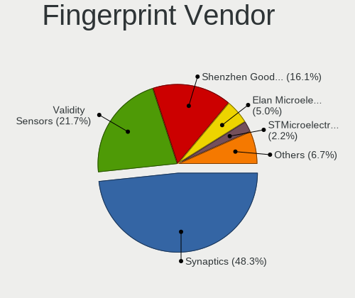

| Vendor                     | Notebooks | Percent |
|----------------------------|-----------|---------|
| Synaptics                  | 61        | 44.2%   |
| Validity Sensors           | 35        | 25.36%  |
| Shenzhen Goodix Technology | 21        | 15.22%  |
| Elan Microelectronics      | 8         | 5.8%    |
| STMicroelectronics         | 4         | 2.9%    |
| LighTuning Technology      | 4         | 2.9%    |
| AuthenTec                  | 4         | 2.9%    |
| Upek                       | 1         | 0.72%   |

Fingerprint Model
-----------------

Fingerprint sensor models

| Model                                                     | Notebooks | Percent |
|-----------------------------------------------------------|-----------|---------|
| Synaptics Prometheus MIS Touch Fingerprint Reader         | 24        | 17.39%  |
| Synaptics Metallica MIS Touch Fingerprint Reader          | 15        | 10.87%  |
| Shenzhen Goodix  FingerPrint Device                       | 11        | 7.97%   |
| Validity Sensors VFS495 Fingerprint Reader                | 9         | 6.52%   |
| Validity Sensors Synaptics WBDI                           | 9         | 6.52%   |
| Validity Sensors VFS 5011 fingerprint sensor              | 6         | 4.35%   |
| Shenzhen Goodix FingerPrint                               | 6         | 4.35%   |
| Elan ELAN:Fingerprint                                     | 6         | 4.35%   |
| Validity Sensors Fingerprint scanner                      | 4         | 2.9%    |
| Synaptics UWP WBDI Device                                 | 4         | 2.9%    |
| Synaptics  FS7604 Touch Fingerprint Sensor with PurePrint | 4         | 2.9%    |
| STMicroelectronics Fingerprint Reader                     | 4         | 2.9%    |
| Shenzhen Goodix Fingerprint Reader                        | 4         | 2.9%    |
| Validity Sensors VFS5011 Fingerprint Reader               | 3         | 2.17%   |
| Synaptics WBDI                                            | 3         | 2.17%   |
| Synaptics FS7604 Touch Fingerprint Sensor with PurePrint  | 3         | 2.17%   |
| Synaptics Fingerprint reader [HP G6]                      | 3         | 2.17%   |
| LighTuning EgisTec Touch Fingerprint Sensor               | 3         | 2.17%   |
| Validity Sensors VFS491                                   | 2         | 1.45%   |
| Elan ELAN:ARM-M4                                          | 2         | 1.45%   |
| AuthenTec AES2501 Fingerprint Sensor                      | 2         | 1.45%   |
| Unknown                                                   | 2         | 1.45%   |
| Validity Sensors VFS7500 Touch Fingerprint Sensor         | 1         | 0.72%   |
| Validity Sensors VFS471 Fingerprint Reader                | 1         | 0.72%   |
| Upek Biometric Touchchip/Touchstrip Fingerprint Sensor    | 1         | 0.72%   |
| Synaptics WBDI Device                                     | 1         | 0.72%   |
| Synaptics UWP WBDI                                        | 1         | 0.72%   |
| Synaptics Metallica MOH Touch Fingerprint Reader          | 1         | 0.72%   |
| LighTuning ES603 Swipe Fingerprint Sensor                 | 1         | 0.72%   |
| AuthenTec Fingerprint Sensor                              | 1         | 0.72%   |
| AuthenTec AES2550 Fingerprint Sensor                      | 1         | 0.72%   |

Chipcard Vendor
---------------

Chipcard module vendors

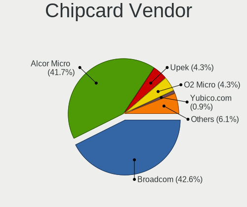

| Vendor                    | Notebooks | Percent |
|---------------------------|-----------|---------|
| Alcor Micro               | 39        | 42.86%  |
| Broadcom                  | 37        | 40.66%  |
| Upek                      | 5         | 5.49%   |
| O2 Micro                  | 4         | 4.4%    |
| Yubico.com                | 1         | 1.1%    |
| Purism, SPC               | 1         | 1.1%    |
| Microchip Technology      | 1         | 1.1%    |
| Gemalto (was Gemplus)     | 1         | 1.1%    |
| Clay Logic                | 1         | 1.1%    |
| Aladdin Knowledge Systems | 1         | 1.1%    |

Chipcard Model
--------------

Chipcard module models

| Model                                                                        | Notebooks | Percent |
|------------------------------------------------------------------------------|-----------|---------|
| Alcor Micro AU9540 Smartcard Reader                                          | 39        | 42.86%  |
| Broadcom 58200                                                               | 14        | 15.38%  |
| Broadcom 5880                                                                | 12        | 13.19%  |
| Broadcom BCM5880 Secure Applications Processor with fingerprint swipe sensor | 6         | 6.59%   |
| Upek TouchChip Fingerprint Coprocessor (WBF advanced mode)                   | 5         | 5.49%   |
| Broadcom BCM5880 Secure Applications Processor                               | 4         | 4.4%    |
| O2 Micro OZ776 CCID Smartcard Reader                                         | 3         | 3.3%    |
| Yubico.com Yubikey 4/5 U2F+CCID                                              | 1         | 1.1%    |
| Purism, SPC Librem Key                                                       | 1         | 1.1%    |
| O2 Micro Oz776 SmartCard Reader                                              | 1         | 1.1%    |
| Microchip Technology SMSC USX101x Reader                                     | 1         | 1.1%    |
| Gemalto (was Gemplus) GemPC Twin SmartCard Reader                            | 1         | 1.1%    |
| Clay Logic Nitrokey Pro                                                      | 1         | 1.1%    |
| Broadcom BCM5880 Secure Applications Processor with fingerprint touch sensor | 1         | 1.1%    |
| Aladdin Knowledge Systems Token JC                                           | 1         | 1.1%    |

Unsupported
-----------

Unsupported Devices
-------------------

Total unsupported devices on board

| Total | Notebooks | Percent |
|-------|-----------|---------|
| 0     | 273       | 34.08%  |
| 1     | 214       | 26.72%  |
| 2     | 127       | 15.86%  |
| 3     | 86        | 10.74%  |
| 4     | 56        | 6.99%   |
| 5     | 28        | 3.5%    |
| 6     | 14        | 1.75%   |
| 7     | 2         | 0.25%   |
| 8     | 1         | 0.12%   |

Unsupported Device Types
------------------------

Types of unsupported devices

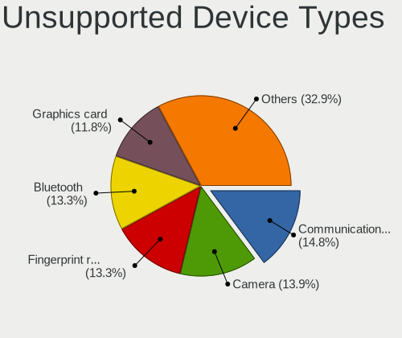

| Type                     | Notebooks | Percent |
|--------------------------|-----------|---------|
| Communication controller | 173       | 15.76%  |
| Camera                   | 155       | 14.12%  |
| Bluetooth                | 147       | 13.39%  |
| Fingerprint reader       | 137       | 12.48%  |
| Graphics card            | 126       | 11.48%  |
| Chipcard                 | 76        | 6.92%   |
| Card reader              | 67        | 6.1%    |
| Net/wireless             | 63        | 5.74%   |
| Multimedia controller    | 63        | 5.74%   |
| Sound                    | 20        | 1.82%   |
| Modem                    | 16        | 1.46%   |
| Net/ethernet             | 14        | 1.28%   |
| Network                  | 12        | 1.09%   |
| Storage/ata              | 7         | 0.64%   |
| Storage                  | 5         | 0.46%   |
| Storage/ide              | 4         | 0.36%   |
| Firewire controller      | 4         | 0.36%   |
| Tv card                  | 2         | 0.18%   |
| Storage/raid             | 2         | 0.18%   |
| Storage/nvme             | 2         | 0.18%   |
| Dvb card                 | 2         | 0.18%   |
| Wireless                 | 1         | 0.09%   |

