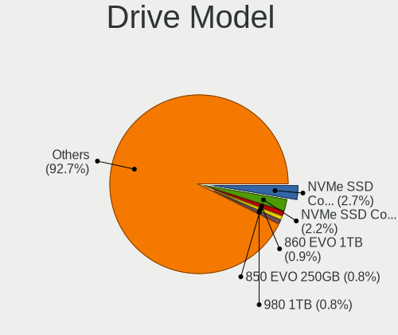
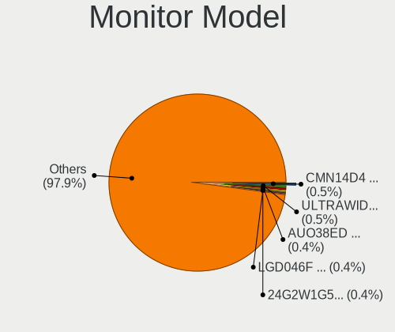
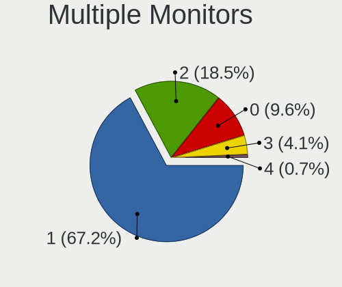
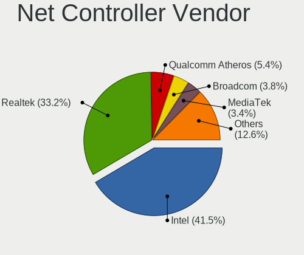
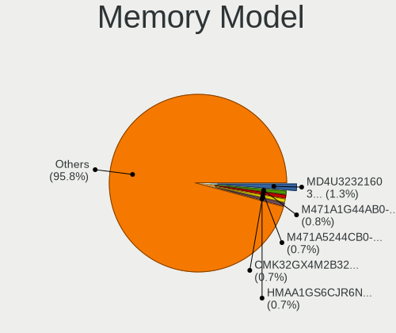
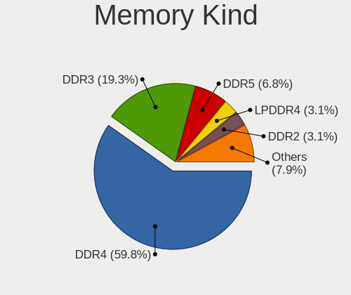
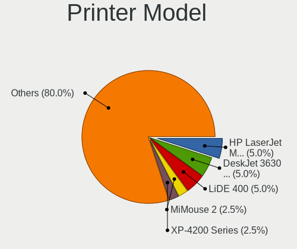

Gentoo - Tested Hardware & Statistics
-------------------------------------

A project to collect tested hardware configurations for Gentoo.

Anyone can contribute to this report by the [hw-probe](https://github.com/linuxhw/hw-probe) tool:

    sudo -E hw-probe -all -upload

Please contribute! Especially if your hardware is rare.

This is a report for all computer types. See also reports for [desktops](/Dist/Gentoo/Desktop/README.md) and [notebooks](/Dist/Gentoo/Notebook/README.md).

Contents
--------

* [ Test Cases ](#test-cases)

* [ System ](#system)
  - [ OS                       ](#os)
  - [ OS Family                ](#os-family)
  - [ Kernel                   ](#kernel)
  - [ Kernel Family            ](#kernel-family)
  - [ Kernel Major Ver.        ](#kernel-major-ver)
  - [ Arch                     ](#arch)
  - [ DE                       ](#de)
  - [ Display Server           ](#display-server)
  - [ Display Manager          ](#display-manager)
  - [ OS Lang                  ](#os-lang)
  - [ Boot Mode                ](#boot-mode)
  - [ Filesystem               ](#filesystem)
  - [ Part. scheme             ](#part-scheme)
  - [ Dual Boot with Linux/BSD ](#dual-boot-with-linuxbsd)
  - [ Dual Boot (Win)          ](#dual-boot-win)

* [ Board ](#board)
  - [ Vendor                   ](#vendor)
  - [ Model                    ](#model)
  - [ Model Family             ](#model-family)
  - [ MFG Year                 ](#mfg-year)
  - [ Form Factor              ](#form-factor)
  - [ Secure Boot              ](#secure-boot)
  - [ Coreboot                 ](#coreboot)
  - [ RAM Size                 ](#ram-size)
  - [ RAM Used                 ](#ram-used)
  - [ Total Drives             ](#total-drives)
  - [ Has CD-ROM               ](#has-cd-rom)
  - [ Has Ethernet             ](#has-ethernet)
  - [ Has WiFi                 ](#has-wifi)
  - [ Has Bluetooth            ](#has-bluetooth)

* [ Location ](#location)
  - [ Country                  ](#country)
  - [ City                     ](#city)

* [ Drives ](#drives)
  - [ Drive Vendor             ](#drive-vendor)
  - [ Drive Model              ](#drive-model)
  - [ HDD Vendor               ](#hdd-vendor)
  - [ SSD Vendor               ](#ssd-vendor)
  - [ Drive Kind               ](#drive-kind)
  - [ Drive Connector          ](#drive-connector)
  - [ Drive Size               ](#drive-size)
  - [ Space Total              ](#space-total)
  - [ Space Used               ](#space-used)
  - [ Malfunc. Drives          ](#malfunc-drives)
  - [ Malfunc. Drive Vendor    ](#malfunc-drive-vendor)
  - [ Malfunc. HDD Vendor      ](#malfunc-hdd-vendor)
  - [ Malfunc. Drive Kind      ](#malfunc-drive-kind)
  - [ Failed Drives            ](#failed-drives)
  - [ Failed Drive Vendor      ](#failed-drive-vendor)
  - [ Drive Status             ](#drive-status)

* [ Storage controller ](#storage-controller)
  - [ Storage Vendor           ](#storage-vendor)
  - [ Storage Model            ](#storage-model)
  - [ Storage Kind             ](#storage-kind)

* [ Processor ](#processor)
  - [ CPU Vendor               ](#cpu-vendor)
  - [ CPU Model                ](#cpu-model)
  - [ CPU Model Family         ](#cpu-model-family)
  - [ CPU Cores                ](#cpu-cores)
  - [ CPU Sockets              ](#cpu-sockets)
  - [ CPU Threads              ](#cpu-threads)
  - [ CPU Op-Modes             ](#cpu-op-modes)
  - [ CPU Microcode            ](#cpu-microcode)
  - [ CPU Microarch            ](#cpu-microarch)

* [ Graphics ](#graphics)
  - [ GPU Vendor               ](#gpu-vendor)
  - [ GPU Model                ](#gpu-model)
  - [ GPU Combo                ](#gpu-combo)
  - [ GPU Driver               ](#gpu-driver)
  - [ GPU Memory               ](#gpu-memory)

* [ Monitor ](#monitor)
  - [ Monitor Vendor           ](#monitor-vendor)
  - [ Monitor Model            ](#monitor-model)
  - [ Monitor Resolution       ](#monitor-resolution)
  - [ Monitor Diagonal         ](#monitor-diagonal)
  - [ Monitor Width            ](#monitor-width)
  - [ Aspect Ratio             ](#aspect-ratio)
  - [ Monitor Area             ](#monitor-area)
  - [ Pixel Density            ](#pixel-density)
  - [ Multiple Monitors        ](#multiple-monitors)

* [ Network ](#network)
  - [ Net Controller Vendor    ](#net-controller-vendor)
  - [ Net Controller Model     ](#net-controller-model)
  - [ Wireless Vendor          ](#wireless-vendor)
  - [ Wireless Model           ](#wireless-model)
  - [ Ethernet Vendor          ](#ethernet-vendor)
  - [ Ethernet Model           ](#ethernet-model)
  - [ Net Controller Kind      ](#net-controller-kind)
  - [ Used Controller          ](#used-controller)
  - [ NICs                     ](#nics)
  - [ IPv6                     ](#ipv6)

* [ Bluetooth ](#bluetooth)
  - [ Bluetooth Vendor         ](#bluetooth-vendor)
  - [ Bluetooth Model          ](#bluetooth-model)

* [ Sound ](#sound)
  - [ Sound Vendor             ](#sound-vendor)
  - [ Sound Model              ](#sound-model)

* [ Memory ](#memory)
  - [ Memory Vendor            ](#memory-vendor)
  - [ Memory Model             ](#memory-model)
  - [ Memory Kind              ](#memory-kind)
  - [ Memory Form Factor       ](#memory-form-factor)
  - [ Memory Size              ](#memory-size)
  - [ Memory Speed             ](#memory-speed)

* [ Printers & scanners ](#printers--scanners)
  - [ Printer Vendor           ](#printer-vendor)
  - [ Printer Model            ](#printer-model)
  - [ Scanner Vendor           ](#scanner-vendor)
  - [ Scanner Model            ](#scanner-model)

* [ Camera ](#camera)
  - [ Camera Vendor            ](#camera-vendor)
  - [ Camera Model             ](#camera-model)

* [ Security ](#security)
  - [ Fingerprint Vendor       ](#fingerprint-vendor)
  - [ Fingerprint Model        ](#fingerprint-model)
  - [ Chipcard Vendor          ](#chipcard-vendor)
  - [ Chipcard Model           ](#chipcard-model)

* [ Unsupported ](#unsupported)
  - [ Unsupported Devices      ](#unsupported-devices)
  - [ Unsupported Device Types ](#unsupported-device-types)

Test Cases
----------

Total: 3807

| Vendor        | Model                       | Form-Factor | Probe                                                      | Date         |
|---------------|-----------------------------|-------------|------------------------------------------------------------|--------------|
| Gigabyte      | AB350-Gaming-CF             | Desktop     | [a23fc83edd](https://linux-hardware.org/?probe=a23fc83edd) | Jan 06, 2025 |
| Gigabyte      | A520 AORUS ELITE            | Desktop     | [69ff87b949](https://linux-hardware.org/?probe=69ff87b949) | Jan 06, 2025 |
| Raspberry ... | Raspberry Pi 3 Model B R... | Soc         | [0e3c0b424a](https://linux-hardware.org/?probe=0e3c0b424a) | Jan 06, 2025 |
| Raspberry ... | Raspberry Pi 5 Model B R... | Soc         | [350133d7c8](https://linux-hardware.org/?probe=350133d7c8) | Jan 06, 2025 |
| Bosgame       | ARB37                       | Desktop     | [8785fe342f](https://linux-hardware.org/?probe=8785fe342f) | Jan 05, 2025 |
| ASUSTek       | PRIME B550-PLUS             | Desktop     | [16b25c18dc](https://linux-hardware.org/?probe=16b25c18dc) | Jan 05, 2025 |
| Gigabyte      | AB350-Gaming-CF             | Desktop     | [a30979996f](https://linux-hardware.org/?probe=a30979996f) | Jan 05, 2025 |
| ASUSTek       | ROG STRIX B550-F GAMING     | Desktop     | [ce85824476](https://linux-hardware.org/?probe=ce85824476) | Jan 03, 2025 |
| Gigabyte      | A520 AORUS ELITE            | Desktop     | [1657c963c8](https://linux-hardware.org/?probe=1657c963c8) | Jan 03, 2025 |
| Gigabyte      | X570 AORUS ELITE WIFI       | Desktop     | [8e803141dc](https://linux-hardware.org/?probe=8e803141dc) | Jan 03, 2025 |
| ASUSTek       | ZenBook UX363EA_UX371EA     | Convertible | [34bd4fc419](https://linux-hardware.org/?probe=34bd4fc419) | Jan 02, 2025 |
| Gigabyte      | Z590 UD                     | Desktop     | [d5f41f9b13](https://linux-hardware.org/?probe=d5f41f9b13) | Jan 02, 2025 |
| SLIMBOOK      | Executive                   | Notebook    | [026c2a5e39](https://linux-hardware.org/?probe=026c2a5e39) | Jan 01, 2025 |
| SLIMBOOK      | Executive                   | Notebook    | [8fa336f525](https://linux-hardware.org/?probe=8fa336f525) | Jan 01, 2025 |
| ASUSTek       | ASUS TUF Gaming A15 FA50... | Notebook    | [b80f1b130f](https://linux-hardware.org/?probe=b80f1b130f) | Jan 01, 2025 |
| ASRock        | B650M Pro RS                | Desktop     | [fcdef3ad86](https://linux-hardware.org/?probe=fcdef3ad86) | Jan 01, 2025 |
| ASUSTek       | TUF Gaming B550-PLUS        | Desktop     | [f18654747e](https://linux-hardware.org/?probe=f18654747e) | Jan 01, 2025 |
| Dell          | 02C2CP A03                  | Server      | [44126f8d86](https://linux-hardware.org/?probe=44126f8d86) | Dec 31, 2024 |
| Gigabyte      | X570S UD                    | Desktop     | [ce0d2a6968](https://linux-hardware.org/?probe=ce0d2a6968) | Dec 30, 2024 |
| Gigabyte      | Z68X-UD3-B3                 | Desktop     | [519bca1a90](https://linux-hardware.org/?probe=519bca1a90) | Dec 30, 2024 |
| ASUSTek       | M3A78-CM                    | Desktop     | [b6e983be67](https://linux-hardware.org/?probe=b6e983be67) | Dec 30, 2024 |
| ASUSTek       | ASUS TUF Gaming A17 FA70... | Notebook    | [bf9d85f7a5](https://linux-hardware.org/?probe=bf9d85f7a5) | Dec 29, 2024 |
| Dell          | Latitude 7420               | Notebook    | [981db9e71b](https://linux-hardware.org/?probe=981db9e71b) | Dec 29, 2024 |
| Gigabyte      | AB350-Gaming-CF             | Desktop     | [be4f4fabfe](https://linux-hardware.org/?probe=be4f4fabfe) | Dec 29, 2024 |
| Dell          | Latitude 7420               | Notebook    | [58cca2986e](https://linux-hardware.org/?probe=58cca2986e) | Dec 28, 2024 |
| ASUSTek       | ROG STRIX Z390-F GAMING     | Desktop     | [62c4f7de88](https://linux-hardware.org/?probe=62c4f7de88) | Dec 27, 2024 |
| Gigabyte      | A520 AORUS ELITE            | Desktop     | [6a5261adb3](https://linux-hardware.org/?probe=6a5261adb3) | Dec 27, 2024 |
| HP            | 158B                        | Desktop     | [c9a23e32f8](https://linux-hardware.org/?probe=c9a23e32f8) | Dec 27, 2024 |
| Lenovo        | ThinkBook 15 G4 ABA 21DL    | Notebook    | [e5724d5492](https://linux-hardware.org/?probe=e5724d5492) | Dec 26, 2024 |
| System76      | Darter Pro                  | Notebook    | [5aa9da4e1e](https://linux-hardware.org/?probe=5aa9da4e1e) | Dec 25, 2024 |
| Infinix       | YL51A5                      | Notebook    | [661efe13d8](https://linux-hardware.org/?probe=661efe13d8) | Dec 25, 2024 |
| Lenovo        | ThinkPad T14 Gen 3 21AJS... | Notebook    | [729549a358](https://linux-hardware.org/?probe=729549a358) | Dec 25, 2024 |
| Acer          | Aspire A517-52G             | Notebook    | [57e5324151](https://linux-hardware.org/?probe=57e5324151) | Dec 24, 2024 |
| Oracle        | ASSY,MOTHERBOARD,1U         | Server      | [067a495d60](https://linux-hardware.org/?probe=067a495d60) | Dec 24, 2024 |
| Infinix       | YL51A5                      | Notebook    | [f57db5b2dd](https://linux-hardware.org/?probe=f57db5b2dd) | Dec 23, 2024 |
| Gigabyte      | B650 AORUS ELITE AX         | Desktop     | [31b0aab1bb](https://linux-hardware.org/?probe=31b0aab1bb) | Dec 23, 2024 |
| ASUSTek       | ROG STRIX B650E-E GAMING... | Desktop     | [33885a73d2](https://linux-hardware.org/?probe=33885a73d2) | Dec 23, 2024 |
| Lenovo        | IdeaPad 5 15ALC05 82LN      | Notebook    | [bf0860ac14](https://linux-hardware.org/?probe=bf0860ac14) | Dec 22, 2024 |
| Gigabyte      | X570S UD                    | Desktop     | [78d70c2d5f](https://linux-hardware.org/?probe=78d70c2d5f) | Dec 22, 2024 |
| ASRock        | X870 Steel Legend WiFi      | Desktop     | [559e3e1bee](https://linux-hardware.org/?probe=559e3e1bee) | Dec 22, 2024 |
| Lenovo        | IdeaPad 5 15ALC05 82LN      | Notebook    | [c2dcf0826e](https://linux-hardware.org/?probe=c2dcf0826e) | Dec 22, 2024 |
| Gigabyte      | B650M AORUS ELITE AX ICE    | Desktop     | [2cfcbe46ea](https://linux-hardware.org/?probe=2cfcbe46ea) | Dec 22, 2024 |
| Notebook      | W510LU                      | Notebook    | [040c49871b](https://linux-hardware.org/?probe=040c49871b) | Dec 22, 2024 |
| Acer          | TravelMate B113             | Notebook    | [e4b7bfda97](https://linux-hardware.org/?probe=e4b7bfda97) | Dec 21, 2024 |
| Lenovo        | Yoga 14sARH 2021 82LB       | Notebook    | [f7b8a3e850](https://linux-hardware.org/?probe=f7b8a3e850) | Dec 20, 2024 |
| HP            | EliteBook 655 15.6 inch ... | Notebook    | [0c453f6750](https://linux-hardware.org/?probe=0c453f6750) | Dec 17, 2024 |
| Lenovo        | Yoga 14sARH 2021 82LB       | Notebook    | [df7c4252e6](https://linux-hardware.org/?probe=df7c4252e6) | Dec 17, 2024 |
| Lenovo        | 1064 SDK0T76528 WIN 3556... | Desktop     | [5feee3480f](https://linux-hardware.org/?probe=5feee3480f) | Dec 16, 2024 |
| ASUSTek       | ROG STRIX X670E-E GAMING... | Desktop     | [008bed58fb](https://linux-hardware.org/?probe=008bed58fb) | Dec 16, 2024 |
| Lenovo        | ThinkPad T14 Gen 3 21CGS... | Notebook    | [d9a6f919aa](https://linux-hardware.org/?probe=d9a6f919aa) | Dec 15, 2024 |
| Lenovo        | ThinkPad T14s Gen 6 21N1... | Notebook    | [179774f835](https://linux-hardware.org/?probe=179774f835) | Dec 15, 2024 |
| HP            | Pavilion Notebook           | Notebook    | [29c7464484](https://linux-hardware.org/?probe=29c7464484) | Dec 15, 2024 |
| Lenovo        | ThinkPad P16 Gen 1 21D60... | Notebook    | [20b25571a7](https://linux-hardware.org/?probe=20b25571a7) | Dec 15, 2024 |
| Lenovo        | ThinkPad E15 Gen 2 20T80... | Notebook    | [5f3e27d2af](https://linux-hardware.org/?probe=5f3e27d2af) | Dec 13, 2024 |
| Lenovo        | Legion R9000P2021H 82JQ     | Notebook    | [a0c8f35a1b](https://linux-hardware.org/?probe=a0c8f35a1b) | Dec 13, 2024 |
| Lenovo        | ThinkPad E15 Gen 2 20T80... | Notebook    | [934762c6f1](https://linux-hardware.org/?probe=934762c6f1) | Dec 13, 2024 |
| HP            | Pavilion Notebook           | Notebook    | [f654786871](https://linux-hardware.org/?probe=f654786871) | Dec 10, 2024 |
| NEC Comput... | MS-7479VS                   | Desktop     | [9d1c2d403f](https://linux-hardware.org/?probe=9d1c2d403f) | Dec 09, 2024 |
| ASUSTek       | ASUS TUF Gaming A16 FA61... | Notebook    | [46003b41c5](https://linux-hardware.org/?probe=46003b41c5) | Dec 01, 2024 |
| ASUSTek       | M3A78-CM                    | Desktop     | [85e53c34b3](https://linux-hardware.org/?probe=85e53c34b3) | Nov 30, 2024 |
| Unknown       | Unknown                     | Desktop     | [31c95ec85b](https://linux-hardware.org/?probe=31c95ec85b) | Nov 29, 2024 |
| Gigabyte      | A520 AORUS ELITE            | Desktop     | [e56783540e](https://linux-hardware.org/?probe=e56783540e) | Nov 28, 2024 |
| Lenovo        | 1046 SDK0T08861 WIN 3305... | Desktop     | [5e2284eebc](https://linux-hardware.org/?probe=5e2284eebc) | Nov 28, 2024 |
| Unknown       | Unknown                     | Other       | [ffee17182f](https://linux-hardware.org/?probe=ffee17182f) | Nov 28, 2024 |
| Gigabyte      | X570 UD                     | Desktop     | [2ee977e0d6](https://linux-hardware.org/?probe=2ee977e0d6) | Nov 25, 2024 |
| ASUSTek       | ROG STRIX Z490-F GAMING     | Desktop     | [c7f9d667fa](https://linux-hardware.org/?probe=c7f9d667fa) | Nov 25, 2024 |
| Packard Be... | Cuba MS-7301                | Desktop     | [010d6ec397](https://linux-hardware.org/?probe=010d6ec397) | Nov 24, 2024 |
| Gigabyte      | AB350-Gaming-CF             | Desktop     | [9e3eafcb80](https://linux-hardware.org/?probe=9e3eafcb80) | Nov 24, 2024 |
| Unknown       | Unknown                     | Notebook    | [8b21315b42](https://linux-hardware.org/?probe=8b21315b42) | Nov 22, 2024 |
| Gigabyte      | A520 AORUS ELITE            | Desktop     | [4cf05e32d9](https://linux-hardware.org/?probe=4cf05e32d9) | Nov 21, 2024 |
| Lenovo        | IdeaPad 5 15ABA7 82SG       | Notebook    | [5a37374d2d](https://linux-hardware.org/?probe=5a37374d2d) | Nov 21, 2024 |
| Lenovo        | K14 Gen 1 21CUS0DF00        | Notebook    | [b795d20e32](https://linux-hardware.org/?probe=b795d20e32) | Nov 21, 2024 |
| Lenovo        | Legion Y540-15IRH-PG0 81... | Notebook    | [69bd15be2f](https://linux-hardware.org/?probe=69bd15be2f) | Nov 21, 2024 |
| Lenovo        | Legion Y540-15IRH-PG0 81... | Notebook    | [4a27f42d36](https://linux-hardware.org/?probe=4a27f42d36) | Nov 21, 2024 |
| ASUSTek       | M3A78-CM                    | Desktop     | [59ecdcf045](https://linux-hardware.org/?probe=59ecdcf045) | Nov 20, 2024 |
| HP            | Pavilion Notebook           | Notebook    | [8fe35fac83](https://linux-hardware.org/?probe=8fe35fac83) | Nov 20, 2024 |
| Lenovo        | ThinkPad X1 Carbon Gen 1... | Notebook    | [9152187c33](https://linux-hardware.org/?probe=9152187c33) | Nov 19, 2024 |
| Lenovo        | ThinkPad X1 Carbon Gen 1... | Notebook    | [b8690cc594](https://linux-hardware.org/?probe=b8690cc594) | Nov 19, 2024 |
| HUAWEI        | BoDE-WXX9                   | Notebook    | [245b79e2e3](https://linux-hardware.org/?probe=245b79e2e3) | Nov 18, 2024 |
| MSI           | B450 TOMAHAWK MAX           | Desktop     | [036d7dee4d](https://linux-hardware.org/?probe=036d7dee4d) | Nov 18, 2024 |
| ASRock        | B550M Steel Legend          | Desktop     | [12b473d08e](https://linux-hardware.org/?probe=12b473d08e) | Nov 18, 2024 |
| ASUSTek       | PRIME H410M-CS              | Desktop     | [51e9a88fad](https://linux-hardware.org/?probe=51e9a88fad) | Nov 18, 2024 |
| Gigabyte      | X670E AORUS PRO X           | Desktop     | [2d5582b3a9](https://linux-hardware.org/?probe=2d5582b3a9) | Nov 18, 2024 |
| Gigabyte      | X870E AORUS ELITE WIFI7     | Desktop     | [791be084eb](https://linux-hardware.org/?probe=791be084eb) | Nov 17, 2024 |
| ASRock        | X870 Steel Legend WiFi      | Desktop     | [3cf57595f8](https://linux-hardware.org/?probe=3cf57595f8) | Nov 17, 2024 |
| Gigabyte      | AB350-Gaming-CF             | Desktop     | [dbd0ddb0d5](https://linux-hardware.org/?probe=dbd0ddb0d5) | Nov 17, 2024 |
| ASUSTek       | TUF Gaming X670E-PLUS       | Desktop     | [784e2dcbb8](https://linux-hardware.org/?probe=784e2dcbb8) | Nov 16, 2024 |
| ASRock        | X870 Steel Legend WiFi      | Desktop     | [2aeb096089](https://linux-hardware.org/?probe=2aeb096089) | Nov 15, 2024 |
| MSI           | MAG X570 TOMAHAWK WIFI      | Desktop     | [f05f3326c4](https://linux-hardware.org/?probe=f05f3326c4) | Nov 15, 2024 |
| Lenovo        | 80TV                        | Notebook    | [040e0f4702](https://linux-hardware.org/?probe=040e0f4702) | Nov 14, 2024 |
| Dell          | Precision 7780              | Notebook    | [340952c964](https://linux-hardware.org/?probe=340952c964) | Nov 13, 2024 |
| MSI           | B450 GAMING PLUS            | Desktop     | [531b796280](https://linux-hardware.org/?probe=531b796280) | Nov 13, 2024 |
| ASUSTek       | ASUS TUF Gaming A15 FA50... | Notebook    | [6af60a9a17](https://linux-hardware.org/?probe=6af60a9a17) | Nov 12, 2024 |
| ASUSTek       | TUF Gaming B550-PRO         | Desktop     | [6b464926ac](https://linux-hardware.org/?probe=6b464926ac) | Nov 12, 2024 |
| ASUSTek       | TUF Gaming B550-PRO         | Desktop     | [105c091b25](https://linux-hardware.org/?probe=105c091b25) | Nov 12, 2024 |
| Apple         | MacBookPro16,2              | Notebook    | [1a7115becf](https://linux-hardware.org/?probe=1a7115becf) | Nov 12, 2024 |
| Apple         | MacBookPro16,2              | Notebook    | [612dc6bdf9](https://linux-hardware.org/?probe=612dc6bdf9) | Nov 12, 2024 |
| Dell          | Inspiron 5575               | Notebook    | [12ffcf5b54](https://linux-hardware.org/?probe=12ffcf5b54) | Nov 11, 2024 |
| Unknown       | Unknown                     | Notebook    | [cd1bdc1144](https://linux-hardware.org/?probe=cd1bdc1144) | Nov 10, 2024 |
| ASUSTek       | PRIME N100I-D D4            | Desktop     | [78a212d959](https://linux-hardware.org/?probe=78a212d959) | Nov 10, 2024 |
| HP            | Presario CQ56               | Notebook    | [7a1356748b](https://linux-hardware.org/?probe=7a1356748b) | Nov 10, 2024 |
| ASUSTek       | ASUS TUF Dash F15 FX517Z... | Notebook    | [1032f0a1e6](https://linux-hardware.org/?probe=1032f0a1e6) | Nov 08, 2024 |
| Acer          | Aspire T3-710 V:1.1         | Desktop     | [366203bce9](https://linux-hardware.org/?probe=366203bce9) | Nov 07, 2024 |
| Gigabyte      | H110M-H-CF                  | Desktop     | [f9621cdfb7](https://linux-hardware.org/?probe=f9621cdfb7) | Nov 06, 2024 |
| HUAWEI        | BoDE-WXX9                   | Notebook    | [f840e8b969](https://linux-hardware.org/?probe=f840e8b969) | Nov 06, 2024 |
| Lenovo        | Legion Slim 5 16ARP9 83E... | Notebook    | [cdbdaae023](https://linux-hardware.org/?probe=cdbdaae023) | Nov 06, 2024 |
| MSI           | B450 GAMING PRO CARBON A... | Desktop     | [8fba40657f](https://linux-hardware.org/?probe=8fba40657f) | Nov 05, 2024 |
| MSI           | S3661                       | Server      | [31f1b7dda2](https://linux-hardware.org/?probe=31f1b7dda2) | Nov 03, 2024 |
| Lenovo        | ThinkPad E15 Gen 2 20T80... | Notebook    | [09d355ac60](https://linux-hardware.org/?probe=09d355ac60) | Nov 02, 2024 |
| Gigabyte      | Z77X-D3H                    | Desktop     | [566d913cf0](https://linux-hardware.org/?probe=566d913cf0) | Oct 31, 2024 |
| Gigabyte      | B360M-D3P-WG-CF             | Desktop     | [221fc17cd6](https://linux-hardware.org/?probe=221fc17cd6) | Oct 29, 2024 |
| ASRock        | AM1H-ITX                    | Desktop     | [539c9b8d9d](https://linux-hardware.org/?probe=539c9b8d9d) | Oct 26, 2024 |
| Fujitsu       | D3233-A1 S26361-D3233-A1    | Desktop     | [bd388dcc0d](https://linux-hardware.org/?probe=bd388dcc0d) | Oct 23, 2024 |
| Dell          | XPS 15 9510                 | Notebook    | [c7a7356d98](https://linux-hardware.org/?probe=c7a7356d98) | Oct 22, 2024 |
| MSI           | Z170A GAMING M7             | Desktop     | [2a0282544c](https://linux-hardware.org/?probe=2a0282544c) | Oct 21, 2024 |
| Razer         | Blade 16 - RZ09-0483        | Notebook    | [87977c5666](https://linux-hardware.org/?probe=87977c5666) | Oct 21, 2024 |
| Supermicro    | X10SRM-FA                   | Server      | [36da660b8b](https://linux-hardware.org/?probe=36da660b8b) | Oct 20, 2024 |
| Lenovo        | ThinkPad E15 Gen 2 20T80... | Notebook    | [c36ba63903](https://linux-hardware.org/?probe=c36ba63903) | Oct 19, 2024 |
| ASRock        | A520M-ITX/ac                | Desktop     | [257fe67fab](https://linux-hardware.org/?probe=257fe67fab) | Oct 19, 2024 |
| ASUSTek       | Unknown                     | Notebook    | [054ba0e2b8](https://linux-hardware.org/?probe=054ba0e2b8) | Oct 19, 2024 |
| Lenovo        | ThinkPad T490s 20NX006PP... | Notebook    | [76d91a459e](https://linux-hardware.org/?probe=76d91a459e) | Oct 18, 2024 |
| Intel         | D510MO AAE76523-401         | Desktop     | [ef9733928f](https://linux-hardware.org/?probe=ef9733928f) | Oct 18, 2024 |
| ZOTAC         | H67ITX-C-E 02/03/05         | Desktop     | [19badd34b0](https://linux-hardware.org/?probe=19badd34b0) | Oct 18, 2024 |
| ASUSTek       | M4A88T-I DELUXE             | Desktop     | [4160c3040f](https://linux-hardware.org/?probe=4160c3040f) | Oct 18, 2024 |
| ASUSTek       | SABERTOOTH X58              | Desktop     | [d4240e52c9](https://linux-hardware.org/?probe=d4240e52c9) | Oct 18, 2024 |
| Unknown       | Unknown                     | Desktop     | [638bf77d29](https://linux-hardware.org/?probe=638bf77d29) | Oct 18, 2024 |
| ZOTAC         | H67ITX-C-E 02/03/05         | Desktop     | [8dbae4a350](https://linux-hardware.org/?probe=8dbae4a350) | Oct 18, 2024 |
| Unknown       | Unknown                     | Desktop     | [7d0ffc9b7a](https://linux-hardware.org/?probe=7d0ffc9b7a) | Oct 18, 2024 |
| Dell          | Inspiron 5755               | Notebook    | [c6b4c797c3](https://linux-hardware.org/?probe=c6b4c797c3) | Oct 18, 2024 |
| Gigabyte      | Z77X-D3H                    | Desktop     | [3113b0c26d](https://linux-hardware.org/?probe=3113b0c26d) | Oct 17, 2024 |
| ASRock        | AM1H-ITX                    | Desktop     | [10a64a5356](https://linux-hardware.org/?probe=10a64a5356) | Oct 17, 2024 |
| HP            | ProBook 450 G5              | Notebook    | [9d602e9f72](https://linux-hardware.org/?probe=9d602e9f72) | Oct 16, 2024 |
| Gigabyte      | A520 AORUS ELITE            | Desktop     | [81109786c2](https://linux-hardware.org/?probe=81109786c2) | Oct 16, 2024 |
| ASUSTek       | M3A78-CM                    | Desktop     | [e907b8b549](https://linux-hardware.org/?probe=e907b8b549) | Oct 15, 2024 |
| HP            | EliteBook 845 14 inch G9... | Notebook    | [8d0969ee93](https://linux-hardware.org/?probe=8d0969ee93) | Oct 15, 2024 |
| Micro Comp... | V3                          | Tablet      | [084c53ef65](https://linux-hardware.org/?probe=084c53ef65) | Oct 15, 2024 |
| ASRock        | A520M-ITX/ac                | Desktop     | [f0ccf0627b](https://linux-hardware.org/?probe=f0ccf0627b) | Oct 15, 2024 |
| ASRock        | X570 Taichi                 | Desktop     | [b3b87cb7d2](https://linux-hardware.org/?probe=b3b87cb7d2) | Oct 15, 2024 |
| Micro Comp... | V3                          | Tablet      | [2cb4915224](https://linux-hardware.org/?probe=2cb4915224) | Oct 13, 2024 |
| HP            | EliteBook 830 G6            | Notebook    | [61ea3349af](https://linux-hardware.org/?probe=61ea3349af) | Oct 13, 2024 |
| Gigabyte      | AB350-Gaming-CF             | Desktop     | [82eace1ca4](https://linux-hardware.org/?probe=82eace1ca4) | Oct 13, 2024 |
| Fujitsu       | CELSIUS H760                | Notebook    | [8ea6d75c59](https://linux-hardware.org/?probe=8ea6d75c59) | Oct 12, 2024 |
| ASUSTek       | ROG STRIX Z790-E GAMING ... | Desktop     | [75722e8358](https://linux-hardware.org/?probe=75722e8358) | Oct 12, 2024 |
| Gigabyte      | A520 AORUS ELITE            | Desktop     | [b56aeb805e](https://linux-hardware.org/?probe=b56aeb805e) | Oct 09, 2024 |
| Fujitsu       | CELSIUS H760                | Notebook    | [9a9b415ad2](https://linux-hardware.org/?probe=9a9b415ad2) | Oct 08, 2024 |
| ASUSTek       | M3A78-CM                    | Desktop     | [2161de6ffe](https://linux-hardware.org/?probe=2161de6ffe) | Oct 07, 2024 |
| ASRock        | AM1H-ITX                    | Desktop     | [def75bd40a](https://linux-hardware.org/?probe=def75bd40a) | Oct 06, 2024 |
| HP            | EliteBook 655 15.6 inch ... | Notebook    | [0f7fd9789d](https://linux-hardware.org/?probe=0f7fd9789d) | Oct 06, 2024 |
| Gigabyte      | AB350-Gaming-CF             | Desktop     | [ffd0b1b3b6](https://linux-hardware.org/?probe=ffd0b1b3b6) | Oct 06, 2024 |
| Lenovo        | ThinkPad T14 Gen 2i 20W0... | Notebook    | [49227f1fdf](https://linux-hardware.org/?probe=49227f1fdf) | Oct 05, 2024 |
| Lenovo        | IdeaPad S145-15API 81UT     | Notebook    | [76c9e1e6ac](https://linux-hardware.org/?probe=76c9e1e6ac) | Oct 04, 2024 |
| Lenovo        | ThinkPad T14s Gen 1 20T1... | Notebook    | [12beb6c4e0](https://linux-hardware.org/?probe=12beb6c4e0) | Oct 03, 2024 |
| ASRock        | X570 Phantom Gaming 4       | Desktop     | [9d2d98c84b](https://linux-hardware.org/?probe=9d2d98c84b) | Oct 03, 2024 |
| ASRock        | AM1H-ITX                    | Desktop     | [71d49b6fb4](https://linux-hardware.org/?probe=71d49b6fb4) | Oct 03, 2024 |
| ASUSTek       | Zenbook UX3402ZA_UX3402Z... | Notebook    | [158af06788](https://linux-hardware.org/?probe=158af06788) | Oct 03, 2024 |
| Acer          | Aspire E5-553G              | Notebook    | [d98fc4f350](https://linux-hardware.org/?probe=d98fc4f350) | Oct 03, 2024 |
| Dell          | Latitude 7420               | Convertible | [d7d9b90f83](https://linux-hardware.org/?probe=d7d9b90f83) | Oct 02, 2024 |
| Framework     | Laptop 13 (AMD Ryzen 704... | Notebook    | [03b3d6efd2](https://linux-hardware.org/?probe=03b3d6efd2) | Oct 01, 2024 |
| Framework     | Laptop 13 (AMD Ryzen 704... | Notebook    | [4d7ba010e0](https://linux-hardware.org/?probe=4d7ba010e0) | Oct 01, 2024 |
| ASRock        | B650E Taichi Lite           | Desktop     | [5ab1034596](https://linux-hardware.org/?probe=5ab1034596) | Sep 29, 2024 |
| MSI           | Z97 MPOWER                  | Desktop     | [f21872219a](https://linux-hardware.org/?probe=f21872219a) | Sep 28, 2024 |
| MSI           | Z97 MPOWER                  | Desktop     | [7a05a56f63](https://linux-hardware.org/?probe=7a05a56f63) | Sep 28, 2024 |
| Lenovo        | ThinkBook 14 G5+ APO 21J... | Notebook    | [6fa64ce393](https://linux-hardware.org/?probe=6fa64ce393) | Sep 28, 2024 |
| Dell          | 0F4Y1M A02                  | Desktop     | [906a276432](https://linux-hardware.org/?probe=906a276432) | Sep 27, 2024 |
| Acer          | Nitro AN515-46              | Notebook    | [2b5852e0fe](https://linux-hardware.org/?probe=2b5852e0fe) | Sep 25, 2024 |
| MSI           | B450 GAMING PRO CARBON A... | Desktop     | [d6e03c48eb](https://linux-hardware.org/?probe=d6e03c48eb) | Sep 24, 2024 |
| Unknown       | Unknown                     | Desktop     | [fdddcae4d3](https://linux-hardware.org/?probe=fdddcae4d3) | Sep 24, 2024 |
| MSI           | B650M GAMING PLUS WIFI      | Desktop     | [44a5096641](https://linux-hardware.org/?probe=44a5096641) | Sep 23, 2024 |
| MSI           | B450 GAMING PRO CARBON A... | Desktop     | [9019ddb539](https://linux-hardware.org/?probe=9019ddb539) | Sep 22, 2024 |
| Gigabyte      | X570 AORUS ELITE            | Desktop     | [482aeffacc](https://linux-hardware.org/?probe=482aeffacc) | Sep 22, 2024 |
| Lenovo        | ThinkBook 15 G4 ABA 21DL    | Notebook    | [4e3912d4f2](https://linux-hardware.org/?probe=4e3912d4f2) | Sep 22, 2024 |
| Framework     | Laptop 13 (AMD Ryzen 704... | Notebook    | [38ed006558](https://linux-hardware.org/?probe=38ed006558) | Sep 20, 2024 |
| ASUSTek       | ASUS TUF Gaming A16 FA61... | Notebook    | [541d66dc10](https://linux-hardware.org/?probe=541d66dc10) | Sep 19, 2024 |
| Gigabyte      | A520 AORUS ELITE            | Desktop     | [0a745449f5](https://linux-hardware.org/?probe=0a745449f5) | Sep 18, 2024 |
| Shenzhen M... | HPBSD                       | Mini pc     | [e8593e10ef](https://linux-hardware.org/?probe=e8593e10ef) | Sep 17, 2024 |
| Framework     | Laptop 13 (AMD Ryzen 704... | Notebook    | [fa9e5beb1c](https://linux-hardware.org/?probe=fa9e5beb1c) | Sep 16, 2024 |
| Lenovo        | Legion R7000 2020 82B6      | Notebook    | [6f7f645005](https://linux-hardware.org/?probe=6f7f645005) | Sep 16, 2024 |
| HP            | 1589                        | Desktop     | [cd86420d3e](https://linux-hardware.org/?probe=cd86420d3e) | Sep 15, 2024 |
| ASUSTek       | M3A78-CM                    | Desktop     | [9d6023b0d5](https://linux-hardware.org/?probe=9d6023b0d5) | Sep 15, 2024 |
| Gigabyte      | B550 AORUS ELITE AX V2      | Desktop     | [cc99554541](https://linux-hardware.org/?probe=cc99554541) | Sep 14, 2024 |
| HP            | Presario CQ56               | Notebook    | [ed024f67d9](https://linux-hardware.org/?probe=ed024f67d9) | Sep 13, 2024 |
| Apple         | MacBookPro11,4              | Notebook    | [60b8339c3a](https://linux-hardware.org/?probe=60b8339c3a) | Sep 12, 2024 |
| HP            | Presario CQ56               | Notebook    | [e9ffe0cf3a](https://linux-hardware.org/?probe=e9ffe0cf3a) | Sep 11, 2024 |
| Lenovo        | IdeaPad Slim 5 14ABR8 82... | Notebook    | [9333a17b1f](https://linux-hardware.org/?probe=9333a17b1f) | Sep 11, 2024 |
| Lenovo        | IdeaPad Slim 5 14ABR8 82... | Notebook    | [630b6c1179](https://linux-hardware.org/?probe=630b6c1179) | Sep 11, 2024 |
| ASUSTek       | ROG CROSSHAIR VIII HERO     | Desktop     | [7afc6efd27](https://linux-hardware.org/?probe=7afc6efd27) | Sep 11, 2024 |
| Lenovo        | ThinkPad X1 Carbon Gen 1... | Notebook    | [4c190d8f8d](https://linux-hardware.org/?probe=4c190d8f8d) | Sep 10, 2024 |
| ASUSTek       | N551JW                      | Notebook    | [350a0f8841](https://linux-hardware.org/?probe=350a0f8841) | Sep 10, 2024 |
| Dell          | Latitude 5540               | Notebook    | [d5b6727481](https://linux-hardware.org/?probe=d5b6727481) | Sep 09, 2024 |
| Lenovo        | 3102 SDK0J40697 WIN 3305... | Desktop     | [080a971480](https://linux-hardware.org/?probe=080a971480) | Sep 08, 2024 |
| Gigabyte      | AB350-Gaming-CF             | Desktop     | [4ff0f01eb1](https://linux-hardware.org/?probe=4ff0f01eb1) | Sep 08, 2024 |
| Gigabyte      | A520 AORUS ELITE            | Desktop     | [4fd5cdbf41](https://linux-hardware.org/?probe=4fd5cdbf41) | Sep 07, 2024 |
| HP            | 8767 A                      | Desktop     | [65ef489177](https://linux-hardware.org/?probe=65ef489177) | Sep 07, 2024 |
| HP            | 8767 A                      | Desktop     | [5e38429f92](https://linux-hardware.org/?probe=5e38429f92) | Sep 07, 2024 |
| ASUSTek       | ROG STRIX Z490-F GAMING     | Desktop     | [0d129c2fb7](https://linux-hardware.org/?probe=0d129c2fb7) | Sep 07, 2024 |
| Dell          | Latitude 5540               | Notebook    | [c0efdf9b57](https://linux-hardware.org/?probe=c0efdf9b57) | Sep 07, 2024 |
| Lenovo        | ThinkPad P16 Gen 1 21D60... | Notebook    | [7f8463e7df](https://linux-hardware.org/?probe=7f8463e7df) | Sep 07, 2024 |
| Acer          | Aspire ES1-572              | Notebook    | [78f470444b](https://linux-hardware.org/?probe=78f470444b) | Sep 06, 2024 |
| Lenovo        | IdeaPad S145-15API 81UT     | Notebook    | [bb53f353b7](https://linux-hardware.org/?probe=bb53f353b7) | Sep 06, 2024 |
| Gigabyte      | B85M-HD3 R4                 | Desktop     | [ca88901f71](https://linux-hardware.org/?probe=ca88901f71) | Sep 06, 2024 |
| HP            | Pavilion Laptop 15-cw1xx... | Notebook    | [d8463507ba](https://linux-hardware.org/?probe=d8463507ba) | Sep 06, 2024 |
| MSI           | MAG X670E TOMAHAWK WIFI     | Desktop     | [96d387e932](https://linux-hardware.org/?probe=96d387e932) | Sep 06, 2024 |
| Lenovo        | ThinkPad P16 Gen 1 21D60... | Notebook    | [f49e870a06](https://linux-hardware.org/?probe=f49e870a06) | Sep 06, 2024 |
| Unknown       | Unknown                     | Desktop     | [efbfdc8ad3](https://linux-hardware.org/?probe=efbfdc8ad3) | Sep 05, 2024 |
| ASUSTek       | M4A88T-I DELUXE             | Desktop     | [970aae698a](https://linux-hardware.org/?probe=970aae698a) | Sep 05, 2024 |
| MSI           | B650M PROJECT ZERO          | Desktop     | [ca4eeb43e3](https://linux-hardware.org/?probe=ca4eeb43e3) | Sep 04, 2024 |
| Lenovo        | 1064 SDK0T76528 WIN 3556... | Desktop     | [25f0609915](https://linux-hardware.org/?probe=25f0609915) | Sep 04, 2024 |
| ASUSTek       | ZenBook UX425UA_UM425UA     | Notebook    | [01532850b4](https://linux-hardware.org/?probe=01532850b4) | Sep 04, 2024 |
| ASUSTek       | ROG CROSSHAIR VIII HERO     | Desktop     | [b78ceccaaf](https://linux-hardware.org/?probe=b78ceccaaf) | Sep 04, 2024 |
| Lenovo        | 1064 SDK0T76528 WIN 3556... | Desktop     | [bc4bc8eedc](https://linux-hardware.org/?probe=bc4bc8eedc) | Sep 03, 2024 |
| ASUSTek       | ASUS TUF Gaming A16 FA61... | Notebook    | [34778061ba](https://linux-hardware.org/?probe=34778061ba) | Sep 02, 2024 |
| ASUSTek       | ROG STRIX X570-E GAMING     | Desktop     | [236ca10d6e](https://linux-hardware.org/?probe=236ca10d6e) | Sep 02, 2024 |
| MSI           | B450 GAMING PLUS            | Desktop     | [7d68c9f2ad](https://linux-hardware.org/?probe=7d68c9f2ad) | Sep 02, 2024 |
| Lenovo        | ThinkPad T14 Gen 3 21CGS... | Notebook    | [f76edee790](https://linux-hardware.org/?probe=f76edee790) | Sep 01, 2024 |
| Dell          | Precision 7540              | Notebook    | [c2661e531c](https://linux-hardware.org/?probe=c2661e531c) | Sep 01, 2024 |
| MSI           | B450 GAMING PLUS            | Desktop     | [2816eae760](https://linux-hardware.org/?probe=2816eae760) | Sep 01, 2024 |
| Gigabyte      | AB350-Gaming-CF             | Desktop     | [3ab0eeaab8](https://linux-hardware.org/?probe=3ab0eeaab8) | Sep 01, 2024 |
| ASUSTek       | M3A78-CM                    | Desktop     | [ce39d1f006](https://linux-hardware.org/?probe=ce39d1f006) | Aug 30, 2024 |
| HP            | 1589                        | Desktop     | [352493ca6b](https://linux-hardware.org/?probe=352493ca6b) | Aug 28, 2024 |
| ASUSTek       | ASUS Zenbook S 16 UM5606... | Notebook    | [c62daa5e9a](https://linux-hardware.org/?probe=c62daa5e9a) | Aug 28, 2024 |
| ASUSTek       | PRIME X670E-PRO WIFI        | Desktop     | [da1c879511](https://linux-hardware.org/?probe=da1c879511) | Aug 27, 2024 |
| ASUSTek       | TUF Gaming X570-PLUS        | Desktop     | [ff5b9c88a4](https://linux-hardware.org/?probe=ff5b9c88a4) | Aug 25, 2024 |
| MSI           | H67MA-E35                   | Desktop     | [7b15665f68](https://linux-hardware.org/?probe=7b15665f68) | Aug 24, 2024 |
| Lenovo        | ThinkPad E15 Gen 4 21EDC... | Notebook    | [5fd9e885bc](https://linux-hardware.org/?probe=5fd9e885bc) | Aug 24, 2024 |
| Lenovo        | ThinkPad E15 Gen 4 21EDC... | Notebook    | [9fff9d0f5e](https://linux-hardware.org/?probe=9fff9d0f5e) | Aug 24, 2024 |
| Lenovo        | ThinkPad T480s 20L8S2SX0... | Notebook    | [c4fbbfec90](https://linux-hardware.org/?probe=c4fbbfec90) | Aug 23, 2024 |
| ASUSTek       | ROG CROSSHAIR X670E HERO    | Desktop     | [b37107a7dc](https://linux-hardware.org/?probe=b37107a7dc) | Aug 23, 2024 |
| Lenovo        | Legion 5 15ARH05 82B5       | Notebook    | [dc8af29759](https://linux-hardware.org/?probe=dc8af29759) | Aug 23, 2024 |
| ASUSTek       | ROG Maximus Z790 HERO       | Desktop     | [67add3495a](https://linux-hardware.org/?probe=67add3495a) | Aug 21, 2024 |
| Lenovo        | ThinkBook 15 G2 ITL 20VE    | Notebook    | [807f37ac9f](https://linux-hardware.org/?probe=807f37ac9f) | Aug 20, 2024 |
| Lenovo        | ThinkBook 15 G2 ITL 20VE    | Notebook    | [9b0a5d476c](https://linux-hardware.org/?probe=9b0a5d476c) | Aug 19, 2024 |
| Lenovo        | ThinkBook 16 G6 IRL 21KH    | Notebook    | [30973be0c7](https://linux-hardware.org/?probe=30973be0c7) | Aug 19, 2024 |
| ASUSTek       | M3A78-CM                    | Desktop     | [66b2492618](https://linux-hardware.org/?probe=66b2492618) | Aug 19, 2024 |
| Lenovo        | ThinkBook 16 G6 IRL 21KH    | Notebook    | [6d5345fe36](https://linux-hardware.org/?probe=6d5345fe36) | Aug 19, 2024 |
| Gigabyte      | A520 AORUS ELITE            | Desktop     | [9055a30f37](https://linux-hardware.org/?probe=9055a30f37) | Aug 19, 2024 |
| MSI           | MAG X670E TOMAHAWK WIFI     | Desktop     | [154da62650](https://linux-hardware.org/?probe=154da62650) | Aug 18, 2024 |
| Gigabyte      | AB350-Gaming-CF             | Desktop     | [3657572932](https://linux-hardware.org/?probe=3657572932) | Aug 18, 2024 |
| ASUSTek       | ROG STRIX B550-A GAMING     | Desktop     | [238c382370](https://linux-hardware.org/?probe=238c382370) | Aug 17, 2024 |
| MSI           | B650M PROJECT ZERO          | Desktop     | [dd27c0e6c4](https://linux-hardware.org/?probe=dd27c0e6c4) | Aug 17, 2024 |
| ASUSTek       | ProArt X670E-CREATOR WIF... | Desktop     | [02426e639f](https://linux-hardware.org/?probe=02426e639f) | Aug 17, 2024 |
| ASUSTek       | PRIME X670E-PRO WIFI        | Desktop     | [6500ad6c92](https://linux-hardware.org/?probe=6500ad6c92) | Aug 16, 2024 |
| ASUSTek       | ROG CROSSHAIR VIII DARK ... | Desktop     | [3c402af2c0](https://linux-hardware.org/?probe=3c402af2c0) | Aug 15, 2024 |
| ASUSTek       | PRIME B550-PLUS             | Desktop     | [9c9ab9111f](https://linux-hardware.org/?probe=9c9ab9111f) | Aug 15, 2024 |
| MECHREVO      | Yilong15Pro Series GM5HG... | Notebook    | [73293d35ce](https://linux-hardware.org/?probe=73293d35ce) | Aug 13, 2024 |
| Lenovo        | 1064 SDK0T76528 WIN 3556... | Desktop     | [39ec887366](https://linux-hardware.org/?probe=39ec887366) | Aug 13, 2024 |
| Hungaro Fl... | Navon Loop 360              | Notebook    | [be1fe0bb77](https://linux-hardware.org/?probe=be1fe0bb77) | Aug 13, 2024 |
| ASUSTek       | ROG STRIX Z590-E GAMING ... | Desktop     | [192943e056](https://linux-hardware.org/?probe=192943e056) | Aug 13, 2024 |
| Gigabyte      | A520 AORUS ELITE            | Desktop     | [4eaf371a57](https://linux-hardware.org/?probe=4eaf371a57) | Aug 12, 2024 |
| Gigabyte      | AB350-Gaming-CF             | Desktop     | [21829d21d1](https://linux-hardware.org/?probe=21829d21d1) | Aug 11, 2024 |
| Dell          | 0KWVT8 A02                  | Desktop     | [fb36ea4f54](https://linux-hardware.org/?probe=fb36ea4f54) | Aug 09, 2024 |
| ASUSTek       | ASUS TUF Gaming A16 FA61... | Notebook    | [29f0a04e06](https://linux-hardware.org/?probe=29f0a04e06) | Aug 08, 2024 |
| Lenovo        | 1064 SDK0T76528 WIN 3556... | Desktop     | [af392a3a32](https://linux-hardware.org/?probe=af392a3a32) | Aug 08, 2024 |
| HP            | 88A0                        | Mini pc     | [3a021b6ab2](https://linux-hardware.org/?probe=3a021b6ab2) | Aug 08, 2024 |
| JINGSHA       | X99-D8I                     | Desktop     | [562c50431e](https://linux-hardware.org/?probe=562c50431e) | Aug 07, 2024 |
| Gigabyte      | B560M DS3H                  | Desktop     | [aca2673eac](https://linux-hardware.org/?probe=aca2673eac) | Aug 06, 2024 |
| HP            | 82FF                        | Desktop     | [5e2a2a2a1c](https://linux-hardware.org/?probe=5e2a2a2a1c) | Aug 06, 2024 |
| Lenovo        | Legion 5 15ITH6H 82JH       | Notebook    | [ca1e6f7786](https://linux-hardware.org/?probe=ca1e6f7786) | Aug 04, 2024 |
| HP            | 82FF                        | Desktop     | [a3345e146c](https://linux-hardware.org/?probe=a3345e146c) | Aug 04, 2024 |
| Lenovo        | ThinkBook 14s-IWL 20RM      | Notebook    | [d3a556fd2e](https://linux-hardware.org/?probe=d3a556fd2e) | Aug 03, 2024 |
| Lenovo        | ThinkPad X390 Yoga 20NQS... | Convertible | [136ac491dd](https://linux-hardware.org/?probe=136ac491dd) | Aug 03, 2024 |
| Medion        | Erazer X6603 MD60599        | Notebook    | [ac7cfb3b96](https://linux-hardware.org/?probe=ac7cfb3b96) | Aug 03, 2024 |
| Gigabyte      | X570 AORUS ELITE            | Desktop     | [79839e7d37](https://linux-hardware.org/?probe=79839e7d37) | Aug 03, 2024 |
| Lenovo        | ThinkPad P52 20M9001NMX     | Notebook    | [a06c67958c](https://linux-hardware.org/?probe=a06c67958c) | Aug 01, 2024 |
| Lenovo        | ThinkPad T61p 8889AU5       | Notebook    | [e06a1aad9c](https://linux-hardware.org/?probe=e06a1aad9c) | Aug 01, 2024 |
| Fujitsu       | D4129-A1 S26361-D4129-A1... | Server      | [5fb0c3a747](https://linux-hardware.org/?probe=5fb0c3a747) | Aug 01, 2024 |
| ASUSTek       | ROG CROSSHAIR X670E HERO    | Desktop     | [aba2b2aa75](https://linux-hardware.org/?probe=aba2b2aa75) | Aug 01, 2024 |
| IBM           | ThinkPad T43 26686ZU        | Notebook    | [df281b21fd](https://linux-hardware.org/?probe=df281b21fd) | Aug 01, 2024 |
| ASUSTek       | ROG CROSSHAIR X670E HERO    | Desktop     | [4d1efa726b](https://linux-hardware.org/?probe=4d1efa726b) | Aug 01, 2024 |
| ASUSTek       | PRIME H310M-A R2.0          | Desktop     | [e6f84db5ca](https://linux-hardware.org/?probe=e6f84db5ca) | Jul 31, 2024 |
| Lenovo        | IdeaPad S145-15AST 81N3     | Notebook    | [c685cf8914](https://linux-hardware.org/?probe=c685cf8914) | Jul 31, 2024 |
| MSI           | Z390-A PRO                  | Desktop     | [14a0b2f8a3](https://linux-hardware.org/?probe=14a0b2f8a3) | Jul 30, 2024 |
| System76      | Gazelle                     | Notebook    | [a28ba867b4](https://linux-hardware.org/?probe=a28ba867b4) | Jul 30, 2024 |
| Quanta        | S210-X12MS 31S2MMB0040      | Server      | [725468d1bb](https://linux-hardware.org/?probe=725468d1bb) | Jul 29, 2024 |
| ASUSTek       | M3A78-CM                    | Desktop     | [ec2dd1e8b9](https://linux-hardware.org/?probe=ec2dd1e8b9) | Jul 29, 2024 |
| Lenovo        | ThinkBook 14 G5+ APO 21J... | Notebook    | [a37ede4515](https://linux-hardware.org/?probe=a37ede4515) | Jul 28, 2024 |
| ASUSTek       | ASUS TUF Gaming A17 FA70... | Notebook    | [920a38bb99](https://linux-hardware.org/?probe=920a38bb99) | Jul 27, 2024 |
| ASUSTek       | PRIME X670E-PRO WIFI        | Desktop     | [18004f81b1](https://linux-hardware.org/?probe=18004f81b1) | Jul 27, 2024 |
| MSI           | MAG Z790 TOMAHAWK WIFI      | Desktop     | [c5cf2e46b0](https://linux-hardware.org/?probe=c5cf2e46b0) | Jul 26, 2024 |
| ASUSTek       | ASUS EXPERTBOOK B7402FEA... | Convertible | [222f98dc52](https://linux-hardware.org/?probe=222f98dc52) | Jul 25, 2024 |
| Gigabyte      | F2A88XM-D3H                 | Desktop     | [aec89ce184](https://linux-hardware.org/?probe=aec89ce184) | Jul 23, 2024 |
| Gigabyte      | H110M-H-CF                  | Desktop     | [eac05e9202](https://linux-hardware.org/?probe=eac05e9202) | Jul 21, 2024 |
| ASUSTek       | TUF Gaming Z790-PLUS WIF... | Desktop     | [ba284448d2](https://linux-hardware.org/?probe=ba284448d2) | Jul 20, 2024 |
| HP            | EliteBook 655 15.6 inch ... | Notebook    | [cd443f27fb](https://linux-hardware.org/?probe=cd443f27fb) | Jul 20, 2024 |
| Fujitsu       | CELSIUS H760                | Notebook    | [0e1e7b37d2](https://linux-hardware.org/?probe=0e1e7b37d2) | Jul 20, 2024 |
| HP            | 8594                        | Desktop     | [c9a6e01799](https://linux-hardware.org/?probe=c9a6e01799) | Jul 19, 2024 |
| Fujitsu       | D3313-A1 S26361-D3313-A1    | Desktop     | [77026eec6b](https://linux-hardware.org/?probe=77026eec6b) | Jul 18, 2024 |
| Fujitsu       | D3313-A1 S26361-D3313-A1    | Desktop     | [33ef38ca68](https://linux-hardware.org/?probe=33ef38ca68) | Jul 18, 2024 |
| Lenovo        | IdeaPad 3 14ALC6 82KT       | Notebook    | [43296730af](https://linux-hardware.org/?probe=43296730af) | Jul 18, 2024 |
| HP            | Victus by Gaming Laptop ... | Notebook    | [526990eabc](https://linux-hardware.org/?probe=526990eabc) | Jul 17, 2024 |
| Lenovo        | ThinkPad E14 Gen 3 20Y70... | Notebook    | [c217549233](https://linux-hardware.org/?probe=c217549233) | Jul 17, 2024 |
| ASUSTek       | P6X58D-E                    | Desktop     | [b4230fd990](https://linux-hardware.org/?probe=b4230fd990) | Jul 16, 2024 |
| Unknown       | WD MyCloud Ex2 Ultra        | Desktop     | [3d6f4f8206](https://linux-hardware.org/?probe=3d6f4f8206) | Jul 14, 2024 |
| ASRock        | AM1H-ITX                    | Desktop     | [fe1e6daa74](https://linux-hardware.org/?probe=fe1e6daa74) | Jul 14, 2024 |
| Gigabyte      | AB350-Gaming-CF             | Desktop     | [5e04444171](https://linux-hardware.org/?probe=5e04444171) | Jul 14, 2024 |
| MECHREVO      | WUJIE14 PRO                 | Notebook    | [305c283665](https://linux-hardware.org/?probe=305c283665) | Jul 13, 2024 |
| HP            | ProBook 450 G5              | Notebook    | [8f856ab7a5](https://linux-hardware.org/?probe=8f856ab7a5) | Jul 11, 2024 |
| HP            | ProBook 450 G5              | Notebook    | [daaf621587](https://linux-hardware.org/?probe=daaf621587) | Jul 11, 2024 |
| Lenovo        | Yoga 520-14IKB 80X8         | Convertible | [f332aac21a](https://linux-hardware.org/?probe=f332aac21a) | Jul 11, 2024 |
| Lenovo        | ThinkPad P52 20M9001FSP     | Notebook    | [efb953cae4](https://linux-hardware.org/?probe=efb953cae4) | Jul 10, 2024 |
| Gigabyte      | A520 AORUS ELITE            | Desktop     | [65fea3f878](https://linux-hardware.org/?probe=65fea3f878) | Jul 09, 2024 |
| Gigabyte      | X570 AORUS ELITE            | Desktop     | [583da8f3ba](https://linux-hardware.org/?probe=583da8f3ba) | Jul 08, 2024 |
| ASUSTek       | M3A78-CM                    | Desktop     | [1ba69a0bc6](https://linux-hardware.org/?probe=1ba69a0bc6) | Jul 08, 2024 |
| ASUSTek       | ROG Zephyrus G14 GA401II... | Notebook    | [70831ae4a2](https://linux-hardware.org/?probe=70831ae4a2) | Jul 07, 2024 |
| Lenovo        | ThinkPad P52 20M9001FSP     | Notebook    | [2442c78c2c](https://linux-hardware.org/?probe=2442c78c2c) | Jul 07, 2024 |
| Gigabyte      | AB350-Gaming-CF             | Desktop     | [3a334f0b19](https://linux-hardware.org/?probe=3a334f0b19) | Jul 07, 2024 |
| HP            | ProBook 450 G5              | Notebook    | [4b7d710ea7](https://linux-hardware.org/?probe=4b7d710ea7) | Jul 06, 2024 |
| Lenovo        | ThinkPad P52 20M9001FSP     | Notebook    | [298263f7c2](https://linux-hardware.org/?probe=298263f7c2) | Jul 06, 2024 |
| Lenovo        | ThinkPad P52 20M9001FSP     | Notebook    | [e137922184](https://linux-hardware.org/?probe=e137922184) | Jul 06, 2024 |
| Lenovo        | ThinkPad T480 20L5CTO1WW    | Notebook    | [f3f50ce879](https://linux-hardware.org/?probe=f3f50ce879) | Jul 05, 2024 |
| Lenovo        | ThinkPad T480 20L5CTO1WW    | Notebook    | [e474ecc123](https://linux-hardware.org/?probe=e474ecc123) | Jul 03, 2024 |
| ASUSTek       | ROG STRIX Z390-E GAMING     | Desktop     | [0827775bcb](https://linux-hardware.org/?probe=0827775bcb) | Jul 03, 2024 |
| ASUSTek       | N552VW                      | Notebook    | [bc0cf9c1a7](https://linux-hardware.org/?probe=bc0cf9c1a7) | Jul 03, 2024 |
| Supermicro    | C7Z270-CG-L                 | Server      | [cc3baa3638](https://linux-hardware.org/?probe=cc3baa3638) | Jul 03, 2024 |
| Notebook      | NS5x_NS7xPU                 | Notebook    | [c2033b5625](https://linux-hardware.org/?probe=c2033b5625) | Jul 02, 2024 |
| Notebook      | NS5x_NS7xPU                 | Notebook    | [809371ad85](https://linux-hardware.org/?probe=809371ad85) | Jul 02, 2024 |
| Gigabyte      | A520 AORUS ELITE            | Desktop     | [d89d44cd1d](https://linux-hardware.org/?probe=d89d44cd1d) | Jul 02, 2024 |
| ASUSTek       | ASUS TUF Gaming A15 FA50... | Notebook    | [c77d74a7d7](https://linux-hardware.org/?probe=c77d74a7d7) | Jul 01, 2024 |
| MSI           | MAG B460 TORPEDO            | Desktop     | [070bd1ea81](https://linux-hardware.org/?probe=070bd1ea81) | Jul 01, 2024 |
| ASUSTek       | ROG Zephyrus G14 GA401II... | Notebook    | [8732c453e6](https://linux-hardware.org/?probe=8732c453e6) | Jun 30, 2024 |
| Lenovo        | ThinkBook 16 G6 ABP 21KK    | Notebook    | [77fc74f4e0](https://linux-hardware.org/?probe=77fc74f4e0) | Jun 29, 2024 |
| ASUSTek       | ASUS EXPERTBOOK B5402CVA... | Notebook    | [4c063dac58](https://linux-hardware.org/?probe=4c063dac58) | Jun 29, 2024 |
| Gigabyte      | X399 AORUS PRO-CF           | Desktop     | [6bf41ddb51](https://linux-hardware.org/?probe=6bf41ddb51) | Jun 27, 2024 |
| Lenovo        | ThinkPad E15 Gen 2 20T80... | Notebook    | [213cb740d8](https://linux-hardware.org/?probe=213cb740d8) | Jun 27, 2024 |
| ASUSTek       | M3A78-CM                    | Desktop     | [8ecf83f014](https://linux-hardware.org/?probe=8ecf83f014) | Jun 27, 2024 |
| Unknown       | Unknown                     | Desktop     | [1810652556](https://linux-hardware.org/?probe=1810652556) | Jun 26, 2024 |
| Acer          | Iconia W1-810               | Tablet      | [47ac9c9778](https://linux-hardware.org/?probe=47ac9c9778) | Jun 26, 2024 |
| ASRock        | X670E Steel Legend          | Desktop     | [c5f9ed95aa](https://linux-hardware.org/?probe=c5f9ed95aa) | Jun 25, 2024 |
| Unknown       | Unknown                     | Soc         | [f4ad561b15](https://linux-hardware.org/?probe=f4ad561b15) | Jun 25, 2024 |
| HP            | ProBook 450 G5              | Notebook    | [b1f36bec52](https://linux-hardware.org/?probe=b1f36bec52) | Jun 24, 2024 |
| ASRock        | B550M Phantom Gaming 4      | Desktop     | [55cfe8a68f](https://linux-hardware.org/?probe=55cfe8a68f) | Jun 23, 2024 |
| ASUSTek       | ROG ZENITH EXTREME          | Desktop     | [919d8fe115](https://linux-hardware.org/?probe=919d8fe115) | Jun 22, 2024 |
| ASUSTek       | Zenbook UM5302TA_UM5302T... | Notebook    | [17f4e262fd](https://linux-hardware.org/?probe=17f4e262fd) | Jun 21, 2024 |
| Framework     | Laptop 13 (AMD Ryzen 704... | Notebook    | [1af5d8fe00](https://linux-hardware.org/?probe=1af5d8fe00) | Jun 21, 2024 |
| Framework     | Laptop 13 (AMD Ryzen 704... | Notebook    | [e3ff5d9150](https://linux-hardware.org/?probe=e3ff5d9150) | Jun 20, 2024 |
| Dell          | G5 5505                     | Notebook    | [cbb67be71d](https://linux-hardware.org/?probe=cbb67be71d) | Jun 20, 2024 |
| Dell          | G5 5505                     | Notebook    | [abe05faed2](https://linux-hardware.org/?probe=abe05faed2) | Jun 20, 2024 |
| ASUSTek       | ROG STRIX B650E-F GAMING... | Desktop     | [4bd56e0b9a](https://linux-hardware.org/?probe=4bd56e0b9a) | Jun 20, 2024 |
| Framework     | Laptop (13th Gen Intel C... | Notebook    | [fc951c3404](https://linux-hardware.org/?probe=fc951c3404) | Jun 19, 2024 |
| ASUSTek       | ROG ZENITH EXTREME          | Desktop     | [a20bd7b48e](https://linux-hardware.org/?probe=a20bd7b48e) | Jun 19, 2024 |
| HP            | 8767 A                      | Desktop     | [6f6960b747](https://linux-hardware.org/?probe=6f6960b747) | Jun 19, 2024 |
| ASUSTek       | ROG STRIX B450-F GAMING     | Desktop     | [d4a9a39751](https://linux-hardware.org/?probe=d4a9a39751) | Jun 18, 2024 |
| Dell          | G15 5510                    | Notebook    | [b0f24c0066](https://linux-hardware.org/?probe=b0f24c0066) | Jun 18, 2024 |
| ASUSTek       | ROG STRIX B450-F GAMING     | Desktop     | [d6c343d95f](https://linux-hardware.org/?probe=d6c343d95f) | Jun 17, 2024 |
| ASUSTek       | ROG CROSSHAIR VIII HERO     | Desktop     | [2a2ea78d33](https://linux-hardware.org/?probe=2a2ea78d33) | Jun 16, 2024 |
| Lenovo        | ThinkPad T14 Gen 5 21MLC... | Notebook    | [49d72a5f4b](https://linux-hardware.org/?probe=49d72a5f4b) | Jun 16, 2024 |
| HP            | 8767 A                      | Desktop     | [1c48f5c6e7](https://linux-hardware.org/?probe=1c48f5c6e7) | Jun 15, 2024 |
| HP            | Pavilion g6                 | Notebook    | [db63ae9673](https://linux-hardware.org/?probe=db63ae9673) | Jun 15, 2024 |
| METAPHYUNI    | MetawillBook03              | Notebook    | [c73de233b1](https://linux-hardware.org/?probe=c73de233b1) | Jun 15, 2024 |
| Dell          | Inspiron 5575               | Notebook    | [0f8633e1d7](https://linux-hardware.org/?probe=0f8633e1d7) | Jun 14, 2024 |
| Gigabyte      | X470 AORUS ULTRA GAMING-... | Desktop     | [0a0fbc89cd](https://linux-hardware.org/?probe=0a0fbc89cd) | Jun 14, 2024 |
| ASUSTek       | K73SV                       | Notebook    | [fe3d43721f](https://linux-hardware.org/?probe=fe3d43721f) | Jun 14, 2024 |
| MSI           | MAG B550 TOMAHAWK           | Desktop     | [d805f48d25](https://linux-hardware.org/?probe=d805f48d25) | Jun 13, 2024 |
| HP            | Presario CQ56               | Notebook    | [636aa7c066](https://linux-hardware.org/?probe=636aa7c066) | Jun 12, 2024 |
| Lenovo        | ThinkPad T420 4180MY4       | Notebook    | [aa3d4ecd94](https://linux-hardware.org/?probe=aa3d4ecd94) | Jun 12, 2024 |
| Metabox       | Flo L140MU                  | Notebook    | [ad826eb0d8](https://linux-hardware.org/?probe=ad826eb0d8) | Jun 12, 2024 |
| Lenovo        | ThinkPad T14 Gen 5 21MLC... | Notebook    | [92591f5665](https://linux-hardware.org/?probe=92591f5665) | Jun 12, 2024 |
| System76      | Darter Pro                  | Notebook    | [a136e2b202](https://linux-hardware.org/?probe=a136e2b202) | Jun 11, 2024 |
| Dell          | Inspiron 5575               | Notebook    | [aa0b04cbac](https://linux-hardware.org/?probe=aa0b04cbac) | Jun 10, 2024 |
| ASUSTek       | PRIME B550M-A               | Desktop     | [4d2d75e2c0](https://linux-hardware.org/?probe=4d2d75e2c0) | Jun 10, 2024 |
| Acer          | Swift SF314-41              | Notebook    | [509b9a1c19](https://linux-hardware.org/?probe=509b9a1c19) | Jun 10, 2024 |
| Lenovo        | ThinkPad Z13 Gen 2 21JVC... | Notebook    | [9cc2682605](https://linux-hardware.org/?probe=9cc2682605) | Jun 07, 2024 |
| Gigabyte      | 990FXA-UD3                  | Desktop     | [b4160762bc](https://linux-hardware.org/?probe=b4160762bc) | Jun 06, 2024 |
| ASRock        | X399 Taichi                 | Desktop     | [44be905080](https://linux-hardware.org/?probe=44be905080) | Jun 06, 2024 |
| Samsung       | 960XFG                      | Notebook    | [f4a1e3bf2c](https://linux-hardware.org/?probe=f4a1e3bf2c) | Jun 05, 2024 |
| HP            | 21D0                        | Desktop     | [f49c2233d4](https://linux-hardware.org/?probe=f49c2233d4) | Jun 04, 2024 |
| Supermicro    | X10SRL-FB                   | Server      | [cff09c5796](https://linux-hardware.org/?probe=cff09c5796) | Jun 04, 2024 |
| ASUSTek       | ROG Zephyrus G14 GA401II... | Notebook    | [4e4564be77](https://linux-hardware.org/?probe=4e4564be77) | Jun 03, 2024 |
| MSI           | PRO B650M-B                 | Desktop     | [b047d64d6b](https://linux-hardware.org/?probe=b047d64d6b) | Jun 03, 2024 |
| Gigabyte      | B450M DS3H V2               | Desktop     | [0941f7e44b](https://linux-hardware.org/?probe=0941f7e44b) | Jun 03, 2024 |
| Lenovo        | LOQ 15IRH8 82XV             | Notebook    | [e871284456](https://linux-hardware.org/?probe=e871284456) | Jun 02, 2024 |
| ASUSTek       | Z87-A                       | Desktop     | [8369e2db54](https://linux-hardware.org/?probe=8369e2db54) | May 30, 2024 |
| Lenovo        | ThinkPad L14 Gen 1 20U50... | Notebook    | [4edc936b2e](https://linux-hardware.org/?probe=4edc936b2e) | May 30, 2024 |
| Lenovo        | ThinkPad X1 Carbon Gen 1... | Notebook    | [67491fabd0](https://linux-hardware.org/?probe=67491fabd0) | May 29, 2024 |
| Unknown       | Unknown                     | Desktop     | [41a25b4e63](https://linux-hardware.org/?probe=41a25b4e63) | May 28, 2024 |
| Acer          | TravelMate P214-52          | Notebook    | [0aa25ddb6e](https://linux-hardware.org/?probe=0aa25ddb6e) | May 27, 2024 |
| MSI           | B650M GAMING PLUS WIFI      | Desktop     | [9f93c36b50](https://linux-hardware.org/?probe=9f93c36b50) | May 26, 2024 |
| ASRock        | X570 Taichi                 | Desktop     | [d19b59b30d](https://linux-hardware.org/?probe=d19b59b30d) | May 26, 2024 |
| Lenovo        | Yoga C940-14IIL 81Q9        | Convertible | [e01e29fe11](https://linux-hardware.org/?probe=e01e29fe11) | May 24, 2024 |
| Dell          | XPS 15 9530                 | Notebook    | [5a3fa6b0eb](https://linux-hardware.org/?probe=5a3fa6b0eb) | May 23, 2024 |
| Dell          | XPS 15 9530                 | Notebook    | [ada9a3d65b](https://linux-hardware.org/?probe=ada9a3d65b) | May 23, 2024 |
| IT Channel... | NH50_70RH                   | Notebook    | [fa9c861ab1](https://linux-hardware.org/?probe=fa9c861ab1) | May 23, 2024 |
| HP            | Spectre x360 2-in-1 Lapt... | Convertible | [15eaeb09a7](https://linux-hardware.org/?probe=15eaeb09a7) | May 22, 2024 |
| ASUSTek       | ROG STRIX X570-F GAMING     | Desktop     | [2b8fd9a04d](https://linux-hardware.org/?probe=2b8fd9a04d) | May 20, 2024 |
| Lenovo        | ThinkPad T14 Gen 3 21CGS... | Notebook    | [0d53b0e564](https://linux-hardware.org/?probe=0d53b0e564) | May 20, 2024 |
| Lenovo        | ThinkPad T14 Gen 3 21CGS... | Notebook    | [4a56543c28](https://linux-hardware.org/?probe=4a56543c28) | May 20, 2024 |
| Acer          | Aspire E5-471G              | Notebook    | [6ad4e168d9](https://linux-hardware.org/?probe=6ad4e168d9) | May 20, 2024 |
| ASUSTek       | ROG STRIX X670E-F GAMING... | Desktop     | [c6c7b48a86](https://linux-hardware.org/?probe=c6c7b48a86) | May 20, 2024 |
| Lenovo        | ThinkBook 14s-IWL 20RM      | Notebook    | [46287cb68e](https://linux-hardware.org/?probe=46287cb68e) | May 20, 2024 |
| Gigabyte      | 970A-DS3P FX                | Desktop     | [4a56bdefd8](https://linux-hardware.org/?probe=4a56bdefd8) | May 19, 2024 |
| Lenovo        | SHARKBAY 0B98401 PRO        | Desktop     | [9ed668e403](https://linux-hardware.org/?probe=9ed668e403) | May 18, 2024 |
| Gigabyte      | 970A-DS3P FX                | Desktop     | [466e43656c](https://linux-hardware.org/?probe=466e43656c) | May 17, 2024 |
| HP            | Pavilion Laptop 15-cw1xx... | Notebook    | [a2aeeeee5c](https://linux-hardware.org/?probe=a2aeeeee5c) | May 16, 2024 |
| HP            | Pavilion Laptop 15-cw1xx... | Notebook    | [2498e9e756](https://linux-hardware.org/?probe=2498e9e756) | May 16, 2024 |
| HP            | EliteBook Revolve 810 G3    | Notebook    | [8ccb97aff0](https://linux-hardware.org/?probe=8ccb97aff0) | May 14, 2024 |
| HP            | EliteBook Revolve 810 G3    | Notebook    | [2f521108d8](https://linux-hardware.org/?probe=2f521108d8) | May 14, 2024 |
| ASUSTek       | M3A78-CM                    | Desktop     | [63ceb79864](https://linux-hardware.org/?probe=63ceb79864) | May 14, 2024 |
| Lenovo        | IdeaPad Y700 Touch-15ISK... | Notebook    | [eb4ddf0adb](https://linux-hardware.org/?probe=eb4ddf0adb) | May 13, 2024 |
| Gigabyte      | A520 AORUS ELITE            | Desktop     | [70b6b20e82](https://linux-hardware.org/?probe=70b6b20e82) | May 13, 2024 |
| ASUSTek       | ASUS TUF Gaming A17 FA70... | Notebook    | [9663e453db](https://linux-hardware.org/?probe=9663e453db) | May 12, 2024 |
| Gigabyte      | B550 AORUS PRO AC           | Desktop     | [e2203faeb8](https://linux-hardware.org/?probe=e2203faeb8) | May 12, 2024 |
| ASUSTek       | PRIME H510M-E               | Desktop     | [e387f4f112](https://linux-hardware.org/?probe=e387f4f112) | May 12, 2024 |
| ASUSTek       | ProArt B550-CREATOR         | Desktop     | [ffb594f38b](https://linux-hardware.org/?probe=ffb594f38b) | May 12, 2024 |
| Lenovo        | ThinkPad E15 Gen 4 21EDC... | Notebook    | [d82561567a](https://linux-hardware.org/?probe=d82561567a) | May 12, 2024 |
| ASRock        | B450 Pro4                   | Desktop     | [5eb9203577](https://linux-hardware.org/?probe=5eb9203577) | May 12, 2024 |
| Gigabyte      | AB350-Gaming-CF             | Desktop     | [c7d919bdb0](https://linux-hardware.org/?probe=c7d919bdb0) | May 12, 2024 |
| ASUSTek       | ASUS TUF Gaming A15 FA50... | Notebook    | [e87cf0f4ae](https://linux-hardware.org/?probe=e87cf0f4ae) | May 11, 2024 |
| Lenovo        | ThinkPad E15 Gen 4 21EDC... | Notebook    | [fcf41b1676](https://linux-hardware.org/?probe=fcf41b1676) | May 11, 2024 |
| MSI           | B650M GAMING PLUS WIFI      | Desktop     | [8938e43462](https://linux-hardware.org/?probe=8938e43462) | May 09, 2024 |
| ASRock        | X399 Taichi                 | Desktop     | [c82214d90a](https://linux-hardware.org/?probe=c82214d90a) | May 09, 2024 |
| MSI           | Z170A GAMING M7             | Desktop     | [e1892a119b](https://linux-hardware.org/?probe=e1892a119b) | May 08, 2024 |
| MSI           | B650M GAMING PLUS WIFI      | Desktop     | [be715853f7](https://linux-hardware.org/?probe=be715853f7) | May 08, 2024 |
| HP            | ProBook 450 G5              | Notebook    | [4536e47198](https://linux-hardware.org/?probe=4536e47198) | May 07, 2024 |
| Lenovo        | 3148 SDK0J40700 WIN 3258... | Desktop     | [b24f7286d2](https://linux-hardware.org/?probe=b24f7286d2) | May 07, 2024 |
| Dell          | Precision 7720              | Notebook    | [5423da6e5c](https://linux-hardware.org/?probe=5423da6e5c) | May 07, 2024 |
| MSI           | B650M GAMING PLUS WIFI      | Desktop     | [afbc83ced8](https://linux-hardware.org/?probe=afbc83ced8) | May 06, 2024 |
| ASUSTek       | M3A78-CM                    | Desktop     | [0bcef3f207](https://linux-hardware.org/?probe=0bcef3f207) | May 06, 2024 |
| HP            | Spectre x360 Convertible... | Convertible | [66c6c3e199](https://linux-hardware.org/?probe=66c6c3e199) | May 06, 2024 |
| HP            | Spectre x360 Convertible... | Convertible | [24ef78e496](https://linux-hardware.org/?probe=24ef78e496) | May 06, 2024 |
| MSI           | MPG Z490 GAMING EDGE WIF... | Desktop     | [91fcd08046](https://linux-hardware.org/?probe=91fcd08046) | May 06, 2024 |
| Gigabyte      | A520 AORUS ELITE            | Desktop     | [8c70aa2f23](https://linux-hardware.org/?probe=8c70aa2f23) | May 05, 2024 |
| Gigabyte      | AB350-Gaming-CF             | Desktop     | [5510492a9b](https://linux-hardware.org/?probe=5510492a9b) | May 05, 2024 |
| METAPHYUNI    | MetawillBook03              | Notebook    | [d5af716feb](https://linux-hardware.org/?probe=d5af716feb) | May 04, 2024 |
| Lenovo        | ThinkPad E15 Gen 2 20T80... | Notebook    | [67fbb6a446](https://linux-hardware.org/?probe=67fbb6a446) | May 03, 2024 |
| Lenovo        | ThinkPad T14s Gen 1 20T1... | Notebook    | [f6152a7042](https://linux-hardware.org/?probe=f6152a7042) | May 03, 2024 |
| HP            | ProBook 4510s               | Notebook    | [a6f89b6485](https://linux-hardware.org/?probe=a6f89b6485) | May 02, 2024 |
| HP            | 158B                        | Desktop     | [d5727d0cfb](https://linux-hardware.org/?probe=d5727d0cfb) | May 02, 2024 |
| Dell          | XPS 13 9310                 | Notebook    | [50ea9a7b8e](https://linux-hardware.org/?probe=50ea9a7b8e) | May 01, 2024 |
| Dell          | XPS 13 9310                 | Notebook    | [39ab9869d2](https://linux-hardware.org/?probe=39ab9869d2) | May 01, 2024 |
| HP            | EliteBook 845 14 inch G1... | Notebook    | [8fa3424cce](https://linux-hardware.org/?probe=8fa3424cce) | Apr 30, 2024 |
| HP            | EliteBook 845 14 inch G1... | Notebook    | [62914f0506](https://linux-hardware.org/?probe=62914f0506) | Apr 30, 2024 |
| ASUSTek       | M5A99FX PRO R2.0            | Desktop     | [9dcdf5a463](https://linux-hardware.org/?probe=9dcdf5a463) | Apr 29, 2024 |
| Maibenben     | MaiBook M                   | Notebook    | [48837878a2](https://linux-hardware.org/?probe=48837878a2) | Apr 29, 2024 |
| ASUSTek       | ASUS TUF Gaming A15 FA50... | Notebook    | [703d565003](https://linux-hardware.org/?probe=703d565003) | Apr 26, 2024 |
| Lenovo        | ThinkPad T14 Gen 3 21CGS... | Notebook    | [c207bea569](https://linux-hardware.org/?probe=c207bea569) | Apr 25, 2024 |
| ASUSTek       | X550ZA                      | Notebook    | [89422ba7fc](https://linux-hardware.org/?probe=89422ba7fc) | Apr 23, 2024 |
| ASUSTek       | M3A78-CM                    | Desktop     | [cdc42c64dd](https://linux-hardware.org/?probe=cdc42c64dd) | Apr 22, 2024 |
| Gigabyte      | B75-D3V                     | Desktop     | [4ddc5c0d0d](https://linux-hardware.org/?probe=4ddc5c0d0d) | Apr 21, 2024 |
| Lenovo        | G50-30 80G0                 | Notebook    | [6b8474e96b](https://linux-hardware.org/?probe=6b8474e96b) | Apr 21, 2024 |
| ASUSTek       | ASUS TUF Gaming A15 FA50... | Notebook    | [4c782693bf](https://linux-hardware.org/?probe=4c782693bf) | Apr 20, 2024 |
| Quanta        | S210-X12MS 31S2MMB0040      | Server      | [7dbf4f941d](https://linux-hardware.org/?probe=7dbf4f941d) | Apr 20, 2024 |
| Framework     | Laptop (13th Gen Intel C... | Notebook    | [2bb3d4f699](https://linux-hardware.org/?probe=2bb3d4f699) | Apr 19, 2024 |
| MSI           | PRO B650M-P                 | Desktop     | [90165c7480](https://linux-hardware.org/?probe=90165c7480) | Apr 18, 2024 |
| Lenovo        | ThinkPad P16 Gen 2 21FA0... | Notebook    | [445b981f65](https://linux-hardware.org/?probe=445b981f65) | Apr 18, 2024 |
| Lenovo        | ZHAOYANG E43                | Notebook    | [1192eac8f1](https://linux-hardware.org/?probe=1192eac8f1) | Apr 17, 2024 |
| Chuwi         | GemiBook XPro               | Notebook    | [9ebacb4cf9](https://linux-hardware.org/?probe=9ebacb4cf9) | Apr 17, 2024 |
| Framework     | Laptop 13 (AMD Ryzen 704... | Notebook    | [e3d7887dbb](https://linux-hardware.org/?probe=e3d7887dbb) | Apr 16, 2024 |
| ASUSTek       | ROG STRIX X670E-E GAMING... | Desktop     | [25c95d871e](https://linux-hardware.org/?probe=25c95d871e) | Apr 16, 2024 |
| ASUSTek       | ROG STRIX Z390-E GAMING     | Desktop     | [8a95e3759a](https://linux-hardware.org/?probe=8a95e3759a) | Apr 15, 2024 |
| Lenovo        | ThinkPad T480 20L6SAYX00    | Notebook    | [f53da67ab4](https://linux-hardware.org/?probe=f53da67ab4) | Apr 15, 2024 |
| Unknown       | RK3588 OPi 5 Plus           | Soc         | [c74a284aaf](https://linux-hardware.org/?probe=c74a284aaf) | Apr 15, 2024 |
| Lenovo        | ThinkPad T480 20L6SAYX00    | Notebook    | [fc73e6bb02](https://linux-hardware.org/?probe=fc73e6bb02) | Apr 15, 2024 |
| ASUSTek       | PRIME X670-P                | Desktop     | [121abdd671](https://linux-hardware.org/?probe=121abdd671) | Apr 14, 2024 |
| ASUSTek       | VivoBook_ASUSLaptop TP41... | Convertible | [c1ab6b3244](https://linux-hardware.org/?probe=c1ab6b3244) | Apr 14, 2024 |
| Lenovo        | ThinkPad T14 Gen 3 21CGS... | Notebook    | [c28ddacfd6](https://linux-hardware.org/?probe=c28ddacfd6) | Apr 13, 2024 |
| Gigabyte      | B560M AORUS PRO             | Desktop     | [6e49d2f74b](https://linux-hardware.org/?probe=6e49d2f74b) | Apr 13, 2024 |
| Lenovo        | ThinkPad E15 Gen 2 20T80... | Notebook    | [2eea232a7e](https://linux-hardware.org/?probe=2eea232a7e) | Apr 13, 2024 |
| Dell          | Latitude 5440               | Notebook    | [1fb5966e12](https://linux-hardware.org/?probe=1fb5966e12) | Apr 12, 2024 |
| Dell          | G15 5510                    | Notebook    | [e8cfa16a81](https://linux-hardware.org/?probe=e8cfa16a81) | Apr 12, 2024 |
| Dell          | G15 5510                    | Notebook    | [9ed69c889f](https://linux-hardware.org/?probe=9ed69c889f) | Apr 12, 2024 |
| HP            | 1589                        | Desktop     | [fd455c0623](https://linux-hardware.org/?probe=fd455c0623) | Apr 12, 2024 |
| ASUSTek       | P6X58D-E                    | Desktop     | [143efb64e8](https://linux-hardware.org/?probe=143efb64e8) | Apr 12, 2024 |
| IBM           | ThinkPad T41 23737JU        | Notebook    | [3e03052246](https://linux-hardware.org/?probe=3e03052246) | Apr 12, 2024 |
| Supermicro    | X10SRL-FB                   | Server      | [10b2f6ed9d](https://linux-hardware.org/?probe=10b2f6ed9d) | Apr 11, 2024 |
| Gigabyte      | AB350-Gaming-CF             | Desktop     | [f15f757ee9](https://linux-hardware.org/?probe=f15f757ee9) | Apr 11, 2024 |
| HP            | 1589                        | Desktop     | [bf38ba715e](https://linux-hardware.org/?probe=bf38ba715e) | Apr 10, 2024 |
| Intel         | NUC13ANBi5 M89647-203       | Mini pc     | [544974cd78](https://linux-hardware.org/?probe=544974cd78) | Apr 09, 2024 |
| Dell          | G3 3590                     | Notebook    | [6b282a982e](https://linux-hardware.org/?probe=6b282a982e) | Apr 09, 2024 |
| Gigabyte      | A520 AORUS ELITE            | Desktop     | [bef494961d](https://linux-hardware.org/?probe=bef494961d) | Apr 09, 2024 |
| ASUSTek       | ROG STRIX B450-F GAMING     | Desktop     | [44ed4afea3](https://linux-hardware.org/?probe=44ed4afea3) | Apr 09, 2024 |
| Dell          | Precision 5530              | Notebook    | [84d24da656](https://linux-hardware.org/?probe=84d24da656) | Apr 08, 2024 |
| ASUSTek       | ROG STRIX X670E-E GAMING... | Desktop     | [6d013c64d2](https://linux-hardware.org/?probe=6d013c64d2) | Apr 08, 2024 |
| ASUSTek       | ROG Zephyrus G14 GA401II... | Notebook    | [0ca999c16b](https://linux-hardware.org/?probe=0ca999c16b) | Apr 06, 2024 |
| ASUSTek       | TUF Gaming FX505DV_FX505... | Notebook    | [40e7da85c2](https://linux-hardware.org/?probe=40e7da85c2) | Apr 06, 2024 |
| ASUSTek       | TUF Gaming B550-PLUS        | Desktop     | [e121ce9511](https://linux-hardware.org/?probe=e121ce9511) | Apr 06, 2024 |
| Framework     | Laptop (13th Gen Intel C... | Notebook    | [0d1189e3fb](https://linux-hardware.org/?probe=0d1189e3fb) | Apr 04, 2024 |
| Dell          | Precision 5480              | Notebook    | [665a2dee23](https://linux-hardware.org/?probe=665a2dee23) | Apr 04, 2024 |
| Gigabyte      | AB350-Gaming-CF             | Desktop     | [30921e196b](https://linux-hardware.org/?probe=30921e196b) | Apr 03, 2024 |
| ASUSTek       | X99-E                       | Desktop     | [f9f01b1a69](https://linux-hardware.org/?probe=f9f01b1a69) | Apr 03, 2024 |
| ASUSTek       | X99-E                       | Desktop     | [e87752dc61](https://linux-hardware.org/?probe=e87752dc61) | Apr 03, 2024 |
| MSI           | MPG Z490 GAMING EDGE WIF... | Desktop     | [ebc630507b](https://linux-hardware.org/?probe=ebc630507b) | Apr 02, 2024 |
| Gigabyte      | A520 AORUS ELITE            | Desktop     | [3186452a8d](https://linux-hardware.org/?probe=3186452a8d) | Apr 02, 2024 |
| Lenovo        | ThinkPad T14 Gen 3 21CGS... | Notebook    | [9d19446a7f](https://linux-hardware.org/?probe=9d19446a7f) | Apr 01, 2024 |
| HP            | ZBook Studio 16 inch G9 ... | Notebook    | [df89cb1a75](https://linux-hardware.org/?probe=df89cb1a75) | Mar 31, 2024 |
| Lenovo        | ThinkPad T14 Gen 3 21CGS... | Notebook    | [82ac8c0b36](https://linux-hardware.org/?probe=82ac8c0b36) | Mar 31, 2024 |
| Lenovo        | ThinkPad L14 Gen 2a 20X5... | Notebook    | [0b20dc1c09](https://linux-hardware.org/?probe=0b20dc1c09) | Mar 30, 2024 |
| ASUSTek       | ASUS EXPERTBOOK B5402CVA... | Notebook    | [b0c74f7b30](https://linux-hardware.org/?probe=b0c74f7b30) | Mar 30, 2024 |
| ASUSTek       | ROG STRIX B650E-F GAMING... | Desktop     | [8a038a8035](https://linux-hardware.org/?probe=8a038a8035) | Mar 29, 2024 |
| MSI           | MPG B650 EDGE WIFI          | Desktop     | [bdd9102028](https://linux-hardware.org/?probe=bdd9102028) | Mar 27, 2024 |
| Lenovo        | ThinkPad T470 20HES18R20    | Notebook    | [0c5f481d17](https://linux-hardware.org/?probe=0c5f481d17) | Mar 27, 2024 |
| Unknown       | Unknown                     | Desktop     | [e4035a3519](https://linux-hardware.org/?probe=e4035a3519) | Mar 25, 2024 |
| ASUSTek       | M3A78-CM                    | Desktop     | [73b0c5faa2](https://linux-hardware.org/?probe=73b0c5faa2) | Mar 25, 2024 |
| ASUSTek       | P6X58D PREMIUM              | Desktop     | [3e42f1f6bb](https://linux-hardware.org/?probe=3e42f1f6bb) | Mar 24, 2024 |
| ASUSTek       | TUF Gaming B550M-PLUS WI... | Desktop     | [e4e9866823](https://linux-hardware.org/?probe=e4e9866823) | Mar 22, 2024 |
| ASRockRack    | X470D4U2/1N1                | Desktop     | [f406391d1a](https://linux-hardware.org/?probe=f406391d1a) | Mar 20, 2024 |
| MSI           | B550 GAMING GEN3            | Desktop     | [b3056c47f2](https://linux-hardware.org/?probe=b3056c47f2) | Mar 19, 2024 |
| Gigabyte      | Z590 UD                     | Desktop     | [e21d410d32](https://linux-hardware.org/?probe=e21d410d32) | Mar 18, 2024 |
| Dell          | Inspiron N5010              | Notebook    | [14031f3746](https://linux-hardware.org/?probe=14031f3746) | Mar 17, 2024 |
| Dell          | G5 5590                     | Notebook    | [c914da4cc5](https://linux-hardware.org/?probe=c914da4cc5) | Mar 17, 2024 |
| Intel         | NUC11PABi5 M68265-501       | Mini pc     | [c44e343345](https://linux-hardware.org/?probe=c44e343345) | Mar 17, 2024 |
| Intel         | NUC11PABi5 M68265-501       | Mini pc     | [8f5d6ee906](https://linux-hardware.org/?probe=8f5d6ee906) | Mar 17, 2024 |
| Colorful T... | CVN Z790M FROZEN D5 V20     | Desktop     | [05f6953852](https://linux-hardware.org/?probe=05f6953852) | Mar 17, 2024 |
| Lenovo        | ThinkPad E580 20KS001JUK    | Notebook    | [63eb058c79](https://linux-hardware.org/?probe=63eb058c79) | Mar 17, 2024 |
| HP            | ProBook 430 G7              | Notebook    | [05be2ac277](https://linux-hardware.org/?probe=05be2ac277) | Mar 17, 2024 |
| Gigabyte      | Z590 UD                     | Desktop     | [8f9fab87e6](https://linux-hardware.org/?probe=8f9fab87e6) | Mar 16, 2024 |
| Dell          | Latitude E6540              | Notebook    | [bbc5613ffc](https://linux-hardware.org/?probe=bbc5613ffc) | Mar 15, 2024 |
| ASRock        | N68C-GS UCC                 | Desktop     | [d723eedac0](https://linux-hardware.org/?probe=d723eedac0) | Mar 15, 2024 |
| Colorful T... | CVN Z790M FROZEN D5 V20     | Desktop     | [d43454b637](https://linux-hardware.org/?probe=d43454b637) | Mar 15, 2024 |
| HP            | Pavilion Notebook           | Notebook    | [b2e7f143bc](https://linux-hardware.org/?probe=b2e7f143bc) | Mar 13, 2024 |
| MSI           | PRO B650-P WIFI             | Desktop     | [b8a3fe05f4](https://linux-hardware.org/?probe=b8a3fe05f4) | Mar 13, 2024 |
| ASUSTek       | ASUS EXPERTBOOK B5402CVA... | Notebook    | [093a0c28e4](https://linux-hardware.org/?probe=093a0c28e4) | Mar 11, 2024 |
| Lenovo        | ThinkPad T480 20L50013US    | Notebook    | [8b29b924ae](https://linux-hardware.org/?probe=8b29b924ae) | Mar 10, 2024 |
| Dell          | Latitude 7490               | Notebook    | [af0f098b77](https://linux-hardware.org/?probe=af0f098b77) | Mar 10, 2024 |
| Google        | Panther                     | Desktop     | [f2c3361edf](https://linux-hardware.org/?probe=f2c3361edf) | Mar 10, 2024 |
| Lenovo        | ThinkPad T470 W10DG 20JM... | Notebook    | [b4686bb020](https://linux-hardware.org/?probe=b4686bb020) | Mar 10, 2024 |
| Lenovo        | ThinkPad T470 W10DG 20JM... | Notebook    | [4d7fa7ac88](https://linux-hardware.org/?probe=4d7fa7ac88) | Mar 10, 2024 |
| HP            | Laptop 15-fc0xxx            | Notebook    | [63f6678f1c](https://linux-hardware.org/?probe=63f6678f1c) | Mar 09, 2024 |
| transtec      | GE2 Series                  | Desktop     | [c6ff6cabae](https://linux-hardware.org/?probe=c6ff6cabae) | Mar 08, 2024 |
| transtec      | GE2 Series                  | Desktop     | [10d18de264](https://linux-hardware.org/?probe=10d18de264) | Mar 08, 2024 |
| HP            | 8767 A                      | Desktop     | [3775377131](https://linux-hardware.org/?probe=3775377131) | Mar 05, 2024 |
| ASUSTek       | ASUS TUF Gaming A15 FA50... | Notebook    | [2ce71ad477](https://linux-hardware.org/?probe=2ce71ad477) | Mar 04, 2024 |
| Acer          | Swift SF314-41              | Notebook    | [9143ec0c20](https://linux-hardware.org/?probe=9143ec0c20) | Mar 04, 2024 |
| HP            | 8767 A                      | Desktop     | [5903e66479](https://linux-hardware.org/?probe=5903e66479) | Mar 04, 2024 |
| ASRock        | N68C-GS UCC                 | Desktop     | [044465e0aa](https://linux-hardware.org/?probe=044465e0aa) | Mar 04, 2024 |
| Lenovo        | ThinkPad X13 Gen 3 21CM0... | Notebook    | [279f64b529](https://linux-hardware.org/?probe=279f64b529) | Mar 04, 2024 |
| Acer          | Aspire V3-572P              | Notebook    | [bfdf32c8e1](https://linux-hardware.org/?probe=bfdf32c8e1) | Mar 02, 2024 |
| Timi          | RedmiBook Pro 15S           | Notebook    | [402f19be59](https://linux-hardware.org/?probe=402f19be59) | Mar 02, 2024 |
| Dell          | 042P49 A02                  | Desktop     | [f02e3ceba7](https://linux-hardware.org/?probe=f02e3ceba7) | Mar 02, 2024 |
| ASRock        | B450M Steel Legend          | Desktop     | [aad04111a4](https://linux-hardware.org/?probe=aad04111a4) | Mar 01, 2024 |
| ASUSTek       | PRIME B550M-A WIFI II       | Desktop     | [cce884f287](https://linux-hardware.org/?probe=cce884f287) | Mar 01, 2024 |
| ASUSTek       | ROG STRIX B450-F GAMING     | Desktop     | [9d279afdd2](https://linux-hardware.org/?probe=9d279afdd2) | Feb 29, 2024 |
| ASUSTek       | ROG STRIX B450-F GAMING     | Desktop     | [4e7241b44f](https://linux-hardware.org/?probe=4e7241b44f) | Feb 29, 2024 |
| ASUSTek       | PRIME H510M-E               | Desktop     | [32c850d7a0](https://linux-hardware.org/?probe=32c850d7a0) | Feb 28, 2024 |
| Lenovo        | ThinkPad L15 Gen 4 21H70... | Notebook    | [1b28fd0c04](https://linux-hardware.org/?probe=1b28fd0c04) | Feb 28, 2024 |
| Anbernic      | Win600                      | Notebook    | [309a79c0c5](https://linux-hardware.org/?probe=309a79c0c5) | Feb 28, 2024 |
| ASUSTek       | PRIME H510M-E               | Desktop     | [3ccf63844b](https://linux-hardware.org/?probe=3ccf63844b) | Feb 27, 2024 |
| Dell          | 0K240Y A01                  | Desktop     | [8ac39746cc](https://linux-hardware.org/?probe=8ac39746cc) | Feb 26, 2024 |
| Gigabyte      | AB350-Gaming-CF             | Desktop     | [f88143daa2](https://linux-hardware.org/?probe=f88143daa2) | Feb 26, 2024 |
| Fujitsu       | D3401-H1 S26361-D3401-H1    | Desktop     | [98c285762c](https://linux-hardware.org/?probe=98c285762c) | Feb 25, 2024 |
| Lenovo        | IdeaPad Gaming 3 15IHU6 ... | Notebook    | [c6cff98a84](https://linux-hardware.org/?probe=c6cff98a84) | Feb 24, 2024 |
| Lenovo        | IdeaPad Gaming 3 15IHU6 ... | Notebook    | [448ad7f7cf](https://linux-hardware.org/?probe=448ad7f7cf) | Feb 24, 2024 |
| Gigabyte      | A520 AORUS ELITE            | Desktop     | [2d34bf7198](https://linux-hardware.org/?probe=2d34bf7198) | Feb 23, 2024 |
| ASUSTek       | M3A78-CM                    | Desktop     | [9ff0ddca4e](https://linux-hardware.org/?probe=9ff0ddca4e) | Feb 23, 2024 |
| ASUSTek       | PRIME H510M-E               | Desktop     | [5e789b17a4](https://linux-hardware.org/?probe=5e789b17a4) | Feb 22, 2024 |
| ASUSTek       | PRIME H310M-E/BR            | Desktop     | [f3d1efb331](https://linux-hardware.org/?probe=f3d1efb331) | Feb 22, 2024 |
| Positivo      | C4128B-3                    | Convertible | [3b60d88c2b](https://linux-hardware.org/?probe=3b60d88c2b) | Feb 21, 2024 |
| Lenovo        | ThinkPad L15 Gen 4 21H70... | Notebook    | [6f6430db27](https://linux-hardware.org/?probe=6f6430db27) | Feb 20, 2024 |
| Lenovo        | G50-30 80G0                 | Notebook    | [05d7ddd936](https://linux-hardware.org/?probe=05d7ddd936) | Feb 20, 2024 |
| ASUSTek       | ASUS TUF Gaming A15 FA50... | Notebook    | [d3554f701e](https://linux-hardware.org/?probe=d3554f701e) | Feb 19, 2024 |
| Gigabyte      | AB350-Gaming-CF             | Desktop     | [acc39c2774](https://linux-hardware.org/?probe=acc39c2774) | Feb 19, 2024 |
| Lenovo        | Legion Slim 5 14APH8 82Y... | Notebook    | [a6ee663daa](https://linux-hardware.org/?probe=a6ee663daa) | Feb 18, 2024 |
| Lenovo        | ThinkPad T480s 20L8002VM... | Notebook    | [5b768d1518](https://linux-hardware.org/?probe=5b768d1518) | Feb 18, 2024 |
| ASUSTek       | PRIME H510M-E               | Desktop     | [82ae92e9ec](https://linux-hardware.org/?probe=82ae92e9ec) | Feb 18, 2024 |
| Dell          | 0K240Y A01                  | Desktop     | [7987e39eb7](https://linux-hardware.org/?probe=7987e39eb7) | Feb 18, 2024 |
| ASUSTek       | PRIME H310M-E/BR            | Desktop     | [233bfc2f43](https://linux-hardware.org/?probe=233bfc2f43) | Feb 18, 2024 |
| Dell          | Latitude E6540              | Notebook    | [b3d3fd2a6e](https://linux-hardware.org/?probe=b3d3fd2a6e) | Feb 18, 2024 |
| Gigabyte      | A520 AORUS ELITE            | Desktop     | [95950fa2f0](https://linux-hardware.org/?probe=95950fa2f0) | Feb 16, 2024 |
| Unknown       | Unknown                     | Desktop     | [b579279ced](https://linux-hardware.org/?probe=b579279ced) | Feb 16, 2024 |
| Gigabyte      | X570 AORUS MASTER           | Desktop     | [04f68f7039](https://linux-hardware.org/?probe=04f68f7039) | Feb 16, 2024 |
| ASUSTek       | M3A78-CM                    | Desktop     | [c7fd8dfb5c](https://linux-hardware.org/?probe=c7fd8dfb5c) | Feb 14, 2024 |
| HP            | Laptop 17-ca1xxx            | Notebook    | [9c0e3d1a1a](https://linux-hardware.org/?probe=9c0e3d1a1a) | Feb 14, 2024 |
| TUXEDO        | Book BA1510                 | Notebook    | [5e0d56776d](https://linux-hardware.org/?probe=5e0d56776d) | Feb 14, 2024 |
| Unknown       | Unknown                     | Soc         | [d7293bd35d](https://linux-hardware.org/?probe=d7293bd35d) | Feb 12, 2024 |
| Raspberry ... | Raspberry Pi 4 Model B R... | Soc         | [00b96d40d1](https://linux-hardware.org/?probe=00b96d40d1) | Feb 12, 2024 |
| Raspberry ... | Raspberry Pi 3 Model B R... | Soc         | [6c68343018](https://linux-hardware.org/?probe=6c68343018) | Feb 12, 2024 |
| Gigabyte      | B550I AORUS PRO AX          | Desktop     | [8ec5fdc816](https://linux-hardware.org/?probe=8ec5fdc816) | Feb 12, 2024 |
| Gigabyte      | X670E AORUS MASTER          | Desktop     | [833f48af30](https://linux-hardware.org/?probe=833f48af30) | Feb 12, 2024 |
| Gigabyte      | X670E AORUS MASTER          | Desktop     | [35afc5314f](https://linux-hardware.org/?probe=35afc5314f) | Feb 12, 2024 |
| Raspberry ... | Raspberry Pi 4 Model B R... | Soc         | [d2da5a2578](https://linux-hardware.org/?probe=d2da5a2578) | Feb 11, 2024 |
| Raspberry ... | Raspberry Pi 3 Model B R... | Soc         | [5862e4c7c5](https://linux-hardware.org/?probe=5862e4c7c5) | Feb 11, 2024 |
| MSI           | B450 TOMAHAWK MAX           | Desktop     | [38cf6f3eff](https://linux-hardware.org/?probe=38cf6f3eff) | Feb 11, 2024 |
| ASRock        | B450 Pro4                   | Desktop     | [9c2f5e83e3](https://linux-hardware.org/?probe=9c2f5e83e3) | Feb 11, 2024 |
| MSI           | B450 TOMAHAWK MAX           | Desktop     | [b49ffe659b](https://linux-hardware.org/?probe=b49ffe659b) | Feb 11, 2024 |
| ASUSTek       | PRIME B650-PLUS             | Desktop     | [c7ab9b0fc5](https://linux-hardware.org/?probe=c7ab9b0fc5) | Feb 11, 2024 |
| ASUSTek       | PRIME B650-PLUS             | Desktop     | [847f271141](https://linux-hardware.org/?probe=847f271141) | Feb 11, 2024 |
| Lenovo        | ThinkPad T480s 20L8002VM... | Notebook    | [8e506a8c7e](https://linux-hardware.org/?probe=8e506a8c7e) | Feb 09, 2024 |
| Gigabyte      | A520 AORUS ELITE            | Desktop     | [db94db2244](https://linux-hardware.org/?probe=db94db2244) | Feb 09, 2024 |
| ASUSTek       | Pro WS X570-ACE             | Desktop     | [40f5ce16c1](https://linux-hardware.org/?probe=40f5ce16c1) | Feb 08, 2024 |
| Notebook      | NS5x_NS7xPU                 | Notebook    | [d528da165f](https://linux-hardware.org/?probe=d528da165f) | Feb 07, 2024 |
| ASUSTek       | PRIME B550M-K               | Desktop     | [016a8ba655](https://linux-hardware.org/?probe=016a8ba655) | Feb 07, 2024 |
| ASUSTek       | M3A78-CM                    | Desktop     | [c2d2eb2434](https://linux-hardware.org/?probe=c2d2eb2434) | Feb 06, 2024 |
| ASUSTek       | TUF Gaming B550M-PLUS       | Desktop     | [671e98c249](https://linux-hardware.org/?probe=671e98c249) | Feb 06, 2024 |
| ASUSTek       | TUF Gaming B550-PLUS        | Desktop     | [12792a9fa5](https://linux-hardware.org/?probe=12792a9fa5) | Feb 06, 2024 |
| HP            | Pavilion Notebook           | Notebook    | [075e2f410b](https://linux-hardware.org/?probe=075e2f410b) | Feb 05, 2024 |
| Gigabyte      | AB350-Gaming-CF             | Desktop     | [a6b7480c05](https://linux-hardware.org/?probe=a6b7480c05) | Feb 04, 2024 |
| Unknown       | Unknown                     | Desktop     | [48a88ebbfb](https://linux-hardware.org/?probe=48a88ebbfb) | Feb 04, 2024 |
| Dell          | XPS 13 7390 2-in-1          | Convertible | [9af8a36721](https://linux-hardware.org/?probe=9af8a36721) | Feb 04, 2024 |
| ASRock        | B550M Pro4                  | Desktop     | [66ad35082d](https://linux-hardware.org/?probe=66ad35082d) | Feb 04, 2024 |
| HP            | Pavilion Notebook           | Notebook    | [f6f5d83216](https://linux-hardware.org/?probe=f6f5d83216) | Feb 04, 2024 |
| Gigabyte      | A520 AORUS ELITE            | Desktop     | [075ee0ca67](https://linux-hardware.org/?probe=075ee0ca67) | Feb 02, 2024 |
| Razer         | Blade 14 - RZ09-0482        | Notebook    | [49f14f0aae](https://linux-hardware.org/?probe=49f14f0aae) | Feb 01, 2024 |
| Lenovo        | ThinkPad X1 Carbon 7th 2... | Notebook    | [afbbc9ebf0](https://linux-hardware.org/?probe=afbbc9ebf0) | Jan 31, 2024 |
| MSI           | MAG B550M MORTAR            | Desktop     | [7ad6a0ecce](https://linux-hardware.org/?probe=7ad6a0ecce) | Jan 31, 2024 |
| Unknown       | Unknown                     | Desktop     | [4690cc047a](https://linux-hardware.org/?probe=4690cc047a) | Jan 30, 2024 |
| ASUSTek       | M5A78L-M/USB3               | Desktop     | [cc38ac2dfc](https://linux-hardware.org/?probe=cc38ac2dfc) | Jan 29, 2024 |
| Gigabyte      | AB350-Gaming-CF             | Desktop     | [8949a81c2e](https://linux-hardware.org/?probe=8949a81c2e) | Jan 29, 2024 |
| ASUSTek       | M5A78L-M/USB3               | Desktop     | [76a1ecf2ba](https://linux-hardware.org/?probe=76a1ecf2ba) | Jan 29, 2024 |
| ASUSTek       | M3A78-CM                    | Desktop     | [e17793cd71](https://linux-hardware.org/?probe=e17793cd71) | Jan 28, 2024 |
| ASUSTek       | PRIME B660-PLUS D4          | Desktop     | [19c619ae3f](https://linux-hardware.org/?probe=19c619ae3f) | Jan 27, 2024 |
| MSI           | MAG X570 TOMAHAWK WIFI      | Desktop     | [999ea9c685](https://linux-hardware.org/?probe=999ea9c685) | Jan 26, 2024 |
| Gigabyte      | A520 AORUS ELITE            | Desktop     | [9b7cbb57c7](https://linux-hardware.org/?probe=9b7cbb57c7) | Jan 26, 2024 |
| HP            | 1589                        | Desktop     | [d731924276](https://linux-hardware.org/?probe=d731924276) | Jan 25, 2024 |
| Star Labs     | StarBook                    | Notebook    | [a324d865a6](https://linux-hardware.org/?probe=a324d865a6) | Jan 24, 2024 |
| ASUSTek       | ROG STRIX X570-I GAMING     | Desktop     | [ff2fc44691](https://linux-hardware.org/?probe=ff2fc44691) | Jan 23, 2024 |
| Lenovo        | ThinkPad X395 20NLCTO1WW    | Notebook    | [07799fb2f9](https://linux-hardware.org/?probe=07799fb2f9) | Jan 19, 2024 |
| Gigabyte      | B550 AORUS ELITE V2         | Desktop     | [13086bc4ce](https://linux-hardware.org/?probe=13086bc4ce) | Jan 19, 2024 |
| Gigabyte      | B650M D3HP                  | Desktop     | [fdc83ca691](https://linux-hardware.org/?probe=fdc83ca691) | Jan 18, 2024 |
| HP            | ZBook Studio 16 inch G9 ... | Notebook    | [e736cc5c9a](https://linux-hardware.org/?probe=e736cc5c9a) | Jan 18, 2024 |
| Framework     | Laptop 13 (AMD Ryzen 704... | Notebook    | [18a0aeeddf](https://linux-hardware.org/?probe=18a0aeeddf) | Jan 18, 2024 |
| HP            | Laptop 15t-dy100            | Notebook    | [68c23a7bd3](https://linux-hardware.org/?probe=68c23a7bd3) | Jan 17, 2024 |
| ASUSTek       | PRIME H610M-E D4            | Desktop     | [409e7e4e42](https://linux-hardware.org/?probe=409e7e4e42) | Jan 17, 2024 |
| Gigabyte      | X570 AORUS ELITE            | Desktop     | [ed6bfe4f8f](https://linux-hardware.org/?probe=ed6bfe4f8f) | Jan 16, 2024 |
| Dell          | 0VHRW1 A03                  | Desktop     | [668e361f20](https://linux-hardware.org/?probe=668e361f20) | Jan 15, 2024 |
| Lenovo        | Yoga 14sACH 2021 82MS       | Notebook    | [4af392aac3](https://linux-hardware.org/?probe=4af392aac3) | Jan 14, 2024 |
| ASRock        | X399 Taichi                 | Desktop     | [e509920598](https://linux-hardware.org/?probe=e509920598) | Jan 14, 2024 |
| HP            | EliteBook 830 G6            | Notebook    | [dc433d32e3](https://linux-hardware.org/?probe=dc433d32e3) | Jan 13, 2024 |
| HP            | 1589                        | Desktop     | [194b5a119c](https://linux-hardware.org/?probe=194b5a119c) | Jan 13, 2024 |
| MSI           | Pulse 15 B13VFK             | Notebook    | [75dde9eefd](https://linux-hardware.org/?probe=75dde9eefd) | Jan 12, 2024 |
| HP            | Laptop 15 da0018nk          | Notebook    | [11c54a0e5b](https://linux-hardware.org/?probe=11c54a0e5b) | Jan 12, 2024 |
| ASUSTek       | VivoBook_ASUSLaptop X509... | Notebook    | [a249210b7f](https://linux-hardware.org/?probe=a249210b7f) | Jan 11, 2024 |
| HP            | Spectre x360 2-in-1 Lapt... | Convertible | [30679c3606](https://linux-hardware.org/?probe=30679c3606) | Jan 11, 2024 |
| Dell          | 030VXY A01                  | Desktop     | [50a18e5eba](https://linux-hardware.org/?probe=50a18e5eba) | Jan 10, 2024 |
| Framework     | Laptop 13 (AMD Ryzen 704... | Notebook    | [d3f6265673](https://linux-hardware.org/?probe=d3f6265673) | Jan 10, 2024 |
| ASUSTek       | ROG STRIX B560-A GAMING ... | Desktop     | [7bef06dee9](https://linux-hardware.org/?probe=7bef06dee9) | Jan 10, 2024 |
| DEXP          | Aquilon C14                 | Notebook    | [d38932d74f](https://linux-hardware.org/?probe=d38932d74f) | Jan 10, 2024 |
| Gigabyte      | Z590 UD                     | Desktop     | [6953296967](https://linux-hardware.org/?probe=6953296967) | Jan 10, 2024 |
| HP            | Laptop 15s-eq2xxx           | Notebook    | [36dc56b0ed](https://linux-hardware.org/?probe=36dc56b0ed) | Jan 09, 2024 |
| Framework     | Laptop 13 (AMD Ryzen 704... | Notebook    | [ac39f0a923](https://linux-hardware.org/?probe=ac39f0a923) | Jan 08, 2024 |
| Star Labs     | StarLite                    | Notebook    | [751432d737](https://linux-hardware.org/?probe=751432d737) | Jan 07, 2024 |
| Gigabyte      | Z77X-UD5H                   | Desktop     | [ca5d4c7c00](https://linux-hardware.org/?probe=ca5d4c7c00) | Jan 07, 2024 |
| Lenovo        | Legion Slim 7 16APH8 82Y... | Notebook    | [33b192a7d0](https://linux-hardware.org/?probe=33b192a7d0) | Jan 06, 2024 |
| Acer          | Aspire A514-54              | Notebook    | [513f1c7737](https://linux-hardware.org/?probe=513f1c7737) | Jan 06, 2024 |
| ASUSTek       | ASUS TUF Gaming A15 FA50... | Notebook    | [1ecec883dd](https://linux-hardware.org/?probe=1ecec883dd) | Jan 06, 2024 |
| ASUSTek       | VivoBook_ASUSLaptop M650... | Notebook    | [98da18a6c0](https://linux-hardware.org/?probe=98da18a6c0) | Jan 06, 2024 |
| ASUSTek       | VivoBook_ASUSLaptop M650... | Notebook    | [2602d65d52](https://linux-hardware.org/?probe=2602d65d52) | Jan 06, 2024 |
| HP            | Victus by Laptop 16-e0xx... | Notebook    | [94b30c5116](https://linux-hardware.org/?probe=94b30c5116) | Jan 06, 2024 |
| Gigabyte      | B550 AORUS PRO V2           | Desktop     | [3b6e799f22](https://linux-hardware.org/?probe=3b6e799f22) | Jan 06, 2024 |
| Framework     | Laptop 13 (AMD Ryzen 704... | Notebook    | [8d63c2ea2b](https://linux-hardware.org/?probe=8d63c2ea2b) | Jan 06, 2024 |
| Lenovo        | ThinkPad P16s Gen 2 21K9... | Notebook    | [90b8ceb64c](https://linux-hardware.org/?probe=90b8ceb64c) | Jan 05, 2024 |
| Lenovo        | V14 G2 ALC 82KC             | Notebook    | [42bd246eae](https://linux-hardware.org/?probe=42bd246eae) | Jan 05, 2024 |
| Lenovo        | ThinkPad L15 Gen 1 20U70... | Notebook    | [f7ad5f683a](https://linux-hardware.org/?probe=f7ad5f683a) | Jan 04, 2024 |
| ASUSTek       | M3A78-CM                    | Desktop     | [7bf93755f2](https://linux-hardware.org/?probe=7bf93755f2) | Jan 04, 2024 |
| Gigabyte      | A520 AORUS ELITE            | Desktop     | [da0c7ff210](https://linux-hardware.org/?probe=da0c7ff210) | Jan 04, 2024 |
| ASUSTek       | P8H67-M                     | Desktop     | [06843ca788](https://linux-hardware.org/?probe=06843ca788) | Jan 04, 2024 |
| Star Labs     | StarLite                    | Notebook    | [9f0fae17e5](https://linux-hardware.org/?probe=9f0fae17e5) | Jan 02, 2024 |
| Gigabyte      | AB350-Gaming-CF             | Desktop     | [a0e025d32d](https://linux-hardware.org/?probe=a0e025d32d) | Jan 02, 2024 |
| Lenovo        | V14 G2 ALC 82KC             | Notebook    | [ab04c74157](https://linux-hardware.org/?probe=ab04c74157) | Jan 02, 2024 |
| Lenovo        | V14 G2 ALC 82KC             | Notebook    | [8250c46efe](https://linux-hardware.org/?probe=8250c46efe) | Jan 02, 2024 |
| Lenovo        | V14 G2 ALC 82KC             | Notebook    | [57cd074cfd](https://linux-hardware.org/?probe=57cd074cfd) | Jan 02, 2024 |
| ASUSTek       | ROG STRIX Z370-H GAMING     | Desktop     | [ee3998d501](https://linux-hardware.org/?probe=ee3998d501) | Jan 02, 2024 |
| Acer          | Aspire A517-52G             | Notebook    | [fb86c6f71c](https://linux-hardware.org/?probe=fb86c6f71c) | Jan 01, 2024 |
| ASUSTek       | ZenBook UX425UA_UM425UA     | Notebook    | [6826d7c88d](https://linux-hardware.org/?probe=6826d7c88d) | Jan 01, 2024 |
| Dell          | Latitude D630               | Notebook    | [bbae93d767](https://linux-hardware.org/?probe=bbae93d767) | Dec 31, 2023 |
| MSI           | Stealth 16Studio A13VF      | Notebook    | [04acb5230d](https://linux-hardware.org/?probe=04acb5230d) | Dec 30, 2023 |
| ASUSTek       | PRIME B660-PLUS D4          | Desktop     | [0e7bbb6dea](https://linux-hardware.org/?probe=0e7bbb6dea) | Dec 30, 2023 |
| MSI           | Stealth 16Studio A13VF      | Notebook    | [1fd1d2e727](https://linux-hardware.org/?probe=1fd1d2e727) | Dec 30, 2023 |
| Dell          | Precision 5560              | Notebook    | [3555a4c2fa](https://linux-hardware.org/?probe=3555a4c2fa) | Dec 29, 2023 |
| Gigabyte      | X79-UP4                     | Desktop     | [618dfee965](https://linux-hardware.org/?probe=618dfee965) | Dec 29, 2023 |
| ASUSTek       | G750JX                      | Notebook    | [2b867b6af5](https://linux-hardware.org/?probe=2b867b6af5) | Dec 28, 2023 |
| Gigabyte      | A520 AORUS ELITE            | Desktop     | [619ddf5210](https://linux-hardware.org/?probe=619ddf5210) | Dec 27, 2023 |
| ASUSTek       | M3A78-CM                    | Desktop     | [983d2046a3](https://linux-hardware.org/?probe=983d2046a3) | Dec 27, 2023 |
| Framework     | Laptop (13th Gen Intel C... | Notebook    | [3d96eb6f36](https://linux-hardware.org/?probe=3d96eb6f36) | Dec 27, 2023 |
| ASUSTek       | ASUS TUF Gaming A15 FA50... | Notebook    | [d1cd9acaf0](https://linux-hardware.org/?probe=d1cd9acaf0) | Dec 26, 2023 |
| MSI           | Delta 15 A5EFK              | Notebook    | [af7c011930](https://linux-hardware.org/?probe=af7c011930) | Dec 25, 2023 |
| ASUSTek       | D500MD                      | Desktop     | [21870febdd](https://linux-hardware.org/?probe=21870febdd) | Dec 25, 2023 |
| Gigabyte      | AB350-Gaming-CF             | Desktop     | [47255f4ba3](https://linux-hardware.org/?probe=47255f4ba3) | Dec 25, 2023 |
| Lenovo        | Legion R9000P2021H 82JQ     | Notebook    | [2394204218](https://linux-hardware.org/?probe=2394204218) | Dec 24, 2023 |
| TULPAR        | A5 V20.3                    | Notebook    | [c1abfa26d5](https://linux-hardware.org/?probe=c1abfa26d5) | Dec 24, 2023 |
| Fujitsu       | D3061-A1 S26361-D3061-A1    | Desktop     | [646b9af5a9](https://linux-hardware.org/?probe=646b9af5a9) | Dec 24, 2023 |
| MSI           | MPG B650 EDGE WIFI          | Desktop     | [8503d79f6c](https://linux-hardware.org/?probe=8503d79f6c) | Dec 24, 2023 |
| Lenovo        | IdeaPad 5 14ARE05 81YM      | Notebook    | [6b0368fd61](https://linux-hardware.org/?probe=6b0368fd61) | Dec 23, 2023 |
| TULPAR        | A5 V20.3                    | Notebook    | [83c6679958](https://linux-hardware.org/?probe=83c6679958) | Dec 23, 2023 |
| ASUSTek       | ROG STRIX X570-E GAMING     | Desktop     | [391ef34135](https://linux-hardware.org/?probe=391ef34135) | Dec 23, 2023 |
| ASUSTek       | ASUS TUF Gaming A15 FA50... | Notebook    | [87b9f04878](https://linux-hardware.org/?probe=87b9f04878) | Dec 23, 2023 |
| HP            | Spectre x360 2-in-1 Lapt... | Convertible | [c6caf2cc7a](https://linux-hardware.org/?probe=c6caf2cc7a) | Dec 22, 2023 |
| Dell          | Precision 5480              | Notebook    | [7cc190b5c0](https://linux-hardware.org/?probe=7cc190b5c0) | Dec 22, 2023 |
| ASUSTek       | ROG Ally RC71L_RC71L        | Tablet      | [f65d61f128](https://linux-hardware.org/?probe=f65d61f128) | Dec 20, 2023 |
| ASUSTek       | ASUS TUF Gaming A15 FA50... | Notebook    | [b14bdf4602](https://linux-hardware.org/?probe=b14bdf4602) | Dec 20, 2023 |
| ASUSTek       | ROG Ally RC71L_RC71L        | Tablet      | [37ee5a4acd](https://linux-hardware.org/?probe=37ee5a4acd) | Dec 19, 2023 |
| ASUSTek       | M3A78-CM                    | Desktop     | [89fd7ee431](https://linux-hardware.org/?probe=89fd7ee431) | Dec 18, 2023 |
| Gigabyte      | A520 AORUS ELITE            | Desktop     | [3504b628f1](https://linux-hardware.org/?probe=3504b628f1) | Dec 18, 2023 |
| ASRock        | X399 Taichi                 | Desktop     | [877c79184e](https://linux-hardware.org/?probe=877c79184e) | Dec 18, 2023 |
| Gigabyte      | AB350-Gaming-CF             | Desktop     | [e0b7c61c9f](https://linux-hardware.org/?probe=e0b7c61c9f) | Dec 18, 2023 |
| HP            | Spectre x360 2-in-1 Lapt... | Convertible | [25525c17e0](https://linux-hardware.org/?probe=25525c17e0) | Dec 17, 2023 |
| ASUSTek       | ROG Ally RC71L_RC71L        | Tablet      | [c01e13535f](https://linux-hardware.org/?probe=c01e13535f) | Dec 17, 2023 |
| HP            | Spectre x360 2-in-1 Lapt... | Convertible | [402a34ec30](https://linux-hardware.org/?probe=402a34ec30) | Dec 17, 2023 |
| ASRock        | X399 Taichi                 | Desktop     | [776cc9f3bb](https://linux-hardware.org/?probe=776cc9f3bb) | Dec 17, 2023 |
| MSI           | B450 TOMAHAWK               | Desktop     | [f02dc20ac0](https://linux-hardware.org/?probe=f02dc20ac0) | Dec 16, 2023 |
| Lenovo        | ThinkPad T460 20FNCTO1WW    | Notebook    | [8e419e7090](https://linux-hardware.org/?probe=8e419e7090) | Dec 16, 2023 |
| HP            | 8592                        | Desktop     | [511feb6066](https://linux-hardware.org/?probe=511feb6066) | Dec 15, 2023 |
| HP            | 8592                        | Desktop     | [c5817452fd](https://linux-hardware.org/?probe=c5817452fd) | Dec 15, 2023 |
| Lenovo        | SHARKBAY SDK0E50510 WIN     | Desktop     | [ba4e95a15e](https://linux-hardware.org/?probe=ba4e95a15e) | Dec 13, 2023 |
| HP            | Spectre x360 2-in-1 Lapt... | Convertible | [5eaaa9dcdc](https://linux-hardware.org/?probe=5eaaa9dcdc) | Dec 13, 2023 |
| ASRock        | X399 Taichi                 | Desktop     | [8524c9dcd5](https://linux-hardware.org/?probe=8524c9dcd5) | Dec 13, 2023 |
| Lenovo        | ThinkPad T460 20FNCTO1WW    | Notebook    | [042bbde845](https://linux-hardware.org/?probe=042bbde845) | Dec 13, 2023 |
| Dell          | 02C2CP A03                  | Server      | [3a651d8f80](https://linux-hardware.org/?probe=3a651d8f80) | Dec 13, 2023 |
| ASRock        | B650M PG Riptide            | Desktop     | [9b92833e92](https://linux-hardware.org/?probe=9b92833e92) | Dec 12, 2023 |
| Foxconn       | TPS01                       | Desktop     | [a417ff19ae](https://linux-hardware.org/?probe=a417ff19ae) | Dec 12, 2023 |
| Gigabyte      | A520 AORUS ELITE            | Desktop     | [e07d68d658](https://linux-hardware.org/?probe=e07d68d658) | Dec 11, 2023 |
| ASUSTek       | M3A78-CM                    | Desktop     | [8bf4107eed](https://linux-hardware.org/?probe=8bf4107eed) | Dec 11, 2023 |
| ASUSTek       | VivoBook_ASUSLaptop X571... | Notebook    | [4c6cd4453d](https://linux-hardware.org/?probe=4c6cd4453d) | Dec 10, 2023 |
| Gigabyte      | B450 AORUS ELITE            | Desktop     | [b87d7c1c10](https://linux-hardware.org/?probe=b87d7c1c10) | Dec 10, 2023 |
| ASUSTek       | ROG Maximus XI HERO         | Desktop     | [ba355033b7](https://linux-hardware.org/?probe=ba355033b7) | Dec 08, 2023 |
| Fanless Mi... | PCG02 GLE                   | Stick pc    | [7e738d8259](https://linux-hardware.org/?probe=7e738d8259) | Dec 08, 2023 |
| Dell          | XPS 9320                    | Notebook    | [60c734eb9c](https://linux-hardware.org/?probe=60c734eb9c) | Dec 08, 2023 |
| ASUSTek       | PRIME B550-PLUS             | Desktop     | [d57960be0a](https://linux-hardware.org/?probe=d57960be0a) | Dec 05, 2023 |
| Gigabyte      | AB350-Gaming-CF             | Desktop     | [1fe1dc7462](https://linux-hardware.org/?probe=1fe1dc7462) | Dec 04, 2023 |
| Gigabyte      | 970A-DS3P FX                | Desktop     | [675f997c0b](https://linux-hardware.org/?probe=675f997c0b) | Dec 03, 2023 |
| Gigabyte      | 970A-DS3P FX                | Desktop     | [358a92be0d](https://linux-hardware.org/?probe=358a92be0d) | Dec 03, 2023 |
| BANGHO        | MAX L4                      | Notebook    | [d1306fe54f](https://linux-hardware.org/?probe=d1306fe54f) | Dec 03, 2023 |
| BANGHO        | MAX L4                      | Notebook    | [a0f107fc92](https://linux-hardware.org/?probe=a0f107fc92) | Dec 03, 2023 |
| ASUSTek       | ROG STRIX B450-F GAMING     | Desktop     | [426263e458](https://linux-hardware.org/?probe=426263e458) | Dec 03, 2023 |
| Lenovo        | 0B98401 PRO                 | Desktop     | [3f49a16307](https://linux-hardware.org/?probe=3f49a16307) | Dec 02, 2023 |
| ASRock        | A300M-STX                   | Desktop     | [7f49fad2c7](https://linux-hardware.org/?probe=7f49fad2c7) | Dec 02, 2023 |
| Gigabyte      | B150M-D2V DDR3-CF           | Desktop     | [fc87fb1112](https://linux-hardware.org/?probe=fc87fb1112) | Dec 01, 2023 |
| Lenovo        | ThinkPad T410 2518C3U       | Notebook    | [d95358436c](https://linux-hardware.org/?probe=d95358436c) | Nov 30, 2023 |
| MSI           | MEG X570 UNIFY              | Desktop     | [f9175866ae](https://linux-hardware.org/?probe=f9175866ae) | Nov 30, 2023 |
| Unknown       | Unknown                     | Soc         | [ab9297851b](https://linux-hardware.org/?probe=ab9297851b) | Nov 30, 2023 |
| ASUSTek       | ASUS EXPERTBOOK B3402FBA... | Convertible | [720eead0a5](https://linux-hardware.org/?probe=720eead0a5) | Nov 29, 2023 |
| Unknown       | Unknown                     | Soc         | [7acffa679c](https://linux-hardware.org/?probe=7acffa679c) | Nov 29, 2023 |
| Loongson      | 3A6000-HV-7A2000-1w-EVB-... | Desktop     | [f16bc78368](https://linux-hardware.org/?probe=f16bc78368) | Nov 29, 2023 |
| ASUSTek       | ZenBook UX425UA_UM425UA     | Notebook    | [d4c90a615f](https://linux-hardware.org/?probe=d4c90a615f) | Nov 29, 2023 |
| Loongson      | 3A6000-HV-7A2000-1w-EVB-... | Desktop     | [879c59cf41](https://linux-hardware.org/?probe=879c59cf41) | Nov 29, 2023 |
| HP            | OMEN by Laptop 15-dh1xxx    | Notebook    | [b6ebeab524](https://linux-hardware.org/?probe=b6ebeab524) | Nov 29, 2023 |
| ASUSTek       | VivoBook_ASUSLaptop X571... | Notebook    | [2b2bb98701](https://linux-hardware.org/?probe=2b2bb98701) | Nov 29, 2023 |
| Dell          | Latitude E6540              | Notebook    | [ae3c1282c2](https://linux-hardware.org/?probe=ae3c1282c2) | Nov 29, 2023 |
| HP            | OMEN by Laptop 15-dh1xxx    | Notebook    | [d7d0f11ab2](https://linux-hardware.org/?probe=d7d0f11ab2) | Nov 28, 2023 |
| Lenovo        | ThinkBook 16 G6 ABP 21KK    | Notebook    | [f5949df300](https://linux-hardware.org/?probe=f5949df300) | Nov 28, 2023 |
| Gigabyte      | A520 AORUS ELITE            | Desktop     | [1d71979dbb](https://linux-hardware.org/?probe=1d71979dbb) | Nov 27, 2023 |
| Lenovo        | ThinkBook 16 G6 ABP 21KK    | Notebook    | [ee929504ae](https://linux-hardware.org/?probe=ee929504ae) | Nov 27, 2023 |
| MSI           | H310M PRO-VDH PLUS          | Desktop     | [68644f2689](https://linux-hardware.org/?probe=68644f2689) | Nov 27, 2023 |
| Lenovo        | ThinkPad E14 Gen 2 20TA0... | Notebook    | [9d3e14a9ba](https://linux-hardware.org/?probe=9d3e14a9ba) | Nov 27, 2023 |
| Lenovo        | ThinkBook 16 G6 ABP 21KK    | Notebook    | [83d5ded7d9](https://linux-hardware.org/?probe=83d5ded7d9) | Nov 27, 2023 |
| Lenovo        | ThinkPad Edge E330 3354A... | Notebook    | [8ef4fb91ac](https://linux-hardware.org/?probe=8ef4fb91ac) | Nov 27, 2023 |
| MSI           | H310M PRO-VDH PLUS          | Desktop     | [6fcbd9b64c](https://linux-hardware.org/?probe=6fcbd9b64c) | Nov 27, 2023 |
| Gigabyte      | AB350-Gaming-CF             | Desktop     | [2a04ec7adc](https://linux-hardware.org/?probe=2a04ec7adc) | Nov 27, 2023 |
| Supermicro    | X8DT3                       | Server      | [93de2051e2](https://linux-hardware.org/?probe=93de2051e2) | Nov 27, 2023 |
| Dell          | Latitude D630               | Notebook    | [51af6a8f00](https://linux-hardware.org/?probe=51af6a8f00) | Nov 26, 2023 |
| ASUSTek       | ROG STRIX Z590-F GAMING ... | Desktop     | [26b99168f7](https://linux-hardware.org/?probe=26b99168f7) | Nov 26, 2023 |
| HP            | EliteBook 840 G5            | Notebook    | [320763e400](https://linux-hardware.org/?probe=320763e400) | Nov 25, 2023 |
| Gigabyte      | B560M AORUS ELITE           | Desktop     | [9e8f9907bb](https://linux-hardware.org/?probe=9e8f9907bb) | Nov 24, 2023 |
| Gigabyte      | B560M AORUS ELITE           | Desktop     | [fde8cf07ef](https://linux-hardware.org/?probe=fde8cf07ef) | Nov 24, 2023 |
| Intel         | DH77EB AAG39073-304         | Desktop     | [c397c51bfb](https://linux-hardware.org/?probe=c397c51bfb) | Nov 24, 2023 |
| Lenovo        | ThinkPad Edge E330 3354A... | Notebook    | [b305b3da28](https://linux-hardware.org/?probe=b305b3da28) | Nov 22, 2023 |
| Acer          | Aspire A315-34              | Notebook    | [336fe65e03](https://linux-hardware.org/?probe=336fe65e03) | Nov 22, 2023 |
| ASUSTek       | M3A78-CM                    | Desktop     | [4eae08c59f](https://linux-hardware.org/?probe=4eae08c59f) | Nov 22, 2023 |
| ASUSTek       | ROG STRIX B560-A GAMING ... | Desktop     | [2305a057a8](https://linux-hardware.org/?probe=2305a057a8) | Nov 22, 2023 |
| Lenovo        | ThinkPad E14 Gen 4 21EBC... | Notebook    | [360ad65af8](https://linux-hardware.org/?probe=360ad65af8) | Nov 21, 2023 |
| Gigabyte      | A520 AORUS ELITE            | Desktop     | [8d33a8020d](https://linux-hardware.org/?probe=8d33a8020d) | Nov 20, 2023 |
| Gigabyte      | AB350-Gaming-CF             | Desktop     | [ac6d14ae8d](https://linux-hardware.org/?probe=ac6d14ae8d) | Nov 20, 2023 |
| Framework     | Laptop (13th Gen Intel C... | Notebook    | [3a8da808e0](https://linux-hardware.org/?probe=3a8da808e0) | Nov 20, 2023 |
| HP            | ProLiant DL380e Gen8        | Server      | [221dcda3ae](https://linux-hardware.org/?probe=221dcda3ae) | Nov 19, 2023 |
| UMAX          | VisionBook 9Wi Pro          | Tablet      | [816a26352f](https://linux-hardware.org/?probe=816a26352f) | Nov 19, 2023 |
| ASRock        | B550 Phantom Gaming 4       | Desktop     | [fc7f2d74b8](https://linux-hardware.org/?probe=fc7f2d74b8) | Nov 19, 2023 |
| HP            | Victus by Gaming Laptop ... | Notebook    | [d46bf1bcb4](https://linux-hardware.org/?probe=d46bf1bcb4) | Nov 18, 2023 |
| Lenovo        | ThinkPad X13 Gen 3 21CMC... | Notebook    | [e25caef1f8](https://linux-hardware.org/?probe=e25caef1f8) | Nov 18, 2023 |
| HP            | Pavilion Notebook           | Notebook    | [85f5d912da](https://linux-hardware.org/?probe=85f5d912da) | Nov 18, 2023 |
| Dell          | Latitude D630               | Notebook    | [54e404f085](https://linux-hardware.org/?probe=54e404f085) | Nov 18, 2023 |
| MSI           | MPG B550 GAMING PLUS        | Desktop     | [a868498279](https://linux-hardware.org/?probe=a868498279) | Nov 18, 2023 |
| Dell          | Precision 5480              | Notebook    | [ee10103325](https://linux-hardware.org/?probe=ee10103325) | Nov 18, 2023 |
| ASUSTek       | ROG STRIX B650E-F GAMING... | Desktop     | [477c710fe1](https://linux-hardware.org/?probe=477c710fe1) | Nov 15, 2023 |
| Notebook      | NS5x_NS7xPU                 | Notebook    | [c26f7106c6](https://linux-hardware.org/?probe=c26f7106c6) | Nov 15, 2023 |
| Gigabyte      | Z590 UD                     | Desktop     | [76092ba872](https://linux-hardware.org/?probe=76092ba872) | Nov 15, 2023 |
| ASUSTek       | TUF Gaming Z790-PLUS WIF... | Desktop     | [6a5b4cf051](https://linux-hardware.org/?probe=6a5b4cf051) | Nov 15, 2023 |
| ASUSTek       | P10S-I Series               | Desktop     | [f27cfbe5ca](https://linux-hardware.org/?probe=f27cfbe5ca) | Nov 15, 2023 |
| MSI           | MAG B550 TOMAHAWK MAX WI... | Desktop     | [1105d135a2](https://linux-hardware.org/?probe=1105d135a2) | Nov 14, 2023 |
| Acer          | Aspire A315-34              | Notebook    | [8179414a49](https://linux-hardware.org/?probe=8179414a49) | Nov 14, 2023 |
| ASUSTek       | M3A78-CM                    | Desktop     | [8080101e6f](https://linux-hardware.org/?probe=8080101e6f) | Nov 13, 2023 |
| Dell          | G5 5505                     | Notebook    | [be553804bd](https://linux-hardware.org/?probe=be553804bd) | Nov 13, 2023 |
| ASUSTek       | ROG G703GI_G7BI             | Notebook    | [f1e3e6eb2c](https://linux-hardware.org/?probe=f1e3e6eb2c) | Nov 13, 2023 |
| Dell          | G5 5505                     | Notebook    | [574ccd4e6f](https://linux-hardware.org/?probe=574ccd4e6f) | Nov 13, 2023 |
| Gigabyte      | A520 AORUS ELITE            | Desktop     | [de369665dc](https://linux-hardware.org/?probe=de369665dc) | Nov 13, 2023 |
| Gigabyte      | AB350-Gaming-CF             | Desktop     | [9d2aeb3f90](https://linux-hardware.org/?probe=9d2aeb3f90) | Nov 13, 2023 |
| MSI           | MAG B550 TOMAHAWK MAX WI... | Desktop     | [ab65845e2f](https://linux-hardware.org/?probe=ab65845e2f) | Nov 12, 2023 |
| Lenovo        | G50-30 80G0                 | Notebook    | [51cd292a70](https://linux-hardware.org/?probe=51cd292a70) | Nov 12, 2023 |
| Medion        | B360H4-EM V1.0              | Desktop     | [3efb188b16](https://linux-hardware.org/?probe=3efb188b16) | Nov 12, 2023 |
| HP            | Pavilion Laptop 15-cs0xx... | Notebook    | [8415697290](https://linux-hardware.org/?probe=8415697290) | Nov 12, 2023 |
| Lenovo        | ThinkPad T420 4236QE0       | Notebook    | [16d356b88c](https://linux-hardware.org/?probe=16d356b88c) | Nov 12, 2023 |
| Lenovo        | ThinkPad T420 4236QE0       | Notebook    | [bce581924a](https://linux-hardware.org/?probe=bce581924a) | Nov 12, 2023 |
| ASUSTek       | ZenBook UX425UA_UM425UA     | Notebook    | [6996973cde](https://linux-hardware.org/?probe=6996973cde) | Nov 11, 2023 |
| Lenovo        | ThinkPad E15 Gen 2 20TD0... | Notebook    | [4aae90aee9](https://linux-hardware.org/?probe=4aae90aee9) | Nov 11, 2023 |
| Dell          | Latitude D630               | Notebook    | [8af88f25f0](https://linux-hardware.org/?probe=8af88f25f0) | Nov 10, 2023 |
| Notebook      | NS5x_NS7xPU                 | Notebook    | [4b53c4e9da](https://linux-hardware.org/?probe=4b53c4e9da) | Nov 10, 2023 |
| HP            | Victus by Gaming Laptop ... | Notebook    | [aa17167e95](https://linux-hardware.org/?probe=aa17167e95) | Nov 09, 2023 |
| Gigabyte      | Z590 UD                     | Desktop     | [4c763ba78a](https://linux-hardware.org/?probe=4c763ba78a) | Nov 09, 2023 |
| Framework     | Laptop 13 (AMD Ryzen 704... | Notebook    | [379584ba47](https://linux-hardware.org/?probe=379584ba47) | Nov 08, 2023 |
| ASUSTek       | PRIME Z270-P                | Desktop     | [1de1299edf](https://linux-hardware.org/?probe=1de1299edf) | Nov 08, 2023 |
| ASUSTek       | TUF Gaming B550-PLUS        | Desktop     | [7ecc25dda7](https://linux-hardware.org/?probe=7ecc25dda7) | Nov 08, 2023 |
| ASUSTek       | TUF Gaming B660M-PLUS D4    | Desktop     | [715aee0ee7](https://linux-hardware.org/?probe=715aee0ee7) | Nov 08, 2023 |
| Lenovo        | ThinkPad E15 Gen 4 21EDC... | Notebook    | [c0f28da2b7](https://linux-hardware.org/?probe=c0f28da2b7) | Nov 07, 2023 |
| ASUSTek       | Z10PA-D8 Series             | Desktop     | [b865e2f52d](https://linux-hardware.org/?probe=b865e2f52d) | Nov 07, 2023 |
| Lenovo        | ThinkPad E15 Gen 4 21EDC... | Notebook    | [24cd0b58d3](https://linux-hardware.org/?probe=24cd0b58d3) | Nov 07, 2023 |
| ASUSTek       | VivoBook_ASUSLaptop M150... | Notebook    | [503b6e943c](https://linux-hardware.org/?probe=503b6e943c) | Nov 06, 2023 |
| Gigabyte      | H110M-H-CF                  | Desktop     | [d0570de821](https://linux-hardware.org/?probe=d0570de821) | Nov 06, 2023 |
| Gigabyte      | H110M-H-CF                  | Desktop     | [29f3c0c25f](https://linux-hardware.org/?probe=29f3c0c25f) | Nov 06, 2023 |
| Gigabyte      | A520 AORUS ELITE            | Desktop     | [4d3a7373ae](https://linux-hardware.org/?probe=4d3a7373ae) | Nov 06, 2023 |
| Gigabyte      | AB350-Gaming-CF             | Desktop     | [ff44a3299b](https://linux-hardware.org/?probe=ff44a3299b) | Nov 06, 2023 |
| HUAWEI        | NBLK-WAX9X                  | Notebook    | [cff5d02cde](https://linux-hardware.org/?probe=cff5d02cde) | Nov 05, 2023 |
| ASUSTek       | ROG STRIX Z370-H GAMING     | Desktop     | [8e8cfaa103](https://linux-hardware.org/?probe=8e8cfaa103) | Nov 05, 2023 |
| Dell          | XPS 15 7590                 | Notebook    | [63e30986f6](https://linux-hardware.org/?probe=63e30986f6) | Nov 05, 2023 |
| ASUSTek       | VivoBook 14_ASUS Laptop ... | Notebook    | [0ce0a4d87a](https://linux-hardware.org/?probe=0ce0a4d87a) | Nov 04, 2023 |
| ASUSTek       | M3A78-CM                    | Desktop     | [0e493c7b85](https://linux-hardware.org/?probe=0e493c7b85) | Nov 03, 2023 |
| Gigabyte      | B450M DS3H-CF               | Desktop     | [fc6336fedd](https://linux-hardware.org/?probe=fc6336fedd) | Nov 02, 2023 |
| ASUSTek       | ROG STRIX X670E-E GAMING... | Desktop     | [40deedc435](https://linux-hardware.org/?probe=40deedc435) | Oct 31, 2023 |
| ASUSTek       | ROG STRIX X670E-E GAMING... | Desktop     | [57d643d36b](https://linux-hardware.org/?probe=57d643d36b) | Oct 31, 2023 |
| Dell          | XPS 15 9530                 | Notebook    | [148857cc51](https://linux-hardware.org/?probe=148857cc51) | Oct 31, 2023 |
| ASUSTek       | TUF Gaming B550-PLUS        | Desktop     | [7b6fe38982](https://linux-hardware.org/?probe=7b6fe38982) | Oct 31, 2023 |
| Lenovo        | IdeaPad 5 15ABA7 82SG       | Notebook    | [b553bb2a36](https://linux-hardware.org/?probe=b553bb2a36) | Oct 31, 2023 |
| ASUSTek       | VivoBook_ASUSLaptop K650... | Notebook    | [0a990e1165](https://linux-hardware.org/?probe=0a990e1165) | Oct 31, 2023 |
| Gigabyte      | X570 AORUS ELITE            | Desktop     | [f6e8c279ef](https://linux-hardware.org/?probe=f6e8c279ef) | Oct 31, 2023 |
| Dell          | Latitude 7320               | Notebook    | [efc40122bf](https://linux-hardware.org/?probe=efc40122bf) | Oct 30, 2023 |
| ASUSTek       | ZenBook UX425UA_UM425UA     | Notebook    | [de3f77c938](https://linux-hardware.org/?probe=de3f77c938) | Oct 30, 2023 |
| ASUSTek       | ROG STRIX Z590-F GAMING ... | Desktop     | [af050c4fa2](https://linux-hardware.org/?probe=af050c4fa2) | Oct 29, 2023 |
| HP            | EliteBook 840 G6            | Notebook    | [b113709ec2](https://linux-hardware.org/?probe=b113709ec2) | Oct 29, 2023 |
| ASUSTek       | ROG STRIX X670E-F GAMING... | Desktop     | [bee59e348e](https://linux-hardware.org/?probe=bee59e348e) | Oct 28, 2023 |
| Raspberry ... | Raspberry Pi 4 Model B R... | Soc         | [d0cea8f6bb](https://linux-hardware.org/?probe=d0cea8f6bb) | Oct 28, 2023 |
| Acer          | Swift SFX14-41G             | Notebook    | [63b5c65c01](https://linux-hardware.org/?probe=63b5c65c01) | Oct 28, 2023 |
| ASUSTek       | Zenbook UX7602VI_UX7602V... | Notebook    | [5c169fe4ed](https://linux-hardware.org/?probe=5c169fe4ed) | Oct 27, 2023 |
| ASUSTek       | M3A78-CM                    | Desktop     | [54aa16ef1e](https://linux-hardware.org/?probe=54aa16ef1e) | Oct 27, 2023 |
| ASUSTek       | Zenbook UX7602VI_UX7602V... | Notebook    | [1c1d7bd2b1](https://linux-hardware.org/?probe=1c1d7bd2b1) | Oct 27, 2023 |
| ASUSTek       | ROG STRIX X370-F GAMING     | Desktop     | [50b77f9f9e](https://linux-hardware.org/?probe=50b77f9f9e) | Oct 26, 2023 |
| ASUSTek       | ZenBook UX425UA_UM425UA     | Notebook    | [47e99a1356](https://linux-hardware.org/?probe=47e99a1356) | Oct 26, 2023 |
| SZMZ          | X99M-G2                     | Desktop     | [78bdbc6419](https://linux-hardware.org/?probe=78bdbc6419) | Oct 25, 2023 |
| HP            | EliteBook 845 14 inch G1... | Notebook    | [ba2a49fbef](https://linux-hardware.org/?probe=ba2a49fbef) | Oct 24, 2023 |
| Lenovo        | Legion 5 Pro 16ACH6H 82J... | Notebook    | [f4a0aca53d](https://linux-hardware.org/?probe=f4a0aca53d) | Oct 24, 2023 |
| HP            | 3397                        | Desktop     | [1344d9d38b](https://linux-hardware.org/?probe=1344d9d38b) | Oct 23, 2023 |
| ASUSTek       | PRIME X670E-PRO WIFI        | Desktop     | [9a65857d3c](https://linux-hardware.org/?probe=9a65857d3c) | Oct 23, 2023 |
| ASUSTek       | PRIME X670E-PRO WIFI        | Desktop     | [001c668695](https://linux-hardware.org/?probe=001c668695) | Oct 23, 2023 |
| Gigabyte      | A520 AORUS ELITE            | Desktop     | [def0406ec0](https://linux-hardware.org/?probe=def0406ec0) | Oct 23, 2023 |
| Lenovo        | Legion Pro 5 16ARX8 82WM    | Notebook    | [f2b15bc2f1](https://linux-hardware.org/?probe=f2b15bc2f1) | Oct 23, 2023 |
| Unknown       | Unknown                     | Desktop     | [95d6dab241](https://linux-hardware.org/?probe=95d6dab241) | Oct 23, 2023 |
| Gigabyte      | AB350-Gaming-CF             | Desktop     | [6ef12aa776](https://linux-hardware.org/?probe=6ef12aa776) | Oct 23, 2023 |
| Lenovo        | G50-30 80G0                 | Notebook    | [2a00efe761](https://linux-hardware.org/?probe=2a00efe761) | Oct 22, 2023 |
| Dell          | 0J3C2F A02                  | Desktop     | [4b93c11bcb](https://linux-hardware.org/?probe=4b93c11bcb) | Oct 21, 2023 |
| ASUSTek       | PRIME X670E-PRO WIFI        | Desktop     | [62ae73f967](https://linux-hardware.org/?probe=62ae73f967) | Oct 21, 2023 |
| ASUSTek       | M3A78-CM                    | Desktop     | [e8d5f9186c](https://linux-hardware.org/?probe=e8d5f9186c) | Oct 20, 2023 |
| ASUSTek       | PRIME B660-PLUS D4          | Desktop     | [b677f99638](https://linux-hardware.org/?probe=b677f99638) | Oct 19, 2023 |
| ASUSTek       | VivoBook_ASUSLaptop M160... | Notebook    | [3368da4a2b](https://linux-hardware.org/?probe=3368da4a2b) | Oct 19, 2023 |
| MSI           | B450 TOMAHAWK               | Desktop     | [911d7f21e7](https://linux-hardware.org/?probe=911d7f21e7) | Oct 18, 2023 |
| ASRock        | H170 Pro4S                  | Desktop     | [e3960f114d](https://linux-hardware.org/?probe=e3960f114d) | Oct 18, 2023 |
| Lenovo        | ThinkPad T14 Gen 1 20UES... | Notebook    | [e794aa4113](https://linux-hardware.org/?probe=e794aa4113) | Oct 18, 2023 |
| Dell          | 0MNPJ9 A03                  | Desktop     | [36e7a1e261](https://linux-hardware.org/?probe=36e7a1e261) | Oct 18, 2023 |
| Gigabyte      | Z590 UD                     | Desktop     | [1e2597a152](https://linux-hardware.org/?probe=1e2597a152) | Oct 17, 2023 |
| Gigabyte      | B450M DS3H-CF               | Desktop     | [acd4052588](https://linux-hardware.org/?probe=acd4052588) | Oct 16, 2023 |
| Gigabyte      | A520 AORUS ELITE            | Desktop     | [cc5a77d2c3](https://linux-hardware.org/?probe=cc5a77d2c3) | Oct 16, 2023 |
| Gigabyte      | Z590 UD                     | Desktop     | [65277f3f01](https://linux-hardware.org/?probe=65277f3f01) | Oct 16, 2023 |
| MSI           | MEG X570S ACE MAX           | Desktop     | [d3cf683bad](https://linux-hardware.org/?probe=d3cf683bad) | Oct 15, 2023 |
| HP            | OMEN by Laptop 16-c0xxx     | Notebook    | [8be373f42f](https://linux-hardware.org/?probe=8be373f42f) | Oct 14, 2023 |
| Framework     | Laptop (13th Gen Intel C... | Notebook    | [98ebe6766d](https://linux-hardware.org/?probe=98ebe6766d) | Oct 14, 2023 |
| Framework     | Laptop (13th Gen Intel C... | Notebook    | [4f5f1c9eea](https://linux-hardware.org/?probe=4f5f1c9eea) | Oct 11, 2023 |
| PINE64        | Pinebook Pro                | Soc         | [e62b12571a](https://linux-hardware.org/?probe=e62b12571a) | Oct 09, 2023 |
| Gigabyte      | X570S AORUS ELITE AX        | Desktop     | [f0f128becf](https://linux-hardware.org/?probe=f0f128becf) | Oct 09, 2023 |
| SZMZ          | X99M-G2                     | Desktop     | [212f394b32](https://linux-hardware.org/?probe=212f394b32) | Oct 09, 2023 |
| Gigabyte      | AB350-Gaming-CF             | Desktop     | [078d4619a6](https://linux-hardware.org/?probe=078d4619a6) | Oct 09, 2023 |
| ASUSTek       | ZenBook UX434DA_UM433DA     | Notebook    | [af06968ae1](https://linux-hardware.org/?probe=af06968ae1) | Oct 08, 2023 |
| SZMZ          | X99M-G2                     | Desktop     | [586d5eef76](https://linux-hardware.org/?probe=586d5eef76) | Oct 08, 2023 |
| Gigabyte      | B550 AORUS ELITE V2         | Desktop     | [6f6e394cdf](https://linux-hardware.org/?probe=6f6e394cdf) | Oct 05, 2023 |
| MSI           | PRO X670-P WIFI             | Desktop     | [c5d7f755ac](https://linux-hardware.org/?probe=c5d7f755ac) | Oct 05, 2023 |
| ASUSTek       | VivoBook_ASUSLaptop X512... | Notebook    | [da869ee2ba](https://linux-hardware.org/?probe=da869ee2ba) | Oct 04, 2023 |
| HP            | 1589                        | Desktop     | [75f8ba109d](https://linux-hardware.org/?probe=75f8ba109d) | Oct 04, 2023 |
| ASUSTek       | M3A78-CM                    | Desktop     | [27d781a357](https://linux-hardware.org/?probe=27d781a357) | Oct 04, 2023 |
| Dell          | 0NGT4D A01                  | Mini pc     | [457dfea13d](https://linux-hardware.org/?probe=457dfea13d) | Oct 03, 2023 |
| HP            | EliteBook 830 G6            | Notebook    | [e684c274a6](https://linux-hardware.org/?probe=e684c274a6) | Oct 03, 2023 |
| MSI           | MPG X570 GAMING PLUS        | Desktop     | [e705d58ab0](https://linux-hardware.org/?probe=e705d58ab0) | Oct 03, 2023 |
| MSI           | MPG X570 GAMING PLUS        | Desktop     | [d5de51003e](https://linux-hardware.org/?probe=d5de51003e) | Oct 03, 2023 |
| ASUSTek       | TUF Gaming B550-PLUS        | Desktop     | [8fd9631bea](https://linux-hardware.org/?probe=8fd9631bea) | Oct 03, 2023 |
| Supermicro    | X10SL7-F                    | Server      | [5e6d01b044](https://linux-hardware.org/?probe=5e6d01b044) | Oct 03, 2023 |
| Gigabyte      | A520 AORUS ELITE            | Desktop     | [ea10bf8eab](https://linux-hardware.org/?probe=ea10bf8eab) | Oct 02, 2023 |
| HP            | ZBook Studio 16 inch G9 ... | Notebook    | [40f87e9874](https://linux-hardware.org/?probe=40f87e9874) | Oct 02, 2023 |
| Gigabyte      | AB350-Gaming-CF             | Desktop     | [cbd8df2f8a](https://linux-hardware.org/?probe=cbd8df2f8a) | Oct 02, 2023 |
| Supermicro    | H12SSL-NT                   | Server      | [5018997f48](https://linux-hardware.org/?probe=5018997f48) | Oct 01, 2023 |
| ASUSTek       | ROG STRIX B450-F GAMING     | Desktop     | [6fb4d2a754](https://linux-hardware.org/?probe=6fb4d2a754) | Oct 01, 2023 |
| ASUSTek       | PRIME X670-P                | Desktop     | [25c3794b84](https://linux-hardware.org/?probe=25c3794b84) | Oct 01, 2023 |
| ASUSTek       | PRIME B660-PLUS D4          | Desktop     | [ff0e651b1b](https://linux-hardware.org/?probe=ff0e651b1b) | Oct 01, 2023 |
| HP            | EliteBook 830 G6            | Notebook    | [154150aa88](https://linux-hardware.org/?probe=154150aa88) | Sep 30, 2023 |
| ASUSTek       | ROG Strix G814JI_G814JI     | Notebook    | [2a507c567b](https://linux-hardware.org/?probe=2a507c567b) | Sep 28, 2023 |
| Lenovo        | Legion 5 15ACH6H 82JU       | Notebook    | [b6acaf4c61](https://linux-hardware.org/?probe=b6acaf4c61) | Sep 27, 2023 |
| ASUSTek       | M3A78-CM                    | Desktop     | [4ef9eaaaba](https://linux-hardware.org/?probe=4ef9eaaaba) | Sep 27, 2023 |
| Lenovo        | ThinkPad T16 Gen 1 21CHC... | Notebook    | [f1623258a8](https://linux-hardware.org/?probe=f1623258a8) | Sep 27, 2023 |
| HP            | 1589                        | Desktop     | [1063a6e665](https://linux-hardware.org/?probe=1063a6e665) | Sep 27, 2023 |
| Supermicro    | X10SDE-DF                   | Desktop     | [c2ba80af3b](https://linux-hardware.org/?probe=c2ba80af3b) | Sep 26, 2023 |
| BESSTAR Te... | HM90                        | Desktop     | [a85d516a80](https://linux-hardware.org/?probe=a85d516a80) | Sep 25, 2023 |
| Fanless Mi... | PCG02 GLE                   | Stick pc    | [6dca52cc54](https://linux-hardware.org/?probe=6dca52cc54) | Sep 25, 2023 |
| Gigabyte      | A520 AORUS ELITE            | Desktop     | [32a39c6a01](https://linux-hardware.org/?probe=32a39c6a01) | Sep 25, 2023 |
| Supermicro    | X10SDE-DF                   | Desktop     | [fb93d199f3](https://linux-hardware.org/?probe=fb93d199f3) | Sep 25, 2023 |
| Gigabyte      | AB350-Gaming-CF             | Desktop     | [4c68092d28](https://linux-hardware.org/?probe=4c68092d28) | Sep 25, 2023 |
| ASUSTek       | ROG STRIX B450-F GAMING     | Desktop     | [7d4c2dc8f6](https://linux-hardware.org/?probe=7d4c2dc8f6) | Sep 25, 2023 |
| Lenovo        | ThinkPad X1 Extreme 2nd ... | Notebook    | [8a581a8a85](https://linux-hardware.org/?probe=8a581a8a85) | Sep 24, 2023 |
| MSI           | MPG Z790 CARBON WIFI        | Desktop     | [d17427680f](https://linux-hardware.org/?probe=d17427680f) | Sep 24, 2023 |
| MSI           | MPG Z790 CARBON WIFI        | Desktop     | [1c0c7815dd](https://linux-hardware.org/?probe=1c0c7815dd) | Sep 24, 2023 |
| Supermicro    | X10SDE-DF                   | Desktop     | [b0297cff82](https://linux-hardware.org/?probe=b0297cff82) | Sep 24, 2023 |
| Lenovo        | ThinkPad X1 Extreme 2nd ... | Notebook    | [7732f1eb9b](https://linux-hardware.org/?probe=7732f1eb9b) | Sep 22, 2023 |
| Dell          | 0RY206                      | Desktop     | [11a31518a3](https://linux-hardware.org/?probe=11a31518a3) | Sep 20, 2023 |
| ASUSTek       | M3A78-CM                    | Desktop     | [0748266b0a](https://linux-hardware.org/?probe=0748266b0a) | Sep 19, 2023 |
| HP            | ProBook 450 G5              | Notebook    | [e1b56bb588](https://linux-hardware.org/?probe=e1b56bb588) | Sep 19, 2023 |
| ASRock        | B85M                        | Desktop     | [8a3dc73931](https://linux-hardware.org/?probe=8a3dc73931) | Sep 18, 2023 |
| HP            | EliteBook 830 G6            | Notebook    | [8dcd49002d](https://linux-hardware.org/?probe=8dcd49002d) | Sep 18, 2023 |
| Gigabyte      | A520 AORUS ELITE            | Desktop     | [5680b32e39](https://linux-hardware.org/?probe=5680b32e39) | Sep 18, 2023 |
| Lenovo        | ThinkPad P43s 20RHCTO1WW    | Notebook    | [4b1c4ae225](https://linux-hardware.org/?probe=4b1c4ae225) | Sep 18, 2023 |
| ASUSTek       | PRIME B550M-K               | Desktop     | [524eb9d966](https://linux-hardware.org/?probe=524eb9d966) | Sep 17, 2023 |
| ASUSTek       | PRIME B550M-K               | Desktop     | [2f86649b91](https://linux-hardware.org/?probe=2f86649b91) | Sep 17, 2023 |
| Timi          | RedmiBook Pro 15S           | Notebook    | [3306655fb2](https://linux-hardware.org/?probe=3306655fb2) | Sep 17, 2023 |
| Timi          | RedmiBook Pro 15S           | Notebook    | [75a8af42cd](https://linux-hardware.org/?probe=75a8af42cd) | Sep 17, 2023 |
| ASUSTek       | ROG STRIX Z590-F GAMING ... | Desktop     | [cd5cabf48f](https://linux-hardware.org/?probe=cd5cabf48f) | Sep 16, 2023 |
| Acer          | Aspire A515-45              | Notebook    | [7cd5acacf7](https://linux-hardware.org/?probe=7cd5acacf7) | Sep 16, 2023 |
| ASUSTek       | ROG STRIX X670E-F GAMING... | Desktop     | [d23a7d46f3](https://linux-hardware.org/?probe=d23a7d46f3) | Sep 15, 2023 |
| HP            | EliteBook 8540w             | Notebook    | [ec5b4aeb84](https://linux-hardware.org/?probe=ec5b4aeb84) | Sep 15, 2023 |
| HP            | ProBook 450 G5              | Notebook    | [077f5b81b8](https://linux-hardware.org/?probe=077f5b81b8) | Sep 14, 2023 |
| Apple         | MacBookPro11,2              | Notebook    | [e38a2e668b](https://linux-hardware.org/?probe=e38a2e668b) | Sep 12, 2023 |
| Framework     | Laptop (13th Gen Intel C... | Notebook    | [de7acf45a6](https://linux-hardware.org/?probe=de7acf45a6) | Sep 12, 2023 |
| ASUSTek       | PRIME Z690-P WIFI D4        | Desktop     | [12f4431262](https://linux-hardware.org/?probe=12f4431262) | Sep 12, 2023 |
| Loongson      | 3A6000-HV-7A2000-1w-EVB-... | Desktop     | [0dabf67d5f](https://linux-hardware.org/?probe=0dabf67d5f) | Sep 11, 2023 |
| HP            | Laptop 14s-dq2xxx           | Notebook    | [f24f476710](https://linux-hardware.org/?probe=f24f476710) | Sep 11, 2023 |
| ASUSTek       | M3A78-CM                    | Desktop     | [77105eb7da](https://linux-hardware.org/?probe=77105eb7da) | Sep 11, 2023 |
| Framework     | Laptop (13th Gen Intel C... | Notebook    | [5ac44fe5ec](https://linux-hardware.org/?probe=5ac44fe5ec) | Sep 11, 2023 |
| Gigabyte      | AB350-Gaming-CF             | Desktop     | [a25f4b1c5c](https://linux-hardware.org/?probe=a25f4b1c5c) | Sep 11, 2023 |
| Apple         | MacBookPro11,2              | Notebook    | [830ca674bb](https://linux-hardware.org/?probe=830ca674bb) | Sep 10, 2023 |
| ASUSTek       | PRIME N100I-D D4            | Desktop     | [ce24c28731](https://linux-hardware.org/?probe=ce24c28731) | Sep 10, 2023 |
| Dell          | Precision M4800             | Notebook    | [ea570fedac](https://linux-hardware.org/?probe=ea570fedac) | Sep 09, 2023 |
| ASUSTek       | PRIME H310M-E/BR            | Desktop     | [87971ac772](https://linux-hardware.org/?probe=87971ac772) | Sep 09, 2023 |
| Gigabyte      | A520 AORUS ELITE            | Desktop     | [dffd28975a](https://linux-hardware.org/?probe=dffd28975a) | Sep 09, 2023 |
| Gigabyte      | B75M-D2V                    | Desktop     | [8f6631088b](https://linux-hardware.org/?probe=8f6631088b) | Sep 08, 2023 |
| HP            | EliteBook 845 G7 Noteboo... | Notebook    | [a6bbf0ac50](https://linux-hardware.org/?probe=a6bbf0ac50) | Sep 08, 2023 |
| Lenovo        | ThinkPad T15p Gen 3 21DA... | Notebook    | [7be90edf82](https://linux-hardware.org/?probe=7be90edf82) | Sep 08, 2023 |
| HP            | 1589                        | Desktop     | [550b95765c](https://linux-hardware.org/?probe=550b95765c) | Sep 06, 2023 |
| System76      | Pangolin                    | Notebook    | [43dbf49440](https://linux-hardware.org/?probe=43dbf49440) | Sep 06, 2023 |
| System76      | Pangolin                    | Notebook    | [461b8d48ba](https://linux-hardware.org/?probe=461b8d48ba) | Sep 05, 2023 |
| Loongson      | 3A6000-HV-7A2000-1w-EVB-... | Desktop     | [48e1f16931](https://linux-hardware.org/?probe=48e1f16931) | Sep 05, 2023 |
| Gigabyte      | AORUS 17 XE4                | Notebook    | [7987abcc44](https://linux-hardware.org/?probe=7987abcc44) | Sep 04, 2023 |
| Dell          | Inspiron 16 5625            | Notebook    | [f3cbaf1a86](https://linux-hardware.org/?probe=f3cbaf1a86) | Sep 04, 2023 |
| Dell          | Inspiron 16 5625            | Notebook    | [b0e01251ca](https://linux-hardware.org/?probe=b0e01251ca) | Sep 04, 2023 |
| Gigabyte      | AB350-Gaming-CF             | Desktop     | [f51b98f4cd](https://linux-hardware.org/?probe=f51b98f4cd) | Sep 04, 2023 |
| Lenovo        | ThinkPad T15p Gen 3 21DA... | Notebook    | [ba5eecca4c](https://linux-hardware.org/?probe=ba5eecca4c) | Sep 03, 2023 |
| Lenovo        | ThinkPad T15p Gen 3 21DA... | Notebook    | [6f9a36245f](https://linux-hardware.org/?probe=6f9a36245f) | Sep 03, 2023 |
| Lenovo        | ThinkPad E15 Gen 2 20T80... | Notebook    | [efd96ce796](https://linux-hardware.org/?probe=efd96ce796) | Sep 03, 2023 |
| ASUSTek       | ROG STRIX X670E-F GAMING... | Desktop     | [e6df46a4a8](https://linux-hardware.org/?probe=e6df46a4a8) | Sep 03, 2023 |
| HP            | ProBook 430 G5              | Notebook    | [1785af95b8](https://linux-hardware.org/?probe=1785af95b8) | Sep 02, 2023 |
| Fujitsu       | D3061-A1 S26361-D3061-A1    | Desktop     | [32a90ea48e](https://linux-hardware.org/?probe=32a90ea48e) | Sep 02, 2023 |
| ASUSTek       | ROG Strix G814JI_G814JI     | Notebook    | [5032531f3e](https://linux-hardware.org/?probe=5032531f3e) | Sep 02, 2023 |
| Gigabyte      | A520 AORUS ELITE            | Desktop     | [9f3df2894e](https://linux-hardware.org/?probe=9f3df2894e) | Sep 02, 2023 |
| Lenovo        | ThinkPad E15 Gen 2 20T80... | Notebook    | [678bbd1366](https://linux-hardware.org/?probe=678bbd1366) | Sep 01, 2023 |
| HP            | 1589                        | Desktop     | [447cae1b4c](https://linux-hardware.org/?probe=447cae1b4c) | Sep 01, 2023 |
| Framework     | Laptop (13th Gen Intel C... | Notebook    | [cb84df3a99](https://linux-hardware.org/?probe=cb84df3a99) | Aug 31, 2023 |
| ASUSTek       | ROG Strix G814JI_G814JI     | Notebook    | [96d825f112](https://linux-hardware.org/?probe=96d825f112) | Aug 31, 2023 |
| Fujitsu       | D3061-A1 S26361-D3061-A1    | Desktop     | [f0e20e0089](https://linux-hardware.org/?probe=f0e20e0089) | Aug 31, 2023 |
| Framework     | Laptop (13th Gen Intel C... | Notebook    | [b4eb252e8f](https://linux-hardware.org/?probe=b4eb252e8f) | Aug 31, 2023 |
| Dell          | Inspiron 15 3511            | Notebook    | [d53deba94a](https://linux-hardware.org/?probe=d53deba94a) | Aug 31, 2023 |
| Loongson      | 3A6000-HV-7A2000-1w-EVB-... | Desktop     | [a99a5ccc55](https://linux-hardware.org/?probe=a99a5ccc55) | Aug 30, 2023 |
| Dell          | Latitude E6510              | Notebook    | [ccc08ed4ed](https://linux-hardware.org/?probe=ccc08ed4ed) | Aug 30, 2023 |
| Dell          | Latitude E6510              | Notebook    | [dcf1be6cbe](https://linux-hardware.org/?probe=dcf1be6cbe) | Aug 30, 2023 |
| Loongson      | 3C6000-7A2000-2w-EVB-V1.... | Desktop     | [ad154077da](https://linux-hardware.org/?probe=ad154077da) | Aug 28, 2023 |
| Dell          | G5 5505                     | Notebook    | [a96b02c261](https://linux-hardware.org/?probe=a96b02c261) | Aug 28, 2023 |
| Dell          | G5 5505                     | Notebook    | [01201d16aa](https://linux-hardware.org/?probe=01201d16aa) | Aug 28, 2023 |
| ASRock        | AB350M Pro4                 | Desktop     | [e3ca221ba9](https://linux-hardware.org/?probe=e3ca221ba9) | Aug 28, 2023 |
| Dell          | 0RY206                      | Desktop     | [fff4c01588](https://linux-hardware.org/?probe=fff4c01588) | Aug 27, 2023 |
| ASUSTek       | M3A78-CM                    | Desktop     | [e6e9efdb61](https://linux-hardware.org/?probe=e6e9efdb61) | Aug 26, 2023 |
| ASUSTek       | M3A78-CM                    | Desktop     | [1f69210d69](https://linux-hardware.org/?probe=1f69210d69) | Aug 25, 2023 |
| HP            | ProBook 445 G8 Notebook ... | Notebook    | [19433fe76f](https://linux-hardware.org/?probe=19433fe76f) | Aug 24, 2023 |
| Lenovo        | IdeaPad 5 15ABA7 82SG       | Notebook    | [475563b8b4](https://linux-hardware.org/?probe=475563b8b4) | Aug 24, 2023 |
| HP            | ProBook 430 G7              | Notebook    | [b8a468626b](https://linux-hardware.org/?probe=b8a468626b) | Aug 24, 2023 |
| HP            | EliteBook 8540w             | Notebook    | [c61948c95e](https://linux-hardware.org/?probe=c61948c95e) | Aug 23, 2023 |
| MSI           | Modern 14 C12M              | Notebook    | [86efcd3eb7](https://linux-hardware.org/?probe=86efcd3eb7) | Aug 21, 2023 |
| ASUSTek       | ROG Strix G713PV_G713PV     | Notebook    | [6f1a280aa5](https://linux-hardware.org/?probe=6f1a280aa5) | Aug 21, 2023 |
| ASUSTek       | PRIME N100I-D D4            | Desktop     | [34ef0ea7ff](https://linux-hardware.org/?probe=34ef0ea7ff) | Aug 20, 2023 |
| ASUSTek       | PRIME N100I-D D4            | Desktop     | [101202101b](https://linux-hardware.org/?probe=101202101b) | Aug 19, 2023 |
| ASUSTek       | M3A78-CM                    | Desktop     | [d1af143bed](https://linux-hardware.org/?probe=d1af143bed) | Aug 19, 2023 |
| Timi          | RedmiBook Pro 15S           | Notebook    | [3223b9a4bb](https://linux-hardware.org/?probe=3223b9a4bb) | Aug 19, 2023 |
| Huanan        | X99-F8D V2.4                | Desktop     | [8af741a2c4](https://linux-hardware.org/?probe=8af741a2c4) | Aug 19, 2023 |
| Dell          | 0GY6Y8 A02                  | Desktop     | [a4747bf8ea](https://linux-hardware.org/?probe=a4747bf8ea) | Aug 18, 2023 |
| ASUSTek       | M3A78-CM                    | Desktop     | [2173b6b2b0](https://linux-hardware.org/?probe=2173b6b2b0) | Aug 18, 2023 |
| Gigabyte      | Z77X-UD5H                   | Desktop     | [63a0a35452](https://linux-hardware.org/?probe=63a0a35452) | Aug 18, 2023 |
| Supermicro    | X10SDV-4C-TLN2F             | Server      | [6b5f510903](https://linux-hardware.org/?probe=6b5f510903) | Aug 18, 2023 |
| HP            | Laptop 14-df0xxx            | Notebook    | [7d3c3dc329](https://linux-hardware.org/?probe=7d3c3dc329) | Aug 17, 2023 |
| Apple         | MacBookPro11,1              | Notebook    | [a6ad62b671](https://linux-hardware.org/?probe=a6ad62b671) | Aug 15, 2023 |
| Dell          | 0RY206                      | Desktop     | [f060a8a559](https://linux-hardware.org/?probe=f060a8a559) | Aug 14, 2023 |
| HP            | EliteBook 8540w             | Notebook    | [c24cfbc475](https://linux-hardware.org/?probe=c24cfbc475) | Aug 14, 2023 |
| HP            | EliteBook 8540w             | Notebook    | [6077ff7606](https://linux-hardware.org/?probe=6077ff7606) | Aug 14, 2023 |
| HP            | EliteBook 8540w             | Notebook    | [25f4c96f7b](https://linux-hardware.org/?probe=25f4c96f7b) | Aug 14, 2023 |
| ASUSTek       | ROG STRIX X670E-F GAMING... | Desktop     | [dfae10b78d](https://linux-hardware.org/?probe=dfae10b78d) | Aug 14, 2023 |
| Gigabyte      | AB350-Gaming-CF             | Desktop     | [7ff2052c0f](https://linux-hardware.org/?probe=7ff2052c0f) | Aug 14, 2023 |
| ASUSTek       | TUF Gaming X570-PRO         | Desktop     | [23d9892448](https://linux-hardware.org/?probe=23d9892448) | Aug 13, 2023 |
| Dell          | Latitude E7450              | Notebook    | [057d88b470](https://linux-hardware.org/?probe=057d88b470) | Aug 13, 2023 |
| Gigabyte      | Z390 AORUS ELITE-CF         | Desktop     | [aa4c1f2237](https://linux-hardware.org/?probe=aa4c1f2237) | Aug 13, 2023 |
| Foxconn       | TPS01                       | Desktop     | [8e5b20544d](https://linux-hardware.org/?probe=8e5b20544d) | Aug 13, 2023 |
| AMD           | A690G M2+                   | Desktop     | [4179510c0b](https://linux-hardware.org/?probe=4179510c0b) | Aug 13, 2023 |
| MSI           | B450 TOMAHAWK MAX           | Desktop     | [231f8f9b37](https://linux-hardware.org/?probe=231f8f9b37) | Aug 13, 2023 |
| Lenovo        | Yoga 7 16ARP8 83BS          | Convertible | [13aee7ad4d](https://linux-hardware.org/?probe=13aee7ad4d) | Aug 13, 2023 |
| Lenovo        | Yoga 7 16ARP8 83BS          | Convertible | [6f3ec125fd](https://linux-hardware.org/?probe=6f3ec125fd) | Aug 13, 2023 |
| ASUSTek       | SABERTOOTH 990FX R2.0       | Desktop     | [ae8c13e17e](https://linux-hardware.org/?probe=ae8c13e17e) | Aug 12, 2023 |
| HP            | EliteBook 8540w             | Notebook    | [3048a8eb60](https://linux-hardware.org/?probe=3048a8eb60) | Aug 12, 2023 |
| ASUSTek       | TUF Gaming X570-PRO         | Desktop     | [e280c00c8b](https://linux-hardware.org/?probe=e280c00c8b) | Aug 12, 2023 |
| ASUSTek       | ROG STRIX X570-E GAMING     | Desktop     | [4fe5238f21](https://linux-hardware.org/?probe=4fe5238f21) | Aug 12, 2023 |
| A-DATA Tec... | XENIA 15                    | Notebook    | [73f0314b31](https://linux-hardware.org/?probe=73f0314b31) | Aug 12, 2023 |
| A-DATA Tec... | XENIA 15                    | Notebook    | [d1a19f992d](https://linux-hardware.org/?probe=d1a19f992d) | Aug 12, 2023 |
| Lenovo        | Yoga 7 16ARP8 83BS          | Convertible | [5712d7b72d](https://linux-hardware.org/?probe=5712d7b72d) | Aug 11, 2023 |
| ASUSTek       | ROG Strix G513QY_G513QY     | Notebook    | [46ae462027](https://linux-hardware.org/?probe=46ae462027) | Aug 11, 2023 |
| HP            | EliteBook 8540w             | Notebook    | [2df5a4bd58](https://linux-hardware.org/?probe=2df5a4bd58) | Aug 11, 2023 |
| HP            | EliteBook 8540w             | Notebook    | [1bf7b69b0f](https://linux-hardware.org/?probe=1bf7b69b0f) | Aug 11, 2023 |
| Gigabyte      | B650 AORUS PRO AX           | Desktop     | [5cbfb27db2](https://linux-hardware.org/?probe=5cbfb27db2) | Aug 11, 2023 |
| Gigabyte      | B650 AORUS PRO AX           | Desktop     | [72b375ad38](https://linux-hardware.org/?probe=72b375ad38) | Aug 11, 2023 |
| NEC Comput... | 312C                        | Desktop     | [770ffcfcf5](https://linux-hardware.org/?probe=770ffcfcf5) | Aug 10, 2023 |
| ASUSTek       | M3A78-CM                    | Desktop     | [a5e0e043cb](https://linux-hardware.org/?probe=a5e0e043cb) | Aug 09, 2023 |

...

See full list of test cases in the file [Test_Cases.md](</Dist/Gentoo/All/Test_Cases.md>).

System
------

OS
--

Installed operating systems

| Name           | Computers | Percent |
|----------------|-----------|---------|
| Gentoo 2.7     | 556       | 23.81%  |
| Gentoo 2.6     | 413       | 17.69%  |
| Gentoo 2.14    | 314       | 13.45%  |
| Gentoo 2.8     | 306       | 13.1%   |
| Gentoo 2.13    | 241       | 10.32%  |
| Gentoo 2.15    | 215       | 9.21%   |
| Gentoo 2.9     | 160       | 6.85%   |
| Gentoo 2.17    | 71        | 3.04%   |
| Gentoo 2.4.1   | 14        | 0.6%    |
| Gentoo         | 12        | 0.51%   |
| Gentoo 2.3     | 9         | 0.39%   |
| Gentoo 2.2     | 7         | 0.3%    |
| Gentoo 23      | 3         | 0.13%   |
| Gentoo 1       | 3         | 0.13%   |
| Gentoo 22.0.1  | 2         | 0.09%   |
| Gentoo 2.16    | 2         | 0.09%   |
| Gentoo Pelikan | 1         | 0.04%   |
| Gentoo 22      | 1         | 0.04%   |
| Gentoo 2022    | 1         | 0.04%   |
| Gentoo 20.04   | 1         | 0.04%   |
| Gentoo 2.1     | 1         | 0.04%   |
| Gentoo 13.0    | 1         | 0.04%   |
| Gentoo 0.5     | 1         | 0.04%   |

OS Family
---------

OS without a version

| Name   | Computers | Percent |
|--------|-----------|---------|
| Gentoo | 1970      | 100%    |

Kernel
------

Version of the Linux kernel

| Version                  | Computers | Percent |
|--------------------------|-----------|---------|
| 5.4.38-gentoo            | 26        | 0.95%   |
| 5.10.27-gentoo           | 25        | 0.92%   |
| 5.10.61-gentoo           | 23        | 0.84%   |
| 6.6.30-gentoo            | 20        | 0.73%   |
| 5.15.32-gentoo-r1        | 18        | 0.66%   |
| 5.15.80-gentoo           | 17        | 0.62%   |
| 6.1.57-gentoo            | 16        | 0.59%   |
| 6.1.19-gentoo-x86_64     | 15        | 0.55%   |
| 6.1.19-gentoo            | 15        | 0.55%   |
| 6.1.12-gentoo            | 15        | 0.55%   |
| 5.4.97-gentoo            | 15        | 0.55%   |
| 5.4.80-gentoo-r1         | 15        | 0.55%   |
| 5.4.48-gentoo            | 15        | 0.55%   |
| 5.15.80-gentoo-x86_64    | 15        | 0.55%   |
| 5.10.76-gentoo-r1        | 15        | 0.55%   |
| 6.6.13-gentoo            | 14        | 0.51%   |
| 6.1.57-gentoo-x86_64     | 14        | 0.51%   |
| 5.4.28-gentoo            | 14        | 0.51%   |
| 5.15.75-gentoo-x86_64    | 13        | 0.48%   |
| 5.10.61-gentoo-x86_64    | 13        | 0.48%   |
| 5.10.27-gentoo-x86_64    | 13        | 0.48%   |
| 6.6.21-gentoo            | 12        | 0.44%   |
| 5.15.59-gentoo-x86_64    | 12        | 0.44%   |
| 5.15.32-gentoo-r1-x86_64 | 12        | 0.44%   |
| 5.10.52-gentoo           | 12        | 0.44%   |
| 6.6.30-gentoo-dist       | 11        | 0.4%    |
| 6.6.13-gentoo-x86_64     | 11        | 0.4%    |
| 6.1.53-gentoo-r1         | 11        | 0.4%    |
| 5.7.0-gentoo             | 11        | 0.4%    |
| 5.4.60-gentoo            | 11        | 0.4%    |
| 5.15.88-gentoo           | 11        | 0.4%    |
| 6.6.30-gentoo-x86_64     | 10        | 0.37%   |
| 6.1.67-gentoo            | 10        | 0.37%   |
| 5.4.38-gentoo-x86_64     | 10        | 0.37%   |
| 6.6.52-gentoo            | 9         | 0.33%   |
| 6.6.21-gentoo-x86_64     | 9         | 0.33%   |
| 6.1.41-gentoo-dist       | 9         | 0.33%   |
| 6.1.41-gentoo            | 9         | 0.33%   |
| 6.1.12-gentoo-x86_64     | 9         | 0.33%   |
| 5.15.75-gentoo           | 9         | 0.33%   |

Kernel Family
-------------

Linux kernel without a distro release

| Version | Computers | Percent |
|---------|-----------|---------|
| 6.6.30  | 50        | 1.84%   |
| 5.10.27 | 46        | 1.69%   |
| 5.4.38  | 45        | 1.65%   |
| 5.15.32 | 41        | 1.51%   |
| 6.1.57  | 40        | 1.47%   |
| 5.10.61 | 39        | 1.43%   |
| 6.1.19  | 38        | 1.4%    |
| 6.6.13  | 36        | 1.32%   |
| 6.6.21  | 35        | 1.29%   |
| 6.1.12  | 34        | 1.25%   |
| 5.15.80 | 34        | 1.25%   |
| 5.4.48  | 33        | 1.21%   |
| 5.10.76 | 32        | 1.18%   |
| 5.15.75 | 31        | 1.14%   |
| 6.6.47  | 26        | 0.95%   |
| 5.4.97  | 26        | 0.95%   |
| 6.1.31  | 25        | 0.92%   |
| 5.4.28  | 25        | 0.92%   |
| 5.15.59 | 25        | 0.92%   |
| 5.15.52 | 24        | 0.88%   |
| 5.10.52 | 24        | 0.88%   |
| 6.1.67  | 23        | 0.84%   |
| 6.1.41  | 23        | 0.84%   |
| 5.15.41 | 23        | 0.84%   |
| 5.4.80  | 22        | 0.81%   |
| 5.15.11 | 20        | 0.73%   |
| 6.1.53  | 19        | 0.7%    |
| 6.1.46  | 19        | 0.7%    |
| 6.6.52  | 17        | 0.62%   |
| 5.4.66  | 17        | 0.62%   |
| 5.15.88 | 17        | 0.62%   |
| 5.15.72 | 17        | 0.62%   |
| 5.6.15  | 16        | 0.59%   |
| 5.4.60  | 16        | 0.59%   |
| 6.6.38  | 15        | 0.55%   |
| 6.1.38  | 15        | 0.55%   |
| 5.7.0   | 15        | 0.55%   |
| 5.17.1  | 15        | 0.55%   |
| 5.15.69 | 15        | 0.55%   |
| 5.15.23 | 15        | 0.55%   |

Kernel Major Ver.
-----------------

Linux kernel major version

| Version | Computers | Percent |
|---------|-----------|---------|
| 5.15    | 341       | 13.82%  |
| 6.1     | 279       | 11.3%   |
| 6.6     | 249       | 10.09%  |
| 5.4     | 230       | 9.32%   |
| 5.10    | 226       | 9.16%   |
| 4.19    | 66        | 2.67%   |
| 5.6     | 64        | 2.59%   |
| 5.9     | 58        | 2.35%   |
| 6.2     | 55        | 2.23%   |
| 5.8     | 54        | 2.19%   |
| 5.16    | 52        | 2.11%   |
| 5.14    | 50        | 2.03%   |
| 5.7     | 49        | 1.99%   |
| 5.17    | 47        | 1.9%    |
| 6.0     | 46        | 1.86%   |
| 6.4     | 43        | 1.74%   |
| 6.5     | 42        | 1.7%    |
| 6.3     | 42        | 1.7%    |
| 5.11    | 42        | 1.7%    |
| 5.18    | 41        | 1.66%   |
| 5.19    | 37        | 1.5%    |
| 5.13    | 36        | 1.46%   |
| 6.11    | 34        | 1.38%   |
| 6.8     | 33        | 1.34%   |
| 5.12    | 30        | 1.22%   |
| 6.10    | 29        | 1.18%   |
| 6.9     | 28        | 1.13%   |
| 6.7     | 28        | 1.13%   |
| 6.12    | 23        | 0.93%   |
| 5.5     | 17        | 0.69%   |
| 4.14    | 17        | 0.69%   |
| 5.2     | 12        | 0.49%   |
| 5.1     | 10        | 0.41%   |
| 5.3     | 9         | 0.36%   |
| 5.0     | 9         | 0.36%   |
| 4.9     | 9         | 0.36%   |
| 4.4     | 8         | 0.32%   |
| 4.18    | 7         | 0.28%   |
| 4.6     | 3         | 0.12%   |
| 4.12    | 3         | 0.12%   |

Arch
----

OS architecture (x86_64, i586, etc.)

| Name        | Computers | Percent |
|-------------|-----------|---------|
| x86_64      | 1891      | 95.99%  |
| i686        | 34        | 1.73%   |
| aarch64     | 24        | 1.22%   |
| ppc         | 7         | 0.36%   |
| armv7l      | 4         | 0.2%    |
| armv6l      | 3         | 0.15%   |
| loongarch64 | 2         | 0.1%    |
| armv5tel    | 2         | 0.1%    |
| riscv64     | 1         | 0.05%   |
| ppc64le     | 1         | 0.05%   |
| ppc64       | 1         | 0.05%   |

DE
--

Desktop Environment

| Name            | Computers | Percent |
|-----------------|-----------|---------|
| Unknown         | 844       | 39.53%  |
| KDE5            | 456       | 21.36%  |
| GNOME           | 261       | 12.22%  |
| XFCE            | 196       | 9.18%   |
| KDE             | 73        | 3.42%   |
| MATE            | 54        | 2.53%   |
| DWM             | 35        | 1.64%   |
| LXQt            | 34        | 1.59%   |
| KDE6            | 25        | 1.17%   |
| Hyprland        | 25        | 1.17%   |
| sway            | 21        | 0.98%   |
| X-Cinnamon      | 18        | 0.84%   |
| i3              | 17        | 0.8%    |
| LXDE            | 9         | 0.42%   |
| Enlightenment   | 9         | 0.42%   |
| Cinnamon        | 9         | 0.42%   |
| XSession        | 8         | 0.37%   |
| awesome         | 6         | 0.28%   |
| openbox         | 4         | 0.19%   |
| bspwm           | 4         | 0.19%   |
| Trinity         | 3         | 0.14%   |
| GNOME Classic   | 3         | 0.14%   |
| Unity           | 2         | 0.09%   |
| LeftWM          | 2         | 0.09%   |
| fluxbox         | 2         | 0.09%   |
| dwl             | 2         | 0.09%   |
| xmonad          | 1         | 0.05%   |
| X-Generic       | 1         | 0.05%   |
| wlroots         | 1         | 0.05%   |
| sussy_bspwm     | 1         | 0.05%   |
| ratpoison       | 1         | 0.05%   |
| qt5ct           | 1         | 0.05%   |
| niri            | 1         | 0.05%   |
| ICEWM           | 1         | 0.05%   |
| i3-with-shmlog  | 1         | 0.05%   |
| GNOME Flashback | 1         | 0.05%   |
| fvwm            | 1         | 0.05%   |
| COSMIC          | 1         | 0.05%   |
| Budgie          | 1         | 0.05%   |

Display Server
--------------

X11 or Wayland

| Name    | Computers | Percent |
|---------|-----------|---------|
| X11     | 1046      | 48.83%  |
| Unknown | 404       | 18.86%  |
| Wayland | 365       | 17.04%  |
| Tty     | 327       | 15.27%  |

Display Manager
---------------

SDDM, LightDM, etc.

| Name    | Computers | Percent |
|---------|-----------|---------|
| Unknown | 952       | 45.86%  |
| SDDM    | 584       | 28.13%  |
| LightDM | 239       | 11.51%  |
| GDM     | 185       | 8.91%   |
| SLiM    | 37        | 1.78%   |
| XDM     | 31        | 1.49%   |
| LXDM    | 22        | 1.06%   |
| GREETD  | 16        | 0.77%   |
| TDM     | 7         | 0.34%   |
| Ly      | 1         | 0.05%   |
| KDM     | 1         | 0.05%   |
| GDM3    | 1         | 0.05%   |

OS Lang
-------

Language

| Lang       | Computers | Percent |
|------------|-----------|---------|
| en_US      | 757       | 36.39%  |
| Unknown    | 286       | 13.75%  |
| C.UTF8     | 224       | 10.77%  |
| en_GB      | 136       | 6.54%   |
| de_DE      | 116       | 5.58%   |
| ru_RU      | 80        | 3.85%   |
| C          | 64        | 3.08%   |
| fr_FR      | 50        | 2.4%    |
| it_IT      | 30        | 1.44%   |
| es_ES      | 27        | 1.3%    |
| en_CA      | 26        | 1.25%   |
| cs_CZ      | 26        | 1.25%   |
| pl_PL      | 22        | 1.06%   |
| en_AU      | 20        | 0.96%   |
| pt_BR      | 16        | 0.77%   |
| zh_CN      | 13        | 0.63%   |
| en_IE      | 12        | 0.58%   |
| sv_SE      | 9         | 0.43%   |
| POSIX      | 8         | 0.38%   |
| ru_RU.UTF8 | 7         | 0.34%   |
| nl_NL      | 7         | 0.34%   |
| ja_JP      | 7         | 0.34%   |
| fi_FI      | 7         | 0.34%   |
| es_MX      | 7         | 0.34%   |
| es_AR      | 7         | 0.34%   |
| en_US.UTF8 | 7         | 0.34%   |
| de_CH      | 7         | 0.34%   |
| nl_BE      | 6         | 0.29%   |
| fr_CA      | 6         | 0.29%   |
| el_GR      | 6         | 0.29%   |
| ca_ES      | 6         | 0.29%   |
| uk_UA      | 5         | 0.24%   |
| zh_TW      | 4         | 0.19%   |
| en_DK      | 4         | 0.19%   |
| ro_RO      | 3         | 0.14%   |
| hu_HU      | 3         | 0.14%   |
| es_CL      | 3         | 0.14%   |
| en_ZA      | 3         | 0.14%   |
| ru_UA      | 2         | 0.1%    |
| pt_PT      | 2         | 0.1%    |

Boot Mode
---------

EFI or BIOS

| Mode | Computers | Percent |
|------|-----------|---------|
| EFI  | 1502      | 74.58%  |
| BIOS | 512       | 25.42%  |

Filesystem
----------

Type of filesystem

| Type     | Computers | Percent |
|----------|-----------|---------|
| Ext4     | 1146      | 56.79%  |
| Btrfs    | 468       | 23.19%  |
| Xfs      | 141       | 6.99%   |
| Zfs      | 75        | 3.72%   |
| F2fs     | 74        | 3.67%   |
| Unknown  | 46        | 2.28%   |
| XXXXXXX  | 25        | 1.24%   |
| Reiserfs | 17        | 0.84%   |
| Overlay  | 8         | 0.4%    |
| Bcachefs | 5         | 0.25%   |
| Jfs      | 4         | 0.2%    |
| Ext3     | 4         | 0.2%    |
| XXX      | 2         | 0.1%    |
| Ext2     | 2         | 0.1%    |
| Xtrfs    | 1         | 0.05%   |

Part. scheme
------------

Scheme of partitioning

| Type    | Computers | Percent |
|---------|-----------|---------|
| GPT     | 1695      | 84.83%  |
| MBR     | 197       | 9.86%   |
| Unknown | 106       | 5.31%   |

Dual Boot with Linux/BSD
------------------------

Hosting more than one Linux/BSD

| Dual boot | Computers | Percent |
|-----------|-----------|---------|
| No        | 1430      | 69.02%  |
| Yes       | 642       | 30.98%  |

Dual Boot (Win)
---------------

Hosting Linux and Windows

| Dual boot | Computers | Percent |
|-----------|-----------|---------|
| No        | 1372      | 67.72%  |
| Yes       | 654       | 32.28%  |

Board
-----

Vendor
------

Motherboard manufacturer

| Name                    | Computers | Percent |
|-------------------------|-----------|---------|
| ASUSTek Computer        | 441       | 22.39%  |
| Lenovo                  | 300       | 15.23%  |
| Dell                    | 183       | 9.29%   |
| Hewlett-Packard         | 177       | 8.98%   |
| MSI                     | 165       | 8.38%   |
| Gigabyte Technology     | 140       | 7.11%   |
| ASRock                  | 111       | 5.63%   |
| Acer                    | 62        | 3.15%   |
| Unknown                 | 43        | 2.18%   |
| Intel                   | 32        | 1.62%   |
| Apple                   | 31        | 1.57%   |
| Supermicro              | 26        | 1.32%   |
| Raspberry Pi Foundation | 18        | 0.91%   |
| Fujitsu                 | 16        | 0.81%   |
| HUAWEI                  | 13        | 0.66%   |
| Timi                    | 12        | 0.61%   |
| Samsung Electronics     | 12        | 0.61%   |
| Framework               | 12        | 0.61%   |
| Toshiba                 | 9         | 0.46%   |
| TUXEDO                  | 8         | 0.41%   |
| System76                | 7         | 0.36%   |
| Razer                   | 7         | 0.36%   |
| Notebook                | 7         | 0.36%   |
| IBM                     | 6         | 0.3%    |
| Google                  | 6         | 0.3%    |
| ASRockRack              | 6         | 0.3%    |
| TYAN Computer           | 4         | 0.2%    |
| Medion                  | 4         | 0.2%    |
| Alienware               | 4         | 0.2%    |
| Tekram Technology       | 3         | 0.15%   |
| Star Labs               | 3         | 0.15%   |
| Sony                    | 3         | 0.15%   |
| Positivo                | 3         | 0.15%   |
| Pegatron                | 3         | 0.15%   |
| Foxconn                 | 3         | 0.15%   |
| Chuwi                   | 3         | 0.15%   |
| BESSTAR Tech            | 3         | 0.15%   |
| ZOTAC                   | 2         | 0.1%    |
| win element             | 2         | 0.1%    |
| Valve                   | 2         | 0.1%    |

Model
-----

Motherboard model

| Name                                       | Computers | Percent |
|--------------------------------------------|-----------|---------|
| Unknown                                    | 51        | 2.59%   |
| ASUS All Series                            | 23        | 1.17%   |
| ASUS TUF Gaming X570-PLUS                  | 13        | 0.66%   |
| MSI MS-7C02                                | 11        | 0.56%   |
| Supermicro Super Server                    | 10        | 0.51%   |
| ASUS ROG STRIX X570-E GAMING               | 9         | 0.46%   |
| ASUS TUF Gaming B550-PLUS                  | 8         | 0.41%   |
| ASUS ROG CROSSHAIR VIII HERO               | 8         | 0.41%   |
| ASUS PRIME X570-PRO                        | 8         | 0.41%   |
| ASUS PRIME X470-PRO                        | 7         | 0.36%   |
| ASRock B450 Pro4                           | 7         | 0.36%   |
| MSI MS-7C91                                | 6         | 0.3%    |
| MSI MS-7B86                                | 6         | 0.3%    |
| MSI MS-7A38                                | 6         | 0.3%    |
| Framework Laptop 13 (AMD Ryzen 7040Series) | 6         | 0.3%    |
| Dell XPS 15 9570                           | 6         | 0.3%    |
| ASUS ROG Strix G513QY_G513QY               | 6         | 0.3%    |
| ASUS ROG STRIX B450-F GAMING               | 6         | 0.3%    |
| ASUS PRIME X370-PRO                        | 6         | 0.3%    |
| MSI MS-7C37                                | 5         | 0.25%   |
| MSI MS-7C35                                | 5         | 0.25%   |
| HP Pavilion Notebook                       | 5         | 0.25%   |
| HP OMEN by Laptop                          | 5         | 0.25%   |
| Gigabyte X570 AORUS ELITE                  | 5         | 0.25%   |
| Dell XPS 13 9310                           | 5         | 0.25%   |
| ASUS ROG STRIX B550-F GAMING               | 5         | 0.25%   |
| ASUS ROG CROSSHAIR VIII DARK HERO          | 5         | 0.25%   |
| ASUS PRIME X570-P                          | 5         | 0.25%   |
| ASRock X570 Taichi                         | 5         | 0.25%   |
| ASRock B550M Steel Legend                  | 5         | 0.25%   |
| MSI MS-7C84                                | 4         | 0.2%    |
| MSI MS-7B89                                | 4         | 0.2%    |
| MSI MS-7B79                                | 4         | 0.2%    |
| HP Pavilion Gaming Laptop 15-ec1xxx        | 4         | 0.2%    |
| HP Laptop 14-dk1xxx                        | 4         | 0.2%    |
| Gigabyte B450M DS3H                        | 4         | 0.2%    |
| Framework Laptop (13th Gen Intel Core)     | 4         | 0.2%    |
| Dell XPS 17 9710                           | 4         | 0.2%    |
| Dell XPS 15 7590                           | 4         | 0.2%    |
| ASUS Z170 PRO GAMING                       | 4         | 0.2%    |

Model Family
------------

Motherboard model prefix

| Name              | Computers | Percent |
|-------------------|-----------|---------|
| Lenovo ThinkPad   | 170       | 8.63%   |
| ASUS ROG          | 117       | 5.94%   |
| ASUS PRIME        | 76        | 3.86%   |
| ASUS TUF          | 53        | 2.69%   |
| Dell Latitude     | 51        | 2.59%   |
| Unknown           | 51        | 2.59%   |
| Dell XPS          | 47        | 2.39%   |
| Acer Aspire       | 37        | 1.88%   |
| Lenovo IdeaPad    | 34        | 1.73%   |
| HP EliteBook      | 32        | 1.62%   |
| HP Pavilion       | 30        | 1.52%   |
| Lenovo Legion     | 29        | 1.47%   |
| Dell Precision    | 29        | 1.47%   |
| ASUS All          | 23        | 1.17%   |
| HP Laptop         | 22        | 1.12%   |
| Dell Inspiron     | 21        | 1.07%   |
| Lenovo Yoga       | 20        | 1.02%   |
| ASUS VivoBook     | 19        | 0.96%   |
| RPi Raspberry     | 18        | 0.91%   |
| Gigabyte X570     | 16        | 0.81%   |
| ASUS ASUS         | 15        | 0.76%   |
| ASRock X570       | 15        | 0.76%   |
| HP OMEN           | 14        | 0.71%   |
| Dell OptiPlex     | 13        | 0.66%   |
| ASUS ZenBook      | 13        | 0.66%   |
| HP ProBook        | 12        | 0.61%   |
| Framework Laptop  | 12        | 0.61%   |
| MSI MS-7C02       | 11        | 0.56%   |
| Supermicro Super  | 10        | 0.51%   |
| Lenovo ThinkBook  | 9         | 0.46%   |
| Gigabyte B450M    | 9         | 0.46%   |
| Acer Swift        | 9         | 0.46%   |
| HP ProLiant       | 8         | 0.41%   |
| Gigabyte B450     | 8         | 0.41%   |
| ASRock X370       | 8         | 0.41%   |
| ASRock B550M      | 8         | 0.41%   |
| ASRock B450       | 8         | 0.41%   |
| Acer Nitro        | 8         | 0.41%   |
| Toshiba Satellite | 7         | 0.36%   |
| Timi RedmiBook    | 7         | 0.36%   |

MFG Year
--------

Motherboard manufacture year

| Year    | Computers | Percent |
|---------|-----------|---------|
| 2019    | 275       | 13.96%  |
| 2020    | 256       | 12.99%  |
| 2018    | 222       | 11.27%  |
| 2021    | 207       | 10.51%  |
| 2022    | 140       | 7.11%   |
| 2017    | 109       | 5.53%   |
| 2023    | 88        | 4.47%   |
| 2012    | 87        | 4.42%   |
| 2015    | 81        | 4.11%   |
| 2013    | 75        | 3.81%   |
| 2014    | 71        | 3.6%    |
| 2016    | 68        | 3.45%   |
| 2011    | 56        | 2.84%   |
| 2010    | 51        | 2.59%   |
| Unknown | 45        | 2.28%   |
| 2008    | 37        | 1.88%   |
| 2009    | 34        | 1.73%   |
| 2024    | 27        | 1.37%   |
| 2007    | 15        | 0.76%   |
| 2006    | 7         | 0.36%   |
| 2005    | 6         | 0.3%    |
| 2004    | 5         | 0.25%   |
| 2003    | 4         | 0.2%    |
| 2000    | 3         | 0.15%   |
| 2002    | 1         | 0.05%   |

Form Factor
-----------

Physical design of the computer

| Name           | Computers | Percent |
|----------------|-----------|---------|
| Notebook       | 914       | 46.4%   |
| Desktop        | 894       | 45.38%  |
| Server         | 49        | 2.49%   |
| Convertible    | 48        | 2.44%   |
| System on chip | 27        | 1.37%   |
| Mini pc        | 21        | 1.07%   |
| Tablet         | 7         | 0.36%   |
| All in one     | 7         | 0.36%   |
| Other          | 1         | 0.05%   |
| Phone          | 1         | 0.05%   |
| Stick pc       | 1         | 0.05%   |

Secure Boot
-----------

Enabled or disabled

| State    | Computers | Percent |
|----------|-----------|---------|
| Disabled | 1932      | 97.53%  |
| Enabled  | 49        | 2.47%   |

Coreboot
--------

Have coreboot on board

| Used | Computers | Percent |
|------|-----------|---------|
| No   | 1955      | 99.24%  |
| Yes  | 15        | 0.76%   |

RAM Size
--------

Total RAM memory

| Size in GB      | Computers | Percent |
|-----------------|-----------|---------|
| 32.01-64.0      | 507       | 24.89%  |
| 16.01-24.0      | 443       | 21.75%  |
| 8.01-16.0       | 309       | 15.17%  |
| 64.01-256.0     | 257       | 12.62%  |
| 4.01-8.0        | 227       | 11.14%  |
| 24.01-32.0      | 100       | 4.91%   |
| 3.01-4.0        | 99        | 4.86%   |
| 1.01-2.0        | 32        | 1.57%   |
| 0.51-1.0        | 25        | 1.23%   |
| 2.01-3.0        | 23        | 1.13%   |
| 0.01-0.5        | 9         | 0.44%   |
| More than 256.0 | 6         | 0.29%   |

RAM Used
--------

Used RAM memory

| Used GB     | Computers | Percent |
|-------------|-----------|---------|
| 1.01-2.0    | 472       | 19.63%  |
| 4.01-8.0    | 461       | 19.17%  |
| 2.01-3.0    | 409       | 17.01%  |
| 3.01-4.0    | 288       | 11.98%  |
| 8.01-16.0   | 235       | 9.77%   |
| 0.51-1.0    | 208       | 8.65%   |
| 0.01-0.5    | 204       | 8.48%   |
| 16.01-24.0  | 74        | 3.08%   |
| 32.01-64.0  | 27        | 1.12%   |
| 24.01-32.0  | 19        | 0.79%   |
| 64.01-256.0 | 5         | 0.21%   |
| 0           | 3         | 0.12%   |

Total Drives
------------

Number of drives on board

| Drives | Computers | Percent |
|--------|-----------|---------|
| 1      | 919       | 44.29%  |
| 2      | 536       | 25.83%  |
| 3      | 241       | 11.61%  |
| 4      | 142       | 6.84%   |
| 5      | 91        | 4.39%   |
| 6      | 51        | 2.46%   |
| 7      | 37        | 1.78%   |
| 8      | 17        | 0.82%   |
| 0      | 13        | 0.63%   |
| 9      | 6         | 0.29%   |
| 13     | 5         | 0.24%   |
| 10     | 5         | 0.24%   |
| 12     | 3         | 0.14%   |
| 21     | 2         | 0.1%    |
| 31     | 1         | 0.05%   |
| 26     | 1         | 0.05%   |
| 19     | 1         | 0.05%   |
| 18     | 1         | 0.05%   |
| 17     | 1         | 0.05%   |
| 14     | 1         | 0.05%   |
| 11     | 1         | 0.05%   |

Has CD-ROM
----------

Has CD-ROM on board

| Presented | Computers | Percent |
|-----------|-----------|---------|
| No        | 1595      | 79.51%  |
| Yes       | 411       | 20.49%  |

Has Ethernet
------------

Has Ethernet on board

| Presented | Computers | Percent |
|-----------|-----------|---------|
| Yes       | 1708      | 86.05%  |
| No        | 277       | 13.95%  |

Has WiFi
--------

Has WiFi module

| Presented | Computers | Percent |
|-----------|-----------|---------|
| Yes       | 1355      | 68.37%  |
| No        | 627       | 31.63%  |

Has Bluetooth
-------------

Has Bluetooth module

| Presented | Computers | Percent |
|-----------|-----------|---------|
| Yes       | 1285      | 64.22%  |
| No        | 716       | 35.78%  |

Location
--------

Country
-------

Geographic location (country)

| Country      | Computers | Percent |
|--------------|-----------|---------|
| USA          | 421       | 21.05%  |
| Germany      | 259       | 12.95%  |
| Russia       | 170       | 8.5%    |
| UK           | 101       | 5.05%   |
| France       | 98        | 4.9%    |
| Canada       | 76        | 3.8%    |
| Poland       | 65        | 3.25%   |
| Spain        | 62        | 3.1%    |
| China        | 60        | 3%      |
| Czechia      | 52        | 2.6%    |
| Italy        | 50        | 2.5%    |
| Sweden       | 43        | 2.15%   |
| Netherlands  | 39        | 1.95%   |
| Australia    | 39        | 1.95%   |
| Finland      | 35        | 1.75%   |
| Brazil       | 31        | 1.55%   |
| Belgium      | 26        | 1.3%    |
| Ukraine      | 25        | 1.25%   |
| Switzerland  | 23        | 1.15%   |
| Greece       | 19        | 0.95%   |
| Mexico       | 18        | 0.9%    |
| India        | 17        | 0.85%   |
| Austria      | 16        | 0.8%    |
| Turkey       | 15        | 0.75%   |
| Japan        | 15        | 0.75%   |
| Romania      | 14        | 0.7%    |
| Hungary      | 14        | 0.7%    |
| Hong Kong    | 12        | 0.6%    |
| Norway       | 11        | 0.55%   |
| Belarus      | 11        | 0.55%   |
| Argentina    | 11        | 0.55%   |
| Slovakia     | 9         | 0.45%   |
| Ireland      | 9         | 0.45%   |
| Taiwan       | 8         | 0.4%    |
| Portugal     | 8         | 0.4%    |
| Slovenia     | 7         | 0.35%   |
| Indonesia    | 7         | 0.35%   |
| Bulgaria     | 7         | 0.35%   |
| South Africa | 6         | 0.3%    |
| Denmark      | 6         | 0.3%    |

City
----

Geographic location (city)

| City              | Computers | Percent |
|-------------------|-----------|---------|
| Berlin            | 60        | 2.71%   |
| Moscow            | 58        | 2.62%   |
| St Petersburg     | 28        | 1.26%   |
| Paris             | 19        | 0.86%   |
| Athens            | 19        | 0.86%   |
| Warsaw            | 18        | 0.81%   |
| Sydney            | 17        | 0.77%   |
| Amsterdam         | 16        | 0.72%   |
| Munich            | 15        | 0.68%   |
| Vancouver         | 14        | 0.63%   |
| Stockholm         | 14        | 0.63%   |
| Los Angeles       | 14        | 0.63%   |
| Helsinki          | 14        | 0.63%   |
| Cieszyn           | 14        | 0.63%   |
| Frankfurt am Main | 13        | 0.59%   |
| Prague            | 12        | 0.54%   |
| New York          | 12        | 0.54%   |
| lapanice        | 11        | 0.5%    |
| Milan             | 11        | 0.5%    |
| Kyiv              | 11        | 0.5%    |
| Beijing           | 11        | 0.5%    |
| Vladivostok       | 10        | 0.45%   |
| Melbourne         | 10        | 0.45%   |
| Guangzhou         | 10        | 0.45%   |
| Barcelona         | 10        | 0.45%   |
| Toulouse          | 9         | 0.41%   |
| Seattle           | 9         | 0.41%   |
| London            | 9         | 0.41%   |
| Wuelfrath         | 8         | 0.36%   |
| Vienna            | 8         | 0.36%   |
| Minsk             | 8         | 0.36%   |
| Dublin            | 8         | 0.36%   |
| Central           | 8         | 0.36%   |
| Zurich            | 7         | 0.32%   |
| Swansea           | 7         | 0.32%   |
| Sao Paulo         | 7         | 0.32%   |
| San Antonio       | 7         | 0.32%   |
| Oulu              | 7         | 0.32%   |
| Ottawa            | 7         | 0.32%   |
| Mexico City       | 7         | 0.32%   |

Drives
------

Drive Vendor
------------

Hard drive vendors

| Vendor                      | Computers | Drives | Percent |
|-----------------------------|-----------|--------|---------|
| Samsung Electronics         | 742       | 1541   | 21.66%  |
| WDC                         | 499       | 1119   | 14.57%  |
| Seagate                     | 392       | 878    | 11.45%  |
| Sandisk                     | 201       | 307    | 5.87%   |
| Kingston                    | 162       | 233    | 4.73%   |
| Toshiba                     | 156       | 308    | 4.55%   |
| Intel                       | 146       | 244    | 4.26%   |
| Crucial                     | 103       | 189    | 3.01%   |
| SK hynix                    | 98        | 128    | 2.86%   |
| Unknown                     | 95        | 136    | 2.77%   |
| Hitachi                     | 69        | 224    | 2.01%   |
| Micron Technology           | 64        | 96     | 1.87%   |
| HGST                        | 63        | 110    | 1.84%   |
| Phison Electronics          | 55        | 77     | 1.61%   |
| A-DATA Technology           | 45        | 66     | 1.31%   |
| Micron/Crucial Technology   | 38        | 54     | 1.11%   |
| KIOXIA                      | 36        | 48     | 1.05%   |
| Kingston Technology Company | 28        | 32     | 0.82%   |
| Phison                      | 23        | 36     | 0.67%   |
| Corsair                     | 21        | 39     | 0.61%   |
| OCZ                         | 20        | 28     | 0.58%   |
| China                       | 19        | 57     | 0.55%   |
| ADATA Technology            | 17        | 24     | 0.5%    |
| Silicon Motion              | 15        | 22     | 0.44%   |
| Apple                       | 15        | 17     | 0.44%   |
| Realtek Semiconductor       | 13        | 22     | 0.38%   |
| Transcend                   | 11        | 16     | 0.32%   |
| Patriot                     | 11        | 17     | 0.32%   |
| MAXIO Technology (Hangzhou) | 11        | 13     | 0.32%   |
| GOODRAM                     | 11        | 100    | 0.32%   |
| PNY                         | 10        | 20     | 0.29%   |
| Team                        | 9         | 16     | 0.26%   |
| Fujitsu                     | 9         | 12     | 0.26%   |
| Yangtze Memory Technologies | 8         | 10     | 0.23%   |
| SPCC                        | 8         | 10     | 0.23%   |
| Hewlett-Packard             | 8         | 19     | 0.23%   |
| Unknown                     | 8         | 9      | 0.23%   |
| XPG                         | 7         | 14     | 0.2%    |
| Plextor                     | 7         | 8      | 0.2%    |
| LITEONIT                    | 7         | 9      | 0.2%    |

Drive Model
-----------

Hard drive models

| Model                                                | Computers | Percent |
|------------------------------------------------------|-----------|---------|
| Samsung NVMe SSD Controller SM981/PM981/PM983 512GB  | 109       | 2.66%   |
| Samsung NVMe SSD Controller PM9A1/PM9A3/980PRO 512GB | 90        | 2.2%    |
| Samsung SSD 860 EVO 1TB                              | 37        | 0.9%    |
| Samsung SSD 850 EVO 250GB                            | 32        | 0.78%   |
| Samsung SSD 980 1TB                                  | 31        | 0.76%   |
| Samsung SSD 860 EVO 500GB                            | 29        | 0.71%   |
| Samsung SSD 850 EVO 500GB                            | 29        | 0.71%   |
| HGST HTS721010A9E630 1TB                             | 27        | 0.66%   |
| Seagate ST2000DM008-2FR102 2TB                       | 25        | 0.61%   |
| WDC WD30EFRX-68EUZN0 3TB                             | 24        | 0.59%   |
| Samsung SSD 860 EVO 250GB                            | 23        | 0.56%   |
| Micron/Crucial P2 NVMe PCIe SSD 500GB                | 23        | 0.56%   |
| Kingston SA400S37240G 240GB SSD                      | 23        | 0.56%   |
| Seagate ST1000DM010-2EP102 1TB                       | 21        | 0.51%   |
| Seagate ST4000DM004-2CV104 4TB                       | 20        | 0.49%   |
| Unknown MMC Card  32GB                               | 19        | 0.46%   |
| Samsung SSD 970 EVO Plus 500GB                       | 19        | 0.46%   |
| Intel SSD 660P Series 1024GB                         | 19        | 0.46%   |
| Crucial CT1000MX500SSD1 1TB                          | 19        | 0.46%   |
| Sandisk WD Blue SN550 NVMe SSD 256GB                 | 18        | 0.44%   |
| Sandisk WD Black SN750 / PC SN730 NVMe SSD 512GB     | 18        | 0.44%   |
| WDC WD10EZEX-08WN4A0 1TB                             | 17        | 0.42%   |
| Kingston SA400S37480G 480GB SSD                      | 17        | 0.42%   |
| Samsung SSD 870 EVO 1TB                              | 16        | 0.39%   |
| Phison E12 NVMe Controller 480GB                     | 16        | 0.39%   |
| Unknown MMC Card  128GB                              | 15        | 0.37%   |
| Seagate ST2000DM001-1ER164 2TB                       | 15        | 0.37%   |
| Samsung SSD 970 EVO Plus 1TB                         | 15        | 0.37%   |
| Samsung SSD 970 EVO 500GB                            | 15        | 0.37%   |
| Samsung SSD 840 EVO 120GB                            | 15        | 0.37%   |
| Samsung NVMe SSD Controller SM961/PM961/SM963 256GB  | 15        | 0.37%   |
| WDC WDS500G2B0A-00SM50 500GB SSD                     | 14        | 0.34%   |
| Seagate ST500DM002-1BD142 500GB                      | 14        | 0.34%   |
| Seagate ST2000DM006-2DM164 2TB                       | 14        | 0.34%   |
| Crucial CT500MX500SSD1 500GB                         | 14        | 0.34%   |
| Samsung SSD 970 EVO 250GB                            | 13        | 0.32%   |
| Samsung SSD 970 EVO 1TB                              | 13        | 0.32%   |
| Samsung SSD 850 EVO 1TB                              | 13        | 0.32%   |
| WDC WD40EZRZ-00GXCB0 4TB                             | 12        | 0.29%   |
| Unknown MMC Card  64GB                               | 12        | 0.29%   |

HDD Vendor
----------

Hard disk drive vendors

| Vendor              | Computers | Drives | Percent |
|---------------------|-----------|--------|---------|
| Seagate             | 379       | 855    | 35.03%  |
| WDC                 | 378       | 903    | 34.94%  |
| Toshiba             | 110       | 249    | 10.17%  |
| Hitachi             | 69        | 224    | 6.38%   |
| HGST                | 63        | 110    | 5.82%   |
| Samsung Electronics | 32        | 49     | 2.96%   |
| Fujitsu             | 9         | 12     | 0.83%   |
| Unknown             | 6         | 7      | 0.55%   |
| IBM                 | 5         | 6      | 0.46%   |
| Hewlett-Packard     | 4         | 8      | 0.37%   |
| SABRENT             | 3         | 3      | 0.28%   |
| IBM/Hitachi         | 3         | 4      | 0.28%   |
| TO Exter            | 2         | 2      | 0.18%   |
| MDT                 | 2         | 2      | 0.18%   |
| Maxtor              | 2         | 3      | 0.18%   |
| LaCie               | 2         | 12     | 0.18%   |
| ASMT                | 2         | 3      | 0.18%   |
| Apple               | 2         | 2      | 0.18%   |
| Teleplan            | 1         | 4      | 0.09%   |
| NETAPP              | 1         | 3      | 0.09%   |
| HGST HTS            | 1         | 1      | 0.09%   |
| FNK TECH            | 1         | 1      | 0.09%   |
| FC-1307             | 1         | 1      | 0.09%   |
| Dyconn H            | 1         | 1      | 0.09%   |
| ASMedia             | 1         | 1      | 0.09%   |
| AFAYA               | 1         | 1      | 0.09%   |
| Unknown             | 1         | 1      | 0.09%   |

SSD Vendor
----------

Solid state drive vendors

| Vendor              | Computers | Drives | Percent |
|---------------------|-----------|--------|---------|
| Samsung Electronics | 346       | 626    | 32.61%  |
| Kingston            | 112       | 158    | 10.56%  |
| Crucial             | 95        | 174    | 8.95%   |
| SanDisk             | 87        | 135    | 8.2%    |
| WDC                 | 71        | 101    | 6.69%   |
| Intel               | 45        | 63     | 4.24%   |
| A-DATA Technology   | 30        | 45     | 2.83%   |
| OCZ                 | 19        | 27     | 1.79%   |
| China               | 19        | 57     | 1.79%   |
| Micron Technology   | 16        | 26     | 1.51%   |
| Toshiba             | 15        | 18     | 1.41%   |
| SK hynix            | 14        | 15     | 1.32%   |
| Corsair             | 14        | 24     | 1.32%   |
| GOODRAM             | 11        | 100    | 1.04%   |
| Apple               | 10        | 11     | 0.94%   |
| Transcend           | 9         | 14     | 0.85%   |
| PNY                 | 9         | 19     | 0.85%   |
| Patriot             | 9         | 15     | 0.85%   |
| Team                | 7         | 9      | 0.66%   |
| SPCC                | 7         | 9      | 0.66%   |
| LITEONIT            | 7         | 9      | 0.66%   |
| Plextor             | 6         | 6      | 0.57%   |
| Unknown             | 6         | 7      | 0.57%   |
| Netac               | 5         | 5      | 0.47%   |
| Mushkin             | 5         | 5      | 0.47%   |
| KingSpec            | 5         | 9      | 0.47%   |
| Intenso             | 5         | 7      | 0.47%   |
| Verbatim            | 4         | 4      | 0.38%   |
| LITEON              | 4         | 8      | 0.38%   |
| Apacer              | 4         | 6      | 0.38%   |
| T-FORCE             | 3         | 8      | 0.28%   |
| Smartbuy            | 3         | 3      | 0.28%   |
| Seagate             | 3         | 6      | 0.28%   |
| Kingchuxing         | 3         | 11     | 0.28%   |
| Hewlett-Packard     | 3         | 3      | 0.28%   |
| Dogfish             | 3         | 3      | 0.28%   |
| MyDigitalSSD        | 2         | 2      | 0.19%   |
| Linux               | 2         | 2      | 0.19%   |
| Lexar               | 2         | 2      | 0.19%   |
| Lenovo              | 2         | 3      | 0.19%   |

Drive Kind
----------

HDD or SSD

| Kind    | Computers | Drives | Percent |
|---------|-----------|--------|---------|
| NVMe    | 1161      | 2142   | 39.29%  |
| SSD     | 866       | 1814   | 29.31%  |
| HDD     | 835       | 2468   | 28.26%  |
| MMC     | 78        | 112    | 2.64%   |
| Unknown | 15        | 29     | 0.51%   |

Drive Connector
---------------

SATA, SAS, NVMe, etc.

| Type | Computers | Drives | Percent |
|------|-----------|--------|---------|
| SATA | 1241      | 4177   | 48.42%  |
| NVMe | 1160      | 2138   | 45.26%  |
| SAS  | 84        | 138    | 3.28%   |
| MMC  | 78        | 112    | 3.04%   |

Drive Size
----------

Size of hard drive

| Size in TB | Computers | Drives | Percent |
|------------|-----------|--------|---------|
| 0.01-0.5   | 821       | 1633   | 42.3%   |
| 0.51-1.0   | 555       | 1019   | 28.59%  |
| 1.01-2.0   | 264       | 608    | 13.6%   |
| 3.01-4.0   | 131       | 323    | 6.75%   |
| 4.01-10.0  | 77        | 332    | 3.97%   |
| 2.01-3.0   | 69        | 268    | 3.55%   |
| 10.01-20.0 | 23        | 98     | 1.18%   |
| 20.01-50.0 | 1         | 1      | 0.05%   |

Space Total
-----------

Amount of disk space available on the file system

| Size in GB     | Computers | Percent |
|----------------|-----------|---------|
| 251-500        | 391       | 18.22%  |
| 501-1000       | 374       | 17.43%  |
| 101-250        | 354       | 16.5%   |
| 1001-2000      | 273       | 12.72%  |
| More than 3000 | 262       | 12.21%  |
| 1-20           | 121       | 5.64%   |
| Unknown        | 116       | 5.41%   |
| 2001-3000      | 108       | 5.03%   |
| 51-100         | 98        | 4.57%   |
| 21-50          | 49        | 2.28%   |

Space Used
----------

Amount of used disk space

| Used GB        | Computers | Percent |
|----------------|-----------|---------|
| 1-20           | 470       | 20.71%  |
| 101-250        | 319       | 14.06%  |
| 21-50          | 314       | 13.84%  |
| 251-500        | 284       | 12.52%  |
| 501-1000       | 225       | 9.92%   |
| 51-100         | 210       | 9.26%   |
| 1001-2000      | 156       | 6.88%   |
| More than 3000 | 119       | 5.24%   |
| Unknown        | 116       | 5.11%   |
| 2001-3000      | 56        | 2.47%   |

Malfunc. Drives
---------------

Drive models with a malfunction

| Model                                                            | Computers | Drives | Percent |
|------------------------------------------------------------------|-----------|--------|---------|
| HGST HTS721010A9E630 1TB                                         | 9         | 10     | 2.59%   |
| Seagate ST3500418AS 500GB                                        | 6         | 7      | 1.73%   |
| Seagate ST500DM002-1BC142 500GB                                  | 5         | 5      | 1.44%   |
| WDC WD40EFRX-68WT0N0 4TB                                         | 4         | 14     | 1.15%   |
| Seagate ST500DM002-1BD142 500GB                                  | 4         | 5      | 1.15%   |
| Seagate ST1000LM024 HN-M101MBB 1TB                               | 4         | 13     | 1.15%   |
| Samsung Electronics SSD 980 1TB                                  | 4         | 4      | 1.15%   |
| Hitachi HDS722020ALA330 2TB                                      | 4         | 21     | 1.15%   |
| WDC WD5000BEVT-22ZAT0 500GB                                      | 3         | 3      | 0.86%   |
| WDC WD30EFRX-68EUZN0 3TB                                         | 3         | 8      | 0.86%   |
| WDC WD30EFRX-68AX9N0 3TB                                         | 3         | 7      | 0.86%   |
| WDC WD20EZRZ-00Z5HB0 2TB                                         | 3         | 3      | 0.86%   |
| WDC WD20EFRX-68EUZN0 2TB                                         | 3         | 6      | 0.86%   |
| WDC WD2002FAEX-007BA0 2TB                                        | 3         | 3      | 0.86%   |
| Seagate ST8000AS0002-1NA17Z 8TB                                  | 3         | 15     | 0.86%   |
| Samsung Electronics SSD 850 EVO 1TB                              | 3         | 3      | 0.86%   |
| Samsung Electronics NVMe SSD Controller PM9A1/PM9A3/980PRO 512GB | 3         | 4      | 0.86%   |
| Samsung Electronics HD103UJ 1TB                                  | 3         | 4      | 0.86%   |
| Kingston RBU-SNS8350DES3128GP 128GB SSD                          | 3         | 3      | 0.86%   |
| IBM DJSA-220 12GB                                                | 3         | 3      | 0.86%   |
| HGST HTS725050A7E630 500GB                                       | 3         | 4      | 0.86%   |
| WDC WD60EFRX-68MYMN1 6TB                                         | 2         | 5      | 0.58%   |
| WDC WD40EFRX-68N32N0 4TB                                         | 2         | 2      | 0.58%   |
| WDC WD20EZRX-00D8PB0 2TB                                         | 2         | 3      | 0.58%   |
| WDC WD20EFRX-68AX9N0 2TB                                         | 2         | 3      | 0.58%   |
| WDC WD20EARS-00MVWB0 2TB                                         | 2         | 2      | 0.58%   |
| WDC WD1600AAJS-75B4A0 160GB                                      | 2         | 2      | 0.58%   |
| WDC WD15EARS-00Z5B1 1TB                                          | 2         | 2      | 0.58%   |
| WDC WD10JPVX-75JC3T0 1TB                                         | 2         | 2      | 0.58%   |
| Toshiba DT01ACA200 2TB                                           | 2         | 3      | 0.58%   |
| SK hynix HFS256G39TND-N210A 256GB SSD                            | 2         | 2      | 0.58%   |
| Seagate ST4000DM000-1F2168 4TB                                   | 2         | 2      | 0.58%   |
| Seagate ST31000340NS 1TB                                         | 2         | 3      | 0.58%   |
| Seagate ST3000DM001-9YN166 3TB                                   | 2         | 3      | 0.58%   |
| Seagate ST2000LX001-1RG174 2TB                                   | 2         | 2      | 0.58%   |
| Seagate ST2000DX002-2DV164 2TB                                   | 2         | 2      | 0.58%   |
| Seagate ST2000DL003-9VT166 2TB                                   | 2         | 3      | 0.58%   |
| Seagate ST1000NM0011 1TB                                         | 2         | 6      | 0.58%   |
| SanDisk SSD PLUS 480GB                                           | 2         | 2      | 0.58%   |
| SanDisk SSD PLUS 1000GB                                          | 2         | 2      | 0.58%   |

Malfunc. Drive Vendor
---------------------

Vendors of faulty drives

| Vendor                      | Computers | Drives | Percent |
|-----------------------------|-----------|--------|---------|
| WDC                         | 76        | 137    | 22.89%  |
| Seagate                     | 76        | 123    | 22.89%  |
| Samsung Electronics         | 37        | 59     | 11.14%  |
| Toshiba                     | 19        | 26     | 5.72%   |
| Hitachi                     | 19        | 38     | 5.72%   |
| HGST                        | 17        | 23     | 5.12%   |
| Intel                       | 11        | 13     | 3.31%   |
| Kingston                    | 10        | 10     | 3.01%   |
| SanDisk                     | 9         | 11     | 2.71%   |
| Crucial                     | 7         | 8      | 2.11%   |
| SK hynix                    | 6         | 9      | 1.81%   |
| OCZ                         | 4         | 4      | 1.2%    |
| IBM                         | 4         | 4      | 1.2%    |
| Fujitsu                     | 4         | 4      | 1.2%    |
| A-DATA Technology           | 4         | 4      | 1.2%    |
| Realtek Semiconductor       | 3         | 9      | 0.9%    |
| China                       | 3         | 8      | 0.9%    |
| PNY                         | 2         | 4      | 0.6%    |
| Plextor                     | 2         | 2      | 0.6%    |
| MDT                         | 2         | 2      | 0.6%    |
| LITEON                      | 2         | 6      | 0.6%    |
| IBM/Hitachi                 | 2         | 2      | 0.6%    |
| Corsair                     | 2         | 5      | 0.6%    |
| Transcend                   | 1         | 1      | 0.3%    |
| SPCC                        | 1         | 1      | 0.3%    |
| Phison Electronics          | 1         | 1      | 0.3%    |
| Mushkin                     | 1         | 1      | 0.3%    |
| Maxtor                      | 1         | 2      | 0.3%    |
| Kingston Technology Company | 1         | 1      | 0.3%    |
| HGST HTS                    | 1         | 1      | 0.3%    |
| Emtec                       | 1         | 2      | 0.3%    |
| Apple                       | 1         | 1      | 0.3%    |
| 2.5"                        | 1         | 1      | 0.3%    |
| Unknown                     | 1         | 1      | 0.3%    |

Malfunc. HDD Vendor
-------------------

Vendors of faulty HDD drives

| Vendor              | Computers | Drives | Percent |
|---------------------|-----------|--------|---------|
| Seagate             | 76        | 123    | 33.93%  |
| WDC                 | 71        | 132    | 31.7%   |
| Hitachi             | 19        | 38     | 8.48%   |
| Toshiba             | 18        | 25     | 8.04%   |
| HGST                | 17        | 23     | 7.59%   |
| Samsung Electronics | 7         | 9      | 3.13%   |
| IBM                 | 4         | 4      | 1.79%   |
| Fujitsu             | 4         | 4      | 1.79%   |
| MDT                 | 2         | 2      | 0.89%   |
| IBM/Hitachi         | 2         | 2      | 0.89%   |
| Maxtor              | 1         | 2      | 0.45%   |
| HGST HTS            | 1         | 1      | 0.45%   |
| Apple               | 1         | 1      | 0.45%   |
| Unknown             | 1         | 1      | 0.45%   |

Malfunc. Drive Kind
-------------------

Kinds of faulty drives

| Kind | Computers | Drives | Percent |
|------|-----------|--------|---------|
| HDD  | 213       | 367    | 66.36%  |
| SSD  | 81        | 116    | 25.23%  |
| NVMe | 27        | 41     | 8.41%   |

Failed Drives
-------------

Failed drive models

| Model                                                           | Computers | Drives | Percent |
|-----------------------------------------------------------------|-----------|--------|---------|
| Toshiba THNSN5512GPUK NVMe 512GB                                | 2         | 2      | 18.18%  |
| WDC WD6400BEVT-22A0RT0 640GB                                    | 1         | 1      | 9.09%   |
| WDC WD20EARS-00MVWB0 2TB                                        | 1         | 2      | 9.09%   |
| Seagate ST3500630AS 500GB                                       | 1         | 2      | 9.09%   |
| Seagate ST31500341AS 1TB                                        | 1         | 1      | 9.09%   |
| Samsung Electronics SSD 980 1TB                                 | 1         | 1      | 9.09%   |
| Samsung Electronics NVMe SSD Controller SM981/PM981/PM983 512GB | 1         | 1      | 9.09%   |
| Samsung Electronics MZ7LN256HCHP-00000 256GB SSD                | 1         | 2      | 9.09%   |
| Hitachi HTS723232L9A360 320GB                                   | 1         | 1      | 9.09%   |
| Hitachi HTS721010G9SA00 100GB                                   | 1         | 1      | 9.09%   |

Failed Drive Vendor
-------------------

Failed drive vendors

| Vendor              | Computers | Drives | Percent |
|---------------------|-----------|--------|---------|
| Samsung Electronics | 3         | 4      | 27.27%  |
| WDC                 | 2         | 3      | 18.18%  |
| Toshiba             | 2         | 2      | 18.18%  |
| Seagate             | 2         | 3      | 18.18%  |
| Hitachi             | 2         | 2      | 18.18%  |

Drive Status
------------

Number of failed and malfunc. drives

| Status   | Computers | Drives | Percent |
|----------|-----------|--------|---------|
| Works    | 1736      | 5436   | 74.44%  |
| Malfunc  | 304       | 524    | 13.04%  |
| Detected | 281       | 591    | 12.05%  |
| Failed   | 11        | 14     | 0.47%   |

Storage controller
------------------

Storage Vendor
--------------

Storage controller vendors

| Vendor                           | Computers | Percent |
|----------------------------------|-----------|---------|
| Intel                            | 975       | 32.16%  |
| AMD                              | 581       | 19.16%  |
| Samsung Electronics              | 492       | 16.23%  |
| Sandisk                          | 185       | 6.1%    |
| ASMedia Technology               | 94        | 3.1%    |
| Phison Electronics               | 87        | 2.87%   |
| SK hynix                         | 84        | 2.77%   |
| Kingston Technology Company      | 78        | 2.57%   |
| Micron Technology                | 49        | 1.62%   |
| Micron/Crucial Technology        | 45        | 1.48%   |
| Marvell Technology Group         | 39        | 1.29%   |
| KIOXIA                           | 38        | 1.25%   |
| Toshiba America Info Systems     | 36        | 1.19%   |
| ADATA Technology                 | 35        | 1.15%   |
| Nvidia                           | 24        | 0.79%   |
| JMicron Technology               | 22        | 0.73%   |
| Silicon Motion                   | 20        | 0.66%   |
| Broadcom / LSI                   | 19        | 0.63%   |
| LSI Logic / Symbios Logic        | 18        | 0.59%   |
| Realtek Semiconductor            | 16        | 0.53%   |
| MAXIO Technology (Hangzhou)      | 11        | 0.36%   |
| Yangtze Memory Technologies      | 9         | 0.3%    |
| Seagate Technology               | 9         | 0.3%    |
| Solid State Storage Technology   | 7         | 0.23%   |
| INNOGRIT                         | 7         | 0.23%   |
| Adaptec                          | 6         | 0.2%    |
| Silicon Image                    | 5         | 0.16%   |
| Shenzhen Longsys Electronics     | 5         | 0.16%   |
| VIA Technologies                 | 4         | 0.13%   |
| Silicon Integrated Systems [SiS] | 4         | 0.13%   |
| Union Memory (Shenzhen)          | 3         | 0.1%    |
| Lite-On Technology               | 3         | 0.1%    |
| Apple                            | 3         | 0.1%    |
| Solidigm                         | 2         | 0.07%   |
| Loongson Technology              | 2         | 0.07%   |
| Lenovo                           | 2         | 0.07%   |
| Hewlett-Packard                  | 2         | 0.07%   |
| 3ware                            | 2         | 0.07%   |
| Western Digital                  | 1         | 0.03%   |
| Transcend                        | 1         | 0.03%   |

Storage Model
-------------

Storage controller models

| Model                                                                          | Computers | Percent |
|--------------------------------------------------------------------------------|-----------|---------|
| AMD FCH SATA Controller [AHCI mode]                                            | 379       | 11.06%  |
| Samsung NVMe SSD Controller SM981/PM981/PM983                                  | 263       | 7.67%   |
| Samsung NVMe SSD Controller PM9A1/PM9A3/980PRO                                 | 120       | 3.5%    |
| AMD 400 Series Chipset SATA Controller                                         | 109       | 3.18%   |
| ASMedia ASM1061/ASM1062 Serial ATA Controller                                  | 80        | 2.33%   |
| AMD 500 Series Chipset SATA Controller                                         | 68        | 1.98%   |
| Samsung NVMe SSD Controller 980 (DRAM-less)                                    | 67        | 1.96%   |
| Intel Q170/Q150/B150/H170/H110/Z170/CM236 Chipset SATA Controller [AHCI Mode]  | 61        | 1.78%   |
| Intel 8 Series/C220 Series Chipset Family 6-port SATA Controller 1 [AHCI mode] | 61        | 1.78%   |
| Intel Sunrise Point-LP SATA Controller [AHCI mode]                             | 57        | 1.66%   |
| AMD 600 Series Chipset SATA Controller                                         | 57        | 1.66%   |
| Samsung NVMe SSD Controller SM961/PM961/SM963                                  | 52        | 1.52%   |
| Intel Volume Management Device NVMe RAID Controller                            | 50        | 1.46%   |
| Intel Cannon Lake Mobile PCH SATA AHCI Controller                              | 47        | 1.37%   |
| SanDisk Extreme Pro / WD Black SN750 / PC SN730 / Red SN700 NVMe SSD           | 46        | 1.34%   |
| AMD SB7x0/SB8x0/SB9x0 SATA Controller [AHCI mode]                              | 46        | 1.34%   |
| Intel 82801 Mobile SATA Controller [RAID mode]                                 | 43        | 1.25%   |
| Intel SSD 660P Series                                                          | 41        | 1.2%    |
| Intel Cannon Lake PCH SATA AHCI Controller                                     | 41        | 1.2%    |
| SK hynix Gold P31/BC711/PC711 NVMe Solid State Drive                           | 37        | 1.08%   |
| SanDisk Ultra 3D / WD PC SN530, IX SN530, Blue SN550 NVMe SSD (DRAM-less)      | 33        | 0.96%   |
| Intel HM170/QM170 Chipset SATA Controller [AHCI Mode]                          | 33        | 0.96%   |
| Intel 7 Series Chipset Family 6-port SATA Controller [AHCI mode]               | 30        | 0.88%   |
| Intel Comet Lake SATA AHCI Controller                                          | 29        | 0.85%   |
| Phison E12 NVMe Controller                                                     | 28        | 0.82%   |
| Intel 200 Series PCH SATA controller [AHCI mode]                               | 28        | 0.82%   |
| Intel 7 Series/C210 Series Chipset Family 6-port SATA Controller [AHCI mode]   | 27        | 0.79%   |
| Intel 6 Series/C200 Series Chipset Family 6 port Mobile SATA AHCI Controller   | 27        | 0.79%   |
| ADATA XPG SX8200 Pro PCIe Gen3x4 M.2 2280 Solid State Drive                    | 27        | 0.79%   |
| Micron/Crucial P2 [Nick P2] / P3 / P3 Plus NVMe PCIe SSD (DRAM-less)           | 26        | 0.76%   |
| Intel 500 Series Chipset Family SATA AHCI Controller                           | 26        | 0.76%   |
| Intel 6 Series/C200 Series Chipset Family 6 port Desktop SATA AHCI Controller  | 24        | 0.7%    |
| Phison E16 PCIe4 NVMe Controller                                               | 23        | 0.67%   |
| KIOXIA NVMe SSD Controller BG4 (DRAM-less)                                     | 22        | 0.64%   |
| Intel SATA Controller [RAID mode]                                              | 21        | 0.61%   |
| Intel Alder Lake-S PCH SATA Controller [AHCI Mode]                             | 21        | 0.61%   |
| AMD X370 Series Chipset SATA Controller                                        | 21        | 0.61%   |
| Intel SSD DC P4101/Pro 7600p/760p/E 6100p Series                               | 19        | 0.55%   |
| Intel C610/X99 series chipset sSATA Controller [AHCI mode]                     | 19        | 0.55%   |
| Intel C610/X99 series chipset 6-Port SATA Controller [AHCI mode]               | 19        | 0.55%   |

Storage Kind
------------

Kind of storage controller (IDE, SATA, NVMe, SAS, ...)

| Kind | Computers | Percent |
|------|-----------|---------|
| SATA | 1364      | 47.51%  |
| NVMe | 1167      | 40.65%  |
| RAID | 157       | 5.47%   |
| IDE  | 142       | 4.95%   |
| SAS  | 33        | 1.15%   |
| SCSI | 8         | 0.28%   |

Processor
---------

CPU Vendor
----------

Processor vendors

| Vendor                   | Computers | Percent |
|--------------------------|-----------|---------|
| Intel                    | 1168      | 59.29%  |
| AMD                      | 756       | 38.38%  |
| ARM                      | 29        | 1.47%   |
| Marvell Semiconductor    | 3         | 0.15%   |
| Loongson                 | 2         | 0.1%    |
| thead,c906               | 1         | 0.05%   |
| Qualcomm                 | 1         | 0.05%   |
| PowerNV C1P9S01 REV 1.01 | 1         | 0.05%   |
| PowerMac8,1              | 1         | 0.05%   |
| PowerMac3,6              | 1         | 0.05%   |
| PowerMac10,2             | 1         | 0.05%   |
| PowerBook6,7             | 1         | 0.05%   |
| PowerBook5,6             | 1         | 0.05%   |
| PowerBook5,5             | 1         | 0.05%   |
| PowerBook5,4             | 1         | 0.05%   |
| PowerBook3,4             | 1         | 0.05%   |
| CyrixInstead             | 1         | 0.05%   |

CPU Model
---------

Processor models

| Model                                         | Computers | Percent |
|-----------------------------------------------|-----------|---------|
| AMD Ryzen 9 5900X 12-Core Processor           | 32        | 1.61%   |
| AMD Ryzen 7 3700X 8-Core Processor            | 31        | 1.56%   |
| AMD Ryzen 5 3600 6-Core Processor             | 27        | 1.36%   |
| Intel Core i7-8750H CPU @ 2.20GHz             | 24        | 1.21%   |
| AMD Ryzen 9 5950X 16-Core Processor           | 24        | 1.21%   |
| Intel Core i7-9750H CPU @ 2.60GHz             | 23        | 1.16%   |
| ARM Processor                                 | 23        | 1.16%   |
| AMD Ryzen 7 5800H with Radeon Graphics        | 22        | 1.11%   |
| AMD Ryzen 5 5600X 6-Core Processor            | 22        | 1.11%   |
| Intel Core i7-8550U CPU @ 1.80GHz             | 20        | 1.01%   |
| Intel 11th Gen Core i7-1165G7 @ 2.80GHz       | 20        | 1.01%   |
| AMD Ryzen 9 3900X 12-Core Processor           | 20        | 1.01%   |
| AMD Ryzen 7 2700X Eight-Core Processor        | 20        | 1.01%   |
| AMD Ryzen 9 3950X 16-Core Processor           | 19        | 0.96%   |
| Intel Core i7-6700HQ CPU @ 2.60GHz            | 18        | 0.9%    |
| Intel 11th Gen Core i5-1135G7 @ 2.40GHz       | 18        | 0.9%    |
| AMD Ryzen 9 7950X 16-Core Processor           | 18        | 0.9%    |
| AMD Ryzen 7 4800H with Radeon Graphics        | 17        | 0.85%   |
| Intel Core i5-8250U CPU @ 1.60GHz             | 15        | 0.75%   |
| AMD Ryzen 5 2600 Six-Core Processor           | 15        | 0.75%   |
| Intel Core i7-8565U CPU @ 1.80GHz             | 14        | 0.7%    |
| Intel Core i5-10210U CPU @ 1.60GHz            | 14        | 0.7%    |
| AMD Ryzen 7 PRO 4750U with Radeon Graphics    | 14        | 0.7%    |
| Intel Core i5-8265U CPU @ 1.60GHz             | 13        | 0.65%   |
| Intel 12th Gen Core i7-12700H                 | 13        | 0.65%   |
| Intel 11th Gen Core i7-11800H @ 2.30GHz       | 13        | 0.65%   |
| AMD Ryzen 7 3800X 8-Core Processor            | 13        | 0.65%   |
| AMD Ryzen 7 2700 Eight-Core Processor         | 13        | 0.65%   |
| Intel Core i9-9900K CPU @ 3.60GHz             | 12        | 0.6%    |
| Intel Core i7-7500U CPU @ 2.70GHz             | 12        | 0.6%    |
| Intel 11th Gen Core i7-1185G7 @ 3.00GHz       | 12        | 0.6%    |
| AMD Ryzen 7 5800X 8-Core Processor            | 12        | 0.6%    |
| AMD Ryzen 7 5700U with Radeon Graphics        | 12        | 0.6%    |
| AMD Ryzen 7 4700U with Radeon Graphics        | 12        | 0.6%    |
| AMD Ryzen 5 3500U with Radeon Vega Mobile Gfx | 12        | 0.6%    |
| Intel Core i7-6700K CPU @ 4.00GHz             | 11        | 0.55%   |
| AMD Ryzen 9 7900X 12-Core Processor           | 11        | 0.55%   |
| Intel Core i7-8700K CPU @ 3.70GHz             | 10        | 0.5%    |
| Intel Core i7-7700HQ CPU @ 2.80GHz            | 10        | 0.5%    |
| Intel 12th Gen Core i7-1260P                  | 10        | 0.5%    |

CPU Model Family
----------------

Processor model prefix

| Model                   | Computers | Percent |
|-------------------------|-----------|---------|
| Intel Core i7           | 399       | 20.16%  |
| Intel Core i5           | 249       | 12.58%  |
| AMD Ryzen 7             | 246       | 12.43%  |
| Other                   | 245       | 12.38%  |
| AMD Ryzen 5             | 169       | 8.54%   |
| AMD Ryzen 9             | 159       | 8.03%   |
| Intel Xeon              | 91        | 4.6%    |
| AMD Ryzen 7 PRO         | 39        | 1.97%   |
| Intel Core i3           | 34        | 1.72%   |
| Intel Celeron           | 33        | 1.67%   |
| Intel Core i9           | 30        | 1.52%   |
| Intel Atom              | 28        | 1.41%   |
| AMD FX                  | 28        | 1.41%   |
| Intel Core 2 Duo        | 24        | 1.21%   |
| Intel Pentium           | 22        | 1.11%   |
| AMD Ryzen 3             | 17        | 0.86%   |
| AMD Ryzen Threadripper  | 14        | 0.71%   |
| Intel Core 2 Quad       | 11        | 0.56%   |
| AMD Ryzen 5 PRO         | 11        | 0.56%   |
| AMD Phenom II X4        | 11        | 0.56%   |
| Intel Pentium M         | 10        | 0.51%   |
| AMD A6                  | 9         | 0.45%   |
| Intel Pentium 4         | 8         | 0.4%    |
| AMD Phenom II X6        | 6         | 0.3%    |
| AMD EPYC                | 6         | 0.3%    |
| AMD A10                 | 6         | 0.3%    |
| Intel Pentium Silver    | 5         | 0.25%   |
| Intel Core              | 5         | 0.25%   |
| AMD Athlon              | 5         | 0.25%   |
| Intel Pentium III       | 4         | 0.2%    |
| Intel Core 2            | 4         | 0.2%    |
| ARM BCM                 | 4         | 0.2%    |
| AMD Sempron             | 4         | 0.2%    |
| AMD Athlon 64 X2        | 4         | 0.2%    |
| Intel Core m3           | 3         | 0.15%   |
| AMD E                   | 3         | 0.15%   |
| AMD Athlon II X3        | 3         | 0.15%   |
| AMD A8                  | 3         | 0.15%   |
| Intel Pentium Dual-Core | 2         | 0.1%    |
| Intel Genuine           | 2         | 0.1%    |

CPU Cores
---------

Number of processor cores

| Number  | Computers | Percent |
|---------|-----------|---------|
| 4       | 623       | 31.42%  |
| 8       | 385       | 19.42%  |
| 6       | 316       | 15.94%  |
| 2       | 289       | 14.57%  |
| 12      | 119       | 6%      |
| 16      | 94        | 4.74%   |
| 1       | 53        | 2.67%   |
| 14      | 34        | 1.71%   |
| Unknown | 18        | 0.91%   |
| 10      | 16        | 0.81%   |
| 24      | 11        | 0.55%   |
| 3       | 7         | 0.35%   |
| 32      | 6         | 0.3%    |
| 20      | 5         | 0.25%   |
| 28      | 2         | 0.1%    |
| 18      | 2         | 0.1%    |
| 64      | 1         | 0.05%   |
| 44      | 1         | 0.05%   |
| 22      | 1         | 0.05%   |

CPU Sockets
-----------

Number of sockets

| Number  | Computers | Percent |
|---------|-----------|---------|
| 1       | 1918      | 97.26%  |
| 2       | 37        | 1.88%   |
| Unknown | 17        | 0.86%   |

CPU Threads
-----------

Threads per core (Hyper-Threading)

| Number  | Computers | Percent |
|---------|-----------|---------|
| 2       | 1587      | 80.07%  |
| 1       | 375       | 18.92%  |
| Unknown | 18        | 0.91%   |
| 4       | 2         | 0.1%    |

CPU Op-Modes
------------

CPU Operation Modes (32-bit, 64-bit)

| Op mode        | Computers | Percent |
|----------------|-----------|---------|
| 32-bit, 64-bit | 1916      | 97.26%  |
| 32-bit         | 37        | 1.88%   |
| Unknown        | 16        | 0.81%   |
| 64-bit         | 1         | 0.05%   |

CPU Microcode
-------------

Microcode number

| Number     | Computers | Percent |
|------------|-----------|---------|
| Unknown    | 583       | 27.63%  |
| 0x906ea    | 76        | 3.6%    |
| 0x08701021 | 70        | 3.32%   |
| 0x506e3    | 55        | 2.61%   |
| 0x306a9    | 52        | 2.46%   |
| 0x806ec    | 49        | 2.32%   |
| 0x306c3    | 49        | 2.32%   |
| 0x0a50000c | 48        | 2.27%   |
| 0x0800820d | 45        | 2.13%   |
| 0x806c1    | 43        | 2.04%   |
| 0x906e9    | 40        | 1.9%    |
| 0x08701013 | 37        | 1.75%   |
| 0x806ea    | 36        | 1.71%   |
| 0x206a7    | 36        | 1.71%   |
| 0x08600106 | 34        | 1.61%   |
| 0x0a201016 | 31        | 1.47%   |
| 0x806e9    | 28        | 1.33%   |
| 0x906ed    | 26        | 1.23%   |
| 0x0a601203 | 25        | 1.18%   |
| 0x08108109 | 22        | 1.04%   |
| 0x0a20120a | 21        | 1%      |
| 0x08001138 | 21        | 1%      |
| 0xa0652    | 20        | 0.95%   |
| 0x40651    | 20        | 0.95%   |
| 0x0a201009 | 20        | 0.95%   |
| 0x806d1    | 19        | 0.9%    |
| 0x906a3    | 18        | 0.85%   |
| 0x406e3    | 17        | 0.81%   |
| 0x1067a    | 17        | 0.81%   |
| 0x0a404102 | 17        | 0.81%   |
| 0x0a50000d | 16        | 0.76%   |
| 0x08608103 | 15        | 0.71%   |
| 0x90672    | 14        | 0.66%   |
| 0x306f2    | 14        | 0.66%   |
| 0x306d4    | 14        | 0.66%   |
| 0x08600103 | 14        | 0.66%   |
| 0x08108102 | 14        | 0.66%   |
| 0x206c2    | 13        | 0.62%   |
| 0xa0671    | 12        | 0.57%   |
| 0x306e4    | 12        | 0.57%   |

CPU Microarch
-------------

Microarchitecture

| Name              | Computers | Percent |
|-------------------|-----------|---------|
| KabyLake          | 340       | 17.07%  |
| Zen 2             | 208       | 10.44%  |
| Unknown           | 207       | 10.39%  |
| Zen 3             | 185       | 9.29%   |
| Haswell           | 113       | 5.67%   |
| Zen+              | 100       | 5.02%   |
| Skylake           | 89        | 4.47%   |
| Alderlake Hybrid  | 89        | 4.47%   |
| IvyBridge         | 76        | 3.82%   |
| SandyBridge       | 64        | 3.21%   |
| TigerLake         | 61        | 3.06%   |
| IceLake           | 54        | 2.71%   |
| CometLake         | 50        | 2.51%   |
| Zen               | 46        | 2.31%   |
| Broadwell         | 36        | 1.81%   |
| Westmere          | 28        | 1.41%   |
| Penryn            | 28        | 1.41%   |
| Silvermont        | 26        | 1.31%   |
| Piledriver        | 24        | 1.2%    |
| K10               | 24        | 1.2%    |
| P6                | 19        | 0.95%   |
| Core              | 17        | 0.85%   |
| Bonnell           | 17        | 0.85%   |
| Goldmont plus     | 12        | 0.6%    |
| Nehalem           | 11        | 0.55%   |
| NetBurst          | 9         | 0.45%   |
| K8 Hammer         | 9         | 0.45%   |
| Excavator         | 7         | 0.35%   |
| Steamroller       | 6         | 0.3%    |
| Bulldozer         | 6         | 0.3%    |
| Meteorlake Hybrid | 5         | 0.25%   |
| Jaguar            | 5         | 0.25%   |
| Goldmont          | 5         | 0.25%   |
| Bobcat            | 5         | 0.25%   |
| Gracemont         | 4         | 0.2%    |
| K10 Llano         | 3         | 0.15%   |
| Tremont           | 2         | 0.1%    |
| Puma              | 2         | 0.1%    |

Graphics
--------

GPU Vendor
----------

Vendors of graphics cards

| Vendor                           | Computers | Percent |
|----------------------------------|-----------|---------|
| Intel                            | 805       | 34.58%  |
| Nvidia                           | 745       | 32%     |
| AMD                              | 718       | 30.84%  |
| ASPEED Technology                | 36        | 1.55%   |
| Matrox Electronics Systems       | 20        | 0.86%   |
| Silicon Integrated Systems [SiS] | 2         | 0.09%   |
| Loongson Technology              | 2         | 0.09%   |

GPU Model
---------

Graphics card models

| Model                                                                       | Computers | Percent |
|-----------------------------------------------------------------------------|-----------|---------|
| AMD Ellesmere [Radeon RX 470/480/570/570X/580/580X/590]                     | 101       | 4.13%   |
| AMD Renoir [Radeon Vega Series / Radeon Vega Mobile Series]                 | 70        | 2.86%   |
| Intel CoffeeLake-H GT2 [UHD Graphics 630]                                   | 67        | 2.74%   |
| Intel TigerLake-LP GT2 [Iris Xe Graphics]                                   | 58        | 2.37%   |
| AMD Cezanne [Radeon Vega Series / Radeon Vega Mobile Series]                | 58        | 2.37%   |
| Intel UHD Graphics 620                                                      | 53        | 2.17%   |
| Intel 2nd Generation Core Processor Family Integrated Graphics Controller   | 46        | 1.88%   |
| AMD Raphael                                                                 | 43        | 1.76%   |
| AMD Picasso/Raven 2 [Radeon Vega Series / Radeon Vega Mobile Series]        | 41        | 1.67%   |
| AMD Navi 10 [Radeon RX 5600 OEM/5600 XT / 5700/5700 XT]                     | 41        | 1.67%   |
| AMD Navi 22 [Radeon RX 6700/6700 XT/6750 XT / 6800M/6850M XT]               | 40        | 1.63%   |
| Intel HD Graphics 530                                                       | 37        | 1.51%   |
| ASPEED Technology ASPEED Graphics Family                                    | 36        | 1.47%   |
| Intel WhiskeyLake-U GT2 [UHD Graphics 620]                                  | 33        | 1.35%   |
| Intel CometLake-U GT2 [UHD Graphics]                                        | 31        | 1.27%   |
| Nvidia TU117M [GeForce GTX 1650 Mobile / Max-Q]                             | 30        | 1.23%   |
| Intel Alder Lake-P GT2 [Iris Xe Graphics]                                   | 28        | 1.14%   |
| Intel HD Graphics 620                                                       | 26        | 1.06%   |
| AMD Rembrandt [Radeon 680M]                                                 | 26        | 1.06%   |
| Intel HD Graphics 630                                                       | 24        | 0.98%   |
| Intel 3rd Gen Core processor Graphics Controller                            | 24        | 0.98%   |
| Intel Haswell-ULT Integrated Graphics Controller                            | 23        | 0.94%   |
| Intel TigerLake-H GT1 [UHD Graphics]                                        | 22        | 0.9%    |
| AMD Navi 21 [Radeon RX 6800/6800 XT / 6900 XT]                              | 22        | 0.9%    |
| Intel CoffeeLake-S GT2 [UHD Graphics 630]                                   | 21        | 0.86%   |
| AMD Vega 10 XL/XT [Radeon RX Vega 56/64]                                    | 20        | 0.82%   |
| AMD Lucienne                                                                | 20        | 0.82%   |
| Nvidia GA106M [GeForce RTX 3060 Mobile / Max-Q]                             | 19        | 0.78%   |
| Intel Xeon E3-1200 v3/4th Gen Core Processor Integrated Graphics Controller | 19        | 0.78%   |
| Intel Skylake GT2 [HD Graphics 520]                                         | 19        | 0.78%   |
| Intel Raptor Lake-P [Iris Xe Graphics]                                      | 19        | 0.78%   |
| Nvidia GP106 [GeForce GTX 1060 6GB]                                         | 18        | 0.74%   |
| AMD Navi 23 [Radeon RX 6600/6600 XT/6600M]                                  | 18        | 0.74%   |
| Intel CometLake-H GT2 [UHD Graphics]                                        | 17        | 0.69%   |
| Intel 4th Gen Core Processor Integrated Graphics Controller                 | 17        | 0.69%   |
| Nvidia GP107M [GeForce GTX 1050 Ti Mobile]                                  | 16        | 0.65%   |
| Nvidia GP102 [GeForce GTX 1080 Ti]                                          | 16        | 0.65%   |
| Nvidia GM206 [GeForce GTX 960]                                              | 16        | 0.65%   |
| Nvidia GM204 [GeForce GTX 970]                                              | 16        | 0.65%   |
| AMD Phoenix1                                                                | 16        | 0.65%   |

GPU Combo
---------

Combinations of graphics cards

| Name                      | Computers | Percent |
|---------------------------|-----------|---------|
| 1 x AMD                   | 564       | 28.03%  |
| 1 x Intel                 | 494       | 24.55%  |
| 1 x Nvidia                | 414       | 20.58%  |
| Intel + Nvidia            | 256       | 12.72%  |
| AMD + Nvidia              | 67        | 3.33%   |
| 2 x AMD                   | 59        | 2.93%   |
| Other                     | 39        | 1.94%   |
| 1 x ASPEED                | 30        | 1.49%   |
| Intel + AMD               | 28        | 1.39%   |
| 2 x Intel                 | 18        | 0.89%   |
| 1 x Matrox                | 17        | 0.84%   |
| 2 x Nvidia                | 10        | 0.5%    |
| Nvidia + ASPEED           | 4         | 0.2%    |
| 1 x SiS                   | 2         | 0.1%    |
| AMD + Matrox              | 2         | 0.1%    |
| AMD + Loongson Technology | 2         | 0.1%    |
| AMD + ASPEED              | 2         | 0.1%    |
| 2 x AMD + 1 x Nvidia      | 1         | 0.05%   |
| Nvidia + Matrox           | 1         | 0.05%   |
| Intel + 2 x Nvidia        | 1         | 0.05%   |
| Intel + AMD + 1 x Nvidia  | 1         | 0.05%   |

GPU Driver
----------

Free vs proprietary

| Driver      | Computers | Percent |
|-------------|-----------|---------|
| Free        | 1377      | 67.67%  |
| Proprietary | 479       | 23.54%  |
| Unknown     | 179       | 8.8%    |

GPU Memory
----------

Total video memory

| Size in GB | Computers | Percent |
|------------|-----------|---------|
| Unknown    | 974       | 46.8%   |
| 7.01-8.0   | 224       | 10.76%  |
| 0.01-0.5   | 214       | 10.28%  |
| 1.01-2.0   | 192       | 9.23%   |
| 3.01-4.0   | 157       | 7.54%   |
| 8.01-16.0  | 114       | 5.48%   |
| 0.51-1.0   | 97        | 4.66%   |
| 5.01-6.0   | 72        | 3.46%   |
| 16.01-24.0 | 18        | 0.86%   |
| 2.01-3.0   | 17        | 0.82%   |
| 4.01-5.0   | 2         | 0.1%    |

Monitor
-------

Monitor Vendor
--------------

Monitor vendors

| Vendor                  | Computers | Percent |
|-------------------------|-----------|---------|
| Samsung Electronics     | 247       | 10.85%  |
| AU Optronics            | 199       | 8.74%   |
| Dell                    | 187       | 8.21%   |
| BOE                     | 187       | 8.21%   |
| Chimei Innolux          | 144       | 6.32%   |
| LG Display              | 137       | 6.02%   |
| Goldstar                | 125       | 5.49%   |
| BenQ                    | 78        | 3.43%   |
| AOC                     | 72        | 3.16%   |
| Hewlett-Packard         | 69        | 3.03%   |
| Acer                    | 67        | 2.94%   |
| Sharp                   | 65        | 2.85%   |
| Ancor Communications    | 62        | 2.72%   |
| ASUSTek Computer        | 51        | 2.24%   |
| Lenovo                  | 48        | 2.11%   |
| Philips                 | 47        | 2.06%   |
| Iiyama                  | 46        | 2.02%   |
| ViewSonic               | 43        | 1.89%   |
| Apple                   | 36        | 1.58%   |
| Eizo                    | 22        | 0.97%   |
| Chi Mei Optoelectronics | 20        | 0.88%   |
| CSO                     | 18        | 0.79%   |
| PANDA                   | 17        | 0.75%   |
| Gigabyte Technology     | 17        | 0.75%   |
| MSI                     | 16        | 0.7%    |
| Unknown                 | 14        | 0.61%   |
| LG Electronics          | 13        | 0.57%   |
| Fujitsu Siemens         | 13        | 0.57%   |
| Sceptre Tech            | 9         | 0.4%    |
| Mi                      | 9         | 0.4%    |
| InfoVision              | 9         | 0.4%    |
| Unknown                 | 9         | 0.4%    |
| NEC Computers           | 8         | 0.35%   |
| Idek Iiyama             | 8         | 0.35%   |
| TMX                     | 6         | 0.26%   |
| Sony                    | 6         | 0.26%   |
| HannStar                | 6         | 0.26%   |
| Toshiba                 | 5         | 0.22%   |
| RTK                     | 5         | 0.22%   |
| Panasonic               | 4         | 0.18%   |

Monitor Model
-------------

Monitor models

| Model                                                               | Computers | Percent |
|---------------------------------------------------------------------|-----------|---------|
| Chimei Innolux LCD Monitor CMN14D4 1920x1080 309x173mm 13.9-inch    | 12        | 0.5%    |
| Goldstar ULTRAWIDE GSM59F1 2560x1080 677x290mm 29.0-inch            | 11        | 0.46%   |
| AU Optronics LCD Monitor AUO38ED 1920x1080 344x193mm 15.5-inch      | 10        | 0.41%   |
| LG Display LCD Monitor LGD046F 1920x1080 344x194mm 15.5-inch        | 9         | 0.37%   |
| AOC 24G2W1G5 AOC2402 1920x1080 527x296mm 23.8-inch                  | 9         | 0.37%   |
| Unknown                                                             | 9         | 0.37%   |
| Iiyama PL2473HD IVM6107 1920x1080 521x293mm 23.5-inch               | 8         | 0.33%   |
| BOE LCD Monitor BOE0BCA 2256x1504 285x190mm 13.5-inch               | 8         | 0.33%   |
| Unknown LCD Monitor FFFF 2288x1287 2550x2550mm 142.0-inch           | 7         | 0.29%   |
| Samsung Electronics U28E590 SAM0C4D 3840x2160 607x345mm 27.5-inch   | 7         | 0.29%   |
| Dell U2412M DELA07A 1920x1200 518x324mm 24.1-inch                   | 7         | 0.29%   |
| Chimei Innolux LCD Monitor CMN1747 1920x1080 381x214mm 17.2-inch    | 7         | 0.29%   |
| AU Optronics LCD Monitor AUO403D 1920x1080 309x174mm 14.0-inch      | 7         | 0.29%   |
| AU Optronics LCD Monitor AUO243D 1920x1080 309x173mm 13.9-inch      | 7         | 0.29%   |
| AU Optronics LCD Monitor AUO21ED 1920x1080 344x193mm 15.5-inch      | 7         | 0.29%   |
| Iiyama PL2409HD IVM560C 1920x1080 521x293mm 23.5-inch               | 6         | 0.25%   |
| Goldstar IPS FULLHD GSM5AB8 1920x1080 480x270mm 21.7-inch           | 6         | 0.25%   |
| Goldstar HDR 4K GSM7707 3840x2160 600x340mm 27.2-inch               | 6         | 0.25%   |
| Fujitsu Siemens P24W-6 IPS FUS07EA 1920x1200 518x324mm 24.1-inch    | 6         | 0.25%   |
| Dell U2715H DELD066 2560x1440 597x336mm 27.0-inch                   | 6         | 0.25%   |
| Dell P2418D DELD0C1 2560x1440 526x296mm 23.8-inch                   | 6         | 0.25%   |
| BenQ PD3200U BNQ8025 3840x2160 708x399mm 32.0-inch                  | 6         | 0.25%   |
| Sharp LCD Monitor SHP148D 3840x2160 344x194mm 15.5-inch             | 5         | 0.21%   |
| Samsung Electronics C24F390 SAM0D2C 1920x1080 521x293mm 23.5-inch   | 5         | 0.21%   |
| LG Display LCD Monitor LGD05E5 1920x1080 344x194mm 15.5-inch        | 5         | 0.21%   |
| LG Display LCD Monitor LGD0521 1920x1080 309x174mm 14.0-inch        | 5         | 0.21%   |
| Goldstar Ultra HD GSM5B09 3840x2160 600x340mm 27.2-inch             | 5         | 0.21%   |
| ASUSTek Computer VG27A AUS2722 2560x1440 597x336mm 27.0-inch        | 5         | 0.21%   |
| ViewSonic VX3276-QHD VSCE635 2560x1440 698x393mm 31.5-inch          | 4         | 0.17%   |
| TMX TL156VDXP01 TMX1560 1920x1080 344x194mm 15.5-inch               | 4         | 0.17%   |
| Sharp LQ156M1JW01 SHP14C3 1920x1080 344x194mm 15.5-inch             | 4         | 0.17%   |
| Sceptre Tech C305W-2560UN SPT0C0D 2560x1080 690x291mm 29.5-inch     | 4         | 0.17%   |
| Samsung Electronics S24F350 SAM0D20 1920x1080 521x293mm 23.5-inch   | 4         | 0.17%   |
| Samsung Electronics LC49G95T SAM7053 3840x1080 1193x336mm 48.8-inch | 4         | 0.17%   |
| Samsung Electronics Color LCD SDCA029 2160x1440 252x168mm 11.9-inch | 4         | 0.17%   |
| Samsung Electronics C27HG7x SAM0E16 2560x1440 600x340mm 27.2-inch   | 4         | 0.17%   |
| Philips PHL 223V5 PHLC0CF 1920x1080 480x270mm 21.7-inch             | 4         | 0.17%   |
| MSI G273Q MSI3CA8 2560x1440 597x336mm 27.0-inch                     | 4         | 0.17%   |
| LG Electronics LCD Monitor LG HDR 4K 7680x2160                      | 4         | 0.17%   |
| LG Electronics LCD Monitor LG HDR 4K                                | 4         | 0.17%   |

Monitor Resolution
------------------

Monitor screen resolution

| Resolution         | Computers | Percent |
|--------------------|-----------|---------|
| 1920x1080 (FHD)    | 962       | 44.95%  |
| 3840x2160 (4K)     | 236       | 11.03%  |
| 2560x1440 (QHD)    | 204       | 9.53%   |
| 1366x768 (WXGA)    | 111       | 5.19%   |
| 1920x1200 (WUXGA)  | 88        | 4.11%   |
| 1280x1024 (SXGA)   | 52        | 2.43%   |
| 3440x1440          | 49        | 2.29%   |
| 1680x1050 (WSXGA+) | 45        | 2.1%    |
| 2560x1600          | 40        | 1.87%   |
| 1600x900 (HD+)     | 39        | 1.82%   |
| Unknown            | 35        | 1.64%   |
| 2560x1080          | 29        | 1.36%   |
| 1440x900 (WXGA+)   | 28        | 1.31%   |
| 3840x2400          | 24        | 1.12%   |
| 2880x1800          | 21        | 0.98%   |
| 3840x1080          | 19        | 0.89%   |
| 1280x800 (WXGA)    | 15        | 0.7%    |
| 2256x1504          | 12        | 0.56%   |
| 1600x1200          | 9         | 0.42%   |
| 1024x600           | 8         | 0.37%   |
| 2288x1287          | 7         | 0.33%   |
| 1360x768           | 6         | 0.28%   |
| 3840x1200          | 5         | 0.23%   |
| 3200x2000          | 5         | 0.23%   |
| 2160x1440          | 5         | 0.23%   |
| 2048x1152          | 5         | 0.23%   |
| 1920x540           | 5         | 0.23%   |
| 1400x1050          | 5         | 0.23%   |
| 1024x768 (XGA)     | 5         | 0.23%   |
| 7680x2160          | 4         | 0.19%   |
| 3200x1800 (QHD+)   | 4         | 0.19%   |
| 2160x1200          | 4         | 0.19%   |
| 3840x1600          | 3         | 0.14%   |
| 3456x2160          | 3         | 0.14%   |
| 1920x1280          | 3         | 0.14%   |
| 1280x960           | 3         | 0.14%   |
| 1280x854           | 3         | 0.14%   |
| 800x1280           | 2         | 0.09%   |
| 5760x2160          | 2         | 0.09%   |
| 3072x1920          | 2         | 0.09%   |

Monitor Diagonal
----------------

Diagonal size in inches

| Inches  | Computers | Percent |
|---------|-----------|---------|
| 15      | 394       | 17.46%  |
| 27      | 306       | 13.56%  |
| 24      | 222       | 9.84%   |
| 13      | 178       | 7.89%   |
| 23      | 164       | 7.27%   |
| 14      | 162       | 7.18%   |
| 21      | 113       | 5.01%   |
| Unknown | 109       | 4.83%   |
| 17      | 105       | 4.65%   |
| 34      | 68        | 3.01%   |
| 31      | 65        | 2.88%   |
| 19      | 50        | 2.22%   |
| 16      | 46        | 2.04%   |
| 12      | 32        | 1.42%   |
| 22      | 30        | 1.33%   |
| 32      | 18        | 0.8%    |
| 20      | 18        | 0.8%    |
| 25      | 17        | 0.75%   |
| 11      | 17        | 0.75%   |
| 84      | 15        | 0.66%   |
| 18      | 15        | 0.66%   |
| 40      | 10        | 0.44%   |
| 26      | 10        | 0.44%   |
| 48      | 9         | 0.4%    |
| 72      | 8         | 0.35%   |
| 10      | 8         | 0.35%   |
| 142     | 7         | 0.31%   |
| 54      | 7         | 0.31%   |
| 49      | 7         | 0.31%   |
| 29      | 6         | 0.27%   |
| 28      | 6         | 0.27%   |
| 42      | 3         | 0.13%   |
| 37      | 3         | 0.13%   |
| 8       | 3         | 0.13%   |
| 58      | 2         | 0.09%   |
| 52      | 2         | 0.09%   |
| 43      | 2         | 0.09%   |
| 41      | 2         | 0.09%   |
| 39      | 2         | 0.09%   |
| 36      | 2         | 0.09%   |

Monitor Width
-------------

Physical width

| Width in mm    | Computers | Percent |
|----------------|-----------|---------|
| 301-350        | 678       | 31.29%  |
| 501-600        | 603       | 27.83%  |
| 401-500        | 195       | 9%      |
| 201-300        | 170       | 7.84%   |
| 351-400        | 118       | 5.45%   |
| 601-700        | 115       | 5.31%   |
| Unknown        | 109       | 5.03%   |
| 701-800        | 87        | 4.01%   |
| 1001-1500      | 30        | 1.38%   |
| 1501-2000      | 25        | 1.15%   |
| 801-900        | 17        | 0.78%   |
| More than 2000 | 7         | 0.32%   |
| 901-1000       | 7         | 0.32%   |
| 101-200        | 4         | 0.18%   |
| 1-100          | 2         | 0.09%   |

Aspect Ratio
------------

Proportional relationship between the width and the height

| Ratio   | Computers | Percent |
|---------|-----------|---------|
| 16/9    | 1368      | 69.72%  |
| 16/10   | 288       | 14.68%  |
| Unknown | 90        | 4.59%   |
| 21/9    | 77        | 3.92%   |
| 5/4     | 48        | 2.45%   |
| 3/2     | 34        | 1.73%   |
| 4/3     | 20        | 1.02%   |
| 32/9    | 18        | 0.92%   |
| 1.00    | 8         | 0.41%   |
| 6/5     | 3         | 0.15%   |
| 3.40    | 1         | 0.05%   |
| 3.20    | 1         | 0.05%   |
| 0.89    | 1         | 0.05%   |
| 0.71    | 1         | 0.05%   |
| 0.67    | 1         | 0.05%   |
| 0.62    | 1         | 0.05%   |
| 0.56    | 1         | 0.05%   |
| 0.31    | 1         | 0.05%   |

Monitor Area
------------

Area in inch

| Area in inch | Computers | Percent |
|----------------|-----------|---------|
| 101-110        | 391       | 17.65%  |
| 201-250        | 376       | 16.98%  |
| 301-350        | 313       | 14.13%  |
| 81-90          | 257       | 11.6%   |
| 351-500        | 155       | 7%      |
| 251-300        | 114       | 5.15%   |
| Unknown        | 109       | 4.92%   |
| 151-200        | 95        | 4.29%   |
| 71-80          | 82        | 3.7%    |
| 121-130        | 71        | 3.21%   |
| More than 1000 | 49        | 2.21%   |
| 111-120        | 47        | 2.12%   |
| 501-1000       | 39        | 1.76%   |
| 141-150        | 37        | 1.67%   |
| 61-70          | 29        | 1.31%   |
| 51-60          | 20        | 0.9%    |
| 131-140        | 10        | 0.45%   |
| 91-100         | 8         | 0.36%   |
| 41-50          | 7         | 0.32%   |
| 1-40           | 6         | 0.27%   |

Pixel Density
-------------

Pixels per inch

| Density       | Computers | Percent |
|---------------|-----------|---------|
| 51-100        | 660       | 31.06%  |
| 121-160       | 613       | 28.85%  |
| 101-120       | 392       | 18.45%  |
| 161-240       | 219       | 10.31%  |
| Unknown       | 109       | 5.13%   |
| More than 240 | 95        | 4.47%   |
| 1-50          | 37        | 1.74%   |

Multiple Monitors
-----------------

Total monitors connected

| Total | Computers | Percent |
|-------|-----------|---------|
| 1     | 1393      | 67.2%   |
| 2     | 383       | 18.48%  |
| 0     | 198       | 9.55%   |
| 3     | 84        | 4.05%   |
| 4     | 15        | 0.72%   |

Network
-------

Net Controller Vendor
---------------------

Controller vendors

| Vendor                            | Computers | Percent |
|-----------------------------------|-----------|---------|
| Intel                             | 1208      | 41.53%  |
| Realtek Semiconductor             | 967       | 33.24%  |
| Qualcomm Atheros                  | 158       | 5.43%   |
| Broadcom                          | 110       | 3.78%   |
| MediaTek                          | 100       | 3.44%   |
| ASIX Electronics                  | 31        | 1.07%   |
| Aquantia                          | 26        | 0.89%   |
| Marvell Technology Group          | 21        | 0.72%   |
| Nvidia                            | 20        | 0.69%   |
| Lenovo                            | 20        | 0.69%   |
| Qualcomm                          | 19        | 0.65%   |
| TP-Link                           | 15        | 0.52%   |
| Broadcom Limited                  | 13        | 0.45%   |
| Apple                             | 11        | 0.38%   |
| Ralink Technology                 | 10        | 0.34%   |
| Microsoft                         | 10        | 0.34%   |
| Dell                              | 10        | 0.34%   |
| Sierra Wireless                   | 9         | 0.31%   |
| Qualcomm Atheros Communications   | 9         | 0.31%   |
| Xiaomi                            | 8         | 0.28%   |
| Microchip Technology              | 8         | 0.28%   |
| Samsung Electronics               | 7         | 0.24%   |
| Google                            | 7         | 0.24%   |
| Ralink                            | 6         | 0.21%   |
| Fibocom                           | 6         | 0.21%   |
| Ericsson Business Mobile Networks | 5         | 0.17%   |
| D-Link System                     | 5         | 0.17%   |
| NetGear                           | 4         | 0.14%   |
| Huawei Technologies               | 4         | 0.14%   |
| ZTE WCDMA Technologies MSM        | 3         | 0.1%    |
| Qualcomm Technologies             | 3         | 0.1%    |
| Mellanox Technologies             | 3         | 0.1%    |
| ICS Advent                        | 3         | 0.1%    |
| DisplayLink                       | 3         | 0.1%    |
| D-Link                            | 3         | 0.1%    |
| ASUSTek Computer                  | 3         | 0.1%    |
| American Megatrends               | 3         | 0.1%    |
| Wilocity                          | 2         | 0.07%   |
| U-Blox                            | 2         | 0.07%   |
| Texas Instruments                 | 2         | 0.07%   |

Net Controller Model
--------------------

Controller models

| Model                                                                  | Computers | Percent |
|------------------------------------------------------------------------|-----------|---------|
| Realtek RTL8111/8168/8211/8411 PCI Express Gigabit Ethernet Controller | 650       | 18.6%   |
| Intel Wi-Fi 6 AX200                                                    | 187       | 5.35%   |
| Realtek RTL8125 2.5GbE Controller                                      | 142       | 4.06%   |
| Intel I211 Gigabit Network Connection                                  | 140       | 4.01%   |
| Realtek RTL8153 Gigabit Ethernet Adapter                               | 74        | 2.12%   |
| Intel Wireless 8265 / 8275                                             | 73        | 2.09%   |
| Intel Wi-Fi 6E(802.11ax) AX210/AX1675* 2x2 [Typhoon Peak]              | 64        | 1.83%   |
| Intel Ethernet Controller I225-V                                       | 58        | 1.66%   |
| Intel Cannon Lake PCH CNVi WiFi                                        | 51        | 1.46%   |
| Intel Wi-Fi 6 AX201                                                    | 49        | 1.4%    |
| MediaTek MT7922 802.11ax PCI Express Wireless Network Adapter          | 44        | 1.26%   |
| Intel 82579LM Gigabit Network Connection (Lewisville)                  | 42        | 1.2%    |
| Intel I210 Gigabit Network Connection                                  | 41        | 1.17%   |
| Realtek RTL8822CE 802.11ac PCIe Wireless Network Adapter               | 37        | 1.06%   |
| Intel Ethernet Connection (7) I219-V                                   | 34        | 0.97%   |
| Intel Ethernet Connection (2) I219-V                                   | 34        | 0.97%   |
| Realtek RTL810xE PCI Express Fast Ethernet controller                  | 33        | 0.94%   |
| Intel Wi-Fi 5(802.11ac) Wireless-AC 9x6x [Thunder Peak]                | 33        | 0.94%   |
| MediaTek MT7921 802.11ax PCI Express Wireless Network Adapter          | 32        | 0.92%   |
| Intel Wireless 7265                                                    | 32        | 0.92%   |
| Intel Comet Lake PCH-LP CNVi WiFi                                      | 31        | 0.89%   |
| Realtek RTL8821CE 802.11ac PCIe Wireless Network Adapter               | 30        | 0.86%   |
| Intel Wireless 8260                                                    | 30        | 0.86%   |
| Intel Alder Lake-P PCH CNVi WiFi                                       | 30        | 0.86%   |
| Intel Wireless 7260                                                    | 26        | 0.74%   |
| Intel Ethernet Connection (4) I219-LM                                  | 26        | 0.74%   |
| Intel Comet Lake PCH CNVi WiFi                                         | 26        | 0.74%   |
| Intel Cannon Point-LP CNVi [Wireless-AC]                               | 26        | 0.74%   |
| Intel 82574L Gigabit Network Connection                                | 26        | 0.74%   |
| Qualcomm Atheros QCA6174 802.11ac Wireless Network Adapter             | 25        | 0.72%   |
| Intel Ethernet Connection (2) I219-LM                                  | 24        | 0.69%   |
| Intel Dual Band Wireless-AC 3168NGW [Stone Peak]                       | 23        | 0.66%   |
| Intel Wireless 3165                                                    | 21        | 0.6%    |
| Intel Tiger Lake PCH CNVi WiFi                                         | 21        | 0.6%    |
| Qualcomm Atheros QCA9377 802.11ac Wireless Network Adapter             | 20        | 0.57%   |
| Intel Centrino Advanced-N 6205 [Taylor Peak]                           | 20        | 0.57%   |
| Intel Raptor Lake PCH CNVi WiFi                                        | 19        | 0.54%   |
| Intel I350 Gigabit Network Connection                                  | 19        | 0.54%   |
| ASIX AX88179 Gigabit Ethernet                                          | 18        | 0.52%   |
| Realtek RTL8852AE 802.11ax PCIe Wireless Network Adapter               | 17        | 0.49%   |

Wireless Vendor
---------------

Wireless vendors

| Vendor                                | Computers | Percent |
|---------------------------------------|-----------|---------|
| Intel                                 | 867       | 60.97%  |
| Realtek Semiconductor                 | 163       | 11.46%  |
| Qualcomm Atheros                      | 121       | 8.51%   |
| MediaTek                              | 81        | 5.7%    |
| Broadcom                              | 71        | 4.99%   |
| Qualcomm                              | 18        | 1.27%   |
| TP-Link                               | 11        | 0.77%   |
| Ralink Technology                     | 10        | 0.7%    |
| Microsoft                             | 10        | 0.7%    |
| Sierra Wireless                       | 9         | 0.63%   |
| Qualcomm Atheros Communications       | 9         | 0.63%   |
| Broadcom Limited                      | 9         | 0.63%   |
| Dell                                  | 7         | 0.49%   |
| Ralink                                | 6         | 0.42%   |
| Fibocom                               | 6         | 0.42%   |
| NetGear                               | 4         | 0.28%   |
| D-Link System                         | 3         | 0.21%   |
| D-Link                                | 3         | 0.21%   |
| ASUSTek Computer                      | 3         | 0.21%   |
| Wilocity                              | 2         | 0.14%   |
| Qualcomm Technologies                 | 2         | 0.14%   |
| Texas Instruments                     | 1         | 0.07%   |
| Senao                                 | 1         | 0.07%   |
| Quectel Wireless Solutions            | 1         | 0.07%   |
| Edimax Technology                     | 1         | 0.07%   |
| Cisco Aironet Wireless Communications | 1         | 0.07%   |
| BUFFALO                               | 1         | 0.07%   |
| AVM                                   | 1         | 0.07%   |

Wireless Model
--------------

Wireless models

| Model                                                          | Computers | Percent |
|----------------------------------------------------------------|-----------|---------|
| Intel Wi-Fi 6 AX200                                            | 187       | 13.1%   |
| Intel Wireless 8265 / 8275                                     | 73        | 5.11%   |
| Intel Wi-Fi 6E(802.11ax) AX210/AX1675* 2x2 [Typhoon Peak]      | 64        | 4.48%   |
| Intel Cannon Lake PCH CNVi WiFi                                | 51        | 3.57%   |
| Intel Wi-Fi 6 AX201                                            | 49        | 3.43%   |
| Realtek RTL8822CE 802.11ac PCIe Wireless Network Adapter       | 37        | 2.59%   |
| Intel Wi-Fi 5(802.11ac) Wireless-AC 9x6x [Thunder Peak]        | 33        | 2.31%   |
| MediaTek MT7921 802.11ax PCI Express Wireless Network Adapter  | 32        | 2.24%   |
| Intel Wireless 7265                                            | 32        | 2.24%   |
| Intel Comet Lake PCH-LP CNVi WiFi                              | 31        | 2.17%   |
| Realtek RTL8821CE 802.11ac PCIe Wireless Network Adapter       | 30        | 2.1%    |
| Intel Wireless 8260                                            | 30        | 2.1%    |
| Intel Alder Lake-P PCH CNVi WiFi                               | 30        | 2.1%    |
| MediaTek MT7922 802.11ax PCI Express Wireless Network Adapter  | 29        | 2.03%   |
| Intel Wireless 7260                                            | 26        | 1.82%   |
| Intel Comet Lake PCH CNVi WiFi                                 | 26        | 1.82%   |
| Intel Cannon Point-LP CNVi [Wireless-AC]                       | 26        | 1.82%   |
| Qualcomm Atheros QCA6174 802.11ac Wireless Network Adapter     | 25        | 1.75%   |
| Intel Dual Band Wireless-AC 3168NGW [Stone Peak]               | 23        | 1.61%   |
| Intel Wireless 3165                                            | 21        | 1.47%   |
| Intel Tiger Lake PCH CNVi WiFi                                 | 21        | 1.47%   |
| Qualcomm Atheros QCA9377 802.11ac Wireless Network Adapter     | 20        | 1.4%    |
| Intel Centrino Advanced-N 6205 [Taylor Peak]                   | 20        | 1.4%    |
| Intel Raptor Lake PCH CNVi WiFi                                | 19        | 1.33%   |
| Realtek RTL8852AE 802.11ax PCIe Wireless Network Adapter       | 17        | 1.19%   |
| MediaTek MT7921K (RZ608) Wi-Fi 6E 80MHz                        | 15        | 1.05%   |
| Qualcomm QCNFA765 Wireless Network Adapter                     | 14        | 0.98%   |
| Realtek RTL8822BE 802.11a/b/g/n/ac WiFi adapter                | 13        | 0.91%   |
| Broadcom BCM4360 802.11ac Dual Band Wireless Network Adapter   | 13        | 0.91%   |
| Qualcomm Atheros AR9485 Wireless Network Adapter               | 12        | 0.84%   |
| Qualcomm Atheros AR9285 Wireless Network Adapter (PCI-Express) | 12        | 0.84%   |
| Intel Alder Lake-S PCH CNVi WiFi                               | 12        | 0.84%   |
| Qualcomm Atheros AR9462 Wireless Network Adapter               | 10        | 0.7%    |
| Qualcomm Atheros AR93xx Wireless Network Adapter               | 10        | 0.7%    |
| Intel Raptor Lake-S PCH CNVi WiFi                              | 10        | 0.7%    |
| Intel Ice Lake-LP PCH CNVi WiFi                                | 10        | 0.7%    |
| Broadcom BCM4313 802.11bgn Wireless Network Adapter            | 10        | 0.7%    |
| Realtek RTL8723BE PCIe Wireless Network Adapter                | 9         | 0.63%   |
| Intel Centrino Advanced-N 6235                                 | 9         | 0.63%   |
| Realtek RTL8852BE PCIe 802.11ax Wireless Network Controller    | 8         | 0.56%   |

Ethernet Vendor
---------------

Ethernet vendors

| Vendor                           | Computers | Percent |
|----------------------------------|-----------|---------|
| Realtek Semiconductor            | 912       | 47.82%  |
| Intel                            | 678       | 35.55%  |
| Qualcomm Atheros                 | 51        | 2.67%   |
| Broadcom                         | 49        | 2.57%   |
| ASIX Electronics                 | 31        | 1.63%   |
| Aquantia                         | 26        | 1.36%   |
| Marvell Technology Group         | 21        | 1.1%    |
| Nvidia                           | 20        | 1.05%   |
| Lenovo                           | 20        | 1.05%   |
| MediaTek                         | 18        | 0.94%   |
| Apple                            | 11        | 0.58%   |
| Xiaomi                           | 8         | 0.42%   |
| Microchip Technology             | 8         | 0.42%   |
| Samsung Electronics              | 5         | 0.26%   |
| TP-Link                          | 4         | 0.21%   |
| Google                           | 4         | 0.21%   |
| Broadcom Limited                 | 4         | 0.21%   |
| ICS Advent                       | 3         | 0.16%   |
| DisplayLink                      | 3         | 0.16%   |
| American Megatrends              | 3         | 0.16%   |
| Silicon Integrated Systems [SiS] | 2         | 0.1%    |
| QLogic                           | 2         | 0.1%    |
| Mellanox Technologies            | 2         | 0.1%    |
| Loongson Technology              | 2         | 0.1%    |
| Huawei Technologies              | 2         | 0.1%    |
| D-Link System                    | 2         | 0.1%    |
| 3Com                             | 2         | 0.1%    |
| ZTE WCDMA Technologies MSM       | 1         | 0.05%   |
| VIA Technologies                 | 1         | 0.05%   |
| Raspberry Pi                     | 1         | 0.05%   |
| Qualcomm Technologies            | 1         | 0.05%   |
| Qualcomm                         | 1         | 0.05%   |
| NetXen Incorporated              | 1         | 0.05%   |
| JMicron Technology               | 1         | 0.05%   |
| Insyde Software                  | 1         | 0.05%   |
| HMD Global                       | 1         | 0.05%   |
| Hewlett-Packard                  | 1         | 0.05%   |
| Gemtek                           | 1         | 0.05%   |
| Emulex                           | 1         | 0.05%   |
| Dell                             | 1         | 0.05%   |

Ethernet Model
--------------

Ethernet models

| Model                                                                          | Computers | Percent |
|--------------------------------------------------------------------------------|-----------|---------|
| Realtek RTL8111/8168/8211/8411 PCI Express Gigabit Ethernet Controller         | 650       | 32.42%  |
| Realtek RTL8125 2.5GbE Controller                                              | 142       | 7.08%   |
| Intel I211 Gigabit Network Connection                                          | 140       | 6.98%   |
| Realtek RTL8153 Gigabit Ethernet Adapter                                       | 74        | 3.69%   |
| Intel Ethernet Controller I225-V                                               | 58        | 2.89%   |
| Intel 82579LM Gigabit Network Connection (Lewisville)                          | 42        | 2.09%   |
| Intel I210 Gigabit Network Connection                                          | 41        | 2.04%   |
| Intel Ethernet Connection (7) I219-V                                           | 34        | 1.7%    |
| Intel Ethernet Connection (2) I219-V                                           | 34        | 1.7%    |
| Realtek RTL810xE PCI Express Fast Ethernet controller                          | 33        | 1.65%   |
| Intel Ethernet Connection (4) I219-LM                                          | 26        | 1.3%    |
| Intel 82574L Gigabit Network Connection                                        | 26        | 1.3%    |
| Intel Ethernet Connection (2) I219-LM                                          | 24        | 1.2%    |
| Intel I350 Gigabit Network Connection                                          | 19        | 0.95%   |
| ASIX AX88179 Gigabit Ethernet                                                  | 18        | 0.9%    |
| Intel Ethernet Connection I217-LM                                              | 16        | 0.8%    |
| MediaTek MT7922 802.11ax PCI Express Wireless Network Adapter                  | 15        | 0.75%   |
| Intel Ethernet Connection (7) I219-LM                                          | 15        | 0.75%   |
| Intel Ethernet Connection (2) I218-V                                           | 15        | 0.75%   |
| Qualcomm Atheros Killer E2400 Gigabit Ethernet Controller                      | 13        | 0.65%   |
| Intel Ethernet Connection (4) I219-V                                           | 13        | 0.65%   |
| Intel Ethernet Connection (6) I219-V                                           | 12        | 0.6%    |
| Intel 82599ES 10-Gigabit SFI/SFP+ Network Connection                           | 11        | 0.55%   |
| Intel 82579V Gigabit Network Connection                                        | 11        | 0.55%   |
| Aquantia AQtion AQC107 NBase-T/IEEE 802.3an Ethernet Controller [Atlantic 10G] | 11        | 0.55%   |
| Realtek Killer E3000 2.5GbE Controller                                         | 10        | 0.5%    |
| Intel Ethernet Controller I226-V                                               | 10        | 0.5%    |
| Qualcomm Atheros AR8151 v2.0 Gigabit Ethernet                                  | 9         | 0.45%   |
| Lenovo USB-C Dock Ethernet                                                     | 9         | 0.45%   |
| Realtek RTL-8100/8101L/8139 PCI Fast Ethernet Adapter                          | 8         | 0.4%    |
| Marvell Group 88E8056 PCI-E Gigabit Ethernet Controller                        | 8         | 0.4%    |
| Intel Ethernet Connection (5) I219-LM                                          | 8         | 0.4%    |
| Xiaomi Mi/Redmi series (RNDIS)                                                 | 7         | 0.35%   |
| Realtek USB 10/100/1G/2.5G LAN                                                 | 7         | 0.35%   |
| Realtek RTL8169 PCI Gigabit Ethernet Controller                                | 7         | 0.35%   |
| Qualcomm Atheros Killer E2500 Gigabit Ethernet Controller                      | 7         | 0.35%   |
| Qualcomm Atheros Killer E220x Gigabit Ethernet Controller                      | 7         | 0.35%   |
| Nvidia MCP77 Ethernet                                                          | 7         | 0.35%   |
| Intel Ethernet Connection I219-LM                                              | 7         | 0.35%   |
| Intel Ethernet Connection I218-LM                                              | 7         | 0.35%   |

Net Controller Kind
-------------------

Ethernet, WiFi or modem

| Kind     | Computers | Percent |
|----------|-----------|---------|
| Ethernet | 1708      | 54.78%  |
| WiFi     | 1351      | 43.33%  |
| Modem    | 56        | 1.8%    |
| Unknown  | 3         | 0.1%    |

Used Controller
---------------

Currently used network controller

| Kind     | Computers | Percent |
|----------|-----------|---------|
| Ethernet | 1110      | 54.01%  |
| WiFi     | 944       | 45.94%  |
| Modem    | 1         | 0.05%   |

NICs
----

Total network controllers on board

| Total | Computers | Percent |
|-------|-----------|---------|
| 2     | 1003      | 50.25%  |
| 1     | 779       | 39.03%  |
| 3     | 114       | 5.71%   |
| 0     | 44        | 2.2%    |
| 4     | 32        | 1.6%    |
| 5     | 10        | 0.5%    |
| 6     | 7         | 0.35%   |
| 7     | 3         | 0.15%   |
| 8     | 2         | 0.1%    |
| 12    | 1         | 0.05%   |
| 9     | 1         | 0.05%   |

IPv6
----

IPv6 vs IPv4

| Used | Computers | Percent |
|------|-----------|---------|
| No   | 1619      | 79.17%  |
| Yes  | 426       | 20.83%  |

Bluetooth
---------

Bluetooth Vendor
----------------

Controller vendors

| Vendor                          | Computers | Percent |
|---------------------------------|-----------|---------|
| Intel                           | 779       | 59.38%  |
| Realtek Semiconductor           | 109       | 8.31%   |
| Cambridge Silicon Radio         | 70        | 5.34%   |
| Foxconn / Hon Hai               | 50        | 3.81%   |
| IMC Networks                    | 46        | 3.51%   |
| Apple                           | 38        | 2.9%    |
| MediaTek                        | 37        | 2.82%   |
| Broadcom                        | 35        | 2.67%   |
| Qualcomm Atheros Communications | 31        | 2.36%   |
| Lite-On Technology              | 29        | 2.21%   |
| ASUSTek Computer                | 27        | 2.06%   |
| USI                             | 10        | 0.76%   |
| Dell                            | 9         | 0.69%   |
| Realtek                         | 8         | 0.61%   |
| Toshiba                         | 5         | 0.38%   |
| Hewlett-Packard                 | 5         | 0.38%   |
| HTC (High Tech Computer)        | 4         | 0.3%    |
| TP-Link                         | 3         | 0.23%   |
| Foxconn International           | 3         | 0.23%   |
| Belkin Components               | 3         | 0.23%   |
| Edimax Technology               | 2         | 0.15%   |
| Ralink Technology               | 1         | 0.08%   |
| Opticis                         | 1         | 0.08%   |
| Dynex                           | 1         | 0.08%   |
| Chicony Electronics             | 1         | 0.08%   |
| Askey Computer                  | 1         | 0.08%   |
| Alps Electric                   | 1         | 0.08%   |
| Actiontec Electronics           | 1         | 0.08%   |
| Actions                         | 1         | 0.08%   |
| Unknown                         | 1         | 0.08%   |

Bluetooth Model
---------------

Controller models

| Model                                                                | Computers | Percent |
|----------------------------------------------------------------------|-----------|---------|
| Intel AX200 Bluetooth                                                | 186       | 14.16%  |
| Intel Bluetooth wireless interface                                   | 184       | 14%     |
| Intel AX201 Bluetooth                                                | 136       | 10.35%  |
| Intel Bluetooth 9460/9560 Jefferson Peak (JfP)                       | 94        | 7.15%   |
| Cambridge Silicon Radio Bluetooth Dongle (HCI mode)                  | 70        | 5.33%   |
| Realtek Bluetooth Radio                                              | 69        | 5.25%   |
| Intel AX210 Bluetooth                                                | 59        | 4.49%   |
| Intel AX211 Bluetooth                                                | 55        | 4.19%   |
| MediaTek Wireless_Device                                             | 37        | 2.82%   |
| Intel Wireless-AC 9260 Bluetooth Adapter                             | 34        | 2.59%   |
| IMC Networks Wireless_Device                                         | 22        | 1.67%   |
| Foxconn / Hon Hai Wireless_Device                                    | 22        | 1.67%   |
| Apple Bluetooth Host Controller                                      | 22        | 1.67%   |
| Intel Wireless-AC 3168 Bluetooth                                     | 21        | 1.6%    |
| Realtek  Bluetooth 4.2 Adapter                                       | 20        | 1.52%   |
| IMC Networks Bluetooth Radio                                         | 16        | 1.22%   |
| ASUS Broadcom BCM20702A0 Bluetooth                                   | 12        | 0.91%   |
| Intel Centrino Bluetooth Wireless Transceiver                        | 11        | 0.84%   |
| Foxconn / Hon Hai MediaTek Bluetooth Adapter                         | 11        | 0.84%   |
| Foxconn / Hon Hai Bluetooth Device                                   | 11        | 0.84%   |
| USI Bluetooth Device                                                 | 10        | 0.76%   |
| Realtek 802.11ac WLAN Adapter                                        | 9         | 0.68%   |
| Qualcomm Atheros  Bluetooth Device                                   | 9         | 0.68%   |
| Lite-On Bluetooth Device                                             | 9         | 0.68%   |
| Realtek Bluetooth Radio                                              | 8         | 0.61%   |
| Qualcomm Atheros QCA61x4 Bluetooth 4.0                               | 8         | 0.61%   |
| Broadcom BCM20702A0 Bluetooth 4.0                                    | 8         | 0.61%   |
| Lite-On Atheros AR3012 Bluetooth                                     | 7         | 0.53%   |
| Realtek RTL8723B Bluetooth                                           | 6         | 0.46%   |
| Lite-On Qualcomm Atheros QCA9377 Bluetooth                           | 6         | 0.46%   |
| IMC Networks Bluetooth Device                                        | 6         | 0.46%   |
| Apple Built-in Bluetooth 2.0+EDR HCI                                 | 6         | 0.46%   |
| Realtek RTL8822BE Bluetooth 4.2 Adapter                              | 5         | 0.38%   |
| Broadcom BCM2045B (BDC-2.1)                                          | 5         | 0.38%   |
| Qualcomm Atheros Bluetooth USB Host Controller                       | 4         | 0.3%    |
| Qualcomm Atheros AR3012 Bluetooth 4.0                                | 4         | 0.3%    |
| Qualcomm Atheros AR3011 Bluetooth                                    | 4         | 0.3%    |
| Lite-On Wireless_Device                                              | 4         | 0.3%    |
| HTC (High Tech Computer) Vive Hub Bluetooth 4.1 (Broadcom BCM920703) | 4         | 0.3%    |
| Dell DW375 Bluetooth Module                                          | 4         | 0.3%    |

Sound
-----

Sound Vendor
------------

Sound card vendors

| Vendor                                       | Computers | Percent |
|----------------------------------------------|-----------|---------|
| Intel                                        | 1059      | 34.38%  |
| AMD                                          | 826       | 26.82%  |
| Nvidia                                       | 597       | 19.38%  |
| C-Media Electronics                          | 77        | 2.5%    |
| Logitech                                     | 41        | 1.33%   |
| ASUSTek Computer                             | 31        | 1.01%   |
| Creative Labs                                | 26        | 0.84%   |
| SteelSeries ApS                              | 25        | 0.81%   |
| Lenovo                                       | 24        | 0.78%   |
| Creative Technology                          | 21        | 0.68%   |
| Realtek Semiconductor                        | 18        | 0.58%   |
| Texas Instruments                            | 17        | 0.55%   |
| Razer USA                                    | 17        | 0.55%   |
| Kingston Technology                          | 17        | 0.55%   |
| Focusrite-Novation                           | 15        | 0.49%   |
| JMTek                                        | 13        | 0.42%   |
| Plantronics                                  | 12        | 0.39%   |
| Thesycon Systemsoftware & Consulting         | 10        | 0.32%   |
| GN Netcom                                    | 10        | 0.32%   |
| Generalplus Technology                       | 10        | 0.32%   |
| Blue Microphones                             | 10        | 0.32%   |
| Micro Star International                     | 9         | 0.29%   |
| GYROCOM C&C                                  | 8         | 0.26%   |
| AudioQuest                                   | 7         | 0.23%   |
| Samson Technologies                          | 6         | 0.19%   |
| Hewlett-Packard                              | 6         | 0.19%   |
| DSEA A/S                                     | 6         | 0.19%   |
| Corsair                                      | 6         | 0.19%   |
| BEHRINGER International                      | 6         | 0.19%   |
| Sony                                         | 5         | 0.16%   |
| RODE Microphones                             | 5         | 0.16%   |
| Dell                                         | 5         | 0.16%   |
| Audient                                      | 5         | 0.16%   |
| Yamaha                                       | 4         | 0.13%   |
| Solid State Logic                            | 4         | 0.13%   |
| Sennheiser Communications                    | 4         | 0.13%   |
| SAVITECH                                     | 4         | 0.13%   |
| No brand                                     | 4         | 0.13%   |
| Zoran Co. Personal Media Division (Nogatech) | 3         | 0.1%    |
| Trust                                        | 3         | 0.1%    |

Sound Model
-----------

Sound card models

| Model                                                                      | Computers | Percent |
|----------------------------------------------------------------------------|-----------|---------|
| AMD Family 17h/19h/1ah HD Audio Controller                                 | 312       | 8.25%   |
| AMD Starship/Matisse HD Audio Controller                                   | 215       | 5.68%   |
| AMD Renoir Radeon High Definition Audio Controller                         | 155       | 4.1%    |
| Intel Cannon Lake PCH cAVS                                                 | 115       | 3.04%   |
| Intel Sunrise Point-LP HD Audio                                            | 108       | 2.85%   |
| AMD Ellesmere HDMI Audio [Radeon RX 470/480 / 570/580/590]                 | 105       | 2.78%   |
| AMD Rembrandt Radeon High Definition Audio Controller                      | 94        | 2.48%   |
| AMD Navi 21/23 HDMI/DP Audio Controller                                    | 93        | 2.46%   |
| AMD Family 17h (Models 00h-0fh) HD Audio Controller                        | 82        | 2.17%   |
| Intel 100 Series/C230 Series Chipset Family HD Audio Controller            | 63        | 1.67%   |
| Intel Tiger Lake-LP Smart Sound Technology Audio Controller                | 61        | 1.61%   |
| Intel 7 Series/C216 Chipset Family High Definition Audio Controller        | 57        | 1.51%   |
| AMD Navi 10 HDMI Audio                                                     | 56        | 1.48%   |
| Intel 8 Series/C220 Series Chipset High Definition Audio Controller        | 54        | 1.43%   |
| Intel 6 Series/C200 Series Chipset Family High Definition Audio Controller | 53        | 1.4%    |
| AMD Raven/Raven2/Fenghuang HDMI/DP Audio Controller                        | 52        | 1.37%   |
| Nvidia GP107GL High Definition Audio Controller                            | 42        | 1.11%   |
| AMD SBx00 Azalia (Intel HDA)                                               | 42        | 1.11%   |
| Nvidia TU107 GeForce GTX 1650 High Definition Audio Controller             | 41        | 1.08%   |
| Nvidia GA104 High Definition Audio Controller                              | 41        | 1.08%   |
| Intel Tiger Lake-H HD Audio Controller                                     | 40        | 1.06%   |
| Nvidia TU106 High Definition Audio Controller                              | 39        | 1.03%   |
| Nvidia GP106 High Definition Audio Controller                              | 37        | 0.98%   |
| Nvidia GP104 High Definition Audio Controller                              | 37        | 0.98%   |
| Intel Comet Lake PCH cAVS                                                  | 35        | 0.93%   |
| Nvidia TU116 High Definition Audio Controller                              | 34        | 0.9%    |
| Nvidia GA106 High Definition Audio Controller                              | 34        | 0.9%    |
| Intel Xeon E3-1200 v3/4th Gen Core Processor HD Audio Controller           | 34        | 0.9%    |
| Intel Cannon Point-LP High Definition Audio Controller                     | 34        | 0.9%    |
| Intel Comet Lake PCH-LP cAVS                                               | 33        | 0.87%   |
| Intel Alder Lake PCH-P High Definition Audio Controller                    | 33        | 0.87%   |
| Nvidia TU104 HD Audio Controller                                           | 32        | 0.85%   |
| Intel 200 Series PCH HD Audio                                              | 29        | 0.77%   |
| Intel CM238 HD Audio Controller                                            | 27        | 0.71%   |
| Nvidia GA102 High Definition Audio Controller                              | 26        | 0.69%   |
| Intel Raptor Lake-P/U/H cAVS                                               | 26        | 0.69%   |
| Intel NM10/ICH7 Family High Definition Audio Controller                    | 25        | 0.66%   |
| Nvidia GM206 High Definition Audio Controller                              | 23        | 0.61%   |
| Intel Haswell-ULT HD Audio Controller                                      | 23        | 0.61%   |
| Intel 8 Series HD Audio Controller                                         | 23        | 0.61%   |

Memory
------

Memory Vendor
-------------

Memory module vendors

| Vendor                       | Computers | Percent |
|------------------------------|-----------|---------|
| Samsung Electronics          | 410       | 19.61%  |
| SK hynix                     | 283       | 13.53%  |
| Kingston                     | 265       | 12.67%  |
| Micron Technology            | 204       | 9.76%   |
| Corsair                      | 195       | 9.33%   |
| G.Skill                      | 180       | 8.61%   |
| Crucial                      | 166       | 7.94%   |
| Unknown                      | 149       | 7.13%   |
| Unknown                      | 30        | 1.43%   |
| A-DATA Technology            | 29        | 1.39%   |
| Team                         | 23        | 1.1%    |
| Ramaxel Technology           | 21        | 1%      |
| Patriot                      | 18        | 0.86%   |
| Elpida                       | 15        | 0.72%   |
| Transcend                    | 11        | 0.53%   |
| Nanya Technology             | 10        | 0.48%   |
| GOODRAM                      | 8         | 0.38%   |
| Unknown (ABCD)               | 6         | 0.29%   |
| AMD                          | 6         | 0.29%   |
| Avant                        | 4         | 0.19%   |
| Timetec                      | 3         | 0.14%   |
| Patriot Memory (PDP Systems) | 3         | 0.14%   |
| Kllisre                      | 3         | 0.14%   |
| Apacer                       | 3         | 0.14%   |
| Toshiba                      | 2         | 0.1%    |
| Silicon Power                | 2         | 0.1%    |
| KLEVV                        | 2         | 0.1%    |
| Kimtigo                      | 2         | 0.1%    |
| Foxline                      | 2         | 0.1%    |
| Chun Well                    | 2         | 0.1%    |
| Wilk                         | 1         | 0.05%   |
| Unknown (D386)               | 1         | 0.05%   |
| Unknown (0x5D00000000000000) | 1         | 0.05%   |
| Unknown (0x0B92)             | 1         | 0.05%   |
| Thermaltake                  | 1         | 0.05%   |
| Teikon                       | 1         | 0.05%   |
| T-FORCE                      | 1         | 0.05%   |
| SGS/Thomson                  | 1         | 0.05%   |
| Saikano                      | 1         | 0.05%   |
| Qumo                         | 1         | 0.05%   |

Memory Model
------------

Memory module models

| Model                                                       | Computers | Percent |
|-------------------------------------------------------------|-----------|---------|
| Unknown                                                     | 30        | 1.34%   |
| Samsung RAM M471A1G44AB0-CWE 8GB SODIMM DDR4 3200MT/s       | 17        | 0.76%   |
| Samsung RAM M471A5244CB0-CTD 4GB SODIMM DDR4 3266MT/s       | 16        | 0.72%   |
| Corsair RAM CMK32GX4M2B3200C16 16GB DIMM DDR4 3800MT/s      | 16        | 0.72%   |
| SK hynix RAM HMAA1GS6CJR6N-XN 8GB SODIMM DDR4 3200MT/s      | 15        | 0.67%   |
| SK hynix RAM HMA81GS6AFR8N-UH 8GB SODIMM DDR4 2667MT/s      | 15        | 0.67%   |
| Corsair RAM CMK16GX4M2B3200C16 8GB DIMM DDR4 3600MT/s       | 15        | 0.67%   |
| Samsung RAM M471A1K43BB1-CRC 8GB SODIMM DDR4 2667MT/s       | 14        | 0.63%   |
| Samsung RAM M471A1K43DB1-CWE 8GB SODIMM DDR4 3200MT/s       | 13        | 0.58%   |
| G.Skill RAM F4-3200C16-16GVK 16GB DIMM DDR4 3600MT/s        | 13        | 0.58%   |
| Samsung RAM M471B5173DB0-YK0 4GB SODIMM DDR3 1600MT/s       | 12        | 0.54%   |
| Micron RAM 8ATF1G64HZ-3G2J1 8GB SODIMM DDR4 3200MT/s        | 12        | 0.54%   |
| Samsung RAM M471A2K43DB1-CWE 16GB SODIMM DDR4 3200MT/s      | 11        | 0.49%   |
| Samsung RAM M471A2K43CB1-CTD 16GB SODIMM DDR4 8400MT/s      | 10        | 0.45%   |
| Samsung RAM M471A1K43EB1-CWE 8GB SODIMM DDR4 3200MT/s       | 10        | 0.45%   |
| Samsung RAM M471A1K43CB1-CTD 8GB SODIMM DDR4 2667MT/s       | 10        | 0.45%   |
| Micron RAM 8ATF1G64HZ-2G6E1 8GB SODIMM DDR4 2667MT/s        | 10        | 0.45%   |
| Kingston RAM KHX3200C16D4/16GX 16GB DIMM DDR4 3600MT/s      | 10        | 0.45%   |
| G.Skill RAM F4-3200C16-8GVKB 8GB DIMM DDR4 4000MT/s         | 10        | 0.45%   |
| SK hynix RAM HMA81GS6DJR8N-XN 8GB SODIMM DDR4 3200MT/s      | 9         | 0.4%    |
| SK hynix RAM HMA41GS6AFR8N-TF 8GB SODIMM DDR4 2667MT/s      | 9         | 0.4%    |
| Samsung RAM M471A2K43DB1-CTD 16GB SODIMM DDR4 2667MT/s      | 9         | 0.4%    |
| Samsung RAM M471A1G44AB0-CWE 8GB Row Of Chips DDR4 3200MT/s | 9         | 0.4%    |
| Corsair RAM CMK64GX4M2E3200C16 32GB DIMM DDR4 3600MT/s      | 9         | 0.4%    |
| Corsair RAM CMK16GX4M2B3000C15 8GB DIMM DDR4 3600MT/s       | 9         | 0.4%    |
| Unknown RAM Module 1GB SODIMM DDR                           | 8         | 0.36%   |
| Samsung RAM M471B1G73DB0-YK0 8GB SODIMM DDR3 1600MT/s       | 8         | 0.36%   |
| Samsung RAM M471A2G44AM0-CWE 16GB SODIMM DDR4 3200MT/s      | 8         | 0.36%   |
| Samsung RAM M425R1GB4BB0-CQKOL 8GB SODIMM DDR5 4800MT/s     | 8         | 0.36%   |
| Micron RAM 4ATF1G64HZ-3G2E1 8GB SODIMM DDR4 3200MT/s        | 8         | 0.36%   |
| Kingston RAM KHX2666C16/8G 8GB DIMM DDR4 3466MT/s           | 8         | 0.36%   |
| Kingston RAM KHX1866C10D3/8G 8GB DIMM DDR3 2133MT/s         | 8         | 0.36%   |
| G.Skill RAM F5-6000J3636F16G 16GB DIMM DDR5 6400MT/s        | 8         | 0.36%   |
| G.Skill RAM F5-6000J3040G32G 32GB DIMM DDR5 6000MT/s        | 8         | 0.36%   |
| G.Skill RAM F4-3600C16-16GTZNC 16GB DIMM DDR4 3866MT/s      | 8         | 0.36%   |
| SK hynix RAM HMA82GS6AFR8N-UH 16GB SODIMM DDR4 2667MT/s     | 7         | 0.31%   |
| SK hynix RAM HMA81GS6JJR8N-VK 8GB SODIMM DDR4 2667MT/s      | 7         | 0.31%   |
| Samsung RAM M471A5244CB0-CWE 4096MB SODIMM DDR4 3200MT/s    | 7         | 0.31%   |
| Samsung RAM M471A1K43CB1-CRC 8GB SODIMM DDR4 2667MT/s       | 7         | 0.31%   |
| Micron RAM 4ATS2G64HZ-3G2B1 16GB SODIMM DDR4 3200MT/s       | 7         | 0.31%   |

Memory Kind
-----------

Memory module kinds

| Kind    | Computers | Percent |
|---------|-----------|---------|
| DDR4    | 1106      | 59.82%  |
| DDR3    | 357       | 19.31%  |
| DDR5    | 126       | 6.81%   |
| LPDDR4  | 57        | 3.08%   |
| DDR2    | 57        | 3.08%   |
| LPDDR5  | 41        | 2.22%   |
| Unknown | 36        | 1.95%   |
| LPDDR3  | 28        | 1.51%   |
| SDRAM   | 20        | 1.08%   |
| DDR     | 17        | 0.92%   |
| DRAM    | 4         | 0.22%   |

Memory Form Factor
------------------

Physical design of the memory module

| Name         | Computers | Percent |
|--------------|-----------|---------|
| SODIMM       | 862       | 46.57%  |
| DIMM         | 857       | 46.3%   |
| Row Of Chips | 122       | 6.59%   |
| Chip         | 6         | 0.32%   |
| Unknown      | 3         | 0.16%   |
| RIMM         | 1         | 0.05%   |

Memory Size
-----------

Memory module size

| Size  | Computers | Percent |
|-------|-----------|---------|
| 8192  | 767       | 38.14%  |
| 16384 | 552       | 27.45%  |
| 4096  | 304       | 15.12%  |
| 32768 | 207       | 10.29%  |
| 2048  | 117       | 5.82%   |
| 1024  | 43        | 2.14%   |
| 512   | 9         | 0.45%   |
| 49152 | 5         | 0.25%   |
| 256   | 5         | 0.25%   |
| 65536 | 1         | 0.05%   |
| 24576 | 1         | 0.05%   |

Memory Speed
------------

Memory module speed

| Speed   | Computers | Percent |
|---------|-----------|---------|
| 3200    | 388       | 19.31%  |
| 2667    | 268       | 13.34%  |
| 1600    | 220       | 10.95%  |
| 2400    | 125       | 6.22%   |
| 3600    | 116       | 5.77%   |
| 2133    | 91        | 4.53%   |
| 1333    | 80        | 3.98%   |
| 4800    | 50        | 2.49%   |
| 6400    | 47        | 2.34%   |
| 3800    | 43        | 2.14%   |
| 5600    | 37        | 1.84%   |
| 3733    | 36        | 1.79%   |
| 667     | 36        | 1.79%   |
| 4267    | 33        | 1.64%   |
| 3000    | 33        | 1.64%   |
| 800     | 33        | 1.64%   |
| Unknown | 31        | 1.54%   |
| 1867    | 25        | 1.24%   |
| 2933    | 23        | 1.14%   |
| 4000    | 20        | 1%      |
| 6000    | 19        | 0.95%   |
| 2666    | 19        | 0.95%   |
| 1334    | 18        | 0.9%    |
| 3466    | 16        | 0.8%    |
| 3400    | 16        | 0.8%    |
| 3266    | 16        | 0.8%    |
| 1866    | 14        | 0.7%    |
| 8400    | 12        | 0.6%    |
| 3866    | 11        | 0.55%   |
| 1066    | 11        | 0.55%   |
| 1067    | 9         | 0.45%   |
| 3666    | 8         | 0.4%    |
| 3534    | 8         | 0.4%    |
| 2800    | 6         | 0.3%    |
| 2048    | 6         | 0.3%    |
| 400     | 6         | 0.3%    |
| 7500    | 5         | 0.25%   |
| 5200    | 5         | 0.25%   |
| 4266    | 5         | 0.25%   |
| 3333    | 5         | 0.25%   |

Printers & scanners
-------------------

Printer Vendor
--------------

Printer device vendors

| Vendor                | Computers | Percent |
|-----------------------|-----------|---------|
| Hewlett-Packard       | 17        | 43.59%  |
| Brother Industries    | 5         | 12.82%  |
| Seiko Epson           | 4         | 10.26%  |
| Samsung Electronics   | 4         | 10.26%  |
| Canon                 | 4         | 10.26%  |
| Xiaomi                | 1         | 2.56%   |
| Prolific Technology   | 1         | 2.56%   |
| NXP Semiconductors    | 1         | 2.56%   |
| Lexmark International | 1         | 2.56%   |
| Konica Minolta        | 1         | 2.56%   |

Printer Model
-------------

Printer device models

| Model                                 | Computers | Percent |
|---------------------------------------|-----------|---------|
| HP HP LaserJet M14-M17                | 2         | 5%      |
| HP DeskJet 3630 series                | 2         | 5%      |
| Canon LiDE 400                        | 2         | 5%      |
| Xiaomi MiMouse 2                      | 1         | 2.5%    |
| Seiko Epson XP-4200 Series            | 1         | 2.5%    |
| Seiko Epson WF-3520 Series            | 1         | 2.5%    |
| Seiko Epson EPSON WF-2510 Series      | 1         | 2.5%    |
| Seiko Epson AL-M310DN                 | 1         | 2.5%    |
| Samsung ML-191x/ML-252x Laser Printer | 1         | 2.5%    |
| Samsung ML-1630 Series                | 1         | 2.5%    |
| Samsung CLP-325 Color Laser Printer   | 1         | 2.5%    |
| Samsung C460 Series                   | 1         | 2.5%    |
| Prolific PL2305 Parallel Port         | 1         | 2.5%    |
| NXP Semiconductors Printer-80         | 1         | 2.5%    |
| Lexmark International Lexmark E352dn  | 1         | 2.5%    |
| Konica Minolta magicolor 1680MF scan  | 1         | 2.5%    |
| HP PhotoSmart 130                     | 1         | 2.5%    |
| HP LaserJet P2055 series              | 1         | 2.5%    |
| HP LaserJet 3200                      | 1         | 2.5%    |
| HP LaserJet 1200                      | 1         | 2.5%    |
| HP LaserJet 1022                      | 1         | 2.5%    |
| HP LaserJet 1020                      | 1         | 2.5%    |
| HP LaserJet 1018                      | 1         | 2.5%    |
| HP LaserJet 1010                      | 1         | 2.5%    |
| HP HP Color LaserJet M452dn           | 1         | 2.5%    |
| HP ENVY 5540 series                   | 1         | 2.5%    |
| HP Deskjet D1500 series               | 1         | 2.5%    |
| HP Deskjet 9800                       | 1         | 2.5%    |
| HP DeskJet 5440                       | 1         | 2.5%    |
| HP Deskjet 2050 J510                  | 1         | 2.5%    |
| Canon PIXMA MG2900 Series             | 1         | 2.5%    |
| Canon CanoScan LiDE 300               | 1         | 2.5%    |
| Brother QL-500 label printer          | 1         | 2.5%    |
| Brother MFC-L2700DW                   | 1         | 2.5%    |
| Brother MFC-9340CDW                   | 1         | 2.5%    |
| Brother MFC-9130CW                    | 1         | 2.5%    |
| Brother HL-L2370DW series             | 1         | 2.5%    |

Scanner Vendor
--------------

Scanner device vendors

| Vendor          | Computers | Percent |
|-----------------|-----------|---------|
| Canon           | 5         | 62.5%   |
| Seiko Epson     | 1         | 12.5%   |
| Mustek Systems  | 1         | 12.5%   |
| AGFA-Gevaert NV | 1         | 12.5%   |

Scanner Model
-------------

Scanner device models

| Model                                         | Computers | Percent |
|-----------------------------------------------|-----------|---------|
| Canon CanoScan N1240U/LiDE 30                 | 2         | 25%     |
| Seiko Epson GT-8300UF [Perfection 1660 PHOTO] | 1         | 12.5%   |
| Mustek Systems BearPaw 2448 TA Pro            | 1         | 12.5%   |
| Canon CanoScan LiDE 600F                      | 1         | 12.5%   |
| Canon CanoScan LiDE 220                       | 1         | 12.5%   |
| Canon CanoScan LiDE 110                       | 1         | 12.5%   |
| AGFA-Gevaert NV SnapScan e20                  | 1         | 12.5%   |

Camera
------

Camera Vendor
-------------

Camera device vendors

| Vendor                                 | Computers | Percent |
|----------------------------------------|-----------|---------|
| Chicony Electronics                    | 229       | 20.74%  |
| Logitech                               | 144       | 13.04%  |
| IMC Networks                           | 116       | 10.51%  |
| Microdia                               | 91        | 8.24%   |
| Realtek Semiconductor                  | 69        | 6.25%   |
| Bison Electronics                      | 54        | 4.89%   |
| Sunplus Innovation Technology          | 53        | 4.8%    |
| Quanta                                 | 48        | 4.35%   |
| Luxvisions Innotech Limited            | 33        | 2.99%   |
| Cheng Uei Precision Industry (Foxlink) | 29        | 2.63%   |
| Lite-On Technology                     | 28        | 2.54%   |
| Syntek                                 | 24        | 2.17%   |
| Apple                                  | 22        | 1.99%   |
| Samsung Electronics                    | 16        | 1.45%   |
| Sonix Technology                       | 13        | 1.18%   |
| Acer                                   | 13        | 1.18%   |
| Z-Star Microelectronics                | 8         | 0.72%   |
| Microsoft                              | 8         | 0.72%   |
| MacroSilicon                           | 6         | 0.54%   |
| Generalplus Technology                 | 6         | 0.54%   |
| Creative Technology                    | 5         | 0.45%   |
| Suyin                                  | 4         | 0.36%   |
| SunplusIT                              | 4         | 0.36%   |
| Razer USA                              | 4         | 0.36%   |
| DigiTech                               | 4         | 0.36%   |
| ARC International                      | 4         | 0.36%   |
| Silicon Motion                         | 3         | 0.27%   |
| kingcome                               | 3         | 0.27%   |
| Elgato Systems                         | 3         | 0.27%   |
| AVerMedia Technologies                 | 3         | 0.27%   |
| Alcor Micro                            | 3         | 0.27%   |
| Xiaomi                                 | 2         | 0.18%   |
| Valve Software                         | 2         | 0.18%   |
| UltraSemi                              | 2         | 0.18%   |
| ShineTech                              | 2         | 0.18%   |
| Shenzhen Kingcome Optoelectronic       | 2         | 0.18%   |
| Ricoh                                  | 2         | 0.18%   |
| LG Electronics                         | 2         | 0.18%   |
| Lenovo                                 | 2         | 0.18%   |
| KYE Systems (Mouse Systems)            | 2         | 0.18%   |

Camera Model
------------

Camera device models

| Model                                             | Computers | Percent |
|---------------------------------------------------|-----------|---------|
| Chicony Integrated Camera                         | 83        | 7.4%    |
| Microdia Integrated_Webcam_HD                     | 46        | 4.1%    |
| IMC Networks Integrated Camera                    | 46        | 4.1%    |
| Logitech HD Pro Webcam C920                       | 40        | 3.57%   |
| IMC Networks USB2.0 HD UVC WebCam                 | 34        | 3.03%   |
| Logitech Webcam C270                              | 27        | 2.41%   |
| Bison Integrated Camera                           | 25        | 2.23%   |
| Realtek Integrated_Webcam_HD                      | 23        | 2.05%   |
| Chicony HD WebCam                                 | 19        | 1.69%   |
| Syntek Integrated Camera                          | 18        | 1.61%   |
| Samsung Galaxy series, misc. (MTP mode)           | 16        | 1.43%   |
| Logitech C922 Pro Stream Webcam                   | 14        | 1.25%   |
| Sunplus Integrated_Webcam_HD                      | 13        | 1.16%   |
| Chicony HP HD Camera                              | 12        | 1.07%   |
| Quanta HD User Facing                             | 10        | 0.89%   |
| Microdia USB 2.0 Camera                           | 10        | 0.89%   |
| Logitech BRIO Ultra HD Webcam                     | 10        | 0.89%   |
| Lite-On Integrated Camera                         | 10        | 0.89%   |
| Luxvisions Innotech Limited Integrated Camera     | 9         | 0.8%    |
| Chicony USB2.0 Camera                             | 9         | 0.8%    |
| Chicony Integrated IR Camera                      | 9         | 0.8%    |
| Sonix USB2.0 HD UVC WebCam                        | 8         | 0.71%   |
| Realtek Laptop Camera                             | 8         | 0.71%   |
| Logitech Webcam C310                              | 8         | 0.71%   |
| Chicony HD User Facing                            | 8         | 0.71%   |
| Quanta HP Wide Vision HD Camera                   | 7         | 0.62%   |
| Luxvisions Innotech Limited Integrated RGB Camera | 7         | 0.62%   |
| Chicony Lenovo EasyCamera                         | 7         | 0.62%   |
| Chicony Integrated Camera (1280x720@30)           | 7         | 0.62%   |
| Bison SunplusIT Integrated Camera                 | 7         | 0.62%   |
| Sunplus HD WebCam                                 | 6         | 0.54%   |
| Realtek Integrated Webcam HD                      | 6         | 0.54%   |
| MacroSilicon USB Video                            | 6         | 0.54%   |
| Luxvisions Innotech Limited HP HD Camera          | 6         | 0.54%   |
| Logitech StreamCam                                | 6         | 0.54%   |
| Logitech HD Webcam C525                           | 6         | 0.54%   |
| Lite-On HP HD Camera                              | 6         | 0.54%   |
| Chicony EasyCamera                                | 6         | 0.54%   |
| Chicony Chicony USB2.0 Camera                     | 6         | 0.54%   |
| Bison HD Webcam                                   | 6         | 0.54%   |

Security
--------

Fingerprint Vendor
------------------

Fingerprint sensor vendors

| Vendor                             | Computers | Percent |
|------------------------------------|-----------|---------|
| Synaptics                          | 99        | 48.06%  |
| Validity Sensors                   | 43        | 20.87%  |
| Shenzhen Goodix Technology         | 35        | 16.99%  |
| Elan Microelectronics              | 9         | 4.37%   |
| STMicroelectronics                 | 4         | 1.94%   |
| LighTuning Technology              | 4         | 1.94%   |
| AuthenTec                          | 4         | 1.94%   |
| Upek                               | 3         | 1.46%   |
| DigitalPersona                     | 3         | 1.46%   |
| Samsung Electronics                | 1         | 0.49%   |
| Realtek USB2.0 Finger Print Bridge | 1         | 0.49%   |

Fingerprint Model
-----------------

Fingerprint sensor models

| Model                                                                      | Computers | Percent |
|----------------------------------------------------------------------------|-----------|---------|
| Synaptics Prometheus MIS Touch Fingerprint Reader                          | 35        | 16.99%  |
| Synaptics Metallica MIS Touch Fingerprint Reader                           | 20        | 9.71%   |
| Shenzhen Goodix  FingerPrint Device                                        | 17        | 8.25%   |
| Validity Sensors Synaptics WBDI                                            | 13        | 6.31%   |
| Shenzhen Goodix Fingerprint Reader                                         | 12        | 5.83%   |
| Validity Sensors VFS495 Fingerprint Reader                                 | 9         | 4.37%   |
| Synaptics WBDI                                                             | 9         | 4.37%   |
| Synaptics UWP WBDI Device                                                  | 9         | 4.37%   |
| Validity Sensors VFS 5011 fingerprint sensor                               | 7         | 3.4%    |
| Elan ELAN:Fingerprint                                                      | 7         | 3.4%    |
| Shenzhen Goodix FingerPrint                                                | 6         | 2.91%   |
| Synaptics  FS7604 Touch Fingerprint Sensor with PurePrint                  | 5         | 2.43%   |
| Synaptics FS7604 Touch Fingerprint Sensor with PurePrint                   | 5         | 2.43%   |
| Validity Sensors Fingerprint scanner                                       | 4         | 1.94%   |
| Synaptics Fingerprint reader [HP G6]                                       | 4         | 1.94%   |
| STMicroelectronics Fingerprint Reader                                      | 4         | 1.94%   |
| Validity Sensors VFS5011 Fingerprint Reader                                | 3         | 1.46%   |
| Upek Biometric Touchchip/Touchstrip Fingerprint Sensor                     | 3         | 1.46%   |
| Synaptics Prometheus Fingerprint Reader                                    | 3         | 1.46%   |
| LighTuning EgisTec Touch Fingerprint Sensor                                | 3         | 1.46%   |
| DigitalPersona Fingerprint Reader                                          | 3         | 1.46%   |
| Validity Sensors VFS7552 Touch Fingerprint Sensor                          | 2         | 0.97%   |
| Validity Sensors VFS491                                                    | 2         | 0.97%   |
| Synaptics  WBDI                                                            | 2         | 0.97%   |
| Synaptics Metallica MOH Touch Fingerprint Reader                           | 2         | 0.97%   |
| Elan ELAN:ARM-M4                                                           | 2         | 0.97%   |
| AuthenTec AES2501 Fingerprint Sensor                                       | 2         | 0.97%   |
| Unknown                                                                    | 2         | 0.97%   |
| Validity Sensors VFS7500 Touch Fingerprint Sensor                          | 1         | 0.49%   |
| Validity Sensors VFS471 Fingerprint Reader                                 | 1         | 0.49%   |
| Validity Sensors Synaptics VFS7552 Touch Fingerprint Sensor with PurePrint | 1         | 0.49%   |
| Synaptics WBDI Device                                                      | 1         | 0.49%   |
| Synaptics UWP WBDI                                                         | 1         | 0.49%   |
| Synaptics TouchPad                                                         | 1         | 0.49%   |
| Samsung Fingerprint Sensor Device - 730B                                   | 1         | 0.49%   |
| Realtek USB2.0 Finger Print Bridge FocalTech Fingerprint Device            | 1         | 0.49%   |
| LighTuning ES603 Swipe Fingerprint Sensor                                  | 1         | 0.49%   |
| AuthenTec Fingerprint Sensor                                               | 1         | 0.49%   |
| AuthenTec AES2550 Fingerprint Sensor                                       | 1         | 0.49%   |

Chipcard Vendor
---------------

Chipcard module vendors

| Vendor                            | Computers | Percent |
|-----------------------------------|-----------|---------|
| Alcor Micro                       | 50        | 34.48%  |
| Broadcom                          | 49        | 33.79%  |
| Clay Logic                        | 7         | 4.83%   |
| SCM Microsystems                  | 6         | 4.14%   |
| Upek                              | 5         | 3.45%   |
| O2 Micro                          | 5         | 3.45%   |
| Yubico.com                        | 4         | 2.76%   |
| Gemalto (was Gemplus)             | 3         | 2.07%   |
| Advanced Card Systems             | 3         | 2.07%   |
| Hewlett-Packard                   | 2         | 1.38%   |
| VASCO Data Security International | 1         | 0.69%   |
| Purism, SPC                       | 1         | 0.69%   |
| OmniKey                           | 1         | 0.69%   |
| Microchip Technology              | 1         | 0.69%   |
| Lenovo                            | 1         | 0.69%   |
| Fujitsu Siemens Computers         | 1         | 0.69%   |
| Free Software Initiative of Japan | 1         | 0.69%   |
| Feitian Technologies              | 1         | 0.69%   |
| Bit4id                            | 1         | 0.69%   |
| Aladdin Knowledge Systems         | 1         | 0.69%   |
| Aktiv                             | 1         | 0.69%   |

Chipcard Model
--------------

Chipcard module models

| Model                                                                        | Computers | Percent |
|------------------------------------------------------------------------------|-----------|---------|
| Alcor Micro AU9540 Smartcard Reader                                          | 50        | 34.48%  |
| Broadcom 58200                                                               | 22        | 15.17%  |
| Broadcom 5880                                                                | 13        | 8.97%   |
| Clay Logic Nitrokey Pro                                                      | 7         | 4.83%   |
| Broadcom BCM5880 Secure Applications Processor with fingerprint swipe sensor | 7         | 4.83%   |
| SCM Microsystems SCR331-LC1 / SCR3310 SmartCard Reader                       | 6         | 4.14%   |
| Broadcom BCM5880 Secure Applications Processor                               | 6         | 4.14%   |
| Upek TouchChip Fingerprint Coprocessor (WBF advanced mode)                   | 5         | 3.45%   |
| O2 Micro OZ776 CCID Smartcard Reader                                         | 4         | 2.76%   |
| Yubico.com Yubikey 4/5 U2F+CCID                                              | 2         | 1.38%   |
| Yubico.com Yubikey 4/5 CCID                                                  | 2         | 1.38%   |
| Hewlett-Packard SC Keyboard - Apollo (Liteon)                                | 2         | 1.38%   |
| Gemalto (was Gemplus) GemPC Twin SmartCard Reader                            | 2         | 1.38%   |
| Advanced Card Systems ACR122U                                                | 2         | 1.38%   |
| VASCO Data Security International DIGIPASS 870                               | 1         | 0.69%   |
| Purism, SPC Librem Key                                                       | 1         | 0.69%   |
| OmniKey CardMan 3021 / 3121                                                  | 1         | 0.69%   |
| O2 Micro Oz776 SmartCard Reader                                              | 1         | 0.69%   |
| Microchip Technology SMSC USX101x Reader                                     | 1         | 0.69%   |
| Lenovo Integrated Smart Card Reader                                          | 1         | 0.69%   |
| Gemalto (was Gemplus) eToken 5110+ FIPS                                      | 1         | 0.69%   |
| Fujitsu Siemens Computers SmartCard Reader 2A                                | 1         | 0.69%   |
| Free Software Initiative of Japan Gnuk Token                                 | 1         | 0.69%   |
| Feitian Technologies FIDO CCID KB                                            | 1         | 0.69%   |
| Broadcom BCM5880 Secure Applications Processor with fingerprint touch sensor | 1         | 0.69%   |
| Bit4id miniLector-s                                                          | 1         | 0.69%   |
| Aladdin Knowledge Systems Token JC                                           | 1         | 0.69%   |
| Aktiv Rutoken lite                                                           | 1         | 0.69%   |
| Advanced Card Systems ACR38 SmartCard Reader                                 | 1         | 0.69%   |

Unsupported
-----------

Unsupported Devices
-------------------

Total unsupported devices on board

| Total | Computers | Percent |
|-------|-----------|---------|
| 0     | 988       | 44.44%  |
| 1     | 608       | 27.35%  |
| 2     | 304       | 13.68%  |
| 3     | 157       | 7.06%   |
| 4     | 89        | 4%      |
| 5     | 47        | 2.11%   |
| 6     | 23        | 1.03%   |
| 7     | 5         | 0.22%   |
| 8     | 2         | 0.09%   |

Unsupported Device Types
------------------------

Types of unsupported devices

| Type                     | Computers | Percent |
|--------------------------|-----------|---------|
| Communication controller | 373       | 17.2%   |
| Graphics card            | 306       | 14.11%  |
| Bluetooth                | 264       | 12.17%  |
| Camera                   | 216       | 9.96%   |
| Fingerprint reader       | 203       | 9.36%   |
| Net/wireless             | 163       | 7.51%   |
| Chipcard                 | 114       | 5.26%   |
| Multimedia controller    | 104       | 4.79%   |
| Sound                    | 95        | 4.38%   |
| Card reader              | 83        | 3.83%   |
| Network                  | 44        | 2.03%   |
| Net/ethernet             | 36        | 1.66%   |
| Firewire controller      | 35        | 1.61%   |
| Unassigned class         | 31        | 1.43%   |
| Storage/ide              | 24        | 1.11%   |
| Modem                    | 23        | 1.06%   |
| Storage/ata              | 20        | 0.92%   |
| Storage/raid             | 10        | 0.46%   |
| Tv card                  | 7         | 0.32%   |
| Storage/nvme             | 6         | 0.28%   |
| Storage                  | 6         | 0.28%   |
| Dvb card                 | 4         | 0.18%   |
| Wireless                 | 1         | 0.05%   |
| Unclassified device      | 1         | 0.05%   |

