Gentoo - Tested Hardware & Statistics
-------------------------------------

A project to collect tested hardware configurations for Gentoo.

Anyone can contribute to this report by the [hw-probe](https://github.com/linuxhw/hw-probe) tool:

    sudo -E hw-probe -all -upload

Please contribute! Especially if your hardware is rare.

This is a report for all computer types. See also reports for [desktops](/Dist/Gentoo/Desktop/README.md) and [notebooks](/Dist/Gentoo/Notebook/README.md).

Contents
--------

* [ Test Cases ](#test-cases)

* [ System ](#system)
  - [ OS                       ](#os)
  - [ OS Family                ](#os-family)
  - [ Kernel                   ](#kernel)
  - [ Kernel Family            ](#kernel-family)
  - [ Kernel Major Ver.        ](#kernel-major-ver)
  - [ Arch                     ](#arch)
  - [ DE                       ](#de)
  - [ Display Server           ](#display-server)
  - [ Display Manager          ](#display-manager)
  - [ OS Lang                  ](#os-lang)
  - [ Boot Mode                ](#boot-mode)
  - [ Filesystem               ](#filesystem)
  - [ Part. scheme             ](#part-scheme)
  - [ Dual Boot with Linux/BSD ](#dual-boot-with-linuxbsd)
  - [ Dual Boot (Win)          ](#dual-boot-win)

* [ Board ](#board)
  - [ Vendor                   ](#vendor)
  - [ Model                    ](#model)
  - [ Model Family             ](#model-family)
  - [ MFG Year                 ](#mfg-year)
  - [ Form Factor              ](#form-factor)
  - [ Secure Boot              ](#secure-boot)
  - [ Coreboot                 ](#coreboot)
  - [ RAM Size                 ](#ram-size)
  - [ RAM Used                 ](#ram-used)
  - [ Total Drives             ](#total-drives)
  - [ Has CD-ROM               ](#has-cd-rom)
  - [ Has Ethernet             ](#has-ethernet)
  - [ Has WiFi                 ](#has-wifi)
  - [ Has Bluetooth            ](#has-bluetooth)

* [ Location ](#location)
  - [ Country                  ](#country)
  - [ City                     ](#city)

* [ Drives ](#drives)
  - [ Drive Vendor             ](#drive-vendor)
  - [ Drive Model              ](#drive-model)
  - [ HDD Vendor               ](#hdd-vendor)
  - [ SSD Vendor               ](#ssd-vendor)
  - [ Drive Kind               ](#drive-kind)
  - [ Drive Connector          ](#drive-connector)
  - [ Drive Size               ](#drive-size)
  - [ Space Total              ](#space-total)
  - [ Space Used               ](#space-used)
  - [ Malfunc. Drives          ](#malfunc-drives)
  - [ Malfunc. Drive Vendor    ](#malfunc-drive-vendor)
  - [ Malfunc. HDD Vendor      ](#malfunc-hdd-vendor)
  - [ Malfunc. Drive Kind      ](#malfunc-drive-kind)
  - [ Failed Drives            ](#failed-drives)
  - [ Failed Drive Vendor      ](#failed-drive-vendor)
  - [ Drive Status             ](#drive-status)

* [ Storage controller ](#storage-controller)
  - [ Storage Vendor           ](#storage-vendor)
  - [ Storage Model            ](#storage-model)
  - [ Storage Kind             ](#storage-kind)

* [ Processor ](#processor)
  - [ CPU Vendor               ](#cpu-vendor)
  - [ CPU Model                ](#cpu-model)
  - [ CPU Model Family         ](#cpu-model-family)
  - [ CPU Cores                ](#cpu-cores)
  - [ CPU Sockets              ](#cpu-sockets)
  - [ CPU Threads              ](#cpu-threads)
  - [ CPU Op-Modes             ](#cpu-op-modes)
  - [ CPU Microcode            ](#cpu-microcode)
  - [ CPU Microarch            ](#cpu-microarch)

* [ Graphics ](#graphics)
  - [ GPU Vendor               ](#gpu-vendor)
  - [ GPU Model                ](#gpu-model)
  - [ GPU Combo                ](#gpu-combo)
  - [ GPU Driver               ](#gpu-driver)
  - [ GPU Memory               ](#gpu-memory)

* [ Monitor ](#monitor)
  - [ Monitor Vendor           ](#monitor-vendor)
  - [ Monitor Model            ](#monitor-model)
  - [ Monitor Resolution       ](#monitor-resolution)
  - [ Monitor Diagonal         ](#monitor-diagonal)
  - [ Monitor Width            ](#monitor-width)
  - [ Aspect Ratio             ](#aspect-ratio)
  - [ Monitor Area             ](#monitor-area)
  - [ Pixel Density            ](#pixel-density)
  - [ Multiple Monitors        ](#multiple-monitors)

* [ Network ](#network)
  - [ Net Controller Vendor    ](#net-controller-vendor)
  - [ Net Controller Model     ](#net-controller-model)
  - [ Wireless Vendor          ](#wireless-vendor)
  - [ Wireless Model           ](#wireless-model)
  - [ Ethernet Vendor          ](#ethernet-vendor)
  - [ Ethernet Model           ](#ethernet-model)
  - [ Net Controller Kind      ](#net-controller-kind)
  - [ Used Controller          ](#used-controller)
  - [ NICs                     ](#nics)
  - [ IPv6                     ](#ipv6)

* [ Bluetooth ](#bluetooth)
  - [ Bluetooth Vendor         ](#bluetooth-vendor)
  - [ Bluetooth Model          ](#bluetooth-model)

* [ Sound ](#sound)
  - [ Sound Vendor             ](#sound-vendor)
  - [ Sound Model              ](#sound-model)

* [ Memory ](#memory)
  - [ Memory Vendor            ](#memory-vendor)
  - [ Memory Model             ](#memory-model)
  - [ Memory Kind              ](#memory-kind)
  - [ Memory Form Factor       ](#memory-form-factor)
  - [ Memory Size              ](#memory-size)
  - [ Memory Speed             ](#memory-speed)

* [ Printers & scanners ](#printers--scanners)
  - [ Printer Vendor           ](#printer-vendor)
  - [ Printer Model            ](#printer-model)
  - [ Scanner Vendor           ](#scanner-vendor)
  - [ Scanner Model            ](#scanner-model)

* [ Camera ](#camera)
  - [ Camera Vendor            ](#camera-vendor)
  - [ Camera Model             ](#camera-model)

* [ Security ](#security)
  - [ Fingerprint Vendor       ](#fingerprint-vendor)
  - [ Fingerprint Model        ](#fingerprint-model)
  - [ Chipcard Vendor          ](#chipcard-vendor)
  - [ Chipcard Model           ](#chipcard-model)

* [ Unsupported ](#unsupported)
  - [ Unsupported Devices      ](#unsupported-devices)
  - [ Unsupported Device Types ](#unsupported-device-types)

Test Cases
----------

Total: 1848

| Vendor        | Model                       | Form-Factor | Probe                                                      | Date         |
|---------------|-----------------------------|-------------|------------------------------------------------------------|--------------|
| Fanless Mi... | PCG02 GLE                   | Stick pc    | [19d2273e6b](https://linux-hardware.org/?probe=19d2273e6b) | Aug 01, 2022 |
| ASUSTek       | ROG Maximus Z690 EXTREME    | Desktop     | [effa59ed64](https://linux-hardware.org/?probe=effa59ed64) | Aug 01, 2022 |
| ASRock        | B550M Steel Legend          | Desktop     | [0ac4f27d0f](https://linux-hardware.org/?probe=0ac4f27d0f) | Jul 31, 2022 |
| ASUSTek       | TUF Gaming X570-PLUS        | Desktop     | [f22250f00c](https://linux-hardware.org/?probe=f22250f00c) | Jul 31, 2022 |
| TUXEDO        | InfinityBook Pro 14 Gen6    | Notebook    | [de9a854095](https://linux-hardware.org/?probe=de9a854095) | Jul 31, 2022 |
| ASUSTek       | M3A78-CM                    | Desktop     | [1051593809](https://linux-hardware.org/?probe=1051593809) | Jul 31, 2022 |
| Gigabyte      | 970A-DS3                    | Desktop     | [78f00bd2aa](https://linux-hardware.org/?probe=78f00bd2aa) | Jul 30, 2022 |
| Razer         | Blade 15 Studio Edition ... | Notebook    | [359f708604](https://linux-hardware.org/?probe=359f708604) | Jul 30, 2022 |
| Lenovo        | 1046 SDK0T08861 WIN 3305... | Desktop     | [d3d824f468](https://linux-hardware.org/?probe=d3d824f468) | Jul 29, 2022 |
| MSI           | B450M MORTAR                | Desktop     | [29a26324b9](https://linux-hardware.org/?probe=29a26324b9) | Jul 29, 2022 |
| ASUSTek       | ROG G703GI_G7BI             | Notebook    | [88a326be83](https://linux-hardware.org/?probe=88a326be83) | Jul 28, 2022 |
| Dell          | XPS 15 9570                 | Notebook    | [e7f56631b1](https://linux-hardware.org/?probe=e7f56631b1) | Jul 27, 2022 |
| Supermicro    | X10SRL-FB                   | Server      | [a8dc9cfc07](https://linux-hardware.org/?probe=a8dc9cfc07) | Jul 27, 2022 |
| Intel         | D54250WYK H13922-303        | Desktop     | [5ff32931fa](https://linux-hardware.org/?probe=5ff32931fa) | Jul 27, 2022 |
| MSI           | MPG Z390 GAMING PRO CARB... | Desktop     | [dc7eff27cf](https://linux-hardware.org/?probe=dc7eff27cf) | Jul 26, 2022 |
| Dell          | XPS 15 9570                 | Notebook    | [f3972b3a7d](https://linux-hardware.org/?probe=f3972b3a7d) | Jul 26, 2022 |
| Timi          | Mi Laptop Pro 15 2020       | Notebook    | [5455e664e0](https://linux-hardware.org/?probe=5455e664e0) | Jul 26, 2022 |
| HP            | EliteBook 845 G7 Noteboo... | Notebook    | [b15fb90c18](https://linux-hardware.org/?probe=b15fb90c18) | Jul 26, 2022 |
| ASRock        | X399 Taichi                 | Desktop     | [d2eb8a032b](https://linux-hardware.org/?probe=d2eb8a032b) | Jul 26, 2022 |
| ASUSTek       | ROG Maximus XI HERO         | Desktop     | [c98fed5f84](https://linux-hardware.org/?probe=c98fed5f84) | Jul 25, 2022 |
| ASUSTek       | ROG Maximus Z690 EXTREME    | Desktop     | [dae325b47b](https://linux-hardware.org/?probe=dae325b47b) | Jul 25, 2022 |
| Dell          | 0FKD45 A03                  | Server      | [0caba2e4b0](https://linux-hardware.org/?probe=0caba2e4b0) | Jul 25, 2022 |
| HP            | OMEN by Laptop 16-c0xxx     | Notebook    | [8f46b7dcca](https://linux-hardware.org/?probe=8f46b7dcca) | Jul 25, 2022 |
| HP            | Laptop 17-ca1xxx            | Notebook    | [64dad58b71](https://linux-hardware.org/?probe=64dad58b71) | Jul 25, 2022 |
| ASUSTek       | ROG Zephyrus G14 GA402RJ... | Notebook    | [6302f1ee8b](https://linux-hardware.org/?probe=6302f1ee8b) | Jul 25, 2022 |
| ASUSTek       | M3A78-CM                    | Desktop     | [e1e16aa154](https://linux-hardware.org/?probe=e1e16aa154) | Jul 25, 2022 |
| Gigabyte      | AB350-Gaming-CF             | Desktop     | [153acd77c2](https://linux-hardware.org/?probe=153acd77c2) | Jul 24, 2022 |
| ASRock        | AM1H-ITX                    | Desktop     | [a15c82ba0c](https://linux-hardware.org/?probe=a15c82ba0c) | Jul 24, 2022 |
| TYAN Compu... | S7025                       | Server      | [844d96fcd7](https://linux-hardware.org/?probe=844d96fcd7) | Jul 22, 2022 |
| Unknown       | QNAP TS-221                 | Desktop     | [fb3741faab](https://linux-hardware.org/?probe=fb3741faab) | Jul 21, 2022 |
| ASRock        | X570 Taichi                 | Desktop     | [56d5853243](https://linux-hardware.org/?probe=56d5853243) | Jul 19, 2022 |
| MSI           | MEG X570 UNIFY              | Desktop     | [d3d26541f1](https://linux-hardware.org/?probe=d3d26541f1) | Jul 19, 2022 |
| Gigabyte      | AB350-Gaming-CF             | Desktop     | [8f2f1582e8](https://linux-hardware.org/?probe=8f2f1582e8) | Jul 17, 2022 |
| ASUSTek       | M3A78-CM                    | Desktop     | [056d74f1a9](https://linux-hardware.org/?probe=056d74f1a9) | Jul 17, 2022 |
| ASUSTek       | ROG STRIX B560-I GAMING ... | Desktop     | [e6b6d3b5e6](https://linux-hardware.org/?probe=e6b6d3b5e6) | Jul 16, 2022 |
| ASUSTek       | ROG STRIX B560-I GAMING ... | Desktop     | [93f8a4ce9f](https://linux-hardware.org/?probe=93f8a4ce9f) | Jul 16, 2022 |
| Gigabyte      | Z590 UD                     | Desktop     | [e9e0b50bbb](https://linux-hardware.org/?probe=e9e0b50bbb) | Jul 15, 2022 |
| Dell          | Latitude 5289               | Convertible | [a0844cdadd](https://linux-hardware.org/?probe=a0844cdadd) | Jul 15, 2022 |
| ASUSTek       | ROG G703GI_G7BI             | Notebook    | [4d636c74d3](https://linux-hardware.org/?probe=4d636c74d3) | Jul 14, 2022 |
| MSI           | Z87-G45 GAMING              | Desktop     | [8602f7246a](https://linux-hardware.org/?probe=8602f7246a) | Jul 12, 2022 |
| Lenovo        | ThinkPad X13 Yoga Gen 2 ... | Convertible | [0d6de2415e](https://linux-hardware.org/?probe=0d6de2415e) | Jul 11, 2022 |
| MSI           | GS63VR 6RF                  | Notebook    | [30ad17796f](https://linux-hardware.org/?probe=30ad17796f) | Jul 11, 2022 |
| Lenovo        | IdeaPad 100-15IBD 80QQ      | Notebook    | [94e9d2f65a](https://linux-hardware.org/?probe=94e9d2f65a) | Jul 10, 2022 |
| Lenovo        | G510 20238                  | Notebook    | [f67a64f833](https://linux-hardware.org/?probe=f67a64f833) | Jul 10, 2022 |
| Gigabyte      | B450 AORUS M                | Desktop     | [6d15b85193](https://linux-hardware.org/?probe=6d15b85193) | Jul 10, 2022 |
| Lenovo        | ThinkPad T14 Gen 2a 20XK... | Notebook    | [8f36480ad7](https://linux-hardware.org/?probe=8f36480ad7) | Jul 10, 2022 |
| Dell          | 0J3C2F A02                  | Desktop     | [dccb88852f](https://linux-hardware.org/?probe=dccb88852f) | Jul 10, 2022 |
| ASUSTek       | M3A78-CM                    | Desktop     | [0237c9df10](https://linux-hardware.org/?probe=0237c9df10) | Jul 10, 2022 |
| ASUSTek       | ROG STRIX B550-F GAMING     | Desktop     | [85dbd84c37](https://linux-hardware.org/?probe=85dbd84c37) | Jul 09, 2022 |
| Dell          | 0J3C2F A02                  | Desktop     | [aa87616696](https://linux-hardware.org/?probe=aa87616696) | Jul 09, 2022 |
| Dell          | Latitude D420               | Notebook    | [2e3ded5234](https://linux-hardware.org/?probe=2e3ded5234) | Jul 08, 2022 |
| MSI           | GS63VR 6RF                  | Notebook    | [097cc820d3](https://linux-hardware.org/?probe=097cc820d3) | Jul 08, 2022 |
| Lenovo        | G510 20238                  | Notebook    | [5bdfb575ae](https://linux-hardware.org/?probe=5bdfb575ae) | Jul 07, 2022 |
| ASUSTek       | VivoBook_ASUSLaptop M760... | Notebook    | [850003c6da](https://linux-hardware.org/?probe=850003c6da) | Jul 05, 2022 |
| Lenovo        | IdeaPad 3 15ALC6 82KU       | Notebook    | [1b94ade16a](https://linux-hardware.org/?probe=1b94ade16a) | Jul 05, 2022 |
| ASUSTek       | ROG CROSSHAIR VIII DARK ... | Desktop     | [685e3d36bc](https://linux-hardware.org/?probe=685e3d36bc) | Jul 04, 2022 |
| ASUSTek       | ROG CROSSHAIR VIII DARK ... | Desktop     | [b436712f17](https://linux-hardware.org/?probe=b436712f17) | Jul 04, 2022 |
| ASUSTek       | ROG Maximus XI HERO         | Desktop     | [d442c531e8](https://linux-hardware.org/?probe=d442c531e8) | Jul 03, 2022 |
| Gigabyte      | Z690 AORUS MASTER           | Desktop     | [cf8784ac23](https://linux-hardware.org/?probe=cf8784ac23) | Jul 03, 2022 |
| HP            | EliteBook 2560p             | Notebook    | [c1e5d91a40](https://linux-hardware.org/?probe=c1e5d91a40) | Jul 02, 2022 |
| Dell          | Latitude D420               | Notebook    | [162b346743](https://linux-hardware.org/?probe=162b346743) | Jul 02, 2022 |
| Supermicro    | X10SRL-FB                   | Server      | [253c441703](https://linux-hardware.org/?probe=253c441703) | Jul 02, 2022 |
| Toshiba       | Satellite A200              | Notebook    | [d030e357db](https://linux-hardware.org/?probe=d030e357db) | Jul 02, 2022 |
| ASUSTek       | PRIME Z390-A                | Desktop     | [1af80d1cdb](https://linux-hardware.org/?probe=1af80d1cdb) | Jul 01, 2022 |
| Timi          | RedmiBook 13                | Notebook    | [fb3b3f37d5](https://linux-hardware.org/?probe=fb3b3f37d5) | Jun 30, 2022 |
| Dell          | Latitude D420               | Notebook    | [c531c131ec](https://linux-hardware.org/?probe=c531c131ec) | Jun 28, 2022 |
| ASUSTek       | M3A78-CM                    | Desktop     | [4c0fa03f61](https://linux-hardware.org/?probe=4c0fa03f61) | Jun 28, 2022 |
| ASUSTek       | X555LJ                      | Notebook    | [0c6dd4c77c](https://linux-hardware.org/?probe=0c6dd4c77c) | Jun 27, 2022 |
| Gigabyte      | AB350-Gaming-CF             | Desktop     | [79dca3a17c](https://linux-hardware.org/?probe=79dca3a17c) | Jun 26, 2022 |
| Fujitsu       | D3417-B2 S26361-D3417-B2    | Desktop     | [f03dcf744a](https://linux-hardware.org/?probe=f03dcf744a) | Jun 26, 2022 |
| Dell          | Precision 7550              | Notebook    | [4779d18806](https://linux-hardware.org/?probe=4779d18806) | Jun 24, 2022 |
| Gigabyte      | Z590 UD                     | Desktop     | [74060af6fc](https://linux-hardware.org/?probe=74060af6fc) | Jun 23, 2022 |
| Lenovo        | ThinkPad X13 Yoga Gen 2 ... | Convertible | [bab7d495b0](https://linux-hardware.org/?probe=bab7d495b0) | Jun 21, 2022 |
| AVITA         | NS14A6                      | Notebook    | [e3169acbbb](https://linux-hardware.org/?probe=e3169acbbb) | Jun 20, 2022 |
| Intel         | S5000XVN                    | Server      | [da50147a63](https://linux-hardware.org/?probe=da50147a63) | Jun 20, 2022 |
| Lenovo        | ThinkPad T460 20FMS421US    | Notebook    | [b290cf5fe0](https://linux-hardware.org/?probe=b290cf5fe0) | Jun 19, 2022 |
| Gigabyte      | AB350-Gaming-CF             | Desktop     | [2028b239fc](https://linux-hardware.org/?probe=2028b239fc) | Jun 19, 2022 |
| ASUSTek       | M3A78-CM                    | Desktop     | [20c198dd50](https://linux-hardware.org/?probe=20c198dd50) | Jun 19, 2022 |
| Lenovo        | ThinkPad T14 Gen 2a 20XK... | Notebook    | [27fd147a80](https://linux-hardware.org/?probe=27fd147a80) | Jun 19, 2022 |
| ASRock        | B450 Pro4                   | Desktop     | [9d03e8cba7](https://linux-hardware.org/?probe=9d03e8cba7) | Jun 18, 2022 |
| ASUSTek       | ROG Strix G513QY_G513QY     | Notebook    | [17b77e3069](https://linux-hardware.org/?probe=17b77e3069) | Jun 17, 2022 |
| Dell          | Inspiron 15 5510            | Notebook    | [286f8505c9](https://linux-hardware.org/?probe=286f8505c9) | Jun 17, 2022 |
| Dell          | G3 3500                     | Notebook    | [396a536231](https://linux-hardware.org/?probe=396a536231) | Jun 17, 2022 |
| ASUSTek       | TUF Gaming X570-PLUS        | Desktop     | [fe7fa5fe7a](https://linux-hardware.org/?probe=fe7fa5fe7a) | Jun 17, 2022 |
| ASUSTek       | ROG Zephyrus G14 GA401QC... | Notebook    | [6fa09c2dd0](https://linux-hardware.org/?probe=6fa09c2dd0) | Jun 16, 2022 |
| ASUSTek       | ROG Zephyrus G14 GA401QC... | Notebook    | [d3f9fd8f0c](https://linux-hardware.org/?probe=d3f9fd8f0c) | Jun 16, 2022 |
| ASUSTek       | M3A78-CM                    | Desktop     | [59350b295e](https://linux-hardware.org/?probe=59350b295e) | Jun 13, 2022 |
| Gigabyte      | AB350-Gaming-CF             | Desktop     | [223b882103](https://linux-hardware.org/?probe=223b882103) | Jun 12, 2022 |
| Lenovo        | ThinkPad A485 20MUCTO1WW    | Notebook    | [283958f1a4](https://linux-hardware.org/?probe=283958f1a4) | Jun 12, 2022 |
| HP            | OMEN by Laptop              | Notebook    | [7b531e1607](https://linux-hardware.org/?probe=7b531e1607) | Jun 09, 2022 |
| Dell          | XPS 13 9365                 | Convertible | [197f417cea](https://linux-hardware.org/?probe=197f417cea) | Jun 09, 2022 |
| ASUSTek       | ROG STRIX B450-F GAMING     | Desktop     | [80a6dc4a46](https://linux-hardware.org/?probe=80a6dc4a46) | Jun 09, 2022 |
| Dell          | XPS 13 9365                 | Convertible | [f237211ddb](https://linux-hardware.org/?probe=f237211ddb) | Jun 09, 2022 |
| Pegatron      | 2ACE                        | Desktop     | [838cad5bc2](https://linux-hardware.org/?probe=838cad5bc2) | Jun 06, 2022 |
| Dell          | 0KWVT8 A03                  | Desktop     | [5745c8b787](https://linux-hardware.org/?probe=5745c8b787) | Jun 06, 2022 |
| ASUSTek       | M3A78-CM                    | Desktop     | [fd5c0c6f83](https://linux-hardware.org/?probe=fd5c0c6f83) | Jun 06, 2022 |
| Gigabyte      | AB350-Gaming-CF             | Desktop     | [cb81a60917](https://linux-hardware.org/?probe=cb81a60917) | Jun 05, 2022 |
| Dell          | G3 3500                     | Notebook    | [edbd452524](https://linux-hardware.org/?probe=edbd452524) | Jun 05, 2022 |
| Unknown       | Unknown                     | Desktop     | [c6f9883076](https://linux-hardware.org/?probe=c6f9883076) | Jun 05, 2022 |
| HP            | OMEN by Laptop 15-dc0xxx    | Notebook    | [f2ca17eb5d](https://linux-hardware.org/?probe=f2ca17eb5d) | Jun 05, 2022 |
| Unknown       | Unknown                     | Desktop     | [4abb49be35](https://linux-hardware.org/?probe=4abb49be35) | Jun 04, 2022 |
| Lenovo        | ThinkPad T14 Gen 1 20S1S... | Notebook    | [0c1909c43b](https://linux-hardware.org/?probe=0c1909c43b) | Jun 03, 2022 |
| MSI           | X570-A PRO                  | Desktop     | [102ed915c5](https://linux-hardware.org/?probe=102ed915c5) | Jun 02, 2022 |
| Dell          | XPS 17 9710                 | Notebook    | [d17975e27b](https://linux-hardware.org/?probe=d17975e27b) | Jun 02, 2022 |
| HUAWEI        | BOHB-WAX9                   | Notebook    | [0a458659f6](https://linux-hardware.org/?probe=0a458659f6) | Jun 01, 2022 |
| Lenovo        | Legion Y540-15IRH 81SX      | Notebook    | [09fcdacb15](https://linux-hardware.org/?probe=09fcdacb15) | Jun 01, 2022 |
| Dell          | XPS 17 9710                 | Notebook    | [d33b756434](https://linux-hardware.org/?probe=d33b756434) | Jun 01, 2022 |
| ASUSTek       | TUF Gaming Z690-PLUS WIF... | Desktop     | [2c33cbbbe2](https://linux-hardware.org/?probe=2c33cbbbe2) | May 30, 2022 |
| Lenovo        | ThinkPad T14 Gen 1 20S1S... | Notebook    | [1be8c71a37](https://linux-hardware.org/?probe=1be8c71a37) | May 30, 2022 |
| Lenovo        | ThinkPad X1 Carbon 7th 2... | Notebook    | [6e43e1d4f1](https://linux-hardware.org/?probe=6e43e1d4f1) | May 30, 2022 |
| Gigabyte      | AB350-Gaming-CF             | Desktop     | [bd36f27f9b](https://linux-hardware.org/?probe=bd36f27f9b) | May 29, 2022 |
| Lenovo        | ThinkPad T14 Gen 1 20S1S... | Notebook    | [2669150033](https://linux-hardware.org/?probe=2669150033) | May 29, 2022 |
| Lenovo        | ThinkPad T14 Gen 1 20S1S... | Notebook    | [77989d3d20](https://linux-hardware.org/?probe=77989d3d20) | May 28, 2022 |
| Dell          | Inspiron 15 5510            | Notebook    | [641c79318b](https://linux-hardware.org/?probe=641c79318b) | May 27, 2022 |
| ASUSTek       | Z170-A                      | Desktop     | [86021dcc38](https://linux-hardware.org/?probe=86021dcc38) | May 27, 2022 |
| HP            | Pavilion Gaming Laptop 1... | Notebook    | [e879d3c292](https://linux-hardware.org/?probe=e879d3c292) | May 27, 2022 |
| ASUSTek       | ZenBook UX333FN_UX333FN     | Notebook    | [ecebcc6033](https://linux-hardware.org/?probe=ecebcc6033) | May 26, 2022 |
| ASUSTek       | 1005HA                      | Notebook    | [0948f30719](https://linux-hardware.org/?probe=0948f30719) | May 26, 2022 |
| ASUSTek       | Z170-A                      | Desktop     | [b8603fccc0](https://linux-hardware.org/?probe=b8603fccc0) | May 26, 2022 |
| ASUSTek       | 1005HA                      | Notebook    | [1d5fe9025a](https://linux-hardware.org/?probe=1d5fe9025a) | May 25, 2022 |
| MSI           | PRO Z690-A DDR4             | Desktop     | [38ac6de56d](https://linux-hardware.org/?probe=38ac6de56d) | May 25, 2022 |
| ASRock        | B450 Gaming K4              | Desktop     | [af256d7649](https://linux-hardware.org/?probe=af256d7649) | May 24, 2022 |
| Intel         | D54250WYK H13922-303        | Desktop     | [59eda31291](https://linux-hardware.org/?probe=59eda31291) | May 24, 2022 |
| ASUSTek       | M3A78-CM                    | Desktop     | [b253c6e007](https://linux-hardware.org/?probe=b253c6e007) | May 24, 2022 |
| Raspberry ... | Raspberry Pi                | Soc         | [add67dab1a](https://linux-hardware.org/?probe=add67dab1a) | May 24, 2022 |
| ASRockRack    | E3C232D2I                   | Desktop     | [0442460b97](https://linux-hardware.org/?probe=0442460b97) | May 24, 2022 |
| Unknown       | Unknown                     | Desktop     | [4e370a75aa](https://linux-hardware.org/?probe=4e370a75aa) | May 23, 2022 |
| Apple         | Mac-F221BEC8                | Desktop     | [e254f29ffd](https://linux-hardware.org/?probe=e254f29ffd) | May 23, 2022 |
| ASUSTek       | TUF Gaming B550-PLUS        | Desktop     | [93700a286d](https://linux-hardware.org/?probe=93700a286d) | May 23, 2022 |
| HP            | Laptop 14-dk1xxx            | Notebook    | [6f78dba14b](https://linux-hardware.org/?probe=6f78dba14b) | May 23, 2022 |
| ASUSTek       | Rampage V EXTREME           | Desktop     | [ce350dd874](https://linux-hardware.org/?probe=ce350dd874) | May 23, 2022 |
| Gigabyte      | AB350-Gaming-CF             | Desktop     | [f129f3b1d5](https://linux-hardware.org/?probe=f129f3b1d5) | May 22, 2022 |
| TUXEDO        | InfinityBook Pro 14 Gen6    | Notebook    | [32b5f99569](https://linux-hardware.org/?probe=32b5f99569) | May 22, 2022 |
| Acer          | Aspire E5-571G              | Notebook    | [8f47f3a71c](https://linux-hardware.org/?probe=8f47f3a71c) | May 22, 2022 |
| Supermicro    | H12SSL-NT                   | Server      | [6492614879](https://linux-hardware.org/?probe=6492614879) | May 21, 2022 |
| HP            | ProBook 430 G7              | Notebook    | [04a6359630](https://linux-hardware.org/?probe=04a6359630) | May 21, 2022 |
| Lenovo        | ThinkPad T460 20FMS421US    | Notebook    | [47297bafb5](https://linux-hardware.org/?probe=47297bafb5) | May 21, 2022 |
| Lenovo        | ThinkPad T460 20FMS421US    | Notebook    | [7b878500c1](https://linux-hardware.org/?probe=7b878500c1) | May 21, 2022 |
| MSI           | MS-7A34                     | Notebook    | [8956078328](https://linux-hardware.org/?probe=8956078328) | May 21, 2022 |
| ASUSTek       | ZenBook UX333FN_UX333FN     | Notebook    | [bdc04b3c5d](https://linux-hardware.org/?probe=bdc04b3c5d) | May 19, 2022 |
| ASUSTek       | PRIME X570-PRO              | Desktop     | [f7225b80ed](https://linux-hardware.org/?probe=f7225b80ed) | May 18, 2022 |
| ASUSTek       | PRIME X570-PRO              | Desktop     | [84a0dc5b83](https://linux-hardware.org/?probe=84a0dc5b83) | May 18, 2022 |
| TUXEDO        | Polaris AMD Gen3 (CZN)      | Notebook    | [a49d97c9e6](https://linux-hardware.org/?probe=a49d97c9e6) | May 17, 2022 |
| Raspberry ... | Raspberry Pi                | Soc         | [1dbb37fcd0](https://linux-hardware.org/?probe=1dbb37fcd0) | May 17, 2022 |
| ASUSTek       | M3A78-CM                    | Desktop     | [d5477b3bb9](https://linux-hardware.org/?probe=d5477b3bb9) | May 17, 2022 |
| ASUSTek       | PRIME Z690M-PLUS D4         | Desktop     | [818ee286b7](https://linux-hardware.org/?probe=818ee286b7) | May 17, 2022 |
| Dell          | Vostro 5568                 | Notebook    | [c7075dab69](https://linux-hardware.org/?probe=c7075dab69) | May 16, 2022 |
| HUAWEI        | HVY-WXX9                    | Notebook    | [0de514cd0b](https://linux-hardware.org/?probe=0de514cd0b) | May 16, 2022 |
| ASUSTek       | ROG Maximus XIII APEX       | Desktop     | [56fb967887](https://linux-hardware.org/?probe=56fb967887) | May 16, 2022 |
| HUAWEI        | NBLK-WAX9X                  | Notebook    | [f64f274146](https://linux-hardware.org/?probe=f64f274146) | May 16, 2022 |
| MSI           | GE66 Raider 11UE            | Notebook    | [d1a9527039](https://linux-hardware.org/?probe=d1a9527039) | May 16, 2022 |
| MSI           | GE66 Raider 11UE            | Notebook    | [d675d89c8a](https://linux-hardware.org/?probe=d675d89c8a) | May 16, 2022 |
| MSI           | MAG X570S TOMAHAWK MAX W... | Desktop     | [9afc74ed46](https://linux-hardware.org/?probe=9afc74ed46) | May 16, 2022 |
| MSI           | X570-A PRO                  | Desktop     | [28b47bc364](https://linux-hardware.org/?probe=28b47bc364) | May 15, 2022 |
| ASUSTek       | SABERTOOTH 990FX            | Desktop     | [49a3292018](https://linux-hardware.org/?probe=49a3292018) | May 15, 2022 |
| HP            | ZBook 15 G3                 | Notebook    | [020e862674](https://linux-hardware.org/?probe=020e862674) | May 15, 2022 |
| HP            | Pavilion ZV6100 (EE984EA... | Notebook    | [59c5dbcb22](https://linux-hardware.org/?probe=59c5dbcb22) | May 15, 2022 |
| ASUSTek       | Z8NR-D12                    | Desktop     | [e65adcd0da](https://linux-hardware.org/?probe=e65adcd0da) | May 14, 2022 |
| Dell          | 0J3C2F A02                  | Desktop     | [07e2cea31c](https://linux-hardware.org/?probe=07e2cea31c) | May 13, 2022 |
| Lenovo        | Legion 5 Pro 16ACH6H 82J... | Notebook    | [cf73bc12e8](https://linux-hardware.org/?probe=cf73bc12e8) | May 13, 2022 |
| Lenovo        | ThinkPad P73 20QSS09S00     | Notebook    | [8438c92818](https://linux-hardware.org/?probe=8438c92818) | May 12, 2022 |
| ASUSTek       | PRIME H370-PLUS             | Desktop     | [df570dd8e0](https://linux-hardware.org/?probe=df570dd8e0) | May 12, 2022 |
| Fanless Mi... | PCG02 GLE                   | Stick pc    | [8328bbecb9](https://linux-hardware.org/?probe=8328bbecb9) | May 12, 2022 |
| Gigabyte      | Z590 UD                     | Desktop     | [2fcf37c00a](https://linux-hardware.org/?probe=2fcf37c00a) | May 11, 2022 |
| HP            | Laptop 15s-eq0xxx           | Notebook    | [474578814d](https://linux-hardware.org/?probe=474578814d) | May 10, 2022 |
| Raspberry ... | Raspberry Pi                | Soc         | [5ccbf39183](https://linux-hardware.org/?probe=5ccbf39183) | May 10, 2022 |
| HP            | 8704                        | Desktop     | [b66f290b02](https://linux-hardware.org/?probe=b66f290b02) | May 09, 2022 |
| HP            | Pavilion Notebook           | Notebook    | [0f04e6b439](https://linux-hardware.org/?probe=0f04e6b439) | May 09, 2022 |
| Dell          | 0J3C2F A02                  | Desktop     | [bd6c3ca5b4](https://linux-hardware.org/?probe=bd6c3ca5b4) | May 09, 2022 |
| Gigabyte      | AB350-Gaming-CF             | Desktop     | [81aa293c77](https://linux-hardware.org/?probe=81aa293c77) | May 08, 2022 |
| HP            | 255 G8 Notebook PC          | Notebook    | [ee92f88374](https://linux-hardware.org/?probe=ee92f88374) | May 07, 2022 |
| Dell          | Inspiron 1525               | Notebook    | [67dbf0ac88](https://linux-hardware.org/?probe=67dbf0ac88) | May 05, 2022 |
| Lenovo        | ThinkPad T14 Gen 1 20UES... | Notebook    | [8919eebaa3](https://linux-hardware.org/?probe=8919eebaa3) | May 05, 2022 |
| ASRock        | A320M Pro4                  | Desktop     | [b51c7ae18b](https://linux-hardware.org/?probe=b51c7ae18b) | May 04, 2022 |
| ASUSTek       | TUF Gaming B550M-PLUS       | Desktop     | [48fa5d3b93](https://linux-hardware.org/?probe=48fa5d3b93) | May 04, 2022 |
| Gigabyte      | GA-970A-D3                  | Desktop     | [01369642f4](https://linux-hardware.org/?probe=01369642f4) | May 03, 2022 |
| Lenovo        | Yoga 2 13 20344             | Notebook    | [83ca73d4cd](https://linux-hardware.org/?probe=83ca73d4cd) | May 03, 2022 |
| Acer          | Aspire E5-571G              | Notebook    | [8df6782398](https://linux-hardware.org/?probe=8df6782398) | May 02, 2022 |
| Dell          | Precision 3520              | Notebook    | [caae9a5055](https://linux-hardware.org/?probe=caae9a5055) | May 02, 2022 |
| Lenovo        | Yoga 2 13 20344             | Notebook    | [fcca76f1e5](https://linux-hardware.org/?probe=fcca76f1e5) | May 01, 2022 |
| ASRock        | X370 Gaming X               | Desktop     | [b24677a908](https://linux-hardware.org/?probe=b24677a908) | May 01, 2022 |
| Lenovo        | ThinkPad Yoga 11e 20DAS0... | Notebook    | [55402e38ae](https://linux-hardware.org/?probe=55402e38ae) | May 01, 2022 |
| Lenovo        | ThinkPad Yoga 11e 20DAS0... | Notebook    | [df7b5507c1](https://linux-hardware.org/?probe=df7b5507c1) | Apr 30, 2022 |
| MSI           | MPG Z390 GAMING PRO CARB... | Desktop     | [07a115654d](https://linux-hardware.org/?probe=07a115654d) | Apr 30, 2022 |
| ASUSTek       | ROG STRIX X570-E GAMING     | Desktop     | [970d30df6d](https://linux-hardware.org/?probe=970d30df6d) | Apr 29, 2022 |
| HP            | ZBook 15 G3                 | Notebook    | [94d74e9b78](https://linux-hardware.org/?probe=94d74e9b78) | Apr 29, 2022 |
| ASRock        | A520M Pro4                  | Desktop     | [45630a42df](https://linux-hardware.org/?probe=45630a42df) | Apr 29, 2022 |
| Dell          | 0J37VM A00                  | Desktop     | [76f13aa200](https://linux-hardware.org/?probe=76f13aa200) | Apr 28, 2022 |
| Dell          | G3 3500                     | Notebook    | [e3f0210b87](https://linux-hardware.org/?probe=e3f0210b87) | Apr 24, 2022 |
| Dell          | XPS 15 9510                 | Notebook    | [a934bef382](https://linux-hardware.org/?probe=a934bef382) | Apr 24, 2022 |
| Lenovo        | ThinkPad X390 Yoga 20NN0... | Convertible | [3c1ff82bb0](https://linux-hardware.org/?probe=3c1ff82bb0) | Apr 24, 2022 |
| Dell          | XPS 15 9510                 | Notebook    | [b61b2af9eb](https://linux-hardware.org/?probe=b61b2af9eb) | Apr 23, 2022 |
| Gigabyte      | X570 AORUS ELITE WIFI       | Desktop     | [82b11931ed](https://linux-hardware.org/?probe=82b11931ed) | Apr 21, 2022 |
| ASUSTek       | ROG STRIX B550-F GAMING     | Desktop     | [6af0b2a3c9](https://linux-hardware.org/?probe=6af0b2a3c9) | Apr 21, 2022 |
| ASUSTek       | ZenBook UX333FN_UX333FN     | Notebook    | [8273c9ecb4](https://linux-hardware.org/?probe=8273c9ecb4) | Apr 20, 2022 |
| MSI           | Z390-A PRO                  | Desktop     | [4121c8fcc2](https://linux-hardware.org/?probe=4121c8fcc2) | Apr 20, 2022 |
| Lenovo        | ThinkPad X220 4291QT1       | Notebook    | [9ffcb6bf7a](https://linux-hardware.org/?probe=9ffcb6bf7a) | Apr 18, 2022 |
| ASUSTek       | TUF Gaming Z690-PLUS D4     | Desktop     | [fb3e0b6b22](https://linux-hardware.org/?probe=fb3e0b6b22) | Apr 18, 2022 |
| Lenovo        | 30D0 SDK0J40705 WIN 3425... | Desktop     | [fa96d5405d](https://linux-hardware.org/?probe=fa96d5405d) | Apr 17, 2022 |
| ASRockRack    | X470D4U                     | Desktop     | [1b9b990e65](https://linux-hardware.org/?probe=1b9b990e65) | Apr 17, 2022 |
| HP            | Pavilion Notebook           | Notebook    | [217905d42a](https://linux-hardware.org/?probe=217905d42a) | Apr 17, 2022 |
| Lenovo        | ThinkPad X220 4291QT1       | Notebook    | [00a23bc10c](https://linux-hardware.org/?probe=00a23bc10c) | Apr 17, 2022 |
| Apple         | Mac-F22C86C8                | Mini pc     | [47fc027d41](https://linux-hardware.org/?probe=47fc027d41) | Apr 17, 2022 |
| Apple         | Mac-F22C86C8                | Mini pc     | [9eac0ebbce](https://linux-hardware.org/?probe=9eac0ebbce) | Apr 17, 2022 |
| TUXEDO        | Pulse 15 Gen1               | Notebook    | [46dd37cb4b](https://linux-hardware.org/?probe=46dd37cb4b) | Apr 16, 2022 |
| Raspberry ... | Raspberry Pi 3 Model B P... | Soc         | [2a3f36f9c0](https://linux-hardware.org/?probe=2a3f36f9c0) | Apr 16, 2022 |
| Lenovo        | 30D0 SDK0J40705 WIN 3425... | Desktop     | [474bb81b18](https://linux-hardware.org/?probe=474bb81b18) | Apr 15, 2022 |
| Lenovo        | 30D0 SDK0J40705 WIN 3425... | Desktop     | [f6a1a50a75](https://linux-hardware.org/?probe=f6a1a50a75) | Apr 15, 2022 |
| ASUSTek       | ROG STRIX X470-F GAMING     | Desktop     | [d14605acc1](https://linux-hardware.org/?probe=d14605acc1) | Apr 15, 2022 |
| ASUSTek       | Z97-K/USB                   | Desktop     | [16aaadda77](https://linux-hardware.org/?probe=16aaadda77) | Apr 14, 2022 |
| Gigabyte      | B460 HD3                    | Desktop     | [c3c9ea3a20](https://linux-hardware.org/?probe=c3c9ea3a20) | Apr 14, 2022 |
| ASRock        | A320M-ITX                   | Desktop     | [eaf6bbd74e](https://linux-hardware.org/?probe=eaf6bbd74e) | Apr 13, 2022 |
| Acer          | Aspire VX5-591G             | Notebook    | [8d091affca](https://linux-hardware.org/?probe=8d091affca) | Apr 13, 2022 |
| ASUSTek       | PRIME H570M-PLUS            | Desktop     | [5e6ce90c93](https://linux-hardware.org/?probe=5e6ce90c93) | Apr 13, 2022 |
| MSI           | B450-A PRO MAX              | Desktop     | [cfd276f151](https://linux-hardware.org/?probe=cfd276f151) | Apr 13, 2022 |
| HP            | EliteBook 840 G1            | Notebook    | [5620bf468d](https://linux-hardware.org/?probe=5620bf468d) | Apr 13, 2022 |
| Dell          | 084YMW A05                  | Server      | [f08f5999ac](https://linux-hardware.org/?probe=f08f5999ac) | Apr 13, 2022 |
| Dell          | G5 5505                     | Notebook    | [ce1fc33387](https://linux-hardware.org/?probe=ce1fc33387) | Apr 13, 2022 |
| ASUSTek       | VivoBook_ASUS Laptop E21... | Notebook    | [dccdc2c9f5](https://linux-hardware.org/?probe=dccdc2c9f5) | Apr 12, 2022 |
| Gigabyte      | X570 AORUS ELITE WIFI       | Desktop     | [68dd0c90a1](https://linux-hardware.org/?probe=68dd0c90a1) | Apr 12, 2022 |
| MSI           | GE66 Raider 11UE            | Notebook    | [45472dad72](https://linux-hardware.org/?probe=45472dad72) | Apr 12, 2022 |
| HP            | ProBook 6570b               | Notebook    | [63d922ecdd](https://linux-hardware.org/?probe=63d922ecdd) | Apr 12, 2022 |
| ASUSTek       | ROG Maximus XIII APEX       | Desktop     | [7a26d3fc81](https://linux-hardware.org/?probe=7a26d3fc81) | Apr 12, 2022 |
| Raspberry ... | Raspberry Pi                | Soc         | [2202a95625](https://linux-hardware.org/?probe=2202a95625) | Apr 12, 2022 |
| HP            | ProBook 6570b               | Notebook    | [87414e70aa](https://linux-hardware.org/?probe=87414e70aa) | Apr 11, 2022 |
| HP            | Pavilion Notebook           | Notebook    | [51c96e48de](https://linux-hardware.org/?probe=51c96e48de) | Apr 10, 2022 |
| Dell          | Precision 7560              | Notebook    | [f8641cc115](https://linux-hardware.org/?probe=f8641cc115) | Apr 10, 2022 |
| Apple         | MacBookAir3,1               | Notebook    | [212412e4d5](https://linux-hardware.org/?probe=212412e4d5) | Apr 09, 2022 |
| ASRock        | Z390 Extreme4               | Desktop     | [1bd70fbd59](https://linux-hardware.org/?probe=1bd70fbd59) | Apr 09, 2022 |
| Gigabyte      | H470 HD3                    | Desktop     | [5ce5c54ecd](https://linux-hardware.org/?probe=5ce5c54ecd) | Apr 09, 2022 |
| ASRock        | Z390 Extreme4               | Desktop     | [ed2dd10e6e](https://linux-hardware.org/?probe=ed2dd10e6e) | Apr 09, 2022 |
| Apple         | MacBookPro11,3              | Notebook    | [18fb9eceac](https://linux-hardware.org/?probe=18fb9eceac) | Apr 09, 2022 |
| System76      | Gazelle                     | Notebook    | [9edcac1b2c](https://linux-hardware.org/?probe=9edcac1b2c) | Apr 09, 2022 |
| HUAWEI        | CREM-WXX9                   | Notebook    | [b7b2d796d9](https://linux-hardware.org/?probe=b7b2d796d9) | Apr 08, 2022 |
| MSI           | MAG B550 TORPEDO            | Desktop     | [ce26da001a](https://linux-hardware.org/?probe=ce26da001a) | Apr 07, 2022 |
| System76      | Gazelle                     | Notebook    | [e22baecee4](https://linux-hardware.org/?probe=e22baecee4) | Apr 07, 2022 |
| ASUSTek       | P6X58D-E                    | Desktop     | [68be7a767a](https://linux-hardware.org/?probe=68be7a767a) | Apr 07, 2022 |
| MSI           | GE66 Raider 11UE            | Notebook    | [30cd3d5d00](https://linux-hardware.org/?probe=30cd3d5d00) | Apr 06, 2022 |
| ASUSTek       | ROG Maximus XIII APEX       | Desktop     | [8aad15d96c](https://linux-hardware.org/?probe=8aad15d96c) | Apr 06, 2022 |
| Raspberry ... | Raspberry Pi                | Soc         | [d51c68f84e](https://linux-hardware.org/?probe=d51c68f84e) | Apr 05, 2022 |
| MSI           | MAG X570 TOMAHAWK WIFI      | Desktop     | [3f086610fc](https://linux-hardware.org/?probe=3f086610fc) | Apr 05, 2022 |
| ASUSTek       | TUF Gaming B550-PLUS        | Desktop     | [403a6830d9](https://linux-hardware.org/?probe=403a6830d9) | Apr 04, 2022 |
| ASUSTek       | ROG Maximus XIII APEX       | Desktop     | [5bcff46ee9](https://linux-hardware.org/?probe=5bcff46ee9) | Apr 04, 2022 |
| Timi          | A35                         | Notebook    | [90a30461d2](https://linux-hardware.org/?probe=90a30461d2) | Apr 03, 2022 |
| ASUSTek       | PRIME X570-PRO              | Desktop     | [368a64422d](https://linux-hardware.org/?probe=368a64422d) | Apr 03, 2022 |
| Gigabyte      | X570 GAMING X               | Desktop     | [348ccc5750](https://linux-hardware.org/?probe=348ccc5750) | Apr 01, 2022 |
| Gigabyte      | X570 GAMING X               | Desktop     | [32eabd9ac8](https://linux-hardware.org/?probe=32eabd9ac8) | Apr 01, 2022 |
| ASUSTek       | ROG Strix G733ZX_G733ZX     | Notebook    | [04f5858a30](https://linux-hardware.org/?probe=04f5858a30) | Apr 01, 2022 |
| Razer         | Blade 15 (2022) - RZ09-0... | Notebook    | [b47301d663](https://linux-hardware.org/?probe=b47301d663) | Mar 31, 2022 |
| ASRock        | Z170A-X1                    | Desktop     | [9e1cc71d24](https://linux-hardware.org/?probe=9e1cc71d24) | Mar 31, 2022 |
| MSI           | GE66 Raider 11UE            | Notebook    | [11ca55cd73](https://linux-hardware.org/?probe=11ca55cd73) | Mar 31, 2022 |
| MSI           | MAG B550M MORTAR            | Desktop     | [9ebb4c0fd3](https://linux-hardware.org/?probe=9ebb4c0fd3) | Mar 31, 2022 |
| Raspberry ... | Raspberry Pi                | Soc         | [5240890472](https://linux-hardware.org/?probe=5240890472) | Mar 29, 2022 |
| MSI           | GE66 Raider 11UE            | Notebook    | [27768b901a](https://linux-hardware.org/?probe=27768b901a) | Mar 28, 2022 |
| ASUSTek       | TUF Gaming X570-PLUS        | Desktop     | [6af3c57a8a](https://linux-hardware.org/?probe=6af3c57a8a) | Mar 24, 2022 |
| TUXEDO        | InfinityBook Pro 14 Gen6    | Notebook    | [e0ae9fa252](https://linux-hardware.org/?probe=e0ae9fa252) | Mar 24, 2022 |
| TUXEDO        | InfinityBook Pro 14 Gen6    | Notebook    | [801fa902d0](https://linux-hardware.org/?probe=801fa902d0) | Mar 24, 2022 |
| MSI           | GE66 Raider 11UE            | Notebook    | [69919648c7](https://linux-hardware.org/?probe=69919648c7) | Mar 24, 2022 |
| Gigabyte      | Z590 UD                     | Desktop     | [5cde1a4e83](https://linux-hardware.org/?probe=5cde1a4e83) | Mar 24, 2022 |
| Timi          | Mi Laptop Pro 15            | Notebook    | [33f98f8274](https://linux-hardware.org/?probe=33f98f8274) | Mar 23, 2022 |
| HP            | OMEN Laptop 15-en0xxx       | Notebook    | [4b3bd32143](https://linux-hardware.org/?probe=4b3bd32143) | Mar 23, 2022 |
| HP            | Pavilion ZV6100 (EE984EA... | Notebook    | [282dfe7eb0](https://linux-hardware.org/?probe=282dfe7eb0) | Mar 23, 2022 |
| ASUSTek       | ROG STRIX Z370-H GAMING     | Desktop     | [6dddf500c7](https://linux-hardware.org/?probe=6dddf500c7) | Mar 22, 2022 |
| Apple         | MacBookPro11,3              | Notebook    | [e39c413976](https://linux-hardware.org/?probe=e39c413976) | Mar 21, 2022 |
| MSI           | MAG B550M MORTAR            | Desktop     | [593bf6f937](https://linux-hardware.org/?probe=593bf6f937) | Mar 21, 2022 |
| Unknown       | Unknown                     | Soc         | [dad2f6c4ba](https://linux-hardware.org/?probe=dad2f6c4ba) | Mar 20, 2022 |
| HP            | EliteBook 850 G8 Noteboo... | Notebook    | [906f450dd5](https://linux-hardware.org/?probe=906f450dd5) | Mar 20, 2022 |
| BANGHO        | MAX G0101                   | Notebook    | [b40c195d54](https://linux-hardware.org/?probe=b40c195d54) | Mar 20, 2022 |
| Dell          | XPS 12-9Q33                 | Notebook    | [f4829632f8](https://linux-hardware.org/?probe=f4829632f8) | Mar 20, 2022 |
| ASUSTek       | Z170 PRO GAMING             | Desktop     | [6efb7791bb](https://linux-hardware.org/?probe=6efb7791bb) | Mar 19, 2022 |
| ASUSTek       | PRIME X299-DELUXE II        | Desktop     | [a2b06f49d3](https://linux-hardware.org/?probe=a2b06f49d3) | Mar 18, 2022 |
| ASUSTek       | PRIME X299-DELUXE II        | Desktop     | [9e32abccd6](https://linux-hardware.org/?probe=9e32abccd6) | Mar 18, 2022 |
| ASUSTek       | SABERTOOTH 990FX R2.0       | Desktop     | [3be092b600](https://linux-hardware.org/?probe=3be092b600) | Mar 18, 2022 |
| MSI           | MS-7A34                     | Notebook    | [27f8a2eb1f](https://linux-hardware.org/?probe=27f8a2eb1f) | Mar 18, 2022 |
| ASUSTek       | ROG STRIX Z390-E GAMING     | Desktop     | [70021af77a](https://linux-hardware.org/?probe=70021af77a) | Mar 15, 2022 |
| MSI           | B560M PRO-VDH WIFI          | Desktop     | [c15007b668](https://linux-hardware.org/?probe=c15007b668) | Mar 15, 2022 |
| Fanless Mi... | PCG02 GLE                   | Stick pc    | [adad5f6ce0](https://linux-hardware.org/?probe=adad5f6ce0) | Mar 15, 2022 |
| HP            | Victus by Laptop 16-e0xx... | Notebook    | [7c09492e3b](https://linux-hardware.org/?probe=7c09492e3b) | Mar 14, 2022 |
| HP            | Victus by Laptop 16-e0xx... | Notebook    | [f7e85dbf71](https://linux-hardware.org/?probe=f7e85dbf71) | Mar 14, 2022 |
| ASUSTek       | PRIME J4005I-C              | Desktop     | [707cb5ce3b](https://linux-hardware.org/?probe=707cb5ce3b) | Mar 14, 2022 |
| Intel         | DH61WW AAG23116-302         | Desktop     | [20682db2fa](https://linux-hardware.org/?probe=20682db2fa) | Mar 14, 2022 |
| Alienware     | 0TYR0X A00                  | Desktop     | [b82ab5d2d7](https://linux-hardware.org/?probe=b82ab5d2d7) | Mar 14, 2022 |
| Gigabyte      | B550 GAMING X V2            | Desktop     | [9bd0fc9e48](https://linux-hardware.org/?probe=9bd0fc9e48) | Mar 14, 2022 |
| Fanless Mi... | PCG02 GLE                   | Stick pc    | [6b45f989ae](https://linux-hardware.org/?probe=6b45f989ae) | Mar 13, 2022 |
| Lenovo        | Legion Y530-15ICH 81FV      | Notebook    | [624daf4b10](https://linux-hardware.org/?probe=624daf4b10) | Mar 12, 2022 |
| Lenovo        | Legion Y530-15ICH 81FV      | Notebook    | [3f58a0f2a4](https://linux-hardware.org/?probe=3f58a0f2a4) | Mar 11, 2022 |
| Framework     | Laptop                      | Notebook    | [8902c057fb](https://linux-hardware.org/?probe=8902c057fb) | Mar 10, 2022 |
| Dell          | 0J37VM A00                  | Desktop     | [a78d4c99e3](https://linux-hardware.org/?probe=a78d4c99e3) | Mar 09, 2022 |
| Lenovo        | IdeaPad C340-14IML 81TK     | Convertible | [7eea4038f0](https://linux-hardware.org/?probe=7eea4038f0) | Mar 09, 2022 |
| Lenovo        | IdeaPad C340-14IML 81TK     | Convertible | [fe3e35f15b](https://linux-hardware.org/?probe=fe3e35f15b) | Mar 09, 2022 |
| Framework     | Laptop                      | Notebook    | [e17db20b1c](https://linux-hardware.org/?probe=e17db20b1c) | Mar 08, 2022 |
| Lenovo        | 3136 SDK0J40697 WIN 3305... | Mini pc     | [b3ba67d085](https://linux-hardware.org/?probe=b3ba67d085) | Mar 08, 2022 |
| Lenovo        | Yoga C940-14IIL 81Q9        | Convertible | [d6d94816fc](https://linux-hardware.org/?probe=d6d94816fc) | Mar 08, 2022 |
| HP            | ENVY x360 Convertible 15... | Convertible | [f50abf2114](https://linux-hardware.org/?probe=f50abf2114) | Mar 08, 2022 |
| Timi          | RedmiBook Air 13            | Notebook    | [cb1fd6a511](https://linux-hardware.org/?probe=cb1fd6a511) | Mar 08, 2022 |
| Intel         | NUC10i7FNB K61360-302       | Mini pc     | [bc052daf77](https://linux-hardware.org/?probe=bc052daf77) | Mar 07, 2022 |
| Lenovo        | Legion Y740-17IRHg 81UJ     | Notebook    | [f89153c3e1](https://linux-hardware.org/?probe=f89153c3e1) | Mar 05, 2022 |
| Toshiba       | Satellite L50-C             | Notebook    | [0e6289a2ad](https://linux-hardware.org/?probe=0e6289a2ad) | Mar 04, 2022 |
| ASUSTek       | ROG STRIX B450-F GAMING     | Desktop     | [f1b0d6e847](https://linux-hardware.org/?probe=f1b0d6e847) | Mar 03, 2022 |
| ASRock        | A300M-STX                   | Desktop     | [d9c28765e7](https://linux-hardware.org/?probe=d9c28765e7) | Mar 03, 2022 |
| ASUSTek       | TUF Gaming X570-PRO         | Desktop     | [44656b1bd4](https://linux-hardware.org/?probe=44656b1bd4) | Mar 03, 2022 |
| Intel         | NUC11PABi7 K90104-305       | Mini pc     | [ca53435b36](https://linux-hardware.org/?probe=ca53435b36) | Mar 03, 2022 |
| ASUSTek       | TUF Gaming Z590-PLUS WIF... | Desktop     | [5c95114871](https://linux-hardware.org/?probe=5c95114871) | Mar 02, 2022 |
| ASUSTek       | TUF Gaming Z590-PLUS WIF... | Desktop     | [6931b9fe82](https://linux-hardware.org/?probe=6931b9fe82) | Mar 02, 2022 |
| ASUSTek       | TUF Gaming Z590-PLUS WIF... | Desktop     | [842379fc35](https://linux-hardware.org/?probe=842379fc35) | Mar 01, 2022 |
| Alienware     | 0TYR0X A00                  | Desktop     | [17eda5de26](https://linux-hardware.org/?probe=17eda5de26) | Feb 28, 2022 |
| ASUSTek       | ROG Zephyrus G14 GA401II... | Notebook    | [ee935ed8be](https://linux-hardware.org/?probe=ee935ed8be) | Feb 28, 2022 |
| Gigabyte      | AB350-Gaming-CF             | Desktop     | [875e06d62c](https://linux-hardware.org/?probe=875e06d62c) | Feb 27, 2022 |
| Intel         | NUC11PABi7 K90104-305       | Mini pc     | [c97a79e04f](https://linux-hardware.org/?probe=c97a79e04f) | Feb 27, 2022 |
| ASUSTek       | ZenBook UX450FDX_UX480FD    | Notebook    | [a7fbe4b7c8](https://linux-hardware.org/?probe=a7fbe4b7c8) | Feb 27, 2022 |
| ASUSTek       | PRIME X570-PRO              | Desktop     | [6d4c3afa7f](https://linux-hardware.org/?probe=6d4c3afa7f) | Feb 27, 2022 |
| Gigabyte      | Z590 UD                     | Desktop     | [a5242ed058](https://linux-hardware.org/?probe=a5242ed058) | Feb 26, 2022 |
| Lenovo        | Yoga Slim 7 14IIL05 82A1    | Notebook    | [0022f4a8cc](https://linux-hardware.org/?probe=0022f4a8cc) | Feb 26, 2022 |
| Gigabyte      | Z590 UD                     | Desktop     | [071dd25266](https://linux-hardware.org/?probe=071dd25266) | Feb 24, 2022 |
| Alienware     | 0TYR0X A00                  | Desktop     | [892e886901](https://linux-hardware.org/?probe=892e886901) | Feb 23, 2022 |
| Alienware     | 0TYR0X A00                  | Desktop     | [71cac3ebdd](https://linux-hardware.org/?probe=71cac3ebdd) | Feb 22, 2022 |
| Dell          | XPS 13 9365                 | Convertible | [cde7566ecb](https://linux-hardware.org/?probe=cde7566ecb) | Feb 22, 2022 |
| Dell          | XPS 17 9710                 | Notebook    | [302433b9e3](https://linux-hardware.org/?probe=302433b9e3) | Feb 21, 2022 |
| MSI           | MPG Z390 GAMING PRO CARB... | Desktop     | [6d5688db26](https://linux-hardware.org/?probe=6d5688db26) | Feb 21, 2022 |
| ASUSTek       | UX430UAR                    | Notebook    | [c7cd5ce50d](https://linux-hardware.org/?probe=c7cd5ce50d) | Feb 21, 2022 |
| ASUSTek       | ROG STRIX B450-F GAMING     | Desktop     | [160ecaffd8](https://linux-hardware.org/?probe=160ecaffd8) | Feb 21, 2022 |
| Dell          | XPS 13 9365                 | Convertible | [5dea4207b1](https://linux-hardware.org/?probe=5dea4207b1) | Feb 20, 2022 |
| Timi          | RedmiBook Pro 15S           | Notebook    | [1998552d88](https://linux-hardware.org/?probe=1998552d88) | Feb 20, 2022 |
| MSI           | H81I                        | Desktop     | [c556e9c713](https://linux-hardware.org/?probe=c556e9c713) | Feb 20, 2022 |
| MSI           | MPG Z390 GAMING PRO CARB... | Desktop     | [1429fd9ed5](https://linux-hardware.org/?probe=1429fd9ed5) | Feb 20, 2022 |
| Lenovo        | Legion R9000P2021H 82JQ     | Notebook    | [5c3eba73d5](https://linux-hardware.org/?probe=5c3eba73d5) | Feb 20, 2022 |
| Timi          | RedmiBook Pro 15S           | Notebook    | [8b0dc90a9e](https://linux-hardware.org/?probe=8b0dc90a9e) | Feb 19, 2022 |
| ASRock        | B450 Pro4                   | Desktop     | [859adc5b97](https://linux-hardware.org/?probe=859adc5b97) | Feb 19, 2022 |
| Lenovo        | Legion Y530-15ICH-1060 8... | Notebook    | [9df089b1ef](https://linux-hardware.org/?probe=9df089b1ef) | Feb 19, 2022 |
| ASUSTek       | ROG Maximus XIII APEX       | Desktop     | [eddf69336b](https://linux-hardware.org/?probe=eddf69336b) | Feb 18, 2022 |
| Gigabyte      | B460 HD3                    | Desktop     | [661166a163](https://linux-hardware.org/?probe=661166a163) | Feb 17, 2022 |
| ASUSTek       | PRIME B450M-K               | Desktop     | [6278830433](https://linux-hardware.org/?probe=6278830433) | Feb 17, 2022 |
| Dell          | XPS 17 9710                 | Notebook    | [018fa00447](https://linux-hardware.org/?probe=018fa00447) | Feb 17, 2022 |
| Dell          | XPS 13 9365                 | Convertible | [7737b54f68](https://linux-hardware.org/?probe=7737b54f68) | Feb 16, 2022 |
| HP            | ProBook 450 G6              | Notebook    | [e54664c1be](https://linux-hardware.org/?probe=e54664c1be) | Feb 15, 2022 |
| Dell          | XPS 13 9365                 | Convertible | [92456282bc](https://linux-hardware.org/?probe=92456282bc) | Feb 14, 2022 |
| Dell          | XPS 13 9310                 | Notebook    | [c1227bf037](https://linux-hardware.org/?probe=c1227bf037) | Feb 14, 2022 |
| YANYU         | H17SL                       | Desktop     | [0a6638d9c9](https://linux-hardware.org/?probe=0a6638d9c9) | Feb 14, 2022 |
| Dell          | Inspiron 5515               | Notebook    | [27dad40db4](https://linux-hardware.org/?probe=27dad40db4) | Feb 13, 2022 |
| Lenovo        | IdeaPad 100-15IBD 80QQ      | Notebook    | [8286f26e6e](https://linux-hardware.org/?probe=8286f26e6e) | Feb 12, 2022 |
| Supermicro    | X10SDV-2C-TP4F              | Server      | [e60ec405af](https://linux-hardware.org/?probe=e60ec405af) | Feb 12, 2022 |
| Dell          | Vostro 5490                 | Notebook    | [a8d3ef29f1](https://linux-hardware.org/?probe=a8d3ef29f1) | Feb 11, 2022 |
| ASUSTek       | ROG CROSSHAIR VIII DARK ... | Desktop     | [5836ccecc2](https://linux-hardware.org/?probe=5836ccecc2) | Feb 10, 2022 |
| Supermicro    | X10SDV-2C-TP4F              | Server      | [e761a368c3](https://linux-hardware.org/?probe=e761a368c3) | Feb 10, 2022 |
| MSI           | GS63VR 6RF                  | Notebook    | [c20c87027e](https://linux-hardware.org/?probe=c20c87027e) | Feb 10, 2022 |
| ASRock        | B450 Pro4                   | Desktop     | [9f05ddfb03](https://linux-hardware.org/?probe=9f05ddfb03) | Feb 08, 2022 |
| HUAWEI        | NBLK-WAX9X                  | Notebook    | [49cf4eba76](https://linux-hardware.org/?probe=49cf4eba76) | Feb 08, 2022 |
| Lenovo        | ThinkPad X13 Yoga Gen 2 ... | Convertible | [661baafcd7](https://linux-hardware.org/?probe=661baafcd7) | Feb 07, 2022 |
| Gigabyte      | AB350-Gaming-CF             | Desktop     | [68c1afd184](https://linux-hardware.org/?probe=68c1afd184) | Feb 06, 2022 |
| YANYU         | H17SL                       | Desktop     | [cd763ca612](https://linux-hardware.org/?probe=cd763ca612) | Feb 06, 2022 |
| ASUSTek       | 900                         | Notebook    | [88ce413793](https://linux-hardware.org/?probe=88ce413793) | Feb 06, 2022 |
| HP            | Pavilion Notebook           | Notebook    | [8f79e4d763](https://linux-hardware.org/?probe=8f79e4d763) | Feb 06, 2022 |
| Supermicro    | A1SRM-2758F                 | Desktop     | [33b8806332](https://linux-hardware.org/?probe=33b8806332) | Feb 05, 2022 |
| Lenovo        | Legion Y7000 2019 PG0 81... | Notebook    | [f79196e39c](https://linux-hardware.org/?probe=f79196e39c) | Feb 05, 2022 |
| ASUSTek       | ROG Maximus XIII APEX       | Desktop     | [59d4e2a5b2](https://linux-hardware.org/?probe=59d4e2a5b2) | Feb 04, 2022 |
| Gigabyte      | Z490 UD                     | Desktop     | [b571c22d4f](https://linux-hardware.org/?probe=b571c22d4f) | Feb 04, 2022 |
| Neousys Te... | NVS-8208 Rev. A1            | Server      | [4a717f6348](https://linux-hardware.org/?probe=4a717f6348) | Feb 02, 2022 |
| MSI           | MPG B550 GAMING PLUS        | Desktop     | [d424a8e145](https://linux-hardware.org/?probe=d424a8e145) | Feb 01, 2022 |
| MSI           | MPG B550 GAMING PLUS        | Desktop     | [89dbe92caf](https://linux-hardware.org/?probe=89dbe92caf) | Feb 01, 2022 |
| Neousys Te... | NVS-8208 Rev. A1            | Server      | [7f7720253e](https://linux-hardware.org/?probe=7f7720253e) | Feb 01, 2022 |
| Samsung       | RC530/RC730                 | Notebook    | [c4651bdbc6](https://linux-hardware.org/?probe=c4651bdbc6) | Jan 31, 2022 |
| Lenovo        | ThinkPad T480s 20L8S02E0... | Notebook    | [e35fffc0dd](https://linux-hardware.org/?probe=e35fffc0dd) | Jan 30, 2022 |
| HUAWEI        | NBLK-WAX9X                  | Notebook    | [2f36ebcc7e](https://linux-hardware.org/?probe=2f36ebcc7e) | Jan 30, 2022 |
| MSI           | GS63VR 6RF                  | Notebook    | [4873365af6](https://linux-hardware.org/?probe=4873365af6) | Jan 30, 2022 |
| ASUSTek       | PRIME B450M-K               | Desktop     | [f49f9dddd2](https://linux-hardware.org/?probe=f49f9dddd2) | Jan 29, 2022 |
| Dell          | Precision 7520              | Notebook    | [4cdcfc0e31](https://linux-hardware.org/?probe=4cdcfc0e31) | Jan 29, 2022 |
| Dell          | XPS 15 9570                 | Notebook    | [cd1ab231e7](https://linux-hardware.org/?probe=cd1ab231e7) | Jan 28, 2022 |
| Lenovo        | ThinkPad T480s 20L8S02E0... | Notebook    | [999e47c570](https://linux-hardware.org/?probe=999e47c570) | Jan 28, 2022 |
| ASRock        | AB350M Pro4                 | Desktop     | [6b7cf2d570](https://linux-hardware.org/?probe=6b7cf2d570) | Jan 27, 2022 |
| Lenovo        | Yoga S740-14IIL 81RS        | Notebook    | [c021622ad4](https://linux-hardware.org/?probe=c021622ad4) | Jan 27, 2022 |
| ASRock        | A88M-G                      | Desktop     | [bb3847af5e](https://linux-hardware.org/?probe=bb3847af5e) | Jan 27, 2022 |
| ASRock        | A88M-G                      | Desktop     | [7f86f91b8f](https://linux-hardware.org/?probe=7f86f91b8f) | Jan 27, 2022 |
| Timi          | RedmiBook 13                | Notebook    | [e20538f56a](https://linux-hardware.org/?probe=e20538f56a) | Jan 26, 2022 |
| Lenovo        | Legion 5P 15IMH05 82AW      | Notebook    | [1abbb329fa](https://linux-hardware.org/?probe=1abbb329fa) | Jan 26, 2022 |
| Gigabyte      | B450M S2H                   | Desktop     | [656da02110](https://linux-hardware.org/?probe=656da02110) | Jan 24, 2022 |
| Lenovo        | IdeaPad 5 15ITL05 82FG      | Notebook    | [a4f6a4a38e](https://linux-hardware.org/?probe=a4f6a4a38e) | Jan 24, 2022 |
| Lenovo        | IdeaPad 5 15ITL05 82FG      | Notebook    | [9e4f498056](https://linux-hardware.org/?probe=9e4f498056) | Jan 24, 2022 |
| Gigabyte      | B450M S2H                   | Desktop     | [1721bed3e1](https://linux-hardware.org/?probe=1721bed3e1) | Jan 24, 2022 |
| ASUSTek       | ROG STRIX B560-I GAMING ... | Desktop     | [db8b77c1ff](https://linux-hardware.org/?probe=db8b77c1ff) | Jan 23, 2022 |
| Dell          | XPS 15 9570                 | Notebook    | [1ccb1fd970](https://linux-hardware.org/?probe=1ccb1fd970) | Jan 23, 2022 |
| HUAWEI        | NBLK-WAX9X                  | Notebook    | [7e7edbe447](https://linux-hardware.org/?probe=7e7edbe447) | Jan 23, 2022 |
| HUAWEI        | HVY-WXX9                    | Notebook    | [3c430f09c4](https://linux-hardware.org/?probe=3c430f09c4) | Jan 23, 2022 |
| Raspberry ... | Raspberry Pi 3 Model B P... | Soc         | [ab4793dc5e](https://linux-hardware.org/?probe=ab4793dc5e) | Jan 22, 2022 |
| Raspberry ... | Raspberry Pi 3 Model B P... | Soc         | [7a52dda8cc](https://linux-hardware.org/?probe=7a52dda8cc) | Jan 22, 2022 |
| Gigabyte      | Z490 UD                     | Desktop     | [eac4639ad2](https://linux-hardware.org/?probe=eac4639ad2) | Jan 22, 2022 |
| MSI           | GE73 Raider RGB 8RF         | Notebook    | [a5a825a072](https://linux-hardware.org/?probe=a5a825a072) | Jan 22, 2022 |
| Lenovo        | ThinkPad 20FMCT01WW         | Notebook    | [4bd81196a0](https://linux-hardware.org/?probe=4bd81196a0) | Jan 21, 2022 |
| ASUSTek       | PRIME B450M-K               | Desktop     | [0799e18f8b](https://linux-hardware.org/?probe=0799e18f8b) | Jan 20, 2022 |
| ASRock        | 970 Pro3 R2.0               | Desktop     | [d1697052d6](https://linux-hardware.org/?probe=d1697052d6) | Jan 20, 2022 |
| Dell          | XPS 17 9710                 | Notebook    | [597fae9cb6](https://linux-hardware.org/?probe=597fae9cb6) | Jan 19, 2022 |
| Timi          | Mi Laptop Pro 15            | Notebook    | [65ce2eb070](https://linux-hardware.org/?probe=65ce2eb070) | Jan 19, 2022 |
| ASUSTek       | M5A97 LE R2.0               | Desktop     | [5f904131f5](https://linux-hardware.org/?probe=5f904131f5) | Jan 18, 2022 |
| Lenovo        | ThinkPad X1 Carbon 7th 2... | Notebook    | [d786a0b993](https://linux-hardware.org/?probe=d786a0b993) | Jan 17, 2022 |
| ASUSTek       | ROG Maximus XIII APEX       | Desktop     | [81642886bd](https://linux-hardware.org/?probe=81642886bd) | Jan 17, 2022 |
| Lenovo        | ThinkPad X1 Carbon 7th 2... | Notebook    | [6af6121c33](https://linux-hardware.org/?probe=6af6121c33) | Jan 17, 2022 |
| Apple         | MacBookPro6,2               | Notebook    | [93dfa22733](https://linux-hardware.org/?probe=93dfa22733) | Jan 17, 2022 |
| Lenovo        | Yoga C740-14IML 81TC        | Convertible | [1612c5ca91](https://linux-hardware.org/?probe=1612c5ca91) | Jan 17, 2022 |
| Dell          | Precision 3561              | Notebook    | [f5417a1852](https://linux-hardware.org/?probe=f5417a1852) | Jan 16, 2022 |
| ASRock        | AM1H-ITX                    | Desktop     | [d22612635e](https://linux-hardware.org/?probe=d22612635e) | Jan 16, 2022 |
| Lenovo        | Legion 5 Pro 16ACH6H 82J... | Notebook    | [2aa146518a](https://linux-hardware.org/?probe=2aa146518a) | Jan 16, 2022 |
| Gigabyte      | AX370-Gaming 3-CF           | Desktop     | [73773b7de6](https://linux-hardware.org/?probe=73773b7de6) | Jan 16, 2022 |
| Lenovo        | 0B98401 PRO                 | Desktop     | [a3711dfcf9](https://linux-hardware.org/?probe=a3711dfcf9) | Jan 15, 2022 |
| Lenovo        | 0B98401 PRO                 | Desktop     | [c973a9bc0d](https://linux-hardware.org/?probe=c973a9bc0d) | Jan 15, 2022 |
| Apple         | MacBookPro6,2               | Notebook    | [e69fb99ebf](https://linux-hardware.org/?probe=e69fb99ebf) | Jan 14, 2022 |
| Apple         | MacBookPro16,1              | Notebook    | [cdb65d6460](https://linux-hardware.org/?probe=cdb65d6460) | Jan 13, 2022 |
| TYAN Compu... | S7025                       | Server      | [c5f294d367](https://linux-hardware.org/?probe=c5f294d367) | Jan 12, 2022 |
| Acer          | Swift SF314-59              | Notebook    | [175b161d3f](https://linux-hardware.org/?probe=175b161d3f) | Jan 11, 2022 |
| Samsung       | 700T1C                      | Notebook    | [349d306d37](https://linux-hardware.org/?probe=349d306d37) | Jan 11, 2022 |
| Dell          | Inspiron 5402               | Notebook    | [6b764029b7](https://linux-hardware.org/?probe=6b764029b7) | Jan 11, 2022 |
| Dell          | Inspiron 5402               | Notebook    | [60f264617e](https://linux-hardware.org/?probe=60f264617e) | Jan 11, 2022 |
| Lenovo        | Legion R7000 2020 82B6      | Notebook    | [5f92f3376e](https://linux-hardware.org/?probe=5f92f3376e) | Jan 11, 2022 |
| Acer          | Nitro AN515-54              | Notebook    | [d46da820e0](https://linux-hardware.org/?probe=d46da820e0) | Jan 10, 2022 |
| HUAWEI        | HVY-WXX9                    | Notebook    | [f6376ab7d5](https://linux-hardware.org/?probe=f6376ab7d5) | Jan 10, 2022 |
| ASRock        | AM1H-ITX                    | Desktop     | [32aec4ead0](https://linux-hardware.org/?probe=32aec4ead0) | Jan 10, 2022 |
| Lenovo        | IdeaPadFlex 5 14ITL05 82... | Convertible | [dcf0799dd1](https://linux-hardware.org/?probe=dcf0799dd1) | Jan 10, 2022 |
| Lenovo        | IdeaPadFlex 5 14ITL05 82... | Convertible | [fb3838c0db](https://linux-hardware.org/?probe=fb3838c0db) | Jan 10, 2022 |
| ASRock        | Q1900-ITX                   | Desktop     | [a0983541e3](https://linux-hardware.org/?probe=a0983541e3) | Jan 08, 2022 |
| TUXEDO        | Pulse 15 Gen1               | Notebook    | [a519d3f9af](https://linux-hardware.org/?probe=a519d3f9af) | Jan 07, 2022 |
| ASUSTek       | ROG STRIX B560-I GAMING ... | Desktop     | [596fafa091](https://linux-hardware.org/?probe=596fafa091) | Jan 07, 2022 |
| HP            | Pavilion Gaming Laptop 1... | Notebook    | [639c7cbb68](https://linux-hardware.org/?probe=639c7cbb68) | Jan 06, 2022 |
| ASUSTek       | ROG STRIX B560-I GAMING ... | Desktop     | [d4b7cd87ac](https://linux-hardware.org/?probe=d4b7cd87ac) | Jan 05, 2022 |
| ASRock        | B550 Steel Legend           | Desktop     | [8107f2613f](https://linux-hardware.org/?probe=8107f2613f) | Jan 05, 2022 |
| ASRock        | B550 Steel Legend           | Desktop     | [704e9c09ad](https://linux-hardware.org/?probe=704e9c09ad) | Jan 05, 2022 |
| ASRock        | Q1900-ITX                   | Desktop     | [e7b19454b7](https://linux-hardware.org/?probe=e7b19454b7) | Jan 04, 2022 |
| Acer          | Aspire E5-571G              | Notebook    | [75edf90312](https://linux-hardware.org/?probe=75edf90312) | Jan 03, 2022 |
| ASUSTek       | ROG STRIX B560-I GAMING ... | Desktop     | [519b9f223e](https://linux-hardware.org/?probe=519b9f223e) | Jan 03, 2022 |
| ASUSTek       | ROG Zephyrus G14 GA401QE... | Notebook    | [0cf6f2102c](https://linux-hardware.org/?probe=0cf6f2102c) | Jan 03, 2022 |
| HP            | Pavilion Gaming Laptop 1... | Notebook    | [08b04c15d3](https://linux-hardware.org/?probe=08b04c15d3) | Jan 03, 2022 |
| MSI           | B450 TOMAHAWK MAX           | Desktop     | [87bdd946c8](https://linux-hardware.org/?probe=87bdd946c8) | Jan 02, 2022 |
| MSI           | B450 TOMAHAWK MAX           | Desktop     | [cd39962883](https://linux-hardware.org/?probe=cd39962883) | Jan 02, 2022 |
| Dell          | XPS 13 9365                 | Convertible | [6a1f7a20cf](https://linux-hardware.org/?probe=6a1f7a20cf) | Jan 02, 2022 |
| Dell          | XPS 13 9365                 | Convertible | [bd7de25478](https://linux-hardware.org/?probe=bd7de25478) | Jan 02, 2022 |
| Dell          | Precision 7560              | Notebook    | [158ff657e7](https://linux-hardware.org/?probe=158ff657e7) | Jan 02, 2022 |
| Timi          | RedmiBook 13                | Notebook    | [528d0d32b4](https://linux-hardware.org/?probe=528d0d32b4) | Jan 01, 2022 |
| Timi          | A35                         | Notebook    | [253959bb70](https://linux-hardware.org/?probe=253959bb70) | Dec 30, 2021 |
| Lenovo        | Legion Y740-17IRHg 81UJ     | Notebook    | [64743b9e56](https://linux-hardware.org/?probe=64743b9e56) | Dec 30, 2021 |
| TYAN Compu... | S7025                       | Server      | [4a4fe05b48](https://linux-hardware.org/?probe=4a4fe05b48) | Dec 27, 2021 |
| Dell          | XPS 17 9710                 | Notebook    | [ac139db0b3](https://linux-hardware.org/?probe=ac139db0b3) | Dec 27, 2021 |
| MSI           | Delta 15 A5EFK              | Notebook    | [e874b85848](https://linux-hardware.org/?probe=e874b85848) | Dec 26, 2021 |
| Lenovo        | ThinkPad T480s 20L7001MR... | Notebook    | [199482a1fe](https://linux-hardware.org/?probe=199482a1fe) | Dec 26, 2021 |
| HP            | Pavilion Gaming Laptop 1... | Notebook    | [913bb7bf0b](https://linux-hardware.org/?probe=913bb7bf0b) | Dec 25, 2021 |
| Timi          | A35                         | Notebook    | [66e9c6919d](https://linux-hardware.org/?probe=66e9c6919d) | Dec 24, 2021 |
| Gigabyte      | B450 AORUS PRO WIFI-CF      | Desktop     | [83ff6966e1](https://linux-hardware.org/?probe=83ff6966e1) | Dec 24, 2021 |
| Apple         | MacBook10,1                 | Notebook    | [4b98d2c8ba](https://linux-hardware.org/?probe=4b98d2c8ba) | Dec 24, 2021 |
| EVGA          | Z390 DARK                   | Desktop     | [7672395a1c](https://linux-hardware.org/?probe=7672395a1c) | Dec 24, 2021 |
| Dell          | Inspiron 15 5510            | Notebook    | [060d274be1](https://linux-hardware.org/?probe=060d274be1) | Dec 24, 2021 |
| Dell          | XPS 15 9570                 | Notebook    | [1695a19b52](https://linux-hardware.org/?probe=1695a19b52) | Dec 24, 2021 |
| Intel         | S1200RP G62251-406          | Server      | [986c6d1f51](https://linux-hardware.org/?probe=986c6d1f51) | Dec 24, 2021 |
| Lenovo        | Legion 5 15ACH6 82JW        | Notebook    | [2144a3a32c](https://linux-hardware.org/?probe=2144a3a32c) | Dec 23, 2021 |
| ASUSTek       | ROG Maximus XIII APEX       | Desktop     | [53288b1a8b](https://linux-hardware.org/?probe=53288b1a8b) | Dec 23, 2021 |
| Dell          | 0J3C2F A02                  | Desktop     | [a450e584b2](https://linux-hardware.org/?probe=a450e584b2) | Dec 22, 2021 |
| Dell          | Inspiron 15 5510            | Notebook    | [e4d91f5636](https://linux-hardware.org/?probe=e4d91f5636) | Dec 21, 2021 |
| Framework     | Laptop                      | Notebook    | [33bb6590a6](https://linux-hardware.org/?probe=33bb6590a6) | Dec 21, 2021 |
| Dell          | Inspiron 15 5510            | Notebook    | [2018752b06](https://linux-hardware.org/?probe=2018752b06) | Dec 21, 2021 |
| TYAN Compu... | S7025                       | Server      | [88ee246f4e](https://linux-hardware.org/?probe=88ee246f4e) | Dec 21, 2021 |
| Samsung       | 950QDB                      | Convertible | [1b6565f7a5](https://linux-hardware.org/?probe=1b6565f7a5) | Dec 21, 2021 |
| Samsung       | 950QDB                      | Convertible | [307042119a](https://linux-hardware.org/?probe=307042119a) | Dec 21, 2021 |
| Acer          | Aspire E5-571G              | Notebook    | [201e93fd24](https://linux-hardware.org/?probe=201e93fd24) | Dec 20, 2021 |
| Lenovo        | Legion 5 15ACH6 82JW        | Notebook    | [b03f7a8ab8](https://linux-hardware.org/?probe=b03f7a8ab8) | Dec 20, 2021 |
| Lenovo        | IdeaPad S145-15IWL 81S9     | Notebook    | [fbd0755545](https://linux-hardware.org/?probe=fbd0755545) | Dec 19, 2021 |
| Gigabyte      | B450 AORUS PRO WIFI-CF      | Desktop     | [d01abdcb39](https://linux-hardware.org/?probe=d01abdcb39) | Dec 19, 2021 |
| Dell          | Latitude 5420               | Notebook    | [f8313f07c4](https://linux-hardware.org/?probe=f8313f07c4) | Dec 18, 2021 |
| Samsung       | 700T1C                      | Notebook    | [f63266db56](https://linux-hardware.org/?probe=f63266db56) | Dec 18, 2021 |
| HP            | Pavilion Gaming Laptop 1... | Notebook    | [ce3508ebb4](https://linux-hardware.org/?probe=ce3508ebb4) | Dec 17, 2021 |
| Intel         | NUC8i7HVB J68196-504        | Mini pc     | [36ad5ef96a](https://linux-hardware.org/?probe=36ad5ef96a) | Dec 16, 2021 |
| BESSTAR Te... | ATB15                       | Server      | [783d1d7b6f](https://linux-hardware.org/?probe=783d1d7b6f) | Dec 16, 2021 |
| ASUSTek       | P5LD2-Deluxe                | Desktop     | [a2ee48eeb1](https://linux-hardware.org/?probe=a2ee48eeb1) | Dec 16, 2021 |
| HP            | EliteBook 830 G5            | Notebook    | [bf884733a1](https://linux-hardware.org/?probe=bf884733a1) | Dec 16, 2021 |
| Dell          | 0J3C2F A02                  | Desktop     | [b6d326beab](https://linux-hardware.org/?probe=b6d326beab) | Dec 16, 2021 |
| HP            | EliteBook 830 G5            | Notebook    | [61d4bff2bd](https://linux-hardware.org/?probe=61d4bff2bd) | Dec 15, 2021 |
| MSI           | Z87-G45 GAMING              | Desktop     | [882428b431](https://linux-hardware.org/?probe=882428b431) | Dec 15, 2021 |
| Lenovo        | ThinkPad E15 Gen 2 20T80... | Notebook    | [d94711b81b](https://linux-hardware.org/?probe=d94711b81b) | Dec 13, 2021 |
| Dell          | XPS 17 9710                 | Notebook    | [ade9c0e3ec](https://linux-hardware.org/?probe=ade9c0e3ec) | Dec 13, 2021 |
| ASUSTek       | M3N78-EM                    | Desktop     | [bf180c5c33](https://linux-hardware.org/?probe=bf180c5c33) | Dec 11, 2021 |
| ASUSTek       | ROG Strix G513QY_G513QY     | Notebook    | [ee63a84605](https://linux-hardware.org/?probe=ee63a84605) | Dec 11, 2021 |
| Dell          | XPS 17 9710                 | Notebook    | [fd6cff7345](https://linux-hardware.org/?probe=fd6cff7345) | Dec 10, 2021 |
| ASUSTek       | VivoBook_ASUSLaptop X509... | Notebook    | [c62460798a](https://linux-hardware.org/?probe=c62460798a) | Dec 09, 2021 |
| Toshiba       | Satellite C850D-118         | Notebook    | [b15f2e2c92](https://linux-hardware.org/?probe=b15f2e2c92) | Dec 09, 2021 |
| MSI           | B450 TOMAHAWK               | Desktop     | [4b39700892](https://linux-hardware.org/?probe=4b39700892) | Dec 09, 2021 |
| Acer          | Aspire E5-571G              | Notebook    | [53fb790458](https://linux-hardware.org/?probe=53fb790458) | Dec 08, 2021 |
| ASUSTek       | SABERTOOTH 990FX            | Desktop     | [87c78340f0](https://linux-hardware.org/?probe=87c78340f0) | Dec 07, 2021 |
| ASUSTek       | ZenBook UX425QA_UM425QA     | Notebook    | [208868fbae](https://linux-hardware.org/?probe=208868fbae) | Dec 07, 2021 |
| MSI           | MPG Z690 EDGE WIFI DDR4     | Desktop     | [b92f432637](https://linux-hardware.org/?probe=b92f432637) | Dec 07, 2021 |
| MSI           | MPG Z690 EDGE WIFI DDR4     | Desktop     | [d8f50aaa2e](https://linux-hardware.org/?probe=d8f50aaa2e) | Dec 07, 2021 |
| ASUSTek       | X200MA                      | Notebook    | [c81483b4db](https://linux-hardware.org/?probe=c81483b4db) | Dec 04, 2021 |
| Samsung       | RC530/RC730                 | Notebook    | [6105853b97](https://linux-hardware.org/?probe=6105853b97) | Dec 04, 2021 |
| ASUSTek       | TUF B450-PLUS GAMING        | Desktop     | [6649bea1f8](https://linux-hardware.org/?probe=6649bea1f8) | Dec 04, 2021 |
| ASUSTek       | TUF B450-PLUS GAMING        | Desktop     | [723e2a158a](https://linux-hardware.org/?probe=723e2a158a) | Dec 03, 2021 |
| Dell          | 0J584C A00                  | Desktop     | [d443412bd4](https://linux-hardware.org/?probe=d443412bd4) | Dec 03, 2021 |
| Samsung       | 950QCG                      | Convertible | [9c9a02c704](https://linux-hardware.org/?probe=9c9a02c704) | Dec 03, 2021 |
| Dell          | Vostro 3500                 | Notebook    | [903f3e93ee](https://linux-hardware.org/?probe=903f3e93ee) | Dec 03, 2021 |
| ASRock        | H110M-HDV R3.0              | Desktop     | [e155882ffa](https://linux-hardware.org/?probe=e155882ffa) | Dec 02, 2021 |
| Raspberry ... | Raspberry Pi 400 Rev 1.0    | Soc         | [5c530c94b3](https://linux-hardware.org/?probe=5c530c94b3) | Dec 02, 2021 |
| Dell          | Vostro 3500                 | Notebook    | [7a8a79d813](https://linux-hardware.org/?probe=7a8a79d813) | Dec 02, 2021 |
| HP            | Laptop 15s-eq0xxx           | Notebook    | [86f5c0bc34](https://linux-hardware.org/?probe=86f5c0bc34) | Nov 30, 2021 |
| HP            | Laptop 15s-eq0xxx           | Notebook    | [e06c73ada9](https://linux-hardware.org/?probe=e06c73ada9) | Nov 29, 2021 |
| Lenovo        | IdeaPad 5 Pro 16ACH6 82L... | Notebook    | [ad15be0510](https://linux-hardware.org/?probe=ad15be0510) | Nov 29, 2021 |
| Lenovo        | Legion Y530-15ICH 81FV      | Notebook    | [baa3bf4a04](https://linux-hardware.org/?probe=baa3bf4a04) | Nov 27, 2021 |
| Timi          | A35                         | Notebook    | [d1461858c8](https://linux-hardware.org/?probe=d1461858c8) | Nov 27, 2021 |
| Toshiba       | Satellite C850D-118         | Notebook    | [db07af607f](https://linux-hardware.org/?probe=db07af607f) | Nov 26, 2021 |
| Lenovo        | Legion 5 Pro 16ACH6H 82J... | Notebook    | [8876123555](https://linux-hardware.org/?probe=8876123555) | Nov 26, 2021 |
| Timi          | A35                         | Notebook    | [ce66e74002](https://linux-hardware.org/?probe=ce66e74002) | Nov 25, 2021 |
| ASUSTek       | ROG CROSSHAIR VIII DARK ... | Desktop     | [b0329b0b3f](https://linux-hardware.org/?probe=b0329b0b3f) | Nov 25, 2021 |
| MSI           | MEG X570 UNIFY              | Desktop     | [4492677869](https://linux-hardware.org/?probe=4492677869) | Nov 24, 2021 |
| Lenovo        | Legion 7 15IMH05 81YT       | Notebook    | [1bb2b21d60](https://linux-hardware.org/?probe=1bb2b21d60) | Nov 24, 2021 |
| ASUSTek       | ASUS TUF Gaming F17 FX70... | Notebook    | [58684dd498](https://linux-hardware.org/?probe=58684dd498) | Nov 23, 2021 |
| ASUSTek       | ROG Maximus XIII APEX       | Desktop     | [8145468390](https://linux-hardware.org/?probe=8145468390) | Nov 22, 2021 |
| Lenovo        | ThinkPad T470p 20J7S06Q0... | Notebook    | [6eca4a1be2](https://linux-hardware.org/?probe=6eca4a1be2) | Nov 22, 2021 |
| Lenovo        | ThinkPad T470p 20J7S06Q0... | Notebook    | [6c92c6ecbb](https://linux-hardware.org/?probe=6c92c6ecbb) | Nov 22, 2021 |
| SIEMENS       | SIMATIC Field PG M6         | Notebook    | [a0e1ef3935](https://linux-hardware.org/?probe=a0e1ef3935) | Nov 22, 2021 |
| Gigabyte      | AB350-Gaming 3-CF           | Desktop     | [89c87a0f8c](https://linux-hardware.org/?probe=89c87a0f8c) | Nov 21, 2021 |
| HP            | Compaq 6730b (KE717AV)      | Notebook    | [71527b8152](https://linux-hardware.org/?probe=71527b8152) | Nov 21, 2021 |
| Supermicro    | A2SDV-4C-LN8F               | Server      | [f96b0cfda0](https://linux-hardware.org/?probe=f96b0cfda0) | Nov 21, 2021 |
| Samsung       | N150P/N210P/N220P           | Notebook    | [674bb00d63](https://linux-hardware.org/?probe=674bb00d63) | Nov 21, 2021 |
| Samsung       | N150P/N210P/N220P           | Notebook    | [47908fe107](https://linux-hardware.org/?probe=47908fe107) | Nov 21, 2021 |
| HP            | ProLiant ML150 G6           | Desktop     | [ddb6ba2a2b](https://linux-hardware.org/?probe=ddb6ba2a2b) | Nov 21, 2021 |
| Gigabyte      | 970A-DS3P                   | Desktop     | [f8501c9239](https://linux-hardware.org/?probe=f8501c9239) | Nov 21, 2021 |
| HP            | ProLiant ML150 G6           | Desktop     | [734028d2b9](https://linux-hardware.org/?probe=734028d2b9) | Nov 21, 2021 |
| Supermicro    | A2SDV-4C-LN8F               | Server      | [48a89bb904](https://linux-hardware.org/?probe=48a89bb904) | Nov 21, 2021 |
| ASUSTek       | ROG STRIX X570-E GAMING     | Desktop     | [e2c087b9c7](https://linux-hardware.org/?probe=e2c087b9c7) | Nov 21, 2021 |
| Intel         | DP35DP AAD81073-205         | Desktop     | [be9ba487cd](https://linux-hardware.org/?probe=be9ba487cd) | Nov 21, 2021 |
| Acer          | Aspire A715-42G             | Notebook    | [3ea389d8ff](https://linux-hardware.org/?probe=3ea389d8ff) | Nov 21, 2021 |
| Intel         | DP35DP AAD81073-205         | Desktop     | [d8c73031f1](https://linux-hardware.org/?probe=d8c73031f1) | Nov 20, 2021 |
| Acer          | Aspire A715-42G             | Notebook    | [19f48288ec](https://linux-hardware.org/?probe=19f48288ec) | Nov 20, 2021 |
| Gigabyte      | H310M S2H x.x               | Desktop     | [10578c9535](https://linux-hardware.org/?probe=10578c9535) | Nov 18, 2021 |
| Raspberry ... | Raspberry Pi                | Soc         | [40748c60b0](https://linux-hardware.org/?probe=40748c60b0) | Nov 18, 2021 |
| HP            | ProBook 430 G5              | Notebook    | [634b7c7102](https://linux-hardware.org/?probe=634b7c7102) | Nov 18, 2021 |
| Lenovo        | ThinkPad L14 Gen 1 20U50... | Notebook    | [cf48db68a3](https://linux-hardware.org/?probe=cf48db68a3) | Nov 18, 2021 |
| Lenovo        | ThinkPad T14 Gen 2i 20W0... | Notebook    | [05879919b0](https://linux-hardware.org/?probe=05879919b0) | Nov 17, 2021 |
| Gigabyte      | A320M-S2H-CF                | Desktop     | [6d93d44cf9](https://linux-hardware.org/?probe=6d93d44cf9) | Nov 17, 2021 |
| Gigabyte      | B150M-HD3-CF                | Desktop     | [c35117afe2](https://linux-hardware.org/?probe=c35117afe2) | Nov 17, 2021 |
| Lenovo        | ThinkPad T14 Gen 2i 20W0... | Notebook    | [5f0f191f13](https://linux-hardware.org/?probe=5f0f191f13) | Nov 16, 2021 |
| MOTILE        | M142                        | Notebook    | [d56931cbc6](https://linux-hardware.org/?probe=d56931cbc6) | Nov 15, 2021 |
| ASUSTek       | PRIME X570-P                | Desktop     | [eafa22145d](https://linux-hardware.org/?probe=eafa22145d) | Nov 15, 2021 |
| ASUSTek       | TUF GAMING B550-PLUS        | Desktop     | [2900821ed3](https://linux-hardware.org/?probe=2900821ed3) | Nov 14, 2021 |
| ASUSTek       | ROG STRIX B550-F GAMING     | Desktop     | [4cfb74fb42](https://linux-hardware.org/?probe=4cfb74fb42) | Nov 14, 2021 |
| Lenovo        | Legion Y530-15ICH 81FV      | Notebook    | [5c55a759db](https://linux-hardware.org/?probe=5c55a759db) | Nov 13, 2021 |
| HP            | EliteBook 745 G6            | Notebook    | [a4bc523c79](https://linux-hardware.org/?probe=a4bc523c79) | Nov 12, 2021 |
| HP            | EliteBook 745 G6            | Notebook    | [faa7680568](https://linux-hardware.org/?probe=faa7680568) | Nov 12, 2021 |
| Lenovo        | ThinkPad E495 20NE000BGE    | Notebook    | [871e0a8d36](https://linux-hardware.org/?probe=871e0a8d36) | Nov 11, 2021 |
| Lenovo        | Yoga Slim 7 13ACN5 82CY     | Notebook    | [49148de6c4](https://linux-hardware.org/?probe=49148de6c4) | Nov 09, 2021 |
| Lenovo        | XiaoXin Chao7000-14IKBR ... | Notebook    | [531b838f59](https://linux-hardware.org/?probe=531b838f59) | Nov 09, 2021 |
| Lenovo        | XiaoXin Chao7000-14IKBR ... | Notebook    | [8ea29d23df](https://linux-hardware.org/?probe=8ea29d23df) | Nov 09, 2021 |
| Lenovo        | Legion 5 Pro 16ACH6H 82J... | Notebook    | [97e66fa893](https://linux-hardware.org/?probe=97e66fa893) | Nov 09, 2021 |
| ASUSTek       | 900                         | Notebook    | [b3f1475dcf](https://linux-hardware.org/?probe=b3f1475dcf) | Nov 08, 2021 |
| Lenovo        | Yoga Slim 7 13ACN5 82CY     | Notebook    | [efd3dadc76](https://linux-hardware.org/?probe=efd3dadc76) | Nov 08, 2021 |
| Lenovo        | IdeaPadFlex 5 14ITL05 82... | Convertible | [76d6e63da5](https://linux-hardware.org/?probe=76d6e63da5) | Nov 07, 2021 |
| ASRock        | B550M Steel Legend          | Desktop     | [fada2e4c02](https://linux-hardware.org/?probe=fada2e4c02) | Nov 06, 2021 |
| ASUSTek       | TUF Gaming X570-PLUS        | Desktop     | [8cf09365a4](https://linux-hardware.org/?probe=8cf09365a4) | Nov 06, 2021 |
| ASUSTek       | TUF Gaming X570-PLUS        | Desktop     | [10faa36c81](https://linux-hardware.org/?probe=10faa36c81) | Nov 06, 2021 |
| ASUSTek       | ROG ZENITH II EXTREME       | Desktop     | [6f308039a8](https://linux-hardware.org/?probe=6f308039a8) | Nov 06, 2021 |
| ASUSTek       | P5LD2-Deluxe                | Desktop     | [d1dcf79c72](https://linux-hardware.org/?probe=d1dcf79c72) | Nov 05, 2021 |
| Dell          | Latitude E7440              | Notebook    | [96a92b3d98](https://linux-hardware.org/?probe=96a92b3d98) | Nov 04, 2021 |
| ASUSTek       | PRIME X570-P                | Desktop     | [3691e08d6d](https://linux-hardware.org/?probe=3691e08d6d) | Nov 03, 2021 |
| Samsung       | RC530/RC730                 | Notebook    | [a4d9d06231](https://linux-hardware.org/?probe=a4d9d06231) | Nov 02, 2021 |
| Intel         | S1200RP G62251-405          | Server      | [798cf3cc96](https://linux-hardware.org/?probe=798cf3cc96) | Nov 02, 2021 |
| MSI           | H110M PRO-D                 | Desktop     | [cb3dcdd186](https://linux-hardware.org/?probe=cb3dcdd186) | Nov 02, 2021 |
| MSI           | H110M PRO-D                 | Desktop     | [b53420c26a](https://linux-hardware.org/?probe=b53420c26a) | Nov 02, 2021 |
| Dell          | Latitude 7490               | Notebook    | [ea64667f2c](https://linux-hardware.org/?probe=ea64667f2c) | Nov 01, 2021 |
| Dell          | Latitude 5520               | Notebook    | [49a6b5ef90](https://linux-hardware.org/?probe=49a6b5ef90) | Nov 01, 2021 |
| Purism        | librem_15v4                 | Notebook    | [f3e5eba0c2](https://linux-hardware.org/?probe=f3e5eba0c2) | Oct 31, 2021 |
| Purism        | librem_15v4                 | Notebook    | [c74129a618](https://linux-hardware.org/?probe=c74129a618) | Oct 31, 2021 |
| HP            | ProBook 455 G7              | Notebook    | [1719b2dc9d](https://linux-hardware.org/?probe=1719b2dc9d) | Oct 30, 2021 |
| ASUSTek       | ROG STRIX B550-F GAMING     | Desktop     | [161865edb0](https://linux-hardware.org/?probe=161865edb0) | Oct 30, 2021 |
| ASUSTek       | ROG STRIX B550-F GAMING     | Desktop     | [a4806aa50f](https://linux-hardware.org/?probe=a4806aa50f) | Oct 30, 2021 |
| ASUSTek       | X556URK                     | Notebook    | [212240b258](https://linux-hardware.org/?probe=212240b258) | Oct 29, 2021 |
| ASUSTek       | Z170-A                      | Desktop     | [aea7d9561e](https://linux-hardware.org/?probe=aea7d9561e) | Oct 29, 2021 |
| ASRock        | X370 Gaming X               | Desktop     | [0f4ae74d8e](https://linux-hardware.org/?probe=0f4ae74d8e) | Oct 29, 2021 |
| ASRock        | X370 Gaming X               | Desktop     | [f3f75352e4](https://linux-hardware.org/?probe=f3f75352e4) | Oct 29, 2021 |
| Gigabyte      | B460 HD3                    | Desktop     | [d3aa74a821](https://linux-hardware.org/?probe=d3aa74a821) | Oct 29, 2021 |
| ASRock        | B550M Steel Legend          | Desktop     | [df8ab9effb](https://linux-hardware.org/?probe=df8ab9effb) | Oct 28, 2021 |
| ASUSTek       | ROG CROSSHAIR VIII HERO     | Desktop     | [e9cc487951](https://linux-hardware.org/?probe=e9cc487951) | Oct 28, 2021 |
| Supermicro    | X10SRA                      | Server      | [6a333a499d](https://linux-hardware.org/?probe=6a333a499d) | Oct 28, 2021 |
| Dell          | Latitude E6530              | Notebook    | [fd1375d5f1](https://linux-hardware.org/?probe=fd1375d5f1) | Oct 28, 2021 |
| Dell          | Latitude E6530              | Notebook    | [f37394899f](https://linux-hardware.org/?probe=f37394899f) | Oct 28, 2021 |
| Lenovo        | Yoga C740-14IML 81TC        | Convertible | [6f6e5daf18](https://linux-hardware.org/?probe=6f6e5daf18) | Oct 28, 2021 |
| HP            | ProLiant DL380 G7           | Server      | [a9c87c6c9c](https://linux-hardware.org/?probe=a9c87c6c9c) | Oct 27, 2021 |
| HP            | Pavilion Notebook           | Notebook    | [4b691f2884](https://linux-hardware.org/?probe=4b691f2884) | Oct 27, 2021 |
| HP            | 0B4Ch D                     | Desktop     | [eb0c052885](https://linux-hardware.org/?probe=eb0c052885) | Oct 26, 2021 |
| ASUSTek       | PRIME A520M-K               | Desktop     | [740c97fb1c](https://linux-hardware.org/?probe=740c97fb1c) | Oct 26, 2021 |
| Lenovo        | ThinkPad P1 Gen 3 20TJS2... | Notebook    | [6105164e23](https://linux-hardware.org/?probe=6105164e23) | Oct 26, 2021 |
| Lenovo        | ThinkPad E15 Gen 2 20T80... | Notebook    | [8a34d739fd](https://linux-hardware.org/?probe=8a34d739fd) | Oct 25, 2021 |
| Lenovo        | IdeaPadFlex 5 14ITL05 82... | Convertible | [5b06944051](https://linux-hardware.org/?probe=5b06944051) | Oct 25, 2021 |
| ASUSTek       | M3A78-CM                    | Desktop     | [aa48dedaf3](https://linux-hardware.org/?probe=aa48dedaf3) | Oct 25, 2021 |
| Gigabyte      | X570 AORUS MASTER           | Desktop     | [58e3f9c07f](https://linux-hardware.org/?probe=58e3f9c07f) | Oct 23, 2021 |
| ASRock        | X570 Pro4                   | Desktop     | [ba339b925b](https://linux-hardware.org/?probe=ba339b925b) | Oct 21, 2021 |
| ASUSTek       | PRIME X570-PRO              | Desktop     | [7ffce9bbc2](https://linux-hardware.org/?probe=7ffce9bbc2) | Oct 21, 2021 |
| ASUSTek       | ROG CROSSHAIR VIII HERO     | Desktop     | [eb02a6d4d5](https://linux-hardware.org/?probe=eb02a6d4d5) | Oct 20, 2021 |
| ASUSTek       | PRIME X570-P                | Desktop     | [b37e349828](https://linux-hardware.org/?probe=b37e349828) | Oct 19, 2021 |
| ASUSTek       | ROG Maximus XIII APEX       | Desktop     | [21110235eb](https://linux-hardware.org/?probe=21110235eb) | Oct 18, 2021 |
| ASRock        | X370 Killer SLI/ac          | Desktop     | [2e4c1c4527](https://linux-hardware.org/?probe=2e4c1c4527) | Oct 17, 2021 |
| Fujitsu       | D3417-B2 S26361-D3417-B2    | Desktop     | [8b5c674cb9](https://linux-hardware.org/?probe=8b5c674cb9) | Oct 17, 2021 |
| Lenovo        | Yoga 7 14ACN6 82N7          | Convertible | [e7ab53c038](https://linux-hardware.org/?probe=e7ab53c038) | Oct 15, 2021 |
| Lenovo        | Yoga 7 14ACN6 82N7          | Convertible | [42b4e70ef9](https://linux-hardware.org/?probe=42b4e70ef9) | Oct 15, 2021 |
| Fujitsu       | D3401-H1 S26361-D3401-H1    | Desktop     | [38a6005914](https://linux-hardware.org/?probe=38a6005914) | Oct 15, 2021 |
| Fujitsu       | D3401-H1 S26361-D3401-H1    | Desktop     | [a6457a6f8e](https://linux-hardware.org/?probe=a6457a6f8e) | Oct 15, 2021 |
| ASUSTek       | ROG Maximus XIII APEX       | Desktop     | [5d6b978099](https://linux-hardware.org/?probe=5d6b978099) | Oct 14, 2021 |
| Timi          | RedmiBook 13 R              | Notebook    | [18263076ea](https://linux-hardware.org/?probe=18263076ea) | Oct 14, 2021 |
| Lenovo        | ThinkBook 14p Gen 2 20YN    | Notebook    | [d2b877508b](https://linux-hardware.org/?probe=d2b877508b) | Oct 13, 2021 |
| Acer          | Aspire A515-55              | Notebook    | [437c8fb96b](https://linux-hardware.org/?probe=437c8fb96b) | Oct 12, 2021 |
| Lenovo        | IdeaPad 5 14ITL05 82FE      | Notebook    | [10d09b7d77](https://linux-hardware.org/?probe=10d09b7d77) | Oct 12, 2021 |
| Samsung       | 300V3A/300V4A/300V5A/200... | Notebook    | [d7a870e424](https://linux-hardware.org/?probe=d7a870e424) | Oct 11, 2021 |
| ASRock        | Z390 Extreme4               | Desktop     | [2da9a06ef2](https://linux-hardware.org/?probe=2da9a06ef2) | Oct 11, 2021 |
| Acer          | TravelMate P648-M           | Notebook    | [03350be971](https://linux-hardware.org/?probe=03350be971) | Oct 11, 2021 |
| Lenovo        | Yoga 2 13 20344             | Notebook    | [7fbd3218a8](https://linux-hardware.org/?probe=7fbd3218a8) | Oct 11, 2021 |
| Acer          | TravelMate P648-M           | Notebook    | [6e6d3fe55c](https://linux-hardware.org/?probe=6e6d3fe55c) | Oct 10, 2021 |
| IBM           | ThinkPad T43 2668Z3S        | Notebook    | [67510cc1aa](https://linux-hardware.org/?probe=67510cc1aa) | Oct 10, 2021 |
| Timi          | RedmiBook 13 R              | Notebook    | [e6c38e5b79](https://linux-hardware.org/?probe=e6c38e5b79) | Oct 10, 2021 |
| MSI           | MEG X570 UNIFY              | Desktop     | [2e312a734f](https://linux-hardware.org/?probe=2e312a734f) | Oct 08, 2021 |
| Fujitsu       | D2812-A2 S26361-D2812-A2    | Desktop     | [8319b2b5c6](https://linux-hardware.org/?probe=8319b2b5c6) | Oct 08, 2021 |
| Intel         | NUC11PHBi7 M26151-402       | Mini pc     | [bc9337f46e](https://linux-hardware.org/?probe=bc9337f46e) | Oct 07, 2021 |
| Raspberry ... | Raspberry Pi                | Soc         | [95cd0c0751](https://linux-hardware.org/?probe=95cd0c0751) | Oct 07, 2021 |
| ASUSTek       | ROG Strix G513QM_G513QM     | Notebook    | [a8ea4ccbef](https://linux-hardware.org/?probe=a8ea4ccbef) | Oct 06, 2021 |
| Gigabyte      | B450M DS3H V2               | Desktop     | [233f451319](https://linux-hardware.org/?probe=233f451319) | Oct 06, 2021 |
| HP            | 0B4Ch D                     | Desktop     | [02b5492901](https://linux-hardware.org/?probe=02b5492901) | Oct 06, 2021 |
| Apple         | Mac-00BE6ED71E35EB86 iMa... | All in one  | [634113d340](https://linux-hardware.org/?probe=634113d340) | Oct 06, 2021 |
| ASUSTek       | ROG Strix G513QM_G513QM     | Notebook    | [666f9cb875](https://linux-hardware.org/?probe=666f9cb875) | Oct 06, 2021 |
| Lenovo        | ThinkBook 14 G3 ACL 21A2    | Notebook    | [3ad4e11bac](https://linux-hardware.org/?probe=3ad4e11bac) | Oct 06, 2021 |
| Lenovo        | ThinkBook 14 G3 ACL 21A2    | Notebook    | [18a2385458](https://linux-hardware.org/?probe=18a2385458) | Oct 06, 2021 |
| Samsung       | RC530/RC730                 | Notebook    | [931664ed89](https://linux-hardware.org/?probe=931664ed89) | Oct 04, 2021 |
| Fujitsu       | D2812-A2 S26361-D2812-A2    | Desktop     | [67fc73c11e](https://linux-hardware.org/?probe=67fc73c11e) | Oct 04, 2021 |
| Gigabyte      | Z87X-UD3H-CF                | Desktop     | [9901023f19](https://linux-hardware.org/?probe=9901023f19) | Oct 03, 2021 |
| Timi          | Mi Laptop Pro 15            | Notebook    | [e2057e68dd](https://linux-hardware.org/?probe=e2057e68dd) | Oct 03, 2021 |
| MSI           | Z370-A PRO                  | Desktop     | [e7742aa472](https://linux-hardware.org/?probe=e7742aa472) | Oct 03, 2021 |
| MSI           | X470 GAMING PLUS MAX        | Desktop     | [5ce182d7ae](https://linux-hardware.org/?probe=5ce182d7ae) | Oct 01, 2021 |
| ASUSTek       | Unknown                     | Notebook    | [9b357ee9bb](https://linux-hardware.org/?probe=9b357ee9bb) | Oct 01, 2021 |
| Dell          | Inspiron 5415               | Notebook    | [a265f8ea5c](https://linux-hardware.org/?probe=a265f8ea5c) | Oct 01, 2021 |
| ASRock        | B550 Phantom Gaming 4       | Desktop     | [4044b3b3b2](https://linux-hardware.org/?probe=4044b3b3b2) | Oct 01, 2021 |
| Lenovo        | Legion 5P 15IMH05 82AW      | Notebook    | [fbade9e61e](https://linux-hardware.org/?probe=fbade9e61e) | Oct 01, 2021 |
| ASUSTek       | PRIME B450-PLUS             | Desktop     | [6b625a8736](https://linux-hardware.org/?probe=6b625a8736) | Oct 01, 2021 |
| ASUSTek       | Maximus VIII HERO           | Desktop     | [1fce457ac6](https://linux-hardware.org/?probe=1fce457ac6) | Oct 01, 2021 |
| ASUSTek       | X555LJ                      | Notebook    | [dea4201e98](https://linux-hardware.org/?probe=dea4201e98) | Oct 01, 2021 |
| Lenovo        | IdeaPad 5 14ARE05 81YM      | Notebook    | [27707fb954](https://linux-hardware.org/?probe=27707fb954) | Oct 01, 2021 |
| ASUSTek       | PRIME B450-PLUS             | Desktop     | [87f779767d](https://linux-hardware.org/?probe=87f779767d) | Oct 01, 2021 |
| Acer          | Aspire XC-780               | Desktop     | [f723ac396a](https://linux-hardware.org/?probe=f723ac396a) | Oct 01, 2021 |
| HP            | 255 G6 Notebook PC          | Notebook    | [9823c616ed](https://linux-hardware.org/?probe=9823c616ed) | Sep 30, 2021 |
| Lenovo        | ThinkPad X13 Yoga Gen 2 ... | Convertible | [a30ab1431c](https://linux-hardware.org/?probe=a30ab1431c) | Sep 30, 2021 |
| Raspberry ... | Raspberry Pi                | Soc         | [f7cc61788a](https://linux-hardware.org/?probe=f7cc61788a) | Sep 30, 2021 |
| HP            | ProBook 430 G5              | Notebook    | [6ee2943500](https://linux-hardware.org/?probe=6ee2943500) | Sep 30, 2021 |
| Dell          | Inspiron 5577               | Notebook    | [f5ec85dd12](https://linux-hardware.org/?probe=f5ec85dd12) | Sep 29, 2021 |
| Dell          | Inspiron 5577               | Notebook    | [80e36f9785](https://linux-hardware.org/?probe=80e36f9785) | Sep 29, 2021 |
| Timi          | Mi Laptop Pro 15            | Notebook    | [de13c8f3fa](https://linux-hardware.org/?probe=de13c8f3fa) | Sep 29, 2021 |
| TYAN Compu... | S7025                       | Server      | [6b7a9d9bdb](https://linux-hardware.org/?probe=6b7a9d9bdb) | Sep 29, 2021 |
| ASRock        | H170 Pro4                   | Desktop     | [a0d0f5002e](https://linux-hardware.org/?probe=a0d0f5002e) | Sep 29, 2021 |
| ASRock        | H170 Pro4                   | Desktop     | [5a3652f38b](https://linux-hardware.org/?probe=5a3652f38b) | Sep 29, 2021 |
| Gigabyte      | 990FXA-UD5                  | Desktop     | [c3bb6d3afa](https://linux-hardware.org/?probe=c3bb6d3afa) | Sep 29, 2021 |
| Dell          | 0J3C2F A02                  | Desktop     | [88104169a4](https://linux-hardware.org/?probe=88104169a4) | Sep 28, 2021 |
| Lenovo        | ThinkPad X240 20AMS1LN00    | Notebook    | [71d301cc84](https://linux-hardware.org/?probe=71d301cc84) | Sep 26, 2021 |
| ASUSTek       | TUF Gaming B450M-PLUS II    | Desktop     | [241866fa37](https://linux-hardware.org/?probe=241866fa37) | Sep 26, 2021 |
| Lenovo        | ThinkPad X1 Extreme Gen ... | Notebook    | [116e97036b](https://linux-hardware.org/?probe=116e97036b) | Sep 25, 2021 |
| ASUSTek       | ROG Zephyrus G14 GA401II... | Notebook    | [8b939aae88](https://linux-hardware.org/?probe=8b939aae88) | Sep 25, 2021 |
| ASUSTek       | GX501VIK                    | Notebook    | [b36bf17cc2](https://linux-hardware.org/?probe=b36bf17cc2) | Sep 24, 2021 |
| Lenovo        | Yoga Slim 7 Pro 14IHU5 O... | Notebook    | [f40c18c3b8](https://linux-hardware.org/?probe=f40c18c3b8) | Sep 23, 2021 |
| ASRock        | X370 Professional Gaming    | Desktop     | [546f692061](https://linux-hardware.org/?probe=546f692061) | Sep 23, 2021 |
| Samsung       | RC530/RC730                 | Notebook    | [4aa6a34c0c](https://linux-hardware.org/?probe=4aa6a34c0c) | Sep 23, 2021 |
| Intel         | DG31PR AAD97573-205         | Desktop     | [2c022c21f0](https://linux-hardware.org/?probe=2c022c21f0) | Sep 22, 2021 |
| Lenovo        | ThinkPad X13 Yoga Gen 2 ... | Convertible | [ec47ffaeac](https://linux-hardware.org/?probe=ec47ffaeac) | Sep 22, 2021 |
| Lenovo        | ThinkPad P1 Gen 4i 20Y3C... | Notebook    | [4698844ec0](https://linux-hardware.org/?probe=4698844ec0) | Sep 20, 2021 |
| Lenovo        | B51-80 80LM                 | Notebook    | [320ab41cbb](https://linux-hardware.org/?probe=320ab41cbb) | Sep 17, 2021 |
| Tekram Tec... | P6B40-A4X-i440BX Rev        | Desktop     | [86d356f643](https://linux-hardware.org/?probe=86d356f643) | Sep 16, 2021 |
| ASUSTek       | ROG STRIX Z390-F GAMING     | Desktop     | [2f9b27ad89](https://linux-hardware.org/?probe=2f9b27ad89) | Sep 16, 2021 |
| Dell          | 0YJPT1 A00                  | Desktop     | [69d571e9f5](https://linux-hardware.org/?probe=69d571e9f5) | Sep 15, 2021 |
| HP            | OMEN by Laptop 15-dc0xxx    | Notebook    | [4c18c08616](https://linux-hardware.org/?probe=4c18c08616) | Sep 15, 2021 |
| HP            | OMEN by Laptop 15-dc0xxx    | Notebook    | [d406b31a3a](https://linux-hardware.org/?probe=d406b31a3a) | Sep 15, 2021 |
| ASUSTek       | ZenBook UX333FN_UX333FN     | Notebook    | [3d0115d011](https://linux-hardware.org/?probe=3d0115d011) | Sep 15, 2021 |
| Fujitsu       | D2812-A2 S26361-D2812-A2    | Desktop     | [308d39b0dc](https://linux-hardware.org/?probe=308d39b0dc) | Sep 15, 2021 |
| Lenovo        | IdeaPadFlex 5 14ITL05 82... | Convertible | [21e3d9bccb](https://linux-hardware.org/?probe=21e3d9bccb) | Sep 14, 2021 |
| Notebook      | P65xHP                      | Notebook    | [12a7ec2b86](https://linux-hardware.org/?probe=12a7ec2b86) | Sep 14, 2021 |
| Lenovo        | ThinkPad X1 Carbon Gen 9... | Notebook    | [b1c5ad62b3](https://linux-hardware.org/?probe=b1c5ad62b3) | Sep 13, 2021 |
| Dell          | Latitude 5410               | Notebook    | [97ed647d4c](https://linux-hardware.org/?probe=97ed647d4c) | Sep 10, 2021 |
| HP            | OMEN by Laptop 15-dc0xxx    | Notebook    | [9dcddb807d](https://linux-hardware.org/?probe=9dcddb807d) | Sep 10, 2021 |
| HP            | OMEN by Laptop 15-dc0xxx    | Notebook    | [572c0c5198](https://linux-hardware.org/?probe=572c0c5198) | Sep 10, 2021 |
| Lenovo        | ThinkPad P14s Gen 1 20Y1... | Notebook    | [36bf3dd55d](https://linux-hardware.org/?probe=36bf3dd55d) | Sep 09, 2021 |
| Intel         | NUC11PHBi7 M26151-402       | Mini pc     | [c18b4f0dab](https://linux-hardware.org/?probe=c18b4f0dab) | Sep 09, 2021 |
| Intel         | NUC11PHBi7 M26151-402       | Mini pc     | [35ee76ca1b](https://linux-hardware.org/?probe=35ee76ca1b) | Sep 08, 2021 |
| ASUSTek       | ZenBook UX425IA_U4700IA     | Notebook    | [fa970f7a80](https://linux-hardware.org/?probe=fa970f7a80) | Sep 08, 2021 |
| HP            | Pavilion g6                 | Notebook    | [1161032a20](https://linux-hardware.org/?probe=1161032a20) | Sep 08, 2021 |
| ASUSTek       | ROG STRIX B550-F GAMING     | Desktop     | [19555ed132](https://linux-hardware.org/?probe=19555ed132) | Sep 07, 2021 |
| Dell          | Precision 7560              | Notebook    | [03d7773132](https://linux-hardware.org/?probe=03d7773132) | Sep 06, 2021 |
| ASUSTek       | ZenBook UX333FN_UX333FN     | Notebook    | [a629879646](https://linux-hardware.org/?probe=a629879646) | Sep 06, 2021 |
| ASRock        | B450M-HDV R4.0              | Desktop     | [78fc85808c](https://linux-hardware.org/?probe=78fc85808c) | Sep 05, 2021 |
| ASUSTek       | P5P41C                      | Desktop     | [e68f372c7b](https://linux-hardware.org/?probe=e68f372c7b) | Sep 05, 2021 |
| Tekram Tec... | P6B40-A4X-i440BX Rev        | Desktop     | [f63a2003ab](https://linux-hardware.org/?probe=f63a2003ab) | Sep 05, 2021 |
| ASUSTek       | X550ZA                      | Notebook    | [0d41969b6b](https://linux-hardware.org/?probe=0d41969b6b) | Sep 02, 2021 |
| Dell          | Latitude E6510              | Notebook    | [2ab208b5cd](https://linux-hardware.org/?probe=2ab208b5cd) | Sep 02, 2021 |
| HP            | 255 G6 Notebook PC          | Notebook    | [4f71a8ad02](https://linux-hardware.org/?probe=4f71a8ad02) | Sep 01, 2021 |
| HP            | ZBook 15 G3                 | Notebook    | [d6872bd9e9](https://linux-hardware.org/?probe=d6872bd9e9) | Sep 01, 2021 |
| Fujitsu       | D2812-A2 S26361-D2812-A2    | Desktop     | [40d01ef03e](https://linux-hardware.org/?probe=40d01ef03e) | Aug 31, 2021 |
| Lenovo        | Legion 5P 15IMH05 82AW      | Notebook    | [f1b58d72ac](https://linux-hardware.org/?probe=f1b58d72ac) | Aug 31, 2021 |
| Packard Be... | FMCP7AM                     | Desktop     | [6872ae9fb4](https://linux-hardware.org/?probe=6872ae9fb4) | Aug 31, 2021 |
| Gigabyte      | EP43-DS3                    | Desktop     | [0eaf518e06](https://linux-hardware.org/?probe=0eaf518e06) | Aug 29, 2021 |
| Dell          | 0U1325                      | Desktop     | [0a58fab188](https://linux-hardware.org/?probe=0a58fab188) | Aug 28, 2021 |
| IBM           | ThinkPad T42 2373V4F        | Notebook    | [2362291c05](https://linux-hardware.org/?probe=2362291c05) | Aug 28, 2021 |
| Fujitsu       | D2812-A2 S26361-D2812-A2    | Desktop     | [00b0f43680](https://linux-hardware.org/?probe=00b0f43680) | Aug 28, 2021 |
| IBM           | ThinkPad T43 2668Z3S        | Notebook    | [5a606b504c](https://linux-hardware.org/?probe=5a606b504c) | Aug 28, 2021 |
| Packard Be... | FMCP7AM                     | Desktop     | [07fb4f5678](https://linux-hardware.org/?probe=07fb4f5678) | Aug 28, 2021 |
| MSI           | MS-7369                     | Desktop     | [0c6668dee5](https://linux-hardware.org/?probe=0c6668dee5) | Aug 28, 2021 |
| IBM           | ThinkPad T43 2668Z3S        | Notebook    | [2af8736235](https://linux-hardware.org/?probe=2af8736235) | Aug 28, 2021 |
| Dell          | 0U1325                      | Desktop     | [1b5dfb4b59](https://linux-hardware.org/?probe=1b5dfb4b59) | Aug 28, 2021 |
| ASUSTek       | ZenBook UX325EA_UX325EA     | Notebook    | [aabbe0dbcc](https://linux-hardware.org/?probe=aabbe0dbcc) | Aug 26, 2021 |
| ASUSTek       | ROG Strix G533QR_G533QR     | Notebook    | [cf76a62cf4](https://linux-hardware.org/?probe=cf76a62cf4) | Aug 26, 2021 |
| HP            | 255 G6 Notebook PC          | Notebook    | [b776f7f3b7](https://linux-hardware.org/?probe=b776f7f3b7) | Aug 26, 2021 |
| ASUSTek       | P9X79 WS                    | Desktop     | [0569365ea0](https://linux-hardware.org/?probe=0569365ea0) | Aug 26, 2021 |
| ASUSTek       | ROG Strix G533QR_G533QR     | Notebook    | [62ba09ac38](https://linux-hardware.org/?probe=62ba09ac38) | Aug 26, 2021 |
| Lenovo        | Legion 5P 15IMH05 82AW      | Notebook    | [994e94defa](https://linux-hardware.org/?probe=994e94defa) | Aug 26, 2021 |
| Lenovo        | ThinkPad X230 23259H1       | Notebook    | [fb125d2779](https://linux-hardware.org/?probe=fb125d2779) | Aug 25, 2021 |
| ASUSTek       | M4A89GTD-PRO/USB3           | Desktop     | [f521a0c69c](https://linux-hardware.org/?probe=f521a0c69c) | Aug 25, 2021 |
| MSI           | B450M PRO-M2 MAX            | Desktop     | [c09944da60](https://linux-hardware.org/?probe=c09944da60) | Aug 24, 2021 |
| Supermicro    | X10SAE                      | Server      | [019914cc29](https://linux-hardware.org/?probe=019914cc29) | Aug 24, 2021 |
| ASUSTek       | ROG Maximus XIII APEX       | Desktop     | [c6aaf9451f](https://linux-hardware.org/?probe=c6aaf9451f) | Aug 22, 2021 |
| Gigabyte      | Z170-Gaming K3-CF           | Desktop     | [ae02b6e88b](https://linux-hardware.org/?probe=ae02b6e88b) | Aug 19, 2021 |
| ASUSTek       | P5P41C                      | Desktop     | [0eb4111089](https://linux-hardware.org/?probe=0eb4111089) | Aug 18, 2021 |
| NZXT          | N7 Z370                     | Desktop     | [4eb4c77752](https://linux-hardware.org/?probe=4eb4c77752) | Aug 18, 2021 |
| ASUSTek       | ROG STRIX B550-F GAMING     | Desktop     | [5ffe57957d](https://linux-hardware.org/?probe=5ffe57957d) | Aug 18, 2021 |
| NZXT          | N7 Z370                     | Desktop     | [40f0739800](https://linux-hardware.org/?probe=40f0739800) | Aug 17, 2021 |
| Dell          | Inspiron 5415               | Notebook    | [909e2cdc93](https://linux-hardware.org/?probe=909e2cdc93) | Aug 15, 2021 |
| Tekram Tec... | P6B40-A4X-i440BX Rev        | Desktop     | [211803a510](https://linux-hardware.org/?probe=211803a510) | Aug 15, 2021 |
| MSI           | B550-A PRO                  | Desktop     | [b3ff3985c5](https://linux-hardware.org/?probe=b3ff3985c5) | Aug 13, 2021 |
| Lenovo        | IdeaPad C340-14IML 81TK     | Convertible | [843279faa7](https://linux-hardware.org/?probe=843279faa7) | Aug 13, 2021 |
| Intel         | NUC7JYB J67969-404          | Mini pc     | [28ecd70483](https://linux-hardware.org/?probe=28ecd70483) | Aug 12, 2021 |
| HP            | 158B                        | Desktop     | [d47aa82b20](https://linux-hardware.org/?probe=d47aa82b20) | Aug 12, 2021 |
| Unknown       | Unknown                     | Desktop     | [711599ea49](https://linux-hardware.org/?probe=711599ea49) | Aug 11, 2021 |
| Intel         | D525MW AAE93082-301         | Desktop     | [fc72f0a0ea](https://linux-hardware.org/?probe=fc72f0a0ea) | Aug 11, 2021 |
| ASUSTek       | PRIME X470-PRO              | Desktop     | [21b619d91b](https://linux-hardware.org/?probe=21b619d91b) | Aug 11, 2021 |
| Dell          | Inspiron 5415               | Notebook    | [63594290cf](https://linux-hardware.org/?probe=63594290cf) | Aug 11, 2021 |
| TUXEDO        | Book XC1711                 | Notebook    | [806e284c8a](https://linux-hardware.org/?probe=806e284c8a) | Aug 11, 2021 |
| Jumper        | EZpad                       | Notebook    | [da2436c208](https://linux-hardware.org/?probe=da2436c208) | Aug 11, 2021 |
| ASUSTek       | ROG STRIX Z390-F GAMING     | Desktop     | [d74d9e37ce](https://linux-hardware.org/?probe=d74d9e37ce) | Aug 10, 2021 |
| Intel         | NUC8i7HVB J68196-502        | Mini pc     | [aaef52aca2](https://linux-hardware.org/?probe=aaef52aca2) | Aug 10, 2021 |
| Jumper        | EZpad                       | Notebook    | [6215ba7396](https://linux-hardware.org/?probe=6215ba7396) | Aug 10, 2021 |
| Tekram Tec... | P6B40-A4X-i440BX Rev        | Desktop     | [33fffaf1c3](https://linux-hardware.org/?probe=33fffaf1c3) | Aug 07, 2021 |
| ASUSTek       | ZenBook UX325EA_UX325EA     | Notebook    | [ddf6a2277a](https://linux-hardware.org/?probe=ddf6a2277a) | Aug 07, 2021 |
| MSI           | GF63 Thin 9SCSR             | Notebook    | [0fac51313a](https://linux-hardware.org/?probe=0fac51313a) | Aug 06, 2021 |
| Lenovo        | ThinkPad X1 Carbon Gen 9... | Notebook    | [30131c51fb](https://linux-hardware.org/?probe=30131c51fb) | Aug 05, 2021 |
| Gigabyte      | X570 AORUS ELITE            | Desktop     | [ef7a0635f4](https://linux-hardware.org/?probe=ef7a0635f4) | Aug 04, 2021 |
| ASUSTek       | X510UR                      | Notebook    | [8e08727583](https://linux-hardware.org/?probe=8e08727583) | Aug 03, 2021 |
| TUXEDO        | Book_XA1510                 | Notebook    | [f4f777ed12](https://linux-hardware.org/?probe=f4f777ed12) | Aug 03, 2021 |
| ASUSTek       | P6T DELUXE V2               | Desktop     | [51a1b8132e](https://linux-hardware.org/?probe=51a1b8132e) | Aug 01, 2021 |
| ASUSTek       | ROG STRIX B550-E GAMING     | Desktop     | [754750effc](https://linux-hardware.org/?probe=754750effc) | Jul 31, 2021 |
| ASUSTek       | ROG STRIX B550-I GAMING     | Desktop     | [0f19cc3c0e](https://linux-hardware.org/?probe=0f19cc3c0e) | Jul 31, 2021 |
| Dell          | 09WH54 A00                  | Desktop     | [9885d45d4f](https://linux-hardware.org/?probe=9885d45d4f) | Jul 28, 2021 |
| Lenovo        | IdeaPad Z510 20287          | Notebook    | [380758e335](https://linux-hardware.org/?probe=380758e335) | Jul 28, 2021 |
| Lenovo        | IdeaPad Z510 20287          | Notebook    | [a5a11a0de1](https://linux-hardware.org/?probe=a5a11a0de1) | Jul 28, 2021 |
| ASUSTek       | TUF Gaming X570-PLUS        | Desktop     | [46b71409d7](https://linux-hardware.org/?probe=46b71409d7) | Jul 27, 2021 |
| ASUSTek       | ROG STRIX B550-F GAMING     | Desktop     | [c824226d1e](https://linux-hardware.org/?probe=c824226d1e) | Jul 26, 2021 |
| Dell          | XPS 15 7590                 | Notebook    | [f22f34ea9a](https://linux-hardware.org/?probe=f22f34ea9a) | Jul 25, 2021 |
| Lenovo        | ThinkPad P14s Gen 1 20Y1... | Notebook    | [3de3129139](https://linux-hardware.org/?probe=3de3129139) | Jul 22, 2021 |
| Gigabyte      | 990FXA-UD5                  | Desktop     | [5a32ec902e](https://linux-hardware.org/?probe=5a32ec902e) | Jul 22, 2021 |
| Gigabyte      | H110-D3-CF                  | Desktop     | [7d25217f50](https://linux-hardware.org/?probe=7d25217f50) | Jul 22, 2021 |
| Lenovo        | ThinkPad P14s Gen 1 20Y1... | Notebook    | [c6a7c7d9d8](https://linux-hardware.org/?probe=c6a7c7d9d8) | Jul 19, 2021 |
| Gigabyte      | B460 HD3                    | Desktop     | [a43624a24b](https://linux-hardware.org/?probe=a43624a24b) | Jul 18, 2021 |
| Lenovo        | IdeaPad 100-15IBD 80QQ      | Notebook    | [236639a923](https://linux-hardware.org/?probe=236639a923) | Jul 16, 2021 |
| Lenovo        | ThinkPad T480 20L5000AMC    | Notebook    | [4b6bb5e980](https://linux-hardware.org/?probe=4b6bb5e980) | Jul 16, 2021 |
| Lenovo        | ThinkPad A485 20MUCTO1WW    | Notebook    | [483690e890](https://linux-hardware.org/?probe=483690e890) | Jul 14, 2021 |
| Dell          | Latitude E6430              | Notebook    | [3dc281ca01](https://linux-hardware.org/?probe=3dc281ca01) | Jul 13, 2021 |
| ASUSTek       | ROG STRIX Z390-E GAMING     | Desktop     | [9356542b15](https://linux-hardware.org/?probe=9356542b15) | Jul 12, 2021 |
| Dell          | XPS 13 9310                 | Notebook    | [6835266a32](https://linux-hardware.org/?probe=6835266a32) | Jul 10, 2021 |
| ASRock        | B550M Steel Legend          | Desktop     | [4d378eb681](https://linux-hardware.org/?probe=4d378eb681) | Jul 10, 2021 |
| MSI           | MEG X570 GODLIKE            | Desktop     | [517a612c58](https://linux-hardware.org/?probe=517a612c58) | Jul 10, 2021 |
| Dell          | Latitude E6430              | Notebook    | [f5a73f4d90](https://linux-hardware.org/?probe=f5a73f4d90) | Jul 09, 2021 |
| Dell          | Latitude E6430              | Notebook    | [8d685287ce](https://linux-hardware.org/?probe=8d685287ce) | Jul 09, 2021 |
| HP            | Pavilion Notebook           | Notebook    | [68c41ed42b](https://linux-hardware.org/?probe=68c41ed42b) | Jul 08, 2021 |
| HP            | Pavilion Notebook           | Notebook    | [5a6fca486a](https://linux-hardware.org/?probe=5a6fca486a) | Jul 08, 2021 |
| ASRock        | B550M Steel Legend          | Desktop     | [ab93056d13](https://linux-hardware.org/?probe=ab93056d13) | Jul 08, 2021 |
| Acer          | Aspire A315-32              | Notebook    | [3a9edbefac](https://linux-hardware.org/?probe=3a9edbefac) | Jul 06, 2021 |
| Acer          | Aspire A315-32              | Notebook    | [09f71bed72](https://linux-hardware.org/?probe=09f71bed72) | Jul 06, 2021 |
| MSI           | Z590-A PRO                  | Desktop     | [50d75ad77d](https://linux-hardware.org/?probe=50d75ad77d) | Jul 03, 2021 |
| ASUSTek       | PRIME X470-PRO              | Desktop     | [4ef1e3ccac](https://linux-hardware.org/?probe=4ef1e3ccac) | Jul 03, 2021 |
| ASUSTek       | TUF Gaming B550-PLUS        | Desktop     | [4e618f85f9](https://linux-hardware.org/?probe=4e618f85f9) | Jul 03, 2021 |
| ASUSTek       | ROG CROSSHAIR VIII HERO     | Desktop     | [a2acbde7fd](https://linux-hardware.org/?probe=a2acbde7fd) | Jul 02, 2021 |
| Samsung       | 300E4C/300E5C/300E7C        | Notebook    | [cbb60edb8c](https://linux-hardware.org/?probe=cbb60edb8c) | Jul 02, 2021 |
| Samsung       | 300E4C/300E5C/300E7C        | Notebook    | [26a655c4b4](https://linux-hardware.org/?probe=26a655c4b4) | Jul 02, 2021 |
| Intel         | DZ77BH-55K AAG39008-400     | Desktop     | [04692a4293](https://linux-hardware.org/?probe=04692a4293) | Jul 02, 2021 |
| MSI           | B450 TOMAHAWK               | Desktop     | [ac2a4b3aea](https://linux-hardware.org/?probe=ac2a4b3aea) | Jul 01, 2021 |
| ASUSTek       | ROG STRIX B550-F GAMING     | Desktop     | [b8cc7c380d](https://linux-hardware.org/?probe=b8cc7c380d) | Jun 28, 2021 |
| ASUSTek       | ROG STRIX B550-F GAMING     | Desktop     | [2831e5a8cf](https://linux-hardware.org/?probe=2831e5a8cf) | Jun 28, 2021 |
| HP            | Pro Tablet 608 G1           | Notebook    | [c1a115b721](https://linux-hardware.org/?probe=c1a115b721) | Jun 28, 2021 |
| ASUSTek       | ROG CROSSHAIR VIII HERO     | Desktop     | [d442a66371](https://linux-hardware.org/?probe=d442a66371) | Jun 27, 2021 |
| Lenovo        | Legion 7 15IMH05 81YT       | Notebook    | [5d9bde452b](https://linux-hardware.org/?probe=5d9bde452b) | Jun 27, 2021 |
| Razer         | Blade 15 Mid 2019-Base      | Notebook    | [69f9da2ac3](https://linux-hardware.org/?probe=69f9da2ac3) | Jun 26, 2021 |
| HUAWEI        | HN-WX9X                     | Notebook    | [c9180096a8](https://linux-hardware.org/?probe=c9180096a8) | Jun 26, 2021 |
| Apple         | MacBookPro8,3               | Notebook    | [1453a09197](https://linux-hardware.org/?probe=1453a09197) | Jun 25, 2021 |
| Apple         | Mac-F221BEC8                | Desktop     | [84bf6743c1](https://linux-hardware.org/?probe=84bf6743c1) | Jun 25, 2021 |
| Apple         | Mac-F221BEC8                | Desktop     | [ced7e0d00d](https://linux-hardware.org/?probe=ced7e0d00d) | Jun 25, 2021 |
| Apple         | MacBookPro8,3               | Notebook    | [94f589e95c](https://linux-hardware.org/?probe=94f589e95c) | Jun 25, 2021 |
| ASUSTek       | Rampage V EXTREME           | Desktop     | [4add1f32e4](https://linux-hardware.org/?probe=4add1f32e4) | Jun 23, 2021 |
| Lenovo        | ThinkPad T480 20L5000AMC    | Notebook    | [e1fe98a9de](https://linux-hardware.org/?probe=e1fe98a9de) | Jun 23, 2021 |
| Unknown       | Unknown                     | Desktop     | [bb64d32fdf](https://linux-hardware.org/?probe=bb64d32fdf) | Jun 21, 2021 |
| Lenovo        | Legion 5 15IMH05 82AU       | Notebook    | [8ac09d11a4](https://linux-hardware.org/?probe=8ac09d11a4) | Jun 20, 2021 |
| Lenovo        | Legion 5 15IMH05 82AU       | Notebook    | [70c10f988f](https://linux-hardware.org/?probe=70c10f988f) | Jun 20, 2021 |
| Dell          | Latitude E7440              | Notebook    | [9302b47a78](https://linux-hardware.org/?probe=9302b47a78) | Jun 19, 2021 |
| MSI           | GS66 Stealth 10SFS          | Notebook    | [7535868db2](https://linux-hardware.org/?probe=7535868db2) | Jun 18, 2021 |
| MSI           | GS66 Stealth 10SFS          | Notebook    | [c095a4437c](https://linux-hardware.org/?probe=c095a4437c) | Jun 17, 2021 |
| ASUSTek       | PRIME TRX40-PRO             | Desktop     | [f0c7a3a628](https://linux-hardware.org/?probe=f0c7a3a628) | Jun 15, 2021 |
| HP            | Pavilion Notebook           | Notebook    | [8d612e77f2](https://linux-hardware.org/?probe=8d612e77f2) | Jun 14, 2021 |
| ASUSTek       | P7P55D-E PRO                | Desktop     | [9a91c78c7a](https://linux-hardware.org/?probe=9a91c78c7a) | Jun 14, 2021 |
| HP            | Pavilion ZV6100 (EE984EA... | Notebook    | [8d5844241c](https://linux-hardware.org/?probe=8d5844241c) | Jun 13, 2021 |
| Raspberry ... | Raspberry Pi 3 Model B P... | Soc         | [3013608130](https://linux-hardware.org/?probe=3013608130) | Jun 12, 2021 |
| ASUSTek       | STRIX Z270E GAMING          | Desktop     | [704bf0bba3](https://linux-hardware.org/?probe=704bf0bba3) | Jun 12, 2021 |
| HP            | Laptop 14-dk0xxx            | Notebook    | [9b07d82840](https://linux-hardware.org/?probe=9b07d82840) | Jun 12, 2021 |
| Acer          | Aspire A315-42              | Notebook    | [efab65cf1d](https://linux-hardware.org/?probe=efab65cf1d) | Jun 12, 2021 |
| Dell          | XPS 17 9700                 | Notebook    | [293537d794](https://linux-hardware.org/?probe=293537d794) | Jun 11, 2021 |
| Lenovo        | ThinkPad X390 20Q0000KRT    | Notebook    | [f1d0d2bda6](https://linux-hardware.org/?probe=f1d0d2bda6) | Jun 09, 2021 |
| Lenovo        | G50-30 80G0                 | Notebook    | [ab9da369c0](https://linux-hardware.org/?probe=ab9da369c0) | Jun 09, 2021 |
| Lenovo        | Legion Y530-15ICH 81FV      | Notebook    | [407abb051f](https://linux-hardware.org/?probe=407abb051f) | Jun 09, 2021 |
| Lenovo        | Legion Y530-15ICH 81FV      | Notebook    | [5e6aba1341](https://linux-hardware.org/?probe=5e6aba1341) | Jun 09, 2021 |
| Dell          | Inspiron 7375               | Notebook    | [7704e5289b](https://linux-hardware.org/?probe=7704e5289b) | Jun 07, 2021 |
| ZOTAC         | ZBOX EN970                  | Mini pc     | [493278d567](https://linux-hardware.org/?probe=493278d567) | Jun 05, 2021 |
| Lenovo        | ThinkPad L450 20DTS01R00    | Notebook    | [f8e58be450](https://linux-hardware.org/?probe=f8e58be450) | Jun 03, 2021 |
| Lenovo        | ThinkPad X390 20Q0000KRT    | Notebook    | [b571e885e2](https://linux-hardware.org/?probe=b571e885e2) | Jun 03, 2021 |
| HP            | EliteBook 855 G7 Noteboo... | Notebook    | [f3f3c323ab](https://linux-hardware.org/?probe=f3f3c323ab) | Jun 03, 2021 |
| MSI           | Z97 PC Mate                 | Desktop     | [73ece6c322](https://linux-hardware.org/?probe=73ece6c322) | Jun 02, 2021 |
| Dell          | XPS 13 9300                 | Notebook    | [e85b21841c](https://linux-hardware.org/?probe=e85b21841c) | Jun 01, 2021 |
| Dell          | XPS 13 9300                 | Notebook    | [024ffa0922](https://linux-hardware.org/?probe=024ffa0922) | Jun 01, 2021 |
| AMI           | Aptio CRB                   | Mini pc     | [eed35a825a](https://linux-hardware.org/?probe=eed35a825a) | May 31, 2021 |
| MSI           | B450 TOMAHAWK MAX           | Desktop     | [a04eb698f8](https://linux-hardware.org/?probe=a04eb698f8) | May 30, 2021 |
| Raspberry ... | Raspberry Pi                | Soc         | [4f69bed2ff](https://linux-hardware.org/?probe=4f69bed2ff) | May 28, 2021 |
| Lenovo        | 3098 SDK0J40705 WIN 3425... | Desktop     | [2767965856](https://linux-hardware.org/?probe=2767965856) | May 27, 2021 |
| Lenovo        | IdeaPad L340-15IRH Gamin... | Notebook    | [052b95ba1d](https://linux-hardware.org/?probe=052b95ba1d) | May 27, 2021 |
| Dell          | Inspiron 5415               | Notebook    | [bbf1e95976](https://linux-hardware.org/?probe=bbf1e95976) | May 27, 2021 |
| HUAWEI        | BOHK-WAX9X                  | Notebook    | [83d261308f](https://linux-hardware.org/?probe=83d261308f) | May 26, 2021 |
| Dell          | Inspiron 5415               | Notebook    | [abc4464787](https://linux-hardware.org/?probe=abc4464787) | May 26, 2021 |
| Dell          | Inspiron 5415               | Notebook    | [27c5c40e12](https://linux-hardware.org/?probe=27c5c40e12) | May 26, 2021 |
| Lenovo        | ThinkPad X230 2325BF1       | Notebook    | [0d334af224](https://linux-hardware.org/?probe=0d334af224) | May 26, 2021 |
| Lenovo        | 3098 SDK0J40705 WIN 3425... | Desktop     | [843f1d9b38](https://linux-hardware.org/?probe=843f1d9b38) | May 25, 2021 |
| Lenovo        | 3098 SDK0J40705 WIN 3425... | Desktop     | [5794d366c2](https://linux-hardware.org/?probe=5794d366c2) | May 25, 2021 |
| HP            | Pavilion Gaming Laptop 1... | Notebook    | [e1cf7f4599](https://linux-hardware.org/?probe=e1cf7f4599) | May 24, 2021 |
| Gigabyte      | X570 AORUS ULTRA            | Desktop     | [49458a2df1](https://linux-hardware.org/?probe=49458a2df1) | May 24, 2021 |
| Gigabyte      | X570 AORUS ULTRA            | Desktop     | [73ff247804](https://linux-hardware.org/?probe=73ff247804) | May 24, 2021 |
| MSI           | X570-A PRO                  | Desktop     | [61a5d17b5b](https://linux-hardware.org/?probe=61a5d17b5b) | May 22, 2021 |
| MSI           | Z590-A PRO                  | Desktop     | [b74e96d4be](https://linux-hardware.org/?probe=b74e96d4be) | May 22, 2021 |
| Unknown       | Cubietech Cubieboard2       | Desktop     | [d777d4b535](https://linux-hardware.org/?probe=d777d4b535) | May 22, 2021 |
| Toshiba       | Satellite A200              | Notebook    | [455915e23a](https://linux-hardware.org/?probe=455915e23a) | May 21, 2021 |
| ASUSTek       | ROG STRIX Z490-I GAMING     | Desktop     | [95fb77ceae](https://linux-hardware.org/?probe=95fb77ceae) | May 21, 2021 |
| ASUSTek       | PRIME B350-PLUS             | Desktop     | [1c2f94847e](https://linux-hardware.org/?probe=1c2f94847e) | May 20, 2021 |
| Apple         | Mac-F221BEC8                | Desktop     | [5104abb7a7](https://linux-hardware.org/?probe=5104abb7a7) | May 20, 2021 |
| ASUSTek       | X550ZA                      | Notebook    | [aef8ea73d8](https://linux-hardware.org/?probe=aef8ea73d8) | May 20, 2021 |
| HUAWEI        | BOHK-WAX9X                  | Notebook    | [72904aba23](https://linux-hardware.org/?probe=72904aba23) | May 20, 2021 |
| HP            | 8643 SMVB                   | Desktop     | [b183baddef](https://linux-hardware.org/?probe=b183baddef) | May 19, 2021 |
| ASUSTek       | ROG CROSSHAIR VIII HERO     | Desktop     | [4f3165b957](https://linux-hardware.org/?probe=4f3165b957) | May 19, 2021 |
| MSI           | MAG X570 TOMAHAWK WIFI      | Desktop     | [2679a5931a](https://linux-hardware.org/?probe=2679a5931a) | May 19, 2021 |
| Lenovo        | ThinkPad T14 Gen 1 20UD0... | Notebook    | [089c319771](https://linux-hardware.org/?probe=089c319771) | May 18, 2021 |
| Lenovo        | ThinkPad T61p 8891CTO       | Notebook    | [8a05529e0c](https://linux-hardware.org/?probe=8a05529e0c) | May 18, 2021 |
| Lenovo        | ThinkPad T61p 8891CTO       | Notebook    | [6daf66a738](https://linux-hardware.org/?probe=6daf66a738) | May 18, 2021 |
| Raspberry ... | Raspberry Pi Model B Rev... | Soc         | [7a83ffc7d8](https://linux-hardware.org/?probe=7a83ffc7d8) | May 18, 2021 |
| ASRock        | B450 Pro4                   | Desktop     | [7ae6a0f74b](https://linux-hardware.org/?probe=7ae6a0f74b) | May 18, 2021 |
| Razer         | Blade 15 Base Model (Ear... | Notebook    | [2b97441fb1](https://linux-hardware.org/?probe=2b97441fb1) | May 17, 2021 |
| ASUSTek       | PRIME B450M-K               | Desktop     | [8110fad44d](https://linux-hardware.org/?probe=8110fad44d) | May 17, 2021 |
| Lenovo        | IdeaPad 100-15IBD 80QQ      | Notebook    | [9a767f85c2](https://linux-hardware.org/?probe=9a767f85c2) | May 17, 2021 |
| HP            | EliteBook 855 G7 Noteboo... | Notebook    | [50b75a0212](https://linux-hardware.org/?probe=50b75a0212) | May 17, 2021 |
| Lenovo        | Yoga 2 13 20344             | Notebook    | [d75aff5a0a](https://linux-hardware.org/?probe=d75aff5a0a) | May 16, 2021 |
| Razer         | Blade 15 Base Model (Ear... | Notebook    | [f9420a7960](https://linux-hardware.org/?probe=f9420a7960) | May 16, 2021 |
| MSI           | Z590-A PRO                  | Desktop     | [b2cc4333b0](https://linux-hardware.org/?probe=b2cc4333b0) | May 16, 2021 |
| Samsung       | RC530/RC730                 | Notebook    | [1da22350d7](https://linux-hardware.org/?probe=1da22350d7) | May 15, 2021 |
| HP            | Unknown                     | Notebook    | [554d7cd528](https://linux-hardware.org/?probe=554d7cd528) | May 14, 2021 |
| ASUSTek       | PRIME X470-PRO              | Desktop     | [065d69be16](https://linux-hardware.org/?probe=065d69be16) | May 13, 2021 |
| ZOTAC         | ZBOX EN970                  | Mini pc     | [d125abf69e](https://linux-hardware.org/?probe=d125abf69e) | May 12, 2021 |
| Dell          | Inspiron 3135               | Notebook    | [2773a72a9b](https://linux-hardware.org/?probe=2773a72a9b) | May 10, 2021 |
| HP            | ProBook 445 G7              | Notebook    | [6c504fbdf0](https://linux-hardware.org/?probe=6c504fbdf0) | May 10, 2021 |
| ASUSTek       | P5LD2-Deluxe                | Desktop     | [46242d579f](https://linux-hardware.org/?probe=46242d579f) | May 09, 2021 |
| HP            | Pavilion ZV6100 (EE984EA... | Notebook    | [5b8198d382](https://linux-hardware.org/?probe=5b8198d382) | May 08, 2021 |
| ASUSTek       | P5LD2-Deluxe                | Desktop     | [0b6b9eab78](https://linux-hardware.org/?probe=0b6b9eab78) | May 07, 2021 |
| Dell          | Inspiron 3135               | Notebook    | [9bcfced245](https://linux-hardware.org/?probe=9bcfced245) | May 07, 2021 |
| Dell          | XPS 13 9310                 | Notebook    | [c3e8ad6826](https://linux-hardware.org/?probe=c3e8ad6826) | May 07, 2021 |
| HP            | Laptop 15-dw2xxx            | Notebook    | [0b4a5c33ef](https://linux-hardware.org/?probe=0b4a5c33ef) | May 06, 2021 |
| Dell          | G3 3500                     | Notebook    | [f6624959c4](https://linux-hardware.org/?probe=f6624959c4) | May 05, 2021 |
| ASUSTek       | P5LD2-Deluxe                | Desktop     | [70bb3aecd9](https://linux-hardware.org/?probe=70bb3aecd9) | May 05, 2021 |
| ASUSTek       | M3A78-CM                    | Desktop     | [e305a7301f](https://linux-hardware.org/?probe=e305a7301f) | May 05, 2021 |
| ASUSTek       | P5LD2-Deluxe                | Desktop     | [193ecc62cf](https://linux-hardware.org/?probe=193ecc62cf) | May 03, 2021 |
| QDI           | P4I865A                     | Desktop     | [a3df896b35](https://linux-hardware.org/?probe=a3df896b35) | May 03, 2021 |
| HP            | Pavilion Gaming Laptop 1... | Notebook    | [1d95f1feca](https://linux-hardware.org/?probe=1d95f1feca) | May 02, 2021 |
| Toshiba       | NB100                       | Notebook    | [9540e0d0d5](https://linux-hardware.org/?probe=9540e0d0d5) | May 02, 2021 |
| ASUSTek       | PRIME B450M-K               | Desktop     | [ae4420d3a9](https://linux-hardware.org/?probe=ae4420d3a9) | May 01, 2021 |
| Dell          | Inspiron 3542               | Notebook    | [aa72a49a15](https://linux-hardware.org/?probe=aa72a49a15) | Apr 30, 2021 |
| Lenovo        | ThinkPad P50 20EN0006UK     | Notebook    | [6f9d0f45bb](https://linux-hardware.org/?probe=6f9d0f45bb) | Apr 30, 2021 |
| ASUSTek       | PRIME Z270-A                | Desktop     | [aff27ae264](https://linux-hardware.org/?probe=aff27ae264) | Apr 29, 2021 |
| MSI           | MEG X570 UNIFY              | Desktop     | [fe32c3d470](https://linux-hardware.org/?probe=fe32c3d470) | Apr 29, 2021 |
| MSI           | MEG X570 UNIFY              | Desktop     | [ff1723016b](https://linux-hardware.org/?probe=ff1723016b) | Apr 27, 2021 |
| Lenovo        | ThinkPad T14 Gen 1 20UD0... | Notebook    | [0bbb4df743](https://linux-hardware.org/?probe=0bbb4df743) | Apr 27, 2021 |
| Dell          | XPS 17 9700                 | Notebook    | [02dae8d8ba](https://linux-hardware.org/?probe=02dae8d8ba) | Apr 24, 2021 |
| Unknown       | Freecom Silverstore HNCN... | Desktop     | [c54d9f2c0c](https://linux-hardware.org/?probe=c54d9f2c0c) | Apr 23, 2021 |
| Unknown       | Unknown                     | Desktop     | [160f692db0](https://linux-hardware.org/?probe=160f692db0) | Apr 23, 2021 |
| Raspberry ... | Raspberry Pi 4 Model B      | Soc         | [267f559e91](https://linux-hardware.org/?probe=267f559e91) | Apr 20, 2021 |
| Dell          | G3 3500                     | Notebook    | [d1a4723065](https://linux-hardware.org/?probe=d1a4723065) | Apr 20, 2021 |
| Dell          | G3 3500                     | Notebook    | [3295e38ea9](https://linux-hardware.org/?probe=3295e38ea9) | Apr 20, 2021 |
| ZOTAC         | ZBOX EN970                  | Mini pc     | [6a0c5e5bda](https://linux-hardware.org/?probe=6a0c5e5bda) | Apr 18, 2021 |
| Dell          | XPS 17 9700                 | Notebook    | [84387a75f7](https://linux-hardware.org/?probe=84387a75f7) | Apr 18, 2021 |
| ASUSTek       | ASUS TUF Gaming A15 FA50... | Notebook    | [b10d744c6c](https://linux-hardware.org/?probe=b10d744c6c) | Apr 18, 2021 |
| ASUSTek       | TUF B450-PRO GAMING         | Desktop     | [0db8148a33](https://linux-hardware.org/?probe=0db8148a33) | Apr 17, 2021 |
| ASUSTek       | TUF B450-PRO GAMING         | Desktop     | [5bc34889b8](https://linux-hardware.org/?probe=5bc34889b8) | Apr 17, 2021 |
| Lenovo        | ThinkPad P53 20QN001JUS     | Notebook    | [6d94f31cd6](https://linux-hardware.org/?probe=6d94f31cd6) | Apr 14, 2021 |
| Fujitsu       | LIFEBOOK T901               | Notebook    | [cb4c0ac9a9](https://linux-hardware.org/?probe=cb4c0ac9a9) | Apr 13, 2021 |
| TUXEDO        | N24_25BU                    | Notebook    | [32cc7aa6c2](https://linux-hardware.org/?probe=32cc7aa6c2) | Apr 12, 2021 |
| HP            | Pavilion Notebook           | Notebook    | [5159073240](https://linux-hardware.org/?probe=5159073240) | Apr 11, 2021 |
| HP            | Pavilion Notebook           | Notebook    | [99daea7567](https://linux-hardware.org/?probe=99daea7567) | Apr 11, 2021 |
| Dell          | G3 3500                     | Notebook    | [3510f864f1](https://linux-hardware.org/?probe=3510f864f1) | Apr 10, 2021 |
| MSI           | H310M PRO-VD PLUS           | Desktop     | [de7b86720f](https://linux-hardware.org/?probe=de7b86720f) | Apr 10, 2021 |
| HP            | OMEN by Laptop 15-dc1xxx    | Notebook    | [7c883d58c6](https://linux-hardware.org/?probe=7c883d58c6) | Apr 10, 2021 |
| ASRock        | C2550D4I                    | Desktop     | [c881809c02](https://linux-hardware.org/?probe=c881809c02) | Apr 09, 2021 |
| ASRockRack    | E3C232D2I                   | Desktop     | [5f8788ee08](https://linux-hardware.org/?probe=5f8788ee08) | Apr 09, 2021 |
| ASUSTek       | PRIME H270M-PLUS            | Desktop     | [07427b8218](https://linux-hardware.org/?probe=07427b8218) | Apr 09, 2021 |
| ASUSTek       | PRIME X470-PRO              | Desktop     | [ab8b789fc2](https://linux-hardware.org/?probe=ab8b789fc2) | Apr 06, 2021 |
| ASUSTek       | ASUS TUF Gaming A15 FA50... | Notebook    | [7e5120fd67](https://linux-hardware.org/?probe=7e5120fd67) | Apr 06, 2021 |
| Dell          | Latitude X1                 | Notebook    | [a35f6c0969](https://linux-hardware.org/?probe=a35f6c0969) | Apr 05, 2021 |
| Gigabyte      | B450M AORUS ELITE           | Desktop     | [62a8a899ed](https://linux-hardware.org/?probe=62a8a899ed) | Apr 05, 2021 |
| Gigabyte      | X570 AORUS XTREME           | Desktop     | [39f6ad5463](https://linux-hardware.org/?probe=39f6ad5463) | Apr 04, 2021 |
| ASUSTek       | ROG ZENITH II EXTREME       | Desktop     | [1f560968ab](https://linux-hardware.org/?probe=1f560968ab) | Apr 04, 2021 |
| Intel         | NUC11PABi5 K90634-302       | Mini pc     | [93033ed87e](https://linux-hardware.org/?probe=93033ed87e) | Apr 04, 2021 |
| Intel         | NUC11PABi5 K90634-302       | Mini pc     | [6b926d1195](https://linux-hardware.org/?probe=6b926d1195) | Apr 04, 2021 |
| Supermicro    | A1SRi                       | Mini pc     | [c1d37659c1](https://linux-hardware.org/?probe=c1d37659c1) | Apr 03, 2021 |
| Dell          | Latitude 5480               | Notebook    | [a61529e37c](https://linux-hardware.org/?probe=a61529e37c) | Apr 03, 2021 |
| HP            | OMEN by Laptop 15-dc1xxx    | Notebook    | [66d76dda01](https://linux-hardware.org/?probe=66d76dda01) | Apr 03, 2021 |
| Dell          | Latitude X1                 | Notebook    | [1e053513e0](https://linux-hardware.org/?probe=1e053513e0) | Apr 03, 2021 |
| ASUSTek       | PRIME X570-PRO              | Desktop     | [d51b8b7f04](https://linux-hardware.org/?probe=d51b8b7f04) | Apr 02, 2021 |
| MSI           | B450I GAMING PLUS AC        | Desktop     | [88b1b582b5](https://linux-hardware.org/?probe=88b1b582b5) | Apr 01, 2021 |
| MSI           | GE62 6QD                    | Notebook    | [d76949a11c](https://linux-hardware.org/?probe=d76949a11c) | Apr 01, 2021 |
| ASUSTek       | P8H67-M PRO                 | Desktop     | [95722413a6](https://linux-hardware.org/?probe=95722413a6) | Mar 29, 2021 |
| Gigabyte      | B550M AORUS ELITE           | Desktop     | [65b87ee7d8](https://linux-hardware.org/?probe=65b87ee7d8) | Mar 29, 2021 |
| ASRock        | 970 Pro3 R2.0               | Desktop     | [58e2163a18](https://linux-hardware.org/?probe=58e2163a18) | Mar 29, 2021 |
| ASUSTek       | PRIME TRX40-PRO             | Desktop     | [f4da24790d](https://linux-hardware.org/?probe=f4da24790d) | Mar 27, 2021 |
| BESSTAR Te... | DMAF5 V1.0                  | Desktop     | [ea2ebcb877](https://linux-hardware.org/?probe=ea2ebcb877) | Mar 26, 2021 |
| ASRock        | Z68 Pro3                    | Desktop     | [8b7e56f2db](https://linux-hardware.org/?probe=8b7e56f2db) | Mar 25, 2021 |
| ASRock        | Z68 Pro3                    | Desktop     | [b0ddd79606](https://linux-hardware.org/?probe=b0ddd79606) | Mar 24, 2021 |
| ASUSTek       | N501VW                      | Notebook    | [46863f1f90](https://linux-hardware.org/?probe=46863f1f90) | Mar 24, 2021 |
| ASUSTek       | M4N78-VM                    | Desktop     | [b3d61c6fbd](https://linux-hardware.org/?probe=b3d61c6fbd) | Mar 24, 2021 |
| MSI           | Z390-A PRO                  | Desktop     | [85f1a92a8a](https://linux-hardware.org/?probe=85f1a92a8a) | Mar 24, 2021 |
| Raspberry ... | Raspberry Pi                | Soc         | [0c715becee](https://linux-hardware.org/?probe=0c715becee) | Mar 23, 2021 |
| Raspberry ... | Raspberry Pi 4 Model B R... | Soc         | [fbd81069cc](https://linux-hardware.org/?probe=fbd81069cc) | Mar 23, 2021 |
| Gigabyte      | Z490 AORUS MASTER           | Desktop     | [b89f0d11bd](https://linux-hardware.org/?probe=b89f0d11bd) | Mar 23, 2021 |
| Gigabyte      | Z490 AORUS MASTER           | Desktop     | [c17cb184a4](https://linux-hardware.org/?probe=c17cb184a4) | Mar 22, 2021 |
| Gigabyte      | Z390 GAMING X-CF            | Desktop     | [26b5c18aba](https://linux-hardware.org/?probe=26b5c18aba) | Mar 22, 2021 |
| HP            | ProBook 430 G7              | Notebook    | [fbf317133b](https://linux-hardware.org/?probe=fbf317133b) | Mar 21, 2021 |
| ASUSTek       | ROG STRIX B550-I GAMING     | Desktop     | [63c58340d1](https://linux-hardware.org/?probe=63c58340d1) | Mar 20, 2021 |
| ASRock        | B450M Pro4                  | Desktop     | [41c48a20a2](https://linux-hardware.org/?probe=41c48a20a2) | Mar 19, 2021 |
| ASUSTek       | PRIME X470-PRO              | Desktop     | [c3f70afbd8](https://linux-hardware.org/?probe=c3f70afbd8) | Mar 18, 2021 |
| ASRock        | B450M Pro4                  | Desktop     | [b075ade19c](https://linux-hardware.org/?probe=b075ade19c) | Mar 18, 2021 |
| ASUSTek       | 1000H                       | Notebook    | [eda3ceb029](https://linux-hardware.org/?probe=eda3ceb029) | Mar 18, 2021 |
| ASUSTek       | TUF Z270 MARK 1             | Desktop     | [003b473b29](https://linux-hardware.org/?probe=003b473b29) | Mar 17, 2021 |
| ASUSTek       | P5Q-E                       | Desktop     | [8e8d411ccb](https://linux-hardware.org/?probe=8e8d411ccb) | Mar 17, 2021 |
| ASUSTek       | B85M-E                      | Desktop     | [46c2411987](https://linux-hardware.org/?probe=46c2411987) | Mar 17, 2021 |
| ASRock        | X370 Professional Gaming    | Desktop     | [677c76f624](https://linux-hardware.org/?probe=677c76f624) | Mar 17, 2021 |
| Dell          | XPS 13 9380                 | Notebook    | [a8f5a8232e](https://linux-hardware.org/?probe=a8f5a8232e) | Mar 17, 2021 |
| ASUSTek       | Z170 PRO GAMING             | Desktop     | [fb88aba821](https://linux-hardware.org/?probe=fb88aba821) | Mar 17, 2021 |
| Lenovo        | IdeaPad 330-15IKB 81DE      | Notebook    | [65f8817baf](https://linux-hardware.org/?probe=65f8817baf) | Mar 17, 2021 |
| MSI           | B450I GAMING PLUS AC        | Desktop     | [3d16f2ffb4](https://linux-hardware.org/?probe=3d16f2ffb4) | Mar 16, 2021 |
| HP            | OMEN by Laptop 15-dc1xxx    | Notebook    | [b96252ab8f](https://linux-hardware.org/?probe=b96252ab8f) | Mar 15, 2021 |
| Lenovo        | ThinkBook 14 G2 ARE 20VF    | Notebook    | [aac20e8dce](https://linux-hardware.org/?probe=aac20e8dce) | Mar 15, 2021 |
| Lenovo        | ThinkPad T470s 20HFCTO1W... | Notebook    | [6c33ce2e79](https://linux-hardware.org/?probe=6c33ce2e79) | Mar 14, 2021 |
| Dell          | Inspiron 3537               | Notebook    | [66ce284547](https://linux-hardware.org/?probe=66ce284547) | Mar 14, 2021 |
| HP            | Laptop 15-bs1xx             | Notebook    | [bd1886f540](https://linux-hardware.org/?probe=bd1886f540) | Mar 14, 2021 |
| ASUSTek       | PRIME X570-P                | Desktop     | [01681dba78](https://linux-hardware.org/?probe=01681dba78) | Mar 14, 2021 |
| Lenovo        | ThinkPad T14 Gen 1 20S1S... | Notebook    | [14d6107700](https://linux-hardware.org/?probe=14d6107700) | Mar 13, 2021 |
| Lenovo        | ThinkPad T14 Gen 1 20S1S... | Notebook    | [3043c4c8ed](https://linux-hardware.org/?probe=3043c4c8ed) | Mar 13, 2021 |
| HP            | ZBook Power G7 Mobile Wo... | Notebook    | [edbe4b927f](https://linux-hardware.org/?probe=edbe4b927f) | Mar 12, 2021 |
| HP            | Laptop 15s-eq0xxx           | Notebook    | [ed79695034](https://linux-hardware.org/?probe=ed79695034) | Mar 12, 2021 |
| ASUSTek       | WS-C621E-SAGE Series        | Server      | [755b723bb0](https://linux-hardware.org/?probe=755b723bb0) | Mar 11, 2021 |
| ASUSTek       | PRIME B350-PLUS             | Desktop     | [bf856bd378](https://linux-hardware.org/?probe=bf856bd378) | Mar 11, 2021 |
| Dell          | Inspiron 3537               | Notebook    | [f85fc12bff](https://linux-hardware.org/?probe=f85fc12bff) | Mar 09, 2021 |
| ASUSTek       | Z10PR-D16 Series            | Server      | [4158cb76ef](https://linux-hardware.org/?probe=4158cb76ef) | Mar 09, 2021 |
| ASUSTek       | Z11PH-D12 Series            | Server      | [c934f8e023](https://linux-hardware.org/?probe=c934f8e023) | Mar 09, 2021 |
| Dell          | Latitude 5410               | Notebook    | [f7ff0d1881](https://linux-hardware.org/?probe=f7ff0d1881) | Mar 07, 2021 |
| MSI           | X570-A PRO                  | Desktop     | [c19dde029b](https://linux-hardware.org/?probe=c19dde029b) | Mar 06, 2021 |
| ASUSTek       | ZenBook UX333FN_UX333FN     | Notebook    | [461b5d7b4b](https://linux-hardware.org/?probe=461b5d7b4b) | Mar 06, 2021 |
| ASRock        | B550M Steel Legend          | Desktop     | [0c34f3246f](https://linux-hardware.org/?probe=0c34f3246f) | Mar 06, 2021 |
| ASRock        | B550M Steel Legend          | Desktop     | [fb91319fa1](https://linux-hardware.org/?probe=fb91319fa1) | Mar 06, 2021 |
| MSI           | B450 TOMAHAWK MAX           | Desktop     | [9f55c5ece0](https://linux-hardware.org/?probe=9f55c5ece0) | Mar 06, 2021 |
| Dell          | Latitude 5410               | Notebook    | [2f64a4536e](https://linux-hardware.org/?probe=2f64a4536e) | Mar 06, 2021 |
| ASUSTek       | ZenBook UX333FN_UX333FN     | Notebook    | [50a76385ba](https://linux-hardware.org/?probe=50a76385ba) | Mar 05, 2021 |
| Dell          | XPS 13 9310                 | Notebook    | [ebc962c6c8](https://linux-hardware.org/?probe=ebc962c6c8) | Mar 05, 2021 |
| Dell          | XPS 13 9310                 | Notebook    | [d7384efac7](https://linux-hardware.org/?probe=d7384efac7) | Mar 05, 2021 |
| HP            | ENVY x360 Convertible 15... | Convertible | [ff3a458300](https://linux-hardware.org/?probe=ff3a458300) | Mar 04, 2021 |
| HP            | Pavilion Gaming Laptop 1... | Notebook    | [eb357781c5](https://linux-hardware.org/?probe=eb357781c5) | Mar 04, 2021 |
| HP            | Pavilion Notebook           | Notebook    | [18e2e1ba5d](https://linux-hardware.org/?probe=18e2e1ba5d) | Mar 04, 2021 |
| Lenovo        | ThinkPad L14 Gen 1 20U50... | Notebook    | [ff0e82cc06](https://linux-hardware.org/?probe=ff0e82cc06) | Mar 03, 2021 |
| ASRock        | B550M Steel Legend          | Desktop     | [4c28c6d22c](https://linux-hardware.org/?probe=4c28c6d22c) | Mar 03, 2021 |
| HP            | ProBook 450 G5              | Notebook    | [f343af14eb](https://linux-hardware.org/?probe=f343af14eb) | Mar 03, 2021 |
| Toshiba       | NB100                       | Notebook    | [7876cca0bb](https://linux-hardware.org/?probe=7876cca0bb) | Mar 03, 2021 |
| HP            | ProBook 450 G5              | Notebook    | [0cf52b6b45](https://linux-hardware.org/?probe=0cf52b6b45) | Mar 03, 2021 |
| ASUSTek       | M5A99FX PRO R2.0            | Desktop     | [927ea68f9f](https://linux-hardware.org/?probe=927ea68f9f) | Mar 02, 2021 |
| ASUSTek       | M5A99FX PRO R2.0            | Desktop     | [413e1f3dd7](https://linux-hardware.org/?probe=413e1f3dd7) | Mar 02, 2021 |
| ASUSTek       | M5A99FX PRO R2.0            | Desktop     | [44904f3de6](https://linux-hardware.org/?probe=44904f3de6) | Mar 02, 2021 |
| ASUSTek       | M5A99FX PRO R2.0            | Desktop     | [6cd953f597](https://linux-hardware.org/?probe=6cd953f597) | Mar 02, 2021 |
| Raspberry ... | Raspberry Pi                | Soc         | [41b4c51802](https://linux-hardware.org/?probe=41b4c51802) | Mar 02, 2021 |
| ASUSTek       | ASUSPRO P2540FAC_P2540FA    | Notebook    | [723ba4e443](https://linux-hardware.org/?probe=723ba4e443) | Feb 28, 2021 |
| Lenovo        | ThinkPad X220 4286CTO       | Notebook    | [f9cf2ced7e](https://linux-hardware.org/?probe=f9cf2ced7e) | Feb 28, 2021 |
| Raspberry ... | Raspberry Pi Model B Rev... | Soc         | [a335a4c801](https://linux-hardware.org/?probe=a335a4c801) | Feb 28, 2021 |
| Dell          | G3 3500                     | Notebook    | [784b943c30](https://linux-hardware.org/?probe=784b943c30) | Feb 28, 2021 |
| Lenovo        | Yoga Slim 7 14IIL05 82A1    | Notebook    | [f2ce82aade](https://linux-hardware.org/?probe=f2ce82aade) | Feb 27, 2021 |
| Acidanther... | Mac-81E3E92DD6088272 iMa... | All in one  | [098fe372a3](https://linux-hardware.org/?probe=098fe372a3) | Feb 27, 2021 |
| Lenovo        | Yoga Slim 7 14IIL05 82A1    | Notebook    | [83b0002691](https://linux-hardware.org/?probe=83b0002691) | Feb 27, 2021 |
| Lenovo        | ThinkPad P53 20QN001JUS     | Notebook    | [b8542f3302](https://linux-hardware.org/?probe=b8542f3302) | Feb 27, 2021 |
| Lenovo        | ThinkBook 14s-IWL 20RM      | Notebook    | [922d2a406f](https://linux-hardware.org/?probe=922d2a406f) | Feb 26, 2021 |
| Acer          | Nitro AN515-52              | Notebook    | [99ee0e5718](https://linux-hardware.org/?probe=99ee0e5718) | Feb 24, 2021 |
| Gigabyte      | Z390 M GAMING-CF            | Desktop     | [d7a5611d8a](https://linux-hardware.org/?probe=d7a5611d8a) | Feb 23, 2021 |
| Acer          | Nitro AN515-52              | Notebook    | [89497c0f27](https://linux-hardware.org/?probe=89497c0f27) | Feb 23, 2021 |
| ASUSTek       | ROG STRIX B450-F GAMING     | Desktop     | [d854654bad](https://linux-hardware.org/?probe=d854654bad) | Feb 23, 2021 |
| Raspberry ... | Raspberry Pi                | Soc         | [1c4d0f1861](https://linux-hardware.org/?probe=1c4d0f1861) | Feb 23, 2021 |
| MSI           | 970 GAMING                  | Desktop     | [062ccac9ff](https://linux-hardware.org/?probe=062ccac9ff) | Feb 22, 2021 |
| TUXEDO        | Unknown                     | Notebook    | [ad91e37e92](https://linux-hardware.org/?probe=ad91e37e92) | Feb 22, 2021 |
| ASUSTek       | PRIME H470M-PLUS            | Desktop     | [0e4ce5d923](https://linux-hardware.org/?probe=0e4ce5d923) | Feb 22, 2021 |
| ASUSTek       | M3A78-CM                    | Desktop     | [ae309000e1](https://linux-hardware.org/?probe=ae309000e1) | Feb 22, 2021 |
| ASUSTek       | ROG ZENITH II EXTREME       | Desktop     | [ede7d0e26c](https://linux-hardware.org/?probe=ede7d0e26c) | Feb 21, 2021 |
| HP            | Pavilion Notebook           | Notebook    | [e6ea03de75](https://linux-hardware.org/?probe=e6ea03de75) | Feb 21, 2021 |
| ASRock        | X370 Gaming X               | Desktop     | [97b686fad6](https://linux-hardware.org/?probe=97b686fad6) | Feb 21, 2021 |
| Acidanther... | Mac-81E3E92DD6088272 iMa... | All in one  | [d506d4320d](https://linux-hardware.org/?probe=d506d4320d) | Feb 20, 2021 |
| Gigabyte      | AB350-Gaming-CF             | Desktop     | [f9639ea950](https://linux-hardware.org/?probe=f9639ea950) | Feb 20, 2021 |
| Raspberry ... | Raspberry Pi                | Soc         | [5676f160c8](https://linux-hardware.org/?probe=5676f160c8) | Feb 20, 2021 |
| HP            | EliteBook 820 G3            | Notebook    | [e9e3b904a9](https://linux-hardware.org/?probe=e9e3b904a9) | Feb 19, 2021 |
| HP            | ProBook 450 G5              | Notebook    | [757c263c73](https://linux-hardware.org/?probe=757c263c73) | Feb 17, 2021 |
| Gigabyte      | Z97X-UD3H-CF                | Desktop     | [ac8250480a](https://linux-hardware.org/?probe=ac8250480a) | Feb 16, 2021 |
| MSI           | B450-A PRO                  | Desktop     | [211cb068ce](https://linux-hardware.org/?probe=211cb068ce) | Feb 16, 2021 |
| ASUSTek       | G2SV                        | Notebook    | [2dcd0e4e69](https://linux-hardware.org/?probe=2dcd0e4e69) | Feb 15, 2021 |
| ASUSTek       | G2SV                        | Notebook    | [5b8e446be1](https://linux-hardware.org/?probe=5b8e446be1) | Feb 15, 2021 |
| MSI           | MEG X570 UNIFY              | Desktop     | [8565fa7232](https://linux-hardware.org/?probe=8565fa7232) | Feb 15, 2021 |
| TUXEDO        | Unknown                     | Notebook    | [c1b424bc28](https://linux-hardware.org/?probe=c1b424bc28) | Feb 15, 2021 |
| MSI           | B350M BAZOOKA               | Desktop     | [19cf6a4def](https://linux-hardware.org/?probe=19cf6a4def) | Feb 15, 2021 |
| Lenovo        | ThinkPad L14 Gen 1 20U50... | Notebook    | [418d6ee98e](https://linux-hardware.org/?probe=418d6ee98e) | Feb 13, 2021 |
| ASUSTek       | P8Z68-V LX                  | Desktop     | [47dbd40dae](https://linux-hardware.org/?probe=47dbd40dae) | Feb 13, 2021 |
| Lenovo        | ThinkPad L14 Gen 1 20U50... | Notebook    | [d2a976e336](https://linux-hardware.org/?probe=d2a976e336) | Feb 13, 2021 |
| HP            | OMEN by Laptop              | Notebook    | [d20f245092](https://linux-hardware.org/?probe=d20f245092) | Feb 13, 2021 |
| Acer          | Nitro AN515-53              | Notebook    | [66e023417c](https://linux-hardware.org/?probe=66e023417c) | Feb 13, 2021 |
| ASUSTek       | PRIME H470M-PLUS            | Desktop     | [925a360f1f](https://linux-hardware.org/?probe=925a360f1f) | Feb 12, 2021 |
| Lenovo        | ThinkPad T450 20BUS0370P    | Notebook    | [de910b3b6f](https://linux-hardware.org/?probe=de910b3b6f) | Feb 11, 2021 |
| HP            | EliteBook 820 G3            | Notebook    | [0dcb414448](https://linux-hardware.org/?probe=0dcb414448) | Feb 10, 2021 |
| Lenovo        | ThinkPad X390 20Q0CTO1WW    | Notebook    | [c77ec688d3](https://linux-hardware.org/?probe=c77ec688d3) | Feb 08, 2021 |
| HP            | Pavilion Laptop 15-cs0xx... | Notebook    | [d45ff60cd3](https://linux-hardware.org/?probe=d45ff60cd3) | Feb 08, 2021 |
| Lenovo        | ThinkPad X250 20CLS2B000    | Notebook    | [49814ed1ce](https://linux-hardware.org/?probe=49814ed1ce) | Feb 06, 2021 |
| Lenovo        | ThinkPad X1 Carbon 6th 2... | Notebook    | [d538017b75](https://linux-hardware.org/?probe=d538017b75) | Feb 04, 2021 |
| ASRock        | AM1H-ITX                    | Desktop     | [a1c5772342](https://linux-hardware.org/?probe=a1c5772342) | Feb 03, 2021 |
| Lenovo        | ThinkPad T14 Gen 1 20UDC... | Notebook    | [1df927bea6](https://linux-hardware.org/?probe=1df927bea6) | Feb 03, 2021 |
| Lenovo        | ThinkPad X1 Carbon 6th 2... | Notebook    | [39c3dd1edd](https://linux-hardware.org/?probe=39c3dd1edd) | Feb 02, 2021 |
| ASUSTek       | ROG STRIX X570-F GAMING     | Desktop     | [0d787440f2](https://linux-hardware.org/?probe=0d787440f2) | Feb 01, 2021 |
| Dell          | XPS 13 9370                 | Notebook    | [8e541c3c46](https://linux-hardware.org/?probe=8e541c3c46) | Feb 01, 2021 |
| ASUSTek       | PRIME B460-PLUS             | Desktop     | [ec933f8e8a](https://linux-hardware.org/?probe=ec933f8e8a) | Jan 31, 2021 |
| ASUSTek       | PRIME X570-P                | Desktop     | [d566b4292e](https://linux-hardware.org/?probe=d566b4292e) | Jan 30, 2021 |
| Lenovo        | Yoga C930-13IKB 81C4        | Convertible | [37f6052109](https://linux-hardware.org/?probe=37f6052109) | Jan 30, 2021 |
| Gigabyte      | MZBSWAP-00                  | Desktop     | [970493cf1b](https://linux-hardware.org/?probe=970493cf1b) | Jan 29, 2021 |
| HP            | Unknown                     | Notebook    | [437cd35d62](https://linux-hardware.org/?probe=437cd35d62) | Jan 28, 2021 |
| Chuwi         | UBook Pro                   | Notebook    | [d82fb9fdaf](https://linux-hardware.org/?probe=d82fb9fdaf) | Jan 26, 2021 |
| ASUSTek       | TUF Gaming X570-PLUS        | Desktop     | [6d86921fcf](https://linux-hardware.org/?probe=6d86921fcf) | Jan 26, 2021 |
| Google        | Peppy                       | Notebook    | [0b7e4ccb8e](https://linux-hardware.org/?probe=0b7e4ccb8e) | Jan 26, 2021 |
| ASRock        | X370 Gaming X               | Desktop     | [8f0d93f4e1](https://linux-hardware.org/?probe=8f0d93f4e1) | Jan 25, 2021 |
| ASUSTek       | ROG Maximus XII HERO        | Desktop     | [1b3702adc5](https://linux-hardware.org/?probe=1b3702adc5) | Jan 25, 2021 |
| ASUSTek       | ROG Maximus XII HERO        | Desktop     | [8eb3edac54](https://linux-hardware.org/?probe=8eb3edac54) | Jan 24, 2021 |
| ASUSTek       | PRIME B460-PLUS             | Desktop     | [dc087e0399](https://linux-hardware.org/?probe=dc087e0399) | Jan 24, 2021 |
| ASUSTek       | PRIME B460-PLUS             | Desktop     | [de171f7a35](https://linux-hardware.org/?probe=de171f7a35) | Jan 24, 2021 |
| MSI           | Z170-A PRO                  | Desktop     | [6c8926dc8c](https://linux-hardware.org/?probe=6c8926dc8c) | Jan 23, 2021 |
| ASUSTek       | ROG Maximus XI HERO         | Desktop     | [23602ad020](https://linux-hardware.org/?probe=23602ad020) | Jan 20, 2021 |
| ASUSTek       | ROG ZENITH II EXTREME       | Desktop     | [b5f6cc5993](https://linux-hardware.org/?probe=b5f6cc5993) | Jan 19, 2021 |
| HP            | Unknown                     | Notebook    | [db1b52d959](https://linux-hardware.org/?probe=db1b52d959) | Jan 19, 2021 |
| Gigabyte      | B450M DS3H-CF               | Desktop     | [8c1e988f7e](https://linux-hardware.org/?probe=8c1e988f7e) | Jan 18, 2021 |
| MSI           | MEG X570 GODLIKE            | Desktop     | [5964a40d34](https://linux-hardware.org/?probe=5964a40d34) | Jan 17, 2021 |
| ASUSTek       | ROG ZENITH II EXTREME       | Desktop     | [25fb58cc9f](https://linux-hardware.org/?probe=25fb58cc9f) | Jan 16, 2021 |
| HP            | Pavilion Gaming Laptop 1... | Notebook    | [88cf2bc0f5](https://linux-hardware.org/?probe=88cf2bc0f5) | Jan 15, 2021 |
| Lenovo        | Unknown                     | Notebook    | [38c41d5178](https://linux-hardware.org/?probe=38c41d5178) | Jan 13, 2021 |
| Gigabyte      | Z170X-Gaming 3              | Desktop     | [e4ab17605e](https://linux-hardware.org/?probe=e4ab17605e) | Jan 13, 2021 |
| Intel         | NUC7JYB J67969-404          | Mini pc     | [202d822436](https://linux-hardware.org/?probe=202d822436) | Jan 12, 2021 |
| ASRock        | J3455-ITX                   | Desktop     | [89257face1](https://linux-hardware.org/?probe=89257face1) | Jan 12, 2021 |
| Intel         | NUC7JYB J67969-404          | Mini pc     | [c364bd9f45](https://linux-hardware.org/?probe=c364bd9f45) | Jan 11, 2021 |
| ASUSTek       | ROG STRIX X570-I GAMING     | Desktop     | [38332ee350](https://linux-hardware.org/?probe=38332ee350) | Jan 11, 2021 |
| IT Channel... | PA70ES                      | Notebook    | [f5671ea0b0](https://linux-hardware.org/?probe=f5671ea0b0) | Jan 11, 2021 |
| ASUSTek       | X555LJ                      | Notebook    | [1b20a57823](https://linux-hardware.org/?probe=1b20a57823) | Jan 10, 2021 |
| HP            | 158B                        | Desktop     | [6bc73950dd](https://linux-hardware.org/?probe=6bc73950dd) | Jan 10, 2021 |
| ASRock        | B450 Pro4                   | Desktop     | [1b9975eef6](https://linux-hardware.org/?probe=1b9975eef6) | Jan 08, 2021 |
| ASRock        | X570 Steel Legend           | Desktop     | [48d53df339](https://linux-hardware.org/?probe=48d53df339) | Jan 08, 2021 |
| HP            | 1495                        | Desktop     | [ffb9d2f433](https://linux-hardware.org/?probe=ffb9d2f433) | Jan 08, 2021 |
| Lenovo        | Legion Y530-15ICH-1060 8... | Notebook    | [77af1025e7](https://linux-hardware.org/?probe=77af1025e7) | Jan 08, 2021 |
| HP            | Pavilion dm1                | Notebook    | [db518ed539](https://linux-hardware.org/?probe=db518ed539) | Jan 08, 2021 |
| MSI           | 990FXA-GD80                 | Desktop     | [cc4b365068](https://linux-hardware.org/?probe=cc4b365068) | Jan 08, 2021 |
| ASRock        | B550M Steel Legend          | Desktop     | [a6b6bbef69](https://linux-hardware.org/?probe=a6b6bbef69) | Jan 07, 2021 |
| Lenovo        | ThinkPad T480 20L5CTO1WW    | Notebook    | [ae395b2f7a](https://linux-hardware.org/?probe=ae395b2f7a) | Jan 06, 2021 |
| Lenovo        | Legion Y530-15ICH-1060 8... | Notebook    | [f3d55068a4](https://linux-hardware.org/?probe=f3d55068a4) | Jan 06, 2021 |
| ASUSTek       | ROG STRIX B550-F GAMING     | Desktop     | [6d67af2066](https://linux-hardware.org/?probe=6d67af2066) | Jan 06, 2021 |
| ASUSTek       | A7V                         | Notebook    | [79a40b4127](https://linux-hardware.org/?probe=79a40b4127) | Jan 06, 2021 |
| Lenovo        | ThinkPad T480 20L5000WUS    | Notebook    | [d6cb8dec76](https://linux-hardware.org/?probe=d6cb8dec76) | Jan 05, 2021 |
| ASRock        | AB350M Pro4                 | Desktop     | [b75dcb6545](https://linux-hardware.org/?probe=b75dcb6545) | Jan 05, 2021 |
| MSI           | MAG B550 TOMAHAWK           | Desktop     | [6f95de2b32](https://linux-hardware.org/?probe=6f95de2b32) | Jan 05, 2021 |
| HP            | ZBook 15 G4                 | Notebook    | [46ee3cd25c](https://linux-hardware.org/?probe=46ee3cd25c) | Jan 04, 2021 |
| ASUSTek       | P5Q-E                       | Desktop     | [7c04f61d39](https://linux-hardware.org/?probe=7c04f61d39) | Jan 04, 2021 |
| Lenovo        | ThinkPad T14 Gen 1 20UD0... | Notebook    | [367d882a57](https://linux-hardware.org/?probe=367d882a57) | Jan 04, 2021 |
| Lenovo        | IdeaPad Gaming 3 15ARH05... | Notebook    | [39cec3e63e](https://linux-hardware.org/?probe=39cec3e63e) | Jan 03, 2021 |
| Gigabyte      | X570 I AORUS PRO WIFI       | Desktop     | [a011c9b38f](https://linux-hardware.org/?probe=a011c9b38f) | Jan 02, 2021 |
| Gigabyte      | X570 I AORUS PRO WIFI       | Desktop     | [182deb31fb](https://linux-hardware.org/?probe=182deb31fb) | Jan 02, 2021 |
| ASRock        | Q1900-ITX                   | Desktop     | [78f7e1012f](https://linux-hardware.org/?probe=78f7e1012f) | Jan 02, 2021 |
| Lenovo        | ThinkPad P73 20QRCTO1WW     | Notebook    | [4460990877](https://linux-hardware.org/?probe=4460990877) | Jan 02, 2021 |
| Lenovo        | ThinkPad P73 20QRCTO1WW     | Notebook    | [3f3cc6b9d6](https://linux-hardware.org/?probe=3f3cc6b9d6) | Jan 02, 2021 |
| Lenovo        | IdeaPad Gaming 3 15ARH05... | Notebook    | [96374442c4](https://linux-hardware.org/?probe=96374442c4) | Jan 02, 2021 |
| Unknown       | Unknown                     | Notebook    | [1eb453e2b1](https://linux-hardware.org/?probe=1eb453e2b1) | Jan 02, 2021 |
| ASRock        | 970 Pro3 R2.0               | Desktop     | [b83ea4b5b3](https://linux-hardware.org/?probe=b83ea4b5b3) | Jan 02, 2021 |
| Unknown       | Unknown                     | Notebook    | [fee86bed02](https://linux-hardware.org/?probe=fee86bed02) | Dec 31, 2020 |
| HP            | Pavilion Gaming Laptop 1... | Notebook    | [61ce6be19c](https://linux-hardware.org/?probe=61ce6be19c) | Dec 29, 2020 |
| HP            | Pavilion Notebook           | Notebook    | [4301611dfb](https://linux-hardware.org/?probe=4301611dfb) | Dec 28, 2020 |
| Dell          | XPS 13 9380                 | Notebook    | [021a0a73f4](https://linux-hardware.org/?probe=021a0a73f4) | Dec 27, 2020 |
| ASRock        | AM1H-ITX                    | Desktop     | [2bd69bdc3e](https://linux-hardware.org/?probe=2bd69bdc3e) | Dec 27, 2020 |
| Lenovo        | ThinkPad T14 Gen 1 20UD0... | Notebook    | [8a19941ffe](https://linux-hardware.org/?probe=8a19941ffe) | Dec 26, 2020 |
| Intel         | S1200RP G62251-407          | Server      | [f3c8ac67b6](https://linux-hardware.org/?probe=f3c8ac67b6) | Dec 25, 2020 |
| ASUSTek       | X550ZE                      | Notebook    | [8cf715c40b](https://linux-hardware.org/?probe=8cf715c40b) | Dec 23, 2020 |
| ASUSTek       | X550ZE                      | Notebook    | [e3e9f32f6d](https://linux-hardware.org/?probe=e3e9f32f6d) | Dec 23, 2020 |
| Gigabyte      | X470 AORUS ULTRA GAMING-... | Desktop     | [87e72db668](https://linux-hardware.org/?probe=87e72db668) | Dec 23, 2020 |
| MSI           | MAG X570 TOMAHAWK WIFI      | Desktop     | [d00787942f](https://linux-hardware.org/?probe=d00787942f) | Dec 22, 2020 |
| ASRock        | B550M Steel Legend          | Desktop     | [a733d01196](https://linux-hardware.org/?probe=a733d01196) | Dec 22, 2020 |
| ASRock        | B550M Steel Legend          | Desktop     | [bd927d4e12](https://linux-hardware.org/?probe=bd927d4e12) | Dec 22, 2020 |
| ASRock        | B550M Steel Legend          | Desktop     | [a41b1e7e12](https://linux-hardware.org/?probe=a41b1e7e12) | Dec 22, 2020 |
| Unknown       | Cubietech Cubieboard2       | Desktop     | [62e837d6a6](https://linux-hardware.org/?probe=62e837d6a6) | Dec 20, 2020 |
| Lenovo        | ThinkPad X1 Yoga Gen 5 2... | Convertible | [3a31c6d289](https://linux-hardware.org/?probe=3a31c6d289) | Dec 20, 2020 |
| Dell          | 01CTXG A07                  | Server      | [1f6afdc077](https://linux-hardware.org/?probe=1f6afdc077) | Dec 20, 2020 |
| Toshiba       | NB100                       | Notebook    | [01daa00e87](https://linux-hardware.org/?probe=01daa00e87) | Dec 19, 2020 |
| ASRock        | X570 Taichi                 | Desktop     | [29d14ce28a](https://linux-hardware.org/?probe=29d14ce28a) | Dec 19, 2020 |
| ZOTAC         | ZBOX EN970                  | Mini pc     | [2eb3ffc86c](https://linux-hardware.org/?probe=2eb3ffc86c) | Dec 18, 2020 |
| ZOTAC         | ZBOX EN970                  | Mini pc     | [5a169ac50d](https://linux-hardware.org/?probe=5a169ac50d) | Dec 18, 2020 |
| MSI           | B350M BAZOOKA               | Desktop     | [4ceacadb9f](https://linux-hardware.org/?probe=4ceacadb9f) | Dec 17, 2020 |
| Unknown       | Unknown                     | Notebook    | [bf1f9d4982](https://linux-hardware.org/?probe=bf1f9d4982) | Dec 17, 2020 |
| Unknown       | Unknown                     | Notebook    | [5f4a9f2dc3](https://linux-hardware.org/?probe=5f4a9f2dc3) | Dec 17, 2020 |
| Dell          | Latitude 7390               | Notebook    | [30de38003f](https://linux-hardware.org/?probe=30de38003f) | Dec 16, 2020 |
| Acer          | Swift SF314-42              | Notebook    | [6e2749f503](https://linux-hardware.org/?probe=6e2749f503) | Dec 16, 2020 |
| HP            | Laptop 15-bs0xx             | Notebook    | [6b216f692c](https://linux-hardware.org/?probe=6b216f692c) | Dec 15, 2020 |
| HP            | 3033h                       | Desktop     | [ff36d785e1](https://linux-hardware.org/?probe=ff36d785e1) | Dec 14, 2020 |
| ASRock        | X570 Phantom Gaming X       | Desktop     | [c1777903bd](https://linux-hardware.org/?probe=c1777903bd) | Dec 14, 2020 |
| Dell          | XPS 15 7590                 | Notebook    | [4312c9878e](https://linux-hardware.org/?probe=4312c9878e) | Dec 14, 2020 |
| Lenovo        | ThinkPad X201 3249CTO       | Notebook    | [a4e14d24c6](https://linux-hardware.org/?probe=a4e14d24c6) | Dec 13, 2020 |
| Lenovo        | ThinkPad P52s 20LBS0FF00    | Notebook    | [4826998fda](https://linux-hardware.org/?probe=4826998fda) | Dec 12, 2020 |
| ASRock        | H170M Pro4S                 | Desktop     | [debbcde352](https://linux-hardware.org/?probe=debbcde352) | Dec 11, 2020 |
| HP            | ENVY x360 Convertible 15... | Convertible | [3396357637](https://linux-hardware.org/?probe=3396357637) | Dec 11, 2020 |
| HP            | ProBook 430 G5              | Notebook    | [c9a8c10a8f](https://linux-hardware.org/?probe=c9a8c10a8f) | Dec 10, 2020 |
| HP            | ENVY x360 Convertible 15... | Convertible | [3ea971b812](https://linux-hardware.org/?probe=3ea971b812) | Dec 10, 2020 |
| Samsung       | RC530/RC730                 | Notebook    | [69c8fa5fee](https://linux-hardware.org/?probe=69c8fa5fee) | Dec 09, 2020 |
| Acer          | Aspire TC-605               | Desktop     | [844d2c69e2](https://linux-hardware.org/?probe=844d2c69e2) | Dec 07, 2020 |
| MSI           | 970A SLI Krait Edition      | Desktop     | [1bec700189](https://linux-hardware.org/?probe=1bec700189) | Dec 07, 2020 |
| MSI           | 970A SLI Krait Edition      | Desktop     | [8d56de5850](https://linux-hardware.org/?probe=8d56de5850) | Dec 07, 2020 |
| MSI           | GF63 Thin 9SC               | Notebook    | [5a23e8cfc4](https://linux-hardware.org/?probe=5a23e8cfc4) | Dec 06, 2020 |
| Gigabyte      | GA-890GPA-UD3H              | Desktop     | [e8e2d0cdfc](https://linux-hardware.org/?probe=e8e2d0cdfc) | Dec 05, 2020 |
| Dell          | XPS 13 9370                 | Notebook    | [bd8f5aa7df](https://linux-hardware.org/?probe=bd8f5aa7df) | Dec 05, 2020 |
| Raspberry ... | Raspberry Pi Model B Rev... | Soc         | [3c42218199](https://linux-hardware.org/?probe=3c42218199) | Dec 04, 2020 |
| Gigabyte      | B450 I AORUS PRO WIFI-CF    | Desktop     | [3dc100c9a1](https://linux-hardware.org/?probe=3dc100c9a1) | Dec 03, 2020 |
| MSI           | B450M PRO-VDH MAX           | Desktop     | [50917002e1](https://linux-hardware.org/?probe=50917002e1) | Dec 01, 2020 |
| HP            | Pavilion Notebook           | Notebook    | [193e7f8bf4](https://linux-hardware.org/?probe=193e7f8bf4) | Dec 01, 2020 |
| Toshiba       | NB100                       | Notebook    | [73e92718a9](https://linux-hardware.org/?probe=73e92718a9) | Dec 01, 2020 |
| HP            | Unknown                     | Notebook    | [6ecc666f9f](https://linux-hardware.org/?probe=6ecc666f9f) | Dec 01, 2020 |
| Lenovo        | ThinkPad P50 20EQS30D00     | Notebook    | [356758a7d8](https://linux-hardware.org/?probe=356758a7d8) | Nov 30, 2020 |
| MSI           | B450M PRO-VDH MAX           | Desktop     | [03753743e7](https://linux-hardware.org/?probe=03753743e7) | Nov 30, 2020 |
| Gigabyte      | EP45T-DS3                   | Desktop     | [45142a6931](https://linux-hardware.org/?probe=45142a6931) | Nov 30, 2020 |
| ASUSTek       | M4A89GTD-PRO/USB3           | Desktop     | [7eeb446aee](https://linux-hardware.org/?probe=7eeb446aee) | Nov 30, 2020 |
| ASUSTek       | P9X79 WS                    | Desktop     | [24cfa19ea6](https://linux-hardware.org/?probe=24cfa19ea6) | Nov 30, 2020 |
| Dell          | XPS 13 9370                 | Notebook    | [60ec1448d4](https://linux-hardware.org/?probe=60ec1448d4) | Nov 29, 2020 |
| Dell          | Latitude E5500              | Notebook    | [079101f502](https://linux-hardware.org/?probe=079101f502) | Nov 29, 2020 |
| HP            | ENVY x360 Convertible 15... | Convertible | [3bd13280cc](https://linux-hardware.org/?probe=3bd13280cc) | Nov 28, 2020 |
| HP            | ENVY x360 Convertible 15... | Convertible | [b1e71861a5](https://linux-hardware.org/?probe=b1e71861a5) | Nov 27, 2020 |
| ASUSTek       | ROG CROSSHAIR VIII HERO     | Desktop     | [ba86d65e42](https://linux-hardware.org/?probe=ba86d65e42) | Nov 27, 2020 |
| ASUSTek       | ROG CROSSHAIR VII HERO      | Desktop     | [78d68d35d8](https://linux-hardware.org/?probe=78d68d35d8) | Nov 26, 2020 |
| ASUSTek       | M5A97 EVO R2.0              | Desktop     | [35233c6000](https://linux-hardware.org/?probe=35233c6000) | Nov 26, 2020 |
| Dell          | XPS 15 9570                 | Notebook    | [613707835e](https://linux-hardware.org/?probe=613707835e) | Nov 24, 2020 |
| ASUSTek       | ROG CROSSHAIR VIII HERO     | Desktop     | [dcaf1f3521](https://linux-hardware.org/?probe=dcaf1f3521) | Nov 24, 2020 |
| ASUSTek       | P8Z77-V LX                  | Desktop     | [af91f8b0d0](https://linux-hardware.org/?probe=af91f8b0d0) | Nov 24, 2020 |
| MSI           | B350 GAMING PLUS            | Desktop     | [3e9e5d4c8d](https://linux-hardware.org/?probe=3e9e5d4c8d) | Nov 22, 2020 |
| MSI           | B350 GAMING PLUS            | Desktop     | [6692a5c759](https://linux-hardware.org/?probe=6692a5c759) | Nov 22, 2020 |
| ASUSTek       | PRIME TRX40-PRO             | Desktop     | [9b888a1a9c](https://linux-hardware.org/?probe=9b888a1a9c) | Nov 21, 2020 |
| HUAWEI        | BOHK-WAX9X                  | Notebook    | [23418fe6cc](https://linux-hardware.org/?probe=23418fe6cc) | Nov 19, 2020 |
| MSI           | B450 TOMAHAWK MAX           | Desktop     | [a6ab09a54b](https://linux-hardware.org/?probe=a6ab09a54b) | Nov 19, 2020 |
| ASRock        | X570 Pro4                   | Desktop     | [963200e763](https://linux-hardware.org/?probe=963200e763) | Nov 18, 2020 |
| ASUSTek       | PRIME X370-PRO              | Desktop     | [04abcfd451](https://linux-hardware.org/?probe=04abcfd451) | Nov 18, 2020 |
| ASUSTek       | Z170 PRO GAMING             | Desktop     | [7ac134ec7a](https://linux-hardware.org/?probe=7ac134ec7a) | Nov 18, 2020 |
| ASUSTek       | PRIME X470-PRO              | Desktop     | [a4bdac2cea](https://linux-hardware.org/?probe=a4bdac2cea) | Nov 18, 2020 |
| HP            | OMEN by Laptop 17-cb0xxx    | Notebook    | [43f7b0ed5e](https://linux-hardware.org/?probe=43f7b0ed5e) | Nov 16, 2020 |
| ASUSTek       | ROG Zephyrus G14 GA401II... | Notebook    | [49a0bab061](https://linux-hardware.org/?probe=49a0bab061) | Nov 15, 2020 |
| Gigabyte      | X299 UD4 Pro-CF             | Desktop     | [d46b466047](https://linux-hardware.org/?probe=d46b466047) | Nov 15, 2020 |
| Lenovo        | Yoga 2 13 20344             | Notebook    | [5d53e48607](https://linux-hardware.org/?probe=5d53e48607) | Nov 15, 2020 |
| Lenovo        | Yoga 2 13 20344             | Notebook    | [a3a3bd1c26](https://linux-hardware.org/?probe=a3a3bd1c26) | Nov 14, 2020 |
| ASRock        | B450 Pro4                   | Desktop     | [c920df4f73](https://linux-hardware.org/?probe=c920df4f73) | Nov 13, 2020 |
| MSI           | Z97-G43                     | Desktop     | [5f93bb3faa](https://linux-hardware.org/?probe=5f93bb3faa) | Nov 13, 2020 |
| HP            | Pavilion Gaming Laptop 1... | Notebook    | [a175dbabc2](https://linux-hardware.org/?probe=a175dbabc2) | Nov 12, 2020 |
| Dell          | Latitude 5490               | Notebook    | [894bd38b38](https://linux-hardware.org/?probe=894bd38b38) | Nov 11, 2020 |
| Timi          | Mi Laptop Pro 15            | Notebook    | [28c7cf4458](https://linux-hardware.org/?probe=28c7cf4458) | Nov 11, 2020 |
| Timi          | Mi Laptop Pro 15            | Notebook    | [b4fbf1f2e6](https://linux-hardware.org/?probe=b4fbf1f2e6) | Nov 11, 2020 |
| HP            | EliteBook 820 G4            | Notebook    | [13e0c5e646](https://linux-hardware.org/?probe=13e0c5e646) | Nov 10, 2020 |
| ASUSTek       | PRIME TRX40-PRO             | Desktop     | [2c09ef9780](https://linux-hardware.org/?probe=2c09ef9780) | Nov 10, 2020 |
| Lenovo        | Legion 5 15ARH05H 82B1      | Notebook    | [3a052bbb91](https://linux-hardware.org/?probe=3a052bbb91) | Nov 09, 2020 |
| HP            | Pavilion Gaming Laptop 1... | Notebook    | [53efc559ad](https://linux-hardware.org/?probe=53efc559ad) | Nov 08, 2020 |
| MSI           | B450-A PRO                  | Desktop     | [00aeeab6da](https://linux-hardware.org/?probe=00aeeab6da) | Nov 08, 2020 |
| Dell          | XPS 13 9360                 | Notebook    | [a6cf5e7036](https://linux-hardware.org/?probe=a6cf5e7036) | Nov 07, 2020 |
| MSI           | B450-A PRO                  | Desktop     | [cd67b65826](https://linux-hardware.org/?probe=cd67b65826) | Nov 06, 2020 |
| Dell          | Latitude 7410               | Notebook    | [af066ad306](https://linux-hardware.org/?probe=af066ad306) | Nov 04, 2020 |
| Acer          | Nitro AN715-51              | Notebook    | [8cb76bb2f8](https://linux-hardware.org/?probe=8cb76bb2f8) | Nov 03, 2020 |
| Acer          | Nitro AN715-51              | Notebook    | [485080dff0](https://linux-hardware.org/?probe=485080dff0) | Nov 03, 2020 |
| Dell          | G3 3500                     | Notebook    | [fb7c201de0](https://linux-hardware.org/?probe=fb7c201de0) | Nov 01, 2020 |
| Acer          | Aspire E5-771G              | Notebook    | [9d967e969d](https://linux-hardware.org/?probe=9d967e969d) | Nov 01, 2020 |
| Lenovo        | ThinkPad P1 Gen 3 20THCT... | Notebook    | [ec44c959a4](https://linux-hardware.org/?probe=ec44c959a4) | Nov 01, 2020 |
| ASUSTek       | A88XM-A                     | Desktop     | [45cf973d9c](https://linux-hardware.org/?probe=45cf973d9c) | Oct 31, 2020 |
| MSI           | Z170-A PRO                  | Desktop     | [6f36f04e56](https://linux-hardware.org/?probe=6f36f04e56) | Oct 31, 2020 |
| Lenovo        | Legion R7000P2020H 82GR     | Notebook    | [907de62181](https://linux-hardware.org/?probe=907de62181) | Oct 31, 2020 |
| Lenovo        | B51-80 80LM                 | Notebook    | [c40197b546](https://linux-hardware.org/?probe=c40197b546) | Oct 27, 2020 |
| ASUSTek       | TUF Gaming B460-PLUS        | Desktop     | [539bba5a4d](https://linux-hardware.org/?probe=539bba5a4d) | Oct 26, 2020 |
| Sony          | VPCSC41FM                   | Notebook    | [a7607a7b93](https://linux-hardware.org/?probe=a7607a7b93) | Oct 26, 2020 |
| HP            | Laptop 14-cf0xxx            | Notebook    | [5ae192d7e1](https://linux-hardware.org/?probe=5ae192d7e1) | Oct 26, 2020 |
| Lenovo        | ThinkPad X13 Gen 1 20UFC... | Notebook    | [ef90a9df54](https://linux-hardware.org/?probe=ef90a9df54) | Oct 25, 2020 |
| Lenovo        | ThinkPad P53 20QN001JUS     | Notebook    | [c15ef33580](https://linux-hardware.org/?probe=c15ef33580) | Oct 25, 2020 |
| ASRock        | AM1H-ITX                    | Desktop     | [4a6634694e](https://linux-hardware.org/?probe=4a6634694e) | Oct 25, 2020 |
| ASRock        | X370 Gaming X               | Desktop     | [7b50c1e794](https://linux-hardware.org/?probe=7b50c1e794) | Oct 25, 2020 |
| Acer          | Aspire E5-571G              | Notebook    | [b52fb33c4d](https://linux-hardware.org/?probe=b52fb33c4d) | Oct 25, 2020 |
| HP            | Pavilion g7                 | Notebook    | [585d199b71](https://linux-hardware.org/?probe=585d199b71) | Oct 25, 2020 |
| HP            | Laptop 14-cf0xxx            | Notebook    | [8999670eb2](https://linux-hardware.org/?probe=8999670eb2) | Oct 25, 2020 |
| ASUSTek       | ROG Zephyrus G14 GA401II... | Notebook    | [447a3a003d](https://linux-hardware.org/?probe=447a3a003d) | Oct 25, 2020 |
| HP            | ProBook 430 G5              | Notebook    | [f8f15c63ad](https://linux-hardware.org/?probe=f8f15c63ad) | Oct 25, 2020 |
| Gigabyte      | B450M DS3H-CF               | Desktop     | [e24f7d7cf7](https://linux-hardware.org/?probe=e24f7d7cf7) | Oct 24, 2020 |
| HP            | ProBook 430 G5              | Notebook    | [b3df3d26f0](https://linux-hardware.org/?probe=b3df3d26f0) | Oct 24, 2020 |
| HP            | Pavilion x360 Convertibl... | Convertible | [64b71d130b](https://linux-hardware.org/?probe=64b71d130b) | Oct 24, 2020 |
| ASUSTek       | ROG Zephyrus G14 GA401II... | Notebook    | [f0cf2671f2](https://linux-hardware.org/?probe=f0cf2671f2) | Oct 24, 2020 |
| Lenovo        | ThinkPad P1 Gen 3 20THCT... | Notebook    | [77849f8db0](https://linux-hardware.org/?probe=77849f8db0) | Oct 23, 2020 |
| Lenovo        | ThinkPad P1 Gen 3 20THCT... | Notebook    | [77d6dd66e2](https://linux-hardware.org/?probe=77d6dd66e2) | Oct 23, 2020 |
| ASUSTek       | Z170 PRO GAMING             | Desktop     | [b7a16467ac](https://linux-hardware.org/?probe=b7a16467ac) | Oct 19, 2020 |
| Lenovo        | ThinkPad X1 Carbon 7th 2... | Notebook    | [30cef457c4](https://linux-hardware.org/?probe=30cef457c4) | Oct 19, 2020 |
| ASUSTek       | EB1012G                     | Desktop     | [95a54c7d29](https://linux-hardware.org/?probe=95a54c7d29) | Oct 19, 2020 |
| HP            | ProBook 455 G7              | Notebook    | [70aaf58443](https://linux-hardware.org/?probe=70aaf58443) | Oct 19, 2020 |
| HP            | Pavilion dv7                | Notebook    | [65917ebd9d](https://linux-hardware.org/?probe=65917ebd9d) | Oct 18, 2020 |
| Dell          | XPS 15 7590                 | Notebook    | [daa70ce737](https://linux-hardware.org/?probe=daa70ce737) | Oct 17, 2020 |
| ASUSTek       | PRIME X570-PRO              | Desktop     | [3a4156ad86](https://linux-hardware.org/?probe=3a4156ad86) | Oct 17, 2020 |
| MSI           | H110M PRO-VD PLUS           | Desktop     | [3264edefe8](https://linux-hardware.org/?probe=3264edefe8) | Oct 17, 2020 |
| MSI           | H110M PRO-VD PLUS           | Desktop     | [49f9ade50f](https://linux-hardware.org/?probe=49f9ade50f) | Oct 17, 2020 |
| Gigabyte      | H110M-S2V-CF                | Desktop     | [2fe8128b94](https://linux-hardware.org/?probe=2fe8128b94) | Oct 15, 2020 |
| HP            | EliteBook 820 G4            | Notebook    | [ea2fe3b4dc](https://linux-hardware.org/?probe=ea2fe3b4dc) | Oct 15, 2020 |
| ASUSTek       | TUF Gaming X570-PLUS        | Desktop     | [0ff8e9dda5](https://linux-hardware.org/?probe=0ff8e9dda5) | Oct 15, 2020 |
| ASUSTek       | TUF Gaming X570-PLUS        | Desktop     | [5f53a7b654](https://linux-hardware.org/?probe=5f53a7b654) | Oct 15, 2020 |
| HP            | 8643 SMVB                   | Desktop     | [b1ebd820ea](https://linux-hardware.org/?probe=b1ebd820ea) | Oct 14, 2020 |
| ASRock        | N3150-ITX                   | Desktop     | [50872ff699](https://linux-hardware.org/?probe=50872ff699) | Oct 14, 2020 |
| MSI           | Z370 PC PRO                 | Desktop     | [6fdfdd701e](https://linux-hardware.org/?probe=6fdfdd701e) | Oct 14, 2020 |
| Dell          | 0PC5F7 A02                  | Desktop     | [0b4436db73](https://linux-hardware.org/?probe=0b4436db73) | Oct 14, 2020 |
| Lenovo        | ThinkPad T470s 20HGS0W10... | Notebook    | [64c3cf228e](https://linux-hardware.org/?probe=64c3cf228e) | Oct 14, 2020 |
| Entroware     | Nyx                         | Desktop     | [e349c62572](https://linux-hardware.org/?probe=e349c62572) | Oct 14, 2020 |
| MSI           | B450 TOMAHAWK MAX           | Desktop     | [bb7e9817f3](https://linux-hardware.org/?probe=bb7e9817f3) | Oct 13, 2020 |
| ASUSTek       | H97M-PLUS                   | Desktop     | [979e26a9ff](https://linux-hardware.org/?probe=979e26a9ff) | Oct 13, 2020 |
| Gigabyte      | H110M-S2V-CF                | Desktop     | [e13bfd8911](https://linux-hardware.org/?probe=e13bfd8911) | Oct 13, 2020 |
| ASRock        | X570M Pro4                  | Desktop     | [11624f2e68](https://linux-hardware.org/?probe=11624f2e68) | Oct 12, 2020 |
| ASRock        | X370 Professional Gaming    | Desktop     | [2b432df0be](https://linux-hardware.org/?probe=2b432df0be) | Oct 12, 2020 |
| Dell          | Latitude E7270              | Notebook    | [efcbc76194](https://linux-hardware.org/?probe=efcbc76194) | Oct 12, 2020 |
| Dell          | Latitude E7270              | Notebook    | [6199eaf93c](https://linux-hardware.org/?probe=6199eaf93c) | Oct 12, 2020 |
| Dell          | Latitude E7270              | Notebook    | [c04da65193](https://linux-hardware.org/?probe=c04da65193) | Oct 11, 2020 |
| ASUSTek       | P6X58D PREMIUM              | Desktop     | [9b3c10083c](https://linux-hardware.org/?probe=9b3c10083c) | Oct 11, 2020 |
| Fujitsu       | LIFEBOOK P770               | Notebook    | [48fc4ff4db](https://linux-hardware.org/?probe=48fc4ff4db) | Oct 10, 2020 |
| MSI           | MEG X570 UNIFY              | Desktop     | [bc040e4fa3](https://linux-hardware.org/?probe=bc040e4fa3) | Oct 08, 2020 |
| ASRock        | X570 Phantom Gaming-ITX/... | Desktop     | [4c9fc71c64](https://linux-hardware.org/?probe=4c9fc71c64) | Oct 06, 2020 |
| ASRock        | X570 Phantom Gaming-ITX/... | Desktop     | [f3201a0e2c](https://linux-hardware.org/?probe=f3201a0e2c) | Oct 06, 2020 |
| MSI           | H310M PRO-VD PLUS           | Desktop     | [90021d6e51](https://linux-hardware.org/?probe=90021d6e51) | Oct 05, 2020 |
| Lenovo        | ThinkPad T14 Gen 1 20UES... | Notebook    | [5cd90973fc](https://linux-hardware.org/?probe=5cd90973fc) | Oct 04, 2020 |
| ASUSTek       | H61M-K                      | Desktop     | [f813fe20d2](https://linux-hardware.org/?probe=f813fe20d2) | Oct 04, 2020 |
| Lenovo        | ThinkPad T14 Gen 1 20UES... | Notebook    | [9c5d15be62](https://linux-hardware.org/?probe=9c5d15be62) | Oct 04, 2020 |
| Dell          | G5 5587                     | Notebook    | [c99b5f8c72](https://linux-hardware.org/?probe=c99b5f8c72) | Oct 02, 2020 |
| ASUSTek       | X555LJ                      | Notebook    | [bd5306ec57](https://linux-hardware.org/?probe=bd5306ec57) | Oct 01, 2020 |
| MSI           | X370 XPOWER GAMING TITAN... | Desktop     | [f09de8f7dc](https://linux-hardware.org/?probe=f09de8f7dc) | Oct 01, 2020 |
| MSI           | X99A SLI PLUS               | Desktop     | [c77d27bdcd](https://linux-hardware.org/?probe=c77d27bdcd) | Sep 29, 2020 |
| HP            | Pavilion Notebook           | Notebook    | [85a733886a](https://linux-hardware.org/?probe=85a733886a) | Sep 29, 2020 |
| Unknown       | Intel X79                   | Desktop     | [3849825892](https://linux-hardware.org/?probe=3849825892) | Sep 29, 2020 |
| ASUSTek       | PRIME X470-PRO              | Desktop     | [b048626385](https://linux-hardware.org/?probe=b048626385) | Sep 29, 2020 |
| ASUSTek       | PRIME X470-PRO              | Desktop     | [e26cc6bcb0](https://linux-hardware.org/?probe=e26cc6bcb0) | Sep 29, 2020 |
| ASUSTek       | Rampage V EXTREME           | Desktop     | [6cbcba7414](https://linux-hardware.org/?probe=6cbcba7414) | Sep 28, 2020 |
| ASUSTek       | P9X79                       | Desktop     | [662a97173c](https://linux-hardware.org/?probe=662a97173c) | Sep 28, 2020 |
| MSI           | 970A-G43                    | Desktop     | [f71dd78128](https://linux-hardware.org/?probe=f71dd78128) | Sep 27, 2020 |
| Gigabyte      | B450 AORUS PRO-CF           | Desktop     | [c8d28c60cd](https://linux-hardware.org/?probe=c8d28c60cd) | Sep 27, 2020 |
| ASRock        | Z170 OC Formula             | Desktop     | [b478607fef](https://linux-hardware.org/?probe=b478607fef) | Sep 26, 2020 |
| Gigabyte      | AB350-Gaming 3-CF           | Desktop     | [0997ff40b0](https://linux-hardware.org/?probe=0997ff40b0) | Sep 26, 2020 |
| MSI           | X99A SLI PLUS               | Desktop     | [d0cf13bbc8](https://linux-hardware.org/?probe=d0cf13bbc8) | Sep 26, 2020 |
| MSI           | B350 TOMAHAWK               | Desktop     | [00290a5d85](https://linux-hardware.org/?probe=00290a5d85) | Sep 26, 2020 |
| MSI           | B350 TOMAHAWK               | Desktop     | [449d8022e1](https://linux-hardware.org/?probe=449d8022e1) | Sep 26, 2020 |
| Dell          | G3 3500                     | Notebook    | [23b58bcd77](https://linux-hardware.org/?probe=23b58bcd77) | Sep 25, 2020 |
| MSI           | X58 Pro-E                   | Desktop     | [1ecbc5ccba](https://linux-hardware.org/?probe=1ecbc5ccba) | Sep 25, 2020 |
| ASUSTek       | H81M-PLUS                   | Desktop     | [87f345b258](https://linux-hardware.org/?probe=87f345b258) | Sep 24, 2020 |
| ASUSTek       | VivoBook_ASUSLaptop X509... | Notebook    | [96d1d6229b](https://linux-hardware.org/?probe=96d1d6229b) | Sep 23, 2020 |
| Acer          | Aspire XC-710 V:1.1         | Desktop     | [644c742328](https://linux-hardware.org/?probe=644c742328) | Sep 23, 2020 |
| MSI           | B450M PRO-VDH PLUS          | Desktop     | [aac147ef3c](https://linux-hardware.org/?probe=aac147ef3c) | Sep 22, 2020 |
| ASRock        | AB350M Pro4                 | Desktop     | [6cd6f20aef](https://linux-hardware.org/?probe=6cd6f20aef) | Sep 22, 2020 |
| ASUSTek       | Z97-A                       | Desktop     | [5104e708b9](https://linux-hardware.org/?probe=5104e708b9) | Sep 20, 2020 |
| ASUSTek       | Z97-A                       | Desktop     | [6505c46aec](https://linux-hardware.org/?probe=6505c46aec) | Sep 19, 2020 |
| HP            | Pavilion ZV6100 (EE984EA... | Notebook    | [951fafbea0](https://linux-hardware.org/?probe=951fafbea0) | Sep 19, 2020 |
| HP            | Pavilion ZV6100 (EE984EA... | Notebook    | [e638fa0818](https://linux-hardware.org/?probe=e638fa0818) | Sep 19, 2020 |
| ASUSTek       | ROG STRIX X570-F GAMING     | Desktop     | [f2bdd44684](https://linux-hardware.org/?probe=f2bdd44684) | Sep 18, 2020 |
| ASUSTek       | ROG STRIX X570-F GAMING     | Desktop     | [15e4e278e8](https://linux-hardware.org/?probe=15e4e278e8) | Sep 18, 2020 |
| ASUSTek       | P5K-V                       | Desktop     | [04e5e2e796](https://linux-hardware.org/?probe=04e5e2e796) | Sep 17, 2020 |
| HP            | Pavilion Notebook           | Notebook    | [a1e9bd74fd](https://linux-hardware.org/?probe=a1e9bd74fd) | Sep 17, 2020 |
| Lenovo        | Unknown                     | Notebook    | [5107d64dc0](https://linux-hardware.org/?probe=5107d64dc0) | Sep 16, 2020 |
| MSI           | B450 GAMING PLUS MAX        | Desktop     | [cc1af2a4aa](https://linux-hardware.org/?probe=cc1af2a4aa) | Sep 16, 2020 |
| ASRock        | 970A-G                      | Desktop     | [c76564a1e5](https://linux-hardware.org/?probe=c76564a1e5) | Sep 16, 2020 |
| HP            | ProBook 450 G5              | Notebook    | [9d3b97061b](https://linux-hardware.org/?probe=9d3b97061b) | Sep 15, 2020 |
| HP            | ProBook 450 G5              | Notebook    | [4d67605a9a](https://linux-hardware.org/?probe=4d67605a9a) | Sep 14, 2020 |
| Unknown       | Unknown                     | Desktop     | [23a8f5bbfb](https://linux-hardware.org/?probe=23a8f5bbfb) | Sep 14, 2020 |
| Dell          | G3 3500                     | Notebook    | [73839e86fc](https://linux-hardware.org/?probe=73839e86fc) | Sep 14, 2020 |
| Lenovo        | FLEX-14IWL Laptop 81SQ      | Convertible | [998884be70](https://linux-hardware.org/?probe=998884be70) | Sep 14, 2020 |
| HP            | ENVY x360 Convertible 15... | Convertible | [9199843c31](https://linux-hardware.org/?probe=9199843c31) | Sep 11, 2020 |
| HP            | ENVY x360 Convertible 15... | Convertible | [5eae12f393](https://linux-hardware.org/?probe=5eae12f393) | Sep 11, 2020 |
| PC Special... | GK7NP5R                     | Notebook    | [2ba7289378](https://linux-hardware.org/?probe=2ba7289378) | Sep 11, 2020 |
| Dell          | Latitude 5501               | Notebook    | [bceeec9520](https://linux-hardware.org/?probe=bceeec9520) | Sep 10, 2020 |
| Dell          | Latitude 5501               | Notebook    | [0df822dc02](https://linux-hardware.org/?probe=0df822dc02) | Sep 09, 2020 |
| Unknown       | Unknown                     | Desktop     | [47de429737](https://linux-hardware.org/?probe=47de429737) | Sep 07, 2020 |
| MSI           | Z170A GAMING PRO            | Desktop     | [a23e1ab6f7](https://linux-hardware.org/?probe=a23e1ab6f7) | Sep 06, 2020 |
| MSI           | Z170A GAMING PRO            | Desktop     | [e12a573590](https://linux-hardware.org/?probe=e12a573590) | Sep 06, 2020 |
| ASUSTek       | ROG STRIX B450-F GAMING     | Desktop     | [a1cc53584d](https://linux-hardware.org/?probe=a1cc53584d) | Sep 05, 2020 |
| Lenovo        | ThinkPad X220 429029G       | Notebook    | [2e86679c2f](https://linux-hardware.org/?probe=2e86679c2f) | Sep 05, 2020 |
| Lenovo        | Yoga C940-14IIL 81Q9        | Convertible | [92b57f7ab5](https://linux-hardware.org/?probe=92b57f7ab5) | Sep 05, 2020 |
| ASRock        | B450M-HDV R4.0              | Desktop     | [cf465b6ceb](https://linux-hardware.org/?probe=cf465b6ceb) | Sep 05, 2020 |
| MSI           | B450I GAMING PLUS AC        | Desktop     | [d3510ce4e2](https://linux-hardware.org/?probe=d3510ce4e2) | Sep 04, 2020 |
| ASRock        | B450M-HDV R4.0              | Desktop     | [34b84c17b7](https://linux-hardware.org/?probe=34b84c17b7) | Sep 04, 2020 |
| ASUSTek       | ROG Maximus XI HERO         | Desktop     | [4a62067798](https://linux-hardware.org/?probe=4a62067798) | Sep 03, 2020 |
| Gigabyte      | Z77X-UD5H                   | Desktop     | [ced4076cfe](https://linux-hardware.org/?probe=ced4076cfe) | Sep 03, 2020 |
| Supermicro    | X9DRi-LN4+/X9DR3-LN4+       | Server      | [00fdd71981](https://linux-hardware.org/?probe=00fdd71981) | Sep 03, 2020 |
| MSI           | B450M MORTAR MAX            | Desktop     | [aacb67377f](https://linux-hardware.org/?probe=aacb67377f) | Sep 03, 2020 |
| MSI           | B450M PRO-VDH MAX           | Desktop     | [3aacd1b61b](https://linux-hardware.org/?probe=3aacd1b61b) | Sep 03, 2020 |
| Apple         | MacBookPro12,1              | Notebook    | [0f915dee52](https://linux-hardware.org/?probe=0f915dee52) | Sep 03, 2020 |
| MSI           | Z97-G45 GAMING              | Desktop     | [e86bf6dfb8](https://linux-hardware.org/?probe=e86bf6dfb8) | Sep 03, 2020 |
| ASUSTek       | PRIME X370-PRO              | Desktop     | [4bf504d82b](https://linux-hardware.org/?probe=4bf504d82b) | Sep 03, 2020 |
| MSI           | X99A XPOWER GAMING TITAN... | Desktop     | [2c3ca5276b](https://linux-hardware.org/?probe=2c3ca5276b) | Sep 03, 2020 |
| MSI           | X470 GAMING PLUS            | Desktop     | [84aef475d9](https://linux-hardware.org/?probe=84aef475d9) | Sep 02, 2020 |
| Lenovo        | Legion 5P 15IMH05H 82AW     | Notebook    | [294fd98c3f](https://linux-hardware.org/?probe=294fd98c3f) | Sep 01, 2020 |
| HUAWEI        | HLY-WX9XX                   | Notebook    | [51bcf816e6](https://linux-hardware.org/?probe=51bcf816e6) | Sep 01, 2020 |
| Apple         | MacBookPro12,1              | Notebook    | [08ca1bc0c6](https://linux-hardware.org/?probe=08ca1bc0c6) | Aug 31, 2020 |
| ASUSTek       | Rampage V EXTREME           | Desktop     | [2669865bf9](https://linux-hardware.org/?probe=2669865bf9) | Aug 31, 2020 |
| ASUSTek       | M5A97                       | Desktop     | [8388fbe3b4](https://linux-hardware.org/?probe=8388fbe3b4) | Aug 31, 2020 |
| HP            | Pavilion 11 x360 PC         | Notebook    | [2857ef3b7b](https://linux-hardware.org/?probe=2857ef3b7b) | Aug 30, 2020 |
| ASRock        | X570 Phantom Gaming-ITX/... | Desktop     | [804af7bd77](https://linux-hardware.org/?probe=804af7bd77) | Aug 29, 2020 |
| MSI           | Z77IA-E53                   | Desktop     | [bf99082e95](https://linux-hardware.org/?probe=bf99082e95) | Aug 28, 2020 |
| Dell          | Latitude 5401               | Notebook    | [fdb1d25e99](https://linux-hardware.org/?probe=fdb1d25e99) | Aug 27, 2020 |
| ASUSTek       | GL552VW                     | Notebook    | [9462a9e9ec](https://linux-hardware.org/?probe=9462a9e9ec) | Aug 26, 2020 |
| ASUSTek       | Z170-A                      | Desktop     | [af1f86e610](https://linux-hardware.org/?probe=af1f86e610) | Aug 25, 2020 |
| ASUSTek       | ROG CROSSHAIR VIII HERO     | Desktop     | [d17e5bf1f8](https://linux-hardware.org/?probe=d17e5bf1f8) | Aug 25, 2020 |
| ASUSTek       | GL552VW                     | Notebook    | [1e5df72d90](https://linux-hardware.org/?probe=1e5df72d90) | Aug 25, 2020 |
| Lenovo        | ThinkPad P53 20QN001JUS     | Notebook    | [63d74a10a6](https://linux-hardware.org/?probe=63d74a10a6) | Aug 25, 2020 |
| Lenovo        | IdeaPad Flex-14API 81SS     | Notebook    | [5590d3f68a](https://linux-hardware.org/?probe=5590d3f68a) | Aug 25, 2020 |
| HP            | Pavilion Gaming Laptop 1... | Notebook    | [744c56e875](https://linux-hardware.org/?probe=744c56e875) | Aug 25, 2020 |
| HP            | Pavilion Gaming Laptop 1... | Notebook    | [a0960a7256](https://linux-hardware.org/?probe=a0960a7256) | Aug 25, 2020 |
| Dell          | XPS 15 7590                 | Notebook    | [1ecbfe31cc](https://linux-hardware.org/?probe=1ecbfe31cc) | Aug 23, 2020 |
| Dell          | Latitude E6530              | Notebook    | [d475ab6b1f](https://linux-hardware.org/?probe=d475ab6b1f) | Aug 23, 2020 |
| Dell          | Latitude E6530              | Notebook    | [25f98c006e](https://linux-hardware.org/?probe=25f98c006e) | Aug 23, 2020 |
| Dell          | Latitude E6530              | Notebook    | [c2d9b7b8f9](https://linux-hardware.org/?probe=c2d9b7b8f9) | Aug 23, 2020 |
| Lenovo        | ThinkPad E495 20NECTO1WW    | Notebook    | [7c299b5384](https://linux-hardware.org/?probe=7c299b5384) | Aug 23, 2020 |
| Lenovo        | ThinkPad E495 20NECTO1WW    | Notebook    | [19586f3d92](https://linux-hardware.org/?probe=19586f3d92) | Aug 23, 2020 |
| ASUSTek       | PRIME X370-PRO              | Desktop     | [a0e30e712f](https://linux-hardware.org/?probe=a0e30e712f) | Aug 23, 2020 |
| Fujitsu       | D3401-H1 S26361-D3401-H1    | Desktop     | [7152566435](https://linux-hardware.org/?probe=7152566435) | Aug 23, 2020 |
| Lenovo        | ThinkPad P53 20QN001JUS     | Notebook    | [d5c4efd016](https://linux-hardware.org/?probe=d5c4efd016) | Aug 23, 2020 |
| Supermicro    | A1SRM-2758F                 | Desktop     | [b91457fee4](https://linux-hardware.org/?probe=b91457fee4) | Aug 22, 2020 |
| Lenovo        | Legion 5P 15IMH05H 82AW     | Notebook    | [c82c12e968](https://linux-hardware.org/?probe=c82c12e968) | Aug 22, 2020 |
| Notebook      | N141CU                      | Notebook    | [9c7c4fff3e](https://linux-hardware.org/?probe=9c7c4fff3e) | Aug 22, 2020 |
| Wortmann      | TERRA_MOBILE_1590S          | Notebook    | [ade9df5306](https://linux-hardware.org/?probe=ade9df5306) | Aug 21, 2020 |
| Lenovo        | IdeaPad Flex-14API 81SS     | Notebook    | [8f067e33b6](https://linux-hardware.org/?probe=8f067e33b6) | Aug 21, 2020 |
| Dell          | G3 3500                     | Notebook    | [093682c4c4](https://linux-hardware.org/?probe=093682c4c4) | Aug 20, 2020 |
| Acer          | Aspire XC-710 V:1.1         | Desktop     | [1575c94669](https://linux-hardware.org/?probe=1575c94669) | Aug 20, 2020 |
| Lenovo        | G580 20150                  | Notebook    | [1e7c1ee27a](https://linux-hardware.org/?probe=1e7c1ee27a) | Aug 20, 2020 |
| ASUSTek       | ROG STRIX X570-E GAMING     | Desktop     | [0230526040](https://linux-hardware.org/?probe=0230526040) | Aug 20, 2020 |
| Unknown       | Unknown                     | Desktop     | [41ab260322](https://linux-hardware.org/?probe=41ab260322) | Aug 20, 2020 |
| Dell          | G3 3500                     | Notebook    | [c64b8a0e61](https://linux-hardware.org/?probe=c64b8a0e61) | Aug 20, 2020 |
| Lenovo        | ThinkPad T590 20N4001YPB    | Notebook    | [c6283736fd](https://linux-hardware.org/?probe=c6283736fd) | Aug 19, 2020 |
| HP            | Pavilion Notebook           | Notebook    | [2afa749d39](https://linux-hardware.org/?probe=2afa749d39) | Aug 19, 2020 |
| Unknown       | Unknown                     | Desktop     | [6a7fc0088c](https://linux-hardware.org/?probe=6a7fc0088c) | Aug 19, 2020 |
| MSI           | B350 GAMING PRO CARBON      | Desktop     | [762b0fed7b](https://linux-hardware.org/?probe=762b0fed7b) | Aug 18, 2020 |
| Lenovo        | Legion 5P 15IMH05H 82AW     | Notebook    | [fd339f3d69](https://linux-hardware.org/?probe=fd339f3d69) | Aug 17, 2020 |
| ASUSTek       | Z97-DELUXE                  | Desktop     | [766495711b](https://linux-hardware.org/?probe=766495711b) | Aug 17, 2020 |
| Lenovo        | Legion Y540-15IRH 81SX      | Notebook    | [19177595c8](https://linux-hardware.org/?probe=19177595c8) | Aug 16, 2020 |
| Schenker      | XMG FUSION 15 (XFU15L19)    | Notebook    | [9d003ef2fe](https://linux-hardware.org/?probe=9d003ef2fe) | Aug 16, 2020 |
| MSI           | B450M PRO-VDH PLUS          | Desktop     | [32ae11e70f](https://linux-hardware.org/?probe=32ae11e70f) | Aug 15, 2020 |
| Lenovo        | Legion Y540-15IRH 81SX      | Notebook    | [c7793f1daa](https://linux-hardware.org/?probe=c7793f1daa) | Aug 15, 2020 |
| Unknown       | Unknown                     | Desktop     | [3d3ed1b8ce](https://linux-hardware.org/?probe=3d3ed1b8ce) | Aug 15, 2020 |
| Unknown       | Unknown                     | Desktop     | [55f1b3cdce](https://linux-hardware.org/?probe=55f1b3cdce) | Aug 15, 2020 |
| Apple         | MacBookPro4,1               | Notebook    | [184e80bbc6](https://linux-hardware.org/?probe=184e80bbc6) | Aug 13, 2020 |
| Apple         | MacBookPro4,1               | Notebook    | [64593dd4a6](https://linux-hardware.org/?probe=64593dd4a6) | Aug 13, 2020 |
| Dell          | Inspiron 5755               | Notebook    | [89d1209c2c](https://linux-hardware.org/?probe=89d1209c2c) | Aug 12, 2020 |
| Notebook      | N141CU                      | Notebook    | [38cc94083d](https://linux-hardware.org/?probe=38cc94083d) | Aug 10, 2020 |
| ASUSTek       | PRIME X370-PRO              | Desktop     | [7d01f814d5](https://linux-hardware.org/?probe=7d01f814d5) | Aug 10, 2020 |
| MSI           | B450I GAMING PLUS AC        | Desktop     | [d6a59a4350](https://linux-hardware.org/?probe=d6a59a4350) | Aug 10, 2020 |
| Apple         | MacBookPro8,2               | Notebook    | [1dd9ee1d09](https://linux-hardware.org/?probe=1dd9ee1d09) | Aug 09, 2020 |
| Apple         | MacBookPro8,1               | Notebook    | [092f544ecc](https://linux-hardware.org/?probe=092f544ecc) | Aug 08, 2020 |
| HP            | Pavilion Gaming Laptop 1... | Notebook    | [4fe8ac3a02](https://linux-hardware.org/?probe=4fe8ac3a02) | Aug 08, 2020 |
| ASUSTek       | ROG STRIX B550-F GAMING     | Desktop     | [cc14f627f3](https://linux-hardware.org/?probe=cc14f627f3) | Aug 07, 2020 |
| Dell          | XPS 15 9570                 | Notebook    | [7b17868903](https://linux-hardware.org/?probe=7b17868903) | Aug 07, 2020 |
| ASUSTek       | ROG STRIX B550-F GAMING     | Desktop     | [d76a630eb2](https://linux-hardware.org/?probe=d76a630eb2) | Aug 07, 2020 |
| Lenovo        | ThinkPad X270 20HN002UGE    | Notebook    | [c0b7a3c300](https://linux-hardware.org/?probe=c0b7a3c300) | Aug 07, 2020 |
| HP            | Pavilion Gaming Laptop 1... | Notebook    | [a7ae8a6f78](https://linux-hardware.org/?probe=a7ae8a6f78) | Aug 07, 2020 |
| ASUSTek       | X406UAR                     | Notebook    | [97f52734c2](https://linux-hardware.org/?probe=97f52734c2) | Aug 06, 2020 |
| Lenovo        | Y520-15IKBN 80WK            | Notebook    | [d67ba67beb](https://linux-hardware.org/?probe=d67ba67beb) | Aug 05, 2020 |
| ASUSTek       | P6X58D-E                    | Desktop     | [3db01937e1](https://linux-hardware.org/?probe=3db01937e1) | Aug 05, 2020 |
| Lenovo        | Legion R7000 2020 82B6      | Notebook    | [b948b0ffe7](https://linux-hardware.org/?probe=b948b0ffe7) | Aug 03, 2020 |
| Lenovo        | Legion R7000 2020 82B6      | Notebook    | [0f826bb295](https://linux-hardware.org/?probe=0f826bb295) | Aug 03, 2020 |
| Apple         | MacBookPro5,1               | Notebook    | [c896b174a5](https://linux-hardware.org/?probe=c896b174a5) | Aug 03, 2020 |
| Unknown       | Unknown                     | Desktop     | [978fcb3a51](https://linux-hardware.org/?probe=978fcb3a51) | Jul 31, 2020 |
| ASUSTek       | ZenBook UX434DA_UM433DA     | Notebook    | [4c08ca19cf](https://linux-hardware.org/?probe=4c08ca19cf) | Jul 30, 2020 |
| ASRock        | B85M-HDS                    | Desktop     | [7e7ad89d55](https://linux-hardware.org/?probe=7e7ad89d55) | Jul 29, 2020 |
| Fujitsu       | D3401-H1 S26361-D3401-H1    | Desktop     | [9f29db1cee](https://linux-hardware.org/?probe=9f29db1cee) | Jul 28, 2020 |
| Dell          | Latitude 5500               | Notebook    | [4e1eb098f2](https://linux-hardware.org/?probe=4e1eb098f2) | Jul 28, 2020 |
| ASUSTek       | Rampage V EXTREME           | Desktop     | [554fbd9b8d](https://linux-hardware.org/?probe=554fbd9b8d) | Jul 28, 2020 |
| ASRock        | X570M Pro4                  | Desktop     | [9d082a4d26](https://linux-hardware.org/?probe=9d082a4d26) | Jul 24, 2020 |
| Sony          | VPCSC41FM                   | Notebook    | [3a1470664d](https://linux-hardware.org/?probe=3a1470664d) | Jul 24, 2020 |
| ASRock        | X370 Taichi                 | Desktop     | [e08f62cb80](https://linux-hardware.org/?probe=e08f62cb80) | Jul 23, 2020 |
| Unknown       | Unknown                     | Desktop     | [3ab679a1a1](https://linux-hardware.org/?probe=3ab679a1a1) | Jul 22, 2020 |
| Lenovo        | Y520-15IKBN 80WK            | Notebook    | [a235d0f3c3](https://linux-hardware.org/?probe=a235d0f3c3) | Jul 21, 2020 |
| HP            | Pavilion Gaming Laptop 1... | Notebook    | [68c95d0921](https://linux-hardware.org/?probe=68c95d0921) | Jul 17, 2020 |
| Acer          | Nitro AN515-53              | Notebook    | [85bf9e9450](https://linux-hardware.org/?probe=85bf9e9450) | Jul 17, 2020 |
| ASUSTek       | X99-M WS                    | Desktop     | [7a813c93b0](https://linux-hardware.org/?probe=7a813c93b0) | Jul 15, 2020 |
| ASUSTek       | TUF Gaming FX705GD_FX705... | Notebook    | [43a917118a](https://linux-hardware.org/?probe=43a917118a) | Jul 14, 2020 |
| Unknown       | Unknown                     | Desktop     | [d83097e656](https://linux-hardware.org/?probe=d83097e656) | Jul 13, 2020 |
| XMG           | C504                        | Notebook    | [a97e52282c](https://linux-hardware.org/?probe=a97e52282c) | Jul 13, 2020 |
| Dell          | 0DK9CR A02                  | Server      | [13e5ec2882](https://linux-hardware.org/?probe=13e5ec2882) | Jul 11, 2020 |
| ASUSTek       | WS-C621E-SAGE Series        | Server      | [7e9e11b2bf](https://linux-hardware.org/?probe=7e9e11b2bf) | Jul 09, 2020 |
| System76      | Lemur Pro                   | Notebook    | [ef0445b033](https://linux-hardware.org/?probe=ef0445b033) | Jul 09, 2020 |
| ASRock        | Z170 Pro4S                  | Desktop     | [71665893c0](https://linux-hardware.org/?probe=71665893c0) | Jul 08, 2020 |
| ASUSTek       | GRYPHON Z97                 | Desktop     | [e7b3ad7e11](https://linux-hardware.org/?probe=e7b3ad7e11) | Jul 07, 2020 |
| Intel         | S1200SP H57532-250          | Server      | [971a75c8ed](https://linux-hardware.org/?probe=971a75c8ed) | Jul 07, 2020 |
| ASRock        | Z170 Pro4S                  | Desktop     | [2d7a70bd54](https://linux-hardware.org/?probe=2d7a70bd54) | Jul 06, 2020 |
| HP            | EliteBook 745 G6            | Notebook    | [b7f42e3bd9](https://linux-hardware.org/?probe=b7f42e3bd9) | Jul 06, 2020 |
| ASUSTek       | PRIME X570-PRO              | Desktop     | [ce72513578](https://linux-hardware.org/?probe=ce72513578) | Jul 06, 2020 |
| HP            | EliteBook 745 G6            | Notebook    | [d73fb2d895](https://linux-hardware.org/?probe=d73fb2d895) | Jul 05, 2020 |
| Lenovo        | ThinkPad A485 20MUCTO1WW    | Notebook    | [359f4615fa](https://linux-hardware.org/?probe=359f4615fa) | Jul 03, 2020 |
| Lenovo        | ThinkPad X100e 35089TU      | Notebook    | [6dccb35fcb](https://linux-hardware.org/?probe=6dccb35fcb) | Jul 03, 2020 |
| ASUSTek       | M5A97 R2.0                  | Desktop     | [9e43a872bf](https://linux-hardware.org/?probe=9e43a872bf) | Jul 03, 2020 |
| HP            | EliteBook 820 G4            | Notebook    | [9729dd440a](https://linux-hardware.org/?probe=9729dd440a) | Jul 03, 2020 |
| HP            | EliteBook 820 G4            | Notebook    | [26a392b2c1](https://linux-hardware.org/?probe=26a392b2c1) | Jul 03, 2020 |
| ASUSTek       | M5A97 R2.0                  | Desktop     | [cca87001ef](https://linux-hardware.org/?probe=cca87001ef) | Jul 03, 2020 |
| ASUSTek       | PRIME X570-PRO              | Desktop     | [dd3e957888](https://linux-hardware.org/?probe=dd3e957888) | Jul 03, 2020 |
| MSI           | B450M MORTAR MAX            | Desktop     | [856df3e013](https://linux-hardware.org/?probe=856df3e013) | Jul 01, 2020 |
| Samsung       | R530/R730/P530              | Notebook    | [e1539a8d98](https://linux-hardware.org/?probe=e1539a8d98) | Jul 01, 2020 |
| ASUSTek       | PRIME X570-P                | Desktop     | [d7dfd2a0d2](https://linux-hardware.org/?probe=d7dfd2a0d2) | Jun 30, 2020 |
| MSI           | MPG X570 GAMING PRO CARB... | Desktop     | [f54a86a6b4](https://linux-hardware.org/?probe=f54a86a6b4) | Jun 30, 2020 |
| ASRock        | Z68 Extreme4 Gen3           | Desktop     | [c9529f922d](https://linux-hardware.org/?probe=c9529f922d) | Jun 29, 2020 |
| Gigabyte      | GA-MA785GT-UD3H             | Desktop     | [911703286c](https://linux-hardware.org/?probe=911703286c) | Jun 29, 2020 |
| Gigabyte      | GA-MA785GT-UD3H             | Desktop     | [9ff481d661](https://linux-hardware.org/?probe=9ff481d661) | Jun 29, 2020 |
| ASRockRack    | C226M WS                    | Desktop     | [adb729fe45](https://linux-hardware.org/?probe=adb729fe45) | Jun 29, 2020 |
| Dell          | Latitude 5491               | Notebook    | [f861e71f84](https://linux-hardware.org/?probe=f861e71f84) | Jun 28, 2020 |
| Acer          | Nitro AN515-53              | Notebook    | [64802f828b](https://linux-hardware.org/?probe=64802f828b) | Jun 27, 2020 |
| Raspberry ... | Raspberry Pi 4 Model B R... | Soc         | [53834118cb](https://linux-hardware.org/?probe=53834118cb) | Jun 27, 2020 |
| ASUSTek       | Z170 PRO GAMING             | Desktop     | [12ca04e727](https://linux-hardware.org/?probe=12ca04e727) | Jun 27, 2020 |
| ASUSTek       | M3A78-CM                    | Desktop     | [32ad3b2344](https://linux-hardware.org/?probe=32ad3b2344) | Jun 27, 2020 |
| Dell          | 0NK70N A03                  | Desktop     | [19fb02ca4e](https://linux-hardware.org/?probe=19fb02ca4e) | Jun 25, 2020 |
| Raspberry ... | Raspberry Pi 4 Model B R... | Soc         | [819f972d3a](https://linux-hardware.org/?probe=819f972d3a) | Jun 25, 2020 |
| Lenovo        | IdeaPad 320-15IKB 81BG      | Notebook    | [71beca8605](https://linux-hardware.org/?probe=71beca8605) | Jun 25, 2020 |
| ASUSTek       | PRIME X370-A                | Desktop     | [a2df61648b](https://linux-hardware.org/?probe=a2df61648b) | Jun 24, 2020 |
| ASUSTek       | PRIME X570-P                | Desktop     | [16394021f5](https://linux-hardware.org/?probe=16394021f5) | Jun 21, 2020 |
| ASUSTek       | PRIME X570-P                | Desktop     | [392a2f214f](https://linux-hardware.org/?probe=392a2f214f) | Jun 20, 2020 |
| ASRock        | X370 Killer SLI             | Desktop     | [e68e55ff91](https://linux-hardware.org/?probe=e68e55ff91) | Jun 20, 2020 |
| Gigabyte      | H310M S2H x.x               | Desktop     | [7ec1b97719](https://linux-hardware.org/?probe=7ec1b97719) | Jun 20, 2020 |
| Lenovo        | Legion R7000 2020 82B6      | Notebook    | [723898cdec](https://linux-hardware.org/?probe=723898cdec) | Jun 20, 2020 |
| Gigabyte      | H310M S2H x.x               | Desktop     | [26018540a4](https://linux-hardware.org/?probe=26018540a4) | Jun 18, 2020 |
| Raspberry ... | Raspberry Pi 4 Model B R... | Soc         | [26036b16aa](https://linux-hardware.org/?probe=26036b16aa) | Jun 17, 2020 |
| Raspberry ... | Raspberry Pi 4 Model B R... | Soc         | [db18eac4ef](https://linux-hardware.org/?probe=db18eac4ef) | Jun 16, 2020 |
| ASUSTek       | ROG CROSSHAIR VIII HERO     | Desktop     | [a91b7a6ef3](https://linux-hardware.org/?probe=a91b7a6ef3) | Jun 16, 2020 |
| Lenovo        | G710 20252                  | Notebook    | [f83c73bef0](https://linux-hardware.org/?probe=f83c73bef0) | Jun 15, 2020 |
| Dell          | Latitude 5480               | Notebook    | [d0d56fbb1d](https://linux-hardware.org/?probe=d0d56fbb1d) | Jun 14, 2020 |
| ASUSTek       | ROG CROSSHAIR VIII HERO     | Desktop     | [78a788e5aa](https://linux-hardware.org/?probe=78a788e5aa) | Jun 14, 2020 |
| Acer          | Nitro AN515-53              | Notebook    | [701ffbf49a](https://linux-hardware.org/?probe=701ffbf49a) | Jun 12, 2020 |
| ASUSTek       | CROSSHAIR VI HERO           | Desktop     | [d1c9757c3c](https://linux-hardware.org/?probe=d1c9757c3c) | Jun 11, 2020 |
| MSI           | Z97-G43                     | Desktop     | [1134683267](https://linux-hardware.org/?probe=1134683267) | Jun 11, 2020 |
| MSI           | X570-A PRO                  | Desktop     | [d330af6317](https://linux-hardware.org/?probe=d330af6317) | Jun 09, 2020 |
| ASUSTek       | Z170-A                      | Desktop     | [81dbec3df4](https://linux-hardware.org/?probe=81dbec3df4) | Jun 09, 2020 |
| Dell          | XPS 13 9360                 | Notebook    | [b4be1dd313](https://linux-hardware.org/?probe=b4be1dd313) | Jun 09, 2020 |
| Supermicro    | X10SAE                      | Server      | [13be42cd78](https://linux-hardware.org/?probe=13be42cd78) | Jun 09, 2020 |
| ASRock        | B450 Pro4                   | Desktop     | [d57c4c6597](https://linux-hardware.org/?probe=d57c4c6597) | Jun 09, 2020 |
| ASUSTek       | CROSSHAIR VI HERO           | Desktop     | [40b9dbe4a5](https://linux-hardware.org/?probe=40b9dbe4a5) | Jun 08, 2020 |
| ASUSTek       | Z170 PRO GAMING             | Desktop     | [50cf5c19df](https://linux-hardware.org/?probe=50cf5c19df) | Jun 08, 2020 |
| Acer          | Swift SF315-51              | Notebook    | [e703cb72e3](https://linux-hardware.org/?probe=e703cb72e3) | Jun 08, 2020 |
| ASRock        | X570 Extreme4               | Desktop     | [add6daf97a](https://linux-hardware.org/?probe=add6daf97a) | Jun 07, 2020 |
| Dell          | XPS 15 9530                 | Notebook    | [b93caec229](https://linux-hardware.org/?probe=b93caec229) | Jun 07, 2020 |
| ASUSTek       | UN65U                       | Desktop     | [12d0edec81](https://linux-hardware.org/?probe=12d0edec81) | Jun 07, 2020 |
| Lenovo        | ThinkPad X230 232425J       | Notebook    | [2ebe6149b7](https://linux-hardware.org/?probe=2ebe6149b7) | Jun 06, 2020 |
| Intel         | S2600GZ G11481-354          | Server      | [9f6d925b73](https://linux-hardware.org/?probe=9f6d925b73) | Jun 06, 2020 |
| Lenovo        | IdeaPad 5 15ARE05 81YQ      | Notebook    | [ca7ca5b14e](https://linux-hardware.org/?probe=ca7ca5b14e) | Jun 06, 2020 |
| Lenovo        | ThinkPad P52 20M9001LMC     | Notebook    | [2902bb9460](https://linux-hardware.org/?probe=2902bb9460) | Jun 06, 2020 |
| Lenovo        | ThinkPad P52 20M9001LMC     | Notebook    | [065bddf59b](https://linux-hardware.org/?probe=065bddf59b) | Jun 06, 2020 |
| ASUSTek       | WS X299 SAGE                | Desktop     | [bfc9505d4b](https://linux-hardware.org/?probe=bfc9505d4b) | Jun 05, 2020 |
| Dell          | Latitude E5570              | Notebook    | [e7012f0658](https://linux-hardware.org/?probe=e7012f0658) | Jun 05, 2020 |
| Dell          | System XPS L702X            | Notebook    | [a993cb7099](https://linux-hardware.org/?probe=a993cb7099) | Jun 04, 2020 |
| MSI           | X470 GAMING PRO CARBON      | Desktop     | [9c7b7cde1e](https://linux-hardware.org/?probe=9c7b7cde1e) | Jun 04, 2020 |
| ASRock        | B150M Pro4                  | Desktop     | [d704cdc9e0](https://linux-hardware.org/?probe=d704cdc9e0) | Jun 04, 2020 |
| ASRock        | Z390 Extreme4               | Desktop     | [e64653b77c](https://linux-hardware.org/?probe=e64653b77c) | Jun 04, 2020 |
| Lenovo        | ThinkPad P51 20HHCTO1WW     | Notebook    | [b52ad09036](https://linux-hardware.org/?probe=b52ad09036) | Jun 04, 2020 |
| ASRock        | X399 Taichi                 | Desktop     | [ff470637f1](https://linux-hardware.org/?probe=ff470637f1) | Jun 04, 2020 |
| ASRock        | X470 Gaming-ITX/ac          | Desktop     | [cb3e54a9ea](https://linux-hardware.org/?probe=cb3e54a9ea) | Jun 04, 2020 |
| ASUSTek       | PRIME B450M-A               | Desktop     | [38d7220c47](https://linux-hardware.org/?probe=38d7220c47) | Jun 04, 2020 |
| Dell          | XPS 13 9360                 | Notebook    | [e1d648a5f2](https://linux-hardware.org/?probe=e1d648a5f2) | Jun 04, 2020 |
| Lenovo        | ThinkPad L390 20NR001KRT    | Notebook    | [19809108e4](https://linux-hardware.org/?probe=19809108e4) | Jun 04, 2020 |
| ASRock        | Z390 Extreme4               | Desktop     | [b379b98120](https://linux-hardware.org/?probe=b379b98120) | Jun 04, 2020 |
| ASUSTek       | ROG STRIX B350-F GAMING     | Desktop     | [7ec054401d](https://linux-hardware.org/?probe=7ec054401d) | Jun 04, 2020 |
| Gigabyte      | X570 AORUS XTREME           | Desktop     | [cf5cf7d297](https://linux-hardware.org/?probe=cf5cf7d297) | Jun 04, 2020 |
| Dell          | Inspiron 5577               | Notebook    | [b29e45343d](https://linux-hardware.org/?probe=b29e45343d) | Jun 04, 2020 |
| ASUSTek       | P6X58D-E                    | Desktop     | [219e253757](https://linux-hardware.org/?probe=219e253757) | Jun 04, 2020 |
| ASUSTek       | PRIME X370-PRO              | Desktop     | [725e4103b2](https://linux-hardware.org/?probe=725e4103b2) | Jun 04, 2020 |
| Gigabyte      | B450 AORUS M                | Desktop     | [8311b78871](https://linux-hardware.org/?probe=8311b78871) | Jun 04, 2020 |
| MSI           | X470 GAMING PLUS            | Desktop     | [713a47cd93](https://linux-hardware.org/?probe=713a47cd93) | Jun 04, 2020 |
| ASUSTek       | PRIME X370-PRO              | Desktop     | [66b855cb1f](https://linux-hardware.org/?probe=66b855cb1f) | Jun 04, 2020 |
| ASUSTek       | P8H67-M PRO                 | Desktop     | [3eeead93cd](https://linux-hardware.org/?probe=3eeead93cd) | Jun 03, 2020 |
| Fujitsu       | D3401-H1 S26361-D3401-H1    | Desktop     | [19202ed9bc](https://linux-hardware.org/?probe=19202ed9bc) | Jun 03, 2020 |
| ASUSTek       | M5A97 EVO R2.0              | Desktop     | [781f2cda04](https://linux-hardware.org/?probe=781f2cda04) | Jun 03, 2020 |
| Intel         | S2600GZ G11481-354          | Server      | [d52f36d4e5](https://linux-hardware.org/?probe=d52f36d4e5) | Jun 03, 2020 |
| ASUSTek       | X555LJ                      | Notebook    | [8a0dab5948](https://linux-hardware.org/?probe=8a0dab5948) | Jun 03, 2020 |
| HP            | 3396                        | Desktop     | [59e4e46994](https://linux-hardware.org/?probe=59e4e46994) | Jun 03, 2020 |
| Acer          | Aspire X1800                | Desktop     | [f558e48348](https://linux-hardware.org/?probe=f558e48348) | Jun 03, 2020 |
| Apple         | MacBookPro12,1              | Notebook    | [a173aacb52](https://linux-hardware.org/?probe=a173aacb52) | Jun 03, 2020 |
| Intel         | DQ77MK AAG39642-302         | Desktop     | [dee8f8adaa](https://linux-hardware.org/?probe=dee8f8adaa) | Jun 03, 2020 |
| Lenovo        | Legion Y530-15ICH 81FV      | Notebook    | [d082b8d834](https://linux-hardware.org/?probe=d082b8d834) | Jun 03, 2020 |
| ASUSTek       | TUF B450M-PLUS GAMING       | Desktop     | [03524be236](https://linux-hardware.org/?probe=03524be236) | Jun 03, 2020 |
| ASUSTek       | ROG CROSSHAIR VII HERO      | Desktop     | [ed28ebb0ff](https://linux-hardware.org/?probe=ed28ebb0ff) | Jun 03, 2020 |
| Supermicro    | X9DRi-LN4+/X9DR3-LN4+       | Server      | [d09f385d74](https://linux-hardware.org/?probe=d09f385d74) | Jun 03, 2020 |
| ASUSTek       | UX310UAR                    | Notebook    | [1b9a59e4ca](https://linux-hardware.org/?probe=1b9a59e4ca) | Jun 03, 2020 |
| ASUSTek       | Z170 PRO GAMING             | Desktop     | [4f2cd8d224](https://linux-hardware.org/?probe=4f2cd8d224) | Jun 03, 2020 |
| ASUSTek       | SABERTOOTH 990FX R2.0       | Desktop     | [452ae63632](https://linux-hardware.org/?probe=452ae63632) | Jun 03, 2020 |
| Intel         | DH77KC AAG39641-400         | Desktop     | [c70d57d5e5](https://linux-hardware.org/?probe=c70d57d5e5) | Jun 03, 2020 |
| ASRock        | X570 Creator                | Desktop     | [ae5e24adcc](https://linux-hardware.org/?probe=ae5e24adcc) | Jun 03, 2020 |
| ASRock        | X399 Taichi                 | Desktop     | [9c9844febe](https://linux-hardware.org/?probe=9c9844febe) | Jun 03, 2020 |
| ASUSTek       | ROG STRIX B450-F GAMING     | Desktop     | [656aaf0582](https://linux-hardware.org/?probe=656aaf0582) | Jun 03, 2020 |
| ASUSTek       | UX410UAR                    | Notebook    | [d3b1cf2698](https://linux-hardware.org/?probe=d3b1cf2698) | Jun 03, 2020 |
| Apple         | MacBookPro12,1              | Notebook    | [3b583f9685](https://linux-hardware.org/?probe=3b583f9685) | Jun 03, 2020 |
| ASUSTek       | Z170 PRO GAMING             | Desktop     | [4b6b3bf141](https://linux-hardware.org/?probe=4b6b3bf141) | Jun 03, 2020 |
| ASUSTek       | Z170 PRO GAMING             | Desktop     | [e69d1396bf](https://linux-hardware.org/?probe=e69d1396bf) | Jun 03, 2020 |
| MSI           | X570-A PRO                  | Desktop     | [aeb2569425](https://linux-hardware.org/?probe=aeb2569425) | Jun 03, 2020 |
| ASUSTek       | TUF B450M-PRO GAMING        | Desktop     | [d3ffbfc9c0](https://linux-hardware.org/?probe=d3ffbfc9c0) | Jun 02, 2020 |
| MSI           | B450 TOMAHAWK MAX           | Desktop     | [0c26712766](https://linux-hardware.org/?probe=0c26712766) | Jun 02, 2020 |
| MSI           | B450 TOMAHAWK MAX           | Desktop     | [05f1955ea4](https://linux-hardware.org/?probe=05f1955ea4) | Jun 02, 2020 |
| Gigabyte      | B450 AORUS ELITE            | Desktop     | [5e8c7a8c37](https://linux-hardware.org/?probe=5e8c7a8c37) | Jun 01, 2020 |
| ASRock        | X570 Steel Legend           | Desktop     | [379b9c17e4](https://linux-hardware.org/?probe=379b9c17e4) | May 31, 2020 |
| HP            | Pavilion ZV6100 (EE984EA... | Notebook    | [31a6aa1e70](https://linux-hardware.org/?probe=31a6aa1e70) | May 31, 2020 |
| ASUSTek       | Maximus VIII HERO           | Desktop     | [740ab53ee9](https://linux-hardware.org/?probe=740ab53ee9) | May 30, 2020 |
| Unknown       | Unknown                     | Desktop     | [dc54725d68](https://linux-hardware.org/?probe=dc54725d68) | May 29, 2020 |
| ASUSTek       | Rampage V EXTREME           | Desktop     | [27319b39dc](https://linux-hardware.org/?probe=27319b39dc) | May 29, 2020 |
| ASUSTek       | M5A97                       | Desktop     | [9fe1c71ec5](https://linux-hardware.org/?probe=9fe1c71ec5) | May 29, 2020 |
| ASUSTek       | Rampage V EXTREME           | Desktop     | [89abf0db25](https://linux-hardware.org/?probe=89abf0db25) | May 28, 2020 |
| ASUSTek       | M5A97                       | Desktop     | [012357c526](https://linux-hardware.org/?probe=012357c526) | May 28, 2020 |
| MSI           | X370 KRAIT GAMING           | Desktop     | [533865a273](https://linux-hardware.org/?probe=533865a273) | May 27, 2020 |
| Acer          | Aspire VN7-592G             | Notebook    | [aa51c338b2](https://linux-hardware.org/?probe=aa51c338b2) | May 26, 2020 |
| Acer          | WMCP78M                     | Desktop     | [9e32f34f8e](https://linux-hardware.org/?probe=9e32f34f8e) | May 25, 2020 |
| MSI           | GT63 Titan 8SG              | Notebook    | [85363c0652](https://linux-hardware.org/?probe=85363c0652) | May 25, 2020 |
| ASUSTek       | E45M1-I DELUXE              | Desktop     | [58f57667ee](https://linux-hardware.org/?probe=58f57667ee) | May 25, 2020 |
| Acer          | Aspire V3-771               | Notebook    | [910279b054](https://linux-hardware.org/?probe=910279b054) | May 25, 2020 |
| Lenovo        | ThinkPad X250 20CM004ESC    | Notebook    | [793c164825](https://linux-hardware.org/?probe=793c164825) | May 25, 2020 |
| Chuwi         | LapBook Pro                 | Notebook    | [a37835c09e](https://linux-hardware.org/?probe=a37835c09e) | May 25, 2020 |
| ASRock        | B450M-HDV R4.0              | Desktop     | [e0cde3f93b](https://linux-hardware.org/?probe=e0cde3f93b) | May 25, 2020 |
| Chuwi         | LapBook Pro                 | Notebook    | [017c1e4813](https://linux-hardware.org/?probe=017c1e4813) | May 24, 2020 |
| Chuwi         | LapBook Pro                 | Notebook    | [a4be681659](https://linux-hardware.org/?probe=a4be681659) | May 23, 2020 |
| Timi          | Mi Laptop Air 12.5          | Notebook    | [fea499e36a](https://linux-hardware.org/?probe=fea499e36a) | May 23, 2020 |
| Gigabyte      | GA-E350N-USB3               | Desktop     | [5c759bd365](https://linux-hardware.org/?probe=5c759bd365) | May 23, 2020 |
| ASUSTek       | P6TD DELUXE                 | Desktop     | [2a97c35b6b](https://linux-hardware.org/?probe=2a97c35b6b) | May 23, 2020 |
| Sun Micros... | Ultra 24 50                 | Desktop     | [2541d35bd4](https://linux-hardware.org/?probe=2541d35bd4) | May 23, 2020 |
| Gigabyte      | H370M D3H-CF                | Desktop     | [1f405a7557](https://linux-hardware.org/?probe=1f405a7557) | May 23, 2020 |
| HP            | 3648h                       | Desktop     | [14b2a01c1d](https://linux-hardware.org/?probe=14b2a01c1d) | May 23, 2020 |
| ASRockRack    | X470D4U                     | Desktop     | [09640a1376](https://linux-hardware.org/?probe=09640a1376) | May 23, 2020 |
| HP            | 0B54h D                     | Desktop     | [4ef026497f](https://linux-hardware.org/?probe=4ef026497f) | May 23, 2020 |
| HP            | Unknown                     | Notebook    | [f8fa416688](https://linux-hardware.org/?probe=f8fa416688) | May 22, 2020 |
| Lenovo        | ThinkPad X1 Extreme 2nd ... | Notebook    | [72f3e05699](https://linux-hardware.org/?probe=72f3e05699) | May 22, 2020 |
| HP            | Spectre x360 Convertible... | Convertible | [20ea46b0ce](https://linux-hardware.org/?probe=20ea46b0ce) | May 22, 2020 |
| Unknown       | Freecom Silverstore HNCN... | Desktop     | [7444781d69](https://linux-hardware.org/?probe=7444781d69) | May 22, 2020 |
| ASRock        | Z77 Extreme3                | Desktop     | [46d7fb23b0](https://linux-hardware.org/?probe=46d7fb23b0) | May 21, 2020 |
| Unknown       | Freecom Silverstore HNCN... | Desktop     | [149328faf5](https://linux-hardware.org/?probe=149328faf5) | May 21, 2020 |
| Foxconn       | nT-330i                     | Desktop     | [197956f2b4](https://linux-hardware.org/?probe=197956f2b4) | May 20, 2020 |
| ASUSTek       | M2N-CM DVI                  | Desktop     | [e2c38feac9](https://linux-hardware.org/?probe=e2c38feac9) | May 19, 2020 |
| Dell          | Latitude E6440              | Notebook    | [cb23d3096c](https://linux-hardware.org/?probe=cb23d3096c) | May 19, 2020 |
| Lenovo        | ThinkPad T490s 20NXCTO1W... | Notebook    | [25ed02b04a](https://linux-hardware.org/?probe=25ed02b04a) | May 19, 2020 |
| Dell          | Latitude E5540              | Notebook    | [8ea71ba2ae](https://linux-hardware.org/?probe=8ea71ba2ae) | May 19, 2020 |
| Gigabyte      | B75M-D3H                    | Desktop     | [0e40b91fa8](https://linux-hardware.org/?probe=0e40b91fa8) | May 17, 2020 |
| MSI           | Z170A GAMING M3             | Desktop     | [369ce228c3](https://linux-hardware.org/?probe=369ce228c3) | May 16, 2020 |
| Unknown       | Unknown                     | Notebook    | [48a9c9544a](https://linux-hardware.org/?probe=48a9c9544a) | May 16, 2020 |
| Dell          | Latitude 3400               | Notebook    | [0787585d2e](https://linux-hardware.org/?probe=0787585d2e) | May 15, 2020 |
| Dell          | Latitude 3400               | Notebook    | [04b3381928](https://linux-hardware.org/?probe=04b3381928) | May 15, 2020 |
| Lenovo        | IdeaPad Z370                | Notebook    | [81a1579081](https://linux-hardware.org/?probe=81a1579081) | May 15, 2020 |
| Lenovo        | IdeaPad L340-17IRH Gamin... | Notebook    | [0efeb1e15a](https://linux-hardware.org/?probe=0efeb1e15a) | May 14, 2020 |
| Dell          | Latitude E6520              | Notebook    | [e275465d57](https://linux-hardware.org/?probe=e275465d57) | May 13, 2020 |
| ASUSTek       | TUF X470-PLUS GAMING        | Desktop     | [ee3c36bba5](https://linux-hardware.org/?probe=ee3c36bba5) | May 13, 2020 |
| MSI           | B450 TOMAHAWK MAX           | Desktop     | [774f11394f](https://linux-hardware.org/?probe=774f11394f) | May 13, 2020 |
| Gigabyte      | M61SME-S2                   | Desktop     | [bd4b1dc757](https://linux-hardware.org/?probe=bd4b1dc757) | May 12, 2020 |
| Gigabyte      | A320M-S2H-CF                | Desktop     | [7d37b8ad19](https://linux-hardware.org/?probe=7d37b8ad19) | May 12, 2020 |
| Lenovo        | IdeaPad 100-15IBY 80MJ      | Notebook    | [9e904a50ca](https://linux-hardware.org/?probe=9e904a50ca) | May 12, 2020 |
| Gigabyte      | X570 AORUS ELITE            | Desktop     | [4e05b9111b](https://linux-hardware.org/?probe=4e05b9111b) | May 12, 2020 |
| Seco          | UDOO x86                    | Notebook    | [62ae920d77](https://linux-hardware.org/?probe=62ae920d77) | May 12, 2020 |
| Pegatron      | NARRA5                      | Desktop     | [52991f9a5a](https://linux-hardware.org/?probe=52991f9a5a) | May 11, 2020 |
| Acer          | WMCP78M                     | Desktop     | [2b3ef19bab](https://linux-hardware.org/?probe=2b3ef19bab) | May 11, 2020 |
| ASUSTek       | Z97M-PLUS                   | Desktop     | [1523e8f4a8](https://linux-hardware.org/?probe=1523e8f4a8) | May 11, 2020 |
| HP            | 83C1                        | Desktop     | [8b7d6722b2](https://linux-hardware.org/?probe=8b7d6722b2) | May 11, 2020 |
| ASRock        | X370 Gaming K4              | Desktop     | [42ec09f78b](https://linux-hardware.org/?probe=42ec09f78b) | May 11, 2020 |
| ASRock        | X370 Gaming K4              | Desktop     | [6874d82c83](https://linux-hardware.org/?probe=6874d82c83) | May 11, 2020 |
| Gigabyte      | G31M-ES2L                   | Desktop     | [86a0177aac](https://linux-hardware.org/?probe=86a0177aac) | May 11, 2020 |
| Gigabyte      | B450M S2H                   | Desktop     | [d7cb6417b5](https://linux-hardware.org/?probe=d7cb6417b5) | May 11, 2020 |
| Toshiba       | Satellite L50-A-16G         | Notebook    | [dea54eb8a1](https://linux-hardware.org/?probe=dea54eb8a1) | May 11, 2020 |
| Dell          | 0X8DXD A00                  | Desktop     | [79c618a36d](https://linux-hardware.org/?probe=79c618a36d) | May 11, 2020 |
| Gigabyte      | G31M-ES2L                   | Desktop     | [8bca8a21eb](https://linux-hardware.org/?probe=8bca8a21eb) | May 11, 2020 |
| Toshiba       | NB100                       | Notebook    | [3459eb4984](https://linux-hardware.org/?probe=3459eb4984) | May 11, 2020 |
| HP            | Unknown                     | Notebook    | [b52569877b](https://linux-hardware.org/?probe=b52569877b) | May 11, 2020 |
| Dell          | 09PR9H A02                  | Desktop     | [a0f6d2eac4](https://linux-hardware.org/?probe=a0f6d2eac4) | May 11, 2020 |
| HP            | Pavilion Notebook           | Notebook    | [57203b3010](https://linux-hardware.org/?probe=57203b3010) | May 11, 2020 |
| ASRock        | X470 Taichi                 | Desktop     | [8ca172b725](https://linux-hardware.org/?probe=8ca172b725) | May 11, 2020 |
| ASUSTek       | ROG CROSSHAIR VIII HERO     | Desktop     | [adac2225d4](https://linux-hardware.org/?probe=adac2225d4) | May 11, 2020 |
| ASUSTek       | STRIX H270F GAMING          | Desktop     | [c30a3e0ddd](https://linux-hardware.org/?probe=c30a3e0ddd) | May 11, 2020 |
| ASUSTek       | P8Z77-V LE PLUS             | Desktop     | [b3a2b9b3f7](https://linux-hardware.org/?probe=b3a2b9b3f7) | May 11, 2020 |
| Lenovo        | Legion Y540-15IRH-PG0 81... | Notebook    | [748a1ea384](https://linux-hardware.org/?probe=748a1ea384) | May 11, 2020 |
| ASUSTek       | E402NA                      | Notebook    | [bc0fa6176d](https://linux-hardware.org/?probe=bc0fa6176d) | May 11, 2020 |
| ASUSTek       | P8B75-V                     | Desktop     | [05258aea35](https://linux-hardware.org/?probe=05258aea35) | May 11, 2020 |
| ASUSTek       | WS-C621E-SAGE Series        | Server      | [61bf6587d2](https://linux-hardware.org/?probe=61bf6587d2) | May 10, 2020 |
| Gigabyte      | Z97P-D3                     | Desktop     | [9ee0d24e00](https://linux-hardware.org/?probe=9ee0d24e00) | May 10, 2020 |
| ASUSTek       | PRIME X470-PRO              | Desktop     | [0a33d02a42](https://linux-hardware.org/?probe=0a33d02a42) | May 10, 2020 |
| Lenovo        | ThinkPad 20F6CTO1WW         | Notebook    | [b2649601d3](https://linux-hardware.org/?probe=b2649601d3) | May 10, 2020 |
| Unknown       | Unknown                     | Notebook    | [7740c04b4b](https://linux-hardware.org/?probe=7740c04b4b) | May 08, 2020 |
| ASUSTek       | Zephyrus M GU502GV_GU502... | Notebook    | [e0968088b3](https://linux-hardware.org/?probe=e0968088b3) | May 08, 2020 |
| Unknown       | Unknown                     | Desktop     | [35a29512ac](https://linux-hardware.org/?probe=35a29512ac) | May 06, 2020 |
| Apple         | MacBookPro8,2               | Notebook    | [9602f32094](https://linux-hardware.org/?probe=9602f32094) | May 03, 2020 |
| Unknown       | Unknown                     | Notebook    | [97f8a22d28](https://linux-hardware.org/?probe=97f8a22d28) | May 03, 2020 |
| ASRock        | M3A785GXH/128M              | Desktop     | [2c2e4ffd37](https://linux-hardware.org/?probe=2c2e4ffd37) | May 01, 2020 |
| Lenovo        | ThinkPad L450 20DTS01R00    | Notebook    | [be25ab70cb](https://linux-hardware.org/?probe=be25ab70cb) | May 01, 2020 |
| Supermicro    | X10SAE                      | Server      | [2ff14127d7](https://linux-hardware.org/?probe=2ff14127d7) | Apr 30, 2020 |
| HUAWEI        | BOHK-WAX9X                  | Notebook    | [729a079629](https://linux-hardware.org/?probe=729a079629) | Apr 28, 2020 |
| HUAWEI        | BOHK-WAX9X                  | Notebook    | [6e5f544240](https://linux-hardware.org/?probe=6e5f544240) | Apr 28, 2020 |
| Unknown       | Unknown                     | Notebook    | [eb36ed044f](https://linux-hardware.org/?probe=eb36ed044f) | Apr 26, 2020 |
| Dell          | Latitude E6420              | Notebook    | [f33530c32a](https://linux-hardware.org/?probe=f33530c32a) | Apr 26, 2020 |
| Schenker      | XMG FUSION 15 (XFU15L19)    | Notebook    | [bf47e6f662](https://linux-hardware.org/?probe=bf47e6f662) | Apr 26, 2020 |
| ASUSTek       | ROG CROSSHAIR VII HERO      | Desktop     | [9fce6c2df1](https://linux-hardware.org/?probe=9fce6c2df1) | Apr 25, 2020 |
| ASUSTek       | PRIME B350-PLUS             | Desktop     | [963d9a7731](https://linux-hardware.org/?probe=963d9a7731) | Apr 22, 2020 |
| Dell          | Latitude 7390               | Notebook    | [59c245d756](https://linux-hardware.org/?probe=59c245d756) | Apr 20, 2020 |
| Dell          | Latitude 7390               | Notebook    | [c91eb58962](https://linux-hardware.org/?probe=c91eb58962) | Apr 20, 2020 |
| Gigabyte      | Z170X-Gaming 3              | Desktop     | [8625c51506](https://linux-hardware.org/?probe=8625c51506) | Apr 19, 2020 |
| MSI           | Z270 GAMING M5              | Desktop     | [1b4bf985a0](https://linux-hardware.org/?probe=1b4bf985a0) | Apr 18, 2020 |
| Dell          | Latitude E5470              | Notebook    | [568a079f29](https://linux-hardware.org/?probe=568a079f29) | Apr 17, 2020 |
| Dell          | Latitude E7440              | Notebook    | [037a28c347](https://linux-hardware.org/?probe=037a28c347) | Apr 17, 2020 |
| Dell          | Latitude E5470              | Notebook    | [c2b554cdcf](https://linux-hardware.org/?probe=c2b554cdcf) | Apr 15, 2020 |
| HP            | x360 310 G1 PC              | Notebook    | [9751d299ad](https://linux-hardware.org/?probe=9751d299ad) | Apr 15, 2020 |
| ASRock        | H170M-ITX/DL                | Desktop     | [1ad0702a1c](https://linux-hardware.org/?probe=1ad0702a1c) | Apr 13, 2020 |
| ASRock        | H170M-ITX/DL                | Desktop     | [9e7024131d](https://linux-hardware.org/?probe=9e7024131d) | Apr 13, 2020 |
| ASRock        | H170M-ITX/DL                | Desktop     | [19d2c5bdbe](https://linux-hardware.org/?probe=19d2c5bdbe) | Apr 13, 2020 |
| Schenker      | XMG FUSION 15 (XFU15L19)    | Notebook    | [c80d705080](https://linux-hardware.org/?probe=c80d705080) | Apr 12, 2020 |
| Dell          | Inspiron 7520               | Notebook    | [31c3181139](https://linux-hardware.org/?probe=31c3181139) | Apr 12, 2020 |
| Dell          | XPS 13 7390 2-in-1          | Convertible | [6dad99eced](https://linux-hardware.org/?probe=6dad99eced) | Apr 11, 2020 |
| Lenovo        | G570 20079                  | Notebook    | [af1e15f9d1](https://linux-hardware.org/?probe=af1e15f9d1) | Apr 11, 2020 |
| ASRock        | K10N780SLIX3-WiFi           | Desktop     | [93da818757](https://linux-hardware.org/?probe=93da818757) | Apr 11, 2020 |
| Lenovo        | XiaoXinPro-13IML 2019 81... | Notebook    | [ca529580d5](https://linux-hardware.org/?probe=ca529580d5) | Apr 10, 2020 |
| HP            | Spectre x360 Convertible... | Convertible | [fe8f29171d](https://linux-hardware.org/?probe=fe8f29171d) | Apr 09, 2020 |
| ASUSTek       | Rampage V EDITION 10        | Desktop     | [25c59807fb](https://linux-hardware.org/?probe=25c59807fb) | Apr 09, 2020 |
| ASUSTek       | Rampage V EDITION 10        | Desktop     | [175385911b](https://linux-hardware.org/?probe=175385911b) | Apr 09, 2020 |
| Acer          | Aspire V3-331               | Notebook    | [3556b592c2](https://linux-hardware.org/?probe=3556b592c2) | Apr 09, 2020 |
| MSI           | X99A SLI PLUS               | Desktop     | [32d5183912](https://linux-hardware.org/?probe=32d5183912) | Apr 06, 2020 |
| ASUSTek       | TUF Gaming FX505DU_FX505... | Notebook    | [89ce2a3948](https://linux-hardware.org/?probe=89ce2a3948) | Apr 05, 2020 |
| Dell          | Precision M4600             | Notebook    | [b88c9f527c](https://linux-hardware.org/?probe=b88c9f527c) | Apr 03, 2020 |
| ASUSTek       | TUF Gaming FX505DU_FX505... | Notebook    | [de1b814a88](https://linux-hardware.org/?probe=de1b814a88) | Apr 02, 2020 |
| HP            | ProBook 4510s               | Notebook    | [26fb60e010](https://linux-hardware.org/?probe=26fb60e010) | Apr 01, 2020 |
| ASUSTek       | CROSSHAIR VI HERO           | Desktop     | [baaff2d847](https://linux-hardware.org/?probe=baaff2d847) | Mar 30, 2020 |
| Acer          | Aspire VN7-571G             | Notebook    | [259bfff741](https://linux-hardware.org/?probe=259bfff741) | Mar 29, 2020 |
| Dell          | XPS 13 7390 2-in-1          | Convertible | [8b2b986525](https://linux-hardware.org/?probe=8b2b986525) | Mar 29, 2020 |
| Lenovo        | ThinkPad 20F6CTO1WW         | Notebook    | [6bc7d86b9c](https://linux-hardware.org/?probe=6bc7d86b9c) | Mar 28, 2020 |
| ASUSTek       | TUF Gaming X570-PLUS        | Desktop     | [22662aad4d](https://linux-hardware.org/?probe=22662aad4d) | Mar 26, 2020 |
| HP            | OMEN by Laptop              | Notebook    | [e7e39b1152](https://linux-hardware.org/?probe=e7e39b1152) | Mar 22, 2020 |
| ASUSTek       | PRIME X570-PRO              | Desktop     | [61c4420d0e](https://linux-hardware.org/?probe=61c4420d0e) | Mar 22, 2020 |
| ASUSTek       | P5LD2-VM                    | Desktop     | [6dccd8d0e9](https://linux-hardware.org/?probe=6dccd8d0e9) | Mar 20, 2020 |
| ASUSTek       | M3A78-CM                    | Desktop     | [1e9b01c58c](https://linux-hardware.org/?probe=1e9b01c58c) | Mar 20, 2020 |
| ASRock        | Z68 Extreme4 Gen3           | Desktop     | [4514d59538](https://linux-hardware.org/?probe=4514d59538) | Mar 19, 2020 |
| ASRock        | Z68 Extreme4 Gen3           | Desktop     | [26c5187786](https://linux-hardware.org/?probe=26c5187786) | Mar 19, 2020 |
| HP            | OMEN by Laptop 17-cb0xxx    | Notebook    | [a42a77029d](https://linux-hardware.org/?probe=a42a77029d) | Mar 18, 2020 |
| ASUSTek       | B85M-G                      | Desktop     | [bfb2fb34f1](https://linux-hardware.org/?probe=bfb2fb34f1) | Mar 16, 2020 |
| ASUSTek       | PRIME X570-PRO              | Desktop     | [95eb08349e](https://linux-hardware.org/?probe=95eb08349e) | Mar 15, 2020 |
| ASUSTek       | PRIME X570-PRO              | Desktop     | [e30b449cc4](https://linux-hardware.org/?probe=e30b449cc4) | Mar 08, 2020 |
| Lenovo        | IdeaPad 310-15IKB 80TV      | Notebook    | [c3d3d42413](https://linux-hardware.org/?probe=c3d3d42413) | Mar 05, 2020 |
| ASRock        | Z170 OC Formula             | Desktop     | [189475c3f5](https://linux-hardware.org/?probe=189475c3f5) | Mar 04, 2020 |
| ASRock        | Z170 OC Formula             | Desktop     | [a405f01061](https://linux-hardware.org/?probe=a405f01061) | Mar 04, 2020 |
| Lenovo        | ThinkPad Z61m 945038U       | Notebook    | [e5c5ce1445](https://linux-hardware.org/?probe=e5c5ce1445) | Mar 01, 2020 |
| Acer          | Aspire XC-885 V:1.1         | Desktop     | [ed91ab3535](https://linux-hardware.org/?probe=ed91ab3535) | Feb 29, 2020 |
| Dell          | XPS 15 7590                 | Notebook    | [fba41b433f](https://linux-hardware.org/?probe=fba41b433f) | Feb 27, 2020 |
| ASUSTek       | ROG CROSSHAIR VIII HERO     | Desktop     | [b417c8e979](https://linux-hardware.org/?probe=b417c8e979) | Feb 24, 2020 |
| ASUSTek       | PRIME Z370-A                | Desktop     | [7508b3bb88](https://linux-hardware.org/?probe=7508b3bb88) | Feb 22, 2020 |
| Acer          | Aspire V3-331               | Notebook    | [98986faf06](https://linux-hardware.org/?probe=98986faf06) | Feb 21, 2020 |
| Acer          | Aspire V3-331               | Notebook    | [400111ccfc](https://linux-hardware.org/?probe=400111ccfc) | Feb 21, 2020 |
| ASUSTek       | UX301LAA                    | Notebook    | [e994e96768](https://linux-hardware.org/?probe=e994e96768) | Feb 21, 2020 |
| ASUSTek       | UX301LAA                    | Notebook    | [4babc87322](https://linux-hardware.org/?probe=4babc87322) | Feb 21, 2020 |
| ASUSTek       | UX301LAA                    | Notebook    | [da5b70c7c6](https://linux-hardware.org/?probe=da5b70c7c6) | Feb 21, 2020 |
| MSI           | GT73EVR 7RF                 | Notebook    | [99e70d86e2](https://linux-hardware.org/?probe=99e70d86e2) | Feb 18, 2020 |
| Lenovo        | IdeaPad 310-15IKB 80TV      | Notebook    | [d140409c65](https://linux-hardware.org/?probe=d140409c65) | Feb 18, 2020 |
| Acer          | Aspire V3-331               | Notebook    | [68e659c87d](https://linux-hardware.org/?probe=68e659c87d) | Feb 16, 2020 |
| Gigabyte      | GA-990FXA-UD5               | Desktop     | [24bf705591](https://linux-hardware.org/?probe=24bf705591) | Feb 14, 2020 |
| HUAWEI        | HLY-WX9XX                   | Notebook    | [28fbda9ecd](https://linux-hardware.org/?probe=28fbda9ecd) | Feb 11, 2020 |
| ASUSTek       | ROG STRIX X470-F GAMING     | Desktop     | [3b1978d721](https://linux-hardware.org/?probe=3b1978d721) | Feb 11, 2020 |
| Lenovo        | IdeaPad Flex-14API 81SS     | Notebook    | [80f496eacd](https://linux-hardware.org/?probe=80f496eacd) | Feb 11, 2020 |
| Acer          | Aspire V3-331               | Notebook    | [1ed27701ea](https://linux-hardware.org/?probe=1ed27701ea) | Feb 10, 2020 |
| LG Electro... | 17Z990-R.AAS8U1             | Notebook    | [5fe84895f2](https://linux-hardware.org/?probe=5fe84895f2) | Feb 10, 2020 |
| LG Electro... | 17Z990-R.AAS8U1             | Notebook    | [bf08aa9738](https://linux-hardware.org/?probe=bf08aa9738) | Feb 10, 2020 |
| ASUSTek       | VivoBook_ASUSLaptop X512... | Notebook    | [dbdccc5696](https://linux-hardware.org/?probe=dbdccc5696) | Feb 06, 2020 |
| Acer          | Aspire V3-331               | Notebook    | [f970ff6696](https://linux-hardware.org/?probe=f970ff6696) | Feb 05, 2020 |
| Lenovo        | IdeaPad 310-15IKB 80TV      | Notebook    | [759e13afc4](https://linux-hardware.org/?probe=759e13afc4) | Feb 02, 2020 |
| Lenovo        | ThinkPad L580 20LXS5PE0V    | Notebook    | [423ca04065](https://linux-hardware.org/?probe=423ca04065) | Jan 30, 2020 |
| Lenovo        | ThinkPad L580 20LXS5PE0V    | Notebook    | [e4e856b6f2](https://linux-hardware.org/?probe=e4e856b6f2) | Jan 30, 2020 |
| Lenovo        | ThinkPad T460s 20FAS03K0... | Notebook    | [d5fbd58f8b](https://linux-hardware.org/?probe=d5fbd58f8b) | Jan 27, 2020 |
| Lenovo        | ThinkPad T460s 20FAS03K0... | Notebook    | [88338e7031](https://linux-hardware.org/?probe=88338e7031) | Jan 27, 2020 |
| HP            | Pavilion dv7                | Notebook    | [119a35f980](https://linux-hardware.org/?probe=119a35f980) | Jan 26, 2020 |
| Lenovo        | Y50-70 20378                | Notebook    | [39a9917502](https://linux-hardware.org/?probe=39a9917502) | Jan 24, 2020 |
| MSI           | GE62 6QD                    | Notebook    | [54574b77f2](https://linux-hardware.org/?probe=54574b77f2) | Jan 24, 2020 |
| ASUSTek       | P8Z77-M PRO                 | Desktop     | [44e0ce8fc8](https://linux-hardware.org/?probe=44e0ce8fc8) | Jan 24, 2020 |
| Lenovo        | Y50-70 20378                | Notebook    | [c34eecb4fb](https://linux-hardware.org/?probe=c34eecb4fb) | Jan 24, 2020 |
| Lenovo        | IdeaPad 310-15IKB 80TV      | Notebook    | [32f19ab04d](https://linux-hardware.org/?probe=32f19ab04d) | Jan 23, 2020 |
| ASUSTek       | ROG CROSSHAIR VIII HERO     | Desktop     | [169fe41d8b](https://linux-hardware.org/?probe=169fe41d8b) | Jan 20, 2020 |
| HP            | ZBook 15 G2                 | Notebook    | [2b62bc6c8a](https://linux-hardware.org/?probe=2b62bc6c8a) | Jan 19, 2020 |
| HP            | ZBook 15 G2                 | Notebook    | [191021f74e](https://linux-hardware.org/?probe=191021f74e) | Jan 19, 2020 |
| ASUSTek       | Rampage V EXTREME           | Desktop     | [d13687928d](https://linux-hardware.org/?probe=d13687928d) | Jan 17, 2020 |
| Medion        | B360H4-EM V1.0              | Desktop     | [42bebcc127](https://linux-hardware.org/?probe=42bebcc127) | Jan 11, 2020 |
| Medion        | B360H4-EM V1.0              | Desktop     | [c9d4bfd2a6](https://linux-hardware.org/?probe=c9d4bfd2a6) | Jan 11, 2020 |
| MSI           | X58 Pro-E                   | Desktop     | [a893a616e4](https://linux-hardware.org/?probe=a893a616e4) | Jan 10, 2020 |
| ASRock        | X399 Taichi                 | Desktop     | [5ab003017d](https://linux-hardware.org/?probe=5ab003017d) | Jan 09, 2020 |
| Lenovo        | ThinkPad T450s 20BWS3F00... | Notebook    | [cf32529cfe](https://linux-hardware.org/?probe=cf32529cfe) | Jan 09, 2020 |
| Lenovo        | ThinkPad 20QJ001GMX         | Notebook    | [e720c77930](https://linux-hardware.org/?probe=e720c77930) | Jan 09, 2020 |
| Medion        | P6669 MD60147               | Notebook    | [b857f2b82d](https://linux-hardware.org/?probe=b857f2b82d) | Jan 07, 2020 |
| MSI           | B450M PRO-VDH PLUS          | Desktop     | [c609a0f7b0](https://linux-hardware.org/?probe=c609a0f7b0) | Jan 05, 2020 |
| Lenovo        | ThinkPad T490s 20NX007AG... | Notebook    | [12b5e06a49](https://linux-hardware.org/?probe=12b5e06a49) | Jan 04, 2020 |
| ASRock        | B450 Pro4                   | Desktop     | [a09cfe8fa7](https://linux-hardware.org/?probe=a09cfe8fa7) | Dec 30, 2019 |
| Gigabyte      | GA-990FXA-UD3               | Desktop     | [746ed0f095](https://linux-hardware.org/?probe=746ed0f095) | Dec 29, 2019 |
| Lenovo        | Yoga C740-14IML 81TC        | Convertible | [005a5091c3](https://linux-hardware.org/?probe=005a5091c3) | Dec 28, 2019 |
| Lenovo        | Yoga C740-14IML 81TC        | Convertible | [bf07a19ede](https://linux-hardware.org/?probe=bf07a19ede) | Dec 28, 2019 |
| Dell          | 0F3KHR A00                  | Desktop     | [779b6b3344](https://linux-hardware.org/?probe=779b6b3344) | Dec 26, 2019 |
| Acer          | Aspire A315-42              | Notebook    | [96d84c0576](https://linux-hardware.org/?probe=96d84c0576) | Dec 22, 2019 |
| Acer          | Aspire A315-42              | Notebook    | [e36036a3d5](https://linux-hardware.org/?probe=e36036a3d5) | Dec 21, 2019 |
| Acer          | Aspire A315-42              | Notebook    | [f16e75f852](https://linux-hardware.org/?probe=f16e75f852) | Dec 14, 2019 |
| HP            | EliteBook 840 G6            | Notebook    | [6b2396c6ac](https://linux-hardware.org/?probe=6b2396c6ac) | Dec 08, 2019 |
| Dell          | G3 3779                     | Notebook    | [716cb93844](https://linux-hardware.org/?probe=716cb93844) | Dec 06, 2019 |
| ASUSTek       | ROG STRIX B450-I GAMING     | Desktop     | [878bf77ba1](https://linux-hardware.org/?probe=878bf77ba1) | Dec 05, 2019 |
| ASUSTek       | H110M-R                     | Desktop     | [0b7127611f](https://linux-hardware.org/?probe=0b7127611f) | Dec 04, 2019 |
| ASUSTek       | X99-PRO/USB                 | Desktop     | [a16a7137a3](https://linux-hardware.org/?probe=a16a7137a3) | Dec 03, 2019 |
| ASUSTek       | ROG STRIX B450-I GAMING     | Desktop     | [41a70f4103](https://linux-hardware.org/?probe=41a70f4103) | Dec 02, 2019 |
| Dell          | Latitude 7390               | Notebook    | [714656669c](https://linux-hardware.org/?probe=714656669c) | Dec 02, 2019 |
| HP            | ZBook 15                    | Notebook    | [196dfe92a3](https://linux-hardware.org/?probe=196dfe92a3) | Nov 27, 2019 |
| Lenovo        | ThinkPad T480 20L5CTO1WW    | Notebook    | [be40a37ea8](https://linux-hardware.org/?probe=be40a37ea8) | Nov 24, 2019 |
| Acer          | Aspire V5-431               | Notebook    | [6a087dd575](https://linux-hardware.org/?probe=6a087dd575) | Nov 24, 2019 |
| Dell          | Latitude 7280               | Notebook    | [d18e59c26a](https://linux-hardware.org/?probe=d18e59c26a) | Nov 23, 2019 |
| Dell          | Latitude 7280               | Notebook    | [53190bc040](https://linux-hardware.org/?probe=53190bc040) | Nov 23, 2019 |
| MSI           | MPG Z390 GAMING PLUS        | Desktop     | [b903ad14bd](https://linux-hardware.org/?probe=b903ad14bd) | Nov 21, 2019 |
| ASUSTek       | ZenBook Pro Duo UX581GV_... | Notebook    | [3200b20576](https://linux-hardware.org/?probe=3200b20576) | Nov 16, 2019 |
| ASUSTek       | ZenBook Pro Duo UX581GV_... | Notebook    | [b7089462b3](https://linux-hardware.org/?probe=b7089462b3) | Nov 16, 2019 |
| ASUSTek       | VivoBook_ASUSLaptop X510... | Notebook    | [ec55fd6791](https://linux-hardware.org/?probe=ec55fd6791) | Oct 06, 2019 |
| Lenovo        | IdeaPad 330-15ARR 81D2      | Notebook    | [e46079e2f8](https://linux-hardware.org/?probe=e46079e2f8) | Oct 06, 2019 |
| ASUSTek       | VivoBook_ASUSLaptop X510... | Notebook    | [e1dfe6707d](https://linux-hardware.org/?probe=e1dfe6707d) | Oct 06, 2019 |
| Gigabyte      | GA-970-Gaming SLI-CF        | Desktop     | [5d68412263](https://linux-hardware.org/?probe=5d68412263) | Oct 01, 2019 |
| Acer          | Aspire E5-511               | Notebook    | [af59a812bc](https://linux-hardware.org/?probe=af59a812bc) | Sep 29, 2019 |
| Intel         | NUC7JYB J67967-404          | Mini pc     | [4c465e5a03](https://linux-hardware.org/?probe=4c465e5a03) | Sep 19, 2019 |
| Intel         | NUC6i7KYB H90766-404        | Mini pc     | [39f6bef929](https://linux-hardware.org/?probe=39f6bef929) | Aug 25, 2019 |
| Gigabyte      | X399 AORUS Gaming 7         | Desktop     | [174ef29175](https://linux-hardware.org/?probe=174ef29175) | Aug 24, 2019 |
| ASUSTek       | PRIME X570-PRO              | Desktop     | [952e8b5ade](https://linux-hardware.org/?probe=952e8b5ade) | Aug 20, 2019 |
| HP            | Pavilion ZV6100 (EE984EA... | Notebook    | [215d2a28a4](https://linux-hardware.org/?probe=215d2a28a4) | Aug 15, 2019 |
| Dell          | Latitude 7390               | Notebook    | [d360b45394](https://linux-hardware.org/?probe=d360b45394) | Aug 15, 2019 |
| HP            | Pavilion ZV6100 (EE984EA... | Notebook    | [e643de7d13](https://linux-hardware.org/?probe=e643de7d13) | Aug 15, 2019 |
| ASUSTek       | P5LD2-VM                    | Desktop     | [e9e46f952b](https://linux-hardware.org/?probe=e9e46f952b) | Aug 15, 2019 |
| Timi          | Mi Laptop Air 12.5          | Notebook    | [8d36fc215c](https://linux-hardware.org/?probe=8d36fc215c) | Aug 14, 2019 |
| Lenovo        | ThinkPad T440s 20AQ0066M... | Notebook    | [54b33d56bb](https://linux-hardware.org/?probe=54b33d56bb) | Aug 14, 2019 |
| ASRock        | J4205-ITX                   | Desktop     | [633a8b8adf](https://linux-hardware.org/?probe=633a8b8adf) | Aug 14, 2019 |
| Dell          | Latitude E6430              | Notebook    | [4e38982788](https://linux-hardware.org/?probe=4e38982788) | Aug 13, 2019 |
| Dell          | Latitude 7390               | Notebook    | [05cdc89a9d](https://linux-hardware.org/?probe=05cdc89a9d) | Aug 12, 2019 |
| Dell          | Latitude E6430              | Notebook    | [1369716caa](https://linux-hardware.org/?probe=1369716caa) | Aug 12, 2019 |
| Dell          | Latitude E6430              | Notebook    | [e90e03524b](https://linux-hardware.org/?probe=e90e03524b) | Aug 12, 2019 |
| Lenovo        | ThinkPad L450 20DTS01R00    | Notebook    | [65e73516b5](https://linux-hardware.org/?probe=65e73516b5) | Aug 03, 2019 |
| ASUSTek       | P8H61-M LX2 R2.0 R2.0       | Desktop     | [bed9b97265](https://linux-hardware.org/?probe=bed9b97265) | Aug 01, 2019 |
| Lenovo        | ThinkPad L450 20DTS01R00    | Notebook    | [7b994d2ec2](https://linux-hardware.org/?probe=7b994d2ec2) | Jul 31, 2019 |
| ASUSTek       | Z170-A                      | Desktop     | [89f4bb64d7](https://linux-hardware.org/?probe=89f4bb64d7) | Jul 27, 2019 |
| ASUSTek       | Z170-A                      | Desktop     | [3fb755ed84](https://linux-hardware.org/?probe=3fb755ed84) | Jul 27, 2019 |
| Gigabyte      | B75M-D3H                    | Desktop     | [7d2057c89d](https://linux-hardware.org/?probe=7d2057c89d) | Jul 22, 2019 |
| Apple         | MacBookPro1,1               | Notebook    | [46f4e56e3f](https://linux-hardware.org/?probe=46f4e56e3f) | Jul 21, 2019 |
| Raspberry ... | Raspberry Pi Model B Rev... | Soc         | [a2ab91716a](https://linux-hardware.org/?probe=a2ab91716a) | Jul 20, 2019 |
| Raspberry ... | Raspberry Pi 3 Model B P... | Soc         | [66a253b82b](https://linux-hardware.org/?probe=66a253b82b) | Jul 20, 2019 |
| Apple         | MacBookPro8,2               | Notebook    | [88b8816bfe](https://linux-hardware.org/?probe=88b8816bfe) | Jul 11, 2019 |
| Lenovo        | ThinkPad L450 20DTS01R00    | Notebook    | [8556fe8940](https://linux-hardware.org/?probe=8556fe8940) | Jul 11, 2019 |
| Apple         | MacBookPro8,2               | Notebook    | [3d2225e709](https://linux-hardware.org/?probe=3d2225e709) | Jul 11, 2019 |
| Intel         | S3210SH FRU Ver             | Server      | [9a27511aeb](https://linux-hardware.org/?probe=9a27511aeb) | Jul 06, 2019 |
| Apple         | Mac-942B59F58194171B iMa... | All in one  | [d5c9d589f2](https://linux-hardware.org/?probe=d5c9d589f2) | Jun 19, 2019 |
| HP            | ProLiant MicroServer Gen... | Desktop     | [fb66d16e30](https://linux-hardware.org/?probe=fb66d16e30) | Jun 17, 2019 |
| HP            | ProLiant MicroServer Gen... | Desktop     | [ba24031371](https://linux-hardware.org/?probe=ba24031371) | Jun 17, 2019 |
| HP            | ProLiant MicroServer Gen... | Desktop     | [ed6c08d9c8](https://linux-hardware.org/?probe=ed6c08d9c8) | Jun 17, 2019 |
| Dell          | Latitude E7250              | Notebook    | [64dc3ace03](https://linux-hardware.org/?probe=64dc3ace03) | Jun 17, 2019 |
| HP            | ProLiant MicroServer Gen... | Desktop     | [f4321ffaa5](https://linux-hardware.org/?probe=f4321ffaa5) | Jun 16, 2019 |
| HP            | ProLiant MicroServer Gen... | Desktop     | [0e62159093](https://linux-hardware.org/?probe=0e62159093) | Jun 16, 2019 |
| HP            | ProLiant MicroServer Gen... | Desktop     | [571441e6d4](https://linux-hardware.org/?probe=571441e6d4) | Jun 16, 2019 |
| HP            | ProLiant MicroServer Gen... | Desktop     | [7cf6d970ec](https://linux-hardware.org/?probe=7cf6d970ec) | Jun 16, 2019 |
| Dell          | Latitude E7250              | Notebook    | [02b9759d77](https://linux-hardware.org/?probe=02b9759d77) | Jun 16, 2019 |
| MSI           | B450M PRO-VDH PLUS          | Desktop     | [0d21f94b25](https://linux-hardware.org/?probe=0d21f94b25) | Jun 15, 2019 |
| Lenovo        | ThinkPad T480 20L5CTO1WW    | Notebook    | [31a261423c](https://linux-hardware.org/?probe=31a261423c) | Jun 11, 2019 |
| Lenovo        | ThinkPad T480 20L5CTO1WW    | Notebook    | [6a667c9ba7](https://linux-hardware.org/?probe=6a667c9ba7) | Jun 11, 2019 |
| Dell          | Inspiron 7520               | Notebook    | [744af8e456](https://linux-hardware.org/?probe=744af8e456) | Jun 10, 2019 |
| Intel         | S3210SH FRU Ver             | Server      | [043c56c109](https://linux-hardware.org/?probe=043c56c109) | Jun 09, 2019 |
| Dell          | Inspiron 7520               | Notebook    | [9ed6957c8b](https://linux-hardware.org/?probe=9ed6957c8b) | Jun 07, 2019 |
| Gigabyte      | 970A-UD3P                   | Desktop     | [0533339e4e](https://linux-hardware.org/?probe=0533339e4e) | Jun 05, 2019 |
| ASUSTek       | All Series                  | Desktop     | [a3bf15a0bb](https://linux-hardware.org/?probe=a3bf15a0bb) | May 21, 2019 |
| ASUSTek       | H97I-PLUS                   | Desktop     | [da88c70ab8](https://linux-hardware.org/?probe=da88c70ab8) | May 21, 2019 |
| ASRock        | X370 Professional Gaming    | Desktop     | [4bdd2cb29f](https://linux-hardware.org/?probe=4bdd2cb29f) | May 21, 2019 |
| ASRock        | X370 Professional Gaming    | Desktop     | [7f8dda505a](https://linux-hardware.org/?probe=7f8dda505a) | May 04, 2019 |
| HP            | OMEN by Laptop 15-dc0xxx    | Notebook    | [06ee78ee4d](https://linux-hardware.org/?probe=06ee78ee4d) | Apr 26, 2019 |
| ASUSTek       | H97I-PLUS                   | Desktop     | [e06c608ce2](https://linux-hardware.org/?probe=e06c608ce2) | Apr 20, 2019 |
| Foxconn       | ETON                        | Desktop     | [3a624021f2](https://linux-hardware.org/?probe=3a624021f2) | Apr 07, 2019 |
| HP            | ProBook 4510s               | Notebook    | [b1ed13a854](https://linux-hardware.org/?probe=b1ed13a854) | Mar 29, 2019 |
| Dell          | Latitude E7250              | Notebook    | [0ee5638d26](https://linux-hardware.org/?probe=0ee5638d26) | Mar 29, 2019 |
| Positivo      | WCBT1013                    | Notebook    | [e6f1ac9248](https://linux-hardware.org/?probe=e6f1ac9248) | Mar 27, 2019 |
| Dell          | Latitude E7250              | Notebook    | [fcd5b5c6f3](https://linux-hardware.org/?probe=fcd5b5c6f3) | Mar 23, 2019 |
| Dell          | Latitude E7250              | Notebook    | [61982fcb92](https://linux-hardware.org/?probe=61982fcb92) | Mar 19, 2019 |
| Dell          | Latitude E7250              | Notebook    | [3c8e2e4aba](https://linux-hardware.org/?probe=3c8e2e4aba) | Mar 19, 2019 |
| Dell          | Latitude E7250              | Notebook    | [ae7e990d2c](https://linux-hardware.org/?probe=ae7e990d2c) | Mar 19, 2019 |
| Shuttle       | SH55J V10                   | Desktop     | [493f8f75a2](https://linux-hardware.org/?probe=493f8f75a2) | Mar 19, 2019 |
| HP            | ProLiant MicroServer Gen... | Desktop     | [f930bc123e](https://linux-hardware.org/?probe=f930bc123e) | Mar 19, 2019 |
| HP            | ProLiant MicroServer Gen... | Desktop     | [e2d3bb524c](https://linux-hardware.org/?probe=e2d3bb524c) | Mar 19, 2019 |
| MSI           | Z170A GAMING M5             | Desktop     | [d1ded92f20](https://linux-hardware.org/?probe=d1ded92f20) | Jan 22, 2019 |
| MSI           | Z170A GAMING M5             | Desktop     | [d90f3585da](https://linux-hardware.org/?probe=d90f3585da) | Jan 22, 2019 |
| Foxconn       | ETON                        | Desktop     | [0a48567e3d](https://linux-hardware.org/?probe=0a48567e3d) | Jan 19, 2019 |
| Foxconn       | ETON                        | Desktop     | [ee2e3cee37](https://linux-hardware.org/?probe=ee2e3cee37) | Jan 19, 2019 |
| ASUSTek       | H110M-R                     | Desktop     | [02243a34e9](https://linux-hardware.org/?probe=02243a34e9) | Jan 17, 2019 |
| ASUSTek       | H110M-R                     | Desktop     | [01a127d0a5](https://linux-hardware.org/?probe=01a127d0a5) | Jan 17, 2019 |
| ASUSTek       | Z170-A                      | Desktop     | [6c5c9c58a6](https://linux-hardware.org/?probe=6c5c9c58a6) | Jan 02, 2019 |
| Supermicro    | X10DRL-i                    | Server      | [52d5275c7f](https://linux-hardware.org/?probe=52d5275c7f) | Dec 08, 2018 |
| Supermicro    | X10SAE                      | Server      | [3f6ee4141e](https://linux-hardware.org/?probe=3f6ee4141e) | Dec 08, 2018 |
| HP            | OMEN by Laptop              | Notebook    | [7bd53b3ffb](https://linux-hardware.org/?probe=7bd53b3ffb) | Nov 28, 2018 |
| ASUSTek       | Z170-A                      | Desktop     | [2600b6123e](https://linux-hardware.org/?probe=2600b6123e) | Nov 17, 2018 |
| ASUSTek       | Strix 17 GL703GE            | Notebook    | [9a4db5d6fd](https://linux-hardware.org/?probe=9a4db5d6fd) | Nov 14, 2018 |
| ASUSTek       | Strix 17 GL703GE            | Notebook    | [93a71f7e7f](https://linux-hardware.org/?probe=93a71f7e7f) | Nov 14, 2018 |
| Lenovo        | ThinkPad X230 23252UU       | Notebook    | [cefd5e879b](https://linux-hardware.org/?probe=cefd5e879b) | Nov 08, 2018 |
| ASUSTek       | K55VJ                       | Notebook    | [f23b5bf0da](https://linux-hardware.org/?probe=f23b5bf0da) | Nov 01, 2018 |
| Medion        | X783X                       | Notebook    | [852662bdf3](https://linux-hardware.org/?probe=852662bdf3) | Oct 31, 2018 |
| Lenovo        | ThinkPad X1 Carbon 3460B... | Notebook    | [b7014678b5](https://linux-hardware.org/?probe=b7014678b5) | Oct 30, 2018 |
| Lenovo        | ThinkPad T480 20L6S01W00    | Notebook    | [6f9dca6953](https://linux-hardware.org/?probe=6f9dca6953) | Oct 29, 2018 |
| ASUSTek       | B85M-E                      | Desktop     | [8321542cc3](https://linux-hardware.org/?probe=8321542cc3) | Oct 27, 2018 |
| ASUSTek       | X99-A/USB                   | Desktop     | [abb20b34f4](https://linux-hardware.org/?probe=abb20b34f4) | Oct 27, 2018 |
| ASUSTek       | P8Z77-V LK                  | Desktop     | [28e565d704](https://linux-hardware.org/?probe=28e565d704) | Oct 27, 2018 |
| ASUSTek       | P8Z77-V LK                  | Desktop     | [bb98a5c04e](https://linux-hardware.org/?probe=bb98a5c04e) | Oct 27, 2018 |
| Lenovo        | ThinkPad X1 Carbon 6th 2... | Notebook    | [4438a85b31](https://linux-hardware.org/?probe=4438a85b31) | Oct 26, 2018 |
| Intel         | DH87RL AAG74240-402         | Desktop     | [8c48173c7b](https://linux-hardware.org/?probe=8c48173c7b) | Oct 26, 2018 |
| ASUSTek       | M5A97                       | Desktop     | [9cb0ac857a](https://linux-hardware.org/?probe=9cb0ac857a) | Oct 26, 2018 |
| ASUSTek       | Rampage V EXTREME           | Desktop     | [cca78b29d4](https://linux-hardware.org/?probe=cca78b29d4) | Oct 26, 2018 |
| Dell          | 0J3C2F A00                  | Desktop     | [d5a5261203](https://linux-hardware.org/?probe=d5a5261203) | Oct 26, 2018 |
| MSI           | B85M-E45                    | Desktop     | [a27e965ab5](https://linux-hardware.org/?probe=a27e965ab5) | Oct 26, 2018 |
| MSI           | B85M-E45                    | Desktop     | [92e6dd5745](https://linux-hardware.org/?probe=92e6dd5745) | Oct 26, 2018 |
| ASRock        | M3N78D                      | Desktop     | [2a34c16ab3](https://linux-hardware.org/?probe=2a34c16ab3) | Oct 19, 2018 |
| ASRock        | M3N78D                      | Desktop     | [f6fe2e1227](https://linux-hardware.org/?probe=f6fe2e1227) | Oct 12, 2018 |
| ASUSTek       | N73SM                       | Notebook    | [a5a0da657b](https://linux-hardware.org/?probe=a5a0da657b) | Oct 11, 2018 |
| Positivo      | Unknown                     | Notebook    | [d826611187](https://linux-hardware.org/?probe=d826611187) | Sep 24, 2018 |
| HP            | OMEN by Laptop 17-an0xx     | Notebook    | [142d7492c2](https://linux-hardware.org/?probe=142d7492c2) | Sep 16, 2018 |
| HP            | OMEN by Laptop 17-an0xx     | Notebook    | [65292e94a4](https://linux-hardware.org/?probe=65292e94a4) | Sep 16, 2018 |
| Dell          | XPS 13 9370                 | Notebook    | [424d23c5fe](https://linux-hardware.org/?probe=424d23c5fe) | Sep 01, 2018 |
| Dell          | XPS 13 9370                 | Notebook    | [f4ea533636](https://linux-hardware.org/?probe=f4ea533636) | Sep 01, 2018 |
| Acer          | Aspire SW3-016              | Notebook    | [425d589d65](https://linux-hardware.org/?probe=425d589d65) | Apr 01, 2018 |
| Gigabyte      | H77-DS3H                    | Desktop     | [740bf21a40](https://linux-hardware.org/?probe=740bf21a40) | Mar 24, 2018 |
| Gigabyte      | H77-DS3H                    | Desktop     | [455f8ed634](https://linux-hardware.org/?probe=455f8ed634) | Mar 24, 2018 |
| MSI           | 785GTM-E45                  | Desktop     | [9b75a42a1e](https://linux-hardware.org/?probe=9b75a42a1e) | Jan 13, 2018 |
| ASUSTek       | A88XM-E/USB                 | Desktop     | [71aba86389](https://linux-hardware.org/?probe=71aba86389) | Dec 17, 2017 |
| ASUSTek       | M4N78 PRO                   | Desktop     | [5226d38538](https://linux-hardware.org/?probe=5226d38538) | Dec 13, 2017 |
| ASUSTek       | P5KPL-AM                    | Desktop     | [08505850fa](https://linux-hardware.org/?probe=08505850fa) | Oct 22, 2017 |
| Samsung       | R425/R525                   | Notebook    | [eeb54d2d46](https://linux-hardware.org/?probe=eeb54d2d46) | Oct 04, 2017 |
| Samsung       | R425/R525                   | Notebook    | [140a1aad88](https://linux-hardware.org/?probe=140a1aad88) | Oct 04, 2017 |
| Lenovo        | B50-30 20382                | Notebook    | [b4e99f70a9](https://linux-hardware.org/?probe=b4e99f70a9) | Sep 28, 2017 |
| ASUSTek       | M2N68-AM SE2                | Desktop     | [ad71b3e918](https://linux-hardware.org/?probe=ad71b3e918) | Sep 25, 2017 |
| ASUSTek       | M2N68-AM SE2                | Desktop     | [1fb16c593e](https://linux-hardware.org/?probe=1fb16c593e) | Sep 25, 2017 |
| MSI           | 785GTM-E45                  | Desktop     | [400867cb6e](https://linux-hardware.org/?probe=400867cb6e) | Apr 15, 2017 |
| MSI           | 785GTM-E45                  | Desktop     | [b9bca139b4](https://linux-hardware.org/?probe=b9bca139b4) | Apr 15, 2017 |
| MSI           | GE72 6QF                    | Notebook    | [1c47bc90e4](https://linux-hardware.org/?probe=1c47bc90e4) | Dec 18, 2016 |
| Lenovo        | IdeaPad Y700-15ISK 80NV     | Notebook    | [25576a8571](https://linux-hardware.org/?probe=25576a8571) | Jul 16, 2016 |
| HP            | ProLiant MicroServer Gen... | Desktop     | [2d74ad691d](https://linux-hardware.org/?probe=2d74ad691d) | Jul 12, 2016 |
| Samsung       | NC10                        | Notebook    | [3ad0ff0e13](https://linux-hardware.org/?probe=3ad0ff0e13) | Jul 12, 2016 |
| MSI           | GS60 6QC                    | Notebook    | [404f145917](https://linux-hardware.org/?probe=404f145917) | May 18, 2016 |
| HP            | ProLiant MicroServer        | Desktop     | [cf0d178690](https://linux-hardware.org/?probe=cf0d178690) | Mar 06, 2016 |
| HP            | ProLiant MicroServer Gen... | Desktop     | [0c1af5bc8c](https://linux-hardware.org/?probe=0c1af5bc8c) | Mar 06, 2016 |
| Samsung       | NC10                        | Notebook    | [6da4c3c370](https://linux-hardware.org/?probe=6da4c3c370) | Mar 06, 2016 |
| Shuttle       | SH55J V10                   | Desktop     | [45686e785e](https://linux-hardware.org/?probe=45686e785e) | Mar 06, 2016 |
| ASUSTek       | N501VW                      | Notebook    | [5b1076ea3c](https://linux-hardware.org/?probe=5b1076ea3c) | Mar 02, 2016 |
| HP            | EliteBook 2540p             | Notebook    | [bd135661d2](https://linux-hardware.org/?probe=bd135661d2) | Feb 11, 2016 |
| HP            | EliteBook 2540p             | Notebook    | [f25f73d78c](https://linux-hardware.org/?probe=f25f73d78c) | Feb 11, 2016 |
| Acer          | Aspire E5-522               | Notebook    | [76013f1c62](https://linux-hardware.org/?probe=76013f1c62) | Feb 04, 2016 |
| Lenovo        | G570 20079                  | Notebook    | [2239d316e8](https://linux-hardware.org/?probe=2239d316e8) | Nov 26, 2015 |

...

See full list of test cases in the file [Test_Cases.md](</Dist/Gentoo/All/Test_Cases.md>).

System
------

OS
--

Installed operating systems

| Name           | Computers | Percent |
|----------------|-----------|---------|
| Gentoo 2.7     | 555       | 46.95%  |
| Gentoo 2.6     | 411       | 34.77%  |
| Gentoo 2.8     | 170       | 14.38%  |
| Gentoo 2.4.1   | 14        | 1.18%   |
| Gentoo         | 10        | 0.85%   |
| Gentoo 2.3     | 9         | 0.76%   |
| Gentoo 2.2     | 7         | 0.59%   |
| Gentoo 1       | 3         | 0.25%   |
| Gentoo Pelikan | 1         | 0.08%   |
| Gentoo 2.1     | 1         | 0.08%   |
| Gentoo 13.0    | 1         | 0.08%   |

OS Family
---------

OS without a version

| Name   | Computers | Percent |
|--------|-----------|---------|
| Gentoo | 1076      | 100%    |

Kernel
------

Version of the Linux kernel

| Version                  | Computers | Percent |
|--------------------------|-----------|---------|
| 5.4.38-gentoo            | 26        | 1.86%   |
| 5.10.27-gentoo           | 25        | 1.79%   |
| 5.10.61-gentoo           | 23        | 1.64%   |
| 5.15.32-gentoo-r1        | 18        | 1.29%   |
| 5.4.80-gentoo-r1         | 15        | 1.07%   |
| 5.4.48-gentoo            | 15        | 1.07%   |
| 5.4.97-gentoo            | 14        | 1%      |
| 5.4.28-gentoo            | 14        | 1%      |
| 5.10.76-gentoo-r1        | 13        | 0.93%   |
| 5.10.27-gentoo-x86_64    | 13        | 0.93%   |
| 5.15.32-gentoo-r1-x86_64 | 12        | 0.86%   |
| 5.10.61-gentoo-x86_64    | 12        | 0.86%   |
| 5.10.52-gentoo           | 12        | 0.86%   |
| 5.7.0-gentoo             | 11        | 0.79%   |
| 5.4.60-gentoo            | 11        | 0.79%   |
| 5.4.38-gentoo-x86_64     | 10        | 0.71%   |
| 5.10.76-gentoo-r1-x86_64 | 9         | 0.64%   |
| 5.6.15-gentoo            | 8         | 0.57%   |
| 5.4.66-gentoo            | 8         | 0.57%   |
| 5.4.48-gentoo-x86_64     | 8         | 0.57%   |
| 4.19.86-gentoo           | 8         | 0.57%   |
| 5.4.97-gentoo-x86_64     | 7         | 0.5%    |
| 5.4.66-gentoo-x86_64     | 7         | 0.5%    |
| 5.17.1-gentoo-r1         | 7         | 0.5%    |
| 5.15.41-gentoo           | 7         | 0.5%    |
| 5.15.11-gentoo-x86_64    | 7         | 0.5%    |
| 4.19.97-gentoo           | 7         | 0.5%    |
| 4.14.65-gentoo           | 7         | 0.5%    |
| 5.8.0-gentoo-r1          | 6         | 0.43%   |
| 5.15.26-gentoo           | 6         | 0.43%   |
| 5.15.23-gentoo           | 6         | 0.43%   |
| 5.9.8-gentoo             | 5         | 0.36%   |
| 5.6.11-gentoo            | 5         | 0.36%   |
| 5.4.72-gentoo            | 5         | 0.36%   |
| 5.15.6-gentoo            | 5         | 0.36%   |
| 5.15.52-gentoo           | 5         | 0.36%   |
| 5.15.41-gentoo-x86_64    | 5         | 0.36%   |
| 5.15.26-gentoo-x86_64    | 5         | 0.36%   |
| 5.15.23-gentoo-x86_64    | 5         | 0.36%   |
| 5.15.16-gentoo           | 5         | 0.36%   |
| 5.15.11-gentoo           | 5         | 0.36%   |
| 5.15.10-gentoo-x86_64    | 5         | 0.36%   |
| 5.11.6-gentoo            | 5         | 0.36%   |
| 5.10.52-gentoo-x86_64    | 5         | 0.36%   |
| 5.10.4-gentoo            | 5         | 0.36%   |
| 5.10.2-gentoo            | 5         | 0.36%   |
| 4.19.97-gentoo-x86_64    | 5         | 0.36%   |
| 4.19.57-gentoo           | 5         | 0.36%   |
| 5.9.11-gentoo            | 4         | 0.29%   |
| 5.9.1-gentoo             | 4         | 0.29%   |
| 5.4.80-gentoo-r1-x86_64  | 4         | 0.29%   |
| 5.4.28-gentoo-x86_64     | 4         | 0.29%   |
| 5.15.52-gentoo-x86_64    | 4         | 0.29%   |
| 5.15.41-gentoo-dist      | 4         | 0.29%   |
| 5.15.13-gentoo           | 4         | 0.29%   |
| 5.15.10-gentoo           | 4         | 0.29%   |
| 5.11.2-gentoo            | 4         | 0.29%   |
| 5.11.0-gentoo            | 4         | 0.29%   |
| 5.1.9-gentoo             | 4         | 0.29%   |
| 5.0.2-gentoo             | 4         | 0.29%   |

Kernel Family
-------------

Linux kernel without a distro release

| Version | Computers | Percent |
|---------|-----------|---------|
| 5.10.27 | 46        | 3.29%   |
| 5.4.38  | 45        | 3.22%   |
| 5.15.32 | 40        | 2.86%   |
| 5.10.61 | 38        | 2.72%   |
| 5.4.48  | 33        | 2.36%   |
| 5.10.76 | 31        | 2.22%   |
| 5.4.97  | 25        | 1.79%   |
| 5.4.28  | 25        | 1.79%   |
| 5.10.52 | 23        | 1.65%   |
| 5.4.80  | 22        | 1.57%   |
| 5.15.11 | 19        | 1.36%   |
| 5.4.66  | 17        | 1.22%   |
| 5.15.41 | 17        | 1.22%   |
| 5.6.15  | 16        | 1.15%   |
| 5.4.60  | 16        | 1.15%   |
| 5.7.0   | 15        | 1.07%   |
| 5.17.1  | 15        | 1.07%   |
| 5.15.23 | 14        | 1%      |
| 5.4.72  | 13        | 0.93%   |
| 5.15.52 | 13        | 0.93%   |
| 4.19.97 | 13        | 0.93%   |
| 5.9.11  | 12        | 0.86%   |
| 5.15.26 | 12        | 0.86%   |
| 5.15.10 | 12        | 0.86%   |
| 5.9.8   | 10        | 0.72%   |
| 5.8.0   | 10        | 0.72%   |
| 4.19.86 | 10        | 0.72%   |
| 5.16.0  | 9         | 0.64%   |
| 5.9.0   | 8         | 0.57%   |
| 5.6.11  | 8         | 0.57%   |
| 5.15.16 | 8         | 0.57%   |
| 5.14.14 | 8         | 0.57%   |
| 5.13.12 | 8         | 0.57%   |
| 5.11.6  | 8         | 0.57%   |
| 5.11.0  | 8         | 0.57%   |
| 5.10.4  | 8         | 0.57%   |
| 4.19.57 | 8         | 0.57%   |
| 5.9.1   | 7         | 0.5%    |
| 5.6.14  | 7         | 0.5%    |
| 5.4.92  | 7         | 0.5%    |
| 5.11.2  | 7         | 0.5%    |
| 5.10.11 | 7         | 0.5%    |
| 4.14.65 | 7         | 0.5%    |
| 5.9.13  | 6         | 0.43%   |
| 5.8.10  | 6         | 0.43%   |
| 5.6.13  | 6         | 0.43%   |
| 5.6.0   | 6         | 0.43%   |
| 5.17.0  | 6         | 0.43%   |
| 5.15.13 | 6         | 0.43%   |
| 5.15.12 | 6         | 0.43%   |
| 5.14.13 | 6         | 0.43%   |
| 5.10.2  | 6         | 0.43%   |
| 5.8.9   | 5         | 0.36%   |
| 5.8.5   | 5         | 0.36%   |
| 5.7.9   | 5         | 0.36%   |
| 5.7.4   | 5         | 0.36%   |
| 5.18.10 | 5         | 0.36%   |
| 5.18.1  | 5         | 0.36%   |
| 5.17.9  | 5         | 0.36%   |
| 5.17.7  | 5         | 0.36%   |

Kernel Major Ver.
-----------------

Linux kernel major version

| Version | Computers | Percent |
|---------|-----------|---------|
| 5.4     | 230       | 17.58%  |
| 5.10    | 220       | 16.82%  |
| 5.15    | 169       | 12.92%  |
| 4.19    | 66        | 5.05%   |
| 5.6     | 64        | 4.89%   |
| 5.9     | 58        | 4.43%   |
| 5.8     | 54        | 4.13%   |
| 5.7     | 49        | 3.75%   |
| 5.14    | 48        | 3.67%   |
| 5.17    | 47        | 3.59%   |
| 5.16    | 47        | 3.59%   |
| 5.11    | 41        | 3.13%   |
| 5.13    | 36        | 2.75%   |
| 5.18    | 34        | 2.6%    |
| 5.12    | 30        | 2.29%   |
| 5.5     | 17        | 1.3%    |
| 4.14    | 17        | 1.3%    |
| 5.2     | 12        | 0.92%   |
| 5.1     | 10        | 0.76%   |
| 5.3     | 9         | 0.69%   |
| 5.0     | 9         | 0.69%   |
| 4.9     | 8         | 0.61%   |
| 4.4     | 8         | 0.61%   |
| 4.18    | 7         | 0.54%   |
| 4.6     | 3         | 0.23%   |
| 4.12    | 3         | 0.23%   |
| 5.19    | 2         | 0.15%   |
| 4.20    | 2         | 0.15%   |
| 4.10    | 2         | 0.15%   |
| 6.0     | 1         | 0.08%   |
| 4.5     | 1         | 0.08%   |
| 4.16    | 1         | 0.08%   |
| 4.13    | 1         | 0.08%   |
| 4.1     | 1         | 0.08%   |
| 3.18    | 1         | 0.08%   |

Arch
----

OS architecture (x86_64, i586, etc.)

| Name     | Computers | Percent |
|----------|-----------|---------|
| x86_64   | 1030      | 95.72%  |
| i686     | 20        | 1.86%   |
| aarch64  | 9         | 0.84%   |
| ppc      | 7         | 0.65%   |
| armv7l   | 3         | 0.28%   |
| armv6l   | 3         | 0.28%   |
| armv5tel | 2         | 0.19%   |
| ppc64le  | 1         | 0.09%   |
| ppc64    | 1         | 0.09%   |

DE
--

Desktop Environment

| Name           | Computers | Percent |
|----------------|-----------|---------|
| Unknown        | 546       | 47.23%  |
| KDE5           | 208       | 17.99%  |
| GNOME          | 142       | 12.28%  |
| XFCE           | 93        | 8.04%   |
| KDE            | 56        | 4.84%   |
| MATE           | 28        | 2.42%   |
| DWM            | 15        | 1.3%    |
| sway           | 8         | 0.69%   |
| LXQt           | 8         | 0.69%   |
| X-Cinnamon     | 7         | 0.61%   |
| Enlightenment  | 7         | 0.61%   |
| LXDE           | 6         | 0.52%   |
| XSession       | 5         | 0.43%   |
| i3             | 5         | 0.43%   |
| Cinnamon       | 5         | 0.43%   |
| openbox        | 4         | 0.35%   |
| awesome        | 3         | 0.26%   |
| GNOME Classic  | 2         | 0.17%   |
| xmonad         | 1         | 0.09%   |
| Unity          | 1         | 0.09%   |
| qt5ct          | 1         | 0.09%   |
| LeftWM         | 1         | 0.09%   |
| i3-with-shmlog | 1         | 0.09%   |
| fvwm           | 1         | 0.09%   |
| fluxbox        | 1         | 0.09%   |
| bspwm          | 1         | 0.09%   |

Display Server
--------------

X11 or Wayland

| Name    | Computers | Percent |
|---------|-----------|---------|
| X11     | 653       | 56.59%  |
| Unknown | 235       | 20.36%  |
| Tty     | 165       | 14.3%   |
| Wayland | 101       | 8.75%   |

Display Manager
---------------

SDDM, LightDM, etc.

| Name    | Computers | Percent |
|---------|-----------|---------|
| Unknown | 598       | 52.87%  |
| SDDM    | 256       | 22.63%  |
| LightDM | 118       | 10.43%  |
| GDM     | 99        | 8.75%   |
| XDM     | 21        | 1.86%   |
| SLiM    | 18        | 1.59%   |
| LXDM    | 12        | 1.06%   |
| GREETD  | 4         | 0.35%   |
| TDM     | 3         | 0.27%   |
| KDM     | 1         | 0.09%   |
| GDM3    | 1         | 0.09%   |

OS Lang
-------

Language

| Lang           | Computers | Percent |
|----------------|-----------|---------|
| en_US          | 416       | 36.81%  |
| Unknown        | 196       | 17.35%  |
| C.UTF8         | 79        | 6.99%   |
| de_DE          | 78        | 6.9%    |
| en_GB          | 72        | 6.37%   |
| ru_RU          | 46        | 4.07%   |
| C              | 23        | 2.04%   |
| es_ES          | 21        | 1.86%   |
| fr_FR          | 20        | 1.77%   |
| en_CA          | 17        | 1.5%    |
| pl_PL          | 13        | 1.15%   |
| it_IT          | 12        | 1.06%   |
| en_AU          | 10        | 0.88%   |
| zh_CN          | 8         | 0.71%   |
| pt_BR          | 7         | 0.62%   |
| sv_SE          | 6         | 0.53%   |
| POSIX          | 6         | 0.53%   |
| nl_NL          | 6         | 0.53%   |
| el_GR          | 6         | 0.53%   |
| cs_CZ          | 6         | 0.53%   |
| ru_RU.UTF8     | 5         | 0.44%   |
| nl_BE          | 4         | 0.35%   |
| ja_JP          | 4         | 0.35%   |
| fi_FI          | 4         | 0.35%   |
| en_US.UTF8     | 4         | 0.35%   |
| uk_UA          | 3         | 0.27%   |
| fr_CA          | 3         | 0.27%   |
| es_AR          | 3         | 0.27%   |
| en_ZA          | 3         | 0.27%   |
| en_IE          | 3         | 0.27%   |
| de_CH          | 3         | 0.27%   |
| ca_ES          | 3         | 0.27%   |
| zh_TW          | 2         | 0.18%   |
| ru_UA          | 2         | 0.18%   |
| ro_RO          | 2         | 0.18%   |
| es_CL          | 2         | 0.18%   |
| en_NZ          | 2         | 0.18%   |
| en_MX          | 2         | 0.18%   |
| en_DK          | 2         | 0.18%   |
| de_DE.UTF8     | 2         | 0.18%   |
| tr_TR.UTF8     | 1         | 0.09%   |
| tr_TR          | 1         | 0.09%   |
| spanish        | 1         | 0.09%   |
| sl_SI          | 1         | 0.09%   |
| pt_PT          | 1         | 0.09%   |
| lt_LT          | 1         | 0.09%   |
| ko_KR          | 1         | 0.09%   |
| hu_HU          | 1         | 0.09%   |
| fr_FR.UTF8     | 1         | 0.09%   |
| fr_BE          | 1         | 0.09%   |
| et_EE          | 1         | 0.09%   |
| es_MX          | 1         | 0.09%   |
| en_US@euro     | 1         | 0.09%   |
| en_IN          | 1         | 0.09%   |
| en_GB.UTF8     | 1         | 0.09%   |
| en_GB.iso88591 | 1         | 0.09%   |
| en_FR          | 1         | 0.09%   |
| en_EN          | 1         | 0.09%   |
| en_DE          | 1         | 0.09%   |
| en_AT          | 1         | 0.09%   |

Boot Mode
---------

EFI or BIOS

| Mode | Computers | Percent |
|------|-----------|---------|
| EFI  | 763       | 69.36%  |
| BIOS | 337       | 30.64%  |

Filesystem
----------

Type of filesystem

| Type     | Computers | Percent |
|----------|-----------|---------|
| Ext4     | 666       | 60.55%  |
| Btrfs    | 230       | 20.91%  |
| Xfs      | 46        | 4.18%   |
| Unknown  | 46        | 4.18%   |
| Zfs      | 44        | 4%      |
| F2fs     | 41        | 3.73%   |
| Reiserfs | 10        | 0.91%   |
| XXXXXXX  | 4         | 0.36%   |
| Overlay  | 3         | 0.27%   |
| Ext3     | 3         | 0.27%   |
| XXX      | 2         | 0.18%   |
| Jfs      | 2         | 0.18%   |
| Xtrfs    | 1         | 0.09%   |
| Ext2     | 1         | 0.09%   |
| Bcachefs | 1         | 0.09%   |

Part. scheme
------------

Scheme of partitioning

| Type    | Computers | Percent |
|---------|-----------|---------|
| GPT     | 891       | 81.44%  |
| MBR     | 132       | 12.07%  |
| Unknown | 71        | 6.49%   |

Dual Boot with Linux/BSD
------------------------

Hosting more than one Linux/BSD

| Dual boot | Computers | Percent |
|-----------|-----------|---------|
| No        | 753       | 67.23%  |
| Yes       | 367       | 32.77%  |

Dual Boot (Win)
---------------

Hosting Linux and Windows

| Dual boot | Computers | Percent |
|-----------|-----------|---------|
| No        | 745       | 67.42%  |
| Yes       | 360       | 32.58%  |

Board
-----

Vendor
------

Motherboard manufacturer

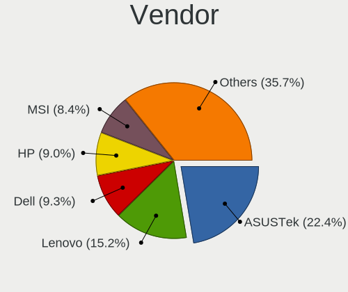

| Name                    | Computers | Percent |
|-------------------------|-----------|---------|
| ASUSTek Computer        | 238       | 22.12%  |
| Lenovo                  | 162       | 15.06%  |
| Dell                    | 114       | 10.59%  |
| MSI                     | 94        | 8.74%   |
| Hewlett-Packard         | 93        | 8.64%   |
| ASRock                  | 72        | 6.69%   |
| Gigabyte Technology     | 68        | 6.32%   |
| Acer                    | 32        | 2.97%   |
| Intel                   | 25        | 2.32%   |
| Unknown                 | 21        | 1.95%   |
| Apple                   | 20        | 1.86%   |
| Supermicro              | 12        | 1.12%   |
| Raspberry Pi Foundation | 12        | 1.12%   |
| Timi                    | 9         | 0.84%   |
| Samsung Electronics     | 9         | 0.84%   |
| Fujitsu                 | 9         | 0.84%   |
| HUAWEI                  | 8         | 0.74%   |
| TUXEDO                  | 7         | 0.65%   |
| Toshiba                 | 6         | 0.56%   |
| ASRockRack              | 5         | 0.46%   |
| Razer                   | 4         | 0.37%   |
| TYAN Computer           | 3         | 0.28%   |
| Tekram Technology       | 3         | 0.28%   |
| Medion                  | 3         | 0.28%   |
| System76                | 2         | 0.19%   |
| Positivo                | 2         | 0.19%   |
| Pegatron                | 2         | 0.19%   |
| Notebook                | 2         | 0.19%   |
| IBM                     | 2         | 0.19%   |
| Framework               | 2         | 0.19%   |
| Foxconn                 | 2         | 0.19%   |
| Chuwi                   | 2         | 0.19%   |
| BESSTAR Tech            | 2         | 0.19%   |
| ZOTAC                   | 1         | 0.09%   |
| YANYU                   | 1         | 0.09%   |
| XMG                     | 1         | 0.09%   |
| Wortmann AG             | 1         | 0.09%   |
| Sun Microsystems        | 1         | 0.09%   |
| Sony                    | 1         | 0.09%   |
| SIEMENS                 | 1         | 0.09%   |
| Shuttle                 | 1         | 0.09%   |
| Seco                    | 1         | 0.09%   |
| Schenker                | 1         | 0.09%   |
| QDI                     | 1         | 0.09%   |
| Purism                  | 1         | 0.09%   |
| PC Specialist           | 1         | 0.09%   |
| Packard Bell            | 1         | 0.09%   |
| NZXT                    | 1         | 0.09%   |
| Neousys Technology      | 1         | 0.09%   |
| MOTILE                  | 1         | 0.09%   |
| LG Electronics          | 1         | 0.09%   |
| Jumper                  | 1         | 0.09%   |
| IT Channel Pty          | 1         | 0.09%   |
| Google                  | 1         | 0.09%   |
| Fanless Mini PC         | 1         | 0.09%   |
| EVGA                    | 1         | 0.09%   |
| Entroware               | 1         | 0.09%   |
| BANGHO                  | 1         | 0.09%   |
| AVITA                   | 1         | 0.09%   |
| AMI                     | 1         | 0.09%   |

Model
-----

Motherboard model

| Name                                    | Computers | Percent |
|-----------------------------------------|-----------|---------|
| Unknown                                 | 28        | 2.6%    |
| ASUS All Series                         | 17        | 1.58%   |
| ASUS TUF Gaming X570-PLUS               | 7         | 0.65%   |
| ASUS PRIME X570-PRO                     | 7         | 0.65%   |
| ASUS PRIME X470-PRO                     | 7         | 0.65%   |
| Supermicro Super Server                 | 5         | 0.46%   |
| MSI MS-7C35                             | 5         | 0.46%   |
| Dell XPS 15 9570                        | 5         | 0.46%   |
| ASUS PRIME X370-PRO                     | 5         | 0.46%   |
| ASRock B450 Pro4                        | 5         | 0.46%   |
| MSI MS-7C02                             | 4         | 0.37%   |
| MSI MS-7B86                             | 4         | 0.37%   |
| MSI MS-7A38                             | 4         | 0.37%   |
| HP Pavilion Notebook                    | 4         | 0.37%   |
| HP OMEN by Laptop                       | 4         | 0.37%   |
| Dell XPS 17 9710                        | 4         | 0.37%   |
| Dell XPS 13 9310                        | 4         | 0.37%   |
| ASUS Z170 PRO GAMING                    | 4         | 0.37%   |
| ASUS TUF Gaming B550-PLUS               | 4         | 0.37%   |
| ASUS ROG STRIX B550-F GAMING            | 4         | 0.37%   |
| ASUS ROG CROSSHAIR VIII HERO            | 4         | 0.37%   |
| ASRock B550M Steel Legend               | 4         | 0.37%   |
| TYAN S7025                              | 3         | 0.28%   |
| Tekram P6B40-A4X-i440BX Rev             | 3         | 0.28%   |
| Supermicro X10SAE                       | 3         | 0.28%   |
| RPi Raspberry Pi Model B Rev 2          | 3         | 0.28%   |
| RPi Raspberry Pi 3 Model B Plus Rev 1.3 | 3         | 0.28%   |
| MSI MS-7C37                             | 3         | 0.28%   |
| MSI MS-7B89                             | 3         | 0.28%   |
| MSI MS-7B79                             | 3         | 0.28%   |
| MSI MS-7A34                             | 3         | 0.28%   |
| MSI MS-7693                             | 3         | 0.28%   |
| Lenovo ThinkPad T14 Gen 1 20UD0013GE    | 3         | 0.28%   |
| Lenovo Legion Y530-15ICH 81FV           | 3         | 0.28%   |
| Lenovo Legion 5 Pro 16ACH6H 82JQ        | 3         | 0.28%   |
| Intel S1200RP                           | 3         | 0.28%   |
| HP ProLiant MicroServer Gen8            | 3         | 0.28%   |
| HP Pavilion Gaming Laptop 15-ec1xxx     | 3         | 0.28%   |
| Fujitsu D3401-H1                        | 3         | 0.28%   |
| Dell XPS 15 7590                        | 3         | 0.28%   |
| Dell XPS 13 9370                        | 3         | 0.28%   |
| Dell XPS 13 9360                        | 3         | 0.28%   |
| Dell Latitude E7440                     | 3         | 0.28%   |
| Dell Latitude 7390                      | 3         | 0.28%   |
| ASUS ROG STRIX X570-E GAMING            | 3         | 0.28%   |
| ASUS ROG STRIX B450-F GAMING            | 3         | 0.28%   |
| ASUS ROG CROSSHAIR VIII DARK HERO       | 3         | 0.28%   |
| ASUS ROG CROSSHAIR VII HERO             | 3         | 0.28%   |
| ASUS PRIME X570-P                       | 3         | 0.28%   |
| ASRock Z390 Extreme4                    | 3         | 0.28%   |
| ASRock X399 Taichi                      | 3         | 0.28%   |
| ASRock B450M-HDV R4.0                   | 3         | 0.28%   |
| Toshiba NB100                           | 2         | 0.19%   |
| Timi RedmiBook 13 R                     | 2         | 0.19%   |
| MSI MS-7C91                             | 2         | 0.19%   |
| MSI MS-7C84                             | 2         | 0.19%   |
| MSI MS-7C56                             | 2         | 0.19%   |
| MSI MS-7C34                             | 2         | 0.19%   |
| MSI MS-7885                             | 2         | 0.19%   |
| MSI MS-7549                             | 2         | 0.19%   |

Model Family
------------

Motherboard model prefix

| Name                    | Computers | Percent |
|-------------------------|-----------|---------|
| Lenovo ThinkPad         | 87        | 8.09%   |
| ASUS ROG                | 49        | 4.55%   |
| ASUS PRIME              | 41        | 3.81%   |
| Dell Latitude           | 36        | 3.35%   |
| Dell XPS                | 34        | 3.16%   |
| Unknown                 | 28        | 2.6%    |
| ASUS TUF                | 27        | 2.51%   |
| Acer Aspire             | 23        | 2.14%   |
| Lenovo Legion           | 22        | 2.04%   |
| Lenovo IdeaPad          | 20        | 1.86%   |
| HP Pavilion             | 19        | 1.77%   |
| ASUS All                | 17        | 1.58%   |
| Dell Inspiron           | 14        | 1.3%    |
| RPi Raspberry           | 12        | 1.12%   |
| HP EliteBook            | 12        | 1.12%   |
| HP OMEN                 | 11        | 1.02%   |
| Lenovo Yoga             | 10        | 0.93%   |
| Dell Precision          | 10        | 0.93%   |
| ASRock X570             | 10        | 0.93%   |
| HP ProBook              | 9         | 0.84%   |
| HP Laptop               | 9         | 0.84%   |
| Gigabyte X570           | 9         | 0.84%   |
| Dell OptiPlex           | 7         | 0.65%   |
| ASUS ZenBook            | 7         | 0.65%   |
| ASRock X370             | 7         | 0.65%   |
| HP ProLiant             | 6         | 0.56%   |
| Gigabyte B450M          | 6         | 0.56%   |
| Gigabyte B450           | 6         | 0.56%   |
| ASRock B450             | 6         | 0.56%   |
| Timi RedmiBook          | 5         | 0.46%   |
| Supermicro Super        | 5         | 0.46%   |
| MSI MS-7C35             | 5         | 0.46%   |
| HP ZBook                | 5         | 0.46%   |
| HP ENVY                 | 5         | 0.46%   |
| HP Compaq               | 5         | 0.46%   |
| ASUS VivoBook           | 5         | 0.46%   |
| Acer Nitro              | 5         | 0.46%   |
| Toshiba Satellite       | 4         | 0.37%   |
| Razer Blade             | 4         | 0.37%   |
| MSI MS-7C02             | 4         | 0.37%   |
| MSI MS-7B86             | 4         | 0.37%   |
| MSI MS-7A38             | 4         | 0.37%   |
| Lenovo ThinkCentre      | 4         | 0.37%   |
| Dell PowerEdge          | 4         | 0.37%   |
| ASUS Z170               | 4         | 0.37%   |
| ASUS M5A97              | 4         | 0.37%   |
| ASRock B550M            | 4         | 0.37%   |
| Apple MacBookPro8       | 4         | 0.37%   |
| TYAN S7025              | 3         | 0.28%   |
| Timi Mi                 | 3         | 0.28%   |
| Tekram P6B40-A4X-i440BX | 3         | 0.28%   |
| Supermicro X10SAE       | 3         | 0.28%   |
| MSI MS-7C37             | 3         | 0.28%   |
| MSI MS-7B89             | 3         | 0.28%   |
| MSI MS-7B79             | 3         | 0.28%   |
| MSI MS-7A34             | 3         | 0.28%   |
| MSI MS-7693             | 3         | 0.28%   |
| Lenovo ThinkBook        | 3         | 0.28%   |
| Intel S1200RP           | 3         | 0.28%   |
| Gigabyte AB350-Gaming   | 3         | 0.28%   |

MFG Year
--------

Motherboard manufacture year

| Year    | Computers | Percent |
|---------|-----------|---------|
| 2019    | 177       | 16.45%  |
| 2020    | 156       | 14.5%   |
| 2018    | 147       | 13.66%  |
| 2021    | 92        | 8.55%   |
| 2017    | 74        | 6.88%   |
| 2015    | 60        | 5.58%   |
| 2016    | 54        | 5.02%   |
| 2012    | 52        | 4.83%   |
| 2014    | 50        | 4.65%   |
| 2013    | 45        | 4.18%   |
| 2011    | 37        | 3.44%   |
| 2010    | 28        | 2.6%    |
| 2008    | 26        | 2.42%   |
| 2009    | 25        | 2.32%   |
| Unknown | 25        | 2.32%   |
| 2007    | 10        | 0.93%   |
| 2022    | 4         | 0.37%   |
| 2006    | 4         | 0.37%   |
| 2005    | 4         | 0.37%   |
| 2000    | 3         | 0.28%   |
| 2004    | 2         | 0.19%   |
| 2003    | 1         | 0.09%   |

Form Factor
-----------

Physical design of the computer

| Name           | Computers | Percent |
|----------------|-----------|---------|
| Desktop        | 500       | 46.47%  |
| Notebook       | 491       | 45.63%  |
| Server         | 30        | 2.79%   |
| Convertible    | 24        | 2.23%   |
| Mini pc        | 14        | 1.3%    |
| System on chip | 13        | 1.21%   |
| All in one     | 3         | 0.28%   |
| Stick pc       | 1         | 0.09%   |

Secure Boot
-----------

Enabled or disabled

| State    | Computers | Percent |
|----------|-----------|---------|
| Disabled | 1057      | 97.78%  |
| Enabled  | 24        | 2.22%   |

Coreboot
--------

Have coreboot on board

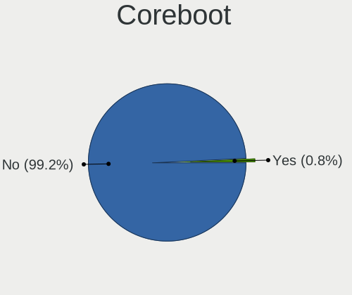

| Used | Computers | Percent |
|------|-----------|---------|
| No   | 1071      | 99.54%  |
| Yes  | 5         | 0.46%   |

RAM Size
--------

Total RAM memory

| Size in GB      | Computers | Percent |
|-----------------|-----------|---------|
| 16.01-24.0      | 277       | 25.14%  |
| 32.01-64.0      | 258       | 23.41%  |
| 8.01-16.0       | 173       | 15.7%   |
| 4.01-8.0        | 136       | 12.34%  |
| 64.01-256.0     | 105       | 9.53%   |
| 3.01-4.0        | 61        | 5.54%   |
| 24.01-32.0      | 34        | 3.09%   |
| 1.01-2.0        | 23        | 2.09%   |
| 0.51-1.0        | 17        | 1.54%   |
| 2.01-3.0        | 12        | 1.09%   |
| 0.01-0.5        | 5         | 0.45%   |
| More than 256.0 | 1         | 0.09%   |

RAM Used
--------

Used RAM memory

| Used GB     | Computers | Percent |
|-------------|-----------|---------|
| 1.01-2.0    | 269       | 21.15%  |
| 4.01-8.0    | 250       | 19.65%  |
| 2.01-3.0    | 213       | 16.75%  |
| 3.01-4.0    | 138       | 10.85%  |
| 0.01-0.5    | 124       | 9.75%   |
| 8.01-16.0   | 121       | 9.51%   |
| 0.51-1.0    | 103       | 8.1%    |
| 16.01-24.0  | 33        | 2.59%   |
| 32.01-64.0  | 10        | 0.79%   |
| 24.01-32.0  | 7         | 0.55%   |
| 64.01-256.0 | 3         | 0.24%   |
| 0           | 1         | 0.08%   |

Total Drives
------------

Number of drives on board

| Drives | Computers | Percent |
|--------|-----------|---------|
| 1      | 483       | 42.67%  |
| 2      | 302       | 26.68%  |
| 3      | 136       | 12.01%  |
| 4      | 83        | 7.33%   |
| 5      | 56        | 4.95%   |
| 6      | 25        | 2.21%   |
| 7      | 18        | 1.59%   |
| 0      | 11        | 0.97%   |
| 8      | 6         | 0.53%   |
| 13     | 3         | 0.27%   |
| 9      | 3         | 0.27%   |
| 26     | 1         | 0.09%   |
| 18     | 1         | 0.09%   |
| 17     | 1         | 0.09%   |
| 12     | 1         | 0.09%   |
| 11     | 1         | 0.09%   |
| 10     | 1         | 0.09%   |

Has CD-ROM
----------

Has CD-ROM on board

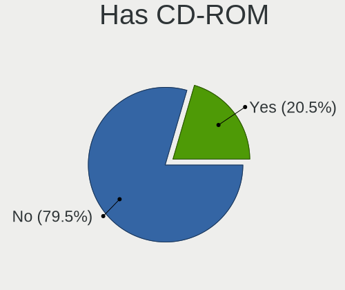

| Presented | Computers | Percent |
|-----------|-----------|---------|
| No        | 842       | 76.82%  |
| Yes       | 254       | 23.18%  |

Has Ethernet
------------

Has Ethernet on board

| Presented | Computers | Percent |
|-----------|-----------|---------|
| Yes       | 939       | 86.62%  |
| No        | 145       | 13.38%  |

Has WiFi
--------

Has WiFi module

| Presented | Computers | Percent |
|-----------|-----------|---------|
| Yes       | 714       | 65.87%  |
| No        | 370       | 34.13%  |

Has Bluetooth
-------------

Has Bluetooth module

| Presented | Computers | Percent |
|-----------|-----------|---------|
| Yes       | 657       | 60.33%  |
| No        | 432       | 39.67%  |

Location
--------

Country
-------

Geographic location (country)

| Country      | Computers | Percent |
|--------------|-----------|---------|
| USA          | 211       | 19.45%  |
| Germany      | 170       | 15.67%  |
| Russia       | 98        | 9.03%   |
| UK           | 56        | 5.16%   |
| France       | 45        | 4.15%   |
| Spain        | 40        | 3.69%   |
| Canada       | 37        | 3.41%   |
| Poland       | 35        | 3.23%   |
| China        | 31        | 2.86%   |
| Sweden       | 25        | 2.3%    |
| Netherlands  | 25        | 2.3%    |
| Italy        | 24        | 2.21%   |
| Finland      | 24        | 2.21%   |
| Ukraine      | 21        | 1.94%   |
| Australia    | 20        | 1.84%   |
| Czechia      | 19        | 1.75%   |
| Greece       | 14        | 1.29%   |
| Switzerland  | 13        | 1.2%    |
| Brazil       | 12        | 1.11%   |
| Belgium      | 12        | 1.11%   |
| Austria      | 11        | 1.01%   |
| Belarus      | 10        | 0.92%   |
| Japan        | 9         | 0.83%   |
| Turkey       | 8         | 0.74%   |
| Romania      | 8         | 0.74%   |
| Norway       | 8         | 0.74%   |
| Mexico       | 7         | 0.65%   |
| India        | 7         | 0.65%   |
| Hong Kong    | 7         | 0.65%   |
| Argentina    | 6         | 0.55%   |
| Slovenia     | 5         | 0.46%   |
| Slovakia     | 5         | 0.46%   |
| Hungary      | 5         | 0.46%   |
| South Africa | 4         | 0.37%   |
| Estonia      | 4         | 0.37%   |
| Taiwan       | 3         | 0.28%   |
| Portugal     | 3         | 0.28%   |
| New Zealand  | 3         | 0.28%   |
| Ireland      | 3         | 0.28%   |
| Chile        | 3         | 0.28%   |
| Bulgaria     | 3         | 0.28%   |
| Vietnam      | 2         | 0.18%   |
| Tunisia      | 2         | 0.18%   |
| Singapore    | 2         | 0.18%   |
| Philippines  | 2         | 0.18%   |
| Kazakhstan   | 2         | 0.18%   |
| Jamaica      | 2         | 0.18%   |
| Iran         | 2         | 0.18%   |
| Indonesia    | 2         | 0.18%   |
| Denmark      | 2         | 0.18%   |
| Uruguay      | 1         | 0.09%   |
| Syria        | 1         | 0.09%   |
| South Korea  | 1         | 0.09%   |
| Saudi Arabia | 1         | 0.09%   |
| Runion     | 1         | 0.09%   |
| Nepal        | 1         | 0.09%   |
| Malaysia     | 1         | 0.09%   |
| Lithuania    | 1         | 0.09%   |
| Israel       | 1         | 0.09%   |
| El Salvador  | 1         | 0.09%   |

City
----

Geographic location (city)

| City              | Computers | Percent |
|-------------------|-----------|---------|
| Berlin            | 41        | 3.5%    |
| Moscow            | 33        | 2.81%   |
| St Petersburg     | 18        | 1.53%   |
| Athens            | 14        | 1.19%   |
| Warsaw            | 12        | 1.02%   |
| Munich            | 12        | 1.02%   |
| Helsinki          | 11        | 0.94%   |
| Kyiv              | 10        | 0.85%   |
| Sydney            | 9         | 0.77%   |
| Amsterdam         | 9         | 0.77%   |
| Wuelfrath         | 8         | 0.68%   |
| Paris             | 8         | 0.68%   |
| Los Angeles       | 8         | 0.68%   |
| Frankfurt am Main | 8         | 0.68%   |
| Vladivostok       | 7         | 0.6%    |
| Ottawa            | 7         | 0.6%    |
| Minsk             | 7         | 0.6%    |
| Melbourne         | 7         | 0.6%    |
| Guangzhou         | 7         | 0.6%    |
| Cieszyn           | 7         | 0.6%    |
| Woolwich          | 6         | 0.51%   |
| Prague            | 6         | 0.51%   |
| Oulu              | 6         | 0.51%   |
| Manitowoc         | 6         | 0.51%   |
| Hamburg           | 6         | 0.51%   |
| Dienheim          | 6         | 0.51%   |
| Beijing           | 6         | 0.51%   |
| Zurich            | 5         | 0.43%   |
| Vienna            | 5         | 0.43%   |
| Vancouver         | 5         | 0.43%   |
| Sao Paulo         | 5         | 0.43%   |
| San Jose          | 5         | 0.43%   |
| Nuremberg         | 5         | 0.43%   |
| Milan             | 5         | 0.43%   |
| London            | 5         | 0.43%   |
| Falkenstein       | 5         | 0.43%   |
| Combrit           | 5         | 0.43%   |
| Utrecht           | 4         | 0.34%   |
| Swansea           | 4         | 0.34%   |
| Suffolk           | 4         | 0.34%   |
| Stockholm         | 4         | 0.34%   |
| Smolensk          | 4         | 0.34%   |
| Seattle           | 4         | 0.34%   |
| New York          | 4         | 0.34%   |
| Istanbul          | 4         | 0.34%   |
| Foshan            | 4         | 0.34%   |
| Dublin            | 4         | 0.34%   |
| Chongqing         | 4         | 0.34%   |
| Cape Town         | 4         | 0.34%   |
| Bucharest         | 4         | 0.34%   |
| Bend              | 4         | 0.34%   |
| Barcelona         | 4         | 0.34%   |
| Almere Stad       | 4         | 0.34%   |
| Yuen Long         | 3         | 0.26%   |
| Yekaterinburg     | 3         | 0.26%   |
| Winnipeg          | 3         | 0.26%   |
| Vigo              | 3         | 0.26%   |
| Troms           | 3         | 0.26%   |
| Toronto           | 3         | 0.26%   |
| Tallinn           | 3         | 0.26%   |

Drives
------

Drive Vendor
------------

Hard drive vendors

| Vendor                         | Computers | Drives | Percent |
|--------------------------------|-----------|--------|---------|
| Samsung Electronics            | 405       | 797    | 22.24%  |
| WDC                            | 335       | 718    | 18.4%   |
| Seagate                        | 236       | 481    | 12.96%  |
| Kingston                       | 99        | 133    | 5.44%   |
| Intel                          | 88        | 143    | 4.83%   |
| Toshiba                        | 86        | 124    | 4.72%   |
| SanDisk                        | 68        | 94     | 3.73%   |
| Crucial                        | 54        | 92     | 2.97%   |
| SK hynix                       | 51        | 62     | 2.8%    |
| Hitachi                        | 49        | 99     | 2.69%   |
| Unknown                        | 47        | 70     | 2.58%   |
| HGST                           | 45        | 73     | 2.47%   |
| A-DATA Technology              | 29        | 44     | 1.59%   |
| Micron Technology              | 20        | 24     | 1.1%    |
| Phison                         | 18        | 28     | 0.99%   |
| Corsair                        | 17        | 31     | 0.93%   |
| KIOXIA                         | 12        | 16     | 0.66%   |
| OCZ                            | 9         | 12     | 0.49%   |
| Transcend                      | 7         | 12     | 0.38%   |
| Plextor                        | 7         | 8      | 0.38%   |
| GOODRAM                        | 7         | 17     | 0.38%   |
| Apple                          | 7         | 9      | 0.38%   |
| SPCC                           | 6         | 6      | 0.33%   |
| Mushkin                        | 6         | 6      | 0.33%   |
| Fujitsu                        | 6         | 9      | 0.33%   |
| XPG                            | 5         | 6      | 0.27%   |
| Team                           | 5         | 11     | 0.27%   |
| Patriot                        | 5         | 8      | 0.27%   |
| LITEONIT                       | 5         | 6      | 0.27%   |
| LITEON                         | 5         | 8      | 0.27%   |
| IBM                            | 5         | 6      | 0.27%   |
| PNY                            | 4         | 4      | 0.22%   |
| KIOXIA-EXCERIA                 | 4         | 8      | 0.22%   |
| China                          | 4         | 6      | 0.22%   |
| Netac                          | 3         | 3      | 0.16%   |
| Lenovo                         | 3         | 5      | 0.16%   |
| Hewlett-Packard                | 3         | 5      | 0.16%   |
| Gigabyte Technology            | 3         | 4      | 0.16%   |
| Apacer                         | 3         | 4      | 0.16%   |
| TO Exter                       | 2         | 2      | 0.11%   |
| Solid State Storage Technology | 2         | 2      | 0.11%   |
| Silicon Motion                 | 2         | 7      | 0.11%   |
| MyDigitalSSD                   | 2         | 2      | 0.11%   |
| MDT                            | 2         | 2      | 0.11%   |
| Linux                          | 2         | 2      | 0.11%   |
| LaCie                          | 2         | 12     | 0.11%   |
| KingDian                       | 2         | 2      | 0.11%   |
| Kingchuxing                    | 2         | 6      | 0.11%   |
| Intenso                        | 2         | 3      | 0.11%   |
| XrayDisk                       | 1         | 1      | 0.05%   |
| Verbatim                       | 1         | 1      | 0.05%   |
| T-FORCE                        | 1         | 1      | 0.05%   |
| Super Talent                   | 1         | 1      | 0.05%   |
| SSSTC                          | 1         | 1      | 0.05%   |
| Smartbuy                       | 1         | 1      | 0.05%   |
| ShanDianZhe                    | 1         | 2      | 0.05%   |
| SATA SSD                       | 1         | 1      | 0.05%   |
| RevuAhn                        | 1         | 1      | 0.05%   |
| OWC                            | 1         | 1      | 0.05%   |
| OSCOO                          | 1         | 1      | 0.05%   |

Drive Model
-----------

Hard drive models

| Model                            | Computers | Percent |
|----------------------------------|-----------|---------|
| Samsung SSD 850 EVO 250GB        | 25        | 1.14%   |
| Samsung SSD 850 EVO 500GB        | 20        | 0.91%   |
| Samsung SSD 860 EVO 1TB          | 19        | 0.87%   |
| HGST HTS721010A9E630 1TB         | 19        | 0.87%   |
| WDC WD30EFRX-68EUZN0 3TB         | 18        | 0.82%   |
| Samsung SSD 970 EVO Plus 500GB   | 18        | 0.82%   |
| Samsung SSD 860 EVO 250GB        | 18        | 0.82%   |
| Samsung SSD 860 EVO 500GB        | 16        | 0.73%   |
| Samsung SSD 970 EVO Plus 1TB     | 15        | 0.68%   |
| Kingston SA400S37240G 240GB SSD  | 15        | 0.68%   |
| Samsung SSD 970 EVO 500GB        | 13        | 0.59%   |
| Samsung SSD 970 EVO 250GB        | 13        | 0.59%   |
| Samsung SSD 970 EVO 1TB          | 13        | 0.59%   |
| Seagate ST1000DM010-2EP102 1TB   | 11        | 0.5%    |
| Samsung SSD 970 PRO 512GB        | 11        | 0.5%    |
| Samsung SSD 840 EVO 120GB        | 11        | 0.5%    |
| Intel SSDPEKNW010T8 1TB          | 11        | 0.5%    |
| Seagate ST500DM002-1BD142 500GB  | 10        | 0.46%   |
| Seagate ST2000DM001-1ER164 2TB   | 10        | 0.46%   |
| Samsung SSD 980 PRO 1TB          | 10        | 0.46%   |
| Samsung SSD 970 EVO Plus 250GB   | 10        | 0.46%   |
| Samsung MZVLB512HBJQ-000L2 512GB | 10        | 0.46%   |
| Kingston SA400S37480G 480GB SSD  | 10        | 0.46%   |
| WDC WD40EFRX-68WT0N0 4TB         | 9         | 0.41%   |
| WDC WD10EZEX-08WN4A0 1TB         | 9         | 0.41%   |
| Seagate ST4000DM004-2CV104 4TB   | 9         | 0.41%   |
| Seagate ST3500418AS 500GB        | 9         | 0.41%   |
| Seagate ST2000DM006-2DM164 2TB   | 9         | 0.41%   |
| Samsung SSD 970 PRO 1TB          | 9         | 0.41%   |
| Samsung SSD 850 EVO 1TB          | 9         | 0.41%   |
| Samsung SSD 840 EVO 250GB        | 9         | 0.41%   |
| Samsung NVMe SSD Drive 512GB     | 9         | 0.41%   |
| Kingston SA400S37120G 120GB SSD  | 9         | 0.41%   |
| WDC WD20EFRX-68EUZN0 2TB         | 8         | 0.37%   |
| Unknown MMC Card  32GB           | 8         | 0.37%   |
| Samsung SSD 980 PRO 2TB          | 8         | 0.37%   |
| Samsung SSD 960 EVO 500GB        | 8         | 0.37%   |
| WDC WDS500G2B0B-00YS70 500GB SSD | 7         | 0.32%   |
| WDC WD40EZRZ-00GXCB0 4TB         | 7         | 0.32%   |
| WDC WD40EFRX-68N32N0 4TB         | 7         | 0.32%   |
| WDC WD20EZRX-00D8PB0 2TB         | 7         | 0.32%   |
| Seagate ST1000LM049-2GH172 1TB   | 7         | 0.32%   |
| SanDisk SDSSDA240G 240GB         | 7         | 0.32%   |
| Samsung SSD 980 1TB              | 7         | 0.32%   |
| Intel SSDPEKNW512G8 512GB        | 7         | 0.32%   |
| Crucial CT500MX500SSD1 500GB     | 7         | 0.32%   |
| Crucial CT275MX300SSD1 275GB     | 7         | 0.32%   |
| WDC WDS500G3X0C-00SJG0 500GB     | 6         | 0.27%   |
| WDC WDS500G2B0A-00SM50 500GB SSD | 6         | 0.27%   |
| WDC WD2003FZEX-00Z4SA0 2TB       | 6         | 0.27%   |
| WDC WD10EZEX-08M2NA0 1TB         | 6         | 0.27%   |
| Unknown MMC Card  64GB           | 6         | 0.27%   |
| Toshiba DT01ACA100 1TB           | 6         | 0.27%   |
| Seagate ST2000LX001-1RG174 2TB   | 6         | 0.27%   |
| Seagate ST2000DM008-2FR102 2TB   | 6         | 0.27%   |
| Seagate ST1000LM035-1RK172 1TB   | 6         | 0.27%   |
| Seagate ST1000DM003-1CH162 1TB   | 6         | 0.27%   |
| SanDisk SSD PLUS 240GB           | 6         | 0.27%   |
| Samsung SSD 970 EVO Plus 2TB     | 6         | 0.27%   |
| Samsung SSD 960 EVO 250GB        | 6         | 0.27%   |

HDD Vendor
----------

Hard disk drive vendors

| Vendor              | Computers | Drives | Percent |
|---------------------|-----------|--------|---------|
| WDC                 | 246       | 562    | 36.99%  |
| Seagate             | 228       | 468    | 34.29%  |
| Toshiba             | 53        | 81     | 7.97%   |
| Hitachi             | 49        | 99     | 7.37%   |
| HGST                | 45        | 73     | 6.77%   |
| Samsung Electronics | 23        | 34     | 3.46%   |
| Fujitsu             | 6         | 9      | 0.9%    |
| IBM                 | 5         | 6      | 0.75%   |
| Unknown             | 3         | 4      | 0.45%   |
| MDT                 | 2         | 2      | 0.3%    |
| LaCie               | 2         | 12     | 0.3%    |
| IBM/Hitachi         | 1         | 1      | 0.15%   |
| Hewlett-Packard     | 1         | 2      | 0.15%   |
| Apple               | 1         | 1      | 0.15%   |

SSD Vendor
----------

Solid state drive vendors

| Vendor              | Computers | Drives | Percent |
|---------------------|-----------|--------|---------|
| Samsung Electronics | 209       | 369    | 33.66%  |
| Kingston            | 72        | 96     | 11.59%  |
| SanDisk             | 58        | 84     | 9.34%   |
| Crucial             | 47        | 79     | 7.57%   |
| WDC                 | 37        | 51     | 5.96%   |
| Intel               | 34        | 43     | 5.48%   |
| A-DATA Technology   | 15        | 24     | 2.42%   |
| SK hynix            | 12        | 13     | 1.93%   |
| Toshiba             | 10        | 12     | 1.61%   |
| Micron Technology   | 10        | 13     | 1.61%   |
| Corsair             | 10        | 16     | 1.61%   |
| OCZ                 | 8         | 11     | 1.29%   |
| GOODRAM             | 7         | 17     | 1.13%   |
| Transcend           | 6         | 11     | 0.97%   |
| Plextor             | 6         | 6      | 0.97%   |
| SPCC                | 5         | 5      | 0.81%   |
| Mushkin             | 5         | 5      | 0.81%   |
| LITEONIT            | 5         | 6      | 0.81%   |
| Team                | 4         | 6      | 0.64%   |
| China               | 4         | 6      | 0.64%   |
| Apple               | 4         | 5      | 0.64%   |
| PNY                 | 3         | 3      | 0.48%   |
| Patriot             | 3         | 6      | 0.48%   |
| TO Exter            | 2         | 2      | 0.32%   |
| Seagate             | 2         | 5      | 0.32%   |
| Netac               | 2         | 2      | 0.32%   |
| MyDigitalSSD        | 2         | 2      | 0.32%   |
| LITEON              | 2         | 3      | 0.32%   |
| Linux               | 2         | 2      | 0.32%   |
| KingDian            | 2         | 2      | 0.32%   |
| Intenso             | 2         | 3      | 0.32%   |
| Apacer              | 2         | 3      | 0.32%   |
| XrayDisk            | 1         | 1      | 0.16%   |
| Verbatim            | 1         | 1      | 0.16%   |
| Unknown             | 1         | 1      | 0.16%   |
| Super Talent        | 1         | 1      | 0.16%   |
| Smartbuy            | 1         | 1      | 0.16%   |
| ShanDianZhe         | 1         | 2      | 0.16%   |
| RevuAhn             | 1         | 1      | 0.16%   |
| Phison              | 1         | 1      | 0.16%   |
| OWC                 | 1         | 1      | 0.16%   |
| OCZ-VERTEX          | 1         | 1      | 0.16%   |
| Lite-On             | 1         | 1      | 0.16%   |
| Leven               | 1         | 2      | 0.16%   |
| Lenovo              | 1         | 2      | 0.16%   |
| Kingmax             | 1         | 1      | 0.16%   |
| Kingchuxing         | 1         | 1      | 0.16%   |
| Kimtigo             | 1         | 1      | 0.16%   |
| Hoodisk             | 1         | 1      | 0.16%   |
| Hewlett-Packard     | 1         | 1      | 0.16%   |
| Faspeed             | 1         | 1      | 0.16%   |
| EMTEC               | 1         | 3      | 0.16%   |
| e2e4                | 1         | 1      | 0.16%   |
| Dogfish             | 1         | 1      | 0.16%   |
| CT2000MX            | 1         | 1      | 0.16%   |
| BIWIN               | 1         | 1      | 0.16%   |
| ASUS-PHISON         | 1         | 2      | 0.16%   |
| ASMedia             | 1         | 1      | 0.16%   |
| AMD-RAID            | 1         | 2      | 0.16%   |
| AMD                 | 1         | 1      | 0.16%   |

Drive Kind
----------

HDD or SSD

| Kind    | Computers | Drives | Percent |
|---------|-----------|--------|---------|
| NVMe    | 543       | 898    | 33.44%  |
| HDD     | 522       | 1354   | 32.14%  |
| SSD     | 512       | 947    | 31.53%  |
| MMC     | 42        | 62     | 2.59%   |
| Unknown | 5         | 7      | 0.31%   |

Drive Connector
---------------

SATA, SAS, NVMe, etc.

| Type | Computers | Drives | Percent |
|------|-----------|--------|---------|
| SATA | 759       | 2250   | 55.16%  |
| NVMe | 542       | 897    | 39.39%  |
| MMC  | 42        | 62     | 3.05%   |
| SAS  | 33        | 59     | 2.4%    |

Drive Size
----------

Size of hard drive

| Size in TB | Computers | Drives | Percent |
|------------|-----------|--------|---------|
| 0.01-0.5   | 530       | 988    | 45.85%  |
| 0.51-1.0   | 330       | 535    | 28.55%  |
| 1.01-2.0   | 138       | 320    | 11.94%  |
| 3.01-4.0   | 69        | 157    | 5.97%   |
| 2.01-3.0   | 45        | 111    | 3.89%   |
| 4.01-10.0  | 38        | 176    | 3.29%   |
| 10.01-20.0 | 5         | 13     | 0.43%   |
| 20.01-50.0 | 1         | 1      | 0.09%   |

Space Total
-----------

Amount of disk space available on the file system

| Size in GB     | Computers | Percent |
|----------------|-----------|---------|
| 251-500        | 232       | 19.93%  |
| 101-250        | 216       | 18.56%  |
| 501-1000       | 184       | 15.81%  |
| 1001-2000      | 134       | 11.51%  |
| More than 3000 | 118       | 10.14%  |
| Unknown        | 69        | 5.93%   |
| 2001-3000      | 64        | 5.5%    |
| 51-100         | 62        | 5.33%   |
| 1-20           | 55        | 4.73%   |
| 21-50          | 30        | 2.58%   |

Space Used
----------

Amount of used disk space

| Used GB        | Computers | Percent |
|----------------|-----------|---------|
| 1-20           | 248       | 20.29%  |
| 101-250        | 182       | 14.89%  |
| 21-50          | 166       | 13.58%  |
| 251-500        | 161       | 13.18%  |
| 51-100         | 115       | 9.41%   |
| 501-1000       | 111       | 9.08%   |
| 1001-2000      | 82        | 6.71%   |
| Unknown        | 69        | 5.65%   |
| More than 3000 | 56        | 4.58%   |
| 2001-3000      | 32        | 2.62%   |

Malfunc. Drives
---------------

Drive models with a malfunction

| Model                                        | Computers | Drives | Percent |
|----------------------------------------------|-----------|--------|---------|
| Seagate ST3500418AS 500GB                    | 6         | 7      | 2.86%   |
| HGST HTS721010A9E630 1TB                     | 5         | 6      | 2.38%   |
| WDC WD40EFRX-68WT0N0 4TB                     | 4         | 14     | 1.9%    |
| Seagate ST8000AS0002-1NA17Z 8TB              | 3         | 15     | 1.43%   |
| Seagate ST500DM002-1BD142 500GB              | 3         | 3      | 1.43%   |
| Seagate ST500DM002-1BC142 500GB              | 3         | 3      | 1.43%   |
| Samsung Electronics SSD 850 EVO 1TB          | 3         | 3      | 1.43%   |
| IBM DJSA-220 12GB                            | 3         | 3      | 1.43%   |
| WDC WD60EFRX-68MYMN1 6TB                     | 2         | 5      | 0.95%   |
| WDC WD40EFRX-68N32N0 4TB                     | 2         | 2      | 0.95%   |
| WDC WD30EFRX-68AX9N0 3TB                     | 2         | 3      | 0.95%   |
| WDC WD20EZRX-00D8PB0 2TB                     | 2         | 3      | 0.95%   |
| WDC WD20EARS-00MVWB0 2TB                     | 2         | 2      | 0.95%   |
| WDC WD2002FAEX-007BA0 2TB                    | 2         | 2      | 0.95%   |
| WDC WD15EARS-00Z5B1 1TB                      | 2         | 2      | 0.95%   |
| SK hynix HFS256G39TND-N210A 256GB SSD        | 2         | 2      | 0.95%   |
| Seagate ST4000DM000-1F2168 4TB               | 2         | 2      | 0.95%   |
| Seagate ST31000340NS 1TB                     | 2         | 3      | 0.95%   |
| Seagate ST2000LX001-1RG174 2TB               | 2         | 2      | 0.95%   |
| Seagate ST2000DL003-9VT166 2TB               | 2         | 3      | 0.95%   |
| Seagate ST1000NM0011 1TB                     | 2         | 6      | 0.95%   |
| Seagate ST1000LM024 HN-M101MBB 1TB           | 2         | 3      | 0.95%   |
| SanDisk SSD PLUS 1000GB                      | 2         | 2      | 0.95%   |
| SanDisk SD9SN8W-128G-1006 128GB SSD          | 2         | 2      | 0.95%   |
| Samsung Electronics SSD 840 PRO Series 512GB | 2         | 4      | 0.95%   |
| Samsung Electronics HD103UJ 1TB              | 2         | 2      | 0.95%   |
| MDT MD2000KS-00MJB0 200GB                    | 2         | 2      | 0.95%   |
| Hitachi HDS722020ALA330 2TB                  | 2         | 16     | 0.95%   |
| Crucial CT525MX300SSD1 528GB                 | 2         | 2      | 0.95%   |
| WDC WD80EFZX-68UW8N0 8TB                     | 1         | 2      | 0.48%   |
| WDC WD7501AALS-00J7B0 752GB                  | 1         | 1      | 0.48%   |
| WDC WD6401AALS-00J7B0 640GB                  | 1         | 1      | 0.48%   |
| WDC WD6400AAKS-65A7B2 640GB                  | 1         | 1      | 0.48%   |
| WDC WD60EFRX-68L0BN1 6TB                     | 1         | 18     | 0.48%   |
| WDC WD5000BEVT-22ZAT0 500GB                  | 1         | 1      | 0.48%   |
| WDC WD5000AZRX-00A8LB0 500GB                 | 1         | 1      | 0.48%   |
| WDC WD5000AAVS-22G9B1 500GB                  | 1         | 1      | 0.48%   |
| WDC WD5000AAKX-003CA0 500GB                  | 1         | 1      | 0.48%   |
| WDC WD5000AAKS-00UU3A0 500GB                 | 1         | 2      | 0.48%   |
| WDC WD4004FZWX-00GBGB0 4TB                   | 1         | 1      | 0.48%   |
| WDC WD30EFRX-68EUZN0 3TB                     | 1         | 1      | 0.48%   |
| WDC WD3001FAEX-00MJRA0 3TB                   | 1         | 2      | 0.48%   |
| WDC WD2502ABYS-02B7A0 256GB                  | 1         | 1      | 0.48%   |
| WDC WD20EZRZ-00Z5HB0 2TB                     | 1         | 1      | 0.48%   |
| WDC WD20EFRX-68EUZN0 2TB                     | 1         | 1      | 0.48%   |
| WDC WD20EFRX-68AX9N0 2TB                     | 1         | 1      | 0.48%   |
| WDC WD20EARS-00J2GB0 2TB                     | 1         | 1      | 0.48%   |
| WDC WD2003FZEX-00Z4SA0 2TB                   | 1         | 1      | 0.48%   |
| WDC WD1600AAJS-75B4A0 160GB                  | 1         | 1      | 0.48%   |
| WDC WD10SPZX-24Z10T0 1TB                     | 1         | 1      | 0.48%   |
| WDC WD10JPVX-75JC3T0 1TB                     | 1         | 1      | 0.48%   |
| WDC WD10EZRX-00A8LB0 1TB                     | 1         | 1      | 0.48%   |
| WDC WD10EZEX-08M2NA0 1TB                     | 1         | 2      | 0.48%   |
| WDC WD10EAVS-00D7B1 1TB                      | 1         | 1      | 0.48%   |
| WDC WD10EARS-00Y5B1 1TB                      | 1         | 1      | 0.48%   |
| WDC WD10EACS-22D6B0 1TB                      | 1         | 1      | 0.48%   |
| WDC WD1003FZEX-00MK2A0 1TB                   | 1         | 2      | 0.48%   |
| WDC WD1002FBYS-18W8B0 1TB                    | 1         | 1      | 0.48%   |
| WDC WD1002FAEX-00Z3A0 1TB                    | 1         | 1      | 0.48%   |
| WDC WD1002FAEX-00Y9A0 1TB                    | 1         | 1      | 0.48%   |

Malfunc. Drive Vendor
---------------------

Vendors of faulty drives

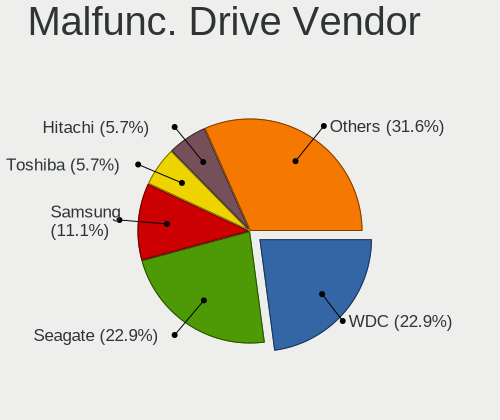

| Vendor              | Computers | Drives | Percent |
|---------------------|-----------|--------|---------|
| Seagate             | 50        | 76     | 25%     |
| WDC                 | 45        | 86     | 22.5%   |
| Samsung Electronics | 21        | 27     | 10.5%   |
| Hitachi             | 15        | 30     | 7.5%    |
| Toshiba             | 11        | 13     | 5.5%    |
| SanDisk             | 8         | 10     | 4%      |
| HGST                | 8         | 10     | 4%      |
| Crucial             | 6         | 6      | 3%      |
| Intel               | 5         | 5      | 2.5%    |
| SK hynix            | 4         | 4      | 2%      |
| Kingston            | 4         | 4      | 2%      |
| IBM                 | 4         | 4      | 2%      |
| Fujitsu             | 3         | 3      | 1.5%    |
| Plextor             | 2         | 2      | 1%      |
| MDT                 | 2         | 2      | 1%      |
| Corsair             | 2         | 4      | 1%      |
| Transcend           | 1         | 1      | 0.5%    |
| SPCC                | 1         | 1      | 0.5%    |
| OCZ                 | 1         | 1      | 0.5%    |
| Mushkin             | 1         | 1      | 0.5%    |
| LITEON              | 1         | 2      | 0.5%    |
| IBM/Hitachi         | 1         | 1      | 0.5%    |
| EMTEC               | 1         | 2      | 0.5%    |
| Apple               | 1         | 1      | 0.5%    |
| A-DATA Technology   | 1         | 1      | 0.5%    |
| 2.5"                | 1         | 1      | 0.5%    |

Malfunc. HDD Vendor
-------------------

Vendors of faulty HDD drives

| Vendor              | Computers | Drives | Percent |
|---------------------|-----------|--------|---------|
| Seagate             | 50        | 76     | 35.21%  |
| WDC                 | 45        | 86     | 31.69%  |
| Hitachi             | 15        | 30     | 10.56%  |
| Toshiba             | 10        | 12     | 7.04%   |
| HGST                | 8         | 10     | 5.63%   |
| IBM                 | 4         | 4      | 2.82%   |
| Samsung Electronics | 3         | 4      | 2.11%   |
| Fujitsu             | 3         | 3      | 2.11%   |
| MDT                 | 2         | 2      | 1.41%   |
| IBM/Hitachi         | 1         | 1      | 0.7%    |
| Apple               | 1         | 1      | 0.7%    |

Malfunc. Drive Kind
-------------------

Kinds of faulty drives

| Kind | Computers | Drives | Percent |
|------|-----------|--------|---------|
| HDD  | 134       | 229    | 69.79%  |
| SSD  | 47        | 56     | 24.48%  |
| NVMe | 11        | 13     | 5.73%   |

Failed Drives
-------------

Failed drive models

| Model                                            | Computers | Drives | Percent |
|--------------------------------------------------|-----------|--------|---------|
| Toshiba THNSN5512GPUK NVMe 512GB                 | 2         | 2      | 28.57%  |
| WDC WD6400BEVT-22A0RT0 640GB                     | 1         | 1      | 14.29%  |
| Seagate ST3500630AS 500GB                        | 1         | 2      | 14.29%  |
| Seagate ST31500341AS 1TB                         | 1         | 1      | 14.29%  |
| Samsung Electronics MZ7LN256HCHP-00000 256GB SSD | 1         | 2      | 14.29%  |
| Hitachi HTS721010G9SA00 100GB                    | 1         | 1      | 14.29%  |

Failed Drive Vendor
-------------------

Failed drive vendors

| Vendor              | Computers | Drives | Percent |
|---------------------|-----------|--------|---------|
| Toshiba             | 2         | 2      | 28.57%  |
| Seagate             | 2         | 3      | 28.57%  |
| WDC                 | 1         | 1      | 14.29%  |
| Samsung Electronics | 1         | 2      | 14.29%  |
| Hitachi             | 1         | 1      | 14.29%  |

Drive Status
------------

Number of failed and malfunc. drives

| Status   | Computers | Drives | Percent |
|----------|-----------|--------|---------|
| Works    | 935       | 2644   | 72.93%  |
| Malfunc  | 185       | 298    | 14.43%  |
| Detected | 155       | 317    | 12.09%  |
| Failed   | 7         | 9      | 0.55%   |

Storage controller
------------------

Storage Vendor
--------------

Storage controller vendors

| Vendor                           | Computers | Percent |
|----------------------------------|-----------|---------|
| Intel                            | 586       | 37.11%  |
| AMD                              | 311       | 19.7%   |
| Samsung Electronics              | 249       | 15.77%  |
| SanDisk                          | 80        | 5.07%   |
| ASMedia Technology               | 53        | 3.36%   |
| SK hynix                         | 39        | 2.47%   |
| Phison Electronics               | 33        | 2.09%   |
| Kingston Technology Company      | 29        | 1.84%   |
| Toshiba America Info Systems     | 28        | 1.77%   |
| Marvell Technology Group         | 21        | 1.33%   |
| Nvidia                           | 19        | 1.2%    |
| ADATA Technology                 | 18        | 1.14%   |
| KIOXIA                           | 15        | 0.95%   |
| Silicon Motion                   | 11        | 0.7%    |
| Micron Technology                | 11        | 0.7%    |
| LSI Logic / Symbios Logic        | 11        | 0.7%    |
| JMicron Technology               | 11        | 0.7%    |
| Micron/Crucial Technology        | 9         | 0.57%   |
| Broadcom / LSI                   | 8         | 0.51%   |
| Adaptec                          | 6         | 0.38%   |
| Seagate Technology               | 5         | 0.32%   |
| Solid State Storage Technology   | 3         | 0.19%   |
| Silicon Image                    | 3         | 0.19%   |
| Realtek Semiconductor            | 3         | 0.19%   |
| Lite-On Technology               | 3         | 0.19%   |
| Lenovo                           | 2         | 0.13%   |
| Apple                            | 2         | 0.13%   |
| 3ware                            | 2         | 0.13%   |
| VIA Technologies                 | 1         | 0.06%   |
| Union Memory (Shenzhen)          | 1         | 0.06%   |
| Silicon Integrated Systems [SiS] | 1         | 0.06%   |
| OCZ Technology Group             | 1         | 0.06%   |
| Lite-On IT Corp. / Plextor       | 1         | 0.06%   |
| Integrated Technology Express    | 1         | 0.06%   |
| Hewlett-Packard                  | 1         | 0.06%   |
| Broadcom                         | 1         | 0.06%   |

Storage Model
-------------

Storage controller models

| Model                                                                            | Computers | Percent |
|----------------------------------------------------------------------------------|-----------|---------|
| AMD FCH SATA Controller [AHCI mode]                                              | 241       | 13.3%   |
| Samsung NVMe SSD Controller SM981/PM981/PM983                                    | 160       | 8.83%   |
| AMD 400 Series Chipset SATA Controller                                           | 73        | 4.03%   |
| ASMedia ASM1062 Serial ATA Controller                                            | 51        | 2.81%   |
| Intel Q170/Q150/B150/H170/H110/Z170/CM236 Chipset SATA Controller [AHCI Mode]    | 49        | 2.7%    |
| Intel Sunrise Point-LP SATA Controller [AHCI mode]                               | 41        | 2.26%   |
| Samsung NVMe SSD Controller SM961/PM961/SM963                                    | 35        | 1.93%   |
| Intel Cannon Lake Mobile PCH SATA AHCI Controller                                | 34        | 1.88%   |
| Intel 8 Series/C220 Series Chipset Family 6-port SATA Controller 1 [AHCI mode]   | 34        | 1.88%   |
| AMD SB7x0/SB8x0/SB9x0 SATA Controller [AHCI mode]                                | 34        | 1.88%   |
| SanDisk WD Black SN750 / PC SN730 NVMe SSD                                       | 31        | 1.71%   |
| Samsung NVMe SSD Controller PM9A1/PM9A3/980PRO                                   | 30        | 1.66%   |
| Intel 82801 Mobile SATA Controller [RAID mode]                                   | 28        | 1.55%   |
| AMD 500 Series Chipset SATA Controller                                           | 25        | 1.38%   |
| Intel SSD 660P Series                                                            | 24        | 1.32%   |
| Intel HM170/QM170 Chipset SATA Controller [AHCI Mode]                            | 23        | 1.27%   |
| Samsung NVMe SSD Controller 980                                                  | 22        | 1.21%   |
| SK hynix Gold P31 SSD                                                            | 20        | 1.1%    |
| Intel Cannon Lake PCH SATA AHCI Controller                                       | 20        | 1.1%    |
| Intel 7 Series/C210 Series Chipset Family 6-port SATA Controller [AHCI mode]     | 19        | 1.05%   |
| Intel 6 Series/C200 Series Chipset Family 6 port Mobile SATA AHCI Controller     | 19        | 1.05%   |
| Intel Comet Lake SATA AHCI Controller                                            | 18        | 0.99%   |
| AMD X370 Series Chipset SATA Controller                                          | 18        | 0.99%   |
| ADATA XPG SX8200 Pro PCIe Gen3x4 M.2 2280 Solid State Drive                      | 18        | 0.99%   |
| Intel Volume Management Device NVMe RAID Controller                              | 17        | 0.94%   |
| Intel 8 Series SATA Controller 1 [AHCI mode]                                     | 15        | 0.83%   |
| Intel 7 Series Chipset Family 6-port SATA Controller [AHCI mode]                 | 15        | 0.83%   |
| Intel 6 Series/C200 Series Chipset Family 6 port Desktop SATA AHCI Controller    | 15        | 0.83%   |
| Intel 200 Series PCH SATA controller [AHCI mode]                                 | 15        | 0.83%   |
| SanDisk WD Blue SN550 NVMe SSD                                                   | 14        | 0.77%   |
| Phison E12 NVMe Controller                                                       | 14        | 0.77%   |
| Intel SSD Pro 7600p/760p/E 6100p Series                                          | 14        | 0.77%   |
| Intel 82801JI (ICH10 Family) SATA AHCI Controller                                | 14        | 0.77%   |
| SanDisk WD Black 2018/SN750 / PC SN720 NVMe SSD                                  | 13        | 0.72%   |
| Intel SATA Controller [RAID mode]                                                | 13        | 0.72%   |
| Intel 9 Series Chipset Family SATA Controller [AHCI Mode]                        | 13        | 0.72%   |
| Intel 82801G (ICH7 Family) IDE Controller                                        | 13        | 0.72%   |
| Toshiba America Info Systems XG6 NVMe SSD Controller                             | 12        | 0.66%   |
| Kingston Company A2000 NVMe SSD                                                  | 12        | 0.66%   |
| Intel Wildcat Point-LP SATA Controller [AHCI Mode]                               | 12        | 0.66%   |
| Intel 500 Series Chipset Family SATA AHCI Controller                             | 12        | 0.66%   |
| AMD SB7x0/SB8x0/SB9x0 IDE Controller                                             | 12        | 0.66%   |
| AMD 300 Series Chipset SATA Controller                                           | 12        | 0.66%   |
| Samsung NVMe SSD Controller SM951/PM951                                          | 11        | 0.61%   |
| Phison E16 PCIe4 NVMe Controller                                                 | 11        | 0.61%   |
| Micron Non-Volatile memory controller                                            | 11        | 0.61%   |
| KIOXIA NVMe SSD Controller BG4                                                   | 10        | 0.55%   |
| Intel 400 Series Chipset Family SATA AHCI Controller                             | 10        | 0.55%   |
| Intel C610/X99 series chipset sSATA Controller [AHCI mode]                       | 9         | 0.5%    |
| Toshiba America Info Systems Toshiba America Info Non-Volatile memory controller | 8         | 0.44%   |
| SanDisk Non-Volatile memory controller                                           | 8         | 0.44%   |
| Intel Celeron/Pentium Silver Processor SATA Controller                           | 8         | 0.44%   |
| Intel Cannon Point-LP SATA Controller [AHCI Mode]                                | 8         | 0.44%   |
| Intel Atom Processor E3800 Series SATA AHCI Controller                           | 8         | 0.44%   |
| SK hynix Non-Volatile memory controller                                          | 7         | 0.39%   |
| SK hynix BC501 NVMe Solid State Drive                                            | 7         | 0.39%   |
| Silicon Motion SM2263EN/SM2263XT SSD Controller                                  | 7         | 0.39%   |
| SanDisk WD Blue SN500 / PC SN520 NVMe SSD                                        | 7         | 0.39%   |
| Kingston Company U-SNS8154P3 NVMe SSD                                            | 7         | 0.39%   |
| Kingston Company Company Non-Volatile memory controller                          | 7         | 0.39%   |

Storage Kind
------------

Kind of storage controller (IDE, SATA, NVMe, SAS, ...)

| Kind | Computers | Percent |
|------|-----------|---------|
| SATA | 796       | 51.89%  |
| NVMe | 548       | 35.72%  |
| IDE  | 92        | 6%      |
| RAID | 75        | 4.89%   |
| SAS  | 16        | 1.04%   |
| SCSI | 7         | 0.46%   |

Processor
---------

CPU Vendor
----------

Processor vendors

| Vendor                   | Computers | Percent |
|--------------------------|-----------|---------|
| Intel                    | 673       | 62.55%  |
| AMD                      | 377       | 35.04%  |
| ARM                      | 14        | 1.3%    |
| Marvell Semiconductor    | 3         | 0.28%   |
| PowerNV C1P9S01 REV 1.01 | 1         | 0.09%   |
| PowerMac8,1              | 1         | 0.09%   |
| PowerMac3,6              | 1         | 0.09%   |
| PowerMac10,2             | 1         | 0.09%   |
| PowerBook6,7             | 1         | 0.09%   |
| PowerBook5,6             | 1         | 0.09%   |
| PowerBook5,5             | 1         | 0.09%   |
| PowerBook5,4             | 1         | 0.09%   |
| PowerBook3,4             | 1         | 0.09%   |

CPU Model
---------

Processor models

| Model                                         | Computers | Percent |
|-----------------------------------------------|-----------|---------|
| AMD Ryzen 7 3700X 8-Core Processor            | 22        | 2.03%   |
| Intel Core i7-9750H CPU @ 2.60GHz             | 18        | 1.66%   |
| Intel Core i7-8750H CPU @ 2.20GHz             | 18        | 1.66%   |
| Intel Core i7-8550U CPU @ 1.80GHz             | 16        | 1.48%   |
| AMD Ryzen 7 2700X Eight-Core Processor        | 16        | 1.48%   |
| AMD Ryzen 5 3600 6-Core Processor             | 16        | 1.48%   |
| AMD Ryzen 9 3950X 16-Core Processor           | 14        | 1.29%   |
| Intel Core i7-6700HQ CPU @ 2.60GHz            | 13        | 1.2%    |
| Intel Core i5-8265U CPU @ 1.60GHz             | 12        | 1.11%   |
| AMD Ryzen 7 PRO 4750U with Radeon Graphics    | 12        | 1.11%   |
| AMD Ryzen 7 5800H with Radeon Graphics        | 12        | 1.11%   |
| AMD Ryzen 7 2700 Eight-Core Processor         | 12        | 1.11%   |
| Intel Core i7-8565U CPU @ 1.80GHz             | 11        | 1.02%   |
| Intel Core i7-7500U CPU @ 2.70GHz             | 11        | 1.02%   |
| Intel Core i5-8250U CPU @ 1.60GHz             | 11        | 1.02%   |
| AMD Ryzen 9 3900X 12-Core Processor           | 11        | 1.02%   |
| AMD Ryzen 7 3800X 8-Core Processor            | 11        | 1.02%   |
| AMD Ryzen 5 5600X 6-Core Processor            | 11        | 1.02%   |
| AMD Ryzen 5 2600 Six-Core Processor           | 11        | 1.02%   |
| AMD Ryzen 9 5950X 16-Core Processor           | 10        | 0.92%   |
| Intel Core i7-6700K CPU @ 4.00GHz             | 9         | 0.83%   |
| Intel Core i5-10210U CPU @ 1.60GHz            | 9         | 0.83%   |
| Intel 11th Gen Core i7-1165G7 @ 2.80GHz       | 9         | 0.83%   |
| ARM Processor                                 | 9         | 0.83%   |
| AMD Ryzen 9 5900X 12-Core Processor           | 9         | 0.83%   |
| AMD Ryzen 7 4800H with Radeon Graphics        | 9         | 0.83%   |
| AMD Ryzen 5 3500U with Radeon Vega Mobile Gfx | 9         | 0.83%   |
| AMD Ryzen 5 1600 Six-Core Processor           | 9         | 0.83%   |
| Intel Core i7-7700HQ CPU @ 2.80GHz            | 8         | 0.74%   |
| AMD Ryzen 7 4700U with Radeon Graphics        | 8         | 0.74%   |
| AMD FX-8350 Eight-Core Processor              | 8         | 0.74%   |
| Intel Core i7-10510U CPU @ 1.80GHz            | 7         | 0.65%   |
| Intel 11th Gen Core i7-11800H @ 2.30GHz       | 7         | 0.65%   |
| Intel 11th Gen Core i5-1135G7 @ 2.40GHz       | 7         | 0.65%   |
| Intel Core i9-9900K CPU @ 3.60GHz             | 6         | 0.55%   |
| Intel Core i7-8700K CPU @ 3.70GHz             | 6         | 0.55%   |
| Intel Core i7-8650U CPU @ 1.90GHz             | 6         | 0.55%   |
| Intel Core i7-4790K CPU @ 4.00GHz             | 6         | 0.55%   |
| Intel Core i7-1065G7 CPU @ 1.30GHz            | 6         | 0.55%   |
| Intel Core i5-8300H CPU @ 2.30GHz             | 6         | 0.55%   |
| Intel 11th Gen Core i7-1185G7 @ 3.00GHz       | 6         | 0.55%   |
| AMD Ryzen 7 5800X 8-Core Processor            | 6         | 0.55%   |
| AMD Ryzen 5 1600X Six-Core Processor          | 6         | 0.55%   |
| Intel Core i7-7700K CPU @ 4.20GHz             | 5         | 0.46%   |
| Intel Core i7-6700 CPU @ 3.40GHz              | 5         | 0.46%   |
| Intel Core i7-3770 CPU @ 3.40GHz              | 5         | 0.46%   |
| Intel Core i5-9300H CPU @ 2.40GHz             | 5         | 0.46%   |
| Intel Core i5-6500 CPU @ 3.20GHz              | 5         | 0.46%   |
| Intel Core i5-5200U CPU @ 2.20GHz             | 5         | 0.46%   |
| AMD Ryzen 9 5900HX with Radeon Graphics       | 5         | 0.46%   |
| AMD Ryzen 7 3700U with Radeon Vega Mobile Gfx | 5         | 0.46%   |
| AMD Ryzen 7 1700 Eight-Core Processor         | 5         | 0.46%   |
| AMD Ryzen 5 4600H with Radeon Graphics        | 5         | 0.46%   |
| AMD Ryzen 3 2200G with Radeon Vega Graphics   | 5         | 0.46%   |
| Intel Xeon CPU X5680 @ 3.33GHz                | 4         | 0.37%   |
| Intel Core i9-9880H CPU @ 2.30GHz             | 4         | 0.37%   |
| Intel Core i7-6820HQ CPU @ 2.70GHz            | 4         | 0.37%   |
| Intel Core i7-6500U CPU @ 2.50GHz             | 4         | 0.37%   |
| Intel Core i7-4790 CPU @ 3.60GHz              | 4         | 0.37%   |
| Intel Core i7-3770K CPU @ 3.50GHz             | 4         | 0.37%   |

CPU Model Family
----------------

Processor model prefix

| Model                   | Computers | Percent |
|-------------------------|-----------|---------|
| Intel Core i7           | 272       | 25.19%  |
| Intel Core i5           | 165       | 15.28%  |
| AMD Ryzen 7             | 128       | 11.85%  |
| AMD Ryzen 5             | 88        | 8.15%   |
| Other                   | 75        | 6.94%   |
| AMD Ryzen 9             | 51        | 4.72%   |
| Intel Xeon              | 46        | 4.26%   |
| Intel Celeron           | 21        | 1.94%   |
| AMD Ryzen 7 PRO         | 21        | 1.94%   |
| AMD FX                  | 21        | 1.94%   |
| Intel Core i9           | 18        | 1.67%   |
| Intel Core 2 Duo        | 18        | 1.67%   |
| Intel Atom              | 18        | 1.67%   |
| Intel Pentium           | 14        | 1.3%    |
| Intel Core i3           | 12        | 1.11%   |
| AMD Ryzen 3             | 12        | 1.11%   |
| Intel Core 2 Quad       | 10        | 0.93%   |
| AMD Phenom II X4        | 8         | 0.74%   |
| AMD Ryzen Threadripper  | 7         | 0.65%   |
| AMD Ryzen 5 PRO         | 5         | 0.46%   |
| AMD A6                  | 5         | 0.46%   |
| Intel Pentium M         | 4         | 0.37%   |
| Intel Pentium 4         | 4         | 0.37%   |
| ARM BCM                 | 4         | 0.37%   |
| AMD Sempron             | 4         | 0.37%   |
| AMD A10                 | 4         | 0.37%   |
| Intel Pentium III       | 3         | 0.28%   |
| Intel Core m3           | 3         | 0.28%   |
| Intel Core 2            | 3         | 0.28%   |
| AMD Phenom II X6        | 3         | 0.28%   |
| AMD E                   | 3         | 0.28%   |
| AMD Athlon II X3        | 3         | 0.28%   |
| AMD Athlon 64 X2        | 3         | 0.28%   |
| AMD A8                  | 3         | 0.28%   |
| Intel Pentium Silver    | 2         | 0.19%   |
| Intel Genuine           | 2         | 0.19%   |
| AMD Athlon              | 2         | 0.19%   |
| Intel Xeon Silver       | 1         | 0.09%   |
| Intel Xeon Gold         | 1         | 0.09%   |
| Intel Pentium Dual-Core | 1         | 0.09%   |
| Intel Core Duo          | 1         | 0.09%   |
| Intel Celeron M         | 1         | 0.09%   |
| ARM Allwinner           | 1         | 0.09%   |
| AMD Turion II Neo       | 1         | 0.09%   |
| AMD Turion II Dual-Core | 1         | 0.09%   |
| AMD Phenom              | 1         | 0.09%   |
| AMD EPYC                | 1         | 0.09%   |
| AMD E1                  | 1         | 0.09%   |
| AMD Athlon X4           | 1         | 0.09%   |
| AMD Athlon Neo X2       | 1         | 0.09%   |
| AMD Athlon 64           | 1         | 0.09%   |
| AMD A12                 | 1         | 0.09%   |

CPU Cores
---------

Number of processor cores

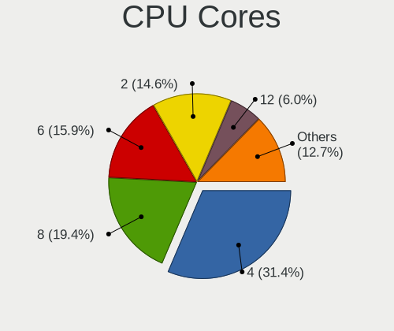

| Number  | Computers | Percent |
|---------|-----------|---------|
| 4       | 400       | 37%     |
| 8       | 197       | 18.22%  |
| 2       | 182       | 16.84%  |
| 6       | 172       | 15.91%  |
| 12      | 38        | 3.52%   |
| 1       | 35        | 3.24%   |
| 16      | 30        | 2.78%   |
| Unknown | 9         | 0.83%   |
| 3       | 7         | 0.65%   |
| 32      | 2         | 0.19%   |
| 14      | 2         | 0.19%   |
| 10      | 2         | 0.19%   |
| 64      | 1         | 0.09%   |
| 24      | 1         | 0.09%   |
| 22      | 1         | 0.09%   |
| 20      | 1         | 0.09%   |
| 18      | 1         | 0.09%   |

CPU Sockets
-----------

Number of sockets

| Number  | Computers | Percent |
|---------|-----------|---------|
| 1       | 1050      | 97.4%   |
| 2       | 20        | 1.86%   |
| Unknown | 8         | 0.74%   |

CPU Threads
-----------

Threads per core (Hyper-Threading)

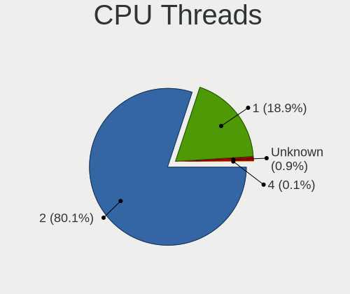

| Number  | Computers | Percent |
|---------|-----------|---------|
| 2       | 830       | 76.78%  |
| 1       | 241       | 22.29%  |
| Unknown | 9         | 0.83%   |
| 4       | 1         | 0.09%   |

CPU Op-Modes
------------

CPU Operation Modes (32-bit, 64-bit)

| Op mode        | Computers | Percent |
|----------------|-----------|---------|
| 32-bit, 64-bit | 1038      | 96.47%  |
| 32-bit         | 24        | 2.23%   |
| Unknown        | 14        | 1.3%    |

CPU Microcode
-------------

Microcode number

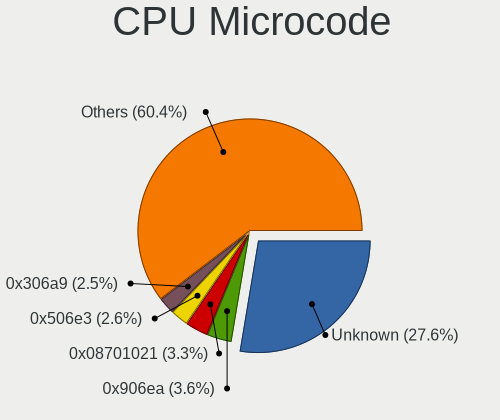

| Number     | Computers | Percent |
|------------|-----------|---------|
| Unknown    | 162       | 14.49%  |
| 0x906ea    | 54        | 4.83%   |
| 0x506e3    | 46        | 4.11%   |
| 0x08701021 | 45        | 4.03%   |
| 0x306c3    | 40        | 3.58%   |
| 0x306a9    | 38        | 3.4%    |
| 0x0800820d | 34        | 3.04%   |
| 0x906e9    | 33        | 2.95%   |
| 0x806ec    | 33        | 2.95%   |
| 0x08701013 | 33        | 2.95%   |
| 0x806ea    | 30        | 2.68%   |
| 0x206a7    | 25        | 2.24%   |
| 0x0a50000c | 25        | 2.24%   |
| 0x806c1    | 23        | 2.06%   |
| 0x08600106 | 23        | 2.06%   |
| 0x806e9    | 21        | 1.88%   |
| 0x08001138 | 20        | 1.79%   |
| 0x906ed    | 18        | 1.61%   |
| 0x0a201016 | 17        | 1.52%   |
| 0x40651    | 16        | 1.43%   |
| 0x1067a    | 16        | 1.43%   |
| 0x0a201009 | 16        | 1.43%   |
| 0xa0652    | 15        | 1.34%   |
| 0x08108109 | 14        | 1.25%   |
| 0x806d1    | 12        | 1.07%   |
| 0x306d4    | 12        | 1.07%   |
| 0x406e3    | 11        | 0.98%   |
| 0x206c2    | 11        | 0.98%   |
| 0x08600103 | 11        | 0.98%   |
| 0xa0655    | 10        | 0.89%   |
| 0x08108102 | 10        | 0.89%   |
| 0x306f2    | 9         | 0.81%   |
| 0xa0671    | 8         | 0.72%   |
| 0x30678    | 8         | 0.72%   |
| 0x706e5    | 7         | 0.63%   |
| 0x306e4    | 7         | 0.63%   |
| 0x90672    | 6         | 0.54%   |
| 0x806eb    | 6         | 0.54%   |
| 0x706a1    | 6         | 0.54%   |
| 0x106c2    | 6         | 0.54%   |
| 0x08608103 | 6         | 0.54%   |
| 0x08600104 | 6         | 0.54%   |
| 0x0810100b | 6         | 0.54%   |
| 0x906ec    | 5         | 0.45%   |
| 0x50654    | 5         | 0.45%   |
| 0x06000822 | 5         | 0.45%   |
| 0x6fb      | 4         | 0.36%   |
| 0x6d8      | 4         | 0.36%   |
| 0x10676    | 4         | 0.36%   |
| 0x0a50000b | 4         | 0.36%   |
| 0x0a201204 | 4         | 0.36%   |
| 0x0800820b | 4         | 0.36%   |
| 0x06003106 | 4         | 0.36%   |
| 0x06000852 | 4         | 0.36%   |
| 0x010000c8 | 4         | 0.36%   |
| 0xa0653    | 3         | 0.27%   |
| 0x6fd      | 3         | 0.27%   |
| 0x6f6      | 3         | 0.27%   |
| 0x673      | 3         | 0.27%   |
| 0x406f1    | 3         | 0.27%   |

CPU Microarch
-------------

Microarchitecture

| Name             | Computers | Percent |
|------------------|-----------|---------|
| KabyLake         | 227       | 20.96%  |
| Zen 2            | 134       | 12.37%  |
| Haswell          | 73        | 6.74%   |
| Zen+             | 70        | 6.46%   |
| Zen 3            | 66        | 6.09%   |
| Skylake          | 65        | 6%      |
| IvyBridge        | 48        | 4.43%   |
| Unknown          | 46        | 4.25%   |
| Zen              | 37        | 3.42%   |
| SandyBridge      | 32        | 2.95%   |
| CometLake        | 30        | 2.77%   |
| TigerLake        | 27        | 2.49%   |
| IceLake          | 24        | 2.22%   |
| Penryn           | 21        | 1.94%   |
| Westmere         | 19        | 1.75%   |
| Silvermont       | 18        | 1.66%   |
| Piledriver       | 18        | 1.66%   |
| Broadwell        | 18        | 1.66%   |
| K10              | 15        | 1.39%   |
| Core             | 13        | 1.2%    |
| P6               | 11        | 1.02%   |
| Bonnell          | 10        | 0.92%   |
| Nehalem          | 8         | 0.74%   |
| Goldmont plus    | 8         | 0.74%   |
| K8 Hammer        | 7         | 0.65%   |
| Alderlake Hybrid | 7         | 0.65%   |
| Bulldozer        | 5         | 0.46%   |
| Steamroller      | 4         | 0.37%   |
| NetBurst         | 4         | 0.37%   |
| Goldmont         | 4         | 0.37%   |
| Bobcat           | 4         | 0.37%   |
| Jaguar           | 3         | 0.28%   |
| Excavator        | 3         | 0.28%   |
| Puma             | 2         | 0.18%   |
| K10 Llano        | 2         | 0.18%   |

Graphics
--------

GPU Vendor
----------

Vendors of graphics cards

| Vendor                           | Computers | Percent |
|----------------------------------|-----------|---------|
| Intel                            | 451       | 35.37%  |
| Nvidia                           | 429       | 33.65%  |
| AMD                              | 363       | 28.47%  |
| ASPEED Technology                | 17        | 1.33%   |
| Matrox Electronics Systems       | 14        | 1.1%    |
| Silicon Integrated Systems [SiS] | 1         | 0.08%   |

GPU Model
---------

Graphics card models

| Model                                                                         | Computers | Percent |
|-------------------------------------------------------------------------------|-----------|---------|
| AMD Ellesmere [Radeon RX 470/480/570/570X/580/580X/590]                       | 69        | 5.23%   |
| Intel CoffeeLake-H GT2 [UHD Graphics 630]                                     | 48        | 3.64%   |
| AMD Renoir                                                                    | 44        | 3.34%   |
| Intel UHD Graphics 620                                                        | 36        | 2.73%   |
| Intel HD Graphics 530                                                         | 29        | 2.2%    |
| Intel 2nd Generation Core Processor Family Integrated Graphics Controller     | 28        | 2.12%   |
| Intel TigerLake-LP GT2 [Iris Xe Graphics]                                     | 27        | 2.05%   |
| AMD Navi 10 [Radeon RX 5600 OEM/5600 XT / 5700/5700 XT]                       | 27        | 2.05%   |
| AMD Picasso/Raven 2 [Radeon Vega Series / Radeon Vega Mobile Series]          | 25        | 1.9%    |
| Intel WhiskeyLake-U GT2 [UHD Graphics 620]                                    | 24        | 1.82%   |
| AMD Cezanne                                                                   | 22        | 1.67%   |
| Intel HD Graphics 620                                                         | 18        | 1.36%   |
| Intel CometLake-U GT2 [UHD Graphics]                                          | 18        | 1.36%   |
| AMD Vega 10 XL/XT [Radeon RX Vega 56/64]                                      | 18        | 1.36%   |
| Intel Haswell-ULT Integrated Graphics Controller                              | 17        | 1.29%   |
| ASPEED Technology ASPEED Graphics Family                                      | 17        | 1.29%   |
| Intel HD Graphics 630                                                         | 16        | 1.21%   |
| Intel 3rd Gen Core processor Graphics Controller                              | 16        | 1.21%   |
| Nvidia TU117M [GeForce GTX 1650 Mobile / Max-Q]                               | 14        | 1.06%   |
| Nvidia GP107M [GeForce GTX 1050 Ti Mobile]                                    | 12        | 0.91%   |
| Nvidia GP106 [GeForce GTX 1060 6GB]                                           | 12        | 0.91%   |
| Nvidia GP104 [GeForce GTX 1070]                                               | 12        | 0.91%   |
| Nvidia GP102 [GeForce GTX 1080 Ti]                                            | 12        | 0.91%   |
| Nvidia GM206 [GeForce GTX 960]                                                | 12        | 0.91%   |
| Intel Xeon E3-1200 v3/4th Gen Core Processor Integrated Graphics Controller   | 12        | 0.91%   |
| Intel Skylake GT2 [HD Graphics 520]                                           | 12        | 0.91%   |
| Nvidia TU106M [GeForce RTX 2060 Mobile]                                       | 11        | 0.83%   |
| Nvidia GM204 [GeForce GTX 970]                                                | 11        | 0.83%   |
| Intel TigerLake-H GT1 [UHD Graphics]                                          | 11        | 0.83%   |
| Intel HD Graphics 5500                                                        | 11        | 0.83%   |
| Intel CometLake-H GT2 [UHD Graphics]                                          | 11        | 0.83%   |
| Nvidia GP107M [GeForce GTX 1050 Mobile]                                       | 10        | 0.76%   |
| Intel CoffeeLake-S GT2 [UHD Graphics 630]                                     | 10        | 0.76%   |
| Intel Atom Processor Z36xxx/Z37xxx Series Graphics & Display                  | 10        | 0.76%   |
| Intel 4th Gen Core Processor Integrated Graphics Controller                   | 10        | 0.76%   |
| AMD Raven Ridge [Radeon Vega Series / Radeon Vega Mobile Series]              | 10        | 0.76%   |
| Nvidia GP107 [GeForce GTX 1050 Ti]                                            | 9         | 0.68%   |
| Nvidia GK208B [GeForce GT 710]                                                | 9         | 0.68%   |
| Nvidia GP108M [GeForce MX150]                                                 | 8         | 0.61%   |
| Nvidia GP106M [GeForce GTX 1060 Mobile]                                       | 8         | 0.61%   |
| Nvidia GA106M [GeForce RTX 3060 Mobile / Max-Q]                               | 8         | 0.61%   |
| Nvidia TU116M [GeForce GTX 1660 Ti Mobile]                                    | 7         | 0.53%   |
| Nvidia TU104 [GeForce RTX 2070 SUPER]                                         | 7         | 0.53%   |
| Nvidia GM107M [GeForce GTX 960M]                                              | 7         | 0.53%   |
| AMD Navi 14 [Radeon RX 5500/5500M / Pro 5500M]                                | 7         | 0.53%   |
| AMD Lucienne                                                                  | 7         | 0.53%   |
| Nvidia TU117M [GeForce GTX 1650 Ti Mobile]                                    | 6         | 0.45%   |
| Nvidia TU117M                                                                 | 6         | 0.45%   |
| Nvidia GP106 [GeForce GTX 1060 3GB]                                           | 6         | 0.45%   |
| Nvidia GM107 [GeForce GTX 750 Ti]                                             | 6         | 0.45%   |
| Matrox Electronics Systems MGA G200e [Pilot] ServerEngines (SEP1)             | 6         | 0.45%   |
| Intel Xeon E3-1200 v2/3rd Gen Core processor Graphics Controller              | 6         | 0.45%   |
| Intel Mobile 945GM/GMS/GME, 943/940GML Express Integrated Graphics Controller | 6         | 0.45%   |
| Intel Iris Plus Graphics G7                                                   | 6         | 0.45%   |
| Intel GeminiLake [UHD Graphics 600]                                           | 6         | 0.45%   |
| AMD Navi 22 [Radeon RX 6700/6700 XT/6750 XT / 6800M]                          | 6         | 0.45%   |
| AMD Navi 21 [Radeon RX 6800/6800 XT / 6900 XT]                                | 6         | 0.45%   |
| AMD Cedar [Radeon HD 5000/6000/7350/8350 Series]                              | 6         | 0.45%   |
| Nvidia TU116 [GeForce GTX 1660 Ti]                                            | 5         | 0.38%   |
| Nvidia GA102 [GeForce RTX 3090]                                               | 5         | 0.38%   |

GPU Combo
---------

Combinations of graphics cards

| Name                     | Computers | Percent |
|--------------------------|-----------|---------|
| 1 x AMD                  | 301       | 27.67%  |
| 1 x Intel                | 270       | 24.82%  |
| 1 x Nvidia               | 246       | 22.61%  |
| Intel + Nvidia           | 150       | 13.79%  |
| AMD + Nvidia             | 27        | 2.48%   |
| Other                    | 21        | 1.93%   |
| Intel + AMD              | 17        | 1.56%   |
| 2 x AMD                  | 15        | 1.38%   |
| 1 x ASPEED               | 15        | 1.38%   |
| 1 x Matrox               | 12        | 1.1%    |
| 2 x Nvidia               | 6         | 0.55%   |
| 2 x Intel                | 2         | 0.18%   |
| AMD + ASPEED             | 2         | 0.18%   |
| 1 x SiS                  | 1         | 0.09%   |
| Nvidia + Matrox          | 1         | 0.09%   |
| Intel + AMD + 1 x Nvidia | 1         | 0.09%   |
| AMD + Matrox             | 1         | 0.09%   |

GPU Driver
----------

Free vs proprietary

| Driver      | Computers | Percent |
|-------------|-----------|---------|
| Free        | 754       | 68.05%  |
| Proprietary | 267       | 24.1%   |
| Unknown     | 87        | 7.85%   |

GPU Memory
----------

Total video memory

| Size in GB | Computers | Percent |
|------------|-----------|---------|
| Unknown    | 506       | 45.1%   |
| 7.01-8.0   | 133       | 11.85%  |
| 0.01-0.5   | 119       | 10.61%  |
| 1.01-2.0   | 110       | 9.8%    |
| 3.01-4.0   | 105       | 9.36%   |
| 0.51-1.0   | 53        | 4.72%   |
| 5.01-6.0   | 45        | 4.01%   |
| 8.01-16.0  | 34        | 3.03%   |
| 2.01-3.0   | 13        | 1.16%   |
| 16.01-24.0 | 3         | 0.27%   |
| 4.01-5.0   | 1         | 0.09%   |

Monitor
-------

Monitor Vendor
--------------

Monitor vendors

| Vendor                  | Computers | Percent |
|-------------------------|-----------|---------|
| Samsung Electronics     | 134       | 10.67%  |
| Dell                    | 112       | 8.92%   |
| AU Optronics            | 105       | 8.36%   |
| BOE                     | 91        | 7.25%   |
| LG Display              | 89        | 7.09%   |
| Chimei Innolux          | 78        | 6.21%   |
| Goldstar                | 76        | 6.05%   |
| Ancor Communications    | 47        | 3.74%   |
| Hewlett-Packard         | 42        | 3.34%   |
| BenQ                    | 40        | 3.18%   |
| Sharp                   | 39        | 3.11%   |
| AOC                     | 39        | 3.11%   |
| Iiyama                  | 32        | 2.55%   |
| Acer                    | 30        | 2.39%   |
| ViewSonic               | 26        | 2.07%   |
| Lenovo                  | 26        | 2.07%   |
| Apple                   | 24        | 1.91%   |
| Philips                 | 23        | 1.83%   |
| ASUSTek Computer        | 23        | 1.83%   |
| Eizo                    | 16        | 1.27%   |
| Chi Mei Optoelectronics | 15        | 1.19%   |
| LG Electronics          | 9         | 0.72%   |
| MSI                     | 8         | 0.64%   |
| Fujitsu Siemens         | 8         | 0.64%   |
| CSO                     | 8         | 0.64%   |
| Unknown                 | 7         | 0.56%   |
| PANDA                   | 6         | 0.48%   |
| InfoVision              | 6         | 0.48%   |
| Idek Iiyama             | 6         | 0.48%   |
| Sony                    | 5         | 0.4%    |
| NEC Computers           | 5         | 0.4%    |
| Gigabyte Technology     | 5         | 0.4%    |
| HannStar                | 4         | 0.32%   |
| Sceptre Tech            | 3         | 0.24%   |
| Panasonic               | 3         | 0.24%   |
| Envision Peripherals    | 3         | 0.24%   |
| Unknown                 | 3         | 0.24%   |
| Yamaha                  | 2         | 0.16%   |
| Toshiba                 | 2         | 0.16%   |
| RTK                     | 2         | 0.16%   |
| PNP                     | 2         | 0.16%   |
| Mi                      | 2         | 0.16%   |
| LGD                     | 2         | 0.16%   |
| LG Philips              | 2         | 0.16%   |
| KTC                     | 2         | 0.16%   |
| HVR                     | 2         | 0.16%   |
| Hitachi                 | 2         | 0.16%   |
| Gateway                 | 2         | 0.16%   |
| CMN                     | 2         | 0.16%   |
| AUS                     | 2         | 0.16%   |
| YTH                     | 1         | 0.08%   |
| Xiaomi                  | 1         | 0.08%   |
| WST                     | 1         | 0.08%   |
| Vizio                   | 1         | 0.08%   |
| Vestel Elektronik       | 1         | 0.08%   |
| Valve                   | 1         | 0.08%   |
| TMX                     | 1         | 0.08%   |
| Sunplus                 | 1         | 0.08%   |
| SKY                     | 1         | 0.08%   |
| Sceptre                 | 1         | 0.08%   |

Monitor Model
-------------

Monitor models

| Model                                                                 | Computers | Percent |
|-----------------------------------------------------------------------|-----------|---------|
| Iiyama PL2473HD IVM6107 1920x1080 521x293mm 23.5-inch                 | 8         | 0.6%    |
| Goldstar HDR 4K GSM7707 3840x2160 600x340mm 27.2-inch                 | 8         | 0.6%    |
| AU Optronics LCD Monitor AUO38ED 1920x1080 344x193mm 15.5-inch        | 8         | 0.6%    |
| Goldstar ULTRAGEAR GSM5B7F 2560x1440 597x336mm 27.0-inch              | 7         | 0.53%   |
| LG Display LCD Monitor LGD046F 1920x1080 345x194mm 15.6-inch          | 6         | 0.45%   |
| Iiyama PL2409HD IVM560C 1920x1080 521x293mm 23.5-inch                 | 6         | 0.45%   |
| Goldstar ULTRAWIDE GSM59F1 2560x1080 673x284mm 28.8-inch              | 6         | 0.45%   |
| Fujitsu Siemens P24W-6 IPS FUS07EA 1920x1200 518x324mm 24.1-inch      | 6         | 0.45%   |
| Chimei Innolux LCD Monitor CMN14D4 1920x1080 309x173mm 13.9-inch      | 6         | 0.45%   |
| AU Optronics LCD Monitor AUO21ED 1920x1080 344x194mm 15.5-inch        | 6         | 0.45%   |
| LG Display LCD Monitor LGD05E5 1920x1080 344x194mm 15.5-inch          | 5         | 0.38%   |
| Dell U2715H DELD066 2560x1440 597x336mm 27.0-inch                     | 5         | 0.38%   |
| Dell P2418D DELD0C1 2560x1440 526x296mm 23.8-inch                     | 5         | 0.38%   |
| Samsung Electronics U28E590 SAM0C4D 3840x2160 607x345mm 27.5-inch     | 4         | 0.3%    |
| Goldstar Ultra HD GSM5B09 3840x2160 600x340mm 27.2-inch               | 4         | 0.3%    |
| Chimei Innolux LCD Monitor CMN1747 1920x1080 381x214mm 17.2-inch      | 4         | 0.3%    |
| AU Optronics LCD Monitor AUO61ED 1920x1080 344x193mm 15.5-inch        | 4         | 0.3%    |
| Sharp LQ156M1JW01 SHP14C3 1920x1080 344x194mm 15.5-inch               | 3         | 0.23%   |
| Sharp LCD Monitor SHP1517 3840x2400 366x229mm 17.0-inch               | 3         | 0.23%   |
| Sharp LCD Monitor SHP14FA 3840x2400 288x180mm 13.4-inch               | 3         | 0.23%   |
| Sharp LCD Monitor SHP148D 3840x2160 344x194mm 15.5-inch               | 3         | 0.23%   |
| Sharp LCD Monitor SHP148B 3840x2160 294x165mm 13.3-inch               | 3         | 0.23%   |
| Sceptre Tech C305W-2560UN SPT0C0D 2560x1080 690x291mm 29.5-inch       | 3         | 0.23%   |
| Samsung Electronics SyncMaster SAM0584 2048x1152 510x290mm 23.1-inch  | 3         | 0.23%   |
| Samsung Electronics S24F350 SAM0D20 1920x1080 521x293mm 23.5-inch     | 3         | 0.23%   |
| Samsung Electronics LCD Monitor SEC3245 1280x800 331x207mm 15.4-inch  | 3         | 0.23%   |
| Samsung Electronics LCD Monitor SDCA029 3840x2160 344x194mm 15.5-inch | 3         | 0.23%   |
| MSI MAG272QP MSI3CA8 2560x1440 597x336mm 27.0-inch                    | 3         | 0.23%   |
| LG Electronics LCD Monitor LG HDR 4K 7680x2160                        | 3         | 0.23%   |
| LG Electronics LCD Monitor LG HDR 4K                                  | 3         | 0.23%   |
| LG Display LCD Monitor LGD0608 1920x1080 309x174mm 14.0-inch          | 3         | 0.23%   |
| LG Display LCD Monitor LGD0521 1920x1080 309x174mm 14.0-inch          | 3         | 0.23%   |
| LG Display LCD Monitor LGD04A7 1920x1080 344x194mm 15.5-inch          | 3         | 0.23%   |
| Goldstar ULTRAWIDE GSM76E4 3440x1440 800x335mm 34.1-inch              | 3         | 0.23%   |
| Goldstar IPS FULLHD GSM5AB8 1920x1080 480x270mm 21.7-inch             | 3         | 0.23%   |
| Gigabyte Technology G34WQC GBT3400 3440x1440 800x330mm 34.1-inch      | 3         | 0.23%   |
| Envision Peripherals LCD2361 ENV2361 1920x1080 521x293mm 23.5-inch    | 3         | 0.23%   |
| Dell U3415W DELA0A7 3440x1440 798x335mm 34.1-inch                     | 3         | 0.23%   |
| Dell U2414H DELA0A3 1920x1080 527x296mm 23.8-inch                     | 3         | 0.23%   |
| Dell U2414H DELA0A2 1920x1080 527x296mm 23.8-inch                     | 3         | 0.23%   |
| Dell U2412M DELA07B 1920x1200 518x324mm 24.1-inch                     | 3         | 0.23%   |
| Dell U2412M DELA07A 1920x1200 518x324mm 24.1-inch                     | 3         | 0.23%   |
| Chimei Innolux LCD Monitor CMN14D5 1920x1080 309x173mm 13.9-inch      | 3         | 0.23%   |
| BOE LCD Monitor BOE0898 1920x1080 294x165mm 13.3-inch                 | 3         | 0.23%   |
| BOE LCD Monitor BOE0872 1920x1080 344x194mm 15.5-inch                 | 3         | 0.23%   |
| BOE LCD Monitor BOE0700 1920x1080 344x194mm 15.5-inch                 | 3         | 0.23%   |
| BenQ PD3200U BNQ8025 3840x2160 708x399mm 32.0-inch                    | 3         | 0.23%   |
| BenQ LCD BNQ801E 3840x2160 596x335mm 26.9-inch                        | 3         | 0.23%   |
| BenQ GW2480 BNQ78E7 1920x1080 527x296mm 23.8-inch                     | 3         | 0.23%   |
| AU Optronics LCD Monitor AUO243D 1920x1080 309x173mm 13.9-inch        | 3         | 0.23%   |
| AU Optronics LCD Monitor AUO23ED 1920x1080 344x194mm 15.5-inch        | 3         | 0.23%   |
| AU Optronics LCD Monitor AUO2336 2560x1440 309x174mm 14.0-inch        | 3         | 0.23%   |
| AU Optronics LCD Monitor AUO106C 1366x768 277x156mm 12.5-inch         | 3         | 0.23%   |
| Apple Color LCD APP9C20 1280x854 321x214mm 15.2-inch                  | 3         | 0.23%   |
| Ancor Communications VS248 ACI2498 1920x1080 531x299mm 24.0-inch      | 3         | 0.23%   |
| Ancor Communications ASUS VX239 ACI23E1 1920x1080 509x286mm 23.0-inch | 3         | 0.23%   |
| Ancor Communications ASUS VS228 ACI22FD 1920x1080 476x268mm 21.5-inch | 3         | 0.23%   |
| Unknown                                                               | 3         | 0.23%   |
| Yamaha HTR-6064 YMH3169 1920x540                                      | 2         | 0.15%   |
| ViewSonic VX2458-mhd VSC0437 1920x1080 521x293mm 23.5-inch            | 2         | 0.15%   |

Monitor Resolution
------------------

Monitor screen resolution

| Resolution         | Computers | Percent |
|--------------------|-----------|---------|
| 1920x1080 (FHD)    | 564       | 47.08%  |
| 2560x1440 (QHD)    | 118       | 9.85%   |
| 3840x2160 (4K)     | 107       | 8.93%   |
| 1366x768 (WXGA)    | 74        | 6.18%   |
| 1920x1200 (WUXGA)  | 41        | 3.42%   |
| 1280x1024 (SXGA)   | 36        | 3.01%   |
| 3440x1440          | 29        | 2.42%   |
| 1680x1050 (WSXGA+) | 29        | 2.42%   |
| 1600x900 (HD+)     | 26        | 2.17%   |
| Unknown            | 22        | 1.84%   |
| 1440x900 (WXGA+)   | 20        | 1.67%   |
| 2560x1600          | 15        | 1.25%   |
| 3840x1080          | 14        | 1.17%   |
| 2560x1080          | 14        | 1.17%   |
| 3840x2400          | 12        | 1%      |
| 1280x800 (WXGA)    | 9         | 0.75%   |
| 1600x1200          | 5         | 0.42%   |
| 1024x600           | 5         | 0.42%   |
| 3200x1800 (QHD+)   | 4         | 0.33%   |
| 2880x1800          | 4         | 0.33%   |
| 2048x1152          | 4         | 0.33%   |
| 7680x2160          | 3         | 0.25%   |
| 3840x1200          | 3         | 0.25%   |
| 1280x960           | 3         | 0.25%   |
| 1280x854           | 3         | 0.25%   |
| 2288x1287          | 2         | 0.17%   |
| 2256x1504          | 2         | 0.17%   |
| 2160x1440          | 2         | 0.17%   |
| 2160x1200          | 2         | 0.17%   |
| 1920x540           | 2         | 0.17%   |
| 1400x1050          | 2         | 0.17%   |
| 6720x2160          | 1         | 0.08%   |
| 6400x2160          | 1         | 0.08%   |
| 6400x1080          | 1         | 0.08%   |
| 5120x1600          | 1         | 0.08%   |
| 5040x1080          | 1         | 0.08%   |
| 4880x1080          | 1         | 0.08%   |
| 4382x1080          | 1         | 0.08%   |
| 3926x1440          | 1         | 0.08%   |
| 3840x1100          | 1         | 0.08%   |
| 3640x1080          | 1         | 0.08%   |
| 3600x1200          | 1         | 0.08%   |
| 3600x1080          | 1         | 0.08%   |
| 3456x2160          | 1         | 0.08%   |
| 3200x2000          | 1         | 0.08%   |
| 3072x1920          | 1         | 0.08%   |
| 2520x1680          | 1         | 0.08%   |
| 2304x1440          | 1         | 0.08%   |
| 2240x1400          | 1         | 0.08%   |
| 1920x1280          | 1         | 0.08%   |
| 1280x768           | 1         | 0.08%   |
| 1280x720 (HD)      | 1         | 0.08%   |
| 1024x768 (XGA)     | 1         | 0.08%   |

Monitor Diagonal
----------------

Diagonal size in inches

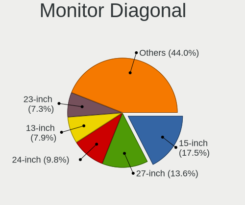

| Inches  | Computers | Percent |
|---------|-----------|---------|
| 15      | 233       | 18.76%  |
| 27      | 175       | 14.09%  |
| 24      | 124       | 9.98%   |
| 23      | 107       | 8.62%   |
| 13      | 100       | 8.05%   |
| 14      | 72        | 5.8%    |
| Unknown | 71        | 5.72%   |
| 21      | 61        | 4.91%   |
| 17      | 60        | 4.83%   |
| 34      | 34        | 2.74%   |
| 19      | 34        | 2.74%   |
| 12      | 27        | 2.17%   |
| 22      | 18        | 1.45%   |
| 31      | 15        | 1.21%   |
| 25      | 13        | 1.05%   |
| 11      | 11        | 0.89%   |
| 20      | 10        | 0.81%   |
| 16      | 10        | 0.81%   |
| 84      | 8         | 0.64%   |
| 32      | 7         | 0.56%   |
| 18      | 7         | 0.56%   |
| 48      | 5         | 0.4%    |
| 54      | 4         | 0.32%   |
| 49      | 4         | 0.32%   |
| 40      | 4         | 0.32%   |
| 29      | 4         | 0.32%   |
| 72      | 3         | 0.24%   |
| 26      | 3         | 0.24%   |
| 10      | 3         | 0.24%   |
| 142     | 2         | 0.16%   |
| 47      | 2         | 0.16%   |
| 43      | 2         | 0.16%   |
| 8       | 2         | 0.16%   |
| 75      | 1         | 0.08%   |
| 65      | 1         | 0.08%   |
| 50      | 1         | 0.08%   |
| 37      | 1         | 0.08%   |
| 33      | 1         | 0.08%   |
| 30      | 1         | 0.08%   |
| 28      | 1         | 0.08%   |

Monitor Width
-------------

Physical width

| Width in mm    | Computers | Percent |
|----------------|-----------|---------|
| 301-350        | 371       | 30.94%  |
| 501-600        | 353       | 29.44%  |
| 401-500        | 109       | 9.09%   |
| 201-300        | 94        | 7.84%   |
| 351-400        | 72        | 6.01%   |
| Unknown        | 71        | 5.92%   |
| 601-700        | 47        | 3.92%   |
| 701-800        | 42        | 3.5%    |
| 1001-1500      | 18        | 1.5%    |
| 1501-2000      | 12        | 1%      |
| 801-900        | 5         | 0.42%   |
| More than 2000 | 2         | 0.17%   |
| 101-200        | 2         | 0.17%   |
| 901-1000       | 1         | 0.08%   |

Aspect Ratio
------------

Proportional relationship between the width and the height

| Ratio   | Computers | Percent |
|---------|-----------|---------|
| 16/9    | 774       | 71.14%  |
| 16/10   | 141       | 12.96%  |
| Unknown | 63        | 5.79%   |
| 21/9    | 37        | 3.4%    |
| 5/4     | 35        | 3.22%   |
| 3/2     | 14        | 1.29%   |
| 4/3     | 9         | 0.83%   |
| 32/9    | 9         | 0.83%   |
| 6/5     | 2         | 0.18%   |
| 1.00    | 2         | 0.18%   |
| 3.40    | 1         | 0.09%   |
| 3.20    | 1         | 0.09%   |

Monitor Area
------------

Area in inch

| Area in inch | Computers | Percent |
|----------------|-----------|---------|
| 201-250        | 233       | 18.96%  |
| 101-110        | 231       | 18.8%   |
| 301-350        | 177       | 14.4%   |
| 81-90          | 122       | 9.93%   |
| Unknown        | 71        | 5.78%   |
| 251-300        | 66        | 5.37%   |
| 351-500        | 60        | 4.88%   |
| 151-200        | 58        | 4.72%   |
| 71-80          | 50        | 4.07%   |
| 121-130        | 38        | 3.09%   |
| 61-70          | 24        | 1.95%   |
| More than 1000 | 22        | 1.79%   |
| 141-150        | 21        | 1.71%   |
| 501-1000       | 16        | 1.3%    |
| 51-60          | 12        | 0.98%   |
| 111-120        | 12        | 0.98%   |
| 131-140        | 6         | 0.49%   |
| 91-100         | 5         | 0.41%   |
| 41-50          | 3         | 0.24%   |
| 1-40           | 2         | 0.16%   |

Pixel Density
-------------

Pixels per inch

| Density       | Computers | Percent |
|---------------|-----------|---------|
| 51-100        | 380       | 32.29%  |
| 121-160       | 340       | 28.89%  |
| 101-120       | 227       | 19.29%  |
| 161-240       | 98        | 8.33%   |
| Unknown       | 71        | 6.03%   |
| More than 240 | 45        | 3.82%   |
| 1-50          | 16        | 1.36%   |

Multiple Monitors
-----------------

Total monitors connected

| Total | Computers | Percent |
|-------|-----------|---------|
| 1     | 769       | 67.99%  |
| 2     | 221       | 19.54%  |
| 0     | 97        | 8.58%   |
| 3     | 38        | 3.36%   |
| 4     | 6         | 0.53%   |

Network
-------

Net Controller Vendor
---------------------

Controller vendors

| Vendor                            | Computers | Percent |
|-----------------------------------|-----------|---------|
| Intel                             | 669       | 43.11%  |
| Realtek Semiconductor             | 487       | 31.38%  |
| Qualcomm Atheros                  | 117       | 7.54%   |
| Broadcom                          | 69        | 4.45%   |
| Aquantia                          | 17        | 1.1%    |
| Nvidia                            | 15        | 0.97%   |
| Marvell Technology Group          | 15        | 0.97%   |
| ASIX Electronics                  | 14        | 0.9%    |
| MediaTek                          | 12        | 0.77%   |
| Lenovo                            | 12        | 0.77%   |
| Apple                             | 10        | 0.64%   |
| TP-Link                           | 8         | 0.52%   |
| Dell                              | 7         | 0.45%   |
| Broadcom Limited                  | 7         | 0.45%   |
| Qualcomm Atheros Communications   | 6         | 0.39%   |
| Ralink Technology                 | 5         | 0.32%   |
| Microsoft                         | 5         | 0.32%   |
| Ericsson Business Mobile Networks | 5         | 0.32%   |
| Sierra Wireless                   | 4         | 0.26%   |
| Samsung Electronics               | 4         | 0.26%   |
| Fibocom                           | 4         | 0.26%   |
| D-Link System                     | 4         | 0.26%   |
| Standard Microsystems             | 3         | 0.19%   |
| Ralink                            | 3         | 0.19%   |
| Qualcomm                          | 3         | 0.19%   |
| Microchip Technology              | 3         | 0.19%   |
| Huawei Technologies               | 3         | 0.19%   |
| D-Link                            | 3         | 0.19%   |
| ZTE WCDMA Technologies MSM        | 2         | 0.13%   |
| Xiaomi                            | 2         | 0.13%   |
| QLogic                            | 2         | 0.13%   |
| NetGear                           | 2         | 0.13%   |
| Netchip Technology                | 2         | 0.13%   |
| Metrologic Instruments            | 2         | 0.13%   |
| Google                            | 2         | 0.13%   |
| DisplayLink                       | 2         | 0.13%   |
| 3Com                              | 2         | 0.13%   |
| U-Blox                            | 1         | 0.06%   |
| Texas Instruments                 | 1         | 0.06%   |
| Sigma Designs                     | 1         | 0.06%   |
| Shenzhen Goodix Technology        | 1         | 0.06%   |
| Raspberry Pi                      | 1         | 0.06%   |
| Quectel Wireless Solutions        | 1         | 0.06%   |
| Pulse-Eight                       | 1         | 0.06%   |
| Prusa                             | 1         | 0.06%   |
| OpenMoko                          | 1         | 0.06%   |
| Oculus VR                         | 1         | 0.06%   |
| NetXen Incorporated               | 1         | 0.06%   |
| Kyocera                           | 1         | 0.06%   |
| JMicron Technology                | 1         | 0.06%   |
| InterBiometrics                   | 1         | 0.06%   |
| ICS Advent                        | 1         | 0.06%   |
| Davicom Semiconductor             | 1         | 0.06%   |
| BUFFALO                           | 1         | 0.06%   |
| Atmel                             | 1         | 0.06%   |
| American Megatrends               | 1         | 0.06%   |
| AMD                               | 1         | 0.06%   |

Net Controller Model
--------------------

Controller models

| Model                                                                   | Computers | Percent |
|-------------------------------------------------------------------------|-----------|---------|
| Realtek RTL8111/8168/8411 PCI Express Gigabit Ethernet Controller       | 367       | 19.67%  |
| Intel Wi-Fi 6 AX200                                                     | 110       | 5.89%   |
| Intel I211 Gigabit Network Connection                                   | 90        | 4.82%   |
| Intel Wireless 8265 / 8275                                              | 49        | 2.63%   |
| Intel Cannon Lake PCH CNVi WiFi                                         | 40        | 2.14%   |
| Realtek RTL8125 2.5GbE Controller                                       | 36        | 1.93%   |
| Realtek RTL8153 Gigabit Ethernet Adapter                                | 34        | 1.82%   |
| Intel I210 Gigabit Network Connection                                   | 29        | 1.55%   |
| Intel Ethernet Connection (2) I219-V                                    | 27        | 1.45%   |
| Intel 82579LM Gigabit Network Connection (Lewisville)                   | 24        | 1.29%   |
| Intel 82574L Gigabit Network Connection                                 | 23        | 1.23%   |
| Realtek RTL810xE PCI Express Fast Ethernet controller                   | 22        | 1.18%   |
| Intel Wi-Fi 6 AX201                                                     | 22        | 1.18%   |
| Intel Ethernet Controller I225-V                                        | 21        | 1.13%   |
| Realtek RTL8822CE 802.11ac PCIe Wireless Network Adapter                | 20        | 1.07%   |
| Intel Wireless 8260                                                     | 20        | 1.07%   |
| Intel Wireless 7265                                                     | 20        | 1.07%   |
| Intel Ethernet Connection (2) I219-LM                                   | 20        | 1.07%   |
| Intel Cannon Point-LP CNVi [Wireless-AC]                                | 19        | 1.02%   |
| Intel Wireless-AC 9260                                                  | 18        | 0.96%   |
| Intel Wireless 7260                                                     | 18        | 0.96%   |
| Intel Ethernet Connection (7) I219-V                                    | 18        | 0.96%   |
| Intel Comet Lake PCH-LP CNVi WiFi                                       | 18        | 0.96%   |
| Intel Comet Lake PCH CNVi WiFi                                          | 18        | 0.96%   |
| Qualcomm Atheros QCA6174 802.11ac Wireless Network Adapter              | 17        | 0.91%   |
| Intel Wireless 3165                                                     | 14        | 0.75%   |
| Intel Ethernet Connection (4) I219-LM                                   | 14        | 0.75%   |
| Intel Centrino Advanced-N 6205 [Taylor Peak]                            | 14        | 0.75%   |
| Intel Wi-Fi 6 AX210/AX211/AX411 160MHz                                  | 13        | 0.7%    |
| Intel Dual Band Wireless-AC 3168NGW [Stone Peak]                        | 13        | 0.7%    |
| Realtek RTL8822BE 802.11a/b/g/n/ac WiFi adapter                         | 12        | 0.64%   |
| Intel Tiger Lake PCH CNVi WiFi                                          | 12        | 0.64%   |
| Intel Ethernet Connection (2) I218-V                                    | 12        | 0.64%   |
| Qualcomm Atheros QCA9377 802.11ac Wireless Network Adapter              | 11        | 0.59%   |
| Qualcomm Atheros AR9485 Wireless Network Adapter                        | 11        | 0.59%   |
| Qualcomm Atheros AR9285 Wireless Network Adapter (PCI-Express)          | 11        | 0.59%   |
| Intel Ethernet Connection (4) I219-V                                    | 11        | 0.59%   |
| Realtek RTL8821CE 802.11ac PCIe Wireless Network Adapter                | 10        | 0.54%   |
| Qualcomm Atheros Killer E2400 Gigabit Ethernet Controller               | 10        | 0.54%   |
| Qualcomm Atheros AR93xx Wireless Network Adapter                        | 10        | 0.54%   |
| Intel I350 Gigabit Network Connection                                   | 10        | 0.54%   |
| Intel Ethernet Connection I217-LM                                       | 9         | 0.48%   |
| Intel Ethernet Connection (6) I219-V                                    | 9         | 0.48%   |
| Broadcom BCM4360 802.11ac Wireless Network Adapter                      | 9         | 0.48%   |
| Aquantia AQC107 NBase-T/IEEE 802.3bz Ethernet Controller [AQtion]       | 9         | 0.48%   |
| Realtek RTL8852AE 802.11ax PCIe Wireless Network Adapter                | 8         | 0.43%   |
| Realtek RTL8723BE PCIe Wireless Network Adapter                         | 8         | 0.43%   |
| Qualcomm Atheros AR9462 Wireless Network Adapter                        | 8         | 0.43%   |
| MediaTek MT7921 802.11ax PCI Express Wireless Network Adapter           | 8         | 0.43%   |
| Intel Ethernet Connection (7) I219-LM                                   | 8         | 0.43%   |
| Qualcomm Atheros QCA9565 / AR9565 Wireless Network Adapter              | 7         | 0.38%   |
| Qualcomm Atheros AR242x / AR542x Wireless Network Adapter (PCI-Express) | 7         | 0.38%   |
| Intel Ice Lake-LP PCH CNVi WiFi                                         | 7         | 0.38%   |
| Intel Ethernet Connection I218-LM                                       | 7         | 0.38%   |
| Intel 82599ES 10-Gigabit SFI/SFP+ Network Connection                    | 7         | 0.38%   |
| Intel 82579V Gigabit Network Connection                                 | 7         | 0.38%   |
| Nvidia MCP77 Ethernet                                                   | 6         | 0.32%   |
| Apple UniNorth 2 GMAC (Sun GEM)                                         | 6         | 0.32%   |
| Realtek RTL8812AE 802.11ac PCIe Wireless Network Adapter                | 5         | 0.27%   |
| Realtek RTL-8100/8101L/8139 PCI Fast Ethernet Adapter                   | 5         | 0.27%   |

Wireless Vendor
---------------

Wireless vendors

| Vendor                          | Computers | Percent |
|---------------------------------|-----------|---------|
| Intel                           | 464       | 61.95%  |
| Qualcomm Atheros                | 92        | 12.28%  |
| Realtek Semiconductor           | 80        | 10.68%  |
| Broadcom                        | 47        | 6.28%   |
| MediaTek                        | 10        | 1.34%   |
| TP-Link                         | 7         | 0.93%   |
| Qualcomm Atheros Communications | 6         | 0.8%    |
| Ralink Technology               | 5         | 0.67%   |
| Microsoft                       | 5         | 0.67%   |
| Dell                            | 5         | 0.67%   |
| Sierra Wireless                 | 4         | 0.53%   |
| Broadcom Limited                | 4         | 0.53%   |
| Ralink                          | 3         | 0.4%    |
| Qualcomm                        | 3         | 0.4%    |
| Fibocom                         | 3         | 0.4%    |
| D-Link System                   | 3         | 0.4%    |
| D-Link                          | 3         | 0.4%    |
| NetGear                         | 2         | 0.27%   |
| Texas Instruments               | 1         | 0.13%   |
| Quectel Wireless Solutions      | 1         | 0.13%   |
| BUFFALO                         | 1         | 0.13%   |

Wireless Model
--------------

Wireless models

| Model                                                                   | Computers | Percent |
|-------------------------------------------------------------------------|-----------|---------|
| Intel Wi-Fi 6 AX200                                                     | 110       | 14.63%  |
| Intel Wireless 8265 / 8275                                              | 49        | 6.52%   |
| Intel Cannon Lake PCH CNVi WiFi                                         | 40        | 5.32%   |
| Intel Wi-Fi 6 AX201                                                     | 22        | 2.93%   |
| Realtek RTL8822CE 802.11ac PCIe Wireless Network Adapter                | 20        | 2.66%   |
| Intel Wireless 8260                                                     | 20        | 2.66%   |
| Intel Wireless 7265                                                     | 20        | 2.66%   |
| Intel Cannon Point-LP CNVi [Wireless-AC]                                | 19        | 2.53%   |
| Intel Wireless-AC 9260                                                  | 18        | 2.39%   |
| Intel Wireless 7260                                                     | 18        | 2.39%   |
| Intel Comet Lake PCH-LP CNVi WiFi                                       | 18        | 2.39%   |
| Intel Comet Lake PCH CNVi WiFi                                          | 18        | 2.39%   |
| Qualcomm Atheros QCA6174 802.11ac Wireless Network Adapter              | 17        | 2.26%   |
| Intel Wireless 3165                                                     | 14        | 1.86%   |
| Intel Centrino Advanced-N 6205 [Taylor Peak]                            | 14        | 1.86%   |
| Intel Wi-Fi 6 AX210/AX211/AX411 160MHz                                  | 13        | 1.73%   |
| Intel Dual Band Wireless-AC 3168NGW [Stone Peak]                        | 13        | 1.73%   |
| Realtek RTL8822BE 802.11a/b/g/n/ac WiFi adapter                         | 12        | 1.6%    |
| Intel Tiger Lake PCH CNVi WiFi                                          | 12        | 1.6%    |
| Qualcomm Atheros QCA9377 802.11ac Wireless Network Adapter              | 11        | 1.46%   |
| Qualcomm Atheros AR9485 Wireless Network Adapter                        | 11        | 1.46%   |
| Qualcomm Atheros AR9285 Wireless Network Adapter (PCI-Express)          | 11        | 1.46%   |
| Realtek RTL8821CE 802.11ac PCIe Wireless Network Adapter                | 10        | 1.33%   |
| Qualcomm Atheros AR93xx Wireless Network Adapter                        | 10        | 1.33%   |
| Broadcom BCM4360 802.11ac Wireless Network Adapter                      | 9         | 1.2%    |
| Realtek RTL8852AE 802.11ax PCIe Wireless Network Adapter                | 8         | 1.06%   |
| Realtek RTL8723BE PCIe Wireless Network Adapter                         | 8         | 1.06%   |
| Qualcomm Atheros AR9462 Wireless Network Adapter                        | 8         | 1.06%   |
| MediaTek MT7921 802.11ax PCI Express Wireless Network Adapter           | 8         | 1.06%   |
| Qualcomm Atheros QCA9565 / AR9565 Wireless Network Adapter              | 7         | 0.93%   |
| Qualcomm Atheros AR242x / AR542x Wireless Network Adapter (PCI-Express) | 7         | 0.93%   |
| Intel Ice Lake-LP PCH CNVi WiFi                                         | 7         | 0.93%   |
| Realtek RTL8812AE 802.11ac PCIe Wireless Network Adapter                | 5         | 0.66%   |
| Qualcomm Atheros AR9271 802.11n                                         | 5         | 0.66%   |
| Intel Wireless 3160                                                     | 5         | 0.66%   |
| Intel PRO/Wireless 3945ABG [Golan] Network Connection                   | 5         | 0.66%   |
| Intel PRO/Wireless 2200BG [Calexico2] Network Connection                | 5         | 0.66%   |
| Broadcom BCM4322 802.11a/b/g/n Wireless LAN Controller                  | 5         | 0.66%   |
| Broadcom BCM4313 802.11bgn Wireless Network Adapter                     | 5         | 0.66%   |
| Broadcom BCM4306 802.11b/g Wireless LAN Controller                      | 5         | 0.66%   |
| Qualcomm Atheros AR9227 Wireless Network Adapter                        | 4         | 0.53%   |
| Broadcom BCM43602 802.11ac Wireless LAN SoC                             | 4         | 0.53%   |
| Broadcom BCM4331 802.11a/b/g/n                                          | 4         | 0.53%   |
| Realtek RTL8723DE Wireless Network Adapter                              | 3         | 0.4%    |
| Realtek RTL8188EE Wireless Network Adapter                              | 3         | 0.4%    |
| Realtek RTL8188CE 802.11b/g/n WiFi Adapter                              | 3         | 0.4%    |
| Ralink MT7601U Wireless Adapter                                         | 3         | 0.4%    |
| Qualcomm QCA6390 Wireless Network Adapter                               | 3         | 0.4%    |
| Intel Dual Band Wireless-AC 3165 Plus Bluetooth                         | 3         | 0.4%    |
| Intel Centrino Advanced-N 6235                                          | 3         | 0.4%    |
| Intel Centrino Advanced-N 6200                                          | 3         | 0.4%    |
| Intel Alder Lake-S PCH CNVi WiFi                                        | 3         | 0.4%    |
| Fibocom L830-EB-00 LTE WWAN Modem                                       | 3         | 0.4%    |
| Broadcom BCM4318 [AirForce One 54g] 802.11g Wireless LAN Controller     | 3         | 0.4%    |
| TP-Link Archer T2U PLUS [RTL8821AU]                                     | 2         | 0.27%   |
| TP-Link AC600 wireless Realtek RTL8811AU [Archer T2U Nano]              | 2         | 0.27%   |
| TP-Link 802.11ac NIC                                                    | 2         | 0.27%   |
| Sierra Wireless EM7455                                                  | 2         | 0.27%   |
| Sierra Wireless EM7345 4G LTE                                           | 2         | 0.27%   |
| Realtek RTL8812AU 802.11a/b/g/n/ac 2T2R DB WLAN Adapter                 | 2         | 0.27%   |

Ethernet Vendor
---------------

Ethernet vendors

| Vendor                     | Computers | Percent |
|----------------------------|-----------|---------|
| Realtek Semiconductor      | 461       | 44.89%  |
| Intel                      | 386       | 37.59%  |
| Qualcomm Atheros           | 34        | 3.31%   |
| Broadcom                   | 29        | 2.82%   |
| Aquantia                   | 17        | 1.66%   |
| Nvidia                     | 15        | 1.46%   |
| Marvell Technology Group   | 15        | 1.46%   |
| ASIX Electronics           | 14        | 1.36%   |
| Lenovo                     | 12        | 1.17%   |
| Apple                      | 10        | 0.97%   |
| Standard Microsystems      | 3         | 0.29%   |
| Samsung Electronics        | 3         | 0.29%   |
| Microchip Technology       | 3         | 0.29%   |
| Broadcom Limited           | 3         | 0.29%   |
| ZTE WCDMA Technologies MSM | 2         | 0.19%   |
| Xiaomi                     | 2         | 0.19%   |
| QLogic                     | 2         | 0.19%   |
| Google                     | 2         | 0.19%   |
| DisplayLink                | 2         | 0.19%   |
| 3Com                       | 2         | 0.19%   |
| TP-Link                    | 1         | 0.1%    |
| NetXen Incorporated        | 1         | 0.1%    |
| MediaTek                   | 1         | 0.1%    |
| JMicron Technology         | 1         | 0.1%    |
| ICS Advent                 | 1         | 0.1%    |
| Huawei Technologies        | 1         | 0.1%    |
| Fibocom                    | 1         | 0.1%    |
| Davicom Semiconductor      | 1         | 0.1%    |
| D-Link System              | 1         | 0.1%    |
| American Megatrends        | 1         | 0.1%    |

Ethernet Model
--------------

Ethernet models

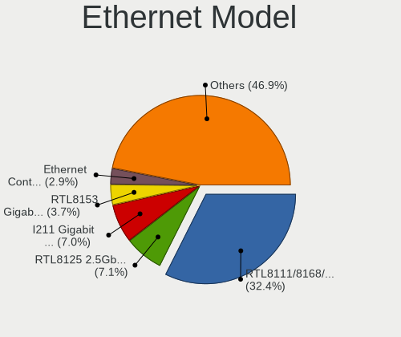

| Model                                                                         | Computers | Percent |
|-------------------------------------------------------------------------------|-----------|---------|
| Realtek RTL8111/8168/8411 PCI Express Gigabit Ethernet Controller             | 367       | 33.89%  |
| Intel I211 Gigabit Network Connection                                         | 90        | 8.31%   |
| Realtek RTL8125 2.5GbE Controller                                             | 36        | 3.32%   |
| Realtek RTL8153 Gigabit Ethernet Adapter                                      | 34        | 3.14%   |
| Intel I210 Gigabit Network Connection                                         | 29        | 2.68%   |
| Intel Ethernet Connection (2) I219-V                                          | 27        | 2.49%   |
| Intel 82579LM Gigabit Network Connection (Lewisville)                         | 24        | 2.22%   |
| Intel 82574L Gigabit Network Connection                                       | 23        | 2.12%   |
| Realtek RTL810xE PCI Express Fast Ethernet controller                         | 22        | 2.03%   |
| Intel Ethernet Controller I225-V                                              | 21        | 1.94%   |
| Intel Ethernet Connection (2) I219-LM                                         | 20        | 1.85%   |
| Intel Ethernet Connection (7) I219-V                                          | 18        | 1.66%   |
| Intel Ethernet Connection (4) I219-LM                                         | 14        | 1.29%   |
| Intel Ethernet Connection (2) I218-V                                          | 12        | 1.11%   |
| Intel Ethernet Connection (4) I219-V                                          | 11        | 1.02%   |
| Qualcomm Atheros Killer E2400 Gigabit Ethernet Controller                     | 10        | 0.92%   |
| Intel I350 Gigabit Network Connection                                         | 10        | 0.92%   |
| Intel Ethernet Connection I217-LM                                             | 9         | 0.83%   |
| Intel Ethernet Connection (6) I219-V                                          | 9         | 0.83%   |
| Aquantia AQC107 NBase-T/IEEE 802.3bz Ethernet Controller [AQtion]             | 9         | 0.83%   |
| Intel Ethernet Connection (7) I219-LM                                         | 8         | 0.74%   |
| Intel Ethernet Connection I218-LM                                             | 7         | 0.65%   |
| Intel 82599ES 10-Gigabit SFI/SFP+ Network Connection                          | 7         | 0.65%   |
| Intel 82579V Gigabit Network Connection                                       | 7         | 0.65%   |
| Nvidia MCP77 Ethernet                                                         | 6         | 0.55%   |
| Apple UniNorth 2 GMAC (Sun GEM)                                               | 6         | 0.55%   |
| Realtek RTL-8100/8101L/8139 PCI Fast Ethernet Adapter                         | 5         | 0.46%   |
| Qualcomm Atheros Killer E2500 Gigabit Ethernet Controller                     | 5         | 0.46%   |
| Intel Ethernet Connection (3) I218-LM                                         | 5         | 0.46%   |
| Broadcom NetXtreme BCM57765 Gigabit Ethernet PCIe                             | 5         | 0.46%   |
| Broadcom NetXtreme BCM5720 Gigabit Ethernet PCIe                              | 5         | 0.46%   |
| Realtek RTL8169 PCI Gigabit Ethernet Controller                               | 4         | 0.37%   |
| Qualcomm Atheros Killer E220x Gigabit Ethernet Controller                     | 4         | 0.37%   |
| Qualcomm Atheros AR8151 v2.0 Gigabit Ethernet                                 | 4         | 0.37%   |
| Nvidia MCP79 Ethernet                                                         | 4         | 0.37%   |
| Marvell Group 88E8056 PCI-E Gigabit Ethernet Controller                       | 4         | 0.37%   |
| Marvell Group 88E8040 PCI-E Fast Ethernet Controller                          | 4         | 0.37%   |
| Lenovo USB-C Dock Ethernet                                                    | 4         | 0.37%   |
| Lenovo ThinkPad TBT 3 Dock                                                    | 4         | 0.37%   |
| Intel Ethernet Connection I219-LM                                             | 4         | 0.37%   |
| Intel Ethernet Connection (10) I219-V                                         | 4         | 0.37%   |
| Intel 82577LM Gigabit Network Connection                                      | 4         | 0.37%   |
| Intel 82571EB/82571GB Gigabit Ethernet Controller D0/D1 (copper applications) | 4         | 0.37%   |
| Intel 82567LM-3 Gigabit Network Connection                                    | 4         | 0.37%   |
| Broadcom NetXtreme II BCM5709 Gigabit Ethernet                                | 4         | 0.37%   |
| ASIX AX88772B Fast Ethernet Controller                                        | 4         | 0.37%   |
| ASIX AX88772                                                                  | 4         | 0.37%   |
| Standard Microsystems Ethernet controller                                     | 3         | 0.28%   |
| Realtek Killer E3000 2.5GbE Controller                                        | 3         | 0.28%   |
| Realtek Killer E2600 Gigabit Ethernet Controller                              | 3         | 0.28%   |
| Nvidia MCP61 Ethernet                                                         | 3         | 0.28%   |
| Microchip SMSC9512/9514 Fast Ethernet Adapter                                 | 3         | 0.28%   |
| Marvell Group 88E8053 PCI-E Gigabit Ethernet Controller                       | 3         | 0.28%   |
| Intel Ethernet Controller XXV710 for 25GbE SFP28                              | 3         | 0.28%   |
| Intel Ethernet Controller X710 for 10GbE SFP+                                 | 3         | 0.28%   |
| Intel Ethernet Connection I217-V                                              | 3         | 0.28%   |
| Intel Ethernet Connection (5) I219-LM                                         | 3         | 0.28%   |
| Intel Ethernet Connection (14) I219-V                                         | 3         | 0.28%   |
| Intel Ethernet Connection (14) I219-LM                                        | 3         | 0.28%   |
| Intel Ethernet Connection (11) I219-V                                         | 3         | 0.28%   |

Net Controller Kind
-------------------

Ethernet, WiFi or modem

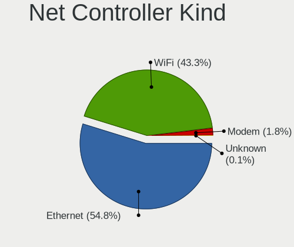

| Kind     | Computers | Percent |
|----------|-----------|---------|
| Ethernet | 939       | 55.83%  |
| WiFi     | 713       | 42.39%  |
| Modem    | 29        | 1.72%   |
| Unknown  | 1         | 0.06%   |

Used Controller
---------------

Currently used network controller

| Kind     | Computers | Percent |
|----------|-----------|---------|
| Ethernet | 620       | 55.06%  |
| WiFi     | 506       | 44.94%  |

NICs
----

Total network controllers on board

| Total | Computers | Percent |
|-------|-----------|---------|
| 2     | 525       | 48.3%   |
| 1     | 447       | 41.12%  |
| 3     | 60        | 5.52%   |
| 0     | 23        | 2.12%   |
| 4     | 18        | 1.66%   |
| 6     | 5         | 0.46%   |
| 5     | 5         | 0.46%   |
| 8     | 2         | 0.18%   |
| 12    | 1         | 0.09%   |
| 9     | 1         | 0.09%   |

IPv6
----

IPv6 vs IPv4

| Used | Computers | Percent |
|------|-----------|---------|
| No   | 974       | 88.14%  |
| Yes  | 131       | 11.86%  |

Bluetooth
---------

Bluetooth Vendor
----------------

Controller vendors

| Vendor                          | Computers | Percent |
|---------------------------------|-----------|---------|
| Intel                           | 415       | 61.85%  |
| Realtek Semiconductor           | 50        | 7.45%   |
| Cambridge Silicon Radio         | 46        | 6.86%   |
| Apple                           | 27        | 4.02%   |
| Qualcomm Atheros Communications | 23        | 3.43%   |
| ASUSTek Computer                | 18        | 2.68%   |
| Broadcom                        | 17        | 2.53%   |
| Lite-On Technology              | 16        | 2.38%   |
| IMC Networks                    | 13        | 1.94%   |
| Foxconn / Hon Hai               | 12        | 1.79%   |
| Dell                            | 7         | 1.04%   |
| Realtek                         | 6         | 0.89%   |
| Toshiba                         | 4         | 0.6%    |
| Hewlett-Packard                 | 4         | 0.6%    |
| HTC (High Tech Computer)        | 2         | 0.3%    |
| Foxconn International           | 2         | 0.3%    |
| Belkin Components               | 2         | 0.3%    |
| Ralink Technology               | 1         | 0.15%   |
| Opticis                         | 1         | 0.15%   |
| MediaTek                        | 1         | 0.15%   |
| Edimax Technology               | 1         | 0.15%   |
| Dynex                           | 1         | 0.15%   |
| Chicony Electronics             | 1         | 0.15%   |
| Askey Computer                  | 1         | 0.15%   |

Bluetooth Model
---------------

Controller models

| Model                                                                               | Computers | Percent |
|-------------------------------------------------------------------------------------|-----------|---------|
| Intel Bluetooth wireless interface                                                  | 120       | 17.88%  |
| Intel AX200 Bluetooth                                                               | 113       | 16.84%  |
| Intel Bluetooth 9460/9560 Jefferson Peak (JfP)                                      | 68        | 10.13%  |
| Intel AX201 Bluetooth                                                               | 65        | 9.69%   |
| Cambridge Silicon Radio Bluetooth Dongle (HCI mode)                                 | 46        | 6.86%   |
| Realtek Bluetooth Radio                                                             | 29        | 4.32%   |
| Intel Bluetooth Device                                                              | 21        | 3.13%   |
| Qualcomm Atheros  Bluetooth Device                                                  | 13        | 1.94%   |
| Intel AX210 Bluetooth                                                               | 13        | 1.94%   |
| Intel Wireless-AC 3168 Bluetooth                                                    | 12        | 1.79%   |
| Realtek  Bluetooth 4.2 Adapter                                                      | 11        | 1.64%   |
| Apple Bluetooth Host Controller                                                     | 10        | 1.49%   |
| ASUS Broadcom BCM20702A0 Bluetooth                                                  | 9         | 1.34%   |
| Foxconn / Hon Hai Bluetooth Device                                                  | 7         | 1.04%   |
| Realtek Bluetooth Radio                                                             | 6         | 0.89%   |
| Lite-On Atheros AR3012 Bluetooth                                                    | 6         | 0.89%   |
| IMC Networks Wireless_Device                                                        | 6         | 0.89%   |
| Apple Bluetooth USB Host Controller                                                 | 6         | 0.89%   |
| Realtek RTL8822BE Bluetooth 4.2 Adapter                                             | 5         | 0.75%   |
| Realtek RTL8723B Bluetooth                                                          | 5         | 0.75%   |
| Lite-On Bluetooth Device                                                            | 5         | 0.75%   |
| Apple Built-in Bluetooth 2.0+EDR HCI                                                | 5         | 0.75%   |
| Lite-On Qualcomm Atheros QCA9377 Bluetooth                                          | 4         | 0.6%    |
| IMC Networks Bluetooth Radio                                                        | 4         | 0.6%    |
| Apple Bluetooth HCI                                                                 | 4         | 0.6%    |
| Qualcomm Atheros Bluetooth USB Host Controller                                      | 3         | 0.45%   |
| Qualcomm Atheros AR3012 Bluetooth 4.0                                               | 3         | 0.45%   |
| Intel Centrino Bluetooth Wireless Transceiver                                       | 3         | 0.45%   |
| IMC Networks Bluetooth Device                                                       | 3         | 0.45%   |
| HP Bluetooth 2.0 Interface [Broadcom BCM2045]                                       | 3         | 0.45%   |
| Dell DW375 Bluetooth Module                                                         | 3         | 0.45%   |
| Dell BCM20702A0 Bluetooth Module                                                    | 3         | 0.45%   |
| Broadcom BCM20702 Bluetooth 4.0 [ThinkPad]                                          | 3         | 0.45%   |
| Toshiba Integrated Bluetooth (Taiyo Yuden)                                          | 2         | 0.3%    |
| Qualcomm Atheros AR9462 Bluetooth                                                   | 2         | 0.3%    |
| Qualcomm Atheros AR3011 Bluetooth                                                   | 2         | 0.3%    |
| HTC (High Tech Computer) Vive Hub Bluetooth 4.1 (Broadcom BCM920703)                | 2         | 0.3%    |
| Foxconn International BCM43142A0 Bluetooth module                                   | 2         | 0.3%    |
| Foxconn / Hon Hai Wireless_Device                                                   | 2         | 0.3%    |
| Broadcom BCM920702 Bluetooth 4.0 Zero Touch Dongle                                  | 2         | 0.3%    |
| Broadcom BCM20702A0 Bluetooth 4.0                                                   | 2         | 0.3%    |
| Broadcom BCM2070 Bluetooth 2.1 + EDR                                                | 2         | 0.3%    |
| Broadcom BCM2045B (BDC-2.1)                                                         | 2         | 0.3%    |
| Broadcom BCM2045B (BDC-2) [Bluetooth Controller]                                    | 2         | 0.3%    |
| ASUS Broadcom Bluetooth 2.1                                                         | 2         | 0.3%    |
| ASUS Bluetooth Radio                                                                | 2         | 0.3%    |
| ASUS BCM20702A0                                                                     | 2         | 0.3%    |
| Toshiba RT Bluetooth Radio                                                          | 1         | 0.15%   |
| Toshiba Atheros AR3012 Bluetooth                                                    | 1         | 0.15%   |
| Ralink CSR BS8510                                                                   | 1         | 0.15%   |
| Opticis Bluetooth Radio                                                             | 1         | 0.15%   |
| MediaTek Wireless_Device                                                            | 1         | 0.15%   |
| Lite-On Bluetooth Radio                                                             | 1         | 0.15%   |
| HP Broadcom 2070 Bluetooth Combo                                                    | 1         | 0.15%   |
| Foxconn / Hon Hai Foxconn T77H114 BCM2070 [Single-Chip Bluetooth 2.1 + EDR Adapter] | 1         | 0.15%   |
| Foxconn / Hon Hai Bluetooth USB Host Controller                                     | 1         | 0.15%   |
| Foxconn / Hon Hai BCM20702A0                                                        | 1         | 0.15%   |
| Edimax Bluetooth Adapter                                                            | 1         | 0.15%   |
| Dynex Bluetooth 4.0 Adapter [Broadcom, 1.12, BCM20702A0]                            | 1         | 0.15%   |
| Dell Wireless 350 Bluetooth                                                         | 1         | 0.15%   |

Sound
-----

Sound Vendor
------------

Sound card vendors

| Vendor                                          | Computers | Percent |
|-------------------------------------------------|-----------|---------|
| Intel                                           | 606       | 37%     |
| AMD                                             | 423       | 25.82%  |
| Nvidia                                          | 327       | 19.96%  |
| C-Media Electronics                             | 39        | 2.38%   |
| Logitech                                        | 21        | 1.28%   |
| Creative Labs                                   | 15        | 0.92%   |
| Realtek Semiconductor                           | 13        | 0.79%   |
| Lenovo                                          | 12        | 0.73%   |
| Creative Technology                             | 12        | 0.73%   |
| SteelSeries ApS                                 | 11        | 0.67%   |
| Texas Instruments                               | 10        | 0.61%   |
| Plantronics                                     | 8         | 0.49%   |
| JMTek                                           | 8         | 0.49%   |
| Razer USA                                       | 7         | 0.43%   |
| Kingston Technology                             | 7         | 0.43%   |
| GYROCOM C&C                                     | 7         | 0.43%   |
| Thesycon Systemsoftware & Consulting            | 6         | 0.37%   |
| Focusrite-Novation                              | 6         | 0.37%   |
| Blue Microphones                                | 6         | 0.37%   |
| AudioQuest                                      | 6         | 0.37%   |
| RODE Microphones                                | 5         | 0.31%   |
| Dell                                            | 5         | 0.31%   |
| BEHRINGER International                         | 5         | 0.31%   |
| ASUSTek Computer                                | 5         | 0.31%   |
| GN Netcom                                       | 4         | 0.24%   |
| Sennheiser Communications                       | 3         | 0.18%   |
| SAVITECH                                        | 3         | 0.18%   |
| Samson Technologies                             | 3         | 0.18%   |
| Generalplus Technology                          | 3         | 0.18%   |
| FiiO Electronics Technology                     | 3         | 0.18%   |
| Yamaha                                          | 2         | 0.12%   |
| Sony                                            | 2         | 0.12%   |
| No brand                                        | 2         | 0.12%   |
| Native Instruments                              | 2         | 0.12%   |
| Microsoft                                       | 2         | 0.12%   |
| Corsair                                         | 2         | 0.12%   |
| Astro Gaming                                    | 2         | 0.12%   |
| Valve Software                                  | 1         | 0.06%   |
| Unknown                                         | 1         | 0.06%   |
| Trust                                           | 1         | 0.06%   |
| TEAC                                            | 1         | 0.06%   |
| Tdlasunnic                                      | 1         | 0.06%   |
| Syntek                                          | 1         | 0.06%   |
| Solid State Logic                               | 1         | 0.06%   |
| Silicon Integrated Systems [SiS]                | 1         | 0.06%   |
| QinHeng Electronics                             | 1         | 0.06%   |
| Nektar                                          | 1         | 0.06%   |
| Micronas                                        | 1         | 0.06%   |
| Micro Star International                        | 1         | 0.06%   |
| MAG Technology                                  | 1         | 0.06%   |
| Licensed by Sony Computer Entertainment America | 1         | 0.06%   |
| LG Electronics                                  | 1         | 0.06%   |
| JOUNIVO                                         | 1         | 0.06%   |
| iCreate Technologies                            | 1         | 0.06%   |
| Huawei Technologies                             | 1         | 0.06%   |
| Hewlett-Packard                                 | 1         | 0.06%   |
| FIFINE Microphones                              | 1         | 0.06%   |
| Ensoniq                                         | 1         | 0.06%   |
| Elgato Systems                                  | 1         | 0.06%   |
| Conexant                                        | 1         | 0.06%   |

Sound Model
-----------

Sound card models

| Model                                                                      | Computers | Percent |
|----------------------------------------------------------------------------|-----------|---------|
| AMD Family 17h/19h HD Audio Controller                                     | 119       | 6.02%   |
| AMD Starship/Matisse HD Audio Controller                                   | 112       | 5.67%   |
| Intel Cannon Lake PCH cAVS                                                 | 77        | 3.89%   |
| Intel Sunrise Point-LP HD Audio                                            | 73        | 3.69%   |
| AMD Ellesmere HDMI Audio [Radeon RX 470/480 / 570/580/590]                 | 71        | 3.59%   |
| AMD Family 17h (Models 00h-0fh) HD Audio Controller                        | 68        | 3.44%   |
| AMD Renoir Radeon High Definition Audio Controller                         | 67        | 3.39%   |
| Intel 100 Series/C230 Series Chipset Family HD Audio Controller            | 48        | 2.43%   |
| AMD Raven/Raven2/Fenghuang HDMI/DP Audio Controller                        | 34        | 1.72%   |
| AMD Navi 10 HDMI Audio                                                     | 34        | 1.72%   |
| Intel 7 Series/C216 Chipset Family High Definition Audio Controller        | 33        | 1.67%   |
| Intel 6 Series/C200 Series Chipset Family High Definition Audio Controller | 33        | 1.67%   |
| Intel 8 Series/C220 Series Chipset High Definition Audio Controller        | 30        | 1.52%   |
| AMD SBx00 Azalia (Intel HDA)                                               | 29        | 1.47%   |
| Nvidia TU107 GeForce GTX 1650 High Definition Audio Controller             | 28        | 1.42%   |
| Nvidia GP106 High Definition Audio Controller                              | 27        | 1.37%   |
| Intel Tiger Lake-LP Smart Sound Technology Audio Controller                | 27        | 1.37%   |
| Nvidia TU106 High Definition Audio Controller                              | 26        | 1.32%   |
| Nvidia GP107GL High Definition Audio Controller                            | 24        | 1.21%   |
| Nvidia GP104 High Definition Audio Controller                              | 24        | 1.21%   |
| Intel Cannon Point-LP High Definition Audio Controller                     | 24        | 1.21%   |
| Intel Comet Lake PCH cAVS                                                  | 23        | 1.16%   |
| Intel Xeon E3-1200 v3/4th Gen Core Processor HD Audio Controller           | 22        | 1.11%   |
| Intel Comet Lake PCH-LP cAVS                                               | 20        | 1.01%   |
| AMD Navi 21/23 HDMI/DP Audio Controller                                    | 20        | 1.01%   |
| Nvidia TU104 HD Audio Controller                                           | 19        | 0.96%   |
| AMD Vega 10 HDMI Audio [Radeon Vega 56/64]                                 | 19        | 0.96%   |
| Nvidia TU116 High Definition Audio Controller                              | 18        | 0.91%   |
| Intel Tiger Lake-H HD Audio Controller                                     | 18        | 0.91%   |
| Intel NM10/ICH7 Family High Definition Audio Controller                    | 18        | 0.91%   |
| Intel CM238 HD Audio Controller                                            | 18        | 0.91%   |
| Intel Haswell-ULT HD Audio Controller                                      | 17        | 0.86%   |
| Intel 8 Series HD Audio Controller                                         | 17        | 0.86%   |
| Nvidia GM206 High Definition Audio Controller                              | 16        | 0.81%   |
| Intel 82801JI (ICH10 Family) HD Audio Controller                           | 16        | 0.81%   |
| Intel 200 Series PCH HD Audio                                              | 16        | 0.81%   |
| AMD Baffin HDMI/DP Audio [Radeon RX 550 640SP / RX 560/560X]               | 15        | 0.76%   |
| Nvidia GM204 High Definition Audio Controller                              | 14        | 0.71%   |
| AMD Oland/Hainan/Cape Verde/Pitcairn HDMI Audio [Radeon HD 7000 Series]    | 14        | 0.71%   |
| AMD FCH Azalia Controller                                                  | 14        | 0.71%   |
| Nvidia GM107 High Definition Audio Controller [GeForce 940MX]              | 13        | 0.66%   |
| Nvidia GK208 HDMI/DP Audio Controller                                      | 13        | 0.66%   |
| Intel Wildcat Point-LP High Definition Audio Controller                    | 13        | 0.66%   |
| Intel Broadwell-U Audio Controller                                         | 13        | 0.66%   |
| Nvidia GP102 HDMI Audio Controller                                         | 12        | 0.61%   |
| Intel 9 Series Chipset Family HD Audio Controller                          | 12        | 0.61%   |
| Nvidia GA106 High Definition Audio Controller                              | 11        | 0.56%   |
| Nvidia GA104 High Definition Audio Controller                              | 11        | 0.56%   |
| Nvidia GA102 High Definition Audio Controller                              | 11        | 0.56%   |
| Realtek Semiconductor USB Audio                                            | 10        | 0.51%   |
| Nvidia High Definition Audio Controller                                    | 9         | 0.46%   |
| Intel Atom Processor Z36xxx/Z37xxx Series High Definition Audio Controller | 9         | 0.46%   |
| Nvidia GK106 HDMI Audio Controller                                         | 8         | 0.4%    |
| Intel Ice Lake-LP Smart Sound Technology Audio Controller                  | 8         | 0.4%    |
| Intel C610/X99 series chipset HD Audio Controller                          | 8         | 0.4%    |
| C-Media Electronics CMI8788 [Oxygen HD Audio]                              | 8         | 0.4%    |
| C-Media Electronics Audio Adapter (Unitek Y-247A)                          | 8         | 0.4%    |
| Texas Instruments PCM2902 Audio Codec                                      | 7         | 0.35%   |
| Intel Celeron/Pentium Silver Processor High Definition Audio               | 7         | 0.35%   |
| Intel 5 Series/3400 Series Chipset High Definition Audio                   | 7         | 0.35%   |

Memory
------

Memory Vendor
-------------

Memory module vendors

| Vendor                       | Computers | Percent |
|------------------------------|-----------|---------|
| Samsung Electronics          | 223       | 19.61%  |
| Kingston                     | 161       | 14.16%  |
| SK hynix                     | 151       | 13.28%  |
| Micron Technology            | 103       | 9.06%   |
| Unknown                      | 100       | 8.8%    |
| Crucial                      | 95        | 8.36%   |
| Corsair                      | 94        | 8.27%   |
| G.Skill                      | 91        | 8%      |
| Ramaxel Technology           | 18        | 1.58%   |
| A-DATA Technology            | 13        | 1.14%   |
| Team                         | 11        | 0.97%   |
| Patriot                      | 10        | 0.88%   |
| Transcend                    | 9         | 0.79%   |
| Goodram                      | 8         | 0.7%    |
| Elpida                       | 8         | 0.7%    |
| Nanya Technology             | 7         | 0.62%   |
| Unknown (ABCD)               | 3         | 0.26%   |
| AMD                          | 3         | 0.26%   |
| Unknown                      | 3         | 0.26%   |
| Toshiba                      | 2         | 0.18%   |
| Unknown (0x5D00000000000000) | 1         | 0.09%   |
| Timetec                      | 1         | 0.09%   |
| Thermaltake                  | 1         | 0.09%   |
| Teikon                       | 1         | 0.09%   |
| T-FORCE                      | 1         | 0.09%   |
| Saikano                      | 1         | 0.09%   |
| Qimonda                      | 1         | 0.09%   |
| PUSKILL                      | 1         | 0.09%   |
| Patriot Memory (PDP Systems) | 1         | 0.09%   |
| Magnum Tech                  | 1         | 0.09%   |
| Kllisre                      | 1         | 0.09%   |
| KLEVV                        | 1         | 0.09%   |
| Kimtigo                      | 1         | 0.09%   |
| Innodisk                     | 1         | 0.09%   |
| Hewlett-Packard              | 1         | 0.09%   |
| Goldkey                      | 1         | 0.09%   |
| Golden Empire                | 1         | 0.09%   |
| GeIL                         | 1         | 0.09%   |
| Exceleram                    | 1         | 0.09%   |
| Chun Well                    | 1         | 0.09%   |
| Avant                        | 1         | 0.09%   |
| Apacer                       | 1         | 0.09%   |
| A Force                      | 1         | 0.09%   |
| 48spaces                     | 1         | 0.09%   |

Memory Model
------------

Memory module models

| Model                                                         | Computers | Percent |
|---------------------------------------------------------------|-----------|---------|
| SK hynix RAM HMA81GS6AFR8N-UH 8GB SODIMM DDR4 2667MT/s        | 11        | 0.91%   |
| Corsair RAM CMK32GX4M2B3200C16 16GB DIMM DDR4 3400MT/s        | 10        | 0.83%   |
| Samsung RAM M471A5244CB0-CTD 4096MB SODIMM DDR4 3266MT/s      | 9         | 0.74%   |
| Samsung RAM M471A1K43CB1-CTD 8GB SODIMM DDR4 2667MT/s         | 9         | 0.74%   |
| Samsung RAM M471A1K43BB1-CRC 8GB SODIMM DDR4 2667MT/s         | 9         | 0.74%   |
| Samsung RAM M471A1G44AB0-CWE 8192MB SODIMM DDR4 3200MT/s      | 9         | 0.74%   |
| Micron RAM 8ATF1G64HZ-3G2J1 8GB SODIMM DDR4 3200MT/s          | 9         | 0.74%   |
| Samsung RAM M471B5173DB0-YK0 4GB SODIMM DDR3 1600MT/s         | 8         | 0.66%   |
| Samsung RAM M471B1G73DB0-YK0 8GB SODIMM DDR3 1600MT/s         | 8         | 0.66%   |
| Micron RAM 8ATF1G64HZ-2G6E1 8GB SODIMM DDR4 2667MT/s          | 8         | 0.66%   |
| G.Skill RAM F4-3200C16-16GVK 16GB DIMM DDR4 3600MT/s          | 8         | 0.66%   |
| SK hynix RAM HMAA1GS6CJR6N-XN 8GB SODIMM DDR4 3200MT/s        | 7         | 0.58%   |
| SK hynix RAM HMA82GS6AFR8N-UH 16GB SODIMM DDR4 2667MT/s       | 7         | 0.58%   |
| SK hynix RAM HMA41GS6AFR8N-TF 8192MB SODIMM DDR4 2667MT/s     | 7         | 0.58%   |
| Samsung RAM M471A2K43DB1-CWE 16GB SODIMM DDR4 3200MT/s        | 7         | 0.58%   |
| Samsung RAM M471A2G44AM0-CWE 16GB SODIMM DDR4 3200MT/s        | 7         | 0.58%   |
| Kingston RAM KHX3200C16D4/16GX 16GB DIMM DDR4 3600MT/s        | 7         | 0.58%   |
| Corsair RAM CMK16GX4M2B3200C16 8GB DIMM DDR4 3600MT/s         | 7         | 0.58%   |
| SK hynix RAM HMA81GS6DJR8N-XN 8GB SODIMM DDR4 3200MT/s        | 6         | 0.5%    |
| Samsung RAM M471A2K43DB1-CTD 16GB SODIMM DDR4 2667MT/s        | 6         | 0.5%    |
| Samsung RAM M471A1K43DB1-CWE 8GB SODIMM DDR4 3200MT/s         | 6         | 0.5%    |
| Samsung RAM M471A1G44AB0-CWE 8GB Row Of Chips DDR4 3200MT/s   | 6         | 0.5%    |
| Unknown RAM Module 1024MB DIMM SDRAM                          | 5         | 0.41%   |
| SK hynix RAM HMT451S6BFR8A-PB 4GB SODIMM DDR3 1600MT/s        | 5         | 0.41%   |
| SK hynix RAM HMT351S6CFR8C-PB 4GB SODIMM DDR3 1600MT/s        | 5         | 0.41%   |
| Samsung RAM M471A2K43CB1-CTD 16GB SODIMM DDR4 8400MT/s        | 5         | 0.41%   |
| Samsung RAM M471A1K43EB1-CWE 8192MB SODIMM DDR4 3200MT/s      | 5         | 0.41%   |
| Samsung RAM M471A1K43DB1-CTD 8192MB SODIMM DDR4 2667MT/s      | 5         | 0.41%   |
| Samsung RAM M471A1G44AB0-CTD 8GB SODIMM DDR4 2667MT/s         | 5         | 0.41%   |
| Kingston RAM KHX2666C16/8G 8GB DIMM DDR4 3466MT/s             | 5         | 0.41%   |
| Kingston RAM KHX1866C10D3/8G 8GB DIMM DDR3 1867MT/s           | 5         | 0.41%   |
| G.Skill RAM F4-3200C14-8GFX 8GB DIMM DDR4 3733MT/s            | 5         | 0.41%   |
| Corsair RAM CMK16GX4M2B3000C15 8GB DIMM DDR4 3000MT/s         | 5         | 0.41%   |
| Unknown RAM Module 1GB SODIMM DDR                             | 4         | 0.33%   |
| SK hynix RAM HMA851S6CJR6N-VK 4GB SODIMM DDR4 2667MT/s        | 4         | 0.33%   |
| SK hynix RAM HMA81GS6JJR8N-VK 8GB SODIMM DDR4 2667MT/s        | 4         | 0.33%   |
| Samsung RAM M471A5244CB0-CWE 4GB SODIMM DDR4 3200MT/s         | 4         | 0.33%   |
| Samsung RAM M471A2K43CB1-CRC 16384MB SODIMM DDR4 2667MT/s     | 4         | 0.33%   |
| Samsung RAM M471A1K43CB1-CRC 8GB SODIMM DDR4 2667MT/s         | 4         | 0.33%   |
| Samsung RAM M471A1K43BB0-CPB 8GB SODIMM DDR4 2133MT/s         | 4         | 0.33%   |
| Micron RAM MT52L1G32D4PG-093 8GB Row Of Chips LPDDR3 2133MT/s | 4         | 0.33%   |
| Micron RAM 4ATS2G64HZ-3G2B1 16384MB SODIMM DDR4 3200MT/s      | 4         | 0.33%   |
| Micron RAM 16ATF2G64HZ-2G6E1 16GB SODIMM DDR4 2667MT/s        | 4         | 0.33%   |
| Kingston RAM KHX2666C16/16G 16GB DIMM DDR4 3200MT/s           | 4         | 0.33%   |
| Kingston RAM KHX2666C15D4/8G 8GB DIMM DDR4 3200MT/s           | 4         | 0.33%   |
| Kingston RAM KHX1600C9D3/4GX 4GB DIMM DDR3 2400MT/s           | 4         | 0.33%   |
| Kingston RAM 9905744-066.A00G 32GB SODIMM DDR4 3200MT/s       | 4         | 0.33%   |
| G.Skill RAM F4-3600C16-16GTZNC 16384MB DIMM DDR4 3600MT/s     | 4         | 0.33%   |
| G.Skill RAM F4-3200C16-8GVKB 8GB DIMM DDR4 3200MT/s           | 4         | 0.33%   |
| Corsair RAM CMK32GX4M2B3000C15 16GB DIMM DDR4 3000MT/s        | 4         | 0.33%   |
| Corsair RAM CMK16GX4M2A2666C16 8192MB DIMM DDR4 3200MT/s      | 4         | 0.33%   |
| Unknown RAM Module 8192MB DIMM DDR3 1333MT/s                  | 3         | 0.25%   |
| Unknown RAM Module 512MB DIMM SDRAM                           | 3         | 0.25%   |
| Unknown RAM Module 2048MB DIMM DDR2 667MT/s                   | 3         | 0.25%   |
| Unknown RAM Module 2048MB DIMM 1333MT/s                       | 3         | 0.25%   |
| SK hynix RAM Module 8192MB SODIMM DDR4 2400MT/s               | 3         | 0.25%   |
| SK hynix RAM HMT41GS6AFR8A-PB 8GB SODIMM DDR3 1600MT/s        | 3         | 0.25%   |
| SK hynix RAM HMAA4GS6AJR8N-XN 32GB SODIMM DDR4 3200MT/s       | 3         | 0.25%   |
| SK hynix RAM HMA851S6CJR6N-VK 4GB Row Of Chips DDR4 2667MT/s  | 3         | 0.25%   |
| SK hynix RAM HMA851S6AFR6N-UH 4GB SODIMM DDR4 2667MT/s        | 3         | 0.25%   |

Memory Kind
-----------

Memory module kinds

| Kind    | Computers | Percent |
|---------|-----------|---------|
| DDR4    | 636       | 62.97%  |
| DDR3    | 233       | 23.07%  |
| DDR2    | 39        | 3.86%   |
| LPDDR4  | 27        | 2.67%   |
| Unknown | 27        | 2.67%   |
| LPDDR3  | 21        | 2.08%   |
| SDRAM   | 17        | 1.68%   |
| DDR     | 8         | 0.79%   |
| DRAM    | 1         | 0.1%    |
| DDR5    | 1         | 0.1%    |

Memory Form Factor
------------------

Physical design of the memory module

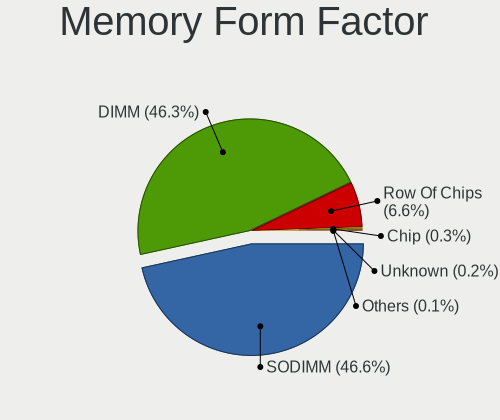

| Name         | Computers | Percent |
|--------------|-----------|---------|
| DIMM         | 486       | 48.12%  |
| SODIMM       | 463       | 45.84%  |
| Row Of Chips | 55        | 5.45%   |
| Chip         | 5         | 0.5%    |
| RIMM         | 1         | 0.1%    |

Memory Size
-----------

Memory module size

| Size  | Computers | Percent |
|-------|-----------|---------|
| 8192  | 459       | 42.07%  |
| 16384 | 260       | 23.83%  |
| 4096  | 196       | 17.97%  |
| 2048  | 76        | 6.97%   |
| 32768 | 63        | 5.77%   |
| 1024  | 29        | 2.66%   |
| 512   | 6         | 0.55%   |
| 256   | 2         | 0.18%   |

Memory Speed
------------

Memory module speed

| Speed   | Computers | Percent |
|---------|-----------|---------|
| 3200    | 194       | 17.68%  |
| 2667    | 183       | 16.68%  |
| 1600    | 145       | 13.22%  |
| 2400    | 84        | 7.66%   |
| 2133    | 64        | 5.83%   |
| 3600    | 60        | 5.47%   |
| 1333    | 53        | 4.83%   |
| 3000    | 27        | 2.46%   |
| 667     | 27        | 2.46%   |
| 800     | 26        | 2.37%   |
| 3733    | 21        | 1.91%   |
| Unknown | 19        | 1.73%   |
| 1867    | 17        | 1.55%   |
| 2933    | 16        | 1.46%   |
| 3466    | 15        | 1.37%   |
| 4267    | 14        | 1.28%   |
| 3400    | 14        | 1.28%   |
| 1334    | 12        | 1.09%   |
| 2666    | 10        | 0.91%   |
| 3266    | 9         | 0.82%   |
| 1066    | 9         | 0.82%   |
| 8400    | 7         | 0.64%   |
| 1067    | 7         | 0.64%   |
| 1866    | 6         | 0.55%   |
| 4800    | 5         | 0.46%   |
| 3800    | 5         | 0.46%   |
| 4266    | 4         | 0.36%   |
| 4000    | 4         | 0.36%   |
| 400     | 4         | 0.36%   |
| 3333    | 3         | 0.27%   |
| 3100    | 3         | 0.27%   |
| 3066    | 3         | 0.27%   |
| 2048    | 3         | 0.27%   |
| 533     | 3         | 0.27%   |
| 3866    | 2         | 0.18%   |
| 3666    | 2         | 0.18%   |
| 2800    | 2         | 0.18%   |
| 2465    | 2         | 0.18%   |
| 2134    | 2         | 0.18%   |
| 4199    | 1         | 0.09%   |
| 3500    | 1         | 0.09%   |
| 3467    | 1         | 0.09%   |
| 3334    | 1         | 0.09%   |
| 2866    | 1         | 0.09%   |
| 2733    | 1         | 0.09%   |
| 2197    | 1         | 0.09%   |
| 2132    | 1         | 0.09%   |
| 2000    | 1         | 0.09%   |
| 1800    | 1         | 0.09%   |
| 1639    | 1         | 0.09%   |

Printers & scanners
-------------------

Printer Vendor
--------------

Printer device vendors

| Vendor                | Computers | Percent |
|-----------------------|-----------|---------|
| Hewlett-Packard       | 9         | 39.13%  |
| Seiko Epson           | 3         | 13.04%  |
| Samsung Electronics   | 3         | 13.04%  |
| Canon                 | 3         | 13.04%  |
| Brother Industries    | 2         | 8.7%    |
| Xiaomi                | 1         | 4.35%   |
| Lexmark International | 1         | 4.35%   |
| Konica Minolta        | 1         | 4.35%   |

Printer Model
-------------

Printer device models

| Model                                 | Computers | Percent |
|---------------------------------------|-----------|---------|
| Canon LiDE 400                        | 2         | 8.7%    |
| Xiaomi MiMouse 2                      | 1         | 4.35%   |
| Seiko Epson WF-3520 Series            | 1         | 4.35%   |
| Seiko Epson WF-2510 Series            | 1         | 4.35%   |
| Seiko Epson AL-M310DN                 | 1         | 4.35%   |
| Samsung ML-191x/ML-252x Laser Printer | 1         | 4.35%   |
| Samsung CLP-325 Color Laser Printer   | 1         | 4.35%   |
| Samsung C460 Series                   | 1         | 4.35%   |
| Lexmark International Lexmark E352dn  | 1         | 4.35%   |
| Konica Minolta magicolor 1680MF scan  | 1         | 4.35%   |
| HP PhotoSmart 130                     | 1         | 4.35%   |
| HP LaserJet M14-M17                   | 1         | 4.35%   |
| HP LaserJet 1020                      | 1         | 4.35%   |
| HP LaserJet 1018                      | 1         | 4.35%   |
| HP LaserJet 1010                      | 1         | 4.35%   |
| HP Deskjet D1500 series               | 1         | 4.35%   |
| HP DeskJet 5440                       | 1         | 4.35%   |
| HP DeskJet 3630 series                | 1         | 4.35%   |
| HP Deskjet 2050 J510                  | 1         | 4.35%   |
| Canon LiDE 300                        | 1         | 4.35%   |
| Brother MFC-L2700DW                   | 1         | 4.35%   |
| Brother MFC-9130CW                    | 1         | 4.35%   |

Scanner Vendor
--------------

Scanner device vendors

| Vendor | Computers | Percent |
|--------|-----------|---------|
| Canon  | 5         | 100%    |

Scanner Model
-------------

Scanner device models

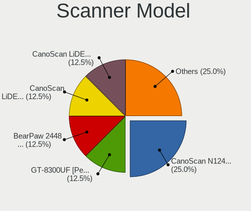

| Model                         | Computers | Percent |
|-------------------------------|-----------|---------|
| Canon CanoScan N1240U/LiDE 30 | 2         | 40%     |
| Canon CanoScan LiDE 600F      | 1         | 20%     |
| Canon CanoScan LiDE 220       | 1         | 20%     |
| Canon CanoScan LiDE 110       | 1         | 20%     |

Camera
------

Camera Vendor
-------------

Camera device vendors

| Vendor                                 | Computers | Percent |
|----------------------------------------|-----------|---------|
| Chicony Electronics                    | 121       | 20.72%  |
| Logitech                               | 80        | 13.7%   |
| IMC Networks                           | 62        | 10.62%  |
| Microdia                               | 49        | 8.39%   |
| Realtek Semiconductor                  | 43        | 7.36%   |
| Acer                                   | 39        | 6.68%   |
| Sunplus Innovation Technology          | 30        | 5.14%   |
| Quanta                                 | 21        | 3.6%    |
| Cheng Uei Precision Industry (Foxlink) | 18        | 3.08%   |
| Lite-On Technology                     | 17        | 2.91%   |
| Syntek                                 | 14        | 2.4%    |
| Apple                                  | 13        | 2.23%   |
| Z-Star Microelectronics                | 8         | 1.37%   |
| Samsung Electronics                    | 7         | 1.2%    |
| Luxvisions Innotech Limited            | 7         | 1.2%    |
| Microsoft                              | 3         | 0.51%   |
| MacroSilicon                           | 3         | 0.51%   |
| DigiTech                               | 3         | 0.51%   |
| Creative Technology                    | 3         | 0.51%   |
| ARC International                      | 3         | 0.51%   |
| Unknown                                | 2         | 0.34%   |
| Suyin                                  | 2         | 0.34%   |
| Silicon Motion                         | 2         | 0.34%   |
| Razer USA                              | 2         | 0.34%   |
| LG Electronics                         | 2         | 0.34%   |
| KYE Systems (Mouse Systems)            | 2         | 0.34%   |
| DJJHNA29IE70D3                         | 2         | 0.34%   |
| AVerMedia Technologies                 | 2         | 0.34%   |
| Alcor Micro                            | 2         | 0.34%   |
| YGTek                                  | 1         | 0.17%   |
| Xiaomi                                 | 1         | 0.17%   |
| Valve Software                         | 1         | 0.17%   |
| USB3.0 HD Audio Capture                | 1         | 0.17%   |
| SunplusIT                              | 1         | 0.17%   |
| SiGma Micro                            | 1         | 0.17%   |
| ShineTech                              | 1         | 0.17%   |
| Ruision                                | 1         | 0.17%   |
| Ricoh                                  | 1         | 0.17%   |
| Omnivision                             | 1         | 0.17%   |
| Lenovo                                 | 1         | 0.17%   |
| Intel                                  | 1         | 0.17%   |
| Holitech                               | 1         | 0.17%   |
| Hewlett-Packard                        | 1         | 0.17%   |
| Google                                 | 1         | 0.17%   |
| Genesys Logic                          | 1         | 0.17%   |
| Generalplus Technology                 | 1         | 0.17%   |
| Cubeternet                             | 1         | 0.17%   |
| AVer Information                       | 1         | 0.17%   |
| Aveo Technology                        | 1         | 0.17%   |
| A4Tech                                 | 1         | 0.17%   |
| 2M UVC CAMERA                          | 1         | 0.17%   |

Camera Model
------------

Camera device models

| Model                                               | Computers | Percent |
|-----------------------------------------------------|-----------|---------|
| Chicony Integrated Camera                           | 38        | 6.41%   |
| IMC Networks Integrated Camera                      | 29        | 4.89%   |
| Microdia Integrated_Webcam_HD                       | 27        | 4.55%   |
| Logitech HD Pro Webcam C920                         | 21        | 3.54%   |
| Realtek Integrated_Webcam_HD                        | 18        | 3.04%   |
| Acer Integrated Camera                              | 17        | 2.87%   |
| Logitech Webcam C270                                | 14        | 2.36%   |
| Chicony HD Webcam                                   | 13        | 2.19%   |
| IMC Networks USB2.0 HD UVC WebCam                   | 12        | 2.02%   |
| Sunplus Integrated_Webcam_HD                        | 11        | 1.85%   |
| Syntek Integrated Camera                            | 9         | 1.52%   |
| Chicony HP HD Camera                                | 8         | 1.35%   |
| Samsung Galaxy A5 (MTP)                             | 7         | 1.18%   |
| Logitech Webcam C310                                | 7         | 1.18%   |
| Lite-On Integrated Camera                           | 7         | 1.18%   |
| Realtek Integrated Webcam HD                        | 6         | 1.01%   |
| Quanta HP Wide Vision HD Camera                     | 6         | 1.01%   |
| Chicony USB2.0 Camera                               | 6         | 1.01%   |
| Sunplus HD WebCam                                   | 5         | 0.84%   |
| Logitech C922 Pro Stream Webcam                     | 5         | 0.84%   |
| Chicony Integrated Camera (1280x720@30)             | 5         | 0.84%   |
| Z-Star Venus USB2.0 Camera                          | 4         | 0.67%   |
| Sunplus HP Wide Vision HD                           | 4         | 0.67%   |
| Microdia Integrated Webcam                          | 4         | 0.67%   |
| Luxvisions Innotech Limited HP TrueVision HD Camera | 4         | 0.67%   |
| Logitech BRIO Ultra HD Webcam                       | 4         | 0.67%   |
| IMC Networks USB2.0 HD IR UVC WebCam                | 4         | 0.67%   |
| IMC Networks ov9734_azurewave_camera                | 4         | 0.67%   |
| Chicony Lenovo EasyCamera                           | 4         | 0.67%   |
| Chicony HD User Facing                              | 4         | 0.67%   |
| Chicony EasyCamera                                  | 4         | 0.67%   |
| Cheng Uei Precision Industry (Foxlink) HP HD Camera | 4         | 0.67%   |
| Apple FaceTime HD Camera                            | 4         | 0.67%   |
| Acer SunplusIT Integrated Camera                    | 4         | 0.67%   |
| Acer BisonCam, NB Pro                               | 4         | 0.67%   |
| Syntek Lenovo EasyCamera                            | 3         | 0.51%   |
| Realtek USB2.0 HD UVC WebCam                        | 3         | 0.51%   |
| Realtek Integrated Webcam                           | 3         | 0.51%   |
| Quanta RGB-IR Camera                                | 3         | 0.51%   |
| Quanta HD User Facing                               | 3         | 0.51%   |
| Microdia Laptop_Integrated_Webcam_HD                | 3         | 0.51%   |
| Microdia HDP Webcam USB                             | 3         | 0.51%   |
| Microdia Camera                                     | 3         | 0.51%   |
| MacroSilicon USB3.0 HD VIDEO                        | 3         | 0.51%   |
| Logitech Webcam C925e                               | 3         | 0.51%   |
| Logitech B525 HD Webcam                             | 3         | 0.51%   |
| Lite-On TOSHIBA Web Camera - HD                     | 3         | 0.51%   |
| Lite-On HP Wide Vision HD Camera                    | 3         | 0.51%   |
| Chicony USB2.0 HD UVC WebCam                        | 3         | 0.51%   |
| Chicony USB 2.0 Camera                              | 3         | 0.51%   |
| Chicony ThinkPad T490 Webcam                        | 3         | 0.51%   |
| ARC International Camera                            | 3         | 0.51%   |
| Apple Built-in iSight                               | 3         | 0.51%   |
| Acer HD Webcam                                      | 3         | 0.51%   |
| Z-Star Vimicro USB Camera (Altair)                  | 2         | 0.34%   |
| Unknown 720p HD Camera                              | 2         | 0.34%   |
| Suyin HP TrueVision HD                              | 2         | 0.34%   |
| Sunplus Laptop_Integrated_Webcam_FHD                | 2         | 0.34%   |
| Sunplus Dell E5570 integrated webcam                | 2         | 0.34%   |
| Realtek USB Camera                                  | 2         | 0.34%   |

Security
--------

Fingerprint Vendor
------------------

Fingerprint sensor vendors

| Vendor                     | Computers | Percent |
|----------------------------|-----------|---------|
| Synaptics                  | 52        | 46.43%  |
| Validity Sensors           | 24        | 21.43%  |
| Shenzhen Goodix Technology | 17        | 15.18%  |
| Elan Microelectronics      | 6         | 5.36%   |
| AuthenTec                  | 4         | 3.57%   |
| STMicroelectronics         | 3         | 2.68%   |
| LighTuning Technology      | 2         | 1.79%   |
| DigitalPersona             | 2         | 1.79%   |
| Upek                       | 1         | 0.89%   |
| Samsung Electronics        | 1         | 0.89%   |

Fingerprint Model
-----------------

Fingerprint sensor models

| Model                                                      | Computers | Percent |
|------------------------------------------------------------|-----------|---------|
| Synaptics Prometheus MIS Touch Fingerprint Reader          | 22        | 19.64%  |
| Synaptics Metallica MIS Touch Fingerprint Reader           | 13        | 11.61%  |
| Unknown                                                    | 10        | 8.93%   |
| Validity Sensors VFS495 Fingerprint Reader                 | 6         | 5.36%   |
| Shenzhen Goodix  Fingerprint Device                        | 6         | 5.36%   |
| Shenzhen Goodix Fingerprint Reader                         | 6         | 5.36%   |
| Validity Sensors VFS 5011 fingerprint sensor               | 5         | 4.46%   |
| Validity Sensors Synaptics WBDI                            | 5         | 4.46%   |
| Shenzhen Goodix FingerPrint                                | 5         | 4.46%   |
| Elan ELAN:Fingerprint                                      | 5         | 4.46%   |
| Validity Sensors VFS5011 Fingerprint Reader                | 3         | 2.68%   |
| STMicroelectronics Fingerprint Reader                      | 3         | 2.68%   |
| Validity Sensors VFS7552 Touch Fingerprint Sensor          | 2         | 1.79%   |
| Validity Sensors Fingerprint scanner                       | 2         | 1.79%   |
| Synaptics  VFS7552 Touch Fingerprint Sensor with PurePrint | 2         | 1.79%   |
| Synaptics  FS7604 Touch Fingerprint Sensor with PurePrint  | 2         | 1.79%   |
| DigitalPersona Fingerprint Reader                          | 2         | 1.79%   |
| AuthenTec AES2501 Fingerprint Sensor                       | 2         | 1.79%   |
| Validity Sensors VFS471 Fingerprint Reader                 | 1         | 0.89%   |
| Upek Biometric Touchchip/Touchstrip Fingerprint Sensor     | 1         | 0.89%   |
| Synaptics WBDI Device                                      | 1         | 0.89%   |
| Synaptics  WBDI                                            | 1         | 0.89%   |
| Synaptics Metallica MOH Touch Fingerprint Reader           | 1         | 0.89%   |
| Samsung Fingerprint Sensor Device - 730B                   | 1         | 0.89%   |
| LighTuning ES603 Swipe Fingerprint Sensor                  | 1         | 0.89%   |
| LighTuning EgisTec Touch Fingerprint Sensor                | 1         | 0.89%   |
| Elan ELAN:ARM-M4                                           | 1         | 0.89%   |
| AuthenTec Fingerprint Sensor                               | 1         | 0.89%   |
| AuthenTec AES2550 Fingerprint Sensor                       | 1         | 0.89%   |

Chipcard Vendor
---------------

Chipcard module vendors

| Vendor                            | Computers | Percent |
|-----------------------------------|-----------|---------|
| Alcor Micro                       | 32        | 39.02%  |
| Broadcom                          | 28        | 34.15%  |
| Upek                              | 4         | 4.88%   |
| O2 Micro                          | 3         | 3.66%   |
| Clay Logic                        | 3         | 3.66%   |
| Yubico.com                        | 2         | 2.44%   |
| Gemalto (was Gemplus)             | 2         | 2.44%   |
| VASCO Data Security International | 1         | 1.22%   |
| SCM Microsystems                  | 1         | 1.22%   |
| Purism, SPC                       | 1         | 1.22%   |
| Microchip Technology              | 1         | 1.22%   |
| Hewlett-Packard                   | 1         | 1.22%   |
| Feitian Technologies              | 1         | 1.22%   |
| Aktiv                             | 1         | 1.22%   |
| Advanced Card Systems             | 1         | 1.22%   |

Chipcard Model
--------------

Chipcard module models

| Model                                                                        | Computers | Percent |
|------------------------------------------------------------------------------|-----------|---------|
| Alcor Micro AU9540 Smartcard Reader                                          | 32        | 39.02%  |
| Broadcom 5880                                                                | 10        | 12.2%   |
| Broadcom 58200                                                               | 8         | 9.76%   |
| Broadcom BCM5880 Secure Applications Processor with fingerprint swipe sensor | 6         | 7.32%   |
| Upek TouchChip Fingerprint Coprocessor (WBF advanced mode)                   | 4         | 4.88%   |
| Broadcom BCM5880 Secure Applications Processor                               | 4         | 4.88%   |
| Clay Logic Nitrokey Pro                                                      | 3         | 3.66%   |
| Yubico.com Yubikey 4/5 U2F+CCID                                              | 2         | 2.44%   |
| O2 Micro OZ776 CCID Smartcard Reader                                         | 2         | 2.44%   |
| Gemalto (was Gemplus) GemPC Twin SmartCard Reader                            | 2         | 2.44%   |
| VASCO Data Security International DIGIPASS 870                               | 1         | 1.22%   |
| SCM Microsystems SCR331-LC1 / SCR3310 SmartCard Reader                       | 1         | 1.22%   |
| Purism, SPC Librem Key                                                       | 1         | 1.22%   |
| O2 Micro Oz776 SmartCard Reader                                              | 1         | 1.22%   |
| Microchip Technology SMSC USX101x Reader                                     | 1         | 1.22%   |
| Hewlett-Packard SC Keyboard - Apollo (Liteon)                                | 1         | 1.22%   |
| Feitian Technologies U2F CCID KB                                             | 1         | 1.22%   |
| Aktiv Rutoken lite                                                           | 1         | 1.22%   |
| Advanced Card Systems ACR38 SmartCard Reader                                 | 1         | 1.22%   |

Unsupported
-----------

Unsupported Devices
-------------------

Total unsupported devices on board

| Total | Computers | Percent |
|-------|-----------|---------|
| 0     | 521       | 43.89%  |
| 1     | 335       | 28.22%  |
| 2     | 155       | 13.06%  |
| 3     | 88        | 7.41%   |
| 4     | 53        | 4.47%   |
| 5     | 21        | 1.77%   |
| 6     | 10        | 0.84%   |
| 7     | 3         | 0.25%   |
| 8     | 1         | 0.08%   |

Unsupported Device Types
------------------------

Types of unsupported devices

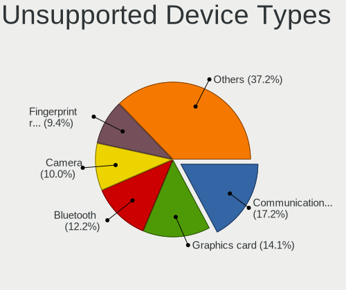

| Type                     | Computers | Percent |
|--------------------------|-----------|---------|
| Communication controller | 234       | 19.48%  |
| Graphics card            | 147       | 12.24%  |
| Bluetooth                | 146       | 12.16%  |
| Camera                   | 127       | 10.57%  |
| Fingerprint reader       | 111       | 9.24%   |
| Net/wireless             | 74        | 6.16%   |
| Chipcard                 | 63        | 5.25%   |
| Card reader              | 61        | 5.08%   |
| Sound                    | 52        | 4.33%   |
| Multimedia controller    | 48        | 4%      |
| Firewire controller      | 25        | 2.08%   |
| Network                  | 18        | 1.5%    |
| Net/ethernet             | 18        | 1.5%    |
| Unassigned class         | 15        | 1.25%   |
| Modem                    | 14        | 1.17%   |
| Storage/ide              | 13        | 1.08%   |
| Storage/ata              | 11        | 0.92%   |
| Storage/raid             | 6         | 0.5%    |
| Storage                  | 6         | 0.5%    |
| Tv card                  | 5         | 0.42%   |
| Dvb card                 | 4         | 0.33%   |
| Storage/nvme             | 2         | 0.17%   |
| Wireless                 | 1         | 0.08%   |

