Gentoo - Tested Hardware & Statistics
-------------------------------------

A project to collect tested hardware configurations for Gentoo.

Anyone can contribute to this report by the [hw-probe](https://github.com/linuxhw/hw-probe) tool:

    sudo -E hw-probe -all -upload

Please contribute! Especially if your hardware is rare.

This is a report for all computer types. See also reports for [desktops](/Dist/Gentoo/Desktop/README.md) and [notebooks](/Dist/Gentoo/Notebook/README.md).

Contents
--------

* [ Test Cases ](#test-cases)

* [ System ](#system)
  - [ OS                       ](#os)
  - [ OS Family                ](#os-family)
  - [ Kernel                   ](#kernel)
  - [ Kernel Family            ](#kernel-family)
  - [ Kernel Major Ver.        ](#kernel-major-ver)
  - [ Arch                     ](#arch)
  - [ DE                       ](#de)
  - [ Display Server           ](#display-server)
  - [ Display Manager          ](#display-manager)
  - [ OS Lang                  ](#os-lang)
  - [ Boot Mode                ](#boot-mode)
  - [ Filesystem               ](#filesystem)
  - [ Part. scheme             ](#part-scheme)
  - [ Dual Boot with Linux/BSD ](#dual-boot-with-linuxbsd)
  - [ Dual Boot (Win)          ](#dual-boot-win)

* [ Board ](#board)
  - [ Vendor                   ](#vendor)
  - [ Model                    ](#model)
  - [ Model Family             ](#model-family)
  - [ MFG Year                 ](#mfg-year)
  - [ Form Factor              ](#form-factor)
  - [ Secure Boot              ](#secure-boot)
  - [ Coreboot                 ](#coreboot)
  - [ RAM Size                 ](#ram-size)
  - [ RAM Used                 ](#ram-used)
  - [ Total Drives             ](#total-drives)
  - [ Has CD-ROM               ](#has-cd-rom)
  - [ Has Ethernet             ](#has-ethernet)
  - [ Has WiFi                 ](#has-wifi)
  - [ Has Bluetooth            ](#has-bluetooth)

* [ Location ](#location)
  - [ Country                  ](#country)
  - [ City                     ](#city)

* [ Drives ](#drives)
  - [ Drive Vendor             ](#drive-vendor)
  - [ Drive Model              ](#drive-model)
  - [ HDD Vendor               ](#hdd-vendor)
  - [ SSD Vendor               ](#ssd-vendor)
  - [ Drive Kind               ](#drive-kind)
  - [ Drive Connector          ](#drive-connector)
  - [ Drive Size               ](#drive-size)
  - [ Space Total              ](#space-total)
  - [ Space Used               ](#space-used)
  - [ Malfunc. Drives          ](#malfunc-drives)
  - [ Malfunc. Drive Vendor    ](#malfunc-drive-vendor)
  - [ Malfunc. HDD Vendor      ](#malfunc-hdd-vendor)
  - [ Malfunc. Drive Kind      ](#malfunc-drive-kind)
  - [ Failed Drives            ](#failed-drives)
  - [ Failed Drive Vendor      ](#failed-drive-vendor)
  - [ Drive Status             ](#drive-status)

* [ Storage controller ](#storage-controller)
  - [ Storage Vendor           ](#storage-vendor)
  - [ Storage Model            ](#storage-model)
  - [ Storage Kind             ](#storage-kind)

* [ Processor ](#processor)
  - [ CPU Vendor               ](#cpu-vendor)
  - [ CPU Model                ](#cpu-model)
  - [ CPU Model Family         ](#cpu-model-family)
  - [ CPU Cores                ](#cpu-cores)
  - [ CPU Sockets              ](#cpu-sockets)
  - [ CPU Threads              ](#cpu-threads)
  - [ CPU Op-Modes             ](#cpu-op-modes)
  - [ CPU Microcode            ](#cpu-microcode)
  - [ CPU Microarch            ](#cpu-microarch)

* [ Graphics ](#graphics)
  - [ GPU Vendor               ](#gpu-vendor)
  - [ GPU Model                ](#gpu-model)
  - [ GPU Combo                ](#gpu-combo)
  - [ GPU Driver               ](#gpu-driver)
  - [ GPU Memory               ](#gpu-memory)

* [ Monitor ](#monitor)
  - [ Monitor Vendor           ](#monitor-vendor)
  - [ Monitor Model            ](#monitor-model)
  - [ Monitor Resolution       ](#monitor-resolution)
  - [ Monitor Diagonal         ](#monitor-diagonal)
  - [ Monitor Width            ](#monitor-width)
  - [ Aspect Ratio             ](#aspect-ratio)
  - [ Monitor Area             ](#monitor-area)
  - [ Pixel Density            ](#pixel-density)
  - [ Multiple Monitors        ](#multiple-monitors)

* [ Network ](#network)
  - [ Net Controller Vendor    ](#net-controller-vendor)
  - [ Net Controller Model     ](#net-controller-model)
  - [ Wireless Vendor          ](#wireless-vendor)
  - [ Wireless Model           ](#wireless-model)
  - [ Ethernet Vendor          ](#ethernet-vendor)
  - [ Ethernet Model           ](#ethernet-model)
  - [ Net Controller Kind      ](#net-controller-kind)
  - [ Used Controller          ](#used-controller)
  - [ NICs                     ](#nics)
  - [ IPv6                     ](#ipv6)

* [ Bluetooth ](#bluetooth)
  - [ Bluetooth Vendor         ](#bluetooth-vendor)
  - [ Bluetooth Model          ](#bluetooth-model)

* [ Sound ](#sound)
  - [ Sound Vendor             ](#sound-vendor)
  - [ Sound Model              ](#sound-model)

* [ Memory ](#memory)
  - [ Memory Vendor            ](#memory-vendor)
  - [ Memory Model             ](#memory-model)
  - [ Memory Kind              ](#memory-kind)
  - [ Memory Form Factor       ](#memory-form-factor)
  - [ Memory Size              ](#memory-size)
  - [ Memory Speed             ](#memory-speed)

* [ Printers & scanners ](#printers--scanners)
  - [ Printer Vendor           ](#printer-vendor)
  - [ Printer Model            ](#printer-model)
  - [ Scanner Vendor           ](#scanner-vendor)
  - [ Scanner Model            ](#scanner-model)

* [ Camera ](#camera)
  - [ Camera Vendor            ](#camera-vendor)
  - [ Camera Model             ](#camera-model)

* [ Security ](#security)
  - [ Fingerprint Vendor       ](#fingerprint-vendor)
  - [ Fingerprint Model        ](#fingerprint-model)
  - [ Chipcard Vendor          ](#chipcard-vendor)
  - [ Chipcard Model           ](#chipcard-model)

* [ Unsupported ](#unsupported)
  - [ Unsupported Devices      ](#unsupported-devices)
  - [ Unsupported Device Types ](#unsupported-device-types)

Test Cases
----------

Total: 3399

| Vendor        | Model                       | Form-Factor | Probe                                                      | Date         |
|---------------|-----------------------------|-------------|------------------------------------------------------------|--------------|
| ASRock        | X399 Taichi                 | Desktop     | [c82214d90a](https://linux-hardware.org/?probe=c82214d90a) | May 09, 2024 |
| MSI           | Z170A GAMING M7             | Desktop     | [e1892a119b](https://linux-hardware.org/?probe=e1892a119b) | May 08, 2024 |
| MSI           | B650M GAMING PLUS WIFI      | Desktop     | [be715853f7](https://linux-hardware.org/?probe=be715853f7) | May 08, 2024 |
| HP            | ProBook 450 G5              | Notebook    | [4536e47198](https://linux-hardware.org/?probe=4536e47198) | May 07, 2024 |
| Lenovo        | 3148 SDK0J40700 WIN 3258... | Desktop     | [b24f7286d2](https://linux-hardware.org/?probe=b24f7286d2) | May 07, 2024 |
| Dell          | Precision 7720              | Notebook    | [5423da6e5c](https://linux-hardware.org/?probe=5423da6e5c) | May 07, 2024 |
| MSI           | B650M GAMING PLUS WIFI      | Desktop     | [afbc83ced8](https://linux-hardware.org/?probe=afbc83ced8) | May 06, 2024 |
| ASUSTek       | M3A78-CM                    | Desktop     | [0bcef3f207](https://linux-hardware.org/?probe=0bcef3f207) | May 06, 2024 |
| HP            | Spectre x360 Convertible... | Convertible | [66c6c3e199](https://linux-hardware.org/?probe=66c6c3e199) | May 06, 2024 |
| HP            | Spectre x360 Convertible... | Convertible | [24ef78e496](https://linux-hardware.org/?probe=24ef78e496) | May 06, 2024 |
| MSI           | MPG Z490 GAMING EDGE WIF... | Desktop     | [91fcd08046](https://linux-hardware.org/?probe=91fcd08046) | May 06, 2024 |
| Gigabyte      | A520 AORUS ELITE            | Desktop     | [8c70aa2f23](https://linux-hardware.org/?probe=8c70aa2f23) | May 05, 2024 |
| Gigabyte      | AB350-Gaming-CF             | Desktop     | [5510492a9b](https://linux-hardware.org/?probe=5510492a9b) | May 05, 2024 |
| METAPHYUNI    | MetawillBook03              | Notebook    | [d5af716feb](https://linux-hardware.org/?probe=d5af716feb) | May 04, 2024 |
| Lenovo        | ThinkPad E15 Gen 2 20T80... | Notebook    | [67fbb6a446](https://linux-hardware.org/?probe=67fbb6a446) | May 03, 2024 |
| Lenovo        | ThinkPad T14s Gen 1 20T1... | Notebook    | [f6152a7042](https://linux-hardware.org/?probe=f6152a7042) | May 03, 2024 |
| HP            | ProBook 4510s               | Notebook    | [a6f89b6485](https://linux-hardware.org/?probe=a6f89b6485) | May 02, 2024 |
| HP            | 158B                        | Desktop     | [d5727d0cfb](https://linux-hardware.org/?probe=d5727d0cfb) | May 02, 2024 |
| Dell          | XPS 13 9310                 | Notebook    | [50ea9a7b8e](https://linux-hardware.org/?probe=50ea9a7b8e) | May 01, 2024 |
| Dell          | XPS 13 9310                 | Notebook    | [39ab9869d2](https://linux-hardware.org/?probe=39ab9869d2) | May 01, 2024 |
| HP            | EliteBook 845 14 inch G1... | Notebook    | [8fa3424cce](https://linux-hardware.org/?probe=8fa3424cce) | Apr 30, 2024 |
| HP            | EliteBook 845 14 inch G1... | Notebook    | [62914f0506](https://linux-hardware.org/?probe=62914f0506) | Apr 30, 2024 |
| ASUSTek       | M5A99FX PRO R2.0            | Desktop     | [9dcdf5a463](https://linux-hardware.org/?probe=9dcdf5a463) | Apr 29, 2024 |
| Maibenben     | MaiBook M                   | Notebook    | [48837878a2](https://linux-hardware.org/?probe=48837878a2) | Apr 29, 2024 |
| ASUSTek       | ASUS TUF Gaming A15 FA50... | Notebook    | [703d565003](https://linux-hardware.org/?probe=703d565003) | Apr 26, 2024 |
| Lenovo        | ThinkPad T14 Gen 3 21CGS... | Notebook    | [c207bea569](https://linux-hardware.org/?probe=c207bea569) | Apr 25, 2024 |
| ASUSTek       | X550ZA                      | Notebook    | [89422ba7fc](https://linux-hardware.org/?probe=89422ba7fc) | Apr 23, 2024 |
| ASUSTek       | M3A78-CM                    | Desktop     | [cdc42c64dd](https://linux-hardware.org/?probe=cdc42c64dd) | Apr 22, 2024 |
| Gigabyte      | B75-D3V                     | Desktop     | [4ddc5c0d0d](https://linux-hardware.org/?probe=4ddc5c0d0d) | Apr 21, 2024 |
| Lenovo        | G50-30 80G0                 | Notebook    | [6b8474e96b](https://linux-hardware.org/?probe=6b8474e96b) | Apr 21, 2024 |
| ASUSTek       | ASUS TUF Gaming A15 FA50... | Notebook    | [4c782693bf](https://linux-hardware.org/?probe=4c782693bf) | Apr 20, 2024 |
| Quanta        | S210-X12MS 31S2MMB0040      | Server      | [7dbf4f941d](https://linux-hardware.org/?probe=7dbf4f941d) | Apr 20, 2024 |
| Framework     | Laptop (13th Gen Intel C... | Notebook    | [2bb3d4f699](https://linux-hardware.org/?probe=2bb3d4f699) | Apr 19, 2024 |
| MSI           | PRO B650M-P                 | Desktop     | [90165c7480](https://linux-hardware.org/?probe=90165c7480) | Apr 18, 2024 |
| Lenovo        | ThinkPad P16 Gen 2 21FA0... | Notebook    | [445b981f65](https://linux-hardware.org/?probe=445b981f65) | Apr 18, 2024 |
| Lenovo        | ZHAOYANG E43                | Notebook    | [1192eac8f1](https://linux-hardware.org/?probe=1192eac8f1) | Apr 17, 2024 |
| Chuwi         | GemiBook XPro               | Notebook    | [9ebacb4cf9](https://linux-hardware.org/?probe=9ebacb4cf9) | Apr 17, 2024 |
| Framework     | Laptop 13 (AMD Ryzen 704... | Notebook    | [e3d7887dbb](https://linux-hardware.org/?probe=e3d7887dbb) | Apr 16, 2024 |
| ASUSTek       | ROG STRIX X670E-E GAMING... | Desktop     | [25c95d871e](https://linux-hardware.org/?probe=25c95d871e) | Apr 16, 2024 |
| ASUSTek       | ROG STRIX Z390-E GAMING     | Desktop     | [8a95e3759a](https://linux-hardware.org/?probe=8a95e3759a) | Apr 15, 2024 |
| Lenovo        | ThinkPad T480 20L6SAYX00    | Notebook    | [f53da67ab4](https://linux-hardware.org/?probe=f53da67ab4) | Apr 15, 2024 |
| Unknown       | RK3588 OPi 5 Plus           | Soc         | [c74a284aaf](https://linux-hardware.org/?probe=c74a284aaf) | Apr 15, 2024 |
| Lenovo        | ThinkPad T480 20L6SAYX00    | Notebook    | [fc73e6bb02](https://linux-hardware.org/?probe=fc73e6bb02) | Apr 15, 2024 |
| ASUSTek       | PRIME X670-P                | Desktop     | [121abdd671](https://linux-hardware.org/?probe=121abdd671) | Apr 14, 2024 |
| ASUSTek       | VivoBook_ASUSLaptop TP41... | Convertible | [c1ab6b3244](https://linux-hardware.org/?probe=c1ab6b3244) | Apr 14, 2024 |
| Lenovo        | ThinkPad T14 Gen 3 21CGS... | Notebook    | [c28ddacfd6](https://linux-hardware.org/?probe=c28ddacfd6) | Apr 13, 2024 |
| Gigabyte      | B560M AORUS PRO             | Desktop     | [6e49d2f74b](https://linux-hardware.org/?probe=6e49d2f74b) | Apr 13, 2024 |
| Lenovo        | ThinkPad E15 Gen 2 20T80... | Notebook    | [2eea232a7e](https://linux-hardware.org/?probe=2eea232a7e) | Apr 13, 2024 |
| Dell          | Latitude 5440               | Notebook    | [1fb5966e12](https://linux-hardware.org/?probe=1fb5966e12) | Apr 12, 2024 |
| Dell          | G15 5510                    | Notebook    | [e8cfa16a81](https://linux-hardware.org/?probe=e8cfa16a81) | Apr 12, 2024 |
| Dell          | G15 5510                    | Notebook    | [9ed69c889f](https://linux-hardware.org/?probe=9ed69c889f) | Apr 12, 2024 |
| HP            | 1589                        | Desktop     | [fd455c0623](https://linux-hardware.org/?probe=fd455c0623) | Apr 12, 2024 |
| ASUSTek       | P6X58D-E                    | Desktop     | [143efb64e8](https://linux-hardware.org/?probe=143efb64e8) | Apr 12, 2024 |
| IBM           | ThinkPad T41 23737JU        | Notebook    | [3e03052246](https://linux-hardware.org/?probe=3e03052246) | Apr 12, 2024 |
| Supermicro    | X10SRL-FB                   | Server      | [10b2f6ed9d](https://linux-hardware.org/?probe=10b2f6ed9d) | Apr 11, 2024 |
| Gigabyte      | AB350-Gaming-CF             | Desktop     | [f15f757ee9](https://linux-hardware.org/?probe=f15f757ee9) | Apr 11, 2024 |
| HP            | 1589                        | Desktop     | [bf38ba715e](https://linux-hardware.org/?probe=bf38ba715e) | Apr 10, 2024 |
| Intel         | NUC13ANBi5 M89647-203       | Mini pc     | [544974cd78](https://linux-hardware.org/?probe=544974cd78) | Apr 09, 2024 |
| Dell          | G3 3590                     | Notebook    | [6b282a982e](https://linux-hardware.org/?probe=6b282a982e) | Apr 09, 2024 |
| Gigabyte      | A520 AORUS ELITE            | Desktop     | [bef494961d](https://linux-hardware.org/?probe=bef494961d) | Apr 09, 2024 |
| ASUSTek       | ROG Zephyrus G14 GA401II... | Notebook    | [44ed4afea3](https://linux-hardware.org/?probe=44ed4afea3) | Apr 09, 2024 |
| Dell          | Precision 5530              | Notebook    | [84d24da656](https://linux-hardware.org/?probe=84d24da656) | Apr 08, 2024 |
| ASUSTek       | ROG STRIX X670E-E GAMING... | Desktop     | [6d013c64d2](https://linux-hardware.org/?probe=6d013c64d2) | Apr 08, 2024 |
| ASUSTek       | ROG Zephyrus G14 GA401II... | Notebook    | [0ca999c16b](https://linux-hardware.org/?probe=0ca999c16b) | Apr 06, 2024 |
| ASUSTek       | TUF Gaming FX505DV_FX505... | Notebook    | [40e7da85c2](https://linux-hardware.org/?probe=40e7da85c2) | Apr 06, 2024 |
| ASUSTek       | TUF Gaming B550-PLUS        | Desktop     | [e121ce9511](https://linux-hardware.org/?probe=e121ce9511) | Apr 06, 2024 |
| Framework     | Laptop (13th Gen Intel C... | Notebook    | [0d1189e3fb](https://linux-hardware.org/?probe=0d1189e3fb) | Apr 04, 2024 |
| Dell          | Precision 5480              | Notebook    | [665a2dee23](https://linux-hardware.org/?probe=665a2dee23) | Apr 04, 2024 |
| Gigabyte      | AB350-Gaming-CF             | Desktop     | [30921e196b](https://linux-hardware.org/?probe=30921e196b) | Apr 03, 2024 |
| ASUSTek       | X99-E                       | Desktop     | [f9f01b1a69](https://linux-hardware.org/?probe=f9f01b1a69) | Apr 03, 2024 |
| ASUSTek       | X99-E                       | Desktop     | [e87752dc61](https://linux-hardware.org/?probe=e87752dc61) | Apr 03, 2024 |
| MSI           | MPG Z490 GAMING EDGE WIF... | Desktop     | [ebc630507b](https://linux-hardware.org/?probe=ebc630507b) | Apr 02, 2024 |
| Gigabyte      | A520 AORUS ELITE            | Desktop     | [3186452a8d](https://linux-hardware.org/?probe=3186452a8d) | Apr 02, 2024 |
| Lenovo        | ThinkPad T14 Gen 3 21CGS... | Notebook    | [9d19446a7f](https://linux-hardware.org/?probe=9d19446a7f) | Apr 01, 2024 |
| HP            | ZBook Studio 16 inch G9 ... | Notebook    | [df89cb1a75](https://linux-hardware.org/?probe=df89cb1a75) | Mar 31, 2024 |
| Lenovo        | ThinkPad T14 Gen 3 21CGS... | Notebook    | [82ac8c0b36](https://linux-hardware.org/?probe=82ac8c0b36) | Mar 31, 2024 |
| Lenovo        | ThinkPad L14 Gen 2a 20X5... | Notebook    | [0b20dc1c09](https://linux-hardware.org/?probe=0b20dc1c09) | Mar 30, 2024 |
| ASUSTek       | ASUS EXPERTBOOK B5402CVA... | Notebook    | [b0c74f7b30](https://linux-hardware.org/?probe=b0c74f7b30) | Mar 30, 2024 |
| ASUSTek       | ROG STRIX B650E-F GAMING... | Desktop     | [8a038a8035](https://linux-hardware.org/?probe=8a038a8035) | Mar 29, 2024 |
| MSI           | MPG B650 EDGE WIFI          | Desktop     | [bdd9102028](https://linux-hardware.org/?probe=bdd9102028) | Mar 27, 2024 |
| Lenovo        | ThinkPad T470 20HES18R20    | Notebook    | [0c5f481d17](https://linux-hardware.org/?probe=0c5f481d17) | Mar 27, 2024 |
| Unknown       | Unknown                     | Desktop     | [e4035a3519](https://linux-hardware.org/?probe=e4035a3519) | Mar 25, 2024 |
| ASUSTek       | M3A78-CM                    | Desktop     | [73b0c5faa2](https://linux-hardware.org/?probe=73b0c5faa2) | Mar 25, 2024 |
| ASUSTek       | P6X58D PREMIUM              | Desktop     | [3e42f1f6bb](https://linux-hardware.org/?probe=3e42f1f6bb) | Mar 24, 2024 |
| ASUSTek       | TUF Gaming B550M-PLUS WI... | Desktop     | [e4e9866823](https://linux-hardware.org/?probe=e4e9866823) | Mar 22, 2024 |
| ASRockRack    | X470D4U2/1N1                | Desktop     | [f406391d1a](https://linux-hardware.org/?probe=f406391d1a) | Mar 20, 2024 |
| MSI           | B550 GAMING GEN3            | Desktop     | [b3056c47f2](https://linux-hardware.org/?probe=b3056c47f2) | Mar 19, 2024 |
| Gigabyte      | Z590 UD                     | Desktop     | [e21d410d32](https://linux-hardware.org/?probe=e21d410d32) | Mar 18, 2024 |
| Dell          | Inspiron N5010              | Notebook    | [14031f3746](https://linux-hardware.org/?probe=14031f3746) | Mar 17, 2024 |
| Dell          | G5 5590                     | Notebook    | [c914da4cc5](https://linux-hardware.org/?probe=c914da4cc5) | Mar 17, 2024 |
| Intel         | NUC11PABi5 M68265-501       | Mini pc     | [c44e343345](https://linux-hardware.org/?probe=c44e343345) | Mar 17, 2024 |
| Intel         | NUC11PABi5 M68265-501       | Mini pc     | [8f5d6ee906](https://linux-hardware.org/?probe=8f5d6ee906) | Mar 17, 2024 |
| Colorful T... | CVN Z790M FROZEN D5 V20     | Desktop     | [05f6953852](https://linux-hardware.org/?probe=05f6953852) | Mar 17, 2024 |
| Lenovo        | ThinkPad E580 20KS001JUK    | Notebook    | [63eb058c79](https://linux-hardware.org/?probe=63eb058c79) | Mar 17, 2024 |
| HP            | ProBook 430 G7              | Notebook    | [05be2ac277](https://linux-hardware.org/?probe=05be2ac277) | Mar 17, 2024 |
| Gigabyte      | Z590 UD                     | Desktop     | [8f9fab87e6](https://linux-hardware.org/?probe=8f9fab87e6) | Mar 16, 2024 |
| Dell          | Latitude E6540              | Notebook    | [bbc5613ffc](https://linux-hardware.org/?probe=bbc5613ffc) | Mar 15, 2024 |
| ASRock        | N68C-GS UCC                 | Desktop     | [d723eedac0](https://linux-hardware.org/?probe=d723eedac0) | Mar 15, 2024 |
| Colorful T... | CVN Z790M FROZEN D5 V20     | Desktop     | [d43454b637](https://linux-hardware.org/?probe=d43454b637) | Mar 15, 2024 |
| HP            | Pavilion Notebook           | Notebook    | [b2e7f143bc](https://linux-hardware.org/?probe=b2e7f143bc) | Mar 13, 2024 |
| MSI           | PRO B650-P WIFI             | Desktop     | [b8a3fe05f4](https://linux-hardware.org/?probe=b8a3fe05f4) | Mar 13, 2024 |
| ASUSTek       | ASUS EXPERTBOOK B5402CVA... | Notebook    | [093a0c28e4](https://linux-hardware.org/?probe=093a0c28e4) | Mar 11, 2024 |
| Lenovo        | ThinkPad T480 20L50013US    | Notebook    | [8b29b924ae](https://linux-hardware.org/?probe=8b29b924ae) | Mar 10, 2024 |
| Dell          | Latitude 7490               | Notebook    | [af0f098b77](https://linux-hardware.org/?probe=af0f098b77) | Mar 10, 2024 |
| Google        | Panther                     | Desktop     | [f2c3361edf](https://linux-hardware.org/?probe=f2c3361edf) | Mar 10, 2024 |
| Lenovo        | ThinkPad T470 W10DG 20JM... | Notebook    | [b4686bb020](https://linux-hardware.org/?probe=b4686bb020) | Mar 10, 2024 |
| Lenovo        | ThinkPad T470 W10DG 20JM... | Notebook    | [4d7fa7ac88](https://linux-hardware.org/?probe=4d7fa7ac88) | Mar 10, 2024 |
| HP            | Laptop 15-fc0xxx            | Notebook    | [63f6678f1c](https://linux-hardware.org/?probe=63f6678f1c) | Mar 09, 2024 |
| transtec      | GE2 Series                  | Desktop     | [c6ff6cabae](https://linux-hardware.org/?probe=c6ff6cabae) | Mar 08, 2024 |
| transtec      | GE2 Series                  | Desktop     | [10d18de264](https://linux-hardware.org/?probe=10d18de264) | Mar 08, 2024 |
| HP            | 8767 A                      | Desktop     | [3775377131](https://linux-hardware.org/?probe=3775377131) | Mar 05, 2024 |
| ASUSTek       | ASUS TUF Gaming A15 FA50... | Notebook    | [2ce71ad477](https://linux-hardware.org/?probe=2ce71ad477) | Mar 04, 2024 |
| Acer          | Swift SF314-41              | Notebook    | [9143ec0c20](https://linux-hardware.org/?probe=9143ec0c20) | Mar 04, 2024 |
| HP            | 8767 A                      | Desktop     | [5903e66479](https://linux-hardware.org/?probe=5903e66479) | Mar 04, 2024 |
| ASRock        | N68C-GS UCC                 | Desktop     | [044465e0aa](https://linux-hardware.org/?probe=044465e0aa) | Mar 04, 2024 |
| Lenovo        | ThinkPad X13 Gen 3 21CM0... | Notebook    | [279f64b529](https://linux-hardware.org/?probe=279f64b529) | Mar 04, 2024 |
| Acer          | Aspire V3-572P              | Notebook    | [bfdf32c8e1](https://linux-hardware.org/?probe=bfdf32c8e1) | Mar 02, 2024 |
| Timi          | RedmiBook Pro 15S           | Notebook    | [402f19be59](https://linux-hardware.org/?probe=402f19be59) | Mar 02, 2024 |
| Dell          | 042P49 A02                  | Desktop     | [f02e3ceba7](https://linux-hardware.org/?probe=f02e3ceba7) | Mar 02, 2024 |
| ASRock        | B450M Steel Legend          | Desktop     | [aad04111a4](https://linux-hardware.org/?probe=aad04111a4) | Mar 01, 2024 |
| ASUSTek       | PRIME B550M-A WIFI II       | Desktop     | [cce884f287](https://linux-hardware.org/?probe=cce884f287) | Mar 01, 2024 |
| ASUSTek       | ROG Zephyrus G14 GA401II... | Notebook    | [9d279afdd2](https://linux-hardware.org/?probe=9d279afdd2) | Feb 29, 2024 |
| ASUSTek       | ROG Zephyrus G14 GA401II... | Notebook    | [4e7241b44f](https://linux-hardware.org/?probe=4e7241b44f) | Feb 29, 2024 |
| ASUSTek       | PRIME H510M-E               | Desktop     | [32c850d7a0](https://linux-hardware.org/?probe=32c850d7a0) | Feb 28, 2024 |
| Lenovo        | ThinkPad L15 Gen 4 21H70... | Notebook    | [1b28fd0c04](https://linux-hardware.org/?probe=1b28fd0c04) | Feb 28, 2024 |
| Anbernic      | Win600                      | Notebook    | [309a79c0c5](https://linux-hardware.org/?probe=309a79c0c5) | Feb 28, 2024 |
| ASUSTek       | PRIME H510M-E               | Desktop     | [3ccf63844b](https://linux-hardware.org/?probe=3ccf63844b) | Feb 27, 2024 |
| Dell          | 0K240Y A01                  | Desktop     | [8ac39746cc](https://linux-hardware.org/?probe=8ac39746cc) | Feb 26, 2024 |
| Gigabyte      | AB350-Gaming-CF             | Desktop     | [f88143daa2](https://linux-hardware.org/?probe=f88143daa2) | Feb 26, 2024 |
| Fujitsu       | D3401-H1 S26361-D3401-H1    | Desktop     | [98c285762c](https://linux-hardware.org/?probe=98c285762c) | Feb 25, 2024 |
| Lenovo        | IdeaPad Gaming 3 15IHU6 ... | Notebook    | [c6cff98a84](https://linux-hardware.org/?probe=c6cff98a84) | Feb 24, 2024 |
| Lenovo        | IdeaPad Gaming 3 15IHU6 ... | Notebook    | [448ad7f7cf](https://linux-hardware.org/?probe=448ad7f7cf) | Feb 24, 2024 |
| Gigabyte      | A520 AORUS ELITE            | Desktop     | [2d34bf7198](https://linux-hardware.org/?probe=2d34bf7198) | Feb 23, 2024 |
| ASUSTek       | M3A78-CM                    | Desktop     | [9ff0ddca4e](https://linux-hardware.org/?probe=9ff0ddca4e) | Feb 23, 2024 |
| ASUSTek       | PRIME H510M-E               | Desktop     | [5e789b17a4](https://linux-hardware.org/?probe=5e789b17a4) | Feb 22, 2024 |
| ASUSTek       | PRIME H310M-E/BR            | Desktop     | [f3d1efb331](https://linux-hardware.org/?probe=f3d1efb331) | Feb 22, 2024 |
| Positivo      | C4128B-3                    | Convertible | [3b60d88c2b](https://linux-hardware.org/?probe=3b60d88c2b) | Feb 21, 2024 |
| Lenovo        | ThinkPad L15 Gen 4 21H70... | Notebook    | [6f6430db27](https://linux-hardware.org/?probe=6f6430db27) | Feb 20, 2024 |
| Lenovo        | G50-30 80G0                 | Notebook    | [05d7ddd936](https://linux-hardware.org/?probe=05d7ddd936) | Feb 20, 2024 |
| ASUSTek       | ASUS TUF Gaming A15 FA50... | Notebook    | [d3554f701e](https://linux-hardware.org/?probe=d3554f701e) | Feb 19, 2024 |
| Gigabyte      | AB350-Gaming-CF             | Desktop     | [acc39c2774](https://linux-hardware.org/?probe=acc39c2774) | Feb 19, 2024 |
| Lenovo        | Legion Slim 5 14APH8 82Y... | Notebook    | [a6ee663daa](https://linux-hardware.org/?probe=a6ee663daa) | Feb 18, 2024 |
| Lenovo        | ThinkPad T480s 20L8002VM... | Notebook    | [5b768d1518](https://linux-hardware.org/?probe=5b768d1518) | Feb 18, 2024 |
| ASUSTek       | PRIME H510M-E               | Desktop     | [82ae92e9ec](https://linux-hardware.org/?probe=82ae92e9ec) | Feb 18, 2024 |
| Dell          | 0K240Y A01                  | Desktop     | [7987e39eb7](https://linux-hardware.org/?probe=7987e39eb7) | Feb 18, 2024 |
| ASUSTek       | PRIME H310M-E/BR            | Desktop     | [233bfc2f43](https://linux-hardware.org/?probe=233bfc2f43) | Feb 18, 2024 |
| Dell          | Latitude E6540              | Notebook    | [b3d3fd2a6e](https://linux-hardware.org/?probe=b3d3fd2a6e) | Feb 18, 2024 |
| Gigabyte      | A520 AORUS ELITE            | Desktop     | [95950fa2f0](https://linux-hardware.org/?probe=95950fa2f0) | Feb 16, 2024 |
| Unknown       | Unknown                     | Desktop     | [b579279ced](https://linux-hardware.org/?probe=b579279ced) | Feb 16, 2024 |
| Gigabyte      | X570 AORUS MASTER           | Desktop     | [04f68f7039](https://linux-hardware.org/?probe=04f68f7039) | Feb 16, 2024 |
| ASUSTek       | M3A78-CM                    | Desktop     | [c7fd8dfb5c](https://linux-hardware.org/?probe=c7fd8dfb5c) | Feb 14, 2024 |
| HP            | Laptop 17-ca1xxx            | Notebook    | [9c0e3d1a1a](https://linux-hardware.org/?probe=9c0e3d1a1a) | Feb 14, 2024 |
| TUXEDO        | Book BA1510                 | Notebook    | [5e0d56776d](https://linux-hardware.org/?probe=5e0d56776d) | Feb 14, 2024 |
| Unknown       | Unknown                     | Soc         | [d7293bd35d](https://linux-hardware.org/?probe=d7293bd35d) | Feb 12, 2024 |
| Raspberry ... | Raspberry Pi 4 Model B R... | Soc         | [00b96d40d1](https://linux-hardware.org/?probe=00b96d40d1) | Feb 12, 2024 |
| Raspberry ... | Raspberry Pi 3 Model B R... | Soc         | [6c68343018](https://linux-hardware.org/?probe=6c68343018) | Feb 12, 2024 |
| Gigabyte      | B550I AORUS PRO AX          | Desktop     | [8ec5fdc816](https://linux-hardware.org/?probe=8ec5fdc816) | Feb 12, 2024 |
| Gigabyte      | X670E AORUS MASTER          | Desktop     | [833f48af30](https://linux-hardware.org/?probe=833f48af30) | Feb 12, 2024 |
| Gigabyte      | X670E AORUS MASTER          | Desktop     | [35afc5314f](https://linux-hardware.org/?probe=35afc5314f) | Feb 12, 2024 |
| Raspberry ... | Raspberry Pi 4 Model B R... | Soc         | [d2da5a2578](https://linux-hardware.org/?probe=d2da5a2578) | Feb 11, 2024 |
| Raspberry ... | Raspberry Pi 3 Model B R... | Soc         | [5862e4c7c5](https://linux-hardware.org/?probe=5862e4c7c5) | Feb 11, 2024 |
| MSI           | B450 TOMAHAWK MAX           | Desktop     | [38cf6f3eff](https://linux-hardware.org/?probe=38cf6f3eff) | Feb 11, 2024 |
| ASRock        | B450 Pro4                   | Desktop     | [9c2f5e83e3](https://linux-hardware.org/?probe=9c2f5e83e3) | Feb 11, 2024 |
| MSI           | B450 TOMAHAWK MAX           | Desktop     | [b49ffe659b](https://linux-hardware.org/?probe=b49ffe659b) | Feb 11, 2024 |
| ASUSTek       | PRIME B650-PLUS             | Desktop     | [c7ab9b0fc5](https://linux-hardware.org/?probe=c7ab9b0fc5) | Feb 11, 2024 |
| ASUSTek       | PRIME B650-PLUS             | Desktop     | [847f271141](https://linux-hardware.org/?probe=847f271141) | Feb 11, 2024 |
| Lenovo        | ThinkPad T480s 20L8002VM... | Notebook    | [8e506a8c7e](https://linux-hardware.org/?probe=8e506a8c7e) | Feb 09, 2024 |
| Gigabyte      | A520 AORUS ELITE            | Desktop     | [db94db2244](https://linux-hardware.org/?probe=db94db2244) | Feb 09, 2024 |
| ASUSTek       | Pro WS X570-ACE             | Desktop     | [40f5ce16c1](https://linux-hardware.org/?probe=40f5ce16c1) | Feb 08, 2024 |
| Notebook      | NS5x_NS7xPU                 | Notebook    | [d528da165f](https://linux-hardware.org/?probe=d528da165f) | Feb 07, 2024 |
| ASUSTek       | PRIME B550M-K               | Desktop     | [016a8ba655](https://linux-hardware.org/?probe=016a8ba655) | Feb 07, 2024 |
| ASUSTek       | M3A78-CM                    | Desktop     | [c2d2eb2434](https://linux-hardware.org/?probe=c2d2eb2434) | Feb 06, 2024 |
| ASUSTek       | TUF Gaming B550M-PLUS       | Desktop     | [671e98c249](https://linux-hardware.org/?probe=671e98c249) | Feb 06, 2024 |
| ASUSTek       | TUF Gaming B550-PLUS        | Desktop     | [12792a9fa5](https://linux-hardware.org/?probe=12792a9fa5) | Feb 06, 2024 |
| HP            | Pavilion Notebook           | Notebook    | [075e2f410b](https://linux-hardware.org/?probe=075e2f410b) | Feb 05, 2024 |
| Gigabyte      | AB350-Gaming-CF             | Desktop     | [a6b7480c05](https://linux-hardware.org/?probe=a6b7480c05) | Feb 04, 2024 |
| Unknown       | Unknown                     | Desktop     | [48a88ebbfb](https://linux-hardware.org/?probe=48a88ebbfb) | Feb 04, 2024 |
| Dell          | XPS 13 7390 2-in-1          | Convertible | [9af8a36721](https://linux-hardware.org/?probe=9af8a36721) | Feb 04, 2024 |
| ASRock        | B550M Pro4                  | Desktop     | [66ad35082d](https://linux-hardware.org/?probe=66ad35082d) | Feb 04, 2024 |
| HP            | Pavilion Notebook           | Notebook    | [f6f5d83216](https://linux-hardware.org/?probe=f6f5d83216) | Feb 04, 2024 |
| Gigabyte      | A520 AORUS ELITE            | Desktop     | [075ee0ca67](https://linux-hardware.org/?probe=075ee0ca67) | Feb 02, 2024 |
| Razer         | Blade 14 - RZ09-0482        | Notebook    | [49f14f0aae](https://linux-hardware.org/?probe=49f14f0aae) | Feb 01, 2024 |
| Lenovo        | ThinkPad X1 Carbon 7th 2... | Notebook    | [afbbc9ebf0](https://linux-hardware.org/?probe=afbbc9ebf0) | Jan 31, 2024 |
| MSI           | MAG B550M MORTAR            | Desktop     | [7ad6a0ecce](https://linux-hardware.org/?probe=7ad6a0ecce) | Jan 31, 2024 |
| Unknown       | Unknown                     | Desktop     | [4690cc047a](https://linux-hardware.org/?probe=4690cc047a) | Jan 30, 2024 |
| ASUSTek       | M5A78L-M/USB3               | Desktop     | [cc38ac2dfc](https://linux-hardware.org/?probe=cc38ac2dfc) | Jan 29, 2024 |
| Gigabyte      | AB350-Gaming-CF             | Desktop     | [8949a81c2e](https://linux-hardware.org/?probe=8949a81c2e) | Jan 29, 2024 |
| ASUSTek       | M5A78L-M/USB3               | Desktop     | [76a1ecf2ba](https://linux-hardware.org/?probe=76a1ecf2ba) | Jan 29, 2024 |
| ASUSTek       | M3A78-CM                    | Desktop     | [e17793cd71](https://linux-hardware.org/?probe=e17793cd71) | Jan 28, 2024 |
| ASUSTek       | PRIME B660-PLUS D4          | Desktop     | [19c619ae3f](https://linux-hardware.org/?probe=19c619ae3f) | Jan 27, 2024 |
| MSI           | MAG X570 TOMAHAWK WIFI      | Desktop     | [999ea9c685](https://linux-hardware.org/?probe=999ea9c685) | Jan 26, 2024 |
| Gigabyte      | A520 AORUS ELITE            | Desktop     | [9b7cbb57c7](https://linux-hardware.org/?probe=9b7cbb57c7) | Jan 26, 2024 |
| HP            | 1589                        | Desktop     | [d731924276](https://linux-hardware.org/?probe=d731924276) | Jan 25, 2024 |
| Star Labs     | StarBook                    | Notebook    | [a324d865a6](https://linux-hardware.org/?probe=a324d865a6) | Jan 24, 2024 |
| ASUSTek       | ROG STRIX X570-I GAMING     | Desktop     | [ff2fc44691](https://linux-hardware.org/?probe=ff2fc44691) | Jan 23, 2024 |
| Lenovo        | ThinkPad X395 20NLCTO1WW    | Notebook    | [07799fb2f9](https://linux-hardware.org/?probe=07799fb2f9) | Jan 19, 2024 |
| Gigabyte      | B550 AORUS ELITE V2         | Desktop     | [13086bc4ce](https://linux-hardware.org/?probe=13086bc4ce) | Jan 19, 2024 |
| Gigabyte      | B650M D3HP                  | Desktop     | [fdc83ca691](https://linux-hardware.org/?probe=fdc83ca691) | Jan 18, 2024 |
| HP            | ZBook Studio 16 inch G9 ... | Notebook    | [e736cc5c9a](https://linux-hardware.org/?probe=e736cc5c9a) | Jan 18, 2024 |
| Framework     | Laptop 13 (AMD Ryzen 704... | Notebook    | [18a0aeeddf](https://linux-hardware.org/?probe=18a0aeeddf) | Jan 18, 2024 |
| HP            | Laptop 15t-dy100            | Notebook    | [68c23a7bd3](https://linux-hardware.org/?probe=68c23a7bd3) | Jan 17, 2024 |
| ASUSTek       | PRIME H610M-E D4            | Desktop     | [409e7e4e42](https://linux-hardware.org/?probe=409e7e4e42) | Jan 17, 2024 |
| Gigabyte      | X570 AORUS ELITE            | Desktop     | [ed6bfe4f8f](https://linux-hardware.org/?probe=ed6bfe4f8f) | Jan 16, 2024 |
| Dell          | 0VHRW1 A03                  | Desktop     | [668e361f20](https://linux-hardware.org/?probe=668e361f20) | Jan 15, 2024 |
| Lenovo        | Yoga 14sACH 2021 82MS       | Notebook    | [4af392aac3](https://linux-hardware.org/?probe=4af392aac3) | Jan 14, 2024 |
| ASRock        | X399 Taichi                 | Desktop     | [e509920598](https://linux-hardware.org/?probe=e509920598) | Jan 14, 2024 |
| HP            | EliteBook 830 G6            | Notebook    | [dc433d32e3](https://linux-hardware.org/?probe=dc433d32e3) | Jan 13, 2024 |
| HP            | 1589                        | Desktop     | [194b5a119c](https://linux-hardware.org/?probe=194b5a119c) | Jan 13, 2024 |
| MSI           | Pulse 15 B13VFK             | Notebook    | [75dde9eefd](https://linux-hardware.org/?probe=75dde9eefd) | Jan 12, 2024 |
| HP            | Laptop 15 da0018nk          | Notebook    | [11c54a0e5b](https://linux-hardware.org/?probe=11c54a0e5b) | Jan 12, 2024 |
| ASUSTek       | VivoBook_ASUSLaptop X509... | Notebook    | [a249210b7f](https://linux-hardware.org/?probe=a249210b7f) | Jan 11, 2024 |
| HP            | Spectre x360 2-in-1 Lapt... | Convertible | [30679c3606](https://linux-hardware.org/?probe=30679c3606) | Jan 11, 2024 |
| Dell          | 030VXY A01                  | Desktop     | [50a18e5eba](https://linux-hardware.org/?probe=50a18e5eba) | Jan 10, 2024 |
| Framework     | Laptop 13 (AMD Ryzen 704... | Notebook    | [d3f6265673](https://linux-hardware.org/?probe=d3f6265673) | Jan 10, 2024 |
| ASUSTek       | ROG STRIX B560-A GAMING ... | Desktop     | [7bef06dee9](https://linux-hardware.org/?probe=7bef06dee9) | Jan 10, 2024 |
| DEXP          | Aquilon C14                 | Notebook    | [d38932d74f](https://linux-hardware.org/?probe=d38932d74f) | Jan 10, 2024 |
| Gigabyte      | Z590 UD                     | Desktop     | [6953296967](https://linux-hardware.org/?probe=6953296967) | Jan 10, 2024 |
| HP            | Laptop 15s-eq2xxx           | Notebook    | [36dc56b0ed](https://linux-hardware.org/?probe=36dc56b0ed) | Jan 09, 2024 |
| Framework     | Laptop 13 (AMD Ryzen 704... | Notebook    | [ac39f0a923](https://linux-hardware.org/?probe=ac39f0a923) | Jan 08, 2024 |
| Star Labs     | StarLite                    | Notebook    | [751432d737](https://linux-hardware.org/?probe=751432d737) | Jan 07, 2024 |
| Gigabyte      | Z77X-UD5H                   | Desktop     | [ca5d4c7c00](https://linux-hardware.org/?probe=ca5d4c7c00) | Jan 07, 2024 |
| Lenovo        | Legion Slim 7 16APH8 82Y... | Notebook    | [33b192a7d0](https://linux-hardware.org/?probe=33b192a7d0) | Jan 06, 2024 |
| Acer          | Aspire A514-54              | Notebook    | [513f1c7737](https://linux-hardware.org/?probe=513f1c7737) | Jan 06, 2024 |
| ASUSTek       | ASUS TUF Gaming A15 FA50... | Notebook    | [1ecec883dd](https://linux-hardware.org/?probe=1ecec883dd) | Jan 06, 2024 |
| ASUSTek       | VivoBook_ASUSLaptop M650... | Notebook    | [98da18a6c0](https://linux-hardware.org/?probe=98da18a6c0) | Jan 06, 2024 |
| ASUSTek       | VivoBook_ASUSLaptop M650... | Notebook    | [2602d65d52](https://linux-hardware.org/?probe=2602d65d52) | Jan 06, 2024 |
| HP            | Victus by Laptop 16-e0xx... | Notebook    | [94b30c5116](https://linux-hardware.org/?probe=94b30c5116) | Jan 06, 2024 |
| Gigabyte      | B550 AORUS PRO V2           | Desktop     | [3b6e799f22](https://linux-hardware.org/?probe=3b6e799f22) | Jan 06, 2024 |
| Framework     | Laptop 13 (AMD Ryzen 704... | Notebook    | [8d63c2ea2b](https://linux-hardware.org/?probe=8d63c2ea2b) | Jan 06, 2024 |
| Lenovo        | ThinkPad P16s Gen 2 21K9... | Notebook    | [90b8ceb64c](https://linux-hardware.org/?probe=90b8ceb64c) | Jan 05, 2024 |
| Lenovo        | V14 G2 ALC 82KC             | Notebook    | [42bd246eae](https://linux-hardware.org/?probe=42bd246eae) | Jan 05, 2024 |
| Lenovo        | ThinkPad L15 Gen 1 20U70... | Notebook    | [f7ad5f683a](https://linux-hardware.org/?probe=f7ad5f683a) | Jan 04, 2024 |
| ASUSTek       | M3A78-CM                    | Desktop     | [7bf93755f2](https://linux-hardware.org/?probe=7bf93755f2) | Jan 04, 2024 |
| Gigabyte      | A520 AORUS ELITE            | Desktop     | [da0c7ff210](https://linux-hardware.org/?probe=da0c7ff210) | Jan 04, 2024 |
| ASUSTek       | P8H67-M                     | Desktop     | [06843ca788](https://linux-hardware.org/?probe=06843ca788) | Jan 04, 2024 |
| Star Labs     | StarLite                    | Notebook    | [9f0fae17e5](https://linux-hardware.org/?probe=9f0fae17e5) | Jan 02, 2024 |
| Gigabyte      | AB350-Gaming-CF             | Desktop     | [a0e025d32d](https://linux-hardware.org/?probe=a0e025d32d) | Jan 02, 2024 |
| Lenovo        | V14 G2 ALC 82KC             | Notebook    | [ab04c74157](https://linux-hardware.org/?probe=ab04c74157) | Jan 02, 2024 |
| Lenovo        | V14 G2 ALC 82KC             | Notebook    | [8250c46efe](https://linux-hardware.org/?probe=8250c46efe) | Jan 02, 2024 |
| Lenovo        | V14 G2 ALC 82KC             | Notebook    | [57cd074cfd](https://linux-hardware.org/?probe=57cd074cfd) | Jan 02, 2024 |
| ASUSTek       | ROG STRIX Z370-H GAMING     | Desktop     | [ee3998d501](https://linux-hardware.org/?probe=ee3998d501) | Jan 02, 2024 |
| Acer          | Aspire A517-52G             | Notebook    | [fb86c6f71c](https://linux-hardware.org/?probe=fb86c6f71c) | Jan 01, 2024 |
| ASUSTek       | ZenBook UX425UA_UM425UA     | Notebook    | [6826d7c88d](https://linux-hardware.org/?probe=6826d7c88d) | Jan 01, 2024 |
| Dell          | Latitude D630               | Notebook    | [bbae93d767](https://linux-hardware.org/?probe=bbae93d767) | Dec 31, 2023 |
| MSI           | Stealth 16Studio A13VF      | Notebook    | [04acb5230d](https://linux-hardware.org/?probe=04acb5230d) | Dec 30, 2023 |
| ASUSTek       | PRIME B660-PLUS D4          | Desktop     | [0e7bbb6dea](https://linux-hardware.org/?probe=0e7bbb6dea) | Dec 30, 2023 |
| MSI           | Stealth 16Studio A13VF      | Notebook    | [1fd1d2e727](https://linux-hardware.org/?probe=1fd1d2e727) | Dec 30, 2023 |
| Dell          | Precision 5560              | Notebook    | [3555a4c2fa](https://linux-hardware.org/?probe=3555a4c2fa) | Dec 29, 2023 |
| Gigabyte      | X79-UP4                     | Desktop     | [618dfee965](https://linux-hardware.org/?probe=618dfee965) | Dec 29, 2023 |
| ASUSTek       | G750JX                      | Notebook    | [2b867b6af5](https://linux-hardware.org/?probe=2b867b6af5) | Dec 28, 2023 |
| Gigabyte      | A520 AORUS ELITE            | Desktop     | [619ddf5210](https://linux-hardware.org/?probe=619ddf5210) | Dec 27, 2023 |
| ASUSTek       | M3A78-CM                    | Desktop     | [983d2046a3](https://linux-hardware.org/?probe=983d2046a3) | Dec 27, 2023 |
| Framework     | Laptop (13th Gen Intel C... | Notebook    | [3d96eb6f36](https://linux-hardware.org/?probe=3d96eb6f36) | Dec 27, 2023 |
| ASUSTek       | ASUS TUF Gaming A15 FA50... | Notebook    | [d1cd9acaf0](https://linux-hardware.org/?probe=d1cd9acaf0) | Dec 26, 2023 |
| MSI           | Delta 15 A5EFK              | Notebook    | [af7c011930](https://linux-hardware.org/?probe=af7c011930) | Dec 25, 2023 |
| ASUSTek       | D500MD                      | Desktop     | [21870febdd](https://linux-hardware.org/?probe=21870febdd) | Dec 25, 2023 |
| Gigabyte      | AB350-Gaming-CF             | Desktop     | [47255f4ba3](https://linux-hardware.org/?probe=47255f4ba3) | Dec 25, 2023 |
| Lenovo        | Legion R9000P2021H 82JQ     | Notebook    | [2394204218](https://linux-hardware.org/?probe=2394204218) | Dec 24, 2023 |
| TULPAR        | A5 V20.3                    | Notebook    | [c1abfa26d5](https://linux-hardware.org/?probe=c1abfa26d5) | Dec 24, 2023 |
| Fujitsu       | D3061-A1 S26361-D3061-A1    | Desktop     | [646b9af5a9](https://linux-hardware.org/?probe=646b9af5a9) | Dec 24, 2023 |
| MSI           | MPG B650 EDGE WIFI          | Desktop     | [8503d79f6c](https://linux-hardware.org/?probe=8503d79f6c) | Dec 24, 2023 |
| Lenovo        | IdeaPad 5 14ARE05 81YM      | Notebook    | [6b0368fd61](https://linux-hardware.org/?probe=6b0368fd61) | Dec 23, 2023 |
| TULPAR        | A5 V20.3                    | Notebook    | [83c6679958](https://linux-hardware.org/?probe=83c6679958) | Dec 23, 2023 |
| ASUSTek       | ROG STRIX X570-E GAMING     | Desktop     | [391ef34135](https://linux-hardware.org/?probe=391ef34135) | Dec 23, 2023 |
| ASUSTek       | ASUS TUF Gaming A15 FA50... | Notebook    | [87b9f04878](https://linux-hardware.org/?probe=87b9f04878) | Dec 23, 2023 |
| HP            | Spectre x360 2-in-1 Lapt... | Convertible | [c6caf2cc7a](https://linux-hardware.org/?probe=c6caf2cc7a) | Dec 22, 2023 |
| Dell          | Precision 5480              | Notebook    | [7cc190b5c0](https://linux-hardware.org/?probe=7cc190b5c0) | Dec 22, 2023 |
| ASUSTek       | ROG Ally RC71L_RC71L        | Tablet      | [f65d61f128](https://linux-hardware.org/?probe=f65d61f128) | Dec 20, 2023 |
| ASUSTek       | ASUS TUF Gaming A15 FA50... | Notebook    | [b14bdf4602](https://linux-hardware.org/?probe=b14bdf4602) | Dec 20, 2023 |
| ASUSTek       | ROG Ally RC71L_RC71L        | Tablet      | [37ee5a4acd](https://linux-hardware.org/?probe=37ee5a4acd) | Dec 19, 2023 |
| ASUSTek       | M3A78-CM                    | Desktop     | [89fd7ee431](https://linux-hardware.org/?probe=89fd7ee431) | Dec 18, 2023 |
| Gigabyte      | A520 AORUS ELITE            | Desktop     | [3504b628f1](https://linux-hardware.org/?probe=3504b628f1) | Dec 18, 2023 |
| ASRock        | X399 Taichi                 | Desktop     | [877c79184e](https://linux-hardware.org/?probe=877c79184e) | Dec 18, 2023 |
| Gigabyte      | AB350-Gaming-CF             | Desktop     | [e0b7c61c9f](https://linux-hardware.org/?probe=e0b7c61c9f) | Dec 18, 2023 |
| HP            | Spectre x360 2-in-1 Lapt... | Convertible | [25525c17e0](https://linux-hardware.org/?probe=25525c17e0) | Dec 17, 2023 |
| ASUSTek       | ROG Ally RC71L_RC71L        | Tablet      | [c01e13535f](https://linux-hardware.org/?probe=c01e13535f) | Dec 17, 2023 |
| HP            | Spectre x360 2-in-1 Lapt... | Convertible | [402a34ec30](https://linux-hardware.org/?probe=402a34ec30) | Dec 17, 2023 |
| ASRock        | X399 Taichi                 | Desktop     | [776cc9f3bb](https://linux-hardware.org/?probe=776cc9f3bb) | Dec 17, 2023 |
| MSI           | B450 TOMAHAWK               | Desktop     | [f02dc20ac0](https://linux-hardware.org/?probe=f02dc20ac0) | Dec 16, 2023 |
| Lenovo        | ThinkPad T460 20FNCTO1WW    | Notebook    | [8e419e7090](https://linux-hardware.org/?probe=8e419e7090) | Dec 16, 2023 |
| HP            | 8592                        | Desktop     | [511feb6066](https://linux-hardware.org/?probe=511feb6066) | Dec 15, 2023 |
| HP            | 8592                        | Desktop     | [c5817452fd](https://linux-hardware.org/?probe=c5817452fd) | Dec 15, 2023 |
| Lenovo        | SHARKBAY SDK0E50510 WIN     | Desktop     | [ba4e95a15e](https://linux-hardware.org/?probe=ba4e95a15e) | Dec 13, 2023 |
| HP            | Spectre x360 2-in-1 Lapt... | Convertible | [5eaaa9dcdc](https://linux-hardware.org/?probe=5eaaa9dcdc) | Dec 13, 2023 |
| ASRock        | X399 Taichi                 | Desktop     | [8524c9dcd5](https://linux-hardware.org/?probe=8524c9dcd5) | Dec 13, 2023 |
| Lenovo        | ThinkPad T460 20FNCTO1WW    | Notebook    | [042bbde845](https://linux-hardware.org/?probe=042bbde845) | Dec 13, 2023 |
| Dell          | 02C2CP A03                  | Server      | [3a651d8f80](https://linux-hardware.org/?probe=3a651d8f80) | Dec 13, 2023 |
| ASRock        | B650M PG Riptide            | Desktop     | [9b92833e92](https://linux-hardware.org/?probe=9b92833e92) | Dec 12, 2023 |
| Foxconn       | TPS01                       | Desktop     | [a417ff19ae](https://linux-hardware.org/?probe=a417ff19ae) | Dec 12, 2023 |
| Gigabyte      | A520 AORUS ELITE            | Desktop     | [e07d68d658](https://linux-hardware.org/?probe=e07d68d658) | Dec 11, 2023 |
| ASUSTek       | M3A78-CM                    | Desktop     | [8bf4107eed](https://linux-hardware.org/?probe=8bf4107eed) | Dec 11, 2023 |
| ASUSTek       | VivoBook_ASUSLaptop X571... | Notebook    | [4c6cd4453d](https://linux-hardware.org/?probe=4c6cd4453d) | Dec 10, 2023 |
| Gigabyte      | B450 AORUS ELITE            | Desktop     | [b87d7c1c10](https://linux-hardware.org/?probe=b87d7c1c10) | Dec 10, 2023 |
| ASUSTek       | ROG Maximus XI HERO         | Desktop     | [ba355033b7](https://linux-hardware.org/?probe=ba355033b7) | Dec 08, 2023 |
| Fanless Mi... | PCG02 GLE                   | Stick pc    | [7e738d8259](https://linux-hardware.org/?probe=7e738d8259) | Dec 08, 2023 |
| Dell          | XPS 9320                    | Notebook    | [60c734eb9c](https://linux-hardware.org/?probe=60c734eb9c) | Dec 08, 2023 |
| ASUSTek       | PRIME B550-PLUS             | Desktop     | [d57960be0a](https://linux-hardware.org/?probe=d57960be0a) | Dec 05, 2023 |
| Gigabyte      | AB350-Gaming-CF             | Desktop     | [1fe1dc7462](https://linux-hardware.org/?probe=1fe1dc7462) | Dec 04, 2023 |
| Gigabyte      | 970A-DS3P FX                | Desktop     | [675f997c0b](https://linux-hardware.org/?probe=675f997c0b) | Dec 03, 2023 |
| Gigabyte      | 970A-DS3P FX                | Desktop     | [358a92be0d](https://linux-hardware.org/?probe=358a92be0d) | Dec 03, 2023 |
| BANGHO        | MAX L4                      | Notebook    | [d1306fe54f](https://linux-hardware.org/?probe=d1306fe54f) | Dec 03, 2023 |
| BANGHO        | MAX L4                      | Notebook    | [a0f107fc92](https://linux-hardware.org/?probe=a0f107fc92) | Dec 03, 2023 |
| ASUSTek       | ROG Zephyrus G14 GA401II... | Notebook    | [426263e458](https://linux-hardware.org/?probe=426263e458) | Dec 03, 2023 |
| Lenovo        | 0B98401 PRO                 | Desktop     | [3f49a16307](https://linux-hardware.org/?probe=3f49a16307) | Dec 02, 2023 |
| ASRock        | A300M-STX                   | Desktop     | [7f49fad2c7](https://linux-hardware.org/?probe=7f49fad2c7) | Dec 02, 2023 |
| Gigabyte      | B150M-D2V DDR3-CF           | Desktop     | [fc87fb1112](https://linux-hardware.org/?probe=fc87fb1112) | Dec 01, 2023 |
| Lenovo        | ThinkPad T410 2518C3U       | Notebook    | [d95358436c](https://linux-hardware.org/?probe=d95358436c) | Nov 30, 2023 |
| MSI           | MEG X570 UNIFY              | Desktop     | [f9175866ae](https://linux-hardware.org/?probe=f9175866ae) | Nov 30, 2023 |
| Unknown       | Unknown                     | Soc         | [ab9297851b](https://linux-hardware.org/?probe=ab9297851b) | Nov 30, 2023 |
| ASUSTek       | ASUS EXPERTBOOK B3402FBA... | Convertible | [720eead0a5](https://linux-hardware.org/?probe=720eead0a5) | Nov 29, 2023 |
| Unknown       | Unknown                     | Soc         | [7acffa679c](https://linux-hardware.org/?probe=7acffa679c) | Nov 29, 2023 |
| Loongson      | 3A6000-HV-7A2000-1w-EVB-... | Desktop     | [f16bc78368](https://linux-hardware.org/?probe=f16bc78368) | Nov 29, 2023 |
| ASUSTek       | ZenBook UX425UA_UM425UA     | Notebook    | [d4c90a615f](https://linux-hardware.org/?probe=d4c90a615f) | Nov 29, 2023 |
| Loongson      | 3A6000-HV-7A2000-1w-EVB-... | Desktop     | [879c59cf41](https://linux-hardware.org/?probe=879c59cf41) | Nov 29, 2023 |
| Unknown       | Unknown                     | Notebook    | [b6ebeab524](https://linux-hardware.org/?probe=b6ebeab524) | Nov 29, 2023 |
| ASUSTek       | VivoBook_ASUSLaptop X571... | Notebook    | [2b2bb98701](https://linux-hardware.org/?probe=2b2bb98701) | Nov 29, 2023 |
| Dell          | Latitude E6540              | Notebook    | [ae3c1282c2](https://linux-hardware.org/?probe=ae3c1282c2) | Nov 29, 2023 |
| Unknown       | Unknown                     | Notebook    | [d7d0f11ab2](https://linux-hardware.org/?probe=d7d0f11ab2) | Nov 28, 2023 |
| Lenovo        | ThinkBook 16 G6 ABP 21KK    | Notebook    | [f5949df300](https://linux-hardware.org/?probe=f5949df300) | Nov 28, 2023 |
| Gigabyte      | A520 AORUS ELITE            | Desktop     | [1d71979dbb](https://linux-hardware.org/?probe=1d71979dbb) | Nov 27, 2023 |
| Lenovo        | ThinkBook 16 G6 ABP 21KK    | Notebook    | [ee929504ae](https://linux-hardware.org/?probe=ee929504ae) | Nov 27, 2023 |
| MSI           | H310M PRO-VDH PLUS          | Desktop     | [68644f2689](https://linux-hardware.org/?probe=68644f2689) | Nov 27, 2023 |
| Lenovo        | ThinkPad E14 Gen 2 20TA0... | Notebook    | [9d3e14a9ba](https://linux-hardware.org/?probe=9d3e14a9ba) | Nov 27, 2023 |
| Lenovo        | ThinkBook 16 G6 ABP 21KK    | Notebook    | [83d5ded7d9](https://linux-hardware.org/?probe=83d5ded7d9) | Nov 27, 2023 |
| Lenovo        | ThinkPad Edge E330 3354A... | Notebook    | [8ef4fb91ac](https://linux-hardware.org/?probe=8ef4fb91ac) | Nov 27, 2023 |
| MSI           | H310M PRO-VDH PLUS          | Desktop     | [6fcbd9b64c](https://linux-hardware.org/?probe=6fcbd9b64c) | Nov 27, 2023 |
| Gigabyte      | AB350-Gaming-CF             | Desktop     | [2a04ec7adc](https://linux-hardware.org/?probe=2a04ec7adc) | Nov 27, 2023 |
| Supermicro    | X8DT3                       | Server      | [93de2051e2](https://linux-hardware.org/?probe=93de2051e2) | Nov 27, 2023 |
| Dell          | Latitude D630               | Notebook    | [51af6a8f00](https://linux-hardware.org/?probe=51af6a8f00) | Nov 26, 2023 |
| ASUSTek       | ROG STRIX Z590-F GAMING ... | Desktop     | [26b99168f7](https://linux-hardware.org/?probe=26b99168f7) | Nov 26, 2023 |
| HP            | EliteBook 840 G5            | Notebook    | [320763e400](https://linux-hardware.org/?probe=320763e400) | Nov 25, 2023 |
| Gigabyte      | B560M AORUS ELITE           | Desktop     | [9e8f9907bb](https://linux-hardware.org/?probe=9e8f9907bb) | Nov 24, 2023 |
| Gigabyte      | B560M AORUS ELITE           | Desktop     | [fde8cf07ef](https://linux-hardware.org/?probe=fde8cf07ef) | Nov 24, 2023 |
| Intel         | DH77EB AAG39073-304         | Desktop     | [c397c51bfb](https://linux-hardware.org/?probe=c397c51bfb) | Nov 24, 2023 |
| Lenovo        | ThinkPad Edge E330 3354A... | Notebook    | [b305b3da28](https://linux-hardware.org/?probe=b305b3da28) | Nov 22, 2023 |
| Acer          | Aspire A315-34              | Notebook    | [336fe65e03](https://linux-hardware.org/?probe=336fe65e03) | Nov 22, 2023 |
| ASUSTek       | M3A78-CM                    | Desktop     | [4eae08c59f](https://linux-hardware.org/?probe=4eae08c59f) | Nov 22, 2023 |
| ASUSTek       | ROG STRIX B560-A GAMING ... | Desktop     | [2305a057a8](https://linux-hardware.org/?probe=2305a057a8) | Nov 22, 2023 |
| Lenovo        | ThinkPad E14 Gen 4 21EBC... | Notebook    | [360ad65af8](https://linux-hardware.org/?probe=360ad65af8) | Nov 21, 2023 |
| Gigabyte      | A520 AORUS ELITE            | Desktop     | [8d33a8020d](https://linux-hardware.org/?probe=8d33a8020d) | Nov 20, 2023 |
| Gigabyte      | AB350-Gaming-CF             | Desktop     | [ac6d14ae8d](https://linux-hardware.org/?probe=ac6d14ae8d) | Nov 20, 2023 |
| Framework     | Laptop (13th Gen Intel C... | Notebook    | [3a8da808e0](https://linux-hardware.org/?probe=3a8da808e0) | Nov 20, 2023 |
| HP            | ProLiant DL380e Gen8        | Server      | [221dcda3ae](https://linux-hardware.org/?probe=221dcda3ae) | Nov 19, 2023 |
| UMAX          | VisionBook 9Wi Pro          | Tablet      | [816a26352f](https://linux-hardware.org/?probe=816a26352f) | Nov 19, 2023 |
| ASRock        | B550 Phantom Gaming 4       | Desktop     | [fc7f2d74b8](https://linux-hardware.org/?probe=fc7f2d74b8) | Nov 19, 2023 |
| HP            | Victus by Gaming Laptop ... | Notebook    | [d46bf1bcb4](https://linux-hardware.org/?probe=d46bf1bcb4) | Nov 18, 2023 |
| Lenovo        | ThinkPad X13 Gen 3 21CMC... | Notebook    | [e25caef1f8](https://linux-hardware.org/?probe=e25caef1f8) | Nov 18, 2023 |
| HP            | Pavilion Notebook           | Notebook    | [85f5d912da](https://linux-hardware.org/?probe=85f5d912da) | Nov 18, 2023 |
| Dell          | Latitude D630               | Notebook    | [54e404f085](https://linux-hardware.org/?probe=54e404f085) | Nov 18, 2023 |
| MSI           | MPG B550 GAMING PLUS        | Desktop     | [a868498279](https://linux-hardware.org/?probe=a868498279) | Nov 18, 2023 |
| Dell          | Precision 5480              | Notebook    | [ee10103325](https://linux-hardware.org/?probe=ee10103325) | Nov 18, 2023 |
| ASUSTek       | ROG STRIX B650E-F GAMING... | Desktop     | [477c710fe1](https://linux-hardware.org/?probe=477c710fe1) | Nov 15, 2023 |
| Notebook      | NS5x_NS7xPU                 | Notebook    | [c26f7106c6](https://linux-hardware.org/?probe=c26f7106c6) | Nov 15, 2023 |
| Gigabyte      | Z590 UD                     | Desktop     | [76092ba872](https://linux-hardware.org/?probe=76092ba872) | Nov 15, 2023 |
| ASUSTek       | TUF Gaming Z790-PLUS WIF... | Desktop     | [6a5b4cf051](https://linux-hardware.org/?probe=6a5b4cf051) | Nov 15, 2023 |
| ASUSTek       | P10S-I Series               | Desktop     | [f27cfbe5ca](https://linux-hardware.org/?probe=f27cfbe5ca) | Nov 15, 2023 |
| MSI           | MAG B550 TOMAHAWK MAX WI... | Desktop     | [1105d135a2](https://linux-hardware.org/?probe=1105d135a2) | Nov 14, 2023 |
| Acer          | Aspire A315-34              | Notebook    | [8179414a49](https://linux-hardware.org/?probe=8179414a49) | Nov 14, 2023 |
| ASUSTek       | M3A78-CM                    | Desktop     | [8080101e6f](https://linux-hardware.org/?probe=8080101e6f) | Nov 13, 2023 |
| Dell          | G5 5505                     | Notebook    | [be553804bd](https://linux-hardware.org/?probe=be553804bd) | Nov 13, 2023 |
| ASUSTek       | ROG G703GI_G7BI             | Notebook    | [f1e3e6eb2c](https://linux-hardware.org/?probe=f1e3e6eb2c) | Nov 13, 2023 |
| Dell          | G5 5505                     | Notebook    | [574ccd4e6f](https://linux-hardware.org/?probe=574ccd4e6f) | Nov 13, 2023 |
| Gigabyte      | A520 AORUS ELITE            | Desktop     | [de369665dc](https://linux-hardware.org/?probe=de369665dc) | Nov 13, 2023 |
| Gigabyte      | AB350-Gaming-CF             | Desktop     | [9d2aeb3f90](https://linux-hardware.org/?probe=9d2aeb3f90) | Nov 13, 2023 |
| MSI           | MAG B550 TOMAHAWK MAX WI... | Desktop     | [ab65845e2f](https://linux-hardware.org/?probe=ab65845e2f) | Nov 12, 2023 |
| Lenovo        | G50-30 80G0                 | Notebook    | [51cd292a70](https://linux-hardware.org/?probe=51cd292a70) | Nov 12, 2023 |
| Medion        | B360H4-EM V1.0              | Desktop     | [3efb188b16](https://linux-hardware.org/?probe=3efb188b16) | Nov 12, 2023 |
| HP            | Pavilion Laptop 15-cs0xx... | Notebook    | [8415697290](https://linux-hardware.org/?probe=8415697290) | Nov 12, 2023 |
| Lenovo        | ThinkPad T420 4236QE0       | Notebook    | [16d356b88c](https://linux-hardware.org/?probe=16d356b88c) | Nov 12, 2023 |
| Lenovo        | ThinkPad T420 4236QE0       | Notebook    | [bce581924a](https://linux-hardware.org/?probe=bce581924a) | Nov 12, 2023 |
| ASUSTek       | ZenBook UX425UA_UM425UA     | Notebook    | [6996973cde](https://linux-hardware.org/?probe=6996973cde) | Nov 11, 2023 |
| Lenovo        | ThinkPad E15 Gen 2 20TD0... | Notebook    | [4aae90aee9](https://linux-hardware.org/?probe=4aae90aee9) | Nov 11, 2023 |
| Dell          | Latitude D630               | Notebook    | [8af88f25f0](https://linux-hardware.org/?probe=8af88f25f0) | Nov 10, 2023 |
| Notebook      | NS5x_NS7xPU                 | Notebook    | [4b53c4e9da](https://linux-hardware.org/?probe=4b53c4e9da) | Nov 10, 2023 |
| HP            | Victus by Gaming Laptop ... | Notebook    | [aa17167e95](https://linux-hardware.org/?probe=aa17167e95) | Nov 09, 2023 |
| Gigabyte      | Z590 UD                     | Desktop     | [4c763ba78a](https://linux-hardware.org/?probe=4c763ba78a) | Nov 09, 2023 |
| Framework     | Laptop 13 (AMD Ryzen 704... | Notebook    | [379584ba47](https://linux-hardware.org/?probe=379584ba47) | Nov 08, 2023 |
| ASUSTek       | PRIME Z270-P                | Desktop     | [1de1299edf](https://linux-hardware.org/?probe=1de1299edf) | Nov 08, 2023 |
| ASUSTek       | TUF Gaming B550-PLUS        | Desktop     | [7ecc25dda7](https://linux-hardware.org/?probe=7ecc25dda7) | Nov 08, 2023 |
| ASUSTek       | TUF Gaming B660M-PLUS D4    | Desktop     | [715aee0ee7](https://linux-hardware.org/?probe=715aee0ee7) | Nov 08, 2023 |
| Lenovo        | ThinkPad E15 Gen 4 21EDC... | Notebook    | [c0f28da2b7](https://linux-hardware.org/?probe=c0f28da2b7) | Nov 07, 2023 |
| ASUSTek       | Z10PA-D8 Series             | Desktop     | [b865e2f52d](https://linux-hardware.org/?probe=b865e2f52d) | Nov 07, 2023 |
| Lenovo        | ThinkPad E15 Gen 4 21EDC... | Notebook    | [24cd0b58d3](https://linux-hardware.org/?probe=24cd0b58d3) | Nov 07, 2023 |
| ASUSTek       | VivoBook_ASUSLaptop M150... | Notebook    | [503b6e943c](https://linux-hardware.org/?probe=503b6e943c) | Nov 06, 2023 |
| Gigabyte      | H110M-H-CF                  | Desktop     | [d0570de821](https://linux-hardware.org/?probe=d0570de821) | Nov 06, 2023 |
| Gigabyte      | H110M-H-CF                  | Desktop     | [29f3c0c25f](https://linux-hardware.org/?probe=29f3c0c25f) | Nov 06, 2023 |
| Gigabyte      | A520 AORUS ELITE            | Desktop     | [4d3a7373ae](https://linux-hardware.org/?probe=4d3a7373ae) | Nov 06, 2023 |
| Gigabyte      | AB350-Gaming-CF             | Desktop     | [ff44a3299b](https://linux-hardware.org/?probe=ff44a3299b) | Nov 06, 2023 |
| HUAWEI        | NBLK-WAX9X                  | Notebook    | [cff5d02cde](https://linux-hardware.org/?probe=cff5d02cde) | Nov 05, 2023 |
| ASUSTek       | ROG STRIX Z370-H GAMING     | Desktop     | [8e8cfaa103](https://linux-hardware.org/?probe=8e8cfaa103) | Nov 05, 2023 |
| Dell          | XPS 15 7590                 | Notebook    | [63e30986f6](https://linux-hardware.org/?probe=63e30986f6) | Nov 05, 2023 |
| ASUSTek       | VivoBook 14_ASUS Laptop ... | Notebook    | [0ce0a4d87a](https://linux-hardware.org/?probe=0ce0a4d87a) | Nov 04, 2023 |
| ASUSTek       | M3A78-CM                    | Desktop     | [0e493c7b85](https://linux-hardware.org/?probe=0e493c7b85) | Nov 03, 2023 |
| Gigabyte      | B450M DS3H-CF               | Desktop     | [fc6336fedd](https://linux-hardware.org/?probe=fc6336fedd) | Nov 02, 2023 |
| ASUSTek       | ROG STRIX X670E-E GAMING... | Desktop     | [40deedc435](https://linux-hardware.org/?probe=40deedc435) | Oct 31, 2023 |
| ASUSTek       | ROG STRIX X670E-E GAMING... | Desktop     | [57d643d36b](https://linux-hardware.org/?probe=57d643d36b) | Oct 31, 2023 |
| Dell          | XPS 15 9530                 | Notebook    | [148857cc51](https://linux-hardware.org/?probe=148857cc51) | Oct 31, 2023 |
| ASUSTek       | TUF Gaming B550-PLUS        | Desktop     | [7b6fe38982](https://linux-hardware.org/?probe=7b6fe38982) | Oct 31, 2023 |
| Lenovo        | IdeaPad 5 15ABA7 82SG       | Notebook    | [b553bb2a36](https://linux-hardware.org/?probe=b553bb2a36) | Oct 31, 2023 |
| ASUSTek       | VivoBook_ASUSLaptop K650... | Notebook    | [0a990e1165](https://linux-hardware.org/?probe=0a990e1165) | Oct 31, 2023 |
| Gigabyte      | X570 AORUS ELITE            | Desktop     | [f6e8c279ef](https://linux-hardware.org/?probe=f6e8c279ef) | Oct 31, 2023 |
| Dell          | Latitude 7320               | Notebook    | [efc40122bf](https://linux-hardware.org/?probe=efc40122bf) | Oct 30, 2023 |
| ASUSTek       | ZenBook UX425UA_UM425UA     | Notebook    | [de3f77c938](https://linux-hardware.org/?probe=de3f77c938) | Oct 30, 2023 |
| ASUSTek       | ROG STRIX Z590-F GAMING ... | Desktop     | [af050c4fa2](https://linux-hardware.org/?probe=af050c4fa2) | Oct 29, 2023 |
| HP            | EliteBook 840 G6            | Notebook    | [b113709ec2](https://linux-hardware.org/?probe=b113709ec2) | Oct 29, 2023 |
| ASUSTek       | ROG STRIX X670E-F GAMING... | Desktop     | [bee59e348e](https://linux-hardware.org/?probe=bee59e348e) | Oct 28, 2023 |
| Raspberry ... | Raspberry Pi 4 Model B R... | Soc         | [d0cea8f6bb](https://linux-hardware.org/?probe=d0cea8f6bb) | Oct 28, 2023 |
| Acer          | Swift SFX14-41G             | Notebook    | [63b5c65c01](https://linux-hardware.org/?probe=63b5c65c01) | Oct 28, 2023 |
| ASUSTek       | Zenbook UX7602VI_UX7602V... | Notebook    | [5c169fe4ed](https://linux-hardware.org/?probe=5c169fe4ed) | Oct 27, 2023 |
| ASUSTek       | M3A78-CM                    | Desktop     | [54aa16ef1e](https://linux-hardware.org/?probe=54aa16ef1e) | Oct 27, 2023 |
| ASUSTek       | Zenbook UX7602VI_UX7602V... | Notebook    | [1c1d7bd2b1](https://linux-hardware.org/?probe=1c1d7bd2b1) | Oct 27, 2023 |
| ASUSTek       | ROG STRIX X370-F GAMING     | Desktop     | [50b77f9f9e](https://linux-hardware.org/?probe=50b77f9f9e) | Oct 26, 2023 |
| ASUSTek       | ZenBook UX425UA_UM425UA     | Notebook    | [47e99a1356](https://linux-hardware.org/?probe=47e99a1356) | Oct 26, 2023 |
| SZMZ          | X99M-G2                     | Desktop     | [78bdbc6419](https://linux-hardware.org/?probe=78bdbc6419) | Oct 25, 2023 |
| HP            | EliteBook 845 14 inch G1... | Notebook    | [ba2a49fbef](https://linux-hardware.org/?probe=ba2a49fbef) | Oct 24, 2023 |
| Lenovo        | Legion 5 Pro 16ACH6H 82J... | Notebook    | [f4a0aca53d](https://linux-hardware.org/?probe=f4a0aca53d) | Oct 24, 2023 |
| HP            | 3397                        | Desktop     | [1344d9d38b](https://linux-hardware.org/?probe=1344d9d38b) | Oct 23, 2023 |
| ASUSTek       | PRIME X670E-PRO WIFI        | Desktop     | [9a65857d3c](https://linux-hardware.org/?probe=9a65857d3c) | Oct 23, 2023 |
| ASUSTek       | PRIME X670E-PRO WIFI        | Desktop     | [001c668695](https://linux-hardware.org/?probe=001c668695) | Oct 23, 2023 |
| Gigabyte      | A520 AORUS ELITE            | Desktop     | [def0406ec0](https://linux-hardware.org/?probe=def0406ec0) | Oct 23, 2023 |
| Lenovo        | Legion Pro 5 16ARX8 82WM    | Notebook    | [f2b15bc2f1](https://linux-hardware.org/?probe=f2b15bc2f1) | Oct 23, 2023 |
| Unknown       | Unknown                     | Desktop     | [95d6dab241](https://linux-hardware.org/?probe=95d6dab241) | Oct 23, 2023 |
| Gigabyte      | AB350-Gaming-CF             | Desktop     | [6ef12aa776](https://linux-hardware.org/?probe=6ef12aa776) | Oct 23, 2023 |
| Lenovo        | G50-30 80G0                 | Notebook    | [2a00efe761](https://linux-hardware.org/?probe=2a00efe761) | Oct 22, 2023 |
| Dell          | 0J3C2F A02                  | Desktop     | [4b93c11bcb](https://linux-hardware.org/?probe=4b93c11bcb) | Oct 21, 2023 |
| ASUSTek       | PRIME X670E-PRO WIFI        | Desktop     | [62ae73f967](https://linux-hardware.org/?probe=62ae73f967) | Oct 21, 2023 |
| ASUSTek       | M3A78-CM                    | Desktop     | [e8d5f9186c](https://linux-hardware.org/?probe=e8d5f9186c) | Oct 20, 2023 |
| ASUSTek       | PRIME B660-PLUS D4          | Desktop     | [b677f99638](https://linux-hardware.org/?probe=b677f99638) | Oct 19, 2023 |
| ASUSTek       | VivoBook_ASUSLaptop M160... | Notebook    | [3368da4a2b](https://linux-hardware.org/?probe=3368da4a2b) | Oct 19, 2023 |
| MSI           | B450 TOMAHAWK               | Desktop     | [911d7f21e7](https://linux-hardware.org/?probe=911d7f21e7) | Oct 18, 2023 |
| ASRock        | H170 Pro4S                  | Desktop     | [e3960f114d](https://linux-hardware.org/?probe=e3960f114d) | Oct 18, 2023 |
| Lenovo        | ThinkPad T14 Gen 1 20UES... | Notebook    | [e794aa4113](https://linux-hardware.org/?probe=e794aa4113) | Oct 18, 2023 |
| Dell          | 0MNPJ9 A03                  | Desktop     | [36e7a1e261](https://linux-hardware.org/?probe=36e7a1e261) | Oct 18, 2023 |
| Gigabyte      | Z590 UD                     | Desktop     | [1e2597a152](https://linux-hardware.org/?probe=1e2597a152) | Oct 17, 2023 |
| Gigabyte      | B450M DS3H-CF               | Desktop     | [acd4052588](https://linux-hardware.org/?probe=acd4052588) | Oct 16, 2023 |
| Gigabyte      | A520 AORUS ELITE            | Desktop     | [cc5a77d2c3](https://linux-hardware.org/?probe=cc5a77d2c3) | Oct 16, 2023 |
| Gigabyte      | Z590 UD                     | Desktop     | [65277f3f01](https://linux-hardware.org/?probe=65277f3f01) | Oct 16, 2023 |
| MSI           | MEG X570S ACE MAX           | Desktop     | [d3cf683bad](https://linux-hardware.org/?probe=d3cf683bad) | Oct 15, 2023 |
| HP            | OMEN by Laptop 16-c0xxx     | Notebook    | [8be373f42f](https://linux-hardware.org/?probe=8be373f42f) | Oct 14, 2023 |
| Framework     | Laptop (13th Gen Intel C... | Notebook    | [98ebe6766d](https://linux-hardware.org/?probe=98ebe6766d) | Oct 14, 2023 |
| Framework     | Laptop (13th Gen Intel C... | Notebook    | [4f5f1c9eea](https://linux-hardware.org/?probe=4f5f1c9eea) | Oct 11, 2023 |
| PINE64        | Pinebook Pro                | Soc         | [e62b12571a](https://linux-hardware.org/?probe=e62b12571a) | Oct 09, 2023 |
| Gigabyte      | X570S AORUS ELITE AX        | Desktop     | [f0f128becf](https://linux-hardware.org/?probe=f0f128becf) | Oct 09, 2023 |
| SZMZ          | X99M-G2                     | Desktop     | [212f394b32](https://linux-hardware.org/?probe=212f394b32) | Oct 09, 2023 |
| Gigabyte      | AB350-Gaming-CF             | Desktop     | [078d4619a6](https://linux-hardware.org/?probe=078d4619a6) | Oct 09, 2023 |
| ASUSTek       | ZenBook UX434DA_UM433DA     | Notebook    | [af06968ae1](https://linux-hardware.org/?probe=af06968ae1) | Oct 08, 2023 |
| SZMZ          | X99M-G2                     | Desktop     | [586d5eef76](https://linux-hardware.org/?probe=586d5eef76) | Oct 08, 2023 |
| Gigabyte      | B550 AORUS ELITE V2         | Desktop     | [6f6e394cdf](https://linux-hardware.org/?probe=6f6e394cdf) | Oct 05, 2023 |
| MSI           | PRO X670-P WIFI             | Desktop     | [c5d7f755ac](https://linux-hardware.org/?probe=c5d7f755ac) | Oct 05, 2023 |
| ASUSTek       | VivoBook_ASUSLaptop X512... | Notebook    | [da869ee2ba](https://linux-hardware.org/?probe=da869ee2ba) | Oct 04, 2023 |
| HP            | 1589                        | Desktop     | [75f8ba109d](https://linux-hardware.org/?probe=75f8ba109d) | Oct 04, 2023 |
| ASUSTek       | M3A78-CM                    | Desktop     | [27d781a357](https://linux-hardware.org/?probe=27d781a357) | Oct 04, 2023 |
| Dell          | 0NGT4D A01                  | Mini pc     | [457dfea13d](https://linux-hardware.org/?probe=457dfea13d) | Oct 03, 2023 |
| HP            | EliteBook 830 G6            | Notebook    | [e684c274a6](https://linux-hardware.org/?probe=e684c274a6) | Oct 03, 2023 |
| MSI           | MPG X570 GAMING PLUS        | Desktop     | [e705d58ab0](https://linux-hardware.org/?probe=e705d58ab0) | Oct 03, 2023 |
| MSI           | MPG X570 GAMING PLUS        | Desktop     | [d5de51003e](https://linux-hardware.org/?probe=d5de51003e) | Oct 03, 2023 |
| ASUSTek       | TUF Gaming B550-PLUS        | Desktop     | [8fd9631bea](https://linux-hardware.org/?probe=8fd9631bea) | Oct 03, 2023 |
| Supermicro    | X10SL7-F                    | Server      | [5e6d01b044](https://linux-hardware.org/?probe=5e6d01b044) | Oct 03, 2023 |
| Gigabyte      | A520 AORUS ELITE            | Desktop     | [ea10bf8eab](https://linux-hardware.org/?probe=ea10bf8eab) | Oct 02, 2023 |
| HP            | ZBook Studio 16 inch G9 ... | Notebook    | [40f87e9874](https://linux-hardware.org/?probe=40f87e9874) | Oct 02, 2023 |
| Gigabyte      | AB350-Gaming-CF             | Desktop     | [cbd8df2f8a](https://linux-hardware.org/?probe=cbd8df2f8a) | Oct 02, 2023 |
| Supermicro    | H12SSL-NT                   | Server      | [5018997f48](https://linux-hardware.org/?probe=5018997f48) | Oct 01, 2023 |
| ASUSTek       | ROG Zephyrus G14 GA401II... | Notebook    | [6fb4d2a754](https://linux-hardware.org/?probe=6fb4d2a754) | Oct 01, 2023 |
| ASUSTek       | PRIME X670-P                | Desktop     | [25c3794b84](https://linux-hardware.org/?probe=25c3794b84) | Oct 01, 2023 |
| ASUSTek       | PRIME B660-PLUS D4          | Desktop     | [ff0e651b1b](https://linux-hardware.org/?probe=ff0e651b1b) | Oct 01, 2023 |
| HP            | EliteBook 830 G6            | Notebook    | [154150aa88](https://linux-hardware.org/?probe=154150aa88) | Sep 30, 2023 |
| ASUSTek       | ROG Strix G814JI_G814JI     | Notebook    | [2a507c567b](https://linux-hardware.org/?probe=2a507c567b) | Sep 28, 2023 |
| Lenovo        | Legion 5 15ACH6H 82JU       | Notebook    | [b6acaf4c61](https://linux-hardware.org/?probe=b6acaf4c61) | Sep 27, 2023 |
| ASUSTek       | M3A78-CM                    | Desktop     | [4ef9eaaaba](https://linux-hardware.org/?probe=4ef9eaaaba) | Sep 27, 2023 |
| Lenovo        | ThinkPad T16 Gen 1 21CHC... | Notebook    | [f1623258a8](https://linux-hardware.org/?probe=f1623258a8) | Sep 27, 2023 |
| HP            | 1589                        | Desktop     | [1063a6e665](https://linux-hardware.org/?probe=1063a6e665) | Sep 27, 2023 |
| Supermicro    | X10SDE-DF                   | Desktop     | [c2ba80af3b](https://linux-hardware.org/?probe=c2ba80af3b) | Sep 26, 2023 |
| BESSTAR Te... | HM90                        | Desktop     | [a85d516a80](https://linux-hardware.org/?probe=a85d516a80) | Sep 25, 2023 |
| Fanless Mi... | PCG02 GLE                   | Stick pc    | [6dca52cc54](https://linux-hardware.org/?probe=6dca52cc54) | Sep 25, 2023 |
| Gigabyte      | A520 AORUS ELITE            | Desktop     | [32a39c6a01](https://linux-hardware.org/?probe=32a39c6a01) | Sep 25, 2023 |
| Supermicro    | X10SDE-DF                   | Desktop     | [fb93d199f3](https://linux-hardware.org/?probe=fb93d199f3) | Sep 25, 2023 |
| Gigabyte      | AB350-Gaming-CF             | Desktop     | [4c68092d28](https://linux-hardware.org/?probe=4c68092d28) | Sep 25, 2023 |
| ASUSTek       | ROG Zephyrus G14 GA401II... | Notebook    | [7d4c2dc8f6](https://linux-hardware.org/?probe=7d4c2dc8f6) | Sep 25, 2023 |
| Lenovo        | ThinkPad X1 Extreme 2nd ... | Notebook    | [8a581a8a85](https://linux-hardware.org/?probe=8a581a8a85) | Sep 24, 2023 |
| MSI           | MPG Z790 CARBON WIFI        | Desktop     | [d17427680f](https://linux-hardware.org/?probe=d17427680f) | Sep 24, 2023 |
| MSI           | MPG Z790 CARBON WIFI        | Desktop     | [1c0c7815dd](https://linux-hardware.org/?probe=1c0c7815dd) | Sep 24, 2023 |
| Supermicro    | X10SDE-DF                   | Desktop     | [b0297cff82](https://linux-hardware.org/?probe=b0297cff82) | Sep 24, 2023 |
| Lenovo        | ThinkPad X1 Extreme 2nd ... | Notebook    | [7732f1eb9b](https://linux-hardware.org/?probe=7732f1eb9b) | Sep 22, 2023 |
| Dell          | 0RY206                      | Desktop     | [11a31518a3](https://linux-hardware.org/?probe=11a31518a3) | Sep 20, 2023 |
| ASUSTek       | M3A78-CM                    | Desktop     | [0748266b0a](https://linux-hardware.org/?probe=0748266b0a) | Sep 19, 2023 |
| HP            | ProBook 450 G5              | Notebook    | [e1b56bb588](https://linux-hardware.org/?probe=e1b56bb588) | Sep 19, 2023 |
| ASRock        | B85M                        | Desktop     | [8a3dc73931](https://linux-hardware.org/?probe=8a3dc73931) | Sep 18, 2023 |
| HP            | EliteBook 830 G6            | Notebook    | [8dcd49002d](https://linux-hardware.org/?probe=8dcd49002d) | Sep 18, 2023 |
| Gigabyte      | A520 AORUS ELITE            | Desktop     | [5680b32e39](https://linux-hardware.org/?probe=5680b32e39) | Sep 18, 2023 |
| Lenovo        | ThinkPad P43s 20RHCTO1WW    | Notebook    | [4b1c4ae225](https://linux-hardware.org/?probe=4b1c4ae225) | Sep 18, 2023 |
| ASUSTek       | PRIME B550M-K               | Desktop     | [524eb9d966](https://linux-hardware.org/?probe=524eb9d966) | Sep 17, 2023 |
| ASUSTek       | PRIME B550M-K               | Desktop     | [2f86649b91](https://linux-hardware.org/?probe=2f86649b91) | Sep 17, 2023 |
| Timi          | RedmiBook Pro 15S           | Notebook    | [3306655fb2](https://linux-hardware.org/?probe=3306655fb2) | Sep 17, 2023 |
| Timi          | RedmiBook Pro 15S           | Notebook    | [75a8af42cd](https://linux-hardware.org/?probe=75a8af42cd) | Sep 17, 2023 |
| ASUSTek       | ROG STRIX Z590-F GAMING ... | Desktop     | [cd5cabf48f](https://linux-hardware.org/?probe=cd5cabf48f) | Sep 16, 2023 |
| Acer          | Aspire A515-45              | Notebook    | [7cd5acacf7](https://linux-hardware.org/?probe=7cd5acacf7) | Sep 16, 2023 |
| ASUSTek       | ROG STRIX X670E-F GAMING... | Desktop     | [d23a7d46f3](https://linux-hardware.org/?probe=d23a7d46f3) | Sep 15, 2023 |
| HP            | EliteBook 8540w             | Notebook    | [ec5b4aeb84](https://linux-hardware.org/?probe=ec5b4aeb84) | Sep 15, 2023 |
| HP            | ProBook 450 G5              | Notebook    | [077f5b81b8](https://linux-hardware.org/?probe=077f5b81b8) | Sep 14, 2023 |
| Apple         | MacBookPro11,2              | Notebook    | [e38a2e668b](https://linux-hardware.org/?probe=e38a2e668b) | Sep 12, 2023 |
| Framework     | Laptop (13th Gen Intel C... | Notebook    | [de7acf45a6](https://linux-hardware.org/?probe=de7acf45a6) | Sep 12, 2023 |
| ASUSTek       | PRIME Z690-P WIFI D4        | Desktop     | [12f4431262](https://linux-hardware.org/?probe=12f4431262) | Sep 12, 2023 |
| Loongson      | 3A6000-HV-7A2000-1w-EVB-... | Desktop     | [0dabf67d5f](https://linux-hardware.org/?probe=0dabf67d5f) | Sep 11, 2023 |
| HP            | Laptop 14s-dq2xxx           | Notebook    | [f24f476710](https://linux-hardware.org/?probe=f24f476710) | Sep 11, 2023 |
| ASUSTek       | M3A78-CM                    | Desktop     | [77105eb7da](https://linux-hardware.org/?probe=77105eb7da) | Sep 11, 2023 |
| Framework     | Laptop (13th Gen Intel C... | Notebook    | [5ac44fe5ec](https://linux-hardware.org/?probe=5ac44fe5ec) | Sep 11, 2023 |
| Gigabyte      | AB350-Gaming-CF             | Desktop     | [a25f4b1c5c](https://linux-hardware.org/?probe=a25f4b1c5c) | Sep 11, 2023 |
| Apple         | MacBookPro11,2              | Notebook    | [830ca674bb](https://linux-hardware.org/?probe=830ca674bb) | Sep 10, 2023 |
| ASUSTek       | PRIME N100I-D D4            | Desktop     | [ce24c28731](https://linux-hardware.org/?probe=ce24c28731) | Sep 10, 2023 |
| Dell          | Precision M4800             | Notebook    | [ea570fedac](https://linux-hardware.org/?probe=ea570fedac) | Sep 09, 2023 |
| ASUSTek       | PRIME H310M-E/BR            | Desktop     | [87971ac772](https://linux-hardware.org/?probe=87971ac772) | Sep 09, 2023 |
| Gigabyte      | A520 AORUS ELITE            | Desktop     | [dffd28975a](https://linux-hardware.org/?probe=dffd28975a) | Sep 09, 2023 |
| Gigabyte      | B75M-D2V                    | Desktop     | [8f6631088b](https://linux-hardware.org/?probe=8f6631088b) | Sep 08, 2023 |
| HP            | EliteBook 845 G7 Noteboo... | Notebook    | [a6bbf0ac50](https://linux-hardware.org/?probe=a6bbf0ac50) | Sep 08, 2023 |
| Lenovo        | ThinkPad T15p Gen 3 21DA... | Notebook    | [7be90edf82](https://linux-hardware.org/?probe=7be90edf82) | Sep 08, 2023 |
| HP            | 1589                        | Desktop     | [550b95765c](https://linux-hardware.org/?probe=550b95765c) | Sep 06, 2023 |
| System76      | Pangolin                    | Notebook    | [43dbf49440](https://linux-hardware.org/?probe=43dbf49440) | Sep 06, 2023 |
| System76      | Pangolin                    | Notebook    | [461b8d48ba](https://linux-hardware.org/?probe=461b8d48ba) | Sep 05, 2023 |
| Loongson      | 3A6000-HV-7A2000-1w-EVB-... | Desktop     | [48e1f16931](https://linux-hardware.org/?probe=48e1f16931) | Sep 05, 2023 |
| Gigabyte      | AORUS 17 XE4                | Notebook    | [7987abcc44](https://linux-hardware.org/?probe=7987abcc44) | Sep 04, 2023 |
| Dell          | Inspiron 16 5625            | Notebook    | [f3cbaf1a86](https://linux-hardware.org/?probe=f3cbaf1a86) | Sep 04, 2023 |
| Dell          | Inspiron 16 5625            | Notebook    | [b0e01251ca](https://linux-hardware.org/?probe=b0e01251ca) | Sep 04, 2023 |
| Gigabyte      | AB350-Gaming-CF             | Desktop     | [f51b98f4cd](https://linux-hardware.org/?probe=f51b98f4cd) | Sep 04, 2023 |
| Lenovo        | ThinkPad T15p Gen 3 21DA... | Notebook    | [ba5eecca4c](https://linux-hardware.org/?probe=ba5eecca4c) | Sep 03, 2023 |
| Lenovo        | ThinkPad T15p Gen 3 21DA... | Notebook    | [6f9a36245f](https://linux-hardware.org/?probe=6f9a36245f) | Sep 03, 2023 |
| Lenovo        | ThinkPad E15 Gen 2 20T80... | Notebook    | [efd96ce796](https://linux-hardware.org/?probe=efd96ce796) | Sep 03, 2023 |
| ASUSTek       | ROG STRIX X670E-F GAMING... | Desktop     | [e6df46a4a8](https://linux-hardware.org/?probe=e6df46a4a8) | Sep 03, 2023 |
| HP            | ProBook 430 G5              | Notebook    | [1785af95b8](https://linux-hardware.org/?probe=1785af95b8) | Sep 02, 2023 |
| Fujitsu       | D3061-A1 S26361-D3061-A1    | Desktop     | [32a90ea48e](https://linux-hardware.org/?probe=32a90ea48e) | Sep 02, 2023 |
| ASUSTek       | ROG Strix G814JI_G814JI     | Notebook    | [5032531f3e](https://linux-hardware.org/?probe=5032531f3e) | Sep 02, 2023 |
| Gigabyte      | A520 AORUS ELITE            | Desktop     | [9f3df2894e](https://linux-hardware.org/?probe=9f3df2894e) | Sep 02, 2023 |
| Lenovo        | ThinkPad E15 Gen 2 20T80... | Notebook    | [678bbd1366](https://linux-hardware.org/?probe=678bbd1366) | Sep 01, 2023 |
| HP            | 1589                        | Desktop     | [447cae1b4c](https://linux-hardware.org/?probe=447cae1b4c) | Sep 01, 2023 |
| Framework     | Laptop (13th Gen Intel C... | Notebook    | [cb84df3a99](https://linux-hardware.org/?probe=cb84df3a99) | Aug 31, 2023 |
| ASUSTek       | ROG Strix G814JI_G814JI     | Notebook    | [96d825f112](https://linux-hardware.org/?probe=96d825f112) | Aug 31, 2023 |
| Fujitsu       | D3061-A1 S26361-D3061-A1    | Desktop     | [f0e20e0089](https://linux-hardware.org/?probe=f0e20e0089) | Aug 31, 2023 |
| Framework     | Laptop (13th Gen Intel C... | Notebook    | [b4eb252e8f](https://linux-hardware.org/?probe=b4eb252e8f) | Aug 31, 2023 |
| Dell          | Inspiron 15 3511            | Notebook    | [d53deba94a](https://linux-hardware.org/?probe=d53deba94a) | Aug 31, 2023 |
| Loongson      | 3A6000-HV-7A2000-1w-EVB-... | Desktop     | [a99a5ccc55](https://linux-hardware.org/?probe=a99a5ccc55) | Aug 30, 2023 |
| Dell          | Latitude E6510              | Notebook    | [ccc08ed4ed](https://linux-hardware.org/?probe=ccc08ed4ed) | Aug 30, 2023 |
| Dell          | Latitude E6510              | Notebook    | [dcf1be6cbe](https://linux-hardware.org/?probe=dcf1be6cbe) | Aug 30, 2023 |
| Loongson      | LS3A6000-7A2000-1w-EVB-V... | Desktop     | [ad154077da](https://linux-hardware.org/?probe=ad154077da) | Aug 28, 2023 |
| Dell          | G5 5505                     | Notebook    | [a96b02c261](https://linux-hardware.org/?probe=a96b02c261) | Aug 28, 2023 |
| Dell          | G5 5505                     | Notebook    | [01201d16aa](https://linux-hardware.org/?probe=01201d16aa) | Aug 28, 2023 |
| ASRock        | AB350M Pro4                 | Desktop     | [e3ca221ba9](https://linux-hardware.org/?probe=e3ca221ba9) | Aug 28, 2023 |
| Dell          | 0RY206                      | Desktop     | [fff4c01588](https://linux-hardware.org/?probe=fff4c01588) | Aug 27, 2023 |
| ASUSTek       | M3A78-CM                    | Desktop     | [e6e9efdb61](https://linux-hardware.org/?probe=e6e9efdb61) | Aug 26, 2023 |
| ASUSTek       | M3A78-CM                    | Desktop     | [1f69210d69](https://linux-hardware.org/?probe=1f69210d69) | Aug 25, 2023 |
| HP            | ProBook 445 G8 Notebook ... | Notebook    | [19433fe76f](https://linux-hardware.org/?probe=19433fe76f) | Aug 24, 2023 |
| Lenovo        | IdeaPad 5 15ABA7 82SG       | Notebook    | [475563b8b4](https://linux-hardware.org/?probe=475563b8b4) | Aug 24, 2023 |
| HP            | ProBook 430 G7              | Notebook    | [b8a468626b](https://linux-hardware.org/?probe=b8a468626b) | Aug 24, 2023 |
| HP            | EliteBook 8540w             | Notebook    | [c61948c95e](https://linux-hardware.org/?probe=c61948c95e) | Aug 23, 2023 |
| MSI           | Modern 14 C12M              | Notebook    | [86efcd3eb7](https://linux-hardware.org/?probe=86efcd3eb7) | Aug 21, 2023 |
| ASUSTek       | ROG Strix G713PV_G713PV     | Notebook    | [6f1a280aa5](https://linux-hardware.org/?probe=6f1a280aa5) | Aug 21, 2023 |
| ASUSTek       | PRIME N100I-D D4            | Desktop     | [34ef0ea7ff](https://linux-hardware.org/?probe=34ef0ea7ff) | Aug 20, 2023 |
| ASUSTek       | PRIME N100I-D D4            | Desktop     | [101202101b](https://linux-hardware.org/?probe=101202101b) | Aug 19, 2023 |
| ASUSTek       | M3A78-CM                    | Desktop     | [d1af143bed](https://linux-hardware.org/?probe=d1af143bed) | Aug 19, 2023 |
| Timi          | RedmiBook Pro 15S           | Notebook    | [3223b9a4bb](https://linux-hardware.org/?probe=3223b9a4bb) | Aug 19, 2023 |
| Huanan        | X99-F8D V2.4                | Desktop     | [8af741a2c4](https://linux-hardware.org/?probe=8af741a2c4) | Aug 19, 2023 |
| Dell          | 0GY6Y8 A02                  | Desktop     | [a4747bf8ea](https://linux-hardware.org/?probe=a4747bf8ea) | Aug 18, 2023 |
| ASUSTek       | M3A78-CM                    | Desktop     | [2173b6b2b0](https://linux-hardware.org/?probe=2173b6b2b0) | Aug 18, 2023 |
| Gigabyte      | Z77X-UD5H                   | Desktop     | [63a0a35452](https://linux-hardware.org/?probe=63a0a35452) | Aug 18, 2023 |
| Supermicro    | X10SDV-4C-TLN2F             | Server      | [6b5f510903](https://linux-hardware.org/?probe=6b5f510903) | Aug 18, 2023 |
| HP            | Laptop 14-df0xxx            | Notebook    | [7d3c3dc329](https://linux-hardware.org/?probe=7d3c3dc329) | Aug 17, 2023 |
| Apple         | MacBookPro11,1              | Notebook    | [a6ad62b671](https://linux-hardware.org/?probe=a6ad62b671) | Aug 15, 2023 |
| Dell          | 0RY206                      | Desktop     | [f060a8a559](https://linux-hardware.org/?probe=f060a8a559) | Aug 14, 2023 |
| HP            | EliteBook 8540w             | Notebook    | [c24cfbc475](https://linux-hardware.org/?probe=c24cfbc475) | Aug 14, 2023 |
| HP            | EliteBook 8540w             | Notebook    | [6077ff7606](https://linux-hardware.org/?probe=6077ff7606) | Aug 14, 2023 |
| HP            | EliteBook 8540w             | Notebook    | [25f4c96f7b](https://linux-hardware.org/?probe=25f4c96f7b) | Aug 14, 2023 |
| ASUSTek       | ROG STRIX X670E-F GAMING... | Desktop     | [dfae10b78d](https://linux-hardware.org/?probe=dfae10b78d) | Aug 14, 2023 |
| Gigabyte      | AB350-Gaming-CF             | Desktop     | [7ff2052c0f](https://linux-hardware.org/?probe=7ff2052c0f) | Aug 14, 2023 |
| ASUSTek       | TUF Gaming X570-PRO         | Desktop     | [23d9892448](https://linux-hardware.org/?probe=23d9892448) | Aug 13, 2023 |
| Dell          | Latitude E7450              | Notebook    | [057d88b470](https://linux-hardware.org/?probe=057d88b470) | Aug 13, 2023 |
| Gigabyte      | Z390 AORUS ELITE-CF         | Desktop     | [aa4c1f2237](https://linux-hardware.org/?probe=aa4c1f2237) | Aug 13, 2023 |
| Foxconn       | TPS01                       | Desktop     | [8e5b20544d](https://linux-hardware.org/?probe=8e5b20544d) | Aug 13, 2023 |
| AMD           | A690G M2+                   | Desktop     | [4179510c0b](https://linux-hardware.org/?probe=4179510c0b) | Aug 13, 2023 |
| MSI           | B450 TOMAHAWK MAX           | Desktop     | [231f8f9b37](https://linux-hardware.org/?probe=231f8f9b37) | Aug 13, 2023 |
| Lenovo        | Yoga 7 16ARP8 83BS          | Convertible | [13aee7ad4d](https://linux-hardware.org/?probe=13aee7ad4d) | Aug 13, 2023 |
| Lenovo        | Yoga 7 16ARP8 83BS          | Convertible | [6f3ec125fd](https://linux-hardware.org/?probe=6f3ec125fd) | Aug 13, 2023 |
| ASUSTek       | SABERTOOTH 990FX R2.0       | Desktop     | [ae8c13e17e](https://linux-hardware.org/?probe=ae8c13e17e) | Aug 12, 2023 |
| HP            | EliteBook 8540w             | Notebook    | [3048a8eb60](https://linux-hardware.org/?probe=3048a8eb60) | Aug 12, 2023 |
| ASUSTek       | TUF Gaming X570-PRO         | Desktop     | [e280c00c8b](https://linux-hardware.org/?probe=e280c00c8b) | Aug 12, 2023 |
| ASUSTek       | ROG STRIX X570-E GAMING     | Desktop     | [4fe5238f21](https://linux-hardware.org/?probe=4fe5238f21) | Aug 12, 2023 |
| A-DATA Tec... | XENIA 15                    | Notebook    | [73f0314b31](https://linux-hardware.org/?probe=73f0314b31) | Aug 12, 2023 |
| A-DATA Tec... | XENIA 15                    | Notebook    | [d1a19f992d](https://linux-hardware.org/?probe=d1a19f992d) | Aug 12, 2023 |
| Lenovo        | Yoga 7 16ARP8 83BS          | Convertible | [5712d7b72d](https://linux-hardware.org/?probe=5712d7b72d) | Aug 11, 2023 |
| ASUSTek       | ROG Strix G513QY_G513QY     | Notebook    | [46ae462027](https://linux-hardware.org/?probe=46ae462027) | Aug 11, 2023 |
| HP            | EliteBook 8540w             | Notebook    | [2df5a4bd58](https://linux-hardware.org/?probe=2df5a4bd58) | Aug 11, 2023 |
| HP            | EliteBook 8540w             | Notebook    | [1bf7b69b0f](https://linux-hardware.org/?probe=1bf7b69b0f) | Aug 11, 2023 |
| Gigabyte      | B650 AORUS PRO AX           | Desktop     | [5cbfb27db2](https://linux-hardware.org/?probe=5cbfb27db2) | Aug 11, 2023 |
| Gigabyte      | B650 AORUS PRO AX           | Desktop     | [72b375ad38](https://linux-hardware.org/?probe=72b375ad38) | Aug 11, 2023 |
| NEC Comput... | 312C                        | Desktop     | [770ffcfcf5](https://linux-hardware.org/?probe=770ffcfcf5) | Aug 10, 2023 |
| ASUSTek       | M3A78-CM                    | Desktop     | [a5e0e043cb](https://linux-hardware.org/?probe=a5e0e043cb) | Aug 09, 2023 |
| MSI           | 970A-G43 PLUS               | Desktop     | [133d4b58c9](https://linux-hardware.org/?probe=133d4b58c9) | Aug 08, 2023 |
| Gigabyte      | Z370P D3-CF                 | Desktop     | [ed5ccc8efb](https://linux-hardware.org/?probe=ed5ccc8efb) | Aug 08, 2023 |
| ASUSTek       | M3A78-CM                    | Desktop     | [93e4fee7df](https://linux-hardware.org/?probe=93e4fee7df) | Aug 08, 2023 |
| Apple         | MacBookPro10,1              | Notebook    | [ed97e2ea3e](https://linux-hardware.org/?probe=ed97e2ea3e) | Aug 08, 2023 |
| Gigabyte      | AB350-Gaming-CF             | Desktop     | [fb8e926bd4](https://linux-hardware.org/?probe=fb8e926bd4) | Aug 07, 2023 |
| ASUSTek       | VivoBook_ASUSLaptop X415... | Notebook    | [1d6bf926f6](https://linux-hardware.org/?probe=1d6bf926f6) | Aug 05, 2023 |
| ASUSTek       | TUF Gaming X670E-PLUS       | Desktop     | [584974f252](https://linux-hardware.org/?probe=584974f252) | Aug 05, 2023 |
| HP            | Laptop 15-ra0xx             | Notebook    | [41b594c2c7](https://linux-hardware.org/?probe=41b594c2c7) | Aug 05, 2023 |
| HP            | Laptop 15-ra0xx             | Notebook    | [ae42e537d2](https://linux-hardware.org/?probe=ae42e537d2) | Aug 05, 2023 |
| HP            | Laptop 15-ra0xx             | Notebook    | [51f2c38666](https://linux-hardware.org/?probe=51f2c38666) | Aug 05, 2023 |
| Lenovo        | ThinkPad Yoga 370 20JJS0... | Convertible | [570728a351](https://linux-hardware.org/?probe=570728a351) | Aug 05, 2023 |
| Medion        | B360H4-EM V1.0              | Desktop     | [18146f8bc9](https://linux-hardware.org/?probe=18146f8bc9) | Aug 04, 2023 |
| Lenovo        | Yoga 2 13 20344             | Notebook    | [767b492aa4](https://linux-hardware.org/?probe=767b492aa4) | Aug 03, 2023 |
| Lenovo        | Yoga 2 13 20344             | Notebook    | [47ca08e0d1](https://linux-hardware.org/?probe=47ca08e0d1) | Aug 03, 2023 |
| ASUSTek       | M3A78-CM                    | Desktop     | [9be3b9bb83](https://linux-hardware.org/?probe=9be3b9bb83) | Aug 02, 2023 |
| ASUSTek       | ROG Zephyrus G14 GA401II... | Notebook    | [839698eb4c](https://linux-hardware.org/?probe=839698eb4c) | Aug 01, 2023 |
| ASUSTek       | M3A78-CM                    | Desktop     | [5d63b469f8](https://linux-hardware.org/?probe=5d63b469f8) | Aug 01, 2023 |
| HP            | 2B47                        | Desktop     | [06373794be](https://linux-hardware.org/?probe=06373794be) | Aug 01, 2023 |
| Alienware     | x17 R1                      | Notebook    | [bcdf52a63e](https://linux-hardware.org/?probe=bcdf52a63e) | Aug 01, 2023 |
| Gigabyte      | H510M H                     | Desktop     | [51541062dc](https://linux-hardware.org/?probe=51541062dc) | Jul 31, 2023 |
| ASRock        | X570 Phantom Gaming X       | Desktop     | [4e2e9f1f7f](https://linux-hardware.org/?probe=4e2e9f1f7f) | Jul 31, 2023 |
| Gigabyte      | B650 AORUS PRO AX           | Desktop     | [23c9c57a00](https://linux-hardware.org/?probe=23c9c57a00) | Jul 30, 2023 |
| Pine Micro... | Pine64 RockPro64 v2.1       | Soc         | [f9b68dbdc9](https://linux-hardware.org/?probe=f9b68dbdc9) | Jul 30, 2023 |
| ASUSTek       | ROG STRIX X570-F GAMING     | Desktop     | [436e1e4e01](https://linux-hardware.org/?probe=436e1e4e01) | Jul 29, 2023 |
| Lenovo        | 1036 SDK0Q40112 WIN 3305... | Desktop     | [731b8aed1b](https://linux-hardware.org/?probe=731b8aed1b) | Jul 29, 2023 |
| Lenovo        | Legion Y530-15ICH-1060 8... | Notebook    | [451cbfaee5](https://linux-hardware.org/?probe=451cbfaee5) | Jul 29, 2023 |
| ASRock        | AM1H-ITX                    | Desktop     | [24b2f4274d](https://linux-hardware.org/?probe=24b2f4274d) | Jul 29, 2023 |
| Apple         | MacBookPro12,1              | Notebook    | [bc3cb3cbfd](https://linux-hardware.org/?probe=bc3cb3cbfd) | Jul 28, 2023 |
| ASUSTek       | PRIME X570-P                | Desktop     | [7e6ad75fc4](https://linux-hardware.org/?probe=7e6ad75fc4) | Jul 28, 2023 |
| ASRock        | X570 PG Velocita            | Desktop     | [ba2f93d0af](https://linux-hardware.org/?probe=ba2f93d0af) | Jul 28, 2023 |
| ASUSTek       | PRIME X299-DELUXE           | Desktop     | [27da4128a7](https://linux-hardware.org/?probe=27da4128a7) | Jul 28, 2023 |
| MSI           | TRX40 PRO 10G               | Desktop     | [6391114079](https://linux-hardware.org/?probe=6391114079) | Jul 28, 2023 |
| ASUSTek       | ROG STRIX B450-F GAMING     | Desktop     | [60d9839bbe](https://linux-hardware.org/?probe=60d9839bbe) | Jul 27, 2023 |
| Gigabyte      | B650M AORUS ELITE AX        | Desktop     | [4895ec9de1](https://linux-hardware.org/?probe=4895ec9de1) | Jul 27, 2023 |
| HP            | EliteBook 8540w             | Notebook    | [96a30f2f21](https://linux-hardware.org/?probe=96a30f2f21) | Jul 27, 2023 |
| ASUSTek       | ROG STRIX B450-F GAMING     | Desktop     | [45149f899d](https://linux-hardware.org/?probe=45149f899d) | Jul 26, 2023 |
| Lenovo        | Yoga 14sACH 2021 82MS       | Notebook    | [3cb74490f6](https://linux-hardware.org/?probe=3cb74490f6) | Jul 25, 2023 |
| Gateway       | MS-7399                     | Desktop     | [904775a387](https://linux-hardware.org/?probe=904775a387) | Jul 25, 2023 |
| ASUSTek       | TUF Gaming FX705GD_FX705... | Notebook    | [c73107bcac](https://linux-hardware.org/?probe=c73107bcac) | Jul 25, 2023 |
| ASUSTek       | TUF Gaming FX705GD_FX705... | Notebook    | [1aeabb238f](https://linux-hardware.org/?probe=1aeabb238f) | Jul 25, 2023 |
| ASUSTek       | M3A78-CM                    | Desktop     | [290a0dd297](https://linux-hardware.org/?probe=290a0dd297) | Jul 25, 2023 |
| Dell          | XPS 15 9520                 | Notebook    | [54377b2911](https://linux-hardware.org/?probe=54377b2911) | Jul 25, 2023 |
| ASUSTek       | M3A78-CM                    | Desktop     | [a2fcdf6c36](https://linux-hardware.org/?probe=a2fcdf6c36) | Jul 24, 2023 |
| A-DATA Tec... | XENIA 15                    | Notebook    | [21edb88f94](https://linux-hardware.org/?probe=21edb88f94) | Jul 23, 2023 |
| HP            | 255 G6 Notebook PC          | Notebook    | [5c5147b82d](https://linux-hardware.org/?probe=5c5147b82d) | Jul 23, 2023 |
| A-DATA Tec... | XENIA 15                    | Notebook    | [9c64742080](https://linux-hardware.org/?probe=9c64742080) | Jul 23, 2023 |
| Foxconn       | TPS01                       | Desktop     | [d8e4cab1b8](https://linux-hardware.org/?probe=d8e4cab1b8) | Jul 21, 2023 |
| Gigabyte      | Z590 UD                     | Desktop     | [8504edcacf](https://linux-hardware.org/?probe=8504edcacf) | Jul 21, 2023 |
| ASUSTek       | PRIME X370-PRO              | Desktop     | [4884c4b183](https://linux-hardware.org/?probe=4884c4b183) | Jul 18, 2023 |
| HP            | ProBook 450 G5              | Notebook    | [3dfd41fda9](https://linux-hardware.org/?probe=3dfd41fda9) | Jul 17, 2023 |
| HP            | ProBook 450 G5              | Notebook    | [c5bee4d8fe](https://linux-hardware.org/?probe=c5bee4d8fe) | Jul 17, 2023 |
| MSI           | X370 XPOWER GAMING TITAN... | Desktop     | [aac317ef80](https://linux-hardware.org/?probe=aac317ef80) | Jul 17, 2023 |
| HP            | ProBook 440 G7              | Notebook    | [48cf81576d](https://linux-hardware.org/?probe=48cf81576d) | Jul 17, 2023 |
| MSI           | MPG Z490 GAMING EDGE WIF... | Desktop     | [cda9e7abe9](https://linux-hardware.org/?probe=cda9e7abe9) | Jul 17, 2023 |
| Gigabyte      | AB350-Gaming-CF             | Desktop     | [f4936b2064](https://linux-hardware.org/?probe=f4936b2064) | Jul 17, 2023 |
| Dell          | 0GY6Y8 A02                  | Desktop     | [8d8d1d6cbf](https://linux-hardware.org/?probe=8d8d1d6cbf) | Jul 17, 2023 |
| HP            | EliteBook 8540w             | Notebook    | [b86a3c24df](https://linux-hardware.org/?probe=b86a3c24df) | Jul 16, 2023 |
| MSI           | MPG Z490 GAMING EDGE WIF... | Desktop     | [1f1b7763a5](https://linux-hardware.org/?probe=1f1b7763a5) | Jul 14, 2023 |
| Lenovo        | IdeaPadFlex 5 14ITL05 82... | Convertible | [c8179fd349](https://linux-hardware.org/?probe=c8179fd349) | Jul 14, 2023 |
| ASUSTek       | VivoBook_ASUSLaptop TP34... | Convertible | [be7dcafaba](https://linux-hardware.org/?probe=be7dcafaba) | Jul 14, 2023 |
| Lenovo        | ThinkPad P15 Gen 1 20SUS... | Notebook    | [a5cdc8bb58](https://linux-hardware.org/?probe=a5cdc8bb58) | Jul 13, 2023 |
| HP            | EliteBook 8540w             | Notebook    | [26c6ceb0a6](https://linux-hardware.org/?probe=26c6ceb0a6) | Jul 13, 2023 |
| HP            | ZBook Studio 16 inch G9 ... | Notebook    | [0d54b47098](https://linux-hardware.org/?probe=0d54b47098) | Jul 12, 2023 |
| Fujitsu       | LIFEBOOK T939               | Convertible | [4d1ecd77ad](https://linux-hardware.org/?probe=4d1ecd77ad) | Jul 11, 2023 |
| Lenovo        | ThinkPad T430 2344BZU       | Notebook    | [2a37881afa](https://linux-hardware.org/?probe=2a37881afa) | Jul 11, 2023 |
| Apple         | MacBookPro11,1              | Notebook    | [7256e6a7b2](https://linux-hardware.org/?probe=7256e6a7b2) | Jul 11, 2023 |
| ASUSTek       | M3A78-CM                    | Desktop     | [ab32a0e447](https://linux-hardware.org/?probe=ab32a0e447) | Jul 11, 2023 |
| ASUSTek       | M3A78-CM                    | Desktop     | [38420a6afe](https://linux-hardware.org/?probe=38420a6afe) | Jul 10, 2023 |
| Gigabyte      | AB350-Gaming-CF             | Desktop     | [14c6f3f286](https://linux-hardware.org/?probe=14c6f3f286) | Jul 10, 2023 |
| Lenovo        | Yoga C940-14IIL 81Q9        | Convertible | [89dc06fa6d](https://linux-hardware.org/?probe=89dc06fa6d) | Jul 09, 2023 |
| ASRock        | Z390 Extreme4               | Desktop     | [cf9ad63ff9](https://linux-hardware.org/?probe=cf9ad63ff9) | Jul 09, 2023 |
| ASRock        | Z390 Extreme4               | Desktop     | [306eaba8f1](https://linux-hardware.org/?probe=306eaba8f1) | Jul 09, 2023 |
| ASUSTek       | ROG STRIX Z590-F GAMING ... | Desktop     | [0b6dcc1ea9](https://linux-hardware.org/?probe=0b6dcc1ea9) | Jul 09, 2023 |
| Dell          | XPS 15 7590                 | Notebook    | [ca41a9886a](https://linux-hardware.org/?probe=ca41a9886a) | Jul 09, 2023 |
| MSI           | MAG B560 TORPEDO            | Desktop     | [4b611c264e](https://linux-hardware.org/?probe=4b611c264e) | Jul 08, 2023 |
| ASUSTek       | PRIME J4005I-C              | Desktop     | [8cccaeb0ed](https://linux-hardware.org/?probe=8cccaeb0ed) | Jul 08, 2023 |
| HP            | EliteBook 8540w             | Notebook    | [a760e46715](https://linux-hardware.org/?probe=a760e46715) | Jul 08, 2023 |
| Fujitsu       | LIFEBOOK U758               | Notebook    | [eaa8bbf9da](https://linux-hardware.org/?probe=eaa8bbf9da) | Jul 07, 2023 |
| HP            | EliteBook 8540w             | Notebook    | [1a53ce97b8](https://linux-hardware.org/?probe=1a53ce97b8) | Jul 07, 2023 |
| ASUSTek       | ROG STRIX X670E-F GAMING... | Desktop     | [9a6e78196d](https://linux-hardware.org/?probe=9a6e78196d) | Jul 06, 2023 |
| Lenovo        | ThinkPad Yoga 370 20JJS0... | Convertible | [b4b26d2f53](https://linux-hardware.org/?probe=b4b26d2f53) | Jul 06, 2023 |
| HP            | ZBook Studio 16 inch G9 ... | Notebook    | [84b5d3ce3c](https://linux-hardware.org/?probe=84b5d3ce3c) | Jul 06, 2023 |
| Gigabyte      | GA-MA770T-UD3P              | Desktop     | [348b9a4a73](https://linux-hardware.org/?probe=348b9a4a73) | Jul 05, 2023 |
| Aierben       | NA17                        | Desktop     | [462b502bab](https://linux-hardware.org/?probe=462b502bab) | Jul 05, 2023 |
| Lenovo        | ThinkPad Yoga 370 20JJS0... | Convertible | [f4fdc8a532](https://linux-hardware.org/?probe=f4fdc8a532) | Jul 05, 2023 |
| MSI           | B450 GAMING PRO CARBON A... | Desktop     | [49bcd116ba](https://linux-hardware.org/?probe=49bcd116ba) | Jul 04, 2023 |
| ASUSTek       | M3A78-CM                    | Desktop     | [67281face4](https://linux-hardware.org/?probe=67281face4) | Jul 03, 2023 |
| Gigabyte      | AB350-Gaming-CF             | Desktop     | [f928781025](https://linux-hardware.org/?probe=f928781025) | Jul 03, 2023 |
| Jumper        | EZbook                      | Notebook    | [735e20e770](https://linux-hardware.org/?probe=735e20e770) | Jul 02, 2023 |
| Lenovo        | IdeaPad 5 15ABA7 82SG       | Notebook    | [68daff498d](https://linux-hardware.org/?probe=68daff498d) | Jul 02, 2023 |
| Lenovo        | IdeaPad 5 15ABA7 82SG       | Notebook    | [f587b9a46c](https://linux-hardware.org/?probe=f587b9a46c) | Jul 02, 2023 |
| HP            | EliteBook 8540w             | Notebook    | [465b44efff](https://linux-hardware.org/?probe=465b44efff) | Jul 01, 2023 |
| HP            | EliteBook 8540w             | Notebook    | [826e649d7a](https://linux-hardware.org/?probe=826e649d7a) | Jul 01, 2023 |
| ASUSTek       | TUF Gaming X570-PLUS        | Desktop     | [a0ac212cac](https://linux-hardware.org/?probe=a0ac212cac) | Jul 01, 2023 |
| Gigabyte      | Z390 AORUS MASTER-CF        | Desktop     | [0f0e96b03c](https://linux-hardware.org/?probe=0f0e96b03c) | Jul 01, 2023 |
| Raspberry ... | Raspberry Pi                | Soc         | [a0fdd16a9e](https://linux-hardware.org/?probe=a0fdd16a9e) | Jul 01, 2023 |
| Dell          | Inspiron 16 5625            | Notebook    | [bf36f89d32](https://linux-hardware.org/?probe=bf36f89d32) | Jul 01, 2023 |
| ASRock        | X570 Taichi                 | Desktop     | [af8af2c7e8](https://linux-hardware.org/?probe=af8af2c7e8) | Jun 30, 2023 |
| Dell          | Inspiron 16 5625            | Notebook    | [cbbe256fa2](https://linux-hardware.org/?probe=cbbe256fa2) | Jun 30, 2023 |
| ASUSTek       | ASUS TUF Gaming F15 FX50... | Notebook    | [5873d04afe](https://linux-hardware.org/?probe=5873d04afe) | Jun 29, 2023 |
| ASUSTek       | PRIME X299-DELUXE           | Desktop     | [4df7190c46](https://linux-hardware.org/?probe=4df7190c46) | Jun 29, 2023 |
| ASUSTek       | PRIME X299-DELUXE           | Desktop     | [6388cc47ae](https://linux-hardware.org/?probe=6388cc47ae) | Jun 29, 2023 |
| Lenovo        | ThinkPad P14s Gen 3 21J5... | Notebook    | [2d16f5be74](https://linux-hardware.org/?probe=2d16f5be74) | Jun 29, 2023 |
| HP            | Spectre x360 2-in-1 Lapt... | Convertible | [c7a5d0ef6c](https://linux-hardware.org/?probe=c7a5d0ef6c) | Jun 29, 2023 |
| Intel         | NUC11PABi5 M68265-501       | Mini pc     | [b6c0bd1df6](https://linux-hardware.org/?probe=b6c0bd1df6) | Jun 28, 2023 |
| Intel         | NUC11PABi5 M68265-501       | Mini pc     | [498d9375d4](https://linux-hardware.org/?probe=498d9375d4) | Jun 28, 2023 |
| ASUSTek       | ROG STRIX X670E-F GAMING... | Desktop     | [8619447305](https://linux-hardware.org/?probe=8619447305) | Jun 27, 2023 |
| ASUSTek       | ROG STRIX X670E-F GAMING... | Desktop     | [bddefdfb2c](https://linux-hardware.org/?probe=bddefdfb2c) | Jun 27, 2023 |
| HP            | EliteBook 8540w             | Notebook    | [d675031e74](https://linux-hardware.org/?probe=d675031e74) | Jun 26, 2023 |
| Lenovo        | ThinkPad X1 Extreme 2nd ... | Notebook    | [178ed56625](https://linux-hardware.org/?probe=178ed56625) | Jun 26, 2023 |
| ASUSTek       | M3A78-CM                    | Desktop     | [e55023fb8b](https://linux-hardware.org/?probe=e55023fb8b) | Jun 26, 2023 |
| Gigabyte      | AB350-Gaming-CF             | Desktop     | [0b72aec1b9](https://linux-hardware.org/?probe=0b72aec1b9) | Jun 26, 2023 |
| HP            | EliteBook 8540w             | Notebook    | [37e828b0b6](https://linux-hardware.org/?probe=37e828b0b6) | Jun 24, 2023 |
| HP            | EliteBook 8540w             | Notebook    | [e1678729ff](https://linux-hardware.org/?probe=e1678729ff) | Jun 23, 2023 |
| HP            | EliteBook 8540w             | Notebook    | [094d8e8ecf](https://linux-hardware.org/?probe=094d8e8ecf) | Jun 22, 2023 |
| ASRock        | J3160M                      | Desktop     | [0521c9a5a7](https://linux-hardware.org/?probe=0521c9a5a7) | Jun 22, 2023 |
| HP            | EliteBook 8540w             | Notebook    | [a013e4866a](https://linux-hardware.org/?probe=a013e4866a) | Jun 22, 2023 |
| Lenovo        | ThinkPad P14s Gen 3 21J5... | Notebook    | [12153cd235](https://linux-hardware.org/?probe=12153cd235) | Jun 21, 2023 |
| HP            | EliteBook 8540w             | Notebook    | [6c766e53cb](https://linux-hardware.org/?probe=6c766e53cb) | Jun 21, 2023 |
| HP            | EliteBook 8540w             | Notebook    | [91e2324734](https://linux-hardware.org/?probe=91e2324734) | Jun 20, 2023 |
| HP            | EliteBook 8540w             | Notebook    | [cd78108f1f](https://linux-hardware.org/?probe=cd78108f1f) | Jun 19, 2023 |
| ASUSTek       | X555LJ                      | Notebook    | [e65deab189](https://linux-hardware.org/?probe=e65deab189) | Jun 19, 2023 |
| ASUSTek       | M3A78-CM                    | Desktop     | [22d8476417](https://linux-hardware.org/?probe=22d8476417) | Jun 19, 2023 |
| Gigabyte      | AB350-Gaming-CF             | Desktop     | [e2fc6bb607](https://linux-hardware.org/?probe=e2fc6bb607) | Jun 19, 2023 |
| Lenovo        | ThinkPad P15 Gen 1 20SUS... | Notebook    | [4d509da42f](https://linux-hardware.org/?probe=4d509da42f) | Jun 18, 2023 |
| ASUSTek       | ROG STRIX X670E-F GAMING... | Desktop     | [8e26542f2d](https://linux-hardware.org/?probe=8e26542f2d) | Jun 17, 2023 |
| HP            | ENVY m6                     | Notebook    | [2776e20c0a](https://linux-hardware.org/?probe=2776e20c0a) | Jun 17, 2023 |
| HP            | EliteBook 8540w             | Notebook    | [eb29f214f3](https://linux-hardware.org/?probe=eb29f214f3) | Jun 17, 2023 |
| Dell          | Precision 5530              | Notebook    | [29ec4c7e1d](https://linux-hardware.org/?probe=29ec4c7e1d) | Jun 16, 2023 |
| ASUSTek       | PRIME X570-P                | Desktop     | [1f5163e415](https://linux-hardware.org/?probe=1f5163e415) | Jun 16, 2023 |
| HP            | Pavilion dv6                | Notebook    | [7e699d65f7](https://linux-hardware.org/?probe=7e699d65f7) | Jun 16, 2023 |
| Dell          | Precision 5530              | Notebook    | [cff5125fb6](https://linux-hardware.org/?probe=cff5125fb6) | Jun 16, 2023 |
| HP            | EliteBook 8540w             | Notebook    | [a7728ed657](https://linux-hardware.org/?probe=a7728ed657) | Jun 16, 2023 |
| HP            | EliteBook 8540w             | Notebook    | [03c8eed64b](https://linux-hardware.org/?probe=03c8eed64b) | Jun 16, 2023 |
| HP            | Victus by Laptop 16-e0xx... | Notebook    | [ec46ef5f36](https://linux-hardware.org/?probe=ec46ef5f36) | Jun 15, 2023 |
| HP            | EliteBook 8540w             | Notebook    | [9b08f8189d](https://linux-hardware.org/?probe=9b08f8189d) | Jun 15, 2023 |
| Google        | Nightfury                   | Notebook    | [02badb166b](https://linux-hardware.org/?probe=02badb166b) | Jun 14, 2023 |
| MSI           | MEG X570 UNIFY              | Desktop     | [deeef80345](https://linux-hardware.org/?probe=deeef80345) | Jun 13, 2023 |
| ASUSTek       | M3A78-CM                    | Desktop     | [ad01f2c38d](https://linux-hardware.org/?probe=ad01f2c38d) | Jun 13, 2023 |
| ASUSTek       | ROG G703GI_G7BI             | Notebook    | [fc0318992c](https://linux-hardware.org/?probe=fc0318992c) | Jun 12, 2023 |
| ASUSTek       | M3A78-CM                    | Desktop     | [273795ce3d](https://linux-hardware.org/?probe=273795ce3d) | Jun 12, 2023 |
| Gigabyte      | AB350-Gaming-CF             | Desktop     | [8a9a32ba11](https://linux-hardware.org/?probe=8a9a32ba11) | Jun 12, 2023 |
| Lenovo        | Yoga 2 13 20344             | Notebook    | [eab5787d6a](https://linux-hardware.org/?probe=eab5787d6a) | Jun 11, 2023 |
| ASUSTek       | ROG G703GI_G7BI             | Notebook    | [272de7ad6b](https://linux-hardware.org/?probe=272de7ad6b) | Jun 11, 2023 |
| ASUSTek       | TUF Gaming B650M-PLUS WI... | Desktop     | [153ae28a9e](https://linux-hardware.org/?probe=153ae28a9e) | Jun 11, 2023 |
| ASUSTek       | ROG STRIX X670E-F GAMING... | Desktop     | [6f6440cf1e](https://linux-hardware.org/?probe=6f6440cf1e) | Jun 10, 2023 |
| ASUSTek       | ROG STRIX X670E-F GAMING... | Desktop     | [4cb72d56f7](https://linux-hardware.org/?probe=4cb72d56f7) | Jun 10, 2023 |
| ASUSTek       | TUF Gaming B650M-PLUS WI... | Desktop     | [26262445d4](https://linux-hardware.org/?probe=26262445d4) | Jun 09, 2023 |
| Lenovo        | Legion 5 15ACH6H 82JU       | Notebook    | [8632ddc565](https://linux-hardware.org/?probe=8632ddc565) | Jun 09, 2023 |
| Panasonic     | CF-53ASCZGFG                | Notebook    | [39e04925ee](https://linux-hardware.org/?probe=39e04925ee) | Jun 08, 2023 |
| Gigabyte      | B550M AORUS ELITE           | Desktop     | [87f789c059](https://linux-hardware.org/?probe=87f789c059) | Jun 07, 2023 |
| MSI           | MAG B550 TOMAHAWK           | Desktop     | [96256dca48](https://linux-hardware.org/?probe=96256dca48) | Jun 07, 2023 |
| ASUSTek       | PRIME B550M-A               | Desktop     | [e7c8a1c727](https://linux-hardware.org/?probe=e7c8a1c727) | Jun 06, 2023 |
| ASUSTek       | M3A78-CM                    | Desktop     | [50304f8088](https://linux-hardware.org/?probe=50304f8088) | Jun 06, 2023 |
| Acer          | Swift SF314-511             | Notebook    | [60bf4b0442](https://linux-hardware.org/?probe=60bf4b0442) | Jun 05, 2023 |
| ASUSTek       | M3A78-CM                    | Desktop     | [1df787c227](https://linux-hardware.org/?probe=1df787c227) | Jun 05, 2023 |
| Dell          | Precision 5530              | Notebook    | [8b4e10b85a](https://linux-hardware.org/?probe=8b4e10b85a) | Jun 05, 2023 |
| Gigabyte      | AB350-Gaming-CF             | Desktop     | [580ae6529e](https://linux-hardware.org/?probe=580ae6529e) | Jun 05, 2023 |
| Lenovo        | Yoga C940-15IRH 81TE        | Convertible | [4d71226d7c](https://linux-hardware.org/?probe=4d71226d7c) | Jun 04, 2023 |
| MSI           | MAG B550 TOMAHAWK           | Desktop     | [d7ae224bea](https://linux-hardware.org/?probe=d7ae224bea) | Jun 04, 2023 |
| Apple         | MacBookPro11,1              | Notebook    | [4192000802](https://linux-hardware.org/?probe=4192000802) | Jun 04, 2023 |
| Apple         | MacBookPro11,1              | Notebook    | [168fa7f541](https://linux-hardware.org/?probe=168fa7f541) | Jun 04, 2023 |
| ASUSTek       | ROG STRIX B650E-F GAMING... | Desktop     | [72fc2eea56](https://linux-hardware.org/?probe=72fc2eea56) | Jun 03, 2023 |
| ASRock        | X670E Steel Legend          | Desktop     | [c1cfe9f08d](https://linux-hardware.org/?probe=c1cfe9f08d) | Jun 02, 2023 |
| Dell          | Precision 5530              | Notebook    | [151584f5aa](https://linux-hardware.org/?probe=151584f5aa) | Jun 02, 2023 |
| Gigabyte      | B550M AORUS ELITE           | Desktop     | [9faf2de183](https://linux-hardware.org/?probe=9faf2de183) | Jun 01, 2023 |
| ASUSTek       | ROG STRIX X570-E GAMING     | Desktop     | [d2ce08a746](https://linux-hardware.org/?probe=d2ce08a746) | May 30, 2023 |
| ASUSTek       | M3A78-CM                    | Desktop     | [1df34e179b](https://linux-hardware.org/?probe=1df34e179b) | May 30, 2023 |
| Pegatron      | 2ACE                        | Desktop     | [fd6056dba8](https://linux-hardware.org/?probe=fd6056dba8) | May 29, 2023 |
| Gigabyte      | AB350-Gaming-CF             | Desktop     | [edfe02a7ae](https://linux-hardware.org/?probe=edfe02a7ae) | May 29, 2023 |
| MSI           | GE76 Raider 11UH            | Notebook    | [64a17da7a3](https://linux-hardware.org/?probe=64a17da7a3) | May 28, 2023 |
| ASUSTek       | ROG STRIX Z590-F GAMING ... | Desktop     | [2bb14772ce](https://linux-hardware.org/?probe=2bb14772ce) | May 28, 2023 |
| Lenovo        | 1036 SDK0Q40112 WIN 3305... | Desktop     | [5384efc9d9](https://linux-hardware.org/?probe=5384efc9d9) | May 28, 2023 |
| MSI           | Z590-A PRO                  | Desktop     | [39f6ad44fe](https://linux-hardware.org/?probe=39f6ad44fe) | May 28, 2023 |
| Supermicro    | H12SSL-CT                   | Server      | [00dea5aed8](https://linux-hardware.org/?probe=00dea5aed8) | May 28, 2023 |
| Lenovo        | 1036 SDK0Q40112 WIN 3305... | Desktop     | [f7a170dd7d](https://linux-hardware.org/?probe=f7a170dd7d) | May 28, 2023 |
| ASUSTek       | ROG Strix G513QY_G513QY     | Notebook    | [5162ff793e](https://linux-hardware.org/?probe=5162ff793e) | May 27, 2023 |
| Lenovo        | ThinkPad X13 Gen 3 21CM0... | Notebook    | [f4889c41be](https://linux-hardware.org/?probe=f4889c41be) | May 27, 2023 |
| Gigabyte      | Z690 AORUS MASTER           | Desktop     | [95231653d0](https://linux-hardware.org/?probe=95231653d0) | May 26, 2023 |
| ASUSTek       | ROG Strix G513QY_G513QY     | Notebook    | [8962578738](https://linux-hardware.org/?probe=8962578738) | May 26, 2023 |
| Lenovo        | ThinkPad T14 Gen 2i 20W1... | Notebook    | [852932c13b](https://linux-hardware.org/?probe=852932c13b) | May 26, 2023 |
| HP            | Pavilion Notebook           | Notebook    | [08eec5e6ca](https://linux-hardware.org/?probe=08eec5e6ca) | May 26, 2023 |
| ASRock        | X670E Taichi                | Desktop     | [6c74d47711](https://linux-hardware.org/?probe=6c74d47711) | May 25, 2023 |
| Fanless Mi... | PCG02 GLE                   | Stick pc    | [d44b92320b](https://linux-hardware.org/?probe=d44b92320b) | May 25, 2023 |
| Acer          | Aspire A515-45G             | Notebook    | [99bcbfbb2a](https://linux-hardware.org/?probe=99bcbfbb2a) | May 25, 2023 |
| MSI           | PRO X670-P WIFI             | Desktop     | [aa919fe5b3](https://linux-hardware.org/?probe=aa919fe5b3) | May 25, 2023 |
| Intel         | NUC13ANBi5 M89647-202       | Mini pc     | [a3798147d9](https://linux-hardware.org/?probe=a3798147d9) | May 25, 2023 |
| Intel         | NUC13ANBi5 M89647-202       | Mini pc     | [f2655b5798](https://linux-hardware.org/?probe=f2655b5798) | May 24, 2023 |
| ASUSTek       | M3A78-CM                    | Desktop     | [654aa3909f](https://linux-hardware.org/?probe=654aa3909f) | May 24, 2023 |
| ASUSTek       | PRIME B550-PLUS             | Desktop     | [41ca623e3c](https://linux-hardware.org/?probe=41ca623e3c) | May 24, 2023 |
| ASRock        | Z170 OC Formula             | Desktop     | [d7a354fa41](https://linux-hardware.org/?probe=d7a354fa41) | May 24, 2023 |
| ASUSTek       | M3A78-CM                    | Desktop     | [e4f2e7ecb6](https://linux-hardware.org/?probe=e4f2e7ecb6) | May 23, 2023 |
| Gigabyte      | 970A-DS3P FX                | Desktop     | [9063693561](https://linux-hardware.org/?probe=9063693561) | May 23, 2023 |
| HP            | EliteBook 8570w             | Notebook    | [35a7542634](https://linux-hardware.org/?probe=35a7542634) | May 23, 2023 |
| ASUSTek       | ROG Zephyrus G14 GA401II... | Notebook    | [cd94cacffb](https://linux-hardware.org/?probe=cd94cacffb) | May 23, 2023 |
| Gigabyte      | X670E AORUS MASTER          | Desktop     | [7ad8de5a40](https://linux-hardware.org/?probe=7ad8de5a40) | May 22, 2023 |
| Gigabyte      | X670E AORUS MASTER          | Desktop     | [e0611754f3](https://linux-hardware.org/?probe=e0611754f3) | May 22, 2023 |
| ASUSTek       | ROG Zephyrus G14 GA401II... | Notebook    | [c720d7e316](https://linux-hardware.org/?probe=c720d7e316) | May 22, 2023 |
| Lenovo        | IdeaPadFlex 5 16ALC7 82R... | Convertible | [c956e9cbab](https://linux-hardware.org/?probe=c956e9cbab) | May 22, 2023 |
| Gigabyte      | AB350-Gaming-CF             | Desktop     | [e7af79968d](https://linux-hardware.org/?probe=e7af79968d) | May 22, 2023 |
| Foxconn       | TPS01                       | Desktop     | [385129d471](https://linux-hardware.org/?probe=385129d471) | May 21, 2023 |
| Gigabyte      | X670E AORUS MASTER          | Desktop     | [46697ea0e2](https://linux-hardware.org/?probe=46697ea0e2) | May 20, 2023 |
| Foxconn       | TPS01                       | Desktop     | [853284b818](https://linux-hardware.org/?probe=853284b818) | May 20, 2023 |
| Gigabyte      | X570S AORUS ELITE AX        | Desktop     | [7c52ccb596](https://linux-hardware.org/?probe=7c52ccb596) | May 20, 2023 |
| Gigabyte      | X570 AORUS ELITE            | Desktop     | [22ef34bb50](https://linux-hardware.org/?probe=22ef34bb50) | May 20, 2023 |
| ASUSTek       | ROG Maximus Z690 HERO       | Desktop     | [f051e7f6da](https://linux-hardware.org/?probe=f051e7f6da) | May 20, 2023 |
| MSI           | B450 GAMING PRO CARBON A... | Desktop     | [8bd01d7d16](https://linux-hardware.org/?probe=8bd01d7d16) | May 19, 2023 |
| ASUSTek       | ROG Maximus Z690 HERO       | Desktop     | [3f5ffac86c](https://linux-hardware.org/?probe=3f5ffac86c) | May 19, 2023 |
| ASUSTek       | ROG Strix G513QY_G513QY     | Notebook    | [7c4f12c4ed](https://linux-hardware.org/?probe=7c4f12c4ed) | May 18, 2023 |
| Gigabyte      | X670E AORUS MASTER          | Desktop     | [beacb75b2c](https://linux-hardware.org/?probe=beacb75b2c) | May 18, 2023 |
| TYAN Compu... | S2505T                      | Desktop     | [a17c60c707](https://linux-hardware.org/?probe=a17c60c707) | May 16, 2023 |
| ASUSTek       | P6X58D PREMIUM              | Desktop     | [9257bb2c1a](https://linux-hardware.org/?probe=9257bb2c1a) | May 16, 2023 |
| ASUSTek       | Z87-PLUS                    | Desktop     | [4160bd4f84](https://linux-hardware.org/?probe=4160bd4f84) | May 16, 2023 |
| ASUSTek       | Maximus VI HERO             | Desktop     | [6d60b321b1](https://linux-hardware.org/?probe=6d60b321b1) | May 16, 2023 |
| ASUSTek       | P6X58D PREMIUM              | Desktop     | [a13951a75b](https://linux-hardware.org/?probe=a13951a75b) | May 16, 2023 |
| Gigabyte      | 970A-DS3P FX                | Desktop     | [b25434cdf3](https://linux-hardware.org/?probe=b25434cdf3) | May 15, 2023 |
| HUAWEI        | NBLK-WAX9X                  | Notebook    | [2b6c863711](https://linux-hardware.org/?probe=2b6c863711) | May 15, 2023 |
| ASUSTek       | ROG Strix G513QY_G513QY     | Notebook    | [4b1b35b4ec](https://linux-hardware.org/?probe=4b1b35b4ec) | May 15, 2023 |
| ASUSTek       | M3A78-CM                    | Desktop     | [4a352d010e](https://linux-hardware.org/?probe=4a352d010e) | May 15, 2023 |
| Gigabyte      | AB350-Gaming-CF             | Desktop     | [0aa84055bf](https://linux-hardware.org/?probe=0aa84055bf) | May 15, 2023 |
| Gigabyte      | 970A-DS3P FX                | Desktop     | [7fe35591e7](https://linux-hardware.org/?probe=7fe35591e7) | May 14, 2023 |
| Fujitsu       | CELSIUS H760                | Notebook    | [5e6faf68dd](https://linux-hardware.org/?probe=5e6faf68dd) | May 14, 2023 |
| Foxconn       | nT-330i                     | Desktop     | [b95166587e](https://linux-hardware.org/?probe=b95166587e) | May 14, 2023 |
| MSI           | MAG Z390 TOMAHAWK           | Desktop     | [334b015373](https://linux-hardware.org/?probe=334b015373) | May 14, 2023 |
| Gigabyte      | 970A-DS3P FX                | Desktop     | [4e208c9155](https://linux-hardware.org/?probe=4e208c9155) | May 14, 2023 |
| Lenovo        | ThinkPad X1 Extreme 2nd ... | Notebook    | [4b3b94a776](https://linux-hardware.org/?probe=4b3b94a776) | May 14, 2023 |
| Unknown       | Unknown                     | Desktop     | [e172257a22](https://linux-hardware.org/?probe=e172257a22) | May 13, 2023 |
| Fujitsu       | CELSIUS H760                | Notebook    | [7bb1e2b54e](https://linux-hardware.org/?probe=7bb1e2b54e) | May 13, 2023 |
| Supermicro    | X10SL7-F                    | Server      | [1cf183101b](https://linux-hardware.org/?probe=1cf183101b) | May 13, 2023 |
| HUAWEI        | CREM-WXX9                   | Notebook    | [b1b041ac47](https://linux-hardware.org/?probe=b1b041ac47) | May 12, 2023 |
| ASUSTek       | M3A78-CM                    | Desktop     | [9f88d81e33](https://linux-hardware.org/?probe=9f88d81e33) | May 12, 2023 |
| Lenovo        | ThinkPad E15 Gen 2 20T9S... | Notebook    | [870c85a9ac](https://linux-hardware.org/?probe=870c85a9ac) | May 12, 2023 |
| HUAWEI        | CREM-WXX9                   | Notebook    | [847d86e573](https://linux-hardware.org/?probe=847d86e573) | May 11, 2023 |
| ASUSTek       | ROG Zephyrus G14 GA401II... | Notebook    | [d3655e5453](https://linux-hardware.org/?probe=d3655e5453) | May 11, 2023 |
| MSI           | MEG X570 UNIFY              | Desktop     | [721f9583d7](https://linux-hardware.org/?probe=721f9583d7) | May 11, 2023 |
| ASUSTek       | TUF Gaming X570-PLUS        | Desktop     | [9cbcc36a48](https://linux-hardware.org/?probe=9cbcc36a48) | May 11, 2023 |
| ASUSTek       | TUF Gaming X570-PLUS        | Desktop     | [0ae43bcc58](https://linux-hardware.org/?probe=0ae43bcc58) | May 11, 2023 |
| MSI           | MAG B550 TOMAHAWK           | Desktop     | [49ad1e2075](https://linux-hardware.org/?probe=49ad1e2075) | May 09, 2023 |
| ASUSTek       | M3A78-CM                    | Desktop     | [afe5236688](https://linux-hardware.org/?probe=afe5236688) | May 08, 2023 |
| MSI           | H81M-P33                    | Desktop     | [b5c0679341](https://linux-hardware.org/?probe=b5c0679341) | May 08, 2023 |
| Gigabyte      | Z390 GAMING X-CF            | Desktop     | [aa2af0a4bc](https://linux-hardware.org/?probe=aa2af0a4bc) | May 08, 2023 |
| Gigabyte      | Z390 GAMING X-CF            | Desktop     | [bfd53a8d28](https://linux-hardware.org/?probe=bfd53a8d28) | May 08, 2023 |
| Gigabyte      | AB350-Gaming-CF             | Desktop     | [a8e82695ee](https://linux-hardware.org/?probe=a8e82695ee) | May 08, 2023 |
| ASUSTek       | TUF Gaming X570-PLUS        | Desktop     | [c88845ae9b](https://linux-hardware.org/?probe=c88845ae9b) | May 06, 2023 |
| Unknown       | Unknown                     | Notebook    | [82281ca3d5](https://linux-hardware.org/?probe=82281ca3d5) | May 06, 2023 |
| ASUSTek       | M4A89GTD-PRO/USB3           | Desktop     | [5d774e899c](https://linux-hardware.org/?probe=5d774e899c) | May 06, 2023 |
| ASUSTek       | M3A78-CM                    | Desktop     | [6aa9a8317d](https://linux-hardware.org/?probe=6aa9a8317d) | May 04, 2023 |
| ASUSTek       | ROG Maximus Z690 HERO       | Desktop     | [61cde0d9b2](https://linux-hardware.org/?probe=61cde0d9b2) | May 04, 2023 |
| ASRock        | X570 Taichi                 | Desktop     | [063e548538](https://linux-hardware.org/?probe=063e548538) | May 03, 2023 |
| HUAWEI        | CREM-WXX9                   | Notebook    | [8ebf347e24](https://linux-hardware.org/?probe=8ebf347e24) | May 03, 2023 |
| Acer          | Swift SF314-41              | Notebook    | [520066013b](https://linux-hardware.org/?probe=520066013b) | May 03, 2023 |
| HP            | 1589                        | Desktop     | [c817b08584](https://linux-hardware.org/?probe=c817b08584) | May 02, 2023 |
| HP            | EliteBook 840 G3            | Notebook    | [6f015f949c](https://linux-hardware.org/?probe=6f015f949c) | May 02, 2023 |
| ASRock        | X670E Pro RS                | Desktop     | [a17449f761](https://linux-hardware.org/?probe=a17449f761) | May 02, 2023 |
| HP            | 1589                        | Desktop     | [890241aeb6](https://linux-hardware.org/?probe=890241aeb6) | May 02, 2023 |
| ASRock        | B550M-ITX/ac                | Desktop     | [77ef33da62](https://linux-hardware.org/?probe=77ef33da62) | May 02, 2023 |
| ASRock        | B550M-ITX/ac                | Desktop     | [1c158dca0e](https://linux-hardware.org/?probe=1c158dca0e) | May 02, 2023 |
| ASUSTek       | TUF Gaming X570-PLUS        | Desktop     | [2a2bf698ed](https://linux-hardware.org/?probe=2a2bf698ed) | May 01, 2023 |
| Gigabyte      | AB350-Gaming-CF             | Desktop     | [c03693e806](https://linux-hardware.org/?probe=c03693e806) | May 01, 2023 |
| ASUSTek       | ROG Zephyrus G14 GA401II... | Notebook    | [70e92668aa](https://linux-hardware.org/?probe=70e92668aa) | Apr 30, 2023 |
| ASUSTek       | ROG STRIX Z590-F GAMING ... | Desktop     | [a158a30802](https://linux-hardware.org/?probe=a158a30802) | Apr 29, 2023 |
| Lenovo        | ThinkPad X13 Gen 3 21CM0... | Notebook    | [eeb1550b82](https://linux-hardware.org/?probe=eeb1550b82) | Apr 29, 2023 |
| ASUSTek       | ROG Maximus Z690 HERO       | Desktop     | [855bed0070](https://linux-hardware.org/?probe=855bed0070) | Apr 28, 2023 |
| HP            | G62                         | Notebook    | [e5ae199298](https://linux-hardware.org/?probe=e5ae199298) | Apr 28, 2023 |
| ASUSTek       | N550JX                      | Notebook    | [790f73f0bd](https://linux-hardware.org/?probe=790f73f0bd) | Apr 28, 2023 |
| Dell          | Inspiron N5010              | Notebook    | [78b4f0cd2f](https://linux-hardware.org/?probe=78b4f0cd2f) | Apr 27, 2023 |
| ASUSTek       | CM6330_CM6630_CM6730_CM6... | Desktop     | [f3b21405ff](https://linux-hardware.org/?probe=f3b21405ff) | Apr 27, 2023 |
| TUXEDO        | Polaris AMD Gen3 (CZN)      | Notebook    | [ca568572da](https://linux-hardware.org/?probe=ca568572da) | Apr 26, 2023 |
| Acer          | Aspire A315-35              | Notebook    | [33fac6ec40](https://linux-hardware.org/?probe=33fac6ec40) | Apr 26, 2023 |
| HP            | Pavilion Gaming Laptop 1... | Notebook    | [a16e963c10](https://linux-hardware.org/?probe=a16e963c10) | Apr 26, 2023 |
| HP            | Pavilion Gaming Laptop 1... | Notebook    | [8bc0a29b23](https://linux-hardware.org/?probe=8bc0a29b23) | Apr 26, 2023 |
| HP            | EliteBook 840 G3            | Notebook    | [1413437b1f](https://linux-hardware.org/?probe=1413437b1f) | Apr 26, 2023 |
| ASUSTek       | PRIME Z490-A                | Desktop     | [a48c247194](https://linux-hardware.org/?probe=a48c247194) | Apr 26, 2023 |
| ASUSTek       | PRIME Z490-A                | Desktop     | [11844fed4d](https://linux-hardware.org/?probe=11844fed4d) | Apr 25, 2023 |
| ASRock        | B550M Pro4                  | Desktop     | [b53354af62](https://linux-hardware.org/?probe=b53354af62) | Apr 25, 2023 |
| HUAWEI        | CREM-WXX9                   | Notebook    | [fe2d361db9](https://linux-hardware.org/?probe=fe2d361db9) | Apr 25, 2023 |
| MSI           | B450 GAMING PRO CARBON M... | Desktop     | [c78c7e9ec1](https://linux-hardware.org/?probe=c78c7e9ec1) | Apr 24, 2023 |
| Dell          | Precision 7770              | Notebook    | [e9208415d5](https://linux-hardware.org/?probe=e9208415d5) | Apr 24, 2023 |
| ASUSTek       | M3A78-CM                    | Desktop     | [7bbac9f9bf](https://linux-hardware.org/?probe=7bbac9f9bf) | Apr 24, 2023 |
| Gigabyte      | AB350-Gaming-CF             | Desktop     | [35c362eb4f](https://linux-hardware.org/?probe=35c362eb4f) | Apr 24, 2023 |
| Gigabyte      | X670E AORUS MASTER          | Desktop     | [0f7e30ded3](https://linux-hardware.org/?probe=0f7e30ded3) | Apr 23, 2023 |
| ASUSTek       | M3A78-CM                    | Desktop     | [f98c5f7d2e](https://linux-hardware.org/?probe=f98c5f7d2e) | Apr 23, 2023 |
| Gigabyte      | B460 HD3                    | Desktop     | [c9e3b1d5ea](https://linux-hardware.org/?probe=c9e3b1d5ea) | Apr 22, 2023 |
| Lenovo        | IdeaPad Yoga 13 20175       | Notebook    | [89b64bbfb6](https://linux-hardware.org/?probe=89b64bbfb6) | Apr 22, 2023 |
| Gigabyte      | X570S AORUS ELITE AX        | Desktop     | [80ead18196](https://linux-hardware.org/?probe=80ead18196) | Apr 21, 2023 |
| ASUSTek       | PRIME B650M-A AX            | Desktop     | [0f17162503](https://linux-hardware.org/?probe=0f17162503) | Apr 21, 2023 |
| HUAWEI        | NBLK-WAX9X                  | Notebook    | [3d88744f22](https://linux-hardware.org/?probe=3d88744f22) | Apr 20, 2023 |
| ASUSTek       | PRIME B650M-A AX            | Desktop     | [056db62b47](https://linux-hardware.org/?probe=056db62b47) | Apr 20, 2023 |
| Dell          | Latitude 7420               | Notebook    | [480290fd34](https://linux-hardware.org/?probe=480290fd34) | Apr 19, 2023 |
| Intel         | D510MO AAE76523-401         | Desktop     | [cf5c07a318](https://linux-hardware.org/?probe=cf5c07a318) | Apr 19, 2023 |
| ZOTAC         | H67ITX-C-E 02/03/05         | Desktop     | [27131cb048](https://linux-hardware.org/?probe=27131cb048) | Apr 19, 2023 |
| Unknown       | Unknown                     | Desktop     | [bac14fb22e](https://linux-hardware.org/?probe=bac14fb22e) | Apr 19, 2023 |
| ASUSTek       | SABERTOOTH X58              | Desktop     | [270e47ceb8](https://linux-hardware.org/?probe=270e47ceb8) | Apr 19, 2023 |
| ASUSTek       | PRIME H370M-PLUS            | Desktop     | [0a544df503](https://linux-hardware.org/?probe=0a544df503) | Apr 17, 2023 |
| ASUSTek       | ROG Maximus Z690 HERO       | Desktop     | [a70c93f2e7](https://linux-hardware.org/?probe=a70c93f2e7) | Apr 17, 2023 |
| ASUSTek       | ROG Strix G513RM_G513RM     | Notebook    | [21c928caeb](https://linux-hardware.org/?probe=21c928caeb) | Apr 17, 2023 |
| ASUSTek       | ASUS TUF Gaming F17 FX70... | Notebook    | [1c99075a1d](https://linux-hardware.org/?probe=1c99075a1d) | Apr 16, 2023 |
| Toshiba       | Satellite L850              | Notebook    | [2fd09b6ba5](https://linux-hardware.org/?probe=2fd09b6ba5) | Apr 16, 2023 |
| MAXDATA       | o.max_5xs                   | Notebook    | [cb90c411ca](https://linux-hardware.org/?probe=cb90c411ca) | Apr 16, 2023 |
| ASUSTek       | TUF Gaming X570-PLUS        | Desktop     | [cb21111c89](https://linux-hardware.org/?probe=cb21111c89) | Apr 16, 2023 |
| ASUSTek       | TUF Gaming B550-PLUS        | Desktop     | [3faf4e88e1](https://linux-hardware.org/?probe=3faf4e88e1) | Apr 16, 2023 |
| ASUSTek       | ROG Maximus Z690 HERO       | Desktop     | [962c5734bc](https://linux-hardware.org/?probe=962c5734bc) | Apr 15, 2023 |
| Gigabyte      | X670E AORUS MASTER          | Desktop     | [c8bf9d49d4](https://linux-hardware.org/?probe=c8bf9d49d4) | Apr 15, 2023 |
| HP            | OMEN by Laptop              | Notebook    | [8a1ef40351](https://linux-hardware.org/?probe=8a1ef40351) | Apr 15, 2023 |
| ASRock        | B450M Steel Legend          | Desktop     | [6b71471847](https://linux-hardware.org/?probe=6b71471847) | Apr 15, 2023 |
| HP            | ProLiant MicroServer Gen... | Desktop     | [d00ebfbc62](https://linux-hardware.org/?probe=d00ebfbc62) | Apr 14, 2023 |
| HP            | ProLiant MicroServer Gen... | Desktop     | [8b0e1ffa20](https://linux-hardware.org/?probe=8b0e1ffa20) | Apr 14, 2023 |
| HP            | ProLiant MicroServer Gen... | Desktop     | [3b2ac9206c](https://linux-hardware.org/?probe=3b2ac9206c) | Apr 14, 2023 |
| HP            | ProLiant MicroServer Gen... | Desktop     | [16ee5e0082](https://linux-hardware.org/?probe=16ee5e0082) | Apr 14, 2023 |
| HP            | ProLiant MicroServer Gen... | Desktop     | [1b21351033](https://linux-hardware.org/?probe=1b21351033) | Apr 14, 2023 |
| HP            | ProLiant MicroServer Gen... | Desktop     | [f6f55c801f](https://linux-hardware.org/?probe=f6f55c801f) | Apr 14, 2023 |
| Dell          | Inspiron 5415               | Notebook    | [83ec457b1d](https://linux-hardware.org/?probe=83ec457b1d) | Apr 14, 2023 |
| Dell          | Inspiron 5415               | Notebook    | [ccf77bf033](https://linux-hardware.org/?probe=ccf77bf033) | Apr 14, 2023 |
| ASUSTek       | P6X58D PREMIUM              | Desktop     | [7f20e3160b](https://linux-hardware.org/?probe=7f20e3160b) | Apr 13, 2023 |
| ASUSTek       | Z87-PLUS                    | Desktop     | [1b44c95410](https://linux-hardware.org/?probe=1b44c95410) | Apr 13, 2023 |
| ASUSTek       | Maximus VI HERO             | Desktop     | [f46283dc4c](https://linux-hardware.org/?probe=f46283dc4c) | Apr 13, 2023 |
| MAXDATA       | o.max_5xs                   | Notebook    | [81a407c1d5](https://linux-hardware.org/?probe=81a407c1d5) | Apr 13, 2023 |
| HUAWEI        | CREM-WXX9                   | Notebook    | [2ecd45a19e](https://linux-hardware.org/?probe=2ecd45a19e) | Apr 13, 2023 |
| Acer          | Aspire one                  | Notebook    | [481024a7cb](https://linux-hardware.org/?probe=481024a7cb) | Apr 12, 2023 |
| ASUSTek       | TUF Gaming X570-PLUS        | Desktop     | [f5241c853f](https://linux-hardware.org/?probe=f5241c853f) | Apr 12, 2023 |
| Dell          | Precision 7770              | Notebook    | [5091c10fa2](https://linux-hardware.org/?probe=5091c10fa2) | Apr 11, 2023 |
| ASRock        | X370 Gaming X               | Desktop     | [d829fac91c](https://linux-hardware.org/?probe=d829fac91c) | Apr 10, 2023 |
| ASRock        | X370 Gaming X               | Desktop     | [bd05976130](https://linux-hardware.org/?probe=bd05976130) | Apr 10, 2023 |
| ASUSTek       | M3A78-CM                    | Desktop     | [001091b5fd](https://linux-hardware.org/?probe=001091b5fd) | Apr 10, 2023 |
| Gigabyte      | AB350-Gaming-CF             | Desktop     | [34f1d57aec](https://linux-hardware.org/?probe=34f1d57aec) | Apr 10, 2023 |
| ASRock        | X370 Gaming X               | Desktop     | [0beaf2366c](https://linux-hardware.org/?probe=0beaf2366c) | Apr 09, 2023 |
| HUAWEI        | KPL-W0X                     | Notebook    | [2cf04d07fb](https://linux-hardware.org/?probe=2cf04d07fb) | Apr 09, 2023 |
| ASUSTek       | ROG STRIX X570-E GAMING     | Desktop     | [f85fdf6564](https://linux-hardware.org/?probe=f85fdf6564) | Apr 09, 2023 |
| Supermicro    | H12SSL-NT                   | Server      | [9384fef88d](https://linux-hardware.org/?probe=9384fef88d) | Apr 08, 2023 |
| HPE           | ProLiant MicroServer Gen... | Desktop     | [e378272577](https://linux-hardware.org/?probe=e378272577) | Apr 08, 2023 |
| ASUSTek       | PRIME B650M-A AX            | Desktop     | [97e76297c9](https://linux-hardware.org/?probe=97e76297c9) | Apr 08, 2023 |
| HP            | Laptop 17-cp0xxx            | Notebook    | [cb0b33006e](https://linux-hardware.org/?probe=cb0b33006e) | Apr 07, 2023 |
| ASUSTek       | M3A78-CM                    | Desktop     | [a71051ab5a](https://linux-hardware.org/?probe=a71051ab5a) | Apr 06, 2023 |
| ASUSTek       | TUF Gaming X570-PLUS        | Desktop     | [2fccbc61e2](https://linux-hardware.org/?probe=2fccbc61e2) | Apr 04, 2023 |
| ASUSTek       | ROG Zephyrus G14 GA401II... | Notebook    | [10e0075b35](https://linux-hardware.org/?probe=10e0075b35) | Apr 03, 2023 |
| Lenovo        | ThinkPad P14s Gen 2a 21A... | Notebook    | [3125aa5d21](https://linux-hardware.org/?probe=3125aa5d21) | Apr 03, 2023 |
| Gigabyte      | B450M DS3H V2               | Desktop     | [c59398619e](https://linux-hardware.org/?probe=c59398619e) | Apr 03, 2023 |
| ASUSTek       | M3A78-CM                    | Desktop     | [59bdd9d328](https://linux-hardware.org/?probe=59bdd9d328) | Apr 03, 2023 |
| Gigabyte      | AB350-Gaming-CF             | Desktop     | [79ec23e706](https://linux-hardware.org/?probe=79ec23e706) | Apr 03, 2023 |
| ASUSTek       | ROG CROSSHAIR VIII HERO     | Desktop     | [d19221e116](https://linux-hardware.org/?probe=d19221e116) | Apr 02, 2023 |
| ASUSTek       | ROG STRIX Z590-F GAMING ... | Desktop     | [58e2308d1e](https://linux-hardware.org/?probe=58e2308d1e) | Apr 02, 2023 |
| ASUSTek       | ROG Zephyrus G14 GA401II... | Notebook    | [92c94ff8a5](https://linux-hardware.org/?probe=92c94ff8a5) | Apr 02, 2023 |
| Lenovo        | ThinkPad T470p 20J7S25C0... | Notebook    | [c1f70c64ad](https://linux-hardware.org/?probe=c1f70c64ad) | Apr 01, 2023 |
| Dell          | XPS 15 9570                 | Notebook    | [7beef34820](https://linux-hardware.org/?probe=7beef34820) | Apr 01, 2023 |
| Gigabyte      | B150M-D2V DDR3-CF           | Desktop     | [3599b8e875](https://linux-hardware.org/?probe=3599b8e875) | Mar 31, 2023 |
| Dell          | XPS 13 9305                 | Notebook    | [9e60f40931](https://linux-hardware.org/?probe=9e60f40931) | Mar 30, 2023 |
| ASUSTek       | M3A78-CM                    | Desktop     | [7d0c0336c1](https://linux-hardware.org/?probe=7d0c0336c1) | Mar 27, 2023 |
| ASRock        | AM1H-ITX                    | Desktop     | [8f1dcf05eb](https://linux-hardware.org/?probe=8f1dcf05eb) | Mar 26, 2023 |
| ASRock        | X370 Gaming X               | Desktop     | [0a19e934c3](https://linux-hardware.org/?probe=0a19e934c3) | Mar 26, 2023 |
| Lenovo        | ThinkPad P51 20HHCTO1WW     | Notebook    | [85fb1a6778](https://linux-hardware.org/?probe=85fb1a6778) | Mar 26, 2023 |
| ASUSTek       | Maximus VIII HERO ALPHA     | Desktop     | [cc262bb41a](https://linux-hardware.org/?probe=cc262bb41a) | Mar 26, 2023 |
| ASUSTek       | TUF Gaming X670E-PLUS WI... | Desktop     | [f2b287b461](https://linux-hardware.org/?probe=f2b287b461) | Mar 25, 2023 |
| Acer          | Aspire A517-52G             | Notebook    | [ce3133a010](https://linux-hardware.org/?probe=ce3133a010) | Mar 25, 2023 |
| Gigabyte      | B150M-D2V DDR3-CF           | Desktop     | [276aa0b036](https://linux-hardware.org/?probe=276aa0b036) | Mar 25, 2023 |
| HPE           | ProLiant MicroServer Gen... | Desktop     | [72f90312db](https://linux-hardware.org/?probe=72f90312db) | Mar 25, 2023 |
| ASUSTek       | TUF Gaming X670E-PLUS WI... | Desktop     | [dac7782920](https://linux-hardware.org/?probe=dac7782920) | Mar 24, 2023 |
| HP            | EliteBook 745 G6            | Notebook    | [96fe7c184c](https://linux-hardware.org/?probe=96fe7c184c) | Mar 24, 2023 |
| HPE           | ProLiant MicroServer Gen... | Desktop     | [2c8daaa4f2](https://linux-hardware.org/?probe=2c8daaa4f2) | Mar 24, 2023 |
| Gigabyte      | X670E AORUS MASTER          | Desktop     | [4bf7fa5f9c](https://linux-hardware.org/?probe=4bf7fa5f9c) | Mar 23, 2023 |
| Dell          | Latitude 7480               | Notebook    | [35b30305ec](https://linux-hardware.org/?probe=35b30305ec) | Mar 23, 2023 |
| HP            | EliteBook 745 G6            | Notebook    | [caf636a252](https://linux-hardware.org/?probe=caf636a252) | Mar 22, 2023 |
| Lenovo        | ThinkPad X200 7459L61       | Notebook    | [42742477e3](https://linux-hardware.org/?probe=42742477e3) | Mar 22, 2023 |
| Lenovo        | ThinkPad T14 Gen 1 20S1S... | Notebook    | [644c9b9e55](https://linux-hardware.org/?probe=644c9b9e55) | Mar 21, 2023 |
| Lenovo        | ThinkPad T14 Gen 1 20S1S... | Notebook    | [06bd07f367](https://linux-hardware.org/?probe=06bd07f367) | Mar 21, 2023 |
| HP            | EliteBook 8570p             | Notebook    | [015c8dac04](https://linux-hardware.org/?probe=015c8dac04) | Mar 21, 2023 |
| ASUSTek       | M3A78-CM                    | Desktop     | [7b4a68e88a](https://linux-hardware.org/?probe=7b4a68e88a) | Mar 20, 2023 |
| ASUSTek       | ROG STRIX Z590-E GAMING ... | Desktop     | [f048ae8dec](https://linux-hardware.org/?probe=f048ae8dec) | Mar 19, 2023 |
| MSI           | 990FXA-GD80                 | Desktop     | [e79acda971](https://linux-hardware.org/?probe=e79acda971) | Mar 19, 2023 |
| ASRock        | X370 Gaming X               | Desktop     | [4f98540a7b](https://linux-hardware.org/?probe=4f98540a7b) | Mar 19, 2023 |
| Gigabyte      | Z77X-UD5H                   | Desktop     | [dc0a9ba834](https://linux-hardware.org/?probe=dc0a9ba834) | Mar 19, 2023 |
| HP            | ZBook 17 G3                 | Notebook    | [cb3b7c5bfb](https://linux-hardware.org/?probe=cb3b7c5bfb) | Mar 19, 2023 |
| Lenovo        | ThinkPad X1 Extreme 2nd ... | Notebook    | [135aa0e418](https://linux-hardware.org/?probe=135aa0e418) | Mar 18, 2023 |
| Supermicro    | X10SDV-4C-TLN2F             | Server      | [210b2e16e3](https://linux-hardware.org/?probe=210b2e16e3) | Mar 18, 2023 |
| Microsoft     | Surface Laptop 3            | Tablet      | [67c8f562e5](https://linux-hardware.org/?probe=67c8f562e5) | Mar 18, 2023 |
| Unknown       | Unknown                     | Notebook    | [d2af864fbb](https://linux-hardware.org/?probe=d2af864fbb) | Mar 17, 2023 |
| HPE           | ProLiant MicroServer Gen... | Desktop     | [7e11b106d7](https://linux-hardware.org/?probe=7e11b106d7) | Mar 17, 2023 |
| Lenovo        | Legion 5 Pro 16IAH7H 82R... | Notebook    | [d0ab04cac0](https://linux-hardware.org/?probe=d0ab04cac0) | Mar 16, 2023 |
| Star Labs     | StarBook                    | Notebook    | [0b249699ba](https://linux-hardware.org/?probe=0b249699ba) | Mar 16, 2023 |
| ASUSTek       | ProArt X670E-CREATOR WIF... | Desktop     | [fab37d7522](https://linux-hardware.org/?probe=fab37d7522) | Mar 16, 2023 |
| ASUSTek       | VivoBook_ASUSLaptop X571... | Notebook    | [b606e7c92f](https://linux-hardware.org/?probe=b606e7c92f) | Mar 16, 2023 |
| Gigabyte      | X470 AORUS ULTRA GAMING-... | Desktop     | [4d5bb23ec0](https://linux-hardware.org/?probe=4d5bb23ec0) | Mar 15, 2023 |
| ASUSTek       | M3A78-CM                    | Desktop     | [8c2507428d](https://linux-hardware.org/?probe=8c2507428d) | Mar 15, 2023 |
| ASRock        | H81M-HDS                    | Desktop     | [58f8534073](https://linux-hardware.org/?probe=58f8534073) | Mar 14, 2023 |
| Foxconn       | TPS01                       | Desktop     | [60ae6d3891](https://linux-hardware.org/?probe=60ae6d3891) | Mar 14, 2023 |
| Fujitsu Si... | D1547 S26361-D1547          | Desktop     | [95a9c8655d](https://linux-hardware.org/?probe=95a9c8655d) | Mar 14, 2023 |
| Dell          | Precision 7770              | Notebook    | [b13d6bed73](https://linux-hardware.org/?probe=b13d6bed73) | Mar 14, 2023 |
| Dell          | Precision 7770              | Notebook    | [38f84c4cfc](https://linux-hardware.org/?probe=38f84c4cfc) | Mar 14, 2023 |
| ASUSTek       | ROG STRIX B650E-F GAMING... | Desktop     | [06d54f03f9](https://linux-hardware.org/?probe=06d54f03f9) | Mar 13, 2023 |
| Unknown       | Unknown                     | Soc         | [211fbfe507](https://linux-hardware.org/?probe=211fbfe507) | Mar 13, 2023 |
| ASUSTek       | M3A78-CM                    | Desktop     | [a0590e6829](https://linux-hardware.org/?probe=a0590e6829) | Mar 13, 2023 |
| Gigabyte      | AB350-Gaming-CF             | Desktop     | [540bfa93eb](https://linux-hardware.org/?probe=540bfa93eb) | Mar 13, 2023 |
| ASUSTek       | ROG STRIX Z590-F GAMING ... | Desktop     | [3b52326a3e](https://linux-hardware.org/?probe=3b52326a3e) | Mar 12, 2023 |
| Samsung       | 950QDB                      | Convertible | [525ce83d74](https://linux-hardware.org/?probe=525ce83d74) | Mar 12, 2023 |
| HP            | Pavilion Laptop 15-cs0xx... | Notebook    | [e3c4587227](https://linux-hardware.org/?probe=e3c4587227) | Mar 12, 2023 |
| ASUSTek       | TUF Gaming B650M-PLUS WI... | Desktop     | [0932f02541](https://linux-hardware.org/?probe=0932f02541) | Mar 12, 2023 |
| Lenovo        | ThinkPad Edge E330 3354A... | Notebook    | [b343b9ea49](https://linux-hardware.org/?probe=b343b9ea49) | Mar 11, 2023 |
| Dell          | XPS 15 9570                 | Notebook    | [9d14bee09f](https://linux-hardware.org/?probe=9d14bee09f) | Mar 10, 2023 |
| HP            | Victus by Gaming Laptop ... | Notebook    | [a443422517](https://linux-hardware.org/?probe=a443422517) | Mar 10, 2023 |
| Dell          | Precision 7770              | Notebook    | [7d5207e1c1](https://linux-hardware.org/?probe=7d5207e1c1) | Mar 09, 2023 |
| ASRock        | AM1H-ITX                    | Desktop     | [a0eb3774fc](https://linux-hardware.org/?probe=a0eb3774fc) | Mar 09, 2023 |
| Dell          | Latitude E6540              | Notebook    | [3bf25841b3](https://linux-hardware.org/?probe=3bf25841b3) | Mar 09, 2023 |
| Supermicro    | X10DRi-LN4+                 | Desktop     | [4e805ce5a1](https://linux-hardware.org/?probe=4e805ce5a1) | Mar 08, 2023 |
| ASUSTek       | ROG STRIX X670E-E GAMING... | Desktop     | [87cbc99c85](https://linux-hardware.org/?probe=87cbc99c85) | Mar 08, 2023 |
| Lenovo        | ThinkPad X1 Extreme Gen ... | Notebook    | [ad6e1bbda5](https://linux-hardware.org/?probe=ad6e1bbda5) | Mar 08, 2023 |
| Lenovo        | ThinkPad X1 Extreme Gen ... | Notebook    | [e455dce9f3](https://linux-hardware.org/?probe=e455dce9f3) | Mar 07, 2023 |
| ASRock        | H170 Pro4                   | Desktop     | [7d749add31](https://linux-hardware.org/?probe=7d749add31) | Mar 07, 2023 |
| ASRock        | X570 Taichi                 | Desktop     | [4d48b829ca](https://linux-hardware.org/?probe=4d48b829ca) | Mar 07, 2023 |
| ASUSTek       | M3A78-CM                    | Desktop     | [397eb062bf](https://linux-hardware.org/?probe=397eb062bf) | Mar 07, 2023 |

...

See full list of test cases in the file [Test_Cases.md](</Dist/Gentoo/All/Test_Cases.md>).

System
------

OS
--

Installed operating systems

| Name           | Computers | Percent |
|----------------|-----------|---------|
| Gentoo 2.7     | 556       | 26.87%  |
| Gentoo 2.6     | 413       | 19.96%  |
| Gentoo 2.14    | 310       | 14.98%  |
| Gentoo 2.8     | 306       | 14.79%  |
| Gentoo 2.13    | 241       | 11.65%  |
| Gentoo 2.9     | 160       | 7.73%   |
| Gentoo 2.15    | 27        | 1.3%    |
| Gentoo 2.4.1   | 14        | 0.68%   |
| Gentoo         | 11        | 0.53%   |
| Gentoo 2.3     | 9         | 0.43%   |
| Gentoo 2.2     | 7         | 0.34%   |
| Gentoo 23      | 3         | 0.14%   |
| Gentoo 1       | 3         | 0.14%   |
| Gentoo 22.0.1  | 2         | 0.1%    |
| Gentoo Pelikan | 1         | 0.05%   |
| Gentoo 22      | 1         | 0.05%   |
| Gentoo 2022    | 1         | 0.05%   |
| Gentoo 20.04   | 1         | 0.05%   |
| Gentoo 2.1     | 1         | 0.05%   |
| Gentoo 13.0    | 1         | 0.05%   |
| Gentoo 0.5     | 1         | 0.05%   |

OS Family
---------

OS without a version

| Name   | Computers | Percent |
|--------|-----------|---------|
| Gentoo | 1771      | 100%    |

Kernel
------

Version of the Linux kernel

| Version                  | Computers | Percent |
|--------------------------|-----------|---------|
| 5.4.38-gentoo            | 26        | 1.07%   |
| 5.10.27-gentoo           | 25        | 1.03%   |
| 5.10.61-gentoo           | 23        | 0.95%   |
| 5.15.32-gentoo-r1        | 18        | 0.74%   |
| 5.15.80-gentoo           | 17        | 0.7%    |
| 6.1.57-gentoo            | 16        | 0.66%   |
| 6.1.19-gentoo-x86_64     | 15        | 0.62%   |
| 6.1.19-gentoo            | 15        | 0.62%   |
| 6.1.12-gentoo            | 15        | 0.62%   |
| 5.4.97-gentoo            | 15        | 0.62%   |
| 5.4.80-gentoo-r1         | 15        | 0.62%   |
| 5.4.48-gentoo            | 15        | 0.62%   |
| 5.15.80-gentoo-x86_64    | 15        | 0.62%   |
| 5.10.76-gentoo-r1        | 15        | 0.62%   |
| 6.1.57-gentoo-x86_64     | 14        | 0.58%   |
| 5.4.28-gentoo            | 14        | 0.58%   |
| 5.15.75-gentoo-x86_64    | 13        | 0.54%   |
| 5.10.61-gentoo-x86_64    | 13        | 0.54%   |
| 5.10.27-gentoo-x86_64    | 13        | 0.54%   |
| 6.6.13-gentoo            | 12        | 0.5%    |
| 5.15.59-gentoo-x86_64    | 12        | 0.5%    |
| 5.15.32-gentoo-r1-x86_64 | 12        | 0.5%    |
| 5.10.52-gentoo           | 12        | 0.5%    |
| 5.7.0-gentoo             | 11        | 0.45%   |
| 5.4.60-gentoo            | 11        | 0.45%   |
| 5.15.88-gentoo           | 11        | 0.45%   |
| 6.1.67-gentoo            | 10        | 0.41%   |
| 6.1.53-gentoo-r1         | 10        | 0.41%   |
| 5.4.38-gentoo-x86_64     | 10        | 0.41%   |
| 6.6.13-gentoo-x86_64     | 9         | 0.37%   |
| 6.1.41-gentoo-dist       | 9         | 0.37%   |
| 6.1.41-gentoo            | 9         | 0.37%   |
| 6.1.12-gentoo-x86_64     | 9         | 0.37%   |
| 5.15.75-gentoo           | 9         | 0.37%   |
| 5.15.59-gentoo           | 9         | 0.37%   |
| 5.15.52-gentoo-x86_64    | 9         | 0.37%   |
| 5.15.52-gentoo           | 9         | 0.37%   |
| 5.15.41-gentoo-x86_64    | 9         | 0.37%   |
| 6.6.21-gentoo-dist       | 8         | 0.33%   |
| 6.6.21-gentoo            | 8         | 0.33%   |

Kernel Family
-------------

Linux kernel without a distro release

| Version | Computers | Percent |
|---------|-----------|---------|
| 5.10.27 | 46        | 1.9%    |
| 5.4.38  | 45        | 1.86%   |
| 5.15.32 | 41        | 1.7%    |
| 6.1.57  | 40        | 1.66%   |
| 5.10.61 | 39        | 1.61%   |
| 6.1.19  | 38        | 1.57%   |
| 6.1.12  | 34        | 1.41%   |
| 5.15.80 | 34        | 1.41%   |
| 5.4.48  | 33        | 1.37%   |
| 6.6.13  | 32        | 1.32%   |
| 5.10.76 | 32        | 1.32%   |
| 5.15.75 | 30        | 1.24%   |
| 6.6.21  | 28        | 1.16%   |
| 5.4.97  | 26        | 1.08%   |
| 6.1.31  | 25        | 1.03%   |
| 5.4.28  | 25        | 1.03%   |
| 5.15.59 | 25        | 1.03%   |
| 5.15.52 | 24        | 0.99%   |
| 5.10.52 | 24        | 0.99%   |
| 6.1.67  | 23        | 0.95%   |
| 6.1.41  | 23        | 0.95%   |
| 5.15.41 | 23        | 0.95%   |
| 5.4.80  | 22        | 0.91%   |
| 5.15.11 | 20        | 0.83%   |
| 6.1.53  | 18        | 0.75%   |
| 6.1.46  | 18        | 0.75%   |
| 5.4.66  | 17        | 0.7%    |
| 5.15.88 | 17        | 0.7%    |
| 5.15.72 | 17        | 0.7%    |
| 5.6.15  | 16        | 0.66%   |
| 5.4.60  | 16        | 0.66%   |
| 6.1.38  | 15        | 0.62%   |
| 5.7.0   | 15        | 0.62%   |
| 5.17.1  | 15        | 0.62%   |
| 5.15.69 | 15        | 0.62%   |
| 5.15.23 | 15        | 0.62%   |
| 6.6.8   | 13        | 0.54%   |
| 6.2.11  | 13        | 0.54%   |
| 5.4.72  | 13        | 0.54%   |
| 4.19.97 | 13        | 0.54%   |

Kernel Major Ver.
-----------------

Linux kernel major version

| Version | Computers | Percent |
|---------|-----------|---------|
| 5.15    | 337       | 15.28%  |
| 6.1     | 275       | 12.47%  |
| 5.4     | 230       | 10.43%  |
| 5.10    | 226       | 10.25%  |
| 6.6     | 120       | 5.44%   |
| 4.19    | 66        | 2.99%   |
| 5.6     | 64        | 2.9%    |
| 5.9     | 58        | 2.63%   |
| 6.2     | 54        | 2.45%   |
| 5.8     | 54        | 2.45%   |
| 5.16    | 52        | 2.36%   |
| 5.14    | 50        | 2.27%   |
| 5.7     | 49        | 2.22%   |
| 5.17    | 47        | 2.13%   |
| 6.0     | 46        | 2.09%   |
| 6.4     | 43        | 1.95%   |
| 6.5     | 42        | 1.9%    |
| 5.11    | 42        | 1.9%    |
| 6.3     | 41        | 1.86%   |
| 5.18    | 41        | 1.86%   |
| 5.19    | 37        | 1.68%   |
| 5.13    | 36        | 1.63%   |
| 5.12    | 30        | 1.36%   |
| 6.7     | 26        | 1.18%   |
| 6.8     | 25        | 1.13%   |
| 5.5     | 17        | 0.77%   |
| 4.14    | 17        | 0.77%   |
| 5.2     | 12        | 0.54%   |
| 5.1     | 10        | 0.45%   |
| 5.3     | 9         | 0.41%   |
| 5.0     | 9         | 0.41%   |
| 4.9     | 8         | 0.36%   |
| 4.4     | 8         | 0.36%   |
| 4.18    | 7         | 0.32%   |
| 4.6     | 3         | 0.14%   |
| 4.12    | 3         | 0.14%   |
| 6.9     | 2         | 0.09%   |
| 4.20    | 2         | 0.09%   |
| 4.10    | 2         | 0.09%   |
| 4.5     | 1         | 0.05%   |

Arch
----

OS architecture (x86_64, i586, etc.)

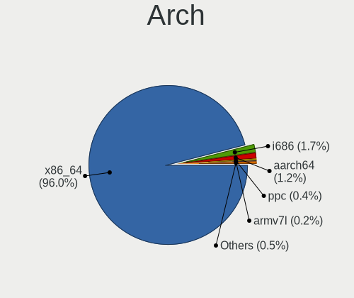

| Name        | Computers | Percent |
|-------------|-----------|---------|
| x86_64      | 1699      | 95.93%  |
| i686        | 32        | 1.81%   |
| aarch64     | 20        | 1.13%   |
| ppc         | 7         | 0.4%    |
| armv7l      | 3         | 0.17%   |
| armv6l      | 3         | 0.17%   |
| loongarch64 | 2         | 0.11%   |
| armv5tel    | 2         | 0.11%   |
| riscv64     | 1         | 0.06%   |
| ppc64le     | 1         | 0.06%   |
| ppc64       | 1         | 0.06%   |

DE
--

Desktop Environment

| Name           | Computers | Percent |
|----------------|-----------|---------|
| Unknown        | 772       | 40.44%  |
| KDE5           | 429       | 22.47%  |
| GNOME          | 234       | 12.26%  |
| XFCE           | 173       | 9.06%   |
| KDE            | 64        | 3.35%   |
| MATE           | 49        | 2.57%   |
| DWM            | 33        | 1.73%   |
| LXQt           | 22        | 1.15%   |
| Hyprland       | 18        | 0.94%   |
| sway           | 17        | 0.89%   |
| i3             | 16        | 0.84%   |
| X-Cinnamon     | 14        | 0.73%   |
| LXDE           | 9         | 0.47%   |
| Enlightenment  | 9         | 0.47%   |
| Cinnamon       | 7         | 0.37%   |
| XSession       | 6         | 0.31%   |
| awesome        | 6         | 0.31%   |
| openbox        | 4         | 0.21%   |
| bspwm          | 4         | 0.21%   |
| Trinity        | 3         | 0.16%   |
| KDE6           | 3         | 0.16%   |
| GNOME Classic  | 3         | 0.16%   |
| Unity          | 2         | 0.1%    |
| fluxbox        | 2         | 0.1%    |
| xmonad         | 1         | 0.05%   |
| X-Generic      | 1         | 0.05%   |
| sussy_bspwm    | 1         | 0.05%   |
| ratpoison      | 1         | 0.05%   |
| qt5ct          | 1         | 0.05%   |
| LeftWM         | 1         | 0.05%   |
| ICEWM          | 1         | 0.05%   |
| i3-with-shmlog | 1         | 0.05%   |
| fvwm           | 1         | 0.05%   |
| dwl            | 1         | 0.05%   |

Display Server
--------------

X11 or Wayland

| Name    | Computers | Percent |
|---------|-----------|---------|
| X11     | 969       | 50.57%  |
| Unknown | 366       | 19.1%   |
| Tty     | 291       | 15.19%  |
| Wayland | 290       | 15.14%  |

Display Manager
---------------

SDDM, LightDM, etc.

| Name    | Computers | Percent |
|---------|-----------|---------|
| Unknown | 875       | 46.97%  |
| SDDM    | 504       | 27.05%  |
| LightDM | 214       | 11.49%  |
| GDM     | 164       | 8.8%    |
| SLiM    | 34        | 1.83%   |
| XDM     | 29        | 1.56%   |
| LXDM    | 21        | 1.13%   |
| GREETD  | 12        | 0.64%   |
| TDM     | 7         | 0.38%   |
| Ly      | 1         | 0.05%   |
| KDM     | 1         | 0.05%   |
| GDM3    | 1         | 0.05%   |

OS Lang
-------

Language

| Lang       | Computers | Percent |
|------------|-----------|---------|
| en_US      | 684       | 36.68%  |
| Unknown    | 265       | 14.21%  |
| C.UTF8     | 186       | 9.97%   |
| en_GB      | 122       | 6.54%   |
| de_DE      | 113       | 6.06%   |
| ru_RU      | 76        | 4.08%   |
| C          | 51        | 2.73%   |
| fr_FR      | 41        | 2.2%    |
| es_ES      | 25        | 1.34%   |
| it_IT      | 24        | 1.29%   |
| cs_CZ      | 24        | 1.29%   |
| en_CA      | 22        | 1.18%   |
| pl_PL      | 19        | 1.02%   |
| en_AU      | 19        | 1.02%   |
| pt_BR      | 15        | 0.8%    |
| zh_CN      | 12        | 0.64%   |
| en_IE      | 11        | 0.59%   |
| POSIX      | 8         | 0.43%   |
| sv_SE      | 7         | 0.38%   |
| ru_RU.UTF8 | 7         | 0.38%   |
| nl_NL      | 7         | 0.38%   |
| es_AR      | 7         | 0.38%   |
| de_CH      | 7         | 0.38%   |
| fi_FI      | 6         | 0.32%   |
| en_US.UTF8 | 6         | 0.32%   |
| el_GR      | 6         | 0.32%   |
| uk_UA      | 5         | 0.27%   |
| nl_BE      | 5         | 0.27%   |
| ja_JP      | 5         | 0.27%   |
| fr_CA      | 5         | 0.27%   |
| ca_ES      | 5         | 0.27%   |
| zh_TW      | 4         | 0.21%   |
| es_MX      | 4         | 0.21%   |
| en_DK      | 4         | 0.21%   |
| ro_RO      | 3         | 0.16%   |
| es_CL      | 3         | 0.16%   |
| en_ZA      | 3         | 0.16%   |
| ru_UA      | 2         | 0.11%   |
| pt_PT      | 2         | 0.11%   |
| mi_NZ      | 2         | 0.11%   |

Boot Mode
---------

EFI or BIOS

| Mode | Computers | Percent |
|------|-----------|---------|
| EFI  | 1334      | 73.66%  |
| BIOS | 477       | 26.34%  |

Filesystem
----------

Type of filesystem

| Type     | Computers | Percent |
|----------|-----------|---------|
| Ext4     | 1047      | 57.72%  |
| Btrfs    | 423       | 23.32%  |
| Xfs      | 101       | 5.57%   |
| F2fs     | 70        | 3.86%   |
| Zfs      | 67        | 3.69%   |
| Unknown  | 46        | 2.54%   |
| XXXXXXX  | 25        | 1.38%   |
| Reiserfs | 17        | 0.94%   |
| Overlay  | 4         | 0.22%   |
| Jfs      | 3         | 0.17%   |
| Ext3     | 3         | 0.17%   |
| Bcachefs | 3         | 0.17%   |
| XXX      | 2         | 0.11%   |
| Ext2     | 2         | 0.11%   |
| Xtrfs    | 1         | 0.06%   |

Part. scheme
------------

Scheme of partitioning

| Type    | Computers | Percent |
|---------|-----------|---------|
| GPT     | 1515      | 84.26%  |
| MBR     | 186       | 10.34%  |
| Unknown | 97        | 5.39%   |

Dual Boot with Linux/BSD
------------------------

Hosting more than one Linux/BSD

| Dual boot | Computers | Percent |
|-----------|-----------|---------|
| No        | 1278      | 68.71%  |
| Yes       | 582       | 31.29%  |

Dual Boot (Win)
---------------

Hosting Linux and Windows

| Dual boot | Computers | Percent |
|-----------|-----------|---------|
| No        | 1231      | 67.6%   |
| Yes       | 590       | 32.4%   |

Board
-----

Vendor
------

Motherboard manufacturer

| Name                    | Computers | Percent |
|-------------------------|-----------|---------|
| ASUSTek Computer        | 399       | 22.53%  |
| Lenovo                  | 261       | 14.74%  |
| Dell                    | 173       | 9.77%   |
| Hewlett-Packard         | 162       | 9.15%   |
| MSI                     | 151       | 8.53%   |
| Gigabyte Technology     | 122       | 6.89%   |
| ASRock                  | 100       | 5.65%   |
| Acer                    | 53        | 2.99%   |
| Unknown                 | 37        | 2.09%   |
| Intel                   | 32        | 1.81%   |
| Apple                   | 29        | 1.64%   |
| Supermicro              | 24        | 1.36%   |
| Raspberry Pi Foundation | 16        | 0.9%    |
| Fujitsu                 | 13        | 0.73%   |
| Timi                    | 12        | 0.68%   |
| HUAWEI                  | 12        | 0.68%   |
| Samsung Electronics     | 11        | 0.62%   |
| Framework               | 10        | 0.56%   |
| Toshiba                 | 9         | 0.51%   |
| TUXEDO                  | 8         | 0.45%   |
| Razer                   | 6         | 0.34%   |
| Google                  | 6         | 0.34%   |
| ASRockRack              | 6         | 0.34%   |
| Notebook                | 5         | 0.28%   |
| IBM                     | 5         | 0.28%   |
| TYAN Computer           | 4         | 0.23%   |
| System76                | 4         | 0.23%   |
| Alienware               | 4         | 0.23%   |
| Tekram Technology       | 3         | 0.17%   |
| Star Labs               | 3         | 0.17%   |
| Sony                    | 3         | 0.17%   |
| Positivo                | 3         | 0.17%   |
| Pegatron                | 3         | 0.17%   |
| Medion                  | 3         | 0.17%   |
| Foxconn                 | 3         | 0.17%   |
| Chuwi                   | 3         | 0.17%   |
| BESSTAR Tech            | 3         | 0.17%   |
| ZOTAC                   | 2         | 0.11%   |
| win element             | 2         | 0.11%   |
| Valve                   | 2         | 0.11%   |

Model
-----

Motherboard model

| Name                                       | Computers | Percent |
|--------------------------------------------|-----------|---------|
| Unknown                                    | 44        | 2.48%   |
| ASUS All Series                            | 22        | 1.24%   |
| ASUS TUF Gaming X570-PLUS                  | 12        | 0.68%   |
| MSI MS-7C02                                | 10        | 0.56%   |
| Supermicro Super Server                    | 9         | 0.51%   |
| ASUS TUF Gaming B550-PLUS                  | 8         | 0.45%   |
| ASUS ROG STRIX X570-E GAMING               | 8         | 0.45%   |
| ASUS PRIME X570-PRO                        | 8         | 0.45%   |
| ASUS PRIME X470-PRO                        | 7         | 0.4%    |
| MSI MS-7A38                                | 6         | 0.34%   |
| Dell XPS 15 9570                           | 6         | 0.34%   |
| ASUS ROG Strix G513QY_G513QY               | 6         | 0.34%   |
| ASUS PRIME X370-PRO                        | 6         | 0.34%   |
| ASRock B450 Pro4                           | 6         | 0.34%   |
| MSI MS-7C91                                | 5         | 0.28%   |
| MSI MS-7C37                                | 5         | 0.28%   |
| MSI MS-7C35                                | 5         | 0.28%   |
| MSI MS-7B86                                | 5         | 0.28%   |
| HP Pavilion Notebook                       | 5         | 0.28%   |
| HP OMEN by Laptop                          | 5         | 0.28%   |
| Gigabyte X570 AORUS ELITE                  | 5         | 0.28%   |
| Dell XPS 13 9310                           | 5         | 0.28%   |
| ASUS ROG STRIX B450-F GAMING               | 5         | 0.28%   |
| ASUS ROG CROSSHAIR VIII HERO               | 5         | 0.28%   |
| ASUS PRIME X570-P                          | 5         | 0.28%   |
| MSI MS-7B89                                | 4         | 0.23%   |
| MSI MS-7B79                                | 4         | 0.23%   |
| HP Pavilion Gaming Laptop 15-ec1xxx        | 4         | 0.23%   |
| HP Laptop 14-dk1xxx                        | 4         | 0.23%   |
| Gigabyte B450M DS3H                        | 4         | 0.23%   |
| Framework Laptop 13 (AMD Ryzen 7040Series) | 4         | 0.23%   |
| Framework Laptop (13th Gen Intel Core)     | 4         | 0.23%   |
| Dell XPS 17 9710                           | 4         | 0.23%   |
| Dell XPS 15 7590                           | 4         | 0.23%   |
| ASUS Z170 PRO GAMING                       | 4         | 0.23%   |
| ASUS ROG Zephyrus G14 GA401II_GA401II      | 4         | 0.23%   |
| ASUS ROG STRIX X570-I GAMING               | 4         | 0.23%   |
| ASUS ROG STRIX B550-F GAMING               | 4         | 0.23%   |
| ASUS ROG CROSSHAIR VIII DARK HERO          | 4         | 0.23%   |
| ASUS ROG CROSSHAIR VII HERO                | 4         | 0.23%   |

Model Family
------------

Motherboard model prefix

| Name              | Computers | Percent |
|-------------------|-----------|---------|
| Lenovo ThinkPad   | 153       | 8.64%   |
| ASUS ROG          | 99        | 5.59%   |
| ASUS PRIME        | 73        | 4.12%   |
| ASUS TUF          | 50        | 2.82%   |
| Dell Latitude     | 48        | 2.71%   |
| Dell XPS          | 45        | 2.54%   |
| Unknown           | 44        | 2.48%   |
| Acer Aspire       | 32        | 1.81%   |
| HP EliteBook      | 29        | 1.64%   |
| Lenovo IdeaPad    | 28        | 1.58%   |
| HP Pavilion       | 27        | 1.52%   |
| Lenovo Legion     | 26        | 1.47%   |
| Dell Precision    | 26        | 1.47%   |
| HP Laptop         | 22        | 1.24%   |
| ASUS All          | 22        | 1.24%   |
| Dell Inspiron     | 20        | 1.13%   |
| ASUS VivoBook     | 19        | 1.07%   |
| Lenovo Yoga       | 18        | 1.02%   |
| RPi Raspberry     | 16        | 0.9%    |
| Gigabyte X570     | 14        | 0.79%   |
| HP OMEN           | 13        | 0.73%   |
| Dell OptiPlex     | 13        | 0.73%   |
| ASRock X570       | 13        | 0.73%   |
| HP ProBook        | 12        | 0.68%   |
| MSI MS-7C02       | 10        | 0.56%   |
| Framework Laptop  | 10        | 0.56%   |
| ASUS ZenBook      | 10        | 0.56%   |
| Supermicro Super  | 9         | 0.51%   |
| Gigabyte B450M    | 9         | 0.51%   |
| ASUS ASUS         | 9         | 0.51%   |
| Acer Swift        | 9         | 0.51%   |
| HP ProLiant       | 8         | 0.45%   |
| Gigabyte B450     | 8         | 0.45%   |
| ASRock X370       | 8         | 0.45%   |
| Toshiba Satellite | 7         | 0.4%    |
| Timi RedmiBook    | 7         | 0.4%    |
| HP ZBook          | 7         | 0.4%    |
| HP Compaq         | 7         | 0.4%    |
| ASRock B450       | 7         | 0.4%    |
| Acer Nitro        | 7         | 0.4%    |

MFG Year
--------

Motherboard manufacture year

| Year    | Computers | Percent |
|---------|-----------|---------|
| 2019    | 258       | 14.57%  |
| 2020    | 235       | 13.27%  |
| 2018    | 209       | 11.8%   |
| 2021    | 193       | 10.9%   |
| 2022    | 115       | 6.49%   |
| 2017    | 102       | 5.76%   |
| 2012    | 81        | 4.57%   |
| 2015    | 72        | 4.07%   |
| 2014    | 70        | 3.95%   |
| 2013    | 67        | 3.78%   |
| 2016    | 63        | 3.56%   |
| 2023    | 57        | 3.22%   |
| 2011    | 51        | 2.88%   |
| 2010    | 49        | 2.77%   |
| Unknown | 41        | 2.32%   |
| 2008    | 37        | 2.09%   |
| 2009    | 31        | 1.75%   |
| 2007    | 13        | 0.73%   |
| 2006    | 7         | 0.4%    |
| 2005    | 5         | 0.28%   |
| 2004    | 5         | 0.28%   |
| 2003    | 4         | 0.23%   |
| 2000    | 3         | 0.17%   |
| 2024    | 2         | 0.11%   |
| 2002    | 1         | 0.06%   |

Form Factor
-----------

Physical design of the computer

| Name           | Computers | Percent |
|----------------|-----------|---------|
| Notebook       | 828       | 46.75%  |
| Desktop        | 800       | 45.17%  |
| Convertible    | 43        | 2.43%   |
| Server         | 43        | 2.43%   |
| System on chip | 24        | 1.36%   |
| Mini pc        | 19        | 1.07%   |
| All in one     | 7         | 0.4%    |
| Tablet         | 5         | 0.28%   |
| Phone          | 1         | 0.06%   |
| Stick pc       | 1         | 0.06%   |

Secure Boot
-----------

Enabled or disabled

| State    | Computers | Percent |
|----------|-----------|---------|
| Disabled | 1741      | 97.81%  |
| Enabled  | 39        | 2.19%   |

Coreboot
--------

Have coreboot on board

| Used | Computers | Percent |
|------|-----------|---------|
| No   | 1758      | 99.27%  |
| Yes  | 13        | 0.73%   |

RAM Size
--------

Total RAM memory

| Size in GB      | Computers | Percent |
|-----------------|-----------|---------|
| 32.01-64.0      | 452       | 24.78%  |
| 16.01-24.0      | 416       | 22.81%  |
| 8.01-16.0       | 276       | 15.13%  |
| 4.01-8.0        | 211       | 11.57%  |
| 64.01-256.0     | 209       | 11.46%  |
| 3.01-4.0        | 94        | 5.15%   |
| 24.01-32.0      | 82        | 4.5%    |
| 1.01-2.0        | 31        | 1.7%    |
| 0.51-1.0        | 21        | 1.15%   |
| 2.01-3.0        | 20        | 1.1%    |
| 0.01-0.5        | 9         | 0.49%   |
| More than 256.0 | 3         | 0.16%   |

RAM Used
--------

Used RAM memory

| Used GB     | Computers | Percent |
|-------------|-----------|---------|
| 1.01-2.0    | 428       | 19.98%  |
| 4.01-8.0    | 403       | 18.81%  |
| 2.01-3.0    | 366       | 17.09%  |
| 3.01-4.0    | 248       | 11.58%  |
| 8.01-16.0   | 214       | 9.99%   |
| 0.01-0.5    | 193       | 9.01%   |
| 0.51-1.0    | 188       | 8.78%   |
| 16.01-24.0  | 63        | 2.94%   |
| 32.01-64.0  | 19        | 0.89%   |
| 24.01-32.0  | 13        | 0.61%   |
| 64.01-256.0 | 4         | 0.19%   |
| 0           | 3         | 0.14%   |

Total Drives
------------

Number of drives on board

| Drives | Computers | Percent |
|--------|-----------|---------|
| 1      | 826       | 44.17%  |
| 2      | 486       | 25.99%  |
| 3      | 214       | 11.44%  |
| 4      | 126       | 6.74%   |
| 5      | 86        | 4.6%    |
| 6      | 43        | 2.3%    |
| 7      | 33        | 1.76%   |
| 8      | 17        | 0.91%   |
| 0      | 12        | 0.64%   |
| 9      | 6         | 0.32%   |
| 13     | 5         | 0.27%   |
| 10     | 4         | 0.21%   |
| 12     | 3         | 0.16%   |
| 21     | 2         | 0.11%   |
| 31     | 1         | 0.05%   |
| 26     | 1         | 0.05%   |
| 19     | 1         | 0.05%   |
| 18     | 1         | 0.05%   |
| 17     | 1         | 0.05%   |
| 14     | 1         | 0.05%   |
| 11     | 1         | 0.05%   |

Has CD-ROM
----------

Has CD-ROM on board

| Presented | Computers | Percent |
|-----------|-----------|---------|
| No        | 1422      | 79.04%  |
| Yes       | 377       | 20.96%  |

Has Ethernet
------------

Has Ethernet on board

| Presented | Computers | Percent |
|-----------|-----------|---------|
| Yes       | 1530      | 85.76%  |
| No        | 254       | 14.24%  |

Has WiFi
--------

Has WiFi module

| Presented | Computers | Percent |
|-----------|-----------|---------|
| Yes       | 1232      | 69.17%  |
| No        | 549       | 30.83%  |

Has Bluetooth
-------------

Has Bluetooth module

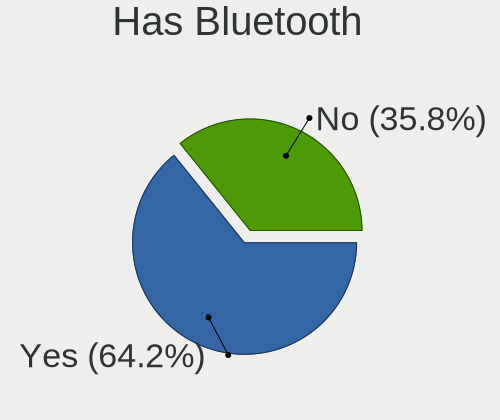

| Presented | Computers | Percent |
|-----------|-----------|---------|
| Yes       | 1139      | 63.35%  |
| No        | 659       | 36.65%  |

Location
--------

Country
-------

Geographic location (country)

| Country      | Computers | Percent |
|--------------|-----------|---------|
| USA          | 376       | 20.94%  |
| Germany      | 245       | 13.64%  |
| Russia       | 157       | 8.74%   |
| UK           | 91        | 5.07%   |
| France       | 82        | 4.57%   |
| Canada       | 68        | 3.79%   |
| Spain        | 57        | 3.17%   |
| China        | 57        | 3.17%   |
| Poland       | 56        | 3.12%   |
| Czechia      | 47        | 2.62%   |
| Italy        | 42        | 2.34%   |
| Sweden       | 38        | 2.12%   |
| Netherlands  | 34        | 1.89%   |
| Australia    | 34        | 1.89%   |
| Finland      | 32        | 1.78%   |
| Brazil       | 27        | 1.5%    |
| Belgium      | 25        | 1.39%   |
| Ukraine      | 24        | 1.34%   |
| Switzerland  | 23        | 1.28%   |
| Greece       | 19        | 1.06%   |
| Austria      | 16        | 0.89%   |
| Mexico       | 14        | 0.78%   |
| Turkey       | 13        | 0.72%   |
| Japan        | 13        | 0.72%   |
| Romania      | 11        | 0.61%   |
| Norway       | 11        | 0.61%   |
| Belarus      | 11        | 0.61%   |
| India        | 10        | 0.56%   |
| Hungary      | 10        | 0.56%   |
| Hong Kong    | 10        | 0.56%   |
| Argentina    | 10        | 0.56%   |
| Slovakia     | 9         | 0.5%    |
| Ireland      | 9         | 0.5%    |
| Taiwan       | 8         | 0.45%   |
| Bulgaria     | 7         | 0.39%   |
| South Africa | 6         | 0.33%   |
| Portugal     | 6         | 0.33%   |
| Indonesia    | 6         | 0.33%   |
| Denmark      | 6         | 0.33%   |
| Vietnam      | 5         | 0.28%   |

City
----

Geographic location (city)

| City              | Computers | Percent |
|-------------------|-----------|---------|
| Berlin            | 58        | 2.93%   |
| Moscow            | 53        | 2.68%   |
| St Petersburg     | 25        | 1.26%   |
| Athens            | 19        | 0.96%   |
| Sydney            | 17        | 0.86%   |
| Paris             | 17        | 0.86%   |
| Warsaw            | 16        | 0.81%   |
| Munich            | 15        | 0.76%   |
| Helsinki          | 14        | 0.71%   |
| Amsterdam         | 14        | 0.71%   |
| Vancouver         | 13        | 0.66%   |
| Frankfurt am Main | 13        | 0.66%   |
| Prague            | 12        | 0.61%   |
| Los Angeles       | 12        | 0.61%   |
| Cieszyn           | 12        | 0.61%   |
| Stockholm         | 11        | 0.56%   |
| New York          | 11        | 0.56%   |
| Milan             | 11        | 0.56%   |
| Kyiv              | 11        | 0.56%   |
| Beijing           | 11        | 0.56%   |
| Vladivostok       | 10        | 0.5%    |
| lapanice        | 9         | 0.45%   |
| Seattle           | 9         | 0.45%   |
| Guangzhou         | 9         | 0.45%   |
| Wuelfrath         | 8         | 0.4%    |
| Vienna            | 8         | 0.4%    |
| Minsk             | 8         | 0.4%    |
| Melbourne         | 8         | 0.4%    |
| Dublin            | 8         | 0.4%    |
| Barcelona         | 8         | 0.4%    |
| Sao Paulo         | 7         | 0.35%   |
| Oulu              | 7         | 0.35%   |
| Ottawa            | 7         | 0.35%   |
| Madrid            | 7         | 0.35%   |
| London            | 7         | 0.35%   |
| Hamburg           | 7         | 0.35%   |
| Bothell           | 7         | 0.35%   |
| Zurich            | 6         | 0.3%    |
| Woolwich          | 6         | 0.3%    |
| Weatherford       | 6         | 0.3%    |

Drives
------

Drive Vendor
------------

Hard drive vendors

| Vendor                      | Computers | Drives | Percent |
|-----------------------------|-----------|--------|---------|
| Samsung Electronics         | 669       | 1383   | 21.79%  |
| WDC                         | 465       | 1049   | 15.15%  |
| Seagate                     | 357       | 789    | 11.63%  |
| SanDisk                     | 168       | 249    | 5.47%   |
| Kingston                    | 146       | 209    | 4.76%   |
| Toshiba                     | 140       | 271    | 4.56%   |
| Intel                       | 132       | 219    | 4.3%    |
| Crucial                     | 92        | 171    | 3%      |
| SK hynix                    | 87        | 110    | 2.83%   |
| Unknown                     | 83        | 121    | 2.7%    |
| Hitachi                     | 67        | 198    | 2.18%   |
| HGST                        | 61        | 106    | 1.99%   |
| Micron Technology           | 53        | 73     | 1.73%   |
| Phison Electronics          | 45        | 61     | 1.47%   |
| A-DATA Technology           | 43        | 62     | 1.4%    |
| KIOXIA                      | 33        | 43     | 1.07%   |
| Kingston Technology Company | 24        | 27     | 0.78%   |
| Micron/Crucial Technology   | 23        | 29     | 0.75%   |
| Phison                      | 22        | 34     | 0.72%   |
| OCZ                         | 20        | 28     | 0.65%   |
| Corsair                     | 19        | 34     | 0.62%   |
| China                       | 17        | 44     | 0.55%   |
| Silicon Motion              | 13        | 20     | 0.42%   |
| Apple                       | 13        | 15     | 0.42%   |
| Transcend                   | 11        | 16     | 0.36%   |
| Realtek Semiconductor       | 11        | 19     | 0.36%   |
| GOODRAM                     | 11        | 77     | 0.36%   |
| Patriot                     | 10        | 16     | 0.33%   |
| ADATA Technology            | 10        | 14     | 0.33%   |
| Fujitsu                     | 9         | 12     | 0.29%   |
| PNY                         | 8         | 13     | 0.26%   |
| MAXIO Technology (Hangzhou) | 8         | 9      | 0.26%   |
| XPG                         | 7         | 14     | 0.23%   |
| SPCC                        | 7         | 9      | 0.23%   |
| Plextor                     | 7         | 8      | 0.23%   |
| LITEONIT                    | 7         | 9      | 0.23%   |
| Hewlett-Packard             | 7         | 17     | 0.23%   |
| Unknown                     | 7         | 8      | 0.23%   |
| Team                        | 6         | 13     | 0.2%    |
| Mushkin                     | 6         | 6      | 0.2%    |

Drive Model
-----------

Hard drive models

| Model                                              | Computers | Percent |
|----------------------------------------------------|-----------|---------|
| Samsung NVMe SSD Controller SM981/PM981/PM983 1TB  | 93        | 2.53%   |
| Samsung NVMe SSD Controller PM9A1/PM9A3/980PRO 1TB | 66        | 1.79%   |
| Samsung SSD 860 EVO 1TB                            | 34        | 0.92%   |
| Samsung SSD 850 EVO 250GB                          | 31        | 0.84%   |
| Samsung SSD 980 1TB                                | 28        | 0.76%   |
| Samsung SSD 860 EVO 500GB                          | 27        | 0.73%   |
| Samsung SSD 850 EVO 500GB                          | 26        | 0.71%   |
| HGST HTS721010A9E630 1TB                           | 26        | 0.71%   |
| WDC WD30EFRX-68EUZN0 3TB                           | 23        | 0.62%   |
| Samsung SSD 860 EVO 250GB                          | 22        | 0.6%    |
| Kingston SA400S37240G 240GB SSD                    | 22        | 0.6%    |
| Seagate ST4000DM004-2CV104 4TB                     | 19        | 0.52%   |
| Seagate ST2000DM008-2FR102 2TB                     | 19        | 0.52%   |
| Seagate ST1000DM010-2EP102 1TB                     | 19        | 0.52%   |
| Samsung SSD 970 EVO Plus 500GB                     | 19        | 0.52%   |
| Kingston SA400S37480G 480GB SSD                    | 17        | 0.46%   |
| Crucial CT1000MX500SSD1 1TB                        | 17        | 0.46%   |
| WDC WD10EZEX-08WN4A0 1TB                           | 15        | 0.41%   |
| Unknown MMC Card  32GB                             | 15        | 0.41%   |
| Sandisk WD Blue SN550 NVMe SSD 2TB                 | 15        | 0.41%   |
| Sandisk WD Black SN750 / PC SN730 NVMe SSD 512GB   | 15        | 0.41%   |
| Samsung SSD 970 EVO Plus 1TB                       | 15        | 0.41%   |
| Samsung SSD 970 EVO 500GB                          | 15        | 0.41%   |
| Micron/Crucial P2 NVMe PCIe SSD 4TB                | 15        | 0.41%   |
| Intel SSD 660P Series 1024GB                       | 15        | 0.41%   |
| Unknown MMC Card  128GB                            | 14        | 0.38%   |
| Seagate ST500DM002-1BD142 500GB                    | 14        | 0.38%   |
| Seagate ST2000DM001-1ER164 2TB                     | 14        | 0.38%   |
| Samsung SSD 870 EVO 1TB                            | 14        | 0.38%   |
| WDC WDS500G2B0A-00SM50 500GB SSD                   | 13        | 0.35%   |
| Seagate ST2000DM006-2DM164 2TB                     | 13        | 0.35%   |
| Samsung SSD 970 EVO 250GB                          | 13        | 0.35%   |
| Samsung SSD 970 EVO 1TB                            | 13        | 0.35%   |
| Samsung SSD 840 EVO 120GB                          | 13        | 0.35%   |
| Samsung NVMe SSD Controller SM961/PM961/SM963 1TB  | 13        | 0.35%   |
| Phison E12 NVMe Controller 2TB                     | 13        | 0.35%   |
| WDC WD40EZRZ-00GXCB0 4TB                           | 12        | 0.33%   |
| Samsung SSD 980 PRO 1TB                            | 12        | 0.33%   |
| Samsung SSD 850 EVO 1TB                            | 12        | 0.33%   |
| Kingston SA400S37120G 120GB SSD                    | 12        | 0.33%   |

HDD Vendor
----------

Hard disk drive vendors

| Vendor              | Computers | Drives | Percent |
|---------------------|-----------|--------|---------|
| WDC                 | 353       | 846    | 35.23%  |
| Seagate             | 348       | 772    | 34.73%  |
| Toshiba             | 96        | 215    | 9.58%   |
| Hitachi             | 67        | 198    | 6.69%   |
| HGST                | 61        | 106    | 6.09%   |
| Samsung Electronics | 30        | 45     | 2.99%   |
| Fujitsu             | 9         | 12     | 0.9%    |
| IBM                 | 5         | 6      | 0.5%    |
| Unknown             | 4         | 5      | 0.4%    |
| SABRENT             | 3         | 3      | 0.3%    |
| IBM/Hitachi         | 3         | 4      | 0.3%    |
| Hewlett-Packard     | 3         | 6      | 0.3%    |
| TO Exter            | 2         | 2      | 0.2%    |
| MDT                 | 2         | 2      | 0.2%    |
| Maxtor              | 2         | 3      | 0.2%    |
| LaCie               | 2         | 12     | 0.2%    |
| Apple               | 2         | 2      | 0.2%    |
| Teleplan            | 1         | 4      | 0.1%    |
| NETAPP              | 1         | 3      | 0.1%    |
| HGST HTS            | 1         | 1      | 0.1%    |
| FNK TECH            | 1         | 1      | 0.1%    |
| FC-1307             | 1         | 1      | 0.1%    |
| Dyconn H            | 1         | 1      | 0.1%    |
| ASMT                | 1         | 2      | 0.1%    |
| ASMedia             | 1         | 1      | 0.1%    |
| AFAYA               | 1         | 1      | 0.1%    |
| Unknown             | 1         | 1      | 0.1%    |

SSD Vendor
----------

Solid state drive vendors

| Vendor              | Computers | Drives | Percent |
|---------------------|-----------|--------|---------|
| Samsung Electronics | 313       | 565    | 32.23%  |
| Kingston            | 107       | 150    | 11.02%  |
| Crucial             | 84        | 156    | 8.65%   |
| SanDisk             | 82        | 127    | 8.44%   |
| WDC                 | 62        | 88     | 6.39%   |
| Intel               | 41        | 55     | 4.22%   |
| A-DATA Technology   | 28        | 41     | 2.88%   |
| OCZ                 | 19        | 27     | 1.96%   |
| China               | 17        | 44     | 1.75%   |
| Micron Technology   | 16        | 26     | 1.65%   |
| SK hynix            | 14        | 15     | 1.44%   |
| Toshiba             | 13        | 15     | 1.34%   |
| Corsair             | 12        | 19     | 1.24%   |
| GOODRAM             | 11        | 77     | 1.13%   |
| Transcend           | 9         | 14     | 0.93%   |
| Apple               | 9         | 10     | 0.93%   |
| Patriot             | 8         | 14     | 0.82%   |
| PNY                 | 7         | 12     | 0.72%   |
| LITEONIT            | 7         | 9      | 0.72%   |
| SPCC                | 6         | 8      | 0.62%   |
| Plextor             | 6         | 6      | 0.62%   |
| Unknown             | 6         | 7      | 0.62%   |
| Team                | 5         | 7      | 0.51%   |
| Mushkin             | 5         | 5      | 0.51%   |
| Intenso             | 5         | 7      | 0.51%   |
| Verbatim            | 4         | 4      | 0.41%   |
| Netac               | 4         | 4      | 0.41%   |
| KingSpec            | 4         | 6      | 0.41%   |
| Apacer              | 4         | 6      | 0.41%   |
| T-FORCE             | 3         | 8      | 0.31%   |
| Seagate             | 3         | 6      | 0.31%   |
| LITEON              | 3         | 6      | 0.31%   |
| Hewlett-Packard     | 3         | 3      | 0.31%   |
| Dogfish             | 3         | 3      | 0.31%   |
| Smartbuy            | 2         | 2      | 0.21%   |
| MyDigitalSSD        | 2         | 2      | 0.21%   |
| Linux               | 2         | 2      | 0.21%   |
| Lexar               | 2         | 2      | 0.21%   |
| Lenovo              | 2         | 3      | 0.21%   |
| KingDian            | 2         | 2      | 0.21%   |

Drive Kind
----------

HDD or SSD

| Kind    | Computers | Drives | Percent |
|---------|-----------|--------|---------|
| NVMe    | 1011      | 1827   | 38.05%  |
| SSD     | 792       | 1623   | 29.81%  |
| HDD     | 773       | 2255   | 29.09%  |
| MMC     | 71        | 103    | 2.67%   |
| Unknown | 10        | 21     | 0.38%   |

Drive Connector
---------------

SATA, SAS, NVMe, etc.

| Type | Computers | Drives | Percent |
|------|-----------|--------|---------|
| SATA | 1146      | 3787   | 49.93%  |
| NVMe | 1010      | 1821   | 44.01%  |
| MMC  | 71        | 103    | 3.09%   |
| SAS  | 68        | 118    | 2.96%   |

Drive Size
----------

Size of hard drive

| Size in TB | Computers | Drives | Percent |
|------------|-----------|--------|---------|
| 0.01-0.5   | 770       | 1520   | 43.23%  |
| 0.51-1.0   | 505       | 921    | 28.35%  |
| 1.01-2.0   | 232       | 538    | 13.03%  |
| 3.01-4.0   | 120       | 287    | 6.74%   |
| 4.01-10.0  | 70        | 308    | 3.93%   |
| 2.01-3.0   | 63        | 232    | 3.54%   |
| 10.01-20.0 | 20        | 71     | 1.12%   |
| 20.01-50.0 | 1         | 1      | 0.06%   |

Space Total
-----------

Amount of disk space available on the file system

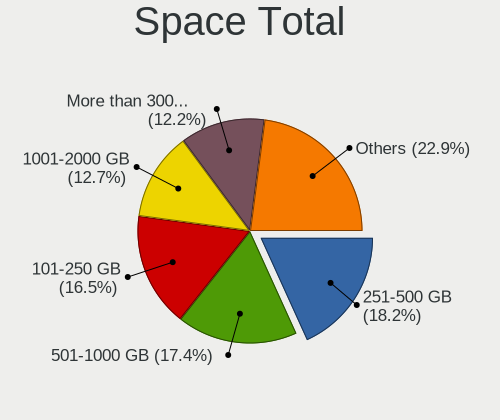

| Size in GB     | Computers | Percent |
|----------------|-----------|---------|
| 251-500        | 357       | 18.52%  |
| 101-250        | 334       | 17.32%  |
| 501-1000       | 326       | 16.91%  |
| 1001-2000      | 243       | 12.6%   |
| More than 3000 | 226       | 11.72%  |
| Unknown        | 109       | 5.65%   |
| 1-20           | 102       | 5.29%   |
| 2001-3000      | 95        | 4.93%   |
| 51-100         | 91        | 4.72%   |
| 21-50          | 45        | 2.33%   |

Space Used
----------

Amount of used disk space

| Used GB        | Computers | Percent |
|----------------|-----------|---------|
| 1-20           | 424       | 20.89%  |
| 101-250        | 292       | 14.38%  |
| 21-50          | 284       | 13.99%  |
| 251-500        | 253       | 12.46%  |
| 501-1000       | 190       | 9.36%   |
| 51-100         | 189       | 9.31%   |
| 1001-2000      | 137       | 6.75%   |
| Unknown        | 109       | 5.37%   |
| More than 3000 | 102       | 5.02%   |
| 2001-3000      | 50        | 2.46%   |

Malfunc. Drives
---------------

Drive models with a malfunction

| Model                                   | Computers | Drives | Percent |
|-----------------------------------------|-----------|--------|---------|
| HGST HTS721010A9E630 1TB                | 8         | 9      | 2.48%   |
| Seagate ST3500418AS 500GB               | 6         | 7      | 1.86%   |
| Seagate ST500DM002-1BC142 500GB         | 5         | 5      | 1.55%   |
| WDC WD40EFRX-68WT0N0 4TB                | 4         | 14     | 1.24%   |
| Seagate ST500DM002-1BD142 500GB         | 4         | 5      | 1.24%   |
| Seagate ST1000LM024 HN-M101MBB 1TB      | 4         | 11     | 1.24%   |
| Samsung Electronics SSD 980 1TB         | 4         | 4      | 1.24%   |
| WDC WD5000BEVT-22ZAT0 500GB             | 3         | 3      | 0.93%   |
| WDC WD30EFRX-68EUZN0 3TB                | 3         | 8      | 0.93%   |
| WDC WD30EFRX-68AX9N0 3TB                | 3         | 7      | 0.93%   |
| WDC WD20EZRZ-00Z5HB0 2TB                | 3         | 3      | 0.93%   |
| WDC WD20EFRX-68EUZN0 2TB                | 3         | 6      | 0.93%   |
| WDC WD2002FAEX-007BA0 2TB               | 3         | 3      | 0.93%   |
| Seagate ST8000AS0002-1NA17Z 8TB         | 3         | 15     | 0.93%   |
| Samsung Electronics SSD 850 EVO 1TB     | 3         | 3      | 0.93%   |
| Kingston RBU-SNS8350DES3128GP 128GB SSD | 3         | 3      | 0.93%   |
| IBM DJSA-220 12GB                       | 3         | 3      | 0.93%   |
| Hitachi HDS722020ALA330 2TB             | 3         | 17     | 0.93%   |
| WDC WD60EFRX-68MYMN1 6TB                | 2         | 5      | 0.62%   |
| WDC WD40EFRX-68N32N0 4TB                | 2         | 2      | 0.62%   |
| WDC WD20EZRX-00D8PB0 2TB                | 2         | 3      | 0.62%   |
| WDC WD20EARS-00MVWB0 2TB                | 2         | 2      | 0.62%   |
| WDC WD1600AAJS-75B4A0 160GB             | 2         | 2      | 0.62%   |
| WDC WD15EARS-00Z5B1 1TB                 | 2         | 2      | 0.62%   |
| WDC WD10JPVX-75JC3T0 1TB                | 2         | 2      | 0.62%   |
| Toshiba DT01ACA200 2TB                  | 2         | 2      | 0.62%   |
| SK hynix PC711 HFS512GDE9X073N 512GB    | 2         | 3      | 0.62%   |
| SK hynix HFS256G39TND-N210A 256GB SSD   | 2         | 2      | 0.62%   |
| Seagate ST4000DM000-1F2168 4TB          | 2         | 2      | 0.62%   |
| Seagate ST31000340NS 1TB                | 2         | 3      | 0.62%   |
| Seagate ST3000DM001-9YN166 3TB          | 2         | 3      | 0.62%   |
| Seagate ST2000LX001-1RG174 2TB          | 2         | 2      | 0.62%   |
| Seagate ST2000DX002-2DV164 2TB          | 2         | 2      | 0.62%   |
| Seagate ST2000DL003-9VT166 2TB          | 2         | 3      | 0.62%   |
| Seagate ST1000NM0011 1TB                | 2         | 6      | 0.62%   |
| SanDisk SSD PLUS 480GB                  | 2         | 2      | 0.62%   |
| SanDisk SSD PLUS 1000GB                 | 2         | 2      | 0.62%   |
| SanDisk SD9SN8W-128G-1006 128GB SSD     | 2         | 2      | 0.62%   |
| Samsung Electronics SSD 870 EVO 500GB   | 2         | 3      | 0.62%   |
| Samsung Electronics SSD 870 EVO 1TB     | 2         | 9      | 0.62%   |

Malfunc. Drive Vendor
---------------------

Vendors of faulty drives

| Vendor                      | Computers | Drives | Percent |
|-----------------------------|-----------|--------|---------|
| Seagate                     | 71        | 114    | 23.05%  |
| WDC                         | 70        | 129    | 22.73%  |
| Samsung Electronics         | 35        | 55     | 11.36%  |
| Toshiba                     | 18        | 24     | 5.84%   |
| Hitachi                     | 18        | 34     | 5.84%   |
| HGST                        | 15        | 21     | 4.87%   |
| SanDisk                     | 9         | 11     | 2.92%   |
| Intel                       | 9         | 11     | 2.92%   |
| Kingston                    | 8         | 8      | 2.6%    |
| SK hynix                    | 7         | 10     | 2.27%   |
| Crucial                     | 7         | 7      | 2.27%   |
| OCZ                         | 4         | 4      | 1.3%    |
| IBM                         | 4         | 4      | 1.3%    |
| Fujitsu                     | 4         | 4      | 1.3%    |
| Realtek Semiconductor       | 3         | 9      | 0.97%   |
| A-DATA Technology           | 3         | 3      | 0.97%   |
| PNY                         | 2         | 3      | 0.65%   |
| Plextor                     | 2         | 2      | 0.65%   |
| MDT                         | 2         | 2      | 0.65%   |
| IBM/Hitachi                 | 2         | 2      | 0.65%   |
| Corsair                     | 2         | 5      | 0.65%   |
| China                       | 2         | 3      | 0.65%   |
| Transcend                   | 1         | 1      | 0.32%   |
| SPCC                        | 1         | 1      | 0.32%   |
| Mushkin                     | 1         | 1      | 0.32%   |
| Maxtor                      | 1         | 2      | 0.32%   |
| LITEON                      | 1         | 4      | 0.32%   |
| Kingston Technology Company | 1         | 1      | 0.32%   |
| HGST HTS                    | 1         | 1      | 0.32%   |
| Emtec                       | 1         | 2      | 0.32%   |
| Apple                       | 1         | 1      | 0.32%   |
| 2.5"                        | 1         | 1      | 0.32%   |
| Unknown                     | 1         | 1      | 0.32%   |

Malfunc. HDD Vendor
-------------------

Vendors of faulty HDD drives

| Vendor              | Computers | Drives | Percent |
|---------------------|-----------|--------|---------|
| Seagate             | 71        | 114    | 33.81%  |
| WDC                 | 67        | 126    | 31.9%   |
| Hitachi             | 18        | 34     | 8.57%   |
| Toshiba             | 17        | 23     | 8.1%    |
| HGST                | 15        | 21     | 7.14%   |
| Samsung Electronics | 6         | 7      | 2.86%   |
| IBM                 | 4         | 4      | 1.9%    |
| Fujitsu             | 4         | 4      | 1.9%    |
| MDT                 | 2         | 2      | 0.95%   |
| IBM/Hitachi         | 2         | 2      | 0.95%   |
| Maxtor              | 1         | 2      | 0.48%   |
| HGST HTS            | 1         | 1      | 0.48%   |
| Apple               | 1         | 1      | 0.48%   |
| Unknown             | 1         | 1      | 0.48%   |

Malfunc. Drive Kind
-------------------

Kinds of faulty drives

| Kind | Computers | Drives | Percent |
|------|-----------|--------|---------|
| HDD  | 199       | 342    | 67%     |
| SSD  | 73        | 100    | 24.58%  |
| NVMe | 25        | 39     | 8.42%   |

Failed Drives
-------------

Failed drive models

| Model                                            | Computers | Drives | Percent |
|--------------------------------------------------|-----------|--------|---------|
| Toshiba THNSN5512GPUK NVMe 512GB                 | 2         | 2      | 20%     |
| WDC WD6400BEVT-22A0RT0 640GB                     | 1         | 1      | 10%     |
| WDC WD20EARS-00MVWB0 2TB                         | 1         | 2      | 10%     |
| Seagate ST3500630AS 500GB                        | 1         | 2      | 10%     |
| Seagate ST31500341AS 1TB                         | 1         | 1      | 10%     |
| Samsung Electronics SSD 980 1TB                  | 1         | 1      | 10%     |
| Samsung Electronics MZ7LN256HCHP-00000 256GB SSD | 1         | 2      | 10%     |
| Hitachi HTS723232L9A360 320GB                    | 1         | 1      | 10%     |
| Hitachi HTS721010G9SA00 100GB                    | 1         | 1      | 10%     |

Failed Drive Vendor
-------------------

Failed drive vendors

| Vendor              | Computers | Drives | Percent |
|---------------------|-----------|--------|---------|
| WDC                 | 2         | 3      | 20%     |
| Toshiba             | 2         | 2      | 20%     |
| Seagate             | 2         | 3      | 20%     |
| Samsung Electronics | 2         | 3      | 20%     |
| Hitachi             | 2         | 2      | 20%     |

Drive Status
------------

Number of failed and malfunc. drives

| Status   | Computers | Drives | Percent |
|----------|-----------|--------|---------|
| Works    | 1558      | 4811   | 74.19%  |
| Malfunc  | 282       | 481    | 13.43%  |
| Detected | 250       | 524    | 11.9%   |
| Failed   | 10        | 13     | 0.48%   |

Storage controller
------------------

Storage Vendor
--------------

Storage controller vendors

| Vendor                           | Computers | Percent |
|----------------------------------|-----------|---------|
| Intel                            | 897       | 33.35%  |
| AMD                              | 514       | 19.11%  |
| Samsung Electronics              | 437       | 16.25%  |
| Sandisk                          | 159       | 5.91%   |
| ASMedia Technology               | 83        | 3.09%   |
| Phison Electronics               | 76        | 2.83%   |
| SK hynix                         | 73        | 2.71%   |
| Kingston Technology Company      | 64        | 2.38%   |
| Micron Technology                | 38        | 1.41%   |
| Toshiba America Info Systems     | 36        | 1.34%   |
| KIOXIA                           | 35        | 1.3%    |
| Marvell Technology Group         | 34        | 1.26%   |
| Micron/Crucial Technology        | 30        | 1.12%   |
| ADATA Technology                 | 28        | 1.04%   |
| Nvidia                           | 24        | 0.89%   |
| JMicron Technology               | 20        | 0.74%   |
| Broadcom / LSI                   | 19        | 0.71%   |
| Silicon Motion                   | 18        | 0.67%   |
| LSI Logic / Symbios Logic        | 15        | 0.56%   |
| Realtek Semiconductor            | 14        | 0.52%   |
| Seagate Technology               | 8         | 0.3%    |
| MAXIO Technology (Hangzhou)      | 8         | 0.3%    |
| Solid State Storage Technology   | 7         | 0.26%   |
| Yangtze Memory Technologies      | 6         | 0.22%   |
| INNOGRIT                         | 6         | 0.22%   |
| Adaptec                          | 6         | 0.22%   |
| Silicon Image                    | 5         | 0.19%   |
| Silicon Integrated Systems [SiS] | 4         | 0.15%   |
| VIA Technologies                 | 3         | 0.11%   |
| Union Memory (Shenzhen)          | 3         | 0.11%   |
| Lite-On Technology               | 3         | 0.11%   |
| Loongson Technology              | 2         | 0.07%   |
| Lenovo                           | 2         | 0.07%   |
| Hewlett-Packard                  | 2         | 0.07%   |
| Apple                            | 2         | 0.07%   |
| 3ware                            | 2         | 0.07%   |
| Transcend                        | 1         | 0.04%   |
| Solidigm                         | 1         | 0.04%   |
| Shenzhen Longsys Electronics     | 1         | 0.04%   |
| OCZ Technology Group             | 1         | 0.04%   |

Storage Model
-------------

Storage controller models

| Model                                                                          | Computers | Percent |
|--------------------------------------------------------------------------------|-----------|---------|
| AMD FCH SATA Controller [AHCI mode]                                            | 348       | 11.4%   |
| Samsung NVMe SSD Controller SM981/PM981/PM983                                  | 247       | 8.09%   |
| AMD 400 Series Chipset SATA Controller                                         | 105       | 3.44%   |
| Samsung NVMe SSD Controller PM9A1/PM9A3/980PRO                                 | 96        | 3.14%   |
| ASMedia ASM1061/ASM1062 Serial ATA Controller                                  | 71        | 2.33%   |
| Samsung NVMe SSD Controller 980 (DRAM-less)                                    | 61        | 2%      |
| Intel Q170/Q150/B150/H170/H110/Z170/CM236 Chipset SATA Controller [AHCI Mode]  | 60        | 1.97%   |
| AMD 500 Series Chipset SATA Controller                                         | 59        | 1.93%   |
| Intel 8 Series/C220 Series Chipset Family 6-port SATA Controller 1 [AHCI mode] | 55        | 1.8%    |
| Intel Sunrise Point-LP SATA Controller [AHCI mode]                             | 54        | 1.77%   |
| Samsung NVMe SSD Controller SM961/PM961/SM963                                  | 50        | 1.64%   |
| SanDisk Extreme Pro / WD Black SN750 / PC SN730 / Red SN700 NVMe SSD           | 44        | 1.44%   |
| Intel Cannon Lake Mobile PCH SATA AHCI Controller                              | 44        | 1.44%   |
| AMD SB7x0/SB8x0/SB9x0 SATA Controller [AHCI mode]                              | 44        | 1.44%   |
| Intel 82801 Mobile SATA Controller [RAID mode]                                 | 43        | 1.41%   |
| Intel Volume Management Device NVMe RAID Controller                            | 42        | 1.38%   |
| Intel SSD 660P Series                                                          | 38        | 1.24%   |
| Intel Cannon Lake PCH SATA AHCI Controller                                     | 37        | 1.21%   |
| AMD 600 Series Chipset SATA Controller                                         | 35        | 1.15%   |
| SK hynix Gold P31/BC711/PC711 NVMe Solid State Drive                           | 33        | 1.08%   |
| SanDisk Ultra 3D / WD Blue SN550 NVMe SSD                                      | 31        | 1.02%   |
| Intel HM170/QM170 Chipset SATA Controller [AHCI Mode]                          | 29        | 0.95%   |
| Intel 7 Series Chipset Family 6-port SATA Controller [AHCI mode]               | 29        | 0.95%   |
| Intel Comet Lake SATA AHCI Controller                                          | 27        | 0.88%   |
| Intel 7 Series/C210 Series Chipset Family 6-port SATA Controller [AHCI mode]   | 26        | 0.85%   |
| Phison E12 NVMe Controller                                                     | 25        | 0.82%   |
| Intel 200 Series PCH SATA controller [AHCI mode]                               | 25        | 0.82%   |
| Intel 6 Series/C200 Series Chipset Family 6 port Mobile SATA AHCI Controller   | 24        | 0.79%   |
| Intel 500 Series Chipset Family SATA AHCI Controller                           | 24        | 0.79%   |
| ADATA XPG SX8200 Pro PCIe Gen3x4 M.2 2280 Solid State Drive                    | 24        | 0.79%   |
| KIOXIA NVMe SSD Controller BG4 (DRAM-less)                                     | 22        | 0.72%   |
| Intel 6 Series/C200 Series Chipset Family 6 port Desktop SATA AHCI Controller  | 22        | 0.72%   |
| Phison E16 PCIe4 NVMe Controller                                               | 21        | 0.69%   |
| AMD X370 Series Chipset SATA Controller                                        | 21        | 0.69%   |
| Intel SATA Controller [RAID Mode]                                              | 19        | 0.62%   |
| Intel Alder Lake-S PCH SATA Controller [AHCI Mode]                             | 19        | 0.62%   |
| Micron/Crucial P2 [Nick P2] / P3 / P3 Plus NVMe PCIe SSD (DRAM-less)           | 18        | 0.59%   |
| Kingston Company A2000 NVMe SSD SM2263EN                                       | 18        | 0.59%   |
| Intel SSD DC P4101/Pro 7600p/760p/E 6100p Series                               | 18        | 0.59%   |
| Intel 82801JI (ICH10 Family) SATA AHCI Controller                              | 18        | 0.59%   |

Storage Kind
------------

Kind of storage controller (IDE, SATA, NVMe, SAS, ...)

| Kind | Computers | Percent |
|------|-----------|---------|
| SATA | 1239      | 48.19%  |
| NVMe | 1017      | 39.56%  |
| RAID | 141       | 5.48%   |
| IDE  | 135       | 5.25%   |
| SAS  | 31        | 1.21%   |
| SCSI | 8         | 0.31%   |

Processor
---------

CPU Vendor
----------

Processor vendors

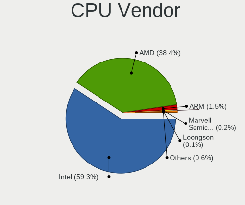

| Vendor                   | Computers | Percent |
|--------------------------|-----------|---------|
| Intel                    | 1068      | 60.3%   |
| AMD                      | 662       | 37.38%  |
| ARM                      | 25        | 1.41%   |
| Marvell Semiconductor    | 3         | 0.17%   |
| Loongson                 | 2         | 0.11%   |
| thead,c906               | 1         | 0.06%   |
| PowerNV C1P9S01 REV 1.01 | 1         | 0.06%   |
| PowerMac8,1              | 1         | 0.06%   |
| PowerMac3,6              | 1         | 0.06%   |
| PowerMac10,2             | 1         | 0.06%   |
| PowerBook6,7             | 1         | 0.06%   |
| PowerBook5,6             | 1         | 0.06%   |
| PowerBook5,5             | 1         | 0.06%   |
| PowerBook5,4             | 1         | 0.06%   |
| PowerBook3,4             | 1         | 0.06%   |
| CyrixInstead             | 1         | 0.06%   |

CPU Model
---------

Processor models

| Model                                         | Computers | Percent |
|-----------------------------------------------|-----------|---------|
| AMD Ryzen 7 3700X 8-Core Processor            | 29        | 1.62%   |
| AMD Ryzen 5 3600 6-Core Processor             | 25        | 1.4%    |
| Intel Core i7-8750H CPU @ 2.20GHz             | 24        | 1.34%   |
| AMD Ryzen 9 5900X 12-Core Processor           | 24        | 1.34%   |
| Intel Core i7-9750H CPU @ 2.60GHz             | 22        | 1.23%   |
| AMD Ryzen 7 5800H with Radeon Graphics        | 22        | 1.23%   |
| AMD Ryzen 5 5600X 6-Core Processor            | 21        | 1.17%   |
| Intel Core i7-8550U CPU @ 1.80GHz             | 20        | 1.12%   |
| ARM Processor                                 | 20        | 1.12%   |
| AMD Ryzen 9 3900X 12-Core Processor           | 20        | 1.12%   |
| AMD Ryzen 9 5950X 16-Core Processor           | 19        | 1.06%   |
| AMD Ryzen 7 2700X Eight-Core Processor        | 19        | 1.06%   |
| AMD Ryzen 9 3950X 16-Core Processor           | 18        | 1.01%   |
| Intel 11th Gen Core i5-1135G7 @ 2.40GHz       | 17        | 0.95%   |
| Intel Core i7-6700HQ CPU @ 2.60GHz            | 16        | 0.89%   |
| Intel 11th Gen Core i7-1165G7 @ 2.80GHz       | 16        | 0.89%   |
| Intel Core i5-8250U CPU @ 1.60GHz             | 15        | 0.84%   |
| AMD Ryzen 7 4800H with Radeon Graphics        | 15        | 0.84%   |
| Intel Core i7-8565U CPU @ 1.80GHz             | 14        | 0.78%   |
| AMD Ryzen 7 PRO 4750U with Radeon Graphics    | 14        | 0.78%   |
| Intel Core i5-10210U CPU @ 1.60GHz            | 13        | 0.73%   |
| Intel 12th Gen Core i7-12700H                 | 13        | 0.73%   |
| AMD Ryzen 7 3800X 8-Core Processor            | 13        | 0.73%   |
| AMD Ryzen 7 2700 Eight-Core Processor         | 13        | 0.73%   |
| AMD Ryzen 5 2600 Six-Core Processor           | 13        | 0.73%   |
| Intel Core i7-7500U CPU @ 2.70GHz             | 12        | 0.67%   |
| Intel Core i5-8265U CPU @ 1.60GHz             | 12        | 0.67%   |
| Intel 11th Gen Core i7-11800H @ 2.30GHz       | 12        | 0.67%   |
| AMD Ryzen 9 7950X 16-Core Processor           | 12        | 0.67%   |
| AMD Ryzen 7 5800X 8-Core Processor            | 12        | 0.67%   |
| AMD Ryzen 7 4700U with Radeon Graphics        | 12        | 0.67%   |
| AMD Ryzen 5 3500U with Radeon Vega Mobile Gfx | 12        | 0.67%   |
| Intel Core i9-9900K CPU @ 3.60GHz             | 11        | 0.62%   |
| Intel Core i7-6700K CPU @ 4.00GHz             | 11        | 0.62%   |
| Intel Core i7-8700K CPU @ 3.70GHz             | 10        | 0.56%   |
| Intel 11th Gen Core i7-1185G7 @ 3.00GHz       | 10        | 0.56%   |
| AMD FX-8350 Eight-Core Processor              | 10        | 0.56%   |
| Intel Core i7-7700HQ CPU @ 2.80GHz            | 9         | 0.5%    |
| Intel Core i7-1065G7 CPU @ 1.30GHz            | 9         | 0.5%    |
| Intel Core i7-10510U CPU @ 1.80GHz            | 9         | 0.5%    |

CPU Model Family
----------------

Processor model prefix

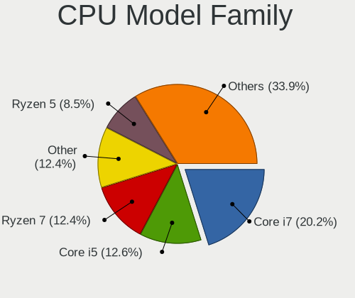

| Model                  | Computers | Percent |
|------------------------|-----------|---------|
| Intel Core i7          | 374       | 21.02%  |
| Intel Core i5          | 236       | 13.27%  |
| AMD Ryzen 7            | 215       | 12.09%  |
| Other                  | 208       | 11.69%  |
| AMD Ryzen 5            | 155       | 8.71%   |
| AMD Ryzen 9            | 127       | 7.14%   |
| Intel Xeon             | 85        | 4.78%   |
| AMD Ryzen 7 PRO        | 37        | 2.08%   |
| Intel Celeron          | 29        | 1.63%   |
| Intel Core i3          | 28        | 1.57%   |
| Intel Core i9          | 27        | 1.52%   |
| Intel Atom             | 27        | 1.52%   |
| AMD FX                 | 26        | 1.46%   |
| Intel Core 2 Duo       | 23        | 1.29%   |
| Intel Pentium          | 20        | 1.12%   |
| AMD Ryzen 3            | 17        | 0.96%   |
| Intel Core 2 Quad      | 11        | 0.62%   |
| AMD Ryzen Threadripper | 11        | 0.62%   |
| AMD Phenom II X4       | 11        | 0.62%   |
| Intel Pentium M        | 9         | 0.51%   |
| AMD Ryzen 5 PRO        | 9         | 0.51%   |
| Intel Pentium 4        | 8         | 0.45%   |
| AMD A6                 | 7         | 0.39%   |
| AMD Phenom II X6       | 6         | 0.34%   |
| Intel Pentium Silver   | 5         | 0.28%   |
| AMD Athlon             | 5         | 0.28%   |
| AMD A10                | 5         | 0.28%   |
| Intel Pentium III      | 4         | 0.22%   |
| Intel Core 2           | 4         | 0.22%   |
| ARM BCM                | 4         | 0.22%   |
| AMD Sempron            | 4         | 0.22%   |
| AMD EPYC               | 4         | 0.22%   |
| AMD Athlon 64 X2       | 4         | 0.22%   |
| Intel Core m3          | 3         | 0.17%   |
| AMD E                  | 3         | 0.17%   |
| AMD Athlon II X3       | 3         | 0.17%   |
| AMD A8                 | 3         | 0.17%   |
| Intel Genuine          | 2         | 0.11%   |
| Intel Core Duo         | 2         | 0.11%   |
| AMD E1                 | 2         | 0.11%   |

CPU Cores
---------

Number of processor cores

| Number  | Computers | Percent |
|---------|-----------|---------|
| 4       | 579       | 32.47%  |
| 8       | 342       | 19.18%  |
| 6       | 290       | 16.26%  |
| 2       | 268       | 15.03%  |
| 12      | 99        | 5.55%   |
| 16      | 70        | 3.93%   |
| 1       | 50        | 2.8%    |
| 14      | 29        | 1.63%   |
| Unknown | 15        | 0.84%   |
| 10      | 14        | 0.79%   |
| 3       | 7         | 0.39%   |
| 32      | 5         | 0.28%   |
| 20      | 5         | 0.28%   |
| 24      | 4         | 0.22%   |
| 28      | 2         | 0.11%   |
| 64      | 1         | 0.06%   |
| 44      | 1         | 0.06%   |
| 22      | 1         | 0.06%   |
| 18      | 1         | 0.06%   |

CPU Sockets
-----------

Number of sockets

| Number  | Computers | Percent |
|---------|-----------|---------|
| 1       | 1725      | 97.29%  |
| 2       | 34        | 1.92%   |
| Unknown | 14        | 0.79%   |

CPU Threads
-----------

Threads per core (Hyper-Threading)

| Number  | Computers | Percent |
|---------|-----------|---------|
| 2       | 1423      | 79.85%  |
| 1       | 342       | 19.19%  |
| Unknown | 15        | 0.84%   |
| 4       | 2         | 0.11%   |

CPU Op-Modes
------------

CPU Operation Modes (32-bit, 64-bit)

| Op mode        | Computers | Percent |
|----------------|-----------|---------|
| 32-bit, 64-bit | 1720      | 97.12%  |
| 32-bit         | 36        | 2.03%   |
| Unknown        | 15        | 0.85%   |

CPU Microcode
-------------

Microcode number

| Number     | Computers | Percent |
|------------|-----------|---------|
| Unknown    | 411       | 21.85%  |
| 0x906ea    | 75        | 3.99%   |
| 0x08701021 | 69        | 3.67%   |
| 0x506e3    | 55        | 2.92%   |
| 0x306a9    | 52        | 2.76%   |
| 0x306c3    | 49        | 2.6%    |
| 0x806ec    | 48        | 2.55%   |
| 0x0a50000c | 47        | 2.5%    |
| 0x806c1    | 42        | 2.23%   |
| 0x0800820d | 42        | 2.23%   |
| 0x906e9    | 40        | 2.13%   |
| 0x08701013 | 37        | 1.97%   |
| 0x806ea    | 36        | 1.91%   |
| 0x206a7    | 36        | 1.91%   |
| 0x08600106 | 34        | 1.81%   |
| 0x0a201016 | 31        | 1.65%   |
| 0x806e9    | 28        | 1.49%   |
| 0x906ed    | 26        | 1.38%   |
| 0x0a601203 | 25        | 1.33%   |
| 0x08108109 | 21        | 1.12%   |
| 0x08001138 | 21        | 1.12%   |
| 0xa0652    | 20        | 1.06%   |
| 0x40651    | 20        | 1.06%   |
| 0x0a20120a | 20        | 1.06%   |
| 0x0a201009 | 20        | 1.06%   |
| 0x806d1    | 19        | 1.01%   |
| 0x906a3    | 18        | 0.96%   |
| 0x406e3    | 17        | 0.9%    |
| 0x1067a    | 17        | 0.9%    |
| 0x90672    | 14        | 0.74%   |
| 0x306f2    | 14        | 0.74%   |
| 0x306d4    | 14        | 0.74%   |
| 0x0a50000d | 14        | 0.74%   |
| 0x0a404102 | 14        | 0.74%   |
| 0x08600103 | 14        | 0.74%   |
| 0x206c2    | 13        | 0.69%   |
| 0x08608103 | 13        | 0.69%   |
| 0x08108102 | 13        | 0.69%   |
| 0xa0671    | 12        | 0.64%   |
| 0x306e4    | 12        | 0.64%   |

CPU Microarch
-------------

Microarchitecture

| Name             | Computers | Percent |
|------------------|-----------|---------|
| KabyLake         | 321       | 17.97%  |
| Zen 2            | 198       | 11.09%  |
| Zen 3            | 160       | 8.96%   |
| Unknown          | 149       | 8.34%   |
| Haswell          | 102       | 5.71%   |
| Zen+             | 93        | 5.21%   |
| Skylake          | 85        | 4.76%   |
| IvyBridge        | 74        | 4.14%   |
| Alderlake Hybrid | 73        | 4.09%   |
| SandyBridge      | 56        | 3.14%   |
| TigerLake        | 52        | 2.91%   |
| Icelake          | 49        | 2.74%   |
| CometLake        | 46        | 2.58%   |
| Zen              | 44        | 2.46%   |
| Broadwell        | 33        | 1.85%   |
| Westmere         | 28        | 1.57%   |
| Penryn           | 25        | 1.4%    |
| Silvermont       | 24        | 1.34%   |
| Piledriver       | 23        | 1.29%   |
| K10              | 23        | 1.29%   |
| P6               | 18        | 1.01%   |
| Core             | 17        | 0.95%   |
| Bonnell          | 17        | 0.95%   |
| Goldmont plus    | 12        | 0.67%   |
| Nehalem          | 10        | 0.56%   |
| K8 Hammer        | 9         | 0.5%    |
| NetBurst         | 8         | 0.45%   |
| Bulldozer        | 6         | 0.34%   |
| Steamroller      | 5         | 0.28%   |
| Bobcat           | 5         | 0.28%   |
| Jaguar           | 4         | 0.22%   |
| Goldmont         | 4         | 0.22%   |
| Excavator        | 4         | 0.22%   |
| Gracemont        | 3         | 0.17%   |
| Tremont          | 2         | 0.11%   |
| Puma             | 2         | 0.11%   |
| K10 Llano        | 2         | 0.11%   |

Graphics
--------

GPU Vendor
----------

Vendors of graphics cards

| Vendor                           | Computers | Percent |
|----------------------------------|-----------|---------|
| Intel                            | 731       | 34.83%  |
| Nvidia                           | 674       | 32.11%  |
| AMD                              | 639       | 30.44%  |
| ASPEED Technology                | 32        | 1.52%   |
| Matrox Electronics Systems       | 19        | 0.91%   |
| Silicon Integrated Systems [SiS] | 2         | 0.1%    |
| Loongson Technology              | 2         | 0.1%    |

GPU Model
---------

Graphics card models

| Model                                                                       | Computers | Percent |
|-----------------------------------------------------------------------------|-----------|---------|
| AMD Ellesmere [Radeon RX 470/480/570/570X/580/580X/590]                     | 96        | 4.37%   |
| AMD Renoir [Radeon RX Vega 6 (Ryzen 4000/5000 Mobile Series)]               | 67        | 3.05%   |
| Intel CoffeeLake-H GT2 [UHD Graphics 630]                                   | 63        | 2.87%   |
| AMD Cezanne [Radeon Vega Series / Radeon Vega Mobile Series]                | 54        | 2.46%   |
| Intel UHD Graphics 620                                                      | 52        | 2.37%   |
| Intel TigerLake-LP GT2 [Iris Xe Graphics]                                   | 49        | 2.23%   |
| Intel 2nd Generation Core Processor Family Integrated Graphics Controller   | 41        | 1.87%   |
| AMD Picasso/Raven 2 [Radeon Vega Series / Radeon Vega Mobile Series]        | 39        | 1.77%   |
| AMD Navi 10 [Radeon RX 5600 OEM/5600 XT / 5700/5700 XT]                     | 39        | 1.77%   |
| Intel HD Graphics 530                                                       | 35        | 1.59%   |
| AMD Navi 22 [Radeon RX 6700/6700 XT/6750 XT / 6800M/6850M XT]               | 35        | 1.59%   |
| ASPEED Technology ASPEED Graphics Family                                    | 32        | 1.46%   |
| Intel WhiskeyLake-U GT2 [UHD Graphics 620]                                  | 31        | 1.41%   |
| Intel CometLake-U GT2 [UHD Graphics]                                        | 30        | 1.36%   |
| AMD Raphael                                                                 | 30        | 1.36%   |
| Nvidia TU117M [GeForce GTX 1650 Mobile / Max-Q]                             | 28        | 1.27%   |
| Intel Alder Lake-P GT2 [Iris Xe Graphics]                                   | 25        | 1.14%   |
| Intel HD Graphics 620                                                       | 24        | 1.09%   |
| Intel 3rd Gen Core processor Graphics Controller                            | 23        | 1.05%   |
| Intel Haswell-ULT Integrated Graphics Controller                            | 22        | 1%      |
| Intel HD Graphics 630                                                       | 21        | 0.96%   |
| Intel TigerLake-H GT1 [UHD Graphics]                                        | 20        | 0.91%   |
| AMD Vega 10 XL/XT [Radeon RX Vega 56/64]                                    | 20        | 0.91%   |
| Intel CoffeeLake-S GT2 [UHD Graphics 630]                                   | 19        | 0.86%   |
| AMD Rembrandt [Radeon 680M]                                                 | 19        | 0.86%   |
| AMD Navi 21 [Radeon RX 6800/6800 XT / 6900 XT]                              | 19        | 0.86%   |
| Nvidia GA106M [GeForce RTX 3060 Mobile / Max-Q]                             | 18        | 0.82%   |
| Intel Skylake GT2 [HD Graphics 520]                                         | 18        | 0.82%   |
| Intel CometLake-H GT2 [UHD Graphics]                                        | 17        | 0.77%   |
| AMD Lucienne                                                                | 17        | 0.77%   |
| Nvidia GP106 [GeForce GTX 1060 6GB]                                         | 16        | 0.73%   |
| Intel Xeon E3-1200 v3/4th Gen Core Processor Integrated Graphics Controller | 16        | 0.73%   |
| Intel 4th Gen Core Processor Integrated Graphics Controller                 | 16        | 0.73%   |
| Nvidia GP107M [GeForce GTX 1050 Ti Mobile]                                  | 15        | 0.68%   |
| Nvidia GP102 [GeForce GTX 1080 Ti]                                          | 15        | 0.68%   |
| Intel Raptor Lake-P [Iris Xe Graphics]                                      | 15        | 0.68%   |
| Nvidia GM206 [GeForce GTX 960]                                              | 14        | 0.64%   |
| Nvidia GM204 [GeForce GTX 970]                                              | 14        | 0.64%   |
| AMD Navi 23 [Radeon RX 6600/6600 XT/6600M]                                  | 14        | 0.64%   |
| AMD Navi 14 [Radeon RX 5500/5500M / Pro 5500M]                              | 14        | 0.64%   |

GPU Combo
---------

Combinations of graphics cards

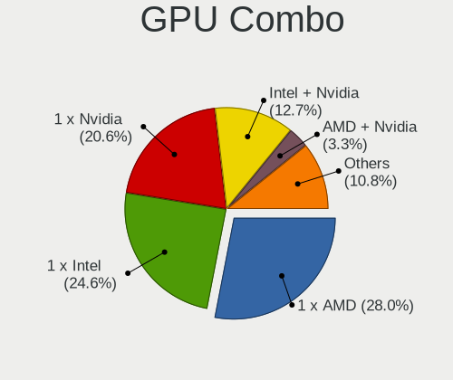

| Name                      | Computers | Percent |
|---------------------------|-----------|---------|
| 1 x AMD                   | 509       | 28.15%  |
| 1 x Intel                 | 443       | 24.5%   |
| 1 x Nvidia                | 375       | 20.74%  |
| Intel + Nvidia            | 236       | 13.05%  |
| AMD + Nvidia              | 58        | 3.21%   |
| 2 x AMD                   | 46        | 2.54%   |
| Other                     | 34        | 1.88%   |
| 1 x ASPEED                | 28        | 1.55%   |
| Intel + AMD               | 27        | 1.49%   |
| 1 x Matrox                | 16        | 0.88%   |
| 2 x Intel                 | 15        | 0.83%   |
| 2 x Nvidia                | 8         | 0.44%   |
| 1 x SiS                   | 2         | 0.11%   |
| Nvidia + ASPEED           | 2         | 0.11%   |
| AMD + Matrox              | 2         | 0.11%   |
| AMD + Loongson Technology | 2         | 0.11%   |
| AMD + ASPEED              | 2         | 0.11%   |
| Nvidia + Matrox           | 1         | 0.06%   |
| Intel + 2 x Nvidia        | 1         | 0.06%   |
| Intel + AMD + 1 x Nvidia  | 1         | 0.06%   |

GPU Driver
----------

Free vs proprietary

| Driver      | Computers | Percent |
|-------------|-----------|---------|
| Free        | 1252      | 68.53%  |
| Proprietary | 426       | 23.32%  |
| Unknown     | 149       | 8.16%   |

GPU Memory
----------

Total video memory

| Size in GB | Computers | Percent |
|------------|-----------|---------|
| Unknown    | 867       | 46.49%  |
| 7.01-8.0   | 206       | 11.05%  |
| 0.01-0.5   | 194       | 10.4%   |
| 1.01-2.0   | 171       | 9.17%   |
| 3.01-4.0   | 143       | 7.67%   |
| 8.01-16.0  | 98        | 5.25%   |
| 0.51-1.0   | 90        | 4.83%   |
| 5.01-6.0   | 65        | 3.49%   |
| 2.01-3.0   | 16        | 0.86%   |
| 16.01-24.0 | 13        | 0.7%    |
| 4.01-5.0   | 2         | 0.11%   |

Monitor
-------

Monitor Vendor
--------------

Monitor vendors

| Vendor                  | Computers | Percent |
|-------------------------|-----------|---------|
| Samsung Electronics     | 211       | 10.36%  |
| AU Optronics            | 185       | 9.08%   |
| Dell                    | 170       | 8.35%   |
| BOE                     | 158       | 7.76%   |
| Chimei Innolux          | 131       | 6.43%   |
| LG Display              | 126       | 6.19%   |
| Goldstar                | 110       | 5.4%    |
| BenQ                    | 70        | 3.44%   |
| AOC                     | 69        | 3.39%   |
| Sharp                   | 64        | 3.14%   |
| Hewlett-Packard         | 60        | 2.95%   |
| Ancor Communications    | 60        | 2.95%   |
| Acer                    | 60        | 2.95%   |
| ASUSTek Computer        | 46        | 2.26%   |
| Lenovo                  | 44        | 2.16%   |
| Philips                 | 43        | 2.11%   |
| Iiyama                  | 42        | 2.06%   |
| ViewSonic               | 39        | 1.91%   |
| Apple                   | 33        | 1.62%   |
| Eizo                    | 19        | 0.93%   |
| Chi Mei Optoelectronics | 18        | 0.88%   |
| PANDA                   | 16        | 0.79%   |
| Gigabyte Technology     | 15        | 0.74%   |
| CSO                     | 14        | 0.69%   |
| Unknown                 | 13        | 0.64%   |
| LG Electronics          | 13        | 0.64%   |
| MSI                     | 11        | 0.54%   |
| Fujitsu Siemens         | 10        | 0.49%   |
| NEC Computers           | 8         | 0.39%   |
| Unknown                 | 8         | 0.39%   |
| InfoVision              | 7         | 0.34%   |
| Idek Iiyama             | 7         | 0.34%   |
| TMX                     | 6         | 0.29%   |
| Sony                    | 6         | 0.29%   |
| Sceptre Tech            | 6         | 0.29%   |
| Mi                      | 6         | 0.29%   |
| HannStar                | 6         | 0.29%   |
| Toshiba                 | 5         | 0.25%   |
| RTK                     | 5         | 0.25%   |
| Panasonic               | 4         | 0.2%    |

Monitor Model
-------------

Monitor models

| Model                                                                 | Computers | Percent |
|-----------------------------------------------------------------------|-----------|---------|
| Chimei Innolux LCD Monitor CMN14D4 1920x1080 309x173mm 13.9-inch      | 12        | 0.56%   |
| Goldstar ULTRAWIDE GSM59F1 2560x1080 673x284mm 28.8-inch              | 10        | 0.46%   |
| AU Optronics LCD Monitor AUO38ED 1920x1080 344x193mm 15.5-inch        | 9         | 0.42%   |
| AOC 24B2W1 AOC2402 1920x1080 527x296mm 23.8-inch                      | 9         | 0.42%   |
| LG Display LCD Monitor LGD046F 1920x1080 340x190mm 15.3-inch          | 8         | 0.37%   |
| Iiyama PL2473HD IVM6107 1920x1080 521x293mm 23.5-inch                 | 8         | 0.37%   |
| Unknown                                                               | 8         | 0.37%   |
| Samsung Electronics U28E590 SAM0C4D 3840x2160 607x345mm 27.5-inch     | 7         | 0.32%   |
| Chimei Innolux LCD Monitor CMN1747 1920x1080 381x214mm 17.2-inch      | 7         | 0.32%   |
| BOE LCD Monitor BOE0BCA 2256x1504 285x190mm 13.5-inch                 | 7         | 0.32%   |
| AU Optronics LCD Monitor AUO403D 1920x1080 309x174mm 14.0-inch        | 7         | 0.32%   |
| AU Optronics LCD Monitor AUO243D 1920x1080 309x173mm 13.9-inch        | 7         | 0.32%   |
| AU Optronics LCD Monitor AUO21ED 1920x1080 344x193mm 15.5-inch        | 7         | 0.32%   |
| Unknown LCD Monitor FFFF 2288x1287 2550x2550mm 142.0-inch             | 6         | 0.28%   |
| Iiyama PL2409HD IVM560C 1920x1080 521x293mm 23.5-inch                 | 6         | 0.28%   |
| Fujitsu Siemens P24W-6 IPS FUS07EA 1920x1200 518x324mm 24.1-inch      | 6         | 0.28%   |
| Dell U2412M DELA07A 1920x1200 518x324mm 24.1-inch                     | 6         | 0.28%   |
| Dell P2418D DELD0C1 2560x1440 526x296mm 23.8-inch                     | 6         | 0.28%   |
| Sharp LCD Monitor SHP148D 3840x2160 344x194mm 15.5-inch               | 5         | 0.23%   |
| Samsung Electronics C24F390 SAM0D2C 1920x1080 521x293mm 23.5-inch     | 5         | 0.23%   |
| LG Display LCD Monitor LGD05E5 1920x1080 344x194mm 15.5-inch          | 5         | 0.23%   |
| LG Display LCD Monitor LGD0521 1920x1080 309x174mm 14.0-inch          | 5         | 0.23%   |
| Goldstar Ultra HD GSM5B09 3840x2160 600x340mm 27.2-inch               | 5         | 0.23%   |
| Goldstar IPS FULLHD GSM5AB8 1920x1080 480x270mm 21.7-inch             | 5         | 0.23%   |
| Dell U2715H DELD066 2560x1440 597x336mm 27.0-inch                     | 5         | 0.23%   |
| BenQ PD3200U BNQ8025 3840x2160 708x399mm 32.0-inch                    | 5         | 0.23%   |
| ASUSTek Computer VG27A AUS2722 2560x1440 597x336mm 27.0-inch          | 5         | 0.23%   |
| TMX TL156VDXP01 TMX1560 1920x1080 344x194mm 15.5-inch                 | 4         | 0.19%   |
| Sharp LQ156M1JW01 SHP14C3 1920x1080 344x194mm 15.5-inch               | 4         | 0.19%   |
| Sceptre Tech C305W-2560UN SPT0C0D 2560x1080 690x291mm 29.5-inch       | 4         | 0.19%   |
| Samsung Electronics LCD Monitor SDCA029 3840x2160 344x194mm 15.5-inch | 4         | 0.19%   |
| Samsung Electronics LC49G95T SAM7053 3840x1080 1193x336mm 48.8-inch   | 4         | 0.19%   |
| Samsung Electronics C27HG7x SAM0E16 2560x1440 598x336mm 27.0-inch     | 4         | 0.19%   |
| MSI MAG274QRF-QD MSI3CA8 2560x1440 596x335mm 26.9-inch                | 4         | 0.19%   |
| LG Electronics LCD Monitor LG HDR 4K 7680x2160                        | 4         | 0.19%   |
| LG Electronics LCD Monitor LG HDR 4K                                  | 4         | 0.19%   |
| Lenovo LCD Monitor LEN40BA 1920x1080 344x194mm 15.5-inch              | 4         | 0.19%   |
| HVR HTC-VIVE HVRAA01 2160x1200                                        | 4         | 0.19%   |
| Hewlett-Packard 22er HWP331B 1920x1080 476x268mm 21.5-inch            | 4         | 0.19%   |
| Goldstar HDR 4K GSM7707 3840x2160 600x340mm 27.2-inch                 | 4         | 0.19%   |

Monitor Resolution
------------------

Monitor screen resolution

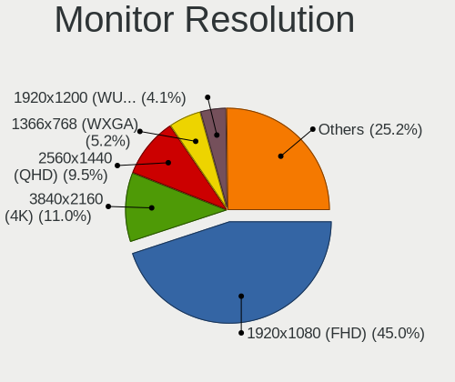

| Resolution         | Computers | Percent |
|--------------------|-----------|---------|
| 1920x1080 (FHD)    | 880       | 45.83%  |
| 3840x2160 (4K)     | 196       | 10.21%  |
| 2560x1440 (QHD)    | 184       | 9.58%   |
| 1366x768 (WXGA)    | 103       | 5.36%   |
| 1920x1200 (WUXGA)  | 72        | 3.75%   |
| 1280x1024 (SXGA)   | 49        | 2.55%   |
| 3440x1440          | 43        | 2.24%   |
| 1680x1050 (WSXGA+) | 43        | 2.24%   |
| 1600x900 (HD+)     | 36        | 1.88%   |
| Unknown            | 34        | 1.77%   |
| 2560x1600          | 32        | 1.67%   |
| 2560x1080          | 26        | 1.35%   |
| 1440x900 (WXGA+)   | 25        | 1.3%    |
| 3840x2400          | 22        | 1.15%   |
| 3840x1080          | 18        | 0.94%   |
| 1280x800 (WXGA)    | 15        | 0.78%   |
| 2256x1504          | 11        | 0.57%   |
| 2880x1800          | 10        | 0.52%   |
| 1600x1200          | 9         | 0.47%   |
| 1024x600           | 8         | 0.42%   |
| 2288x1287          | 6         | 0.31%   |
| 3840x1200          | 5         | 0.26%   |
| 3200x2000          | 5         | 0.26%   |
| 2160x1440          | 5         | 0.26%   |
| 2048x1152          | 5         | 0.26%   |
| 7680x2160          | 4         | 0.21%   |
| 3200x1800 (QHD+)   | 4         | 0.21%   |
| 2160x1200          | 4         | 0.21%   |
| 1920x540           | 4         | 0.21%   |
| 1360x768           | 4         | 0.21%   |
| 1024x768 (XGA)     | 4         | 0.21%   |
| 3456x2160          | 3         | 0.16%   |
| 1920x1280          | 3         | 0.16%   |
| 1400x1050          | 3         | 0.16%   |
| 1280x960           | 3         | 0.16%   |
| 1280x854           | 3         | 0.16%   |
| 800x1280           | 2         | 0.1%    |
| 5760x2160          | 2         | 0.1%    |
| 3840x1600          | 2         | 0.1%    |
| 3072x1920          | 2         | 0.1%    |

Monitor Diagonal
----------------

Diagonal size in inches

| Inches  | Computers | Percent |
|---------|-----------|---------|
| 15      | 358       | 17.76%  |
| 27      | 268       | 13.29%  |
| 24      | 196       | 9.72%   |
| 13      | 167       | 8.28%   |
| 23      | 154       | 7.64%   |
| 14      | 141       | 6.99%   |
| 21      | 105       | 5.21%   |
| Unknown | 104       | 5.16%   |
| 17      | 99        | 4.91%   |
| 34      | 59        | 2.93%   |
| 31      | 46        | 2.28%   |
| 19      | 45        | 2.23%   |
| 16      | 35        | 1.74%   |
| 12      | 31        | 1.54%   |
| 22      | 28        | 1.39%   |
| 25      | 17        | 0.84%   |
| 20      | 17        | 0.84%   |
| 11      | 14        | 0.69%   |
| 84      | 13        | 0.64%   |
| 18      | 13        | 0.64%   |
| 32      | 12        | 0.6%    |
| 40      | 9         | 0.45%   |
| 10      | 8         | 0.4%    |
| 54      | 7         | 0.35%   |
| 48      | 7         | 0.35%   |
| 26      | 7         | 0.35%   |
| 142     | 6         | 0.3%    |
| 72      | 6         | 0.3%    |
| 49      | 5         | 0.25%   |
| 29      | 5         | 0.25%   |
| 28      | 5         | 0.25%   |
| 42      | 3         | 0.15%   |
| 8       | 3         | 0.15%   |
| 58      | 2         | 0.1%    |
| 37      | 2         | 0.1%    |
| 36      | 2         | 0.1%    |
| 7       | 2         | 0.1%    |
| 75      | 1         | 0.05%   |
| 74      | 1         | 0.05%   |
| 65      | 1         | 0.05%   |

Monitor Width
-------------

Physical width

| Width in mm    | Computers | Percent |
|----------------|-----------|---------|
| 301-350        | 609       | 31.33%  |
| 501-600        | 541       | 27.83%  |
| 401-500        | 180       | 9.26%   |
| 201-300        | 156       | 8.02%   |
| 351-400        | 111       | 5.71%   |
| Unknown        | 104       | 5.35%   |
| 601-700        | 92        | 4.73%   |
| 701-800        | 75        | 3.86%   |
| 1001-1500      | 26        | 1.34%   |
| 1501-2000      | 21        | 1.08%   |
| 801-900        | 13        | 0.67%   |
| More than 2000 | 6         | 0.31%   |
| 101-200        | 4         | 0.21%   |
| 901-1000       | 4         | 0.21%   |
| 1-100          | 2         | 0.1%    |

Aspect Ratio
------------

Proportional relationship between the width and the height

| Ratio   | Computers | Percent |
|---------|-----------|---------|
| 16/9    | 1238      | 70.38%  |
| 16/10   | 246       | 13.99%  |
| Unknown | 87        | 4.95%   |
| 21/9    | 64        | 3.64%   |
| 5/4     | 46        | 2.62%   |
| 3/2     | 31        | 1.76%   |
| 4/3     | 17        | 0.97%   |
| 32/9    | 13        | 0.74%   |
| 1.00    | 7         | 0.4%    |
| 6/5     | 3         | 0.17%   |
| 3.40    | 1         | 0.06%   |
| 3.20    | 1         | 0.06%   |
| 0.89    | 1         | 0.06%   |
| 0.67    | 1         | 0.06%   |
| 0.62    | 1         | 0.06%   |
| 0.56    | 1         | 0.06%   |
| 0.31    | 1         | 0.06%   |

Monitor Area
------------

Area in inch

| Area in inch | Computers | Percent |
|----------------|-----------|---------|
| 101-110        | 357       | 17.98%  |
| 201-250        | 348       | 17.53%  |
| 301-350        | 274       | 13.8%   |
| 81-90          | 227       | 11.44%  |
| 351-500        | 121       | 6.1%    |
| Unknown        | 104       | 5.24%   |
| 251-300        | 102       | 5.14%   |
| 151-200        | 89        | 4.48%   |
| 71-80          | 80        | 4.03%   |
| 121-130        | 67        | 3.38%   |
| More than 1000 | 43        | 2.17%   |
| 141-150        | 35        | 1.76%   |
| 111-120        | 35        | 1.76%   |
| 501-1000       | 30        | 1.51%   |
| 61-70          | 28        | 1.41%   |
| 51-60          | 17        | 0.86%   |
| 131-140        | 9         | 0.45%   |
| 41-50          | 7         | 0.35%   |
| 1-40           | 6         | 0.3%    |
| 91-100         | 6         | 0.3%    |

Pixel Density
-------------

Pixels per inch

| Density       | Computers | Percent |
|---------------|-----------|---------|
| 51-100        | 588       | 30.96%  |
| 121-160       | 553       | 29.12%  |
| 101-120       | 348       | 18.33%  |
| 161-240       | 189       | 9.95%   |
| Unknown       | 104       | 5.48%   |
| More than 240 | 83        | 4.37%   |
| 1-50          | 34        | 1.79%   |

Multiple Monitors
-----------------

Total monitors connected

| Total | Computers | Percent |
|-------|-----------|---------|
| 1     | 1258      | 67.56%  |
| 2     | 346       | 18.58%  |
| 0     | 174       | 9.34%   |
| 3     | 70        | 3.76%   |
| 4     | 14        | 0.75%   |

Network
-------

Net Controller Vendor
---------------------

Controller vendors

| Vendor                            | Computers | Percent |
|-----------------------------------|-----------|---------|
| Intel                             | 1093      | 42.07%  |
| Realtek Semiconductor             | 859       | 33.06%  |
| Qualcomm Atheros                  | 152       | 5.85%   |
| Broadcom                          | 100       | 3.85%   |
| MediaTek                          | 75        | 2.89%   |
| ASIX Electronics                  | 26        | 1%      |
| Aquantia                          | 21        | 0.81%   |
| Nvidia                            | 20        | 0.77%   |
| Marvell Technology Group          | 20        | 0.77%   |
| Qualcomm                          | 16        | 0.62%   |
| Lenovo                            | 15        | 0.58%   |
| TP-Link                           | 14        | 0.54%   |
| Broadcom Limited                  | 13        | 0.5%    |
| Apple                             | 10        | 0.38%   |
| Sierra Wireless                   | 9         | 0.35%   |
| Ralink Technology                 | 9         | 0.35%   |
| Qualcomm Atheros Communications   | 9         | 0.35%   |
| Dell                              | 9         | 0.35%   |
| Xiaomi                            | 8         | 0.31%   |
| Microsoft                         | 8         | 0.31%   |
| Samsung Electronics               | 6         | 0.23%   |
| Ralink                            | 6         | 0.23%   |
| FIBOCOM                           | 5         | 0.19%   |
| Ericsson Business Mobile Networks | 5         | 0.19%   |
| D-Link System                     | 5         | 0.19%   |
| NetGear                           | 4         | 0.15%   |
| Microchip Technology              | 4         | 0.15%   |
| Huawei Technologies               | 4         | 0.15%   |
| Standard Microsystems             | 3         | 0.12%   |
| ICS Advent                        | 3         | 0.12%   |
| Google                            | 3         | 0.12%   |
| D-Link                            | 3         | 0.12%   |
| ZTE WCDMA Technologies MSM        | 2         | 0.08%   |
| U-Blox                            | 2         | 0.08%   |
| Texas Instruments                 | 2         | 0.08%   |
| STMicroelectronics                | 2         | 0.08%   |
| Silicon Integrated Systems [SiS]  | 2         | 0.08%   |
| Sigma Designs                     | 2         | 0.08%   |
| QLogic                            | 2         | 0.08%   |
| Prusa                             | 2         | 0.08%   |

Net Controller Model
--------------------

Controller models

| Model                                                                  | Computers | Percent |
|------------------------------------------------------------------------|-----------|---------|
| Realtek RTL8111/8168/8211/8411 PCI Express Gigabit Ethernet Controller | 591       | 18.91%  |
| Intel Wi-Fi 6 AX200                                                    | 175       | 5.6%    |
| Intel I211 Gigabit Network Connection                                  | 128       | 4.09%   |
| Realtek RTL8125 2.5GbE Controller                                      | 112       | 3.58%   |
| Intel Wireless 8265 / 8275                                             | 70        | 2.24%   |
| Realtek RTL8153 Gigabit Ethernet Adapter                               | 66        | 2.11%   |
| Intel Wi-Fi 6E(802.11ax) AX210/AX1675* 2x2 [Typhoon Peak]              | 55        | 1.76%   |
| Intel Ethernet Controller I225-V                                       | 50        | 1.6%    |
| Intel Cannon Lake PCH CNVi WiFi                                        | 49        | 1.57%   |
| Intel Wi-Fi 6 AX201                                                    | 40        | 1.28%   |
| Intel I210 Gigabit Network Connection                                  | 40        | 1.28%   |
| Intel 82579LM Gigabit Network Connection (Lewisville)                  | 39        | 1.25%   |
| Realtek RTL8822CE 802.11ac PCIe Wireless Network Adapter               | 34        | 1.09%   |
| Intel Ethernet Connection (2) I219-V                                   | 33        | 1.06%   |
| Intel Ethernet Connection (7) I219-V                                   | 31        | 0.99%   |
| Intel Wireless 8260                                                    | 30        | 0.96%   |
| Intel Wi-Fi 5(802.11ac) Wireless-AC 9x6x [Thunder Peak]                | 30        | 0.96%   |
| Intel Comet Lake PCH-LP CNVi WiFi                                      | 30        | 0.96%   |
| MediaTek MT7922 802.11ax PCI Express Wireless Network Adapter          | 29        | 0.93%   |
| MediaTek MT7921 802.11ax PCI Express Wireless Network Adapter          | 29        | 0.93%   |
| Intel Wireless 7265                                                    | 29        | 0.93%   |
| Realtek RTL810xE PCI Express Fast Ethernet controller                  | 28        | 0.9%    |
| Realtek RTL8821CE 802.11ac PCIe Wireless Network Adapter               | 27        | 0.86%   |
| Intel Alder Lake-P PCH CNVi WiFi                                       | 26        | 0.83%   |
| Intel 82574L Gigabit Network Connection                                | 26        | 0.83%   |
| Intel Ethernet Connection (4) I219-LM                                  | 25        | 0.8%    |
| Intel Comet Lake PCH CNVi WiFi                                         | 25        | 0.8%    |
| Intel Wireless 7260                                                    | 24        | 0.77%   |
| Intel Ethernet Connection (2) I219-LM                                  | 24        | 0.77%   |
| Intel Cannon Point-LP CNVi [Wireless-AC]                               | 24        | 0.77%   |
| Qualcomm Atheros QCA6174 802.11ac Wireless Network Adapter             | 23        | 0.74%   |
| Intel Wireless 3165                                                    | 20        | 0.64%   |
| Intel Dual Band Wireless-AC 3168NGW [Stone Peak]                       | 19        | 0.61%   |
| Intel Centrino Advanced-N 6205 [Taylor Peak]                           | 19        | 0.61%   |
| Intel Tiger Lake PCH CNVi WiFi                                         | 18        | 0.58%   |
| Qualcomm Atheros QCA9377 802.11ac Wireless Network Adapter             | 17        | 0.54%   |
| Intel I350 Gigabit Network Connection                                  | 17        | 0.54%   |
| Realtek RTL8852AE 802.11ax PCIe Wireless Network Adapter               | 16        | 0.51%   |
| Intel Raptor Lake PCH CNVi WiFi                                        | 14        | 0.45%   |
| Intel Ethernet Connection I217-LM                                      | 14        | 0.45%   |

Wireless Vendor
---------------

Wireless vendors

| Vendor                                | Computers | Percent |
|---------------------------------------|-----------|---------|
| Intel                                 | 784       | 60.49%  |
| Realtek Semiconductor                 | 151       | 11.65%  |
| Qualcomm Atheros                      | 115       | 8.87%   |
| MediaTek                              | 72        | 5.56%   |
| Broadcom                              | 66        | 5.09%   |
| Qualcomm                              | 16        | 1.23%   |
| TP-Link                               | 11        | 0.85%   |
| Sierra Wireless                       | 9         | 0.69%   |
| Ralink Technology                     | 9         | 0.69%   |
| Qualcomm Atheros Communications       | 9         | 0.69%   |
| Broadcom Limited                      | 9         | 0.69%   |
| Microsoft                             | 8         | 0.62%   |
| Dell                                  | 7         | 0.54%   |
| Ralink                                | 6         | 0.46%   |
| FIBOCOM                               | 5         | 0.39%   |
| NetGear                               | 4         | 0.31%   |
| D-Link System                         | 3         | 0.23%   |
| D-Link                                | 3         | 0.23%   |
| Wilocity                              | 1         | 0.08%   |
| Texas Instruments                     | 1         | 0.08%   |
| Senao                                 | 1         | 0.08%   |
| Quectel Wireless Solutions            | 1         | 0.08%   |
| Edimax Technology                     | 1         | 0.08%   |
| Cisco Aironet Wireless Communications | 1         | 0.08%   |
| BUFFALO                               | 1         | 0.08%   |
| AVM                                   | 1         | 0.08%   |
| ASUSTek Computer                      | 1         | 0.08%   |

Wireless Model
--------------

Wireless models

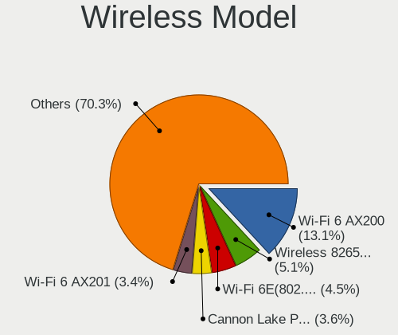

| Model                                                                   | Computers | Percent |
|-------------------------------------------------------------------------|-----------|---------|
| Intel Wi-Fi 6 AX200                                                     | 175       | 13.44%  |
| Intel Wireless 8265 / 8275                                              | 70        | 5.38%   |
| Intel Wi-Fi 6E(802.11ax) AX210/AX1675* 2x2 [Typhoon Peak]               | 55        | 4.22%   |
| Intel Cannon Lake PCH CNVi WiFi                                         | 49        | 3.76%   |
| Intel Wi-Fi 6 AX201                                                     | 40        | 3.07%   |
| Realtek RTL8822CE 802.11ac PCIe Wireless Network Adapter                | 34        | 2.61%   |
| Intel Wireless 8260                                                     | 30        | 2.3%    |
| Intel Wi-Fi 5(802.11ac) Wireless-AC 9x6x [Thunder Peak]                 | 30        | 2.3%    |
| Intel Comet Lake PCH-LP CNVi WiFi                                       | 30        | 2.3%    |
| MediaTek MT7922 802.11ax PCI Express Wireless Network Adapter           | 29        | 2.23%   |
| MediaTek MT7921 802.11ax PCI Express Wireless Network Adapter           | 29        | 2.23%   |
| Intel Wireless 7265                                                     | 29        | 2.23%   |
| Realtek RTL8821CE 802.11ac PCIe Wireless Network Adapter                | 27        | 2.07%   |
| Intel Alder Lake-P PCH CNVi WiFi                                        | 26        | 2%      |
| Intel Comet Lake PCH CNVi WiFi                                          | 25        | 1.92%   |
| Intel Wireless 7260                                                     | 24        | 1.84%   |
| Intel Cannon Point-LP CNVi [Wireless-AC]                                | 24        | 1.84%   |
| Qualcomm Atheros QCA6174 802.11ac Wireless Network Adapter              | 23        | 1.77%   |
| Intel Wireless 3165                                                     | 20        | 1.54%   |
| Intel Dual Band Wireless-AC 3168NGW [Stone Peak]                        | 19        | 1.46%   |
| Intel Centrino Advanced-N 6205 [Taylor Peak]                            | 19        | 1.46%   |
| Intel Tiger Lake PCH CNVi WiFi                                          | 18        | 1.38%   |
| Qualcomm Atheros QCA9377 802.11ac Wireless Network Adapter              | 17        | 1.31%   |
| Realtek RTL8852AE 802.11ax PCIe Wireless Network Adapter                | 16        | 1.23%   |
| Intel Raptor Lake PCH CNVi WiFi                                         | 14        | 1.08%   |
| Realtek RTL8822BE 802.11a/b/g/n/ac WiFi adapter                         | 13        | 1%      |
| Qualcomm QCNFA765 Wireless Network Adapter                              | 12        | 0.92%   |
| Qualcomm Atheros AR9285 Wireless Network Adapter (PCI-Express)          | 12        | 0.92%   |
| MediaTek MT7921K (RZ608) Wi-Fi 6E 80MHz                                 | 12        | 0.92%   |
| Broadcom BCM4360 802.11ac Dual Band Wireless Network Adapter            | 12        | 0.92%   |
| Qualcomm Atheros AR9485 Wireless Network Adapter                        | 11        | 0.84%   |
| Intel Alder Lake-S PCH CNVi WiFi                                        | 11        | 0.84%   |
| Qualcomm Atheros AR9462 Wireless Network Adapter                        | 10        | 0.77%   |
| Qualcomm Atheros AR93xx Wireless Network Adapter                        | 10        | 0.77%   |
| Intel Ice Lake-LP PCH CNVi WiFi                                         | 10        | 0.77%   |
| Realtek RTL8723BE PCIe Wireless Network Adapter                         | 9         | 0.69%   |
| Broadcom BCM4313 802.11bgn Wireless Network Adapter                     | 9         | 0.69%   |
| Qualcomm Atheros AR9271 802.11n                                         | 8         | 0.61%   |
| Qualcomm Atheros AR242x / AR542x Wireless Network Adapter (PCI-Express) | 8         | 0.61%   |
| Intel Centrino Advanced-N 6235                                          | 8         | 0.61%   |

Ethernet Vendor
---------------

Ethernet vendors

| Vendor                           | Computers | Percent |
|----------------------------------|-----------|---------|
| Realtek Semiconductor            | 807       | 47.84%  |
| Intel                            | 612       | 36.28%  |
| Qualcomm Atheros                 | 50        | 2.96%   |
| Broadcom                         | 44        | 2.61%   |
| ASIX Electronics                 | 26        | 1.54%   |
| Aquantia                         | 21        | 1.24%   |
| Nvidia                           | 20        | 1.19%   |
| Marvell Technology Group         | 20        | 1.19%   |
| Lenovo                           | 15        | 0.89%   |
| Apple                            | 10        | 0.59%   |
| Xiaomi                           | 8         | 0.47%   |
| Samsung Electronics              | 5         | 0.3%    |
| Microchip Technology             | 4         | 0.24%   |
| Broadcom Limited                 | 4         | 0.24%   |
| TP-Link                          | 3         | 0.18%   |
| Standard Microsystems            | 3         | 0.18%   |
| ICS Advent                       | 3         | 0.18%   |
| Google                           | 3         | 0.18%   |
| ZTE WCDMA Technologies MSM       | 2         | 0.12%   |
| Silicon Integrated Systems [SiS] | 2         | 0.12%   |
| QLogic                           | 2         | 0.12%   |
| MediaTek                         | 2         | 0.12%   |
| Loongson Technology              | 2         | 0.12%   |
| Huawei Technologies              | 2         | 0.12%   |
| DisplayLink                      | 2         | 0.12%   |
| D-Link System                    | 2         | 0.12%   |
| American Megatrends              | 2         | 0.12%   |
| 3Com                             | 2         | 0.12%   |
| NetXen Incorporated              | 1         | 0.06%   |
| Mellanox Technologies            | 1         | 0.06%   |
| JMicron Technology               | 1         | 0.06%   |
| Insyde Software                  | 1         | 0.06%   |
| HMD Global                       | 1         | 0.06%   |
| Hewlett-Packard                  | 1         | 0.06%   |
| Gemtek                           | 1         | 0.06%   |
| Emulex                           | 1         | 0.06%   |
| Davicom Semiconductor            | 1         | 0.06%   |

Ethernet Model
--------------

Ethernet models

| Model                                                                          | Computers | Percent |
|--------------------------------------------------------------------------------|-----------|---------|
| Realtek RTL8111/8168/8211/8411 PCI Express Gigabit Ethernet Controller         | 591       | 33.33%  |
| Intel I211 Gigabit Network Connection                                          | 128       | 7.22%   |
| Realtek RTL8125 2.5GbE Controller                                              | 112       | 6.32%   |
| Realtek RTL8153 Gigabit Ethernet Adapter                                       | 66        | 3.72%   |
| Intel Ethernet Controller I225-V                                               | 50        | 2.82%   |
| Intel I210 Gigabit Network Connection                                          | 40        | 2.26%   |
| Intel 82579LM Gigabit Network Connection (Lewisville)                          | 39        | 2.2%    |
| Intel Ethernet Connection (2) I219-V                                           | 33        | 1.86%   |
| Intel Ethernet Connection (7) I219-V                                           | 31        | 1.75%   |
| Realtek RTL810xE PCI Express Fast Ethernet controller                          | 28        | 1.58%   |
| Intel 82574L Gigabit Network Connection                                        | 26        | 1.47%   |
| Intel Ethernet Connection (4) I219-LM                                          | 25        | 1.41%   |
| Intel Ethernet Connection (2) I219-LM                                          | 24        | 1.35%   |
| Intel I350 Gigabit Network Connection                                          | 17        | 0.96%   |
| Intel Ethernet Connection I217-LM                                              | 14        | 0.79%   |
| Intel Ethernet Connection (2) I218-V                                           | 14        | 0.79%   |
| Qualcomm Atheros Killer E2400 Gigabit Ethernet Controller                      | 13        | 0.73%   |
| Intel Ethernet Connection (4) I219-V                                           | 13        | 0.73%   |
| ASIX AX88179 Gigabit Ethernet                                                  | 13        | 0.73%   |
| Intel Ethernet Connection (7) I219-LM                                          | 11        | 0.62%   |
| Intel Ethernet Connection (6) I219-V                                           | 11        | 0.62%   |
| Intel 82599ES 10-Gigabit SFI/SFP+ Network Connection                           | 11        | 0.62%   |
| Intel 82579V Gigabit Network Connection                                        | 11        | 0.62%   |
| Realtek Killer E3000 2.5GbE Controller                                         | 9         | 0.51%   |
| Aquantia AQtion AQC107 NBase-T/IEEE 802.3an Ethernet Controller [Atlantic 10G] | 9         | 0.51%   |
| Qualcomm Atheros AR8151 v2.0 Gigabit Ethernet                                  | 8         | 0.45%   |
| Intel Ethernet Connection (5) I219-LM                                          | 8         | 0.45%   |
| Xiaomi Mi/Redmi series (RNDIS)                                                 | 7         | 0.39%   |
| Realtek RTL-8100/8101L/8139 PCI Fast Ethernet Adapter                          | 7         | 0.39%   |
| Qualcomm Atheros Killer E2500 Gigabit Ethernet Controller                      | 7         | 0.39%   |
| Qualcomm Atheros Killer E220x Gigabit Ethernet Controller                      | 7         | 0.39%   |
| Nvidia MCP77 Ethernet                                                          | 7         | 0.39%   |
| Marvell Group 88E8056 PCI-E Gigabit Ethernet Controller                        | 7         | 0.39%   |
| Intel Ethernet Connection I219-LM                                              | 7         | 0.39%   |
| Intel Ethernet Connection I218-LM                                              | 7         | 0.39%   |
| Intel Ethernet Connection (14) I219-V                                          | 7         | 0.39%   |
| Intel 82577LM Gigabit Network Connection                                       | 7         | 0.39%   |
| Intel 82571EB/82571GB Gigabit Ethernet Controller D0/D1 (copper applications)  | 7         | 0.39%   |
| Broadcom NetXtreme BCM57765 Gigabit Ethernet PCIe                              | 7         | 0.39%   |
| Realtek USB 10/100/1G/2.5G LAN                                                 | 6         | 0.34%   |

Net Controller Kind
-------------------

Ethernet, WiFi or modem

| Kind     | Computers | Percent |
|----------|-----------|---------|
| Ethernet | 1530      | 54.49%  |
| WiFi     | 1229      | 43.77%  |
| Modem    | 47        | 1.67%   |
| Unknown  | 2         | 0.07%   |

Used Controller
---------------

Currently used network controller

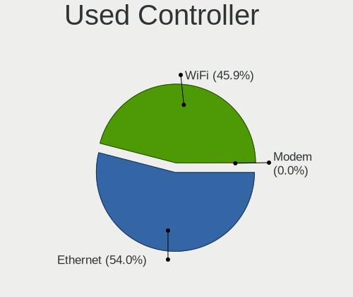

| Kind     | Computers | Percent |
|----------|-----------|---------|
| Ethernet | 991       | 53.65%  |
| WiFi     | 856       | 46.35%  |

NICs
----

Total network controllers on board

| Total | Computers | Percent |
|-------|-----------|---------|
| 2     | 900       | 50.17%  |
| 1     | 704       | 39.24%  |
| 3     | 100       | 5.57%   |
| 0     | 38        | 2.12%   |
| 4     | 30        | 1.67%   |
| 5     | 9         | 0.5%    |
| 6     | 7         | 0.39%   |
| 8     | 2         | 0.11%   |
| 7     | 2         | 0.11%   |
| 12    | 1         | 0.06%   |
| 9     | 1         | 0.06%   |

IPv6
----

IPv6 vs IPv4

| Used | Computers | Percent |
|------|-----------|---------|
| No   | 1466      | 79.93%  |
| Yes  | 368       | 20.07%  |

Bluetooth
---------

Bluetooth Vendor
----------------

Controller vendors

| Vendor                          | Computers | Percent |
|---------------------------------|-----------|---------|
| Intel                           | 700       | 60.14%  |
| Realtek Semiconductor           | 96        | 8.25%   |
| Cambridge Silicon Radio         | 66        | 5.67%   |
| IMC Networks                    | 40        | 3.44%   |
| Foxconn / Hon Hai               | 37        | 3.18%   |
| Apple                           | 37        | 3.18%   |
| Broadcom                        | 31        | 2.66%   |
| Qualcomm Atheros Communications | 26        | 2.23%   |
| MediaTek                        | 26        | 2.23%   |
| Lite-On Technology              | 26        | 2.23%   |
| ASUSTek Computer                | 22        | 1.89%   |
| USI                             | 9         | 0.77%   |
| Dell                            | 9         | 0.77%   |
| Realtek                         | 8         | 0.69%   |
| Toshiba                         | 5         | 0.43%   |
| Hewlett-Packard                 | 5         | 0.43%   |
| HTC (High Tech Computer)        | 4         | 0.34%   |
| Foxconn International           | 3         | 0.26%   |
| Belkin Components               | 3         | 0.26%   |
| Edimax Technology               | 2         | 0.17%   |
| TP-Link                         | 1         | 0.09%   |
| Ralink Technology               | 1         | 0.09%   |
| Opticis                         | 1         | 0.09%   |
| Dynex                           | 1         | 0.09%   |
| Chicony Electronics             | 1         | 0.09%   |
| Askey Computer                  | 1         | 0.09%   |
| Alps Electric                   | 1         | 0.09%   |
| Actiontec Electronics           | 1         | 0.09%   |
| Actions                         | 1         | 0.09%   |

Bluetooth Model
---------------

Controller models

| Model                                                                | Computers | Percent |
|----------------------------------------------------------------------|-----------|---------|
| Intel AX200 Bluetooth                                                | 173       | 14.84%  |
| Intel AX201 Bluetooth                                                | 118       | 10.12%  |
| Intel Bluetooth Device                                               | 91        | 7.8%    |
| Intel Bluetooth 9460/9560 Jefferson Peak (JfP)                       | 90        | 7.72%   |
| Intel Bluetooth wireless interface                                   | 82        | 7.03%   |
| Cambridge Silicon Radio Bluetooth Dongle (HCI mode)                  | 66        | 5.66%   |
| Realtek Bluetooth Radio                                              | 59        | 5.06%   |
| Intel AX210 Bluetooth                                                | 50        | 4.29%   |
| Intel AX211 Bluetooth                                                | 39        | 3.34%   |
| Intel Wireless-AC 9260 Bluetooth Adapter                             | 31        | 2.66%   |
| MediaTek Wireless_Device                                             | 26        | 2.23%   |
| Apple Bluetooth Host Controller                                      | 21        | 1.8%    |
| IMC Networks Wireless_Device                                         | 18        | 1.54%   |
| Intel Wireless-AC 3168 Bluetooth                                     | 17        | 1.46%   |
| Realtek  Bluetooth 4.2 Adapter                                       | 14        | 1.2%    |
| IMC Networks Bluetooth Radio                                         | 14        | 1.2%    |
| Foxconn / Hon Hai Wireless_Device                                    | 14        | 1.2%    |
| Realtek 802.11ac WLAN Adapter                                        | 12        | 1.03%   |
| Intel Centrino Bluetooth Wireless Transceiver                        | 10        | 0.86%   |
| USI Bluetooth Device                                                 | 9         | 0.77%   |
| Lite-On Bluetooth Device                                             | 9         | 0.77%   |
| Foxconn / Hon Hai MediaTek Bluetooth Adapter                         | 9         | 0.77%   |
| ASUS Broadcom BCM20702A0 Bluetooth                                   | 9         | 0.77%   |
| Realtek Bluetooth Radio                                              | 8         | 0.69%   |
| Foxconn / Hon Hai Bluetooth Device                                   | 8         | 0.69%   |
| Qualcomm Atheros  Bluetooth Device                                   | 7         | 0.6%    |
| Qualcomm Atheros QCA61x4 Bluetooth 4.0                               | 7         | 0.6%    |
| Lite-On Atheros AR3012 Bluetooth                                     | 7         | 0.6%    |
| Broadcom BCM20702A0 Bluetooth 4.0                                    | 7         | 0.6%    |
| Realtek RTL8723B Bluetooth                                           | 6         | 0.51%   |
| IMC Networks Bluetooth Device                                        | 6         | 0.51%   |
| Apple Built-in Bluetooth 2.0+EDR HCI                                 | 6         | 0.51%   |
| Realtek RTL8822BE Bluetooth 4.2 Adapter                              | 5         | 0.43%   |
| Lite-On Qualcomm Atheros QCA9377 Bluetooth                           | 5         | 0.43%   |
| Qualcomm Atheros AR3012 Bluetooth 4.0                                | 4         | 0.34%   |
| Lite-On Wireless_Device                                              | 4         | 0.34%   |
| HTC (High Tech Computer) Vive Hub Bluetooth 4.1 (Broadcom BCM920703) | 4         | 0.34%   |
| Dell DW375 Bluetooth Module                                          | 4         | 0.34%   |
| Broadcom HP Portable SoftSailing                                     | 4         | 0.34%   |
| Broadcom BCM20702 Bluetooth 4.0 [ThinkPad]                           | 4         | 0.34%   |

Sound
-----

Sound Vendor
------------

Sound card vendors

| Vendor                               | Computers | Percent |
|--------------------------------------|-----------|---------|
| Intel                                | 964       | 34.89%  |
| AMD                                  | 732       | 26.49%  |
| Nvidia                               | 536       | 19.4%   |
| C-Media Electronics                  | 70        | 2.53%   |
| Logitech                             | 36        | 1.3%    |
| Creative Labs                        | 26        | 0.94%   |
| ASUSTek Computer                     | 25        | 0.9%    |
| SteelSeries ApS                      | 23        | 0.83%   |
| Lenovo                               | 19        | 0.69%   |
| Realtek Semiconductor                | 18        | 0.65%   |
| Texas Instruments                    | 17        | 0.62%   |
| Creative Technology                  | 17        | 0.62%   |
| Razer USA                            | 15        | 0.54%   |
| Kingston Technology                  | 14        | 0.51%   |
| Plantronics                          | 12        | 0.43%   |
| JMTek                                | 12        | 0.43%   |
| Focusrite-Novation                   | 10        | 0.36%   |
| GN Netcom                            | 9         | 0.33%   |
| Generalplus Technology               | 9         | 0.33%   |
| Thesycon Systemsoftware & Consulting | 8         | 0.29%   |
| Micro Star International             | 8         | 0.29%   |
| GYROCOM C&C                          | 8         | 0.29%   |
| Blue Microphones                     | 8         | 0.29%   |
| DSEA A/S                             | 7         | 0.25%   |
| AudioQuest                           | 7         | 0.25%   |
| Corsair                              | 6         | 0.22%   |
| BEHRINGER International              | 6         | 0.22%   |
| Sony                                 | 5         | 0.18%   |
| Samson Technologies                  | 5         | 0.18%   |
| RODE Microphones                     | 5         | 0.18%   |
| Hewlett-Packard                      | 5         | 0.18%   |
| Dell                                 | 5         | 0.18%   |
| Audient                              | 5         | 0.18%   |
| Solid State Logic                    | 4         | 0.14%   |
| SAVITECH                             | 4         | 0.14%   |
| No brand                             | 4         | 0.14%   |
| Yamaha                               | 3         | 0.11%   |
| Trust                                | 3         | 0.11%   |
| Silicon Integrated Systems [SiS]     | 3         | 0.11%   |
| Microsoft                            | 3         | 0.11%   |

Sound Model
-----------

Sound card models

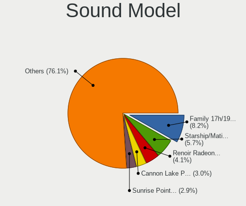

| Model                                                                      | Computers | Percent |
|----------------------------------------------------------------------------|-----------|---------|
| AMD Family 17h/19h HD Audio Controller                                     | 261       | 7.74%   |
| AMD Starship/Matisse HD Audio Controller                                   | 195       | 5.79%   |
| AMD Renoir Radeon High Definition Audio Controller                         | 141       | 4.18%   |
| Intel Cannon Lake PCH cAVS                                                 | 107       | 3.18%   |
| Intel Sunrise Point-LP HD Audio                                            | 104       | 3.09%   |
| AMD Ellesmere HDMI Audio [Radeon RX 470/480 / 570/580/590]                 | 100       | 2.97%   |
| AMD Navi 21/23 HDMI/DP Audio Controller                                    | 78        | 2.31%   |
| AMD Family 17h (Models 00h-0fh) HD Audio Controller                        | 77        | 2.28%   |
| Intel 100 Series/C230 Series Chipset Family HD Audio Controller            | 60        | 1.78%   |
| AMD Rembrandt Radeon High Definition Audio Controller                      | 60        | 1.78%   |
| Intel 7 Series/C216 Chipset Family High Definition Audio Controller        | 55        | 1.63%   |
| AMD Navi 10 HDMI Audio                                                     | 53        | 1.57%   |
| Intel Tiger Lake-LP Smart Sound Technology Audio Controller                | 52        | 1.54%   |
| AMD Raven/Raven2/Fenghuang HDMI/DP Audio Controller                        | 49        | 1.45%   |
| Intel 8 Series/C220 Series Chipset High Definition Audio Controller        | 47        | 1.39%   |
| Intel 6 Series/C200 Series Chipset Family High Definition Audio Controller | 47        | 1.39%   |
| AMD SBx00 Azalia (Intel HDA)                                               | 40        | 1.19%   |
| Nvidia GP107GL High Definition Audio Controller                            | 38        | 1.13%   |
| Nvidia GA104 High Definition Audio Controller                              | 38        | 1.13%   |
| Nvidia TU106 High Definition Audio Controller                              | 37        | 1.1%    |
| Nvidia TU107 GeForce GTX 1650 High Definition Audio Controller             | 36        | 1.07%   |
| Intel Tiger Lake-H HD Audio Controller                                     | 36        | 1.07%   |
| Nvidia GP106 High Definition Audio Controller                              | 35        | 1.04%   |
| Nvidia GP104 High Definition Audio Controller                              | 34        | 1.01%   |
| Intel Comet Lake PCH cAVS                                                  | 33        | 0.98%   |
| Nvidia GA106 High Definition Audio Controller                              | 32        | 0.95%   |
| Intel Comet Lake PCH-LP cAVS                                               | 32        | 0.95%   |
| Intel Cannon Point-LP High Definition Audio Controller                     | 32        | 0.95%   |
| Nvidia TU116 High Definition Audio Controller                              | 31        | 0.92%   |
| Nvidia TU104 HD Audio Controller                                           | 30        | 0.89%   |
| Intel Xeon E3-1200 v3/4th Gen Core Processor HD Audio Controller           | 30        | 0.89%   |
| Intel Alder Lake PCH-P High Definition Audio Controller                    | 29        | 0.86%   |
| Intel 200 Series PCH HD Audio                                              | 26        | 0.77%   |
| Intel NM10/ICH7 Family High Definition Audio Controller                    | 25        | 0.74%   |
| Intel CM238 HD Audio Controller                                            | 25        | 0.74%   |
| Nvidia Audio device                                                        | 24        | 0.71%   |
| Nvidia GA102 High Definition Audio Controller                              | 22        | 0.65%   |
| Intel Haswell-ULT HD Audio Controller                                      | 22        | 0.65%   |
| Intel 8 Series HD Audio Controller                                         | 22        | 0.65%   |
| AMD Vega 10 HDMI Audio [Radeon Vega 56/64]                                 | 22        | 0.65%   |

Memory
------

Memory Vendor
-------------

Memory module vendors

| Vendor                       | Computers | Percent |
|------------------------------|-----------|---------|
| Samsung Electronics          | 371       | 19.84%  |
| SK hynix                     | 248       | 13.26%  |
| Kingston                     | 248       | 13.26%  |
| Micron Technology            | 181       | 9.68%   |
| Corsair                      | 176       | 9.41%   |
| G.Skill                      | 153       | 8.18%   |
| Crucial                      | 147       | 7.86%   |
| Unknown                      | 138       | 7.38%   |
| A-DATA Technology            | 24        | 1.28%   |
| Team                         | 21        | 1.12%   |
| Ramaxel Technology           | 21        | 1.12%   |
| Unknown                      | 21        | 1.12%   |
| Patriot                      | 17        | 0.91%   |
| Elpida                       | 15        | 0.8%    |
| Transcend                    | 11        | 0.59%   |
| Nanya Technology             | 10        | 0.53%   |
| GOODRAM                      | 8         | 0.43%   |
| Unknown (ABCD)               | 5         | 0.27%   |
| AMD                          | 5         | 0.27%   |
| Timetec                      | 3         | 0.16%   |
| Avant                        | 3         | 0.16%   |
| Apacer                       | 3         | 0.16%   |
| Toshiba                      | 2         | 0.11%   |
| Patriot Memory (PDP Systems) | 2         | 0.11%   |
| Kllisre                      | 2         | 0.11%   |
| KLEVV                        | 2         | 0.11%   |
| Kimtigo                      | 2         | 0.11%   |
| Chun Well                    | 2         | 0.11%   |
| Unknown (0x5D00000000000000) | 1         | 0.05%   |
| Unknown (0x0B92)             | 1         | 0.05%   |
| Thermaltake                  | 1         | 0.05%   |
| Teikon                       | 1         | 0.05%   |
| T-FORCE                      | 1         | 0.05%   |
| SGS/Thomson                  | 1         | 0.05%   |
| Saikano                      | 1         | 0.05%   |
| Qumo                         | 1         | 0.05%   |
| Qimonda                      | 1         | 0.05%   |
| PUSKILL                      | 1         | 0.05%   |
| PNY                          | 1         | 0.05%   |
| Patriot Memory               | 1         | 0.05%   |

Memory Model
------------

Memory module models

| Model                                                       | Computers | Percent |
|-------------------------------------------------------------|-----------|---------|
| Unknown                                                     | 21        | 1.05%   |
| Samsung RAM M471A5244CB0-CTD 4GB SODIMM DDR4 3266MT/s       | 15        | 0.75%   |
| Samsung RAM M471A1G44AB0-CWE 8192MB SODIMM DDR4 3200MT/s    | 15        | 0.75%   |
| SK hynix RAM HMA81GS6AFR8N-UH 8GB SODIMM DDR4 2667MT/s      | 14        | 0.7%    |
| Corsair RAM CMK32GX4M2B3200C16 16GB DIMM DDR4 3800MT/s      | 14        | 0.7%    |
| Corsair RAM CMK16GX4M2B3200C16 8GB DIMM DDR4 3600MT/s       | 14        | 0.7%    |
| Samsung RAM M471A1K43BB1-CRC 8192MB SODIMM DDR4 2667MT/s    | 13        | 0.65%   |
| SK hynix RAM HMAA1GS6CJR6N-XN 8GB SODIMM DDR4 3200MT/s      | 12        | 0.6%    |
| Samsung RAM M471A1K43DB1-CWE 8GB SODIMM DDR4 3200MT/s       | 12        | 0.6%    |
| Micron RAM 8ATF1G64HZ-3G2J1 8GB SODIMM DDR4 3200MT/s        | 12        | 0.6%    |
| G.Skill RAM F4-3200C16-16GVK 16GB DIMM DDR4 3600MT/s        | 12        | 0.6%    |
| Samsung RAM M471A2K43DB1-CWE 16GB SODIMM DDR4 3200MT/s      | 11        | 0.55%   |
| Samsung RAM M471B5173DB0-YK0 4GB SODIMM DDR3 1600MT/s       | 10        | 0.5%    |
| Kingston RAM KHX3200C16D4/16GX 16GB DIMM DDR4 3600MT/s      | 10        | 0.5%    |
| Samsung RAM M471A2K43DB1-CTD 16GB SODIMM DDR4 2667MT/s      | 9         | 0.45%   |
| Samsung RAM M471A2K43CB1-CTD 16GB SODIMM DDR4 8400MT/s      | 9         | 0.45%   |
| Samsung RAM M471A1K43EB1-CWE 8GB SODIMM DDR4 3200MT/s       | 9         | 0.45%   |
| Samsung RAM M471A1K43CB1-CTD 8GB SODIMM DDR4 2667MT/s       | 9         | 0.45%   |
| Samsung RAM M471A1G44AB0-CWE 8GB Row Of Chips DDR4 3200MT/s | 9         | 0.45%   |
| Micron RAM 8ATF1G64HZ-2G6E1 8GB SODIMM DDR4 2667MT/s        | 9         | 0.45%   |
| Unknown RAM Module 1GB SODIMM DDR                           | 8         | 0.4%    |
| SK hynix RAM HMA41GS6AFR8N-TF 8GB SODIMM DDR4 2667MT/s      | 8         | 0.4%    |
| Samsung RAM M471B1G73DB0-YK0 8GB SODIMM DDR3 1600MT/s       | 8         | 0.4%    |
| Samsung RAM M471A2G44AM0-CWE 16GB SODIMM DDR4 3200MT/s      | 8         | 0.4%    |
| Kingston RAM KHX2666C16/8G 8GB DIMM DDR4 3466MT/s           | 8         | 0.4%    |
| Kingston RAM KHX1866C10D3/8G 8GB DIMM DDR3 2133MT/s         | 8         | 0.4%    |
| G.Skill RAM F5-6000J3636F16G 16GB DIMM DDR5 6400MT/s        | 8         | 0.4%    |
| G.Skill RAM F4-3600C16-16GTZNC 16GB DIMM DDR4 3866MT/s      | 8         | 0.4%    |
| G.Skill RAM F4-3200C16-8GVKB 8GB DIMM DDR4 3866MT/s         | 8         | 0.4%    |
| Corsair RAM CMK16GX4M2B3000C15 8GB DIMM DDR4 3600MT/s       | 8         | 0.4%    |
| SK hynix RAM HMA82GS6AFR8N-UH 16GB SODIMM DDR4 2667MT/s     | 7         | 0.35%   |
| Samsung RAM M471A5244CB0-CWE 4GB SODIMM DDR4 3200MT/s       | 7         | 0.35%   |
| Micron RAM 4ATS2G64HZ-3G2B1 16GB SODIMM DDR4 3200MT/s       | 7         | 0.35%   |
| Micron RAM 4ATF1G64HZ-3G2E1 8GB SODIMM DDR4 3200MT/s        | 7         | 0.35%   |
| Kingston RAM KF3200C16D4/16GX 16GB DIMM DDR4 3200MT/s       | 7         | 0.35%   |
| Corsair RAM CMK64GX4M2E3200C16 32GB DIMM DDR4 3600MT/s      | 7         | 0.35%   |
| Team RAM TEAMGROUP-UD4-3200 16GB DIMM DDR4 3733MT/s         | 6         | 0.3%    |
| SK hynix RAM HMA81GS6JJR8N-VK 8GB SODIMM DDR4 2667MT/s      | 6         | 0.3%    |
| SK hynix RAM HMA81GS6DJR8N-XN 8GB SODIMM DDR4 3200MT/s      | 6         | 0.3%    |
| Samsung RAM M471A1K43DB1-CTD 8GB SODIMM DDR4 2667MT/s       | 6         | 0.3%    |

Memory Kind
-----------

Memory module kinds

| Kind    | Computers | Percent |
|---------|-----------|---------|
| DDR4    | 1019      | 61.27%  |
| DDR3    | 332       | 19.96%  |
| DDR5    | 77        | 4.63%   |
| DDR2    | 53        | 3.19%   |
| LPDDR4  | 50        | 3.01%   |
| Unknown | 34        | 2.04%   |
| LPDDR5  | 30        | 1.8%    |
| LPDDR3  | 28        | 1.68%   |
| SDRAM   | 20        | 1.2%    |
| DDR     | 16        | 0.96%   |
| DRAM    | 4         | 0.24%   |

Memory Form Factor
------------------

Physical design of the memory module

| Name         | Computers | Percent |
|--------------|-----------|---------|
| SODIMM       | 778       | 46.75%  |
| DIMM         | 772       | 46.39%  |
| Row Of Chips | 104       | 6.25%   |
| Chip         | 6         | 0.36%   |
| Unknown      | 3         | 0.18%   |
| RIMM         | 1         | 0.06%   |

Memory Size
-----------

Memory module size

| Size  | Computers | Percent |
|-------|-----------|---------|
| 8192  | 704       | 39.15%  |
| 16384 | 489       | 27.2%   |
| 4096  | 282       | 15.68%  |
| 32768 | 161       | 8.95%   |
| 2048  | 109       | 6.06%   |
| 1024  | 39        | 2.17%   |
| 512   | 8         | 0.44%   |
| 256   | 5         | 0.28%   |
| 49152 | 1         | 0.06%   |

Memory Speed
------------

Memory module speed

| Speed   | Computers | Percent |
|---------|-----------|---------|
| 3200    | 355       | 19.66%  |
| 2667    | 250       | 13.84%  |
| 1600    | 205       | 11.35%  |
| 2400    | 113       | 6.26%   |
| 3600    | 104       | 5.76%   |
| 2133    | 87        | 4.82%   |
| 1333    | 75        | 4.15%   |
| 4800    | 40        | 2.21%   |
| 6400    | 38        | 2.1%    |
| 3733    | 37        | 2.05%   |
| 667     | 35        | 1.94%   |
| 800     | 31        | 1.72%   |
| 4267    | 30        | 1.66%   |
| 3800    | 30        | 1.66%   |
| 3000    | 29        | 1.61%   |
| Unknown | 29        | 1.61%   |
| 2933    | 22        | 1.22%   |
| 1867    | 22        | 1.22%   |
| 3866    | 19        | 1.05%   |
| 2666    | 18        | 1%      |
| 1866    | 18        | 1%      |
| 1334    | 18        | 1%      |
| 5600    | 17        | 0.94%   |
| 3400    | 15        | 0.83%   |
| 3266    | 15        | 0.83%   |
| 3466    | 12        | 0.66%   |
| 8400    | 11        | 0.61%   |
| 4000    | 10        | 0.55%   |
| 1066    | 10        | 0.55%   |
| 1067    | 9         | 0.5%    |
| 3666    | 8         | 0.44%   |
| 3534    | 8         | 0.44%   |
| 6000    | 7         | 0.39%   |
| 2800    | 6         | 0.33%   |
| 2048    | 6         | 0.33%   |
| 400     | 6         | 0.33%   |
| 4266    | 5         | 0.28%   |
| 3333    | 5         | 0.28%   |
| 3066    | 5         | 0.28%   |
| 5200    | 4         | 0.22%   |

Printers & scanners
-------------------

Printer Vendor
--------------

Printer device vendors

| Vendor                | Computers | Percent |
|-----------------------|-----------|---------|
| Hewlett-Packard       | 13        | 37.14%  |
| Brother Industries    | 5         | 14.29%  |
| Seiko Epson           | 4         | 11.43%  |
| Samsung Electronics   | 4         | 11.43%  |
| Canon                 | 4         | 11.43%  |
| Xiaomi                | 1         | 2.86%   |
| Prolific Technology   | 1         | 2.86%   |
| NXP Semiconductors    | 1         | 2.86%   |
| Lexmark International | 1         | 2.86%   |
| Konica Minolta        | 1         | 2.86%   |

Printer Model
-------------

Printer device models

| Model                                 | Computers | Percent |
|---------------------------------------|-----------|---------|
| HP HP LaserJet M14-M17                | 2         | 5.71%   |
| Canon LiDE 400                        | 2         | 5.71%   |
| Xiaomi MiMouse 2                      | 1         | 2.86%   |
| Seiko Epson XP-4200 Series            | 1         | 2.86%   |
| Seiko Epson WF-3520 Series            | 1         | 2.86%   |
| Seiko Epson WF-2510 Series            | 1         | 2.86%   |
| Seiko Epson AL-M310DN                 | 1         | 2.86%   |
| Samsung ML-191x/ML-252x Laser Printer | 1         | 2.86%   |
| Samsung ML-1630 Series                | 1         | 2.86%   |
| Samsung CLP-325 Color Laser Printer   | 1         | 2.86%   |
| Samsung C460 Series                   | 1         | 2.86%   |
| Prolific PL2305 Parallel Port         | 1         | 2.86%   |
| NXP Semiconductors Printer-80         | 1         | 2.86%   |
| Lexmark International Lexmark E352dn  | 1         | 2.86%   |
| Konica Minolta magicolor 1680MF scan  | 1         | 2.86%   |
| HP PhotoSmart 130                     | 1         | 2.86%   |
| HP LaserJet P2055 series              | 1         | 2.86%   |
| HP LaserJet 3200                      | 1         | 2.86%   |
| HP LaserJet 1020                      | 1         | 2.86%   |
| HP LaserJet 1018                      | 1         | 2.86%   |
| HP LaserJet 1010                      | 1         | 2.86%   |
| HP Deskjet D1500 series               | 1         | 2.86%   |
| HP Deskjet 9800                       | 1         | 2.86%   |
| HP DeskJet 5440                       | 1         | 2.86%   |
| HP DeskJet 3630 series                | 1         | 2.86%   |
| HP Deskjet 2050 J510                  | 1         | 2.86%   |
| Canon PIXMA MG2900 Series             | 1         | 2.86%   |
| Canon LiDE 300                        | 1         | 2.86%   |
| Brother QL-500 label printer          | 1         | 2.86%   |
| Brother MFC-L2700DW                   | 1         | 2.86%   |
| Brother MFC-9340CDW                   | 1         | 2.86%   |
| Brother MFC-9130CW                    | 1         | 2.86%   |
| Brother HL-L2370DW series             | 1         | 2.86%   |

Scanner Vendor
--------------

Scanner device vendors

| Vendor          | Computers | Percent |
|-----------------|-----------|---------|
| Canon           | 5         | 71.43%  |
| Mustek Systems  | 1         | 14.29%  |
| AGFA-Gevaert NV | 1         | 14.29%  |

Scanner Model
-------------

Scanner device models

| Model                              | Computers | Percent |
|------------------------------------|-----------|---------|
| Canon CanoScan N1240U/LiDE 30      | 2         | 28.57%  |
| Mustek Systems BearPaw 2448 TA Pro | 1         | 14.29%  |
| Canon CanoScan LiDE 600F           | 1         | 14.29%  |
| Canon CanoScan LiDE 220            | 1         | 14.29%  |
| Canon CanoScan LiDE 110            | 1         | 14.29%  |
| AGFA-Gevaert NV SnapScan e20       | 1         | 14.29%  |

Camera
------

Camera Vendor
-------------

Camera device vendors

| Vendor                                 | Computers | Percent |
|----------------------------------------|-----------|---------|
| Chicony Electronics                    | 197       | 20.12%  |
| Logitech                               | 122       | 12.46%  |
| IMC Networks                           | 108       | 11.03%  |
| Microdia                               | 86        | 8.78%   |
| Realtek Semiconductor                  | 64        | 6.54%   |
| Sunplus Innovation Technology          | 48        | 4.9%    |
| Bison Electronics                      | 47        | 4.8%    |
| Quanta                                 | 45        | 4.6%    |
| Cheng Uei Precision Industry (Foxlink) | 28        | 2.86%   |
| Lite-On Technology                     | 26        | 2.66%   |
| Luxvisions Innotech Limited            | 25        | 2.55%   |
| Apple                                  | 20        | 2.04%   |
| Syntek                                 | 19        | 1.94%   |
| Acer                                   | 16        | 1.63%   |
| Samsung Electronics                    | 15        | 1.53%   |
| Z-Star Microelectronics                | 8         | 0.82%   |
| Sonix Technology                       | 7         | 0.72%   |
| Microsoft                              | 7         | 0.72%   |
| MacroSilicon                           | 7         | 0.72%   |
| Creative Technology                    | 5         | 0.51%   |
| Suyin                                  | 4         | 0.41%   |
| Generalplus Technology                 | 4         | 0.41%   |
| DigiTech                               | 4         | 0.41%   |
| ARC International                      | 4         | 0.41%   |
| Silicon Motion                         | 3         | 0.31%   |
| Elgato Systems                         | 3         | 0.31%   |
| AVerMedia Technologies                 | 3         | 0.31%   |
| Valve Software                         | 2         | 0.2%    |
| SunplusIT                              | 2         | 0.2%    |
| Shenzhen Kingcome Optoelectronic       | 2         | 0.2%    |
| Ricoh                                  | 2         | 0.2%    |
| Razer USA                              | 2         | 0.2%    |
| LG Electronics                         | 2         | 0.2%    |
| Lenovo                                 | 2         | 0.2%    |
| KYE Systems (Mouse Systems)            | 2         | 0.2%    |
| kingcome                               | 2         | 0.2%    |
| icSpring                               | 2         | 0.2%    |
| Google                                 | 2         | 0.2%    |
| Genesys Logic                          | 2         | 0.2%    |
| Cubeternet                             | 2         | 0.2%    |

Camera Model
------------

Camera device models

| Model                                                | Computers | Percent |
|------------------------------------------------------|-----------|---------|
| Chicony Integrated Camera                            | 70        | 7.04%   |
| Microdia Integrated_Webcam_HD                        | 44        | 4.42%   |
| IMC Networks Integrated Camera                       | 44        | 4.42%   |
| IMC Networks USB2.0 HD UVC WebCam                    | 30        | 3.02%   |
| Logitech HD Pro Webcam C920                          | 29        | 2.91%   |
| Logitech Webcam C270                                 | 24        | 2.41%   |
| Realtek Integrated_Webcam_HD                         | 23        | 2.31%   |
| Bison Integrated Camera                              | 22        | 2.21%   |
| Chicony HD WebCam                                    | 18        | 1.81%   |
| Samsung Galaxy series, misc. (MTP mode)              | 15        | 1.51%   |
| Syntek Integrated Camera                             | 14        | 1.41%   |
| Sunplus Integrated_Webcam_HD                         | 13        | 1.31%   |
| Logitech C922 Pro Stream Webcam                      | 12        | 1.21%   |
| Chicony HP HD Camera                                 | 12        | 1.21%   |
| Microdia USB 2.0 Camera                              | 11        | 1.11%   |
| Lite-On Integrated Camera                            | 10        | 1.01%   |
| Quanta HD User Facing                                | 9         | 0.9%    |
| Chicony USB2.0 Camera                                | 9         | 0.9%    |
| Logitech Webcam C310                                 | 8         | 0.8%    |
| Logitech BRIO Ultra HD Webcam                        | 8         | 0.8%    |
| Quanta HP Wide Vision HD Camera                      | 7         | 0.7%    |
| Chicony Integrated IR Camera                         | 7         | 0.7%    |
| Chicony Integrated Camera (1280x720@30)              | 7         | 0.7%    |
| Chicony HD User Facing                               | 7         | 0.7%    |
| Acer Integrated Camera                               | 7         | 0.7%    |
| Sunplus HD WebCam                                    | 6         | 0.6%    |
| Realtek Laptop Camera                                | 6         | 0.6%    |
| Realtek Integrated Webcam HD                         | 6         | 0.6%    |
| Lite-On HP HD Camera                                 | 6         | 0.6%    |
| Chicony Lenovo EasyCamera                            | 6         | 0.6%    |
| Bison SunplusIT Integrated Camera                    | 6         | 0.6%    |
| Bison HD Webcam                                      | 6         | 0.6%    |
| Apple FaceTime HD Camera                             | 6         | 0.6%    |
| Quanta HP TrueVision HD Camera                       | 5         | 0.5%    |
| Microdia Laptop_Integrated_Webcam_HD                 | 5         | 0.5%    |
| Microdia Camera                                      | 5         | 0.5%    |
| MacroSilicon MiraBox Capture                         | 5         | 0.5%    |
| Luxvisions Innotech Limited Integrated Camera        | 5         | 0.5%    |
| Luxvisions Innotech Limited HP Wide Vision HD Camera | 5         | 0.5%    |
| Luxvisions Innotech Limited HP TrueVision HD Camera  | 5         | 0.5%    |

Security
--------

Fingerprint Vendor
------------------

Fingerprint sensor vendors

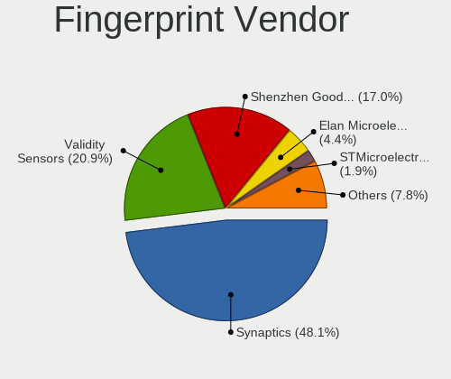

| Vendor                             | Computers | Percent |
|------------------------------------|-----------|---------|
| Synaptics                          | 85        | 45.7%   |
| Validity Sensors                   | 43        | 23.12%  |
| Shenzhen Goodix Technology         | 30        | 16.13%  |
| Elan Microelectronics              | 9         | 4.84%   |
| STMicroelectronics                 | 4         | 2.15%   |
| LighTuning Technology              | 4         | 2.15%   |
| AuthenTec                          | 4         | 2.15%   |
| DigitalPersona                     | 3         | 1.61%   |
| Upek                               | 2         | 1.08%   |
| Samsung Electronics                | 1         | 0.54%   |
| Realtek USB2.0 Finger Print Bridge | 1         | 0.54%   |

Fingerprint Model
-----------------

Fingerprint sensor models

| Model                                                                      | Computers | Percent |
|----------------------------------------------------------------------------|-----------|---------|
| Synaptics Prometheus MIS Touch Fingerprint Reader                          | 33        | 17.74%  |
| Synaptics Metallica MIS Touch Fingerprint Reader                           | 17        | 9.14%   |
| Validity Sensors Synaptics WBDI                                            | 13        | 6.99%   |
| Shenzhen Goodix  Fingerprint Device                                        | 12        | 6.45%   |
| Shenzhen Goodix Fingerprint Reader                                         | 12        | 6.45%   |
| Validity Sensors VFS495 Fingerprint Reader                                 | 9         | 4.84%   |
| Synaptics WBDI                                                             | 8         | 4.3%    |
| Validity Sensors VFS 5011 fingerprint sensor                               | 7         | 3.76%   |
| Elan ELAN:Fingerprint                                                      | 7         | 3.76%   |
| Synaptics UWP WBDI Device                                                  | 6         | 3.23%   |
| Shenzhen Goodix FingerPrint                                                | 6         | 3.23%   |
| Synaptics  FS7604 Touch Fingerprint Sensor with PurePrint                  | 5         | 2.69%   |
| Validity Sensors Fingerprint scanner                                       | 4         | 2.15%   |
| Synaptics FS7604 Touch Fingerprint Sensor with PurePrint                   | 4         | 2.15%   |
| Synaptics Fingerprint reader [HP G6]                                       | 4         | 2.15%   |
| STMicroelectronics Fingerprint Reader                                      | 4         | 2.15%   |
| Validity Sensors VFS5011 Fingerprint Reader                                | 3         | 1.61%   |
| LighTuning EgisTec Touch Fingerprint Sensor                                | 3         | 1.61%   |
| DigitalPersona Fingerprint Reader                                          | 3         | 1.61%   |
| Validity Sensors VFS7552 Touch Fingerprint Sensor                          | 2         | 1.08%   |
| Validity Sensors VFS491                                                    | 2         | 1.08%   |
| Upek Biometric Touchchip/Touchstrip Fingerprint Sensor                     | 2         | 1.08%   |
| Synaptics Metallica MOH Touch Fingerprint Reader                           | 2         | 1.08%   |
| Elan ELAN:ARM-M4                                                           | 2         | 1.08%   |
| AuthenTec AES2501 Fingerprint Sensor                                       | 2         | 1.08%   |
| Unknown                                                                    | 2         | 1.08%   |
| Validity Sensors VFS7500 Touch Fingerprint Sensor                          | 1         | 0.54%   |
| Validity Sensors VFS471 Fingerprint Reader                                 | 1         | 0.54%   |
| Validity Sensors Synaptics VFS7552 Touch Fingerprint Sensor with PurePrint | 1         | 0.54%   |
| Synaptics WBDI Device                                                      | 1         | 0.54%   |
| Synaptics UWP WBDI                                                         | 1         | 0.54%   |
| Synaptics TouchPad                                                         | 1         | 0.54%   |
| Synaptics  WBDI                                                            | 1         | 0.54%   |
| Samsung Fingerprint Sensor Device - 730B                                   | 1         | 0.54%   |
| Realtek USB2.0 Finger Print Bridge FocalTech Fingerprint Device            | 1         | 0.54%   |
| LighTuning ES603 Swipe Fingerprint Sensor                                  | 1         | 0.54%   |
| AuthenTec Fingerprint Sensor                                               | 1         | 0.54%   |
| AuthenTec AES2550 Fingerprint Sensor                                       | 1         | 0.54%   |

Chipcard Vendor
---------------

Chipcard module vendors

| Vendor                            | Computers | Percent |
|-----------------------------------|-----------|---------|
| Alcor Micro                       | 46        | 34.07%  |
| Broadcom                          | 45        | 33.33%  |
| Clay Logic                        | 7         | 5.19%   |
| SCM Microsystems                  | 6         | 4.44%   |
| Upek                              | 5         | 3.7%    |
| O2 Micro                          | 5         | 3.7%    |
| Yubico.com                        | 4         | 2.96%   |
| Gemalto (was Gemplus)             | 3         | 2.22%   |
| Hewlett-Packard                   | 2         | 1.48%   |
| Advanced Card Systems             | 2         | 1.48%   |
| VASCO Data Security International | 1         | 0.74%   |
| Purism, SPC                       | 1         | 0.74%   |
| OmniKey                           | 1         | 0.74%   |
| Microchip Technology              | 1         | 0.74%   |
| Lenovo                            | 1         | 0.74%   |
| Free Software Initiative of Japan | 1         | 0.74%   |
| Feitian Technologies              | 1         | 0.74%   |
| Bit4id                            | 1         | 0.74%   |
| Aladdin Knowledge Systems         | 1         | 0.74%   |
| Aktiv                             | 1         | 0.74%   |

Chipcard Model
--------------

Chipcard module models

| Model                                                                        | Computers | Percent |
|------------------------------------------------------------------------------|-----------|---------|
| Alcor Micro AU9540 Smartcard Reader                                          | 46        | 34.07%  |
| Broadcom 58200                                                               | 18        | 13.33%  |
| Broadcom 5880                                                                | 13        | 9.63%   |
| Clay Logic Nitrokey Pro                                                      | 7         | 5.19%   |
| Broadcom BCM5880 Secure Applications Processor with fingerprint swipe sensor | 7         | 5.19%   |
| SCM Microsystems SCR331-LC1 / SCR3310 SmartCard Reader                       | 6         | 4.44%   |
| Broadcom BCM5880 Secure Applications Processor                               | 6         | 4.44%   |
| Upek TouchChip Fingerprint Coprocessor (WBF advanced mode)                   | 5         | 3.7%    |
| O2 Micro OZ776 CCID Smartcard Reader                                         | 4         | 2.96%   |
| Yubico.com Yubikey 4/5 U2F+CCID                                              | 2         | 1.48%   |
| Yubico.com Yubikey 4/5 CCID                                                  | 2         | 1.48%   |
| Hewlett-Packard SC Keyboard - Apollo (Liteon)                                | 2         | 1.48%   |
| Gemalto (was Gemplus) GemPC Twin SmartCard Reader                            | 2         | 1.48%   |
| VASCO Data Security International DIGIPASS 870                               | 1         | 0.74%   |
| Purism, SPC Librem Key                                                       | 1         | 0.74%   |
| OmniKey CardMan 3021 / 3121                                                  | 1         | 0.74%   |
| O2 Micro Oz776 SmartCard Reader                                              | 1         | 0.74%   |
| Microchip Technology SMSC USX101x Reader                                     | 1         | 0.74%   |
| Lenovo Integrated Smart Card Reader                                          | 1         | 0.74%   |
| Gemalto (was Gemplus) eToken 5110+ FIPS                                      | 1         | 0.74%   |
| Free Software Initiative of Japan Gnuk Token                                 | 1         | 0.74%   |
| Feitian Technologies FIDO CCID KB                                            | 1         | 0.74%   |
| Broadcom BCM5880 Secure Applications Processor with fingerprint touch sensor | 1         | 0.74%   |
| Bit4id miniLector-s                                                          | 1         | 0.74%   |
| Aladdin Knowledge Systems Token JC                                           | 1         | 0.74%   |
| Aktiv Rutoken lite                                                           | 1         | 0.74%   |
| Advanced Card Systems ACR38 SmartCard Reader                                 | 1         | 0.74%   |
| Advanced Card Systems ACR122U                                                | 1         | 0.74%   |

Unsupported
-----------

Unsupported Devices
-------------------

Total unsupported devices on board

| Total | Computers | Percent |
|-------|-----------|---------|
| 0     | 863       | 43.5%   |
| 1     | 549       | 27.67%  |
| 2     | 274       | 13.81%  |
| 3     | 147       | 7.41%   |
| 4     | 81        | 4.08%   |
| 5     | 43        | 2.17%   |
| 6     | 21        | 1.06%   |
| 7     | 5         | 0.25%   |
| 8     | 1         | 0.05%   |

Unsupported Device Types
------------------------

Types of unsupported devices

| Type                     | Computers | Percent |
|--------------------------|-----------|---------|
| Communication controller | 347       | 17.43%  |
| Graphics card            | 278       | 13.96%  |
| Bluetooth                | 245       | 12.31%  |
| Camera                   | 200       | 10.05%  |
| Fingerprint reader       | 183       | 9.19%   |
| Net/wireless             | 148       | 7.43%   |
| Chipcard                 | 105       | 5.27%   |
| Multimedia controller    | 95        | 4.77%   |
| Sound                    | 88        | 4.42%   |
| Card reader              | 79        | 3.97%   |
| Network                  | 37        | 1.86%   |
| Net/ethernet             | 33        | 1.66%   |
| Firewire controller      | 32        | 1.61%   |
| Unassigned class         | 28        | 1.41%   |
| Storage/ide              | 22        | 1.1%    |
| Modem                    | 21        | 1.05%   |
| Storage/ata              | 17        | 0.85%   |
| Storage/raid             | 9         | 0.45%   |
| Tv card                  | 7         | 0.35%   |
| Storage                  | 6         | 0.3%    |
| Storage/nvme             | 5         | 0.25%   |
| Dvb card                 | 4         | 0.2%    |
| Wireless                 | 1         | 0.05%   |
| Unclassified device      | 1         | 0.05%   |

