Gentoo 2.13 - Tested Hardware & Statistics
------------------------------------------

A project to collect tested hardware configurations for Gentoo 2.13.

Anyone can contribute to this report by the [hw-probe](https://github.com/linuxhw/hw-probe) tool:

    sudo -E hw-probe -all -upload

Please contribute! Especially if your hardware is rare.

This is a report for all computer types. See also reports for [desktops](/Dist/Gentoo_2.13/Desktop/README.md) and [notebooks](/Dist/Gentoo_2.13/Notebook/README.md).

Contents
--------

* [ Test Cases ](#test-cases)

* [ System ](#system)
  - [ Kernel                   ](#kernel)
  - [ Kernel Family            ](#kernel-family)
  - [ Kernel Major Ver.        ](#kernel-major-ver)
  - [ Arch                     ](#arch)
  - [ DE                       ](#de)
  - [ Display Server           ](#display-server)
  - [ Display Manager          ](#display-manager)
  - [ OS Lang                  ](#os-lang)
  - [ Boot Mode                ](#boot-mode)
  - [ Filesystem               ](#filesystem)
  - [ Part. scheme             ](#part-scheme)
  - [ Dual Boot with Linux/BSD ](#dual-boot-with-linuxbsd)
  - [ Dual Boot (Win)          ](#dual-boot-win)

* [ Board ](#board)
  - [ Vendor                   ](#vendor)
  - [ Model                    ](#model)
  - [ Model Family             ](#model-family)
  - [ MFG Year                 ](#mfg-year)
  - [ Form Factor              ](#form-factor)
  - [ Secure Boot              ](#secure-boot)
  - [ Coreboot                 ](#coreboot)
  - [ RAM Size                 ](#ram-size)
  - [ RAM Used                 ](#ram-used)
  - [ Total Drives             ](#total-drives)
  - [ Has CD-ROM               ](#has-cd-rom)
  - [ Has Ethernet             ](#has-ethernet)
  - [ Has WiFi                 ](#has-wifi)
  - [ Has Bluetooth            ](#has-bluetooth)

* [ Location ](#location)
  - [ Country                  ](#country)
  - [ City                     ](#city)

* [ Drives ](#drives)
  - [ Drive Vendor             ](#drive-vendor)
  - [ Drive Model              ](#drive-model)
  - [ HDD Vendor               ](#hdd-vendor)
  - [ SSD Vendor               ](#ssd-vendor)
  - [ Drive Kind               ](#drive-kind)
  - [ Drive Connector          ](#drive-connector)
  - [ Drive Size               ](#drive-size)
  - [ Space Total              ](#space-total)
  - [ Space Used               ](#space-used)
  - [ Malfunc. Drives          ](#malfunc-drives)
  - [ Malfunc. Drive Vendor    ](#malfunc-drive-vendor)
  - [ Malfunc. HDD Vendor      ](#malfunc-hdd-vendor)
  - [ Malfunc. Drive Kind      ](#malfunc-drive-kind)
  - [ Failed Drives            ](#failed-drives)
  - [ Failed Drive Vendor      ](#failed-drive-vendor)
  - [ Drive Status             ](#drive-status)

* [ Storage controller ](#storage-controller)
  - [ Storage Vendor           ](#storage-vendor)
  - [ Storage Model            ](#storage-model)
  - [ Storage Kind             ](#storage-kind)

* [ Processor ](#processor)
  - [ CPU Vendor               ](#cpu-vendor)
  - [ CPU Model                ](#cpu-model)
  - [ CPU Model Family         ](#cpu-model-family)
  - [ CPU Cores                ](#cpu-cores)
  - [ CPU Sockets              ](#cpu-sockets)
  - [ CPU Threads              ](#cpu-threads)
  - [ CPU Op-Modes             ](#cpu-op-modes)
  - [ CPU Microcode            ](#cpu-microcode)
  - [ CPU Microarch            ](#cpu-microarch)

* [ Graphics ](#graphics)
  - [ GPU Vendor               ](#gpu-vendor)
  - [ GPU Model                ](#gpu-model)
  - [ GPU Combo                ](#gpu-combo)
  - [ GPU Driver               ](#gpu-driver)
  - [ GPU Memory               ](#gpu-memory)

* [ Monitor ](#monitor)
  - [ Monitor Vendor           ](#monitor-vendor)
  - [ Monitor Model            ](#monitor-model)
  - [ Monitor Resolution       ](#monitor-resolution)
  - [ Monitor Diagonal         ](#monitor-diagonal)
  - [ Monitor Width            ](#monitor-width)
  - [ Aspect Ratio             ](#aspect-ratio)
  - [ Monitor Area             ](#monitor-area)
  - [ Pixel Density            ](#pixel-density)
  - [ Multiple Monitors        ](#multiple-monitors)

* [ Network ](#network)
  - [ Net Controller Vendor    ](#net-controller-vendor)
  - [ Net Controller Model     ](#net-controller-model)
  - [ Wireless Vendor          ](#wireless-vendor)
  - [ Wireless Model           ](#wireless-model)
  - [ Ethernet Vendor          ](#ethernet-vendor)
  - [ Ethernet Model           ](#ethernet-model)
  - [ Net Controller Kind      ](#net-controller-kind)
  - [ Used Controller          ](#used-controller)
  - [ NICs                     ](#nics)
  - [ IPv6                     ](#ipv6)

* [ Bluetooth ](#bluetooth)
  - [ Bluetooth Vendor         ](#bluetooth-vendor)
  - [ Bluetooth Model          ](#bluetooth-model)

* [ Sound ](#sound)
  - [ Sound Vendor             ](#sound-vendor)
  - [ Sound Model              ](#sound-model)

* [ Memory ](#memory)
  - [ Memory Vendor            ](#memory-vendor)
  - [ Memory Model             ](#memory-model)
  - [ Memory Kind              ](#memory-kind)
  - [ Memory Form Factor       ](#memory-form-factor)
  - [ Memory Size              ](#memory-size)
  - [ Memory Speed             ](#memory-speed)

* [ Printers & scanners ](#printers--scanners)
  - [ Printer Vendor           ](#printer-vendor)
  - [ Printer Model            ](#printer-model)
  - [ Scanner Vendor           ](#scanner-vendor)
  - [ Scanner Model            ](#scanner-model)

* [ Camera ](#camera)
  - [ Camera Vendor            ](#camera-vendor)
  - [ Camera Model             ](#camera-model)

* [ Security ](#security)
  - [ Fingerprint Vendor       ](#fingerprint-vendor)
  - [ Fingerprint Model        ](#fingerprint-model)
  - [ Chipcard Vendor          ](#chipcard-vendor)
  - [ Chipcard Model           ](#chipcard-model)

* [ Unsupported ](#unsupported)
  - [ Unsupported Devices      ](#unsupported-devices)
  - [ Unsupported Device Types ](#unsupported-device-types)

Test Cases
----------

Total: 456

| Vendor        | Model                       | Form-Factor | Probe                                                      | Date         |
|---------------|-----------------------------|-------------|------------------------------------------------------------|--------------|
| Supermicro    | X8DT3                       | Server      | [93de2051e2](https://linux-hardware.org/?probe=93de2051e2) | Nov 27, 2023 |
| Dell          | Latitude D630               | Notebook    | [8af88f25f0](https://linux-hardware.org/?probe=8af88f25f0) | Nov 10, 2023 |
| Lenovo        | IdeaPad 5 15ABA7 82SG       | Notebook    | [475563b8b4](https://linux-hardware.org/?probe=475563b8b4) | Aug 24, 2023 |
| HP            | EliteBook 8540w             | Notebook    | [c61948c95e](https://linux-hardware.org/?probe=c61948c95e) | Aug 23, 2023 |
| ASUSTek       | PRIME N100I-D D4            | Desktop     | [34ef0ea7ff](https://linux-hardware.org/?probe=34ef0ea7ff) | Aug 20, 2023 |
| ASUSTek       | PRIME N100I-D D4            | Desktop     | [101202101b](https://linux-hardware.org/?probe=101202101b) | Aug 19, 2023 |
| Huanan        | X99-F8D V2.4                | Desktop     | [8af741a2c4](https://linux-hardware.org/?probe=8af741a2c4) | Aug 19, 2023 |
| Dell          | 0GY6Y8 A02                  | Desktop     | [a4747bf8ea](https://linux-hardware.org/?probe=a4747bf8ea) | Aug 18, 2023 |
| ASUSTek       | M3A78-CM                    | Desktop     | [2173b6b2b0](https://linux-hardware.org/?probe=2173b6b2b0) | Aug 18, 2023 |
| Supermicro    | X10SDV-4C-TLN2F             | Server      | [6b5f510903](https://linux-hardware.org/?probe=6b5f510903) | Aug 18, 2023 |
| Apple         | MacBookPro11,1              | Notebook    | [a6ad62b671](https://linux-hardware.org/?probe=a6ad62b671) | Aug 15, 2023 |
| HP            | EliteBook 8540w             | Notebook    | [c24cfbc475](https://linux-hardware.org/?probe=c24cfbc475) | Aug 14, 2023 |
| HP            | EliteBook 8540w             | Notebook    | [6077ff7606](https://linux-hardware.org/?probe=6077ff7606) | Aug 14, 2023 |
| HP            | EliteBook 8540w             | Notebook    | [25f4c96f7b](https://linux-hardware.org/?probe=25f4c96f7b) | Aug 14, 2023 |
| Gigabyte      | AB350-Gaming-CF             | Desktop     | [7ff2052c0f](https://linux-hardware.org/?probe=7ff2052c0f) | Aug 14, 2023 |
| Dell          | Latitude E7450              | Notebook    | [057d88b470](https://linux-hardware.org/?probe=057d88b470) | Aug 13, 2023 |
| Foxconn       | TPS01                       | Desktop     | [8e5b20544d](https://linux-hardware.org/?probe=8e5b20544d) | Aug 13, 2023 |
| AMD           | A690G M2+                   | Desktop     | [4179510c0b](https://linux-hardware.org/?probe=4179510c0b) | Aug 13, 2023 |
| MSI           | B450 TOMAHAWK MAX           | Desktop     | [231f8f9b37](https://linux-hardware.org/?probe=231f8f9b37) | Aug 13, 2023 |
| HP            | EliteBook 8540w             | Notebook    | [3048a8eb60](https://linux-hardware.org/?probe=3048a8eb60) | Aug 12, 2023 |
| HP            | EliteBook 8540w             | Notebook    | [2df5a4bd58](https://linux-hardware.org/?probe=2df5a4bd58) | Aug 11, 2023 |
| HP            | EliteBook 8540w             | Notebook    | [1bf7b69b0f](https://linux-hardware.org/?probe=1bf7b69b0f) | Aug 11, 2023 |
| Gigabyte      | B650 AORUS PRO AX           | Desktop     | [5cbfb27db2](https://linux-hardware.org/?probe=5cbfb27db2) | Aug 11, 2023 |
| Gigabyte      | B650 AORUS PRO AX           | Desktop     | [72b375ad38](https://linux-hardware.org/?probe=72b375ad38) | Aug 11, 2023 |
| NEC Comput... | 312C                        | Desktop     | [770ffcfcf5](https://linux-hardware.org/?probe=770ffcfcf5) | Aug 10, 2023 |
| ASUSTek       | M3A78-CM                    | Desktop     | [a5e0e043cb](https://linux-hardware.org/?probe=a5e0e043cb) | Aug 09, 2023 |
| MSI           | 970A-G43 PLUS               | Desktop     | [133d4b58c9](https://linux-hardware.org/?probe=133d4b58c9) | Aug 08, 2023 |
| ASUSTek       | M3A78-CM                    | Desktop     | [93e4fee7df](https://linux-hardware.org/?probe=93e4fee7df) | Aug 08, 2023 |
| Apple         | MacBookPro10,1              | Notebook    | [ed97e2ea3e](https://linux-hardware.org/?probe=ed97e2ea3e) | Aug 08, 2023 |
| Gigabyte      | AB350-Gaming-CF             | Desktop     | [fb8e926bd4](https://linux-hardware.org/?probe=fb8e926bd4) | Aug 07, 2023 |
| ASUSTek       | VivoBook_ASUSLaptop X415... | Notebook    | [1d6bf926f6](https://linux-hardware.org/?probe=1d6bf926f6) | Aug 05, 2023 |
| ASUSTek       | TUF Gaming X670E-PLUS       | Desktop     | [584974f252](https://linux-hardware.org/?probe=584974f252) | Aug 05, 2023 |
| HP            | Laptop 15-ra0xx             | Notebook    | [41b594c2c7](https://linux-hardware.org/?probe=41b594c2c7) | Aug 05, 2023 |
| HP            | Laptop 15-ra0xx             | Notebook    | [ae42e537d2](https://linux-hardware.org/?probe=ae42e537d2) | Aug 05, 2023 |
| HP            | Laptop 15-ra0xx             | Notebook    | [51f2c38666](https://linux-hardware.org/?probe=51f2c38666) | Aug 05, 2023 |
| Lenovo        | ThinkPad Yoga 370 20JJS0... | Convertible | [570728a351](https://linux-hardware.org/?probe=570728a351) | Aug 05, 2023 |
| Medion        | B360H4-EM V1.0              | Desktop     | [18146f8bc9](https://linux-hardware.org/?probe=18146f8bc9) | Aug 04, 2023 |
| ASUSTek       | M3A78-CM                    | Desktop     | [9be3b9bb83](https://linux-hardware.org/?probe=9be3b9bb83) | Aug 02, 2023 |
| ASUSTek       | M3A78-CM                    | Desktop     | [5d63b469f8](https://linux-hardware.org/?probe=5d63b469f8) | Aug 01, 2023 |
| HP            | 2B47                        | Desktop     | [06373794be](https://linux-hardware.org/?probe=06373794be) | Aug 01, 2023 |
| Alienware     | x17 R1                      | Notebook    | [bcdf52a63e](https://linux-hardware.org/?probe=bcdf52a63e) | Aug 01, 2023 |
| Gigabyte      | H510M H                     | Desktop     | [51541062dc](https://linux-hardware.org/?probe=51541062dc) | Jul 31, 2023 |
| ASRock        | X570 Phantom Gaming X       | Desktop     | [4e2e9f1f7f](https://linux-hardware.org/?probe=4e2e9f1f7f) | Jul 31, 2023 |
| Gigabyte      | B650 AORUS PRO AX           | Desktop     | [23c9c57a00](https://linux-hardware.org/?probe=23c9c57a00) | Jul 30, 2023 |
| Pine Micro... | Pine64 RockPro64 v2.1       | Soc         | [f9b68dbdc9](https://linux-hardware.org/?probe=f9b68dbdc9) | Jul 30, 2023 |
| ASUSTek       | ROG STRIX X570-F GAMING     | Desktop     | [436e1e4e01](https://linux-hardware.org/?probe=436e1e4e01) | Jul 29, 2023 |
| Lenovo        | 1036 SDK0Q40112 WIN 3305... | Desktop     | [731b8aed1b](https://linux-hardware.org/?probe=731b8aed1b) | Jul 29, 2023 |
| Lenovo        | Legion Y530-15ICH-1060 8... | Notebook    | [451cbfaee5](https://linux-hardware.org/?probe=451cbfaee5) | Jul 29, 2023 |
| ASRock        | AM1H-ITX                    | Desktop     | [24b2f4274d](https://linux-hardware.org/?probe=24b2f4274d) | Jul 29, 2023 |
| Apple         | MacBookPro12,1              | Notebook    | [bc3cb3cbfd](https://linux-hardware.org/?probe=bc3cb3cbfd) | Jul 28, 2023 |
| ASRock        | X570 PG Velocita            | Desktop     | [ba2f93d0af](https://linux-hardware.org/?probe=ba2f93d0af) | Jul 28, 2023 |
| ASUSTek       | PRIME X299-DELUXE           | Desktop     | [27da4128a7](https://linux-hardware.org/?probe=27da4128a7) | Jul 28, 2023 |
| Gigabyte      | B650M AORUS ELITE AX        | Desktop     | [4895ec9de1](https://linux-hardware.org/?probe=4895ec9de1) | Jul 27, 2023 |
| HP            | EliteBook 8540w             | Notebook    | [96a30f2f21](https://linux-hardware.org/?probe=96a30f2f21) | Jul 27, 2023 |
| Gateway       | MS-7399                     | Desktop     | [904775a387](https://linux-hardware.org/?probe=904775a387) | Jul 25, 2023 |
| ASUSTek       | TUF Gaming FX705GD_FX705... | Notebook    | [c73107bcac](https://linux-hardware.org/?probe=c73107bcac) | Jul 25, 2023 |
| ASUSTek       | TUF Gaming FX705GD_FX705... | Notebook    | [1aeabb238f](https://linux-hardware.org/?probe=1aeabb238f) | Jul 25, 2023 |
| ASUSTek       | M3A78-CM                    | Desktop     | [290a0dd297](https://linux-hardware.org/?probe=290a0dd297) | Jul 25, 2023 |
| ASUSTek       | M3A78-CM                    | Desktop     | [a2fcdf6c36](https://linux-hardware.org/?probe=a2fcdf6c36) | Jul 24, 2023 |
| A-DATA Tec... | XENIA 15                    | Notebook    | [21edb88f94](https://linux-hardware.org/?probe=21edb88f94) | Jul 23, 2023 |
| HP            | 255 G6 Notebook PC          | Notebook    | [5c5147b82d](https://linux-hardware.org/?probe=5c5147b82d) | Jul 23, 2023 |
| A-DATA Tec... | XENIA 15                    | Notebook    | [9c64742080](https://linux-hardware.org/?probe=9c64742080) | Jul 23, 2023 |
| Foxconn       | TPS01                       | Desktop     | [d8e4cab1b8](https://linux-hardware.org/?probe=d8e4cab1b8) | Jul 21, 2023 |
| HP            | ProBook 450 G5              | Notebook    | [3dfd41fda9](https://linux-hardware.org/?probe=3dfd41fda9) | Jul 17, 2023 |
| HP            | ProBook 450 G5              | Notebook    | [c5bee4d8fe](https://linux-hardware.org/?probe=c5bee4d8fe) | Jul 17, 2023 |
| MSI           | X370 XPOWER GAMING TITAN... | Desktop     | [aac317ef80](https://linux-hardware.org/?probe=aac317ef80) | Jul 17, 2023 |
| HP            | ProBook 440 G7              | Notebook    | [48cf81576d](https://linux-hardware.org/?probe=48cf81576d) | Jul 17, 2023 |
| MSI           | MPG Z490 GAMING EDGE WIF... | Desktop     | [cda9e7abe9](https://linux-hardware.org/?probe=cda9e7abe9) | Jul 17, 2023 |
| Gigabyte      | AB350-Gaming-CF             | Desktop     | [f4936b2064](https://linux-hardware.org/?probe=f4936b2064) | Jul 17, 2023 |
| Dell          | 0GY6Y8 A02                  | Desktop     | [8d8d1d6cbf](https://linux-hardware.org/?probe=8d8d1d6cbf) | Jul 17, 2023 |
| HP            | EliteBook 8540w             | Notebook    | [b86a3c24df](https://linux-hardware.org/?probe=b86a3c24df) | Jul 16, 2023 |
| MSI           | MPG Z490 GAMING EDGE WIF... | Desktop     | [1f1b7763a5](https://linux-hardware.org/?probe=1f1b7763a5) | Jul 14, 2023 |
| Lenovo        | IdeaPadFlex 5 14ITL05 82... | Convertible | [c8179fd349](https://linux-hardware.org/?probe=c8179fd349) | Jul 14, 2023 |
| ASUSTek       | VivoBook_ASUSLaptop TP34... | Convertible | [be7dcafaba](https://linux-hardware.org/?probe=be7dcafaba) | Jul 14, 2023 |
| Lenovo        | ThinkPad P15 Gen 1 20SUS... | Notebook    | [a5cdc8bb58](https://linux-hardware.org/?probe=a5cdc8bb58) | Jul 13, 2023 |
| HP            | EliteBook 8540w             | Notebook    | [26c6ceb0a6](https://linux-hardware.org/?probe=26c6ceb0a6) | Jul 13, 2023 |
| HP            | ZBook Studio 16 inch G9 ... | Notebook    | [0d54b47098](https://linux-hardware.org/?probe=0d54b47098) | Jul 12, 2023 |
| Fujitsu       | LIFEBOOK T939               | Convertible | [4d1ecd77ad](https://linux-hardware.org/?probe=4d1ecd77ad) | Jul 11, 2023 |
| Lenovo        | ThinkPad T430 2344BZU       | Notebook    | [2a37881afa](https://linux-hardware.org/?probe=2a37881afa) | Jul 11, 2023 |
| Apple         | MacBookPro11,1              | Notebook    | [7256e6a7b2](https://linux-hardware.org/?probe=7256e6a7b2) | Jul 11, 2023 |
| ASUSTek       | M3A78-CM                    | Desktop     | [ab32a0e447](https://linux-hardware.org/?probe=ab32a0e447) | Jul 11, 2023 |
| ASUSTek       | M3A78-CM                    | Desktop     | [38420a6afe](https://linux-hardware.org/?probe=38420a6afe) | Jul 10, 2023 |
| Gigabyte      | AB350-Gaming-CF             | Desktop     | [14c6f3f286](https://linux-hardware.org/?probe=14c6f3f286) | Jul 10, 2023 |
| Lenovo        | Yoga C940-14IIL 81Q9        | Convertible | [89dc06fa6d](https://linux-hardware.org/?probe=89dc06fa6d) | Jul 09, 2023 |
| ASRock        | Z390 Extreme4               | Desktop     | [cf9ad63ff9](https://linux-hardware.org/?probe=cf9ad63ff9) | Jul 09, 2023 |
| ASRock        | Z390 Extreme4               | Desktop     | [306eaba8f1](https://linux-hardware.org/?probe=306eaba8f1) | Jul 09, 2023 |
| ASUSTek       | ROG STRIX Z590-F GAMING ... | Desktop     | [0b6dcc1ea9](https://linux-hardware.org/?probe=0b6dcc1ea9) | Jul 09, 2023 |
| Dell          | XPS 15 7590                 | Notebook    | [ca41a9886a](https://linux-hardware.org/?probe=ca41a9886a) | Jul 09, 2023 |
| MSI           | MAG B560 TORPEDO            | Desktop     | [4b611c264e](https://linux-hardware.org/?probe=4b611c264e) | Jul 08, 2023 |
| ASUSTek       | PRIME J4005I-C              | Desktop     | [8cccaeb0ed](https://linux-hardware.org/?probe=8cccaeb0ed) | Jul 08, 2023 |
| HP            | EliteBook 8540w             | Notebook    | [a760e46715](https://linux-hardware.org/?probe=a760e46715) | Jul 08, 2023 |
| Fujitsu       | LIFEBOOK U758               | Notebook    | [eaa8bbf9da](https://linux-hardware.org/?probe=eaa8bbf9da) | Jul 07, 2023 |
| HP            | EliteBook 8540w             | Notebook    | [1a53ce97b8](https://linux-hardware.org/?probe=1a53ce97b8) | Jul 07, 2023 |
| ASUSTek       | ROG STRIX X670E-F GAMING... | Desktop     | [9a6e78196d](https://linux-hardware.org/?probe=9a6e78196d) | Jul 06, 2023 |
| Lenovo        | ThinkPad Yoga 370 20JJS0... | Convertible | [b4b26d2f53](https://linux-hardware.org/?probe=b4b26d2f53) | Jul 06, 2023 |
| HP            | ZBook Studio 16 inch G9 ... | Notebook    | [84b5d3ce3c](https://linux-hardware.org/?probe=84b5d3ce3c) | Jul 06, 2023 |
| Gigabyte      | GA-MA770T-UD3P              | Desktop     | [348b9a4a73](https://linux-hardware.org/?probe=348b9a4a73) | Jul 05, 2023 |
| Aierben       | NA17                        | Desktop     | [462b502bab](https://linux-hardware.org/?probe=462b502bab) | Jul 05, 2023 |
| Lenovo        | ThinkPad Yoga 370 20JJS0... | Convertible | [f4fdc8a532](https://linux-hardware.org/?probe=f4fdc8a532) | Jul 05, 2023 |
| MSI           | B450 GAMING PRO CARBON A... | Desktop     | [49bcd116ba](https://linux-hardware.org/?probe=49bcd116ba) | Jul 04, 2023 |
| ASUSTek       | M3A78-CM                    | Desktop     | [67281face4](https://linux-hardware.org/?probe=67281face4) | Jul 03, 2023 |
| Gigabyte      | AB350-Gaming-CF             | Desktop     | [f928781025](https://linux-hardware.org/?probe=f928781025) | Jul 03, 2023 |
| Jumper        | EZbook                      | Notebook    | [735e20e770](https://linux-hardware.org/?probe=735e20e770) | Jul 02, 2023 |
| Lenovo        | IdeaPad 5 15ABA7 82SG       | Notebook    | [68daff498d](https://linux-hardware.org/?probe=68daff498d) | Jul 02, 2023 |
| Lenovo        | IdeaPad 5 15ABA7 82SG       | Notebook    | [f587b9a46c](https://linux-hardware.org/?probe=f587b9a46c) | Jul 02, 2023 |
| HP            | EliteBook 8540w             | Notebook    | [465b44efff](https://linux-hardware.org/?probe=465b44efff) | Jul 01, 2023 |
| HP            | EliteBook 8540w             | Notebook    | [826e649d7a](https://linux-hardware.org/?probe=826e649d7a) | Jul 01, 2023 |
| ASUSTek       | TUF Gaming X570-PLUS        | Desktop     | [a0ac212cac](https://linux-hardware.org/?probe=a0ac212cac) | Jul 01, 2023 |
| Gigabyte      | Z390 AORUS MASTER-CF        | Desktop     | [0f0e96b03c](https://linux-hardware.org/?probe=0f0e96b03c) | Jul 01, 2023 |
| Raspberry ... | Raspberry Pi                | Soc         | [a0fdd16a9e](https://linux-hardware.org/?probe=a0fdd16a9e) | Jul 01, 2023 |
| Dell          | Inspiron 16 5625            | Notebook    | [bf36f89d32](https://linux-hardware.org/?probe=bf36f89d32) | Jul 01, 2023 |
| ASRock        | X570 Taichi                 | Desktop     | [af8af2c7e8](https://linux-hardware.org/?probe=af8af2c7e8) | Jun 30, 2023 |
| Dell          | Inspiron 16 5625            | Notebook    | [cbbe256fa2](https://linux-hardware.org/?probe=cbbe256fa2) | Jun 30, 2023 |
| ASUSTek       | ASUS TUF Gaming F15 FX50... | Notebook    | [5873d04afe](https://linux-hardware.org/?probe=5873d04afe) | Jun 29, 2023 |
| ASUSTek       | PRIME X299-DELUXE           | Desktop     | [4df7190c46](https://linux-hardware.org/?probe=4df7190c46) | Jun 29, 2023 |
| ASUSTek       | PRIME X299-DELUXE           | Desktop     | [6388cc47ae](https://linux-hardware.org/?probe=6388cc47ae) | Jun 29, 2023 |
| Lenovo        | ThinkPad P14s Gen 3 21J5... | Notebook    | [2d16f5be74](https://linux-hardware.org/?probe=2d16f5be74) | Jun 29, 2023 |
| HP            | Spectre x360 2-in-1 Lapt... | Convertible | [c7a5d0ef6c](https://linux-hardware.org/?probe=c7a5d0ef6c) | Jun 29, 2023 |
| Intel         | NUC11PABi5 M68265-501       | Mini pc     | [b6c0bd1df6](https://linux-hardware.org/?probe=b6c0bd1df6) | Jun 28, 2023 |
| Intel         | NUC11PABi5 M68265-501       | Mini pc     | [498d9375d4](https://linux-hardware.org/?probe=498d9375d4) | Jun 28, 2023 |
| ASUSTek       | ROG STRIX X670E-F GAMING... | Desktop     | [8619447305](https://linux-hardware.org/?probe=8619447305) | Jun 27, 2023 |
| ASUSTek       | ROG STRIX X670E-F GAMING... | Desktop     | [bddefdfb2c](https://linux-hardware.org/?probe=bddefdfb2c) | Jun 27, 2023 |
| HP            | EliteBook 8540w             | Notebook    | [d675031e74](https://linux-hardware.org/?probe=d675031e74) | Jun 26, 2023 |
| Lenovo        | ThinkPad X1 Extreme 2nd ... | Notebook    | [178ed56625](https://linux-hardware.org/?probe=178ed56625) | Jun 26, 2023 |
| ASUSTek       | M3A78-CM                    | Desktop     | [e55023fb8b](https://linux-hardware.org/?probe=e55023fb8b) | Jun 26, 2023 |
| Gigabyte      | AB350-Gaming-CF             | Desktop     | [0b72aec1b9](https://linux-hardware.org/?probe=0b72aec1b9) | Jun 26, 2023 |
| HP            | EliteBook 8540w             | Notebook    | [37e828b0b6](https://linux-hardware.org/?probe=37e828b0b6) | Jun 24, 2023 |
| HP            | EliteBook 8540w             | Notebook    | [e1678729ff](https://linux-hardware.org/?probe=e1678729ff) | Jun 23, 2023 |
| HP            | EliteBook 8540w             | Notebook    | [094d8e8ecf](https://linux-hardware.org/?probe=094d8e8ecf) | Jun 22, 2023 |
| ASRock        | J3160M                      | Desktop     | [0521c9a5a7](https://linux-hardware.org/?probe=0521c9a5a7) | Jun 22, 2023 |
| HP            | EliteBook 8540w             | Notebook    | [a013e4866a](https://linux-hardware.org/?probe=a013e4866a) | Jun 22, 2023 |
| Lenovo        | ThinkPad P14s Gen 3 21J5... | Notebook    | [12153cd235](https://linux-hardware.org/?probe=12153cd235) | Jun 21, 2023 |
| HP            | EliteBook 8540w             | Notebook    | [6c766e53cb](https://linux-hardware.org/?probe=6c766e53cb) | Jun 21, 2023 |
| HP            | EliteBook 8540w             | Notebook    | [91e2324734](https://linux-hardware.org/?probe=91e2324734) | Jun 20, 2023 |
| HP            | EliteBook 8540w             | Notebook    | [cd78108f1f](https://linux-hardware.org/?probe=cd78108f1f) | Jun 19, 2023 |
| ASUSTek       | X555LJ                      | Notebook    | [e65deab189](https://linux-hardware.org/?probe=e65deab189) | Jun 19, 2023 |
| ASUSTek       | M3A78-CM                    | Desktop     | [22d8476417](https://linux-hardware.org/?probe=22d8476417) | Jun 19, 2023 |
| Gigabyte      | AB350-Gaming-CF             | Desktop     | [e2fc6bb607](https://linux-hardware.org/?probe=e2fc6bb607) | Jun 19, 2023 |
| Lenovo        | ThinkPad P15 Gen 1 20SUS... | Notebook    | [4d509da42f](https://linux-hardware.org/?probe=4d509da42f) | Jun 18, 2023 |
| ASUSTek       | ROG STRIX X670E-F GAMING... | Desktop     | [8e26542f2d](https://linux-hardware.org/?probe=8e26542f2d) | Jun 17, 2023 |
| HP            | ENVY m6                     | Notebook    | [2776e20c0a](https://linux-hardware.org/?probe=2776e20c0a) | Jun 17, 2023 |
| HP            | EliteBook 8540w             | Notebook    | [eb29f214f3](https://linux-hardware.org/?probe=eb29f214f3) | Jun 17, 2023 |
| Dell          | Precision 5530              | Notebook    | [29ec4c7e1d](https://linux-hardware.org/?probe=29ec4c7e1d) | Jun 16, 2023 |
| ASUSTek       | PRIME X570-P                | Desktop     | [1f5163e415](https://linux-hardware.org/?probe=1f5163e415) | Jun 16, 2023 |
| HP            | Pavilion dv6                | Notebook    | [7e699d65f7](https://linux-hardware.org/?probe=7e699d65f7) | Jun 16, 2023 |
| Dell          | Precision 5530              | Notebook    | [cff5125fb6](https://linux-hardware.org/?probe=cff5125fb6) | Jun 16, 2023 |
| HP            | EliteBook 8540w             | Notebook    | [a7728ed657](https://linux-hardware.org/?probe=a7728ed657) | Jun 16, 2023 |
| HP            | EliteBook 8540w             | Notebook    | [03c8eed64b](https://linux-hardware.org/?probe=03c8eed64b) | Jun 16, 2023 |
| HP            | Victus by Laptop 16-e0xx... | Notebook    | [ec46ef5f36](https://linux-hardware.org/?probe=ec46ef5f36) | Jun 15, 2023 |
| HP            | EliteBook 8540w             | Notebook    | [9b08f8189d](https://linux-hardware.org/?probe=9b08f8189d) | Jun 15, 2023 |
| Google        | Nightfury                   | Notebook    | [02badb166b](https://linux-hardware.org/?probe=02badb166b) | Jun 14, 2023 |
| MSI           | MEG X570 UNIFY              | Desktop     | [deeef80345](https://linux-hardware.org/?probe=deeef80345) | Jun 13, 2023 |
| ASUSTek       | M3A78-CM                    | Desktop     | [ad01f2c38d](https://linux-hardware.org/?probe=ad01f2c38d) | Jun 13, 2023 |
| ASUSTek       | ROG G703GI_G7BI             | Notebook    | [fc0318992c](https://linux-hardware.org/?probe=fc0318992c) | Jun 12, 2023 |
| ASUSTek       | M3A78-CM                    | Desktop     | [273795ce3d](https://linux-hardware.org/?probe=273795ce3d) | Jun 12, 2023 |
| Gigabyte      | AB350-Gaming-CF             | Desktop     | [8a9a32ba11](https://linux-hardware.org/?probe=8a9a32ba11) | Jun 12, 2023 |
| ASUSTek       | ROG G703GI_G7BI             | Notebook    | [272de7ad6b](https://linux-hardware.org/?probe=272de7ad6b) | Jun 11, 2023 |
| ASUSTek       | TUF Gaming B650M-PLUS WI... | Desktop     | [153ae28a9e](https://linux-hardware.org/?probe=153ae28a9e) | Jun 11, 2023 |
| ASUSTek       | ROG STRIX X670E-F GAMING... | Desktop     | [6f6440cf1e](https://linux-hardware.org/?probe=6f6440cf1e) | Jun 10, 2023 |
| ASUSTek       | ROG STRIX X670E-F GAMING... | Desktop     | [4cb72d56f7](https://linux-hardware.org/?probe=4cb72d56f7) | Jun 10, 2023 |
| ASUSTek       | TUF Gaming B650M-PLUS WI... | Desktop     | [26262445d4](https://linux-hardware.org/?probe=26262445d4) | Jun 09, 2023 |
| Lenovo        | Legion 5 15ACH6H 82JU       | Notebook    | [8632ddc565](https://linux-hardware.org/?probe=8632ddc565) | Jun 09, 2023 |
| Panasonic     | CF-53ASCZGFG                | Notebook    | [39e04925ee](https://linux-hardware.org/?probe=39e04925ee) | Jun 08, 2023 |
| Gigabyte      | B550M AORUS ELITE           | Desktop     | [87f789c059](https://linux-hardware.org/?probe=87f789c059) | Jun 07, 2023 |
| MSI           | MAG B550 TOMAHAWK           | Desktop     | [96256dca48](https://linux-hardware.org/?probe=96256dca48) | Jun 07, 2023 |
| ASUSTek       | PRIME B550M-A               | Desktop     | [e7c8a1c727](https://linux-hardware.org/?probe=e7c8a1c727) | Jun 06, 2023 |
| ASUSTek       | M3A78-CM                    | Desktop     | [50304f8088](https://linux-hardware.org/?probe=50304f8088) | Jun 06, 2023 |
| Acer          | Swift SF314-511             | Notebook    | [60bf4b0442](https://linux-hardware.org/?probe=60bf4b0442) | Jun 05, 2023 |
| ASUSTek       | M3A78-CM                    | Desktop     | [1df787c227](https://linux-hardware.org/?probe=1df787c227) | Jun 05, 2023 |
| Dell          | Precision 5530              | Notebook    | [8b4e10b85a](https://linux-hardware.org/?probe=8b4e10b85a) | Jun 05, 2023 |
| Gigabyte      | AB350-Gaming-CF             | Desktop     | [580ae6529e](https://linux-hardware.org/?probe=580ae6529e) | Jun 05, 2023 |
| Lenovo        | Yoga C940-15IRH 81TE        | Convertible | [4d71226d7c](https://linux-hardware.org/?probe=4d71226d7c) | Jun 04, 2023 |
| MSI           | MAG B550 TOMAHAWK           | Desktop     | [d7ae224bea](https://linux-hardware.org/?probe=d7ae224bea) | Jun 04, 2023 |
| Apple         | MacBookPro11,1              | Notebook    | [4192000802](https://linux-hardware.org/?probe=4192000802) | Jun 04, 2023 |
| Apple         | MacBookPro11,1              | Notebook    | [168fa7f541](https://linux-hardware.org/?probe=168fa7f541) | Jun 04, 2023 |
| ASUSTek       | ROG STRIX B650E-F GAMING... | Desktop     | [72fc2eea56](https://linux-hardware.org/?probe=72fc2eea56) | Jun 03, 2023 |
| ASRock        | X670E Steel Legend          | Desktop     | [c1cfe9f08d](https://linux-hardware.org/?probe=c1cfe9f08d) | Jun 02, 2023 |
| Dell          | Precision 5530              | Notebook    | [151584f5aa](https://linux-hardware.org/?probe=151584f5aa) | Jun 02, 2023 |
| Gigabyte      | B550M AORUS ELITE           | Desktop     | [9faf2de183](https://linux-hardware.org/?probe=9faf2de183) | Jun 01, 2023 |
| ASUSTek       | ROG STRIX X570-E GAMING     | Desktop     | [d2ce08a746](https://linux-hardware.org/?probe=d2ce08a746) | May 30, 2023 |
| ASUSTek       | M3A78-CM                    | Desktop     | [1df34e179b](https://linux-hardware.org/?probe=1df34e179b) | May 30, 2023 |
| Pegatron      | 2ACE                        | Desktop     | [fd6056dba8](https://linux-hardware.org/?probe=fd6056dba8) | May 29, 2023 |
| Gigabyte      | AB350-Gaming-CF             | Desktop     | [edfe02a7ae](https://linux-hardware.org/?probe=edfe02a7ae) | May 29, 2023 |
| MSI           | GE76 Raider 11UH            | Notebook    | [64a17da7a3](https://linux-hardware.org/?probe=64a17da7a3) | May 28, 2023 |
| ASUSTek       | ROG STRIX Z590-F GAMING ... | Desktop     | [2bb14772ce](https://linux-hardware.org/?probe=2bb14772ce) | May 28, 2023 |
| Lenovo        | 1036 SDK0Q40112 WIN 3305... | Desktop     | [5384efc9d9](https://linux-hardware.org/?probe=5384efc9d9) | May 28, 2023 |
| MSI           | Z590-A PRO                  | Desktop     | [39f6ad44fe](https://linux-hardware.org/?probe=39f6ad44fe) | May 28, 2023 |
| Supermicro    | H12SSL-CT                   | Server      | [00dea5aed8](https://linux-hardware.org/?probe=00dea5aed8) | May 28, 2023 |
| Lenovo        | 1036 SDK0Q40112 WIN 3305... | Desktop     | [f7a170dd7d](https://linux-hardware.org/?probe=f7a170dd7d) | May 28, 2023 |
| ASUSTek       | ROG Strix G513QY_G513QY     | Notebook    | [5162ff793e](https://linux-hardware.org/?probe=5162ff793e) | May 27, 2023 |
| Lenovo        | ThinkPad X13 Gen 3 21CM0... | Notebook    | [f4889c41be](https://linux-hardware.org/?probe=f4889c41be) | May 27, 2023 |
| Gigabyte      | Z690 AORUS MASTER           | Desktop     | [95231653d0](https://linux-hardware.org/?probe=95231653d0) | May 26, 2023 |
| ASUSTek       | ROG Strix G513QY_G513QY     | Notebook    | [8962578738](https://linux-hardware.org/?probe=8962578738) | May 26, 2023 |
| Lenovo        | ThinkPad T14 Gen 2i 20W1... | Notebook    | [852932c13b](https://linux-hardware.org/?probe=852932c13b) | May 26, 2023 |
| HP            | Pavilion Notebook           | Notebook    | [08eec5e6ca](https://linux-hardware.org/?probe=08eec5e6ca) | May 26, 2023 |
| ASRock        | X670E Taichi                | Desktop     | [6c74d47711](https://linux-hardware.org/?probe=6c74d47711) | May 25, 2023 |
| Fanless Mi... | PCG02 GLE                   | Stick pc    | [d44b92320b](https://linux-hardware.org/?probe=d44b92320b) | May 25, 2023 |
| MSI           | PRO X670-P WIFI             | Desktop     | [aa919fe5b3](https://linux-hardware.org/?probe=aa919fe5b3) | May 25, 2023 |
| Intel         | NUC13ANBi5 M89647-202       | Mini pc     | [a3798147d9](https://linux-hardware.org/?probe=a3798147d9) | May 25, 2023 |
| Intel         | NUC13ANBi5 M89647-202       | Mini pc     | [f2655b5798](https://linux-hardware.org/?probe=f2655b5798) | May 24, 2023 |
| ASUSTek       | M3A78-CM                    | Desktop     | [654aa3909f](https://linux-hardware.org/?probe=654aa3909f) | May 24, 2023 |
| ASUSTek       | PRIME B550-PLUS             | Desktop     | [41ca623e3c](https://linux-hardware.org/?probe=41ca623e3c) | May 24, 2023 |
| ASRock        | Z170 OC Formula             | Desktop     | [d7a354fa41](https://linux-hardware.org/?probe=d7a354fa41) | May 24, 2023 |
| ASUSTek       | M3A78-CM                    | Desktop     | [e4f2e7ecb6](https://linux-hardware.org/?probe=e4f2e7ecb6) | May 23, 2023 |
| Gigabyte      | 970A-DS3P FX                | Desktop     | [9063693561](https://linux-hardware.org/?probe=9063693561) | May 23, 2023 |
| HP            | EliteBook 8570w             | Notebook    | [35a7542634](https://linux-hardware.org/?probe=35a7542634) | May 23, 2023 |
| ASUSTek       | ROG Zephyrus G14 GA401II... | Notebook    | [cd94cacffb](https://linux-hardware.org/?probe=cd94cacffb) | May 23, 2023 |
| Gigabyte      | X670E AORUS MASTER          | Desktop     | [7ad8de5a40](https://linux-hardware.org/?probe=7ad8de5a40) | May 22, 2023 |
| Gigabyte      | X670E AORUS MASTER          | Desktop     | [e0611754f3](https://linux-hardware.org/?probe=e0611754f3) | May 22, 2023 |
| ASUSTek       | ROG Zephyrus G14 GA401II... | Notebook    | [c720d7e316](https://linux-hardware.org/?probe=c720d7e316) | May 22, 2023 |
| Lenovo        | IdeaPadFlex 5 16ALC7 82R... | Convertible | [c956e9cbab](https://linux-hardware.org/?probe=c956e9cbab) | May 22, 2023 |
| Gigabyte      | AB350-Gaming-CF             | Desktop     | [e7af79968d](https://linux-hardware.org/?probe=e7af79968d) | May 22, 2023 |
| Foxconn       | TPS01                       | Desktop     | [385129d471](https://linux-hardware.org/?probe=385129d471) | May 21, 2023 |
| Gigabyte      | X670E AORUS MASTER          | Desktop     | [46697ea0e2](https://linux-hardware.org/?probe=46697ea0e2) | May 20, 2023 |
| Foxconn       | TPS01                       | Desktop     | [853284b818](https://linux-hardware.org/?probe=853284b818) | May 20, 2023 |
| Gigabyte      | X570S AORUS ELITE AX        | Desktop     | [7c52ccb596](https://linux-hardware.org/?probe=7c52ccb596) | May 20, 2023 |
| Gigabyte      | X570 AORUS ELITE            | Desktop     | [22ef34bb50](https://linux-hardware.org/?probe=22ef34bb50) | May 20, 2023 |
| ASUSTek       | ROG Maximus Z690 HERO       | Desktop     | [f051e7f6da](https://linux-hardware.org/?probe=f051e7f6da) | May 20, 2023 |
| MSI           | B450 GAMING PRO CARBON A... | Desktop     | [8bd01d7d16](https://linux-hardware.org/?probe=8bd01d7d16) | May 19, 2023 |
| ASUSTek       | ROG Maximus Z690 HERO       | Desktop     | [3f5ffac86c](https://linux-hardware.org/?probe=3f5ffac86c) | May 19, 2023 |
| ASUSTek       | ROG Strix G513QY_G513QY     | Notebook    | [7c4f12c4ed](https://linux-hardware.org/?probe=7c4f12c4ed) | May 18, 2023 |
| Gigabyte      | X670E AORUS MASTER          | Desktop     | [beacb75b2c](https://linux-hardware.org/?probe=beacb75b2c) | May 18, 2023 |
| TYAN Compu... | S2505T                      | Desktop     | [a17c60c707](https://linux-hardware.org/?probe=a17c60c707) | May 16, 2023 |
| ASUSTek       | P6X58D PREMIUM              | Desktop     | [9257bb2c1a](https://linux-hardware.org/?probe=9257bb2c1a) | May 16, 2023 |
| ASUSTek       | Z87-PLUS                    | Desktop     | [4160bd4f84](https://linux-hardware.org/?probe=4160bd4f84) | May 16, 2023 |
| ASUSTek       | Maximus VI HERO             | Desktop     | [6d60b321b1](https://linux-hardware.org/?probe=6d60b321b1) | May 16, 2023 |
| ASUSTek       | P6X58D PREMIUM              | Desktop     | [a13951a75b](https://linux-hardware.org/?probe=a13951a75b) | May 16, 2023 |
| Gigabyte      | 970A-DS3P FX                | Desktop     | [b25434cdf3](https://linux-hardware.org/?probe=b25434cdf3) | May 15, 2023 |
| HUAWEI        | NBLK-WAX9X                  | Notebook    | [2b6c863711](https://linux-hardware.org/?probe=2b6c863711) | May 15, 2023 |
| ASUSTek       | ROG Strix G513QY_G513QY     | Notebook    | [4b1b35b4ec](https://linux-hardware.org/?probe=4b1b35b4ec) | May 15, 2023 |
| ASUSTek       | M3A78-CM                    | Desktop     | [4a352d010e](https://linux-hardware.org/?probe=4a352d010e) | May 15, 2023 |
| Gigabyte      | AB350-Gaming-CF             | Desktop     | [0aa84055bf](https://linux-hardware.org/?probe=0aa84055bf) | May 15, 2023 |
| Gigabyte      | 970A-DS3P FX                | Desktop     | [7fe35591e7](https://linux-hardware.org/?probe=7fe35591e7) | May 14, 2023 |
| Fujitsu       | CELSIUS H760                | Notebook    | [5e6faf68dd](https://linux-hardware.org/?probe=5e6faf68dd) | May 14, 2023 |
| Foxconn       | nT-330i                     | Desktop     | [b95166587e](https://linux-hardware.org/?probe=b95166587e) | May 14, 2023 |
| MSI           | MAG Z390 TOMAHAWK           | Desktop     | [334b015373](https://linux-hardware.org/?probe=334b015373) | May 14, 2023 |
| Gigabyte      | 970A-DS3P FX                | Desktop     | [4e208c9155](https://linux-hardware.org/?probe=4e208c9155) | May 14, 2023 |
| Lenovo        | ThinkPad X1 Extreme 2nd ... | Notebook    | [4b3b94a776](https://linux-hardware.org/?probe=4b3b94a776) | May 14, 2023 |
| Unknown       | Unknown                     | Desktop     | [e172257a22](https://linux-hardware.org/?probe=e172257a22) | May 13, 2023 |
| Fujitsu       | CELSIUS H760                | Notebook    | [7bb1e2b54e](https://linux-hardware.org/?probe=7bb1e2b54e) | May 13, 2023 |
| Supermicro    | X10SL7-F                    | Server      | [1cf183101b](https://linux-hardware.org/?probe=1cf183101b) | May 13, 2023 |
| HUAWEI        | CREM-WXX9                   | Notebook    | [b1b041ac47](https://linux-hardware.org/?probe=b1b041ac47) | May 12, 2023 |
| ASUSTek       | M3A78-CM                    | Desktop     | [9f88d81e33](https://linux-hardware.org/?probe=9f88d81e33) | May 12, 2023 |
| Lenovo        | ThinkPad E15 Gen 2 20T9S... | Notebook    | [870c85a9ac](https://linux-hardware.org/?probe=870c85a9ac) | May 12, 2023 |
| HUAWEI        | CREM-WXX9                   | Notebook    | [847d86e573](https://linux-hardware.org/?probe=847d86e573) | May 11, 2023 |
| ASUSTek       | ROG Zephyrus G14 GA401II... | Notebook    | [d3655e5453](https://linux-hardware.org/?probe=d3655e5453) | May 11, 2023 |
| MSI           | MEG X570 UNIFY              | Desktop     | [721f9583d7](https://linux-hardware.org/?probe=721f9583d7) | May 11, 2023 |
| ASUSTek       | TUF Gaming X570-PLUS        | Desktop     | [9cbcc36a48](https://linux-hardware.org/?probe=9cbcc36a48) | May 11, 2023 |
| ASUSTek       | TUF Gaming X570-PLUS        | Desktop     | [0ae43bcc58](https://linux-hardware.org/?probe=0ae43bcc58) | May 11, 2023 |
| MSI           | MAG B550 TOMAHAWK           | Desktop     | [49ad1e2075](https://linux-hardware.org/?probe=49ad1e2075) | May 09, 2023 |
| ASUSTek       | M3A78-CM                    | Desktop     | [afe5236688](https://linux-hardware.org/?probe=afe5236688) | May 08, 2023 |
| MSI           | H81M-P33                    | Desktop     | [b5c0679341](https://linux-hardware.org/?probe=b5c0679341) | May 08, 2023 |
| Gigabyte      | Z390 GAMING X-CF            | Desktop     | [aa2af0a4bc](https://linux-hardware.org/?probe=aa2af0a4bc) | May 08, 2023 |
| Gigabyte      | Z390 GAMING X-CF            | Desktop     | [bfd53a8d28](https://linux-hardware.org/?probe=bfd53a8d28) | May 08, 2023 |
| Gigabyte      | AB350-Gaming-CF             | Desktop     | [a8e82695ee](https://linux-hardware.org/?probe=a8e82695ee) | May 08, 2023 |
| ASUSTek       | TUF Gaming X570-PLUS        | Desktop     | [c88845ae9b](https://linux-hardware.org/?probe=c88845ae9b) | May 06, 2023 |
| Unknown       | Unknown                     | Notebook    | [82281ca3d5](https://linux-hardware.org/?probe=82281ca3d5) | May 06, 2023 |
| ASUSTek       | M4A89GTD-PRO/USB3           | Desktop     | [5d774e899c](https://linux-hardware.org/?probe=5d774e899c) | May 06, 2023 |
| ASUSTek       | M3A78-CM                    | Desktop     | [6aa9a8317d](https://linux-hardware.org/?probe=6aa9a8317d) | May 04, 2023 |
| ASUSTek       | ROG Maximus Z690 HERO       | Desktop     | [61cde0d9b2](https://linux-hardware.org/?probe=61cde0d9b2) | May 04, 2023 |
| ASRock        | X570 Taichi                 | Desktop     | [063e548538](https://linux-hardware.org/?probe=063e548538) | May 03, 2023 |
| HUAWEI        | CREM-WXX9                   | Notebook    | [8ebf347e24](https://linux-hardware.org/?probe=8ebf347e24) | May 03, 2023 |
| Acer          | Swift SF314-41              | Notebook    | [520066013b](https://linux-hardware.org/?probe=520066013b) | May 03, 2023 |
| HP            | 1589                        | Desktop     | [c817b08584](https://linux-hardware.org/?probe=c817b08584) | May 02, 2023 |
| HP            | EliteBook 840 G3            | Notebook    | [6f015f949c](https://linux-hardware.org/?probe=6f015f949c) | May 02, 2023 |
| ASRock        | X670E Pro RS                | Desktop     | [a17449f761](https://linux-hardware.org/?probe=a17449f761) | May 02, 2023 |
| HP            | 1589                        | Desktop     | [890241aeb6](https://linux-hardware.org/?probe=890241aeb6) | May 02, 2023 |
| ASRock        | B550M-ITX/ac                | Desktop     | [77ef33da62](https://linux-hardware.org/?probe=77ef33da62) | May 02, 2023 |
| ASRock        | B550M-ITX/ac                | Desktop     | [1c158dca0e](https://linux-hardware.org/?probe=1c158dca0e) | May 02, 2023 |
| ASUSTek       | TUF Gaming X570-PLUS        | Desktop     | [2a2bf698ed](https://linux-hardware.org/?probe=2a2bf698ed) | May 01, 2023 |
| Gigabyte      | AB350-Gaming-CF             | Desktop     | [c03693e806](https://linux-hardware.org/?probe=c03693e806) | May 01, 2023 |
| ASUSTek       | ROG Zephyrus G14 GA401II... | Notebook    | [70e92668aa](https://linux-hardware.org/?probe=70e92668aa) | Apr 30, 2023 |
| ASUSTek       | ROG STRIX Z590-F GAMING ... | Desktop     | [a158a30802](https://linux-hardware.org/?probe=a158a30802) | Apr 29, 2023 |
| Lenovo        | ThinkPad X13 Gen 3 21CM0... | Notebook    | [eeb1550b82](https://linux-hardware.org/?probe=eeb1550b82) | Apr 29, 2023 |
| ASUSTek       | ROG Maximus Z690 HERO       | Desktop     | [855bed0070](https://linux-hardware.org/?probe=855bed0070) | Apr 28, 2023 |
| HP            | G62                         | Notebook    | [e5ae199298](https://linux-hardware.org/?probe=e5ae199298) | Apr 28, 2023 |
| ASUSTek       | N550JX                      | Notebook    | [790f73f0bd](https://linux-hardware.org/?probe=790f73f0bd) | Apr 28, 2023 |
| Dell          | Inspiron N5010              | Notebook    | [78b4f0cd2f](https://linux-hardware.org/?probe=78b4f0cd2f) | Apr 27, 2023 |
| ASUSTek       | CM6330_CM6630_CM6730_CM6... | Desktop     | [f3b21405ff](https://linux-hardware.org/?probe=f3b21405ff) | Apr 27, 2023 |
| TUXEDO        | Polaris AMD Gen3 (CZN)      | Notebook    | [ca568572da](https://linux-hardware.org/?probe=ca568572da) | Apr 26, 2023 |
| Acer          | Aspire A315-35              | Notebook    | [33fac6ec40](https://linux-hardware.org/?probe=33fac6ec40) | Apr 26, 2023 |
| HP            | Pavilion Gaming Laptop 1... | Notebook    | [a16e963c10](https://linux-hardware.org/?probe=a16e963c10) | Apr 26, 2023 |
| HP            | Pavilion Gaming Laptop 1... | Notebook    | [8bc0a29b23](https://linux-hardware.org/?probe=8bc0a29b23) | Apr 26, 2023 |
| HP            | EliteBook 840 G3            | Notebook    | [1413437b1f](https://linux-hardware.org/?probe=1413437b1f) | Apr 26, 2023 |
| ASUSTek       | PRIME Z490-A                | Desktop     | [a48c247194](https://linux-hardware.org/?probe=a48c247194) | Apr 26, 2023 |
| ASUSTek       | PRIME Z490-A                | Desktop     | [11844fed4d](https://linux-hardware.org/?probe=11844fed4d) | Apr 25, 2023 |
| ASRock        | B550M Pro4                  | Desktop     | [b53354af62](https://linux-hardware.org/?probe=b53354af62) | Apr 25, 2023 |
| HUAWEI        | CREM-WXX9                   | Notebook    | [fe2d361db9](https://linux-hardware.org/?probe=fe2d361db9) | Apr 25, 2023 |
| MSI           | B450 GAMING PRO CARBON M... | Desktop     | [c78c7e9ec1](https://linux-hardware.org/?probe=c78c7e9ec1) | Apr 24, 2023 |
| Dell          | Precision 7770              | Notebook    | [e9208415d5](https://linux-hardware.org/?probe=e9208415d5) | Apr 24, 2023 |
| ASUSTek       | M3A78-CM                    | Desktop     | [7bbac9f9bf](https://linux-hardware.org/?probe=7bbac9f9bf) | Apr 24, 2023 |
| Gigabyte      | AB350-Gaming-CF             | Desktop     | [35c362eb4f](https://linux-hardware.org/?probe=35c362eb4f) | Apr 24, 2023 |
| Gigabyte      | X670E AORUS MASTER          | Desktop     | [0f7e30ded3](https://linux-hardware.org/?probe=0f7e30ded3) | Apr 23, 2023 |
| ASUSTek       | M3A78-CM                    | Desktop     | [f98c5f7d2e](https://linux-hardware.org/?probe=f98c5f7d2e) | Apr 23, 2023 |
| Gigabyte      | B460 HD3                    | Desktop     | [c9e3b1d5ea](https://linux-hardware.org/?probe=c9e3b1d5ea) | Apr 22, 2023 |
| Lenovo        | IdeaPad Yoga 13 20175       | Notebook    | [89b64bbfb6](https://linux-hardware.org/?probe=89b64bbfb6) | Apr 22, 2023 |
| Gigabyte      | X570S AORUS ELITE AX        | Desktop     | [80ead18196](https://linux-hardware.org/?probe=80ead18196) | Apr 21, 2023 |
| ASUSTek       | PRIME B650M-A AX            | Desktop     | [0f17162503](https://linux-hardware.org/?probe=0f17162503) | Apr 21, 2023 |
| HUAWEI        | NBLK-WAX9X                  | Notebook    | [3d88744f22](https://linux-hardware.org/?probe=3d88744f22) | Apr 20, 2023 |
| ASUSTek       | PRIME B650M-A AX            | Desktop     | [056db62b47](https://linux-hardware.org/?probe=056db62b47) | Apr 20, 2023 |
| Dell          | Latitude 7420               | Notebook    | [480290fd34](https://linux-hardware.org/?probe=480290fd34) | Apr 19, 2023 |
| Intel         | D510MO AAE76523-401         | Desktop     | [cf5c07a318](https://linux-hardware.org/?probe=cf5c07a318) | Apr 19, 2023 |
| ZOTAC         | H67ITX-C-E 02/03/05         | Desktop     | [27131cb048](https://linux-hardware.org/?probe=27131cb048) | Apr 19, 2023 |
| Unknown       | Unknown                     | Desktop     | [bac14fb22e](https://linux-hardware.org/?probe=bac14fb22e) | Apr 19, 2023 |
| ASUSTek       | SABERTOOTH X58              | Desktop     | [270e47ceb8](https://linux-hardware.org/?probe=270e47ceb8) | Apr 19, 2023 |
| ASUSTek       | PRIME H370M-PLUS            | Desktop     | [0a544df503](https://linux-hardware.org/?probe=0a544df503) | Apr 17, 2023 |
| ASUSTek       | ROG Maximus Z690 HERO       | Desktop     | [a70c93f2e7](https://linux-hardware.org/?probe=a70c93f2e7) | Apr 17, 2023 |
| ASUSTek       | ROG Strix G513RM_G513RM     | Notebook    | [21c928caeb](https://linux-hardware.org/?probe=21c928caeb) | Apr 17, 2023 |
| ASUSTek       | ASUS TUF Gaming F17 FX70... | Notebook    | [1c99075a1d](https://linux-hardware.org/?probe=1c99075a1d) | Apr 16, 2023 |
| Toshiba       | Satellite L850              | Notebook    | [2fd09b6ba5](https://linux-hardware.org/?probe=2fd09b6ba5) | Apr 16, 2023 |
| MAXDATA       | o.max_5xs                   | Notebook    | [cb90c411ca](https://linux-hardware.org/?probe=cb90c411ca) | Apr 16, 2023 |
| ASUSTek       | TUF Gaming X570-PLUS        | Desktop     | [cb21111c89](https://linux-hardware.org/?probe=cb21111c89) | Apr 16, 2023 |
| ASUSTek       | ROG Maximus Z690 HERO       | Desktop     | [962c5734bc](https://linux-hardware.org/?probe=962c5734bc) | Apr 15, 2023 |
| Gigabyte      | X670E AORUS MASTER          | Desktop     | [c8bf9d49d4](https://linux-hardware.org/?probe=c8bf9d49d4) | Apr 15, 2023 |
| HP            | OMEN by Laptop              | Notebook    | [8a1ef40351](https://linux-hardware.org/?probe=8a1ef40351) | Apr 15, 2023 |
| ASRock        | B450M Steel Legend          | Desktop     | [6b71471847](https://linux-hardware.org/?probe=6b71471847) | Apr 15, 2023 |
| HP            | ProLiant MicroServer Gen... | Desktop     | [d00ebfbc62](https://linux-hardware.org/?probe=d00ebfbc62) | Apr 14, 2023 |
| HP            | ProLiant MicroServer Gen... | Desktop     | [8b0e1ffa20](https://linux-hardware.org/?probe=8b0e1ffa20) | Apr 14, 2023 |
| HP            | ProLiant MicroServer Gen... | Desktop     | [3b2ac9206c](https://linux-hardware.org/?probe=3b2ac9206c) | Apr 14, 2023 |
| HP            | ProLiant MicroServer Gen... | Desktop     | [16ee5e0082](https://linux-hardware.org/?probe=16ee5e0082) | Apr 14, 2023 |
| HP            | ProLiant MicroServer Gen... | Desktop     | [1b21351033](https://linux-hardware.org/?probe=1b21351033) | Apr 14, 2023 |
| HP            | ProLiant MicroServer Gen... | Desktop     | [f6f55c801f](https://linux-hardware.org/?probe=f6f55c801f) | Apr 14, 2023 |
| Dell          | Inspiron 5415               | Notebook    | [83ec457b1d](https://linux-hardware.org/?probe=83ec457b1d) | Apr 14, 2023 |
| Dell          | Inspiron 5415               | Notebook    | [ccf77bf033](https://linux-hardware.org/?probe=ccf77bf033) | Apr 14, 2023 |
| ASUSTek       | P6X58D PREMIUM              | Desktop     | [7f20e3160b](https://linux-hardware.org/?probe=7f20e3160b) | Apr 13, 2023 |
| ASUSTek       | Z87-PLUS                    | Desktop     | [1b44c95410](https://linux-hardware.org/?probe=1b44c95410) | Apr 13, 2023 |
| ASUSTek       | Maximus VI HERO             | Desktop     | [f46283dc4c](https://linux-hardware.org/?probe=f46283dc4c) | Apr 13, 2023 |
| MAXDATA       | o.max_5xs                   | Notebook    | [81a407c1d5](https://linux-hardware.org/?probe=81a407c1d5) | Apr 13, 2023 |
| HUAWEI        | CREM-WXX9                   | Notebook    | [2ecd45a19e](https://linux-hardware.org/?probe=2ecd45a19e) | Apr 13, 2023 |
| Acer          | Aspire one                  | Notebook    | [481024a7cb](https://linux-hardware.org/?probe=481024a7cb) | Apr 12, 2023 |
| ASUSTek       | TUF Gaming X570-PLUS        | Desktop     | [f5241c853f](https://linux-hardware.org/?probe=f5241c853f) | Apr 12, 2023 |
| Dell          | Precision 7770              | Notebook    | [5091c10fa2](https://linux-hardware.org/?probe=5091c10fa2) | Apr 11, 2023 |
| ASRock        | X370 Gaming X               | Desktop     | [d829fac91c](https://linux-hardware.org/?probe=d829fac91c) | Apr 10, 2023 |
| ASRock        | X370 Gaming X               | Desktop     | [bd05976130](https://linux-hardware.org/?probe=bd05976130) | Apr 10, 2023 |
| ASUSTek       | M3A78-CM                    | Desktop     | [001091b5fd](https://linux-hardware.org/?probe=001091b5fd) | Apr 10, 2023 |
| Gigabyte      | AB350-Gaming-CF             | Desktop     | [34f1d57aec](https://linux-hardware.org/?probe=34f1d57aec) | Apr 10, 2023 |
| ASRock        | X370 Gaming X               | Desktop     | [0beaf2366c](https://linux-hardware.org/?probe=0beaf2366c) | Apr 09, 2023 |
| HUAWEI        | KPL-W0X                     | Notebook    | [2cf04d07fb](https://linux-hardware.org/?probe=2cf04d07fb) | Apr 09, 2023 |
| ASUSTek       | ROG STRIX X570-E GAMING     | Desktop     | [f85fdf6564](https://linux-hardware.org/?probe=f85fdf6564) | Apr 09, 2023 |
| Supermicro    | H12SSL-NT                   | Server      | [9384fef88d](https://linux-hardware.org/?probe=9384fef88d) | Apr 08, 2023 |
| HPE           | ProLiant MicroServer Gen... | Desktop     | [e378272577](https://linux-hardware.org/?probe=e378272577) | Apr 08, 2023 |
| ASUSTek       | PRIME B650M-A AX            | Desktop     | [97e76297c9](https://linux-hardware.org/?probe=97e76297c9) | Apr 08, 2023 |
| HP            | Laptop 17-cp0xxx            | Notebook    | [cb0b33006e](https://linux-hardware.org/?probe=cb0b33006e) | Apr 07, 2023 |
| ASUSTek       | M3A78-CM                    | Desktop     | [a71051ab5a](https://linux-hardware.org/?probe=a71051ab5a) | Apr 06, 2023 |
| ASUSTek       | ROG Zephyrus G14 GA401II... | Notebook    | [10e0075b35](https://linux-hardware.org/?probe=10e0075b35) | Apr 03, 2023 |
| Lenovo        | ThinkPad P14s Gen 2a 21A... | Notebook    | [3125aa5d21](https://linux-hardware.org/?probe=3125aa5d21) | Apr 03, 2023 |
| Gigabyte      | B450M DS3H V2               | Desktop     | [c59398619e](https://linux-hardware.org/?probe=c59398619e) | Apr 03, 2023 |
| ASUSTek       | M3A78-CM                    | Desktop     | [59bdd9d328](https://linux-hardware.org/?probe=59bdd9d328) | Apr 03, 2023 |
| Gigabyte      | AB350-Gaming-CF             | Desktop     | [79ec23e706](https://linux-hardware.org/?probe=79ec23e706) | Apr 03, 2023 |
| ASUSTek       | ROG CROSSHAIR VIII HERO     | Desktop     | [d19221e116](https://linux-hardware.org/?probe=d19221e116) | Apr 02, 2023 |
| ASUSTek       | ROG STRIX Z590-F GAMING ... | Desktop     | [58e2308d1e](https://linux-hardware.org/?probe=58e2308d1e) | Apr 02, 2023 |
| ASUSTek       | ROG Zephyrus G14 GA401II... | Notebook    | [92c94ff8a5](https://linux-hardware.org/?probe=92c94ff8a5) | Apr 02, 2023 |
| Lenovo        | ThinkPad T470p 20J7S25C0... | Notebook    | [c1f70c64ad](https://linux-hardware.org/?probe=c1f70c64ad) | Apr 01, 2023 |
| Gigabyte      | B150M-D2V DDR3-CF           | Desktop     | [3599b8e875](https://linux-hardware.org/?probe=3599b8e875) | Mar 31, 2023 |
| Dell          | XPS 13 9305                 | Notebook    | [9e60f40931](https://linux-hardware.org/?probe=9e60f40931) | Mar 30, 2023 |
| ASUSTek       | M3A78-CM                    | Desktop     | [7d0c0336c1](https://linux-hardware.org/?probe=7d0c0336c1) | Mar 27, 2023 |
| ASRock        | AM1H-ITX                    | Desktop     | [8f1dcf05eb](https://linux-hardware.org/?probe=8f1dcf05eb) | Mar 26, 2023 |
| ASRock        | X370 Gaming X               | Desktop     | [0a19e934c3](https://linux-hardware.org/?probe=0a19e934c3) | Mar 26, 2023 |
| Lenovo        | ThinkPad P51 20HHCTO1WW     | Notebook    | [85fb1a6778](https://linux-hardware.org/?probe=85fb1a6778) | Mar 26, 2023 |
| ASUSTek       | TUF Gaming X670E-PLUS WI... | Desktop     | [f2b287b461](https://linux-hardware.org/?probe=f2b287b461) | Mar 25, 2023 |
| Acer          | Aspire A517-52G             | Notebook    | [ce3133a010](https://linux-hardware.org/?probe=ce3133a010) | Mar 25, 2023 |
| Gigabyte      | B150M-D2V DDR3-CF           | Desktop     | [276aa0b036](https://linux-hardware.org/?probe=276aa0b036) | Mar 25, 2023 |
| HPE           | ProLiant MicroServer Gen... | Desktop     | [72f90312db](https://linux-hardware.org/?probe=72f90312db) | Mar 25, 2023 |
| ASUSTek       | TUF Gaming X670E-PLUS WI... | Desktop     | [dac7782920](https://linux-hardware.org/?probe=dac7782920) | Mar 24, 2023 |
| HP            | EliteBook 745 G6            | Notebook    | [96fe7c184c](https://linux-hardware.org/?probe=96fe7c184c) | Mar 24, 2023 |
| HPE           | ProLiant MicroServer Gen... | Desktop     | [2c8daaa4f2](https://linux-hardware.org/?probe=2c8daaa4f2) | Mar 24, 2023 |
| Gigabyte      | X670E AORUS MASTER          | Desktop     | [4bf7fa5f9c](https://linux-hardware.org/?probe=4bf7fa5f9c) | Mar 23, 2023 |
| Dell          | Latitude 7480               | Notebook    | [35b30305ec](https://linux-hardware.org/?probe=35b30305ec) | Mar 23, 2023 |
| HP            | EliteBook 745 G6            | Notebook    | [caf636a252](https://linux-hardware.org/?probe=caf636a252) | Mar 22, 2023 |
| Lenovo        | ThinkPad X200 7459L61       | Notebook    | [42742477e3](https://linux-hardware.org/?probe=42742477e3) | Mar 22, 2023 |
| HP            | EliteBook 8570p             | Notebook    | [015c8dac04](https://linux-hardware.org/?probe=015c8dac04) | Mar 21, 2023 |
| ASUSTek       | M3A78-CM                    | Desktop     | [7b4a68e88a](https://linux-hardware.org/?probe=7b4a68e88a) | Mar 20, 2023 |
| ASUSTek       | ROG STRIX Z590-E GAMING ... | Desktop     | [f048ae8dec](https://linux-hardware.org/?probe=f048ae8dec) | Mar 19, 2023 |
| MSI           | 990FXA-GD80                 | Desktop     | [e79acda971](https://linux-hardware.org/?probe=e79acda971) | Mar 19, 2023 |
| ASRock        | X370 Gaming X               | Desktop     | [4f98540a7b](https://linux-hardware.org/?probe=4f98540a7b) | Mar 19, 2023 |
| Gigabyte      | Z77X-UD5H                   | Desktop     | [dc0a9ba834](https://linux-hardware.org/?probe=dc0a9ba834) | Mar 19, 2023 |
| HP            | ZBook 17 G3                 | Notebook    | [cb3b7c5bfb](https://linux-hardware.org/?probe=cb3b7c5bfb) | Mar 19, 2023 |
| Lenovo        | ThinkPad X1 Extreme 2nd ... | Notebook    | [135aa0e418](https://linux-hardware.org/?probe=135aa0e418) | Mar 18, 2023 |
| Supermicro    | X10SDV-4C-TLN2F             | Server      | [210b2e16e3](https://linux-hardware.org/?probe=210b2e16e3) | Mar 18, 2023 |
| Microsoft     | Surface Laptop 3            | Tablet      | [67c8f562e5](https://linux-hardware.org/?probe=67c8f562e5) | Mar 18, 2023 |
| Unknown       | Unknown                     | Notebook    | [d2af864fbb](https://linux-hardware.org/?probe=d2af864fbb) | Mar 17, 2023 |
| HPE           | ProLiant MicroServer Gen... | Desktop     | [7e11b106d7](https://linux-hardware.org/?probe=7e11b106d7) | Mar 17, 2023 |
| Lenovo        | Legion 5 Pro 16IAH7H 82R... | Notebook    | [d0ab04cac0](https://linux-hardware.org/?probe=d0ab04cac0) | Mar 16, 2023 |
| Star Labs     | StarBook                    | Notebook    | [0b249699ba](https://linux-hardware.org/?probe=0b249699ba) | Mar 16, 2023 |
| ASUSTek       | ProArt X670E-CREATOR WIF... | Desktop     | [fab37d7522](https://linux-hardware.org/?probe=fab37d7522) | Mar 16, 2023 |
| ASUSTek       | VivoBook_ASUSLaptop X571... | Notebook    | [b606e7c92f](https://linux-hardware.org/?probe=b606e7c92f) | Mar 16, 2023 |
| Gigabyte      | X470 AORUS ULTRA GAMING-... | Desktop     | [4d5bb23ec0](https://linux-hardware.org/?probe=4d5bb23ec0) | Mar 15, 2023 |
| ASUSTek       | M3A78-CM                    | Desktop     | [8c2507428d](https://linux-hardware.org/?probe=8c2507428d) | Mar 15, 2023 |
| ASRock        | H81M-HDS                    | Desktop     | [58f8534073](https://linux-hardware.org/?probe=58f8534073) | Mar 14, 2023 |
| Foxconn       | TPS01                       | Desktop     | [60ae6d3891](https://linux-hardware.org/?probe=60ae6d3891) | Mar 14, 2023 |
| Fujitsu Si... | D1547 S26361-D1547          | Desktop     | [95a9c8655d](https://linux-hardware.org/?probe=95a9c8655d) | Mar 14, 2023 |
| Dell          | Precision 7770              | Notebook    | [b13d6bed73](https://linux-hardware.org/?probe=b13d6bed73) | Mar 14, 2023 |
| Dell          | Precision 7770              | Notebook    | [38f84c4cfc](https://linux-hardware.org/?probe=38f84c4cfc) | Mar 14, 2023 |
| ASUSTek       | ROG STRIX B650E-F GAMING... | Desktop     | [06d54f03f9](https://linux-hardware.org/?probe=06d54f03f9) | Mar 13, 2023 |
| Unknown       | Unknown                     | Soc         | [211fbfe507](https://linux-hardware.org/?probe=211fbfe507) | Mar 13, 2023 |
| ASUSTek       | M3A78-CM                    | Desktop     | [a0590e6829](https://linux-hardware.org/?probe=a0590e6829) | Mar 13, 2023 |
| Gigabyte      | AB350-Gaming-CF             | Desktop     | [540bfa93eb](https://linux-hardware.org/?probe=540bfa93eb) | Mar 13, 2023 |
| ASUSTek       | ROG STRIX Z590-F GAMING ... | Desktop     | [3b52326a3e](https://linux-hardware.org/?probe=3b52326a3e) | Mar 12, 2023 |
| Samsung       | 950QDB                      | Convertible | [525ce83d74](https://linux-hardware.org/?probe=525ce83d74) | Mar 12, 2023 |
| ASUSTek       | TUF Gaming B650M-PLUS WI... | Desktop     | [0932f02541](https://linux-hardware.org/?probe=0932f02541) | Mar 12, 2023 |
| Lenovo        | ThinkPad Edge E330 3354A... | Notebook    | [b343b9ea49](https://linux-hardware.org/?probe=b343b9ea49) | Mar 11, 2023 |
| HP            | Victus by Gaming Laptop ... | Notebook    | [a443422517](https://linux-hardware.org/?probe=a443422517) | Mar 10, 2023 |
| Dell          | Precision 7770              | Notebook    | [7d5207e1c1](https://linux-hardware.org/?probe=7d5207e1c1) | Mar 09, 2023 |
| ASRock        | AM1H-ITX                    | Desktop     | [a0eb3774fc](https://linux-hardware.org/?probe=a0eb3774fc) | Mar 09, 2023 |
| Dell          | Latitude E6540              | Notebook    | [3bf25841b3](https://linux-hardware.org/?probe=3bf25841b3) | Mar 09, 2023 |
| Supermicro    | X10DRi-LN4+                 | Desktop     | [4e805ce5a1](https://linux-hardware.org/?probe=4e805ce5a1) | Mar 08, 2023 |
| ASUSTek       | ROG STRIX X670E-E GAMING... | Desktop     | [87cbc99c85](https://linux-hardware.org/?probe=87cbc99c85) | Mar 08, 2023 |
| Lenovo        | ThinkPad X1 Extreme Gen ... | Notebook    | [ad6e1bbda5](https://linux-hardware.org/?probe=ad6e1bbda5) | Mar 08, 2023 |
| Lenovo        | ThinkPad X1 Extreme Gen ... | Notebook    | [e455dce9f3](https://linux-hardware.org/?probe=e455dce9f3) | Mar 07, 2023 |
| ASRock        | H170 Pro4                   | Desktop     | [7d749add31](https://linux-hardware.org/?probe=7d749add31) | Mar 07, 2023 |
| ASRock        | X570 Taichi                 | Desktop     | [4d48b829ca](https://linux-hardware.org/?probe=4d48b829ca) | Mar 07, 2023 |
| ASUSTek       | M3A78-CM                    | Desktop     | [397eb062bf](https://linux-hardware.org/?probe=397eb062bf) | Mar 07, 2023 |
| ASUSTek       | PRIME B450M-A               | Desktop     | [dee1b60a0d](https://linux-hardware.org/?probe=dee1b60a0d) | Mar 07, 2023 |
| Microsoft     | Surface Laptop 3            | Tablet      | [70eb1caef5](https://linux-hardware.org/?probe=70eb1caef5) | Mar 07, 2023 |
| Dell          | Precision 7770              | Notebook    | [dea25f9c87](https://linux-hardware.org/?probe=dea25f9c87) | Mar 07, 2023 |
| ASUSTek       | ROG STRIX X570-I GAMING     | Desktop     | [6493617e39](https://linux-hardware.org/?probe=6493617e39) | Mar 07, 2023 |
| Unknown       | Unknown                     | Desktop     | [ffd546b665](https://linux-hardware.org/?probe=ffd546b665) | Mar 07, 2023 |
| Supermicro    | X10DRi-LN4+                 | Desktop     | [d445859477](https://linux-hardware.org/?probe=d445859477) | Mar 07, 2023 |
| Dell          | Precision 7770              | Notebook    | [aa1ff5150c](https://linux-hardware.org/?probe=aa1ff5150c) | Mar 06, 2023 |
| Gigabyte      | AB350-Gaming-CF             | Desktop     | [42edcf638d](https://linux-hardware.org/?probe=42edcf638d) | Mar 06, 2023 |
| Acer          | Aspire 7750G                | Notebook    | [f0cde07b9f](https://linux-hardware.org/?probe=f0cde07b9f) | Mar 05, 2023 |
| ASUSTek       | M3A78-CM                    | Desktop     | [541a6200bc](https://linux-hardware.org/?probe=541a6200bc) | Mar 05, 2023 |
| MSI           | GS66 Stealth 10UE           | Notebook    | [4500ce221e](https://linux-hardware.org/?probe=4500ce221e) | Mar 02, 2023 |
| MSI           | GS66 Stealth 10UE           | Notebook    | [f193cf790d](https://linux-hardware.org/?probe=f193cf790d) | Feb 27, 2023 |
| MSI           | GS66 Stealth 10UE           | Notebook    | [eba178253a](https://linux-hardware.org/?probe=eba178253a) | Feb 27, 2023 |
| realme        | RMNBXXXX                    | Notebook    | [6ea10cb77a](https://linux-hardware.org/?probe=6ea10cb77a) | Feb 26, 2023 |
| Lenovo        | 1048 SDK0T08861 WIN 3305... | Desktop     | [e6b48cdec4](https://linux-hardware.org/?probe=e6b48cdec4) | Feb 26, 2023 |
| Valve         | Jupiter                     | Notebook    | [3ad0d92361](https://linux-hardware.org/?probe=3ad0d92361) | Feb 25, 2023 |
| MSI           | GS66 Stealth 10UE           | Notebook    | [3382fa1bad](https://linux-hardware.org/?probe=3382fa1bad) | Feb 24, 2023 |
| MSI           | Vector GP66 12UEO           | Notebook    | [9b6bf9479e](https://linux-hardware.org/?probe=9b6bf9479e) | Feb 24, 2023 |
| MSI           | GS66 Stealth 10UE           | Notebook    | [ffcf782944](https://linux-hardware.org/?probe=ffcf782944) | Feb 23, 2023 |
| Gigabyte      | Z590 UD                     | Desktop     | [a8da25537c](https://linux-hardware.org/?probe=a8da25537c) | Feb 21, 2023 |
| HP            | Pavilion Notebook           | Notebook    | [da640089bd](https://linux-hardware.org/?probe=da640089bd) | Feb 21, 2023 |
| Dell          | Precision 7770              | Notebook    | [d8db6fecdd](https://linux-hardware.org/?probe=d8db6fecdd) | Feb 20, 2023 |
| Valve         | Jupiter                     | Notebook    | [c9c9830572](https://linux-hardware.org/?probe=c9c9830572) | Feb 19, 2023 |
| ASUSTek       | ROG Strix G732LXS_G732LX... | Notebook    | [6424058c59](https://linux-hardware.org/?probe=6424058c59) | Feb 19, 2023 |
| ASUSTek       | Strix 17 GL703GE            | Notebook    | [48ca6dc3eb](https://linux-hardware.org/?probe=48ca6dc3eb) | Feb 19, 2023 |
| MSI           | GS66 Stealth 10UE           | Notebook    | [587bd9e282](https://linux-hardware.org/?probe=587bd9e282) | Feb 16, 2023 |
| Timi          | RedmiBook Pro 15S           | Notebook    | [991db4f096](https://linux-hardware.org/?probe=991db4f096) | Feb 14, 2023 |
| Unknown       | Unknown                     | Notebook    | [1f80b65b37](https://linux-hardware.org/?probe=1f80b65b37) | Feb 13, 2023 |
| Unknown       | Unknown                     | Notebook    | [8b28eb095c](https://linux-hardware.org/?probe=8b28eb095c) | Feb 13, 2023 |
| Dell          | XPS 15 9520                 | Notebook    | [1263022267](https://linux-hardware.org/?probe=1263022267) | Feb 13, 2023 |
| HP            | Pavilion Notebook           | Notebook    | [94ca7f3e34](https://linux-hardware.org/?probe=94ca7f3e34) | Feb 13, 2023 |
| Timi          | RedmiBook Pro 15S           | Notebook    | [6a952f7024](https://linux-hardware.org/?probe=6a952f7024) | Feb 13, 2023 |
| Timi          | RedmiBook Pro 15S           | Notebook    | [e8ba753fae](https://linux-hardware.org/?probe=e8ba753fae) | Feb 13, 2023 |
| ASUSTek       | TUF Gaming X570-PLUS_BR     | Desktop     | [12c06a594d](https://linux-hardware.org/?probe=12c06a594d) | Feb 10, 2023 |
| ASUSTek       | ROG STRIX Z690-G GAMING ... | Desktop     | [1423d5ac1b](https://linux-hardware.org/?probe=1423d5ac1b) | Feb 10, 2023 |
| ASUSTek       | ROG STRIX Z690-G GAMING ... | Desktop     | [bb589c5e58](https://linux-hardware.org/?probe=bb589c5e58) | Feb 10, 2023 |
| Dell          | Precision 7770              | Notebook    | [69b0982ad7](https://linux-hardware.org/?probe=69b0982ad7) | Feb 08, 2023 |
| Dell          | Precision 7770              | Notebook    | [28ba6f72d0](https://linux-hardware.org/?probe=28ba6f72d0) | Feb 07, 2023 |
| Dell          | Precision 7770              | Notebook    | [d05aabf7a5](https://linux-hardware.org/?probe=d05aabf7a5) | Feb 06, 2023 |
| ASUSTek       | PRIME X570-P                | Desktop     | [a8dcc6b4c1](https://linux-hardware.org/?probe=a8dcc6b4c1) | Feb 03, 2023 |
| Dell          | Precision 7770              | Notebook    | [20f6b87742](https://linux-hardware.org/?probe=20f6b87742) | Feb 03, 2023 |
| Gigabyte      | X570 AORUS MASTER           | Desktop     | [0cf18835cc](https://linux-hardware.org/?probe=0cf18835cc) | Feb 02, 2023 |
| HP            | Victus by Laptop 16-e0xx... | Notebook    | [80921f3386](https://linux-hardware.org/?probe=80921f3386) | Feb 01, 2023 |
| Lenovo        | ThinkPad T16 Gen 1 21CH0... | Notebook    | [78eeec802b](https://linux-hardware.org/?probe=78eeec802b) | Feb 01, 2023 |

System
------

Kernel
------

Version of the Linux kernel

| Version                 | Computers | Percent |
|-------------------------|-----------|---------|
| 6.1.19-gentoo-x86_64    | 15        | 5.17%   |
| 6.1.19-gentoo           | 13        | 4.48%   |
| 6.1.12-gentoo           | 11        | 3.79%   |
| 6.1.31-gentoo-dist      | 9         | 3.1%    |
| 6.1.41-gentoo-dist      | 8         | 2.76%   |
| 6.1.31-gentoo           | 7         | 2.41%   |
| 6.1.28-gentoo           | 7         | 2.41%   |
| 6.1.12-gentoo-x86_64    | 7         | 2.41%   |
| 6.1.31-gentoo-x86_64    | 6         | 2.07%   |
| 6.2.11-gentoo           | 5         | 1.72%   |
| 6.1.38-gentoo-x86_64    | 5         | 1.72%   |
| 6.1.38-gentoo           | 5         | 1.72%   |
| 6.1.22-gentoo-dist      | 5         | 1.72%   |
| 6.3.4-gentoo            | 4         | 1.38%   |
| 6.3.1-gentoo            | 4         | 1.38%   |
| 6.3.0-gentoo            | 4         | 1.38%   |
| 6.2.8-gentoo-x86_64     | 4         | 1.38%   |
| 6.2.11-gentoo-x86_64    | 4         | 1.38%   |
| 6.1.41-gentoo           | 4         | 1.38%   |
| 6.1.12-gentoo-dist      | 4         | 1.38%   |
| 6.3.8-gentoo-dist       | 3         | 1.03%   |
| 6.3.8-gentoo            | 3         | 1.03%   |
| 6.2.2-gentoo            | 3         | 1.03%   |
| 6.1.27-gentoo-r1-x86_64 | 3         | 1.03%   |
| 6.1.24-gentoo-dist      | 3         | 1.03%   |
| 6.1.19-gentoo-dist      | 3         | 1.03%   |
| 6.4.9-gentoo            | 2         | 0.69%   |
| 6.4.7-gentoo            | 2         | 0.69%   |
| 6.4.6-gentoo            | 2         | 0.69%   |
| 6.4.0-gentoo            | 2         | 0.69%   |
| 6.3.3-gentoo            | 2         | 0.69%   |
| 6.2.9-gentoo-x86_64     | 2         | 0.69%   |
| 6.2.3-gentoo            | 2         | 0.69%   |
| 6.2.12-gentoo-x86_64    | 2         | 0.69%   |
| 6.2.1-gentoo-x86_64     | 2         | 0.69%   |
| 6.2.0                   | 2         | 0.69%   |
| 6.1.9-gentoo-x86_64     | 2         | 0.69%   |
| 6.1.9-gentoo-dist       | 2         | 0.69%   |
| 6.1.38-gentoo-dist      | 2         | 0.69%   |
| 6.1.27-gentoo-dist      | 2         | 0.69%   |

Kernel Family
-------------

Linux kernel without a distro release

| Version | Computers | Percent |
|---------|-----------|---------|
| 6.1.19  | 36        | 12.41%  |
| 6.1.31  | 25        | 8.62%   |
| 6.1.12  | 25        | 8.62%   |
| 6.1.38  | 15        | 5.17%   |
| 6.1.41  | 14        | 4.83%   |
| 6.2.11  | 12        | 4.14%   |
| 6.3.1   | 9         | 3.1%    |
| 6.3.4   | 8         | 2.76%   |
| 6.1.28  | 8         | 2.76%   |
| 6.1.27  | 8         | 2.76%   |
| 6.3.8   | 6         | 2.07%   |
| 6.3.0   | 6         | 2.07%   |
| 6.2.9   | 5         | 1.72%   |
| 6.2.8   | 5         | 1.72%   |
| 6.2.2   | 5         | 1.72%   |
| 6.2.0   | 5         | 1.72%   |
| 6.1.22  | 5         | 1.72%   |
| 6.2.12  | 4         | 1.38%   |
| 6.1.9   | 4         | 1.38%   |
| 6.1.11  | 4         | 1.38%   |
| 6.4.1   | 3         | 1.03%   |
| 6.4.0   | 3         | 1.03%   |
| 6.3.3   | 3         | 1.03%   |
| 6.3.2   | 3         | 1.03%   |
| 6.2.3   | 3         | 1.03%   |
| 6.1.24  | 3         | 1.03%   |
| 6.1.10  | 3         | 1.03%   |
| 6.4.9   | 2         | 0.69%   |
| 6.4.7   | 2         | 0.69%   |
| 6.4.6   | 2         | 0.69%   |
| 6.4.3   | 2         | 0.69%   |
| 6.4.2   | 2         | 0.69%   |
| 6.3.6   | 2         | 0.69%   |
| 6.3.5   | 2         | 0.69%   |
| 6.2.6   | 2         | 0.69%   |
| 6.2.13  | 2         | 0.69%   |
| 6.2.10  | 2         | 0.69%   |
| 6.2.1   | 2         | 0.69%   |
| 6.1.29  | 2         | 0.69%   |
| 5.15.88 | 2         | 0.69%   |

Kernel Major Ver.
-----------------

Linux kernel major version

| Version | Computers | Percent |
|---------|-----------|---------|
| 6.1     | 134       | 52.14%  |
| 6.2     | 47        | 18.29%  |
| 6.3     | 39        | 15.18%  |
| 6.4     | 16        | 6.23%   |
| 5.15    | 15        | 5.84%   |
| 5.10    | 2         | 0.78%   |
| 6.5     | 1         | 0.39%   |
| 5.19    | 1         | 0.39%   |
| 5.17    | 1         | 0.39%   |
| 5.16    | 1         | 0.39%   |

Arch
----

OS architecture (x86_64, i586, etc.)

| Name    | Computers | Percent |
|---------|-----------|---------|
| x86_64  | 233       | 97.08%  |
| i686    | 4         | 1.67%   |
| aarch64 | 2         | 0.83%   |
| riscv64 | 1         | 0.42%   |

DE
--

Desktop Environment

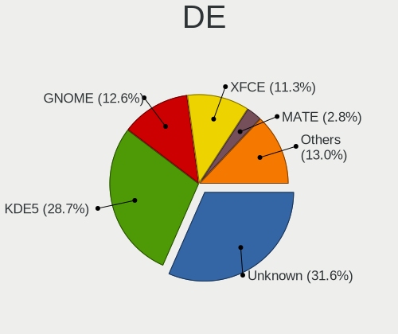

| Name      | Computers | Percent |
|-----------|-----------|---------|
| Unknown   | 78        | 31.58%  |
| KDE5      | 71        | 28.74%  |
| GNOME     | 31        | 12.55%  |
| XFCE      | 28        | 11.34%  |
| MATE      | 7         | 2.83%   |
| LXQt      | 5         | 2.02%   |
| i3        | 4         | 1.62%   |
| DWM       | 4         | 1.62%   |
| sway      | 3         | 1.21%   |
| KDE       | 3         | 1.21%   |
| Hyprland  | 3         | 1.21%   |
| Trinity   | 2         | 0.81%   |
| LXDE      | 2         | 0.81%   |
| Xsession  | 1         | 0.4%    |
| X-Generic | 1         | 0.4%    |
| ratpoison | 1         | 0.4%    |
| openbox   | 1         | 0.4%    |
| ICEWM     | 1         | 0.4%    |
| awesome   | 1         | 0.4%    |

Display Server
--------------

X11 or Wayland

| Name    | Computers | Percent |
|---------|-----------|---------|
| X11     | 109       | 43.25%  |
| Wayland | 60        | 23.81%  |
| Tty     | 45        | 17.86%  |
| Unknown | 38        | 15.08%  |

Display Manager
---------------

SDDM, LightDM, etc.

| Name    | Computers | Percent |
|---------|-----------|---------|
| Unknown | 88        | 35.92%  |
| SDDM    | 81        | 33.06%  |
| LightDM | 29        | 11.84%  |
| GDM     | 29        | 11.84%  |
| SLiM    | 6         | 2.45%   |
| LXDM    | 4         | 1.63%   |
| GREETD  | 4         | 1.63%   |
| TDM     | 3         | 1.22%   |
| XDM     | 1         | 0.41%   |

OS Lang
-------

Language

| Lang            | Computers | Percent |
|-----------------|-----------|---------|
| en_US           | 91        | 36.69%  |
| C.UTF8          | 29        | 11.69%  |
| Unknown         | 25        | 10.08%  |
| en_GB           | 22        | 8.87%   |
| de_DE           | 15        | 6.05%   |
| C               | 10        | 4.03%   |
| ru_RU           | 8         | 3.23%   |
| fr_FR           | 7         | 2.82%   |
| cs_CZ           | 6         | 2.42%   |
| en_IE           | 5         | 2.02%   |
| pt_BR           | 3         | 1.21%   |
| it_IT           | 3         | 1.21%   |
| pl_PL           | 2         | 0.81%   |
| es_ES           | 2         | 0.81%   |
| en_AU           | 2         | 0.81%   |
| uk_UA           | 1         | 0.4%    |
| sv_SE           | 1         | 0.4%    |
| ru_RU.UTF8      | 1         | 0.4%    |
| ro_RO           | 1         | 0.4%    |
| pl_PL.UTF8      | 1         | 0.4%    |
| nl_BE           | 1         | 0.4%    |
| fr_CA           | 1         | 0.4%    |
| fr_BE           | 1         | 0.4%    |
| fi_FI@euro.UTF- | 1         | 0.4%    |
| fi_FI           | 1         | 0.4%    |
| es_MX           | 1         | 0.4%    |
| es_AR           | 1         | 0.4%    |
| eo              | 1         | 0.4%    |
| en_IL           | 1         | 0.4%    |
| en_AT           | 1         | 0.4%    |
| el_GR           | 1         | 0.4%    |
| da_DK           | 1         | 0.4%    |
| ca_ES           | 1         | 0.4%    |

Boot Mode
---------

EFI or BIOS

| Mode | Computers | Percent |
|------|-----------|---------|
| EFI  | 184       | 76.03%  |
| BIOS | 58        | 23.97%  |

Filesystem
----------

Type of filesystem

| Type     | Computers | Percent |
|----------|-----------|---------|
| Ext4     | 140       | 57.61%  |
| Btrfs    | 70        | 28.81%  |
| F2fs     | 10        | 4.12%   |
| Xfs      | 8         | 3.29%   |
| Zfs      | 7         | 2.88%   |
| XXXXXXX  | 4         | 1.65%   |
| Reiserfs | 3         | 1.23%   |
| Jfs      | 1         | 0.41%   |

Part. scheme
------------

Scheme of partitioning

| Type    | Computers | Percent |
|---------|-----------|---------|
| GPT     | 206       | 85.48%  |
| MBR     | 28        | 11.62%  |
| Unknown | 7         | 2.9%    |

Dual Boot with Linux/BSD
------------------------

Hosting more than one Linux/BSD

| Dual boot | Computers | Percent |
|-----------|-----------|---------|
| No        | 161       | 65.98%  |
| Yes       | 83        | 34.02%  |

Dual Boot (Win)
---------------

Hosting Linux and Windows

| Dual boot | Computers | Percent |
|-----------|-----------|---------|
| No        | 162       | 66.67%  |
| Yes       | 81        | 33.33%  |

Board
-----

Vendor
------

Motherboard manufacturer

| Name                    | Computers | Percent |
|-------------------------|-----------|---------|
| ASUSTek Computer        | 57        | 23.75%  |
| Lenovo                  | 27        | 11.25%  |
| Hewlett-Packard         | 26        | 10.83%  |
| Gigabyte Technology     | 21        | 8.75%   |
| ASRock                  | 18        | 7.5%    |
| MSI                     | 17        | 7.08%   |
| Dell                    | 14        | 5.83%   |
| Supermicro              | 6         | 2.5%    |
| Acer                    | 6         | 2.5%    |
| Unknown                 | 6         | 2.5%    |
| Apple                   | 4         | 1.67%   |
| Intel                   | 3         | 1.25%   |
| HUAWEI                  | 3         | 1.25%   |
| Fujitsu                 | 3         | 1.25%   |
| Foxconn                 | 2         | 0.83%   |
| ZOTAC                   | 1         | 0.42%   |
| Valve                   | 1         | 0.42%   |
| TYAN Computer           | 1         | 0.42%   |
| TUXEDO                  | 1         | 0.42%   |
| Toshiba                 | 1         | 0.42%   |
| Timi                    | 1         | 0.42%   |
| Star Labs               | 1         | 0.42%   |
| realme                  | 1         | 0.42%   |
| Raspberry Pi Foundation | 1         | 0.42%   |
| Pine Microsystems       | 1         | 0.42%   |
| Pegatron                | 1         | 0.42%   |
| Panasonic               | 1         | 0.42%   |
| NEC Computers           | 1         | 0.42%   |
| Microsoft               | 1         | 0.42%   |
| Medion                  | 1         | 0.42%   |
| MAXDATA                 | 1         | 0.42%   |
| Jumper                  | 1         | 0.42%   |
| Huanan                  | 1         | 0.42%   |
| HPE                     | 1         | 0.42%   |
| Google                  | 1         | 0.42%   |
| Gateway                 | 1         | 0.42%   |
| Fujitsu Siemens         | 1         | 0.42%   |
| Fanless Mini PC         | 1         | 0.42%   |
| AMD                     | 1         | 0.42%   |
| Alienware               | 1         | 0.42%   |

Model
-----

Motherboard model

| Name                                    | Computers | Percent |
|-----------------------------------------|-----------|---------|
| Unknown                                 | 6         | 2.5%    |
| Supermicro Super Server                 | 3         | 1.25%   |
| HP ProLiant MicroServer Gen8            | 3         | 1.25%   |
| ASUS TUF Gaming X570-PLUS               | 3         | 1.25%   |
| ASUS ROG Zephyrus G14 GA401II_GA401II   | 3         | 1.25%   |
| ASRock X570 Taichi                      | 3         | 1.25%   |
| MSI MS-7B85                             | 2         | 0.83%   |
| Lenovo IdeaPad 5 15ABA7 82SG            | 2         | 0.83%   |
| Gigabyte X570S AORUS ELITE AX           | 2         | 0.83%   |
| Dell Precision 7770                     | 2         | 0.83%   |
| ASUS ROG STRIX Z590-F GAMING WIFI       | 2         | 0.83%   |
| ASUS ROG STRIX X570-E GAMING            | 2         | 0.83%   |
| ASUS ROG Strix G513QY_G513QY            | 2         | 0.83%   |
| ASUS ROG STRIX B650E-F GAMING WIFI      | 2         | 0.83%   |
| ASUS M3A78-CM                           | 2         | 0.83%   |
| ASUS All Series                         | 2         | 0.83%   |
| Apple MacBookPro11,1                    | 2         | 0.83%   |
| ZOTAC H67ITX-C-E                        | 1         | 0.42%   |
| Valve Jupiter                           | 1         | 0.42%   |
| TYAN VT82C694T                          | 1         | 0.42%   |
| TUXEDO Polaris AMD Gen3 (CZN)           | 1         | 0.42%   |
| Toshiba Satellite L850                  | 1         | 0.42%   |
| Timi RedmiBook Pro 15S                  | 1         | 0.42%   |
| Supermicro X8DT3                        | 1         | 0.42%   |
| Supermicro X10SL7-F                     | 1         | 0.42%   |
| Supermicro SSG-6028R-ER12-HDP-AI050     | 1         | 0.42%   |
| Star Labs StarBook                      | 1         | 0.42%   |
| realme RMNBXXXX                         | 1         | 0.42%   |
| RPi Raspberry Pi                        | 1         | 0.42%   |
| Pine Microsystems Pine64 RockPro64 v2.1 | 1         | 0.42%   |
| Pegatron 810-170st                      | 1         | 0.42%   |
| Panasonic CF-53ASCZGFG                  | 1         | 0.42%   |
| NEC Computers PC-MKM30BZG4              | 1         | 0.42%   |
| MSI Vector GP66 12UEO                   | 1         | 0.42%   |
| MSI MS-7D67                             | 1         | 0.42%   |
| MSI MS-7D15                             | 1         | 0.42%   |
| MSI MS-7D09                             | 1         | 0.42%   |
| MSI MS-7C91                             | 1         | 0.42%   |
| MSI MS-7C79                             | 1         | 0.42%   |
| MSI MS-7C35                             | 1         | 0.42%   |

Model Family
------------

Motherboard model prefix

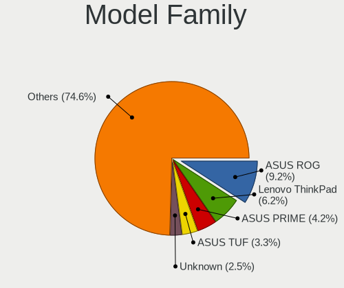

| Name                | Computers | Percent |
|---------------------|-----------|---------|
| ASUS ROG            | 22        | 9.17%   |
| Lenovo ThinkPad     | 15        | 6.25%   |
| ASUS PRIME          | 10        | 4.17%   |
| ASUS TUF            | 8         | 3.33%   |
| Unknown             | 6         | 2.5%    |
| HP EliteBook        | 5         | 2.08%   |
| ASRock X570         | 5         | 2.08%   |
| Dell Latitude       | 4         | 1.67%   |
| Acer Aspire         | 4         | 1.67%   |
| Supermicro Super    | 3         | 1.25%   |
| Lenovo Legion       | 3         | 1.25%   |
| Lenovo IdeaPad      | 3         | 1.25%   |
| HP ProLiant         | 3         | 1.25%   |
| HP Pavilion         | 3         | 1.25%   |
| Dell XPS            | 3         | 1.25%   |
| Dell Precision      | 3         | 1.25%   |
| Dell Inspiron       | 3         | 1.25%   |
| ASUS VivoBook       | 3         | 1.25%   |
| ASRock X670E        | 3         | 1.25%   |
| MSI MS-7B85         | 2         | 0.83%   |
| Lenovo Yoga         | 2         | 0.83%   |
| Lenovo ThinkStation | 2         | 0.83%   |
| Lenovo IdeaPadFlex  | 2         | 0.83%   |
| HP ZBook            | 2         | 0.83%   |
| HP Victus           | 2         | 0.83%   |
| HP ProBook          | 2         | 0.83%   |
| HP Laptop           | 2         | 0.83%   |
| Gigabyte Z390       | 2         | 0.83%   |
| Gigabyte X570S      | 2         | 0.83%   |
| Gigabyte X570       | 2         | 0.83%   |
| Fujitsu LIFEBOOK    | 2         | 0.83%   |
| ASUS M3A78-CM       | 2         | 0.83%   |
| ASUS ASUS           | 2         | 0.83%   |
| ASUS All            | 2         | 0.83%   |
| Apple MacBookPro11  | 2         | 0.83%   |
| Acer Swift          | 2         | 0.83%   |
| ZOTAC H67ITX-C-E    | 1         | 0.42%   |
| Valve Jupiter       | 1         | 0.42%   |
| TYAN VT82C694T      | 1         | 0.42%   |
| TUXEDO Polaris      | 1         | 0.42%   |

MFG Year
--------

Motherboard manufacture year

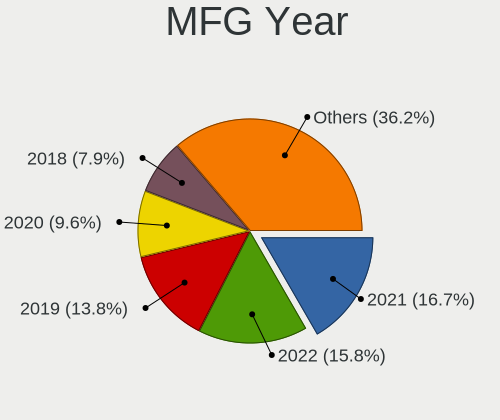

| Year    | Computers | Percent |
|---------|-----------|---------|
| 2021    | 40        | 16.67%  |
| 2022    | 38        | 15.83%  |
| 2019    | 33        | 13.75%  |
| 2020    | 23        | 9.58%   |
| 2018    | 19        | 7.92%   |
| 2012    | 13        | 5.42%   |
| 2017    | 11        | 4.58%   |
| 2013    | 9         | 3.75%   |
| 2010    | 9         | 3.75%   |
| 2023    | 8         | 3.33%   |
| 2016    | 6         | 2.5%    |
| 2015    | 6         | 2.5%    |
| 2014    | 6         | 2.5%    |
| 2008    | 6         | 2.5%    |
| 2009    | 4         | 1.67%   |
| 2011    | 3         | 1.25%   |
| Unknown | 3         | 1.25%   |
| 2007    | 1         | 0.42%   |
| 2003    | 1         | 0.42%   |
| 2002    | 1         | 0.42%   |

Form Factor
-----------

Physical design of the computer

| Name           | Computers | Percent |
|----------------|-----------|---------|
| Desktop        | 119       | 49.58%  |
| Notebook       | 101       | 42.08%  |
| Convertible    | 8         | 3.33%   |
| Server         | 5         | 2.08%   |
| System on chip | 3         | 1.25%   |
| Mini pc        | 2         | 0.83%   |
| Stick pc       | 1         | 0.42%   |
| Tablet         | 1         | 0.42%   |

Secure Boot
-----------

Enabled or disabled

| State    | Computers | Percent |
|----------|-----------|---------|
| Disabled | 237       | 98.75%  |
| Enabled  | 3         | 1.25%   |

Coreboot
--------

Have coreboot on board

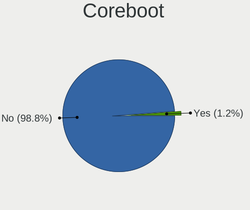

| Used | Computers | Percent |
|------|-----------|---------|
| No   | 237       | 98.75%  |
| Yes  | 3         | 1.25%   |

RAM Size
--------

Total RAM memory

| Size in GB      | Computers | Percent |
|-----------------|-----------|---------|
| 32.01-64.0      | 53        | 21.81%  |
| 16.01-24.0      | 41        | 16.87%  |
| 64.01-256.0     | 40        | 16.46%  |
| 8.01-16.0       | 40        | 16.46%  |
| 4.01-8.0        | 31        | 12.76%  |
| 24.01-32.0      | 17        | 7%      |
| 3.01-4.0        | 12        | 4.94%   |
| 2.01-3.0        | 3         | 1.23%   |
| 1.01-2.0        | 3         | 1.23%   |
| More than 256.0 | 1         | 0.41%   |
| 0.51-1.0        | 1         | 0.41%   |
| 0.01-0.5        | 1         | 0.41%   |

RAM Used
--------

Used RAM memory

| Used GB    | Computers | Percent |
|------------|-----------|---------|
| 2.01-3.0   | 51        | 19.03%  |
| 4.01-8.0   | 50        | 18.66%  |
| 1.01-2.0   | 44        | 16.42%  |
| 3.01-4.0   | 34        | 12.69%  |
| 8.01-16.0  | 29        | 10.82%  |
| 0.51-1.0   | 25        | 9.33%   |
| 0.01-0.5   | 23        | 8.58%   |
| 16.01-24.0 | 7         | 2.61%   |
| 32.01-64.0 | 3         | 1.12%   |
| 24.01-32.0 | 1         | 0.37%   |
| 0          | 1         | 0.37%   |

Total Drives
------------

Number of drives on board

| Drives | Computers | Percent |
|--------|-----------|---------|
| 1      | 107       | 44.03%  |
| 2      | 58        | 23.87%  |
| 3      | 26        | 10.7%   |
| 4      | 19        | 7.82%   |
| 5      | 14        | 5.76%   |
| 6      | 7         | 2.88%   |
| 7      | 4         | 1.65%   |
| 10     | 3         | 1.23%   |
| 8      | 2         | 0.82%   |
| 21     | 1         | 0.41%   |
| 13     | 1         | 0.41%   |
| 0      | 1         | 0.41%   |

Has CD-ROM
----------

Has CD-ROM on board

| Presented | Computers | Percent |
|-----------|-----------|---------|
| No        | 186       | 77.18%  |
| Yes       | 55        | 22.82%  |

Has Ethernet
------------

Has Ethernet on board

| Presented | Computers | Percent |
|-----------|-----------|---------|
| Yes       | 212       | 87.97%  |
| No        | 29        | 12.03%  |

Has WiFi
--------

Has WiFi module

| Presented | Computers | Percent |
|-----------|-----------|---------|
| Yes       | 175       | 72.61%  |
| No        | 66        | 27.39%  |

Has Bluetooth
-------------

Has Bluetooth module

| Presented | Computers | Percent |
|-----------|-----------|---------|
| Yes       | 164       | 67.21%  |
| No        | 80        | 32.79%  |

Location
--------

Country
-------

Geographic location (country)

| Country      | Computers | Percent |
|--------------|-----------|---------|
| USA          | 63        | 25.93%  |
| Germany      | 32        | 13.17%  |
| UK           | 17        | 7%      |
| Russia       | 17        | 7%      |
| France       | 15        | 6.17%   |
| Poland       | 10        | 4.12%   |
| Canada       | 9         | 3.7%    |
| Spain        | 7         | 2.88%   |
| Brazil       | 6         | 2.47%   |
| Sweden       | 5         | 2.06%   |
| Czechia      | 5         | 2.06%   |
| Italy        | 4         | 1.65%   |
| Belgium      | 4         | 1.65%   |
| Slovakia     | 3         | 1.23%   |
| Netherlands  | 3         | 1.23%   |
| China        | 3         | 1.23%   |
| Vietnam      | 2         | 0.82%   |
| Turkey       | 2         | 0.82%   |
| Switzerland  | 2         | 0.82%   |
| Romania      | 2         | 0.82%   |
| Indonesia    | 2         | 0.82%   |
| Hungary      | 2         | 0.82%   |
| Finland      | 2         | 0.82%   |
| Australia    | 2         | 0.82%   |
| Ukraine      | 1         | 0.41%   |
| Taiwan       | 1         | 0.41%   |
| South Africa | 1         | 0.41%   |
| Portugal     | 1         | 0.41%   |
| Norway       | 1         | 0.41%   |
| New Zealand  | 1         | 0.41%   |
| Moldova      | 1         | 0.41%   |
| Mexico       | 1         | 0.41%   |
| Luxembourg   | 1         | 0.41%   |
| Lithuania    | 1         | 0.41%   |
| Kazakhstan   | 1         | 0.41%   |
| Japan        | 1         | 0.41%   |
| Israel       | 1         | 0.41%   |
| Ireland      | 1         | 0.41%   |
| Iran         | 1         | 0.41%   |
| Iceland      | 1         | 0.41%   |

City
----

Geographic location (city)

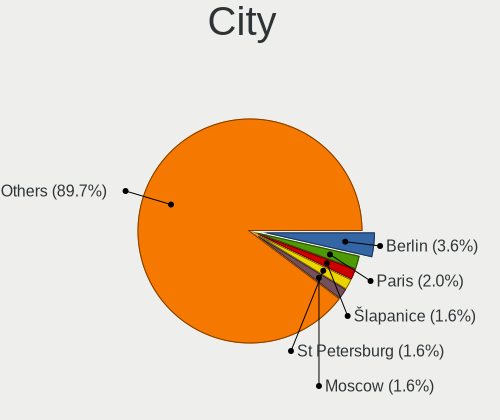

| City              | Computers | Percent |
|-------------------|-----------|---------|
| Berlin            | 9         | 3.56%   |
| Paris             | 5         | 1.98%   |
| St Petersburg     | 4         | 1.58%   |
| lapanice        | 4         | 1.58%   |
| Moscow            | 4         | 1.58%   |
| Frankfurt am Main | 4         | 1.58%   |
| Warsaw            | 3         | 1.19%   |
| Sterling          | 3         | 1.19%   |
| Sao Paulo         | 3         | 1.19%   |
| Kippens           | 3         | 1.19%   |
| Cieszyn           | 3         | 1.19%   |
| Bothell           | 3         | 1.19%   |
| Beaverton         | 3         | 1.19%   |
| Vladivostok       | 2         | 0.79%   |
| Ulm               | 2         | 0.79%   |
| Taganrog          | 2         | 0.79%   |
| Sun Prairie       | 2         | 0.79%   |
| Summerville       | 2         | 0.79%   |
| Stockholm         | 2         | 0.79%   |
| Shrewsbury        | 2         | 0.79%   |
| Seattle           | 2         | 0.79%   |
| Pittsburgh        | 2         | 0.79%   |
| Oviedo            | 2         | 0.79%   |
| Milan             | 2         | 0.79%   |
| Leeds             | 2         | 0.79%   |
| Hanoi             | 2         | 0.79%   |
| Gatineau          | 2         | 0.79%   |
| Flint             | 2         | 0.79%   |
| tampes          | 2         | 0.79%   |
| Cognac            | 2         | 0.79%   |
| Chicago           | 2         | 0.79%   |
| Burnham-on-Sea    | 2         | 0.79%   |
| Budapest          | 2         | 0.79%   |
| Bratislava        | 2         | 0.79%   |
| Barcelona         | 2         | 0.79%   |
| Augusta           | 2         | 0.79%   |
| Zurich            | 1         | 0.4%    |
| Yucaipa           | 1         | 0.4%    |
| Yeovil            | 1         | 0.4%    |
| Woburn            | 1         | 0.4%    |

Drives
------

Drive Vendor
------------

Hard drive vendors

| Vendor                      | Computers | Drives | Percent |
|-----------------------------|-----------|--------|---------|
| Samsung Electronics         | 87        | 162    | 20.33%  |
| Seagate                     | 48        | 99     | 11.21%  |
| WDC                         | 44        | 93     | 10.28%  |
| SanDisk                     | 36        | 44     | 8.41%   |
| Toshiba                     | 21        | 32     | 4.91%   |
| Crucial                     | 19        | 38     | 4.44%   |
| Intel                       | 17        | 22     | 3.97%   |
| Kingston                    | 14        | 17     | 3.27%   |
| Phison Electronics          | 13        | 18     | 3.04%   |
| Unknown                     | 11        | 12     | 2.57%   |
| SK hynix                    | 11        | 12     | 2.57%   |
| Micron Technology           | 10        | 12     | 2.34%   |
| Kingston Technology Company | 9         | 9      | 2.1%    |
| Hitachi                     | 9         | 30     | 2.1%    |
| China                       | 9         | 24     | 2.1%    |
| HGST                        | 8         | 16     | 1.87%   |
| Micron/Crucial Technology   | 7         | 10     | 1.64%   |
| GOODRAM                     | 5         | 18     | 1.17%   |
| Silicon Motion              | 4         | 5      | 0.93%   |
| MAXIO Technology (Hangzhou) | 4         | 4      | 0.93%   |
| A-DATA Technology           | 4         | 4      | 0.93%   |
| Realtek Semiconductor       | 3         | 5      | 0.7%    |
| PNY                         | 3         | 6      | 0.7%    |
| OCZ                         | 3         | 3      | 0.7%    |
| KIOXIA                      | 3         | 4      | 0.7%    |
| Apple                       | 3         | 3      | 0.7%    |
| ADATA Technology            | 3         | 5      | 0.7%    |
| Phison                      | 2         | 3      | 0.47%   |
| ADROITLARK                  | 2         | 3      | 0.47%   |
| XPG                         | 1         | 1      | 0.23%   |
| Verbatim                    | 1         | 1      | 0.23%   |
| V-GeN                       | 1         | 1      | 0.23%   |
| Transcend                   | 1         | 1      | 0.23%   |
| Teleplan                    | 1         | 3      | 0.23%   |
| T-FORCE                     | 1         | 1      | 0.23%   |
| SABRENT                     | 1         | 1      | 0.23%   |
| Netac                       | 1         | 1      | 0.23%   |
| Maxtor                      | 1         | 1      | 0.23%   |
| LITEONIT                    | 1         | 2      | 0.23%   |
| Lexar                       | 1         | 1      | 0.23%   |

Drive Model
-----------

Hard drive models

| Model                                                           | Computers | Percent |
|-----------------------------------------------------------------|-----------|---------|
| Samsung NVMe SSD Controller SM981/PM981/PM983 250GB             | 29        | 5.78%   |
| Samsung NVMe SSD Controller PM9A1/PM9A3/980PRO 2TB              | 28        | 5.58%   |
| Samsung SSD 980 1TB                                             | 9         | 1.79%   |
| Sandisk WD Black SN750 / PC SN730 NVMe SSD 500GB                | 8         | 1.59%   |
| Sandisk WD Blue SN550 NVMe SSD 512GB                            | 7         | 1.39%   |
| Seagate ST4000DM004-2CV104 4TB                                  | 6         | 1.2%    |
| Crucial CT1000MX500SSD1 1TB                                     | 6         | 1.2%    |
| Samsung NVMe SSD Controller SM961/PM961/SM963 256GB             | 5         | 1%      |
| Micron/Crucial P2 NVMe PCIe SSD 1TB                             | 5         | 1%      |
| Silicon Motion SM2263EN/SM2263XT SSD Controller 256GB           | 4         | 0.8%    |
| Seagate ST1000DM010-2EP102 1TB                                  | 4         | 0.8%    |
| Sandisk WD_BLACK SN770 1TB                                      | 4         | 0.8%    |
| Phison E12 NVMe Controller 512GB                                | 4         | 0.8%    |
| MAXIO (Hangzhou) NVMe SSD Controller MAP1202 1024GB             | 4         | 0.8%    |
| Kingston Company SNV2S2000G 2TB                                 | 4         | 0.8%    |
| Intel SSD 660P Series 512GB                                     | 4         | 0.8%    |
| WDC WD30EFRX-68EUZN0 3TB                                        | 3         | 0.6%    |
| Unknown MMC Card  128GB                                         | 3         | 0.6%    |
| Toshiba DT01ACA200 2TB                                          | 3         | 0.6%    |
| Toshiba DT01ACA100 1TB                                          | 3         | 0.6%    |
| Seagate ST1000LM035-1RK172 1TB                                  | 3         | 0.6%    |
| Seagate ST1000LM024 HN-M101MBB 1TB                              | 3         | 0.6%    |
| Samsung SSD 870 EVO 1TB                                         | 3         | 0.6%    |
| Samsung SSD 860 EVO 500GB                                       | 3         | 0.6%    |
| Samsung SSD 860 EVO 1TB                                         | 3         | 0.6%    |
| Samsung SSD 850 EVO 250GB                                       | 3         | 0.6%    |
| Kingston SA400S37480G 480GB SSD                                 | 3         | 0.6%    |
| ADATA XPG SX8200 Pro PCIe Gen3x4 M.2 2280 Solid State Drive 1TB | 3         | 0.6%    |
| WDC WDS500G2B0A-00SM50 500GB SSD                                | 2         | 0.4%    |
| WDC WD80EFAX-68KNBN0 8TB                                        | 2         | 0.4%    |
| WDC WD5000LPLX-66ZNTT1 500GB                                    | 2         | 0.4%    |
| WDC WD40EZRZ-00GXCB0 4TB                                        | 2         | 0.4%    |
| WDC WD30EFRX-68AX9N0 3TB                                        | 2         | 0.4%    |
| WDC WD20EARX-00PASB0 2TB                                        | 2         | 0.4%    |
| WDC WD2003FZEX-00SRLA0 2TB                                      | 2         | 0.4%    |
| WDC WD1502FYPS-02W3B0 1TB                                       | 2         | 0.4%    |
| WDC WD120EFBX-68B0EN0 12TB                                      | 2         | 0.4%    |
| Unknown MMC Card  512GB                                         | 2         | 0.4%    |
| Unknown MMC Card  32GB                                          | 2         | 0.4%    |
| SK hynix BC501 NVMe Solid State Drive 512GB                     | 2         | 0.4%    |

HDD Vendor
----------

Hard disk drive vendors

| Vendor              | Computers | Drives | Percent |
|---------------------|-----------|--------|---------|
| Seagate             | 48        | 97     | 37.5%   |
| WDC                 | 38        | 84     | 29.69%  |
| Toshiba             | 18        | 28     | 14.06%  |
| Hitachi             | 9         | 30     | 7.03%   |
| HGST                | 8         | 16     | 6.25%   |
| Samsung Electronics | 3         | 3      | 2.34%   |
| Unknown             | 1         | 1      | 0.78%   |
| Teleplan            | 1         | 3      | 0.78%   |
| Maxtor              | 1         | 1      | 0.78%   |
| ASMT                | 1         | 2      | 0.78%   |

SSD Vendor
----------

Solid state drive vendors

| Vendor              | Computers | Drives | Percent |
|---------------------|-----------|--------|---------|
| Samsung Electronics | 32        | 52     | 24.24%  |
| Crucial             | 19        | 38     | 14.39%  |
| Kingston            | 12        | 14     | 9.09%   |
| SanDisk             | 11        | 14     | 8.33%   |
| China               | 9         | 24     | 6.82%   |
| WDC                 | 7         | 9      | 5.3%    |
| Intel               | 5         | 6      | 3.79%   |
| GOODRAM             | 5         | 18     | 3.79%   |
| Micron Technology   | 4         | 6      | 3.03%   |
| A-DATA Technology   | 4         | 4      | 3.03%   |
| PNY                 | 3         | 6      | 2.27%   |
| OCZ                 | 3         | 3      | 2.27%   |
| Apple               | 3         | 3      | 2.27%   |
| ADROITLARK          | 2         | 3      | 1.52%   |
| Verbatim            | 1         | 1      | 0.76%   |
| V-GeN               | 1         | 1      | 0.76%   |
| Transcend           | 1         | 1      | 0.76%   |
| Toshiba             | 1         | 1      | 0.76%   |
| T-FORCE             | 1         | 1      | 0.76%   |
| SK hynix            | 1         | 1      | 0.76%   |
| Netac               | 1         | 1      | 0.76%   |
| LITEONIT            | 1         | 2      | 0.76%   |
| Lexar               | 1         | 1      | 0.76%   |
| KingSpec            | 1         | 1      | 0.76%   |
| Intenso             | 1         | 1      | 0.76%   |
| Dogfish             | 1         | 1      | 0.76%   |
| Unknown             | 1         | 1      | 0.76%   |

Drive Kind
----------

HDD or SSD

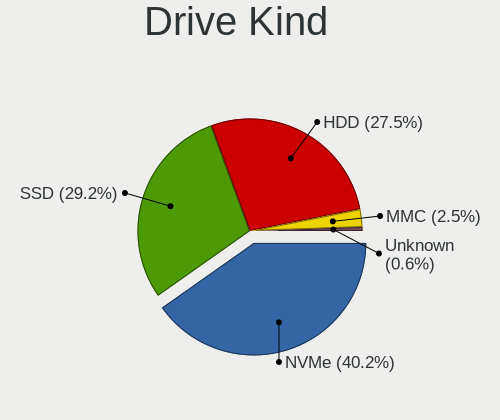

| Kind    | Computers | Drives | Percent |
|---------|-----------|--------|---------|
| NVMe    | 142       | 241    | 40.46%  |
| SSD     | 102       | 214    | 29.06%  |
| HDD     | 96        | 265    | 27.35%  |
| MMC     | 9         | 10     | 2.56%   |
| Unknown | 2         | 3      | 0.57%   |

Drive Connector
---------------

SATA, SAS, NVMe, etc.

| Type | Computers | Drives | Percent |
|------|-----------|--------|---------|
| SATA | 150       | 462    | 47.77%  |
| NVMe | 142       | 239    | 45.22%  |
| SAS  | 13        | 22     | 4.14%   |
| MMC  | 9         | 10     | 2.87%   |

Drive Size
----------

Size of hard drive

| Size in TB | Computers | Drives | Percent |
|------------|-----------|--------|---------|
| 0.01-0.5   | 92        | 147    | 37.25%  |
| 0.51-1.0   | 65        | 134    | 26.32%  |
| 1.01-2.0   | 37        | 70     | 14.98%  |
| 3.01-4.0   | 24        | 46     | 9.72%   |
| 4.01-10.0  | 17        | 41     | 6.88%   |
| 2.01-3.0   | 8         | 32     | 3.24%   |
| 10.01-20.0 | 4         | 9      | 1.62%   |

Space Total
-----------

Amount of disk space available on the file system

| Size in GB     | Computers | Percent |
|----------------|-----------|---------|
| 501-1000       | 47        | 18.95%  |
| More than 3000 | 45        | 18.15%  |
| 251-500        | 45        | 18.15%  |
| 101-250        | 30        | 12.1%   |
| 1001-2000      | 30        | 12.1%   |
| 2001-3000      | 15        | 6.05%   |
| 1-20           | 13        | 5.24%   |
| 51-100         | 12        | 4.84%   |
| Unknown        | 9         | 3.63%   |
| 21-50          | 2         | 0.81%   |

Space Used
----------

Amount of used disk space

| Used GB        | Computers | Percent |
|----------------|-----------|---------|
| 1-20           | 53        | 20.46%  |
| 21-50          | 35        | 13.51%  |
| 251-500        | 31        | 11.97%  |
| 101-250        | 30        | 11.58%  |
| 501-1000       | 30        | 11.58%  |
| More than 3000 | 23        | 8.88%   |
| 51-100         | 23        | 8.88%   |
| 1001-2000      | 21        | 8.11%   |
| Unknown        | 9         | 3.47%   |
| 2001-3000      | 4         | 1.54%   |

Malfunc. Drives
---------------

Drive models with a malfunction

| Model                                                     | Computers | Drives | Percent |
|-----------------------------------------------------------|-----------|--------|---------|
| Toshiba DT01ACA200 2TB                                    | 2         | 2      | 5%      |
| Seagate ST1000LM024 HN-M101MBB 1TB                        | 2         | 3      | 5%      |
| HGST HTS725050A7E630 500GB                                | 2         | 2      | 5%      |
| WDC WD60PURZ-85ZUFY1 6TB                                  | 1         | 1      | 2.5%    |
| WDC WD60EZRX-00MVLB1 6TB                                  | 1         | 1      | 2.5%    |
| WDC WD60EFAX-68SHWN0 6TB                                  | 1         | 1      | 2.5%    |
| WDC WD30EFRX-68EUZN0 3TB                                  | 1         | 2      | 2.5%    |
| WDC WD30EFRX-68AX9N0 3TB                                  | 1         | 1      | 2.5%    |
| Toshiba MK5056GSY 500GB                                   | 1         | 1      | 2.5%    |
| Toshiba MK1633GSG 160GB                                   | 1         | 1      | 2.5%    |
| SK hynix PC711 HFS512GDE9X073N 512GB                      | 1         | 2      | 2.5%    |
| Seagate ST750LM022 HN-M750MBB 752GB                       | 1         | 1      | 2.5%    |
| Seagate ST500DM002-1BC142 500GB                           | 1         | 1      | 2.5%    |
| Seagate ST4000VN008-2DR166 4TB                            | 1         | 2      | 2.5%    |
| Seagate ST4000DM005-2DP166 4TB                            | 1         | 1      | 2.5%    |
| Seagate ST380011A 80GB                                    | 1         | 1      | 2.5%    |
| Seagate ST3500630NS 500GB                                 | 1         | 2      | 2.5%    |
| Seagate ST3000DM001-9YN166 3TB                            | 1         | 1      | 2.5%    |
| Seagate ST2000DX002-2DV164 2TB                            | 1         | 1      | 2.5%    |
| Seagate ST2000DM001-1CH164 2TB                            | 1         | 1      | 2.5%    |
| Seagate ST1000DM010-2EP102 1TB                            | 1         | 1      | 2.5%    |
| SanDisk SSD PLUS 480GB                                    | 1         | 1      | 2.5%    |
| Samsung Electronics SSD 980 1TB                           | 1         | 1      | 2.5%    |
| Samsung Electronics SSD 870 EVO 1TB                       | 1         | 8      | 2.5%    |
| Samsung Electronics SP2504C 250GB                         | 1         | 1      | 2.5%    |
| Realtek Semiconductor RTS5763DL NVMe SSD Controller 512GB | 1         | 2      | 2.5%    |
| PNY SSD2SC120G1LC763C121S459P 120GB                       | 1         | 1      | 2.5%    |
| Intel SSDSCKKF180G8L 180GB                                | 1         | 1      | 2.5%    |
| Intel SSDSC2BF180A5L 180GB                                | 1         | 1      | 2.5%    |
| Intel SSDSC2BB160G4T 160GB                                | 1         | 2      | 2.5%    |
| Intel SSDSA2M080G2GC 80GB                                 | 1         | 1      | 2.5%    |
| Hitachi HTS721080G9SA00 80GB                              | 1         | 1      | 2.5%    |
| HGST HUS726020ALA610 2TB                                  | 1         | 4      | 2.5%    |
| HGST HTS721010A9E630 1TB                                  | 1         | 1      | 2.5%    |
| Crucial M4-CT512M4SSD2 512GB                              | 1         | 1      | 2.5%    |
| China SSD 240GB                                           | 1         | 1      | 2.5%    |
| China SATA SSD 960GB                                      | 1         | 2      | 2.5%    |

Malfunc. Drive Vendor
---------------------

Vendors of faulty drives

| Vendor                | Computers | Drives | Percent |
|-----------------------|-----------|--------|---------|
| Seagate               | 11        | 15     | 28.95%  |
| WDC                   | 4         | 6      | 10.53%  |
| Toshiba               | 4         | 4      | 10.53%  |
| Intel                 | 4         | 5      | 10.53%  |
| HGST                  | 4         | 7      | 10.53%  |
| Samsung Electronics   | 3         | 10     | 7.89%   |
| China                 | 2         | 3      | 5.26%   |
| SK hynix              | 1         | 2      | 2.63%   |
| SanDisk               | 1         | 1      | 2.63%   |
| Realtek Semiconductor | 1         | 2      | 2.63%   |
| PNY                   | 1         | 1      | 2.63%   |
| Hitachi               | 1         | 1      | 2.63%   |
| Crucial               | 1         | 1      | 2.63%   |

Malfunc. HDD Vendor
-------------------

Vendors of faulty HDD drives

| Vendor              | Computers | Drives | Percent |
|---------------------|-----------|--------|---------|
| Seagate             | 11        | 15     | 44%     |
| WDC                 | 4         | 6      | 16%     |
| Toshiba             | 4         | 4      | 16%     |
| HGST                | 4         | 7      | 16%     |
| Samsung Electronics | 1         | 1      | 4%      |
| Hitachi             | 1         | 1      | 4%      |

Malfunc. Drive Kind
-------------------

Kinds of faulty drives

| Kind | Computers | Drives | Percent |
|------|-----------|--------|---------|
| HDD  | 23        | 34     | 63.89%  |
| SSD  | 10        | 19     | 27.78%  |
| NVMe | 3         | 5      | 8.33%   |

Failed Drives
-------------

Failed drive models

| Model                           | Computers | Drives | Percent |
|---------------------------------|-----------|--------|---------|
| WDC WD20EARS-00MVWB0 2TB        | 1         | 2      | 50%     |
| Samsung Electronics SSD 980 1TB | 1         | 1      | 50%     |

Failed Drive Vendor
-------------------

Failed drive vendors

| Vendor              | Computers | Drives | Percent |
|---------------------|-----------|--------|---------|
| WDC                 | 1         | 2      | 50%     |
| Samsung Electronics | 1         | 1      | 50%     |

Drive Status
------------

Number of failed and malfunc. drives

| Status   | Computers | Drives | Percent |
|----------|-----------|--------|---------|
| Works    | 213       | 608    | 75.27%  |
| Malfunc  | 35        | 58     | 12.37%  |
| Detected | 33        | 64     | 11.66%  |
| Failed   | 2         | 3      | 0.71%   |

Storage controller
------------------

Storage Vendor
--------------

Storage controller vendors

| Vendor                       | Computers | Percent |
|------------------------------|-----------|---------|
| Intel                        | 114       | 29.53%  |
| AMD                          | 78        | 20.21%  |
| Samsung Electronics          | 63        | 16.32%  |
| Sandisk                      | 26        | 6.74%   |
| ASMedia Technology           | 15        | 3.89%   |
| Phison Electronics           | 14        | 3.63%   |
| Kingston Technology Company  | 11        | 2.85%   |
| SK hynix                     | 10        | 2.59%   |
| Micron/Crucial Technology    | 7         | 1.81%   |
| Micron Technology            | 6         | 1.55%   |
| Broadcom / LSI               | 6         | 1.55%   |
| Marvell Technology Group     | 5         | 1.3%    |
| Silicon Motion               | 4         | 1.04%   |
| MAXIO Technology (Hangzhou)  | 4         | 1.04%   |
| JMicron Technology           | 4         | 1.04%   |
| Realtek Semiconductor        | 3         | 0.78%   |
| Nvidia                       | 3         | 0.78%   |
| KIOXIA                       | 3         | 0.78%   |
| ADATA Technology             | 3         | 0.78%   |
| Toshiba America Info Systems | 2         | 0.52%   |
| INNOGRIT                     | 2         | 0.52%   |
| VIA Technologies             | 1         | 0.26%   |
| Silicon Image                | 1         | 0.26%   |
| LSI Logic / Symbios Logic    | 1         | 0.26%   |

Storage Model
-------------

Storage controller models

| Model                                                                          | Computers | Percent |
|--------------------------------------------------------------------------------|-----------|---------|
| AMD FCH SATA Controller [AHCI mode]                                            | 61        | 14.06%  |
| Samsung NVMe SSD Controller SM981/PM981/PM983                                  | 28        | 6.45%   |
| Samsung NVMe SSD Controller PM9A1/PM9A3/980PRO                                 | 28        | 6.45%   |
| Samsung NVMe SSD Controller 980 (DRAM-less)                                    | 12        | 2.76%   |
| ASMedia ASM1062 Serial ATA Controller                                          | 12        | 2.76%   |
| SanDisk Extreme Pro / WD Black SN750 / PC SN730 / Red SN700 NVMe SSD           | 8         | 1.84%   |
| Intel Volume Management Device NVMe RAID Controller                            | 8         | 1.84%   |
| Intel 7 Series Chipset Family 6-port SATA Controller [AHCI mode]               | 8         | 1.84%   |
| AMD 400 Series Chipset SATA Controller                                         | 8         | 1.84%   |
| SanDisk Ultra 3D / WD Blue SN550 NVMe SSD                                      | 7         | 1.61%   |
| Intel Cannon Lake PCH SATA AHCI Controller                                     | 7         | 1.61%   |
| Intel 8 Series/C220 Series Chipset Family 6-port SATA Controller 1 [AHCI mode] | 7         | 1.61%   |
| SK hynix Gold P31/BC711/PC711 NVMe Solid State Drive                           | 6         | 1.38%   |
| Intel 82801 Mobile SATA Controller [RAID mode]                                 | 6         | 1.38%   |
| Intel 500 Series Chipset Family SATA AHCI Controller                           | 6         | 1.38%   |
| AMD 500 Series Chipset SATA Controller                                         | 6         | 1.38%   |
| Samsung NVMe SSD Controller SM961/PM961/SM963                                  | 5         | 1.15%   |
| Phison E18 PCIe4 NVMe Controller                                               | 5         | 1.15%   |
| Micron/Crucial P2 [Nick P2] / P3 / P3 Plus NVMe PCIe SSD (DRAM-less)           | 5         | 1.15%   |
| Intel Sunrise Point-LP SATA Controller [AHCI mode]                             | 5         | 1.15%   |
| Intel Q170/Q150/B150/H170/H110/Z170/CM236 Chipset SATA Controller [AHCI Mode]  | 5         | 1.15%   |
| Intel Comet Lake SATA AHCI Controller                                          | 5         | 1.15%   |
| AMD SB7x0/SB8x0/SB9x0 SATA Controller [AHCI mode]                              | 5         | 1.15%   |
| Silicon Motion SM2263EN/SM2263XT (DRAM-less) NVMe SSD Controllers              | 4         | 0.92%   |
| SanDisk WD Black SN770 / PC SN740 256GB / PC SN560 (DRAM-less) NVMe SSD        | 4         | 0.92%   |
| Phison E12 NVMe Controller                                                     | 4         | 0.92%   |
| Micron 2450 NVMe SSD [HendrixV] (DRAM-less)                                    | 4         | 0.92%   |
| MAXIO (Hangzhou) NVMe SSD Controller MAP1202                                   | 4         | 0.92%   |
| Kingston Company NV2 NVMe SSD SM2267XT                                         | 4         | 0.92%   |
| Intel SSD 670p Series [Keystone Harbor]                                        | 4         | 0.92%   |
| Intel SSD 660P Series                                                          | 4         | 0.92%   |
| Intel Cannon Lake Mobile PCH SATA AHCI Controller                              | 4         | 0.92%   |
| Intel 6 Series/C200 Series Chipset Family 6 port Desktop SATA AHCI Controller  | 4         | 0.92%   |
| AMD SB7x0/SB8x0/SB9x0 IDE Controller                                           | 4         | 0.92%   |
| Kingston Company KC3000/FURY Renegade NVMe SSD E18                             | 3         | 0.69%   |
| Intel Tiger Lake-LP SATA Controller                                            | 3         | 0.69%   |
| Intel NM10/ICH7 Family SATA Controller [AHCI mode]                             | 3         | 0.69%   |
| Intel HM170/QM170 Chipset SATA Controller [AHCI Mode]                          | 3         | 0.69%   |
| Intel Alder Lake-S PCH SATA Controller [AHCI Mode]                             | 3         | 0.69%   |
| Intel 6 Series/C200 Series Chipset Family 6 port Mobile SATA AHCI Controller   | 3         | 0.69%   |

Storage Kind
------------

Kind of storage controller (IDE, SATA, NVMe, SAS, ...)

| Kind | Computers | Percent |
|------|-----------|---------|
| SATA | 173       | 48.46%  |
| NVMe | 141       | 39.5%   |
| RAID | 20        | 5.6%    |
| IDE  | 16        | 4.48%   |
| SAS  | 6         | 1.68%   |
| SCSI | 1         | 0.28%   |

Processor
---------

CPU Vendor
----------

Processor vendors

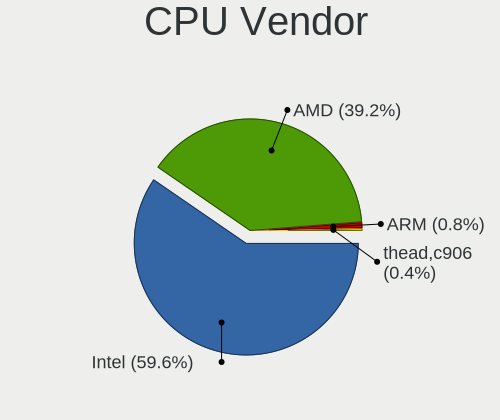

| Vendor     | Computers | Percent |
|------------|-----------|---------|
| Intel      | 143       | 59.58%  |
| AMD        | 94        | 39.17%  |
| ARM        | 2         | 0.83%   |
| thead,c906 | 1         | 0.42%   |

CPU Model
---------

Processor models

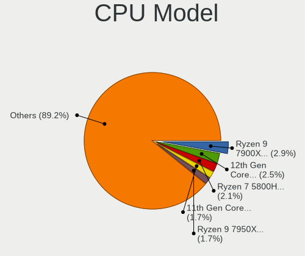

| Model                                         | Computers | Percent |
|-----------------------------------------------|-----------|---------|
| AMD Ryzen 9 7900X 12-Core Processor           | 7         | 2.9%    |
| Intel 12th Gen Core i7-12700H                 | 6         | 2.49%   |
| AMD Ryzen 7 5800H with Radeon Graphics        | 5         | 2.07%   |
| Intel 11th Gen Core i7-1165G7 @ 2.80GHz       | 4         | 1.66%   |
| AMD Ryzen 9 7950X 16-Core Processor           | 4         | 1.66%   |
| AMD Ryzen 9 3900X 12-Core Processor           | 4         | 1.66%   |
| AMD Ryzen 7 3700X 8-Core Processor            | 4         | 1.66%   |
| AMD Ryzen 5 5600X 6-Core Processor            | 4         | 1.66%   |
| Intel Xeon CPU E3-1230 V2 @ 3.30GHz           | 3         | 1.24%   |
| Intel Core i7-8750H CPU @ 2.20GHz             | 3         | 1.24%   |
| Intel Core i7-10700K CPU @ 3.80GHz            | 3         | 1.24%   |
| Intel 11th Gen Core i7-11800H @ 2.30GHz       | 3         | 1.24%   |
| Intel 11th Gen Core i5-1135G7 @ 2.40GHz       | 3         | 1.24%   |
| AMD Ryzen 9 5950X 16-Core Processor           | 3         | 1.24%   |
| AMD Ryzen 9 5900X 12-Core Processor           | 3         | 1.24%   |
| AMD Ryzen 7 5825U with Radeon Graphics        | 3         | 1.24%   |
| AMD Ryzen 7 4800HS with Radeon Graphics       | 3         | 1.24%   |
| Intel Core i9-9900K CPU @ 3.60GHz             | 2         | 0.83%   |
| Intel Core i9-10850K CPU @ 3.60GHz            | 2         | 0.83%   |
| Intel Core i7-9750H CPU @ 2.60GHz             | 2         | 0.83%   |
| Intel Core i7-6820HQ CPU @ 2.70GHz            | 2         | 0.83%   |
| Intel Core i7-3770 CPU @ 3.40GHz              | 2         | 0.83%   |
| Intel Core i7-2670QM CPU @ 2.20GHz            | 2         | 0.83%   |
| Intel Core i5-7300U CPU @ 2.60GHz             | 2         | 0.83%   |
| Intel Core i5-3360M CPU @ 2.80GHz             | 2         | 0.83%   |
| Intel Atom CPU D510 @ 1.66GHz                 | 2         | 0.83%   |
| Intel Atom CPU 330 @ 1.60GHz                  | 2         | 0.83%   |
| Intel 12th Gen Core i7-12850HX                | 2         | 0.83%   |
| Intel 11th Gen Core i9-11900KF @ 3.50GHz      | 2         | 0.83%   |
| Intel 11th Gen Core i7-1185G7 @ 3.00GHz       | 2         | 0.83%   |
| ARM Processor                                 | 2         | 0.83%   |
| AMD Ryzen 9 5900HX with Radeon Graphics       | 2         | 0.83%   |
| AMD Ryzen 9 3950X 16-Core Processor           | 2         | 0.83%   |
| AMD Ryzen 7 PRO 6850U with Radeon Graphics    | 2         | 0.83%   |
| AMD Ryzen 7 5800X3D 8-Core Processor          | 2         | 0.83%   |
| AMD Ryzen 7 5700U with Radeon Graphics        | 2         | 0.83%   |
| AMD Ryzen 5 7600X 6-Core Processor            | 2         | 0.83%   |
| AMD Ryzen 5 5500                              | 2         | 0.83%   |
| AMD Ryzen 5 3500U with Radeon Vega Mobile Gfx | 2         | 0.83%   |
| AMD Phenom II X4 955 Processor                | 2         | 0.83%   |

CPU Model Family
----------------

Processor model prefix

| Model                | Computers | Percent |
|----------------------|-----------|---------|
| Other                | 39        | 16.25%  |
| Intel Core i7        | 39        | 16.25%  |
| AMD Ryzen 9          | 27        | 11.25%  |
| AMD Ryzen 7          | 27        | 11.25%  |
| Intel Core i5        | 26        | 10.83%  |
| AMD Ryzen 5          | 21        | 8.75%   |
| Intel Xeon           | 12        | 5%      |
| Intel Core i9        | 7         | 2.92%   |
| Intel Core i3        | 6         | 2.5%    |
| Intel Atom           | 6         | 2.5%    |
| Intel Celeron        | 4         | 1.67%   |
| AMD Ryzen 7 PRO      | 4         | 1.67%   |
| AMD Phenom II X4     | 4         | 1.67%   |
| AMD FX               | 3         | 1.25%   |
| Intel Pentium        | 2         | 0.83%   |
| AMD EPYC             | 2         | 0.83%   |
| Intel Pentium Silver | 1         | 0.42%   |
| Intel Pentium III    | 1         | 0.42%   |
| Intel Pentium 4      | 1         | 0.42%   |
| Intel Core Duo       | 1         | 0.42%   |
| Intel Core 2 Extreme | 1         | 0.42%   |
| Intel Core 2 Duo     | 1         | 0.42%   |
| AMD Ryzen 5 PRO      | 1         | 0.42%   |
| AMD Athlon II        | 1         | 0.42%   |
| AMD Athlon Dual Core | 1         | 0.42%   |
| AMD Athlon           | 1         | 0.42%   |
| AMD A6               | 1         | 0.42%   |

CPU Cores
---------

Number of processor cores

| Number  | Computers | Percent |
|---------|-----------|---------|
| 4       | 62        | 25.83%  |
| 8       | 52        | 21.67%  |
| 2       | 40        | 16.67%  |
| 6       | 37        | 15.42%  |
| 12      | 19        | 7.92%   |
| 16      | 14        | 5.83%   |
| 14      | 7         | 2.92%   |
| 10      | 2         | 0.83%   |
| 1       | 2         | 0.83%   |
| Unknown | 2         | 0.83%   |
| 44      | 1         | 0.42%   |
| 32      | 1         | 0.42%   |
| 28      | 1         | 0.42%   |

CPU Sockets
-----------

Number of sockets

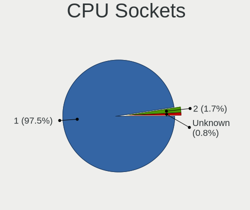

| Number  | Computers | Percent |
|---------|-----------|---------|
| 1       | 234       | 97.5%   |
| 2       | 4         | 1.67%   |
| Unknown | 2         | 0.83%   |

CPU Threads
-----------

Threads per core (Hyper-Threading)

| Number  | Computers | Percent |
|---------|-----------|---------|
| 2       | 204       | 85%     |
| 1       | 34        | 14.17%  |
| Unknown | 2         | 0.83%   |

CPU Op-Modes
------------

CPU Operation Modes (32-bit, 64-bit)

| Op mode        | Computers | Percent |
|----------------|-----------|---------|
| 32-bit, 64-bit | 235       | 97.92%  |
| 32-bit         | 4         | 1.67%   |
| Unknown        | 1         | 0.42%   |

CPU Microcode
-------------

Microcode number

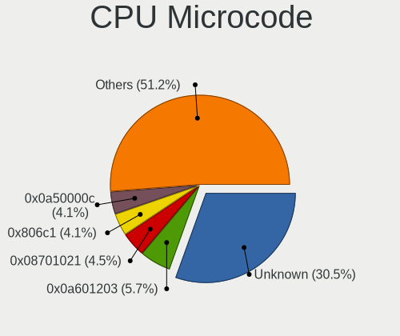

| Number     | Computers | Percent |
|------------|-----------|---------|
| Unknown    | 75        | 30.49%  |
| 0x0a601203 | 14        | 5.69%   |
| 0x08701021 | 11        | 4.47%   |
| 0x806c1    | 10        | 4.07%   |
| 0x0a50000c | 10        | 4.07%   |
| 0x906ea    | 9         | 3.66%   |
| 0x0a20120a | 6         | 2.44%   |
| 0x306a9    | 5         | 2.03%   |
| 0x906ed    | 4         | 1.63%   |
| 0x906e9    | 4         | 1.63%   |
| 0x0a50000d | 4         | 1.63%   |
| 0x0800820d | 4         | 1.63%   |
| 0xa0652    | 3         | 1.22%   |
| 0x806ec    | 3         | 1.22%   |
| 0x806d1    | 3         | 1.22%   |
| 0x506e3    | 3         | 1.22%   |
| 0x306d4    | 3         | 1.22%   |
| 0x306c3    | 3         | 1.22%   |
| 0x206a7    | 3         | 1.22%   |
| 0x0a201016 | 3         | 1.22%   |
| 0x08608103 | 3         | 1.22%   |
| 0x08600104 | 3         | 1.22%   |
| 0x08108109 | 3         | 1.22%   |
| 0xa0671    | 2         | 0.81%   |
| 0xa0655    | 2         | 0.81%   |
| 0x906a3    | 2         | 0.81%   |
| 0x90672    | 2         | 0.81%   |
| 0x806ea    | 2         | 0.81%   |
| 0x806e9    | 2         | 0.81%   |
| 0x406f1    | 2         | 0.81%   |
| 0x406e3    | 2         | 0.81%   |
| 0x406c4    | 2         | 0.81%   |
| 0x40651    | 2         | 0.81%   |
| 0x20655    | 2         | 0.81%   |
| 0x0a404102 | 2         | 0.81%   |
| 0x08001138 | 2         | 0.81%   |
| 0xf29      | 1         | 0.41%   |
| 0xb06e0    | 1         | 0.41%   |
| 0xb06a3    | 1         | 0.41%   |
| 0xb06a2    | 1         | 0.41%   |

CPU Microarch
-------------

Microarchitecture

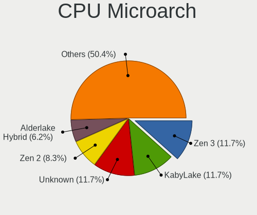

| Name             | Computers | Percent |
|------------------|-----------|---------|
| Zen 3            | 28        | 11.67%  |
| KabyLake         | 28        | 11.67%  |
| Unknown          | 28        | 11.67%  |
| Zen 2            | 20        | 8.33%   |
| Alderlake Hybrid | 15        | 6.25%   |
| IvyBridge        | 14        | 5.83%   |
| TigerLake        | 11        | 4.58%   |
| CometLake        | 11        | 4.58%   |
| Icelake          | 10        | 4.17%   |
| Skylake          | 9         | 3.75%   |
| Haswell          | 9         | 3.75%   |
| Zen+             | 8         | 3.33%   |
| SandyBridge      | 7         | 2.92%   |
| Broadwell        | 7         | 2.92%   |
| Bonnell          | 6         | 2.5%    |
| K10              | 5         | 2.08%   |
| Westmere         | 4         | 1.67%   |
| Zen              | 3         | 1.25%   |
| Silvermont       | 2         | 0.83%   |
| Piledriver       | 2         | 0.83%   |
| Penryn           | 2         | 0.83%   |
| P6               | 2         | 0.83%   |
| Goldmont plus    | 2         | 0.83%   |
| NetBurst         | 1         | 0.42%   |
| Nehalem          | 1         | 0.42%   |
| K8 Hammer        | 1         | 0.42%   |
| Jaguar           | 1         | 0.42%   |
| Gracemont        | 1         | 0.42%   |
| Excavator        | 1         | 0.42%   |
| Bulldozer        | 1         | 0.42%   |

Graphics
--------

GPU Vendor
----------

Vendors of graphics cards

| Vendor                     | Computers | Percent |
|----------------------------|-----------|---------|
| Intel                      | 96        | 33.1%   |
| AMD                        | 95        | 32.76%  |
| Nvidia                     | 89        | 30.69%  |
| Matrox Electronics Systems | 5         | 1.72%   |
| ASPEED Technology          | 5         | 1.72%   |

GPU Model
---------

Graphics card models

| Model                                                                     | Computers | Percent |
|---------------------------------------------------------------------------|-----------|---------|
| AMD Raphael                                                               | 13        | 4.19%   |
| AMD Ellesmere [Radeon RX 470/480/570/570X/580/580X/590]                   | 12        | 3.87%   |
| AMD Navi 22 [Radeon RX 6700/6700 XT/6750 XT / 6800M/6850M XT]             | 10        | 3.23%   |
| Intel TigerLake-LP GT2 [Iris Xe Graphics]                                 | 9         | 2.9%    |
| AMD Cezanne [Radeon Vega Series / Radeon Vega Mobile Series]              | 8         | 2.58%   |
| Intel CoffeeLake-H GT2 [UHD Graphics 630]                                 | 7         | 2.26%   |
| Intel 2nd Generation Core Processor Family Integrated Graphics Controller | 7         | 2.26%   |
| Intel Alder Lake-P GT2 [Iris Xe Graphics]                                 | 6         | 1.94%   |
| AMD Navi 31 [Radeon RX 7900 XT/7900 XTX]                                  | 6         | 1.94%   |
| Nvidia TU117M [GeForce GTX 1650 Mobile / Max-Q]                           | 5         | 1.61%   |
| Nvidia GA106M [GeForce RTX 3060 Mobile / Max-Q]                           | 5         | 1.61%   |
| Nvidia GA102 [GeForce RTX 3080 Ti]                                        | 5         | 1.61%   |
| ASPEED Technology ASPEED Graphics Family                                  | 5         | 1.61%   |
| AMD Renoir [Radeon RX Vega 6 (Ryzen 4000/5000 Mobile Series)]             | 5         | 1.61%   |
| AMD Navi 21 [Radeon RX 6800/6800 XT / 6900 XT]                            | 5         | 1.61%   |
| Intel TigerLake-H GT1 [UHD Graphics]                                      | 4         | 1.29%   |
| Intel HD Graphics 530                                                     | 4         | 1.29%   |
| Intel 3rd Gen Core processor Graphics Controller                          | 4         | 1.29%   |
| AMD Rembrandt [Radeon 680M]                                               | 4         | 1.29%   |
| AMD Navi 14 [Radeon RX 5500/5500M / Pro 5500M]                            | 4         | 1.29%   |
| Nvidia TU116M [GeForce GTX 1650 Ti Mobile]                                | 3         | 0.97%   |
| Nvidia TU104 [GeForce RTX 2070 SUPER]                                     | 3         | 0.97%   |
| Nvidia AD102 [GeForce RTX 4090]                                           | 3         | 0.97%   |
| Matrox Electronics Systems MGA G200EH                                     | 3         | 0.97%   |
| Intel HD Graphics 630                                                     | 3         | 0.97%   |
| Intel HD Graphics 5500                                                    | 3         | 0.97%   |
| Intel CometLake-H GT2 [UHD Graphics]                                      | 3         | 0.97%   |
| Intel CoffeeLake-S GT2 [UHD Graphics 630]                                 | 3         | 0.97%   |
| Intel Atom Processor D4xx/D5xx/N4xx/N5xx Integrated Graphics Controller   | 3         | 0.97%   |
| AMD Picasso/Raven 2 [Radeon Vega Series / Radeon Vega Mobile Series]      | 3         | 0.97%   |
| AMD Navi 23 [Radeon RX 6600/6600 XT/6600M]                                | 3         | 0.97%   |
| AMD Navi 10 [Radeon RX 5600 OEM/5600 XT / 5700/5700 XT]                   | 3         | 0.97%   |
| AMD Lucienne                                                              | 3         | 0.97%   |
| AMD Barcelo                                                               | 3         | 0.97%   |
| Nvidia TU117M [GeForce MX450]                                             | 2         | 0.65%   |
| Nvidia GT218 [GeForce 210]                                                | 2         | 0.65%   |
| Nvidia GP107M [GeForce GTX 1050 Mobile]                                   | 2         | 0.65%   |
| Nvidia GP104 [GeForce GTX 1080]                                           | 2         | 0.65%   |
| Nvidia GP102 [GeForce GTX 1080 Ti]                                        | 2         | 0.65%   |
| Nvidia GA106 [Geforce RTX 3050]                                           | 2         | 0.65%   |

GPU Combo
---------

Combinations of graphics cards

| Name           | Computers | Percent |
|----------------|-----------|---------|
| 1 x AMD        | 66        | 26.94%  |
| 1 x Intel      | 53        | 21.63%  |
| 1 x Nvidia     | 43        | 17.55%  |
| Intel + Nvidia | 34        | 13.88%  |
| 2 x AMD        | 14        | 5.71%   |
| AMD + Nvidia   | 12        | 4.9%    |
| Intel + AMD    | 5         | 2.04%   |
| 1 x ASPEED     | 5         | 2.04%   |
| 2 x Intel      | 4         | 1.63%   |
| 1 x Matrox     | 4         | 1.63%   |
| Other          | 3         | 1.22%   |
| 2 x Nvidia     | 1         | 0.41%   |
| AMD + Matrox   | 1         | 0.41%   |

GPU Driver
----------

Free vs proprietary

| Driver      | Computers | Percent |
|-------------|-----------|---------|
| Free        | 172       | 70.49%  |
| Proprietary | 52        | 21.31%  |
| Unknown     | 20        | 8.2%    |

GPU Memory
----------

Total video memory

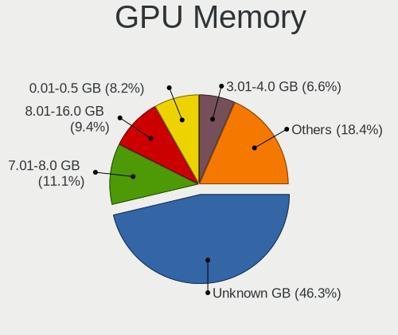

| Size in GB | Computers | Percent |
|------------|-----------|---------|
| Unknown    | 113       | 46.31%  |
| 7.01-8.0   | 27        | 11.07%  |
| 8.01-16.0  | 23        | 9.43%   |
| 0.01-0.5   | 20        | 8.2%    |
| 3.01-4.0   | 16        | 6.56%   |
| 0.51-1.0   | 16        | 6.56%   |
| 1.01-2.0   | 15        | 6.15%   |
| 16.01-24.0 | 7         | 2.87%   |
| 5.01-6.0   | 6         | 2.46%   |
| 2.01-3.0   | 1         | 0.41%   |

Monitor
-------

Monitor Vendor
--------------

Monitor vendors

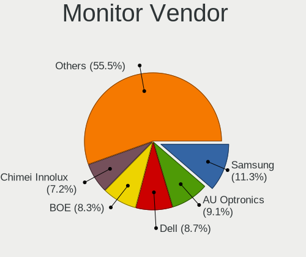

| Vendor                  | Computers | Percent |
|-------------------------|-----------|---------|
| Samsung Electronics     | 30        | 11.32%  |
| AU Optronics            | 24        | 9.06%   |
| Dell                    | 23        | 8.68%   |
| BOE                     | 22        | 8.3%    |
| Chimei Innolux          | 19        | 7.17%   |
| Goldstar                | 16        | 6.04%   |
| LG Display              | 12        | 4.53%   |
| ASUSTek Computer        | 12        | 4.53%   |
| AOC                     | 10        | 3.77%   |
| BenQ                    | 8         | 3.02%   |
| Acer                    | 8         | 3.02%   |
| Hewlett-Packard         | 6         | 2.26%   |
| Sharp                   | 5         | 1.89%   |
| Ancor Communications    | 5         | 1.89%   |
| Philips                 | 4         | 1.51%   |
| Lenovo                  | 4         | 1.51%   |
| Iiyama                  | 4         | 1.51%   |
| Gigabyte Technology     | 4         | 1.51%   |
| Eizo                    | 4         | 1.51%   |
| Apple                   | 4         | 1.51%   |
| Unknown                 | 3         | 1.13%   |
| PANDA                   | 3         | 1.13%   |
| Chi Mei Optoelectronics | 3         | 1.13%   |
| Vizio                   | 2         | 0.75%   |
| CSO                     | 2         | 0.75%   |
| BOE Technology Group    | 2         | 0.75%   |
| Unknown                 | 2         | 0.75%   |
| Valve                   | 1         | 0.38%   |
| TMX                     | 1         | 0.38%   |
| Sony                    | 1         | 0.38%   |
| Sceptre Tech            | 1         | 0.38%   |
| Onkyo                   | 1         | 0.38%   |
| MStar                   | 1         | 0.38%   |
| MSI                     | 1         | 0.38%   |
| Mitsubishi              | 1         | 0.38%   |
| Microstep               | 1         | 0.38%   |
| Mi                      | 1         | 0.38%   |
| InfoVision              | 1         | 0.38%   |
| Idek Iiyama             | 1         | 0.38%   |
| IBM                     | 1         | 0.38%   |

Monitor Model
-------------

Monitor models

| Model                                                                   | Computers | Percent |
|-------------------------------------------------------------------------|-----------|---------|
| ASUSTek Computer VG27A AUS2722 2560x1440 597x336mm 27.0-inch            | 4         | 1.44%   |
| Unknown LCD Monitor FFFF 2288x1287 2550x2550mm 142.0-inch               | 2         | 0.72%   |
| Samsung Electronics SyncMaster SAM059A 1920x1080 477x268mm 21.5-inch    | 2         | 0.72%   |
| Samsung Electronics LCD Monitor SAM7004 3840x2160 1872x1053mm 84.6-inch | 2         | 0.72%   |
| Samsung Electronics LCD Monitor SAM7003 3840x2160 1872x1053mm 84.6-inch | 2         | 0.72%   |
| PANDA LCD Monitor NCP0050 1920x1080 309x174mm 14.0-inch                 | 2         | 0.72%   |
| LG Display LCD Monitor LGD046F 1920x1080 344x194mm 15.5-inch            | 2         | 0.72%   |
| Goldstar ULTRAWIDE GSM59F1 2560x1080 798x334mm 34.1-inch                | 2         | 0.72%   |
| Goldstar HDR 4K GSM7707 3840x2160 600x340mm 27.2-inch                   | 2         | 0.72%   |
| Gigabyte Technology G27FC A GBT2715 1920x1080 598x336mm 27.0-inch       | 2         | 0.72%   |
| Eizo CS2731 ENC3069 2560x1440 597x336mm 27.0-inch                       | 2         | 0.72%   |
| Chimei Innolux LCD Monitor CMN1747 1920x1080 381x214mm 17.2-inch        | 2         | 0.72%   |
| BOE Technology Group LCD Monitor 1920x1080                              | 2         | 0.72%   |
| BOE LCD Monitor BOE0973 2560x1440 344x194mm 15.5-inch                   | 2         | 0.72%   |
| BenQ PD3200U BNQ8025 3840x2160 708x399mm 32.0-inch                      | 2         | 0.72%   |
| AU Optronics LCD Monitor AUOE48D 1920x1080 344x194mm 15.5-inch          | 2         | 0.72%   |
| AU Optronics LCD Monitor AUO403D 1920x1080 309x174mm 14.0-inch          | 2         | 0.72%   |
| AOC LCD Monitor U2879G6 3840x2160                                       | 2         | 0.72%   |
| AOC 24G2W1G4 AOC2402 1920x1080 527x296mm 23.8-inch                      | 2         | 0.72%   |
| AOC 2460 AOC2460 1920x1080 531x299mm 24.0-inch                          | 2         | 0.72%   |
| Acer ED320QR S ACR0805 1920x1080 698x393mm 31.5-inch                    | 2         | 0.72%   |
| Unknown                                                                 | 2         | 0.72%   |
| Vizio VX20L VIZ2000 1280x720 444x249mm 20.0-inch                        | 1         | 0.36%   |
| Vizio D60n-E3 VIZ1009 1920x1080 1330x748mm 60.1-inch                    | 1         | 0.36%   |
| Valve ANX7530 U VLV3001 800x1280 100x150mm 7.1-inch                     | 1         | 0.36%   |
| Unknown LCD Monitor RTK                                                 | 1         | 0.36%   |
| TMX LCD Monitor TMX1560 1920x1080 344x194mm 15.5-inch                   | 1         | 0.36%   |
| Sony BW8 MS_9001 1600x2560 113x181mm 8.4-inch                           | 1         | 0.36%   |
| Sharp LQ173M1JW03 SHP14DC 1920x1080 382x215mm 17.3-inch                 | 1         | 0.36%   |
| Sharp LQ156M1JW03 SHP14C5 1920x1080 344x194mm 15.5-inch                 | 1         | 0.36%   |
| Sharp LQ135P1JX51 SHP14B3 2256x1504 285x190mm 13.5-inch                 | 1         | 0.36%   |
| Sharp LCD Monitor SHP14AE 1920x1080 294x165mm 13.3-inch                 | 1         | 0.36%   |
| Sharp LCD Monitor SHP148D 3840x2160 344x194mm 15.5-inch                 | 1         | 0.36%   |
| Sceptre Tech C305W-2560UN SPT0C0D 2560x1080 690x291mm 29.5-inch         | 1         | 0.36%   |
| Samsung Electronics U32R59x SAM0F96 3840x2160 700x390mm 31.5-inch       | 1         | 0.36%   |
| Samsung Electronics SyncMaster SAM05E8 1920x1080                        | 1         | 0.36%   |
| Samsung Electronics SyncMaster SAM04D4 1920x1080 531x298mm 24.0-inch    | 1         | 0.36%   |
| Samsung Electronics SyncMaster SAM03E4 1680x1050 474x296mm 22.0-inch    | 1         | 0.36%   |
| Samsung Electronics SyncMaster SAM0373 1680x1050 459x296mm 21.5-inch    | 1         | 0.36%   |
| Samsung Electronics SMT22A350 SAM07A7 1920x1080 477x268mm 21.5-inch     | 1         | 0.36%   |

Monitor Resolution
------------------

Monitor screen resolution

| Resolution         | Computers | Percent |
|--------------------|-----------|---------|
| 1920x1080 (FHD)    | 102       | 40.16%  |
| 3840x2160 (4K)     | 37        | 14.57%  |
| 2560x1440 (QHD)    | 29        | 11.42%  |
| 1366x768 (WXGA)    | 11        | 4.33%   |
| 1920x1200 (WUXGA)  | 9         | 3.54%   |
| 3440x1440          | 8         | 3.15%   |
| 2560x1600          | 6         | 2.36%   |
| 1600x900 (HD+)     | 6         | 2.36%   |
| 1280x1024 (SXGA)   | 5         | 1.97%   |
| 2560x1080          | 4         | 1.57%   |
| Unknown            | 4         | 1.57%   |
| 3840x1080          | 3         | 1.18%   |
| 1680x1050 (WSXGA+) | 3         | 1.18%   |
| 1440x900 (WXGA+)   | 3         | 1.18%   |
| 2288x1287          | 2         | 0.79%   |
| 1600x1200          | 2         | 0.79%   |
| 1280x800 (WXGA)    | 2         | 0.79%   |
| 1024x768 (XGA)     | 2         | 0.79%   |
| 800x1280           | 1         | 0.39%   |
| 5760x2160          | 1         | 0.39%   |
| 3840x2400          | 1         | 0.39%   |
| 3840x1200          | 1         | 0.39%   |
| 3456x2160          | 1         | 0.39%   |
| 3200x2000          | 1         | 0.39%   |
| 3072x1920          | 1         | 0.39%   |
| 2880x1800          | 1         | 0.39%   |
| 2560x2880          | 1         | 0.39%   |
| 2520x1680          | 1         | 0.39%   |
| 2256x1504          | 1         | 0.39%   |
| 2160x1440          | 1         | 0.39%   |
| 2160x1200          | 1         | 0.39%   |
| 1920x540           | 1         | 0.39%   |
| 1360x768           | 1         | 0.39%   |
| 1024x600           | 1         | 0.39%   |

Monitor Diagonal
----------------

Diagonal size in inches

| Inches  | Computers | Percent |
|---------|-----------|---------|
| 15      | 43        | 16.17%  |
| 27      | 40        | 15.04%  |
| 24      | 20        | 7.52%   |
| 14      | 19        | 7.14%   |
| 17      | 17        | 6.39%   |
| 13      | 17        | 6.39%   |
| Unknown | 17        | 6.39%   |
| 23      | 15        | 5.64%   |
| 31      | 11        | 4.14%   |
| 34      | 9         | 3.38%   |
| 21      | 9         | 3.38%   |
| 16      | 8         | 3.01%   |
| 32      | 4         | 1.5%    |
| 19      | 4         | 1.5%    |
| 84      | 3         | 1.13%   |
| 40      | 3         | 1.13%   |
| 20      | 3         | 1.13%   |
| 18      | 3         | 1.13%   |
| 142     | 2         | 0.75%   |
| 49      | 2         | 0.75%   |
| 25      | 2         | 0.75%   |
| 22      | 2         | 0.75%   |
| 60      | 1         | 0.38%   |
| 48      | 1         | 0.38%   |
| 42      | 1         | 0.38%   |
| 41      | 1         | 0.38%   |
| 39      | 1         | 0.38%   |
| 29      | 1         | 0.38%   |
| 28      | 1         | 0.38%   |
| 26      | 1         | 0.38%   |
| 12      | 1         | 0.38%   |
| 10      | 1         | 0.38%   |
| 9       | 1         | 0.38%   |
| 8       | 1         | 0.38%   |
| 7       | 1         | 0.38%   |

Monitor Width
-------------

Physical width

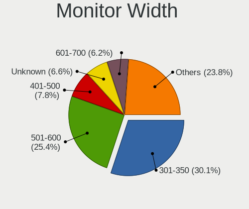

| Width in mm    | Computers | Percent |
|----------------|-----------|---------|
| 301-350        | 77        | 30.08%  |
| 501-600        | 65        | 25.39%  |
| 401-500        | 20        | 7.81%   |
| Unknown        | 17        | 6.64%   |
| 601-700        | 16        | 6.25%   |
| 351-400        | 16        | 6.25%   |
| 201-300        | 15        | 5.86%   |
| 701-800        | 13        | 5.08%   |
| 801-900        | 4         | 1.56%   |
| 1001-1500      | 4         | 1.56%   |
| 1501-2000      | 3         | 1.17%   |
| More than 2000 | 2         | 0.78%   |
| 901-1000       | 2         | 0.78%   |
| 101-200        | 1         | 0.39%   |
| 1-100          | 1         | 0.39%   |

Aspect Ratio
------------

Proportional relationship between the width and the height

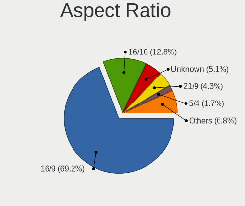

| Ratio   | Computers | Percent |
|---------|-----------|---------|
| 16/9    | 162       | 69.23%  |
| 16/10   | 30        | 12.82%  |
| Unknown | 12        | 5.13%   |
| 21/9    | 10        | 4.27%   |
| 5/4     | 4         | 1.71%   |
| 4/3     | 4         | 1.71%   |
| 32/9    | 4         | 1.71%   |
| 3/2     | 3         | 1.28%   |
| 1.00    | 2         | 0.85%   |
| 0.89    | 1         | 0.43%   |
| 0.67    | 1         | 0.43%   |
| 0.62    | 1         | 0.43%   |

Monitor Area
------------

Area in inch

| Area in inch | Computers | Percent |
|----------------|-----------|---------|
| 101-110        | 44        | 16.86%  |
| 301-350        | 41        | 15.71%  |
| 201-250        | 33        | 12.64%  |
| 81-90          | 27        | 10.34%  |
| 351-500        | 25        | 9.58%   |
| Unknown        | 17        | 6.51%   |
| 121-130        | 14        | 5.36%   |
| 71-80          | 9         | 3.45%   |
| 251-300        | 9         | 3.45%   |
| 151-200        | 9         | 3.45%   |
| 501-1000       | 9         | 3.45%   |
| 111-120        | 7         | 2.68%   |
| More than 1000 | 6         | 2.3%    |
| 141-150        | 5         | 1.92%   |
| 41-50          | 2         | 0.77%   |
| 1-40           | 2         | 0.77%   |
| 61-70          | 1         | 0.38%   |
| 91-100         | 1         | 0.38%   |

Pixel Density
-------------

Pixels per inch

| Density       | Computers | Percent |
|---------------|-----------|---------|
| 121-160       | 72        | 28.69%  |
| 51-100        | 72        | 28.69%  |
| 101-120       | 41        | 16.33%  |
| 161-240       | 33        | 13.15%  |
| Unknown       | 17        | 6.77%   |
| More than 240 | 10        | 3.98%   |
| 1-50          | 6         | 2.39%   |

Multiple Monitors
-----------------

Total monitors connected

| Total | Computers | Percent |
|-------|-----------|---------|
| 1     | 174       | 70.45%  |
| 2     | 39        | 15.79%  |
| 0     | 22        | 8.91%   |
| 3     | 10        | 4.05%   |
| 4     | 2         | 0.81%   |

Network
-------

Net Controller Vendor
---------------------

Controller vendors

| Vendor                          | Computers | Percent |
|---------------------------------|-----------|---------|
| Intel                           | 148       | 40.66%  |
| Realtek Semiconductor           | 124       | 34.07%  |
| MediaTek                        | 18        | 4.95%   |
| Qualcomm Atheros                | 14        | 3.85%   |
| Broadcom                        | 13        | 3.57%   |
| Broadcom Limited                | 5         | 1.37%   |
| Xiaomi                          | 4         | 1.1%    |
| Sierra Wireless                 | 4         | 1.1%    |
| ASIX Electronics                | 4         | 1.1%    |
| Qualcomm                        | 3         | 0.82%   |
| Qualcomm Atheros Communications | 2         | 0.55%   |
| Nvidia                          | 2         | 0.55%   |
| Microsoft                       | 2         | 0.55%   |
| ICS Advent                      | 2         | 0.55%   |
| Aquantia                        | 2         | 0.55%   |
| Wilocity                        | 1         | 0.27%   |
| TP-Link                         | 1         | 0.27%   |
| Samsung Electronics             | 1         | 0.27%   |
| Ralink                          | 1         | 0.27%   |
| OpenMoko                        | 1         | 0.27%   |
| NetGear                         | 1         | 0.27%   |
| Mellanox Technologies           | 1         | 0.27%   |
| Marvell Technology Group        | 1         | 0.27%   |
| Lenovo                          | 1         | 0.27%   |
| Insyde Software                 | 1         | 0.27%   |
| Huawei Technologies             | 1         | 0.27%   |
| HMD Global                      | 1         | 0.27%   |
| Hewlett-Packard                 | 1         | 0.27%   |
| Edimax Technology               | 1         | 0.27%   |
| Dell                            | 1         | 0.27%   |
| ASUSTek Computer                | 1         | 0.27%   |
| Arduino SA                      | 1         | 0.27%   |

Net Controller Model
--------------------

Controller models

| Model                                                             | Computers | Percent |
|-------------------------------------------------------------------|-----------|---------|
| Realtek RTL8111/8168/8411 PCI Express Gigabit Ethernet Controller | 78        | 17.93%  |
| Intel Wi-Fi 6 AX200                                               | 26        | 5.98%   |
| Realtek RTL8125 2.5GbE Controller                                 | 23        | 5.29%   |
| Intel I211 Gigabit Network Connection                             | 18        | 4.14%   |
| Intel Wi-Fi 6 AX210/AX211/AX411 160MHz                            | 17        | 3.91%   |
| Intel Ethernet Controller I225-V                                  | 16        | 3.68%   |
| Realtek RTL8153 Gigabit Ethernet Adapter                          | 8         | 1.84%   |
| Intel Wi-Fi 6 AX201                                               | 8         | 1.84%   |
| MediaTek MT7921 802.11ax PCI Express Wireless Network Adapter     | 7         | 1.61%   |
| Intel Wireless 8265 / 8275                                        | 7         | 1.61%   |
| MediaTek MT7922 802.11ax PCI Express Wireless Network Adapter     | 6         | 1.38%   |
| Intel Wireless-AC 9260                                            | 6         | 1.38%   |
| Intel Ethernet Connection (7) I219-V                              | 6         | 1.38%   |
| Intel Cannon Lake PCH CNVi WiFi                                   | 6         | 1.38%   |
| Intel Alder Lake-P PCH CNVi WiFi                                  | 6         | 1.38%   |
| Intel 82579LM Gigabit Network Connection (Lewisville)             | 6         | 1.38%   |
| Realtek RTL8822CE 802.11ac PCIe Wireless Network Adapter          | 5         | 1.15%   |
| Xiaomi Mi/Redmi series (RNDIS)                                    | 4         | 0.92%   |
| Realtek RTL810xE PCI Express Fast Ethernet controller             | 4         | 0.92%   |
| Realtek Killer E3000 2.5GbE Controller                            | 4         | 0.92%   |
| MediaTek MT7921K (RZ608) Wi-Fi 6E 80MHz                           | 4         | 0.92%   |
| Intel Wireless 8260                                               | 4         | 0.92%   |
| Intel Comet Lake PCH CNVi WiFi                                    | 4         | 0.92%   |
| Intel Centrino Advanced-N 6205 [Taylor Peak]                      | 4         | 0.92%   |
| Intel Alder Lake-S PCH CNVi WiFi                                  | 4         | 0.92%   |
| Realtek RTL8852BE PCIe 802.11ax Wireless Network Controller       | 3         | 0.69%   |
| Realtek RTL8852AE 802.11ax PCIe Wireless Network Adapter          | 3         | 0.69%   |
| Qualcomm QCNFA765 Wireless Network Adapter                        | 3         | 0.69%   |
| Qualcomm Atheros AR9287 Wireless Network Adapter (PCI-Express)    | 3         | 0.69%   |
| Intel Wireless 3165                                               | 3         | 0.69%   |
| Intel Ethernet Connection (4) I219-LM                             | 3         | 0.69%   |
| Intel Ethernet Connection (2) I219-V                              | 3         | 0.69%   |
| Intel Ethernet Connection (2) I219-LM                             | 3         | 0.69%   |
| Intel Centrino Advanced-N 6235                                    | 3         | 0.69%   |
| Broadcom NetXtreme BCM5720 Gigabit Ethernet PCIe                  | 3         | 0.69%   |
| ASIX AX88179 Gigabit Ethernet                                     | 3         | 0.69%   |
| Sierra Wireless EM7455                                            | 2         | 0.46%   |
| Sierra Wireless EM7305 Modem                                      | 2         | 0.46%   |
| Realtek RTL8821CE 802.11ac PCIe Wireless Network Adapter          | 2         | 0.46%   |
| Realtek RTL-8110SC/8169SC Gigabit Ethernet                        | 2         | 0.46%   |

Wireless Vendor
---------------

Wireless vendors

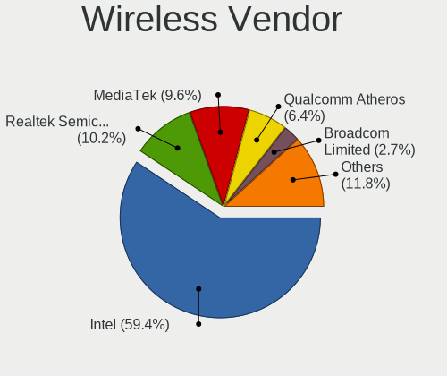

| Vendor                          | Computers | Percent |
|---------------------------------|-----------|---------|
| Intel                           | 111       | 59.36%  |
| Realtek Semiconductor           | 19        | 10.16%  |
| MediaTek                        | 18        | 9.63%   |
| Qualcomm Atheros                | 12        | 6.42%   |
| Broadcom Limited                | 5         | 2.67%   |
| Broadcom                        | 5         | 2.67%   |
| Sierra Wireless                 | 4         | 2.14%   |
| Qualcomm                        | 3         | 1.6%    |
| Qualcomm Atheros Communications | 2         | 1.07%   |
| Microsoft                       | 2         | 1.07%   |
| Wilocity                        | 1         | 0.53%   |
| Ralink                          | 1         | 0.53%   |
| NetGear                         | 1         | 0.53%   |
| Edimax Technology               | 1         | 0.53%   |
| Dell                            | 1         | 0.53%   |
| ASUSTek Computer                | 1         | 0.53%   |

Wireless Model
--------------

Wireless models

| Model                                                                   | Computers | Percent |
|-------------------------------------------------------------------------|-----------|---------|
| Intel Wi-Fi 6 AX200                                                     | 26        | 13.83%  |
| Intel Wi-Fi 6 AX210/AX211/AX411 160MHz                                  | 17        | 9.04%   |
| Intel Wi-Fi 6 AX201                                                     | 8         | 4.26%   |
| MediaTek MT7921 802.11ax PCI Express Wireless Network Adapter           | 7         | 3.72%   |
| Intel Wireless 8265 / 8275                                              | 7         | 3.72%   |
| MediaTek MT7922 802.11ax PCI Express Wireless Network Adapter           | 6         | 3.19%   |
| Intel Wireless-AC 9260                                                  | 6         | 3.19%   |
| Intel Cannon Lake PCH CNVi WiFi                                         | 6         | 3.19%   |
| Intel Alder Lake-P PCH CNVi WiFi                                        | 6         | 3.19%   |
| Realtek RTL8822CE 802.11ac PCIe Wireless Network Adapter                | 5         | 2.66%   |
| MediaTek MT7921K (RZ608) Wi-Fi 6E 80MHz                                 | 4         | 2.13%   |
| Intel Wireless 8260                                                     | 4         | 2.13%   |
| Intel Comet Lake PCH CNVi WiFi                                          | 4         | 2.13%   |
| Intel Centrino Advanced-N 6205 [Taylor Peak]                            | 4         | 2.13%   |
| Intel Alder Lake-S PCH CNVi WiFi                                        | 4         | 2.13%   |
| Realtek RTL8852BE PCIe 802.11ax Wireless Network Controller             | 3         | 1.6%    |
| Realtek RTL8852AE 802.11ax PCIe Wireless Network Adapter                | 3         | 1.6%    |
| Qualcomm QCNFA765 Wireless Network Adapter                              | 3         | 1.6%    |
| Qualcomm Atheros AR9287 Wireless Network Adapter (PCI-Express)          | 3         | 1.6%    |
| Intel Wireless 3165                                                     | 3         | 1.6%    |
| Intel Centrino Advanced-N 6235                                          | 3         | 1.6%    |
| Sierra Wireless EM7455                                                  | 2         | 1.06%   |
| Sierra Wireless EM7305 Modem                                            | 2         | 1.06%   |
| Realtek RTL8821CE 802.11ac PCIe Wireless Network Adapter                | 2         | 1.06%   |
| Qualcomm Atheros QCA6174 802.11ac Wireless Network Adapter              | 2         | 1.06%   |
| Qualcomm Atheros AR9271 802.11n                                         | 2         | 1.06%   |
| Qualcomm Atheros AR242x / AR542x Wireless Network Adapter (PCI-Express) | 2         | 1.06%   |
| Microsoft XBOX ACC                                                      | 2         | 1.06%   |
| Intel Wireless 7265                                                     | 2         | 1.06%   |
| Intel Ice Lake-LP PCH CNVi WiFi                                         | 2         | 1.06%   |
| Intel Comet Lake PCH-LP CNVi WiFi                                       | 2         | 1.06%   |
| Intel Centrino Wireless-N 2230                                          | 2         | 1.06%   |
| Broadcom Limited BCM4360 802.11ac Dual Band Wireless Network Adapter    | 2         | 1.06%   |
| Broadcom BCM4313 802.11bgn Wireless Network Adapter                     | 2         | 1.06%   |
| Wilocity Wil6200 802.11ad Wireless Network Adapter                      | 1         | 0.53%   |
| Realtek RTL88x2bu [AC1200 Techkey]                                      | 1         | 0.53%   |
| Realtek RTL8723DE Wireless Network Adapter                              | 1         | 0.53%   |
| Realtek RTL8723BE PCIe Wireless Network Adapter                         | 1         | 0.53%   |
| Realtek RTL8723AU 802.11n WLAN Adapter                                  | 1         | 0.53%   |
| Realtek RTL8191SU 802.11n WLAN Adapter                                  | 1         | 0.53%   |

Ethernet Vendor
---------------

Ethernet vendors

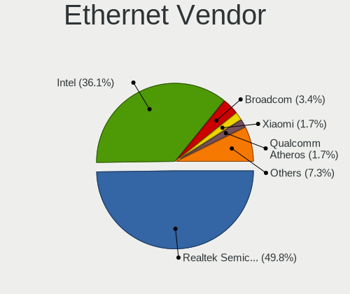

| Vendor                   | Computers | Percent |
|--------------------------|-----------|---------|
| Realtek Semiconductor    | 116       | 49.79%  |
| Intel                    | 84        | 36.05%  |
| Broadcom                 | 8         | 3.43%   |
| Xiaomi                   | 4         | 1.72%   |
| Qualcomm Atheros         | 4         | 1.72%   |
| ASIX Electronics         | 4         | 1.72%   |
| Nvidia                   | 2         | 0.86%   |
| ICS Advent               | 2         | 0.86%   |
| Aquantia                 | 2         | 0.86%   |
| TP-Link                  | 1         | 0.43%   |
| Samsung Electronics      | 1         | 0.43%   |
| Marvell Technology Group | 1         | 0.43%   |
| Lenovo                   | 1         | 0.43%   |
| Insyde Software          | 1         | 0.43%   |
| HMD Global               | 1         | 0.43%   |
| Hewlett-Packard          | 1         | 0.43%   |

Ethernet Model
--------------

Ethernet models

| Model                                                                 | Computers | Percent |
|-----------------------------------------------------------------------|-----------|---------|
| Realtek RTL8111/8168/8411 PCI Express Gigabit Ethernet Controller     | 78        | 32.1%   |
| Realtek RTL8125 2.5GbE Controller                                     | 23        | 9.47%   |
| Intel I211 Gigabit Network Connection                                 | 18        | 7.41%   |
| Intel Ethernet Controller I225-V                                      | 16        | 6.58%   |
| Realtek RTL8153 Gigabit Ethernet Adapter                              | 8         | 3.29%   |
| Intel Ethernet Connection (7) I219-V                                  | 6         | 2.47%   |
| Intel 82579LM Gigabit Network Connection (Lewisville)                 | 6         | 2.47%   |
| Xiaomi Mi/Redmi series (RNDIS)                                        | 4         | 1.65%   |
| Realtek RTL810xE PCI Express Fast Ethernet controller                 | 4         | 1.65%   |
| Realtek Killer E3000 2.5GbE Controller                                | 4         | 1.65%   |
| Intel Ethernet Connection (4) I219-LM                                 | 3         | 1.23%   |
| Intel Ethernet Connection (2) I219-V                                  | 3         | 1.23%   |
| Intel Ethernet Connection (2) I219-LM                                 | 3         | 1.23%   |
| Broadcom NetXtreme BCM5720 Gigabit Ethernet PCIe                      | 3         | 1.23%   |
| ASIX AX88179 Gigabit Ethernet                                         | 3         | 1.23%   |
| Realtek RTL-8110SC/8169SC Gigabit Ethernet                            | 2         | 0.82%   |
| Qualcomm Atheros AR8151 v2.0 Gigabit Ethernet                         | 2         | 0.82%   |
| Intel I350 Gigabit Network Connection                                 | 2         | 0.82%   |
| Intel Ethernet Connection I217-V                                      | 2         | 0.82%   |
| Intel Ethernet Connection (5) I219-LM                                 | 2         | 0.82%   |
| Intel Ethernet Connection (17) I219-LM                                | 2         | 0.82%   |
| Intel Ethernet Connection (11) I219-LM                                | 2         | 0.82%   |
| Intel 82599ES 10-Gigabit SFI/SFP+ Network Connection                  | 2         | 0.82%   |
| Broadcom BCM57416 NetXtreme-E Dual-Media 10G RDMA Ethernet Controller | 2         | 0.82%   |
| TP-Link UE300 10/100/1000 LAN (ethernet mode) [Realtek RTL8153]       | 1         | 0.41%   |
| Samsung Galaxy series, misc. (tethering mode)                         | 1         | 0.41%   |
| Realtek RTL8169 PCI Gigabit Ethernet Controller                       | 1         | 0.41%   |
| Qualcomm Atheros AR8132 Fast Ethernet                                 | 1         | 0.41%   |
| Qualcomm Atheros AR8131 Gigabit Ethernet                              | 1         | 0.41%   |
| Nvidia MCP79 Ethernet                                                 | 1         | 0.41%   |
| Nvidia MCP73 Ethernet                                                 | 1         | 0.41%   |
| Marvell Group 88E8056 PCI-E Gigabit Ethernet Controller               | 1         | 0.41%   |
| Lenovo USB-C Dock Ethernet                                            | 1         | 0.41%   |
| Intel Killer E3100X 2.5 Gigabit Ethernet Controller                   | 1         | 0.41%   |
| Intel I210 Gigabit Network Connection                                 | 1         | 0.41%   |
| Intel Ethernet Controller X710 for 10GbE SFP+                         | 1         | 0.41%   |
| Intel Ethernet Controller I226-V                                      | 1         | 0.41%   |
| Intel Ethernet Controller (2) I225-LMvP                               | 1         | 0.41%   |
| Intel Ethernet Connection X552/X557-AT 10GBASE-T                      | 1         | 0.41%   |
| Intel Ethernet Connection I219-V                                      | 1         | 0.41%   |

Net Controller Kind
-------------------

Ethernet, WiFi or modem

| Kind     | Computers | Percent |
|----------|-----------|---------|
| Ethernet | 212       | 54.22%  |
| WiFi     | 175       | 44.76%  |
| Modem    | 3         | 0.77%   |
| Unknown  | 1         | 0.26%   |

Used Controller
---------------

Currently used network controller

| Kind     | Computers | Percent |
|----------|-----------|---------|
| Ethernet | 140       | 56.91%  |
| WiFi     | 106       | 43.09%  |

NICs
----

Total network controllers on board

| Total | Computers | Percent |
|-------|-----------|---------|
| 2     | 129       | 53.31%  |
| 1     | 86        | 35.54%  |
| 3     | 14        | 5.79%   |
| 0     | 4         | 1.65%   |
| 4     | 3         | 1.24%   |
| 7     | 2         | 0.83%   |
| 6     | 2         | 0.83%   |
| 5     | 2         | 0.83%   |

IPv6
----

IPv6 vs IPv4

| Used | Computers | Percent |
|------|-----------|---------|
| No   | 164       | 67.21%  |
| Yes  | 80        | 32.79%  |

Bluetooth
---------

Bluetooth Vendor
----------------

Controller vendors

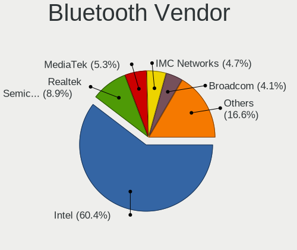

| Vendor                          | Computers | Percent |
|---------------------------------|-----------|---------|
| Intel                           | 102       | 60.36%  |
| Realtek Semiconductor           | 15        | 8.88%   |
| MediaTek                        | 9         | 5.33%   |
| IMC Networks                    | 8         | 4.73%   |
| Broadcom                        | 7         | 4.14%   |
| Foxconn / Hon Hai               | 5         | 2.96%   |
| Cambridge Silicon Radio         | 5         | 2.96%   |
| Apple                           | 4         | 2.37%   |
| USI                             | 3         | 1.78%   |
| Lite-On Technology              | 3         | 1.78%   |
| Realtek                         | 2         | 1.18%   |
| ASUSTek Computer                | 2         | 1.18%   |
| Qualcomm Atheros Communications | 1         | 0.59%   |
| HTC (High Tech Computer)        | 1         | 0.59%   |
| Dell                            | 1         | 0.59%   |
| Alps Electric                   | 1         | 0.59%   |

Bluetooth Model
---------------

Controller models

| Model                                                                | Computers | Percent |
|----------------------------------------------------------------------|-----------|---------|
| Intel AX200 Bluetooth                                                | 26        | 15.38%  |
| Intel Bluetooth wireless interface                                   | 17        | 10.06%  |
| Intel AX210 Bluetooth                                                | 14        | 8.28%   |
| Intel AX201 Bluetooth                                                | 14        | 8.28%   |
| Realtek Bluetooth Radio                                              | 12        | 7.1%    |
| Intel Bluetooth Device                                               | 10        | 5.92%   |
| MediaTek Wireless_Device                                             | 9         | 5.33%   |
| Intel Bluetooth 9460/9560 Jefferson Peak (JfP)                       | 9         | 5.33%   |
| Intel Wireless-AC 9260 Bluetooth Adapter                             | 6         | 3.55%   |
| IMC Networks Wireless_Device                                         | 6         | 3.55%   |
| Intel Centrino Bluetooth Wireless Transceiver                        | 5         | 2.96%   |
| Cambridge Silicon Radio Bluetooth Dongle (HCI mode)                  | 5         | 2.96%   |
| Apple Bluetooth Host Controller                                      | 4         | 2.37%   |
| USI Bluetooth Device                                                 | 3         | 1.78%   |
| Foxconn / Hon Hai Wireless_Device                                    | 3         | 1.78%   |
| Realtek 802.11ac WLAN Adapter                                        | 2         | 1.18%   |
| IMC Networks Bluetooth Radio                                         | 2         | 1.18%   |
| Broadcom HP Portable SoftSailing                                     | 2         | 1.18%   |
| Broadcom BCM20702A0 Bluetooth 4.0                                    | 2         | 1.18%   |
| Realtek  Bluetooth 4.2 Adapter                                       | 1         | 0.59%   |
| Realtek Bluetooth 5.1 Radio                                          | 1         | 0.59%   |
| Realtek 802.11ac WLAN Adapter                                        | 1         | 0.59%   |
| Qualcomm Atheros AR3011 Bluetooth                                    | 1         | 0.59%   |
| Lite-On Wireless_Device                                              | 1         | 0.59%   |
| Lite-On Qualcomm Atheros QCA9377 Bluetooth                           | 1         | 0.59%   |
| Lite-On Bluetooth Device                                             | 1         | 0.59%   |
| Intel Wireless-AC 3168 Bluetooth                                     | 1         | 0.59%   |
| HTC (High Tech Computer) Vive Hub Bluetooth 4.1 (Broadcom BCM920703) | 1         | 0.59%   |
| Foxconn / Hon Hai MediaTek MT7921 Bluetooth                          | 1         | 0.59%   |
| Foxconn / Hon Hai Bluetooth USB Host Controller                      | 1         | 0.59%   |
| Dell Wireless 365 Bluetooth                                          | 1         | 0.59%   |
| Broadcom BCM20702A0                                                  | 1         | 0.59%   |
| Broadcom BCM20702 Bluetooth 4.0 [ThinkPad]                           | 1         | 0.59%   |
| Broadcom BCM2070 Bluetooth 2.1 + EDR                                 | 1         | 0.59%   |
| ASUS Bluetooth Device                                                | 1         | 0.59%   |
| ASUS ASUS USB-BT500                                                  | 1         | 0.59%   |
| Alps Electric UGTZ4 Bluetooth                                        | 1         | 0.59%   |

Sound
-----

Sound Vendor
------------

Sound card vendors

| Vendor                               | Computers | Percent |
|--------------------------------------|-----------|---------|
| Intel                                | 124       | 32.38%  |
| AMD                                  | 103       | 26.89%  |
| Nvidia                               | 75        | 19.58%  |
| C-Media Electronics                  | 13        | 3.39%   |
| ASUSTek Computer                     | 12        | 3.13%   |
| Creative Labs                        | 5         | 1.31%   |
| SteelSeries ApS                      | 4         | 1.04%   |
| Razer USA                            | 3         | 0.78%   |
| Logitech                             | 3         | 0.78%   |
| Thesycon Systemsoftware & Consulting | 2         | 0.52%   |
| Solid State Logic                    | 2         | 0.52%   |
| Lenovo                               | 2         | 0.52%   |
| Kingston Technology                  | 2         | 0.52%   |
| Audient                              | 2         | 0.52%   |
| AKG C44-USB Microphone               | 2         | 0.52%   |
| Yamaha                               | 1         | 0.26%   |
| VIA Technologies                     | 1         | 0.26%   |
| Texas Instruments                    | 1         | 0.26%   |
| TEAC                                 | 1         | 0.26%   |
| Sony                                 | 1         | 0.26%   |
| Schiit Audio                         | 1         | 0.26%   |
| SAVITECH                             | 1         | 0.26%   |
| RODE Microphones                     | 1         | 0.26%   |
| Microsoft                            | 1         | 0.26%   |
| Micro Star International             | 1         | 0.26%   |
| Medeli Electronics                   | 1         | 0.26%   |
| MAG Technology                       | 1         | 0.26%   |
| M-Audio                              | 1         | 0.26%   |
| JMTek                                | 1         | 0.26%   |
| Huawei Technologies                  | 1         | 0.26%   |
| GYROCOM C&C                          | 1         | 0.26%   |
| Generalplus Technology               | 1         | 0.26%   |
| Focusrite-Novation                   | 1         | 0.26%   |
| Elgato Systems                       | 1         | 0.26%   |
| DSEA A/S                             | 1         | 0.26%   |
| DCMT Technology                      | 1         | 0.26%   |
| Corsair                              | 1         | 0.26%   |
| BEHRINGER International              | 1         | 0.26%   |
| AudioQuest                           | 1         | 0.26%   |
| ASRock                               | 1         | 0.26%   |

Sound Model
-----------

Sound card models

| Model                                                                      | Computers | Percent |
|----------------------------------------------------------------------------|-----------|---------|
| AMD Family 17h/19h HD Audio Controller                                     | 41        | 8.67%   |
| AMD Starship/Matisse HD Audio Controller                                   | 25        | 5.29%   |
| AMD Renoir Radeon High Definition Audio Controller                         | 20        | 4.23%   |
| AMD Navi 21/23 HDMI/DP Audio Controller                                    | 20        | 4.23%   |
| AMD Rembrandt Radeon High Definition Audio Controller                      | 17        | 3.59%   |
| Intel Cannon Lake PCH cAVS                                                 | 16        | 3.38%   |
| AMD Ellesmere HDMI Audio [Radeon RX 470/480 / 570/580/590]                 | 12        | 2.54%   |
| Nvidia GA104 High Definition Audio Controller                              | 11        | 2.33%   |
| Intel Tiger Lake-LP Smart Sound Technology Audio Controller                | 11        | 2.33%   |
| Intel 7 Series/C216 Chipset Family High Definition Audio Controller        | 11        | 2.33%   |
| Intel Alder Lake PCH-P High Definition Audio Controller                    | 8         | 1.69%   |
| AMD SBx00 Azalia (Intel HDA)                                               | 8         | 1.69%   |
| Nvidia GA106 High Definition Audio Controller                              | 7         | 1.48%   |
| ASUSTek Computer USB Audio                                                 | 7         | 1.48%   |
| AMD Navi 10 HDMI Audio                                                     | 7         | 1.48%   |
| Nvidia TU104 HD Audio Controller                                           | 6         | 1.27%   |
| Intel Tiger Lake-H HD Audio Controller                                     | 6         | 1.27%   |
| Intel Sunrise Point-LP HD Audio                                            | 6         | 1.27%   |
| Intel 100 Series/C230 Series Chipset Family HD Audio Controller            | 6         | 1.27%   |
| AMD Navi 31 HDMI/DP Audio                                                  | 6         | 1.27%   |
| Nvidia GA102 High Definition Audio Controller                              | 5         | 1.06%   |
| Intel Comet Lake PCH cAVS                                                  | 5         | 1.06%   |
| Intel Alder Lake-S HD Audio Controller                                     | 5         | 1.06%   |
| Intel 8 Series/C220 Series Chipset High Definition Audio Controller        | 5         | 1.06%   |
| AMD Family 17h (Models 00h-0fh) HD Audio Controller                        | 5         | 1.06%   |
| Nvidia TU116 High Definition Audio Controller                              | 4         | 0.85%   |
| Nvidia TU107 GeForce GTX 1650 High Definition Audio Controller             | 4         | 0.85%   |
| Nvidia GP104 High Definition Audio Controller                              | 4         | 0.85%   |
| Intel Wildcat Point-LP High Definition Audio Controller                    | 4         | 0.85%   |
| Intel NM10/ICH7 Family High Definition Audio Controller                    | 4         | 0.85%   |
| Intel Broadwell-U Audio Controller                                         | 4         | 0.85%   |
| Intel 6 Series/C200 Series Chipset Family High Definition Audio Controller | 4         | 0.85%   |
| AMD Raven/Raven2/Fenghuang HDMI/DP Audio Controller                        | 4         | 0.85%   |
| Nvidia GP107GL High Definition Audio Controller                            | 3         | 0.63%   |
| Nvidia GM206 High Definition Audio Controller                              | 3         | 0.63%   |
| Nvidia GM107 High Definition Audio Controller [GeForce 940MX]              | 3         | 0.63%   |
| Nvidia AD102 High Definition Audio Controller                              | 3         | 0.63%   |
| Intel Smart Sound Technology (SST) Audio Controller                        | 3         | 0.63%   |
| Intel CM238 HD Audio Controller                                            | 3         | 0.63%   |
| AMD Cedar HDMI Audio [Radeon HD 5400/6300/7300 Series]                     | 3         | 0.63%   |

Memory
------

Memory Vendor
-------------

Memory module vendors

| Vendor              | Computers | Percent |
|---------------------|-----------|---------|
| Samsung Electronics | 48        | 19.28%  |
| SK hynix            | 33        | 13.25%  |
| G.Skill             | 30        | 12.05%  |
| Corsair             | 28        | 11.24%  |
| Micron Technology   | 24        | 9.64%   |
| Kingston            | 24        | 9.64%   |
| Crucial             | 20        | 8.03%   |
| Unknown             | 17        | 6.83%   |
| A-DATA Technology   | 5         | 2.01%   |
| Team                | 4         | 1.61%   |
| Nanya Technology    | 3         | 1.2%    |
| Patriot             | 2         | 0.8%    |
| Elpida              | 2         | 0.8%    |
| Unknown (ABCD)      | 1         | 0.4%    |
| SGS/Thomson         | 1         | 0.4%    |
| Patriot Memory      | 1         | 0.4%    |
| HPE                 | 1         | 0.4%    |
| Hewlett-Packard     | 1         | 0.4%    |
| GSkill              | 1         | 0.4%    |
| Chun Well           | 1         | 0.4%    |
| Apacer              | 1         | 0.4%    |
| Unknown             | 1         | 0.4%    |

Memory Model
------------

Memory module models

| Model                                                       | Computers | Percent |
|-------------------------------------------------------------|-----------|---------|
| G.Skill RAM F5-6000J3636F16G 16GB DIMM DDR5 6400MT/s        | 5         | 1.9%    |
| Micron RAM 8ATF1G64HZ-3G2J1 8GB SODIMM DDR4 3200MT/s        | 4         | 1.52%   |
| G.Skill RAM F5-6000J3040G32G 32GB DIMM DDR5 6000MT/s        | 4         | 1.52%   |
| SK hynix RAM Module 4GB SODIMM DDR3 1600MT/s                | 3         | 1.14%   |
| Samsung RAM M471B5173DB0-YK0 4GB SODIMM DDR3 1600MT/s       | 3         | 1.14%   |
| Samsung RAM M471A1K43DB1-CWE 8GB SODIMM DDR4 3200MT/s       | 3         | 1.14%   |
| Samsung RAM M425R2GA3BB0-CQKOL 16GB SODIMM DDR5 4800MT/s    | 3         | 1.14%   |
| Crucial RAM BL16G32C16U4B.M16FE1 16GB DIMM DDR4 3400MT/s    | 3         | 1.14%   |
| Unknown RAM Module 8GB DIMM DDR3 1333MT/s                   | 2         | 0.76%   |
| Unknown RAM Module 2GB DIMM DDR2 667MT/s                    | 2         | 0.76%   |
| SK hynix RAM HMCG78MEBSA092N 16GB SODIMM DDR5 4800MT/s      | 2         | 0.76%   |
| SK hynix RAM HMAA1GS6CJR6N-XN 8GB SODIMM DDR4 3200MT/s      | 2         | 0.76%   |
| SK hynix RAM HMA82GS6CJR8N-VK 16GB SODIMM DDR4 2667MT/s     | 2         | 0.76%   |
| SK hynix RAM HMA81GS6DJR8N-XN 8GB SODIMM DDR4 3200MT/s      | 2         | 0.76%   |
| SK hynix RAM H9JCNNNFA5MLYR-N6E 8GB SODIMM LPDDR5 6400MT/s  | 2         | 0.76%   |
| Samsung RAM U6E3S4AA-MGCR 1GB Row Of Chips LPDDR4 4267MT/s  | 2         | 0.76%   |
| Samsung RAM M471A4G43AB1-CWE 32GB SODIMM DDR4 3200MT/s      | 2         | 0.76%   |
| Samsung RAM M471A2K43DB1-CTD 16GB SODIMM DDR4 2667MT/s      | 2         | 0.76%   |
| Samsung RAM M471A2K43CB1-CTD 16GB SODIMM DDR4 8400MT/s      | 2         | 0.76%   |
| Samsung RAM M471A1K43BB1-CRC 8192MB SODIMM DDR4 2667MT/s    | 2         | 0.76%   |
| Samsung RAM M471A1G44BB0-CWE 8GB Row Of Chips DDR4 3200MT/s | 2         | 0.76%   |
| Samsung RAM M471A1G44AB0-CWE 8GB SODIMM DDR4 3200MT/s       | 2         | 0.76%   |
| Samsung RAM M425R1GB4BB0-CQKOL 8GB SODIMM 4800MT/s          | 2         | 0.76%   |
| Micron RAM Module 8GB SODIMM DDR4 3200MT/s                  | 2         | 0.76%   |
| Micron RAM 8ATF1G64HZ-3G2R1 8GB SODIMM DDR4 3200MT/s        | 2         | 0.76%   |
| Kingston RAM KHX3600C17D4/16GX 16GB DIMM DDR4 3800MT/s      | 2         | 0.76%   |
| G.Skill RAM F4-3200C16-8GVKB 8GB DIMM DDR4 3866MT/s         | 2         | 0.76%   |
| G.Skill RAM F4-3200C16-16GVK 16GB DIMM DDR4 3600MT/s        | 2         | 0.76%   |
| Corsair RAM CMZ16GX3M2A1600C10 8GB DIMM DDR3 1600MT/s       | 2         | 0.76%   |
| Corsair RAM CMK64GX4M2E3200C16 32GB DIMM DDR4 3200MT/s      | 2         | 0.76%   |
| Corsair RAM CMK32GX4M2B3200C16 16GB DIMM DDR4 3400MT/s      | 2         | 0.76%   |
| Corsair RAM CMK16GX4M2D3600C18 8GB DIMM DDR4 3600MT/s       | 2         | 0.76%   |
| Unknown RAM Module 8GB SODIMM DDR4 2400MT/s                 | 1         | 0.38%   |
| Unknown RAM Module 8GB SODIMM DDR3 1600MT/s                 | 1         | 0.38%   |
| Unknown RAM Module 512MB DIMM                               | 1         | 0.38%   |
| Unknown RAM Module 4GB DIMM 1333MT/s                        | 1         | 0.38%   |
| Unknown RAM Module 2GB SODIMM DDR2 800MT/s                  | 1         | 0.38%   |
| Unknown RAM Module 2GB SODIMM DDR2 667MT/s                  | 1         | 0.38%   |
| Unknown RAM Module 2GB Row Of Chips LPDDR4 4267MT/s         | 1         | 0.38%   |
| Unknown RAM Module 2GB DIMM DDR2 800MT/s                    | 1         | 0.38%   |

Memory Kind
-----------

Memory module kinds

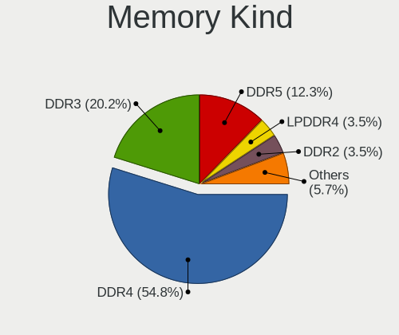

| Kind    | Computers | Percent |
|---------|-----------|---------|
| DDR4    | 125       | 54.82%  |
| DDR3    | 46        | 20.18%  |
| DDR5    | 28        | 12.28%  |
| LPDDR4  | 8         | 3.51%   |
| DDR2    | 8         | 3.51%   |
| Unknown | 5         | 2.19%   |
| LPDDR5  | 3         | 1.32%   |
| SDRAM   | 2         | 0.88%   |
| LPDDR3  | 1         | 0.44%   |
| DRAM    | 1         | 0.44%   |
| DDR     | 1         | 0.44%   |

Memory Form Factor
------------------

Physical design of the memory module

| Name         | Computers | Percent |
|--------------|-----------|---------|
| DIMM         | 117       | 50.87%  |
| SODIMM       | 99        | 43.04%  |
| Row Of Chips | 14        | 6.09%   |

Memory Size
-----------

Memory module size

| Size  | Computers | Percent |
|-------|-----------|---------|
| 8192  | 84        | 34.29%  |
| 16384 | 74        | 30.2%   |
| 4096  | 36        | 14.69%  |
| 32768 | 32        | 13.06%  |
| 2048  | 15        | 6.12%   |
| 1024  | 3         | 1.22%   |
| 512   | 1         | 0.41%   |

Memory Speed
------------

Memory module speed

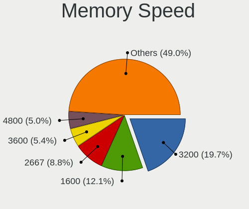

| Speed   | Computers | Percent |
|---------|-----------|---------|
| 3200    | 47        | 19.67%  |
| 1600    | 29        | 12.13%  |
| 2667    | 21        | 8.79%   |
| 3600    | 13        | 5.44%   |
| 4800    | 12        | 5.02%   |
| 6400    | 10        | 4.18%   |
| 2400    | 10        | 4.18%   |
| 1333    | 10        | 4.18%   |
| 2133    | 8         | 3.35%   |
| 4267    | 7         | 2.93%   |
| 3800    | 6         | 2.51%   |
| 3400    | 5         | 2.09%   |
| 800     | 5         | 2.09%   |
| 6000    | 4         | 1.67%   |
| 1866    | 4         | 1.67%   |
| 667     | 4         | 1.67%   |
| 3866    | 3         | 1.26%   |
| 3733    | 3         | 1.26%   |
| 3666    | 3         | 1.26%   |
| 1334    | 3         | 1.26%   |
| Unknown | 3         | 1.26%   |
| 8400    | 2         | 0.84%   |
| 5200    | 2         | 0.84%   |
| 3534    | 2         | 0.84%   |
| 3466    | 2         | 0.84%   |
| 2933    | 2         | 0.84%   |
| 2666    | 2         | 0.84%   |
| 2048    | 2         | 0.84%   |
| 7000    | 1         | 0.42%   |
| 5808    | 1         | 0.42%   |
| 5600    | 1         | 0.42%   |
| 3933    | 1         | 0.42%   |
| 3533    | 1         | 0.42%   |
| 3500    | 1         | 0.42%   |
| 3467    | 1         | 0.42%   |
| 3100    | 1         | 0.42%   |
| 3066    | 1         | 0.42%   |
| 2800    | 1         | 0.42%   |
| 1867    | 1         | 0.42%   |
| 1067    | 1         | 0.42%   |

Printers & scanners
-------------------

Printer Vendor
--------------

Printer device vendors

| Vendor              | Computers | Percent |
|---------------------|-----------|---------|
| Seiko Epson         | 1         | 25%     |
| Samsung Electronics | 1         | 25%     |
| Hewlett-Packard     | 1         | 25%     |
| Brother Industries  | 1         | 25%     |

Printer Model
-------------

Printer device models

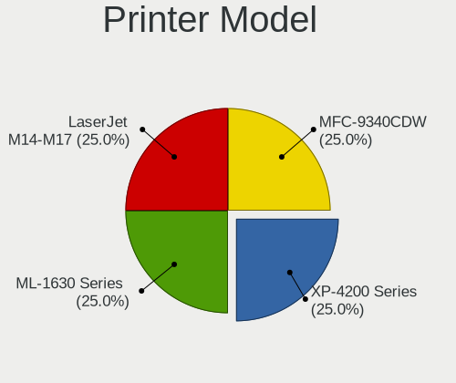

| Model                      | Computers | Percent |
|----------------------------|-----------|---------|
| Seiko Epson XP-4200 Series | 1         | 25%     |
| Samsung ML-1630 Series     | 1         | 25%     |
| HP LaserJet M14-M17        | 1         | 25%     |
| Brother MFC-9340CDW        | 1         | 25%     |

Scanner Vendor
--------------

Scanner device vendors

| Vendor          | Computers | Percent |
|-----------------|-----------|---------|
| Mustek Systems  | 1         | 33.33%  |
| Canon           | 1         | 33.33%  |
| AGFA-Gevaert NV | 1         | 33.33%  |

Scanner Model
-------------

Scanner device models

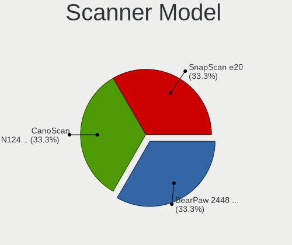

| Model                              | Computers | Percent |
|------------------------------------|-----------|---------|
| Mustek Systems BearPaw 2448 TA Pro | 1         | 33.33%  |
| Canon CanoScan N1240U/LiDE 30      | 1         | 33.33%  |
| AGFA-Gevaert NV SnapScan e20       | 1         | 33.33%  |

Camera
------

Camera Vendor
-------------

Camera device vendors

| Vendor                        | Computers | Percent |
|-------------------------------|-----------|---------|
| Chicony Electronics           | 26        | 20.97%  |
| Logitech                      | 15        | 12.1%   |
| Microdia                      | 14        | 11.29%  |
| Bison Electronics             | 9         | 7.26%   |
| Quanta                        | 8         | 6.45%   |
| Sunplus Innovation Technology | 6         | 4.84%   |
| Luxvisions Innotech Limited   | 6         | 4.84%   |
| IMC Networks                  | 6         | 4.84%   |
| Microsoft                     | 4         | 3.23%   |
| Samsung Electronics           | 3         | 2.42%   |
| Realtek Semiconductor         | 3         | 2.42%   |
| Apple                         | 3         | 2.42%   |
| Sonix Technology              | 2         | 1.61%   |
| MacroSilicon                  | 2         | 1.61%   |
| Lite-On Technology            | 2         | 1.61%   |
| Trust                         | 1         | 0.81%   |
| Suyin                         | 1         | 0.81%   |
| SunplusIT                     | 1         | 0.81%   |
| Sunplus Technology            | 1         | 0.81%   |
| Silicon Motion                | 1         | 0.81%   |
| ShineTech                     | 1         | 0.81%   |
| kingcome                      | 1         | 0.81%   |
| icSpring                      | 1         | 0.81%   |
| Holitech                      | 1         | 0.81%   |
| Genesys Logic                 | 1         | 0.81%   |
| GEMBIRD                       | 1         | 0.81%   |
| Elgato Systems                | 1         | 0.81%   |
| Creative Technology           | 1         | 0.81%   |
| Acer                          | 1         | 0.81%   |
| A4Tech                        | 1         | 0.81%   |

Camera Model
------------

Camera device models

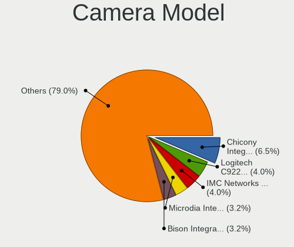

| Model                                                | Computers | Percent |
|------------------------------------------------------|-----------|---------|
| Chicony Integrated Camera                            | 8         | 6.45%   |
| Bison Integrated Camera                              | 6         | 4.84%   |
| Logitech C922 Pro Stream Webcam                      | 5         | 4.03%   |
| IMC Networks USB2.0 HD UVC WebCam                    | 5         | 4.03%   |
| Microdia Integrated_Webcam_HD                        | 4         | 3.23%   |
| Samsung Galaxy series, misc. (MTP mode)              | 3         | 2.42%   |
| Microdia USB Camera                                  | 3         | 2.42%   |
| Microdia Integrated_Webcam_FHD                       | 3         | 2.42%   |
| Logitech HD Pro Webcam C920                          | 3         | 2.42%   |
| Chicony HP HD Camera                                 | 3         | 2.42%   |
| Chicony HD Webcam                                    | 3         | 2.42%   |
| Sunplus Integrated_Webcam_HD                         | 2         | 1.61%   |
| Quanta HD User Facing                                | 2         | 1.61%   |
| MacroSilicon USB Video                               | 2         | 1.61%   |
| Luxvisions Innotech Limited Integrated RGB Camera    | 2         | 1.61%   |
| Luxvisions Innotech Limited Integrated Camera        | 2         | 1.61%   |
| Luxvisions Innotech Limited HP Wide Vision HD Camera | 2         | 1.61%   |
| Chicony FJ Camera                                    | 2         | 1.61%   |
| Apple iPhone 5/5C/5S/6/SE/7/8/X/XR                   | 2         | 1.61%   |
| Trust QHD Webcam                                     | 1         | 0.81%   |
| Suyin HP Truevision HD                               | 1         | 0.81%   |
| SunplusIT 720p HD Camera                             | 1         | 0.81%   |
| Sunplus 1.3M HD WebCam                               | 1         | 0.81%   |
| Sunplus XiaoMi USB 2.0 Webcam                        | 1         | 0.81%   |
| Sunplus NexiGo N930AF FHD Webcam                     | 1         | 0.81%   |
| Sunplus Integrated_Webcam_FHD                        | 1         | 0.81%   |
| Sunplus FHD Capture                                  | 1         | 0.81%   |
| Sonix USB2.0 HD UVC WebCam                           | 1         | 0.81%   |
| Sonix USB2.0 FHD UVC WebCam                          | 1         | 0.81%   |
| Silicon Motion 300k Pixel Camera                     | 1         | 0.81%   |
| ShineTech HD Camera                                  | 1         | 0.81%   |
| Realtek USB Camera                                   | 1         | 0.81%   |
| Realtek Integrated_Webcam_HD                         | 1         | 0.81%   |
| Realtek HP Webcam                                    | 1         | 0.81%   |
| Quanta VGA WebCam                                    | 1         | 0.81%   |
| Quanta RGB-IR Camera                                 | 1         | 0.81%   |
| Quanta HP Webcam                                     | 1         | 0.81%   |
| Quanta HP TrueVision HD Camera                       | 1         | 0.81%   |
| Quanta HP HD Camera                                  | 1         | 0.81%   |
| Quanta hm1091_techfront                              | 1         | 0.81%   |

Security
--------

Fingerprint Vendor
------------------

Fingerprint sensor vendors

| Vendor                     | Computers | Percent |
|----------------------------|-----------|---------|
| Synaptics                  | 10        | 35.71%  |
| Validity Sensors           | 9         | 32.14%  |
| Shenzhen Goodix Technology | 7         | 25%     |
| LighTuning Technology      | 1         | 3.57%   |
| DigitalPersona             | 1         | 3.57%   |

Fingerprint Model
-----------------

Fingerprint sensor models

| Model                                                    | Computers | Percent |
|----------------------------------------------------------|-----------|---------|
| Shenzhen Goodix  FingerPrint Device                      | 6         | 21.43%  |
| Validity Sensors VFS495 Fingerprint Reader               | 3         | 10.71%  |
| Validity Sensors Synaptics WBDI                          | 3         | 10.71%  |
| Synaptics WBDI                                           | 3         | 10.71%  |
| Synaptics UWP WBDI Device                                | 3         | 10.71%  |
| Validity Sensors Fingerprint scanner                     | 2         | 7.14%   |
| Synaptics Prometheus MIS Touch Fingerprint Reader        | 2         | 7.14%   |
| Validity Sensors VFS491                                  | 1         | 3.57%   |
| Synaptics FS7604 Touch Fingerprint Sensor with PurePrint | 1         | 3.57%   |
| Synaptics Fingerprint reader [HP G6]                     | 1         | 3.57%   |
| Shenzhen Goodix Fingerprint Reader                       | 1         | 3.57%   |
| LighTuning EgisTec Touch Fingerprint Sensor              | 1         | 3.57%   |
| DigitalPersona Fingerprint Reader                        | 1         | 3.57%   |

Chipcard Vendor
---------------

Chipcard module vendors

| Vendor                            | Computers | Percent |
|-----------------------------------|-----------|---------|
| Broadcom                          | 6         | 31.58%  |
| Alcor Micro                       | 4         | 21.05%  |
| SCM Microsystems                  | 2         | 10.53%  |
| Upek                              | 1         | 5.26%   |
| O2 Micro                          | 1         | 5.26%   |
| Hewlett-Packard                   | 1         | 5.26%   |
| Free Software Initiative of Japan | 1         | 5.26%   |
| Clay Logic                        | 1         | 5.26%   |
| Bit4id                            | 1         | 5.26%   |
| Advanced Card Systems             | 1         | 5.26%   |

Chipcard Model
--------------

Chipcard module models

| Model                                                                        | Computers | Percent |
|------------------------------------------------------------------------------|-----------|---------|
| Alcor Micro AU9540 Smartcard Reader                                          | 4         | 21.05%  |
| Broadcom 58200                                                               | 3         | 15.79%  |
| SCM Microsystems SCR331-LC1 / SCR3310 SmartCard Reader                       | 2         | 10.53%  |
| Upek TouchChip Fingerprint Coprocessor (WBF advanced mode)                   | 1         | 5.26%   |
| O2 Micro OZ776 CCID Smartcard Reader                                         | 1         | 5.26%   |
| Hewlett-Packard SC Keyboard - Apollo (Liteon)                                | 1         | 5.26%   |
| Free Software Initiative of Japan Gnuk Token                                 | 1         | 5.26%   |
| Clay Logic Nitrokey Pro                                                      | 1         | 5.26%   |
| Broadcom BCM5880 Secure Applications Processor with fingerprint touch sensor | 1         | 5.26%   |
| Broadcom BCM5880 Secure Applications Processor with fingerprint swipe sensor | 1         | 5.26%   |
| Broadcom 5880                                                                | 1         | 5.26%   |
| Bit4id miniLector-s                                                          | 1         | 5.26%   |
| Advanced Card Systems ACR122U                                                | 1         | 5.26%   |

Unsupported
-----------

Unsupported Devices
-------------------

Total unsupported devices on board

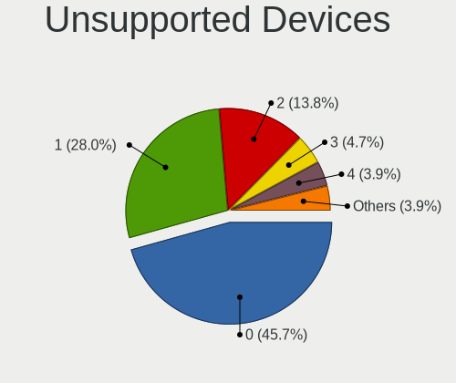

| Total | Computers | Percent |
|-------|-----------|---------|
| 0     | 116       | 45.67%  |
| 1     | 71        | 27.95%  |
| 2     | 35        | 13.78%  |
| 3     | 12        | 4.72%   |
| 4     | 10        | 3.94%   |
| 5     | 5         | 1.97%   |
| 6     | 4         | 1.57%   |
| 7     | 1         | 0.39%   |

Unsupported Device Types
------------------------

Types of unsupported devices

| Type                     | Computers | Percent |
|--------------------------|-----------|---------|
| Graphics card            | 41        | 17.23%  |
| Net/wireless             | 28        | 11.76%  |
| Bluetooth                | 28        | 11.76%  |
| Fingerprint reader       | 27        | 11.34%  |
| Communication controller | 27        | 11.34%  |
| Camera                   | 17        | 7.14%   |
| Sound                    | 14        | 5.88%   |
| Multimedia controller    | 14        | 5.88%   |
| Chipcard                 | 13        | 5.46%   |
| Network                  | 7         | 2.94%   |
| Net/ethernet             | 5         | 2.1%    |
| Firewire controller      | 4         | 1.68%   |
| Storage/ide              | 3         | 1.26%   |
| Storage/ata              | 3         | 1.26%   |
| Card reader              | 3         | 1.26%   |
| Unassigned class         | 2         | 0.84%   |
| Storage/raid             | 1         | 0.42%   |
| Modem                    | 1         | 0.42%   |

