Gentoo 2.13 - Tested Hardware & Statistics (Desktops)
-----------------------------------------------------

A project to collect tested hardware configurations for Gentoo 2.13.

Anyone can contribute to this report by the [hw-probe](https://github.com/linuxhw/hw-probe) tool:

    sudo -E hw-probe -all -upload

Please contribute! Especially if your hardware is rare.

Contents
--------

* [ Test Cases ](#test-cases)

* [ System ](#system)
  - [ Kernel                   ](#kernel)
  - [ Kernel Family            ](#kernel-family)
  - [ Kernel Major Ver.        ](#kernel-major-ver)
  - [ Arch                     ](#arch)
  - [ DE                       ](#de)
  - [ Display Server           ](#display-server)
  - [ Display Manager          ](#display-manager)
  - [ OS Lang                  ](#os-lang)
  - [ Boot Mode                ](#boot-mode)
  - [ Filesystem               ](#filesystem)
  - [ Part. scheme             ](#part-scheme)
  - [ Dual Boot with Linux/BSD ](#dual-boot-with-linuxbsd)
  - [ Dual Boot (Win)          ](#dual-boot-win)

* [ Board ](#board)
  - [ Vendor                   ](#vendor)
  - [ Model                    ](#model)
  - [ Model Family             ](#model-family)
  - [ MFG Year                 ](#mfg-year)
  - [ Form Factor              ](#form-factor)
  - [ Secure Boot              ](#secure-boot)
  - [ Coreboot                 ](#coreboot)
  - [ RAM Size                 ](#ram-size)
  - [ RAM Used                 ](#ram-used)
  - [ Total Drives             ](#total-drives)
  - [ Has CD-ROM               ](#has-cd-rom)
  - [ Has Ethernet             ](#has-ethernet)
  - [ Has WiFi                 ](#has-wifi)
  - [ Has Bluetooth            ](#has-bluetooth)

* [ Location ](#location)
  - [ Country                  ](#country)
  - [ City                     ](#city)

* [ Drives ](#drives)
  - [ Drive Vendor             ](#drive-vendor)
  - [ Drive Model              ](#drive-model)
  - [ HDD Vendor               ](#hdd-vendor)
  - [ SSD Vendor               ](#ssd-vendor)
  - [ Drive Kind               ](#drive-kind)
  - [ Drive Connector          ](#drive-connector)
  - [ Drive Size               ](#drive-size)
  - [ Space Total              ](#space-total)
  - [ Space Used               ](#space-used)
  - [ Malfunc. Drives          ](#malfunc-drives)
  - [ Malfunc. Drive Vendor    ](#malfunc-drive-vendor)
  - [ Malfunc. HDD Vendor      ](#malfunc-hdd-vendor)
  - [ Malfunc. Drive Kind      ](#malfunc-drive-kind)
  - [ Failed Drives            ](#failed-drives)
  - [ Failed Drive Vendor      ](#failed-drive-vendor)
  - [ Drive Status             ](#drive-status)

* [ Storage controller ](#storage-controller)
  - [ Storage Vendor           ](#storage-vendor)
  - [ Storage Model            ](#storage-model)
  - [ Storage Kind             ](#storage-kind)

* [ Processor ](#processor)
  - [ CPU Vendor               ](#cpu-vendor)
  - [ CPU Model                ](#cpu-model)
  - [ CPU Model Family         ](#cpu-model-family)
  - [ CPU Cores                ](#cpu-cores)
  - [ CPU Sockets              ](#cpu-sockets)
  - [ CPU Threads              ](#cpu-threads)
  - [ CPU Op-Modes             ](#cpu-op-modes)
  - [ CPU Microcode            ](#cpu-microcode)
  - [ CPU Microarch            ](#cpu-microarch)

* [ Graphics ](#graphics)
  - [ GPU Vendor               ](#gpu-vendor)
  - [ GPU Model                ](#gpu-model)
  - [ GPU Combo                ](#gpu-combo)
  - [ GPU Driver               ](#gpu-driver)
  - [ GPU Memory               ](#gpu-memory)

* [ Monitor ](#monitor)
  - [ Monitor Vendor           ](#monitor-vendor)
  - [ Monitor Model            ](#monitor-model)
  - [ Monitor Resolution       ](#monitor-resolution)
  - [ Monitor Diagonal         ](#monitor-diagonal)
  - [ Monitor Width            ](#monitor-width)
  - [ Aspect Ratio             ](#aspect-ratio)
  - [ Monitor Area             ](#monitor-area)
  - [ Pixel Density            ](#pixel-density)
  - [ Multiple Monitors        ](#multiple-monitors)

* [ Network ](#network)
  - [ Net Controller Vendor    ](#net-controller-vendor)
  - [ Net Controller Model     ](#net-controller-model)
  - [ Wireless Vendor          ](#wireless-vendor)
  - [ Wireless Model           ](#wireless-model)
  - [ Ethernet Vendor          ](#ethernet-vendor)
  - [ Ethernet Model           ](#ethernet-model)
  - [ Net Controller Kind      ](#net-controller-kind)
  - [ Used Controller          ](#used-controller)
  - [ NICs                     ](#nics)
  - [ IPv6                     ](#ipv6)

* [ Bluetooth ](#bluetooth)
  - [ Bluetooth Vendor         ](#bluetooth-vendor)
  - [ Bluetooth Model          ](#bluetooth-model)

* [ Sound ](#sound)
  - [ Sound Vendor             ](#sound-vendor)
  - [ Sound Model              ](#sound-model)

* [ Memory ](#memory)
  - [ Memory Vendor            ](#memory-vendor)
  - [ Memory Model             ](#memory-model)
  - [ Memory Kind              ](#memory-kind)
  - [ Memory Form Factor       ](#memory-form-factor)
  - [ Memory Size              ](#memory-size)
  - [ Memory Speed             ](#memory-speed)

* [ Printers & scanners ](#printers--scanners)
  - [ Printer Vendor           ](#printer-vendor)
  - [ Printer Model            ](#printer-model)
  - [ Scanner Vendor           ](#scanner-vendor)
  - [ Scanner Model            ](#scanner-model)

* [ Camera ](#camera)
  - [ Camera Vendor            ](#camera-vendor)
  - [ Camera Model             ](#camera-model)

* [ Security ](#security)
  - [ Fingerprint Vendor       ](#fingerprint-vendor)
  - [ Fingerprint Model        ](#fingerprint-model)
  - [ Chipcard Vendor          ](#chipcard-vendor)
  - [ Chipcard Model           ](#chipcard-model)

* [ Unsupported ](#unsupported)
  - [ Unsupported Devices      ](#unsupported-devices)
  - [ Unsupported Device Types ](#unsupported-device-types)

Test Cases
----------

Total: 97

| Vendor        | Model                       | Probe                                                      | Date         |
|---------------|-----------------------------|------------------------------------------------------------|--------------|
| ASUSTek       | TUF Gaming X570-PLUS        | [2a2bf698ed](https://linux-hardware.org/?probe=2a2bf698ed) | May 01, 2023 |
| Gigabyte      | AB350-Gaming-CF             | [c03693e806](https://linux-hardware.org/?probe=c03693e806) | May 01, 2023 |
| ASUSTek       | ROG STRIX Z590-F GAMING ... | [a158a30802](https://linux-hardware.org/?probe=a158a30802) | Apr 29, 2023 |
| ASUSTek       | ROG Maximus Z690 HERO       | [855bed0070](https://linux-hardware.org/?probe=855bed0070) | Apr 28, 2023 |
| ASUSTek       | CM6330_CM6630_CM6730_CM6... | [f3b21405ff](https://linux-hardware.org/?probe=f3b21405ff) | Apr 27, 2023 |
| ASUSTek       | PRIME Z490-A                | [a48c247194](https://linux-hardware.org/?probe=a48c247194) | Apr 26, 2023 |
| ASUSTek       | PRIME Z490-A                | [11844fed4d](https://linux-hardware.org/?probe=11844fed4d) | Apr 25, 2023 |
| ASRock        | B550M Pro4                  | [b53354af62](https://linux-hardware.org/?probe=b53354af62) | Apr 25, 2023 |
| MSI           | B450 GAMING PRO CARBON M... | [c78c7e9ec1](https://linux-hardware.org/?probe=c78c7e9ec1) | Apr 24, 2023 |
| ASUSTek       | M3A78-CM                    | [7bbac9f9bf](https://linux-hardware.org/?probe=7bbac9f9bf) | Apr 24, 2023 |
| Gigabyte      | AB350-Gaming-CF             | [35c362eb4f](https://linux-hardware.org/?probe=35c362eb4f) | Apr 24, 2023 |
| Gigabyte      | X670E AORUS MASTER          | [0f7e30ded3](https://linux-hardware.org/?probe=0f7e30ded3) | Apr 23, 2023 |
| ASUSTek       | M3A78-CM                    | [f98c5f7d2e](https://linux-hardware.org/?probe=f98c5f7d2e) | Apr 23, 2023 |
| Gigabyte      | B460 HD3                    | [c9e3b1d5ea](https://linux-hardware.org/?probe=c9e3b1d5ea) | Apr 22, 2023 |
| Gigabyte      | X570S AORUS ELITE AX        | [80ead18196](https://linux-hardware.org/?probe=80ead18196) | Apr 21, 2023 |
| ASUSTek       | PRIME B650M-A AX            | [0f17162503](https://linux-hardware.org/?probe=0f17162503) | Apr 21, 2023 |
| ASUSTek       | PRIME B650M-A AX            | [056db62b47](https://linux-hardware.org/?probe=056db62b47) | Apr 20, 2023 |
| Intel         | D510MO AAE76523-401         | [cf5c07a318](https://linux-hardware.org/?probe=cf5c07a318) | Apr 19, 2023 |
| ZOTAC         | H67ITX-C-E 02/03/05         | [27131cb048](https://linux-hardware.org/?probe=27131cb048) | Apr 19, 2023 |
| Unknown       | Unknown                     | [bac14fb22e](https://linux-hardware.org/?probe=bac14fb22e) | Apr 19, 2023 |
| ASUSTek       | SABERTOOTH X58              | [270e47ceb8](https://linux-hardware.org/?probe=270e47ceb8) | Apr 19, 2023 |
| ASUSTek       | PRIME H370M-PLUS            | [0a544df503](https://linux-hardware.org/?probe=0a544df503) | Apr 17, 2023 |
| ASUSTek       | ROG Maximus Z690 HERO       | [a70c93f2e7](https://linux-hardware.org/?probe=a70c93f2e7) | Apr 17, 2023 |
| ASUSTek       | TUF Gaming X570-PLUS        | [cb21111c89](https://linux-hardware.org/?probe=cb21111c89) | Apr 16, 2023 |
| ASUSTek       | ROG Maximus Z690 HERO       | [962c5734bc](https://linux-hardware.org/?probe=962c5734bc) | Apr 15, 2023 |
| Gigabyte      | X670E AORUS MASTER          | [c8bf9d49d4](https://linux-hardware.org/?probe=c8bf9d49d4) | Apr 15, 2023 |
| ASRock        | B450M Steel Legend          | [6b71471847](https://linux-hardware.org/?probe=6b71471847) | Apr 15, 2023 |
| HP            | ProLiant MicroServer Gen... | [d00ebfbc62](https://linux-hardware.org/?probe=d00ebfbc62) | Apr 14, 2023 |
| HP            | ProLiant MicroServer Gen... | [8b0e1ffa20](https://linux-hardware.org/?probe=8b0e1ffa20) | Apr 14, 2023 |
| HP            | ProLiant MicroServer Gen... | [3b2ac9206c](https://linux-hardware.org/?probe=3b2ac9206c) | Apr 14, 2023 |
| HP            | ProLiant MicroServer Gen... | [16ee5e0082](https://linux-hardware.org/?probe=16ee5e0082) | Apr 14, 2023 |
| HP            | ProLiant MicroServer Gen... | [1b21351033](https://linux-hardware.org/?probe=1b21351033) | Apr 14, 2023 |
| HP            | ProLiant MicroServer Gen... | [f6f55c801f](https://linux-hardware.org/?probe=f6f55c801f) | Apr 14, 2023 |
| ASUSTek       | P6X58D PREMIUM              | [7f20e3160b](https://linux-hardware.org/?probe=7f20e3160b) | Apr 13, 2023 |
| ASUSTek       | Z87-PLUS                    | [1b44c95410](https://linux-hardware.org/?probe=1b44c95410) | Apr 13, 2023 |
| ASUSTek       | Maximus VI HERO             | [f46283dc4c](https://linux-hardware.org/?probe=f46283dc4c) | Apr 13, 2023 |
| ASUSTek       | TUF Gaming X570-PLUS        | [f5241c853f](https://linux-hardware.org/?probe=f5241c853f) | Apr 12, 2023 |
| ASRock        | X370 Gaming X               | [d829fac91c](https://linux-hardware.org/?probe=d829fac91c) | Apr 10, 2023 |
| ASRock        | X370 Gaming X               | [bd05976130](https://linux-hardware.org/?probe=bd05976130) | Apr 10, 2023 |
| ASUSTek       | M3A78-CM                    | [001091b5fd](https://linux-hardware.org/?probe=001091b5fd) | Apr 10, 2023 |
| Gigabyte      | AB350-Gaming-CF             | [34f1d57aec](https://linux-hardware.org/?probe=34f1d57aec) | Apr 10, 2023 |
| ASRock        | X370 Gaming X               | [0beaf2366c](https://linux-hardware.org/?probe=0beaf2366c) | Apr 09, 2023 |
| ASUSTek       | ROG STRIX X570-E GAMING     | [f85fdf6564](https://linux-hardware.org/?probe=f85fdf6564) | Apr 09, 2023 |
| HPE           | ProLiant MicroServer Gen... | [e378272577](https://linux-hardware.org/?probe=e378272577) | Apr 08, 2023 |
| ASUSTek       | PRIME B650M-A AX            | [97e76297c9](https://linux-hardware.org/?probe=97e76297c9) | Apr 08, 2023 |
| ASUSTek       | M3A78-CM                    | [a71051ab5a](https://linux-hardware.org/?probe=a71051ab5a) | Apr 06, 2023 |
| Gigabyte      | B450M DS3H V2               | [c59398619e](https://linux-hardware.org/?probe=c59398619e) | Apr 03, 2023 |
| ASUSTek       | M3A78-CM                    | [59bdd9d328](https://linux-hardware.org/?probe=59bdd9d328) | Apr 03, 2023 |
| Gigabyte      | AB350-Gaming-CF             | [79ec23e706](https://linux-hardware.org/?probe=79ec23e706) | Apr 03, 2023 |
| ASUSTek       | ROG CROSSHAIR VIII HERO     | [d19221e116](https://linux-hardware.org/?probe=d19221e116) | Apr 02, 2023 |
| ASUSTek       | ROG STRIX Z590-F GAMING ... | [58e2308d1e](https://linux-hardware.org/?probe=58e2308d1e) | Apr 02, 2023 |
| Gigabyte      | B150M-D2V DDR3-CF           | [3599b8e875](https://linux-hardware.org/?probe=3599b8e875) | Mar 31, 2023 |
| ASUSTek       | M3A78-CM                    | [7d0c0336c1](https://linux-hardware.org/?probe=7d0c0336c1) | Mar 27, 2023 |
| ASRock        | AM1H-ITX                    | [8f1dcf05eb](https://linux-hardware.org/?probe=8f1dcf05eb) | Mar 26, 2023 |
| ASRock        | X370 Gaming X               | [0a19e934c3](https://linux-hardware.org/?probe=0a19e934c3) | Mar 26, 2023 |
| ASUSTek       | TUF Gaming X670E-PLUS WI... | [f2b287b461](https://linux-hardware.org/?probe=f2b287b461) | Mar 25, 2023 |
| Gigabyte      | B150M-D2V DDR3-CF           | [276aa0b036](https://linux-hardware.org/?probe=276aa0b036) | Mar 25, 2023 |
| HPE           | ProLiant MicroServer Gen... | [72f90312db](https://linux-hardware.org/?probe=72f90312db) | Mar 25, 2023 |
| ASUSTek       | TUF Gaming X670E-PLUS WI... | [dac7782920](https://linux-hardware.org/?probe=dac7782920) | Mar 24, 2023 |
| HPE           | ProLiant MicroServer Gen... | [2c8daaa4f2](https://linux-hardware.org/?probe=2c8daaa4f2) | Mar 24, 2023 |
| Gigabyte      | X670E AORUS MASTER          | [4bf7fa5f9c](https://linux-hardware.org/?probe=4bf7fa5f9c) | Mar 23, 2023 |
| ASUSTek       | M3A78-CM                    | [7b4a68e88a](https://linux-hardware.org/?probe=7b4a68e88a) | Mar 20, 2023 |
| ASUSTek       | ROG STRIX Z590-E GAMING ... | [f048ae8dec](https://linux-hardware.org/?probe=f048ae8dec) | Mar 19, 2023 |
| MSI           | 990FXA-GD80                 | [e79acda971](https://linux-hardware.org/?probe=e79acda971) | Mar 19, 2023 |
| ASRock        | X370 Gaming X               | [4f98540a7b](https://linux-hardware.org/?probe=4f98540a7b) | Mar 19, 2023 |
| Gigabyte      | Z77X-UD5H                   | [dc0a9ba834](https://linux-hardware.org/?probe=dc0a9ba834) | Mar 19, 2023 |
| HPE           | ProLiant MicroServer Gen... | [7e11b106d7](https://linux-hardware.org/?probe=7e11b106d7) | Mar 17, 2023 |
| ASUSTek       | ProArt X670E-CREATOR WIF... | [fab37d7522](https://linux-hardware.org/?probe=fab37d7522) | Mar 16, 2023 |
| Gigabyte      | X470 AORUS ULTRA GAMING-... | [4d5bb23ec0](https://linux-hardware.org/?probe=4d5bb23ec0) | Mar 15, 2023 |
| ASUSTek       | M3A78-CM                    | [8c2507428d](https://linux-hardware.org/?probe=8c2507428d) | Mar 15, 2023 |
| ASRock        | H81M-HDS                    | [58f8534073](https://linux-hardware.org/?probe=58f8534073) | Mar 14, 2023 |
| Foxconn       | TPS01                       | [60ae6d3891](https://linux-hardware.org/?probe=60ae6d3891) | Mar 14, 2023 |
| Fujitsu Si... | D1547 S26361-D1547          | [95a9c8655d](https://linux-hardware.org/?probe=95a9c8655d) | Mar 14, 2023 |
| ASUSTek       | ROG STRIX B650E-F GAMING... | [06d54f03f9](https://linux-hardware.org/?probe=06d54f03f9) | Mar 13, 2023 |
| ASUSTek       | M3A78-CM                    | [a0590e6829](https://linux-hardware.org/?probe=a0590e6829) | Mar 13, 2023 |
| Gigabyte      | AB350-Gaming-CF             | [540bfa93eb](https://linux-hardware.org/?probe=540bfa93eb) | Mar 13, 2023 |
| ASUSTek       | ROG STRIX Z590-F GAMING ... | [3b52326a3e](https://linux-hardware.org/?probe=3b52326a3e) | Mar 12, 2023 |
| ASUSTek       | TUF Gaming B650M-PLUS WI... | [0932f02541](https://linux-hardware.org/?probe=0932f02541) | Mar 12, 2023 |
| ASRock        | AM1H-ITX                    | [a0eb3774fc](https://linux-hardware.org/?probe=a0eb3774fc) | Mar 09, 2023 |
| Supermicro    | X10DRi-LN4+                 | [4e805ce5a1](https://linux-hardware.org/?probe=4e805ce5a1) | Mar 08, 2023 |
| ASUSTek       | ROG STRIX X670E-E GAMING... | [87cbc99c85](https://linux-hardware.org/?probe=87cbc99c85) | Mar 08, 2023 |
| ASRock        | H170 Pro4                   | [7d749add31](https://linux-hardware.org/?probe=7d749add31) | Mar 07, 2023 |
| ASRock        | X570 Taichi                 | [4d48b829ca](https://linux-hardware.org/?probe=4d48b829ca) | Mar 07, 2023 |
| ASUSTek       | M3A78-CM                    | [397eb062bf](https://linux-hardware.org/?probe=397eb062bf) | Mar 07, 2023 |
| ASUSTek       | PRIME B450M-A               | [dee1b60a0d](https://linux-hardware.org/?probe=dee1b60a0d) | Mar 07, 2023 |
| ASUSTek       | ROG STRIX X570-I GAMING     | [6493617e39](https://linux-hardware.org/?probe=6493617e39) | Mar 07, 2023 |
| Unknown       | Unknown                     | [ffd546b665](https://linux-hardware.org/?probe=ffd546b665) | Mar 07, 2023 |
| Supermicro    | X10DRi-LN4+                 | [d445859477](https://linux-hardware.org/?probe=d445859477) | Mar 07, 2023 |
| Gigabyte      | AB350-Gaming-CF             | [42edcf638d](https://linux-hardware.org/?probe=42edcf638d) | Mar 06, 2023 |
| ASUSTek       | M3A78-CM                    | [541a6200bc](https://linux-hardware.org/?probe=541a6200bc) | Mar 05, 2023 |
| Lenovo        | 1048 SDK0T08861 WIN 3305... | [e6b48cdec4](https://linux-hardware.org/?probe=e6b48cdec4) | Feb 26, 2023 |
| Gigabyte      | Z590 UD                     | [a8da25537c](https://linux-hardware.org/?probe=a8da25537c) | Feb 21, 2023 |
| ASUSTek       | TUF Gaming X570-PLUS_BR     | [12c06a594d](https://linux-hardware.org/?probe=12c06a594d) | Feb 10, 2023 |
| ASUSTek       | ROG STRIX Z690-G GAMING ... | [1423d5ac1b](https://linux-hardware.org/?probe=1423d5ac1b) | Feb 10, 2023 |
| ASUSTek       | ROG STRIX Z690-G GAMING ... | [bb589c5e58](https://linux-hardware.org/?probe=bb589c5e58) | Feb 10, 2023 |
| ASUSTek       | PRIME X570-P                | [a8dcc6b4c1](https://linux-hardware.org/?probe=a8dcc6b4c1) | Feb 03, 2023 |
| Gigabyte      | X570 AORUS MASTER           | [0cf18835cc](https://linux-hardware.org/?probe=0cf18835cc) | Feb 02, 2023 |

System
------

Kernel
------

Version of the Linux kernel

| Version                     | Desktops | Percent |
|-----------------------------|----------|---------|
| 6.1.19-gentoo               | 7        | 10.77%  |
| 6.1.19-gentoo-x86_64        | 6        | 9.23%   |
| 6.1.12-gentoo               | 6        | 9.23%   |
| 6.1.12-gentoo-x86_64        | 5        | 7.69%   |
| 6.2.11-gentoo               | 4        | 6.15%   |
| 6.2.11-gentoo-x86_64        | 3        | 4.62%   |
| 6.2.9-gentoo-x86_64         | 2        | 3.08%   |
| 6.2.8-gentoo-x86_64         | 2        | 3.08%   |
| 6.1.22-gentoo-dist          | 2        | 3.08%   |
| 6.3.0-gentoo-x86_64         | 1        | 1.54%   |
| 6.3.0-gentoo                | 1        | 1.54%   |
| 6.2.9-xanmod1               | 1        | 1.54%   |
| 6.2.9-gentoo-dist           | 1        | 1.54%   |
| 6.2.6-x86_64                | 1        | 1.54%   |
| 6.2.5-gentoo-dist           | 1        | 1.54%   |
| 6.2.3-gentoo-x86_64         | 1        | 1.54%   |
| 6.2.3-gentoo                | 1        | 1.54%   |
| 6.2.2-gentoo                | 1        | 1.54%   |
| 6.2.13-gentoo-dist          | 1        | 1.54%   |
| 6.2.12-gentoo-x86_64        | 1        | 1.54%   |
| 6.2.10-cachyos              | 1        | 1.54%   |
| 6.2.1-gentoo-x86_64         | 1        | 1.54%   |
| 6.2.0-rc6-gentoo-dist+      | 1        | 1.54%   |
| 6.2.0-pf2-llvm              | 1        | 1.54%   |
| 6.2.0                       | 1        | 1.54%   |
| 6.1.9-gentoo-dist           | 1        | 1.54%   |
| 6.1.8-gentoo-hardened1      | 1        | 1.54%   |
| 6.1.19-rt-rt8               | 1        | 1.54%   |
| 6.1.19-renacuajo            | 1        | 1.54%   |
| 6.1.15-gentoo               | 1        | 1.54%   |
| 6.1.12-gentoo-dist-hardened | 1        | 1.54%   |
| 6.1.12-gentoo-dist          | 1        | 1.54%   |
| 6.1.11-gentoo-gentoo-dist   | 1        | 1.54%   |
| 5.15.91-gentoo              | 1        | 1.54%   |
| 5.15.59-gentoo-x86_64       | 1        | 1.54%   |
| 5.15.0-56-generic           | 1        | 1.54%   |
| 5.10.174-gentoo             | 1        | 1.54%   |

Kernel Family
-------------

Linux kernel without a distro release

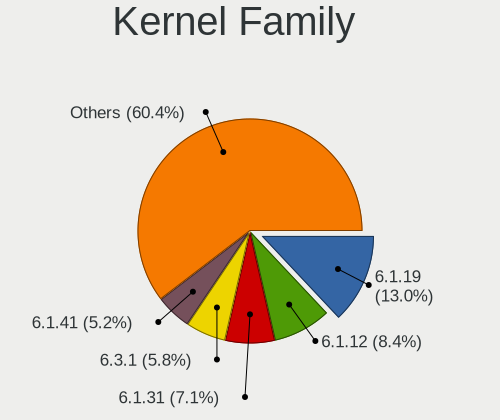

| Version  | Desktops | Percent |
|----------|----------|---------|
| 6.1.19   | 15       | 23.08%  |
| 6.1.12   | 13       | 20%     |
| 6.2.11   | 7        | 10.77%  |
| 6.2.9    | 4        | 6.15%   |
| 6.2.0    | 3        | 4.62%   |
| 6.3.0    | 2        | 3.08%   |
| 6.2.8    | 2        | 3.08%   |
| 6.2.3    | 2        | 3.08%   |
| 6.1.22   | 2        | 3.08%   |
| 6.2.6    | 1        | 1.54%   |
| 6.2.5    | 1        | 1.54%   |
| 6.2.2    | 1        | 1.54%   |
| 6.2.13   | 1        | 1.54%   |
| 6.2.12   | 1        | 1.54%   |
| 6.2.10   | 1        | 1.54%   |
| 6.2.1    | 1        | 1.54%   |
| 6.1.9    | 1        | 1.54%   |
| 6.1.8    | 1        | 1.54%   |
| 6.1.15   | 1        | 1.54%   |
| 6.1.11   | 1        | 1.54%   |
| 5.15.91  | 1        | 1.54%   |
| 5.15.59  | 1        | 1.54%   |
| 5.15.0   | 1        | 1.54%   |
| 5.10.174 | 1        | 1.54%   |

Kernel Major Ver.
-----------------

Linux kernel major version

| Version | Desktops | Percent |
|---------|----------|---------|
| 6.1     | 30       | 50.85%  |
| 6.2     | 23       | 38.98%  |
| 5.15    | 3        | 5.08%   |
| 6.3     | 2        | 3.39%   |
| 5.10    | 1        | 1.69%   |

Arch
----

OS architecture (x86_64, i586, etc.)

| Name   | Desktops | Percent |
|--------|----------|---------|
| x86_64 | 57       | 98.28%  |
| i686   | 1        | 1.72%   |

DE
--

Desktop Environment

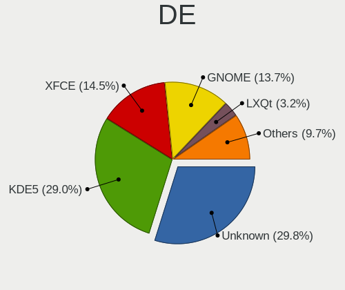

| Name    | Desktops | Percent |
|---------|----------|---------|
| Unknown | 18       | 30%     |
| KDE5    | 17       | 28.33%  |
| XFCE    | 9        | 15%     |
| GNOME   | 6        | 10%     |
| LXQt    | 4        | 6.67%   |
| MATE    | 2        | 3.33%   |
| sway    | 1        | 1.67%   |
| openbox | 1        | 1.67%   |
| LXDE    | 1        | 1.67%   |
| KDE     | 1        | 1.67%   |

Display Server
--------------

X11 or Wayland

| Name    | Desktops | Percent |
|---------|----------|---------|
| X11     | 25       | 40.98%  |
| Unknown | 13       | 21.31%  |
| Tty     | 12       | 19.67%  |
| Wayland | 11       | 18.03%  |

Display Manager
---------------

SDDM, LightDM, etc.

| Name    | Desktops | Percent |
|---------|----------|---------|
| Unknown | 21       | 35.59%  |
| SDDM    | 20       | 33.9%   |
| LightDM | 9        | 15.25%  |
| GDM     | 5        | 8.47%   |
| LXDM    | 2        | 3.39%   |
| SLiM    | 1        | 1.69%   |
| GREETD  | 1        | 1.69%   |

OS Lang
-------

Language

| Lang    | Desktops | Percent |
|---------|----------|---------|
| en_US   | 24       | 39.34%  |
| en_GB   | 7        | 11.48%  |
| C.UTF8  | 7        | 11.48%  |
| Unknown | 6        | 9.84%   |
| en_IE   | 4        | 6.56%   |
| fr_FR   | 3        | 4.92%   |
| de_DE   | 3        | 4.92%   |
| C       | 3        | 4.92%   |
| ru_RU   | 1        | 1.64%   |
| pl_PL   | 1        | 1.64%   |
| it_IT   | 1        | 1.64%   |
| es_ES   | 1        | 1.64%   |

Boot Mode
---------

EFI or BIOS

| Mode | Desktops | Percent |
|------|----------|---------|
| EFI  | 38       | 64.41%  |
| BIOS | 21       | 35.59%  |

Filesystem
----------

Type of filesystem

| Type    | Desktops | Percent |
|---------|----------|---------|
| Ext4    | 31       | 52.54%  |
| Btrfs   | 17       | 28.81%  |
| F2fs    | 5        | 8.47%   |
| Zfs     | 3        | 5.08%   |
| Xfs     | 2        | 3.39%   |
| XXXXXXX | 1        | 1.69%   |

Part. scheme
------------

Scheme of partitioning

| Type    | Desktops | Percent |
|---------|----------|---------|
| GPT     | 48       | 82.76%  |
| MBR     | 7        | 12.07%  |
| Unknown | 3        | 5.17%   |

Dual Boot with Linux/BSD
------------------------

Hosting more than one Linux/BSD

| Dual boot | Desktops | Percent |
|-----------|----------|---------|
| No        | 36       | 59.02%  |
| Yes       | 25       | 40.98%  |

Dual Boot (Win)
---------------

Hosting Linux and Windows

| Dual boot | Desktops | Percent |
|-----------|----------|---------|
| No        | 46       | 79.31%  |
| Yes       | 12       | 20.69%  |

Board
-----

Vendor
------

Motherboard manufacturer

| Name                | Desktops | Percent |
|---------------------|----------|---------|
| ASUSTek Computer    | 27       | 46.55%  |
| Gigabyte Technology | 10       | 17.24%  |
| ASRock              | 7        | 12.07%  |
| Hewlett-Packard     | 3        | 5.17%   |
| MSI                 | 2        | 3.45%   |
| Unknown             | 2        | 3.45%   |
| ZOTAC               | 1        | 1.72%   |
| Supermicro          | 1        | 1.72%   |
| Lenovo              | 1        | 1.72%   |
| Intel               | 1        | 1.72%   |
| HPE                 | 1        | 1.72%   |
| Fujitsu Siemens     | 1        | 1.72%   |
| Foxconn             | 1        | 1.72%   |

Model
-----

Motherboard model

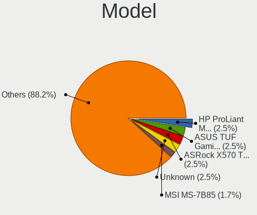

| Name                                | Desktops | Percent |
|-------------------------------------|----------|---------|
| HP ProLiant MicroServer Gen8        | 3        | 5.17%   |
| ASUS ROG STRIX Z590-F GAMING WIFI   | 2        | 3.45%   |
| ASUS M3A78-CM                       | 2        | 3.45%   |
| ASUS All Series                     | 2        | 3.45%   |
| Unknown                             | 2        | 3.45%   |
| ZOTAC H67ITX-C-E                    | 1        | 1.72%   |
| Supermicro SSG-6028R-ER12-HDP-AI050 | 1        | 1.72%   |
| MSI MS-7B85                         | 1        | 1.72%   |
| MSI MS-7640                         | 1        | 1.72%   |
| Lenovo ThinkStation P340 30DJS35Q00 | 1        | 1.72%   |
| Intel T series                      | 1        | 1.72%   |
| HPE ProLiant MicroServer Gen10 Plus | 1        | 1.72%   |
| Gigabyte Z77X-UD5H                  | 1        | 1.72%   |
| Gigabyte Z590 UD                    | 1        | 1.72%   |
| Gigabyte X670E AORUS MASTER         | 1        | 1.72%   |
| Gigabyte X570S AORUS ELITE AX       | 1        | 1.72%   |
| Gigabyte X570 AORUS MASTER          | 1        | 1.72%   |
| Gigabyte X470 AORUS ULTRA GAMING    | 1        | 1.72%   |
| Gigabyte B460HD3                    | 1        | 1.72%   |
| Gigabyte B450M DS3H V2              | 1        | 1.72%   |
| Gigabyte B150M-D2V DDR3             | 1        | 1.72%   |
| Gigabyte AB350-Gaming               | 1        | 1.72%   |
| Fujitsu Siemens D1547               | 1        | 1.72%   |
| Foxconn TPS01                       | 1        | 1.72%   |
| ASUS TUF Gaming X670E-PLUS WIFI     | 1        | 1.72%   |
| ASUS TUF Gaming X570-PLUS_BR        | 1        | 1.72%   |
| ASUS TUF Gaming X570-PLUS           | 1        | 1.72%   |
| ASUS TUF Gaming B650M-PLUS WIFI     | 1        | 1.72%   |
| ASUS SABERTOOTH X58                 | 1        | 1.72%   |
| ASUS ROG STRIX Z690-G GAMING WIFI   | 1        | 1.72%   |
| ASUS ROG STRIX Z590-E GAMING WIFI   | 1        | 1.72%   |
| ASUS ROG STRIX X670E-E GAMING WIFI  | 1        | 1.72%   |
| ASUS ROG STRIX X570-I GAMING        | 1        | 1.72%   |
| ASUS ROG STRIX X570-E GAMING        | 1        | 1.72%   |
| ASUS ROG STRIX B650E-F GAMING WIFI  | 1        | 1.72%   |
| ASUS ROG Maximus Z690 HERO          | 1        | 1.72%   |
| ASUS ROG CROSSHAIR VIII HERO        | 1        | 1.72%   |
| ASUS ProArt X670E-CREATOR WIFI      | 1        | 1.72%   |
| ASUS PRIME Z490-A                   | 1        | 1.72%   |
| ASUS PRIME X570-P                   | 1        | 1.72%   |

Model Family
------------

Motherboard model prefix

| Name                                | Desktops | Percent |
|-------------------------------------|----------|---------|
| ASUS ROG                            | 10       | 17.24%  |
| ASUS PRIME                          | 5        | 8.62%   |
| ASUS TUF                            | 4        | 6.9%    |
| HP ProLiant                         | 3        | 5.17%   |
| ASUS M3A78-CM                       | 2        | 3.45%   |
| ASUS All                            | 2        | 3.45%   |
| Unknown                             | 2        | 3.45%   |
| ZOTAC H67ITX-C-E                    | 1        | 1.72%   |
| Supermicro SSG-6028R-ER12-HDP-AI050 | 1        | 1.72%   |
| MSI MS-7B85                         | 1        | 1.72%   |
| MSI MS-7640                         | 1        | 1.72%   |
| Lenovo ThinkStation                 | 1        | 1.72%   |
| Intel T                             | 1        | 1.72%   |
| HPE ProLiant                        | 1        | 1.72%   |
| Gigabyte Z77X-UD5H                  | 1        | 1.72%   |
| Gigabyte Z590                       | 1        | 1.72%   |
| Gigabyte X670E                      | 1        | 1.72%   |
| Gigabyte X570S                      | 1        | 1.72%   |
| Gigabyte X570                       | 1        | 1.72%   |
| Gigabyte X470                       | 1        | 1.72%   |
| Gigabyte B460HD3                    | 1        | 1.72%   |
| Gigabyte B450M                      | 1        | 1.72%   |
| Gigabyte B150M-D2V                  | 1        | 1.72%   |
| Gigabyte AB350-Gaming               | 1        | 1.72%   |
| Fujitsu Siemens D1547               | 1        | 1.72%   |
| Foxconn TPS01                       | 1        | 1.72%   |
| ASUS SABERTOOTH                     | 1        | 1.72%   |
| ASUS ProArt                         | 1        | 1.72%   |
| ASUS P6X58D                         | 1        | 1.72%   |
| ASUS CM6630                         | 1        | 1.72%   |
| ASRock X570                         | 1        | 1.72%   |
| ASRock X370                         | 1        | 1.72%   |
| ASRock H81M-HDS                     | 1        | 1.72%   |
| ASRock H170                         | 1        | 1.72%   |
| ASRock B550M                        | 1        | 1.72%   |
| ASRock B450M                        | 1        | 1.72%   |
| ASRock AM1H-ITX                     | 1        | 1.72%   |

MFG Year
--------

Motherboard manufacture year

| Year | Desktops | Percent |
|------|----------|---------|
| 2022 | 9        | 15.52%  |
| 2019 | 8        | 13.79%  |
| 2021 | 7        | 12.07%  |
| 2020 | 7        | 12.07%  |
| 2013 | 5        | 8.62%   |
| 2012 | 4        | 6.9%    |
| 2018 | 3        | 5.17%   |
| 2010 | 3        | 5.17%   |
| 2017 | 2        | 3.45%   |
| 2014 | 2        | 3.45%   |
| 2008 | 2        | 3.45%   |
| 2023 | 1        | 1.72%   |
| 2016 | 1        | 1.72%   |
| 2015 | 1        | 1.72%   |
| 2011 | 1        | 1.72%   |
| 2009 | 1        | 1.72%   |
| 2003 | 1        | 1.72%   |

Form Factor
-----------

Physical design of the computer

| Name    | Desktops | Percent |
|---------|----------|---------|
| Desktop | 58       | 100%    |

Secure Boot
-----------

Enabled or disabled

| State    | Desktops | Percent |
|----------|----------|---------|
| Disabled | 57       | 98.28%  |
| Enabled  | 1        | 1.72%   |

Coreboot
--------

Have coreboot on board

| Used | Desktops | Percent |
|------|----------|---------|
| No   | 58       | 100%    |

RAM Size
--------

Total RAM memory

| Size in GB      | Desktops | Percent |
|-----------------|----------|---------|
| 64.01-256.0     | 16       | 27.59%  |
| 32.01-64.0      | 14       | 24.14%  |
| 16.01-24.0      | 11       | 18.97%  |
| 8.01-16.0       | 5        | 8.62%   |
| 3.01-4.0        | 4        | 6.9%    |
| 24.01-32.0      | 3        | 5.17%   |
| 4.01-8.0        | 2        | 3.45%   |
| More than 256.0 | 1        | 1.72%   |
| 2.01-3.0        | 1        | 1.72%   |
| 1.01-2.0        | 1        | 1.72%   |

RAM Used
--------

Used RAM memory

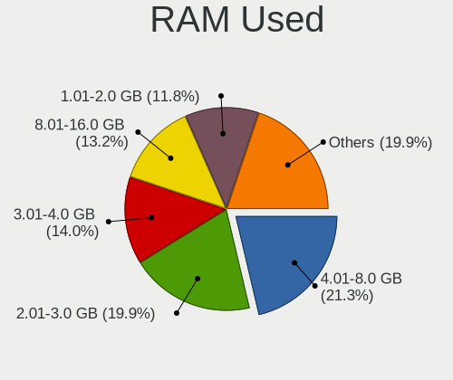

| Used GB    | Desktops | Percent |
|------------|----------|---------|
| 2.01-3.0   | 17       | 27.87%  |
| 4.01-8.0   | 13       | 21.31%  |
| 8.01-16.0  | 8        | 13.11%  |
| 3.01-4.0   | 7        | 11.48%  |
| 0.51-1.0   | 6        | 9.84%   |
| 1.01-2.0   | 5        | 8.2%    |
| 16.01-24.0 | 2        | 3.28%   |
| 0.01-0.5   | 2        | 3.28%   |
| 24.01-32.0 | 1        | 1.64%   |

Total Drives
------------

Number of drives on board

| Drives | Desktops | Percent |
|--------|----------|---------|
| 1      | 15       | 25.86%  |
| 3      | 14       | 24.14%  |
| 5      | 7        | 12.07%  |
| 2      | 7        | 12.07%  |
| 6      | 5        | 8.62%   |
| 4      | 5        | 8.62%   |
| 8      | 2        | 3.45%   |
| 7      | 2        | 3.45%   |
| 13     | 1        | 1.72%   |

Has CD-ROM
----------

Has CD-ROM on board

| Presented | Desktops | Percent |
|-----------|----------|---------|
| No        | 41       | 70.69%  |
| Yes       | 17       | 29.31%  |

Has Ethernet
------------

Has Ethernet on board

| Presented | Desktops | Percent |
|-----------|----------|---------|
| Yes       | 57       | 98.28%  |
| No        | 1        | 1.72%   |

Has WiFi
--------

Has WiFi module

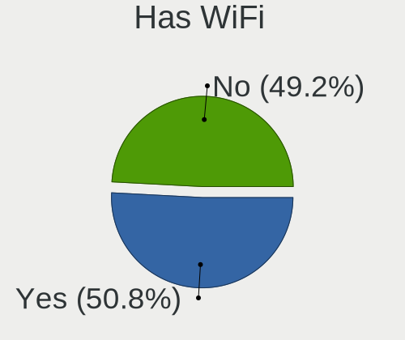

| Presented | Desktops | Percent |
|-----------|----------|---------|
| No        | 37       | 63.79%  |
| Yes       | 21       | 36.21%  |

Has Bluetooth
-------------

Has Bluetooth module

| Presented | Desktops | Percent |
|-----------|----------|---------|
| No        | 36       | 62.07%  |
| Yes       | 22       | 37.93%  |

Location
--------

Country
-------

Geographic location (country)

| Country    | Desktops | Percent |
|------------|----------|---------|
| USA        | 17       | 29.31%  |
| Germany    | 11       | 18.97%  |
| UK         | 7        | 12.07%  |
| France     | 7        | 12.07%  |
| Poland     | 3        | 5.17%   |
| Canada     | 3        | 5.17%   |
| Vietnam    | 2        | 3.45%   |
| Czechia    | 2        | 3.45%   |
| Spain      | 1        | 1.72%   |
| Luxembourg | 1        | 1.72%   |
| Italy      | 1        | 1.72%   |
| Indonesia  | 1        | 1.72%   |
| China      | 1        | 1.72%   |
| Brazil     | 1        | 1.72%   |

City
----

Geographic location (city)

| City              | Desktops | Percent |
|-------------------|----------|---------|
| Paris             | 4        | 6.78%   |
| Warsaw            | 3        | 5.08%   |
| Sterling          | 3        | 5.08%   |
| Frankfurt am Main | 3        | 5.08%   |
| Leeds             | 2        | 3.39%   |
| Cologne           | 2        | 3.39%   |
| Český Těšín  | 2        | 3.39%   |
| Beaverton         | 2        | 3.39%   |
| Yucaipa           | 1        | 1.69%   |
| West Chicago      | 1        | 1.69%   |
| Vancouver         | 1        | 1.69%   |
| Surabaya          | 1        | 1.69%   |
| Stade             | 1        | 1.69%   |
| Shanghai          | 1        | 1.69%   |
| San Francisco     | 1        | 1.69%   |
| Pozzuoli          | 1        | 1.69%   |
| Parsippany        | 1        | 1.69%   |
| Orange            | 1        | 1.69%   |
| Norwich           | 1        | 1.69%   |
| Minneapolis       | 1        | 1.69%   |
| Maule             | 1        | 1.69%   |
| Marysville        | 1        | 1.69%   |
| Mainhausen        | 1        | 1.69%   |
| Luxembourg        | 1        | 1.69%   |
| Lohne             | 1        | 1.69%   |
| Logroño          | 1        | 1.69%   |
| Kon Tum           | 1        | 1.69%   |
| Kippens           | 1        | 1.69%   |
| Kiel              | 1        | 1.69%   |
| Huddersfield      | 1        | 1.69%   |
| Hanoi             | 1        | 1.69%   |
| Gunzenhausen      | 1        | 1.69%   |
| Gatineau          | 1        | 1.69%   |
| Fort Wayne        | 1        | 1.69%   |
| Flint             | 1        | 1.69%   |
| Eugene            | 1        | 1.69%   |
| Eschweiler        | 1        | 1.69%   |
| Croydon           | 1        | 1.69%   |
| Cognac            | 1        | 1.69%   |
| Clitheroe         | 1        | 1.69%   |

Drives
------

Drive Vendor
------------

Hard drive vendors

| Vendor                      | Desktops | Drives | Percent |
|-----------------------------|----------|--------|---------|
| Samsung Electronics         | 26       | 42     | 20.63%  |
| WDC                         | 21       | 43     | 16.67%  |
| Seagate                     | 17       | 48     | 13.49%  |
| Sandisk                     | 10       | 11     | 7.94%   |
| Phison Electronics          | 7        | 9      | 5.56%   |
| Crucial                     | 7        | 9      | 5.56%   |
| Toshiba                     | 5        | 8      | 3.97%   |
| China                       | 5        | 10     | 3.97%   |
| Kingston                    | 4        | 5      | 3.17%   |
| Intel                       | 4        | 5      | 3.17%   |
| Micron/Crucial Technology   | 3        | 4      | 2.38%   |
| GOODRAM                     | 3        | 7      | 2.38%   |
| Hitachi                     | 2        | 10     | 1.59%   |
| V-GeN                       | 1        | 1      | 0.79%   |
| SK hynix                    | 1        | 1      | 0.79%   |
| Silicon Motion              | 1        | 2      | 0.79%   |
| PNY                         | 1        | 3      | 0.79%   |
| Phison                      | 1        | 1      | 0.79%   |
| OCZ                         | 1        | 1      | 0.79%   |
| Micron Technology           | 1        | 1      | 0.79%   |
| MAXIO Technology (Hangzhou) | 1        | 1      | 0.79%   |
| KingSpec                    | 1        | 1      | 0.79%   |
| ADROITLARK                  | 1        | 2      | 0.79%   |
| A-DATA Technology           | 1        | 1      | 0.79%   |
| Unknown                     | 1        | 1      | 0.79%   |

Drive Model
-----------

Hard drive models

| Model                                               | Desktops | Percent |
|-----------------------------------------------------|----------|---------|
| Samsung NVMe SSD Controller SM981/PM981/PM983 1TB   | 8        | 4.82%   |
| Samsung NVMe SSD Controller PM9A1/PM9A3/980PRO 2TB  | 7        | 4.22%   |
| Samsung SSD 980 1TB                                 | 4        | 2.41%   |
| Seagate ST4000DM004-2CV104 4TB                      | 3        | 1.81%   |
| Sandisk WD Blue SN550 NVMe SSD 1024GB               | 3        | 1.81%   |
| Crucial CT1000MX500SSD1 1TB                         | 3        | 1.81%   |
| WDC WD5000LPLX-66ZNTT1 500GB                        | 2        | 1.2%    |
| WDC WD40EZRZ-00GXCB0 4TB                            | 2        | 1.2%    |
| WDC WD30EFRX-68EUZN0 3TB                            | 2        | 1.2%    |
| WDC WD1502FYPS-02W3B0 1TB                           | 2        | 1.2%    |
| WDC WD120EFBX-68B0EN0 12TB                          | 2        | 1.2%    |
| Samsung SSD 860 EVO 4TB                             | 2        | 1.2%    |
| Samsung SSD 850 EVO 250GB                           | 2        | 1.2%    |
| Samsung NVMe SSD Controller SM961/PM961/SM963 500GB | 2        | 1.2%    |
| Phison E7 NVMe Controller 240GB                     | 2        | 1.2%    |
| Phison E16 PCIe4 NVMe Controller 500GB              | 2        | 1.2%    |
| Phison E12 NVMe Controller 512GB                    | 2        | 1.2%    |
| Micron/Crucial P2 NVMe PCIe SSD 1TB                 | 2        | 1.2%    |
| Intel SSD 660P Series 512GB                         | 2        | 1.2%    |
| GOODRAM SSDPR-CL100-480-G2 480GB                    | 2        | 1.2%    |
| China SATA SSD 960GB                                | 2        | 1.2%    |
| WDC WDS200T2B0B-00YS70 2TB SSD                      | 1        | 0.6%    |
| WDC WD80EFAX-68KNBN0 8TB                            | 1        | 0.6%    |
| WDC WD8003FFBX-68B9AN0 8TB                          | 1        | 0.6%    |
| WDC WD60PURZ-85ZUFY1 6TB                            | 1        | 0.6%    |
| WDC WD60EZRX-00MVLB1 6TB                            | 1        | 0.6%    |
| WDC WD60EZAZ-00SF3B0 6TB                            | 1        | 0.6%    |
| WDC WD60EFRX-68MYMN1 6TB                            | 1        | 0.6%    |
| WDC WD6003FZBX-00K5WB0 6TB                          | 1        | 0.6%    |
| WDC WD5000LPCX-24VHAT0 500GB                        | 1        | 0.6%    |
| WDC WD5000AADS-00S9B0 500GB                         | 1        | 0.6%    |
| WDC WD40EZRZ-00WN9B0 4TB                            | 1        | 0.6%    |
| WDC WD40EZRX-22SPEB0 4TB                            | 1        | 0.6%    |
| WDC WD30PURX-64P6ZY0 3TB                            | 1        | 0.6%    |
| WDC WD30EFRX-68N32N0 3TB                            | 1        | 0.6%    |
| WDC WD30EFRX-68AX9N0 3TB                            | 1        | 0.6%    |
| WDC WD20EZBX-08AYR 2TB                              | 1        | 0.6%    |
| WDC WD20EFRX-68EUZN0 2TB                            | 1        | 0.6%    |
| WDC WD20EARX-00PASB0 2TB                            | 1        | 0.6%    |
| WDC WD20EARS-00MVWB0 2TB                            | 1        | 0.6%    |

HDD Vendor
----------

Hard disk drive vendors

| Vendor              | Desktops | Drives | Percent |
|---------------------|----------|--------|---------|
| WDC                 | 20       | 42     | 44.44%  |
| Seagate             | 17       | 47     | 37.78%  |
| Toshiba             | 5        | 8      | 11.11%  |
| Hitachi             | 2        | 10     | 4.44%   |
| Samsung Electronics | 1        | 1      | 2.22%   |

SSD Vendor
----------

Solid state drive vendors

| Vendor              | Desktops | Drives | Percent |
|---------------------|----------|--------|---------|
| Samsung Electronics | 13       | 16     | 27.08%  |
| Crucial             | 7        | 9      | 14.58%  |
| SanDisk             | 5        | 6      | 10.42%  |
| China               | 5        | 10     | 10.42%  |
| Kingston            | 4        | 5      | 8.33%   |
| GOODRAM             | 3        | 7      | 6.25%   |
| Intel               | 2        | 3      | 4.17%   |
| WDC                 | 1        | 1      | 2.08%   |
| V-GeN               | 1        | 1      | 2.08%   |
| PNY                 | 1        | 3      | 2.08%   |
| OCZ                 | 1        | 1      | 2.08%   |
| Micron Technology   | 1        | 1      | 2.08%   |
| KingSpec            | 1        | 1      | 2.08%   |
| ADROITLARK          | 1        | 2      | 2.08%   |
| A-DATA Technology   | 1        | 1      | 2.08%   |
| Unknown             | 1        | 1      | 2.08%   |

Drive Kind
----------

HDD or SSD

| Kind    | Desktops | Drives | Percent |
|---------|----------|--------|---------|
| SSD     | 36       | 68     | 36.73%  |
| HDD     | 31       | 108    | 31.63%  |
| NVMe    | 29       | 49     | 29.59%  |
| Unknown | 2        | 2      | 2.04%   |

Drive Connector
---------------

SATA, SAS, NVMe, etc.

| Type | Desktops | Drives | Percent |
|------|----------|--------|---------|
| SATA | 49       | 169    | 59.76%  |
| NVMe | 29       | 49     | 35.37%  |
| SAS  | 4        | 9      | 4.88%   |

Drive Size
----------

Size of hard drive

| Size in TB | Desktops | Drives | Percent |
|------------|----------|--------|---------|
| 0.01-0.5   | 30       | 50     | 31.58%  |
| 0.51-1.0   | 21       | 35     | 22.11%  |
| 3.01-4.0   | 13       | 24     | 13.68%  |
| 1.01-2.0   | 12       | 22     | 12.63%  |
| 4.01-10.0  | 11       | 22     | 11.58%  |
| 2.01-3.0   | 5        | 18     | 5.26%   |
| 10.01-20.0 | 3        | 5      | 3.16%   |

Space Total
-----------

Amount of disk space available on the file system

| Size in GB     | Desktops | Percent |
|----------------|----------|---------|
| More than 3000 | 22       | 36.07%  |
| 501-1000       | 10       | 16.39%  |
| 1001-2000      | 9        | 14.75%  |
| 251-500        | 5        | 8.2%    |
| 2001-3000      | 5        | 8.2%    |
| 101-250        | 4        | 6.56%   |
| 1-20           | 4        | 6.56%   |
| 51-100         | 1        | 1.64%   |
| Unknown        | 1        | 1.64%   |

Space Used
----------

Amount of used disk space

| Used GB        | Desktops | Percent |
|----------------|----------|---------|
| More than 3000 | 13       | 21.31%  |
| 1-20           | 11       | 18.03%  |
| 501-1000       | 10       | 16.39%  |
| 251-500        | 6        | 9.84%   |
| 101-250        | 6        | 9.84%   |
| 21-50          | 5        | 8.2%    |
| 1001-2000      | 5        | 8.2%    |
| 2001-3000      | 2        | 3.28%   |
| 51-100         | 2        | 3.28%   |
| Unknown        | 1        | 1.64%   |

Malfunc. Drives
---------------

Drive models with a malfunction

| Model                               | Desktops | Drives | Percent |
|-------------------------------------|----------|--------|---------|
| WDC WD60PURZ-85ZUFY1 6TB            | 1        | 1      | 6.25%   |
| WDC WD60EZRX-00MVLB1 6TB            | 1        | 1      | 6.25%   |
| WDC WD30EFRX-68EUZN0 3TB            | 1        | 2      | 6.25%   |
| Toshiba MK1633GSG 160GB             | 1        | 1      | 6.25%   |
| Toshiba DT01ACA200 2TB              | 1        | 1      | 6.25%   |
| Seagate ST750LM022 HN-M750MBB 752GB | 1        | 1      | 6.25%   |
| Seagate ST3500630NS 500GB           | 1        | 2      | 6.25%   |
| Seagate ST3000DM001-9YN166 3TB      | 1        | 1      | 6.25%   |
| Seagate ST2000DX002-2DV164 2TB      | 1        | 1      | 6.25%   |
| Seagate ST2000DM001-1CH164 2TB      | 1        | 1      | 6.25%   |
| SanDisk SSD PLUS 480GB              | 1        | 1      | 6.25%   |
| Samsung Electronics SSD 980 1TB     | 1        | 1      | 6.25%   |
| Intel SSDSC2BB160G4T 160GB          | 1        | 2      | 6.25%   |
| Crucial M4-CT512M4SSD2 512GB        | 1        | 1      | 6.25%   |
| China SSD 240GB                     | 1        | 1      | 6.25%   |
| China SATA SSD 960GB                | 1        | 1      | 6.25%   |

Malfunc. Drive Vendor
---------------------

Vendors of faulty drives

| Vendor              | Desktops | Drives | Percent |
|---------------------|----------|--------|---------|
| Seagate             | 4        | 6      | 26.67%  |
| WDC                 | 3        | 4      | 20%     |
| Toshiba             | 2        | 2      | 13.33%  |
| China               | 2        | 2      | 13.33%  |
| SanDisk             | 1        | 1      | 6.67%   |
| Samsung Electronics | 1        | 1      | 6.67%   |
| Intel               | 1        | 2      | 6.67%   |
| Crucial             | 1        | 1      | 6.67%   |

Malfunc. HDD Vendor
-------------------

Vendors of faulty HDD drives

| Vendor  | Desktops | Drives | Percent |
|---------|----------|--------|---------|
| Seagate | 4        | 6      | 44.44%  |
| WDC     | 3        | 4      | 33.33%  |
| Toshiba | 2        | 2      | 22.22%  |

Malfunc. Drive Kind
-------------------

Kinds of faulty drives

| Kind | Desktops | Drives | Percent |
|------|----------|--------|---------|
| HDD  | 8        | 12     | 57.14%  |
| SSD  | 5        | 6      | 35.71%  |
| NVMe | 1        | 1      | 7.14%   |

Failed Drives
-------------

Failed drive models

| Model                    | Desktops | Drives | Percent |
|--------------------------|----------|--------|---------|
| WDC WD20EARS-00MVWB0 2TB | 1        | 2      | 100%    |

Failed Drive Vendor
-------------------

Failed drive vendors

| Vendor | Desktops | Drives | Percent |
|--------|----------|--------|---------|
| WDC    | 1        | 2      | 100%    |

Drive Status
------------

Number of failed and malfunc. drives

| Status   | Desktops | Drives | Percent |
|----------|----------|--------|---------|
| Works    | 52       | 185    | 71.23%  |
| Malfunc  | 13       | 19     | 17.81%  |
| Detected | 7        | 21     | 9.59%   |
| Failed   | 1        | 2      | 1.37%   |

Storage controller
------------------

Storage Vendor
--------------

Storage controller vendors

| Vendor                      | Desktops | Percent |
|-----------------------------|----------|---------|
| Intel                       | 30       | 27.03%  |
| AMD                         | 27       | 24.32%  |
| Samsung Electronics         | 16       | 14.41%  |
| ASMedia Technology          | 8        | 7.21%   |
| Phison Electronics          | 7        | 6.31%   |
| SanDisk                     | 5        | 4.5%    |
| Marvell Technology Group    | 5        | 4.5%    |
| Micron/Crucial Technology   | 3        | 2.7%    |
| JMicron Technology          | 3        | 2.7%    |
| Broadcom / LSI              | 2        | 1.8%    |
| SK hynix                    | 1        | 0.9%    |
| Silicon Motion              | 1        | 0.9%    |
| Silicon Image               | 1        | 0.9%    |
| MAXIO Technology (Hangzhou) | 1        | 0.9%    |
| LSI Logic / Symbios Logic   | 1        | 0.9%    |

Storage Model
-------------

Storage controller models

| Model                                                                          | Desktops | Percent |
|--------------------------------------------------------------------------------|----------|---------|
| AMD FCH SATA Controller [AHCI mode]                                            | 22       | 16.79%  |
| Samsung NVMe SSD Controller SM981/PM981/PM983                                  | 8        | 6.11%   |
| Samsung NVMe SSD Controller PM9A1/PM9A3/980PRO                                 | 7        | 5.34%   |
| ASMedia ASM1062 Serial ATA Controller                                          | 7        | 5.34%   |
| AMD 400 Series Chipset SATA Controller                                         | 5        | 3.82%   |
| Samsung NVMe SSD Controller 980                                                | 4        | 3.05%   |
| Intel 6 Series/C200 Series Chipset Family 6 port Desktop SATA AHCI Controller  | 4        | 3.05%   |
| SanDisk WD Blue SN550 NVMe SSD                                                 | 3        | 2.29%   |
| Intel NM10/ICH7 Family SATA Controller [AHCI mode]                             | 3        | 2.29%   |
| Intel 8 Series/C220 Series Chipset Family 6-port SATA Controller 1 [AHCI mode] | 3        | 2.29%   |
| Intel 500 Series Chipset Family SATA AHCI Controller                           | 3        | 2.29%   |
| AMD SB7x0/SB8x0/SB9x0 SATA Controller [IDE mode]                               | 3        | 2.29%   |
| AMD SB7x0/SB8x0/SB9x0 IDE Controller                                           | 3        | 2.29%   |
| Samsung NVMe SSD Controller SM961/PM961/SM963                                  | 2        | 1.53%   |
| Phison E7 NVMe Controller                                                      | 2        | 1.53%   |
| Phison E18 PCIe4 NVMe Controller                                               | 2        | 1.53%   |
| Phison E16 PCIe4 NVMe Controller                                               | 2        | 1.53%   |
| Phison E12 NVMe Controller                                                     | 2        | 1.53%   |
| Micron/Crucial P2 NVMe PCIe SSD                                                | 2        | 1.53%   |
| Intel Volume Management Device NVMe RAID Controller                            | 2        | 1.53%   |
| Intel SSD 660P Series                                                          | 2        | 1.53%   |
| Intel Q170/Q150/B150/H170/H110/Z170/CM236 Chipset SATA Controller [AHCI Mode]  | 2        | 1.53%   |
| Intel Comet Lake SATA AHCI Controller                                          | 2        | 1.53%   |
| Intel Cannon Lake PCH SATA AHCI Controller                                     | 2        | 1.53%   |
| Intel Alder Lake-S PCH SATA Controller [AHCI Mode]                             | 2        | 1.53%   |
| SK hynix Platinum P41 NVMe Solid State Drive 2TB                               | 1        | 0.76%   |
| Silicon Motion SM2263EN/SM2263XT SSD Controller                                | 1        | 0.76%   |
| Silicon Image SiI 3124 PCI-X Serial ATA Controller                             | 1        | 0.76%   |
| SanDisk WD Black SN770 NVMe SSD                                                | 1        | 0.76%   |
| SanDisk WD Black SN750 / PC SN730 NVMe SSD                                     | 1        | 0.76%   |
| Micron/Crucial NVMe Storage Controller                                         | 1        | 0.76%   |
| MAXIO (Hangzhou) NVMe SSD Controller MAP1202                                   | 1        | 0.76%   |
| Marvell Group 88SE9230 PCIe 2.0 x2 4-port SATA 6 Gb/s RAID Controller          | 1        | 0.76%   |
| Marvell Group 88SE9215 PCIe 2.0 x1 4-port SATA 6 Gb/s Controller               | 1        | 0.76%   |
| Marvell Group 88SE9172 SATA 6Gb/s Controller                                   | 1        | 0.76%   |
| Marvell Group 88SE914D SATA-600 Controller                                     | 1        | 0.76%   |
| Marvell Group 88SE9123 PCIe SATA 6.0 Gb/s controller                           | 1        | 0.76%   |
| LSI Logic / Symbios Logic MegaRAID SAS 2108 [Liberator]                        | 1        | 0.76%   |
| JMicron JMB363 SATA/IDE Controller                                             | 1        | 0.76%   |
| JMicron JMB362 SATA Controller                                                 | 1        | 0.76%   |

Storage Kind
------------

Kind of storage controller (IDE, SATA, NVMe, SAS, ...)

| Kind | Desktops | Percent |
|------|----------|---------|
| SATA | 53       | 55.21%  |
| NVMe | 29       | 30.21%  |
| IDE  | 7        | 7.29%   |
| RAID | 5        | 5.21%   |
| SAS  | 2        | 2.08%   |

Processor
---------

CPU Vendor
----------

Processor vendors

| Vendor | Desktops | Percent |
|--------|----------|---------|
| Intel  | 30       | 51.72%  |
| AMD    | 28       | 48.28%  |

CPU Model
---------

Processor models

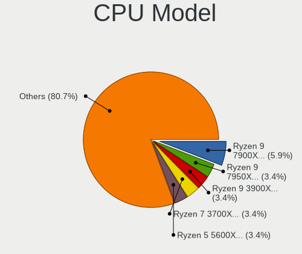

| Model                                    | Desktops | Percent |
|------------------------------------------|----------|---------|
| Intel Xeon CPU E3-1230 V2 @ 3.30GHz      | 3        | 5.17%   |
| AMD Ryzen 9 7950X 16-Core Processor      | 3        | 5.17%   |
| AMD Ryzen 7 3700X 8-Core Processor       | 3        | 5.17%   |
| Intel Core i9-10850K CPU @ 3.60GHz       | 2        | 3.45%   |
| Intel Core i7-10700K CPU @ 3.80GHz       | 2        | 3.45%   |
| Intel Atom CPU D510 @ 1.66GHz            | 2        | 3.45%   |
| AMD Ryzen 9 7900X 12-Core Processor      | 2        | 3.45%   |
| AMD Ryzen 9 3950X 16-Core Processor      | 2        | 3.45%   |
| AMD Ryzen 5 5500                         | 2        | 3.45%   |
| AMD Phenom II X4 955 Processor           | 2        | 3.45%   |
| Intel Xeon E-2224 CPU @ 3.40GHz          | 1        | 1.72%   |
| Intel Xeon CPU E5-2696 v4 @ 2.20GHz      | 1        | 1.72%   |
| Intel Pentium CPU G3220 @ 3.00GHz        | 1        | 1.72%   |
| Intel Pentium 4 CPU 2.66GHz              | 1        | 1.72%   |
| Intel Core i7-9700 CPU @ 3.00GHz         | 1        | 1.72%   |
| Intel Core i7-7700 CPU @ 3.60GHz         | 1        | 1.72%   |
| Intel Core i7-4790 CPU @ 3.60GHz         | 1        | 1.72%   |
| Intel Core i7-4770 CPU @ 3.40GHz         | 1        | 1.72%   |
| Intel Core i7-3770 CPU @ 3.40GHz         | 1        | 1.72%   |
| Intel Core i7 CPU 970 @ 3.20GHz          | 1        | 1.72%   |
| Intel Core i7 CPU 950 @ 3.07GHz          | 1        | 1.72%   |
| Intel Core i5-3450 CPU @ 3.10GHz         | 1        | 1.72%   |
| Intel Core i3-6100 CPU @ 3.70GHz         | 1        | 1.72%   |
| Intel Core i3-2100T CPU @ 2.50GHz        | 1        | 1.72%   |
| Intel Atom CPU N550 @ 1.50GHz            | 1        | 1.72%   |
| Intel 12th Gen Core i9-12900KS           | 1        | 1.72%   |
| Intel 12th Gen Core i7-12700K            | 1        | 1.72%   |
| Intel 11th Gen Core i9-11900KF @ 3.50GHz | 1        | 1.72%   |
| Intel 11th Gen Core i7-11700K @ 3.60GHz  | 1        | 1.72%   |
| Intel 11th Gen Core i7-11700F @ 2.50GHz  | 1        | 1.72%   |
| Intel 11th Gen Core i7-1165G7 @ 2.80GHz  | 1        | 1.72%   |
| AMD Ryzen 9 7950X3D 16-Core Processor    | 1        | 1.72%   |
| AMD Ryzen 9 3900X 12-Core Processor      | 1        | 1.72%   |
| AMD Ryzen 7 5800X3D 8-Core Processor     | 1        | 1.72%   |
| AMD Ryzen 7 5700G with Radeon Graphics   | 1        | 1.72%   |
| AMD Ryzen 7 2700X Eight-Core Processor   | 1        | 1.72%   |
| AMD Ryzen 7 2700 Eight-Core Processor    | 1        | 1.72%   |
| AMD Ryzen 5 7600X 6-Core Processor       | 1        | 1.72%   |
| AMD Ryzen 5 5600X 6-Core Processor       | 1        | 1.72%   |
| AMD Ryzen 5 3600XT 6-Core Processor      | 1        | 1.72%   |

CPU Model Family
----------------

Processor model prefix

| Model            | Desktops | Percent |
|------------------|----------|---------|
| Intel Core i7    | 9        | 15.52%  |
| AMD Ryzen 9      | 9        | 15.52%  |
| AMD Ryzen 5      | 8        | 13.79%  |
| AMD Ryzen 7      | 7        | 12.07%  |
| Other            | 6        | 10.34%  |
| Intel Xeon       | 5        | 8.62%   |
| Intel Atom       | 3        | 5.17%   |
| Intel Core i9    | 2        | 3.45%   |
| Intel Core i3    | 2        | 3.45%   |
| AMD Phenom II X4 | 2        | 3.45%   |
| Intel Pentium 4  | 1        | 1.72%   |
| Intel Pentium    | 1        | 1.72%   |
| Intel Core i5    | 1        | 1.72%   |
| AMD FX           | 1        | 1.72%   |
| AMD Athlon       | 1        | 1.72%   |

CPU Cores
---------

Number of processor cores

| Number | Desktops | Percent |
|--------|----------|---------|
| 4      | 15       | 25.86%  |
| 8      | 13       | 22.41%  |
| 6      | 9        | 15.52%  |
| 16     | 7        | 12.07%  |
| 2      | 6        | 10.34%  |
| 12     | 4        | 6.9%    |
| 10     | 2        | 3.45%   |
| 44     | 1        | 1.72%   |
| 1      | 1        | 1.72%   |

CPU Sockets
-----------

Number of sockets

| Number | Desktops | Percent |
|--------|----------|---------|
| 1      | 57       | 98.28%  |
| 2      | 1        | 1.72%   |

CPU Threads
-----------

Threads per core (Hyper-Threading)

| Number | Desktops | Percent |
|--------|----------|---------|
| 2      | 49       | 84.48%  |
| 1      | 9        | 15.52%  |

CPU Op-Modes
------------

CPU Operation Modes (32-bit, 64-bit)

| Op mode        | Desktops | Percent |
|----------------|----------|---------|
| 32-bit, 64-bit | 57       | 98.28%  |
| 32-bit         | 1        | 1.72%   |

CPU Microcode
-------------

Microcode number

| Number     | Desktops | Percent |
|------------|----------|---------|
| Unknown    | 18       | 30.51%  |
| 0x0a601203 | 7        | 11.86%  |
| 0x08701021 | 6        | 10.17%  |
| 0x306c3    | 3        | 5.08%   |
| 0x0800820d | 3        | 5.08%   |
| 0xa0671    | 2        | 3.39%   |
| 0x0a50000d | 2        | 3.39%   |
| 0x0a20120a | 2        | 3.39%   |
| 0xf29      | 1        | 1.69%   |
| 0xa0655    | 1        | 1.69%   |
| 0x906ed    | 1        | 1.69%   |
| 0x906ea    | 1        | 1.69%   |
| 0x906e9    | 1        | 1.69%   |
| 0x806c1    | 1        | 1.69%   |
| 0x506e3    | 1        | 1.69%   |
| 0x406f1    | 1        | 1.69%   |
| 0x306a9    | 1        | 1.69%   |
| 0x106a5    | 1        | 1.69%   |
| 0x0a50000c | 1        | 1.69%   |
| 0x08701013 | 1        | 1.69%   |
| 0x08001138 | 1        | 1.69%   |
| 0x0700010f | 1        | 1.69%   |
| 0x0600063e | 1        | 1.69%   |
| 0x010000db | 1        | 1.69%   |

CPU Microarch
-------------

Microarchitecture

| Name             | Desktops | Percent |
|------------------|----------|---------|
| Zen 2            | 8        | 13.79%  |
| Unknown          | 7        | 12.07%  |
| Zen 3            | 5        | 8.62%   |
| IvyBridge        | 5        | 8.62%   |
| CometLake        | 4        | 6.9%    |
| Zen+             | 3        | 5.17%   |
| KabyLake         | 3        | 5.17%   |
| Icelake          | 3        | 5.17%   |
| Haswell          | 3        | 5.17%   |
| Bonnell          | 3        | 5.17%   |
| K10              | 2        | 3.45%   |
| Alderlake Hybrid | 2        | 3.45%   |
| Zen              | 1        | 1.72%   |
| Westmere         | 1        | 1.72%   |
| TigerLake        | 1        | 1.72%   |
| Skylake          | 1        | 1.72%   |
| SandyBridge      | 1        | 1.72%   |
| NetBurst         | 1        | 1.72%   |
| Nehalem          | 1        | 1.72%   |
| Jaguar           | 1        | 1.72%   |
| Bulldozer        | 1        | 1.72%   |
| Broadwell        | 1        | 1.72%   |

Graphics
--------

GPU Vendor
----------

Vendors of graphics cards

| Vendor                     | Desktops | Percent |
|----------------------------|----------|---------|
| AMD                        | 26       | 41.94%  |
| Nvidia                     | 21       | 33.87%  |
| Intel                      | 10       | 16.13%  |
| Matrox Electronics Systems | 4        | 6.45%   |
| ASPEED Technology          | 1        | 1.61%   |

GPU Model
---------

Graphics card models

| Model                                                                       | Desktops | Percent |
|-----------------------------------------------------------------------------|----------|---------|
| AMD Raphael                                                                 | 5        | 7.46%   |
| AMD Ellesmere [Radeon RX 470/480/570/570X/580/580X/590]                     | 5        | 7.46%   |
| Nvidia GA102 [GeForce RTX 3080 Ti]                                          | 4        | 5.97%   |
| Matrox Electronics Systems MGA G200EH                                       | 3        | 4.48%   |
| Intel Atom Processor D4xx/D5xx/N4xx/N5xx Integrated Graphics Controller     | 3        | 4.48%   |
| AMD Navi 31 [Radeon RX 7900 XT/7900 XTX]                                    | 3        | 4.48%   |
| AMD Navi 22 [Radeon RX 6700/6700 XT/6750 XT / 6800M/6850M XT]               | 3        | 4.48%   |
| AMD Navi 14 [Radeon RX 5500/5500M / Pro 5500M]                              | 3        | 4.48%   |
| Nvidia GT218 [GeForce 210]                                                  | 2        | 2.99%   |
| Nvidia GA106 [Geforce RTX 3050]                                             | 2        | 2.99%   |
| AMD RS780C [Radeon 3100]                                                    | 2        | 2.99%   |
| Nvidia TU104 [GeForce RTX 2080]                                             | 1        | 1.49%   |
| Nvidia TU104 [GeForce RTX 2070 SUPER]                                       | 1        | 1.49%   |
| Nvidia TU102 [GeForce RTX 2080 Ti Rev. A]                                   | 1        | 1.49%   |
| Nvidia GP106 [GeForce GTX 1060 6GB]                                         | 1        | 1.49%   |
| Nvidia GP104 [GeForce GTX 1060 6GB]                                         | 1        | 1.49%   |
| Nvidia GP102 [GeForce GTX 1080 Ti]                                          | 1        | 1.49%   |
| Nvidia GM204 [GeForce GTX 970]                                              | 1        | 1.49%   |
| Nvidia GK208B [GeForce GT 730]                                              | 1        | 1.49%   |
| Nvidia GF119 [GeForce GT 620 OEM]                                           | 1        | 1.49%   |
| Nvidia GF119 [GeForce GT 610]                                               | 1        | 1.49%   |
| Nvidia GA104 [GeForce RTX 3070]                                             | 1        | 1.49%   |
| Nvidia GA104 [GeForce RTX 3070 Lite Hash Rate]                              | 1        | 1.49%   |
| Nvidia GA104 [GeForce RTX 3060]                                             | 1        | 1.49%   |
| Matrox Electronics Systems MGA G200eH3                                      | 1        | 1.49%   |
| Intel Xeon E3-1200 v3/4th Gen Core Processor Integrated Graphics Controller | 1        | 1.49%   |
| Intel TigerLake-LP GT2 [Iris Xe Graphics]                                   | 1        | 1.49%   |
| Intel IvyBridge GT2 [HD Graphics 4000]                                      | 1        | 1.49%   |
| Intel HD Graphics 630                                                       | 1        | 1.49%   |
| Intel HD Graphics 530                                                       | 1        | 1.49%   |
| Intel CometLake-S GT2 [UHD Graphics 630]                                    | 1        | 1.49%   |
| Intel 2nd Generation Core Processor Family Integrated Graphics Controller   | 1        | 1.49%   |
| ASPEED Technology ASPEED Graphics Family                                    | 1        | 1.49%   |
| AMD Tahiti XT [Radeon HD 7970/8970 OEM / R9 280X]                           | 1        | 1.49%   |
| AMD RV280 [Radeon 9200] (Secondary)                                         | 1        | 1.49%   |
| AMD RV280 [Radeon 9200]                                                     | 1        | 1.49%   |
| AMD Oland PRO [Radeon R7 240/340 / Radeon 520]                              | 1        | 1.49%   |
| AMD Navi 23 [Radeon RX 6600/6600 XT/6600M]                                  | 1        | 1.49%   |
| AMD Navi 21 [Radeon RX 6800/6800 XT / 6900 XT]                              | 1        | 1.49%   |
| AMD Navi 10 [Radeon RX 5600 OEM/5600 XT / 5700/5700 XT]                     | 1        | 1.49%   |

GPU Combo
---------

Combinations of graphics cards

| Name           | Desktops | Percent |
|----------------|----------|---------|
| 1 x AMD        | 20       | 33.33%  |
| 1 x Nvidia     | 18       | 30%     |
| 1 x Intel      | 7        | 11.67%  |
| 2 x AMD        | 5        | 8.33%   |
| 1 x Matrox     | 4        | 6.67%   |
| AMD + Nvidia   | 2        | 3.33%   |
| 2 x Intel      | 1        | 1.67%   |
| Intel + Nvidia | 1        | 1.67%   |
| Intel + AMD    | 1        | 1.67%   |
| 1 x ASPEED     | 1        | 1.67%   |

GPU Driver
----------

Free vs proprietary

| Driver      | Desktops | Percent |
|-------------|----------|---------|
| Free        | 38       | 65.52%  |
| Proprietary | 12       | 20.69%  |
| Unknown     | 8        | 13.79%  |

GPU Memory
----------

Total video memory

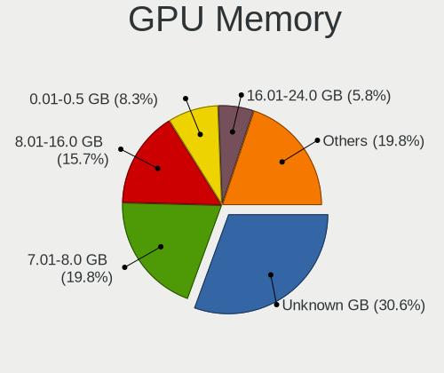

| Size in GB | Desktops | Percent |
|------------|----------|---------|
| Unknown    | 18       | 31.03%  |
| 7.01-8.0   | 11       | 18.97%  |
| 8.01-16.0  | 10       | 17.24%  |
| 0.51-1.0   | 7        | 12.07%  |
| 0.01-0.5   | 4        | 6.9%    |
| 16.01-24.0 | 3        | 5.17%   |
| 5.01-6.0   | 2        | 3.45%   |
| 3.01-4.0   | 1        | 1.72%   |
| 2.01-3.0   | 1        | 1.72%   |
| 1.01-2.0   | 1        | 1.72%   |

Monitor
-------

Monitor Vendor
--------------

Monitor vendors

| Vendor                  | Desktops | Percent |
|-------------------------|----------|---------|
| Samsung Electronics     | 11       | 20%     |
| Dell                    | 7        | 12.73%  |
| AOC                     | 6        | 10.91%  |
| ASUSTek Computer        | 4        | 7.27%   |
| Acer                    | 4        | 7.27%   |
| Goldstar                | 3        | 5.45%   |
| BenQ                    | 3        | 5.45%   |
| Unknown                 | 2        | 3.64%   |
| Lenovo                  | 2        | 3.64%   |
| Iiyama                  | 2        | 3.64%   |
| Eizo                    | 2        | 3.64%   |
| Sceptre Tech            | 1        | 1.82%   |
| Philips                 | 1        | 1.82%   |
| Onkyo                   | 1        | 1.82%   |
| IBM                     | 1        | 1.82%   |
| HJW                     | 1        | 1.82%   |
| Gigabyte Technology     | 1        | 1.82%   |
| Gateway                 | 1        | 1.82%   |
| Chi Mei Optoelectronics | 1        | 1.82%   |
| Unknown                 | 1        | 1.82%   |

Monitor Model
-------------

Monitor models

| Model                                                                   | Desktops | Percent |
|-------------------------------------------------------------------------|----------|---------|
| Samsung Electronics SyncMaster SAM059A 1920x1080 477x268mm 21.5-inch    | 2        | 3.28%   |
| Samsung Electronics LCD Monitor SAM7003 3840x2160 1872x1053mm 84.6-inch | 2        | 3.28%   |
| Eizo CS2731 ENC3069 2560x1440 597x336mm 27.0-inch                       | 2        | 3.28%   |
| ASUSTek Computer VG27A AUS2722 2560x1440 597x336mm 27.0-inch            | 2        | 3.28%   |
| AOC LCD Monitor U2879G6 3840x2160                                       | 2        | 3.28%   |
| AOC 2460G5 AOC2460 1920x1080 531x299mm 24.0-inch                        | 2        | 3.28%   |
| Unknown LCD Monitor RTK                                                 | 1        | 1.64%   |
| Unknown LCD Monitor FFFF 2288x1287 2550x2550mm 142.0-inch               | 1        | 1.64%   |
| Sceptre Tech C305W-2560UN SPT0C0D 2560x1080 690x291mm 29.5-inch         | 1        | 1.64%   |
| Samsung Electronics SyncMaster SAM05E8 1920x1080                        | 1        | 1.64%   |
| Samsung Electronics SyncMaster SAM03E4 1680x1050 474x296mm 22.0-inch    | 1        | 1.64%   |
| Samsung Electronics SMS27A850 SAM083D 2560x1440 518x324mm 24.1-inch     | 1        | 1.64%   |
| Samsung Electronics S27E390 SAM0C1C 1920x1080 598x336mm 27.0-inch       | 1        | 1.64%   |
| Samsung Electronics S22B300 SAM08C8 1920x1080 477x268mm 21.5-inch       | 1        | 1.64%   |
| Samsung Electronics LCD Monitor SAM7004 3840x2160 1872x1053mm 84.6-inch | 1        | 1.64%   |
| Samsung Electronics LCD Monitor SAM07D0 1360x768 700x390mm 31.5-inch    | 1        | 1.64%   |
| Samsung Electronics C49HG9x SAM0E5E 3840x1080 1196x336mm 48.9-inch      | 1        | 1.64%   |
| Samsung Electronics C27HG7x SAM0E16 2560x1440 598x336mm 27.0-inch       | 1        | 1.64%   |
| Philips LCD Monitor PHL 246V5 3840x1080                                 | 1        | 1.64%   |
| Philips LCD Monitor PHL 246V5                                           | 1        | 1.64%   |
| Onkyo AV Receiver ONK1061 1024x768                                      | 1        | 1.64%   |
| Lenovo LEN G34w-10 LEN66A1 3440x1440 797x334mm 34.0-inch                | 1        | 1.64%   |
| Lenovo LEN E2054A LEN60DF 1440x900 419x262mm 19.5-inch                  | 1        | 1.64%   |
| Iiyama PL2792UH IVM664C 3840x2160 596x335mm 26.9-inch                   | 1        | 1.64%   |
| Iiyama PL2792Q IVM6637 2560x1440 597x336mm 27.0-inch                    | 1        | 1.64%   |
| IBM L170 IBM1A4E 1280x1024 338x270mm 17.0-inch                          | 1        | 1.64%   |
| HJW HDMI TO USB HJW0001 1920x1080 708x398mm 32.0-inch                   | 1        | 1.64%   |
| Goldstar ULTRAWIDE GSM76F6 3440x1440 800x335mm 34.1-inch                | 1        | 1.64%   |
| Goldstar ULTRAWIDE GSM59F1 2560x1080 673x284mm 28.8-inch                | 1        | 1.64%   |
| Goldstar FULL HD GSM5BDE 1920x1080 480x270mm 21.7-inch                  | 1        | 1.64%   |
| Gigabyte Technology G27FC A GBT2715 1920x1080 598x336mm 27.0-inch       | 1        | 1.64%   |
| Gateway FHD2400 GWY096C 1920x1200 518x291mm 23.4-inch                   | 1        | 1.64%   |
| Dell U3417W DELA0E0 3440x1440 800x335mm 34.1-inch                       | 1        | 1.64%   |
| Dell U2720Q DEL41B3 3840x2160 597x336mm 27.0-inch                       | 1        | 1.64%   |
| Dell SE2417HG DELD08D 1920x1080 521x293mm 23.5-inch                     | 1        | 1.64%   |
| Dell S3422DWG DELD12D 3440x1440 797x334mm 34.0-inch                     | 1        | 1.64%   |
| Dell S3422DWG DELD125 3440x1440 797x334mm 34.0-inch                     | 1        | 1.64%   |
| Dell S2721QS DELA198 3840x2160 597x336mm 27.0-inch                      | 1        | 1.64%   |
| Dell S2721QS DELA196 3840x2160 597x336mm 27.0-inch                      | 1        | 1.64%   |
| Dell LCD Monitor U2412M 3840x1200                                       | 1        | 1.64%   |

Monitor Resolution
------------------

Monitor screen resolution

| Resolution         | Desktops | Percent |
|--------------------|----------|---------|
| 1920x1080 (FHD)    | 14       | 25%     |
| 3840x2160 (4K)     | 13       | 23.21%  |
| 2560x1440 (QHD)    | 9        | 16.07%  |
| 3440x1440          | 4        | 7.14%   |
| Unknown            | 3        | 5.36%   |
| 3840x1080          | 2        | 3.57%   |
| 2560x1080          | 2        | 3.57%   |
| 1440x900 (WXGA+)   | 2        | 3.57%   |
| 3840x1200          | 1        | 1.79%   |
| 2288x1287          | 1        | 1.79%   |
| 1920x1200 (WUXGA)  | 1        | 1.79%   |
| 1680x1050 (WSXGA+) | 1        | 1.79%   |
| 1360x768           | 1        | 1.79%   |
| 1280x1024 (SXGA)   | 1        | 1.79%   |
| 1024x768 (XGA)     | 1        | 1.79%   |

Monitor Diagonal
----------------

Diagonal size in inches

| Inches  | Desktops | Percent |
|---------|----------|---------|
| 27      | 15       | 27.27%  |
| Unknown | 7        | 12.73%  |
| 24      | 5        | 9.09%   |
| 21      | 5        | 9.09%   |
| 34      | 4        | 7.27%   |
| 31      | 3        | 5.45%   |
| 23      | 3        | 5.45%   |
| 84      | 2        | 3.64%   |
| 32      | 2        | 3.64%   |
| 19      | 2        | 3.64%   |
| 142     | 1        | 1.82%   |
| 48      | 1        | 1.82%   |
| 41      | 1        | 1.82%   |
| 40      | 1        | 1.82%   |
| 29      | 1        | 1.82%   |
| 22      | 1        | 1.82%   |
| 17      | 1        | 1.82%   |

Monitor Width
-------------

Physical width

| Width in mm    | Desktops | Percent |
|----------------|----------|---------|
| 501-600        | 21       | 40.38%  |
| Unknown        | 7        | 13.46%  |
| 701-800        | 6        | 11.54%  |
| 401-500        | 6        | 11.54%  |
| 601-700        | 5        | 9.62%   |
| 1501-2000      | 2        | 3.85%   |
| More than 2000 | 1        | 1.92%   |
| 801-900        | 1        | 1.92%   |
| 301-350        | 1        | 1.92%   |
| 1001-1500      | 1        | 1.92%   |
| 901-1000       | 1        | 1.92%   |

Aspect Ratio
------------

Proportional relationship between the width and the height

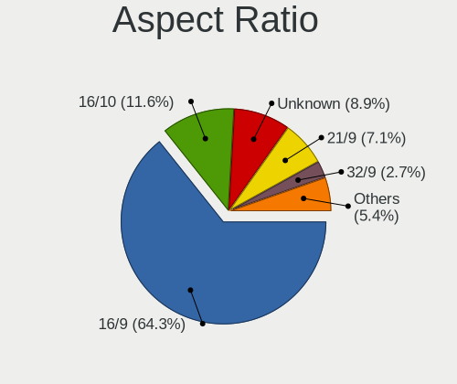

| Ratio   | Desktops | Percent |
|---------|----------|---------|
| 16/9    | 32       | 62.75%  |
| 16/10   | 6        | 11.76%  |
| Unknown | 5        | 9.8%    |
| 21/9    | 4        | 7.84%   |
| 5/4     | 1        | 1.96%   |
| 4/3     | 1        | 1.96%   |
| 32/9    | 1        | 1.96%   |
| 1.00    | 1        | 1.96%   |

Monitor Area
------------

Area in inch²

| Area in inch² | Desktops | Percent |
|----------------|----------|---------|
| 301-350        | 16       | 30.77%  |
| 351-500        | 9        | 17.31%  |
| 201-250        | 8        | 15.38%  |
| Unknown        | 7        | 13.46%  |
| More than 1000 | 3        | 5.77%   |
| 251-300        | 3        | 5.77%   |
| 501-1000       | 3        | 5.77%   |
| 151-200        | 2        | 3.85%   |
| 141-150        | 1        | 1.92%   |

Pixel Density
-------------

Pixels per inch

| Density | Desktops | Percent |
|---------|----------|---------|
| 51-100  | 23       | 44.23%  |
| 101-120 | 15       | 28.85%  |
| Unknown | 7        | 13.46%  |
| 161-240 | 3        | 5.77%   |
| 1-50    | 2        | 3.85%   |
| 121-160 | 2        | 3.85%   |

Multiple Monitors
-----------------

Total monitors connected

| Total | Desktops | Percent |
|-------|----------|---------|
| 1     | 40       | 66.67%  |
| 2     | 9        | 15%     |
| 0     | 8        | 13.33%  |
| 3     | 3        | 5%      |

Network
-------

Net Controller Vendor
---------------------

Controller vendors

| Vendor                   | Desktops | Percent |
|--------------------------|----------|---------|
| Realtek Semiconductor    | 29       | 38.16%  |
| Intel                    | 29       | 38.16%  |
| MediaTek                 | 4        | 5.26%   |
| Broadcom                 | 3        | 3.95%   |
| Qualcomm Atheros         | 2        | 2.63%   |
| Ralink                   | 1        | 1.32%   |
| OpenMoko                 | 1        | 1.32%   |
| Microsoft                | 1        | 1.32%   |
| Marvell Technology Group | 1        | 1.32%   |
| ICS Advent               | 1        | 1.32%   |
| Huawei Technologies      | 1        | 1.32%   |
| Hewlett-Packard          | 1        | 1.32%   |
| ASIX Electronics         | 1        | 1.32%   |
| Aquantia                 | 1        | 1.32%   |

Net Controller Model
--------------------

Controller models

| Model                                                                         | Desktops | Percent |
|-------------------------------------------------------------------------------|----------|---------|
| Realtek RTL8111/8168/8411 PCI Express Gigabit Ethernet Controller             | 20       | 22.22%  |
| Intel Ethernet Controller I225-V                                              | 10       | 11.11%  |
| Realtek RTL8125 2.5GbE Controller                                             | 8        | 8.89%   |
| Intel I211 Gigabit Network Connection                                         | 7        | 7.78%   |
| Intel Wi-Fi 6 AX210/AX211/AX411 160MHz                                        | 5        | 5.56%   |
| Intel Wi-Fi 6 AX200                                                           | 3        | 3.33%   |
| Broadcom NetXtreme BCM5720 Gigabit Ethernet PCIe                              | 3        | 3.33%   |
| MediaTek MT7921K (RZ608) Wi-Fi 6E 80MHz                                       | 2        | 2.22%   |
| Intel Wireless-AC 9260                                                        | 2        | 2.22%   |
| Intel I350 Gigabit Network Connection                                         | 2        | 2.22%   |
| Intel Ethernet Connection I217-V                                              | 2        | 2.22%   |
| Intel Alder Lake-S PCH CNVi WiFi                                              | 2        | 2.22%   |
| Realtek RTL88x2bu [AC1200 Techkey]                                            | 1        | 1.11%   |
| Realtek RTL8852BE PCIe 802.11ax Wireless Network Controller                   | 1        | 1.11%   |
| Realtek RTL-8110SC/8169SC Gigabit Ethernet                                    | 1        | 1.11%   |
| Ralink RT2790 Wireless 802.11n 1T/2R PCIe                                     | 1        | 1.11%   |
| Qualcomm Atheros AR9287 Wireless Network Adapter (PCI-Express)                | 1        | 1.11%   |
| Qualcomm Atheros AR8151 v2.0 Gigabit Ethernet                                 | 1        | 1.11%   |
| OpenMoko OneRNG entropy device                                                | 1        | 1.11%   |
| Microsoft Xbox Wireless Adapter for Windows                                   | 1        | 1.11%   |
| MediaTek MT7922 802.11ax PCI Express Wireless Network Adapter                 | 1        | 1.11%   |
| MediaTek MT7921 802.11ax PCI Express Wireless Network Adapter                 | 1        | 1.11%   |
| Marvell Group 88E8056 PCI-E Gigabit Ethernet Controller                       | 1        | 1.11%   |
| Intel Ethernet Connection (7) I219-V                                          | 1        | 1.11%   |
| Intel Ethernet Connection (2) I219-V                                          | 1        | 1.11%   |
| Intel Ethernet Connection (11) I219-LM                                        | 1        | 1.11%   |
| Intel 82801DB PRO/100 VE (LOM) Ethernet Controller                            | 1        | 1.11%   |
| Intel 82599ES 10-Gigabit SFI/SFP+ Network Connection                          | 1        | 1.11%   |
| Intel 82579V Gigabit Network Connection                                       | 1        | 1.11%   |
| Intel 82571EB/82571GB Gigabit Ethernet Controller D0/D1 (copper applications) | 1        | 1.11%   |
| Intel 82541GI Gigabit Ethernet Controller                                     | 1        | 1.11%   |
| ICS Advent DM9601 Fast Ethernet Adapter                                       | 1        | 1.11%   |
| Huawei E161/E169/E620/E800 HSDPA Modem                                        | 1        | 1.11%   |
| HP Virtual NIC                                                                | 1        | 1.11%   |
| ASIX AX88772A Fast Ethernet                                                   | 1        | 1.11%   |
| Aquantia AQC113CS NBase-T/IEEE 802.3bz Ethernet Controller [AQtion]           | 1        | 1.11%   |

Wireless Vendor
---------------

Wireless vendors

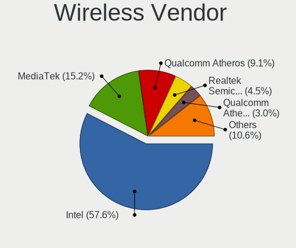

| Vendor                | Desktops | Percent |
|-----------------------|----------|---------|
| Intel                 | 12       | 57.14%  |
| MediaTek              | 4        | 19.05%  |
| Realtek Semiconductor | 2        | 9.52%   |
| Ralink                | 1        | 4.76%   |
| Qualcomm Atheros      | 1        | 4.76%   |
| Microsoft             | 1        | 4.76%   |

Wireless Model
--------------

Wireless models

| Model                                                          | Desktops | Percent |
|----------------------------------------------------------------|----------|---------|
| Intel Wi-Fi 6 AX210/AX211/AX411 160MHz                         | 5        | 23.81%  |
| Intel Wi-Fi 6 AX200                                            | 3        | 14.29%  |
| MediaTek MT7921K (RZ608) Wi-Fi 6E 80MHz                        | 2        | 9.52%   |
| Intel Wireless-AC 9260                                         | 2        | 9.52%   |
| Intel Alder Lake-S PCH CNVi WiFi                               | 2        | 9.52%   |
| Realtek RTL88x2bu [AC1200 Techkey]                             | 1        | 4.76%   |
| Realtek RTL8852BE PCIe 802.11ax Wireless Network Controller    | 1        | 4.76%   |
| Ralink RT2790 Wireless 802.11n 1T/2R PCIe                      | 1        | 4.76%   |
| Qualcomm Atheros AR9287 Wireless Network Adapter (PCI-Express) | 1        | 4.76%   |
| Microsoft Xbox Wireless Adapter for Windows                    | 1        | 4.76%   |
| MediaTek MT7922 802.11ax PCI Express Wireless Network Adapter  | 1        | 4.76%   |
| MediaTek MT7921 802.11ax PCI Express Wireless Network Adapter  | 1        | 4.76%   |

Ethernet Vendor
---------------

Ethernet vendors

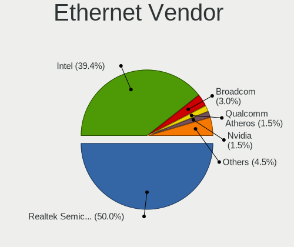

| Vendor                   | Desktops | Percent |
|--------------------------|----------|---------|
| Realtek Semiconductor    | 29       | 44.62%  |
| Intel                    | 27       | 41.54%  |
| Broadcom                 | 3        | 4.62%   |
| Qualcomm Atheros         | 1        | 1.54%   |
| Marvell Technology Group | 1        | 1.54%   |
| ICS Advent               | 1        | 1.54%   |
| Hewlett-Packard          | 1        | 1.54%   |
| ASIX Electronics         | 1        | 1.54%   |
| Aquantia                 | 1        | 1.54%   |

Ethernet Model
--------------

Ethernet models

| Model                                                                         | Desktops | Percent |
|-------------------------------------------------------------------------------|----------|---------|
| Realtek RTL8111/8168/8411 PCI Express Gigabit Ethernet Controller             | 20       | 29.85%  |
| Intel Ethernet Controller I225-V                                              | 10       | 14.93%  |
| Realtek RTL8125 2.5GbE Controller                                             | 8        | 11.94%  |
| Intel I211 Gigabit Network Connection                                         | 7        | 10.45%  |
| Broadcom NetXtreme BCM5720 Gigabit Ethernet PCIe                              | 3        | 4.48%   |
| Intel I350 Gigabit Network Connection                                         | 2        | 2.99%   |
| Intel Ethernet Connection I217-V                                              | 2        | 2.99%   |
| Realtek RTL-8110SC/8169SC Gigabit Ethernet                                    | 1        | 1.49%   |
| Qualcomm Atheros AR8151 v2.0 Gigabit Ethernet                                 | 1        | 1.49%   |
| Marvell Group 88E8056 PCI-E Gigabit Ethernet Controller                       | 1        | 1.49%   |
| Intel Ethernet Connection (7) I219-V                                          | 1        | 1.49%   |
| Intel Ethernet Connection (2) I219-V                                          | 1        | 1.49%   |
| Intel Ethernet Connection (11) I219-LM                                        | 1        | 1.49%   |
| Intel 82801DB PRO/100 VE (LOM) Ethernet Controller                            | 1        | 1.49%   |
| Intel 82599ES 10-Gigabit SFI/SFP+ Network Connection                          | 1        | 1.49%   |
| Intel 82579V Gigabit Network Connection                                       | 1        | 1.49%   |
| Intel 82571EB/82571GB Gigabit Ethernet Controller D0/D1 (copper applications) | 1        | 1.49%   |
| Intel 82541GI Gigabit Ethernet Controller                                     | 1        | 1.49%   |
| ICS Advent DM9601 Fast Ethernet Adapter                                       | 1        | 1.49%   |
| HP Virtual NIC                                                                | 1        | 1.49%   |
| ASIX AX88772A Fast Ethernet                                                   | 1        | 1.49%   |
| Aquantia AQC113CS NBase-T/IEEE 802.3bz Ethernet Controller [AQtion]           | 1        | 1.49%   |

Net Controller Kind
-------------------

Ethernet, WiFi or modem

| Kind     | Desktops | Percent |
|----------|----------|---------|
| Ethernet | 57       | 71.25%  |
| WiFi     | 21       | 26.25%  |
| Modem    | 2        | 2.5%    |

Used Controller
---------------

Currently used network controller

| Kind     | Desktops | Percent |
|----------|----------|---------|
| Ethernet | 51       | 86.44%  |
| WiFi     | 8        | 13.56%  |

NICs
----

Total network controllers on board

| Total | Desktops | Percent |
|-------|----------|---------|
| 1     | 29       | 49.15%  |
| 2     | 23       | 38.98%  |
| 3     | 3        | 5.08%   |
| 6     | 2        | 3.39%   |
| 5     | 1        | 1.69%   |
| 4     | 1        | 1.69%   |

IPv6
----

IPv6 vs IPv4

| Used | Desktops | Percent |
|------|----------|---------|
| No   | 36       | 62.07%  |
| Yes  | 22       | 37.93%  |

Bluetooth
---------

Bluetooth Vendor
----------------

Controller vendors

| Vendor                          | Desktops | Percent |
|---------------------------------|----------|---------|
| Intel                           | 12       | 52.17%  |
| Realtek Semiconductor           | 3        | 13.04%  |
| MediaTek                        | 2        | 8.7%    |
| IMC Networks                    | 2        | 8.7%    |
| Qualcomm Atheros Communications | 1        | 4.35%   |
| Foxconn / Hon Hai               | 1        | 4.35%   |
| Cambridge Silicon Radio         | 1        | 4.35%   |
| ASUSTek Computer                | 1        | 4.35%   |

Bluetooth Model
---------------

Controller models

| Model                                               | Desktops | Percent |
|-----------------------------------------------------|----------|---------|
| Intel AX210 Bluetooth                               | 5        | 21.74%  |
| Intel AX200 Bluetooth                               | 3        | 13.04%  |
| Realtek Bluetooth Radio                             | 2        | 8.7%    |
| MediaTek Wireless_Device                            | 2        | 8.7%    |
| Intel Wireless-AC 9260 Bluetooth Adapter            | 2        | 8.7%    |
| Intel Bluetooth Device                              | 2        | 8.7%    |
| Realtek Bluetooth 5.1 Radio                         | 1        | 4.35%   |
| Qualcomm Atheros AR3011 Bluetooth                   | 1        | 4.35%   |
| IMC Networks Wireless_Device                        | 1        | 4.35%   |
| IMC Networks Bluetooth Radio                        | 1        | 4.35%   |
| Foxconn / Hon Hai Wireless_Device                   | 1        | 4.35%   |
| Cambridge Silicon Radio Bluetooth Dongle (HCI mode) | 1        | 4.35%   |
| ASUS ASUS USB-BT500                                 | 1        | 4.35%   |

Sound
-----

Sound Vendor
------------

Sound card vendors

| Vendor                               | Desktops | Percent |
|--------------------------------------|----------|---------|
| AMD                                  | 30       | 30.61%  |
| Nvidia                               | 20       | 20.41%  |
| Intel                                | 19       | 19.39%  |
| ASUSTek Computer                     | 6        | 6.12%   |
| C-Media Electronics                  | 4        | 4.08%   |
| SteelSeries ApS                      | 2        | 2.04%   |
| Solid State Logic                    | 2        | 2.04%   |
| Audient                              | 2        | 2.04%   |
| VIA Technologies                     | 1        | 1.02%   |
| Thesycon Systemsoftware & Consulting | 1        | 1.02%   |
| TEAC                                 | 1        | 1.02%   |
| Schiit Audio                         | 1        | 1.02%   |
| RODE Microphones                     | 1        | 1.02%   |
| Medeli Electronics                   | 1        | 1.02%   |
| MAG Technology                       | 1        | 1.02%   |
| M-Audio                              | 1        | 1.02%   |
| Logitech                             | 1        | 1.02%   |
| Creative Labs                        | 1        | 1.02%   |
| Corsair                              | 1        | 1.02%   |
| AKG C44-USB Microphone               | 1        | 1.02%   |
| AKAI Professional M.I.               | 1        | 1.02%   |

Sound Model
-----------

Sound card models

| Model                                                               | Desktops | Percent |
|---------------------------------------------------------------------|----------|---------|
| AMD Starship/Matisse HD Audio Controller                            | 9        | 7.5%    |
| AMD Family 17h/19h HD Audio Controller                              | 7        | 5.83%   |
| ASUSTek Computer USB Audio                                          | 5        | 4.17%   |
| AMD Rembrandt Radeon High Definition Audio Controller               | 5        | 4.17%   |
| AMD Navi 21/23 HDMI/DP Audio Controller                             | 5        | 4.17%   |
| AMD Ellesmere HDMI Audio [Radeon RX 470/480 / 570/580/590]          | 5        | 4.17%   |
| Nvidia GA102 High Definition Audio Controller                       | 4        | 3.33%   |
| AMD Navi 10 HDMI Audio                                              | 4        | 3.33%   |
| Nvidia GA104 High Definition Audio Controller                       | 3        | 2.5%    |
| AMD SBx00 Azalia (Intel HDA)                                        | 3        | 2.5%    |
| AMD Renoir Radeon High Definition Audio Controller                  | 3        | 2.5%    |
| AMD Navi 31 [Radeon RX 7000 HDMI Audio]                             | 3        | 2.5%    |
| AMD Family 17h (Models 00h-0fh) HD Audio Controller                 | 3        | 2.5%    |
| Nvidia TU104 HD Audio Controller                                    | 2        | 1.67%   |
| Nvidia High Definition Audio Controller                             | 2        | 1.67%   |
| Nvidia GF119 HDMI Audio Controller                                  | 2        | 1.67%   |
| Intel NM10/ICH7 Family High Definition Audio Controller             | 2        | 1.67%   |
| Intel Alder Lake-S HD Audio Controller                              | 2        | 1.67%   |
| Intel 82801JI (ICH10 Family) HD Audio Controller                    | 2        | 1.67%   |
| Intel 8 Series/C220 Series Chipset High Definition Audio Controller | 2        | 1.67%   |
| Intel 100 Series/C230 Series Chipset Family HD Audio Controller     | 2        | 1.67%   |
| Audient EVO4                                                        | 2        | 1.67%   |
| VIA Technologies FX-Audio DAC-X6                                    | 1        | 0.83%   |
| Thesycon Systemsoftware & Consulting SABAJ USB AUDIO                | 1        | 0.83%   |
| TEAC AI-301DA                                                       | 1        | 0.83%   |
| SteelSeries ApS SteelSeries Arctis 5                                | 1        | 0.83%   |
| SteelSeries ApS Arctis 7+                                           | 1        | 0.83%   |
| Solid State Logic SSL 2+                                            | 1        | 0.83%   |
| Solid State Logic SSL 2                                             | 1        | 0.83%   |
| Schiit Audio Schiit Modi 3E                                         | 1        | 0.83%   |
| RODE Microphones RODE NT-USB                                        | 1        | 0.83%   |
| Nvidia TU102 High Definition Audio Controller                       | 1        | 0.83%   |
| Nvidia GP106 High Definition Audio Controller                       | 1        | 0.83%   |
| Nvidia GP104 High Definition Audio Controller                       | 1        | 0.83%   |
| Nvidia GP102 HDMI Audio Controller                                  | 1        | 0.83%   |
| Nvidia GM204 High Definition Audio Controller                       | 1        | 0.83%   |
| Nvidia GK208 HDMI/DP Audio Controller                               | 1        | 0.83%   |
| Nvidia GA106 High Definition Audio Controller                       | 1        | 0.83%   |
| Medeli Electronics USB LCS AUDIO                                    | 1        | 0.83%   |
| MAG Technology ARC AMP DAC                                          | 1        | 0.83%   |

Memory
------

Memory Vendor
-------------

Memory module vendors

| Vendor              | Desktops | Percent |
|---------------------|----------|---------|
| G.Skill             | 11       | 20%     |
| Corsair             | 10       | 18.18%  |
| Unknown             | 9        | 16.36%  |
| Crucial             | 9        | 16.36%  |
| Kingston            | 7        | 12.73%  |
| Team                | 2        | 3.64%   |
| A-DATA Technology   | 2        | 3.64%   |
| Samsung Electronics | 1        | 1.82%   |
| Nanya Technology    | 1        | 1.82%   |
| Micron Technology   | 1        | 1.82%   |
| HPE                 | 1        | 1.82%   |
| Hewlett-Packard     | 1        | 1.82%   |

Memory Model
------------

Memory module models

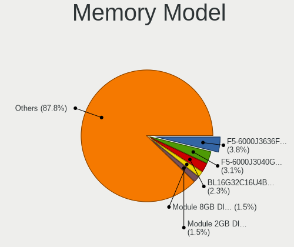

| Model                                                    | Desktops | Percent |
|----------------------------------------------------------|----------|---------|
| G.Skill RAM F5-6000J3040G32G 32GB DIMM DDR5 6000MT/s     | 4        | 6.9%    |
| Crucial RAM BL16G32C16U4B.M16FE1 16GB DIMM DDR4 3400MT/s | 3        | 5.17%   |
| Unknown RAM Module 8GB DIMM DDR3 1333MT/s                | 2        | 3.45%   |
| Unknown RAM Module 2GB DIMM DDR2 667MT/s                 | 2        | 3.45%   |
| G.Skill RAM F5-6000J3636F16G 16GB DIMM 6400MT/s          | 2        | 3.45%   |
| Corsair RAM CMZ16GX3M2A1600C10 8GB DIMM DDR3 1600MT/s    | 2        | 3.45%   |
| Unknown RAM Module 4GB DIMM 1333MT/s                     | 1        | 1.72%   |
| Unknown RAM Module 2GB SODIMM DDR2 800MT/s               | 1        | 1.72%   |
| Unknown RAM Module 2GB SODIMM DDR2 667MT/s               | 1        | 1.72%   |
| Unknown RAM Module 2GB DIMM 1066MT/s                     | 1        | 1.72%   |
| Unknown RAM Module 1GB DIMM DDR 333MT/s                  | 1        | 1.72%   |
| Team RAM TEAMGROUP-UD4-3600 8GB DIMM DDR4 3600MT/s       | 1        | 1.72%   |
| Team RAM TEAMGROUP-UD4-3200 8GB DIMM DDR4 3800MT/s       | 1        | 1.72%   |
| Samsung RAM M471B5173DB0-YK0 4GB SODIMM DDR3 1600MT/s    | 1        | 1.72%   |
| Nanya RAM M2F4G64CB88B7N-DI 4GB DIMM DDR3 1600MT/s       | 1        | 1.72%   |
| Micron RAM 36ASF4G72PZ-2G3B1 32GB DIMM DDR4 2400MT/s     | 1        | 1.72%   |
| Kingston RAM KHX2666C16/8G 8GB DIMM DDR4 3466MT/s        | 1        | 1.72%   |
| Kingston RAM KF552C40-16 16GB DIMM DDR5 5200MT/s         | 1        | 1.72%   |
| Kingston RAM KF3600C16D4/16GX 16GB DIMM DDR4 3600MT/s    | 1        | 1.72%   |
| Kingston RAM KF3200C16D4/32GX 32GB DIMM DDR4 3933MT/s    | 1        | 1.72%   |
| Kingston RAM KF3200C16D4/16GX 16GB DIMM DDR4 3200MT/s    | 1        | 1.72%   |
| Kingston RAM 99U5471-012.A00LF 4GB DIMM DDR3 1600MT/s    | 1        | 1.72%   |
| Kingston RAM 9905625-066.A00G 16GB DIMM DDR4 2667MT/s    | 1        | 1.72%   |
| HPE RAM 879527-091 16GB DIMM DDR4 2666MT/s               | 1        | 1.72%   |
| HP RAM Module 4GB DIMM DDR3 1600MT/s                     | 1        | 1.72%   |
| HP RAM 712288-081 8GB DIMM DDR3 1866MT/s                 | 1        | 1.72%   |
| G.Skill RAM F4-3600C16-8GTZ 8GB DIMM DDR4 3534MT/s       | 1        | 1.72%   |
| G.Skill RAM F4-3200C16-8GVKB 8GB DIMM DDR4 3866MT/s      | 1        | 1.72%   |
| G.Skill RAM F3-2133C9-8GBXH 8GB DIMM DDR3 667MT/s        | 1        | 1.72%   |
| G.Skill RAM F3-1333C9-8GAO 8GB DIMM DDR3 1333MT/s        | 1        | 1.72%   |
| G.Skill RAM F3-12800CL10-8GBXL 8GB DIMM DDR3 1600MT/s    | 1        | 1.72%   |
| Crucial RAM CT8G4DFS8266.M8FD 8GB DIMM DDR4 3600MT/s     | 1        | 1.72%   |
| Crucial RAM CT16G4DFRA32A.M16FE 16GB DIMM DDR4 3200MT/s  | 1        | 1.72%   |
| Crucial RAM CT16G48C40U5.M8A1 16GB DIMM DDR5 4800MT/s    | 1        | 1.72%   |
| Crucial RAM BL8G32C16U4B.M8FE 8GB DIMM DDR4 3600MT/s     | 1        | 1.72%   |
| Crucial RAM BL32G32C16U4B.M16FB1 32GB DIMM DDR4 3200MT/s | 1        | 1.72%   |
| Crucial RAM BL16G36C16U4RL.M16FE 16GB DIMM DDR4 2666MT/s | 1        | 1.72%   |
| Crucial RAM BL16G36C16U4B.M16FE1 16GB DIMM DDR4 3600MT/s | 1        | 1.72%   |
| Crucial RAM BL16G32C16U4B.M16FE 16GB DIMM DDR4 3466MT/s  | 1        | 1.72%   |
| Corsair RAM Module 2GB DIMM DDR2 800MT/s                 | 1        | 1.72%   |

Memory Kind
-----------

Memory module kinds

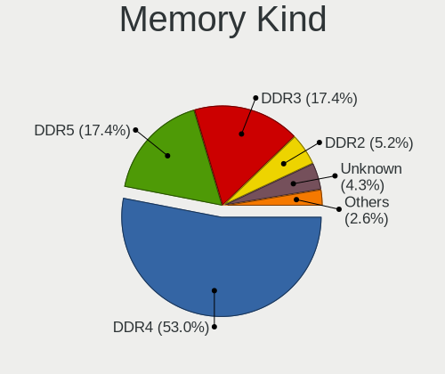

| Kind    | Desktops | Percent |
|---------|----------|---------|
| DDR4    | 25       | 46.3%   |
| DDR3    | 11       | 20.37%  |
| DDR5    | 10       | 18.52%  |
| DDR2    | 5        | 9.26%   |
| Unknown | 2        | 3.7%    |
| DDR     | 1        | 1.85%   |

Memory Form Factor
------------------

Physical design of the memory module

| Name   | Desktops | Percent |
|--------|----------|---------|
| DIMM   | 52       | 94.55%  |
| SODIMM | 3        | 5.45%   |

Memory Size
-----------

Memory module size

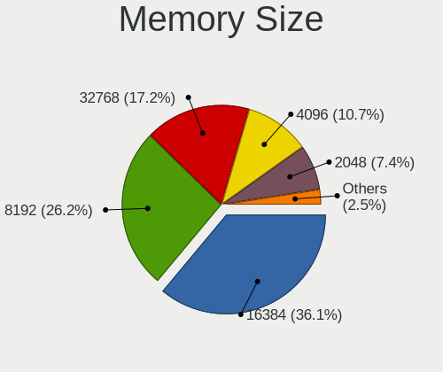

| Size  | Desktops | Percent |
|-------|----------|---------|
| 16384 | 16       | 29.09%  |
| 8192  | 15       | 27.27%  |
| 32768 | 12       | 21.82%  |
| 2048  | 6        | 10.91%  |
| 4096  | 5        | 9.09%   |
| 1024  | 1        | 1.82%   |

Memory Speed
------------

Memory module speed

| Speed | Desktops | Percent |
|-------|----------|---------|
| 1600  | 7        | 12.28%  |
| 3600  | 6        | 10.53%  |
| 6000  | 4        | 7.02%   |
| 3200  | 4        | 7.02%   |
| 1333  | 4        | 7.02%   |
| 667   | 4        | 7.02%   |
| 6400  | 3        | 5.26%   |
| 3400  | 3        | 5.26%   |
| 5200  | 2        | 3.51%   |
| 3466  | 2        | 3.51%   |
| 2667  | 2        | 3.51%   |
| 2666  | 2        | 3.51%   |
| 2400  | 2        | 3.51%   |
| 800   | 2        | 3.51%   |
| 4800  | 1        | 1.75%   |
| 3933  | 1        | 1.75%   |
| 3866  | 1        | 1.75%   |
| 3800  | 1        | 1.75%   |
| 3666  | 1        | 1.75%   |
| 3534  | 1        | 1.75%   |
| 3100  | 1        | 1.75%   |
| 1866  | 1        | 1.75%   |
| 1066  | 1        | 1.75%   |
| 333   | 1        | 1.75%   |

Printers & scanners
-------------------

Printer Vendor
--------------

Printer device vendors

| Vendor              | Desktops | Percent |
|---------------------|----------|---------|
| Samsung Electronics | 1        | 33.33%  |
| Hewlett-Packard     | 1        | 33.33%  |
| Brother Industries  | 1        | 33.33%  |

Printer Model
-------------

Printer device models

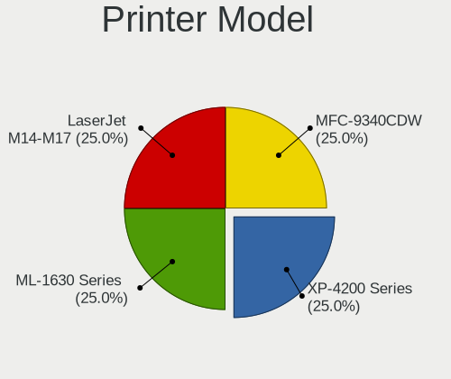

| Model                  | Desktops | Percent |
|------------------------|----------|---------|
| Samsung ML-1630 Series | 1        | 33.33%  |
| HP LaserJet M14-M17    | 1        | 33.33%  |
| Brother MFC-9340CDW    | 1        | 33.33%  |

Scanner Vendor
--------------

Scanner device vendors

| Vendor          | Desktops | Percent |
|-----------------|----------|---------|
| Canon           | 1        | 50%     |
| AGFA-Gevaert NV | 1        | 50%     |

Scanner Model
-------------

Scanner device models

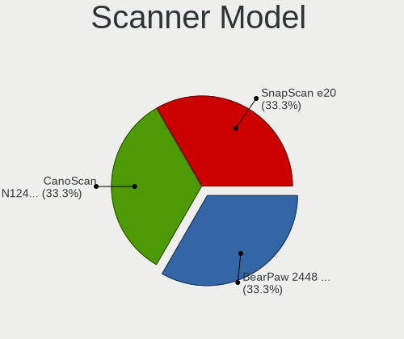

| Model                         | Desktops | Percent |
|-------------------------------|----------|---------|
| Canon CanoScan N1240U/LiDE 30 | 1        | 50%     |
| AGFA-Gevaert NV SnapScan e20  | 1        | 50%     |

Camera
------

Camera Vendor
-------------

Camera device vendors

| Vendor                        | Desktops | Percent |
|-------------------------------|----------|---------|
| Logitech                      | 2        | 25%     |
| Sunplus Innovation Technology | 1        | 12.5%   |
| Samsung Electronics           | 1        | 12.5%   |
| Microdia                      | 1        | 12.5%   |
| MacroSilicon                  | 1        | 12.5%   |
| GEMBIRD                       | 1        | 12.5%   |
| A4Tech                        | 1        | 12.5%   |

Camera Model
------------

Camera device models

| Model                                   | Desktops | Percent |
|-----------------------------------------|----------|---------|
| Sunplus MiraBox Video Capture           | 1        | 12.5%   |
| Samsung Galaxy series, misc. (MTP mode) | 1        | 12.5%   |
| Microdia USB 2.0 Camera                 | 1        | 12.5%   |
| MacroSilicon USB Video                  | 1        | 12.5%   |
| Logitech C922 Pro Stream Webcam         | 1        | 12.5%   |
| Logitech BRIO 4K Stream Edition         | 1        | 12.5%   |
| GEMBIRD USB2.0 PC CAMERA                | 1        | 12.5%   |
| A4Tech USB Live camera                  | 1        | 12.5%   |

Security
--------

Fingerprint Vendor
------------------

Fingerprint sensor vendors

Zero info for selected period =(

Fingerprint Model
-----------------

Fingerprint sensor models

Zero info for selected period =(

Chipcard Vendor
---------------

Chipcard module vendors

| Vendor           | Desktops | Percent |
|------------------|----------|---------|
| SCM Microsystems | 1        | 50%     |
| Bit4id           | 1        | 50%     |

Chipcard Model
--------------

Chipcard module models

| Model                                                  | Desktops | Percent |
|--------------------------------------------------------|----------|---------|
| SCM Microsystems SCR331-LC1 / SCR3310 SmartCard Reader | 1        | 50%     |
| Bit4id miniLector-s                                    | 1        | 50%     |

Unsupported
-----------

Unsupported Devices
-------------------

Total unsupported devices on board

| Total | Desktops | Percent |
|-------|----------|---------|
| 0     | 36       | 60%     |
| 1     | 14       | 23.33%  |
| 2     | 4        | 6.67%   |
| 3     | 3        | 5%      |
| 7     | 1        | 1.67%   |
| 6     | 1        | 1.67%   |
| 4     | 1        | 1.67%   |

Unsupported Device Types
------------------------

Types of unsupported devices

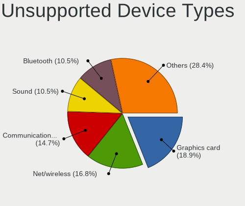

| Type                     | Desktops | Percent |
|--------------------------|----------|---------|
| Graphics card            | 9        | 26.47%  |
| Net/wireless             | 5        | 14.71%  |
| Sound                    | 4        | 11.76%  |
| Communication controller | 4        | 11.76%  |
| Bluetooth                | 4        | 11.76%  |
| Storage/ide              | 2        | 5.88%   |
| Network                  | 2        | 5.88%   |
| Unassigned class         | 1        | 2.94%   |
| Storage/raid             | 1        | 2.94%   |
| Net/ethernet             | 1        | 2.94%   |
| Firewire controller      | 1        | 2.94%   |

