Gentoo 2.13 - Tested Hardware & Statistics (Desktops)
-----------------------------------------------------

A project to collect tested hardware configurations for Gentoo 2.13.

Anyone can contribute to this report by the [hw-probe](https://github.com/linuxhw/hw-probe) tool:

    sudo -E hw-probe -all -upload

Please contribute! Especially if your hardware is rare.

Contents
--------

* [ Test Cases ](#test-cases)

* [ System ](#system)
  - [ Kernel                   ](#kernel)
  - [ Kernel Family            ](#kernel-family)
  - [ Kernel Major Ver.        ](#kernel-major-ver)
  - [ Arch                     ](#arch)
  - [ DE                       ](#de)
  - [ Display Server           ](#display-server)
  - [ Display Manager          ](#display-manager)
  - [ OS Lang                  ](#os-lang)
  - [ Boot Mode                ](#boot-mode)
  - [ Filesystem               ](#filesystem)
  - [ Part. scheme             ](#part-scheme)
  - [ Dual Boot with Linux/BSD ](#dual-boot-with-linuxbsd)
  - [ Dual Boot (Win)          ](#dual-boot-win)

* [ Board ](#board)
  - [ Vendor                   ](#vendor)
  - [ Model                    ](#model)
  - [ Model Family             ](#model-family)
  - [ MFG Year                 ](#mfg-year)
  - [ Form Factor              ](#form-factor)
  - [ Secure Boot              ](#secure-boot)
  - [ Coreboot                 ](#coreboot)
  - [ RAM Size                 ](#ram-size)
  - [ RAM Used                 ](#ram-used)
  - [ Total Drives             ](#total-drives)
  - [ Has CD-ROM               ](#has-cd-rom)
  - [ Has Ethernet             ](#has-ethernet)
  - [ Has WiFi                 ](#has-wifi)
  - [ Has Bluetooth            ](#has-bluetooth)

* [ Location ](#location)
  - [ Country                  ](#country)
  - [ City                     ](#city)

* [ Drives ](#drives)
  - [ Drive Vendor             ](#drive-vendor)
  - [ Drive Model              ](#drive-model)
  - [ HDD Vendor               ](#hdd-vendor)
  - [ SSD Vendor               ](#ssd-vendor)
  - [ Drive Kind               ](#drive-kind)
  - [ Drive Connector          ](#drive-connector)
  - [ Drive Size               ](#drive-size)
  - [ Space Total              ](#space-total)
  - [ Space Used               ](#space-used)
  - [ Malfunc. Drives          ](#malfunc-drives)
  - [ Malfunc. Drive Vendor    ](#malfunc-drive-vendor)
  - [ Malfunc. HDD Vendor      ](#malfunc-hdd-vendor)
  - [ Malfunc. Drive Kind      ](#malfunc-drive-kind)
  - [ Failed Drives            ](#failed-drives)
  - [ Failed Drive Vendor      ](#failed-drive-vendor)
  - [ Drive Status             ](#drive-status)

* [ Storage controller ](#storage-controller)
  - [ Storage Vendor           ](#storage-vendor)
  - [ Storage Model            ](#storage-model)
  - [ Storage Kind             ](#storage-kind)

* [ Processor ](#processor)
  - [ CPU Vendor               ](#cpu-vendor)
  - [ CPU Model                ](#cpu-model)
  - [ CPU Model Family         ](#cpu-model-family)
  - [ CPU Cores                ](#cpu-cores)
  - [ CPU Sockets              ](#cpu-sockets)
  - [ CPU Threads              ](#cpu-threads)
  - [ CPU Op-Modes             ](#cpu-op-modes)
  - [ CPU Microcode            ](#cpu-microcode)
  - [ CPU Microarch            ](#cpu-microarch)

* [ Graphics ](#graphics)
  - [ GPU Vendor               ](#gpu-vendor)
  - [ GPU Model                ](#gpu-model)
  - [ GPU Combo                ](#gpu-combo)
  - [ GPU Driver               ](#gpu-driver)
  - [ GPU Memory               ](#gpu-memory)

* [ Monitor ](#monitor)
  - [ Monitor Vendor           ](#monitor-vendor)
  - [ Monitor Model            ](#monitor-model)
  - [ Monitor Resolution       ](#monitor-resolution)
  - [ Monitor Diagonal         ](#monitor-diagonal)
  - [ Monitor Width            ](#monitor-width)
  - [ Aspect Ratio             ](#aspect-ratio)
  - [ Monitor Area             ](#monitor-area)
  - [ Pixel Density            ](#pixel-density)
  - [ Multiple Monitors        ](#multiple-monitors)

* [ Network ](#network)
  - [ Net Controller Vendor    ](#net-controller-vendor)
  - [ Net Controller Model     ](#net-controller-model)
  - [ Wireless Vendor          ](#wireless-vendor)
  - [ Wireless Model           ](#wireless-model)
  - [ Ethernet Vendor          ](#ethernet-vendor)
  - [ Ethernet Model           ](#ethernet-model)
  - [ Net Controller Kind      ](#net-controller-kind)
  - [ Used Controller          ](#used-controller)
  - [ NICs                     ](#nics)
  - [ IPv6                     ](#ipv6)

* [ Bluetooth ](#bluetooth)
  - [ Bluetooth Vendor         ](#bluetooth-vendor)
  - [ Bluetooth Model          ](#bluetooth-model)

* [ Sound ](#sound)
  - [ Sound Vendor             ](#sound-vendor)
  - [ Sound Model              ](#sound-model)

* [ Memory ](#memory)
  - [ Memory Vendor            ](#memory-vendor)
  - [ Memory Model             ](#memory-model)
  - [ Memory Kind              ](#memory-kind)
  - [ Memory Form Factor       ](#memory-form-factor)
  - [ Memory Size              ](#memory-size)
  - [ Memory Speed             ](#memory-speed)

* [ Printers & scanners ](#printers--scanners)
  - [ Printer Vendor           ](#printer-vendor)
  - [ Printer Model            ](#printer-model)
  - [ Scanner Vendor           ](#scanner-vendor)
  - [ Scanner Model            ](#scanner-model)

* [ Camera ](#camera)
  - [ Camera Vendor            ](#camera-vendor)
  - [ Camera Model             ](#camera-model)

* [ Security ](#security)
  - [ Fingerprint Vendor       ](#fingerprint-vendor)
  - [ Fingerprint Model        ](#fingerprint-model)
  - [ Chipcard Vendor          ](#chipcard-vendor)
  - [ Chipcard Model           ](#chipcard-model)

* [ Unsupported ](#unsupported)
  - [ Unsupported Devices      ](#unsupported-devices)
  - [ Unsupported Device Types ](#unsupported-device-types)

Test Cases
----------

Total: 243

| Vendor        | Model                       | Probe                                                      | Date         |
|---------------|-----------------------------|------------------------------------------------------------|--------------|
| ASUSTek       | PRIME N100I-D D4            | [34ef0ea7ff](https://linux-hardware.org/?probe=34ef0ea7ff) | Aug 20, 2023 |
| ASUSTek       | PRIME N100I-D D4            | [101202101b](https://linux-hardware.org/?probe=101202101b) | Aug 19, 2023 |
| Huanan        | X99-F8D V2.4                | [8af741a2c4](https://linux-hardware.org/?probe=8af741a2c4) | Aug 19, 2023 |
| Dell          | 0GY6Y8 A02                  | [a4747bf8ea](https://linux-hardware.org/?probe=a4747bf8ea) | Aug 18, 2023 |
| ASUSTek       | M3A78-CM                    | [2173b6b2b0](https://linux-hardware.org/?probe=2173b6b2b0) | Aug 18, 2023 |
| Gigabyte      | AB350-Gaming-CF             | [7ff2052c0f](https://linux-hardware.org/?probe=7ff2052c0f) | Aug 14, 2023 |
| Foxconn       | TPS01                       | [8e5b20544d](https://linux-hardware.org/?probe=8e5b20544d) | Aug 13, 2023 |
| AMD           | A690G M2+                   | [4179510c0b](https://linux-hardware.org/?probe=4179510c0b) | Aug 13, 2023 |
| MSI           | B450 TOMAHAWK MAX           | [231f8f9b37](https://linux-hardware.org/?probe=231f8f9b37) | Aug 13, 2023 |
| Gigabyte      | B650 AORUS PRO AX           | [5cbfb27db2](https://linux-hardware.org/?probe=5cbfb27db2) | Aug 11, 2023 |
| Gigabyte      | B650 AORUS PRO AX           | [72b375ad38](https://linux-hardware.org/?probe=72b375ad38) | Aug 11, 2023 |
| NEC Comput... | 312C                        | [770ffcfcf5](https://linux-hardware.org/?probe=770ffcfcf5) | Aug 10, 2023 |
| ASUSTek       | M3A78-CM                    | [a5e0e043cb](https://linux-hardware.org/?probe=a5e0e043cb) | Aug 09, 2023 |
| MSI           | 970A-G43 PLUS               | [133d4b58c9](https://linux-hardware.org/?probe=133d4b58c9) | Aug 08, 2023 |
| ASUSTek       | M3A78-CM                    | [93e4fee7df](https://linux-hardware.org/?probe=93e4fee7df) | Aug 08, 2023 |
| Gigabyte      | AB350-Gaming-CF             | [fb8e926bd4](https://linux-hardware.org/?probe=fb8e926bd4) | Aug 07, 2023 |
| ASUSTek       | TUF Gaming X670E-PLUS       | [584974f252](https://linux-hardware.org/?probe=584974f252) | Aug 05, 2023 |
| Medion        | B360H4-EM V1.0              | [18146f8bc9](https://linux-hardware.org/?probe=18146f8bc9) | Aug 04, 2023 |
| ASUSTek       | M3A78-CM                    | [9be3b9bb83](https://linux-hardware.org/?probe=9be3b9bb83) | Aug 02, 2023 |
| ASUSTek       | M3A78-CM                    | [5d63b469f8](https://linux-hardware.org/?probe=5d63b469f8) | Aug 01, 2023 |
| HP            | 2B47                        | [06373794be](https://linux-hardware.org/?probe=06373794be) | Aug 01, 2023 |
| Gigabyte      | H510M H                     | [51541062dc](https://linux-hardware.org/?probe=51541062dc) | Jul 31, 2023 |
| ASRock        | X570 Phantom Gaming X       | [4e2e9f1f7f](https://linux-hardware.org/?probe=4e2e9f1f7f) | Jul 31, 2023 |
| Gigabyte      | B650 AORUS PRO AX           | [23c9c57a00](https://linux-hardware.org/?probe=23c9c57a00) | Jul 30, 2023 |
| ASUSTek       | ROG STRIX X570-F GAMING     | [436e1e4e01](https://linux-hardware.org/?probe=436e1e4e01) | Jul 29, 2023 |
| Lenovo        | 1036 SDK0Q40112 WIN 3305... | [731b8aed1b](https://linux-hardware.org/?probe=731b8aed1b) | Jul 29, 2023 |
| ASRock        | AM1H-ITX                    | [24b2f4274d](https://linux-hardware.org/?probe=24b2f4274d) | Jul 29, 2023 |
| ASRock        | X570 PG Velocita            | [ba2f93d0af](https://linux-hardware.org/?probe=ba2f93d0af) | Jul 28, 2023 |
| ASUSTek       | PRIME X299-DELUXE           | [27da4128a7](https://linux-hardware.org/?probe=27da4128a7) | Jul 28, 2023 |
| Gigabyte      | B650M AORUS ELITE AX        | [4895ec9de1](https://linux-hardware.org/?probe=4895ec9de1) | Jul 27, 2023 |
| Gateway       | MS-7399                     | [904775a387](https://linux-hardware.org/?probe=904775a387) | Jul 25, 2023 |
| ASUSTek       | M3A78-CM                    | [290a0dd297](https://linux-hardware.org/?probe=290a0dd297) | Jul 25, 2023 |
| ASUSTek       | M3A78-CM                    | [a2fcdf6c36](https://linux-hardware.org/?probe=a2fcdf6c36) | Jul 24, 2023 |
| Foxconn       | TPS01                       | [d8e4cab1b8](https://linux-hardware.org/?probe=d8e4cab1b8) | Jul 21, 2023 |
| MSI           | X370 XPOWER GAMING TITAN... | [aac317ef80](https://linux-hardware.org/?probe=aac317ef80) | Jul 17, 2023 |
| MSI           | MPG Z490 GAMING EDGE WIF... | [cda9e7abe9](https://linux-hardware.org/?probe=cda9e7abe9) | Jul 17, 2023 |
| Gigabyte      | AB350-Gaming-CF             | [f4936b2064](https://linux-hardware.org/?probe=f4936b2064) | Jul 17, 2023 |
| Dell          | 0GY6Y8 A02                  | [8d8d1d6cbf](https://linux-hardware.org/?probe=8d8d1d6cbf) | Jul 17, 2023 |
| MSI           | MPG Z490 GAMING EDGE WIF... | [1f1b7763a5](https://linux-hardware.org/?probe=1f1b7763a5) | Jul 14, 2023 |
| ASUSTek       | M3A78-CM                    | [ab32a0e447](https://linux-hardware.org/?probe=ab32a0e447) | Jul 11, 2023 |
| ASUSTek       | M3A78-CM                    | [38420a6afe](https://linux-hardware.org/?probe=38420a6afe) | Jul 10, 2023 |
| Gigabyte      | AB350-Gaming-CF             | [14c6f3f286](https://linux-hardware.org/?probe=14c6f3f286) | Jul 10, 2023 |
| ASRock        | Z390 Extreme4               | [cf9ad63ff9](https://linux-hardware.org/?probe=cf9ad63ff9) | Jul 09, 2023 |
| ASRock        | Z390 Extreme4               | [306eaba8f1](https://linux-hardware.org/?probe=306eaba8f1) | Jul 09, 2023 |
| ASUSTek       | ROG STRIX Z590-F GAMING ... | [0b6dcc1ea9](https://linux-hardware.org/?probe=0b6dcc1ea9) | Jul 09, 2023 |
| MSI           | MAG B560 TORPEDO            | [4b611c264e](https://linux-hardware.org/?probe=4b611c264e) | Jul 08, 2023 |
| ASUSTek       | PRIME J4005I-C              | [8cccaeb0ed](https://linux-hardware.org/?probe=8cccaeb0ed) | Jul 08, 2023 |
| ASUSTek       | ROG STRIX X670E-F GAMING... | [9a6e78196d](https://linux-hardware.org/?probe=9a6e78196d) | Jul 06, 2023 |
| Gigabyte      | GA-MA770T-UD3P              | [348b9a4a73](https://linux-hardware.org/?probe=348b9a4a73) | Jul 05, 2023 |
| Aierben       | NA17                        | [462b502bab](https://linux-hardware.org/?probe=462b502bab) | Jul 05, 2023 |
| MSI           | B450 GAMING PRO CARBON A... | [49bcd116ba](https://linux-hardware.org/?probe=49bcd116ba) | Jul 04, 2023 |
| ASUSTek       | M3A78-CM                    | [67281face4](https://linux-hardware.org/?probe=67281face4) | Jul 03, 2023 |
| Gigabyte      | AB350-Gaming-CF             | [f928781025](https://linux-hardware.org/?probe=f928781025) | Jul 03, 2023 |
| ASUSTek       | TUF Gaming X570-PLUS        | [a0ac212cac](https://linux-hardware.org/?probe=a0ac212cac) | Jul 01, 2023 |
| Gigabyte      | Z390 AORUS MASTER-CF        | [0f0e96b03c](https://linux-hardware.org/?probe=0f0e96b03c) | Jul 01, 2023 |
| ASRock        | X570 Taichi                 | [af8af2c7e8](https://linux-hardware.org/?probe=af8af2c7e8) | Jun 30, 2023 |
| ASUSTek       | PRIME X299-DELUXE           | [4df7190c46](https://linux-hardware.org/?probe=4df7190c46) | Jun 29, 2023 |
| ASUSTek       | PRIME X299-DELUXE           | [6388cc47ae](https://linux-hardware.org/?probe=6388cc47ae) | Jun 29, 2023 |
| ASUSTek       | ROG STRIX X670E-F GAMING... | [8619447305](https://linux-hardware.org/?probe=8619447305) | Jun 27, 2023 |
| ASUSTek       | ROG STRIX X670E-F GAMING... | [bddefdfb2c](https://linux-hardware.org/?probe=bddefdfb2c) | Jun 27, 2023 |
| ASUSTek       | M3A78-CM                    | [e55023fb8b](https://linux-hardware.org/?probe=e55023fb8b) | Jun 26, 2023 |
| Gigabyte      | AB350-Gaming-CF             | [0b72aec1b9](https://linux-hardware.org/?probe=0b72aec1b9) | Jun 26, 2023 |
| ASRock        | J3160M                      | [0521c9a5a7](https://linux-hardware.org/?probe=0521c9a5a7) | Jun 22, 2023 |
| ASUSTek       | M3A78-CM                    | [22d8476417](https://linux-hardware.org/?probe=22d8476417) | Jun 19, 2023 |
| Gigabyte      | AB350-Gaming-CF             | [e2fc6bb607](https://linux-hardware.org/?probe=e2fc6bb607) | Jun 19, 2023 |
| ASUSTek       | ROG STRIX X670E-F GAMING... | [8e26542f2d](https://linux-hardware.org/?probe=8e26542f2d) | Jun 17, 2023 |
| ASUSTek       | PRIME X570-P                | [1f5163e415](https://linux-hardware.org/?probe=1f5163e415) | Jun 16, 2023 |
| MSI           | MEG X570 UNIFY              | [deeef80345](https://linux-hardware.org/?probe=deeef80345) | Jun 13, 2023 |
| ASUSTek       | M3A78-CM                    | [ad01f2c38d](https://linux-hardware.org/?probe=ad01f2c38d) | Jun 13, 2023 |
| ASUSTek       | M3A78-CM                    | [273795ce3d](https://linux-hardware.org/?probe=273795ce3d) | Jun 12, 2023 |
| Gigabyte      | AB350-Gaming-CF             | [8a9a32ba11](https://linux-hardware.org/?probe=8a9a32ba11) | Jun 12, 2023 |
| ASUSTek       | TUF Gaming B650M-PLUS WI... | [153ae28a9e](https://linux-hardware.org/?probe=153ae28a9e) | Jun 11, 2023 |
| ASUSTek       | ROG STRIX X670E-F GAMING... | [6f6440cf1e](https://linux-hardware.org/?probe=6f6440cf1e) | Jun 10, 2023 |
| ASUSTek       | ROG STRIX X670E-F GAMING... | [4cb72d56f7](https://linux-hardware.org/?probe=4cb72d56f7) | Jun 10, 2023 |
| ASUSTek       | TUF Gaming B650M-PLUS WI... | [26262445d4](https://linux-hardware.org/?probe=26262445d4) | Jun 09, 2023 |
| Gigabyte      | B550M AORUS ELITE           | [87f789c059](https://linux-hardware.org/?probe=87f789c059) | Jun 07, 2023 |
| MSI           | MAG B550 TOMAHAWK           | [96256dca48](https://linux-hardware.org/?probe=96256dca48) | Jun 07, 2023 |
| ASUSTek       | PRIME B550M-A               | [e7c8a1c727](https://linux-hardware.org/?probe=e7c8a1c727) | Jun 06, 2023 |
| ASUSTek       | M3A78-CM                    | [50304f8088](https://linux-hardware.org/?probe=50304f8088) | Jun 06, 2023 |
| ASUSTek       | M3A78-CM                    | [1df787c227](https://linux-hardware.org/?probe=1df787c227) | Jun 05, 2023 |
| Gigabyte      | AB350-Gaming-CF             | [580ae6529e](https://linux-hardware.org/?probe=580ae6529e) | Jun 05, 2023 |
| MSI           | MAG B550 TOMAHAWK           | [d7ae224bea](https://linux-hardware.org/?probe=d7ae224bea) | Jun 04, 2023 |
| ASUSTek       | ROG STRIX B650E-F GAMING... | [72fc2eea56](https://linux-hardware.org/?probe=72fc2eea56) | Jun 03, 2023 |
| ASRock        | X670E Steel Legend          | [c1cfe9f08d](https://linux-hardware.org/?probe=c1cfe9f08d) | Jun 02, 2023 |
| Gigabyte      | B550M AORUS ELITE           | [9faf2de183](https://linux-hardware.org/?probe=9faf2de183) | Jun 01, 2023 |
| ASUSTek       | ROG STRIX X570-E GAMING     | [d2ce08a746](https://linux-hardware.org/?probe=d2ce08a746) | May 30, 2023 |
| ASUSTek       | M3A78-CM                    | [1df34e179b](https://linux-hardware.org/?probe=1df34e179b) | May 30, 2023 |
| Pegatron      | 2ACE                        | [fd6056dba8](https://linux-hardware.org/?probe=fd6056dba8) | May 29, 2023 |
| Gigabyte      | AB350-Gaming-CF             | [edfe02a7ae](https://linux-hardware.org/?probe=edfe02a7ae) | May 29, 2023 |
| ASUSTek       | ROG STRIX Z590-F GAMING ... | [2bb14772ce](https://linux-hardware.org/?probe=2bb14772ce) | May 28, 2023 |
| Lenovo        | 1036 SDK0Q40112 WIN 3305... | [5384efc9d9](https://linux-hardware.org/?probe=5384efc9d9) | May 28, 2023 |
| MSI           | Z590-A PRO                  | [39f6ad44fe](https://linux-hardware.org/?probe=39f6ad44fe) | May 28, 2023 |
| Lenovo        | 1036 SDK0Q40112 WIN 3305... | [f7a170dd7d](https://linux-hardware.org/?probe=f7a170dd7d) | May 28, 2023 |
| Gigabyte      | Z690 AORUS MASTER           | [95231653d0](https://linux-hardware.org/?probe=95231653d0) | May 26, 2023 |
| ASRock        | X670E Taichi                | [6c74d47711](https://linux-hardware.org/?probe=6c74d47711) | May 25, 2023 |
| MSI           | PRO X670-P WIFI             | [aa919fe5b3](https://linux-hardware.org/?probe=aa919fe5b3) | May 25, 2023 |
| ASUSTek       | M3A78-CM                    | [654aa3909f](https://linux-hardware.org/?probe=654aa3909f) | May 24, 2023 |
| ASUSTek       | PRIME B550-PLUS             | [41ca623e3c](https://linux-hardware.org/?probe=41ca623e3c) | May 24, 2023 |
| ASRock        | Z170 OC Formula             | [d7a354fa41](https://linux-hardware.org/?probe=d7a354fa41) | May 24, 2023 |
| ASUSTek       | M3A78-CM                    | [e4f2e7ecb6](https://linux-hardware.org/?probe=e4f2e7ecb6) | May 23, 2023 |
| Gigabyte      | 970A-DS3P FX                | [9063693561](https://linux-hardware.org/?probe=9063693561) | May 23, 2023 |
| Gigabyte      | X670E AORUS MASTER          | [7ad8de5a40](https://linux-hardware.org/?probe=7ad8de5a40) | May 22, 2023 |
| Gigabyte      | X670E AORUS MASTER          | [e0611754f3](https://linux-hardware.org/?probe=e0611754f3) | May 22, 2023 |
| Gigabyte      | AB350-Gaming-CF             | [e7af79968d](https://linux-hardware.org/?probe=e7af79968d) | May 22, 2023 |
| Foxconn       | TPS01                       | [385129d471](https://linux-hardware.org/?probe=385129d471) | May 21, 2023 |
| Gigabyte      | X670E AORUS MASTER          | [46697ea0e2](https://linux-hardware.org/?probe=46697ea0e2) | May 20, 2023 |
| Foxconn       | TPS01                       | [853284b818](https://linux-hardware.org/?probe=853284b818) | May 20, 2023 |
| Gigabyte      | X570S AORUS ELITE AX        | [7c52ccb596](https://linux-hardware.org/?probe=7c52ccb596) | May 20, 2023 |
| Gigabyte      | X570 AORUS ELITE            | [22ef34bb50](https://linux-hardware.org/?probe=22ef34bb50) | May 20, 2023 |
| ASUSTek       | ROG Maximus Z690 HERO       | [f051e7f6da](https://linux-hardware.org/?probe=f051e7f6da) | May 20, 2023 |
| MSI           | B450 GAMING PRO CARBON A... | [8bd01d7d16](https://linux-hardware.org/?probe=8bd01d7d16) | May 19, 2023 |
| ASUSTek       | ROG Maximus Z690 HERO       | [3f5ffac86c](https://linux-hardware.org/?probe=3f5ffac86c) | May 19, 2023 |
| Gigabyte      | X670E AORUS MASTER          | [beacb75b2c](https://linux-hardware.org/?probe=beacb75b2c) | May 18, 2023 |
| TYAN Compu... | S2505T                      | [a17c60c707](https://linux-hardware.org/?probe=a17c60c707) | May 16, 2023 |
| ASUSTek       | P6X58D PREMIUM              | [9257bb2c1a](https://linux-hardware.org/?probe=9257bb2c1a) | May 16, 2023 |
| ASUSTek       | Z87-PLUS                    | [4160bd4f84](https://linux-hardware.org/?probe=4160bd4f84) | May 16, 2023 |
| ASUSTek       | Maximus VI HERO             | [6d60b321b1](https://linux-hardware.org/?probe=6d60b321b1) | May 16, 2023 |
| ASUSTek       | P6X58D PREMIUM              | [a13951a75b](https://linux-hardware.org/?probe=a13951a75b) | May 16, 2023 |
| Gigabyte      | 970A-DS3P FX                | [b25434cdf3](https://linux-hardware.org/?probe=b25434cdf3) | May 15, 2023 |
| ASUSTek       | M3A78-CM                    | [4a352d010e](https://linux-hardware.org/?probe=4a352d010e) | May 15, 2023 |
| Gigabyte      | AB350-Gaming-CF             | [0aa84055bf](https://linux-hardware.org/?probe=0aa84055bf) | May 15, 2023 |
| Gigabyte      | 970A-DS3P FX                | [7fe35591e7](https://linux-hardware.org/?probe=7fe35591e7) | May 14, 2023 |
| Foxconn       | nT-330i                     | [b95166587e](https://linux-hardware.org/?probe=b95166587e) | May 14, 2023 |
| MSI           | MAG Z390 TOMAHAWK           | [334b015373](https://linux-hardware.org/?probe=334b015373) | May 14, 2023 |
| Gigabyte      | 970A-DS3P FX                | [4e208c9155](https://linux-hardware.org/?probe=4e208c9155) | May 14, 2023 |
| Unknown       | Unknown                     | [e172257a22](https://linux-hardware.org/?probe=e172257a22) | May 13, 2023 |
| ASUSTek       | M3A78-CM                    | [9f88d81e33](https://linux-hardware.org/?probe=9f88d81e33) | May 12, 2023 |
| MSI           | MEG X570 UNIFY              | [721f9583d7](https://linux-hardware.org/?probe=721f9583d7) | May 11, 2023 |
| ASUSTek       | TUF Gaming X570-PLUS        | [9cbcc36a48](https://linux-hardware.org/?probe=9cbcc36a48) | May 11, 2023 |
| ASUSTek       | TUF Gaming X570-PLUS        | [0ae43bcc58](https://linux-hardware.org/?probe=0ae43bcc58) | May 11, 2023 |
| MSI           | MAG B550 TOMAHAWK           | [49ad1e2075](https://linux-hardware.org/?probe=49ad1e2075) | May 09, 2023 |
| ASUSTek       | M3A78-CM                    | [afe5236688](https://linux-hardware.org/?probe=afe5236688) | May 08, 2023 |
| MSI           | H81M-P33                    | [b5c0679341](https://linux-hardware.org/?probe=b5c0679341) | May 08, 2023 |
| Gigabyte      | Z390 GAMING X-CF            | [aa2af0a4bc](https://linux-hardware.org/?probe=aa2af0a4bc) | May 08, 2023 |
| Gigabyte      | Z390 GAMING X-CF            | [bfd53a8d28](https://linux-hardware.org/?probe=bfd53a8d28) | May 08, 2023 |
| Gigabyte      | AB350-Gaming-CF             | [a8e82695ee](https://linux-hardware.org/?probe=a8e82695ee) | May 08, 2023 |
| ASUSTek       | TUF Gaming X570-PLUS        | [c88845ae9b](https://linux-hardware.org/?probe=c88845ae9b) | May 06, 2023 |
| ASUSTek       | M4A89GTD-PRO/USB3           | [5d774e899c](https://linux-hardware.org/?probe=5d774e899c) | May 06, 2023 |
| ASUSTek       | M3A78-CM                    | [6aa9a8317d](https://linux-hardware.org/?probe=6aa9a8317d) | May 04, 2023 |
| ASUSTek       | ROG Maximus Z690 HERO       | [61cde0d9b2](https://linux-hardware.org/?probe=61cde0d9b2) | May 04, 2023 |
| ASRock        | X570 Taichi                 | [063e548538](https://linux-hardware.org/?probe=063e548538) | May 03, 2023 |
| HP            | 1589                        | [c817b08584](https://linux-hardware.org/?probe=c817b08584) | May 02, 2023 |
| ASRock        | X670E Pro RS                | [a17449f761](https://linux-hardware.org/?probe=a17449f761) | May 02, 2023 |
| HP            | 1589                        | [890241aeb6](https://linux-hardware.org/?probe=890241aeb6) | May 02, 2023 |
| ASRock        | B550M-ITX/ac                | [77ef33da62](https://linux-hardware.org/?probe=77ef33da62) | May 02, 2023 |
| ASRock        | B550M-ITX/ac                | [1c158dca0e](https://linux-hardware.org/?probe=1c158dca0e) | May 02, 2023 |
| ASUSTek       | TUF Gaming X570-PLUS        | [2a2bf698ed](https://linux-hardware.org/?probe=2a2bf698ed) | May 01, 2023 |
| Gigabyte      | AB350-Gaming-CF             | [c03693e806](https://linux-hardware.org/?probe=c03693e806) | May 01, 2023 |
| ASUSTek       | ROG STRIX Z590-F GAMING ... | [a158a30802](https://linux-hardware.org/?probe=a158a30802) | Apr 29, 2023 |
| ASUSTek       | ROG Maximus Z690 HERO       | [855bed0070](https://linux-hardware.org/?probe=855bed0070) | Apr 28, 2023 |
| ASUSTek       | CM6330_CM6630_CM6730_CM6... | [f3b21405ff](https://linux-hardware.org/?probe=f3b21405ff) | Apr 27, 2023 |
| ASUSTek       | PRIME Z490-A                | [a48c247194](https://linux-hardware.org/?probe=a48c247194) | Apr 26, 2023 |
| ASUSTek       | PRIME Z490-A                | [11844fed4d](https://linux-hardware.org/?probe=11844fed4d) | Apr 25, 2023 |
| ASRock        | B550M Pro4                  | [b53354af62](https://linux-hardware.org/?probe=b53354af62) | Apr 25, 2023 |
| MSI           | B450 GAMING PRO CARBON M... | [c78c7e9ec1](https://linux-hardware.org/?probe=c78c7e9ec1) | Apr 24, 2023 |
| ASUSTek       | M3A78-CM                    | [7bbac9f9bf](https://linux-hardware.org/?probe=7bbac9f9bf) | Apr 24, 2023 |
| Gigabyte      | AB350-Gaming-CF             | [35c362eb4f](https://linux-hardware.org/?probe=35c362eb4f) | Apr 24, 2023 |
| Gigabyte      | X670E AORUS MASTER          | [0f7e30ded3](https://linux-hardware.org/?probe=0f7e30ded3) | Apr 23, 2023 |
| ASUSTek       | M3A78-CM                    | [f98c5f7d2e](https://linux-hardware.org/?probe=f98c5f7d2e) | Apr 23, 2023 |
| Gigabyte      | B460 HD3                    | [c9e3b1d5ea](https://linux-hardware.org/?probe=c9e3b1d5ea) | Apr 22, 2023 |
| Gigabyte      | X570S AORUS ELITE AX        | [80ead18196](https://linux-hardware.org/?probe=80ead18196) | Apr 21, 2023 |
| ASUSTek       | PRIME B650M-A AX            | [0f17162503](https://linux-hardware.org/?probe=0f17162503) | Apr 21, 2023 |
| ASUSTek       | PRIME B650M-A AX            | [056db62b47](https://linux-hardware.org/?probe=056db62b47) | Apr 20, 2023 |
| Intel         | D510MO AAE76523-401         | [cf5c07a318](https://linux-hardware.org/?probe=cf5c07a318) | Apr 19, 2023 |
| ZOTAC         | H67ITX-C-E 02/03/05         | [27131cb048](https://linux-hardware.org/?probe=27131cb048) | Apr 19, 2023 |
| Unknown       | Unknown                     | [bac14fb22e](https://linux-hardware.org/?probe=bac14fb22e) | Apr 19, 2023 |
| ASUSTek       | SABERTOOTH X58              | [270e47ceb8](https://linux-hardware.org/?probe=270e47ceb8) | Apr 19, 2023 |
| ASUSTek       | PRIME H370M-PLUS            | [0a544df503](https://linux-hardware.org/?probe=0a544df503) | Apr 17, 2023 |
| ASUSTek       | ROG Maximus Z690 HERO       | [a70c93f2e7](https://linux-hardware.org/?probe=a70c93f2e7) | Apr 17, 2023 |
| ASUSTek       | TUF Gaming X570-PLUS        | [cb21111c89](https://linux-hardware.org/?probe=cb21111c89) | Apr 16, 2023 |
| ASUSTek       | ROG Maximus Z690 HERO       | [962c5734bc](https://linux-hardware.org/?probe=962c5734bc) | Apr 15, 2023 |
| Gigabyte      | X670E AORUS MASTER          | [c8bf9d49d4](https://linux-hardware.org/?probe=c8bf9d49d4) | Apr 15, 2023 |
| ASRock        | B450M Steel Legend          | [6b71471847](https://linux-hardware.org/?probe=6b71471847) | Apr 15, 2023 |
| HP            | ProLiant MicroServer Gen... | [d00ebfbc62](https://linux-hardware.org/?probe=d00ebfbc62) | Apr 14, 2023 |
| HP            | ProLiant MicroServer Gen... | [8b0e1ffa20](https://linux-hardware.org/?probe=8b0e1ffa20) | Apr 14, 2023 |
| HP            | ProLiant MicroServer Gen... | [3b2ac9206c](https://linux-hardware.org/?probe=3b2ac9206c) | Apr 14, 2023 |
| HP            | ProLiant MicroServer Gen... | [16ee5e0082](https://linux-hardware.org/?probe=16ee5e0082) | Apr 14, 2023 |
| HP            | ProLiant MicroServer Gen... | [1b21351033](https://linux-hardware.org/?probe=1b21351033) | Apr 14, 2023 |
| HP            | ProLiant MicroServer Gen... | [f6f55c801f](https://linux-hardware.org/?probe=f6f55c801f) | Apr 14, 2023 |
| ASUSTek       | P6X58D PREMIUM              | [7f20e3160b](https://linux-hardware.org/?probe=7f20e3160b) | Apr 13, 2023 |
| ASUSTek       | Z87-PLUS                    | [1b44c95410](https://linux-hardware.org/?probe=1b44c95410) | Apr 13, 2023 |
| ASUSTek       | Maximus VI HERO             | [f46283dc4c](https://linux-hardware.org/?probe=f46283dc4c) | Apr 13, 2023 |
| ASUSTek       | TUF Gaming X570-PLUS        | [f5241c853f](https://linux-hardware.org/?probe=f5241c853f) | Apr 12, 2023 |
| ASRock        | X370 Gaming X               | [d829fac91c](https://linux-hardware.org/?probe=d829fac91c) | Apr 10, 2023 |
| ASRock        | X370 Gaming X               | [bd05976130](https://linux-hardware.org/?probe=bd05976130) | Apr 10, 2023 |
| ASUSTek       | M3A78-CM                    | [001091b5fd](https://linux-hardware.org/?probe=001091b5fd) | Apr 10, 2023 |
| Gigabyte      | AB350-Gaming-CF             | [34f1d57aec](https://linux-hardware.org/?probe=34f1d57aec) | Apr 10, 2023 |
| ASRock        | X370 Gaming X               | [0beaf2366c](https://linux-hardware.org/?probe=0beaf2366c) | Apr 09, 2023 |
| ASUSTek       | ROG STRIX X570-E GAMING     | [f85fdf6564](https://linux-hardware.org/?probe=f85fdf6564) | Apr 09, 2023 |
| HPE           | ProLiant MicroServer Gen... | [e378272577](https://linux-hardware.org/?probe=e378272577) | Apr 08, 2023 |
| ASUSTek       | PRIME B650M-A AX            | [97e76297c9](https://linux-hardware.org/?probe=97e76297c9) | Apr 08, 2023 |
| ASUSTek       | M3A78-CM                    | [a71051ab5a](https://linux-hardware.org/?probe=a71051ab5a) | Apr 06, 2023 |
| Gigabyte      | B450M DS3H V2               | [c59398619e](https://linux-hardware.org/?probe=c59398619e) | Apr 03, 2023 |
| ASUSTek       | M3A78-CM                    | [59bdd9d328](https://linux-hardware.org/?probe=59bdd9d328) | Apr 03, 2023 |
| Gigabyte      | AB350-Gaming-CF             | [79ec23e706](https://linux-hardware.org/?probe=79ec23e706) | Apr 03, 2023 |
| ASUSTek       | ROG CROSSHAIR VIII HERO     | [d19221e116](https://linux-hardware.org/?probe=d19221e116) | Apr 02, 2023 |
| ASUSTek       | ROG STRIX Z590-F GAMING ... | [58e2308d1e](https://linux-hardware.org/?probe=58e2308d1e) | Apr 02, 2023 |
| Gigabyte      | B150M-D2V DDR3-CF           | [3599b8e875](https://linux-hardware.org/?probe=3599b8e875) | Mar 31, 2023 |
| ASUSTek       | M3A78-CM                    | [7d0c0336c1](https://linux-hardware.org/?probe=7d0c0336c1) | Mar 27, 2023 |
| ASRock        | AM1H-ITX                    | [8f1dcf05eb](https://linux-hardware.org/?probe=8f1dcf05eb) | Mar 26, 2023 |
| ASRock        | X370 Gaming X               | [0a19e934c3](https://linux-hardware.org/?probe=0a19e934c3) | Mar 26, 2023 |
| ASUSTek       | TUF Gaming X670E-PLUS WI... | [f2b287b461](https://linux-hardware.org/?probe=f2b287b461) | Mar 25, 2023 |
| Gigabyte      | B150M-D2V DDR3-CF           | [276aa0b036](https://linux-hardware.org/?probe=276aa0b036) | Mar 25, 2023 |
| HPE           | ProLiant MicroServer Gen... | [72f90312db](https://linux-hardware.org/?probe=72f90312db) | Mar 25, 2023 |
| ASUSTek       | TUF Gaming X670E-PLUS WI... | [dac7782920](https://linux-hardware.org/?probe=dac7782920) | Mar 24, 2023 |
| HPE           | ProLiant MicroServer Gen... | [2c8daaa4f2](https://linux-hardware.org/?probe=2c8daaa4f2) | Mar 24, 2023 |
| Gigabyte      | X670E AORUS MASTER          | [4bf7fa5f9c](https://linux-hardware.org/?probe=4bf7fa5f9c) | Mar 23, 2023 |
| ASUSTek       | M3A78-CM                    | [7b4a68e88a](https://linux-hardware.org/?probe=7b4a68e88a) | Mar 20, 2023 |
| ASUSTek       | ROG STRIX Z590-E GAMING ... | [f048ae8dec](https://linux-hardware.org/?probe=f048ae8dec) | Mar 19, 2023 |
| MSI           | 990FXA-GD80                 | [e79acda971](https://linux-hardware.org/?probe=e79acda971) | Mar 19, 2023 |
| ASRock        | X370 Gaming X               | [4f98540a7b](https://linux-hardware.org/?probe=4f98540a7b) | Mar 19, 2023 |
| Gigabyte      | Z77X-UD5H                   | [dc0a9ba834](https://linux-hardware.org/?probe=dc0a9ba834) | Mar 19, 2023 |
| HPE           | ProLiant MicroServer Gen... | [7e11b106d7](https://linux-hardware.org/?probe=7e11b106d7) | Mar 17, 2023 |
| ASUSTek       | ProArt X670E-CREATOR WIF... | [fab37d7522](https://linux-hardware.org/?probe=fab37d7522) | Mar 16, 2023 |
| Gigabyte      | X470 AORUS ULTRA GAMING-... | [4d5bb23ec0](https://linux-hardware.org/?probe=4d5bb23ec0) | Mar 15, 2023 |
| ASUSTek       | M3A78-CM                    | [8c2507428d](https://linux-hardware.org/?probe=8c2507428d) | Mar 15, 2023 |
| ASRock        | H81M-HDS                    | [58f8534073](https://linux-hardware.org/?probe=58f8534073) | Mar 14, 2023 |
| Foxconn       | TPS01                       | [60ae6d3891](https://linux-hardware.org/?probe=60ae6d3891) | Mar 14, 2023 |
| Fujitsu Si... | D1547 S26361-D1547          | [95a9c8655d](https://linux-hardware.org/?probe=95a9c8655d) | Mar 14, 2023 |
| ASUSTek       | ROG STRIX B650E-F GAMING... | [06d54f03f9](https://linux-hardware.org/?probe=06d54f03f9) | Mar 13, 2023 |
| ASUSTek       | M3A78-CM                    | [a0590e6829](https://linux-hardware.org/?probe=a0590e6829) | Mar 13, 2023 |
| Gigabyte      | AB350-Gaming-CF             | [540bfa93eb](https://linux-hardware.org/?probe=540bfa93eb) | Mar 13, 2023 |
| ASUSTek       | ROG STRIX Z590-F GAMING ... | [3b52326a3e](https://linux-hardware.org/?probe=3b52326a3e) | Mar 12, 2023 |
| ASUSTek       | TUF Gaming B650M-PLUS WI... | [0932f02541](https://linux-hardware.org/?probe=0932f02541) | Mar 12, 2023 |
| ASRock        | AM1H-ITX                    | [a0eb3774fc](https://linux-hardware.org/?probe=a0eb3774fc) | Mar 09, 2023 |
| Supermicro    | X10DRi-LN4+                 | [4e805ce5a1](https://linux-hardware.org/?probe=4e805ce5a1) | Mar 08, 2023 |
| ASUSTek       | ROG STRIX X670E-E GAMING... | [87cbc99c85](https://linux-hardware.org/?probe=87cbc99c85) | Mar 08, 2023 |
| ASRock        | H170 Pro4                   | [7d749add31](https://linux-hardware.org/?probe=7d749add31) | Mar 07, 2023 |
| ASRock        | X570 Taichi                 | [4d48b829ca](https://linux-hardware.org/?probe=4d48b829ca) | Mar 07, 2023 |
| ASUSTek       | M3A78-CM                    | [397eb062bf](https://linux-hardware.org/?probe=397eb062bf) | Mar 07, 2023 |
| ASUSTek       | PRIME B450M-A               | [dee1b60a0d](https://linux-hardware.org/?probe=dee1b60a0d) | Mar 07, 2023 |
| ASUSTek       | ROG STRIX X570-I GAMING     | [6493617e39](https://linux-hardware.org/?probe=6493617e39) | Mar 07, 2023 |
| Unknown       | Unknown                     | [ffd546b665](https://linux-hardware.org/?probe=ffd546b665) | Mar 07, 2023 |
| Supermicro    | X10DRi-LN4+                 | [d445859477](https://linux-hardware.org/?probe=d445859477) | Mar 07, 2023 |
| Gigabyte      | AB350-Gaming-CF             | [42edcf638d](https://linux-hardware.org/?probe=42edcf638d) | Mar 06, 2023 |
| ASUSTek       | M3A78-CM                    | [541a6200bc](https://linux-hardware.org/?probe=541a6200bc) | Mar 05, 2023 |
| Lenovo        | 1048 SDK0T08861 WIN 3305... | [e6b48cdec4](https://linux-hardware.org/?probe=e6b48cdec4) | Feb 26, 2023 |
| Gigabyte      | Z590 UD                     | [a8da25537c](https://linux-hardware.org/?probe=a8da25537c) | Feb 21, 2023 |
| ASUSTek       | TUF Gaming X570-PLUS_BR     | [12c06a594d](https://linux-hardware.org/?probe=12c06a594d) | Feb 10, 2023 |
| ASUSTek       | ROG STRIX Z690-G GAMING ... | [1423d5ac1b](https://linux-hardware.org/?probe=1423d5ac1b) | Feb 10, 2023 |
| ASUSTek       | ROG STRIX Z690-G GAMING ... | [bb589c5e58](https://linux-hardware.org/?probe=bb589c5e58) | Feb 10, 2023 |
| ASUSTek       | PRIME X570-P                | [a8dcc6b4c1](https://linux-hardware.org/?probe=a8dcc6b4c1) | Feb 03, 2023 |
| Gigabyte      | X570 AORUS MASTER           | [0cf18835cc](https://linux-hardware.org/?probe=0cf18835cc) | Feb 02, 2023 |

System
------

Kernel
------

Version of the Linux kernel

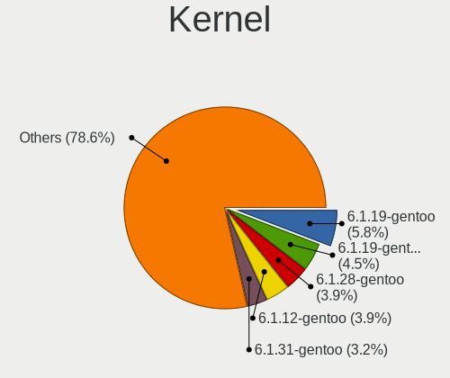

| Version                 | Desktops | Percent |
|-------------------------|----------|---------|
| 6.1.19-gentoo           | 9        | 5.84%   |
| 6.1.19-gentoo-x86_64    | 7        | 4.55%   |
| 6.1.28-gentoo           | 6        | 3.9%    |
| 6.1.12-gentoo           | 6        | 3.9%    |
| 6.1.31-gentoo           | 5        | 3.25%   |
| 6.1.12-gentoo-x86_64    | 5        | 3.25%   |
| 6.3.1-gentoo            | 4        | 2.6%    |
| 6.2.11-gentoo           | 4        | 2.6%    |
| 6.1.41-gentoo           | 4        | 2.6%    |
| 6.3.4-gentoo            | 3        | 1.95%   |
| 6.2.11-gentoo-x86_64    | 3        | 1.95%   |
| 6.1.41-gentoo-dist      | 3        | 1.95%   |
| 6.1.31-gentoo-x86_64    | 3        | 1.95%   |
| 6.1.31-gentoo-dist      | 3        | 1.95%   |
| 6.1.27-gentoo-r1-x86_64 | 3        | 1.95%   |
| 6.1.22-gentoo-dist      | 3        | 1.95%   |
| 6.4.9-gentoo            | 2        | 1.3%    |
| 6.4.7-gentoo            | 2        | 1.3%    |
| 6.4.6-gentoo            | 2        | 1.3%    |
| 6.3.8-gentoo            | 2        | 1.3%    |
| 6.3.3-gentoo            | 2        | 1.3%    |
| 6.3.0-gentoo            | 2        | 1.3%    |
| 6.2.9-gentoo-x86_64     | 2        | 1.3%    |
| 6.2.8-gentoo-x86_64     | 2        | 1.3%    |
| 6.2.12-gentoo-x86_64    | 2        | 1.3%    |
| 6.1.38-gentoo-x86_64    | 2        | 1.3%    |
| 6.5.0-rc4-shallot       | 1        | 0.65%   |
| 6.4.4-x86_64            | 1        | 0.65%   |
| 6.4.3-gentoo-dist       | 1        | 0.65%   |
| 6.4.3-gentoo            | 1        | 0.65%   |
| 6.4.2-gentoo-x86_64     | 1        | 0.65%   |
| 6.4.2-gentoo            | 1        | 0.65%   |
| 6.4.10-x86_64           | 1        | 0.65%   |
| 6.4.1-gentoo-x86_64     | 1        | 0.65%   |
| 6.4.0-rc2-x86_64        | 1        | 0.65%   |
| 6.3.8-gentoo-dist       | 1        | 0.65%   |
| 6.3.7-gentoo_ap         | 1        | 0.65%   |
| 6.3.6-gentoo-x86_64     | 1        | 0.65%   |
| 6.3.5-gentoo-x86_64     | 1        | 0.65%   |
| 6.3.4-gentoo-c17        | 1        | 0.65%   |

Kernel Family
-------------

Linux kernel without a distro release

| Version | Desktops | Percent |
|---------|----------|---------|
| 6.1.19  | 20       | 12.99%  |
| 6.1.12  | 13       | 8.44%   |
| 6.1.31  | 11       | 7.14%   |
| 6.3.1   | 9        | 5.84%   |
| 6.1.41  | 8        | 5.19%   |
| 6.2.11  | 7        | 4.55%   |
| 6.1.27  | 7        | 4.55%   |
| 6.1.28  | 6        | 3.9%    |
| 6.3.4   | 5        | 3.25%   |
| 6.2.9   | 4        | 2.6%    |
| 6.1.38  | 4        | 2.6%    |
| 6.3.8   | 3        | 1.95%   |
| 6.3.3   | 3        | 1.95%   |
| 6.3.0   | 3        | 1.95%   |
| 6.2.0   | 3        | 1.95%   |
| 6.1.22  | 3        | 1.95%   |
| 6.4.9   | 2        | 1.3%    |
| 6.4.7   | 2        | 1.3%    |
| 6.4.6   | 2        | 1.3%    |
| 6.4.3   | 2        | 1.3%    |
| 6.4.2   | 2        | 1.3%    |
| 6.2.8   | 2        | 1.3%    |
| 6.2.3   | 2        | 1.3%    |
| 6.2.13  | 2        | 1.3%    |
| 6.2.12  | 2        | 1.3%    |
| 6.5.0   | 1        | 0.65%   |
| 6.4.4   | 1        | 0.65%   |
| 6.4.10  | 1        | 0.65%   |
| 6.4.1   | 1        | 0.65%   |
| 6.4.0   | 1        | 0.65%   |
| 6.3.7   | 1        | 0.65%   |
| 6.3.6   | 1        | 0.65%   |
| 6.3.5   | 1        | 0.65%   |
| 6.3.2   | 1        | 0.65%   |
| 6.2.6   | 1        | 0.65%   |
| 6.2.5   | 1        | 0.65%   |
| 6.2.2   | 1        | 0.65%   |
| 6.2.10  | 1        | 0.65%   |
| 6.2.1   | 1        | 0.65%   |
| 6.1.9   | 1        | 0.65%   |

Kernel Major Ver.
-----------------

Linux kernel major version

| Version | Desktops | Percent |
|---------|----------|---------|
| 6.1     | 60       | 46.15%  |
| 6.3     | 25       | 19.23%  |
| 6.2     | 25       | 19.23%  |
| 6.4     | 12       | 9.23%   |
| 5.15    | 4        | 3.08%   |
| 5.10    | 2        | 1.54%   |
| 6.5     | 1        | 0.77%   |
| 5.17    | 1        | 0.77%   |

Arch
----

OS architecture (x86_64, i586, etc.)

| Name   | Desktops | Percent |
|--------|----------|---------|
| x86_64 | 117      | 98.32%  |
| i686   | 2        | 1.68%   |

DE
--

Desktop Environment

| Name     | Desktops | Percent |
|----------|----------|---------|
| Unknown  | 37       | 29.84%  |
| KDE5     | 36       | 29.03%  |
| XFCE     | 18       | 14.52%  |
| GNOME    | 17       | 13.71%  |
| LXQt     | 4        | 3.23%   |
| sway     | 2        | 1.61%   |
| MATE     | 2        | 1.61%   |
| KDE      | 2        | 1.61%   |
| i3       | 2        | 1.61%   |
| Hyprland | 2        | 1.61%   |
| openbox  | 1        | 0.81%   |
| LXDE     | 1        | 0.81%   |

Display Server
--------------

X11 or Wayland

| Name    | Desktops | Percent |
|---------|----------|---------|
| X11     | 56       | 43.41%  |
| Wayland | 28       | 21.71%  |
| Tty     | 27       | 20.93%  |
| Unknown | 18       | 13.95%  |

Display Manager
---------------

SDDM, LightDM, etc.

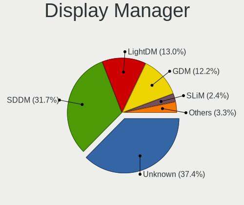

| Name    | Desktops | Percent |
|---------|----------|---------|
| Unknown | 46       | 37.4%   |
| SDDM    | 39       | 31.71%  |
| LightDM | 16       | 13.01%  |
| GDM     | 15       | 12.2%   |
| SLiM    | 3        | 2.44%   |
| LXDM    | 3        | 2.44%   |
| GREETD  | 1        | 0.81%   |

OS Lang
-------

Language

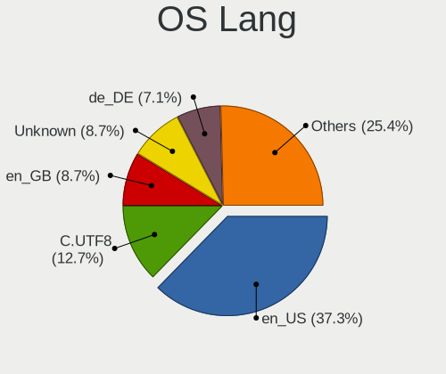

| Lang            | Desktops | Percent |
|-----------------|----------|---------|
| en_US           | 47       | 37.3%   |
| C.UTF8          | 16       | 12.7%   |
| en_GB           | 11       | 8.73%   |
| Unknown         | 11       | 8.73%   |
| de_DE           | 9        | 7.14%   |
| C               | 5        | 3.97%   |
| en_IE           | 4        | 3.17%   |
| ru_RU           | 3        | 2.38%   |
| fr_FR           | 3        | 2.38%   |
| cs_CZ           | 2        | 1.59%   |
| uk_UA           | 1        | 0.79%   |
| sv_SE           | 1        | 0.79%   |
| ru_RU.UTF8      | 1        | 0.79%   |
| pt_BR           | 1        | 0.79%   |
| pl_PL.UTF8      | 1        | 0.79%   |
| pl_PL           | 1        | 0.79%   |
| nl_BE           | 1        | 0.79%   |
| it_IT           | 1        | 0.79%   |
| fr_BE           | 1        | 0.79%   |
| fi_FI@euro.UTF- | 1        | 0.79%   |
| fi_FI           | 1        | 0.79%   |
| es_MX           | 1        | 0.79%   |
| es_ES           | 1        | 0.79%   |
| en_IL           | 1        | 0.79%   |
| da_DK           | 1        | 0.79%   |

Boot Mode
---------

EFI or BIOS

| Mode | Desktops | Percent |
|------|----------|---------|
| EFI  | 85       | 70.25%  |
| BIOS | 36       | 29.75%  |

Filesystem
----------

Type of filesystem

| Type     | Desktops | Percent |
|----------|----------|---------|
| Ext4     | 67       | 54.92%  |
| Btrfs    | 32       | 26.23%  |
| Zfs      | 7        | 5.74%   |
| F2fs     | 6        | 4.92%   |
| Xfs      | 5        | 4.1%    |
| Reiserfs | 3        | 2.46%   |
| XXXXXXX  | 2        | 1.64%   |

Part. scheme
------------

Scheme of partitioning

| Type    | Desktops | Percent |
|---------|----------|---------|
| GPT     | 101      | 84.87%  |
| MBR     | 15       | 12.61%  |
| Unknown | 3        | 2.52%   |

Dual Boot with Linux/BSD
------------------------

Hosting more than one Linux/BSD

| Dual boot | Desktops | Percent |
|-----------|----------|---------|
| No        | 75       | 61.48%  |
| Yes       | 47       | 38.52%  |

Dual Boot (Win)
---------------

Hosting Linux and Windows

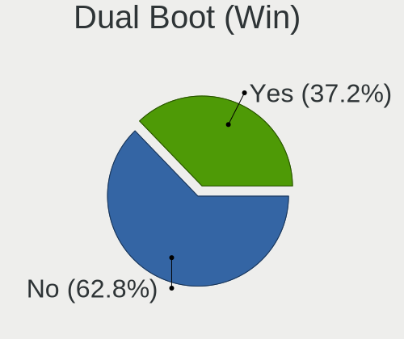

| Dual boot | Desktops | Percent |
|-----------|----------|---------|
| No        | 76       | 62.81%  |
| Yes       | 45       | 37.19%  |

Board
-----

Vendor
------

Motherboard manufacturer

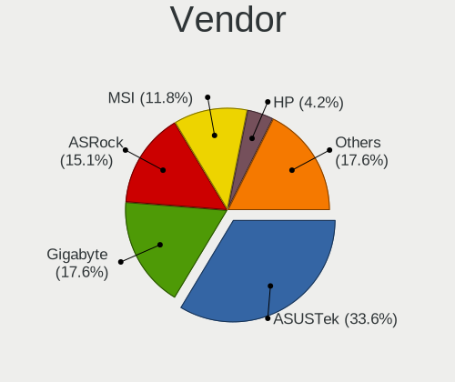

| Name                | Desktops | Percent |
|---------------------|----------|---------|
| ASUSTek Computer    | 40       | 33.61%  |
| Gigabyte Technology | 21       | 17.65%  |
| ASRock              | 18       | 15.13%  |
| MSI                 | 14       | 11.76%  |
| Hewlett-Packard     | 5        | 4.2%    |
| Unknown             | 3        | 2.52%   |
| Lenovo              | 2        | 1.68%   |
| Foxconn             | 2        | 1.68%   |
| ZOTAC               | 1        | 0.84%   |
| TYAN Computer       | 1        | 0.84%   |
| Supermicro          | 1        | 0.84%   |
| Pegatron            | 1        | 0.84%   |
| NEC Computers       | 1        | 0.84%   |
| Medion              | 1        | 0.84%   |
| Intel               | 1        | 0.84%   |
| Huanan              | 1        | 0.84%   |
| HPE                 | 1        | 0.84%   |
| Gateway             | 1        | 0.84%   |
| Fujitsu Siemens     | 1        | 0.84%   |
| Dell                | 1        | 0.84%   |
| AMD                 | 1        | 0.84%   |
| Aierben             | 1        | 0.84%   |

Model
-----

Motherboard model

| Name                                 | Desktops | Percent |
|--------------------------------------|----------|---------|
| HP ProLiant MicroServer Gen8         | 3        | 2.52%   |
| ASUS TUF Gaming X570-PLUS            | 3        | 2.52%   |
| ASRock X570 Taichi                   | 3        | 2.52%   |
| Unknown                              | 3        | 2.52%   |
| MSI MS-7B85                          | 2        | 1.68%   |
| Gigabyte X570S AORUS ELITE AX        | 2        | 1.68%   |
| ASUS ROG STRIX Z590-F GAMING WIFI    | 2        | 1.68%   |
| ASUS ROG STRIX X570-E GAMING         | 2        | 1.68%   |
| ASUS ROG STRIX B650E-F GAMING WIFI   | 2        | 1.68%   |
| ASUS M3A78-CM                        | 2        | 1.68%   |
| ASUS All Series                      | 2        | 1.68%   |
| ZOTAC H67ITX-C-E                     | 1        | 0.84%   |
| TYAN VT82C694T                       | 1        | 0.84%   |
| Supermicro SSG-6028R-ER12-HDP-AI050  | 1        | 0.84%   |
| Pegatron 810-170st                   | 1        | 0.84%   |
| NEC Computers PC-MKM30BZG4           | 1        | 0.84%   |
| MSI MS-7D67                          | 1        | 0.84%   |
| MSI MS-7D15                          | 1        | 0.84%   |
| MSI MS-7D09                          | 1        | 0.84%   |
| MSI MS-7C91                          | 1        | 0.84%   |
| MSI MS-7C79                          | 1        | 0.84%   |
| MSI MS-7C35                          | 1        | 0.84%   |
| MSI MS-7C02                          | 1        | 0.84%   |
| MSI MS-7B18                          | 1        | 0.84%   |
| MSI MS-7A31                          | 1        | 0.84%   |
| MSI MS-7974                          | 1        | 0.84%   |
| MSI MS-7817                          | 1        | 0.84%   |
| MSI MS-7640                          | 1        | 0.84%   |
| Medion MD34100/2543                  | 1        | 0.84%   |
| Lenovo ThinkStation P520c 30BX001KUS | 1        | 0.84%   |
| Lenovo ThinkStation P340 30DJS35Q00  | 1        | 0.84%   |
| Intel T series                       | 1        | 0.84%   |
| Huanan X99-F8D V2.4                  | 1        | 0.84%   |
| HPE ProLiant MicroServer Gen10 Plus  | 1        | 0.84%   |
| HP Z420 Workstation                  | 1        | 0.84%   |
| HP 750-100ny                         | 1        | 0.84%   |
| Gigabyte Z77X-UD5H                   | 1        | 0.84%   |
| Gigabyte Z690 AORUS MASTER           | 1        | 0.84%   |
| Gigabyte Z590 UD                     | 1        | 0.84%   |
| Gigabyte Z390 GAMING X               | 1        | 0.84%   |

Model Family
------------

Motherboard model prefix

| Name                                | Desktops | Percent |
|-------------------------------------|----------|---------|
| ASUS ROG                            | 14       | 11.76%  |
| ASUS PRIME                          | 10       | 8.4%    |
| ASUS TUF                            | 7        | 5.88%   |
| ASRock X570                         | 5        | 4.2%    |
| HP ProLiant                         | 3        | 2.52%   |
| ASRock X670E                        | 3        | 2.52%   |
| Unknown                             | 3        | 2.52%   |
| MSI MS-7B85                         | 2        | 1.68%   |
| Lenovo ThinkStation                 | 2        | 1.68%   |
| Gigabyte Z390                       | 2        | 1.68%   |
| Gigabyte X570S                      | 2        | 1.68%   |
| Gigabyte X570                       | 2        | 1.68%   |
| ASUS M3A78-CM                       | 2        | 1.68%   |
| ASUS All                            | 2        | 1.68%   |
| ZOTAC H67ITX-C-E                    | 1        | 0.84%   |
| TYAN VT82C694T                      | 1        | 0.84%   |
| Supermicro SSG-6028R-ER12-HDP-AI050 | 1        | 0.84%   |
| Pegatron 810-170st                  | 1        | 0.84%   |
| NEC Computers PC-MKM30BZG4          | 1        | 0.84%   |
| MSI MS-7D67                         | 1        | 0.84%   |
| MSI MS-7D15                         | 1        | 0.84%   |
| MSI MS-7D09                         | 1        | 0.84%   |
| MSI MS-7C91                         | 1        | 0.84%   |
| MSI MS-7C79                         | 1        | 0.84%   |
| MSI MS-7C35                         | 1        | 0.84%   |
| MSI MS-7C02                         | 1        | 0.84%   |
| MSI MS-7B18                         | 1        | 0.84%   |
| MSI MS-7A31                         | 1        | 0.84%   |
| MSI MS-7974                         | 1        | 0.84%   |
| MSI MS-7817                         | 1        | 0.84%   |
| MSI MS-7640                         | 1        | 0.84%   |
| Medion MD34100                      | 1        | 0.84%   |
| Intel T                             | 1        | 0.84%   |
| Huanan X99-F8D                      | 1        | 0.84%   |
| HPE ProLiant                        | 1        | 0.84%   |
| HP Z420                             | 1        | 0.84%   |
| HP 750-100ny                        | 1        | 0.84%   |
| Gigabyte Z77X-UD5H                  | 1        | 0.84%   |
| Gigabyte Z690                       | 1        | 0.84%   |
| Gigabyte Z590                       | 1        | 0.84%   |

MFG Year
--------

Motherboard manufacture year

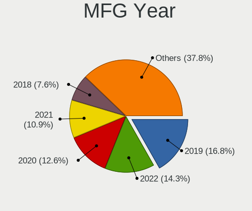

| Year | Desktops | Percent |
|------|----------|---------|
| 2019 | 20       | 16.81%  |
| 2022 | 17       | 14.29%  |
| 2020 | 15       | 12.61%  |
| 2021 | 13       | 10.92%  |
| 2018 | 9        | 7.56%   |
| 2013 | 7        | 5.88%   |
| 2017 | 5        | 4.2%    |
| 2012 | 5        | 4.2%    |
| 2023 | 4        | 3.36%   |
| 2010 | 4        | 3.36%   |
| 2009 | 4        | 3.36%   |
| 2008 | 4        | 3.36%   |
| 2016 | 3        | 2.52%   |
| 2015 | 3        | 2.52%   |
| 2014 | 3        | 2.52%   |
| 2011 | 1        | 0.84%   |
| 2003 | 1        | 0.84%   |
| 2002 | 1        | 0.84%   |

Form Factor
-----------

Physical design of the computer

| Name    | Desktops | Percent |
|---------|----------|---------|
| Desktop | 119      | 100%    |

Secure Boot
-----------

Enabled or disabled

| State    | Desktops | Percent |
|----------|----------|---------|
| Disabled | 117      | 98.32%  |
| Enabled  | 2        | 1.68%   |

Coreboot
--------

Have coreboot on board

| Used | Desktops | Percent |
|------|----------|---------|
| No   | 119      | 100%    |

RAM Size
--------

Total RAM memory

| Size in GB      | Desktops | Percent |
|-----------------|----------|---------|
| 32.01-64.0      | 32       | 26.45%  |
| 64.01-256.0     | 32       | 26.45%  |
| 16.01-24.0      | 20       | 16.53%  |
| 24.01-32.0      | 11       | 9.09%   |
| 8.01-16.0       | 8        | 6.61%   |
| 4.01-8.0        | 6        | 4.96%   |
| 3.01-4.0        | 6        | 4.96%   |
| 1.01-2.0        | 3        | 2.48%   |
| 2.01-3.0        | 2        | 1.65%   |
| More than 256.0 | 1        | 0.83%   |

RAM Used
--------

Used RAM memory

| Used GB    | Desktops | Percent |
|------------|----------|---------|
| 4.01-8.0   | 29       | 21.32%  |
| 2.01-3.0   | 27       | 19.85%  |
| 3.01-4.0   | 19       | 13.97%  |
| 8.01-16.0  | 18       | 13.24%  |
| 1.01-2.0   | 16       | 11.76%  |
| 0.01-0.5   | 10       | 7.35%   |
| 0.51-1.0   | 8        | 5.88%   |
| 16.01-24.0 | 7        | 5.15%   |
| 32.01-64.0 | 1        | 0.74%   |
| 24.01-32.0 | 1        | 0.74%   |

Total Drives
------------

Number of drives on board

| Drives | Desktops | Percent |
|--------|----------|---------|
| 2      | 26       | 21.67%  |
| 1      | 26       | 21.67%  |
| 3      | 22       | 18.33%  |
| 4      | 16       | 13.33%  |
| 5      | 14       | 11.67%  |
| 6      | 7        | 5.83%   |
| 7      | 3        | 2.5%    |
| 8      | 2        | 1.67%   |
| 21     | 1        | 0.83%   |
| 13     | 1        | 0.83%   |
| 10     | 1        | 0.83%   |
| 0      | 1        | 0.83%   |

Has CD-ROM
----------

Has CD-ROM on board

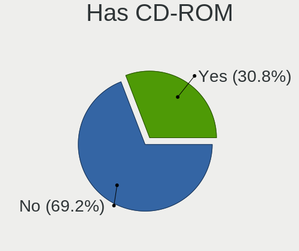

| Presented | Desktops | Percent |
|-----------|----------|---------|
| No        | 83       | 69.17%  |
| Yes       | 37       | 30.83%  |

Has Ethernet
------------

Has Ethernet on board

| Presented | Desktops | Percent |
|-----------|----------|---------|
| Yes       | 118      | 99.16%  |
| No        | 1        | 0.84%   |

Has WiFi
--------

Has WiFi module

| Presented | Desktops | Percent |
|-----------|----------|---------|
| Yes       | 61       | 50.83%  |
| No        | 59       | 49.17%  |

Has Bluetooth
-------------

Has Bluetooth module

| Presented | Desktops | Percent |
|-----------|----------|---------|
| No        | 64       | 52.03%  |
| Yes       | 59       | 47.97%  |

Location
--------

Country
-------

Geographic location (country)

| Country      | Desktops | Percent |
|--------------|----------|---------|
| USA          | 33       | 27.27%  |
| Germany      | 23       | 19.01%  |
| UK           | 9        | 7.44%   |
| France       | 8        | 6.61%   |
| Russia       | 7        | 5.79%   |
| Poland       | 7        | 5.79%   |
| Sweden       | 4        | 3.31%   |
| Canada       | 3        | 2.48%   |
| Brazil       | 3        | 2.48%   |
| Vietnam      | 2        | 1.65%   |
| Finland      | 2        | 1.65%   |
| Czechia      | 2        | 1.65%   |
| Belgium      | 2        | 1.65%   |
| Ukraine      | 1        | 0.83%   |
| Switzerland  | 1        | 0.83%   |
| Spain        | 1        | 0.83%   |
| South Africa | 1        | 0.83%   |
| Netherlands  | 1        | 0.83%   |
| Mexico       | 1        | 0.83%   |
| Luxembourg   | 1        | 0.83%   |
| Kazakhstan   | 1        | 0.83%   |
| Japan        | 1        | 0.83%   |
| Italy        | 1        | 0.83%   |
| Israel       | 1        | 0.83%   |
| Indonesia    | 1        | 0.83%   |
| Hungary      | 1        | 0.83%   |
| Denmark      | 1        | 0.83%   |
| Croatia      | 1        | 0.83%   |
| China        | 1        | 0.83%   |

City
----

Geographic location (city)

| City              | Desktops | Percent |
|-------------------|----------|---------|
| Berlin            | 5        | 3.94%   |
| Paris             | 4        | 3.15%   |
| Warsaw            | 3        | 2.36%   |
| Sterling          | 3        | 2.36%   |
| Moscow            | 3        | 2.36%   |
| Frankfurt am Main | 3        | 2.36%   |
| Cieszyn           | 3        | 2.36%   |
| Vladivostok       | 2        | 1.57%   |
| Summerville       | 2        | 1.57%   |
| lapanice        | 2        | 1.57%   |
| Leeds             | 2        | 1.57%   |
| Hanoi             | 2        | 1.57%   |
| Flint             | 2        | 1.57%   |
| Bothell           | 2        | 1.57%   |
| Beaverton         | 2        | 1.57%   |
| Zurich            | 1        | 0.79%   |
| Yucaipa           | 1        | 0.79%   |
| Woburn            | 1        | 0.79%   |
| Wheaton           | 1        | 0.79%   |
| Vista             | 1        | 0.79%   |
| Viernheim         | 1        | 0.79%   |
| Vechta            | 1        | 0.79%   |
| Vsters        | 1        | 0.79%   |
| Vancouver         | 1        | 0.79%   |
| Troisdorf         | 1        | 0.79%   |
| Tampere           | 1        | 0.79%   |
| Surabaya          | 1        | 0.79%   |
| Stockholm         | 1        | 0.79%   |
| Stade             | 1        | 0.79%   |
| St Petersburg     | 1        | 0.79%   |
| Spy               | 1        | 0.79%   |
| Shanghai          | 1        | 0.79%   |
| Seattle           | 1        | 0.79%   |
| Sao Paulo         | 1        | 0.79%   |
| Santa Ana         | 1        | 0.79%   |
| San Jose          | 1        | 0.79%   |
| San Francisco     | 1        | 0.79%   |
| San Antonio       | 1        | 0.79%   |
| Round Rock        | 1        | 0.79%   |
| Rotterdam         | 1        | 0.79%   |

Drives
------

Drive Vendor
------------

Hard drive vendors

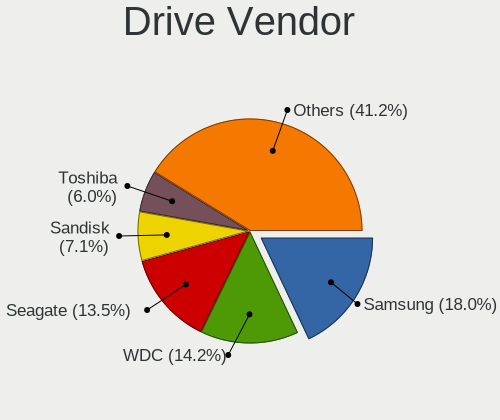

| Vendor                      | Desktops | Drives | Percent |
|-----------------------------|----------|--------|---------|
| Samsung Electronics         | 48       | 102    | 17.98%  |
| WDC                         | 38       | 78     | 14.23%  |
| Seagate                     | 36       | 85     | 13.48%  |
| Sandisk                     | 19       | 23     | 7.12%   |
| Toshiba                     | 16       | 24     | 5.99%   |
| Crucial                     | 16       | 34     | 5.99%   |
| Kingston                    | 12       | 15     | 4.49%   |
| Phison Electronics          | 10       | 14     | 3.75%   |
| Hitachi                     | 8        | 29     | 3%      |
| Intel                       | 7        | 9      | 2.62%   |
| China                       | 7        | 19     | 2.62%   |
| Kingston Technology Company | 5        | 5      | 1.87%   |
| Micron/Crucial Technology   | 4        | 5      | 1.5%    |
| Silicon Motion              | 3        | 4      | 1.12%   |
| Realtek Semiconductor       | 3        | 5      | 1.12%   |
| OCZ                         | 3        | 3      | 1.12%   |
| MAXIO Technology (Hangzhou) | 3        | 3      | 1.12%   |
| GOODRAM                     | 3        | 16     | 1.12%   |
| SK hynix                    | 2        | 2      | 0.75%   |
| PNY                         | 2        | 4      | 0.75%   |
| Phison                      | 2        | 3      | 0.75%   |
| Micron Technology           | 2        | 4      | 0.75%   |
| HGST                        | 2        | 2      | 0.75%   |
| ADROITLARK                  | 2        | 3      | 0.75%   |
| A-DATA Technology           | 2        | 2      | 0.75%   |
| Verbatim                    | 1        | 1      | 0.37%   |
| V-GeN                       | 1        | 1      | 0.37%   |
| Unknown                     | 1        | 1      | 0.37%   |
| Transcend                   | 1        | 1      | 0.37%   |
| T-FORCE                     | 1        | 1      | 0.37%   |
| SABRENT                     | 1        | 1      | 0.37%   |
| Netac                       | 1        | 1      | 0.37%   |
| Maxtor                      | 1        | 1      | 0.37%   |
| LITEONIT                    | 1        | 2      | 0.37%   |
| KingSpec                    | 1        | 1      | 0.37%   |
| ADATA Technology            | 1        | 2      | 0.37%   |
| Unknown                     | 1        | 1      | 0.37%   |

Drive Model
-----------

Hard drive models

| Model                                                 | Desktops | Percent |
|-------------------------------------------------------|----------|---------|
| Samsung NVMe SSD Controller SM981/PM981/PM983 512GB   | 14       | 4.23%   |
| Samsung NVMe SSD Controller PM9A1/PM9A3/980PRO 2TB    | 14       | 4.23%   |
| Seagate ST4000DM004-2CV104 4TB                        | 6        | 1.81%   |
| Samsung SSD 980 1TB                                   | 5        | 1.51%   |
| Crucial CT1000MX500SSD1 1TB                           | 5        | 1.51%   |
| Seagate ST1000DM010-2EP102 1TB                        | 4        | 1.21%   |
| Sandisk WD_BLACK SN770 1TB                            | 4        | 1.21%   |
| Samsung NVMe SSD Controller SM961/PM961/SM963 250GB   | 4        | 1.21%   |
| WDC WD30EFRX-68EUZN0 3TB                              | 3        | 0.91%   |
| Toshiba DT01ACA200 2TB                                | 3        | 0.91%   |
| Toshiba DT01ACA100 1TB                                | 3        | 0.91%   |
| Silicon Motion SM2263EN/SM2263XT SSD Controller 500GB | 3        | 0.91%   |
| Sandisk WD Blue SN550 NVMe SSD 1TB                    | 3        | 0.91%   |
| Samsung SSD 870 EVO 1TB                               | 3        | 0.91%   |
| Samsung SSD 860 EVO 1TB                               | 3        | 0.91%   |
| Phison E12 NVMe Controller 1TB                        | 3        | 0.91%   |
| Micron/Crucial P2 NVMe PCIe SSD 4TB                   | 3        | 0.91%   |
| MAXIO (Hangzhou) NVMe SSD Controller MAP1202 256GB    | 3        | 0.91%   |
| Kingston SA400S37480G 480GB SSD                       | 3        | 0.91%   |
| Intel SSD 660P Series 1TB                             | 3        | 0.91%   |
| WDC WDS500G2B0A-00SM50 500GB SSD                      | 2        | 0.6%    |
| WDC WD80EFAX-68KNBN0 8TB                              | 2        | 0.6%    |
| WDC WD5000LPLX-66ZNTT1 500GB                          | 2        | 0.6%    |
| WDC WD40EZRZ-00GXCB0 4TB                              | 2        | 0.6%    |
| WDC WD30EFRX-68AX9N0 3TB                              | 2        | 0.6%    |
| WDC WD20EARX-00PASB0 2TB                              | 2        | 0.6%    |
| WDC WD2003FZEX-00SRLA0 2TB                            | 2        | 0.6%    |
| WDC WD1502FYPS-02W3B0 1TB                             | 2        | 0.6%    |
| WDC WD120EFBX-68B0EN0 12TB                            | 2        | 0.6%    |
| Seagate ST6000DM003-2CY186 6TB                        | 2        | 0.6%    |
| Seagate ST2000DM001-1ER164 2TB                        | 2        | 0.6%    |
| Sandisk WD Black SN750 / PC SN730 NVMe SSD 2TB        | 2        | 0.6%    |
| Samsung SSD 870 QVO 2TB                               | 2        | 0.6%    |
| Samsung SSD 860 EVO 500GB                             | 2        | 0.6%    |
| Samsung SSD 860 EVO 4TB                               | 2        | 0.6%    |
| Samsung SSD 850 EVO 250GB                             | 2        | 0.6%    |
| Phison E7 NVMe Controller 480GB                       | 2        | 0.6%    |
| Phison E16 PCIe4 NVMe Controller 2TB                  | 2        | 0.6%    |
| Phison Corsair MP600 PRO XT 2TB                       | 2        | 0.6%    |
| Kingston Company SNV2S2000G 2TB                       | 2        | 0.6%    |

HDD Vendor
----------

Hard disk drive vendors

| Vendor              | Desktops | Drives | Percent |
|---------------------|----------|--------|---------|
| Seagate             | 36       | 83     | 35.64%  |
| WDC                 | 34       | 72     | 33.66%  |
| Toshiba             | 15       | 23     | 14.85%  |
| Hitachi             | 8        | 29     | 7.92%   |
| Samsung Electronics | 3        | 3      | 2.97%   |
| HGST                | 2        | 2      | 1.98%   |
| Unknown             | 1        | 1      | 0.99%   |
| SABRENT             | 1        | 1      | 0.99%   |
| Maxtor              | 1        | 1      | 0.99%   |

SSD Vendor
----------

Solid state drive vendors

| Vendor              | Desktops | Drives | Percent |
|---------------------|----------|--------|---------|
| Samsung Electronics | 24       | 42     | 24.74%  |
| Crucial             | 16       | 34     | 16.49%  |
| Kingston            | 11       | 13     | 11.34%  |
| SanDisk             | 8        | 10     | 8.25%   |
| China               | 7        | 19     | 7.22%   |
| WDC                 | 5        | 6      | 5.15%   |
| OCZ                 | 3        | 3      | 3.09%   |
| Intel               | 3        | 4      | 3.09%   |
| GOODRAM             | 3        | 16     | 3.09%   |
| PNY                 | 2        | 4      | 2.06%   |
| Micron Technology   | 2        | 4      | 2.06%   |
| ADROITLARK          | 2        | 3      | 2.06%   |
| A-DATA Technology   | 2        | 2      | 2.06%   |
| Verbatim            | 1        | 1      | 1.03%   |
| V-GeN               | 1        | 1      | 1.03%   |
| Transcend           | 1        | 1      | 1.03%   |
| Toshiba             | 1        | 1      | 1.03%   |
| T-FORCE             | 1        | 1      | 1.03%   |
| Netac               | 1        | 1      | 1.03%   |
| LITEONIT            | 1        | 2      | 1.03%   |
| KingSpec            | 1        | 1      | 1.03%   |
| Unknown             | 1        | 1      | 1.03%   |

Drive Kind
----------

HDD or SSD

| Kind    | Desktops | Drives | Percent |
|---------|----------|--------|---------|
| HDD     | 72       | 215    | 34.95%  |
| SSD     | 69       | 170    | 33.5%   |
| NVMe    | 63       | 119    | 30.58%  |
| Unknown | 2        | 3      | 0.97%   |

Drive Connector
---------------

SATA, SAS, NVMe, etc.

| Type | Desktops | Drives | Percent |
|------|----------|--------|---------|
| SATA | 100      | 375    | 59.17%  |
| NVMe | 63       | 119    | 37.28%  |
| SAS  | 6        | 13     | 3.55%   |

Drive Size
----------

Size of hard drive

| Size in TB | Desktops | Drives | Percent |
|------------|----------|--------|---------|
| 0.01-0.5   | 62       | 111    | 33.16%  |
| 0.51-1.0   | 47       | 107    | 25.13%  |
| 1.01-2.0   | 31       | 49     | 16.58%  |
| 3.01-4.0   | 20       | 41     | 10.7%   |
| 4.01-10.0  | 15       | 36     | 8.02%   |
| 2.01-3.0   | 8        | 32     | 4.28%   |
| 10.01-20.0 | 4        | 9      | 2.14%   |

Space Total
-----------

Amount of disk space available on the file system

| Size in GB     | Desktops | Percent |
|----------------|----------|---------|
| More than 3000 | 36       | 29.03%  |
| 501-1000       | 24       | 19.35%  |
| 1001-2000      | 15       | 12.1%   |
| 251-500        | 14       | 11.29%  |
| 2001-3000      | 9        | 7.26%   |
| 101-250        | 7        | 5.65%   |
| 1-20           | 7        | 5.65%   |
| 51-100         | 6        | 4.84%   |
| Unknown        | 6        | 4.84%   |

Space Used
----------

Amount of used disk space

| Used GB        | Desktops | Percent |
|----------------|----------|---------|
| 1-20           | 23       | 17.97%  |
| More than 3000 | 20       | 15.63%  |
| 501-1000       | 18       | 14.06%  |
| 1001-2000      | 15       | 11.72%  |
| 251-500        | 12       | 9.38%   |
| 21-50          | 11       | 8.59%   |
| 101-250        | 11       | 8.59%   |
| 51-100         | 8        | 6.25%   |
| Unknown        | 6        | 4.69%   |
| 2001-3000      | 4        | 3.13%   |

Malfunc. Drives
---------------

Drive models with a malfunction

| Model                                                     | Desktops | Drives | Percent |
|-----------------------------------------------------------|----------|--------|---------|
| Toshiba DT01ACA200 2TB                                    | 2        | 2      | 6.9%    |
| WDC WD60PURZ-85ZUFY1 6TB                                  | 1        | 1      | 3.45%   |
| WDC WD60EZRX-00MVLB1 6TB                                  | 1        | 1      | 3.45%   |
| WDC WD60EFAX-68SHWN0 6TB                                  | 1        | 1      | 3.45%   |
| WDC WD30EFRX-68EUZN0 3TB                                  | 1        | 2      | 3.45%   |
| WDC WD30EFRX-68AX9N0 3TB                                  | 1        | 1      | 3.45%   |
| Toshiba MK1633GSG 160GB                                   | 1        | 1      | 3.45%   |
| Seagate ST750LM022 HN-M750MBB 752GB                       | 1        | 1      | 3.45%   |
| Seagate ST500DM002-1BC142 500GB                           | 1        | 1      | 3.45%   |
| Seagate ST4000VN008-2DR166 4TB                            | 1        | 2      | 3.45%   |
| Seagate ST380011A 80GB                                    | 1        | 1      | 3.45%   |
| Seagate ST3500630NS 500GB                                 | 1        | 2      | 3.45%   |
| Seagate ST3000DM001-9YN166 3TB                            | 1        | 1      | 3.45%   |
| Seagate ST2000DX002-2DV164 2TB                            | 1        | 1      | 3.45%   |
| Seagate ST2000DM001-1CH164 2TB                            | 1        | 1      | 3.45%   |
| Seagate ST1000DM010-2EP102 1TB                            | 1        | 1      | 3.45%   |
| SanDisk SSD PLUS 480GB                                    | 1        | 1      | 3.45%   |
| Samsung Electronics SSD 980 1TB                           | 1        | 1      | 3.45%   |
| Samsung Electronics SSD 870 EVO 1TB                       | 1        | 8      | 3.45%   |
| Samsung Electronics SP2504C 250GB                         | 1        | 1      | 3.45%   |
| Realtek Semiconductor RTS5763DL NVMe SSD Controller 256GB | 1        | 2      | 3.45%   |
| PNY SSD2SC120G1LC763C121S459P 120GB                       | 1        | 1      | 3.45%   |
| Intel SSDSCKKF180G8L 180GB                                | 1        | 1      | 3.45%   |
| Intel SSDSC2BB160G4T 160GB                                | 1        | 2      | 3.45%   |
| Hitachi HTS721080G9SA00 80GB                              | 1        | 1      | 3.45%   |
| Crucial M4-CT512M4SSD2 512GB                              | 1        | 1      | 3.45%   |
| China SSD 240GB                                           | 1        | 1      | 3.45%   |
| China SATA SSD 960GB                                      | 1        | 2      | 3.45%   |

Malfunc. Drive Vendor
---------------------

Vendors of faulty drives

| Vendor                | Desktops | Drives | Percent |
|-----------------------|----------|--------|---------|
| Seagate               | 8        | 11     | 29.63%  |
| WDC                   | 4        | 6      | 14.81%  |
| Toshiba               | 3        | 3      | 11.11%  |
| Samsung Electronics   | 3        | 10     | 11.11%  |
| Intel                 | 2        | 3      | 7.41%   |
| China                 | 2        | 3      | 7.41%   |
| SanDisk               | 1        | 1      | 3.7%    |
| Realtek Semiconductor | 1        | 2      | 3.7%    |
| PNY                   | 1        | 1      | 3.7%    |
| Hitachi               | 1        | 1      | 3.7%    |
| Crucial               | 1        | 1      | 3.7%    |

Malfunc. HDD Vendor
-------------------

Vendors of faulty HDD drives

| Vendor              | Desktops | Drives | Percent |
|---------------------|----------|--------|---------|
| Seagate             | 8        | 11     | 47.06%  |
| WDC                 | 4        | 6      | 23.53%  |
| Toshiba             | 3        | 3      | 17.65%  |
| Samsung Electronics | 1        | 1      | 5.88%   |
| Hitachi             | 1        | 1      | 5.88%   |

Malfunc. Drive Kind
-------------------

Kinds of faulty drives

| Kind | Desktops | Drives | Percent |
|------|----------|--------|---------|
| HDD  | 15       | 22     | 60%     |
| SSD  | 8        | 17     | 32%     |
| NVMe | 2        | 3      | 8%      |

Failed Drives
-------------

Failed drive models

| Model                    | Desktops | Drives | Percent |
|--------------------------|----------|--------|---------|
| WDC WD20EARS-00MVWB0 2TB | 1        | 2      | 100%    |

Failed Drive Vendor
-------------------

Failed drive vendors

| Vendor | Desktops | Drives | Percent |
|--------|----------|--------|---------|
| WDC    | 1        | 2      | 100%    |

Drive Status
------------

Number of failed and malfunc. drives

| Status   | Desktops | Drives | Percent |
|----------|----------|--------|---------|
| Works    | 109      | 429    | 75.17%  |
| Malfunc  | 24       | 42     | 16.55%  |
| Detected | 11       | 34     | 7.59%   |
| Failed   | 1        | 2      | 0.69%   |

Storage controller
------------------

Storage Vendor
--------------

Storage controller vendors

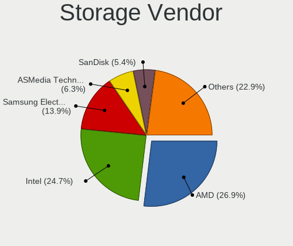

| Vendor                      | Desktops | Percent |
|-----------------------------|----------|---------|
| AMD                         | 60       | 26.91%  |
| Intel                       | 55       | 24.66%  |
| Samsung Electronics         | 31       | 13.9%   |
| ASMedia Technology          | 14       | 6.28%   |
| SanDisk                     | 12       | 5.38%   |
| Phison Electronics          | 11       | 4.93%   |
| Kingston Technology Company | 6        | 2.69%   |
| Marvell Technology Group    | 5        | 2.24%   |
| Micron/Crucial Technology   | 4        | 1.79%   |
| JMicron Technology          | 4        | 1.79%   |
| Silicon Motion              | 3        | 1.35%   |
| Realtek Semiconductor       | 3        | 1.35%   |
| Nvidia                      | 3        | 1.35%   |
| MAXIO Technology (Hangzhou) | 3        | 1.35%   |
| Broadcom / LSI              | 3        | 1.35%   |
| SK hynix                    | 2        | 0.9%    |
| VIA Technologies            | 1        | 0.45%   |
| Silicon Image               | 1        | 0.45%   |
| LSI Logic / Symbios Logic   | 1        | 0.45%   |
| ADATA Technology            | 1        | 0.45%   |

Storage Model
-------------

Storage controller models

| Model                                                                          | Desktops | Percent |
|--------------------------------------------------------------------------------|----------|---------|
| AMD FCH SATA Controller [AHCI mode]                                            | 44       | 17.12%  |
| Samsung NVMe SSD Controller SM981/PM981/PM983                                  | 14       | 5.45%   |
| Samsung NVMe SSD Controller PM9A1/PM9A3/980PRO                                 | 14       | 5.45%   |
| ASMedia ASM1062 Serial ATA Controller                                          | 12       | 4.67%   |
| Intel Cannon Lake PCH SATA AHCI Controller                                     | 7        | 2.72%   |
| AMD 400 Series Chipset SATA Controller                                         | 7        | 2.72%   |
| Samsung NVMe SSD Controller 980 (DRAM-less)                                    | 6        | 2.33%   |
| Intel 500 Series Chipset Family SATA AHCI Controller                           | 6        | 2.33%   |
| AMD 500 Series Chipset SATA Controller                                         | 6        | 2.33%   |
| Phison E18 PCIe4 NVMe Controller                                               | 5        | 1.95%   |
| SanDisk WD Black SN770 / PC SN740 256GB / PC SN560 (DRAM-less) NVMe SSD        | 4        | 1.56%   |
| Samsung NVMe SSD Controller SM961/PM961/SM963                                  | 4        | 1.56%   |
| Intel Q170/Q150/B150/H170/H110/Z170/CM236 Chipset SATA Controller [AHCI Mode]  | 4        | 1.56%   |
| Intel 8 Series/C220 Series Chipset Family 6-port SATA Controller 1 [AHCI mode] | 4        | 1.56%   |
| Intel 6 Series/C200 Series Chipset Family 6 port Desktop SATA AHCI Controller  | 4        | 1.56%   |
| AMD SB7x0/SB8x0/SB9x0 SATA Controller [AHCI mode]                              | 4        | 1.56%   |
| AMD SB7x0/SB8x0/SB9x0 IDE Controller                                           | 4        | 1.56%   |
| Silicon Motion SM2263EN/SM2263XT (DRAM-less) NVMe SSD Controllers              | 3        | 1.17%   |
| SanDisk Ultra 3D / WD Blue SN550 NVMe SSD                                      | 3        | 1.17%   |
| Phison E12 NVMe Controller                                                     | 3        | 1.17%   |
| Micron/Crucial P2 [Nick P2] / P3 / P3 Plus NVMe PCIe SSD (DRAM-less)           | 3        | 1.17%   |
| MAXIO (Hangzhou) NVMe SSD Controller MAP1202                                   | 3        | 1.17%   |
| Intel SSD 660P Series                                                          | 3        | 1.17%   |
| Intel NM10/ICH7 Family SATA Controller [AHCI mode]                             | 3        | 1.17%   |
| Intel Comet Lake SATA AHCI Controller                                          | 3        | 1.17%   |
| Intel Alder Lake-S PCH SATA Controller [AHCI Mode]                             | 3        | 1.17%   |
| AMD SB7x0/SB8x0/SB9x0 SATA Controller [IDE mode]                               | 3        | 1.17%   |
| SanDisk Ultra 3D / WD Blue SN570 NVMe SSD (DRAM-less)                          | 2        | 0.78%   |
| SanDisk Extreme Pro / WD Black SN750 / PC SN730 / Red SN700 NVMe SSD           | 2        | 0.78%   |
| Realtek RTS5765DL NVMe SSD Controller (DRAM-less)                              | 2        | 0.78%   |
| Phison E7 NVMe Controller                                                      | 2        | 0.78%   |
| Phison E16 PCIe4 NVMe Controller                                               | 2        | 0.78%   |
| Nvidia MCP79 SATA Controller                                                   | 2        | 0.78%   |
| Kingston Company NV2 NVMe SSD SM2267XT                                         | 2        | 0.78%   |
| Kingston Company KC3000/FURY Renegade NVMe SSD E18                             | 2        | 0.78%   |
| Kingston Company A2000 NVMe SSD SM2263EN                                       | 2        | 0.78%   |
| Intel Volume Management Device NVMe RAID Controller                            | 2        | 0.78%   |
| Intel C600/X79 series chipset 6-Port SATA AHCI Controller                      | 2        | 0.78%   |
| Intel 7 Series/C210 Series Chipset Family 6-port SATA Controller [AHCI mode]   | 2        | 0.78%   |
| Intel 200 Series PCH SATA controller [AHCI mode]                               | 2        | 0.78%   |

Storage Kind
------------

Kind of storage controller (IDE, SATA, NVMe, SAS, ...)

| Kind | Desktops | Percent |
|------|----------|---------|
| SATA | 109      | 55.05%  |
| NVMe | 63       | 31.82%  |
| IDE  | 15       | 7.58%   |
| RAID | 7        | 3.54%   |
| SAS  | 4        | 2.02%   |

Processor
---------

CPU Vendor
----------

Processor vendors

| Vendor | Desktops | Percent |
|--------|----------|---------|
| AMD    | 61       | 51.26%  |
| Intel  | 58       | 48.74%  |

CPU Model
---------

Processor models

| Model                                    | Desktops | Percent |
|------------------------------------------|----------|---------|
| AMD Ryzen 9 7900X 12-Core Processor      | 7        | 5.88%   |
| AMD Ryzen 9 7950X 16-Core Processor      | 4        | 3.36%   |
| AMD Ryzen 9 3900X 12-Core Processor      | 4        | 3.36%   |
| AMD Ryzen 7 3700X 8-Core Processor       | 4        | 3.36%   |
| AMD Ryzen 5 5600X 6-Core Processor       | 4        | 3.36%   |
| Intel Xeon CPU E3-1230 V2 @ 3.30GHz      | 3        | 2.52%   |
| Intel Core i7-10700K CPU @ 3.80GHz       | 3        | 2.52%   |
| AMD Ryzen 9 5950X 16-Core Processor      | 3        | 2.52%   |
| AMD Ryzen 9 5900X 12-Core Processor      | 3        | 2.52%   |
| Intel Core i9-9900K CPU @ 3.60GHz        | 2        | 1.68%   |
| Intel Core i9-10850K CPU @ 3.60GHz       | 2        | 1.68%   |
| Intel Core i7-3770 CPU @ 3.40GHz         | 2        | 1.68%   |
| Intel Atom CPU D510 @ 1.66GHz            | 2        | 1.68%   |
| Intel Atom CPU 330 @ 1.60GHz             | 2        | 1.68%   |
| Intel 11th Gen Core i9-11900KF @ 3.50GHz | 2        | 1.68%   |
| AMD Ryzen 9 3950X 16-Core Processor      | 2        | 1.68%   |
| AMD Ryzen 7 5800X3D 8-Core Processor     | 2        | 1.68%   |
| AMD Ryzen 5 7600X 6-Core Processor       | 2        | 1.68%   |
| AMD Ryzen 5 5500                         | 2        | 1.68%   |
| AMD Phenom II X4 955 Processor           | 2        | 1.68%   |
| AMD FX-8300 Eight-Core Processor         | 2        | 1.68%   |
| Intel Xeon W-2145 CPU @ 3.70GHz          | 1        | 0.84%   |
| Intel Xeon E-2224 CPU @ 3.40GHz          | 1        | 0.84%   |
| Intel Xeon CPU E5-2696 v4 @ 2.20GHz      | 1        | 0.84%   |
| Intel Xeon CPU E5-2680 v4 @ 2.40GHz      | 1        | 0.84%   |
| Intel Xeon CPU E5-1680 v2 @ 3.00GHz      | 1        | 0.84%   |
| Intel Pentium III CPU - S 1400MHz        | 1        | 0.84%   |
| Intel Pentium CPU G3220 @ 3.00GHz        | 1        | 0.84%   |
| Intel Pentium 4 CPU 2.66GHz              | 1        | 0.84%   |
| Intel N100                               | 1        | 0.84%   |
| Intel Core i7-9700KF CPU @ 3.60GHz       | 1        | 0.84%   |
| Intel Core i7-9700 CPU @ 3.00GHz         | 1        | 0.84%   |
| Intel Core i7-8700K CPU @ 3.70GHz        | 1        | 0.84%   |
| Intel Core i7-7800X CPU @ 3.50GHz        | 1        | 0.84%   |
| Intel Core i7-7700 CPU @ 3.60GHz         | 1        | 0.84%   |
| Intel Core i7-6700K CPU @ 4.00GHz        | 1        | 0.84%   |
| Intel Core i7-4930K CPU @ 3.40GHz        | 1        | 0.84%   |
| Intel Core i7-4790 CPU @ 3.60GHz         | 1        | 0.84%   |
| Intel Core i7-4770 CPU @ 3.40GHz         | 1        | 0.84%   |
| Intel Core i7 CPU 970 @ 3.20GHz          | 1        | 0.84%   |

CPU Model Family
----------------

Processor model prefix

| Model                | Desktops | Percent |
|----------------------|----------|---------|
| AMD Ryzen 9          | 25       | 21.01%  |
| Intel Core i7        | 16       | 13.45%  |
| AMD Ryzen 5          | 15       | 12.61%  |
| AMD Ryzen 7          | 12       | 10.08%  |
| Other                | 10       | 8.4%    |
| Intel Xeon           | 8        | 6.72%   |
| Intel Core i5        | 7        | 5.88%   |
| Intel Atom           | 5        | 4.2%    |
| Intel Core i9        | 4        | 3.36%   |
| AMD Phenom II X4     | 4        | 3.36%   |
| AMD FX               | 3        | 2.52%   |
| Intel Core i3        | 2        | 1.68%   |
| Intel Celeron        | 2        | 1.68%   |
| Intel Pentium III    | 1        | 0.84%   |
| Intel Pentium 4      | 1        | 0.84%   |
| Intel Pentium        | 1        | 0.84%   |
| Intel Core 2 Extreme | 1        | 0.84%   |
| AMD Athlon Dual Core | 1        | 0.84%   |
| AMD Athlon           | 1        | 0.84%   |

CPU Cores
---------

Number of processor cores

| Number | Desktops | Percent |
|--------|----------|---------|
| 4      | 27       | 22.69%  |
| 8      | 25       | 21.01%  |
| 6      | 22       | 18.49%  |
| 12     | 16       | 13.45%  |
| 16     | 12       | 10.08%  |
| 2      | 11       | 9.24%   |
| 10     | 2        | 1.68%   |
| 44     | 1        | 0.84%   |
| 28     | 1        | 0.84%   |
| 14     | 1        | 0.84%   |
| 1      | 1        | 0.84%   |

CPU Sockets
-----------

Number of sockets

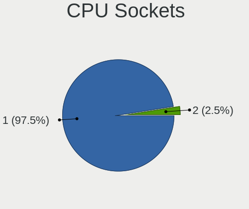

| Number | Desktops | Percent |
|--------|----------|---------|
| 1      | 116      | 97.48%  |
| 2      | 3        | 2.52%   |

CPU Threads
-----------

Threads per core (Hyper-Threading)

| Number | Desktops | Percent |
|--------|----------|---------|
| 2      | 96       | 80.67%  |
| 1      | 23       | 19.33%  |

CPU Op-Modes
------------

CPU Operation Modes (32-bit, 64-bit)

| Op mode        | Desktops | Percent |
|----------------|----------|---------|
| 32-bit, 64-bit | 117      | 98.32%  |
| 32-bit         | 2        | 1.68%   |

CPU Microcode
-------------

Microcode number

| Number     | Desktops | Percent |
|------------|----------|---------|
| Unknown    | 34       | 28.1%   |
| 0x0a601203 | 14       | 11.57%  |
| 0x08701021 | 10       | 8.26%   |
| 0x0a20120a | 6        | 4.96%   |
| 0x906ed    | 4        | 3.31%   |
| 0x0800820d | 4        | 3.31%   |
| 0x906ea    | 3        | 2.48%   |
| 0x306c3    | 3        | 2.48%   |
| 0x0a201016 | 3        | 2.48%   |
| 0xa0671    | 2        | 1.65%   |
| 0xa0655    | 2        | 1.65%   |
| 0x506e3    | 2        | 1.65%   |
| 0x406f1    | 2        | 1.65%   |
| 0x306a9    | 2        | 1.65%   |
| 0x0a50000d | 2        | 1.65%   |
| 0x08001138 | 2        | 1.65%   |
| 0xf29      | 1        | 0.83%   |
| 0xb06e0    | 1        | 0.83%   |
| 0xa0653    | 1        | 0.83%   |
| 0x906e9    | 1        | 0.83%   |
| 0x806c1    | 1        | 0.83%   |
| 0x706a1    | 1        | 0.83%   |
| 0x50654    | 1        | 0.83%   |
| 0x406c4    | 1        | 0.83%   |
| 0x306e4    | 1        | 0.83%   |
| 0x106c2    | 1        | 0.83%   |
| 0x106a5    | 1        | 0.83%   |
| 0x10676    | 1        | 0.83%   |
| 0x0a601201 | 1        | 0.83%   |
| 0x0a50000c | 1        | 0.83%   |
| 0x0a201205 | 1        | 0.83%   |
| 0x0a201025 | 1        | 0.83%   |
| 0x08701030 | 1        | 0.83%   |
| 0x08701013 | 1        | 0.83%   |
| 0x08108109 | 1        | 0.83%   |
| 0x0700010f | 1        | 0.83%   |
| 0x06000852 | 1        | 0.83%   |
| 0x06000822 | 1        | 0.83%   |
| 0x0600063e | 1        | 0.83%   |
| 0x010000db | 1        | 0.83%   |

CPU Microarch
-------------

Microarchitecture

| Name             | Desktops | Percent |
|------------------|----------|---------|
| Zen 3            | 16       | 13.45%  |
| Unknown          | 16       | 13.45%  |
| Zen 2            | 13       | 10.92%  |
| KabyLake         | 9        | 7.56%   |
| IvyBridge        | 8        | 6.72%   |
| CometLake        | 7        | 5.88%   |
| Zen+             | 5        | 4.2%    |
| Skylake          | 5        | 4.2%    |
| Bonnell          | 5        | 4.2%    |
| K10              | 4        | 3.36%   |
| Icelake          | 4        | 3.36%   |
| Haswell          | 4        | 3.36%   |
| Alderlake Hybrid | 4        | 3.36%   |
| Zen              | 2        | 1.68%   |
| Piledriver       | 2        | 1.68%   |
| Broadwell        | 2        | 1.68%   |
| Westmere         | 1        | 0.84%   |
| TigerLake        | 1        | 0.84%   |
| Silvermont       | 1        | 0.84%   |
| SandyBridge      | 1        | 0.84%   |
| Penryn           | 1        | 0.84%   |
| P6               | 1        | 0.84%   |
| NetBurst         | 1        | 0.84%   |
| Nehalem          | 1        | 0.84%   |
| K8 Hammer        | 1        | 0.84%   |
| Jaguar           | 1        | 0.84%   |
| Gracemont        | 1        | 0.84%   |
| Goldmont plus    | 1        | 0.84%   |
| Bulldozer        | 1        | 0.84%   |

Graphics
--------

GPU Vendor
----------

Vendors of graphics cards

| Vendor                     | Desktops | Percent |
|----------------------------|----------|---------|
| AMD                        | 58       | 44.27%  |
| Nvidia                     | 45       | 34.35%  |
| Intel                      | 23       | 17.56%  |
| Matrox Electronics Systems | 4        | 3.05%   |
| ASPEED Technology          | 1        | 0.76%   |

GPU Model
---------

Graphics card models

| Model                                                                       | Desktops | Percent |
|-----------------------------------------------------------------------------|----------|---------|
| AMD Raphael                                                                 | 13       | 9.03%   |
| AMD Ellesmere [Radeon RX 470/480/570/570X/580/580X/590]                     | 11       | 7.64%   |
| AMD Navi 22 [Radeon RX 6700/6700 XT/6750 XT / 6800M/6850M XT]               | 8        | 5.56%   |
| AMD Navi 31 [Radeon RX 7900 XT/7900 XTX]                                    | 6        | 4.17%   |
| Nvidia GA102 [GeForce RTX 3080 Ti]                                          | 5        | 3.47%   |
| AMD Navi 21 [Radeon RX 6800/6800 XT / 6900 XT]                              | 5        | 3.47%   |
| Nvidia TU104 [GeForce RTX 2070 SUPER]                                       | 3        | 2.08%   |
| Nvidia AD102 [GeForce RTX 4090]                                             | 3        | 2.08%   |
| Matrox Electronics Systems MGA G200EH                                       | 3        | 2.08%   |
| Intel CoffeeLake-S GT2 [UHD Graphics 630]                                   | 3        | 2.08%   |
| Intel Atom Processor D4xx/D5xx/N4xx/N5xx Integrated Graphics Controller     | 3        | 2.08%   |
| AMD Navi 23 [Radeon RX 6600/6600 XT/6600M]                                  | 3        | 2.08%   |
| AMD Navi 14 [Radeon RX 5500/5500M / Pro 5500M]                              | 3        | 2.08%   |
| AMD Navi 10 [Radeon RX 5600 OEM/5600 XT / 5700/5700 XT]                     | 3        | 2.08%   |
| Nvidia GT218 [GeForce 210]                                                  | 2        | 1.39%   |
| Nvidia GP104 [GeForce GTX 1080]                                             | 2        | 1.39%   |
| Nvidia GP102 [GeForce GTX 1080 Ti]                                          | 2        | 1.39%   |
| Nvidia GA106 [Geforce RTX 3050]                                             | 2        | 1.39%   |
| Nvidia GA104 [GeForce RTX 3070]                                             | 2        | 1.39%   |
| Nvidia C79 [ION]                                                            | 2        | 1.39%   |
| Intel Xeon E3-1200 v3/4th Gen Core Processor Integrated Graphics Controller | 2        | 1.39%   |
| Intel IvyBridge GT2 [HD Graphics 4000]                                      | 2        | 1.39%   |
| Intel HD Graphics 530                                                       | 2        | 1.39%   |
| Intel CometLake-S GT2 [UHD Graphics 630]                                    | 2        | 1.39%   |
| AMD RS780C [Radeon 3100]                                                    | 2        | 1.39%   |
| Nvidia VGA compatible controller                                            | 1        | 0.69%   |
| Nvidia TU116 [GeForce GTX 1660 SUPER]                                       | 1        | 0.69%   |
| Nvidia TU106 [GeForce RTX 2070 Rev. A]                                      | 1        | 0.69%   |
| Nvidia TU106 [GeForce RTX 2060 Rev. A]                                      | 1        | 0.69%   |
| Nvidia TU104 [GeForce RTX 2080]                                             | 1        | 0.69%   |
| Nvidia TU104 [GeForce RTX 2080 SUPER]                                       | 1        | 0.69%   |
| Nvidia TU102 [GeForce RTX 2080 Ti Rev. A]                                   | 1        | 0.69%   |
| Nvidia GP107 [GeForce GTX 1050]                                             | 1        | 0.69%   |
| Nvidia GP106 [P106M]                                                        | 1        | 0.69%   |
| Nvidia GP106 [GeForce GTX 1060 6GB]                                         | 1        | 0.69%   |
| Nvidia GP104 [GeForce GTX 1060 6GB]                                         | 1        | 0.69%   |
| Nvidia GM206GL [Quadro M2000]                                               | 1        | 0.69%   |
| Nvidia GM206 [GeForce GTX 960]                                              | 1        | 0.69%   |
| Nvidia GM204 [GeForce GTX 970]                                              | 1        | 0.69%   |
| Nvidia GM107 [GeForce GTX 750]                                              | 1        | 0.69%   |

GPU Combo
---------

Combinations of graphics cards

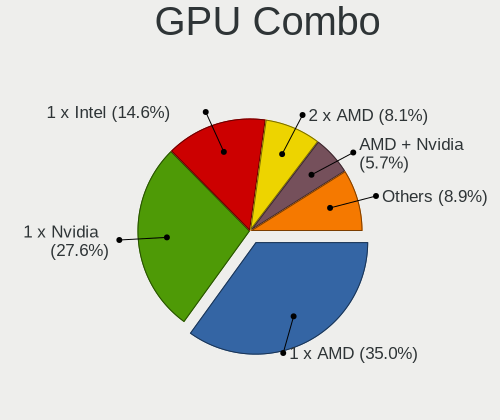

| Name           | Desktops | Percent |
|----------------|----------|---------|
| 1 x AMD        | 43       | 34.96%  |
| 1 x Nvidia     | 34       | 27.64%  |
| 1 x Intel      | 18       | 14.63%  |
| 2 x AMD        | 10       | 8.13%   |
| AMD + Nvidia   | 7        | 5.69%   |
| 1 x Matrox     | 4        | 3.25%   |
| Intel + Nvidia | 3        | 2.44%   |
| 2 x Nvidia     | 1        | 0.81%   |
| 2 x Intel      | 1        | 0.81%   |
| Intel + AMD    | 1        | 0.81%   |
| 1 x ASPEED     | 1        | 0.81%   |

GPU Driver
----------

Free vs proprietary

| Driver      | Desktops | Percent |
|-------------|----------|---------|
| Free        | 81       | 65.85%  |
| Proprietary | 30       | 24.39%  |
| Unknown     | 12       | 9.76%   |

GPU Memory
----------

Total video memory

| Size in GB | Desktops | Percent |
|------------|----------|---------|
| Unknown    | 37       | 30.58%  |
| 7.01-8.0   | 24       | 19.83%  |
| 8.01-16.0  | 19       | 15.7%   |
| 0.01-0.5   | 10       | 8.26%   |
| 3.01-4.0   | 7        | 5.79%   |
| 16.01-24.0 | 7        | 5.79%   |
| 0.51-1.0   | 7        | 5.79%   |
| 1.01-2.0   | 5        | 4.13%   |
| 5.01-6.0   | 4        | 3.31%   |
| 2.01-3.0   | 1        | 0.83%   |

Monitor
-------

Monitor Vendor
--------------

Monitor vendors

| Vendor                  | Desktops | Percent |
|-------------------------|----------|---------|
| Samsung Electronics     | 24       | 18.9%   |
| Dell                    | 14       | 11.02%  |
| Goldstar                | 12       | 9.45%   |
| ASUSTek Computer        | 9        | 7.09%   |
| AOC                     | 9        | 7.09%   |
| Acer                    | 8        | 6.3%    |
| BenQ                    | 6        | 4.72%   |
| Ancor Communications    | 5        | 3.94%   |
| Iiyama                  | 4        | 3.15%   |
| Hewlett-Packard         | 4        | 3.15%   |
| Gigabyte Technology     | 4        | 3.15%   |
| Unknown                 | 3        | 2.36%   |
| Lenovo                  | 3        | 2.36%   |
| Vizio                   | 2        | 1.57%   |
| Philips                 | 2        | 1.57%   |
| Eizo                    | 2        | 1.57%   |
| Sceptre Tech            | 1        | 0.79%   |
| Onkyo                   | 1        | 0.79%   |
| MStar                   | 1        | 0.79%   |
| Mitsubishi              | 1        | 0.79%   |
| Microstep               | 1        | 0.79%   |
| Idek Iiyama             | 1        | 0.79%   |
| IBM                     | 1        | 0.79%   |
| HJW                     | 1        | 0.79%   |
| Gateway                 | 1        | 0.79%   |
| Envision Peripherals    | 1        | 0.79%   |
| Denver                  | 1        | 0.79%   |
| Chimei Innolux          | 1        | 0.79%   |
| Chi Mei Optoelectronics | 1        | 0.79%   |
| Arnos Instruments       | 1        | 0.79%   |
| AHA                     | 1        | 0.79%   |
| Unknown                 | 1        | 0.79%   |

Monitor Model
-------------

Monitor models

| Model                                                                   | Desktops | Percent |
|-------------------------------------------------------------------------|----------|---------|
| Unknown LCD Monitor FFFF 2288x1287 2550x2550mm 142.0-inch               | 2        | 1.46%   |
| Samsung Electronics SyncMaster SAM059A 1920x1080 477x268mm 21.5-inch    | 2        | 1.46%   |
| Samsung Electronics LCD Monitor SAM7004 3840x2160 1872x1053mm 84.6-inch | 2        | 1.46%   |
| Samsung Electronics LCD Monitor SAM7003 3840x2160 1872x1053mm 84.6-inch | 2        | 1.46%   |
| Goldstar ULTRAWIDE GSM59F1 2560x1080 673x284mm 28.8-inch                | 2        | 1.46%   |
| Goldstar HDR 4K GSM7707 3840x2160 600x340mm 27.2-inch                   | 2        | 1.46%   |
| Gigabyte Technology G27FC A GBT2715 1920x1080 598x336mm 27.0-inch       | 2        | 1.46%   |
| Eizo CS2731 ENC3069 2560x1440 597x336mm 27.0-inch                       | 2        | 1.46%   |
| BenQ PD3200U BNQ8025 3840x2160 708x399mm 32.0-inch                      | 2        | 1.46%   |
| ASUSTek Computer VG27A AUS2722 2560x1440 597x336mm 27.0-inch            | 2        | 1.46%   |
| AOC LCD Monitor U2879G6 3840x2160                                       | 2        | 1.46%   |
| AOC G2460 AOC2460 1920x1080 531x299mm 24.0-inch                         | 2        | 1.46%   |
| Acer ED320QR S ACR0805 1920x1080 698x393mm 31.5-inch                    | 2        | 1.46%   |
| Vizio VX20L VIZ2000 1280x720 444x249mm 20.0-inch                        | 1        | 0.73%   |
| Vizio D60n-E3 VIZ1009 1920x1080 1330x748mm 60.1-inch                    | 1        | 0.73%   |
| Unknown LCD Monitor RTK                                                 | 1        | 0.73%   |
| Sceptre Tech C305W-2560UN SPT0C0D 2560x1080 690x291mm 29.5-inch         | 1        | 0.73%   |
| Samsung Electronics U32R59x SAM0F96 3840x2160 700x390mm 31.5-inch       | 1        | 0.73%   |
| Samsung Electronics SyncMaster SAM05E8 1920x1080                        | 1        | 0.73%   |
| Samsung Electronics SyncMaster SAM04D4 1920x1080 531x298mm 24.0-inch    | 1        | 0.73%   |
| Samsung Electronics SyncMaster SAM03E4 1680x1050 474x296mm 22.0-inch    | 1        | 0.73%   |
| Samsung Electronics SyncMaster SAM0373 1680x1050 459x296mm 21.5-inch    | 1        | 0.73%   |
| Samsung Electronics SMT22A350 SAM07A7 1920x1080 477x268mm 21.5-inch     | 1        | 0.73%   |
| Samsung Electronics SMS27A850 SAM083D 2560x1440 518x324mm 24.1-inch     | 1        | 0.73%   |
| Samsung Electronics SMS27A350H SAM07CE 1920x1080 598x336mm 27.0-inch    | 1        | 0.73%   |
| Samsung Electronics SME2020N SAM06A6 1600x900 443x249mm 20.0-inch       | 1        | 0.73%   |
| Samsung Electronics SMBX2450 SAM0722 1920x1080 531x299mm 24.0-inch      | 1        | 0.73%   |
| Samsung Electronics S27E390 SAM0C1C 1920x1080 598x336mm 27.0-inch       | 1        | 0.73%   |
| Samsung Electronics S22B300 SAM08C8 1920x1080 477x268mm 21.5-inch       | 1        | 0.73%   |
| Samsung Electronics LCD Monitor SAM7002 3840x2160 1872x1053mm 84.6-inch | 1        | 0.73%   |
| Samsung Electronics LCD Monitor SAM0A7C 1366x768 698x393mm 31.5-inch    | 1        | 0.73%   |
| Samsung Electronics LCD Monitor SAM07D0 1360x768 700x390mm 31.5-inch    | 1        | 0.73%   |
| Samsung Electronics LCD Monitor C27FG7x 1920x1080                       | 1        | 0.73%   |
| Samsung Electronics LC27G5xT SAM707A 2560x1440 698x393mm 31.5-inch      | 1        | 0.73%   |
| Samsung Electronics C49RG9x SAM0F9C 3840x1080 1193x336mm 48.8-inch      | 1        | 0.73%   |
| Samsung Electronics C49HG9x SAM0E5E 1280x1080 1196x336mm 48.9-inch      | 1        | 0.73%   |
| Samsung Electronics C27HG7x SAM0E16 2560x1440 598x336mm 27.0-inch       | 1        | 0.73%   |
| Samsung Electronics C24F390 SAM0D2C 1920x1080 521x293mm 23.5-inch       | 1        | 0.73%   |
| Philips LCD Monitor PHL 276E8V 5760x2160                                | 1        | 0.73%   |
| Philips LCD Monitor PHL 246V5 3840x1080                                 | 1        | 0.73%   |

Monitor Resolution
------------------

Monitor screen resolution

| Resolution         | Desktops | Percent |
|--------------------|----------|---------|
| 1920x1080 (FHD)    | 37       | 29.84%  |
| 3840x2160 (4K)     | 27       | 21.77%  |
| 2560x1440 (QHD)    | 19       | 15.32%  |
| 3440x1440          | 7        | 5.65%   |
| Unknown            | 4        | 3.23%   |
| 3840x1080          | 3        | 2.42%   |
| 2560x1080          | 3        | 2.42%   |
| 1920x1200 (WUXGA)  | 3        | 2.42%   |
| 1680x1050 (WSXGA+) | 3        | 2.42%   |
| 1440x900 (WXGA+)   | 3        | 2.42%   |
| 1280x1024 (SXGA)   | 3        | 2.42%   |
| 2288x1287          | 2        | 1.61%   |
| 1600x900 (HD+)     | 2        | 1.61%   |
| 1366x768 (WXGA)    | 2        | 1.61%   |
| 1024x768 (XGA)     | 2        | 1.61%   |
| 5760x2160          | 1        | 0.81%   |
| 3840x1200          | 1        | 0.81%   |
| 1360x768           | 1        | 0.81%   |
| 1280x800 (WXGA)    | 1        | 0.81%   |

Monitor Diagonal
----------------

Diagonal size in inches

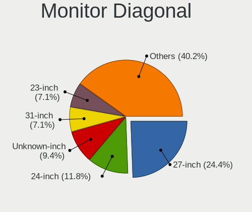

| Inches  | Desktops | Percent |
|---------|----------|---------|
| 27      | 31       | 24.41%  |
| 24      | 15       | 11.81%  |
| Unknown | 12       | 9.45%   |
| 31      | 9        | 7.09%   |
| 23      | 9        | 7.09%   |
| 34      | 8        | 6.3%    |
| 21      | 8        | 6.3%    |
| 32      | 4        | 3.15%   |
| 84      | 3        | 2.36%   |
| 40      | 3        | 2.36%   |
| 19      | 3        | 2.36%   |
| 17      | 3        | 2.36%   |
| 142     | 2        | 1.57%   |
| 49      | 2        | 1.57%   |
| 22      | 2        | 1.57%   |
| 20      | 2        | 1.57%   |
| 18      | 2        | 1.57%   |
| 60      | 1        | 0.79%   |
| 48      | 1        | 0.79%   |
| 42      | 1        | 0.79%   |
| 41      | 1        | 0.79%   |
| 29      | 1        | 0.79%   |
| 26      | 1        | 0.79%   |
| 25      | 1        | 0.79%   |
| 15      | 1        | 0.79%   |
| 9       | 1        | 0.79%   |

Monitor Width
-------------

Physical width

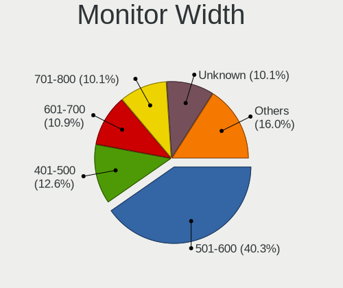

| Width in mm    | Desktops | Percent |
|----------------|----------|---------|
| 501-600        | 48       | 40.34%  |
| 401-500        | 15       | 12.61%  |
| 601-700        | 13       | 10.92%  |
| 701-800        | 12       | 10.08%  |
| Unknown        | 12       | 10.08%  |
| 1001-1500      | 4        | 3.36%   |
| 801-900        | 3        | 2.52%   |
| 301-350        | 3        | 2.52%   |
| 1501-2000      | 3        | 2.52%   |
| More than 2000 | 2        | 1.68%   |
| 901-1000       | 2        | 1.68%   |
| 351-400        | 1        | 0.84%   |
| 201-300        | 1        | 0.84%   |

Aspect Ratio
------------

Proportional relationship between the width and the height

| Ratio   | Desktops | Percent |
|---------|----------|---------|
| 16/9    | 72       | 64.29%  |
| 16/10   | 13       | 11.61%  |
| Unknown | 10       | 8.93%   |
| 21/9    | 8        | 7.14%   |
| 32/9    | 3        | 2.68%   |
| 5/4     | 2        | 1.79%   |
| 4/3     | 2        | 1.79%   |
| 1.00    | 2        | 1.79%   |

Monitor Area
------------

Area in inch

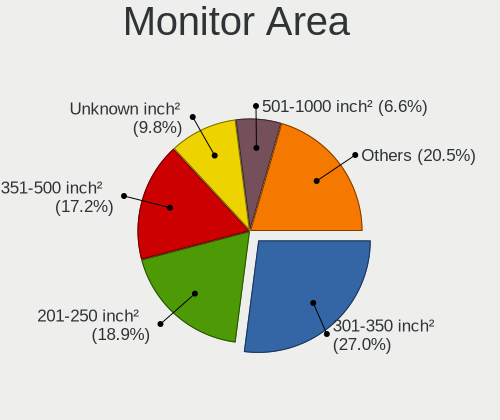

| Area in inch | Desktops | Percent |
|----------------|----------|---------|
| 301-350        | 33       | 27.05%  |
| 201-250        | 23       | 18.85%  |
| 351-500        | 21       | 17.21%  |
| Unknown        | 12       | 9.84%   |
| 501-1000       | 8        | 6.56%   |
| 151-200        | 7        | 5.74%   |
| More than 1000 | 6        | 4.92%   |
| 251-300        | 6        | 4.92%   |
| 141-150        | 3        | 2.46%   |
| 41-50          | 1        | 0.82%   |
| 121-130        | 1        | 0.82%   |
| 101-110        | 1        | 0.82%   |

Pixel Density
-------------

Pixels per inch

| Density | Desktops | Percent |
|---------|----------|---------|
| 51-100  | 53       | 46.49%  |
| 101-120 | 25       | 21.93%  |
| Unknown | 12       | 10.53%  |
| 121-160 | 10       | 8.77%   |
| 161-240 | 8        | 7.02%   |
| 1-50    | 6        | 5.26%   |

Multiple Monitors
-----------------

Total monitors connected

| Total | Desktops | Percent |
|-------|----------|---------|
| 1     | 80       | 65.04%  |
| 2     | 21       | 17.07%  |
| 0     | 15       | 12.2%   |
| 3     | 5        | 4.07%   |
| 4     | 2        | 1.63%   |

Network
-------

Net Controller Vendor
---------------------

Controller vendors

| Vendor                          | Desktops | Percent |
|---------------------------------|----------|---------|
| Intel                           | 69       | 38.98%  |
| Realtek Semiconductor           | 67       | 37.85%  |
| MediaTek                        | 10       | 5.65%   |
| Qualcomm Atheros                | 7        | 3.95%   |
| Broadcom                        | 5        | 2.82%   |
| Qualcomm Atheros Communications | 2        | 1.13%   |
| Nvidia                          | 2        | 1.13%   |
| Microsoft                       | 2        | 1.13%   |
| Aquantia                        | 2        | 1.13%   |
| Wilocity                        | 1        | 0.56%   |
| Ralink                          | 1        | 0.56%   |
| OpenMoko                        | 1        | 0.56%   |
| NetGear                         | 1        | 0.56%   |
| Mellanox Technologies           | 1        | 0.56%   |
| Marvell Technology Group        | 1        | 0.56%   |
| ICS Advent                      | 1        | 0.56%   |
| Huawei Technologies             | 1        | 0.56%   |
| Hewlett-Packard                 | 1        | 0.56%   |
| Broadcom Limited                | 1        | 0.56%   |
| ASIX Electronics                | 1        | 0.56%   |

Net Controller Model
--------------------

Controller models

| Model                                                                          | Desktops | Percent |
|--------------------------------------------------------------------------------|----------|---------|
| Realtek RTL8111/8168/8411 PCI Express Gigabit Ethernet Controller              | 43       | 20.48%  |
| Realtek RTL8125 2.5GbE Controller                                              | 20       | 9.52%   |
| Intel I211 Gigabit Network Connection                                          | 17       | 8.1%    |
| Intel Ethernet Controller I225-V                                               | 14       | 6.67%   |
| Intel Wi-Fi 6 AX210/AX211/AX411 160MHz                                         | 13       | 6.19%   |
| Intel Wi-Fi 6 AX200                                                            | 12       | 5.71%   |
| Intel Ethernet Connection (7) I219-V                                           | 6        | 2.86%   |
| MediaTek MT7922 802.11ax PCI Express Wireless Network Adapter                  | 5        | 2.38%   |
| Intel Wireless-AC 9260                                                         | 5        | 2.38%   |
| MediaTek MT7921K (RZ608) Wi-Fi 6E 80MHz                                        | 4        | 1.9%    |
| Intel Ethernet Connection (2) I219-V                                           | 3        | 1.43%   |
| Intel Cannon Lake PCH CNVi WiFi                                                | 3        | 1.43%   |
| Broadcom NetXtreme BCM5720 Gigabit Ethernet PCIe                               | 3        | 1.43%   |
| Realtek RTL-8110SC/8169SC Gigabit Ethernet                                     | 2        | 0.95%   |
| Realtek Killer E3000 2.5GbE Controller                                         | 2        | 0.95%   |
| Qualcomm Atheros AR9271 802.11n                                                | 2        | 0.95%   |
| Microsoft Xbox Wireless Adapter for Windows                                    | 2        | 0.95%   |
| Intel Wireless 3165                                                            | 2        | 0.95%   |
| Intel I350 Gigabit Network Connection                                          | 2        | 0.95%   |
| Intel Ethernet Connection I217-V                                               | 2        | 0.95%   |
| Intel Alder Lake-S PCH CNVi WiFi                                               | 2        | 0.95%   |
| Intel 82599ES 10-Gigabit SFI/SFP+ Network Connection                           | 2        | 0.95%   |
| Intel 82579LM Gigabit Network Connection (Lewisville)                          | 2        | 0.95%   |
| Wilocity Wil6200 802.11ad Wireless Network Adapter                             | 1        | 0.48%   |
| Realtek RTL88x2bu [AC1200 Techkey]                                             | 1        | 0.48%   |
| Realtek RTL8852BE PCIe 802.11ax Wireless Network Controller                    | 1        | 0.48%   |
| Realtek RTL8191SU 802.11n WLAN Adapter                                         | 1        | 0.48%   |
| Realtek RTL8169 PCI Gigabit Ethernet Controller                                | 1        | 0.48%   |
| Realtek RTL810xE PCI Express Fast Ethernet controller                          | 1        | 0.48%   |
| Ralink RT2790 Wireless 802.11n 1T/2R PCIe                                      | 1        | 0.48%   |
| Qualcomm Atheros QCA6174 802.11ac Wireless Network Adapter                     | 1        | 0.48%   |
| Qualcomm Atheros AR928X Wireless Network Adapter (PCI-Express)                 | 1        | 0.48%   |
| Qualcomm Atheros AR9287 Wireless Network Adapter (PCI-Express)                 | 1        | 0.48%   |
| Qualcomm Atheros AR8151 v2.0 Gigabit Ethernet                                  | 1        | 0.48%   |
| Qualcomm Atheros AR8131 Gigabit Ethernet                                       | 1        | 0.48%   |
| Qualcomm Atheros AR5413/AR5414 Wireless Network Adapter [AR5006X(S) 802.11abg] | 1        | 0.48%   |
| Qualcomm Atheros AR5212/5213/2414 Wireless Network Adapter                     | 1        | 0.48%   |
| Qualcomm Atheros AR242x / AR542x Wireless Network Adapter (PCI-Express)        | 1        | 0.48%   |
| OpenMoko OneRNG entropy device                                                 | 1        | 0.48%   |
| Nvidia MCP79 Ethernet                                                          | 1        | 0.48%   |

Wireless Vendor
---------------

Wireless vendors

| Vendor                          | Desktops | Percent |
|---------------------------------|----------|---------|
| Intel                           | 38       | 57.58%  |
| MediaTek                        | 10       | 15.15%  |
| Qualcomm Atheros                | 6        | 9.09%   |
| Realtek Semiconductor           | 3        | 4.55%   |
| Qualcomm Atheros Communications | 2        | 3.03%   |
| Microsoft                       | 2        | 3.03%   |
| Wilocity                        | 1        | 1.52%   |
| Ralink                          | 1        | 1.52%   |
| NetGear                         | 1        | 1.52%   |
| Broadcom Limited                | 1        | 1.52%   |
| Broadcom                        | 1        | 1.52%   |

Wireless Model
--------------

Wireless models

| Model                                                                          | Desktops | Percent |
|--------------------------------------------------------------------------------|----------|---------|
| Intel Wi-Fi 6 AX210/AX211/AX411 160MHz                                         | 13       | 19.4%   |
| Intel Wi-Fi 6 AX200                                                            | 12       | 17.91%  |
| MediaTek MT7922 802.11ax PCI Express Wireless Network Adapter                  | 5        | 7.46%   |
| Intel Wireless-AC 9260                                                         | 5        | 7.46%   |
| MediaTek MT7921K (RZ608) Wi-Fi 6E 80MHz                                        | 4        | 5.97%   |
| Intel Cannon Lake PCH CNVi WiFi                                                | 3        | 4.48%   |
| Qualcomm Atheros AR9271 802.11n                                                | 2        | 2.99%   |
| Microsoft Xbox Wireless Adapter for Windows                                    | 2        | 2.99%   |
| Intel Wireless 3165                                                            | 2        | 2.99%   |
| Intel Alder Lake-S PCH CNVi WiFi                                               | 2        | 2.99%   |
| Wilocity Wil6200 802.11ad Wireless Network Adapter                             | 1        | 1.49%   |
| Realtek RTL88x2bu [AC1200 Techkey]                                             | 1        | 1.49%   |
| Realtek RTL8852BE PCIe 802.11ax Wireless Network Controller                    | 1        | 1.49%   |
| Realtek RTL8191SU 802.11n WLAN Adapter                                         | 1        | 1.49%   |
| Ralink RT2790 Wireless 802.11n 1T/2R PCIe                                      | 1        | 1.49%   |
| Qualcomm Atheros QCA6174 802.11ac Wireless Network Adapter                     | 1        | 1.49%   |
| Qualcomm Atheros AR928X Wireless Network Adapter (PCI-Express)                 | 1        | 1.49%   |
| Qualcomm Atheros AR9287 Wireless Network Adapter (PCI-Express)                 | 1        | 1.49%   |
| Qualcomm Atheros AR5413/AR5414 Wireless Network Adapter [AR5006X(S) 802.11abg] | 1        | 1.49%   |
| Qualcomm Atheros AR5212/5213/2414 Wireless Network Adapter                     | 1        | 1.49%   |
| Qualcomm Atheros AR242x / AR542x Wireless Network Adapter (PCI-Express)        | 1        | 1.49%   |
| NetGear WNDA3100v2 802.11abgn [Broadcom BCM4323]                               | 1        | 1.49%   |
| MediaTek MT7921 802.11ax PCI Express Wireless Network Adapter                  | 1        | 1.49%   |
| Intel Wireless 8260                                                            | 1        | 1.49%   |
| Intel Comet Lake PCH CNVi WiFi                                                 | 1        | 1.49%   |
| Broadcom Network controller                                                    | 1        | 1.49%   |
| Broadcom Limited BCM4352 802.11ac Dual Band Wireless Network Adapter           | 1        | 1.49%   |

Ethernet Vendor
---------------

Ethernet vendors

| Vendor                   | Desktops | Percent |
|--------------------------|----------|---------|
| Realtek Semiconductor    | 66       | 50%     |
| Intel                    | 52       | 39.39%  |
| Broadcom                 | 4        | 3.03%   |
| Qualcomm Atheros         | 2        | 1.52%   |
| Nvidia                   | 2        | 1.52%   |
| Aquantia                 | 2        | 1.52%   |
| Marvell Technology Group | 1        | 0.76%   |
| ICS Advent               | 1        | 0.76%   |
| Hewlett-Packard          | 1        | 0.76%   |
| ASIX Electronics         | 1        | 0.76%   |

Ethernet Model
--------------

Ethernet models

| Model                                                                         | Desktops | Percent |
|-------------------------------------------------------------------------------|----------|---------|
| Realtek RTL8111/8168/8411 PCI Express Gigabit Ethernet Controller             | 43       | 30.71%  |
| Realtek RTL8125 2.5GbE Controller                                             | 20       | 14.29%  |
| Intel I211 Gigabit Network Connection                                         | 17       | 12.14%  |
| Intel Ethernet Controller I225-V                                              | 14       | 10%     |
| Intel Ethernet Connection (7) I219-V                                          | 6        | 4.29%   |
| Intel Ethernet Connection (2) I219-V                                          | 3        | 2.14%   |
| Broadcom NetXtreme BCM5720 Gigabit Ethernet PCIe                              | 3        | 2.14%   |
| Realtek RTL-8110SC/8169SC Gigabit Ethernet                                    | 2        | 1.43%   |
| Realtek Killer E3000 2.5GbE Controller                                        | 2        | 1.43%   |
| Intel I350 Gigabit Network Connection                                         | 2        | 1.43%   |
| Intel Ethernet Connection I217-V                                              | 2        | 1.43%   |
| Intel 82599ES 10-Gigabit SFI/SFP+ Network Connection                          | 2        | 1.43%   |
| Intel 82579LM Gigabit Network Connection (Lewisville)                         | 2        | 1.43%   |
| Realtek RTL8169 PCI Gigabit Ethernet Controller                               | 1        | 0.71%   |
| Realtek RTL810xE PCI Express Fast Ethernet controller                         | 1        | 0.71%   |
| Qualcomm Atheros AR8151 v2.0 Gigabit Ethernet                                 | 1        | 0.71%   |
| Qualcomm Atheros AR8131 Gigabit Ethernet                                      | 1        | 0.71%   |
| Nvidia MCP79 Ethernet                                                         | 1        | 0.71%   |
| Nvidia MCP73 Ethernet                                                         | 1        | 0.71%   |
| Marvell Group 88E8056 PCI-E Gigabit Ethernet Controller                       | 1        | 0.71%   |
| Intel Ethernet Connection (2) I219-LM                                         | 1        | 0.71%   |
| Intel Ethernet Connection (11) I219-LM                                        | 1        | 0.71%   |
| Intel Ethernet Connection (10) I219-V                                         | 1        | 0.71%   |
| Intel 82801DB PRO/100 VE (LOM) Ethernet Controller                            | 1        | 0.71%   |
| Intel 82579V Gigabit Network Connection                                       | 1        | 0.71%   |
| Intel 82575EB Gigabit Network Connection                                      | 1        | 0.71%   |
| Intel 82571EB/82571GB Gigabit Ethernet Controller D0/D1 (copper applications) | 1        | 0.71%   |
| Intel 82557/8/9/0/1 Ethernet Pro 100                                          | 1        | 0.71%   |
| Intel 82541GI Gigabit Ethernet Controller                                     | 1        | 0.71%   |
| ICS Advent DM9601 Fast Ethernet Adapter                                       | 1        | 0.71%   |
| HP Virtual NIC                                                                | 1        | 0.71%   |
| Broadcom NetXtreme BCM5715 Gigabit Ethernet                                   | 1        | 0.71%   |
| ASIX AX88772A Fast Ethernet                                                   | 1        | 0.71%   |
| Aquantia AQC113CS NBase-T/IEEE 802.3bz Ethernet Controller [AQtion]           | 1        | 0.71%   |
| Aquantia AQC113C NBase-T/IEEE 802.3bz Ethernet Controller [AQtion]            | 1        | 0.71%   |

Net Controller Kind
-------------------

Ethernet, WiFi or modem

| Kind     | Desktops | Percent |
|----------|----------|---------|
| Ethernet | 118      | 64.84%  |
| WiFi     | 61       | 33.52%  |
| Modem    | 2        | 1.1%    |
| Unknown  | 1        | 0.55%   |

Used Controller
---------------

Currently used network controller

| Kind     | Desktops | Percent |
|----------|----------|---------|
| Ethernet | 99       | 81.15%  |
| WiFi     | 23       | 18.85%  |

NICs
----

Total network controllers on board

| Total | Desktops | Percent |
|-------|----------|---------|
| 2     | 54       | 45%     |
| 1     | 48       | 40%     |
| 3     | 11       | 9.17%   |
| 7     | 2        | 1.67%   |
| 6     | 2        | 1.67%   |
| 4     | 2        | 1.67%   |
| 5     | 1        | 0.83%   |

IPv6
----

IPv6 vs IPv4

| Used | Desktops | Percent |
|------|----------|---------|
| No   | 79       | 65.29%  |
| Yes  | 42       | 34.71%  |

Bluetooth
---------

Bluetooth Vendor
----------------

Controller vendors

| Vendor                          | Desktops | Percent |
|---------------------------------|----------|---------|
| Intel                           | 36       | 58.06%  |
| MediaTek                        | 9        | 14.52%  |
| Realtek Semiconductor           | 4        | 6.45%   |
| Cambridge Silicon Radio         | 3        | 4.84%   |
| Broadcom                        | 3        | 4.84%   |
| IMC Networks                    | 2        | 3.23%   |
| Foxconn / Hon Hai               | 2        | 3.23%   |
| ASUSTek Computer                | 2        | 3.23%   |
| Qualcomm Atheros Communications | 1        | 1.61%   |

Bluetooth Model
---------------

Controller models

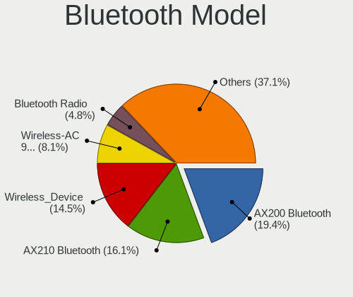

| Model                                               | Desktops | Percent |
|-----------------------------------------------------|----------|---------|
| Intel AX200 Bluetooth                               | 12       | 19.35%  |
| Intel AX210 Bluetooth                               | 10       | 16.13%  |
| MediaTek Wireless_Device                            | 9        | 14.52%  |
| Intel Wireless-AC 9260 Bluetooth Adapter            | 5        | 8.06%   |
| Realtek Bluetooth Radio                             | 3        | 4.84%   |
| Intel Bluetooth wireless interface                  | 3        | 4.84%   |
| Intel Bluetooth Device                              | 3        | 4.84%   |
| Intel Bluetooth 9460/9560 Jefferson Peak (JfP)      | 3        | 4.84%   |
| Cambridge Silicon Radio Bluetooth Dongle (HCI mode) | 3        | 4.84%   |
| Foxconn / Hon Hai Wireless_Device                   | 2        | 3.23%   |
| Broadcom BCM20702A0 Bluetooth 4.0                   | 2        | 3.23%   |
| ASUS Bluetooth Device                               | 2        | 3.23%   |
| Realtek Bluetooth 5.1 Radio                         | 1        | 1.61%   |
| Qualcomm Atheros AR3011 Bluetooth                   | 1        | 1.61%   |
| IMC Networks Wireless_Device                        | 1        | 1.61%   |
| IMC Networks Bluetooth Radio                        | 1        | 1.61%   |
| Broadcom BCM20702A0                                 | 1        | 1.61%   |

Sound
-----

Sound Vendor
------------

Sound card vendors

| Vendor                               | Desktops | Percent |
|--------------------------------------|----------|---------|
| AMD                                  | 69       | 30.94%  |
| Nvidia                               | 43       | 19.28%  |
| Intel                                | 42       | 18.83%  |
| C-Media Electronics                  | 10       | 4.48%   |
| ASUSTek Computer                     | 10       | 4.48%   |
| Creative Labs                        | 5        | 2.24%   |
| SteelSeries ApS                      | 4        | 1.79%   |
| Logitech                             | 3        | 1.35%   |
| Thesycon Systemsoftware & Consulting | 2        | 0.9%    |
| Solid State Logic                    | 2        | 0.9%    |
| Razer USA                            | 2        | 0.9%    |
| Audient                              | 2        | 0.9%    |
| AKG C44-USB Microphone               | 2        | 0.9%    |
| Yamaha                               | 1        | 0.45%   |
| VIA Technologies                     | 1        | 0.45%   |
| Texas Instruments                    | 1        | 0.45%   |
| TEAC                                 | 1        | 0.45%   |
| Sony                                 | 1        | 0.45%   |
| Schiit Audio                         | 1        | 0.45%   |
| SAVITECH                             | 1        | 0.45%   |
| RODE Microphones                     | 1        | 0.45%   |
| Microsoft                            | 1        | 0.45%   |
| Micro Star International             | 1        | 0.45%   |
| Medeli Electronics                   | 1        | 0.45%   |
| MAG Technology                       | 1        | 0.45%   |
| M-Audio                              | 1        | 0.45%   |
| Kingston Technology                  | 1        | 0.45%   |
| JMTek                                | 1        | 0.45%   |
| Huawei Technologies                  | 1        | 0.45%   |
| GYROCOM C&C                          | 1        | 0.45%   |
| Generalplus Technology               | 1        | 0.45%   |
| Focusrite-Novation                   | 1        | 0.45%   |
| Elgato Systems                       | 1        | 0.45%   |
| Corsair                              | 1        | 0.45%   |
| BEHRINGER International              | 1        | 0.45%   |
| ASRock                               | 1        | 0.45%   |
| ARCAM                                | 1        | 0.45%   |
| Anlya.cn                             | 1        | 0.45%   |
| AKAI Professional M.I.               | 1        | 0.45%   |
| Unknown                              | 1        | 0.45%   |

Sound Model
-----------

Sound card models

| Model                                                                                           | Desktops | Percent |
|-------------------------------------------------------------------------------------------------|----------|---------|
| AMD Starship/Matisse HD Audio Controller                                                        | 24       | 8.79%   |
| AMD Navi 21/23 HDMI/DP Audio Controller                                                         | 17       | 6.23%   |
| AMD Rembrandt Radeon High Definition Audio Controller                                           | 13       | 4.76%   |
| AMD Family 17h/19h HD Audio Controller                                                          | 13       | 4.76%   |
| AMD Ellesmere HDMI Audio [Radeon RX 470/480 / 570/580/590]                                      | 11       | 4.03%   |
| Intel Cannon Lake PCH cAVS                                                                      | 7        | 2.56%   |
| ASUSTek Computer USB Audio                                                                      | 7        | 2.56%   |
| AMD SBx00 Azalia (Intel HDA)                                                                    | 7        | 2.56%   |
| AMD Navi 31 HDMI/DP Audio                                                                       | 6        | 2.2%    |
| AMD Navi 10 HDMI Audio                                                                          | 6        | 2.2%    |
| Nvidia TU104 HD Audio Controller                                                                | 5        | 1.83%   |
| Nvidia GA104 High Definition Audio Controller                                                   | 5        | 1.83%   |
| Nvidia GA102 High Definition Audio Controller                                                   | 5        | 1.83%   |
| AMD Family 17h (Models 00h-0fh) HD Audio Controller                                             | 5        | 1.83%   |
| Intel 100 Series/C230 Series Chipset Family HD Audio Controller                                 | 4        | 1.47%   |
| Nvidia GP104 High Definition Audio Controller                                                   | 3        | 1.1%    |
| Nvidia AD102 High Definition Audio Controller                                                   | 3        | 1.1%    |
| Intel Smart Sound Technology (SST) Audio Controller                                             | 3        | 1.1%    |
| Intel Alder Lake-S HD Audio Controller                                                          | 3        | 1.1%    |
| Intel 8 Series/C220 Series Chipset High Definition Audio Controller                             | 3        | 1.1%    |
| AMD Renoir Radeon High Definition Audio Controller                                              | 3        | 1.1%    |
| Thesycon Systemsoftware & Consulting SABAJ D4 v1.2                                              | 2        | 0.73%   |
| Nvidia TU106 High Definition Audio Controller                                                   | 2        | 0.73%   |
| Nvidia MCP79 High Definition Audio                                                              | 2        | 0.73%   |
| Nvidia High Definition Audio Controller                                                         | 2        | 0.73%   |
| Nvidia GP102 HDMI Audio Controller                                                              | 2        | 0.73%   |
| Nvidia GM206 High Definition Audio Controller                                                   | 2        | 0.73%   |
| Nvidia GM107 High Definition Audio Controller [GeForce 940MX]                                   | 2        | 0.73%   |
| Nvidia GF119 HDMI Audio Controller                                                              | 2        | 0.73%   |
| Nvidia GA106 High Definition Audio Controller                                                   | 2        | 0.73%   |
| Logitech Blue Microphones                                                                       | 2        | 0.73%   |
| Intel Tiger Lake-H HD Audio Controller                                                          | 2        | 0.73%   |
| Intel NM10/ICH7 Family High Definition Audio Controller                                         | 2        | 0.73%   |
| Intel C600/X79 series chipset High Definition Audio Controller                                  | 2        | 0.73%   |
| Intel 82801JI (ICH10 Family) HD Audio Controller                                                | 2        | 0.73%   |
| Intel 7 Series/C216 Chipset Family High Definition Audio Controller                             | 2        | 0.73%   |
| Creative Labs CA0132 Sound Core3D [Sound Blaster Recon3D / Z-Series / Sound BlasterX AE-5 Plus] | 2        | 0.73%   |
| C-Media Electronics USB Audio Device                                                            | 2        | 0.73%   |
| Audient EVO4                                                                                    | 2        | 0.73%   |
| ASUSTek Computer Xonar SoundCard                                                                | 2        | 0.73%   |

Memory
------

Memory Vendor
-------------

Memory module vendors

| Vendor              | Desktops | Percent |
|---------------------|----------|---------|
| G.Skill             | 26       | 21.49%  |
| Corsair             | 25       | 20.66%  |
| Kingston            | 21       | 17.36%  |
| Unknown             | 12       | 9.92%   |
| Crucial             | 11       | 9.09%   |
| Samsung Electronics | 5        | 4.13%   |
| Micron Technology   | 5        | 4.13%   |
| Team                | 3        | 2.48%   |
| A-DATA Technology   | 3        | 2.48%   |
| SK hynix            | 2        | 1.65%   |
| SGS/Thomson         | 1        | 0.83%   |
| Patriot Memory      | 1        | 0.83%   |
| Patriot             | 1        | 0.83%   |
| Nanya Technology    | 1        | 0.83%   |
| HPE                 | 1        | 0.83%   |
| Hewlett-Packard     | 1        | 0.83%   |
| Chun Well           | 1        | 0.83%   |
| Unknown             | 1        | 0.83%   |

Memory Model
------------

Memory module models

| Model                                                     | Desktops | Percent |
|-----------------------------------------------------------|----------|---------|
| G.Skill RAM F5-6000J3636F16G 16GB DIMM 6400MT/s           | 5        | 3.82%   |
| G.Skill RAM F5-6000J3040G32G 32GB DIMM DDR5 6000MT/s      | 4        | 3.05%   |
| Crucial RAM BL16G32C16U4B.M16FE1 16GB DIMM DDR4 3400MT/s  | 3        | 2.29%   |
| Unknown RAM Module 8GB DIMM DDR3 1333MT/s                 | 2        | 1.53%   |
| Unknown RAM Module 2GB DIMM DDR2 667MT/s                  | 2        | 1.53%   |
| Kingston RAM KHX3600C17D4/16GX 16GB DIMM DDR4 3800MT/s    | 2        | 1.53%   |
| G.Skill RAM F4-3200C16-8GVKB 8GB DIMM DDR4 3866MT/s       | 2        | 1.53%   |
| G.Skill RAM F4-3200C16-16GVK 16GB DIMM DDR4 3600MT/s      | 2        | 1.53%   |
| Corsair RAM CMZ16GX3M2A1600C10 8GB DIMM DDR3 1600MT/s     | 2        | 1.53%   |
| Corsair RAM CMK64GX4M2E3200C16 32GB DIMM DDR4 3200MT/s    | 2        | 1.53%   |
| Corsair RAM CMK32GX4M2B3200C16 16GB DIMM DDR4 3400MT/s    | 2        | 1.53%   |
| Corsair RAM CMK16GX4M2D3600C18 8GB DIMM DDR4 3600MT/s     | 2        | 1.53%   |
| Unknown RAM Module 512MB DIMM                             | 1        | 0.76%   |
| Unknown RAM Module 4GB DIMM 1333MT/s                      | 1        | 0.76%   |
| Unknown RAM Module 2GB SODIMM DDR2 800MT/s                | 1        | 0.76%   |
| Unknown RAM Module 2GB SODIMM DDR2 667MT/s                | 1        | 0.76%   |
| Unknown RAM Module 2GB DIMM DDR2 800MT/s                  | 1        | 0.76%   |
| Unknown RAM Module 2GB DIMM 1066MT/s                      | 1        | 0.76%   |
| Unknown RAM Module 2GB DIMM                               | 1        | 0.76%   |
| Unknown RAM Module 1GB DIMM DDR 333MT/s                   | 1        | 0.76%   |
| Team RAM TEAMGROUP-UD4-3600 8GB DIMM DDR4 3600MT/s        | 1        | 0.76%   |
| Team RAM TEAMGROUP-UD4-3200 32GB DIMM DDR4 3800MT/s       | 1        | 0.76%   |
| Team RAM Elite-800 2GB DIMM SDRAM 2048MT/s                | 1        | 0.76%   |
| SK hynix RAM Module 16GB DIMM DDR4 2133MT/s               | 1        | 0.76%   |
| SK hynix RAM HMA851U6JJR6N-VK 4GB DIMM DDR4 2667MT/s      | 1        | 0.76%   |
| SGS/Thomson RAM Module 1GB DIMM SDRAM 2048MT/s            | 1        | 0.76%   |
| Samsung RAM M471B5173DB0-YK0 4GB SODIMM DDR3 1600MT/s     | 1        | 0.76%   |
| Samsung RAM M471A2K43DB1-CTD 16GB SODIMM DDR4 2667MT/s    | 1        | 0.76%   |
| Samsung RAM M393A2G40EB1-CPB 16GB DIMM DDR4 2133MT/s      | 1        | 0.76%   |
| Samsung RAM M378B5173DB0-CK0 4GB DIMM DDR3 1600MT/s       | 1        | 0.76%   |
| Samsung RAM M378B1G73EB0-YK0 8GB DIMM DDR3 1600MT/s       | 1        | 0.76%   |
| Samsung RAM M378A5244CB0-CRC 4GB DIMM DDR4 3066MT/s       | 1        | 0.76%   |
| Samsung RAM M378A1K43CB2-CRC 8GB DIMM DDR4 3500MT/s       | 1        | 0.76%   |
| Patriot RAM Module 8GB DIMM DDR4 2666MT/s                 | 1        | 0.76%   |
| Patriot Memory RAM 3200 C16 Series 4GB DIMM DDR4 3200MT/s | 1        | 0.76%   |
| Nanya RAM M2F4G64CB88B7N-DI 4GB DIMM DDR3 1600MT/s        | 1        | 0.76%   |
| Micron RAM Module 8GB SODIMM DDR4 3200MT/s                | 1        | 0.76%   |
| Micron RAM 8JTF51264AZ-1G6E1 4GB DIMM DDR3 1600MT/s       | 1        | 0.76%   |
| Micron RAM 36JSF2G72PZ-1G9N1 16GB DIMM DDR3               | 1        | 0.76%   |
| Micron RAM 36JSF2G72PZ-1G9E1 16GB DIMM DDR3 1866MT/s      | 1        | 0.76%   |

Memory Kind
-----------

Memory module kinds

| Kind    | Desktops | Percent |
|---------|----------|---------|
| DDR4    | 61       | 53.04%  |
| DDR5    | 20       | 17.39%  |
| DDR3    | 20       | 17.39%  |
| DDR2    | 6        | 5.22%   |
| Unknown | 5        | 4.35%   |
| SDRAM   | 2        | 1.74%   |
| DDR     | 1        | 0.87%   |

Memory Form Factor
------------------

Physical design of the memory module

| Name   | Desktops | Percent |
|--------|----------|---------|
| DIMM   | 111      | 95.69%  |
| SODIMM | 5        | 4.31%   |

Memory Size
-----------

Memory module size

| Size  | Desktops | Percent |
|-------|----------|---------|
| 16384 | 44       | 36.07%  |
| 8192  | 32       | 26.23%  |
| 32768 | 21       | 17.21%  |
| 4096  | 13       | 10.66%  |
| 2048  | 9        | 7.38%   |
| 1024  | 2        | 1.64%   |
| 512   | 1        | 0.82%   |

Memory Speed
------------

Memory module speed

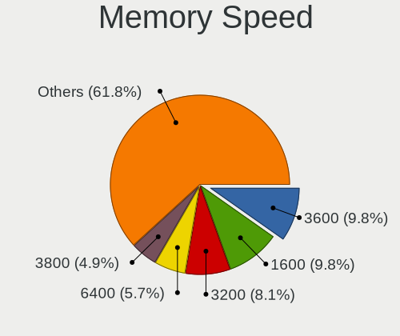

| Speed   | Desktops | Percent |
|---------|----------|---------|
| 3600    | 12       | 9.76%   |
| 1600    | 12       | 9.76%   |
| 3200    | 10       | 8.13%   |
| 6400    | 7        | 5.69%   |
| 3800    | 6        | 4.88%   |
| 1333    | 6        | 4.88%   |
| 3400    | 5        | 4.07%   |
| 800     | 5        | 4.07%   |
| 6000    | 4        | 3.25%   |
| 4800    | 4        | 3.25%   |
| 2667    | 4        | 3.25%   |
| 2133    | 4        | 3.25%   |
| 1866    | 4        | 3.25%   |
| 667     | 4        | 3.25%   |
| 3866    | 3        | 2.44%   |
| 3733    | 3        | 2.44%   |
| 3666    | 3        | 2.44%   |
| 2400    | 3        | 2.44%   |
| 5200    | 2        | 1.63%   |
| 3534    | 2        | 1.63%   |
| 3466    | 2        | 1.63%   |
| 2666    | 2        | 1.63%   |
| 2048    | 2        | 1.63%   |
| Unknown | 2        | 1.63%   |
| 7000    | 1        | 0.81%   |
| 5808    | 1        | 0.81%   |
| 5600    | 1        | 0.81%   |
| 3933    | 1        | 0.81%   |
| 3533    | 1        | 0.81%   |
| 3500    | 1        | 0.81%   |
| 3100    | 1        | 0.81%   |
| 3066    | 1        | 0.81%   |
| 2933    | 1        | 0.81%   |
| 2800    | 1        | 0.81%   |
| 1066    | 1        | 0.81%   |
| 333     | 1        | 0.81%   |

Printers & scanners
-------------------

Printer Vendor
--------------

Printer device vendors

| Vendor              | Desktops | Percent |
|---------------------|----------|---------|
| Seiko Epson         | 1        | 25%     |
| Samsung Electronics | 1        | 25%     |
| Hewlett-Packard     | 1        | 25%     |
| Brother Industries  | 1        | 25%     |

Printer Model
-------------

Printer device models

| Model                      | Desktops | Percent |
|----------------------------|----------|---------|
| Seiko Epson XP-4200 Series | 1        | 25%     |
| Samsung ML-1630 Series     | 1        | 25%     |
| HP LaserJet M14-M17        | 1        | 25%     |
| Brother MFC-9340CDW        | 1        | 25%     |

Scanner Vendor
--------------

Scanner device vendors

| Vendor          | Desktops | Percent |
|-----------------|----------|---------|
| Mustek Systems  | 1        | 33.33%  |
| Canon           | 1        | 33.33%  |
| AGFA-Gevaert NV | 1        | 33.33%  |

Scanner Model
-------------

Scanner device models

| Model                              | Desktops | Percent |
|------------------------------------|----------|---------|
| Mustek Systems BearPaw 2448 TA Pro | 1        | 33.33%  |
| Canon CanoScan N1240U/LiDE 30      | 1        | 33.33%  |
| AGFA-Gevaert NV SnapScan e20       | 1        | 33.33%  |

Camera
------

Camera Vendor
-------------

Camera device vendors

| Vendor                        | Desktops | Percent |
|-------------------------------|----------|---------|
| Logitech                      | 12       | 40%     |
| Microdia                      | 3        | 10%     |
| Sunplus Innovation Technology | 2        | 6.67%   |
| Samsung Electronics           | 2        | 6.67%   |
| Microsoft                     | 2        | 6.67%   |
| MacroSilicon                  | 2        | 6.67%   |
| Trust                         | 1        | 3.33%   |
| Quanta                        | 1        | 3.33%   |
| GEMBIRD                       | 1        | 3.33%   |
| Elgato Systems                | 1        | 3.33%   |
| Creative Technology           | 1        | 3.33%   |
| Chicony Electronics           | 1        | 3.33%   |
| A4Tech                        | 1        | 3.33%   |

Camera Model
------------

Camera device models

| Model                                   | Desktops | Percent |
|-----------------------------------------|----------|---------|
| Logitech C922 Pro Stream Webcam         | 4        | 13.33%  |
| Samsung Galaxy series, misc. (MTP mode) | 2        | 6.67%   |
| Microdia USB Camera                     | 2        | 6.67%   |
| MacroSilicon USB3. 0 capture            | 2        | 6.67%   |
| Trust QHD Webcam                        | 1        | 3.33%   |
| Sunplus Full HD webcam                  | 1        | 3.33%   |
| Sunplus FHD Capture                     | 1        | 3.33%   |
| Quanta RGB-IR Camera                    | 1        | 3.33%   |
| Microsoft Microsoft LifeCam Studio    | 1        | 3.33%   |
| Microsoft LifeCam Cinema                | 1        | 3.33%   |
| Microdia Camera                         | 1        | 3.33%   |
| Logitech Webcam C270                    | 1        | 3.33%   |
| Logitech Webcam C170                    | 1        | 3.33%   |
| Logitech StreamCam                      | 1        | 3.33%   |
| Logitech HD Webcam C910                 | 1        | 3.33%   |
| Logitech HD Webcam C525                 | 1        | 3.33%   |
| Logitech HD Pro Webcam C920             | 1        | 3.33%   |
| Logitech BRIO Ultra HD Webcam           | 1        | 3.33%   |
| Logitech BRIO 4K Stream Edition         | 1        | 3.33%   |
| GEMBIRD USB2.0 PC CAMERA                | 1        | 3.33%   |
| Elgato Systems Elgato Facecam           | 1        | 3.33%   |
| Creative Live! Cam Chat HD [VF0700]     | 1        | 3.33%   |
| Chicony Gateway Webcam                  | 1        | 3.33%   |
| A4Tech REDRAGON Live Camera             | 1        | 3.33%   |

Security
--------

Fingerprint Vendor
------------------

Fingerprint sensor vendors

| Vendor         | Desktops | Percent |
|----------------|----------|---------|
| DigitalPersona | 1        | 100%    |

Fingerprint Model
-----------------

Fingerprint sensor models

| Model                             | Desktops | Percent |
|-----------------------------------|----------|---------|
| DigitalPersona Fingerprint Reader | 1        | 100%    |

Chipcard Vendor
---------------

Chipcard module vendors

| Vendor                | Desktops | Percent |
|-----------------------|----------|---------|
| SCM Microsystems      | 2        | 40%     |
| Hewlett-Packard       | 1        | 20%     |
| Bit4id                | 1        | 20%     |
| Advanced Card Systems | 1        | 20%     |

Chipcard Model
--------------

Chipcard module models

| Model                                                  | Desktops | Percent |
|--------------------------------------------------------|----------|---------|
| SCM Microsystems SCR331-LC1 / SCR3310 SmartCard Reader | 2        | 40%     |
| Hewlett-Packard SC Keyboard - Apollo (Liteon)          | 1        | 20%     |
| Bit4id miniLector-s                                    | 1        | 20%     |
| Advanced Card Systems ACR122U                          | 1        | 20%     |

Unsupported
-----------

Unsupported Devices
-------------------

Total unsupported devices on board

| Total | Desktops | Percent |
|-------|----------|---------|
| 0     | 68       | 53.54%  |
| 1     | 30       | 23.62%  |
| 2     | 17       | 13.39%  |
| 3     | 4        | 3.15%   |
| 4     | 3        | 2.36%   |
| 6     | 2        | 1.57%   |
| 5     | 2        | 1.57%   |
| 7     | 1        | 0.79%   |

Unsupported Device Types
------------------------

Types of unsupported devices

| Type                     | Desktops | Percent |
|--------------------------|----------|---------|
| Graphics card            | 18       | 18.95%  |
| Net/wireless             | 16       | 16.84%  |
| Communication controller | 14       | 14.74%  |
| Sound                    | 10       | 10.53%  |
| Bluetooth                | 10       | 10.53%  |
| Network                  | 5        | 5.26%   |
| Firewire controller      | 4        | 4.21%   |
| Storage/ide              | 3        | 3.16%   |
| Net/ethernet             | 3        | 3.16%   |
| Unassigned class         | 2        | 2.11%   |
| Storage/ata              | 2        | 2.11%   |
| Multimedia controller    | 2        | 2.11%   |
| Camera                   | 2        | 2.11%   |
| Storage/raid             | 1        | 1.05%   |
| Fingerprint reader       | 1        | 1.05%   |
| Chipcard                 | 1        | 1.05%   |
| Card reader              | 1        | 1.05%   |

