Gentoo 2.13 - Tested Hardware & Statistics (Notebooks)
------------------------------------------------------

A project to collect tested hardware configurations for Gentoo 2.13.

Anyone can contribute to this report by the [hw-probe](https://github.com/linuxhw/hw-probe) tool:

    sudo -E hw-probe -all -upload

Please contribute! Especially if your hardware is rare.

Contents
--------

* [ Test Cases ](#test-cases)

* [ System ](#system)
  - [ Kernel                   ](#kernel)
  - [ Kernel Family            ](#kernel-family)
  - [ Kernel Major Ver.        ](#kernel-major-ver)
  - [ Arch                     ](#arch)
  - [ DE                       ](#de)
  - [ Display Server           ](#display-server)
  - [ Display Manager          ](#display-manager)
  - [ OS Lang                  ](#os-lang)
  - [ Boot Mode                ](#boot-mode)
  - [ Filesystem               ](#filesystem)
  - [ Part. scheme             ](#part-scheme)
  - [ Dual Boot with Linux/BSD ](#dual-boot-with-linuxbsd)
  - [ Dual Boot (Win)          ](#dual-boot-win)

* [ Board ](#board)
  - [ Vendor                   ](#vendor)
  - [ Model                    ](#model)
  - [ Model Family             ](#model-family)
  - [ MFG Year                 ](#mfg-year)
  - [ Form Factor              ](#form-factor)
  - [ Secure Boot              ](#secure-boot)
  - [ Coreboot                 ](#coreboot)
  - [ RAM Size                 ](#ram-size)
  - [ RAM Used                 ](#ram-used)
  - [ Total Drives             ](#total-drives)
  - [ Has CD-ROM               ](#has-cd-rom)
  - [ Has Ethernet             ](#has-ethernet)
  - [ Has WiFi                 ](#has-wifi)
  - [ Has Bluetooth            ](#has-bluetooth)

* [ Location ](#location)
  - [ Country                  ](#country)
  - [ City                     ](#city)

* [ Drives ](#drives)
  - [ Drive Vendor             ](#drive-vendor)
  - [ Drive Model              ](#drive-model)
  - [ HDD Vendor               ](#hdd-vendor)
  - [ SSD Vendor               ](#ssd-vendor)
  - [ Drive Kind               ](#drive-kind)
  - [ Drive Connector          ](#drive-connector)
  - [ Drive Size               ](#drive-size)
  - [ Space Total              ](#space-total)
  - [ Space Used               ](#space-used)
  - [ Malfunc. Drives          ](#malfunc-drives)
  - [ Malfunc. Drive Vendor    ](#malfunc-drive-vendor)
  - [ Malfunc. HDD Vendor      ](#malfunc-hdd-vendor)
  - [ Malfunc. Drive Kind      ](#malfunc-drive-kind)
  - [ Failed Drives            ](#failed-drives)
  - [ Failed Drive Vendor      ](#failed-drive-vendor)
  - [ Drive Status             ](#drive-status)

* [ Storage controller ](#storage-controller)
  - [ Storage Vendor           ](#storage-vendor)
  - [ Storage Model            ](#storage-model)
  - [ Storage Kind             ](#storage-kind)

* [ Processor ](#processor)
  - [ CPU Vendor               ](#cpu-vendor)
  - [ CPU Model                ](#cpu-model)
  - [ CPU Model Family         ](#cpu-model-family)
  - [ CPU Cores                ](#cpu-cores)
  - [ CPU Sockets              ](#cpu-sockets)
  - [ CPU Threads              ](#cpu-threads)
  - [ CPU Op-Modes             ](#cpu-op-modes)
  - [ CPU Microcode            ](#cpu-microcode)
  - [ CPU Microarch            ](#cpu-microarch)

* [ Graphics ](#graphics)
  - [ GPU Vendor               ](#gpu-vendor)
  - [ GPU Model                ](#gpu-model)
  - [ GPU Combo                ](#gpu-combo)
  - [ GPU Driver               ](#gpu-driver)
  - [ GPU Memory               ](#gpu-memory)

* [ Monitor ](#monitor)
  - [ Monitor Vendor           ](#monitor-vendor)
  - [ Monitor Model            ](#monitor-model)
  - [ Monitor Resolution       ](#monitor-resolution)
  - [ Monitor Diagonal         ](#monitor-diagonal)
  - [ Monitor Width            ](#monitor-width)
  - [ Aspect Ratio             ](#aspect-ratio)
  - [ Monitor Area             ](#monitor-area)
  - [ Pixel Density            ](#pixel-density)
  - [ Multiple Monitors        ](#multiple-monitors)

* [ Network ](#network)
  - [ Net Controller Vendor    ](#net-controller-vendor)
  - [ Net Controller Model     ](#net-controller-model)
  - [ Wireless Vendor          ](#wireless-vendor)
  - [ Wireless Model           ](#wireless-model)
  - [ Ethernet Vendor          ](#ethernet-vendor)
  - [ Ethernet Model           ](#ethernet-model)
  - [ Net Controller Kind      ](#net-controller-kind)
  - [ Used Controller          ](#used-controller)
  - [ NICs                     ](#nics)
  - [ IPv6                     ](#ipv6)

* [ Bluetooth ](#bluetooth)
  - [ Bluetooth Vendor         ](#bluetooth-vendor)
  - [ Bluetooth Model          ](#bluetooth-model)

* [ Sound ](#sound)
  - [ Sound Vendor             ](#sound-vendor)
  - [ Sound Model              ](#sound-model)

* [ Memory ](#memory)
  - [ Memory Vendor            ](#memory-vendor)
  - [ Memory Model             ](#memory-model)
  - [ Memory Kind              ](#memory-kind)
  - [ Memory Form Factor       ](#memory-form-factor)
  - [ Memory Size              ](#memory-size)
  - [ Memory Speed             ](#memory-speed)

* [ Printers & scanners ](#printers--scanners)
  - [ Printer Vendor           ](#printer-vendor)
  - [ Printer Model            ](#printer-model)
  - [ Scanner Vendor           ](#scanner-vendor)
  - [ Scanner Model            ](#scanner-model)

* [ Camera ](#camera)
  - [ Camera Vendor            ](#camera-vendor)
  - [ Camera Model             ](#camera-model)

* [ Security ](#security)
  - [ Fingerprint Vendor       ](#fingerprint-vendor)
  - [ Fingerprint Model        ](#fingerprint-model)
  - [ Chipcard Vendor          ](#chipcard-vendor)
  - [ Chipcard Model           ](#chipcard-model)

* [ Unsupported ](#unsupported)
  - [ Unsupported Devices      ](#unsupported-devices)
  - [ Unsupported Device Types ](#unsupported-device-types)

Test Cases
----------

Total: 114

| Vendor    | Model                       | Probe                                                      | Date         |
|-----------|-----------------------------|------------------------------------------------------------|--------------|
| Lenovo    | Legion 5 15ACH6H 82JU       | [8632ddc565](https://linux-hardware.org/?probe=8632ddc565) | Jun 09, 2023 |
| Panasonic | CF-53ASCZGFG                | [39e04925ee](https://linux-hardware.org/?probe=39e04925ee) | Jun 08, 2023 |
| Acer      | Swift SF314-511             | [60bf4b0442](https://linux-hardware.org/?probe=60bf4b0442) | Jun 05, 2023 |
| Dell      | Precision 5530              | [8b4e10b85a](https://linux-hardware.org/?probe=8b4e10b85a) | Jun 05, 2023 |
| Apple     | MacBookPro11,1              | [4192000802](https://linux-hardware.org/?probe=4192000802) | Jun 04, 2023 |
| Apple     | MacBookPro11,1              | [168fa7f541](https://linux-hardware.org/?probe=168fa7f541) | Jun 04, 2023 |
| Dell      | Precision 5530              | [151584f5aa](https://linux-hardware.org/?probe=151584f5aa) | Jun 02, 2023 |
| MSI       | GE76 Raider 11UH            | [64a17da7a3](https://linux-hardware.org/?probe=64a17da7a3) | May 28, 2023 |
| ASUSTek   | ROG Strix G513QY_G513QY     | [5162ff793e](https://linux-hardware.org/?probe=5162ff793e) | May 27, 2023 |
| Lenovo    | ThinkPad X13 Gen 3 21CM0... | [f4889c41be](https://linux-hardware.org/?probe=f4889c41be) | May 27, 2023 |
| ASUSTek   | ROG Strix G513QY_G513QY     | [8962578738](https://linux-hardware.org/?probe=8962578738) | May 26, 2023 |
| Lenovo    | ThinkPad T14 Gen 2i 20W1... | [852932c13b](https://linux-hardware.org/?probe=852932c13b) | May 26, 2023 |
| HP        | Pavilion Notebook           | [08eec5e6ca](https://linux-hardware.org/?probe=08eec5e6ca) | May 26, 2023 |
| HP        | EliteBook 8570w             | [35a7542634](https://linux-hardware.org/?probe=35a7542634) | May 23, 2023 |
| ASUSTek   | ROG Zephyrus G14 GA401II... | [cd94cacffb](https://linux-hardware.org/?probe=cd94cacffb) | May 23, 2023 |
| ASUSTek   | ROG Zephyrus G14 GA401II... | [c720d7e316](https://linux-hardware.org/?probe=c720d7e316) | May 22, 2023 |
| ASUSTek   | ROG Strix G513QY_G513QY     | [7c4f12c4ed](https://linux-hardware.org/?probe=7c4f12c4ed) | May 18, 2023 |
| HUAWEI    | NBLK-WAX9X                  | [2b6c863711](https://linux-hardware.org/?probe=2b6c863711) | May 15, 2023 |
| ASUSTek   | ROG Strix G513QY_G513QY     | [4b1b35b4ec](https://linux-hardware.org/?probe=4b1b35b4ec) | May 15, 2023 |
| Fujitsu   | CELSIUS H760                | [5e6faf68dd](https://linux-hardware.org/?probe=5e6faf68dd) | May 14, 2023 |
| Lenovo    | ThinkPad X1 Extreme 2nd ... | [4b3b94a776](https://linux-hardware.org/?probe=4b3b94a776) | May 14, 2023 |
| Fujitsu   | CELSIUS H760                | [7bb1e2b54e](https://linux-hardware.org/?probe=7bb1e2b54e) | May 13, 2023 |
| HUAWEI    | CREM-WXX9                   | [b1b041ac47](https://linux-hardware.org/?probe=b1b041ac47) | May 12, 2023 |
| Lenovo    | ThinkPad E15 Gen 2 20T9S... | [870c85a9ac](https://linux-hardware.org/?probe=870c85a9ac) | May 12, 2023 |
| HUAWEI    | CREM-WXX9                   | [847d86e573](https://linux-hardware.org/?probe=847d86e573) | May 11, 2023 |
| ASUSTek   | ROG Zephyrus G14 GA401II... | [d3655e5453](https://linux-hardware.org/?probe=d3655e5453) | May 11, 2023 |
| Unknown   | Unknown                     | [82281ca3d5](https://linux-hardware.org/?probe=82281ca3d5) | May 06, 2023 |
| HUAWEI    | CREM-WXX9                   | [8ebf347e24](https://linux-hardware.org/?probe=8ebf347e24) | May 03, 2023 |
| Acer      | Swift SF314-41              | [520066013b](https://linux-hardware.org/?probe=520066013b) | May 03, 2023 |
| HP        | EliteBook 840 G3            | [6f015f949c](https://linux-hardware.org/?probe=6f015f949c) | May 02, 2023 |
| ASUSTek   | ROG Zephyrus G14 GA401II... | [70e92668aa](https://linux-hardware.org/?probe=70e92668aa) | Apr 30, 2023 |
| Lenovo    | ThinkPad X13 Gen 3 21CM0... | [eeb1550b82](https://linux-hardware.org/?probe=eeb1550b82) | Apr 29, 2023 |
| HP        | G62                         | [e5ae199298](https://linux-hardware.org/?probe=e5ae199298) | Apr 28, 2023 |
| ASUSTek   | N550JX                      | [790f73f0bd](https://linux-hardware.org/?probe=790f73f0bd) | Apr 28, 2023 |
| Dell      | Inspiron N5010              | [78b4f0cd2f](https://linux-hardware.org/?probe=78b4f0cd2f) | Apr 27, 2023 |
| TUXEDO    | Polaris AMD Gen3 (CZN)      | [ca568572da](https://linux-hardware.org/?probe=ca568572da) | Apr 26, 2023 |
| Acer      | Aspire A315-35              | [33fac6ec40](https://linux-hardware.org/?probe=33fac6ec40) | Apr 26, 2023 |
| HP        | Pavilion Gaming Laptop 1... | [a16e963c10](https://linux-hardware.org/?probe=a16e963c10) | Apr 26, 2023 |
| HP        | Pavilion Gaming Laptop 1... | [8bc0a29b23](https://linux-hardware.org/?probe=8bc0a29b23) | Apr 26, 2023 |
| HP        | EliteBook 840 G3            | [1413437b1f](https://linux-hardware.org/?probe=1413437b1f) | Apr 26, 2023 |
| HUAWEI    | CREM-WXX9                   | [fe2d361db9](https://linux-hardware.org/?probe=fe2d361db9) | Apr 25, 2023 |
| Dell      | Precision 7770              | [e9208415d5](https://linux-hardware.org/?probe=e9208415d5) | Apr 24, 2023 |
| Lenovo    | IdeaPad Yoga 13 20175       | [89b64bbfb6](https://linux-hardware.org/?probe=89b64bbfb6) | Apr 22, 2023 |
| HUAWEI    | NBLK-WAX9X                  | [3d88744f22](https://linux-hardware.org/?probe=3d88744f22) | Apr 20, 2023 |
| Dell      | Latitude 7420               | [480290fd34](https://linux-hardware.org/?probe=480290fd34) | Apr 19, 2023 |
| ASUSTek   | ROG Strix G513RM_G513RM     | [21c928caeb](https://linux-hardware.org/?probe=21c928caeb) | Apr 17, 2023 |
| ASUSTek   | ASUS TUF Gaming F17 FX70... | [1c99075a1d](https://linux-hardware.org/?probe=1c99075a1d) | Apr 16, 2023 |
| Toshiba   | Satellite L850              | [2fd09b6ba5](https://linux-hardware.org/?probe=2fd09b6ba5) | Apr 16, 2023 |
| MAXDATA   | o.max_5xs                   | [cb90c411ca](https://linux-hardware.org/?probe=cb90c411ca) | Apr 16, 2023 |
| HP        | OMEN by Laptop              | [8a1ef40351](https://linux-hardware.org/?probe=8a1ef40351) | Apr 15, 2023 |
| Dell      | Inspiron 5415               | [83ec457b1d](https://linux-hardware.org/?probe=83ec457b1d) | Apr 14, 2023 |
| Dell      | Inspiron 5415               | [ccf77bf033](https://linux-hardware.org/?probe=ccf77bf033) | Apr 14, 2023 |
| MAXDATA   | o.max_5xs                   | [81a407c1d5](https://linux-hardware.org/?probe=81a407c1d5) | Apr 13, 2023 |
| HUAWEI    | CREM-WXX9                   | [2ecd45a19e](https://linux-hardware.org/?probe=2ecd45a19e) | Apr 13, 2023 |
| Acer      | Aspire one                  | [481024a7cb](https://linux-hardware.org/?probe=481024a7cb) | Apr 12, 2023 |
| Dell      | Precision 7770              | [5091c10fa2](https://linux-hardware.org/?probe=5091c10fa2) | Apr 11, 2023 |
| HUAWEI    | KPL-W0X                     | [2cf04d07fb](https://linux-hardware.org/?probe=2cf04d07fb) | Apr 09, 2023 |
| HP        | Laptop 17-cp0xxx            | [cb0b33006e](https://linux-hardware.org/?probe=cb0b33006e) | Apr 07, 2023 |
| ASUSTek   | ROG Zephyrus G14 GA401II... | [10e0075b35](https://linux-hardware.org/?probe=10e0075b35) | Apr 03, 2023 |
| Lenovo    | ThinkPad P14s Gen 2a 21A... | [3125aa5d21](https://linux-hardware.org/?probe=3125aa5d21) | Apr 03, 2023 |
| ASUSTek   | ROG Zephyrus G14 GA401II... | [92c94ff8a5](https://linux-hardware.org/?probe=92c94ff8a5) | Apr 02, 2023 |
| Lenovo    | ThinkPad T470p 20J7S25C0... | [c1f70c64ad](https://linux-hardware.org/?probe=c1f70c64ad) | Apr 01, 2023 |
| Dell      | XPS 13 9305                 | [9e60f40931](https://linux-hardware.org/?probe=9e60f40931) | Mar 30, 2023 |
| Lenovo    | ThinkPad P51 20HHCTO1WW     | [85fb1a6778](https://linux-hardware.org/?probe=85fb1a6778) | Mar 26, 2023 |
| Acer      | Aspire A517-52G             | [ce3133a010](https://linux-hardware.org/?probe=ce3133a010) | Mar 25, 2023 |
| HP        | EliteBook 745 G6            | [96fe7c184c](https://linux-hardware.org/?probe=96fe7c184c) | Mar 24, 2023 |
| Dell      | Latitude 7480               | [35b30305ec](https://linux-hardware.org/?probe=35b30305ec) | Mar 23, 2023 |
| HP        | EliteBook 745 G6            | [caf636a252](https://linux-hardware.org/?probe=caf636a252) | Mar 22, 2023 |
| Lenovo    | ThinkPad X200 7459L61       | [42742477e3](https://linux-hardware.org/?probe=42742477e3) | Mar 22, 2023 |
| HP        | EliteBook 8570p             | [015c8dac04](https://linux-hardware.org/?probe=015c8dac04) | Mar 21, 2023 |
| HP        | ZBook 17 G3                 | [cb3b7c5bfb](https://linux-hardware.org/?probe=cb3b7c5bfb) | Mar 19, 2023 |
| Lenovo    | ThinkPad X1 Extreme 2nd ... | [135aa0e418](https://linux-hardware.org/?probe=135aa0e418) | Mar 18, 2023 |
| Unknown   | Unknown                     | [d2af864fbb](https://linux-hardware.org/?probe=d2af864fbb) | Mar 17, 2023 |
| Lenovo    | Legion 5 Pro 16IAH7H 82R... | [d0ab04cac0](https://linux-hardware.org/?probe=d0ab04cac0) | Mar 16, 2023 |
| Star Labs | StarBook                    | [0b249699ba](https://linux-hardware.org/?probe=0b249699ba) | Mar 16, 2023 |
| ASUSTek   | VivoBook_ASUSLaptop X571... | [b606e7c92f](https://linux-hardware.org/?probe=b606e7c92f) | Mar 16, 2023 |
| Dell      | Precision 7770              | [b13d6bed73](https://linux-hardware.org/?probe=b13d6bed73) | Mar 14, 2023 |
| Dell      | Precision 7770              | [38f84c4cfc](https://linux-hardware.org/?probe=38f84c4cfc) | Mar 14, 2023 |
| Lenovo    | ThinkPad Edge E330 3354A... | [b343b9ea49](https://linux-hardware.org/?probe=b343b9ea49) | Mar 11, 2023 |
| HP        | Victus by Gaming Laptop ... | [a443422517](https://linux-hardware.org/?probe=a443422517) | Mar 10, 2023 |
| Dell      | Precision 7770              | [7d5207e1c1](https://linux-hardware.org/?probe=7d5207e1c1) | Mar 09, 2023 |
| Dell      | Latitude E6540              | [3bf25841b3](https://linux-hardware.org/?probe=3bf25841b3) | Mar 09, 2023 |
| Lenovo    | ThinkPad X1 Extreme Gen ... | [ad6e1bbda5](https://linux-hardware.org/?probe=ad6e1bbda5) | Mar 08, 2023 |
| Lenovo    | ThinkPad X1 Extreme Gen ... | [e455dce9f3](https://linux-hardware.org/?probe=e455dce9f3) | Mar 07, 2023 |
| Dell      | Precision 7770              | [dea25f9c87](https://linux-hardware.org/?probe=dea25f9c87) | Mar 07, 2023 |
| Dell      | Precision 7770              | [aa1ff5150c](https://linux-hardware.org/?probe=aa1ff5150c) | Mar 06, 2023 |
| Acer      | Aspire 7750G                | [f0cde07b9f](https://linux-hardware.org/?probe=f0cde07b9f) | Mar 05, 2023 |
| MSI       | GS66 Stealth 10UE           | [4500ce221e](https://linux-hardware.org/?probe=4500ce221e) | Mar 02, 2023 |
| MSI       | GS66 Stealth 10UE           | [f193cf790d](https://linux-hardware.org/?probe=f193cf790d) | Feb 27, 2023 |
| MSI       | GS66 Stealth 10UE           | [eba178253a](https://linux-hardware.org/?probe=eba178253a) | Feb 27, 2023 |
| realme    | RMNBXXXX                    | [6ea10cb77a](https://linux-hardware.org/?probe=6ea10cb77a) | Feb 26, 2023 |
| Valve     | Jupiter                     | [3ad0d92361](https://linux-hardware.org/?probe=3ad0d92361) | Feb 25, 2023 |
| MSI       | GS66 Stealth 10UE           | [3382fa1bad](https://linux-hardware.org/?probe=3382fa1bad) | Feb 24, 2023 |
| MSI       | Vector GP66 12UEO           | [9b6bf9479e](https://linux-hardware.org/?probe=9b6bf9479e) | Feb 24, 2023 |
| MSI       | GS66 Stealth 10UE           | [ffcf782944](https://linux-hardware.org/?probe=ffcf782944) | Feb 23, 2023 |
| HP        | Pavilion Notebook           | [da640089bd](https://linux-hardware.org/?probe=da640089bd) | Feb 21, 2023 |
| Dell      | Precision 7770              | [d8db6fecdd](https://linux-hardware.org/?probe=d8db6fecdd) | Feb 20, 2023 |
| Valve     | Jupiter                     | [c9c9830572](https://linux-hardware.org/?probe=c9c9830572) | Feb 19, 2023 |
| ASUSTek   | ROG Strix G732LXS_G732LX... | [6424058c59](https://linux-hardware.org/?probe=6424058c59) | Feb 19, 2023 |
| ASUSTek   | Strix 17 GL703GE            | [48ca6dc3eb](https://linux-hardware.org/?probe=48ca6dc3eb) | Feb 19, 2023 |
| MSI       | GS66 Stealth 10UE           | [587bd9e282](https://linux-hardware.org/?probe=587bd9e282) | Feb 16, 2023 |
| Timi      | RedmiBook Pro 15S           | [991db4f096](https://linux-hardware.org/?probe=991db4f096) | Feb 14, 2023 |
| Unknown   | Unknown                     | [1f80b65b37](https://linux-hardware.org/?probe=1f80b65b37) | Feb 13, 2023 |
| Unknown   | Unknown                     | [8b28eb095c](https://linux-hardware.org/?probe=8b28eb095c) | Feb 13, 2023 |
| Dell      | XPS 15 9520                 | [1263022267](https://linux-hardware.org/?probe=1263022267) | Feb 13, 2023 |
| HP        | Pavilion Notebook           | [94ca7f3e34](https://linux-hardware.org/?probe=94ca7f3e34) | Feb 13, 2023 |
| Timi      | RedmiBook Pro 15S           | [6a952f7024](https://linux-hardware.org/?probe=6a952f7024) | Feb 13, 2023 |
| Timi      | RedmiBook Pro 15S           | [e8ba753fae](https://linux-hardware.org/?probe=e8ba753fae) | Feb 13, 2023 |
| Dell      | Precision 7770              | [69b0982ad7](https://linux-hardware.org/?probe=69b0982ad7) | Feb 08, 2023 |
| Dell      | Precision 7770              | [28ba6f72d0](https://linux-hardware.org/?probe=28ba6f72d0) | Feb 07, 2023 |
| Dell      | Precision 7770              | [d05aabf7a5](https://linux-hardware.org/?probe=d05aabf7a5) | Feb 06, 2023 |
| Dell      | Precision 7770              | [20f6b87742](https://linux-hardware.org/?probe=20f6b87742) | Feb 03, 2023 |
| HP        | Victus by Laptop 16-e0xx... | [80921f3386](https://linux-hardware.org/?probe=80921f3386) | Feb 01, 2023 |
| Lenovo    | ThinkPad T16 Gen 1 21CH0... | [78eeec802b](https://linux-hardware.org/?probe=78eeec802b) | Feb 01, 2023 |

System
------

Kernel
------

Version of the Linux kernel

| Version                              | Notebooks | Percent |
|--------------------------------------|-----------|---------|
| 6.1.19-gentoo-x86_64                 | 7         | 8.75%   |
| 6.1.19-gentoo                        | 4         | 5%      |
| 6.1.12-gentoo                        | 4         | 5%      |
| 6.1.12-gentoo-dist                   | 3         | 3.75%   |
| 6.3.0-gentoo                         | 2         | 2.5%    |
| 6.2.8-gentoo-x86_64                  | 2         | 2.5%    |
| 6.1.9-gentoo-x86_64                  | 2         | 2.5%    |
| 6.1.24-gentoo-dist                   | 2         | 2.5%    |
| 6.1.22-gentoo-dist                   | 2         | 2.5%    |
| 6.1.19-gentoo-dist                   | 2         | 2.5%    |
| 6.1.12-gentoo-x86_64                 | 2         | 2.5%    |
| 6.1.10-gentoo-x86_64                 | 2         | 2.5%    |
| 6.3.6-gentoo-dist                    | 1         | 1.25%   |
| 6.3.4-gentoo-r1                      | 1         | 1.25%   |
| 6.3.4-gentoo                         | 1         | 1.25%   |
| 6.3.2-gentoo-dist                    | 1         | 1.25%   |
| 6.3.0                                | 1         | 1.25%   |
| 6.2.9-gentoo                         | 1         | 1.25%   |
| 6.2.7-gentoo-dist                    | 1         | 1.25%   |
| 6.2.6-gentoo-dist                    | 1         | 1.25%   |
| 6.2.3-gentoo                         | 1         | 1.25%   |
| 6.2.2-gentoo-x86_64                  | 1         | 1.25%   |
| 6.2.2-gentoo                         | 1         | 1.25%   |
| 6.2.2-dist                           | 1         | 1.25%   |
| 6.2.14-gentoo-dist                   | 1         | 1.25%   |
| 6.2.12-gentoo-x86_642023-04-24--2109 | 1         | 1.25%   |
| 6.2.11-zen1                          | 1         | 1.25%   |
| 6.2.11-tkg-cfs                       | 1         | 1.25%   |
| 6.2.11-gentoo-x86_64                 | 1         | 1.25%   |
| 6.2.11-gentoo-dist                   | 1         | 1.25%   |
| 6.2.11-gentoo                        | 1         | 1.25%   |
| 6.2.10-gentoo-dist                   | 1         | 1.25%   |
| 6.2.1-gentoo-x86_64                  | 1         | 1.25%   |
| 6.2.0-rc6-gentoo-p14                 | 1         | 1.25%   |
| 6.1.9-gentoo-dist                    | 1         | 1.25%   |
| 6.1.4-gentoo-x86_64                  | 1         | 1.25%   |
| 6.1.31-gentoo-x86_64                 | 1         | 1.25%   |
| 6.1.31-gentoo-MAC_MIK.0              | 1         | 1.25%   |
| 6.1.31-gentoo-dist                   | 1         | 1.25%   |
| 6.1.30-gentoo-120-yes_ibt            | 1         | 1.25%   |

Kernel Family
-------------

Linux kernel without a distro release

| Version | Notebooks | Percent |
|---------|-----------|---------|
| 6.1.19  | 15        | 18.75%  |
| 6.1.12  | 10        | 12.5%   |
| 6.2.11  | 5         | 6.25%   |
| 6.3.0   | 3         | 3.75%   |
| 6.2.2   | 3         | 3.75%   |
| 6.1.9   | 3         | 3.75%   |
| 6.1.31  | 3         | 3.75%   |
| 6.1.11  | 3         | 3.75%   |
| 6.1.10  | 3         | 3.75%   |
| 6.3.4   | 2         | 2.5%    |
| 6.2.8   | 2         | 2.5%    |
| 6.1.28  | 2         | 2.5%    |
| 6.1.24  | 2         | 2.5%    |
| 6.1.22  | 2         | 2.5%    |
| 5.15.88 | 2         | 2.5%    |
| 5.15.80 | 2         | 2.5%    |
| 6.3.6   | 1         | 1.25%   |
| 6.3.2   | 1         | 1.25%   |
| 6.2.9   | 1         | 1.25%   |
| 6.2.7   | 1         | 1.25%   |
| 6.2.6   | 1         | 1.25%   |
| 6.2.3   | 1         | 1.25%   |
| 6.2.14  | 1         | 1.25%   |
| 6.2.12  | 1         | 1.25%   |
| 6.2.10  | 1         | 1.25%   |
| 6.2.1   | 1         | 1.25%   |
| 6.2.0   | 1         | 1.25%   |
| 6.1.4   | 1         | 1.25%   |
| 6.1.30  | 1         | 1.25%   |
| 6.1.27  | 1         | 1.25%   |
| 6.1.13  | 1         | 1.25%   |
| 5.15.94 | 1         | 1.25%   |
| 5.15.93 | 1         | 1.25%   |
| 5.15.72 | 1         | 1.25%   |

Kernel Major Ver.
-----------------

Linux kernel major version

| Version | Notebooks | Percent |
|---------|-----------|---------|
| 6.1     | 44        | 57.89%  |
| 6.2     | 18        | 23.68%  |
| 6.3     | 7         | 9.21%   |
| 5.15    | 7         | 9.21%   |

Arch
----

OS architecture (x86_64, i586, etc.)

| Name   | Notebooks | Percent |
|--------|-----------|---------|
| x86_64 | 69        | 97.18%  |
| i686   | 2         | 2.82%   |

DE
--

Desktop Environment

| Name      | Notebooks | Percent |
|-----------|-----------|---------|
| KDE5      | 22        | 30.56%  |
| Unknown   | 19        | 26.39%  |
| XFCE      | 7         | 9.72%   |
| GNOME     | 7         | 9.72%   |
| MATE      | 4         | 5.56%   |
| DWM       | 4         | 5.56%   |
| Trinity   | 2         | 2.78%   |
| Xsession  | 1         | 1.39%   |
| ratpoison | 1         | 1.39%   |
| LXQt      | 1         | 1.39%   |
| KDE       | 1         | 1.39%   |
| ICEWM     | 1         | 1.39%   |
| i3        | 1         | 1.39%   |
| awesome   | 1         | 1.39%   |

Display Server
--------------

X11 or Wayland

| Name    | Notebooks | Percent |
|---------|-----------|---------|
| X11     | 39        | 54.17%  |
| Wayland | 16        | 22.22%  |
| Tty     | 9         | 12.5%   |
| Unknown | 8         | 11.11%  |

Display Manager
---------------

SDDM, LightDM, etc.

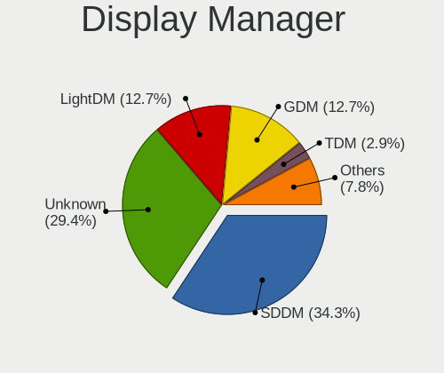

| Name    | Notebooks | Percent |
|---------|-----------|---------|
| SDDM    | 26        | 36.11%  |
| Unknown | 20        | 27.78%  |
| LightDM | 11        | 15.28%  |
| GDM     | 7         | 9.72%   |
| TDM     | 3         | 4.17%   |
| SLiM    | 2         | 2.78%   |
| XDM     | 1         | 1.39%   |
| LXDM    | 1         | 1.39%   |
| GREETD  | 1         | 1.39%   |

OS Lang
-------

Language

| Lang    | Notebooks | Percent |
|---------|-----------|---------|
| en_US   | 28        | 38.89%  |
| Unknown | 11        | 15.28%  |
| en_GB   | 5         | 6.94%   |
| C.UTF8  | 5         | 6.94%   |
| ru_RU   | 4         | 5.56%   |
| fr_FR   | 4         | 5.56%   |
| cs_CZ   | 4         | 5.56%   |
| de_DE   | 3         | 4.17%   |
| C       | 2         | 2.78%   |
| ro_RO   | 1         | 1.39%   |
| pl_PL   | 1         | 1.39%   |
| it_IT   | 1         | 1.39%   |
| fr_CA   | 1         | 1.39%   |
| en_AU   | 1         | 1.39%   |
| el_GR   | 1         | 1.39%   |

Boot Mode
---------

EFI or BIOS

| Mode | Notebooks | Percent |
|------|-----------|---------|
| EFI  | 57        | 80.28%  |
| BIOS | 14        | 19.72%  |

Filesystem
----------

Type of filesystem

| Type    | Notebooks | Percent |
|---------|-----------|---------|
| Ext4    | 41        | 57.75%  |
| Btrfs   | 26        | 36.62%  |
| XXXXXXX | 1         | 1.41%   |
| Xfs     | 1         | 1.41%   |
| Jfs     | 1         | 1.41%   |
| F2fs    | 1         | 1.41%   |

Part. scheme
------------

Scheme of partitioning

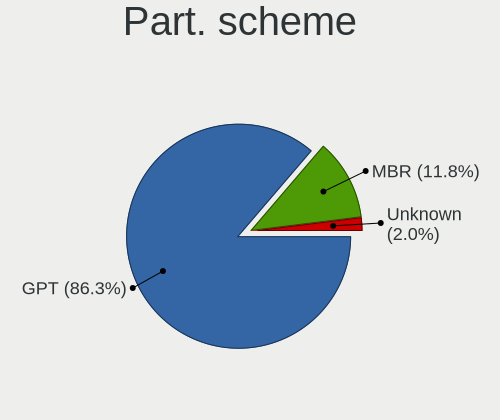

| Type    | Notebooks | Percent |
|---------|-----------|---------|
| GPT     | 61        | 84.72%  |
| MBR     | 9         | 12.5%   |
| Unknown | 2         | 2.78%   |

Dual Boot with Linux/BSD
------------------------

Hosting more than one Linux/BSD

| Dual boot | Notebooks | Percent |
|-----------|-----------|---------|
| No        | 51        | 70.83%  |
| Yes       | 21        | 29.17%  |

Dual Boot (Win)
---------------

Hosting Linux and Windows

| Dual boot | Notebooks | Percent |
|-----------|-----------|---------|
| No        | 45        | 62.5%   |
| Yes       | 27        | 37.5%   |

Board
-----

Vendor
------

Motherboard manufacturer

| Name             | Notebooks | Percent |
|------------------|-----------|---------|
| Lenovo           | 14        | 19.72%  |
| Hewlett-Packard  | 12        | 16.9%   |
| ASUSTek Computer | 11        | 15.49%  |
| Dell             | 10        | 14.08%  |
| Acer             | 6         | 8.45%   |
| MSI              | 3         | 4.23%   |
| HUAWEI           | 3         | 4.23%   |
| Unknown          | 2         | 2.82%   |
| Valve            | 1         | 1.41%   |
| TUXEDO           | 1         | 1.41%   |
| Toshiba          | 1         | 1.41%   |
| Timi             | 1         | 1.41%   |
| Star Labs        | 1         | 1.41%   |
| realme           | 1         | 1.41%   |
| Panasonic        | 1         | 1.41%   |
| MAXDATA          | 1         | 1.41%   |
| Fujitsu          | 1         | 1.41%   |
| Apple            | 1         | 1.41%   |

Model
-----

Motherboard model

| Name                                        | Notebooks | Percent |
|---------------------------------------------|-----------|---------|
| ASUS ROG Zephyrus G14 GA401II_GA401II       | 3         | 4.23%   |
| Dell Precision 7770                         | 2         | 2.82%   |
| ASUS ROG Strix G513QY_G513QY                | 2         | 2.82%   |
| Unknown                                     | 2         | 2.82%   |
| Valve Jupiter                               | 1         | 1.41%   |
| TUXEDO Polaris AMD Gen3 (CZN)               | 1         | 1.41%   |
| Toshiba Satellite L850                      | 1         | 1.41%   |
| Timi RedmiBook Pro 15S                      | 1         | 1.41%   |
| Star Labs StarBook                          | 1         | 1.41%   |
| realme RMNBXXXX                             | 1         | 1.41%   |
| Panasonic CF-53ASCZGFG                      | 1         | 1.41%   |
| MSI Vector GP66 12UEO                       | 1         | 1.41%   |
| MSI GS66 Stealth 10UE                       | 1         | 1.41%   |
| MSI GE76 Raider 11UH                        | 1         | 1.41%   |
| MAXDATA o.max_5xs                           | 1         | 1.41%   |
| Lenovo ThinkPad X200 7459L61                | 1         | 1.41%   |
| Lenovo ThinkPad X13 Gen 3 21CM0024US        | 1         | 1.41%   |
| Lenovo ThinkPad X1 Extreme Gen 3 20TK001JUS | 1         | 1.41%   |
| Lenovo ThinkPad X1 Extreme 2nd 20QVCTO1WW   | 1         | 1.41%   |
| Lenovo ThinkPad T470p 20J7S25C00            | 1         | 1.41%   |
| Lenovo ThinkPad T16 Gen 1 21CH000FUS        | 1         | 1.41%   |
| Lenovo ThinkPad T14 Gen 2i 20W1SCBN00       | 1         | 1.41%   |
| Lenovo ThinkPad P51 20HHCTO1WW              | 1         | 1.41%   |
| Lenovo ThinkPad P14s Gen 2a 21A0000JMH      | 1         | 1.41%   |
| Lenovo ThinkPad Edge E330 3354AMG           | 1         | 1.41%   |
| Lenovo ThinkPad E15 Gen 2 20T9S00K00        | 1         | 1.41%   |
| Lenovo Legion 5 Pro 16IAH7H 82RF            | 1         | 1.41%   |
| Lenovo Legion 5 15ACH6H 82JU                | 1         | 1.41%   |
| Lenovo IdeaPad Yoga 13 20175                | 1         | 1.41%   |
| HUAWEI NBLK-WAX9X                           | 1         | 1.41%   |
| HUAWEI KPL-W0X                              | 1         | 1.41%   |
| HUAWEI CREM-WXX9                            | 1         | 1.41%   |
| HP ZBook 17 G3                              | 1         | 1.41%   |
| HP Victus by Laptop 16-e0xxx                | 1         | 1.41%   |
| HP Victus by Gaming Laptop 15-fb0xxx        | 1         | 1.41%   |
| HP Pavilion Notebook                        | 1         | 1.41%   |
| HP Pavilion Gaming Laptop 15-ec1xxx         | 1         | 1.41%   |
| HP OMEN by Laptop                           | 1         | 1.41%   |
| HP Laptop 17-cp0xxx                         | 1         | 1.41%   |
| HP G62                                      | 1         | 1.41%   |

Model Family
------------

Motherboard model prefix

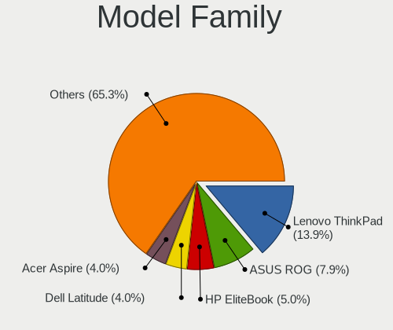

| Name                   | Notebooks | Percent |
|------------------------|-----------|---------|
| Lenovo ThinkPad        | 11        | 15.49%  |
| ASUS ROG               | 7         | 9.86%   |
| HP EliteBook           | 4         | 5.63%   |
| Acer Aspire            | 4         | 5.63%   |
| Dell Precision         | 3         | 4.23%   |
| Dell Latitude          | 3         | 4.23%   |
| Lenovo Legion          | 2         | 2.82%   |
| HP Victus              | 2         | 2.82%   |
| HP Pavilion            | 2         | 2.82%   |
| Dell XPS               | 2         | 2.82%   |
| Dell Inspiron          | 2         | 2.82%   |
| Acer Swift             | 2         | 2.82%   |
| Unknown                | 2         | 2.82%   |
| Valve Jupiter          | 1         | 1.41%   |
| TUXEDO Polaris         | 1         | 1.41%   |
| Toshiba Satellite      | 1         | 1.41%   |
| Timi RedmiBook         | 1         | 1.41%   |
| Star Labs StarBook     | 1         | 1.41%   |
| realme RMNBXXXX        | 1         | 1.41%   |
| Panasonic CF-53ASCZGFG | 1         | 1.41%   |
| MSI Vector             | 1         | 1.41%   |
| MSI GS66               | 1         | 1.41%   |
| MSI GE76               | 1         | 1.41%   |
| MAXDATA o.max          | 1         | 1.41%   |
| Lenovo IdeaPad         | 1         | 1.41%   |
| HUAWEI NBLK-WAX9X      | 1         | 1.41%   |
| HUAWEI KPL-W0X         | 1         | 1.41%   |
| HUAWEI CREM-WXX9       | 1         | 1.41%   |
| HP ZBook               | 1         | 1.41%   |
| HP OMEN                | 1         | 1.41%   |
| HP Laptop              | 1         | 1.41%   |
| HP G62                 | 1         | 1.41%   |
| Fujitsu CELSIUS        | 1         | 1.41%   |
| ASUS VivoBook          | 1         | 1.41%   |
| ASUS Strix             | 1         | 1.41%   |
| ASUS N550JX            | 1         | 1.41%   |
| ASUS ASUS              | 1         | 1.41%   |
| Apple MacBookPro11     | 1         | 1.41%   |

MFG Year
--------

Motherboard manufacture year

| Year | Notebooks | Percent |
|------|-----------|---------|
| 2021 | 17        | 23.94%  |
| 2022 | 12        | 16.9%   |
| 2020 | 7         | 9.86%   |
| 2019 | 7         | 9.86%   |
| 2018 | 6         | 8.45%   |
| 2012 | 5         | 7.04%   |
| 2017 | 3         | 4.23%   |
| 2016 | 3         | 4.23%   |
| 2010 | 3         | 4.23%   |
| 2011 | 2         | 2.82%   |
| 2023 | 1         | 1.41%   |
| 2015 | 1         | 1.41%   |
| 2014 | 1         | 1.41%   |
| 2013 | 1         | 1.41%   |
| 2008 | 1         | 1.41%   |
| 2007 | 1         | 1.41%   |

Form Factor
-----------

Physical design of the computer

| Name     | Notebooks | Percent |
|----------|-----------|---------|
| Notebook | 71        | 100%    |

Secure Boot
-----------

Enabled or disabled

| State    | Notebooks | Percent |
|----------|-----------|---------|
| Disabled | 71        | 100%    |

Coreboot
--------

Have coreboot on board

| Used | Notebooks | Percent |
|------|-----------|---------|
| No   | 70        | 98.59%  |
| Yes  | 1         | 1.41%   |

RAM Size
--------

Total RAM memory

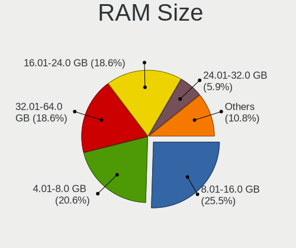

| Size in GB  | Notebooks | Percent |
|-------------|-----------|---------|
| 8.01-16.0   | 18        | 25%     |
| 16.01-24.0  | 16        | 22.22%  |
| 32.01-64.0  | 13        | 18.06%  |
| 4.01-8.0    | 12        | 16.67%  |
| 24.01-32.0  | 5         | 6.94%   |
| 3.01-4.0    | 3         | 4.17%   |
| 64.01-256.0 | 3         | 4.17%   |
| 2.01-3.0    | 1         | 1.39%   |
| 0.51-1.0    | 1         | 1.39%   |

RAM Used
--------

Used RAM memory

| Used GB    | Notebooks | Percent |
|------------|-----------|---------|
| 2.01-3.0   | 16        | 20.51%  |
| 1.01-2.0   | 15        | 19.23%  |
| 4.01-8.0   | 11        | 14.1%   |
| 0.51-1.0   | 10        | 12.82%  |
| 8.01-16.0  | 9         | 11.54%  |
| 3.01-4.0   | 8         | 10.26%  |
| 0.01-0.5   | 8         | 10.26%  |
| 32.01-64.0 | 1         | 1.28%   |

Total Drives
------------

Number of drives on board

| Drives | Notebooks | Percent |
|--------|-----------|---------|
| 1      | 48        | 66.67%  |
| 2      | 23        | 31.94%  |
| 3      | 1         | 1.39%   |

Has CD-ROM
----------

Has CD-ROM on board

| Presented | Notebooks | Percent |
|-----------|-----------|---------|
| No        | 60        | 84.51%  |
| Yes       | 11        | 15.49%  |

Has Ethernet
------------

Has Ethernet on board

| Presented | Notebooks | Percent |
|-----------|-----------|---------|
| Yes       | 57        | 79.17%  |
| No        | 15        | 20.83%  |

Has WiFi
--------

Has WiFi module

| Presented | Notebooks | Percent |
|-----------|-----------|---------|
| Yes       | 71        | 100%    |

Has Bluetooth
-------------

Has Bluetooth module

| Presented | Notebooks | Percent |
|-----------|-----------|---------|
| Yes       | 64        | 90.14%  |
| No        | 7         | 9.86%   |

Location
--------

Country
-------

Geographic location (country)

| Country     | Notebooks | Percent |
|-------------|-----------|---------|
| USA         | 19        | 26.76%  |
| Russia      | 8         | 11.27%  |
| Canada      | 6         | 8.45%   |
| France      | 5         | 7.04%   |
| Spain       | 4         | 5.63%   |
| Germany     | 4         | 5.63%   |
| Poland      | 3         | 4.23%   |
| Czechia     | 3         | 4.23%   |
| UK          | 2         | 2.82%   |
| Italy       | 2         | 2.82%   |
| Romania     | 1         | 1.41%   |
| Portugal    | 1         | 1.41%   |
| Norway      | 1         | 1.41%   |
| New Zealand | 1         | 1.41%   |
| Netherlands | 1         | 1.41%   |
| Lithuania   | 1         | 1.41%   |
| Iceland     | 1         | 1.41%   |
| Hungary     | 1         | 1.41%   |
| Hong Kong   | 1         | 1.41%   |
| Greece      | 1         | 1.41%   |
| China       | 1         | 1.41%   |
| Brazil      | 1         | 1.41%   |
| Belarus     | 1         | 1.41%   |
| Australia   | 1         | 1.41%   |
| Algeria     | 1         | 1.41%   |

City
----

Geographic location (city)

| City          | Notebooks | Percent |
|---------------|-----------|---------|
| St Petersburg | 3         | 4.11%   |
| Berlin        | 3         | 4.11%   |
| Taganrog      | 2         | 2.74%   |
| Šlapanice    | 2         | 2.74%   |
| Oviedo        | 2         | 2.74%   |
| Milan         | 2         | 2.74%   |
| Kippens       | 2         | 2.74%   |
| Wlodawa       | 1         | 1.37%   |
| Whitby        | 1         | 1.37%   |
| Vilnius       | 1         | 1.37%   |
| Urbana        | 1         | 1.37%   |
| Trakai        | 1         | 1.37%   |
| Toronto       | 1         | 1.37%   |
| Sun Prairie   | 1         | 1.37%   |
| Roland        | 1         | 1.37%   |
| Reykjavik     | 1         | 1.37%   |
| Rapid City    | 1         | 1.37%   |
| Québec       | 1         | 1.37%   |
| Prague        | 1         | 1.37%   |
| Pittsburgh    | 1         | 1.37%   |
| Piraeus       | 1         | 1.37%   |
| Paris         | 1         | 1.37%   |
| Oslo          | 1         | 1.37%   |
| Omsk          | 1         | 1.37%   |
| Nea Artaki    | 1         | 1.37%   |
| Nampa         | 1         | 1.37%   |
| Monroe        | 1         | 1.37%   |
| Minsk         | 1         | 1.37%   |
| Miami         | 1         | 1.37%   |
| Melbourne     | 1         | 1.37%   |
| Mangalia      | 1         | 1.37%   |
| Majadahonda   | 1         | 1.37%   |
| Madrid        | 1         | 1.37%   |
| Lomme         | 1         | 1.37%   |
| Lisbon        | 1         | 1.37%   |
| Krakow        | 1         | 1.37%   |
| Kobrasol      | 1         | 1.37%   |
| Ketchikan     | 1         | 1.37%   |
| Kazan'        | 1         | 1.37%   |
| Irkutsk       | 1         | 1.37%   |

Drives
------

Drive Vendor
------------

Hard drive vendors

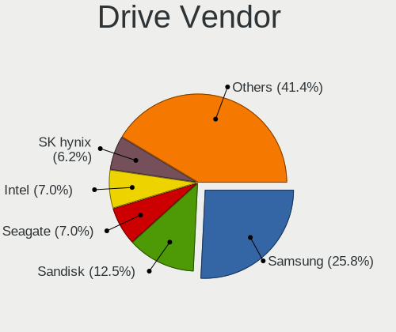

| Vendor                      | Notebooks | Drives | Percent |
|-----------------------------|-----------|--------|---------|
| Samsung Electronics         | 24        | 38     | 27.59%  |
| Sandisk                     | 13        | 16     | 14.94%  |
| SK hynix                    | 7         | 7      | 8.05%   |
| Seagate                     | 7         | 8      | 8.05%   |
| Intel                       | 5         | 6      | 5.75%   |
| WDC                         | 3         | 4      | 3.45%   |
| Phison Electronics          | 3         | 4      | 3.45%   |
| Micron Technology           | 3         | 3      | 3.45%   |
| Kingston Technology Company | 3         | 3      | 3.45%   |
| HGST                        | 3         | 3      | 3.45%   |
| Unknown                     | 2         | 3      | 2.3%    |
| GOODRAM                     | 2         | 2      | 2.3%    |
| China                       | 2         | 5      | 2.3%    |
| A-DATA Technology           | 2         | 2      | 2.3%    |
| Toshiba                     | 1         | 1      | 1.15%   |
| Micron/Crucial Technology   | 1         | 2      | 1.15%   |
| KIOXIA                      | 1         | 1      | 1.15%   |
| Kingston                    | 1         | 1      | 1.15%   |
| Intenso                     | 1         | 1      | 1.15%   |
| Hitachi                     | 1         | 1      | 1.15%   |
| Dogfish                     | 1         | 1      | 1.15%   |
| Crucial                     | 1         | 1      | 1.15%   |

Drive Model
-----------

Hard drive models

| Model                                               | Notebooks | Percent |
|-----------------------------------------------------|-----------|---------|
| Samsung NVMe SSD Controller SM981/PM981/PM983 256GB | 12        | 13.19%  |
| Samsung NVMe SSD Controller PM9A1/PM9A3/980PRO 1TB  | 8         | 8.79%   |
| Sandisk WD Blue SN550 NVMe SSD 512GB                | 4         | 4.4%    |
| Sandisk WD Black SN750 / PC SN730 NVMe SSD 256GB    | 3         | 3.3%    |
| Samsung SSD 980 1TB                                 | 3         | 3.3%    |
| Seagate ST1000LM035-1RK172 1TB                      | 2         | 2.2%    |
| Seagate ST1000LM024 HN-M101MBB 1TB                  | 2         | 2.2%    |
| Micron 2450_MTFDKBA1T0TFK 1TB                       | 2         | 2.2%    |
| Intel SSDPEKNU512GZ 512GB                           | 2         | 2.2%    |
| HGST HTS725050A7E630 500GB                          | 2         | 2.2%    |
| China SSD 1TB                                       | 2         | 2.2%    |
| WDC WDS500G1B0B-00AS40 500GB SSD                    | 1         | 1.1%    |
| WDC WDS240G2G0A-00JH30 240GB SSD                    | 1         | 1.1%    |
| WDC WD20 SPZX-22CRAT0 2TB                           | 1         | 1.1%    |
| Unknown NVMe SSD Drive 1TB                          | 1         | 1.1%    |
| Unknown MMC Card  128GB                             | 1         | 1.1%    |
| Toshiba MK5056GSY 500GB                             | 1         | 1.1%    |
| SK hynix SKHynix_HFS001TDE9X081N 1024GB             | 1         | 1.1%    |
| SK hynix SC311 SATA 128GB SSD                       | 1         | 1.1%    |
| SK hynix PC801 NVMe 1TB                             | 1         | 1.1%    |
| SK hynix PC711 HFS512GDE9X073N 512GB                | 1         | 1.1%    |
| SK hynix HFM001TD3JX013N 1TB                        | 1         | 1.1%    |
| SK hynix BC711 NVMe 512GB                           | 1         | 1.1%    |
| SK hynix BC501 NVMe Solid State Drive 512GB         | 1         | 1.1%    |
| Seagate ST500LX025-1U717D 500GB                     | 1         | 1.1%    |
| Seagate ST500LT012-1DG142 500GB                     | 1         | 1.1%    |
| Seagate ST2000LM015-2E8174 2TB                      | 1         | 1.1%    |
| Sandisk WD_BLACK SN850X 2000GB                      | 1         | 1.1%    |
| Sandisk WD_BLACK SN850X 1000GB                      | 1         | 1.1%    |
| Sandisk WDC PC SN530 SDBPTPZ-512G-1002 512GB        | 1         | 1.1%    |
| SanDisk SDSSDHII960G 960GB                          | 1         | 1.1%    |
| SanDisk SD9SN8W256G1027 256GB SSD                   | 1         | 1.1%    |
| SanDisk SD8SN8U-256G-1006 256GB SSD                 | 1         | 1.1%    |
| Samsung MZVLQ512HBLU-00B00 512GB                    | 1         | 1.1%    |
| Samsung MZVLQ1T0HBLB-00B00 1TB                      | 1         | 1.1%    |
| Samsung MZMPC128HBFU-000L1 128GB SSD                | 1         | 1.1%    |
| Samsung MZALQ512HALU-000L1 512GB                    | 1         | 1.1%    |
| Samsung MZ7TE256HMHP-000H1 256GB SSD                | 1         | 1.1%    |
| Phison PS5013 E13 NVMe Controller 512GB             | 1         | 1.1%    |
| Phison PCIe SSD 512GB                               | 1         | 1.1%    |

HDD Vendor
----------

Hard disk drive vendors

| Vendor  | Notebooks | Drives | Percent |
|---------|-----------|--------|---------|
| Seagate | 7         | 8      | 53.85%  |
| HGST    | 3         | 3      | 23.08%  |
| WDC     | 1         | 1      | 7.69%   |
| Toshiba | 1         | 1      | 7.69%   |
| Hitachi | 1         | 1      | 7.69%   |

SSD Vendor
----------

Solid state drive vendors

| Vendor              | Notebooks | Drives | Percent |
|---------------------|-----------|--------|---------|
| SanDisk             | 3         | 4      | 16.67%  |
| WDC                 | 2         | 3      | 11.11%  |
| Samsung Electronics | 2         | 3      | 11.11%  |
| GOODRAM             | 2         | 2      | 11.11%  |
| China               | 2         | 5      | 11.11%  |
| A-DATA Technology   | 2         | 2      | 11.11%  |
| SK hynix            | 1         | 1      | 5.56%   |
| Intenso             | 1         | 1      | 5.56%   |
| Intel               | 1         | 1      | 5.56%   |
| Dogfish             | 1         | 1      | 5.56%   |
| Crucial             | 1         | 1      | 5.56%   |

Drive Kind
----------

HDD or SSD

| Kind | Notebooks | Drives | Percent |
|------|-----------|--------|---------|
| NVMe | 49        | 73     | 61.25%  |
| SSD  | 17        | 24     | 21.25%  |
| HDD  | 13        | 14     | 16.25%  |
| MMC  | 1         | 2      | 1.25%   |

Drive Connector
---------------

SATA, SAS, NVMe, etc.

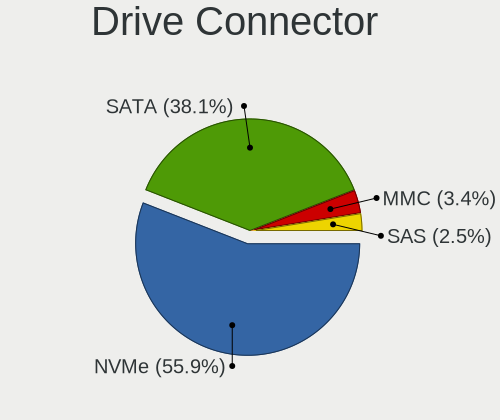

| Type | Notebooks | Drives | Percent |
|------|-----------|--------|---------|
| NVMe | 49        | 73     | 62.03%  |
| SATA | 28        | 37     | 35.44%  |
| SAS  | 1         | 1      | 1.27%   |
| MMC  | 1         | 2      | 1.27%   |

Drive Size
----------

Size of hard drive

| Size in TB | Notebooks | Drives | Percent |
|------------|-----------|--------|---------|
| 0.01-0.5   | 16        | 20     | 53.33%  |
| 0.51-1.0   | 10        | 11     | 33.33%  |
| 1.01-2.0   | 4         | 7      | 13.33%  |

Space Total
-----------

Amount of disk space available on the file system

| Size in GB     | Notebooks | Percent |
|----------------|-----------|---------|
| 251-500        | 19        | 26.39%  |
| 501-1000       | 17        | 23.61%  |
| 101-250        | 13        | 18.06%  |
| 1001-2000      | 8         | 11.11%  |
| More than 3000 | 4         | 5.56%   |
| 2001-3000      | 3         | 4.17%   |
| 51-100         | 3         | 4.17%   |
| 1-20           | 2         | 2.78%   |
| Unknown        | 2         | 2.78%   |
| 21-50          | 1         | 1.39%   |

Space Used
----------

Amount of used disk space

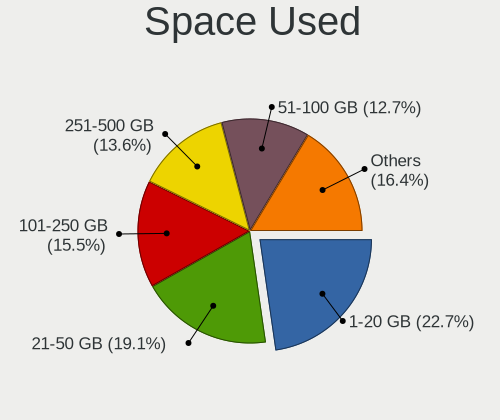

| Used GB        | Notebooks | Percent |
|----------------|-----------|---------|
| 21-50          | 15        | 19.48%  |
| 1-20           | 15        | 19.48%  |
| 101-250        | 12        | 15.58%  |
| 251-500        | 11        | 14.29%  |
| 51-100         | 10        | 12.99%  |
| 501-1000       | 8         | 10.39%  |
| 1001-2000      | 3         | 3.9%    |
| Unknown        | 2         | 2.6%    |
| More than 3000 | 1         | 1.3%    |

Malfunc. Drives
---------------

Drive models with a malfunction

| Model                                | Notebooks | Drives | Percent |
|--------------------------------------|-----------|--------|---------|
| Seagate ST1000LM024 HN-M101MBB 1TB   | 2         | 3      | 25%     |
| HGST HTS725050A7E630 500GB           | 2         | 2      | 25%     |
| Toshiba MK5056GSY 500GB              | 1         | 1      | 12.5%   |
| SK hynix PC711 HFS512GDE9X073N 512GB | 1         | 1      | 12.5%   |
| Intel SSDSC2BF180A5L 180GB           | 1         | 1      | 12.5%   |
| HGST HTS721010A9E630 1TB             | 1         | 1      | 12.5%   |

Malfunc. Drive Vendor
---------------------

Vendors of faulty drives

| Vendor   | Notebooks | Drives | Percent |
|----------|-----------|--------|---------|
| HGST     | 3         | 3      | 37.5%   |
| Seagate  | 2         | 3      | 25%     |
| Toshiba  | 1         | 1      | 12.5%   |
| SK hynix | 1         | 1      | 12.5%   |
| Intel    | 1         | 1      | 12.5%   |

Malfunc. HDD Vendor
-------------------

Vendors of faulty HDD drives

| Vendor  | Notebooks | Drives | Percent |
|---------|-----------|--------|---------|
| HGST    | 3         | 3      | 50%     |
| Seagate | 2         | 3      | 33.33%  |
| Toshiba | 1         | 1      | 16.67%  |

Malfunc. Drive Kind
-------------------

Kinds of faulty drives

| Kind | Notebooks | Drives | Percent |
|------|-----------|--------|---------|
| HDD  | 6         | 7      | 75%     |
| NVMe | 1         | 1      | 12.5%   |
| SSD  | 1         | 1      | 12.5%   |

Failed Drives
-------------

Failed drive models

| Model                           | Notebooks | Drives | Percent |
|---------------------------------|-----------|--------|---------|
| Samsung Electronics SSD 980 1TB | 1         | 1      | 100%    |

Failed Drive Vendor
-------------------

Failed drive vendors

| Vendor              | Notebooks | Drives | Percent |
|---------------------|-----------|--------|---------|
| Samsung Electronics | 1         | 1      | 100%    |

Drive Status
------------

Number of failed and malfunc. drives

| Status   | Notebooks | Drives | Percent |
|----------|-----------|--------|---------|
| Works    | 60        | 92     | 80%     |
| Malfunc  | 8         | 9      | 10.67%  |
| Detected | 6         | 11     | 8%      |
| Failed   | 1         | 1      | 1.33%   |

Storage controller
------------------

Storage Vendor
--------------

Storage controller vendors

| Vendor                      | Notebooks | Percent |
|-----------------------------|-----------|---------|
| Intel                       | 32        | 33.33%  |
| Samsung Electronics         | 22        | 22.92%  |
| AMD                         | 13        | 13.54%  |
| Sandisk                     | 10        | 10.42%  |
| SK hynix                    | 6         | 6.25%   |
| Kingston Technology Company | 4         | 4.17%   |
| Phison Electronics          | 3         | 3.13%   |
| Micron Technology           | 3         | 3.13%   |
| Micron/Crucial Technology   | 1         | 1.04%   |
| KIOXIA                      | 1         | 1.04%   |
| INNOGRIT                    | 1         | 1.04%   |

Storage Model
-------------

Storage controller models

| Model                                                                          | Notebooks | Percent |
|--------------------------------------------------------------------------------|-----------|---------|
| Samsung NVMe SSD Controller SM981/PM981/PM983                                  | 12        | 11.65%  |
| AMD FCH SATA Controller [AHCI mode]                                            | 12        | 11.65%  |
| Samsung NVMe SSD Controller PM9A1/PM9A3/980PRO                                 | 8         | 7.77%   |
| Intel 7 Series Chipset Family 6-port SATA Controller [AHCI mode]               | 6         | 5.83%   |
| Samsung NVMe SSD Controller 980                                                | 5         | 4.85%   |
| SK hynix Gold P31/PC711 NVMe Solid State Drive                                 | 4         | 3.88%   |
| SanDisk WD Blue SN550 NVMe SSD                                                 | 4         | 3.88%   |
| Intel Volume Management Device NVMe RAID Controller                            | 4         | 3.88%   |
| SanDisk WD Black SN750 / PC SN730 NVMe SSD                                     | 3         | 2.91%   |
| Micron NVMe Storage Controller                                                 | 3         | 2.91%   |
| Intel Non-Volatile memory controller                                           | 3         | 2.91%   |
| Intel HM170/QM170 Chipset SATA Controller [AHCI Mode]                          | 3         | 2.91%   |
| Sandisk Western Digital WD Black SN850X NVMe SSD                               | 2         | 1.94%   |
| Kingston Company Company Non-Volatile memory controller                        | 2         | 1.94%   |
| Intel Sunrise Point-LP SATA Controller [AHCI mode]                             | 2         | 1.94%   |
| Intel Cannon Lake Mobile PCH SATA AHCI Controller                              | 2         | 1.94%   |
| Intel 82801GBM/GHM (ICH7-M Family) SATA Controller [AHCI mode]                 | 2         | 1.94%   |
| Intel 82801 Mobile SATA Controller [RAID mode]                                 | 2         | 1.94%   |
| Intel 6 Series/C200 Series Chipset Family 6 port Mobile SATA AHCI Controller   | 2         | 1.94%   |
| SK hynix Platinum P41 NVMe Solid State Drive 2TB                               | 1         | 0.97%   |
| SK hynix BC501 NVMe Solid State Drive                                          | 1         | 0.97%   |
| SanDisk Non-Volatile memory controller                                         | 1         | 0.97%   |
| Phison PS5013 E13 NVMe Controller                                              | 1         | 0.97%   |
| Phison NVMe Storage Controller                                                 | 1         | 0.97%   |
| Phison E12 NVMe Controller                                                     | 1         | 0.97%   |
| Micron/Crucial P1 NVMe PCIe SSD                                                | 1         | 0.97%   |
| KIOXIA NVMe SSD Controller BG4                                                 | 1         | 0.97%   |
| Kingston Company OM3PDP3 NVMe SSD                                              | 1         | 0.97%   |
| Kingston Company NVMe Controller                                               | 1         | 0.97%   |
| Intel Wildcat Point-LP SATA Controller [AHCI Mode]                             | 1         | 0.97%   |
| Intel Tiger Lake-LP SATA Controller                                            | 1         | 0.97%   |
| Intel SSD 660P Series                                                          | 1         | 0.97%   |
| Intel Q170/Q150/B150/H170/H110/Z170/CM236 Chipset SATA Controller [AHCI Mode]  | 1         | 0.97%   |
| Intel Jasper Lake SATA AHCI Controller                                         | 1         | 0.97%   |
| Intel 82801IBM/IEM (ICH9M/ICH9M-E) 4 port SATA Controller [AHCI mode]          | 1         | 0.97%   |
| Intel 82801G (ICH7 Family) IDE Controller                                      | 1         | 0.97%   |
| Intel 8 Series/C220 Series Chipset Family 6-port SATA Controller 1 [AHCI mode] | 1         | 0.97%   |
| Intel 5 Series/3400 Series Chipset 6 port SATA AHCI Controller                 | 1         | 0.97%   |
| INNOGRIT Non-Volatile memory controller                                        | 1         | 0.97%   |
| AMD SB7x0/SB8x0/SB9x0 SATA Controller [AHCI mode]                              | 1         | 0.97%   |

Storage Kind
------------

Kind of storage controller (IDE, SATA, NVMe, SAS, ...)

| Kind | Notebooks | Percent |
|------|-----------|---------|
| NVMe | 49        | 52.69%  |
| SATA | 37        | 39.78%  |
| RAID | 6         | 6.45%   |
| IDE  | 1         | 1.08%   |

Processor
---------

CPU Vendor
----------

Processor vendors

| Vendor | Notebooks | Percent |
|--------|-----------|---------|
| Intel  | 46        | 64.79%  |
| AMD    | 25        | 35.21%  |

CPU Model
---------

Processor models

| Model                                         | Notebooks | Percent |
|-----------------------------------------------|-----------|---------|
| AMD Ryzen 7 5800H with Radeon Graphics        | 5         | 6.94%   |
| Intel 12th Gen Core i7-12700H                 | 4         | 5.56%   |
| AMD Ryzen 7 4800HS with Radeon Graphics       | 3         | 4.17%   |
| Intel Core i7-6820HQ CPU @ 2.70GHz            | 2         | 2.78%   |
| Intel Core i7-2670QM CPU @ 2.20GHz            | 2         | 2.78%   |
| Intel Core i5-3360M CPU @ 2.80GHz             | 2         | 2.78%   |
| Intel 12th Gen Core i7-12850HX                | 2         | 2.78%   |
| Intel 11th Gen Core i7-1185G7 @ 3.00GHz       | 2         | 2.78%   |
| Intel 11th Gen Core i7-1165G7 @ 2.80GHz       | 2         | 2.78%   |
| AMD Ryzen 9 5900HX with Radeon Graphics       | 2         | 2.78%   |
| AMD Ryzen 5 3500U with Radeon Vega Mobile Gfx | 2         | 2.78%   |
| Intel Xeon CPU E3-1505M v6 @ 3.00GHz          | 1         | 1.39%   |
| Intel Pentium Silver N6000 @ 1.10GHz          | 1         | 1.39%   |
| Intel Pentium CPU B980 @ 2.40GHz              | 1         | 1.39%   |
| Intel Core i9-10885H CPU @ 2.40GHz            | 1         | 1.39%   |
| Intel Core i7-9750H CPU @ 2.60GHz             | 1         | 1.39%   |
| Intel Core i7-8850H CPU @ 2.60GHz             | 1         | 1.39%   |
| Intel Core i7-8750H CPU @ 2.20GHz             | 1         | 1.39%   |
| Intel Core i7-7820HQ CPU @ 2.90GHz            | 1         | 1.39%   |
| Intel Core i7-7700HQ CPU @ 2.80GHz            | 1         | 1.39%   |
| Intel Core i7-4800MQ CPU @ 2.70GHz            | 1         | 1.39%   |
| Intel Core i7-4720HQ CPU @ 2.60GHz            | 1         | 1.39%   |
| Intel Core i7-10875H CPU @ 2.30GHz            | 1         | 1.39%   |
| Intel Core i7-10750H CPU @ 2.60GHz            | 1         | 1.39%   |
| Intel Core i5-9300H CPU @ 2.40GHz             | 1         | 1.39%   |
| Intel Core i5-7300U CPU @ 2.60GHz             | 1         | 1.39%   |
| Intel Core i5-6200U CPU @ 2.30GHz             | 1         | 1.39%   |
| Intel Core i5-5200U CPU @ 2.20GHz             | 1         | 1.39%   |
| Intel Core i5-4258U CPU @ 2.40GHz             | 1         | 1.39%   |
| Intel Core i5-3317U CPU @ 1.70GHz             | 1         | 1.39%   |
| Intel Core i5-2520M CPU @ 2.50GHz             | 1         | 1.39%   |
| Intel Core i3-2328M CPU @ 2.20GHz             | 1         | 1.39%   |
| Intel Core i3 CPU M 380 @ 2.53GHz             | 1         | 1.39%   |
| Intel Core Duo CPU T2450 @ 2.00GHz            | 1         | 1.39%   |
| Intel Core 2 Duo CPU P8400 @ 2.26GHz          | 1         | 1.39%   |
| Intel Atom CPU N270 @ 1.60GHz                 | 1         | 1.39%   |
| Intel 12th Gen Core i7-1260P                  | 1         | 1.39%   |
| Intel 11th Gen Core i7-11800H @ 2.30GHz       | 1         | 1.39%   |
| Intel 11th Gen Core i5-1135G7 @ 2.40GHz       | 1         | 1.39%   |
| Intel 11th Gen Core i5-1130G7 @ 1.10GHz       | 1         | 1.39%   |

CPU Model Family
----------------

Processor model prefix

| Model                | Notebooks | Percent |
|----------------------|-----------|---------|
| Other                | 16        | 22.54%  |
| Intel Core i7        | 13        | 18.31%  |
| AMD Ryzen 7          | 11        | 15.49%  |
| Intel Core i5        | 9         | 12.68%  |
| AMD Ryzen 5          | 6         | 8.45%   |
| AMD Ryzen 7 PRO      | 3         | 4.23%   |
| Intel Core i3        | 2         | 2.82%   |
| AMD Ryzen 9          | 2         | 2.82%   |
| Intel Xeon           | 1         | 1.41%   |
| Intel Pentium Silver | 1         | 1.41%   |
| Intel Pentium        | 1         | 1.41%   |
| Intel Core i9        | 1         | 1.41%   |
| Intel Core Duo       | 1         | 1.41%   |
| Intel Core 2 Duo     | 1         | 1.41%   |
| Intel Atom           | 1         | 1.41%   |
| AMD Ryzen 5 PRO      | 1         | 1.41%   |
| AMD Athlon II        | 1         | 1.41%   |

CPU Cores
---------

Number of processor cores

| Number | Notebooks | Percent |
|--------|-----------|---------|
| 4      | 22        | 30.99%  |
| 8      | 18        | 25.35%  |
| 2      | 15        | 21.13%  |
| 6      | 8         | 11.27%  |
| 14     | 4         | 5.63%   |
| 16     | 2         | 2.82%   |
| 12     | 1         | 1.41%   |
| 1      | 1         | 1.41%   |

CPU Sockets
-----------

Number of sockets

| Number | Notebooks | Percent |
|--------|-----------|---------|
| 1      | 71        | 100%    |

CPU Threads
-----------

Threads per core (Hyper-Threading)

| Number | Notebooks | Percent |
|--------|-----------|---------|
| 2      | 65        | 91.55%  |
| 1      | 6         | 8.45%   |

CPU Op-Modes
------------

CPU Operation Modes (32-bit, 64-bit)

| Op mode        | Notebooks | Percent |
|----------------|-----------|---------|
| 32-bit, 64-bit | 69        | 97.18%  |
| 32-bit         | 2         | 2.82%   |

CPU Microcode
-------------

Microcode number

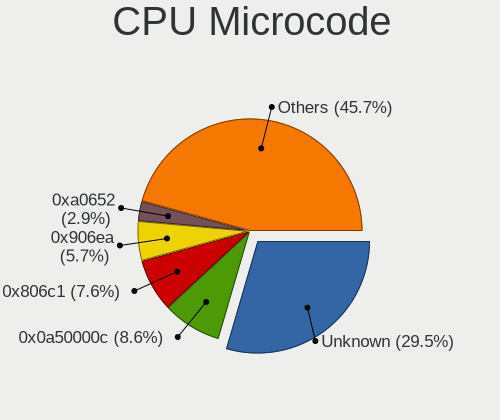

| Number     | Notebooks | Percent |
|------------|-----------|---------|
| Unknown    | 24        | 32%     |
| 0x806c1    | 7         | 9.33%   |
| 0x0a50000c | 7         | 9.33%   |
| 0x906ea    | 3         | 4%      |
| 0x906e9    | 3         | 4%      |
| 0x206a7    | 3         | 4%      |
| 0x08600104 | 3         | 4%      |
| 0xa0652    | 2         | 2.67%   |
| 0x906a3    | 2         | 2.67%   |
| 0x90672    | 2         | 2.67%   |
| 0x08608103 | 2         | 2.67%   |
| 0x08108109 | 2         | 2.67%   |
| 0x806e9    | 1         | 1.33%   |
| 0x806d1    | 1         | 1.33%   |
| 0x506e3    | 1         | 1.33%   |
| 0x406e3    | 1         | 1.33%   |
| 0x40651    | 1         | 1.33%   |
| 0x306d4    | 1         | 1.33%   |
| 0x306a9    | 1         | 1.33%   |
| 0x20655    | 1         | 1.33%   |
| 0x0a50000d | 1         | 1.33%   |
| 0x0a404102 | 1         | 1.33%   |
| 0x08900201 | 1         | 1.33%   |
| 0x08701021 | 1         | 1.33%   |
| 0x08600106 | 1         | 1.33%   |
| 0x08600103 | 1         | 1.33%   |
| 0x08101007 | 1         | 1.33%   |

CPU Microarch
-------------

Microarchitecture

| Name             | Notebooks | Percent |
|------------------|-----------|---------|
| Zen 3            | 9         | 12.68%  |
| KabyLake         | 8         | 11.27%  |
| TigerLake        | 7         | 9.86%   |
| Alderlake Hybrid | 7         | 9.86%   |
| Unknown          | 7         | 9.86%   |
| Zen 2            | 5         | 7.04%   |
| SandyBridge      | 5         | 7.04%   |
| Zen+             | 3         | 4.23%   |
| Skylake          | 3         | 4.23%   |
| IvyBridge        | 3         | 4.23%   |
| Haswell          | 3         | 4.23%   |
| CometLake        | 3         | 4.23%   |
| Zen              | 1         | 1.41%   |
| Westmere         | 1         | 1.41%   |
| Penryn           | 1         | 1.41%   |
| P6               | 1         | 1.41%   |
| K10              | 1         | 1.41%   |
| Icelake          | 1         | 1.41%   |
| Broadwell        | 1         | 1.41%   |
| Bonnell          | 1         | 1.41%   |

Graphics
--------

GPU Vendor
----------

Vendors of graphics cards

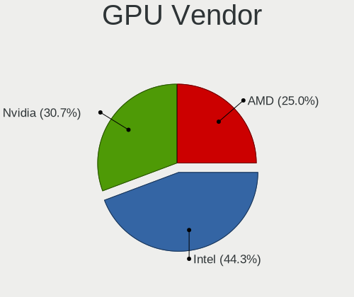

| Vendor | Notebooks | Percent |
|--------|-----------|---------|
| Intel  | 39        | 40.21%  |
| Nvidia | 30        | 30.93%  |
| AMD    | 28        | 28.87%  |

GPU Model
---------

Graphics card models

| Model                                                                         | Notebooks | Percent |
|-------------------------------------------------------------------------------|-----------|---------|
| AMD Cezanne [Radeon Vega Series / Radeon Vega Mobile Series]                  | 8         | 7.69%   |
| Nvidia GA106M [GeForce RTX 3060 Mobile / Max-Q]                               | 5         | 4.81%   |
| Intel TigerLake-LP GT2 [Iris Xe Graphics]                                     | 5         | 4.81%   |
| Intel Alder Lake-P Integrated Graphics Controller                             | 5         | 4.81%   |
| Intel 2nd Generation Core Processor Family Integrated Graphics Controller     | 5         | 4.81%   |
| AMD Renoir                                                                    | 5         | 4.81%   |
| Nvidia TU116M [GeForce GTX 1650 Ti Mobile]                                    | 3         | 2.88%   |
| Intel CoffeeLake-H GT2 [UHD Graphics 630]                                     | 3         | 2.88%   |
| AMD Rembrandt [Radeon 680M]                                                   | 3         | 2.88%   |
| AMD Picasso/Raven 2 [Radeon Vega Series / Radeon Vega Mobile Series]          | 3         | 2.88%   |
| Nvidia TU117M [GeForce MX450]                                                 | 2         | 1.92%   |
| Nvidia TU117M [GeForce GTX 1650 Mobile / Max-Q]                               | 2         | 1.92%   |
| Nvidia GA104GLM [RTX A3000 12GB Laptop GPU]                                   | 2         | 1.92%   |
| Intel Mobile 945GM/GMS/GME, 943/940GML Express Integrated Graphics Controller | 2         | 1.92%   |
| Intel HD Graphics 630                                                         | 2         | 1.92%   |
| Intel HD Graphics 530                                                         | 2         | 1.92%   |
| Intel CometLake-H GT2 [UHD Graphics]                                          | 2         | 1.92%   |
| Intel 4th Gen Core Processor Integrated Graphics Controller                   | 2         | 1.92%   |
| AMD Navi 22 [Radeon RX 6700/6700 XT/6750 XT / 6800M/6850M XT]                 | 2         | 1.92%   |
| AMD Lucienne                                                                  | 2         | 1.92%   |
| Nvidia TU117M [GeForce GTX 1650 Ti Mobile]                                    | 1         | 0.96%   |
| Nvidia TU117M                                                                 | 1         | 0.96%   |
| Nvidia TU104M [GeForce RTX 2080 SUPER Mobile / Max-Q]                         | 1         | 0.96%   |
| Nvidia GP107M [GeForce GTX 1050 Ti Mobile]                                    | 1         | 0.96%   |
| Nvidia GP107M [GeForce GTX 1050 Mobile]                                       | 1         | 0.96%   |
| Nvidia GP107GLM [Quadro P2000 Mobile]                                         | 1         | 0.96%   |
| Nvidia GM206GLM [Quadro M2200 Mobile]                                         | 1         | 0.96%   |
| Nvidia GM204GLM [Quadro M3000M]                                               | 1         | 0.96%   |
| Nvidia GM108M [GeForce 940M]                                                  | 1         | 0.96%   |
| Nvidia GM108M [GeForce 940MX]                                                 | 1         | 0.96%   |
| Nvidia GM107M [GeForce GTX 950M]                                              | 1         | 0.96%   |
| Nvidia GM107GLM [Quadro M2000M]                                               | 1         | 0.96%   |
| Nvidia GK107GLM [Quadro K2000M]                                               | 1         | 0.96%   |
| Nvidia GK106 [GeForce GTX 660]                                                | 1         | 0.96%   |
| Nvidia GA107M [GeForce RTX 3050 Ti Mobile]                                    | 1         | 0.96%   |
| Nvidia GA104M [GeForce RTX 3080 Mobile / Max-Q 8GB/16GB]                      | 1         | 0.96%   |
| Nvidia GA104M [Geforce RTX 3070 Ti Laptop GPU]                                | 1         | 0.96%   |
| Intel TigerLake-H GT1 [UHD Graphics]                                          | 1         | 0.96%   |
| Intel Tiger Lake-UP4 GT2 [Iris Xe Graphics]                                   | 1         | 0.96%   |
| Intel Tiger Lake-LP GT2 [UHD Graphics G4]                                     | 1         | 0.96%   |

GPU Combo
---------

Combinations of graphics cards

| Name           | Notebooks | Percent |
|----------------|-----------|---------|
| Intel + Nvidia | 19        | 26.39%  |
| 1 x AMD        | 17        | 23.61%  |
| 1 x Intel      | 15        | 20.83%  |
| 1 x Nvidia     | 7         | 9.72%   |
| AMD + Nvidia   | 5         | 6.94%   |
| 2 x AMD        | 4         | 5.56%   |
| 2 x Intel      | 3         | 4.17%   |
| Intel + AMD    | 2         | 2.78%   |

GPU Driver
----------

Free vs proprietary

| Driver      | Notebooks | Percent |
|-------------|-----------|---------|
| Free        | 54        | 76.06%  |
| Proprietary | 15        | 21.13%  |
| Unknown     | 2         | 2.82%   |

GPU Memory
----------

Total video memory

| Size in GB | Notebooks | Percent |
|------------|-----------|---------|
| Unknown    | 36        | 49.32%  |
| 3.01-4.0   | 8         | 10.96%  |
| 1.01-2.0   | 8         | 10.96%  |
| 0.51-1.0   | 7         | 9.59%   |
| 0.01-0.5   | 7         | 9.59%   |
| 8.01-16.0  | 4         | 5.48%   |
| 5.01-6.0   | 2         | 2.74%   |
| 7.01-8.0   | 1         | 1.37%   |

Monitor
-------

Monitor Vendor
--------------

Monitor vendors

| Vendor                  | Notebooks | Percent |
|-------------------------|-----------|---------|
| Chimei Innolux          | 13        | 15.85%  |
| AU Optronics            | 13        | 15.85%  |
| BOE                     | 12        | 14.63%  |
| LG Display              | 6         | 7.32%   |
| Samsung Electronics     | 5         | 6.1%    |
| Sharp                   | 4         | 4.88%   |
| Dell                    | 4         | 4.88%   |
| PANDA                   | 3         | 3.66%   |
| Eizo                    | 2         | 2.44%   |
| BOE Technology Group    | 2         | 2.44%   |
| ASUSTek Computer        | 2         | 2.44%   |
| Valve                   | 1         | 1.22%   |
| TMX                     | 1         | 1.22%   |
| Sony                    | 1         | 1.22%   |
| Philips                 | 1         | 1.22%   |
| Lenovo                  | 1         | 1.22%   |
| InfoVision              | 1         | 1.22%   |
| Hewlett-Packard         | 1         | 1.22%   |
| Goldstar                | 1         | 1.22%   |
| ELSA                    | 1         | 1.22%   |
| CTO                     | 1         | 1.22%   |
| CSO                     | 1         | 1.22%   |
| Chi Mei Optoelectronics | 1         | 1.22%   |
| BenQ                    | 1         | 1.22%   |
| Apple                   | 1         | 1.22%   |
| AOC                     | 1         | 1.22%   |
| Unknown                 | 1         | 1.22%   |

Monitor Model
-------------

Monitor models

| Model                                                                 | Notebooks | Percent |
|-----------------------------------------------------------------------|-----------|---------|
| PANDA LCD Monitor NCP0050 1920x1080 309x174mm 14.0-inch               | 2         | 2.35%   |
| BOE Technology Group LCD Monitor 1920x1080                            | 2         | 2.35%   |
| BOE LCD Monitor BOE0973 2560x1440 344x194mm 15.5-inch                 | 2         | 2.35%   |
| AU Optronics LCD Monitor AUO403D 1920x1080 309x173mm 13.9-inch        | 2         | 2.35%   |
| Valve ANX7530 U VLV3001 800x1280 100x150mm 7.1-inch                   | 1         | 1.18%   |
| TMX TL156MDMP11-0 TMX1560 3200x2000 336x210mm 15.6-inch               | 1         | 1.18%   |
| Sony BW8 MS_9001 2560x1600                                            | 1         | 1.18%   |
| Sharp LQ173M1JW03 SHP14DC 1920x1080 382x215mm 17.3-inch               | 1         | 1.18%   |
| Sharp LQ156M1JW03 SHP14C5 1920x1080 344x194mm 15.5-inch               | 1         | 1.18%   |
| Sharp LCD Monitor SHP14AE 1920x1080 294x165mm 13.3-inch               | 1         | 1.18%   |
| Sharp LCD Monitor SHP148D 3840x2160 344x194mm 15.5-inch               | 1         | 1.18%   |
| Samsung Electronics S27B350 SAM08DC 1920x1080 598x336mm 27.0-inch     | 1         | 1.18%   |
| Samsung Electronics LCD Monitor SDC4E51 1366x768 344x194mm 15.5-inch  | 1         | 1.18%   |
| Samsung Electronics LCD Monitor SDC4179 2560x1440 344x194mm 15.5-inch | 1         | 1.18%   |
| Samsung Electronics LCD Monitor SDC414D 3456x2160 336x210mm 15.6-inch | 1         | 1.18%   |
| Samsung Electronics LCD Monitor SDC324C 1920x1080 344x194mm 15.5-inch | 1         | 1.18%   |
| Philips PHL 242M8 PHLC214 1920x1080 527x296mm 23.8-inch               | 1         | 1.18%   |
| PANDA LCD Monitor NCP004D 1920x1080 344x194mm 15.5-inch               | 1         | 1.18%   |
| LG Display LCD Monitor LGD06D6 1920x1080 309x174mm 14.0-inch          | 1         | 1.18%   |
| LG Display LCD Monitor LGD058C 1920x1080 344x194mm 15.5-inch          | 1         | 1.18%   |
| LG Display LCD Monitor LGD046F 1920x1080 345x194mm 15.6-inch          | 1         | 1.18%   |
| LG Display LCD Monitor LGD0360 1600x900 294x166mm 13.3-inch           | 1         | 1.18%   |
| LG Display LCD Monitor LGD0354 1366x768 293x165mm 13.2-inch           | 1         | 1.18%   |
| LG Display LCD Monitor LGD033A 1366x768 344x194mm 15.5-inch           | 1         | 1.18%   |
| Lenovo LCD Monitor LEN4010 1280x800 261x163mm 12.1-inch               | 1         | 1.18%   |
| InfoVision LCD Monitor IVO8C69 1920x1080 309x174mm 14.0-inch          | 1         | 1.18%   |
| Hewlett-Packard vs17 HWP2647 1280x1024 340x270mm 17.1-inch            | 1         | 1.18%   |
| Goldstar ULTRAFINE GSM5BC2 3840x2160 697x392mm 31.5-inch              | 1         | 1.18%   |
| ELSA EL271Q ELS0270 1920x1080 597x336mm 27.0-inch                     | 1         | 1.18%   |
| Eizo FS2434 ENC2635 1920x1080 528x297mm 23.9-inch                     | 1         | 1.18%   |
| Eizo FS2434 ENC2634 1920x1080 528x297mm 23.9-inch                     | 1         | 1.18%   |
| Eizo EV2450 ENC2531 1920x1080 528x297mm 23.9-inch                     | 1         | 1.18%   |
| Dell U2520D DELA150 2560x1440 553x311mm 25.0-inch                     | 1         | 1.18%   |
| Dell U2518D DEL413A 2560x1440 553x311mm 25.0-inch                     | 1         | 1.18%   |
| Dell S3422DW DELD104 3440x1440 797x334mm 34.0-inch                    | 1         | 1.18%   |
| Dell S2415H DELA0B5 1920x1080 527x296mm 23.8-inch                     | 1         | 1.18%   |
| Dell P2721Q DELF125 3840x2160 597x336mm 27.0-inch                     | 1         | 1.18%   |
| CTO LCD Monitor CTO3391 1920x1200 286x179mm 13.3-inch                 | 1         | 1.18%   |
| CSO LCD Monitor CSO160E 2560x1600 344x215mm 16.0-inch                 | 1         | 1.18%   |
| Chimei Innolux LCD Monitor CMN176E 1920x1080 381x214mm 17.2-inch      | 1         | 1.18%   |

Monitor Resolution
------------------

Monitor screen resolution

| Resolution        | Notebooks | Percent |
|-------------------|-----------|---------|
| 1920x1080 (FHD)   | 44        | 55.7%   |
| 2560x1440 (QHD)   | 8         | 10.13%  |
| 3840x2160 (4K)    | 5         | 6.33%   |
| 2560x1600         | 4         | 5.06%   |
| 1366x768 (WXGA)   | 4         | 5.06%   |
| 1600x900 (HD+)    | 3         | 3.8%    |
| 800x1280          | 1         | 1.27%   |
| 3456x2160         | 1         | 1.27%   |
| 3440x1440         | 1         | 1.27%   |
| 3200x2000         | 1         | 1.27%   |
| 2520x1680         | 1         | 1.27%   |
| 2160x1440         | 1         | 1.27%   |
| 1920x540          | 1         | 1.27%   |
| 1920x1200 (WUXGA) | 1         | 1.27%   |
| 1280x800 (WXGA)   | 1         | 1.27%   |
| 1280x1024 (SXGA)  | 1         | 1.27%   |
| 1024x600          | 1         | 1.27%   |

Monitor Diagonal
----------------

Diagonal size in inches

| Inches  | Notebooks | Percent |
|---------|-----------|---------|
| 15      | 25        | 30.12%  |
| 17      | 11        | 13.25%  |
| 13      | 11        | 13.25%  |
| 14      | 10        | 12.05%  |
| 27      | 5         | 6.02%   |
| 16      | 4         | 4.82%   |
| 24      | 3         | 3.61%   |
| 23      | 3         | 3.61%   |
| Unknown | 3         | 3.61%   |
| 34      | 1         | 1.2%    |
| 31      | 1         | 1.2%    |
| 25      | 1         | 1.2%    |
| 21      | 1         | 1.2%    |
| 12      | 1         | 1.2%    |
| 10      | 1         | 1.2%    |
| 8       | 1         | 1.2%    |
| 7       | 1         | 1.2%    |

Monitor Width
-------------

Physical width

| Width in mm | Notebooks | Percent |
|-------------|-----------|---------|
| 301-350     | 44        | 54.32%  |
| 351-400     | 11        | 13.58%  |
| 501-600     | 10        | 12.35%  |
| 201-300     | 8         | 9.88%   |
| Unknown     | 3         | 3.7%    |
| 701-800     | 1         | 1.23%   |
| 601-700     | 1         | 1.23%   |
| 401-500     | 1         | 1.23%   |
| 101-200     | 1         | 1.23%   |
| 1-100       | 1         | 1.23%   |

Aspect Ratio
------------

Proportional relationship between the width and the height

| Ratio   | Notebooks | Percent |
|---------|-----------|---------|
| 16/9    | 57        | 78.08%  |
| 16/10   | 7         | 9.59%   |
| 3/2     | 2         | 2.74%   |
| Unknown | 2         | 2.74%   |
| 5/4     | 1         | 1.37%   |
| 32/9    | 1         | 1.37%   |
| 21/9    | 1         | 1.37%   |
| 0.67    | 1         | 1.37%   |
| 0.62    | 1         | 1.37%   |

Monitor Area
------------

Area in inch²

| Area in inch² | Notebooks | Percent |
|----------------|-----------|---------|
| 101-110        | 26        | 31.33%  |
| 81-90          | 16        | 19.28%  |
| 121-130        | 10        | 12.05%  |
| 201-250        | 6         | 7.23%   |
| 71-80          | 5         | 6.02%   |
| 301-350        | 5         | 6.02%   |
| 111-120        | 3         | 3.61%   |
| Unknown        | 3         | 3.61%   |
| 351-500        | 2         | 2.41%   |
| 1-40           | 2         | 2.41%   |
| 61-70          | 1         | 1.2%    |
| 41-50          | 1         | 1.2%    |
| 251-300        | 1         | 1.2%    |
| 141-150        | 1         | 1.2%    |
| 91-100         | 1         | 1.2%    |

Pixel Density
-------------

Pixels per inch

| Density       | Notebooks | Percent |
|---------------|-----------|---------|
| 121-160       | 39        | 47.56%  |
| 161-240       | 14        | 17.07%  |
| 101-120       | 11        | 13.41%  |
| 51-100        | 9         | 10.98%  |
| More than 240 | 6         | 7.32%   |
| Unknown       | 3         | 3.66%   |

Multiple Monitors
-----------------

Total monitors connected

| Total | Notebooks | Percent |
|-------|-----------|---------|
| 1     | 57        | 78.08%  |
| 2     | 10        | 13.7%   |
| 3     | 4         | 5.48%   |
| 0     | 2         | 2.74%   |

Network
-------

Net Controller Vendor
---------------------

Controller vendors

| Vendor                | Notebooks | Percent |
|-----------------------|-----------|---------|
| Intel                 | 47        | 41.96%  |
| Realtek Semiconductor | 37        | 33.04%  |
| Qualcomm Atheros      | 5         | 4.46%   |
| MediaTek              | 5         | 4.46%   |
| Xiaomi                | 4         | 3.57%   |
| Qualcomm              | 2         | 1.79%   |
| Broadcom Limited      | 2         | 1.79%   |
| Broadcom              | 2         | 1.79%   |
| ASIX Electronics      | 2         | 1.79%   |
| Sierra Wireless       | 1         | 0.89%   |
| Lenovo                | 1         | 0.89%   |
| ICS Advent            | 1         | 0.89%   |
| Edimax Technology     | 1         | 0.89%   |
| Dell                  | 1         | 0.89%   |
| Arduino SA            | 1         | 0.89%   |

Net Controller Model
--------------------

Controller models

| Model                                                                   | Notebooks | Percent |
|-------------------------------------------------------------------------|-----------|---------|
| Realtek RTL8111/8168/8411 PCI Express Gigabit Ethernet Controller       | 22        | 15.94%  |
| Intel Wi-Fi 6 AX200                                                     | 12        | 8.7%    |
| Realtek RTL8153 Gigabit Ethernet Adapter                                | 5         | 3.62%   |
| Intel Wi-Fi 6 AX201                                                     | 5         | 3.62%   |
| Xiaomi Mi/Redmi series (RNDIS)                                          | 4         | 2.9%    |
| Realtek RTL8822CE 802.11ac PCIe Wireless Network Adapter                | 4         | 2.9%    |
| MediaTek MT7921 802.11ax PCI Express Wireless Network Adapter           | 4         | 2.9%    |
| Intel Wireless 8265 / 8275                                              | 4         | 2.9%    |
| Intel Alder Lake-P PCH CNVi WiFi                                        | 4         | 2.9%    |
| Realtek RTL8852AE 802.11ax PCIe Wireless Network Adapter                | 3         | 2.17%   |
| Realtek RTL8125 2.5GbE Controller                                       | 3         | 2.17%   |
| Realtek RTL810xE PCI Express Fast Ethernet controller                   | 3         | 2.17%   |
| Intel Wireless 8260                                                     | 3         | 2.17%   |
| Intel Wi-Fi 6 AX210/AX211/AX411 160MHz                                  | 3         | 2.17%   |
| Intel Centrino Advanced-N 6235                                          | 3         | 2.17%   |
| Intel Centrino Advanced-N 6205 [Taylor Peak]                            | 3         | 2.17%   |
| Intel 82579LM Gigabit Network Connection (Lewisville)                   | 3         | 2.17%   |
| Qualcomm QCNFA765 Wireless Network Adapter                              | 2         | 1.45%   |
| Intel Ethernet Connection (5) I219-LM                                   | 2         | 1.45%   |
| Intel Ethernet Connection (2) I219-LM                                   | 2         | 1.45%   |
| Intel Ethernet Connection (17) I219-LM                                  | 2         | 1.45%   |
| Intel Comet Lake PCH CNVi WiFi                                          | 2         | 1.45%   |
| Intel Alder Lake-S PCH CNVi WiFi                                        | 2         | 1.45%   |
| ASIX AX88179 Gigabit Ethernet                                           | 2         | 1.45%   |
| Sierra Wireless EM7305 Modem                                            | 1         | 0.72%   |
| Realtek RTL8821CE 802.11ac PCIe Wireless Network Adapter                | 1         | 0.72%   |
| Realtek RTL8723BE PCIe Wireless Network Adapter                         | 1         | 0.72%   |
| Realtek RTL8723AU 802.11n WLAN Adapter                                  | 1         | 0.72%   |
| Realtek RTL8188CE 802.11b/g/n WiFi Adapter                              | 1         | 0.72%   |
| Realtek Killer E3000 2.5GbE Controller                                  | 1         | 0.72%   |
| Qualcomm Atheros QCA9377 802.11ac Wireless Network Adapter              | 1         | 0.72%   |
| Qualcomm Atheros QCA6174 802.11ac Wireless Network Adapter              | 1         | 0.72%   |
| Qualcomm Atheros AR9287 Wireless Network Adapter (PCI-Express)          | 1         | 0.72%   |
| Qualcomm Atheros AR8151 v2.0 Gigabit Ethernet                           | 1         | 0.72%   |
| Qualcomm Atheros AR8132 Fast Ethernet                                   | 1         | 0.72%   |
| Qualcomm Atheros AR242x / AR542x Wireless Network Adapter (PCI-Express) | 1         | 0.72%   |
| MediaTek MT7922 802.11ax PCI Express Wireless Network Adapter           | 1         | 0.72%   |
| Lenovo USB-C Dock Ethernet                                              | 1         | 0.72%   |
| Intel Wireless-AC 9260                                                  | 1         | 0.72%   |
| Intel Wireless 7265                                                     | 1         | 0.72%   |

Wireless Vendor
---------------

Wireless vendors

| Vendor                | Notebooks | Percent |
|-----------------------|-----------|---------|
| Intel                 | 45        | 60.81%  |
| Realtek Semiconductor | 11        | 14.86%  |
| MediaTek              | 5         | 6.76%   |
| Qualcomm Atheros      | 4         | 5.41%   |
| Qualcomm              | 2         | 2.7%    |
| Broadcom Limited      | 2         | 2.7%    |
| Broadcom              | 2         | 2.7%    |
| Sierra Wireless       | 1         | 1.35%   |
| Edimax Technology     | 1         | 1.35%   |
| Dell                  | 1         | 1.35%   |

Wireless Model
--------------

Wireless models

| Model                                                                   | Notebooks | Percent |
|-------------------------------------------------------------------------|-----------|---------|
| Intel Wi-Fi 6 AX200                                                     | 12        | 16.22%  |
| Intel Wi-Fi 6 AX201                                                     | 5         | 6.76%   |
| Realtek RTL8822CE 802.11ac PCIe Wireless Network Adapter                | 4         | 5.41%   |
| MediaTek MT7921 802.11ax PCI Express Wireless Network Adapter           | 4         | 5.41%   |
| Intel Wireless 8265 / 8275                                              | 4         | 5.41%   |
| Intel Alder Lake-P PCH CNVi WiFi                                        | 4         | 5.41%   |
| Realtek RTL8852AE 802.11ax PCIe Wireless Network Adapter                | 3         | 4.05%   |
| Intel Wireless 8260                                                     | 3         | 4.05%   |
| Intel Wi-Fi 6 AX210/AX211/AX411 160MHz                                  | 3         | 4.05%   |
| Intel Centrino Advanced-N 6235                                          | 3         | 4.05%   |
| Intel Centrino Advanced-N 6205 [Taylor Peak]                            | 3         | 4.05%   |
| Qualcomm QCNFA765 Wireless Network Adapter                              | 2         | 2.7%    |
| Intel Comet Lake PCH CNVi WiFi                                          | 2         | 2.7%    |
| Intel Alder Lake-S PCH CNVi WiFi                                        | 2         | 2.7%    |
| Sierra Wireless EM7305 Modem                                            | 1         | 1.35%   |
| Realtek RTL8821CE 802.11ac PCIe Wireless Network Adapter                | 1         | 1.35%   |
| Realtek RTL8723BE PCIe Wireless Network Adapter                         | 1         | 1.35%   |
| Realtek RTL8723AU 802.11n WLAN Adapter                                  | 1         | 1.35%   |
| Realtek RTL8188CE 802.11b/g/n WiFi Adapter                              | 1         | 1.35%   |
| Qualcomm Atheros QCA9377 802.11ac Wireless Network Adapter              | 1         | 1.35%   |
| Qualcomm Atheros QCA6174 802.11ac Wireless Network Adapter              | 1         | 1.35%   |
| Qualcomm Atheros AR9287 Wireless Network Adapter (PCI-Express)          | 1         | 1.35%   |
| Qualcomm Atheros AR242x / AR542x Wireless Network Adapter (PCI-Express) | 1         | 1.35%   |
| MediaTek MT7922 802.11ax PCI Express Wireless Network Adapter           | 1         | 1.35%   |
| Intel Wireless-AC 9260                                                  | 1         | 1.35%   |
| Intel Wireless 7265                                                     | 1         | 1.35%   |
| Intel Wireless 7260                                                     | 1         | 1.35%   |
| Intel Centrino Wireless-N 2230                                          | 1         | 1.35%   |
| Edimax EW-7811Un 802.11n Wireless Adapter [Realtek RTL8188CUS]          | 1         | 1.35%   |
| Dell Hub of E-Port Replicator                                           | 1         | 1.35%   |
| Broadcom Limited BCM4360 802.11ac Wireless Network Adapter              | 1         | 1.35%   |
| Broadcom Limited BCM4312 802.11b/g LP-PHY                               | 1         | 1.35%   |
| Broadcom BCM4313 802.11bgn Wireless Network Adapter                     | 1         | 1.35%   |
| Broadcom BCM4312 802.11b/g LP-PHY                                       | 1         | 1.35%   |

Ethernet Vendor
---------------

Ethernet vendors

| Vendor                | Notebooks | Percent |
|-----------------------|-----------|---------|
| Realtek Semiconductor | 33        | 54.1%   |
| Intel                 | 18        | 29.51%  |
| Xiaomi                | 4         | 6.56%   |
| Qualcomm Atheros      | 2         | 3.28%   |
| ASIX Electronics      | 2         | 3.28%   |
| Lenovo                | 1         | 1.64%   |
| ICS Advent            | 1         | 1.64%   |

Ethernet Model
--------------

Ethernet models

| Model                                                             | Notebooks | Percent |
|-------------------------------------------------------------------|-----------|---------|
| Realtek RTL8111/8168/8411 PCI Express Gigabit Ethernet Controller | 22        | 34.92%  |
| Realtek RTL8153 Gigabit Ethernet Adapter                          | 5         | 7.94%   |
| Xiaomi Mi/Redmi series (RNDIS)                                    | 4         | 6.35%   |
| Realtek RTL8125 2.5GbE Controller                                 | 3         | 4.76%   |
| Realtek RTL810xE PCI Express Fast Ethernet controller             | 3         | 4.76%   |
| Intel 82579LM Gigabit Network Connection (Lewisville)             | 3         | 4.76%   |
| Intel Ethernet Connection (5) I219-LM                             | 2         | 3.17%   |
| Intel Ethernet Connection (2) I219-LM                             | 2         | 3.17%   |
| Intel Ethernet Connection (17) I219-LM                            | 2         | 3.17%   |
| ASIX AX88179 Gigabit Ethernet                                     | 2         | 3.17%   |
| Realtek Killer E3000 2.5GbE Controller                            | 1         | 1.59%   |
| Qualcomm Atheros AR8151 v2.0 Gigabit Ethernet                     | 1         | 1.59%   |
| Qualcomm Atheros AR8132 Fast Ethernet                             | 1         | 1.59%   |
| Lenovo USB-C Dock Ethernet                                        | 1         | 1.59%   |
| Intel Killer E3100X 2.5 Gigabit Ethernet Controller               | 1         | 1.59%   |
| Intel I211 Gigabit Network Connection                             | 1         | 1.59%   |
| Intel Ethernet Controller (2) I225-LMvP                           | 1         | 1.59%   |
| Intel Ethernet Connection I219-V                                  | 1         | 1.59%   |
| Intel Ethernet Connection I217-LM                                 | 1         | 1.59%   |
| Intel Ethernet Connection (4) I219-LM                             | 1         | 1.59%   |
| Intel Ethernet Connection (16) I219-LM                            | 1         | 1.59%   |
| Intel Ethernet Connection (13) I219-LM                            | 1         | 1.59%   |
| Intel 82573E Gigabit Ethernet Controller (Copper)                 | 1         | 1.59%   |
| Intel 82567LM Gigabit Network Connection                          | 1         | 1.59%   |
| ICS Advent USB 10/100 LAN                                         | 1         | 1.59%   |

Net Controller Kind
-------------------

Ethernet, WiFi or modem

| Kind     | Notebooks | Percent |
|----------|-----------|---------|
| WiFi     | 71        | 55.04%  |
| Ethernet | 57        | 44.19%  |
| Modem    | 1         | 0.78%   |

Used Controller
---------------

Currently used network controller

| Kind     | Notebooks | Percent |
|----------|-----------|---------|
| WiFi     | 53        | 70.67%  |
| Ethernet | 22        | 29.33%  |

NICs
----

Total network controllers on board

| Total | Notebooks | Percent |
|-------|-----------|---------|
| 2     | 46        | 63.89%  |
| 1     | 22        | 30.56%  |
| 3     | 3         | 4.17%   |
| 0     | 1         | 1.39%   |

IPv6
----

IPv6 vs IPv4

| Used | Notebooks | Percent |
|------|-----------|---------|
| No   | 52        | 72.22%  |
| Yes  | 20        | 27.78%  |

Bluetooth
---------

Bluetooth Vendor
----------------

Controller vendors

| Vendor                  | Notebooks | Percent |
|-------------------------|-----------|---------|
| Intel                   | 40        | 61.54%  |
| Realtek Semiconductor   | 6         | 9.23%   |
| IMC Networks            | 4         | 6.15%   |
| Lite-On Technology      | 3         | 4.62%   |
| USI                     | 2         | 3.08%   |
| Realtek                 | 2         | 3.08%   |
| Foxconn / Hon Hai       | 2         | 3.08%   |
| Broadcom                | 2         | 3.08%   |
| Dell                    | 1         | 1.54%   |
| Cambridge Silicon Radio | 1         | 1.54%   |
| Apple                   | 1         | 1.54%   |
| Alps Electric           | 1         | 1.54%   |

Bluetooth Model
---------------

Controller models

| Model                                               | Notebooks | Percent |
|-----------------------------------------------------|-----------|---------|
| Intel AX200 Bluetooth                               | 12        | 18.46%  |
| Intel Bluetooth wireless interface                  | 9         | 13.85%  |
| Realtek Bluetooth Radio                             | 6         | 9.23%   |
| Intel AX201 Bluetooth                               | 6         | 9.23%   |
| Intel Bluetooth Device                              | 5         | 7.69%   |
| Intel Centrino Bluetooth Wireless Transceiver       | 4         | 6.15%   |
| Intel AX210 Bluetooth                               | 3         | 4.62%   |
| IMC Networks Wireless_Device                        | 3         | 4.62%   |
| USI Bluetooth Device                                | 2         | 3.08%   |
| Realtek Bluetooth Radio                             | 2         | 3.08%   |
| Broadcom HP Portable SoftSailing                    | 2         | 3.08%   |
| Lite-On Wireless_Device                             | 1         | 1.54%   |
| Lite-On Qualcomm Atheros QCA9377 Bluetooth          | 1         | 1.54%   |
| Lite-On Bluetooth Device                            | 1         | 1.54%   |
| Intel Wireless-AC 9260 Bluetooth Adapter            | 1         | 1.54%   |
| IMC Networks Bluetooth Radio                        | 1         | 1.54%   |
| Foxconn / Hon Hai Wireless_Device                   | 1         | 1.54%   |
| Foxconn / Hon Hai Bluetooth USB Host Controller     | 1         | 1.54%   |
| Dell Wireless 365 Bluetooth                         | 1         | 1.54%   |
| Cambridge Silicon Radio Bluetooth Dongle (HCI mode) | 1         | 1.54%   |
| Apple Bluetooth Host Controller                     | 1         | 1.54%   |
| Alps Electric UGTZ4 Bluetooth                       | 1         | 1.54%   |

Sound
-----

Sound Vendor
------------

Sound card vendors

| Vendor              | Notebooks | Percent |
|---------------------|-----------|---------|
| Intel               | 46        | 45.54%  |
| AMD                 | 27        | 26.73%  |
| Nvidia              | 21        | 20.79%  |
| Lenovo              | 2         | 1.98%   |
| ASUSTek Computer    | 2         | 1.98%   |
| Kingston Technology | 1         | 0.99%   |
| C-Media Electronics | 1         | 0.99%   |
| AudioQuest          | 1         | 0.99%   |

Sound Model
-----------

Sound card models

| Model                                                                      | Notebooks | Percent |
|----------------------------------------------------------------------------|-----------|---------|
| AMD Family 17h/19h HD Audio Controller                                     | 23        | 17.56%  |
| AMD Renoir Radeon High Definition Audio Controller                         | 13        | 9.92%   |
| Intel Tiger Lake-LP Smart Sound Technology Audio Controller                | 7         | 5.34%   |
| Intel 7 Series/C216 Chipset Family High Definition Audio Controller        | 6         | 4.58%   |
| Nvidia GA106 High Definition Audio Controller                              | 5         | 3.82%   |
| Intel Alder Lake PCH-P High Definition Audio Controller                    | 5         | 3.82%   |
| Nvidia GA104 High Definition Audio Controller                              | 4         | 3.05%   |
| Intel Cannon Lake PCH cAVS                                                 | 4         | 3.05%   |
| AMD Raven/Raven2/Fenghuang HDMI/DP Audio Controller                        | 4         | 3.05%   |
| Nvidia TU116 High Definition Audio Controller                              | 3         | 2.29%   |
| Nvidia TU107 GeForce GTX 1650 High Definition Audio Controller             | 3         | 2.29%   |
| Intel Comet Lake PCH cAVS                                                  | 3         | 2.29%   |
| Intel CM238 HD Audio Controller                                            | 3         | 2.29%   |
| AMD Rembrandt Radeon High Definition Audio Controller                      | 3         | 2.29%   |
| AMD Navi 21/23 HDMI/DP Audio Controller                                    | 3         | 2.29%   |
| Intel Xeon E3-1200 v3/4th Gen Core Processor HD Audio Controller           | 2         | 1.53%   |
| Intel Sunrise Point-LP HD Audio                                            | 2         | 1.53%   |
| Intel NM10/ICH7 Family High Definition Audio Controller                    | 2         | 1.53%   |
| Intel Alder Lake-S HD Audio Controller                                     | 2         | 1.53%   |
| Intel 8 Series/C220 Series Chipset High Definition Audio Controller        | 2         | 1.53%   |
| Intel 6 Series/C200 Series Chipset Family High Definition Audio Controller | 2         | 1.53%   |
| Intel 100 Series/C230 Series Chipset Family HD Audio Controller            | 2         | 1.53%   |
| Nvidia TU104 HD Audio Controller                                           | 1         | 0.76%   |
| Nvidia GP107GL High Definition Audio Controller                            | 1         | 0.76%   |
| Nvidia GM206 High Definition Audio Controller                              | 1         | 0.76%   |
| Nvidia GM204 High Definition Audio Controller                              | 1         | 0.76%   |
| Nvidia GM107 High Definition Audio Controller [GeForce 940MX]              | 1         | 0.76%   |
| Nvidia GK107 HDMI Audio Controller                                         | 1         | 0.76%   |
| Nvidia GK106 HDMI Audio Controller                                         | 1         | 0.76%   |
| Lenovo ThinkPad USB-C Dock Gen2 USB Audio                                  | 1         | 0.76%   |
| Lenovo ThinkPad Thunderbolt 4 Dock USB Audio                               | 1         | 0.76%   |
| Kingston Technology HyperX Quadcast                                        | 1         | 0.76%   |
| Intel Wildcat Point-LP High Definition Audio Controller                    | 1         | 0.76%   |
| Intel Tiger Lake-H HD Audio Controller                                     | 1         | 0.76%   |
| Intel Jasper Lake HD Audio                                                 | 1         | 0.76%   |
| Intel Haswell-ULT HD Audio Controller                                      | 1         | 0.76%   |
| Intel Broadwell-U Audio Controller                                         | 1         | 0.76%   |
| Intel 82801I (ICH9 Family) HD Audio Controller                             | 1         | 0.76%   |
| Intel 8 Series HD Audio Controller                                         | 1         | 0.76%   |
| Intel 5 Series/3400 Series Chipset High Definition Audio                   | 1         | 0.76%   |

Memory
------

Memory Vendor
-------------

Memory module vendors

| Vendor              | Notebooks | Percent |
|---------------------|-----------|---------|
| Samsung Electronics | 24        | 30.77%  |
| SK hynix            | 20        | 25.64%  |
| Micron Technology   | 12        | 15.38%  |
| Crucial             | 6         | 7.69%   |
| Unknown             | 4         | 5.13%   |
| G.Skill             | 3         | 3.85%   |
| Corsair             | 3         | 3.85%   |
| Team                | 1         | 1.28%   |
| Patriot             | 1         | 1.28%   |
| Nanya Technology    | 1         | 1.28%   |
| Kingston            | 1         | 1.28%   |
| GSkill              | 1         | 1.28%   |
| Elpida              | 1         | 1.28%   |

Memory Model
------------

Memory module models

| Model                                                        | Notebooks | Percent |
|--------------------------------------------------------------|-----------|---------|
| Micron RAM 8ATF1G64HZ-3G2J1 8GB SODIMM DDR4 3200MT/s         | 4         | 4.94%   |
| Samsung RAM M471A1K43DB1-CWE 8GB SODIMM DDR4 3200MT/s        | 3         | 3.7%    |
| Samsung RAM M425R2GA3BB0-CQKOL 16GB SODIMM DDR5 4800MT/s     | 3         | 3.7%    |
| SK hynix RAM HMCG78MEBSA092N 16GB SODIMM DDR5 4800MT/s       | 2         | 2.47%   |
| SK hynix RAM HMA81GS6DJR8N-XN 8GB SODIMM DDR4 3200MT/s       | 2         | 2.47%   |
| SK hynix RAM H9JCNNNFA5MLYR-N6E 8GB SODIMM LPDDR5 6400MT/s   | 2         | 2.47%   |
| Samsung RAM U6E3S4AA-MGCR 1GB Row Of Chips LPDDR4 4267MT/s   | 2         | 2.47%   |
| Samsung RAM M471A1K43BB1-CRC 8GB SODIMM DDR4 2667MT/s        | 2         | 2.47%   |
| Samsung RAM M425R1GB4BB0-CQKOL 8GB SODIMM DDR5 4800MT/s      | 2         | 2.47%   |
| Unknown RAM Module 8GB SODIMM DDR4 2400MT/s                  | 1         | 1.23%   |
| Unknown RAM Module 8GB SODIMM DDR3 1600MT/s                  | 1         | 1.23%   |
| Unknown RAM Module 2GB Row Of Chips LPDDR4 4267MT/s          | 1         | 1.23%   |
| Unknown RAM Module 1GB SODIMM DDR2                           | 1         | 1.23%   |
| Team RAM TEAMGROUP-SD4-2666 16GB SODIMM DDR4 2667MT/s        | 1         | 1.23%   |
| SK hynix RAM Module 8GB SODIMM DDR4 2133MT/s                 | 1         | 1.23%   |
| SK hynix RAM Module 4GB SODIMM DDR3 1600MT/s                 | 1         | 1.23%   |
| SK hynix RAM HMT41GS6BFR8A-PB 8GB SODIMM DDR3 1600MT/s       | 1         | 1.23%   |
| SK hynix RAM HMT351S6EFR8C-PB 4GB SODIMM DDR3 1600MT/s       | 1         | 1.23%   |
| SK hynix RAM HMT125S6BFR8C-G7 2048MB SODIMM DDR3 1067MT/s    | 1         | 1.23%   |
| SK hynix RAM HMAA4GS6CJR8N-XN 32GB SODIMM DDR4 3200MT/s      | 1         | 1.23%   |
| SK hynix RAM HMAA4GS6AJR8N-XN 32GB SODIMM DDR4 3200MT/s      | 1         | 1.23%   |
| SK hynix RAM HMAA1GS6CMR6N-XN 8GB SODIMM DDR4 3200MT/s       | 1         | 1.23%   |
| SK hynix RAM HMAA1GS6CJR6N-XN 8GB SODIMM DDR4 3200MT/s       | 1         | 1.23%   |
| SK hynix RAM HMAA1GS6CJR6N-XN 8192MB SODIMM DDR4 3200MT/s    | 1         | 1.23%   |
| SK hynix RAM HMA851S6JJR6N-VK 4GB SODIMM DDR4 2667MT/s       | 1         | 1.23%   |
| SK hynix RAM HMA851S6CJR6N-VK 4GB SODIMM DDR4 2667MT/s       | 1         | 1.23%   |
| SK hynix RAM HMA851S6CJR6N-VK 4GB Row Of Chips DDR4 2667MT/s | 1         | 1.23%   |
| SK hynix RAM HMA82GS7AFR8N-UH 16GB SODIMM DDR4 2400MT/s      | 1         | 1.23%   |
| SK hynix RAM HMA82GS6CJR8N-VK 16GB SODIMM DDR4 2667MT/s      | 1         | 1.23%   |
| Samsung RAM Module 4GB Row Of Chips LPDDR4 4267MT/s          | 1         | 1.23%   |
| Samsung RAM M471B5673FH0-CH9 2GB SODIMM DDR3 1334MT/s        | 1         | 1.23%   |
| Samsung RAM M471B5173DB0-YK0 4GB SODIMM DDR3 1600MT/s        | 1         | 1.23%   |
| Samsung RAM M471B5173BH0-CK0 4GB SODIMM DDR3 1600MT/s        | 1         | 1.23%   |
| Samsung RAM M471B1G73QH0-YK0 8GB SODIMM DDR3 1867MT/s        | 1         | 1.23%   |
| Samsung RAM M471B1G73EB0-YK0 8GB SODIMM DDR3 1600MT/s        | 1         | 1.23%   |
| Samsung RAM M471A5244BB0-CRC 4GB Row Of Chips DDR4 2400MT/s  | 1         | 1.23%   |
| Samsung RAM M471A4G43AB1-CWE 32GB SODIMM DDR4 3200MT/s       | 1         | 1.23%   |
| Samsung RAM M471A2K43DB1-CTD 16GB SODIMM DDR4 2667MT/s       | 1         | 1.23%   |
| Samsung RAM M471A2G44AM0-CWE 16GB SODIMM DDR4 3200MT/s       | 1         | 1.23%   |
| Samsung RAM M471A1G44BB0-CWE 8GB SODIMM DDR4 3200MT/s        | 1         | 1.23%   |

Memory Kind
-----------

Memory module kinds

| Kind   | Notebooks | Percent |
|--------|-----------|---------|
| DDR4   | 38        | 55.88%  |
| DDR3   | 14        | 20.59%  |
| DDR5   | 7         | 10.29%  |
| LPDDR4 | 5         | 7.35%   |
| LPDDR5 | 2         | 2.94%   |
| DDR2   | 2         | 2.94%   |

Memory Form Factor
------------------

Physical design of the memory module

| Name         | Notebooks | Percent |
|--------------|-----------|---------|
| SODIMM       | 59        | 85.51%  |
| Row Of Chips | 9         | 13.04%  |
| DIMM         | 1         | 1.45%   |

Memory Size
-----------

Memory module size

| Size  | Notebooks | Percent |
|-------|-----------|---------|
| 8192  | 30        | 41.1%   |
| 16384 | 17        | 23.29%  |
| 4096  | 13        | 17.81%  |
| 32768 | 7         | 9.59%   |
| 2048  | 5         | 6.85%   |
| 1024  | 1         | 1.37%   |

Memory Speed
------------

Memory module speed

| Speed   | Notebooks | Percent |
|---------|-----------|---------|
| 3200    | 24        | 33.8%   |
| 2667    | 11        | 15.49%  |
| 1600    | 10        | 14.08%  |
| 4800    | 7         | 9.86%   |
| 4267    | 5         | 7.04%   |
| 2400    | 4         | 5.63%   |
| 6400    | 2         | 2.82%   |
| 1334    | 2         | 2.82%   |
| 3600    | 1         | 1.41%   |
| 2133    | 1         | 1.41%   |
| 1333    | 1         | 1.41%   |
| 1067    | 1         | 1.41%   |
| 533     | 1         | 1.41%   |
| Unknown | 1         | 1.41%   |

Printers & scanners
-------------------

Printer Vendor
--------------

Printer device vendors

Zero info for selected period =(

Printer Model
-------------

Printer device models

Zero info for selected period =(

Scanner Vendor
--------------

Scanner device vendors

Zero info for selected period =(

Scanner Model
-------------

Scanner device models

Zero info for selected period =(

Camera
------

Camera Vendor
-------------

Camera device vendors

| Vendor                        | Notebooks | Percent |
|-------------------------------|-----------|---------|
| Chicony Electronics           | 19        | 32.2%   |
| Microdia                      | 9         | 15.25%  |
| Quanta                        | 5         | 8.47%   |
| Luxvisions Innotech Limited   | 4         | 6.78%   |
| Sunplus Innovation Technology | 3         | 5.08%   |
| IMC Networks                  | 3         | 5.08%   |
| Logitech                      | 2         | 3.39%   |
| Bison Electronics             | 2         | 3.39%   |
| Apple                         | 2         | 3.39%   |
| Acer                          | 2         | 3.39%   |
| SunplusIT                     | 1         | 1.69%   |
| Sunplus Technology            | 1         | 1.69%   |
| ShineTech                     | 1         | 1.69%   |
| Realtek Semiconductor         | 1         | 1.69%   |
| Microsoft                     | 1         | 1.69%   |
| Lite-On Technology            | 1         | 1.69%   |
| Holitech                      | 1         | 1.69%   |
| Genesys Logic                 | 1         | 1.69%   |

Camera Model
------------

Camera device models

| Model                                                | Notebooks | Percent |
|------------------------------------------------------|-----------|---------|
| Chicony Integrated Camera                            | 8         | 13.56%  |
| Microdia Integrated_Webcam_HD                        | 3         | 5.08%   |
| Quanta HD User Facing                                | 2         | 3.39%   |
| Microdia Integrated_Webcam_FHD                       | 2         | 3.39%   |
| Luxvisions Innotech Limited Integrated RGB Camera    | 2         | 3.39%   |
| Luxvisions Innotech Limited HP Wide Vision HD Camera | 2         | 3.39%   |
| IMC Networks USB2.0 HD UVC WebCam                    | 2         | 3.39%   |
| Chicony HP HD Camera                                 | 2         | 3.39%   |
| Chicony HD WebCam                                    | 2         | 3.39%   |
| Apple iPhone 5/5C/5S/6/SE/7/8/X                      | 2         | 3.39%   |
| SunplusIT 720p HD Camera                             | 1         | 1.69%   |
| Sunplus 1.3M HD WebCam                               | 1         | 1.69%   |
| Sunplus XiaoMi USB 2.0 Webcam                        | 1         | 1.69%   |
| Sunplus Integrated_Webcam_HD                         | 1         | 1.69%   |
| Sunplus Integrated_Webcam_FHD                        | 1         | 1.69%   |
| ShineTech HD Camera                                  | 1         | 1.69%   |
| Realtek Integrated_Webcam_HD                         | 1         | 1.69%   |
| Quanta VGA WebCam                                    | 1         | 1.69%   |
| Quanta HP TrueVision HD Camera                       | 1         | 1.69%   |
| Quanta hm1091_techfront                              | 1         | 1.69%   |
| Microsoft Microsoft LifeCam Cinema                 | 1         | 1.69%   |
| Microdia Sonix USB 2.0 Camera                        | 1         | 1.69%   |
| Microdia Sonix 1.3 MP Laptop Integrated Webcam       | 1         | 1.69%   |
| Microdia Laptop_Integrated_Webcam_HD                 | 1         | 1.69%   |
| Microdia CameraA                                     | 1         | 1.69%   |
| Logitech HD Pro Webcam C920                          | 1         | 1.69%   |
| Logitech C922 Pro Stream Webcam                      | 1         | 1.69%   |
| Lite-On HP HD Camera                                 | 1         | 1.69%   |
| IMC Networks ov9734_azurewave_camera                 | 1         | 1.69%   |
| Holitech USB2.0 HD UVC WebCam                        | 1         | 1.69%   |
| Genesys Logic Digital Microscope                     | 1         | 1.69%   |
| Chicony Webcam-101                                   | 1         | 1.69%   |
| Chicony TOSHIBA Web Camera - HD                      | 1         | 1.69%   |
| Chicony Lenovo EasyCamera                            | 1         | 1.69%   |
| Chicony HP Wide Vision HD                            | 1         | 1.69%   |
| Chicony HP TrueVision HD Camera                      | 1         | 1.69%   |
| Chicony HP Truevision HD                             | 1         | 1.69%   |
| Chicony HP HD Webcam [Fixed]                         | 1         | 1.69%   |
| Bison Integrated Camera                              | 1         | 1.69%   |
| Bison HD Webcam                                      | 1         | 1.69%   |

Security
--------

Fingerprint Vendor
------------------

Fingerprint sensor vendors

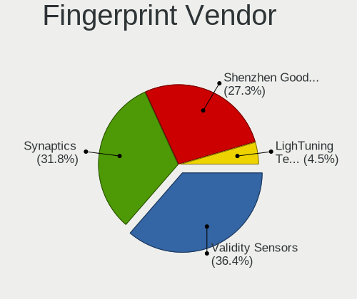

| Vendor                     | Notebooks | Percent |
|----------------------------|-----------|---------|
| Validity Sensors           | 5         | 33.33%  |
| Synaptics                  | 5         | 33.33%  |
| Shenzhen Goodix Technology | 4         | 26.67%  |
| LighTuning Technology      | 1         | 6.67%   |

Fingerprint Model
-----------------

Fingerprint sensor models

| Model                                                      | Notebooks | Percent |
|------------------------------------------------------------|-----------|---------|
| Shenzhen Goodix  Fingerprint Device                        | 4         | 26.67%  |
| Validity Sensors VFS495 Fingerprint Reader                 | 2         | 13.33%  |
| Validity Sensors Synaptics WBDI                            | 2         | 13.33%  |
| Synaptics UWP WBDI Device                                  | 2         | 13.33%  |
| Synaptics Prometheus MIS Touch Fingerprint Reader          | 2         | 13.33%  |
| Validity Sensors VFS491                                    | 1         | 6.67%   |
| Synaptics  VFS7552 Touch Fingerprint Sensor with PurePrint | 1         | 6.67%   |
| LighTuning EgisTec Touch Fingerprint Sensor                | 1         | 6.67%   |

Chipcard Vendor
---------------

Chipcard module vendors

| Vendor      | Notebooks | Percent |
|-------------|-----------|---------|
| Broadcom    | 5         | 55.56%  |
| Alcor Micro | 2         | 22.22%  |
| O2 Micro    | 1         | 11.11%  |
| Clay Logic  | 1         | 11.11%  |

Chipcard Model
--------------

Chipcard module models

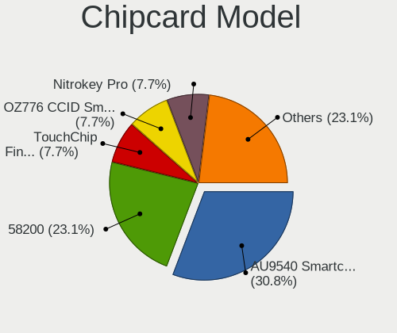

| Model                                                                        | Notebooks | Percent |
|------------------------------------------------------------------------------|-----------|---------|
| Broadcom 58200                                                               | 3         | 33.33%  |
| Alcor Micro AU9540 Smartcard Reader                                          | 2         | 22.22%  |
| O2 Micro OZ776 CCID Smartcard Reader                                         | 1         | 11.11%  |
| Clay Logic Nitrokey Pro                                                      | 1         | 11.11%  |
| Broadcom BCM5880 Secure Applications Processor with fingerprint touch sensor | 1         | 11.11%  |
| Broadcom 5880                                                                | 1         | 11.11%  |

Unsupported
-----------

Unsupported Devices
-------------------

Total unsupported devices on board

| Total | Notebooks | Percent |
|-------|-----------|---------|
| 0     | 32        | 43.24%  |
| 1     | 19        | 25.68%  |
| 2     | 7         | 9.46%   |
| 4     | 6         | 8.11%   |
| 3     | 6         | 8.11%   |
| 6     | 2         | 2.7%    |
| 5     | 2         | 2.7%    |

Unsupported Device Types
------------------------

Types of unsupported devices

| Type                     | Notebooks | Percent |
|--------------------------|-----------|---------|
| Bluetooth                | 15        | 17.65%  |
| Fingerprint reader       | 14        | 16.47%  |
| Graphics card            | 12        | 14.12%  |
| Camera                   | 11        | 12.94%  |
| Multimedia controller    | 8         | 9.41%   |
| Chipcard                 | 8         | 9.41%   |
| Net/wireless             | 6         | 7.06%   |
| Communication controller | 6         | 7.06%   |
| Sound                    | 2         | 2.35%   |
| Card reader              | 2         | 2.35%   |
| Network                  | 1         | 1.18%   |

