Gentoo 2.13 - Tested Hardware & Statistics
------------------------------------------

A project to collect tested hardware configurations for Gentoo 2.13.

Anyone can contribute to this report by the [hw-probe](https://github.com/linuxhw/hw-probe) tool:

    sudo -E hw-probe -all -upload

Please contribute! Especially if your hardware is rare.

This is a report for all computer types. See also reports for [desktops](/Dist/Gentoo_2.13/Desktop/README.md) and [notebooks](/Dist/Gentoo_2.13/Notebook/README.md).

Contents
--------

* [ Test Cases ](#test-cases)

* [ System ](#system)
  - [ Kernel                   ](#kernel)
  - [ Kernel Family            ](#kernel-family)
  - [ Kernel Major Ver.        ](#kernel-major-ver)
  - [ Arch                     ](#arch)
  - [ DE                       ](#de)
  - [ Display Server           ](#display-server)
  - [ Display Manager          ](#display-manager)
  - [ OS Lang                  ](#os-lang)
  - [ Boot Mode                ](#boot-mode)
  - [ Filesystem               ](#filesystem)
  - [ Part. scheme             ](#part-scheme)
  - [ Dual Boot with Linux/BSD ](#dual-boot-with-linuxbsd)
  - [ Dual Boot (Win)          ](#dual-boot-win)

* [ Board ](#board)
  - [ Vendor                   ](#vendor)
  - [ Model                    ](#model)
  - [ Model Family             ](#model-family)
  - [ MFG Year                 ](#mfg-year)
  - [ Form Factor              ](#form-factor)
  - [ Secure Boot              ](#secure-boot)
  - [ Coreboot                 ](#coreboot)
  - [ RAM Size                 ](#ram-size)
  - [ RAM Used                 ](#ram-used)
  - [ Total Drives             ](#total-drives)
  - [ Has CD-ROM               ](#has-cd-rom)
  - [ Has Ethernet             ](#has-ethernet)
  - [ Has WiFi                 ](#has-wifi)
  - [ Has Bluetooth            ](#has-bluetooth)

* [ Location ](#location)
  - [ Country                  ](#country)
  - [ City                     ](#city)

* [ Drives ](#drives)
  - [ Drive Vendor             ](#drive-vendor)
  - [ Drive Model              ](#drive-model)
  - [ HDD Vendor               ](#hdd-vendor)
  - [ SSD Vendor               ](#ssd-vendor)
  - [ Drive Kind               ](#drive-kind)
  - [ Drive Connector          ](#drive-connector)
  - [ Drive Size               ](#drive-size)
  - [ Space Total              ](#space-total)
  - [ Space Used               ](#space-used)
  - [ Malfunc. Drives          ](#malfunc-drives)
  - [ Malfunc. Drive Vendor    ](#malfunc-drive-vendor)
  - [ Malfunc. HDD Vendor      ](#malfunc-hdd-vendor)
  - [ Malfunc. Drive Kind      ](#malfunc-drive-kind)
  - [ Failed Drives            ](#failed-drives)
  - [ Failed Drive Vendor      ](#failed-drive-vendor)
  - [ Drive Status             ](#drive-status)

* [ Storage controller ](#storage-controller)
  - [ Storage Vendor           ](#storage-vendor)
  - [ Storage Model            ](#storage-model)
  - [ Storage Kind             ](#storage-kind)

* [ Processor ](#processor)
  - [ CPU Vendor               ](#cpu-vendor)
  - [ CPU Model                ](#cpu-model)
  - [ CPU Model Family         ](#cpu-model-family)
  - [ CPU Cores                ](#cpu-cores)
  - [ CPU Sockets              ](#cpu-sockets)
  - [ CPU Threads              ](#cpu-threads)
  - [ CPU Op-Modes             ](#cpu-op-modes)
  - [ CPU Microcode            ](#cpu-microcode)
  - [ CPU Microarch            ](#cpu-microarch)

* [ Graphics ](#graphics)
  - [ GPU Vendor               ](#gpu-vendor)
  - [ GPU Model                ](#gpu-model)
  - [ GPU Combo                ](#gpu-combo)
  - [ GPU Driver               ](#gpu-driver)
  - [ GPU Memory               ](#gpu-memory)

* [ Monitor ](#monitor)
  - [ Monitor Vendor           ](#monitor-vendor)
  - [ Monitor Model            ](#monitor-model)
  - [ Monitor Resolution       ](#monitor-resolution)
  - [ Monitor Diagonal         ](#monitor-diagonal)
  - [ Monitor Width            ](#monitor-width)
  - [ Aspect Ratio             ](#aspect-ratio)
  - [ Monitor Area             ](#monitor-area)
  - [ Pixel Density            ](#pixel-density)
  - [ Multiple Monitors        ](#multiple-monitors)

* [ Network ](#network)
  - [ Net Controller Vendor    ](#net-controller-vendor)
  - [ Net Controller Model     ](#net-controller-model)
  - [ Wireless Vendor          ](#wireless-vendor)
  - [ Wireless Model           ](#wireless-model)
  - [ Ethernet Vendor          ](#ethernet-vendor)
  - [ Ethernet Model           ](#ethernet-model)
  - [ Net Controller Kind      ](#net-controller-kind)
  - [ Used Controller          ](#used-controller)
  - [ NICs                     ](#nics)
  - [ IPv6                     ](#ipv6)

* [ Bluetooth ](#bluetooth)
  - [ Bluetooth Vendor         ](#bluetooth-vendor)
  - [ Bluetooth Model          ](#bluetooth-model)

* [ Sound ](#sound)
  - [ Sound Vendor             ](#sound-vendor)
  - [ Sound Model              ](#sound-model)

* [ Memory ](#memory)
  - [ Memory Vendor            ](#memory-vendor)
  - [ Memory Model             ](#memory-model)
  - [ Memory Kind              ](#memory-kind)
  - [ Memory Form Factor       ](#memory-form-factor)
  - [ Memory Size              ](#memory-size)
  - [ Memory Speed             ](#memory-speed)

* [ Printers & scanners ](#printers--scanners)
  - [ Printer Vendor           ](#printer-vendor)
  - [ Printer Model            ](#printer-model)
  - [ Scanner Vendor           ](#scanner-vendor)
  - [ Scanner Model            ](#scanner-model)

* [ Camera ](#camera)
  - [ Camera Vendor            ](#camera-vendor)
  - [ Camera Model             ](#camera-model)

* [ Security ](#security)
  - [ Fingerprint Vendor       ](#fingerprint-vendor)
  - [ Fingerprint Model        ](#fingerprint-model)
  - [ Chipcard Vendor          ](#chipcard-vendor)
  - [ Chipcard Model           ](#chipcard-model)

* [ Unsupported ](#unsupported)
  - [ Unsupported Devices      ](#unsupported-devices)
  - [ Unsupported Device Types ](#unsupported-device-types)

Test Cases
----------

Total: 185

| Vendor        | Model                       | Form-Factor | Probe                                                      | Date         |
|---------------|-----------------------------|-------------|------------------------------------------------------------|--------------|
| ASUSTek       | TUF Gaming X570-PLUS        | Desktop     | [2a2bf698ed](https://linux-hardware.org/?probe=2a2bf698ed) | May 01, 2023 |
| Gigabyte      | AB350-Gaming-CF             | Desktop     | [c03693e806](https://linux-hardware.org/?probe=c03693e806) | May 01, 2023 |
| ASUSTek       | ROG Zephyrus G14 GA401II... | Notebook    | [70e92668aa](https://linux-hardware.org/?probe=70e92668aa) | Apr 30, 2023 |
| ASUSTek       | ROG STRIX Z590-F GAMING ... | Desktop     | [a158a30802](https://linux-hardware.org/?probe=a158a30802) | Apr 29, 2023 |
| Lenovo        | ThinkPad X13 Gen 3 21CM0... | Notebook    | [eeb1550b82](https://linux-hardware.org/?probe=eeb1550b82) | Apr 29, 2023 |
| ASUSTek       | ROG Maximus Z690 HERO       | Desktop     | [855bed0070](https://linux-hardware.org/?probe=855bed0070) | Apr 28, 2023 |
| HP            | G62                         | Notebook    | [e5ae199298](https://linux-hardware.org/?probe=e5ae199298) | Apr 28, 2023 |
| ASUSTek       | N550JX                      | Notebook    | [790f73f0bd](https://linux-hardware.org/?probe=790f73f0bd) | Apr 28, 2023 |
| Dell          | Inspiron N5010              | Notebook    | [78b4f0cd2f](https://linux-hardware.org/?probe=78b4f0cd2f) | Apr 27, 2023 |
| ASUSTek       | CM6330_CM6630_CM6730_CM6... | Desktop     | [f3b21405ff](https://linux-hardware.org/?probe=f3b21405ff) | Apr 27, 2023 |
| TUXEDO        | Polaris AMD Gen3 (CZN)      | Notebook    | [ca568572da](https://linux-hardware.org/?probe=ca568572da) | Apr 26, 2023 |
| Acer          | Aspire A315-35              | Notebook    | [33fac6ec40](https://linux-hardware.org/?probe=33fac6ec40) | Apr 26, 2023 |
| HP            | EliteBook 840 G3            | Notebook    | [1413437b1f](https://linux-hardware.org/?probe=1413437b1f) | Apr 26, 2023 |
| ASUSTek       | PRIME Z490-A                | Desktop     | [a48c247194](https://linux-hardware.org/?probe=a48c247194) | Apr 26, 2023 |
| ASUSTek       | PRIME Z490-A                | Desktop     | [11844fed4d](https://linux-hardware.org/?probe=11844fed4d) | Apr 25, 2023 |
| ASRock        | B550M Pro4                  | Desktop     | [b53354af62](https://linux-hardware.org/?probe=b53354af62) | Apr 25, 2023 |
| HUAWEI        | CREM-WXX9                   | Notebook    | [fe2d361db9](https://linux-hardware.org/?probe=fe2d361db9) | Apr 25, 2023 |
| MSI           | B450 GAMING PRO CARBON M... | Desktop     | [c78c7e9ec1](https://linux-hardware.org/?probe=c78c7e9ec1) | Apr 24, 2023 |
| Dell          | Precision 7770              | Notebook    | [e9208415d5](https://linux-hardware.org/?probe=e9208415d5) | Apr 24, 2023 |
| ASUSTek       | M3A78-CM                    | Desktop     | [7bbac9f9bf](https://linux-hardware.org/?probe=7bbac9f9bf) | Apr 24, 2023 |
| Gigabyte      | AB350-Gaming-CF             | Desktop     | [35c362eb4f](https://linux-hardware.org/?probe=35c362eb4f) | Apr 24, 2023 |
| Gigabyte      | X670E AORUS MASTER          | Desktop     | [0f7e30ded3](https://linux-hardware.org/?probe=0f7e30ded3) | Apr 23, 2023 |
| ASUSTek       | M3A78-CM                    | Desktop     | [f98c5f7d2e](https://linux-hardware.org/?probe=f98c5f7d2e) | Apr 23, 2023 |
| Gigabyte      | B460 HD3                    | Desktop     | [c9e3b1d5ea](https://linux-hardware.org/?probe=c9e3b1d5ea) | Apr 22, 2023 |
| Lenovo        | IdeaPad Yoga 13 20175       | Notebook    | [89b64bbfb6](https://linux-hardware.org/?probe=89b64bbfb6) | Apr 22, 2023 |
| Gigabyte      | X570S AORUS ELITE AX        | Desktop     | [80ead18196](https://linux-hardware.org/?probe=80ead18196) | Apr 21, 2023 |
| ASUSTek       | PRIME B650M-A AX            | Desktop     | [0f17162503](https://linux-hardware.org/?probe=0f17162503) | Apr 21, 2023 |
| HUAWEI        | NBLK-WAX9X                  | Notebook    | [3d88744f22](https://linux-hardware.org/?probe=3d88744f22) | Apr 20, 2023 |
| ASUSTek       | PRIME B650M-A AX            | Desktop     | [056db62b47](https://linux-hardware.org/?probe=056db62b47) | Apr 20, 2023 |
| Dell          | Latitude 7420               | Notebook    | [480290fd34](https://linux-hardware.org/?probe=480290fd34) | Apr 19, 2023 |
| Intel         | D510MO AAE76523-401         | Desktop     | [cf5c07a318](https://linux-hardware.org/?probe=cf5c07a318) | Apr 19, 2023 |
| ZOTAC         | H67ITX-C-E 02/03/05         | Desktop     | [27131cb048](https://linux-hardware.org/?probe=27131cb048) | Apr 19, 2023 |
| Unknown       | Unknown                     | Desktop     | [bac14fb22e](https://linux-hardware.org/?probe=bac14fb22e) | Apr 19, 2023 |
| ASUSTek       | SABERTOOTH X58              | Desktop     | [270e47ceb8](https://linux-hardware.org/?probe=270e47ceb8) | Apr 19, 2023 |
| ASUSTek       | PRIME H370M-PLUS            | Desktop     | [0a544df503](https://linux-hardware.org/?probe=0a544df503) | Apr 17, 2023 |
| ASUSTek       | ROG Maximus Z690 HERO       | Desktop     | [a70c93f2e7](https://linux-hardware.org/?probe=a70c93f2e7) | Apr 17, 2023 |
| ASUSTek       | ROG Strix G513RM_G513RM     | Notebook    | [21c928caeb](https://linux-hardware.org/?probe=21c928caeb) | Apr 17, 2023 |
| ASUSTek       | ASUS TUF Gaming F17 FX70... | Notebook    | [1c99075a1d](https://linux-hardware.org/?probe=1c99075a1d) | Apr 16, 2023 |
| Toshiba       | Satellite L850              | Notebook    | [2fd09b6ba5](https://linux-hardware.org/?probe=2fd09b6ba5) | Apr 16, 2023 |
| MAXDATA       | o.max_5xs                   | Notebook    | [cb90c411ca](https://linux-hardware.org/?probe=cb90c411ca) | Apr 16, 2023 |
| ASUSTek       | TUF Gaming X570-PLUS        | Desktop     | [cb21111c89](https://linux-hardware.org/?probe=cb21111c89) | Apr 16, 2023 |
| ASUSTek       | ROG Maximus Z690 HERO       | Desktop     | [962c5734bc](https://linux-hardware.org/?probe=962c5734bc) | Apr 15, 2023 |
| Gigabyte      | X670E AORUS MASTER          | Desktop     | [c8bf9d49d4](https://linux-hardware.org/?probe=c8bf9d49d4) | Apr 15, 2023 |
| HP            | OMEN by Laptop              | Notebook    | [8a1ef40351](https://linux-hardware.org/?probe=8a1ef40351) | Apr 15, 2023 |
| ASRock        | B450M Steel Legend          | Desktop     | [6b71471847](https://linux-hardware.org/?probe=6b71471847) | Apr 15, 2023 |
| HP            | ProLiant MicroServer Gen... | Desktop     | [d00ebfbc62](https://linux-hardware.org/?probe=d00ebfbc62) | Apr 14, 2023 |
| HP            | ProLiant MicroServer Gen... | Desktop     | [8b0e1ffa20](https://linux-hardware.org/?probe=8b0e1ffa20) | Apr 14, 2023 |
| HP            | ProLiant MicroServer Gen... | Desktop     | [3b2ac9206c](https://linux-hardware.org/?probe=3b2ac9206c) | Apr 14, 2023 |
| HP            | ProLiant MicroServer Gen... | Desktop     | [16ee5e0082](https://linux-hardware.org/?probe=16ee5e0082) | Apr 14, 2023 |
| HP            | ProLiant MicroServer Gen... | Desktop     | [1b21351033](https://linux-hardware.org/?probe=1b21351033) | Apr 14, 2023 |
| HP            | ProLiant MicroServer Gen... | Desktop     | [f6f55c801f](https://linux-hardware.org/?probe=f6f55c801f) | Apr 14, 2023 |
| Dell          | Inspiron 5415               | Notebook    | [83ec457b1d](https://linux-hardware.org/?probe=83ec457b1d) | Apr 14, 2023 |
| Dell          | Inspiron 5415               | Notebook    | [ccf77bf033](https://linux-hardware.org/?probe=ccf77bf033) | Apr 14, 2023 |
| ASUSTek       | P6X58D PREMIUM              | Desktop     | [7f20e3160b](https://linux-hardware.org/?probe=7f20e3160b) | Apr 13, 2023 |
| ASUSTek       | Z87-PLUS                    | Desktop     | [1b44c95410](https://linux-hardware.org/?probe=1b44c95410) | Apr 13, 2023 |
| ASUSTek       | Maximus VI HERO             | Desktop     | [f46283dc4c](https://linux-hardware.org/?probe=f46283dc4c) | Apr 13, 2023 |
| MAXDATA       | o.max_5xs                   | Notebook    | [81a407c1d5](https://linux-hardware.org/?probe=81a407c1d5) | Apr 13, 2023 |
| HUAWEI        | CREM-WXX9                   | Notebook    | [2ecd45a19e](https://linux-hardware.org/?probe=2ecd45a19e) | Apr 13, 2023 |
| Acer          | Aspire one                  | Notebook    | [481024a7cb](https://linux-hardware.org/?probe=481024a7cb) | Apr 12, 2023 |
| ASUSTek       | TUF Gaming X570-PLUS        | Desktop     | [f5241c853f](https://linux-hardware.org/?probe=f5241c853f) | Apr 12, 2023 |
| Dell          | Precision 7770              | Notebook    | [5091c10fa2](https://linux-hardware.org/?probe=5091c10fa2) | Apr 11, 2023 |
| ASRock        | X370 Gaming X               | Desktop     | [d829fac91c](https://linux-hardware.org/?probe=d829fac91c) | Apr 10, 2023 |
| ASRock        | X370 Gaming X               | Desktop     | [bd05976130](https://linux-hardware.org/?probe=bd05976130) | Apr 10, 2023 |
| ASUSTek       | M3A78-CM                    | Desktop     | [001091b5fd](https://linux-hardware.org/?probe=001091b5fd) | Apr 10, 2023 |
| Gigabyte      | AB350-Gaming-CF             | Desktop     | [34f1d57aec](https://linux-hardware.org/?probe=34f1d57aec) | Apr 10, 2023 |
| ASRock        | X370 Gaming X               | Desktop     | [0beaf2366c](https://linux-hardware.org/?probe=0beaf2366c) | Apr 09, 2023 |
| HUAWEI        | KPL-W0X                     | Notebook    | [2cf04d07fb](https://linux-hardware.org/?probe=2cf04d07fb) | Apr 09, 2023 |
| ASUSTek       | ROG STRIX X570-E GAMING     | Desktop     | [f85fdf6564](https://linux-hardware.org/?probe=f85fdf6564) | Apr 09, 2023 |
| Supermicro    | H12SSL-NT                   | Server      | [9384fef88d](https://linux-hardware.org/?probe=9384fef88d) | Apr 08, 2023 |
| HPE           | ProLiant MicroServer Gen... | Desktop     | [e378272577](https://linux-hardware.org/?probe=e378272577) | Apr 08, 2023 |
| ASUSTek       | PRIME B650M-A AX            | Desktop     | [97e76297c9](https://linux-hardware.org/?probe=97e76297c9) | Apr 08, 2023 |
| HP            | Laptop 17-cp0xxx            | Notebook    | [cb0b33006e](https://linux-hardware.org/?probe=cb0b33006e) | Apr 07, 2023 |
| ASUSTek       | M3A78-CM                    | Desktop     | [a71051ab5a](https://linux-hardware.org/?probe=a71051ab5a) | Apr 06, 2023 |
| ASUSTek       | ROG Zephyrus G14 GA401II... | Notebook    | [10e0075b35](https://linux-hardware.org/?probe=10e0075b35) | Apr 03, 2023 |
| Lenovo        | ThinkPad P14s Gen 2a 21A... | Notebook    | [3125aa5d21](https://linux-hardware.org/?probe=3125aa5d21) | Apr 03, 2023 |
| Gigabyte      | B450M DS3H V2               | Desktop     | [c59398619e](https://linux-hardware.org/?probe=c59398619e) | Apr 03, 2023 |
| ASUSTek       | M3A78-CM                    | Desktop     | [59bdd9d328](https://linux-hardware.org/?probe=59bdd9d328) | Apr 03, 2023 |
| Gigabyte      | AB350-Gaming-CF             | Desktop     | [79ec23e706](https://linux-hardware.org/?probe=79ec23e706) | Apr 03, 2023 |
| ASUSTek       | ROG CROSSHAIR VIII HERO     | Desktop     | [d19221e116](https://linux-hardware.org/?probe=d19221e116) | Apr 02, 2023 |
| ASUSTek       | ROG STRIX Z590-F GAMING ... | Desktop     | [58e2308d1e](https://linux-hardware.org/?probe=58e2308d1e) | Apr 02, 2023 |
| ASUSTek       | ROG Zephyrus G14 GA401II... | Notebook    | [92c94ff8a5](https://linux-hardware.org/?probe=92c94ff8a5) | Apr 02, 2023 |
| Lenovo        | ThinkPad T470p 20J7S25C0... | Notebook    | [c1f70c64ad](https://linux-hardware.org/?probe=c1f70c64ad) | Apr 01, 2023 |
| Gigabyte      | B150M-D2V DDR3-CF           | Desktop     | [3599b8e875](https://linux-hardware.org/?probe=3599b8e875) | Mar 31, 2023 |
| Dell          | XPS 13 9305                 | Notebook    | [9e60f40931](https://linux-hardware.org/?probe=9e60f40931) | Mar 30, 2023 |
| ASUSTek       | M3A78-CM                    | Desktop     | [7d0c0336c1](https://linux-hardware.org/?probe=7d0c0336c1) | Mar 27, 2023 |
| ASRock        | AM1H-ITX                    | Desktop     | [8f1dcf05eb](https://linux-hardware.org/?probe=8f1dcf05eb) | Mar 26, 2023 |
| ASRock        | X370 Gaming X               | Desktop     | [0a19e934c3](https://linux-hardware.org/?probe=0a19e934c3) | Mar 26, 2023 |
| Lenovo        | ThinkPad P51 20HHCTO1WW     | Notebook    | [85fb1a6778](https://linux-hardware.org/?probe=85fb1a6778) | Mar 26, 2023 |
| ASUSTek       | TUF Gaming X670E-PLUS WI... | Desktop     | [f2b287b461](https://linux-hardware.org/?probe=f2b287b461) | Mar 25, 2023 |
| Acer          | Aspire A517-52G             | Notebook    | [ce3133a010](https://linux-hardware.org/?probe=ce3133a010) | Mar 25, 2023 |
| Gigabyte      | B150M-D2V DDR3-CF           | Desktop     | [276aa0b036](https://linux-hardware.org/?probe=276aa0b036) | Mar 25, 2023 |
| HPE           | ProLiant MicroServer Gen... | Desktop     | [72f90312db](https://linux-hardware.org/?probe=72f90312db) | Mar 25, 2023 |
| ASUSTek       | TUF Gaming X670E-PLUS WI... | Desktop     | [dac7782920](https://linux-hardware.org/?probe=dac7782920) | Mar 24, 2023 |
| HP            | EliteBook 745 G6            | Notebook    | [96fe7c184c](https://linux-hardware.org/?probe=96fe7c184c) | Mar 24, 2023 |
| HPE           | ProLiant MicroServer Gen... | Desktop     | [2c8daaa4f2](https://linux-hardware.org/?probe=2c8daaa4f2) | Mar 24, 2023 |
| Gigabyte      | X670E AORUS MASTER          | Desktop     | [4bf7fa5f9c](https://linux-hardware.org/?probe=4bf7fa5f9c) | Mar 23, 2023 |
| Dell          | Latitude 7480               | Notebook    | [35b30305ec](https://linux-hardware.org/?probe=35b30305ec) | Mar 23, 2023 |
| HP            | EliteBook 745 G6            | Notebook    | [caf636a252](https://linux-hardware.org/?probe=caf636a252) | Mar 22, 2023 |
| Lenovo        | ThinkPad X200 7459L61       | Notebook    | [42742477e3](https://linux-hardware.org/?probe=42742477e3) | Mar 22, 2023 |
| HP            | EliteBook 8570p             | Notebook    | [015c8dac04](https://linux-hardware.org/?probe=015c8dac04) | Mar 21, 2023 |
| ASUSTek       | M3A78-CM                    | Desktop     | [7b4a68e88a](https://linux-hardware.org/?probe=7b4a68e88a) | Mar 20, 2023 |
| ASUSTek       | ROG STRIX Z590-E GAMING ... | Desktop     | [f048ae8dec](https://linux-hardware.org/?probe=f048ae8dec) | Mar 19, 2023 |
| MSI           | 990FXA-GD80                 | Desktop     | [e79acda971](https://linux-hardware.org/?probe=e79acda971) | Mar 19, 2023 |
| ASRock        | X370 Gaming X               | Desktop     | [4f98540a7b](https://linux-hardware.org/?probe=4f98540a7b) | Mar 19, 2023 |
| Gigabyte      | Z77X-UD5H                   | Desktop     | [dc0a9ba834](https://linux-hardware.org/?probe=dc0a9ba834) | Mar 19, 2023 |
| HP            | ZBook 17 G3                 | Notebook    | [cb3b7c5bfb](https://linux-hardware.org/?probe=cb3b7c5bfb) | Mar 19, 2023 |
| Lenovo        | ThinkPad X1 Extreme 2nd ... | Notebook    | [135aa0e418](https://linux-hardware.org/?probe=135aa0e418) | Mar 18, 2023 |
| Supermicro    | X10SDV-4C-TLN2F             | Server      | [210b2e16e3](https://linux-hardware.org/?probe=210b2e16e3) | Mar 18, 2023 |
| Microsoft     | Surface Laptop 3            | Tablet      | [67c8f562e5](https://linux-hardware.org/?probe=67c8f562e5) | Mar 18, 2023 |
| Unknown       | Unknown                     | Notebook    | [d2af864fbb](https://linux-hardware.org/?probe=d2af864fbb) | Mar 17, 2023 |
| HPE           | ProLiant MicroServer Gen... | Desktop     | [7e11b106d7](https://linux-hardware.org/?probe=7e11b106d7) | Mar 17, 2023 |
| Lenovo        | Legion 5 Pro 16IAH7H 82R... | Notebook    | [d0ab04cac0](https://linux-hardware.org/?probe=d0ab04cac0) | Mar 16, 2023 |
| Star Labs     | StarBook                    | Notebook    | [0b249699ba](https://linux-hardware.org/?probe=0b249699ba) | Mar 16, 2023 |
| ASUSTek       | ProArt X670E-CREATOR WIF... | Desktop     | [fab37d7522](https://linux-hardware.org/?probe=fab37d7522) | Mar 16, 2023 |
| ASUSTek       | VivoBook_ASUSLaptop X571... | Notebook    | [b606e7c92f](https://linux-hardware.org/?probe=b606e7c92f) | Mar 16, 2023 |
| Gigabyte      | X470 AORUS ULTRA GAMING-... | Desktop     | [4d5bb23ec0](https://linux-hardware.org/?probe=4d5bb23ec0) | Mar 15, 2023 |
| ASUSTek       | M3A78-CM                    | Desktop     | [8c2507428d](https://linux-hardware.org/?probe=8c2507428d) | Mar 15, 2023 |
| ASRock        | H81M-HDS                    | Desktop     | [58f8534073](https://linux-hardware.org/?probe=58f8534073) | Mar 14, 2023 |
| Foxconn       | TPS01                       | Desktop     | [60ae6d3891](https://linux-hardware.org/?probe=60ae6d3891) | Mar 14, 2023 |
| Fujitsu Si... | D1547 S26361-D1547          | Desktop     | [95a9c8655d](https://linux-hardware.org/?probe=95a9c8655d) | Mar 14, 2023 |
| Dell          | Precision 7770              | Notebook    | [b13d6bed73](https://linux-hardware.org/?probe=b13d6bed73) | Mar 14, 2023 |
| Dell          | Precision 7770              | Notebook    | [38f84c4cfc](https://linux-hardware.org/?probe=38f84c4cfc) | Mar 14, 2023 |
| ASUSTek       | ROG STRIX B650E-F GAMING... | Desktop     | [06d54f03f9](https://linux-hardware.org/?probe=06d54f03f9) | Mar 13, 2023 |
| Unknown       | Unknown                     | Soc         | [211fbfe507](https://linux-hardware.org/?probe=211fbfe507) | Mar 13, 2023 |
| ASUSTek       | M3A78-CM                    | Desktop     | [a0590e6829](https://linux-hardware.org/?probe=a0590e6829) | Mar 13, 2023 |
| Gigabyte      | AB350-Gaming-CF             | Desktop     | [540bfa93eb](https://linux-hardware.org/?probe=540bfa93eb) | Mar 13, 2023 |
| ASUSTek       | ROG STRIX Z590-F GAMING ... | Desktop     | [3b52326a3e](https://linux-hardware.org/?probe=3b52326a3e) | Mar 12, 2023 |
| Samsung       | 950QDB                      | Convertible | [525ce83d74](https://linux-hardware.org/?probe=525ce83d74) | Mar 12, 2023 |
| ASUSTek       | TUF Gaming B650M-PLUS WI... | Desktop     | [0932f02541](https://linux-hardware.org/?probe=0932f02541) | Mar 12, 2023 |
| Lenovo        | ThinkPad Edge E330 3354A... | Notebook    | [b343b9ea49](https://linux-hardware.org/?probe=b343b9ea49) | Mar 11, 2023 |
| HP            | Victus by Gaming Laptop ... | Notebook    | [a443422517](https://linux-hardware.org/?probe=a443422517) | Mar 10, 2023 |
| Dell          | Precision 7770              | Notebook    | [7d5207e1c1](https://linux-hardware.org/?probe=7d5207e1c1) | Mar 09, 2023 |
| ASRock        | AM1H-ITX                    | Desktop     | [a0eb3774fc](https://linux-hardware.org/?probe=a0eb3774fc) | Mar 09, 2023 |
| Dell          | Latitude E6540              | Notebook    | [3bf25841b3](https://linux-hardware.org/?probe=3bf25841b3) | Mar 09, 2023 |
| Supermicro    | X10DRi-LN4+                 | Desktop     | [4e805ce5a1](https://linux-hardware.org/?probe=4e805ce5a1) | Mar 08, 2023 |
| ASUSTek       | ROG STRIX X670E-E GAMING... | Desktop     | [87cbc99c85](https://linux-hardware.org/?probe=87cbc99c85) | Mar 08, 2023 |
| Lenovo        | ThinkPad X1 Extreme Gen ... | Notebook    | [ad6e1bbda5](https://linux-hardware.org/?probe=ad6e1bbda5) | Mar 08, 2023 |
| Lenovo        | ThinkPad X1 Extreme Gen ... | Notebook    | [e455dce9f3](https://linux-hardware.org/?probe=e455dce9f3) | Mar 07, 2023 |
| ASRock        | H170 Pro4                   | Desktop     | [7d749add31](https://linux-hardware.org/?probe=7d749add31) | Mar 07, 2023 |
| ASRock        | X570 Taichi                 | Desktop     | [4d48b829ca](https://linux-hardware.org/?probe=4d48b829ca) | Mar 07, 2023 |
| ASUSTek       | M3A78-CM                    | Desktop     | [397eb062bf](https://linux-hardware.org/?probe=397eb062bf) | Mar 07, 2023 |
| ASUSTek       | PRIME B450M-A               | Desktop     | [dee1b60a0d](https://linux-hardware.org/?probe=dee1b60a0d) | Mar 07, 2023 |
| Microsoft     | Surface Laptop 3            | Tablet      | [70eb1caef5](https://linux-hardware.org/?probe=70eb1caef5) | Mar 07, 2023 |
| Dell          | Precision 7770              | Notebook    | [dea25f9c87](https://linux-hardware.org/?probe=dea25f9c87) | Mar 07, 2023 |
| ASUSTek       | ROG STRIX X570-I GAMING     | Desktop     | [6493617e39](https://linux-hardware.org/?probe=6493617e39) | Mar 07, 2023 |
| Unknown       | Unknown                     | Desktop     | [ffd546b665](https://linux-hardware.org/?probe=ffd546b665) | Mar 07, 2023 |
| Supermicro    | X10DRi-LN4+                 | Desktop     | [d445859477](https://linux-hardware.org/?probe=d445859477) | Mar 07, 2023 |
| Dell          | Precision 7770              | Notebook    | [aa1ff5150c](https://linux-hardware.org/?probe=aa1ff5150c) | Mar 06, 2023 |
| Gigabyte      | AB350-Gaming-CF             | Desktop     | [42edcf638d](https://linux-hardware.org/?probe=42edcf638d) | Mar 06, 2023 |
| Acer          | Aspire 7750G                | Notebook    | [f0cde07b9f](https://linux-hardware.org/?probe=f0cde07b9f) | Mar 05, 2023 |
| ASUSTek       | M3A78-CM                    | Desktop     | [541a6200bc](https://linux-hardware.org/?probe=541a6200bc) | Mar 05, 2023 |
| MSI           | GS66 Stealth 10UE           | Notebook    | [4500ce221e](https://linux-hardware.org/?probe=4500ce221e) | Mar 02, 2023 |
| MSI           | GS66 Stealth 10UE           | Notebook    | [f193cf790d](https://linux-hardware.org/?probe=f193cf790d) | Feb 27, 2023 |
| MSI           | GS66 Stealth 10UE           | Notebook    | [eba178253a](https://linux-hardware.org/?probe=eba178253a) | Feb 27, 2023 |
| realme        | RMNBXXXX                    | Notebook    | [6ea10cb77a](https://linux-hardware.org/?probe=6ea10cb77a) | Feb 26, 2023 |
| Lenovo        | 1048 SDK0T08861 WIN 3305... | Desktop     | [e6b48cdec4](https://linux-hardware.org/?probe=e6b48cdec4) | Feb 26, 2023 |
| Valve         | Jupiter                     | Notebook    | [3ad0d92361](https://linux-hardware.org/?probe=3ad0d92361) | Feb 25, 2023 |
| MSI           | GS66 Stealth 10UE           | Notebook    | [3382fa1bad](https://linux-hardware.org/?probe=3382fa1bad) | Feb 24, 2023 |
| MSI           | Vector GP66 12UEO           | Notebook    | [9b6bf9479e](https://linux-hardware.org/?probe=9b6bf9479e) | Feb 24, 2023 |
| MSI           | GS66 Stealth 10UE           | Notebook    | [ffcf782944](https://linux-hardware.org/?probe=ffcf782944) | Feb 23, 2023 |
| Gigabyte      | Z590 UD                     | Desktop     | [a8da25537c](https://linux-hardware.org/?probe=a8da25537c) | Feb 21, 2023 |
| HP            | Pavilion Notebook           | Notebook    | [da640089bd](https://linux-hardware.org/?probe=da640089bd) | Feb 21, 2023 |
| Dell          | Precision 7770              | Notebook    | [d8db6fecdd](https://linux-hardware.org/?probe=d8db6fecdd) | Feb 20, 2023 |
| Valve         | Jupiter                     | Notebook    | [c9c9830572](https://linux-hardware.org/?probe=c9c9830572) | Feb 19, 2023 |
| ASUSTek       | ROG Strix G732LXS_G732LX... | Notebook    | [6424058c59](https://linux-hardware.org/?probe=6424058c59) | Feb 19, 2023 |
| ASUSTek       | Strix 17 GL703GE            | Notebook    | [48ca6dc3eb](https://linux-hardware.org/?probe=48ca6dc3eb) | Feb 19, 2023 |
| MSI           | GS66 Stealth 10UE           | Notebook    | [587bd9e282](https://linux-hardware.org/?probe=587bd9e282) | Feb 16, 2023 |
| Timi          | RedmiBook Pro 15S           | Notebook    | [991db4f096](https://linux-hardware.org/?probe=991db4f096) | Feb 14, 2023 |
| Unknown       | Unknown                     | Notebook    | [1f80b65b37](https://linux-hardware.org/?probe=1f80b65b37) | Feb 13, 2023 |
| Unknown       | Unknown                     | Notebook    | [8b28eb095c](https://linux-hardware.org/?probe=8b28eb095c) | Feb 13, 2023 |
| Dell          | XPS 15 9520                 | Notebook    | [1263022267](https://linux-hardware.org/?probe=1263022267) | Feb 13, 2023 |
| HP            | Pavilion Notebook           | Notebook    | [94ca7f3e34](https://linux-hardware.org/?probe=94ca7f3e34) | Feb 13, 2023 |
| Timi          | RedmiBook Pro 15S           | Notebook    | [6a952f7024](https://linux-hardware.org/?probe=6a952f7024) | Feb 13, 2023 |
| Timi          | RedmiBook Pro 15S           | Notebook    | [e8ba753fae](https://linux-hardware.org/?probe=e8ba753fae) | Feb 13, 2023 |
| ASUSTek       | TUF Gaming X570-PLUS_BR     | Desktop     | [12c06a594d](https://linux-hardware.org/?probe=12c06a594d) | Feb 10, 2023 |
| ASUSTek       | ROG STRIX Z690-G GAMING ... | Desktop     | [1423d5ac1b](https://linux-hardware.org/?probe=1423d5ac1b) | Feb 10, 2023 |
| ASUSTek       | ROG STRIX Z690-G GAMING ... | Desktop     | [bb589c5e58](https://linux-hardware.org/?probe=bb589c5e58) | Feb 10, 2023 |
| Dell          | Precision 7770              | Notebook    | [69b0982ad7](https://linux-hardware.org/?probe=69b0982ad7) | Feb 08, 2023 |
| Dell          | Precision 7770              | Notebook    | [28ba6f72d0](https://linux-hardware.org/?probe=28ba6f72d0) | Feb 07, 2023 |
| Dell          | Precision 7770              | Notebook    | [d05aabf7a5](https://linux-hardware.org/?probe=d05aabf7a5) | Feb 06, 2023 |
| ASUSTek       | PRIME X570-P                | Desktop     | [a8dcc6b4c1](https://linux-hardware.org/?probe=a8dcc6b4c1) | Feb 03, 2023 |
| Dell          | Precision 7770              | Notebook    | [20f6b87742](https://linux-hardware.org/?probe=20f6b87742) | Feb 03, 2023 |
| Gigabyte      | X570 AORUS MASTER           | Desktop     | [0cf18835cc](https://linux-hardware.org/?probe=0cf18835cc) | Feb 02, 2023 |
| HP            | Victus by Laptop 16-e0xx... | Notebook    | [80921f3386](https://linux-hardware.org/?probe=80921f3386) | Feb 01, 2023 |
| Lenovo        | ThinkPad T16 Gen 1 21CH0... | Notebook    | [78eeec802b](https://linux-hardware.org/?probe=78eeec802b) | Feb 01, 2023 |

System
------

Kernel
------

Version of the Linux kernel

| Version                | Computers | Percent |
|------------------------|-----------|---------|
| 6.1.19-gentoo-x86_64   | 12        | 9.38%   |
| 6.1.19-gentoo          | 10        | 7.81%   |
| 6.1.12-gentoo          | 10        | 7.81%   |
| 6.1.12-gentoo-x86_64   | 7         | 5.47%   |
| 6.2.11-gentoo          | 5         | 3.91%   |
| 6.2.8-gentoo-x86_64    | 4         | 3.13%   |
| 6.2.11-gentoo-x86_64   | 4         | 3.13%   |
| 6.1.22-gentoo-dist     | 4         | 3.13%   |
| 6.1.12-gentoo-dist     | 4         | 3.13%   |
| 6.2.2-gentoo           | 3         | 2.34%   |
| 6.3.0-gentoo           | 2         | 1.56%   |
| 6.2.9-gentoo-x86_64    | 2         | 1.56%   |
| 6.2.3-gentoo           | 2         | 1.56%   |
| 6.2.1-gentoo-x86_64    | 2         | 1.56%   |
| 6.2.0                  | 2         | 1.56%   |
| 6.1.9-gentoo-x86_64    | 2         | 1.56%   |
| 6.1.9-gentoo-dist      | 2         | 1.56%   |
| 6.1.19-gentoo-dist     | 2         | 1.56%   |
| 6.1.10-gentoo-x86_64   | 2         | 1.56%   |
| 6.3.0-gentoo-x86_64    | 1         | 0.78%   |
| 6.2.9-xanmod1          | 1         | 0.78%   |
| 6.2.9-gentoo-dist      | 1         | 0.78%   |
| 6.2.9-gentoo           | 1         | 0.78%   |
| 6.2.7-gentoo-dist      | 1         | 0.78%   |
| 6.2.6-x86_64           | 1         | 0.78%   |
| 6.2.6-gentoo-dist      | 1         | 0.78%   |
| 6.2.5-gentoo-dist      | 1         | 0.78%   |
| 6.2.3-gentoo-x86_64    | 1         | 0.78%   |
| 6.2.2-gentoo-x86_64    | 1         | 0.78%   |
| 6.2.2-dist             | 1         | 0.78%   |
| 6.2.13-gentoo-dist     | 1         | 0.78%   |
| 6.2.12-gentoo-x86_64   | 1         | 0.78%   |
| 6.2.11-zen1            | 1         | 0.78%   |
| 6.2.11-tkg-cfs         | 1         | 0.78%   |
| 6.2.11-gentoo-dist     | 1         | 0.78%   |
| 6.2.10-gentoo-dist     | 1         | 0.78%   |
| 6.2.10-cachyos         | 1         | 0.78%   |
| 6.2.0-rc6-gentoo-p14   | 1         | 0.78%   |
| 6.2.0-rc6-gentoo-dist+ | 1         | 0.78%   |
| 6.2.0-pf2-llvm         | 1         | 0.78%   |

Kernel Family
-------------

Linux kernel without a distro release

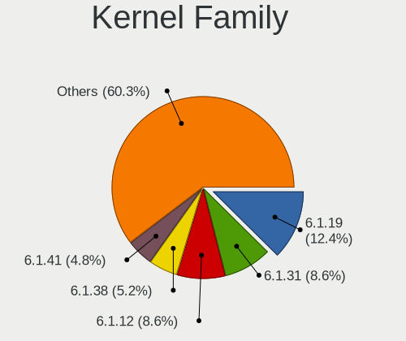

| Version  | Computers | Percent |
|----------|-----------|---------|
| 6.1.19   | 28        | 21.88%  |
| 6.1.12   | 24        | 18.75%  |
| 6.2.11   | 12        | 9.38%   |
| 6.2.9    | 5         | 3.91%   |
| 6.2.2    | 5         | 3.91%   |
| 6.2.0    | 5         | 3.91%   |
| 6.2.8    | 4         | 3.13%   |
| 6.1.9    | 4         | 3.13%   |
| 6.1.22   | 4         | 3.13%   |
| 6.1.11   | 4         | 3.13%   |
| 6.3.0    | 3         | 2.34%   |
| 6.2.3    | 3         | 2.34%   |
| 6.1.10   | 3         | 2.34%   |
| 6.2.6    | 2         | 1.56%   |
| 6.2.10   | 2         | 1.56%   |
| 6.2.1    | 2         | 1.56%   |
| 5.15.80  | 2         | 1.56%   |
| 6.2.7    | 1         | 0.78%   |
| 6.2.5    | 1         | 0.78%   |
| 6.2.13   | 1         | 0.78%   |
| 6.2.12   | 1         | 0.78%   |
| 6.1.8    | 1         | 0.78%   |
| 6.1.4    | 1         | 0.78%   |
| 6.1.15   | 1         | 0.78%   |
| 6.1.13   | 1         | 0.78%   |
| 5.15.94  | 1         | 0.78%   |
| 5.15.93  | 1         | 0.78%   |
| 5.15.91  | 1         | 0.78%   |
| 5.15.88  | 1         | 0.78%   |
| 5.15.75  | 1         | 0.78%   |
| 5.15.59  | 1         | 0.78%   |
| 5.15.0   | 1         | 0.78%   |
| 5.10.174 | 1         | 0.78%   |

Kernel Major Ver.
-----------------

Linux kernel major version

| Version | Computers | Percent |
|---------|-----------|---------|
| 6.1     | 67        | 55.37%  |
| 6.2     | 41        | 33.88%  |
| 5.15    | 9         | 7.44%   |
| 6.3     | 3         | 2.48%   |
| 5.10    | 1         | 0.83%   |

Arch
----

OS architecture (x86_64, i586, etc.)

| Name    | Computers | Percent |
|---------|-----------|---------|
| x86_64  | 114       | 96.61%  |
| i686    | 3         | 2.54%   |
| riscv64 | 1         | 0.85%   |

DE
--

Desktop Environment

| Name      | Computers | Percent |
|-----------|-----------|---------|
| Unknown   | 37        | 30.83%  |
| KDE5      | 34        | 28.33%  |
| XFCE      | 14        | 11.67%  |
| GNOME     | 11        | 9.17%   |
| MATE      | 6         | 5%      |
| LXQt      | 4         | 3.33%   |
| DWM       | 4         | 3.33%   |
| Trinity   | 2         | 1.67%   |
| KDE       | 2         | 1.67%   |
| sway      | 1         | 0.83%   |
| ratpoison | 1         | 0.83%   |
| openbox   | 1         | 0.83%   |
| LXDE      | 1         | 0.83%   |
| ICEWM     | 1         | 0.83%   |
| i3        | 1         | 0.83%   |

Display Server
--------------

X11 or Wayland

| Name    | Computers | Percent |
|---------|-----------|---------|
| X11     | 53        | 43.8%   |
| Wayland | 25        | 20.66%  |
| Unknown | 22        | 18.18%  |
| Tty     | 21        | 17.36%  |

Display Manager
---------------

SDDM, LightDM, etc.

| Name    | Computers | Percent |
|---------|-----------|---------|
| Unknown | 43        | 35.83%  |
| SDDM    | 40        | 33.33%  |
| LightDM | 17        | 14.17%  |
| GDM     | 10        | 8.33%   |
| TDM     | 3         | 2.5%    |
| SLiM    | 3         | 2.5%    |
| LXDM    | 2         | 1.67%   |
| XDM     | 1         | 0.83%   |
| GREETD  | 1         | 0.83%   |

OS Lang
-------

Language

| Lang    | Computers | Percent |
|---------|-----------|---------|
| en_US   | 48        | 39.67%  |
| Unknown | 13        | 10.74%  |
| C.UTF8  | 12        | 9.92%   |
| en_GB   | 11        | 9.09%   |
| fr_FR   | 7         | 5.79%   |
| C       | 6         | 4.96%   |
| de_DE   | 5         | 4.13%   |
| en_IE   | 4         | 3.31%   |
| cs_CZ   | 4         | 3.31%   |
| ru_RU   | 3         | 2.48%   |
| it_IT   | 2         | 1.65%   |
| en_AU   | 2         | 1.65%   |
| ro_RO   | 1         | 0.83%   |
| pl_PL   | 1         | 0.83%   |
| es_ES   | 1         | 0.83%   |
| el_GR   | 1         | 0.83%   |

Boot Mode
---------

EFI or BIOS

| Mode | Computers | Percent |
|------|-----------|---------|
| EFI  | 85        | 71.43%  |
| BIOS | 34        | 28.57%  |

Filesystem
----------

Type of filesystem

| Type    | Computers | Percent |
|---------|-----------|---------|
| Ext4    | 64        | 53.78%  |
| Btrfs   | 40        | 33.61%  |
| F2fs    | 6         | 5.04%   |
| Xfs     | 4         | 3.36%   |
| Zfs     | 3         | 2.52%   |
| XXXXXXX | 2         | 1.68%   |

Part. scheme
------------

Scheme of partitioning

| Type    | Computers | Percent |
|---------|-----------|---------|
| GPT     | 98        | 82.35%  |
| MBR     | 15        | 12.61%  |
| Unknown | 6         | 5.04%   |

Dual Boot with Linux/BSD
------------------------

Hosting more than one Linux/BSD

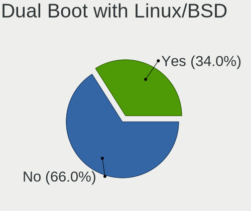

| Dual boot | Computers | Percent |
|-----------|-----------|---------|
| No        | 75        | 61.98%  |
| Yes       | 46        | 38.02%  |

Dual Boot (Win)
---------------

Hosting Linux and Windows

| Dual boot | Computers | Percent |
|-----------|-----------|---------|
| No        | 87        | 73.11%  |
| Yes       | 32        | 26.89%  |

Board
-----

Vendor
------

Motherboard manufacturer

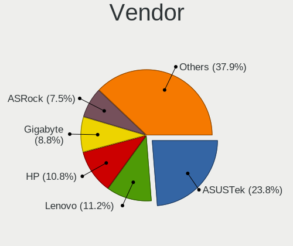

| Name                | Computers | Percent |
|---------------------|-----------|---------|
| ASUSTek Computer    | 35        | 29.66%  |
| Hewlett-Packard     | 13        | 11.02%  |
| Lenovo              | 12        | 10.17%  |
| Gigabyte Technology | 10        | 8.47%   |
| Dell                | 9         | 7.63%   |
| ASRock              | 7         | 5.93%   |
| Unknown             | 5         | 4.24%   |
| MSI                 | 4         | 3.39%   |
| Acer                | 4         | 3.39%   |
| Supermicro          | 3         | 2.54%   |
| HUAWEI              | 3         | 2.54%   |
| ZOTAC               | 1         | 0.85%   |
| Valve               | 1         | 0.85%   |
| TUXEDO              | 1         | 0.85%   |
| Toshiba             | 1         | 0.85%   |
| Timi                | 1         | 0.85%   |
| Star Labs           | 1         | 0.85%   |
| realme              | 1         | 0.85%   |
| Microsoft           | 1         | 0.85%   |
| MAXDATA             | 1         | 0.85%   |
| Intel               | 1         | 0.85%   |
| HPE                 | 1         | 0.85%   |
| Fujitsu Siemens     | 1         | 0.85%   |
| Foxconn             | 1         | 0.85%   |

Model
-----

Motherboard model

| Name                                        | Computers | Percent |
|---------------------------------------------|-----------|---------|
| Unknown                                     | 5         | 4.24%   |
| HP ProLiant MicroServer Gen8                | 3         | 2.54%   |
| Supermicro Super Server                     | 2         | 1.69%   |
| Dell Precision 7770                         | 2         | 1.69%   |
| ASUS ROG Zephyrus G14 GA401II_GA401II       | 2         | 1.69%   |
| ASUS ROG STRIX Z590-F GAMING WIFI           | 2         | 1.69%   |
| ASUS M3A78-CM                               | 2         | 1.69%   |
| ASUS All Series                             | 2         | 1.69%   |
| ZOTAC H67ITX-C-E                            | 1         | 0.85%   |
| Valve Jupiter                               | 1         | 0.85%   |
| TUXEDO Polaris AMD Gen3 (CZN)               | 1         | 0.85%   |
| Toshiba Satellite L850                      | 1         | 0.85%   |
| Timi RedmiBook Pro 15S                      | 1         | 0.85%   |
| Supermicro SSG-6028R-ER12-HDP-AI050         | 1         | 0.85%   |
| Star Labs StarBook                          | 1         | 0.85%   |
| realme RMNBXXXX                             | 1         | 0.85%   |
| MSI Vector GP66 12UEO                       | 1         | 0.85%   |
| MSI MS-7B85                                 | 1         | 0.85%   |
| MSI MS-7640                                 | 1         | 0.85%   |
| MSI GS66 Stealth 10UE                       | 1         | 0.85%   |
| Microsoft Surface Laptop 3                  | 1         | 0.85%   |
| MAXDATA o.max_5xs                           | 1         | 0.85%   |
| Lenovo ThinkStation P340 30DJS35Q00         | 1         | 0.85%   |
| Lenovo ThinkPad X200 7459L61                | 1         | 0.85%   |
| Lenovo ThinkPad X13 Gen 3 21CM0024US        | 1         | 0.85%   |
| Lenovo ThinkPad X1 Extreme Gen 3 20TK001JUS | 1         | 0.85%   |
| Lenovo ThinkPad X1 Extreme 2nd 20QVCTO1WW   | 1         | 0.85%   |
| Lenovo ThinkPad T470p 20J7S25C00            | 1         | 0.85%   |
| Lenovo ThinkPad T16 Gen 1 21CH000FUS        | 1         | 0.85%   |
| Lenovo ThinkPad P51 20HHCTO1WW              | 1         | 0.85%   |
| Lenovo ThinkPad P14s Gen 2a 21A0000JMH      | 1         | 0.85%   |
| Lenovo ThinkPad Edge E330 3354AMG           | 1         | 0.85%   |
| Lenovo Legion 5 Pro 16IAH7H 82RF            | 1         | 0.85%   |
| Lenovo IdeaPad Yoga 13 20175                | 1         | 0.85%   |
| Intel T series                              | 1         | 0.85%   |
| HUAWEI NBLK-WAX9X                           | 1         | 0.85%   |
| HUAWEI KPL-W0X                              | 1         | 0.85%   |
| HUAWEI CREM-WXX9                            | 1         | 0.85%   |
| HPE ProLiant MicroServer Gen10 Plus         | 1         | 0.85%   |
| HP ZBook 17 G3                              | 1         | 0.85%   |

Model Family
------------

Motherboard model prefix

| Name                                | Computers | Percent |
|-------------------------------------|-----------|---------|
| ASUS ROG                            | 14        | 11.86%  |
| Lenovo ThinkPad                     | 9         | 7.63%   |
| ASUS PRIME                          | 5         | 4.24%   |
| Unknown                             | 5         | 4.24%   |
| ASUS TUF                            | 4         | 3.39%   |
| Acer Aspire                         | 4         | 3.39%   |
| HP ProLiant                         | 3         | 2.54%   |
| HP EliteBook                        | 3         | 2.54%   |
| Dell Latitude                       | 3         | 2.54%   |
| Supermicro Super                    | 2         | 1.69%   |
| HP Victus                           | 2         | 1.69%   |
| Dell XPS                            | 2         | 1.69%   |
| Dell Precision                      | 2         | 1.69%   |
| Dell Inspiron                       | 2         | 1.69%   |
| ASUS M3A78-CM                       | 2         | 1.69%   |
| ASUS All                            | 2         | 1.69%   |
| ZOTAC H67ITX-C-E                    | 1         | 0.85%   |
| Valve Jupiter                       | 1         | 0.85%   |
| TUXEDO Polaris                      | 1         | 0.85%   |
| Toshiba Satellite                   | 1         | 0.85%   |
| Timi RedmiBook                      | 1         | 0.85%   |
| Supermicro SSG-6028R-ER12-HDP-AI050 | 1         | 0.85%   |
| Star Labs StarBook                  | 1         | 0.85%   |
| realme RMNBXXXX                     | 1         | 0.85%   |
| MSI Vector                          | 1         | 0.85%   |
| MSI MS-7B85                         | 1         | 0.85%   |
| MSI MS-7640                         | 1         | 0.85%   |
| MSI GS66                            | 1         | 0.85%   |
| Microsoft Surface                   | 1         | 0.85%   |
| MAXDATA o.max                       | 1         | 0.85%   |
| Lenovo ThinkStation                 | 1         | 0.85%   |
| Lenovo Legion                       | 1         | 0.85%   |
| Lenovo IdeaPad                      | 1         | 0.85%   |
| Intel T                             | 1         | 0.85%   |
| HUAWEI NBLK-WAX9X                   | 1         | 0.85%   |
| HUAWEI KPL-W0X                      | 1         | 0.85%   |
| HUAWEI CREM-WXX9                    | 1         | 0.85%   |
| HPE ProLiant                        | 1         | 0.85%   |
| HP ZBook                            | 1         | 0.85%   |
| HP Pavilion                         | 1         | 0.85%   |

MFG Year
--------

Motherboard manufacture year

| Year    | Computers | Percent |
|---------|-----------|---------|
| 2022    | 21        | 17.8%   |
| 2021    | 19        | 16.1%   |
| 2019    | 15        | 12.71%  |
| 2020    | 12        | 10.17%  |
| 2018    | 8         | 6.78%   |
| 2012    | 8         | 6.78%   |
| 2013    | 6         | 5.08%   |
| 2010    | 6         | 5.08%   |
| 2017    | 5         | 4.24%   |
| 2016    | 3         | 2.54%   |
| 2008    | 3         | 2.54%   |
| 2023    | 2         | 1.69%   |
| 2015    | 2         | 1.69%   |
| 2014    | 2         | 1.69%   |
| 2011    | 2         | 1.69%   |
| 2009    | 1         | 0.85%   |
| 2007    | 1         | 0.85%   |
| 2003    | 1         | 0.85%   |
| Unknown | 1         | 0.85%   |

Form Factor
-----------

Physical design of the computer

| Name           | Computers | Percent |
|----------------|-----------|---------|
| Desktop        | 58        | 49.15%  |
| Notebook       | 56        | 47.46%  |
| Server         | 2         | 1.69%   |
| System on chip | 1         | 0.85%   |
| Tablet         | 1         | 0.85%   |

Secure Boot
-----------

Enabled or disabled

| State    | Computers | Percent |
|----------|-----------|---------|
| Disabled | 117       | 99.15%  |
| Enabled  | 1         | 0.85%   |

Coreboot
--------

Have coreboot on board

| Used | Computers | Percent |
|------|-----------|---------|
| No   | 117       | 99.15%  |
| Yes  | 1         | 0.85%   |

RAM Size
--------

Total RAM memory

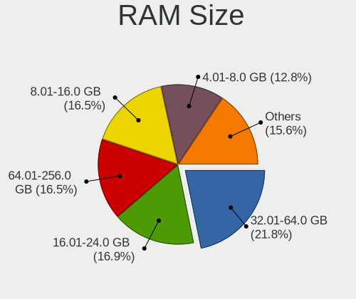

| Size in GB      | Computers | Percent |
|-----------------|-----------|---------|
| 32.01-64.0      | 26        | 22.03%  |
| 16.01-24.0      | 23        | 19.49%  |
| 64.01-256.0     | 19        | 16.1%   |
| 8.01-16.0       | 17        | 14.41%  |
| 4.01-8.0        | 12        | 10.17%  |
| 24.01-32.0      | 8         | 6.78%   |
| 3.01-4.0        | 7         | 5.93%   |
| 2.01-3.0        | 2         | 1.69%   |
| More than 256.0 | 1         | 0.85%   |
| 1.01-2.0        | 1         | 0.85%   |
| 0.51-1.0        | 1         | 0.85%   |
| 0.01-0.5        | 1         | 0.85%   |

RAM Used
--------

Used RAM memory

| Used GB    | Computers | Percent |
|------------|-----------|---------|
| 2.01-3.0   | 28        | 22.95%  |
| 4.01-8.0   | 21        | 17.21%  |
| 1.01-2.0   | 18        | 14.75%  |
| 8.01-16.0  | 15        | 12.3%   |
| 0.51-1.0   | 14        | 11.48%  |
| 3.01-4.0   | 13        | 10.66%  |
| 0.01-0.5   | 9         | 7.38%   |
| 16.01-24.0 | 2         | 1.64%   |
| 24.01-32.0 | 1         | 0.82%   |
| 0          | 1         | 0.82%   |

Total Drives
------------

Number of drives on board

| Drives | Computers | Percent |
|--------|-----------|---------|
| 1      | 54        | 45.76%  |
| 2      | 25        | 21.19%  |
| 3      | 15        | 12.71%  |
| 5      | 7         | 5.93%   |
| 4      | 6         | 5.08%   |
| 6      | 5         | 4.24%   |
| 8      | 2         | 1.69%   |
| 7      | 2         | 1.69%   |
| 13     | 1         | 0.85%   |
| 10     | 1         | 0.85%   |

Has CD-ROM
----------

Has CD-ROM on board

| Presented | Computers | Percent |
|-----------|-----------|---------|
| No        | 93        | 78.81%  |
| Yes       | 25        | 21.19%  |

Has Ethernet
------------

Has Ethernet on board

| Presented | Computers | Percent |
|-----------|-----------|---------|
| Yes       | 105       | 88.98%  |
| No        | 13        | 11.02%  |

Has WiFi
--------

Has WiFi module

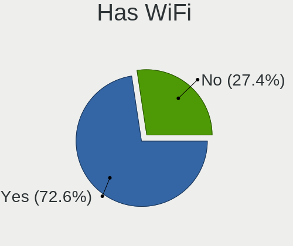

| Presented | Computers | Percent |
|-----------|-----------|---------|
| Yes       | 78        | 66.1%   |
| No        | 40        | 33.9%   |

Has Bluetooth
-------------

Has Bluetooth module

| Presented | Computers | Percent |
|-----------|-----------|---------|
| Yes       | 73        | 61.86%  |
| No        | 45        | 38.14%  |

Location
--------

Country
-------

Geographic location (country)

| Country     | Computers | Percent |
|-------------|-----------|---------|
| USA         | 34        | 28.81%  |
| Germany     | 14        | 11.86%  |
| France      | 13        | 11.02%  |
| UK          | 8         | 6.78%   |
| Canada      | 8         | 6.78%   |
| Russia      | 5         | 4.24%   |
| Czechia     | 5         | 4.24%   |
| Spain       | 4         | 3.39%   |
| Poland      | 4         | 3.39%   |
| Italy       | 3         | 2.54%   |
| Vietnam     | 2         | 1.69%   |
| China       | 2         | 1.69%   |
| Brazil      | 2         | 1.69%   |
| Australia   | 2         | 1.69%   |
| Romania     | 1         | 0.85%   |
| Norway      | 1         | 0.85%   |
| New Zealand | 1         | 0.85%   |
| Netherlands | 1         | 0.85%   |
| Luxembourg  | 1         | 0.85%   |
| Lithuania   | 1         | 0.85%   |
| Indonesia   | 1         | 0.85%   |
| Iceland     | 1         | 0.85%   |
| Hungary     | 1         | 0.85%   |
| Hong Kong   | 1         | 0.85%   |
| Greece      | 1         | 0.85%   |
| Algeria     | 1         | 0.85%   |

City
----

Geographic location (city)

| City               | Computers | Percent |
|--------------------|-----------|---------|
| Paris              | 5         | 4.2%    |
| Frankfurt am Main  | 4         | 3.36%   |
| Warsaw             | 3         | 2.52%   |
| Sterling           | 3         | 2.52%   |
| Kippens            | 3         | 2.52%   |
| Beaverton          | 3         | 2.52%   |
| Taganrog           | 2         | 1.68%   |
| St Petersburg      | 2         | 1.68%   |
| Ponetovice         | 2         | 1.68%   |
| Pittsburgh         | 2         | 1.68%   |
| Oviedo             | 2         | 1.68%   |
| Milan              | 2         | 1.68%   |
| Leeds              | 2         | 1.68%   |
| Gatineau           | 2         | 1.68%   |
| Cologne            | 2         | 1.68%   |
| Cognac             | 2         | 1.68%   |
| esk Tn   | 2         | 1.68%   |
| Berlin             | 2         | 1.68%   |
| Yucaipa            | 1         | 0.84%   |
| West Chicago       | 1         | 0.84%   |
| Wessington Springs | 1         | 0.84%   |
| Wesseling          | 1         | 0.84%   |
| Welwyn Garden City | 1         | 0.84%   |
| Vilnius            | 1         | 0.84%   |
| Verona             | 1         | 0.84%   |
| Vancouver          | 1         | 0.84%   |
| Urbana             | 1         | 0.84%   |
| Toronto            | 1         | 0.84%   |
| Surabaya           | 1         | 0.84%   |
| Sun Prairie        | 1         | 0.84%   |
| Stade              | 1         | 0.84%   |
| Shanghai           | 1         | 0.84%   |
| Seattle            | 1         | 0.84%   |
| San Francisco      | 1         | 0.84%   |
| Roubaix            | 1         | 0.84%   |
| Reykjavik          | 1         | 0.84%   |
| Reims              | 1         | 0.84%   |
| Rapid City         | 1         | 0.84%   |
| Prague             | 1         | 0.84%   |
| Pozzuoli           | 1         | 0.84%   |

Drives
------

Drive Vendor
------------

Hard drive vendors

| Vendor                      | Computers | Drives | Percent |
|-----------------------------|-----------|--------|---------|
| Samsung Electronics         | 44        | 73     | 21.57%  |
| WDC                         | 25        | 48     | 12.25%  |
| Seagate                     | 23        | 54     | 11.27%  |
| Sandisk                     | 23        | 24     | 11.27%  |
| Phison Electronics          | 10        | 13     | 4.9%    |
| Crucial                     | 8         | 10     | 3.92%   |
| SK hynix                    | 7         | 7      | 3.43%   |
| Intel                       | 7         | 9      | 3.43%   |
| China                       | 7         | 13     | 3.43%   |
| Toshiba                     | 6         | 9      | 2.94%   |
| Unknown                     | 4         | 4      | 1.96%   |
| Micron/Crucial Technology   | 4         | 5      | 1.96%   |
| Micron Technology           | 4         | 4      | 1.96%   |
| Kingston                    | 4         | 5      | 1.96%   |
| HGST                        | 4         | 7      | 1.96%   |
| Hitachi                     | 3         | 11     | 1.47%   |
| GOODRAM                     | 3         | 7      | 1.47%   |
| A-DATA Technology           | 3         | 3      | 1.47%   |
| Kingston Technology Company | 2         | 2      | 0.98%   |
| V-GeN                       | 1         | 1      | 0.49%   |
| Silicon Motion              | 1         | 2      | 0.49%   |
| PNY                         | 1         | 3      | 0.49%   |
| Phison                      | 1         | 1      | 0.49%   |
| OCZ                         | 1         | 1      | 0.49%   |
| MAXIO Technology (Hangzhou) | 1         | 1      | 0.49%   |
| KIOXIA                      | 1         | 1      | 0.49%   |
| KingSpec                    | 1         | 1      | 0.49%   |
| Intenso                     | 1         | 1      | 0.49%   |
| Dogfish                     | 1         | 1      | 0.49%   |
| ADROITLARK                  | 1         | 2      | 0.49%   |
| ADATA Technology            | 1         | 2      | 0.49%   |
| Unknown                     | 1         | 1      | 0.49%   |

Drive Model
-----------

Hard drive models

| Model                                               | Computers | Percent |
|-----------------------------------------------------|-----------|---------|
| Samsung NVMe SSD Controller SM981/PM981/PM983 1TB   | 17        | 6.83%   |
| Samsung NVMe SSD Controller PM9A1/PM9A3/980PRO 2TB  | 14        | 5.62%   |
| Sandisk WD Blue SN550 NVMe SSD 1024GB               | 6         | 2.41%   |
| Samsung SSD 980 1TB                                 | 6         | 2.41%   |
| Sandisk WD Black SN750 / PC SN730 NVMe SSD 512GB    | 5         | 2.01%   |
| Seagate ST4000DM004-2CV104 4TB                      | 3         | 1.2%    |
| Samsung NVMe SSD Controller SM961/PM961/SM963 500GB | 3         | 1.2%    |
| Phison E12 NVMe Controller 512GB                    | 3         | 1.2%    |
| Intel SSD 660P Series 512GB                         | 3         | 1.2%    |
| Crucial CT1000MX500SSD1 1TB                         | 3         | 1.2%    |
| WDC WD5000LPLX-66ZNTT1 500GB                        | 2         | 0.8%    |
| WDC WD40EZRZ-00GXCB0 4TB                            | 2         | 0.8%    |
| WDC WD30EFRX-68EUZN0 3TB                            | 2         | 0.8%    |
| WDC WD1502FYPS-02W3B0 1TB                           | 2         | 0.8%    |
| WDC WD120EFBX-68B0EN0 12TB                          | 2         | 0.8%    |
| Seagate ST1000LM035-1RK172 970GB                    | 2         | 0.8%    |
| Seagate ST1000LM024 HN-M101MBB 1TB                  | 2         | 0.8%    |
| Samsung SSD 860 EVO 4TB                             | 2         | 0.8%    |
| Samsung SSD 850 EVO 250GB                           | 2         | 0.8%    |
| Phison E7 NVMe Controller 240GB                     | 2         | 0.8%    |
| Phison E16 PCIe4 NVMe Controller 500GB              | 2         | 0.8%    |
| Micron/Crucial P2 NVMe PCIe SSD 1TB                 | 2         | 0.8%    |
| Micron 2450_MTFDKBA1T0TFK 1TB                       | 2         | 0.8%    |
| HGST HTS725050A7E630 500GB                          | 2         | 0.8%    |
| GOODRAM SSDPR-CL100-480-G2 480GB                    | 2         | 0.8%    |
| China SSD 1TB                                       | 2         | 0.8%    |
| China SATA SSD 960GB                                | 2         | 0.8%    |
| WDC WDS500G1B0B-00AS40 500GB SSD                    | 1         | 0.4%    |
| WDC WDS240G2G0A-00JH30 240GB SSD                    | 1         | 0.4%    |
| WDC WDS200T2B0B-00YS70 2TB SSD                      | 1         | 0.4%    |
| WDC WD80EFAX-68KNBN0 8TB                            | 1         | 0.4%    |
| WDC WD8003FFBX-68B9AN0 8TB                          | 1         | 0.4%    |
| WDC WD60PURZ-85ZUFY1 6TB                            | 1         | 0.4%    |
| WDC WD60EZRX-00MVLB1 6TB                            | 1         | 0.4%    |
| WDC WD60EZAZ-00SF3B0 6TB                            | 1         | 0.4%    |
| WDC WD60EFRX-68MYMN1 6TB                            | 1         | 0.4%    |
| WDC WD6003FZBX-00K5WB0 6TB                          | 1         | 0.4%    |
| WDC WD5000LPCX-24VHAT0 500GB                        | 1         | 0.4%    |
| WDC WD5000AADS-00S9B0 500GB                         | 1         | 0.4%    |
| WDC WD40EZRZ-00WN9B0 4TB                            | 1         | 0.4%    |

HDD Vendor
----------

Hard disk drive vendors

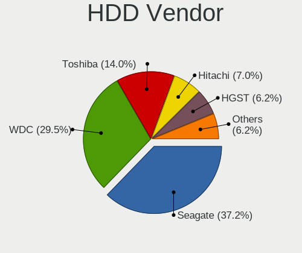

| Vendor              | Computers | Drives | Percent |
|---------------------|-----------|--------|---------|
| Seagate             | 23        | 53     | 38.98%  |
| WDC                 | 22        | 45     | 37.29%  |
| Toshiba             | 6         | 9      | 10.17%  |
| HGST                | 4         | 7      | 6.78%   |
| Hitachi             | 3         | 11     | 5.08%   |
| Samsung Electronics | 1         | 1      | 1.69%   |

SSD Vendor
----------

Solid state drive vendors

| Vendor              | Computers | Drives | Percent |
|---------------------|-----------|--------|---------|
| Samsung Electronics | 15        | 18     | 23.81%  |
| SanDisk             | 8         | 9      | 12.7%   |
| Crucial             | 8         | 10     | 12.7%   |
| China               | 7         | 13     | 11.11%  |
| Kingston            | 4         | 5      | 6.35%   |
| WDC                 | 3         | 3      | 4.76%   |
| GOODRAM             | 3         | 7      | 4.76%   |
| A-DATA Technology   | 3         | 3      | 4.76%   |
| Intel               | 2         | 3      | 3.17%   |
| V-GeN               | 1         | 1      | 1.59%   |
| SK hynix            | 1         | 1      | 1.59%   |
| PNY                 | 1         | 3      | 1.59%   |
| OCZ                 | 1         | 1      | 1.59%   |
| Micron Technology   | 1         | 1      | 1.59%   |
| KingSpec            | 1         | 1      | 1.59%   |
| Intenso             | 1         | 1      | 1.59%   |
| Dogfish             | 1         | 1      | 1.59%   |
| ADROITLARK          | 1         | 2      | 1.59%   |
| Unknown             | 1         | 1      | 1.59%   |

Drive Kind
----------

HDD or SSD

| Kind    | Computers | Drives | Percent |
|---------|-----------|--------|---------|
| NVMe    | 69        | 111    | 40.83%  |
| SSD     | 50        | 84     | 29.59%  |
| HDD     | 45        | 126    | 26.63%  |
| MMC     | 3         | 3      | 1.78%   |
| Unknown | 2         | 2      | 1.18%   |

Drive Connector
---------------

SATA, SAS, NVMe, etc.

| Type | Computers | Drives | Percent |
|------|-----------|--------|---------|
| SATA | 74        | 200    | 48.68%  |
| NVMe | 69        | 111    | 45.39%  |
| SAS  | 6         | 12     | 3.95%   |
| MMC  | 3         | 3      | 1.97%   |

Drive Size
----------

Size of hard drive

| Size in TB | Computers | Drives | Percent |
|------------|-----------|--------|---------|
| 0.01-0.5   | 44        | 65     | 35.77%  |
| 0.51-1.0   | 29        | 43     | 23.58%  |
| 1.01-2.0   | 18        | 33     | 14.63%  |
| 3.01-4.0   | 13        | 24     | 10.57%  |
| 4.01-10.0  | 11        | 22     | 8.94%   |
| 2.01-3.0   | 5         | 18     | 4.07%   |
| 10.01-20.0 | 3         | 5      | 2.44%   |

Space Total
-----------

Amount of disk space available on the file system

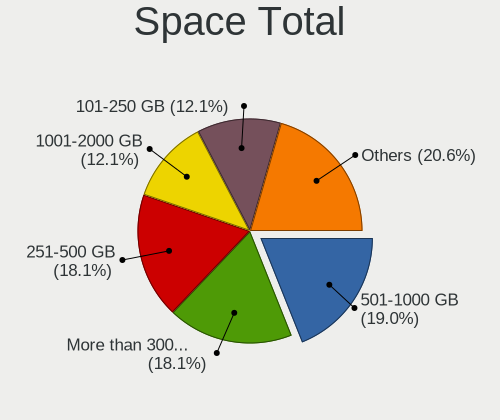

| Size in GB     | Computers | Percent |
|----------------|-----------|---------|
| More than 3000 | 24        | 19.83%  |
| 501-1000       | 23        | 19.01%  |
| 251-500        | 21        | 17.36%  |
| 1001-2000      | 19        | 15.7%   |
| 101-250        | 14        | 11.57%  |
| 2001-3000      | 7         | 5.79%   |
| 1-20           | 5         | 4.13%   |
| 51-100         | 3         | 2.48%   |
| Unknown        | 3         | 2.48%   |
| 21-50          | 2         | 1.65%   |

Space Used
----------

Amount of used disk space

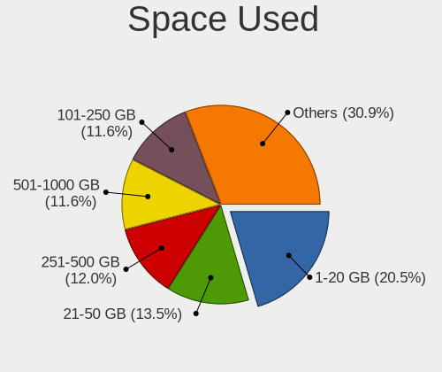

| Used GB        | Computers | Percent |
|----------------|-----------|---------|
| 1-20           | 25        | 20.33%  |
| 21-50          | 18        | 14.63%  |
| 501-1000       | 18        | 14.63%  |
| 251-500        | 15        | 12.2%   |
| 101-250        | 15        | 12.2%   |
| More than 3000 | 13        | 10.57%  |
| 51-100         | 8         | 6.5%    |
| 1001-2000      | 6         | 4.88%   |
| Unknown        | 3         | 2.44%   |
| 2001-3000      | 2         | 1.63%   |

Malfunc. Drives
---------------

Drive models with a malfunction

| Model                                | Computers | Drives | Percent |
|--------------------------------------|-----------|--------|---------|
| Seagate ST1000LM024 HN-M101MBB 1TB   | 2         | 2      | 8.7%    |
| HGST HTS725050A7E630 500GB           | 2         | 2      | 8.7%    |
| WDC WD60PURZ-85ZUFY1 6TB             | 1         | 1      | 4.35%   |
| WDC WD60EZRX-00MVLB1 6TB             | 1         | 1      | 4.35%   |
| WDC WD30EFRX-68EUZN0 3TB             | 1         | 2      | 4.35%   |
| Toshiba MK5056GSY 500GB              | 1         | 1      | 4.35%   |
| Toshiba MK1633GSG 160GB              | 1         | 1      | 4.35%   |
| Toshiba DT01ACA200 2TB               | 1         | 1      | 4.35%   |
| SK hynix PC711 HFS512GDE9X073N 512GB | 1         | 1      | 4.35%   |
| Seagate ST750LM022 HN-M750MBB 752GB  | 1         | 1      | 4.35%   |
| Seagate ST3500630NS 500GB            | 1         | 2      | 4.35%   |
| Seagate ST3000DM001-9YN166 3TB       | 1         | 1      | 4.35%   |
| Seagate ST2000DX002-2DV164 2TB       | 1         | 1      | 4.35%   |
| Seagate ST2000DM001-1CH164 2TB       | 1         | 1      | 4.35%   |
| SanDisk SSD PLUS 480GB               | 1         | 1      | 4.35%   |
| Samsung Electronics SSD 980 1TB      | 1         | 1      | 4.35%   |
| Intel SSDSC2BB160G4T 160GB           | 1         | 2      | 4.35%   |
| HGST HTS721010A9E630 1TB             | 1         | 1      | 4.35%   |
| Crucial M4-CT512M4SSD2 512GB         | 1         | 1      | 4.35%   |
| China SSD 240GB                      | 1         | 1      | 4.35%   |
| China SATA SSD 960GB                 | 1         | 1      | 4.35%   |

Malfunc. Drive Vendor
---------------------

Vendors of faulty drives

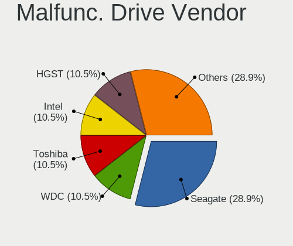

| Vendor              | Computers | Drives | Percent |
|---------------------|-----------|--------|---------|
| Seagate             | 6         | 8      | 27.27%  |
| WDC                 | 3         | 4      | 13.64%  |
| Toshiba             | 3         | 3      | 13.64%  |
| HGST                | 3         | 3      | 13.64%  |
| China               | 2         | 2      | 9.09%   |
| SK hynix            | 1         | 1      | 4.55%   |
| SanDisk             | 1         | 1      | 4.55%   |
| Samsung Electronics | 1         | 1      | 4.55%   |
| Intel               | 1         | 2      | 4.55%   |
| Crucial             | 1         | 1      | 4.55%   |

Malfunc. HDD Vendor
-------------------

Vendors of faulty HDD drives

| Vendor  | Computers | Drives | Percent |
|---------|-----------|--------|---------|
| Seagate | 6         | 8      | 40%     |
| WDC     | 3         | 4      | 20%     |
| Toshiba | 3         | 3      | 20%     |
| HGST    | 3         | 3      | 20%     |

Malfunc. Drive Kind
-------------------

Kinds of faulty drives

| Kind | Computers | Drives | Percent |
|------|-----------|--------|---------|
| HDD  | 14        | 18     | 66.67%  |
| SSD  | 5         | 6      | 23.81%  |
| NVMe | 2         | 2      | 9.52%   |

Failed Drives
-------------

Failed drive models

| Model                    | Computers | Drives | Percent |
|--------------------------|-----------|--------|---------|
| WDC WD20EARS-00MVWB0 2TB | 1         | 2      | 100%    |

Failed Drive Vendor
-------------------

Failed drive vendors

| Vendor | Computers | Drives | Percent |
|--------|-----------|--------|---------|
| WDC    | 1         | 2      | 100%    |

Drive Status
------------

Number of failed and malfunc. drives

| Status   | Computers | Drives | Percent |
|----------|-----------|--------|---------|
| Works    | 101       | 264    | 72.66%  |
| Malfunc  | 20        | 26     | 14.39%  |
| Detected | 17        | 34     | 12.23%  |
| Failed   | 1         | 2      | 0.72%   |

Storage controller
------------------

Storage Vendor
--------------

Storage controller vendors

| Vendor                      | Computers | Percent |
|-----------------------------|-----------|---------|
| Intel                       | 57        | 30%     |
| AMD                         | 36        | 18.95%  |
| Samsung Electronics         | 31        | 16.32%  |
| SanDisk                     | 15        | 7.89%   |
| Phison Electronics          | 10        | 5.26%   |
| ASMedia Technology          | 9         | 4.74%   |
| SK hynix                    | 6         | 3.16%   |
| Marvell Technology Group    | 5         | 2.63%   |
| Micron/Crucial Technology   | 4         | 2.11%   |
| Micron Technology           | 3         | 1.58%   |
| JMicron Technology          | 3         | 1.58%   |
| Kingston Technology Company | 2         | 1.05%   |
| Broadcom / LSI              | 2         | 1.05%   |
| Silicon Motion              | 1         | 0.53%   |
| Silicon Image               | 1         | 0.53%   |
| MAXIO Technology (Hangzhou) | 1         | 0.53%   |
| LSI Logic / Symbios Logic   | 1         | 0.53%   |
| KIOXIA                      | 1         | 0.53%   |
| INNOGRIT                    | 1         | 0.53%   |
| ADATA Technology            | 1         | 0.53%   |

Storage Model
-------------

Storage controller models

| Model                                                                          | Computers | Percent |
|--------------------------------------------------------------------------------|-----------|---------|
| AMD FCH SATA Controller [AHCI mode]                                            | 30        | 13.7%   |
| Samsung NVMe SSD Controller SM981/PM981/PM983                                  | 16        | 7.31%   |
| Samsung NVMe SSD Controller PM9A1/PM9A3/980PRO                                 | 14        | 6.39%   |
| Samsung NVMe SSD Controller 980                                                | 8         | 3.65%   |
| ASMedia ASM1062 Serial ATA Controller                                          | 7         | 3.2%    |
| SanDisk WD Blue SN550 NVMe SSD                                                 | 6         | 2.74%   |
| AMD 400 Series Chipset SATA Controller                                         | 6         | 2.74%   |
| SanDisk WD Black SN750 / PC SN730 NVMe SSD                                     | 5         | 2.28%   |
| Intel Volume Management Device NVMe RAID Controller                            | 5         | 2.28%   |
| Intel 8 Series/C220 Series Chipset Family 6-port SATA Controller 1 [AHCI mode] | 5         | 2.28%   |
| Intel 7 Series Chipset Family 6-port SATA Controller [AHCI mode]               | 5         | 2.28%   |
| Intel 6 Series/C200 Series Chipset Family 6 port Desktop SATA AHCI Controller  | 4         | 1.83%   |
| SK hynix Gold P31/PC711 NVMe Solid State Drive                                 | 3         | 1.37%   |
| Samsung NVMe SSD Controller SM961/PM961/SM963                                  | 3         | 1.37%   |
| Phison E12 NVMe Controller                                                     | 3         | 1.37%   |
| Micron NVMe Storage Controller                                                 | 3         | 1.37%   |
| Intel SSD 660P Series                                                          | 3         | 1.37%   |
| Intel Q170/Q150/B150/H170/H110/Z170/CM236 Chipset SATA Controller [AHCI Mode]  | 3         | 1.37%   |
| Intel NM10/ICH7 Family SATA Controller [AHCI mode]                             | 3         | 1.37%   |
| Intel 500 Series Chipset Family SATA AHCI Controller                           | 3         | 1.37%   |
| AMD SB7x0/SB8x0/SB9x0 SATA Controller [IDE mode]                               | 3         | 1.37%   |
| AMD SB7x0/SB8x0/SB9x0 IDE Controller                                           | 3         | 1.37%   |
| SK hynix Platinum P41 NVMe Solid State Drive 2TB                               | 2         | 0.91%   |
| Sandisk Western Digital WD Black SN850X NVMe SSD                               | 2         | 0.91%   |
| Phison E7 NVMe Controller                                                      | 2         | 0.91%   |
| Phison E18 PCIe4 NVMe Controller                                               | 2         | 0.91%   |
| Phison E16 PCIe4 NVMe Controller                                               | 2         | 0.91%   |
| Micron/Crucial P2 NVMe PCIe SSD                                                | 2         | 0.91%   |
| Kingston Company Company Non-Volatile memory controller                        | 2         | 0.91%   |
| Intel Tiger Lake-LP SATA Controller                                            | 2         | 0.91%   |
| Intel Sunrise Point-LP SATA Controller [AHCI mode]                             | 2         | 0.91%   |
| Intel Non-Volatile memory controller                                           | 2         | 0.91%   |
| Intel HM170/QM170 Chipset SATA Controller [AHCI Mode]                          | 2         | 0.91%   |
| Intel Comet Lake SATA AHCI Controller                                          | 2         | 0.91%   |
| Intel Cannon Lake PCH SATA AHCI Controller                                     | 2         | 0.91%   |
| Intel Alder Lake-S PCH SATA Controller [AHCI Mode]                             | 2         | 0.91%   |
| Intel 82801GBM/GHM (ICH7-M Family) SATA Controller [AHCI mode]                 | 2         | 0.91%   |
| Intel 82801 Mobile SATA Controller [RAID mode]                                 | 2         | 0.91%   |
| ASMedia ASM1166 Serial ATA Controller                                          | 2         | 0.91%   |
| SK hynix BC501 NVMe Solid State Drive                                          | 1         | 0.46%   |

Storage Kind
------------

Kind of storage controller (IDE, SATA, NVMe, SAS, ...)

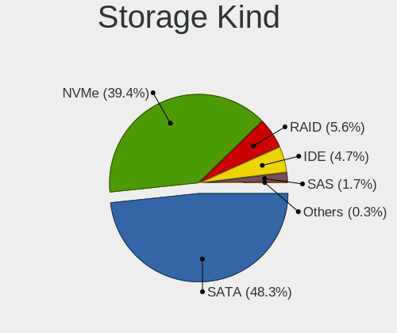

| Kind | Computers | Percent |
|------|-----------|---------|
| SATA | 84        | 48.84%  |
| NVMe | 68        | 39.53%  |
| RAID | 10        | 5.81%   |
| IDE  | 8         | 4.65%   |
| SAS  | 2         | 1.16%   |

Processor
---------

CPU Vendor
----------

Processor vendors

| Vendor     | Computers | Percent |
|------------|-----------|---------|
| Intel      | 70        | 59.32%  |
| AMD        | 47        | 39.83%  |
| thead,c906 | 1         | 0.85%   |

CPU Model
---------

Processor models

| Model                                   | Computers | Percent |
|-----------------------------------------|-----------|---------|
| Intel 12th Gen Core i7-12700H           | 4         | 3.39%   |
| AMD Ryzen 7 5800H with Radeon Graphics  | 4         | 3.39%   |
| Intel Xeon CPU E3-1230 V2 @ 3.30GHz     | 3         | 2.54%   |
| Intel 11th Gen Core i7-1165G7 @ 2.80GHz | 3         | 2.54%   |
| AMD Ryzen 9 7950X 16-Core Processor     | 3         | 2.54%   |
| AMD Ryzen 7 3700X 8-Core Processor      | 3         | 2.54%   |
| Intel Core i9-10850K CPU @ 3.60GHz      | 2         | 1.69%   |
| Intel Core i7-2670QM CPU @ 2.20GHz      | 2         | 1.69%   |
| Intel Core i7-10700K CPU @ 3.80GHz      | 2         | 1.69%   |
| Intel Atom CPU D510 @ 1.66GHz           | 2         | 1.69%   |
| Intel 12th Gen Core i7-12850HX          | 2         | 1.69%   |
| AMD Ryzen 9 7900X 12-Core Processor     | 2         | 1.69%   |
| AMD Ryzen 9 3950X 16-Core Processor     | 2         | 1.69%   |
| AMD Ryzen 5 5500                        | 2         | 1.69%   |
| AMD Phenom II X4 955 Processor          | 2         | 1.69%   |
| thead,c906 rv64imafdc                   | 1         | 0.85%   |
| Intel Xeon E-2224 CPU @ 3.40GHz         | 1         | 0.85%   |
| Intel Xeon CPU E5-2696 v4 @ 2.20GHz     | 1         | 0.85%   |
| Intel Xeon CPU E3-1505M v6 @ 3.00GHz    | 1         | 0.85%   |
| Intel Xeon CPU D-1521 @ 2.40GHz         | 1         | 0.85%   |
| Intel Pentium Silver N6000 @ 1.10GHz    | 1         | 0.85%   |
| Intel Pentium CPU G3220 @ 3.00GHz       | 1         | 0.85%   |
| Intel Pentium CPU B980 @ 2.40GHz        | 1         | 0.85%   |
| Intel Pentium 4 CPU 2.66GHz             | 1         | 0.85%   |
| Intel Core i9-10885H CPU @ 2.40GHz      | 1         | 0.85%   |
| Intel Core i7-9750H CPU @ 2.60GHz       | 1         | 0.85%   |
| Intel Core i7-9700 CPU @ 3.00GHz        | 1         | 0.85%   |
| Intel Core i7-8750H CPU @ 2.20GHz       | 1         | 0.85%   |
| Intel Core i7-7820HQ CPU @ 2.90GHz      | 1         | 0.85%   |
| Intel Core i7-7700HQ CPU @ 2.80GHz      | 1         | 0.85%   |
| Intel Core i7-7700 CPU @ 3.60GHz        | 1         | 0.85%   |
| Intel Core i7-6820HQ CPU @ 2.70GHz      | 1         | 0.85%   |
| Intel Core i7-4800MQ CPU @ 2.70GHz      | 1         | 0.85%   |
| Intel Core i7-4790 CPU @ 3.60GHz        | 1         | 0.85%   |
| Intel Core i7-4770 CPU @ 3.40GHz        | 1         | 0.85%   |
| Intel Core i7-4720HQ CPU @ 2.60GHz      | 1         | 0.85%   |
| Intel Core i7-3770 CPU @ 3.40GHz        | 1         | 0.85%   |
| Intel Core i7-10875H CPU @ 2.30GHz      | 1         | 0.85%   |
| Intel Core i7-10750H CPU @ 2.60GHz      | 1         | 0.85%   |
| Intel Core i7 CPU 970 @ 3.20GHz         | 1         | 0.85%   |

CPU Model Family
----------------

Processor model prefix

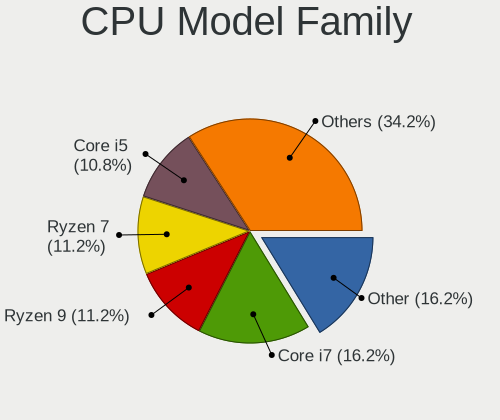

| Model                | Computers | Percent |
|----------------------|-----------|---------|
| Other                | 20        | 16.95%  |
| Intel Core i7        | 20        | 16.95%  |
| AMD Ryzen 7          | 15        | 12.71%  |
| AMD Ryzen 5          | 12        | 10.17%  |
| AMD Ryzen 9          | 9         | 7.63%   |
| Intel Core i5        | 8         | 6.78%   |
| Intel Xeon           | 7         | 5.93%   |
| Intel Core i3        | 4         | 3.39%   |
| Intel Atom           | 4         | 3.39%   |
| Intel Core i9        | 3         | 2.54%   |
| AMD Ryzen 7 PRO      | 3         | 2.54%   |
| Intel Pentium        | 2         | 1.69%   |
| AMD Phenom II X4     | 2         | 1.69%   |
| Intel Pentium Silver | 1         | 0.85%   |
| Intel Pentium 4      | 1         | 0.85%   |
| Intel Core Duo       | 1         | 0.85%   |
| Intel Core 2 Duo     | 1         | 0.85%   |
| AMD Ryzen 5 PRO      | 1         | 0.85%   |
| AMD FX               | 1         | 0.85%   |
| AMD EPYC             | 1         | 0.85%   |
| AMD Athlon II        | 1         | 0.85%   |
| AMD Athlon           | 1         | 0.85%   |

CPU Cores
---------

Number of processor cores

| Number  | Computers | Percent |
|---------|-----------|---------|
| 4       | 36        | 30.51%  |
| 8       | 25        | 21.19%  |
| 2       | 17        | 14.41%  |
| 6       | 15        | 12.71%  |
| 16      | 9         | 7.63%   |
| 12      | 5         | 4.24%   |
| 14      | 4         | 3.39%   |
| 10      | 2         | 1.69%   |
| 1       | 2         | 1.69%   |
| 44      | 1         | 0.85%   |
| 32      | 1         | 0.85%   |
| Unknown | 1         | 0.85%   |

CPU Sockets
-----------

Number of sockets

| Number  | Computers | Percent |
|---------|-----------|---------|
| 1       | 116       | 98.31%  |
| 2       | 1         | 0.85%   |
| Unknown | 1         | 0.85%   |

CPU Threads
-----------

Threads per core (Hyper-Threading)

| Number  | Computers | Percent |
|---------|-----------|---------|
| 2       | 103       | 87.29%  |
| 1       | 14        | 11.86%  |
| Unknown | 1         | 0.85%   |

CPU Op-Modes
------------

CPU Operation Modes (32-bit, 64-bit)

| Op mode        | Computers | Percent |
|----------------|-----------|---------|
| 32-bit, 64-bit | 114       | 96.61%  |
| 32-bit         | 3         | 2.54%   |
| Unknown        | 1         | 0.85%   |

CPU Microcode
-------------

Microcode number

| Number     | Computers | Percent |
|------------|-----------|---------|
| Unknown    | 40        | 33.06%  |
| 0x0a601203 | 7         | 5.79%   |
| 0x08701021 | 7         | 5.79%   |
| 0x806c1    | 6         | 4.96%   |
| 0x0a50000c | 6         | 4.96%   |
| 0x906ea    | 4         | 3.31%   |
| 0x906e9    | 4         | 3.31%   |
| 0x306c3    | 3         | 2.48%   |
| 0x0a50000d | 3         | 2.48%   |
| 0x0800820d | 3         | 2.48%   |
| 0xa0671    | 2         | 1.65%   |
| 0xa0652    | 2         | 1.65%   |
| 0x906a3    | 2         | 1.65%   |
| 0x90672    | 2         | 1.65%   |
| 0x506e3    | 2         | 1.65%   |
| 0x306a9    | 2         | 1.65%   |
| 0x206a7    | 2         | 1.65%   |
| 0x0a20120a | 2         | 1.65%   |
| 0x08608103 | 2         | 1.65%   |
| 0xf29      | 1         | 0.83%   |
| 0xa0655    | 1         | 0.83%   |
| 0x906ed    | 1         | 0.83%   |
| 0x806e9    | 1         | 0.83%   |
| 0x50663    | 1         | 0.83%   |
| 0x406f1    | 1         | 0.83%   |
| 0x406e3    | 1         | 0.83%   |
| 0x306d4    | 1         | 0.83%   |
| 0x20655    | 1         | 0.83%   |
| 0x106a5    | 1         | 0.83%   |
| 0x0a404102 | 1         | 0.83%   |
| 0x08900201 | 1         | 0.83%   |
| 0x08701013 | 1         | 0.83%   |
| 0x08600104 | 1         | 0.83%   |
| 0x08108109 | 1         | 0.83%   |
| 0x08101007 | 1         | 0.83%   |
| 0x08001138 | 1         | 0.83%   |
| 0x0700010f | 1         | 0.83%   |
| 0x0600063e | 1         | 0.83%   |
| 0x010000db | 1         | 0.83%   |

CPU Microarch
-------------

Microarchitecture

| Name             | Computers | Percent |
|------------------|-----------|---------|
| Unknown          | 15        | 12.71%  |
| Zen 3            | 11        | 9.32%   |
| Zen 2            | 11        | 9.32%   |
| KabyLake         | 10        | 8.47%   |
| Alderlake Hybrid | 9         | 7.63%   |
| IvyBridge        | 7         | 5.93%   |
| CometLake        | 7         | 5.93%   |
| TigerLake        | 6         | 5.08%   |
| Zen+             | 5         | 4.24%   |
| SandyBridge      | 5         | 4.24%   |
| Haswell          | 5         | 4.24%   |
| Icelake          | 4         | 3.39%   |
| Bonnell          | 4         | 3.39%   |
| Skylake          | 3         | 2.54%   |
| K10              | 3         | 2.54%   |
| Broadwell        | 3         | 2.54%   |
| Zen              | 2         | 1.69%   |
| Westmere         | 2         | 1.69%   |
| Penryn           | 1         | 0.85%   |
| P6               | 1         | 0.85%   |
| NetBurst         | 1         | 0.85%   |
| Nehalem          | 1         | 0.85%   |
| Jaguar           | 1         | 0.85%   |
| Bulldozer        | 1         | 0.85%   |

Graphics
--------

GPU Vendor
----------

Vendors of graphics cards

| Vendor                     | Computers | Percent |
|----------------------------|-----------|---------|
| AMD                        | 47        | 33.33%  |
| Nvidia                     | 44        | 31.21%  |
| Intel                      | 43        | 30.5%   |
| Matrox Electronics Systems | 4         | 2.84%   |
| ASPEED Technology          | 3         | 2.13%   |

GPU Model
---------

Graphics card models

| Model                                                                         | Computers | Percent |
|-------------------------------------------------------------------------------|-----------|---------|
| Nvidia GA106M [GeForce RTX 3060 Mobile / Max-Q]                               | 5         | 3.31%   |
| Intel TigerLake-LP GT2 [Iris Xe Graphics]                                     | 5         | 3.31%   |
| Intel Alder Lake-P Integrated Graphics Controller                             | 5         | 3.31%   |
| Intel 2nd Generation Core Processor Family Integrated Graphics Controller     | 5         | 3.31%   |
| AMD Raphael                                                                   | 5         | 3.31%   |
| AMD Ellesmere [Radeon RX 470/480/570/570X/580/580X/590]                       | 5         | 3.31%   |
| AMD Cezanne [Radeon Vega Series / Radeon Vega Mobile Series]                  | 5         | 3.31%   |
| Nvidia GA102 [GeForce RTX 3080 Ti]                                            | 4         | 2.65%   |
| AMD Navi 14 [Radeon RX 5500/5500M / Pro 5500M]                                | 4         | 2.65%   |
| Matrox Electronics Systems MGA G200EH                                         | 3         | 1.99%   |
| Intel HD Graphics 630                                                         | 3         | 1.99%   |
| Intel Atom Processor D4xx/D5xx/N4xx/N5xx Integrated Graphics Controller       | 3         | 1.99%   |
| ASPEED Technology ASPEED Graphics Family                                      | 3         | 1.99%   |
| AMD Rembrandt [Radeon 680M]                                                   | 3         | 1.99%   |
| AMD Navi 31 [Radeon RX 7900 XT/7900 XTX]                                      | 3         | 1.99%   |
| AMD Navi 22 [Radeon RX 6700/6700 XT/6750 XT / 6800M/6850M XT]                 | 3         | 1.99%   |
| Nvidia TU117M [GeForce GTX 1650 Mobile / Max-Q]                               | 2         | 1.32%   |
| Nvidia TU116M [GeForce GTX 1650 Ti Mobile]                                    | 2         | 1.32%   |
| Nvidia GT218 [GeForce 210]                                                    | 2         | 1.32%   |
| Nvidia GA106 [Geforce RTX 3050]                                               | 2         | 1.32%   |
| Nvidia GA104GLM [RTX A3000 12GB Laptop GPU]                                   | 2         | 1.32%   |
| Intel Mobile 945GM/GMS/GME, 943/940GML Express Integrated Graphics Controller | 2         | 1.32%   |
| Intel HD Graphics 530                                                         | 2         | 1.32%   |
| Intel CometLake-H GT2 [UHD Graphics]                                          | 2         | 1.32%   |
| Intel CoffeeLake-H GT2 [UHD Graphics 630]                                     | 2         | 1.32%   |
| Intel 4th Gen Core Processor Integrated Graphics Controller                   | 2         | 1.32%   |
| AMD RS780C [Radeon 3100]                                                      | 2         | 1.32%   |
| AMD Renoir                                                                    | 2         | 1.32%   |
| AMD Picasso/Raven 2 [Radeon Vega Series / Radeon Vega Mobile Series]          | 2         | 1.32%   |
| AMD Lucienne                                                                  | 2         | 1.32%   |
| Nvidia TU117M [GeForce MX450]                                                 | 1         | 0.66%   |
| Nvidia TU117M [GeForce GTX 1650 Ti Mobile]                                    | 1         | 0.66%   |
| Nvidia TU104M [GeForce RTX 2080 SUPER Mobile / Max-Q]                         | 1         | 0.66%   |
| Nvidia TU104 [GeForce RTX 2080]                                               | 1         | 0.66%   |
| Nvidia TU104 [GeForce RTX 2070 SUPER]                                         | 1         | 0.66%   |
| Nvidia TU102 [GeForce RTX 2080 Ti Rev. A]                                     | 1         | 0.66%   |
| Nvidia GP107M [GeForce GTX 1050 Ti Mobile]                                    | 1         | 0.66%   |
| Nvidia GP107M [GeForce GTX 1050 Mobile]                                       | 1         | 0.66%   |
| Nvidia GP106 [GeForce GTX 1060 6GB]                                           | 1         | 0.66%   |
| Nvidia GP104 [GeForce GTX 1060 6GB]                                           | 1         | 0.66%   |

GPU Combo
---------

Combinations of graphics cards

| Name           | Computers | Percent |
|----------------|-----------|---------|
| 1 x AMD        | 34        | 28.33%  |
| 1 x Nvidia     | 24        | 20%     |
| 1 x Intel      | 20        | 16.67%  |
| Intel + Nvidia | 16        | 13.33%  |
| 2 x AMD        | 7         | 5.83%   |
| 2 x Intel      | 4         | 3.33%   |
| 1 x Matrox     | 4         | 3.33%   |
| AMD + Nvidia   | 4         | 3.33%   |
| Intel + AMD    | 3         | 2.5%    |
| 1 x ASPEED     | 3         | 2.5%    |
| Other          | 1         | 0.83%   |

GPU Driver
----------

Free vs proprietary

| Driver      | Computers | Percent |
|-------------|-----------|---------|
| Free        | 84        | 71.19%  |
| Proprietary | 23        | 19.49%  |
| Unknown     | 11        | 9.32%   |

GPU Memory
----------

Total video memory

| Size in GB | Computers | Percent |
|------------|-----------|---------|
| Unknown    | 49        | 41.53%  |
| 0.51-1.0   | 14        | 11.86%  |
| 7.01-8.0   | 12        | 10.17%  |
| 8.01-16.0  | 12        | 10.17%  |
| 0.01-0.5   | 9         | 7.63%   |
| 3.01-4.0   | 8         | 6.78%   |
| 1.01-2.0   | 6         | 5.08%   |
| 5.01-6.0   | 4         | 3.39%   |
| 16.01-24.0 | 3         | 2.54%   |
| 2.01-3.0   | 1         | 0.85%   |

Monitor
-------

Monitor Vendor
--------------

Monitor vendors

| Vendor                  | Computers | Percent |
|-------------------------|-----------|---------|
| Samsung Electronics     | 16        | 13.33%  |
| Chimei Innolux          | 11        | 9.17%   |
| Dell                    | 9         | 7.5%    |
| BOE                     | 9         | 7.5%    |
| AU Optronics            | 8         | 6.67%   |
| AOC                     | 7         | 5.83%   |
| LG Display              | 5         | 4.17%   |
| ASUSTek Computer        | 5         | 4.17%   |
| Sharp                   | 4         | 3.33%   |
| Goldstar                | 4         | 3.33%   |
| Acer                    | 4         | 3.33%   |
| Lenovo                  | 3         | 2.5%    |
| Eizo                    | 3         | 2.5%    |
| BenQ                    | 3         | 2.5%    |
| Unknown                 | 2         | 1.67%   |
| Philips                 | 2         | 1.67%   |
| PANDA                   | 2         | 1.67%   |
| Iiyama                  | 2         | 1.67%   |
| Chi Mei Optoelectronics | 2         | 1.67%   |
| BOE Technology Group    | 2         | 1.67%   |
| Unknown                 | 2         | 1.67%   |
| Valve                   | 1         | 0.83%   |
| TMX                     | 1         | 0.83%   |
| Sony                    | 1         | 0.83%   |
| Sceptre Tech            | 1         | 0.83%   |
| Onkyo                   | 1         | 0.83%   |
| InfoVision              | 1         | 0.83%   |
| IBM                     | 1         | 0.83%   |
| HJW                     | 1         | 0.83%   |
| Hewlett-Packard         | 1         | 0.83%   |
| Gigabyte Technology     | 1         | 0.83%   |
| Gateway                 | 1         | 0.83%   |
| ELSA                    | 1         | 0.83%   |
| CTO                     | 1         | 0.83%   |
| CSO                     | 1         | 0.83%   |
| ADV                     | 1         | 0.83%   |

Monitor Model
-------------

Monitor models

| Model                                                                   | Computers | Percent |
|-------------------------------------------------------------------------|-----------|---------|
| Samsung Electronics SyncMaster SAM059A 1920x1080 477x268mm 21.5-inch    | 2         | 1.57%   |
| Samsung Electronics LCD Monitor SAM7003 3840x2160 1872x1053mm 84.6-inch | 2         | 1.57%   |
| Eizo CS2731 ENC3069 2560x1440 597x336mm 27.0-inch                       | 2         | 1.57%   |
| BOE Technology Group LCD Monitor 1920x1080                              | 2         | 1.57%   |
| ASUSTek Computer VG27A AUS2722 2560x1440 597x336mm 27.0-inch            | 2         | 1.57%   |
| AOC LCD Monitor U2879G6 3840x2160                                       | 2         | 1.57%   |
| AOC 2460G5 AOC2460 1920x1080 531x299mm 24.0-inch                        | 2         | 1.57%   |
| Unknown                                                                 | 2         | 1.57%   |
| Valve ANX7530 U VLV3001 800x1280 100x150mm 7.1-inch                     | 1         | 0.79%   |
| Unknown LCD Monitor RTK                                                 | 1         | 0.79%   |
| Unknown LCD Monitor FFFF 2288x1287 2550x2550mm 142.0-inch               | 1         | 0.79%   |
| TMX TL156MDMP11-0 TMX1560 3200x2000 336x210mm 15.6-inch                 | 1         | 0.79%   |
| Sony BW8 MS_9001 1600x2560 113x181mm 8.4-inch                           | 1         | 0.79%   |
| Sharp LQ173M1JW03 SHP14DC 1920x1080 382x215mm 17.3-inch                 | 1         | 0.79%   |
| Sharp LQ156M1JW03 SHP14C5 1920x1080 344x194mm 15.5-inch                 | 1         | 0.79%   |
| Sharp LQ135P1JX51 SHP14B3 2256x1504 285x190mm 13.5-inch                 | 1         | 0.79%   |
| Sharp LCD Monitor SHP14AE 1920x1080 294x165mm 13.3-inch                 | 1         | 0.79%   |
| Sceptre Tech C305W-2560UN SPT0C0D 2560x1080 690x291mm 29.5-inch         | 1         | 0.79%   |
| Samsung Electronics SyncMaster SAM05E8 1920x1080                        | 1         | 0.79%   |
| Samsung Electronics SyncMaster SAM03E4 1680x1050 474x296mm 22.0-inch    | 1         | 0.79%   |
| Samsung Electronics SMS27A850 SAM083D 2560x1440 518x324mm 24.1-inch     | 1         | 0.79%   |
| Samsung Electronics S27E390 SAM0C1C 1920x1080 598x336mm 27.0-inch       | 1         | 0.79%   |
| Samsung Electronics S27B350 SAM08DC 1920x1080 598x336mm 27.0-inch       | 1         | 0.79%   |
| Samsung Electronics S22B300 SAM08C8 1920x1080 477x268mm 21.5-inch       | 1         | 0.79%   |
| Samsung Electronics LCD Monitor SDC4E51 1366x768 344x194mm 15.5-inch    | 1         | 0.79%   |
| Samsung Electronics LCD Monitor SDC4179 2560x1440 344x194mm 15.5-inch   | 1         | 0.79%   |
| Samsung Electronics LCD Monitor SDC414D 3456x2160 336x210mm 15.6-inch   | 1         | 0.79%   |
| Samsung Electronics LCD Monitor SDC324C 1920x1080 344x194mm 15.5-inch   | 1         | 0.79%   |
| Samsung Electronics LCD Monitor SAM7004 3840x2160 1872x1053mm 84.6-inch | 1         | 0.79%   |
| Samsung Electronics LCD Monitor SAM07D0 1360x768 700x390mm 31.5-inch    | 1         | 0.79%   |
| Samsung Electronics C49HG9x SAM0E5E 3840x1080 1196x336mm 48.9-inch      | 1         | 0.79%   |
| Samsung Electronics C27HG7x SAM0E16 2560x1440 598x336mm 27.0-inch       | 1         | 0.79%   |
| Philips PHL 242M8 PHLC214 1920x1080 527x296mm 23.8-inch                 | 1         | 0.79%   |
| Philips LCD Monitor PHL 246V5 3840x1080                                 | 1         | 0.79%   |
| Philips LCD Monitor PHL 246V5                                           | 1         | 0.79%   |
| PANDA LCD Monitor NCP0050 1920x1080 309x174mm 14.0-inch                 | 1         | 0.79%   |
| PANDA LCD Monitor NCP004D 1920x1080 344x194mm 15.5-inch                 | 1         | 0.79%   |
| Onkyo AV Receiver ONK1061 1024x768                                      | 1         | 0.79%   |
| LG Display LCD Monitor LGD06D6 1920x1080 309x174mm 14.0-inch            | 1         | 0.79%   |
| LG Display LCD Monitor LGD058C 1920x1080 344x194mm 15.5-inch            | 1         | 0.79%   |

Monitor Resolution
------------------

Monitor screen resolution

| Resolution         | Computers | Percent |
|--------------------|-----------|---------|
| 1920x1080 (FHD)    | 48        | 40.34%  |
| 3840x2160 (4K)     | 15        | 12.61%  |
| 2560x1440 (QHD)    | 13        | 10.92%  |
| 3440x1440          | 5         | 4.2%    |
| 1366x768 (WXGA)    | 4         | 3.36%   |
| 2560x1600          | 3         | 2.52%   |
| 1600x900 (HD+)     | 3         | 2.52%   |
| Unknown            | 3         | 2.52%   |
| 3840x1080          | 2         | 1.68%   |
| 2560x1080          | 2         | 1.68%   |
| 1920x1200 (WUXGA)  | 2         | 1.68%   |
| 1440x900 (WXGA+)   | 2         | 1.68%   |
| 1280x1024 (SXGA)   | 2         | 1.68%   |
| 800x1280           | 1         | 0.84%   |
| 3840x1200          | 1         | 0.84%   |
| 3456x2160          | 1         | 0.84%   |
| 3200x2000          | 1         | 0.84%   |
| 2520x1680          | 1         | 0.84%   |
| 2288x1287          | 1         | 0.84%   |
| 2256x1504          | 1         | 0.84%   |
| 2160x1440          | 1         | 0.84%   |
| 1920x540           | 1         | 0.84%   |
| 1680x1050 (WSXGA+) | 1         | 0.84%   |
| 1600x1200          | 1         | 0.84%   |
| 1360x768           | 1         | 0.84%   |
| 1280x800 (WXGA)    | 1         | 0.84%   |
| 1024x768 (XGA)     | 1         | 0.84%   |
| 1024x600           | 1         | 0.84%   |

Monitor Diagonal
----------------

Diagonal size in inches

| Inches  | Computers | Percent |
|---------|-----------|---------|
| 27      | 18        | 15%     |
| 15      | 17        | 14.17%  |
| 17      | 11        | 9.17%   |
| 13      | 11        | 9.17%   |
| Unknown | 11        | 9.17%   |
| 24      | 6         | 5%      |
| 14      | 6         | 5%      |
| 34      | 5         | 4.17%   |
| 23      | 5         | 4.17%   |
| 21      | 5         | 4.17%   |
| 31      | 4         | 3.33%   |
| 16      | 4         | 3.33%   |
| 84      | 2         | 1.67%   |
| 32      | 2         | 1.67%   |
| 19      | 2         | 1.67%   |
| 142     | 1         | 0.83%   |
| 48      | 1         | 0.83%   |
| 41      | 1         | 0.83%   |
| 40      | 1         | 0.83%   |
| 29      | 1         | 0.83%   |
| 25      | 1         | 0.83%   |
| 22      | 1         | 0.83%   |
| 12      | 1         | 0.83%   |
| 10      | 1         | 0.83%   |
| 8       | 1         | 0.83%   |
| 7       | 1         | 0.83%   |

Monitor Width
-------------

Physical width

| Width in mm    | Computers | Percent |
|----------------|-----------|---------|
| 301-350        | 33        | 28.21%  |
| 501-600        | 28        | 23.93%  |
| Unknown        | 11        | 9.4%    |
| 351-400        | 10        | 8.55%   |
| 201-300        | 8         | 6.84%   |
| 701-800        | 7         | 5.98%   |
| 601-700        | 6         | 5.13%   |
| 401-500        | 6         | 5.13%   |
| 1501-2000      | 2         | 1.71%   |
| More than 2000 | 1         | 0.85%   |
| 801-900        | 1         | 0.85%   |
| 101-200        | 1         | 0.85%   |
| 1001-1500      | 1         | 0.85%   |
| 901-1000       | 1         | 0.85%   |
| 1-100          | 1         | 0.85%   |

Aspect Ratio
------------

Proportional relationship between the width and the height

| Ratio   | Computers | Percent |
|---------|-----------|---------|
| 16/9    | 76        | 67.86%  |
| 16/10   | 12        | 10.71%  |
| Unknown | 7         | 6.25%   |
| 21/9    | 5         | 4.46%   |
| 3/2     | 3         | 2.68%   |
| 5/4     | 2         | 1.79%   |
| 4/3     | 2         | 1.79%   |
| 32/9    | 2         | 1.79%   |
| 1.00    | 1         | 0.89%   |
| 0.67    | 1         | 0.89%   |
| 0.62    | 1         | 0.89%   |

Monitor Area
------------

Area in inch

| Area in inch | Computers | Percent |
|----------------|-----------|---------|
| 301-350        | 19        | 16.24%  |
| 101-110        | 18        | 15.38%  |
| 81-90          | 13        | 11.11%  |
| 351-500        | 11        | 9.4%    |
| 201-250        | 11        | 9.4%    |
| Unknown        | 11        | 9.4%    |
| 121-130        | 9         | 7.69%   |
| 71-80          | 4         | 3.42%   |
| 251-300        | 4         | 3.42%   |
| More than 1000 | 3         | 2.56%   |
| 111-120        | 3         | 2.56%   |
| 501-1000       | 3         | 2.56%   |
| 1-40           | 2         | 1.71%   |
| 151-200        | 2         | 1.71%   |
| 141-150        | 2         | 1.71%   |
| 61-70          | 1         | 0.85%   |
| 41-50          | 1         | 0.85%   |

Pixel Density
-------------

Pixels per inch

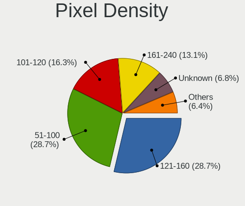

| Density       | Computers | Percent |
|---------------|-----------|---------|
| 121-160       | 32        | 27.35%  |
| 51-100        | 30        | 25.64%  |
| 101-120       | 24        | 20.51%  |
| 161-240       | 14        | 11.97%  |
| Unknown       | 11        | 9.4%    |
| More than 240 | 4         | 3.42%   |
| 1-50          | 2         | 1.71%   |

Multiple Monitors
-----------------

Total monitors connected

| Total | Computers | Percent |
|-------|-----------|---------|
| 1     | 90        | 75%     |
| 2     | 16        | 13.33%  |
| 0     | 10        | 8.33%   |
| 3     | 4         | 3.33%   |

Network
-------

Net Controller Vendor
---------------------

Controller vendors

| Vendor                   | Computers | Percent |
|--------------------------|-----------|---------|
| Intel                    | 69        | 40.83%  |
| Realtek Semiconductor    | 60        | 35.5%   |
| MediaTek                 | 7         | 4.14%   |
| Qualcomm Atheros         | 6         | 3.55%   |
| Broadcom                 | 6         | 3.55%   |
| Xiaomi                   | 3         | 1.78%   |
| Qualcomm                 | 2         | 1.18%   |
| ICS Advent               | 2         | 1.18%   |
| ASIX Electronics         | 2         | 1.18%   |
| Ralink                   | 1         | 0.59%   |
| OpenMoko                 | 1         | 0.59%   |
| Microsoft                | 1         | 0.59%   |
| Marvell Technology Group | 1         | 0.59%   |
| Insyde Software          | 1         | 0.59%   |
| Huawei Technologies      | 1         | 0.59%   |
| Hewlett-Packard          | 1         | 0.59%   |
| Edimax Technology        | 1         | 0.59%   |
| Dell                     | 1         | 0.59%   |
| Broadcom Limited         | 1         | 0.59%   |
| Arduino SA               | 1         | 0.59%   |
| Aquantia                 | 1         | 0.59%   |

Net Controller Model
--------------------

Controller models

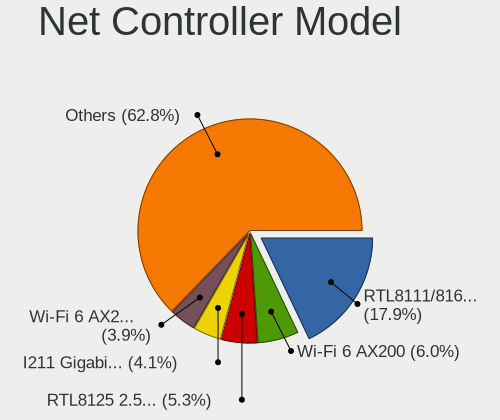

| Model                                                             | Computers | Percent |
|-------------------------------------------------------------------|-----------|---------|
| Realtek RTL8111/8168/8411 PCI Express Gigabit Ethernet Controller | 37        | 18.32%  |
| Intel Wi-Fi 6 AX200                                               | 13        | 6.44%   |
| Realtek RTL8125 2.5GbE Controller                                 | 11        | 5.45%   |
| Intel Ethernet Controller I225-V                                  | 10        | 4.95%   |
| Intel I211 Gigabit Network Connection                             | 8         | 3.96%   |
| Intel Wi-Fi 6 AX210/AX211/AX411 160MHz                            | 7         | 3.47%   |
| Realtek RTL8153 Gigabit Ethernet Adapter                          | 5         | 2.48%   |
| Intel Wireless 8265 / 8275                                        | 4         | 1.98%   |
| Intel Alder Lake-S PCH CNVi WiFi                                  | 4         | 1.98%   |
| Intel Alder Lake-P PCH CNVi WiFi                                  | 4         | 1.98%   |
| Xiaomi Mi/Redmi series (RNDIS)                                    | 3         | 1.49%   |
| Realtek RTL8822CE 802.11ac PCIe Wireless Network Adapter          | 3         | 1.49%   |
| Realtek RTL810xE PCI Express Fast Ethernet controller             | 3         | 1.49%   |
| MediaTek MT7921 802.11ax PCI Express Wireless Network Adapter     | 3         | 1.49%   |
| Intel Wi-Fi 6 AX201                                               | 3         | 1.49%   |
| Intel Centrino Advanced-N 6235                                    | 3         | 1.49%   |
| Broadcom NetXtreme BCM5720 Gigabit Ethernet PCIe                  | 3         | 1.49%   |
| Realtek RTL8852AE 802.11ax PCIe Wireless Network Adapter          | 2         | 0.99%   |
| Qualcomm QCNFA765 Wireless Network Adapter                        | 2         | 0.99%   |
| Qualcomm Atheros AR9287 Wireless Network Adapter (PCI-Express)    | 2         | 0.99%   |
| Qualcomm Atheros AR8151 v2.0 Gigabit Ethernet                     | 2         | 0.99%   |
| MediaTek MT7922 802.11ax PCI Express Wireless Network Adapter     | 2         | 0.99%   |
| MediaTek MT7921K (RZ608) Wi-Fi 6E 80MHz                           | 2         | 0.99%   |
| Intel Wireless-AC 9260                                            | 2         | 0.99%   |
| Intel Wireless 8260                                               | 2         | 0.99%   |
| Intel I350 Gigabit Network Connection                             | 2         | 0.99%   |
| Intel Ethernet Connection I217-V                                  | 2         | 0.99%   |
| Intel Ethernet Connection (5) I219-LM                             | 2         | 0.99%   |
| Intel Ethernet Connection (17) I219-LM                            | 2         | 0.99%   |
| Intel Comet Lake PCH CNVi WiFi                                    | 2         | 0.99%   |
| Realtek RTL88x2bu [AC1200 Techkey]                                | 1         | 0.5%    |
| Realtek RTL8852BE PCIe 802.11ax Wireless Network Controller       | 1         | 0.5%    |
| Realtek RTL8821CE 802.11ac PCIe Wireless Network Adapter          | 1         | 0.5%    |
| Realtek RTL8723BE PCIe Wireless Network Adapter                   | 1         | 0.5%    |
| Realtek RTL8723AU 802.11n WLAN Adapter                            | 1         | 0.5%    |
| Realtek RTL8188CE 802.11b/g/n WiFi Adapter                        | 1         | 0.5%    |
| Realtek RTL-8110SC/8169SC Gigabit Ethernet                        | 1         | 0.5%    |
| Ralink RT2790 Wireless 802.11n 1T/2R PCIe                         | 1         | 0.5%    |
| Qualcomm Atheros QCA9377 802.11ac Wireless Network Adapter        | 1         | 0.5%    |
| Qualcomm Atheros AR8132 Fast Ethernet                             | 1         | 0.5%    |

Wireless Vendor
---------------

Wireless vendors

| Vendor                | Computers | Percent |
|-----------------------|-----------|---------|
| Intel                 | 49        | 61.25%  |
| Realtek Semiconductor | 11        | 13.75%  |
| MediaTek              | 7         | 8.75%   |
| Qualcomm Atheros      | 4         | 5%      |
| Qualcomm              | 2         | 2.5%    |
| Broadcom              | 2         | 2.5%    |
| Ralink                | 1         | 1.25%   |
| Microsoft             | 1         | 1.25%   |
| Edimax Technology     | 1         | 1.25%   |
| Dell                  | 1         | 1.25%   |
| Broadcom Limited      | 1         | 1.25%   |

Wireless Model
--------------

Wireless models

| Model                                                                   | Computers | Percent |
|-------------------------------------------------------------------------|-----------|---------|
| Intel Wi-Fi 6 AX200                                                     | 13        | 16.25%  |
| Intel Wi-Fi 6 AX210/AX211/AX411 160MHz                                  | 7         | 8.75%   |
| Intel Wireless 8265 / 8275                                              | 4         | 5%      |
| Intel Alder Lake-S PCH CNVi WiFi                                        | 4         | 5%      |
| Intel Alder Lake-P PCH CNVi WiFi                                        | 4         | 5%      |
| Realtek RTL8822CE 802.11ac PCIe Wireless Network Adapter                | 3         | 3.75%   |
| MediaTek MT7921 802.11ax PCI Express Wireless Network Adapter           | 3         | 3.75%   |
| Intel Wi-Fi 6 AX201                                                     | 3         | 3.75%   |
| Intel Centrino Advanced-N 6235                                          | 3         | 3.75%   |
| Realtek RTL8852AE 802.11ax PCIe Wireless Network Adapter                | 2         | 2.5%    |
| Qualcomm QCNFA765 Wireless Network Adapter                              | 2         | 2.5%    |
| Qualcomm Atheros AR9287 Wireless Network Adapter (PCI-Express)          | 2         | 2.5%    |
| MediaTek MT7922 802.11ax PCI Express Wireless Network Adapter           | 2         | 2.5%    |
| MediaTek MT7921K (RZ608) Wi-Fi 6E 80MHz                                 | 2         | 2.5%    |
| Intel Wireless-AC 9260                                                  | 2         | 2.5%    |
| Intel Wireless 8260                                                     | 2         | 2.5%    |
| Intel Comet Lake PCH CNVi WiFi                                          | 2         | 2.5%    |
| Realtek RTL88x2bu [AC1200 Techkey]                                      | 1         | 1.25%   |
| Realtek RTL8852BE PCIe 802.11ax Wireless Network Controller             | 1         | 1.25%   |
| Realtek RTL8821CE 802.11ac PCIe Wireless Network Adapter                | 1         | 1.25%   |
| Realtek RTL8723BE PCIe Wireless Network Adapter                         | 1         | 1.25%   |
| Realtek RTL8723AU 802.11n WLAN Adapter                                  | 1         | 1.25%   |
| Realtek RTL8188CE 802.11b/g/n WiFi Adapter                              | 1         | 1.25%   |
| Ralink RT2790 Wireless 802.11n 1T/2R PCIe                               | 1         | 1.25%   |
| Qualcomm Atheros QCA9377 802.11ac Wireless Network Adapter              | 1         | 1.25%   |
| Qualcomm Atheros AR242x / AR542x Wireless Network Adapter (PCI-Express) | 1         | 1.25%   |
| Microsoft Xbox Wireless Adapter for Windows                             | 1         | 1.25%   |
| Intel Wireless 7265                                                     | 1         | 1.25%   |
| Intel Wireless 7260                                                     | 1         | 1.25%   |
| Intel Ice Lake-LP PCH CNVi WiFi                                         | 1         | 1.25%   |
| Intel Centrino Wireless-N 2230                                          | 1         | 1.25%   |
| Intel Centrino Advanced-N 6205 [Taylor Peak]                            | 1         | 1.25%   |
| Edimax EW-7811Un 802.11n Wireless Adapter [Realtek RTL8188CUS]          | 1         | 1.25%   |
| Dell Hub of E-Port Replicator                                           | 1         | 1.25%   |
| Broadcom Limited BCM4312 802.11b/g LP-PHY                               | 1         | 1.25%   |
| Broadcom BCM4313 802.11bgn Wireless Network Adapter                     | 1         | 1.25%   |
| Broadcom BCM4312 802.11b/g LP-PHY                                       | 1         | 1.25%   |

Ethernet Vendor
---------------

Ethernet vendors

| Vendor                   | Computers | Percent |
|--------------------------|-----------|---------|
| Realtek Semiconductor    | 56        | 48.28%  |
| Intel                    | 42        | 36.21%  |
| Broadcom                 | 4         | 3.45%   |
| Xiaomi                   | 3         | 2.59%   |
| Qualcomm Atheros         | 3         | 2.59%   |
| ICS Advent               | 2         | 1.72%   |
| ASIX Electronics         | 2         | 1.72%   |
| Marvell Technology Group | 1         | 0.86%   |
| Insyde Software          | 1         | 0.86%   |
| Hewlett-Packard          | 1         | 0.86%   |
| Aquantia                 | 1         | 0.86%   |

Ethernet Model
--------------

Ethernet models

| Model                                                                         | Computers | Percent |
|-------------------------------------------------------------------------------|-----------|---------|
| Realtek RTL8111/8168/8411 PCI Express Gigabit Ethernet Controller             | 37        | 31.09%  |
| Realtek RTL8125 2.5GbE Controller                                             | 11        | 9.24%   |
| Intel Ethernet Controller I225-V                                              | 10        | 8.4%    |
| Intel I211 Gigabit Network Connection                                         | 8         | 6.72%   |
| Realtek RTL8153 Gigabit Ethernet Adapter                                      | 5         | 4.2%    |
| Xiaomi Mi/Redmi series (RNDIS)                                                | 3         | 2.52%   |
| Realtek RTL810xE PCI Express Fast Ethernet controller                         | 3         | 2.52%   |
| Broadcom NetXtreme BCM5720 Gigabit Ethernet PCIe                              | 3         | 2.52%   |
| Qualcomm Atheros AR8151 v2.0 Gigabit Ethernet                                 | 2         | 1.68%   |
| Intel I350 Gigabit Network Connection                                         | 2         | 1.68%   |
| Intel Ethernet Connection I217-V                                              | 2         | 1.68%   |
| Intel Ethernet Connection (5) I219-LM                                         | 2         | 1.68%   |
| Intel Ethernet Connection (17) I219-LM                                        | 2         | 1.68%   |
| Realtek RTL-8110SC/8169SC Gigabit Ethernet                                    | 1         | 0.84%   |
| Qualcomm Atheros AR8132 Fast Ethernet                                         | 1         | 0.84%   |
| Marvell Group 88E8056 PCI-E Gigabit Ethernet Controller                       | 1         | 0.84%   |
| Intel Killer E3100X 2.5 Gigabit Ethernet Controller                           | 1         | 0.84%   |
| Intel Ethernet Connection X552/X557-AT 10GBASE-T                              | 1         | 0.84%   |
| Intel Ethernet Connection I219-V                                              | 1         | 0.84%   |
| Intel Ethernet Connection I217-LM                                             | 1         | 0.84%   |
| Intel Ethernet Connection (7) I219-V                                          | 1         | 0.84%   |
| Intel Ethernet Connection (4) I219-LM                                         | 1         | 0.84%   |
| Intel Ethernet Connection (2) I219-V                                          | 1         | 0.84%   |
| Intel Ethernet Connection (2) I219-LM                                         | 1         | 0.84%   |
| Intel Ethernet Connection (16) I219-LM                                        | 1         | 0.84%   |
| Intel Ethernet Connection (11) I219-LM                                        | 1         | 0.84%   |
| Intel 82801DB PRO/100 VE (LOM) Ethernet Controller                            | 1         | 0.84%   |
| Intel 82599ES 10-Gigabit SFI/SFP+ Network Connection                          | 1         | 0.84%   |
| Intel 82579V Gigabit Network Connection                                       | 1         | 0.84%   |
| Intel 82579LM Gigabit Network Connection (Lewisville)                         | 1         | 0.84%   |
| Intel 82573E Gigabit Ethernet Controller (Copper)                             | 1         | 0.84%   |
| Intel 82571EB/82571GB Gigabit Ethernet Controller D0/D1 (copper applications) | 1         | 0.84%   |
| Intel 82567LM Gigabit Network Connection                                      | 1         | 0.84%   |
| Intel 82541GI Gigabit Ethernet Controller                                     | 1         | 0.84%   |
| Insyde Software RNDIS/Ethernet Gadget                                         | 1         | 0.84%   |
| ICS Advent DM9601 Fast Ethernet Adapter                                       | 1         | 0.84%   |
| ICS Advent 10/100M LAN                                                        | 1         | 0.84%   |
| HP Virtual NIC                                                                | 1         | 0.84%   |
| Broadcom BCM57416 NetXtreme-E Dual-Media 10G RDMA Ethernet Controller         | 1         | 0.84%   |
| ASIX AX88772A Fast Ethernet                                                   | 1         | 0.84%   |

Net Controller Kind
-------------------

Ethernet, WiFi or modem

| Kind     | Computers | Percent |
|----------|-----------|---------|
| Ethernet | 105       | 56.45%  |
| WiFi     | 78        | 41.94%  |
| Modem    | 3         | 1.61%   |

Used Controller
---------------

Currently used network controller

| Kind     | Computers | Percent |
|----------|-----------|---------|
| Ethernet | 70        | 58.33%  |
| WiFi     | 50        | 41.67%  |

NICs
----

Total network controllers on board

| Total | Computers | Percent |
|-------|-----------|---------|
| 2     | 62        | 52.1%   |
| 1     | 47        | 39.5%   |
| 3     | 4         | 3.36%   |
| 6     | 2         | 1.68%   |
| 0     | 2         | 1.68%   |
| 5     | 1         | 0.84%   |
| 4     | 1         | 0.84%   |

IPv6
----

IPv6 vs IPv4

| Used | Computers | Percent |
|------|-----------|---------|
| No   | 79        | 66.95%  |
| Yes  | 39        | 33.05%  |

Bluetooth
---------

Bluetooth Vendor
----------------

Controller vendors

| Vendor                          | Computers | Percent |
|---------------------------------|-----------|---------|
| Intel                           | 47        | 62.67%  |
| Realtek Semiconductor           | 7         | 9.33%   |
| IMC Networks                    | 4         | 5.33%   |
| Foxconn / Hon Hai               | 3         | 4%      |
| USI                             | 2         | 2.67%   |
| Realtek                         | 2         | 2.67%   |
| MediaTek                        | 2         | 2.67%   |
| Lite-On Technology              | 2         | 2.67%   |
| Cambridge Silicon Radio         | 2         | 2.67%   |
| Qualcomm Atheros Communications | 1         | 1.33%   |
| Dell                            | 1         | 1.33%   |
| Broadcom                        | 1         | 1.33%   |
| ASUSTek Computer                | 1         | 1.33%   |

Bluetooth Model
---------------

Controller models

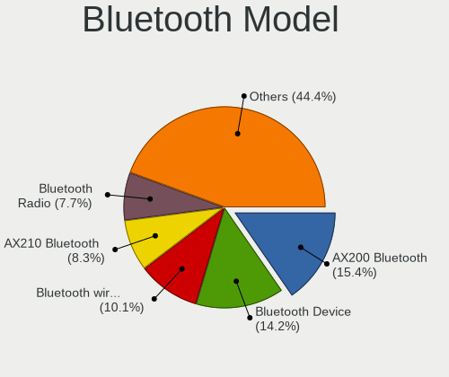

| Model                                               | Computers | Percent |
|-----------------------------------------------------|-----------|---------|
| Intel AX200 Bluetooth                               | 13        | 17.33%  |
| Intel Bluetooth wireless interface                  | 8         | 10.67%  |
| Intel Bluetooth Device                              | 7         | 9.33%   |
| Intel AX210 Bluetooth                               | 7         | 9.33%   |
| Realtek Bluetooth Radio                             | 6         | 8%      |
| Intel AX201 Bluetooth                               | 6         | 8%      |
| Intel Centrino Bluetooth Wireless Transceiver       | 4         | 5.33%   |
| USI Bluetooth Device                                | 2         | 2.67%   |
| Realtek 802.11ac WLAN Adapter                       | 2         | 2.67%   |
| MediaTek Wireless_Device                            | 2         | 2.67%   |
| Intel Wireless-AC 9260 Bluetooth Adapter            | 2         | 2.67%   |
| IMC Networks Wireless_Device                        | 2         | 2.67%   |
| IMC Networks Bluetooth Radio                        | 2         | 2.67%   |
| Foxconn / Hon Hai Wireless_Device                   | 2         | 2.67%   |
| Cambridge Silicon Radio Bluetooth Dongle (HCI mode) | 2         | 2.67%   |
| Realtek Bluetooth 5.1 Radio                         | 1         | 1.33%   |
| Qualcomm Atheros AR3011 Bluetooth                   | 1         | 1.33%   |
| Lite-On Wireless_Device                             | 1         | 1.33%   |
| Lite-On Qualcomm Atheros QCA9377 Bluetooth          | 1         | 1.33%   |
| Foxconn / Hon Hai Bluetooth USB Host Controller     | 1         | 1.33%   |
| Dell Wireless 365 Bluetooth                         | 1         | 1.33%   |
| Broadcom HP Portable SoftSailing                    | 1         | 1.33%   |
| ASUS ASUS USB-BT500                                 | 1         | 1.33%   |

Sound
-----

Sound Vendor
------------

Sound card vendors

| Vendor                               | Computers | Percent |
|--------------------------------------|-----------|---------|
| Intel                                | 58        | 32.58%  |
| AMD                                  | 50        | 28.09%  |
| Nvidia                               | 36        | 20.22%  |
| ASUSTek Computer                     | 8         | 4.49%   |
| C-Media Electronics                  | 5         | 2.81%   |
| SteelSeries ApS                      | 2         | 1.12%   |
| Solid State Logic                    | 2         | 1.12%   |
| Audient                              | 2         | 1.12%   |
| VIA Technologies                     | 1         | 0.56%   |
| Thesycon Systemsoftware & Consulting | 1         | 0.56%   |
| TEAC                                 | 1         | 0.56%   |
| Schiit Audio                         | 1         | 0.56%   |
| RODE Microphones                     | 1         | 0.56%   |
| Medeli Electronics                   | 1         | 0.56%   |
| MAG Technology                       | 1         | 0.56%   |
| M-Audio                              | 1         | 0.56%   |
| Logitech                             | 1         | 0.56%   |
| DCMT Technology                      | 1         | 0.56%   |
| Creative Labs                        | 1         | 0.56%   |
| Corsair                              | 1         | 0.56%   |
| AudioQuest                           | 1         | 0.56%   |
| AKG C44-USB Microphone               | 1         | 0.56%   |
| AKAI Professional M.I.               | 1         | 0.56%   |

Sound Model
-----------

Sound card models

| Model                                                                      | Computers | Percent |
|----------------------------------------------------------------------------|-----------|---------|
| AMD Family 17h/19h HD Audio Controller                                     | 23        | 10.36%  |
| AMD Renoir Radeon High Definition Audio Controller                         | 12        | 5.41%   |
| AMD Starship/Matisse HD Audio Controller                                   | 10        | 4.5%    |
| AMD Rembrandt Radeon High Definition Audio Controller                      | 8         | 3.6%    |
| Nvidia GA106 High Definition Audio Controller                              | 6         | 2.7%    |
| Nvidia GA104 High Definition Audio Controller                              | 6         | 2.7%    |
| Intel Tiger Lake-LP Smart Sound Technology Audio Controller                | 6         | 2.7%    |
| Intel 7 Series/C216 Chipset Family High Definition Audio Controller        | 6         | 2.7%    |
| AMD Navi 21/23 HDMI/DP Audio Controller                                    | 6         | 2.7%    |
| Intel Alder Lake PCH-P High Definition Audio Controller                    | 5         | 2.25%   |
| ASUSTek Computer USB Audio                                                 | 5         | 2.25%   |
| AMD Navi 10 HDMI Audio                                                     | 5         | 2.25%   |
| AMD Ellesmere HDMI Audio [Radeon RX 470/480 / 570/580/590]                 | 5         | 2.25%   |
| Nvidia GA102 High Definition Audio Controller                              | 4         | 1.8%    |
| Intel NM10/ICH7 Family High Definition Audio Controller                    | 4         | 1.8%    |
| Intel Cannon Lake PCH cAVS                                                 | 4         | 1.8%    |
| Intel Alder Lake-S HD Audio Controller                                     | 4         | 1.8%    |
| Intel 8 Series/C220 Series Chipset High Definition Audio Controller        | 4         | 1.8%    |
| AMD SBx00 Azalia (Intel HDA)                                               | 4         | 1.8%    |
| Nvidia TU104 HD Audio Controller                                           | 3         | 1.35%   |
| Intel Comet Lake PCH cAVS                                                  | 3         | 1.35%   |
| Intel CM238 HD Audio Controller                                            | 3         | 1.35%   |
| Intel 100 Series/C230 Series Chipset Family HD Audio Controller            | 3         | 1.35%   |
| AMD Raven/Raven2/Fenghuang HDMI/DP Audio Controller                        | 3         | 1.35%   |
| AMD Navi 31 [Radeon RX 7000 HDMI Audio]                                    | 3         | 1.35%   |
| AMD Family 17h (Models 00h-0fh) HD Audio Controller                        | 3         | 1.35%   |
| Nvidia TU116 High Definition Audio Controller                              | 2         | 0.9%    |
| Nvidia TU107 GeForce GTX 1650 High Definition Audio Controller             | 2         | 0.9%    |
| Nvidia High Definition Audio Controller                                    | 2         | 0.9%    |
| Nvidia GM204 High Definition Audio Controller                              | 2         | 0.9%    |
| Nvidia GF119 HDMI Audio Controller                                         | 2         | 0.9%    |
| Intel Xeon E3-1200 v3/4th Gen Core Processor HD Audio Controller           | 2         | 0.9%    |
| Intel Sunrise Point-LP HD Audio                                            | 2         | 0.9%    |
| Intel 82801JI (ICH10 Family) HD Audio Controller                           | 2         | 0.9%    |
| Intel 6 Series/C200 Series Chipset Family High Definition Audio Controller | 2         | 0.9%    |
| Audient EVO4                                                               | 2         | 0.9%    |
| AMD Cedar HDMI Audio [Radeon HD 5400/6300/7300 Series]                     | 2         | 0.9%    |
| VIA Technologies FX-Audio DAC-X6                                           | 1         | 0.45%   |
| Thesycon Systemsoftware & Consulting SABAJ USB AUDIO                       | 1         | 0.45%   |
| TEAC AI-301DA                                                              | 1         | 0.45%   |

Memory
------

Memory Vendor
-------------

Memory module vendors

| Vendor              | Computers | Percent |
|---------------------|-----------|---------|
| Samsung Electronics | 21        | 17.8%   |
| Crucial             | 15        | 12.71%  |
| SK hynix            | 14        | 11.86%  |
| G.Skill             | 13        | 11.02%  |
| Unknown             | 12        | 10.17%  |
| Corsair             | 12        | 10.17%  |
| Micron Technology   | 11        | 9.32%   |
| Kingston            | 8         | 6.78%   |
| Team                | 3         | 2.54%   |
| Nanya Technology    | 2         | 1.69%   |
| A-DATA Technology   | 2         | 1.69%   |
| Patriot             | 1         | 0.85%   |
| HPE                 | 1         | 0.85%   |
| Hewlett-Packard     | 1         | 0.85%   |
| GSkill              | 1         | 0.85%   |
| Elpida              | 1         | 0.85%   |

Memory Model
------------

Memory module models

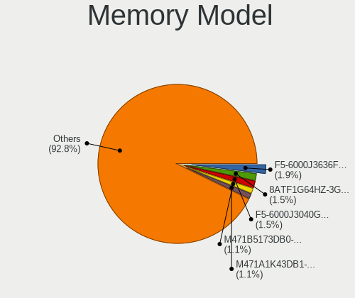

| Model                                                        | Computers | Percent |
|--------------------------------------------------------------|-----------|---------|
| G.Skill RAM F5-6000J3040G32G 32GB DIMM DDR5 6000MT/s         | 4         | 3.25%   |
| Samsung RAM M425R2GA3BB0-CQKOL 16GB SODIMM DDR5 4800MT/s     | 3         | 2.44%   |
| Crucial RAM BL16G32C16U4B.M16FE1 16GB DIMM DDR4 3400MT/s     | 3         | 2.44%   |
| Unknown RAM Module 8GB DIMM DDR3 1333MT/s                    | 2         | 1.63%   |
| Unknown RAM Module 2GB DIMM DDR2 667MT/s                     | 2         | 1.63%   |
| SK hynix RAM HMCG78MEBSA092N 16GB SODIMM DDR5 4800MT/s       | 2         | 1.63%   |
| SK hynix RAM H9JCNNNFA5MLYR-N6E 8GB SODIMM LPDDR5 6400MT/s   | 2         | 1.63%   |
| Samsung RAM M471B5173DB0-YK0 4GB SODIMM DDR3 1600MT/s        | 2         | 1.63%   |
| Samsung RAM M471A1K43BB1-CRC 8GB SODIMM DDR4 2667MT/s        | 2         | 1.63%   |
| Samsung RAM M425R1GB4BB0-CQKOL 8GB SODIMM DDR5 4800MT/s      | 2         | 1.63%   |
| Micron RAM 8ATF1G64HZ-3G2J1 8GB SODIMM DDR4 3200MT/s         | 2         | 1.63%   |
| G.Skill RAM F5-6000J3636F16G 16GB DIMM 6400MT/s              | 2         | 1.63%   |
| Corsair RAM CMZ16GX3M2A1600C10 8GB DIMM DDR3 1600MT/s        | 2         | 1.63%   |
| Unknown RAM Module 8GB SODIMM DDR4 2400MT/s                  | 1         | 0.81%   |
| Unknown RAM Module 4GB DIMM 1333MT/s                         | 1         | 0.81%   |
| Unknown RAM Module 2GB SODIMM DDR2 800MT/s                   | 1         | 0.81%   |
| Unknown RAM Module 2GB SODIMM DDR2 667MT/s                   | 1         | 0.81%   |
| Unknown RAM Module 2GB Row Of Chips LPDDR4 4267MT/s          | 1         | 0.81%   |
| Unknown RAM Module 2GB DIMM 1066MT/s                         | 1         | 0.81%   |
| Unknown RAM Module 1GB SODIMM DDR2                           | 1         | 0.81%   |
| Unknown RAM Module 1GB DIMM DDR 333MT/s                      | 1         | 0.81%   |
| Team RAM TEAMGROUP-UD4-3600 8GB DIMM DDR4 3600MT/s           | 1         | 0.81%   |
| Team RAM TEAMGROUP-UD4-3200 8GB DIMM DDR4 3800MT/s           | 1         | 0.81%   |
| Team RAM TEAMGROUP-SD4-2666 16GB SODIMM DDR4 2667MT/s        | 1         | 0.81%   |
| SK hynix RAM Module 8GB SODIMM DDR4 2133MT/s                 | 1         | 0.81%   |
| SK hynix RAM HMT41GS6BFR8A-PB 8GB SODIMM DDR3 1600MT/s       | 1         | 0.81%   |
| SK hynix RAM HMT351S6EFR8C-PB 4GB SODIMM DDR3 1600MT/s       | 1         | 0.81%   |
| SK hynix RAM HMT125S6BFR8C-G7 2048MB SODIMM DDR3 1067MT/s    | 1         | 0.81%   |
| SK hynix RAM HMAA4GS6AJR8N-XN 32GB SODIMM DDR4 3200MT/s      | 1         | 0.81%   |
| SK hynix RAM HMAA1GS6CJR6N-XN 8GB SODIMM DDR4 3200MT/s       | 1         | 0.81%   |
| SK hynix RAM HMA851S6CJR6N-VK 4GB Row Of Chips DDR4 2667MT/s | 1         | 0.81%   |
| SK hynix RAM HMA82GS7AFR8N-UH 16GB SODIMM DDR4 2400MT/s      | 1         | 0.81%   |
| SK hynix RAM HMA82GS6CJR8N-VK 16GB SODIMM DDR4 2667MT/s      | 1         | 0.81%   |
| SK hynix RAM HMA81GS6DJR8N-XN 8GB SODIMM DDR4 3200MT/s       | 1         | 0.81%   |
| Samsung RAM U6E3S4AA-MGCR 4GB Row Of Chips LPDDR4 4267MT/s   | 1         | 0.81%   |
| Samsung RAM Module 4GB Row Of Chips LPDDR4 4267MT/s          | 1         | 0.81%   |
| Samsung RAM M471B5673FH0-CH9 2GB SODIMM DDR3 1334MT/s        | 1         | 0.81%   |
| Samsung RAM M471B5173BH0-CK0 4GB SODIMM DDR3 1600MT/s        | 1         | 0.81%   |
| Samsung RAM M471B1G73QH0-YK0 8GB SODIMM DDR3 1867MT/s        | 1         | 0.81%   |
| Samsung RAM M471B1G73EB0-YK0 8GB SODIMM DDR3 1600MT/s        | 1         | 0.81%   |

Memory Kind
-----------

Memory module kinds

| Kind    | Computers | Percent |
|---------|-----------|---------|
| DDR4    | 54        | 49.54%  |
| DDR3    | 22        | 20.18%  |
| DDR5    | 17        | 15.6%   |
| DDR2    | 7         | 6.42%   |
| LPDDR4  | 4         | 3.67%   |
| LPDDR5  | 2         | 1.83%   |
| Unknown | 2         | 1.83%   |
| DDR     | 1         | 0.92%   |

Memory Form Factor
------------------

Physical design of the memory module

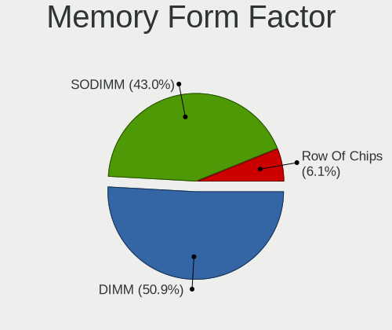

| Name         | Computers | Percent |
|--------------|-----------|---------|
| DIMM         | 55        | 49.55%  |
| SODIMM       | 48        | 43.24%  |
| Row Of Chips | 8         | 7.21%   |

Memory Size
-----------

Memory module size

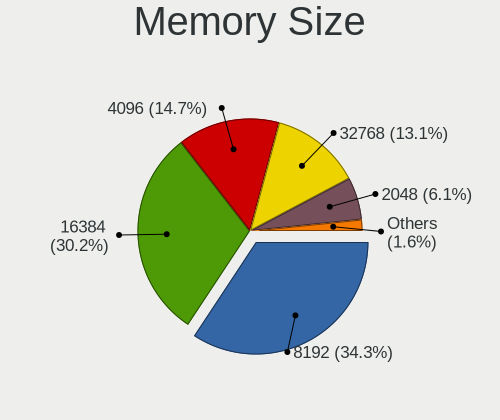

| Size  | Computers | Percent |
|-------|-----------|---------|
| 8192  | 36        | 31.58%  |
| 16384 | 33        | 28.95%  |
| 32768 | 17        | 14.91%  |
| 4096  | 15        | 13.16%  |
| 2048  | 11        | 9.65%   |
| 1024  | 2         | 1.75%   |

Memory Speed
------------

Memory module speed

| Speed   | Computers | Percent |
|---------|-----------|---------|
| 3200    | 20        | 17.39%  |
| 1600    | 14        | 12.17%  |
| 2667    | 10        | 8.7%    |
| 4800    | 8         | 6.96%   |
| 3600    | 7         | 6.09%   |
| 2400    | 6         | 5.22%   |
| 6400    | 5         | 4.35%   |
| 1333    | 5         | 4.35%   |
| 6000    | 4         | 3.48%   |
| 4267    | 4         | 3.48%   |
| 667     | 4         | 3.48%   |
| 3400    | 3         | 2.61%   |
| 5200    | 2         | 1.74%   |
| 3466    | 2         | 1.74%   |
| 2666    | 2         | 1.74%   |
| 2133    | 2         | 1.74%   |
| 1334    | 2         | 1.74%   |
| 800     | 2         | 1.74%   |
| 3933    | 1         | 0.87%   |
| 3866    | 1         | 0.87%   |
| 3800    | 1         | 0.87%   |
| 3666    | 1         | 0.87%   |
| 3534    | 1         | 0.87%   |
| 3100    | 1         | 0.87%   |
| 2933    | 1         | 0.87%   |
| 1866    | 1         | 0.87%   |
| 1067    | 1         | 0.87%   |
| 1066    | 1         | 0.87%   |
| 533     | 1         | 0.87%   |
| 333     | 1         | 0.87%   |
| Unknown | 1         | 0.87%   |

Printers & scanners
-------------------

Printer Vendor
--------------

Printer device vendors

| Vendor              | Computers | Percent |
|---------------------|-----------|---------|
| Samsung Electronics | 1         | 33.33%  |
| Hewlett-Packard     | 1         | 33.33%  |
| Brother Industries  | 1         | 33.33%  |

Printer Model
-------------

Printer device models

| Model                  | Computers | Percent |
|------------------------|-----------|---------|
| Samsung ML-1630 Series | 1         | 33.33%  |
| HP LaserJet M14-M17    | 1         | 33.33%  |
| Brother MFC-9340CDW    | 1         | 33.33%  |

Scanner Vendor
--------------

Scanner device vendors

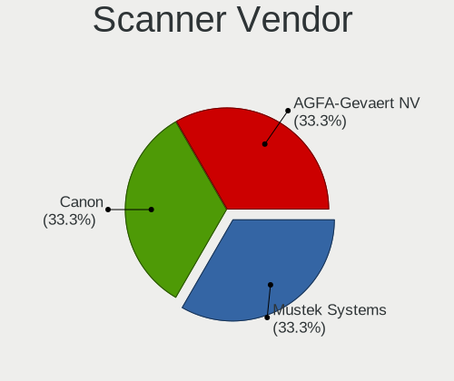

| Vendor          | Computers | Percent |
|-----------------|-----------|---------|
| Canon           | 1         | 50%     |
| AGFA-Gevaert NV | 1         | 50%     |

Scanner Model
-------------

Scanner device models

| Model                         | Computers | Percent |
|-------------------------------|-----------|---------|
| Canon CanoScan N1240U/LiDE 30 | 1         | 50%     |
| AGFA-Gevaert NV SnapScan e20  | 1         | 50%     |

Camera
------

Camera Vendor
-------------

Camera device vendors

| Vendor                        | Computers | Percent |
|-------------------------------|-----------|---------|
| Chicony Electronics           | 14        | 25%     |
| Microdia                      | 9         | 16.07%  |
| Sunplus Innovation Technology | 4         | 7.14%   |
| Luxvisions Innotech Limited   | 4         | 7.14%   |
| Quanta                        | 3         | 5.36%   |
| Logitech                      | 3         | 5.36%   |
| IMC Networks                  | 3         | 5.36%   |
| Microsoft                     | 2         | 3.57%   |
| Bison Electronics             | 2         | 3.57%   |
| SunplusIT                     | 1         | 1.79%   |
| Sunplus Technology            | 1         | 1.79%   |
| ShineTech                     | 1         | 1.79%   |
| Samsung Electronics           | 1         | 1.79%   |
| MacroSilicon                  | 1         | 1.79%   |
| Lite-On Technology            | 1         | 1.79%   |
| Holitech                      | 1         | 1.79%   |
| Genesys Logic                 | 1         | 1.79%   |
| GEMBIRD                       | 1         | 1.79%   |
| Apple                         | 1         | 1.79%   |
| Acer                          | 1         | 1.79%   |
| A4Tech                        | 1         | 1.79%   |

Camera Model
------------

Camera device models

| Model                                                | Computers | Percent |
|------------------------------------------------------|-----------|---------|
| Chicony Integrated Camera                            | 4         | 7.14%   |
| Microdia Integrated_Webcam_HD                        | 3         | 5.36%   |
| Microdia Integrated_Webcam_FHD                       | 2         | 3.57%   |
| Luxvisions Innotech Limited Integrated RGB Camera    | 2         | 3.57%   |
| Luxvisions Innotech Limited HP Wide Vision HD Camera | 2         | 3.57%   |
| IMC Networks USB2.0 HD UVC WebCam                    | 2         | 3.57%   |
| Chicony HP HD Camera                                 | 2         | 3.57%   |
| SunplusIT 720p HD Camera                             | 1         | 1.79%   |
| Sunplus 1.3M HD WebCam                               | 1         | 1.79%   |
| Sunplus XiaoMi USB 2.0 Webcam                        | 1         | 1.79%   |
| Sunplus MiraBox Video Capture                        | 1         | 1.79%   |
| Sunplus Integrated_Webcam_HD                         | 1         | 1.79%   |
| Sunplus Integrated_Webcam_FHD                        | 1         | 1.79%   |
| ShineTech HD Camera                                  | 1         | 1.79%   |
| Samsung Galaxy series, misc. (MTP mode)              | 1         | 1.79%   |
| Quanta VGA WebCam                                    | 1         | 1.79%   |
| Quanta hm1091_techfront                              | 1         | 1.79%   |
| Quanta HD User Facing                                | 1         | 1.79%   |
| Microsoft Surface Camera Front                       | 1         | 1.79%   |
| Microsoft Microsoft LifeCam Cinema                 | 1         | 1.79%   |
| Microdia USB 2.0 Camera                              | 1         | 1.79%   |
| Microdia Sonix USB 2.0 Camera                        | 1         | 1.79%   |
| Microdia Sonix 1.3 MP Laptop Integrated Webcam       | 1         | 1.79%   |
| Microdia Laptop_Integrated_Webcam_HD                 | 1         | 1.79%   |
| MacroSilicon USB Video                               | 1         | 1.79%   |
| Logitech HD Pro Webcam C920                          | 1         | 1.79%   |
| Logitech C922 Pro Stream Webcam                      | 1         | 1.79%   |
| Logitech BRIO 4K Stream Edition                      | 1         | 1.79%   |
| Lite-On HP HD Camera                                 | 1         | 1.79%   |
| IMC Networks ov9734_azurewave_camera                 | 1         | 1.79%   |
| Holitech USB2.0 HD UVC WebCam                        | 1         | 1.79%   |
| Genesys Logic Digital Microscope                     | 1         | 1.79%   |
| GEMBIRD USB2.0 PC CAMERA                             | 1         | 1.79%   |
| Chicony Webcam-101                                   | 1         | 1.79%   |
| Chicony TOSHIBA Web Camera - HD                      | 1         | 1.79%   |
| Chicony Lenovo EasyCamera                            | 1         | 1.79%   |
| Chicony HP Wide Vision HD                            | 1         | 1.79%   |
| Chicony HP TrueVision HD Camera                      | 1         | 1.79%   |
| Chicony HP Truevision HD                             | 1         | 1.79%   |
| Chicony HP HD Webcam [Fixed]                         | 1         | 1.79%   |

Security
--------

Fingerprint Vendor
------------------

Fingerprint sensor vendors

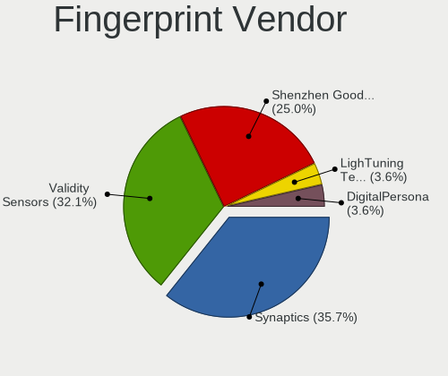

| Vendor                     | Computers | Percent |
|----------------------------|-----------|---------|
| Validity Sensors           | 5         | 38.46%  |
| Synaptics                  | 5         | 38.46%  |
| Shenzhen Goodix Technology | 3         | 23.08%  |

Fingerprint Model
-----------------

Fingerprint sensor models

| Model                                                      | Computers | Percent |
|------------------------------------------------------------|-----------|---------|
| Shenzhen Goodix  Fingerprint Device                        | 3         | 23.08%  |
| Validity Sensors VFS495 Fingerprint Reader                 | 2         | 15.38%  |
| Validity Sensors Synaptics WBDI                            | 2         | 15.38%  |
| Synaptics UWP WBDI Device                                  | 2         | 15.38%  |
| Synaptics Prometheus MIS Touch Fingerprint Reader          | 2         | 15.38%  |
| Validity Sensors VFS491                                    | 1         | 7.69%   |
| Synaptics  VFS7552 Touch Fingerprint Sensor with PurePrint | 1         | 7.69%   |

Chipcard Vendor
---------------

Chipcard module vendors

| Vendor           | Computers | Percent |
|------------------|-----------|---------|
| Broadcom         | 5         | 62.5%   |
| SCM Microsystems | 1         | 12.5%   |
| Bit4id           | 1         | 12.5%   |
| Alcor Micro      | 1         | 12.5%   |

Chipcard Model
--------------

Chipcard module models

| Model                                                                        | Computers | Percent |
|------------------------------------------------------------------------------|-----------|---------|
| Broadcom 58200                                                               | 3         | 37.5%   |
| SCM Microsystems SCR331-LC1 / SCR3310 SmartCard Reader                       | 1         | 12.5%   |
| Broadcom BCM5880 Secure Applications Processor with fingerprint touch sensor | 1         | 12.5%   |
| Broadcom 5880                                                                | 1         | 12.5%   |
| Bit4id miniLector-s                                                          | 1         | 12.5%   |
| Alcor Micro AU9540 Smartcard Reader                                          | 1         | 12.5%   |

Unsupported
-----------

Unsupported Devices
-------------------

Total unsupported devices on board

| Total | Computers | Percent |
|-------|-----------|---------|
| 0     | 62        | 50.82%  |
| 1     | 29        | 23.77%  |
| 2     | 11        | 9.02%   |
| 3     | 9         | 7.38%   |
| 4     | 7         | 5.74%   |
| 6     | 3         | 2.46%   |
| 7     | 1         | 0.82%   |

Unsupported Device Types
------------------------

Types of unsupported devices

| Type                     | Computers | Percent |
|--------------------------|-----------|---------|
| Graphics card            | 21        | 19.09%  |
| Bluetooth                | 17        | 15.45%  |
| Fingerprint reader       | 12        | 10.91%  |
| Camera                   | 11        | 10%     |
| Net/wireless             | 10        | 9.09%   |
| Communication controller | 10        | 9.09%   |
| Sound                    | 7         | 6.36%   |
| Chipcard                 | 6         | 5.45%   |
| Network                  | 4         | 3.64%   |
| Multimedia controller    | 4         | 3.64%   |
| Storage/ide              | 2         | 1.82%   |
| Card reader              | 2         | 1.82%   |
| Unassigned class         | 1         | 0.91%   |
| Storage/raid             | 1         | 0.91%   |
| Net/ethernet             | 1         | 0.91%   |
| Firewire controller      | 1         | 0.91%   |

