Gentoo 2.14 - Tested Hardware & Statistics
------------------------------------------

A project to collect tested hardware configurations for Gentoo 2.14.

Anyone can contribute to this report by the [hw-probe](https://github.com/linuxhw/hw-probe) tool:

    sudo -E hw-probe -all -upload

Please contribute! Especially if your hardware is rare.

This is a report for all computer types. See also reports for [desktops](/Dist/Gentoo_2.14/Desktop/README.md) and [notebooks](/Dist/Gentoo_2.14/Notebook/README.md).

Contents
--------

* [ Test Cases ](#test-cases)

* [ System ](#system)
  - [ Kernel                   ](#kernel)
  - [ Kernel Family            ](#kernel-family)
  - [ Kernel Major Ver.        ](#kernel-major-ver)
  - [ Arch                     ](#arch)
  - [ DE                       ](#de)
  - [ Display Server           ](#display-server)
  - [ Display Manager          ](#display-manager)
  - [ OS Lang                  ](#os-lang)
  - [ Boot Mode                ](#boot-mode)
  - [ Filesystem               ](#filesystem)
  - [ Part. scheme             ](#part-scheme)
  - [ Dual Boot with Linux/BSD ](#dual-boot-with-linuxbsd)
  - [ Dual Boot (Win)          ](#dual-boot-win)

* [ Board ](#board)
  - [ Vendor                   ](#vendor)
  - [ Model                    ](#model)
  - [ Model Family             ](#model-family)
  - [ MFG Year                 ](#mfg-year)
  - [ Form Factor              ](#form-factor)
  - [ Secure Boot              ](#secure-boot)
  - [ Coreboot                 ](#coreboot)
  - [ RAM Size                 ](#ram-size)
  - [ RAM Used                 ](#ram-used)
  - [ Total Drives             ](#total-drives)
  - [ Has CD-ROM               ](#has-cd-rom)
  - [ Has Ethernet             ](#has-ethernet)
  - [ Has WiFi                 ](#has-wifi)
  - [ Has Bluetooth            ](#has-bluetooth)

* [ Location ](#location)
  - [ Country                  ](#country)
  - [ City                     ](#city)

* [ Drives ](#drives)
  - [ Drive Vendor             ](#drive-vendor)
  - [ Drive Model              ](#drive-model)
  - [ HDD Vendor               ](#hdd-vendor)
  - [ SSD Vendor               ](#ssd-vendor)
  - [ Drive Kind               ](#drive-kind)
  - [ Drive Connector          ](#drive-connector)
  - [ Drive Size               ](#drive-size)
  - [ Space Total              ](#space-total)
  - [ Space Used               ](#space-used)
  - [ Malfunc. Drives          ](#malfunc-drives)
  - [ Malfunc. Drive Vendor    ](#malfunc-drive-vendor)
  - [ Malfunc. HDD Vendor      ](#malfunc-hdd-vendor)
  - [ Malfunc. Drive Kind      ](#malfunc-drive-kind)
  - [ Failed Drives            ](#failed-drives)
  - [ Failed Drive Vendor      ](#failed-drive-vendor)
  - [ Drive Status             ](#drive-status)

* [ Storage controller ](#storage-controller)
  - [ Storage Vendor           ](#storage-vendor)
  - [ Storage Model            ](#storage-model)
  - [ Storage Kind             ](#storage-kind)

* [ Processor ](#processor)
  - [ CPU Vendor               ](#cpu-vendor)
  - [ CPU Model                ](#cpu-model)
  - [ CPU Model Family         ](#cpu-model-family)
  - [ CPU Cores                ](#cpu-cores)
  - [ CPU Sockets              ](#cpu-sockets)
  - [ CPU Threads              ](#cpu-threads)
  - [ CPU Op-Modes             ](#cpu-op-modes)
  - [ CPU Microcode            ](#cpu-microcode)
  - [ CPU Microarch            ](#cpu-microarch)

* [ Graphics ](#graphics)
  - [ GPU Vendor               ](#gpu-vendor)
  - [ GPU Model                ](#gpu-model)
  - [ GPU Combo                ](#gpu-combo)
  - [ GPU Driver               ](#gpu-driver)
  - [ GPU Memory               ](#gpu-memory)

* [ Monitor ](#monitor)
  - [ Monitor Vendor           ](#monitor-vendor)
  - [ Monitor Model            ](#monitor-model)
  - [ Monitor Resolution       ](#monitor-resolution)
  - [ Monitor Diagonal         ](#monitor-diagonal)
  - [ Monitor Width            ](#monitor-width)
  - [ Aspect Ratio             ](#aspect-ratio)
  - [ Monitor Area             ](#monitor-area)
  - [ Pixel Density            ](#pixel-density)
  - [ Multiple Monitors        ](#multiple-monitors)

* [ Network ](#network)
  - [ Net Controller Vendor    ](#net-controller-vendor)
  - [ Net Controller Model     ](#net-controller-model)
  - [ Wireless Vendor          ](#wireless-vendor)
  - [ Wireless Model           ](#wireless-model)
  - [ Ethernet Vendor          ](#ethernet-vendor)
  - [ Ethernet Model           ](#ethernet-model)
  - [ Net Controller Kind      ](#net-controller-kind)
  - [ Used Controller          ](#used-controller)
  - [ NICs                     ](#nics)
  - [ IPv6                     ](#ipv6)

* [ Bluetooth ](#bluetooth)
  - [ Bluetooth Vendor         ](#bluetooth-vendor)
  - [ Bluetooth Model          ](#bluetooth-model)

* [ Sound ](#sound)
  - [ Sound Vendor             ](#sound-vendor)
  - [ Sound Model              ](#sound-model)

* [ Memory ](#memory)
  - [ Memory Vendor            ](#memory-vendor)
  - [ Memory Model             ](#memory-model)
  - [ Memory Kind              ](#memory-kind)
  - [ Memory Form Factor       ](#memory-form-factor)
  - [ Memory Size              ](#memory-size)
  - [ Memory Speed             ](#memory-speed)

* [ Printers & scanners ](#printers--scanners)
  - [ Printer Vendor           ](#printer-vendor)
  - [ Printer Model            ](#printer-model)
  - [ Scanner Vendor           ](#scanner-vendor)
  - [ Scanner Model            ](#scanner-model)

* [ Camera ](#camera)
  - [ Camera Vendor            ](#camera-vendor)
  - [ Camera Model             ](#camera-model)

* [ Security ](#security)
  - [ Fingerprint Vendor       ](#fingerprint-vendor)
  - [ Fingerprint Model        ](#fingerprint-model)
  - [ Chipcard Vendor          ](#chipcard-vendor)
  - [ Chipcard Model           ](#chipcard-model)

* [ Unsupported ](#unsupported)
  - [ Unsupported Devices      ](#unsupported-devices)
  - [ Unsupported Device Types ](#unsupported-device-types)

Test Cases
----------

Total: 391

| Vendor        | Model                       | Form-Factor | Probe                                                      | Date         |
|---------------|-----------------------------|-------------|------------------------------------------------------------|--------------|
| Gigabyte      | A520 AORUS ELITE            | Desktop     | [075ee0ca67](https://linux-hardware.org/?probe=075ee0ca67) | Feb 02, 2024 |
| Razer         | Blade 14 - RZ09-0482        | Notebook    | [49f14f0aae](https://linux-hardware.org/?probe=49f14f0aae) | Feb 01, 2024 |
| Lenovo        | ThinkPad X1 Carbon 7th 2... | Notebook    | [afbbc9ebf0](https://linux-hardware.org/?probe=afbbc9ebf0) | Jan 31, 2024 |
| MSI           | MAG B550M MORTAR            | Desktop     | [7ad6a0ecce](https://linux-hardware.org/?probe=7ad6a0ecce) | Jan 31, 2024 |
| Unknown       | Unknown                     | Desktop     | [4690cc047a](https://linux-hardware.org/?probe=4690cc047a) | Jan 30, 2024 |
| ASUSTek       | M5A78L-M/USB3               | Desktop     | [cc38ac2dfc](https://linux-hardware.org/?probe=cc38ac2dfc) | Jan 29, 2024 |
| Gigabyte      | AB350-Gaming-CF             | Desktop     | [8949a81c2e](https://linux-hardware.org/?probe=8949a81c2e) | Jan 29, 2024 |
| ASUSTek       | M5A78L-M/USB3               | Desktop     | [76a1ecf2ba](https://linux-hardware.org/?probe=76a1ecf2ba) | Jan 29, 2024 |
| ASUSTek       | M3A78-CM                    | Desktop     | [e17793cd71](https://linux-hardware.org/?probe=e17793cd71) | Jan 28, 2024 |
| ASUSTek       | PRIME B660-PLUS D4          | Desktop     | [19c619ae3f](https://linux-hardware.org/?probe=19c619ae3f) | Jan 27, 2024 |
| MSI           | MAG X570 TOMAHAWK WIFI      | Desktop     | [999ea9c685](https://linux-hardware.org/?probe=999ea9c685) | Jan 26, 2024 |
| Gigabyte      | A520 AORUS ELITE            | Desktop     | [9b7cbb57c7](https://linux-hardware.org/?probe=9b7cbb57c7) | Jan 26, 2024 |
| HP            | 1589                        | Desktop     | [d731924276](https://linux-hardware.org/?probe=d731924276) | Jan 25, 2024 |
| Star Labs     | StarBook                    | Notebook    | [a324d865a6](https://linux-hardware.org/?probe=a324d865a6) | Jan 24, 2024 |
| ASUSTek       | ROG STRIX X570-I GAMING     | Desktop     | [ff2fc44691](https://linux-hardware.org/?probe=ff2fc44691) | Jan 23, 2024 |
| Lenovo        | ThinkPad X395 20NLCTO1WW    | Notebook    | [07799fb2f9](https://linux-hardware.org/?probe=07799fb2f9) | Jan 19, 2024 |
| Gigabyte      | B550 AORUS ELITE V2         | Desktop     | [13086bc4ce](https://linux-hardware.org/?probe=13086bc4ce) | Jan 19, 2024 |
| Gigabyte      | B650M D3HP                  | Desktop     | [fdc83ca691](https://linux-hardware.org/?probe=fdc83ca691) | Jan 18, 2024 |
| HP            | ZBook Studio 16 inch G9 ... | Notebook    | [e736cc5c9a](https://linux-hardware.org/?probe=e736cc5c9a) | Jan 18, 2024 |
| Framework     | Laptop 13 (AMD Ryzen 704... | Notebook    | [18a0aeeddf](https://linux-hardware.org/?probe=18a0aeeddf) | Jan 18, 2024 |
| HP            | Laptop 15t-dy100            | Notebook    | [68c23a7bd3](https://linux-hardware.org/?probe=68c23a7bd3) | Jan 17, 2024 |
| ASUSTek       | PRIME H610M-E D4            | Desktop     | [409e7e4e42](https://linux-hardware.org/?probe=409e7e4e42) | Jan 17, 2024 |
| Gigabyte      | X570 AORUS ELITE            | Desktop     | [ed6bfe4f8f](https://linux-hardware.org/?probe=ed6bfe4f8f) | Jan 16, 2024 |
| Dell          | 0VHRW1 A03                  | Desktop     | [668e361f20](https://linux-hardware.org/?probe=668e361f20) | Jan 15, 2024 |
| ASRock        | X399 Taichi                 | Desktop     | [e509920598](https://linux-hardware.org/?probe=e509920598) | Jan 14, 2024 |
| HP            | EliteBook 830 G6            | Notebook    | [dc433d32e3](https://linux-hardware.org/?probe=dc433d32e3) | Jan 13, 2024 |
| HP            | 1589                        | Desktop     | [194b5a119c](https://linux-hardware.org/?probe=194b5a119c) | Jan 13, 2024 |
| MSI           | Pulse 15 B13VFK             | Notebook    | [75dde9eefd](https://linux-hardware.org/?probe=75dde9eefd) | Jan 12, 2024 |
| HP            | Laptop 15 da0018nk          | Notebook    | [11c54a0e5b](https://linux-hardware.org/?probe=11c54a0e5b) | Jan 12, 2024 |
| ASUSTek       | VivoBook_ASUSLaptop X509... | Notebook    | [a249210b7f](https://linux-hardware.org/?probe=a249210b7f) | Jan 11, 2024 |
| HP            | Spectre x360 2-in-1 Lapt... | Convertible | [30679c3606](https://linux-hardware.org/?probe=30679c3606) | Jan 11, 2024 |
| Dell          | 030VXY A01                  | Desktop     | [50a18e5eba](https://linux-hardware.org/?probe=50a18e5eba) | Jan 10, 2024 |
| Framework     | Laptop 13 (AMD Ryzen 704... | Notebook    | [d3f6265673](https://linux-hardware.org/?probe=d3f6265673) | Jan 10, 2024 |
| ASUSTek       | ROG STRIX B560-A GAMING ... | Desktop     | [7bef06dee9](https://linux-hardware.org/?probe=7bef06dee9) | Jan 10, 2024 |
| DEXP          | Aquilon C14                 | Notebook    | [d38932d74f](https://linux-hardware.org/?probe=d38932d74f) | Jan 10, 2024 |
| Gigabyte      | Z590 UD                     | Desktop     | [6953296967](https://linux-hardware.org/?probe=6953296967) | Jan 10, 2024 |
| HP            | Laptop 15s-eq2xxx           | Notebook    | [36dc56b0ed](https://linux-hardware.org/?probe=36dc56b0ed) | Jan 09, 2024 |
| Framework     | Laptop 13 (AMD Ryzen 704... | Notebook    | [ac39f0a923](https://linux-hardware.org/?probe=ac39f0a923) | Jan 08, 2024 |
| Star Labs     | StarLite                    | Notebook    | [751432d737](https://linux-hardware.org/?probe=751432d737) | Jan 07, 2024 |
| Gigabyte      | Z77X-UD5H                   | Desktop     | [ca5d4c7c00](https://linux-hardware.org/?probe=ca5d4c7c00) | Jan 07, 2024 |
| Lenovo        | Legion Slim 7 16APH8 82Y... | Notebook    | [33b192a7d0](https://linux-hardware.org/?probe=33b192a7d0) | Jan 06, 2024 |
| Acer          | Aspire A514-54              | Notebook    | [513f1c7737](https://linux-hardware.org/?probe=513f1c7737) | Jan 06, 2024 |
| ASUSTek       | ASUS TUF Gaming A15 FA50... | Notebook    | [1ecec883dd](https://linux-hardware.org/?probe=1ecec883dd) | Jan 06, 2024 |
| ASUSTek       | VivoBook_ASUSLaptop M650... | Notebook    | [98da18a6c0](https://linux-hardware.org/?probe=98da18a6c0) | Jan 06, 2024 |
| ASUSTek       | VivoBook_ASUSLaptop M650... | Notebook    | [2602d65d52](https://linux-hardware.org/?probe=2602d65d52) | Jan 06, 2024 |
| HP            | Victus by Laptop 16-e0xx... | Notebook    | [94b30c5116](https://linux-hardware.org/?probe=94b30c5116) | Jan 06, 2024 |
| Gigabyte      | B550 AORUS PRO V2           | Desktop     | [3b6e799f22](https://linux-hardware.org/?probe=3b6e799f22) | Jan 06, 2024 |
| Framework     | Laptop 13 (AMD Ryzen 704... | Notebook    | [8d63c2ea2b](https://linux-hardware.org/?probe=8d63c2ea2b) | Jan 06, 2024 |
| Lenovo        | ThinkPad P16s Gen 2 21K9... | Notebook    | [90b8ceb64c](https://linux-hardware.org/?probe=90b8ceb64c) | Jan 05, 2024 |
| Lenovo        | V14 G2 ALC 82KC             | Notebook    | [42bd246eae](https://linux-hardware.org/?probe=42bd246eae) | Jan 05, 2024 |
| Lenovo        | ThinkPad L15 Gen 1 20U70... | Notebook    | [f7ad5f683a](https://linux-hardware.org/?probe=f7ad5f683a) | Jan 04, 2024 |
| ASUSTek       | M3A78-CM                    | Desktop     | [7bf93755f2](https://linux-hardware.org/?probe=7bf93755f2) | Jan 04, 2024 |
| Gigabyte      | A520 AORUS ELITE            | Desktop     | [da0c7ff210](https://linux-hardware.org/?probe=da0c7ff210) | Jan 04, 2024 |
| ASUSTek       | P8H67-M                     | Desktop     | [06843ca788](https://linux-hardware.org/?probe=06843ca788) | Jan 04, 2024 |
| Star Labs     | StarLite                    | Notebook    | [9f0fae17e5](https://linux-hardware.org/?probe=9f0fae17e5) | Jan 02, 2024 |
| Gigabyte      | AB350-Gaming-CF             | Desktop     | [a0e025d32d](https://linux-hardware.org/?probe=a0e025d32d) | Jan 02, 2024 |
| Lenovo        | V14 G2 ALC 82KC             | Notebook    | [ab04c74157](https://linux-hardware.org/?probe=ab04c74157) | Jan 02, 2024 |
| Lenovo        | V14 G2 ALC 82KC             | Notebook    | [8250c46efe](https://linux-hardware.org/?probe=8250c46efe) | Jan 02, 2024 |
| Lenovo        | V14 G2 ALC 82KC             | Notebook    | [57cd074cfd](https://linux-hardware.org/?probe=57cd074cfd) | Jan 02, 2024 |
| ASUSTek       | ROG STRIX Z370-H GAMING     | Desktop     | [ee3998d501](https://linux-hardware.org/?probe=ee3998d501) | Jan 02, 2024 |
| Acer          | Aspire A517-52G             | Notebook    | [fb86c6f71c](https://linux-hardware.org/?probe=fb86c6f71c) | Jan 01, 2024 |
| ASUSTek       | ZenBook UX425UA_UM425UA     | Notebook    | [6826d7c88d](https://linux-hardware.org/?probe=6826d7c88d) | Jan 01, 2024 |
| Dell          | Latitude D630               | Notebook    | [bbae93d767](https://linux-hardware.org/?probe=bbae93d767) | Dec 31, 2023 |
| MSI           | Stealth 16Studio A13VF      | Notebook    | [04acb5230d](https://linux-hardware.org/?probe=04acb5230d) | Dec 30, 2023 |
| ASUSTek       | PRIME B660-PLUS D4          | Desktop     | [0e7bbb6dea](https://linux-hardware.org/?probe=0e7bbb6dea) | Dec 30, 2023 |
| MSI           | Stealth 16Studio A13VF      | Notebook    | [1fd1d2e727](https://linux-hardware.org/?probe=1fd1d2e727) | Dec 30, 2023 |
| Dell          | Precision 5560              | Notebook    | [3555a4c2fa](https://linux-hardware.org/?probe=3555a4c2fa) | Dec 29, 2023 |
| Gigabyte      | X79-UP4                     | Desktop     | [618dfee965](https://linux-hardware.org/?probe=618dfee965) | Dec 29, 2023 |
| ASUSTek       | G750JX                      | Notebook    | [2b867b6af5](https://linux-hardware.org/?probe=2b867b6af5) | Dec 28, 2023 |
| Gigabyte      | A520 AORUS ELITE            | Desktop     | [619ddf5210](https://linux-hardware.org/?probe=619ddf5210) | Dec 27, 2023 |
| ASUSTek       | M3A78-CM                    | Desktop     | [983d2046a3](https://linux-hardware.org/?probe=983d2046a3) | Dec 27, 2023 |
| Framework     | Laptop (13th Gen Intel C... | Notebook    | [3d96eb6f36](https://linux-hardware.org/?probe=3d96eb6f36) | Dec 27, 2023 |
| ASUSTek       | ASUS TUF Gaming A15 FA50... | Notebook    | [d1cd9acaf0](https://linux-hardware.org/?probe=d1cd9acaf0) | Dec 26, 2023 |
| MSI           | Delta 15 A5EFK              | Notebook    | [af7c011930](https://linux-hardware.org/?probe=af7c011930) | Dec 25, 2023 |
| ASUSTek       | D500MD                      | Desktop     | [21870febdd](https://linux-hardware.org/?probe=21870febdd) | Dec 25, 2023 |
| Gigabyte      | AB350-Gaming-CF             | Desktop     | [47255f4ba3](https://linux-hardware.org/?probe=47255f4ba3) | Dec 25, 2023 |
| Lenovo        | Legion R9000P2021H 82JQ     | Notebook    | [2394204218](https://linux-hardware.org/?probe=2394204218) | Dec 24, 2023 |
| TULPAR        | A5 V20.3                    | Notebook    | [c1abfa26d5](https://linux-hardware.org/?probe=c1abfa26d5) | Dec 24, 2023 |
| Fujitsu       | D3061-A1 S26361-D3061-A1    | Desktop     | [646b9af5a9](https://linux-hardware.org/?probe=646b9af5a9) | Dec 24, 2023 |
| MSI           | MPG B650 EDGE WIFI          | Desktop     | [8503d79f6c](https://linux-hardware.org/?probe=8503d79f6c) | Dec 24, 2023 |
| Lenovo        | IdeaPad 5 14ARE05 81YM      | Notebook    | [6b0368fd61](https://linux-hardware.org/?probe=6b0368fd61) | Dec 23, 2023 |
| TULPAR        | A5 V20.3                    | Notebook    | [83c6679958](https://linux-hardware.org/?probe=83c6679958) | Dec 23, 2023 |
| ASUSTek       | ROG STRIX X570-E GAMING     | Desktop     | [391ef34135](https://linux-hardware.org/?probe=391ef34135) | Dec 23, 2023 |
| ASUSTek       | ASUS TUF Gaming A15 FA50... | Notebook    | [87b9f04878](https://linux-hardware.org/?probe=87b9f04878) | Dec 23, 2023 |
| HP            | Spectre x360 2-in-1 Lapt... | Convertible | [c6caf2cc7a](https://linux-hardware.org/?probe=c6caf2cc7a) | Dec 22, 2023 |
| Dell          | Precision 5480              | Notebook    | [7cc190b5c0](https://linux-hardware.org/?probe=7cc190b5c0) | Dec 22, 2023 |
| ASUSTek       | ROG Ally RC71L_RC71L        | Tablet      | [f65d61f128](https://linux-hardware.org/?probe=f65d61f128) | Dec 20, 2023 |
| ASUSTek       | ASUS TUF Gaming A15 FA50... | Notebook    | [b14bdf4602](https://linux-hardware.org/?probe=b14bdf4602) | Dec 20, 2023 |
| ASUSTek       | ROG Ally RC71L_RC71L        | Tablet      | [37ee5a4acd](https://linux-hardware.org/?probe=37ee5a4acd) | Dec 19, 2023 |
| ASUSTek       | M3A78-CM                    | Desktop     | [89fd7ee431](https://linux-hardware.org/?probe=89fd7ee431) | Dec 18, 2023 |
| Gigabyte      | A520 AORUS ELITE            | Desktop     | [3504b628f1](https://linux-hardware.org/?probe=3504b628f1) | Dec 18, 2023 |
| ASRock        | X399 Taichi                 | Desktop     | [877c79184e](https://linux-hardware.org/?probe=877c79184e) | Dec 18, 2023 |
| Gigabyte      | AB350-Gaming-CF             | Desktop     | [e0b7c61c9f](https://linux-hardware.org/?probe=e0b7c61c9f) | Dec 18, 2023 |
| HP            | Spectre x360 2-in-1 Lapt... | Convertible | [25525c17e0](https://linux-hardware.org/?probe=25525c17e0) | Dec 17, 2023 |
| ASUSTek       | ROG Ally RC71L_RC71L        | Tablet      | [c01e13535f](https://linux-hardware.org/?probe=c01e13535f) | Dec 17, 2023 |
| HP            | Spectre x360 2-in-1 Lapt... | Convertible | [402a34ec30](https://linux-hardware.org/?probe=402a34ec30) | Dec 17, 2023 |
| ASRock        | X399 Taichi                 | Desktop     | [776cc9f3bb](https://linux-hardware.org/?probe=776cc9f3bb) | Dec 17, 2023 |
| MSI           | B450 TOMAHAWK               | Desktop     | [f02dc20ac0](https://linux-hardware.org/?probe=f02dc20ac0) | Dec 16, 2023 |
| Lenovo        | ThinkPad T460 20FNCTO1WW    | Notebook    | [8e419e7090](https://linux-hardware.org/?probe=8e419e7090) | Dec 16, 2023 |
| HP            | 8592                        | Desktop     | [511feb6066](https://linux-hardware.org/?probe=511feb6066) | Dec 15, 2023 |
| HP            | 8592                        | Desktop     | [c5817452fd](https://linux-hardware.org/?probe=c5817452fd) | Dec 15, 2023 |
| Lenovo        | SHARKBAY SDK0E50510 WIN     | Desktop     | [ba4e95a15e](https://linux-hardware.org/?probe=ba4e95a15e) | Dec 13, 2023 |
| HP            | Spectre x360 2-in-1 Lapt... | Convertible | [5eaaa9dcdc](https://linux-hardware.org/?probe=5eaaa9dcdc) | Dec 13, 2023 |
| ASRock        | X399 Taichi                 | Desktop     | [8524c9dcd5](https://linux-hardware.org/?probe=8524c9dcd5) | Dec 13, 2023 |
| Lenovo        | ThinkPad T460 20FNCTO1WW    | Notebook    | [042bbde845](https://linux-hardware.org/?probe=042bbde845) | Dec 13, 2023 |
| Dell          | 02C2CP A03                  | Server      | [3a651d8f80](https://linux-hardware.org/?probe=3a651d8f80) | Dec 13, 2023 |
| ASRock        | B650M PG Riptide            | Desktop     | [9b92833e92](https://linux-hardware.org/?probe=9b92833e92) | Dec 12, 2023 |
| Foxconn       | TPS01                       | Desktop     | [a417ff19ae](https://linux-hardware.org/?probe=a417ff19ae) | Dec 12, 2023 |
| Gigabyte      | A520 AORUS ELITE            | Desktop     | [e07d68d658](https://linux-hardware.org/?probe=e07d68d658) | Dec 11, 2023 |
| ASUSTek       | M3A78-CM                    | Desktop     | [8bf4107eed](https://linux-hardware.org/?probe=8bf4107eed) | Dec 11, 2023 |
| ASUSTek       | VivoBook_ASUSLaptop X571... | Notebook    | [4c6cd4453d](https://linux-hardware.org/?probe=4c6cd4453d) | Dec 10, 2023 |
| Gigabyte      | B450 AORUS ELITE            | Desktop     | [b87d7c1c10](https://linux-hardware.org/?probe=b87d7c1c10) | Dec 10, 2023 |
| ASUSTek       | ROG Maximus XI HERO         | Desktop     | [ba355033b7](https://linux-hardware.org/?probe=ba355033b7) | Dec 08, 2023 |
| Fanless Mi... | PCG02 GLE                   | Stick pc    | [7e738d8259](https://linux-hardware.org/?probe=7e738d8259) | Dec 08, 2023 |
| Dell          | XPS 9320                    | Notebook    | [60c734eb9c](https://linux-hardware.org/?probe=60c734eb9c) | Dec 08, 2023 |
| ASUSTek       | PRIME B550-PLUS             | Desktop     | [d57960be0a](https://linux-hardware.org/?probe=d57960be0a) | Dec 05, 2023 |
| Gigabyte      | AB350-Gaming-CF             | Desktop     | [1fe1dc7462](https://linux-hardware.org/?probe=1fe1dc7462) | Dec 04, 2023 |
| Gigabyte      | 970A-DS3P FX                | Desktop     | [675f997c0b](https://linux-hardware.org/?probe=675f997c0b) | Dec 03, 2023 |
| Gigabyte      | 970A-DS3P FX                | Desktop     | [358a92be0d](https://linux-hardware.org/?probe=358a92be0d) | Dec 03, 2023 |
| BANGHO        | MAX L4                      | Notebook    | [d1306fe54f](https://linux-hardware.org/?probe=d1306fe54f) | Dec 03, 2023 |
| BANGHO        | MAX L4                      | Notebook    | [a0f107fc92](https://linux-hardware.org/?probe=a0f107fc92) | Dec 03, 2023 |
| ASUSTek       | ROG Zephyrus G14 GA401II... | Notebook    | [426263e458](https://linux-hardware.org/?probe=426263e458) | Dec 03, 2023 |
| Lenovo        | 0B98401 PRO                 | Desktop     | [3f49a16307](https://linux-hardware.org/?probe=3f49a16307) | Dec 02, 2023 |
| ASRock        | A300M-STX                   | Desktop     | [7f49fad2c7](https://linux-hardware.org/?probe=7f49fad2c7) | Dec 02, 2023 |
| Gigabyte      | B150M-D2V DDR3-CF           | Desktop     | [fc87fb1112](https://linux-hardware.org/?probe=fc87fb1112) | Dec 01, 2023 |
| Lenovo        | ThinkPad T410 2518C3U       | Notebook    | [d95358436c](https://linux-hardware.org/?probe=d95358436c) | Nov 30, 2023 |
| MSI           | MEG X570 UNIFY              | Desktop     | [f9175866ae](https://linux-hardware.org/?probe=f9175866ae) | Nov 30, 2023 |
| Unknown       | Unknown                     | Soc         | [ab9297851b](https://linux-hardware.org/?probe=ab9297851b) | Nov 30, 2023 |
| ASUSTek       | ASUS EXPERTBOOK B3402FBA... | Convertible | [720eead0a5](https://linux-hardware.org/?probe=720eead0a5) | Nov 29, 2023 |
| Unknown       | Unknown                     | Soc         | [7acffa679c](https://linux-hardware.org/?probe=7acffa679c) | Nov 29, 2023 |
| Loongson      | 3A6000-HV-7A2000-1w-EVB-... | Desktop     | [f16bc78368](https://linux-hardware.org/?probe=f16bc78368) | Nov 29, 2023 |
| ASUSTek       | ZenBook UX425UA_UM425UA     | Notebook    | [d4c90a615f](https://linux-hardware.org/?probe=d4c90a615f) | Nov 29, 2023 |
| Loongson      | 3A6000-HV-7A2000-1w-EVB-... | Desktop     | [879c59cf41](https://linux-hardware.org/?probe=879c59cf41) | Nov 29, 2023 |
| Unknown       | Unknown                     | Notebook    | [b6ebeab524](https://linux-hardware.org/?probe=b6ebeab524) | Nov 29, 2023 |
| ASUSTek       | VivoBook_ASUSLaptop X571... | Notebook    | [2b2bb98701](https://linux-hardware.org/?probe=2b2bb98701) | Nov 29, 2023 |
| Dell          | Latitude E6540              | Notebook    | [ae3c1282c2](https://linux-hardware.org/?probe=ae3c1282c2) | Nov 29, 2023 |
| Unknown       | Unknown                     | Notebook    | [d7d0f11ab2](https://linux-hardware.org/?probe=d7d0f11ab2) | Nov 28, 2023 |
| Lenovo        | ThinkBook 16 G6 ABP 21KK    | Notebook    | [f5949df300](https://linux-hardware.org/?probe=f5949df300) | Nov 28, 2023 |
| Gigabyte      | A520 AORUS ELITE            | Desktop     | [1d71979dbb](https://linux-hardware.org/?probe=1d71979dbb) | Nov 27, 2023 |
| Lenovo        | ThinkBook 16 G6 ABP 21KK    | Notebook    | [ee929504ae](https://linux-hardware.org/?probe=ee929504ae) | Nov 27, 2023 |
| MSI           | H310M PRO-VDH PLUS          | Desktop     | [68644f2689](https://linux-hardware.org/?probe=68644f2689) | Nov 27, 2023 |
| Lenovo        | ThinkPad E14 Gen 2 20TA0... | Notebook    | [9d3e14a9ba](https://linux-hardware.org/?probe=9d3e14a9ba) | Nov 27, 2023 |
| Lenovo        | ThinkBook 16 G6 ABP 21KK    | Notebook    | [83d5ded7d9](https://linux-hardware.org/?probe=83d5ded7d9) | Nov 27, 2023 |
| Lenovo        | ThinkPad Edge E330 3354A... | Notebook    | [8ef4fb91ac](https://linux-hardware.org/?probe=8ef4fb91ac) | Nov 27, 2023 |
| MSI           | H310M PRO-VDH PLUS          | Desktop     | [6fcbd9b64c](https://linux-hardware.org/?probe=6fcbd9b64c) | Nov 27, 2023 |
| Gigabyte      | AB350-Gaming-CF             | Desktop     | [2a04ec7adc](https://linux-hardware.org/?probe=2a04ec7adc) | Nov 27, 2023 |
| Dell          | Latitude D630               | Notebook    | [51af6a8f00](https://linux-hardware.org/?probe=51af6a8f00) | Nov 26, 2023 |
| ASUSTek       | ROG STRIX Z590-F GAMING ... | Desktop     | [26b99168f7](https://linux-hardware.org/?probe=26b99168f7) | Nov 26, 2023 |
| HP            | EliteBook 840 G5            | Notebook    | [320763e400](https://linux-hardware.org/?probe=320763e400) | Nov 25, 2023 |
| Gigabyte      | B560M AORUS ELITE           | Desktop     | [9e8f9907bb](https://linux-hardware.org/?probe=9e8f9907bb) | Nov 24, 2023 |
| Gigabyte      | B560M AORUS ELITE           | Desktop     | [fde8cf07ef](https://linux-hardware.org/?probe=fde8cf07ef) | Nov 24, 2023 |
| Intel         | DH77EB AAG39073-304         | Desktop     | [c397c51bfb](https://linux-hardware.org/?probe=c397c51bfb) | Nov 24, 2023 |
| Lenovo        | ThinkPad Edge E330 3354A... | Notebook    | [b305b3da28](https://linux-hardware.org/?probe=b305b3da28) | Nov 22, 2023 |
| Acer          | Aspire A315-34              | Notebook    | [336fe65e03](https://linux-hardware.org/?probe=336fe65e03) | Nov 22, 2023 |
| ASUSTek       | M3A78-CM                    | Desktop     | [4eae08c59f](https://linux-hardware.org/?probe=4eae08c59f) | Nov 22, 2023 |
| ASUSTek       | ROG STRIX B560-A GAMING ... | Desktop     | [2305a057a8](https://linux-hardware.org/?probe=2305a057a8) | Nov 22, 2023 |
| Lenovo        | ThinkPad E14 Gen 4 21EBC... | Notebook    | [360ad65af8](https://linux-hardware.org/?probe=360ad65af8) | Nov 21, 2023 |
| Gigabyte      | A520 AORUS ELITE            | Desktop     | [8d33a8020d](https://linux-hardware.org/?probe=8d33a8020d) | Nov 20, 2023 |
| Gigabyte      | AB350-Gaming-CF             | Desktop     | [ac6d14ae8d](https://linux-hardware.org/?probe=ac6d14ae8d) | Nov 20, 2023 |
| Framework     | Laptop (13th Gen Intel C... | Notebook    | [3a8da808e0](https://linux-hardware.org/?probe=3a8da808e0) | Nov 20, 2023 |
| HP            | ProLiant DL380e Gen8        | Server      | [221dcda3ae](https://linux-hardware.org/?probe=221dcda3ae) | Nov 19, 2023 |
| UMAX          | VisionBook 9Wi Pro          | Tablet      | [816a26352f](https://linux-hardware.org/?probe=816a26352f) | Nov 19, 2023 |
| ASRock        | B550 Phantom Gaming 4       | Desktop     | [fc7f2d74b8](https://linux-hardware.org/?probe=fc7f2d74b8) | Nov 19, 2023 |
| HP            | Victus by Gaming Laptop ... | Notebook    | [d46bf1bcb4](https://linux-hardware.org/?probe=d46bf1bcb4) | Nov 18, 2023 |
| Lenovo        | ThinkPad X13 Gen 3 21CMC... | Notebook    | [e25caef1f8](https://linux-hardware.org/?probe=e25caef1f8) | Nov 18, 2023 |
| HP            | Pavilion Notebook           | Notebook    | [85f5d912da](https://linux-hardware.org/?probe=85f5d912da) | Nov 18, 2023 |
| Dell          | Latitude D630               | Notebook    | [54e404f085](https://linux-hardware.org/?probe=54e404f085) | Nov 18, 2023 |
| MSI           | MPG B550 GAMING PLUS        | Desktop     | [a868498279](https://linux-hardware.org/?probe=a868498279) | Nov 18, 2023 |
| Dell          | Precision 5480              | Notebook    | [ee10103325](https://linux-hardware.org/?probe=ee10103325) | Nov 18, 2023 |
| ASUSTek       | ROG STRIX B650E-F GAMING... | Desktop     | [477c710fe1](https://linux-hardware.org/?probe=477c710fe1) | Nov 15, 2023 |
| Notebook      | NS5x_NS7xPU                 | Notebook    | [c26f7106c6](https://linux-hardware.org/?probe=c26f7106c6) | Nov 15, 2023 |
| Gigabyte      | Z590 UD                     | Desktop     | [76092ba872](https://linux-hardware.org/?probe=76092ba872) | Nov 15, 2023 |
| ASUSTek       | TUF Gaming Z790-PLUS WIF... | Desktop     | [6a5b4cf051](https://linux-hardware.org/?probe=6a5b4cf051) | Nov 15, 2023 |
| ASUSTek       | P10S-I Series               | Desktop     | [f27cfbe5ca](https://linux-hardware.org/?probe=f27cfbe5ca) | Nov 15, 2023 |
| MSI           | MAG B550 TOMAHAWK MAX WI... | Desktop     | [1105d135a2](https://linux-hardware.org/?probe=1105d135a2) | Nov 14, 2023 |
| Acer          | Aspire A315-34              | Notebook    | [8179414a49](https://linux-hardware.org/?probe=8179414a49) | Nov 14, 2023 |
| ASUSTek       | M3A78-CM                    | Desktop     | [8080101e6f](https://linux-hardware.org/?probe=8080101e6f) | Nov 13, 2023 |
| Dell          | G5 5505                     | Notebook    | [be553804bd](https://linux-hardware.org/?probe=be553804bd) | Nov 13, 2023 |
| ASUSTek       | ROG G703GI_G7BI             | Notebook    | [f1e3e6eb2c](https://linux-hardware.org/?probe=f1e3e6eb2c) | Nov 13, 2023 |
| Dell          | G5 5505                     | Notebook    | [574ccd4e6f](https://linux-hardware.org/?probe=574ccd4e6f) | Nov 13, 2023 |
| Gigabyte      | A520 AORUS ELITE            | Desktop     | [de369665dc](https://linux-hardware.org/?probe=de369665dc) | Nov 13, 2023 |
| Gigabyte      | AB350-Gaming-CF             | Desktop     | [9d2aeb3f90](https://linux-hardware.org/?probe=9d2aeb3f90) | Nov 13, 2023 |
| MSI           | MAG B550 TOMAHAWK MAX WI... | Desktop     | [ab65845e2f](https://linux-hardware.org/?probe=ab65845e2f) | Nov 12, 2023 |
| Lenovo        | G50-30 80G0                 | Notebook    | [51cd292a70](https://linux-hardware.org/?probe=51cd292a70) | Nov 12, 2023 |
| Medion        | B360H4-EM V1.0              | Desktop     | [3efb188b16](https://linux-hardware.org/?probe=3efb188b16) | Nov 12, 2023 |
| HP            | Pavilion Laptop 15-cs0xx... | Notebook    | [8415697290](https://linux-hardware.org/?probe=8415697290) | Nov 12, 2023 |
| Lenovo        | ThinkPad T420 4236QE0       | Notebook    | [16d356b88c](https://linux-hardware.org/?probe=16d356b88c) | Nov 12, 2023 |
| Lenovo        | ThinkPad T420 4236QE0       | Notebook    | [bce581924a](https://linux-hardware.org/?probe=bce581924a) | Nov 12, 2023 |
| ASUSTek       | ZenBook UX425UA_UM425UA     | Notebook    | [6996973cde](https://linux-hardware.org/?probe=6996973cde) | Nov 11, 2023 |
| Lenovo        | ThinkPad E15 Gen 2 20TD0... | Notebook    | [4aae90aee9](https://linux-hardware.org/?probe=4aae90aee9) | Nov 11, 2023 |
| Notebook      | NS5x_NS7xPU                 | Notebook    | [4b53c4e9da](https://linux-hardware.org/?probe=4b53c4e9da) | Nov 10, 2023 |
| HP            | Victus by Gaming Laptop ... | Notebook    | [aa17167e95](https://linux-hardware.org/?probe=aa17167e95) | Nov 09, 2023 |
| Gigabyte      | Z590 UD                     | Desktop     | [4c763ba78a](https://linux-hardware.org/?probe=4c763ba78a) | Nov 09, 2023 |
| Framework     | Laptop 13 (AMD Ryzen 704... | Notebook    | [379584ba47](https://linux-hardware.org/?probe=379584ba47) | Nov 08, 2023 |
| ASUSTek       | PRIME Z270-P                | Desktop     | [1de1299edf](https://linux-hardware.org/?probe=1de1299edf) | Nov 08, 2023 |
| ASUSTek       | TUF Gaming B550-PLUS        | Desktop     | [7ecc25dda7](https://linux-hardware.org/?probe=7ecc25dda7) | Nov 08, 2023 |
| ASUSTek       | TUF Gaming B660M-PLUS D4    | Desktop     | [715aee0ee7](https://linux-hardware.org/?probe=715aee0ee7) | Nov 08, 2023 |
| Lenovo        | ThinkPad E15 Gen 4 21EDC... | Notebook    | [c0f28da2b7](https://linux-hardware.org/?probe=c0f28da2b7) | Nov 07, 2023 |
| ASUSTek       | Z10PA-D8 Series             | Desktop     | [b865e2f52d](https://linux-hardware.org/?probe=b865e2f52d) | Nov 07, 2023 |
| Lenovo        | ThinkPad E15 Gen 4 21EDC... | Notebook    | [24cd0b58d3](https://linux-hardware.org/?probe=24cd0b58d3) | Nov 07, 2023 |
| ASUSTek       | VivoBook_ASUSLaptop M150... | Notebook    | [503b6e943c](https://linux-hardware.org/?probe=503b6e943c) | Nov 06, 2023 |
| Gigabyte      | H110M-H-CF                  | Desktop     | [d0570de821](https://linux-hardware.org/?probe=d0570de821) | Nov 06, 2023 |
| Gigabyte      | H110M-H-CF                  | Desktop     | [29f3c0c25f](https://linux-hardware.org/?probe=29f3c0c25f) | Nov 06, 2023 |
| Gigabyte      | A520 AORUS ELITE            | Desktop     | [4d3a7373ae](https://linux-hardware.org/?probe=4d3a7373ae) | Nov 06, 2023 |
| Gigabyte      | AB350-Gaming-CF             | Desktop     | [ff44a3299b](https://linux-hardware.org/?probe=ff44a3299b) | Nov 06, 2023 |
| HUAWEI        | NBLK-WAX9X                  | Notebook    | [cff5d02cde](https://linux-hardware.org/?probe=cff5d02cde) | Nov 05, 2023 |
| ASUSTek       | ROG STRIX Z370-H GAMING     | Desktop     | [8e8cfaa103](https://linux-hardware.org/?probe=8e8cfaa103) | Nov 05, 2023 |
| ASUSTek       | VivoBook 14_ASUS Laptop ... | Notebook    | [0ce0a4d87a](https://linux-hardware.org/?probe=0ce0a4d87a) | Nov 04, 2023 |
| ASUSTek       | M3A78-CM                    | Desktop     | [0e493c7b85](https://linux-hardware.org/?probe=0e493c7b85) | Nov 03, 2023 |
| Gigabyte      | B450M DS3H-CF               | Desktop     | [fc6336fedd](https://linux-hardware.org/?probe=fc6336fedd) | Nov 02, 2023 |
| ASUSTek       | ROG STRIX X670E-E GAMING... | Desktop     | [40deedc435](https://linux-hardware.org/?probe=40deedc435) | Oct 31, 2023 |
| ASUSTek       | ROG STRIX X670E-E GAMING... | Desktop     | [57d643d36b](https://linux-hardware.org/?probe=57d643d36b) | Oct 31, 2023 |
| Dell          | XPS 15 9530                 | Notebook    | [148857cc51](https://linux-hardware.org/?probe=148857cc51) | Oct 31, 2023 |
| ASUSTek       | TUF Gaming B550-PLUS        | Desktop     | [7b6fe38982](https://linux-hardware.org/?probe=7b6fe38982) | Oct 31, 2023 |
| Lenovo        | IdeaPad 5 15ABA7 82SG       | Notebook    | [b553bb2a36](https://linux-hardware.org/?probe=b553bb2a36) | Oct 31, 2023 |
| ASUSTek       | VivoBook_ASUSLaptop K650... | Notebook    | [0a990e1165](https://linux-hardware.org/?probe=0a990e1165) | Oct 31, 2023 |
| Gigabyte      | X570 AORUS ELITE            | Desktop     | [f6e8c279ef](https://linux-hardware.org/?probe=f6e8c279ef) | Oct 31, 2023 |
| Dell          | Latitude 7320               | Notebook    | [efc40122bf](https://linux-hardware.org/?probe=efc40122bf) | Oct 30, 2023 |
| ASUSTek       | ZenBook UX425UA_UM425UA     | Notebook    | [de3f77c938](https://linux-hardware.org/?probe=de3f77c938) | Oct 30, 2023 |
| ASUSTek       | ROG STRIX Z590-F GAMING ... | Desktop     | [af050c4fa2](https://linux-hardware.org/?probe=af050c4fa2) | Oct 29, 2023 |
| HP            | EliteBook 840 G6            | Notebook    | [b113709ec2](https://linux-hardware.org/?probe=b113709ec2) | Oct 29, 2023 |
| ASUSTek       | ROG STRIX X670E-F GAMING... | Desktop     | [bee59e348e](https://linux-hardware.org/?probe=bee59e348e) | Oct 28, 2023 |
| Raspberry ... | Raspberry Pi 4 Model B R... | Soc         | [d0cea8f6bb](https://linux-hardware.org/?probe=d0cea8f6bb) | Oct 28, 2023 |
| Acer          | Swift SFX14-41G             | Notebook    | [63b5c65c01](https://linux-hardware.org/?probe=63b5c65c01) | Oct 28, 2023 |
| ASUSTek       | Zenbook UX7602VI_UX7602V... | Notebook    | [5c169fe4ed](https://linux-hardware.org/?probe=5c169fe4ed) | Oct 27, 2023 |
| ASUSTek       | M3A78-CM                    | Desktop     | [54aa16ef1e](https://linux-hardware.org/?probe=54aa16ef1e) | Oct 27, 2023 |
| ASUSTek       | Zenbook UX7602VI_UX7602V... | Notebook    | [1c1d7bd2b1](https://linux-hardware.org/?probe=1c1d7bd2b1) | Oct 27, 2023 |
| ASUSTek       | ROG STRIX X370-F GAMING     | Desktop     | [50b77f9f9e](https://linux-hardware.org/?probe=50b77f9f9e) | Oct 26, 2023 |
| ASUSTek       | ZenBook UX425UA_UM425UA     | Notebook    | [47e99a1356](https://linux-hardware.org/?probe=47e99a1356) | Oct 26, 2023 |
| SZMZ          | X99M-G2                     | Desktop     | [78bdbc6419](https://linux-hardware.org/?probe=78bdbc6419) | Oct 25, 2023 |
| HP            | EliteBook 845 14 inch G1... | Notebook    | [ba2a49fbef](https://linux-hardware.org/?probe=ba2a49fbef) | Oct 24, 2023 |
| Lenovo        | Legion 5 Pro 16ACH6H 82J... | Notebook    | [f4a0aca53d](https://linux-hardware.org/?probe=f4a0aca53d) | Oct 24, 2023 |
| HP            | 3397                        | Desktop     | [1344d9d38b](https://linux-hardware.org/?probe=1344d9d38b) | Oct 23, 2023 |
| ASUSTek       | PRIME X670E-PRO WIFI        | Desktop     | [9a65857d3c](https://linux-hardware.org/?probe=9a65857d3c) | Oct 23, 2023 |
| ASUSTek       | PRIME X670E-PRO WIFI        | Desktop     | [001c668695](https://linux-hardware.org/?probe=001c668695) | Oct 23, 2023 |
| Gigabyte      | A520 AORUS ELITE            | Desktop     | [def0406ec0](https://linux-hardware.org/?probe=def0406ec0) | Oct 23, 2023 |
| Lenovo        | Legion Pro 5 16ARX8 82WM    | Notebook    | [f2b15bc2f1](https://linux-hardware.org/?probe=f2b15bc2f1) | Oct 23, 2023 |
| Unknown       | Unknown                     | Desktop     | [95d6dab241](https://linux-hardware.org/?probe=95d6dab241) | Oct 23, 2023 |
| Gigabyte      | AB350-Gaming-CF             | Desktop     | [6ef12aa776](https://linux-hardware.org/?probe=6ef12aa776) | Oct 23, 2023 |
| Lenovo        | G50-30 80G0                 | Notebook    | [2a00efe761](https://linux-hardware.org/?probe=2a00efe761) | Oct 22, 2023 |
| Dell          | 0J3C2F A02                  | Desktop     | [4b93c11bcb](https://linux-hardware.org/?probe=4b93c11bcb) | Oct 21, 2023 |
| ASUSTek       | PRIME X670E-PRO WIFI        | Desktop     | [62ae73f967](https://linux-hardware.org/?probe=62ae73f967) | Oct 21, 2023 |
| ASUSTek       | M3A78-CM                    | Desktop     | [e8d5f9186c](https://linux-hardware.org/?probe=e8d5f9186c) | Oct 20, 2023 |
| ASUSTek       | PRIME B660-PLUS D4          | Desktop     | [b677f99638](https://linux-hardware.org/?probe=b677f99638) | Oct 19, 2023 |
| ASUSTek       | VivoBook_ASUSLaptop M160... | Notebook    | [3368da4a2b](https://linux-hardware.org/?probe=3368da4a2b) | Oct 19, 2023 |
| ASRock        | H170 Pro4S                  | Desktop     | [e3960f114d](https://linux-hardware.org/?probe=e3960f114d) | Oct 18, 2023 |
| Lenovo        | ThinkPad T14 Gen 1 20UES... | Notebook    | [e794aa4113](https://linux-hardware.org/?probe=e794aa4113) | Oct 18, 2023 |
| Dell          | 0MNPJ9 A03                  | Desktop     | [36e7a1e261](https://linux-hardware.org/?probe=36e7a1e261) | Oct 18, 2023 |
| Gigabyte      | Z590 UD                     | Desktop     | [1e2597a152](https://linux-hardware.org/?probe=1e2597a152) | Oct 17, 2023 |
| Gigabyte      | B450M DS3H-CF               | Desktop     | [acd4052588](https://linux-hardware.org/?probe=acd4052588) | Oct 16, 2023 |
| Gigabyte      | A520 AORUS ELITE            | Desktop     | [cc5a77d2c3](https://linux-hardware.org/?probe=cc5a77d2c3) | Oct 16, 2023 |
| Gigabyte      | Z590 UD                     | Desktop     | [65277f3f01](https://linux-hardware.org/?probe=65277f3f01) | Oct 16, 2023 |
| MSI           | MEG X570S ACE MAX           | Desktop     | [d3cf683bad](https://linux-hardware.org/?probe=d3cf683bad) | Oct 15, 2023 |
| Framework     | Laptop (13th Gen Intel C... | Notebook    | [98ebe6766d](https://linux-hardware.org/?probe=98ebe6766d) | Oct 14, 2023 |
| Framework     | Laptop (13th Gen Intel C... | Notebook    | [4f5f1c9eea](https://linux-hardware.org/?probe=4f5f1c9eea) | Oct 11, 2023 |
| PINE64        | Pinebook Pro                | Soc         | [e62b12571a](https://linux-hardware.org/?probe=e62b12571a) | Oct 09, 2023 |
| Gigabyte      | X570S AORUS ELITE AX        | Desktop     | [f0f128becf](https://linux-hardware.org/?probe=f0f128becf) | Oct 09, 2023 |
| SZMZ          | X99M-G2                     | Desktop     | [212f394b32](https://linux-hardware.org/?probe=212f394b32) | Oct 09, 2023 |
| Gigabyte      | AB350-Gaming-CF             | Desktop     | [078d4619a6](https://linux-hardware.org/?probe=078d4619a6) | Oct 09, 2023 |
| ASUSTek       | ZenBook UX434DA_UM433DA     | Notebook    | [af06968ae1](https://linux-hardware.org/?probe=af06968ae1) | Oct 08, 2023 |
| SZMZ          | X99M-G2                     | Desktop     | [586d5eef76](https://linux-hardware.org/?probe=586d5eef76) | Oct 08, 2023 |
| Gigabyte      | B550 AORUS ELITE V2         | Desktop     | [6f6e394cdf](https://linux-hardware.org/?probe=6f6e394cdf) | Oct 05, 2023 |
| MSI           | PRO X670-P WIFI             | Desktop     | [c5d7f755ac](https://linux-hardware.org/?probe=c5d7f755ac) | Oct 05, 2023 |
| ASUSTek       | VivoBook_ASUSLaptop X512... | Notebook    | [da869ee2ba](https://linux-hardware.org/?probe=da869ee2ba) | Oct 04, 2023 |
| HP            | 1589                        | Desktop     | [75f8ba109d](https://linux-hardware.org/?probe=75f8ba109d) | Oct 04, 2023 |
| ASUSTek       | M3A78-CM                    | Desktop     | [27d781a357](https://linux-hardware.org/?probe=27d781a357) | Oct 04, 2023 |
| Dell          | 0NGT4D A01                  | Mini pc     | [457dfea13d](https://linux-hardware.org/?probe=457dfea13d) | Oct 03, 2023 |
| HP            | EliteBook 830 G6            | Notebook    | [e684c274a6](https://linux-hardware.org/?probe=e684c274a6) | Oct 03, 2023 |
| MSI           | MPG X570 GAMING PLUS        | Desktop     | [e705d58ab0](https://linux-hardware.org/?probe=e705d58ab0) | Oct 03, 2023 |
| MSI           | MPG X570 GAMING PLUS        | Desktop     | [d5de51003e](https://linux-hardware.org/?probe=d5de51003e) | Oct 03, 2023 |
| ASUSTek       | TUF Gaming B550-PLUS        | Desktop     | [8fd9631bea](https://linux-hardware.org/?probe=8fd9631bea) | Oct 03, 2023 |
| Supermicro    | X10SL7-F                    | Server      | [5e6d01b044](https://linux-hardware.org/?probe=5e6d01b044) | Oct 03, 2023 |
| Gigabyte      | A520 AORUS ELITE            | Desktop     | [ea10bf8eab](https://linux-hardware.org/?probe=ea10bf8eab) | Oct 02, 2023 |
| HP            | ZBook Studio 16 inch G9 ... | Notebook    | [40f87e9874](https://linux-hardware.org/?probe=40f87e9874) | Oct 02, 2023 |
| Gigabyte      | AB350-Gaming-CF             | Desktop     | [cbd8df2f8a](https://linux-hardware.org/?probe=cbd8df2f8a) | Oct 02, 2023 |
| Supermicro    | H12SSL-NT                   | Server      | [5018997f48](https://linux-hardware.org/?probe=5018997f48) | Oct 01, 2023 |
| ASUSTek       | ROG Zephyrus G14 GA401II... | Notebook    | [6fb4d2a754](https://linux-hardware.org/?probe=6fb4d2a754) | Oct 01, 2023 |
| ASUSTek       | PRIME X670-P                | Desktop     | [25c3794b84](https://linux-hardware.org/?probe=25c3794b84) | Oct 01, 2023 |
| ASUSTek       | PRIME B660-PLUS D4          | Desktop     | [ff0e651b1b](https://linux-hardware.org/?probe=ff0e651b1b) | Oct 01, 2023 |
| HP            | EliteBook 830 G6            | Notebook    | [154150aa88](https://linux-hardware.org/?probe=154150aa88) | Sep 30, 2023 |
| ASUSTek       | ROG Strix G814JI_G814JI     | Notebook    | [2a507c567b](https://linux-hardware.org/?probe=2a507c567b) | Sep 28, 2023 |
| Lenovo        | Legion 5 15ACH6H 82JU       | Notebook    | [b6acaf4c61](https://linux-hardware.org/?probe=b6acaf4c61) | Sep 27, 2023 |
| ASUSTek       | M3A78-CM                    | Desktop     | [4ef9eaaaba](https://linux-hardware.org/?probe=4ef9eaaaba) | Sep 27, 2023 |
| Lenovo        | ThinkPad T16 Gen 1 21CHC... | Notebook    | [f1623258a8](https://linux-hardware.org/?probe=f1623258a8) | Sep 27, 2023 |
| HP            | 1589                        | Desktop     | [1063a6e665](https://linux-hardware.org/?probe=1063a6e665) | Sep 27, 2023 |
| Supermicro    | X10SDE-DF                   | Desktop     | [c2ba80af3b](https://linux-hardware.org/?probe=c2ba80af3b) | Sep 26, 2023 |
| BESSTAR Te... | HM90                        | Desktop     | [a85d516a80](https://linux-hardware.org/?probe=a85d516a80) | Sep 25, 2023 |
| Fanless Mi... | PCG02 GLE                   | Stick pc    | [6dca52cc54](https://linux-hardware.org/?probe=6dca52cc54) | Sep 25, 2023 |
| Gigabyte      | A520 AORUS ELITE            | Desktop     | [32a39c6a01](https://linux-hardware.org/?probe=32a39c6a01) | Sep 25, 2023 |
| Supermicro    | X10SDE-DF                   | Desktop     | [fb93d199f3](https://linux-hardware.org/?probe=fb93d199f3) | Sep 25, 2023 |
| Gigabyte      | AB350-Gaming-CF             | Desktop     | [4c68092d28](https://linux-hardware.org/?probe=4c68092d28) | Sep 25, 2023 |
| ASUSTek       | ROG Zephyrus G14 GA401II... | Notebook    | [7d4c2dc8f6](https://linux-hardware.org/?probe=7d4c2dc8f6) | Sep 25, 2023 |
| Lenovo        | ThinkPad X1 Extreme 2nd ... | Notebook    | [8a581a8a85](https://linux-hardware.org/?probe=8a581a8a85) | Sep 24, 2023 |
| MSI           | MPG Z790 CARBON WIFI        | Desktop     | [d17427680f](https://linux-hardware.org/?probe=d17427680f) | Sep 24, 2023 |
| MSI           | MPG Z790 CARBON WIFI        | Desktop     | [1c0c7815dd](https://linux-hardware.org/?probe=1c0c7815dd) | Sep 24, 2023 |
| Supermicro    | X10SDE-DF                   | Desktop     | [b0297cff82](https://linux-hardware.org/?probe=b0297cff82) | Sep 24, 2023 |
| Lenovo        | ThinkPad X1 Extreme 2nd ... | Notebook    | [7732f1eb9b](https://linux-hardware.org/?probe=7732f1eb9b) | Sep 22, 2023 |
| Dell          | 0RY206                      | Desktop     | [11a31518a3](https://linux-hardware.org/?probe=11a31518a3) | Sep 20, 2023 |
| ASUSTek       | M3A78-CM                    | Desktop     | [0748266b0a](https://linux-hardware.org/?probe=0748266b0a) | Sep 19, 2023 |
| HP            | ProBook 450 G5              | Notebook    | [e1b56bb588](https://linux-hardware.org/?probe=e1b56bb588) | Sep 19, 2023 |
| ASRock        | B85M                        | Desktop     | [8a3dc73931](https://linux-hardware.org/?probe=8a3dc73931) | Sep 18, 2023 |
| HP            | EliteBook 830 G6            | Notebook    | [8dcd49002d](https://linux-hardware.org/?probe=8dcd49002d) | Sep 18, 2023 |
| Gigabyte      | A520 AORUS ELITE            | Desktop     | [5680b32e39](https://linux-hardware.org/?probe=5680b32e39) | Sep 18, 2023 |
| Lenovo        | ThinkPad P43s 20RHCTO1WW    | Notebook    | [4b1c4ae225](https://linux-hardware.org/?probe=4b1c4ae225) | Sep 18, 2023 |
| ASUSTek       | PRIME B550M-K               | Desktop     | [524eb9d966](https://linux-hardware.org/?probe=524eb9d966) | Sep 17, 2023 |
| ASUSTek       | PRIME B550M-K               | Desktop     | [2f86649b91](https://linux-hardware.org/?probe=2f86649b91) | Sep 17, 2023 |
| Timi          | RedmiBook Pro 15S           | Notebook    | [3306655fb2](https://linux-hardware.org/?probe=3306655fb2) | Sep 17, 2023 |
| Timi          | RedmiBook Pro 15S           | Notebook    | [75a8af42cd](https://linux-hardware.org/?probe=75a8af42cd) | Sep 17, 2023 |
| ASUSTek       | ROG STRIX Z590-F GAMING ... | Desktop     | [cd5cabf48f](https://linux-hardware.org/?probe=cd5cabf48f) | Sep 16, 2023 |
| Acer          | Aspire A515-45              | Notebook    | [7cd5acacf7](https://linux-hardware.org/?probe=7cd5acacf7) | Sep 16, 2023 |
| ASUSTek       | ROG STRIX X670E-F GAMING... | Desktop     | [d23a7d46f3](https://linux-hardware.org/?probe=d23a7d46f3) | Sep 15, 2023 |
| HP            | EliteBook 8540w             | Notebook    | [ec5b4aeb84](https://linux-hardware.org/?probe=ec5b4aeb84) | Sep 15, 2023 |
| HP            | ProBook 450 G5              | Notebook    | [077f5b81b8](https://linux-hardware.org/?probe=077f5b81b8) | Sep 14, 2023 |
| Apple         | MacBookPro11,2              | Notebook    | [e38a2e668b](https://linux-hardware.org/?probe=e38a2e668b) | Sep 12, 2023 |
| Framework     | Laptop (13th Gen Intel C... | Notebook    | [de7acf45a6](https://linux-hardware.org/?probe=de7acf45a6) | Sep 12, 2023 |
| ASUSTek       | PRIME Z690-P WIFI D4        | Desktop     | [12f4431262](https://linux-hardware.org/?probe=12f4431262) | Sep 12, 2023 |
| Loongson      | 3A6000-HV-7A2000-1w-EVB-... | Desktop     | [0dabf67d5f](https://linux-hardware.org/?probe=0dabf67d5f) | Sep 11, 2023 |
| HP            | Laptop 14s-dq2xxx           | Notebook    | [f24f476710](https://linux-hardware.org/?probe=f24f476710) | Sep 11, 2023 |
| ASUSTek       | M3A78-CM                    | Desktop     | [77105eb7da](https://linux-hardware.org/?probe=77105eb7da) | Sep 11, 2023 |
| Framework     | Laptop (13th Gen Intel C... | Notebook    | [5ac44fe5ec](https://linux-hardware.org/?probe=5ac44fe5ec) | Sep 11, 2023 |
| Gigabyte      | AB350-Gaming-CF             | Desktop     | [a25f4b1c5c](https://linux-hardware.org/?probe=a25f4b1c5c) | Sep 11, 2023 |
| Apple         | MacBookPro11,2              | Notebook    | [830ca674bb](https://linux-hardware.org/?probe=830ca674bb) | Sep 10, 2023 |
| ASUSTek       | PRIME N100I-D D4            | Desktop     | [ce24c28731](https://linux-hardware.org/?probe=ce24c28731) | Sep 10, 2023 |
| Dell          | Precision M4800             | Notebook    | [ea570fedac](https://linux-hardware.org/?probe=ea570fedac) | Sep 09, 2023 |
| ASUSTek       | PRIME H310M-E/BR            | Desktop     | [87971ac772](https://linux-hardware.org/?probe=87971ac772) | Sep 09, 2023 |
| Gigabyte      | A520 AORUS ELITE            | Desktop     | [dffd28975a](https://linux-hardware.org/?probe=dffd28975a) | Sep 09, 2023 |
| Gigabyte      | B75M-D2V                    | Desktop     | [8f6631088b](https://linux-hardware.org/?probe=8f6631088b) | Sep 08, 2023 |
| HP            | EliteBook 845 G7 Noteboo... | Notebook    | [a6bbf0ac50](https://linux-hardware.org/?probe=a6bbf0ac50) | Sep 08, 2023 |
| Lenovo        | ThinkPad T15p Gen 3 21DA... | Notebook    | [7be90edf82](https://linux-hardware.org/?probe=7be90edf82) | Sep 08, 2023 |
| HP            | 1589                        | Desktop     | [550b95765c](https://linux-hardware.org/?probe=550b95765c) | Sep 06, 2023 |
| System76      | Pangolin                    | Notebook    | [43dbf49440](https://linux-hardware.org/?probe=43dbf49440) | Sep 06, 2023 |
| System76      | Pangolin                    | Notebook    | [461b8d48ba](https://linux-hardware.org/?probe=461b8d48ba) | Sep 05, 2023 |
| Loongson      | 3A6000-HV-7A2000-1w-EVB-... | Desktop     | [48e1f16931](https://linux-hardware.org/?probe=48e1f16931) | Sep 05, 2023 |
| Gigabyte      | AORUS 17 XE4                | Notebook    | [7987abcc44](https://linux-hardware.org/?probe=7987abcc44) | Sep 04, 2023 |
| Dell          | Inspiron 16 5625            | Notebook    | [f3cbaf1a86](https://linux-hardware.org/?probe=f3cbaf1a86) | Sep 04, 2023 |
| Dell          | Inspiron 16 5625            | Notebook    | [b0e01251ca](https://linux-hardware.org/?probe=b0e01251ca) | Sep 04, 2023 |
| Gigabyte      | AB350-Gaming-CF             | Desktop     | [f51b98f4cd](https://linux-hardware.org/?probe=f51b98f4cd) | Sep 04, 2023 |
| Lenovo        | ThinkPad T15p Gen 3 21DA... | Notebook    | [ba5eecca4c](https://linux-hardware.org/?probe=ba5eecca4c) | Sep 03, 2023 |
| Lenovo        | ThinkPad T15p Gen 3 21DA... | Notebook    | [6f9a36245f](https://linux-hardware.org/?probe=6f9a36245f) | Sep 03, 2023 |
| Lenovo        | ThinkPad E15 Gen 2 20T80... | Notebook    | [efd96ce796](https://linux-hardware.org/?probe=efd96ce796) | Sep 03, 2023 |
| ASUSTek       | ROG STRIX X670E-F GAMING... | Desktop     | [e6df46a4a8](https://linux-hardware.org/?probe=e6df46a4a8) | Sep 03, 2023 |
| HP            | ProBook 430 G5              | Notebook    | [1785af95b8](https://linux-hardware.org/?probe=1785af95b8) | Sep 02, 2023 |
| Fujitsu       | D3061-A1 S26361-D3061-A1    | Desktop     | [32a90ea48e](https://linux-hardware.org/?probe=32a90ea48e) | Sep 02, 2023 |
| ASUSTek       | ROG Strix G814JI_G814JI     | Notebook    | [5032531f3e](https://linux-hardware.org/?probe=5032531f3e) | Sep 02, 2023 |
| Gigabyte      | A520 AORUS ELITE            | Desktop     | [9f3df2894e](https://linux-hardware.org/?probe=9f3df2894e) | Sep 02, 2023 |
| Lenovo        | ThinkPad E15 Gen 2 20T80... | Notebook    | [678bbd1366](https://linux-hardware.org/?probe=678bbd1366) | Sep 01, 2023 |
| HP            | 1589                        | Desktop     | [447cae1b4c](https://linux-hardware.org/?probe=447cae1b4c) | Sep 01, 2023 |
| Framework     | Laptop (13th Gen Intel C... | Notebook    | [cb84df3a99](https://linux-hardware.org/?probe=cb84df3a99) | Aug 31, 2023 |
| ASUSTek       | ROG Strix G814JI_G814JI     | Notebook    | [96d825f112](https://linux-hardware.org/?probe=96d825f112) | Aug 31, 2023 |
| Fujitsu       | D3061-A1 S26361-D3061-A1    | Desktop     | [f0e20e0089](https://linux-hardware.org/?probe=f0e20e0089) | Aug 31, 2023 |
| Framework     | Laptop (13th Gen Intel C... | Notebook    | [b4eb252e8f](https://linux-hardware.org/?probe=b4eb252e8f) | Aug 31, 2023 |
| Dell          | Inspiron 15 3511            | Notebook    | [d53deba94a](https://linux-hardware.org/?probe=d53deba94a) | Aug 31, 2023 |
| Loongson      | 3A6000-HV-7A2000-1w-EVB-... | Desktop     | [a99a5ccc55](https://linux-hardware.org/?probe=a99a5ccc55) | Aug 30, 2023 |
| Dell          | Latitude E6510              | Notebook    | [ccc08ed4ed](https://linux-hardware.org/?probe=ccc08ed4ed) | Aug 30, 2023 |
| Dell          | Latitude E6510              | Notebook    | [dcf1be6cbe](https://linux-hardware.org/?probe=dcf1be6cbe) | Aug 30, 2023 |
| Loongson      | LS3A6000-7A2000-1w-EVB-V... | Desktop     | [ad154077da](https://linux-hardware.org/?probe=ad154077da) | Aug 28, 2023 |
| Dell          | G5 5505                     | Notebook    | [a96b02c261](https://linux-hardware.org/?probe=a96b02c261) | Aug 28, 2023 |
| Dell          | G5 5505                     | Notebook    | [01201d16aa](https://linux-hardware.org/?probe=01201d16aa) | Aug 28, 2023 |
| ASRock        | AB350M Pro4                 | Desktop     | [e3ca221ba9](https://linux-hardware.org/?probe=e3ca221ba9) | Aug 28, 2023 |
| Dell          | 0RY206                      | Desktop     | [fff4c01588](https://linux-hardware.org/?probe=fff4c01588) | Aug 27, 2023 |
| ASUSTek       | M3A78-CM                    | Desktop     | [e6e9efdb61](https://linux-hardware.org/?probe=e6e9efdb61) | Aug 26, 2023 |
| ASUSTek       | M3A78-CM                    | Desktop     | [1f69210d69](https://linux-hardware.org/?probe=1f69210d69) | Aug 25, 2023 |
| HP            | ProBook 445 G8 Notebook ... | Notebook    | [19433fe76f](https://linux-hardware.org/?probe=19433fe76f) | Aug 24, 2023 |
| HP            | ProBook 430 G7              | Notebook    | [b8a468626b](https://linux-hardware.org/?probe=b8a468626b) | Aug 24, 2023 |
| MSI           | Modern 14 C12M              | Notebook    | [86efcd3eb7](https://linux-hardware.org/?probe=86efcd3eb7) | Aug 21, 2023 |
| ASUSTek       | ROG Strix G713PV_G713PV     | Notebook    | [6f1a280aa5](https://linux-hardware.org/?probe=6f1a280aa5) | Aug 21, 2023 |
| ASUSTek       | M3A78-CM                    | Desktop     | [d1af143bed](https://linux-hardware.org/?probe=d1af143bed) | Aug 19, 2023 |
| Timi          | RedmiBook Pro 15S           | Notebook    | [3223b9a4bb](https://linux-hardware.org/?probe=3223b9a4bb) | Aug 19, 2023 |
| Gigabyte      | Z77X-UD5H                   | Desktop     | [63a0a35452](https://linux-hardware.org/?probe=63a0a35452) | Aug 18, 2023 |
| HP            | Laptop 14-df0xxx            | Notebook    | [7d3c3dc329](https://linux-hardware.org/?probe=7d3c3dc329) | Aug 17, 2023 |
| Dell          | 0RY206                      | Desktop     | [f060a8a559](https://linux-hardware.org/?probe=f060a8a559) | Aug 14, 2023 |
| ASUSTek       | ROG STRIX X670E-F GAMING... | Desktop     | [dfae10b78d](https://linux-hardware.org/?probe=dfae10b78d) | Aug 14, 2023 |
| ASUSTek       | TUF Gaming X570-PRO         | Desktop     | [23d9892448](https://linux-hardware.org/?probe=23d9892448) | Aug 13, 2023 |
| Gigabyte      | Z390 AORUS ELITE-CF         | Desktop     | [aa4c1f2237](https://linux-hardware.org/?probe=aa4c1f2237) | Aug 13, 2023 |
| Lenovo        | Yoga 7 16ARP8 83BS          | Convertible | [13aee7ad4d](https://linux-hardware.org/?probe=13aee7ad4d) | Aug 13, 2023 |
| Lenovo        | Yoga 7 16ARP8 83BS          | Convertible | [6f3ec125fd](https://linux-hardware.org/?probe=6f3ec125fd) | Aug 13, 2023 |
| ASUSTek       | SABERTOOTH 990FX R2.0       | Desktop     | [ae8c13e17e](https://linux-hardware.org/?probe=ae8c13e17e) | Aug 12, 2023 |
| ASUSTek       | TUF Gaming X570-PRO         | Desktop     | [e280c00c8b](https://linux-hardware.org/?probe=e280c00c8b) | Aug 12, 2023 |
| ASUSTek       | ROG STRIX X570-E GAMING     | Desktop     | [4fe5238f21](https://linux-hardware.org/?probe=4fe5238f21) | Aug 12, 2023 |
| A-DATA Tec... | XENIA 15                    | Notebook    | [73f0314b31](https://linux-hardware.org/?probe=73f0314b31) | Aug 12, 2023 |
| A-DATA Tec... | XENIA 15                    | Notebook    | [d1a19f992d](https://linux-hardware.org/?probe=d1a19f992d) | Aug 12, 2023 |
| Lenovo        | Yoga 7 16ARP8 83BS          | Convertible | [5712d7b72d](https://linux-hardware.org/?probe=5712d7b72d) | Aug 11, 2023 |
| Gigabyte      | Z370P D3-CF                 | Desktop     | [ed5ccc8efb](https://linux-hardware.org/?probe=ed5ccc8efb) | Aug 08, 2023 |
| ASUSTek       | ROG Zephyrus G14 GA401II... | Notebook    | [839698eb4c](https://linux-hardware.org/?probe=839698eb4c) | Aug 01, 2023 |
| ASUSTek       | PRIME X570-P                | Desktop     | [7e6ad75fc4](https://linux-hardware.org/?probe=7e6ad75fc4) | Jul 28, 2023 |
| MSI           | TRX40 PRO 10G               | Desktop     | [6391114079](https://linux-hardware.org/?probe=6391114079) | Jul 28, 2023 |
| ASUSTek       | ROG STRIX B450-F GAMING     | Desktop     | [60d9839bbe](https://linux-hardware.org/?probe=60d9839bbe) | Jul 27, 2023 |
| ASUSTek       | ROG STRIX B450-F GAMING     | Desktop     | [45149f899d](https://linux-hardware.org/?probe=45149f899d) | Jul 26, 2023 |
| Dell          | XPS 15 9520                 | Notebook    | [54377b2911](https://linux-hardware.org/?probe=54377b2911) | Jul 25, 2023 |
| Gigabyte      | Z590 UD                     | Desktop     | [8504edcacf](https://linux-hardware.org/?probe=8504edcacf) | Jul 21, 2023 |
| ASUSTek       | PRIME X370-PRO              | Desktop     | [4884c4b183](https://linux-hardware.org/?probe=4884c4b183) | Jul 18, 2023 |

System
------

Kernel
------

Version of the Linux kernel

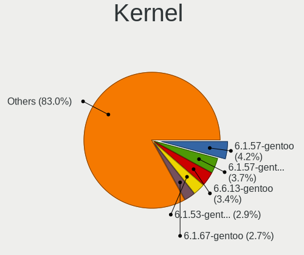

| Version                   | Computers | Percent |
|---------------------------|-----------|---------|
| 6.1.57-gentoo             | 16        | 5.95%   |
| 6.1.57-gentoo-x86_64      | 13        | 4.83%   |
| 6.1.53-gentoo-r1          | 10        | 3.72%   |
| 6.1.67-gentoo             | 9         | 3.35%   |
| 6.1.46-gentoo             | 8         | 2.97%   |
| 6.1.67-gentoo-dist        | 6         | 2.23%   |
| 6.6.8-gentoo              | 5         | 1.86%   |
| 6.6.0-gentoo              | 5         | 1.86%   |
| 6.4.10-gentoo-x86_64      | 5         | 1.86%   |
| 6.1.67-gentoo-x86_64      | 5         | 1.86%   |
| 6.1.57-gentoo-dist        | 5         | 1.86%   |
| 6.6.8-gentoo-x86_64       | 4         | 1.49%   |
| 6.5.7-gentoo              | 4         | 1.49%   |
| 6.1.46-gentoo-x86_64      | 4         | 1.49%   |
| 6.1.41-gentoo             | 4         | 1.49%   |
| 6.7.0-gentoo              | 3         | 1.12%   |
| 6.6.9-gentoo              | 3         | 1.12%   |
| 6.6.2-gentoo              | 3         | 1.12%   |
| 6.6.13-gentoo             | 3         | 1.12%   |
| 6.5.0-gentoo              | 3         | 1.12%   |
| 6.1.60-gentoo-dist        | 3         | 1.12%   |
| 6.1.46-gentoo-dist        | 3         | 1.12%   |
| 6.7.0-rc1                 | 2         | 0.74%   |
| 6.6.7-gentoo-dist         | 2         | 0.74%   |
| 6.6.3-gentoo              | 2         | 0.74%   |
| 6.6.0-gentoo-x86_64       | 2         | 0.74%   |
| 6.5.9-gentoo-x86_64       | 2         | 0.74%   |
| 6.5.9-gentoo              | 2         | 0.74%   |
| 6.5.8-gentoo-r1-x86_64    | 2         | 0.74%   |
| 6.5.8-gentoo-r1           | 2         | 0.74%   |
| 6.5.7-gentoo-x86_64       | 2         | 0.74%   |
| 6.5.5-gentoo-x86_64       | 2         | 0.74%   |
| 6.5.1-gentoo              | 2         | 0.74%   |
| 6.4.9-gentoo              | 2         | 0.74%   |
| 6.4.4-gentoo              | 2         | 0.74%   |
| 6.4.3-gentoo              | 2         | 0.74%   |
| 6.4.10-gentoo             | 2         | 0.74%   |
| 6.1.69-gentoo-dist        | 2         | 0.74%   |
| 6.1.57-gentoo-gentoo-dist | 2         | 0.74%   |
| 6.1.55-gentoo-dist        | 2         | 0.74%   |

Kernel Family
-------------

Linux kernel without a distro release

| Version | Computers | Percent |
|---------|-----------|---------|
| 6.1.57  | 39        | 14.66%  |
| 6.1.67  | 21        | 7.89%   |
| 6.1.53  | 18        | 6.77%   |
| 6.1.46  | 18        | 6.77%   |
| 6.6.8   | 12        | 4.51%   |
| 6.6.0   | 9         | 3.38%   |
| 6.7.0   | 8         | 3.01%   |
| 6.5.7   | 8         | 3.01%   |
| 6.4.10  | 8         | 3.01%   |
| 6.1.41  | 8         | 3.01%   |
| 6.6.2   | 6         | 2.26%   |
| 6.6.1   | 6         | 2.26%   |
| 6.5.9   | 6         | 2.26%   |
| 6.5.8   | 6         | 2.26%   |
| 6.5.0   | 6         | 2.26%   |
| 6.6.13  | 5         | 1.88%   |
| 6.5.5   | 5         | 1.88%   |
| 6.6.9   | 4         | 1.5%    |
| 6.6.3   | 4         | 1.5%    |
| 6.5.3   | 4         | 1.5%    |
| 6.1.66  | 4         | 1.5%    |
| 6.6.7   | 3         | 1.13%   |
| 6.5.1   | 3         | 1.13%   |
| 6.4.4   | 3         | 1.13%   |
| 6.4.3   | 3         | 1.13%   |
| 6.4.11  | 3         | 1.13%   |
| 6.1.60  | 3         | 1.13%   |
| 6.6.6   | 2         | 0.75%   |
| 6.6.4   | 2         | 0.75%   |
| 6.5.4   | 2         | 0.75%   |
| 6.5.2   | 2         | 0.75%   |
| 6.4.9   | 2         | 0.75%   |
| 6.4.8   | 2         | 0.75%   |
| 6.4.14  | 2         | 0.75%   |
| 6.1.69  | 2         | 0.75%   |
| 6.1.55  | 2         | 0.75%   |
| 5.15.0  | 2         | 0.75%   |
| 6.7.2   | 1         | 0.38%   |
| 6.7.1   | 1         | 0.38%   |
| 6.6.11  | 1         | 0.38%   |

Kernel Major Ver.
-----------------

Linux kernel major version

| Version | Computers | Percent |
|---------|-----------|---------|
| 6.1     | 103       | 42.21%  |
| 6.6     | 54        | 22.13%  |
| 6.5     | 40        | 16.39%  |
| 6.4     | 26        | 10.66%  |
| 6.7     | 10        | 4.1%    |
| 6.3     | 3         | 1.23%   |
| 5.15    | 3         | 1.23%   |
| 6.2     | 1         | 0.41%   |
| 5.19    | 1         | 0.41%   |
| 5.17    | 1         | 0.41%   |
| 5.16    | 1         | 0.41%   |
| 5.14    | 1         | 0.41%   |

Arch
----

OS architecture (x86_64, i586, etc.)

| Name        | Computers | Percent |
|-------------|-----------|---------|
| x86_64      | 221       | 98.22%  |
| loongarch64 | 2         | 0.89%   |
| aarch64     | 2         | 0.89%   |

DE
--

Desktop Environment

| Name          | Computers | Percent |
|---------------|-----------|---------|
| Unknown       | 73        | 31.74%  |
| KDE5          | 63        | 27.39%  |
| XFCE          | 29        | 12.61%  |
| GNOME         | 25        | 10.87%  |
| Hyprland      | 10        | 4.35%   |
| MATE          | 7         | 3.04%   |
| DWM           | 7         | 3.04%   |
| i3            | 4         | 1.74%   |
| LXQt          | 3         | 1.3%    |
| X-Cinnamon    | 2         | 0.87%   |
| LXDE          | 1         | 0.43%   |
| KDE6          | 1         | 0.43%   |
| KDE           | 1         | 0.43%   |
| ICEWM         | 1         | 0.43%   |
| GNOME Classic | 1         | 0.43%   |
| bspwm         | 1         | 0.43%   |
| awesome       | 1         | 0.43%   |

Display Server
--------------

X11 or Wayland

| Name    | Computers | Percent |
|---------|-----------|---------|
| X11     | 91        | 38.4%   |
| Wayland | 68        | 28.69%  |
| Unknown | 45        | 18.99%  |
| Tty     | 33        | 13.92%  |

Display Manager
---------------

SDDM, LightDM, etc.

| Name    | Computers | Percent |
|---------|-----------|---------|
| Unknown | 95        | 41.48%  |
| SDDM    | 68        | 29.69%  |
| LightDM | 38        | 16.59%  |
| GDM     | 16        | 6.99%   |
| SLiM    | 5         | 2.18%   |
| GREETD  | 4         | 1.75%   |
| LXDM    | 2         | 0.87%   |
| Ly      | 1         | 0.44%   |

OS Lang
-------

Language

| Lang           | Computers | Percent |
|----------------|-----------|---------|
| en_US          | 83        | 36.4%   |
| C.UTF8         | 28        | 12.28%  |
| Unknown        | 28        | 12.28%  |
| en_GB          | 15        | 6.58%   |
| de_DE          | 10        | 4.39%   |
| fr_FR          | 9         | 3.95%   |
| C              | 8         | 3.51%   |
| ru_RU          | 7         | 3.07%   |
| zh_CN          | 3         | 1.32%   |
| it_IT          | 3         | 1.32%   |
| es_ES          | 3         | 1.32%   |
| de_CH          | 3         | 1.32%   |
| cs_CZ          | 3         | 1.32%   |
| pl_PL          | 2         | 0.88%   |
| es_AR          | 2         | 0.88%   |
| en_IE          | 2         | 0.88%   |
| zh_TW          | 1         | 0.44%   |
| uk_UA          | 1         | 0.44%   |
| ru_RU.UTF8     | 1         | 0.44%   |
| pt_BR          | 1         | 0.44%   |
| POSIX          | 1         | 0.44%   |
| nl_NL          | 1         | 0.44%   |
| lt_LT          | 1         | 0.44%   |
| ja_JP          | 1         | 0.44%   |
| it_IT.iso88591 | 1         | 0.44%   |
| fr_CA          | 1         | 0.44%   |
| fi_FI          | 1         | 0.44%   |
| es_MX          | 1         | 0.44%   |
| es_ES.UTF8     | 1         | 0.44%   |
| es_CL          | 1         | 0.44%   |
| en_IE@euro     | 1         | 0.44%   |
| en             | 1         | 0.44%   |
| el_GR          | 1         | 0.44%   |
| ca_ES          | 1         | 0.44%   |
| bg_BG          | 1         | 0.44%   |

Boot Mode
---------

EFI or BIOS

| Mode | Computers | Percent |
|------|-----------|---------|
| EFI  | 198       | 87.22%  |
| BIOS | 29        | 12.78%  |

Filesystem
----------

Type of filesystem

| Type     | Computers | Percent |
|----------|-----------|---------|
| Ext4     | 113       | 49.78%  |
| Btrfs    | 62        | 27.31%  |
| Xfs      | 29        | 12.78%  |
| F2fs     | 12        | 5.29%   |
| Zfs      | 8         | 3.52%   |
| XXXXXXX  | 2         | 0.88%   |
| Bcachefs | 1         | 0.44%   |

Part. scheme
------------

Scheme of partitioning

| Type    | Computers | Percent |
|---------|-----------|---------|
| GPT     | 206       | 91.56%  |
| Unknown | 10        | 4.44%   |
| MBR     | 9         | 4%      |

Dual Boot with Linux/BSD
------------------------

Hosting more than one Linux/BSD

| Dual boot | Computers | Percent |
|-----------|-----------|---------|
| No        | 169       | 73.16%  |
| Yes       | 62        | 26.84%  |

Dual Boot (Win)
---------------

Hosting Linux and Windows

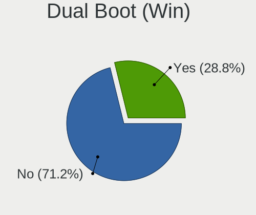

| Dual boot | Computers | Percent |
|-----------|-----------|---------|
| No        | 163       | 71.49%  |
| Yes       | 65        | 28.51%  |

Board
-----

Vendor
------

Motherboard manufacturer

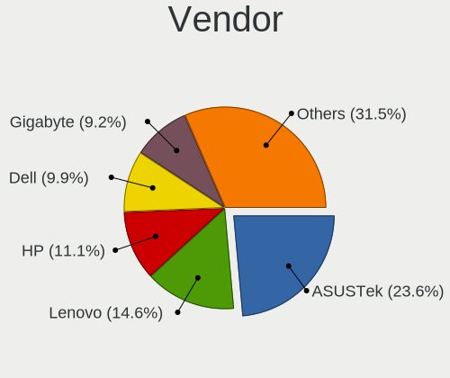

| Name                | Computers | Percent |
|---------------------|-----------|---------|
| ASUSTek Computer    | 57        | 25.33%  |
| Lenovo              | 32        | 14.22%  |
| Hewlett-Packard     | 26        | 11.56%  |
| Gigabyte Technology | 23        | 10.22%  |
| Dell                | 21        | 9.33%   |
| MSI                 | 17        | 7.56%   |
| Framework           | 7         | 3.11%   |
| ASRock              | 7         | 3.11%   |
| Acer                | 5         | 2.22%   |
| Unknown             | 4         | 1.78%   |
| Supermicro          | 3         | 1.33%   |
| Star Labs           | 2         | 0.89%   |
| Loongson            | 2         | 0.89%   |
| UMAX                | 1         | 0.44%   |
| TULPAR              | 1         | 0.44%   |
| Timi                | 1         | 0.44%   |
| SZMZ                | 1         | 0.44%   |
| System76            | 1         | 0.44%   |
| Razer               | 1         | 0.44%   |
| PINE64              | 1         | 0.44%   |
| Notebook            | 1         | 0.44%   |
| Medion              | 1         | 0.44%   |
| Intel               | 1         | 0.44%   |
| HUAWEI              | 1         | 0.44%   |
| Fujitsu             | 1         | 0.44%   |
| Foxconn             | 1         | 0.44%   |
| Fanless Mini PC     | 1         | 0.44%   |
| DEXP                | 1         | 0.44%   |
| BESSTAR Tech        | 1         | 0.44%   |
| BANGHO              | 1         | 0.44%   |
| Apple               | 1         | 0.44%   |
| A-DATA Technology   | 1         | 0.44%   |

Model
-----

Motherboard model

| Name                                       | Computers | Percent |
|--------------------------------------------|-----------|---------|
| Framework Laptop (13th Gen Intel Core)     | 4         | 1.78%   |
| Unknown                                    | 4         | 1.78%   |
| Framework Laptop 13 (AMD Ryzen 7040Series) | 3         | 1.33%   |
| Lenovo Yoga 7 16ARP8 83BS                  | 2         | 0.89%   |
| Gigabyte X570 AORUS ELITE                  | 2         | 0.89%   |
| Gigabyte B550 AORUS ELITE V2               | 2         | 0.89%   |
| Gigabyte B450M DS3H                        | 2         | 0.89%   |
| Dell Precision 5480                        | 2         | 0.89%   |
| ASUS TUF Gaming B550-PLUS                  | 2         | 0.89%   |
| ASUS ROG STRIX X570-E GAMING               | 2         | 0.89%   |
| ASUS PRIME B660-PLUS D4                    | 2         | 0.89%   |
| ASUS M3A78-CM                              | 2         | 0.89%   |
| UMAX VisionBook 9Wi Pro                    | 1         | 0.44%   |
| TULPAR A5 V20.3                            | 1         | 0.44%   |
| Timi RedmiBook Pro 15S                     | 1         | 0.44%   |
| SZMZ X99M-G2                               | 1         | 0.44%   |
| System76 Pangolin                          | 1         | 0.44%   |
| Supermicro X10SL7-F                        | 1         | 0.44%   |
| Supermicro SYS-5038MD-H24TRF-OS012         | 1         | 0.44%   |
| Supermicro Super Server                    | 1         | 0.44%   |
| Star Labs StarLite                         | 1         | 0.44%   |
| Star Labs StarBook                         | 1         | 0.44%   |
| Razer Blade 14 - RZ09-0482                 | 1         | 0.44%   |
| PINE64 Pinebook Pro                        | 1         | 0.44%   |
| Notebook NS5x_NS7xPU                       | 1         | 0.44%   |
| MSI Stealth 16Studio A13VF                 | 1         | 0.44%   |
| MSI Pulse 15 B13VFK                        | 1         | 0.44%   |
| MSI MS-7E10                                | 1         | 0.44%   |
| MSI MS-7D89                                | 1         | 0.44%   |
| MSI MS-7D67                                | 1         | 0.44%   |
| MSI MS-7D50                                | 1         | 0.44%   |
| MSI MS-7C94                                | 1         | 0.44%   |
| MSI MS-7C91                                | 1         | 0.44%   |
| MSI MS-7C84                                | 1         | 0.44%   |
| MSI MS-7C60                                | 1         | 0.44%   |
| MSI MS-7C56                                | 1         | 0.44%   |
| MSI MS-7C37                                | 1         | 0.44%   |
| MSI MS-7C35                                | 1         | 0.44%   |
| MSI MS-7C09                                | 1         | 0.44%   |
| MSI MS-7C02                                | 1         | 0.44%   |

Model Family
------------

Motherboard model prefix

| Name                               | Computers | Percent |
|------------------------------------|-----------|---------|
| Lenovo ThinkPad                    | 19        | 8.44%   |
| ASUS ROG                           | 17        | 7.56%   |
| ASUS PRIME                         | 13        | 5.78%   |
| ASUS VivoBook                      | 8         | 3.56%   |
| Framework Laptop                   | 7         | 3.11%   |
| HP EliteBook                       | 6         | 2.67%   |
| Dell Precision                     | 6         | 2.67%   |
| HP Laptop                          | 5         | 2.22%   |
| ASUS TUF                           | 5         | 2.22%   |
| Lenovo Legion                      | 4         | 1.78%   |
| HP ProBook                         | 4         | 1.78%   |
| Dell Latitude                      | 4         | 1.78%   |
| Acer Aspire                        | 4         | 1.78%   |
| Unknown                            | 4         | 1.78%   |
| HP Victus                          | 3         | 1.33%   |
| Gigabyte B550                      | 3         | 1.33%   |
| Dell XPS                           | 3         | 1.33%   |
| Dell OptiPlex                      | 3         | 1.33%   |
| Dell Inspiron                      | 3         | 1.33%   |
| ASUS ZenBook                       | 3         | 1.33%   |
| ASUS ASUS                          | 3         | 1.33%   |
| Lenovo Yoga                        | 2         | 0.89%   |
| Lenovo IdeaPad                     | 2         | 0.89%   |
| HP Pavilion                        | 2         | 0.89%   |
| Gigabyte X570                      | 2         | 0.89%   |
| Gigabyte B450M                     | 2         | 0.89%   |
| ASUS M3A78-CM                      | 2         | 0.89%   |
| UMAX VisionBook                    | 1         | 0.44%   |
| TULPAR A5                          | 1         | 0.44%   |
| Timi RedmiBook                     | 1         | 0.44%   |
| SZMZ X99M-G2                       | 1         | 0.44%   |
| System76 Pangolin                  | 1         | 0.44%   |
| Supermicro X10SL7-F                | 1         | 0.44%   |
| Supermicro SYS-5038MD-H24TRF-OS012 | 1         | 0.44%   |
| Supermicro Super                   | 1         | 0.44%   |
| Star Labs StarLite                 | 1         | 0.44%   |
| Star Labs StarBook                 | 1         | 0.44%   |
| Razer Blade                        | 1         | 0.44%   |
| PINE64 Pinebook                    | 1         | 0.44%   |
| Notebook NS5x                      | 1         | 0.44%   |

MFG Year
--------

Motherboard manufacture year

| Year    | Computers | Percent |
|---------|-----------|---------|
| 2022    | 36        | 16%     |
| 2023    | 34        | 15.11%  |
| 2021    | 34        | 15.11%  |
| 2020    | 25        | 11.11%  |
| 2019    | 24        | 10.67%  |
| 2018    | 16        | 7.11%   |
| 2017    | 10        | 4.44%   |
| 2012    | 9         | 4%      |
| 2013    | 7         | 3.11%   |
| 2016    | 5         | 2.22%   |
| 2014    | 5         | 2.22%   |
| Unknown | 5         | 2.22%   |
| 2011    | 4         | 1.78%   |
| 2010    | 3         | 1.33%   |
| 2007    | 3         | 1.33%   |
| 2009    | 2         | 0.89%   |
| 2008    | 2         | 0.89%   |
| 2015    | 1         | 0.44%   |

Form Factor
-----------

Physical design of the computer

| Name           | Computers | Percent |
|----------------|-----------|---------|
| Notebook       | 110       | 48.89%  |
| Desktop        | 101       | 44.89%  |
| Convertible    | 4         | 1.78%   |
| Server         | 4         | 1.78%   |
| System on chip | 2         | 0.89%   |
| Tablet         | 2         | 0.89%   |
| Stick pc       | 1         | 0.44%   |
| Mini pc        | 1         | 0.44%   |

Secure Boot
-----------

Enabled or disabled

| State    | Computers | Percent |
|----------|-----------|---------|
| Disabled | 218       | 96.46%  |
| Enabled  | 8         | 3.54%   |

Coreboot
--------

Have coreboot on board

| Used | Computers | Percent |
|------|-----------|---------|
| No   | 225       | 100%    |

RAM Size
--------

Total RAM memory

| Size in GB  | Computers | Percent |
|-------------|-----------|---------|
| 32.01-64.0  | 72        | 31.86%  |
| 64.01-256.0 | 37        | 16.37%  |
| 16.01-24.0  | 37        | 16.37%  |
| 8.01-16.0   | 35        | 15.49%  |
| 4.01-8.0    | 25        | 11.06%  |
| 24.01-32.0  | 11        | 4.87%   |
| 3.01-4.0    | 8         | 3.54%   |
| 1.01-2.0    | 1         | 0.44%   |

RAM Used
--------

Used RAM memory

| Used GB    | Computers | Percent |
|------------|-----------|---------|
| 4.01-8.0   | 53        | 21.46%  |
| 1.01-2.0   | 52        | 21.05%  |
| 2.01-3.0   | 40        | 16.19%  |
| 3.01-4.0   | 35        | 14.17%  |
| 0.51-1.0   | 22        | 8.91%   |
| 8.01-16.0  | 20        | 8.1%    |
| 16.01-24.0 | 10        | 4.05%   |
| 0.01-0.5   | 10        | 4.05%   |
| 32.01-64.0 | 3         | 1.21%   |
| 24.01-32.0 | 2         | 0.81%   |

Total Drives
------------

Number of drives on board

| Drives | Computers | Percent |
|--------|-----------|---------|
| 1      | 104       | 45.41%  |
| 2      | 63        | 27.51%  |
| 3      | 20        | 8.73%   |
| 4      | 14        | 6.11%   |
| 6      | 8         | 3.49%   |
| 5      | 7         | 3.06%   |
| 7      | 6         | 2.62%   |
| 8      | 4         | 1.75%   |
| 31     | 1         | 0.44%   |
| 19     | 1         | 0.44%   |
| 9      | 1         | 0.44%   |

Has CD-ROM
----------

Has CD-ROM on board

| Presented | Computers | Percent |
|-----------|-----------|---------|
| No        | 188       | 83.19%  |
| Yes       | 38        | 16.81%  |

Has Ethernet
------------

Has Ethernet on board

| Presented | Computers | Percent |
|-----------|-----------|---------|
| Yes       | 184       | 81.42%  |
| No        | 42        | 18.58%  |

Has WiFi
--------

Has WiFi module

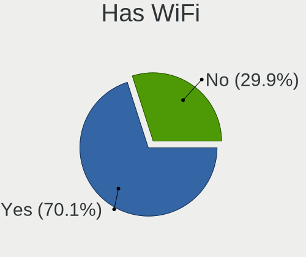

| Presented | Computers | Percent |
|-----------|-----------|---------|
| Yes       | 165       | 73.33%  |
| No        | 60        | 26.67%  |

Has Bluetooth
-------------

Has Bluetooth module

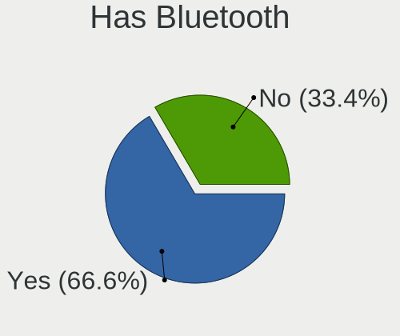

| Presented | Computers | Percent |
|-----------|-----------|---------|
| Yes       | 153       | 68%     |
| No        | 72        | 32%     |

Location
--------

Country
-------

Geographic location (country)

| Country         | Computers | Percent |
|-----------------|-----------|---------|
| USA             | 47        | 20.8%   |
| Germany         | 25        | 11.06%  |
| Russia          | 17        | 7.52%   |
| France          | 12        | 5.31%   |
| UK              | 11        | 4.87%   |
| Poland          | 11        | 4.87%   |
| Spain           | 10        | 4.42%   |
| Italy           | 8         | 3.54%   |
| Czechia         | 8         | 3.54%   |
| China           | 7         | 3.1%    |
| Canada          | 6         | 2.65%   |
| Netherlands     | 5         | 2.21%   |
| Switzerland     | 4         | 1.77%   |
| Sweden          | 4         | 1.77%   |
| Ireland         | 4         | 1.77%   |
| Brazil          | 4         | 1.77%   |
| Greece          | 3         | 1.33%   |
| Finland         | 3         | 1.33%   |
| Bulgaria        | 3         | 1.33%   |
| Belgium         | 3         | 1.33%   |
| Austria         | 3         | 1.33%   |
| Argentina       | 3         | 1.33%   |
| Ukraine         | 2         | 0.88%   |
| Turkey          | 2         | 0.88%   |
| Slovakia        | 2         | 0.88%   |
| New Zealand     | 2         | 0.88%   |
| Japan           | 2         | 0.88%   |
| Indonesia       | 2         | 0.88%   |
| The Netherlands | 1         | 0.44%   |
| Taiwan          | 1         | 0.44%   |
| Portugal        | 1         | 0.44%   |
| Paraguay        | 1         | 0.44%   |
| Mexico          | 1         | 0.44%   |
| Malaysia        | 1         | 0.44%   |
| Iran            | 1         | 0.44%   |
| Hungary         | 1         | 0.44%   |
| Hong Kong       | 1         | 0.44%   |
| Colombia        | 1         | 0.44%   |
| Chile           | 1         | 0.44%   |
| Belarus         | 1         | 0.44%   |

City
----

Geographic location (city)

| City              | Computers | Percent |
|-------------------|-----------|---------|
| Warsaw            | 4         | 1.69%   |
| St Petersburg     | 4         | 1.69%   |
| New York          | 4         | 1.69%   |
| Moscow            | 4         | 1.69%   |
| Cieszyn           | 4         | 1.69%   |
| Berlin            | 4         | 1.69%   |
| Toulouse          | 3         | 1.27%   |
| Stockholm         | 3         | 1.27%   |
| Rostov-on-Don     | 3         | 1.27%   |
| Prague            | 3         | 1.27%   |
| Madrid            | 3         | 1.27%   |
| Dumfries          | 3         | 1.27%   |
| Dublin            | 3         | 1.27%   |
| Beijing           | 3         | 1.27%   |
| Athens            | 3         | 1.27%   |
| Vienna            | 2         | 0.84%   |
| Sofia             | 2         | 0.84%   |
| lapanice        | 2         | 0.84%   |
| San Antonio       | 2         | 0.84%   |
| Samarinda         | 2         | 0.84%   |
| Oulx              | 2         | 0.84%   |
| Mnchengladbach  | 2         | 0.84%   |
| Milano            | 2         | 0.84%   |
| Miami             | 2         | 0.84%   |
| Le Boulou         | 2         | 0.84%   |
| Krefeld           | 2         | 0.84%   |
| Igualada          | 2         | 0.84%   |
| Girona            | 2         | 0.84%   |
| Frankfurt am Main | 2         | 0.84%   |
| Detmold           | 2         | 0.84%   |
| Crdoba          | 2         | 0.84%   |
| Christchurch      | 2         | 0.84%   |
| Bothell           | 2         | 0.84%   |
| Barcelona         | 2         | 0.84%   |
| Amsterdam         | 2         | 0.84%   |
| Xiaolou           | 1         | 0.42%   |
| Wrentham          | 1         | 0.42%   |
| Wetzlar           | 1         | 0.42%   |
| West Orange       | 1         | 0.42%   |
| Weifang           | 1         | 0.42%   |

Drives
------

Drive Vendor
------------

Hard drive vendors

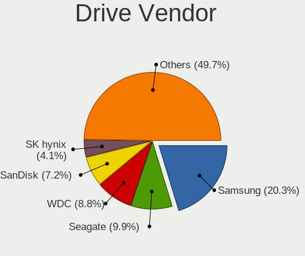

| Vendor                      | Computers | Drives | Percent |
|-----------------------------|-----------|--------|---------|
| Samsung Electronics         | 79        | 151    | 19.7%   |
| WDC                         | 38        | 75     | 9.48%   |
| Seagate                     | 38        | 74     | 9.48%   |
| SanDisk                     | 32        | 39     | 7.98%   |
| SK hynix                    | 19        | 21     | 4.74%   |
| Phison Electronics          | 18        | 23     | 4.49%   |
| Intel                       | 18        | 25     | 4.49%   |
| Kingston                    | 17        | 22     | 4.24%   |
| Micron Technology           | 13        | 16     | 3.24%   |
| Toshiba                     | 11        | 30     | 2.74%   |
| Unknown                     | 10        | 17     | 2.49%   |
| Micron/Crucial Technology   | 10        | 12     | 2.49%   |
| Crucial                     | 10        | 18     | 2.49%   |
| KIOXIA                      | 9         | 11     | 2.24%   |
| Hitachi                     | 7         | 23     | 1.75%   |
| Kingston Technology Company | 5         | 5      | 1.25%   |
| MAXIO Technology (Hangzhou) | 4         | 4      | 1%      |
| GOODRAM                     | 4         | 18     | 1%      |
| China                       | 4         | 6      | 1%      |
| A-DATA Technology           | 4         | 4      | 1%      |
| Unknown                     | 4         | 4      | 1%      |
| Yangtze Memory Technologies | 3         | 5      | 0.75%   |
| Silicon Motion              | 3         | 3      | 0.75%   |
| HGST                        | 3         | 3      | 0.75%   |
| ADATA Technology            | 3         | 4      | 0.75%   |
| Verbatim                    | 2         | 2      | 0.5%    |
| Transcend                   | 2         | 2      | 0.5%    |
| Seagate Technology          | 2         | 2      | 0.5%    |
| SABRENT                     | 2         | 2      | 0.5%    |
| Realtek Semiconductor       | 2         | 2      | 0.5%    |
| Phison                      | 2         | 2      | 0.5%    |
| XPG                         | 1         | 1      | 0.25%   |
| Union Memory                | 1         | 1      | 0.25%   |
| Teleplan                    | 1         | 1      | 0.25%   |
| Team                        | 1         | 1      | 0.25%   |
| StoreJet                    | 1         | 1      | 0.25%   |
| Star                        | 1         | 1      | 0.25%   |
| SPCC                        | 1         | 3      | 0.25%   |
| Solid State Storage         | 1         | 1      | 0.25%   |
| PNY                         | 1         | 1      | 0.25%   |

Drive Model
-----------

Hard drive models

| Model                                                           | Computers | Percent |
|-----------------------------------------------------------------|-----------|---------|
| Samsung NVMe SSD Controller SM981/PM981/PM983 1TB               | 25        | 5.43%   |
| Samsung NVMe SSD Controller PM9A1/PM9A3/980PRO 2TB              | 22        | 4.78%   |
| Samsung SSD 980 1TB                                             | 9         | 1.96%   |
| Phison E12 NVMe Controller 1TB                                  | 6         | 1.3%    |
| Micron/Crucial P2 NVMe PCIe SSD 1TB                             | 5         | 1.09%   |
| Intel SSD 660P Series 1024GB                                    | 5         | 1.09%   |
| Seagate ST2000DM006-2DM164 2TB                                  | 4         | 0.87%   |
| Sandisk WD Blue SN550 NVMe SSD 512GB                            | 4         | 0.87%   |
| Sandisk WD Black SN850 1024GB                                   | 4         | 0.87%   |
| Samsung SSD 860 EVO 500GB                                       | 4         | 0.87%   |
| Samsung SSD 860 EVO 1TB                                         | 4         | 0.87%   |
| Samsung SSD 850 EVO 500GB                                       | 4         | 0.87%   |
| Crucial CT1000MX500SSD1 1TB                                     | 4         | 0.87%   |
| Unknown                                                         | 4         | 0.87%   |
| WDC WDS500G2B0A-00SM50 500GB SSD                                | 3         | 0.65%   |
| WDC WD30EFRX-68EUZN0 3TB                                        | 3         | 0.65%   |
| Unknown MMC Card  128GB                                         | 3         | 0.65%   |
| Silicon Motion SM2263EN/SM2263XT SSD Controller 128GB           | 3         | 0.65%   |
| Seagate ST4000DM004-2CV104 4TB                                  | 3         | 0.65%   |
| Seagate ST2000DM008-2FR102 2TB                                  | 3         | 0.65%   |
| Sandisk WD_BLACK SN850X 2000GB                                  | 3         | 0.65%   |
| Sandisk WD Black SN750 / PC SN730 NVMe SSD 512GB                | 3         | 0.65%   |
| SanDisk SSD PLUS 240GB                                          | 3         | 0.65%   |
| Samsung SSD 860 QVO 1TB                                         | 3         | 0.65%   |
| Samsung SSD 860 EVO 250GB                                       | 3         | 0.65%   |
| Samsung NVMe SSD Controller SM961/PM961/SM963 256GB             | 3         | 0.65%   |
| Micron/Crucial CT1000P5PSSD8 1TB                                | 3         | 0.65%   |
| Micron 2400_MTFDKBA1T0QFM 1TB                                   | 3         | 0.65%   |
| Kingston Company A2000 NVMe SSD 500GB                           | 3         | 0.65%   |
| Kingston SKC3000D2048G 2TB                                      | 3         | 0.65%   |
| Kingston SA400S37480G 480GB SSD                                 | 3         | 0.65%   |
| Intel SSDPEKNU512GZ 512GB                                       | 3         | 0.65%   |
| Intel SSD 600P Series 256GB                                     | 3         | 0.65%   |
| GOODRAM SSDPR-CL100-480-G2 480GB                                | 3         | 0.65%   |
| ADATA XPG SX8200 Pro PCIe Gen3x4 M.2 2280 Solid State Drive 2TB | 3         | 0.65%   |
| WDC WDS240G2G0A-00JH30 240GB SSD                                | 2         | 0.43%   |
| WDC WD20EZRZ-00Z5HB0 2TB                                        | 2         | 0.43%   |
| WDC WD20EFRX-68EUZN0 2TB                                        | 2         | 0.43%   |
| WDC WD10EZEX-08WN4A0 1TB                                        | 2         | 0.43%   |
| WDC WD102KRYZ-01A5AB0 10TB                                      | 2         | 0.43%   |

HDD Vendor
----------

Hard disk drive vendors

| Vendor              | Computers | Drives | Percent |
|---------------------|-----------|--------|---------|
| Seagate             | 38        | 73     | 39.58%  |
| WDC                 | 32        | 66     | 33.33%  |
| Toshiba             | 9         | 28     | 9.38%   |
| Hitachi             | 7         | 23     | 7.29%   |
| HGST                | 3         | 3      | 3.13%   |
| Samsung Electronics | 2         | 3      | 2.08%   |
| Teleplan            | 1         | 1      | 1.04%   |
| StoreJet            | 1         | 1      | 1.04%   |
| NETAPP              | 1         | 3      | 1.04%   |
| Fujitsu             | 1         | 1      | 1.04%   |
| Unknown             | 1         | 1      | 1.04%   |

SSD Vendor
----------

Solid state drive vendors

| Vendor              | Computers | Drives | Percent |
|---------------------|-----------|--------|---------|
| Samsung Electronics | 28        | 47     | 26.42%  |
| Kingston            | 10        | 12     | 9.43%   |
| Crucial             | 10        | 18     | 9.43%   |
| WDC                 | 9         | 9      | 8.49%   |
| SanDisk             | 9         | 9      | 8.49%   |
| GOODRAM             | 4         | 18     | 3.77%   |
| China               | 4         | 6      | 3.77%   |
| Intel               | 3         | 3      | 2.83%   |
| A-DATA Technology   | 3         | 3      | 2.83%   |
| Unknown             | 3         | 3      | 2.83%   |
| Verbatim            | 2         | 2      | 1.89%   |
| Toshiba             | 2         | 2      | 1.89%   |
| SABRENT             | 2         | 2      | 1.89%   |
| Transcend           | 1         | 1      | 0.94%   |
| Team                | 1         | 1      | 0.94%   |
| Star                | 1         | 1      | 0.94%   |
| SPCC                | 1         | 3      | 0.94%   |
| PNY                 | 1         | 1      | 0.94%   |
| Patriot             | 1         | 1      | 0.94%   |
| OCZ                 | 1         | 1      | 0.94%   |
| LITEONIT            | 1         | 1      | 0.94%   |
| LITEON              | 1         | 1      | 0.94%   |
| Lexar               | 1         | 1      | 0.94%   |
| Lenovo              | 1         | 1      | 0.94%   |
| KingSpec            | 1         | 1      | 0.94%   |
| Kingchuxing         | 1         | 5      | 0.94%   |
| Hewlett-Packard     | 1         | 1      | 0.94%   |
| FREEBSD             | 1         | 12     | 0.94%   |
| EYOTA               | 1         | 1      | 0.94%   |
| Corsair             | 1         | 1      | 0.94%   |

Drive Kind
----------

HDD or SSD

| Kind    | Computers | Drives | Percent |
|---------|-----------|--------|---------|
| NVMe    | 170       | 281    | 50.3%   |
| SSD     | 86        | 168    | 25.44%  |
| HDD     | 73        | 203    | 21.6%   |
| MMC     | 7         | 11     | 2.07%   |
| Unknown | 2         | 10     | 0.59%   |

Drive Connector
---------------

SATA, SAS, NVMe, etc.

| Type | Computers | Drives | Percent |
|------|-----------|--------|---------|
| NVMe | 170       | 281    | 57.05%  |
| SATA | 111       | 361    | 37.25%  |
| SAS  | 10        | 20     | 3.36%   |
| MMC  | 7         | 11     | 2.35%   |

Drive Size
----------

Size of hard drive

| Size in TB | Computers | Drives | Percent |
|------------|-----------|--------|---------|
| 0.01-0.5   | 76        | 132    | 40.86%  |
| 0.51-1.0   | 54        | 85     | 29.03%  |
| 1.01-2.0   | 20        | 46     | 10.75%  |
| 3.01-4.0   | 14        | 43     | 7.53%   |
| 2.01-3.0   | 9         | 28     | 4.84%   |
| 4.01-10.0  | 8         | 20     | 4.3%    |
| 10.01-20.0 | 5         | 17     | 2.69%   |

Space Total
-----------

Amount of disk space available on the file system

| Size in GB     | Computers | Percent |
|----------------|-----------|---------|
| 501-1000       | 51        | 21.79%  |
| More than 3000 | 40        | 17.09%  |
| 251-500        | 39        | 16.67%  |
| 1001-2000      | 28        | 11.97%  |
| 101-250        | 27        | 11.54%  |
| 1-20           | 16        | 6.84%   |
| Unknown        | 14        | 5.98%   |
| 2001-3000      | 9         | 3.85%   |
| 51-100         | 6         | 2.56%   |
| 21-50          | 4         | 1.71%   |

Space Used
----------

Amount of used disk space

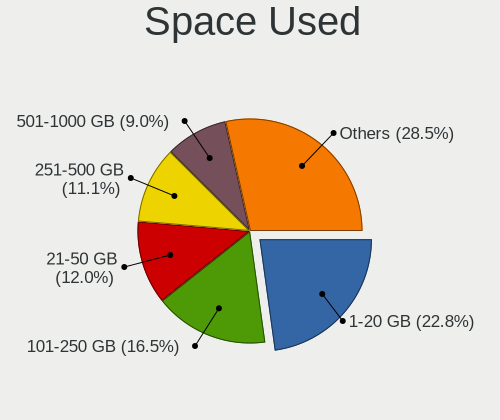

| Used GB        | Computers | Percent |
|----------------|-----------|---------|
| 1-20           | 50        | 21.01%  |
| 101-250        | 40        | 16.81%  |
| 21-50          | 28        | 11.76%  |
| 251-500        | 26        | 10.92%  |
| 501-1000       | 20        | 8.4%    |
| 1001-2000      | 19        | 7.98%   |
| 51-100         | 18        | 7.56%   |
| More than 3000 | 16        | 6.72%   |
| Unknown        | 14        | 5.88%   |
| 2001-3000      | 7         | 2.94%   |

Malfunc. Drives
---------------

Drive models with a malfunction

| Model                                                          | Computers | Drives | Percent |
|----------------------------------------------------------------|-----------|--------|---------|
| WDC WD5000BEVT-22ZAT0 500GB                                    | 1         | 1      | 3.23%   |
| WDC WD3200BEVT-22ZCT0 320GB                                    | 1         | 1      | 3.23%   |
| WDC WD30EFRX-68EUZN0 3TB                                       | 1         | 4      | 3.23%   |
| WDC WD20EFRX-68EUZN0 2TB                                       | 1         | 1      | 3.23%   |
| WDC WD2002FAEX-007BA0 2TB                                      | 1         | 1      | 3.23%   |
| WDC WD10EZEX-00RKKA0 1TB                                       | 1         | 1      | 3.23%   |
| WDC WD10EFRX-68PJCN0 1TB                                       | 1         | 1      | 3.23%   |
| WDC WD Green 2.5 240GB SSD                                     | 1         | 1      | 3.23%   |
| Toshiba HDWD240 4TB                                            | 1         | 1      | 3.23%   |
| SK hynix PC711 HFS512GDE9X073N 512GB                           | 1         | 1      | 3.23%   |
| SK hynix BC501 NVMe Solid State Drive 512GB                    | 1         | 1      | 3.23%   |
| Seagate ST500DM002-1BC142 500GB                                | 1         | 1      | 3.23%   |
| Seagate ST3160811AS 160GB                                      | 1         | 1      | 3.23%   |
| Seagate ST31000524AS 1TB                                       | 1         | 1      | 3.23%   |
| Seagate ST3000DM008-2DM166 3TB                                 | 1         | 2      | 3.23%   |
| Seagate ST2000DM005-2CW102 2TB                                 | 1         | 1      | 3.23%   |
| Seagate ST1000LM024 HN-M101MBB 1TB                             | 1         | 1      | 3.23%   |
| Seagate ST1000DM010-2EP102 1TB                                 | 1         | 1      | 3.23%   |
| Samsung Electronics SSD 980 1TB                                | 1         | 1      | 3.23%   |
| Samsung Electronics NVMe SSD Controller PM9A1/PM9A3/980PRO 2TB | 1         | 1      | 3.23%   |
| PNY SSD2SC120G1LC763C121S459P 120GB                            | 1         | 1      | 3.23%   |
| LITEON CV8-8E128-HP 128GB SSD                                  | 1         | 1      | 3.23%   |
| Kingston SV300S37A240G 240GB SSD                               | 1         | 1      | 3.23%   |
| Kingston SV300S37A 120G SSD                                    | 1         | 1      | 3.23%   |
| Intel SSDSCKKF180G8L 180GB                                     | 1         | 1      | 3.23%   |
| Hitachi HUS724030ALE641 3TB                                    | 1         | 1      | 3.23%   |
| Hitachi HDS722020ALA330 2TB                                    | 1         | 1      | 3.23%   |
| HGST HTS725050A7E630 500GB                                     | 1         | 1      | 3.23%   |
| HGST HTS721010A9E630 1TB                                       | 1         | 1      | 3.23%   |
| A-DATA Technology SP900 128GB SSD                              | 1         | 1      | 3.23%   |
| Unknown                                                        | 1         | 1      | 3.23%   |

Malfunc. Drive Vendor
---------------------

Vendors of faulty drives

| Vendor              | Computers | Drives | Percent |
|---------------------|-----------|--------|---------|
| WDC                 | 7         | 11     | 23.33%  |
| Seagate             | 7         | 8      | 23.33%  |
| SK hynix            | 2         | 2      | 6.67%   |
| Samsung Electronics | 2         | 2      | 6.67%   |
| Kingston            | 2         | 2      | 6.67%   |
| Hitachi             | 2         | 2      | 6.67%   |
| HGST                | 2         | 2      | 6.67%   |
| Toshiba             | 1         | 1      | 3.33%   |
| PNY                 | 1         | 1      | 3.33%   |
| LITEON              | 1         | 1      | 3.33%   |
| Intel               | 1         | 1      | 3.33%   |
| A-DATA Technology   | 1         | 1      | 3.33%   |
| Unknown             | 1         | 1      | 3.33%   |

Malfunc. HDD Vendor
-------------------

Vendors of faulty HDD drives

| Vendor  | Computers | Drives | Percent |
|---------|-----------|--------|---------|
| Seagate | 7         | 8      | 36.84%  |
| WDC     | 6         | 10     | 31.58%  |
| Hitachi | 2         | 2      | 10.53%  |
| HGST    | 2         | 2      | 10.53%  |
| Toshiba | 1         | 1      | 5.26%   |
| Unknown | 1         | 1      | 5.26%   |

Malfunc. Drive Kind
-------------------

Kinds of faulty drives

| Kind | Computers | Drives | Percent |
|------|-----------|--------|---------|
| HDD  | 19        | 24     | 63.33%  |
| SSD  | 7         | 7      | 23.33%  |
| NVMe | 4         | 4      | 13.33%  |

Failed Drives
-------------

Failed drive models

| Model                         | Computers | Drives | Percent |
|-------------------------------|-----------|--------|---------|
| Hitachi HTS723232L9A360 320GB | 1         | 1      | 100%    |

Failed Drive Vendor
-------------------

Failed drive vendors

| Vendor  | Computers | Drives | Percent |
|---------|-----------|--------|---------|
| Hitachi | 1         | 1      | 100%    |

Drive Status
------------

Number of failed and malfunc. drives

| Status   | Computers | Drives | Percent |
|----------|-----------|--------|---------|
| Works    | 209       | 568    | 79.77%  |
| Malfunc  | 29        | 35     | 11.07%  |
| Detected | 23        | 69     | 8.78%   |
| Failed   | 1         | 1      | 0.38%   |

Storage controller
------------------

Storage Vendor
--------------

Storage controller vendors

| Vendor                         | Computers | Percent |
|--------------------------------|-----------|---------|
| Intel                          | 95        | 25.75%  |
| AMD                            | 64        | 17.34%  |
| Samsung Electronics            | 57        | 15.45%  |
| SanDisk                        | 24        | 6.5%    |
| Phison Electronics             | 20        | 5.42%   |
| SK hynix                       | 19        | 5.15%   |
| Micron Technology              | 13        | 3.52%   |
| Kingston Technology Company    | 13        | 3.52%   |
| Micron/Crucial Technology      | 10        | 2.71%   |
| KIOXIA                         | 9         | 2.44%   |
| ASMedia Technology             | 9         | 2.44%   |
| MAXIO Technology (Hangzhou)    | 4         | 1.08%   |
| ADATA Technology               | 4         | 1.08%   |
| Yangtze Memory Technologies    | 3         | 0.81%   |
| Silicon Motion                 | 3         | 0.81%   |
| Seagate Technology             | 2         | 0.54%   |
| Realtek Semiconductor          | 2         | 0.54%   |
| Marvell Technology Group       | 2         | 0.54%   |
| LSI Logic / Symbios Logic      | 2         | 0.54%   |
| Loongson Technology            | 2         | 0.54%   |
| JMicron Technology             | 2         | 0.54%   |
| INNOGRIT                       | 2         | 0.54%   |
| Broadcom / LSI                 | 2         | 0.54%   |
| VIA Technologies               | 1         | 0.27%   |
| Union Memory (Shenzhen)        | 1         | 0.27%   |
| Transcend                      | 1         | 0.27%   |
| Solidigm                       | 1         | 0.27%   |
| Solid State Storage Technology | 1         | 0.27%   |
| Nvidia                         | 1         | 0.27%   |

Storage Model
-------------

Storage controller models

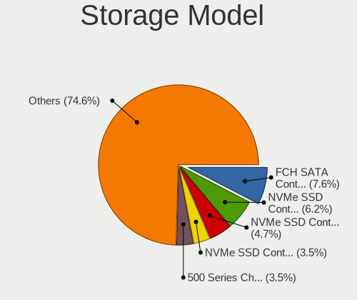

| Model                                                                          | Computers | Percent |
|--------------------------------------------------------------------------------|-----------|---------|
| AMD FCH SATA Controller [AHCI mode]                                            | 33        | 7.82%   |
| Samsung NVMe SSD Controller SM981/PM981/PM983                                  | 25        | 5.92%   |
| Samsung NVMe SSD Controller PM9A1/PM9A3/980PRO                                 | 22        | 5.21%   |
| Samsung NVMe SSD Controller 980 (DRAM-less)                                    | 16        | 3.79%   |
| AMD 500 Series Chipset SATA Controller                                         | 12        | 2.84%   |
| AMD 600 Series Chipset SATA Controller                                         | 9         | 2.13%   |
| Intel Volume Management Device NVMe RAID Controller Intel Corporation          | 8         | 1.9%    |
| Intel Volume Management Device NVMe RAID Controller                            | 8         | 1.9%    |
| Intel 8 Series/C220 Series Chipset Family 6-port SATA Controller 1 [AHCI mode] | 8         | 1.9%    |
| SK hynix Gold P31/BC711/PC711 NVMe Solid State Drive                           | 7         | 1.66%   |
| Phison E18 PCIe4 NVMe Controller                                               | 7         | 1.66%   |
| Intel Cannon Lake PCH SATA AHCI Controller                                     | 7         | 1.66%   |
| Intel 82801 Mobile SATA Controller [RAID mode]                                 | 7         | 1.66%   |
| Phison E12 NVMe Controller                                                     | 6         | 1.42%   |
| Intel Sunrise Point-LP SATA Controller [AHCI mode]                             | 6         | 1.42%   |
| Intel C600/X79 series chipset 6-Port SATA AHCI Controller                      | 6         | 1.42%   |
| Intel Alder Lake-S PCH SATA Controller [AHCI Mode]                             | 6         | 1.42%   |
| Micron/Crucial P2 [Nick P2] / P3 / P3 Plus NVMe PCIe SSD (DRAM-less)           | 5         | 1.18%   |
| Kingston Company KC3000/FURY Renegade NVMe SSD E18                             | 5         | 1.18%   |
| Intel SSD 660P Series                                                          | 5         | 1.18%   |
| ASMedia ASM1061/ASM1062 Serial ATA Controller                                  | 5         | 1.18%   |
| AMD 400 Series Chipset SATA Controller                                         | 5         | 1.18%   |
| SK hynix Platinum P41/PC801 NVMe Solid State Drive                             | 4         | 0.95%   |
| SanDisk WD PC SN810 / Black SN850 NVMe SSD                                     | 4         | 0.95%   |
| Sandisk WD Black SN850X NVMe SSD                                               | 4         | 0.95%   |
| SanDisk Ultra 3D / WD Blue SN550 NVMe SSD                                      | 4         | 0.95%   |
| Samsung NVMe SSD Controller S4LV008[Pascal]                                    | 4         | 0.95%   |
| Micron/Crucial P5 Plus NVMe PCIe SSD                                           | 4         | 0.95%   |
| Micron 2400 NVMe SSD (DRAM-less)                                               | 4         | 0.95%   |
| KIOXIA NVMe SSD Controller BG4 (DRAM-less)                                     | 4         | 0.95%   |
| Intel Q170/Q150/B150/H170/H110/Z170/CM236 Chipset SATA Controller [AHCI Mode]  | 4         | 0.95%   |
| Intel Celeron/Pentium Silver Processor SATA Controller                         | 4         | 0.95%   |
| Intel 7 Series/C210 Series Chipset Family 6-port SATA Controller [AHCI mode]   | 4         | 0.95%   |
| Intel 500 Series Chipset Family SATA AHCI Controller                           | 4         | 0.95%   |
| SK hynix PC601 NVMe Solid State Drive                                          | 3         | 0.71%   |
| Silicon Motion SM2263EN/SM2263XT (DRAM-less) NVMe SSD Controllers              | 3         | 0.71%   |
| SanDisk Extreme Pro / WD Black SN750 / PC SN730 / Red SN700 NVMe SSD           | 3         | 0.71%   |
| Samsung NVMe SSD Controller SM961/PM961/SM963                                  | 3         | 0.71%   |
| Micron 2450 NVMe SSD [HendrixV] (DRAM-less)                                    | 3         | 0.71%   |
| KIOXIA NVMe SSD Controller BG5 (DRAM-less)                                     | 3         | 0.71%   |

Storage Kind
------------

Kind of storage controller (IDE, SATA, NVMe, SAS, ...)

| Kind | Computers | Percent |
|------|-----------|---------|
| NVMe | 170       | 48.3%   |
| SATA | 141       | 40.06%  |
| RAID | 26        | 7.39%   |
| IDE  | 10        | 2.84%   |
| SAS  | 5         | 1.42%   |

Processor
---------

CPU Vendor
----------

Processor vendors

| Vendor   | Computers | Percent |
|----------|-----------|---------|
| Intel    | 119       | 52.89%  |
| AMD      | 102       | 45.33%  |
| Loongson | 2         | 0.89%   |
| ARM      | 2         | 0.89%   |

CPU Model
---------

Processor models

| Model                                         | Computers | Percent |
|-----------------------------------------------|-----------|---------|
| AMD Ryzen 9 5900X 12-Core Processor           | 8         | 3.56%   |
| AMD Ryzen 7 5800H with Radeon Graphics        | 7         | 3.11%   |
| Intel 12th Gen Core i7-12700H                 | 4         | 1.78%   |
| Intel 11th Gen Core i5-1135G7 @ 2.40GHz       | 4         | 1.78%   |
| AMD Ryzen 9 3900X 12-Core Processor           | 4         | 1.78%   |
| AMD Ryzen 7 5825U with Radeon Graphics        | 4         | 1.78%   |
| Intel Core i7-8550U CPU @ 1.80GHz             | 3         | 1.33%   |
| Intel 13th Gen Core i9-13900H                 | 3         | 1.33%   |
| Intel 13th Gen Core i7-1370P                  | 3         | 1.33%   |
| Intel 13th Gen Core i7-13700H                 | 3         | 1.33%   |
| AMD Ryzen 9 7950X 16-Core Processor           | 3         | 1.33%   |
| AMD Ryzen 7 7840U w/ Radeon 780M Graphics     | 3         | 1.33%   |
| AMD Ryzen 7 5800X 8-Core Processor            | 3         | 1.33%   |
| AMD Ryzen 5 5600X 6-Core Processor            | 3         | 1.33%   |
| AMD Ryzen 5 5500U with Radeon Graphics        | 3         | 1.33%   |
| Loongson 3A6000                               | 2         | 0.89%   |
| Intel Xeon CPU E5-2620 v4 @ 2.10GHz           | 2         | 0.89%   |
| Intel Core i7-8700 CPU @ 3.20GHz              | 2         | 0.89%   |
| Intel Core i7-3770 CPU @ 3.40GHz              | 2         | 0.89%   |
| Intel Core i5-8400 CPU @ 2.80GHz              | 2         | 0.89%   |
| Intel Core i5-8365U CPU @ 1.60GHz             | 2         | 0.89%   |
| Intel Core i5-2400 CPU @ 3.10GHz              | 2         | 0.89%   |
| Intel Core i5-10210U CPU @ 1.60GHz            | 2         | 0.89%   |
| Intel Core i5 CPU M 540 @ 2.53GHz             | 2         | 0.89%   |
| Intel Core i3-8130U CPU @ 2.20GHz             | 2         | 0.89%   |
| Intel 12th Gen Core i7-1260P                  | 2         | 0.89%   |
| Intel 12th Gen Core i5-12600K                 | 2         | 0.89%   |
| Intel 12th Gen Core i5-12400                  | 2         | 0.89%   |
| Intel 11th Gen Core i7-11800H @ 2.30GHz       | 2         | 0.89%   |
| Intel 11th Gen Core i7-11700K @ 3.60GHz       | 2         | 0.89%   |
| Intel 11th Gen Core i7-1165G7 @ 2.80GHz       | 2         | 0.89%   |
| ARM Processor                                 | 2         | 0.89%   |
| AMD Ryzen 9 5950X 16-Core Processor           | 2         | 0.89%   |
| AMD Ryzen 7 PRO 6850U with Radeon Graphics    | 2         | 0.89%   |
| AMD Ryzen 7 PRO 4750U with Radeon Graphics    | 2         | 0.89%   |
| AMD Ryzen 7 7735U with Radeon Graphics        | 2         | 0.89%   |
| AMD Ryzen 7 5800X3D 8-Core Processor          | 2         | 0.89%   |
| AMD Ryzen 7 3700U with Radeon Vega Mobile Gfx | 2         | 0.89%   |
| AMD Ryzen 5 7600X 6-Core Processor            | 2         | 0.89%   |
| AMD Ryzen 5 5600U with Radeon Graphics        | 2         | 0.89%   |

CPU Model Family
----------------

Processor model prefix

| Model                  | Computers | Percent |
|------------------------|-----------|---------|
| Other                  | 50        | 22.22%  |
| AMD Ryzen 7            | 37        | 16.44%  |
| Intel Core i7          | 24        | 10.67%  |
| AMD Ryzen 5            | 24        | 10.67%  |
| AMD Ryzen 9            | 23        | 10.22%  |
| Intel Core i5          | 20        | 8.89%   |
| Intel Xeon             | 11        | 4.89%   |
| AMD Ryzen 7 PRO        | 6         | 2.67%   |
| Intel Core i3          | 5         | 2.22%   |
| Intel Pentium          | 3         | 1.33%   |
| Intel Core i9          | 3         | 1.33%   |
| Intel Celeron          | 3         | 1.33%   |
| AMD FX                 | 3         | 1.33%   |
| Intel Pentium Silver   | 2         | 0.89%   |
| Intel Atom             | 2         | 0.89%   |
| AMD Ryzen Threadripper | 2         | 0.89%   |
| AMD Phenom II X4       | 2         | 0.89%   |
| Intel Core 2 Duo       | 1         | 0.44%   |
| AMD Ryzen 5 PRO        | 1         | 0.44%   |
| AMD Ryzen 3            | 1         | 0.44%   |
| AMD EPYC               | 1         | 0.44%   |
| AMD Athlon 64 X2       | 1         | 0.44%   |

CPU Cores
---------

Number of processor cores

| Number  | Computers | Percent |
|---------|-----------|---------|
| 4       | 58        | 25.78%  |
| 8       | 52        | 23.11%  |
| 6       | 39        | 17.33%  |
| 12      | 20        | 8.89%   |
| 2       | 17        | 7.56%   |
| 16      | 13        | 5.78%   |
| 14      | 13        | 5.78%   |
| 10      | 7         | 3.11%   |
| 32      | 2         | 0.89%   |
| 24      | 2         | 0.89%   |
| 1       | 1         | 0.44%   |
| Unknown | 1         | 0.44%   |

CPU Sockets
-----------

Number of sockets

| Number  | Computers | Percent |
|---------|-----------|---------|
| 1       | 220       | 97.78%  |
| 2       | 4         | 1.78%   |
| Unknown | 1         | 0.44%   |

CPU Threads
-----------

Threads per core (Hyper-Threading)

| Number  | Computers | Percent |
|---------|-----------|---------|
| 2       | 194       | 86.22%  |
| 1       | 29        | 12.89%  |
| 4       | 1         | 0.44%   |
| Unknown | 1         | 0.44%   |

CPU Op-Modes
------------

CPU Operation Modes (32-bit, 64-bit)

| Op mode        | Computers | Percent |
|----------------|-----------|---------|
| 32-bit, 64-bit | 225       | 100%    |

CPU Microcode
-------------

Microcode number

| Number     | Computers | Percent |
|------------|-----------|---------|
| Unknown    | 77        | 33.33%  |
| 0xb06a2    | 10        | 4.33%   |
| 0x0a50000d | 9         | 3.9%    |
| 0x0a50000c | 9         | 3.9%    |
| 0x0a20120a | 8         | 3.46%   |
| 0x0a601203 | 7         | 3.03%   |
| 0x0a404102 | 7         | 3.03%   |
| 0x0a704103 | 6         | 2.6%    |
| 0x0a601206 | 5         | 2.16%   |
| 0x0a201016 | 5         | 2.16%   |
| 0x08701021 | 5         | 2.16%   |
| 0x806ec    | 4         | 1.73%   |
| 0x806c1    | 4         | 1.73%   |
| 0x08600106 | 4         | 1.73%   |
| 0x906ea    | 3         | 1.3%    |
| 0x90672    | 3         | 1.3%    |
| 0x806ea    | 3         | 1.3%    |
| 0x706a8    | 3         | 1.3%    |
| 0x306e4    | 3         | 1.3%    |
| 0x306c3    | 3         | 1.3%    |
| 0x206d7    | 3         | 1.3%    |
| 0x206a7    | 3         | 1.3%    |
| 0xb0671    | 2         | 0.87%   |
| 0x906a3    | 2         | 0.87%   |
| 0x506e3    | 2         | 0.87%   |
| 0x20652    | 2         | 0.87%   |
| 0x0a50000f | 2         | 0.87%   |
| 0x08608103 | 2         | 0.87%   |
| 0x08108109 | 2         | 0.87%   |
| 0x0800820d | 2         | 0.87%   |
| 0x010000db | 2         | 0.87%   |
| 0xb06e0    | 1         | 0.43%   |
| 0xa0671    | 1         | 0.43%   |
| 0xa0652    | 1         | 0.43%   |
| 0x906ed    | 1         | 0.43%   |
| 0x906e9    | 1         | 0.43%   |
| 0x90675    | 1         | 0.43%   |
| 0x706e5    | 1         | 0.43%   |
| 0x50663    | 1         | 0.43%   |
| 0x406f1    | 1         | 0.43%   |

CPU Microarch
-------------

Microarchitecture

| Name             | Computers | Percent |
|------------------|-----------|---------|
| Zen 3            | 38        | 16.67%  |
| Unknown          | 37        | 16.23%  |
| Alderlake Hybrid | 30        | 13.16%  |
| KabyLake         | 28        | 12.28%  |
| Zen 2            | 19        | 8.33%   |
| Zen+             | 9         | 3.95%   |
| SandyBridge      | 9         | 3.95%   |
| Haswell          | 8         | 3.51%   |
| TigerLake        | 7         | 3.07%   |
| Icelake          | 7         | 3.07%   |
| IvyBridge        | 6         | 2.63%   |
| Goldmont plus    | 4         | 1.75%   |
| Broadwell        | 4         | 1.75%   |
| Westmere         | 3         | 1.32%   |
| Skylake          | 3         | 1.32%   |
| Piledriver       | 3         | 1.32%   |
| CometLake        | 3         | 1.32%   |
| Silvermont       | 2         | 0.88%   |
| K10              | 2         | 0.88%   |
| Zen              | 1         | 0.44%   |
| Tremont          | 1         | 0.44%   |
| K8 Hammer        | 1         | 0.44%   |
| Gracemont        | 1         | 0.44%   |
| Core             | 1         | 0.44%   |
| Bonnell          | 1         | 0.44%   |

Graphics
--------

GPU Vendor
----------

Vendors of graphics cards

| Vendor                     | Computers | Percent |
|----------------------------|-----------|---------|
| AMD                        | 103       | 38.43%  |
| Intel                      | 80        | 29.85%  |
| Nvidia                     | 76        | 28.36%  |
| ASPEED Technology          | 5         | 1.87%   |
| Matrox Electronics Systems | 2         | 0.75%   |
| Loongson Technology        | 2         | 0.75%   |

GPU Model
---------

Graphics card models

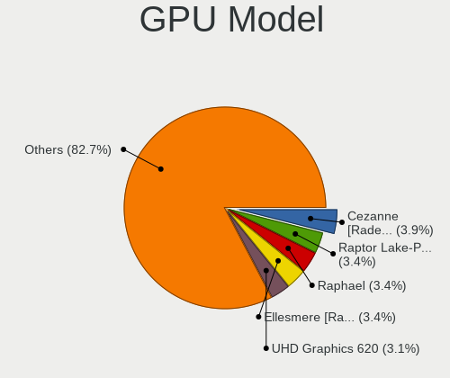

| Model                                                                | Computers | Percent |
|----------------------------------------------------------------------|-----------|---------|
| AMD Cezanne [Radeon Vega Series / Radeon Vega Mobile Series]         | 13        | 4.61%   |
| AMD Ellesmere [Radeon RX 470/480/570/570X/580/580X/590]              | 12        | 4.26%   |
| Intel Raptor Lake-P [Iris Xe Graphics]                               | 10        | 3.55%   |
| AMD Raphael                                                          | 10        | 3.55%   |
| AMD Renoir [Radeon RX Vega 6 (Ryzen 4000/5000 Mobile Series)]        | 8         | 2.84%   |
| Intel UHD Graphics 620                                               | 7         | 2.48%   |
| Intel TigerLake-LP GT2 [Iris Xe Graphics]                            | 7         | 2.48%   |
| AMD Rembrandt [Radeon 680M]                                          | 7         | 2.48%   |
| AMD Phoenix1                                                         | 7         | 2.48%   |
| AMD Navi 22 [Radeon RX 6700/6700 XT/6750 XT / 6800M/6850M XT]        | 7         | 2.48%   |
| Intel Alder Lake-P GT2 [Iris Xe Graphics]                            | 6         | 2.13%   |
| AMD Picasso/Raven 2 [Radeon Vega Series / Radeon Vega Mobile Series] | 6         | 2.13%   |
| AMD Navi 21 [Radeon RX 6800/6800 XT / 6900 XT]                       | 6         | 2.13%   |
| Nvidia AD107M [GeForce RTX 4060 Max-Q / Mobile]                      | 5         | 1.77%   |
| Intel CoffeeLake-S GT2 [UHD Graphics 630]                            | 5         | 1.77%   |
| ASPEED Technology ASPEED Graphics Family                             | 5         | 1.77%   |
| AMD Navi 10 [Radeon RX 5600 OEM/5600 XT / 5700/5700 XT]              | 5         | 1.77%   |
| AMD Barcelo                                                          | 5         | 1.77%   |
| Intel WhiskeyLake-U GT2 [UHD Graphics 620]                           | 4         | 1.42%   |
| AMD Lucienne                                                         | 4         | 1.42%   |
| Nvidia GA104M [GeForce RTX 3070 Mobile / Max-Q]                      | 3         | 1.06%   |
| Nvidia GA104 [GeForce RTX 3070 Ti]                                   | 3         | 1.06%   |
| Nvidia AD107M [GeForce RTX 4050 Max-Q / Mobile]                      | 3         | 1.06%   |
| Nvidia AD106M [GeForce RTX 4070 Max-Q / Mobile]                      | 3         | 1.06%   |
| Intel TigerLake-H GT1 [UHD Graphics]                                 | 3         | 1.06%   |
| Intel Raptor Lake-P [UHD Graphics]                                   | 3         | 1.06%   |
| Intel GeminiLake [UHD Graphics 600]                                  | 3         | 1.06%   |
| AMD Navi 24 [Radeon RX 6400/6500 XT/6500M]                           | 3         | 1.06%   |
| AMD Navi 23 [Radeon RX 6600/6600 XT/6600M]                           | 3         | 1.06%   |
| AMD Lexa PRO [Radeon 540/540X/550/550X / RX 540X/550/550X]           | 3         | 1.06%   |
| Nvidia GP107GL [Quadro P620]                                         | 2         | 0.71%   |
| Nvidia GP107 [GeForce GTX 1050 Ti]                                   | 2         | 0.71%   |
| Nvidia GF119 [GeForce GT 610]                                        | 2         | 0.71%   |
| Nvidia GA107M [GeForce RTX 3050 Ti Mobile]                           | 2         | 0.71%   |
| Nvidia GA107M [GeForce RTX 3050 Mobile]                              | 2         | 0.71%   |
| Nvidia GA107GLM [RTX A1000 6GB Laptop GPU]                           | 2         | 0.71%   |
| Nvidia GA106M [GeForce RTX 3060 Mobile / Max-Q]                      | 2         | 0.71%   |
| Nvidia GA104 [GeForce RTX 3070 Lite Hash Rate]                       | 2         | 0.71%   |
| Nvidia GA104 [GeForce RTX 3060 Ti Lite Hash Rate]                    | 2         | 0.71%   |
| Nvidia GA102 [GeForce RTX 3080 Ti]                                   | 2         | 0.71%   |

GPU Combo
---------

Combinations of graphics cards

| Name                      | Computers | Percent |
|---------------------------|-----------|---------|
| 1 x AMD                   | 80        | 35.09%  |
| 1 x Intel                 | 49        | 21.49%  |
| 1 x Nvidia                | 35        | 15.35%  |
| Intel + Nvidia            | 28        | 12.28%  |
| AMD + Nvidia              | 11        | 4.82%   |
| 2 x AMD                   | 9         | 3.95%   |
| 1 x ASPEED                | 4         | 1.75%   |
| Intel + AMD               | 3         | 1.32%   |
| Other                     | 2         | 0.88%   |
| 1 x Matrox                | 2         | 0.88%   |
| AMD + Loongson Technology | 2         | 0.88%   |
| 2 x Nvidia                | 1         | 0.44%   |
| 2 x Intel                 | 1         | 0.44%   |
| Nvidia + ASPEED           | 1         | 0.44%   |

GPU Driver
----------

Free vs proprietary

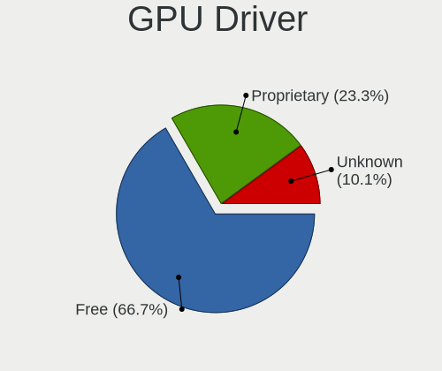

| Driver      | Computers | Percent |
|-------------|-----------|---------|
| Free        | 154       | 67.25%  |
| Proprietary | 55        | 24.02%  |
| Unknown     | 20        | 8.73%   |

GPU Memory
----------

Total video memory

| Size in GB | Computers | Percent |
|------------|-----------|---------|
| Unknown    | 108       | 46.55%  |
| 0.01-0.5   | 30        | 12.93%  |
| 7.01-8.0   | 26        | 11.21%  |
| 1.01-2.0   | 22        | 9.48%   |
| 8.01-16.0  | 17        | 7.33%   |
| 3.01-4.0   | 12        | 5.17%   |
| 0.51-1.0   | 8         | 3.45%   |
| 5.01-6.0   | 5         | 2.16%   |
| 16.01-24.0 | 3         | 1.29%   |
| 2.01-3.0   | 1         | 0.43%   |

Monitor
-------

Monitor Vendor
--------------

Monitor vendors

| Vendor                  | Computers | Percent |
|-------------------------|-----------|---------|
| Samsung Electronics     | 31        | 12.02%  |
| AU Optronics            | 30        | 11.63%  |
| Chimei Innolux          | 23        | 8.91%   |
| BOE                     | 21        | 8.14%   |
| Goldstar                | 19        | 7.36%   |
| Dell                    | 14        | 5.43%   |
| LG Display              | 13        | 5.04%   |
| BenQ                    | 11        | 4.26%   |
| Philips                 | 7         | 2.71%   |
| Lenovo                  | 7         | 2.71%   |
| ASUSTek Computer        | 7         | 2.71%   |
| Sharp                   | 6         | 2.33%   |
| Acer                    | 6         | 2.33%   |
| ViewSonic               | 5         | 1.94%   |
| Iiyama                  | 5         | 1.94%   |
| Hewlett-Packard         | 5         | 1.94%   |
| AOC                     | 5         | 1.94%   |
| Gigabyte Technology     | 4         | 1.55%   |
| Ancor Communications    | 4         | 1.55%   |
| Unknown                 | 3         | 1.16%   |
| TMX                     | 3         | 1.16%   |
| PANDA                   | 3         | 1.16%   |
| CSO                     | 3         | 1.16%   |
| Toshiba                 | 2         | 0.78%   |
| NEC Computers           | 2         | 0.78%   |
| Mi                      | 2         | 0.78%   |
| HUAWEI                  | 2         | 0.78%   |
| VDO                     | 1         | 0.39%   |
| UGD                     | 1         | 0.39%   |
| RTK                     | 1         | 0.39%   |
| MSI                     | 1         | 0.39%   |
| Microstep               | 1         | 0.39%   |
| IBM                     | 1         | 0.39%   |
| HKC                     | 1         | 0.39%   |
| HJW                     | 1         | 0.39%   |
| Fujitsu Siemens         | 1         | 0.39%   |
| Element                 | 1         | 0.39%   |
| Eizo                    | 1         | 0.39%   |
| EDI                     | 1         | 0.39%   |
| Chi Mei Optoelectronics | 1         | 0.39%   |

Monitor Model
-------------

Monitor models

| Model                                                                 | Computers | Percent |
|-----------------------------------------------------------------------|-----------|---------|
| BOE LCD Monitor BOE0BCA 2256x1504 285x190mm 13.5-inch                 | 6         | 2.24%   |
| Unknown LCD Monitor FFFF 2288x1287 2550x2550mm 142.0-inch             | 3         | 1.12%   |
| Samsung Electronics C24F390 SAM0D2C 1920x1080 521x293mm 23.5-inch     | 3         | 1.12%   |
| Chimei Innolux LCD Monitor CMN1614 1920x1200 344x215mm 16.0-inch      | 3         | 1.12%   |
| BenQ PD2700U BNQ802E 3840x2160 597x336mm 27.0-inch                    | 3         | 1.12%   |
| Samsung Electronics U32H85x SAM0E3C 3840x2160 697x392mm 31.5-inch     | 2         | 0.75%   |
| Samsung Electronics SyncMaster SAM059A 1920x1080 477x268mm 21.5-inch  | 2         | 0.75%   |
| Samsung Electronics S22B300 SAM08C8 1920x1080 477x268mm 21.5-inch     | 2         | 0.75%   |
| Samsung Electronics LCD Monitor SDC4180 2880x1620 344x194mm 15.5-inch | 2         | 0.75%   |
| Philips 17S PHL0877 1280x1024 337x270mm 17.0-inch                     | 2         | 0.75%   |
| Mi 27 NFGL XMIB004 1920x1080 598x336mm 27.0-inch                      | 2         | 0.75%   |
| LG Display LCD Monitor LGD06CA 1920x1080 309x174mm 14.0-inch          | 2         | 0.75%   |
| Hewlett-Packard S230tm HWP3115 1920x1080 509x286mm 23.0-inch          | 2         | 0.75%   |
| Hewlett-Packard LA2206 HWP2946 1920x1080 476x268mm 21.5-inch          | 2         | 0.75%   |
| Goldstar ULTRAWIDE GSM59F1 2560x1080 673x284mm 28.8-inch              | 2         | 0.75%   |
| Goldstar HDR 4K GSM774F 3840x2160 697x392mm 31.5-inch                 | 2         | 0.75%   |
| Dell U2415 DELA0BA 1920x1200 518x324mm 24.1-inch                      | 2         | 0.75%   |
| Dell U2410 DELF016 1920x1200 520x320mm 24.0-inch                      | 2         | 0.75%   |
| Dell P2418D DELD0C2 2560x1440 526x296mm 23.8-inch                     | 2         | 0.75%   |
| Chimei Innolux LCD Monitor CMN15E7 1920x1080 344x193mm 15.5-inch      | 2         | 0.75%   |
| Chimei Innolux LCD Monitor CMN1521 1920x1080 344x193mm 15.5-inch      | 2         | 0.75%   |
| Chimei Innolux LCD Monitor CMN14D4 1920x1080 309x173mm 13.9-inch      | 2         | 0.75%   |
| BenQ GW2780 BNQ78E6 1920x1080 598x336mm 27.0-inch                     | 2         | 0.75%   |
| AU Optronics LCD Monitor AUOF99A 1920x1200 301x188mm 14.0-inch        | 2         | 0.75%   |
| AU Optronics LCD Monitor AUOE48D 1920x1080 344x194mm 15.5-inch        | 2         | 0.75%   |
| AU Optronics LCD Monitor AUO403D 1920x1080 309x174mm 14.0-inch        | 2         | 0.75%   |
| AU Optronics LCD Monitor AUO2992 1920x1080 344x193mm 15.5-inch        | 2         | 0.75%   |
| ASUSTek Computer VA24E AUS24D1 1920x1080 527x296mm 23.8-inch          | 2         | 0.75%   |
| ViewSonic VX2458-mhd VSC0437 1920x1080 521x293mm 23.5-inch            | 1         | 0.37%   |
| ViewSonic VX2458 Series VSC36AF 1920x1080 521x293mm 23.5-inch         | 1         | 0.37%   |
| ViewSonic VX2450 SERIES VSCE226 1920x1080 525x297mm 23.7-inch         | 1         | 0.37%   |
| ViewSonic VX2418C SER VSC1A3D 1920x1080 520x300mm 23.6-inch           | 1         | 0.37%   |
| ViewSonic VX2250 SERIES VSCCB25 1920x1080 477x268mm 21.5-inch         | 1         | 0.37%   |
| VDO PATH.HDR VDO6666 2048x1152 600x340mm 27.2-inch                    | 1         | 0.37%   |
| UGD Artist13.3pro UGD1302 1920x1080 294x165mm 13.3-inch               | 1         | 0.37%   |
| Toshiba TV TSB0206 1920x1080                                          | 1         | 0.37%   |
| Toshiba TV TSB0108 1920x540                                           | 1         | 0.37%   |
| TMX TL156MDMP01-0 TMX1560 3200x2000 336x210mm 15.6-inch               | 1         | 0.37%   |
| TMX TL140ADXP04-0 TMX0003 2560x1600 301x188mm 14.0-inch               | 1         | 0.37%   |
| TMX TL070FVXS01-0 TMX0002 1920x1080 160x100mm 7.4-inch                | 1         | 0.37%   |

Monitor Resolution
------------------

Monitor screen resolution

| Resolution        | Computers | Percent |
|-------------------|-----------|---------|
| 1920x1080 (FHD)   | 105       | 45.65%  |
| 3840x2160 (4K)    | 27        | 11.74%  |
| 2560x1440 (QHD)   | 20        | 8.7%    |
| 1920x1200 (WUXGA) | 17        | 7.39%   |
| 1366x768 (WXGA)   | 12        | 5.22%   |
| 2256x1504         | 7         | 3.04%   |
| 1280x1024 (SXGA)  | 7         | 3.04%   |
| 2560x1600         | 6         | 2.61%   |
| 2560x1080         | 5         | 2.17%   |
| 3440x1440         | 4         | 1.74%   |
| 2288x1287         | 3         | 1.3%    |
| 3840x1080         | 2         | 0.87%   |
| 3200x2000         | 2         | 0.87%   |
| 2880x1620         | 2         | 0.87%   |
| 3840x2400         | 1         | 0.43%   |
| 3456x2160         | 1         | 0.43%   |
| 3000x2000         | 1         | 0.43%   |
| 2880x1800         | 1         | 0.43%   |
| 2048x1152         | 1         | 0.43%   |
| 1920x540          | 1         | 0.43%   |
| 1600x900 (HD+)    | 1         | 0.43%   |
| 1600x1200         | 1         | 0.43%   |
| 1440x900 (WXGA+)  | 1         | 0.43%   |
| 1400x1050         | 1         | 0.43%   |
| 1280x800 (WXGA)   | 1         | 0.43%   |

Monitor Diagonal
----------------

Diagonal size in inches

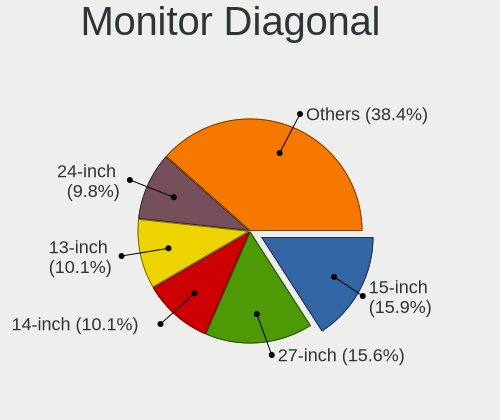

| Inches  | Computers | Percent |
|---------|-----------|---------|
| 15      | 45        | 17.58%  |
| 27      | 35        | 13.67%  |
| 13      | 27        | 10.55%  |
| 23      | 23        | 8.98%   |
| 14      | 22        | 8.59%   |
| 24      | 20        | 7.81%   |
| 21      | 18        | 7.03%   |
| 16      | 14        | 5.47%   |
| 17      | 11        | 4.3%    |
| 34      | 9         | 3.52%   |
| 31      | 9         | 3.52%   |
| 142     | 3         | 1.17%   |
| 19      | 3         | 1.17%   |
| 84      | 2         | 0.78%   |
| 48      | 2         | 0.78%   |
| 18      | 2         | 0.78%   |
| Unknown | 2         | 0.78%   |
| 74      | 1         | 0.39%   |
| 72      | 1         | 0.39%   |
| 38      | 1         | 0.39%   |
| 36      | 1         | 0.39%   |
| 32      | 1         | 0.39%   |
| 28      | 1         | 0.39%   |
| 26      | 1         | 0.39%   |
| 25      | 1         | 0.39%   |
| 7       | 1         | 0.39%   |

Monitor Width
-------------

Physical width

| Width in mm    | Computers | Percent |
|----------------|-----------|---------|
| 301-350        | 94        | 38.06%  |
| 501-600        | 67        | 27.13%  |
| 401-500        | 20        | 8.1%    |
| 201-300        | 16        | 6.48%   |
| 601-700        | 14        | 5.67%   |
| 351-400        | 12        | 4.86%   |
| 701-800        | 11        | 4.45%   |
| 1501-2000      | 4         | 1.62%   |
| More than 2000 | 3         | 1.21%   |
| 1001-1500      | 2         | 0.81%   |
| Unknown        | 2         | 0.81%   |
| 801-900        | 1         | 0.4%    |
| 101-200        | 1         | 0.4%    |

Aspect Ratio
------------

Proportional relationship between the width and the height

| Ratio   | Computers | Percent |
|---------|-----------|---------|
| 16/9    | 154       | 70%     |
| 16/10   | 34        | 15.45%  |
| 21/9    | 9         | 4.09%   |
| 3/2     | 8         | 3.64%   |
| 5/4     | 7         | 3.18%   |
| 1.00    | 3         | 1.36%   |
| 32/9    | 2         | 0.91%   |
| Unknown | 2         | 0.91%   |
| 4/3     | 1         | 0.45%   |

Monitor Area
------------

Area in inch

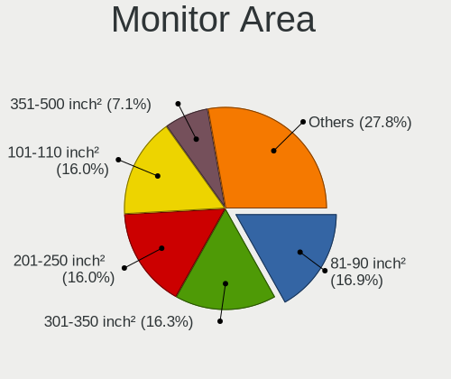

| Area in inch | Computers | Percent |
|----------------|-----------|---------|
| 201-250        | 44        | 17.6%   |
| 101-110        | 44        | 17.6%   |
| 81-90          | 41        | 16.4%   |
| 301-350        | 36        | 14.4%   |
| 351-500        | 18        | 7.2%    |
| 111-120        | 15        | 6%      |
| 251-300        | 10        | 4%      |
| 71-80          | 8         | 3.2%    |
| More than 1000 | 7         | 2.8%    |
| 151-200        | 7         | 2.8%    |
| 121-130        | 7         | 2.8%    |
| 141-150        | 6         | 2.4%    |
| 501-1000       | 4         | 1.6%    |
| Unknown        | 2         | 0.8%    |
| 1-40           | 1         | 0.4%    |

Pixel Density
-------------

Pixels per inch

| Density       | Computers | Percent |
|---------------|-----------|---------|
| 121-160       | 84        | 34.71%  |
| 51-100        | 64        | 26.45%  |
| 101-120       | 46        | 19.01%  |
| 161-240       | 34        | 14.05%  |
| More than 240 | 6         | 2.48%   |
| 1-50          | 6         | 2.48%   |
| Unknown       | 2         | 0.83%   |

Multiple Monitors
-----------------

Total monitors connected

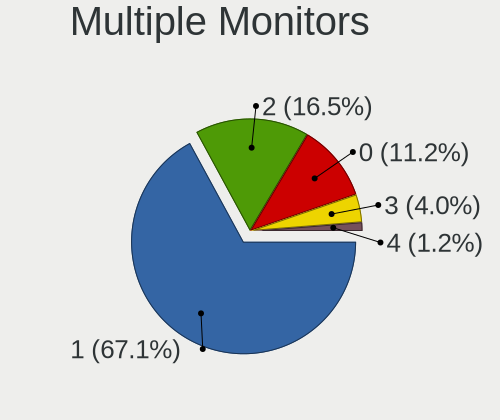

| Total | Computers | Percent |
|-------|-----------|---------|
| 1     | 160       | 68.97%  |
| 2     | 35        | 15.09%  |
| 0     | 23        | 9.91%   |
| 3     | 10        | 4.31%   |
| 4     | 4         | 1.72%   |

Network
-------

Net Controller Vendor
---------------------

Controller vendors

| Vendor                          | Computers | Percent |
|---------------------------------|-----------|---------|
| Intel                           | 134       | 40%     |
| Realtek Semiconductor           | 127       | 37.91%  |
| MediaTek                        | 28        | 8.36%   |
| Broadcom                        | 8         | 2.39%   |
| Qualcomm Atheros                | 7         | 2.09%   |
| ASIX Electronics                | 5         | 1.49%   |
| Qualcomm                        | 4         | 1.19%   |
| Ralink Technology               | 3         | 0.9%    |
| Xiaomi                          | 2         | 0.6%    |
| Samsung Electronics             | 2         | 0.6%    |
| Loongson Technology             | 2         | 0.6%    |
| Lenovo                          | 2         | 0.6%    |
| U-Blox                          | 1         | 0.3%    |
| Texas Instruments               | 1         | 0.3%    |
| Qualcomm Atheros Communications | 1         | 0.3%    |
| QinHeng Electronics             | 1         | 0.3%    |
| Prusa                           | 1         | 0.3%    |
| Nvidia                          | 1         | 0.3%    |
| NetGear                         | 1         | 0.3%    |
| Microsoft                       | 1         | 0.3%    |
| Mellanox Technologies           | 1         | 0.3%    |
| Insyde Software                 | 1         | 0.3%    |
| Huawei Technologies             | 1         | 0.3%    |

Net Controller Model
--------------------

Controller models

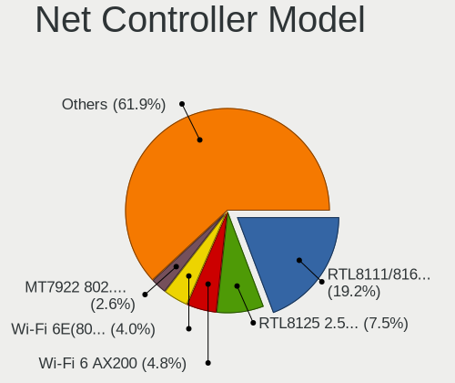

| Model                                                                  | Computers | Percent |
|------------------------------------------------------------------------|-----------|---------|
| Realtek RTL8111/8168/8211/8411 PCI Express Gigabit Ethernet Controller | 80        | 20.46%  |
| Realtek RTL8125 2.5GbE Controller                                      | 26        | 6.65%   |
| Intel Wi-Fi 6 AX200                                                    | 20        | 5.12%   |
| Intel Wi-Fi 6E(802.11ax) AX210/AX1675* 2x2 [Typhoon Peak]              | 14        | 3.58%   |
| MediaTek MT7922 802.11ax PCI Express Wireless Network Adapter          | 11        | 2.81%   |
| MediaTek MT7921 802.11ax PCI Express Wireless Network Adapter          | 10        | 2.56%   |
| Intel I211 Gigabit Network Connection                                  | 10        | 2.56%   |
| Realtek RTL8153 Gigabit Ethernet Adapter                               | 9         | 2.3%    |
| Intel Raptor Lake PCH CNVi WiFi                                        | 9         | 2.3%    |
| Intel 82579LM Gigabit Network Connection (Lewisville)                  | 8         | 2.05%   |
| Intel Ethernet Controller I225-V                                       | 7         | 1.79%   |
| Intel Alder Lake-P PCH CNVi WiFi                                       | 7         | 1.79%   |
| Intel Wireless 8265 / 8275                                             | 6         | 1.53%   |
| Realtek RTL8852BE PCIe 802.11ax Wireless Network Controller            | 5         | 1.28%   |
| Realtek RTL8821CE 802.11ac PCIe Wireless Network Adapter               | 5         | 1.28%   |
| MediaTek MT7921K (RZ608) Wi-Fi 6E 80MHz                                | 5         | 1.28%   |
| Intel Ethernet Connection (7) I219-V                                   | 5         | 1.28%   |
| ASIX AX88179 Gigabit Ethernet                                          | 5         | 1.28%   |
| Realtek USB 10/100/1G/2.5G LAN                                         | 4         | 1.02%   |
| Qualcomm QCNFA765 Wireless Network Adapter                             | 4         | 1.02%   |
| Intel I210 Gigabit Network Connection                                  | 4         | 1.02%   |
| Intel Cannon Lake PCH CNVi WiFi                                        | 4         | 1.02%   |
| Realtek RTL88x2bu [AC1200 Techkey]                                     | 3         | 0.77%   |
| Realtek RTL8852AE 802.11ax PCIe Wireless Network Adapter               | 3         | 0.77%   |
| Realtek RTL8822CE 802.11ac PCIe Wireless Network Adapter               | 3         | 0.77%   |
| Qualcomm Atheros QCA9377 802.11ac Wireless Network Adapter             | 3         | 0.77%   |
| Intel Wireless 7265                                                    | 3         | 0.77%   |
| Intel Wi-Fi 6 AX201                                                    | 3         | 0.77%   |
| Intel Tiger Lake PCH CNVi WiFi                                         | 3         | 0.77%   |
| Intel Raptor Lake-S PCH CNVi WiFi                                      | 3         | 0.77%   |
| Intel Ethernet Connection (6) I219-LM                                  | 3         | 0.77%   |
| Intel Cannon Point-LP CNVi [Wireless-AC]                               | 3         | 0.77%   |
| Intel 82579V Gigabit Network Connection                                | 3         | 0.77%   |
| Intel 82577LM Gigabit Network Connection                               | 3         | 0.77%   |
| Samsung Galaxy series, misc. (tethering mode)                          | 2         | 0.51%   |
| Realtek RTL810xE PCI Express Fast Ethernet controller                  | 2         | 0.51%   |
| Loongson Ethernet controller                                           | 2         | 0.51%   |
| Intel I350 Gigabit Network Connection                                  | 2         | 0.51%   |
| Intel Gemini Lake PCH CNVi WiFi                                        | 2         | 0.51%   |
| Intel Ethernet Controller I226-V                                       | 2         | 0.51%   |

Wireless Vendor
---------------

Wireless vendors

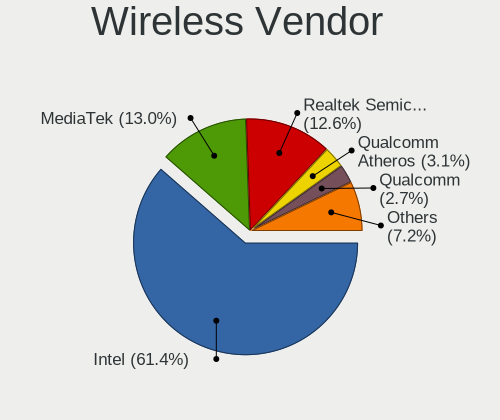

| Vendor                          | Computers | Percent |
|---------------------------------|-----------|---------|
| Intel                           | 96        | 57.14%  |
| MediaTek                        | 27        | 16.07%  |
| Realtek Semiconductor           | 26        | 15.48%  |
| Qualcomm Atheros                | 5         | 2.98%   |
| Qualcomm                        | 4         | 2.38%   |
| Broadcom                        | 4         | 2.38%   |
| Ralink Technology               | 3         | 1.79%   |
| Qualcomm Atheros Communications | 1         | 0.6%    |
| NetGear                         | 1         | 0.6%    |
| Microsoft                       | 1         | 0.6%    |

Wireless Model
--------------

Wireless models

| Model                                                          | Computers | Percent |
|----------------------------------------------------------------|-----------|---------|
| Intel Wi-Fi 6 AX200                                            | 20        | 11.83%  |
| Intel Wi-Fi 6E(802.11ax) AX210/AX1675* 2x2 [Typhoon Peak]      | 14        | 8.28%   |
| MediaTek MT7922 802.11ax PCI Express Wireless Network Adapter  | 11        | 6.51%   |
| MediaTek MT7921 802.11ax PCI Express Wireless Network Adapter  | 10        | 5.92%   |
| Intel Raptor Lake PCH CNVi WiFi                                | 9         | 5.33%   |
| Intel Alder Lake-P PCH CNVi WiFi                               | 7         | 4.14%   |
| Intel Wireless 8265 / 8275                                     | 6         | 3.55%   |
| Realtek RTL8852BE PCIe 802.11ax Wireless Network Controller    | 5         | 2.96%   |
| Realtek RTL8821CE 802.11ac PCIe Wireless Network Adapter       | 5         | 2.96%   |
| MediaTek MT7921K (RZ608) Wi-Fi 6E 80MHz                        | 5         | 2.96%   |
| Qualcomm QCNFA765 Wireless Network Adapter                     | 4         | 2.37%   |
| Intel Cannon Lake PCH CNVi WiFi                                | 4         | 2.37%   |
| Realtek RTL88x2bu [AC1200 Techkey]                             | 3         | 1.78%   |
| Realtek RTL8852AE 802.11ax PCIe Wireless Network Adapter       | 3         | 1.78%   |
| Realtek RTL8822CE 802.11ac PCIe Wireless Network Adapter       | 3         | 1.78%   |
| Qualcomm Atheros QCA9377 802.11ac Wireless Network Adapter     | 3         | 1.78%   |
| Intel Wireless 7265                                            | 3         | 1.78%   |
| Intel Wi-Fi 6 AX201                                            | 3         | 1.78%   |
| Intel Tiger Lake PCH CNVi WiFi                                 | 3         | 1.78%   |
| Intel Raptor Lake-S PCH CNVi WiFi                              | 3         | 1.78%   |
| Intel Cannon Point-LP CNVi [Wireless-AC]                       | 3         | 1.78%   |
| Intel Gemini Lake PCH CNVi WiFi                                | 2         | 1.18%   |
| Intel Dual Band Wireless-AC 3168NGW [Stone Peak]               | 2         | 1.18%   |
| Intel Comet Lake PCH-LP CNVi WiFi                              | 2         | 1.18%   |
| Intel Comet Lake PCH CNVi WiFi                                 | 2         | 1.18%   |
| Intel Centrino Ultimate-N 6300                                 | 2         | 1.18%   |
| Intel Alder Lake-S PCH CNVi WiFi                               | 2         | 1.18%   |
| Realtek RTL8852CE PCIe 802.11ax Wireless Network Controller    | 1         | 0.59%   |
| Realtek RTL8822BE 802.11a/b/g/n/ac WiFi adapter                | 1         | 0.59%   |
| Realtek RTL8723DE Wireless Network Adapter                     | 1         | 0.59%   |
| Realtek RTL8723BE PCIe Wireless Network Adapter                | 1         | 0.59%   |
| Realtek RTL8192EE PCIe Wireless Network Adapter                | 1         | 0.59%   |
| Realtek RTL8188EUS 802.11n Wireless Network Adapter            | 1         | 0.59%   |
| Realtek 802.11n WLAN Adapter                                   | 1         | 0.59%   |
| Ralink RT5572 Wireless Adapter                                 | 1         | 0.59%   |
| Ralink RT5370 Wireless Adapter                                 | 1         | 0.59%   |
| Ralink MT7601U Wireless Adapter                                | 1         | 0.59%   |
| Qualcomm Atheros AR9271 802.11n                                | 1         | 0.59%   |
| Qualcomm Atheros AR9287 Wireless Network Adapter (PCI-Express) | 1         | 0.59%   |
| Qualcomm Atheros AR9285 Wireless Network Adapter (PCI-Express) | 1         | 0.59%   |

Ethernet Vendor
---------------

Ethernet vendors

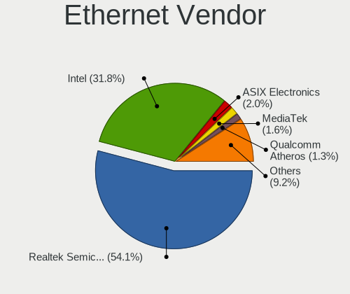

| Vendor                | Computers | Percent |
|-----------------------|-----------|---------|
| Realtek Semiconductor | 119       | 56.67%  |
| Intel                 | 67        | 31.9%   |
| ASIX Electronics      | 5         | 2.38%   |
| Broadcom              | 4         | 1.9%    |
| Xiaomi                | 2         | 0.95%   |
| Samsung Electronics   | 2         | 0.95%   |
| Qualcomm Atheros      | 2         | 0.95%   |
| Loongson Technology   | 2         | 0.95%   |
| Lenovo                | 2         | 0.95%   |
| Nvidia                | 1         | 0.48%   |
| Mellanox Technologies | 1         | 0.48%   |
| MediaTek              | 1         | 0.48%   |
| Insyde Software       | 1         | 0.48%   |
| Huawei Technologies   | 1         | 0.48%   |

Ethernet Model
--------------

Ethernet models

| Model                                                                         | Computers | Percent |
|-------------------------------------------------------------------------------|-----------|---------|
| Realtek RTL8111/8168/8211/8411 PCI Express Gigabit Ethernet Controller        | 80        | 36.7%   |
| Realtek RTL8125 2.5GbE Controller                                             | 26        | 11.93%  |
| Intel I211 Gigabit Network Connection                                         | 10        | 4.59%   |
| Realtek RTL8153 Gigabit Ethernet Adapter                                      | 9         | 4.13%   |
| Intel 82579LM Gigabit Network Connection (Lewisville)                         | 8         | 3.67%   |
| Intel Ethernet Controller I225-V                                              | 7         | 3.21%   |
| Intel Ethernet Connection (7) I219-V                                          | 5         | 2.29%   |
| ASIX AX88179 Gigabit Ethernet                                                 | 5         | 2.29%   |
| Realtek USB 10/100/1G/2.5G LAN                                                | 4         | 1.83%   |
| Intel I210 Gigabit Network Connection                                         | 4         | 1.83%   |
| Intel Ethernet Connection (6) I219-LM                                         | 3         | 1.38%   |
| Intel 82579V Gigabit Network Connection                                       | 3         | 1.38%   |
| Intel 82577LM Gigabit Network Connection                                      | 3         | 1.38%   |
| Samsung Galaxy series, misc. (tethering mode)                                 | 2         | 0.92%   |
| Realtek RTL810xE PCI Express Fast Ethernet controller                         | 2         | 0.92%   |
| Loongson Ethernet controller                                                  | 2         | 0.92%   |
| Intel I350 Gigabit Network Connection                                         | 2         | 0.92%   |
| Intel Ethernet Controller I226-V                                              | 2         | 0.92%   |
| Intel Ethernet Connection I217-LM                                             | 2         | 0.92%   |
| Intel Ethernet Connection (2) I219-V                                          | 2         | 0.92%   |
| Intel Ethernet Connection (16) I219-V                                         | 2         | 0.92%   |
| Intel 82571EB/82571GB Gigabit Ethernet Controller D0/D1 (copper applications) | 2         | 0.92%   |
| Xiaomi Mi/Redmi series (RNDIS)                                                | 1         | 0.46%   |
| Xiaomi Mi/Redmi series (RNDIS + ADB)                                          | 1         | 0.46%   |
| Realtek RTL8169 PCI Gigabit Ethernet Controller                               | 1         | 0.46%   |
| Realtek RTL8111/8168/8411 PCI Express Gigabit Ethernet Controller             | 1         | 0.46%   |
| Realtek RTL-8100/8101L/8139 PCI Fast Ethernet Adapter                         | 1         | 0.46%   |
| Realtek Killer E3000 2.5GbE Controller                                        | 1         | 0.46%   |
| Qualcomm Atheros QCA8171 Gigabit Ethernet                                     | 1         | 0.46%   |
| Qualcomm Atheros AR8151 v2.0 Gigabit Ethernet                                 | 1         | 0.46%   |
| Nvidia MCP61 Ethernet                                                         | 1         | 0.46%   |
| Mellanox MT27500 Family [ConnectX-3]                                          | 1         | 0.46%   |
| MediaTek File-CD Gadget                                                       | 1         | 0.46%   |
| Lenovo USB-C Dock Ethernet                                                    | 1         | 0.46%   |
| Lenovo ThinkPad TBT 3 Dock                                                    | 1         | 0.46%   |
| Intel Ethernet Controller X710 for 10GbE SFP+                                 | 1         | 0.46%   |
| Intel Ethernet Controller X550                                                | 1         | 0.46%   |
| Intel Ethernet Controller 10-Gigabit X540-AT2                                 | 1         | 0.46%   |
| Intel Ethernet Connection I219-V                                              | 1         | 0.46%   |
| Intel Ethernet Connection I217-V                                              | 1         | 0.46%   |

Net Controller Kind
-------------------

Ethernet, WiFi or modem

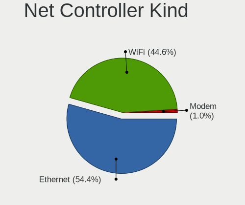

| Kind     | Computers | Percent |
|----------|-----------|---------|
| Ethernet | 184       | 52.27%  |
| WiFi     | 164       | 46.59%  |
| Modem    | 4         | 1.14%   |

Used Controller
---------------

Currently used network controller

| Kind     | Computers | Percent |
|----------|-----------|---------|
| WiFi     | 118       | 52.21%  |
| Ethernet | 108       | 47.79%  |

NICs
----

Total network controllers on board

| Total | Computers | Percent |
|-------|-----------|---------|
| 2     | 113       | 50%     |
| 1     | 91        | 40.27%  |
| 3     | 9         | 3.98%   |
| 0     | 6         | 2.65%   |
| 4     | 5         | 2.21%   |
| 7     | 1         | 0.44%   |
| 5     | 1         | 0.44%   |

IPv6
----

IPv6 vs IPv4

| Used | Computers | Percent |
|------|-----------|---------|
| No   | 160       | 69.57%  |
| Yes  | 70        | 30.43%  |

Bluetooth
---------

Bluetooth Vendor
----------------

Controller vendors

| Vendor                  | Computers | Percent |
|-------------------------|-----------|---------|
| Intel                   | 84        | 54.9%   |
| Realtek Semiconductor   | 16        | 10.46%  |
| IMC Networks            | 11        | 7.19%   |
| MediaTek                | 10        | 6.54%   |
| Foxconn / Hon Hai       | 9         | 5.88%   |
| Cambridge Silicon Radio | 7         | 4.58%   |
| Lite-On Technology      | 4         | 2.61%   |
| USI                     | 3         | 1.96%   |
| Broadcom                | 3         | 1.96%   |
| Realtek                 | 1         | 0.65%   |
| Foxconn International   | 1         | 0.65%   |
| Edimax Technology       | 1         | 0.65%   |
| Dell                    | 1         | 0.65%   |
| Apple                   | 1         | 0.65%   |
| Actions                 | 1         | 0.65%   |

Bluetooth Model
---------------

Controller models

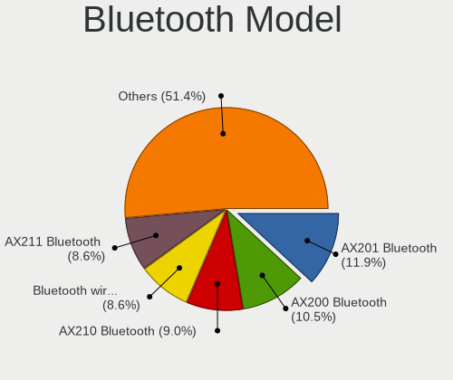

| Model                                               | Computers | Percent |
|-----------------------------------------------------|-----------|---------|
| Intel AX200 Bluetooth                               | 17        | 11.11%  |
| Intel Bluetooth Device                              | 15        | 9.8%    |
| Realtek Bluetooth Radio                             | 13        | 8.5%    |
| Intel AX210 Bluetooth                               | 13        | 8.5%    |
| Intel AX201 Bluetooth                               | 13        | 8.5%    |
| Intel Bluetooth 9460/9560 Jefferson Peak (JfP)      | 12        | 7.84%   |
| Intel Bluetooth wireless interface                  | 11        | 7.19%   |
| MediaTek Wireless_Device                            | 10        | 6.54%   |
| Foxconn / Hon Hai Wireless_Device                   | 8         | 5.23%   |
| Cambridge Silicon Radio Bluetooth Dongle (HCI mode) | 7         | 4.58%   |
| IMC Networks Wireless_Device                        | 4         | 2.61%   |
| IMC Networks Bluetooth Radio                        | 4         | 2.61%   |
| USI Bluetooth Device                                | 3         | 1.96%   |
| Realtek  Bluetooth 4.2 Adapter                      | 3         | 1.96%   |
| Lite-On Wireless_Device                             | 3         | 1.96%   |
| IMC Networks Bluetooth Device                       | 2         | 1.31%   |
| Broadcom BCM2045B (BDC-2.1)                         | 2         | 1.31%   |
| Realtek Bluetooth Radio                             | 1         | 0.65%   |
| Lite-On Bluetooth Device                            | 1         | 0.65%   |
| Intel Wireless-AC 9260 Bluetooth Adapter            | 1         | 0.65%   |
| Intel Wireless-AC 3168 Bluetooth                    | 1         | 0.65%   |
| Intel Centrino Bluetooth Wireless Transceiver       | 1         | 0.65%   |
| IMC Networks BCM20702A0                             | 1         | 0.65%   |
| Foxconn International BCM43142A0 Bluetooth module   | 1         | 0.65%   |
| Foxconn / Hon Hai MediaTek MT7921 Bluetooth         | 1         | 0.65%   |
| Edimax Bluetooth Adapter                            | 1         | 0.65%   |
| Dell DW375 Bluetooth Module                         | 1         | 0.65%   |
| Broadcom BCM20702A0 Bluetooth 4.0                   | 1         | 0.65%   |
| Apple Bluetooth Host Controller                     | 1         | 0.65%   |
| Actions general adapter                             | 1         | 0.65%   |

Sound
-----

Sound Vendor
------------

Sound card vendors

| Vendor                                       | Computers | Percent |
|----------------------------------------------|-----------|---------|
| AMD                                          | 117       | 32.77%  |
| Intel                                        | 109       | 30.53%  |
| Nvidia                                       | 59        | 16.53%  |
| C-Media Electronics                          | 8         | 2.24%   |
| SteelSeries ApS                              | 5         | 1.4%    |
| Micro Star International                     | 5         | 1.4%    |
| Logitech                                     | 5         | 1.4%    |
| Kingston Technology                          | 5         | 1.4%    |
| Plantronics                                  | 4         | 1.12%   |
| ASUSTek Computer                             | 4         | 1.12%   |
| Hewlett-Packard                              | 3         | 0.84%   |
| Texas Instruments                            | 2         | 0.56%   |
| Realtek Semiconductor                        | 2         | 0.56%   |
| Razer USA                                    | 2         | 0.56%   |
| Loongson Technology                          | 2         | 0.56%   |
| Lenovo                                       | 2         | 0.56%   |
| JMTek                                        | 2         | 0.56%   |
| JBL                                          | 2         | 0.56%   |
| GN Netcom                                    | 2         | 0.56%   |
| Creative Technology                          | 2         | 0.56%   |
| Zoran Co. Personal Media Division (Nogatech) | 1         | 0.28%   |
| Thesycon Systemsoftware & Consulting         | 1         | 0.28%   |
| No brand                                     | 1         | 0.28%   |
| Microsoft                                    | 1         | 0.28%   |
| Mark of the Unicorn                          | 1         | 0.28%   |
| M-Audio                                      | 1         | 0.28%   |
| JOUNIVO                                      | 1         | 0.28%   |
| iCreate Technologies                         | 1         | 0.28%   |
| Huawei Technologies                          | 1         | 0.28%   |
| Generalplus Technology                       | 1         | 0.28%   |
| FIFINE Microphones                           | 1         | 0.28%   |
| Conexant Systems                             | 1         | 0.28%   |
| Audient                                      | 1         | 0.28%   |
| AKG C44-USB Microphone                       | 1         | 0.28%   |
| Unknown                                      | 1         | 0.28%   |

Sound Model
-----------

Sound card models

| Model                                                                      | Computers | Percent |
|----------------------------------------------------------------------------|-----------|---------|
| AMD Family 17h/19h HD Audio Controller                                     | 59        | 13.17%  |
| AMD Renoir Radeon High Definition Audio Controller                         | 29        | 6.47%   |
| AMD Starship/Matisse HD Audio Controller                                   | 27        | 6.03%   |
| AMD Rembrandt Radeon High Definition Audio Controller                      | 21        | 4.69%   |
| AMD Navi 21/23 HDMI/DP Audio Controller                                    | 20        | 4.46%   |
| Nvidia Audio device                                                        | 16        | 3.57%   |
| Intel Raptor Lake-P/U/H cAVS                                               | 14        | 3.13%   |
| AMD Ellesmere HDMI Audio [Radeon RX 470/480 / 570/580/590]                 | 13        | 2.9%    |
| Nvidia GA104 High Definition Audio Controller                              | 12        | 2.68%   |
| Intel Cannon Lake PCH cAVS                                                 | 9         | 2.01%   |
| Intel Sunrise Point-LP HD Audio                                            | 8         | 1.79%   |
| Intel Alder Lake PCH-P High Definition Audio Controller                    | 8         | 1.79%   |
| Intel Tiger Lake-LP Smart Sound Technology Audio Controller                | 7         | 1.56%   |
| Intel 8 Series/C220 Series Chipset High Definition Audio Controller        | 7         | 1.56%   |
| Intel Tiger Lake-H HD Audio Controller                                     | 6         | 1.34%   |
| Intel Alder Lake-S HD Audio Controller                                     | 6         | 1.34%   |
| AMD Raven/Raven2/Fenghuang HDMI/DP Audio Controller                        | 6         | 1.34%   |
| Nvidia GP107GL High Definition Audio Controller                            | 5         | 1.12%   |
| Micro Star International USB Audio                                         | 5         | 1.12%   |
| Intel 7 Series/C216 Chipset Family High Definition Audio Controller        | 5         | 1.12%   |
| AMD Navi 10 HDMI Audio                                                     | 5         | 1.12%   |
| Nvidia GA106 High Definition Audio Controller                              | 4         | 0.89%   |
| Intel Celeron/Pentium Silver Processor High Definition Audio               | 4         | 0.89%   |
| Intel Cannon Point-LP High Definition Audio Controller                     | 4         | 0.89%   |
| Intel C600/X79 series chipset High Definition Audio Controller             | 4         | 0.89%   |
| Intel 6 Series/C200 Series Chipset Family High Definition Audio Controller | 4         | 0.89%   |
| Intel 200 Series PCH HD Audio                                              | 4         | 0.89%   |
| AMD SBx00 Azalia (Intel HDA)                                               | 4         | 0.89%   |
| AMD Family 17h (Models 00h-0fh) HD Audio Controller                        | 4         | 0.89%   |
| AMD Baffin HDMI/DP Audio [Radeon RX 550 640SP / RX 560/560X]               | 4         | 0.89%   |
| Nvidia GK106 HDMI Audio Controller                                         | 3         | 0.67%   |
| Nvidia GA102 High Definition Audio Controller                              | 3         | 0.67%   |
| Intel Raptor Lake High Definition Audio Controller                         | 3         | 0.67%   |
| Intel 5 Series/3400 Series Chipset High Definition Audio                   | 3         | 0.67%   |
| C-Media Electronics USB Advanced Audio Device                              | 3         | 0.67%   |
| ASUSTek Computer USB Audio                                                 | 3         | 0.67%   |
| Nvidia TU106 High Definition Audio Controller                              | 2         | 0.45%   |
| Nvidia GP106 High Definition Audio Controller                              | 2         | 0.45%   |
| Nvidia GF119 HDMI Audio Controller                                         | 2         | 0.45%   |
| Loongson Technology HDA (High Definition Audio) Controller                 | 2         | 0.45%   |

Memory
------

Memory Vendor
-------------

Memory module vendors

| Vendor                       | Computers | Percent |
|------------------------------|-----------|---------|
| Samsung Electronics          | 50        | 20.58%  |
| Micron Technology            | 29        | 11.93%  |
| SK hynix                     | 28        | 11.52%  |
| Kingston                     | 28        | 11.52%  |
| Crucial                      | 24        | 9.88%   |
| Corsair                      | 21        | 8.64%   |
| G.Skill                      | 20        | 8.23%   |
| A-DATA Technology            | 8         | 3.29%   |
| Unknown                      | 7         | 2.88%   |
| Unknown                      | 7         | 2.88%   |
| Elpida                       | 4         | 1.65%   |
| Unknown (ABCD)               | 3         | 1.23%   |
| Team                         | 2         | 0.82%   |
| Ramaxel Technology           | 2         | 0.82%   |
| Patriot                      | 2         | 0.82%   |
| Unknown (0x0B92)             | 1         | 0.41%   |
| Transcend                    | 1         | 0.41%   |
| Patriot Memory (PDP Systems) | 1         | 0.41%   |
| Mushkin                      | 1         | 0.41%   |
| Kimtigo                      | 1         | 0.41%   |
| Foxline                      | 1         | 0.41%   |
| CSX                          | 1         | 0.41%   |
| Apacer                       | 1         | 0.41%   |

Memory Model
------------

Memory module models

| Model                                                               | Computers | Percent |
|---------------------------------------------------------------------|-----------|---------|
| Unknown                                                             | 7         | 2.65%   |
| Samsung RAM M471A5244CB0-CTD 4096MB SODIMM DDR4 3266MT/s            | 5         | 1.89%   |
| Samsung RAM M471A1G44BB0-CWE 8GB SODIMM DDR4 3200MT/s               | 4         | 1.52%   |
| Unknown (ABCD) RAM 123456789012345678 2048MB SODIMM LPDDR4 2400MT/s | 3         | 1.14%   |
| SK hynix RAM HMAA1GS6CJR6N-XN 8GB SODIMM DDR4 3200MT/s              | 3         | 1.14%   |
| Samsung RAM M471A1K43EB1-CWE 8GB SODIMM DDR4 3200MT/s               | 3         | 1.14%   |
| Crucial RAM CT16G4SFRA32A.C8FE 16GB SODIMM DDR4 3200MT/s            | 3         | 1.14%   |
| Corsair RAM CMK16GX4M2B3200C16 8GB DIMM DDR4 3600MT/s               | 3         | 1.14%   |
| Unknown RAM Module 2GB DIMM DDR2 667MT/s                            | 2         | 0.76%   |
| SK hynix RAM Module 8GB SODIMM DDR4 2400MT/s                        | 2         | 0.76%   |
| SK hynix RAM Module 4GB SODIMM DDR4 2400MT/s                        | 2         | 0.76%   |
| SK hynix RAM HMT451S6AFR8A-PB 4GB SODIMM DDR3 1600MT/s              | 2         | 0.76%   |
| Samsung RAM M471B5273DH0-CH9 4GB SODIMM DDR3 1334MT/s               | 2         | 0.76%   |
| Samsung RAM M471B1G73QH0-YK0 8GB SODIMM DDR3 1600MT/s               | 2         | 0.76%   |
| Samsung RAM M471A5244CB0-CWE 4GB SODIMM DDR4 3200MT/s               | 2         | 0.76%   |
| Samsung RAM M471A2K43DB1-CTD 16GB SODIMM DDR4 2667MT/s              | 2         | 0.76%   |
| Samsung RAM M471A1G44BB0-CWE 8192MB Row Of Chips DDR4 3200MT/s      | 2         | 0.76%   |
| Samsung RAM M471A1G44AB0-CWE 8GB SODIMM DDR4 3200MT/s               | 2         | 0.76%   |
| Samsung RAM M425R1GB4BB0-CQKOL 8GB SODIMM DDR5 4800MT/s             | 2         | 0.76%   |
| Micron RAM MTC4C10163S1SC48BA1 8GB SODIMM DDR5 4800MT/s             | 2         | 0.76%   |
| Micron RAM MT62F2G32D8DR-031 WT 8GB SODIMM LPDDR5 6400MT/s          | 2         | 0.76%   |
| Micron RAM MT62F1G32D4DR-031 WT 4GB Row Of Chips LPDDR5 6400MT/s    | 2         | 0.76%   |
| Micron RAM 8ATF1G64HZ-3G2R1 8GB SODIMM DDR4 3200MT/s                | 2         | 0.76%   |
| Micron RAM 4ATF1G64HZ-3G2F1 8GB SODIMM DDR4 3200MT/s                | 2         | 0.76%   |
| Kingston RAM KF556S40-32 32GB SODIMM DDR5 5600MT/s                  | 2         | 0.76%   |
| Kingston RAM KF556C36-32 32GB DIMM DDR5 5600MT/s                    | 2         | 0.76%   |
| Kingston RAM KF3200C16D4/16GX 16GB DIMM DDR4 3200MT/s               | 2         | 0.76%   |
| G.Skill RAM F4-3600C18-32GVK 32GB DIMM DDR4 3600MT/s                | 2         | 0.76%   |
| G.Skill RAM F4-3200C16-8GVKB 8GB DIMM DDR4 3866MT/s                 | 2         | 0.76%   |
| G.Skill RAM F4-3200C16-16GVK 16GB DIMM DDR4 3600MT/s                | 2         | 0.76%   |
| Elpida RAM EBJ41UF8BCS0-DJ-F 4GB SODIMM DDR3 1334MT/s               | 2         | 0.76%   |
| Crucial RAM CT16G4SFRA32A.M16FR 16GB SODIMM DDR4 3200MT/s           | 2         | 0.76%   |
| Crucial RAM CT102464BF160B.C16 8GB SODIMM DDR3 1600MT/s             | 2         | 0.76%   |
| Corsair RAM CMK16GX4M2Z3200C16 8GB DIMM DDR4 3200MT/s               | 2         | 0.76%   |
| Unknown RAM Module 8GB SODIMM DDR4 2667MT/s                         | 1         | 0.38%   |
| Unknown RAM Module 8GB DIMM 1600MT/s                                | 1         | 0.38%   |
| Unknown RAM Module 4GB DIMM DDR3 1333MT/s                           | 1         | 0.38%   |
| Unknown RAM Module 2GB SODIMM DDR2 800MT/s                          | 1         | 0.38%   |
| Unknown RAM Module 16GB DIMM DDR4 2400MT/s                          | 1         | 0.38%   |
| Unknown (0x0B92) RAM Module 8GB DIMM DDR4 3400MT/s                  | 1         | 0.38%   |

Memory Kind
-----------

Memory module kinds

| Kind    | Computers | Percent |
|---------|-----------|---------|
| DDR4    | 130       | 61.9%   |
| DDR3    | 28        | 13.33%  |
| DDR5    | 27        | 12.86%  |
| LPDDR5  | 11        | 5.24%   |
| LPDDR4  | 7         | 3.33%   |
| DDR2    | 5         | 2.38%   |
| LPDDR3  | 1         | 0.48%   |
| Unknown | 1         | 0.48%   |

Memory Form Factor
------------------

Physical design of the memory module

| Name         | Computers | Percent |
|--------------|-----------|---------|
| SODIMM       | 105       | 50%     |
| DIMM         | 91        | 43.33%  |
| Row Of Chips | 14        | 6.67%   |

Memory Size
-----------

Memory module size

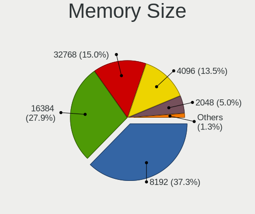

| Size  | Computers | Percent |
|-------|-----------|---------|
| 8192  | 91        | 39.06%  |
| 16384 | 64        | 27.47%  |
| 32768 | 35        | 15.02%  |
| 4096  | 31        | 13.3%   |
| 2048  | 10        | 4.29%   |
| 49152 | 1         | 0.43%   |
| 1024  | 1         | 0.43%   |

Memory Speed
------------

Memory module speed

| Speed | Computers | Percent |
|-------|-----------|---------|
| 3200  | 66        | 27.97%  |
| 2667  | 21        | 8.9%    |
| 1600  | 19        | 8.05%   |
| 2400  | 16        | 6.78%   |
| 3600  | 15        | 6.36%   |
| 5600  | 13        | 5.51%   |
| 4800  | 12        | 5.08%   |
| 6400  | 10        | 4.24%   |
| 2133  | 7         | 2.97%   |
| 3266  | 5         | 2.12%   |
| 1866  | 4         | 1.69%   |
| 1333  | 4         | 1.69%   |
| 667   | 4         | 1.69%   |
| 3733  | 3         | 1.27%   |
| 1334  | 3         | 1.27%   |
| 6000  | 2         | 0.85%   |
| 4267  | 2         | 0.85%   |
| 4266  | 2         | 0.85%   |
| 4000  | 2         | 0.85%   |
| 3866  | 2         | 0.85%   |
| 3400  | 2         | 0.85%   |
| 3000  | 2         | 0.85%   |
| 2933  | 2         | 0.85%   |
| 2666  | 2         | 0.85%   |
| 800   | 2         | 0.85%   |
| 49926 | 1         | 0.42%   |
| 8400  | 1         | 0.42%   |
| 7500  | 1         | 0.42%   |
| 5200  | 1         | 0.42%   |
| 3800  | 1         | 0.42%   |
| 3666  | 1         | 0.42%   |
| 3534  | 1         | 0.42%   |
| 3500  | 1         | 0.42%   |
| 3466  | 1         | 0.42%   |
| 3333  | 1         | 0.42%   |
| 3066  | 1         | 0.42%   |
| 2800  | 1         | 0.42%   |
| 2134  | 1         | 0.42%   |
| 1800  | 1         | 0.42%   |

Printers & scanners
-------------------

Printer Vendor
--------------

Printer device vendors

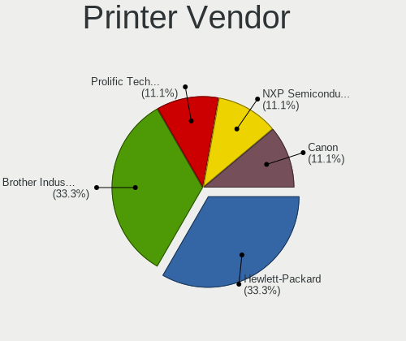

| Vendor             | Computers | Percent |
|--------------------|-----------|---------|
| Hewlett-Packard    | 3         | 50%     |
| Brother Industries | 2         | 33.33%  |
| Canon              | 1         | 16.67%  |

Printer Model
-------------

Printer device models

| Model                        | Computers | Percent |
|------------------------------|-----------|---------|
| HP HP LaserJet M14-M17       | 2         | 33.33%  |
| HP Deskjet 9800              | 1         | 16.67%  |
| Canon PIXMA MG2900 Series    | 1         | 16.67%  |
| Brother QL-500 label printer | 1         | 16.67%  |
| Brother MFC-9340CDW          | 1         | 16.67%  |

Scanner Vendor
--------------

Scanner device vendors

Zero info for selected period =(

Scanner Model
-------------

Scanner device models

Zero info for selected period =(

Camera
------

Camera Vendor
-------------

Camera device vendors

| Vendor                                 | Computers | Percent |
|----------------------------------------|-----------|---------|
| Chicony Electronics                    | 25        | 20.33%  |
| IMC Networks                           | 18        | 14.63%  |
| Logitech                               | 12        | 9.76%   |
| Microdia                               | 9         | 7.32%   |
| Realtek Semiconductor                  | 8         | 6.5%    |
| Quanta                                 | 7         | 5.69%   |
| Bison Electronics                      | 7         | 5.69%   |
| Luxvisions Innotech Limited            | 6         | 4.88%   |
| Sonix Technology                       | 4         | 3.25%   |
| Lite-On Technology                     | 4         | 3.25%   |
| Sunplus Innovation Technology          | 3         | 2.44%   |
| Syntek                                 | 2         | 1.63%   |
| Samsung Electronics                    | 2         | 1.63%   |
| Hy-UXGA(B5M2)-Camera                   | 2         | 1.63%   |
| Cheng Uei Precision Industry (Foxlink) | 2         | 1.63%   |
| Silicon Motion                         | 1         | 0.81%   |
| Ricoh                                  | 1         | 0.81%   |
| Microsoft                              | 1         | 0.81%   |
| Lenovo                                 | 1         | 0.81%   |
| kingcome                               | 1         | 0.81%   |
| Goodong                                | 1         | 0.81%   |
| Generalplus Technology                 | 1         | 0.81%   |
| Elgato Systems                         | 1         | 0.81%   |
| Arkmicro Technologies                  | 1         | 0.81%   |
| ARC International                      | 1         | 0.81%   |
| Acer                                   | 1         | 0.81%   |
| A4Tech                                 | 1         | 0.81%   |

Camera Model
------------

Camera device models

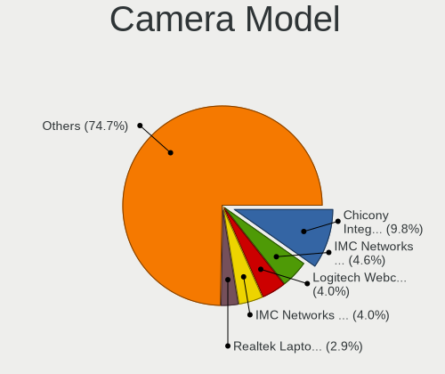

| Model                                                | Computers | Percent |
|------------------------------------------------------|-----------|---------|
| Chicony Integrated Camera                            | 13        | 10.48%  |
| Logitech Webcam C270                                 | 6         | 4.84%   |
| IMC Networks USB2.0 HD UVC WebCam                    | 6         | 4.84%   |
| Realtek Laptop Camera                                | 5         | 4.03%   |
| Lite-On HP HD Camera                                 | 4         | 3.23%   |
| IMC Networks Integrated Camera                       | 4         | 3.23%   |
| Quanta HD User Facing                                | 3         | 2.42%   |
| Microdia USB 2.0 Camera                              | 3         | 2.42%   |
| Microdia Integrated_Webcam_HD                        | 3         | 2.42%   |
| Bison Integrated Camera                              | 3         | 2.42%   |
| Syntek Integrated Camera                             | 2         | 1.61%   |
| Sonix USB2.0 HD UVC WebCam                           | 2         | 1.61%   |
| Sonix USB2.0 FHD UVC WebCam                          | 2         | 1.61%   |
| Samsung Galaxy series, misc. (MTP mode)              | 2         | 1.61%   |
| Quanta HP TrueVision HD Camera                       | 2         | 1.61%   |
| Luxvisions Innotech Limited HP Wide Vision HD Camera | 2         | 1.61%   |
| Luxvisions Innotech Limited HP HD Camera             | 2         | 1.61%   |
| Logitech C922 Pro Stream Webcam                      | 2         | 1.61%   |
| IMC Networks USB2.0 VGA UVC WebCam                   | 2         | 1.61%   |
| Hy-UXGA(B5M2)-Camera Hy-UXGA(B5M2)-Camera            | 2         | 1.61%   |
| Chicony HP Wide Vision HD Camera                     | 2         | 1.61%   |
| Chicony HP HD Camera                                 | 2         | 1.61%   |
| Chicony HP 720p HD Monitor Webcam                    | 2         | 1.61%   |
| Chicony HD User Facing                               | 2         | 1.61%   |
| Bison HD Webcam                                      | 2         | 1.61%   |
| Sunplus XiaoMi USB 2.0 Webcam                        | 1         | 0.81%   |
| Sunplus USB 2.0 Camera                               | 1         | 0.81%   |
| Sunplus Integrated_Webcam_FHD                        | 1         | 0.81%   |
| Silicon Motion 300k Pixel Camera                     | 1         | 0.81%   |
| Ricoh HD Webcam                                      | 1         | 0.81%   |
| Realtek Lenovo EasyCamera                            | 1         | 0.81%   |
| Realtek Integrated_Webcam_FHD                        | 1         | 0.81%   |
| Realtek Bluetooth Radio                              | 1         | 0.81%   |
| Quanta USB2.0 HD UVC WebCam                          | 1         | 0.81%   |
| Quanta HP Wide Vision HD Camera                      | 1         | 0.81%   |
| Microsoft LifeCam Cinema                             | 1         | 0.81%   |
| Microdia Webcam Vitade AF                            | 1         | 0.81%   |
| Microdia Laptop_Integrated_Webcam_HD                 | 1         | 0.81%   |
| Microdia Integrated_Webcam_FHD                       | 1         | 0.81%   |
| Luxvisions Innotech Limited Integrated Camera        | 1         | 0.81%   |

Security
--------

Fingerprint Vendor
------------------

Fingerprint sensor vendors

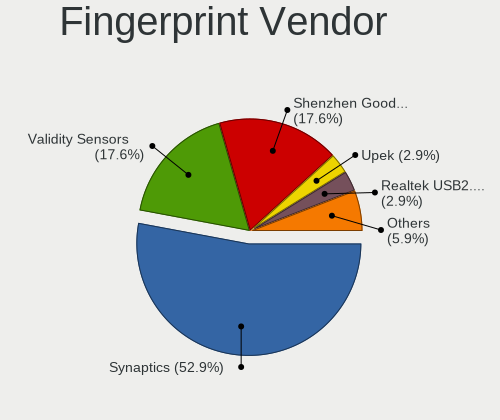

| Vendor                             | Computers | Percent |
|------------------------------------|-----------|---------|
| Synaptics                          | 10        | 50%     |
| Shenzhen Goodix Technology         | 5         | 25%     |
| Validity Sensors                   | 3         | 15%     |
| Realtek USB2.0 Finger Print Bridge | 1         | 5%      |
| Elan Microelectronics              | 1         | 5%      |

Fingerprint Model
-----------------

Fingerprint sensor models

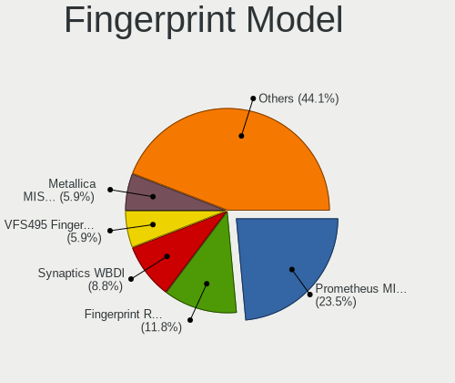

| Model                                                                      | Computers | Percent |
|----------------------------------------------------------------------------|-----------|---------|
| Synaptics Prometheus MIS Touch Fingerprint Reader                          | 6         | 30%     |
| Shenzhen Goodix Fingerprint Reader                                         | 3         | 15%     |
| Validity Sensors VFS495 Fingerprint Reader                                 | 2         | 10%     |
| Synaptics FS7604 Touch Fingerprint Sensor with PurePrint                   | 2         | 10%     |
| Shenzhen Goodix  Fingerprint Device                                        | 2         | 10%     |
| Validity Sensors Synaptics VFS7552 Touch Fingerprint Sensor with PurePrint | 1         | 5%      |
| Synaptics  FS7604 Touch Fingerprint Sensor with PurePrint                  | 1         | 5%      |
| Synaptics Fingerprint reader [HP G6]                                       | 1         | 5%      |
| Realtek USB2.0 Finger Print Bridge FocalTech Fingerprint Device            | 1         | 5%      |
| Elan ELAN:Fingerprint                                                      | 1         | 5%      |

Chipcard Vendor
---------------

Chipcard module vendors

| Vendor      | Computers | Percent |
|-------------|-----------|---------|
| Alcor Micro | 5         | 41.67%  |
| Broadcom    | 4         | 33.33%  |
| OmniKey     | 1         | 8.33%   |
| O2 Micro    | 1         | 8.33%   |
| Lenovo      | 1         | 8.33%   |

Chipcard Model
--------------

Chipcard module models

| Model                                          | Computers | Percent |
|------------------------------------------------|-----------|---------|
| Alcor Micro AU9540 Smartcard Reader            | 5         | 41.67%  |
| Broadcom BCM5880 Secure Applications Processor | 2         | 16.67%  |
| Broadcom 58200                                 | 2         | 16.67%  |
| OmniKey CardMan 3021 / 3121                    | 1         | 8.33%   |
| O2 Micro OZ776 CCID Smartcard Reader           | 1         | 8.33%   |
| Lenovo Integrated Smart Card Reader            | 1         | 8.33%   |

Unsupported
-----------

Unsupported Devices
-------------------

Total unsupported devices on board

| Total | Computers | Percent |
|-------|-----------|---------|
| 0     | 121       | 50.84%  |
| 1     | 55        | 23.11%  |
| 2     | 26        | 10.92%  |
| 3     | 19        | 7.98%   |
| 5     | 9         | 3.78%   |
| 4     | 6         | 2.52%   |
| 6     | 2         | 0.84%   |

Unsupported Device Types
------------------------

Types of unsupported devices

| Type                     | Computers | Percent |
|--------------------------|-----------|---------|
| Graphics card            | 37        | 17.37%  |
| Communication controller | 35        | 16.43%  |
| Bluetooth                | 26        | 12.21%  |
| Fingerprint reader       | 20        | 9.39%   |
| Net/wireless             | 19        | 8.92%   |
| Multimedia controller    | 16        | 7.51%   |
| Camera                   | 16        | 7.51%   |
| Chipcard                 | 12        | 5.63%   |
| Sound                    | 5         | 2.35%   |
| Network                  | 5         | 2.35%   |
| Net/ethernet             | 5         | 2.35%   |
| Storage/ide              | 4         | 1.88%   |
| Card reader              | 4         | 1.88%   |
| Firewire controller      | 3         | 1.41%   |
| Unassigned class         | 2         | 0.94%   |
| Storage/ata              | 2         | 0.94%   |
| Storage/raid             | 1         | 0.47%   |
| Storage/nvme             | 1         | 0.47%   |

